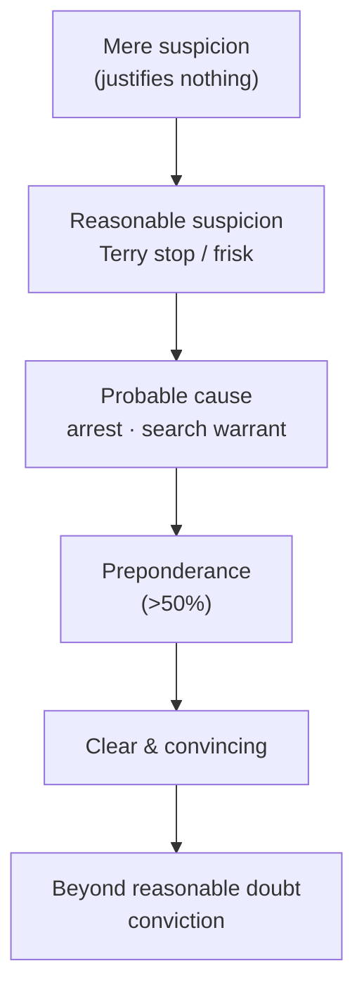
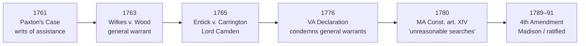

# S9 R1 panel-review — Opus model-diversity lane (prompt pack)

You are the **Claude/Opus** leg of the S9 three-lane adversarial panel (1 Claude + 2 Codex, R1). The two Codex lanes carry the A (support/quote-fidelity) and B (currency/treatment) attack lenses; **you carry model diversity and MUST vote on every paneled assertion across BOTH lenses' concerns.** You are refute-framed: try hard to break each assertion; **default to REFUTED on uncertainty**; never fabricate a cite, quote, or holding; use ONLY the evidence inlined below (no search, no outside knowledge). You are a SIGHTED reviewer — the FULL lake record (judgment fields included) is inlined.

You are a WRITER lane, not an adjudicator: you FIND and VOTE. You do not tally, adjudicate, or close any row — the orchestrator does.

For EACH group below, return one JSON object with the exact `reviewed[]` shape from the output contract (identical framing to the Codex lenses). Emit a finding object ONLY for a real defect (verdict refuted / stands-modified); a group you find wholly clean returns all-`stands` verdicts (the harness records a clean attestation). Concatenate the per-group JSON objects into a top-level `{"packs": [ ... ]}` array, one entry per group, each carrying its `group_id`.


OUTPUT CONTRACT — return ONE JSON object, nothing else:
{
  "lens": "A" | "B",
  "group_id": "<echo the group id>",
  "reviewed": [
    {
      "assertion_id": "<from group_inventory.jsonl>",
      "dimension": "existence|support|quote_fidelity|pincite|treatment|black_letter",
      "verdict": "stands" | "refuted" | "stands-modified",
      "verifiable_from_disclosed": true | false,
      "defect": null,   // null when verdict=="stands"; else an object:
      //  {"problem": "...", "severity": "high|medium|low", "proposed_fix": "...", "evidence_quote": "verbatim from disclosed evidence or null", "needs_cl": true|false, "locator_note": "..."}
      "reasons": ["short evidence-grounded reason", "..."],
      "breaks_true_positives": true | false,
      "residual_risks": ["..."],
      "suggested_tightening": "... or null"
    }
  ],
  "notes": ""
}
Rules: verdict=='stands' <=> defect==null (assertion survives your attack). verdict=='refuted' <=> a real defect (the assertion as framed is wrong). verdict=='stands-modified' <=> survives but needs a stated modification (a minor defect). Review EVERY assertion_id in group_inventory.jsonl exactly once. Output ONLY the JSON object.
---

## GROUP: content/instructor-craft-and-study/Three Golden Rules.md  (`reference`, 5 assertions)

### content_page

```
---
weight: 10
title: "The Three Golden Rules"
aliases:
  - "3 golden Rules (Instructor development, communicate to students)."
  - "3 Golden Rules"
  - "Three Golden Rules"
  - "12-instructor-craft-study/Three-Golden-Rules"
topic: The 3 Golden Rules (instructor maxims)
type: craft
jurisdiction: Federal (U.S. Const. amend. IV); SCOTUS baseline
status: verified
related: ["[[Use of Force]]", "[[Fourth Amendment Framework]]", "[[CREW]]", "[[Seizure of the Person]]"]
---

# The Three Golden Rules

## The three rules

Three teaching maxims for building **articulation**: habits of thought, not legal tests. They are heuristics that track how courts actually apply the Fourth Amendment's reasonableness standard; the *law* they rest on is cited and verified below.

1. **The more you articulate *why*, the more likely your action is upheld.** Reasonableness is judged on the **specific, articulable facts** the officer can point to, "the facts available to the officer at the moment of the seizure." *[[Terry v. Ohio]]*, 392 U.S. 1, [21–22](https://www.courtlistener.com/opinion/107729/terry-v-ohio/) (1968). Build the habit with **"Strive for Five"** (name at least five factors for any action, a training device, *not* a five-factor legal requirement), and state it in the form **opinion first, then "because →" the facts.**
2. **The more serious the crime or circumstance, the more reasonable the action is viewed.** Severity of the offense is an express factor in the objective-reasonableness balance. *[[Graham v. Connor]]*, 490 U.S. 386, [396](https://www.courtlistener.com/opinion/112257/graham-v-connor/) (1989). The graver and more urgent the situation, the broader the response the Fourth Amendment will tolerate, which is why true emergencies justify warrantless home entry.
3. **The Fourth Amendment deals in PROBABILITIES, not POSSIBILITIES.** "In dealing with probable cause … we deal with probabilities." *[[Brinegar v. United States]]*, 338 U.S. 160, [175](https://www.courtlistener.com/opinion/104716/brinegar-v-united-states/) (1949). Probable cause is "a fluid concept — turning on the assessment of **probabilities** in particular factual contexts." *[[Illinois v. Gates]]*, 462 U.S. 213, [232](https://www.courtlistener.com/opinion/110959/illinois-v-gates/) (1983). A bare *possibility* is not enough; the standard is a hierarchy of probabilities (the **burden-of-proof ladder**, below).

## Key cases

| Case | Holding | Opinion |
|---|---|---|
| *[[Graham v. Connor]]*, 490 U.S. 386 (1989) | Seizure reasonableness is judged by an **objective** standard from the officer's on-scene perspective, with the **severity of the crime** an express factor. | [opinion](https://www.courtlistener.com/opinion/112257/graham-v-connor/) |
| *[[Brinegar v. United States]]*, 338 U.S. 160 (1949) | Probable cause deals in **probabilities**, the practical considerations of everyday life on which reasonable and prudent people act, not technical certainty. | [opinion](https://www.courtlistener.com/opinion/104716/brinegar-v-united-states/) |
| *[[Illinois v. Gates]]*, 462 U.S. 213 (1983) | Probable cause is a **fluid** judgment on the **[[Common Legal Terms#totality-of-the-circumstances\|totality of the circumstances]]**, turning on **probabilities** in a particular factual context. | [opinion](https://www.courtlistener.com/opinion/110959/illinois-v-gates/) |
| *[[Maryland v. Buie]]*, 494 U.S. 325 (1990) | A **[[Securing the Scene\|protective sweep]]** requires **articulable facts** warranting a reasonable belief a dangerous person may be present; it is **not automatic**. | [opinion](https://www.courtlistener.com/opinion/112384/maryland-v-buie/) |
| *[[Gaetjens v. Winnebago County]]*, 4 F.4th 487 (7th Cir. 2021) | **Emergency-aid** [[Exigent Circumstances and Hot Pursuit\|exigency]]: a warrantless home entry is lawful on an **objectively reasonable basis** to believe someone inside needs immediate help. | [opinion](https://www.courtlistener.com/opinion/4899427/sally-gaetjens-v-winnebago-county-illinois/) |

## Nuances & limits

- **Rule 1: articulation is the whole game.** Courts test the **facts the officer can name**, not the hunch. The *[[Terry v. Ohio|Terry]]* standard asks whether "the facts available to the officer at the moment of the seizure or the search 'warrant a man of reasonable caution in the belief' that the action taken was appropriate." *[[Terry v. Ohio|Terry]]*, 392 U.S. at [21–22](https://www.courtlistener.com/opinion/107729/terry-v-ohio/). "Strive for Five" and "opinion, then *because →* facts" are **articulation drills**, not legal thresholds: there is no magic number of factors; one decisive fact can suffice and ten weak ones may not. The point is to make the officer surface the reasons *contemporaneously*, because that is exactly what a suppression court reconstructs.
- **Rule 2: seriousness widens the lens, it does not remove the requirement.** *[[Graham v. Connor|Graham]]* directs courts to judge force "from the perspective of a reasonable officer on the scene," weighing "the severity of the crime at issue, whether the suspect poses an immediate threat … and whether he is actively resisting." *[[Graham v. Connor|Graham]]*, 490 U.S. at [396](https://www.courtlistener.com/opinion/112257/graham-v-connor/). The same logic runs through [[Exigent Circumstances and Hot Pursuit|exigency]]: the graver and more urgent the threat to life, the more a warrantless entry is tolerated.
  > In an "emergency-aid" situation, officials may enter a home without a warrant "to 'render assistance or prevent harm to persons or property within'"; the entry is lawful where the officer had "an objectively reasonable basis for believing that [the occupant] was experiencing a medical emergency that required immediate action." — *[[Gaetjens v. Winnebago County|Gaetjens]]*, 4 F.4th at 493–94 *(Binding in-circuit — 7th Cir.)*.

  Seriousness and urgency are a **multiplier on reasonableness, not a bypass.** The officer still needs an objectively reasonable basis **and** a nexus between the emergency and the place entered, and the entry's **scope is limited to the emergency**. Once the protective purpose is satisfied, the justification ends.
- **Rule 3: probabilities, on a sliding scale.** The Fourth Amendment never demands certainty, but it demands more than a hunch. The burdens stack: **mere suspicion** (not enough for anything), **reasonable suspicion** (a brief *[[Terry v. Ohio|Terry]]* stop/frisk), **probable cause** (arrest, search warrant), **preponderance**, **[[Common Legal Terms#clear-and-convincing-evidence|clear and convincing]]**, and **[[Common Legal Terms#beyond-a-reasonable-doubt|beyond a reasonable doubt]]** (conviction). *[[Illinois v. Gates|Gates]]* fixed probable cause as a **[[Common Legal Terms#totality-of-the-circumstances|totality of the circumstances]]** probability judgment, 462 U.S. at 230–32; *[[Brinegar v. United States|Brinegar]]* grounded it in "the factual and practical considerations of everyday life," 338 U.S. at 175. Translate every action up that ladder: *which* rung does this fact pattern reach, and is the action it authorizes on the same rung?
- **Protective sweeps test all three rules at once.** *[[Maryland v. Buie|Buie]]* is the controlling federal rule: officers may, incident to an in-home arrest, look in spaces immediately adjoining the place of arrest as a precaution, but a sweep **beyond** that requires "articulable facts which, taken together with the rational inferences from those facts, would warrant a reasonably prudent officer in believing that the area to be swept harbors an individual posing a danger to those on the arrest scene." *[[Maryland v. Buie#^pin-335|Buie]]*, 494 U.S. at [334](https://www.courtlistener.com/opinion/112384/maryland-v-buie/#:~:text=there%20must%20be%20articulable%20facts). Critically, a sweep "is decidedly not 'automati[c],'" but "may be conducted only when justified by a reasonable, articulable suspicion that the house is harboring a person posing a danger to those on the arrest scene." *[[Maryland v. Buie|Buie]]*, 494 U.S. at [336](https://www.courtlistener.com/opinion/112384/maryland-v-buie/). That is Rule 1 (articulate the danger), Rule 2 (a real safety threat), and Rule 3 (a probability of danger, not a bare possibility) in a single doctrine.
  - **State applications are illustrative only.** State courts routinely apply *[[Maryland v. Buie|Buie]]*, striking sweeps run as a matter of routine and upholding those grounded in specific, articulable facts of danger. Such decisions are persuasive illustrations, never the rule: the controlling federal authority is *[[Maryland v. Buie]]*, 494 U.S. at [334](https://www.courtlistener.com/opinion/112384/maryland-v-buie/), 336. *(Persuasive — state, illustrative)*

## Common pitfalls

- **Articulating after the fact.** Reasonableness is judged on the facts **known at the moment** of the action (*[[Terry v. Ohio|Terry]]*, 392 U.S. at [21–22](https://www.courtlistener.com/opinion/107729/terry-v-ohio/)). Reasons invented for the report, or for the stand, are worth little. "Strive for Five" is meant to force the articulation in real time, not to manufacture a count later.
- **Treating "Strive for Five" as a legal rule.** There is no five-factor requirement anywhere in Fourth Amendment law. It is a habit. Don't teach it as an element; don't let officers think four factors fails and five passes.
- **Letting "serious crime" do all the work.** Severity is *a* factor (*[[Graham v. Connor|Graham]]*), not a warrant exception. A grave offense does not by itself authorize a sweep, an entry, or prolonged detention without the facts that the specific exception requires.
- **Routine protective sweeps.** A sweep "as a matter of course" is unlawful: *[[Maryland v. Buie|Buie]]* requires articulable facts of danger and is "not 'automati[c].'" 494 U.S. at 336. The scope is "a cursory inspection of those spaces where a person may be found" and lasts no longer than needed to dispel the danger. *[[Maryland v. Buie|Buie]]*, 494 U.S. at [335–36](https://www.courtlistener.com/opinion/112384/maryland-v-buie/).
- **Confusing possibility with probability.** "Someone *could* be inside," "drugs *might* be there": that is the language of *possibility*. The Fourth Amendment runs on **probability** (*[[Brinegar v. United States|Brinegar]]*; *[[Illinois v. Gates|Gates]]*). Push every justification onto the burden ladder and name the rung.
- **Exceeding the scope of an [[Exigent Circumstances and Hot Pursuit|exigency]].** An emergency justifies entry **for the emergency**, and no further. Stay inside the nexus and purpose that justified going in; evidence gathered after the protective/aid purpose is satisfied risks suppression as exceeding the exception's scope.

## Visual



## Sources

- [*Terry v. Ohio*, 392 U.S. 1 (1968)](https://www.courtlistener.com/opinion/107729/terry-v-ohio/)
- [*Graham v. Connor*, 490 U.S. 386 (1989)](https://www.courtlistener.com/opinion/112257/graham-v-connor/)
- [*Brinegar v. United States*, 338 U.S. 160 (1949)](https://www.courtlistener.com/opinion/104716/brinegar-v-united-states/)
- [*Illinois v. Gates*, 462 U.S. 213 (1983)](https://www.courtlistener.com/opinion/110959/illinois-v-gates/)
- [*Maryland v. Buie*, 494 U.S. 325 (1990)](https://www.courtlistener.com/opinion/112384/maryland-v-buie/)
- [*Gaetjens v. Winnebago County*, 4 F.4th 487 (7th Cir. 2021)](https://www.courtlistener.com/opinion/4899427/sally-gaetjens-v-winnebago-county-illinois/)

```

### group_inventory (assertions under review)

```jsonl
{"assertion_id": "2309c4de36a9cbe1", "dimension": "existence", "kind": "case_cite", "locator": {"case": "Graham v. Connor", "table_line": 16}, "payload": {"case": "Graham v. Connor", "cells": ["*[[Graham v. Connor]]*, 490 U.S. 386 (1989)", "Seizure reasonableness is judged by an **objective** standard from the officer's on-scene perspective, with the **severity of the crime** an express factor.", "[opinion](https://www.courtlistener.com/opinion/112257/graham-v-connor/)"], "header": ["Case", "Holding", "Opinion"]}}
{"assertion_id": "36398c9a434c5c42", "dimension": "existence", "kind": "case_cite", "locator": {"case": "Maryland v. Buie", "table_line": 19}, "payload": {"case": "Maryland v. Buie", "cells": ["*[[Maryland v. Buie]]*, 494 U.S. 325 (1990)", "A **[[Securing the Scene\\|protective sweep]]** requires **articulable facts** warranting a reasonable belief a dangerous person may be present; it is **not automatic**.", "[opinion](https://www.courtlistener.com/opinion/112384/maryland-v-buie/)"], "header": ["Case", "Holding", "Opinion"]}}
{"assertion_id": "441160dcc43226a9", "dimension": "existence", "kind": "case_cite", "locator": {"case": "Illinois v. Gates", "table_line": 18}, "payload": {"case": "Illinois v. Gates", "cells": ["*[[Illinois v. Gates]]*, 462 U.S. 213 (1983)", "Probable cause is a **fluid** judgment on the **[[Common Legal Terms#totality-of-the-circumstances\\|totality of the circumstances]]**, turning on **probabilities** in a particular factual context.", "[opinion](https://www.courtlistener.com/opinion/110959/illinois-v-gates/)"], "header": ["Case", "Holding", "Opinion"]}}
{"assertion_id": "4db5f3168693da19", "dimension": "existence", "kind": "case_cite", "locator": {"case": "Brinegar v. United States", "table_line": 17}, "payload": {"case": "Brinegar v. United States", "cells": ["*[[Brinegar v. United States]]*, 338 U.S. 160 (1949)", "Probable cause deals in **probabilities**, the practical considerations of everyday life on which reasonable and prudent people act, not technical certainty.", "[opinion](https://www.courtlistener.com/opinion/104716/brinegar-v-united-states/)"], "header": ["Case", "Holding", "Opinion"]}}
{"assertion_id": "612bf9c23300c1bd", "dimension": "existence", "kind": "case_cite", "locator": {"case": "Gaetjens v. Winnebago County", "table_line": 20}, "payload": {"case": "Gaetjens v. Winnebago County", "cells": ["*[[Gaetjens v. Winnebago County]]*, 4 F.4th 487 (7th Cir. 2021)", "**Emergency-aid** [[Exigent Circumstances and Hot Pursuit\\|exigency]]: a warrantless home entry is lawful on an **objectively reasonable basis** to believe someone inside needs immediate help.", "[opinion](https://www.courtlistener.com/opinion/4899427/sally-gaetjens-v-winnebago-county-illinois/)"], "header": ["Case", "Holding", "Opinion"]}}
```

### lake record — Brinegar v. United States

```json
{
  "schema_version": "s2.v1",
  "record_id": "Brinegar v. United States",
  "stub": false,
  "status": "verified",
  "identity": {
    "case_name": "Brinegar v. United States",
    "case_name_short": "Brinegar",
    "case_name_full": "Brinegar v. United States",
    "input_case_name": "Brinegar v. United States",
    "court": "U.S. Supreme Court",
    "court_id": "scotus",
    "court_level": "scotus",
    "circuit": null,
    "state": null,
    "date_decided": "1949-10-10",
    "year": 1949,
    "docket": "23",
    "cluster_id": 104716,
    "lead_opinion_id": 104716,
    "sibling_ids": [
      104716,
      9420390,
      9420391,
      9420392
    ],
    "absolute_url": "/opinion/104716/brinegar-v-united-states/",
    "identity_method": "citation+party-text",
    "expected_citation_found": true,
    "party_name_in_text": true,
    "canonical_name_match": true,
    "alternates": [
      {
        "cluster_id": 8204634,
        "score": 10,
        "case_name": "Brinegar v. United States"
      }
    ],
    "reason_code": null
  },
  "citations": {
    "official": {
      "cite": "338 U.S. 160",
      "volume": "338",
      "reporter": "U.S.",
      "page": "160",
      "type": 1,
      "selected_official": true,
      "source": "cluster.citations[]"
    },
    "parallel": [
      {
        "cite": "69 S. Ct. 1302",
        "volume": "69",
        "reporter": "S. Ct.",
        "page": "1302",
        "type": 1,
        "selected_official": false,
        "source": "cluster.citations[]"
      },
      {
        "cite": "93 L. Ed. 2d 1879",
        "volume": "93",
        "reporter": "L. Ed. 2d",
        "page": "1879",
        "type": 1,
        "selected_official": false,
        "source": "cluster.citations[]"
      }
    ],
    "vendor_neutral": [
      {
        "cite": "1949 U.S. LEXIS 2084",
        "volume": "1949",
        "reporter": "U.S. LEXIS",
        "page": "2084",
        "type": 6,
        "selected_official": false,
        "source": "cluster.citations[]"
      }
    ],
    "all": [
      {
        "cite": "338 U.S. 160",
        "volume": "338",
        "reporter": "U.S.",
        "page": "160",
        "type": 1,
        "selected_official": false,
        "source": "cluster.citations[]"
      },
      {
        "cite": "69 S. Ct. 1302",
        "volume": "69",
        "reporter": "S. Ct.",
        "page": "1302",
        "type": 1,
        "selected_official": false,
        "source": "cluster.citations[]"
      },
      {
        "cite": "93 L. Ed. 2d 1879",
        "volume": "93",
        "reporter": "L. Ed. 2d",
        "page": "1879",
        "type": 1,
        "selected_official": false,
        "source": "cluster.citations[]"
      },
      {
        "cite": "1949 U.S. LEXIS 2084",
        "volume": "1949",
        "reporter": "U.S. LEXIS",
        "page": "2084",
        "type": 6,
        "selected_official": false,
        "source": "cluster.citations[]"
      }
    ],
    "display": "338 U.S. 160",
    "official_selection": {
      "court_class": "scotus",
      "selected": "338 U.S. 160",
      "reason": "selected_rank_1"
    }
  },
  "pinpoints": [
    {
      "id": "pin-175",
      "page": null,
      "quote": "state. They stopped and searched the car, found liquor, and he was convicted of importing it. He challenged whether the agents had probable cause to stop and search. ## Issue What quantum and kind of proof the Fourth Amendment requires to establish probable cause. ## Rule",
      "star_marker": null,
      "quote_fidelity": "mismatch",
      "pinpoint_status": "slip-only",
      "position": null
    },
    {
      "id": "pin-176",
      "page": null,
      "quote": "where 'the facts and circumstances within their [the officers'] knowledge and of which they had reasonably trustworthy information [are] sufficient in themselves to warrant a man of reasonable caution in the belief that' an offense has been or is being committed.",
      "star_marker": null,
      "quote_fidelity": "mismatch",
      "pinpoint_status": "slip-only",
      "position": null
    }
  ],
  "treatment": {
    "field_i_validity": "good_law",
    "as_of_content": "1949-06-27",
    "as_of_treatment": "2026-06-30",
    "composite_basis": "migration-seed",
    "composite_basis_ref": "Brinegar v. United States",
    "varies_by_point": false,
    "scope_note": "Classic probable-cause standard; bedrock and good law.",
    "point_overrides": [],
    "edges": [
      {
        "citing_case": {
          "name": "In re B.A.T.",
          "cluster_id": 9430894,
          "cite": [
            "2023 Ohio 3366"
          ],
          "field_ii": "questioned"
        },
        "field_ii": "questioned",
        "field_iii": "mentioned",
        "point": null,
        "proposed": true,
        "journal_ref": "Brinegar v. United States:lane1_negative"
      },
      {
        "citing_case": {
          "name": "The People v. Robin Pena",
          "cluster_id": 4807354,
          "cite": null,
          "field_ii": "overruled"
        },
        "field_ii": "overruled",
        "field_iii": "mentioned",
        "point": null,
        "proposed": true,
        "journal_ref": "Brinegar v. United States:lane1_negative"
      },
      {
        "citing_case": {
          "name": "Commonwealth v. Guastucci",
          "cluster_id": 4796647,
          "cite": null,
          "field_ii": "superseded_by_statute"
        },
        "field_ii": "superseded_by_statute",
        "field_iii": "mentioned",
        "point": null,
        "proposed": true,
        "journal_ref": "Brinegar v. United States:lane1_negative"
      },
      {
        "citing_case": {
          "name": "Miranda v. Arizona",
          "cluster_id": 107252,
          "cite": [
            "16 L. Ed. 2d 694",
            "86 S. Ct. 1602",
            "384 U.S. 436",
            "1966 U.S. LEXIS 2817",
            "10 Ohio Misc. 9",
            "36 Ohio Op. 2d 237",
            "10 A.L.R. 3d 974"
          ],
          "field_ii": "overruled"
        },
        "field_ii": "overruled",
        "field_iii": "mentioned",
        "point": null,
        "proposed": true,
        "journal_ref": "Brinegar v. United States:lane2_top_cited"
      },
      {
        "citing_case": {
          "name": "Terry v. Ohio",
          "cluster_id": 107729,
          "cite": [
            "20 L. Ed. 2d 889",
            "88 S. Ct. 1868",
            "392 U.S. 1",
            "1968 U.S. LEXIS 1345",
            "44 Ohio Op. 2d 383"
          ],
          "field_ii": "questioned"
        },
        "field_ii": "questioned",
        "field_iii": "mentioned",
        "point": null,
        "proposed": true,
        "journal_ref": "Brinegar v. United States:lane2_top_cited"
      },
      {
        "citing_case": {
          "name": "Illinois v. Gates",
          "cluster_id": 110959,
          "cite": [
            "76 L. Ed. 2d 527",
            "103 S. Ct. 2317",
            "462 U.S. 213",
            "1983 U.S. LEXIS 54",
            "51 U.S.L.W. 4709"
          ],
          "field_ii": "overruled"
        },
        "field_ii": "overruled",
        "field_iii": "mentioned",
        "point": null,
        "proposed": true,
        "journal_ref": "Brinegar v. United States:lane2_top_cited"
      },
      {
        "citing_case": {
          "name": "Katz v. United States",
          "cluster_id": 107564,
          "cite": [
            "19 L. Ed. 2d 576",
            "88 S. Ct. 507",
            "389 U.S. 347",
            "1967 U.S. LEXIS 2"
          ],
          "field_ii": "overruled"
        },
        "field_ii": "overruled",
        "field_iii": "mentioned",
        "point": null,
        "proposed": true,
        "journal_ref": "Brinegar v. United States:lane2_top_cited"
      },
      {
        "citing_case": {
          "name": "Wong Sun v. United States",
          "cluster_id": 106515,
          "cite": [
            "9 L. Ed. 2d 441",
            "83 S. Ct. 407",
            "371 U.S. 471",
            "1963 U.S. LEXIS 2431"
          ],
          "field_ii": "overruled"
        },
        "field_ii": "overruled",
        "field_iii": "mentioned",
        "point": null,
        "proposed": true,
        "journal_ref": "Brinegar v. United States:lane2_top_cited"
      },
      {
        "citing_case": {
          "name": "Anderson v. Creighton",
          "cluster_id": 111953,
          "cite": [
            "97 L. Ed. 2d 523",
            "107 S. Ct. 3034",
            "483 U.S. 635",
            "1987 U.S. LEXIS 2894",
            "55 U.S.L.W. 5092"
          ],
          "field_ii": "overruled"
        },
        "field_ii": "overruled",
        "field_iii": "mentioned",
        "point": null,
        "proposed": true,
        "journal_ref": "Brinegar v. United States:lane2_top_cited"
      },
      {
        "citing_case": {
          "name": "Schneckloth v. Bustamonte",
          "cluster_id": 108800,
          "cite": [
            "36 L. Ed. 2d 854",
            "93 S. Ct. 2041",
            "412 U.S. 218",
            "1973 U.S. LEXIS 6"
          ],
          "field_ii": "questioned"
        },
        "field_ii": "questioned",
        "field_iii": "mentioned",
        "point": null,
        "proposed": true,
        "journal_ref": "Brinegar v. United States:lane2_top_cited"
      },
      {
        "citing_case": {
          "name": "In Re WINSHIP",
          "cluster_id": 108111,
          "cite": [
            "25 L. Ed. 2d 368",
            "90 S. Ct. 1068",
            "397 U.S. 358",
            "1970 U.S. LEXIS 56"
          ],
          "field_ii": "criticized"
        },
        "field_ii": "criticized",
        "field_iii": "mentioned",
        "point": null,
        "proposed": true,
        "journal_ref": "Brinegar v. United States:lane2_top_cited"
      },
      {
        "citing_case": {
          "name": "United States v. Leon",
          "cluster_id": 111262,
          "cite": [
            "82 L. Ed. 2d 677",
            "104 S. Ct. 3405",
            "468 U.S. 897",
            "1984 U.S. LEXIS 153"
          ],
          "field_ii": "overruled"
        },
        "field_ii": "overruled",
        "field_iii": "mentioned",
        "point": null,
        "proposed": true,
        "journal_ref": "Brinegar v. United States:lane2_top_cited"
      },
      {
        "citing_case": {
          "name": "Coolidge v. New Hampshire",
          "cluster_id": 108377,
          "cite": [
            "29 L. Ed. 2d 564",
            "91 S. Ct. 2022",
            "403 U.S. 443",
            "1971 U.S. LEXIS 25"
          ],
          "field_ii": "overruled"
        },
        "field_ii": "overruled",
        "field_iii": "mentioned",
        "point": null,
        "proposed": true,
        "journal_ref": "Brinegar v. United States:lane2_top_cited"
      },
      {
        "citing_case": {
          "name": "Aguilar v. Texas",
          "cluster_id": 106865,
          "cite": [
            "12 L. Ed. 2d 723",
            "84 S. Ct. 1509",
            "378 U.S. 108",
            "1964 U.S. LEXIS 994"
          ],
          "field_ii": "overruled"
        },
        "field_ii": "overruled",
        "field_iii": "mentioned",
        "point": null,
        "proposed": true,
        "journal_ref": "Brinegar v. United States:lane2_top_cited"
      },
      {
        "citing_case": {
          "name": "Ornelas v. United States",
          "cluster_id": 118030,
          "cite": [
            "134 L. Ed. 2d 911",
            "116 S. Ct. 1657",
            "517 U.S. 690",
            "1996 U.S. LEXIS 3391"
          ],
          "field_ii": "questioned"
        },
        "field_ii": "questioned",
        "field_iii": "mentioned",
        "point": null,
        "proposed": true,
        "journal_ref": "Brinegar v. United States:lane2_top_cited"
      },
      {
        "citing_case": {
          "name": "Florida v. Royer",
          "cluster_id": 110890,
          "cite": [
            "75 L. Ed. 2d 229",
            "103 S. Ct. 1319",
            "460 U.S. 491",
            "1983 U.S. LEXIS 151",
            "51 U.S.L.W. 4293"
          ],
          "field_ii": "questioned"
        },
        "field_ii": "questioned",
        "field_iii": "mentioned",
        "point": null,
        "proposed": true,
        "journal_ref": "Brinegar v. United States:lane2_top_cited"
      },
      {
        "citing_case": {
          "name": "Guzman v. State",
          "cluster_id": 2449770,
          "cite": [
            "955 S.W.2d 85",
            "1997 Tex. Crim. App. LEXIS 72",
            "1997 WL 587024"
          ],
          "field_ii": "overruled"
        },
        "field_ii": "overruled",
        "field_iii": "mentioned",
        "point": null,
        "proposed": true,
        "journal_ref": "Brinegar v. United States:lane2_top_cited"
      },
      {
        "citing_case": {
          "name": "Chimel v. California",
          "cluster_id": 107979,
          "cite": [
            "23 L. Ed. 2d 685",
            "89 S. Ct. 2034",
            "395 U.S. 752",
            "1969 U.S. LEXIS 1166"
          ],
          "field_ii": "questioned"
        },
        "field_ii": "questioned",
        "field_iii": "mentioned",
        "point": null,
        "proposed": true,
        "journal_ref": "Brinegar v. United States:lane2_top_cited"
      },
      {
        "citing_case": {
          "name": "Spinelli v. United States",
          "cluster_id": 107831,
          "cite": [
            "21 L. Ed. 2d 637",
            "89 S. Ct. 584",
            "393 U.S. 410",
            "1969 U.S. LEXIS 2701"
          ],
          "field_ii": "questioned"
        },
        "field_ii": "questioned",
        "field_iii": "mentioned",
        "point": null,
        "proposed": true,
        "journal_ref": "Brinegar v. United States:lane2_top_cited"
      },
      {
        "citing_case": {
          "name": "Beck v. Ohio",
          "cluster_id": 106936,
          "cite": [
            "13 L. Ed. 2d 142",
            "85 S. Ct. 223",
            "379 U.S. 89",
            "1964 U.S. LEXIS 151",
            "3 Ohio Misc. 71",
            "31 Ohio Op. 2d 80"
          ],
          "field_ii": "overruled"
        },
        "field_ii": "overruled",
        "field_iii": "mentioned",
        "point": null,
        "proposed": true,
        "journal_ref": "Brinegar v. United States:lane2_top_cited"
      },
      {
        "citing_case": {
          "name": "Adams v. Williams",
          "cluster_id": 108571,
          "cite": [
            "32 L. Ed. 2d 612",
            "92 S. Ct. 1921",
            "407 U.S. 143",
            "1972 U.S. LEXIS 2206"
          ],
          "field_ii": "questioned"
        },
        "field_ii": "questioned",
        "field_iii": "mentioned",
        "point": null,
        "proposed": true,
        "journal_ref": "Brinegar v. United States:lane2_top_cited"
      },
      {
        "citing_case": {
          "name": "Jones v. United States",
          "cluster_id": 106022,
          "cite": [
            "4 L. Ed. 2d 697",
            "80 S. Ct. 725",
            "362 U.S. 257",
            "1960 U.S. LEXIS 1413",
            "78 A.L.R. 2d 233"
          ],
          "field_ii": "questioned"
        },
        "field_ii": "questioned",
        "field_iii": "mentioned",
        "point": null,
        "proposed": true,
        "journal_ref": "Brinegar v. United States:lane2_top_cited"
      },
      {
        "citing_case": {
          "name": "Chambers v. Maroney",
          "cluster_id": 108184,
          "cite": [
            "26 L. Ed. 2d 419",
            "90 S. Ct. 1975",
            "399 U.S. 42",
            "1970 U.S. LEXIS 19"
          ],
          "field_ii": "overruled"
        },
        "field_ii": "overruled",
        "field_iii": "mentioned",
        "point": null,
        "proposed": true,
        "journal_ref": "Brinegar v. United States:lane2_top_cited"
      },
      {
        "citing_case": {
          "name": "Gerstein v. Pugh",
          "cluster_id": 109186,
          "cite": [
            "43 L. Ed. 2d 54",
            "95 S. Ct. 854",
            "420 U.S. 103",
            "1975 U.S. LEXIS 29",
            "19 Fed. R. Serv. 2d 1499"
          ],
          "field_ii": "overruled"
        },
        "field_ii": "overruled",
        "field_iii": "mentioned",
        "point": null,
        "proposed": true,
        "journal_ref": "Brinegar v. United States:lane2_top_cited"
      },
      {
        "citing_case": {
          "name": "Sibron v. New York",
          "cluster_id": 107730,
          "cite": [
            "20 L. Ed. 2d 917",
            "88 S. Ct. 1889",
            "392 U.S. 40",
            "1968 U.S. LEXIS 1346",
            "44 Ohio Op. 2d 402"
          ],
          "field_ii": "superseded_by_statute"
        },
        "field_ii": "superseded_by_statute",
        "field_iii": "mentioned",
        "point": null,
        "proposed": true,
        "journal_ref": "Brinegar v. United States:lane2_top_cited"
      },
      {
        "citing_case": {
          "name": "United States v. Ventresca",
          "cluster_id": 106990,
          "cite": [
            "13 L. Ed. 2d 684",
            "85 S. Ct. 741",
            "380 U.S. 102",
            "1965 U.S. LEXIS 2438",
            "16 A.F.T.R.2d (RIA) 5787"
          ],
          "field_ii": "questioned"
        },
        "field_ii": "questioned",
        "field_iii": "mentioned",
        "point": null,
        "proposed": true,
        "journal_ref": "Brinegar v. United States:lane2_top_cited"
      },
      {
        "citing_case": {
          "name": "United States v. Ross",
          "cluster_id": 110719,
          "cite": [
            "72 L. Ed. 2d 572",
            "102 S. Ct. 2157",
            "456 U.S. 798",
            "1982 U.S. LEXIS 18",
            "50 U.S.L.W. 4580"
          ],
          "field_ii": "overruled"
        },
        "field_ii": "overruled",
        "field_iii": "mentioned",
        "point": null,
        "proposed": true,
        "journal_ref": "Brinegar v. United States:lane2_top_cited"
      },
      {
        "citing_case": {
          "name": "Michigan v. Long",
          "cluster_id": 111020,
          "cite": [
            "77 L. Ed. 2d 1201",
            "103 S. Ct. 3469",
            "463 U.S. 1032",
            "1983 U.S. LEXIS 7",
            "51 U.S.L.W. 5231"
          ],
          "field_ii": "questioned"
        },
        "field_ii": "questioned",
        "field_iii": "mentioned",
        "point": null,
        "proposed": true,
        "journal_ref": "Brinegar v. United States:lane2_top_cited"
      }
    ],
    "derivation": {
      "lane1_negative": {
        "query": "cites:(104716 OR 9420390 OR 9420391 OR 9420392) AND (overrul* OR abrogat* OR supersed* OR \"recede from\" OR \"no longer good law\" OR vacat* OR reversed) ",
        "reviewed": 200,
        "cap": 200,
        "cap_hit": true,
        "final_cursor": "https://www.courtlistener.com/api/rest/v4/search/?cursor=cz0xNTU5MTc0NDAwMDAwJnM9NDYyNTE5MiZ0PW8mZD0yMDI2LTA3LTA0JnA9MTE%3D&fields=absolute_url%2CcaseName%2CcaseNameFull%2Ccitation%2CciteCount%2Ccluster_id%2Ccourt%2Ccourt_citation_string%2Ccourt_id%2CdateFiled%2Copinions%2Csibling_ids%2Cstatus%2Csyllabus&order_by=dateFiled+desc&page_size=100&q=cites%3A%28104716+OR+9420390+OR+9420391+OR+9420392%29+AND+%28overrul%2A+OR+abrogat%2A+OR+supersed%2A+OR+%22recede+from%22+OR+%22no+longer+good+law%22+OR+vacat%2A+OR+reversed%29+&stat_Published=on&type=o",
        "audit_needed": true,
        "proposed_negative_events": 3,
        "audit_marker": "R15 treatment audit required",
        "triage_mode": "snippet-first",
        "snippet_field": "results[].opinions[].snippet",
        "triage_journaled": 200,
        "triage_read": 3,
        "triage_snippet_classified": 197
      },
      "lane2_top_cited": {
        "query": "cites:(104716 OR 9420390 OR 9420391 OR 9420392)",
        "reviewed": 25,
        "cap": 25,
        "cap_hit": true,
        "final_cursor": "https://www.courtlistener.com/api/rest/v4/search/?cursor=cz0yNDY2JnM9MTA4ODUwJnQ9byZkPTIwMjYtMDctMDQmcD0z&order_by=citeCount+desc&page_size=25&q=cites%3A%28104716+OR+9420390+OR+9420391+OR+9420392%29&type=o",
        "audit_needed": true,
        "proposed_negative_events": 25,
        "audit_marker": "R15 treatment audit required"
      },
      "lane3_recency": {
        "query": "cites:(104716 OR 9420390 OR 9420391 OR 9420392)",
        "reviewed": 106,
        "cap": 200,
        "cap_hit": false,
        "final_cursor": null,
        "audit_needed": false,
        "proposed_negative_events": 1,
        "audit_marker": null,
        "triage_mode": "snippet-first",
        "snippet_field": "results[].opinions[].snippet",
        "triage_journaled": 106,
        "triage_read": 1,
        "triage_snippet_classified": 105
      }
    }
  },
  "progeny": {
    "complete_query": "cites:(104716 OR 9420390 OR 9420391 OR 9420392)",
    "indexed_citing_opinions": 4049,
    "count_source": "search",
    "per_sibling": [
      {
        "opinion_id": 104716,
        "count": 3676,
        "count_source": "search"
      },
      {
        "opinion_id": 9420390,
        "count": 464,
        "count_source": "search"
      },
      {
        "opinion_id": 9420391,
        "count": 0,
        "count_source": "search"
      },
      {
        "opinion_id": 9420392,
        "count": 0,
        "count_source": "search"
      }
    ],
    "citation_count": 6015,
    "cache_path": "/Users/johngalt/cssi-lake/cache/progeny/brinegar-v-united-states.jsonl",
    "enumeration": "bounded",
    "cursor": "https://www.courtlistener.com/api/rest/v4/search/?cursor=cz0xLjk0MjYzMDYmcz0xMDYyMTc4OCZ0PW8mZD0yMDI2LTA3LTA0JnA9Mg%3D%3D&order_by=score+desc&page_size=100&q=cites%3A%28104716+OR+9420390+OR+9420391+OR+9420392%29&type=o",
    "rows_cached": 20,
    "outbound_opinion_edges": [
      {
        "source_opinion_id": 104716,
        "cited_id": 89833,
        "source": "search.opinions[].cites[]"
      },
      {
        "source_opinion_id": 104716,
        "cited_id": 99080,
        "source": "search.opinions[].cites[]"
      },
      {
        "source_opinion_id": 104716,
        "cited_id": 100567,
        "source": "search.opinions[].cites[]"
      },
      {
        "source_opinion_id": 104716,
        "cited_id": 100621,
        "source": "search.opinions[].cites[]"
      },
      {
        "source_opinion_id": 104716,
        "cited_id": 100685,
        "source": "search.opinions[].cites[]"
      },
      {
        "source_opinion_id": 104716,
        "cited_id": 101682,
        "source": "search.opinions[].cites[]"
      },
      {
        "source_opinion_id": 104716,
        "cited_id": 101963,
        "source": "search.opinions[].cites[]"
      },
      {
        "source_opinion_id": 104716,
        "cited_id": 103831,
        "source": "search.opinions[].cites[]"
      },
      {
        "source_opinion_id": 104716,
        "cited_id": 104504,
        "source": "search.opinions[].cites[]"
      },
      {
        "source_opinion_id": 104716,
        "cited_id": 104570,
        "source": "search.opinions[].cites[]"
      },
      {
        "source_opinion_id": 104716,
        "cited_id": 104605,
        "source": "search.opinions[].cites[]"
      },
      {
        "source_opinion_id": 104716,
        "cited_id": 104607,
        "source": "search.opinions[].cites[]"
      },
      {
        "source_opinion_id": 104716,
        "cited_id": 1475726,
        "source": "search.opinions[].cites[]"
      },
      {
        "source_opinion_id": 104716,
        "cited_id": 1479874,
        "source": "search.opinions[].cites[]"
      },
      {
        "source_opinion_id": 104716,
        "cited_id": 1488414,
        "source": "search.opinions[].cites[]"
      },
      {
        "source_opinion_id": 104716,
        "cited_id": 1499078,
        "source": "search.opinions[].cites[]"
      },
      {
        "source_opinion_id": 104716,
        "cited_id": 1507600,
        "source": "search.opinions[].cites[]"
      },
      {
        "source_opinion_id": 104716,
        "cited_id": 1509096,
        "source": "search.opinions[].cites[]"
      },
      {
        "source_opinion_id": 104716,
        "cited_id": 1512100,
        "source": "search.opinions[].cites[]"
      },
      {
        "source_opinion_id": 104716,
        "cited_id": 1565995,
        "source": "search.opinions[].cites[]"
      },
      {
        "source_opinion_id": 104716,
        "cited_id": 1735465,
        "source": "search.opinions[].cites[]"
      },
      {
        "source_opinion_id": 104716,
        "cited_id": 1876453,
        "source": "search.opinions[].cites[]"
      }
    ]
  },
  "off_cl_links": [],
  "provenance": {
    "cl_source": "LRU",
    "cl_api": "https://www.courtlistener.com/api/rest/v4",
    "built_by": "S2-BUILDER-AUTHORING",
    "build_run": "s2-build-96d841cbb12e",
    "date_created": "2026-07-04T20:35:08Z",
    "date_modified": "2026-07-06T10:25:11Z",
    "warnings": [
      "legacy treatment migrated: good -> good_law"
    ],
    "field_provenance": {
      "identity": {
        "src": "CourtListener search + clusters + lead opinion text",
        "at": "2026-07-04T20:35:27Z",
        "verifier": "S2-BUILDER-AUTHORING"
      },
      "treatment.field_i_validity": {
        "src": "_treatment-migration.json + page frontmatter",
        "at": "2026-07-04T20:35:27Z",
        "verifier": "S2-BUILDER-AUTHORING"
      },
      "point_overrides": {
        "src": "S2 treatment derivation proposed only",
        "at": "2026-07-04T20:37:54Z",
        "verifier": "S2-BUILDER-AUTHORING"
      },
      "pinpoints": {
        "src": "content page quote harvest + lead opinion text",
        "at": "2026-07-04T20:35:27Z",
        "verifier": "S2-BUILDER-AUTHORING"
      }
    }
  }
}

```

### lake record — Gaetjens v. Winnebago County

```json
{
  "schema_version": "s2.v1",
  "record_id": "Gaetjens v. Winnebago County",
  "status": "under_review",
  "identity": {
    "case_name": "Sally Gaetjens v. Winnebago County, Illinois",
    "case_name_short": "",
    "case_name_full": "",
    "input_case_name": "Gaetjens v. Winnebago County",
    "court": "7th Cir. 2021",
    "court_id": "ca7",
    "court_level": "coa",
    "circuit": "ca7",
    "state": null,
    "date_decided": "2021-07-13",
    "year": 2021,
    "docket": "20-1295",
    "cluster_id": 4899427,
    "lead_opinion_id": 4703206,
    "sibling_ids": [],
    "absolute_url": "/opinion/4899427/sally-gaetjens-v-winnebago-county-illinois/",
    "identity_method": "frontier-identity",
    "expected_citation_found": true,
    "party_name_in_text": false,
    "canonical_name_match": true,
    "alternates": [],
    "reason_code": null
  },
  "citations": {
    "official": {
      "cite": "4 F.4th 487",
      "volume": "4",
      "reporter": "F.4th",
      "page": "487",
      "type": 1,
      "selected_official": true,
      "source": "cluster.citations[]"
    },
    "parallel": [],
    "vendor_neutral": [],
    "all": [
      {
        "cite": "4 F.4th 487",
        "volume": "4",
        "reporter": "F.4th",
        "page": "487",
        "type": 1,
        "selected_official": false,
        "source": "cluster.citations[]"
      }
    ],
    "display": "4 F.4th 487",
    "official_selection": {
      "court_class": "state",
      "selected": "4 F.4th 487",
      "reason": "selected_rank_3"
    }
  },
  "pinpoints": [],
  "treatment": {
    "field_i_validity": "unverified",
    "as_of_content": null,
    "as_of_treatment": null,
    "composite_basis": "unverified",
    "composite_basis_ref": null,
    "varies_by_point": false,
    "scope_note": "Frontier stub: treatment/progeny intentionally not derived until S6 promotion.",
    "point_overrides": [],
    "edges": [],
    "derivation": {}
  },
  "progeny": {
    "complete_query": null,
    "indexed_citing_opinions": null,
    "count_source": null,
    "per_sibling": [],
    "citation_count": null,
    "cache_path": null,
    "enumeration": null,
    "cursor": null,
    "rows_cached": 0,
    "outbound_opinion_edges": []
  },
  "off_cl_links": [],
  "provenance": {
    "cl_source": null,
    "cl_api": "https://www.courtlistener.com/api/rest/v4",
    "built_by": "S2-BUILDER-AUTHORING",
    "build_run": "s2-build-96d841cbb12e",
    "date_created": "2026-07-06T05:45:45Z",
    "date_modified": "2026-07-09T05:52:34Z",
    "warnings": [],
    "field_provenance": {
      "identity": {
        "src": "CourtListener frontier identity search",
        "at": "2026-07-06T05:45:54Z",
        "verifier": "S2-BUILDER-AUTHORING"
      },
      "treatment.field_i_validity": {
        "src": "frontier stub, no treatment",
        "at": "2026-07-06T05:45:54Z",
        "verifier": "S2-BUILDER-AUTHORING"
      },
      "point_overrides": {
        "src": "frontier stub, no treatment",
        "at": "2026-07-06T05:45:54Z",
        "verifier": "S2-BUILDER-AUTHORING"
      },
      "pinpoints": {
        "src": "frontier stub, no pinpoints",
        "at": "2026-07-06T05:45:54Z",
        "verifier": "S2-BUILDER-AUTHORING"
      }
    },
    "s6_promotion": {
      "from_record_id": "gaetjens-v-winnebago-county--4899427",
      "to_record_id": "Gaetjens v. Winnebago County",
      "as_of": "2026-07-07",
      "born_status": "under_review"
    }
  }
}

```

### lake record — Graham v. Connor

```json
{
  "schema_version": "s2.v1",
  "record_id": "Graham v. Connor",
  "stub": false,
  "status": "verified",
  "identity": {
    "case_name": "Graham v. Connor",
    "case_name_short": "Graham",
    "case_name_full": "GRAHAM v. CONNOR Et Al.",
    "input_case_name": "Graham v. Connor",
    "court": "U.S. Supreme Court",
    "court_id": "scotus",
    "court_level": "scotus",
    "circuit": null,
    "state": null,
    "date_decided": "1989-05-15",
    "year": 1989,
    "docket": null,
    "cluster_id": 112257,
    "lead_opinion_id": 112257,
    "sibling_ids": [
      112257,
      9431666,
      9431667
    ],
    "absolute_url": "/opinion/112257/graham-v-connor/",
    "identity_method": "citation+party-text",
    "expected_citation_found": true,
    "party_name_in_text": true,
    "canonical_name_match": true,
    "alternates": [
      {
        "cluster_id": 9083940,
        "score": 20,
        "case_name": "Graham v. Connor"
      },
      {
        "cluster_id": 9083939,
        "score": 20,
        "case_name": "Graham v. Connor"
      },
      {
        "cluster_id": 9083419,
        "score": 20,
        "case_name": "Graham v. Connor"
      },
      {
        "cluster_id": 9083418,
        "score": 20,
        "case_name": "Graham v. Connor"
      }
    ],
    "reason_code": null
  },
  "citations": {
    "official": {
      "cite": "490 U.S. 386",
      "volume": "490",
      "reporter": "U.S.",
      "page": "386",
      "type": 1,
      "selected_official": true,
      "source": "cluster.citations[]"
    },
    "parallel": [
      {
        "cite": "109 S. Ct. 1865",
        "volume": "109",
        "reporter": "S. Ct.",
        "page": "1865",
        "type": 1,
        "selected_official": false,
        "source": "cluster.citations[]"
      },
      {
        "cite": "104 L. Ed. 2d 443",
        "volume": "104",
        "reporter": "L. Ed. 2d",
        "page": "443",
        "type": 1,
        "selected_official": false,
        "source": "cluster.citations[]"
      },
      {
        "cite": "57 U.S.L.W. 4513",
        "volume": "57",
        "reporter": "U.S.L.W.",
        "page": "4513",
        "type": 4,
        "selected_official": false,
        "source": "cluster.citations[]"
      }
    ],
    "vendor_neutral": [
      {
        "cite": "1989 U.S. LEXIS 2467",
        "volume": "1989",
        "reporter": "U.S. LEXIS",
        "page": "2467",
        "type": 6,
        "selected_official": false,
        "source": "cluster.citations[]"
      }
    ],
    "all": [
      {
        "cite": "490 U.S. 386",
        "volume": "490",
        "reporter": "U.S.",
        "page": "386",
        "type": 1,
        "selected_official": false,
        "source": "cluster.citations[]"
      },
      {
        "cite": "109 S. Ct. 1865",
        "volume": "109",
        "reporter": "S. Ct.",
        "page": "1865",
        "type": 1,
        "selected_official": false,
        "source": "cluster.citations[]"
      },
      {
        "cite": "104 L. Ed. 2d 443",
        "volume": "104",
        "reporter": "L. Ed. 2d",
        "page": "443",
        "type": 1,
        "selected_official": false,
        "source": "cluster.citations[]"
      },
      {
        "cite": "1989 U.S. LEXIS 2467",
        "volume": "1989",
        "reporter": "U.S. LEXIS",
        "page": "2467",
        "type": 6,
        "selected_official": false,
        "source": "cluster.citations[]"
      },
      {
        "cite": "57 U.S.L.W. 4513",
        "volume": "57",
        "reporter": "U.S.L.W.",
        "page": "4513",
        "type": 4,
        "selected_official": false,
        "source": "cluster.citations[]"
      }
    ],
    "display": "490 U.S. 386",
    "official_selection": {
      "court_class": "scotus",
      "selected": "490 U.S. 386",
      "reason": "selected_rank_1"
    }
  },
  "pinpoints": [
    {
      "id": "pin-395",
      "page": null,
      "quote": "test drawn from *Johnson v. Glick*. ## Issue What constitutional standard governs a \u00a7 1983 claim that law enforcement officers used excessive force in the course of an arrest, investigatory stop, or other seizure. ## Rule Such claims are governed by the Fourth Amendment's objective-reasonableness standard, not substantive due process.",
      "star_marker": null,
      "quote_fidelity": "mismatch",
      "pinpoint_status": "slip-only",
      "position": null
    },
    {
      "id": "pin-396",
      "page": null,
      "quote": "The 'reasonableness' of a particular use of force must be judged from the perspective of a reasonable officer on the scene, rather than with the 20/20 vision of hindsight.",
      "star_marker": null,
      "quote_fidelity": "mismatch",
      "pinpoint_status": "slip-only",
      "position": null
    },
    {
      "id": "pin-396a",
      "page": null,
      "quote": "including the severity of the crime at issue, whether the suspect poses an immediate threat to the safety of the officers or others, and whether he is actively resisting arrest or attempting to evade arrest by flight.",
      "star_marker": "396",
      "quote_fidelity": "matched",
      "pinpoint_status": "star-verified",
      "position": 19548,
      "fragment": "#:~:text=including%20the%20severity%20of%20the",
      "fragment_validated_at": "2026-07-09T15:40:45Z"
    }
  ],
  "treatment": {
    "field_i_validity": "good_law",
    "as_of_content": "1989-05-15",
    "as_of_treatment": "2026-06-30",
    "composite_basis": "migration-seed",
    "composite_basis_ref": "Graham v. Connor",
    "varies_by_point": false,
    "scope_note": "Old as_of seeds as_of_treatment; S2 derivation re-derives and may downgrade.",
    "point_overrides": [],
    "edges": [
      {
        "citing_case": {
          "name": "Scott v. Harris",
          "cluster_id": 145738,
          "cite": [
            "167 L. Ed. 2d 686",
            "127 S. Ct. 1769",
            "550 U.S. 372",
            "2007 U.S. LEXIS 4748"
          ],
          "field_ii": "overruled"
        },
        "field_ii": "overruled",
        "field_iii": "mentioned",
        "point": null,
        "proposed": true,
        "journal_ref": "Graham v. Connor:lane2_top_cited"
      },
      {
        "citing_case": {
          "name": "Albright v. Oliver",
          "cluster_id": 112924,
          "cite": [
            "127 L. Ed. 2d 114",
            "114 S. Ct. 807",
            "510 U.S. 266",
            "1994 U.S. LEXIS 1319"
          ],
          "field_ii": "overruled"
        },
        "field_ii": "overruled",
        "field_iii": "mentioned",
        "point": null,
        "proposed": true,
        "journal_ref": "Graham v. Connor:lane2_top_cited"
      },
      {
        "citing_case": {
          "name": "Wilson v. Seiter",
          "cluster_id": 112626,
          "cite": [
            "115 L. Ed. 2d 271",
            "111 S. Ct. 2321",
            "501 U.S. 294",
            "1991 U.S. LEXIS 3490"
          ],
          "field_ii": "questioned"
        },
        "field_ii": "questioned",
        "field_iii": "mentioned",
        "point": null,
        "proposed": true,
        "journal_ref": "Graham v. Connor:lane2_top_cited"
      },
      {
        "citing_case": {
          "name": "County of Sacramento v. Lewis",
          "cluster_id": 118214,
          "cite": [
            "140 L. Ed. 2d 1043",
            "118 S. Ct. 1708",
            "523 U.S. 833",
            "1998 U.S. LEXIS 3404"
          ],
          "field_ii": "overruled"
        },
        "field_ii": "overruled",
        "field_iii": "mentioned",
        "point": null,
        "proposed": true,
        "journal_ref": "Graham v. Connor:lane2_top_cited"
      },
      {
        "citing_case": {
          "name": "Michael Lacey v. Joseph Arpaio",
          "cluster_id": 807646,
          "cite": [
            "693 F.3d 896"
          ],
          "field_ii": "overruled"
        },
        "field_ii": "overruled",
        "field_iii": "mentioned",
        "point": null,
        "proposed": true,
        "journal_ref": "Graham v. Connor:lane2_top_cited"
      },
      {
        "citing_case": {
          "name": "Tolan v. Cotton",
          "cluster_id": 2672535,
          "cite": [
            "188 L. Ed. 2d 895",
            "134 S. Ct. 1861",
            "2014 U.S. LEXIS 3112",
            "82 U.S.L.W. 4358",
            "572 U.S. 650",
            "88 Fed. R. Serv. 3d 765",
            "24 Fla. L. Weekly Fed. S 731",
            "2014 WL 1757856"
          ],
          "field_ii": "questioned"
        },
        "field_ii": "questioned",
        "field_iii": "mentioned",
        "point": null,
        "proposed": true,
        "journal_ref": "Graham v. Connor:lane2_top_cited"
      },
      {
        "citing_case": {
          "name": "Kingsley v. Hendrickson",
          "cluster_id": 2811847,
          "cite": [
            "576 U.S. 389",
            "135 S. Ct. 2466",
            "192 L. Ed. 2d 416",
            "2015 U.S. LEXIS 4073",
            "25 Fla. L. Weekly Fed. S 401",
            "83 U.S.L.W. 4515"
          ],
          "field_ii": "questioned"
        },
        "field_ii": "questioned",
        "field_iii": "mentioned",
        "point": null,
        "proposed": true,
        "journal_ref": "Graham v. Connor:lane2_top_cited"
      },
      {
        "citing_case": {
          "name": "Koon v. United States",
          "cluster_id": 118044,
          "cite": [
            "135 L. Ed. 2d 392",
            "116 S. Ct. 2035",
            "518 U.S. 81",
            "1996 U.S. LEXIS 3877"
          ],
          "field_ii": "questioned"
        },
        "field_ii": "questioned",
        "field_iii": "mentioned",
        "point": null,
        "proposed": true,
        "journal_ref": "Graham v. Connor:lane2_top_cited"
      },
      {
        "citing_case": {
          "name": "Mullenix v. Luna",
          "cluster_id": 3153112,
          "cite": [
            "577 U.S. 7",
            "136 S. Ct. 305",
            "193 L. Ed. 2d 255",
            "2015 U.S. LEXIS 7160",
            "84 U.S.L.W. 4003",
            "25 Fla. L. Weekly Fed. S 555"
          ],
          "field_ii": "questioned"
        },
        "field_ii": "questioned",
        "field_iii": "mentioned",
        "point": null,
        "proposed": true,
        "journal_ref": "Graham v. Connor:lane2_top_cited"
      },
      {
        "citing_case": {
          "name": "Lee v. City of Los Angeles",
          "cluster_id": 7092482,
          "cite": [
            "250 F.3d 668",
            "2001 WL 468408"
          ],
          "field_ii": "overruled"
        },
        "field_ii": "overruled",
        "field_iii": "mentioned",
        "point": null,
        "proposed": true,
        "journal_ref": "Graham v. Connor:lane2_top_cited"
      },
      {
        "citing_case": {
          "name": "Brosseau v. Haugen",
          "cluster_id": 137736,
          "cite": [
            "160 L. Ed. 2d 583",
            "125 S. Ct. 596",
            "543 U.S. 194",
            "2004 U.S. LEXIS 8275"
          ],
          "field_ii": "questioned"
        },
        "field_ii": "questioned",
        "field_iii": "mentioned",
        "point": null,
        "proposed": true,
        "journal_ref": "Graham v. Connor:lane2_top_cited"
      },
      {
        "citing_case": {
          "name": "Wilson v. Layne",
          "cluster_id": 118289,
          "cite": [
            "143 L. Ed. 2d 818",
            "119 S. Ct. 1692",
            "526 U.S. 603",
            "1999 U.S. LEXIS 3633"
          ],
          "field_ii": "superseded_by_statute"
        },
        "field_ii": "superseded_by_statute",
        "field_iii": "mentioned",
        "point": null,
        "proposed": true,
        "journal_ref": "Graham v. Connor:lane2_top_cited"
      },
      {
        "citing_case": {
          "name": "Thaddeus-X and Earnest Bell, Jr. v. Blatter",
          "cluster_id": 763587,
          "cite": [
            "175 F.3d 378",
            "1999 U.S. App. LEXIS 3497",
            "1999 WL 114379"
          ],
          "field_ii": "criticized"
        },
        "field_ii": "criticized",
        "field_iii": "mentioned",
        "point": null,
        "proposed": true,
        "journal_ref": "Graham v. Connor:lane2_top_cited"
      },
      {
        "citing_case": {
          "name": "White v. Pauly",
          "cluster_id": 4374579,
          "cite": [
            "580 U.S. 73",
            "196 L. Ed. 2d 463",
            "2017 U.S. LEXIS 5",
            "137 S. Ct. 548",
            "26 Fla. L. Weekly Fed. S 409",
            "85 U.S.L.W. 4027",
            "2017 WL 69170"
          ],
          "field_ii": "questioned"
        },
        "field_ii": "questioned",
        "field_iii": "mentioned",
        "point": null,
        "proposed": true,
        "journal_ref": "Graham v. Connor:lane2_top_cited"
      },
      {
        "citing_case": {
          "name": "Lee v. City Of Los Angeles",
          "cluster_id": 773312,
          "cite": [
            "250 F.3d 668",
            "2001 Cal. Daily Op. Serv. 3507",
            "2001 Daily Journal DAR 4351",
            "56 Fed. R. Serv. 698",
            "2001 U.S. App. LEXIS 8150"
          ],
          "field_ii": "overruled"
        },
        "field_ii": "overruled",
        "field_iii": "mentioned",
        "point": null,
        "proposed": true,
        "journal_ref": "Graham v. Connor:lane2_top_cited"
      },
      {
        "citing_case": {
          "name": "Christopher J. Weiland v. Palm Beach County Sheriff's Office",
          "cluster_id": 2815299,
          "cite": [
            "792 F.3d 1313",
            "92 Fed. R. Serv. 3d 378",
            "2015 U.S. App. LEXIS 11750",
            "2015 WL 4098270"
          ],
          "field_ii": "abrogated"
        },
        "field_ii": "abrogated",
        "field_iii": "mentioned",
        "point": null,
        "proposed": true,
        "journal_ref": "Graham v. Connor:lane2_top_cited"
      },
      {
        "citing_case": {
          "name": "Brigham City v. Stuart",
          "cluster_id": 145654,
          "cite": [
            "164 L. Ed. 2d 650",
            "126 S. Ct. 1943",
            "547 U.S. 398",
            "2006 U.S. LEXIS 4155"
          ],
          "field_ii": "questioned"
        },
        "field_ii": "questioned",
        "field_iii": "mentioned",
        "point": null,
        "proposed": true,
        "journal_ref": "Graham v. Connor:lane2_top_cited"
      },
      {
        "citing_case": {
          "name": "Jonathon Castro v. County of Los Angeles",
          "cluster_id": 4247081,
          "cite": [
            "833 F.3d 1060",
            "2016 U.S. App. LEXIS 14950",
            "2016 WL 4268955"
          ],
          "field_ii": "overruled"
        },
        "field_ii": "overruled",
        "field_iii": "mentioned",
        "point": null,
        "proposed": true,
        "journal_ref": "Graham v. Connor:lane2_top_cited"
      },
      {
        "citing_case": {
          "name": "United States v. Lanier",
          "cluster_id": 118098,
          "cite": [
            "137 L. Ed. 2d 432",
            "117 S. Ct. 1219",
            "520 U.S. 259",
            "1997 U.S. LEXIS 2079"
          ],
          "field_ii": "questioned"
        },
        "field_ii": "questioned",
        "field_iii": "mentioned",
        "point": null,
        "proposed": true,
        "journal_ref": "Graham v. Connor:lane2_top_cited"
      },
      {
        "citing_case": {
          "name": "Allen King v. Eric Taylor",
          "cluster_id": 808337,
          "cite": [
            "694 F.3d 650",
            "2012 WL 3968371",
            "2012 U.S. App. LEXIS 19109"
          ],
          "field_ii": "overruled"
        },
        "field_ii": "overruled",
        "field_iii": "mentioned",
        "point": null,
        "proposed": true,
        "journal_ref": "Graham v. Connor:lane2_top_cited"
      },
      {
        "citing_case": {
          "name": "Tracy v. Freshwater",
          "cluster_id": 177179,
          "cite": [
            "623 F.3d 90",
            "2010 U.S. App. LEXIS 21238",
            "2010 WL 4008747"
          ],
          "field_ii": "questioned"
        },
        "field_ii": "questioned",
        "field_iii": "mentioned",
        "point": null,
        "proposed": true,
        "journal_ref": "Graham v. Connor:lane2_top_cited"
      },
      {
        "citing_case": {
          "name": "Kisela v. Hughes",
          "cluster_id": 4482892,
          "cite": [
            "584 U.S. 100",
            "138 S. Ct. 1148",
            "200 L. Ed. 2d 449",
            "2018 U.S. LEXIS 2066"
          ],
          "field_ii": "questioned"
        },
        "field_ii": "questioned",
        "field_iii": "mentioned",
        "point": null,
        "proposed": true,
        "journal_ref": "Graham v. Connor:lane2_top_cited"
      },
      {
        "citing_case": {
          "name": "Plumhoff v. Rickard",
          "cluster_id": 2675750,
          "cite": [
            "188 L. Ed. 2d 1056",
            "134 S. Ct. 2012",
            "2014 U.S. LEXIS 3816",
            "82 U.S.L.W. 4394",
            "572 U.S. 765",
            "24 Fla. L. Weekly Fed. S 790",
            "2014 WL 2178335"
          ],
          "field_ii": "questioned"
        },
        "field_ii": "questioned",
        "field_iii": "mentioned",
        "point": null,
        "proposed": true,
        "journal_ref": "Graham v. Connor:lane2_top_cited"
      },
      {
        "citing_case": {
          "name": "Kentucky v. King",
          "cluster_id": 216733,
          "cite": [
            "179 L. Ed. 2d 865",
            "131 S. Ct. 1849",
            "563 U.S. 452",
            "2011 U.S. LEXIS 3541"
          ],
          "field_ii": "questioned"
        },
        "field_ii": "questioned",
        "field_iii": "mentioned",
        "point": null,
        "proposed": true,
        "journal_ref": "Graham v. Connor:lane2_top_cited"
      },
      {
        "citing_case": {
          "name": "Atwater v. City of Lago Vista",
          "cluster_id": 2620702,
          "cite": [
            "149 L. Ed. 2d 549",
            "121 S. Ct. 1536",
            "532 U.S. 318",
            "2001 U.S. LEXIS 3366",
            "2001 Daily Journal DAR 3953",
            "2001 Colo. J. C.A.R. 2069",
            "14 Fla. L. Weekly Fed. S 193",
            "69 U.S.L.W. 4262",
            "2001 Cal. Daily Op. Serv. 3203"
          ],
          "field_ii": "overruled"
        },
        "field_ii": "overruled",
        "field_iii": "mentioned",
        "point": null,
        "proposed": true,
        "journal_ref": "Graham v. Connor:lane2_top_cited"
      }
    ],
    "derivation": {
      "lane1_negative": {
        "query": "cites:(112257 OR 9431666 OR 9431667) AND (overrul* OR abrogat* OR supersed* OR \"recede from\" OR \"no longer good law\" OR vacat* OR reversed) ",
        "reviewed": 200,
        "cap": 200,
        "cap_hit": true,
        "final_cursor": "https://www.courtlistener.com/api/rest/v4/search/?cursor=cz0xNzA2ODMyMDAwMDAwJnM9OTQ3MTU4NyZ0PW8mZD0yMDI2LTA3LTA0JnA9MTE%3D&fields=absolute_url%2CcaseName%2CcaseNameFull%2Ccitation%2CciteCount%2Ccluster_id%2Ccourt%2Ccourt_citation_string%2Ccourt_id%2CdateFiled%2Copinions%2Csibling_ids%2Cstatus%2Csyllabus&order_by=dateFiled+desc&page_size=100&q=cites%3A%28112257+OR+9431666+OR+9431667%29+AND+%28overrul%2A+OR+abrogat%2A+OR+supersed%2A+OR+%22recede+from%22+OR+%22no+longer+good+law%22+OR+vacat%2A+OR+reversed%29+&stat_Published=on&type=o",
        "audit_needed": true,
        "proposed_negative_events": 0,
        "audit_marker": "R15 treatment audit required",
        "triage_mode": "snippet-first",
        "snippet_field": "results[].opinions[].snippet",
        "triage_journaled": 200,
        "triage_read": 0,
        "triage_snippet_classified": 200
      },
      "lane2_top_cited": {
        "query": "cites:(112257 OR 9431666 OR 9431667)",
        "reviewed": 25,
        "cap": 25,
        "cap_hit": true,
        "final_cursor": "https://www.courtlistener.com/api/rest/v4/search/?cursor=cz0xMDI4JnM9MjgwMTQzNSZ0PW8mZD0yMDI2LTA3LTA0JnA9Mw%3D%3D&order_by=citeCount+desc&page_size=25&q=cites%3A%28112257+OR+9431666+OR+9431667%29&type=o",
        "audit_needed": true,
        "proposed_negative_events": 25,
        "audit_marker": "R15 treatment audit required"
      },
      "lane3_recency": {
        "query": "cites:(112257 OR 9431666 OR 9431667)",
        "reviewed": 200,
        "cap": 200,
        "cap_hit": true,
        "final_cursor": "https://www.courtlistener.com/api/rest/v4/search/?cursor=cz0xNzI4MzQ1NjAwMDAwJnM9MTAxMzE3NjMmdD1vJmQ9MjAyNi0wNy0wNiZwPTEx&fields=absolute_url%2CcaseName%2CcaseNameFull%2Ccitation%2CciteCount%2Ccluster_id%2Ccourt%2Ccourt_citation_string%2Ccourt_id%2CdateFiled%2Copinions%2Csibling_ids%2Cstatus%2Csyllabus&filed_after=2023-07-06&order_by=dateFiled+desc&page_size=100&q=cites%3A%28112257+OR+9431666+OR+9431667%29&type=o",
        "audit_needed": true,
        "proposed_negative_events": 0,
        "audit_marker": "R15 treatment audit required",
        "triage_mode": "snippet-first",
        "snippet_field": "results[].opinions[].snippet",
        "triage_journaled": 200,
        "triage_read": 0,
        "triage_snippet_classified": 200
      }
    }
  },
  "progeny": {
    "complete_query": "cites:(112257 OR 9431666 OR 9431667)",
    "indexed_citing_opinions": 5378,
    "count_source": "search",
    "per_sibling": [
      {
        "opinion_id": 112257,
        "count": 4465,
        "count_source": "search"
      },
      {
        "opinion_id": 9431666,
        "count": 1007,
        "count_source": "search"
      },
      {
        "opinion_id": 9431667,
        "count": 0,
        "count_source": "search"
      }
    ],
    "citation_count": 16638,
    "cache_path": "/Users/johngalt/cssi-lake/cache/progeny/graham-v-connor.jsonl",
    "enumeration": "bounded",
    "cursor": "https://www.courtlistener.com/api/rest/v4/search/?cursor=cz0yLjY2MDU5MSZzPTg3MTI4MzImdD1vJmQ9MjAyNi0wNy0wNCZwPTI%3D&order_by=score+desc&page_size=100&q=cites%3A%28112257+OR+9431666+OR+9431667%29&type=o",
    "rows_cached": 20,
    "outbound_opinion_edges": [
      {
        "source_opinion_id": 112257,
        "cited_id": 104943,
        "source": "search.opinions[].cites[]"
      },
      {
        "source_opinion_id": 112257,
        "cited_id": 107729,
        "source": "search.opinions[].cites[]"
      },
      {
        "source_opinion_id": 112257,
        "cited_id": 108305,
        "source": "search.opinions[].cites[]"
      },
      {
        "source_opinion_id": 112257,
        "cited_id": 108375,
        "source": "search.opinions[].cites[]"
      },
      {
        "source_opinion_id": 112257,
        "cited_id": 108893,
        "source": "search.opinions[].cites[]"
      },
      {
        "source_opinion_id": 112257,
        "cited_id": 109561,
        "source": "search.opinions[].cites[]"
      },
      {
        "source_opinion_id": 112257,
        "cited_id": 109635,
        "source": "search.opinions[].cites[]"
      },
      {
        "source_opinion_id": 112257,
        "cited_id": 109860,
        "source": "search.opinions[].cites[]"
      },
      {
        "source_opinion_id": 112257,
        "cited_id": 110075,
        "source": "search.opinions[].cites[]"
      },
      {
        "source_opinion_id": 112257,
        "cited_id": 110132,
        "source": "search.opinions[].cites[]"
      },
      {
        "source_opinion_id": 112257,
        "cited_id": 110979,
        "source": "search.opinions[].cites[]"
      },
      {
        "source_opinion_id": 112257,
        "cited_id": 111397,
        "source": "search.opinions[].cites[]"
      },
      {
        "source_opinion_id": 112257,
        "cited_id": 111610,
        "source": "search.opinions[].cites[]"
      },
      {
        "source_opinion_id": 112257,
        "cited_id": 111823,
        "source": "search.opinions[].cites[]"
      },
      {
        "source_opinion_id": 112257,
        "cited_id": 111953,
        "source": "search.opinions[].cites[]"
      },
      {
        "source_opinion_id": 112257,
        "cited_id": 112218,
        "source": "search.opinions[].cites[]"
      },
      {
        "source_opinion_id": 112257,
        "cited_id": 312370,
        "source": "search.opinions[].cites[]"
      },
      {
        "source_opinion_id": 112257,
        "cited_id": 459830,
        "source": "search.opinions[].cites[]"
      },
      {
        "source_opinion_id": 112257,
        "cited_id": 493625,
        "source": "search.opinions[].cites[]"
      },
      {
        "source_opinion_id": 112257,
        "cited_id": 498147,
        "source": "search.opinions[].cites[]"
      },
      {
        "source_opinion_id": 112257,
        "cited_id": 1558828,
        "source": "search.opinions[].cites[]"
      }
    ]
  },
  "off_cl_links": [],
  "provenance": {
    "cl_source": "LRU",
    "cl_api": "https://www.courtlistener.com/api/rest/v4",
    "built_by": "S2-BUILDER-AUTHORING",
    "build_run": "s2-build-96d841cbb12e",
    "date_created": "2026-07-05T05:51:56Z",
    "date_modified": "2026-07-09T15:47:29Z",
    "warnings": [
      "legacy treatment migrated: good -> good_law"
    ],
    "field_provenance": {
      "identity": {
        "src": "CourtListener search + clusters + lead opinion text",
        "at": "2026-07-05T05:52:27Z",
        "verifier": "S2-BUILDER-AUTHORING"
      },
      "treatment.field_i_validity": {
        "src": "_treatment-migration.json + page frontmatter",
        "at": "2026-07-05T05:52:27Z",
        "verifier": "S2-BUILDER-AUTHORING"
      },
      "point_overrides": {
        "src": "S2 treatment derivation proposed only",
        "at": "2026-07-05T05:55:14Z",
        "verifier": "S2-BUILDER-AUTHORING"
      },
      "pinpoints": {
        "src": "content page quote harvest + lead opinion text",
        "at": "2026-07-05T05:52:27Z",
        "verifier": "S2-BUILDER-AUTHORING"
      }
    }
  }
}

```

### lake record — Illinois v. Gates

```json
{
  "schema_version": "s2.v1",
  "record_id": "Illinois v. Gates",
  "stub": false,
  "status": "verified",
  "identity": {
    "case_name": "Illinois v. Gates",
    "case_name_short": "Gates",
    "case_name_full": "ILLINOIS v. GATES Et Ux.",
    "input_case_name": "Illinois v. Gates",
    "court": "U.S. Supreme Court",
    "court_id": "scotus",
    "court_level": "scotus",
    "circuit": null,
    "state": null,
    "date_decided": "1983-06-08",
    "year": 1983,
    "docket": null,
    "cluster_id": 110959,
    "lead_opinion_id": 9429232,
    "sibling_ids": [
      110959,
      9429232,
      9429233,
      9429234,
      9429235
    ],
    "absolute_url": "/opinion/110959/illinois-v-gates/",
    "identity_method": "citation+party-text",
    "expected_citation_found": true,
    "party_name_in_text": true,
    "canonical_name_match": true,
    "alternates": [
      {
        "cluster_id": 9046341,
        "score": 20,
        "case_name": "Illinois v. Gates"
      },
      {
        "cluster_id": 9044083,
        "score": 20,
        "case_name": "Illinois v. Gates"
      },
      {
        "cluster_id": 9043404,
        "score": 20,
        "case_name": "Illinois v. Gates"
      }
    ],
    "reason_code": null
  },
  "citations": {
    "official": {
      "cite": "462 U.S. 213",
      "volume": "462",
      "reporter": "U.S.",
      "page": "213",
      "type": 1,
      "selected_official": true,
      "source": "cluster.citations[]"
    },
    "parallel": [
      {
        "cite": "103 S. Ct. 2317",
        "volume": "103",
        "reporter": "S. Ct.",
        "page": "2317",
        "type": 1,
        "selected_official": false,
        "source": "cluster.citations[]"
      },
      {
        "cite": "76 L. Ed. 2d 527",
        "volume": "76",
        "reporter": "L. Ed. 2d",
        "page": "527",
        "type": 1,
        "selected_official": false,
        "source": "cluster.citations[]"
      },
      {
        "cite": "51 U.S.L.W. 4709",
        "volume": "51",
        "reporter": "U.S.L.W.",
        "page": "4709",
        "type": 4,
        "selected_official": false,
        "source": "cluster.citations[]"
      }
    ],
    "vendor_neutral": [
      {
        "cite": "1983 U.S. LEXIS 54",
        "volume": "1983",
        "reporter": "U.S. LEXIS",
        "page": "54",
        "type": 6,
        "selected_official": false,
        "source": "cluster.citations[]"
      }
    ],
    "all": [
      {
        "cite": "462 U.S. 213",
        "volume": "462",
        "reporter": "U.S.",
        "page": "213",
        "type": 1,
        "selected_official": false,
        "source": "cluster.citations[]"
      },
      {
        "cite": "103 S. Ct. 2317",
        "volume": "103",
        "reporter": "S. Ct.",
        "page": "2317",
        "type": 1,
        "selected_official": false,
        "source": "cluster.citations[]"
      },
      {
        "cite": "76 L. Ed. 2d 527",
        "volume": "76",
        "reporter": "L. Ed. 2d",
        "page": "527",
        "type": 1,
        "selected_official": false,
        "source": "cluster.citations[]"
      },
      {
        "cite": "1983 U.S. LEXIS 54",
        "volume": "1983",
        "reporter": "U.S. LEXIS",
        "page": "54",
        "type": 6,
        "selected_official": false,
        "source": "cluster.citations[]"
      },
      {
        "cite": "51 U.S.L.W. 4709",
        "volume": "51",
        "reporter": "U.S.L.W.",
        "page": "4709",
        "type": 4,
        "selected_official": false,
        "source": "cluster.citations[]"
      }
    ],
    "display": "462 U.S. 213",
    "official_selection": {
      "court_class": "scotus",
      "selected": "462 U.S. 213",
      "reason": "selected_rank_1"
    }
  },
  "pinpoints": [
    {
      "id": "pin-238",
      "page": null,
      "quote": "--- # Illinois v. Gates *462 U.S. 213 (1983)* \u00b7 U.S. Supreme Court \u00b7 **Binding \u2014 SCOTUS** \u00b7 Treatment: **good** *(as of 2026-06-30)* <!-- header line; TreatmentBadge + weight render here, degrading to the text above --> ## Background Police received an anonymous letter stating that Lance and Susan Gates were drug dealers, detailing a method by which one would fly to Florida, load a car with drugs, and drive it back while the other flew home. Officers corroborated the largely innocent travel details and obtained a warrant; a search of the Gateses' car and home turned up marijuana and other contraband. The Illinois courts, applying the rigid two-pronged informant test, suppressed the evidence. ## Issue Whether probable cause based on an informant's tip must satisfy the two independent prongs of the *Aguilar*\u2013*Spinelli* test, or is instead judged by the totality of the circumstances. ## Rule Probable cause from a tip is judged by the totality of the circumstances.",
      "star_marker": null,
      "quote_fidelity": "mismatch",
      "pinpoint_status": "slip-only",
      "position": null
    },
    {
      "id": "pin-238a",
      "page": null,
      "quote": "The task of the issuing magistrate is simply to make a practical, common-sense decision whether, given all the circumstances set forth in the affidavit before him, including the 'veracity' and 'basis of knowledge' of persons supplying hearsay information, there is a fair probability that contraband or evidence of a crime will be found in a particular place.",
      "star_marker": null,
      "quote_fidelity": "mismatch",
      "pinpoint_status": "slip-only",
      "position": null
    }
  ],
  "treatment": {
    "field_i_validity": "good_law",
    "as_of_content": "1983-06-08",
    "as_of_treatment": "2026-06-30",
    "composite_basis": "migration-seed",
    "composite_basis_ref": "Illinois v. Gates",
    "varies_by_point": false,
    "scope_note": "Old as_of seeds as_of_treatment; S2 derivation re-derives and may downgrade.",
    "point_overrides": [],
    "edges": [
      {
        "citing_case": {
          "name": "State v. Rogers",
          "cluster_id": 10705828,
          "cite": null,
          "field_ii": "overruled"
        },
        "field_ii": "overruled",
        "field_iii": "mentioned",
        "point": null,
        "proposed": true,
        "journal_ref": "Illinois v. Gates:lane1_negative"
      },
      {
        "citing_case": {
          "name": "State v. Wright",
          "cluster_id": 10658752,
          "cite": null,
          "field_ii": "questioned"
        },
        "field_ii": "questioned",
        "field_iii": "mentioned",
        "point": null,
        "proposed": true,
        "journal_ref": "Illinois v. Gates:lane1_negative"
      },
      {
        "citing_case": {
          "name": "United States v. Leon",
          "cluster_id": 111262,
          "cite": [
            "82 L. Ed. 2d 677",
            "104 S. Ct. 3405",
            "468 U.S. 897",
            "1984 U.S. LEXIS 153"
          ],
          "field_ii": "overruled"
        },
        "field_ii": "overruled",
        "field_iii": "mentioned",
        "point": null,
        "proposed": true,
        "journal_ref": "Illinois v. Gates:lane2_top_cited"
      },
      {
        "citing_case": {
          "name": "Ornelas v. United States",
          "cluster_id": 118030,
          "cite": [
            "134 L. Ed. 2d 911",
            "116 S. Ct. 1657",
            "517 U.S. 690",
            "1996 U.S. LEXIS 3391"
          ],
          "field_ii": "questioned"
        },
        "field_ii": "questioned",
        "field_iii": "mentioned",
        "point": null,
        "proposed": true,
        "journal_ref": "Illinois v. Gates:lane2_top_cited"
      },
      {
        "citing_case": {
          "name": "Malley v. Briggs",
          "cluster_id": 111611,
          "cite": [
            "89 L. Ed. 2d 271",
            "106 S. Ct. 1092",
            "475 U.S. 335",
            "1986 U.S. LEXIS 29",
            "54 U.S.L.W. 4243"
          ],
          "field_ii": "questioned"
        },
        "field_ii": "questioned",
        "field_iii": "mentioned",
        "point": null,
        "proposed": true,
        "journal_ref": "Illinois v. Gates:lane2_top_cited"
      },
      {
        "citing_case": {
          "name": "United States v. Sokolow",
          "cluster_id": 112239,
          "cite": [
            "104 L. Ed. 2d 1",
            "109 S. Ct. 1581",
            "490 U.S. 1",
            "1989 U.S. LEXIS 1694",
            "57 U.S.L.W. 4401"
          ],
          "field_ii": "questioned"
        },
        "field_ii": "questioned",
        "field_iii": "mentioned",
        "point": null,
        "proposed": true,
        "journal_ref": "Illinois v. Gates:lane2_top_cited"
      },
      {
        "citing_case": {
          "name": "Michigan v. Long",
          "cluster_id": 111020,
          "cite": [
            "77 L. Ed. 2d 1201",
            "103 S. Ct. 3469",
            "463 U.S. 1032",
            "1983 U.S. LEXIS 7",
            "51 U.S.L.W. 5231"
          ],
          "field_ii": "questioned"
        },
        "field_ii": "questioned",
        "field_iii": "mentioned",
        "point": null,
        "proposed": true,
        "journal_ref": "Illinois v. Gates:lane2_top_cited"
      },
      {
        "citing_case": {
          "name": "Payne v. Tennessee",
          "cluster_id": 112643,
          "cite": [
            "115 L. Ed. 2d 720",
            "111 S. Ct. 2597",
            "501 U.S. 808",
            "1991 U.S. LEXIS 3821"
          ],
          "field_ii": "overruled"
        },
        "field_ii": "overruled",
        "field_iii": "mentioned",
        "point": null,
        "proposed": true,
        "journal_ref": "Illinois v. Gates:lane2_top_cited"
      },
      {
        "citing_case": {
          "name": "Edward H. Phillips v. Awh Corporation, Hopeman Brothers, Inc., and Lofton Corporation, Defendants-Cross",
          "cluster_id": 791122,
          "cite": [
            "415 F.3d 1303"
          ],
          "field_ii": "questioned"
        },
        "field_ii": "questioned",
        "field_iii": "mentioned",
        "point": null,
        "proposed": true,
        "journal_ref": "Illinois v. Gates:lane2_top_cited"
      },
      {
        "citing_case": {
          "name": "Alabama v. White",
          "cluster_id": 112454,
          "cite": [
            "110 L. Ed. 2d 301",
            "110 S. Ct. 2412",
            "496 U.S. 325",
            "1990 U.S. LEXIS 3053"
          ],
          "field_ii": "questioned"
        },
        "field_ii": "questioned",
        "field_iii": "mentioned",
        "point": null,
        "proposed": true,
        "journal_ref": "Illinois v. Gates:lane2_top_cited"
      },
      {
        "citing_case": {
          "name": "United States v. Jacobsen",
          "cluster_id": 111143,
          "cite": [
            "80 L. Ed. 2d 85",
            "104 S. Ct. 1652",
            "466 U.S. 109",
            "1984 U.S. LEXIS 53",
            "52 U.S.L.W. 4414"
          ],
          "field_ii": "overruled"
        },
        "field_ii": "overruled",
        "field_iii": "mentioned",
        "point": null,
        "proposed": true,
        "journal_ref": "Illinois v. Gates:lane2_top_cited"
      },
      {
        "citing_case": {
          "name": "Siegert v. Gilley",
          "cluster_id": 112594,
          "cite": [
            "114 L. Ed. 2d 277",
            "111 S. Ct. 1789",
            "500 U.S. 226",
            "1991 U.S. LEXIS 2909",
            "59 U.S.L.W. 4465"
          ],
          "field_ii": "questioned"
        },
        "field_ii": "questioned",
        "field_iii": "mentioned",
        "point": null,
        "proposed": true,
        "journal_ref": "Illinois v. Gates:lane2_top_cited"
      },
      {
        "citing_case": {
          "name": "Illinois v. Rodriguez",
          "cluster_id": 112475,
          "cite": [
            "111 L. Ed. 2d 148",
            "110 S. Ct. 2793",
            "497 U.S. 177",
            "1990 U.S. LEXIS 3295",
            "58 U.S.L.W. 4892"
          ],
          "field_ii": "questioned"
        },
        "field_ii": "questioned",
        "field_iii": "mentioned",
        "point": null,
        "proposed": true,
        "journal_ref": "Illinois v. Gates:lane2_top_cited"
      },
      {
        "citing_case": {
          "name": "District of Columbia v. Wesby",
          "cluster_id": 4460854,
          "cite": [
            "583 U.S. 48",
            "138 S. Ct. 577",
            "199 L. Ed. 2d 453",
            "2018 U.S. LEXIS 760"
          ],
          "field_ii": "criticized"
        },
        "field_ii": "criticized",
        "field_iii": "mentioned",
        "point": null,
        "proposed": true,
        "journal_ref": "Illinois v. Gates:lane2_top_cited"
      },
      {
        "citing_case": {
          "name": "New Jersey v. T. L. O.",
          "cluster_id": 111301,
          "cite": [
            "83 L. Ed. 2d 720",
            "105 S. Ct. 733",
            "469 U.S. 325",
            "1985 U.S. LEXIS 41",
            "53 U.S.L.W. 4083"
          ],
          "field_ii": "questioned"
        },
        "field_ii": "questioned",
        "field_iii": "mentioned",
        "point": null,
        "proposed": true,
        "journal_ref": "Illinois v. Gates:lane2_top_cited"
      },
      {
        "citing_case": {
          "name": "Florida v. Jimeno",
          "cluster_id": 112595,
          "cite": [
            "114 L. Ed. 2d 297",
            "111 S. Ct. 1801",
            "500 U.S. 248",
            "1991 U.S. LEXIS 2910"
          ],
          "field_ii": "questioned"
        },
        "field_ii": "questioned",
        "field_iii": "mentioned",
        "point": null,
        "proposed": true,
        "journal_ref": "Illinois v. Gates:lane2_top_cited"
      },
      {
        "citing_case": {
          "name": "People v. Unger",
          "cluster_id": 1916834,
          "cite": [
            "749 N.W.2d 272",
            "278 Mich. App. 210"
          ],
          "field_ii": "overruled"
        },
        "field_ii": "overruled",
        "field_iii": "mentioned",
        "point": null,
        "proposed": true,
        "journal_ref": "Illinois v. Gates:lane2_top_cited"
      },
      {
        "citing_case": {
          "name": "Idaho v. Wright",
          "cluster_id": 112488,
          "cite": [
            "111 L. Ed. 2d 638",
            "110 S. Ct. 3139",
            "497 U.S. 805",
            "1990 U.S. LEXIS 3461",
            "30 Fed. R. Serv. 24",
            "58 U.S.L.W. 5036"
          ],
          "field_ii": "questioned"
        },
        "field_ii": "questioned",
        "field_iii": "mentioned",
        "point": null,
        "proposed": true,
        "journal_ref": "Illinois v. Gates:lane2_top_cited"
      },
      {
        "citing_case": {
          "name": "R. A. v. v. City of St. Paul",
          "cluster_id": 112774,
          "cite": [
            "120 L. Ed. 2d 305",
            "112 S. Ct. 2538",
            "505 U.S. 377",
            "1992 U.S. LEXIS 3863"
          ],
          "field_ii": "questioned"
        },
        "field_ii": "questioned",
        "field_iii": "mentioned",
        "point": null,
        "proposed": true,
        "journal_ref": "Illinois v. Gates:lane2_top_cited"
      },
      {
        "citing_case": {
          "name": "Maryland v. Pringle",
          "cluster_id": 131150,
          "cite": [
            "157 L. Ed. 2d 769",
            "124 S. Ct. 795",
            "540 U.S. 366",
            "2003 U.S. LEXIS 9198"
          ],
          "field_ii": "questioned"
        },
        "field_ii": "questioned",
        "field_iii": "mentioned",
        "point": null,
        "proposed": true,
        "journal_ref": "Illinois v. Gates:lane2_top_cited"
      },
      {
        "citing_case": {
          "name": "Herring v. United States",
          "cluster_id": 145922,
          "cite": [
            "172 L. Ed. 2d 496",
            "129 S. Ct. 695",
            "555 U.S. 135",
            "2009 U.S. LEXIS 581"
          ],
          "field_ii": "overruled"
        },
        "field_ii": "overruled",
        "field_iii": "mentioned",
        "point": null,
        "proposed": true,
        "journal_ref": "Illinois v. Gates:lane2_top_cited"
      },
      {
        "citing_case": {
          "name": "New York v. Quarles",
          "cluster_id": 111214,
          "cite": [
            "81 L. Ed. 2d 550",
            "104 S. Ct. 2626",
            "467 U.S. 649",
            "1984 U.S. LEXIS 111",
            "52 U.S.L.W. 4790"
          ],
          "field_ii": "questioned"
        },
        "field_ii": "questioned",
        "field_iii": "mentioned",
        "point": null,
        "proposed": true,
        "journal_ref": "Illinois v. Gates:lane2_top_cited"
      },
      {
        "citing_case": {
          "name": "California v. Acevedo",
          "cluster_id": 112608,
          "cite": [
            "114 L. Ed. 2d 619",
            "111 S. Ct. 1982",
            "500 U.S. 565",
            "1991 U.S. LEXIS 3016"
          ],
          "field_ii": "overruled"
        },
        "field_ii": "overruled",
        "field_iii": "mentioned",
        "point": null,
        "proposed": true,
        "journal_ref": "Illinois v. Gates:lane2_top_cited"
      },
      {
        "citing_case": {
          "name": "Mills v. Maryland",
          "cluster_id": 112085,
          "cite": [
            "100 L. Ed. 2d 384",
            "108 S. Ct. 1860",
            "486 U.S. 367",
            "1988 U.S. LEXIS 2488",
            "56 U.S.L.W. 4503"
          ],
          "field_ii": "questioned"
        },
        "field_ii": "questioned",
        "field_iii": "mentioned",
        "point": null,
        "proposed": true,
        "journal_ref": "Illinois v. Gates:lane2_top_cited"
      },
      {
        "citing_case": {
          "name": "Wiede v. State",
          "cluster_id": 1404049,
          "cite": [
            "214 S.W.3d 17",
            "2007 Tex. Crim. App. LEXIS 100",
            "2007 WL 257624"
          ],
          "field_ii": "questioned"
        },
        "field_ii": "questioned",
        "field_iii": "mentioned",
        "point": null,
        "proposed": true,
        "journal_ref": "Illinois v. Gates:lane2_top_cited"
      },
      {
        "citing_case": {
          "name": "Ramos v. Louisiana",
          "cluster_id": 9231323,
          "cite": [
            "140 S. Ct. 1390",
            "206 L. Ed. 2d 583"
          ],
          "field_ii": "overruled"
        },
        "field_ii": "overruled",
        "field_iii": "mentioned",
        "point": null,
        "proposed": true,
        "journal_ref": "Illinois v. Gates:lane2_top_cited"
      }
    ],
    "derivation": {
      "lane1_negative": {
        "query": "cites:(110959 OR 9429232 OR 9429233 OR 9429234 OR 9429235) AND (overrul* OR abrogat* OR supersed* OR \"recede from\" OR \"no longer good law\" OR vacat* OR reversed) ",
        "reviewed": 200,
        "cap": 200,
        "cap_hit": true,
        "final_cursor": "https://www.courtlistener.com/api/rest/v4/search/?cursor=cz0xNzI5MTIzMjAwMDAwJnM9MTAxNDUzMzkmdD1vJmQ9MjAyNi0wNy0wNSZwPTEx&fields=absolute_url%2CcaseName%2CcaseNameFull%2Ccitation%2CciteCount%2Ccluster_id%2Ccourt%2Ccourt_citation_string%2Ccourt_id%2CdateFiled%2Copinions%2Csibling_ids%2Cstatus%2Csyllabus&order_by=dateFiled+desc&page_size=100&q=cites%3A%28110959+OR+9429232+OR+9429233+OR+9429234+OR+9429235%29+AND+%28overrul%2A+OR+abrogat%2A+OR+supersed%2A+OR+%22recede+from%22+OR+%22no+longer+good+law%22+OR+vacat%2A+OR+reversed%29+&stat_Published=on&type=o",
        "audit_needed": true,
        "proposed_negative_events": 2,
        "audit_marker": "R15 treatment audit required",
        "triage_mode": "snippet-first",
        "snippet_field": "results[].opinions[].snippet",
        "triage_journaled": 200,
        "triage_read": 2,
        "triage_snippet_classified": 198
      },
      "lane2_top_cited": {
        "query": "cites:(110959 OR 9429232 OR 9429233 OR 9429234 OR 9429235)",
        "reviewed": 25,
        "cap": 25,
        "cap_hit": true,
        "final_cursor": "https://www.courtlistener.com/api/rest/v4/search/?cursor=cz04MjImcz0xMTExNzImdD1vJmQ9MjAyNi0wNy0wNSZwPTM%3D&order_by=citeCount+desc&page_size=25&q=cites%3A%28110959+OR+9429232+OR+9429233+OR+9429234+OR+9429235%29&type=o",
        "audit_needed": true,
        "proposed_negative_events": 24,
        "audit_marker": "R15 treatment audit required"
      },
      "lane3_recency": {
        "query": "cites:(110959 OR 9429232 OR 9429233 OR 9429234 OR 9429235)",
        "reviewed": 200,
        "cap": 200,
        "cap_hit": true,
        "final_cursor": "https://www.courtlistener.com/api/rest/v4/search/?cursor=cz0xNzQ0ODQ4MDAwMDAwJnM9MTAzODA1NDImdD1vJmQ9MjAyNi0wNy0wNiZwPTEx&fields=absolute_url%2CcaseName%2CcaseNameFull%2Ccitation%2CciteCount%2Ccluster_id%2Ccourt%2Ccourt_citation_string%2Ccourt_id%2CdateFiled%2Copinions%2Csibling_ids%2Cstatus%2Csyllabus&filed_after=2023-07-06&order_by=dateFiled+desc&page_size=100&q=cites%3A%28110959+OR+9429232+OR+9429233+OR+9429234+OR+9429235%29&type=o",
        "audit_needed": true,
        "proposed_negative_events": 2,
        "audit_marker": "R15 treatment audit required",
        "triage_mode": "snippet-first",
        "snippet_field": "results[].opinions[].snippet",
        "triage_journaled": 200,
        "triage_read": 2,
        "triage_snippet_classified": 198
      }
    }
  },
  "progeny": {
    "complete_query": "cites:(110959 OR 9429232 OR 9429233 OR 9429234 OR 9429235)",
    "indexed_citing_opinions": 10044,
    "count_source": "search",
    "per_sibling": [
      {
        "opinion_id": 110959,
        "count": 8815,
        "count_source": "search"
      },
      {
        "opinion_id": 9429232,
        "count": 1423,
        "count_source": "search"
      },
      {
        "opinion_id": 9429233,
        "count": 0,
        "count_source": "search"
      },
      {
        "opinion_id": 9429234,
        "count": 0,
        "count_source": "search"
      },
      {
        "opinion_id": 9429235,
        "count": 0,
        "count_source": "search"
      }
    ],
    "citation_count": 16734,
    "cache_path": "/Users/johngalt/cssi-lake/cache/progeny/illinois-v-gates.jsonl",
    "enumeration": "bounded",
    "cursor": "https://www.courtlistener.com/api/rest/v4/search/?cursor=cz0xLjk4MDM4Njcmcz0yMjk4NDE2JnQ9byZkPTIwMjYtMDctMDUmcD0y&order_by=score+desc&page_size=100&q=cites%3A%28110959+OR+9429232+OR+9429233+OR+9429234+OR+9429235%29&type=o",
    "rows_cached": 20,
    "outbound_opinion_edges": [
      {
        "source_opinion_id": 110959,
        "cited_id": 93933,
        "source": "search.opinions[].cites[]"
      },
      {
        "source_opinion_id": 110959,
        "cited_id": 95004,
        "source": "search.opinions[].cites[]"
      },
      {
        "source_opinion_id": 110959,
        "cited_id": 98094,
        "source": "search.opinions[].cites[]"
      },
      {
        "source_opinion_id": 110959,
        "cited_id": 100711,
        "source": "search.opinions[].cites[]"
      },
      {
        "source_opinion_id": 110959,
        "cited_id": 101335,
        "source": "search.opinions[].cites[]"
      },
      {
        "source_opinion_id": 110959,
        "cited_id": 101899,
        "source": "search.opinions[].cites[]"
      },
      {
        "source_opinion_id": 110959,
        "cited_id": 101905,
        "source": "search.opinions[].cites[]"
      },
      {
        "source_opinion_id": 110959,
        "cited_id": 102129,
        "source": "search.opinions[].cites[]"
      },
      {
        "source_opinion_id": 110959,
        "cited_id": 103320,
        "source": "search.opinions[].cites[]"
      },
      {
        "source_opinion_id": 110959,
        "cited_id": 103597,
        "source": "search.opinions[].cites[]"
      },
      {
        "source_opinion_id": 110959,
        "cited_id": 104087,
        "source": "search.opinions[].cites[]"
      },
      {
        "source_opinion_id": 110959,
        "cited_id": 104504,
        "source": "search.opinions[].cites[]"
      },
      {
        "source_opinion_id": 110959,
        "cited_id": 104668,
        "source": "search.opinions[].cites[]"
      },
      {
        "source_opinion_id": 110959,
        "cited_id": 104709,
        "source": "search.opinions[].cites[]"
      },
      {
        "source_opinion_id": 110959,
        "cited_id": 104716,
        "source": "search.opinions[].cites[]"
      },
      {
        "source_opinion_id": 110959,
        "cited_id": 104943,
        "source": "search.opinions[].cites[]"
      },
      {
        "source_opinion_id": 110959,
        "cited_id": 105188,
        "source": "search.opinions[].cites[]"
      },
      {
        "source_opinion_id": 110959,
        "cited_id": 105194,
        "source": "search.opinions[].cites[]"
      },
      {
        "source_opinion_id": 110959,
        "cited_id": 105748,
        "source": "search.opinions[].cites[]"
      },
      {
        "source_opinion_id": 110959,
        "cited_id": 105749,
        "source": "search.opinions[].cites[]"
      },
      {
        "source_opinion_id": 110959,
        "cited_id": 105820,
        "source": "search.opinions[].cites[]"
      },
      {
        "source_opinion_id": 110959,
        "cited_id": 106022,
        "source": "search.opinions[].cites[]"
      },
      {
        "source_opinion_id": 110959,
        "cited_id": 106107,
        "source": "search.opinions[].cites[]"
      },
      {
        "source_opinion_id": 110959,
        "cited_id": 106285,
        "source": "search.opinions[].cites[]"
      },
      {
        "source_opinion_id": 110959,
        "cited_id": 106515,
        "source": "search.opinions[].cites[]"
      },
      {
        "source_opinion_id": 110959,
        "cited_id": 106641,
        "source": "search.opinions[].cites[]"
      },
      {
        "source_opinion_id": 110959,
        "cited_id": 106783,
        "source": "search.opinions[].cites[]"
      },
      {
        "source_opinion_id": 110959,
        "cited_id": 106865,
        "source": "search.opinions[].cites[]"
      },
      {
        "source_opinion_id": 110959,
        "cited_id": 106936,
        "source": "search.opinions[].cites[]"
      },
      {
        "source_opinion_id": 110959,
        "cited_id": 106990,
        "source": "search.opinions[].cites[]"
      },
      {
        "source_opinion_id": 110959,
        "cited_id": 107058,
        "source": "search.opinions[].cites[]"
      },
      {
        "source_opinion_id": 110959,
        "cited_id": 107084,
        "source": "search.opinions[].cites[]"
      },
      {
        "source_opinion_id": 110959,
        "cited_id": 107252,
        "source": "search.opinions[].cites[]"
      },
      {
        "source_opinion_id": 110959,
        "cited_id": 107394,
        "source": "search.opinions[].cites[]"
      },
      {
        "source_opinion_id": 110959,
        "cited_id": 107483,
        "source": "search.opinions[].cites[]"
      },
      {
        "source_opinion_id": 110959,
        "cited_id": 107488,
        "source": "search.opinions[].cites[]"
      },
      {
        "source_opinion_id": 110959,
        "cited_id": 107526,
        "source": "search.opinions[].cites[]"
      },
      {
        "source_opinion_id": 110959,
        "cited_id": 107577,
        "source": "search.opinions[].cites[]"
      },
      {
        "source_opinion_id": 110959,
        "cited_id": 107729,
        "source": "search.opinions[].cites[]"
      },
      {
        "source_opinion_id": 110959,
        "cited_id": 107730,
        "source": "search.opinions[].cites[]"
      },
      {
        "source_opinion_id": 110959,
        "cited_id": 107831,
        "source": "search.opinions[].cites[]"
      },
      {
        "source_opinion_id": 110959,
        "cited_id": 107872,
        "source": "search.opinions[].cites[]"
      },
      {
        "source_opinion_id": 110959,
        "cited_id": 107875,
        "source": "search.opinions[].cites[]"
      },
      {
        "source_opinion_id": 110959,
        "cited_id": 107889,
        "source": "search.opinions[].cites[]"
      },
      {
        "source_opinion_id": 110959,
        "cited_id": 107900,
        "source": "search.opinions[].cites[]"
      },
      {
        "source_opinion_id": 110959,
        "cited_id": 108182,
        "source": "search.opinions[].cites[]"
      },
      {
        "source_opinion_id": 110959,
        "cited_id": 108183,
        "source": "search.opinions[].cites[]"
      },
      {
        "source_opinion_id": 110959,
        "cited_id": 108184,
        "source": "search.opinions[].cites[]"
      },
      {
        "source_opinion_id": 110959,
        "cited_id": 108272,
        "source": "search.opinions[].cites[]"
      },
      {
        "source_opinion_id": 110959,
        "cited_id": 108297,
        "source": "search.opinions[].cites[]"
      },
      {
        "source_opinion_id": 110959,
        "cited_id": 108301,
        "source": "search.opinions[].cites[]"
      },
      {
        "source_opinion_id": 110959,
        "cited_id": 108305,
        "source": "search.opinions[].cites[]"
      },
      {
        "source_opinion_id": 110959,
        "cited_id": 108375,
        "source": "search.opinions[].cites[]"
      },
      {
        "source_opinion_id": 110959,
        "cited_id": 108377,
        "source": "search.opinions[].cites[]"
      },
      {
        "source_opinion_id": 110959,
        "cited_id": 108379,
        "source": "search.opinions[].cites[]"
      },
      {
        "source_opinion_id": 110959,
        "cited_id": 108497,
        "source": "search.opinions[].cites[]"
      },
      {
        "source_opinion_id": 110959,
        "cited_id": 108571,
        "source": "search.opinions[].cites[]"
      },
      {
        "source_opinion_id": 110959,
        "cited_id": 108581,
        "source": "search.opinions[].cites[]"
      },
      {
        "source_opinion_id": 110959,
        "cited_id": 108582,
        "source": "search.opinions[].cites[]"
      },
      {
        "source_opinion_id": 110959,
        "cited_id": 108585,
        "source": "search.opinions[].cites[]"
      },
      {
        "source_opinion_id": 110959,
        "cited_id": 108737,
        "source": "search.opinions[].cites[]"
      },
      {
        "source_opinion_id": 110959,
        "cited_id": 108760,
        "source": "search.opinions[].cites[]"
      },
      {
        "source_opinion_id": 110959,
        "cited_id": 108845,
        "source": "search.opinions[].cites[]"
      },
      {
        "source_opinion_id": 110959,
        "cited_id": 108898,
        "source": "search.opinions[].cites[]"
      },
      {
        "source_opinion_id": 110959,
        "cited_id": 108905,
        "source": "search.opinions[].cites[]"
      },
      {
        "source_opinion_id": 110959,
        "cited_id": 109063,
        "source": "search.opinions[].cites[]"
      },
      {
        "source_opinion_id": 110959,
        "cited_id": 109221,
        "source": "search.opinions[].cites[]"
      },
      {
        "source_opinion_id": 110959,
        "cited_id": 109302,
        "source": "search.opinions[].cites[]"
      },
      {
        "source_opinion_id": 110959,
        "cited_id": 109303,
        "source": "search.opinions[].cites[]"
      },
      {
        "source_opinion_id": 110959,
        "cited_id": 109304,
        "source": "search.opinions[].cites[]"
      },
      {
        "source_opinion_id": 110959,
        "cited_id": 109349,
        "source": "search.opinions[].cites[]"
      },
      {
        "source_opinion_id": 110959,
        "cited_id": 109539,
        "source": "search.opinions[].cites[]"
      },
      {
        "source_opinion_id": 110959,
        "cited_id": 109540,
        "source": "search.opinions[].cites[]"
      },
      {
        "source_opinion_id": 110959,
        "cited_id": 109624,
        "source": "search.opinions[].cites[]"
      },
      {
        "source_opinion_id": 110959,
        "cited_id": 109714,
        "source": "search.opinions[].cites[]"
      },
      {
        "source_opinion_id": 110959,
        "cited_id": 109730,
        "source": "search.opinions[].cites[]"
      },
      {
        "source_opinion_id": 110959,
        "cited_id": 109776,
        "source": "search.opinions[].cites[]"
      },
      {
        "source_opinion_id": 110959,
        "cited_id": 109816,
        "source": "search.opinions[].cites[]"
      },
      {
        "source_opinion_id": 110959,
        "cited_id": 109860,
        "source": "search.opinions[].cites[]"
      },
      {
        "source_opinion_id": 110959,
        "cited_id": 109876,
        "source": "search.opinions[].cites[]"
      },
      {
        "source_opinion_id": 110959,
        "cited_id": 109881,
        "source": "search.opinions[].cites[]"
      },
      {
        "source_opinion_id": 110959,
        "cited_id": 109925,
        "source": "search.opinions[].cites[]"
      },
      {
        "source_opinion_id": 110959,
        "cited_id": 110045,
        "source": "search.opinions[].cites[]"
      },
      {
        "source_opinion_id": 110959,
        "cited_id": 110049,
        "source": "search.opinions[].cites[]"
      },
      {
        "source_opinion_id": 110959,
        "cited_id": 110096,
        "source": "search.opinions[].cites[]"
      },
      {
        "source_opinion_id": 110959,
        "cited_id": 110127,
        "source": "search.opinions[].cites[]"
      },
      {
        "source_opinion_id": 110959,
        "cited_id": 110128,
        "source": "search.opinions[].cites[]"
      },
      {
        "source_opinion_id": 110959,
        "cited_id": 110150,
        "source": "search.opinions[].cites[]"
      },
      {
        "source_opinion_id": 110959,
        "cited_id": 110235,
        "source": "search.opinions[].cites[]"
      },
      {
        "source_opinion_id": 110959,
        "cited_id": 110236,
        "source": "search.opinions[].cites[]"
      },
      {
        "source_opinion_id": 110959,
        "cited_id": 110264,
        "source": "search.opinions[].cites[]"
      },
      {
        "source_opinion_id": 110959,
        "cited_id": 110267,
        "source": "search.opinions[].cites[]"
      },
      {
        "source_opinion_id": 110959,
        "cited_id": 110377,
        "source": "search.opinions[].cites[]"
      },
      {
        "source_opinion_id": 110959,
        "cited_id": 110425,
        "source": "search.opinions[].cites[]"
      },
      {
        "source_opinion_id": 110959,
        "cited_id": 110509,
        "source": "search.opinions[].cites[]"
      },
      {
        "source_opinion_id": 110959,
        "cited_id": 110558,
        "source": "search.opinions[].cites[]"
      },
      {
        "source_opinion_id": 110959,
        "cited_id": 110641,
        "source": "search.opinions[].cites[]"
      },
      {
        "source_opinion_id": 110959,
        "cited_id": 110719,
        "source": "search.opinions[].cites[]"
      },
      {
        "source_opinion_id": 110959,
        "cited_id": 110754,
        "source": "search.opinions[].cites[]"
      },
      {
        "source_opinion_id": 110959,
        "cited_id": 110763,
        "source": "search.opinions[].cites[]"
      },
      {
        "source_opinion_id": 110959,
        "cited_id": 110850,
        "source": "search.opinions[].cites[]"
      },
      {
        "source_opinion_id": 110959,
        "cited_id": 110890,
        "source": "search.opinions[].cites[]"
      },
      {
        "source_opinion_id": 110959,
        "cited_id": 110916,
        "source": "search.opinions[].cites[]"
      },
      {
        "source_opinion_id": 110959,
        "cited_id": 110926,
        "source": "search.opinions[].cites[]"
      },
      {
        "source_opinion_id": 110959,
        "cited_id": 312873,
        "source": "search.opinions[].cites[]"
      },
      {
        "source_opinion_id": 110959,
        "cited_id": 326825,
        "source": "search.opinions[].cites[]"
      },
      {
        "source_opinion_id": 110959,
        "cited_id": 378896,
        "source": "search.opinions[].cites[]"
      },
      {
        "source_opinion_id": 110959,
        "cited_id": 1123854,
        "source": "search.opinions[].cites[]"
      },
      {
        "source_opinion_id": 110959,
        "cited_id": 2023247,
        "source": "search.opinions[].cites[]"
      },
      {
        "source_opinion_id": 110959,
        "cited_id": 2100482,
        "source": "search.opinions[].cites[]"
      },
      {
        "source_opinion_id": 110959,
        "cited_id": 2151397,
        "source": "search.opinions[].cites[]"
      },
      {
        "source_opinion_id": 110959,
        "cited_id": 2333704,
        "source": "search.opinions[].cites[]"
      },
      {
        "source_opinion_id": 110959,
        "cited_id": 2433225,
        "source": "search.opinions[].cites[]"
      },
      {
        "source_opinion_id": 110959,
        "cited_id": 2620876,
        "source": "search.opinions[].cites[]"
      }
    ]
  },
  "off_cl_links": [],
  "provenance": {
    "cl_source": "LRU",
    "cl_api": "https://www.courtlistener.com/api/rest/v4",
    "built_by": "S2-BUILDER-AUTHORING",
    "build_run": "s2-build-96d841cbb12e",
    "date_created": "2026-07-05T07:54:35Z",
    "date_modified": "2026-07-06T10:25:11Z",
    "warnings": [
      "legacy treatment migrated: good -> good_law"
    ],
    "field_provenance": {
      "identity": {
        "src": "CourtListener search + clusters + lead opinion text",
        "at": "2026-07-05T07:55:13Z",
        "verifier": "S2-BUILDER-AUTHORING"
      },
      "treatment.field_i_validity": {
        "src": "_treatment-migration.json + page frontmatter",
        "at": "2026-07-05T07:55:13Z",
        "verifier": "S2-BUILDER-AUTHORING"
      },
      "point_overrides": {
        "src": "S2 treatment derivation proposed only",
        "at": "2026-07-05T07:59:14Z",
        "verifier": "S2-BUILDER-AUTHORING"
      },
      "pinpoints": {
        "src": "content page quote harvest + lead opinion text",
        "at": "2026-07-05T07:55:13Z",
        "verifier": "S2-BUILDER-AUTHORING"
      }
    }
  }
}

```

### lake record — Maryland v. Buie

```json
{
  "schema_version": "s2.v1",
  "record_id": "Maryland v. Buie",
  "stub": false,
  "status": "verified",
  "identity": {
    "case_name": "Maryland v. Buie",
    "case_name_short": "Buie",
    "case_name_full": "Maryland v. Buie",
    "input_case_name": "Maryland v. Buie",
    "court": "U.S. Supreme Court",
    "court_id": "scotus",
    "court_level": "scotus",
    "circuit": null,
    "state": null,
    "date_decided": "1990-03-05",
    "year": 1990,
    "docket": null,
    "cluster_id": 112384,
    "lead_opinion_id": 112384,
    "sibling_ids": [
      112384,
      9431933,
      9431934,
      9431935,
      9431936
    ],
    "absolute_url": "/opinion/112384/maryland-v-buie/",
    "identity_method": "citation+party-text",
    "expected_citation_found": true,
    "party_name_in_text": true,
    "canonical_name_match": true,
    "alternates": [],
    "reason_code": null
  },
  "citations": {
    "official": {
      "cite": "494 U.S. 325",
      "volume": "494",
      "reporter": "U.S.",
      "page": "325",
      "type": 1,
      "selected_official": true,
      "source": "cluster.citations[]"
    },
    "parallel": [
      {
        "cite": "110 S. Ct. 1093",
        "volume": "110",
        "reporter": "S. Ct.",
        "page": "1093",
        "type": 1,
        "selected_official": false,
        "source": "cluster.citations[]"
      },
      {
        "cite": "108 L. Ed. 2d 276",
        "volume": "108",
        "reporter": "L. Ed. 2d",
        "page": "276",
        "type": 1,
        "selected_official": false,
        "source": "cluster.citations[]"
      }
    ],
    "vendor_neutral": [
      {
        "cite": "1990 U.S. LEXIS 1176",
        "volume": "1990",
        "reporter": "U.S. LEXIS",
        "page": "1176",
        "type": 6,
        "selected_official": false,
        "source": "cluster.citations[]"
      }
    ],
    "all": [
      {
        "cite": "494 U.S. 325",
        "volume": "494",
        "reporter": "U.S.",
        "page": "325",
        "type": 1,
        "selected_official": false,
        "source": "cluster.citations[]"
      },
      {
        "cite": "110 S. Ct. 1093",
        "volume": "110",
        "reporter": "S. Ct.",
        "page": "1093",
        "type": 1,
        "selected_official": false,
        "source": "cluster.citations[]"
      },
      {
        "cite": "108 L. Ed. 2d 276",
        "volume": "108",
        "reporter": "L. Ed. 2d",
        "page": "276",
        "type": 1,
        "selected_official": false,
        "source": "cluster.citations[]"
      },
      {
        "cite": "1990 U.S. LEXIS 1176",
        "volume": "1990",
        "reporter": "U.S. LEXIS",
        "page": "1176",
        "type": 6,
        "selected_official": false,
        "source": "cluster.citations[]"
      }
    ],
    "display": "494 U.S. 325",
    "official_selection": {
      "court_class": "scotus",
      "selected": "494 U.S. 325",
      "reason": "selected_rank_1"
    }
  },
  "pinpoints": [
    {
      "id": "pin-334",
      "page": null,
      "quote": "\u2014 a quick search of a house for dangerous persons \u2014 conducted incident to an in-home arrest. ## Rule A two-tier rule. As to spaces right next to the arrest, no suspicion is required:",
      "star_marker": null,
      "quote_fidelity": "mismatch",
      "pinpoint_status": "slip-only",
      "position": null
    },
    {
      "id": "pin-335",
      "page": null,
      "quote": "there must be articulable facts which, taken together with the rational inferences from those facts, would warrant a reasonably prudent officer in believing that the area to be swept harbors an individual posing a danger to those on the arrest scene.",
      "star_marker": "334",
      "quote_fidelity": "matched",
      "pinpoint_status": "star-verified",
      "position": 24852,
      "fragment": "#:~:text=there%20must%20be%20articulable%20facts",
      "fragment_validated_at": "2026-07-09T15:40:45Z"
    }
  ],
  "treatment": {
    "field_i_validity": "good_law",
    "as_of_content": "1990-03-05",
    "as_of_treatment": "2026-06-30",
    "composite_basis": "migration-seed",
    "composite_basis_ref": "Maryland v. Buie",
    "varies_by_point": false,
    "scope_note": "Old as_of seeds as_of_treatment; S2 derivation re-derives and may downgrade.",
    "point_overrides": [],
    "edges": [
      {
        "citing_case": {
          "name": "United States v. Serrano-Acevedo",
          "cluster_id": 4506969,
          "cite": [
            "892 F.3d 454"
          ],
          "field_ii": "questioned"
        },
        "field_ii": "questioned",
        "field_iii": "mentioned",
        "point": null,
        "proposed": true,
        "journal_ref": "Maryland v. Buie:lane1_negative"
      },
      {
        "citing_case": {
          "name": "Commonwealth v. Owens",
          "cluster_id": 4425178,
          "cite": null,
          "field_ii": "abrogated"
        },
        "field_ii": "abrogated",
        "field_iii": "mentioned",
        "point": null,
        "proposed": true,
        "journal_ref": "Maryland v. Buie:lane1_negative"
      },
      {
        "citing_case": {
          "name": "Commonwealth v. Saywahn",
          "cluster_id": 4400433,
          "cite": null,
          "field_ii": "superseded_by_statute"
        },
        "field_ii": "superseded_by_statute",
        "field_iii": "mentioned",
        "point": null,
        "proposed": true,
        "journal_ref": "Maryland v. Buie:lane1_negative"
      },
      {
        "citing_case": {
          "name": "Gregory Mahrt v. Jeffrey Beard",
          "cluster_id": 4372117,
          "cite": [
            "849 F.3d 1164",
            "2017 WL 782447",
            "2017 U.S. App. LEXIS 3696"
          ],
          "field_ii": "criticized"
        },
        "field_ii": "criticized",
        "field_iii": "mentioned",
        "point": null,
        "proposed": true,
        "journal_ref": "Maryland v. Buie:lane1_negative"
      },
      {
        "citing_case": {
          "name": "Ricky Johnson v. State of Indiana",
          "cluster_id": 4371565,
          "cite": [
            "70 N.E.3d 890",
            "2017 WL 765897",
            "2017 Ind. App. LEXIS 88"
          ],
          "field_ii": "overruled"
        },
        "field_ii": "overruled",
        "field_iii": "mentioned",
        "point": null,
        "proposed": true,
        "journal_ref": "Maryland v. Buie:lane1_negative"
      },
      {
        "citing_case": {
          "name": "State of Florida v. Stacey Renee McRae",
          "cluster_id": 3218840,
          "cite": [
            "194 So. 3d 524",
            "2016 Fla. App. LEXIS 9500",
            "2016 WL 3402450"
          ],
          "field_ii": "abrogated"
        },
        "field_ii": "abrogated",
        "field_iii": "mentioned",
        "point": null,
        "proposed": true,
        "journal_ref": "Maryland v. Buie:lane1_negative"
      },
      {
        "citing_case": {
          "name": "United States v. Johnny Vasquez-Algarin",
          "cluster_id": 3199633,
          "cite": [
            "821 F.3d 467",
            "2016 U.S. App. LEXIS 7889",
            "2016 WL 1730540"
          ],
          "field_ii": "overruled"
        },
        "field_ii": "overruled",
        "field_iii": "mentioned",
        "point": null,
        "proposed": true,
        "journal_ref": "Maryland v. Buie:lane1_negative"
      },
      {
        "citing_case": {
          "name": "Commonwealth v. Colon",
          "cluster_id": 3149374,
          "cite": [
            "88 Mass. App. Ct. 579"
          ],
          "field_ii": "superseded_by_statute"
        },
        "field_ii": "superseded_by_statute",
        "field_iii": "mentioned",
        "point": null,
        "proposed": true,
        "journal_ref": "Maryland v. Buie:lane1_negative"
      },
      {
        "citing_case": {
          "name": "Causey v. the State",
          "cluster_id": 3148713,
          "cite": [
            "334 Ga. App. 170",
            "778 S.E.2d 800"
          ],
          "field_ii": "questioned"
        },
        "field_ii": "questioned",
        "field_iii": "mentioned",
        "point": null,
        "proposed": true,
        "journal_ref": "Maryland v. Buie:lane1_negative"
      },
      {
        "citing_case": {
          "name": "Timmie Bradley v. State of Indiana",
          "cluster_id": 2950910,
          "cite": [
            "44 N.E.3d 7",
            "2015 Ind. App. LEXIS 631",
            "2015 WL 5438394"
          ],
          "field_ii": "questioned"
        },
        "field_ii": "questioned",
        "field_iii": "mentioned",
        "point": null,
        "proposed": true,
        "journal_ref": "Maryland v. Buie:lane1_negative"
      },
      {
        "citing_case": {
          "name": "Horton v. California",
          "cluster_id": 112448,
          "cite": [
            "110 L. Ed. 2d 112",
            "110 S. Ct. 2301",
            "496 U.S. 128",
            "1990 U.S. LEXIS 2937"
          ],
          "field_ii": "questioned"
        },
        "field_ii": "questioned",
        "field_iii": "mentioned",
        "point": null,
        "proposed": true,
        "journal_ref": "Maryland v. Buie:lane2_top_cited"
      },
      {
        "citing_case": {
          "name": "Arizona v. Gant",
          "cluster_id": 145887,
          "cite": [
            "173 L. Ed. 2d 485",
            "129 S. Ct. 1710",
            "556 U.S. 332",
            "2009 U.S. LEXIS 3120"
          ],
          "field_ii": "overruled"
        },
        "field_ii": "overruled",
        "field_iii": "mentioned",
        "point": null,
        "proposed": true,
        "journal_ref": "Maryland v. Buie:lane2_top_cited"
      },
      {
        "citing_case": {
          "name": "Ashcroft v. al-Kidd",
          "cluster_id": 217703,
          "cite": [
            "179 L. Ed. 2d 1149",
            "131 S. Ct. 2074",
            "563 U.S. 731",
            "2011 U.S. LEXIS 4021"
          ],
          "field_ii": "questioned"
        },
        "field_ii": "questioned",
        "field_iii": "mentioned",
        "point": null,
        "proposed": true,
        "journal_ref": "Maryland v. Buie:lane2_top_cited"
      },
      {
        "citing_case": {
          "name": "United States v. James Daniel Good Real Property",
          "cluster_id": 112914,
          "cite": [
            "126 L. Ed. 2d 490",
            "114 S. Ct. 492",
            "510 U.S. 43",
            "1993 U.S. LEXIS 7941",
            "7 Fla. L. Weekly Fed. S 665",
            "93 Daily Journal DAR 15706",
            "93 Cal. Daily Op. Serv. 9143",
            "62 U.S.L.W. 4013",
            "1993 WL 505539"
          ],
          "field_ii": "superseded_by_statute"
        },
        "field_ii": "superseded_by_statute",
        "field_iii": "mentioned",
        "point": null,
        "proposed": true,
        "journal_ref": "Maryland v. Buie:lane2_top_cited"
      },
      {
        "citing_case": {
          "name": "Richards v. Wisconsin",
          "cluster_id": 118103,
          "cite": [
            "137 L. Ed. 2d 615",
            "117 S. Ct. 1416",
            "520 U.S. 385",
            "1997 U.S. LEXIS 2794"
          ],
          "field_ii": "abrogated"
        },
        "field_ii": "abrogated",
        "field_iii": "mentioned",
        "point": null,
        "proposed": true,
        "journal_ref": "Maryland v. Buie:lane2_top_cited"
      },
      {
        "citing_case": {
          "name": "The PEOPLE of the State of Colorado v. Joshua M. AARNESS",
          "cluster_id": 10014025,
          "cite": [
            "150 P.3d 1271",
            "2006 WL 2998823"
          ],
          "field_ii": "abrogated"
        },
        "field_ii": "abrogated",
        "field_iii": "mentioned",
        "point": null,
        "proposed": true,
        "journal_ref": "Maryland v. Buie:lane2_top_cited"
      },
      {
        "citing_case": {
          "name": "Archer v. Commonwealth",
          "cluster_id": 1067256,
          "cite": [
            "492 S.E.2d 826",
            "26 Va. App. 1",
            "1997 Va. App. LEXIS 683"
          ],
          "field_ii": "overruled"
        },
        "field_ii": "overruled",
        "field_iii": "mentioned",
        "point": null,
        "proposed": true,
        "journal_ref": "Maryland v. Buie:lane2_top_cited"
      },
      {
        "citing_case": {
          "name": "Henry v. Purnell",
          "cluster_id": 220962,
          "cite": [
            "652 F.3d 524",
            "2011 U.S. App. LEXIS 14391",
            "2011 WL 2725816"
          ],
          "field_ii": "overruled"
        },
        "field_ii": "overruled",
        "field_iii": "mentioned",
        "point": null,
        "proposed": true,
        "journal_ref": "Maryland v. Buie:lane2_top_cited"
      },
      {
        "citing_case": {
          "name": "Maryland v. King",
          "cluster_id": 873669,
          "cite": [
            "186 L. Ed. 2d 1",
            "133 S. Ct. 1958",
            "2013 U.S. LEXIS 4165",
            "569 U.S. 435",
            "24 Fla. L. Weekly Fed. S 234",
            "81 U.S.L.W. 4343",
            "2013 WL 2371466"
          ],
          "field_ii": "questioned"
        },
        "field_ii": "questioned",
        "field_iii": "mentioned",
        "point": null,
        "proposed": true,
        "journal_ref": "Maryland v. Buie:lane2_top_cited"
      },
      {
        "citing_case": {
          "name": "State v. Ehly",
          "cluster_id": 1448102,
          "cite": [
            "854 P.2d 421",
            "317 Or. 66",
            "1993 Ore. LEXIS 91"
          ],
          "field_ii": "questioned"
        },
        "field_ii": "questioned",
        "field_iii": "mentioned",
        "point": null,
        "proposed": true,
        "journal_ref": "Maryland v. Buie:lane2_top_cited"
      },
      {
        "citing_case": {
          "name": "Reasor v. State",
          "cluster_id": 1580731,
          "cite": [
            "12 S.W.3d 813",
            "2000 Tex. Crim. App. LEXIS 25",
            "2000 WL 228439"
          ],
          "field_ii": "overruled"
        },
        "field_ii": "overruled",
        "field_iii": "mentioned",
        "point": null,
        "proposed": true,
        "journal_ref": "Maryland v. Buie:lane2_top_cited"
      },
      {
        "citing_case": {
          "name": "Mattos v. Agarano",
          "cluster_id": 615433,
          "cite": [
            "661 F.3d 433",
            "2011 WL 4908374"
          ],
          "field_ii": "questioned"
        },
        "field_ii": "questioned",
        "field_iii": "mentioned",
        "point": null,
        "proposed": true,
        "journal_ref": "Maryland v. Buie:lane2_top_cited"
      },
      {
        "citing_case": {
          "name": "Ortiz-Sandoval v. Gomez",
          "cluster_id": 7036123,
          "cite": [
            "81 F.3d 891",
            "96 Daily Journal DAR 5369",
            "1996 U.S. App. LEXIS 10489",
            "1996 WL 180227"
          ],
          "field_ii": "overruled"
        },
        "field_ii": "overruled",
        "field_iii": "mentioned",
        "point": null,
        "proposed": true,
        "journal_ref": "Maryland v. Buie:lane2_top_cited"
      },
      {
        "citing_case": {
          "name": "State v. Kevin Gamble (071234)",
          "cluster_id": 2686119,
          "cite": [
            "218 N.J. 412",
            "95 A.3d 188",
            "2014 WL 3858497",
            "2014 N.J. LEXIS 801"
          ],
          "field_ii": "questioned"
        },
        "field_ii": "questioned",
        "field_iii": "mentioned",
        "point": null,
        "proposed": true,
        "journal_ref": "Maryland v. Buie:lane2_top_cited"
      },
      {
        "citing_case": {
          "name": "Bailey v. United States",
          "cluster_id": 820749,
          "cite": [
            "185 L. Ed. 2d 19",
            "133 S. Ct. 1031",
            "568 U.S. 186",
            "2013 U.S. LEXIS 1075"
          ],
          "field_ii": "questioned"
        },
        "field_ii": "questioned",
        "field_iii": "mentioned",
        "point": null,
        "proposed": true,
        "journal_ref": "Maryland v. Buie:lane2_top_cited"
      },
      {
        "citing_case": {
          "name": "People v. Glaser",
          "cluster_id": 2607117,
          "cite": [
            "902 P.2d 729",
            "11 Cal. 4th 354",
            "45 Cal. Rptr. 2d 425",
            "95 Daily Journal DAR 13816",
            "95 Cal. Daily Op. Serv. 8067",
            "1995 Cal. LEXIS 5961"
          ],
          "field_ii": "overruled"
        },
        "field_ii": "overruled",
        "field_iii": "mentioned",
        "point": null,
        "proposed": true,
        "journal_ref": "Maryland v. Buie:lane2_top_cited"
      },
      {
        "citing_case": {
          "name": "Sharrar v. Felsing",
          "cluster_id": 747743,
          "cite": [
            "128 F.3d 810",
            "1997 U.S. App. LEXIS 29129"
          ],
          "field_ii": "overruled"
        },
        "field_ii": "overruled",
        "field_iii": "mentioned",
        "point": null,
        "proposed": true,
        "journal_ref": "Maryland v. Buie:lane2_top_cited"
      },
      {
        "citing_case": {
          "name": "United States v. Martin Gonzalez Munoz",
          "cluster_id": 756462,
          "cite": [
            "150 F.3d 401"
          ],
          "field_ii": "overruled"
        },
        "field_ii": "overruled",
        "field_iii": "mentioned",
        "point": null,
        "proposed": true,
        "journal_ref": "Maryland v. Buie:lane2_top_cited"
      },
      {
        "citing_case": {
          "name": "The People v. Stanley R. Kims, II",
          "cluster_id": 2744905,
          "cite": [
            "24 N.Y.3d 422",
            "24 N.E.3d 573"
          ],
          "field_ii": "questioned"
        },
        "field_ii": "questioned",
        "field_iii": "mentioned",
        "point": null,
        "proposed": true,
        "journal_ref": "Maryland v. Buie:lane2_top_cited"
      },
      {
        "citing_case": {
          "name": "State v. Sheppard",
          "cluster_id": 1764910,
          "cite": [
            "271 S.W.3d 281",
            "2008 Tex. Crim. App. LEXIS 1506",
            "2008 WL 5169565"
          ],
          "field_ii": "overruled"
        },
        "field_ii": "overruled",
        "field_iii": "mentioned",
        "point": null,
        "proposed": true,
        "journal_ref": "Maryland v. Buie:lane2_top_cited"
      },
      {
        "citing_case": {
          "name": "El Bey v. Roop",
          "cluster_id": 1189624,
          "cite": [
            "530 F.3d 407",
            "2008 U.S. App. LEXIS 13776",
            "2008 WL 2572935"
          ],
          "field_ii": "questioned"
        },
        "field_ii": "questioned",
        "field_iii": "mentioned",
        "point": null,
        "proposed": true,
        "journal_ref": "Maryland v. Buie:lane2_top_cited"
      },
      {
        "citing_case": {
          "name": "United States v. Ronald Tobin, Clifford Roger Ackerson, United States of America v. Ronald Tobin",
          "cluster_id": 554960,
          "cite": [
            "923 F.2d 1506",
            "1991 U.S. App. LEXIS 2683"
          ],
          "field_ii": "questioned"
        },
        "field_ii": "questioned",
        "field_iii": "mentioned",
        "point": null,
        "proposed": true,
        "journal_ref": "Maryland v. Buie:lane2_top_cited"
      },
      {
        "citing_case": {
          "name": "United States v. Jason R. Bervaldi",
          "cluster_id": 770469,
          "cite": [
            "226 F.3d 1256",
            "2000 WL 1299557"
          ],
          "field_ii": "questioned"
        },
        "field_ii": "questioned",
        "field_iii": "mentioned",
        "point": null,
        "proposed": true,
        "journal_ref": "Maryland v. Buie:lane2_top_cited"
      },
      {
        "citing_case": {
          "name": "Maureen Tierney, for Herself and as Mother of Philip T. Newton, Patrick J. Newton v. Joel R. Davidson Thomas E. Williams, State of Vermont",
          "cluster_id": 750084,
          "cite": [
            "133 F.3d 189",
            "1998 U.S. App. LEXIS 111"
          ],
          "field_ii": "questioned"
        },
        "field_ii": "questioned",
        "field_iii": "mentioned",
        "point": null,
        "proposed": true,
        "journal_ref": "Maryland v. Buie:lane2_top_cited"
      }
    ],
    "derivation": {
      "lane1_negative": {
        "query": "cites:(112384 OR 9431933 OR 9431934 OR 9431935 OR 9431936) AND (overrul* OR abrogat* OR supersed* OR \"recede from\" OR \"no longer good law\" OR vacat* OR reversed) ",
        "reviewed": 200,
        "cap": 200,
        "cap_hit": true,
        "final_cursor": "https://www.courtlistener.com/api/rest/v4/search/?cursor=cz0xNDI0MTMxMjAwMDAwJnM9NzMxNzczMiZ0PW8mZD0yMDI2LTA3LTA1JnA9MTE%3D&fields=absolute_url%2CcaseName%2CcaseNameFull%2Ccitation%2CciteCount%2Ccluster_id%2Ccourt%2Ccourt_citation_string%2Ccourt_id%2CdateFiled%2Copinions%2Csibling_ids%2Cstatus%2Csyllabus&order_by=dateFiled+desc&page_size=100&q=cites%3A%28112384+OR+9431933+OR+9431934+OR+9431935+OR+9431936%29+AND+%28overrul%2A+OR+abrogat%2A+OR+supersed%2A+OR+%22recede+from%22+OR+%22no+longer+good+law%22+OR+vacat%2A+OR+reversed%29+&stat_Published=on&type=o",
        "audit_needed": true,
        "proposed_negative_events": 10,
        "audit_marker": "R15 treatment audit required",
        "triage_mode": "snippet-first",
        "snippet_field": "results[].opinions[].snippet",
        "triage_journaled": 200,
        "triage_read": 10,
        "triage_snippet_classified": 190
      },
      "lane2_top_cited": {
        "query": "cites:(112384 OR 9431933 OR 9431934 OR 9431935 OR 9431936)",
        "reviewed": 25,
        "cap": 25,
        "cap_hit": true,
        "final_cursor": "https://www.courtlistener.com/api/rest/v4/search/?cursor=cz0xNjQmcz0yMDEzOTQmdD1vJmQ9MjAyNi0wNy0wNSZwPTM%3D&order_by=citeCount+desc&page_size=25&q=cites%3A%28112384+OR+9431933+OR+9431934+OR+9431935+OR+9431936%29&type=o",
        "audit_needed": true,
        "proposed_negative_events": 24,
        "audit_marker": "R15 treatment audit required"
      },
      "lane3_recency": {
        "query": "cites:(112384 OR 9431933 OR 9431934 OR 9431935 OR 9431936)",
        "reviewed": 53,
        "cap": 200,
        "cap_hit": false,
        "final_cursor": null,
        "audit_needed": false,
        "proposed_negative_events": 0,
        "audit_marker": null,
        "triage_mode": "snippet-first",
        "snippet_field": "results[].opinions[].snippet",
        "triage_journaled": 53,
        "triage_read": 0,
        "triage_snippet_classified": 53
      }
    }
  },
  "progeny": {
    "complete_query": "cites:(112384 OR 9431933 OR 9431934 OR 9431935 OR 9431936)",
    "indexed_citing_opinions": 1235,
    "count_source": "search",
    "per_sibling": [
      {
        "opinion_id": 112384,
        "count": 1045,
        "count_source": "search"
      },
      {
        "opinion_id": 9431933,
        "count": 209,
        "count_source": "search"
      },
      {
        "opinion_id": 9431934,
        "count": 0,
        "count_source": "search"
      },
      {
        "opinion_id": 9431935,
        "count": 0,
        "count_source": "search"
      },
      {
        "opinion_id": 9431936,
        "count": 0,
        "count_source": "search"
      }
    ],
    "citation_count": 2122,
    "cache_path": "/Users/johngalt/cssi-lake/cache/progeny/maryland-v-buie.jsonl",
    "enumeration": "bounded",
    "cursor": "https://www.courtlistener.com/api/rest/v4/search/?cursor=cz0xLjkxMDUwNCZzPTEwMjg3NjY2JnQ9byZkPTIwMjYtMDctMDUmcD0y&order_by=score+desc&page_size=100&q=cites%3A%28112384+OR+9431933+OR+9431934+OR+9431935+OR+9431936%29&type=o",
    "rows_cached": 20,
    "outbound_opinion_edges": [
      {
        "source_opinion_id": 112384,
        "cited_id": 107473,
        "source": "search.opinions[].cites[]"
      },
      {
        "source_opinion_id": 112384,
        "cited_id": 107729,
        "source": "search.opinions[].cites[]"
      },
      {
        "source_opinion_id": 112384,
        "cited_id": 107979,
        "source": "search.opinions[].cites[]"
      },
      {
        "source_opinion_id": 112384,
        "cited_id": 108581,
        "source": "search.opinions[].cites[]"
      },
      {
        "source_opinion_id": 112384,
        "cited_id": 109751,
        "source": "search.opinions[].cites[]"
      },
      {
        "source_opinion_id": 112384,
        "cited_id": 110045,
        "source": "search.opinions[].cites[]"
      },
      {
        "source_opinion_id": 112384,
        "cited_id": 110235,
        "source": "search.opinions[].cites[]"
      },
      {
        "source_opinion_id": 112384,
        "cited_id": 110534,
        "source": "search.opinions[].cites[]"
      },
      {
        "source_opinion_id": 112384,
        "cited_id": 110933,
        "source": "search.opinions[].cites[]"
      },
      {
        "source_opinion_id": 112384,
        "cited_id": 110973,
        "source": "search.opinions[].cites[]"
      },
      {
        "source_opinion_id": 112384,
        "cited_id": 110979,
        "source": "search.opinions[].cites[]"
      },
      {
        "source_opinion_id": 112384,
        "cited_id": 111020,
        "source": "search.opinions[].cites[]"
      },
      {
        "source_opinion_id": 112384,
        "cited_id": 111301,
        "source": "search.opinions[].cites[]"
      },
      {
        "source_opinion_id": 112384,
        "cited_id": 111600,
        "source": "search.opinions[].cites[]"
      },
      {
        "source_opinion_id": 112384,
        "cited_id": 111834,
        "source": "search.opinions[].cites[]"
      },
      {
        "source_opinion_id": 112384,
        "cited_id": 111959,
        "source": "search.opinions[].cites[]"
      },
      {
        "source_opinion_id": 112384,
        "cited_id": 112219,
        "source": "search.opinions[].cites[]"
      },
      {
        "source_opinion_id": 112384,
        "cited_id": 112239,
        "source": "search.opinions[].cites[]"
      },
      {
        "source_opinion_id": 112384,
        "cited_id": 1540250,
        "source": "search.opinions[].cites[]"
      },
      {
        "source_opinion_id": 112384,
        "cited_id": 1999740,
        "source": "search.opinions[].cites[]"
      }
    ]
  },
  "off_cl_links": [],
  "provenance": {
    "cl_source": "LRU",
    "cl_api": "https://www.courtlistener.com/api/rest/v4",
    "built_by": "S2-BUILDER-AUTHORING",
    "build_run": "s2-build-96d841cbb12e",
    "date_created": "2026-07-05T11:48:44Z",
    "date_modified": "2026-07-09T15:47:29Z",
    "warnings": [
      "legacy treatment migrated: good -> good_law"
    ],
    "field_provenance": {
      "identity": {
        "src": "CourtListener search + clusters + lead opinion text",
        "at": "2026-07-05T11:48:53Z",
        "verifier": "S2-BUILDER-AUTHORING"
      },
      "treatment.field_i_validity": {
        "src": "_treatment-migration.json + page frontmatter",
        "at": "2026-07-05T11:48:53Z",
        "verifier": "S2-BUILDER-AUTHORING"
      },
      "point_overrides": {
        "src": "S2 treatment derivation proposed only",
        "at": "2026-07-05T11:53:09Z",
        "verifier": "S2-BUILDER-AUTHORING"
      },
      "pinpoints": {
        "src": "content page quote harvest + lead opinion text",
        "at": "2026-07-05T11:48:53Z",
        "verifier": "S2-BUILDER-AUTHORING"
      }
    }
  }
}

```

### cached opinion text — Brinegar v. United States

```
<div>
<center><b><span class="citation" data-id="9420390"><a href="/opinion/104716/brinegar-v-united-states/" aria-description="Citation for case: Brinegar v. United States">338 U.S. 160</a></span> (1949)</b></center>
<center><h1>BRINEGAR<br>
v.<br>
UNITED STATES.</h1></center>
<center>No. 12.</center>
<center><p><b>Supreme Court of United States.</b></p></center>
<center>Argued October 18-19, 1948.</center>
<center>Decided June 27, 1949.</center>
CERTIORARI TO THE UNITED STATES COURT OF APPEALS FOR THE TENTH CIRCUIT.
<p><span class="star-pagination">*161</span> <i>Irving E. Ungerman</i> argued the cause for petitioner. With him on the brief was <i>Leslie L. Conner.</i></p>
<p><i>Stanley M. Silverberg</i> argued the cause for the United States. <i>Solicitor General Perlman, Assistant Attorney General Campbell, Robert S. Erdahl</i> and <i>Beatrice Rosenberg</i> were on the brief.</p>
<p>MR. JUSTICE RUTLEDGE delivered the opinion of the Court.</p>
<p>Brinegar was convicted of importing intoxicating liquor into Oklahoma from Missouri in violation of the federal statute which forbids such importation contrary to the laws of any state.<sup>[1]</sup> His conviction was based in <span class="star-pagination">*162</span> part on the use in evidence against him of liquor seized from his automobile in the course of the alleged unlawful importation.</p>
<p>Prior to the trial Brinegar moved to suppress this evidence as having been secured through an unlawful search and seizure.<sup>[2]</sup> The motion was denied, as was a renewal of the objection at the trial.</p>
<p>The Court of Appeals affirmed the conviction, <span class="citation" data-id="9641361"><a href="/opinion/1499078/brinegar-v-united-states/" aria-description="Citation for case: Brinegar v. United States">165 F. 2d 512</a></span>, and certiorari was sought solely on the ground that the search and seizure contravened the Fourth Amendment and therefore the use of the liquor in evidence vitiated the conviction. We granted the writ to determine this question. <span class="citation multiple-matches"><a href="/c/U.%20S./333/841/">333 U. S. 841</a></span>.</p>
<p>The facts are substantially undisputed. At about six o'clock on the evening of March 3, 1947, Malsed, an investigator of the Alcohol Tax Unit, and Creehan, a special investigator, were parked in a car beside a highway near the Quapaw Bridge in northeastern Oklahoma. The point was about five miles west of the Missouri-Oklahoma line. Brinegar drove past headed west in his Ford coupe. Malsed had arrested him about five months earlier for illegally transporting liquor; had seen him loading liquor into a car or truck in Joplin, Missouri, on at least two occasions during the preceding six months; and knew him to have a reputation for hauling liquor. As Brinegar passed, Malsed recognized both him and the Ford. He told Creehan, who was driving the officers' car, that <span class="star-pagination">*163</span> Brinegar was the driver of the passing car. Both agents later testified that the car, but not especially its rear end, appeared to be "heavily loaded" and "weighted with something." Brinegar increased his speed as he passed the officers. They gave chase. After pursuing him for about a mile at top speed, they gained on him as his car skidded on a curve, sounded their siren, overtook him, and crowded his car to the side of the road by pulling across in front of it. The highway was one leading from Joplin, Missouri, toward Vinita, Oklahoma, Brinegar's home.</p>
<p>As the agents got out of their car and walked back toward petitioner, Malsed said, "Hello, Brinegar, how much liquor have you got in the car?" or "How much liquor have you got in the car this time?" Petitioner replied, "Not too much," or "Not so much." After further questioning he admitted that he had twelve cases in the car. Malsed testified that one case, which was on the front seat, was visible from outside the car, but petitioner testified that it was covered by a lap robe. Twelve more cases were found under and behind the front seat. The agents then placed Brinegar under arrest and seized the liquor.</p>
<p>The district judge, after a hearing on the motion to suppress at which the facts stated above appeared in evidence, was of the opinion that "the mere fact that the agents knew that this defendant was engaged in hauling whiskey, even coupled with the statement that the car appeared to be weighted, would not be probable cause for the search of this car." Therefore, he thought, there was no probable cause when the agents began the chase. He held, however, that the voluntary admission made by petitioner after his car had been stopped constituted probable cause for a search, regardless of the legality of the arrest and detention, and that therefore the evidence was admissible. At the trial, as has been said, the court overruled petitioner's renewal of the objection.</p>
<p><span class="star-pagination">*164</span> The Court of Appeals, one judge dissenting, took essentially the view held by the District Court. The dissenting judge thought that the search was unlawful and therefore statements made during its course could not justify the search.</p>
<p>The crucial question is whether there was probable cause for Brinegar's arrest, in the light of prior adjudications on this problem, more particularly <i>Carroll</i> v. <i>United States,</i> <span class="citation" data-id="9418540"><a href="/opinion/100567/carroll-v-united-states/" aria-description="Citation for case: Carroll v. United States">267 U. S. 132</a></span>, which on its face most closely approximates the situation presented here.<sup>[3]</sup></p>
<p>The <i><span class="citation" data-id="9418540"><a href="/opinion/100567/carroll-v-united-states/" aria-description="Citation for case: Carroll v. United States">Carroll</a></span></i> decision held that, under the Fourth Amendment, a valid search of a vehicle moving on a public highway may be had without a warrant, but only if probable cause for the search exists.<sup>[4]</sup> The Court then went on to rule that the facts presented amounted to probable cause for the search of the automobile there involved. <span class="citation" data-id="9418540"><a href="/opinion/100567/carroll-v-united-states/#160" aria-description="Citation for case: Carroll v. United States">267 U. S. 132, 160</a></span>.</p>
<p>In the <i><span class="citation" data-id="9418540"><a href="/opinion/100567/carroll-v-united-states/" aria-description="Citation for case: Carroll v. United States">Carroll</a></span></i> case three federal prohibition agents and a state officer stopped and searched the defendants' car on a highway leading from Detroit to Grand Rapids, Michigan, and seized a quantity of liquor discovered in the search. About three months before the search, the two defendants and another man called on two of the agents at an apartment in Grand Rapids and, unaware that they were dealing with federal agents, agreed to sell one of the agents three cases of liquor. Both agents noticed the Oldsmobile roadster in which the three men came to the <span class="star-pagination">*165</span> apartment and its license number. Presumably because the official capacity of the proposed purchaser was suspected by the defendants, the liquor was never delivered.</p>
<p>About a week later the same two agents, while patrolling the road between Grand Rapids and Detroit on the lookout for violations of the National Prohibition Act, were passed by the defendants, who were proceeding in a direction from Grand Rapids toward Detroit in the same Oldsmobile roadster. The agents followed the defendants for some distance but lost trace of them. Still later, on the occasion of the search, while the officers were patrolling the same highway, they met and passed the defendants, who were in the same roadster, going in a direction from Detroit toward Grand Rapids. Recognizing the defendants, the agents turned around, pursued them, stopped them about sixteen miles outside Grand Rapids, searched their car and seized the liquor it carried.</p>
<p>This Court ruled that the information held by the agents, together with the judicially noticed fact that Detroit was "one of the most active centers for introducing illegally into this country spirituous liquors for distribution into the interior" (<span class="citation" data-id="9418540"><a href="/opinion/100567/carroll-v-united-states/#160" aria-description="Citation for case: Carroll v. United States">267 U. S. at 160</a></span>), constituted probable cause for the search.</p>
<p></p>
<h2>I.</h2>
<p>Obviously the basic facts held to constitute probable cause in the <i><span class="citation" data-id="9418540"><a href="/opinion/100567/carroll-v-united-states/" aria-description="Citation for case: Carroll v. United States">Carroll</a></span></i> case were very similar to the basic facts here. In each case the search was of an automobile moving on a public highway and was made without a warrant by federal officers charged with enforcing federal statutes outlawing the transportation of intoxicating liquors (except under conditions not complied with).<sup>[5]</sup><span class="star-pagination">*166</span> In each instance the officers were patrolling the highway in the discharge of their duty. And in each before stopping the car or starting to pursue it they recognized both the driver and the car, from recent personal contact and observation, as having been lately engaged in illicit liquor dealings.<sup>[6]</sup> Finally, each driver was proceeding in his identified car in a direction from a known source of liquor supply toward a probable illegal market, under circumstances indicating no other probable purpose than to carry on his illegal adventure.<sup>[7]</sup></p>
<p>These are the ultimate facts. Necessarily the concrete, subordinate facts on which they were grounded in the two cases differed somewhat in detail. The more important of the variations in details of the proof are as follows:</p>
<p>In <i><span class="citation" data-id="9418540"><a href="/opinion/100567/carroll-v-united-states/" aria-description="Citation for case: Carroll v. United States">Carroll</a></span></i> the agent's knowledge of the primary and ultimate fact that the accused were engaged in liquor running was derived from the defendants' offer to sell liquor to the agents some three months prior to the search, while here that knowledge was derived largely from Malsed's personal observation, reinforced by hearsay; the officers when they bargained for the liquor in <i><span class="citation" data-id="9418540"><a href="/opinion/100567/carroll-v-united-states/" aria-description="Citation for case: Carroll v. United States">Carroll</a></span></i> saw the number of the defendants' car, whereas no such fact is shown in this record; and in <i><span class="citation" data-id="9418540"><a href="/opinion/100567/carroll-v-united-states/" aria-description="Citation for case: Carroll v. United States">Carroll</a></span></i> the Court took judicial notice that Detroit was on the international boundary and an active center for illegal importation <span class="star-pagination">*167</span> of spirituous liquors for distribution into the interior, while in this case the facts that Joplin, Missouri, was a ready source of supply for liquor and Oklahoma a place of likely illegal market were known to the agent Malsed from his personal observation and experience as well as from facts of common knowledge.</p>
<p>Treating first the two latter and less important matters, in view of the positive and undisputed evidence concerning Malsed's identification of Brinegar's Ford, we think no significance whatever attaches, for purposes of distinguishing the cases, to the fact that in the <i><span class="citation" data-id="9418540"><a href="/opinion/100567/carroll-v-united-states/" aria-description="Citation for case: Carroll v. United States">Carroll</a></span></i> case the officers saw and recalled the license number of the offending car while this record discloses no like recollection.</p>
<p>Likewise it is impossible to distinguish the <i><span class="citation" data-id="9418540"><a href="/opinion/100567/carroll-v-united-states/" aria-description="Citation for case: Carroll v. United States">Carroll</a></span></i> case with reference to the proof relating to the source of supply, the place of probable destination and illegal market, and consequently the probability that the known liquor operators were using the connecting highway for the purposes of their unlawful business.</p>
<p>There were of course some legal as well as some factual differences in the two situations. Under the statute in review in <i><span class="citation" data-id="9418540"><a href="/opinion/100567/carroll-v-united-states/" aria-description="Citation for case: Carroll v. United States">Carroll</a></span></i> the whole nation was legally dry. Not only the manufacture, but the importation, transportation and sale of intoxicating liquors were prohibited throughout the country. Under the statute now in question only the importation of such liquors contrary to the law of the state into which they are brought and in which they were seized is forbidden.</p>
<p>In the <i><span class="citation" data-id="9418540"><a href="/opinion/100567/carroll-v-united-states/" aria-description="Citation for case: Carroll v. United States">Carroll</a></span></i> case the Court judicially noticed that Detroit was located on the international boundary with Canada and had become an active center for illegally bringing liquor into the country for distribution into the interior. This was pertinent in connection with other circumstances, for showing the probability under which the agents acted that use of the highway connecting <span class="star-pagination">*168</span> Detroit and Grand Rapids by the known operators in liquor was for the purpose of carrying on their unlawful traffic.</p>
<p>In this case, the record shows that Brinegar had used Joplin, Missouri, to Malsed's personal knowledge derived from direct observation, not merely from hearsay as seems to be suggested, as a source of supply on other occasions within the preceding six months. It also discloses that Brinegar's home was in Vinita, Oklahoma, and that Brinegar when apprehended was traveling in a direction leading from Joplin to Vinita, at a point about four or five miles west of the Missouri-Oklahoma line.</p>
<p>Joplin, like Detroit in the <i><span class="citation" data-id="9418540"><a href="/opinion/100567/carroll-v-united-states/" aria-description="Citation for case: Carroll v. United States">Carroll</a></span></i> case, was a ready source of supply. But unlike Detroit it was not an illegal source. So far as appears, Brinegar's purchases there were entirely legal. And so, we may assume for present purposes, was his transportation of the liquor in Missouri, until he reached and crossed the state line into Oklahoma.</p>
<p>This difference, however, is insubstantial. For the important thing here is not whether Joplin was an illegal source of supply; it is rather that Joplin was a ready, convenient and probable one for persons disposed to violate the Oklahoma and federal statutes. That fact was demonstrated fully, not only by the geographic facts, but by Malsed's direct and undisputed testimony of his personal observation of Brinegar's use of liquor-dispensing establishments in Joplin for procuring his whiskey. Such direct evidence was lacking in <i><span class="citation" data-id="9418540"><a href="/opinion/100567/carroll-v-united-states/" aria-description="Citation for case: Carroll v. United States">Carroll</a></span></i> as to Detroit, and for that reason the Court resorted to judicial notice of the commonly known facts to supply that deficiency. Malsed's direct testimony, based on his personal observation, dispensed with that necessity in this case.</p>
<p>The situation relating to the probable place of market, as bearing on the probability of unlawful importation, is somewhat different. Broadly on the facts this may well have been taken to be the State of Oklahoma as a <span class="star-pagination">*169</span> whole or its populous northeastern region. From the facts of record we know, as the agents knew, that Oklahoma was a "dry" state. At the time of the search, its law forbade the importation of intoxicating liquors from other states, except under a permit not generally procurable<sup>[8]</sup> and which there is no pretense Brinegar had secured or attempted to secure. This fact, taken in connection with the known "wet" status of Missouri and the location of Joplin close to the Oklahoma line, affords a very natural situation for persons inclined to violate the Oklahoma and federal statutes to ply their trade. The proof therefore concerning the source of supply, the place of probable destination and illegal market, and hence the probability that Brinegar was using the highway for the forbidden transportation, was certainly no less strong than the showing in these respects in the <i><span class="citation" data-id="9418540"><a href="/opinion/100567/carroll-v-united-states/" aria-description="Citation for case: Carroll v. United States">Carroll</a></span></i> case.<sup>[9]</sup></p>
<p>Finally, as for the most important potential distinction, namely, that concerning the primary and ultimate fact that the petitioner was engaging in liquor running, Malsed's personal observation of Brinegar's recent activities established that he was so engaged quite as effectively as did the agent's prior bargaining with the defendants in the <i><span class="citation" data-id="9418540"><a href="/opinion/100567/carroll-v-united-states/" aria-description="Citation for case: Carroll v. United States">Carroll</a></span></i> case. He saw Brinegar loading liquor, in <span class="star-pagination">*170</span> larger quantities than would be normal for personal consumption, into a car or a truck in Joplin on other occasions during the six months prior to the search. He saw the car Brinegar was using in this case in use by him at least once in Joplin within that period and followed it. And several months prior to the search he had arrested Brinegar for unlawful transportation of liquor and this arrest had resulted in an indictment which was pending at the time of this trial. Moreover Malsed instantly recognized Brinegar's Ford coupe and Brinegar as the driver when he passed the parked police car. And at that time Brinegar was moving in a direction from Joplin toward Vinita only a short distance inside Oklahoma from the state line.</p>
<p>All these facts are undisputed. Wholly apart from Malsed's knowledge that Brinegar bore the general reputation of being engaged in liquor running, they constitute positive and convincing evidence that Brinegar was engaged in that activity, no less convincing than the evidence in <i><span class="citation" data-id="9418540"><a href="/opinion/100567/carroll-v-united-states/" aria-description="Citation for case: Carroll v. United States">Carroll</a></span></i> that the defendants had offered to sell liquor to the officers. The evidence here is undisputed, is admissible on the issue of probable cause, and clearly establishes that the agent had good ground for believing that Brinegar was engaged regularly throughout the period in illicit liquor running and dealing.</p>
<p>Notwithstanding the variations in detail, therefore, we think the proof in this case furnishes support quite as strong as that made in the <i><span class="citation" data-id="9418540"><a href="/opinion/100567/carroll-v-united-states/" aria-description="Citation for case: Carroll v. United States">Carroll</a></span></i> case, indeed stronger in some respects, to sustain the ultimate facts there held in the aggregate to constitute probable cause for a search identical in all substantial and material respects with the one made here. Nothing in the variations of detail affords a substantial basis for undermining here any of the ultimate facts held to be sufficient in <i><span class="citation" data-id="9418540"><a href="/opinion/100567/carroll-v-united-states/" aria-description="Citation for case: Carroll v. United States">Carroll</a></span></i> or for distinguishing the cases. Each of the ultimate facts found in <i><span class="citation" data-id="9418540"><a href="/opinion/100567/carroll-v-united-states/" aria-description="Citation for case: Carroll v. United States">Carroll</a></span></i> to constitute probable cause, when taken together, <span class="star-pagination">*171</span> is present in this case and is fully substantiated by the proof. Accordingly the <i><span class="citation" data-id="9418540"><a href="/opinion/100567/carroll-v-united-states/" aria-description="Citation for case: Carroll v. United States">Carroll</a></span></i> decision must be taken to control this situation, unless it is now to be overruled.</p>
<p>This is true, although the trial court and the Court of Appeals, including the dissenting judge, were of the opinion, as stated by the latter court, "that the facts within the knowledge of the investigators and of which they had reasonable trustworthy information prior to the time the incriminating statements were made by Brinegar were not sufficient to lead a reasonably discreet and prudent man to believe that intoxicating liquor was being transported in the coupe, and did not constitute probable cause for a search." <span class="citation" data-id="9641361"><a href="/opinion/1499078/brinegar-v-united-states/#514" aria-description="Citation for case: Brinegar v. United States">165 F. 2d at 514</a></span>. If, as we think, the <i><span class="citation" data-id="9418540"><a href="/opinion/100567/carroll-v-united-states/" aria-description="Citation for case: Carroll v. United States">Carroll</a></span></i> case is indistinguishable from this one on the material facts, and that decision is to continue in force, it necessarily follows that the quoted "finding" or "conclusion" was erroneous.<sup>[10]</sup> In the absence of any significant difference in the facts, it cannot be that the Fourth Amendment's incidence turns on whether different trial judges draw general conclusions that the facts are sufficient or insufficient to constitute probable cause.</p>
<p></p>
<h2>II.</h2>
<p>It remains to consider one further asserted difference between this case and the <i><span class="citation" data-id="9418540"><a href="/opinion/100567/carroll-v-united-states/" aria-description="Citation for case: Carroll v. United States">Carroll</a></span></i> case, having to do with the admissibility or inadmissibility at the trial of the evidence on which the agents acted in making the search, particularly the evidence concerning their knowledge that the defendants were engaging in illicit liquor running.</p>
<p><span class="star-pagination">*172</span> It is argued first that this case can be distinguished from <i><span class="citation" data-id="9418540"><a href="/opinion/100567/carroll-v-united-states/" aria-description="Citation for case: Carroll v. United States">Carroll</a></span></i> because Malsed's knowledge of this primary and ultimate fact rested wholly or largely on surmise or hearsay. This argument is disproved by the facts of record which we have set forth above. There was hearsay, but there was much more. Indeed, as we have emphasized, the facts derived from Malsed's personal observations were sufficient in themselves, without the hearsay concerning general reputation, to sustain his conclusion concerning the illegal character of Brinegar's operations.</p>
<p>But a further distinction based upon inadmissibility of the evidence is asserted. It is said that, while in <i><span class="citation" data-id="9418540"><a href="/opinion/100567/carroll-v-united-states/" aria-description="Citation for case: Carroll v. United States">Carroll</a></span></i> the defendants' offer to sell liquor to the agents was admissible and was admitted at the trial, here the evidence that Malsed had arrested Brinegar for illegal transportation of liquor several months before the search, though admitted on the hearing on the motion to suppress, was excluded at the trial. Cf. <i>Michelson</i> v. <i>United States,</i> <span class="citation" data-id="9420246"><a href="/opinion/104607/michelson-v-united-states/" aria-description="Citation for case: Michelson v. United States">335 U. S. 469</a></span>. The inference seems to be that the evidence concerning the prior arrest should not have been received at the hearing on the motion. In any event, the conclusion is drawn that the factors relating to inadmissibility of the evidence here, for purposes of proving guilt at the trial, deprive the evidence as a whole of sufficiency to show probable cause for the search and therefore distinguish this case from the <i><span class="citation" data-id="9418540"><a href="/opinion/100567/carroll-v-united-states/" aria-description="Citation for case: Carroll v. United States">Carroll</a></span></i> case.</p>
<p>Apart from its failure to take account of the facts disclosed by Malsed's direct and personal observation, even if his testimony concerning the prior arrest were excluded, the so-called distinction places a wholly unwarranted emphasis upon the criterion of admissibility in evidence, to prove the accused's guilt, of the facts relied upon to show probable cause. That emphasis, we think, goes much too far in confusing and disregarding <span class="star-pagination">*173</span> the difference between what is required to prove guilt in a criminal case and what is required to show probable cause for arrest or search. It approaches requiring (if it does not in practical effect require) proof sufficient to establish guilt in order to substantiate the existence of probable cause. There is a large difference between the two things to be proved, as well as between the tribunals which determine them, and therefore a like difference in the <i>quanta</i> and modes of proof required to establish them.</p>
<p>For a variety of reasons relating not only to probative value and trustworthiness, but also to possible prejudicial effect upon a trial jury and the absence of opportunity for cross-examination, the generally accepted rules of evidence throw many exclusionary protections about one who is charged with and standing trial for crime. Much evidence of real and substantial probative value goes out on considerations irrelevant to its probative weight but relevant to possible misunderstanding or misuse by the jury.</p>
<p>Thus, in this case, the trial court properly excluded from the record at the trial, cf. <i>Michelson</i> v. <i>United States,</i> <span class="citation" data-id="9420246"><a href="/opinion/104607/michelson-v-united-states/" aria-description="Citation for case: Michelson v. United States">335 U. S. 469</a></span>, Malsed's testimony that he had arrested Brinegar several months earlier for illegal transportation of liquor and that the resulting indictment was pending in another court at the time of the trial of this case. This certainly was not done on the basis that the testimony concerning arrest, or perhaps even the indictment, was surmise or hearsay or that it was without probative value. Yet the same court admitted the testimony at the hearing on the motion to suppress the evidence seized in the search, where the issue was not guilt but probable cause and was determined by the court without a jury.<sup>[11]</sup></p>
<p><span class="star-pagination">*174</span> The court's rulings, one admitting, the other excluding the identical testimony, were neither inconsistent nor improper. They illustrate the difference in standards and latitude allowed in passing upon the distinct issues of probable cause and guilt. Guilt in a criminal case must be proved beyond a reasonable doubt and by evidence confined to that which long experience in the common-law tradition, to some extent embodied in the Constitution, has crystallized into rules of evidence consistent with that standard. These rules are historically grounded rights of our system, developed to safeguard men from dubious and unjust convictions, with resulting forfeitures of life, liberty and property.</p>
<p>However, if those standards were to be made applicable in determining probable cause for an arrest or for search and seizure, more especially in cases such as this involving moving vehicles used in the commission of crime, few indeed would be the situations in which an officer, charged with protecting the public interest by enforcing the law, could take effective action toward that end.<sup>[12]</sup> Those standards have seldom been so applied.<sup>[13]</sup></p>
<p><span class="star-pagination">*175</span> In dealing with probable cause, however, as the very name implies, we deal with probabilities. These are not technical; they are the factual and practical considerations of everyday life on which reasonable and prudent men, not legal technicians, act. The standard of proof is accordingly correlative to what must be proved.</p>
<p>"The substance of all the definitions" of probable cause "is a reasonable ground for belief of guilt." <i>McCarthy</i> v. <i>De Armit,</i> 99 Pa. St. 63, 69, quoted with approval in the <i><span class="citation" data-id="9418540"><a href="/opinion/100567/carroll-v-united-states/" aria-description="Citation for case: Carroll v. United States">Carroll</a></span></i> opinion. <span class="citation" data-id="9418540"><a href="/opinion/100567/carroll-v-united-states/#161" aria-description="Citation for case: Carroll v. United States">267 U. S. at 161</a></span>. And this "means less than evidence which would justify condemnation" or conviction, as Marshall, C. J., said for the Court more than a century ago in <i>Locke</i> v. <i>United States,</i> <span class="citation" data-id="85007"><a href="/opinion/85007/locke-v-united-states/#348" aria-description="Citation for case: Locke v. United States">7 Cranch 339, 348</a></span>. Since Marshall's time, at any rate,<sup>[14]</sup> it has come to mean more than bare suspicion: Probable cause exists where "the facts and circumstances within their [the officers'] knowledge and of which they had reasonably trustworthy information [are] sufficient in themselves to warrant a man of reasonable caution in the <span class="star-pagination">*176</span> belief that" an offense has been or is being committed. <i>Carroll</i> v. <i>United States,</i> <span class="citation" data-id="9418540"><a href="/opinion/100567/carroll-v-united-states/#162" aria-description="Citation for case: Carroll v. United States">267 U. S. 132, 162</a></span>.<sup>[15]</sup></p>
<p>These long-prevailing standards seek to safeguard citizens from rash and unreasonable interferences with privacy and from unfounded charges of crime. They also seek to give fair leeway for enforcing the law in the community's protection. Because many situations which confront officers in the course of executing their duties are more or less ambiguous, room must be allowed for some mistakes on their part. But the mistakes must be those of reasonable men, acting on facts leading sensibly to their conclusions of probability. The rule of probable cause is a practical, nontechnical conception affording the best compromise that has been found for accommodating these often opposing interests. Requiring more would unduly hamper law enforcement. To allow less would be to leave law-abiding citizens at the mercy of the officers' whim or caprice.</p>
<p>The troublesome line posed by the facts in the <i><span class="citation" data-id="9418540"><a href="/opinion/100567/carroll-v-united-states/" aria-description="Citation for case: Carroll v. United States">Carroll</a></span></i> case and this case is one between mere suspicion and probable cause. That line necessarily must be drawn by an act of judgment formed in the light of the particular situation and with account taken of all the circumstances. No problem of searching the home or any other place of privacy was presented either in <i><span class="citation" data-id="9418540"><a href="/opinion/100567/carroll-v-united-states/" aria-description="Citation for case: Carroll v. United States">Carroll</a></span></i> or here. Both cases involve freedom to use public highways in swiftly moving vehicles for dealing in contraband, and to be unmolested <span class="star-pagination">*177</span> by investigation and search in those movements. In such a case the citizen who has given no good cause for believing he is engaged in that sort of activity is entitled to proceed on his way without interference.<sup>[16]</sup> But one who recently and repeatedly has given substantial ground for believing that he is engaging in the forbidden transportation in the area of his usual operations has no such immunity, if the officer who intercepts him in that region knows that fact at the time he makes the interception and the circumstances under which it is made are not such as to indicate the suspect is going about legitimate affairs.</p>
<p>This does not mean, as seems to be assumed, that every traveler along the public highways may be stopped and searched at the officers' whim, caprice or mere suspicion.<sup>[17]</sup> The question presented in the <i><span class="citation" data-id="9418540"><a href="/opinion/100567/carroll-v-united-states/" aria-description="Citation for case: Carroll v. United States">Carroll</a></span></i> case lay on the border between suspicion and probable cause. But the Court carefully considered that problem and resolved it by concluding that the facts within the officers' knowledge when they intercepted the <i><span class="citation" data-id="9418540"><a href="/opinion/100567/carroll-v-united-states/" aria-description="Citation for case: Carroll v. United States">Carroll</a></span></i> defendants amounted to more than mere suspicion and constituted probable cause for their action. We cannot say this conclusion was wrong, or was so lacking in reason and consistency with the Fourth Amendment's purposes that it <span class="star-pagination">*178</span> should now be overridden. Nor, as we have said, can we find in the present facts any substantial basis for distinguishing this case from the <i><span class="citation" data-id="9418540"><a href="/opinion/100567/carroll-v-united-states/" aria-description="Citation for case: Carroll v. United States">Carroll</a></span></i> case.</p>
<p>Accordingly the judgment is</p>
<p><i>Affirmed.</i></p>
<p>MR. JUSTICE BURTON, concurring.</p>
<p>I join in the opinion of the Court that there was probable cause for the search within the standards established in <i>Carroll</i> v. <i>United States,</i> <span class="citation" data-id="9418540"><a href="/opinion/100567/carroll-v-united-states/" aria-description="Citation for case: Carroll v. United States">267 U. S. 132</a></span>.</p>
<p>Whether or not the necessary probable cause for a search of the petitioner's car existed <i>before</i> the government agents caught up with him and said to him, "How much liquor have you got in the car this time?" and he replied, "Not too much," it is clear, and each of the lower courts found, that, under all of the circumstances of this case, the necessary probable cause for the search of the petitioner's car <i>then</i> existed. If probable cause for the search existed at that point, the search which then was begun was lawful without a search warrant as is demonstrated in the opinion of the Court. That search disclosed that a crime was in the course of its commission in the presence of the arresting officers, precisely as those officers had good reason to believe was the fact. The ensuing arrest of the petitioner was lawful and the subsequent denial of his motion to suppress the evidence obtained by the search was properly sustained.</p>
<p>It is my view that it is not necessary, for the purposes of this case, to establish probable cause for the search at any point earlier than that of the above colloquy. The earlier events, recited in the opinion of the Court, disclose at least ample grounds to justify the chase and official interrogation of the petitioner by the government agents in the manner adopted. This interrogation quickly disclosed indisputable probable cause for the search and for the arrest. In my view, these earlier events not only justified the steps taken by the government <span class="star-pagination">*179</span> agents but those events imposed upon the government agents a positive duty to investigate further, in some such manner as they adopted. It is only by alertness to proper occasions for prompt inquiries and investigations that effective prevention of crime and enforcement of law is possible. Government agents are commissioned to represent the interests of the public in the enforcement of the law and this requires affirmative action not only when there is reasonable ground for an arrest or probable cause for a search but when there is reasonable ground for an investigation. This is increasingly true when the facts point directly to a crime in the course of commission in the presence of the agent. Prompt investigation may then not only discover but, what is still more important, may interrupt the crime and prevent some or all of its damaging consequences.</p>
<p>In the present case, from the moment that the agents saw this petitioner driving his heavily laden car in Oklahoma, evidently en route from Missouri, the events justifying and calling for an interrogation of him rapidly gained cumulative force. Nothing occurred that even tended to lessen the reasonableness of the original basis for the suspicion of the agents that a crime within their particular line of duty was being committed in their presence. Nothing occurred to make it unlawful for them, in line of duty, to make the interrogation which suggested itself to them. When their interrogation of the petitioner led to his voluntary response as quoted above, that response demonstrated ample probable cause for an immediate search of the petitioner's car for the contraband liquor which he had indicated might be found there. The interrogation of the petitioner, thus made by the agents in their justifiable investigation of a crime reasonably suspected by them to be in the course of commission in their presence, cannot now be resorted to by the petitioner in support of a motion to suppress the evidence of that crime. Government agents have duties of crime <span class="star-pagination">*180</span> prevention and crime detection as well as the duty of arresting offenders caught in the commission of a crime or later identified as having committed a crime. The performance of the first duties are as important as the performance of the last. In this case the performance of the first halted the commission of the crime and also resulted in the arrest of the offender.</p>
<p>MR. JUSTICE JACKSON, dissenting.</p>
<p>When this Court recently has promulgated a philosophy that some rights derived from the Constitution are entitled to "a preferred position," <i>Murdock</i> v. <i>Pennsylvania,</i> <span class="citation" data-id="9419338"><a href="/opinion/103831/murdock-v-pennsylvania/#115" aria-description="Citation for case: Murdock v. Pennsylvania">319 U. S. 105, 115</a></span>, dissent at p. 166; <i>Saia</i> v. <i>New York,</i> <span class="citation" data-id="9420191"><a href="/opinion/104570/saia-v-new-york/#562" aria-description="Citation for case: Saia v. New York">334 U. S. 558, 562</a></span>, I have not agreed. We cannot give some constitutional rights a preferred position without relegating others to a deferred position; we can establish no firsts without thereby establishing seconds. Indications are not wanting that Fourth Amendment freedoms are tacitly marked as secondary rights, to be relegated to a deferred position.</p>
<p>The Fourth Amendment states: "The right of the people to be secure in their persons, houses, papers, and effects, against unreasonable searches and seizures, shall not be violated, and no Warrants shall issue, but upon probable cause, supported by Oath or affirmation, and particularly describing the place to be searched, and the persons or things to be seized."</p>
<p>These, I protest, are not mere second-class rights but belong in the catalog of indispensable freedoms. Among deprivations of rights, none is so effective in cowing a population, crushing the spirit of the individual and putting terror in every heart. Uncontrolled search and seizure is one of the first and most effective weapons in the arsenal of every arbitrary government. And one need only briefly to have dwelt and worked among a people possessed of many admirable qualities but deprived of these rights to know that the human personality <span class="star-pagination">*181</span> deteriorates and dignity and self-reliance disappear where homes, persons and possessions are subject at any hour to unheralded search and seizure by the police.</p>
<p>But the right to be secure against searches and seizures is one of the most difficult to protect. Since the officers are themselves the chief invaders, there is no enforcement outside of court.</p>
<p>Only occasional and more flagrant abuses come to the attention of the courts, and then only those where the search and seizure yields incriminating evidence and the defendant is at least sufficiently compromised to be indicted. If the officers raid a home, an office, or stop and search an automobile but find nothing incriminating, this invasion of the personal liberty of the innocent too often finds no practical redress. There may be, and I am convinced that there are, many unlawful searches of homes and automobiles of innocent people which turn up nothing incriminating, in which no arrest is made, about which courts do nothing, and about which we never hear.</p>
<p>Courts can protect the innocent against such invasions only indirectly and through the medium of excluding evidence obtained against those who frequently are guilty. Federal courts have used this method of enforcement of the Amendment, in spite of its unfortunate consequences on law enforcement, although many state courts do not. This inconsistency does not disturb me, for local excesses or invasions of liberty are more amenable to political correction, the Amendment was directed only against the new and centralized government, and any really dangerous threat to the general liberties of the people can come only from this source. We must therefore look upon the exclusion of evidence in federal prosecutions, if obtained in violation of the Amendment, as a means of extending protection against the central government's agencies. So a search against Brinegar's car must be regarded as a search of the car of Everyman.</p>
<p><span class="star-pagination">*182</span> We must remember that the extent of any privilege of search and seizure without warrant which we sustain, the officers interpret and apply themselves and will push to the limit. We must remember, too, that freedom from unreasonable search differs from some of the other rights of the Constitution in that there is no way in which the innocent citizen can invoke advance protection. For example, any effective interference with freedom of the press, or free speech, or religion, usually requires a course of suppressions against which the citizen can and often does go to the court and obtain an injunction. Other rights, such as that to an impartial jury or the aid of counsel, are within the supervisory power of the courts themselves. Such a right as just compensation for the taking of private property may be vindicated after the act in terms of money.</p>
<p>But an illegal search and seizure usually is a single incident, perpetrated by surprise, conducted in haste, kept purposely beyond the court's supervision and limited only by the judgment and moderation of officers whose own interests and records are often at stake in the search. There is no opportunity for injunction or appeal to disinterested intervention. The citizen's choice is quietly to submit to whatever the officers undertake or to resist at risk of arrest or immediate violence.</p>
<p>And we must remember that the authority which we concede to conduct searches and seizures without warrant may be exercised by the most unfit and ruthless officers as well as by the fit and responsible, and resorted to in case of petty misdemeanors as well as in the case of the gravest felonies.</p>
<p>With this prologue I come to the case of Brinegar. His automobile was one of his "effects" and hence within the express protection of the Fourth Amendment. Undoubtedly the automobile presents peculiar problems for enforcement agencies, is frequently a facility for the perpetration of crime and an aid in the escape of criminals. <span class="star-pagination">*183</span> But if we are to make judicial exceptions to the Fourth Amendment for these reasons, it seems to me they should depend somewhat upon the gravity of the offense. If we assume, for example, that a child is kidnaped and the officers throw a roadblock about the neighborhood and search every outgoing car, it would be a drastic and undiscriminating use of the search. The officers might be unable to show probable cause for searching any particular car. However, I should candidly strive hard to sustain such an action, executed fairly and in good faith, because it might be reasonable to subject travelers to that indignity if it was the only way to save a threatened life and detect a vicious crime. But I should not strain to sustain such a roadblock and universal search to salvage a few bottles of bourbon and catch a bootlegger.</p>
<p>The Court sustains this search as an application of <i>Carroll</i> v. <i>United States,</i> <span class="citation" data-id="9418540"><a href="/opinion/100567/carroll-v-united-states/" aria-description="Citation for case: Carroll v. United States">267 U. S. 132</a></span>. I dissent because I regard it as an extension of the <i><span class="citation" data-id="9418540"><a href="/opinion/100567/carroll-v-united-states/" aria-description="Citation for case: Carroll v. United States">Carroll</a></span></i> case, which already has been too much taken by enforcement officers as blanket authority to stop and search cars on suspicion. I shall confine this opinion to showing the several ways in which this decision seems to expand the already expansive right to stop and search automobiles.</p>
<p>In the first place, national prohibition legislation was found in the <i><span class="citation" data-id="9418540"><a href="/opinion/100567/carroll-v-united-states/" aria-description="Citation for case: Carroll v. United States">Carroll</a></span></i> case to have put congressional authority back of the search without warrant of cars suspected of its violation. No such congressional authority exists in this case. The Court is voluntarily dispensing with warrant in this case as matter of judicial policy, while in the <i><span class="citation" data-id="9418540"><a href="/opinion/100567/carroll-v-united-states/" aria-description="Citation for case: Carroll v. United States">Carroll</a></span></i> case the Court could have required a warrant only by holding an Act of Congress unconstitutional.<sup>[1]</sup></p>
<p><span class="star-pagination">*184</span> A second and important distinction is that in the <i><span class="citation" data-id="9418540"><a href="/opinion/100567/carroll-v-united-states/" aria-description="Citation for case: Carroll v. United States">Carroll</a></span></i> case the lower court had found that the evidence showed probable cause for that search, while in this case two courts below have held that (except for evidence turned up after the search, which we consider later) there was not probable cause. If we assume the facts to be indistinguishable, this important distinction emerges from the decisions: <i><span class="citation" data-id="9418540"><a href="/opinion/100567/carroll-v-united-states/" aria-description="Citation for case: Carroll v. United States">Carroll</a></span></i> held only that these facts <i>permitted</i> a District Court, if so convinced, to find probable cause from them. The Court now holds these facts <i>require</i> a finding of probable cause. This shift from a permissive to a mandatory basis is a shift of no inconsiderable significance.</p>
<p>While the Court sustained the search without warrant in the <i><span class="citation" data-id="9418540"><a href="/opinion/100567/carroll-v-united-states/" aria-description="Citation for case: Carroll v. United States">Carroll</a></span></i> case, it emphatically declined to dispense with the necessity for evidence of probable cause for making such a search. It said: "It would be intolerable and unreasonable if a prohibition agent were authorized to <span class="star-pagination">*185</span> stop every automobile on the chance of finding liquor and thus subject all persons lawfully using the highways to the inconvenience and indignity of such a search. Travellers may be so stopped in crossing an international boundary because of national self protection reasonably requiring one entering the country to identify himself as entitled to come in, and his belongings as effects which may be lawfully brought in. But those lawfully within the country, entitled to use the public highways, have a right to free passage without interruption or search unless there is known to a competent official authorized to search, probable cause for believing that their vehicles are carrying contraband or illegal merchandise." <span class="citation" data-id="9418540"><a href="/opinion/100567/carroll-v-united-states/#153" aria-description="Citation for case: Carroll v. United States">267 U. S. 132 at 153</a></span>.</p>
<p>Analysis of the <i><span class="citation" data-id="9418540"><a href="/opinion/100567/carroll-v-united-states/" aria-description="Citation for case: Carroll v. United States">Carroll</a></span></i> facts shows that while several facts are common to the two cases, the settings from which those facts take color and meaning differ in essential respects.</p>
<p>In the <i><span class="citation" data-id="9418540"><a href="/opinion/100567/carroll-v-united-states/" aria-description="Citation for case: Carroll v. United States">Carroll</a></span></i> case, the primary and the ultimate fact that the accused was engaged in liquor running was not surmise or hearsay, as it is here. Carroll and his companion, some time before their arrest, had come to meet the two arresting officers, not then known as officials, upon the understanding that they were customers wanting liquor. Carroll promised to sell and deliver them three cases at $130 a case. For some reason there was a failure to deliver, but when the officers arrested them they had this positive and personal knowledge that these men were trafficking in liquor. Also, it is to be noted that the officers, when bargaining for liquor, saw and learned the number of the car these bootleggers were using in the business and, at the time of the arrest, recognized it as the same car.</p>
<p>Then this Court took judicial notice that the place whence Carroll, when stopped, was coming, on the international boundary, "is one of the most active centers <span class="star-pagination">*186</span> for introducing illegally into this country spirituous liquors for distribution into the interior." <span class="citation" data-id="9418540"><a href="/opinion/100567/carroll-v-united-states/#160" aria-description="Citation for case: Carroll v. United States">267 U. S. at 160</a></span>. These facts provided the very foundation of the opinion of this Court on the subject of probable cause, which it summed up as follows:</p>
<p>"The partners in the original combination to sell liquor in Grand Rapids were together in the same automobile they had been in the night when they tried to furnish the whiskey to the officers which was thus identified as part of the firm equipment. They were coming from the direction of the great source of supply for their stock to Grand Rapids where they plied their trade. That the officers when they saw the defendants believed that they were carrying liquor we can have no doubt, and we think it is equally clear that they had reasonable cause for thinking so." <span class="citation" data-id="9418540"><a href="/opinion/100567/carroll-v-united-states/#160" aria-description="Citation for case: Carroll v. United States">267 U. S. at 160</a></span>.</p>
<p>Not only did the Court rely almost exclusively on information gained in personal negotiations of the officers to buy liquor from defendants to show probable cause, but the dissenting members asserted it to be the only circumstance which could have subjected the accused to any reasonable suspicion. And that is the sort of direct evidence on personal knowledge that is lacking here.</p>
<p>In contrast, the proof that Brinegar was trafficking in illegal liquor rests on inferences from two circumstances, neither one of which would be allowed to be proved at a trial: One, it appears that the same officers previously had arrested Brinegar on the same charge. But there had been no conviction and it does not appear whether the circumstances of the former arrest indicated any strong probability of it. In any event, this evidence of a prior arrest of the accused would not even be admissible in a trial to prove his guilt on this occasion.</p>
<p>As a second basis for inference, the officers also say that Brinegar had the reputation of being a liquor runner. The weakness of this hearsay evidence is revealed by contrasting <span class="star-pagination">*187</span> it with the personal negotiations which proved that Carroll was one. The officers' testimony of reputation would not be admissible in a trial of defendant unless he was unwise enough to open the subject himself by offering character testimony. See <i>Greer</i> v. <i>United States,</i> <span class="citation" data-id="99080"><a href="/opinion/99080/greer-v-united-states/#560" aria-description="Citation for case: Greer v. United States">245 U. S. 559, 560</a></span>.</p>
<p>I do not say that no evidence which would be inadmissible to prove guilt at a trial may be considered in weighing probable cause, but I am surprised that the Court is ready to rule that inadmissible evidence alone, as to vital facts without which other facts give little indication of guilt, establish probable cause as matter of law. The only other fact is that officer Malsed stated that twice, on September 23 and on September 30, about six months before this arrest, he saw Brinegar in a Missouri town, where liquor is lawful, loading liquor into a truck, not the car in this case. That is all. The Court from that draws the inference which the courts below, familiar we presume with the local conditions, refused to draw, <i>viz.,</i> that to be seen loading liquor into a truck where it is lawful is proof that defendant is unlawfully trafficking in liquor some distance away. There is not, as in the <i><span class="citation" data-id="9418540"><a href="/opinion/100567/carroll-v-united-states/" aria-description="Citation for case: Carroll v. United States">Carroll</a></span></i> case, evidence that he was offering liquor for sale to anybody at any time. In the <i><span class="citation" data-id="9418540"><a href="/opinion/100567/carroll-v-united-states/" aria-description="Citation for case: Carroll v. United States">Carroll</a></span></i> case, the offer to sell liquor to the officers would itself have been a law violation. It seems rather foggy reasoning to say that the courts are obliged to draw the same conclusion from legal conduct as from illegal conduct.</p>
<p>I think we cannot say the lower courts were wrong as matter of law in holding that there was no probable cause up to the time the car was put off the road and stopped, and that we cannot say it was proper to consider the deficiency supplied by what followed. When these officers engaged in a chase at speeds dangerous to those who participated, and to other lawful wayfarers, and ditched the defendant's car, they were either taking the <span class="star-pagination">*188</span> initial steps in arrest, search and seizure, or they were committing a completely lawless and unjustifiable act. That they intended to set out on a search is unquestioned, and there seems no reason to doubt that in their own minds they thought there was cause and right to search. They have done exactly what they would have done, and done rightfully, if they had been executing a warrant. At all events, whatever it may have lacked technically of arrest, search and seizure, it was a form of coercion and duress under color of official authority—and a very formidable type of duress at that.</p>
<p>I do not, of course, contend that officials may never stop a car on the highway without the halting being considered an arrest or a search. Regulations of traffic, identifications where proper, traffic census, quarantine regulations, and many other causes give occasion to stop cars in circumstances which do not imply arrest or charge of crime. And to trail or pursue a suspected car to its destination, to observe it and keep it under surveillance, is not in itself an arrest nor a search. But when a car is forced off the road, summoned to stop by a siren, and brought to a halt under such circumstances as are here disclosed, we think the officers are then in the position of one who has entered a home: the search at its commencement must be valid and cannot be saved by what it turns up. <i>Johnson</i> v. <i>United States,</i> <span class="citation" data-id="104504"><a href="/opinion/104504/johnson-v-united-states/" aria-description="Citation for case: Johnson v. United States">333 U. S. 10</a></span>; <i>McDonald</i> v. <i>United States,</i> <span class="citation" data-id="9420240"><a href="/opinion/104605/mcdonald-v-united-states/" aria-description="Citation for case: McDonald v. United States">335 U. S. 451</a></span>; and see <i>Nueslein</i> v. <i>District of Columbia,</i> 73 App. D. C. 85, <span class="citation" data-id="1512100"><a href="/opinion/1512100/nueslein-v-district-of-columbia/" aria-description="Citation for case: Nueslein v. District of Columbia">115 F. 2d 690</a></span>.</p>
<p>The findings of the two courts below make it clear that this search began and proceeded through critical and coercive phases without the justification of probable cause. What it yielded cannot save it. I would reverse the judgment.</p>
<p>MR. JUSTICE FRANKFURTER and MR. JUSTICE MURPHY join in this opinion.</p>
<h2>NOTES</h2>
<p>[1]  Section 3 (a) of the Liquor Enforcement Act of 1936, <span class="citation no-link">49 Stat. 1928</span>, <span class="citation no-link">27 U. S. C. § 223</span>, provides: "Whoever shall import, bring, or transport any intoxicating liquor into any State in which all sales (except for scientific, sacramental, medicinal, or mechanical purposes) of intoxicating liquor containing more than 4 per centum of alcohol by volume are prohibited, otherwise than in the course of continuous interstate transportation through such State, or attempt so to do, or assist in so doing, shall: (1) If such liquor is not accompanied by such permit or permits, license or licenses therefor as are now or hereafter required by the laws of such State; or (2) if all importation, bringing, or transportation of intoxicating liquor into such State is prohibited by the laws thereof; be guilty of a misdemeanor and shall be fined not more than $1,000 or imprisoned not more than one year, or both." Okla. Sess. Laws, 1939, c. 16, Art. 1, § 1, in effect at the time of petitioner's arrest, made it unlawful to import or cause to be imported into that state, without a permit, any intoxicating liquor containing more than 4 per cent of alcohol by volume.</p>
<p>[2]  "The right of the people to be secure in their persons, houses, papers, and effects, against unreasonable searches and seizures, shall not be violated, and no Warrants shall issue, but upon probable cause, supported by Oath or affirmation, and particularly describing the place to be searched, and the persons or things to be seized." U. S. Const. Amend. IV.</p>
<p>[3]  Neither the opinion of the Court of Appeals nor the unpublished opinion of the trial court refers to the <i><span class="citation" data-id="9418540"><a href="/opinion/100567/carroll-v-united-states/" aria-description="Citation for case: Carroll v. United States">Carroll</a></span></i> case.</p>
<p>[4]  "The Fourth Amendment does not denounce all searches or seizures, but only such as are unreasonable. . . . On reason and authority the true rule is that if the search and seizure without a warrant are made upon probable cause, that is, upon a belief, reasonably arising out of circumstances known to the seizing officer, that an automobile or other vehicle contains that which by law is subject to seizure and destruction, the search and seizure are valid." <i>Carroll</i> v. <i>United States,</i> <span class="citation" data-id="9418540"><a href="/opinion/100567/carroll-v-united-states/#147" aria-description="Citation for case: Carroll v. United States">267 U. S. 132, 147, 149</a></span>.</p>
<p>[5]  The substantive offense charged in <i><span class="citation" data-id="9418540"><a href="/opinion/100567/carroll-v-united-states/" aria-description="Citation for case: Carroll v. United States">Carroll</a></span></i> was violation of the National Prohibition Act, <span class="citation no-link">41 Stat. 305</span>; here, violation of the Liquor Enforcement Act of 1936.</p>
<p>[6]  In this case identification of the car as having been previously used by Brinegar in his liquor-running activities was inferential, although identification of its use by him in Joplin, Mo., his source of supply, was direct and undisputed.</p>
<p>[7]  The Government also stresses the fact, not present in the <i><span class="citation" data-id="9418540"><a href="/opinion/100567/carroll-v-united-states/" aria-description="Citation for case: Carroll v. United States">Carroll</a></span></i> case, of flight by Brinegar after he realized he was being pursued. We find it is unnecessary to take account of this factor in deciding this case. As to the factor of flight, see <i>Husty</i> v. <i>United States,</i> <span class="citation" data-id="101682"><a href="/opinion/101682/husty-v-united-states/#700" aria-description="Citation for case: Husty v. United States">282 U. S. 694, 700-701</a></span>; <i>Talley</i> v. <i>United States,</i> <span class="citation" data-id="6894747"><a href="/opinion/6995964/talley-v-united-states/" aria-description="Citation for case: Talley v. United States">159 F. 2d 703</a></span>; <i>United States</i> v. <i>Heitner,</i> <span class="citation" data-id="1507600"><a href="/opinion/1507600/united-states-v-heitner/#107" aria-description="Citation for case: United States v. Heitner">149 F. 2d 105, 107</a></span>; <i>Jones</i> v. <i>United States,</i> <span class="citation" data-id="6885646"><a href="/opinion/6987410/jones-v-united-states/#541" aria-description="Citation for case: Jones v. United States">131 F. 2d 539, 541</a></span>; <i>Levine</i> v. <i>United States,</i> <span class="citation" data-id="6887471"><a href="/opinion/6989120/levine-v-united-states/#629" aria-description="Citation for case: Levine v. United States">138 F. 2d 627, 629</a></span>.</p>
<p>[8]  It was unlawful to import into Oklahoma, without a permit, any intoxicating liquor, as defined by the laws of that state, containing more than four per cent of alcohol by volume. See note 1 <i>supra.</i> Manufacture, sale, furnishing or transportation of intoxicating liquor was forbidden in Oklahoma. 37 Okla. Stat. § 1 (1941).</p>
<p>[9]  Indeed the showing here was stronger because there was no necessity, as there was in the <i><span class="citation" data-id="9418540"><a href="/opinion/100567/carroll-v-united-states/" aria-description="Citation for case: Carroll v. United States">Carroll</a></span></i> case, for resorting to judicial notice to establish either the probable source of supply or that it was illegal. On the present record judicial notice is hardly needed to give us cognizance of the differing laws of Missouri and Oklahoma, or of Joplin's proximity to the state line, and its ready convenience to one living as near by as Vinita who might be disposed to use it as a base of supply for importing liquor into Oklahoma in violation of the state and federal statutes.</p>
<p>[10]  As has been noted above, the <i><span class="citation" data-id="9418540"><a href="/opinion/100567/carroll-v-united-states/" aria-description="Citation for case: Carroll v. United States">Carroll</a></span></i> case is neither cited nor referred to in any of the opinions filed in the trial court and the Court of Appeals. Nor is there anything in the record before us showing that the <i><span class="citation" data-id="9418540"><a href="/opinion/100567/carroll-v-united-states/" aria-description="Citation for case: Carroll v. United States">Carroll</a></span></i> decision was considered in any of the rulings made in the hearing on the motion to suppress, at the trial, or in the Court of Appeals.</p>
<p>[11]  The court however thought that, even with the fact of the arrest before it, the evidence was insufficient to show probable cause at the time Brinegar passed the police car.</p>
<p>[12]  The inappropriateness of applying the rules of evidence as a criterion to determine probable cause is apparent in the case of an application for a warrant before a magistrate, the context in which the issue of probable cause most frequently arises. The ordinary rules of evidence are generally not applied in <i>ex parte</i> proceedings, "partly because there is no opponent to invoke them, partly because the judge's determination is usually discretionary, partly because it is seldom final, but mainly because the system of Evidence rules was devised for the special control of trials by jury." 1 Wigmore, Evidence (3d ed., 1940) 19. See also Note, <span class="citation no-link">46 Harv. L. Rev. 1307</span>, 1310-1311.</p>
<p>[13]  But see, e. g., <i>Grau</i> v. <i>United States,</i> <span class="citation" data-id="101963"><a href="/opinion/101963/grau-v-united-states/#128" aria-description="Citation for case: Grau v. United States">287 U. S. 124, 128</a></span>, in which it was said by way of <i>dictum</i> that "A search warrant may issue only upon evidence which would be competent in the trial of the offense before a jury (<i>Giles</i> v. <i>United States,</i> <span class="citation" data-id="8827755"><a href="/opinion/8842552/giles-v-united-states/" aria-description="Citation for case: Giles v. United States">284 Fed. 208</a></span>; <i>Wagner</i> v. <i>United States,</i> 8 F. (2d) 581 . . . ." For this proposition there was no authority in the decisions of this Court. It was stated in a case in which the evidence adduced to prove probable cause was not incompetent, but was insufficient to support the inference necessary to the existence of probable cause. The statement has not been repeated by this Court.
</p>
<p>The <i>Wagner</i> case relies solely upon <i><span class="citation" data-id="8827755"><a href="/opinion/8842552/giles-v-united-states/" aria-description="Citation for case: Giles v. United States">Giles</a></span>,</i> the other case cited in <i><span class="citation" data-id="101963"><a href="/opinion/101963/grau-v-united-states/" aria-description="Citation for case: Grau v. United States">Grau</a></span>,</i> and holds a warrant bad which issued on the basis of "hearsay and conclusions." The <i><span class="citation" data-id="101963"><a href="/opinion/101963/grau-v-united-states/" aria-description="Citation for case: Grau v. United States">Grau</a></span></i> dictum occasionally has been applied or stated as dictum by the courts of appeals and district courts: <i>Simmons</i> v. <i>United States,</i> <span class="citation" data-id="1479874"><a href="/opinion/1479874/simmons-v-united-states/#88" aria-description="Citation for case: Simmons v. United States">18 F. 2d 85, 88</a></span>; <i>Worthington</i> v. <i>United States,</i> <span class="citation" data-id="1475726"><a href="/opinion/1475726/worthington-v-united-states/#564" aria-description="Citation for case: Worthington v. United States">166 F. 2d 557, 564-565</a></span>; see also <i>Reeve</i> v. <i>Howe,</i> <span class="citation" data-id="1735465"><a href="/opinion/1735465/reeve-v-howe/#622" aria-description="Citation for case: Reeve v. Howe">33 F. Supp. 619, 622</a></span>; <i>United States</i> v. <i>Novero,</i> <span class="citation" data-id="1876453"><a href="/opinion/1876453/united-states-v-novero/#279" aria-description="Citation for case: United States v. Novero">58 F. Supp. 275, 279</a></span>. Cf. <i>Davis</i> v. <i>United States,</i> <span class="citation" data-id="1488414"><a href="/opinion/1488414/davis-v-united-states/" aria-description="Citation for case: Davis v. United States">35 F. 2d 957</a></span>. See Note, <span class="citation no-link">46 Harv. L. Rev. 1307</span>, 1310-1311, for a criticism of the <i><span class="citation" data-id="101963"><a href="/opinion/101963/grau-v-united-states/" aria-description="Citation for case: Grau v. United States">Grau</a></span></i> dictum. And see note 15, <i>infra,</i> and text.</p>
<p>[14]  Marshall's full statement in <i>Locke</i> v. <i>United States</i> was: "It may be added, that the term `probable cause,' according to its usual acceptation, means less than evidence which would justify condemnation; and, in all cases of seizure, has a fixed and well known meaning. It imports a seizure made under circumstances which warrant suspicion." <span class="citation" data-id="85007"><a href="/opinion/85007/locke-v-united-states/#348" aria-description="Citation for case: Locke v. United States">7 Cranch 339, 348</a></span>.</p>
<p>[15]  To the same effect are: <i>Husty</i> v. <i>United States,</i> <span class="citation" data-id="101682"><a href="/opinion/101682/husty-v-united-states/#700" aria-description="Citation for case: Husty v. United States">282 U. S. 694, 700-701</a></span>; <i>Dumbra</i> v. <i>United States,</i> <span class="citation" data-id="100685"><a href="/opinion/100685/dumbra-v-united-states/#441" aria-description="Citation for case: Dumbra v. United States">268 U. S. 435, 441</a></span>; <i>Steele</i> v. <i>United States No. 1,</i> <span class="citation" data-id="100621"><a href="/opinion/100621/steele-v-united-states-no-1/#504" aria-description="Citation for case: Steele v. United States No. 1">267 U. S. 498, 504-505</a></span>; <i>Stacey</i> v. <i>Emery,</i> <span class="citation" data-id="89833"><a href="/opinion/89833/stacey-v-emery/#645" aria-description="Citation for case: Stacey v. Emery">97 U. S. 642, 645</a></span>.
</p>
<p>The <i><span class="citation" data-id="9418540"><a href="/opinion/100567/carroll-v-united-states/" aria-description="Citation for case: Carroll v. United States">Carroll</a></span></i> opinion also quotes with approval the following statement: "If the facts and circumstances before the officer are such as to warrant a man of prudence and caution in believing that the offense has been committed, it is sufficient." P. 161. Ascription of the statement to <i>Locke</i> v. <i>United States,</i> <span class="citation" data-id="85007"><a href="/opinion/85007/locke-v-united-states/" aria-description="Citation for case: Locke v. United States">7 Cranch 339</a></span>, appears to be an error in citation.</p>
<p>[16]  See the discussion of exceptions in the <i><span class="citation" data-id="9418540"><a href="/opinion/100567/carroll-v-united-states/" aria-description="Citation for case: Carroll v. United States">Carroll</a></span></i> opinion, <span class="citation" data-id="9418540"><a href="/opinion/100567/carroll-v-united-states/" aria-description="Citation for case: Carroll v. United States">267 U. S. 132</a></span>, 149 ff.</p>
<p>[17]  "It would be intolerable and unreasonable if a prohibition agent were authorized to stop every automobile on the chance of finding liquor and thus subject all persons lawfully using the highways to the inconvenience and indignity of such a search. Travellers may be so stopped in crossing an international boundary because of national self protection reasonably requiring one entering the country to identify himself as entitled to come in, and his belongings as effects which may be lawfully brought in. But those lawfully within the country, entitled to use the public highways, have a right to free passage without interruption or search unless there is known to a competent official authorized to search, probable cause for believing that their vehicles are carrying contraband or illegal merchandise." <i>Carroll</i> v. <i>United States,</i> <span class="citation" data-id="9418540"><a href="/opinion/100567/carroll-v-united-states/#153" aria-description="Citation for case: Carroll v. United States">267 U. S. 132, 153-154</a></span>.</p>
<p>[1]  The <i><span class="citation" data-id="9418540"><a href="/opinion/100567/carroll-v-united-states/" aria-description="Citation for case: Carroll v. United States">Carroll</a></span></i> case was based on the National Prohibition Act, <span class="citation no-link">41 Stat. 305</span>. Section 26 of that statute provided that when an officer discovered any person transporting liquor in violation of the law, in any vehicle, it was the officer's duty to seize the liquor, take possession of the vehicle, and arrest any person found in charge thereof. The officer was required to proceed at once against any such person but, if no one was found claiming the vehicle, it was to be sold after appropriate notice and the proceeds paid into the Treasury. Section 25 of the Act authorized search warrants for private dwellings but only if they were being used in the illicit liquor business.
</p>
<p>It had been proposed to amend the statute to forbid search of an automobile without warrant. After disagreement between the House and the Senate, that restriction was finally rejected. In the <i><span class="citation" data-id="9418540"><a href="/opinion/100567/carroll-v-united-states/" aria-description="Citation for case: Carroll v. United States">Carroll</a></span></i> case, the legislative history of this proposed (Stanley) amendment was considered at length. <span class="citation" data-id="9418540"><a href="/opinion/100567/carroll-v-united-states/" aria-description="Citation for case: Carroll v. United States">267 U. S. 144</a></span>-146. The Court then concluded, <span class="citation" data-id="9418540"><a href="/opinion/100567/carroll-v-united-states/" aria-description="Citation for case: Carroll v. United States">267 U. S. 147</a></span>, that, without the amendment, the Act "left the way open for searching an automobile . . . without a warrant, if the search was not malicious or without probable cause." And it stated the issue thus: "The intent of Congress to make a distinction between the necessity for a search warrant in the searching of private dwellings and in that of automobiles and other road vehicles is [<i>sic</i>] the enforcement of the Prohibition Act is thus clearly established by the legislative history of the Stanley Amendment. Is such a distinction consistent with the Fourth Amendment? . . ."</p>

</div>
```

### cached opinion text — Gaetjens v. Winnebago County

```
                               In the

    United States Court of Appeals
                 For the Seventh Circuit
                     ____________________
No. 20‐1295
SALLY GAETJENS,
                                                  Plaintiff‐Appellant,
                                 v.

CITY OF LOVES PARK, et al.,
                                               Defendants‐Appellees.
                     ____________________

         Appeal from the United States District Court for the
           Northern District of Illinois, Western Division.
           No. 16‐cv‐50261 — John Robert Blakey, Judge.
                     ____________________

       ARGUED MAY 27, 2021— DECIDED JULY 13, 2021
                ____________________

   Before KANNE, SCUDDER, and KIRSCH, Circuit Judges.
    KANNE, Circuit Judge. Plaintiff Sally Gaetjens sued various
local government officials for entering and condemning her
home and confiscating her thirty‐seven cats, all without a
warrant. She’s right that the Fourth Amendment would usu‐
ally prohibit such conduct. But emergencies breed excep‐
tions—and this case is littered with emergencies.
2                                                   No. 20‐1295

    Namely, Gaetjens went missing in action, and Defendants
had reason to believe that she was experiencing a medical
emergency. Plus, when Defendants attempted to check her
home, they deemed it so noxious that it posed a public‐safety
risk. Given these exigencies, the Fourth Amendment did not
require Defendants to wait for judicial approval before acting.
We thus affirm the decision of the district court granting sum‐
mary judgment to Defendants.
                       I. BACKGROUND
    The following facts are undisputed and stated in the light
most favorable to Gaetjens as the nonmoving party. Wonsey v.
City of Chicago, 940 F.3d 394, 399 (7th Cir. 2019) (citing Dayton
v. Oakton Cmty. Coll., 907 F.3d 460, 465 (7th Cir. 2018)).
   Gaetjens bred cats in her home in Loves Park, Illinois. On
December 4, 2014, she visited her doctor and was told to go to
the hospital because of high blood pressure. Later that day,
the doctor couldn’t locate Gaetjens, so she phoned Rosalie
Eads (Gaetjens’s neighbor who was listed as her emergency
contact) to ask for help finding her. Eads called Gaetjens and
knocked on her front door but got no response.
    The next day, Gaetjens was still missing, so Eads called the
Loves Park police and told them that Gaetjens might be expe‐
riencing a medical emergency. Defendant Sergeant Allton
and another officer went to Gaetjens’s Loves Park home but
could not see anyone inside. They did, though, notice pack‐
ages on the porch, untended garbage, and a full mailbox.
    The police then met up with Eads, who said she had a key
to the Loves Park house and confirmed what she had said on
the phone. With these facts before them, the police asked Eads
for the key so that they could enter to see if Gaetjens was in
No. 20‐1295                                                   3

danger. Eads obliged but also said that she thought perhaps
Gaetjens was at her other home in Rockford.
   The police went into the home but didn’t get far. After
making it about ten feet, intense odors forced them back out.
Allton described the smell as a mix of urine, feces, and maybe
a decomposing body.
    The police then called on the Loves Park Fire Department
to enter the home with breathing devices. Defendant Fire
Chief Foley arrived first, and Allton told him the whole tale.
So Foley approached the cracked front door for himself and
got a whiff of something that could “gag a maggot.” Foley
thus temporarily condemned the home as not fit for human
or animal habitation by placing a placard on the front door
that read: “CONDEMNED[.] This Structure is Unsafe and Its
use or occupancy has been prohibited by the code administra‐
tor. It shall be unlawful for any person to enter such structure
except for the purpose of making the required repairs or re‐
moval.”
   More firefighters soon arrived and went into the home to
look for Gaetjens. But instead of Gaetjens, they found thirty‐
seven cats.
   At that point, the responders summoned Winnebago
County Animal Services to round up the cats because Gaet‐
jens was not allowed inside the condemned house to care for
the clowder herself. Some of the felines proved more difficult
to catch than others. In particular, the male stud, Calaio,
looked ready to attack the workers. So they pulled out metal
“cat grabbers” to trap him.
4                                                    No. 20‐1295

   In the end, Animal Services impounded the cats from De‐
cember 4 to December 13, 2014. Sadly, four cats, including
Calaio, died as a result of the impoundment.
    Based on these events, Gaetjens—who unbeknownst to
the officers had been in the hospital all along—sued the City
of Loves Park, Winnebago County, and various employees of
each under 28 U.S.C. § 1983. Relevant to this appeal, she al‐
leged that the individual Defendants (Allton, Foley, and three
Animal Services employees) violated her Fourth Amendment
rights by (1) entering her home, (2) condemning her home,
and (3) seizing her cats. She also alleged that the City of Loves
Park and Winnebago County are liable for these violations
under Monell v. Department of Social Services of New York, 436
U.S. 658 (1978).
   The district court granted summary judgment to all De‐
fendants on all claims. Gaetjens now appeals.
                          II. ANALYSIS
   We review a district court’s grant of summary judgment
de novo. Wonsey, 940 F.3d at 399 (citing Dayton, 907 F.3d at
465). In this case, the district court determined that Gaetjens’s
Fourth Amendment claims fail because the individual de‐
fendants are entitled to qualified immunity. We agree that
Gaetjens’s claims fail, but for a more basic reason—the indi‐
vidual defendants did not violate the Fourth Amendment.
   The Fourth Amendment, made applicable to the States
through the Fourteenth Amendment, protects “[t]he right of
the people to be secure in their persons, houses, papers, and
effects, against unreasonable searches and seizures.” U.S.
Const. amend. IV. This protection exists in both the criminal
and civil contexts. Soldal v. Cook County, 506 U.S. 56, 67 (1992).
No. 20‐1295                                                       5

    “[T]he ultimate touchstone of the Fourth Amendment is
‘reasonableness.’” Brigham City v. Stuart, 547 U.S. 398, 403
(2006) (citing Flippo v. West Virginia, 528 U.S. 11, 13 (1999); Katz
v. United States, 389 U.S. 347, 357 (1967)). “[S]earches and sei‐
zures inside a home without a warrant are presumptively un‐
reasonable.” Id. (quoting Groh v. Ramirez, 540 U.S. 551, 559
(2004)). But this “warrant requirement is subject to certain ex‐
ceptions.” Id. (citing Flippo, 528 U.S. at 13; Katz, 389 U.S. at
357).
     One such exception arises when “‘the exigencies of the sit‐
uation’ make the needs of law enforcement so compelling that
[a] warrantless search [or seizure] is objectively reasonable
under the Fourth Amendment.” Mincey v. Arizona, 437 U.S.
385, 394 (1978) (quoting McDonald v. United States, 335 U.S.
451, 456 (1948)) (citing Johnson v. United States, 333 U.S. 10, 14–
15 (1948)). In these situations, one principle governs—“[t]he
need to protect or preserve life or avoid serious injury is jus‐
tification for what would be otherwise illegal absent an exi‐
gency or emergency.” Id. at 392–93 (quoting Wayne v. United
States, 318 F.2d 205, 212 (D.C. Cir. 1963)).
    To determine whether an exigency permitted a warrant‐
less search or seizure in a home, we “conduct[] an objective
review, analyzing whether the government met its burden to
demonstrate that a reasonable officer had a ‘reasonable belief
that there was a compelling need to act and no time to obtain
a warrant.’” United States v. Andrews, 442 F.3d 996, 1000 (7th
Cir. 2006) (quoting United States v. Saadeh, 61 F.3d 510, 516 (7th
Cir. 1995)). This objective review looks at “the totality of facts
and circumstances ‘as they would have appeared to a reason‐
able person in the position of the ... officer—seeing what he saw,
hearing what he heard.’” Bogan v. City of Chicago, 644 F.3d 563,
6                                                     No. 20‐1295

572 (7th Cir. 2011) (quoting Mahoney v. Kesery, 976 F.2d 1054,
1057 (7th Cir. 1992)).
    The exigent circumstances doctrine applies equally to
warrantless searches of a home, seizures of a home, and sei‐
zures of private property within a home. See Sutterfield v. City
of Milwaukee, 751 F.3d 542, 558 (7th Cir. 2014); United States v.
Shrum, 908 F.3d 1219, 1231 (10th Cir. 2018) (“[T]he warrantless
seizure of a home … ‘is per se unreasonable, unless the police
can show that it falls within one of a carefully defined set of
exceptions based on the presence of “exigent circum‐
stances.”’” (quoting Coolidge v. New Hampshire, 403 U.S. 443,
474–75 (1971)) (citing Brigham City, 547 U.S. at 403)); Siebert v.
Severino, 256 F.3d 648, 657 (7th Cir. 2001) (“Exigent circum‐
stances may justify a warrantless seizure of animals.” (citing
DiCesare v. Stuart, 12 F.3d 973, 977 (10th Cir. 1993))).
    Here, all parties agree that Allton “searched” the Loves
Park home by entering it to look for Gaetjens. Likewise, all
agree that Foley “seized” the Loves Park home by placing a
condemnation placard on it and that the Animal Services
workers “seized” Gaetjens’s cats by capturing them. United
States v. Jacobsen, 466 U.S. 109, 113 (1984) (“A ‘seizure’ of prop‐
erty occurs when there is some meaningful interference with
an individual’s possessory interests in that property.”). Fi‐
nally, all agree that Defendants did not obtain warrants or any
other judicial or administrative approval before conducting
these searches and seizures.
    So, to satisfy the Fourth Amendment, Defendants’ war‐
rantless searches and seizures needed to fall into an exception
to the warrant requirement. They all did—each was justified
by an exigent circumstance.
No. 20‐1295                                                    7

    First, Allton (who searched the house) had an objectively
reasonable basis for believing that Gaetjens was experiencing
a medical emergency that required immediate action. Second,
Foley (who seized the house) had an objectively reasonable
basis on which to believe that the Loves Park home posed a
safety threat that required immediate attention. Third, the An‐
imal Services employees (who seized the cats) reasonably de‐
termined that the cats were in imminent danger because they
could not be cared for in the home.
   Last, because none of the individual defendants violated
Gaetjens’s Fourth Amendment rights, her Monell claims fail as
well.
   A. The Home Entry
    In an exigent circumstance often referred to as an “emer‐
gency‐aid” situation, government officials may enter a home
without a warrant “to ‘render assistance or prevent harm to
persons or property within.’” Sutterfield, 751 F.3d at 558 (quot‐
ing Sheik–Abdi v. McClellan, 37 F.3d 1240, 1244 (7th Cir. 1994)).
In a recent concurring opinion, Justice Kavanaugh provided
“[a] few (non‐exhaustive) examples [that] illustrate” “some
heartland emergency‐aid situations.” Caniglia v. Strom, 141 S.
Ct. 1596, 1604 (2021) (Kavanaugh, J., concurring). The follow‐
ing example is particularly apt for this appeal:
       Suppose that an elderly man is uncharacteristi‐
       cally absent from Sunday church services and
       repeatedly fails to answer his phone throughout
       the day and night. A concerned relative calls the
       police and asks the officers to perform a well‐
       ness check. Two officers drive to the man’s
8                                                  No. 20‐1295

       home. They knock but receive no response. May
       the officers enter the home? Of course.
Id. at 1605 (Kavanaugh, J., concurring); accord United States v.
Tepiew, 859 F.3d 452 (7th Cir. 2017) (permitting police officers’
warrantless entry into a home on the basis of a report from a
child in the home that her one‐year‐old brother had sustained
a head injury and had a puffy face).
    The home entry in this case likewise falls into the heart‐
land of emergency‐aid situations. It is undisputed that Allton
knew that (1) Eads and Gaetjens’s doctor were unable to get
in touch with Gaetjens; (2) the doctor’s office called Eads be‐
cause she was Gaetjens’s emergency contact; (3) Eads was
concerned that Gaetjens was experiencing a medical emer‐
gency; and (4) Gaetjens’s mail and garbage were piling up.
    If, as Justice Kavanaugh posits, failing to come to church
and answer a phone provides an objectively reasonable basis
for believing that an occupant needs emergency assistance,
then this litany of concerning circumstances facing Allton
more than provided him with the same. His warrantless entry
of the Loves Park home thus did not violate the Fourth
Amendment.
    In response, Gaetjens makes much of the fact that Eads
told Allton that she believed Gaetjens was at her Rockford
home, not her Loves Park home. But that statement just gave
Allton a reason to also look for Eads in her Rockford house; it
in no way contradicted the above facts that gave Allton an ob‐
jectively reasonable basis to enter the Loves Park home.
    B. The Condemnation
    “The exigent circumstances doctrine [also] allows officers
to enter a home without a warrant … to address a threat to the
No. 20‐1295                                                    9

safety of law enforcement officers or the general public … .”
Caniglia, 141 S. Ct. at 1603 (Kavanaugh, J., concurring) (citing,
among other cases, Michigan v. Clifford, 464 U.S. 287, 293 & n.4
(1984)). Two precedents guide our analysis of whether Foley
had an objectively reasonable basis for believing that a safety
threat required him to condemn the Loves Park home without
a warrant.
    First, in Wonsey, building inspectors found thirty‐two
building code violations in the plaintiff’s home. 940 F.3d at
398. Based on the “dangerous conditions” that those viola‐
tions presented, the inspectors asked the police to help them
with “emergency evacuations.” Id. The police did so, and then
faced a § 1983 suit from an evacuee for violating her Fourth
Amendment rights. Id. We rejected that claim because the
“police entered her house … to help with an evacuation given
an immediate safety concern.” Id. at 401.
    Second, the Sixth Circuit addressed a similar scenario in
Flatford v. City of Monroe, 17 F.3d 162 (6th Cir. 1994), which we
find persuasive. There, police officers evacuated a residential
apartment building after inspectors determined that it “posed
an immediate danger to its occupants and the public” because
of its dilapidated wooden structure and faulty electrical sys‐
tem. Id. at 171. The court determined that the officers were
entitled to qualified immunity for this warrantless evacuation
because they reasonably believed that their entry was justified
by exigent circumstances. Id. And the court noted that “[t]he
very point of the exigency exception under these circum‐
stances is to allow immediate effective action necessary to
protect the safety of occupants, neighbors, and the public at
large.” Id. at 170.
10                                                 No. 20‐1295

    This case aligns with both Wonsey and Flatford. Allton re‐
ported to Foley that the home was so noxious that the police
could not bear going in more than ten feet. Foley then probed
the front door himself and smelled a stench that could “gag a
maggot.” These circumstances gave Foley a reasonable basis
on which to conclude that the home’s “conditions posed an
immediate danger to its occupants and the public.” Id. at 171.
Thus his reflex to temporarily condemn the home and “pro‐
tect or preserve life” from such danger did not violate the
Fourth Amendment. Mincey, 437 U.S. at 392–93 (quoting
Wayne, 318 F.2d at 212).
     Gaetjens retorts that summary judgment on this claim is
inappropriate because the condition of the home was put in
dispute by the testimony of her friend, Joan Klarner, who tes‐
tified that she did not believe the home posed a health risk
when she visited it several hours before Defendants arrived.
But Klarner’s testimony doesn’t directly dispute the state of
the home as Defendants found it later on that day. More im‐
portant, even if the home was not as bad as Allton made it out
to be, Foley was nonetheless entitled to rely on Allton’s state‐
ments about the condition of the home because Allton had su‐
perior information after entering the home moments earlier.
Cf. Flatford, 17 F.3d at 170 (“[R]equiring officers to second
guess the more informed judgment of a building safety in‐
spector would hinder effective and swift action. Officers
should, therefore, have wide latitude to rely on a building‐
safety official’s expertise where that expert determination ap‐
pears to have some basis in fact.”).
     C. Confiscation of the Cats
    Last, “[e]xigent circumstances may justify a warrantless
seizure of animals” when an official reasonably believes that
No. 20‐1295                                                    11

the animals are in “imminent danger.” Siebert, 256 F.3d at 657
(citing DiCesare, 12 F.3d at 977); see also, e.g., Commonwealth v.
Duncan, 7 N.E.3d 469, 471 (Mass. 2014) (finding exigent cir‐
cumstances to seize dogs where the dogs were left out “in se‐
verely inclement winter weather” and “extremely emaci‐
ated”); Hegarty v. Addison Cnty. Humane Soc’y, 848 A.2d 1139,
1143 (Vt. 2004) (permitting the warrantless seizure of a horse
where officer reasonably believed that the horse’s “health was
in jeopardy and that immediate action was required to protect
her”).
    The imminent danger to animals here was plain—Gaet‐
jens’s thirty‐seven cats could not be cared for in the Loves
Park home because the condemnation placard prevented
Gaetjens from entering the home for that purpose. Given this
situation, the Animal Services officials’ warrantless entry into
the Loves Park home and the seizure of her cats did not vio‐
late the Fourth Amendment.
   Gaetjens argues in rebuttal that regardless of whether An‐
imal Services could seize her cats, they still violated the
Fourth Amendment by using excessive force when doing so.
Specifically, she alleges that the officials used a “cat grabber”
that injured and ultimately killed the stud Calaio.
    We have held before that “the use of deadly force against
a household pet is reasonable only if the pet poses an imme‐
diate danger and the use of force is unavoidable.” Viilo v. Eyre,
547 F.3d 707, 710 (7th Cir. 2008) (citing Brown v. Muhlenberg
Township, 269 F.3d 205, 210–11 (3d Cir. 2001)). But that case,
and the cases from this circuit applying its rule, involved of‐
ficers shooting dogs with firearms. This case involved Animal
Services officials using a cat‐catching tool to catch a cat
(which, according to indisputable testimony, looked ready to
12                                                   No. 20‐1295

“maul” the cat‐catcher). That Calaio died as a result of this
manifestly reasonable tactic is unfortunate, but it does not an
unreasonable seizure make.
    Gaetjens also argues that even if the initial seizure of her
cats was lawful, Animal Services violated her Fourth Amend‐
ment rights by retaining the cats longer than necessary. This
argument fails because we have made clear that the Four‐
teenth Amendment, not the Fourth Amendment, provides the
appropriate basis for challenging post‐seizure procedures for
the retrieval of property. Bell v. City of Chicago, 835 F.3d 736,
741 (7th Cir. 2016).
    As a final note, Gaetjens argues that the district court in‐
correctly granted summary judgment sua sponte to the Animal
Services officials. While Gaetjens is correct that this procedure
warrants caution, it is permissible when “the losing party is
given notice and an opportunity to come forward with its ev‐
idence.” Jones v. Union Pac. R.R. Co., 302 F.3d 735, 740 (7th Cir.
2002) (citing Celotex Corp. v. Catrett, 477 U.S. 317, 326 (1986);
Goldstein v. Fid. and Guar. Ins. Underwriters, Inc., 86 F.3d 749,
750 (7th Cir. 1996)). Gaetjens has not argued here that she re‐
ceived inadequate notice, nor has she shown that she was de‐
prived of an opportunity to marshal evidence to dispute the
facts relied on in this opinion.
    We therefore conclude that the Animal Services workers,
like the other individual defendants, did not violate Gaet‐
jens’s Fourth Amendment rights.
     D. Monell Liability
    According to the Supreme Court’s decision in Monell, mu‐
nicipalities are sometimes liable for the constitutional viola‐
tions that their employees commit. 436 U.S. at 658. “But a
No. 20‐1295                                                      13

municipality cannot be liable under Monell when there is no
underlying constitutional violation by a municipal em‐
ployee.” Sallenger v. City of Springfield, 630 F.3d 499, 504 (7th
Cir. 2010) (citing King ex rel. King v. E. St. Louis Sch. Dist. 189,
496 F.3d 812, 817 (7th Cir. 2007); Jenkins v. Bartlett, 487 F.3d
482, 492 (7th Cir. 2007)). That’s the case here. Gaetjens’s con‐
stitutional rights were not violated, and thus her Monell claim
cannot succeed.
                        III. CONCLUSION
    For the foregoing reasons, we AFFIRM the judgment of the
district court.

```

### cached opinion text — Graham v. Connor

```
<div>
<center><b><span class="citation" data-id="9431666"><a href="/opinion/112257/graham-v-connor/" aria-description="Citation for case: Graham v. Connor">490 U.S. 386</a></span> (1989)</b></center>
<center><h1>GRAHAM<br>
v.<br>
CONNOR ET AL.</h1></center>
<center>No. 87-6571.</center>
<center><p><b>Supreme Court of United States.</b></p></center>
<center>Argued February 21, 1989</center>
<center>Decided May 15, 1989</center>
CERTIORARI TO THE UNITED STATES COURT OF APPEALS FOR THE FOURTH CIRCUIT
<p><span class="star-pagination">*388</span> <i>H. Gerald Beaver</i> argued the cause for petitioner. On the briefs was <i>Richard B. Glazier.</i></p>
<p><i>Mark I. Levy</i> argued the cause for respondents. On the brief was <i>Frank B. Aycock III.</i><sup>[*]</sup></p>
<p><i>Lacy H. Thornburg,</i> Attorney General of North Carolina, <i>Isaac T. Avery III,</i> Special Deputy Attorney General, and <i>Linda Anne Morris,</i> Assistant Attorney General, filed a brief for the State of North Carolina as <i>amicus curiae</i> urging affirmance.</p>
<p>CHIEF JUSTICE REHNQUIST delivered the opinion of the Court.</p>
<p>This case requires us to decide what constitutional standard governs a free citizen's claim that law enforcement officials used excessive force in the course of making an arrest, investigatory stop, or other "seizure" of his person. We hold that such claims are properly analyzed under the Fourth Amendment's "objective reasonableness" standard, rather than under a substantive due process standard.</p>
<p>In this action under <span class="citation no-link">42 U. S. C. § 1983</span>, petitioner Dethorne Graham seeks to recover damages for injuries allegedly sustained when law enforcement officers used physical force against him during the course of an investigatory stop. Because the case comes to us from a decision of the Court of Appeals affirming the entry of a directed verdict for respondents, we take the evidence hereafter noted in the light most favorable to petitioner. On November 12, 1984, Graham, a diabetic, felt the onset of an insulin reaction. He asked a friend, William Berry, to drive him to a nearby convenience store so he could purchase some orange juice to counteract the reaction. Berry agreed, but when Graham entered the store, he saw a number of people ahead of him in the checkout <span class="star-pagination">*389</span> line. Concerned about the delay, he hurried out of the store and asked Berry to drive him to a friend's house instead.</p>
<p>Respondent Connor, an officer of the Charlotte, North Carolina, Police Department, saw Graham hastily enter and leave the store. The officer became suspicious that something was amiss and followed Berry's car. About one-half mile from the store, he made an investigative stop. Although Berry told Connor that Graham was simply suffering from a "sugar reaction," the officer ordered Berry and Graham to wait while he found out what, if anything, had happened at the convenience store. When Officer Connor returned to his patrol car to call for backup assistance, Graham got out of the car, ran around it twice, and finally sat down on the curb, where he passed out briefly.</p>
<p>In the ensuing confusion, a number of other Charlotte police officers arrived on the scene in response to Officer Connor's request for backup. One of the officers rolled Graham over on the sidewalk and cuffed his hands tightly behind his back, ignoring Berry's pleas to get him some sugar. Another officer said: "I've seen a lot of people with sugar diabetes that never acted like this. Ain't nothing wrong with the M. F. but drunk. Lock the S. B. up." App. 42. Several officers then lifted Graham up from behind, carried him over to Berry's car, and placed him face down on its hood. Regaining consciousness, Graham asked the officers to check in his wallet for a diabetic decal that he carried. In response, one of the officers told him to "shut up" and shoved his face down against the hood of the car. Four officers grabbed Graham and threw him headfirst into the police car. A friend of Graham's brought some orange juice to the car, but the officers refused to let him have it. Finally, Officer Connor received a report that Graham had done nothing wrong at the convenience store, and the officers drove him home and released him.</p>
<p><span class="star-pagination">*390</span> At some point during his encounter with the police, Graham sustained a broken foot, cuts on his wrists, a bruised forehead, and an injured shoulder; he also claims to have developed a loud ringing in his right ear that continues to this day. He commenced this action under <span class="citation no-link">42 U. S. C. § 1983</span> against the individual officers involved in the incident, all of whom are respondents here,<sup>[1]</sup> alleging that they had used excessive force in making the investigatory stop, in violation of "rights secured to him under the Fourteenth Amendment to the United States Constitution and <span class="citation no-link">42 U. S. C. § 1983</span>." Complaint ¶ 10, App. 5.<sup>[2]</sup> The case was tried before a jury. At the close of petitioner's evidence, respondents moved for a directed verdict. In ruling on that motion, the District Court considered the following four factors, which it identified as "[t]he factors to be considered in determining when the excessive use of force gives rise to a cause of action under § 1983": (1) the need for the application of force; (2) the relationship between that need and the amount of force that was used; (3) the extent of the injury inflicted; and (4) "[w]hether the force was applied in a good faith effort to maintain and restore discipline or maliciously and sadistically for the very purpose of causing harm." <span class="citation" data-id="1558828"><a href="/opinion/1558828/graham-v-city-of-charlotte/#248" aria-description="Citation for case: Graham v. City of Charlotte">644 F. Supp. 246, 248</a></span> (WDNC 1986). Finding that the amount of force used by the officers was "appropriate under the circumstances," that "[t]here was no discernable injury inflicted," and that the force used "was not applied maliciously or sadistically for the very purpose of causing harm," but in "a good faith effort to maintain or restore order in the face of a potentially explosive <span class="star-pagination">*391</span> situation." <span class="citation" data-id="1558828"><a href="/opinion/1558828/graham-v-city-of-charlotte/#248" aria-description="Citation for case: Graham v. City of Charlotte"><i>id.,</i> at 248-249</a></span>, the District Court granted respondents' motion for a directed verdict.</p>
<p>A divided panel of the Court of Appeals for the Fourth Circuit affirmed. <span class="citation" data-id="9476639"><a href="/opinion/493625/dethorn-graham-v-city-of-charlotte-ms-connor-rb-townes-t-rice-hilda/" aria-description="Citation for case: Dethorn Graham v. City of Charlotte M.S. Connor R.B....">827 F. 2d 945</a></span> (1987). The majority ruled first that the District Court had applied the correct legal standard in assessing petitioner's excessive force claim. <span class="citation" data-id="9476639"><a href="/opinion/493625/dethorn-graham-v-city-of-charlotte-ms-connor-rb-townes-t-rice-hilda/#948" aria-description="Citation for case: Dethorn Graham v. City of Charlotte M.S. Connor R.B...."><i>Id.,</i> at 948-949</a></span>. Without attempting to identify the specific constitutional provision under which that claim arose,<sup>[3]</sup> the majority endorsed the four-factor test applied by the District Court as generally applicable to all claims of "constitutionally excessive force" brought against governmental officials. <span class="citation" data-id="9476639"><a href="/opinion/493625/dethorn-graham-v-city-of-charlotte-ms-connor-rb-townes-t-rice-hilda/#948" aria-description="Citation for case: Dethorn Graham v. City of Charlotte M.S. Connor R.B...."><i>Id.,</i> at 948</a></span>. The majority rejected petitioner's argument, based on Circuit precedent,<sup>[4]</sup> that it was error to require him to prove that the allegedly excessive force used against him was applied "maliciously and sadistically for the very purpose of causing harm."<sup>[5]</sup><i><span class="citation" data-id="9476639"><a href="/opinion/493625/dethorn-graham-v-city-of-charlotte-ms-connor-rb-townes-t-rice-hilda/" aria-description="Citation for case: Dethorn Graham v. City of Charlotte M.S. Connor R.B....">Ibid.</a></span></i> Finally, the majority held that a reasonable jury applying the four-part test it had just endorsed <span class="star-pagination">*392</span> to petitioner's evidence "could not find that the force applied was constitutionally excessive." <span class="citation" data-id="9476639"><a href="/opinion/493625/dethorn-graham-v-city-of-charlotte-ms-connor-rb-townes-t-rice-hilda/#949" aria-description="Citation for case: Dethorn Graham v. City of Charlotte M.S. Connor R.B...."><i>Id.,</i> at 949-950</a></span>. The dissenting judge argued that this Court's decisions in <i>Terry</i> v. <i>Ohio,</i> <span class="citation" data-id="9423752"><a href="/opinion/107729/terry-v-ohio/" aria-description="Citation for case: Terry v. Ohio">392 U. S. 1</a></span> (1968), and <i>Tennessee</i> v. <i>Garner,</i> <span class="citation" data-id="9429990"><a href="/opinion/111397/tennessee-v-garner/" aria-description="Citation for case: Tennessee v. Garner">471 U. S. 1</a></span> (1985), required that excessive force claims arising out of investigatory stops be analyzed under the Fourth Amendment's "objective reasonableness" standard. <span class="citation" data-id="9476639"><a href="/opinion/493625/dethorn-graham-v-city-of-charlotte-ms-connor-rb-townes-t-rice-hilda/#950" aria-description="Citation for case: Dethorn Graham v. City of Charlotte M.S. Connor R.B....">827 F. 2d, at 950-952</a></span>. We granted certiorari, <span class="citation multiple-matches"><a href="/c/U.%20S./488/816/">488 U. S. 816</a></span> (1988), and now reverse.</p>
<p>Fifteen years ago, in <i>Johnson</i> v. <i>Glick,</i> <span class="citation" data-id="8890588"><a href="/opinion/8903545/johnson-v-glick/" aria-description="Citation for case: Johnson v. Glick">481 F. 2d 1028</a></span>, cert. denied, <span class="citation multiple-matches"><a href="/c/U.%20S./414/1033/">414 U. S. 1033</a></span> (1973), the Court of Appeals for the Second Circuit addressed a § 1983 damages claim filed by a pretrial detainee who claimed that a guard had assaulted him without justification. In evaluating the detainee's claim, Judge Friendly applied neither the Fourth Amendment nor the Eighth, the two most textually obvious sources of constitutional protection against physically abusive governmental conduct.<sup>[6]</sup> Instead, he looked to "substantive due process," holding that "quite apart from any `specific' of the Bill of Rights, application of undue force by <span class="star-pagination">*393</span> law enforcement officers deprives a suspect of liberty without due process of law." <span class="citation" data-id="8890588"><a href="/opinion/8903545/johnson-v-glick/#1032" aria-description="Citation for case: Johnson v. Glick">481 F. 2d, at 1032</a></span>. As support for this proposition, he relied upon our decision in <i>Rochin</i> v. <i>California,</i> <span class="citation" data-id="9420649"><a href="/opinion/104943/rochin-v-california/" aria-description="Citation for case: Rochin v. California">342 U. S. 165</a></span> (1952), which used the Due Process Clause to void a state criminal conviction based on evidence obtained by pumping the defendant's stomach. <span class="citation" data-id="8890588"><a href="/opinion/8903545/johnson-v-glick/#1032" aria-description="Citation for case: Johnson v. Glick">481 F. 2d, at 1032-1033</a></span>. If a police officer's use of force which "shocks the conscience" could justify setting aside a criminal conviction, Judge Friendly reasoned, a correctional officer's use of similarly excessive force must give rise to a due process violation actionable under § 1983. <i>Ibid.</i> Judge Friendly went on to set forth four factors to guide courts in determining "whether the constitutional line has been crossed" by a particular use of force — the same four factors relied upon by the courts below in this case. <i>Id.,</i> at 1033.</p>
<p>In the years following <i>Johnson</i> v. <i><span class="citation" data-id="8890588"><a href="/opinion/8903545/johnson-v-glick/" aria-description="Citation for case: Johnson v. Glick">Glick</a></span></i><i>,</i> the vast majority of lower federal courts have applied its four-part "substantive due process" test indiscriminately to all excessive force claims lodged against law enforcement and prison officials under § 1983, without considering whether the particular application of force might implicate a more specific constitutional right governed by a different standard.<sup>[7]</sup> Indeed, many courts have seemed to assume, as did the courts below in this case, that there is a generic "right" to be free from excessive force, grounded not in any particular constitutional provision but rather in "basic principles of § 1983 jurisprudence."<sup>[8]</sup></p>
<p>We reject this notion that all excessive force claims brought under § 1983 are governed by a single generic standard. As we have said many times, § 1983 "is not itself a <span class="star-pagination">*394</span> source of substantive rights," but merely provides "a method for vindicating federal rights elsewhere conferred." <i>Baker</i> v. <i>McCollan,</i> <span class="citation" data-id="9427663"><a href="/opinion/110132/baker-v-mccollan/#144" aria-description="Citation for case: Baker v. McCollan">443 U. S. 137, 144, n. 3</a></span> (1979). In addressing an excessive force claim brought under § 1983, analysis begins by identifying the specific constitutional right allegedly infringed by the challenged application of force. See <i>id.,</i> at 140 ("The first inquiry in any § 1983 suit" is "to isolate the precise constitutional violation with which [the defendant] is charged").<sup>[9]</sup> In most instances, that will be either the Fourth Amendment's prohibition against unreasonable seizures of the person, or the Eighth Amendment's ban on cruel and unusual punishments, which are the two primary sources of constitutional protection against physically abusive governmental conduct. The validity of the claim must then be judged by reference to the specific constitutional standard which governs that right, rather than to some generalized "excessive force" standard. See <i>Tennessee</i> v. <span class="citation" data-id="9429990"><a href="/opinion/111397/tennessee-v-garner/#7" aria-description="Citation for case: Tennessee v. Garner"><i>Garner, supra,</i> at 7-22</a></span> (claim of excessive force to effect arrest analyzed under a Fourth Amendment standard); <i>Whitley</i> v. <i>Albers,</i> <span class="citation" data-id="9430377"><a href="/opinion/111610/whitley-v-albers/#318" aria-description="Citation for case: Whitley v. Albers">475 U. S. 312, 318-326</a></span> (1986) (claim of excessive force to subdue convicted prisoner analyzed under an Eighth Amendment standard).</p>
<p>Where, as here, the excessive force claim arises in the context of an arrest or investigatory stop of a free citizen, it is most properly characterized as one invoking the protections of the Fourth Amendment, which guarantees citizens the right "to be secure in their persons . . . against unreasonable. . . seizures" of the person. This much is clear from our decision in <i>Tennessee</i> v. <i><span class="citation" data-id="9429990"><a href="/opinion/111397/tennessee-v-garner/" aria-description="Citation for case: Tennessee v. Garner">Garner, supra</a></span></i><i>.</i> In <i><span class="citation" data-id="9429990"><a href="/opinion/111397/tennessee-v-garner/" aria-description="Citation for case: Tennessee v. Garner">Garner</a></span>,</i> we addressed a claim that the use of deadly force to apprehend a fleeing suspect who did not appear to be armed or otherwise dangerous violated the suspect's constitutional rights, notwithstanding the existence of probable cause to arrest. <span class="star-pagination">*395</span> Though the complaint alleged violations of both the Fourth Amendment and the Due Process Clause, see <span class="citation" data-id="9429990"><a href="/opinion/111397/tennessee-v-garner/#5" aria-description="Citation for case: Tennessee v. Garner">471 U. S., at 5</a></span>, we analyzed the constitutionality of the challenged application of force solely by reference to the Fourth Amendment's prohibition against unreasonable seizures of the person, holding that the "reasonableness" of a particular seizure depends not only on <i>when</i> it is made, but also on <i>how</i> it is carried out. <span class="citation" data-id="9429990"><a href="/opinion/111397/tennessee-v-garner/#7" aria-description="Citation for case: Tennessee v. Garner"><i>Id.,</i> at 7-8</a></span>. Today we make explicit what was implicit in <i><span class="citation" data-id="9429990"><a href="/opinion/111397/tennessee-v-garner/" aria-description="Citation for case: Tennessee v. Garner">Garner</a></span></i>'s analysis, and hold that <i>all</i> claims that law enforcement officers have used excessive force — deadly or not — in the course of an arrest, investigatory stop, or other "seizure" of a free citizen should be analyzed under the Fourth Amendment and its "reasonableness" standard, rather than under a "substantive due process" approach. Because the Fourth Amendment provides an explicit textual source of constitutional protection against this sort of physically intrusive governmental conduct, that Amendment, not the more generalized notion of "substantive due process," must be the guide for analyzing these claims.<sup>[10]</sup></p>
<p><span class="star-pagination">*396</span> Determining whether the force used to effect a particular seizure is "reasonable" under the Fourth Amendment requires a careful balancing of " `the nature and quality of the intrusion on the individual's Fourth Amendment interests' " against the countervailing governmental interests at stake. <span class="citation" data-id="9429990"><a href="/opinion/111397/tennessee-v-garner/#8" aria-description="Citation for case: Tennessee v. Garner"><i>Id.,</i> at 8</a></span>, quoting <i>United States</i> v. <i>Place,</i> <span class="citation" data-id="9429264"><a href="/opinion/110979/united-states-v-place/#703" aria-description="Citation for case: United States v. Place">462 U. S. 696, 703</a></span> (1983). Our Fourth Amendment jurisprudence has long recognized that the right to make an arrest or investigatory stop necessarily carries with it the right to use some degree of physical coercion or threat thereof to effect it. See <i>Terry</i> v. <i>Ohio,</i> <span class="citation" data-id="9423752"><a href="/opinion/107729/terry-v-ohio/#22" aria-description="Citation for case: Terry v. Ohio">392 U. S., at 22-27</a></span>. Because "[t]he test of reasonableness under the Fourth Amendment is not capable of precise definition or mechanical application," <i>Bell</i> v. <i>Wolfish,</i> <span class="citation" data-id="9427563"><a href="/opinion/110075/bell-v-wolfish/#559" aria-description="Citation for case: Bell v. Wolfish">441 U. S. 520, 559</a></span> (1979), however, its proper application requires careful attention to the facts and circumstances of each particular case, including the severity of the crime at issue, whether the suspect poses an immediate threat to the safety of the officers or others, and whether he is actively resisting arrest or attempting to evade arrest by flight. See <i>Tennessee</i> v. <i>Garner,</i> <span class="citation" data-id="9429990"><a href="/opinion/111397/tennessee-v-garner/#8" aria-description="Citation for case: Tennessee v. Garner">471 U. S., at 8-9</a></span> (the question is "whether the totality of the circumstances justifie[s] a particular sort of . . . seizure").</p>
<p>The "reasonableness" of a particular use of force must be judged from the perspective of a reasonable officer on the scene, rather than with the 20/20 vision of hindsight. See <i>Terry</i> v. <span class="citation" data-id="9423752"><a href="/opinion/107729/terry-v-ohio/#20" aria-description="Citation for case: Terry v. Ohio"><i>Ohio, supra,</i> at 20-22</a></span>. The Fourth Amendment is not violated by an arrest based on probable cause, even though the wrong person is arrested, <i>Hill</i> v. <i>California,</i> <span class="citation" data-id="9424518"><a href="/opinion/108305/hill-v-california/" aria-description="Citation for case: Hill v. California">401 U. S. 797</a></span> (1971), nor by the mistaken execution of a valid search warrant on the wrong premises, <i>Maryland</i> v. <i>Garrison,</i> <span class="citation" data-id="9430836"><a href="/opinion/111823/maryland-v-garrison/" aria-description="Citation for case: Maryland v. Garrison">480 U. S. 79</a></span> (1987). With respect to a claim of excessive force, the same standard of reasonableness at the moment applies: "Not every push or shove, even if it may later seem unnecessary in the peace of a judge's chambers," <i>Johnson</i> v. <i>Glick,</i> <span class="citation" data-id="8890588"><a href="/opinion/8903545/johnson-v-glick/#1033" aria-description="Citation for case: Johnson v. Glick">481 F. 2d, at 1033</a></span>, violates the Fourth Amendment. The calculus of reasonableness must embody <span class="star-pagination">*397</span> allowance for the fact that police officers are often forced to make split-second judgments — in circumstances that are tense, uncertain, and rapidly evolving — about the amount of force that is necessary in a particular situation.</p>
<p>As in other Fourth Amendment contexts, however, the "reasonableness" inquiry in an excessive force case is an objective one: the question is whether the officers' actions are "objectively reasonable" in light of the facts and circumstances confronting them, without regard to their underlying intent or motivation. See <i>Scott</i> v. <i>United States,</i> <span class="citation" data-id="9427183"><a href="/opinion/109860/scott-v-united-states/#137" aria-description="Citation for case: Scott v. United States">436 U. S. 128, 137-139</a></span> (1978); see also <i>Terry</i> v. <span class="citation" data-id="9423752"><a href="/opinion/107729/terry-v-ohio/#21" aria-description="Citation for case: Terry v. Ohio"><i>Ohio, supra,</i> at 21</a></span> (in analyzing the reasonableness of a particular search or seizure, "it is imperative that the facts be judged against an objective standard"). An officer's evil intentions will not make a Fourth Amendment violation out of an objectively reasonable use of force; nor will an officer's good intentions make an objectively unreasonable use of force constitutional. See <i>Scott</i> v. <i>United States, supra,</i> at 138, citing <i>United States</i> v. <i>Robinson,</i> <span class="citation" data-id="9425474"><a href="/opinion/108893/united-states-v-robinson/" aria-description="Citation for case: United States v. Robinson">414 U. S. 218</a></span> (1973).</p>
<p>Because petitioner's excessive force claim is one arising under the Fourth Amendment, the Court of Appeals erred in analyzing it under the four-part <i>Johnson</i> v. <i><span class="citation" data-id="8890588"><a href="/opinion/8903545/johnson-v-glick/" aria-description="Citation for case: Johnson v. Glick">Glick</a></span></i> test. That test, which requires consideration of whether the individual officers acted in "good faith" or "maliciously and sadistically for the very purpose of causing harm," is incompatible with a proper Fourth Amendment analysis. We do not agree with the Court of Appeals' suggestion, see <span class="citation" data-id="9476639"><a href="/opinion/493625/dethorn-graham-v-city-of-charlotte-ms-connor-rb-townes-t-rice-hilda/#948" aria-description="Citation for case: Dethorn Graham v. City of Charlotte M.S. Connor R.B....">827 F. 2d, at 948</a></span>, that the "malicious and sadistic" inquiry is merely another way of describing conduct that is objectively unreasonable under the circumstances. Whatever the empirical correlations between "malicious and sadistic" behavior and objective unreasonableness may be, the fact remains that the "malicious and sadistic" factor puts in issue the subjective motivations of the individual officers, which our prior cases make clear has no bearing on whether a particular seizure is "unreasonable" under the Fourth Amendment. Nor do we agree with the <span class="star-pagination">*398</span> Court of Appeals' conclusion, see <span class="citation" data-id="9476639"><a href="/opinion/493625/dethorn-graham-v-city-of-charlotte-ms-connor-rb-townes-t-rice-hilda/#948" aria-description="Citation for case: Dethorn Graham v. City of Charlotte M.S. Connor R.B...."><i>id.,</i> at 948, n. 3</a></span>, that because the subjective motivations of the individual officers are of central importance in deciding whether force used against a convicted prisoner violates the Eighth Amendment, see <i>Whitley</i> v. <i>Albers,</i> <span class="citation" data-id="9430377"><a href="/opinion/111610/whitley-v-albers/#320" aria-description="Citation for case: Whitley v. Albers">475 U. S., at 320-321</a></span>,<sup>[11]</sup> it cannot be reversible error to inquire into them in deciding whether force used against a suspect or arrestee violates the Fourth Amendment. Differing standards under the Fourth and Eighth Amendments are hardly surprising: the terms "cruel" and "punishments" clearly suggest some inquiry into subjective state of mind, whereas the term "unreasonable" does not. Moreover, the less protective Eighth Amendment standard applies "only after the State has complied with the constitutional guarantees traditionally associated with criminal prosecutions." <i>Ingraham</i> v. <i>Wright,</i> <span class="citation" data-id="9426747"><a href="/opinion/109635/ingraham-v-wright/#671" aria-description="Citation for case: Ingraham v. Wright">430 U. S. 651, 671</a></span>, <span class="star-pagination">*399</span> n. 40 (1977). The Fourth Amendment inquiry is one of "objective reasonableness" under the circumstances, and subjective concepts like "malice" and "sadism" have no proper place in that inquiry.<sup>[12]</sup></p>
<p>Because the Court of Appeals reviewed the District Court's ruling on the motion for directed verdict under an erroneous view of the governing substantive law, its judgment must be vacated and the case remanded to that court for reconsideration of that issue under the proper Fourth Amendment standard.</p>
<p><i>It is so ordered.</i></p>
<p>JUSTICE BLACKMUN, with whom JUSTICE BRENNAN and JUSTICE MARSHALL join, concurring in part and concurring in the judgment.</p>
<p>I join the Court's opinion insofar as it rules that the Fourth Amendment is the primary tool for analyzing claims of excessive force in the prearrest context, and I concur in the judgment remanding the case to the Court of Appeals for reconsideration of the evidence under a reasonableness standard. In light of respondents' concession, however, that the pleadings in this case properly may be construed as raising a Fourth Amendment claim, see Brief for Respondents 3, I see no reason for the Court to find it necessary further to reach out to decide that prearrest excessive force claims are to be analyzed under the Fourth Amendment <i>rather than</i> under a <span class="star-pagination">*400</span> substantive due process standard. I also see no basis for the Court's suggestion, <i>ante,</i> at 395, that our decision in <i>Tennessee</i> v. <i>Garner,</i> <span class="citation" data-id="9429990"><a href="/opinion/111397/tennessee-v-garner/" aria-description="Citation for case: Tennessee v. Garner">471 U. S. 1</a></span> (1985), implicitly so held. Nowhere in <i><span class="citation" data-id="9429990"><a href="/opinion/111397/tennessee-v-garner/" aria-description="Citation for case: Tennessee v. Garner">Garner</a></span></i> is a substantive due process standard for evaluating the use of excessive force in a particular case discussed; there is no suggestion that such a standard was offered as an alternative and rejected.</p>
<p>In this case, petitioner apparently decided that it was in his best interest to disavow the continued applicability of substantive due process analysis as an alternative basis for recovery in prearrest excessive force cases. See Brief for Petitioner 20. His choice was certainly wise as a matter of litigation strategy in his own case, but does not (indeed, cannot be expected to) serve other potential plaintiffs equally well. It is for that reason that the Court would have done better to leave that question for another day. I expect that the use of force that is not demonstrably unreasonable under the Fourth Amendment only rarely will raise substantive due process concerns. But until I am faced with a case in which that question is squarely raised, and its merits are subjected to adversary presentation, I do not join in foreclosing the use of substantive due process analysis in prearrest cases.</p>
<h2>NOTES</h2>
<p>[*]  Briefs of <i>amici curiae</i> urging reversal were filed for the United States by <i>Solicitor General Fried, Assistant Attorney General Reynolds, Deputy Assistant Attorney General Clegg, David L. Shapiro, Brian J. Martin,</i> and <i>David K. Flynn;</i> and for the American Civil Liberties Union et al. by <i>Steven R. Shapiro.</i></p>
<p>[1]  Also named as a defendant was the city of Charlotte, which employed the individual respondents. The District Court granted a directed verdict for the city, and petitioner did not challenge that ruling before the Court of Appeals. Accordingly, the city is not a party to the proceedings before this Court.</p>
<p>[2]  Petitioner also asserted pendent state-law claims of assault, false imprisonment, and intentional infliction of emotional distress. Those claims have been dismissed from the case and are not before this Court.</p>
<p>[3]  The majority did note that because Graham was not an incarcerated prisoner, "his complaint of excessive force did not, therefore, arise under the eighth amendment." <span class="citation" data-id="9476639"><a href="/opinion/493625/dethorn-graham-v-city-of-charlotte-ms-connor-rb-townes-t-rice-hilda/#948" aria-description="Citation for case: Dethorn Graham v. City of Charlotte M.S. Connor R.B....">827 F. 2d, at 948, n. 3</a></span>. However, it made no further effort to identify the constitutional basis for his claim.</p>
<p>[4]  Petitioner's argument was based primarily on <i>Kidd</i> v. <i>O'Neil,</i> <span class="citation" data-id="459830"><a href="/opinion/459830/dennis-ray-kidd-v-robert-oneil-mike-lomonaco-fairfax-county-police-dept/" aria-description="Citation for case: Dennis Ray Kidd v. Robert O&#x27;Neil Mike Lomonaco Fairfax...">774 F. 2d 1252</a></span> (CA4 1985), which read this Court's decision in <i>Tennessee</i> v. <i>Garner,</i> <span class="citation" data-id="9429990"><a href="/opinion/111397/tennessee-v-garner/" aria-description="Citation for case: Tennessee v. Garner">471 U. S. 1</a></span> (1985), as mandating application of a Fourth Amendment "objective reasonableness" standard to claims of excessive force during arrest. See <span class="citation" data-id="459830"><a href="/opinion/459830/dennis-ray-kidd-v-robert-oneil-mike-lomonaco-fairfax-county-police-dept/#1254" aria-description="Citation for case: Dennis Ray Kidd v. Robert O&#x27;Neil Mike Lomonaco Fairfax...">774 F. 2d, at 1254-1257</a></span>. The reasoning of <i><span class="citation" data-id="459830"><a href="/opinion/459830/dennis-ray-kidd-v-robert-oneil-mike-lomonaco-fairfax-county-police-dept/" aria-description="Citation for case: Dennis Ray Kidd v. Robert O&#x27;Neil Mike Lomonaco Fairfax...">Kidd</a></span></i> was subsequently rejected by the en banc Fourth Circuit in <i>Justice</i> v. <i>Dennis,</i> <span class="citation" data-id="9476991"><a href="/opinion/498147/gary-w-justice-v-john-w-dennis-individually-and-in-his-official/#383" aria-description="Citation for case: Gary W. Justice v. John W. Dennis, Individually and in...">834 F. 2d 380, 383</a></span> (1987), cert. pending, No. 87-1422.</p>
<p>[5]  The majority noted that in <i>Whitley</i> v. <i>Albers,</i> <span class="citation" data-id="9430377"><a href="/opinion/111610/whitley-v-albers/" aria-description="Citation for case: Whitley v. Albers">475 U. S. 312</a></span> (1986), we held that the question whether physical force used against convicted prisoners in the course of quelling a prison riot violates the Eighth Amendment "ultimately turns on `whether force was applied in a good faith effort to maintain or restore discipline or maliciously and sadistically for the very purpose of causing harm.' " <span class="citation" data-id="9476639"><a href="/opinion/493625/dethorn-graham-v-city-of-charlotte-ms-connor-rb-townes-t-rice-hilda/#948" aria-description="Citation for case: Dethorn Graham v. City of Charlotte M.S. Connor R.B....">827 F. 2d, at 948, n. 3</a></span>, quoting <i>Whitley</i> v. <span class="citation" data-id="9430377"><a href="/opinion/111610/whitley-v-albers/#320" aria-description="Citation for case: Whitley v. Albers"><i>Albers, supra,</i> at 320-321</a></span>. Though the Court of Appeals acknowledged that petitioner was not a convicted prisoner, it thought it "unreasonable . . . to suggest that a conceptual factor could be central to one type of excessive force claim but reversible error when merely considered by the court in another context." <span class="citation" data-id="9476639"><a href="/opinion/493625/dethorn-graham-v-city-of-charlotte-ms-connor-rb-townes-t-rice-hilda/#948" aria-description="Citation for case: Dethorn Graham v. City of Charlotte M.S. Connor R.B....">827 F. 2d, at 948, n. 3</a></span>.</p>
<p>[6]  Judge Friendly did not apply the Eighth Amendment's Cruel and Unusual Punishments Clause to the detainee's claim for two reasons. First, he thought that the Eighth Amendment's protections did not attach until after conviction and sentence. <span class="citation" data-id="8890588"><a href="/opinion/8903545/johnson-v-glick/#1032" aria-description="Citation for case: Johnson v. Glick">481 F. 2d, at 1032</a></span>. This view was confirmed by <i>Ingraham</i> v. <i>Wright,</i> <span class="citation" data-id="9426747"><a href="/opinion/109635/ingraham-v-wright/#671" aria-description="Citation for case: Ingraham v. Wright">430 U. S. 651, 671, n. 40</a></span> (1977) ("Eighth Amendment scrutiny is appropriate only after the State has complied with the constitutional guarantees traditionally associated with criminal prosecutions"). Second, he expressed doubt whether a "spontaneous attack" by a prison guard, done without the authorization of prison officials, fell within the traditional Eighth Amendment definition of "punishments." <span class="citation" data-id="8890588"><a href="/opinion/8903545/johnson-v-glick/#1032" aria-description="Citation for case: Johnson v. Glick">481 F. 2d, at 1032</a></span>. Although Judge Friendly gave no reason for not analyzing the detainee's claim under the Fourth Amendment's prohibition against "unreasonable . . . seizures" of the person, his refusal to do so was apparently based on a belief that the protections of the Fourth Amendment did not extend to pretrial detainees. See <span class="citation" data-id="8890588"><a href="/opinion/8903545/johnson-v-glick/#1033" aria-description="Citation for case: Johnson v. Glick"><i>id.,</i> at 1033</a></span> (noting that "most of the courts faced with challenges to the conditions of <i>pretrial</i> detention have primarily based their analysis directly on the due process clause"). See n. 10, <i>infra.</i></p>
<p>[7]  See Freyermuth, Rethinking Excessive Force, 1987 Duke L. J. 692, 694-696, and nn. 16-23 (1987) (collecting cases).</p>
<p>[8]  See <i>Justice</i> v. <i>Dennis, supra,</i> at 382 ("There are . . . certain basic principles in section 1983 jurisprudence as it relates to claims of excessive force that are beyond question [,] [w]hether the factual circumstances involve an arrestee, a pretrial detainee or a prisoner").</p>
<p>[9]  The same analysis applies to excessive force claims brought against federal law enforcement and correctional officials under <i>Bivens</i> v. <i>Six Unknown Fed. Narcotics Agents,</i> <span class="citation" data-id="9883113"><a href="/opinion/108375/bivens-v-six-unknown-named-agents-of-federal-bureau-of-narcotics/" aria-description="Citation for case: Bivens v. Six Unknown Named Agents of Federal Bureau of...">403 U. S. 388</a></span> (1971).</p>
<p>[10]  A "seizure" triggering the Fourth Amendment's protections occurs only when government actors have, "by means of physical force or show of authority, . . . in some way restrained the liberty of a citizen," <i>Terry</i> v. <i>Ohio,</i> <span class="citation" data-id="9423752"><a href="/opinion/107729/terry-v-ohio/#19" aria-description="Citation for case: Terry v. Ohio">392 U. S. 1, 19, n. 16</a></span> (1968); see <i>Brower</i> v. <i>County of Inyo,</i> <span class="citation" data-id="9431604"><a href="/opinion/112218/brower-ex-rel-estate-of-caldwell-v-county-of-inyo/#596" aria-description="Citation for case: Brower Ex Rel. Estate of Caldwell v. County of Inyo">489 U. S. 593, 596</a></span> (1989).
</p>
<p>Our cases have not resolved the question whether the Fourth Amendment continues to provide individuals with protection against the deliberate use of excessive physical force beyond the point at which arrest ends and pretrial detention begins, and we do not attempt to answer that question today. It is clear, however, that the Due Process Clause protects a pretrial detainee from the use of excessive force that amounts to punishment. See <i>Bell</i> v. <i>Wolfish,</i> <span class="citation" data-id="9427563"><a href="/opinion/110075/bell-v-wolfish/#535" aria-description="Citation for case: Bell v. Wolfish">441 U. S. 520, 535-539</a></span> (1979). After conviction, the Eighth Amendment "serves as the primary source of substantive protection . . . in cases . . . where the deliberate use of force is challenged as excessive and unjustified." <i>Whitley</i> v. <i>Albers,</i> <span class="citation" data-id="9430377"><a href="/opinion/111610/whitley-v-albers/#327" aria-description="Citation for case: Whitley v. Albers">475 U. S., at 327</a></span>. Any protection that "substantive due process" affords convicted prisoners against excessive force is, we have held, at best redundant of that provided by the Eighth Amendment. <i><span class="citation" data-id="9430377"><a href="/opinion/111610/whitley-v-albers/" aria-description="Citation for case: Whitley v. Albers">Ibid.</a></span></i></p>
<p>[11]  In <i><span class="citation" data-id="9430377"><a href="/opinion/111610/whitley-v-albers/" aria-description="Citation for case: Whitley v. Albers">Whitley</a></span>,</i> we addressed a § 1983 claim brought by a convicted prisoner, who claimed that prison officials had violated his Eighth Amendment rights by shooting him in the knee during a prison riot. We began our Eighth Amendment analysis by reiterating the long-established maxim that an Eighth Amendment violation requires proof of the " ` "unnecessary and wanton infliction of pain." ' " <span class="citation" data-id="9430377"><a href="/opinion/111610/whitley-v-albers/#319" aria-description="Citation for case: Whitley v. Albers">475 U. S., at 319</a></span>, quoting <i>Ingraham</i> v. <i>Wright,</i> <span class="citation" data-id="9426747"><a href="/opinion/109635/ingraham-v-wright/#670" aria-description="Citation for case: Ingraham v. Wright">430 U. S., at 670</a></span>, in turn quoting <i>Estelle</i> v. <i>Gamble,</i> <span class="citation" data-id="9426610"><a href="/opinion/109561/estelle-v-gamble/#103" aria-description="Citation for case: Estelle v. Gamble">429 U. S. 97, 103</a></span> (1976). We went on to say that when prison officials use physical force against an inmate "to restore order in the face of a prison disturbance, . . . the question whether the measure taken inflicted unnecessary and wanton pain . . . <i>ultimately turns</i> on `whether the force was applied in a good faith effort to maintain or restore discipline or maliciously and sadistically for the very purpose of causing harm.' " <span class="citation" data-id="9430377"><a href="/opinion/111610/whitley-v-albers/#320" aria-description="Citation for case: Whitley v. Albers">475 U. S., at 320-321</a></span> (emphasis added), quoting <i>Johnson</i> v. <i>Glick,</i> <span class="citation" data-id="8890588"><a href="/opinion/8903545/johnson-v-glick/#1033" aria-description="Citation for case: Johnson v. Glick">481 F. 2d, at 1033</a></span>. We also suggested that the other prongs of the <i>Johnson</i> v. <i><span class="citation" data-id="8890588"><a href="/opinion/8903545/johnson-v-glick/" aria-description="Citation for case: Johnson v. Glick">Glick</a></span></i> test might be useful in analyzing excessive force claims brought under the Eighth Amendment. <span class="citation" data-id="9430377"><a href="/opinion/111610/whitley-v-albers/#321" aria-description="Citation for case: Whitley v. Albers">475 U. S., at 321</a></span>. But we made clear that this was so <i>not</i> because Judge Friendly's four-part test is some talismanic formula generally applicable to all excessive force claims, but because its four factors help to focus the central inquiry in the Eighth Amendment context, which is whether the particular use of force amounts to the "unnecessary and wanton infliction of pain." See <span class="citation" data-id="9430377"><a href="/opinion/111610/whitley-v-albers/#320" aria-description="Citation for case: Whitley v. Albers"><i>id.,</i> at 320-321</a></span>. Our endorsement of the <i>Johnson</i> v. <i><span class="citation" data-id="8890588"><a href="/opinion/8903545/johnson-v-glick/" aria-description="Citation for case: Johnson v. Glick">Glick</a></span></i> test in <i><span class="citation" data-id="9430377"><a href="/opinion/111610/whitley-v-albers/" aria-description="Citation for case: Whitley v. Albers">Whitley</a></span></i> thus had no implications beyond the Eighth Amendment context.</p>
<p>[12]  Of course, in assessing the credibility of an officer's account of the circumstances that prompted the use of force, a factfinder may consider, along with other factors, evidence that the officer may have harbored ill-will toward the citizen. See <i>Scott</i> v. <i>United States,</i> <span class="citation" data-id="9427183"><a href="/opinion/109860/scott-v-united-states/#139" aria-description="Citation for case: Scott v. United States">436 U. S. 128, 139, n. 13</a></span> (1978). Similarly, the officer's <i>objective</i> "good faith" — that is, whether he could reasonably have believed that the force used did not violate the Fourth Amendment — may be relevant to the availability of the qualified immunity defense to monetary liability under § 1983. See <i>Anderson</i> v. <i>Creighton,</i> <span class="citation" data-id="9431119"><a href="/opinion/111953/anderson-v-creighton/" aria-description="Citation for case: Anderson v. Creighton">483 U. S. 635</a></span> (1987). Since no claim of qualified immunity has been raised in this case, however, we express no view on its proper application in excessive force cases that arise under the Fourth Amendment.</p>

</div>
```

### cached opinion text — Illinois v. Gates

```
<opinion type="majority">
<author id="b260-4"><page-number citation-index="1" label="216">*216</page-number>Justice Rehnquist</author>
<p id="AKb">delivered the opinion of the Court.</p>
<p id="A6a">Respondents Lance and Susan Gates were indicted for violation of state drug laws after police officers, executing a search warrant, discovered marihuana and other contraband in their automobile and home. Prior to trial the Gateses moved to suppress evidence seized during this search. The Illinois Supreme Court affirmed the decisions of lower state courts granting the motion. <span class="citation" data-id="9716974"><a href="/opinion/2100482/people-of-illinois-v-gates/" aria-description="Citation for case: People of Illinois v. Gates">85 Ill. 2d 376</a></span>, <span class="citation" data-id="9716974"><a href="/opinion/2100482/people-of-illinois-v-gates/" aria-description="Citation for case: People of Illinois v. Gates">423 N. E. 2d 887</a></span> (1981). ■ It held that the affidavit submitted in support of the State’s application for a warrant to search the Gateses’ prop<page-number citation-index="1" label="217">*217</page-number>erty was inadequate under this Court’s decisions in <em>Aguilar </em>v. <em>Texas, </em><span class="citation" data-id="9422845"><a href="/opinion/106865/aguilar-v-texas/" aria-description="Citation for case: Aguilar v. Texas">378 U. S. 108</a></span> (1964), and <em>Spinelli </em>v. <em>United States, </em><span class="citation" data-id="9423895"><a href="/opinion/107831/spinelli-v-united-states/" aria-description="Citation for case: Spinelli v. United States">393 U. S. 410</a></span> (1969).</p>
<p id="Alt">We granted certiorari to consider the application of the Fourth Amendment to a magistrate’s issuance of a search warrant on the basis of a partially corroborated anonymous informant’s tip. <span class="citation multiple-matches"><a href="/c/U.%20S./454/1140/">454 U. S. 1140</a></span> (1982). After receiving briefs and hearing oral argument on this question, however, we requested the parties to address an additional question:</p>
<blockquote id="A63">“[Wjhether the rule requiring the exclusion at a criminal trial of evidence obtained in violation of the Fourth Amendment, <em>Mapp </em>v. <em>Ohio, </em><span class="citation" data-id="9422279"><a href="/opinion/106285/mapp-v-ohio/" aria-description="Citation for case: Mapp v. Ohio">367 U. S. 643</a></span> (1961); <em>Weeks </em>v. <em>United States, </em><span class="citation" data-id="98094"><a href="/opinion/98094/weeks-v-united-states/" aria-description="Citation for case: Weeks v. United States">232 U. S. 383</a></span> (1914), should to any extent be modified, so as, for example, not to require the exclusion of evidence obtained in the reasonable belief that the search and seizure at issue was consistent with the Fourth Amendment.” <span class="citation" data-id="9429042"><a href="/opinion/110850/illinois-v-gates-et-ux/" aria-description="Citation for case: Illinois v. Gates Et Ux.">459 U. S. 1028</a></span> (1982).</blockquote>
<p id="Aelb">We decide today, with apologies to all, that the issue we framed for the parties was not presented to the Illinois courts and, accordingly, do not address it. Rather, we consider the question originally presented in the petition for certiorari, and conclude that the Illinois Supreme Court read the requirements of our Fourth Amendment decisions too restrictively. Initially, however, we set forth our reasons for not addressing the question regarding modification of the exclusionary rule framed in our order of November 29,1982. <em><span class="citation" data-id="9429042"><a href="/opinion/110850/illinois-v-gates-et-ux/" aria-description="Citation for case: Illinois v. Gates Et Ux.">Ibid.</a></span></em></p>
<p id="AqtE">HH</p>
<p id="A9_">Our certiorari jurisdiction over decisions from state courts derives from <span class="citation no-link">28 U. S. C. § 1257</span>, which provides that “[f]inal judgments or decrees rendered by the highest court of a State in which a decision could be had, may be reviewed by the Supreme Court as follows: ... (3) By writ of certiorari, . . . where any title, right, privilege or immunity is specially set up or claimed under the Constitution, treaties or statutes <page-number citation-index="1" label="218">*218</page-number>of... the United States.” The provision derives, albeit with important alterations, see, <em>e. g., </em>Act of Dec. 23, 1914, ch. 2, <span class="citation no-link">38 Stat. 790</span>; Act of June 25, 1948, § 1257, <span class="citation no-link">62 Stat. 929</span>, from the Judiciary Act of 1789, § 25, <span class="citation no-link">1 Stat. 85</span>.</p>
<p id="b262-5">Although we have spoken frequently on the meaning of §1257 and its predecessors, our decisions are in some respects not entirely clear. We held early on that § 25 of the Judiciary Act of 1789 furnished us with no jurisdiction unless a federal question had been both raised and decided in the state court below. As Justice Story wrote in <em>Crowell </em>v. <em>Randell, </em><span class="citation no-link">10 Pet. 368</span>, 392 (1836): “If both of these requirements do not appear on the record, the appellate jurisdiction fails.” See also <em>Owings </em>v. <em>Norwood’s Lessee, </em><span class="citation" data-id="84919"><a href="/opinion/84919/owings-v-norwoods-lessee/" aria-description="Citation for case: Owings v. Norwood&#x27;s Lessee">5 Cranch 344</a></span> (1809).<footnotemark>1</footnotemark></p>
<p id="b262-6">More recently, in <em>McGoldrick </em>v. <em>Compagnie Generale Transatlantique, </em><span class="citation" data-id="9419089"><a href="/opinion/103320/mcgoldrick-v-compagnie-generale-transatlantique/#434" aria-description="Citation for case: McGoldrick v. Compagnie Generale Transatlantique">309 U. S. 430, 434-435</a></span> (1940), the Court observed:</p>
<blockquote id="b262-7">“But it is also the settled practice of this Court, in the exercise of its appellate jurisdiction, that it is only in exceptional cases, and then only in cases coming from the federal courts, that it considers questions urged by a petitioner or appellant not pressed or passed upon in the courts below.... In cases coming here from state courts in which a state statute is assailed as unconstitutional, there are reasons of peculiar force which should lead us to refrain from deciding questions not presented or decided in the highest court of the state whose judicial action we are called upon to review. Apart from the <page-number citation-index="1" label="219">*219</page-number>reluctance with which every court should proceed to set aside legislation as unconstitutional on grounds not properly presented, due regard for the appropriate relationship of this Court to state courts requires us to decline to consider and decide questions affecting the validity of state statutes not urged or considered there. It is for these reasons that this Court, where the constitutionality of a statute has been upheld in the state court, consistently refuses to consider any grounds of attack not raised or decided in that court.”</blockquote>
<p id="b263-5">Finally, the Court seemed to reaffirm the jurisdictional character of the rule against our deciding claims “not pressed nor passed upon” in state court in <em>State Farm Mutual Automobile Ins. Co. </em>v. <em>Duel, </em><span class="citation" data-id="104087"><a href="/opinion/104087/state-farm-mutual-automobile-insurance-v-duel/#160" aria-description="Citation for case: State Farm Mutual Automobile Insurance v. Duel">324 U. S. 154, 160</a></span> (1945), where we explained that “[sjince the [State] Supreme Court did not pass on the question, we may not do so.” See also <em>Hill </em>v. <em>California, </em><span class="citation" data-id="9424518"><a href="/opinion/108305/hill-v-california/#805" aria-description="Citation for case: Hill v. California">401 U. S. 797, 805-806</a></span> (1971).</p>
<p id="b263-6">Notwithstanding these decisions, however, several of our more recent cases have treated the so-called “not pressed or passed upon below” rule as merely a prudential restriction. In <em>Terminiello </em>v. <em>Chicago, </em><span class="citation" data-id="9420312"><a href="/opinion/104668/terminiello-v-chicago/" aria-description="Citation for case: Terminiello v. Chicago">337 U. S. 1</a></span> (1949), the Court reversed a state criminal conviction on a ground not urged in state court, nor even in this Court. Likewise, in <em>Vachon </em>v. <em>New Hampshire, </em><span class="citation" data-id="9425500"><a href="/opinion/108905/vachon-v-new-hampshire/" aria-description="Citation for case: Vachon v. New Hampshire">414 U. S. 478</a></span> (1974), the Court summarily reversed a state criminal conviction on the ground, not raised in state court, or here, that it had been obtained in violation of the Due Process Clause of the Fourteenth Amendment. The Court indicated in a footnote, <span class="citation" data-id="9425500"><a href="/opinion/108905/vachon-v-new-hampshire/#479" aria-description="Citation for case: Vachon v. New Hampshire"><em>id., </em>at 479, n. 3</a></span>, that it possessed discretion to ignore the failure to raise in state court the question on which it decided the case.</p>
<p id="b263-7">In addition to this lack of clarity as to the character of the “not pressed or passed upon below” rule, we have recognized that it often may be unclear whether the particular federal question presented in this Court was raised or passed upon below. In <em>Dewey </em>v. <em>Des Moines, </em><span class="citation" data-id="95004"><a href="/opinion/95004/dewey-v-des-moines/#197" aria-description="Citation for case: Dewey v. Des Moines">173 U. S. 193, 197-198</a></span> (1899), the fullest treatment of the subject, the Court said <page-number citation-index="1" label="220">*220</page-number>that “[i]f the question were only an enlargement of the one mentioned in the assignment of errors, or if it were so connected with it in substance as to form but another ground or reason for alleging the invalidity of the [lower court’s] judgment, we should have no hesitation in holding the assignment sufficient to permit the question to be now raised and argued. Parties are not confined here to the same arguments which were advanced in the courts below upon a Federal question there discussed.”<footnotemark>2</footnotemark> We have not attempted, and likely would not have been able, to draw a clear-cut line between cases involving only an “enlargement” of questions presented below and those involving entirely new questions.</p>
<p id="b264-5">The application of these principles in the instant case is not entirely straightforward. It is clear in this case that respondents expressly raised, at every level of the Illinois judicial system, the claim that the Fourth Amendment had been violated by the actions of the Illinois police and that the evidence seized by the officers should be excluded from their trial. It also is clear that the State challenged, at every level of the Illinois court system, respondents’ claim that the substantive requirements of the Fourth Amendment had been violated. The State never, however, raised or addressed the question whether the federal exclusionary rule should be modified in any respect, and none of the opinions of the <page-number citation-index="1" label="221">*221</page-number>Illinois courts give any indication that the question was considered.</p>
<p id="b265-5">The case, of course, is before us on the State’s petition for a writ of certiorari. Since the Act of Dec. 23, 1914, ch. 2, <span class="citation no-link">38 Stat. 790</span>, jurisdiction has been vested in this Court to review state-court decisions even when a claimed federal right has been upheld. Our prior decisions interpreting the “not pressed or passed on below” rule have not, however, involved a State’s failure to raise a defense to a federal right or remedy asserted below. As explained below, however, we can see no reason to treat the State’s failure to have challenged an asserted federal claim differently from the failure of the proponent of a federal claim to have raised that claim.</p>
<p id="b265-6">We have identified several purposes underlying the “not pressed or passed upon” rule: for the most part, these are as applicable to the State’s failure to have opposed the assertion of a particular federal right, as to a party’s failure to have asserted the claim. First, “[questions not raised below are those on which the record is very likely to be inadequate since it certainly was not compiled with those questions in mind.” <em>Cardinale </em>v. <em>Louisiana, </em><span class="citation" data-id="107889"><a href="/opinion/107889/cardinale-v-louisiana/#439" aria-description="Citation for case: Cardinale v. Louisiana">394 U. S. 437, 439</a></span> (1969). Exactly the same difficulty exists when the State urges modification of an existing constitutional right or accompanying remedy. Here, for example, the record contains little, if anything, regarding the subjective good faith of the police officers that searched the Gateses’ property — which might well be an important consideration in determining whether to fashion a good-faith exception to the exclusionary rule. Our consideration of whether to modify the exclusionary rule plainly would benefit from a record containing such facts.</p>
<p id="b265-7">Likewise, “due regard for the appropriate relationship of this Court to state courts,” <em>McGoldrick </em>v. <em>Compagnie Generale Transatlantique, </em><span class="citation" data-id="9419089"><a href="/opinion/103320/mcgoldrick-v-compagnie-generale-transatlantique/#434" aria-description="Citation for case: McGoldrick v. Compagnie Generale Transatlantique">309 U. S., at 434-435</a></span>, demands that those courts be given an opportunity to consider the constitutionality of the actions of state officials, and, equally important, proposed changes in existing remedies for uncon<page-number citation-index="1" label="222">*222</page-number>stitutional actions. Finally, by requiring that the State first argue to the state courts that the federal exclusionary rule should be modified, we permit a state court, even if it agrees with the State as a matter of federal law, to rest its decision on an adequate and independent state ground. See <span class="citation" data-id="107889"><a href="/opinion/107889/cardinale-v-louisiana/#439" aria-description="Citation for case: Cardinale v. Louisiana"><em>Cardinale, supra, </em>at 439</a></span>. Illinois, for example, adopted an exclusionary rule as early as 1923, see <em>People </em>v. <em>Brocamp, </em><span class="citation" data-id="6980967"><a href="/opinion/7076213/people-v-brocamp/" aria-description="Citation for case: People v. Brocamp">307 Ill. 448</a></span>, <span class="citation" data-id="6980967"><a href="/opinion/7076213/people-v-brocamp/" aria-description="Citation for case: People v. Brocamp">138 N. E. 728</a></span> (1923), and might adhere to its view even if it thought we would conclude that the federal rule should be modified. In short, the reasons supporting our refusal to hear federal claims not raised in state court apply with equal force to the State’s failure to challenge the availability of a well-settled federal remedy. Whether the “not pressed or passed upon below” rule is jurisdictional, as our earlier decisions indicate, see <em>supra, </em>at 217-219, or prudential, as several of our later decisions assume, or whether its character might be different in cases like this from its character elsewhere, we need not decide. Whatever the character of the rule may be, consideration of the question presented in our order of November 29, 1982, would be contrary to the sound justifications for the “not pressed or passed upon below” rule, and we thus decide not to pass on the issue.</p>
<p id="b266-5">The fact that the Illinois courts affirmatively applied the federal exclusionary rule — suppressing evidence against respondents — does not affect our conclusion. In <em>Morrison </em>v. <em>Watson, </em><span class="citation" data-id="93933"><a href="/opinion/93933/morrison-v-watson/" aria-description="Citation for case: Morrison v. Watson">154 U. S. 111</a></span> (1894), the Court was asked to consider whether a state statute impaired the plaintiff in error’s contract with the defendant in error. It declined to hear the case because the question presented here had not been pressed or passed on below. The Court acknowledged that the lower court’s opinion had restated the conclusion, set forth in an earlier decision of that court, that the state statute did not impermissibly impair contractual obligations. Nonetheless, it held that there was no showing that “there was any real contest at any stage of this case upon the point,” <span class="citation" data-id="93933"><a href="/opinion/93933/morrison-v-watson/#115" aria-description="Citation for case: Morrison v. Watson"><em>id., </em>at 115</a></span>, and that without such a contest, the routine restate<page-number citation-index="1" label="223">*223</page-number>ment and application of settled law by an appellate court did not satisfy the “not pressed or passed upon below” rule. Similarly, in the present case, although the Illinois courts applied the federal exclusionary rule, there was never “any real contest” upon the point. The application of the exclusionary rule was merely a routine act, once a violation of the Fourth Amendment had been found, and not the considered judgment of the Illinois courts on the question whether application of a modified rule would be warranted on the facts of this case. In such circumstances, absent the adversarial dispute necessary to apprise the state court of the arguments for not applying the exclusionary rule, we will not consider the question whether the exclusionary rule should be modified.</p>
<p id="b267-5">Likewise, we do not believe that the State’s repeated opposition to respondents’ substantive Fourth Amendment claims suffices to have raised the question whether the exclusionary rule should be modified. The exclusionary rule is “a judicially created remedy designed to safeguard Fourth Amendment rights generally” and not “a personal constitutional right of the party aggrieved.” <em>United States </em>v. <em>Calandra, </em><span class="citation" data-id="9425486"><a href="/opinion/108898/united-states-v-calandra/#348" aria-description="Citation for case: United States v. Calandra">414 U. S. 338, 348</a></span> (1974). The question whether the exclusionary rule’s remedy is appropriate in a particular context has long been regardéd as an issue separate from the question whether the Fourth Amendment rights of the party seeking to invoke the rule were violated by police conduct. See, <em>e. g., United States </em>v. <em>Havens, </em><span class="citation" data-id="9427937"><a href="/opinion/110267/united-states-v-havens/" aria-description="Citation for case: United States v. Havens">446 U. S. 620</a></span> (1980); <em>United States </em>v. <em>Ceccolini, </em><span class="citation" data-id="9427104"><a href="/opinion/109816/united-states-v-ceccolini/" aria-description="Citation for case: United States v. Ceccolini">435 U. S. 268</a></span> (1978); <em>United States </em>v. <em><span class="citation" data-id="9425486"><a href="/opinion/108898/united-states-v-calandra/" aria-description="Citation for case: United States v. Calandra">Calandra, supra;</a></span> Stone </em>v. <em>Powell, </em><span class="citation" data-id="9426587"><a href="/opinion/109540/stone-v-powell/" aria-description="Citation for case: Stone v. Powell">428 U. S. 465</a></span> (1976). Because of this distinction, we cannot say that modification or abolition of the exclusionary rule is “so connected with [the substantive Fourth Amendment right at issue] as to form but another ground or reason for alleging the invalidity” of the judgment. <em>Dewey </em>v. <em>Des Moines, </em><span class="citation" data-id="95004"><a href="/opinion/95004/dewey-v-des-moines/#197" aria-description="Citation for case: Dewey v. Des Moines">173 U. S., at 197-198</a></span>. Rather, the rule’s modification was, for purposes of the “not pressed or passed upon below” rule, a separate claim that had to be specifically presented to the state courts.</p>
<p id="b268-4"><page-number citation-index="1" label="224">*224</page-number>Finally, weighty prudential considerations militate against our considering the question presented in our order of November 29, 1982. The extent of the continued vitality of the rules that have developed from our decisions in <em>Weeks </em>v. <em>United States, </em><span class="citation" data-id="98094"><a href="/opinion/98094/weeks-v-united-states/" aria-description="Citation for case: Weeks v. United States">232 U. S. 383</a></span> (1914), and <em>Mapp </em>v. <em>Ohio, </em><span class="citation" data-id="9422279"><a href="/opinion/106285/mapp-v-ohio/" aria-description="Citation for case: Mapp v. Ohio">367 U. S. 643</a></span> (1961), is an issue of unusual significance. Sufficient evidence of this lies just in the comments on the issue that Members of this Court recently have made, <em>e. g., Bivens </em>v. <em>Six Unknown Fed. Narcotics Agents, </em><span class="citation" data-id="9883113"><a href="/opinion/108375/bivens-v-six-unknown-named-agents-of-federal-bureau-of-narcotics/#415" aria-description="Citation for case: Bivens v. Six Unknown Named Agents of Federal Bureau of...">403 U. S. 388, 415</a></span> (1971) (Burger, C. J., dissenting); <em>Coolidge </em>v. <em>New Hampshire, </em><span class="citation" data-id="9424643"><a href="/opinion/108377/coolidge-v-new-hampshire/#490" aria-description="Citation for case: Coolidge v. New Hampshire">403 U. S. 443, 490</a></span> (1971) (Harlan, J., concurring); <span class="citation" data-id="9424643"><a href="/opinion/108377/coolidge-v-new-hampshire/#502" aria-description="Citation for case: Coolidge v. New Hampshire"><em>id., </em>at 502</a></span> (Black, J., dissenting); <em>Stone </em>v. <span class="citation" data-id="9426587"><a href="/opinion/109540/stone-v-powell/#537" aria-description="Citation for case: Stone v. Powell"><em>Powell, supra, </em>at 537-539</a></span> (White, J., dissenting); <em>Brewer </em>v. <em>Williams, </em><span class="citation" data-id="9426723"><a href="/opinion/109624/brewer-v-williams/#413" aria-description="Citation for case: Brewer v. Williams">430 U. S. 387, 413-414</a></span> (1977) (Powell, J., concurring); <em>Robbins </em>v. <em>California, </em><span class="citation" data-id="9428483"><a href="/opinion/110558/robbins-v-california/#437" aria-description="Citation for case: Robbins v. California">453 U. S. 420, 437, 443-444</a></span> (1981) (Rehnquist, J., dissenting). Where difficult issues of great public importance are involved, there are strong reasons to adhere scrupulously to the customary limitations on our discretion. By doing so we “promote respect... for the Court’s adjudicatory process [and] the stability of [our] decisions.” <em>Mapp </em>v. <em>Ohio, </em><span class="citation" data-id="9422279"><a href="/opinion/106285/mapp-v-ohio/#677" aria-description="Citation for case: Mapp v. Ohio">367 U. S., at 677</a></span> (Harlan, J., dissenting). Moreover, fidelity to the rule guarantees that a factual record will be available to us, thereby discouraging the framing of broad rules, seemingly sensible on one set of facts, which may prove ill-considered in other circumstances. In Justice Harlan’s words, adherence to the rule lessens the threat of “untoward practical ramifications,” <span class="citation" data-id="9422279"><a href="/opinion/106285/mapp-v-ohio/#676" aria-description="Citation for case: Mapp v. Ohio"><em>id., </em>at 676</a></span> (dissenting opinion), not foreseen at the time of decision. The public importance of our decisions in <em><span class="citation" data-id="98094"><a href="/opinion/98094/weeks-v-united-states/" aria-description="Citation for case: Weeks v. United States">Weeks</a></span> </em>and <em><span class="citation" data-id="9422279"><a href="/opinion/106285/mapp-v-ohio/" aria-description="Citation for case: Mapp v. Ohio">Mapp</a></span> </em>and the emotions engendered by the debate surrounding these decisions counsel that we meticulously observe our customary procedural rules. By following this course, we promote respect for the procedures by which our decisions are rendered, as well as confidence in the stability of prior decisions. A wise exercise of the powers confided in this Court dictates that we reserve for another day the question whether the exclusionary rule should be modified.</p>
<p id="AcZz"><page-number citation-index="1" label="225">*225</page-number>l-H H — (</p>
<p id="Aao">We now turn to the question presented in the State’s original petition for certiorari, which requires us to decide whether respondents’ rights under the Fourth and Fourteenth Amendments were violated by the search of their car and house. A chronological statement of events usefully introduces the issues at stake. Bloomingdale, Ill., is a suburb of Chicago located in Du Page County. On May 3, 1978, the Bloomingdale Police Department received by mail an anonymous handwritten letter which read as follows:</p>
<blockquote id="AAU">“This letter is to inform you that you have a couple in your town who strictly make their living on selling drugs. They are Sue and Lance Gates, they live on Greenway, off Bloomingdale Rd. in the condominiums. Most of their buys are done in Florida. Sue his wife drives their car to Florida, where she leaves it to be loaded up with drugs, then Lance flys down and drives it back. Sue flys back after she drops the car off in Florida. May 3 she is driving down there again and Lance will be flying down in a few days to drive it back. At the time Lance drives the car back he has the trunk loaded with over $100,000.00 in drugs. Presently they have over $100,000.00 worth of drugs in their basement.</blockquote>
<blockquote id="A-m">“They brag about the fact they never have to work, and make their entire living on pushers.</blockquote>
<blockquote id="AJ_">“I guarantee if you watch them carefully you will make a big catch. They are friends with some big drugs dealers, who visit their house often.</blockquote>
<blockquote id="AHsi">“Lance &amp; Susan Gates</blockquote>
<blockquote id="AIH">“Greenway</blockquote>
<blockquote id="AygP">“in Condominiums”</blockquote>
<p id="Aml">The letter was referred by the Chief of Police of the Bloomingdale Police Department to Detective Mader, who decided to pursue the tip. Mader learned, from the office of the Illinois Secretary of State, that an Illinois driver’s license had <page-number citation-index="1" label="226">*226</page-number>been issued to one Lance Gates, residing at a stated address in Bloomingdale. He contacted a confidential informant, whose examination of certain financial records revealed a more recent address for the Gateses, and he also learned from a police officer assigned to O'Hare Airport that “L. Gates” had made a reservation on Eastern Airlines Flight 245 to West Palm Beach, Fla., scheduled to depart from Chicago on May 5 at 4:15 p. m.</p>
<p id="b270-5">Mader then made arrangements with an agent of the Drug Enforcement Administration for surveillance of the May 5 Eastern Airlines flight. The agent later reported to Mader that Gates had boarded the flight, and that federal agents in Florida had observed him arrive in West Palm Beach and take a taxi to the nearby Holiday Inn. They also reported that Gates went to a room registered to one Susan Gates and that, at 7 o’clock the next morning, Gates and an unidentified woman left the motel in a Mercury bearing Illinois license plates and drove northbound on an interstate highway frequently used by travelers to the Chicago area. In addition, the DEA agent informed Mader that the license plate number on the Mercury was registered to a Hornet station wagon owned by Gates. The agent also advised Mader that the driving time between West Palm Beach and Bloomingdale was approximately 22 to 24 hours.</p>
<p id="b270-6">Mader signed an affidavit setting forth the foregoing facts, and submitted it to a judge of the Circuit Court of Du Page County, together with a copy of the anonymous letter. The judge of that court thereupon issued a search warrant for the Gateses' residence and for their automobile. The judge, in deciding to issue the warrant, could have determined that the <em>modus operandi of </em>the Gateses had been substantially corroborated. As the anonymous letter predicted, Lance Gates had flown from Chicago to West Palm Beach late in the afternoon of May 5th, had checked into a hotel room registered in the name of his wife, and, at 7 o’clock the following morning, had headed north, accompanied by an unidentified woman, <page-number citation-index="1" label="227">*227</page-number>out of West Palm Beach on an interstate highway used by travelers from South Florida to Chicago in an automobile bearing a license plate issued to him.</p>
<p id="b271-5">At 5:15 a. m. on March 7, only 36 hours after he had flown out of Chicago, Lance Gates, and his wife, returned to their home in Bloomingdale, driving the car in which they had left West Palm Beach some 22 hours earlier. The Bloomingdale police were awaiting them, searched the trunk of the Mercury, and uncovered approximately 350 pounds of marihuana. A search of the Gateses’ home revealed marihuana, weapons, and other contraband. The Illinois Circuit Court ordered suppression of all these items, on the ground that the affidavit submitted to the Circuit Judge failed to support the necessary determination of probable cause to believe that the Gateses’ automobile and home contained the contraband in question. This decision was affirmed in turn by the Illinois Appellate Court, <span class="citation" data-id="2151397"><a href="/opinion/2151397/people-v-gates/" aria-description="Citation for case: People v. Gates">82 Ill. App. 3d 749</a></span>, <span class="citation" data-id="2151397"><a href="/opinion/2151397/people-v-gates/" aria-description="Citation for case: People v. Gates">403 N. E. 2d 77</a></span> (1980), and by a divided vote of the Supreme Court of Illinois. <span class="citation" data-id="9716974"><a href="/opinion/2100482/people-of-illinois-v-gates/" aria-description="Citation for case: People of Illinois v. Gates">85 Ill. 2d 376</a></span>, <span class="citation" data-id="9716974"><a href="/opinion/2100482/people-of-illinois-v-gates/" aria-description="Citation for case: People of Illinois v. Gates">423 N. E. 2d 887</a></span> (1981).</p>
<p id="b271-6">The Illinois Supreme Court concluded — and we are inclined to agree — that, standing alone, the anonymous letter sent to the Bloomingdale Police Department would not provide the basis for a magistrate’s determination that there was probable cause to believe contraband would be found in the Gateses’ car and home. The letter provides virtually nothing from which one might conclude that its author is either honest or his information reliable; likewise, the letter gives absolutely no indication of the basis for the writer’s predictions regarding the Gateses’ criminal activities. Something more was required, then, before a magistrate could conclude that there was probable cause to believe that contraband would be found in the Gateses’ home and car. See <em>Aguilar </em>v. <em>Texas, </em><span class="citation" data-id="9422845"><a href="/opinion/106865/aguilar-v-texas/#109" aria-description="Citation for case: Aguilar v. Texas">378 U. S., at 109, n. 1</a></span>; <em>Nathanson </em>v. <em>United States, </em><span class="citation" data-id="102129"><a href="/opinion/102129/nathanson-v-united-states/" aria-description="Citation for case: Nathanson v. United States">290 U. S. 41</a></span> (1933).</p>
<p id="b271-7">The Illinois Supreme Court also properly recognized that Detective Mader’s affidavit might be capable of supplement<page-number citation-index="1" label="228">*228</page-number>ing the anonymous letter with information sufficient to permit a determination of probable cause. See <em>Whiteley </em>v. <em>Warden, </em><span class="citation" data-id="9424493"><a href="/opinion/108297/whiteley-v-warden-wyoming-state-penitentiary/#567" aria-description="Citation for case: Whiteley v. Warden, Wyoming State Penitentiary">401 U. S. 560, 567</a></span> (1971). In holding that the affidavit in fact did not contain sufficient additional information to sustain a determination of probable cause, the Illinois court applied a “two-pronged test,” derived from our decision in <em>Spinelli </em>v. <em>United States, </em><span class="citation" data-id="9423895"><a href="/opinion/107831/spinelli-v-united-states/" aria-description="Citation for case: Spinelli v. United States">393 U. S. 410</a></span> (1969).<footnotemark>3</footnotemark> The Illinois Supreme Court, like some others, apparently understood <em><span class="citation" data-id="9423895"><a href="/opinion/107831/spinelli-v-united-states/" aria-description="Citation for case: Spinelli v. United States">Spinelli</a></span> </em>as requiring that the anonymous letter satisfy each of two independent requirements before it could be relied on. <span class="citation" data-id="9716974"><a href="/opinion/2100482/people-of-illinois-v-gates/#383" aria-description="Citation for case: People of Illinois v. Gates">85 Ill. 2d, at 383</a></span>, <span class="citation" data-id="9716974"><a href="/opinion/2100482/people-of-illinois-v-gates/#890" aria-description="Citation for case: People of Illinois v. Gates">423 N. E. 2d, at 890</a></span>. According to this view, the letter, as supplemented by Mader’s affidavit, first had to adequately reveal the “basis of knowledge” of the letterwriter — the particular means by which he came by the information given in his report. Second, it had to pro<page-number citation-index="1" label="229">*229</page-number>vide facts sufficiently establishing either the “veracity” of the affiant’s informant, or, alternatively, the “reliability” of the informant’s report in this particular case.</p>
<p id="b273-5">The Illinois court, alluding to an elaborate set of legal rules that have developed among various lower courts to enforce the “two-pronged test,”<footnotemark>4</footnotemark> found that the test had not been satisfied. First, the “veracity” prong was not satisfied because, “[t]here was simply no basis [for] concluding] that the anonymous person [who wrote the letter to the Bloomingdale Police Department] was credible.” <span class="citation" data-id="9716974"><a href="/opinion/2100482/people-of-illinois-v-gates/#385" aria-description="Citation for case: People of Illinois v. Gates"><em>Id., </em>at 385</a></span>, <span class="citation" data-id="9716974"><a href="/opinion/2100482/people-of-illinois-v-gates/#891" aria-description="Citation for case: People of Illinois v. Gates">423 N. E. 2d, at 891</a></span>. The court indicated that corroboration by police of details contained in the letter might never satisfy the “veracity” prong, and in any event, could not do so if, as in the present case, only “innocent” details are corroborated. <span class="citation" data-id="9716974"><a href="/opinion/2100482/people-of-illinois-v-gates/#390" aria-description="Citation for case: People of Illinois v. Gates"><em>Id., </em>at 390</a></span>, <span class="citation" data-id="9716974"><a href="/opinion/2100482/people-of-illinois-v-gates/#893" aria-description="Citation for case: People of Illinois v. Gates">423 N. E. 2d, at 893</a></span>. In addition, the letter gave no indication of the basis of its writer’s knowledge of the <page-number citation-index="1" label="230">*230</page-number>Gateses’ activities. The Illinois court understood <em><span class="citation" data-id="9423895"><a href="/opinion/107831/spinelli-v-united-states/" aria-description="Citation for case: Spinelli v. United States">Spinelli</a></span> </em>as permitting the detail contained in a tip to be used to infer that the informant had a reliable basis for his statements, but it thought that the anonymous letter failed to provide sufficient detail to permit such an inference. Thus, it concluded that no showing of probable cause had been made.</p>
<p id="b274-5">We agree with the Illinois Supreme Court that an informant’s “veracity,” “reliability,” and “basis of knowledge” are all highly relevant in determining the value of his report. We do not agree, however, that these elements should be understood as entirely separate and independent requirements to be rigidly exacted in every case,<footnotemark>5</footnotemark> which the opinion of the Supreme Court of Illinois would imply. Rather, as detailed below, they should be understood simply as closely intertwined issues that may usefully illuminate the commonsense, practical question whether there is “probable cause” to believe that contraband or evidence is located in a particular place.</p>
<p id="b274-6">Ill</p>
<p id="b274-7">This totality-of-the-circumstances approach is far more consistent with our prior treatment of probable cause<footnotemark>6</footnotemark> than <page-number citation-index="1" label="231">*231</page-number>is any rigid demand that specific “tests” be satisfied by every informant’s tip. Perhaps the central teaching of our decisions bearing on the probable-cause standard is that it is a “practical, nontechnical conception.” <em>Brinegar </em>v. <em>United States, </em><span class="citation" data-id="9420390"><a href="/opinion/104716/brinegar-v-united-states/#176" aria-description="Citation for case: Brinegar v. United States">338 U. S. 160, 176</a></span> (1949). “In dealing with probable cause, ... as the very name implies, we deal with probabilities. These are not technical; they are the factual and practical considerations of everyday life on which reasonable and prudent men, not legal technicians, act.” <span class="citation" data-id="9420390"><a href="/opinion/104716/brinegar-v-united-states/#175" aria-description="Citation for case: Brinegar v. United States"><em>Id., </em>at 175</a></span>. Our observation in <em>United States </em>v. <em>Cortez, </em><span class="citation" data-id="9428131"><a href="/opinion/110377/united-states-v-cortez/#418" aria-description="Citation for case: United States v. Cortez">449 U. S. 411, 418</a></span> (1981), regarding “particularized suspicion,” is also applicable to the probable-cause standard:</p>
<blockquote id="b275-5">“The process does not deal with hard certainties, but with probabilities. Long before the law of probabilities was articulated as such, practical people formulated certain common-sense conclusions about human behavior; jurors as factfinders are permitted to do the same — and <page-number citation-index="1" label="232">*232</page-number>so are law enforcement officers. Finally, the evidence thus collected must be seen and weighed not in terms of library analysis by scholars, but as understood by those versed in the field of law enforcement.”</blockquote>
<p id="b276-5">As these comments illustrate, probable cause is a fluid concept — turning on the assessment of probabilities in particular factual contexts — not readily, or even usefully, reduced to a neat set of legal rules. Informants’ tips doubtless come in many shapes and sizes from many different types of persons. As we said in <em>Adams </em>v. <em>Williams, </em><span class="citation" data-id="9424935"><a href="/opinion/108571/adams-v-williams/#147" aria-description="Citation for case: Adams v. Williams">407 U. S. 143, 147</a></span> (1972): “Informants’ tips, like all other clues and evidence coming to a policeman on the scene, may vary greatly in their value and reliability.” Rigid legal rules are ill-suited to an area of such diversity. “One simple rule will not cover every situation.” <em><span class="citation" data-id="9424935"><a href="/opinion/108571/adams-v-williams/" aria-description="Citation for case: Adams v. Williams">Ibid.</a></span></em><footnotemark><em>7</em></footnotemark></p>
<p id="b277-4"><page-number citation-index="1" label="233">*233</page-number>Moreover, the “two-pronged test” directs analysis into two largely independent channels — the informant’s “veracity” or “reliability” and his “basis of knowledge.” See nn. 4 and 5, <em>supra. </em>There are persuasive arguments against according these two elements such independent status. Instead, they are better understood as relevant considerations in the totality-of-the-circumstances analysis that traditionally has guided probable-cause determinations: a deficiency in one may be compensated for, in determining the overall reliability of a tip, by a strong showing as to the other, or by some other indicia of reliability. See, <em>e. g., Adams </em>v. <em>Williams, supra, </em>at 146-147; <em>United States </em>v. <em>Harris, </em><span class="citation" data-id="9883118"><a href="/opinion/108379/united-states-v-harris/" aria-description="Citation for case: United States v. Harris">403 U. S. 573</a></span> (1971).</p>
<p id="b277-5">If, for example, a particular informant is known for the unusual reliability of his predictions of certain types of criminal activities in a locality, his failure, in a particular case, to thoroughly set forth the basis of his knowledge surely should not serve as an absolute bar to a finding of probable cause based on his tip. See <em>United States </em>v. <em>Sellers, </em><span class="citation" data-id="312873"><a href="/opinion/312873/united-states-v-charles-e-sellers-jr/" aria-description="Citation for case: United States v. Charles E. Sellers, Jr.">483 F. 2d 37</a></span> (CA5 1973).<footnotemark>8</footnotemark> Likewise, if an unquestionably honest citizen comes forward with a report of criminal activity — which if fabricated would subject him to criminal liability — we have found <page-number citation-index="1" label="234">*234</page-number>rigorous scrutiny of the basis of his knowledge unnecessary. <em>Adams </em>v. <em>Williams, supra. </em>Conversely, even if we entertain some doubt as to an informant’s motives, his explicit and detailed description of alleged wrongdoing, along with a statement that the event was observed firsthand, entitles his tip to greater weight than might otherwise be the case. Unlike a totality-of-the-circumstances analysis, which permits a balanced assessment of the relative weights of all the various indicia of reliability (and unreliability) attending an informant’s tip, the “two-pronged test” has encouraged an excessively technical dissection of informants’ tips,<footnotemark>9</footnotemark> with undue at<page-number citation-index="1" label="235">*235</page-number>tention being focused on isolated issues that cannot sensibly be divorced from the other facts presented to the magistrate.</p>
<p id="b279-4">As early as <em>Locke </em>v. <em>United States, </em><span class="citation" data-id="85007"><a href="/opinion/85007/locke-v-united-states/#348" aria-description="Citation for case: Locke v. United States">7 Cranch 339, 348</a></span> (1813), Chief Justice Marshall observed, in a closely related context: “[T]he term ‘probable cause,’ according to its usual acceptation, means less than evidence which would justify condemnation .... It imports a seizure made under circumstances which warrant suspicion.” More recently, we said that “the <em>quanta </em>... of proof” appropriate in ordinary judicial proceedings are inapplicable to the decision to issue a warrant. <em>Brinegar, </em><span class="citation" data-id="9420390"><a href="/opinion/104716/brinegar-v-united-states/#173" aria-description="Citation for case: Brinegar v. United States">338 U. S., at 173</a></span>. Finely tuned standards such as proof beyond a reasonable doubt or by a preponderance of the evidence, useful in formal trials, have no place in the magistrate’s decision. While an effort to fix some general, numerically precise degree of certainty corresponding to “probable cause” may not be helpful, it is clear that “only the probability, and not a prima facie showing, of criminal activity is the standard of probable cause.” <em>Spinelli, </em><span class="citation" data-id="9423895"><a href="/opinion/107831/spinelli-v-united-states/#419" aria-description="Citation for case: Spinelli v. United States">393 U. S., at 419</a></span>. See Model Code of Pre-Arraignment Procedure §210.1(7) (Prop. Off. Draft 1972); 1 W. LaFave, Search and Seizure § 3.2(e) (1978).</p>
<p id="b279-5">We also have recognized that affidavits “are normally drafted by nonlawyers in the midst and haste of a criminal investigation. Technical requirements of elaborate specificity once exacted under common law pleadings have no proper place in this area.” <em>United States </em>v. <em>Ventresca, </em><span class="citation" data-id="9422971"><a href="/opinion/106990/united-states-v-ventresca/#108" aria-description="Citation for case: United States v. Ventresca">380 U. S. 102, 108</a></span> (1965). Likewise, search and arrest warrants long have been issued by persons who are neither lawyers nor judges, and who certainly do not remain abreast of each judicial refinement of the nature of “probable cause.” See <em>Shadwick </em>v. <em>City of Tampa, </em><span class="citation" data-id="108582"><a href="/opinion/108582/shadwick-v-city-of-tampa/#348" aria-description="Citation for case: Shadwick v. City of Tampa">407 U. S. 345, 348-350</a></span> (1972). The rigorous inquiry into the <em><span class="citation" data-id="9423895"><a href="/opinion/107831/spinelli-v-united-states/" aria-description="Citation for case: Spinelli v. United States">Spinelli</a></span> </em>prongs and the complex superstructure of evidentiary and analytical rules that some have seen implicit in our <em><span class="citation" data-id="9423895"><a href="/opinion/107831/spinelli-v-united-states/" aria-description="Citation for case: Spinelli v. United States">Spinelli</a></span> </em>decision, cannot be reconciled with the fact that many warrants are — quite properly, 407 U. S., at 348-350 — issued on the basis of nontechnical, <page-number citation-index="1" label="236">*236</page-number>common-sense judgments of laymen applying a standard less demanding than those used in more formal legal proceedings. Likewise, given the informal, often hurried context in which it must be applied, the “built-in subtleties,” <em>Stanley </em>v. <em>State, </em><span class="citation" data-id="2333704"><a href="/opinion/2333704/stanley-v-state/#528" aria-description="Citation for case: Stanley v. State">19 Md. App. 507, 528</a></span>, <span class="citation" data-id="2333704"><a href="/opinion/2333704/stanley-v-state/#860" aria-description="Citation for case: Stanley v. State">313 A. 2d 847, 860</a></span> (1974), of the “two-pronged test” are particularly unlikely to assist magistrates in determining probable cause.</p>
<p id="b280-5">Similarly, we have repeatedly said that after-the-fact scrutiny by courts of the sufficiency of an affidavit should not take the form of <em>de novo </em>review. A magistrate's “determination of probable cause should be paid great deference by reviewing courts.” <span class="citation" data-id="9423895"><a href="/opinion/107831/spinelli-v-united-states/#419" aria-description="Citation for case: Spinelli v. United States"><em>Spinelli, supra, </em>at 419</a></span>. “A grudging or negative attitude by reviewing courts toward warrants,” <em>Ventresca, </em><span class="citation" data-id="9422971"><a href="/opinion/106990/united-states-v-ventresca/#108" aria-description="Citation for case: United States v. Ventresca">380 U. S., at 108</a></span>, is inconsistent with the Fourth Amendment’s strong preference for searches conducted pursuant to a warrant; “courts should not invalidate warrants] by interpreting affidavits] in a hypertechnical, rather than a commonsense, manner.” <span class="citation" data-id="9422971"><a href="/opinion/106990/united-states-v-ventresca/#109" aria-description="Citation for case: United States v. Ventresca"><em>Id., </em>at 109</a></span>.</p>
<p id="b280-6">If the affidavits submitted by police officers are subjected to the type of scrutiny some courts have deemed appropriate, police might well resort to warrantless searches, with the hope of relying on consent or some other exception to the Warrant Clause that might develop at the time of the search. In addition, the possession of a warrant by officers conducting an arrest or search greatly reduces the perception of unlawful or intrusive police conduct, by assuring “the individual whose property is searched or seized of the lawful authority of the executing officer, his need to search, and the limits of his power to search.” <em>United States </em>v. <em>Chadwick, </em><span class="citation" data-id="9426913"><a href="/opinion/109714/united-states-v-chadwick/#9" aria-description="Citation for case: United States v. Chadwick">433 U. S. 1, 9</a></span> (1977). Reflecting this preference for the warrant process, the traditional standard for review of an issuing magistrate’s probable-cause determination has been that so long as the magistrate had a “substantial basis for . . . concluding]” that a search would uncover evidence of wrongdoing, the Fourth Amendment requires no more. <em>Jones </em>v. <em>United States, </em><span class="citation" data-id="106022"><a href="/opinion/106022/jones-v-united-states/#271" aria-description="Citation for case: Jones v. United States">362 U. S. 257, 271</a></span> (1960). See <em>United States </em>v. <page-number citation-index="1" label="237">*237</page-number><em>Harris, </em><span class="citation" data-id="9883118"><a href="/opinion/108379/united-states-v-harris/#577" aria-description="Citation for case: United States v. Harris">403 U. S., at 577-583</a></span>.<footnotemark>10</footnotemark> We think reaffirmation of this standard better serves the purpose of encouraging recourse to the warrant procedure and is more consistent with our traditional deference to the probable-cause determinations of magistrates than is the “two-pronged test.”</p>
<p id="b281-5">Finally, the direction taken by decisions following <em><span class="citation" data-id="9423895"><a href="/opinion/107831/spinelli-v-united-states/" aria-description="Citation for case: Spinelli v. United States">Spinelli</a></span> </em>poorly serves “[t]he most basic function of any government”: “to provide for the security of the individual and of his property.” <em>Miranda </em>v. <em>Arizona, </em><span class="citation" data-id="9423233"><a href="/opinion/107252/miranda-v-arizona/#539" aria-description="Citation for case: Miranda v. Arizona">384 U. S. 436, 539</a></span> (1966) (White, J., dissenting). The strictures that inevitably accompany the “two-pronged test” cannot avoid seriously impeding the task of law enforcement, see, <em>e. g., </em>n. 9, <em>supra. </em>If, as the Illinois Supreme Court apparently thought, that test must be rigorously applied in every case, anonymous tips would be of greatly diminished value in police work. Ordinary citizens, like ordinary witnesses, see Advisory Committee’s Notes on Fed. Rule Evid. 701, 28 U. S. C. App., p. 570, generally do not provide extensive recitations of the basis of their everyday observations. Likewise, as the Illinois Supreme Court observed in this case, the veracity of persons supplying anonymous tips is by hypothesis largely unknown, and unknowable. As a result, anonymous tips seldom could survive a rigorous application of either of the <em><span class="citation" data-id="9423895"><a href="/opinion/107831/spinelli-v-united-states/" aria-description="Citation for case: Spinelli v. United States">Spinelli</a></span> </em>prongs. Yet, such tips, particularly when supplemented by <page-number citation-index="1" label="238">*238</page-number>independent police investigation, frequently contribute to the solution of otherwise “perfect crimes.” While a conscientious assessment of the basis for crediting such tips is required by the Fourth Amendment, a standard that leaves virtually no place for anonymous citizen informants is not.</p>
<p id="b282-5">For all these reasons, we conclude that it is wiser to abandon the “two-pronged test” established by our decisions in <em><span class="citation" data-id="9422845"><a href="/opinion/106865/aguilar-v-texas/" aria-description="Citation for case: Aguilar v. Texas">Aguilar</a></span> </em>and Spinelli.<footnotemark>11</footnotemark> In its place we reaffirm the totality-of-the-circumstances analysis that traditionally has informed probable-cause determinations. See <em>Jones </em>v. <em>United States, supra; United States </em>v. <em>Ventresca, </em><span class="citation" data-id="9422971"><a href="/opinion/106990/united-states-v-ventresca/" aria-description="Citation for case: United States v. Ventresca">380 U. S. 102</a></span> (1965); <em>Brinegar </em>v. <em>United States, </em><span class="citation" data-id="9420390"><a href="/opinion/104716/brinegar-v-united-states/" aria-description="Citation for case: Brinegar v. United States">338 U. S. 160</a></span> (1949). The task of the issuing magistrate is simply to make a practical, commonsense decision whether, given all the circumstances set forth in the affidavit before him, including the “veracity” and “basis of knowledge” of persons supplying hearsay information, there is a fair probability that contraband or evidence of a crime will be found in a particular place. And the duty of a reviewing court is simply to ensure that the magistrate had a “substantial basis for . . . concluding]” that probable cause <page-number citation-index="1" label="239">*239</page-number>existed. <em>Jones </em>v. <em>United States, </em><span class="citation" data-id="106022"><a href="/opinion/106022/jones-v-united-states/#271" aria-description="Citation for case: Jones v. United States">362 U. S., at 271</a></span>. We are convinced that this flexible, easily applied standard will better achieve the accommodation of public and private interests that the Fourth Amendment requires than does the approach that has developed from <em><span class="citation" data-id="9422845"><a href="/opinion/106865/aguilar-v-texas/" aria-description="Citation for case: Aguilar v. Texas">Aguilar</a></span> </em>and <em><span class="citation" data-id="9423895"><a href="/opinion/107831/spinelli-v-united-states/" aria-description="Citation for case: Spinelli v. United States">Spinelli</a></span>.</em></p>
<p id="b283-5">Our earlier cases illustrate the limits beyond which a magistrate may not venture in issuing a warrant. A sworn statement of an affiant that “he has cause to suspect and does believe” that liquor illegally brought into the United States is located on certain premises will not do. <em>Nathanson </em>v. <em>United States, </em><span class="citation" data-id="102129"><a href="/opinion/102129/nathanson-v-united-states/" aria-description="Citation for case: Nathanson v. United States">290 U. S. 41</a></span> (1933). An affidavit must provide the magistrate with a substantial basis for determining the existence of probable cause, and the wholly conclusory statement at issue in <em><span class="citation" data-id="102129"><a href="/opinion/102129/nathanson-v-united-states/" aria-description="Citation for case: Nathanson v. United States">Nathanson</a></span> </em>failed to meet this requirement. An officer’s statement that “[a]ffiants have received reliable information from a credible person and do believe” that heroin is stored in a home, is likewise inadequate. <em>Aguilar </em>v. <em>Texas, </em><span class="citation" data-id="9422845"><a href="/opinion/106865/aguilar-v-texas/" aria-description="Citation for case: Aguilar v. Texas">378 U. S. 108</a></span> (1964). As in <em><span class="citation" data-id="102129"><a href="/opinion/102129/nathanson-v-united-states/" aria-description="Citation for case: Nathanson v. United States">Nathanson</a></span>, </em>this is a mere conclusory statement that gives the magistrate virtually no basis at all for making a judgment regarding probable cause. Sufficient information must be presented to the magistrate to allow that official to determine probable cause; his action cannot be a mere ratification of the bare conclusions of others. In order to ensure that such an abdication of the magistrate’s duty does not occur, courts must continue to conscientiously review the sufficiency of affidavits on which warrants are issued. But when we move beyond the “bare bones” affidavits present in cases such as <em><span class="citation" data-id="102129"><a href="/opinion/102129/nathanson-v-united-states/" aria-description="Citation for case: Nathanson v. United States">Nathanson</a></span> </em>and <em><span class="citation" data-id="9422845"><a href="/opinion/106865/aguilar-v-texas/" aria-description="Citation for case: Aguilar v. Texas">Aguilar</a></span>, </em>this area simply does not lend itself to a prescribed set of rules, like that which had developed from <em><span class="citation" data-id="9423895"><a href="/opinion/107831/spinelli-v-united-states/" aria-description="Citation for case: Spinelli v. United States">Spinelli</a></span>. </em>Instead, the flexible, common-sense standard articulated in <em>Jones, Ventresca, </em>and <em><span class="citation" data-id="9420390"><a href="/opinion/104716/brinegar-v-united-states/" aria-description="Citation for case: Brinegar v. United States">Brinegar</a></span> </em>better serves the purposes of the Fourth Amendment’s probable-cause requirement.</p>
<p id="b283-6">Justice Brennan’s dissent suggests in several places that the approach we take today somehow downgrades the <page-number citation-index="1" label="240">*240</page-number>role of the neutral magistrate, because <em><span class="citation" data-id="9422845"><a href="/opinion/106865/aguilar-v-texas/" aria-description="Citation for case: Aguilar v. Texas">Aguilar</a></span> </em>and <em><span class="citation" data-id="9423895"><a href="/opinion/107831/spinelli-v-united-states/" aria-description="Citation for case: Spinelli v. United States">Spinelli</a></span> </em>“preserve the role of magistrates as independent arbiters of probable cause . . . <em>Post, </em>at 287. Quite the contrary, we believe, is the case. The essential protection of the warrant requirement of the Fourth Amendment, as stated in <em>Johnson </em>v. <em>United States, </em><span class="citation" data-id="104504"><a href="/opinion/104504/johnson-v-united-states/" aria-description="Citation for case: Johnson v. United States">333 U. S. 10</a></span> (1948), is in “requiring that [the usual inferences which reasonable men draw from evidence] be drawn by a neutral and detached magistrate instead of being judged by the officer engaged in the often competitive enterprise of ferreting out crime.” <span class="citation" data-id="104504"><a href="/opinion/104504/johnson-v-united-states/#13" aria-description="Citation for case: Johnson v. United States"><em>Id., </em>at 13-14</a></span>. Nothing in our opinion in any way lessens the authority of the magistrate to draw such reasonable inferences as he will from the material supplied to him by applicants for a warrant; indeed, he is freer than under the regime of <em><span class="citation" data-id="9422845"><a href="/opinion/106865/aguilar-v-texas/" aria-description="Citation for case: Aguilar v. Texas">Aguilar</a></span> </em>and <em><span class="citation" data-id="9423895"><a href="/opinion/107831/spinelli-v-united-states/" aria-description="Citation for case: Spinelli v. United States">Spinelli</a></span> </em>to draw such inferences, or to refuse to draw them if he is so minded.</p>
<p id="b284-6">The real gist of Justice Brennan’s criticism seems to be a second argument, somewhat at odds with the first, that magistrates should be restricted in their authority to make probable-cause determinations by the standards laid down in Aguilar and <em><span class="citation" data-id="9423895"><a href="/opinion/107831/spinelli-v-united-states/" aria-description="Citation for case: Spinelli v. United States">Spinelli</a></span>, </em>and that such findings “should not be authorized unless there is some assurance that the information on which they are based has been obtained in a reliable way by an honest or credible person.” <em>Post, </em>at 283. However, under our opinion magistrates remain perfectly free to exact such assurances as they deem necessary, as well as those required by this opinion, in making probable-cause determinations. Justice Brennan would apparently prefer that magistrates be restricted in their findings of probable cause by the development of an elaborate body of case law dealing with the “veracity” prong of the <em><span class="citation" data-id="9423895"><a href="/opinion/107831/spinelli-v-united-states/" aria-description="Citation for case: Spinelli v. United States">Spinelli</a></span> </em>test, which in turn is broken down into two “spurs” — the informant’s “credibility” and the “reliability” of his information, together with the “basis of knowledge” prong of the <em><span class="citation" data-id="9423895"><a href="/opinion/107831/spinelli-v-united-states/" aria-description="Citation for case: Spinelli v. United States">Spinelli</a></span> </em>test. See n. 4, <em>supra. </em>That such a labyrinthine body of judicial refinement bears any relationship to familiar definitions of <page-number citation-index="1" label="241">*241</page-number>probable cause is hard to imagine. As previously noted, probable cause deals “with probabilities. These are not technical; they are the factual and practical considerations of everyday life on which reasonable and prudent men, not legal technicians, act <em>"Brinegar v. United States, </em><span class="citation" data-id="9420390"><a href="/opinion/104716/brinegar-v-united-states/#175" aria-description="Citation for case: Brinegar v. United States">338 U. S., at 175</a></span>.</p>
<p id="b285-5">Justice Brennan’s dissent also suggests that “[w]ords such as ‘practical,’ ‘nontechnical,’ and ‘common sense,’ as used in the Court’s opinion, are but code words for an overly permissive attitude towards police practices in derogation of the rights secured by the Fourth Amendment.” <em>Post, </em>at 290. An easy, but not a complete, answer to this rather florid statement would be that nothing we know about Justice Rutledge suggests that he would have used the words he chose in <em><span class="citation" data-id="9420390"><a href="/opinion/104716/brinegar-v-united-states/" aria-description="Citation for case: Brinegar v. United States">Brinegar</a></span> </em>in such a manner. More fundamentally, no one doubts that “under our Constitution only measures consistent with the Fourth Amendment may be employed by government to cure [the horrors of drug trafficking],” <em>post, </em>at 290; but this agreement does not advance the inquiry as to which measures are, and which measures are not, consistent with the Fourth Amendment. “Fidelity” to the commands of the Constitution suggests balanced judgment rather than exhortation. The highest “fidelity” is not achieved by the judge who instinctively goes furthest in upholding even the most bizarre claim of individual constitutional rights, any more than it is achieved by a judge who instinctively goes furthest in accepting the most restrictive claims of governmental authorities. The task of this Court, as of other courts, is to “hold the balance true,” and we think we have done that in this case.</p>
<p id="b285-6">IV</p>
<p id="b285-7">Our decisions applying the totality-of-the-circumstances analysis outlined above have consistently recognized the value of corroboration of details of an informant’s tip by independent police work. In <em>Jones </em>v. <em>United States, </em><span class="citation" data-id="106022"><a href="/opinion/106022/jones-v-united-states/#269" aria-description="Citation for case: Jones v. United States">362 U. S., at 269</a></span>, we held that an affidavit relying on hearsay “is not to <page-number citation-index="1" label="242">*242</page-number>be deemed insufficient on that score, so long as a substantial basis for crediting the hearsay is presented.” We went on to say that even in making a warrantless arrest an officer “may rely upon information received through an informant, rather than upon his direct observations, so long as the informant’s statement is reasonably corroborated by other matters within the officer’s knowledge.” <em><span class="citation" data-id="106022"><a href="/opinion/106022/jones-v-united-states/" aria-description="Citation for case: Jones v. United States">Ibid.</a></span> </em>Likewise, we recognized the probative value of corroborative efforts of police officials in <em><span class="citation" data-id="9422845"><a href="/opinion/106865/aguilar-v-texas/" aria-description="Citation for case: Aguilar v. Texas">Aguilar</a></span> </em>— the source of the “two-pronged test” — by observing that if the police had made some effort to corroborate the informant’s report at issue, “an entirely different case” would have been presented. <em>Aguilar, </em><span class="citation" data-id="9422845"><a href="/opinion/106865/aguilar-v-texas/#109" aria-description="Citation for case: Aguilar v. Texas">378 U. S., at 109, n. 1</a></span>.</p>
<p id="b286-5">Our decision in <em>Draper </em>v. <em>United States, </em><span class="citation" data-id="9421741"><a href="/opinion/105820/draper-v-united-states/" aria-description="Citation for case: Draper v. United States">358 U. S. 307</a></span> (1959), however, is the classic case on the value of corroborative efforts of police officials. There, an informant named Hereford reported that Draper would arrive in Denver on a train from Chicago on one of two days, and that he would be carrying a quantity of heroin. The informant also supplied a fairly detailed physical description of Draper, and predicted that he would be wearing a light colored raincoat, brown slacks, and black shoes, and would be walking “real fast.” <span class="citation" data-id="9421741"><a href="/opinion/105820/draper-v-united-states/#309" aria-description="Citation for case: Draper v. United States"><em>Id., </em>at 309</a></span>. Hereford gave no indication of the basis for his information.<footnotemark>12</footnotemark></p>
<p id="b286-6">On one of the stated dates police officers observed a man matching this description exit a train arriving from Chicago; his attire and luggage matched Hereford’s report and he was <page-number citation-index="1" label="243">*243</page-number>walking rapidly. We explained in <em><span class="citation" data-id="9421741"><a href="/opinion/105820/draper-v-united-states/" aria-description="Citation for case: Draper v. United States">Draper</a></span> </em>that, by this point in his investigation, the arresting officer “had personally verified every facet of the information given him by Hereford except whether petitioner had accomplished his mission and had the three ounces of heroin on his person or in his bag. And surely, with every other bit of Hereford’s information being thus personally verified, [the officer] had ‘reasonable grounds’ to believe that the remaining unverified bit of Hereford’s information — that Draper would have the heroin with him — was likewise true,” <span class="citation" data-id="9421741"><a href="/opinion/105820/draper-v-united-states/#313" aria-description="Citation for case: Draper v. United States"><em>id., </em>at 313</a></span>.</p>
<p id="b287-5">The showing of probable cause in the present case was fully as compelling as that in <em><span class="citation" data-id="9421741"><a href="/opinion/105820/draper-v-united-states/" aria-description="Citation for case: Draper v. United States">Draper</a></span>. </em>Even standing alone, the facts obtained through the independent investigation of Mader and the DEA at least suggested that the Gateses were involved in drug trafficking. In addition to being a popular vacation site, Florida is well known as a source of narcotics and other illegal drugs. See <em>United States </em>v. <em>Mendenhall, </em><span class="citation" data-id="9427929"><a href="/opinion/110264/united-states-v-mendenhall/#562" aria-description="Citation for case: United States v. Mendenhall">446 U. S. 544, 562</a></span> (1980) (Powell, J., concurring in part and concurring in judgment); DEA, Narcotics Intelligence Estimate, The Supply of Drugs to the U. S. Illicit Market From Foreign and Domestic Sources in 1980, pp. 8-9. Lance Gates’ flight to West Palm Beach, his brief, overnight stay in a motel, and apparent immediate return north to Chicago in the family car, conveniently awaiting him in West Palm Beach, is as suggestive of a prearranged drug run, as it is of an ordinary vacation trip.</p>
<p id="b287-6">In addition, the judge could rely on the anonymous letter, which had been corroborated in major part by Mader's efforts — just as had occurred in <em><span class="citation" data-id="9421741"><a href="/opinion/105820/draper-v-united-states/" aria-description="Citation for case: Draper v. United States">Draper</a></span>.</em><footnotemark><em>13</em></footnotemark><em> </em>The Supreme Court <page-number citation-index="1" label="244">*244</page-number>of Illinois reasoned that <em><span class="citation" data-id="9421741"><a href="/opinion/105820/draper-v-united-states/" aria-description="Citation for case: Draper v. United States">Draper</a></span> </em>involved an informant who had given reliable information on previous occasions, while the honesty and reliability of the anonymous informant in this case were unknown to the Bloomingdale police. While this distinction might be an apt one at the time the Police Department received the anonymous letter, it became far less significant after Mader’s independent investigative work occurred. The corroboration of the letter’s predictions that the Gateses’ car would be in Florida, that Lance Gates would fly to Florida in the next day or so, and that he would drive the car north toward Bloomingdale all indicated, albeit not with certainty, that the informant’s other assertions also were true. “[Bjecause an informant is right about some things, he is more probably right about other facts,” <em>Spinelli, </em><span class="citation" data-id="9423895"><a href="/opinion/107831/spinelli-v-united-states/#427" aria-description="Citation for case: Spinelli v. United States">393 U. S., at 427</a></span> (White, J., concurring) — including the claim regarding the Gateses’ illegal activity. This may well not be the type of “reliability” or “veracity” necessary to satisfy some views of the “veracity prong” of <em><span class="citation" data-id="9423895"><a href="/opinion/107831/spinelli-v-united-states/" aria-description="Citation for case: Spinelli v. United States">Spinelli</a></span>, </em>but we think it suffices for the practical, common-sense judgment called for in making a probable-cause determination. It is enough, for purposes of assessing probable cause, that “[corroboration through other sources of information reduced the <page-number citation-index="1" label="245">*245</page-number>chances of a reckless or prevaricating tale,” thus providing “a substantial basis for crediting the hearsay.” <em>Jones </em>v. <em>United States, </em><span class="citation" data-id="106022"><a href="/opinion/106022/jones-v-united-states/#269" aria-description="Citation for case: Jones v. United States">362 U. S., at 269, 271</a></span>.</p>
<p id="b289-5">Finally, the anonymous letter contained a range of details relating not just to easily obtained facts and conditions existing at the time of the tip, but to future actions of third parties ordinarily not easily predicted. The letterwriter’s accurate information as to the travel plans of each of the Gateses was of a character likely obtained only from the Gateses themselves, or from someone familiar with their not entirely ordinary travel plans. If the informant had access to accurate information of this type a magistrate could properly conclude that it was not unlikely that he also had access to reliable information of the Gateses’ alleged illegal activities.<footnotemark>14</footnotemark> Of <page-number citation-index="1" label="246">*246</page-number>course, the Gateses’ travel plans might have been learned from a talkative neighbor or travel agent; under the “two-pronged test” developed from <em><span class="citation" data-id="9423895"><a href="/opinion/107831/spinelli-v-united-states/" aria-description="Citation for case: Spinelli v. United States">Spinelli</a></span>, </em>the character of the details in the anonymous letter might well not permit a sufficiently clear inference regarding the letterwriter’s “basis of knowledge.” But, as discussed previously, <em>supra, </em>at 235, probable cause does not demand the certainty we associate with formal trials. It is enough that there was a fair probability that the writer of the anonymous letter had obtained his entire story either from the Gateses or someone they trusted. And corroboration of major portions of the letter’s predictions provides just this probability. It is apparent, therefore, that the judge issuing the warrant had a “substantial basis for . . . conclud[ing]” that probable cause to search the Gateses’ home and car existed. The judgment of the Supreme Court of Illinois therefore must be</p>
<p id="b290-4">
<em>Reversed.</em>
</p>
<footnote label="1">
<p id="b262-8"> The apparent rule of <em>Crowell </em>v. <em><span class="citation no-link">Randell</span> </em>that a federal claim have been <em>both </em>raised and addressed in state court was generally not understood in the literal fashion in which it was phrased. See R. Robertson &amp; F. Kirkham, Jurisdiction of the Supreme Court of the United States § 60 (1951). Instead, the Court developed the rule that a claim would not be considered here unless it had been <em>either </em>raised or squarely considered and resolved in state court. See, <em>e. g., McGoldrick </em>v. <em>Compagnie Generale Transatlantique, </em><span class="citation" data-id="9419089"><a href="/opinion/103320/mcgoldrick-v-compagnie-generale-transatlantique/#434" aria-description="Citation for case: McGoldrick v. Compagnie Generale Transatlantique">309 U. S. 430, 434-435</a></span> (1940); <em>State Farm Mutual Ins. Co. </em>v. <em>Duel, </em><span class="citation" data-id="104087"><a href="/opinion/104087/state-farm-mutual-automobile-insurance-v-duel/#160" aria-description="Citation for case: State Farm Mutual Automobile Insurance v. Duel">324 U. S. 154, 160</a></span> (1945).</p>
</footnote>
<footnote label="2">
<p id="b264-6"> In <em><span class="citation" data-id="95004"><a href="/opinion/95004/dewey-v-des-moines/" aria-description="Citation for case: Dewey v. Des Moines">Dewey</a></span>, </em>certain assessments had been levied against the owner of property abutting a street paved by the city; a state trial court ordered that the property be forfeited when the assessments were not paid, and in addition, held the plaintiff in error personally liable for the amount by which the assessments exceeded the value of the lots. In state court the plaintiff in error argued that the imposition of personal liability against him violated the Due Process Clause of the Fourteenth Amendment, because he had not received personal notice of the assessment proceedings. In this Court, he also attempted to argue that the assessment itself constituted a taking under the Fourteenth Amendment. The Court held that, beyond arising from a single factual occurrence, the two claims “are not in anywise necessarily connected,” <span class="citation" data-id="95004"><a href="/opinion/95004/dewey-v-des-moines/#198" aria-description="Citation for case: Dewey v. Des Moines">173 U. S., at 198</a></span>. Because of this, we concluded that the plaintiff in error’s taking claim could not be considered.</p>
</footnote>
<footnote label="3">
<p id="b272-5"> In <em><span class="citation" data-id="9423895"><a href="/opinion/107831/spinelli-v-united-states/" aria-description="Citation for case: Spinelli v. United States">Spinelli</a></span>, </em>police officers observed Mr. Spinelli going to and from a particular apartment, which the telephone company said contained two telephones with stated numbers. The officers also were “informed by a confidential reliable informant that William Spinelli [was engaging in illegal gambling activities]” at the apartment, and that he used two phones, with numbers corresponding to those possessed by the police. <span class="citation" data-id="9423895"><a href="/opinion/107831/spinelli-v-united-states/#414" aria-description="Citation for case: Spinelli v. United States">393 U. S., at 414</a></span>. The officers submitted an affidavit with this information to a magistrate and obtained a warrant to search Spinelli’s apartment. We held that the magistrate could have made his determination of probable cause only by “abdicating his constitutional function,” <span class="citation" data-id="9423895"><a href="/opinion/107831/spinelli-v-united-states/#416" aria-description="Citation for case: Spinelli v. United States"><em>id., </em>at 416</a></span>. The Government’s affidavit contained absolutely no information regarding the informant’s reliability. Thus, it did not satisfy Aguilar*s requirement that such affidavits contain “some of the underlying circumstances” indicating that “the informant . . . was ‘credible’” or that “his information [was] ‘reliable.’” <em>Aguilar </em>v. <em>Texas, </em><span class="citation" data-id="9422845"><a href="/opinion/106865/aguilar-v-texas/#114" aria-description="Citation for case: Aguilar v. Texas">378 U. S. 108, 114</a></span> (1964). In addition, the tip failed to satisfy <em>Aguilar’s </em>requirement that it detail “some of the underlying circumstances from which the informant concluded that. . . narcotics were where he claimed they were.” <em><span class="citation" data-id="9422845"><a href="/opinion/106865/aguilar-v-texas/" aria-description="Citation for case: Aguilar v. Texas">Ibid.</a></span> </em>We also held that if the tip concerning Spinelli had contained “sufficient detail” to permit the magistrate to conclude “that he [was] relying on something more substantial than a casual rumor circulating in the underworld or an accusation based merely on an individual’s general reputation,” <span class="citation" data-id="9423895"><a href="/opinion/107831/spinelli-v-united-states/#416" aria-description="Citation for case: Spinelli v. United States">393 U. S., at 416</a></span>, then he properly could have relied on it; we thought, however, that the tip lacked the requisite detail to permit this “self-verifying detail” analysis.</p>
</footnote>
<footnote label="4">
<p id="b273-6"> See, <em>e. g., Stanley </em>v. <em>State, </em><span class="citation" data-id="2333704"><a href="/opinion/2333704/stanley-v-state/" aria-description="Citation for case: Stanley v. State">19 Md. App. 507</a></span>, <span class="citation" data-id="2333704"><a href="/opinion/2333704/stanley-v-state/" aria-description="Citation for case: Stanley v. State">313 A. 2d 847</a></span> (1974). In summary, these rules posit that the “veracity” prong of the <em><span class="citation" data-id="9423895"><a href="/opinion/107831/spinelli-v-united-states/" aria-description="Citation for case: Spinelli v. United States">Spinelli</a></span> </em>test has two “spurs” — the informant’s “credibility” and the “reliability” of his information. Various interpretations are advanced for the meaning of the “reliability” spur of the “veracity” prong. Both the “basis of knowledge” prong and the “veracity” prong are treated as entirely separate requirements, which must be independently satisfied in every case in order to sustain a determination of probable cause. See n. 5, <em>infra. </em>Some ancillary doctrines are relied on to satisfy certain of the foregoing requirements. For example, the “self-verifying detail” of a tip may satisfy the “basis of knowledge” requirement, although not the “credibility” spur of the “veracity” prong. See <span class="citation" data-id="9716974"><a href="/opinion/2100482/people-of-illinois-v-gates/#388" aria-description="Citation for case: People of Illinois v. Gates">85 Ill. 2d, at 388</a></span>, <span class="citation" data-id="9716974"><a href="/opinion/2100482/people-of-illinois-v-gates/#892" aria-description="Citation for case: People of Illinois v. Gates">423 N. E. 2d, at 892</a></span>. Conversely, corroboration would seem not capable of supporting the “basis of knowledge” prong, but only the “veracity” prong. <span class="citation" data-id="9716974"><a href="/opinion/2100482/people-of-illinois-v-gates/#390" aria-description="Citation for case: People of Illinois v. Gates"><em>Id., </em>at 390</a></span>, <span class="citation" data-id="9716974"><a href="/opinion/2100482/people-of-illinois-v-gates/#893" aria-description="Citation for case: People of Illinois v. Gates">423 N. E. 2d, at 893</a></span>.</p>
<p id="b273-7">The decision in <em><span class="citation" data-id="2333704"><a href="/opinion/2333704/stanley-v-state/" aria-description="Citation for case: Stanley v. State">Stanley</a></span>, </em>while expressly approving and conscientiously attempting to apply the “two-pronged test” observes that “[t]he built-in subtleties [of the test] are such, however, that a slipshod application calls down upon us the fury of Murphy’s Law.” <span class="citation" data-id="2333704"><a href="/opinion/2333704/stanley-v-state/#528" aria-description="Citation for case: Stanley v. State">19 Md. App., at 528</a></span>, <span class="citation" data-id="2333704"><a href="/opinion/2333704/stanley-v-state/#860" aria-description="Citation for case: Stanley v. State">313 A. 2d, at 860</a></span> (footnote omitted). The decision also suggested that it is necessary to “evolve analogous guidelines [to hearsay rules employed in trial settings] for the reception of hearsay in a probable cause setting.” <span class="citation" data-id="2333704"><a href="/opinion/2333704/stanley-v-state/#522" aria-description="Citation for case: Stanley v. State"><em>Id., </em>at 522, n. 12</a></span>, <span class="citation" data-id="2333704"><a href="/opinion/2333704/stanley-v-state/#857" aria-description="Citation for case: Stanley v. State">313 A. 2d, at 857, n. 12</a></span>.</p>
</footnote>
<footnote label="5">
<p id="b274-8"> The entirely independent character that the <em><span class="citation" data-id="9423895"><a href="/opinion/107831/spinelli-v-united-states/" aria-description="Citation for case: Spinelli v. United States">Spinelli</a></span> </em>prongs have assumed is indicated both by the opinion of the Illinois Supreme Court in this case, and by decisions of other courts. One frequently cited decision, <em>Stanley </em>v. <em>State, supra, </em>at 530, <span class="citation" data-id="2333704"><a href="/opinion/2333704/stanley-v-state/#861" aria-description="Citation for case: Stanley v. State">313 A. 2d, at 861</a></span> (footnote omitted), remarks that “the dual requirements represented by the ‘two-pronged test’ are ‘analytically severable’ and an ‘overkill’ on one prong will not carry over to make up for a deficit on the other prong.” See also n. 9, <em>infra.</em></p>
</footnote>
<footnote label="6">
<p id="b274-9"> Our original phrasing of the so-called “two-pronged test” in <em>Aguilar </em>v. <em><span class="citation" data-id="9422845"><a href="/opinion/106865/aguilar-v-texas/" aria-description="Citation for case: Aguilar v. Texas">Texas, supra,</a></span> </em>suggests that the two prongs were intended simply as guides to a magistrate’s determination of probable cause, not as inflexible, independent requirements applicable in every case. In <em><span class="citation" data-id="9422845"><a href="/opinion/106865/aguilar-v-texas/" aria-description="Citation for case: Aguilar v. Texas">Aguilar</a></span>, </em>we required only that</p>
<blockquote id="b274-10">“the magistrate must be informed of <em>some of the underlying circumstances </em>from which the informant concluded that . . . narcotics were where he claimed they were, and <em>some of the underlying circumstances </em>from which <page-number citation-index="1" label="231">*231</page-number>the officer concluded that the informant. . . was ‘credible’ or his information ‘reliable.’” <span class="citation" data-id="9422845"><a href="/opinion/106865/aguilar-v-texas/#114" aria-description="Citation for case: Aguilar v. Texas"><em>Id., </em>at 114</a></span> (emphasis added).</blockquote>
<p id="b275-7">As our language indicates, we intended neither a rigid compartmentalization of the inquiries into an informant’s “veracity,” “reliability,” and “basis of knowledge,” nor that these inquiries be elaborate exegeses of an informant’s tip. Rather, we required only that some facts bearing on two particular issues be provided to the magistrate. Our decision in <em>Jaben </em>v. <em>United States, </em><span class="citation" data-id="9423037"><a href="/opinion/107058/jaben-v-united-states/" aria-description="Citation for case: Jaben v. United States">381 U. S. 214</a></span> (1965), demonstrated this latter point. We held there that a criminal complaint showed probable cause to believe the defendant had attempted to evade the payment of income taxes. We commented:</p>
<blockquote id="b275-8">“Obviously any reliance upon factual allegations necessarily entails some degree of reliability upon the credibility of the source.... Nor does it indicate that each factual allegation which the affiant puts forth must be independently documented, or that each and every fact which contributed to his conclusions be spelled out in the complaint. <em>. . . It simply requires that enough information be presented to the Commissioner to enable him to make the judgment that the charges are not capricious and are sufficiently supported to justify bringing into play the further steps of the criminal process.” Id., </em>at 224-225 (emphasis added).</blockquote>
</footnote>
<footnote label="7">
<p id="b276-6"> The diversity of informants’ tips, as well as the usefulness of the totality-of-the-circumstances approach to probable cause, is reflected in our prior decisions on the subject. In <em>Jones </em>v. <em>United States, </em><span class="citation" data-id="106022"><a href="/opinion/106022/jones-v-united-states/#271" aria-description="Citation for case: Jones v. United States">362 U. S. 257, 271</a></span> (1960), we held that probable cause to search petitioners’ apartment was established by an affidavit based principally on an informant’s tip. The unnamed informant claimed to have purchased narcotics from petitioners at their apartment; the affiant stated that he had been given correct information from the informant on a prior occasion. This, and the fact that petitioners had admitted to police officers on another occasion that they were narcotics users, sufficed to support the magistrate’s determination of probable cause.</p>
<p id="b276-7">Likewise, in <em>Rugendorf v. United States, </em><span class="citation" data-id="9422759"><a href="/opinion/106783/rugendorf-v-united-states/" aria-description="Citation for case: Rugendorf v. United States">376 U. S. 528</a></span> (1964), the Court upheld a magistrate’s determination that there was probable cause to believe that certain stolen property would be found in petitioner’s apartment. The affidavit submitted to the magistrate stated that certain furs had been stolen, and that a confidential informant, who previously had furnished confidential information, said that he saw the furs in petitioner’s home. Moreover, another confidential informant, also claimed to be reliable, stated that one Schweihs had stolen the furs. Police reports indicated that petitioner had been seen in Schweihs’ company, and a third informant stated that petitioner was a fence for Schweihs.</p>
<p id="b276-8">Finally, in <em>Ker </em>v. <em>California, </em><span class="citation" data-id="9422640"><a href="/opinion/106641/ker-v-california/" aria-description="Citation for case: Ker v. California">374 U. S. 23</a></span> (1963), we held that information within the knowledge of officers who searched the Kers’ apartment provided them with probable cause to believe drugs would be found there. The officers were aware that one Murphy had previously sold marihuana <page-number citation-index="1" label="233">*233</page-number>to a police officer; the transaction had occurred in an isolated area, to which Murphy had led the police. The night after this transaction, police observed Mr. Ker and Murphy meet in the same location. Murphy approached Ker’s car, and, although police could see nothing change hands, Murphy’s <em>modus operandi </em>was identical to what it had been the night before. Moreover, when police followed Ker from the scene of the meeting with Murphy he managed to lose them after performing an abrupt U-turn. Finally, the police had a statement from an informant who had provided reliable information previously, that Ker was engaged in selling marihuana, and that his source was Murphy. We concluded that “[t]o say that this coincidence of information was sufficient to support a reasonable belief of the officers that Ker was illegally in possession of marijuana is to indulge in understatement.” <span class="citation" data-id="9422640"><a href="/opinion/106641/ker-v-california/#36" aria-description="Citation for case: Ker v. California"><em>Id., </em>at 36</a></span>.</p>
</footnote>
<footnote label="8">
<p id="b277-7"> Compare <em>Stanley </em>v. <em>State, </em><span class="citation" data-id="2333704"><a href="/opinion/2333704/stanley-v-state/#530" aria-description="Citation for case: Stanley v. State">19 Md. App., at 530</a></span>, <span class="citation" data-id="2333704"><a href="/opinion/2333704/stanley-v-state/#861" aria-description="Citation for case: Stanley v. State">313 A. 2d, at 861</a></span>, reasoning that “[e]ven assuming ‘credibility’ amounting to sainthood, the judge still may not accept the bare conclusion ... of a sworn and known and trusted police-affiant.”</p>
</footnote>
<footnote label="9">
<p id="b278-5"> Some lower court decisions, brought to our attention by the State, reflect a rigid application of such rules. In <em>Bridger </em>v. <em>State, </em><span class="citation" data-id="2433225"><a href="/opinion/2433225/bridger-v-state/" aria-description="Citation for case: Bridger v. State">503 S. W. 2d 801</a></span> (Tex. Crim. App. 1974), .the affiant had received a confession of armed robbery from one of two suspects in the robbery; in addition, the suspect had given the officer $800 in cash stolen during the robbery. The suspect also told the officer that the gun used in the robbery was hidden in the other suspect’s apartment. A warrant issued on the basis of this was invalidated on the ground that the affidavit did not satisfactorily describe how the accomplice had obtained his information regarding the gun.</p>
<p id="b278-6">Likewise, in <em>People </em>v. <em>Palanza, </em><span class="citation" data-id="2023247"><a href="/opinion/2023247/people-v-palanza/" aria-description="Citation for case: People v. Palanza">55 Ill. App. 3d 1028</a></span>, <span class="citation" data-id="2023247"><a href="/opinion/2023247/people-v-palanza/" aria-description="Citation for case: People v. Palanza">371 N. E. 2d 687</a></span> (1978), the affidavit submitted in support of an application for a search warrant stated that an informant of proven and uncontested reliability had seen, in specifically described premises, “a quantity of a white crystalline substance which was represented to the informant by a white male occupant of the premises to be cocaine. Informant has observed cocaine on numerous occasions in the past and is thoroughly familiar with its appearance. The informant states that the white crystalline powder he observed in the above described premises appeared to him to be cocaine.” <span class="citation" data-id="2023247"><a href="/opinion/2023247/people-v-palanza/#1029" aria-description="Citation for case: People v. Palanza"><em>Id., </em>at 1029</a></span>, 371N. E. 2d, at 688. The warrant issued on the basis of the affidavit was invalidated because “[t]here is no indication as to how the informant or for that matter any other person could tell whether a white substance was cocaine and not some other substance such as sugar or salt.” <span class="citation" data-id="2023247"><a href="/opinion/2023247/people-v-palanza/#1030" aria-description="Citation for case: People v. Palanza"><em>Id., </em>at 1030</a></span>, <span class="citation" data-id="2023247"><a href="/opinion/2023247/people-v-palanza/#689" aria-description="Citation for case: People v. Palanza">371 N. E. 2d, at 689</a></span>.</p>
<p id="b278-7">Finally, in <em>People </em>v. <em>Brethauer, </em><span class="citation" data-id="9532437"><a href="/opinion/1123854/people-v-brethauer/" aria-description="Citation for case: People v. Brethauer">174 Colo. 29</a></span>, <span class="citation" data-id="9532437"><a href="/opinion/1123854/people-v-brethauer/" aria-description="Citation for case: People v. Brethauer">482 P. 2d 369</a></span> (1971), an informant, stated to have supplied reliable information in the past, claimed that L. S. D. and marihuana were located on certain premises. The informant supplied police with drugs, which were tested by police and confirmed to be illegal substances. The affidavit setting forth these, and other, facts was found defective under both prongs of <em><span class="citation" data-id="9423895"><a href="/opinion/107831/spinelli-v-united-states/" aria-description="Citation for case: Spinelli v. United States">Spinelli</a></span>.</em></p>
</footnote>
<footnote label="10">
<p id="b281-6"> We also have said that “[a]lthough in a particular case it may not be easy to determine when an affidavit demonstrates the existence of probable cause, the resolution of doubtful or marginal cases in this area should be largely determined by the preference to be accorded to warrants,” <em>United States </em>v. <em>Ventresca, </em><span class="citation" data-id="9422971"><a href="/opinion/106990/united-states-v-ventresca/#109" aria-description="Citation for case: United States v. Ventresca">380 U. S. 102, 109</a></span> (1965). This reflects both a desire to encourage use of the warrant process by police officers and a recognition that once a warrant has been obtained, intrusion upon interests protected by the Fourth Amendment is less severe than otherwise may be the case. Even if we were to accept the premise that the accurate assessment of probable cause would be furthered by the “two-pronged test,” which we do not, these Fourth Amendment policies would require a less rigorous standard than that which appears to have been read into <em><span class="citation" data-id="9422845"><a href="/opinion/106865/aguilar-v-texas/" aria-description="Citation for case: Aguilar v. Texas">Aguilar</a></span> </em>and <em><span class="citation" data-id="9423895"><a href="/opinion/107831/spinelli-v-united-states/" aria-description="Citation for case: Spinelli v. United States">Spinelli</a></span>.</em></p>
</footnote>
<footnote label="11">
<p id="b282-6"> The Court’s decision in <em><span class="citation" data-id="9423895"><a href="/opinion/107831/spinelli-v-united-states/" aria-description="Citation for case: Spinelli v. United States">Spinelli</a></span> </em>has been the subject of considerable criticism, both by Members of this Court and others. Justice Blackmun, concurring in <em>United States </em>v. <em>Harris, </em><span class="citation" data-id="9883118"><a href="/opinion/108379/united-states-v-harris/#585" aria-description="Citation for case: United States v. Harris">403 U. S. 573, 585-586</a></span> (1971), noted his long-held view “that <em><span class="citation" data-id="9423895"><a href="/opinion/107831/spinelli-v-united-states/" aria-description="Citation for case: Spinelli v. United States">Spinelli</a></span> . . </em>. was wrongly decided” by this Court. Justice Black similarly would have overruled that decision. <em>Id., </em>at 585. Likewise, a noted commentator has observed that “[t]he <em>Aguilar-Spinelli </em>formulation has provoked apparently ceaseless litigation.” 8A J. Moore, Moore’s Federal Practice ¶ 41.04, p. 41-43 (1982).</p>
<p id="b282-7">Whether the allegations submitted to the magistrate in <em><span class="citation" data-id="9423895"><a href="/opinion/107831/spinelli-v-united-states/" aria-description="Citation for case: Spinelli v. United States">Spinelli</a></span> </em>would, under the view we now take, have supported a finding of probable cause, we think it would not be profitable to decide. There are so many variables in the probable-cause equation that one determination will seldom be a useful “precedent” for another. Suffice it to say that while we in no way abandon Spinelli’s concern for the trustworthiness of informers and for the principle that it is the magistrate who must ultimately make a finding of probable cause, we reject the rigid categorization suggested by some of its language.</p>
</footnote>
<footnote label="12">
<p id="b286-7"> The tip in <em><span class="citation" data-id="9421741"><a href="/opinion/105820/draper-v-united-states/" aria-description="Citation for case: Draper v. United States">Draper</a></span> </em>might well not have survived the rigid application of the “two-pronged test” that developed following <em><span class="citation" data-id="9423895"><a href="/opinion/107831/spinelli-v-united-states/" aria-description="Citation for case: Spinelli v. United States">Spinelli</a></span>. </em>The only reference to Hereford’s reliability was that he had “been engaged as a ‘special employee’ of the Bureau of Narcotics at Denver for about six months, and from time to time gave information to [the police for] small sums of money, and that [the officer] had always found the information given by Hereford to be accurate and reliable.” <span class="citation" data-id="9421741"><a href="/opinion/105820/draper-v-united-states/#309" aria-description="Citation for case: Draper v. United States">358 U. S., at 309</a></span>. Likewise, the tip gave no indication of how Hereford came by his information. At most, the detailed and accurate predictions in the tip indicated that, however Hereford obtained his information, it was reliable.</p>
</footnote>
<footnote label="13">
<p id="b287-7"> The Illinois Supreme Court thought that the verification of details contained in the anonymous letter in this case amounted only to “[t]he corroboration of innocent activity,” <span class="citation" data-id="9716974"><a href="/opinion/2100482/people-of-illinois-v-gates/#390" aria-description="Citation for case: People of Illinois v. Gates">85 Ill. 2d 376, 390</a></span>, <span class="citation" data-id="9716974"><a href="/opinion/2100482/people-of-illinois-v-gates/#893" aria-description="Citation for case: People of Illinois v. Gates">423 N. E. 2d 887, 893</a></span> (1981), and that this was insufficient to support a finding of probable cause. We are inclined to agree, however, with the observation of Justice Moran in his dissenting opinion that “[i]n this case, just as in <em><span class="citation" data-id="9421741"><a href="/opinion/105820/draper-v-united-states/" aria-description="Citation for case: Draper v. United States">Draper</a></span>, </em>seemingly innocent activity became suspicious in light of the initial tip.” <em>Id.., </em>at 396, <page-number citation-index="1" label="244">*244</page-number><span class="citation" data-id="9716974"><a href="/opinion/2100482/people-of-illinois-v-gates/#896" aria-description="Citation for case: People of Illinois v. Gates">423 N. E. 2d, at 896</a></span>. And it bears noting that <em>all </em>of the corroborating detail established in <em><span class="citation" data-id="9421741"><a href="/opinion/105820/draper-v-united-states/" aria-description="Citation for case: Draper v. United States">Draper</a></span> </em>was of entirely innocent activity — a fact later pointed out by the Court in both <em>Jones </em>v. <em>United States, </em><span class="citation" data-id="106022"><a href="/opinion/106022/jones-v-united-states/#269" aria-description="Citation for case: Jones v. United States">362 U. S., at 269-270</a></span>, and <em>Ker </em>v. <em>California, </em><span class="citation" data-id="9422640"><a href="/opinion/106641/ker-v-california/#36" aria-description="Citation for case: Ker v. California">374 U. S., at 36</a></span>.</p>
<p id="b288-6">This is perfectly reasonable. As discussed previously, probable cause requires only a probability or substantial chance of criminal activity, not an actual showing of such activity. By hypothesis, therefore, innocent behavior frequently will provide the basis for a showing of probable cause; to require otherwise would be to <em>sub silentio </em>impose a drastically more rigorous definition of probable cause than the security of our citizens’ demands. We think the Illinois court attempted a too rigid classification of the types of conduct that may be relied upon in seeking to demonstrate probable cause. See <em>Brown </em>v. <em>Texas, </em><span class="citation" data-id="110128"><a href="/opinion/110128/brown-v-texas/#52" aria-description="Citation for case: Brown v. Texas">443 U. S. 47, 52, n. 2</a></span> (1979). In making a determination of probable cause the relevant inquiry is not whether particular conduct is “innocent” or “guilty,” but the degree of suspicion that attaches to particular types of noncriminal acts.</p>
</footnote>
<footnote label="14">
<p id="b289-6"> Justice Stevens’ dissent seizes on one inaccuracy in the anonymous informant’s letter — its statement that Sue Gates would fly from Florida to Illinois, when in fact she drove — and argues that the probative value of the entire tip was undermined by this allegedly “material mistake.” We have never required that informants used by the police be infallible, and can see no reason to impose such a requirement in this case. Probable cause, particularly when police have obtained a warrant, simply does not require the perfection the dissent finds necessary.</p>
<p id="b289-7">Likewise, there is no force to the dissent’s argument that the Gateses’ action in leaving their home unguarded undercut the informant’s claim that drugs were hidden there. Indeed, the line-by-line scrutiny that the dissent applies to the anonymous letter is akin to that which we find inappropriate in reviewing magistrates’ decisions. The dissent apparently attributes to the judge who issued the warrant in this case the rather implausible notion that persons dealing in drugs always stay at home, apparently out of fear that to leave might risk intrusion by criminals. If accurate, one could not help sympathizing with the self-imposed isolation of people so situated. In reality, however, it is scarcely likely that the judge ever thought that the anonymous tip “kept one spouse” at home, much less that he relied on the theory advanced by the dissent. The letter simply says that Sue would fly from Florida to Illinois, without indicating whether the Gateses made the bitter choice of leaving the drugs in their house, or those in their car, unguarded. The judge’s determination that there might be drugs or evidence of criminal activity in the Gateses’ home was well supported by the less speculative theory, noted in text, that if the informant <page-number citation-index="1" label="246">*246</page-number>could predict with considerable accuracy the somewhat unusual travel plans of the Gateses, he probably also had a reliable basis for his statements that the Gateses kept a large quantity of drugs in their home and frequently were visited by other drug traffickers there.</p>
</footnote>
</opinion>
```

### cached opinion text — Maryland v. Buie

```
<div>
<center><b><span class="citation" data-id="9431933"><a href="/opinion/112384/maryland-v-buie/" aria-description="Citation for case: Maryland v. Buie">494 U.S. 325</a></span> (1990)</b></center>
<center><h1>MARYLAND<br>
v.<br>
BUIE</h1></center>
<center>No. 88-1369.</center>
<center><p><b>Supreme Court of United States.</b></p></center>
<center>Argued December 4, 1989</center>
<center>Decided February 28, 1990</center>
CERTIORARI TO THE COURT OF APPEALS OF MARYLAND
<p><span class="star-pagination">*326</span> <i>Dennis M. Sweeney,</i> Deputy Attorney General of Maryland, argued the cause for petitioner. With him on the briefs were <i>J. Joseph Curran, Jr.,</i> Attorney General, <i>Gary E. Bair, Mary Ellen Barbera,</i> and <i>Ann N. Bosse,</i> Assistant Attorneys General, and <i>Alexander Williams, Jr.</i></p>
<p><i>Lawrence S. Robbins</i> argued the cause for the United States as <i>amicus curiae</i> urging reversal. With him on the brief were <i>Solicitor General Starr, Assistant Attorney General Dennis, Deputy Solicitor General Bryson,</i> and <i>Kathleen A. Felton.</i></p>
<p><span class="star-pagination">*327</span> <i>John L. Kopolow</i> argued the cause for respondent. With him on the brief were <i>Alan H. Murrell, Michael R. Braudes, Nancy S. Forster,</i> and <i>Gary S. Offutt.</i><sup>[*]</sup></p>
<p>JUSTICE WHITE delivered the opinion of the Court.</p>
<p>A "protective sweep" is a quick and limited search of premises, incident to an arrest and conducted to protect the safety of police officers or others. It is narrowly confined to a cursory visual inspection of those places in which a person might be hiding. In this case we must decide what level of justification is required by the Fourth and Fourteenth Amendments before police officers, while effecting the arrest of a suspect in his home pursuant to an arrest warrant, may conduct a warrantless protective sweep of all or part of the premises. The Court of Appeals of Maryland held that a running suit seized in plain view during such a protective sweep should have been suppressed at respondent's armed robbery trial because the officer who conducted the sweep did not have probable cause to believe that a serious and demonstrable potentiality for danger existed. <span class="citation" data-id="9650041"><a href="/opinion/1540250/buie-v-state/#166" aria-description="Citation for case: Buie v. State">314 Md. 151, 166</a></span>, <span class="citation" data-id="9650041"><a href="/opinion/1540250/buie-v-state/#86" aria-description="Citation for case: Buie v. State">550 A. 2d 79, 86</a></span> (1988). We conclude that the Fourth Amendment would permit the protective sweep undertaken here if the searching officer "possesse[d] a reasonable belief based on `specific and articulable facts which, taken together with the rational inferences from those facts, reasonably warrant[ed]' the officer in believing," <i>Michigan</i> v. <i>Long,</i> <span class="citation" data-id="9842054"><a href="/opinion/111020/michigan-v-long/#1049" aria-description="Citation for case: Michigan v. Long">463 U. S. 1032, 1049-1050</a></span> (1983) (quoting <i>Terry</i> v. <i>Ohio,</i> <span class="citation" data-id="9423752"><a href="/opinion/107729/terry-v-ohio/#21" aria-description="Citation for case: Terry v. Ohio">392 U. S. 1, 21</a></span> (1968)), that the area swept harbored an individual posing a danger to the officer or others. We accordingly <span class="star-pagination">*328</span> vacate the judgment below and remand for application of this standard.</p>
<p></p>
<h2>I</h2>
<p>On February 3, 1986, two men committed an armed robbery of a Godfather's Pizza restaurant in Prince George's County, Maryland. One of the robbers was wearing a red running suit. That same day, Prince George's County police obtained arrest warrants for respondent Jerome Edward Buie and his suspected accomplice in the robbery, Lloyd Allen. Buie's house was placed under police surveillance.</p>
<p>On February 5, the police executed the arrest warrant for Buie. They first had a police department secretary telephone Buie's house to verify that he was home. The secretary spoke to a female first, then to Buie himself. Six or seven officers proceeded to Buie's house. Once inside, the officers fanned out through the first and second floors. Corporal James Rozar announced that he would "freeze" the basement so that no one could come up and surprise the officers. With his service revolver drawn, Rozar twice shouted into the basement, ordering anyone down there to come out. When a voice asked who was calling, Rozar announced three times: "this is the police, show me your hands." App. 5. Eventually, a pair of hands appeared around the bottom of the stairwell and Buie emerged from the basement. He was arrested, searched, and handcuffed by Rozar. Thereafter, Detective Joseph Frolich entered the basement "in case there was someone else" down there. <span class="citation" data-id="9423752"><a href="/opinion/107729/terry-v-ohio/#14" aria-description="Citation for case: Terry v. Ohio"><i>Id.,</i> at 14</a></span>. He noticed a red running suit lying in plain view on a stack of clothing and seized it.</p>
<p>The trial court denied Buie's motion to suppress the running suit, stating in part: "The man comes out from a basement, the police don't know how many other people are down there. He is charged with a serious offense." <span class="citation" data-id="9423752"><a href="/opinion/107729/terry-v-ohio/#19" aria-description="Citation for case: Terry v. Ohio"><i>Id.,</i> at 19</a></span>. The State introduced the running suit into evidence at Buie's trial. A jury convicted Buie of robbery with a deadly weapon and using a handgun in the commission of a felony.</p>
<p><span class="star-pagination">*329</span> The Court of Special Appeals of Maryland affirmed the trial court's denial of the suppression motion. The court stated that Detective Frolich did not go into the basement to search for evidence, but to look for the suspected accomplice or anyone else who might pose a threat to the officers on the scene. <span class="citation" data-id="1999740"><a href="/opinion/1999740/buie-v-state/#571" aria-description="Citation for case: Buie v. State">72 Md. App. 562, 571-572</a></span>, <span class="citation" data-id="1999740"><a href="/opinion/1999740/buie-v-state/#1295" aria-description="Citation for case: Buie v. State">531 A. 2d 1290, 1295</a></span> (1987).</p>
<blockquote>"Traditionally, the sanctity of a person's home — his castle — requires that the police may not invade it without a warrant except under the most exigent of circumstances. But once the police are lawfully within the home, their conduct is measured by a standard of reasonableness. . . . [I]f there is reason to believe that the arrestee had accomplices who are still at large, something less than probable cause — reasonable suspicion — should be sufficient to justify a <i>limited additional intrusion</i> to investigate the <i>possibility</i> of their presence." <span class="citation" data-id="1999740"><a href="/opinion/1999740/buie-v-state/#575" aria-description="Citation for case: Buie v. State"><i>Id.,</i> at 575-576</a></span>, <span class="citation" data-id="1999740"><a href="/opinion/1999740/buie-v-state/#1297" aria-description="Citation for case: Buie v. State">531 A. 2d, at 1297</a></span> (emphasis in original).</blockquote>
<p>The Court of Appeals of Maryland reversed by a 4-to-3 vote. <span class="citation" data-id="9650041"><a href="/opinion/1540250/buie-v-state/" aria-description="Citation for case: Buie v. State">314 Md. 151</a></span>, <span class="citation" data-id="9650041"><a href="/opinion/1540250/buie-v-state/" aria-description="Citation for case: Buie v. State">550 A. 2d 79</a></span> (1988). The court acknowledged that "when the intrusion is slight, as in the case of a brief stop and frisk on a public street, and the public interest in prevention of crime is substantial, reasonable articulable suspicion may be enough to pass constitutional muster," <span class="citation" data-id="9650041"><a href="/opinion/1540250/buie-v-state/#159" aria-description="Citation for case: Buie v. State"><i>id.,</i> at 159</a></span>, <span class="citation" data-id="9650041"><a href="/opinion/1540250/buie-v-state/#83" aria-description="Citation for case: Buie v. State">550 A. 2d, at 83</a></span>. The court, however, stated that when the sanctity of the home is involved, the exceptions to the warrant requirement are few, and held: "[T]o justify a protective sweep of a home, the government must show that there is probable cause to believe that ` "a serious and demonstrable potentiality for danger" ' exists." <span class="citation" data-id="9650041"><a href="/opinion/1540250/buie-v-state/#159" aria-description="Citation for case: Buie v. State"><i>Id.,</i> at 159-160</a></span>, <span class="citation" data-id="9650041"><a href="/opinion/1540250/buie-v-state/#83" aria-description="Citation for case: Buie v. State">550 A. 2d, at 83</a></span> (citation omitted). The court went on to find that the State had not satisfied that probable-cause requirement. <span class="citation" data-id="9650041"><a href="/opinion/1540250/buie-v-state/#165" aria-description="Citation for case: Buie v. State"><i>Id.,</i> at 165-166</a></span>, <span class="citation" data-id="9650041"><a href="/opinion/1540250/buie-v-state/#86" aria-description="Citation for case: Buie v. State">550 A. 2d, at 86</a></span>. We granted certiorari, <span class="citation multiple-matches"><a href="/c/U.%20S./490/1097/">490 U. S. 1097</a></span> (1989).</p>
<p></p>
<h2>
<span class="star-pagination">*330</span> II</h2>
<p>It is not disputed that until the point of Buie's arrest the police had the right, based on the authority of the arrest warrant, to search anywhere in the house that Buie might have been found, including the basement. "If there is sufficient evidence of a citizen's participation in a felony to persuade a judicial officer that his arrest is justified, it is constitutionally reasonable to require him to open his doors to the officers of the law." <i>Payton</i> v. <i>New York,</i> <span class="citation" data-id="9427853"><a href="/opinion/110235/payton-v-new-york/#602" aria-description="Citation for case: Payton v. New York">445 U. S. 573, 602-603</a></span> (1980). There is also no dispute that if Detective Frolich's entry into the basement was lawful, the seizure of the red running suit, which was in plain view and which the officer had probable cause to believe was evidence of a crime, was also lawful under the Fourth Amendment. See <i>Arizona</i> v. <i>Hicks,</i> <span class="citation" data-id="9430865"><a href="/opinion/111834/arizona-v-hicks/#326" aria-description="Citation for case: Arizona v. Hicks">480 U. S. 321, 326</a></span> (1987). The issue in this case is what level of justification the Fourth Amendment required before Detective Frolich could legally enter the basement to see if someone else was there.</p>
<p>Petitioner, the State of Maryland, argues that, under a general reasonableness balancing test, police should be permitted to conduct a protective sweep whenever they make an in-home arrest for a violent crime. As an alternative to this suggested bright-line rule, the State contends that protective sweeps fall within the ambit of the doctrine announced in <i>Terry</i> v. <i>Ohio,</i> <span class="citation" data-id="9423752"><a href="/opinion/107729/terry-v-ohio/" aria-description="Citation for case: Terry v. Ohio">392 U. S. 1</a></span> (1968), and that such sweeps may be conducted in conjunction with a valid in-home arrest whenever the police reasonably suspect a risk of danger to the officers or others at the arrest scene. The United States, as <i>amicus curiae</i> supporting the State, also argues for a <i><span class="citation" data-id="9423752"><a href="/opinion/107729/terry-v-ohio/" aria-description="Citation for case: Terry v. Ohio">Terry</a></span></i>-type standard of reasonable, articulable suspicion of risk to the officer, and contends that that standard is met here. Respondent argues that a protective sweep may not be undertaken without a warrant unless the exigencies of the situation render such warrantless search objectively reasonable. According to Buie, because the State has shown neither exigent circumstances to immediately enter Buie's house <span class="star-pagination">*331</span> nor an unforeseen danger that arose once the officers were in the house, there is no excuse for the failure to obtain a search warrant to search for dangerous persons believed to be on the premises. Buie further contends that, even if the warrant requirement is inapplicable, there is no justification for relaxing the probable-cause standard. If something less than probable cause is sufficient, respondent argues that it is no less than individualized suspicion — specific, articulable facts supporting a reasonable belief that there are persons on the premises who are a threat to the officers. According to Buie, there were no such specific, articulable facts to justify the search of his basement.</p>
<p></p>
<h2>III</h2>
<p>It goes without saying that the Fourth Amendment bars only unreasonable searches and seizures, <i>Skinner</i> v. <i>Railway Labor Executives' Assn.,</i> <span class="citation" data-id="9431606"><a href="/opinion/112219/skinner-v-railway-labor-executives-assn/" aria-description="Citation for case: Skinner v. Railway Labor Executives&#x27; Assn.">489 U. S. 602</a></span> (1989). Our cases show that in determining reasonableness, we have balanced the intrusion on the individual's Fourth Amendment interests against its promotion of legitimate governmental interests. <i>United States</i> v. <i>Villamonte-Marquez,</i> <span class="citation" data-id="9429252"><a href="/opinion/110973/united-states-v-villamonte-marquez/#588" aria-description="Citation for case: United States v. Villamonte-Marquez">462 U. S. 579, 588</a></span> (1983); <i>Delaware</i> v. <i>Prouse,</i> <span class="citation" data-id="9427509"><a href="/opinion/110045/delaware-v-prouse/#654" aria-description="Citation for case: Delaware v. Prouse">440 U. S. 648, 654</a></span> (1979). Under this test, a search of the house or office is generally not reasonable without a warrant issued on probable cause. There are other contexts, however, where the public interest is such that neither a warrant nor probable cause is required. <span class="citation" data-id="9431606"><a href="/opinion/112219/skinner-v-railway-labor-executives-assn/#619" aria-description="Citation for case: Skinner v. Railway Labor Executives&#x27; Assn."><i>Skinner, supra,</i> at 619-620</a></span>; <i>Griffin</i> v. <i>Wisconsin,</i> <span class="citation" data-id="9431137"><a href="/opinion/111959/griffin-v-wisconsin/#873" aria-description="Citation for case: Griffin v. Wisconsin">483 U. S. 868, 873</a></span> (1987); <i>New Jersey</i> v. <i>T. L. O.,</i> <span class="citation" data-id="9429812"><a href="/opinion/111301/new-jersey-v-t-l-o/#340" aria-description="Citation for case: New Jersey v. T. L. O.">469 U. S. 325, 340-341</a></span> (1985); <i>Terry</i> v. <i>Ohio,</i> <span class="citation" data-id="9423752"><a href="/opinion/107729/terry-v-ohio/#20" aria-description="Citation for case: Terry v. Ohio">392 U. S. at 20</a></span>.</p>
<p>The <i><span class="citation" data-id="9423752"><a href="/opinion/107729/terry-v-ohio/" aria-description="Citation for case: Terry v. Ohio">Terry</a></span></i> case is most instructive for present purposes. There we held that an on-the-street "frisk" for weapons must be tested by the Fourth Amendment's general proscription against unreasonable searches because such a frisk involves "an entire rubric of police conduct — necessarily swift action predicated upon the on-the-spot observations of the officer on the beat — which historically has not been, and as a practical <span class="star-pagination">*332</span> matter could not be, subjected to the warrant procedure." <i><span class="citation" data-id="9423752"><a href="/opinion/107729/terry-v-ohio/" aria-description="Citation for case: Terry v. Ohio">Ibid.</a></span></i> We stated that there is " `no ready test for determining reasonableness other than by balancing the need to search . . . against the invasion which the search . . . entails.' " <i><span class="citation" data-id="9423752"><a href="/opinion/107729/terry-v-ohio/" aria-description="Citation for case: Terry v. Ohio">Id.,</a></span></i> at 21 (quoting <i>Camara</i> v. <i>Municipal Court of San Francisco,</i> <span class="citation" data-id="107473"><a href="/opinion/107473/camara-v-municipal-court-of-city-and-county-of-san-francisco/#536" aria-description="Citation for case: Camara v. Municipal Court of City and County of San...">387 U. S. 523, 536-537</a></span> (1967). Applying that balancing test, it was held that although a frisk for weapons "constitutes a severe, though brief, intrusion upon cherished personal security," <span class="citation" data-id="9423752"><a href="/opinion/107729/terry-v-ohio/#24" aria-description="Citation for case: Terry v. Ohio">392 U. S., at 24-25</a></span>, such a frisk is reasonable when weighed against the "need for law enforcement officers to protect themselves and other prospective victims of violence in situations where they may lack probable cause for an arrest." <span class="citation" data-id="9423752"><a href="/opinion/107729/terry-v-ohio/#24" aria-description="Citation for case: Terry v. Ohio"><i>Id.,</i> at 24</a></span>. We therefore authorized a limited patdown for weapons where a reasonably prudent officer would be warranted in the belief, based on "specific and articulable facts," <span class="citation" data-id="9423752"><a href="/opinion/107729/terry-v-ohio/#21" aria-description="Citation for case: Terry v. Ohio"><i>id.,</i> at 21</a></span>, and not on a mere "inchoate and unparticularized suspicion or `hunch,' " <span class="citation" data-id="9423752"><a href="/opinion/107729/terry-v-ohio/#27" aria-description="Citation for case: Terry v. Ohio"><i>id.,</i> at 27</a></span>, "that he is dealing with an armed and dangerous individual," <i><span class="citation" data-id="9423752"><a href="/opinion/107729/terry-v-ohio/" aria-description="Citation for case: Terry v. Ohio">ibid.</a></span></i></p>
<p>In <i>Michigan</i> v. <i>Long,</i> <span class="citation" data-id="9842054"><a href="/opinion/111020/michigan-v-long/" aria-description="Citation for case: Michigan v. Long">463 U. S. 1032</a></span> (1983), the principles of <i><span class="citation" data-id="9423752"><a href="/opinion/107729/terry-v-ohio/" aria-description="Citation for case: Terry v. Ohio">Terry</a></span></i> were applied in the context of a roadside encounter: "[T]he search of the passenger compartment of an automobile, limited to those areas in which a weapon may be placed or hidden, is permissible if the police officer possesses a reasonable belief based on `specific and articulable facts which, taken together with the rational inferences from those facts, reasonably warrant' the officer in believing that the suspect is dangerous and the suspect may gain immediate control of weapons." <i><span class="citation" data-id="9423752"><a href="/opinion/107729/terry-v-ohio/" aria-description="Citation for case: Terry v. Ohio">Id.,</a></span></i> at 1049-1050 (quoting <span class="citation" data-id="9423752"><a href="/opinion/107729/terry-v-ohio/#21" aria-description="Citation for case: Terry v. Ohio"><i>Terry, supra,</i> at 21</a></span>). The <i><span class="citation" data-id="9842054"><a href="/opinion/111020/michigan-v-long/" aria-description="Citation for case: Michigan v. Long">Long</a></span></i> Court expressly rejected the contention that <i><span class="citation" data-id="9423752"><a href="/opinion/107729/terry-v-ohio/" aria-description="Citation for case: Terry v. Ohio">Terry</a></span></i> restricted preventative searches to the person of a detained suspect. <span class="citation" data-id="9842054"><a href="/opinion/111020/michigan-v-long/#1047" aria-description="Citation for case: Michigan v. Long">463 U. S., at 1047</a></span>. In a sense, <i><span class="citation" data-id="9842054"><a href="/opinion/111020/michigan-v-long/" aria-description="Citation for case: Michigan v. Long">Long</a></span></i> authorized a "frisk" of an automobile for weapons.</p>
<p>The ingredients to apply the balance struck in <i><span class="citation" data-id="9423752"><a href="/opinion/107729/terry-v-ohio/" aria-description="Citation for case: Terry v. Ohio">Terry</a></span></i> and <i><span class="citation" data-id="9842054"><a href="/opinion/111020/michigan-v-long/" aria-description="Citation for case: Michigan v. Long">Long</a></span></i> are present in this case. Possessing an arrest warrant and probable cause to believe Buie was in his home, the officers <span class="star-pagination">*333</span> were entitled to enter and to search anywhere in the house in which Buie might be found. Once he was found, however, the search for him was over, and there was no longer that particular justification for entering any rooms that had not yet been searched.</p>
<p>That Buie had an expectation of privacy in those remaining areas of his house, however, does not mean such rooms were immune from entry. In <i><span class="citation" data-id="9423752"><a href="/opinion/107729/terry-v-ohio/" aria-description="Citation for case: Terry v. Ohio">Terry</a></span></i> and <i><span class="citation" data-id="9842054"><a href="/opinion/111020/michigan-v-long/" aria-description="Citation for case: Michigan v. Long">Long</a></span></i> we were concerned with the immediate interest of the police officers in taking steps to assure themselves that the persons with whom they were dealing were not armed with, or able to gain immediate control of, a weapon that could unexpectedly and fatally be used against them. In the instant case, there is an analogous interest of the officers in taking steps to assure themselves that the house in which a suspect is being, or has just been, arrested is not harboring other persons who are dangerous and who could unexpectedly launch an attack. The risk of danger in the context of an arrest in the home is as great as, if not greater than, it is in an on-the-street or roadside investigatory encounter. A <i><span class="citation" data-id="9423752"><a href="/opinion/107729/terry-v-ohio/" aria-description="Citation for case: Terry v. Ohio">Terry</a></span></i> or <i><span class="citation" data-id="9842054"><a href="/opinion/111020/michigan-v-long/" aria-description="Citation for case: Michigan v. Long">Long</a></span></i> frisk occurs before a police-citizen confrontation has escalated to the point of arrest. A protective sweep, in contrast, occurs as an adjunct to the serious step of taking a person into custody for the purpose of prosecuting him for a crime. Moreover, unlike an encounter on the street or along a highway, an in-home arrest puts the officer at the disadvantage of being on his adversary's "turf." An ambush in a confined setting of unknown configuration is more to be feared than it is in open, more familiar surroundings.</p>
<p>We recognized in <i><span class="citation" data-id="9423752"><a href="/opinion/107729/terry-v-ohio/" aria-description="Citation for case: Terry v. Ohio">Terry</a></span></i> that "[e]ven a limited search of the outer clothing for weapons constitutes a severe, though brief, intrusion upon cherished personal security, and it must surely be an annoying, frightening, and perhaps humiliating experience." <span class="citation" data-id="9423752"><a href="/opinion/107729/terry-v-ohio/#24" aria-description="Citation for case: Terry v. Ohio"><i>Terry, supra,</i> at 24-25</a></span>. But we permitted the intrusion, which was no more than necessary to protect the officer from harm. Nor do we here suggest, as the State <span class="star-pagination">*334</span> does, that entering rooms not examined prior to the arrest is a <i>de minimis</i> intrusion that may be disregarded. We are quite sure, however, that the arresting officers are permitted in such circumstances to take reasonable steps to ensure their safety after, and while making, the arrest. That interest is sufficient to outweigh the intrusion such procedures may entail.</p>
<p>We agree with the State, as did the court below, that a warrant was not required.<sup>[1]</sup> We also hold that as an incident to the arrest the officers could, as a precautionary matter and without probable cause or reasonable suspicion, look in closets and other spaces immediately adjoining the place of arrest from which an attack could be immediately launched. Beyond that, however, we hold that there must be articulable facts which, taken together with the rational inferences from those facts, would warrant a reasonably prudent officer in believing that the area to be swept harbors an individual posing a danger to those on the arrest scene. This is no more and no less than was required in <i><span class="citation" data-id="9423752"><a href="/opinion/107729/terry-v-ohio/" aria-description="Citation for case: Terry v. Ohio">Terry</a></span></i> and <i><span class="citation" data-id="9842054"><a href="/opinion/111020/michigan-v-long/" aria-description="Citation for case: Michigan v. Long">Long</a></span>,</i> and as in those cases, we think this balance is the proper one.<sup>[2]</sup></p>
<p><span class="star-pagination">*335</span> We should emphasize that such a protective sweep, aimed at protecting the arresting officers, if justified by the circumstances, is nevertheless not a full search of the premises, but may extend only to a cursory inspection of those spaces where a person may be found.<sup>[3]</sup> The sweep lasts no longer <span class="star-pagination">*336</span> than is necessary to dispel the reasonable suspicion of danger and in any event no longer than it takes to complete the arrest and depart the premises.</p>
<p></p>
<h2>IV</h2>
<p>Affirmance is not required by <i>Chimel</i> v. <i>California,</i> <span class="citation" data-id="9841975"><a href="/opinion/107979/chimel-v-california/" aria-description="Citation for case: Chimel v. California">395 U. S. 752</a></span> (1969), where it was held that in the absence of a search warrant, the justifiable search incident to an in-home arrest could not extend beyond the arrestee's person and the area from within which the arrestee might have obtained a weapon. First, <i><span class="citation" data-id="9841975"><a href="/opinion/107979/chimel-v-california/" aria-description="Citation for case: Chimel v. California">Chimel</a></span></i> was concerned with a full-blown search of the entire house for evidence of the crime for which the arrest was made, see <span class="citation" data-id="9841975"><a href="/opinion/107979/chimel-v-california/#754" aria-description="Citation for case: Chimel v. California"><i>id.,</i> at 754, 763</a></span>, not the more limited intrusion contemplated by a protective sweep. Second, the justification for the search incident to arrest considered in <i><span class="citation" data-id="9841975"><a href="/opinion/107979/chimel-v-california/" aria-description="Citation for case: Chimel v. California">Chimel</a></span></i> was the threat posed by the arrestee, not the safety threat posed by the house, or more properly by unseen third parties in the house. To reach our conclusion today, therefore, we need not disagree with the Court's statement in <span class="citation" data-id="9841975"><a href="/opinion/107979/chimel-v-california/#766" aria-description="Citation for case: Chimel v. California"><i>Chimel, id.,</i> at 766-767, n. 12</a></span>, that "the invasion of privacy that results from a top-to-bottom search of a man's house [cannot be characterized] as `minor,' " nor hold that "simply because some interference with an individual's privacy and freedom of movement has lawfully taken place, further intrusions should automatically be allowed despite the absence of a warrant that the Fourth Amendment would otherwise require," <i><span class="citation" data-id="9841975"><a href="/opinion/107979/chimel-v-california/" aria-description="Citation for case: Chimel v. California">ibid.</a></span></i> The type of search we authorize today is far removed from the "top-to-bottom" search involved in <i><span class="citation" data-id="9841975"><a href="/opinion/107979/chimel-v-california/" aria-description="Citation for case: Chimel v. California">Chimel</a></span>;</i> moreover, it is decidedly not "automati[c]," but may be conducted only when justified by a reasonable, articulable suspicion that the house is harboring a person posing a danger to those on the arrest scene.</p>
<p></p>
<h2>V</h2>
<p>We conclude that by requiring a protective sweep to be justified by probable cause to believe that a serious and demonstrable potentiality for danger existed, the Court of Appeals <span class="star-pagination">*337</span> of Maryland applied an unnecessarily strict Fourth Amendment standard. The Fourth Amendment permits a properly limited protective sweep in conjunction with an in-home arrest when the searching officer possesses a reasonable belief based on specific and articulable facts that the area to be swept harbors an individual posing a danger to those on the arrest scene. We therefore vacate the judgment below and remand this case to the Court of Appeals of Maryland for further proceedings not inconsistent with this opinion.</p>
<p><i>It is so ordered.</i></p>
<p>JUSTICE STEVENS, concurring.</p>
<p>Today the Court holds that reasonable suspicion, rather than probable cause, is necessary to support a protective sweep while an arrest is in progress. I agree with that holding and with the Court's opinion, but I believe it is important to emphasize that the standard applies only to <i>protective</i> sweeps. Officers conducting such a sweep must have a reasonable basis for believing that their search will reduce the danger of harm to themselves or of violent interference with their mission; in short, the search must be protective.</p>
<p>In this case, to justify Officer Frolich's entry into the basement, it is the State's burden to demonstrate that the officers had a reasonable basis for believing not only that someone in the basement might attack them or otherwise try to interfere with the arrest, but also that it would be safer to go down the stairs instead of simply guarding them from above until respondent had been removed from the house. The fact that respondent offered no resistance when he emerged from the basement is somewhat inconsistent with the hypothesis that the danger of an attack by a hidden confederate persisted after the arrest. Moreover, Officer Rozar testified that he was not worried about any possible danger when he arrested Buie. App. 9.<sup>[1]</sup> Officer Frolich, who conducted the search, <span class="star-pagination">*338</span> supplied no explanation for why he might have thought another person was in the basement. He said only that he "had no idea who lived there." <i>Id.,</i> at 15. This admission is made telling by Officer Frolich's participation in the 3-day prearrest surveillance of Buie's home. <i>Id.,</i> at 4. The Maryland Court of Appeals was under the impression that the search took place after "Buie was safely outside the house, handcuffed and unarmed." <span class="citation" data-id="9650041"><a href="/opinion/1540250/buie-v-state/#166" aria-description="Citation for case: Buie v. State">314 Md. 151, 166</a></span>, <span class="citation" data-id="9650041"><a href="/opinion/1540250/buie-v-state/#86" aria-description="Citation for case: Buie v. State">550 A. 2d 79, 86</a></span> (1988). All of this suggests that no reasonable suspicion of danger justified the entry into the basement.</p>
<p>Indeed, were the officers concerned about safety, one would expect them to do what Officer Rozar did before the arrest: guard the basement door to prevent surprise attacks. App. 5. As the Court indicates, Officer Frolich might, at the time of the arrest, reasonably have "look[ed] in" the already open basement door, <i>ante,</i> at 334, to ensure that no accomplice had followed Buie to the stairwell. But Officer Frolich did not merely "look in" the basement; he entered it.<sup>[2]</sup> That strategy is sensible if one wishes to search the basement. It is a surprising choice for an officer, worried about safety, who need not risk entering the stairwell at all.</p>
<p>The State may thus face a formidable task on remand. However, the Maryland courts are better equipped than are we to review the record. See, <i>e. g.,</i> <span class="citation" data-id="9650041"><a href="/opinion/1540250/buie-v-state/#155" aria-description="Citation for case: Buie v. State">314 Md., at 155, n. 2</a></span>, <span class="citation" data-id="9650041"><a href="/opinion/1540250/buie-v-state/#81" aria-description="Citation for case: Buie v. State">550 A. 2d, at 81, n. 2</a></span> (discussing state-law rules restricting review of the record on appeal of suppression decisions); cf. <i>United States</i> v. <i>Hasting,</i> <span class="citation" data-id="9429194"><a href="/opinion/110933/united-states-v-hasting/#516" aria-description="Citation for case: United States v. Hasting">461 U. S. 499, 516-518</a></span> (1983) (STEVENS, J., dissenting) (This Court should avoid undertaking record review functions that can "better be performed by other judges"). Moreover, the Maryland Court of Special <span class="star-pagination">*339</span> Appeals suggested that Officer Frolich's search could survive a "reasonable suspicion" test, <span class="citation" data-id="1999740"><a href="/opinion/1999740/buie-v-state/#576" aria-description="Citation for case: Buie v. State">72 Md. App. 562, 576</a></span>, <span class="citation" data-id="1999740"><a href="/opinion/1999740/buie-v-state/#1297" aria-description="Citation for case: Buie v. State">531 A. 2d 1290, 1297</a></span> (1987), and the Maryland Court of Appeals has not reviewed this conclusion. I therefore agree that a remand is appropriate.</p>
<p>JUSTICE KENNEDY, concurring.</p>
<p>The Court adopts the prudent course of explaining the general rule and permitting the state court to apply it in the first instance. The concurrence by JUSTICE STEVENS, however, makes the gratuitous observation that the State has a formidable task on remand. My view is quite to the contrary. Based on my present understanding of the record, I should think the officers' conduct here was in full accord with standard police safety procedure, and that the officers would have been remiss if they had not taken these precautions. This comment is necessary, lest by acquiescence the impression be left that JUSTICE STEVENS' views can be interpreted as authoritative guidance for application of our ruling to the facts of the case.</p>
<p>JUSTICE BRENNAN, with whom JUSTICE MARSHALL joins, dissenting.</p>
<p>Today the Court for the first time extends <i>Terry</i> v. <i>Ohio,</i> <span class="citation" data-id="9423752"><a href="/opinion/107729/terry-v-ohio/" aria-description="Citation for case: Terry v. Ohio">392 U. S. 1</a></span> (1968), into the home, dispensing with the Fourth Amendment's general requirements of a warrant and probable cause and carving a "reasonable suspicion" exception for protective sweeps in private dwellings. In <i><span class="citation" data-id="9423752"><a href="/opinion/107729/terry-v-ohio/" aria-description="Citation for case: Terry v. Ohio">Terry, supra,</a></span></i> the Court held that a police officer may briefly detain a suspect based on a reasonable suspicion of criminal activity and may conduct a limited "frisk" of the suspect for concealed weapons in order to protect herself from personal danger. The Court deemed such a frisk "reasonable" under the Fourth Amendment in light of the special "need for law enforcement officers to protect themselves and other prospective victims of violence" during investigative detentions, <span class="citation" data-id="9423752"><a href="/opinion/107729/terry-v-ohio/#24" aria-description="Citation for case: Terry v. Ohio"><i>id.,</i> at 24</a></span>, and the <span class="star-pagination">*340</span> "brief, though far from inconsiderable, intrusion upon the sanctity of the person." <span class="citation" data-id="9423752"><a href="/opinion/107729/terry-v-ohio/#26" aria-description="Citation for case: Terry v. Ohio"><i>Id.,</i> at 26</a></span>.</p>
<p><i>Terry</i> and its early progeny "permit[ted] only brief investigative stops and extremely limited searches based on reasonable suspicion." <i>United State</i> v. <i>Place,</i> <span class="citation" data-id="9429264"><a href="/opinion/110979/united-states-v-place/#714" aria-description="Citation for case: United States v. Place">462 U. S. 696, 714</a></span> (1983) (BRENNAN, J., concurring in result). But this Court more recently has applied the rationale underlying <i><span class="citation" data-id="9423752"><a href="/opinion/107729/terry-v-ohio/" aria-description="Citation for case: Terry v. Ohio">Terry</a></span></i> to a wide variety of more intrusive searches and seizures,<sup>[1]</sup> prompting my continued criticism of the " `emerging tendency on the part of the Court to convert the <i><span class="citation" data-id="9423752"><a href="/opinion/107729/terry-v-ohio/" aria-description="Citation for case: Terry v. Ohio">Terry</a></span></i> decision' " from a narrow exception into one that " `swallow[s] the general rule that [searches] are "reasonable" only if based on probable cause.' " <span class="citation" data-id="9429264"><a href="/opinion/110979/united-states-v-place/#719" aria-description="Citation for case: United States v. Place"><i>Place, supra,</i> at 719</a></span> (BRENNAN, J., concurring in result) (citations omitted).</p>
<p>The Court today holds that <i><span class="citation" data-id="9423752"><a href="/opinion/107729/terry-v-ohio/" aria-description="Citation for case: Terry v. Ohio">Terry</a></span></i>'s "reasonable suspicion" standard "strikes the proper balance between officer safety and citizen privacy" for protective sweeps in private dwellings. <i>Ante,</i> at 335, n. 2. I agree with the majority that officers executing an arrest warrant within a private dwelling have an interest in protecting themselves against potential ambush by third parties, see <i>ante,</i> at 333, but the majority offers no support for its assumption that the danger of ambush during planned home arrests approaches the danger of unavoidable "on-the-beat" confrontations in "the myriad daily situations in which policemen and citizens confront each other on the street." <span class="citation" data-id="9423752"><a href="/opinion/107729/terry-v-ohio/#12" aria-description="Citation for case: Terry v. Ohio"><i>Terry, supra,</i> at 12</a></span>.<sup>[2]</sup> In any event, <span class="star-pagination">*341</span> the Court's implicit judgment that a protective sweep constitutes a "minimally intrusive" search akin to that involved in <i><span class="citation" data-id="9423752"><a href="/opinion/107729/terry-v-ohio/" aria-description="Citation for case: Terry v. Ohio">Terry</a></span></i> markedly undervalues the nature and scope of the privacy interests involved.</p>
<p>While the Fourth Amendment protects a person's privacy interests in a variety of settings, "physical entry of the home is the chief evil against which the wording of the Fourth Amendment is directed." <i>United States</i> v. <i>United States District Court, Eastern District of Michigan,</i> <span class="citation" data-id="9424952"><a href="/opinion/108581/united-states-v-united-states-district-court-for-the-eastern-district-of/#313" aria-description="Citation for case: United States v. United States District Court for the...">407 U. S. 297, 313</a></span> (1972).<sup>[3]</sup> The Court discounts the nature of the intrusion because it believes that the scope of the intrusion is limited. The Court explains that a protective sweep's scope is "narrowly confined to a cursory visual inspection of those places in which a person might be hiding," <i>ante,</i> at 327, and confined in duration to a period "no longer than is necessary to dispel the reasonable suspicion of danger and in any event no longer than it takes to complete the arrest and depart the premises." <i>Ante,</i> at 335-336.<sup>[4]</sup> But these spatial and temporal <span class="star-pagination">*342</span> restrictions are not particularly limiting. A protective sweep would bring within police purview virtually all personal possessions within the house not hidden from view in a small enclosed space. Police officers searching for potential ambushers might enter every room including basements and attics; open up closets, lockers, chests, wardrobes, and cars; and peer under beds and behind furniture. The officers will view letters, documents, and personal effects that are on tables or desks or are visible inside open drawers; books, records, tapes, and pictures on shelves; and clothing, medicines, toiletries and other paraphernalia not carefully stored in dresser drawers or bathroom cupboards. While perhaps not a "full-blown" or "top-to-bottom" search <i>ante,</i> at 336, a protective sweep is much closer to it than to a "limited patdown for weapons" or a " `frisk' of an automobile." <i>Ante,</i> at 332.<sup>[5]</sup> Because the nature and scope of the intrusion sanctioned here are far greater than those upheld in <i><span class="citation" data-id="9423752"><a href="/opinion/107729/terry-v-ohio/" aria-description="Citation for case: Terry v. Ohio">Terry</a></span></i> and <i><span class="citation" data-id="9842054"><a href="/opinion/111020/michigan-v-long/" aria-description="Citation for case: Michigan v. Long">Long</a></span>,</i> the Court's conclusion that "[t]he ingredients to apply the balance struck in <i><span class="citation" data-id="9423752"><a href="/opinion/107729/terry-v-ohio/" aria-description="Citation for case: Terry v. Ohio">Terry</a></span></i> and <i><span class="citation" data-id="9842054"><a href="/opinion/111020/michigan-v-long/" aria-description="Citation for case: Michigan v. Long">Long</a></span></i> are present in this case," <i>ibid.,</i> is unwarranted. The "ingredient" of a minimally intrusive search is absent, and the Court's holding today therefore unpalatably deviates from <i><span class="citation" data-id="9423752"><a href="/opinion/107729/terry-v-ohio/" aria-description="Citation for case: Terry v. Ohio">Terry</a></span></i> and its progeny.<sup>[6]</sup></p>
<p><span class="star-pagination">*343</span> In light of the special sanctity of a private residence and the highly intrusive nature of a protective sweep, I firmly believe that police officers must have probable cause to fear that their personal safety is threatened by a hidden confederate of an arrestee before they may sweep through the entire home. Given the state-court determination that the officers searching Buie's home lacked probable cause to perceive such a danger and therefore were not lawfully present in the basement, I would affirm the state court's decision to suppress the incriminating evidence. I respectfully dissent.</p>
<h2>NOTES</h2>
<p>[*]  <i>Gregory U. Evans, Daniel B. Hales, Emory A. Plitt, Jr., Judith A. Ronzio, George D. Webster, Jack E. Yelverton, Fred E. Inbau, Wayne W. Schmidt,</i> and <i>James P. Manak</i> filed a brief for Americans for Effective Law Enforcement, Inc., et al. as <i>amici curiae</i> urging reversal.
</p>
<p><i>Ira Reiner, Harry B. Sondheim,</i> and <i>Eugene D. Tavris</i> field a brief for the Appellate Committee of the California District Attorneys Association as <i>amicus curiae.</i></p>
<p>[1]  Buie suggests that because the police could have sought a warrant to search for dangerous persons in the house, they were constitutionally required to do so. But the arrest warrant gave the police every right to enter the home to search for Buie. Once inside, the potential for danger justified a standard of less than probable cause for conducting a limited protective sweep.</p>
<p>[2]  The State's argument that no level of objective justification should be required because of "the danger that inheres in the in-home arrest for a violent crime," Brief for Petitioner 23, is rebutted by <i>Terry</i> v. <i>Ohio,</i> <span class="citation" data-id="9423752"><a href="/opinion/107729/terry-v-ohio/" aria-description="Citation for case: Terry v. Ohio">392 U. S. 1</a></span> (1968), itself. The State argues that "[o]fficers facing the life threatening situation of arresting a violent criminal in the home should not be forced to pause and ponder the legal subtleties associated with a quantum of proof analysis," Brief for Petitioner 23. But despite the danger that inheres in on-the-street encounters and the need for police to act quickly for their own safety, the Court in <i><span class="citation" data-id="9423752"><a href="/opinion/107729/terry-v-ohio/" aria-description="Citation for case: Terry v. Ohio">Terry</a></span></i> did not adopt a brightline rule authorizing frisks for weapons in all confrontational encounters. Even in high crime areas, where the possibility that any given individual is armed is significant, <i><span class="citation" data-id="9423752"><a href="/opinion/107729/terry-v-ohio/" aria-description="Citation for case: Terry v. Ohio">Terry</a></span></i> requires reasonable, individualized suspicion before a frisk for weapons can be conducted. That approach is applied to the protective sweep of a house.
</p>
<p>We reject the State's attempts to analogize this case to <i>Pennsylvania</i> v. <i>Mimms,</i> <span class="citation" data-id="9427002"><a href="/opinion/109751/pennsylvania-v-mimms/" aria-description="Citation for case: Pennsylvania v. Mimms">434 U. S. 106</a></span> (1977) <i>(per curiam)</i><i>,</i> and <i>Michigan</i> v. <i>Summers,</i> <span class="citation" data-id="9428436"><a href="/opinion/110534/michigan-v-summers/" aria-description="Citation for case: Michigan v. Summers">452 U. S. 692</a></span> (1981). The intrusion in <i><span class="citation" data-id="9427002"><a href="/opinion/109751/pennsylvania-v-mimms/" aria-description="Citation for case: Pennsylvania v. Mimms">Mimms</a></span></i> — requiring the driver of a lawfully stopped vehicle to exit the car — was <i>"de minimis,"</i> <span class="citation" data-id="9427002"><a href="/opinion/109751/pennsylvania-v-mimms/#111" aria-description="Citation for case: Pennsylvania v. Mimms">434 U. S., at 111</a></span>. <i><span class="citation" data-id="9428436"><a href="/opinion/110534/michigan-v-summers/" aria-description="Citation for case: Michigan v. Summers">Summers</a></span></i> held that a search warrant for a house carries with it the authority to detain its occupants until the search is completed. The State contends that this case is the "mirror image" of <i><span class="citation" data-id="9428436"><a href="/opinion/110534/michigan-v-summers/" aria-description="Citation for case: Michigan v. Summers">Summers</a></span></i> and that the arrest warrant carried with it the authority to search for persons who could interfere with the arrest. In that case, however, the search warrant implied a judicial determination that police had probable cause to believe that someone in the home was committing a crime. Here, the existence of the arrest warrant implies nothing about whether dangerous third parties will be found in the arrestee's house. Moreover, the intrusion in <i><span class="citation" data-id="9428436"><a href="/opinion/110534/michigan-v-summers/" aria-description="Citation for case: Michigan v. Summers">Summers</a></span></i> was less severe and much less susceptible to exploitation than a protective sweep. A more analogous case is <i>Ybarra</i> v. <i>Illinois,</i> <span class="citation" data-id="9427721"><a href="/opinion/110158/ybarra-v-illinois/" aria-description="Citation for case: Ybarra v. Illinois">444 U. S. 85</a></span> (1979), in which we held that, although armed with a warrant to search a bar and bartender, the police could not frisk the bar's patrons absent individualized, reasonable suspicion that the person to be frisked was armed and presently dangerous. Here, too, the reasonable suspicion standard — "one of the relatively simple concepts embodied in the Fourth Amendment," <i>United States</i> v. <i>Sokolow,</i> <span class="citation" data-id="9431641"><a href="/opinion/112239/united-states-v-sokolow/" aria-description="Citation for case: United States v. Sokolow">490 U. S. 1</a></span> (1989) — strikes the proper balance between officer safety and citizen privacy.</p>
<p>[3]  Our reliance on the cursory nature of the search is not inconsistent with our statement in <i>Arizona</i> v. <i>Hicks,</i> <span class="citation" data-id="9430865"><a href="/opinion/111834/arizona-v-hicks/" aria-description="Citation for case: Arizona v. Hicks">480 U. S. 321</a></span> (1987), that "[a] search is a search," <span class="citation" data-id="9430865"><a href="/opinion/111834/arizona-v-hicks/#325" aria-description="Citation for case: Arizona v. Hicks"><i>id.,</i> at 325</a></span>, or with our refusal in <i><span class="citation" data-id="9430865"><a href="/opinion/111834/arizona-v-hicks/" aria-description="Citation for case: Arizona v. Hicks">Hicks</a></span></i> to sanction a standard less than probable cause on the ground that the search of a stereo was a "cursory inspection," rather than a "full-blown search," <span class="citation" data-id="9430865"><a href="/opinion/111834/arizona-v-hicks/#328" aria-description="Citation for case: Arizona v. Hicks"><i>id.,</i> at 328</a></span>. When the officer in <i><span class="citation" data-id="9430865"><a href="/opinion/111834/arizona-v-hicks/" aria-description="Citation for case: Arizona v. Hicks">Hicks</a></span></i> moved the turntable to look at its serial number, he was searching for evidence plain and simple. There was no interest in officer safety or other exigency at work in that search. A protective sweep is without question a "search," as was the patdown in <span class="citation" data-id="9423752"><a href="/opinion/107729/terry-v-ohio/#16" aria-description="Citation for case: Terry v. Ohio"><i>Terry, supra,</i> at 16</a></span>; they are permissible on less than probable cause only because they are limited to that which is necessary to protect the safety of officers and others.</p>
<p>[1]  Buie's attorney asked, " `You weren't worried about there being any danger or anything like that?' " Officer Rozar answered, " `No.' " App. 9.</p>
<p>[2]  What more the officers might have done to protect themselves against threats from other places is obviously a question not presented on the facts of this case, and so is not one we can answer. Indeed, the peculiarity of Officer Frolich's search is that it appears to have concentrated upon the part of the house least likely to make the departing officers vulnerable to attack.</p>
<p>[1]  The Court has recently relied on <i><span class="citation" data-id="9423752"><a href="/opinion/107729/terry-v-ohio/" aria-description="Citation for case: Terry v. Ohio">Terry</a></span></i> to relax the warrant and probable-cause requirements for both searches of places, <i>e. g., </i><i>New York</i> v. <i>Class,</i> <span class="citation" data-id="9430353"><a href="/opinion/111600/new-york-v-class/" aria-description="Citation for case: New York v. Class">475 U. S. 106</a></span> (1986) (search of car interior); <i>Michigan</i> v. <i>Long,</i> <span class="citation" data-id="9842054"><a href="/opinion/111020/michigan-v-long/" aria-description="Citation for case: Michigan v. Long">463 U. S. 1032</a></span> (1983) (same); and seizures of personal effects, <i>e. g., </i><i>New Jersey</i> v. <i>T. L. O.,</i> <span class="citation" data-id="9429812"><a href="/opinion/111301/new-jersey-v-t-l-o/" aria-description="Citation for case: New Jersey v. T. L. O.">469 U. S. 325</a></span> (1985) (search of student's purse); <i>United States</i> v. <i>Place,</i> <span class="citation" data-id="9429264"><a href="/opinion/110979/united-states-v-place/" aria-description="Citation for case: United States v. Place">462 U. S. 696</a></span> (1983) (seizure of luggage).</p>
<p>[2]  Individual police officers necessarily initiate street encounters without advance planning "for a wide variety of purposes." <i>Terry</i> v. <i>Ohio,</i> <span class="citation" data-id="9423752"><a href="/opinion/107729/terry-v-ohio/#13" aria-description="Citation for case: Terry v. Ohio">392 U. S., at 13</a></span>. But officers choosing to execute an arrest warrant in the suspect's house may minimize any risk of ambush by, for example, a show of force; in this case, at least six armed officers secured the premises. And, of course, officers could select a safer venue for making their arrest.</p>
<p>[3]  Here the officers' arrest warrant for Buie and their probable cause to believe he was present in the house authorized their initial entry. But, as the majority concedes, "[o]nce he was found . . . the search for him was over," and "Buie had an expectation of privacy in those remaining areas of his house." <i>Ante,</i> at 333. The fact that some areas were necessarily exposed to the police during Buie's arrest thus does not diminish his privacy interest in the remaining rooms. See <i>Chimel</i> v. <i>California,</i> <span class="citation" data-id="9841975"><a href="/opinion/107979/chimel-v-california/#767" aria-description="Citation for case: Chimel v. California">395 U. S. 752, 767, n. 12</a></span> (1969) ("[W]e can see no reason why, simply because some interference with an individual's privacy and freedom of movement has lawfully taken place, further intrusions should automatically be allowed despite the absence of a warrant that the Fourth Amendment would otherwise require").</p>
<p>[4]  The protective sweep in this case may have exceeded the permissible temporal scope defined by the Court. The Court of Appeals of Maryland expressly noted that "at the time of the warrantless search, Buie was safely outside the house, handcuffed and unarmed." <span class="citation" data-id="9650041"><a href="/opinion/1540250/buie-v-state/#166" aria-description="Citation for case: Buie v. State">314 Md. 151, 166</a></span>, <span class="citation" data-id="9650041"><a href="/opinion/1540250/buie-v-state/#86" aria-description="Citation for case: Buie v. State">550 A. 2d 79, 86</a></span> (1988). On remand, therefore, the state court need not decide whether the "reasonable suspicion" standard is satisfied in this case should it determine that the sweep of the basement took place after the police had sufficient time to "complete the arrest and depart the premises." <i>Ante,</i> at 336.</p>
<p>[5]  Indeed, a protective sweep is sufficiently broad in scope that today's ruling might encourage police officers to execute arrest warrants in suspects' homes so as to take advantage of the opportunity to peruse the premises for incriminating evidence left in "plain view." This incentive runs directly counter to our central tenet that "in[no setting] is the zone of privacy more clearly defined than when bounded by the unambiguous physical dimensions of an individual's home-a zone that finds its roots in clear and specific constitutional terms." <i>Payton</i> v. <i>New York,</i> <span class="citation" data-id="9427853"><a href="/opinion/110235/payton-v-new-york/#589" aria-description="Citation for case: Payton v. New York">445 U. S. 573, 589</a></span> (1980).</p>
<p>[6]  The Court's decision also to expand the "search incident to arrest" exception previously recognized in <i>Chimel</i> v. <i><span class="citation" data-id="9841975"><a href="/opinion/107979/chimel-v-california/" aria-description="Citation for case: Chimel v. California">California, supra</a></span></i><i>,</i> allowing police officers without <i>any</i> requisite level of suspicion to look into "closets and other spaces immediately adjoining the place of arrest from which an attack could be immediately launched," <i>ante,</i> at 334, is equally disquieting. <i><span class="citation" data-id="9841975"><a href="/opinion/107979/chimel-v-california/" aria-description="Citation for case: Chimel v. California">Chimel</a></span></i> established that police officers may presume as a matter of law, without need for factual support in a particular case, that arrestees might take advantage of weapons or destroy evidence in the area "within [their] immediate control"; therefore, a protective search of that area is <i>per se</i> reasonable under the Fourth Amendment. <span class="citation" data-id="9841975"><a href="/opinion/107979/chimel-v-california/#763" aria-description="Citation for case: Chimel v. California"><i>Chimel, supra,</i> at 763</a></span>. I find much less plausible the Court's implicit assumption today that arrestees are likely to sprinkle hidden allies throughout the rooms in which they might be arrested. Hence there is no comparable justification for permitting arresting officers to presume as a matter of law that they are threatened by ambush from "immediately adjoining" spaces.</p>

</div>
```

---

## GROUP: content/cases/Adams v. Williams.md  (`case`, 6 assertions)

### content_page

```
---
title: "Adams v. Williams"
type: case
citation: "407 U.S. 143 (1972)"
parallel_cite: "92 S. Ct. 1921; 32 L. Ed. 2d 612"
neutral_cite: 1972 U.S. LEXIS 2206
court: U.S. Supreme Court
court_level: scotus
circuit: ""
year: 1972
date_decided: 1972-06-12
docket: ""
authority_weight: "Binding — SCOTUS"
treatment:
  field_i_validity: good_law
  as_of_content: 1972-06-12
  as_of_treatment: 2026-06-30
  composite_basis: migration-seed
  composite_basis_ref: Adams v. Williams
  varies_by_point: false
  scope_note: "Good law. A tip from a known, face-to-face informant carries enough indicia of reliability to justify a Terry stop and protective frisk; reasonable suspicion need not rest on the officer's personal observation. The anonymous-tip line (Alabama v. White, Florida v. J.L., Navarette) develops the contrast but does not disturb Adams."
  point_overrides: []
courtlistener:
  opinion_url: "https://www.courtlistener.com/opinion/108571/adams-v-williams/"
  cluster_id: 108571
  opinion_id: 108571
  identity_checked: true
homes:
  - page: "[[Terry Stops and Reasonable Suspicion]]"
    role: "Progeny"
  - page: "[[Reasonable Suspicion]]"
    role: "Related (cross-doctrine)"
related: ["[[Terry v. Ohio]]", "[[Alabama v. White]]", "[[Florida v. J.L.]]", "[[Navarette v. California]]", "[[Draper v. United States]]"]
aliases: []
tags: ["case", "fourth-amendment", "terry-stop", "reasonable-suspicion", "informant", "frisk"]
holding: "A tip from a known, face-to-face informant can supply the reasonable suspicion needed for a Terry stop and protective frisk; reasonable suspicion may rest on reliable information supplied by another, not only the officer's own observation."
lake:
  record_id: Adams v. Williams
  status: verified
  projected_at: 2026-07-09
---

# Adams v. Williams

*407 U.S. 143 (1972)* · U.S. Supreme Court · **Binding — SCOTUS** · Treatment: **good** *(as of 2026-06-30)*
<!-- header line; TreatmentBadge + weight render here, degrading to the text above -->

## Background
At about 2:15 a.m., Sergeant Connolly was on patrol in a high-crime area when a person known to him personally, who had given him information before, approached his cruiser and told him that a man seated in a nearby car was carrying narcotics and had a gun at his waist. Connolly approached the car and asked Williams to open the door; instead Williams rolled down the window. Connolly reached into the car to the spot at Williams's waistband the informant had described and removed a loaded revolver. Williams was arrested; a search incident to the arrest produced heroin. He was convicted of unlawful possession of the handgun and of the heroin and challenged the stop and frisk.

## Issue
Whether reasonable suspicion for a *[[Terry v. Ohio|Terry]]* stop and protective frisk may be based on a known informant's tip rather than the officer's own observation, and whether reaching to the place the informant identified to remove a weapon was a reasonable protective search.

## Rule
Yes. Reasonable suspicion can rest on a reliable informant's tip, not only on the officer's personal observation: "the information carried enough indicia of reliability to justify the officer's forcible stop of Williams." — 407 U.S. at 147. ^pin-147

"Informants' tips, like all other clues and evidence coming to a policeman on the scene, may vary greatly in their value and reliability. One simple rule will not cover every situation. . . . But in some situations — for example, when the victim of a street crime seeks immediate police aid and gives a description of his assailant, or when a credible informant warns of a specific impending crime — the subtleties of the hearsay rule should not thwart an appropriate police response." — *Id.* at 147. ^pin-147b

A protective reach for the reported weapon is reasonable: "Under these circumstances the policeman's action in reaching to the spot where the gun was thought to be hidden constituted a limited intrusion designed to insure his safety, and we conclude that it was reasonable." — [*Id.* at 148](https://www.courtlistener.com/opinion/108571/adams-v-williams/#:~:text=Under%20these%20circumstances%20the%20policeman%27s). ^pin-148

## Application
The informant was known to Connolly personally, had supplied information in the past, came forward in person to give immediately verifiable information, and under Connecticut law could have been arrested for a false complaint — so although the unverified tip might not have supported a warrant, it carried enough reliability to justify a forcible stop. Investigating a man reported to be armed, sitting alone in a car in a high-crime area at 2:15 a.m., Connolly had ample reason to fear for his safety; when Williams rolled down the window instead of stepping out, Connolly's reach to the waistband the informant identified was a reasonable, limited protective intrusion. Finding the loaded gun exactly where predicted then supplied probable cause to arrest Williams, making the search incident to that arrest — which produced the heroin — lawful.

## Conclusion
The stop, the protective seizure of the gun, and the search incident to the resulting arrest were all reasonable; the loaded gun and heroin were admissible and the judgment for Williams was reversed. A known informant's reliable tip can furnish reasonable suspicion for a *[[Terry v. Ohio|Terry]]* stop and frisk.

## Treatment & subsequent history
- **Status:** good *(as of 2026-06-30)* — **Binding — SCOTUS**.
- No negative treatment. *Adams* extends [[Terry v. Ohio]] to tip-based reasonable suspicion. Its emphasis on the *known* informant is the foil for the anonymous-tip cases: [[Alabama v. White]] (anonymous tip needs predictive corroboration), [[Florida v. J.L.]] (bare anonymous gun tip insufficient), and [[Navarette v. California]] (anonymous 911 tip with indicia of reliability sufficient).

## Appears on
- [[Terry Stops and Reasonable Suspicion]] — *Progeny*
- [[Reasonable Suspicion]] — *Related (cross-doctrine)*

## Sources
- *Adams v. Williams*, 407 U.S. 143 (1972) — https://www.courtlistener.com/opinion/108571/adams-v-williams/ — pinpoints: 147, 148.

```

### group_inventory (assertions under review)

```jsonl
{"assertion_id": "375f6cf75e380e1f", "dimension": "existence", "kind": "case_cite", "locator": {"field": "citation"}, "payload": {"citation": "407 U.S. 143 (1972)", "court": "U.S. Supreme Court", "neutral_cite": "1972 U.S. LEXIS 2206", "official_citation_present": true, "parallel_cite": "92 S. Ct. 1921; 32 L. Ed. 2d 612", "title": "Adams v. Williams", "year": "1972"}}
{"assertion_id": "3edc4f7d6c32a0a6", "dimension": "support", "kind": "home_role", "locator": {"home": "Reasonable Suspicion"}, "payload": {"home": "Reasonable Suspicion", "role": "Related (cross-doctrine)", "title": "Adams v. Williams"}}
{"assertion_id": "ae1e5de25890641e", "dimension": "support", "kind": "proposition", "locator": {"field": "holding"}, "payload": {"holding": "A tip from a known, face-to-face informant can supply the reasonable suspicion needed for a Terry stop and protective frisk; reasonable suspicion may rest on reliable information supplied by another, not only the officer's own observation.", "title": "Adams v. Williams"}}
{"assertion_id": "e296c5d3a888fbb9", "dimension": "support", "kind": "home_role", "locator": {"home": "Terry Stops and Reasonable Suspicion"}, "payload": {"home": "Terry Stops and Reasonable Suspicion", "role": "Progeny", "title": "Adams v. Williams"}}
{"assertion_id": "10b0337e79b61d1d", "dimension": "treatment", "kind": "weight_label", "locator": {"field": "authority_weight"}, "payload": {"authority_weight": "Binding — SCOTUS", "title": "Adams v. Williams"}}
{"assertion_id": "a2f7e053970d5d58", "dimension": "treatment", "kind": "treatment", "locator": {"field": "treatment"}, "payload": {"as_of_content": "1972-06-12", "as_of_treatment": "2026-06-30", "composite_basis": "migration-seed", "composite_basis_ref": "Adams v. Williams", "field_i_validity": "good_law", "scope_note": "Good law. A tip from a known, face-to-face informant carries enough indicia of reliability to justify a Terry stop and protective frisk; reasonable suspicion need not rest on the officer's personal observation. The anonymous-tip line (Alabama v. White, Florida v. J.L., Navarette) develops the contrast but does not disturb Adams.", "title": "Adams v. Williams", "varies_by_point": "false"}}
```

### lake record — Adams v. Williams

```json
{
  "schema_version": "s2.v1",
  "record_id": "Adams v. Williams",
  "stub": false,
  "status": "verified",
  "identity": {
    "case_name": "Adams v. Williams",
    "case_name_short": "Adams",
    "case_name_full": "Adams, Warden v. Williams",
    "input_case_name": "Adams v. Williams",
    "court": "U.S. Supreme Court",
    "court_id": "scotus",
    "court_level": "scotus",
    "circuit": null,
    "state": null,
    "date_decided": "1972-06-12",
    "year": 1972,
    "docket": null,
    "cluster_id": 108571,
    "lead_opinion_id": 108571,
    "sibling_ids": [
      108571,
      9424935,
      9424936,
      9424937,
      9424938
    ],
    "absolute_url": "/opinion/108571/adams-v-williams/",
    "identity_method": "citation+party-text",
    "expected_citation_found": true,
    "party_name_in_text": true,
    "canonical_name_match": true,
    "alternates": [
      {
        "cluster_id": 8987525,
        "score": 10,
        "case_name": "Adams v. Williams"
      },
      {
        "cluster_id": 8987276,
        "score": 10,
        "case_name": "Adams v. Williams"
      },
      {
        "cluster_id": 8986252,
        "score": 10,
        "case_name": "Adams v. Williams"
      }
    ],
    "reason_code": null
  },
  "citations": {
    "official": {
      "cite": "407 U.S. 143",
      "volume": "407",
      "reporter": "U.S.",
      "page": "143",
      "type": 1,
      "selected_official": true,
      "source": "cluster.citations[]"
    },
    "parallel": [
      {
        "cite": "92 S. Ct. 1921",
        "volume": "92",
        "reporter": "S. Ct.",
        "page": "1921",
        "type": 1,
        "selected_official": false,
        "source": "cluster.citations[]"
      },
      {
        "cite": "32 L. Ed. 2d 612",
        "volume": "32",
        "reporter": "L. Ed. 2d",
        "page": "612",
        "type": 1,
        "selected_official": false,
        "source": "cluster.citations[]"
      }
    ],
    "vendor_neutral": [
      {
        "cite": "1972 U.S. LEXIS 2206",
        "volume": "1972",
        "reporter": "U.S. LEXIS",
        "page": "2206",
        "type": 6,
        "selected_official": false,
        "source": "cluster.citations[]"
      }
    ],
    "all": [
      {
        "cite": "407 U.S. 143",
        "volume": "407",
        "reporter": "U.S.",
        "page": "143",
        "type": 1,
        "selected_official": false,
        "source": "cluster.citations[]"
      },
      {
        "cite": "92 S. Ct. 1921",
        "volume": "92",
        "reporter": "S. Ct.",
        "page": "1921",
        "type": 1,
        "selected_official": false,
        "source": "cluster.citations[]"
      },
      {
        "cite": "32 L. Ed. 2d 612",
        "volume": "32",
        "reporter": "L. Ed. 2d",
        "page": "612",
        "type": 1,
        "selected_official": false,
        "source": "cluster.citations[]"
      },
      {
        "cite": "1972 U.S. LEXIS 2206",
        "volume": "1972",
        "reporter": "U.S. LEXIS",
        "page": "2206",
        "type": 6,
        "selected_official": false,
        "source": "cluster.citations[]"
      }
    ],
    "display": "407 U.S. 143",
    "official_selection": {
      "court_class": "scotus",
      "selected": "407 U.S. 143",
      "reason": "selected_rank_1"
    }
  },
  "pinpoints": [
    {
      "id": "pin-147",
      "page": null,
      "quote": "--- # Adams v. Williams *407 U.S. 143 (1972)* \u00b7 U.S. Supreme Court \u00b7 **Binding \u2014 SCOTUS** \u00b7 Treatment: **good** *(as of 2026-06-30)* <!-- header line; TreatmentBadge + weight render here, degrading to the text above --> ## Background At about 2:15 a.m., Sergeant Connolly was on patrol in a high-crime area when a person known to him personally, who had given him information before, approached his cruiser and told him that a man seated in a nearby car was carrying narcotics and had a gun at his waist. Connolly approached the car and asked Williams to open the door; instead Williams rolled down the window. Connolly reached into the car to the spot at Williams's waistband the informant had described and removed a loaded revolver. Williams was arrested; a search incident to the arrest produced heroin. He was convicted of unlawful possession of the handgun and of the heroin and challenged the stop and frisk. ## Issue Whether reasonable suspicion for a *Terry* stop and protective frisk may be based on a known informant's tip rather than the officer's own observation, and whether reaching to the place the informant identified to remove a weapon was a reasonable protective search. ## Rule Yes. Reasonable suspicion can rest on a reliable informant's tip, not only on the officer's personal observation:",
      "star_marker": null,
      "quote_fidelity": "mismatch",
      "pinpoint_status": "slip-only",
      "position": null
    },
    {
      "id": "pin-147b",
      "page": null,
      "quote": "Informants' tips, like all other clues and evidence coming to a policeman on the scene, may vary greatly in their value and reliability. One simple rule will not cover every situation. . . . But in some situations \u2014 for example, when the victim of a street crime seeks immediate police aid and gives a description of his assailant, or when a credible informant warns of a specific impending crime \u2014 the subtleties of the hearsay rule should not thwart an appropriate police response.",
      "star_marker": null,
      "quote_fidelity": "mismatch",
      "pinpoint_status": "slip-only",
      "position": null
    },
    {
      "id": "pin-148",
      "page": null,
      "quote": "Under these circumstances the policeman's action in reaching to the spot where the gun was thought to be hidden constituted a limited intrusion designed to insure his safety, and we conclude that it was reasonable.",
      "star_marker": "148",
      "quote_fidelity": "matched",
      "pinpoint_status": "star-verified",
      "position": 11530,
      "fragment": "#:~:text=Under%20these%20circumstances%20the%20policeman%27s",
      "fragment_validated_at": "2026-07-09T15:40:45Z"
    }
  ],
  "treatment": {
    "field_i_validity": "good_law",
    "as_of_content": "1972-06-12",
    "as_of_treatment": "2026-06-30",
    "composite_basis": "migration-seed",
    "composite_basis_ref": "Adams v. Williams",
    "varies_by_point": false,
    "scope_note": "Good law. A tip from a known, face-to-face informant carries enough indicia of reliability to justify a Terry stop and protective frisk; reasonable suspicion need not rest on the officer's personal observation. The anonymous-tip line (Alabama v. White, Florida v. J.L., Navarette) develops the contrast but does not disturb Adams.",
    "point_overrides": [],
    "edges": [
      {
        "citing_case": {
          "name": "The People of the State of Colorado, In the Interest of T.J.W., Juvenile-Appellee L.C.W. and D.W. and Concerning",
          "cluster_id": 10871666,
          "cite": [
            "2026 CO 38"
          ],
          "field_ii": "overruled"
        },
        "field_ii": "overruled",
        "field_iii": "mentioned",
        "point": null,
        "proposed": true,
        "journal_ref": "Adams v. Williams:lane1_negative"
      },
      {
        "citing_case": {
          "name": "Kopp v. State",
          "cluster_id": 10864408,
          "cite": null,
          "field_ii": "overruled"
        },
        "field_ii": "overruled",
        "field_iii": "mentioned",
        "point": null,
        "proposed": true,
        "journal_ref": "Adams v. Williams:lane1_negative"
      },
      {
        "citing_case": {
          "name": "State v. Stone",
          "cluster_id": 10780071,
          "cite": null,
          "field_ii": "overruled"
        },
        "field_ii": "overruled",
        "field_iii": "mentioned",
        "point": null,
        "proposed": true,
        "journal_ref": "Adams v. Williams:lane1_negative"
      },
      {
        "citing_case": {
          "name": "United States v. Johnson",
          "cluster_id": 10770653,
          "cite": null,
          "field_ii": "criticized"
        },
        "field_ii": "criticized",
        "field_iii": "mentioned",
        "point": null,
        "proposed": true,
        "journal_ref": "Adams v. Williams:lane1_negative"
      },
      {
        "citing_case": {
          "name": "State v. Tower",
          "cluster_id": 10759279,
          "cite": [
            "2025 Ohio 5593"
          ],
          "field_ii": "overruled"
        },
        "field_ii": "overruled",
        "field_iii": "mentioned",
        "point": null,
        "proposed": true,
        "journal_ref": "Adams v. Williams:lane1_negative"
      },
      {
        "citing_case": {
          "name": "Swanson v. State",
          "cluster_id": 10758425,
          "cite": null,
          "field_ii": "questioned"
        },
        "field_ii": "questioned",
        "field_iii": "mentioned",
        "point": null,
        "proposed": true,
        "journal_ref": "Adams v. Williams:lane1_negative"
      },
      {
        "citing_case": {
          "name": "Thomas Wesley Hollingsworth v. Commonwealth of Virginia",
          "cluster_id": 10741964,
          "cite": null,
          "field_ii": "questioned"
        },
        "field_ii": "questioned",
        "field_iii": "mentioned",
        "point": null,
        "proposed": true,
        "journal_ref": "Adams v. Williams:lane1_negative"
      },
      {
        "citing_case": {
          "name": "State of Minnesota, Respondent, vs. Matthew Sam Mitchell, Appellant",
          "cluster_id": 10696233,
          "cite": null,
          "field_ii": "questioned"
        },
        "field_ii": "questioned",
        "field_iii": "mentioned",
        "point": null,
        "proposed": true,
        "journal_ref": "Adams v. Williams:lane1_negative"
      },
      {
        "citing_case": {
          "name": "Commonwealth v. Lewis, A., Aplt.",
          "cluster_id": 10677596,
          "cite": null,
          "field_ii": "questioned"
        },
        "field_ii": "questioned",
        "field_iii": "mentioned",
        "point": null,
        "proposed": true,
        "journal_ref": "Adams v. Williams:lane1_negative"
      },
      {
        "citing_case": {
          "name": "State v. Scerba",
          "cluster_id": 10650412,
          "cite": [
            "2025 Ohio 2791"
          ],
          "field_ii": "overruled"
        },
        "field_ii": "overruled",
        "field_iii": "mentioned",
        "point": null,
        "proposed": true,
        "journal_ref": "Adams v. Williams:lane1_negative"
      },
      {
        "citing_case": {
          "name": "United States v. Wilson",
          "cluster_id": 10636220,
          "cite": null,
          "field_ii": "abrogated"
        },
        "field_ii": "abrogated",
        "field_iii": "mentioned",
        "point": null,
        "proposed": true,
        "journal_ref": "Adams v. Williams:lane1_negative"
      },
      {
        "citing_case": {
          "name": "State v. Wolfe",
          "cluster_id": 10604482,
          "cite": [
            "2025 Ohio 2096"
          ],
          "field_ii": "overruled"
        },
        "field_ii": "overruled",
        "field_iii": "mentioned",
        "point": null,
        "proposed": true,
        "journal_ref": "Adams v. Williams:lane1_negative"
      },
      {
        "citing_case": {
          "name": "State v. Robinson",
          "cluster_id": 10589223,
          "cite": [
            "2025 Ohio 1537"
          ],
          "field_ii": "overruled"
        },
        "field_ii": "overruled",
        "field_iii": "mentioned",
        "point": null,
        "proposed": true,
        "journal_ref": "Adams v. Williams:lane1_negative"
      },
      {
        "citing_case": {
          "name": "State v. Pullom",
          "cluster_id": 10582017,
          "cite": [
            "2025 Ohio 1700"
          ],
          "field_ii": "overruled"
        },
        "field_ii": "overruled",
        "field_iii": "mentioned",
        "point": null,
        "proposed": true,
        "journal_ref": "Adams v. Williams:lane1_negative"
      },
      {
        "citing_case": {
          "name": "State v. Buckingham",
          "cluster_id": 10581986,
          "cite": [
            "2025 Ohio 1688"
          ],
          "field_ii": "overruled"
        },
        "field_ii": "overruled",
        "field_iii": "mentioned",
        "point": null,
        "proposed": true,
        "journal_ref": "Adams v. Williams:lane1_negative"
      },
      {
        "citing_case": {
          "name": "State of Louisiana v. K.B.",
          "cluster_id": 10581696,
          "cite": null,
          "field_ii": "questioned"
        },
        "field_ii": "questioned",
        "field_iii": "mentioned",
        "point": null,
        "proposed": true,
        "journal_ref": "Adams v. Williams:lane1_negative"
      },
      {
        "citing_case": {
          "name": "State v. Robinson",
          "cluster_id": 10517584,
          "cite": [
            "2025 Ohio 1539"
          ],
          "field_ii": "overruled"
        },
        "field_ii": "overruled",
        "field_iii": "mentioned",
        "point": null,
        "proposed": true,
        "journal_ref": "Adams v. Williams:lane1_negative"
      },
      {
        "citing_case": {
          "name": "State v. Shannon",
          "cluster_id": 10373759,
          "cite": [
            "2025 Ohio 1224"
          ],
          "field_ii": "overruled"
        },
        "field_ii": "overruled",
        "field_iii": "mentioned",
        "point": null,
        "proposed": true,
        "journal_ref": "Adams v. Williams:lane1_negative"
      },
      {
        "citing_case": {
          "name": "Commonwealth v. Dasahn Crowder",
          "cluster_id": 10363504,
          "cite": null,
          "field_ii": "abrogated"
        },
        "field_ii": "abrogated",
        "field_iii": "mentioned",
        "point": null,
        "proposed": true,
        "journal_ref": "Adams v. Williams:lane1_negative"
      },
      {
        "citing_case": {
          "name": "Com. v. Gibson, T.",
          "cluster_id": 10358162,
          "cite": [
            "2025 Pa. Super. 65"
          ],
          "field_ii": "criticized"
        },
        "field_ii": "criticized",
        "field_iii": "mentioned",
        "point": null,
        "proposed": true,
        "journal_ref": "Adams v. Williams:lane1_negative"
      },
      {
        "citing_case": {
          "name": "Hylton v. District of Columbia",
          "cluster_id": 10352120,
          "cite": null,
          "field_ii": "criticized"
        },
        "field_ii": "criticized",
        "field_iii": "mentioned",
        "point": null,
        "proposed": true,
        "journal_ref": "Adams v. Williams:lane1_negative"
      },
      {
        "citing_case": {
          "name": "United States v. Duane Gary Underwood, II",
          "cluster_id": 10340565,
          "cite": [
            "129 F.4th 912"
          ],
          "field_ii": "questioned"
        },
        "field_ii": "questioned",
        "field_iii": "mentioned",
        "point": null,
        "proposed": true,
        "journal_ref": "Adams v. Williams:lane1_negative"
      },
      {
        "citing_case": {
          "name": "State v. Sanders",
          "cluster_id": 10329396,
          "cite": [
            "2025 Ohio 411"
          ],
          "field_ii": "overruled"
        },
        "field_ii": "overruled",
        "field_iii": "mentioned",
        "point": null,
        "proposed": true,
        "journal_ref": "Adams v. Williams:lane1_negative"
      },
      {
        "citing_case": {
          "name": "State v. McKenzie",
          "cluster_id": 10318233,
          "cite": [
            "2025 Ohio 150"
          ],
          "field_ii": "overruled"
        },
        "field_ii": "overruled",
        "field_iii": "mentioned",
        "point": null,
        "proposed": true,
        "journal_ref": "Adams v. Williams:lane1_negative"
      },
      {
        "citing_case": {
          "name": "In re A.M.J.",
          "cluster_id": 10295535,
          "cite": [
            "2024 Ohio 5889"
          ],
          "field_ii": "overruled"
        },
        "field_ii": "overruled",
        "field_iii": "mentioned",
        "point": null,
        "proposed": true,
        "journal_ref": "Adams v. Williams:lane1_negative"
      },
      {
        "citing_case": {
          "name": "State v. Stollings",
          "cluster_id": 10293438,
          "cite": null,
          "field_ii": "questioned"
        },
        "field_ii": "questioned",
        "field_iii": "mentioned",
        "point": null,
        "proposed": true,
        "journal_ref": "Adams v. Williams:lane1_negative"
      },
      {
        "citing_case": {
          "name": "State v. Barnes",
          "cluster_id": 10293080,
          "cite": [
            "2024 Ohio 5865"
          ],
          "field_ii": "overruled"
        },
        "field_ii": "overruled",
        "field_iii": "mentioned",
        "point": null,
        "proposed": true,
        "journal_ref": "Adams v. Williams:lane1_negative"
      },
      {
        "citing_case": {
          "name": "State v. Dyson",
          "cluster_id": 10284857,
          "cite": [
            "2024 Ohio 5591"
          ],
          "field_ii": "overruled"
        },
        "field_ii": "overruled",
        "field_iii": "mentioned",
        "point": null,
        "proposed": true,
        "journal_ref": "Adams v. Williams:lane1_negative"
      },
      {
        "citing_case": {
          "name": "State v. Jackson",
          "cluster_id": 10276151,
          "cite": [
            "2024 Ohio 4770"
          ],
          "field_ii": "overruled"
        },
        "field_ii": "overruled",
        "field_iii": "mentioned",
        "point": null,
        "proposed": true,
        "journal_ref": "Adams v. Williams:lane1_negative"
      },
      {
        "citing_case": {
          "name": "State v. Swanson",
          "cluster_id": 10007955,
          "cite": null,
          "field_ii": "criticized"
        },
        "field_ii": "criticized",
        "field_iii": "mentioned",
        "point": null,
        "proposed": true,
        "journal_ref": "Adams v. Williams:lane1_negative"
      },
      {
        "citing_case": {
          "name": "Melissa Trevino v. the State of Texas",
          "cluster_id": 10008832,
          "cite": null,
          "field_ii": "overruled"
        },
        "field_ii": "overruled",
        "field_iii": "mentioned",
        "point": null,
        "proposed": true,
        "journal_ref": "Adams v. Williams:lane1_negative"
      },
      {
        "citing_case": {
          "name": "State v. Napoleao Pires",
          "cluster_id": 9997524,
          "cite": null,
          "field_ii": "questioned"
        },
        "field_ii": "questioned",
        "field_iii": "mentioned",
        "point": null,
        "proposed": true,
        "journal_ref": "Adams v. Williams:lane1_negative"
      },
      {
        "citing_case": {
          "name": "State v. Michael Gene Wiskowski",
          "cluster_id": 9576066,
          "cite": [
            "2024 WI 23"
          ],
          "field_ii": "superseded_by_statute"
        },
        "field_ii": "superseded_by_statute",
        "field_iii": "mentioned",
        "point": null,
        "proposed": true,
        "journal_ref": "Adams v. Williams:lane1_negative"
      },
      {
        "citing_case": {
          "name": "State v. Michael Gene Wiskowski",
          "cluster_id": 9567763,
          "cite": [
            "2024 WI 23"
          ],
          "field_ii": "superseded_by_statute"
        },
        "field_ii": "superseded_by_statute",
        "field_iii": "mentioned",
        "point": null,
        "proposed": true,
        "journal_ref": "Adams v. Williams:lane1_negative"
      },
      {
        "citing_case": {
          "name": "State v. Shaw",
          "cluster_id": 9507576,
          "cite": [
            "2024 Ohio 2022"
          ],
          "field_ii": "overruled"
        },
        "field_ii": "overruled",
        "field_iii": "mentioned",
        "point": null,
        "proposed": true,
        "journal_ref": "Adams v. Williams:lane1_negative"
      },
      {
        "citing_case": {
          "name": "State of Tennessee v. Antonio Demetrius Adkisson a/k/a Antonio Demetrius Turner, Jr. - DISSENT",
          "cluster_id": 9487427,
          "cite": null,
          "field_ii": "questioned"
        },
        "field_ii": "questioned",
        "field_iii": "mentioned",
        "point": null,
        "proposed": true,
        "journal_ref": "Adams v. Williams:lane1_negative"
      },
      {
        "citing_case": {
          "name": "State v. Williams",
          "cluster_id": 9484217,
          "cite": [
            "237 N.E.3d 948",
            "2024 Ohio 943"
          ],
          "field_ii": "overruled"
        },
        "field_ii": "overruled",
        "field_iii": "mentioned",
        "point": null,
        "proposed": true,
        "journal_ref": "Adams v. Williams:lane1_negative"
      },
      {
        "citing_case": {
          "name": "Savannah Marie Scarborough v. the State of Texas",
          "cluster_id": 9480115,
          "cite": null,
          "field_ii": "overruled"
        },
        "field_ii": "overruled",
        "field_iii": "mentioned",
        "point": null,
        "proposed": true,
        "journal_ref": "Adams v. Williams:lane1_negative"
      },
      {
        "citing_case": {
          "name": "State v. Wells",
          "cluster_id": 9469432,
          "cite": [
            "2024 Ohio 236"
          ],
          "field_ii": "overruled"
        },
        "field_ii": "overruled",
        "field_iii": "mentioned",
        "point": null,
        "proposed": true,
        "journal_ref": "Adams v. Williams:lane1_negative"
      },
      {
        "citing_case": {
          "name": "Villarreal v. City of Laredo",
          "cluster_id": 9468368,
          "cite": [
            "94 F.4th 374"
          ],
          "field_ii": "abrogated"
        },
        "field_ii": "abrogated",
        "field_iii": "mentioned",
        "point": null,
        "proposed": true,
        "journal_ref": "Adams v. Williams:lane1_negative"
      },
      {
        "citing_case": {
          "name": "Commonwealth v. Dobson, J., Aplt.",
          "cluster_id": 9458062,
          "cite": null,
          "field_ii": "questioned"
        },
        "field_ii": "questioned",
        "field_iii": "mentioned",
        "point": null,
        "proposed": true,
        "journal_ref": "Adams v. Williams:lane1_negative"
      },
      {
        "citing_case": {
          "name": "State of Missouri v. Jason Scott Klein",
          "cluster_id": 10631102,
          "cite": null,
          "field_ii": "overruled"
        },
        "field_ii": "overruled",
        "field_iii": "mentioned",
        "point": null,
        "proposed": true,
        "journal_ref": "Adams v. Williams:lane1_negative"
      },
      {
        "citing_case": {
          "name": "State v. Hicks",
          "cluster_id": 9441433,
          "cite": [
            "229 N.E.3d 172",
            "2023 Ohio 4126"
          ],
          "field_ii": "superseded_by_statute"
        },
        "field_ii": "superseded_by_statute",
        "field_iii": "mentioned",
        "point": null,
        "proposed": true,
        "journal_ref": "Adams v. Williams:lane1_negative"
      },
      {
        "citing_case": {
          "name": "State v. Houston",
          "cluster_id": 9439762,
          "cite": [
            "2023 Ohio 4101"
          ],
          "field_ii": "overruled"
        },
        "field_ii": "overruled",
        "field_iii": "mentioned",
        "point": null,
        "proposed": true,
        "journal_ref": "Adams v. Williams:lane1_negative"
      },
      {
        "citing_case": {
          "name": "Narce v. Mervilus",
          "cluster_id": 9436102,
          "cite": null,
          "field_ii": "questioned"
        },
        "field_ii": "questioned",
        "field_iii": "mentioned",
        "point": null,
        "proposed": true,
        "journal_ref": "Adams v. Williams:lane1_negative"
      },
      {
        "citing_case": {
          "name": "Commonwealth v. Jackson, K., Aplt.",
          "cluster_id": 9429771,
          "cite": null,
          "field_ii": "questioned"
        },
        "field_ii": "questioned",
        "field_iii": "mentioned",
        "point": null,
        "proposed": true,
        "journal_ref": "Adams v. Williams:lane1_negative"
      },
      {
        "citing_case": {
          "name": "Commonwealth v. Jackson, K., Aplt.",
          "cluster_id": 9429770,
          "cite": null,
          "field_ii": "criticized"
        },
        "field_ii": "criticized",
        "field_iii": "mentioned",
        "point": null,
        "proposed": true,
        "journal_ref": "Adams v. Williams:lane1_negative"
      },
      {
        "citing_case": {
          "name": "State v. Escobedo",
          "cluster_id": 9430770,
          "cite": [
            "224 N.E.3d 1274",
            "2023 Ohio 3410"
          ],
          "field_ii": "questioned"
        },
        "field_ii": "questioned",
        "field_iii": "mentioned",
        "point": null,
        "proposed": true,
        "journal_ref": "Adams v. Williams:lane1_negative"
      },
      {
        "citing_case": {
          "name": "People v. Lozano",
          "cluster_id": 9427519,
          "cite": [
            "226 N.E.3d 1246",
            "2023 IL 128609"
          ],
          "field_ii": "questioned"
        },
        "field_ii": "questioned",
        "field_iii": "mentioned",
        "point": null,
        "proposed": true,
        "journal_ref": "Adams v. Williams:lane1_negative"
      },
      {
        "citing_case": {
          "name": "State v. Wright",
          "cluster_id": 9425749,
          "cite": null,
          "field_ii": "questioned"
        },
        "field_ii": "questioned",
        "field_iii": "mentioned",
        "point": null,
        "proposed": true,
        "journal_ref": "Adams v. Williams:lane1_negative"
      },
      {
        "citing_case": {
          "name": "Timothy Davis, Sr. v. City of Apopka",
          "cluster_id": 9422919,
          "cite": [
            "78 F.4th 1326"
          ],
          "field_ii": "criticized"
        },
        "field_ii": "criticized",
        "field_iii": "mentioned",
        "point": null,
        "proposed": true,
        "journal_ref": "Adams v. Williams:lane1_negative"
      },
      {
        "citing_case": {
          "name": "Phillip Alexander Duty v. State of Alaska",
          "cluster_id": 9409154,
          "cite": [
            "532 P.3d 742"
          ],
          "field_ii": "questioned"
        },
        "field_ii": "questioned",
        "field_iii": "mentioned",
        "point": null,
        "proposed": true,
        "journal_ref": "Adams v. Williams:lane1_negative"
      },
      {
        "citing_case": {
          "name": "State v. Oliver",
          "cluster_id": 9397810,
          "cite": [
            "214 N.E.3d 624",
            "2023 Ohio 1550"
          ],
          "field_ii": "overruled"
        },
        "field_ii": "overruled",
        "field_iii": "mentioned",
        "point": null,
        "proposed": true,
        "journal_ref": "Adams v. Williams:lane1_negative"
      },
      {
        "citing_case": {
          "name": "State v. Thornton",
          "cluster_id": 9395271,
          "cite": [
            "213 N.E.3d 808",
            "2023 Ohio 1404"
          ],
          "field_ii": "overruled"
        },
        "field_ii": "overruled",
        "field_iii": "mentioned",
        "point": null,
        "proposed": true,
        "journal_ref": "Adams v. Williams:lane1_negative"
      },
      {
        "citing_case": {
          "name": "State v. Hall-Johnson",
          "cluster_id": 8245698,
          "cite": [
            "2022 Ohio 3512"
          ],
          "field_ii": "overruled"
        },
        "field_ii": "overruled",
        "field_iii": "mentioned",
        "point": null,
        "proposed": true,
        "journal_ref": "Adams v. Williams:lane1_negative"
      },
      {
        "citing_case": {
          "name": "State of Maine v. Timothy Barclift",
          "cluster_id": 8244189,
          "cite": [
            "282 A.3d 607",
            "2022 ME 50"
          ],
          "field_ii": "questioned"
        },
        "field_ii": "questioned",
        "field_iii": "mentioned",
        "point": null,
        "proposed": true,
        "journal_ref": "Adams v. Williams:lane1_negative"
      },
      {
        "citing_case": {
          "name": "People of Michigan v. Claudell Turner",
          "cluster_id": 7858037,
          "cite": null,
          "field_ii": "questioned"
        },
        "field_ii": "questioned",
        "field_iii": "mentioned",
        "point": null,
        "proposed": true,
        "journal_ref": "Adams v. Williams:lane1_negative"
      },
      {
        "citing_case": {
          "name": "People v. Ayon",
          "cluster_id": 7854147,
          "cite": null,
          "field_ii": "questioned"
        },
        "field_ii": "questioned",
        "field_iii": "mentioned",
        "point": null,
        "proposed": true,
        "journal_ref": "Adams v. Williams:lane1_negative"
      },
      {
        "citing_case": {
          "name": "State v. Barcus",
          "cluster_id": 6681080,
          "cite": [
            "2022 Ohio 2491"
          ],
          "field_ii": "questioned"
        },
        "field_ii": "questioned",
        "field_iii": "mentioned",
        "point": null,
        "proposed": true,
        "journal_ref": "Adams v. Williams:lane1_negative"
      },
      {
        "citing_case": {
          "name": "United States v. Alvarez",
          "cluster_id": 6623468,
          "cite": [
            "40 F.4th 339"
          ],
          "field_ii": "overruled"
        },
        "field_ii": "overruled",
        "field_iii": "mentioned",
        "point": null,
        "proposed": true,
        "journal_ref": "Adams v. Williams:lane1_negative"
      },
      {
        "citing_case": {
          "name": "United States v. Dazhan McCallister",
          "cluster_id": 6622139,
          "cite": [
            "39 F.4th 368"
          ],
          "field_ii": "questioned"
        },
        "field_ii": "questioned",
        "field_iii": "mentioned",
        "point": null,
        "proposed": true,
        "journal_ref": "Adams v. Williams:lane1_negative"
      },
      {
        "citing_case": {
          "name": "People v. Ayon",
          "cluster_id": 6621924,
          "cite": null,
          "field_ii": "questioned"
        },
        "field_ii": "questioned",
        "field_iii": "mentioned",
        "point": null,
        "proposed": true,
        "journal_ref": "Adams v. Williams:lane1_negative"
      },
      {
        "citing_case": {
          "name": "State v. Huntley",
          "cluster_id": 6620233,
          "cite": [
            "513 P.3d 1141"
          ],
          "field_ii": "questioned"
        },
        "field_ii": "questioned",
        "field_iii": "mentioned",
        "point": null,
        "proposed": true,
        "journal_ref": "Adams v. Williams:lane1_negative"
      },
      {
        "citing_case": {
          "name": "State v. Wright",
          "cluster_id": 6481332,
          "cite": [
            "2022 Ohio 2161"
          ],
          "field_ii": "overruled"
        },
        "field_ii": "overruled",
        "field_iii": "mentioned",
        "point": null,
        "proposed": true,
        "journal_ref": "Adams v. Williams:lane1_negative"
      },
      {
        "citing_case": {
          "name": "In re: D.D.",
          "cluster_id": 10048705,
          "cite": [
            "479 Md. 206"
          ],
          "field_ii": "questioned"
        },
        "field_ii": "questioned",
        "field_iii": "mentioned",
        "point": null,
        "proposed": true,
        "journal_ref": "Adams v. Williams:lane1_negative"
      },
      {
        "citing_case": {
          "name": "In re: D.D.",
          "cluster_id": 6479680,
          "cite": null,
          "field_ii": "questioned"
        },
        "field_ii": "questioned",
        "field_iii": "mentioned",
        "point": null,
        "proposed": true,
        "journal_ref": "Adams v. Williams:lane1_negative"
      },
      {
        "citing_case": {
          "name": "State v. Ferguson, III",
          "cluster_id": 6473582,
          "cite": null,
          "field_ii": "questioned"
        },
        "field_ii": "questioned",
        "field_iii": "mentioned",
        "point": null,
        "proposed": true,
        "journal_ref": "Adams v. Williams:lane1_negative"
      },
      {
        "citing_case": {
          "name": "Jonathan Russell Shook v. the State of Texas",
          "cluster_id": 6472617,
          "cite": null,
          "field_ii": "overruled"
        },
        "field_ii": "overruled",
        "field_iii": "mentioned",
        "point": null,
        "proposed": true,
        "journal_ref": "Adams v. Williams:lane1_negative"
      },
      {
        "citing_case": {
          "name": "State v. Wharton",
          "cluster_id": 6470917,
          "cite": [
            "510 P.3d 682",
            "170 Idaho 329"
          ],
          "field_ii": "questioned"
        },
        "field_ii": "questioned",
        "field_iii": "mentioned",
        "point": null,
        "proposed": true,
        "journal_ref": "Adams v. Williams:lane1_negative"
      },
      {
        "citing_case": {
          "name": "State of Iowa v. Kha Len Richard Price-Williams",
          "cluster_id": 6461978,
          "cite": null,
          "field_ii": "overruled"
        },
        "field_ii": "overruled",
        "field_iii": "mentioned",
        "point": null,
        "proposed": true,
        "journal_ref": "Adams v. Williams:lane1_negative"
      },
      {
        "citing_case": {
          "name": "State v. Kent",
          "cluster_id": 6452197,
          "cite": [
            "2022 Ohio 834"
          ],
          "field_ii": "overruled"
        },
        "field_ii": "overruled",
        "field_iii": "mentioned",
        "point": null,
        "proposed": true,
        "journal_ref": "Adams v. Williams:lane1_negative"
      },
      {
        "citing_case": {
          "name": "United States v. Anthony Buster",
          "cluster_id": 7454472,
          "cite": [
            "26 F.4th 627"
          ],
          "field_ii": "overruled"
        },
        "field_ii": "overruled",
        "field_iii": "mentioned",
        "point": null,
        "proposed": true,
        "journal_ref": "Adams v. Williams:lane1_negative"
      },
      {
        "citing_case": {
          "name": "United States v. Anthony Buster",
          "cluster_id": 6444299,
          "cite": null,
          "field_ii": "overruled"
        },
        "field_ii": "overruled",
        "field_iii": "mentioned",
        "point": null,
        "proposed": true,
        "journal_ref": "Adams v. Williams:lane1_negative"
      },
      {
        "citing_case": {
          "name": "Bingman v. United States",
          "cluster_id": 6245901,
          "cite": null,
          "field_ii": "questioned"
        },
        "field_ii": "questioned",
        "field_iii": "mentioned",
        "point": null,
        "proposed": true,
        "journal_ref": "Adams v. Williams:lane1_negative"
      },
      {
        "citing_case": {
          "name": "State v. Carter",
          "cluster_id": 6236798,
          "cite": [
            "183 N.E.3d 611",
            "2022 Ohio 91"
          ],
          "field_ii": "overruled"
        },
        "field_ii": "overruled",
        "field_iii": "mentioned",
        "point": null,
        "proposed": true,
        "journal_ref": "Adams v. Williams:lane1_negative"
      },
      {
        "citing_case": {
          "name": "People v. Carter",
          "cluster_id": 5306903,
          "cite": [
            "454 Ill. Dec. 624",
            "190 N.E.3d 224",
            "2021 IL 125954"
          ],
          "field_ii": "questioned"
        },
        "field_ii": "questioned",
        "field_iii": "mentioned",
        "point": null,
        "proposed": true,
        "journal_ref": "Adams v. Williams:lane1_negative"
      },
      {
        "citing_case": {
          "name": "United States v. Guerrero",
          "cluster_id": 5303613,
          "cite": [
            "19 F.4th 547"
          ],
          "field_ii": "overruled"
        },
        "field_ii": "overruled",
        "field_iii": "mentioned",
        "point": null,
        "proposed": true,
        "journal_ref": "Adams v. Williams:lane1_negative"
      },
      {
        "citing_case": {
          "name": "Ricardo Villa v. the State of Texas",
          "cluster_id": 5302956,
          "cite": null,
          "field_ii": "overruled"
        },
        "field_ii": "overruled",
        "field_iii": "mentioned",
        "point": null,
        "proposed": true,
        "journal_ref": "Adams v. Williams:lane1_negative"
      },
      {
        "citing_case": {
          "name": "In the Interest of: T.W.; Apl: T.W.",
          "cluster_id": 10278823,
          "cite": null,
          "field_ii": "questioned"
        },
        "field_ii": "questioned",
        "field_iii": "mentioned",
        "point": null,
        "proposed": true,
        "journal_ref": "Adams v. Williams:lane1_negative"
      },
      {
        "citing_case": {
          "name": "the State of Texas v. Georgia Donnell",
          "cluster_id": 5173560,
          "cite": null,
          "field_ii": "overruled"
        },
        "field_ii": "overruled",
        "field_iii": "mentioned",
        "point": null,
        "proposed": true,
        "journal_ref": "Adams v. Williams:lane1_negative"
      },
      {
        "citing_case": {
          "name": "State v. Wyatt",
          "cluster_id": 5093140,
          "cite": [
            "2021 Ohio 3146"
          ],
          "field_ii": "overruled"
        },
        "field_ii": "overruled",
        "field_iii": "mentioned",
        "point": null,
        "proposed": true,
        "journal_ref": "Adams v. Williams:lane1_negative"
      },
      {
        "citing_case": {
          "name": "State v. Allen",
          "cluster_id": 5090790,
          "cite": [
            "2021 Ohio 3047"
          ],
          "field_ii": "overruled"
        },
        "field_ii": "overruled",
        "field_iii": "mentioned",
        "point": null,
        "proposed": true,
        "journal_ref": "Adams v. Williams:lane1_negative"
      },
      {
        "citing_case": {
          "name": "Newman v. United States",
          "cluster_id": 5091720,
          "cite": null,
          "field_ii": "questioned"
        },
        "field_ii": "questioned",
        "field_iii": "mentioned",
        "point": null,
        "proposed": true,
        "journal_ref": "Adams v. Williams:lane1_negative"
      },
      {
        "citing_case": {
          "name": "United States v. Weaver",
          "cluster_id": 4957807,
          "cite": [
            "9 F.4th 129"
          ],
          "field_ii": "overruled"
        },
        "field_ii": "overruled",
        "field_iii": "mentioned",
        "point": null,
        "proposed": true,
        "journal_ref": "Adams v. Williams:lane1_negative"
      },
      {
        "citing_case": {
          "name": "FUENTES v. STATE",
          "cluster_id": 5307680,
          "cite": [
            "517 P.3d 971",
            "2021 OK CR 18"
          ],
          "field_ii": "overruled"
        },
        "field_ii": "overruled",
        "field_iii": "mentioned",
        "point": null,
        "proposed": true,
        "journal_ref": "Adams v. Williams:lane1_negative"
      },
      {
        "citing_case": {
          "name": "United States v. Maximo Gondres-Medrano",
          "cluster_id": 4898417,
          "cite": [
            "3 F.4th 708"
          ],
          "field_ii": "abrogated"
        },
        "field_ii": "abrogated",
        "field_iii": "mentioned",
        "point": null,
        "proposed": true,
        "journal_ref": "Adams v. Williams:lane1_negative"
      },
      {
        "citing_case": {
          "name": "State v. Tidwell (Slip Opinion)",
          "cluster_id": 4894377,
          "cite": [
            "165 Ohio St. 3d 57",
            "175 N.E.3d 527",
            "2021 Ohio 2072"
          ],
          "field_ii": "overruled"
        },
        "field_ii": "overruled",
        "field_iii": "mentioned",
        "point": null,
        "proposed": true,
        "journal_ref": "Adams v. Williams:lane1_negative"
      },
      {
        "citing_case": {
          "name": "State v. Howard",
          "cluster_id": 4886187,
          "cite": [
            "2021 Ohio 1792"
          ],
          "field_ii": "overruled"
        },
        "field_ii": "overruled",
        "field_iii": "mentioned",
        "point": null,
        "proposed": true,
        "journal_ref": "Adams v. Williams:lane1_negative"
      },
      {
        "citing_case": {
          "name": "United States v. James Brown",
          "cluster_id": 4882342,
          "cite": [
            "996 F.3d 998"
          ],
          "field_ii": "questioned"
        },
        "field_ii": "questioned",
        "field_iii": "mentioned",
        "point": null,
        "proposed": true,
        "journal_ref": "Adams v. Williams:lane1_negative"
      },
      {
        "citing_case": {
          "name": "United States v. Bass",
          "cluster_id": 4881990,
          "cite": [
            "996 F.3d 729"
          ],
          "field_ii": "overruled"
        },
        "field_ii": "overruled",
        "field_iii": "mentioned",
        "point": null,
        "proposed": true,
        "journal_ref": "Adams v. Williams:lane1_negative"
      },
      {
        "citing_case": {
          "name": "Juan Antonio Gutierrez v. State",
          "cluster_id": 4876118,
          "cite": null,
          "field_ii": "overruled"
        },
        "field_ii": "overruled",
        "field_iii": "mentioned",
        "point": null,
        "proposed": true,
        "journal_ref": "Adams v. Williams:lane1_negative"
      },
      {
        "citing_case": {
          "name": "United States v. Timothy Cloud",
          "cluster_id": 4872727,
          "cite": [
            "994 F.3d 233"
          ],
          "field_ii": "superseded_by_statute"
        },
        "field_ii": "superseded_by_statute",
        "field_iii": "mentioned",
        "point": null,
        "proposed": true,
        "journal_ref": "Adams v. Williams:lane1_negative"
      },
      {
        "citing_case": {
          "name": "Reagan v. Idaho Transportation Department",
          "cluster_id": 10732814,
          "cite": null,
          "field_ii": "questioned"
        },
        "field_ii": "questioned",
        "field_iii": "mentioned",
        "point": null,
        "proposed": true,
        "journal_ref": "Adams v. Williams:lane1_negative"
      },
      {
        "citing_case": {
          "name": "State v. Yoder",
          "cluster_id": 4858742,
          "cite": [
            "2021 Ohio 496"
          ],
          "field_ii": "overruled"
        },
        "field_ii": "overruled",
        "field_iii": "mentioned",
        "point": null,
        "proposed": true,
        "journal_ref": "Adams v. Williams:lane1_negative"
      },
      {
        "citing_case": {
          "name": "State of Iowa v. Otoniel Decanini-Hernandez",
          "cluster_id": 4857008,
          "cite": null,
          "field_ii": "questioned"
        },
        "field_ii": "questioned",
        "field_iii": "mentioned",
        "point": null,
        "proposed": true,
        "journal_ref": "Adams v. Williams:lane1_negative"
      },
      {
        "citing_case": {
          "name": "People v. Carter",
          "cluster_id": 4853848,
          "cite": [
            "2019 IL App (1st) 170803"
          ],
          "field_ii": "questioned"
        },
        "field_ii": "questioned",
        "field_iii": "mentioned",
        "point": null,
        "proposed": true,
        "journal_ref": "Adams v. Williams:lane1_negative"
      },
      {
        "citing_case": {
          "name": "State v. Tracy Todd Adrian",
          "cluster_id": 4853916,
          "cite": null,
          "field_ii": "questioned"
        },
        "field_ii": "questioned",
        "field_iii": "mentioned",
        "point": null,
        "proposed": true,
        "journal_ref": "Adams v. Williams:lane1_negative"
      },
      {
        "citing_case": {
          "name": "Freeman v. State",
          "cluster_id": 5313799,
          "cite": [
            "245 A.3d 164",
            "249 Md. App. 269"
          ],
          "field_ii": "abrogated"
        },
        "field_ii": "abrogated",
        "field_iii": "mentioned",
        "point": null,
        "proposed": true,
        "journal_ref": "Adams v. Williams:lane1_negative"
      },
      {
        "citing_case": {
          "name": "Calvin Dibrell v. City of Knoxville, Tenn.",
          "cluster_id": 4846329,
          "cite": [
            "984 F.3d 1156"
          ],
          "field_ii": "questioned"
        },
        "field_ii": "questioned",
        "field_iii": "mentioned",
        "point": null,
        "proposed": true,
        "journal_ref": "Adams v. Williams:lane1_negative"
      },
      {
        "citing_case": {
          "name": "Lonnie Gene Kinnett v. State",
          "cluster_id": 4843169,
          "cite": null,
          "field_ii": "overruled"
        },
        "field_ii": "overruled",
        "field_iii": "mentioned",
        "point": null,
        "proposed": true,
        "journal_ref": "Adams v. Williams:lane1_negative"
      },
      {
        "citing_case": {
          "name": "In re Edgerrin J.",
          "cluster_id": 4838065,
          "cite": null,
          "field_ii": "questioned"
        },
        "field_ii": "questioned",
        "field_iii": "mentioned",
        "point": null,
        "proposed": true,
        "journal_ref": "Adams v. Williams:lane1_negative"
      },
      {
        "citing_case": {
          "name": "In re Edgerrin J.",
          "cluster_id": 4837847,
          "cite": null,
          "field_ii": "questioned"
        },
        "field_ii": "questioned",
        "field_iii": "mentioned",
        "point": null,
        "proposed": true,
        "journal_ref": "Adams v. Williams:lane1_negative"
      },
      {
        "citing_case": {
          "name": "Michael D. Johnson v. State of Indiana",
          "cluster_id": 4834676,
          "cite": null,
          "field_ii": "questioned"
        },
        "field_ii": "questioned",
        "field_iii": "mentioned",
        "point": null,
        "proposed": true,
        "journal_ref": "Adams v. Williams:lane1_negative"
      },
      {
        "citing_case": {
          "name": "State v. Hansard",
          "cluster_id": 4835582,
          "cite": [
            "2020 Ohio 5528"
          ],
          "field_ii": "overruled"
        },
        "field_ii": "overruled",
        "field_iii": "mentioned",
        "point": null,
        "proposed": true,
        "journal_ref": "Adams v. Williams:lane1_negative"
      },
      {
        "citing_case": {
          "name": "In re Edgerrin J.",
          "cluster_id": 4820971,
          "cite": null,
          "field_ii": "questioned"
        },
        "field_ii": "questioned",
        "field_iii": "mentioned",
        "point": null,
        "proposed": true,
        "journal_ref": "Adams v. Williams:lane1_negative"
      },
      {
        "citing_case": {
          "name": "State v. Mallory",
          "cluster_id": 4794674,
          "cite": [
            "160 N.E.3d 399",
            "2020 Ohio 4848"
          ],
          "field_ii": "overruled"
        },
        "field_ii": "overruled",
        "field_iii": "mentioned",
        "point": null,
        "proposed": true,
        "journal_ref": "Adams v. Williams:lane1_negative"
      },
      {
        "citing_case": {
          "name": "United States v. Toddrey Willie Bruce",
          "cluster_id": 4794438,
          "cite": [
            "977 F.3d 1112"
          ],
          "field_ii": "questioned"
        },
        "field_ii": "questioned",
        "field_iii": "mentioned",
        "point": null,
        "proposed": true,
        "journal_ref": "Adams v. Williams:lane1_negative"
      },
      {
        "citing_case": {
          "name": "Morrison v. Horseshoe Casino",
          "cluster_id": 4776888,
          "cite": [
            "157 N.E.3d 406",
            "2020 Ohio 4131"
          ],
          "field_ii": "overruled"
        },
        "field_ii": "overruled",
        "field_iii": "mentioned",
        "point": null,
        "proposed": true,
        "journal_ref": "Adams v. Williams:lane1_negative"
      },
      {
        "citing_case": {
          "name": "State v. Ellis",
          "cluster_id": 4772243,
          "cite": [
            "2020 Ohio 3910"
          ],
          "field_ii": "overruled"
        },
        "field_ii": "overruled",
        "field_iii": "mentioned",
        "point": null,
        "proposed": true,
        "journal_ref": "Adams v. Williams:lane1_negative"
      },
      {
        "citing_case": {
          "name": "Aaron Emile McArthur v. Commonwealth of Virginia",
          "cluster_id": 4771110,
          "cite": null,
          "field_ii": "overruled"
        },
        "field_ii": "overruled",
        "field_iii": "mentioned",
        "point": null,
        "proposed": true,
        "journal_ref": "Adams v. Williams:lane1_negative"
      },
      {
        "citing_case": {
          "name": "In re D.L.",
          "cluster_id": 4832659,
          "cite": [
            "2018 IL App (1st) 171764"
          ],
          "field_ii": "questioned"
        },
        "field_ii": "questioned",
        "field_iii": "mentioned",
        "point": null,
        "proposed": true,
        "journal_ref": "Adams v. Williams:lane1_negative"
      },
      {
        "citing_case": {
          "name": "United States v. Jonathan Eymann",
          "cluster_id": 4760956,
          "cite": null,
          "field_ii": "overruled"
        },
        "field_ii": "overruled",
        "field_iii": "mentioned",
        "point": null,
        "proposed": true,
        "journal_ref": "Adams v. Williams:lane1_negative"
      },
      {
        "citing_case": {
          "name": "United States v. Jonathan Eymann",
          "cluster_id": 4760946,
          "cite": null,
          "field_ii": "overruled"
        },
        "field_ii": "overruled",
        "field_iii": "mentioned",
        "point": null,
        "proposed": true,
        "journal_ref": "Adams v. Williams:lane1_negative"
      },
      {
        "citing_case": {
          "name": "Com. v. Arrington, W.",
          "cluster_id": 10315555,
          "cite": [
            "233 A.3d 910",
            "2020 Pa. Super. 138"
          ],
          "field_ii": "questioned"
        },
        "field_ii": "questioned",
        "field_iii": "mentioned",
        "point": null,
        "proposed": true,
        "journal_ref": "Adams v. Williams:lane1_negative"
      },
      {
        "citing_case": {
          "name": "Com. v. Arrington, W.",
          "cluster_id": 4759745,
          "cite": [
            "2020 Pa. Super. 138"
          ],
          "field_ii": "questioned"
        },
        "field_ii": "questioned",
        "field_iii": "mentioned",
        "point": null,
        "proposed": true,
        "journal_ref": "Adams v. Williams:lane1_negative"
      },
      {
        "citing_case": {
          "name": "State v. Johnson",
          "cluster_id": 4750440,
          "cite": [
            "154 N.E.3d 387",
            "2020 Ohio 2742"
          ],
          "field_ii": "overruled"
        },
        "field_ii": "overruled",
        "field_iii": "mentioned",
        "point": null,
        "proposed": true,
        "journal_ref": "Adams v. Williams:lane1_negative"
      },
      {
        "citing_case": {
          "name": "Gerald Allen Spikes v. State",
          "cluster_id": 4747272,
          "cite": null,
          "field_ii": "overruled"
        },
        "field_ii": "overruled",
        "field_iii": "mentioned",
        "point": null,
        "proposed": true,
        "journal_ref": "Adams v. Williams:lane1_negative"
      },
      {
        "citing_case": {
          "name": "State v. Zadeh",
          "cluster_id": 10021010,
          "cite": [
            "226 A.3d 463",
            "468 Md. 124"
          ],
          "field_ii": "questioned"
        },
        "field_ii": "questioned",
        "field_iii": "mentioned",
        "point": null,
        "proposed": true,
        "journal_ref": "Adams v. Williams:lane1_negative"
      },
      {
        "citing_case": {
          "name": "Hoang Thanh Dang v. State",
          "cluster_id": 4741688,
          "cite": null,
          "field_ii": "overruled"
        },
        "field_ii": "overruled",
        "field_iii": "mentioned",
        "point": null,
        "proposed": true,
        "journal_ref": "Adams v. Williams:lane1_negative"
      },
      {
        "citing_case": {
          "name": "People v. Thornton",
          "cluster_id": 9504236,
          "cite": [
            "170 N.E.3d 123",
            "446 Ill. Dec. 297",
            "2020 IL App (1st) 170753"
          ],
          "field_ii": "overruled"
        },
        "field_ii": "overruled",
        "field_iii": "mentioned",
        "point": null,
        "proposed": true,
        "journal_ref": "Adams v. Williams:lane1_negative"
      },
      {
        "citing_case": {
          "name": "State v. Davis",
          "cluster_id": 4729465,
          "cite": [
            "2020 Ohio 619"
          ],
          "field_ii": "overruled"
        },
        "field_ii": "overruled",
        "field_iii": "mentioned",
        "point": null,
        "proposed": true,
        "journal_ref": "Adams v. Williams:lane1_negative"
      },
      {
        "citing_case": {
          "name": "State v. Nolen",
          "cluster_id": 4696266,
          "cite": [
            "2020 Ohio 118"
          ],
          "field_ii": "overruled"
        },
        "field_ii": "overruled",
        "field_iii": "mentioned",
        "point": null,
        "proposed": true,
        "journal_ref": "Adams v. Williams:lane1_negative"
      },
      {
        "citing_case": {
          "name": "Andrew Dollard v. Gary Whisenand",
          "cluster_id": 4690360,
          "cite": [
            "946 F.3d 342"
          ],
          "field_ii": "criticized"
        },
        "field_ii": "criticized",
        "field_iii": "mentioned",
        "point": null,
        "proposed": true,
        "journal_ref": "Adams v. Williams:lane1_negative"
      },
      {
        "citing_case": {
          "name": "Andrew Dollard v. Gary Whisenand",
          "cluster_id": 4690001,
          "cite": null,
          "field_ii": "criticized"
        },
        "field_ii": "criticized",
        "field_iii": "mentioned",
        "point": null,
        "proposed": true,
        "journal_ref": "Adams v. Williams:lane1_negative"
      },
      {
        "citing_case": {
          "name": "Ronald Vierk v. Gary Whisenand",
          "cluster_id": 4690000,
          "cite": null,
          "field_ii": "criticized"
        },
        "field_ii": "criticized",
        "field_iii": "mentioned",
        "point": null,
        "proposed": true,
        "journal_ref": "Adams v. Williams:lane1_negative"
      },
      {
        "citing_case": {
          "name": "Ronald Vierk v. Gary Whisenand",
          "cluster_id": 4689841,
          "cite": null,
          "field_ii": "criticized"
        },
        "field_ii": "criticized",
        "field_iii": "mentioned",
        "point": null,
        "proposed": true,
        "journal_ref": "Adams v. Williams:lane1_negative"
      },
      {
        "citing_case": {
          "name": "State v. Phipps",
          "cluster_id": 10733097,
          "cite": [
            "166 Idaho 1",
            "454 P.3d 1084"
          ],
          "field_ii": "overruled"
        },
        "field_ii": "overruled",
        "field_iii": "mentioned",
        "point": null,
        "proposed": true,
        "journal_ref": "Adams v. Williams:lane1_negative"
      },
      {
        "citing_case": {
          "name": "State of Iowa v. Kari Lee Fogg",
          "cluster_id": 4689069,
          "cite": null,
          "field_ii": "overruled"
        },
        "field_ii": "overruled",
        "field_iii": "mentioned",
        "point": null,
        "proposed": true,
        "journal_ref": "Adams v. Williams:lane1_negative"
      },
      {
        "citing_case": {
          "name": "Dozier v. United States",
          "cluster_id": 4685444,
          "cite": null,
          "field_ii": "questioned"
        },
        "field_ii": "questioned",
        "field_iii": "mentioned",
        "point": null,
        "proposed": true,
        "journal_ref": "Adams v. Williams:lane1_negative"
      },
      {
        "citing_case": {
          "name": "Dozier v. United States",
          "cluster_id": 4684945,
          "cite": null,
          "field_ii": "questioned"
        },
        "field_ii": "questioned",
        "field_iii": "mentioned",
        "point": null,
        "proposed": true,
        "journal_ref": "Adams v. Williams:lane1_negative"
      },
      {
        "citing_case": {
          "name": "Dozier v. United States",
          "cluster_id": 4684387,
          "cite": null,
          "field_ii": "questioned"
        },
        "field_ii": "questioned",
        "field_iii": "mentioned",
        "point": null,
        "proposed": true,
        "journal_ref": "Adams v. Williams:lane1_negative"
      },
      {
        "citing_case": {
          "name": "In re J.C.",
          "cluster_id": 4681481,
          "cite": [
            "2019 Ohio 4815"
          ],
          "field_ii": "overruled"
        },
        "field_ii": "overruled",
        "field_iii": "mentioned",
        "point": null,
        "proposed": true,
        "journal_ref": "Adams v. Williams:lane1_negative"
      },
      {
        "citing_case": {
          "name": "State v. Tidwell",
          "cluster_id": 4675183,
          "cite": [
            "2019 Ohio 4493"
          ],
          "field_ii": "overruled"
        },
        "field_ii": "overruled",
        "field_iii": "mentioned",
        "point": null,
        "proposed": true,
        "journal_ref": "Adams v. Williams:lane1_negative"
      },
      {
        "citing_case": {
          "name": "Kenneth Aaron Mims v. State",
          "cluster_id": 4664361,
          "cite": null,
          "field_ii": "overruled"
        },
        "field_ii": "overruled",
        "field_iii": "mentioned",
        "point": null,
        "proposed": true,
        "journal_ref": "Adams v. Williams:lane1_negative"
      },
      {
        "citing_case": {
          "name": "Shelly Ioane v. Jean Noll",
          "cluster_id": 4662528,
          "cite": null,
          "field_ii": "abrogated"
        },
        "field_ii": "abrogated",
        "field_iii": "mentioned",
        "point": null,
        "proposed": true,
        "journal_ref": "Adams v. Williams:lane1_negative"
      },
      {
        "citing_case": {
          "name": "State v. Sanderson",
          "cluster_id": 4659008,
          "cite": [
            "2019 Ohio 3589"
          ],
          "field_ii": "overruled"
        },
        "field_ii": "overruled",
        "field_iii": "mentioned",
        "point": null,
        "proposed": true,
        "journal_ref": "Adams v. Williams:lane1_negative"
      },
      {
        "citing_case": {
          "name": "Christopher Lewis Roth v. State",
          "cluster_id": 4657067,
          "cite": null,
          "field_ii": "questioned"
        },
        "field_ii": "questioned",
        "field_iii": "mentioned",
        "point": null,
        "proposed": true,
        "journal_ref": "Adams v. Williams:lane1_negative"
      },
      {
        "citing_case": {
          "name": "State v. Klase",
          "cluster_id": 4655386,
          "cite": [
            "2019 Ohio 3392"
          ],
          "field_ii": "overruled"
        },
        "field_ii": "overruled",
        "field_iii": "mentioned",
        "point": null,
        "proposed": true,
        "journal_ref": "Adams v. Williams:lane1_negative"
      },
      {
        "citing_case": {
          "name": "State v. Arrizabalaga",
          "cluster_id": 4643311,
          "cite": [
            "447 P.3d 391"
          ],
          "field_ii": "questioned"
        },
        "field_ii": "questioned",
        "field_iii": "mentioned",
        "point": null,
        "proposed": true,
        "journal_ref": "Adams v. Williams:lane1_negative"
      },
      {
        "citing_case": {
          "name": "People v. Holmes",
          "cluster_id": 4635398,
          "cite": [
            "2019 IL App (1st) 160987"
          ],
          "field_ii": "overruled"
        },
        "field_ii": "overruled",
        "field_iii": "mentioned",
        "point": null,
        "proposed": true,
        "journal_ref": "Adams v. Williams:lane1_negative"
      },
      {
        "citing_case": {
          "name": "Commonwealth v. Hicks, M., Aplt.",
          "cluster_id": 4625131,
          "cite": null,
          "field_ii": "questioned"
        },
        "field_ii": "questioned",
        "field_iii": "mentioned",
        "point": null,
        "proposed": true,
        "journal_ref": "Adams v. Williams:lane1_negative"
      },
      {
        "citing_case": {
          "name": "Commonwealth v. Hicks, M., Aplt.",
          "cluster_id": 4625130,
          "cite": [
            "208 A.3d 916"
          ],
          "field_ii": "overruled"
        },
        "field_ii": "overruled",
        "field_iii": "mentioned",
        "point": null,
        "proposed": true,
        "journal_ref": "Adams v. Williams:lane1_negative"
      },
      {
        "citing_case": {
          "name": "United States v. Antoine Richmond",
          "cluster_id": 4619114,
          "cite": null,
          "field_ii": "questioned"
        },
        "field_ii": "questioned",
        "field_iii": "mentioned",
        "point": null,
        "proposed": true,
        "journal_ref": "Adams v. Williams:lane1_negative"
      },
      {
        "citing_case": {
          "name": "United States v. Antoine Richmond",
          "cluster_id": 4619085,
          "cite": [
            "924 F.3d 404"
          ],
          "field_ii": "questioned"
        },
        "field_ii": "questioned",
        "field_iii": "mentioned",
        "point": null,
        "proposed": true,
        "journal_ref": "Adams v. Williams:lane1_negative"
      },
      {
        "citing_case": {
          "name": "United States v. Portillo-Saravia",
          "cluster_id": 7335834,
          "cite": [
            "379 F. Supp. 3d 600"
          ],
          "field_ii": "questioned"
        },
        "field_ii": "questioned",
        "field_iii": "mentioned",
        "point": null,
        "proposed": true,
        "journal_ref": "Adams v. Williams:lane1_negative"
      },
      {
        "citing_case": {
          "name": "State v. Hairston (Slip Opinion)",
          "cluster_id": 4615930,
          "cite": [
            "2019 Ohio 1622",
            "126 N.E.3d 1132",
            "156 Ohio St. 3d 363"
          ],
          "field_ii": "questioned"
        },
        "field_ii": "questioned",
        "field_iii": "mentioned",
        "point": null,
        "proposed": true,
        "journal_ref": "Adams v. Williams:lane1_negative"
      },
      {
        "citing_case": {
          "name": "State v. Cummins",
          "cluster_id": 4612084,
          "cite": [
            "2019 Ohio 1496"
          ],
          "field_ii": "overruled"
        },
        "field_ii": "overruled",
        "field_iii": "mentioned",
        "point": null,
        "proposed": true,
        "journal_ref": "Adams v. Williams:lane1_negative"
      },
      {
        "citing_case": {
          "name": "United States v. Deandre Cherry",
          "cluster_id": 4607955,
          "cite": null,
          "field_ii": "superseded_by_statute"
        },
        "field_ii": "superseded_by_statute",
        "field_iii": "mentioned",
        "point": null,
        "proposed": true,
        "journal_ref": "Adams v. Williams:lane1_negative"
      },
      {
        "citing_case": {
          "name": "United States v. Deandre Cherry",
          "cluster_id": 4607774,
          "cite": [
            "920 F.3d 1126"
          ],
          "field_ii": "superseded_by_statute"
        },
        "field_ii": "superseded_by_statute",
        "field_iii": "mentioned",
        "point": null,
        "proposed": true,
        "journal_ref": "Adams v. Williams:lane1_negative"
      },
      {
        "citing_case": {
          "name": "State v. Davis",
          "cluster_id": 4603580,
          "cite": [
            "203 A.3d 1233",
            "331 Conn. 239"
          ],
          "field_ii": "overruled"
        },
        "field_ii": "overruled",
        "field_iii": "mentioned",
        "point": null,
        "proposed": true,
        "journal_ref": "Adams v. Williams:lane1_negative"
      },
      {
        "citing_case": {
          "name": "United States v. Smith",
          "cluster_id": 4586041,
          "cite": null,
          "field_ii": "questioned"
        },
        "field_ii": "questioned",
        "field_iii": "mentioned",
        "point": null,
        "proposed": true,
        "journal_ref": "Adams v. Williams:lane1_negative"
      },
      {
        "citing_case": {
          "name": "Daniel Andrew Ralicki v. State",
          "cluster_id": 4585027,
          "cite": null,
          "field_ii": "overruled"
        },
        "field_ii": "overruled",
        "field_iii": "mentioned",
        "point": null,
        "proposed": true,
        "journal_ref": "Adams v. Williams:lane1_negative"
      },
      {
        "citing_case": {
          "name": "United States v. Temarco Pope, Jr.",
          "cluster_id": 4571610,
          "cite": [
            "910 F.3d 413"
          ],
          "field_ii": "overruled"
        },
        "field_ii": "overruled",
        "field_iii": "mentioned",
        "point": null,
        "proposed": true,
        "journal_ref": "Adams v. Williams:lane1_negative"
      },
      {
        "citing_case": {
          "name": "United States v. Michael Hester",
          "cluster_id": 4568875,
          "cite": [
            "910 F.3d 78"
          ],
          "field_ii": "questioned"
        },
        "field_ii": "questioned",
        "field_iii": "mentioned",
        "point": null,
        "proposed": true,
        "journal_ref": "Adams v. Williams:lane1_negative"
      },
      {
        "citing_case": {
          "name": "State v. Luther",
          "cluster_id": 4552852,
          "cite": [
            "2018 Ohio 4568",
            "123 N.E.3d 296"
          ],
          "field_ii": "questioned"
        },
        "field_ii": "questioned",
        "field_iii": "mentioned",
        "point": null,
        "proposed": true,
        "journal_ref": "Adams v. Williams:lane1_negative"
      },
      {
        "citing_case": {
          "name": "Robyn Kaye Tanton v. State",
          "cluster_id": 4551555,
          "cite": null,
          "field_ii": "overruled"
        },
        "field_ii": "overruled",
        "field_iii": "mentioned",
        "point": null,
        "proposed": true,
        "journal_ref": "Adams v. Williams:lane1_negative"
      },
      {
        "citing_case": {
          "name": "Donald Ray King v. State",
          "cluster_id": 4549914,
          "cite": null,
          "field_ii": "overruled"
        },
        "field_ii": "overruled",
        "field_iii": "mentioned",
        "point": null,
        "proposed": true,
        "journal_ref": "Adams v. Williams:lane1_negative"
      },
      {
        "citing_case": {
          "name": "Calvin Lindsey v. Vince Macias",
          "cluster_id": 4546462,
          "cite": null,
          "field_ii": "questioned"
        },
        "field_ii": "questioned",
        "field_iii": "mentioned",
        "point": null,
        "proposed": true,
        "journal_ref": "Adams v. Williams:lane1_negative"
      },
      {
        "citing_case": {
          "name": "Calvin Lindsey v. Vince Macias",
          "cluster_id": 4546314,
          "cite": null,
          "field_ii": "questioned"
        },
        "field_ii": "questioned",
        "field_iii": "mentioned",
        "point": null,
        "proposed": true,
        "journal_ref": "Adams v. Williams:lane1_negative"
      },
      {
        "citing_case": {
          "name": "United States v. Fausto Lopez",
          "cluster_id": 4545359,
          "cite": null,
          "field_ii": "questioned"
        },
        "field_ii": "questioned",
        "field_iii": "mentioned",
        "point": null,
        "proposed": true,
        "journal_ref": "Adams v. Williams:lane1_negative"
      },
      {
        "citing_case": {
          "name": "United States v. Fausto Lopez",
          "cluster_id": 4545246,
          "cite": [
            "907 F.3d 472"
          ],
          "field_ii": "questioned"
        },
        "field_ii": "questioned",
        "field_iii": "mentioned",
        "point": null,
        "proposed": true,
        "journal_ref": "Adams v. Williams:lane1_negative"
      },
      {
        "citing_case": {
          "name": "Shelly Ioane v. Jean Noll",
          "cluster_id": 4533737,
          "cite": [
            "939 F.3d 945",
            "903 F.3d 929"
          ],
          "field_ii": "abrogated"
        },
        "field_ii": "abrogated",
        "field_iii": "mentioned",
        "point": null,
        "proposed": true,
        "journal_ref": "Adams v. Williams:lane1_negative"
      },
      {
        "citing_case": {
          "name": "State v. Laster",
          "cluster_id": 4533341,
          "cite": [
            "2018 Ohio 3601"
          ],
          "field_ii": "overruled"
        },
        "field_ii": "overruled",
        "field_iii": "mentioned",
        "point": null,
        "proposed": true,
        "journal_ref": "Adams v. Williams:lane1_negative"
      },
      {
        "citing_case": {
          "name": "State v. Olagbemiro",
          "cluster_id": 4532502,
          "cite": [
            "2018 Ohio 3540"
          ],
          "field_ii": "overruled"
        },
        "field_ii": "overruled",
        "field_iii": "mentioned",
        "point": null,
        "proposed": true,
        "journal_ref": "Adams v. Williams:lane1_negative"
      },
      {
        "citing_case": {
          "name": "State v. Lenzy",
          "cluster_id": 4531151,
          "cite": [
            "2018 Ohio 3485"
          ],
          "field_ii": "overruled"
        },
        "field_ii": "overruled",
        "field_iii": "mentioned",
        "point": null,
        "proposed": true,
        "journal_ref": "Adams v. Williams:lane1_negative"
      },
      {
        "citing_case": {
          "name": "Commonwealth v. Hemingway",
          "cluster_id": 4511381,
          "cite": [
            "192 A.3d 126"
          ],
          "field_ii": "questioned"
        },
        "field_ii": "questioned",
        "field_iii": "mentioned",
        "point": null,
        "proposed": true,
        "journal_ref": "Adams v. Williams:lane1_negative"
      },
      {
        "citing_case": {
          "name": "State v. Nicholson",
          "cluster_id": 4505529,
          "cite": [
            "813 S.E.2d 840",
            "371 N.C. 284"
          ],
          "field_ii": "questioned"
        },
        "field_ii": "questioned",
        "field_iii": "mentioned",
        "point": null,
        "proposed": true,
        "journal_ref": "Adams v. Williams:lane1_negative"
      },
      {
        "citing_case": {
          "name": "People v. Gates",
          "cluster_id": 10688465,
          "cite": [
            "31 N.Y.3d 1028",
            "2018 NY Slip Op 03096"
          ],
          "field_ii": "criticized"
        },
        "field_ii": "criticized",
        "field_iii": "mentioned",
        "point": null,
        "proposed": true,
        "journal_ref": "Adams v. Williams:lane1_negative"
      },
      {
        "citing_case": {
          "name": "People v. Gates",
          "cluster_id": 7173630,
          "cite": [
            "99 N.E.3d 861",
            "31 N.Y.3d 1028",
            "75 N.Y.S.3d 468"
          ],
          "field_ii": "criticized"
        },
        "field_ii": "criticized",
        "field_iii": "mentioned",
        "point": null,
        "proposed": true,
        "journal_ref": "Adams v. Williams:lane1_negative"
      },
      {
        "citing_case": {
          "name": "Everett Miles v. United States",
          "cluster_id": 4484257,
          "cite": null,
          "field_ii": "criticized"
        },
        "field_ii": "criticized",
        "field_iii": "mentioned",
        "point": null,
        "proposed": true,
        "journal_ref": "Adams v. Williams:lane1_negative"
      },
      {
        "citing_case": {
          "name": "Everett Miles v. United States",
          "cluster_id": 4482035,
          "cite": [
            "181 A.3d 633"
          ],
          "field_ii": "criticized"
        },
        "field_ii": "criticized",
        "field_iii": "mentioned",
        "point": null,
        "proposed": true,
        "journal_ref": "Adams v. Williams:lane1_negative"
      },
      {
        "citing_case": {
          "name": "United States v. Paul Johnson, Jr.",
          "cluster_id": 4480008,
          "cite": [
            "885 F.3d 1313"
          ],
          "field_ii": "overruled"
        },
        "field_ii": "overruled",
        "field_iii": "mentioned",
        "point": null,
        "proposed": true,
        "journal_ref": "Adams v. Williams:lane1_negative"
      },
      {
        "citing_case": {
          "name": "Pamela Sue Wolfe v. State",
          "cluster_id": 4474671,
          "cite": null,
          "field_ii": "overruled"
        },
        "field_ii": "overruled",
        "field_iii": "mentioned",
        "point": null,
        "proposed": true,
        "journal_ref": "Adams v. Williams:lane1_negative"
      },
      {
        "citing_case": {
          "name": "Rafael De Los Santos v. State",
          "cluster_id": 4468933,
          "cite": null,
          "field_ii": "overruled"
        },
        "field_ii": "overruled",
        "field_iii": "mentioned",
        "point": null,
        "proposed": true,
        "journal_ref": "Adams v. Williams:lane1_negative"
      },
      {
        "citing_case": {
          "name": "In re Tyreke H.",
          "cluster_id": 4465187,
          "cite": [
            "2017 IL App (1st) 170406"
          ],
          "field_ii": "questioned"
        },
        "field_ii": "questioned",
        "field_iii": "mentioned",
        "point": null,
        "proposed": true,
        "journal_ref": "Adams v. Williams:lane1_negative"
      },
      {
        "citing_case": {
          "name": "State v. Trice",
          "cluster_id": 4458299,
          "cite": [
            "2018 Ohio 78"
          ],
          "field_ii": "overruled"
        },
        "field_ii": "overruled",
        "field_iii": "mentioned",
        "point": null,
        "proposed": true,
        "journal_ref": "Adams v. Williams:lane1_negative"
      },
      {
        "citing_case": {
          "name": "People v. Stanley",
          "cluster_id": 4450785,
          "cite": null,
          "field_ii": "questioned"
        },
        "field_ii": "questioned",
        "field_iii": "mentioned",
        "point": null,
        "proposed": true,
        "journal_ref": "Adams v. Williams:lane1_negative"
      },
      {
        "citing_case": {
          "name": "Sizer v. State",
          "cluster_id": 4446705,
          "cite": [
            "174 A.3d 326",
            "456 Md. 350"
          ],
          "field_ii": "criticized"
        },
        "field_ii": "criticized",
        "field_iii": "mentioned",
        "point": null,
        "proposed": true,
        "journal_ref": "Adams v. Williams:lane1_negative"
      },
      {
        "citing_case": {
          "name": "People v. Stanley",
          "cluster_id": 6239232,
          "cite": [
            "226 Cal. Rptr. 3d 291",
            "18 Cal. App. 5th 398"
          ],
          "field_ii": "questioned"
        },
        "field_ii": "questioned",
        "field_iii": "mentioned",
        "point": null,
        "proposed": true,
        "journal_ref": "Adams v. Williams:lane1_negative"
      },
      {
        "citing_case": {
          "name": "Schreiner v. Hodge",
          "cluster_id": 4441833,
          "cite": null,
          "field_ii": "abrogated"
        },
        "field_ii": "abrogated",
        "field_iii": "mentioned",
        "point": null,
        "proposed": true,
        "journal_ref": "Adams v. Williams:lane1_negative"
      },
      {
        "citing_case": {
          "name": "State v. Eversole",
          "cluster_id": 4440680,
          "cite": [
            "2017 Ohio 8436"
          ],
          "field_ii": "overruled"
        },
        "field_ii": "overruled",
        "field_iii": "mentioned",
        "point": null,
        "proposed": true,
        "journal_ref": "Adams v. Williams:lane1_negative"
      },
      {
        "citing_case": {
          "name": "State v. Hamilton",
          "cluster_id": 4433424,
          "cite": [
            "2017 Ohio 8140"
          ],
          "field_ii": "overruled"
        },
        "field_ii": "overruled",
        "field_iii": "mentioned",
        "point": null,
        "proposed": true,
        "journal_ref": "Adams v. Williams:lane1_negative"
      },
      {
        "citing_case": {
          "name": "State v. Imani",
          "cluster_id": 4432643,
          "cite": [
            "2017 Ohio 8113",
            "98 N.E.3d 1149"
          ],
          "field_ii": "overruled"
        },
        "field_ii": "overruled",
        "field_iii": "mentioned",
        "point": null,
        "proposed": true,
        "journal_ref": "Adams v. Williams:lane1_negative"
      },
      {
        "citing_case": {
          "name": "State v. Nicholson",
          "cluster_id": 4427100,
          "cite": [
            "805 S.E.2d 348",
            "255 N.C. App. 665",
            "2017 N.C. App. LEXIS 769"
          ],
          "field_ii": "questioned"
        },
        "field_ii": "questioned",
        "field_iii": "mentioned",
        "point": null,
        "proposed": true,
        "journal_ref": "Adams v. Williams:lane1_negative"
      },
      {
        "citing_case": {
          "name": "United States v. Belin",
          "cluster_id": 4420810,
          "cite": [
            "868 F.3d 43",
            "2017 WL 3599066",
            "2017 U.S. App. LEXIS 15992"
          ],
          "field_ii": "overruled"
        },
        "field_ii": "overruled",
        "field_iii": "mentioned",
        "point": null,
        "proposed": true,
        "journal_ref": "Adams v. Williams:lane1_negative"
      },
      {
        "citing_case": {
          "name": "Michele Hall v. District of Columbia",
          "cluster_id": 4418006,
          "cite": [
            "867 F.3d 138",
            "2017 WL 3443060",
            "2017 U.S. App. LEXIS 14888"
          ],
          "field_ii": "questioned"
        },
        "field_ii": "questioned",
        "field_iii": "mentioned",
        "point": null,
        "proposed": true,
        "journal_ref": "Adams v. Williams:lane1_negative"
      },
      {
        "citing_case": {
          "name": "State v. Ewing",
          "cluster_id": 4417944,
          "cite": [
            "2017 Ohio 7194",
            "95 N.E.3d 1112"
          ],
          "field_ii": "overruled"
        },
        "field_ii": "overruled",
        "field_iii": "mentioned",
        "point": null,
        "proposed": true,
        "journal_ref": "Adams v. Williams:lane1_negative"
      },
      {
        "citing_case": {
          "name": "State v. Pickett",
          "cluster_id": 4409162,
          "cite": [
            "2017 Ohio 5830",
            "94 N.E.3d 1046"
          ],
          "field_ii": "questioned"
        },
        "field_ii": "questioned",
        "field_iii": "mentioned",
        "point": null,
        "proposed": true,
        "journal_ref": "Adams v. Williams:lane1_negative"
      },
      {
        "citing_case": {
          "name": "State v. Davis",
          "cluster_id": 4405370,
          "cite": [
            "2017 Ohio 5613",
            "94 N.E.3d 194"
          ],
          "field_ii": "overruled"
        },
        "field_ii": "overruled",
        "field_iii": "mentioned",
        "point": null,
        "proposed": true,
        "journal_ref": "Adams v. Williams:lane1_negative"
      },
      {
        "citing_case": {
          "name": "State v. Johnson",
          "cluster_id": 4404068,
          "cite": [
            "2017 Ohio 5527",
            "92 N.E.3d 1256"
          ],
          "field_ii": "overruled"
        },
        "field_ii": "overruled",
        "field_iii": "mentioned",
        "point": null,
        "proposed": true,
        "journal_ref": "Adams v. Williams:lane1_negative"
      },
      {
        "citing_case": {
          "name": "State v. Stanley",
          "cluster_id": 4396236,
          "cite": [
            "2017 SD 32",
            "896 N.W.2d 669",
            "2017 S.D. LEXIS 66",
            "2017 WL 2376527"
          ],
          "field_ii": "overruled"
        },
        "field_ii": "overruled",
        "field_iii": "mentioned",
        "point": null,
        "proposed": true,
        "journal_ref": "Adams v. Williams:lane1_negative"
      },
      {
        "citing_case": {
          "name": "State v. Wheeler",
          "cluster_id": 4394879,
          "cite": [
            "2017 Ohio 4013"
          ],
          "field_ii": "overruled"
        },
        "field_ii": "overruled",
        "field_iii": "mentioned",
        "point": null,
        "proposed": true,
        "journal_ref": "Adams v. Williams:lane1_negative"
      },
      {
        "citing_case": {
          "name": "Denishio Johnson v. Curt Vanderkooi",
          "cluster_id": 4394299,
          "cite": null,
          "field_ii": "questioned"
        },
        "field_ii": "questioned",
        "field_iii": "mentioned",
        "point": null,
        "proposed": true,
        "journal_ref": "Adams v. Williams:lane1_negative"
      },
      {
        "citing_case": {
          "name": "Denishio Johnson v. Curt Vanderkooi",
          "cluster_id": 4393974,
          "cite": null,
          "field_ii": "questioned"
        },
        "field_ii": "questioned",
        "field_iii": "mentioned",
        "point": null,
        "proposed": true,
        "journal_ref": "Adams v. Williams:lane1_negative"
      },
      {
        "citing_case": {
          "name": "Thomas Pinner v. State of Indiana",
          "cluster_id": 4390020,
          "cite": [
            "74 N.E.3d 226",
            "2017 WL 1900295",
            "2017 Ind. LEXIS 354"
          ],
          "field_ii": "questioned"
        },
        "field_ii": "questioned",
        "field_iii": "mentioned",
        "point": null,
        "proposed": true,
        "journal_ref": "Adams v. Williams:lane1_negative"
      },
      {
        "citing_case": {
          "name": "People v. Reyes-Valenzuela",
          "cluster_id": 4385739,
          "cite": [
            "2017 CO 31",
            "392 P.3d 520",
            "2017 WL 1450113"
          ],
          "field_ii": "questioned"
        },
        "field_ii": "questioned",
        "field_iii": "mentioned",
        "point": null,
        "proposed": true,
        "journal_ref": "Adams v. Williams:lane1_negative"
      },
      {
        "citing_case": {
          "name": "Nathan P. Jackson v. United States",
          "cluster_id": 4382813,
          "cite": [
            "157 A.3d 1259",
            "2017 WL 1373326",
            "2017 D.C. App. LEXIS 81"
          ],
          "field_ii": "criticized"
        },
        "field_ii": "criticized",
        "field_iii": "mentioned",
        "point": null,
        "proposed": true,
        "journal_ref": "Adams v. Williams:lane1_negative"
      },
      {
        "citing_case": {
          "name": "State v. Stanage",
          "cluster_id": 4381186,
          "cite": [
            "2017 SD 12",
            "893 N.W.2d 522",
            "2017 S.D. 12",
            "2017 S.D. LEXIS 33",
            "2017 WL 1281421"
          ],
          "field_ii": "abrogated"
        },
        "field_ii": "abrogated",
        "field_iii": "mentioned",
        "point": null,
        "proposed": true,
        "journal_ref": "Adams v. Williams:lane1_negative"
      },
      {
        "citing_case": {
          "name": "Illinois v. Gates",
          "cluster_id": 110959,
          "cite": [
            "76 L. Ed. 2d 527",
            "103 S. Ct. 2317",
            "462 U.S. 213",
            "1983 U.S. LEXIS 54",
            "51 U.S.L.W. 4709"
          ],
          "field_ii": "overruled"
        },
        "field_ii": "overruled",
        "field_iii": "mentioned",
        "point": null,
        "proposed": true,
        "journal_ref": "Adams v. Williams:lane2_top_cited"
      },
      {
        "citing_case": {
          "name": "Florida v. Royer",
          "cluster_id": 110890,
          "cite": [
            "75 L. Ed. 2d 229",
            "103 S. Ct. 1319",
            "460 U.S. 491",
            "1983 U.S. LEXIS 151",
            "51 U.S.L.W. 4293"
          ],
          "field_ii": "questioned"
        },
        "field_ii": "questioned",
        "field_iii": "mentioned",
        "point": null,
        "proposed": true,
        "journal_ref": "Adams v. Williams:lane2_top_cited"
      },
      {
        "citing_case": {
          "name": "United States v. Cortez",
          "cluster_id": 110377,
          "cite": [
            "66 L. Ed. 2d 621",
            "101 S. Ct. 690",
            "449 U.S. 411",
            "1981 U.S. LEXIS 58",
            "49 U.S.L.W. 4099"
          ],
          "field_ii": "questioned"
        },
        "field_ii": "questioned",
        "field_iii": "mentioned",
        "point": null,
        "proposed": true,
        "journal_ref": "Adams v. Williams:lane2_top_cited"
      },
      {
        "citing_case": {
          "name": "Delaware v. Prouse",
          "cluster_id": 110045,
          "cite": [
            "59 L. Ed. 2d 660",
            "99 S. Ct. 1391",
            "440 U.S. 648",
            "1979 U.S. LEXIS 80"
          ],
          "field_ii": "questioned"
        },
        "field_ii": "questioned",
        "field_iii": "mentioned",
        "point": null,
        "proposed": true,
        "journal_ref": "Adams v. Williams:lane2_top_cited"
      },
      {
        "citing_case": {
          "name": "Berkemer v. McCarty",
          "cluster_id": 111249,
          "cite": [
            "82 L. Ed. 2d 317",
            "104 S. Ct. 3138",
            "468 U.S. 420",
            "1984 U.S. LEXIS 140",
            "52 U.S.L.W. 5023"
          ],
          "field_ii": "overruled"
        },
        "field_ii": "overruled",
        "field_iii": "mentioned",
        "point": null,
        "proposed": true,
        "journal_ref": "Adams v. Williams:lane2_top_cited"
      },
      {
        "citing_case": {
          "name": "Stone v. Powell",
          "cluster_id": 109540,
          "cite": [
            "49 L. Ed. 2d 1067",
            "96 S. Ct. 3037",
            "428 U.S. 465",
            "1976 U.S. LEXIS 86"
          ],
          "field_ii": "overruled"
        },
        "field_ii": "overruled",
        "field_iii": "mentioned",
        "point": null,
        "proposed": true,
        "journal_ref": "Adams v. Williams:lane2_top_cited"
      },
      {
        "citing_case": {
          "name": "Illinois v. Wardlow",
          "cluster_id": 118326,
          "cite": [
            "145 L. Ed. 2d 570",
            "120 S. Ct. 673",
            "528 U.S. 119",
            "2000 U.S. LEXIS 504"
          ],
          "field_ii": "questioned"
        },
        "field_ii": "questioned",
        "field_iii": "mentioned",
        "point": null,
        "proposed": true,
        "journal_ref": "Adams v. Williams:lane2_top_cited"
      },
      {
        "citing_case": {
          "name": "Michigan v. Long",
          "cluster_id": 111020,
          "cite": [
            "77 L. Ed. 2d 1201",
            "103 S. Ct. 3469",
            "463 U.S. 1032",
            "1983 U.S. LEXIS 7",
            "51 U.S.L.W. 5231"
          ],
          "field_ii": "questioned"
        },
        "field_ii": "questioned",
        "field_iii": "mentioned",
        "point": null,
        "proposed": true,
        "journal_ref": "Adams v. Williams:lane2_top_cited"
      },
      {
        "citing_case": {
          "name": "United States v. Brignoni-Ponce",
          "cluster_id": 109311,
          "cite": [
            "45 L. Ed. 2d 607",
            "95 S. Ct. 2574",
            "422 U.S. 873",
            "1975 U.S. LEXIS 10"
          ],
          "field_ii": "questioned"
        },
        "field_ii": "questioned",
        "field_iii": "mentioned",
        "point": null,
        "proposed": true,
        "journal_ref": "Adams v. Williams:lane2_top_cited"
      },
      {
        "citing_case": {
          "name": "Dunaway v. New York",
          "cluster_id": 110096,
          "cite": [
            "60 L. Ed. 2d 824",
            "99 S. Ct. 2248",
            "442 U.S. 200",
            "1979 U.S. LEXIS 126"
          ],
          "field_ii": "questioned"
        },
        "field_ii": "questioned",
        "field_iii": "mentioned",
        "point": null,
        "proposed": true,
        "journal_ref": "Adams v. Williams:lane2_top_cited"
      },
      {
        "citing_case": {
          "name": "United States v. Robinson",
          "cluster_id": 108893,
          "cite": [
            "38 L. Ed. 2d 427",
            "94 S. Ct. 467",
            "414 U.S. 218",
            "1973 U.S. LEXIS 21",
            "66 Ohio Op. 2d 202"
          ],
          "field_ii": "overruled"
        },
        "field_ii": "overruled",
        "field_iii": "mentioned",
        "point": null,
        "proposed": true,
        "journal_ref": "Adams v. Williams:lane2_top_cited"
      },
      {
        "citing_case": {
          "name": "United States v. Place",
          "cluster_id": 110979,
          "cite": [
            "77 L. Ed. 2d 110",
            "103 S. Ct. 2637",
            "462 U.S. 696",
            "1983 U.S. LEXIS 74",
            "51 U.S.L.W. 4844"
          ],
          "field_ii": "questioned"
        },
        "field_ii": "questioned",
        "field_iii": "mentioned",
        "point": null,
        "proposed": true,
        "journal_ref": "Adams v. Williams:lane2_top_cited"
      },
      {
        "citing_case": {
          "name": "Kolender v. Lawson",
          "cluster_id": 110926,
          "cite": [
            "75 L. Ed. 2d 903",
            "103 S. Ct. 1855",
            "461 U.S. 352",
            "1983 U.S. LEXIS 159",
            "51 U.S.L.W. 4532"
          ],
          "field_ii": "questioned"
        },
        "field_ii": "questioned",
        "field_iii": "mentioned",
        "point": null,
        "proposed": true,
        "journal_ref": "Adams v. Williams:lane2_top_cited"
      },
      {
        "citing_case": {
          "name": "Alabama v. White",
          "cluster_id": 112454,
          "cite": [
            "110 L. Ed. 2d 301",
            "110 S. Ct. 2412",
            "496 U.S. 325",
            "1990 U.S. LEXIS 3053"
          ],
          "field_ii": "questioned"
        },
        "field_ii": "questioned",
        "field_iii": "mentioned",
        "point": null,
        "proposed": true,
        "journal_ref": "Adams v. Williams:lane2_top_cited"
      },
      {
        "citing_case": {
          "name": "Pennsylvania v. Mimms",
          "cluster_id": 109751,
          "cite": [
            "54 L. Ed. 2d 331",
            "98 S. Ct. 330",
            "434 U.S. 106",
            "1977 U.S. LEXIS 157"
          ],
          "field_ii": "questioned"
        },
        "field_ii": "questioned",
        "field_iii": "mentioned",
        "point": null,
        "proposed": true,
        "journal_ref": "Adams v. Williams:lane2_top_cited"
      },
      {
        "citing_case": {
          "name": "Carmouche v. State",
          "cluster_id": 1463452,
          "cite": [
            "10 S.W.3d 323",
            "2000 Tex. Crim. App. LEXIS 8",
            "2000 WL 60020"
          ],
          "field_ii": "overruled"
        },
        "field_ii": "overruled",
        "field_iii": "mentioned",
        "point": null,
        "proposed": true,
        "journal_ref": "Adams v. Williams:lane2_top_cited"
      },
      {
        "citing_case": {
          "name": "United States v. Sharpe",
          "cluster_id": 111378,
          "cite": [
            "84 L. Ed. 2d 605",
            "105 S. Ct. 1568",
            "470 U.S. 675",
            "1985 U.S. LEXIS 74",
            "53 U.S.L.W. 4346"
          ],
          "field_ii": "overruled"
        },
        "field_ii": "overruled",
        "field_iii": "mentioned",
        "point": null,
        "proposed": true,
        "journal_ref": "Adams v. Williams:lane2_top_cited"
      },
      {
        "citing_case": {
          "name": "People v. De Bour",
          "cluster_id": 5682261,
          "cite": [
            "40 N.Y.2d 210",
            "386 N.Y.S.2d 375",
            "1976 N.Y. LEXIS 2873",
            "352 N.E.2d 562"
          ],
          "field_ii": "questioned"
        },
        "field_ii": "questioned",
        "field_iii": "mentioned",
        "point": null,
        "proposed": true,
        "journal_ref": "Adams v. Williams:lane2_top_cited"
      },
      {
        "citing_case": {
          "name": "Minnesota v. Dickerson",
          "cluster_id": 112873,
          "cite": [
            "124 L. Ed. 2d 334",
            "113 S. Ct. 2130",
            "508 U.S. 366",
            "1993 U.S. LEXIS 4018"
          ],
          "field_ii": "questioned"
        },
        "field_ii": "questioned",
        "field_iii": "mentioned",
        "point": null,
        "proposed": true,
        "journal_ref": "Adams v. Williams:lane2_top_cited"
      },
      {
        "citing_case": {
          "name": "Skinner v. Railway Labor Executives' Assn.",
          "cluster_id": 112219,
          "cite": [
            "103 L. Ed. 2d 639",
            "109 S. Ct. 1402",
            "489 U.S. 602",
            "1989 U.S. LEXIS 1568",
            "4 I.E.R. Cas. (BNA) 224",
            "1989 CCH OSHD 28,476",
            "57 U.S.L.W. 4324",
            "13 OSHC (BNA) 2065",
            "130 L.R.R.M. (BNA) 2857",
            "49 Empl. Prac. Dec. (CCH) 38,791"
          ],
          "field_ii": "abrogated"
        },
        "field_ii": "abrogated",
        "field_iii": "mentioned",
        "point": null,
        "proposed": true,
        "journal_ref": "Adams v. Williams:lane2_top_cited"
      },
      {
        "citing_case": {
          "name": "New Jersey v. T. L. O.",
          "cluster_id": 111301,
          "cite": [
            "83 L. Ed. 2d 720",
            "105 S. Ct. 733",
            "469 U.S. 325",
            "1985 U.S. LEXIS 41",
            "53 U.S.L.W. 4083"
          ],
          "field_ii": "questioned"
        },
        "field_ii": "questioned",
        "field_iii": "mentioned",
        "point": null,
        "proposed": true,
        "journal_ref": "Adams v. Williams:lane2_top_cited"
      },
      {
        "citing_case": {
          "name": "United States v. Hensley",
          "cluster_id": 111294,
          "cite": [
            "83 L. Ed. 2d 604",
            "105 S. Ct. 675",
            "469 U.S. 221",
            "1985 U.S. LEXIS 34",
            "53 U.S.L.W. 4053"
          ],
          "field_ii": "questioned"
        },
        "field_ii": "questioned",
        "field_iii": "mentioned",
        "point": null,
        "proposed": true,
        "journal_ref": "Adams v. Williams:lane2_top_cited"
      },
      {
        "citing_case": {
          "name": "Ybarra v. Illinois",
          "cluster_id": 110158,
          "cite": [
            "62 L. Ed. 2d 238",
            "100 S. Ct. 338",
            "444 U.S. 85",
            "1979 U.S. LEXIS 151"
          ],
          "field_ii": "questioned"
        },
        "field_ii": "questioned",
        "field_iii": "mentioned",
        "point": null,
        "proposed": true,
        "journal_ref": "Adams v. Williams:lane2_top_cited"
      },
      {
        "citing_case": {
          "name": "Michigan v. Summers",
          "cluster_id": 110534,
          "cite": [
            "69 L. Ed. 2d 340",
            "101 S. Ct. 2587",
            "452 U.S. 692",
            "1981 U.S. LEXIS 118",
            "49 U.S.L.W. 4776"
          ],
          "field_ii": "questioned"
        },
        "field_ii": "questioned",
        "field_iii": "mentioned",
        "point": null,
        "proposed": true,
        "journal_ref": "Adams v. Williams:lane2_top_cited"
      },
      {
        "citing_case": {
          "name": "Immigration & Naturalization Service v. Delgado",
          "cluster_id": 111148,
          "cite": [
            "80 L. Ed. 2d 247",
            "104 S. Ct. 1758",
            "466 U.S. 210",
            "1984 U.S. LEXIS 57",
            "52 U.S.L.W. 4436"
          ],
          "field_ii": "questioned"
        },
        "field_ii": "questioned",
        "field_iii": "mentioned",
        "point": null,
        "proposed": true,
        "journal_ref": "Adams v. Williams:lane2_top_cited"
      }
    ],
    "derivation": {
      "lane1_negative": {
        "query": "cites:(108571 OR 9424935 OR 9424936 OR 9424937 OR 9424938) AND (overrul* OR abrogat* OR supersed* OR \"recede from\" OR \"no longer good law\" OR vacat* OR reversed) ",
        "reviewed": 200,
        "cap": 200,
        "cap_hit": true,
        "final_cursor": "https://www.courtlistener.com/api/rest/v4/search/?cursor=cz0xNDkxMzUwNDAwMDAwJnM9NDM4MTE4NiZ0PW8mZD0yMDI2LTA3LTA0JnA9MTE%3D&order_by=dateFiled+desc&page_size=100&q=cites%3A%28108571+OR+9424935+OR+9424936+OR+9424937+OR+9424938%29+AND+%28overrul%2A+OR+abrogat%2A+OR+supersed%2A+OR+%22recede+from%22+OR+%22no+longer+good+law%22+OR+vacat%2A+OR+reversed%29+&stat_Published=on&type=o",
        "audit_needed": true,
        "audit_marker": "R15 treatment audit required",
        "proposed_negative_events": 198
      },
      "lane2_top_cited": {
        "query": "cites:(108571 OR 9424935 OR 9424936 OR 9424937 OR 9424938)",
        "reviewed": 25,
        "cap": 25,
        "cap_hit": true,
        "final_cursor": "https://www.courtlistener.com/api/rest/v4/search/?cursor=cz02OTkmcz0xMDg4OTQmdD1vJmQ9MjAyNi0wNy0wNCZwPTM%3D&order_by=citeCount+desc&page_size=25&q=cites%3A%28108571+OR+9424935+OR+9424936+OR+9424937+OR+9424938%29&type=o",
        "audit_needed": true,
        "audit_marker": "R15 treatment audit required",
        "proposed_negative_events": 25
      },
      "lane3_recency": {
        "query": "cites:(108571 OR 9424935 OR 9424936 OR 9424937 OR 9424938)",
        "reviewed": 65,
        "cap": 200,
        "cap_hit": false,
        "final_cursor": null,
        "audit_needed": false,
        "proposed_negative_events": 1,
        "audit_marker": null,
        "triage_mode": "snippet-first",
        "snippet_field": "results[].opinions[].snippet",
        "triage_journaled": 65,
        "triage_read": 1,
        "triage_snippet_classified": 64
      }
    }
  },
  "progeny": {
    "complete_query": "cites:(108571 OR 9424935 OR 9424936 OR 9424937 OR 9424938)",
    "indexed_citing_opinions": 3297,
    "count_source": "search",
    "per_sibling": [
      {
        "opinion_id": 108571,
        "count": 3006,
        "count_source": "search"
      },
      {
        "opinion_id": 9424935,
        "count": 385,
        "count_source": "search"
      },
      {
        "opinion_id": 9424936,
        "count": 0,
        "count_source": "search"
      },
      {
        "opinion_id": 9424937,
        "count": 0,
        "count_source": "search"
      },
      {
        "opinion_id": 9424938,
        "count": 0,
        "count_source": "search"
      }
    ],
    "citation_count": 5121,
    "cache_path": "/Users/johngalt/cssi-lake/cache/progeny/adams-v-williams.jsonl",
    "enumeration": "bounded",
    "cursor": "https://www.courtlistener.com/api/rest/v4/search/?cursor=cz0xLjkyNjU2ODcmcz0xMDM1ODE2MiZ0PW8mZD0yMDI2LTA3LTA0JnA9Mg%3D%3D&order_by=score+desc&page_size=100&q=cites%3A%28108571+OR+9424935+OR+9424936+OR+9424937+OR+9424938%29&type=o",
    "rows_cached": 20,
    "outbound_opinion_edges": [
      {
        "source_opinion_id": 108571,
        "cited_id": 89833,
        "source": "search.opinions[].cites[]"
      },
      {
        "source_opinion_id": 108571,
        "cited_id": 100265,
        "source": "search.opinions[].cites[]"
      },
      {
        "source_opinion_id": 108571,
        "cited_id": 100567,
        "source": "search.opinions[].cites[]"
      },
      {
        "source_opinion_id": 108571,
        "cited_id": 103203,
        "source": "search.opinions[].cites[]"
      },
      {
        "source_opinion_id": 108571,
        "cited_id": 104504,
        "source": "search.opinions[].cites[]"
      },
      {
        "source_opinion_id": 108571,
        "cited_id": 104716,
        "source": "search.opinions[].cites[]"
      },
      {
        "source_opinion_id": 108571,
        "cited_id": 105820,
        "source": "search.opinions[].cites[]"
      },
      {
        "source_opinion_id": 108571,
        "cited_id": 106865,
        "source": "search.opinions[].cites[]"
      },
      {
        "source_opinion_id": 108571,
        "cited_id": 106936,
        "source": "search.opinions[].cites[]"
      },
      {
        "source_opinion_id": 108571,
        "cited_id": 107729,
        "source": "search.opinions[].cites[]"
      },
      {
        "source_opinion_id": 108571,
        "cited_id": 107730,
        "source": "search.opinions[].cites[]"
      },
      {
        "source_opinion_id": 108571,
        "cited_id": 107831,
        "source": "search.opinions[].cites[]"
      },
      {
        "source_opinion_id": 108571,
        "cited_id": 108377,
        "source": "search.opinions[].cites[]"
      },
      {
        "source_opinion_id": 108571,
        "cited_id": 289453,
        "source": "search.opinions[].cites[]"
      },
      {
        "source_opinion_id": 108571,
        "cited_id": 293975,
        "source": "search.opinions[].cites[]"
      },
      {
        "source_opinion_id": 108571,
        "cited_id": 296170,
        "source": "search.opinions[].cites[]"
      },
      {
        "source_opinion_id": 108571,
        "cited_id": 299230,
        "source": "search.opinions[].cites[]"
      },
      {
        "source_opinion_id": 108571,
        "cited_id": 1158944,
        "source": "search.opinions[].cites[]"
      },
      {
        "source_opinion_id": 108571,
        "cited_id": 1559595,
        "source": "search.opinions[].cites[]"
      },
      {
        "source_opinion_id": 108571,
        "cited_id": 2084121,
        "source": "search.opinions[].cites[]"
      },
      {
        "source_opinion_id": 108571,
        "cited_id": 2084189,
        "source": "search.opinions[].cites[]"
      },
      {
        "source_opinion_id": 108571,
        "cited_id": 2614276,
        "source": "search.opinions[].cites[]"
      }
    ]
  },
  "off_cl_links": [],
  "provenance": {
    "cl_source": "LRU",
    "cl_api": "https://www.courtlistener.com/api/rest/v4",
    "built_by": "S2-BUILDER-AUTHORING",
    "build_run": "s2-build-96d841cbb12e",
    "date_created": "2026-07-04T15:30:02Z",
    "date_modified": "2026-07-09T15:47:29Z",
    "warnings": [
      "legacy treatment migrated: good -> good_law"
    ],
    "field_provenance": {
      "identity": {
        "src": "CourtListener search + clusters + lead opinion text",
        "at": "2026-07-04T15:30:34Z",
        "verifier": "S2-BUILDER-AUTHORING"
      },
      "treatment.field_i_validity": {
        "src": "_treatment-migration.json + page frontmatter",
        "at": "2026-07-04T15:30:34Z",
        "verifier": "S2-BUILDER-AUTHORING"
      },
      "point_overrides": {
        "src": "S2 treatment derivation proposed only",
        "at": "2026-07-04T15:53:16Z",
        "verifier": "S2-BUILDER-AUTHORING"
      },
      "pinpoints": {
        "src": "content page quote harvest + lead opinion text",
        "at": "2026-07-04T15:30:34Z",
        "verifier": "S2-BUILDER-AUTHORING"
      }
    }
  }
}

```

### cached opinion text — Adams v. Williams

```
<div>
<center><b><span class="citation" data-id="9424935"><a href="/opinion/108571/adams-v-williams/" aria-description="Citation for case: Adams v. Williams">407 U.S. 143</a></span> (1972)</b></center>
<center><h1>ADAMS, WARDEN<br>
v.<br>
WILLIAMS.</h1></center>
<center>No. 70-283.</center>
<center><p><b>Supreme Court of United States.</b></p></center>
<center>Argued April 10, 1972.</center>
<center>Decided June 12, 1972.</center>
CERTIORARI TO THE UNITED STATES COURT OF APPEALS FOR THE SECOND CIRCUIT.
<p><i>Donald A. Browne</i> argued the cause and filed briefs for petitioner.</p>
<p><i>Edward F. Hennessey</i> argued the cause and filed a brief for respondent.</p>
<p><span class="star-pagination">*144</span> Briefs of <i>amici curiae</i> urging reversal were filed by <i>Solicitor General Griswold, Assistant Attorney General Petersen,</i> and <i>Beatrice Rosenberg</i> for the United States; by <i>Frank S. Hogan, pro se, Michael R. Juviler,</i> and <i>Herman Kaufman</i> for the District Attorney of New York County; and by <i>Frank G. Carrington, Jr., Alan S. Ganz, Wayne W. Schmidt,</i> and <i>Glen R. Murphy</i> for Americans for Effective Law Enforcement, Inc., et al.</p>
<p><i>Burt Neuborne</i> and <i>Melvin L. Wulf</i> filed a brief for the American Civil Liberties Union as <i>amicus curiae.</i></p>
<p>MR. JUSTICE REHNQUIST delivered the opinion of the Court.</p>
<p>Respondent Robert Williams was convicted in a Connecticut state court of illegal possession of a handgun found during a "stop and frisk," as well as of possession of heroin that was found during a full search incident to his weapons arrest. After respondent's conviction was affirmed by the Supreme Court of Connecticut, <span class="citation" data-id="1559595"><a href="/opinion/1559595/state-v-williams/" aria-description="Citation for case: State v. Williams">157 Conn. 114</a></span>, <span class="citation" data-id="1559595"><a href="/opinion/1559595/state-v-williams/" aria-description="Citation for case: State v. Williams">249 A. 2d 245</a></span> (1968), this Court denied certiorari. <span class="citation multiple-matches"><a href="/c/U.%20S./395/927/">395 U. S. 927</a></span> (1969). Williams' petition for federal habeas corpus relief was denied by the District Court and by a divided panel of the Second Circuit, <span class="citation" data-id="9456354"><a href="/opinion/293975/robert-williams-v-frederick-e-adams-warden-connecticut-state-prison/" aria-description="Citation for case: Robert Williams v. Frederick E. Adams, Warden,...">436 F. 2d 30</a></span> (1970), but on rehearing <i>en banc</i> the Court of Appeals granted relief. <span class="citation" data-id="9456793"><a href="/opinion/296170/robert-williams-v-frederick-e-adams-warden-connecticut-state-prison/" aria-description="Citation for case: Robert Williams v. Frederick E. Adams, Warden,...">441 F. 2d 394</a></span> (1971). That court held that evidence introduced at Williams' trial had been obtained by an unlawful search of his person and car, and thus the state court judgments of conviction should be set aside. Since we conclude that the policeman's actions here conformed to the standards this Court laid down in <i>Terry</i> v. <i>Ohio,</i> <span class="citation" data-id="9423752"><a href="/opinion/107729/terry-v-ohio/" aria-description="Citation for case: Terry v. Ohio">392 U. S. 1</a></span> (1968), we reverse.</p>
<p>Police Sgt. John Connolly was alone early in the morning on car patrol duty in a high-crime area of Bridgeport, Connecticut. At approximately 2:15 a.m. a person known to Sgt. Connolly approached his cruiser <span class="star-pagination">*145</span> and informed him that an individual seated in a nearby vehicle was carrying narcotics and had a gun at his waist.</p>
<p>After calling for assistance on his car radio, Sgt. Connolly approached the vehicle to investigate the informant's report. Connolly tapped on the car window and asked the occupant, Robert Williams, to open the door. When Williams rolled down the window instead, the sergeant reached into the car and removed a fully loaded revolver from Williams' waistband. The gun had not been visible to Connolly from outside the car, but it was in precisely the place indicated by the informant. Williams was then arrested by Connolly for unlawful possession of the pistol. A search incident to that arrest was conducted after other officers arrived. They found substantial quantities of heroin on Williams' person and in the car, and they found a machete and a second revolver hidden in the automobile.</p>
<p>Respondent contends that the initial seizure of his pistol, upon which rested the later search and seizure of other weapons and narcotics, was not justified by the informant's tip to Sgt. Connolly. He claims that absent a more reliable informant, or some corroboration of the tip, the policeman's actions were unreasonable under the standards set forth in <i>Terry</i> v. <i><span class="citation" data-id="9423752"><a href="/opinion/107729/terry-v-ohio/" aria-description="Citation for case: Terry v. Ohio">Ohio, supra</a></span></i><i>.</i></p>
<p>In <i><span class="citation" data-id="9423752"><a href="/opinion/107729/terry-v-ohio/" aria-description="Citation for case: Terry v. Ohio">Terry</a></span></i> this Court recognized that "a police officer may in appropriate circumstances and in an appropriate manner approach a person for purposes of investigating possibly criminal behavior even though there is no probable cause to make an arrest." <span class="citation" data-id="9423752"><a href="/opinion/107729/terry-v-ohio/#22" aria-description="Citation for case: Terry v. Ohio"><i>Id.,</i> at 22</a></span>. The Fourth Amendment does not require a policeman who lacks the precise level of information necessary for probable cause to arrest to simply shrug his shoulders and allow a crime to occur or a criminal to escape. On the contrary, <i><span class="citation" data-id="9423752"><a href="/opinion/107729/terry-v-ohio/" aria-description="Citation for case: Terry v. Ohio">Terry</a></span></i> recognizes that it may be the essence of good police work to adopt an intermediate response. <span class="star-pagination">*146</span> See <span class="citation" data-id="9423752"><a href="/opinion/107729/terry-v-ohio/#23" aria-description="Citation for case: Terry v. Ohio"><i>id.,</i> at 23</a></span>. A brief stop of a suspicious individual, in order to determine his identity or to maintain the status quo momentarily while obtaining more information, may be most reasonable in light of the facts known to the officer at the time. <span class="citation" data-id="9423752"><a href="/opinion/107729/terry-v-ohio/#21" aria-description="Citation for case: Terry v. Ohio"><i>Id.,</i> at 21-22</a></span>; see <i>Gaines</i> v. <i>Craven,</i> <span class="citation" data-id="299230"><a href="/opinion/299230/larry-d-gaines-v-walter-e-craven/" aria-description="Citation for case: Larry D. Gaines v. Walter E. Craven">448 F. 2d 1236</a></span> (CA9 1971); <i>United States</i> v. <i>Unverzagt,</i> <span class="citation" data-id="289453"><a href="/opinion/289453/united-states-v-cloyd-l-unverzagt/" aria-description="Citation for case: United States v. Cloyd L. Unverzagt">424 F. 2d 396</a></span> (CA8 1970).</p>
<p>The Court recognized in <i><span class="citation" data-id="9423752"><a href="/opinion/107729/terry-v-ohio/" aria-description="Citation for case: Terry v. Ohio">Terry</a></span></i> that the policeman making a reasonable investigatory stop should not be denied the opportunity to protect himself from attack by a hostile suspect. "When an officer is justified in believing that the individual whose suspicious behavior he is investigating at close range is armed and presently dangerous to the officer or to others," he may conduct a limited protective search for concealed weapons. <span class="citation" data-id="9423752"><a href="/opinion/107729/terry-v-ohio/#24" aria-description="Citation for case: Terry v. Ohio">392 U. S., at 24</a></span>. The purpose of this limited search is not to discover evidence of crime, but to allow the officer to pursue his investigation without fear of violence, and thus the frisk for weapons might be equally necessary and reasonable, whether or not carrying a concealed weapon violated any applicable state law. So long as the officer is entitled to make a forcible stop,<sup>[1]</sup> and has reason to believe that the suspect is armed and dangerous, he may conduct a weapons search limited in scope to this protective purpose. <span class="citation" data-id="9423752"><a href="/opinion/107729/terry-v-ohio/#30" aria-description="Citation for case: Terry v. Ohio"><i>Id.,</i> at 30</a></span>.</p>
<p>Applying these principles to the present case, we believe that Sgt. Connolly acted justifiably in responding to his informant's tip. The informant was known to him personally and had provided him with information in the past. This is a stronger case than obtains in the case of an anonymous telephone tip. The informant here came forward personally to give information that was immediately verifiable at the scene. Indeed, under <span class="star-pagination">*147</span> Connecticut law, the informant might have been subject to immediate arrest for making a false complaint had Sgt. Connolly's investigation proved the tip incorrect.<sup>[2]</sup> Thus, while the Court's decisions indicate that this informant's unverified tip may have been insufficient for a narcotics arrest or search warrant, see, <i>e. g., </i><i>Spinelli</i> v. <i>United States,</i> <span class="citation" data-id="9423895"><a href="/opinion/107831/spinelli-v-united-states/" aria-description="Citation for case: Spinelli v. United States">393 U. S. 410</a></span> (1969); <i>Aguilar</i> v. <i>Texas,</i> <span class="citation" data-id="9422845"><a href="/opinion/106865/aguilar-v-texas/" aria-description="Citation for case: Aguilar v. Texas">378 U. S. 108</a></span> (1964), the information carried enough indicia of reliability to justify the officer's forcible stop of Williams.</p>
<p>In reaching this conclusion, we reject respondent's argument that reasonable cause for a stop and frisk can only be based on the officer's personal observation, rather than on information supplied by another person. Informants' tips, like all other clues and evidence coming to a policeman on the scene, may vary greatly in their value and reliability. One simple rule will not cover every situation. Some tips, completely lacking in indicia of reliability, would either warrant no police response or require further investigation before a forcible stop of a suspect would be authorized. But in some situations—for example, when the victim of a street crime seeks immediate police aid and gives a description of his assailant, or when a credible informant warns of a specific impending crime—the subtleties of the hearsay rule should not thwart an appropriate police response.</p>
<p>While properly investigating the activity of a person who was reported to be carrying narcotics and a concealed weapon and who was sitting alone in a car in a high-crime area at 2:15 in the morning, Sgt. Connolly <span class="star-pagination">*148</span> had ample reason to fear for his safety.<sup>[3]</sup> When Williams rolled down his window, rather than complying with the policeman's request to step out of the car so that his movements could more easily be seen, the revolver allegedly at Williams' waist became an even greater threat. Under these circumstances the policeman's action in reaching to the spot where the gun was thought to be hidden constituted a limited intrusion designed to insure his safety, and we conclude that it was reasonable. The loaded gun seized as a result of this intrusion was therefore admissible at Williams' trial. <i>Terry</i> v. <i>Ohio,</i> <span class="citation" data-id="9423752"><a href="/opinion/107729/terry-v-ohio/#30" aria-description="Citation for case: Terry v. Ohio">392 U. S., at 30</a></span>.</p>
<p>Once Sgt. Connolly had found the gun precisely where the informant had predicted, probable cause existed to arrest Williams for unlawful possession of the weapon. Probable cause to arrest depends "upon whether, at the moment the arrest was made . . . the facts and circumstances within [the arresting officers'] knowledge and of which they had reasonably trustworthy information were sufficient to warrant a prudent man in believing that the [suspect] had committed or was committing an offense." <i>Beck</i> v. <i>Ohio,</i> <span class="citation" data-id="9422887"><a href="/opinion/106936/beck-v-ohio/#91" aria-description="Citation for case: Beck v. Ohio">379 U. S. 89, 91</a></span> (1964). In the present case the policeman found Williams in possession of a gun in precisely the place predicted by the informant. This tended to corroborate the reliability of the informant's further report of narcotics and, together with the surrounding circumstances, certainly suggested no lawful explanation for possession of the <span class="star-pagination">*149</span> gun. Probable cause does not require the same type of specific evidence of each element of the offense as would be needed to support a conviction. See <i>Draper</i> v. <i>United States,</i> <span class="citation" data-id="9421741"><a href="/opinion/105820/draper-v-united-states/#311" aria-description="Citation for case: Draper v. United States">358 U. S. 307, 311-312</a></span> (1959). Rather, the court will evaluate generally the circumstances at the time of the arrest to decide if the officer had probable cause for his action:</p>
<blockquote>"In dealing with probable cause, however, as the very name implies, we deal with probabilities. These are not technical; they are the factual and practical considerations of everyday life on which reasonable and prudent men, not legal technicians, act." <i>Brinegar</i> v. <i>United States,</i> <span class="citation" data-id="9420390"><a href="/opinion/104716/brinegar-v-united-states/#175" aria-description="Citation for case: Brinegar v. United States">338 U. S. 160, 175</a></span> (1949).</blockquote>
<p>See also <span class="citation" data-id="9420390"><a href="/opinion/104716/brinegar-v-united-states/#177" aria-description="Citation for case: Brinegar v. United States"><i>id.,</i> at 177</a></span>. Under the circumstances surrounding Williams' possession of the gun seized by Sgt. Connolly, the arrest on the weapons charge was supported by probable cause, and the search of his person and of the car incident to that arrest was lawful. See <i>Brinegar</i> v. <i>United States, supra</i><i>; </i><i>Carroll</i> v. <i>United States,</i> <span class="citation" data-id="9418540"><a href="/opinion/100567/carroll-v-united-states/" aria-description="Citation for case: Carroll v. United States">267 U. S. 132</a></span> (1925). The fruits of the search were therefore properly admitted at William's trial, and the Court of Appeals erred in reaching a contrary conclusion.</p>
<p><i>Reversed.</i></p>
<p>MR. JUSTICE DOUGLAS, with whom MR. JUSTICE MARSHALL concurs, dissenting.</p>
<p>My views have been stated in substance by Judge Friendly, dissenting, in the Court of Appeals. <span class="citation" data-id="9456354"><a href="/opinion/293975/robert-williams-v-frederick-e-adams-warden-connecticut-state-prison/#35" aria-description="Citation for case: Robert Williams v. Frederick E. Adams, Warden,...">436 F. 2d 30, 35</a></span>. Connecticut allows its citizens to carry weapons, concealed or otherwise, at will, provided they have a permit. Conn. Gen. Stat. Rev. §§ 29-35, 29-38. Connecticut law gives its police no authority to frisk a person for a permit. Yet the arrest was for illegal possession of a gun. The only basis for that arrest was the informer's <span class="star-pagination">*150</span> tip on the narcotics. Can it be said that a man in possession of narcotics will not have a permit for his gun? Is that why the arrest for possession of a gun in the free-and-easy State of Connecticut becomes constitutional?</p>
<p>The police problem is an acute one not because of the Fourth Amendment, but because of the ease with which anyone can acquire a pistol. A powerful lobby dins into the ears of our citizenry that these gun purchases are constitutional rights protected by the Second Amendment, which reads, "A well regulated Militia, being necessary to the security of a free State, the right of the people to keep and bear Arms, shall not be infringed."</p>
<p>There is under our decisions no reason why stiff state laws governing the purchase and possession of pistols may not be enacted. There is no reason why pistols may not be barred from anyone with a police record. There is no reason why a State may not require a purchaser of a pistol to pass a psychiatric test. There is no reason why all pistols should not be barred to everyone except the police.</p>
<p>The leading case is <i>United States</i> v. <i>Miller,</i> <span class="citation" data-id="103203"><a href="/opinion/103203/united-states-v-miller/" aria-description="Citation for case: United States v. Miller">307 U. S. 174</a></span>, upholding a federal law making criminal the shipment in interstate commerce of a sawed-off shotgun. The law was upheld, there being no evidence that a sawed-off shotgun had "some reasonable relationship to the preservation or efficiency of a well regulated militia." <span class="citation" data-id="103203"><a href="/opinion/103203/united-states-v-miller/#178" aria-description="Citation for case: United States v. Miller"><i>Id.,</i> at 178</a></span>. The Second Amendment, it was held, "must be interpreted and applied" with the view of maintaining a "militia."</p>
<blockquote>"The Militia which the States were expected to maintain and train is set in contrast with Troops which they were forbidden to keep without the consent of Congress. The sentiment of the time strongly disfavored standing armies; the common view was that adequate defense of country and laws could be <span class="star-pagination">*151</span> secured through the Militia—civilians primarily, soldiers on occasion." <span class="citation" data-id="103203"><a href="/opinion/103203/united-states-v-miller/#178" aria-description="Citation for case: United States v. Miller"><i>Id.,</i> at 178-179</a></span>.</blockquote>
<p>Critics say that proposals like this water down the Second Amendment. Our decisions belie that argument, for the Second Amendment, as noted, was designed to keep alive the militia. But if watering-down is the mood of the day, I would prefer to water down the Second rather than the Fourth Amendment. I share with Judge Friendly a concern that the easy extension of <i>Terry</i> v. <i>Ohio,</i> <span class="citation" data-id="9423752"><a href="/opinion/107729/terry-v-ohio/" aria-description="Citation for case: Terry v. Ohio">392 U. S. 1</a></span>, to "possessory offenses" is a serious intrusion on Fourth Amendment safeguards. "If it is to be extended to the latter at all, this should be only where observation by the officer himself or well authenticated information shows `that criminal activity may be afoot.' " <span class="citation" data-id="9456354"><a href="/opinion/293975/robert-williams-v-frederick-e-adams-warden-connecticut-state-prison/#39" aria-description="Citation for case: Robert Williams v. Frederick E. Adams, Warden,...">436 F. 2d, at 39</a></span>, quoting <i>Terry</i> v. <i>Ohio, supra,</i> at 30.</p>
<p>MR. JUSTICE BRENNAN, dissenting.</p>
<p>The crucial question on which this case turns, as the Court concedes, is whether, there being no contention that Williams acted voluntarily in rolling down the window of his car, the State had shown sufficient cause to justify Sgt. Connolly's "forcible" stop. I would affirm, believing, for the following reasons stated by Judge, now Chief Judge, Friendly, dissenting, <span class="citation" data-id="9456354"><a href="/opinion/293975/robert-williams-v-frederick-e-adams-warden-connecticut-state-prison/#38" aria-description="Citation for case: Robert Williams v. Frederick E. Adams, Warden,...">436 F. 2d 30, 38-39</a></span>, that the State did not make that showing:</p>
<blockquote>"To begin, I have the gravest hesitancy in extending [<i>Terry</i> v. <i>Ohio,</i> <span class="citation" data-id="9423752"><a href="/opinion/107729/terry-v-ohio/" aria-description="Citation for case: Terry v. Ohio">392 U. S. 1</a></span> (1968)] to crimes like the possession of narcotics . . . . There is too much danger that, instead of the stop being the object and the protective frisk an incident thereto, the reverse will be true. Against that we have here the added fact of the report that Williams had a gun on his person. . . . [But] Connecticut allows its citizens to carry weapons, concealed or <span class="star-pagination">*152</span> otherwise, at will, provided only they have a permit, <span class="citation no-link">Conn. Gen. Stat. §§ 29-35</span> and 29-38, and gives its police officers no special authority to stop for the purpose of determining whether the citizen has one. . . .</blockquote>
<blockquote>"If I am wrong in thinking that <i><span class="citation" data-id="9423752"><a href="/opinion/107729/terry-v-ohio/" aria-description="Citation for case: Terry v. Ohio">Terry</a></span></i> should not be applied at all to mere possessory offenses, . . . I would not find the combination of Officer Connolly's almost meaningless observation and the tip in this case to be sufficient justification for the intrusion. The tip suffered from a threefold defect, with each fold compounding the others. The informer was unnamed, he was not shown to have been reliable with respect to guns or narcotics, and he gave no information which demonstrated personal knowledge or—what is worse—could not readily have been manufactured by the officer after the event. To my mind, it has not been sufficiently recognized that the difference between this sort of tip and the accurate prediction of an unusual event is as important on the latter score as on the former. [In <i>Draper</i> v. <i>United States,</i> <span class="citation" data-id="9421741"><a href="/opinion/105820/draper-v-united-states/" aria-description="Citation for case: Draper v. United States">358 U. S. 307</a></span> (1959),] Narcotics Agent Marsh would hardly have been at the Denver Station at the exact moment of the arrival of the train Draper had taken from Chicago unless <i>someone</i> had told him <i>something</i> important, although the agent might later have embroidered the details to fit the observed facts. . . . There is no such guarantee of a patrolling officer's veracity when he testifies to a `tip' from an unnamed informer saying no more than that the officer will find a gun and narcotics on a man across the street, as he later does. If the state wishes to rely on a tip of that nature to validate a stop and frisk, revelation of the name of the informer or demonstration that his name is unknown and could <span class="star-pagination">*153</span> not reasonably have been ascertained should be the price.</blockquote>
<blockquote>"Terry v. Ohio was intended to free a police officer from the rigidity of a rule that would prevent his doing anything to a man reasonably suspected of being about to commit or having just committed a crime of violence, no matter how grave the problem or impelling the need for swift action, unless the officer had what a court would later determine to be probable cause for arrest. It was meant for the serious cases of imminent danger or of harm recently perpetrated to persons or property, not the conventional ones of possessory offenses. If it is to be extended to the latter at all, this should be only where observation by the officer himself or well authenticated information shows `that criminal activity may be afoot.' <span class="citation" data-id="9423752"><a href="/opinion/107729/terry-v-ohio/#30" aria-description="Citation for case: Terry v. Ohio">392 U. S., at 30</a></span>. . . . I greatly fear that if the [contrary view] should be followed, <i><span class="citation" data-id="9423752"><a href="/opinion/107729/terry-v-ohio/" aria-description="Citation for case: Terry v. Ohio">Terry</a></span></i> will have opened the sluicegates for serious and unintended erosion of the protection of the Fourth Amendment."</blockquote>
<p>MR. JUSTICE MARSHALL, with whom MR. JUSTICE DOUGLAS joins, dissenting.</p>
<p>Four years have passed since we decided <i>Terry</i> v. <i>Ohio,</i> <span class="citation" data-id="9423752"><a href="/opinion/107729/terry-v-ohio/" aria-description="Citation for case: Terry v. Ohio">392 U. S. 1</a></span> (1968), and its companion cases, <i>Sibron</i> v. <i>New York</i> and <i>Peters</i> v. <i>New York,</i> <span class="citation" data-id="9423756"><a href="/opinion/107730/sibron-v-new-york/" aria-description="Citation for case: Sibron v. New York">392 U. S. 40</a></span> (1968). They were the first cases in which this Court explicitly recognized the concept of "stop and frisk" and squarely held that police officers may, under appropriate circumstances, stop and frisk persons suspected of criminal activity even though there is less than probable cause for an arrest. This case marks our first opportunity to give some flesh to the bones of <i><span class="citation" data-id="9423752"><a href="/opinion/107729/terry-v-ohio/" aria-description="Citation for case: Terry v. Ohio">Terry</a></span></i> <span class="star-pagination">*154</span> <i>et al.</i> Unfortunately, the flesh provided by today's decision cannot possibly be made to fit on <i><span class="citation" data-id="9423752"><a href="/opinion/107729/terry-v-ohio/" aria-description="Citation for case: Terry v. Ohio">Terry</a></span></i>'s skeletal framework.</p>
<p>"[T]he most basic constitutional rule in this area is that `searches conducted outside the judicial process, without prior approval by judge or magistrate, are <i>per se</i> unreasonable under the Fourth Amendment—subject only to a few specifically established and well-delineated exceptions.' The exceptions are `jealously and carefully drawn,' and there must be `a showing by those who seek exemption . . . that the exigencies of the situation made that course imperative.' `[T]he burden is on those seeking the exemption to show the need for it.' " <i>Coolidge</i> v. <i>New Hampshire,</i> <span class="citation" data-id="9424643"><a href="/opinion/108377/coolidge-v-new-hampshire/#454" aria-description="Citation for case: Coolidge v. New Hampshire">403 U. S. 443, 454-455</a></span> (1971). In <i><span class="citation" data-id="9423752"><a href="/opinion/107729/terry-v-ohio/" aria-description="Citation for case: Terry v. Ohio">Terry</a></span></i> we said that "we do not retreat from our holdings that the police must, whenever practicable, obtain advance judicial approval of searches and seizures through the warrant procedure." 392 U. S., at 20. Yet, we upheld the stop and frisk in <i><span class="citation" data-id="9423752"><a href="/opinion/107729/terry-v-ohio/" aria-description="Citation for case: Terry v. Ohio">Terry</a></span></i> because we recognized that the realities of on-the-street law enforcement require an officer to act at times on the basis of strong evidence, short of probable cause, that criminal activity is taking place and that the criminal is armed and dangerous. Hence, <i><span class="citation" data-id="9423752"><a href="/opinion/107729/terry-v-ohio/" aria-description="Citation for case: Terry v. Ohio">Terry</a></span></i> stands only for the proposition that police officers have a "narrowly drawn authority to . . . search for weapons" without a warrant. <span class="citation" data-id="9423752"><a href="/opinion/107729/terry-v-ohio/#27" aria-description="Citation for case: Terry v. Ohio"><i>Id.,</i> at 27</a></span>.</p>
<p>In today's decision the Court ignores the fact that <i><span class="citation" data-id="9423752"><a href="/opinion/107729/terry-v-ohio/" aria-description="Citation for case: Terry v. Ohio">Terry</a></span></i> begrudgingly accepted the necessity for creating an exception from the warrant requirement of the Fourth Amendment and treats this case as if warrantless searches were the rule rather than the "narrowly drawn" exception. This decision betrays the careful balance that <i><span class="citation" data-id="9423752"><a href="/opinion/107729/terry-v-ohio/" aria-description="Citation for case: Terry v. Ohio">Terry</a></span></i> sought to strike between a citizen's right to privacy and his government's responsibility for effective law enforcement and expands the concept of warrantless <span class="star-pagination">*155</span> searches far beyond anything heretofore recognized as legitimate. I dissent.</p>
<p></p>
<h2>I</h2>
<p>A. The Court's opinion states the facts and I repeat only those that appear to me to be relevant to the Fourth Amendment issues presented.</p>
<p>Respondent was sitting on the passenger side of the front seat of a car parked on the street in a "high crime area" in Bridgeport, Connecticut, at 2:15 a. m. when a police officer approached his car. During a conversation that had just taken place nearby, the officer was told by an informant that respondent had narcotics on his person and that he had a gun in his waistband. The officer saw that the motor was not running, that respondent was seated peacefully in the car, and that there was no indication that he was about to leave the scene. After the officer asked respondent to open the door, respondent rolled down his window instead and the officer reached into the car and pulled a gun from respondent's waistband. The officer immediately placed respondent under arrest for carrying the weapon and searched him, finding heroin in his coat. More heroin was found in a later search of the automobile. Respondent moved to suppress both the gun and the heroin prior to trial. His motion was denied and he was convicted of possessing both items.</p>
<p>B. The Court erroneously attempts to describe the search for the gun as a protective search incident to a reasonable investigatory stop. But, as in <i>Terry, Sibron</i> and <i>Peters, supra,</i> there is no occasion in this case to determine whether or not police officers have a right to seize and to restrain a citizen in order to interrogate him. The facts are clear that the officer intended to make the search as soon as he approached the respondent. He asked no questions; he made no investigation; he simply searched. <span class="star-pagination">*156</span> There was nothing apart from the information supplied by the informant to cause the officer to search. Our inquiry must focus, therefore, as it did in <i><span class="citation" data-id="9423752"><a href="/opinion/107729/terry-v-ohio/" aria-description="Citation for case: Terry v. Ohio">Terry</a></span></i> on whether the officer had sufficient facts from which he could reasonably infer that respondent was not only engaging in illegal activity, but also that he was armed and dangerous. The focus falls on the informant.</p>
<p>The only information that the informant had previously given the officer involved homosexual conduct in the local railroad station. The following colloquy took place between respondent's counsel and the officer at the hearing on respondent's motion to suppress the evidence that had been seized from him.</p>
<blockquote>"Q. Now, with respect to the information that was given you about homosexuals in the Bridgeport Police Station [<i>sic</i>], did that lead to an arrest? A. No.</blockquote>
<blockquote>"Q. An arrest was not made. A. No. There was no substantiating evidence.</blockquote>
<blockquote>.....</blockquote>
<blockquote>"Q. There was no substantiating evidence? A. No.</blockquote>
<blockquote>"Q. And what do you mean by that? A. I didn't have occasion to witness these individuals committing any crime of any nature.</blockquote>
<blockquote>"Q. In other words, after this person gave you the information, you checked for corroboration before you made an arrest. Is that right? A. Well, I checked to determine the possibility of homo-sexual activity.</blockquote>
<blockquote>"Q. And since an arrest was made, I take it you didn't find any substantiating information. A. I'm sorry counselor, you say since an arrest was made.</blockquote>
<blockquote>"Q. Was not made. Since an arrest was not made, I presume you didn't find any substantiating information. A. No.</blockquote>
<blockquote>
<span class="star-pagination">*157</span> "Q. So that, you don't recall any other specific information given you about the commission of crimes by this informant. A. No.</blockquote>
<blockquote>"Q. And you still thought this person was reliable. A. Yes."<sup>[1]</sup></blockquote>
<p>Were we asked to determine whether the information supplied by the informant was sufficient to provide probable cause for an arrest and search, rather than a stop and frisk, there can be no doubt that we would hold that it was insufficient. This Court has squarely held that a search and seizure cannot be justified on the basis of conclusory allegations of an unnamed informant who is allegedly credible. <i>Aguilar</i> v. <i>Texas,</i> <span class="citation" data-id="9422845"><a href="/opinion/106865/aguilar-v-texas/" aria-description="Citation for case: Aguilar v. Texas">378 U. S. 108</a></span> (1964). In the recent case of <i>Spinelli</i> v. <i>United States,</i> <span class="citation" data-id="9423895"><a href="/opinion/107831/spinelli-v-united-states/" aria-description="Citation for case: Spinelli v. United States">393 U. S. 410</a></span> (1969), Mr. Justice Harlan made it plain beyond any doubt that where police rely on an informant to make a search and seizure, they must know that the informant is generally trustworthy and that he has obtained his information in a reliable way. <span class="citation" data-id="9423895"><a href="/opinion/107831/spinelli-v-united-states/#417" aria-description="Citation for case: Spinelli v. United States"><i>Id.,</i> at 417</a></span>. Since the testimony of the arresting officer in the instant case patently fails to demonstrate that the informant was known to be trustworthy and since it is also clear that the officer had no idea of the source of the informant's "knowledge," a search and seizure would have been illegal.</p>
<p>Assuming, <i>arguendo,</i> that this case truly involves, not an arrest and a search incident thereto, but a stop and frisk,<sup>[2]</sup> we must decide whether or not the information possessed by the officer justified this interference with respondent's liberty. <i><span class="citation" data-id="9423752"><a href="/opinion/107729/terry-v-ohio/" aria-description="Citation for case: Terry v. Ohio">Terry</a></span>,</i> our only case to actually <span class="star-pagination">*158</span> uphold a stop and frisk,<sup>[3]</sup> is not directly in point, because the police officer in that case acted on the basis of his own personal observations. No informant was involved. But the rationale of <i><span class="citation" data-id="9423752"><a href="/opinion/107729/terry-v-ohio/" aria-description="Citation for case: Terry v. Ohio">Terry</a></span></i> is still controlling, and it requires that we condemn the conduct of the police officer in encountering the respondent.</p>
<p><i>Terry</i> did not hold that whenever a policeman has a hunch that a citizen is engaging in criminal activity, he may engage in a stop and frisk. It held that if police officers want to stop and frisk, they must have specific facts from which they can reasonably infer that an individual is engaged in criminal activity and is armed and dangerous.<sup>[4]</sup> It was central to our decision in <i><span class="citation" data-id="9423752"><a href="/opinion/107729/terry-v-ohio/" aria-description="Citation for case: Terry v. Ohio">Terry</a></span></i> that the police officer acted on the basis of his own personal observations and that he carefully scrutinized the conduct of his suspects before interfering with them in any way. When we legitimated the conduct of the officer in <i><span class="citation" data-id="9423752"><a href="/opinion/107729/terry-v-ohio/" aria-description="Citation for case: Terry v. Ohio">Terry</a></span></i> we did so because of the substantial <i>reliability</i> of the information on which the officer based his decision to act.</p>
<p>If the Court does not ignore the care with which we examined the knowledge possessed by the officer in <i><span class="citation" data-id="9423752"><a href="/opinion/107729/terry-v-ohio/" aria-description="Citation for case: Terry v. Ohio">Terry</a></span></i> when he acted, then I cannot see how the actions of the officer in this case can be upheld. The Court explains what the officer knew about respondent before accosting him. But what is more significant is what he did not know. With respect to the scene generally, the officer had no idea how long respondent had been in the car, how long the car had been parked, or to whom the car belonged. With respect to the gun,<sup>[5]</sup> the officer did not <span class="star-pagination">*159</span> know if or when the informant had ever seen the gun, or whether the gun was carried legally, as Connecticut law permitted, or illegally.<sup>[6]</sup> And with respect to the narcotics, the officer did not know what kind of narcotics respondent allegedly had, whether they were legally or illegally possessed, what the basis of the informant's knowledge was, or even whether the informant was capable of distinguishing narcotics from other substances.<sup>[7]</sup></p>
<p>Unable to answer any of these questions, the officer nevertheless determined that it was necessary to intrude on respondent's liberty. I believe that his determination was totally unreasonable. As I read <i><span class="citation" data-id="9423752"><a href="/opinion/107729/terry-v-ohio/" aria-description="Citation for case: Terry v. Ohio">Terry</a></span>,</i> an officer may act on the basis of <i>reliable</i> information short of probable cause to make a stop, and ultimately a frisk, if necessary; but the officer may not use unreliable, unsubstantiated, conclusory hearsay to justify an invasion of liberty. <i><span class="citation" data-id="9423752"><a href="/opinion/107729/terry-v-ohio/" aria-description="Citation for case: Terry v. Ohio">Terry</a></span></i> never meant to approve the kind of knee-jerk police reaction that we have before us in this case.</p>
<p>Even assuming that the officer had some legitimate reason for relying on the informant, <i><span class="citation" data-id="9423752"><a href="/opinion/107729/terry-v-ohio/" aria-description="Citation for case: Terry v. Ohio">Terry</a></span></i> requires, before any stop and frisk is made, that the reliable information in the officer's possession demonstrate that the suspect is both armed and <i>dangerous.</i><sup>[8]</sup> The fact remains that <span class="star-pagination">*160</span> Connecticut specifically authorizes persons to carry guns so long as they have a permit. Thus, there was no reason for the officer to infer from anything that the informant said that the respondent was dangerous. His frisk was, therefore, illegal under <i><span class="citation" data-id="9423752"><a href="/opinion/107729/terry-v-ohio/" aria-description="Citation for case: Terry v. Ohio">Terry</a></span>.</i></p>
<p></p>
<h2>II</h2>
<p>Even if I could agree with the Court that the stop and frisk in this case was proper, I could not go further and sustain the arrest and the subsequent searches. It takes probable cause to justify an arrest and search and seizure incident thereto. Probable cause means that the "facts and circumstances before the officer are such as to warrant a man of prudence and caution in believing that the offence has been committed . . . ." <i>Stacey</i> v. <i>Emery,</i> <span class="citation" data-id="89833"><a href="/opinion/89833/stacey-v-emery/#645" aria-description="Citation for case: Stacey v. Emery">97 U. S. 642, 645</a></span> (1878). "[G]ood faith is not enough to constitute probable cause." <i>Director General</i> v. <i>Kastenbaum,</i> <span class="citation" data-id="100265"><a href="/opinion/100265/director-general-of-railroads-v-kastenbaum/#28" aria-description="Citation for case: Director General of Railroads v. Kastenbaum">263 U. S. 25, 28</a></span> (1923).</p>
<p>Once the officer seized the gun from respondent, it is uncontradicted that he did not ask whether respondent had a license to carry it, or whether respondent carried it for any other legal reason under Connecticut law. Rather, the officer placed him under arrest immediately and hastened to search his person. Since Connecticut has not made it illegal for private citizens to carry guns, there is nothing in the facts of this case to warrant a man "of prudence and caution" to believe that any offense had been committed merely because respondent had a gun on his person.<sup>[9]</sup> Any implication that respondent's silence <span class="star-pagination">*161</span> was some sort of a tacit admission of guilt would be utterly absurd.</p>
<p>It is simply not reasonable to expect someone to protest that he is not acting illegally before he is told that he is suspected of criminal activity. It would have been a simple matter for the officer to ask whether respondent had a permit, but he chose not to do so. In making this choice, he clearly violated the Fourth Amendment.</p>
<p>This case marks a departure from the mainstream of our Fourth Amendment cases. In <i>Johnson</i> v. <i>United States,</i> <span class="citation" data-id="104504"><a href="/opinion/104504/johnson-v-united-states/" aria-description="Citation for case: Johnson v. United States">333 U. S. 10</a></span> (1948), for example, the arresting officer had an informant's tip and actually smelled opium coming from a room. This Court still found the arrest unlawful. And in <i>Spinelli</i> v. <i>United States,</i> <span class="citation" data-id="9423895"><a href="/opinion/107831/spinelli-v-united-states/" aria-description="Citation for case: Spinelli v. United States">393 U. S. 410</a></span>, we found that there was no probable cause even where an informant's information was corroborated by personal observation. If there was no probable cause in those cases, I find it impossible to understand how there can be probable cause in this case.</p>
<p></p>
<h2>III</h2>
<p>MR. JUSTICE DOUGLAS was the sole dissenter in <i><span class="citation" data-id="9423752"><a href="/opinion/107729/terry-v-ohio/" aria-description="Citation for case: Terry v. Ohio">Terry</a></span>.</i> He warned of the "powerful hydraulic pressures throughout our history that bear heavily on the Court to water down constitutional guarantees . . . ." 392 U. S., at 39. While I took the position then that we were not watering down rights, but were hesitantly and cautiously striking a necessary balance between the rights of American citizens to be free from government intrusion into their <span class="star-pagination">*162</span> privacy and their government's urgent need for a narrow exception to the warrant requirement of the Fourth Amendment, today's decision demonstrates just how prescient MR. JUSTICE DOUGLAS was.</p>
<p>It seems that the delicate balance that <i><span class="citation" data-id="9423752"><a href="/opinion/107729/terry-v-ohio/" aria-description="Citation for case: Terry v. Ohio">Terry</a></span></i> struck was simply too delicate, too susceptible to the "hydraulic pressures" of the day. As a result of today's decision, the balance struck in <i><span class="citation" data-id="9423752"><a href="/opinion/107729/terry-v-ohio/" aria-description="Citation for case: Terry v. Ohio">Terry</a></span></i> is now heavily weighted in favor of the government. And the Fourth Amendment, which was included in the Bill of Rights to prevent the kind of arbitrary and oppressive police action involved herein, is dealt a serious blow. Today's decision invokes the specter of a society in which innocent citizens may be stopped, searched, and arrested at the whim of police officers who have only the slightest suspicion of improper conduct.</p>
<h2>NOTES</h2>
<p>[1]  Petitioner does not contend that Williams acted voluntarily in rolling down the window of his car.</p>
<p>[2]  Section 53-168 of the Connecticut General Statutes, in force at the time of these events, provided that a "person who knowingly makes to any police officer . . . a false report or a false complaint alleging that a crime or crimes have been committed" is guilty of a misdemeanor.</p>
<p>[3]  Figures reported by the Federal Bureau of Investigation indicate that 125 policemen were murdered in 1971, with all but five of them having been killed by gunshot wounds. Federal Bureau of Investigation Law Enforcement Bulletin, Feb. 1972, p. 33. According to one study, approximately 30% of police shootings occurred when a police officer approached a suspect seated in an automobile. Bristow, Police Officer Shootings—A Tactical Evaluation, 54 J. Crim. L. C. &amp; P. S. 93 (1963).</p>
<p>[1]  App. 96-97.</p>
<p>[2]  <i>Terry</i> v. <i>Ohio,</i> <span class="citation" data-id="9423752"><a href="/opinion/107729/terry-v-ohio/" aria-description="Citation for case: Terry v. Ohio">392 U. S. 1</a></span> (1968), makes it clear that a stop and frisk is a search and seizure within the meaning of the Fourth Amendment. When I use the term stop and frisk herein, I merely intend to emphasize that it is, as <i><span class="citation" data-id="9423752"><a href="/opinion/107729/terry-v-ohio/" aria-description="Citation for case: Terry v. Ohio">Terry</a></span></i> held, a lesser intrusion than a full-scale search and seizure.</p>
<p>[3]  In <i>Sibron</i> v. <i>New York,</i> <span class="citation" data-id="9423756"><a href="/opinion/107730/sibron-v-new-york/" aria-description="Citation for case: Sibron v. New York">392 U. S. 40</a></span> (1968), the Court held that the action of the policeman could not be justified as a stop and frisk. In <i>Peters</i> v. <i>New York,</i> <span class="citation" data-id="9423756"><a href="/opinion/107730/sibron-v-new-york/" aria-description="Citation for case: Sibron v. New York">392 U. S. 40</a></span> (1968), the Court sustained the validity of a search and seizure by holding that it was incident to a legal arrest.</p>
<p>[4]  <i>Terry</i> v. <i>Ohio,</i> <span class="citation" data-id="9423752"><a href="/opinion/107729/terry-v-ohio/#29" aria-description="Citation for case: Terry v. Ohio">392 U. S., at 29</a></span>; <i>Sibron</i> v. <i>New York,</i> <span class="citation" data-id="9423756"><a href="/opinion/107730/sibron-v-new-york/#64" aria-description="Citation for case: Sibron v. New York">392 U. S., at 64</a></span>.</p>
<p>[5]  The fact that the respondent carried his gun in a high-crime area is irrelevant. In such areas it is more probable than not that citizens would be more likely to carry weapons authorized by the State to protect themselves.</p>
<p>[6]  See Conn. Gen. Stat. Rev. § 29-35.</p>
<p>[7]  Connecticut permits possession of certain narcotics under specified circumstances—<i>e. g.,</i> pursuant to a doctor's prescription. See Conn. Gen. Stat. Rev. §§ 19-443, 19-456 (c), 19-481.</p>
<p>[8]  The Court virtually ignores the requirement that the suspect be dangerous, as well as armed. Other courts have followed <i><span class="citation" data-id="9423752"><a href="/opinion/107729/terry-v-ohio/" aria-description="Citation for case: Terry v. Ohio">Terry</a></span></i> more closely. See, <i>e. g., </i><i>Commonwealth</i> v. <i>Bourke,</i> <span class="citation" data-id="2084121"><a href="/opinion/2084121/commonwealth-v-bourke/#323" aria-description="Citation for case: Commonwealth v. Bourke">218 Pa. Super. 320, 323</a></span>, <span class="citation" data-id="2084121"><a href="/opinion/2084121/commonwealth-v-bourke/#427" aria-description="Citation for case: Commonwealth v. Bourke">280 A. 2d 425, 427</a></span> (1971); <i>Commonwealth</i> v. <i>Clarke,</i> <span class="citation" data-id="2084189"><a href="/opinion/2084189/commonwealth-v-clarke/#343" aria-description="Citation for case: Commonwealth v. Clarke">219 Pa. Super. 340, 343</a></span>, <span class="citation" data-id="2084189"><a href="/opinion/2084189/commonwealth-v-clarke/#663" aria-description="Citation for case: Commonwealth v. Clarke">280 A. 2d 662, 663</a></span> (1971); <i>Finley</i> v. <i>People,</i> <span class="citation" data-id="2614276"><a href="/opinion/2614276/finley-v-people/" aria-description="Citation for case: Finley v. People">176 Colo. 1</a></span>, <span class="citation" data-id="2614276"><a href="/opinion/2614276/finley-v-people/" aria-description="Citation for case: Finley v. People">488 P. 2d 883</a></span> (1971). See also <i>State</i> v. <i>Goudy,</i> <span class="citation" data-id="9541135"><a href="/opinion/1158944/state-v-goudy/#505" aria-description="Citation for case: State v. Goudy">52 Haw. 497, 505</a></span>, <span class="citation" data-id="9541135"><a href="/opinion/1158944/state-v-goudy/#805" aria-description="Citation for case: State v. Goudy">479 P. 2d 800, 805</a></span> (1971) (Abe, J., dissenting).</p>
<p>[9]  The Court appears to rely on the fact that the existence of the gun corroborated the information supplied to the officer by the informant. It cannot be disputed that there is minimal corroboration here, but the fact remains that the officer still lacked any knowledge that respondent had done anything illegal. Since carrying a gun is not <i>per se</i> illegal in Connecticut, the fact that respondent carried a gun is no more relevant to probable cause than the fact that his shirt may have been blue, or that he was wearing a jacket. Moreover, the fact that the informant can identify a gun on sight does not indicate an ability to do the same with narcotics. The corroboration of this one fact is a far cry from the corroboration that the Court found sufficient to sustain an arrest in <i>Draper</i> v. <i>United States,</i> <span class="citation" data-id="9421741"><a href="/opinion/105820/draper-v-united-states/" aria-description="Citation for case: Draper v. United States">358 U. S. 307</a></span> (1959).</p>

</div>
```

---

## GROUP: content/foundations-and-the-fourth-amendment/Common Law Origins.md  (`doctrine`, 3 assertions)

### content_page

```
---
weight: 10
title: "Common Law & Early US Search and Seizure"
aliases:
  - "Common Law and Early US Search and Seizure"
  - "Common Law Origins"
  - "1-foundations-history/Common-Law-Origins"
topic: Common Law & Early US Search and Seizure
type: doctrine
jurisdiction: English & colonial antecedents of U.S. Const. amend. IV (historical; non-binding)
status: draft
related: ["[[Fourth Amendment Framework]]", "[[Two Definitions of Search]]"]
---

# Common Law & Early US Search and Seizure

*Where did the Fourth Amendment come from, and why does that founding history still decide cases?*

> [!rule] Black-letter rule
> The Fourth Amendment was the founding generation's deliberate answer to two reviled instruments of executive discretion: the **general warrant** and the **writ of assistance**. The Supreme Court reads that history as the meaning of the Amendment's text, treating Lord Camden's judgment in *[[Entick v. Carrington]]* as the principle the Amendment embodies. *[[Boyd v. United States|Boyd]]*, 116 U.S. 616, [624–30](https://www.courtlistener.com/opinion/91573/boyd-v-united-states/) (1886); *[[Riley v. California|Riley]]*, 573 U.S. 373, [403](https://www.courtlistener.com/opinion/2680439/riley-v-cal-united-states/) (2014).
> ^rule-common-law-origins

## The Brief

**This page is legal history, not binding precedent.** The Amendment did not appear from nowhere. It was the answer to a set of abuses the framers had lived through, and the Supreme Court has recounted that history repeatedly and treats it as the meaning of the text.

**The two reviled instruments.** A **general warrant** named no particular person, place, or thing; it let an officer search broadly and seize at his own discretion. A **writ of assistance** was the customs version: it authorized revenue officers to search any suspected place for smuggled goods, was **transferable** to any officer, and had **no fixed term**, running for the whole reign of the issuing sovereign. The Amendment's [[Particularity|particularity]] and probable-cause requirements were aimed at both.

**The arc, in six beats.** *Paxton's Case* (Massachusetts, 1761) was the colonial spark: Boston merchants challenged the writs of assistance, and **James Otis** resigned his crown office to argue against them, calling the writ "the worst instrument of arbitrary power" because it put the liberty of every man in the hands of every petty officer. A young **John Adams**, taking notes in the courtroom, later traced the birth of American independence to that argument. *[[Boyd v. United States|Boyd]]*, 116 U.S. at [625](https://www.courtlistener.com/opinion/91573/boyd-v-united-states/). In *[[Wilkes v. Wood]]* (England, 1763), a Secretary of State's **general warrant** was used to ransack John Wilkes's house after *The North Briton* No. 45 attacked the Crown; juries under Chief Justice Pratt (soon Lord Camden) returned heavy trespass verdicts, establishing that there is no roving executive power to search. *Id.* at 626. In *[[Entick v. Carrington]]* (England, 1765), King's messengers acting under a general warrant broke into Entick's home and seized his papers; Lord **Camden** held the warrant **illegal and void**, reasoning that the government may not invade person, house, or papers without specific legal authority. *Id.* at 627–29. *[[Boyd v. United States|Boyd]]* calls Camden's judgment "the true and ultimate expression of constitutional law" embodied in the Fourth Amendment. *Id.* at 626–27.

The story then crosses the Atlantic. The **Virginia Declaration of Rights (1776)** condemned general warrants by name, and the **Massachusetts Constitution of 1780, art. XIV**, drafted by **John Adams**, supplied the operative phrase "unreasonable searches, and seizures." **James Madison** introduced the proposed amendments in the First Congress in 1789, and the Fourth Amendment was ratified with the rest of the Bill of Rights in **1791**, carrying the Camden principle and the Massachusetts language into the federal Constitution.

The English and colonial cases are **Historical** authority in the six-tier scheme (English and colonial origins), not U.S. precedent; they are not in the U.S. case-law databases. Their force in an American courtroom comes from the Supreme Court adopting them, so the case to cite is the SCOTUS decision that relies on them. Only *[[Boyd v. United States|Boyd]]* and *[[Riley v. California|Riley]]* are binding U.S. authority here. (*[[Boyd v. United States|Boyd]]*'s own "mere evidence" holding was later abandoned; its account of the founding history remains good law and is still cited.)

**Common pitfalls.**
- **Citing the English or colonial cases as binding U.S. authority.** They are Historical sources; cite the Supreme Court case that adopts them (*[[Boyd v. United States|Boyd]]*, *[[Riley v. California|Riley]]*), not the English reports.
- **Inventing a "U.S. citation" for Paxton, Wilkes, or Entick.** There is no U.S. Reports cite. *[[Entick v. Carrington|Entick]]* lives in 19 Howell's State Trials 1029; Paxton's Case in Quincy's (Mass.) Reports. Do not dress them up as U.S. case law.
- **Conflating the general warrant with the writ of assistance.** The writ of assistance was the customs version, transferable and non-expiring (Paxton's Case); the general warrant was the English libel-investigation instrument (Wilkes, Entick).
- **Treating "a man's house is his castle" as the rule.** It is the rhetorical root (Otis, Camden), not the operative test. The operative law is the Fourth Amendment and the doctrine built on it. See [[Fourth Amendment Framework]] and [[Two Definitions of Search]].

## Key cases

| Case | Holding | Opinion |
|---|---|---|
| *[[Boyd v. United States]]*, 116 U.S. 616 (1886) | Recounts the founding history at length and adopts *[[Entick v. Carrington]]* as the constitutional principle the Fourth Amendment embodies. | [opinion](https://www.courtlistener.com/opinion/91573/boyd-v-united-states/) |

## Related cases across doctrines

| Case | Relevance here | Primary home | Opinion |
|---|---|---|---|
| *[[Riley v. California]]*, 573 U.S. 373 (2014) | Modern reaffirmation that the Fourth Amendment was the founding generation's response to general warrants and the writs of assistance, a driving force behind the Revolution. | [[SIA Cell Phones]] | [opinion](https://www.courtlistener.com/opinion/2680439/riley-v-california/) |

## Visual



## Sources

- [*Boyd v. United States*, 116 U.S. 616, 624–30 (1886)](https://www.courtlistener.com/opinion/91573/boyd-v-united-states/) (founding history; quotes Otis, Adams, the Wilkes verdicts, and Lord Camden's *Entick* judgment; pinpoints 625, 626–27, 627–29).
- [*Riley v. California*, 573 U.S. 373, 403 (2014)](https://www.courtlistener.com/opinion/2680439/riley-v-california/) (modern reaffirmation of the writs-of-assistance and general-warrant history; primary home [[SIA Cell Phones]]).
- *Entick v. Carrington*, 19 Howell's State Trials 1029 (C.P. 1765) (Historical; English report, not in CourtListener; grounded above via *Boyd*).
- *Wilkes v. Wood*, 19 Howell's State Trials 1153, 98 Eng. Rep. 489 (C.P. 1763) (Historical; English report, not in CourtListener).
- Paxton's Case, Quincy's Mass. Reports 51–57 (Mass. Super. Ct. 1761) (Historical; colonial report, not in CourtListener).
- Virginia Declaration of Rights (1776), § 10; Massachusetts Constitution (1780), pt. I, art. XIV; U.S. Const. amend. IV (proposed 1789, ratified 1791) (primary historical and constitutional sources).

```

### group_inventory (assertions under review)

```jsonl
{"assertion_id": "3ba96d7350dc4d1f", "dimension": "existence", "kind": "case_cite", "locator": {"case": "Boyd v. United States", "table_line": 32}, "payload": {"case": "Boyd v. United States", "cells": ["*[[Boyd v. United States]]*, 116 U.S. 616 (1886)", "Recounts the founding history at length and adopts *[[Entick v. Carrington]]* as the constitutional principle the Fourth Amendment embodies.", "[opinion](https://www.courtlistener.com/opinion/91573/boyd-v-united-states/)"], "header": ["Case", "Holding", "Opinion"]}}
{"assertion_id": "45f4480d3c296341", "dimension": "existence", "kind": "case_cite", "locator": {"case": "Riley v. California", "table_line": 38}, "payload": {"case": "Riley v. California", "cells": ["*[[Riley v. California]]*, 573 U.S. 373 (2014)", "Modern reaffirmation that the Fourth Amendment was the founding generation's response to general warrants and the writs of assistance, a driving force behind the Revolution.", "[[SIA Cell Phones]]", "[opinion](https://www.courtlistener.com/opinion/2680439/riley-v-california/)"], "header": ["Case", "Relevance here", "Primary home", "Opinion"]}}
{"assertion_id": "c23bbba29e39a8b9", "dimension": "support", "kind": "proposition", "locator": {"callout": "^rule-common-law-origins"}, "payload": {"anchor": "^rule-common-law-origins", "statement": "[!rule] Black-letter rule\nThe Fourth Amendment was the founding generation's deliberate answer to two reviled instruments of executive discretion: the **general warrant** and the **writ of assistance**. The Supreme Court reads that history as the meaning of the Amendment's text, treating Lord Camden's judgment in *[[Entick v. Carrington]]* as the principle the Amendment embodies. *[[Boyd v. United States|Boyd]]*, 116 U.S. 616, [624–30](https://www.courtlistener.com/opinion/91573/boyd-v-united-states/) (1886); *[[Riley v. California|Riley]]*, 573 U.S. 373, [403](https://www.courtlistener.com/opinion/2680439/riley-v-cal-united-states/) (2014)."}}
```

### lake record — Boyd v. United States

```json
{
  "schema_version": "s2.v1",
  "record_id": "Boyd v. United States",
  "stub": false,
  "status": "verified",
  "identity": {
    "case_name": "Boyd v. United States",
    "case_name_short": "Boyd",
    "case_name_full": "Boyd v. United States",
    "input_case_name": "Boyd v. United States",
    "court": "U.S. Supreme Court",
    "court_id": "scotus",
    "court_level": "scotus",
    "circuit": null,
    "state": null,
    "date_decided": "1886-02-01",
    "year": 1886,
    "docket": null,
    "cluster_id": 91573,
    "lead_opinion_id": 91573,
    "sibling_ids": [
      91573,
      9417418,
      9417419
    ],
    "absolute_url": "/opinion/91573/boyd-v-united-states/",
    "identity_method": "citation+party-text",
    "expected_citation_found": true,
    "party_name_in_text": true,
    "canonical_name_match": true,
    "alternates": [],
    "reason_code": null
  },
  "citations": {
    "official": {
      "cite": "116 U.S. 616",
      "volume": "116",
      "reporter": "U.S.",
      "page": "616",
      "type": 1,
      "selected_official": true,
      "source": "cluster.citations[]"
    },
    "parallel": [
      {
        "cite": "6 S. Ct. 524",
        "volume": "6",
        "reporter": "S. Ct.",
        "page": "524",
        "type": 1,
        "selected_official": false,
        "source": "cluster.citations[]"
      },
      {
        "cite": "29 L. Ed. 746",
        "volume": "29",
        "reporter": "L. Ed.",
        "page": "746",
        "type": 1,
        "selected_official": false,
        "source": "cluster.citations[]"
      },
      {
        "cite": "3 A.F.T.R. (P-H) 2488",
        "volume": "3",
        "reporter": "A.F.T.R. (P-H)",
        "page": "2488",
        "type": 4,
        "selected_official": false,
        "source": "cluster.citations[]"
      }
    ],
    "vendor_neutral": [
      {
        "cite": "1886 U.S. LEXIS 1806",
        "volume": "1886",
        "reporter": "U.S. LEXIS",
        "page": "1806",
        "type": 6,
        "selected_official": false,
        "source": "cluster.citations[]"
      }
    ],
    "all": [
      {
        "cite": "116 U.S. 616",
        "volume": "116",
        "reporter": "U.S.",
        "page": "616",
        "type": 1,
        "selected_official": false,
        "source": "cluster.citations[]"
      },
      {
        "cite": "6 S. Ct. 524",
        "volume": "6",
        "reporter": "S. Ct.",
        "page": "524",
        "type": 1,
        "selected_official": false,
        "source": "cluster.citations[]"
      },
      {
        "cite": "29 L. Ed. 746",
        "volume": "29",
        "reporter": "L. Ed.",
        "page": "746",
        "type": 1,
        "selected_official": false,
        "source": "cluster.citations[]"
      },
      {
        "cite": "1886 U.S. LEXIS 1806",
        "volume": "1886",
        "reporter": "U.S. LEXIS",
        "page": "1806",
        "type": 6,
        "selected_official": false,
        "source": "cluster.citations[]"
      },
      {
        "cite": "3 A.F.T.R. (P-H) 2488",
        "volume": "3",
        "reporter": "A.F.T.R. (P-H)",
        "page": "2488",
        "type": 4,
        "selected_official": false,
        "source": "cluster.citations[]"
      }
    ],
    "display": "116 U.S. 616",
    "official_selection": {
      "court_class": "scotus",
      "selected": "116 U.S. 616",
      "reason": "selected_rank_1"
    }
  },
  "pinpoints": [
    {
      "id": "pin-626",
      "page": null,
      "quote": "to mean \u2014 and, in answering, whether *Entick v. Carrington* states the foundational principle the Amendment embodies. ## Rule The Court adopted Lord Camden's judgment in *Entick v. Carrington* as the constitutional touchstone. Every American statesman of the founding era",
      "star_marker": null,
      "quote_fidelity": "mismatch",
      "pinpoint_status": "slip-only",
      "position": null
    },
    {
      "id": "pin-627",
      "page": null,
      "quote": "propositions were in the minds of those who framed the Fourth Amendment to the Constitution, and were considered as sufficiently explanatory of what was meant by unreasonable searches and seizures.",
      "star_marker": null,
      "quote_fidelity": "mismatch",
      "pinpoint_status": "slip-only",
      "position": null
    }
  ],
  "treatment": {
    "field_i_validity": "caution",
    "as_of_content": "1886-02-01",
    "as_of_treatment": "2026-06-30",
    "composite_basis": "migration-seed",
    "composite_basis_ref": "Boyd v. United States",
    "varies_by_point": true,
    "scope_note": "Boyd's holding that compelling production of private papers violates the Fourth/Fifth Amendments, and its 'mere evidence' rule, have been abandoned (Warden v. Hayden) and sharply limited (Fisher v. United States). Boyd's account of Entick v. Carrington as the historical foundation of the Fourth Amendment \u2014 the proposition for which it is cited here \u2014 remains good law and is frequently cited.",
    "point_overrides": [
      {
        "point": "legacy-limited-boyd-v-united-states",
        "point_label": "Legacy limited treatment point",
        "field_i_validity": "caution",
        "as_of_treatment": "2026-06-30",
        "s3_binding_status": "provisional",
        "by": [
          {
            "name": "Warden v. Hayden",
            "cluster_id": 107465,
            "cite": "387 U.S. 294",
            "field_ii": "limited"
          }
        ],
        "scope_note": "Boyd's holding that compelling production of private papers violates the Fourth/Fifth Amendments, and its 'mere evidence' rule, have been abandoned (Warden v. Hayden) and sharply limited (Fisher v. United States). Boyd's account of Entick v. Carrington as the historical foundation of the Fourth Amendment \u2014 the proposition for which it is cited here \u2014 remains good law and is frequently cited."
      }
    ],
    "edges": [
      {
        "citing_case": {
          "name": "Warden v. Hayden",
          "cluster_id": 107465,
          "cite": "387 U.S. 294",
          "field_ii": "limited"
        },
        "field_ii": "limited",
        "field_iii": "mentioned",
        "point": null,
        "proposed": true,
        "journal_ref": "migration:limited"
      },
      {
        "citing_case": {
          "name": "Andrew Lennette, Individually and on behalf of C.L., O.L. and S.L., Minor Children v. State of Iowa, Melody Siver, Amy Howell, and Valerie Lovaglia",
          "cluster_id": 6476611,
          "cite": null,
          "field_ii": "overruled"
        },
        "field_ii": "overruled",
        "field_iii": "mentioned",
        "point": null,
        "proposed": true,
        "journal_ref": "Boyd v. United States:lane1_negative"
      },
      {
        "citing_case": {
          "name": "State v. Pittman",
          "cluster_id": 10160783,
          "cite": [
            "367 Or. 498",
            "479 P.3d 1028"
          ],
          "field_ii": "questioned"
        },
        "field_ii": "questioned",
        "field_iii": "mentioned",
        "point": null,
        "proposed": true,
        "journal_ref": "Boyd v. United States:lane1_negative"
      },
      {
        "citing_case": {
          "name": "Krystal Wagner, Individually and as Administrator of the Estate of Shane Jensen v. State of Iowa and William L. Spece a/k/a Bill L. Spece",
          "cluster_id": 4844322,
          "cite": null,
          "field_ii": "overruled"
        },
        "field_ii": "overruled",
        "field_iii": "mentioned",
        "point": null,
        "proposed": true,
        "journal_ref": "Boyd v. United States:lane1_negative"
      },
      {
        "citing_case": {
          "name": "Commonwealth v. McCarthy",
          "cluster_id": 4746120,
          "cite": null,
          "field_ii": "superseded_by_statute"
        },
        "field_ii": "superseded_by_statute",
        "field_iii": "mentioned",
        "point": null,
        "proposed": true,
        "journal_ref": "Boyd v. United States:lane1_negative"
      },
      {
        "citing_case": {
          "name": "State v. Grady",
          "cluster_id": 4649078,
          "cite": [
            "831 S.E.2d 542",
            "372 N.C. 509"
          ],
          "field_ii": "questioned"
        },
        "field_ii": "questioned",
        "field_iii": "mentioned",
        "point": null,
        "proposed": true,
        "journal_ref": "Boyd v. United States:lane1_negative"
      },
      {
        "citing_case": {
          "name": "Amended July 5, 2017 State of Iowa v. Maurice D. Angel and Kemia B. McDowell",
          "cluster_id": 4471947,
          "cite": null,
          "field_ii": "overruled"
        },
        "field_ii": "overruled",
        "field_iii": "mentioned",
        "point": null,
        "proposed": true,
        "journal_ref": "Boyd v. United States:lane1_negative"
      },
      {
        "citing_case": {
          "name": "State of Iowa v. Maurice D. Angel and Kemia B. McDowell",
          "cluster_id": 4384931,
          "cite": [
            "893 N.W.2d 904",
            "2017 WL 1422692",
            "2017 Iowa Sup. LEXIS 41"
          ],
          "field_ii": "overruled"
        },
        "field_ii": "overruled",
        "field_iii": "mentioned",
        "point": null,
        "proposed": true,
        "journal_ref": "Boyd v. United States:lane1_negative"
      },
      {
        "citing_case": {
          "name": "Wheeler v. State",
          "cluster_id": 3182294,
          "cite": [
            "135 A.3d 282",
            "2016 Del. LEXIS 121",
            "2016 WL 825395"
          ],
          "field_ii": "superseded_by_statute"
        },
        "field_ii": "superseded_by_statute",
        "field_iii": "mentioned",
        "point": null,
        "proposed": true,
        "journal_ref": "Boyd v. United States:lane1_negative"
      },
      {
        "citing_case": {
          "name": "State v. Yee",
          "cluster_id": 3062319,
          "cite": [
            "177 So. 3d 72",
            "2015 Fla. App. LEXIS 15198",
            "2015 WL 5965213"
          ],
          "field_ii": "criticized"
        },
        "field_ii": "criticized",
        "field_iii": "mentioned",
        "point": null,
        "proposed": true,
        "journal_ref": "Boyd v. United States:lane1_negative"
      },
      {
        "citing_case": {
          "name": "Riley v. Cal. United States",
          "cluster_id": 2680439,
          "cite": [
            "189 L. Ed. 2d 430",
            "134 S. Ct. 2473",
            "2014 U.S. LEXIS 4497",
            "82 U.S.L.W. 4558"
          ],
          "field_ii": "overruled"
        },
        "field_ii": "overruled",
        "field_iii": "mentioned",
        "point": null,
        "proposed": true,
        "journal_ref": "Boyd v. United States:lane1_negative"
      },
      {
        "citing_case": {
          "name": "State of Iowa v. Isaac Andrew Baldon III",
          "cluster_id": 4472245,
          "cite": [
            "829 N.W.2d 785",
            "2013 WL 1694553",
            "2013 Iowa Sup. LEXIS 42"
          ],
          "field_ii": "superseded_by_statute"
        },
        "field_ii": "superseded_by_statute",
        "field_iii": "mentioned",
        "point": null,
        "proposed": true,
        "journal_ref": "Boyd v. United States:lane1_negative"
      },
      {
        "citing_case": {
          "name": "Miranda v. Arizona",
          "cluster_id": 107252,
          "cite": [
            "16 L. Ed. 2d 694",
            "86 S. Ct. 1602",
            "384 U.S. 436",
            "1966 U.S. LEXIS 2817",
            "10 Ohio Misc. 9",
            "36 Ohio Op. 2d 237",
            "10 A.L.R. 3d 974"
          ],
          "field_ii": "overruled"
        },
        "field_ii": "overruled",
        "field_iii": "mentioned",
        "point": null,
        "proposed": true,
        "journal_ref": "Boyd v. United States:lane2_top_cited"
      },
      {
        "citing_case": {
          "name": "Terry v. Ohio",
          "cluster_id": 107729,
          "cite": [
            "20 L. Ed. 2d 889",
            "88 S. Ct. 1868",
            "392 U.S. 1",
            "1968 U.S. LEXIS 1345",
            "44 Ohio Op. 2d 383"
          ],
          "field_ii": "questioned"
        },
        "field_ii": "questioned",
        "field_iii": "mentioned",
        "point": null,
        "proposed": true,
        "journal_ref": "Boyd v. United States:lane2_top_cited"
      },
      {
        "citing_case": {
          "name": "Bivens v. Six Unknown Named Agents of Federal Bureau of Narcotics",
          "cluster_id": 108375,
          "cite": [
            "29 L. Ed. 2d 619",
            "91 S. Ct. 1999",
            "403 U.S. 388",
            "1971 U.S. LEXIS 23"
          ],
          "field_ii": "overruled"
        },
        "field_ii": "overruled",
        "field_iii": "mentioned",
        "point": null,
        "proposed": true,
        "journal_ref": "Boyd v. United States:lane2_top_cited"
      },
      {
        "citing_case": {
          "name": "Katz v. United States",
          "cluster_id": 107564,
          "cite": [
            "19 L. Ed. 2d 576",
            "88 S. Ct. 507",
            "389 U.S. 347",
            "1967 U.S. LEXIS 2"
          ],
          "field_ii": "overruled"
        },
        "field_ii": "overruled",
        "field_iii": "mentioned",
        "point": null,
        "proposed": true,
        "journal_ref": "Boyd v. United States:lane2_top_cited"
      },
      {
        "citing_case": {
          "name": "Wong Sun v. United States",
          "cluster_id": 106515,
          "cite": [
            "9 L. Ed. 2d 441",
            "83 S. Ct. 407",
            "371 U.S. 471",
            "1963 U.S. LEXIS 2431"
          ],
          "field_ii": "overruled"
        },
        "field_ii": "overruled",
        "field_iii": "mentioned",
        "point": null,
        "proposed": true,
        "journal_ref": "Boyd v. United States:lane2_top_cited"
      },
      {
        "citing_case": {
          "name": "Schneckloth v. Bustamonte",
          "cluster_id": 108800,
          "cite": [
            "36 L. Ed. 2d 854",
            "93 S. Ct. 2041",
            "412 U.S. 218",
            "1973 U.S. LEXIS 6"
          ],
          "field_ii": "questioned"
        },
        "field_ii": "questioned",
        "field_iii": "mentioned",
        "point": null,
        "proposed": true,
        "journal_ref": "Boyd v. United States:lane2_top_cited"
      },
      {
        "citing_case": {
          "name": "United States v. Leon",
          "cluster_id": 111262,
          "cite": [
            "82 L. Ed. 2d 677",
            "104 S. Ct. 3405",
            "468 U.S. 897",
            "1984 U.S. LEXIS 153"
          ],
          "field_ii": "overruled"
        },
        "field_ii": "overruled",
        "field_iii": "mentioned",
        "point": null,
        "proposed": true,
        "journal_ref": "Boyd v. United States:lane2_top_cited"
      },
      {
        "citing_case": {
          "name": "Mapp v. Ohio",
          "cluster_id": 106285,
          "cite": [
            "6 L. Ed. 2d 1081",
            "81 S. Ct. 1684",
            "367 U.S. 643",
            "1961 U.S. LEXIS 812"
          ],
          "field_ii": "overruled"
        },
        "field_ii": "overruled",
        "field_iii": "mentioned",
        "point": null,
        "proposed": true,
        "journal_ref": "Boyd v. United States:lane2_top_cited"
      },
      {
        "citing_case": {
          "name": "Coolidge v. New Hampshire",
          "cluster_id": 108377,
          "cite": [
            "29 L. Ed. 2d 564",
            "91 S. Ct. 2022",
            "403 U.S. 443",
            "1971 U.S. LEXIS 25"
          ],
          "field_ii": "overruled"
        },
        "field_ii": "overruled",
        "field_iii": "mentioned",
        "point": null,
        "proposed": true,
        "journal_ref": "Boyd v. United States:lane2_top_cited"
      },
      {
        "citing_case": {
          "name": "Payton v. New York",
          "cluster_id": 110235,
          "cite": [
            "63 L. Ed. 2d 639",
            "100 S. Ct. 1371",
            "445 U.S. 573",
            "1980 U.S. LEXIS 13"
          ],
          "field_ii": "questioned"
        },
        "field_ii": "questioned",
        "field_iii": "mentioned",
        "point": null,
        "proposed": true,
        "journal_ref": "Boyd v. United States:lane2_top_cited"
      },
      {
        "citing_case": {
          "name": "Carroll v. United States",
          "cluster_id": 100567,
          "cite": [
            "267 U.S. 132",
            "45 S. Ct. 280",
            "69 L. Ed. 543",
            "1925 U.S. LEXIS 361"
          ],
          "field_ii": "abrogated"
        },
        "field_ii": "abrogated",
        "field_iii": "mentioned",
        "point": null,
        "proposed": true,
        "journal_ref": "Boyd v. United States:lane2_top_cited"
      },
      {
        "citing_case": {
          "name": "Albright v. Oliver",
          "cluster_id": 112924,
          "cite": [
            "127 L. Ed. 2d 114",
            "114 S. Ct. 807",
            "510 U.S. 266",
            "1994 U.S. LEXIS 1319"
          ],
          "field_ii": "overruled"
        },
        "field_ii": "overruled",
        "field_iii": "mentioned",
        "point": null,
        "proposed": true,
        "journal_ref": "Boyd v. United States:lane2_top_cited"
      },
      {
        "citing_case": {
          "name": "Chimel v. California",
          "cluster_id": 107979,
          "cite": [
            "23 L. Ed. 2d 685",
            "89 S. Ct. 2034",
            "395 U.S. 752",
            "1969 U.S. LEXIS 1166"
          ],
          "field_ii": "questioned"
        },
        "field_ii": "questioned",
        "field_iii": "mentioned",
        "point": null,
        "proposed": true,
        "journal_ref": "Boyd v. United States:lane2_top_cited"
      },
      {
        "citing_case": {
          "name": "Schmerber v. California",
          "cluster_id": 107262,
          "cite": [
            "16 L. Ed. 2d 908",
            "86 S. Ct. 1826",
            "384 U.S. 757",
            "1966 U.S. LEXIS 1129"
          ],
          "field_ii": "overruled"
        },
        "field_ii": "overruled",
        "field_iii": "mentioned",
        "point": null,
        "proposed": true,
        "journal_ref": "Boyd v. United States:lane2_top_cited"
      },
      {
        "citing_case": {
          "name": "Roe v. Wade",
          "cluster_id": 108713,
          "cite": [
            "35 L. Ed. 2d 147",
            "93 S. Ct. 705",
            "410 U.S. 113",
            "1973 U.S. LEXIS 159"
          ],
          "field_ii": "superseded_by_statute"
        },
        "field_ii": "superseded_by_statute",
        "field_iii": "mentioned",
        "point": null,
        "proposed": true,
        "journal_ref": "Boyd v. United States:lane2_top_cited"
      },
      {
        "citing_case": {
          "name": "Brown v. Illinois",
          "cluster_id": 109304,
          "cite": [
            "45 L. Ed. 2d 416",
            "95 S. Ct. 2254",
            "422 U.S. 590",
            "1975 U.S. LEXIS 82"
          ],
          "field_ii": "overruled"
        },
        "field_ii": "overruled",
        "field_iii": "mentioned",
        "point": null,
        "proposed": true,
        "journal_ref": "Boyd v. United States:lane2_top_cited"
      },
      {
        "citing_case": {
          "name": "Florida v. Bostick",
          "cluster_id": 112631,
          "cite": [
            "115 L. Ed. 2d 389",
            "111 S. Ct. 2382",
            "501 U.S. 429",
            "1991 U.S. LEXIS 3625",
            "59 U.S.L.W. 4708",
            "91 Daily Journal DAR 7328",
            "91 Cal. Daily Op. Serv. 4671",
            "1991 WL 105224"
          ],
          "field_ii": "overruled"
        },
        "field_ii": "overruled",
        "field_iii": "mentioned",
        "point": null,
        "proposed": true,
        "journal_ref": "Boyd v. United States:lane2_top_cited"
      },
      {
        "citing_case": {
          "name": "Gerstein v. Pugh",
          "cluster_id": 109186,
          "cite": [
            "43 L. Ed. 2d 54",
            "95 S. Ct. 854",
            "420 U.S. 103",
            "1975 U.S. LEXIS 29",
            "19 Fed. R. Serv. 2d 1499"
          ],
          "field_ii": "overruled"
        },
        "field_ii": "overruled",
        "field_iii": "mentioned",
        "point": null,
        "proposed": true,
        "journal_ref": "Boyd v. United States:lane2_top_cited"
      },
      {
        "citing_case": {
          "name": "Griswold v. Connecticut",
          "cluster_id": 107082,
          "cite": [
            "14 L. Ed. 2d 510",
            "85 S. Ct. 1678",
            "381 U.S. 479",
            "1965 U.S. LEXIS 2282"
          ],
          "field_ii": "overruled"
        },
        "field_ii": "overruled",
        "field_iii": "mentioned",
        "point": null,
        "proposed": true,
        "journal_ref": "Boyd v. United States:lane2_top_cited"
      },
      {
        "citing_case": {
          "name": "Stone v. Powell",
          "cluster_id": 109540,
          "cite": [
            "49 L. Ed. 2d 1067",
            "96 S. Ct. 3037",
            "428 U.S. 465",
            "1976 U.S. LEXIS 86"
          ],
          "field_ii": "overruled"
        },
        "field_ii": "overruled",
        "field_iii": "mentioned",
        "point": null,
        "proposed": true,
        "journal_ref": "Boyd v. United States:lane2_top_cited"
      },
      {
        "citing_case": {
          "name": "Johnson v. United States",
          "cluster_id": 104504,
          "cite": [
            "92 L. Ed. 2d 436",
            "68 S. Ct. 367",
            "333 U.S. 10",
            "1948 U.S. LEXIS 2583",
            "92 L. Ed. 436"
          ],
          "field_ii": "questioned"
        },
        "field_ii": "questioned",
        "field_iii": "mentioned",
        "point": null,
        "proposed": true,
        "journal_ref": "Boyd v. United States:lane2_top_cited"
      },
      {
        "citing_case": {
          "name": "Gilbert v. California",
          "cluster_id": 107487,
          "cite": [
            "18 L. Ed. 2d 1178",
            "87 S. Ct. 1951",
            "388 U.S. 263",
            "1967 U.S. LEXIS 1086"
          ],
          "field_ii": "questioned"
        },
        "field_ii": "questioned",
        "field_iii": "mentioned",
        "point": null,
        "proposed": true,
        "journal_ref": "Boyd v. United States:lane2_top_cited"
      },
      {
        "citing_case": {
          "name": "Malloy v. Hogan",
          "cluster_id": 106862,
          "cite": [
            "12 L. Ed. 2d 653",
            "84 S. Ct. 1489",
            "378 U.S. 1",
            "1964 U.S. LEXIS 993"
          ],
          "field_ii": "overruled"
        },
        "field_ii": "overruled",
        "field_iii": "mentioned",
        "point": null,
        "proposed": true,
        "journal_ref": "Boyd v. United States:lane2_top_cited"
      },
      {
        "citing_case": {
          "name": "Weeks v. United States",
          "cluster_id": 98094,
          "cite": [
            "232 U.S. 383",
            "34 S. Ct. 341",
            "58 L. Ed. 652",
            "1914 U.S. LEXIS 1368"
          ],
          "field_ii": "overruled"
        },
        "field_ii": "overruled",
        "field_iii": "mentioned",
        "point": null,
        "proposed": true,
        "journal_ref": "Boyd v. United States:lane2_top_cited"
      },
      {
        "citing_case": {
          "name": "United States v. Calandra",
          "cluster_id": 108898,
          "cite": [
            "38 L. Ed. 2d 561",
            "94 S. Ct. 613",
            "414 U.S. 338",
            "1974 U.S. LEXIS 145",
            "66 Ohio Op. 2d 320"
          ],
          "field_ii": "overruled"
        },
        "field_ii": "overruled",
        "field_iii": "mentioned",
        "point": null,
        "proposed": true,
        "journal_ref": "Boyd v. United States:lane2_top_cited"
      }
    ],
    "derivation": {
      "lane1_negative": {
        "query": "cites:(91573 OR 9417418 OR 9417419) AND (overrul* OR abrogat* OR supersed* OR \"recede from\" OR \"no longer good law\" OR vacat* OR reversed) ",
        "reviewed": 200,
        "cap": 200,
        "cap_hit": true,
        "final_cursor": "https://www.courtlistener.com/api/rest/v4/search/?cursor=cz0xMzE5MDY4ODAwMDAwJnM9MjMzMjY4NyZ0PW8mZD0yMDI2LTA3LTA0JnA9MTE%3D&fields=absolute_url%2CcaseName%2CcaseNameFull%2Ccitation%2CciteCount%2Ccluster_id%2Ccourt%2Ccourt_citation_string%2Ccourt_id%2CdateFiled%2Copinions%2Csibling_ids%2Cstatus%2Csyllabus&order_by=dateFiled+desc&page_size=100&q=cites%3A%2891573+OR+9417418+OR+9417419%29+AND+%28overrul%2A+OR+abrogat%2A+OR+supersed%2A+OR+%22recede+from%22+OR+%22no+longer+good+law%22+OR+vacat%2A+OR+reversed%29+&stat_Published=on&type=o",
        "audit_needed": true,
        "proposed_negative_events": 11,
        "audit_marker": "R15 treatment audit required",
        "triage_mode": "snippet-first",
        "snippet_field": "results[].opinions[].snippet",
        "triage_journaled": 200,
        "triage_read": 11,
        "triage_snippet_classified": 189
      },
      "lane2_top_cited": {
        "query": "cites:(91573 OR 9417418 OR 9417419)",
        "reviewed": 25,
        "cap": 25,
        "cap_hit": true,
        "final_cursor": "https://www.courtlistener.com/api/rest/v4/search/?cursor=cz0yMDM2JnM9MTA5NDMyJnQ9byZkPTIwMjYtMDctMDQmcD0z&order_by=citeCount+desc&page_size=25&q=cites%3A%2891573+OR+9417418+OR+9417419%29&type=o",
        "audit_needed": true,
        "proposed_negative_events": 25,
        "audit_marker": "R15 treatment audit required"
      },
      "lane3_recency": {
        "query": "cites:(91573 OR 9417418 OR 9417419)",
        "reviewed": 33,
        "cap": 200,
        "cap_hit": false,
        "final_cursor": null,
        "audit_needed": false,
        "proposed_negative_events": 0,
        "audit_marker": null,
        "triage_mode": "snippet-first",
        "snippet_field": "results[].opinions[].snippet",
        "triage_journaled": 33,
        "triage_read": 0,
        "triage_snippet_classified": 33
      }
    }
  },
  "progeny": {
    "complete_query": "cites:(91573 OR 9417418 OR 9417419)",
    "indexed_citing_opinions": 2274,
    "count_source": "search",
    "per_sibling": [
      {
        "opinion_id": 91573,
        "count": 2081,
        "count_source": "search"
      },
      {
        "opinion_id": 9417418,
        "count": 242,
        "count_source": "search"
      },
      {
        "opinion_id": 9417419,
        "count": 0,
        "count_source": "search"
      }
    ],
    "citation_count": 3820,
    "cache_path": "/Users/johngalt/cssi-lake/cache/progeny/boyd-v-united-states.jsonl",
    "enumeration": "bounded",
    "cursor": "https://www.courtlistener.com/api/rest/v4/search/?cursor=cz0xLjg3OTQxNCZzPTk1MDA5NTImdD1vJmQ9MjAyNi0wNy0wNCZwPTI%3D&order_by=score+desc&page_size=100&q=cites%3A%2891573+OR+9417418+OR+9417419%29&type=o",
    "rows_cached": 20,
    "outbound_opinion_edges": []
  },
  "off_cl_links": [],
  "provenance": {
    "cl_source": "LRU",
    "cl_api": "https://www.courtlistener.com/api/rest/v4",
    "built_by": "S2-BUILDER-AUTHORING",
    "build_run": "s2-build-96d841cbb12e",
    "date_created": "2026-07-04T20:12:41Z",
    "date_modified": "2026-07-06T10:25:11Z",
    "warnings": [
      "legacy treatment migrated: limited -> caution",
      "F-S2-29 migration reference repair"
    ],
    "field_provenance": {
      "identity": {
        "src": "CourtListener search + clusters + lead opinion text",
        "at": "2026-07-04T20:13:05Z",
        "verifier": "S2-BUILDER-AUTHORING"
      },
      "treatment.field_i_validity": {
        "src": "_treatment-migration.json + page frontmatter",
        "at": "2026-07-04T20:13:05Z",
        "verifier": "S2-BUILDER-AUTHORING"
      },
      "point_overrides": {
        "src": "F-S2-29 migration reference repair",
        "at": "2026-07-06T07:11:31Z",
        "verifier": "orchestrator claude-fable-5"
      },
      "pinpoints": {
        "src": "content page quote harvest + lead opinion text",
        "at": "2026-07-04T20:13:05Z",
        "verifier": "S2-BUILDER-AUTHORING"
      }
    }
  }
}

```

### lake record — Riley v. California

```json
{
  "schema_version": "s2.v1",
  "record_id": "Riley v. California",
  "stub": false,
  "status": "under_review",
  "identity": {
    "case_name": "Riley v. California",
    "case_name_short": "Riley",
    "case_name_full": "David Leon RILEY v. CALIFORNIA.",
    "input_case_name": "Riley v. California",
    "court": "U.S. Supreme Court",
    "court_id": "scotus",
    "court_level": "scotus",
    "circuit": null,
    "state": null,
    "date_decided": "2014-06-25",
    "year": 2014,
    "docket": "13-132",
    "cluster_id": 2680439,
    "lead_opinion_id": 2680439,
    "sibling_ids": [
      2680439
    ],
    "absolute_url": "/opinion/2680439/riley-v-cal-united-states/",
    "identity_method": "panel-cluster-rekey",
    "expected_citation_found": true,
    "party_name_in_text": false,
    "canonical_name_match": true,
    "alternates": [
      {
        "cluster_id": 8414700,
        "score": 20,
        "case_name": "Riley v. California"
      }
    ],
    "reason_code": "recent_or_no_official_cite"
  },
  "citations": {
    "official": {
      "cite": "134 S. Ct. 2473",
      "volume": "134",
      "reporter": "S. Ct.",
      "page": "2473",
      "type": 1,
      "selected_official": true,
      "source": "cluster.citations[]"
    },
    "parallel": [
      {
        "cite": "189 L. Ed. 2d 430",
        "volume": "189",
        "reporter": "L. Ed. 2d",
        "page": "430",
        "type": 1,
        "selected_official": false,
        "source": "cluster.citations[]"
      },
      {
        "cite": "82 U.S.L.W. 4558",
        "volume": "82",
        "reporter": "U.S.L.W.",
        "page": "4558",
        "type": 4,
        "selected_official": false,
        "source": "cluster.citations[]"
      }
    ],
    "vendor_neutral": [
      {
        "cite": "2014 U.S. LEXIS 4497",
        "volume": "2014",
        "reporter": "U.S. LEXIS",
        "page": "4497",
        "type": 6,
        "selected_official": false,
        "source": "cluster.citations[]"
      }
    ],
    "all": [
      {
        "cite": "134 S. Ct. 2473",
        "volume": "134",
        "reporter": "S. Ct.",
        "page": "2473",
        "type": 1,
        "selected_official": false,
        "source": "cluster.citations[]"
      },
      {
        "cite": "189 L. Ed. 2d 430",
        "volume": "189",
        "reporter": "L. Ed. 2d",
        "page": "430",
        "type": 1,
        "selected_official": false,
        "source": "cluster.citations[]"
      },
      {
        "cite": "2014 U.S. LEXIS 4497",
        "volume": "2014",
        "reporter": "U.S. LEXIS",
        "page": "4497",
        "type": 6,
        "selected_official": false,
        "source": "cluster.citations[]"
      },
      {
        "cite": "82 U.S.L.W. 4558",
        "volume": "82",
        "reporter": "U.S.L.W.",
        "page": "4558",
        "type": 4,
        "selected_official": false,
        "source": "cluster.citations[]"
      }
    ],
    "display": "134 S. Ct. 2473",
    "official_selection": {
      "court_class": "scotus",
      "selected": "134 S. Ct. 2473",
      "reason": "selected_rank_2"
    }
  },
  "pinpoints": [
    {
      "id": "pin-403",
      "page": null,
      "quote": "--- # Riley v. California *573 U.S. 373 (2014)* \u00b7 U.S. Supreme Court \u00b7 **Binding \u2014 SCOTUS** \u00b7 Treatment: **good** *(as of 2026-06-30)* <!-- header line; TreatmentBadge + weight render here, degrading to the text above --> ## Background In two consolidated cases, police searched the digital contents of arrestees' cell phones without a warrant, as searches incident to arrest. After arresting Riley on weapons charges, an officer searched his smart phone and found photos, videos, and contacts linking him to a gang shooting. In the companion *Wurie* case, officers searched a flip phone's call log. ## Issue Whether police may, without a warrant, search the digital contents of a cell phone seized from an individual incident to arrest. ## Rule A warrant is generally required.",
      "star_marker": null,
      "quote_fidelity": "mismatch",
      "pinpoint_status": "slip-only",
      "position": null
    }
  ],
  "treatment": {
    "field_i_validity": "good_law",
    "as_of_content": "2014-06-25",
    "as_of_treatment": "2026-06-30",
    "composite_basis": "migration-seed",
    "composite_basis_ref": "Riley v. California",
    "varies_by_point": false,
    "scope_note": "Old as_of seeds as_of_treatment; S2 derivation re-derives and may downgrade.",
    "point_overrides": [],
    "edges": [],
    "derivation": {
      "lane1_negative": {
        "query": "cites:(8386852) AND (overrul* OR abrogat* OR supersed* OR \"recede from\" OR \"no longer good law\" OR vacat* OR reversed) ",
        "reviewed": 0,
        "cap": 200,
        "cap_hit": false,
        "final_cursor": null,
        "audit_needed": false,
        "proposed_negative_events": 0,
        "audit_marker": null,
        "triage_mode": "snippet-first",
        "snippet_field": "results[].opinions[].snippet",
        "triage_journaled": 0,
        "triage_read": 0,
        "triage_snippet_classified": 0
      },
      "lane2_top_cited": {
        "query": "cites:(8386852)",
        "reviewed": 0,
        "cap": 25,
        "cap_hit": false,
        "final_cursor": null,
        "audit_needed": false,
        "proposed_negative_events": 0,
        "audit_marker": null
      },
      "lane3_recency": {
        "query": "cites:(8386852)",
        "reviewed": 0,
        "cap": 200,
        "cap_hit": false,
        "final_cursor": null,
        "audit_needed": false,
        "proposed_negative_events": 0,
        "audit_marker": null,
        "triage_mode": "snippet-first",
        "snippet_field": "results[].opinions[].snippet",
        "triage_journaled": 0,
        "triage_read": 0,
        "triage_snippet_classified": 0
      }
    }
  },
  "progeny": {
    "complete_query": "cites:(8386852)",
    "indexed_citing_opinions": 0,
    "count_source": "search",
    "per_sibling": [
      {
        "opinion_id": 8386852,
        "count": 0,
        "count_source": "search"
      }
    ],
    "citation_count": 0,
    "cache_path": "/Users/johngalt/cssi-lake/cache/progeny/riley-v-california.jsonl",
    "enumeration": "bounded",
    "cursor": null,
    "rows_cached": 0,
    "outbound_opinion_edges": []
  },
  "off_cl_links": [],
  "provenance": {
    "cl_source": "U",
    "cl_api": "https://www.courtlistener.com/api/rest/v4",
    "built_by": "S2-BUILDER-AUTHORING",
    "build_run": "s2-build-96d841cbb12e",
    "date_created": "2026-07-05T17:33:55Z",
    "date_modified": "2026-07-09T05:52:51Z",
    "warnings": [
      "legacy treatment migrated: good -> good_law",
      "panel cluster re-key -> cluster 2680439 (evidence: batch-11 catch #5; phase-a cache verification (merits cluster 2680439 vs SG-order 8416508))"
    ],
    "field_provenance": {
      "identity": {
        "src": "CourtListener search + clusters + lead opinion text",
        "at": "2026-07-05T17:35:05Z",
        "verifier": "S2-BUILDER-AUTHORING"
      },
      "treatment.field_i_validity": {
        "src": "_treatment-migration.json + page frontmatter",
        "at": "2026-07-05T17:35:05Z",
        "verifier": "S2-BUILDER-AUTHORING"
      },
      "point_overrides": {
        "src": "S2 treatment derivation proposed only",
        "at": "2026-07-05T17:35:44Z",
        "verifier": "S2-BUILDER-AUTHORING"
      },
      "pinpoints": {
        "src": "content page quote harvest + lead opinion text",
        "at": "2026-07-05T17:35:05Z",
        "verifier": "S2-BUILDER-AUTHORING"
      }
    }
  }
}

```

---

## GROUP: _overhaul2/points/registry.yaml#shard-1  (`registry`, 27 assertions)

### content_page

```
# _overhaul2/points/registry.yaml
# S3 R4 — the point-of-law registry: the controlled list of atomic legal
# propositions (finer than a page) that S2 case-treatment, S7 assertions, and
# S8 term/embed linking bind to. Built at _overhaul2/points/ for the run;
# graduation to data/points/ is a post-publish task (S3 §9).
#
# Governing law: S3 R4 (schema), R5 (binding), R6 (granularity: page split =
# point split), R7 (placed-not-authored), Appendix C (mandatory seed set),
# Decision-Log SD1. STANDARDS.md SR-14 (single-source / transclusion).
#
# GRANULARITY (R6): a node is minted ONLY when (a) S2 has, or plausibly could
# have, split treatment on it; (b) it is a distinct black-letter rule a page
# states; or (c) it is transcluded across pages. Never per sentence. Every node
# carries a `why:` field: seeds say "SEED (Appendix C)"; beyond-seed nodes cite
# the R6 clause that justifies the mint (grep for `why:` to audit the set).
#
# STATEMENT grade (draft): where a node's home_page is an AUTHORED page, the
# statement is a verbatim-grounded 1-3 sentence proposition harvested from that
# page's black-letter rule (S7 refines to `verified`). Where the home_page is a
# placed-empty stub (R7), statement is '' (status draft) — EXCEPT load-bearing
# nodes (the Belton/Gant SIA-vehicles binding target, the two geofence binding
# targets, and the Appendix C seed pairs whose rule lives on a sibling authored
# page recorded in also_on) carry a grounded draft. NO invented law anywhere.

schema:
  version: "s3.points.registry.v1"
  node_fields:
    core: [id, label, statement, home_page, also_on, status]   # R4-validated
    provenance: [seed, why]                                     # R6 build/adjudication metadata
  status_enum: [draft, verified]
  id_grammar: "area.object.point, kebab-case; object segment omitted where it does not apply (e.g. proof.probable-cause); sub-point segments allowed (e.g. search.home.exigency.emergency-aid). area ~ the 13 categories."
  home_page: "exact repo-relative content path (content/...); resolves on disk. also_on[] lists secondary homes (multi-homed / transcluded content)."

nodes:

  # ============================================================
  # CATEGORY 1 — Foundations & the Fourth Amendment  (area: foundations)
  # ============================================================
  - id: foundations.fourth-amendment-framework
    label: "The Fourth Amendment analytic framework"
    statement: "The Fourth Amendment bars only *unreasonable* searches and seizures; analysis proceeds in two steps — whether a Fourth Amendment *search or seizure* occurred (the threshold), then whether it was *reasonable* (the warrant-preference rule and its recognized exceptions). Even small intrusions count: moving an object to read a serial number is a search. *Arizona v. Hicks*, 480 U.S. 321 (1987)."
    home_page: "content/foundations-and-the-fourth-amendment/Fourth Amendment Framework.md"
    also_on: []
    status: draft
    seed: false
    why: "R6(b)+(c) — the overarching reasonableness/warrant-preference framework is a distinct black-letter proposition and is transcluded/referenced across the analysis pages (Common Law Origins, Analysis Checklist, Recalibration state history/method, not independent rules — no nodes)."

  # ============================================================
  # CATEGORY 2 — Standards of Proof  (area: proof)
  # ============================================================
  - id: proof.reasonable-suspicion
    label: "Reasonable suspicion"
    statement: "Reasonable suspicion is the quantum that justifies a brief investigative stop and a protective frisk. It requires 'specific reasonable inferences which [the officer] is entitled to draw from the facts in light of his experience,' not 'an inchoate and unparticularized suspicion or hunch.' *Terry v. Ohio*, 392 U.S. 1, 27 (1968). The measure is a 'particularized and objective basis' for suspecting the person stopped, drawn from 'the whole picture.' *United States v. Cortez*, 449 U.S. 411, 417–18 (1981). It is more than a hunch and well short of probable cause, judged on the totality of the circumstances through the eyes of a reasonable, experienced officer."
    home_page: "content/standards-of-proof/Reasonable Suspicion.md"
    also_on: []
    status: draft
    seed: true
    why: "SEED (Appendix C) — Sokolow / Terry line."

  - id: proof.probable-cause
    label: "Probable cause"
    statement: "Probable cause is the quantum required to arrest, to conduct a full search, or to obtain a warrant. It exists when, under the totality of the circumstances, there is a 'fair probability that contraband or evidence of a crime will be found in a particular place.' *Illinois v. Gates*, 462 U.S. 213, 238 (1983). It is a practical, non-technical judgment about probabilities, 'the factual and practical considerations of everyday life on which reasonable and prudent men, not legal technicians, act.' *Brinegar v. United States*, 338 U.S. 160, 175 (1949). It demands more than bare suspicion, less than certainty, and never a fixed percentage."
    home_page: "content/standards-of-proof/Probable Cause.md"
    also_on: []
    status: draft
    seed: true
    why: "SEED (Appendix C) — Gates line."

  - id: proof.proof-ladder
    label: "The proof ladder"
    statement: "Fourth Amendment authority runs on a ladder of escalating certainty: each rung demands more proof than the one below it, and each unlocks a distinct power. A bare hunch authorizes nothing; reasonable, articulable suspicion authorizes a brief investigative stop and a protective frisk; probable cause authorizes an arrest, a full search, or a warrant. The trial burdens above the field (preponderance, clear and convincing, and proof beyond a reasonable doubt) are conviction standards no officer applies in the moment. The required quantum climbs with the intrusion, both field standards are judged on the totality of the circumstances, and neither reduces to a fixed percentage. *Terry v. Ohio*, 392 U.S. 1, 27 (1968); *Illinois v. Gates*, 462 U.S. 213, 238 (1983); *Brinegar v. United States*, 338 U.S. 160, 175 (1949)."
    home_page: "content/standards-of-proof/The Proof Ladder.md"
    also_on: []
    status: draft
    seed: false
    why: "R6(b) — the ordered ladder of proof standards (hunch < reasonable suspicion < probable cause < preponderance < clear-and-convincing < beyond-reasonable-doubt) is a distinct proposition; placed-empty (R7)."

  # ============================================================
  # CATEGORY 3 — Searches  (area: search)
  # ============================================================
  - id: search.rep
    label: "Reasonable expectation of privacy (Katz)"
    statement: "Government conduct is a Fourth Amendment search under the privacy theory when it invades a reasonable expectation of privacy — one the person actually exhibited (the subjective prong) and one 'society is prepared to recognize as \"reasonable\"' (the objective prong). *Katz v. United States*, 389 U.S. 347, 361 (1967) (Harlan, J., concurring). The Amendment 'protects people, not places,' so 'what [a person] seeks to preserve as private, even in an area accessible to the public, may be constitutionally protected.' *Id.* at 351. The privacy test runs in parallel with the trespass theory; satisfying either independently makes the conduct a search."
    home_page: "content/searches/two-definitions-of-search/Reasonable Expectation of Privacy.md"
    also_on: []
    status: draft
    seed: false
    why: "R6(a)+(b) — the Katz REP test (the seminal 'what is a search'); Katz re-homed here (R3, Appendix B); a prime split-treatment locus. Placed-empty (R7)."

  - id: search.trespass
    label: "Trespass / physical-intrusion test (Jones)"
    statement: "Government conduct is a Fourth Amendment search under the trespass theory when officers (1) physically intrude on a constitutionally protected area — a person, house, paper, or effect — and (2) do so to obtain information. *United States v. Jones*, 565 U.S. 400, 404–05 (2012). This common-law test is an independent basis for a search: the *Katz* privacy test 'has been *added to*, not *substituted for*, the common-law trespassory test.' *Id.* at 409. A trespass to gather information is a search even where a pure privacy analysis would be contested, and the intrusion need not be a trespass under state property law. *Silverman v. United States*, 365 U.S. 505 (1961)."
    home_page: "content/searches/two-definitions-of-search/Trespass.md"
    also_on: []
    status: draft
    seed: false
    why: "R6(b) — the Jones physical-intrusion definition of a search, a distinct threshold rule the page states. Placed-empty (R7)."

  - id: search.curtilage
    label: "Curtilage"
    statement: "Curtilage — 'the area immediately surrounding and associated with the home' — is treated as part of the home itself, so a physical intrusion onto curtilage to gather evidence is a search, presumptively unreasonable without a warrant or exception; everything beyond it is open fields, which receive no Fourth Amendment protection. Whether a given spot is curtilage is resolved with particular reference to four factors: proximity to the home, whether the area is within an enclosure surrounding the home, the nature of the use to which it is put, and the steps taken to shield it from observation. *Florida v. Jardines*, 569 U.S. 1 (2013); *United States v. Dunn*, 480 U.S. 294, 301 (1987); *Oliver v. United States*, 466 U.S. 170 (1984)."
    home_page: "content/searches/Curtilage.md"
    also_on: []
    status: draft
    seed: false
    why: "R6(b) — curtilage-is-part-of-the-home is a distinct black-letter rule; a major training point per the Decision Log."

  - id: search.open-fields
    label: "Open fields"
    statement: "Land beyond the curtilage is 'open fields,' and the Fourth Amendment's protection of 'persons, houses, papers, and effects' does not extend to open fields — so a physical entry onto open fields to look for or gather evidence is not a 'search' at all; neither fences nor 'No Trespassing' signs convert an open field into protected space. The dividing line is curtilage-versus-open-field, resolved by the four *Dunn* factors. *Hester v. United States*, 265 U.S. 57, 59 (1924); *Oliver v. United States*, 466 U.S. 170, 179 (1984)."
    home_page: "content/searches/Open Fields.md"
    also_on: []
    status: draft
    seed: false
    why: "R6(b) — the open-fields no-protection rule (Oliver/Hester) is distinct from curtilage; the page split IS the point split. Placed-empty (R7)."

  - id: search.aerial-surveillance
    label: "Aerial & enhanced surveillance"
    statement: "Naked-eye observation of the curtilage from an aircraft lawfully in public navigable airspace is not a Fourth Amendment search, because the vantage is one any member of the public could occupy. *California v. Ciraolo*, 476 U.S. 207 (1986) (fixed-wing plane at 1,000 feet); *Florida v. Riley*, 488 U.S. 445 (1989) (plurality) (helicopter at 400 feet). The open, exposed areas of a commercial or industrial site are treated like open fields, so aerial photography of them is likewise no search. *Dow Chemical Co. v. United States*, 476 U.S. 227 (1986). The limit is sense-enhancing technology not in general public use that reveals the interior of a home, which is a search presumptively requiring a warrant. *Kyllo v. United States*, 533 U.S. 27 (2001)."
    home_page: "content/searches/Aerial and Enhanced Surveillance.md"
    also_on: []
    status: draft
    seed: false
    why: "R6(b) — aerial/enhanced-sensor surveillance (Ciraolo/Florida v. Riley/Dow/Kyllo) is a distinct black-letter rule. Placed-empty (R7, greenlit new node)."

  - id: search.digital.third-party
    label: "Third-party doctrine & CSLI"
    statement: "Under the third-party doctrine a person has no legitimate expectation of privacy in information voluntarily turned over to a third party, so the government may obtain it without a warrant (*Smith v. Maryland*; *United States v. Miller*); *Carpenter v. United States* (2018) carved a narrow digital limit — acquiring historical cell-site location information is a search that generally requires a warrant — without overruling *Smith* or *Miller*."
    home_page: "content/searches/the-third-party-doctrine-and-digital-surveillance/Third-Party Doctrine and CSLI.md"
    also_on: []
    status: draft
    seed: false
    why: "R6(a)+(b) — the third-party doctrine and the Carpenter digital limit are the anchor of the hardest-to-find case family (A6); prime split-treatment locus. Home is the substantive 'Third-Party Doctrine & CSLI' child page (S7 severed the umbrella index into a LINT-19-compliant lean overview + this rule-stating child)."

  - id: search.digital.cell-site-simulator
    label: "Cell-site simulators"
    statement: "A cell-site simulator (StingRay / IMSI catcher) mimics a cellular tower to force nearby phones to disclose their identifiers and precise location; there is no controlling Supreme Court decision, but using the device to locate a phone inside a home reveals a critical interior fact and is a search requiring a warrant (*United States v. Karo*; *Kyllo v. United States*), and federal policy (DOJ/DHS 2015) requires a search warrant absent exigency."
    home_page: "content/searches/the-third-party-doctrine-and-digital-surveillance/Cell-Site Simulators.md"
    also_on: []
    status: draft
    seed: false
    why: "R6(b) — cell-site simulator (stingray) doctrine is a distinct proposition. Placed-empty (R7, A6 reserved child)."

  - id: search.digital.geofence-threshold
    label: "Geofence acquisition is a search (threshold)"
    statement: "Government acquisition of geofence (bulk device-location) data is a Fourth Amendment search — confirmed by *Chatrie v. United States* (2026, SCOTUS) and *United States v. Smith*, 110 F.4th 817 (5th Cir. 2024) (geofence acquisition IS a search)."
    home_page: "content/searches/the-third-party-doctrine-and-digital-surveillance/Reverse-Keyword and Geofence Warrants.md"
    also_on: []
    status: draft
    seed: false
    why: "R6(a) — LOAD-BEARING: binds Smith (2024) `composite_basis_ref: search.digital.geofence-threshold`; the search-threshold holding split from the general-warrant validity point. Grounded draft from the Smith/Chatrie treatment records (home page placed-empty, R7)."

  - id: search.digital.geofence-warrant
    label: "Geofence warrants as general warrants"
    statement: "Whether geofence warrants are categorically unconstitutional general warrants is unsettled: the Fifth Circuit held they are (*United States v. Smith*, 110 F.4th 817 (2024)), but the Supreme Court in *Chatrie v. United States* (2026) expressly declined to adopt the categorical rule, leaving the probable-cause/particularity of geofence warrants the live question on remand."
    home_page: "content/searches/the-third-party-doctrine-and-digital-surveillance/Reverse-Keyword and Geofence Warrants.md"
    also_on: []
    status: draft
    seed: false
    why: "R6(a) — LOAD-BEARING: binds S2 override slug `search.warrant.geofence-general-warrant` (Smith 2024, caution/varies by circuit). Grounded draft from the Smith point_override scope_note (home page placed-empty, R7)."

  - id: search.digital.real-time-tracking
    label: "Real-time location tracking"
    statement: "Real-time location tracking is a Fourth Amendment search when the government physically attaches a device to a constitutionally protected effect (*United States v. Jones*), when the tracking reveals a fact about the interior of a protected space (*United States v. Karo*), or when it assembles a comprehensive record of movements over time (*Carpenter v. United States*); merely following public movements by a tracking aid, without a trespass, is not a search (*United States v. Knotts*). Real-time CSLI and tower dumps were expressly reserved in *Carpenter* and remain unsettled."
    home_page: "content/searches/the-third-party-doctrine-and-digital-surveillance/Real-Time Tracking.md"
    also_on: []
    status: draft
    seed: false
    why: "R6(b) — real-time GPS/tower tracking (Knotts/Karo/Jones) is a distinct proposition. Placed-empty (R7, A6 reserved child)."

  - id: search.digital.genetic-genealogy
    label: "Investigative genetic genealogy"
    statement: "Investigative genetic genealogy (IGG) identifies an unknown DNA contributor by matching a crime-scene profile against consumer genealogy databases to find relatives; no controlling Supreme Court or federal appellate decision resolves whether IGG is a Fourth Amendment search, with the third-party doctrine, standing, and the abandoned-DNA line cutting against a privacy claim and *Carpenter*'s sensitivity reasoning cutting for one. *Maryland v. King* is the nearest DNA anchor; federal use runs under DOJ interim policy (2019)."
    home_page: "content/searches/the-third-party-doctrine-and-digital-surveillance/Investigative Genetic Genealogy.md"
    also_on: []
    status: draft
    seed: false
    why: "R6(b) — IGG (forensic DNA database matching) is a distinct post-Chatrie proposition. Placed-empty (R7, A6 reserved child)."

  - id: search.digital.title-iii
    label: "Electronic surveillance & Title III"
    statement: "Intercepting the contents of communications is a Fourth Amendment search (*Katz v. United States*, overruling *Olmstead v. United States*) and must satisfy heightened particularity and safeguards (*Berger v. New York*); Congress codified those commands in Title III of the Omnibus Crime Control and Safe Streets Act of 1968 (18 U.S.C. §§ 2510-2522), a statutory super-warrant regime, while domestic-security surveillance still requires a warrant (*United States v. United States District Court (Keith)*) and foreign-intelligence surveillance runs under FISA."
    home_page: "content/searches/Electronic Surveillance and Title III.md"
    also_on: []
    status: draft
    seed: false
    why: "R6(b) — the Title III statutory wiretap regime (Berger/Katz progeny) has no other home in the tree (A6). Placed-empty (R7)."

  - id: search.private-foreign
    label: "Private & foreign searches"
    statement: "The Fourth Amendment restrains only governmental action, so a search by a private party not acting as a government agent is not a Fourth Amendment event, and a later government inspection is measured against, and may not exceed, the scope of the private search. *Burdeau v. McDowell*, 256 U.S. 465 (1921); *United States v. Jacobsen*, 466 U.S. 109 (1984); *Walter v. United States*, 447 U.S. 649 (1980). The Amendment also does not reach a search of a nonresident alien's property abroad, because 'the people' it protects are those who are part of the national community or have otherwise developed a sufficient connection with the United States. *United States v. Verdugo-Urquidez*, 494 U.S. 259 (1990)."
    home_page: "content/searches/Private and Foreign Searches.md"
    also_on: []
    status: draft
    seed: false
    why: "R6(b) — the private-search (Jacobsen) and foreign/extraterritorial-search (Verdugo-Urquidez) doctrines are distinct propositions. Placed-empty (R7, greenlit new node)."

  - id: search.abandonment
    label: "Abandonment"
    statement: "A person who voluntarily abandons property or a place loses any reasonable expectation of privacy in it and has no standing to challenge its later search or seizure; abandonment is judged by the *Katz* expectation-of-privacy standard, not property law, and must be voluntary — a relinquishment that is the product of unlawful police conduct does not count. *California v. Greenwood*, 486 U.S. 35 (1988)."
    home_page: "content/searches/Abandonment.md"
    also_on: []
    status: draft
    seed: false
    why: "R6(b) — voluntary-abandonment is a distinct black-letter rule the page states."

  - id: search.tents
    label: "Tents & temporary dwellings"
    statement: "A tent or temporary dwelling can support a reasonable expectation of privacy depending on where it is pitched (private land or a paid campground) versus open or public land the occupant has no right to occupy; the *Katz* REP test, not the structure's permanence, decides whether entry is a search."
    home_page: "content/searches/Tents.md"
    also_on: []
    status: draft
    seed: false
    why: "R6(b) — REP-in-temporary-dwellings is a distinct proposition the page states (split by placement)."

  - id: search.plain-view
    label: "Plain view & plain feel"
    statement: "To seize an item in plain view without a warrant, all three *Horton* elements must be met: (1) the officer is lawfully present at the vantage point; (2) the officer has a lawful right of physical access to the object itself, not merely a vantage to see it; and (3) the item's incriminating character is immediately apparent, meaning probable cause formed without manipulating the item. Inadvertent discovery is not required. *Horton v. California*, 496 U.S. 128 (1990). The same rule governs touch (plain feel): contraband whose identity is immediately apparent by feel during a lawful *Terry* frisk may be seized, but not where the officer manipulates it to identify it. *Minnesota v. Dickerson*, 508 U.S. 366 (1993). Plain view justifies a *seizure*, not a search; its home is the search/seizure threshold, not a warrant exception (R3/Appendix B)."
    home_page: "content/searches/Plain View Doctrine.md"
    also_on: []
    status: draft
    seed: false
    why: "R6(b) — the Horton three-element plain-view rule; re-homed to the Searches threshold (R3, Appendix B). Also the target of the Coolidge pending binding (inadvertence prong superseded by Horton)."

  # ============================================================
  # CATEGORY 4 — Seizures  (area: seizure)
  # ============================================================
  - id: seizure.person.when-seized
    label: "When a seizure of the person occurs"
    statement: "A person is 'seized' under the Fourth Amendment in one of two ways: (1) the application of physical force to the body with intent to restrain, or (2) a show of authority to which the person submits. The force branch is complete the instant force is applied and needs no submission; the show-of-authority branch is not complete until the person yields. *California v. Hodari D.*, 499 U.S. 621, 626 (1991); *Torres v. Madrid*, 592 U.S. 306 (2021)."
    home_page: "content/seizures/Seizure of the Person.md"
    also_on: []
    status: draft
    seed: false
    why: "R6(b) — the Hodari D. / Mendenhall two-roads seizure rule fixes the threshold moment; a distinct proposition."

  - id: seizure.property
    label: "Seizure of property"
    statement: "A 'seizure' of property occurs when there is some meaningful interference with an individual's possessory interests in that property, protected independently of any privacy or liberty interest, so an act that invades no privacy and detains no person can still be a seizure; a search and a seizure are distinct events. *United States v. Jacobsen*, 466 U.S. 109, 113 (1984); *Soldal v. Cook County*, 506 U.S. 56 (1992)."
    home_page: "content/seizures/Seizure of Property.md"
    also_on: []
    status: draft
    seed: false
    why: "R6(b) — a seizure of property is a meaningful interference with a possessory interest (Jacobsen/Soldal); distinct from a seizure of the person. Placed-empty (R7, greenlit new node)."

  - id: seizure.person.terry-stop
    label: "Terry stops & the protective frisk"
    statement: "On reasonable, articulable suspicion that criminal activity is afoot an officer may make a brief investigative stop; and on separate suspicion that the person is armed and presently dangerous may conduct a limited protective frisk — a pat-down of the outer clothing for weapons. *Terry v. Ohio*, 392 U.S. 1 (1968); *Adams v. Williams*, 407 U.S. 143 (1972)."
    home_page: "content/seizures/Terry Stops and Reasonable Suspicion.md"
    also_on: []
    status: draft
    seed: true
    why: "SEED (Appendix C) — Terry line."

  - id: seizure.person.stop-and-identify
    label: "Stop-and-identify"
    statement: "A state stop-and-identify statute, applied during a valid *Terry* stop, may compel a suspect to disclose his name consistent with the Fourth Amendment (the request must be reasonably related to the circumstances justifying the stop) and the Fifth Amendment (unless disclosure of the name would itself be incriminating); the duty to identify arises from state law, and the statute must not be void for vagueness. *Hiibel v. Sixth Judicial Dist. Court*, 542 U.S. 177 (2004); *Kolender v. Lawson*, 461 U.S. 352 (1983)."
    home_page: "content/seizures/Stop-and-Identify.md"
    also_on: []
    status: draft
    seed: false
    why: "R6(b) — the Hiibel stop-and-identify rule is a distinct proposition. Placed-empty (R7, greenlit new node)."

  - id: seizure.person.traffic-stop
    label: "Traffic stops"
    statement: "A traffic stop is a Fourth Amendment seizure of everyone in the vehicle, justified — like a *Terry* stop — by reasonable articulable suspicion or probable cause of a traffic or criminal violation; random, standardless stops are forbidden, and the stop may last no longer than needed to complete its mission. *Delaware v. Prouse*, 440 U.S. 648 (1979); *Rodriguez v. United States*, 575 U.S. 348 (2015)."
    home_page: "content/seizures/Traffic Stops.md"
    also_on: []
    status: draft
    seed: false
    why: "R6(a)+(b) — traffic-stop-as-seizure plus the Rodriguez duration limit; Brendlin (passenger seizure) re-homed here (R3, Appendix B). Plausible split-treatment locus."

  - id: seizure.person.arrest-warrant
    label: "Arrest & arrest warrants"
    statement: "A warrantless arrest in a public place on probable cause is reasonable under the Fourth Amendment, even for a minor, fine-only offense and even when there was time to obtain a warrant. *United States v. Watson*, 423 U.S. 411 (1976); *Atwater v. City of Lago Vista*, 532 U.S. 318 (2001). The inquiry is objective: the offense supplying probable cause need not be the one the officer named and the officer's subjective motive is irrelevant (*Devenpeck v. Alford*, 543 U.S. 146 (2004)), and a state-law arrest violation is not a Fourth Amendment violation (*Virginia v. Moore*, 553 U.S. 164 (2008)). A warrant is required to cross a home's threshold to arrest, not for the public arrest itself."
    home_page: "content/seizures/arrests/Arrest and Arrest Warrants.md"
    also_on: []
    status: draft
    seed: false
    why: "R6(b) — the warrantless-public-arrest-on-PC rule (Watson) and the arrest-warrant requirement are distinct propositions. Placed-empty content (R7)."

  - id: seizure.person.arrest-in-home
    label: "Arrest in the home"
    statement: "Absent consent or exigent circumstances, police may not make a warrantless, nonconsensual entry into a suspect's home to make a routine felony arrest; an arrest warrant carries the limited authority to enter the arrestee's own home when there is reason to believe he is within (*Payton v. New York*), while entering a third party's home to arrest requires a search warrant (*Steagald v. United States*)."
    home_page: "content/seizures/arrests/Arrest in the Home.md"
    also_on: ["content/warrant-exceptions/home-entry-and-search/Entry to Arrest.md"]
    status: draft
    seed: false
    why: "R6(b)+(c) — the Payton/Steagald rule is a distinct proposition transcluded onto the Home-Entry umbrella (Entry to Arrest, multi-homed); one node, not two."

  - id: seizure.person.constructive-entry
    label: "Constructive entry (surround-and-call-out)"
    statement: "Police who mount a coercive show of force to draw a suspect out of a surrounded home (surrounding it with weapons drawn and ordering him out) effect a warrantless arrest 'in the home' that *Payton* forbids even without physically crossing the threshold, because it is the arrestee's location, not the officers', that fixes where the arrest occurs. A suspect who instead voluntarily exposes himself by freely opening his door to a noncoercive knock is not so protected, and a complete perimeter that forecloses escape defeats any flight-based exigency. The recognizing side (2d, 6th, 9th, and 10th Circuits) and the narrow physical-crossing side (5th, 7th, and 11th Circuits) divide, with the 1st, 3d, 4th, and 8th unmapped. *United States v. Nora*, 765 F.3d 1049, 1055 (9th Cir. 2014); *United States v. Al-Azzawy*, 784 F.2d 890, 894–95 (9th Cir. 1986); *United States v. Vaneaton*, 49 F.3d 1423, 1426–27 (9th Cir. 1995)."
    home_page: "content/warrant-exceptions/home-entry-and-search/Entry to Arrest.md"
    also_on: ["content/seizures/arrests/Arrest in the Home.md"]
    status: draft
    seed: false
    why: "R6(b) — the constructive-entry / surround-and-call-out rule (whether coercing a suspect out of a surrounded home is a Payton in-home arrest) is a distinct black-letter proposition carrying a recognized circuit split; homed on the Entry to Arrest premises bucket (S7 R10 D7, new node)."

  - id: seizure.person.noninvestigative-caretaking
    label: "Non-investigative caretaking seizures of persons (public)"
    statement: "Outside the home and apart from crime-suspicion *Terry* stops, the circuits recognize a bounded community-caretaking authority to briefly seize a person in public on a noninvestigative safety or welfare basis, subject to a three-part test (specific and articulable facts of need; the government interest outweighing the liberty intrusion; scope and duration tailored) and an independent-justification backstop once the welfare purpose is spent; a serious mental-health seizure ratchets up to probable cause of dangerousness, and the 'community caretaking' label itself is contested after *Caniglia*. The area is unsettled and circuit-developed: no Supreme Court holding governs a caretaking seizure of a person in public. *United States v. Garner*, 416 F.3d 1208 (10th Cir. 2005); *United States v. Rideau*, 969 F.2d 1572 (5th Cir. 1992) (en banc); *Graham v. Barnette*, 5 F.4th 872 (8th Cir. 2021)."
    home_page: "content/warrant-exceptions/home-entry-and-search/Community Caretaking.md"
    also_on: []
    status: draft
    seed: false
    why: "R6(b) — the non-investigative caretaking/welfare seizure of persons in public is a distinct black-letter proposition carrying unsettled, circuit-developed treatment (Garner three-part test; Rideau public-welfare stop; Graham PC-of-dangerousness for serious mental-health seizures); homed on the Community Caretaking persons-in-public section (S7 R10 D5, new node — the second interview-owed point node, sibling of seizure.person.constructive-entry D7)."

  - id: seizure.person.prompt-pc
    label: "Prompt probable-cause determination"
    statement: "A person arrested without a warrant is entitled to a prompt judicial determination of probable cause as a prerequisite to extended pretrial detention; the determination may be informal and need not be adversarial. *Gerstein v. Pugh*, 420 U.S. 103 (1975). A determination within 48 hours of arrest is presumptively prompt; past 48 hours the burden shifts to the government to show a bona fide emergency, and intervening weekends do not excuse the delay. *County of Riverside v. McLaughlin*, 500 U.S. 44 (1991)."
    home_page: "content/seizures/arrests/Prompt Probable-Cause Determination.md"
    also_on: []
    status: draft
    seed: false
    why: "R6(b) — the Gerstein/McLaughlin prompt-PC (48-hour) rule is a distinct proposition. Placed-empty (R7, greenlit new node)."

  - id: seizure.collective-knowledge
    label: "Collective knowledge & the fellow-officer rule"
    statement: "Under the collective-knowledge (fellow-officer) doctrine, the probable cause or reasonable suspicion held by one officer is imputed to another who acts at his direction or in objective reliance on a bulletin or dispatch; but the doctrine pools knowledge and never manufactures it — if the department in fact lacked the required basis, the seizure is invalid regardless of the acting officer's good faith."
    home_page: "content/seizures/Collective Knowledge and the Fellow-Officer Rule.md"
    also_on: []
    status: draft
    seed: false
    why: "R6(b) — the imputation rule is a distinct proposition that reaches searches, warrants, and arrests."

  # ============================================================
  # CATEGORY 5 — The Warrant  (area: warrant)
  # ============================================================
  - id: warrant.requirement
    label: "The warrant requirement"
    statement: "A valid search warrant must be supported by probable cause, particularly describe the place to be searched and the things to be seized, and be issued by a neutral and detached magistrate on oath or affirmation; a facially deficient warrant may still spare the evidence from suppression where officers relied on it in objectively reasonable good faith (*United States v. Leon*), subject to floors (no *Franks* falsehood, no non-neutral magistrate, no so-facially-deficient warrant)."
    home_page: "content/the-warrant/index.md"
    also_on: []
    status: draft
    seed: false
    why: "R6(b)+(c) — the four warrant requisites are the anchor proposition of the category; the parent doctrine page dissolved into the getting/executing sub-pages (cat-5 batch), so this umbrella proposition is homed to the category landing and realized in the children's rule callouts."

  - id: warrant.probable-cause-affidavit
    label: "Probable cause in the affidavit"
    statement: "A search warrant issues only on probable cause, judged on the four corners of the sworn affidavit: the magistrate makes a practical, common-sense decision whether the totality of the circumstances set out in the affidavit shows a *fair probability* that evidence of a crime will be found in the place described (*Illinois v. Gates*), weighing an informant's veracity and basis of knowledge; on review the affidavit gets deferential *substantial basis* scrutiny, read commonsensically rather than hypertechnically (*United States v. Ventresca*)."
    home_page: "content/the-warrant/getting-a-warrant/Probable Cause in the Affidavit.md"
    also_on: []
    status: draft
    seed: false
    why: "R6(a)+(b) — the Gates totality PC-in-the-affidavit standard; Aguilar/Spinelli (abrogated) re-point here. Placed-empty content (R7)."

  - id: warrant.neutral-magistrate
    label: "The neutral & detached magistrate"
    statement: "The probable-cause inference must be drawn by a neutral and detached magistrate, not by the officer engaged in the often competitive enterprise of ferreting out crime (*Johnson v. United States*); the issuer loses that status by joining the search operation (*Lo-Ji Sales, Inc. v. New York*) or by having a stake in the outcome, whether prosecutorial (*Coolidge v. New Hampshire*) or a fee paid for issuing but nothing for denying (*Connally v. Georgia*)."
    home_page: "content/the-warrant/getting-a-warrant/The Neutral and Detached Magistrate.md"
    also_on: []
    status: draft
    seed: false
    why: "R6(b) — the neutral-and-detached-magistrate requirement (Coolidge/Lo-Ji/Connally) is a distinct proposition. Placed-empty content (R7)."

  - id: warrant.particularity
    label: "Particularity"
    statement: "A warrant must, on its own face, particularly describe the place to be searched (satisfied where an officer can with reasonable effort ascertain and identify it — *Steele v. United States*) and the things to be seized, leaving nothing to the executing officer's discretion (*Stanford v. Texas*); particularity lives in the warrant, not the supporting affidavit, so a detailed affidavit cannot cure a blank warrant (*Groh v. Ramirez*), and an objectively reasonable mistake about the premises does not void the search (*Maryland v. Garrison*)."
    home_page: "content/the-warrant/getting-a-warrant/Particularity.md"
    also_on: []
    status: draft
    seed: false
    why: "R6(b) — the particularity requirement (Groh/Andresen; general-warrant bar) is a distinct proposition. Placed-empty content (R7)."

  - id: warrant.franks-challenge
    label: "Franks challenges"
    statement: "On a substantial preliminary showing that the affiant included a knowing or reckless falsehood necessary to the finding of probable cause, the defendant earns a hearing; if he proves the falsity by a preponderance and the affidavit's remaining content, with the false material set aside, is insufficient to establish probable cause, the warrant is voided and the fruits excluded (*Franks v. Delaware*)."
    home_page: "content/the-warrant/getting-a-warrant/Franks Challenges.md"
    also_on: []
    status: draft
    seed: false
    why: "R6(b) — the Franks materially-false-affidavit challenge is a distinct proposition. Placed-empty (R7, greenlit new node)."

  - id: warrant.knock-and-announce
    label: "Knock-and-announce"
    statement: "Officers must ordinarily announce their presence and authority before forcing entry, as part of the Fourth Amendment reasonableness inquiry (*Wilson v. Arkansas*); a no-knock entry needs case-specific reasonable suspicion that announcing would be dangerous, futile, or invite the destruction of evidence, with no blanket exception by crime category (*Richards v. Wisconsin*), but a knock-and-announce violation does not trigger the exclusionary rule (*Hudson v. Michigan*)."
    home_page: "content/the-warrant/executing-a-warrant/Knock-and-Announce.md"
    also_on: []
    status: draft
    seed: false
    why: "R6(a)+(b) — the Wilson/Richards knock-and-announce rule and its Hudson no-suppression remedy split; a plausible split-treatment locus. Placed-empty content (R7)."

  - id: warrant.detention-at-scene
    label: "Detention & search of persons at the scene"
    statement: "A premises search warrant carries the limited, categorical authority to detain the occupants while the search is conducted (*Michigan v. Summers*), enforceable with reasonable force such as handcuffs (*Muehler v. Mena*) but spatially confined to the immediate vicinity of the premises (*Bailey v. United States*); it does not authorize searching a person merely present, which requires cause particularized to that person (*Ybarra v. Illinois*)."
    home_page: "content/the-warrant/executing-a-warrant/Detention and Search of Persons at the Scene.md"
    also_on: []
    status: draft
    seed: false
    why: "R6(b) — the Summers/Bailey detention-incident-to-warrant rule and the Ybarra no-automatic-search-of-bystanders rule are distinct propositions. Placed-empty (R7, greenlit new node)."

  - id: warrant.scope-manner
    label: "Scope, manner & related issues"
    statement: "A valid warrant need not specify its manner of execution (*Dalia v. United States*) and must be executed within its life, since a lapsed warrant cannot be revived by redating (*Sgro v. United States*); it may reach an innocent third party's premises on probable cause that evidence is there (*Zurcher v. Stanford Daily*), but even with a warrant the manner of an intrusion can be unreasonable (*Winston v. Lee*)."
    home_page: "content/the-warrant/executing-a-warrant/Scope Manner and Related Issues.md"
    also_on: []
    status: draft
    seed: false
    why: "R6(b) — the reasonable-scope/manner-of-execution rules (Ramirez; Hicks; media ride-alongs) are distinct propositions. Placed-empty content (R7)."

  # ============================================================
  # CATEGORY 6 — Warrant Exceptions  (area: search / seizure by object)
  # ============================================================
  # -- Searching a Person --
  - id: search.person.sia
    label: "Search incident to arrest — persons"
    statement: "On a lawful custodial arrest, an officer may conduct a full search of the arrestee's person without a warrant and without any separate probable cause, and may search the area within the arrestee's immediate control (the 'wingspan') from which he might reach a weapon or destructible evidence. *United States v. Robinson*, 414 U.S. 218, 235 (1973); *Chimel v. California*, 395 U.S. 752, 763 (1969)."
    home_page: "content/warrant-exceptions/searching-a-person/SIA Persons.md"
    also_on: []
    status: draft
    seed: true
    why: "SEED (Appendix C) — Robinson (full search of the person incident to lawful custodial arrest). S7 batch-11 authored the home page and dissolved the parent SITA page; the parent also_on is retired (page removed, aliases + deck stem succeeded to SIA — Persons)."

  - id: search.person.sia-cellphone
    label: "Search incident to arrest — cell phones"
    statement: "The search-incident-to-arrest exception does not reach the digital contents of a cell phone; officers may seize the phone and inspect its physical aspects, but must obtain a warrant to search its data. *Riley v. California*, 573 U.S. 373, 403 (2014)."
    home_page: "content/warrant-exceptions/searching-a-person/SIA Cell Phones.md"
    also_on: []
    status: draft
    seed: true
    why: "SEED (Appendix C) — Riley (no SIA of digital cell-phone contents without a warrant). SIA-family split (R6 calibration). S7 batch-11 authored the home page; parent also_on retired on dissolution."

  - id: search.person.sia-alcohol
    label: "Search incident to arrest — alcohol/chemical tests"
    statement: "A warrantless breath test, but not a warrantless blood test, may be administered as a search incident to a lawful arrest for drunk driving; a blood draw requires a warrant, valid consent, or a genuine exigency (the dissipating-alcohol line of *Schmerber* / *McNeely* / *Mitchell*). *Birchfield v. North Dakota*, 579 U.S. 438, 474 (2016)."
    home_page: "content/warrant-exceptions/searching-a-person/SIA Alcohol Tests.md"
    also_on: []
    status: draft
    seed: true
    why: "SEED (Appendix C) — Birchfield / McNeely (breath test yes, blood test needs a warrant, incident to a DUI arrest). SIA-family split (R6 calibration). S7 batch-11 authored the home page."

  # -- Searching a Vehicle --
  - id: search.vehicle.automobile
    label: "The automobile exception"
    statement: "Under the automobile exception a warrantless search of a vehicle is permitted when (1) the vehicle is readily mobile and (2) the officer has probable cause to believe it contains contraband or evidence; on those two facts the search needs no warrant and no separate showing of exigency, and it reaches every part of the car and any container where the object of the probable cause could be hidden. *Carroll v. United States*, 267 U.S. 132 (1925); *California v. Acevedo*, 500 U.S. 565 (1991)."
    home_page: "content/warrant-exceptions/searching-a-vehicle/Automobile Exception.md"
    also_on: []
    status: draft
    seed: true
    why: "SEED (Appendix C) — Carroll/Acevedo."

  - id: search.vehicle.sia-recent-occupant
    label: "Vehicle search incident to a recent occupant's arrest"
    statement: "Police may search the passenger compartment of a vehicle incident to a recent occupant's arrest only when the arrestee is unsecured and within reaching distance of the compartment, or it is reasonable to believe the vehicle contains evidence of the offense of arrest — *Arizona v. Gant*, 556 U.S. 332 (2009), which replaced *New York v. Belton*'s automatic passenger-compartment rule."
    home_page: "content/warrant-exceptions/searching-a-vehicle/SIA Vehicles.md"
    also_on: []
    status: draft
    seed: true
    why: "SEED (Appendix C) — LOAD-BEARING: the R5 worked binding. Binds Belton (110559) override + composite (superseded_by Gant 145887) and Thornton (pending). SIA-family split distinct from search.person.sia (R6 calibration). Grounded draft from the Belton point_override scope_note (home page placed-empty, R7)."

  - id: search.vehicle.inventory
    label: "Vehicle inventory searches"
    statement: "A warrantless inventory of a lawfully impounded vehicle, or of an arrestee's effects during the routine booking process, is reasonable as a caretaking measure rather than an investigative search when it is conducted according to standardized procedures that cabin officer discretion and is not a ruse for a general rummaging to discover incriminating evidence. *South Dakota v. Opperman*, 428 U.S. 364 (1976); *Colorado v. Bertine*, 479 U.S. 367 (1987); *Florida v. Wells*, 495 U.S. 1 (1990); *Illinois v. Lafayette*, 462 U.S. 640 (1983) (booking inventory)."
    home_page: "content/warrant-exceptions/searching-a-vehicle/Inventory Searches.md"
    also_on: []
    status: draft
    seed: true
    why: "SEED (Appendix C) — Opperman/Bertine (standardized-procedure inventory, no PC; not a ruse for rummaging, Wells). Promoted from the Special-Needs mega-page (R3). S7 batch-13: statement filled + material moved once to the Inventory Searches child (SD2); Special-Needs now cross-refs only, dropped from also_on."

  - id: seizure.vehicle.checkpoint-sobriety
    label: "Sobriety / safety checkpoints"
    statement: "A suspicionless vehicle checkpoint whose primary purpose is highway safety — e.g., a sobriety checkpoint — is reasonable under a programmatic balancing of the State's interest against the brief intrusion. *Michigan Dep't of State Police v. Sitz*, 496 U.S. 444 (1990)."
    home_page: "content/warrant-exceptions/searching-a-vehicle/Checkpoints and Roadblocks.md"
    also_on: ["content/seizures/Traffic Stops.md"]
    status: draft
    seed: true
    why: "SEED (Appendix C) — Sitz (valid). Distinct point from its Edmond sibling (page split = point split). Grounded draft from the authored Traffic Stops page (also_on); home page placed-empty (R7)."

  - id: seizure.vehicle.checkpoint-crime-control
    label: "General-crime-control checkpoints"
    statement: "A vehicle checkpoint whose primary purpose is general crime control (e.g., narcotics interdiction) is unconstitutional; a checkpoint programme must serve a special need beyond ordinary law enforcement to be reasonable without individualized suspicion. *City of Indianapolis v. Edmond*, 531 U.S. 32 (2000)."
    home_page: "content/warrant-exceptions/searching-a-vehicle/Checkpoints and Roadblocks.md"
    also_on: ["content/seizures/Traffic Stops.md"]
    status: draft
    seed: true
    why: "SEED (Appendix C) — Edmond (invalid). Distinct point from its Sitz sibling (the S2 good/bad split the registry exists to hold). Grounded draft from the authored Traffic Stops page (also_on); home page placed-empty (R7)."

  # -- Home Entry & Search --
  - id: search.home.exigency.emergency-aid
    label: "Exigency — emergency aid"
    statement: "Police may enter a home without a warrant when they have an objectively reasonable basis for believing that an occupant is seriously injured or imminently threatened with such injury; the standard is purely objective and the officer's subjective motivation is irrelevant. *Brigham City v. Stuart*, 547 U.S. 398 (2006)."
    home_page: "content/warrant-exceptions/home-entry-and-search/Emergency Aid.md"
    also_on: []
    status: draft
    seed: true
    why: "SEED (Appendix C) — Brigham City."

  - id: search.home.exigency.hot-pursuit
    label: "Exigency — hot pursuit"
    statement: "Where police have probable cause, a warrantless home entry and search is reasonable when the exigencies of the situation make that course imperative; hot (and fresh) pursuit of a fleeing suspect is one recognized exigency, always subject to the gravity-of-offense and no-police-created-exigency limits. *Warden v. Hayden*, 387 U.S. 294 (1967); *Lange v. California*, 594 U.S. 295 (2021)."
    home_page: "content/warrant-exceptions/home-entry-and-search/Exigent Circumstances and Hot Pursuit.md"
    also_on: []
    status: draft
    seed: true
    why: "SEED (Appendix C) — Santana / Lange (the hot-pursuit exigency page)."

  - id: search.home.exigency.destruction
    label: "Exigency — imminent destruction of evidence"
    statement: "The imminent destruction of evidence is a recognized exigency permitting warrantless entry on probable cause, provided the police did not create the exigency by threatening to violate the Fourth Amendment. *Kentucky v. King*, 563 U.S. 452 (2011)."
    home_page: "content/warrant-exceptions/home-entry-and-search/Destruction of Evidence.md"
    also_on: ["content/warrant-exceptions/home-entry-and-search/Exigent Circumstances and Hot Pursuit.md"]
    status: draft
    seed: true
    why: "SEED (Appendix C) — King. Grounded draft from the authored Exigent Circumstances page (also_on); home page placed-empty (R7)."

  - id: search.home.protective-sweep
    label: "Protective sweeps & securing the scene"
    statement: "Incident to an in-home arrest, officers may conduct a protective sweep — a quick, limited inspection of spaces where a person might be hiding — on reasonable, articulable suspicion that the area harbors an individual posing a danger, and as a precaution may look in spaces immediately adjoining the place of arrest without any suspicion. *Maryland v. Buie*, 494 U.S. 325 (1990)."
    home_page: "content/warrant-exceptions/home-entry-and-search/Securing the Scene.md"
    also_on: []
    status: draft
    seed: false
    why: "R6(b) — the Buie protective-sweep rule (plus Segura/McArthur securing-the-premises) is a distinct proposition."

  - id: search.home.community-caretaking
    label: "Community caretaking"
    statement: "The community-caretaking rationale justifies limited warrantless police action in noninvestigatory caretaking functions, chiefly as to vehicles (*Cady v. Dombrowski*); it does not supply a standalone exception for warrantless entry into a home — *Caniglia v. Strom* (2021) refused to extend it to the home."
    home_page: "content/warrant-exceptions/home-entry-and-search/Community Caretaking.md"
    also_on: []
    status: draft
    seed: false
    why: "R6(a)+(b) — Cady caretaking limited to non-home contexts post-Caniglia; a distinct, split-treatment-carrying proposition."

  - id: search.home.fire-scene
    label: "Fire-scene entries"
    statement: "A burning building is an exigency that justifies warrantless entry, and firefighters and officials may remain a reasonable time after the blaze is extinguished to investigate its cause; once that period ends and reasonable privacy interests remain, later entries require a warrant — an administrative warrant to determine cause and origin, or a criminal warrant on probable cause where the primary object is to gather evidence of arson. *Michigan v. Tyler*, 436 U.S. 499 (1978); *Michigan v. Clifford*, 464 U.S. 287 (1984) (plurality)."
    home_page: "content/warrant-exceptions/home-entry-and-search/Fire-Scene Entries.md"
    also_on: []
    status: draft
    seed: false
    why: "R6(b) — the Tyler/Clifford fire-scene-entry rule is a distinct proposition. Placed-empty (R7, greenlit new node)."

  # -- Effects / Consent / Programmatic / Knock-and-Talk --
  - id: search.effects.containers
    label: "Searching effects & containers"
    statement: "A closed container or piece of luggage generally may not be searched without a warrant, but the high-privacy footlocker rule of *United States v. Chadwick* is limited by *California v. Acevedo* for a container found in a vehicle, where probable cause as to the container permits an on-the-spot search."
    home_page: "content/warrant-exceptions/Searching Effects and Containers.md"
    also_on: ["content/warrant-exceptions/searching-a-vehicle/Automobile Exception.md"]
    status: draft
    seed: false
    why: "R6(b) — the container/luggage rules (Chadwick/Ross/Acevedo) are a distinct proposition; binds Chadwick (varies_by_point: good outside vehicles, limited by Acevedo for a container in a car). S7 batch-14: home page authored (Tier B) as the container-doctrine unification home; Chadwick primary re-homed here, Acevedo/Ross co-homed (Key), Automobile keeps the vehicle-scope rule via also_on."

  - id: search.consent
    label: "Consent searches"
    statement: "A warrantless search is valid where the government proves, by a preponderance and on the totality of the circumstances, that consent was freely and voluntarily given by someone with actual or apparent authority; acquiescence to a claim of lawful authority is not consent. *Schneckloth v. Bustamonte*, 412 U.S. 218 (1973); *United States v. Matlock*, 415 U.S. 164 (1974); *Illinois v. Rodriguez*, 497 U.S. 177 (1990)."
    home_page: "content/warrant-exceptions/Consent Searches.md"
    also_on: []
    status: draft
    seed: false
    why: "R6(b) — the consent voluntariness rule (Schneckloth/Matlock/Rodriguez/Randolph) is a distinct black-letter rule the page states."

  - id: search.special-needs
    label: "Special-needs & administrative searches"
    statement: "When a search or seizure serves a special need beyond the normal need for law enforcement, the Fourth Amendment is satisfied not by a warrant and probable cause but by a reasonableness balance of the government's interest against the privacy intrusion, which can sustain suspicionless or reduced-suspicion action in defined contexts."
    home_page: "content/warrant-exceptions/programmatic-and-special-needs-searches/Special Needs and Administrative Searches.md"
    also_on: []
    status: draft
    seed: false
    why: "R6(a)+(b) — the special-needs balancing framework is a distinct, split-treatment-carrying proposition (Skinner/Von Raab/T.L.O./Griffin)."

  - id: search.border
    label: "Border searches"
    statement: "Routine searches at the international border are reasonable simply because they occur at the border, requiring no warrant, probable cause, or suspicion; non-routine, highly intrusive searches require at least reasonable suspicion. *United States v. Ramsey*, 431 U.S. 606 (1977); *United States v. Flores-Montano*, 541 U.S. 149 (2004)."
    home_page: "content/warrant-exceptions/programmatic-and-special-needs-searches/Border Searches.md"
    also_on: []
    status: draft
    seed: false
    why: "R6(b) — the routine/non-routine border-search split (plus the circuit split on device searches, Cotterman/Touset) is a distinct proposition. Re-parented under Programmatic (R3, A7)."

  - id: search.knock-and-talk
    label: "Knock and talk"
    statement: "Officers, like any private visitor, hold an implied license to approach a home by the front path, knock, wait briefly, and leave; a knock-and-talk that stays within that license in area, purpose, time, and manner is not a search, but exceeding it is. *Florida v. Jardines*, 569 U.S. 1 (2013); *Kentucky v. King*, 563 U.S. 452 (2011)."
    home_page: "content/warrant-exceptions/Knock and Talk.md"
    also_on: []
    status: draft
    seed: false
    why: "R6(b) — the implied-license knock-and-talk rule is a distinct black-letter rule (block-ref anchored on the page)."

  # ============================================================
  # CATEGORY 7 — Exclusionary Rule, Remedies & Standing  (area: remedy)
  # ============================================================
  - id: remedy.exclusionary
    label: "The exclusionary rule"
    statement: "The exclusionary rule bars the prosecution from using, in its case-in-chief, evidence obtained in violation of the Fourth Amendment and the fruits of that violation; it is not a personal constitutional right but a judicially created remedy whose primary justification is deterring police misconduct. *Weeks v. United States* (1914); *Mapp v. Ohio* (1961); *United States v. Calandra*, 414 U.S. 338 (1974)."
    home_page: "content/the-exclusionary-rule-remedies-and-standing/the-exclusionary-rule/index.md"
    also_on: []
    status: draft
    seed: false
    why: "R6(b)+(c) — the deterrence-remedy rule anchors the split ER sub-umbrella (A4); the overview states it. Home is the ER sub-umbrella overview."

  - id: remedy.fruits-attenuation
    label: "Fruits & attenuation"
    statement: "Suppression reaches the derivative evidence produced by a Fourth Amendment violation (the fruit of the poisonous tree), but not on but-for causation; the question is whether the evidence was come at by exploitation of the illegality or by means sufficiently distinguishable to be purged of the taint, and the taint is purged by attenuation judged by temporal proximity, intervening circumstances, and the purpose and flagrancy of the misconduct. *Wong Sun v. United States*, 371 U.S. 471 (1963); *Brown v. Illinois*, 422 U.S. 590 (1975)."
    home_page: "content/the-exclusionary-rule-remedies-and-standing/the-exclusionary-rule/Fruits and Attenuation.md"
    also_on: []
    status: draft
    seed: false
    why: "R6(b) — fruit-of-the-poisonous-tree plus the attenuation exception (Wong Sun/Brown/Strieff) is a distinct proposition. Placed-empty (R7, A4 new-split)."

  - id: remedy.good-faith
    label: "The good-faith exception"
    statement: "Because the exclusionary rule is a deterrent remedy and not a personal right, suppression is unwarranted where officers acted in objectively reasonable reliance on a warrant, statute, ordinance, or record later found invalid; good faith fails, and suppression follows, in Leon's four situations (a knowing or reckless false affidavit, a magistrate who abandoned the neutral role, a bare-bones affidavit, or a facially deficient warrant). *United States v. Leon*, 468 U.S. 897 (1984); *Herring v. United States*, 555 U.S. 135 (2009)."
    home_page: "content/the-exclusionary-rule-remedies-and-standing/the-exclusionary-rule/The Good-Faith Exception.md"
    also_on: []
    status: draft
    seed: false
    why: "R6(a)+(b) — the Leon good-faith exception and its floors (Franks/facially-deficient) is a distinct, split-treatment-carrying proposition. Placed-empty (R7, A4 new-split)."

  - id: remedy.inevitable-independent
    label: "Inevitable discovery & independent source"
    statement: "Independent source admits evidence that was in fact also obtained through a lawful source genuinely independent of the illegality and not prompted by it; inevitable discovery admits evidence that would ultimately or inevitably have been discovered by lawful means, proved by a preponderance of the evidence. *Murray v. United States*, 487 U.S. 533 (1988); *Nix v. Williams*, 467 U.S. 431 (1984)."
    home_page: "content/the-exclusionary-rule-remedies-and-standing/the-exclusionary-rule/Inevitable Discovery and Independent Source.md"
    also_on: []
    status: draft
    seed: false
    why: "R6(b) — inevitable discovery (Nix) and independent source (Murray) are distinct propositions. Placed-empty (R7, A4 new-split)."

  - id: remedy.standing
    label: "Standing to challenge a search"
    statement: "Fourth Amendment rights are personal and may not be vicariously asserted; a defendant may seek suppression only if he had a personal, legitimate expectation of privacy — measured by the *Katz* test — in the place or thing searched. *Rakas v. Illinois*, 439 U.S. 128 (1978); *Alderman v. United States*, 394 U.S. 165 (1969)."
    home_page: "content/the-exclusionary-rule-remedies-and-standing/Standing to Challenge a Search.md"
    also_on: []
    status: draft
    seed: false
    why: "R6(b) — the Rakas personal-REP standing rule is a distinct proposition (Brendlin re-homed out of Standing, R3)."

  # ============================================================
  # CATEGORY 8 — Confessions, Interrogation & the Fifth Amendment  (area: confession)
  # ============================================================
  - id: confession.voluntariness
    label: "Due-process voluntariness"
    statement: "A confession is inadmissible under the Due Process Clause if, under the totality of the circumstances, official coercion overbore the defendant's will; the inquiry weighs interrogation conditions, threats or promises, and the suspect's individual characteristics, with no single factor dispositive."
    home_page: "content/confessions-interrogation-and-the-fifth-amendment/Due-Process Voluntariness of Confessions.md"
    also_on: []
    status: draft
    seed: false
    why: "R6(b) — the due-process coercion/totality rule is a distinct proposition, independent of Miranda."

  - id: confession.miranda
    label: "Miranda & custodial interrogation"
    statement: "Before custodial interrogation, police must warn a suspect of the right to silence, that statements may be used against him, and the right to counsel (appointed if indigent); statements from custodial interrogation without warnings and a valid waiver are inadmissible in the prosecution's case-in-chief. *Miranda v. Arizona*, 384 U.S. 436 (1966)."
    home_page: "content/confessions-interrogation-and-the-fifth-amendment/Miranda and Custodial Interrogation.md"
    also_on: []
    status: draft
    seed: false
    why: "R6(a)+(b) — the custody+interrogation warnings gate; binds Mathis (1968) (pending). Distinct from the waiver/invocation node (page split)."

  - id: confession.miranda-waiver
    label: "Miranda waiver & invocation"
    statement: "After warnings, a suspect may waive Miranda rights knowingly, intelligently, and voluntarily; an unambiguous invocation of counsel bars further interrogation until counsel is present (*Edwards v. Arizona*), and the admissibility of a voluntary second statement or physical fruits turns on the Miranda-fruits line (*Oregon v. Elstad*; *Missouri v. Seibert*; *United States v. Patane*)."
    home_page: "content/confessions-interrogation-and-the-fifth-amendment/Miranda Waiver and Invocation.md"
    also_on: []
    status: draft
    seed: false
    why: "R6(a)+(b) — the waiver/invocation/Edwards + Miranda-fruits rule; binds Elstad (pending). Distinct from the warnings-gate node (page split)."

  - id: confession.garrity
    label: "Public-employee compelled statements (Garrity)"
    statement: "Statements compelled from a public employee under threat of losing the job are coerced, and the Constitution bars their use against the employee in a subsequent criminal case; the immunity attaches from the compulsion itself and reaches the statement's fruits. *Garrity v. New Jersey*, 385 U.S. 493 (1967); *Lefkowitz v. Turley*, 414 U.S. 70 (1973)."
    home_page: "content/confessions-interrogation-and-the-fifth-amendment/Public-Employee Compelled Statements (Garrity).md"
    also_on: []
    status: draft
    seed: false
    why: "R6(b) — Garrity immunity is a distinct black-letter rule (audience-CORE per the page provenance note)."

  # ============================================================
  # CATEGORY 9 — The Right to Counsel  (area: counsel)
  # ============================================================
  - id: counsel.sixth-amendment
    label: "Sixth Amendment right to counsel"
    statement: "The Sixth Amendment right to counsel attaches at the initiation of adversary judicial proceedings and is offense-specific; once it attaches, the Massiah rule bars the government from deliberately eliciting incriminating statements about the charged offense outside the presence of counsel, absent a valid waiver. *Massiah v. United States*, 377 U.S. 201 (1964); *Kirby v. Illinois*, 406 U.S. 682 (1972); *Rothgery v. Gillespie County*, 554 U.S. 191 (2008)."
    home_page: "content/the-right-to-counsel/Sixth Amendment Right to Counsel.md"
    also_on: []
    status: draft
    seed: false
    why: "R6(b) — the attachment + Massiah deliberate-elicitation rule is a distinct proposition; binds Escobedo (pending, confined by Kirby/Miranda)."

  - id: counsel.lineup
    label: "Lineups & the right to counsel"
    statement: "A post-attachment corporeal lineup is a critical stage at which the accused has a Sixth Amendment right to counsel; testimony that a witness identified the accused at an uncounseled post-charge lineup is excluded per se, and an in-court identification is admissible only on a source independent of the tainted lineup. The right does not reach a pre-charge lineup or a photographic array. *United States v. Wade*, 388 U.S. 218 (1967); *Gilbert v. California*, 388 U.S. 263 (1967); *Kirby v. Illinois*, 406 U.S. 682 (1972); *United States v. Ash*, 413 U.S. 300 (1973)."
    home_page: "content/the-right-to-counsel/Lineups and the Right to Counsel.md"
    also_on: []
    status: draft
    seed: false
    why: "R6(b) — the Wade/Gilbert post-attachment corporeal-lineup counsel right, and its Kirby (pre-charge) / Ash (photo array) limits, is a distinct proposition. Placed-empty (R7, greenlit new node)."

  # ============================================================
  # CATEGORY 10 — Fair-Trial & Reliability Doctrines  (area: fairtrial)
  # ============================================================
  - id: fairtrial.brady
    label: "Brady & Giglio"
    statement: "Due process forbids the prosecution to suppress evidence favorable to the accused that is material to guilt or punishment, irrespective of the prosecution's good or bad faith; the duty is no-fault, extends to impeachment evidence (*Giglio*), and runs even absent a defense request. *Brady v. Maryland*, 373 U.S. 83 (1963); *Giglio v. United States*, 405 U.S. 150 (1972)."
    home_page: "content/fair-trial-and-reliability-doctrines/Brady and Giglio.md"
    also_on: []
    status: draft
    seed: false
    why: "R6(b) — the Brady no-fault disclosure duty is a distinct proposition; re-homed here off Use-of-Force (R3, Appendix B). Binds Agurs (pending, materiality limited by Bagley)."

  - id: fairtrial.eyewitness
    label: "Eyewitness identification"
    statement: "An eyewitness identification obtained through police-arranged procedures so unnecessarily suggestive as to create a substantial likelihood of misidentification violates due process, judged by reliability under the totality of the circumstances; and a post-attachment corporeal lineup is a critical stage at which the accused has a Sixth Amendment right to counsel. *Manson v. Brathwaite*, 432 U.S. 98 (1977); *United States v. Wade*, 388 U.S. 218 (1967)."
    home_page: "content/fair-trial-and-reliability-doctrines/Eyewitness Identification.md"
    also_on: ["content/the-right-to-counsel/Lineups and the Right to Counsel.md"]
    status: draft
    seed: false
    why: "R6(b) — the due-process suggestiveness/reliability rule (with the Wade lineup-counsel cross-home) is a distinct proposition."

  - id: fairtrial.entrapment
    label: "Entrapment"
    statement: "Federal entrapment has two elements — government inducement of the crime and the defendant's lack of predisposition to commit it — and predisposition, not the fact of inducement, controls: a predisposed defendant is not entrapped even if induced. *Sorrells v. United States*, 287 U.S. 435 (1932); *Sherman v. United States*, 356 U.S. 369 (1958)."
    home_page: "content/fair-trial-and-reliability-doctrines/Entrapment.md"
    also_on: []
    status: draft
    seed: false
    why: "R6(b) — the federal subjective entrapment test is a distinct black-letter rule the page states."

  # ============================================================
  # CATEGORY 11 — Use of Force & Liability  (area: liability)
  # ============================================================
  - id: liability.use-of-force
    label: "Use of force"
    statement: "All claims that officers used excessive force in the course of an arrest, investigatory stop, or other seizure of a free person are analyzed under the Fourth Amendment's objective-reasonableness standard, judged from the perspective of a reasonable officer on the scene rather than with hindsight, and without regard to the officer's underlying intent. *Graham v. Connor*, 490 U.S. 386 (1989)."
    home_page: "content/use-of-force-and-liability/Use of Force.md"
    also_on: []
    status: draft
    seed: false
    why: "R6(b) — the Graham objective-reasonableness standard is a distinct proposition; Graham re-homed here off §1983 (R3, Appendix B)."

  - id: liability.section-1983
    label: "Section 1983 & municipal liability"
    statement: "42 U.S.C. § 1983 creates a civil action against a person who, acting under color of state law, deprives another of a federal right; a municipality is liable only where the deprivation is caused by an official policy or custom, not on respondeat superior. *Monroe v. Pape*, 365 U.S. 167 (1961); *Monell v. Department of Social Services*, 436 U.S. 658 (1978)."
    home_page: "content/use-of-force-and-liability/Section 1983 Liability and Qualified Immunity.md"
    also_on: []
    status: draft
    seed: false
    why: "R6(b) — the §1983 elements + Monell municipal-liability rule is a distinct proposition; binds Monroe v. Pape (pending, municipal-immunity holding overruled by Monell)."

  - id: liability.qualified-immunity
    label: "Qualified immunity"
    statement: "Qualified immunity shields officials from § 1983 damages unless their conduct violated a clearly established statutory or constitutional right of which a reasonable person would have known; courts may address the two prongs (violation and clearly-established) in either order. *Harlow v. Fitzgerald*, 457 U.S. 800 (1982); *Pearson v. Callahan*, 555 U.S. 223 (2009)."
    home_page: "content/use-of-force-and-liability/Qualified Immunity.md"
    also_on: []
    status: draft
    seed: false
    why: "R6(a)+(b) — QI is split from §1983 (Decision Log: two questions/parties/remedies); binds Saucier (pending, rigid two-step limited by Pearson). Home page authored at batch-20 (the §1983 mega-node dissolved; QI content moved to its own page — also_on cleared)."

  - id: liability.retaliatory-arrest
    label: "Retaliatory arrest"
    statement: "The presence of probable cause generally defeats a First Amendment claim that an arrest was made in retaliation for protected speech; a narrow exception applies where the plaintiff presents objective evidence that he was arrested when otherwise similarly situated individuals not engaged in the protected speech were not. *Nieves v. Bartlett*, 587 U.S. 391 (2019); *Gonzalez v. Trevino*, 602 U.S. 653 (2024)."
    home_page: "content/use-of-force-and-liability/Retaliatory Arrest.md"
    also_on: []
    status: draft
    seed: false
    why: "R6(b) — the Nieves/Gonzalez probable-cause bar to First Amendment retaliatory-arrest claims is a distinct proposition. Placed-empty (R7, A5 greenlit new node)."

  - id: liability.malicious-prosecution
    label: "Malicious prosecution under the Fourth Amendment"
    statement: "A Fourth Amendment claim (the § 1983 analog to the malicious-prosecution tort) lies where the plaintiff was seized pursuant to legal process unsupported by probable cause and the prosecution terminated in his favor; favorable termination requires only that the prosecution ended without a conviction, and probable cause is assessed charge by charge. *Thompson v. Clark*, 596 U.S. 36 (2022); *Chiaverini v. City of Napoleon*, 602 U.S. 556 (2024)."
    home_page: "content/use-of-force-and-liability/Malicious Prosecution under the Fourth Amendment.md"
    also_on: []
    status: draft
    seed: false
    why: "R6(b) — the Thompson/Chiaverini Fourth-Amendment malicious-prosecution claim is a distinct proposition. Placed-empty (R7, A5 greenlit new node)."

  - id: liability.civil-forfeiture
    label: "Civil asset forfeiture"
    statement: "Civil in rem forfeiture of property connected to crime is constrained by the Eighth Amendment's Excessive Fines Clause (a punitive forfeiture may not be grossly disproportional to the offense, and the Clause is incorporated against the States) and by procedural due process, but the Constitution does not itself require an innocent-owner defense. *Timbs v. Indiana*, 586 U.S. 146 (2019); *United States v. Bajakajian*, 524 U.S. 321 (1998); *Culley v. Marshall*, 601 U.S. 377 (2024)."
    home_page: "content/use-of-force-and-liability/Civil Asset Forfeiture.md"
    also_on: []
    status: draft
    seed: false
    why: "R6(b) — the Culley/Timbs civil-forfeiture and excessive-fines doctrine is a distinct proposition. Placed-empty (R7, A5 greenlit new node)."

  - id: liability.federal-officer-suits
    label: "Suing federal officers (Bivens & the FTCA)"
    statement: "Section 1983 reaches only state and local actors; a federal officer who violates the Constitution may be sued for damages only under Bivens, and the Court has made extending Bivens to any new context a 'disfavored judicial activity' barred if there is even a single reason to pause. The Federal Tort Claims Act separately waives the United States' immunity for many torts by federal employees, subject to statutory exceptions and a judgment bar. *Bivens v. Six Unknown Named Agents*, 403 U.S. 388 (1971); *Egbert v. Boule*, 596 U.S. 482 (2022)."
    home_page: "content/use-of-force-and-liability/Suing Federal Officers.md"
    also_on: []
    status: draft
    seed: false
    why: "R6(b) — the Bivens/Abbasi/Egbert federal-officer-remedy line (with the FTCA path) is a distinct black-letter rule with its own docket, distinct from § 1983. NEW placed node (user decision 2026-07-09, TAX-02b residual resolution; A5 partial-closure log entry). Depth ≤3 holds (cat-11 → node)."

  - id: liability.absolute-immunity
    label: "Absolute immunity (functional approach)"
    statement: "Absolute immunity attaches to a government function, not an office: a prosecutor is absolutely immune from § 1983 damages for conduct intimately associated with the judicial phase (advocacy), and a witness (including a police officer) is absolutely immune for trial and grand-jury testimony; but only qualified immunity protects investigative, administrative, or complaining-witness conduct. *Imbler v. Pachtman*, 424 U.S. 409 (1976); *Rehberg v. Paulk*, 566 U.S. 356 (2012); *Buckley v. Fitzsimmons*, 509 U.S. 259 (1993)."
    home_page: "content/use-of-force-and-liability/Absolute Immunity.md"
    also_on: []
    status: draft
    seed: false
    why: "R6(b) — the functional-approach absolute-immunity rule (prosecutorial/witness/judicial) is a distinct black-letter proposition, contrasted with qualified immunity. NEW placed node (user decision 2026-07-09, TAX-02b residual resolution; A5 partial-closure log entry). Depth ≤3 holds (cat-11 → node)."

```

### group_inventory (assertions under review)

```jsonl
{"assertion_id": "013daefa526380f3", "dimension": "black_letter", "kind": "registry_callout_pair", "locator": {"id": "counsel.lineup"}, "payload": {"also_on": [], "home_page": "content/the-right-to-counsel/Lineups and the Right to Counsel.md", "id": "counsel.lineup", "label": "Lineups & the right to counsel", "statement": "A post-attachment corporeal lineup is a critical stage at which the accused has a Sixth Amendment right to counsel; testimony that a witness identified the accused at an uncounseled post-charge lineup is excluded per se, and an in-court identification is admissible only on a source independent of the tainted lineup. The right does not reach a pre-charge lineup or a photographic array. *United States v. Wade*, 388 U.S. 218 (1967); *Gilbert v. California*, 388 U.S. 263 (1967); *Kirby v. Illinois*, 406 U.S. 682 (1972); *United States v. Ash*, 413 U.S. 300 (1973).", "status": "draft"}}
{"assertion_id": "03dec421583bfe70", "dimension": "black_letter", "kind": "registry_callout_pair", "locator": {"id": "counsel.sixth-amendment"}, "payload": {"also_on": [], "home_page": "content/the-right-to-counsel/Sixth Amendment Right to Counsel.md", "id": "counsel.sixth-amendment", "label": "Sixth Amendment right to counsel", "statement": "The Sixth Amendment right to counsel attaches at the initiation of adversary judicial proceedings and is offense-specific; once it attaches, the Massiah rule bars the government from deliberately eliciting incriminating statements about the charged offense outside the presence of counsel, absent a valid waiver. *Massiah v. United States*, 377 U.S. 201 (1964); *Kirby v. Illinois*, 406 U.S. 682 (1972); *Rothgery v. Gillespie County*, 554 U.S. 191 (2008).", "status": "draft"}}
{"assertion_id": "0787dd6385707143", "dimension": "black_letter", "kind": "registry_callout_pair", "locator": {"id": "search.digital.real-time-tracking"}, "payload": {"also_on": [], "home_page": "content/searches/the-third-party-doctrine-and-digital-surveillance/Real-Time Tracking.md", "id": "search.digital.real-time-tracking", "label": "Real-time location tracking", "statement": "Real-time location tracking is a Fourth Amendment search when the government physically attaches a device to a constitutionally protected effect (*United States v. Jones*), when the tracking reveals a fact about the interior of a protected space (*United States v. Karo*), or when it assembles a comprehensive record of movements over time (*Carpenter v. United States*); merely following public movements by a tracking aid, without a trespass, is not a search (*United States v. Knotts*). Real-time CSLI and tower dumps were expressly reserved in *Carpenter* and remain unsettled.", "status": "draft"}}
{"assertion_id": "0986824463e04409", "dimension": "black_letter", "kind": "registry_callout_pair", "locator": {"id": "seizure.person.arrest-in-home"}, "payload": {"also_on": ["content/warrant-exceptions/home-entry-and-search/Entry to Arrest.md"], "home_page": "content/seizures/arrests/Arrest in the Home.md", "id": "seizure.person.arrest-in-home", "label": "Arrest in the home", "statement": "Absent consent or exigent circumstances, police may not make a warrantless, nonconsensual entry into a suspect's home to make a routine felony arrest; an arrest warrant carries the limited authority to enter the arrestee's own home when there is reason to believe he is within (*Payton v. New York*), while entering a third party's home to arrest requires a search warrant (*Steagald v. United States*).", "status": "draft"}}
{"assertion_id": "0b964f78008575d8", "dimension": "black_letter", "kind": "registry_callout_pair", "locator": {"id": "search.digital.genetic-genealogy"}, "payload": {"also_on": [], "home_page": "content/searches/the-third-party-doctrine-and-digital-surveillance/Investigative Genetic Genealogy.md", "id": "search.digital.genetic-genealogy", "label": "Investigative genetic genealogy", "statement": "Investigative genetic genealogy (IGG) identifies an unknown DNA contributor by matching a crime-scene profile against consumer genealogy databases to find relatives; no controlling Supreme Court or federal appellate decision resolves whether IGG is a Fourth Amendment search, with the third-party doctrine, standing, and the abandoned-DNA line cutting against a privacy claim and *Carpenter*'s sensitivity reasoning cutting for one. *Maryland v. King* is the nearest DNA anchor; federal use runs under DOJ interim policy (2019).", "status": "draft"}}
{"assertion_id": "127557776fcc56e9", "dimension": "black_letter", "kind": "registry_callout_pair", "locator": {"id": "search.plain-view"}, "payload": {"also_on": [], "home_page": "content/searches/Plain View Doctrine.md", "id": "search.plain-view", "label": "Plain view & plain feel", "statement": "To seize an item in plain view without a warrant, all three *Horton* elements must be met: (1) the officer is lawfully present at the vantage point; (2) the officer has a lawful right of physical access to the object itself, not merely a vantage to see it; and (3) the item's incriminating character is immediately apparent, meaning probable cause formed without manipulating the item. Inadvertent discovery is not required. *Horton v. California*, 496 U.S. 128 (1990). The same rule governs touch (plain feel): contraband whose identity is immediately apparent by feel during a lawful *Terry* frisk may be seized, but not where the officer manipulates it to identify it. *Minnesota v. Dickerson*, 508 U.S. 366 (1993). Plain view justifies a *seizure*, not a search; its home is the search/seizure threshold, not a warrant exception (R3/Appendix B).", "status": "draft"}}
{"assertion_id": "1346b602d8057357", "dimension": "black_letter", "kind": "registry_callout_pair", "locator": {"id": "warrant.detention-at-scene"}, "payload": {"also_on": [], "home_page": "content/the-warrant/executing-a-warrant/Detention and Search of Persons at the Scene.md", "id": "warrant.detention-at-scene", "label": "Detention & search of persons at the scene", "statement": "A premises search warrant carries the limited, categorical authority to detain the occupants while the search is conducted (*Michigan v. Summers*), enforceable with reasonable force such as handcuffs (*Muehler v. Mena*) but spatially confined to the immediate vicinity of the premises (*Bailey v. United States*); it does not authorize searching a person merely present, which requires cause particularized to that person (*Ybarra v. Illinois*).", "status": "draft"}}
{"assertion_id": "17bcb0defb32fa70", "dimension": "black_letter", "kind": "registry_callout_pair", "locator": {"id": "proof.probable-cause"}, "payload": {"also_on": [], "home_page": "content/standards-of-proof/Probable Cause.md", "id": "proof.probable-cause", "label": "Probable cause", "statement": "Probable cause is the quantum required to arrest, to conduct a full search, or to obtain a warrant. It exists when, under the totality of the circumstances, there is a 'fair probability that contraband or evidence of a crime will be found in a particular place.' *Illinois v. Gates*, 462 U.S. 213, 238 (1983). It is a practical, non-technical judgment about probabilities, 'the factual and practical considerations of everyday life on which reasonable and prudent men, not legal technicians, act.' *Brinegar v. United States*, 338 U.S. 160, 175 (1949). It demands more than bare suspicion, less than certainty, and never a fixed percentage.", "status": "draft"}}
{"assertion_id": "1c7d74ed56db81cd", "dimension": "black_letter", "kind": "registry_callout_pair", "locator": {"id": "warrant.scope-manner"}, "payload": {"also_on": [], "home_page": "content/the-warrant/executing-a-warrant/Scope Manner and Related Issues.md", "id": "warrant.scope-manner", "label": "Scope, manner & related issues", "statement": "A valid warrant need not specify its manner of execution (*Dalia v. United States*) and must be executed within its life, since a lapsed warrant cannot be revived by redating (*Sgro v. United States*); it may reach an innocent third party's premises on probable cause that evidence is there (*Zurcher v. Stanford Daily*), but even with a warrant the manner of an intrusion can be unreasonable (*Winston v. Lee*).", "status": "draft"}}
{"assertion_id": "2394d265d63d7f8d", "dimension": "black_letter", "kind": "registry_callout_pair", "locator": {"id": "search.home.exigency.destruction"}, "payload": {"also_on": ["content/warrant-exceptions/home-entry-and-search/Exigent Circumstances and Hot Pursuit.md"], "home_page": "content/warrant-exceptions/home-entry-and-search/Destruction of Evidence.md", "id": "search.home.exigency.destruction", "label": "Exigency — imminent destruction of evidence", "statement": "The imminent destruction of evidence is a recognized exigency permitting warrantless entry on probable cause, provided the police did not create the exigency by threatening to violate the Fourth Amendment. *Kentucky v. King*, 563 U.S. 452 (2011).", "status": "draft"}}
{"assertion_id": "2689cebfe7396083", "dimension": "black_letter", "kind": "registry_callout_pair", "locator": {"id": "search.consent"}, "payload": {"also_on": [], "home_page": "content/warrant-exceptions/Consent Searches.md", "id": "search.consent", "label": "Consent searches", "statement": "A warrantless search is valid where the government proves, by a preponderance and on the totality of the circumstances, that consent was freely and voluntarily given by someone with actual or apparent authority; acquiescence to a claim of lawful authority is not consent. *Schneckloth v. Bustamonte*, 412 U.S. 218 (1973); *United States v. Matlock*, 415 U.S. 164 (1974); *Illinois v. Rodriguez*, 497 U.S. 177 (1990).", "status": "draft"}}
{"assertion_id": "279187cc9e7295d9", "dimension": "black_letter", "kind": "registry_callout_pair", "locator": {"id": "warrant.franks-challenge"}, "payload": {"also_on": [], "home_page": "content/the-warrant/getting-a-warrant/Franks Challenges.md", "id": "warrant.franks-challenge", "label": "Franks challenges", "statement": "On a substantial preliminary showing that the affiant included a knowing or reckless falsehood necessary to the finding of probable cause, the defendant earns a hearing; if he proves the falsity by a preponderance and the affidavit's remaining content, with the false material set aside, is insufficient to establish probable cause, the warrant is voided and the fruits excluded (*Franks v. Delaware*).", "status": "draft"}}
{"assertion_id": "2a175fd27c04eeb8", "dimension": "black_letter", "kind": "registry_callout_pair", "locator": {"id": "remedy.standing"}, "payload": {"also_on": [], "home_page": "content/the-exclusionary-rule-remedies-and-standing/Standing to Challenge a Search.md", "id": "remedy.standing", "label": "Standing to challenge a search", "statement": "Fourth Amendment rights are personal and may not be vicariously asserted; a defendant may seek suppression only if he had a personal, legitimate expectation of privacy — measured by the *Katz* test — in the place or thing searched. *Rakas v. Illinois*, 439 U.S. 128 (1978); *Alderman v. United States*, 394 U.S. 165 (1969).", "status": "draft"}}
{"assertion_id": "3577da6c26db25f3", "dimension": "black_letter", "kind": "registry_callout_pair", "locator": {"id": "warrant.particularity"}, "payload": {"also_on": [], "home_page": "content/the-warrant/getting-a-warrant/Particularity.md", "id": "warrant.particularity", "label": "Particularity", "statement": "A warrant must, on its own face, particularly describe the place to be searched (satisfied where an officer can with reasonable effort ascertain and identify it — *Steele v. United States*) and the things to be seized, leaving nothing to the executing officer's discretion (*Stanford v. Texas*); particularity lives in the warrant, not the supporting affidavit, so a detailed affidavit cannot cure a blank warrant (*Groh v. Ramirez*), and an objectively reasonable mistake about the premises does not void the search (*Maryland v. Garrison*).", "status": "draft"}}
{"assertion_id": "3821aff85041f942", "dimension": "black_letter", "kind": "registry_callout_pair", "locator": {"id": "search.rep"}, "payload": {"also_on": [], "home_page": "content/searches/two-definitions-of-search/Reasonable Expectation of Privacy.md", "id": "search.rep", "label": "Reasonable expectation of privacy (Katz)", "statement": "Government conduct is a Fourth Amendment search under the privacy theory when it invades a reasonable expectation of privacy — one the person actually exhibited (the subjective prong) and one 'society is prepared to recognize as \\\"reasonable\\\"' (the objective prong). *Katz v. United States*, 389 U.S. 347, 361 (1967) (Harlan, J., concurring). The Amendment 'protects people, not places,' so 'what [a person] seeks to preserve as private, even in an area accessible to the public, may be constitutionally protected.' *Id.* at 351. The privacy test runs in parallel with the trespass theory; satisfying either independently makes the conduct a search.", "status": "draft"}}
{"assertion_id": "38ed344844bf4425", "dimension": "black_letter", "kind": "registry_callout_pair", "locator": {"id": "seizure.person.noninvestigative-caretaking"}, "payload": {"also_on": [], "home_page": "content/warrant-exceptions/home-entry-and-search/Community Caretaking.md", "id": "seizure.person.noninvestigative-caretaking", "label": "Non-investigative caretaking seizures of persons (public)", "statement": "Outside the home and apart from crime-suspicion *Terry* stops, the circuits recognize a bounded community-caretaking authority to briefly seize a person in public on a noninvestigative safety or welfare basis, subject to a three-part test (specific and articulable facts of need; the government interest outweighing the liberty intrusion; scope and duration tailored) and an independent-justification backstop once the welfare purpose is spent; a serious mental-health seizure ratchets up to probable cause of dangerousness, and the 'community caretaking' label itself is contested after *Caniglia*. The area is unsettled and circuit-developed: no Supreme Court holding governs a caretaking seizure of a person in public. *United States v. Garner*, 416 F.3d 1208 (10th Cir. 2005); *United States v. Rideau*, 969 F.2d 1572 (5th Cir. 1992) (en banc); *Graham v. Barnette*, 5 F.4th 872 (8th Cir. 2021).", "status": "draft"}}
{"assertion_id": "3ac40bb93369a793", "dimension": "black_letter", "kind": "registry_callout_pair", "locator": {"id": "search.vehicle.inventory"}, "payload": {"also_on": [], "home_page": "content/warrant-exceptions/searching-a-vehicle/Inventory Searches.md", "id": "search.vehicle.inventory", "label": "Vehicle inventory searches", "statement": "A warrantless inventory of a lawfully impounded vehicle, or of an arrestee's effects during the routine booking process, is reasonable as a caretaking measure rather than an investigative search when it is conducted according to standardized procedures that cabin officer discretion and is not a ruse for a general rummaging to discover incriminating evidence. *South Dakota v. Opperman*, 428 U.S. 364 (1976); *Colorado v. Bertine*, 479 U.S. 367 (1987); *Florida v. Wells*, 495 U.S. 1 (1990); *Illinois v. Lafayette*, 462 U.S. 640 (1983) (booking inventory).", "status": "draft"}}
{"assertion_id": "3c0573ff146cff07", "dimension": "black_letter", "kind": "registry_callout_pair", "locator": {"id": "search.curtilage"}, "payload": {"also_on": [], "home_page": "content/searches/Curtilage.md", "id": "search.curtilage", "label": "Curtilage", "statement": "Curtilage — 'the area immediately surrounding and associated with the home' — is treated as part of the home itself, so a physical intrusion onto curtilage to gather evidence is a search, presumptively unreasonable without a warrant or exception; everything beyond it is open fields, which receive no Fourth Amendment protection. Whether a given spot is curtilage is resolved with particular reference to four factors: proximity to the home, whether the area is within an enclosure surrounding the home, the nature of the use to which it is put, and the steps taken to shield it from observation. *Florida v. Jardines*, 569 U.S. 1 (2013); *United States v. Dunn*, 480 U.S. 294, 301 (1987); *Oliver v. United States*, 466 U.S. 170 (1984).", "status": "draft"}}
{"assertion_id": "3e6ea71b12a92c94", "dimension": "black_letter", "kind": "registry_callout_pair", "locator": {"id": "fairtrial.brady"}, "payload": {"also_on": [], "home_page": "content/fair-trial-and-reliability-doctrines/Brady and Giglio.md", "id": "fairtrial.brady", "label": "Brady & Giglio", "statement": "Due process forbids the prosecution to suppress evidence favorable to the accused that is material to guilt or punishment, irrespective of the prosecution's good or bad faith; the duty is no-fault, extends to impeachment evidence (*Giglio*), and runs even absent a defense request. *Brady v. Maryland*, 373 U.S. 83 (1963); *Giglio v. United States*, 405 U.S. 150 (1972).", "status": "draft"}}
{"assertion_id": "3e9f0aceccfd9058", "dimension": "black_letter", "kind": "registry_callout_pair", "locator": {"id": "remedy.inevitable-independent"}, "payload": {"also_on": [], "home_page": "content/the-exclusionary-rule-remedies-and-standing/the-exclusionary-rule/Inevitable Discovery and Independent Source.md", "id": "remedy.inevitable-independent", "label": "Inevitable discovery & independent source", "statement": "Independent source admits evidence that was in fact also obtained through a lawful source genuinely independent of the illegality and not prompted by it; inevitable discovery admits evidence that would ultimately or inevitably have been discovered by lawful means, proved by a preponderance of the evidence. *Murray v. United States*, 487 U.S. 533 (1988); *Nix v. Williams*, 467 U.S. 431 (1984).", "status": "draft"}}
{"assertion_id": "3ff3ab3badb29c64", "dimension": "black_letter", "kind": "registry_callout_pair", "locator": {"id": "seizure.person.traffic-stop"}, "payload": {"also_on": [], "home_page": "content/seizures/Traffic Stops.md", "id": "seizure.person.traffic-stop", "label": "Traffic stops", "statement": "A traffic stop is a Fourth Amendment seizure of everyone in the vehicle, justified — like a *Terry* stop — by reasonable articulable suspicion or probable cause of a traffic or criminal violation; random, standardless stops are forbidden, and the stop may last no longer than needed to complete its mission. *Delaware v. Prouse*, 440 U.S. 648 (1979); *Rodriguez v. United States*, 575 U.S. 348 (2015).", "status": "draft"}}
{"assertion_id": "403fe0c9e161ec06", "dimension": "black_letter", "kind": "registry_callout_pair", "locator": {"id": "search.home.exigency.hot-pursuit"}, "payload": {"also_on": [], "home_page": "content/warrant-exceptions/home-entry-and-search/Exigent Circumstances and Hot Pursuit.md", "id": "search.home.exigency.hot-pursuit", "label": "Exigency — hot pursuit", "statement": "Where police have probable cause, a warrantless home entry and search is reasonable when the exigencies of the situation make that course imperative; hot (and fresh) pursuit of a fleeing suspect is one recognized exigency, always subject to the gravity-of-offense and no-police-created-exigency limits. *Warden v. Hayden*, 387 U.S. 294 (1967); *Lange v. California*, 594 U.S. 295 (2021).", "status": "draft"}}
{"assertion_id": "43c69d724ec4a300", "dimension": "black_letter", "kind": "registry_callout_pair", "locator": {"id": "search.digital.geofence-threshold"}, "payload": {"also_on": [], "home_page": "content/searches/the-third-party-doctrine-and-digital-surveillance/Reverse-Keyword and Geofence Warrants.md", "id": "search.digital.geofence-threshold", "label": "Geofence acquisition is a search (threshold)", "statement": "Government acquisition of geofence (bulk device-location) data is a Fourth Amendment search — confirmed by *Chatrie v. United States* (2026, SCOTUS) and *United States v. Smith*, 110 F.4th 817 (5th Cir. 2024) (geofence acquisition IS a search).", "status": "draft"}}
{"assertion_id": "44bd386b4eddd1cd", "dimension": "black_letter", "kind": "registry_callout_pair", "locator": {"id": "search.home.exigency.emergency-aid"}, "payload": {"also_on": [], "home_page": "content/warrant-exceptions/home-entry-and-search/Emergency Aid.md", "id": "search.home.exigency.emergency-aid", "label": "Exigency — emergency aid", "statement": "Police may enter a home without a warrant when they have an objectively reasonable basis for believing that an occupant is seriously injured or imminently threatened with such injury; the standard is purely objective and the officer's subjective motivation is irrelevant. *Brigham City v. Stuart*, 547 U.S. 398 (2006).", "status": "draft"}}
{"assertion_id": "452c9620ed58ea89", "dimension": "black_letter", "kind": "registry_callout_pair", "locator": {"id": "seizure.vehicle.checkpoint-crime-control"}, "payload": {"also_on": ["content/seizures/Traffic Stops.md"], "home_page": "content/warrant-exceptions/searching-a-vehicle/Checkpoints and Roadblocks.md", "id": "seizure.vehicle.checkpoint-crime-control", "label": "General-crime-control checkpoints", "statement": "A vehicle checkpoint whose primary purpose is general crime control (e.g., narcotics interdiction) is unconstitutional; a checkpoint programme must serve a special need beyond ordinary law enforcement to be reasonable without individualized suspicion. *City of Indianapolis v. Edmond*, 531 U.S. 32 (2000).", "status": "draft"}}
{"assertion_id": "48c6526fae5aa416", "dimension": "black_letter", "kind": "registry_callout_pair", "locator": {"id": "seizure.person.when-seized"}, "payload": {"also_on": [], "home_page": "content/seizures/Seizure of the Person.md", "id": "seizure.person.when-seized", "label": "When a seizure of the person occurs", "statement": "A person is 'seized' under the Fourth Amendment in one of two ways: (1) the application of physical force to the body with intent to restrain, or (2) a show of authority to which the person submits. The force branch is complete the instant force is applied and needs no submission; the show-of-authority branch is not complete until the person yields. *California v. Hodari D.*, 499 U.S. 621, 626 (1991); *Torres v. Madrid*, 592 U.S. 306 (2021).", "status": "draft"}}
{"assertion_id": "49c4827034b98c9d", "dimension": "black_letter", "kind": "registry_callout_pair", "locator": {"id": "search.home.community-caretaking"}, "payload": {"also_on": [], "home_page": "content/warrant-exceptions/home-entry-and-search/Community Caretaking.md", "id": "search.home.community-caretaking", "label": "Community caretaking", "statement": "The community-caretaking rationale justifies limited warrantless police action in noninvestigatory caretaking functions, chiefly as to vehicles (*Cady v. Dombrowski*); it does not supply a standalone exception for warrantless entry into a home — *Caniglia v. Strom* (2021) refused to extend it to the home.", "status": "draft"}}
```

---
