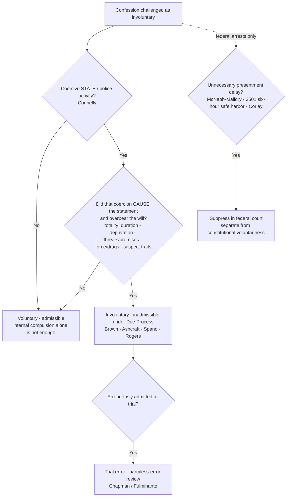

# S9 R1 panel-review — Opus model-diversity lane (prompt pack)

You are the **Claude/Opus** leg of the S9 three-lane adversarial panel (1 Claude + 2 Codex, R1). The two Codex lanes carry the A (support/quote-fidelity) and B (currency/treatment) attack lenses; **you carry model diversity and MUST vote on every paneled assertion across BOTH lenses' concerns.** You are refute-framed: try hard to break each assertion; **default to REFUTED on uncertainty**; never fabricate a cite, quote, or holding; use ONLY the evidence inlined below (no search, no outside knowledge). You are a SIGHTED reviewer — the FULL lake record (judgment fields included) is inlined.

You are a WRITER lane, not an adjudicator: you FIND and VOTE. You do not tally, adjudicate, or close any row — the orchestrator does.

For EACH group below, return one JSON object with the exact `reviewed[]` shape from the output contract (identical framing to the Codex lenses). Emit a finding object ONLY for a real defect (verdict refuted / stands-modified); a group you find wholly clean returns all-`stands` verdicts (the harness records a clean attestation). Concatenate the per-group JSON objects into a top-level `{"packs": [ ... ]}` array, one entry per group, each carrying its `group_id`.


OUTPUT CONTRACT — return ONE JSON object, nothing else:
{
  "lens": "A" | "B",
  "group_id": "<echo the group id>",
  "reviewed": [
    {
      "assertion_id": "<from group_inventory.jsonl>",
      "dimension": "existence|support|quote_fidelity|pincite|treatment|black_letter",
      "verdict": "stands" | "refuted" | "stands-modified",
      "verifiable_from_disclosed": true | false,
      "defect": null,   // null when verdict=="stands"; else an object:
      //  {"problem": "...", "severity": "high|medium|low", "proposed_fix": "...", "evidence_quote": "verbatim from disclosed evidence or null", "needs_cl": true|false, "locator_note": "..."}
      "reasons": ["short evidence-grounded reason", "..."],
      "breaks_true_positives": true | false,
      "residual_risks": ["..."],
      "suggested_tightening": "... or null"
    }
  ],
  "notes": ""
}
Rules: verdict=='stands' <=> defect==null (assertion survives your attack). verdict=='refuted' <=> a real defect (the assertion as framed is wrong). verdict=='stands-modified' <=> survives but needs a stated modification (a minor defect). Review EVERY assertion_id in group_inventory.jsonl exactly once. Output ONLY the JSON object.
---

## GROUP: content/confessions-interrogation-and-the-fifth-amendment/Due-Process Voluntariness of Confessions.md  (`doctrine`, 24 assertions)

### content_page

```
---
weight: 10
aliases:
  - "Due-Process Voluntariness of Confessions"
  - "9-confessions-interrogation/Due-Process-Voluntariness-of-Confessions"
  - "due-process-voluntariness"
topic: Due-Process Voluntariness of Confessions
type: doctrine
jurisdiction: Federal (U.S. Const. amends. V & XIV — due process); SCOTUS baseline
status: draft
related:
  - "[[Miranda and Custodial Interrogation]]"
  - "[[Miranda Waiver and Invocation]]"
  - "[[Sixth Amendment Right to Counsel]]"
  - "[[The Exclusionary Rule]]"
---

# Due-Process Voluntariness of Confessions

*Was this confession voluntary, or did official coercion overbear the suspect's will?*

> [!rule] Black-letter rule
> A confession is inadmissible under the **Due Process Clause** (Fourteenth Amendment against the States; Fifth against the federal government) if, on the **[[Common Legal Terms#totality-of-the-circumstances|totality of the circumstances]]**, official **coercion** overbore the defendant's will. The predicate is **state action**: "coercive police activity is a necessary predicate to the finding that a confession is not 'voluntary.'" *[[Colorado v. Connelly|Connelly]]*, 479 U.S. 157, [167](https://www.courtlistener.com/opinion/111779/colorado-v-connelly/) (1986). The measure is coercion, not reliability. *[[Rogers v. Richmond|Rogers]]*, 365 U.S. 534, [540–541](https://www.courtlistener.com/opinion/106192/rogers-v-richmond/) (1961); origin *[[Brown v. Mississippi|Brown]]*, 297 U.S. 278 (1936).
> ^rule-voluntariness

## The Brief

**The rule, up front.** A confession is inadmissible under the **Due Process Clause** if, under the **[[Common Legal Terms#totality-of-the-circumstances|totality of the circumstances]]**, official **coercion** overbore the defendant's will. The inquiry weighs interrogation length, deprivation of sleep, food, or outside contact, threats or promises, use of force or drugs, and the suspect's individual characteristics (age, intelligence, mental state). **No single factor is dispositive.**

**The doctrine grew case by case, from the extreme to the subtle:**
- **Physical torture** ([[Brown v. Mississippi]]).
- **Prolonged incommunicado interrogation** of helpless prisoners ([[Chambers v. Florida]]).
- **Thirty-six hours of continuous relay questioning** without sleep, deemed *inherently coercive* ([[Ashcraft v. Tennessee]]).
- **Psychological overbearing**: a friend's feigned distress plus persistent overnight questioning ([[Spano v. New York]]).
- **Threats and promises**: cutting off a mother's welfare and threatening to take her children ([[Lynumn v. Illinois]]), or trading family contact for a signature after incommunicado detention ([[Haynes v. Washington]]).
- **Force and drugs**: a confession taken at gunpoint from a wounded man plus a later statement signed while drugged on morphine ([[Beecher v. Alabama]]), and a statement produced by a drug with truth-serum effect ([[Townsend v. Sain]]).

**The elements.** Distilled to its operative parts, the test asks for **(1) coercion that is *official* — state action; (2) a *causal* link between that coercion and the statement; and (3) a *will that was actually overborne***. Two cases fix the boundaries. **State action is required:** in [[Colorado v. Connelly]] the Court held that "coercive police activity is a necessary predicate to the finding that a confession is not 'voluntary' within the meaning of the Due Process Clause of the Fourteenth Amendment" ([[Colorado v. Connelly#^pin-167|479 U.S. at 167]]); a confession prompted by mental illness or internal compulsion alone, without police overreaching, is **voluntary**, however unreliable it may be. And **coercion, not reliability, is the measure:** [[Rogers v. Richmond]] holds voluntariness turns *solely* on whether coercion overbore the will, "not because such confessions are unlikely to be true but because the methods used to extract them offend an underlying principle . . . that ours is an accusatorial and not an inquisitorial system" ([[Rogers v. Richmond#^pin-540|365 U.S. at 540–541]]); a standard that takes the confession's probable truth into account is invalid.

**Burden and standard.** When a confession is challenged as involuntary, the **prosecution** bears the burden of proving voluntariness, and must do so by at least a **[[Common Legal Terms#preponderance-of-the-evidence|preponderance of the evidence]]** ([[Lego v. Twomey]]); States may, as a matter of their own law, impose a higher standard. **Remedy and standard of review:** suppression is the remedy, but erroneous admission of a coerced confession is **trial error subject to harmless-error review** under *Chapman v. California*, not automatic reversal ([[Arizona v. Fulminante]]) (on those facts the error was *not* harmless, and the conviction was reversed).

**Relationship to Miranda.** This due-process line **predates and runs parallel to** [[Miranda and Custodial Interrogation|Miranda]]: it is the constitutional **floor** that governed confessions long before 1966 and still governs independently. [[Malloy v. Hogan]] made the Fifth Amendment privilege against self-incrimination enforceable against the States by federal standards, but the voluntariness test remains its own inquiry. A confession can be **voluntary yet inadmissible** for a Miranda defect, or **Miranda-compliant yet still involuntary** and barred by due process. Warnings do not cure coercion.

**The federal prompt-presentment overlay (McNabb-Mallory).** Separate from, and narrower than, the constitutional voluntariness rule, a **federal-court evidentiary rule** bars confessions obtained during *unnecessary delay* in bringing a federal arrestee before a magistrate: [[McNabb v. United States]] (federal supervisory power, independent of the Constitution) and [[Mallory v. United States]] (Fed. R. Crim. P. 5(a); delay used to extract a confession is "unnecessary delay"). Congress responded with 18 U.S.C. §3501; [[Corley v. United States]] holds §3501 **modified but did not supplant** McNabb-Mallory, so a federal confession made before presentment and beyond a **six-hour safe harbor** is suppressed if the presentment delay was unreasonable or unnecessary. This is a **federal-court** rule, **not** a constitutional command binding the States; it is taught here as the prompt-presentment companion to due-process voluntariness.

**Common pitfalls.**
- **Totality, not any single factor.** Duration and sustained pressure can overbear the will without physical force ([[Ashcraft v. Tennessee|Ashcraft]]; [[Spano v. New York|Spano]]); [[Brown v. Mississippi|Brown]] and [[Chambers v. Florida|Chambers]] mark the extreme end (torture, incommunicado compulsion).
- **Deception is not automatically coercion.** Falsely telling a suspect his codefendant had confessed did not, standing alone, render the confession involuntary ([[Frazier v. Cupp]]); deception is one factor in the totality, not a [[Common Legal Terms#per-se|per se]] rule.
- **The stakes are constitutional, not merely evidentiary.** Allowing convictions on confessions so obtained "would make of the constitutional requirement of due process of law a meaningless symbol" ([[Chambers v. Florida#^pin-240|309 U.S. at 240]]).
- **Thinking [[Miranda and Custodial Interrogation|Miranda warnings]] cure an involuntary confession.** They do not; voluntariness is a separate, freestanding test from the [[Miranda and Custodial Interrogation|Miranda]] inquiry.
- **Ignoring the state-action requirement.** After [[Colorado v. Connelly|Connelly]], there is no due-process voluntariness problem without coercive police activity; an "unreliable" or "compelled-feeling" statement is not enough by itself.
- **Treating any lie as coercive.** Per [[Frazier v. Cupp|Frazier]], lawful factual deception is weighed in the totality; it is not [[Common Legal Terms#per-se|per se]] coercion.
- This inquiry is **distinct from** [[Miranda Waiver and Invocation|Miranda waiver]] and the [[Sixth Amendment Right to Counsel]]; suppression of an involuntary confession is independent of the [[The Exclusionary Rule|exclusionary]] analyses tied to those doctrines.

## Lower-court developments
Circuit/state authority only; no SCOTUS. Any Supreme Court holding lives in **Key cases** regardless of date. The [[Colorado v. Connelly|Connelly]] state-action predicate and the [[Frazier v. Cupp|Frazier]] "deception is not per se coercion" rule remain the SCOTUS baseline; lower federal courts continue to police where lawful technique tips into overbearing the will, distinguishing tolerated deception *about facts* from intolerable **misrepresentations of law** and **false promises of leniency**.

- ***[[United States v. Young]]*** (10th Cir. 2020) — **Binding in-circuit — 10th Cir.; Persuasive (outside circuit)** · *role: application/refinement of the totality test.* Applying the *[[Colorado v. Connelly|Connelly]]*/totality framework, the court found a confession involuntary where an FBI agent falsely claimed to have spoken with the federal judge about the case and falsely promised the suspect could "buy down" or shorten his sentence with each truthful answer. While deception about facts is tolerated, misrepresentations of law and false promises of sentencing leniency critically impaired the suspect's capacity for self-determination and overbore his will; conviction reversed, judgment [[Reading and Citing Cases#vacated|vacated]], and [[Reading and Citing Cases#on-remand|remanded]]. *(No CSSI case page; cited plain.)* [opinion](https://www.courtlistener.com/opinion/4766220/united-states-v-young/)

## Key cases

| Case | Holding | Opinion |
|---|---|---|
| *[[Brown v. Mississippi]]*, 297 U.S. 278 (1936) | A confession extracted by physical torture is involuntary; using it to convict violates Fourteenth Amendment due process (the founding case). | [opinion](https://www.courtlistener.com/opinion/102604/brown-v-mississippi/) |
| *[[Chambers v. Florida]]*, 309 U.S. 227 (1940) | Confessions wrung from helpless prisoners by prolonged, incommunicado interrogation are the product of compulsion and violate due process. | [opinion](https://www.courtlistener.com/opinion/103301/chambers-v-florida/) |
| *[[Ashcraft v. Tennessee]]*, 322 U.S. 143 (1944) | Thirty-six hours of continuous relay questioning without sleep is inherently coercive, rendering the confession involuntary. | [opinion](https://www.courtlistener.com/opinion/103981/ashcraft-v-tennessee/) |
| *[[Spano v. New York]]*, 360 U.S. 315 (1959) | Psychological overbearing (a friend's feigned distress plus persistent overnight questioning) made the confession involuntary; the will was overborne. | [opinion](https://www.courtlistener.com/opinion/105917/spano-v-new-york/) |
| *[[Rogers v. Richmond]]*, 365 U.S. 534 (1961) | Voluntariness turns solely on whether coercion overbore the will; the confession's probable truth or reliability is constitutionally irrelevant, and a reliability-based standard is invalid. | [opinion](https://www.courtlistener.com/opinion/106192/rogers-v-richmond/) |
| *[[Lynumn v. Illinois]]*, 372 U.S. 528 (1963) | A confession coerced by threats to cut off state financial aid and take away the suspect's children, extracted from an inexperienced person encircled by officers, is involuntary. | [opinion](https://www.courtlistener.com/opinion/106558/lynumn-v-illinois/) |
| *[[Haynes v. Washington]]*, 373 U.S. 503 (1963) | Incommunicado detention plus threats of continued isolation and a promise of family contact conditioned on signing render a confession involuntary under the totality. | [opinion](https://www.courtlistener.com/opinion/106625/haynes-v-washington/) |
| *[[Beecher v. Alabama]]*, 389 U.S. 35 (1967) | A confession taken at gunpoint from a wounded suspect, and a later statement signed while drugged on morphine, are the product of gross coercion and involuntary. | [opinion](https://www.courtlistener.com/opinion/107526/beecher-v-alabama/) |
| *[[Townsend v. Sain]]*, 372 U.S. 293 (1963) | A confession produced by a drug with truth-serum effect is involuntary if not the product of a rational intellect and free will, regardless of reliability or the questioners' knowledge of the drug. | [opinion](https://www.courtlistener.com/opinion/106544/townsend-v-sain/) |
| *[[Frazier v. Cupp]]*, 394 U.S. 731 (1969) | Police misrepresentation (falsely claiming a codefendant had confessed) did not, by itself, render the confession involuntary; deception is one factor in the totality. | [opinion](https://www.courtlistener.com/opinion/107913/frazier-v-cupp/) |
| *[[Colorado v. Connelly]]*, 479 U.S. 157 (1986) | Coercive police activity is a necessary predicate to involuntariness; a mentally ill suspect's internal compulsion ("voices") does not make a confession involuntary. | [opinion](https://www.courtlistener.com/opinion/111779/colorado-v-connelly/) |
| *[[Arizona v. Fulminante]]*, 499 U.S. 279 (1991) | Erroneous admission of a coerced confession is trial error subject to harmless-error analysis under *Chapman* (here the error was not harmless; conviction reversed). | [opinion](https://www.courtlistener.com/opinion/112566/arizona-v-fulminante/) |
| *[[Lego v. Twomey]]*, 404 U.S. 477 (1972) | The prosecution must prove voluntariness by a [[Common Legal Terms#preponderance-of-the-evidence\|preponderance of the evidence]], not [[Common Legal Terms#beyond-a-reasonable-doubt\|beyond a reasonable doubt]]; States may adopt a higher standard. | [opinion](https://www.courtlistener.com/opinion/108429/lego-v-twomey/) |
| *[[Malloy v. Hogan]]*, 378 U.S. 1 (1964) | The Fifth Amendment privilege against self-incrimination is enforceable against the States through the Fourteenth Amendment by the same standards; *Twining* and *Adamson* overruled to that extent. | [opinion](https://www.courtlistener.com/opinion/106862/malloy-v-hogan/) |
| *[[McNabb v. United States]]*, 318 U.S. 332 (1943) | Under the federal supervisory power, confessions taken during detention that flouts the duty of prompt presentment are inadmissible, independent of the Constitution. | [opinion](https://www.courtlistener.com/opinion/103791/mcnabb-v-united-states/) |
| *[[Mallory v. United States]]*, 354 U.S. 449 (1957) | A confession obtained during unnecessary delay in presenting a federal arrestee to a magistrate (Fed. R. Crim. P. 5(a)) is inadmissible; delay to extract a confession is "unnecessary delay." | [opinion](https://www.courtlistener.com/opinion/105545/mallory-v-united-states/) |
| *[[Corley v. United States]]*, 556 U.S. 303 (2009) | 18 U.S.C. §3501 modified but did not supplant McNabb-Mallory: a federal confession made before presentment and beyond a six-hour safe harbor is suppressed if the delay was unreasonable. | [opinion](https://www.courtlistener.com/opinion/145888/corley-v-united-states/) |

## Related cases across doctrines
These cases are treated in full on other doctrine pages but bear directly on due-process voluntariness, framed here for that inquiry.

| Case | Relevance here | Primary home | Opinion |
|---|---|---|---|
| *[[Chavez v. Martinez]]*, 538 U.S. 760 (2003) | Coercive police questioning that produces **no statement used against the suspect in a criminal case** is not itself a completed Fifth Amendment violation; any remedy for the coercion lies (if at all) in **substantive due process**, the doctrinal seam between compelled-statement and due-process voluntariness analysis. | [[Miranda and Custodial Interrogation]] | [opinion](https://www.courtlistener.com/opinion/127927/chavez-v-martinez/) |
| *[[Oregon v. Elstad]]*, 470 U.S. 298 (1985) | Voluntariness is freestanding: an initial un-warned but *actually voluntary* statement does not coerce or taint a later warned confession; only genuine coercion (not a mere Miranda omission) triggers the due-process bar. | [[Miranda Waiver and Invocation]] | [opinion](https://www.courtlistener.com/opinion/111364/oregon-v-elstad/) |
| *[[United States v. Patane]]*, 542 U.S. 630 (2004) | An un-warned but voluntary statement involves no due-process coercion; physical fruit is admissible because there was no compelled or involuntary statement, only a prophylactic Miranda lapse. | [[Miranda Waiver and Invocation]] | [opinion](https://www.courtlistener.com/opinion/137003/united-states-v-patane/) |
| *[[Missouri v. Seibert]]*, 542 U.S. 600 (2004) | A question-first / warn-later case decided on **Miranda** prophylactic grounds, offered only as an instructive parallel to the due-process concern with intentionally undermining free choice; the two tests remain doctrinally distinct. | [[Miranda Waiver and Invocation]] | [opinion](https://www.courtlistener.com/opinion/137002/missouri-v-seibert/) |
| *[[Schneckloth v. Bustamonte]]*, 412 U.S. 218 (1973) | The canonical statement of the **totality-of-the-circumstances** test this doctrine uses: consent voluntariness is judged by the same framework the Court built from the due-process confession cases (*[[Brown v. Mississippi\|Brown]]*, *[[Chambers v. Florida\|Chambers]]*, *[[Ashcraft v. Tennessee\|Ashcraft]]*, *[[Spano v. New York\|Spano]]*). | [[Consent Searches]] | [opinion](https://www.courtlistener.com/opinion/108800/schneckloth-v-bustamonte/) |
| *[[Brewer v. Williams]]*, 430 U.S. 387 (1977) | The "Christian burial speech," the classic example of psychological pressure short of force; though decided on Sixth Amendment grounds, it illustrates the same overbearing-the-will concern (cf. *[[Spano v. New York\|Spano]]*) animating voluntariness review. | [[Sixth Amendment Right to Counsel]] | [opinion](https://www.courtlistener.com/opinion/109624/brewer-v-williams/) |

## Visual


## Sources
- [Brown v. Mississippi, 297 U.S. 278 (1936)](https://www.courtlistener.com/opinion/102604/brown-v-mississippi/)
- [Chambers v. Florida, 309 U.S. 227 (1940)](https://www.courtlistener.com/opinion/103301/chambers-v-florida/) — pinpoint: 240
- [McNabb v. United States, 318 U.S. 332 (1943)](https://www.courtlistener.com/opinion/103791/mcnabb-v-united-states/)
- [Ashcraft v. Tennessee, 322 U.S. 143 (1944)](https://www.courtlistener.com/opinion/103981/ashcraft-v-tennessee/)
- [Mallory v. United States, 354 U.S. 449 (1957)](https://www.courtlistener.com/opinion/105545/mallory-v-united-states/)
- [Spano v. New York, 360 U.S. 315 (1959)](https://www.courtlistener.com/opinion/105917/spano-v-new-york/)
- [Rogers v. Richmond, 365 U.S. 534 (1961)](https://www.courtlistener.com/opinion/106192/rogers-v-richmond/) — pinpoint: 540–541
- [Lynumn v. Illinois, 372 U.S. 528 (1963)](https://www.courtlistener.com/opinion/106558/lynumn-v-illinois/)
- [Townsend v. Sain, 372 U.S. 293 (1963)](https://www.courtlistener.com/opinion/106544/townsend-v-sain/)
- [Haynes v. Washington, 373 U.S. 503 (1963)](https://www.courtlistener.com/opinion/106625/haynes-v-washington/)
- [Malloy v. Hogan, 378 U.S. 1 (1964)](https://www.courtlistener.com/opinion/106862/malloy-v-hogan/)
- [Beecher v. Alabama, 389 U.S. 35 (1967)](https://www.courtlistener.com/opinion/107526/beecher-v-alabama/)
- [Frazier v. Cupp, 394 U.S. 731 (1969)](https://www.courtlistener.com/opinion/107913/frazier-v-cupp/)
- [Lego v. Twomey, 404 U.S. 477 (1972)](https://www.courtlistener.com/opinion/108429/lego-v-twomey/)
- [Colorado v. Connelly, 479 U.S. 157 (1986)](https://www.courtlistener.com/opinion/111779/colorado-v-connelly/) — pinpoint: 167
- [Arizona v. Fulminante, 499 U.S. 279 (1991)](https://www.courtlistener.com/opinion/112566/arizona-v-fulminante/)
- [Chavez v. Martinez, 538 U.S. 760 (2003)](https://www.courtlistener.com/opinion/127927/chavez-v-martinez/)
- [Corley v. United States, 556 U.S. 303 (2009)](https://www.courtlistener.com/opinion/145888/corley-v-united-states/)
- [United States v. Young (10th Cir. 2020)](https://www.courtlistener.com/opinion/4766220/united-states-v-young/)

```

### group_inventory (assertions under review)

```jsonl
{"assertion_id": "0a54a00f6dc17be5", "dimension": "existence", "kind": "case_cite", "locator": {"case": "Haynes v. Washington", "table_line": 54}, "payload": {"case": "Haynes v. Washington", "cells": ["*[[Haynes v. Washington]]*, 373 U.S. 503 (1963)", "Incommunicado detention plus threats of continued isolation and a promise of family contact conditioned on signing render a confession involuntary under the totality.", "[opinion](https://www.courtlistener.com/opinion/106625/haynes-v-washington/)"], "header": ["Case", "Holding", "Opinion"]}}
{"assertion_id": "0c2ef39fc08b3778", "dimension": "existence", "kind": "case_cite", "locator": {"case": "Chavez v. Martinez", "table_line": 71}, "payload": {"case": "Chavez v. Martinez", "cells": ["*[[Chavez v. Martinez]]*, 538 U.S. 760 (2003)", "Coercive police questioning that produces **no statement used against the suspect in a criminal case** is not itself a completed Fifth Amendment violation; any remedy for the coercion lies (if at all) in **substantive due process**, the doctrinal seam between compelled-statement and due-process voluntariness analysis.", "[[Miranda and Custodial Interrogation]]", "[opinion](https://www.courtlistener.com/opinion/127927/chavez-v-martinez/)"], "header": ["Case", "Relevance here", "Primary home", "Opinion"]}}
{"assertion_id": "211a4ad048a55f7f", "dimension": "existence", "kind": "case_cite", "locator": {"case": "Missouri v. Seibert", "table_line": 74}, "payload": {"case": "Missouri v. Seibert", "cells": ["*[[Missouri v. Seibert]]*, 542 U.S. 600 (2004)", "A question-first / warn-later case decided on **Miranda** prophylactic grounds, offered only as an instructive parallel to the due-process concern with intentionally undermining free choice; the two tests remain doctrinally distinct.", "[[Miranda Waiver and Invocation]]", "[opinion](https://www.courtlistener.com/opinion/137002/missouri-v-seibert/)"], "header": ["Case", "Relevance here", "Primary home", "Opinion"]}}
{"assertion_id": "22c512e5c29307d0", "dimension": "existence", "kind": "case_cite", "locator": {"case": "Lego v. Twomey", "table_line": 60}, "payload": {"case": "Lego v. Twomey", "cells": ["*[[Lego v. Twomey]]*, 404 U.S. 477 (1972)", "The prosecution must prove voluntariness by a [[Common Legal Terms#preponderance-of-the-evidence\\|preponderance of the evidence]], not [[Common Legal Terms#beyond-a-reasonable-doubt\\|beyond a reasonable doubt]]; States may adopt a higher standard.", "[opinion](https://www.courtlistener.com/opinion/108429/lego-v-twomey/)"], "header": ["Case", "Holding", "Opinion"]}}
{"assertion_id": "308b6e15888cf06a", "dimension": "existence", "kind": "case_cite", "locator": {"case": "Oregon v. Elstad", "table_line": 72}, "payload": {"case": "Oregon v. Elstad", "cells": ["*[[Oregon v. Elstad]]*, 470 U.S. 298 (1985)", "Voluntariness is freestanding: an initial un-warned but *actually voluntary* statement does not coerce or taint a later warned confession; only genuine coercion (not a mere Miranda omission) triggers the due-process bar.", "[[Miranda Waiver and Invocation]]", "[opinion](https://www.courtlistener.com/opinion/111364/oregon-v-elstad/)"], "header": ["Case", "Relevance here", "Primary home", "Opinion"]}}
{"assertion_id": "38acc6441fdf01e2", "dimension": "existence", "kind": "case_cite", "locator": {"case": "Schneckloth v. Bustamonte", "table_line": 75}, "payload": {"case": "Schneckloth v. Bustamonte", "cells": ["*[[Schneckloth v. Bustamonte]]*, 412 U.S. 218 (1973)", "The canonical statement of the **totality-of-the-circumstances** test this doctrine uses: consent voluntariness is judged by the same framework the Court built from the due-process confession cases (*[[Brown v. Mississippi\\|Brown]]*, *[[Chambers v. Florida\\|Chambers]]*, *[[Ashcraft v. Tennessee\\|Ashcraft]]*, *[[Spano v. New York\\|Spano]]*).", "[[Consent Searches]]", "[opinion](https://www.courtlistener.com/opinion/108800/schneckloth-v-bustamonte/)"], "header": ["Case", "Relevance here", "Primary home", "Opinion"]}}
{"assertion_id": "49dfccb7095b0fd5", "dimension": "existence", "kind": "case_cite", "locator": {"case": "Frazier v. Cupp", "table_line": 57}, "payload": {"case": "Frazier v. Cupp", "cells": ["*[[Frazier v. Cupp]]*, 394 U.S. 731 (1969)", "Police misrepresentation (falsely claiming a codefendant had confessed) did not, by itself, render the confession involuntary; deception is one factor in the totality.", "[opinion](https://www.courtlistener.com/opinion/107913/frazier-v-cupp/)"], "header": ["Case", "Holding", "Opinion"]}}
{"assertion_id": "59307a82f0004561", "dimension": "existence", "kind": "case_cite", "locator": {"case": "Mallory v. United States", "table_line": 63}, "payload": {"case": "Mallory v. United States", "cells": ["*[[Mallory v. United States]]*, 354 U.S. 449 (1957)", "A confession obtained during unnecessary delay in presenting a federal arrestee to a magistrate (Fed. R. Crim. P. 5(a)) is inadmissible; delay to extract a confession is \"unnecessary delay.\"", "[opinion](https://www.courtlistener.com/opinion/105545/mallory-v-united-states/)"], "header": ["Case", "Holding", "Opinion"]}}
{"assertion_id": "5f107de03391d1d0", "dimension": "existence", "kind": "case_cite", "locator": {"case": "Rogers v. Richmond", "table_line": 52}, "payload": {"case": "Rogers v. Richmond", "cells": ["*[[Rogers v. Richmond]]*, 365 U.S. 534 (1961)", "Voluntariness turns solely on whether coercion overbore the will; the confession's probable truth or reliability is constitutionally irrelevant, and a reliability-based standard is invalid.", "[opinion](https://www.courtlistener.com/opinion/106192/rogers-v-richmond/)"], "header": ["Case", "Holding", "Opinion"]}}
{"assertion_id": "641ed5a32eeb3f3d", "dimension": "existence", "kind": "case_cite", "locator": {"case": "Chambers v. Florida", "table_line": 49}, "payload": {"case": "Chambers v. Florida", "cells": ["*[[Chambers v. Florida]]*, 309 U.S. 227 (1940)", "Confessions wrung from helpless prisoners by prolonged, incommunicado interrogation are the product of compulsion and violate due process.", "[opinion](https://www.courtlistener.com/opinion/103301/chambers-v-florida/)"], "header": ["Case", "Holding", "Opinion"]}}
{"assertion_id": "664134b4da1dece8", "dimension": "existence", "kind": "case_cite", "locator": {"case": "Corley v. United States", "table_line": 64}, "payload": {"case": "Corley v. United States", "cells": ["*[[Corley v. United States]]*, 556 U.S. 303 (2009)", "18 U.S.C. §3501 modified but did not supplant McNabb-Mallory: a federal confession made before presentment and beyond a six-hour safe harbor is suppressed if the delay was unreasonable.", "[opinion](https://www.courtlistener.com/opinion/145888/corley-v-united-states/)"], "header": ["Case", "Holding", "Opinion"]}}
{"assertion_id": "6b20fe8f4b5d71c5", "dimension": "existence", "kind": "case_cite", "locator": {"case": "Brewer v. Williams", "table_line": 76}, "payload": {"case": "Brewer v. Williams", "cells": ["*[[Brewer v. Williams]]*, 430 U.S. 387 (1977)", "The \"Christian burial speech,\" the classic example of psychological pressure short of force; though decided on Sixth Amendment grounds, it illustrates the same overbearing-the-will concern (cf. *[[Spano v. New York\\|Spano]]*) animating voluntariness review.", "[[Sixth Amendment Right to Counsel]]", "[opinion](https://www.courtlistener.com/opinion/109624/brewer-v-williams/)"], "header": ["Case", "Relevance here", "Primary home", "Opinion"]}}
{"assertion_id": "7e08c131da64fe1a", "dimension": "existence", "kind": "case_cite", "locator": {"case": "Brown v. Mississippi", "table_line": 48}, "payload": {"case": "Brown v. Mississippi", "cells": ["*[[Brown v. Mississippi]]*, 297 U.S. 278 (1936)", "A confession extracted by physical torture is involuntary; using it to convict violates Fourteenth Amendment due process (the founding case).", "[opinion](https://www.courtlistener.com/opinion/102604/brown-v-mississippi/)"], "header": ["Case", "Holding", "Opinion"]}}
{"assertion_id": "94160572a8c42e51", "dimension": "existence", "kind": "case_cite", "locator": {"case": "Lynumn v. Illinois", "table_line": 53}, "payload": {"case": "Lynumn v. Illinois", "cells": ["*[[Lynumn v. Illinois]]*, 372 U.S. 528 (1963)", "A confession coerced by threats to cut off state financial aid and take away the suspect's children, extracted from an inexperienced person encircled by officers, is involuntary.", "[opinion](https://www.courtlistener.com/opinion/106558/lynumn-v-illinois/)"], "header": ["Case", "Holding", "Opinion"]}}
{"assertion_id": "b30d602d5bc8804d", "dimension": "existence", "kind": "case_cite", "locator": {"case": "Spano v. New York", "table_line": 51}, "payload": {"case": "Spano v. New York", "cells": ["*[[Spano v. New York]]*, 360 U.S. 315 (1959)", "Psychological overbearing (a friend's feigned distress plus persistent overnight questioning) made the confession involuntary; the will was overborne.", "[opinion](https://www.courtlistener.com/opinion/105917/spano-v-new-york/)"], "header": ["Case", "Holding", "Opinion"]}}
{"assertion_id": "b93f6a2254f20c6b", "dimension": "existence", "kind": "case_cite", "locator": {"case": "Malloy v. Hogan", "table_line": 61}, "payload": {"case": "Malloy v. Hogan", "cells": ["*[[Malloy v. Hogan]]*, 378 U.S. 1 (1964)", "The Fifth Amendment privilege against self-incrimination is enforceable against the States through the Fourteenth Amendment by the same standards; *Twining* and *Adamson* overruled to that extent.", "[opinion](https://www.courtlistener.com/opinion/106862/malloy-v-hogan/)"], "header": ["Case", "Holding", "Opinion"]}}
{"assertion_id": "bee9bc2baf1736b4", "dimension": "existence", "kind": "case_cite", "locator": {"case": "Colorado v. Connelly", "table_line": 58}, "payload": {"case": "Colorado v. Connelly", "cells": ["*[[Colorado v. Connelly]]*, 479 U.S. 157 (1986)", "Coercive police activity is a necessary predicate to involuntariness; a mentally ill suspect's internal compulsion (\"voices\") does not make a confession involuntary.", "[opinion](https://www.courtlistener.com/opinion/111779/colorado-v-connelly/)"], "header": ["Case", "Holding", "Opinion"]}}
{"assertion_id": "c0abf2526a7adc46", "dimension": "existence", "kind": "case_cite", "locator": {"case": "Townsend v. Sain", "table_line": 56}, "payload": {"case": "Townsend v. Sain", "cells": ["*[[Townsend v. Sain]]*, 372 U.S. 293 (1963)", "A confession produced by a drug with truth-serum effect is involuntary if not the product of a rational intellect and free will, regardless of reliability or the questioners' knowledge of the drug.", "[opinion](https://www.courtlistener.com/opinion/106544/townsend-v-sain/)"], "header": ["Case", "Holding", "Opinion"]}}
{"assertion_id": "c9c93bd3da146c29", "dimension": "existence", "kind": "case_cite", "locator": {"case": "McNabb v. United States", "table_line": 62}, "payload": {"case": "McNabb v. United States", "cells": ["*[[McNabb v. United States]]*, 318 U.S. 332 (1943)", "Under the federal supervisory power, confessions taken during detention that flouts the duty of prompt presentment are inadmissible, independent of the Constitution.", "[opinion](https://www.courtlistener.com/opinion/103791/mcnabb-v-united-states/)"], "header": ["Case", "Holding", "Opinion"]}}
{"assertion_id": "ce2539f8c641250e", "dimension": "existence", "kind": "case_cite", "locator": {"case": "Arizona v. Fulminante", "table_line": 59}, "payload": {"case": "Arizona v. Fulminante", "cells": ["*[[Arizona v. Fulminante]]*, 499 U.S. 279 (1991)", "Erroneous admission of a coerced confession is trial error subject to harmless-error analysis under *Chapman* (here the error was not harmless; conviction reversed).", "[opinion](https://www.courtlistener.com/opinion/112566/arizona-v-fulminante/)"], "header": ["Case", "Holding", "Opinion"]}}
{"assertion_id": "dc029cb631a100ff", "dimension": "existence", "kind": "case_cite", "locator": {"case": "United States v. Patane", "table_line": 73}, "payload": {"case": "United States v. Patane", "cells": ["*[[United States v. Patane]]*, 542 U.S. 630 (2004)", "An un-warned but voluntary statement involves no due-process coercion; physical fruit is admissible because there was no compelled or involuntary statement, only a prophylactic Miranda lapse.", "[[Miranda Waiver and Invocation]]", "[opinion](https://www.courtlistener.com/opinion/137003/united-states-v-patane/)"], "header": ["Case", "Relevance here", "Primary home", "Opinion"]}}
{"assertion_id": "e864d416d2f97259", "dimension": "existence", "kind": "case_cite", "locator": {"case": "Ashcraft v. Tennessee", "table_line": 50}, "payload": {"case": "Ashcraft v. Tennessee", "cells": ["*[[Ashcraft v. Tennessee]]*, 322 U.S. 143 (1944)", "Thirty-six hours of continuous relay questioning without sleep is inherently coercive, rendering the confession involuntary.", "[opinion](https://www.courtlistener.com/opinion/103981/ashcraft-v-tennessee/)"], "header": ["Case", "Holding", "Opinion"]}}
{"assertion_id": "fb1e8f1bd1560562", "dimension": "existence", "kind": "case_cite", "locator": {"case": "Beecher v. Alabama", "table_line": 55}, "payload": {"case": "Beecher v. Alabama", "cells": ["*[[Beecher v. Alabama]]*, 389 U.S. 35 (1967)", "A confession taken at gunpoint from a wounded suspect, and a later statement signed while drugged on morphine, are the product of gross coercion and involuntary.", "[opinion](https://www.courtlistener.com/opinion/107526/beecher-v-alabama/)"], "header": ["Case", "Holding", "Opinion"]}}
{"assertion_id": "2179ec0ceaabe0c5", "dimension": "support", "kind": "proposition", "locator": {"callout": "^rule-voluntariness"}, "payload": {"anchor": "^rule-voluntariness", "statement": "[!rule] Black-letter rule\nA confession is inadmissible under the **Due Process Clause** (Fourteenth Amendment against the States; Fifth against the federal government) if, on the **[[Common Legal Terms#totality-of-the-circumstances|totality of the circumstances]]**, official **coercion** overbore the defendant's will. The predicate is **state action**: \"coercive police activity is a necessary predicate to the finding that a confession is not 'voluntary.'\" *[[Colorado v. Connelly|Connelly]]*, 479 U.S. 157, [167](https://www.courtlistener.com/opinion/111779/colorado-v-connelly/) (1986). The measure is coercion, not reliability. *[[Rogers v. Richmond|Rogers]]*, 365 U.S. 534, [540–541](https://www.courtlistener.com/opinion/106192/rogers-v-richmond/) (1961); origin *[[Brown v. Mississippi|Brown]]*, 297 U.S. 278 (1936)."}}
```

### lake record — Arizona v. Fulminante

```json
{
  "schema_version": "s2.v1",
  "record_id": "Arizona v. Fulminante",
  "stub": false,
  "status": "verified",
  "identity": {
    "case_name": "Arizona v. Fulminante",
    "case_name_short": "Fulminante",
    "case_name_full": "Arizona v. Fulminante",
    "input_case_name": "Arizona v. Fulminante",
    "court": "U.S. Supreme Court",
    "court_id": "scotus",
    "court_level": "scotus",
    "circuit": null,
    "state": null,
    "date_decided": "1991-05-20",
    "year": 1991,
    "docket": null,
    "cluster_id": 112566,
    "lead_opinion_id": 112566,
    "sibling_ids": [
      112566,
      9432240,
      9432241,
      9432242
    ],
    "absolute_url": "/opinion/112566/arizona-v-fulminante/",
    "identity_method": "citation+party-text",
    "expected_citation_found": true,
    "party_name_in_text": true,
    "canonical_name_match": true,
    "alternates": [
      {
        "cluster_id": 9109110,
        "score": 10,
        "case_name": "Arizona v. Fulminante"
      },
      {
        "cluster_id": 9109109,
        "score": 10,
        "case_name": "Arizona v. Fulminante"
      }
    ],
    "reason_code": null
  },
  "citations": {
    "official": {
      "cite": "499 U.S. 279",
      "volume": "499",
      "reporter": "U.S.",
      "page": "279",
      "type": 1,
      "selected_official": true,
      "source": "cluster.citations[]"
    },
    "parallel": [
      {
        "cite": "111 S. Ct. 1246",
        "volume": "111",
        "reporter": "S. Ct.",
        "page": "1246",
        "type": 1,
        "selected_official": false,
        "source": "cluster.citations[]"
      },
      {
        "cite": "113 L. Ed. 2d 302",
        "volume": "113",
        "reporter": "L. Ed. 2d",
        "page": "302",
        "type": 1,
        "selected_official": false,
        "source": "cluster.citations[]"
      }
    ],
    "vendor_neutral": [
      {
        "cite": "1991 U.S. LEXIS 1854",
        "volume": "1991",
        "reporter": "U.S. LEXIS",
        "page": "1854",
        "type": 6,
        "selected_official": false,
        "source": "cluster.citations[]"
      }
    ],
    "all": [
      {
        "cite": "499 U.S. 279",
        "volume": "499",
        "reporter": "U.S.",
        "page": "279",
        "type": 1,
        "selected_official": false,
        "source": "cluster.citations[]"
      },
      {
        "cite": "111 S. Ct. 1246",
        "volume": "111",
        "reporter": "S. Ct.",
        "page": "1246",
        "type": 1,
        "selected_official": false,
        "source": "cluster.citations[]"
      },
      {
        "cite": "113 L. Ed. 2d 302",
        "volume": "113",
        "reporter": "L. Ed. 2d",
        "page": "302",
        "type": 1,
        "selected_official": false,
        "source": "cluster.citations[]"
      },
      {
        "cite": "1991 U.S. LEXIS 1854",
        "volume": "1991",
        "reporter": "U.S. LEXIS",
        "page": "1854",
        "type": 6,
        "selected_official": false,
        "source": "cluster.citations[]"
      }
    ],
    "display": "499 U.S. 279",
    "official_selection": {
      "court_class": "scotus",
      "selected": "499 U.S. 279",
      "reason": "selected_rank_1"
    }
  },
  "pinpoints": [
    {
      "id": "pin-287",
      "page": null,
      "quote": "--- # Arizona v. Fulminante *499 U.S. 279 (1991)* \u00b7 U.S. Supreme Court \u00b7 **Binding \u2014 SCOTUS** \u00b7 Treatment: **good** *(as of 2026-06-30)* <!-- header line; TreatmentBadge + weight render here, degrading to the text above --> ## Background Fulminante was suspected of murdering his stepdaughter. While later incarcerated on an unrelated federal charge, he was befriended by Anthony Sarivola, a fellow inmate who was secretly a paid FBI informant. Knowing Fulminante was receiving rough treatment from other inmates over a rumor that he was a child-killer, Sarivola offered to protect him if he told the truth about the murder. Fulminante confessed to Sarivola, and later to Sarivola's wife. Both confessions were admitted at his murder trial; he was convicted and sentenced to death. ## Issue (1) Whether a confession given out of fear of violence from other inmates, in exchange for an informant's protection, was coerced in violation of due process; and (2) whether the erroneous admission of a coerced confession is subject to harmless-error analysis or instead requires automatic reversal. ## Rule A credible threat of violence can render a confession involuntary \u2014 coercion may be mental, not only physical:",
      "star_marker": null,
      "quote_fidelity": "mismatch",
      "pinpoint_status": "slip-only",
      "position": null
    },
    {
      "id": "pin-303",
      "page": null,
      "quote": "The Court today properly concludes that the admission of an 'involuntary' confession at trial is subject to harmless-error analysis.",
      "star_marker": null,
      "quote_fidelity": "mismatch",
      "pinpoint_status": "slip-only",
      "position": null
    },
    {
      "id": "pin-309",
      "page": null,
      "quote": "trial error,",
      "star_marker": "291",
      "quote_fidelity": "matched",
      "pinpoint_status": "star-verified",
      "position": 33183,
      "fragment": "#:~:text=though%20a%20%22-,trial%20error%2C",
      "fragment_validated_at": "2026-07-09T15:40:45Z"
    }
  ],
  "treatment": {
    "field_i_validity": "good_law",
    "as_of_content": "1991-05-20",
    "as_of_treatment": "2026-06-30",
    "composite_basis": "migration-seed",
    "composite_basis_ref": "Arizona v. Fulminante",
    "varies_by_point": false,
    "scope_note": "Old as_of seeds as_of_treatment; S2 derivation re-derives and may downgrade.",
    "point_overrides": [],
    "edges": [
      {
        "citing_case": {
          "name": "State of Louisiana v. Michael Steven White",
          "cluster_id": 10804933,
          "cite": null,
          "field_ii": "questioned"
        },
        "field_ii": "questioned",
        "field_iii": "mentioned",
        "point": null,
        "proposed": true,
        "journal_ref": "Arizona v. Fulminante:lane1_negative"
      },
      {
        "citing_case": {
          "name": "State v. Chambers",
          "cluster_id": 10603767,
          "cite": null,
          "field_ii": "questioned"
        },
        "field_ii": "questioned",
        "field_iii": "mentioned",
        "point": null,
        "proposed": true,
        "journal_ref": "Arizona v. Fulminante:lane1_negative"
      },
      {
        "citing_case": {
          "name": "State v. Chambers",
          "cluster_id": 10591292,
          "cite": null,
          "field_ii": "questioned"
        },
        "field_ii": "questioned",
        "field_iii": "mentioned",
        "point": null,
        "proposed": true,
        "journal_ref": "Arizona v. Fulminante:lane1_negative"
      },
      {
        "citing_case": {
          "name": "Commonwealth v. Watt",
          "cluster_id": 9459195,
          "cite": null,
          "field_ii": "superseded_by_statute"
        },
        "field_ii": "superseded_by_statute",
        "field_iii": "mentioned",
        "point": null,
        "proposed": true,
        "journal_ref": "Arizona v. Fulminante:lane1_negative"
      },
      {
        "citing_case": {
          "name": "Jenkins v. State",
          "cluster_id": 10680001,
          "cite": [
            "894 S.E.2d 566",
            "317 Ga. 585"
          ],
          "field_ii": "criticized"
        },
        "field_ii": "criticized",
        "field_iii": "mentioned",
        "point": null,
        "proposed": true,
        "journal_ref": "Arizona v. Fulminante:lane1_negative"
      },
      {
        "citing_case": {
          "name": "Eric Calvin Tuazon v. the State of Texas",
          "cluster_id": 9380404,
          "cite": null,
          "field_ii": "overruled"
        },
        "field_ii": "overruled",
        "field_iii": "mentioned",
        "point": null,
        "proposed": true,
        "journal_ref": "Arizona v. Fulminante:lane1_negative"
      },
      {
        "citing_case": {
          "name": "United States v. Olano",
          "cluster_id": 112848,
          "cite": [
            "123 L. Ed. 2d 508",
            "113 S. Ct. 1770",
            "507 U.S. 725",
            "1993 U.S. LEXIS 2986"
          ],
          "field_ii": "overruled"
        },
        "field_ii": "overruled",
        "field_iii": "mentioned",
        "point": null,
        "proposed": true,
        "journal_ref": "Arizona v. Fulminante:lane2_top_cited"
      },
      {
        "citing_case": {
          "name": "Heck v. Humphrey",
          "cluster_id": 117864,
          "cite": [
            "129 L. Ed. 2d 383",
            "114 S. Ct. 2364",
            "512 U.S. 477",
            "1994 U.S. LEXIS 4824"
          ],
          "field_ii": "abrogated"
        },
        "field_ii": "abrogated",
        "field_iii": "mentioned",
        "point": null,
        "proposed": true,
        "journal_ref": "Arizona v. Fulminante:lane2_top_cited"
      },
      {
        "citing_case": {
          "name": "Rose v. Lee",
          "cluster_id": 773551,
          "cite": [
            "252 F.3d 676",
            "2001 U.S. App. LEXIS 10698",
            "2001 WL 558079"
          ],
          "field_ii": "overruled"
        },
        "field_ii": "overruled",
        "field_iii": "mentioned",
        "point": null,
        "proposed": true,
        "journal_ref": "Arizona v. Fulminante:lane2_top_cited"
      },
      {
        "citing_case": {
          "name": "Brecht v. Abrahamson",
          "cluster_id": 112845,
          "cite": [
            "123 L. Ed. 2d 353",
            "113 S. Ct. 1710",
            "507 U.S. 619",
            "1993 U.S. LEXIS 2981"
          ],
          "field_ii": "criticized"
        },
        "field_ii": "criticized",
        "field_iii": "mentioned",
        "point": null,
        "proposed": true,
        "journal_ref": "Arizona v. Fulminante:lane2_top_cited"
      },
      {
        "citing_case": {
          "name": "Puckett v. United States",
          "cluster_id": 145896,
          "cite": [
            "173 L. Ed. 2d 266",
            "129 S. Ct. 1423",
            "556 U.S. 129",
            "2009 U.S. LEXIS 2330"
          ],
          "field_ii": "questioned"
        },
        "field_ii": "questioned",
        "field_iii": "mentioned",
        "point": null,
        "proposed": true,
        "journal_ref": "Arizona v. Fulminante:lane2_top_cited"
      },
      {
        "citing_case": {
          "name": "Neder v. United States",
          "cluster_id": 118298,
          "cite": [
            "144 L. Ed. 2d 35",
            "119 S. Ct. 1827",
            "527 U.S. 1",
            "1999 U.S. LEXIS 4007"
          ],
          "field_ii": "criticized"
        },
        "field_ii": "criticized",
        "field_iii": "mentioned",
        "point": null,
        "proposed": true,
        "journal_ref": "Arizona v. Fulminante:lane2_top_cited"
      },
      {
        "citing_case": {
          "name": "People v. Mateo",
          "cluster_id": 2006639,
          "cite": [
            "811 N.E.2d 1053",
            "2 N.Y.3d 383",
            "779 N.Y.S.2d 399",
            "2 N.Y. 383",
            "2004 N.Y. LEXIS 263"
          ],
          "field_ii": "questioned"
        },
        "field_ii": "questioned",
        "field_iii": "mentioned",
        "point": null,
        "proposed": true,
        "journal_ref": "Arizona v. Fulminante:lane2_top_cited"
      },
      {
        "citing_case": {
          "name": "Johnson v. United States",
          "cluster_id": 118106,
          "cite": [
            "137 L. Ed. 2d 718",
            "117 S. Ct. 1544",
            "520 U.S. 461",
            "1997 U.S. LEXIS 2847"
          ],
          "field_ii": "questioned"
        },
        "field_ii": "questioned",
        "field_iii": "mentioned",
        "point": null,
        "proposed": true,
        "journal_ref": "Arizona v. Fulminante:lane2_top_cited"
      },
      {
        "citing_case": {
          "name": "Lockhart v. Fretwell",
          "cluster_id": 112807,
          "cite": [
            "122 L. Ed. 2d 180",
            "113 S. Ct. 838",
            "506 U.S. 364",
            "1993 U.S. LEXIS 1016"
          ],
          "field_ii": "overruled"
        },
        "field_ii": "overruled",
        "field_iii": "mentioned",
        "point": null,
        "proposed": true,
        "journal_ref": "Arizona v. Fulminante:lane2_top_cited"
      },
      {
        "citing_case": {
          "name": "Sullivan v. Louisiana",
          "cluster_id": 112868,
          "cite": [
            "124 L. Ed. 2d 182",
            "113 S. Ct. 2078",
            "508 U.S. 275",
            "1993 U.S. LEXIS 3741"
          ],
          "field_ii": "questioned"
        },
        "field_ii": "questioned",
        "field_iii": "mentioned",
        "point": null,
        "proposed": true,
        "journal_ref": "Arizona v. Fulminante:lane2_top_cited"
      },
      {
        "citing_case": {
          "name": "People v. Lewis",
          "cluster_id": 4902617,
          "cite": [
            "281 Cal. Rptr. 3d 521",
            "491 P.3d 309",
            "11 Cal. 5th 952"
          ],
          "field_ii": "superseded_by_statute"
        },
        "field_ii": "superseded_by_statute",
        "field_iii": "mentioned",
        "point": null,
        "proposed": true,
        "journal_ref": "Arizona v. Fulminante:lane2_top_cited"
      },
      {
        "citing_case": {
          "name": "United States v. Gaudin",
          "cluster_id": 117958,
          "cite": [
            "132 L. Ed. 2d 444",
            "115 S. Ct. 2310",
            "515 U.S. 506",
            "1995 U.S. LEXIS 4068"
          ],
          "field_ii": "overruled"
        },
        "field_ii": "overruled",
        "field_iii": "mentioned",
        "point": null,
        "proposed": true,
        "journal_ref": "Arizona v. Fulminante:lane2_top_cited"
      },
      {
        "citing_case": {
          "name": "Edwards v. Balisok",
          "cluster_id": 118112,
          "cite": [
            "137 L. Ed. 2d 906",
            "117 S. Ct. 1584",
            "520 U.S. 641",
            "1997 U.S. LEXIS 3075"
          ],
          "field_ii": "abrogated"
        },
        "field_ii": "abrogated",
        "field_iii": "mentioned",
        "point": null,
        "proposed": true,
        "journal_ref": "Arizona v. Fulminante:lane2_top_cited"
      },
      {
        "citing_case": {
          "name": "United States v. Dominguez Benitez",
          "cluster_id": 136986,
          "cite": [
            "159 L. Ed. 2d 157",
            "124 S. Ct. 2333",
            "542 U.S. 74",
            "2004 U.S. LEXIS 4177",
            "17 Fla. L. Weekly Fed. S 379",
            "72 U.S.L.W. 4478"
          ],
          "field_ii": "questioned"
        },
        "field_ii": "questioned",
        "field_iii": "mentioned",
        "point": null,
        "proposed": true,
        "journal_ref": "Arizona v. Fulminante:lane2_top_cited"
      },
      {
        "citing_case": {
          "name": "United States v. Gonzalez-Lopez",
          "cluster_id": 145633,
          "cite": [
            "165 L. Ed. 2d 409",
            "126 S. Ct. 2557",
            "548 U.S. 140",
            "2006 U.S. LEXIS 5165",
            "19 Fla. L. Weekly Fed. S 368",
            "33 A.L.R. Fed. 2d 661",
            "74 U.S.L.W. 4453"
          ],
          "field_ii": "criticized"
        },
        "field_ii": "criticized",
        "field_iii": "mentioned",
        "point": null,
        "proposed": true,
        "journal_ref": "Arizona v. Fulminante:lane2_top_cited"
      },
      {
        "citing_case": {
          "name": "People v. Breverman",
          "cluster_id": 1198942,
          "cite": [
            "960 P.2d 1094",
            "77 Cal. Rptr. 2d 870",
            "19 Cal. 4th 142",
            "98 Cal. Daily Op. Serv. 6812",
            "98 Daily Journal DAR 9358",
            "1998 Cal. LEXIS 5589"
          ],
          "field_ii": "overruled"
        },
        "field_ii": "overruled",
        "field_iii": "mentioned",
        "point": null,
        "proposed": true,
        "journal_ref": "Arizona v. Fulminante:lane2_top_cited"
      },
      {
        "citing_case": {
          "name": "Ewing v. California",
          "cluster_id": 127897,
          "cite": [
            "155 L. Ed. 2d 108",
            "123 S. Ct. 1179",
            "538 U.S. 11",
            "2003 U.S. LEXIS 1952"
          ],
          "field_ii": "overruled"
        },
        "field_ii": "overruled",
        "field_iii": "mentioned",
        "point": null,
        "proposed": true,
        "journal_ref": "Arizona v. Fulminante:lane2_top_cited"
      },
      {
        "citing_case": {
          "name": "Mickens v. Taylor",
          "cluster_id": 118492,
          "cite": [
            "152 L. Ed. 2d 291",
            "122 S. Ct. 1237",
            "535 U.S. 162",
            "2002 U.S. LEXIS 2146"
          ],
          "field_ii": "questioned"
        },
        "field_ii": "questioned",
        "field_iii": "mentioned",
        "point": null,
        "proposed": true,
        "journal_ref": "Arizona v. Fulminante:lane2_top_cited"
      },
      {
        "citing_case": {
          "name": "People v. Bergerud",
          "cluster_id": 2592837,
          "cite": [
            "223 P.3d 686",
            "2010 WL 59254"
          ],
          "field_ii": "overruled"
        },
        "field_ii": "overruled",
        "field_iii": "mentioned",
        "point": null,
        "proposed": true,
        "journal_ref": "Arizona v. Fulminante:lane2_top_cited"
      },
      {
        "citing_case": {
          "name": "State v. Ward",
          "cluster_id": 2460345,
          "cite": [
            "256 P.3d 801",
            "292 Kan. 541",
            "2011 Kan. LEXIS 249"
          ],
          "field_ii": "overruled"
        },
        "field_ii": "overruled",
        "field_iii": "mentioned",
        "point": null,
        "proposed": true,
        "journal_ref": "Arizona v. Fulminante:lane2_top_cited"
      },
      {
        "citing_case": {
          "name": "Green v. State",
          "cluster_id": 1657475,
          "cite": [
            "934 S.W.2d 92",
            "1996 Tex. Crim. App. LEXIS 185",
            "1996 WL 512395"
          ],
          "field_ii": "overruled"
        },
        "field_ii": "overruled",
        "field_iii": "mentioned",
        "point": null,
        "proposed": true,
        "journal_ref": "Arizona v. Fulminante:lane2_top_cited"
      },
      {
        "citing_case": {
          "name": "Mendez v. State",
          "cluster_id": 1449351,
          "cite": [
            "138 S.W.3d 334",
            "2004 Tex. Crim. App. LEXIS 1031",
            "2004 WL 1462178"
          ],
          "field_ii": "overruled"
        },
        "field_ii": "overruled",
        "field_iii": "mentioned",
        "point": null,
        "proposed": true,
        "journal_ref": "Arizona v. Fulminante:lane2_top_cited"
      },
      {
        "citing_case": {
          "name": "Mitchell v. Esparza",
          "cluster_id": 131144,
          "cite": [
            "157 L. Ed. 2d 263",
            "124 S. Ct. 7",
            "540 U.S. 12",
            "2003 U.S. LEXIS 8191"
          ],
          "field_ii": "overruled"
        },
        "field_ii": "overruled",
        "field_iii": "mentioned",
        "point": null,
        "proposed": true,
        "journal_ref": "Arizona v. Fulminante:lane2_top_cited"
      },
      {
        "citing_case": {
          "name": "Washington v. Recuenco",
          "cluster_id": 145631,
          "cite": [
            "165 L. Ed. 2d 466",
            "126 S. Ct. 2546",
            "548 U.S. 212",
            "2006 U.S. LEXIS 5164"
          ],
          "field_ii": "questioned"
        },
        "field_ii": "questioned",
        "field_iii": "mentioned",
        "point": null,
        "proposed": true,
        "journal_ref": "Arizona v. Fulminante:lane2_top_cited"
      }
    ],
    "derivation": {
      "lane1_negative": {
        "query": "cites:(112566 OR 9432240 OR 9432241 OR 9432242) AND (overrul* OR abrogat* OR supersed* OR \"recede from\" OR \"no longer good law\" OR vacat* OR reversed) ",
        "reviewed": 200,
        "cap": 200,
        "cap_hit": true,
        "final_cursor": "https://www.courtlistener.com/api/rest/v4/search/?cursor=cz0xNjc3MTEwNDAwMDAwJnM9OTM4MDQwNCZ0PW8mZD0yMDI2LTA3LTA0JnA9MTE%3D&fields=absolute_url%2CcaseName%2CcaseNameFull%2Ccitation%2CciteCount%2Ccluster_id%2Ccourt%2Ccourt_citation_string%2Ccourt_id%2CdateFiled%2Copinions%2Csibling_ids%2Cstatus%2Csyllabus&order_by=dateFiled+desc&page_size=100&q=cites%3A%28112566+OR+9432240+OR+9432241+OR+9432242%29+AND+%28overrul%2A+OR+abrogat%2A+OR+supersed%2A+OR+%22recede+from%22+OR+%22no+longer+good+law%22+OR+vacat%2A+OR+reversed%29+&stat_Published=on&type=o",
        "audit_needed": true,
        "proposed_negative_events": 6,
        "audit_marker": "R15 treatment audit required",
        "triage_mode": "snippet-first",
        "snippet_field": "results[].opinions[].snippet",
        "triage_journaled": 200,
        "triage_read": 6,
        "triage_snippet_classified": 194
      },
      "lane2_top_cited": {
        "query": "cites:(112566 OR 9432240 OR 9432241 OR 9432242)",
        "reviewed": 25,
        "cap": 25,
        "cap_hit": true,
        "final_cursor": "https://www.courtlistener.com/api/rest/v4/search/?cursor=cz03Mzgmcz00ODkxNDUzJnQ9byZkPTIwMjYtMDctMDQmcD0z&order_by=citeCount+desc&page_size=25&q=cites%3A%28112566+OR+9432240+OR+9432241+OR+9432242%29&type=o",
        "audit_needed": true,
        "proposed_negative_events": 24,
        "audit_marker": "R15 treatment audit required"
      },
      "lane3_recency": {
        "query": "cites:(112566 OR 9432240 OR 9432241 OR 9432242)",
        "reviewed": 196,
        "cap": 200,
        "cap_hit": false,
        "final_cursor": null,
        "audit_needed": false,
        "proposed_negative_events": 5,
        "audit_marker": null,
        "triage_mode": "snippet-first",
        "snippet_field": "results[].opinions[].snippet",
        "triage_journaled": 196,
        "triage_read": 5,
        "triage_snippet_classified": 191
      }
    }
  },
  "progeny": {
    "complete_query": "cites:(112566 OR 9432240 OR 9432241 OR 9432242)",
    "indexed_citing_opinions": 3674,
    "count_source": "search",
    "per_sibling": [
      {
        "opinion_id": 112566,
        "count": 3108,
        "count_source": "search"
      },
      {
        "opinion_id": 9432240,
        "count": 645,
        "count_source": "search"
      },
      {
        "opinion_id": 9432241,
        "count": 0,
        "count_source": "search"
      },
      {
        "opinion_id": 9432242,
        "count": 0,
        "count_source": "search"
      }
    ],
    "citation_count": 6063,
    "cache_path": "/Users/johngalt/cssi-lake/cache/progeny/arizona-v-fulminante.jsonl",
    "enumeration": "bounded",
    "cursor": "https://www.courtlistener.com/api/rest/v4/search/?cursor=cz0xLjk0Njc4NDkmcz0xMDY0NDc2NyZ0PW8mZD0yMDI2LTA3LTA0JnA9Mg%3D%3D&order_by=score+desc&page_size=100&q=cites%3A%28112566+OR+9432240+OR+9432241+OR+9432242%29&type=o",
    "rows_cached": 20,
    "outbound_opinion_edges": [
      {
        "source_opinion_id": 112566,
        "cited_id": 94082,
        "source": "search.opinions[].cites[]"
      },
      {
        "source_opinion_id": 112566,
        "cited_id": 101031,
        "source": "search.opinions[].cites[]"
      },
      {
        "source_opinion_id": 112566,
        "cited_id": 103301,
        "source": "search.opinions[].cites[]"
      },
      {
        "source_opinion_id": 112566,
        "cited_id": 104010,
        "source": "search.opinions[].cites[]"
      },
      {
        "source_opinion_id": 112566,
        "cited_id": 104108,
        "source": "search.opinions[].cites[]"
      },
      {
        "source_opinion_id": 112566,
        "cited_id": 104387,
        "source": "search.opinions[].cites[]"
      },
      {
        "source_opinion_id": 112566,
        "cited_id": 104491,
        "source": "search.opinions[].cites[]"
      },
      {
        "source_opinion_id": 112566,
        "cited_id": 104710,
        "source": "search.opinions[].cites[]"
      },
      {
        "source_opinion_id": 112566,
        "cited_id": 104933,
        "source": "search.opinions[].cites[]"
      },
      {
        "source_opinion_id": 112566,
        "cited_id": 104997,
        "source": "search.opinions[].cites[]"
      },
      {
        "source_opinion_id": 112566,
        "cited_id": 105074,
        "source": "search.opinions[].cites[]"
      },
      {
        "source_opinion_id": 112566,
        "cited_id": 105690,
        "source": "search.opinions[].cites[]"
      },
      {
        "source_opinion_id": 112566,
        "cited_id": 105917,
        "source": "search.opinions[].cites[]"
      },
      {
        "source_opinion_id": 112566,
        "cited_id": 105977,
        "source": "search.opinions[].cites[]"
      },
      {
        "source_opinion_id": 112566,
        "cited_id": 106192,
        "source": "search.opinions[].cites[]"
      },
      {
        "source_opinion_id": 112566,
        "cited_id": 106278,
        "source": "search.opinions[].cites[]"
      },
      {
        "source_opinion_id": 112566,
        "cited_id": 106284,
        "source": "search.opinions[].cites[]"
      },
      {
        "source_opinion_id": 112566,
        "cited_id": 106545,
        "source": "search.opinions[].cites[]"
      },
      {
        "source_opinion_id": 112566,
        "cited_id": 106558,
        "source": "search.opinions[].cites[]"
      },
      {
        "source_opinion_id": 112566,
        "cited_id": 106595,
        "source": "search.opinions[].cites[]"
      },
      {
        "source_opinion_id": 112566,
        "cited_id": 106625,
        "source": "search.opinions[].cites[]"
      },
      {
        "source_opinion_id": 112566,
        "cited_id": 106822,
        "source": "search.opinions[].cites[]"
      },
      {
        "source_opinion_id": 112566,
        "cited_id": 106862,
        "source": "search.opinions[].cites[]"
      },
      {
        "source_opinion_id": 112566,
        "cited_id": 106881,
        "source": "search.opinions[].cites[]"
      },
      {
        "source_opinion_id": 112566,
        "cited_id": 107252,
        "source": "search.opinions[].cites[]"
      },
      {
        "source_opinion_id": 112566,
        "cited_id": 107261,
        "source": "search.opinions[].cites[]"
      },
      {
        "source_opinion_id": 112566,
        "cited_id": 107318,
        "source": "search.opinions[].cites[]"
      },
      {
        "source_opinion_id": 112566,
        "cited_id": 107359,
        "source": "search.opinions[].cites[]"
      },
      {
        "source_opinion_id": 112566,
        "cited_id": 107684,
        "source": "search.opinions[].cites[]"
      },
      {
        "source_opinion_id": 112566,
        "cited_id": 107952,
        "source": "search.opinions[].cites[]"
      },
      {
        "source_opinion_id": 112566,
        "cited_id": 108111,
        "source": "search.opinions[].cites[]"
      },
      {
        "source_opinion_id": 112566,
        "cited_id": 108182,
        "source": "search.opinions[].cites[]"
      },
      {
        "source_opinion_id": 112566,
        "cited_id": 108184,
        "source": "search.opinions[].cites[]"
      },
      {
        "source_opinion_id": 112566,
        "cited_id": 108304,
        "source": "search.opinions[].cites[]"
      },
      {
        "source_opinion_id": 112566,
        "cited_id": 108429,
        "source": "search.opinions[].cites[]"
      },
      {
        "source_opinion_id": 112566,
        "cited_id": 108488,
        "source": "search.opinions[].cites[]"
      },
      {
        "source_opinion_id": 112566,
        "cited_id": 108585,
        "source": "search.opinions[].cites[]"
      },
      {
        "source_opinion_id": 112566,
        "cited_id": 108635,
        "source": "search.opinions[].cites[]"
      },
      {
        "source_opinion_id": 112566,
        "cited_id": 108760,
        "source": "search.opinions[].cites[]"
      },
      {
        "source_opinion_id": 112566,
        "cited_id": 108800,
        "source": "search.opinions[].cites[]"
      },
      {
        "source_opinion_id": 112566,
        "cited_id": 109631,
        "source": "search.opinions[].cites[]"
      },
      {
        "source_opinion_id": 112566,
        "cited_id": 109757,
        "source": "search.opinions[].cites[]"
      },
      {
        "source_opinion_id": 112566,
        "cited_id": 109872,
        "source": "search.opinions[].cites[]"
      },
      {
        "source_opinion_id": 112566,
        "cited_id": 109905,
        "source": "search.opinions[].cites[]"
      },
      {
        "source_opinion_id": 112566,
        "cited_id": 110038,
        "source": "search.opinions[].cites[]"
      },
      {
        "source_opinion_id": 112566,
        "cited_id": 110081,
        "source": "search.opinions[].cites[]"
      },
      {
        "source_opinion_id": 112566,
        "cited_id": 110138,
        "source": "search.opinions[].cites[]"
      },
      {
        "source_opinion_id": 112566,
        "cited_id": 110711,
        "source": "search.opinions[].cites[]"
      },
      {
        "source_opinion_id": 112566,
        "cited_id": 110933,
        "source": "search.opinions[].cites[]"
      },
      {
        "source_opinion_id": 112566,
        "cited_id": 111051,
        "source": "search.opinions[].cites[]"
      },
      {
        "source_opinion_id": 112566,
        "cited_id": 111095,
        "source": "search.opinions[].cites[]"
      },
      {
        "source_opinion_id": 112566,
        "cited_id": 111186,
        "source": "search.opinions[].cites[]"
      },
      {
        "source_opinion_id": 112566,
        "cited_id": 111194,
        "source": "search.opinions[].cites[]"
      },
      {
        "source_opinion_id": 112566,
        "cited_id": 111214,
        "source": "search.opinions[].cites[]"
      },
      {
        "source_opinion_id": 112566,
        "cited_id": 111364,
        "source": "search.opinions[].cites[]"
      },
      {
        "source_opinion_id": 112566,
        "cited_id": 111542,
        "source": "search.opinions[].cites[]"
      },
      {
        "source_opinion_id": 112566,
        "cited_id": 111552,
        "source": "search.opinions[].cites[]"
      },
      {
        "source_opinion_id": 112566,
        "cited_id": 111625,
        "source": "search.opinions[].cites[]"
      },
      {
        "source_opinion_id": 112566,
        "cited_id": 111687,
        "source": "search.opinions[].cites[]"
      },
      {
        "source_opinion_id": 112566,
        "cited_id": 111726,
        "source": "search.opinions[].cites[]"
      },
      {
        "source_opinion_id": 112566,
        "cited_id": 111750,
        "source": "search.opinions[].cites[]"
      },
      {
        "source_opinion_id": 112566,
        "cited_id": 111864,
        "source": "search.opinions[].cites[]"
      },
      {
        "source_opinion_id": 112566,
        "cited_id": 111877,
        "source": "search.opinions[].cites[]"
      },
      {
        "source_opinion_id": 112566,
        "cited_id": 111949,
        "source": "search.opinions[].cites[]"
      },
      {
        "source_opinion_id": 112566,
        "cited_id": 112080,
        "source": "search.opinions[].cites[]"
      },
      {
        "source_opinion_id": 112566,
        "cited_id": 112291,
        "source": "search.opinions[].cites[]"
      },
      {
        "source_opinion_id": 112566,
        "cited_id": 112298,
        "source": "search.opinions[].cites[]"
      },
      {
        "source_opinion_id": 112566,
        "cited_id": 112333,
        "source": "search.opinions[].cites[]"
      },
      {
        "source_opinion_id": 112566,
        "cited_id": 112400,
        "source": "search.opinions[].cites[]"
      },
      {
        "source_opinion_id": 112566,
        "cited_id": 112452,
        "source": "search.opinions[].cites[]"
      },
      {
        "source_opinion_id": 112566,
        "cited_id": 375540,
        "source": "search.opinions[].cites[]"
      },
      {
        "source_opinion_id": 112566,
        "cited_id": 420788,
        "source": "search.opinions[].cites[]"
      },
      {
        "source_opinion_id": 112566,
        "cited_id": 457158,
        "source": "search.opinions[].cites[]"
      },
      {
        "source_opinion_id": 112566,
        "cited_id": 463284,
        "source": "search.opinions[].cites[]"
      },
      {
        "source_opinion_id": 112566,
        "cited_id": 466083,
        "source": "search.opinions[].cites[]"
      },
      {
        "source_opinion_id": 112566,
        "cited_id": 487141,
        "source": "search.opinions[].cites[]"
      },
      {
        "source_opinion_id": 112566,
        "cited_id": 1155888,
        "source": "search.opinions[].cites[]"
      },
      {
        "source_opinion_id": 112566,
        "cited_id": 1298321,
        "source": "search.opinions[].cites[]"
      },
      {
        "source_opinion_id": 112566,
        "cited_id": 2499246,
        "source": "search.opinions[].cites[]"
      }
    ]
  },
  "off_cl_links": [],
  "provenance": {
    "cl_source": "LRU",
    "cl_api": "https://www.courtlistener.com/api/rest/v4",
    "built_by": "S2-BUILDER-AUTHORING",
    "build_run": "s2-build-96d841cbb12e",
    "date_created": "2026-07-04T18:14:58Z",
    "date_modified": "2026-07-09T15:47:29Z",
    "warnings": [
      "legacy treatment migrated: good -> good_law"
    ],
    "field_provenance": {
      "identity": {
        "src": "CourtListener search + clusters + lead opinion text",
        "at": "2026-07-04T18:15:30Z",
        "verifier": "S2-BUILDER-AUTHORING"
      },
      "treatment.field_i_validity": {
        "src": "_treatment-migration.json + page frontmatter",
        "at": "2026-07-04T18:15:30Z",
        "verifier": "S2-BUILDER-AUTHORING"
      },
      "point_overrides": {
        "src": "S2 treatment derivation proposed only",
        "at": "2026-07-04T18:20:38Z",
        "verifier": "S2-BUILDER-AUTHORING"
      },
      "pinpoints": {
        "src": "content page quote harvest + lead opinion text",
        "at": "2026-07-04T18:15:30Z",
        "verifier": "S2-BUILDER-AUTHORING"
      }
    }
  }
}

```

### lake record — Ashcraft v. Tennessee

```json
{
  "schema_version": "s2.v1",
  "record_id": "Ashcraft v. Tennessee",
  "stub": false,
  "status": "verified",
  "identity": {
    "case_name": "Ashcraft v. Tennessee",
    "case_name_short": "Ashcraft",
    "case_name_full": "ASHCRAFT Et Al. v. TENNESSEE",
    "input_case_name": "Ashcraft v. Tennessee",
    "court": "U.S. Supreme Court",
    "court_id": "scotus",
    "court_level": "scotus",
    "circuit": null,
    "state": null,
    "date_decided": "1944-05-01",
    "year": 1944,
    "docket": null,
    "cluster_id": 103981,
    "lead_opinion_id": 103981,
    "sibling_ids": [
      103981,
      9419494,
      9419495
    ],
    "absolute_url": "/opinion/103981/ashcraft-v-tennessee/",
    "identity_method": "citation+party-text",
    "expected_citation_found": true,
    "party_name_in_text": true,
    "canonical_name_match": true,
    "alternates": [],
    "reason_code": null
  },
  "citations": {
    "official": {
      "cite": "322 U.S. 143",
      "volume": "322",
      "reporter": "U.S.",
      "page": "143",
      "type": 1,
      "selected_official": true,
      "source": "cluster.citations[]"
    },
    "parallel": [
      {
        "cite": "64 S. Ct. 921",
        "volume": "64",
        "reporter": "S. Ct.",
        "page": "921",
        "type": 1,
        "selected_official": false,
        "source": "cluster.citations[]"
      },
      {
        "cite": "88 L. Ed. 1192",
        "volume": "88",
        "reporter": "L. Ed.",
        "page": "1192",
        "type": 1,
        "selected_official": false,
        "source": "cluster.citations[]"
      }
    ],
    "vendor_neutral": [
      {
        "cite": "1944 U.S. LEXIS 782",
        "volume": "1944",
        "reporter": "U.S. LEXIS",
        "page": "782",
        "type": 6,
        "selected_official": false,
        "source": "cluster.citations[]"
      }
    ],
    "all": [
      {
        "cite": "322 U.S. 143",
        "volume": "322",
        "reporter": "U.S.",
        "page": "143",
        "type": 1,
        "selected_official": false,
        "source": "cluster.citations[]"
      },
      {
        "cite": "64 S. Ct. 921",
        "volume": "64",
        "reporter": "S. Ct.",
        "page": "921",
        "type": 1,
        "selected_official": false,
        "source": "cluster.citations[]"
      },
      {
        "cite": "88 L. Ed. 1192",
        "volume": "88",
        "reporter": "L. Ed.",
        "page": "1192",
        "type": 1,
        "selected_official": false,
        "source": "cluster.citations[]"
      },
      {
        "cite": "1944 U.S. LEXIS 782",
        "volume": "1944",
        "reporter": "U.S. LEXIS",
        "page": "782",
        "type": 6,
        "selected_official": false,
        "source": "cluster.citations[]"
      }
    ],
    "display": "322 U.S. 143",
    "official_selection": {
      "court_class": "scotus",
      "selected": "322 U.S. 143",
      "reason": "selected_rank_1"
    }
  },
  "pinpoints": [
    {
      "id": "pin-154",
      "page": null,
      "quote": "--- # Ashcraft v. Tennessee *322 U.S. 143 (1944)* \u00b7 U.S. Supreme Court \u00b7 **Binding \u2014 SCOTUS** \u00b7 Treatment: **good** *(as of 2026-06-30)* <!-- header line; TreatmentBadge + weight render here, degrading to the text above --> ## Background Ashcraft was suspected of arranging his wife's murder. Police held him in custody and questioned him for thirty-six hours straight \u2014 incommunicado, without sleep or rest, by relays of experienced investigators and lawyers under electric lights. He denied involvement throughout but allegedly confessed at the end. The confession was the principal evidence at his murder trial, and he was convicted. ## Issue Whether a confession obtained after thirty-six hours of continuous, incommunicado interrogation by relays of officers, without rest or sleep, can be deemed voluntary \u2014 or whether such interrogation is inherently coercive so that the resulting confession violates Fourteenth Amendment due process. ## Rule Such prolonged, relentless interrogation is inherently coercive and yields an involuntary confession:",
      "star_marker": null,
      "quote_fidelity": "mismatch",
      "pinpoint_status": "slip-only",
      "position": null
    },
    {
      "id": "pin-155",
      "page": null,
      "quote": "The Constitution of the United States stands as a bar against the conviction of any individual in an American court by means of a coerced confession.",
      "star_marker": "155",
      "quote_fidelity": "matched",
      "pinpoint_status": "star-verified",
      "position": 15902,
      "fragment": "#:~:text=The%20Constitution%20of%20the%20United",
      "fragment_validated_at": "2026-07-09T15:40:45Z"
    }
  ],
  "treatment": {
    "field_i_validity": "good_law",
    "as_of_content": "1944-05-01",
    "as_of_treatment": "2026-06-30",
    "composite_basis": "migration-seed",
    "composite_basis_ref": "Ashcraft v. Tennessee",
    "varies_by_point": false,
    "scope_note": "Old as_of seeds as_of_treatment; S2 derivation re-derives and may downgrade.",
    "point_overrides": [],
    "edges": [
      {
        "citing_case": {
          "name": "United States v. Charley B. Haswood",
          "cluster_id": 784327,
          "cite": [
            "350 F.3d 1024",
            "2003 Cal. Daily Op. Serv. 10282",
            "62 Fed. R. Serv. 1478",
            "2003 U.S. App. LEXIS 24181",
            "2003 WL 22833048"
          ],
          "field_ii": "questioned"
        },
        "field_ii": "questioned",
        "field_iii": "mentioned",
        "point": null,
        "proposed": true,
        "journal_ref": "Ashcraft v. Tennessee:lane1_negative"
      },
      {
        "citing_case": {
          "name": "United States v. Dickerson",
          "cluster_id": 2967209,
          "cite": null,
          "field_ii": "overruled"
        },
        "field_ii": "overruled",
        "field_iii": "mentioned",
        "point": null,
        "proposed": true,
        "journal_ref": "Ashcraft v. Tennessee:lane1_negative"
      },
      {
        "citing_case": {
          "name": "United States v. Alvarez",
          "cluster_id": 156277,
          "cite": [
            "142 F.3d 1243",
            "1998 Colo. J. C.A.R. 2038",
            "1998 U.S. App. LEXIS 8245",
            "1998 WL 207912"
          ],
          "field_ii": "overruled"
        },
        "field_ii": "overruled",
        "field_iii": "mentioned",
        "point": null,
        "proposed": true,
        "journal_ref": "Ashcraft v. Tennessee:lane1_negative"
      },
      {
        "citing_case": {
          "name": "People v. Cahill",
          "cluster_id": 1244769,
          "cite": [
            "853 P.2d 1037",
            "5 Cal. 4th 478",
            "20 Cal. Rptr. 2d 582",
            "93 Daily Journal DAR 8304",
            "93 Cal. Daily Op. Serv. 4902",
            "1993 Cal. LEXIS 3087"
          ],
          "field_ii": "overruled"
        },
        "field_ii": "overruled",
        "field_iii": "mentioned",
        "point": null,
        "proposed": true,
        "journal_ref": "Ashcraft v. Tennessee:lane1_negative"
      },
      {
        "citing_case": {
          "name": "Ex Parte McCary",
          "cluster_id": 1793877,
          "cite": [
            "528 So. 2d 1133",
            "1988 WL 10157"
          ],
          "field_ii": "overruled"
        },
        "field_ii": "overruled",
        "field_iii": "mentioned",
        "point": null,
        "proposed": true,
        "journal_ref": "Ashcraft v. Tennessee:lane1_negative"
      },
      {
        "citing_case": {
          "name": "Jerry Lane Jurek v. W. J. Estelle, Jr., Director, Texas Department of Corrections, Respondent",
          "cluster_id": 379222,
          "cite": [
            "623 F.2d 929",
            "1980 U.S. App. LEXIS 14967"
          ],
          "field_ii": "criticized"
        },
        "field_ii": "criticized",
        "field_iii": "mentioned",
        "point": null,
        "proposed": true,
        "journal_ref": "Ashcraft v. Tennessee:lane1_negative"
      },
      {
        "citing_case": {
          "name": "United States v. Richard A. Schmidt",
          "cluster_id": 354373,
          "cite": [
            "573 F.2d 1057"
          ],
          "field_ii": "criticized"
        },
        "field_ii": "criticized",
        "field_iii": "mentioned",
        "point": null,
        "proposed": true,
        "journal_ref": "Ashcraft v. Tennessee:lane1_negative"
      },
      {
        "citing_case": {
          "name": "People v. Anderson",
          "cluster_id": 5682513,
          "cite": [
            "42 N.Y.2d 35",
            "364 N.E.2d 1318",
            "396 N.Y.S.2d 625",
            "1977 N.Y. LEXIS 2096"
          ],
          "field_ii": "questioned"
        },
        "field_ii": "questioned",
        "field_iii": "mentioned",
        "point": null,
        "proposed": true,
        "journal_ref": "Ashcraft v. Tennessee:lane1_negative"
      },
      {
        "citing_case": {
          "name": "Robert Lee Thomas v. State of North Carolina and Mr. Bill Mahoney, Superintendent",
          "cluster_id": 298888,
          "cite": [
            "447 F.2d 1320",
            "1971 U.S. App. LEXIS 8130"
          ],
          "field_ii": "questioned"
        },
        "field_ii": "questioned",
        "field_iii": "mentioned",
        "point": null,
        "proposed": true,
        "journal_ref": "Ashcraft v. Tennessee:lane1_negative"
      },
      {
        "citing_case": {
          "name": "Miranda v. Arizona",
          "cluster_id": 107252,
          "cite": [
            "16 L. Ed. 2d 694",
            "86 S. Ct. 1602",
            "384 U.S. 436",
            "1966 U.S. LEXIS 2817",
            "10 Ohio Misc. 9",
            "36 Ohio Op. 2d 237",
            "10 A.L.R. 3d 974"
          ],
          "field_ii": "overruled"
        },
        "field_ii": "overruled",
        "field_iii": "mentioned",
        "point": null,
        "proposed": true,
        "journal_ref": "Ashcraft v. Tennessee:lane2_top_cited"
      },
      {
        "citing_case": {
          "name": "Schneckloth v. Bustamonte",
          "cluster_id": 108800,
          "cite": [
            "36 L. Ed. 2d 854",
            "93 S. Ct. 2041",
            "412 U.S. 218",
            "1973 U.S. LEXIS 6"
          ],
          "field_ii": "questioned"
        },
        "field_ii": "questioned",
        "field_iii": "mentioned",
        "point": null,
        "proposed": true,
        "journal_ref": "Ashcraft v. Tennessee:lane2_top_cited"
      },
      {
        "citing_case": {
          "name": "Jackson v. Denno",
          "cluster_id": 106881,
          "cite": [
            "12 L. Ed. 2d 908",
            "84 S. Ct. 1774",
            "378 U.S. 368",
            "1964 U.S. LEXIS 826",
            "1 A.L.R. 3d 1205",
            "28 Ohio Op. 2d 177"
          ],
          "field_ii": "overruled"
        },
        "field_ii": "overruled",
        "field_iii": "mentioned",
        "point": null,
        "proposed": true,
        "journal_ref": "Ashcraft v. Tennessee:lane2_top_cited"
      },
      {
        "citing_case": {
          "name": "Escobedo v. Illinois",
          "cluster_id": 106883,
          "cite": [
            "12 L. Ed. 2d 977",
            "84 S. Ct. 1758",
            "378 U.S. 478",
            "1964 U.S. LEXIS 827",
            "4 Ohio Misc. 197",
            "32 Ohio Op. 2d 31"
          ],
          "field_ii": "superseded_by_statute"
        },
        "field_ii": "superseded_by_statute",
        "field_iii": "mentioned",
        "point": null,
        "proposed": true,
        "journal_ref": "Ashcraft v. Tennessee:lane2_top_cited"
      },
      {
        "citing_case": {
          "name": "Furman v. Georgia",
          "cluster_id": 108605,
          "cite": [
            "33 L. Ed. 2d 346",
            "92 S. Ct. 2726",
            "408 U.S. 238",
            "1972 U.S. LEXIS 169"
          ],
          "field_ii": "overruled"
        },
        "field_ii": "overruled",
        "field_iii": "mentioned",
        "point": null,
        "proposed": true,
        "journal_ref": "Ashcraft v. Tennessee:lane2_top_cited"
      },
      {
        "citing_case": {
          "name": "Napue v. Illinois",
          "cluster_id": 105912,
          "cite": [
            "3 L. Ed. 2d 1217",
            "79 S. Ct. 1173",
            "360 U.S. 264",
            "1959 U.S. LEXIS 811"
          ],
          "field_ii": "questioned"
        },
        "field_ii": "questioned",
        "field_iii": "mentioned",
        "point": null,
        "proposed": true,
        "journal_ref": "Ashcraft v. Tennessee:lane2_top_cited"
      },
      {
        "citing_case": {
          "name": "Hernandez v. New York",
          "cluster_id": 112601,
          "cite": [
            "114 L. Ed. 2d 395",
            "111 S. Ct. 1859",
            "500 U.S. 352",
            "1991 U.S. LEXIS 2913"
          ],
          "field_ii": "questioned"
        },
        "field_ii": "questioned",
        "field_iii": "mentioned",
        "point": null,
        "proposed": true,
        "journal_ref": "Ashcraft v. Tennessee:lane2_top_cited"
      },
      {
        "citing_case": {
          "name": "Colorado v. Connelly",
          "cluster_id": 111779,
          "cite": [
            "93 L. Ed. 2d 473",
            "107 S. Ct. 515",
            "479 U.S. 157",
            "1986 U.S. LEXIS 23",
            "55 U.S.L.W. 4043"
          ],
          "field_ii": "criticized"
        },
        "field_ii": "criticized",
        "field_iii": "mentioned",
        "point": null,
        "proposed": true,
        "journal_ref": "Ashcraft v. Tennessee:lane2_top_cited"
      },
      {
        "citing_case": {
          "name": "Malloy v. Hogan",
          "cluster_id": 106862,
          "cite": [
            "12 L. Ed. 2d 653",
            "84 S. Ct. 1489",
            "378 U.S. 1",
            "1964 U.S. LEXIS 993"
          ],
          "field_ii": "overruled"
        },
        "field_ii": "overruled",
        "field_iii": "mentioned",
        "point": null,
        "proposed": true,
        "journal_ref": "Ashcraft v. Tennessee:lane2_top_cited"
      },
      {
        "citing_case": {
          "name": "Moran v. Burbine",
          "cluster_id": 111614,
          "cite": [
            "89 L. Ed. 2d 410",
            "106 S. Ct. 1135",
            "475 U.S. 412",
            "1986 U.S. LEXIS 32",
            "54 U.S.L.W. 4265"
          ],
          "field_ii": "questioned"
        },
        "field_ii": "questioned",
        "field_iii": "mentioned",
        "point": null,
        "proposed": true,
        "journal_ref": "Ashcraft v. Tennessee:lane2_top_cited"
      },
      {
        "citing_case": {
          "name": "Oregon v. Elstad",
          "cluster_id": 111364,
          "cite": [
            "84 L. Ed. 2d 222",
            "105 S. Ct. 1285",
            "470 U.S. 298",
            "1985 U.S. LEXIS 60",
            "53 U.S.L.W. 4244"
          ],
          "field_ii": "criticized"
        },
        "field_ii": "criticized",
        "field_iii": "mentioned",
        "point": null,
        "proposed": true,
        "journal_ref": "Ashcraft v. Tennessee:lane2_top_cited"
      },
      {
        "citing_case": {
          "name": "Michel v. Louisiana",
          "cluster_id": 105333,
          "cite": [
            "100 L. Ed. 2d 83",
            "76 S. Ct. 158",
            "350 U.S. 91",
            "1955 U.S. LEXIS 37"
          ],
          "field_ii": "questioned"
        },
        "field_ii": "questioned",
        "field_iii": "mentioned",
        "point": null,
        "proposed": true,
        "journal_ref": "Ashcraft v. Tennessee:lane2_top_cited"
      },
      {
        "citing_case": {
          "name": "Screws v. United States",
          "cluster_id": 104135,
          "cite": [
            "325 U.S. 91",
            "65 S. Ct. 1031",
            "89 L. Ed. 1495",
            "1945 U.S. LEXIS 2096",
            "162 A.L.R. 1330"
          ],
          "field_ii": "overruled"
        },
        "field_ii": "overruled",
        "field_iii": "mentioned",
        "point": null,
        "proposed": true,
        "journal_ref": "Ashcraft v. Tennessee:lane2_top_cited"
      },
      {
        "citing_case": {
          "name": "Dickerson v. United States",
          "cluster_id": 118380,
          "cite": [
            "147 L. Ed. 2d 405",
            "120 S. Ct. 2326",
            "530 U.S. 428",
            "2000 U.S. LEXIS 4305"
          ],
          "field_ii": "overruled"
        },
        "field_ii": "overruled",
        "field_iii": "mentioned",
        "point": null,
        "proposed": true,
        "journal_ref": "Ashcraft v. Tennessee:lane2_top_cited"
      },
      {
        "citing_case": {
          "name": "Shelley v. Kraemer",
          "cluster_id": 104545,
          "cite": [
            "92 L. Ed. 2d 1161",
            "68 S. Ct. 836",
            "334 U.S. 1",
            "1948 U.S. LEXIS 2764",
            "3 A.L.R. 2d 441",
            "92 L. Ed. 1161"
          ],
          "field_ii": "questioned"
        },
        "field_ii": "questioned",
        "field_iii": "mentioned",
        "point": null,
        "proposed": true,
        "journal_ref": "Ashcraft v. Tennessee:lane2_top_cited"
      },
      {
        "citing_case": {
          "name": "Miller v. Fenton",
          "cluster_id": 111542,
          "cite": [
            "88 L. Ed. 2d 405",
            "106 S. Ct. 445",
            "474 U.S. 104",
            "1985 U.S. LEXIS 144",
            "54 U.S.L.W. 4022"
          ],
          "field_ii": "overruled"
        },
        "field_ii": "overruled",
        "field_iii": "mentioned",
        "point": null,
        "proposed": true,
        "journal_ref": "Ashcraft v. Tennessee:lane2_top_cited"
      },
      {
        "citing_case": {
          "name": "Culombe v. Connecticut",
          "cluster_id": 106284,
          "cite": [
            "6 L. Ed. 2d 1037",
            "81 S. Ct. 1860",
            "367 U.S. 568",
            "1961 U.S. LEXIS 811"
          ],
          "field_ii": "overruled"
        },
        "field_ii": "overruled",
        "field_iii": "mentioned",
        "point": null,
        "proposed": true,
        "journal_ref": "Ashcraft v. Tennessee:lane2_top_cited"
      },
      {
        "citing_case": {
          "name": "Garrity v. New Jersey",
          "cluster_id": 107336,
          "cite": [
            "17 L. Ed. 2d 562",
            "87 S. Ct. 616",
            "385 U.S. 493",
            "1967 U.S. LEXIS 2882"
          ],
          "field_ii": "questioned"
        },
        "field_ii": "questioned",
        "field_iii": "mentioned",
        "point": null,
        "proposed": true,
        "journal_ref": "Ashcraft v. Tennessee:lane2_top_cited"
      },
      {
        "citing_case": {
          "name": "Haynes v. Washington",
          "cluster_id": 106625,
          "cite": [
            "10 L. Ed. 2d 513",
            "83 S. Ct. 1336",
            "373 U.S. 503",
            "1963 U.S. LEXIS 1439"
          ],
          "field_ii": "overruled"
        },
        "field_ii": "overruled",
        "field_iii": "mentioned",
        "point": null,
        "proposed": true,
        "journal_ref": "Ashcraft v. Tennessee:lane2_top_cited"
      },
      {
        "citing_case": {
          "name": "Jacobellis v. Ohio",
          "cluster_id": 106877,
          "cite": [
            "12 L. Ed. 2d 793",
            "84 S. Ct. 1676",
            "378 U.S. 184",
            "1964 U.S. LEXIS 822",
            "28 Ohio Op. 2d 101"
          ],
          "field_ii": "questioned"
        },
        "field_ii": "questioned",
        "field_iii": "mentioned",
        "point": null,
        "proposed": true,
        "journal_ref": "Ashcraft v. Tennessee:lane2_top_cited"
      },
      {
        "citing_case": {
          "name": "Blackburn v. Alabama",
          "cluster_id": 105977,
          "cite": [
            "4 L. Ed. 2d 242",
            "80 S. Ct. 274",
            "361 U.S. 199",
            "1960 U.S. LEXIS 1766"
          ],
          "field_ii": "overruled"
        },
        "field_ii": "overruled",
        "field_iii": "mentioned",
        "point": null,
        "proposed": true,
        "journal_ref": "Ashcraft v. Tennessee:lane2_top_cited"
      },
      {
        "citing_case": {
          "name": "Spano v. New York",
          "cluster_id": 105917,
          "cite": [
            "3 L. Ed. 2d 1265",
            "79 S. Ct. 1202",
            "360 U.S. 315",
            "1959 U.S. LEXIS 751"
          ],
          "field_ii": "questioned"
        },
        "field_ii": "questioned",
        "field_iii": "mentioned",
        "point": null,
        "proposed": true,
        "journal_ref": "Ashcraft v. Tennessee:lane2_top_cited"
      },
      {
        "citing_case": {
          "name": "Haley v. Ohio",
          "cluster_id": 104491,
          "cite": [
            "92 L. Ed. 2d 224",
            "68 S. Ct. 302",
            "332 U.S. 596",
            "1948 U.S. LEXIS 2643"
          ],
          "field_ii": "overruled"
        },
        "field_ii": "overruled",
        "field_iii": "mentioned",
        "point": null,
        "proposed": true,
        "journal_ref": "Ashcraft v. Tennessee:lane2_top_cited"
      },
      {
        "citing_case": {
          "name": "United States v. Henry",
          "cluster_id": 110300,
          "cite": [
            "65 L. Ed. 2d 115",
            "100 S. Ct. 2183",
            "447 U.S. 264",
            "1980 U.S. LEXIS 111"
          ],
          "field_ii": "abrogated"
        },
        "field_ii": "abrogated",
        "field_iii": "mentioned",
        "point": null,
        "proposed": true,
        "journal_ref": "Ashcraft v. Tennessee:lane2_top_cited"
      },
      {
        "citing_case": {
          "name": "Davis v. North Carolina",
          "cluster_id": 107261,
          "cite": [
            "16 L. Ed. 2d 895",
            "86 S. Ct. 1761",
            "384 U.S. 737",
            "1966 U.S. LEXIS 1128"
          ],
          "field_ii": "questioned"
        },
        "field_ii": "questioned",
        "field_iii": "mentioned",
        "point": null,
        "proposed": true,
        "journal_ref": "Ashcraft v. Tennessee:lane2_top_cited"
      }
    ],
    "derivation": {
      "lane1_negative": {
        "query": "cites:(103981 OR 9419494 OR 9419495) AND (overrul* OR abrogat* OR supersed* OR \"recede from\" OR \"no longer good law\" OR vacat* OR reversed) ",
        "reviewed": 200,
        "cap": 200,
        "cap_hit": true,
        "final_cursor": "https://www.courtlistener.com/api/rest/v4/search/?cursor=cz00NjkxNTIwMDAwMCZzPTIzNzQwODkmdD1vJmQ9MjAyNi0wNy0wNCZwPTEx&fields=absolute_url%2CcaseName%2CcaseNameFull%2Ccitation%2CciteCount%2Ccluster_id%2Ccourt%2Ccourt_citation_string%2Ccourt_id%2CdateFiled%2Copinions%2Csibling_ids%2Cstatus%2Csyllabus&order_by=dateFiled+desc&page_size=100&q=cites%3A%28103981+OR+9419494+OR+9419495%29+AND+%28overrul%2A+OR+abrogat%2A+OR+supersed%2A+OR+%22recede+from%22+OR+%22no+longer+good+law%22+OR+vacat%2A+OR+reversed%29+&stat_Published=on&type=o",
        "audit_needed": true,
        "proposed_negative_events": 9,
        "audit_marker": "R15 treatment audit required",
        "triage_mode": "snippet-first",
        "snippet_field": "results[].opinions[].snippet",
        "triage_journaled": 200,
        "triage_read": 10,
        "triage_snippet_classified": 190
      },
      "lane2_top_cited": {
        "query": "cites:(103981 OR 9419494 OR 9419495)",
        "reviewed": 25,
        "cap": 25,
        "cap_hit": true,
        "final_cursor": "https://www.courtlistener.com/api/rest/v4/search/?cursor=cz01NDcmcz0xMDQ0NTUmdD1vJmQ9MjAyNi0wNy0wNCZwPTM%3D&order_by=citeCount+desc&page_size=25&q=cites%3A%28103981+OR+9419494+OR+9419495%29&type=o",
        "audit_needed": true,
        "proposed_negative_events": 5,
        "audit_marker": "R15 treatment audit required"
      },
      "lane3_recency": {
        "query": "cites:(103981 OR 9419494 OR 9419495)",
        "reviewed": 12,
        "cap": 200,
        "cap_hit": false,
        "final_cursor": null,
        "audit_needed": false,
        "proposed_negative_events": 0,
        "audit_marker": null,
        "triage_mode": "snippet-first",
        "snippet_field": "results[].opinions[].snippet",
        "triage_journaled": 12,
        "triage_read": 0,
        "triage_snippet_classified": 12
      }
    }
  },
  "progeny": {
    "complete_query": "cites:(103981 OR 9419494 OR 9419495)",
    "indexed_citing_opinions": 436,
    "count_source": "search",
    "per_sibling": [
      {
        "opinion_id": 103981,
        "count": 407,
        "count_source": "search"
      },
      {
        "opinion_id": 9419494,
        "count": 42,
        "count_source": "search"
      },
      {
        "opinion_id": 9419495,
        "count": 0,
        "count_source": "search"
      }
    ],
    "citation_count": 693,
    "cache_path": "/Users/johngalt/cssi-lake/cache/progeny/ashcraft-v-tennessee.jsonl",
    "enumeration": "bounded",
    "cursor": "https://www.courtlistener.com/api/rest/v4/search/?cursor=cz0xLjU4MTUzNTgmcz02MjQxNzczJnQ9byZkPTIwMjYtMDctMDQmcD0y&order_by=score+desc&page_size=100&q=cites%3A%28103981+OR+9419494+OR+9419495%29&type=o",
    "rows_cached": 20,
    "outbound_opinion_edges": [
      {
        "source_opinion_id": 103981,
        "cited_id": 93234,
        "source": "search.opinions[].cites[]"
      },
      {
        "source_opinion_id": 103981,
        "cited_id": 94410,
        "source": "search.opinions[].cites[]"
      },
      {
        "source_opinion_id": 103981,
        "cited_id": 99820,
        "source": "search.opinions[].cites[]"
      },
      {
        "source_opinion_id": 103981,
        "cited_id": 100471,
        "source": "search.opinions[].cites[]"
      },
      {
        "source_opinion_id": 103981,
        "cited_id": 101593,
        "source": "search.opinions[].cites[]"
      },
      {
        "source_opinion_id": 103981,
        "cited_id": 102408,
        "source": "search.opinions[].cites[]"
      },
      {
        "source_opinion_id": 103981,
        "cited_id": 102879,
        "source": "search.opinions[].cites[]"
      },
      {
        "source_opinion_id": 103981,
        "cited_id": 103175,
        "source": "search.opinions[].cites[]"
      },
      {
        "source_opinion_id": 103981,
        "cited_id": 103301,
        "source": "search.opinions[].cites[]"
      },
      {
        "source_opinion_id": 103981,
        "cited_id": 103368,
        "source": "search.opinions[].cites[]"
      },
      {
        "source_opinion_id": 103981,
        "cited_id": 103459,
        "source": "search.opinions[].cites[]"
      },
      {
        "source_opinion_id": 103981,
        "cited_id": 103561,
        "source": "search.opinions[].cites[]"
      },
      {
        "source_opinion_id": 103981,
        "cited_id": 103702,
        "source": "search.opinions[].cites[]"
      },
      {
        "source_opinion_id": 103981,
        "cited_id": 103791,
        "source": "search.opinions[].cites[]"
      },
      {
        "source_opinion_id": 103981,
        "cited_id": 103850,
        "source": "search.opinions[].cites[]"
      },
      {
        "source_opinion_id": 103981,
        "cited_id": 103974,
        "source": "search.opinions[].cites[]"
      },
      {
        "source_opinion_id": 103981,
        "cited_id": 1322156,
        "source": "search.opinions[].cites[]"
      },
      {
        "source_opinion_id": 103981,
        "cited_id": 1545293,
        "source": "search.opinions[].cites[]"
      },
      {
        "source_opinion_id": 103981,
        "cited_id": 2499246,
        "source": "search.opinions[].cites[]"
      },
      {
        "source_opinion_id": 103981,
        "cited_id": 3891773,
        "source": "search.opinions[].cites[]"
      }
    ]
  },
  "off_cl_links": [],
  "provenance": {
    "cl_source": "LRU",
    "cl_api": "https://www.courtlistener.com/api/rest/v4",
    "built_by": "S2-BUILDER-AUTHORING",
    "build_run": "s2-build-96d841cbb12e",
    "date_created": "2026-07-04T18:55:02Z",
    "date_modified": "2026-07-09T15:47:29Z",
    "warnings": [
      "legacy treatment migrated: good -> good_law"
    ],
    "field_provenance": {
      "identity": {
        "src": "CourtListener search + clusters + lead opinion text",
        "at": "2026-07-04T18:55:17Z",
        "verifier": "S2-BUILDER-AUTHORING"
      },
      "treatment.field_i_validity": {
        "src": "_treatment-migration.json + page frontmatter",
        "at": "2026-07-04T18:55:17Z",
        "verifier": "S2-BUILDER-AUTHORING"
      },
      "point_overrides": {
        "src": "S2 treatment derivation proposed only",
        "at": "2026-07-04T19:06:30Z",
        "verifier": "S2-BUILDER-AUTHORING"
      },
      "pinpoints": {
        "src": "content page quote harvest + lead opinion text",
        "at": "2026-07-04T18:55:17Z",
        "verifier": "S2-BUILDER-AUTHORING"
      }
    }
  }
}

```

### lake record — Beecher v. Alabama

```json
{
  "schema_version": "s2.v1",
  "record_id": "Beecher v. Alabama",
  "stub": false,
  "status": "under_review",
  "identity": {
    "case_name": "Beecher v. Alabama",
    "case_name_short": "Beecher",
    "case_name_full": "Beecher v. Alabama",
    "input_case_name": "Beecher v. Alabama",
    "court": "U.S. Supreme Court",
    "court_id": "scotus",
    "court_level": "scotus",
    "circuit": null,
    "state": null,
    "date_decided": "1967-10-23",
    "year": 1967,
    "docket": "92 Misc.",
    "cluster_id": 107526,
    "lead_opinion_id": 9423505,
    "sibling_ids": [
      107526,
      9423505,
      9423506,
      9423507
    ],
    "absolute_url": "/opinion/107526/beecher-v-alabama/",
    "identity_method": "name+docket",
    "expected_citation_found": true,
    "party_name_in_text": false,
    "canonical_name_match": true,
    "alternates": [],
    "reason_code": "recent_or_no_official_cite"
  },
  "citations": {
    "official": {
      "cite": "389 U.S. 35",
      "volume": "389",
      "reporter": "U.S.",
      "page": "35",
      "type": 1,
      "selected_official": true,
      "source": "cluster.citations[]"
    },
    "parallel": [
      {
        "cite": "88 S. Ct. 189",
        "volume": "88",
        "reporter": "S. Ct.",
        "page": "189",
        "type": 1,
        "selected_official": false,
        "source": "cluster.citations[]"
      },
      {
        "cite": "19 L. Ed. 2d 35",
        "volume": "19",
        "reporter": "L. Ed. 2d",
        "page": "35",
        "type": 1,
        "selected_official": false,
        "source": "cluster.citations[]"
      }
    ],
    "vendor_neutral": [
      {
        "cite": "1967 U.S. LEXIS 435",
        "volume": "1967",
        "reporter": "U.S. LEXIS",
        "page": "435",
        "type": 6,
        "selected_official": false,
        "source": "cluster.citations[]"
      }
    ],
    "all": [
      {
        "cite": "389 U.S. 35",
        "volume": "389",
        "reporter": "U.S.",
        "page": "35",
        "type": 1,
        "selected_official": false,
        "source": "cluster.citations[]"
      },
      {
        "cite": "88 S. Ct. 189",
        "volume": "88",
        "reporter": "S. Ct.",
        "page": "189",
        "type": 1,
        "selected_official": false,
        "source": "cluster.citations[]"
      },
      {
        "cite": "19 L. Ed. 2d 35",
        "volume": "19",
        "reporter": "L. Ed. 2d",
        "page": "35",
        "type": 1,
        "selected_official": false,
        "source": "cluster.citations[]"
      },
      {
        "cite": "1967 U.S. LEXIS 435",
        "volume": "1967",
        "reporter": "U.S. LEXIS",
        "page": "435",
        "type": 6,
        "selected_official": false,
        "source": "cluster.citations[]"
      }
    ],
    "display": "389 U.S. 35",
    "official_selection": {
      "court_class": "scotus",
      "selected": "389 U.S. 35",
      "reason": "selected_rank_1"
    }
  },
  "pinpoints": [
    {
      "id": "pin-38",
      "page": null,
      "quote": "from a morphine injection \u2014 two Alabama investigators prepared two detailed statements and he signed them. Both confessions were admitted at the trial that sentenced him to death. ## Issue Whether confessions obtained at gunpoint from a wounded suspect, and re-obtained days later while he was drugged and in severe pain, were voluntary under the Due Process Clause. ## Rule No \u2014 they were the product of gross coercion.",
      "star_marker": null,
      "quote_fidelity": "mismatch",
      "pinpoint_status": "slip-only",
      "position": null
    },
    {
      "id": "pin-38a",
      "page": null,
      "quote": "until he was directed five days later to tell Alabama investigators 'what they wanted to know,' there was 'no break in the stream of events,'",
      "star_marker": null,
      "quote_fidelity": "mismatch",
      "pinpoint_status": "slip-only",
      "position": null
    }
  ],
  "treatment": {
    "field_i_validity": "good_law",
    "as_of_content": "1967-10-23",
    "as_of_treatment": "2026-06-30",
    "composite_basis": "migration-seed",
    "composite_basis_ref": "Beecher v. Alabama",
    "varies_by_point": false,
    "scope_note": "Good law; per curiam. A confession extracted at gunpoint from a wounded suspect, and a later statement signed while drugged and in intense pain, are the product of gross coercion and involuntary.",
    "point_overrides": [],
    "edges": [
      {
        "citing_case": {
          "name": "Blackmon v. State",
          "cluster_id": 1606057,
          "cite": [
            "7 So. 3d 397",
            "2006 Ala. Crim. App. LEXIS 184",
            "2005 WL 1845273"
          ],
          "field_ii": "overruled"
        },
        "field_ii": "overruled",
        "field_iii": "mentioned",
        "point": null,
        "proposed": true,
        "journal_ref": "Beecher v. Alabama:lane1_negative"
      },
      {
        "citing_case": {
          "name": "McLeod v. State",
          "cluster_id": 1105770,
          "cite": [
            "718 So. 2d 727",
            "1998 WL 12623"
          ],
          "field_ii": "questioned"
        },
        "field_ii": "questioned",
        "field_iii": "mentioned",
        "point": null,
        "proposed": true,
        "journal_ref": "Beecher v. Alabama:lane1_negative"
      },
      {
        "citing_case": {
          "name": "United States v. Burns",
          "cluster_id": 195186,
          "cite": [
            "15 F.3d 211",
            "1994 WL 26989"
          ],
          "field_ii": "superseded_by_statute"
        },
        "field_ii": "superseded_by_statute",
        "field_iii": "mentioned",
        "point": null,
        "proposed": true,
        "journal_ref": "Beecher v. Alabama:lane1_negative"
      },
      {
        "citing_case": {
          "name": "Russell v. State",
          "cluster_id": 2467061,
          "cite": [
            "739 S.W.2d 923"
          ],
          "field_ii": "overruled"
        },
        "field_ii": "overruled",
        "field_iii": "mentioned",
        "point": null,
        "proposed": true,
        "journal_ref": "Beecher v. Alabama:lane1_negative"
      },
      {
        "citing_case": {
          "name": "Ex Parte McCary",
          "cluster_id": 1793877,
          "cite": [
            "528 So. 2d 1133",
            "1988 WL 10157"
          ],
          "field_ii": "overruled"
        },
        "field_ii": "overruled",
        "field_iii": "mentioned",
        "point": null,
        "proposed": true,
        "journal_ref": "Beecher v. Alabama:lane1_negative"
      },
      {
        "citing_case": {
          "name": "Jerry Lane Jurek v. W. J. Estelle, Jr., Director, Texas Department of Corrections, Respondent",
          "cluster_id": 379222,
          "cite": [
            "623 F.2d 929",
            "1980 U.S. App. LEXIS 14967"
          ],
          "field_ii": "criticized"
        },
        "field_ii": "criticized",
        "field_iii": "mentioned",
        "point": null,
        "proposed": true,
        "journal_ref": "Beecher v. Alabama:lane1_negative"
      },
      {
        "citing_case": {
          "name": "Eakes v. State",
          "cluster_id": 1761034,
          "cite": [
            "387 So. 2d 855"
          ],
          "field_ii": "overruled"
        },
        "field_ii": "overruled",
        "field_iii": "mentioned",
        "point": null,
        "proposed": true,
        "journal_ref": "Beecher v. Alabama:lane1_negative"
      },
      {
        "citing_case": {
          "name": "Johnny Daniel Beecher v. William Baxley, Attorney General of the State of Alabama, and Fred B. Simpson, District Attorney of Madison County, Alabama",
          "cluster_id": 343151,
          "cite": [
            "549 F.2d 974",
            "1977 U.S. App. LEXIS 14064"
          ],
          "field_ii": "questioned"
        },
        "field_ii": "questioned",
        "field_iii": "mentioned",
        "point": null,
        "proposed": true,
        "journal_ref": "Beecher v. Alabama:lane1_negative"
      },
      {
        "citing_case": {
          "name": "Beecher v. State",
          "cluster_id": 1846726,
          "cite": [
            "320 So. 2d 716",
            "56 Ala. App. 212",
            "1974 Ala. Crim. App. LEXIS 1027"
          ],
          "field_ii": "overruled"
        },
        "field_ii": "overruled",
        "field_iii": "mentioned",
        "point": null,
        "proposed": true,
        "journal_ref": "Beecher v. Alabama:lane1_negative"
      },
      {
        "citing_case": {
          "name": "Illinois v. Gates",
          "cluster_id": 110959,
          "cite": [
            "76 L. Ed. 2d 527",
            "103 S. Ct. 2317",
            "462 U.S. 213",
            "1983 U.S. LEXIS 54",
            "51 U.S.L.W. 4709"
          ],
          "field_ii": "overruled"
        },
        "field_ii": "overruled",
        "field_iii": "mentioned",
        "point": null,
        "proposed": true,
        "journal_ref": "Beecher v. Alabama:lane2_top_cited"
      },
      {
        "citing_case": {
          "name": "Colorado v. Connelly",
          "cluster_id": 111779,
          "cite": [
            "93 L. Ed. 2d 473",
            "107 S. Ct. 515",
            "479 U.S. 157",
            "1986 U.S. LEXIS 23",
            "55 U.S.L.W. 4043"
          ],
          "field_ii": "criticized"
        },
        "field_ii": "criticized",
        "field_iii": "mentioned",
        "point": null,
        "proposed": true,
        "journal_ref": "Beecher v. Alabama:lane2_top_cited"
      },
      {
        "citing_case": {
          "name": "Mincey v. Arizona",
          "cluster_id": 109905,
          "cite": [
            "57 L. Ed. 2d 290",
            "98 S. Ct. 2408",
            "437 U.S. 385",
            "1978 U.S. LEXIS 115"
          ],
          "field_ii": "overruled"
        },
        "field_ii": "overruled",
        "field_iii": "mentioned",
        "point": null,
        "proposed": true,
        "journal_ref": "Beecher v. Alabama:lane2_top_cited"
      },
      {
        "citing_case": {
          "name": "Michigan v. Long",
          "cluster_id": 111020,
          "cite": [
            "77 L. Ed. 2d 1201",
            "103 S. Ct. 3469",
            "463 U.S. 1032",
            "1983 U.S. LEXIS 7",
            "51 U.S.L.W. 5231"
          ],
          "field_ii": "questioned"
        },
        "field_ii": "questioned",
        "field_iii": "mentioned",
        "point": null,
        "proposed": true,
        "journal_ref": "Beecher v. Alabama:lane2_top_cited"
      },
      {
        "citing_case": {
          "name": "Moran v. Burbine",
          "cluster_id": 111614,
          "cite": [
            "89 L. Ed. 2d 410",
            "106 S. Ct. 1135",
            "475 U.S. 412",
            "1986 U.S. LEXIS 32",
            "54 U.S.L.W. 4265"
          ],
          "field_ii": "questioned"
        },
        "field_ii": "questioned",
        "field_iii": "mentioned",
        "point": null,
        "proposed": true,
        "journal_ref": "Beecher v. Alabama:lane2_top_cited"
      },
      {
        "citing_case": {
          "name": "Oregon v. Elstad",
          "cluster_id": 111364,
          "cite": [
            "84 L. Ed. 2d 222",
            "105 S. Ct. 1285",
            "470 U.S. 298",
            "1985 U.S. LEXIS 60",
            "53 U.S.L.W. 4244"
          ],
          "field_ii": "criticized"
        },
        "field_ii": "criticized",
        "field_iii": "mentioned",
        "point": null,
        "proposed": true,
        "journal_ref": "Beecher v. Alabama:lane2_top_cited"
      },
      {
        "citing_case": {
          "name": "Miller v. Fenton",
          "cluster_id": 111542,
          "cite": [
            "88 L. Ed. 2d 405",
            "106 S. Ct. 445",
            "474 U.S. 104",
            "1985 U.S. LEXIS 144",
            "54 U.S.L.W. 4022"
          ],
          "field_ii": "overruled"
        },
        "field_ii": "overruled",
        "field_iii": "mentioned",
        "point": null,
        "proposed": true,
        "journal_ref": "Beecher v. Alabama:lane2_top_cited"
      },
      {
        "citing_case": {
          "name": "Chavez v. Martinez",
          "cluster_id": 127927,
          "cite": [
            "155 L. Ed. 2d 984",
            "123 S. Ct. 1994",
            "538 U.S. 760",
            "2003 U.S. LEXIS 4274"
          ],
          "field_ii": "questioned"
        },
        "field_ii": "questioned",
        "field_iii": "mentioned",
        "point": null,
        "proposed": true,
        "journal_ref": "Beecher v. Alabama:lane2_top_cited"
      },
      {
        "citing_case": {
          "name": "Harrison v. United States",
          "cluster_id": 107736,
          "cite": [
            "20 L. Ed. 2d 1047",
            "88 S. Ct. 2008",
            "392 U.S. 219",
            "1968 U.S. LEXIS 1349"
          ],
          "field_ii": "overruled"
        },
        "field_ii": "overruled",
        "field_iii": "mentioned",
        "point": null,
        "proposed": true,
        "journal_ref": "Beecher v. Alabama:lane2_top_cited"
      },
      {
        "citing_case": {
          "name": "Orr v. Orr",
          "cluster_id": 110029,
          "cite": [
            "59 L. Ed. 2d 306",
            "99 S. Ct. 1102",
            "440 U.S. 268",
            "1979 U.S. LEXIS 65"
          ],
          "field_ii": "overruled"
        },
        "field_ii": "overruled",
        "field_iii": "mentioned",
        "point": null,
        "proposed": true,
        "journal_ref": "Beecher v. Alabama:lane2_top_cited"
      },
      {
        "citing_case": {
          "name": "Oursbourn v. State",
          "cluster_id": 2334003,
          "cite": [
            "259 S.W.3d 159",
            "2008 Tex. Crim. App. LEXIS 686",
            "2008 WL 2261744"
          ],
          "field_ii": "overruled"
        },
        "field_ii": "overruled",
        "field_iii": "mentioned",
        "point": null,
        "proposed": true,
        "journal_ref": "Beecher v. Alabama:lane2_top_cited"
      },
      {
        "citing_case": {
          "name": "State v. Terrazas",
          "cluster_id": 2278739,
          "cite": [
            "4 S.W.3d 720",
            "1999 Tex. Crim. App. LEXIS 93",
            "1999 WL 722548"
          ],
          "field_ii": "overruled"
        },
        "field_ii": "overruled",
        "field_iii": "mentioned",
        "point": null,
        "proposed": true,
        "journal_ref": "Beecher v. Alabama:lane2_top_cited"
      },
      {
        "citing_case": {
          "name": "Boulden v. Holman",
          "cluster_id": 107893,
          "cite": [
            "22 L. Ed. 2d 433",
            "89 S. Ct. 1138",
            "394 U.S. 478",
            "1969 U.S. LEXIS 2045"
          ],
          "field_ii": "questioned"
        },
        "field_ii": "questioned",
        "field_iii": "mentioned",
        "point": null,
        "proposed": true,
        "journal_ref": "Beecher v. Alabama:lane2_top_cited"
      },
      {
        "citing_case": {
          "name": "People v. Williams",
          "cluster_id": 2085422,
          "cite": [
            "692 N.E.2d 1109",
            "181 Ill. 2d 297",
            "229 Ill. Dec. 898",
            "1998 Ill. LEXIS 5"
          ],
          "field_ii": "questioned"
        },
        "field_ii": "questioned",
        "field_iii": "mentioned",
        "point": null,
        "proposed": true,
        "journal_ref": "Beecher v. Alabama:lane2_top_cited"
      },
      {
        "citing_case": {
          "name": "Commonwealth v. Mahnke",
          "cluster_id": 2222357,
          "cite": [
            "335 N.E.2d 660",
            "368 Mass. 662",
            "1975 Mass. LEXIS 1032"
          ],
          "field_ii": "superseded_by_statute"
        },
        "field_ii": "superseded_by_statute",
        "field_iii": "mentioned",
        "point": null,
        "proposed": true,
        "journal_ref": "Beecher v. Alabama:lane2_top_cited"
      },
      {
        "citing_case": {
          "name": "Darwin v. Connecticut",
          "cluster_id": 107694,
          "cite": [
            "20 L. Ed. 2d 630",
            "88 S. Ct. 1488",
            "391 U.S. 346",
            "1968 U.S. LEXIS 1634"
          ],
          "field_ii": "questioned"
        },
        "field_ii": "questioned",
        "field_iii": "mentioned",
        "point": null,
        "proposed": true,
        "journal_ref": "Beecher v. Alabama:lane2_top_cited"
      },
      {
        "citing_case": {
          "name": "In Re Martinez",
          "cluster_id": 1136193,
          "cite": [
            "463 P.2d 734",
            "1 Cal. 3d 641",
            "83 Cal. Rptr. 382",
            "1970 Cal. LEXIS 339"
          ],
          "field_ii": "questioned"
        },
        "field_ii": "questioned",
        "field_iii": "mentioned",
        "point": null,
        "proposed": true,
        "journal_ref": "Beecher v. Alabama:lane2_top_cited"
      },
      {
        "citing_case": {
          "name": "United States v. James Braxton",
          "cluster_id": 740246,
          "cite": [
            "112 F.3d 777",
            "1997 U.S. App. LEXIS 9999",
            "1997 WL 222813"
          ],
          "field_ii": "questioned"
        },
        "field_ii": "questioned",
        "field_iii": "mentioned",
        "point": null,
        "proposed": true,
        "journal_ref": "Beecher v. Alabama:lane2_top_cited"
      },
      {
        "citing_case": {
          "name": "Kevin Mark Abela v. William Martin, Director, Michigan Department of Corrections",
          "cluster_id": 787456,
          "cite": [
            "380 F.3d 915",
            "2004 U.S. App. LEXIS 18210",
            "2004 WL 1906171"
          ],
          "field_ii": "questioned"
        },
        "field_ii": "questioned",
        "field_iii": "mentioned",
        "point": null,
        "proposed": true,
        "journal_ref": "Beecher v. Alabama:lane2_top_cited"
      },
      {
        "citing_case": {
          "name": "Price v. State",
          "cluster_id": 1707103,
          "cite": [
            "725 So. 2d 1003",
            "1997 WL 337140"
          ],
          "field_ii": "overruled"
        },
        "field_ii": "overruled",
        "field_iii": "mentioned",
        "point": null,
        "proposed": true,
        "journal_ref": "Beecher v. Alabama:lane2_top_cited"
      },
      {
        "citing_case": {
          "name": "State v. Honaker",
          "cluster_id": 1350219,
          "cite": [
            "454 S.E.2d 96",
            "193 W. Va. 51",
            "1994 W. Va. LEXIS 242"
          ],
          "field_ii": "overruled"
        },
        "field_ii": "overruled",
        "field_iii": "mentioned",
        "point": null,
        "proposed": true,
        "journal_ref": "Beecher v. Alabama:lane2_top_cited"
      },
      {
        "citing_case": {
          "name": "United States v. Luis Cristobal",
          "cluster_id": 777962,
          "cite": [
            "293 F.3d 134",
            "2002 U.S. App. LEXIS 10736",
            "2002 WL 1211881"
          ],
          "field_ii": "overruled"
        },
        "field_ii": "overruled",
        "field_iii": "mentioned",
        "point": null,
        "proposed": true,
        "journal_ref": "Beecher v. Alabama:lane2_top_cited"
      },
      {
        "citing_case": {
          "name": "State v. Sparks",
          "cluster_id": 2491988,
          "cite": [
            "68 So. 3d 435",
            "2011 WL 1759847"
          ],
          "field_ii": "overruled"
        },
        "field_ii": "overruled",
        "field_iii": "mentioned",
        "point": null,
        "proposed": true,
        "journal_ref": "Beecher v. Alabama:lane2_top_cited"
      }
    ],
    "derivation": {
      "lane1_negative": {
        "query": "cites:(107526 OR 9423505 OR 9423506 OR 9423507) AND (overrul* OR abrogat* OR supersed* OR \"recede from\" OR \"no longer good law\" OR vacat* OR reversed) ",
        "reviewed": 154,
        "cap": 200,
        "cap_hit": false,
        "final_cursor": null,
        "audit_needed": false,
        "proposed_negative_events": 9,
        "audit_marker": null,
        "triage_mode": "snippet-first",
        "snippet_field": "results[].opinions[].snippet",
        "triage_journaled": 154,
        "triage_read": 9,
        "triage_snippet_classified": 145
      },
      "lane2_top_cited": {
        "query": "cites:(107526 OR 9423505 OR 9423506 OR 9423507)",
        "reviewed": 25,
        "cap": 25,
        "cap_hit": true,
        "final_cursor": "https://www.courtlistener.com/api/rest/v4/search/?cursor=cz02MSZzPTE4NDI0NTAmdD1vJmQ9MjAyNi0wNy0wNCZwPTM%3D&order_by=citeCount+desc&page_size=25&q=cites%3A%28107526+OR+9423505+OR+9423506+OR+9423507%29&type=o",
        "audit_needed": true,
        "proposed_negative_events": 24,
        "audit_marker": "R15 treatment audit required"
      },
      "lane3_recency": {
        "query": "cites:(107526 OR 9423505 OR 9423506 OR 9423507)",
        "reviewed": 5,
        "cap": 200,
        "cap_hit": false,
        "final_cursor": null,
        "audit_needed": false,
        "proposed_negative_events": 0,
        "audit_marker": null,
        "triage_mode": "snippet-first",
        "snippet_field": "results[].opinions[].snippet",
        "triage_journaled": 5,
        "triage_read": 0,
        "triage_snippet_classified": 5
      }
    }
  },
  "progeny": {
    "complete_query": "cites:(107526 OR 9423505 OR 9423506 OR 9423507)",
    "indexed_citing_opinions": 177,
    "count_source": "search",
    "per_sibling": [
      {
        "opinion_id": 107526,
        "count": 164,
        "count_source": "search"
      },
      {
        "opinion_id": 9423505,
        "count": 17,
        "count_source": "search"
      },
      {
        "opinion_id": 9423506,
        "count": 0,
        "count_source": "search"
      },
      {
        "opinion_id": 9423507,
        "count": 0,
        "count_source": "search"
      }
    ],
    "citation_count": 283,
    "cache_path": "/Users/johngalt/cssi-lake/cache/progeny/beecher-v-alabama.jsonl",
    "enumeration": "bounded",
    "cursor": "https://www.courtlistener.com/api/rest/v4/search/?cursor=cz0xLjIzNTE1OTImcz0xNjM4Njc0JnQ9byZkPTIwMjYtMDctMDQmcD0y&order_by=score+desc&page_size=100&q=cites%3A%28107526+OR+9423505+OR+9423506+OR+9423507%29&type=o",
    "rows_cached": 20,
    "outbound_opinion_edges": [
      {
        "source_opinion_id": 107526,
        "cited_id": 100471,
        "source": "search.opinions[].cites[]"
      },
      {
        "source_opinion_id": 107526,
        "cited_id": 102604,
        "source": "search.opinions[].cites[]"
      },
      {
        "source_opinion_id": 107526,
        "cited_id": 102958,
        "source": "search.opinions[].cites[]"
      },
      {
        "source_opinion_id": 107526,
        "cited_id": 104440,
        "source": "search.opinions[].cites[]"
      },
      {
        "source_opinion_id": 107526,
        "cited_id": 105256,
        "source": "search.opinions[].cites[]"
      },
      {
        "source_opinion_id": 107526,
        "cited_id": 106278,
        "source": "search.opinions[].cites[]"
      },
      {
        "source_opinion_id": 107526,
        "cited_id": 106862,
        "source": "search.opinions[].cites[]"
      },
      {
        "source_opinion_id": 107526,
        "cited_id": 106883,
        "source": "search.opinions[].cites[]"
      },
      {
        "source_opinion_id": 107526,
        "cited_id": 107261,
        "source": "search.opinions[].cites[]"
      },
      {
        "source_opinion_id": 107526,
        "cited_id": 107419,
        "source": "search.opinions[].cites[]"
      },
      {
        "source_opinion_id": 107526,
        "cited_id": 2499246,
        "source": "search.opinions[].cites[]"
      },
      {
        "source_opinion_id": 107526,
        "cited_id": 2621051,
        "source": "search.opinions[].cites[]"
      }
    ]
  },
  "off_cl_links": [],
  "provenance": {
    "cl_source": "LRU",
    "cl_api": "https://www.courtlistener.com/api/rest/v4",
    "built_by": "S2-BUILDER-AUTHORING",
    "build_run": "s2-build-96d841cbb12e",
    "date_created": "2026-07-04T19:33:42Z",
    "date_modified": "2026-07-06T07:19:11Z",
    "warnings": [
      "legacy treatment migrated: good -> good_law"
    ],
    "field_provenance": {
      "identity": {
        "src": "CourtListener search + clusters + lead opinion text",
        "at": "2026-07-04T19:34:10Z",
        "verifier": "S2-BUILDER-AUTHORING"
      },
      "treatment.field_i_validity": {
        "src": "_treatment-migration.json + page frontmatter",
        "at": "2026-07-04T19:34:10Z",
        "verifier": "S2-BUILDER-AUTHORING"
      },
      "point_overrides": {
        "src": "S2 treatment derivation proposed only",
        "at": "2026-07-04T19:39:41Z",
        "verifier": "S2-BUILDER-AUTHORING"
      },
      "pinpoints": {
        "src": "content page quote harvest + lead opinion text",
        "at": "2026-07-04T19:34:10Z",
        "verifier": "S2-BUILDER-AUTHORING"
      }
    }
  }
}

```

### lake record — Brewer v. Williams

```json
{
  "schema_version": "s2.v1",
  "record_id": "Brewer v. Williams",
  "stub": false,
  "status": "verified",
  "identity": {
    "case_name": "Brewer v. Williams",
    "case_name_short": "Brewer",
    "case_name_full": "Brewer, Warden v. Williams",
    "input_case_name": "Brewer v. Williams",
    "court": "U.S. Supreme Court",
    "court_id": "scotus",
    "court_level": "scotus",
    "circuit": null,
    "state": null,
    "date_decided": "1977-05-16",
    "year": 1977,
    "docket": "74-1263",
    "cluster_id": 109624,
    "lead_opinion_id": 109624,
    "sibling_ids": [
      109624,
      9426723,
      9426724,
      9426725,
      9426726,
      9426727,
      9426728,
      9426729
    ],
    "absolute_url": "/opinion/109624/brewer-v-williams/",
    "identity_method": "citation+party-text",
    "expected_citation_found": true,
    "party_name_in_text": true,
    "canonical_name_match": true,
    "alternates": [
      {
        "cluster_id": 9013081,
        "score": 10,
        "case_name": "Brewer v. Williams"
      }
    ],
    "reason_code": null
  },
  "citations": {
    "official": {
      "cite": "430 U.S. 387",
      "volume": "430",
      "reporter": "U.S.",
      "page": "387",
      "type": 1,
      "selected_official": true,
      "source": "cluster.citations[]"
    },
    "parallel": [
      {
        "cite": "97 S. Ct. 1232",
        "volume": "97",
        "reporter": "S. Ct.",
        "page": "1232",
        "type": 1,
        "selected_official": false,
        "source": "cluster.citations[]"
      },
      {
        "cite": "51 L. Ed. 2d 424",
        "volume": "51",
        "reporter": "L. Ed. 2d",
        "page": "424",
        "type": 1,
        "selected_official": false,
        "source": "cluster.citations[]"
      }
    ],
    "vendor_neutral": [
      {
        "cite": "1977 U.S. LEXIS 64",
        "volume": "1977",
        "reporter": "U.S. LEXIS",
        "page": "64",
        "type": 6,
        "selected_official": false,
        "source": "cluster.citations[]"
      }
    ],
    "all": [
      {
        "cite": "430 U.S. 387",
        "volume": "430",
        "reporter": "U.S.",
        "page": "387",
        "type": 1,
        "selected_official": false,
        "source": "cluster.citations[]"
      },
      {
        "cite": "97 S. Ct. 1232",
        "volume": "97",
        "reporter": "S. Ct.",
        "page": "1232",
        "type": 1,
        "selected_official": false,
        "source": "cluster.citations[]"
      },
      {
        "cite": "51 L. Ed. 2d 424",
        "volume": "51",
        "reporter": "L. Ed. 2d",
        "page": "424",
        "type": 1,
        "selected_official": false,
        "source": "cluster.citations[]"
      },
      {
        "cite": "1977 U.S. LEXIS 64",
        "volume": "1977",
        "reporter": "U.S. LEXIS",
        "page": "64",
        "type": 6,
        "selected_official": false,
        "source": "cluster.citations[]"
      }
    ],
    "display": "430 U.S. 387",
    "official_selection": {
      "court_class": "scotus",
      "selected": "430 U.S. 387",
      "reason": "selected_rank_1"
    }
  },
  "pinpoints": [
    {
      "id": "pin-398",
      "page": null,
      "quote": "suggesting the child deserved a Christian burial before snow hid the body. Williams then directed the officers to the body. ## Issue Whether police violated the Sixth Amendment right to counsel by deliberately eliciting incriminating statements and disclosures from an arraigned, represented defendant, outside counsel's presence and without a valid waiver. ## Rule The right had attached:",
      "star_marker": null,
      "quote_fidelity": "mismatch",
      "pinpoint_status": "slip-only",
      "position": null
    },
    {
      "id": "pin-399",
      "page": null,
      "quote": "There can be no serious doubt, either, that Detective Leaming deliberately and designedly set out to elicit information from Williams just as surely as \u2014 and perhaps more effectively than \u2014 if he had formally interrogated him.",
      "star_marker": null,
      "quote_fidelity": "mismatch",
      "pinpoint_status": "slip-only",
      "position": null
    }
  ],
  "treatment": {
    "field_i_validity": "good_law",
    "as_of_content": "1977-05-16",
    "as_of_treatment": "2026-06-30",
    "composite_basis": "migration-seed",
    "composite_basis_ref": "Brewer v. Williams",
    "varies_by_point": false,
    "scope_note": "Sixth Amendment holding intact; the sequel Nix v. Williams concerned the exclusionary remedy (inevitable discovery), not Brewer's right-to-counsel holding.",
    "point_overrides": [],
    "edges": [
      {
        "citing_case": {
          "name": "State v. Simpkins",
          "cluster_id": 10018645,
          "cite": null,
          "field_ii": "questioned"
        },
        "field_ii": "questioned",
        "field_iii": "mentioned",
        "point": null,
        "proposed": true,
        "journal_ref": "Brewer v. Williams:lane1_negative"
      },
      {
        "citing_case": {
          "name": "State v. Simpkins",
          "cluster_id": 4731163,
          "cite": null,
          "field_ii": "questioned"
        },
        "field_ii": "questioned",
        "field_iii": "mentioned",
        "point": null,
        "proposed": true,
        "journal_ref": "Brewer v. Williams:lane1_negative"
      },
      {
        "citing_case": {
          "name": "Commonwealth v. Colon",
          "cluster_id": 4671866,
          "cite": null,
          "field_ii": "superseded_by_statute"
        },
        "field_ii": "superseded_by_statute",
        "field_iii": "mentioned",
        "point": null,
        "proposed": true,
        "journal_ref": "Brewer v. Williams:lane1_negative"
      },
      {
        "citing_case": {
          "name": "Commonwealth v. Carter",
          "cluster_id": 7176175,
          "cite": [
            "110 N.E.3d 1219"
          ],
          "field_ii": "questioned"
        },
        "field_ii": "questioned",
        "field_iii": "mentioned",
        "point": null,
        "proposed": true,
        "journal_ref": "Brewer v. Williams:lane1_negative"
      },
      {
        "citing_case": {
          "name": "John Turner v. United States",
          "cluster_id": 4480399,
          "cite": [
            "885 F.3d 949"
          ],
          "field_ii": "overruled"
        },
        "field_ii": "overruled",
        "field_iii": "mentioned",
        "point": null,
        "proposed": true,
        "journal_ref": "Brewer v. Williams:lane1_negative"
      },
      {
        "citing_case": {
          "name": "Jenkins v. Bergeron",
          "cluster_id": 3207734,
          "cite": [
            "824 F.3d 148",
            "2016 U.S. App. LEXIS 9732",
            "2016 WL 3031089"
          ],
          "field_ii": "overruled"
        },
        "field_ii": "overruled",
        "field_iii": "mentioned",
        "point": null,
        "proposed": true,
        "journal_ref": "Brewer v. Williams:lane1_negative"
      },
      {
        "citing_case": {
          "name": "Jones v. Stephens",
          "cluster_id": 7317930,
          "cite": [
            "157 F. Supp. 3d 623",
            "2016 U.S. Dist. LEXIS 3888",
            "2016 WL 147919"
          ],
          "field_ii": "overruled"
        },
        "field_ii": "overruled",
        "field_iii": "mentioned",
        "point": null,
        "proposed": true,
        "journal_ref": "Brewer v. Williams:lane1_negative"
      },
      {
        "citing_case": {
          "name": "Miller v. Deal",
          "cluster_id": 2735639,
          "cite": null,
          "field_ii": "abrogated"
        },
        "field_ii": "abrogated",
        "field_iii": "mentioned",
        "point": null,
        "proposed": true,
        "journal_ref": "Brewer v. Williams:lane1_negative"
      },
      {
        "citing_case": {
          "name": "Miller v. Deal",
          "cluster_id": 2687518,
          "cite": [
            "295 Ga. 504",
            "761 S.E.2d 274",
            "2014 WL 3396506",
            "2014 Ga. LEXIS 581"
          ],
          "field_ii": "questioned"
        },
        "field_ii": "questioned",
        "field_iii": "mentioned",
        "point": null,
        "proposed": true,
        "journal_ref": "Brewer v. Williams:lane1_negative"
      },
      {
        "citing_case": {
          "name": "Illinois v. Gates",
          "cluster_id": 110959,
          "cite": [
            "76 L. Ed. 2d 527",
            "103 S. Ct. 2317",
            "462 U.S. 213",
            "1983 U.S. LEXIS 54",
            "51 U.S.L.W. 4709"
          ],
          "field_ii": "overruled"
        },
        "field_ii": "overruled",
        "field_iii": "mentioned",
        "point": null,
        "proposed": true,
        "journal_ref": "Brewer v. Williams:lane2_top_cited"
      },
      {
        "citing_case": {
          "name": "Franks v. Delaware",
          "cluster_id": 109925,
          "cite": [
            "57 L. Ed. 2d 667",
            "98 S. Ct. 2674",
            "438 U.S. 154",
            "1978 U.S. LEXIS 127"
          ],
          "field_ii": "overruled"
        },
        "field_ii": "overruled",
        "field_iii": "mentioned",
        "point": null,
        "proposed": true,
        "journal_ref": "Brewer v. Williams:lane2_top_cited"
      },
      {
        "citing_case": {
          "name": "Edwards v. Arizona",
          "cluster_id": 110475,
          "cite": [
            "68 L. Ed. 2d 378",
            "101 S. Ct. 1880",
            "451 U.S. 477",
            "1981 U.S. LEXIS 96"
          ],
          "field_ii": "questioned"
        },
        "field_ii": "questioned",
        "field_iii": "mentioned",
        "point": null,
        "proposed": true,
        "journal_ref": "Brewer v. Williams:lane2_top_cited"
      },
      {
        "citing_case": {
          "name": "Wainwright v. Sykes",
          "cluster_id": 109717,
          "cite": [
            "53 L. Ed. 2d 594",
            "97 S. Ct. 2497",
            "433 U.S. 72",
            "1977 U.S. LEXIS 135"
          ],
          "field_ii": "overruled"
        },
        "field_ii": "overruled",
        "field_iii": "mentioned",
        "point": null,
        "proposed": true,
        "journal_ref": "Brewer v. Williams:lane2_top_cited"
      },
      {
        "citing_case": {
          "name": "Baker v. McCollan",
          "cluster_id": 110132,
          "cite": [
            "61 L. Ed. 2d 433",
            "99 S. Ct. 2689",
            "443 U.S. 137",
            "1979 U.S. LEXIS 141"
          ],
          "field_ii": "questioned"
        },
        "field_ii": "questioned",
        "field_iii": "mentioned",
        "point": null,
        "proposed": true,
        "journal_ref": "Brewer v. Williams:lane2_top_cited"
      },
      {
        "citing_case": {
          "name": "Rhode Island v. Innis",
          "cluster_id": 110254,
          "cite": [
            "64 L. Ed. 2d 297",
            "100 S. Ct. 1682",
            "446 U.S. 291",
            "1980 U.S. LEXIS 94"
          ],
          "field_ii": "overruled"
        },
        "field_ii": "overruled",
        "field_iii": "mentioned",
        "point": null,
        "proposed": true,
        "journal_ref": "Brewer v. Williams:lane2_top_cited"
      },
      {
        "citing_case": {
          "name": "Cuyler v. Sullivan",
          "cluster_id": 110256,
          "cite": [
            "64 L. Ed. 2d 333",
            "100 S. Ct. 1708",
            "446 U.S. 335",
            "1980 U.S. LEXIS 96"
          ],
          "field_ii": "superseded_by_statute"
        },
        "field_ii": "superseded_by_statute",
        "field_iii": "mentioned",
        "point": null,
        "proposed": true,
        "journal_ref": "Brewer v. Williams:lane2_top_cited"
      },
      {
        "citing_case": {
          "name": "Manson v. Brathwaite",
          "cluster_id": 109693,
          "cite": [
            "53 L. Ed. 2d 140",
            "97 S. Ct. 2243",
            "432 U.S. 98",
            "1977 U.S. LEXIS 116"
          ],
          "field_ii": "criticized"
        },
        "field_ii": "criticized",
        "field_iii": "mentioned",
        "point": null,
        "proposed": true,
        "journal_ref": "Brewer v. Williams:lane2_top_cited"
      },
      {
        "citing_case": {
          "name": "Moran v. Burbine",
          "cluster_id": 111614,
          "cite": [
            "89 L. Ed. 2d 410",
            "106 S. Ct. 1135",
            "475 U.S. 412",
            "1986 U.S. LEXIS 32",
            "54 U.S.L.W. 4265"
          ],
          "field_ii": "questioned"
        },
        "field_ii": "questioned",
        "field_iii": "mentioned",
        "point": null,
        "proposed": true,
        "journal_ref": "Brewer v. Williams:lane2_top_cited"
      },
      {
        "citing_case": {
          "name": "Nix v. Williams",
          "cluster_id": 111204,
          "cite": [
            "81 L. Ed. 2d 377",
            "104 S. Ct. 2501",
            "467 U.S. 431",
            "1984 U.S. LEXIS 101",
            "52 U.S.L.W. 4732"
          ],
          "field_ii": "questioned"
        },
        "field_ii": "questioned",
        "field_iii": "mentioned",
        "point": null,
        "proposed": true,
        "journal_ref": "Brewer v. Williams:lane2_top_cited"
      },
      {
        "citing_case": {
          "name": "Sumner v. Mata",
          "cluster_id": 110382,
          "cite": [
            "66 L. Ed. 2d 722",
            "101 S. Ct. 764",
            "449 U.S. 539",
            "1981 U.S. LEXIS 62",
            "49 U.S.L.W. 4133"
          ],
          "field_ii": "questioned"
        },
        "field_ii": "questioned",
        "field_iii": "mentioned",
        "point": null,
        "proposed": true,
        "journal_ref": "Brewer v. Williams:lane2_top_cited"
      },
      {
        "citing_case": {
          "name": "Estelle v. Smith",
          "cluster_id": 110474,
          "cite": [
            "68 L. Ed. 2d 359",
            "101 S. Ct. 1866",
            "451 U.S. 454",
            "1981 U.S. LEXIS 95",
            "49 U.S.L.W. 4490"
          ],
          "field_ii": "questioned"
        },
        "field_ii": "questioned",
        "field_iii": "mentioned",
        "point": null,
        "proposed": true,
        "journal_ref": "Brewer v. Williams:lane2_top_cited"
      },
      {
        "citing_case": {
          "name": "Thompson v. Keohane",
          "cluster_id": 117982,
          "cite": [
            "133 L. Ed. 2d 383",
            "116 S. Ct. 457",
            "516 U.S. 99",
            "1995 U.S. LEXIS 8315",
            "95 Cal. Daily Op. Serv. 8968"
          ],
          "field_ii": "overruled"
        },
        "field_ii": "overruled",
        "field_iii": "mentioned",
        "point": null,
        "proposed": true,
        "journal_ref": "Brewer v. Williams:lane2_top_cited"
      },
      {
        "citing_case": {
          "name": "Wright v. West",
          "cluster_id": 112771,
          "cite": [
            "120 L. Ed. 2d 225",
            "112 S. Ct. 2482",
            "505 U.S. 277",
            "1992 U.S. LEXIS 3689"
          ],
          "field_ii": "overruled"
        },
        "field_ii": "overruled",
        "field_iii": "mentioned",
        "point": null,
        "proposed": true,
        "journal_ref": "Brewer v. Williams:lane2_top_cited"
      },
      {
        "citing_case": {
          "name": "Marin v. State",
          "cluster_id": 1471238,
          "cite": [
            "851 S.W.2d 275",
            "1993 Tex. Crim. App. LEXIS 57",
            "1993 WL 62078"
          ],
          "field_ii": "questioned"
        },
        "field_ii": "questioned",
        "field_iii": "mentioned",
        "point": null,
        "proposed": true,
        "journal_ref": "Brewer v. Williams:lane2_top_cited"
      },
      {
        "citing_case": {
          "name": "New York v. Quarles",
          "cluster_id": 111214,
          "cite": [
            "81 L. Ed. 2d 550",
            "104 S. Ct. 2626",
            "467 U.S. 649",
            "1984 U.S. LEXIS 111",
            "52 U.S.L.W. 4790"
          ],
          "field_ii": "questioned"
        },
        "field_ii": "questioned",
        "field_iii": "mentioned",
        "point": null,
        "proposed": true,
        "journal_ref": "Brewer v. Williams:lane2_top_cited"
      },
      {
        "citing_case": {
          "name": "Michigan v. Jackson",
          "cluster_id": 111622,
          "cite": [
            "89 L. Ed. 2d 631",
            "106 S. Ct. 1404",
            "475 U.S. 625",
            "1986 U.S. LEXIS 91",
            "54 U.S.L.W. 4334"
          ],
          "field_ii": "overruled"
        },
        "field_ii": "overruled",
        "field_iii": "mentioned",
        "point": null,
        "proposed": true,
        "journal_ref": "Brewer v. Williams:lane2_top_cited"
      },
      {
        "citing_case": {
          "name": "Nixon v. Administrator of General Services",
          "cluster_id": 109729,
          "cite": [
            "53 L. Ed. 2d 867",
            "97 S. Ct. 2777",
            "433 U.S. 425",
            "1977 U.S. LEXIS 24",
            "2 Media L. Rep. (BNA) 2025"
          ],
          "field_ii": "overruled"
        },
        "field_ii": "overruled",
        "field_iii": "mentioned",
        "point": null,
        "proposed": true,
        "journal_ref": "Brewer v. Williams:lane2_top_cited"
      },
      {
        "citing_case": {
          "name": "Maine v. Moulton",
          "cluster_id": 111546,
          "cite": [
            "88 L. Ed. 2d 481",
            "106 S. Ct. 477",
            "474 U.S. 159",
            "1985 U.S. LEXIS 147",
            "54 U.S.L.W. 4039"
          ],
          "field_ii": "questioned"
        },
        "field_ii": "questioned",
        "field_iii": "mentioned",
        "point": null,
        "proposed": true,
        "journal_ref": "Brewer v. Williams:lane2_top_cited"
      },
      {
        "citing_case": {
          "name": "Gannett Co. v. DePasquale",
          "cluster_id": 110140,
          "cite": [
            "61 L. Ed. 2d 608",
            "99 S. Ct. 2898",
            "443 U.S. 368",
            "1979 U.S. LEXIS 15",
            "5 Media L. Rep. (BNA) 1337"
          ],
          "field_ii": "criticized"
        },
        "field_ii": "criticized",
        "field_iii": "mentioned",
        "point": null,
        "proposed": true,
        "journal_ref": "Brewer v. Williams:lane2_top_cited"
      },
      {
        "citing_case": {
          "name": "Kuhlmann v. Wilson",
          "cluster_id": 111726,
          "cite": [
            "91 L. Ed. 2d 364",
            "106 S. Ct. 2616",
            "477 U.S. 436",
            "1986 U.S. LEXIS 65",
            "54 U.S.L.W. 4809"
          ],
          "field_ii": "criticized"
        },
        "field_ii": "criticized",
        "field_iii": "mentioned",
        "point": null,
        "proposed": true,
        "journal_ref": "Brewer v. Williams:lane2_top_cited"
      },
      {
        "citing_case": {
          "name": "Kerry Heckman, on Behalf of Themselves and All Other Persons Similarly Situated v. Williamson County",
          "cluster_id": 895412,
          "cite": [
            "369 S.W.3d 137",
            "55 Tex. Sup. Ct. J. 803",
            "2012 WL 2052813",
            "2012 Tex. LEXIS 462"
          ],
          "field_ii": "abrogated"
        },
        "field_ii": "abrogated",
        "field_iii": "mentioned",
        "point": null,
        "proposed": true,
        "journal_ref": "Brewer v. Williams:lane2_top_cited"
      },
      {
        "citing_case": {
          "name": "United States v. Gouveia",
          "cluster_id": 111193,
          "cite": [
            "81 L. Ed. 2d 146",
            "104 S. Ct. 2292",
            "467 U.S. 180",
            "1984 U.S. LEXIS 91",
            "52 U.S.L.W. 4659"
          ],
          "field_ii": "questioned"
        },
        "field_ii": "questioned",
        "field_iii": "mentioned",
        "point": null,
        "proposed": true,
        "journal_ref": "Brewer v. Williams:lane2_top_cited"
      },
      {
        "citing_case": {
          "name": "Colorado v. Spring",
          "cluster_id": 111798,
          "cite": [
            "93 L. Ed. 2d 954",
            "107 S. Ct. 851",
            "479 U.S. 564",
            "1987 U.S. LEXIS 418",
            "55 U.S.L.W. 4162"
          ],
          "field_ii": "questioned"
        },
        "field_ii": "questioned",
        "field_iii": "mentioned",
        "point": null,
        "proposed": true,
        "journal_ref": "Brewer v. Williams:lane2_top_cited"
      },
      {
        "citing_case": {
          "name": "United States v. Henry",
          "cluster_id": 110300,
          "cite": [
            "65 L. Ed. 2d 115",
            "100 S. Ct. 2183",
            "447 U.S. 264",
            "1980 U.S. LEXIS 111"
          ],
          "field_ii": "abrogated"
        },
        "field_ii": "abrogated",
        "field_iii": "mentioned",
        "point": null,
        "proposed": true,
        "journal_ref": "Brewer v. Williams:lane2_top_cited"
      }
    ],
    "derivation": {
      "lane1_negative": {
        "query": "cites:(109624 OR 9426723 OR 9426724 OR 9426725 OR 9426726 OR 9426727 OR 9426728 OR 9426729) AND (overrul* OR abrogat* OR supersed* OR \"recede from\" OR \"no longer good law\" OR vacat* OR reversed) ",
        "reviewed": 200,
        "cap": 200,
        "cap_hit": true,
        "final_cursor": "https://www.courtlistener.com/api/rest/v4/search/?cursor=cz0xMzA3NDA0ODAwMDAwJnM9ODg5Nzg4JnQ9byZkPTIwMjYtMDctMDQmcD0xMQ%3D%3D&fields=absolute_url%2CcaseName%2CcaseNameFull%2Ccitation%2CciteCount%2Ccluster_id%2Ccourt%2Ccourt_citation_string%2Ccourt_id%2CdateFiled%2Copinions%2Csibling_ids%2Cstatus%2Csyllabus&order_by=dateFiled+desc&page_size=100&q=cites%3A%28109624+OR+9426723+OR+9426724+OR+9426725+OR+9426726+OR+9426727+OR+9426728+OR+9426729%29+AND+%28overrul%2A+OR+abrogat%2A+OR+supersed%2A+OR+%22recede+from%22+OR+%22no+longer+good+law%22+OR+vacat%2A+OR+reversed%29+&stat_Published=on&type=o",
        "audit_needed": true,
        "proposed_negative_events": 9,
        "audit_marker": "R15 treatment audit required",
        "triage_mode": "snippet-first",
        "snippet_field": "results[].opinions[].snippet",
        "triage_journaled": 200,
        "triage_read": 9,
        "triage_snippet_classified": 191
      },
      "lane2_top_cited": {
        "query": "cites:(109624 OR 9426723 OR 9426724 OR 9426725 OR 9426726 OR 9426727 OR 9426728 OR 9426729)",
        "reviewed": 25,
        "cap": 25,
        "cap_hit": true,
        "final_cursor": "https://www.courtlistener.com/api/rest/v4/search/?cursor=cz00Mjkmcz0xNzMzMDQ1JnQ9byZkPTIwMjYtMDctMDQmcD0z&order_by=citeCount+desc&page_size=25&q=cites%3A%28109624+OR+9426723+OR+9426724+OR+9426725+OR+9426726+OR+9426727+OR+9426728+OR+9426729%29&type=o",
        "audit_needed": true,
        "proposed_negative_events": 25,
        "audit_marker": "R15 treatment audit required"
      },
      "lane3_recency": {
        "query": "cites:(109624 OR 9426723 OR 9426724 OR 9426725 OR 9426726 OR 9426727 OR 9426728 OR 9426729)",
        "reviewed": 35,
        "cap": 200,
        "cap_hit": false,
        "final_cursor": null,
        "audit_needed": false,
        "proposed_negative_events": 0,
        "audit_marker": null,
        "triage_mode": "snippet-first",
        "snippet_field": "results[].opinions[].snippet",
        "triage_journaled": 35,
        "triage_read": 0,
        "triage_snippet_classified": 35
      }
    }
  },
  "progeny": {
    "complete_query": "cites:(109624 OR 9426723 OR 9426724 OR 9426725 OR 9426726 OR 9426727 OR 9426728 OR 9426729)",
    "indexed_citing_opinions": 1682,
    "count_source": "search",
    "per_sibling": [
      {
        "opinion_id": 109624,
        "count": 1519,
        "count_source": "search"
      },
      {
        "opinion_id": 9426723,
        "count": 222,
        "count_source": "search"
      },
      {
        "opinion_id": 9426724,
        "count": 0,
        "count_source": "search"
      },
      {
        "opinion_id": 9426725,
        "count": 0,
        "count_source": "search"
      },
      {
        "opinion_id": 9426726,
        "count": 0,
        "count_source": "search"
      },
      {
        "opinion_id": 9426727,
        "count": 0,
        "count_source": "search"
      },
      {
        "opinion_id": 9426728,
        "count": 0,
        "count_source": "search"
      },
      {
        "opinion_id": 9426729,
        "count": 0,
        "count_source": "search"
      }
    ],
    "citation_count": 2627,
    "cache_path": "/Users/johngalt/cssi-lake/cache/progeny/brewer-v-williams.jsonl",
    "enumeration": "bounded",
    "cursor": "https://www.courtlistener.com/api/rest/v4/search/?cursor=cz0xLjg1Njc2JnM9OTQ1MDM0MyZ0PW8mZD0yMDI2LTA3LTA0JnA9Mg%3D%3D&order_by=score+desc&page_size=100&q=cites%3A%28109624+OR+9426723+OR+9426724+OR+9426725+OR+9426726+OR+9426727+OR+9426728+OR+9426729%29&type=o",
    "rows_cached": 20,
    "outbound_opinion_edges": [
      {
        "source_opinion_id": 109624,
        "cited_id": 103050,
        "source": "search.opinions[].cites[]"
      },
      {
        "source_opinion_id": 109624,
        "cited_id": 103597,
        "source": "search.opinions[].cites[]"
      },
      {
        "source_opinion_id": 109624,
        "cited_id": 104491,
        "source": "search.opinions[].cites[]"
      },
      {
        "source_opinion_id": 109624,
        "cited_id": 105074,
        "source": "search.opinions[].cites[]"
      },
      {
        "source_opinion_id": 109624,
        "cited_id": 105188,
        "source": "search.opinions[].cites[]"
      },
      {
        "source_opinion_id": 109624,
        "cited_id": 105917,
        "source": "search.opinions[].cites[]"
      },
      {
        "source_opinion_id": 109624,
        "cited_id": 105977,
        "source": "search.opinions[].cites[]"
      },
      {
        "source_opinion_id": 109624,
        "cited_id": 106300,
        "source": "search.opinions[].cites[]"
      },
      {
        "source_opinion_id": 109624,
        "cited_id": 106388,
        "source": "search.opinions[].cites[]"
      },
      {
        "source_opinion_id": 109624,
        "cited_id": 106515,
        "source": "search.opinions[].cites[]"
      },
      {
        "source_opinion_id": 109624,
        "cited_id": 106544,
        "source": "search.opinions[].cites[]"
      },
      {
        "source_opinion_id": 109624,
        "cited_id": 106545,
        "source": "search.opinions[].cites[]"
      },
      {
        "source_opinion_id": 109624,
        "cited_id": 106595,
        "source": "search.opinions[].cites[]"
      },
      {
        "source_opinion_id": 109624,
        "cited_id": 106822,
        "source": "search.opinions[].cites[]"
      },
      {
        "source_opinion_id": 109624,
        "cited_id": 106883,
        "source": "search.opinions[].cites[]"
      },
      {
        "source_opinion_id": 109624,
        "cited_id": 107084,
        "source": "search.opinions[].cites[]"
      },
      {
        "source_opinion_id": 109624,
        "cited_id": 107209,
        "source": "search.opinions[].cites[]"
      },
      {
        "source_opinion_id": 109624,
        "cited_id": 107252,
        "source": "search.opinions[].cites[]"
      },
      {
        "source_opinion_id": 109624,
        "cited_id": 107486,
        "source": "search.opinions[].cites[]"
      },
      {
        "source_opinion_id": 109624,
        "cited_id": 107487,
        "source": "search.opinions[].cites[]"
      },
      {
        "source_opinion_id": 109624,
        "cited_id": 107488,
        "source": "search.opinions[].cites[]"
      },
      {
        "source_opinion_id": 109624,
        "cited_id": 107636,
        "source": "search.opinions[].cites[]"
      },
      {
        "source_opinion_id": 109624,
        "cited_id": 107872,
        "source": "search.opinions[].cites[]"
      },
      {
        "source_opinion_id": 109624,
        "cited_id": 107874,
        "source": "search.opinions[].cites[]"
      },
      {
        "source_opinion_id": 109624,
        "cited_id": 108137,
        "source": "search.opinions[].cites[]"
      },
      {
        "source_opinion_id": 109624,
        "cited_id": 108138,
        "source": "search.opinions[].cites[]"
      },
      {
        "source_opinion_id": 109624,
        "cited_id": 108182,
        "source": "search.opinions[].cites[]"
      },
      {
        "source_opinion_id": 109624,
        "cited_id": 108272,
        "source": "search.opinions[].cites[]"
      },
      {
        "source_opinion_id": 109624,
        "cited_id": 108375,
        "source": "search.opinions[].cites[]"
      },
      {
        "source_opinion_id": 109624,
        "cited_id": 108554,
        "source": "search.opinions[].cites[]"
      },
      {
        "source_opinion_id": 109624,
        "cited_id": 108567,
        "source": "search.opinions[].cites[]"
      },
      {
        "source_opinion_id": 109624,
        "cited_id": 108639,
        "source": "search.opinions[].cites[]"
      },
      {
        "source_opinion_id": 109624,
        "cited_id": 108800,
        "source": "search.opinions[].cites[]"
      },
      {
        "source_opinion_id": 109624,
        "cited_id": 108846,
        "source": "search.opinions[].cites[]"
      },
      {
        "source_opinion_id": 109624,
        "cited_id": 108898,
        "source": "search.opinions[].cites[]"
      },
      {
        "source_opinion_id": 109624,
        "cited_id": 109063,
        "source": "search.opinions[].cites[]"
      },
      {
        "source_opinion_id": 109624,
        "cited_id": 109221,
        "source": "search.opinions[].cites[]"
      },
      {
        "source_opinion_id": 109624,
        "cited_id": 109302,
        "source": "search.opinions[].cites[]"
      },
      {
        "source_opinion_id": 109624,
        "cited_id": 109304,
        "source": "search.opinions[].cites[]"
      },
      {
        "source_opinion_id": 109624,
        "cited_id": 109309,
        "source": "search.opinions[].cites[]"
      },
      {
        "source_opinion_id": 109624,
        "cited_id": 109336,
        "source": "search.opinions[].cites[]"
      },
      {
        "source_opinion_id": 109624,
        "cited_id": 109438,
        "source": "search.opinions[].cites[]"
      },
      {
        "source_opinion_id": 109624,
        "cited_id": 109469,
        "source": "search.opinions[].cites[]"
      },
      {
        "source_opinion_id": 109624,
        "cited_id": 109491,
        "source": "search.opinions[].cites[]"
      },
      {
        "source_opinion_id": 109624,
        "cited_id": 109539,
        "source": "search.opinions[].cites[]"
      },
      {
        "source_opinion_id": 109624,
        "cited_id": 109540,
        "source": "search.opinions[].cites[]"
      },
      {
        "source_opinion_id": 109624,
        "cited_id": 109573,
        "source": "search.opinions[].cites[]"
      },
      {
        "source_opinion_id": 109624,
        "cited_id": 265534,
        "source": "search.opinions[].cites[]"
      },
      {
        "source_opinion_id": 109624,
        "cited_id": 276175,
        "source": "search.opinions[].cites[]"
      },
      {
        "source_opinion_id": 109624,
        "cited_id": 279298,
        "source": "search.opinions[].cites[]"
      },
      {
        "source_opinion_id": 109624,
        "cited_id": 280792,
        "source": "search.opinions[].cites[]"
      },
      {
        "source_opinion_id": 109624,
        "cited_id": 281065,
        "source": "search.opinions[].cites[]"
      },
      {
        "source_opinion_id": 109624,
        "cited_id": 282997,
        "source": "search.opinions[].cites[]"
      },
      {
        "source_opinion_id": 109624,
        "cited_id": 286561,
        "source": "search.opinions[].cites[]"
      },
      {
        "source_opinion_id": 109624,
        "cited_id": 293260,
        "source": "search.opinions[].cites[]"
      },
      {
        "source_opinion_id": 109624,
        "cited_id": 293647,
        "source": "search.opinions[].cites[]"
      },
      {
        "source_opinion_id": 109624,
        "cited_id": 294040,
        "source": "search.opinions[].cites[]"
      },
      {
        "source_opinion_id": 109624,
        "cited_id": 294723,
        "source": "search.opinions[].cites[]"
      },
      {
        "source_opinion_id": 109624,
        "cited_id": 300514,
        "source": "search.opinions[].cites[]"
      },
      {
        "source_opinion_id": 109624,
        "cited_id": 303738,
        "source": "search.opinions[].cites[]"
      },
      {
        "source_opinion_id": 109624,
        "cited_id": 308692,
        "source": "search.opinions[].cites[]"
      },
      {
        "source_opinion_id": 109624,
        "cited_id": 319744,
        "source": "search.opinions[].cites[]"
      },
      {
        "source_opinion_id": 109624,
        "cited_id": 324438,
        "source": "search.opinions[].cites[]"
      },
      {
        "source_opinion_id": 109624,
        "cited_id": 324530,
        "source": "search.opinions[].cites[]"
      },
      {
        "source_opinion_id": 109624,
        "cited_id": 325420,
        "source": "search.opinions[].cites[]"
      },
      {
        "source_opinion_id": 109624,
        "cited_id": 328787,
        "source": "search.opinions[].cites[]"
      },
      {
        "source_opinion_id": 109624,
        "cited_id": 332311,
        "source": "search.opinions[].cites[]"
      },
      {
        "source_opinion_id": 109624,
        "cited_id": 333157,
        "source": "search.opinions[].cites[]"
      },
      {
        "source_opinion_id": 109624,
        "cited_id": 339071,
        "source": "search.opinions[].cites[]"
      },
      {
        "source_opinion_id": 109624,
        "cited_id": 340098,
        "source": "search.opinions[].cites[]"
      },
      {
        "source_opinion_id": 109624,
        "cited_id": 1236300,
        "source": "search.opinions[].cites[]"
      },
      {
        "source_opinion_id": 109624,
        "cited_id": 1669210,
        "source": "search.opinions[].cites[]"
      },
      {
        "source_opinion_id": 109624,
        "cited_id": 2115457,
        "source": "search.opinions[].cites[]"
      },
      {
        "source_opinion_id": 109624,
        "cited_id": 2510431,
        "source": "search.opinions[].cites[]"
      },
      {
        "source_opinion_id": 109624,
        "cited_id": 3580565,
        "source": "search.opinions[].cites[]"
      }
    ]
  },
  "off_cl_links": [],
  "provenance": {
    "cl_source": "LRU",
    "cl_api": "https://www.courtlistener.com/api/rest/v4",
    "built_by": "S2-BUILDER-AUTHORING",
    "build_run": "s2-build-96d841cbb12e",
    "date_created": "2026-07-04T20:26:28Z",
    "date_modified": "2026-07-06T10:25:11Z",
    "warnings": [
      "legacy treatment migrated: good -> good_law"
    ],
    "field_provenance": {
      "identity": {
        "src": "CourtListener search + clusters + lead opinion text",
        "at": "2026-07-04T20:26:43Z",
        "verifier": "S2-BUILDER-AUTHORING"
      },
      "treatment.field_i_validity": {
        "src": "_treatment-migration.json + page frontmatter",
        "at": "2026-07-04T20:26:43Z",
        "verifier": "S2-BUILDER-AUTHORING"
      },
      "point_overrides": {
        "src": "S2 treatment derivation proposed only",
        "at": "2026-07-04T20:31:27Z",
        "verifier": "S2-BUILDER-AUTHORING"
      },
      "pinpoints": {
        "src": "content page quote harvest + lead opinion text",
        "at": "2026-07-04T20:26:43Z",
        "verifier": "S2-BUILDER-AUTHORING"
      }
    }
  }
}

```

### lake record — Brown v. Mississippi

```json
{
  "schema_version": "s2.v1",
  "record_id": "Brown v. Mississippi",
  "stub": false,
  "status": "under_review",
  "identity": {
    "case_name": "Brown v. Mississippi",
    "case_name_short": "Brown",
    "case_name_full": "BROWN Et Al. v. MISSISSIPPI",
    "input_case_name": "Brown v. Mississippi",
    "court": "U.S. Supreme Court",
    "court_id": "scotus",
    "court_level": "scotus",
    "circuit": null,
    "state": null,
    "date_decided": "1936-02-17",
    "year": 1936,
    "docket": "301",
    "cluster_id": 102604,
    "lead_opinion_id": 102604,
    "sibling_ids": [
      102604
    ],
    "absolute_url": "/opinion/102604/brown-v-mississippi/",
    "identity_method": "name+docket",
    "expected_citation_found": true,
    "party_name_in_text": false,
    "canonical_name_match": true,
    "alternates": [],
    "reason_code": "recent_or_no_official_cite"
  },
  "citations": {
    "official": {
      "cite": "297 U.S. 278",
      "volume": "297",
      "reporter": "U.S.",
      "page": "278",
      "type": 1,
      "selected_official": true,
      "source": "cluster.citations[]"
    },
    "parallel": [
      {
        "cite": "56 S. Ct. 461",
        "volume": "56",
        "reporter": "S. Ct.",
        "page": "461",
        "type": 1,
        "selected_official": false,
        "source": "cluster.citations[]"
      },
      {
        "cite": "80 L. Ed. 682",
        "volume": "80",
        "reporter": "L. Ed.",
        "page": "682",
        "type": 1,
        "selected_official": false,
        "source": "cluster.citations[]"
      }
    ],
    "vendor_neutral": [
      {
        "cite": "1936 U.S. LEXIS 527",
        "volume": "1936",
        "reporter": "U.S. LEXIS",
        "page": "527",
        "type": 6,
        "selected_official": false,
        "source": "cluster.citations[]"
      }
    ],
    "all": [
      {
        "cite": "297 U.S. 278",
        "volume": "297",
        "reporter": "U.S.",
        "page": "278",
        "type": 1,
        "selected_official": false,
        "source": "cluster.citations[]"
      },
      {
        "cite": "56 S. Ct. 461",
        "volume": "56",
        "reporter": "S. Ct.",
        "page": "461",
        "type": 1,
        "selected_official": false,
        "source": "cluster.citations[]"
      },
      {
        "cite": "80 L. Ed. 682",
        "volume": "80",
        "reporter": "L. Ed.",
        "page": "682",
        "type": 1,
        "selected_official": false,
        "source": "cluster.citations[]"
      },
      {
        "cite": "1936 U.S. LEXIS 527",
        "volume": "1936",
        "reporter": "U.S. LEXIS",
        "page": "527",
        "type": 6,
        "selected_official": false,
        "source": "cluster.citations[]"
      }
    ],
    "display": "297 U.S. 278",
    "official_selection": {
      "court_class": "scotus",
      "selected": "297 U.S. 278",
      "reason": "selected_rank_1"
    }
  },
  "pinpoints": [
    {
      "id": "pin-286",
      "page": null,
      "quote": "--- # Brown v. Mississippi *297 U.S. 278 (1936)* \u00b7 U.S. Supreme Court \u00b7 **Binding \u2014 SCOTUS** \u00b7 Treatment: **good** *(as of 2026-06-30)* <!-- header line; TreatmentBadge + weight render here, degrading to the text above --> ## Background Three Black tenant farmers were convicted of murder in Mississippi on the strength of confessions extracted by brutal physical torture \u2014 repeated whippings and a mock hanging \u2014 administered by a deputy and others. The torture was openly described at trial, yet the confessions were admitted and were the only real evidence of guilt. ## Issue Whether a state criminal conviction resting solely on confessions extracted by physical torture violates the Due Process Clause of the Fourteenth Amendment. ## Rule",
      "star_marker": null,
      "quote_fidelity": "mismatch",
      "pinpoint_status": "slip-only",
      "position": null
    },
    {
      "id": "pin-286b",
      "page": null,
      "quote": "It would be difficult to conceive of methods more revolting to the sense of justice than those taken to procure the confessions of these petitioners, and the use of the confessions thus obtained as the basis for conviction and sentence was a clear denial of due process.",
      "star_marker": "286",
      "quote_fidelity": "matched",
      "pinpoint_status": "star-verified",
      "position": 17614,
      "fragment": "#:~:text=It%20would%20be%20difficult%20to",
      "fragment_validated_at": "2026-07-09T15:40:45Z"
    }
  ],
  "treatment": {
    "field_i_validity": "good_law",
    "as_of_content": "1936-02-17",
    "as_of_treatment": "2026-06-30",
    "composite_basis": "migration-seed",
    "composite_basis_ref": "Brown v. Mississippi",
    "varies_by_point": false,
    "scope_note": "Foundational due-process voluntariness case; good law.",
    "point_overrides": [],
    "edges": [
      {
        "citing_case": {
          "name": "Commonwealth v. Long",
          "cluster_id": 4786330,
          "cite": null,
          "field_ii": "overruled"
        },
        "field_ii": "overruled",
        "field_iii": "mentioned",
        "point": null,
        "proposed": true,
        "journal_ref": "Brown v. Mississippi:lane1_negative"
      },
      {
        "citing_case": {
          "name": "United States v. Allen",
          "cluster_id": 4409967,
          "cite": [
            "864 F.3d 63",
            "2017 U.S. App. LEXIS 12942",
            "2017 WL 3040201"
          ],
          "field_ii": "overruled"
        },
        "field_ii": "overruled",
        "field_iii": "mentioned",
        "point": null,
        "proposed": true,
        "journal_ref": "Brown v. Mississippi:lane1_negative"
      },
      {
        "citing_case": {
          "name": "State of Minnesota v. Richard Ellis Hill",
          "cluster_id": 3161206,
          "cite": [
            "871 N.W.2d 900",
            "2015 Minn. LEXIS 743",
            "2015 WL 8343418"
          ],
          "field_ii": "questioned"
        },
        "field_ii": "questioned",
        "field_iii": "mentioned",
        "point": null,
        "proposed": true,
        "journal_ref": "Brown v. Mississippi:lane1_negative"
      },
      {
        "citing_case": {
          "name": "State of Tennessee v. Courtney Bishop",
          "cluster_id": 2655823,
          "cite": [
            "431 S.W.3d 22",
            "2014 WL 888198",
            "2014 Tenn. LEXIS 189"
          ],
          "field_ii": "overruled"
        },
        "field_ii": "overruled",
        "field_iii": "mentioned",
        "point": null,
        "proposed": true,
        "journal_ref": "Brown v. Mississippi:lane1_negative"
      },
      {
        "citing_case": {
          "name": "Brandon Dale Woodruff v. State",
          "cluster_id": 3094579,
          "cite": null,
          "field_ii": "overruled"
        },
        "field_ii": "overruled",
        "field_iii": "mentioned",
        "point": null,
        "proposed": true,
        "journal_ref": "Brown v. Mississippi:lane1_negative"
      },
      {
        "citing_case": {
          "name": "Limone v. Condon",
          "cluster_id": 201063,
          "cite": [
            "372 F.3d 39",
            "2004 WL 1299980"
          ],
          "field_ii": "questioned"
        },
        "field_ii": "questioned",
        "field_iii": "mentioned",
        "point": null,
        "proposed": true,
        "journal_ref": "Brown v. Mississippi:lane1_negative"
      },
      {
        "citing_case": {
          "name": "United States v. Dickerson",
          "cluster_id": 2967209,
          "cite": null,
          "field_ii": "overruled"
        },
        "field_ii": "overruled",
        "field_iii": "mentioned",
        "point": null,
        "proposed": true,
        "journal_ref": "Brown v. Mississippi:lane1_negative"
      },
      {
        "citing_case": {
          "name": "People v. Peevy",
          "cluster_id": 1378981,
          "cite": [
            "17 Cal. 4th 1184",
            "953 P.2d 1212",
            "98 Daily Journal DAR 4763",
            "98 Cal. Daily Op. Serv. 3444",
            "73 Cal. Rptr. 2d 865",
            "1998 Cal. LEXIS 2623"
          ],
          "field_ii": "questioned"
        },
        "field_ii": "questioned",
        "field_iii": "mentioned",
        "point": null,
        "proposed": true,
        "journal_ref": "Brown v. Mississippi:lane1_negative"
      },
      {
        "citing_case": {
          "name": "United States v. D.F.",
          "cluster_id": 741773,
          "cite": [
            "115 F.3d 413",
            "1997 U.S. App. LEXIS 11994",
            "1997 WL 254194"
          ],
          "field_ii": "questioned"
        },
        "field_ii": "questioned",
        "field_iii": "mentioned",
        "point": null,
        "proposed": true,
        "journal_ref": "Brown v. Mississippi:lane1_negative"
      },
      {
        "citing_case": {
          "name": "Norman v. Gloria Farms, Inc.",
          "cluster_id": 1703009,
          "cite": [
            "668 So. 2d 1016",
            "1996 WL 46883"
          ],
          "field_ii": "overruled"
        },
        "field_ii": "overruled",
        "field_iii": "mentioned",
        "point": null,
        "proposed": true,
        "journal_ref": "Brown v. Mississippi:lane1_negative"
      },
      {
        "citing_case": {
          "name": "Zuliani v. State",
          "cluster_id": 2372052,
          "cite": [
            "903 S.W.2d 812",
            "1995 WL 410841"
          ],
          "field_ii": "overruled"
        },
        "field_ii": "overruled",
        "field_iii": "mentioned",
        "point": null,
        "proposed": true,
        "journal_ref": "Brown v. Mississippi:lane1_negative"
      },
      {
        "citing_case": {
          "name": "Cathy Burns v. Rick Reed",
          "cluster_id": 686495,
          "cite": [
            "44 F.3d 524"
          ],
          "field_ii": "questioned"
        },
        "field_ii": "questioned",
        "field_iii": "mentioned",
        "point": null,
        "proposed": true,
        "journal_ref": "Brown v. Mississippi:lane1_negative"
      },
      {
        "citing_case": {
          "name": "People v. Cahill",
          "cluster_id": 1244769,
          "cite": [
            "853 P.2d 1037",
            "5 Cal. 4th 478",
            "20 Cal. Rptr. 2d 582",
            "93 Daily Journal DAR 8304",
            "93 Cal. Daily Op. Serv. 4902",
            "1993 Cal. LEXIS 3087"
          ],
          "field_ii": "overruled"
        },
        "field_ii": "overruled",
        "field_iii": "mentioned",
        "point": null,
        "proposed": true,
        "journal_ref": "Brown v. Mississippi:lane1_negative"
      },
      {
        "citing_case": {
          "name": "Luther Wilkins, Jr. v. James A. May",
          "cluster_id": 521076,
          "cite": [
            "872 F.2d 190"
          ],
          "field_ii": "overruled"
        },
        "field_ii": "overruled",
        "field_iii": "mentioned",
        "point": null,
        "proposed": true,
        "journal_ref": "Brown v. Mississippi:lane1_negative"
      },
      {
        "citing_case": {
          "name": "Griffin v. State",
          "cluster_id": 1779038,
          "cite": [
            "765 S.W.2d 422",
            "1989 Tex. Crim. App. LEXIS 29",
            "1989 WL 8702"
          ],
          "field_ii": "overruled"
        },
        "field_ii": "overruled",
        "field_iii": "mentioned",
        "point": null,
        "proposed": true,
        "journal_ref": "Brown v. Mississippi:lane1_negative"
      },
      {
        "citing_case": {
          "name": "Ex Parte McCary",
          "cluster_id": 1793877,
          "cite": [
            "528 So. 2d 1133",
            "1988 WL 10157"
          ],
          "field_ii": "overruled"
        },
        "field_ii": "overruled",
        "field_iii": "mentioned",
        "point": null,
        "proposed": true,
        "journal_ref": "Brown v. Mississippi:lane1_negative"
      },
      {
        "citing_case": {
          "name": "Miranda v. Arizona",
          "cluster_id": 107252,
          "cite": [
            "16 L. Ed. 2d 694",
            "86 S. Ct. 1602",
            "384 U.S. 436",
            "1966 U.S. LEXIS 2817",
            "10 Ohio Misc. 9",
            "36 Ohio Op. 2d 237",
            "10 A.L.R. 3d 974"
          ],
          "field_ii": "overruled"
        },
        "field_ii": "overruled",
        "field_iii": "mentioned",
        "point": null,
        "proposed": true,
        "journal_ref": "Brown v. Mississippi:lane2_top_cited"
      },
      {
        "citing_case": {
          "name": "Schneckloth v. Bustamonte",
          "cluster_id": 108800,
          "cite": [
            "36 L. Ed. 2d 854",
            "93 S. Ct. 2041",
            "412 U.S. 218",
            "1973 U.S. LEXIS 6"
          ],
          "field_ii": "questioned"
        },
        "field_ii": "questioned",
        "field_iii": "mentioned",
        "point": null,
        "proposed": true,
        "journal_ref": "Brown v. Mississippi:lane2_top_cited"
      },
      {
        "citing_case": {
          "name": "Jackson v. Denno",
          "cluster_id": 106881,
          "cite": [
            "12 L. Ed. 2d 908",
            "84 S. Ct. 1774",
            "378 U.S. 368",
            "1964 U.S. LEXIS 826",
            "1 A.L.R. 3d 1205",
            "28 Ohio Op. 2d 177"
          ],
          "field_ii": "overruled"
        },
        "field_ii": "overruled",
        "field_iii": "mentioned",
        "point": null,
        "proposed": true,
        "journal_ref": "Brown v. Mississippi:lane2_top_cited"
      },
      {
        "citing_case": {
          "name": "Rose v. Lundy",
          "cluster_id": 110662,
          "cite": [
            "71 L. Ed. 2d 379",
            "102 S. Ct. 1198",
            "455 U.S. 509",
            "1982 U.S. LEXIS 79"
          ],
          "field_ii": "overruled"
        },
        "field_ii": "overruled",
        "field_iii": "mentioned",
        "point": null,
        "proposed": true,
        "journal_ref": "Brown v. Mississippi:lane2_top_cited"
      },
      {
        "citing_case": {
          "name": "In Re GAULT",
          "cluster_id": 107439,
          "cite": [
            "18 L. Ed. 2d 527",
            "87 S. Ct. 1428",
            "387 U.S. 1",
            "1967 U.S. LEXIS 1478",
            "40 Ohio Op. 2d 378"
          ],
          "field_ii": "overruled"
        },
        "field_ii": "overruled",
        "field_iii": "mentioned",
        "point": null,
        "proposed": true,
        "journal_ref": "Brown v. Mississippi:lane2_top_cited"
      },
      {
        "citing_case": {
          "name": "Colorado v. Connelly",
          "cluster_id": 111779,
          "cite": [
            "93 L. Ed. 2d 473",
            "107 S. Ct. 515",
            "479 U.S. 157",
            "1986 U.S. LEXIS 23",
            "55 U.S.L.W. 4043"
          ],
          "field_ii": "criticized"
        },
        "field_ii": "criticized",
        "field_iii": "mentioned",
        "point": null,
        "proposed": true,
        "journal_ref": "Brown v. Mississippi:lane2_top_cited"
      },
      {
        "citing_case": {
          "name": "Fay v. Noia",
          "cluster_id": 106548,
          "cite": [
            "9 L. Ed. 2d 837",
            "83 S. Ct. 822",
            "372 U.S. 391",
            "1963 U.S. LEXIS 1945",
            "24 Ohio Op. 2d 12"
          ],
          "field_ii": "overruled"
        },
        "field_ii": "overruled",
        "field_iii": "mentioned",
        "point": null,
        "proposed": true,
        "journal_ref": "Brown v. Mississippi:lane2_top_cited"
      },
      {
        "citing_case": {
          "name": "Mincey v. Arizona",
          "cluster_id": 109905,
          "cite": [
            "57 L. Ed. 2d 290",
            "98 S. Ct. 2408",
            "437 U.S. 385",
            "1978 U.S. LEXIS 115"
          ],
          "field_ii": "overruled"
        },
        "field_ii": "overruled",
        "field_iii": "mentioned",
        "point": null,
        "proposed": true,
        "journal_ref": "Brown v. Mississippi:lane2_top_cited"
      },
      {
        "citing_case": {
          "name": "Malloy v. Hogan",
          "cluster_id": 106862,
          "cite": [
            "12 L. Ed. 2d 653",
            "84 S. Ct. 1489",
            "378 U.S. 1",
            "1964 U.S. LEXIS 993"
          ],
          "field_ii": "overruled"
        },
        "field_ii": "overruled",
        "field_iii": "mentioned",
        "point": null,
        "proposed": true,
        "journal_ref": "Brown v. Mississippi:lane2_top_cited"
      },
      {
        "citing_case": {
          "name": "Moran v. Burbine",
          "cluster_id": 111614,
          "cite": [
            "89 L. Ed. 2d 410",
            "106 S. Ct. 1135",
            "475 U.S. 412",
            "1986 U.S. LEXIS 32",
            "54 U.S.L.W. 4265"
          ],
          "field_ii": "questioned"
        },
        "field_ii": "questioned",
        "field_iii": "mentioned",
        "point": null,
        "proposed": true,
        "journal_ref": "Brown v. Mississippi:lane2_top_cited"
      },
      {
        "citing_case": {
          "name": "Rochin v. California",
          "cluster_id": 104943,
          "cite": [
            "96 L. Ed. 2d 183",
            "72 S. Ct. 205",
            "342 U.S. 165",
            "1952 U.S. LEXIS 2576",
            "25 A.L.R. 2d 1396",
            "96 L. Ed. 183"
          ],
          "field_ii": "questioned"
        },
        "field_ii": "questioned",
        "field_iii": "mentioned",
        "point": null,
        "proposed": true,
        "journal_ref": "Brown v. Mississippi:lane2_top_cited"
      },
      {
        "citing_case": {
          "name": "Linkletter v. Walker",
          "cluster_id": 107084,
          "cite": [
            "14 L. Ed. 2d 601",
            "85 S. Ct. 1731",
            "381 U.S. 618",
            "1965 U.S. LEXIS 2283",
            "5 Ohio Misc. 49",
            "33 Ohio Op. 2d 118"
          ],
          "field_ii": "overruled"
        },
        "field_ii": "overruled",
        "field_iii": "mentioned",
        "point": null,
        "proposed": true,
        "journal_ref": "Brown v. Mississippi:lane2_top_cited"
      },
      {
        "citing_case": {
          "name": "Oregon v. Elstad",
          "cluster_id": 111364,
          "cite": [
            "84 L. Ed. 2d 222",
            "105 S. Ct. 1285",
            "470 U.S. 298",
            "1985 U.S. LEXIS 60",
            "53 U.S.L.W. 4244"
          ],
          "field_ii": "criticized"
        },
        "field_ii": "criticized",
        "field_iii": "mentioned",
        "point": null,
        "proposed": true,
        "journal_ref": "Brown v. Mississippi:lane2_top_cited"
      },
      {
        "citing_case": {
          "name": "Brown v. Allen",
          "cluster_id": 105074,
          "cite": [
            "97 L. Ed. 2d 469",
            "73 S. Ct. 397",
            "344 U.S. 443",
            "1953 U.S. LEXIS 2391",
            "97 L. Ed. 469"
          ],
          "field_ii": "overruled"
        },
        "field_ii": "overruled",
        "field_iii": "mentioned",
        "point": null,
        "proposed": true,
        "journal_ref": "Brown v. Mississippi:lane2_top_cited"
      },
      {
        "citing_case": {
          "name": "Palko v. Connecticut",
          "cluster_id": 102879,
          "cite": [
            "302 U.S. 319",
            "58 S. Ct. 149",
            "82 L. Ed. 288",
            "1937 U.S. LEXIS 549"
          ],
          "field_ii": "overruled"
        },
        "field_ii": "overruled",
        "field_iii": "mentioned",
        "point": null,
        "proposed": true,
        "journal_ref": "Brown v. Mississippi:lane2_top_cited"
      },
      {
        "citing_case": {
          "name": "McNabb v. United States",
          "cluster_id": 103791,
          "cite": [
            "318 U.S. 332",
            "63 S. Ct. 608",
            "87 L. Ed. 819",
            "1943 U.S. LEXIS 1280"
          ],
          "field_ii": "questioned"
        },
        "field_ii": "questioned",
        "field_iii": "mentioned",
        "point": null,
        "proposed": true,
        "journal_ref": "Brown v. Mississippi:lane2_top_cited"
      },
      {
        "citing_case": {
          "name": "Screws v. United States",
          "cluster_id": 104135,
          "cite": [
            "325 U.S. 91",
            "65 S. Ct. 1031",
            "89 L. Ed. 1495",
            "1945 U.S. LEXIS 2096",
            "162 A.L.R. 1330"
          ],
          "field_ii": "overruled"
        },
        "field_ii": "overruled",
        "field_iii": "mentioned",
        "point": null,
        "proposed": true,
        "journal_ref": "Brown v. Mississippi:lane2_top_cited"
      },
      {
        "citing_case": {
          "name": "Dickerson v. United States",
          "cluster_id": 118380,
          "cite": [
            "147 L. Ed. 2d 405",
            "120 S. Ct. 2326",
            "530 U.S. 428",
            "2000 U.S. LEXIS 4305"
          ],
          "field_ii": "overruled"
        },
        "field_ii": "overruled",
        "field_iii": "mentioned",
        "point": null,
        "proposed": true,
        "journal_ref": "Brown v. Mississippi:lane2_top_cited"
      },
      {
        "citing_case": {
          "name": "Lego v. Twomey",
          "cluster_id": 108429,
          "cite": [
            "30 L. Ed. 2d 618",
            "92 S. Ct. 619",
            "404 U.S. 477",
            "1972 U.S. LEXIS 100"
          ],
          "field_ii": "questioned"
        },
        "field_ii": "questioned",
        "field_iii": "mentioned",
        "point": null,
        "proposed": true,
        "journal_ref": "Brown v. Mississippi:lane2_top_cited"
      },
      {
        "citing_case": {
          "name": "Shelley v. Kraemer",
          "cluster_id": 104545,
          "cite": [
            "92 L. Ed. 2d 1161",
            "68 S. Ct. 836",
            "334 U.S. 1",
            "1948 U.S. LEXIS 2764",
            "3 A.L.R. 2d 441",
            "92 L. Ed. 1161"
          ],
          "field_ii": "questioned"
        },
        "field_ii": "questioned",
        "field_iii": "mentioned",
        "point": null,
        "proposed": true,
        "journal_ref": "Brown v. Mississippi:lane2_top_cited"
      },
      {
        "citing_case": {
          "name": "Miller v. Fenton",
          "cluster_id": 111542,
          "cite": [
            "88 L. Ed. 2d 405",
            "106 S. Ct. 445",
            "474 U.S. 104",
            "1985 U.S. LEXIS 144",
            "54 U.S.L.W. 4022"
          ],
          "field_ii": "overruled"
        },
        "field_ii": "overruled",
        "field_iii": "mentioned",
        "point": null,
        "proposed": true,
        "journal_ref": "Brown v. Mississippi:lane2_top_cited"
      },
      {
        "citing_case": {
          "name": "Estes v. Texas",
          "cluster_id": 107083,
          "cite": [
            "14 L. Ed. 2d 543",
            "85 S. Ct. 1628",
            "381 U.S. 532",
            "1965 U.S. LEXIS 2339",
            "1 Media L. Rep. (BNA) 1187",
            "6 Rad. Reg. 2d (P & F) 2104"
          ],
          "field_ii": "criticized"
        },
        "field_ii": "criticized",
        "field_iii": "mentioned",
        "point": null,
        "proposed": true,
        "journal_ref": "Brown v. Mississippi:lane2_top_cited"
      },
      {
        "citing_case": {
          "name": "Culombe v. Connecticut",
          "cluster_id": 106284,
          "cite": [
            "6 L. Ed. 2d 1037",
            "81 S. Ct. 1860",
            "367 U.S. 568",
            "1961 U.S. LEXIS 811"
          ],
          "field_ii": "overruled"
        },
        "field_ii": "overruled",
        "field_iii": "mentioned",
        "point": null,
        "proposed": true,
        "journal_ref": "Brown v. Mississippi:lane2_top_cited"
      },
      {
        "citing_case": {
          "name": "Wolf v. Colorado",
          "cluster_id": 104709,
          "cite": [
            "93 L. Ed. 2d 1782",
            "69 S. Ct. 1359",
            "338 U.S. 25",
            "1949 U.S. LEXIS 2079",
            "93 L. Ed. 1782"
          ],
          "field_ii": "overruled"
        },
        "field_ii": "overruled",
        "field_iii": "mentioned",
        "point": null,
        "proposed": true,
        "journal_ref": "Brown v. Mississippi:lane2_top_cited"
      },
      {
        "citing_case": {
          "name": "Hansberry v. Lee",
          "cluster_id": 103379,
          "cite": [
            "311 U.S. 32",
            "61 S. Ct. 115",
            "85 L. Ed. 22",
            "1940 U.S. LEXIS 108",
            "132 A.L.R. 741"
          ],
          "field_ii": "questioned"
        },
        "field_ii": "questioned",
        "field_iii": "mentioned",
        "point": null,
        "proposed": true,
        "journal_ref": "Brown v. Mississippi:lane2_top_cited"
      }
    ],
    "derivation": {
      "lane1_negative": {
        "query": "cites:(102604) AND (overrul* OR abrogat* OR supersed* OR \"recede from\" OR \"no longer good law\" OR vacat* OR reversed) ",
        "reviewed": 200,
        "cap": 200,
        "cap_hit": true,
        "final_cursor": "https://www.courtlistener.com/api/rest/v4/search/?cursor=cz01Mzg3OTA0MDAwMDAmcz0xMTQ4MDg1JnQ9byZkPTIwMjYtMDctMDQmcD0xMQ%3D%3D&fields=absolute_url%2CcaseName%2CcaseNameFull%2Ccitation%2CciteCount%2Ccluster_id%2Ccourt%2Ccourt_citation_string%2Ccourt_id%2CdateFiled%2Copinions%2Csibling_ids%2Cstatus%2Csyllabus&order_by=dateFiled+desc&page_size=100&q=cites%3A%28102604%29+AND+%28overrul%2A+OR+abrogat%2A+OR+supersed%2A+OR+%22recede+from%22+OR+%22no+longer+good+law%22+OR+vacat%2A+OR+reversed%29+&stat_Published=on&type=o",
        "audit_needed": true,
        "proposed_negative_events": 16,
        "audit_marker": "R15 treatment audit required",
        "triage_mode": "snippet-first",
        "snippet_field": "results[].opinions[].snippet",
        "triage_journaled": 200,
        "triage_read": 16,
        "triage_snippet_classified": 184
      },
      "lane2_top_cited": {
        "query": "cites:(102604)",
        "reviewed": 25,
        "cap": 25,
        "cap_hit": true,
        "final_cursor": "https://www.courtlistener.com/api/rest/v4/search/?cursor=cz05MDgmcz0xMTI0NTImdD1vJmQ9MjAyNi0wNy0wNCZwPTM%3D&order_by=citeCount+desc&page_size=25&q=cites%3A%28102604%29&type=o",
        "audit_needed": true,
        "proposed_negative_events": 25,
        "audit_marker": "R15 treatment audit required"
      },
      "lane3_recency": {
        "query": "cites:(102604)",
        "reviewed": 6,
        "cap": 200,
        "cap_hit": false,
        "final_cursor": null,
        "audit_needed": false,
        "proposed_negative_events": 0,
        "audit_marker": null,
        "triage_mode": "snippet-first",
        "snippet_field": "results[].opinions[].snippet",
        "triage_journaled": 6,
        "triage_read": 0,
        "triage_snippet_classified": 6
      }
    }
  },
  "progeny": {
    "complete_query": "cites:(102604)",
    "indexed_citing_opinions": 618,
    "count_source": "search",
    "per_sibling": [
      {
        "opinion_id": 102604,
        "count": 618,
        "count_source": "search"
      }
    ],
    "citation_count": 961,
    "cache_path": "/Users/johngalt/cssi-lake/cache/progeny/brown-v-mississippi.jsonl",
    "enumeration": "bounded",
    "cursor": "https://www.courtlistener.com/api/rest/v4/search/?cursor=cz0xLjU2NTc4Nzcmcz00NDQ5OTI0JnQ9byZkPTIwMjYtMDctMDQmcD0y&order_by=score+desc&page_size=100&q=cites%3A%28102604%29&type=o",
    "rows_cached": 20,
    "outbound_opinion_edges": [
      {
        "source_opinion_id": 102604,
        "cited_id": 89245,
        "source": "search.opinions[].cites[]"
      },
      {
        "source_opinion_id": 102604,
        "cited_id": 91054,
        "source": "search.opinions[].cites[]"
      },
      {
        "source_opinion_id": 102604,
        "cited_id": 96356,
        "source": "search.opinions[].cites[]"
      },
      {
        "source_opinion_id": 102604,
        "cited_id": 96885,
        "source": "search.opinions[].cites[]"
      },
      {
        "source_opinion_id": 102604,
        "cited_id": 100122,
        "source": "search.opinions[].cites[]"
      },
      {
        "source_opinion_id": 102604,
        "cited_id": 100929,
        "source": "search.opinions[].cites[]"
      },
      {
        "source_opinion_id": 102604,
        "cited_id": 102189,
        "source": "search.opinions[].cites[]"
      },
      {
        "source_opinion_id": 102604,
        "cited_id": 102372,
        "source": "search.opinions[].cites[]"
      },
      {
        "source_opinion_id": 102604,
        "cited_id": 1236300,
        "source": "search.opinions[].cites[]"
      },
      {
        "source_opinion_id": 102604,
        "cited_id": 3517982,
        "source": "search.opinions[].cites[]"
      },
      {
        "source_opinion_id": 102604,
        "cited_id": 3518564,
        "source": "search.opinions[].cites[]"
      }
    ]
  },
  "off_cl_links": [],
  "provenance": {
    "cl_source": "LRU",
    "cl_api": "https://www.courtlistener.com/api/rest/v4",
    "built_by": "S2-BUILDER-AUTHORING",
    "build_run": "s2-build-96d841cbb12e",
    "date_created": "2026-07-04T20:48:14Z",
    "date_modified": "2026-07-09T15:47:29Z",
    "warnings": [
      "legacy treatment migrated: good -> good_law"
    ],
    "field_provenance": {
      "identity": {
        "src": "CourtListener search + clusters + lead opinion text",
        "at": "2026-07-04T20:48:37Z",
        "verifier": "S2-BUILDER-AUTHORING"
      },
      "treatment.field_i_validity": {
        "src": "_treatment-migration.json + page frontmatter",
        "at": "2026-07-04T20:48:37Z",
        "verifier": "S2-BUILDER-AUTHORING"
      },
      "point_overrides": {
        "src": "S2 treatment derivation proposed only",
        "at": "2026-07-04T20:53:09Z",
        "verifier": "S2-BUILDER-AUTHORING"
      },
      "pinpoints": {
        "src": "content page quote harvest + lead opinion text",
        "at": "2026-07-04T20:48:37Z",
        "verifier": "S2-BUILDER-AUTHORING"
      }
    }
  }
}

```

### lake record — Chambers v. Florida

```json
{
  "schema_version": "s2.v1",
  "record_id": "Chambers v. Florida",
  "stub": false,
  "status": "verified",
  "identity": {
    "case_name": "Chambers v. Florida",
    "case_name_short": "Chambers",
    "case_name_full": "CHAMBERS Et Al. v. FLORIDA",
    "input_case_name": "Chambers v. Florida",
    "court": "U.S. Supreme Court",
    "court_id": "scotus",
    "court_level": "scotus",
    "circuit": null,
    "state": null,
    "date_decided": "1940-02-12",
    "year": 1940,
    "docket": null,
    "cluster_id": 103301,
    "lead_opinion_id": 103301,
    "sibling_ids": [
      103301
    ],
    "absolute_url": "/opinion/103301/chambers-v-florida/",
    "identity_method": "citation+party-text",
    "expected_citation_found": true,
    "party_name_in_text": true,
    "canonical_name_match": true,
    "alternates": [],
    "reason_code": null
  },
  "citations": {
    "official": {
      "cite": "309 U.S. 227",
      "volume": "309",
      "reporter": "U.S.",
      "page": "227",
      "type": 1,
      "selected_official": true,
      "source": "cluster.citations[]"
    },
    "parallel": [
      {
        "cite": "60 S. Ct. 472",
        "volume": "60",
        "reporter": "S. Ct.",
        "page": "472",
        "type": 1,
        "selected_official": false,
        "source": "cluster.citations[]"
      },
      {
        "cite": "84 L. Ed. 716",
        "volume": "84",
        "reporter": "L. Ed.",
        "page": "716",
        "type": 1,
        "selected_official": false,
        "source": "cluster.citations[]"
      }
    ],
    "vendor_neutral": [
      {
        "cite": "1940 U.S. LEXIS 911",
        "volume": "1940",
        "reporter": "U.S. LEXIS",
        "page": "911",
        "type": 6,
        "selected_official": false,
        "source": "cluster.citations[]"
      }
    ],
    "all": [
      {
        "cite": "309 U.S. 227",
        "volume": "309",
        "reporter": "U.S.",
        "page": "227",
        "type": 1,
        "selected_official": false,
        "source": "cluster.citations[]"
      },
      {
        "cite": "60 S. Ct. 472",
        "volume": "60",
        "reporter": "S. Ct.",
        "page": "472",
        "type": 1,
        "selected_official": false,
        "source": "cluster.citations[]"
      },
      {
        "cite": "84 L. Ed. 716",
        "volume": "84",
        "reporter": "L. Ed.",
        "page": "716",
        "type": 1,
        "selected_official": false,
        "source": "cluster.citations[]"
      },
      {
        "cite": "1940 U.S. LEXIS 911",
        "volume": "1940",
        "reporter": "U.S. LEXIS",
        "page": "911",
        "type": 6,
        "selected_official": false,
        "source": "cluster.citations[]"
      }
    ],
    "display": "309 U.S. 227",
    "official_selection": {
      "court_class": "scotus",
      "selected": "309 U.S. 227",
      "reason": "selected_rank_1"
    }
  },
  "pinpoints": [
    {
      "id": "pin-240",
      "page": null,
      "quote": "--- # Chambers v. Florida *309 U.S. 227 (1940)* \u00b7 U.S. Supreme Court \u00b7 **Binding \u2014 SCOTUS** \u00b7 Treatment: **good** *(as of 2026-06-30)* <!-- header line; TreatmentBadge + weight render here, degrading to the text above --> ## Background Four Black tenant farmers were arrested without warrants after a robbery-murder and held incommunicado, without counsel, friends, or formal charges. Over five days they were subjected to protracted, repeated interrogation \u2014 culminating in an all-night session \u2014 amid an atmosphere of mob hostility, until they confessed. The confessions were the basis of their death sentences, affirmed by the Florida courts. ## Issue Whether confessions extracted by sustained, coercive incommunicado interrogation may be used to convict consistent with the Due Process Clause of the Fourteenth Amendment. ## Rule No. The confessions were the product of compulsion, not free will, and their use violates due process:",
      "star_marker": null,
      "quote_fidelity": "mismatch",
      "pinpoint_status": "slip-only",
      "position": null
    },
    {
      "id": "pin-241",
      "page": null,
      "quote": "Under our constitutional system, courts stand against any winds that blow as havens of refuge for those who might otherwise suffer because they are helpless, weak, outnumbered, or because they are non-conforming victims of prejudice and public excitement.",
      "star_marker": "241",
      "quote_fidelity": "matched",
      "pinpoint_status": "star-verified",
      "position": 18800,
      "fragment": "#:~:text=Under%20our%20constitutional%20system%2C%20courts",
      "fragment_validated_at": "2026-07-09T15:40:45Z"
    }
  ],
  "treatment": {
    "field_i_validity": "good_law",
    "as_of_content": "1940-02-12",
    "as_of_treatment": "2026-06-30",
    "composite_basis": "migration-seed",
    "composite_basis_ref": "Chambers v. Florida",
    "varies_by_point": false,
    "scope_note": "Old as_of seeds as_of_treatment; S2 derivation re-derives and may downgrade.",
    "point_overrides": [],
    "edges": [
      {
        "citing_case": {
          "name": "State v. Singleton",
          "cluster_id": 9506618,
          "cite": null,
          "field_ii": "overruled"
        },
        "field_ii": "overruled",
        "field_iii": "mentioned",
        "point": null,
        "proposed": true,
        "journal_ref": "Chambers v. Florida:lane1_negative"
      },
      {
        "citing_case": {
          "name": "State v. Phipps",
          "cluster_id": 9440775,
          "cite": null,
          "field_ii": "overruled"
        },
        "field_ii": "overruled",
        "field_iii": "mentioned",
        "point": null,
        "proposed": true,
        "journal_ref": "Chambers v. Florida:lane1_negative"
      },
      {
        "citing_case": {
          "name": "United States v. Dickerson",
          "cluster_id": 2967209,
          "cite": null,
          "field_ii": "overruled"
        },
        "field_ii": "overruled",
        "field_iii": "mentioned",
        "point": null,
        "proposed": true,
        "journal_ref": "Chambers v. Florida:lane1_negative"
      },
      {
        "citing_case": {
          "name": "Michael E. HARRIS, Petitioner-Appellant, v. Robert WRIGHT, Superintendent, Clallam Bay Correction Center, Respondent-Appellee",
          "cluster_id": 724945,
          "cite": [
            "93 F.3d 581",
            "96 Cal. Daily Op. Serv. 6150",
            "96 Daily Journal DAR 10051",
            "1996 U.S. App. LEXIS 20643"
          ],
          "field_ii": "questioned"
        },
        "field_ii": "questioned",
        "field_iii": "mentioned",
        "point": null,
        "proposed": true,
        "journal_ref": "Chambers v. Florida:lane1_negative"
      },
      {
        "citing_case": {
          "name": "State v. Avendano-Lopez",
          "cluster_id": 1387134,
          "cite": [
            "904 P.2d 324",
            "79 Wash. App. 706"
          ],
          "field_ii": "questioned"
        },
        "field_ii": "questioned",
        "field_iii": "mentioned",
        "point": null,
        "proposed": true,
        "journal_ref": "Chambers v. Florida:lane1_negative"
      },
      {
        "citing_case": {
          "name": "Luther Wilkins, Jr. v. James A. May",
          "cluster_id": 521076,
          "cite": [
            "872 F.2d 190"
          ],
          "field_ii": "overruled"
        },
        "field_ii": "overruled",
        "field_iii": "mentioned",
        "point": null,
        "proposed": true,
        "journal_ref": "Chambers v. Florida:lane1_negative"
      },
      {
        "citing_case": {
          "name": "United States v. Leroy Mitchell",
          "cluster_id": 483891,
          "cite": [
            "812 F.2d 1250",
            "1987 U.S. App. LEXIS 3549"
          ],
          "field_ii": "questioned"
        },
        "field_ii": "questioned",
        "field_iii": "mentioned",
        "point": null,
        "proposed": true,
        "journal_ref": "Chambers v. Florida:lane1_negative"
      },
      {
        "citing_case": {
          "name": "Walter McKinley Harris v. John D. Rees, Superintendent, Kentucky State Reformatory",
          "cluster_id": 472621,
          "cite": [
            "794 F.2d 1168",
            "1986 U.S. App. LEXIS 27282"
          ],
          "field_ii": "overruled"
        },
        "field_ii": "overruled",
        "field_iii": "mentioned",
        "point": null,
        "proposed": true,
        "journal_ref": "Chambers v. Florida:lane1_negative"
      },
      {
        "citing_case": {
          "name": "Jerry Lane Jurek v. W. J. Estelle, Jr., Director, Texas Department of Corrections, Respondent",
          "cluster_id": 379222,
          "cite": [
            "623 F.2d 929",
            "1980 U.S. App. LEXIS 14967"
          ],
          "field_ii": "criticized"
        },
        "field_ii": "criticized",
        "field_iii": "mentioned",
        "point": null,
        "proposed": true,
        "journal_ref": "Chambers v. Florida:lane1_negative"
      },
      {
        "citing_case": {
          "name": "Maria Irma Navia-Duran v. Immigration and Naturalization Service",
          "cluster_id": 352273,
          "cite": [
            "568 F.2d 803",
            "1977 U.S. App. LEXIS 5395"
          ],
          "field_ii": "overruled"
        },
        "field_ii": "overruled",
        "field_iii": "mentioned",
        "point": null,
        "proposed": true,
        "journal_ref": "Chambers v. Florida:lane1_negative"
      },
      {
        "citing_case": {
          "name": "Miranda v. Arizona",
          "cluster_id": 107252,
          "cite": [
            "16 L. Ed. 2d 694",
            "86 S. Ct. 1602",
            "384 U.S. 436",
            "1966 U.S. LEXIS 2817",
            "10 Ohio Misc. 9",
            "36 Ohio Op. 2d 237",
            "10 A.L.R. 3d 974"
          ],
          "field_ii": "overruled"
        },
        "field_ii": "overruled",
        "field_iii": "mentioned",
        "point": null,
        "proposed": true,
        "journal_ref": "Chambers v. Florida:lane2_top_cited"
      },
      {
        "citing_case": {
          "name": "Schneckloth v. Bustamonte",
          "cluster_id": 108800,
          "cite": [
            "36 L. Ed. 2d 854",
            "93 S. Ct. 2041",
            "412 U.S. 218",
            "1973 U.S. LEXIS 6"
          ],
          "field_ii": "questioned"
        },
        "field_ii": "questioned",
        "field_iii": "mentioned",
        "point": null,
        "proposed": true,
        "journal_ref": "Chambers v. Florida:lane2_top_cited"
      },
      {
        "citing_case": {
          "name": "In Re WINSHIP",
          "cluster_id": 108111,
          "cite": [
            "25 L. Ed. 2d 368",
            "90 S. Ct. 1068",
            "397 U.S. 358",
            "1970 U.S. LEXIS 56"
          ],
          "field_ii": "criticized"
        },
        "field_ii": "criticized",
        "field_iii": "mentioned",
        "point": null,
        "proposed": true,
        "journal_ref": "Chambers v. Florida:lane2_top_cited"
      },
      {
        "citing_case": {
          "name": "Mapp v. Ohio",
          "cluster_id": 106285,
          "cite": [
            "6 L. Ed. 2d 1081",
            "81 S. Ct. 1684",
            "367 U.S. 643",
            "1961 U.S. LEXIS 812"
          ],
          "field_ii": "overruled"
        },
        "field_ii": "overruled",
        "field_iii": "mentioned",
        "point": null,
        "proposed": true,
        "journal_ref": "Chambers v. Florida:lane2_top_cited"
      },
      {
        "citing_case": {
          "name": "North Carolina v. Pearce",
          "cluster_id": 107978,
          "cite": [
            "23 L. Ed. 2d 656",
            "89 S. Ct. 2072",
            "395 U.S. 711",
            "1969 U.S. LEXIS 1165"
          ],
          "field_ii": "questioned"
        },
        "field_ii": "questioned",
        "field_iii": "mentioned",
        "point": null,
        "proposed": true,
        "journal_ref": "Chambers v. Florida:lane2_top_cited"
      },
      {
        "citing_case": {
          "name": "Brady v. United States",
          "cluster_id": 108137,
          "cite": [
            "25 L. Ed. 2d 747",
            "90 S. Ct. 1463",
            "397 U.S. 742",
            "1970 U.S. LEXIS 45"
          ],
          "field_ii": "questioned"
        },
        "field_ii": "questioned",
        "field_iii": "mentioned",
        "point": null,
        "proposed": true,
        "journal_ref": "Chambers v. Florida:lane2_top_cited"
      },
      {
        "citing_case": {
          "name": "Jackson v. Denno",
          "cluster_id": 106881,
          "cite": [
            "12 L. Ed. 2d 908",
            "84 S. Ct. 1774",
            "378 U.S. 368",
            "1964 U.S. LEXIS 826",
            "1 A.L.R. 3d 1205",
            "28 Ohio Op. 2d 177"
          ],
          "field_ii": "overruled"
        },
        "field_ii": "overruled",
        "field_iii": "mentioned",
        "point": null,
        "proposed": true,
        "journal_ref": "Chambers v. Florida:lane2_top_cited"
      },
      {
        "citing_case": {
          "name": "Arizona v. Fulminante",
          "cluster_id": 112566,
          "cite": [
            "113 L. Ed. 2d 302",
            "111 S. Ct. 1246",
            "499 U.S. 279",
            "1991 U.S. LEXIS 1854"
          ],
          "field_ii": "overruled"
        },
        "field_ii": "overruled",
        "field_iii": "mentioned",
        "point": null,
        "proposed": true,
        "journal_ref": "Chambers v. Florida:lane2_top_cited"
      },
      {
        "citing_case": {
          "name": "McMann v. Richardson",
          "cluster_id": 108138,
          "cite": [
            "25 L. Ed. 2d 763",
            "90 S. Ct. 1441",
            "397 U.S. 759",
            "1970 U.S. LEXIS 46"
          ],
          "field_ii": "overruled"
        },
        "field_ii": "overruled",
        "field_iii": "mentioned",
        "point": null,
        "proposed": true,
        "journal_ref": "Chambers v. Florida:lane2_top_cited"
      },
      {
        "citing_case": {
          "name": "Griswold v. Connecticut",
          "cluster_id": 107082,
          "cite": [
            "14 L. Ed. 2d 510",
            "85 S. Ct. 1678",
            "381 U.S. 479",
            "1965 U.S. LEXIS 2282"
          ],
          "field_ii": "overruled"
        },
        "field_ii": "overruled",
        "field_iii": "mentioned",
        "point": null,
        "proposed": true,
        "journal_ref": "Chambers v. Florida:lane2_top_cited"
      },
      {
        "citing_case": {
          "name": "Ashe v. Swenson",
          "cluster_id": 108114,
          "cite": [
            "25 L. Ed. 2d 469",
            "90 S. Ct. 1189",
            "397 U.S. 436",
            "1970 U.S. LEXIS 54"
          ],
          "field_ii": "overruled"
        },
        "field_ii": "overruled",
        "field_iii": "mentioned",
        "point": null,
        "proposed": true,
        "journal_ref": "Chambers v. Florida:lane2_top_cited"
      },
      {
        "citing_case": {
          "name": "Griffin v. Illinois",
          "cluster_id": 105382,
          "cite": [
            "100 L. Ed. 2d 891",
            "76 S. Ct. 585",
            "351 U.S. 12",
            "1956 U.S. LEXIS 1059"
          ],
          "field_ii": "questioned"
        },
        "field_ii": "questioned",
        "field_iii": "mentioned",
        "point": null,
        "proposed": true,
        "journal_ref": "Chambers v. Florida:lane2_top_cited"
      },
      {
        "citing_case": {
          "name": "Rochin v. California",
          "cluster_id": 104943,
          "cite": [
            "96 L. Ed. 2d 183",
            "72 S. Ct. 205",
            "342 U.S. 165",
            "1952 U.S. LEXIS 2576",
            "25 A.L.R. 2d 1396",
            "96 L. Ed. 183"
          ],
          "field_ii": "questioned"
        },
        "field_ii": "questioned",
        "field_iii": "mentioned",
        "point": null,
        "proposed": true,
        "journal_ref": "Chambers v. Florida:lane2_top_cited"
      },
      {
        "citing_case": {
          "name": "Oregon v. Elstad",
          "cluster_id": 111364,
          "cite": [
            "84 L. Ed. 2d 222",
            "105 S. Ct. 1285",
            "470 U.S. 298",
            "1985 U.S. LEXIS 60",
            "53 U.S.L.W. 4244"
          ],
          "field_ii": "criticized"
        },
        "field_ii": "criticized",
        "field_iii": "mentioned",
        "point": null,
        "proposed": true,
        "journal_ref": "Chambers v. Florida:lane2_top_cited"
      },
      {
        "citing_case": {
          "name": "Williams v. New York",
          "cluster_id": 104681,
          "cite": [
            "93 L. Ed. 2d 1337",
            "69 S. Ct. 1079",
            "337 U.S. 241",
            "1949 U.S. LEXIS 2308",
            "93 L. Ed. 1337"
          ],
          "field_ii": "questioned"
        },
        "field_ii": "questioned",
        "field_iii": "mentioned",
        "point": null,
        "proposed": true,
        "journal_ref": "Chambers v. Florida:lane2_top_cited"
      },
      {
        "citing_case": {
          "name": "Sheppard v. Maxwell",
          "cluster_id": 107247,
          "cite": [
            "16 L. Ed. 2d 600",
            "86 S. Ct. 1507",
            "384 U.S. 333",
            "1966 U.S. LEXIS 1413",
            "1 Media L. Rep. (BNA) 1220",
            "6 Ohio Misc. 231",
            "35 Ohio Op. 2d 431"
          ],
          "field_ii": "overruled"
        },
        "field_ii": "overruled",
        "field_iii": "mentioned",
        "point": null,
        "proposed": true,
        "journal_ref": "Chambers v. Florida:lane2_top_cited"
      },
      {
        "citing_case": {
          "name": "Brown v. Allen",
          "cluster_id": 105074,
          "cite": [
            "97 L. Ed. 2d 469",
            "73 S. Ct. 397",
            "344 U.S. 443",
            "1953 U.S. LEXIS 2391",
            "97 L. Ed. 469"
          ],
          "field_ii": "overruled"
        },
        "field_ii": "overruled",
        "field_iii": "mentioned",
        "point": null,
        "proposed": true,
        "journal_ref": "Chambers v. Florida:lane2_top_cited"
      },
      {
        "citing_case": {
          "name": "Robinson v. California",
          "cluster_id": 106451,
          "cite": [
            "8 L. Ed. 2d 758",
            "82 S. Ct. 1417",
            "370 U.S. 660",
            "1962 U.S. LEXIS 850"
          ],
          "field_ii": "superseded_by_statute"
        },
        "field_ii": "superseded_by_statute",
        "field_iii": "mentioned",
        "point": null,
        "proposed": true,
        "journal_ref": "Chambers v. Florida:lane2_top_cited"
      },
      {
        "citing_case": {
          "name": "Kennedy v. Mendoza-Martinez",
          "cluster_id": 106534,
          "cite": [
            "9 L. Ed. 2d 644",
            "83 S. Ct. 554",
            "372 U.S. 144",
            "1963 U.S. LEXIS 2095"
          ],
          "field_ii": "overruled"
        },
        "field_ii": "overruled",
        "field_iii": "mentioned",
        "point": null,
        "proposed": true,
        "journal_ref": "Chambers v. Florida:lane2_top_cited"
      },
      {
        "citing_case": {
          "name": "In Re Oliver",
          "cluster_id": 104521,
          "cite": [
            "92 L. Ed. 2d 682",
            "68 S. Ct. 499",
            "333 U.S. 257",
            "1948 U.S. LEXIS 2452",
            "92 L. Ed. 682"
          ],
          "field_ii": "questioned"
        },
        "field_ii": "questioned",
        "field_iii": "mentioned",
        "point": null,
        "proposed": true,
        "journal_ref": "Chambers v. Florida:lane2_top_cited"
      },
      {
        "citing_case": {
          "name": "McNabb v. United States",
          "cluster_id": 103791,
          "cite": [
            "318 U.S. 332",
            "63 S. Ct. 608",
            "87 L. Ed. 819",
            "1943 U.S. LEXIS 1280"
          ],
          "field_ii": "questioned"
        },
        "field_ii": "questioned",
        "field_iii": "mentioned",
        "point": null,
        "proposed": true,
        "journal_ref": "Chambers v. Florida:lane2_top_cited"
      },
      {
        "citing_case": {
          "name": "Screws v. United States",
          "cluster_id": 104135,
          "cite": [
            "325 U.S. 91",
            "65 S. Ct. 1031",
            "89 L. Ed. 1495",
            "1945 U.S. LEXIS 2096",
            "162 A.L.R. 1330"
          ],
          "field_ii": "overruled"
        },
        "field_ii": "overruled",
        "field_iii": "mentioned",
        "point": null,
        "proposed": true,
        "journal_ref": "Chambers v. Florida:lane2_top_cited"
      },
      {
        "citing_case": {
          "name": "Dickerson v. United States",
          "cluster_id": 118380,
          "cite": [
            "147 L. Ed. 2d 405",
            "120 S. Ct. 2326",
            "530 U.S. 428",
            "2000 U.S. LEXIS 4305"
          ],
          "field_ii": "overruled"
        },
        "field_ii": "overruled",
        "field_iii": "mentioned",
        "point": null,
        "proposed": true,
        "journal_ref": "Chambers v. Florida:lane2_top_cited"
      },
      {
        "citing_case": {
          "name": "Shelley v. Kraemer",
          "cluster_id": 104545,
          "cite": [
            "92 L. Ed. 2d 1161",
            "68 S. Ct. 836",
            "334 U.S. 1",
            "1948 U.S. LEXIS 2764",
            "3 A.L.R. 2d 441",
            "92 L. Ed. 1161"
          ],
          "field_ii": "questioned"
        },
        "field_ii": "questioned",
        "field_iii": "mentioned",
        "point": null,
        "proposed": true,
        "journal_ref": "Chambers v. Florida:lane2_top_cited"
      },
      {
        "citing_case": {
          "name": "Miller v. Fenton",
          "cluster_id": 111542,
          "cite": [
            "88 L. Ed. 2d 405",
            "106 S. Ct. 445",
            "474 U.S. 104",
            "1985 U.S. LEXIS 144",
            "54 U.S.L.W. 4022"
          ],
          "field_ii": "overruled"
        },
        "field_ii": "overruled",
        "field_iii": "mentioned",
        "point": null,
        "proposed": true,
        "journal_ref": "Chambers v. Florida:lane2_top_cited"
      }
    ],
    "derivation": {
      "lane1_negative": {
        "query": "cites:(103301) AND (overrul* OR abrogat* OR supersed* OR \"recede from\" OR \"no longer good law\" OR vacat* OR reversed) ",
        "reviewed": 200,
        "cap": 200,
        "cap_hit": true,
        "final_cursor": "https://www.courtlistener.com/api/rest/v4/search/?cursor=cz04MDM1MjAwMDAwMCZzPTE0MTg4NjEmdD1vJmQ9MjAyNi0wNy0wNCZwPTEx&fields=absolute_url%2CcaseName%2CcaseNameFull%2Ccitation%2CciteCount%2Ccluster_id%2Ccourt%2Ccourt_citation_string%2Ccourt_id%2CdateFiled%2Copinions%2Csibling_ids%2Cstatus%2Csyllabus&order_by=dateFiled+desc&page_size=100&q=cites%3A%28103301%29+AND+%28overrul%2A+OR+abrogat%2A+OR+supersed%2A+OR+%22recede+from%22+OR+%22no+longer+good+law%22+OR+vacat%2A+OR+reversed%29+&stat_Published=on&type=o",
        "audit_needed": true,
        "proposed_negative_events": 10,
        "audit_marker": "R15 treatment audit required",
        "triage_mode": "snippet-first",
        "snippet_field": "results[].opinions[].snippet",
        "triage_journaled": 200,
        "triage_read": 10,
        "triage_snippet_classified": 190
      },
      "lane2_top_cited": {
        "query": "cites:(103301)",
        "reviewed": 25,
        "cap": 25,
        "cap_hit": true,
        "final_cursor": "https://www.courtlistener.com/api/rest/v4/search/?cursor=cz0xMTY0JnM9MTA1OTE3JnQ9byZkPTIwMjYtMDctMDQmcD0z&order_by=citeCount+desc&page_size=25&q=cites%3A%28103301%29&type=o",
        "audit_needed": true,
        "proposed_negative_events": 25,
        "audit_marker": "R15 treatment audit required"
      },
      "lane3_recency": {
        "query": "cites:(103301)",
        "reviewed": 9,
        "cap": 200,
        "cap_hit": false,
        "final_cursor": null,
        "audit_needed": false,
        "proposed_negative_events": 2,
        "audit_marker": null,
        "triage_mode": "snippet-first",
        "snippet_field": "results[].opinions[].snippet",
        "triage_journaled": 9,
        "triage_read": 2,
        "triage_snippet_classified": 7
      }
    }
  },
  "progeny": {
    "complete_query": "cites:(103301)",
    "indexed_citing_opinions": 540,
    "count_source": "search",
    "per_sibling": [
      {
        "opinion_id": 103301,
        "count": 540,
        "count_source": "search"
      }
    ],
    "citation_count": 844,
    "cache_path": "/Users/johngalt/cssi-lake/cache/progeny/chambers-v-florida.jsonl",
    "enumeration": "bounded",
    "cursor": "https://www.courtlistener.com/api/rest/v4/search/?cursor=cz0xLjU3NDcyOTkmcz00NDY5MTQ5JnQ9byZkPTIwMjYtMDctMDQmcD0y&order_by=score+desc&page_size=100&q=cites%3A%28103301%29&type=o",
    "rows_cached": 20,
    "outbound_opinion_edges": [
      {
        "source_opinion_id": 103301,
        "cited_id": 89446,
        "source": "search.opinions[].cites[]"
      },
      {
        "source_opinion_id": 103301,
        "cited_id": 92743,
        "source": "search.opinions[].cites[]"
      },
      {
        "source_opinion_id": 103301,
        "cited_id": 93324,
        "source": "search.opinions[].cites[]"
      },
      {
        "source_opinion_id": 103301,
        "cited_id": 95204,
        "source": "search.opinions[].cites[]"
      },
      {
        "source_opinion_id": 103301,
        "cited_id": 96885,
        "source": "search.opinions[].cites[]"
      },
      {
        "source_opinion_id": 103301,
        "cited_id": 97242,
        "source": "search.opinions[].cites[]"
      },
      {
        "source_opinion_id": 103301,
        "cited_id": 100471,
        "source": "search.opinions[].cites[]"
      },
      {
        "source_opinion_id": 103301,
        "cited_id": 102188,
        "source": "search.opinions[].cites[]"
      },
      {
        "source_opinion_id": 103301,
        "cited_id": 102407,
        "source": "search.opinions[].cites[]"
      },
      {
        "source_opinion_id": 103301,
        "cited_id": 102604,
        "source": "search.opinions[].cites[]"
      },
      {
        "source_opinion_id": 103301,
        "cited_id": 102879,
        "source": "search.opinions[].cites[]"
      },
      {
        "source_opinion_id": 103301,
        "cited_id": 103162,
        "source": "search.opinions[].cites[]"
      },
      {
        "source_opinion_id": 103301,
        "cited_id": 103226,
        "source": "search.opinions[].cites[]"
      },
      {
        "source_opinion_id": 103301,
        "cited_id": 3267432,
        "source": "search.opinions[].cites[]"
      },
      {
        "source_opinion_id": 103301,
        "cited_id": 3381494,
        "source": "search.opinions[].cites[]"
      },
      {
        "source_opinion_id": 103301,
        "cited_id": 3382712,
        "source": "search.opinions[].cites[]"
      },
      {
        "source_opinion_id": 103301,
        "cited_id": 3383257,
        "source": "search.opinions[].cites[]"
      },
      {
        "source_opinion_id": 103301,
        "cited_id": 3390304,
        "source": "search.opinions[].cites[]"
      },
      {
        "source_opinion_id": 103301,
        "cited_id": 3390887,
        "source": "search.opinions[].cites[]"
      },
      {
        "source_opinion_id": 103301,
        "cited_id": 3396558,
        "source": "search.opinions[].cites[]"
      }
    ]
  },
  "off_cl_links": [],
  "provenance": {
    "cl_source": "LRU",
    "cl_api": "https://www.courtlistener.com/api/rest/v4",
    "built_by": "S2-BUILDER-AUTHORING",
    "build_run": "s2-build-96d841cbb12e",
    "date_created": "2026-07-04T23:44:10Z",
    "date_modified": "2026-07-09T15:47:29Z",
    "warnings": [
      "legacy treatment migrated: good -> good_law"
    ],
    "field_provenance": {
      "identity": {
        "src": "CourtListener search + clusters + lead opinion text",
        "at": "2026-07-04T23:44:26Z",
        "verifier": "S2-BUILDER-AUTHORING"
      },
      "treatment.field_i_validity": {
        "src": "_treatment-migration.json + page frontmatter",
        "at": "2026-07-04T23:44:26Z",
        "verifier": "S2-BUILDER-AUTHORING"
      },
      "point_overrides": {
        "src": "S2 treatment derivation proposed only",
        "at": "2026-07-04T23:47:16Z",
        "verifier": "S2-BUILDER-AUTHORING"
      },
      "pinpoints": {
        "src": "content page quote harvest + lead opinion text",
        "at": "2026-07-04T23:44:26Z",
        "verifier": "S2-BUILDER-AUTHORING"
      }
    }
  }
}

```

### lake record — Chavez v. Martinez

```json
{
  "schema_version": "s2.v1",
  "record_id": "Chavez v. Martinez",
  "stub": false,
  "status": "verified",
  "identity": {
    "case_name": "Chavez v. Martinez",
    "case_name_short": "Chavez",
    "case_name_full": "Chavez v. Martinez",
    "input_case_name": "Chavez v. Martinez",
    "court": "U.S. Supreme Court",
    "court_id": "scotus",
    "court_level": "scotus",
    "circuit": null,
    "state": null,
    "date_decided": "2003-05-27",
    "year": 2003,
    "docket": "01-1444",
    "cluster_id": 127927,
    "lead_opinion_id": 127927,
    "sibling_ids": [
      127927,
      9434450,
      9434451,
      9434452,
      9434453,
      9434454,
      9434455
    ],
    "absolute_url": "/opinion/127927/chavez-v-martinez/",
    "identity_method": "citation+party-text",
    "expected_citation_found": true,
    "party_name_in_text": true,
    "canonical_name_match": true,
    "alternates": [
      {
        "cluster_id": 127891,
        "score": 20,
        "case_name": "Ben Chavez v. Oliverio Martinez"
      }
    ],
    "reason_code": null
  },
  "citations": {
    "official": {
      "cite": "538 U.S. 760",
      "volume": "538",
      "reporter": "U.S.",
      "page": "760",
      "type": 1,
      "selected_official": true,
      "source": "cluster.citations[]"
    },
    "parallel": [
      {
        "cite": "123 S. Ct. 1994",
        "volume": "123",
        "reporter": "S. Ct.",
        "page": "1994",
        "type": 1,
        "selected_official": false,
        "source": "cluster.citations[]"
      },
      {
        "cite": "155 L. Ed. 2d 984",
        "volume": "155",
        "reporter": "L. Ed. 2d",
        "page": "984",
        "type": 1,
        "selected_official": false,
        "source": "cluster.citations[]"
      }
    ],
    "vendor_neutral": [
      {
        "cite": "2003 U.S. LEXIS 4274",
        "volume": "2003",
        "reporter": "U.S. LEXIS",
        "page": "4274",
        "type": 6,
        "selected_official": false,
        "source": "cluster.citations[]"
      }
    ],
    "all": [
      {
        "cite": "538 U.S. 760",
        "volume": "538",
        "reporter": "U.S.",
        "page": "760",
        "type": 1,
        "selected_official": false,
        "source": "cluster.citations[]"
      },
      {
        "cite": "123 S. Ct. 1994",
        "volume": "123",
        "reporter": "S. Ct.",
        "page": "1994",
        "type": 1,
        "selected_official": false,
        "source": "cluster.citations[]"
      },
      {
        "cite": "155 L. Ed. 2d 984",
        "volume": "155",
        "reporter": "L. Ed. 2d",
        "page": "984",
        "type": 1,
        "selected_official": false,
        "source": "cluster.citations[]"
      },
      {
        "cite": "2003 U.S. LEXIS 4274",
        "volume": "2003",
        "reporter": "U.S. LEXIS",
        "page": "4274",
        "type": 6,
        "selected_official": false,
        "source": "cluster.citations[]"
      }
    ],
    "display": "538 U.S. 760",
    "official_selection": {
      "court_class": "scotus",
      "selected": "538 U.S. 760",
      "reason": "selected_rank_1"
    }
  },
  "pinpoints": [
    {
      "id": "pin-766",
      "page": null,
      "quote": "--- # Chavez v. Martinez *538 U.S. 760 (2003)* \u00b7 U.S. Supreme Court \u00b7 **Binding \u2014 SCOTUS** \u00b7 Treatment: **good** *(as of 2026-06-30)* <!-- header line; TreatmentBadge + weight render here, degrading to the text above --> ## Background Officer Chavez questioned Martinez, who had been shot during a police encounter and was receiving emergency treatment, persistently and without Miranda warnings while Martinez screamed in pain and begged for treatment. Martinez was never charged with a crime and his statements were never used against him in any criminal proceeding. He sued under 42 U.S.C. \u00a7 1983, alleging the coercive interrogation violated his Fifth and Fourteenth Amendment rights; the Ninth Circuit denied Chavez qualified immunity. ## Issue Whether coercive police questioning that yields no statement ever used against the suspect in a criminal case violates the Fifth Amendment's Self-Incrimination Clause (or substantive due process) so as to support a \u00a7 1983 damages action. ## Rule No completed Self-Incrimination Clause violation occurs from the questioning alone. The Fifth Amendment provides that no person",
      "star_marker": null,
      "quote_fidelity": "mismatch",
      "pinpoint_status": "slip-only",
      "position": null
    },
    {
      "id": "pin-767",
      "page": null,
      "quote": "but it is not until their use in a criminal case that a violation of the Self-Incrimination Clause occurs",
      "star_marker": null,
      "quote_fidelity": "matched",
      "pinpoint_status": "slip-only",
      "position": 21039,
      "fragment": "#:~:text=but%20it%20is%20not%20until%20their",
      "fragment_validated_at": "2026-07-09T15:40:45Z"
    }
  ],
  "treatment": {
    "field_i_validity": "good_law",
    "as_of_content": "2003-05-27",
    "as_of_treatment": "2026-06-30",
    "composite_basis": "migration-seed",
    "composite_basis_ref": "Chavez v. Martinez",
    "varies_by_point": false,
    "scope_note": "Fractured decision; the Self-Incrimination holding was reaffirmed and clarified by Vega v. Tekoh (2022). Good law.",
    "point_overrides": [],
    "edges": [
      {
        "citing_case": {
          "name": "State of Iowa v. Colby Davis Laub",
          "cluster_id": 9493043,
          "cite": null,
          "field_ii": "overruled"
        },
        "field_ii": "overruled",
        "field_iii": "mentioned",
        "point": null,
        "proposed": true,
        "journal_ref": "Chavez v. Martinez:lane1_negative"
      },
      {
        "citing_case": {
          "name": "State of Iowa v. Colby Davis Laub",
          "cluster_id": 9473742,
          "cite": null,
          "field_ii": "overruled"
        },
        "field_ii": "overruled",
        "field_iii": "mentioned",
        "point": null,
        "proposed": true,
        "journal_ref": "Chavez v. Martinez:lane1_negative"
      },
      {
        "citing_case": {
          "name": "Jamie Peterson v. David Heymes",
          "cluster_id": 4642776,
          "cite": [
            "931 F.3d 546"
          ],
          "field_ii": "questioned"
        },
        "field_ii": "questioned",
        "field_iii": "mentioned",
        "point": null,
        "proposed": true,
        "journal_ref": "Chavez v. Martinez:lane1_negative"
      },
      {
        "citing_case": {
          "name": "Anthony Johnson v. Edward Winstead",
          "cluster_id": 4526340,
          "cite": [
            "900 F.3d 428"
          ],
          "field_ii": "overruled"
        },
        "field_ii": "overruled",
        "field_iii": "mentioned",
        "point": null,
        "proposed": true,
        "journal_ref": "Chavez v. Martinez:lane1_negative"
      },
      {
        "citing_case": {
          "name": "United States v. Chhay Lim",
          "cluster_id": 4522500,
          "cite": [
            "897 F.3d 673"
          ],
          "field_ii": "overruled"
        },
        "field_ii": "overruled",
        "field_iii": "mentioned",
        "point": null,
        "proposed": true,
        "journal_ref": "Chavez v. Martinez:lane1_negative"
      },
      {
        "citing_case": {
          "name": "United States v. Allen",
          "cluster_id": 4409967,
          "cite": [
            "864 F.3d 63",
            "2017 U.S. App. LEXIS 12942",
            "2017 WL 3040201"
          ],
          "field_ii": "overruled"
        },
        "field_ii": "overruled",
        "field_iii": "mentioned",
        "point": null,
        "proposed": true,
        "journal_ref": "Chavez v. Martinez:lane1_negative"
      },
      {
        "citing_case": {
          "name": "Kelly Park v. Karen Thompson",
          "cluster_id": 4375052,
          "cite": [
            "851 F.3d 910",
            "2017 WL 971806",
            "2017 U.S. App. LEXIS 4426"
          ],
          "field_ii": "overruled"
        },
        "field_ii": "overruled",
        "field_iii": "mentioned",
        "point": null,
        "proposed": true,
        "journal_ref": "Chavez v. Martinez:lane1_negative"
      },
      {
        "citing_case": {
          "name": "Cruz, Adelfo Ramirez",
          "cluster_id": 2950538,
          "cite": [
            "461 S.W.3d 531",
            "2015 Tex. Crim. App. LEXIS 561",
            "2015 WL 2236982"
          ],
          "field_ii": "questioned"
        },
        "field_ii": "questioned",
        "field_iii": "mentioned",
        "point": null,
        "proposed": true,
        "journal_ref": "Chavez v. Martinez:lane1_negative"
      },
      {
        "citing_case": {
          "name": "Marrero-Rodriguez v. Municipality of San Juan",
          "cluster_id": 799410,
          "cite": [
            "677 F.3d 497",
            "2012 U.S. App. LEXIS 9273",
            "2012 WL 1571234"
          ],
          "field_ii": "questioned"
        },
        "field_ii": "questioned",
        "field_iii": "mentioned",
        "point": null,
        "proposed": true,
        "journal_ref": "Chavez v. Martinez:lane1_negative"
      },
      {
        "citing_case": {
          "name": "People v. Uribe",
          "cluster_id": 5810602,
          "cite": [
            "199 Cal. App. 4th 836",
            "132 Cal. Rptr. 3d 102",
            "2011 Cal. App. LEXIS 1253"
          ],
          "field_ii": "criticized"
        },
        "field_ii": "criticized",
        "field_iii": "mentioned",
        "point": null,
        "proposed": true,
        "journal_ref": "Chavez v. Martinez:lane1_negative"
      },
      {
        "citing_case": {
          "name": "Smith v. Almada",
          "cluster_id": 177469,
          "cite": [
            "640 F.3d 931",
            "2011 WL 941606"
          ],
          "field_ii": "overruled"
        },
        "field_ii": "overruled",
        "field_iii": "mentioned",
        "point": null,
        "proposed": true,
        "journal_ref": "Chavez v. Martinez:lane1_negative"
      },
      {
        "citing_case": {
          "name": "Crowe v. County of San Diego",
          "cluster_id": 3065383,
          "cite": [
            "593 F.3d 841",
            "2010 WL 293758"
          ],
          "field_ii": "overruled"
        },
        "field_ii": "overruled",
        "field_iii": "mentioned",
        "point": null,
        "proposed": true,
        "journal_ref": "Chavez v. Martinez:lane1_negative"
      },
      {
        "citing_case": {
          "name": "Mayle v. Felix",
          "cluster_id": 799989,
          "cite": [
            "162 L. Ed. 2d 582",
            "125 S. Ct. 2562",
            "545 U.S. 644",
            "2005 U.S. LEXIS 5016"
          ],
          "field_ii": "questioned"
        },
        "field_ii": "questioned",
        "field_iii": "mentioned",
        "point": null,
        "proposed": true,
        "journal_ref": "Chavez v. Martinez:lane2_top_cited"
      },
      {
        "citing_case": {
          "name": "Missouri v. Seibert",
          "cluster_id": 137002,
          "cite": [
            "159 L. Ed. 2d 643",
            "124 S. Ct. 2601",
            "542 U.S. 600",
            "2004 U.S. LEXIS 4578"
          ],
          "field_ii": "overruled"
        },
        "field_ii": "overruled",
        "field_iii": "mentioned",
        "point": null,
        "proposed": true,
        "journal_ref": "Chavez v. Martinez:lane2_top_cited"
      },
      {
        "citing_case": {
          "name": "Hiibel v. Sixth Judicial Dist. Court of Nev., Humboldt Cty.",
          "cluster_id": 136990,
          "cite": [
            "159 L. Ed. 2d 292",
            "124 S. Ct. 2451",
            "542 U.S. 177",
            "2004 U.S. LEXIS 4385",
            "17 Fla. L. Weekly Fed. S 406",
            "72 U.S.L.W. 4509"
          ],
          "field_ii": "questioned"
        },
        "field_ii": "questioned",
        "field_iii": "mentioned",
        "point": null,
        "proposed": true,
        "journal_ref": "Chavez v. Martinez:lane2_top_cited"
      },
      {
        "citing_case": {
          "name": "Maryland v. Shatzer",
          "cluster_id": 1734,
          "cite": [
            "175 L. Ed. 2d 1045",
            "130 S. Ct. 1213",
            "559 U.S. 98",
            "2010 U.S. LEXIS 1899"
          ],
          "field_ii": "criticized"
        },
        "field_ii": "criticized",
        "field_iii": "mentioned",
        "point": null,
        "proposed": true,
        "journal_ref": "Chavez v. Martinez:lane2_top_cited"
      },
      {
        "citing_case": {
          "name": "United States v. Patane",
          "cluster_id": 137003,
          "cite": [
            "159 L. Ed. 2d 667",
            "124 S. Ct. 2620",
            "542 U.S. 630",
            "2004 U.S. LEXIS 4577"
          ],
          "field_ii": "superseded_by_statute"
        },
        "field_ii": "superseded_by_statute",
        "field_iii": "mentioned",
        "point": null,
        "proposed": true,
        "journal_ref": "Chavez v. Martinez:lane2_top_cited"
      },
      {
        "citing_case": {
          "name": "Brittany Morrow v. Barry Balaski",
          "cluster_id": 891221,
          "cite": [
            "719 F.3d 160",
            "98 A.L.R. 6th 777",
            "2013 WL 2466892",
            "2013 U.S. App. LEXIS 11246"
          ],
          "field_ii": "superseded_by_statute"
        },
        "field_ii": "superseded_by_statute",
        "field_iii": "mentioned",
        "point": null,
        "proposed": true,
        "journal_ref": "Chavez v. Martinez:lane2_top_cited"
      },
      {
        "citing_case": {
          "name": "Maldonado v. Fontanes",
          "cluster_id": 203857,
          "cite": [
            "568 F.3d 263",
            "2009 U.S. App. LEXIS 12716",
            "2009 WL 1547737"
          ],
          "field_ii": "overruled"
        },
        "field_ii": "overruled",
        "field_iii": "mentioned",
        "point": null,
        "proposed": true,
        "journal_ref": "Chavez v. Martinez:lane2_top_cited"
      },
      {
        "citing_case": {
          "name": "Harold Hall v. City of Los Angeles",
          "cluster_id": 809053,
          "cite": [
            "697 F.3d 1059",
            "83 Fed. R. Serv. 3d 930",
            "2012 WL 4335936",
            "2012 U.S. App. LEXIS 19980"
          ],
          "field_ii": "superseded_by_statute"
        },
        "field_ii": "superseded_by_statute",
        "field_iii": "mentioned",
        "point": null,
        "proposed": true,
        "journal_ref": "Chavez v. Martinez:lane2_top_cited"
      },
      {
        "citing_case": {
          "name": "Doe Ex Rel. Magee v. Covington County School District",
          "cluster_id": 626050,
          "cite": [
            "675 F.3d 849",
            "2012 U.S. App. LEXIS 6080",
            "2012 WL 976349"
          ],
          "field_ii": "abrogated"
        },
        "field_ii": "abrogated",
        "field_iii": "mentioned",
        "point": null,
        "proposed": true,
        "journal_ref": "Chavez v. Martinez:lane2_top_cited"
      },
      {
        "citing_case": {
          "name": "Dias v. City and County of Denver",
          "cluster_id": 172192,
          "cite": [
            "567 F.3d 1169",
            "2009 U.S. App. LEXIS 11163",
            "2009 WL 1490359"
          ],
          "field_ii": "questioned"
        },
        "field_ii": "questioned",
        "field_iii": "mentioned",
        "point": null,
        "proposed": true,
        "journal_ref": "Chavez v. Martinez:lane2_top_cited"
      },
      {
        "citing_case": {
          "name": "Koch v. City of Del City",
          "cluster_id": 616534,
          "cite": [
            "660 F.3d 1228",
            "2011 U.S. App. LEXIS 22095",
            "2011 WL 5176164"
          ],
          "field_ii": "questioned"
        },
        "field_ii": "questioned",
        "field_iii": "mentioned",
        "point": null,
        "proposed": true,
        "journal_ref": "Chavez v. Martinez:lane2_top_cited"
      },
      {
        "citing_case": {
          "name": "Higazy v. Templeton",
          "cluster_id": 1384819,
          "cite": [
            "505 F.3d 161",
            "2007 WL 3024811"
          ],
          "field_ii": "superseded_by_statute"
        },
        "field_ii": "superseded_by_statute",
        "field_iii": "mentioned",
        "point": null,
        "proposed": true,
        "journal_ref": "Chavez v. Martinez:lane2_top_cited"
      },
      {
        "citing_case": {
          "name": "Crowe v. County of San Diego",
          "cluster_id": 148932,
          "cite": [
            "608 F.3d 406",
            "2010 U.S. App. LEXIS 12917",
            "2010 WL 2431842"
          ],
          "field_ii": "overruled"
        },
        "field_ii": "overruled",
        "field_iii": "mentioned",
        "point": null,
        "proposed": true,
        "journal_ref": "Chavez v. Martinez:lane2_top_cited"
      },
      {
        "citing_case": {
          "name": "Jackson v. Conway",
          "cluster_id": 2718013,
          "cite": [
            "763 F.3d 115",
            "2014 WL 3953234",
            "2014 U.S. App. LEXIS 15589"
          ],
          "field_ii": "overruled"
        },
        "field_ii": "overruled",
        "field_iii": "mentioned",
        "point": null,
        "proposed": true,
        "journal_ref": "Chavez v. Martinez:lane2_top_cited"
      },
      {
        "citing_case": {
          "name": "People v. Neal",
          "cluster_id": 2588587,
          "cite": [
            "72 P.3d 280",
            "1 Cal. Rptr. 3d 650",
            "31 Cal. 4th 63",
            "2003 Daily Journal DAR 7693",
            "2003 Cal. Daily Op. Serv. 6149",
            "2003 Cal. LEXIS 4426",
            "2003 WL 21639167"
          ],
          "field_ii": "overruled"
        },
        "field_ii": "overruled",
        "field_iii": "mentioned",
        "point": null,
        "proposed": true,
        "journal_ref": "Chavez v. Martinez:lane2_top_cited"
      },
      {
        "citing_case": {
          "name": "United States v. Tashiri Wayne Williams",
          "cluster_id": 793121,
          "cite": [
            "435 F.3d 1148",
            "2006 U.S. App. LEXIS 2235",
            "2006 WL 213852"
          ],
          "field_ii": "abrogated"
        },
        "field_ii": "abrogated",
        "field_iii": "mentioned",
        "point": null,
        "proposed": true,
        "journal_ref": "Chavez v. Martinez:lane2_top_cited"
      },
      {
        "citing_case": {
          "name": "State v. Seering",
          "cluster_id": 1787414,
          "cite": [
            "701 N.W.2d 655",
            "2005 Iowa Sup. LEXIS 105",
            "2005 WL 1790924"
          ],
          "field_ii": "questioned"
        },
        "field_ii": "questioned",
        "field_iii": "mentioned",
        "point": null,
        "proposed": true,
        "journal_ref": "Chavez v. Martinez:lane2_top_cited"
      },
      {
        "citing_case": {
          "name": "Matthew Livers v. Tim Dunning",
          "cluster_id": 811594,
          "cite": [
            "700 F.3d 340"
          ],
          "field_ii": "overruled"
        },
        "field_ii": "overruled",
        "field_iii": "mentioned",
        "point": null,
        "proposed": true,
        "journal_ref": "Chavez v. Martinez:lane2_top_cited"
      },
      {
        "citing_case": {
          "name": "Hopkins v. Bonvicino",
          "cluster_id": 1448451,
          "cite": [
            "573 F.3d 752",
            "2009 U.S. App. LEXIS 15689",
            "2009 WL 2052987"
          ],
          "field_ii": "abrogated"
        },
        "field_ii": "abrogated",
        "field_iii": "mentioned",
        "point": null,
        "proposed": true,
        "journal_ref": "Chavez v. Martinez:lane2_top_cited"
      },
      {
        "citing_case": {
          "name": "Knight Ex Rel. Kerr v. Miami-Dade County",
          "cluster_id": 4389467,
          "cite": [
            "856 F.3d 795",
            "103 Fed. R. Serv. 388",
            "97 Fed. R. Serv. 3d 1086",
            "2017 WL 1755573",
            "2017 U.S. App. LEXIS 8036"
          ],
          "field_ii": "questioned"
        },
        "field_ii": "questioned",
        "field_iii": "mentioned",
        "point": null,
        "proposed": true,
        "journal_ref": "Chavez v. Martinez:lane2_top_cited"
      },
      {
        "citing_case": {
          "name": "Jeffrey McKinley v. City of Mansfield",
          "cluster_id": 789901,
          "cite": [
            "404 F.3d 418",
            "22 I.E.R. Cas. (BNA) 1254",
            "2005 U.S. App. LEXIS 5875",
            "2005 WL 819969"
          ],
          "field_ii": "questioned"
        },
        "field_ii": "questioned",
        "field_iii": "mentioned",
        "point": null,
        "proposed": true,
        "journal_ref": "Chavez v. Martinez:lane2_top_cited"
      },
      {
        "citing_case": {
          "name": "Sornberger v. City Of Knoxville",
          "cluster_id": 792982,
          "cite": [
            "434 F.3d 1006",
            "2006 U.S. App. LEXIS 1394"
          ],
          "field_ii": "questioned"
        },
        "field_ii": "questioned",
        "field_iii": "mentioned",
        "point": null,
        "proposed": true,
        "journal_ref": "Chavez v. Martinez:lane2_top_cited"
      },
      {
        "citing_case": {
          "name": "Murray v. Earle",
          "cluster_id": 37873,
          "cite": [
            "405 F.3d 278",
            "2005 WL 730071"
          ],
          "field_ii": "superseded_by_statute"
        },
        "field_ii": "superseded_by_statute",
        "field_iii": "mentioned",
        "point": null,
        "proposed": true,
        "journal_ref": "Chavez v. Martinez:lane2_top_cited"
      },
      {
        "citing_case": {
          "name": "United States v. Lawrence Antelope, United States of America v. Lawrence Antelope",
          "cluster_id": 789030,
          "cite": [
            "395 F.3d 1128",
            "2005 WL 170738"
          ],
          "field_ii": "questioned"
        },
        "field_ii": "questioned",
        "field_iii": "mentioned",
        "point": null,
        "proposed": true,
        "journal_ref": "Chavez v. Martinez:lane2_top_cited"
      }
    ],
    "derivation": {
      "lane1_negative": {
        "query": "cites:(127927 OR 9434450 OR 9434451 OR 9434452 OR 9434453 OR 9434454 OR 9434455) AND (overrul* OR abrogat* OR supersed* OR \"recede from\" OR \"no longer good law\" OR vacat* OR reversed) ",
        "reviewed": 200,
        "cap": 200,
        "cap_hit": true,
        "final_cursor": "https://www.courtlistener.com/api/rest/v4/search/?cursor=cz0xMjQ4MzkzNjAwMDAwJnM9MjU5MDM5OCZ0PW8mZD0yMDI2LTA3LTA0JnA9MTE%3D&fields=absolute_url%2CcaseName%2CcaseNameFull%2Ccitation%2CciteCount%2Ccluster_id%2Ccourt%2Ccourt_citation_string%2Ccourt_id%2CdateFiled%2Copinions%2Csibling_ids%2Cstatus%2Csyllabus&order_by=dateFiled+desc&page_size=100&q=cites%3A%28127927+OR+9434450+OR+9434451+OR+9434452+OR+9434453+OR+9434454+OR+9434455%29+AND+%28overrul%2A+OR+abrogat%2A+OR+supersed%2A+OR+%22recede+from%22+OR+%22no+longer+good+law%22+OR+vacat%2A+OR+reversed%29+&stat_Published=on&type=o",
        "audit_needed": true,
        "proposed_negative_events": 12,
        "audit_marker": "R15 treatment audit required",
        "triage_mode": "snippet-first",
        "snippet_field": "results[].opinions[].snippet",
        "triage_journaled": 200,
        "triage_read": 12,
        "triage_snippet_classified": 188
      },
      "lane2_top_cited": {
        "query": "cites:(127927 OR 9434450 OR 9434451 OR 9434452 OR 9434453 OR 9434454 OR 9434455)",
        "reviewed": 25,
        "cap": 25,
        "cap_hit": true,
        "final_cursor": "https://www.courtlistener.com/api/rest/v4/search/?cursor=cz0xMDcmcz0xMzQ2MzEyJnQ9byZkPTIwMjYtMDctMDQmcD0z&order_by=citeCount+desc&page_size=25&q=cites%3A%28127927+OR+9434450+OR+9434451+OR+9434452+OR+9434453+OR+9434454+OR+9434455%29&type=o",
        "audit_needed": true,
        "proposed_negative_events": 25,
        "audit_marker": "R15 treatment audit required"
      },
      "lane3_recency": {
        "query": "cites:(127927 OR 9434450 OR 9434451 OR 9434452 OR 9434453 OR 9434454 OR 9434455)",
        "reviewed": 34,
        "cap": 200,
        "cap_hit": false,
        "final_cursor": null,
        "audit_needed": false,
        "proposed_negative_events": 2,
        "audit_marker": null,
        "triage_mode": "snippet-first",
        "snippet_field": "results[].opinions[].snippet",
        "triage_journaled": 34,
        "triage_read": 2,
        "triage_snippet_classified": 32
      }
    }
  },
  "progeny": {
    "complete_query": "cites:(127927 OR 9434450 OR 9434451 OR 9434452 OR 9434453 OR 9434454 OR 9434455)",
    "indexed_citing_opinions": 403,
    "count_source": "search",
    "per_sibling": [
      {
        "opinion_id": 127927,
        "count": 326,
        "count_source": "search"
      },
      {
        "opinion_id": 9434450,
        "count": 85,
        "count_source": "search"
      },
      {
        "opinion_id": 9434451,
        "count": 0,
        "count_source": "search"
      },
      {
        "opinion_id": 9434452,
        "count": 0,
        "count_source": "search"
      },
      {
        "opinion_id": 9434453,
        "count": 0,
        "count_source": "search"
      },
      {
        "opinion_id": 9434454,
        "count": 0,
        "count_source": "search"
      },
      {
        "opinion_id": 9434455,
        "count": 0,
        "count_source": "search"
      }
    ],
    "citation_count": 902,
    "cache_path": "/Users/johngalt/cssi-lake/cache/progeny/chavez-v-martinez.jsonl",
    "enumeration": "bounded",
    "cursor": "https://www.courtlistener.com/api/rest/v4/search/?cursor=cz0xLjg5MTkwMDkmcz0xMDAyNzkyNiZ0PW8mZD0yMDI2LTA3LTA0JnA9Mg%3D%3D&order_by=score+desc&page_size=100&q=cites%3A%28127927+OR+9434450+OR+9434451+OR+9434452+OR+9434453+OR+9434454+OR+9434455%29&type=o",
    "rows_cached": 20,
    "outbound_opinion_edges": [
      {
        "source_opinion_id": 127927,
        "cited_id": 88493,
        "source": "search.opinions[].cites[]"
      },
      {
        "source_opinion_id": 127927,
        "cited_id": 93234,
        "source": "search.opinions[].cites[]"
      },
      {
        "source_opinion_id": 127927,
        "cited_id": 93425,
        "source": "search.opinions[].cites[]"
      },
      {
        "source_opinion_id": 127927,
        "cited_id": 94410,
        "source": "search.opinions[].cites[]"
      },
      {
        "source_opinion_id": 127927,
        "cited_id": 94782,
        "source": "search.opinions[].cites[]"
      },
      {
        "source_opinion_id": 127927,
        "cited_id": 100474,
        "source": "search.opinions[].cites[]"
      },
      {
        "source_opinion_id": 127927,
        "cited_id": 102604,
        "source": "search.opinions[].cites[]"
      },
      {
        "source_opinion_id": 127927,
        "cited_id": 102879,
        "source": "search.opinions[].cites[]"
      },
      {
        "source_opinion_id": 127927,
        "cited_id": 103301,
        "source": "search.opinions[].cites[]"
      },
      {
        "source_opinion_id": 127927,
        "cited_id": 103368,
        "source": "search.opinions[].cites[]"
      },
      {
        "source_opinion_id": 127927,
        "cited_id": 103702,
        "source": "search.opinions[].cites[]"
      },
      {
        "source_opinion_id": 127927,
        "cited_id": 103748,
        "source": "search.opinions[].cites[]"
      },
      {
        "source_opinion_id": 127927,
        "cited_id": 103981,
        "source": "search.opinions[].cites[]"
      },
      {
        "source_opinion_id": 127927,
        "cited_id": 104108,
        "source": "search.opinions[].cites[]"
      },
      {
        "source_opinion_id": 127927,
        "cited_id": 104135,
        "source": "search.opinions[].cites[]"
      },
      {
        "source_opinion_id": 127927,
        "cited_id": 104585,
        "source": "search.opinions[].cites[]"
      },
      {
        "source_opinion_id": 127927,
        "cited_id": 104813,
        "source": "search.opinions[].cites[]"
      },
      {
        "source_opinion_id": 127927,
        "cited_id": 104849,
        "source": "search.opinions[].cites[]"
      },
      {
        "source_opinion_id": 127927,
        "cited_id": 104943,
        "source": "search.opinions[].cites[]"
      },
      {
        "source_opinion_id": 127927,
        "cited_id": 105229,
        "source": "search.opinions[].cites[]"
      },
      {
        "source_opinion_id": 127927,
        "cited_id": 105456,
        "source": "search.opinions[].cites[]"
      },
      {
        "source_opinion_id": 127927,
        "cited_id": 106278,
        "source": "search.opinions[].cites[]"
      },
      {
        "source_opinion_id": 127927,
        "cited_id": 106862,
        "source": "search.opinions[].cites[]"
      },
      {
        "source_opinion_id": 127927,
        "cited_id": 106864,
        "source": "search.opinions[].cites[]"
      },
      {
        "source_opinion_id": 127927,
        "cited_id": 107038,
        "source": "search.opinions[].cites[]"
      },
      {
        "source_opinion_id": 127927,
        "cited_id": 107238,
        "source": "search.opinions[].cites[]"
      },
      {
        "source_opinion_id": 127927,
        "cited_id": 107252,
        "source": "search.opinions[].cites[]"
      },
      {
        "source_opinion_id": 127927,
        "cited_id": 107419,
        "source": "search.opinions[].cites[]"
      },
      {
        "source_opinion_id": 127927,
        "cited_id": 107526,
        "source": "search.opinions[].cites[]"
      },
      {
        "source_opinion_id": 127927,
        "cited_id": 107694,
        "source": "search.opinions[].cites[]"
      },
      {
        "source_opinion_id": 127927,
        "cited_id": 107738,
        "source": "search.opinions[].cites[]"
      },
      {
        "source_opinion_id": 127927,
        "cited_id": 107739,
        "source": "search.opinions[].cites[]"
      },
      {
        "source_opinion_id": 127927,
        "cited_id": 108066,
        "source": "search.opinions[].cites[]"
      },
      {
        "source_opinion_id": 127927,
        "cited_id": 108182,
        "source": "search.opinions[].cites[]"
      },
      {
        "source_opinion_id": 127927,
        "cited_id": 108272,
        "source": "search.opinions[].cites[]"
      },
      {
        "source_opinion_id": 127927,
        "cited_id": 108301,
        "source": "search.opinions[].cites[]"
      },
      {
        "source_opinion_id": 127927,
        "cited_id": 108541,
        "source": "search.opinions[].cites[]"
      },
      {
        "source_opinion_id": 127927,
        "cited_id": 108882,
        "source": "search.opinions[].cites[]"
      },
      {
        "source_opinion_id": 127927,
        "cited_id": 109063,
        "source": "search.opinions[].cites[]"
      },
      {
        "source_opinion_id": 127927,
        "cited_id": 109130,
        "source": "search.opinions[].cites[]"
      },
      {
        "source_opinion_id": 127927,
        "cited_id": 109400,
        "source": "search.opinions[].cites[]"
      },
      {
        "source_opinion_id": 127927,
        "cited_id": 109683,
        "source": "search.opinions[].cites[]"
      },
      {
        "source_opinion_id": 127927,
        "cited_id": 109905,
        "source": "search.opinions[].cites[]"
      },
      {
        "source_opinion_id": 127927,
        "cited_id": 110821,
        "source": "search.opinions[].cites[]"
      },
      {
        "source_opinion_id": 127927,
        "cited_id": 111105,
        "source": "search.opinions[].cites[]"
      },
      {
        "source_opinion_id": 127927,
        "cited_id": 111214,
        "source": "search.opinions[].cites[]"
      },
      {
        "source_opinion_id": 127927,
        "cited_id": 111364,
        "source": "search.opinions[].cites[]"
      },
      {
        "source_opinion_id": 127927,
        "cited_id": 111549,
        "source": "search.opinions[].cites[]"
      },
      {
        "source_opinion_id": 127927,
        "cited_id": 111796,
        "source": "search.opinions[].cites[]"
      },
      {
        "source_opinion_id": 127927,
        "cited_id": 111891,
        "source": "search.opinions[].cites[]"
      },
      {
        "source_opinion_id": 127927,
        "cited_id": 112257,
        "source": "search.opinions[].cites[]"
      },
      {
        "source_opinion_id": 127927,
        "cited_id": 112341,
        "source": "search.opinions[].cites[]"
      },
      {
        "source_opinion_id": 127927,
        "cited_id": 112382,
        "source": "search.opinions[].cites[]"
      },
      {
        "source_opinion_id": 127927,
        "cited_id": 112699,
        "source": "search.opinions[].cites[]"
      },
      {
        "source_opinion_id": 127927,
        "cited_id": 112833,
        "source": "search.opinions[].cites[]"
      },
      {
        "source_opinion_id": 127927,
        "cited_id": 112847,
        "source": "search.opinions[].cites[]"
      },
      {
        "source_opinion_id": 127927,
        "cited_id": 112924,
        "source": "search.opinions[].cites[]"
      },
      {
        "source_opinion_id": 127927,
        "cited_id": 118101,
        "source": "search.opinions[].cites[]"
      },
      {
        "source_opinion_id": 127927,
        "cited_id": 118144,
        "source": "search.opinions[].cites[]"
      },
      {
        "source_opinion_id": 127927,
        "cited_id": 118214,
        "source": "search.opinions[].cites[]"
      },
      {
        "source_opinion_id": 127927,
        "cited_id": 118242,
        "source": "search.opinions[].cites[]"
      },
      {
        "source_opinion_id": 127927,
        "cited_id": 118380,
        "source": "search.opinions[].cites[]"
      },
      {
        "source_opinion_id": 127927,
        "cited_id": 121146,
        "source": "search.opinions[].cites[]"
      },
      {
        "source_opinion_id": 127927,
        "cited_id": 244463,
        "source": "search.opinions[].cites[]"
      },
      {
        "source_opinion_id": 127927,
        "cited_id": 340844,
        "source": "search.opinions[].cites[]"
      },
      {
        "source_opinion_id": 127927,
        "cited_id": 516470,
        "source": "search.opinions[].cites[]"
      },
      {
        "source_opinion_id": 127927,
        "cited_id": 583447,
        "source": "search.opinions[].cites[]"
      },
      {
        "source_opinion_id": 127927,
        "cited_id": 676039,
        "source": "search.opinions[].cites[]"
      },
      {
        "source_opinion_id": 127927,
        "cited_id": 775485,
        "source": "search.opinions[].cites[]"
      },
      {
        "source_opinion_id": 127927,
        "cited_id": 1634761,
        "source": "search.opinions[].cites[]"
      },
      {
        "source_opinion_id": 127927,
        "cited_id": 1635158,
        "source": "search.opinions[].cites[]"
      },
      {
        "source_opinion_id": 127927,
        "cited_id": 1992428,
        "source": "search.opinions[].cites[]"
      },
      {
        "source_opinion_id": 127927,
        "cited_id": 2285307,
        "source": "search.opinions[].cites[]"
      }
    ]
  },
  "off_cl_links": [],
  "provenance": {
    "cl_source": "RU",
    "cl_api": "https://www.courtlistener.com/api/rest/v4",
    "built_by": "S2-BUILDER-AUTHORING",
    "build_run": "s2-build-96d841cbb12e",
    "date_created": "2026-07-04T23:57:49Z",
    "date_modified": "2026-07-09T15:47:29Z",
    "warnings": [
      "legacy treatment migrated: good -> good_law"
    ],
    "field_provenance": {
      "identity": {
        "src": "CourtListener search + clusters + lead opinion text",
        "at": "2026-07-04T23:58:05Z",
        "verifier": "S2-BUILDER-AUTHORING"
      },
      "treatment.field_i_validity": {
        "src": "_treatment-migration.json + page frontmatter",
        "at": "2026-07-04T23:58:05Z",
        "verifier": "S2-BUILDER-AUTHORING"
      },
      "point_overrides": {
        "src": "S2 treatment derivation proposed only",
        "at": "2026-07-05T00:04:45Z",
        "verifier": "S2-BUILDER-AUTHORING"
      },
      "pinpoints": {
        "src": "content page quote harvest + lead opinion text",
        "at": "2026-07-04T23:58:05Z",
        "verifier": "S2-BUILDER-AUTHORING"
      }
    }
  }
}

```

### lake record — Colorado v. Connelly

```json
{
  "schema_version": "s2.v1",
  "record_id": "Colorado v. Connelly",
  "stub": false,
  "status": "verified",
  "identity": {
    "case_name": "Colorado v. Connelly",
    "case_name_short": "Connelly",
    "case_name_full": "Colorado v. Connelly",
    "input_case_name": "Colorado v. Connelly",
    "court": "U.S. Supreme Court",
    "court_id": "scotus",
    "court_level": "scotus",
    "circuit": null,
    "state": null,
    "date_decided": "1986-12-10",
    "year": 1986,
    "docket": null,
    "cluster_id": 111779,
    "lead_opinion_id": 9430748,
    "sibling_ids": [
      111779,
      9430748,
      9430749,
      9430750,
      9430751
    ],
    "absolute_url": "/opinion/111779/colorado-v-connelly/",
    "identity_method": "citation+party-text",
    "expected_citation_found": true,
    "party_name_in_text": true,
    "canonical_name_match": true,
    "alternates": [
      {
        "cluster_id": 9060076,
        "score": 20,
        "case_name": "Colorado v. Connelly"
      },
      {
        "cluster_id": 111587,
        "score": 20,
        "case_name": "Colorado v. Connelly"
      }
    ],
    "reason_code": null
  },
  "citations": {
    "official": {
      "cite": "479 U.S. 157",
      "volume": "479",
      "reporter": "U.S.",
      "page": "157",
      "type": 1,
      "selected_official": true,
      "source": "cluster.citations[]"
    },
    "parallel": [
      {
        "cite": "107 S. Ct. 515",
        "volume": "107",
        "reporter": "S. Ct.",
        "page": "515",
        "type": 1,
        "selected_official": false,
        "source": "cluster.citations[]"
      },
      {
        "cite": "93 L. Ed. 2d 473",
        "volume": "93",
        "reporter": "L. Ed. 2d",
        "page": "473",
        "type": 1,
        "selected_official": false,
        "source": "cluster.citations[]"
      },
      {
        "cite": "55 U.S.L.W. 4043",
        "volume": "55",
        "reporter": "U.S.L.W.",
        "page": "4043",
        "type": 4,
        "selected_official": false,
        "source": "cluster.citations[]"
      }
    ],
    "vendor_neutral": [
      {
        "cite": "1986 U.S. LEXIS 23",
        "volume": "1986",
        "reporter": "U.S. LEXIS",
        "page": "23",
        "type": 6,
        "selected_official": false,
        "source": "cluster.citations[]"
      }
    ],
    "all": [
      {
        "cite": "479 U.S. 157",
        "volume": "479",
        "reporter": "U.S.",
        "page": "157",
        "type": 1,
        "selected_official": false,
        "source": "cluster.citations[]"
      },
      {
        "cite": "107 S. Ct. 515",
        "volume": "107",
        "reporter": "S. Ct.",
        "page": "515",
        "type": 1,
        "selected_official": false,
        "source": "cluster.citations[]"
      },
      {
        "cite": "93 L. Ed. 2d 473",
        "volume": "93",
        "reporter": "L. Ed. 2d",
        "page": "473",
        "type": 1,
        "selected_official": false,
        "source": "cluster.citations[]"
      },
      {
        "cite": "1986 U.S. LEXIS 23",
        "volume": "1986",
        "reporter": "U.S. LEXIS",
        "page": "23",
        "type": 6,
        "selected_official": false,
        "source": "cluster.citations[]"
      },
      {
        "cite": "55 U.S.L.W. 4043",
        "volume": "55",
        "reporter": "U.S.L.W.",
        "page": "4043",
        "type": 4,
        "selected_official": false,
        "source": "cluster.citations[]"
      }
    ],
    "display": "479 U.S. 157",
    "official_selection": {
      "court_class": "scotus",
      "selected": "479 U.S. 157",
      "reason": "selected_rank_1"
    }
  },
  "pinpoints": [
    {
      "id": "pin-167",
      "page": null,
      "quote": "under the Due Process Clause based solely on the speaker's mental illness, absent any coercive police conduct. ## Rule No; due-process involuntariness requires state coercion.",
      "star_marker": null,
      "quote_fidelity": "mismatch",
      "pinpoint_status": "slip-only",
      "position": null
    }
  ],
  "treatment": {
    "field_i_validity": "good_law",
    "as_of_content": "1986-12-10",
    "as_of_treatment": "2026-06-30",
    "composite_basis": "migration-seed",
    "composite_basis_ref": "Colorado v. Connelly",
    "varies_by_point": false,
    "scope_note": "Old as_of seeds as_of_treatment; S2 derivation re-derives and may downgrade.",
    "point_overrides": [],
    "edges": [
      {
        "citing_case": {
          "name": "United States v. Baez",
          "cluster_id": 10283156,
          "cite": null,
          "field_ii": "superseded_by_statute"
        },
        "field_ii": "superseded_by_statute",
        "field_iii": "mentioned",
        "point": null,
        "proposed": true,
        "journal_ref": "Colorado v. Connelly:lane1_negative"
      },
      {
        "citing_case": {
          "name": "State v. Barrett",
          "cluster_id": 4629724,
          "cite": [
            "442 P.3d 492"
          ],
          "field_ii": "overruled"
        },
        "field_ii": "overruled",
        "field_iii": "mentioned",
        "point": null,
        "proposed": true,
        "journal_ref": "Colorado v. Connelly:lane1_negative"
      },
      {
        "citing_case": {
          "name": "Ex parte Lalonde",
          "cluster_id": 6243862,
          "cite": [
            "570 S.W.3d 716"
          ],
          "field_ii": "overruled"
        },
        "field_ii": "overruled",
        "field_iii": "mentioned",
        "point": null,
        "proposed": true,
        "journal_ref": "Colorado v. Connelly:lane1_negative"
      },
      {
        "citing_case": {
          "name": "People v. Mateo",
          "cluster_id": 2006639,
          "cite": [
            "811 N.E.2d 1053",
            "2 N.Y.3d 383",
            "779 N.Y.S.2d 399",
            "2 N.Y. 383",
            "2004 N.Y. LEXIS 263"
          ],
          "field_ii": "questioned"
        },
        "field_ii": "questioned",
        "field_iii": "mentioned",
        "point": null,
        "proposed": true,
        "journal_ref": "Colorado v. Connelly:lane2_top_cited"
      },
      {
        "citing_case": {
          "name": "Bourjaily v. United States",
          "cluster_id": 111938,
          "cite": [
            "97 L. Ed. 2d 144",
            "107 S. Ct. 2775",
            "483 U.S. 171",
            "1987 U.S. LEXIS 2874",
            "22 Fed. R. Serv. 1105",
            "55 U.S.L.W. 4962"
          ],
          "field_ii": "overruled"
        },
        "field_ii": "overruled",
        "field_iii": "mentioned",
        "point": null,
        "proposed": true,
        "journal_ref": "Colorado v. Connelly:lane2_top_cited"
      },
      {
        "citing_case": {
          "name": "State v. Smith",
          "cluster_id": 6883327,
          "cite": [
            "80 Ohio St. 3d 89"
          ],
          "field_ii": "overruled"
        },
        "field_ii": "overruled",
        "field_iii": "mentioned",
        "point": null,
        "proposed": true,
        "journal_ref": "Colorado v. Connelly:lane2_top_cited"
      },
      {
        "citing_case": {
          "name": "Dickerson v. United States",
          "cluster_id": 118380,
          "cite": [
            "147 L. Ed. 2d 405",
            "120 S. Ct. 2326",
            "530 U.S. 428",
            "2000 U.S. LEXIS 4305"
          ],
          "field_ii": "overruled"
        },
        "field_ii": "overruled",
        "field_iii": "mentioned",
        "point": null,
        "proposed": true,
        "journal_ref": "Colorado v. Connelly:lane2_top_cited"
      },
      {
        "citing_case": {
          "name": "Missouri v. Seibert",
          "cluster_id": 137002,
          "cite": [
            "159 L. Ed. 2d 643",
            "124 S. Ct. 2601",
            "542 U.S. 600",
            "2004 U.S. LEXIS 4578"
          ],
          "field_ii": "overruled"
        },
        "field_ii": "overruled",
        "field_iii": "mentioned",
        "point": null,
        "proposed": true,
        "journal_ref": "Colorado v. Connelly:lane2_top_cited"
      },
      {
        "citing_case": {
          "name": "Hudson v. Michigan",
          "cluster_id": 145646,
          "cite": [
            "165 L. Ed. 2d 56",
            "126 S. Ct. 2159",
            "547 U.S. 586",
            "2006 U.S. LEXIS 4677"
          ],
          "field_ii": "overruled"
        },
        "field_ii": "overruled",
        "field_iii": "mentioned",
        "point": null,
        "proposed": true,
        "journal_ref": "Colorado v. Connelly:lane2_top_cited"
      },
      {
        "citing_case": {
          "name": "Medina v. California",
          "cluster_id": 112775,
          "cite": [
            "120 L. Ed. 2d 353",
            "112 S. Ct. 2572",
            "505 U.S. 437",
            "1992 U.S. LEXIS 3696"
          ],
          "field_ii": "abrogated"
        },
        "field_ii": "abrogated",
        "field_iii": "mentioned",
        "point": null,
        "proposed": true,
        "journal_ref": "Colorado v. Connelly:lane2_top_cited"
      },
      {
        "citing_case": {
          "name": "People v. Maury",
          "cluster_id": 2598797,
          "cite": [
            "68 P.3d 1",
            "133 Cal. Rptr. 2d 561",
            "30 Cal. 4th 342"
          ],
          "field_ii": "overruled"
        },
        "field_ii": "overruled",
        "field_iii": "mentioned",
        "point": null,
        "proposed": true,
        "journal_ref": "Colorado v. Connelly:lane2_top_cited"
      },
      {
        "citing_case": {
          "name": "Cockrell v. State",
          "cluster_id": 1517348,
          "cite": [
            "933 S.W.2d 73",
            "1996 Tex. Crim. App. LEXIS 182",
            "1996 WL 514836"
          ],
          "field_ii": "overruled"
        },
        "field_ii": "overruled",
        "field_iii": "mentioned",
        "point": null,
        "proposed": true,
        "journal_ref": "Colorado v. Connelly:lane2_top_cited"
      },
      {
        "citing_case": {
          "name": "Colorado v. Spring",
          "cluster_id": 111798,
          "cite": [
            "93 L. Ed. 2d 954",
            "107 S. Ct. 851",
            "479 U.S. 564",
            "1987 U.S. LEXIS 418",
            "55 U.S.L.W. 4162"
          ],
          "field_ii": "questioned"
        },
        "field_ii": "questioned",
        "field_iii": "mentioned",
        "point": null,
        "proposed": true,
        "journal_ref": "Colorado v. Connelly:lane2_top_cited"
      },
      {
        "citing_case": {
          "name": "Alvarado v. State",
          "cluster_id": 1676536,
          "cite": [
            "912 S.W.2d 199",
            "1995 Tex. Crim. App. LEXIS 116",
            "1995 WL 675552"
          ],
          "field_ii": "overruled"
        },
        "field_ii": "overruled",
        "field_iii": "mentioned",
        "point": null,
        "proposed": true,
        "journal_ref": "Colorado v. Connelly:lane2_top_cited"
      },
      {
        "citing_case": {
          "name": "Penry v. State",
          "cluster_id": 2372264,
          "cite": [
            "903 S.W.2d 715",
            "1995 WL 68622"
          ],
          "field_ii": "overruled"
        },
        "field_ii": "overruled",
        "field_iii": "mentioned",
        "point": null,
        "proposed": true,
        "journal_ref": "Colorado v. Connelly:lane2_top_cited"
      },
      {
        "citing_case": {
          "name": "Beverly A. Seymour v. Diane Walker,respondent-Appellee",
          "cluster_id": 770145,
          "cite": [
            "224 F.3d 542",
            "2000 U.S. App. LEXIS 20170",
            "2000 WL 1154017"
          ],
          "field_ii": "questioned"
        },
        "field_ii": "questioned",
        "field_iii": "mentioned",
        "point": null,
        "proposed": true,
        "journal_ref": "Colorado v. Connelly:lane2_top_cited"
      },
      {
        "citing_case": {
          "name": "People v. District Court in & for First Judicial District, Jefferson County",
          "cluster_id": 1138536,
          "cite": [
            "785 P.2d 141",
            "14 Brief Times Rptr. 75",
            "1990 Colo. LEXIS 4"
          ],
          "field_ii": "questioned"
        },
        "field_ii": "questioned",
        "field_iii": "mentioned",
        "point": null,
        "proposed": true,
        "journal_ref": "Colorado v. Connelly:lane2_top_cited"
      },
      {
        "citing_case": {
          "name": "Robert Glen Coe, Petitioner-Appellee/cross-Appellant v. Ricky Bell, Warden, Respondent-Appellant/cross-Appellee",
          "cluster_id": 759483,
          "cite": [
            "161 F.3d 320"
          ],
          "field_ii": "overruled"
        },
        "field_ii": "overruled",
        "field_iii": "mentioned",
        "point": null,
        "proposed": true,
        "journal_ref": "Colorado v. Connelly:lane2_top_cited"
      },
      {
        "citing_case": {
          "name": "State v. Leonard",
          "cluster_id": 6893283,
          "cite": [
            "104 Ohio St. 3d 54"
          ],
          "field_ii": "overruled"
        },
        "field_ii": "overruled",
        "field_iii": "mentioned",
        "point": null,
        "proposed": true,
        "journal_ref": "Colorado v. Connelly:lane2_top_cited"
      },
      {
        "citing_case": {
          "name": "Duckworth v. Eagan",
          "cluster_id": 112322,
          "cite": [
            "106 L. Ed. 2d 166",
            "109 S. Ct. 2875",
            "492 U.S. 195",
            "1989 U.S. LEXIS 3196",
            "57 U.S.L.W. 4942"
          ],
          "field_ii": "questioned"
        },
        "field_ii": "questioned",
        "field_iii": "mentioned",
        "point": null,
        "proposed": true,
        "journal_ref": "Colorado v. Connelly:lane2_top_cited"
      },
      {
        "citing_case": {
          "name": "Withrow v. Williams",
          "cluster_id": 112847,
          "cite": [
            "123 L. Ed. 2d 407",
            "113 S. Ct. 1745",
            "507 U.S. 680",
            "1993 U.S. LEXIS 2980"
          ],
          "field_ii": "questioned"
        },
        "field_ii": "questioned",
        "field_iii": "mentioned",
        "point": null,
        "proposed": true,
        "journal_ref": "Colorado v. Connelly:lane2_top_cited"
      },
      {
        "citing_case": {
          "name": "Oursbourn v. State",
          "cluster_id": 2334003,
          "cite": [
            "259 S.W.3d 159",
            "2008 Tex. Crim. App. LEXIS 686",
            "2008 WL 2261744"
          ],
          "field_ii": "overruled"
        },
        "field_ii": "overruled",
        "field_iii": "mentioned",
        "point": null,
        "proposed": true,
        "journal_ref": "Colorado v. Connelly:lane2_top_cited"
      },
      {
        "citing_case": {
          "name": "Byron Halsey v. Frank Pfeiffer",
          "cluster_id": 2671183,
          "cite": [
            "750 F.3d 273",
            "2014 WL 1622769",
            "2014 U.S. App. LEXIS 7696"
          ],
          "field_ii": "questioned"
        },
        "field_ii": "questioned",
        "field_iii": "mentioned",
        "point": null,
        "proposed": true,
        "journal_ref": "Colorado v. Connelly:lane2_top_cited"
      },
      {
        "citing_case": {
          "name": "People v. Montoya",
          "cluster_id": 1202376,
          "cite": [
            "753 P.2d 729",
            "12 Brief Times Rptr. 482",
            "1988 Colo. LEXIS 39",
            "1988 WL 25119"
          ],
          "field_ii": "overruled"
        },
        "field_ii": "overruled",
        "field_iii": "mentioned",
        "point": null,
        "proposed": true,
        "journal_ref": "Colorado v. Connelly:lane2_top_cited"
      },
      {
        "citing_case": {
          "name": "Lane v. State",
          "cluster_id": 1517312,
          "cite": [
            "933 S.W.2d 504",
            "1996 Tex. Crim. App. LEXIS 225",
            "1996 WL 649142"
          ],
          "field_ii": "overruled"
        },
        "field_ii": "overruled",
        "field_iii": "mentioned",
        "point": null,
        "proposed": true,
        "journal_ref": "Colorado v. Connelly:lane2_top_cited"
      },
      {
        "citing_case": {
          "name": "People v. Weaver",
          "cluster_id": 2633370,
          "cite": [
            "29 P.3d 103",
            "111 Cal. Rptr. 2d 2",
            "26 Cal. 4th 876",
            "2001 D.A.R. 8853",
            "2001 Daily Journal DAR 8853",
            "2001 Cal. Daily Op. Serv. 7228",
            "2001 Cal. LEXIS 5263"
          ],
          "field_ii": "overruled"
        },
        "field_ii": "overruled",
        "field_iii": "mentioned",
        "point": null,
        "proposed": true,
        "journal_ref": "Colorado v. Connelly:lane2_top_cited"
      },
      {
        "citing_case": {
          "name": "People v. Guerra",
          "cluster_id": 2633286,
          "cite": [
            "129 P.3d 321",
            "40 Cal. Rptr. 3d 118",
            "37 Cal. 4th 1067",
            "2006 Cal. Daily Op. Serv. 1802",
            "2006 Daily Journal DAR 2547",
            "2006 Cal. LEXIS 2872"
          ],
          "field_ii": "overruled"
        },
        "field_ii": "overruled",
        "field_iii": "mentioned",
        "point": null,
        "proposed": true,
        "journal_ref": "Colorado v. Connelly:lane2_top_cited"
      },
      {
        "citing_case": {
          "name": "State v. Antwine",
          "cluster_id": 2364064,
          "cite": [
            "743 S.W.2d 51",
            "1987 Mo. LEXIS 374",
            "1987 WL 2721"
          ],
          "field_ii": "overruled"
        },
        "field_ii": "overruled",
        "field_iii": "mentioned",
        "point": null,
        "proposed": true,
        "journal_ref": "Colorado v. Connelly:lane2_top_cited"
      }
    ],
    "derivation": {
      "lane1_negative": {
        "query": "cites:(111779 OR 9430748 OR 9430749 OR 9430750 OR 9430751) AND (overrul* OR abrogat* OR supersed* OR \"recede from\" OR \"no longer good law\" OR vacat* OR reversed) ",
        "reviewed": 200,
        "cap": 200,
        "cap_hit": true,
        "final_cursor": "https://www.courtlistener.com/api/rest/v4/search/?cursor=cz0xNTUyODY3MjAwMDAwJnM9NDYwMDc4MCZ0PW8mZD0yMDI2LTA3LTA0JnA9MTE%3D&fields=absolute_url%2CcaseName%2CcaseNameFull%2Ccitation%2CciteCount%2Ccluster_id%2Ccourt%2Ccourt_citation_string%2Ccourt_id%2CdateFiled%2Copinions%2Csibling_ids%2Cstatus%2Csyllabus&order_by=dateFiled+desc&page_size=100&q=cites%3A%28111779+OR+9430748+OR+9430749+OR+9430750+OR+9430751%29+AND+%28overrul%2A+OR+abrogat%2A+OR+supersed%2A+OR+%22recede+from%22+OR+%22no+longer+good+law%22+OR+vacat%2A+OR+reversed%29+&stat_Published=on&type=o",
        "audit_needed": true,
        "proposed_negative_events": 3,
        "audit_marker": "R15 treatment audit required",
        "triage_mode": "snippet-first",
        "snippet_field": "results[].opinions[].snippet",
        "triage_journaled": 200,
        "triage_read": 3,
        "triage_snippet_classified": 197
      },
      "lane2_top_cited": {
        "query": "cites:(111779 OR 9430748 OR 9430749 OR 9430750 OR 9430751)",
        "reviewed": 25,
        "cap": 25,
        "cap_hit": true,
        "final_cursor": "https://www.courtlistener.com/api/rest/v4/search/?cursor=cz0zNzYmcz0yNDE3NTEyJnQ9byZkPTIwMjYtMDctMDQmcD0z&order_by=citeCount+desc&page_size=25&q=cites%3A%28111779+OR+9430748+OR+9430749+OR+9430750+OR+9430751%29&type=o",
        "audit_needed": true,
        "proposed_negative_events": 25,
        "audit_marker": "R15 treatment audit required"
      },
      "lane3_recency": {
        "query": "cites:(111779 OR 9430748 OR 9430749 OR 9430750 OR 9430751)",
        "reviewed": 99,
        "cap": 200,
        "cap_hit": false,
        "final_cursor": null,
        "audit_needed": false,
        "proposed_negative_events": 1,
        "audit_marker": null,
        "triage_mode": "snippet-first",
        "snippet_field": "results[].opinions[].snippet",
        "triage_journaled": 99,
        "triage_read": 1,
        "triage_snippet_classified": 98
      }
    }
  },
  "progeny": {
    "complete_query": "cites:(111779 OR 9430748 OR 9430749 OR 9430750 OR 9430751)",
    "indexed_citing_opinions": 2352,
    "count_source": "search",
    "per_sibling": [
      {
        "opinion_id": 111779,
        "count": 2044,
        "count_source": "search"
      },
      {
        "opinion_id": 9430748,
        "count": 338,
        "count_source": "search"
      },
      {
        "opinion_id": 9430749,
        "count": 0,
        "count_source": "search"
      },
      {
        "opinion_id": 9430750,
        "count": 0,
        "count_source": "search"
      },
      {
        "opinion_id": 9430751,
        "count": 0,
        "count_source": "search"
      }
    ],
    "citation_count": 4020,
    "cache_path": "/Users/johngalt/cssi-lake/cache/progeny/colorado-v-connelly.jsonl",
    "enumeration": "bounded",
    "cursor": "https://www.courtlistener.com/api/rest/v4/search/?cursor=cz0xLjkyMDAzMzgmcz0xMDM0MDIzOCZ0PW8mZD0yMDI2LTA3LTA0JnA9Mg%3D%3D&order_by=score+desc&page_size=100&q=cites%3A%28111779+OR+9430748+OR+9430749+OR+9430750+OR+9430751%29&type=o",
    "rows_cached": 20,
    "outbound_opinion_edges": [
      {
        "source_opinion_id": 111779,
        "cited_id": 99820,
        "source": "search.opinions[].cites[]"
      },
      {
        "source_opinion_id": 111779,
        "cited_id": 100929,
        "source": "search.opinions[].cites[]"
      },
      {
        "source_opinion_id": 111779,
        "cited_id": 102604,
        "source": "search.opinions[].cites[]"
      },
      {
        "source_opinion_id": 111779,
        "cited_id": 103981,
        "source": "search.opinions[].cites[]"
      },
      {
        "source_opinion_id": 111779,
        "cited_id": 104710,
        "source": "search.opinions[].cites[]"
      },
      {
        "source_opinion_id": 111779,
        "cited_id": 105149,
        "source": "search.opinions[].cites[]"
      },
      {
        "source_opinion_id": 111779,
        "cited_id": 105589,
        "source": "search.opinions[].cites[]"
      },
      {
        "source_opinion_id": 111779,
        "cited_id": 105690,
        "source": "search.opinions[].cites[]"
      },
      {
        "source_opinion_id": 111779,
        "cited_id": 105917,
        "source": "search.opinions[].cites[]"
      },
      {
        "source_opinion_id": 111779,
        "cited_id": 105977,
        "source": "search.opinions[].cites[]"
      },
      {
        "source_opinion_id": 111779,
        "cited_id": 106192,
        "source": "search.opinions[].cites[]"
      },
      {
        "source_opinion_id": 111779,
        "cited_id": 106278,
        "source": "search.opinions[].cites[]"
      },
      {
        "source_opinion_id": 111779,
        "cited_id": 106284,
        "source": "search.opinions[].cites[]"
      },
      {
        "source_opinion_id": 111779,
        "cited_id": 106285,
        "source": "search.opinions[].cites[]"
      },
      {
        "source_opinion_id": 111779,
        "cited_id": 106544,
        "source": "search.opinions[].cites[]"
      },
      {
        "source_opinion_id": 111779,
        "cited_id": 106862,
        "source": "search.opinions[].cites[]"
      },
      {
        "source_opinion_id": 111779,
        "cited_id": 106881,
        "source": "search.opinions[].cites[]"
      },
      {
        "source_opinion_id": 111779,
        "cited_id": 106883,
        "source": "search.opinions[].cites[]"
      },
      {
        "source_opinion_id": 111779,
        "cited_id": 107252,
        "source": "search.opinions[].cites[]"
      },
      {
        "source_opinion_id": 111779,
        "cited_id": 107261,
        "source": "search.opinions[].cites[]"
      },
      {
        "source_opinion_id": 111779,
        "cited_id": 107486,
        "source": "search.opinions[].cites[]"
      },
      {
        "source_opinion_id": 111779,
        "cited_id": 107526,
        "source": "search.opinions[].cites[]"
      },
      {
        "source_opinion_id": 111779,
        "cited_id": 107650,
        "source": "search.opinions[].cites[]"
      },
      {
        "source_opinion_id": 111779,
        "cited_id": 107890,
        "source": "search.opinions[].cites[]"
      },
      {
        "source_opinion_id": 111779,
        "cited_id": 107913,
        "source": "search.opinions[].cites[]"
      },
      {
        "source_opinion_id": 111779,
        "cited_id": 108111,
        "source": "search.opinions[].cites[]"
      },
      {
        "source_opinion_id": 111779,
        "cited_id": 108272,
        "source": "search.opinions[].cites[]"
      },
      {
        "source_opinion_id": 111779,
        "cited_id": 108377,
        "source": "search.opinions[].cites[]"
      },
      {
        "source_opinion_id": 111779,
        "cited_id": 108429,
        "source": "search.opinions[].cites[]"
      },
      {
        "source_opinion_id": 111779,
        "cited_id": 108800,
        "source": "search.opinions[].cites[]"
      },
      {
        "source_opinion_id": 111779,
        "cited_id": 108898,
        "source": "search.opinions[].cites[]"
      },
      {
        "source_opinion_id": 111779,
        "cited_id": 108967,
        "source": "search.opinions[].cites[]"
      },
      {
        "source_opinion_id": 111779,
        "cited_id": 109430,
        "source": "search.opinions[].cites[]"
      },
      {
        "source_opinion_id": 111779,
        "cited_id": 109537,
        "source": "search.opinions[].cites[]"
      },
      {
        "source_opinion_id": 111779,
        "cited_id": 109539,
        "source": "search.opinions[].cites[]"
      },
      {
        "source_opinion_id": 111779,
        "cited_id": 109659,
        "source": "search.opinions[].cites[]"
      },
      {
        "source_opinion_id": 111779,
        "cited_id": 109905,
        "source": "search.opinions[].cites[]"
      },
      {
        "source_opinion_id": 111779,
        "cited_id": 110065,
        "source": "search.opinions[].cites[]"
      },
      {
        "source_opinion_id": 111779,
        "cited_id": 110117,
        "source": "search.opinions[].cites[]"
      },
      {
        "source_opinion_id": 111779,
        "cited_id": 110179,
        "source": "search.opinions[].cites[]"
      },
      {
        "source_opinion_id": 111779,
        "cited_id": 110267,
        "source": "search.opinions[].cites[]"
      },
      {
        "source_opinion_id": 111779,
        "cited_id": 110314,
        "source": "search.opinions[].cites[]"
      },
      {
        "source_opinion_id": 111779,
        "cited_id": 111017,
        "source": "search.opinions[].cites[]"
      },
      {
        "source_opinion_id": 111779,
        "cited_id": 111204,
        "source": "search.opinions[].cites[]"
      },
      {
        "source_opinion_id": 111779,
        "cited_id": 111262,
        "source": "search.opinions[].cites[]"
      },
      {
        "source_opinion_id": 111779,
        "cited_id": 111364,
        "source": "search.opinions[].cites[]"
      },
      {
        "source_opinion_id": 111779,
        "cited_id": 111542,
        "source": "search.opinions[].cites[]"
      },
      {
        "source_opinion_id": 111779,
        "cited_id": 111587,
        "source": "search.opinions[].cites[]"
      },
      {
        "source_opinion_id": 111779,
        "cited_id": 111614,
        "source": "search.opinions[].cites[]"
      },
      {
        "source_opinion_id": 111779,
        "cited_id": 111625,
        "source": "search.opinions[].cites[]"
      },
      {
        "source_opinion_id": 111779,
        "cited_id": 1153782,
        "source": "search.opinions[].cites[]"
      },
      {
        "source_opinion_id": 111779,
        "cited_id": 2499246,
        "source": "search.opinions[].cites[]"
      }
    ]
  },
  "off_cl_links": [],
  "provenance": {
    "cl_source": "LRU",
    "cl_api": "https://www.courtlistener.com/api/rest/v4",
    "built_by": "S2-BUILDER-AUTHORING",
    "build_run": "s2-build-96d841cbb12e",
    "date_created": "2026-07-05T00:39:03Z",
    "date_modified": "2026-07-06T10:25:11Z",
    "warnings": [
      "legacy treatment migrated: good -> good_law"
    ],
    "field_provenance": {
      "identity": {
        "src": "CourtListener search + clusters + lead opinion text",
        "at": "2026-07-05T00:39:54Z",
        "verifier": "S2-BUILDER-AUTHORING"
      },
      "treatment.field_i_validity": {
        "src": "_treatment-migration.json + page frontmatter",
        "at": "2026-07-05T00:39:54Z",
        "verifier": "S2-BUILDER-AUTHORING"
      },
      "point_overrides": {
        "src": "S2 treatment derivation proposed only",
        "at": "2026-07-05T00:43:36Z",
        "verifier": "S2-BUILDER-AUTHORING"
      },
      "pinpoints": {
        "src": "content page quote harvest + lead opinion text",
        "at": "2026-07-05T00:39:54Z",
        "verifier": "S2-BUILDER-AUTHORING"
      }
    }
  }
}

```

### lake record — Corley v. United States

```json
{
  "schema_version": "s2.v1",
  "record_id": "Corley v. United States",
  "stub": false,
  "status": "verified",
  "identity": {
    "case_name": "Corley v. United States",
    "case_name_short": "Corley",
    "case_name_full": "Corley v. United States",
    "input_case_name": "Corley v. United States",
    "court": "U.S. Supreme Court",
    "court_id": "scotus",
    "court_level": "scotus",
    "circuit": null,
    "state": null,
    "date_decided": "2009-04-06",
    "year": 2009,
    "docket": "07-10441",
    "cluster_id": 145888,
    "lead_opinion_id": 145888,
    "sibling_ids": [
      145888
    ],
    "absolute_url": "/opinion/145888/corley-v-united-states/",
    "identity_method": "citation+party-text",
    "expected_citation_found": true,
    "party_name_in_text": true,
    "canonical_name_match": true,
    "alternates": [],
    "reason_code": null
  },
  "citations": {
    "official": {
      "cite": "556 U.S. 303",
      "volume": "556",
      "reporter": "U.S.",
      "page": "303",
      "type": 1,
      "selected_official": true,
      "source": "cluster.citations[]"
    },
    "parallel": [
      {
        "cite": "129 S. Ct. 1558",
        "volume": "129",
        "reporter": "S. Ct.",
        "page": "1558",
        "type": 1,
        "selected_official": false,
        "source": "cluster.citations[]"
      },
      {
        "cite": "173 L. Ed. 2d 443",
        "volume": "173",
        "reporter": "L. Ed. 2d",
        "page": "443",
        "type": 1,
        "selected_official": false,
        "source": "cluster.citations[]"
      }
    ],
    "vendor_neutral": [
      {
        "cite": "2009 U.S. LEXIS 2512",
        "volume": "2009",
        "reporter": "U.S. LEXIS",
        "page": "2512",
        "type": 6,
        "selected_official": false,
        "source": "cluster.citations[]"
      }
    ],
    "all": [
      {
        "cite": "556 U.S. 303",
        "volume": "556",
        "reporter": "U.S.",
        "page": "303",
        "type": 1,
        "selected_official": false,
        "source": "cluster.citations[]"
      },
      {
        "cite": "129 S. Ct. 1558",
        "volume": "129",
        "reporter": "S. Ct.",
        "page": "1558",
        "type": 1,
        "selected_official": false,
        "source": "cluster.citations[]"
      },
      {
        "cite": "173 L. Ed. 2d 443",
        "volume": "173",
        "reporter": "L. Ed. 2d",
        "page": "443",
        "type": 1,
        "selected_official": false,
        "source": "cluster.citations[]"
      },
      {
        "cite": "2009 U.S. LEXIS 2512",
        "volume": "2009",
        "reporter": "U.S. LEXIS",
        "page": "2512",
        "type": 6,
        "selected_official": false,
        "source": "cluster.citations[]"
      }
    ],
    "display": "556 U.S. 303",
    "official_selection": {
      "court_class": "scotus",
      "selected": "556 U.S. 303",
      "reason": "selected_rank_1"
    }
  },
  "pinpoints": [
    {
      "id": "pin-309",
      "page": null,
      "quote": "--- # Corley v. United States *556 U.S. 303 (2009)* \u00b7 U.S. Supreme Court \u00b7 **Binding \u2014 SCOTUS** \u00b7 Treatment: **good** *(as of 2026-06-30)* <!-- header line; TreatmentBadge + weight render here, degrading to the text above --> ## Background Johnnie Corley was suspected of a bank robbery. Federal agents arrested him about 8 a.m. on an unrelated state warrant after he fled and assaulted an officer. The FBI held him at a local station, took him to a hospital for a minor cut, and then to the Philadelphia FBI office. Although the nearest magistrate judges' chambers were in the same building, the agents did not present Corley but questioned him, and about 9.5 hours after arrest he began an oral confession to the robbery, followed later by a written one. He moved to suppress the confessions under the McNabb-Mallory rule for unreasonable delay in presentment. ## Issue Whether 18 U.S.C. \u00a73501 abolished the McNabb-Mallory rule entirely, or whether \u00a73501(c) merely creates a six-hour safe harbor \u2014 leaving McNabb-Mallory to exclude a federal confession made during an unreasonable presentment delay beyond that window. ## Rule Section 3501 modified, but did not supplant, McNabb-Mallory. The Court restated the rule it preserved:",
      "star_marker": null,
      "quote_fidelity": "mismatch",
      "pinpoint_status": "slip-only",
      "position": null
    },
    {
      "id": "pin-322",
      "page": null,
      "quote": "We hold that \u00a73501 modified *McNabb-Mallory* without supplanting it. Under the rule as revised by \u00a73501(c), a district court with a suppression claim must find whether the defendant confessed within six hours of arrest . . . . If the confession occurred before presentment and beyond six hours, however, the court must decide whether delaying that long was unreasonable or unnecessary under the *McNabb-Mallory* cases, and if it was, the confession is to be suppressed.",
      "star_marker": null,
      "quote_fidelity": "mismatch",
      "pinpoint_status": "slip-only",
      "position": null
    }
  ],
  "treatment": {
    "field_i_validity": "good_law",
    "as_of_content": "2009-04-06",
    "as_of_treatment": "2026-06-30",
    "composite_basis": "migration-seed",
    "composite_basis_ref": "Corley v. United States",
    "varies_by_point": false,
    "scope_note": "Good law; the controlling modern statement of the federal McNabb-Mallory prompt-presentment rule as modified by 18 U.S.C. \u00a73501. A federal-court rule (Rule 5(a)/\u00a73501), not a constitutional rule binding the States.",
    "point_overrides": [],
    "edges": [
      {
        "citing_case": {
          "name": "Pharmaceutical Care Management Ass'n v. Gerhart",
          "cluster_id": 4337608,
          "cite": [
            "852 F.3d 722",
            "63 Employee Benefits Cas. (BNA) 1085",
            "2017 WL 104467",
            "2017 U.S. App. LEXIS 476"
          ],
          "field_ii": "questioned"
        },
        "field_ii": "questioned",
        "field_iii": "mentioned",
        "point": null,
        "proposed": true,
        "journal_ref": "Corley v. United States:lane1_negative"
      },
      {
        "citing_case": {
          "name": "MSPA Claims 1, LLC v. Infinity Auto Insurance Company",
          "cluster_id": 4252384,
          "cite": [
            "835 F.3d 1351",
            "2016 U.S. App. LEXIS 15984"
          ],
          "field_ii": "questioned"
        },
        "field_ii": "questioned",
        "field_iii": "mentioned",
        "point": null,
        "proposed": true,
        "journal_ref": "Corley v. United States:lane1_negative"
      },
      {
        "citing_case": {
          "name": "Doscher v. Sea Port Group Securities, LLC",
          "cluster_id": 4246233,
          "cite": [
            "832 F.3d 372",
            "2016 U.S. App. LEXIS 14767",
            "2016 WL 4245427"
          ],
          "field_ii": "overruled"
        },
        "field_ii": "overruled",
        "field_iii": "mentioned",
        "point": null,
        "proposed": true,
        "journal_ref": "Corley v. United States:lane1_negative"
      },
      {
        "citing_case": {
          "name": "Natural Resources Defense Council, Inc. v. Pritzker",
          "cluster_id": 4238897,
          "cite": [
            "828 F.3d 1125",
            "2016 D.A.R. 7241",
            "82 ERC (BNA) 1979",
            "2016 U.S. App. LEXIS 13021"
          ],
          "field_ii": "questioned"
        },
        "field_ii": "questioned",
        "field_iii": "mentioned",
        "point": null,
        "proposed": true,
        "journal_ref": "Corley v. United States:lane1_negative"
      },
      {
        "citing_case": {
          "name": "Marx v. General Revenue Corp.",
          "cluster_id": 821305,
          "cite": [
            "185 L. Ed. 2d 242",
            "133 S. Ct. 1166",
            "568 U.S. 371",
            "2013 U.S. LEXIS 1859",
            "81 U.S.L.W. 4135",
            "84 Fed. R. Serv. 3d 1486",
            "24 Fla. L. Weekly Fed. S 60"
          ],
          "field_ii": "superseded_by_statute"
        },
        "field_ii": "superseded_by_statute",
        "field_iii": "mentioned",
        "point": null,
        "proposed": true,
        "journal_ref": "Corley v. United States:lane2_top_cited"
      },
      {
        "citing_case": {
          "name": "United States v. Erickson Meko Campbell",
          "cluster_id": 6357475,
          "cite": [
            "26 F.4th 860"
          ],
          "field_ii": "overruled"
        },
        "field_ii": "overruled",
        "field_iii": "mentioned",
        "point": null,
        "proposed": true,
        "journal_ref": "Corley v. United States:lane2_top_cited"
      },
      {
        "citing_case": {
          "name": "Forest Grove School District v. T. A.",
          "cluster_id": 145855,
          "cite": [
            "174 L. Ed. 2d 168",
            "129 S. Ct. 2484",
            "557 U.S. 230",
            "2009 U.S. LEXIS 4645",
            "77 U.S.L.W. 4550",
            "21 Fla. L. Weekly Fed. S 983"
          ],
          "field_ii": "abrogated"
        },
        "field_ii": "abrogated",
        "field_iii": "mentioned",
        "point": null,
        "proposed": true,
        "journal_ref": "Corley v. United States:lane2_top_cited"
      },
      {
        "citing_case": {
          "name": "Walter Shuker v. Smith & Nephew PLC",
          "cluster_id": 4473712,
          "cite": [
            "885 F.3d 760"
          ],
          "field_ii": "overruled"
        },
        "field_ii": "overruled",
        "field_iii": "mentioned",
        "point": null,
        "proposed": true,
        "journal_ref": "Corley v. United States:lane2_top_cited"
      },
      {
        "citing_case": {
          "name": "Mary Jo C. v. New York State and Local Retirement System et ano.",
          "cluster_id": 816224,
          "cite": [
            "707 F.3d 144",
            "2013 WL 322879",
            "2013 U.S. App. LEXIS 2013"
          ],
          "field_ii": "abrogated"
        },
        "field_ii": "abrogated",
        "field_iii": "mentioned",
        "point": null,
        "proposed": true,
        "journal_ref": "Corley v. United States:lane2_top_cited"
      },
      {
        "citing_case": {
          "name": "Matthew Alexander v. Verizon Wireless Services, LL",
          "cluster_id": 4442643,
          "cite": [
            "875 F.3d 243"
          ],
          "field_ii": "superseded_by_statute"
        },
        "field_ii": "superseded_by_statute",
        "field_iii": "mentioned",
        "point": null,
        "proposed": true,
        "journal_ref": "Corley v. United States:lane2_top_cited"
      },
      {
        "citing_case": {
          "name": "Bloch v. Frischholz",
          "cluster_id": 1345471,
          "cite": [
            "587 F.3d 771",
            "2009 U.S. App. LEXIS 24917",
            "2009 WL 3789996"
          ],
          "field_ii": "overruled"
        },
        "field_ii": "overruled",
        "field_iii": "mentioned",
        "point": null,
        "proposed": true,
        "journal_ref": "Corley v. United States:lane2_top_cited"
      },
      {
        "citing_case": {
          "name": "Ward v. Chavez",
          "cluster_id": 799476,
          "cite": [
            "678 F.3d 1042",
            "2012 WL 1592171",
            "2012 U.S. App. LEXIS 9316"
          ],
          "field_ii": "abrogated"
        },
        "field_ii": "abrogated",
        "field_iii": "mentioned",
        "point": null,
        "proposed": true,
        "journal_ref": "Corley v. United States:lane2_top_cited"
      },
      {
        "citing_case": {
          "name": "Jane Doe v. Mercy Catholic Medical Center",
          "cluster_id": 4373438,
          "cite": [
            "850 F.3d 545",
            "2017 WL 894455",
            "2017 U.S. App. LEXIS 4004",
            "101 Empl. Prac. Dec. (CCH) 45,757"
          ],
          "field_ii": "overruled"
        },
        "field_ii": "overruled",
        "field_iii": "mentioned",
        "point": null,
        "proposed": true,
        "journal_ref": "Corley v. United States:lane2_top_cited"
      },
      {
        "citing_case": {
          "name": "James Latiolais v. Eagle, Incorporated",
          "cluster_id": 4729521,
          "cite": [
            "951 F.3d 286"
          ],
          "field_ii": "overruled"
        },
        "field_ii": "overruled",
        "field_iii": "mentioned",
        "point": null,
        "proposed": true,
        "journal_ref": "Corley v. United States:lane2_top_cited"
      },
      {
        "citing_case": {
          "name": "Landstar Express America, Inc. v. Federal Maritime Commission",
          "cluster_id": 187384,
          "cite": [
            "569 F.3d 493",
            "386 U.S. App. D.C. 336",
            "2009 U.S. App. LEXIS 13940",
            "2009 WL 1812746"
          ],
          "field_ii": "questioned"
        },
        "field_ii": "questioned",
        "field_iii": "mentioned",
        "point": null,
        "proposed": true,
        "journal_ref": "Corley v. United States:lane2_top_cited"
      },
      {
        "citing_case": {
          "name": "Glaser v. Wound Care Consultants, Inc.",
          "cluster_id": 1196972,
          "cite": [
            "570 F.3d 907",
            "2009 U.S. App. LEXIS 14394",
            "2009 WL 1885500"
          ],
          "field_ii": "overruled"
        },
        "field_ii": "overruled",
        "field_iii": "mentioned",
        "point": null,
        "proposed": true,
        "journal_ref": "Corley v. United States:lane2_top_cited"
      },
      {
        "citing_case": {
          "name": "Guedes v. Bureau of Alcohol, Tobacco, Firearms",
          "cluster_id": 4605646,
          "cite": [
            "920 F.3d 1"
          ],
          "field_ii": "superseded_by_statute"
        },
        "field_ii": "superseded_by_statute",
        "field_iii": "mentioned",
        "point": null,
        "proposed": true,
        "journal_ref": "Corley v. United States:lane2_top_cited"
      },
      {
        "citing_case": {
          "name": "Kawashima v. Holder",
          "cluster_id": 623145,
          "cite": [
            "182 L. Ed. 2d 1",
            "132 S. Ct. 1166",
            "565 U.S. 478",
            "2012 U.S. LEXIS 1084"
          ],
          "field_ii": "questioned"
        },
        "field_ii": "questioned",
        "field_iii": "mentioned",
        "point": null,
        "proposed": true,
        "journal_ref": "Corley v. United States:lane2_top_cited"
      },
      {
        "citing_case": {
          "name": "Khadidja Issa v. Lancaster School District",
          "cluster_id": 4343616,
          "cite": [
            "847 F.3d 121",
            "2017 WL 393164",
            "2017 U.S. App. LEXIS 1595",
            "339 Educ. L. Rep. 630"
          ],
          "field_ii": "abrogated"
        },
        "field_ii": "abrogated",
        "field_iii": "mentioned",
        "point": null,
        "proposed": true,
        "journal_ref": "Corley v. United States:lane2_top_cited"
      },
      {
        "citing_case": {
          "name": "G.G. v. Salesforce.com, Inc.",
          "cluster_id": 9417992,
          "cite": [
            "76 F.4th 544"
          ],
          "field_ii": "criticized"
        },
        "field_ii": "criticized",
        "field_iii": "mentioned",
        "point": null,
        "proposed": true,
        "journal_ref": "Corley v. United States:lane2_top_cited"
      },
      {
        "citing_case": {
          "name": "Sioux Honey Ass'n v. Hartford Fire Insurance",
          "cluster_id": 624415,
          "cite": [
            "672 F.3d 1041",
            "2012 WL 379626",
            "33 I.T.R.D. (BNA) 1929",
            "2012 U.S. App. LEXIS 2399"
          ],
          "field_ii": "questioned"
        },
        "field_ii": "questioned",
        "field_iii": "mentioned",
        "point": null,
        "proposed": true,
        "journal_ref": "Corley v. United States:lane2_top_cited"
      },
      {
        "citing_case": {
          "name": "Barnes v. Belice (In Re Belice)",
          "cluster_id": 2195918,
          "cite": [
            "461 B.R. 564",
            "2011 WL 6942900"
          ],
          "field_ii": "questioned"
        },
        "field_ii": "questioned",
        "field_iii": "mentioned",
        "point": null,
        "proposed": true,
        "journal_ref": "Corley v. United States:lane2_top_cited"
      },
      {
        "citing_case": {
          "name": "Barton v. Barr",
          "cluster_id": 4747781,
          "cite": [
            "590 U.S. 222",
            "140 S. Ct. 1442",
            "206 L. Ed. 2d 682"
          ],
          "field_ii": "questioned"
        },
        "field_ii": "questioned",
        "field_iii": "mentioned",
        "point": null,
        "proposed": true,
        "journal_ref": "Corley v. United States:lane2_top_cited"
      },
      {
        "citing_case": {
          "name": "United States v. Dane Gillis",
          "cluster_id": 4660754,
          "cite": [
            "938 F.3d 1181"
          ],
          "field_ii": "overruled"
        },
        "field_ii": "overruled",
        "field_iii": "mentioned",
        "point": null,
        "proposed": true,
        "journal_ref": "Corley v. United States:lane2_top_cited"
      },
      {
        "citing_case": {
          "name": "United States v. Trinity Rolando Cabezas-Montano",
          "cluster_id": 4722792,
          "cite": [
            "949 F.3d 567"
          ],
          "field_ii": "overruled"
        },
        "field_ii": "overruled",
        "field_iii": "mentioned",
        "point": null,
        "proposed": true,
        "journal_ref": "Corley v. United States:lane2_top_cited"
      },
      {
        "citing_case": {
          "name": "Rubin v. Islamic Republic of Iran",
          "cluster_id": 4469600,
          "cite": [
            "583 U.S. 202",
            "138 S. Ct. 816",
            "200 L. Ed. 2d 58",
            "2018 U.S. LEXIS 1376"
          ],
          "field_ii": "abrogated"
        },
        "field_ii": "abrogated",
        "field_iii": "mentioned",
        "point": null,
        "proposed": true,
        "journal_ref": "Corley v. United States:lane2_top_cited"
      },
      {
        "citing_case": {
          "name": "In Re Lehman Bros. Mortgage-Backed Securities",
          "cluster_id": 216493,
          "cite": [
            "650 F.3d 167"
          ],
          "field_ii": "abrogated"
        },
        "field_ii": "abrogated",
        "field_iii": "mentioned",
        "point": null,
        "proposed": true,
        "journal_ref": "Corley v. United States:lane2_top_cited"
      },
      {
        "citing_case": {
          "name": "United States v. Clenney",
          "cluster_id": 184207,
          "cite": [
            "631 F.3d 658",
            "2011 U.S. App. LEXIS 2117",
            "2011 WL 322640"
          ],
          "field_ii": "questioned"
        },
        "field_ii": "questioned",
        "field_iii": "mentioned",
        "point": null,
        "proposed": true,
        "journal_ref": "Corley v. United States:lane2_top_cited"
      },
      {
        "citing_case": {
          "name": "United States v. Redlightning",
          "cluster_id": 177836,
          "cite": [
            "624 F.3d 1090",
            "2010 U.S. App. LEXIS 21957",
            "2010 WL 4158583"
          ],
          "field_ii": "overruled"
        },
        "field_ii": "overruled",
        "field_iii": "mentioned",
        "point": null,
        "proposed": true,
        "journal_ref": "Corley v. United States:lane2_top_cited"
      }
    ],
    "derivation": {
      "lane1_negative": {
        "query": "cites:(145888) AND (overrul* OR abrogat* OR supersed* OR \"recede from\" OR \"no longer good law\" OR vacat* OR reversed) ",
        "reviewed": 200,
        "cap": 200,
        "cap_hit": true,
        "final_cursor": "https://www.courtlistener.com/api/rest/v4/search/?cursor=cz0xNDMyNTk4NDAwMDAwJnM9MjgwMzQwOCZ0PW8mZD0yMDI2LTA3LTA0JnA9MTE%3D&fields=absolute_url%2CcaseName%2CcaseNameFull%2Ccitation%2CciteCount%2Ccluster_id%2Ccourt%2Ccourt_citation_string%2Ccourt_id%2CdateFiled%2Copinions%2Csibling_ids%2Cstatus%2Csyllabus&order_by=dateFiled+desc&page_size=100&q=cites%3A%28145888%29+AND+%28overrul%2A+OR+abrogat%2A+OR+supersed%2A+OR+%22recede+from%22+OR+%22no+longer+good+law%22+OR+vacat%2A+OR+reversed%29+&stat_Published=on&type=o",
        "audit_needed": true,
        "proposed_negative_events": 4,
        "audit_marker": "R15 treatment audit required",
        "triage_mode": "snippet-first",
        "snippet_field": "results[].opinions[].snippet",
        "triage_journaled": 200,
        "triage_read": 4,
        "triage_snippet_classified": 196
      },
      "lane2_top_cited": {
        "query": "cites:(145888)",
        "reviewed": 25,
        "cap": 25,
        "cap_hit": true,
        "final_cursor": "https://www.courtlistener.com/api/rest/v4/search/?cursor=cz01OCZzPTg0NDEyMjcmdD1vJmQ9MjAyNi0wNy0wNCZwPTM%3D&order_by=citeCount+desc&page_size=25&q=cites%3A%28145888%29&type=o",
        "audit_needed": true,
        "proposed_negative_events": 25,
        "audit_marker": "R15 treatment audit required"
      },
      "lane3_recency": {
        "query": "cites:(145888)",
        "reviewed": 47,
        "cap": 200,
        "cap_hit": false,
        "final_cursor": null,
        "audit_needed": false,
        "proposed_negative_events": 0,
        "audit_marker": null,
        "triage_mode": "snippet-first",
        "snippet_field": "results[].opinions[].snippet",
        "triage_journaled": 47,
        "triage_read": 0,
        "triage_snippet_classified": 47
      }
    }
  },
  "progeny": {
    "complete_query": "cites:(145888)",
    "indexed_citing_opinions": 458,
    "count_source": "search",
    "per_sibling": [
      {
        "opinion_id": 145888,
        "count": 458,
        "count_source": "search"
      }
    ],
    "citation_count": 914,
    "cache_path": "/Users/johngalt/cssi-lake/cache/progeny/corley-v-united-states.jsonl",
    "enumeration": "bounded",
    "cursor": "https://www.courtlistener.com/api/rest/v4/search/?cursor=cz0xLjg5MzY5MjQmcz0xMDAzOTI2NyZ0PW8mZD0yMDI2LTA3LTA0JnA9Mg%3D%3D&order_by=score+desc&page_size=100&q=cites%3A%28145888%29&type=o",
    "rows_cached": 20,
    "outbound_opinion_edges": [
      {
        "source_opinion_id": 145888,
        "cited_id": 94454,
        "source": "search.opinions[].cites[]"
      },
      {
        "source_opinion_id": 145888,
        "cited_id": 94782,
        "source": "search.opinions[].cites[]"
      },
      {
        "source_opinion_id": 145888,
        "cited_id": 96405,
        "source": "search.opinions[].cites[]"
      },
      {
        "source_opinion_id": 145888,
        "cited_id": 100471,
        "source": "search.opinions[].cites[]"
      },
      {
        "source_opinion_id": 145888,
        "cited_id": 103791,
        "source": "search.opinions[].cites[]"
      },
      {
        "source_opinion_id": 145888,
        "cited_id": 104010,
        "source": "search.opinions[].cites[]"
      },
      {
        "source_opinion_id": 145888,
        "cited_id": 104603,
        "source": "search.opinions[].cites[]"
      },
      {
        "source_opinion_id": 145888,
        "cited_id": 105545,
        "source": "search.opinions[].cites[]"
      },
      {
        "source_opinion_id": 145888,
        "cited_id": 106625,
        "source": "search.opinions[].cites[]"
      },
      {
        "source_opinion_id": 145888,
        "cited_id": 106883,
        "source": "search.opinions[].cites[]"
      },
      {
        "source_opinion_id": 145888,
        "cited_id": 107252,
        "source": "search.opinions[].cites[]"
      },
      {
        "source_opinion_id": 145888,
        "cited_id": 110077,
        "source": "search.opinions[].cites[]"
      },
      {
        "source_opinion_id": 145888,
        "cited_id": 110079,
        "source": "search.opinions[].cites[]"
      },
      {
        "source_opinion_id": 145888,
        "cited_id": 110258,
        "source": "search.opinions[].cites[]"
      },
      {
        "source_opinion_id": 145888,
        "cited_id": 111043,
        "source": "search.opinions[].cites[]"
      },
      {
        "source_opinion_id": 145888,
        "cited_id": 111487,
        "source": "search.opinions[].cites[]"
      },
      {
        "source_opinion_id": 145888,
        "cited_id": 112310,
        "source": "search.opinions[].cites[]"
      },
      {
        "source_opinion_id": 145888,
        "cited_id": 112585,
        "source": "search.opinions[].cites[]"
      },
      {
        "source_opinion_id": 145888,
        "cited_id": 112670,
        "source": "search.opinions[].cites[]"
      },
      {
        "source_opinion_id": 145888,
        "cited_id": 112706,
        "source": "search.opinions[].cites[]"
      },
      {
        "source_opinion_id": 145888,
        "cited_id": 117863,
        "source": "search.opinions[].cites[]"
      },
      {
        "source_opinion_id": 145888,
        "cited_id": 117887,
        "source": "search.opinions[].cites[]"
      },
      {
        "source_opinion_id": 145888,
        "cited_id": 117955,
        "source": "search.opinions[].cites[]"
      },
      {
        "source_opinion_id": 145888,
        "cited_id": 118324,
        "source": "search.opinions[].cites[]"
      },
      {
        "source_opinion_id": 145888,
        "cited_id": 118347,
        "source": "search.opinions[].cites[]"
      },
      {
        "source_opinion_id": 145888,
        "cited_id": 118380,
        "source": "search.opinions[].cites[]"
      },
      {
        "source_opinion_id": 145888,
        "cited_id": 136987,
        "source": "search.opinions[].cites[]"
      },
      {
        "source_opinion_id": 145888,
        "cited_id": 145646,
        "source": "search.opinions[].cites[]"
      },
      {
        "source_opinion_id": 145888,
        "cited_id": 287662,
        "source": "search.opinions[].cites[]"
      },
      {
        "source_opinion_id": 145888,
        "cited_id": 307188,
        "source": "search.opinions[].cites[]"
      },
      {
        "source_opinion_id": 145888,
        "cited_id": 350606,
        "source": "search.opinions[].cites[]"
      },
      {
        "source_opinion_id": 145888,
        "cited_id": 411243,
        "source": "search.opinions[].cites[]"
      },
      {
        "source_opinion_id": 145888,
        "cited_id": 435237,
        "source": "search.opinions[].cites[]"
      },
      {
        "source_opinion_id": 145888,
        "cited_id": 577700,
        "source": "search.opinions[].cites[]"
      },
      {
        "source_opinion_id": 145888,
        "cited_id": 604116,
        "source": "search.opinions[].cites[]"
      },
      {
        "source_opinion_id": 145888,
        "cited_id": 733387,
        "source": "search.opinions[].cites[]"
      },
      {
        "source_opinion_id": 145888,
        "cited_id": 779209,
        "source": "search.opinions[].cites[]"
      },
      {
        "source_opinion_id": 145888,
        "cited_id": 1087948,
        "source": "search.opinions[].cites[]"
      },
      {
        "source_opinion_id": 145888,
        "cited_id": 1193367,
        "source": "search.opinions[].cites[]"
      }
    ]
  },
  "off_cl_links": [],
  "provenance": {
    "cl_source": "CU",
    "cl_api": "https://www.courtlistener.com/api/rest/v4",
    "built_by": "S2-BUILDER-AUTHORING",
    "build_run": "s2-build-96d841cbb12e",
    "date_created": "2026-07-05T01:20:16Z",
    "date_modified": "2026-07-06T10:25:11Z",
    "warnings": [
      "legacy treatment migrated: good -> good_law"
    ],
    "field_provenance": {
      "identity": {
        "src": "CourtListener search + clusters + lead opinion text",
        "at": "2026-07-05T01:21:39Z",
        "verifier": "S2-BUILDER-AUTHORING"
      },
      "treatment.field_i_validity": {
        "src": "_treatment-migration.json + page frontmatter",
        "at": "2026-07-05T01:21:39Z",
        "verifier": "S2-BUILDER-AUTHORING"
      },
      "point_overrides": {
        "src": "S2 treatment derivation proposed only",
        "at": "2026-07-05T01:27:02Z",
        "verifier": "S2-BUILDER-AUTHORING"
      },
      "pinpoints": {
        "src": "content page quote harvest + lead opinion text",
        "at": "2026-07-05T01:21:39Z",
        "verifier": "S2-BUILDER-AUTHORING"
      }
    }
  }
}

```

### lake record — Frazier v. Cupp

```json
{
  "schema_version": "s2.v1",
  "record_id": "Frazier v. Cupp",
  "stub": false,
  "status": "under_review",
  "identity": {
    "case_name": "Frazier v. Cupp",
    "case_name_short": "Frazier",
    "case_name_full": "Frazier v. Cupp, Warden",
    "input_case_name": "Frazier v. Cupp",
    "court": "U.S. Supreme Court",
    "court_id": "scotus",
    "court_level": "scotus",
    "circuit": null,
    "state": null,
    "date_decided": "1969-04-23",
    "year": 1969,
    "docket": null,
    "cluster_id": 107913,
    "lead_opinion_id": 107913,
    "sibling_ids": [
      107913
    ],
    "absolute_url": "/opinion/107913/frazier-v-cupp/",
    "identity_method": "pending",
    "expected_citation_found": true,
    "party_name_in_text": false,
    "canonical_name_match": true,
    "alternates": [],
    "reason_code": "two_key_not_satisfied"
  },
  "citations": {
    "official": {
      "cite": "394 U.S. 731",
      "volume": "394",
      "reporter": "U.S.",
      "page": "731",
      "type": 1,
      "selected_official": true,
      "source": "cluster.citations[]"
    },
    "parallel": [
      {
        "cite": "89 S. Ct. 1420",
        "volume": "89",
        "reporter": "S. Ct.",
        "page": "1420",
        "type": 1,
        "selected_official": false,
        "source": "cluster.citations[]"
      },
      {
        "cite": "22 L. Ed. 2d 684",
        "volume": "22",
        "reporter": "L. Ed. 2d",
        "page": "684",
        "type": 1,
        "selected_official": false,
        "source": "cluster.citations[]"
      }
    ],
    "vendor_neutral": [
      {
        "cite": "1969 U.S. LEXIS 1870",
        "volume": "1969",
        "reporter": "U.S. LEXIS",
        "page": "1870",
        "type": 6,
        "selected_official": false,
        "source": "cluster.citations[]"
      }
    ],
    "all": [
      {
        "cite": "394 U.S. 731",
        "volume": "394",
        "reporter": "U.S.",
        "page": "731",
        "type": 1,
        "selected_official": false,
        "source": "cluster.citations[]"
      },
      {
        "cite": "89 S. Ct. 1420",
        "volume": "89",
        "reporter": "S. Ct.",
        "page": "1420",
        "type": 1,
        "selected_official": false,
        "source": "cluster.citations[]"
      },
      {
        "cite": "22 L. Ed. 2d 684",
        "volume": "22",
        "reporter": "L. Ed. 2d",
        "page": "684",
        "type": 1,
        "selected_official": false,
        "source": "cluster.citations[]"
      },
      {
        "cite": "1969 U.S. LEXIS 1870",
        "volume": "1969",
        "reporter": "U.S. LEXIS",
        "page": "1870",
        "type": 6,
        "selected_official": false,
        "source": "cluster.citations[]"
      }
    ],
    "display": "394 U.S. 731",
    "official_selection": {
      "court_class": "scotus",
      "selected": "394 U.S. 731",
      "reason": "selected_rank_1"
    }
  },
  "pinpoints": [
    {
      "id": "pin-739",
      "page": null,
      "quote": "--- # Frazier v. Cupp *394 U.S. 731 (1969)* \u00b7 U.S. Supreme Court \u00b7 **Binding \u2014 SCOTUS** \u00b7 Treatment: **good** *(as of 2026-06-30)* <!-- header line; TreatmentBadge + weight render here, degrading to the text above --> ## Background Martin Frazier was questioned about a murder. During the interrogation an officer falsely told him that his cousin and companion, Jerry Lee Rawls, had already confessed and implicated him. After receiving partial warnings of his rights, Frazier then made an incriminating statement. He later argued the confession was involuntary because it had been induced by the officer's deception. ## Issue Whether a confession is rendered involuntary, and thus inadmissible, because the police obtained it by falsely telling the suspect that an accomplice had already confessed. ## Rule No. Police deception is one relevant factor, but it does not by itself make an otherwise voluntary confession inadmissible; voluntariness is judged on the totality of the circumstances.",
      "star_marker": null,
      "quote_fidelity": "mismatch",
      "pinpoint_status": "slip-only",
      "position": null
    }
  ],
  "treatment": {
    "field_i_validity": "good_law",
    "as_of_content": "1969-04-22",
    "as_of_treatment": "2026-06-30",
    "composite_basis": "migration-seed",
    "composite_basis_ref": "Frazier v. Cupp",
    "varies_by_point": false,
    "scope_note": "Old as_of seeds as_of_treatment; S2 derivation re-derives and may downgrade.",
    "point_overrides": [],
    "edges": [
      {
        "citing_case": {
          "name": "State v. Flores Ramos",
          "cluster_id": 10160768,
          "cite": [
            "367 Or. 292",
            "478 P.3d 515"
          ],
          "field_ii": "overruled"
        },
        "field_ii": "overruled",
        "field_iii": "mentioned",
        "point": null,
        "proposed": true,
        "journal_ref": "Frazier v. Cupp:lane1_negative"
      },
      {
        "citing_case": {
          "name": "State v. Vasquez-Santiago",
          "cluster_id": 10133179,
          "cite": [
            "301 Or. App. 90",
            "456 P.3d 270"
          ],
          "field_ii": "questioned"
        },
        "field_ii": "questioned",
        "field_iii": "mentioned",
        "point": null,
        "proposed": true,
        "journal_ref": "Frazier v. Cupp:lane1_negative"
      },
      {
        "citing_case": {
          "name": "United States v. Larry Whitfield",
          "cluster_id": 2968731,
          "cite": [
            "695 F.3d 288",
            "2012 U.S. App. LEXIS 17762",
            "2012 WL 3591038"
          ],
          "field_ii": "overruled"
        },
        "field_ii": "overruled",
        "field_iii": "mentioned",
        "point": null,
        "proposed": true,
        "journal_ref": "Frazier v. Cupp:lane1_negative"
      },
      {
        "citing_case": {
          "name": "United States v. Hughes",
          "cluster_id": 214334,
          "cite": [
            "640 F.3d 428",
            "2011 U.S. App. LEXIS 7338",
            "2011 WL 1332061"
          ],
          "field_ii": "questioned"
        },
        "field_ii": "questioned",
        "field_iii": "mentioned",
        "point": null,
        "proposed": true,
        "journal_ref": "Frazier v. Cupp:lane1_negative"
      },
      {
        "citing_case": {
          "name": "United States v. Burnette",
          "cluster_id": 2519721,
          "cite": [
            "535 F. Supp. 2d 772",
            "2007 WL 4911523"
          ],
          "field_ii": "overruled"
        },
        "field_ii": "overruled",
        "field_iii": "mentioned",
        "point": null,
        "proposed": true,
        "journal_ref": "Frazier v. Cupp:lane1_negative"
      },
      {
        "citing_case": {
          "name": "Schneckloth v. Bustamonte",
          "cluster_id": 108800,
          "cite": [
            "36 L. Ed. 2d 854",
            "93 S. Ct. 2041",
            "412 U.S. 218",
            "1973 U.S. LEXIS 6"
          ],
          "field_ii": "questioned"
        },
        "field_ii": "questioned",
        "field_iii": "mentioned",
        "point": null,
        "proposed": true,
        "journal_ref": "Frazier v. Cupp:lane2_top_cited"
      },
      {
        "citing_case": {
          "name": "Coolidge v. New Hampshire",
          "cluster_id": 108377,
          "cite": [
            "29 L. Ed. 2d 564",
            "91 S. Ct. 2022",
            "403 U.S. 443",
            "1971 U.S. LEXIS 25"
          ],
          "field_ii": "overruled"
        },
        "field_ii": "overruled",
        "field_iii": "mentioned",
        "point": null,
        "proposed": true,
        "journal_ref": "Frazier v. Cupp:lane2_top_cited"
      },
      {
        "citing_case": {
          "name": "Rakas v. Illinois",
          "cluster_id": 109953,
          "cite": [
            "58 L. Ed. 2d 387",
            "99 S. Ct. 421",
            "439 U.S. 128",
            "1978 U.S. LEXIS 2452"
          ],
          "field_ii": "overruled"
        },
        "field_ii": "overruled",
        "field_iii": "mentioned",
        "point": null,
        "proposed": true,
        "journal_ref": "Frazier v. Cupp:lane2_top_cited"
      },
      {
        "citing_case": {
          "name": "Colorado v. Connelly",
          "cluster_id": 111779,
          "cite": [
            "93 L. Ed. 2d 473",
            "107 S. Ct. 515",
            "479 U.S. 157",
            "1986 U.S. LEXIS 23",
            "55 U.S.L.W. 4043"
          ],
          "field_ii": "criticized"
        },
        "field_ii": "criticized",
        "field_iii": "mentioned",
        "point": null,
        "proposed": true,
        "journal_ref": "Frazier v. Cupp:lane2_top_cited"
      },
      {
        "citing_case": {
          "name": "United States v. Matlock",
          "cluster_id": 108967,
          "cite": [
            "39 L. Ed. 2d 242",
            "94 S. Ct. 988",
            "415 U.S. 164",
            "1974 U.S. LEXIS 8"
          ],
          "field_ii": "questioned"
        },
        "field_ii": "questioned",
        "field_iii": "mentioned",
        "point": null,
        "proposed": true,
        "journal_ref": "Frazier v. Cupp:lane2_top_cited"
      },
      {
        "citing_case": {
          "name": "Texas v. Brown",
          "cluster_id": 110901,
          "cite": [
            "75 L. Ed. 2d 502",
            "103 S. Ct. 1535",
            "460 U.S. 730",
            "1983 U.S. LEXIS 143",
            "51 U.S.L.W. 4361"
          ],
          "field_ii": "criticized"
        },
        "field_ii": "criticized",
        "field_iii": "mentioned",
        "point": null,
        "proposed": true,
        "journal_ref": "Frazier v. Cupp:lane2_top_cited"
      },
      {
        "citing_case": {
          "name": "Horton v. California",
          "cluster_id": 112448,
          "cite": [
            "110 L. Ed. 2d 112",
            "110 S. Ct. 2301",
            "496 U.S. 128",
            "1990 U.S. LEXIS 2937"
          ],
          "field_ii": "questioned"
        },
        "field_ii": "questioned",
        "field_iii": "mentioned",
        "point": null,
        "proposed": true,
        "journal_ref": "Frazier v. Cupp:lane2_top_cited"
      },
      {
        "citing_case": {
          "name": "Oregon v. Elstad",
          "cluster_id": 111364,
          "cite": [
            "84 L. Ed. 2d 222",
            "105 S. Ct. 1285",
            "470 U.S. 298",
            "1985 U.S. LEXIS 60",
            "53 U.S.L.W. 4244"
          ],
          "field_ii": "criticized"
        },
        "field_ii": "criticized",
        "field_iii": "mentioned",
        "point": null,
        "proposed": true,
        "journal_ref": "Frazier v. Cupp:lane2_top_cited"
      },
      {
        "citing_case": {
          "name": "Illinois v. Rodriguez",
          "cluster_id": 112475,
          "cite": [
            "111 L. Ed. 2d 148",
            "110 S. Ct. 2793",
            "497 U.S. 177",
            "1990 U.S. LEXIS 3295",
            "58 U.S.L.W. 4892"
          ],
          "field_ii": "questioned"
        },
        "field_ii": "questioned",
        "field_iii": "mentioned",
        "point": null,
        "proposed": true,
        "journal_ref": "Frazier v. Cupp:lane2_top_cited"
      },
      {
        "citing_case": {
          "name": "North Carolina v. Butler",
          "cluster_id": 110065,
          "cite": [
            "60 L. Ed. 2d 286",
            "99 S. Ct. 1755",
            "441 U.S. 369",
            "1979 U.S. LEXIS 91"
          ],
          "field_ii": "questioned"
        },
        "field_ii": "questioned",
        "field_iii": "mentioned",
        "point": null,
        "proposed": true,
        "journal_ref": "Frazier v. Cupp:lane2_top_cited"
      },
      {
        "citing_case": {
          "name": "Lego v. Twomey",
          "cluster_id": 108429,
          "cite": [
            "30 L. Ed. 2d 618",
            "92 S. Ct. 619",
            "404 U.S. 477",
            "1972 U.S. LEXIS 100"
          ],
          "field_ii": "questioned"
        },
        "field_ii": "questioned",
        "field_iii": "mentioned",
        "point": null,
        "proposed": true,
        "journal_ref": "Frazier v. Cupp:lane2_top_cited"
      },
      {
        "citing_case": {
          "name": "Sharp v. State",
          "cluster_id": 2458281,
          "cite": [
            "707 S.W.2d 611",
            "1986 Tex. Crim. App. LEXIS 1225"
          ],
          "field_ii": "overruled"
        },
        "field_ii": "overruled",
        "field_iii": "mentioned",
        "point": null,
        "proposed": true,
        "journal_ref": "Frazier v. Cupp:lane2_top_cited"
      },
      {
        "citing_case": {
          "name": "Miller v. Fenton",
          "cluster_id": 111542,
          "cite": [
            "88 L. Ed. 2d 405",
            "106 S. Ct. 445",
            "474 U.S. 104",
            "1985 U.S. LEXIS 144",
            "54 U.S.L.W. 4022"
          ],
          "field_ii": "overruled"
        },
        "field_ii": "overruled",
        "field_iii": "mentioned",
        "point": null,
        "proposed": true,
        "journal_ref": "Frazier v. Cupp:lane2_top_cited"
      },
      {
        "citing_case": {
          "name": "Missouri v. Seibert",
          "cluster_id": 137002,
          "cite": [
            "159 L. Ed. 2d 643",
            "124 S. Ct. 2601",
            "542 U.S. 600",
            "2004 U.S. LEXIS 4578"
          ],
          "field_ii": "overruled"
        },
        "field_ii": "overruled",
        "field_iii": "mentioned",
        "point": null,
        "proposed": true,
        "journal_ref": "Frazier v. Cupp:lane2_top_cited"
      },
      {
        "citing_case": {
          "name": "Michigan v. Tucker",
          "cluster_id": 109063,
          "cite": [
            "41 L. Ed. 2d 182",
            "94 S. Ct. 2357",
            "417 U.S. 433",
            "1974 U.S. LEXIS 71"
          ],
          "field_ii": "overruled"
        },
        "field_ii": "overruled",
        "field_iii": "mentioned",
        "point": null,
        "proposed": true,
        "journal_ref": "Frazier v. Cupp:lane2_top_cited"
      },
      {
        "citing_case": {
          "name": "Green v. State",
          "cluster_id": 1657475,
          "cite": [
            "934 S.W.2d 92",
            "1996 Tex. Crim. App. LEXIS 185",
            "1996 WL 512395"
          ],
          "field_ii": "overruled"
        },
        "field_ii": "overruled",
        "field_iii": "mentioned",
        "point": null,
        "proposed": true,
        "journal_ref": "Frazier v. Cupp:lane2_top_cited"
      },
      {
        "citing_case": {
          "name": "Georgia v. Randolph",
          "cluster_id": 145669,
          "cite": [
            "164 L. Ed. 2d 208",
            "126 S. Ct. 1515",
            "547 U.S. 103",
            "2006 U.S. LEXIS 2498"
          ],
          "field_ii": "questioned"
        },
        "field_ii": "questioned",
        "field_iii": "mentioned",
        "point": null,
        "proposed": true,
        "journal_ref": "Frazier v. Cupp:lane2_top_cited"
      },
      {
        "citing_case": {
          "name": "Harris v. State",
          "cluster_id": 1577216,
          "cite": [
            "790 S.W.2d 568",
            "1989 Tex. Crim. App. LEXIS 151",
            "1989 WL 69709"
          ],
          "field_ii": "overruled"
        },
        "field_ii": "overruled",
        "field_iii": "mentioned",
        "point": null,
        "proposed": true,
        "journal_ref": "Frazier v. Cupp:lane2_top_cited"
      },
      {
        "citing_case": {
          "name": "Beckwith v. United States",
          "cluster_id": 109430,
          "cite": [
            "48 L. Ed. 2d 1",
            "96 S. Ct. 1612",
            "425 U.S. 341",
            "1976 U.S. LEXIS 147",
            "37 A.F.T.R.2d (RIA) 1232"
          ],
          "field_ii": "questioned"
        },
        "field_ii": "questioned",
        "field_iii": "mentioned",
        "point": null,
        "proposed": true,
        "journal_ref": "Frazier v. Cupp:lane2_top_cited"
      },
      {
        "citing_case": {
          "name": "United States v. Edwards",
          "cluster_id": 108995,
          "cite": [
            "39 L. Ed. 2d 771",
            "94 S. Ct. 1234",
            "415 U.S. 800",
            "1974 U.S. LEXIS 120"
          ],
          "field_ii": "questioned"
        },
        "field_ii": "questioned",
        "field_iii": "mentioned",
        "point": null,
        "proposed": true,
        "journal_ref": "Frazier v. Cupp:lane2_top_cited"
      },
      {
        "citing_case": {
          "name": "Illinois v. Perkins",
          "cluster_id": 112452,
          "cite": [
            "110 L. Ed. 2d 243",
            "110 S. Ct. 2394",
            "496 U.S. 292",
            "1990 U.S. LEXIS 2885"
          ],
          "field_ii": "questioned"
        },
        "field_ii": "questioned",
        "field_iii": "mentioned",
        "point": null,
        "proposed": true,
        "journal_ref": "Frazier v. Cupp:lane2_top_cited"
      },
      {
        "citing_case": {
          "name": "United States v. Karo",
          "cluster_id": 111257,
          "cite": [
            "82 L. Ed. 2d 530",
            "104 S. Ct. 3296",
            "468 U.S. 705",
            "1984 U.S. LEXIS 148"
          ],
          "field_ii": "questioned"
        },
        "field_ii": "questioned",
        "field_iii": "mentioned",
        "point": null,
        "proposed": true,
        "journal_ref": "Frazier v. Cupp:lane2_top_cited"
      },
      {
        "citing_case": {
          "name": "People v. Jenkins",
          "cluster_id": 1195356,
          "cite": [
            "997 P.2d 1044",
            "95 Cal. Rptr. 2d 377",
            "22 Cal. 4th 900"
          ],
          "field_ii": "overruled"
        },
        "field_ii": "overruled",
        "field_iii": "mentioned",
        "point": null,
        "proposed": true,
        "journal_ref": "Frazier v. Cupp:lane2_top_cited"
      },
      {
        "citing_case": {
          "name": "Tennessee v. Street",
          "cluster_id": 111424,
          "cite": [
            "85 L. Ed. 2d 425",
            "105 S. Ct. 2078",
            "471 U.S. 409",
            "1985 U.S. LEXIS 9",
            "53 U.S.L.W. 4527",
            "17 Fed. R. Serv. 817"
          ],
          "field_ii": "questioned"
        },
        "field_ii": "questioned",
        "field_iii": "mentioned",
        "point": null,
        "proposed": true,
        "journal_ref": "Frazier v. Cupp:lane2_top_cited"
      },
      {
        "citing_case": {
          "name": "Moore v. Illinois",
          "cluster_id": 109757,
          "cite": [
            "54 L. Ed. 2d 424",
            "98 S. Ct. 458",
            "434 U.S. 220",
            "1977 U.S. LEXIS 163"
          ],
          "field_ii": "questioned"
        },
        "field_ii": "questioned",
        "field_iii": "mentioned",
        "point": null,
        "proposed": true,
        "journal_ref": "Frazier v. Cupp:lane2_top_cited"
      }
    ],
    "derivation": {
      "lane1_negative": {
        "query": "cites:(107913) AND (overrul* OR abrogat* OR supersed* OR \"recede from\" OR \"no longer good law\" OR vacat* OR reversed) ",
        "reviewed": 200,
        "cap": 200,
        "cap_hit": true,
        "final_cursor": "https://www.courtlistener.com/api/rest/v4/search/?cursor=cz0xMDgwMjU5MjAwMDAwJnM9MjIyNDg4MiZ0PW8mZD0yMDI2LTA3LTA0JnA9MTE%3D&fields=absolute_url%2CcaseName%2CcaseNameFull%2Ccitation%2CciteCount%2Ccluster_id%2Ccourt%2Ccourt_citation_string%2Ccourt_id%2CdateFiled%2Copinions%2Csibling_ids%2Cstatus%2Csyllabus&order_by=dateFiled+desc&page_size=100&q=cites%3A%28107913%29+AND+%28overrul%2A+OR+abrogat%2A+OR+supersed%2A+OR+%22recede+from%22+OR+%22no+longer+good+law%22+OR+vacat%2A+OR+reversed%29+&stat_Published=on&type=o",
        "audit_needed": true,
        "proposed_negative_events": 5,
        "audit_marker": "R15 treatment audit required",
        "triage_mode": "snippet-first",
        "snippet_field": "results[].opinions[].snippet",
        "triage_journaled": 200,
        "triage_read": 6,
        "triage_snippet_classified": 194
      },
      "lane2_top_cited": {
        "query": "cites:(107913)",
        "reviewed": 25,
        "cap": 25,
        "cap_hit": true,
        "final_cursor": "https://www.courtlistener.com/api/rest/v4/search/?cursor=cz0yMzUmcz0xNTUwODA2JnQ9byZkPTIwMjYtMDctMDQmcD0z&order_by=citeCount+desc&page_size=25&q=cites%3A%28107913%29&type=o",
        "audit_needed": true,
        "proposed_negative_events": 25,
        "audit_marker": "R15 treatment audit required"
      },
      "lane3_recency": {
        "query": "cites:(107913)",
        "reviewed": 22,
        "cap": 200,
        "cap_hit": false,
        "final_cursor": null,
        "audit_needed": false,
        "proposed_negative_events": 0,
        "audit_marker": null,
        "triage_mode": "snippet-first",
        "snippet_field": "results[].opinions[].snippet",
        "triage_journaled": 22,
        "triage_read": 0,
        "triage_snippet_classified": 22
      }
    }
  },
  "progeny": {
    "complete_query": "cites:(107913)",
    "indexed_citing_opinions": 940,
    "count_source": "search",
    "per_sibling": [
      {
        "opinion_id": 107913,
        "count": 940,
        "count_source": "search"
      }
    ],
    "citation_count": 1469,
    "cache_path": "/Users/johngalt/cssi-lake/cache/progeny/frazier-v-cupp.jsonl",
    "enumeration": "bounded",
    "cursor": "https://www.courtlistener.com/api/rest/v4/search/?cursor=cz0xLjc5MDYxNTImcz03ODYxNzE4JnQ9byZkPTIwMjYtMDctMDQmcD0y&order_by=score+desc&page_size=100&q=cites%3A%28107913%29&type=o",
    "rows_cached": 20,
    "outbound_opinion_edges": [
      {
        "source_opinion_id": 107913,
        "cited_id": 103352,
        "source": "search.opinions[].cites[]"
      },
      {
        "source_opinion_id": 107913,
        "cited_id": 106883,
        "source": "search.opinions[].cites[]"
      },
      {
        "source_opinion_id": 107913,
        "cited_id": 107014,
        "source": "search.opinions[].cites[]"
      },
      {
        "source_opinion_id": 107913,
        "cited_id": 107015,
        "source": "search.opinions[].cites[]"
      },
      {
        "source_opinion_id": 107913,
        "cited_id": 107252,
        "source": "search.opinions[].cites[]"
      },
      {
        "source_opinion_id": 107913,
        "cited_id": 107260,
        "source": "search.opinions[].cites[]"
      },
      {
        "source_opinion_id": 107913,
        "cited_id": 107261,
        "source": "search.opinions[].cites[]"
      },
      {
        "source_opinion_id": 107913,
        "cited_id": 107354,
        "source": "search.opinions[].cites[]"
      },
      {
        "source_opinion_id": 107913,
        "cited_id": 107419,
        "source": "search.opinions[].cites[]"
      },
      {
        "source_opinion_id": 107913,
        "cited_id": 107465,
        "source": "search.opinions[].cites[]"
      },
      {
        "source_opinion_id": 107913,
        "cited_id": 107625,
        "source": "search.opinions[].cites[]"
      },
      {
        "source_opinion_id": 107913,
        "cited_id": 107684,
        "source": "search.opinions[].cites[]"
      },
      {
        "source_opinion_id": 107913,
        "cited_id": 107848,
        "source": "search.opinions[].cites[]"
      },
      {
        "source_opinion_id": 107913,
        "cited_id": 278627,
        "source": "search.opinions[].cites[]"
      },
      {
        "source_opinion_id": 107913,
        "cited_id": 1296618,
        "source": "search.opinions[].cites[]"
      }
    ]
  },
  "off_cl_links": [],
  "provenance": {
    "cl_source": "LRU",
    "cl_api": "https://www.courtlistener.com/api/rest/v4",
    "built_by": "S2-BUILDER-AUTHORING",
    "build_run": "s2-build-96d841cbb12e",
    "date_created": "2026-07-05T04:55:46Z",
    "date_modified": "2026-07-06T07:48:51Z",
    "warnings": [
      "two-key identity check did not fully satisfy citation plus party text",
      "legacy treatment migrated: good -> good_law"
    ],
    "field_provenance": {
      "identity": {
        "src": "CourtListener search + clusters + lead opinion text",
        "at": "2026-07-05T04:55:56Z",
        "verifier": "S2-BUILDER-AUTHORING"
      },
      "treatment.field_i_validity": {
        "src": "_treatment-migration.json + page frontmatter",
        "at": "2026-07-05T04:55:56Z",
        "verifier": "S2-BUILDER-AUTHORING"
      },
      "point_overrides": {
        "src": "S2 treatment derivation proposed only",
        "at": "2026-07-05T05:01:43Z",
        "verifier": "S2-BUILDER-AUTHORING"
      },
      "pinpoints": {
        "src": "content page quote harvest + lead opinion text",
        "at": "2026-07-05T04:55:56Z",
        "verifier": "S2-BUILDER-AUTHORING"
      }
    }
  }
}

```

### lake record — Haynes v. Washington

```json
{
  "schema_version": "s2.v1",
  "record_id": "Haynes v. Washington",
  "stub": false,
  "status": "verified",
  "identity": {
    "case_name": "Haynes v. Washington",
    "case_name_short": "Haynes",
    "case_name_full": "Haynes v. Washington",
    "input_case_name": "Haynes v. Washington",
    "court": "U.S. Supreme Court",
    "court_id": "scotus",
    "court_level": "scotus",
    "circuit": null,
    "state": null,
    "date_decided": "1963-05-27",
    "year": 1963,
    "docket": "147",
    "cluster_id": 106625,
    "lead_opinion_id": 106625,
    "sibling_ids": [
      106625,
      9422619,
      9422620
    ],
    "absolute_url": "/opinion/106625/haynes-v-washington/",
    "identity_method": "citation+party-text",
    "expected_citation_found": true,
    "party_name_in_text": true,
    "canonical_name_match": true,
    "alternates": [],
    "reason_code": null
  },
  "citations": {
    "official": {
      "cite": "373 U.S. 503",
      "volume": "373",
      "reporter": "U.S.",
      "page": "503",
      "type": 1,
      "selected_official": true,
      "source": "cluster.citations[]"
    },
    "parallel": [
      {
        "cite": "83 S. Ct. 1336",
        "volume": "83",
        "reporter": "S. Ct.",
        "page": "1336",
        "type": 1,
        "selected_official": false,
        "source": "cluster.citations[]"
      },
      {
        "cite": "10 L. Ed. 2d 513",
        "volume": "10",
        "reporter": "L. Ed. 2d",
        "page": "513",
        "type": 1,
        "selected_official": false,
        "source": "cluster.citations[]"
      }
    ],
    "vendor_neutral": [
      {
        "cite": "1963 U.S. LEXIS 1439",
        "volume": "1963",
        "reporter": "U.S. LEXIS",
        "page": "1439",
        "type": 6,
        "selected_official": false,
        "source": "cluster.citations[]"
      }
    ],
    "all": [
      {
        "cite": "373 U.S. 503",
        "volume": "373",
        "reporter": "U.S.",
        "page": "503",
        "type": 1,
        "selected_official": false,
        "source": "cluster.citations[]"
      },
      {
        "cite": "83 S. Ct. 1336",
        "volume": "83",
        "reporter": "S. Ct.",
        "page": "1336",
        "type": 1,
        "selected_official": false,
        "source": "cluster.citations[]"
      },
      {
        "cite": "10 L. Ed. 2d 513",
        "volume": "10",
        "reporter": "L. Ed. 2d",
        "page": "513",
        "type": 1,
        "selected_official": false,
        "source": "cluster.citations[]"
      },
      {
        "cite": "1963 U.S. LEXIS 1439",
        "volume": "1963",
        "reporter": "U.S. LEXIS",
        "page": "1439",
        "type": 6,
        "selected_official": false,
        "source": "cluster.citations[]"
      }
    ],
    "display": "373 U.S. 503",
    "official_selection": {
      "court_class": "scotus",
      "selected": "373 U.S. 503",
      "reason": "selected_rank_1"
    }
  },
  "pinpoints": [
    {
      "id": "pin-513",
      "page": null,
      "quote": "--- # Haynes v. Washington *373 U.S. 503 (1963)* \u00b7 U.S. Supreme Court \u00b7 **Binding \u2014 SCOTUS** \u00b7 Treatment: **good** *(as of 2026-06-30)* <!-- header line; TreatmentBadge + weight render here, degrading to the text above --> ## Background Haynes was arrested for robbery and held in police custody. He repeatedly asked to call his wife and to contact a lawyer, and the police repeatedly refused \u2014 telling him he could make a call only after he cooperated and gave a written, signed confession. Held incommunicado and confronted with that condition, Haynes \u2014 who at first resisted a written statement \u2014 gave in and signed a written confession, which was admitted against him at trial. ## Issue Whether a written confession obtained during incommunicado detention, after police conditioned the suspect's contact with his family on his signing the confession, was voluntary under the Due Process Clause. ## Rule No \u2014 it was the product of substantial coercion and inducement.",
      "star_marker": null,
      "quote_fidelity": "mismatch",
      "pinpoint_status": "slip-only",
      "position": null
    },
    {
      "id": "pin-514",
      "page": null,
      "quote": "Confronted with the express threat of continued incommunicado detention and induced by the promise of communication with and access to family, Haynes understandably chose to make and sign the damning written statement; given the unfair and inherently coercive context in which made, that choice cannot be said to be the voluntary product of a free and unconstrained will, as required by the Fourteenth Amendment.",
      "star_marker": "514",
      "quote_fidelity": "matched",
      "pinpoint_status": "star-verified",
      "position": 20502,
      "fragment": "#:~:text=Confronted%20with%20the%20express%20threat",
      "fragment_validated_at": "2026-07-09T15:40:45Z"
    },
    {
      "id": "pin-514a",
      "page": null,
      "quote": "even apart from the express threat, the basic techniques present here\u2014the secret and incommunicado detention and interrogation\u2014are devices adapted and used to extort confessions from suspects.",
      "star_marker": null,
      "quote_fidelity": "mismatch",
      "pinpoint_status": "slip-only",
      "position": null
    }
  ],
  "treatment": {
    "field_i_validity": "good_law",
    "as_of_content": "1963-05-27",
    "as_of_treatment": "2026-06-30",
    "composite_basis": "migration-seed",
    "composite_basis_ref": "Haynes v. Washington",
    "varies_by_point": false,
    "scope_note": "Good law; incommunicado detention plus an express threat/promise (you may call your wife only if you sign a confession) renders a written confession involuntary under the totality of circumstances.",
    "point_overrides": [],
    "edges": [
      {
        "citing_case": {
          "name": "State v. Vasquez-Santiago",
          "cluster_id": 10133179,
          "cite": [
            "301 Or. App. 90",
            "456 P.3d 270"
          ],
          "field_ii": "questioned"
        },
        "field_ii": "questioned",
        "field_iii": "mentioned",
        "point": null,
        "proposed": true,
        "journal_ref": "Haynes v. Washington:lane1_negative"
      },
      {
        "citing_case": {
          "name": "Jalonte Little v. United States",
          "cluster_id": 3153940,
          "cite": [
            "125 A.3d 1119",
            "2015 D.C. App. LEXIS 526"
          ],
          "field_ii": "overruled"
        },
        "field_ii": "overruled",
        "field_iii": "mentioned",
        "point": null,
        "proposed": true,
        "journal_ref": "Haynes v. Washington:lane1_negative"
      },
      {
        "citing_case": {
          "name": "Corley v. United States",
          "cluster_id": 145888,
          "cite": [
            "173 L. Ed. 2d 443",
            "129 S. Ct. 1558",
            "556 U.S. 303",
            "2009 U.S. LEXIS 2512"
          ],
          "field_ii": "overruled"
        },
        "field_ii": "overruled",
        "field_iii": "mentioned",
        "point": null,
        "proposed": true,
        "journal_ref": "Haynes v. Washington:lane1_negative"
      },
      {
        "citing_case": {
          "name": "United States v. Charley B. Haswood",
          "cluster_id": 784327,
          "cite": [
            "350 F.3d 1024",
            "2003 Cal. Daily Op. Serv. 10282",
            "62 Fed. R. Serv. 1478",
            "2003 U.S. App. LEXIS 24181",
            "2003 WL 22833048"
          ],
          "field_ii": "questioned"
        },
        "field_ii": "questioned",
        "field_iii": "mentioned",
        "point": null,
        "proposed": true,
        "journal_ref": "Haynes v. Washington:lane1_negative"
      },
      {
        "citing_case": {
          "name": "United States v. Dickerson",
          "cluster_id": 2967209,
          "cite": null,
          "field_ii": "overruled"
        },
        "field_ii": "overruled",
        "field_iii": "mentioned",
        "point": null,
        "proposed": true,
        "journal_ref": "Haynes v. Washington:lane1_negative"
      },
      {
        "citing_case": {
          "name": "Gomes v. State",
          "cluster_id": 2342281,
          "cite": [
            "9 S.W.3d 373",
            "1999 WL 1080989"
          ],
          "field_ii": "overruled"
        },
        "field_ii": "overruled",
        "field_iii": "mentioned",
        "point": null,
        "proposed": true,
        "journal_ref": "Haynes v. Washington:lane1_negative"
      },
      {
        "citing_case": {
          "name": "Riley v. Dorton",
          "cluster_id": 2966500,
          "cite": null,
          "field_ii": "overruled"
        },
        "field_ii": "overruled",
        "field_iii": "mentioned",
        "point": null,
        "proposed": true,
        "journal_ref": "Haynes v. Washington:lane1_negative"
      },
      {
        "citing_case": {
          "name": "Miranda v. Arizona",
          "cluster_id": 107252,
          "cite": [
            "16 L. Ed. 2d 694",
            "86 S. Ct. 1602",
            "384 U.S. 436",
            "1966 U.S. LEXIS 2817",
            "10 Ohio Misc. 9",
            "36 Ohio Op. 2d 237",
            "10 A.L.R. 3d 974"
          ],
          "field_ii": "overruled"
        },
        "field_ii": "overruled",
        "field_iii": "mentioned",
        "point": null,
        "proposed": true,
        "journal_ref": "Haynes v. Washington:lane2_top_cited"
      },
      {
        "citing_case": {
          "name": "Chapman v. California",
          "cluster_id": 107359,
          "cite": [
            "17 L. Ed. 2d 705",
            "87 S. Ct. 824",
            "386 U.S. 18",
            "1967 U.S. LEXIS 2198"
          ],
          "field_ii": "overruled"
        },
        "field_ii": "overruled",
        "field_iii": "mentioned",
        "point": null,
        "proposed": true,
        "journal_ref": "Haynes v. Washington:lane2_top_cited"
      },
      {
        "citing_case": {
          "name": "Schneckloth v. Bustamonte",
          "cluster_id": 108800,
          "cite": [
            "36 L. Ed. 2d 854",
            "93 S. Ct. 2041",
            "412 U.S. 218",
            "1973 U.S. LEXIS 6"
          ],
          "field_ii": "questioned"
        },
        "field_ii": "questioned",
        "field_iii": "mentioned",
        "point": null,
        "proposed": true,
        "journal_ref": "Haynes v. Washington:lane2_top_cited"
      },
      {
        "citing_case": {
          "name": "New York Times Co. v. Sullivan",
          "cluster_id": 106761,
          "cite": [
            "11 L. Ed. 2d 686",
            "84 S. Ct. 710",
            "376 U.S. 254",
            "1964 U.S. LEXIS 1655",
            "1 Media L. Rep. (BNA) 1527",
            "95 A.L.R. 2d 1412"
          ],
          "field_ii": "overruled"
        },
        "field_ii": "overruled",
        "field_iii": "mentioned",
        "point": null,
        "proposed": true,
        "journal_ref": "Haynes v. Washington:lane2_top_cited"
      },
      {
        "citing_case": {
          "name": "Brady v. United States",
          "cluster_id": 108137,
          "cite": [
            "25 L. Ed. 2d 747",
            "90 S. Ct. 1463",
            "397 U.S. 742",
            "1970 U.S. LEXIS 45"
          ],
          "field_ii": "questioned"
        },
        "field_ii": "questioned",
        "field_iii": "mentioned",
        "point": null,
        "proposed": true,
        "journal_ref": "Haynes v. Washington:lane2_top_cited"
      },
      {
        "citing_case": {
          "name": "Florida v. Royer",
          "cluster_id": 110890,
          "cite": [
            "75 L. Ed. 2d 229",
            "103 S. Ct. 1319",
            "460 U.S. 491",
            "1983 U.S. LEXIS 151",
            "51 U.S.L.W. 4293"
          ],
          "field_ii": "questioned"
        },
        "field_ii": "questioned",
        "field_iii": "mentioned",
        "point": null,
        "proposed": true,
        "journal_ref": "Haynes v. Washington:lane2_top_cited"
      },
      {
        "citing_case": {
          "name": "United States v. Mendenhall",
          "cluster_id": 110264,
          "cite": [
            "64 L. Ed. 2d 497",
            "100 S. Ct. 1870",
            "446 U.S. 544",
            "1980 U.S. LEXIS 102"
          ],
          "field_ii": "questioned"
        },
        "field_ii": "questioned",
        "field_iii": "mentioned",
        "point": null,
        "proposed": true,
        "journal_ref": "Haynes v. Washington:lane2_top_cited"
      },
      {
        "citing_case": {
          "name": "Jackson v. Denno",
          "cluster_id": 106881,
          "cite": [
            "12 L. Ed. 2d 908",
            "84 S. Ct. 1774",
            "378 U.S. 368",
            "1964 U.S. LEXIS 826",
            "1 A.L.R. 3d 1205",
            "28 Ohio Op. 2d 177"
          ],
          "field_ii": "overruled"
        },
        "field_ii": "overruled",
        "field_iii": "mentioned",
        "point": null,
        "proposed": true,
        "journal_ref": "Haynes v. Washington:lane2_top_cited"
      },
      {
        "citing_case": {
          "name": "Arizona v. Fulminante",
          "cluster_id": 112566,
          "cite": [
            "113 L. Ed. 2d 302",
            "111 S. Ct. 1246",
            "499 U.S. 279",
            "1991 U.S. LEXIS 1854"
          ],
          "field_ii": "overruled"
        },
        "field_ii": "overruled",
        "field_iii": "mentioned",
        "point": null,
        "proposed": true,
        "journal_ref": "Haynes v. Washington:lane2_top_cited"
      },
      {
        "citing_case": {
          "name": "In Re GAULT",
          "cluster_id": 107439,
          "cite": [
            "18 L. Ed. 2d 527",
            "87 S. Ct. 1428",
            "387 U.S. 1",
            "1967 U.S. LEXIS 1478",
            "40 Ohio Op. 2d 378"
          ],
          "field_ii": "overruled"
        },
        "field_ii": "overruled",
        "field_iii": "mentioned",
        "point": null,
        "proposed": true,
        "journal_ref": "Haynes v. Washington:lane2_top_cited"
      },
      {
        "citing_case": {
          "name": "Escobedo v. Illinois",
          "cluster_id": 106883,
          "cite": [
            "12 L. Ed. 2d 977",
            "84 S. Ct. 1758",
            "378 U.S. 478",
            "1964 U.S. LEXIS 827",
            "4 Ohio Misc. 197",
            "32 Ohio Op. 2d 31"
          ],
          "field_ii": "superseded_by_statute"
        },
        "field_ii": "superseded_by_statute",
        "field_iii": "mentioned",
        "point": null,
        "proposed": true,
        "journal_ref": "Haynes v. Washington:lane2_top_cited"
      },
      {
        "citing_case": {
          "name": "Mincey v. Arizona",
          "cluster_id": 109905,
          "cite": [
            "57 L. Ed. 2d 290",
            "98 S. Ct. 2408",
            "437 U.S. 385",
            "1978 U.S. LEXIS 115"
          ],
          "field_ii": "overruled"
        },
        "field_ii": "overruled",
        "field_iii": "mentioned",
        "point": null,
        "proposed": true,
        "journal_ref": "Haynes v. Washington:lane2_top_cited"
      },
      {
        "citing_case": {
          "name": "Malloy v. Hogan",
          "cluster_id": 106862,
          "cite": [
            "12 L. Ed. 2d 653",
            "84 S. Ct. 1489",
            "378 U.S. 1",
            "1964 U.S. LEXIS 993"
          ],
          "field_ii": "overruled"
        },
        "field_ii": "overruled",
        "field_iii": "mentioned",
        "point": null,
        "proposed": true,
        "journal_ref": "Haynes v. Washington:lane2_top_cited"
      },
      {
        "citing_case": {
          "name": "Moran v. Burbine",
          "cluster_id": 111614,
          "cite": [
            "89 L. Ed. 2d 410",
            "106 S. Ct. 1135",
            "475 U.S. 412",
            "1986 U.S. LEXIS 32",
            "54 U.S.L.W. 4265"
          ],
          "field_ii": "questioned"
        },
        "field_ii": "questioned",
        "field_iii": "mentioned",
        "point": null,
        "proposed": true,
        "journal_ref": "Haynes v. Washington:lane2_top_cited"
      },
      {
        "citing_case": {
          "name": "Johnson v. New Jersey",
          "cluster_id": 107260,
          "cite": [
            "16 L. Ed. 2d 882",
            "86 S. Ct. 1772",
            "384 U.S. 719",
            "1966 U.S. LEXIS 1127",
            "36 Ohio Op. 2d 439",
            "8 Ohio Misc. 324"
          ],
          "field_ii": "questioned"
        },
        "field_ii": "questioned",
        "field_iii": "mentioned",
        "point": null,
        "proposed": true,
        "journal_ref": "Haynes v. Washington:lane2_top_cited"
      },
      {
        "citing_case": {
          "name": "Oregon v. Elstad",
          "cluster_id": 111364,
          "cite": [
            "84 L. Ed. 2d 222",
            "105 S. Ct. 1285",
            "470 U.S. 298",
            "1985 U.S. LEXIS 60",
            "53 U.S.L.W. 4244"
          ],
          "field_ii": "criticized"
        },
        "field_ii": "criticized",
        "field_iii": "mentioned",
        "point": null,
        "proposed": true,
        "journal_ref": "Haynes v. Washington:lane2_top_cited"
      },
      {
        "citing_case": {
          "name": "Hoffa v. United States",
          "cluster_id": 107318,
          "cite": [
            "17 L. Ed. 2d 374",
            "87 S. Ct. 408",
            "385 U.S. 293",
            "1966 U.S. LEXIS 2778"
          ],
          "field_ii": "criticized"
        },
        "field_ii": "criticized",
        "field_iii": "mentioned",
        "point": null,
        "proposed": true,
        "journal_ref": "Haynes v. Washington:lane2_top_cited"
      },
      {
        "citing_case": {
          "name": "Mayle v. Felix",
          "cluster_id": 799989,
          "cite": [
            "162 L. Ed. 2d 582",
            "125 S. Ct. 2562",
            "545 U.S. 644",
            "2005 U.S. LEXIS 5016"
          ],
          "field_ii": "questioned"
        },
        "field_ii": "questioned",
        "field_iii": "mentioned",
        "point": null,
        "proposed": true,
        "journal_ref": "Haynes v. Washington:lane2_top_cited"
      },
      {
        "citing_case": {
          "name": "Dickerson v. United States",
          "cluster_id": 118380,
          "cite": [
            "147 L. Ed. 2d 405",
            "120 S. Ct. 2326",
            "530 U.S. 428",
            "2000 U.S. LEXIS 4305"
          ],
          "field_ii": "overruled"
        },
        "field_ii": "overruled",
        "field_iii": "mentioned",
        "point": null,
        "proposed": true,
        "journal_ref": "Haynes v. Washington:lane2_top_cited"
      },
      {
        "citing_case": {
          "name": "Lego v. Twomey",
          "cluster_id": 108429,
          "cite": [
            "30 L. Ed. 2d 618",
            "92 S. Ct. 619",
            "404 U.S. 477",
            "1972 U.S. LEXIS 100"
          ],
          "field_ii": "questioned"
        },
        "field_ii": "questioned",
        "field_iii": "mentioned",
        "point": null,
        "proposed": true,
        "journal_ref": "Haynes v. Washington:lane2_top_cited"
      },
      {
        "citing_case": {
          "name": "Miller v. Fenton",
          "cluster_id": 111542,
          "cite": [
            "88 L. Ed. 2d 405",
            "106 S. Ct. 445",
            "474 U.S. 104",
            "1985 U.S. LEXIS 144",
            "54 U.S.L.W. 4022"
          ],
          "field_ii": "overruled"
        },
        "field_ii": "overruled",
        "field_iii": "mentioned",
        "point": null,
        "proposed": true,
        "journal_ref": "Haynes v. Washington:lane2_top_cited"
      },
      {
        "citing_case": {
          "name": "Garrity v. New Jersey",
          "cluster_id": 107336,
          "cite": [
            "17 L. Ed. 2d 562",
            "87 S. Ct. 616",
            "385 U.S. 493",
            "1967 U.S. LEXIS 2882"
          ],
          "field_ii": "questioned"
        },
        "field_ii": "questioned",
        "field_iii": "mentioned",
        "point": null,
        "proposed": true,
        "journal_ref": "Haynes v. Washington:lane2_top_cited"
      },
      {
        "citing_case": {
          "name": "Murphy v. Waterfront Commission of New York Harbor",
          "cluster_id": 106864,
          "cite": [
            "12 L. Ed. 2d 678",
            "84 S. Ct. 1594",
            "378 U.S. 52",
            "1964 U.S. LEXIS 2229",
            "56 L.R.R.M. (BNA) 2544"
          ],
          "field_ii": "overruled"
        },
        "field_ii": "overruled",
        "field_iii": "mentioned",
        "point": null,
        "proposed": true,
        "journal_ref": "Haynes v. Washington:lane2_top_cited"
      },
      {
        "citing_case": {
          "name": "New York v. Quarles",
          "cluster_id": 111214,
          "cite": [
            "81 L. Ed. 2d 550",
            "104 S. Ct. 2626",
            "467 U.S. 649",
            "1984 U.S. LEXIS 111",
            "52 U.S.L.W. 4790"
          ],
          "field_ii": "questioned"
        },
        "field_ii": "questioned",
        "field_iii": "mentioned",
        "point": null,
        "proposed": true,
        "journal_ref": "Haynes v. Washington:lane2_top_cited"
      }
    ],
    "derivation": {
      "lane1_negative": {
        "query": "cites:(106625 OR 9422619 OR 9422620) AND (overrul* OR abrogat* OR supersed* OR \"recede from\" OR \"no longer good law\" OR vacat* OR reversed) ",
        "reviewed": 200,
        "cap": 200,
        "cap_hit": true,
        "final_cursor": "https://www.courtlistener.com/api/rest/v4/search/?cursor=cz04NDMxNzc2MDAwMDAmcz0xNDQzODEzJnQ9byZkPTIwMjYtMDctMDQmcD0xMQ%3D%3D&fields=absolute_url%2CcaseName%2CcaseNameFull%2Ccitation%2CciteCount%2Ccluster_id%2Ccourt%2Ccourt_citation_string%2Ccourt_id%2CdateFiled%2Copinions%2Csibling_ids%2Cstatus%2Csyllabus&order_by=dateFiled+desc&page_size=100&q=cites%3A%28106625+OR+9422619+OR+9422620%29+AND+%28overrul%2A+OR+abrogat%2A+OR+supersed%2A+OR+%22recede+from%22+OR+%22no+longer+good+law%22+OR+vacat%2A+OR+reversed%29+&stat_Published=on&type=o",
        "audit_needed": true,
        "proposed_negative_events": 7,
        "audit_marker": "R15 treatment audit required",
        "triage_mode": "snippet-first",
        "snippet_field": "results[].opinions[].snippet",
        "triage_journaled": 200,
        "triage_read": 7,
        "triage_snippet_classified": 193
      },
      "lane2_top_cited": {
        "query": "cites:(106625 OR 9422619 OR 9422620)",
        "reviewed": 25,
        "cap": 25,
        "cap_hit": true,
        "final_cursor": "https://www.courtlistener.com/api/rest/v4/search/?cursor=cz00MzUmcz03ODE3MjImdD1vJmQ9MjAyNi0wNy0wNCZwPTM%3D&order_by=citeCount+desc&page_size=25&q=cites%3A%28106625+OR+9422619+OR+9422620%29&type=o",
        "audit_needed": true,
        "proposed_negative_events": 24,
        "audit_marker": "R15 treatment audit required"
      },
      "lane3_recency": {
        "query": "cites:(106625 OR 9422619 OR 9422620)",
        "reviewed": 9,
        "cap": 200,
        "cap_hit": false,
        "final_cursor": null,
        "audit_needed": false,
        "proposed_negative_events": 0,
        "audit_marker": null,
        "triage_mode": "snippet-first",
        "snippet_field": "results[].opinions[].snippet",
        "triage_journaled": 9,
        "triage_read": 0,
        "triage_snippet_classified": 9
      }
    }
  },
  "progeny": {
    "complete_query": "cites:(106625 OR 9422619 OR 9422620)",
    "indexed_citing_opinions": 904,
    "count_source": "search",
    "per_sibling": [
      {
        "opinion_id": 106625,
        "count": 865,
        "count_source": "search"
      },
      {
        "opinion_id": 9422619,
        "count": 64,
        "count_source": "search"
      },
      {
        "opinion_id": 9422620,
        "count": 0,
        "count_source": "search"
      }
    ],
    "citation_count": 1405,
    "cache_path": "/Users/johngalt/cssi-lake/cache/progeny/haynes-v-washington.jsonl",
    "enumeration": "bounded",
    "cursor": "https://www.courtlistener.com/api/rest/v4/search/?cursor=cz0xLjYzNjE5NzEmcz00NjM1NzAwJnQ9byZkPTIwMjYtMDctMDQmcD0y&order_by=score+desc&page_size=100&q=cites%3A%28106625+OR+9422619+OR+9422620%29&type=o",
    "rows_cached": 20,
    "outbound_opinion_edges": [
      {
        "source_opinion_id": 106625,
        "cited_id": 94454,
        "source": "search.opinions[].cites[]"
      },
      {
        "source_opinion_id": 106625,
        "cited_id": 102604,
        "source": "search.opinions[].cites[]"
      },
      {
        "source_opinion_id": 106625,
        "cited_id": 103301,
        "source": "search.opinions[].cites[]"
      },
      {
        "source_opinion_id": 106625,
        "cited_id": 103561,
        "source": "search.opinions[].cites[]"
      },
      {
        "source_opinion_id": 106625,
        "cited_id": 103702,
        "source": "search.opinions[].cites[]"
      },
      {
        "source_opinion_id": 106625,
        "cited_id": 103981,
        "source": "search.opinions[].cites[]"
      },
      {
        "source_opinion_id": 106625,
        "cited_id": 104108,
        "source": "search.opinions[].cites[]"
      },
      {
        "source_opinion_id": 106625,
        "cited_id": 104491,
        "source": "search.opinions[].cites[]"
      },
      {
        "source_opinion_id": 106625,
        "cited_id": 104933,
        "source": "search.opinions[].cites[]"
      },
      {
        "source_opinion_id": 106625,
        "cited_id": 105149,
        "source": "search.opinions[].cites[]"
      },
      {
        "source_opinion_id": 106625,
        "cited_id": 105229,
        "source": "search.opinions[].cites[]"
      },
      {
        "source_opinion_id": 106625,
        "cited_id": 105436,
        "source": "search.opinions[].cites[]"
      },
      {
        "source_opinion_id": 106625,
        "cited_id": 105683,
        "source": "search.opinions[].cites[]"
      },
      {
        "source_opinion_id": 106625,
        "cited_id": 105690,
        "source": "search.opinions[].cites[]"
      },
      {
        "source_opinion_id": 106625,
        "cited_id": 105745,
        "source": "search.opinions[].cites[]"
      },
      {
        "source_opinion_id": 106625,
        "cited_id": 105750,
        "source": "search.opinions[].cites[]"
      },
      {
        "source_opinion_id": 106625,
        "cited_id": 105917,
        "source": "search.opinions[].cites[]"
      },
      {
        "source_opinion_id": 106625,
        "cited_id": 106192,
        "source": "search.opinions[].cites[]"
      },
      {
        "source_opinion_id": 106625,
        "cited_id": 106278,
        "source": "search.opinions[].cites[]"
      },
      {
        "source_opinion_id": 106625,
        "cited_id": 106421,
        "source": "search.opinions[].cites[]"
      },
      {
        "source_opinion_id": 106625,
        "cited_id": 106558,
        "source": "search.opinions[].cites[]"
      },
      {
        "source_opinion_id": 106625,
        "cited_id": 1156234,
        "source": "search.opinions[].cites[]"
      },
      {
        "source_opinion_id": 106625,
        "cited_id": 2499246,
        "source": "search.opinions[].cites[]"
      }
    ]
  },
  "off_cl_links": [],
  "provenance": {
    "cl_source": "LRU",
    "cl_api": "https://www.courtlistener.com/api/rest/v4",
    "built_by": "S2-BUILDER-AUTHORING",
    "build_run": "s2-build-96d841cbb12e",
    "date_created": "2026-07-05T06:38:39Z",
    "date_modified": "2026-07-09T15:47:29Z",
    "warnings": [
      "legacy treatment migrated: good -> good_law"
    ],
    "field_provenance": {
      "identity": {
        "src": "CourtListener search + clusters + lead opinion text",
        "at": "2026-07-05T06:38:52Z",
        "verifier": "S2-BUILDER-AUTHORING"
      },
      "treatment.field_i_validity": {
        "src": "_treatment-migration.json + page frontmatter",
        "at": "2026-07-05T06:38:52Z",
        "verifier": "S2-BUILDER-AUTHORING"
      },
      "point_overrides": {
        "src": "S2 treatment derivation proposed only",
        "at": "2026-07-05T06:41:42Z",
        "verifier": "S2-BUILDER-AUTHORING"
      },
      "pinpoints": {
        "src": "content page quote harvest + lead opinion text",
        "at": "2026-07-05T06:38:52Z",
        "verifier": "S2-BUILDER-AUTHORING"
      }
    }
  }
}

```

### lake record — Lego v. Twomey

```json
{
  "schema_version": "s2.v1",
  "record_id": "Lego v. Twomey",
  "stub": false,
  "status": "verified",
  "identity": {
    "case_name": "Lego v. Twomey",
    "case_name_short": "Lego",
    "case_name_full": "Lego v. Twomey, Warden",
    "input_case_name": "Lego v. Twomey",
    "court": "U.S. Supreme Court",
    "court_id": "scotus",
    "court_level": "scotus",
    "circuit": null,
    "state": null,
    "date_decided": "1972-01-12",
    "year": 1972,
    "docket": "70-5037",
    "cluster_id": 108429,
    "lead_opinion_id": 108429,
    "sibling_ids": [
      108429,
      9424726,
      9424727
    ],
    "absolute_url": "/opinion/108429/lego-v-twomey/",
    "identity_method": "citation+party-text",
    "expected_citation_found": true,
    "party_name_in_text": true,
    "canonical_name_match": true,
    "alternates": [
      {
        "cluster_id": 8991183,
        "score": 20,
        "case_name": "Lego v. Twomey"
      }
    ],
    "reason_code": null
  },
  "citations": {
    "official": {
      "cite": "404 U.S. 477",
      "volume": "404",
      "reporter": "U.S.",
      "page": "477",
      "type": 1,
      "selected_official": true,
      "source": "cluster.citations[]"
    },
    "parallel": [
      {
        "cite": "92 S. Ct. 619",
        "volume": "92",
        "reporter": "S. Ct.",
        "page": "619",
        "type": 1,
        "selected_official": false,
        "source": "cluster.citations[]"
      },
      {
        "cite": "30 L. Ed. 2d 618",
        "volume": "30",
        "reporter": "L. Ed. 2d",
        "page": "618",
        "type": 1,
        "selected_official": false,
        "source": "cluster.citations[]"
      }
    ],
    "vendor_neutral": [
      {
        "cite": "1972 U.S. LEXIS 100",
        "volume": "1972",
        "reporter": "U.S. LEXIS",
        "page": "100",
        "type": 6,
        "selected_official": false,
        "source": "cluster.citations[]"
      }
    ],
    "all": [
      {
        "cite": "404 U.S. 477",
        "volume": "404",
        "reporter": "U.S.",
        "page": "477",
        "type": 1,
        "selected_official": false,
        "source": "cluster.citations[]"
      },
      {
        "cite": "92 S. Ct. 619",
        "volume": "92",
        "reporter": "S. Ct.",
        "page": "619",
        "type": 1,
        "selected_official": false,
        "source": "cluster.citations[]"
      },
      {
        "cite": "30 L. Ed. 2d 618",
        "volume": "30",
        "reporter": "L. Ed. 2d",
        "page": "618",
        "type": 1,
        "selected_official": false,
        "source": "cluster.citations[]"
      },
      {
        "cite": "1972 U.S. LEXIS 100",
        "volume": "1972",
        "reporter": "U.S. LEXIS",
        "page": "100",
        "type": 6,
        "selected_official": false,
        "source": "cluster.citations[]"
      }
    ],
    "display": "404 U.S. 477",
    "official_selection": {
      "court_class": "scotus",
      "selected": "404 U.S. 477",
      "reason": "selected_rank_1"
    }
  },
  "pinpoints": [
    {
      "id": "pin-489",
      "page": null,
      "quote": "--- # Lego v. Twomey *404 U.S. 477 (1972)* \u00b7 U.S. Supreme Court \u00b7 **Binding \u2014 SCOTUS** \u00b7 Treatment: **good** *(as of 2026-06-30)* <!-- header line; TreatmentBadge + weight render here, degrading to the text above --> ## Background Lego was convicted of armed robbery on evidence that included his confession, which he claimed the police had beaten out of him. At a pretrial suppression hearing the trial judge \u2014 applying the then-prevailing practice \u2014 found the confession voluntary by a preponderance of the evidence and admitted it. Lego argued that the Constitution required the prosecution to prove voluntariness beyond a reasonable doubt, and that he was entitled to have the jury decide voluntariness anew. He sought federal habeas corpus (Twomey was the prison warden). ## Issue Whether the prosecution must prove a confession's voluntariness beyond a reasonable doubt, and whether a defendant is entitled to have the jury redetermine voluntariness after the judge has ruled it admissible. ## Rule A preponderance of the evidence is the constitutional floor.",
      "star_marker": null,
      "quote_fidelity": "mismatch",
      "pinpoint_status": "slip-only",
      "position": null
    }
  ],
  "treatment": {
    "field_i_validity": "good_law",
    "as_of_content": "1972-01-12",
    "as_of_treatment": "2026-06-30",
    "composite_basis": "migration-seed",
    "composite_basis_ref": "Lego v. Twomey",
    "varies_by_point": false,
    "scope_note": "Good law; the federal constitutional floor for proving confession voluntariness is a preponderance of the evidence. Reaffirmed and extended to Miranda-waiver proof in Colorado v. Connelly.",
    "point_overrides": [],
    "edges": [
      {
        "citing_case": {
          "name": "Capote v. State",
          "cluster_id": 10680228,
          "cite": [
            "908 S.E.2d 540",
            "320 Ga. 191"
          ],
          "field_ii": "overruled"
        },
        "field_ii": "overruled",
        "field_iii": "mentioned",
        "point": null,
        "proposed": true,
        "journal_ref": "Lego v. Twomey:lane1_negative"
      },
      {
        "citing_case": {
          "name": "State v. Kasey A. Smith",
          "cluster_id": 4442984,
          "cite": [
            "162 Idaho 878",
            "406 P.3d 890"
          ],
          "field_ii": "questioned"
        },
        "field_ii": "questioned",
        "field_iii": "mentioned",
        "point": null,
        "proposed": true,
        "journal_ref": "Lego v. Twomey:lane1_negative"
      },
      {
        "citing_case": {
          "name": "In re Thomas S. Sharrow",
          "cluster_id": 4489413,
          "cite": [
            "175 A.3d 1236",
            "2017 VT 69"
          ],
          "field_ii": "questioned"
        },
        "field_ii": "questioned",
        "field_iii": "mentioned",
        "point": null,
        "proposed": true,
        "journal_ref": "Lego v. Twomey:lane1_negative"
      },
      {
        "citing_case": {
          "name": "Jalonte Little v. United States",
          "cluster_id": 3153940,
          "cite": [
            "125 A.3d 1119",
            "2015 D.C. App. LEXIS 526"
          ],
          "field_ii": "overruled"
        },
        "field_ii": "overruled",
        "field_iii": "mentioned",
        "point": null,
        "proposed": true,
        "journal_ref": "Lego v. Twomey:lane1_negative"
      },
      {
        "citing_case": {
          "name": "United States v. Feliz",
          "cluster_id": 2817827,
          "cite": [
            "794 F.3d 123",
            "2015 U.S. App. LEXIS 12303",
            "2015 WL 4322298"
          ],
          "field_ii": "questioned"
        },
        "field_ii": "questioned",
        "field_iii": "mentioned",
        "point": null,
        "proposed": true,
        "journal_ref": "Lego v. Twomey:lane1_negative"
      },
      {
        "citing_case": {
          "name": "CHARLES S. TURNER,CHRISTOPHER D. TURNER,RUSSELL L. OVERTON, LEVY ROUSE, CLIFTON E. YARBOROUGH, KELVIN D. SMITH, & TIMOTHY CATLETT",
          "cluster_id": 2807493,
          "cite": [
            "116 A.3d 894",
            "2015 D.C. App. LEXIS 262"
          ],
          "field_ii": "superseded_by_statute"
        },
        "field_ii": "superseded_by_statute",
        "field_iii": "mentioned",
        "point": null,
        "proposed": true,
        "journal_ref": "Lego v. Twomey:lane1_negative"
      },
      {
        "citing_case": {
          "name": "Commonwealth v. Greineder",
          "cluster_id": 6580608,
          "cite": [
            "464 Mass. 580",
            "984 N.E.2d 804",
            "2013 WL 951135",
            "2013 Mass. LEXIS 46"
          ],
          "field_ii": "questioned"
        },
        "field_ii": "questioned",
        "field_iii": "mentioned",
        "point": null,
        "proposed": true,
        "journal_ref": "Lego v. Twomey:lane1_negative"
      },
      {
        "citing_case": {
          "name": "United States v. Allen Murdock",
          "cluster_id": 622650,
          "cite": [
            "399 U.S. App. D.C. 153",
            "667 F.3d 1302",
            "2012 WL 414459",
            "2012 U.S. App. LEXIS 2599"
          ],
          "field_ii": "questioned"
        },
        "field_ii": "questioned",
        "field_iii": "mentioned",
        "point": null,
        "proposed": true,
        "journal_ref": "Lego v. Twomey:lane1_negative"
      },
      {
        "citing_case": {
          "name": "State v. Jelks, 17-08-18 (11-10-2008)",
          "cluster_id": 4009442,
          "cite": [
            "2008 Ohio 5828"
          ],
          "field_ii": "overruled"
        },
        "field_ii": "overruled",
        "field_iii": "mentioned",
        "point": null,
        "proposed": true,
        "journal_ref": "Lego v. Twomey:lane1_negative"
      },
      {
        "citing_case": {
          "name": "United States v. Burnette",
          "cluster_id": 2519721,
          "cite": [
            "535 F. Supp. 2d 772",
            "2007 WL 4911523"
          ],
          "field_ii": "overruled"
        },
        "field_ii": "overruled",
        "field_iii": "mentioned",
        "point": null,
        "proposed": true,
        "journal_ref": "Lego v. Twomey:lane1_negative"
      },
      {
        "citing_case": {
          "name": "State v. Banford, L-05-1334 (7-27-2007)",
          "cluster_id": 3978076,
          "cite": [
            "2007 Ohio 3821"
          ],
          "field_ii": "questioned"
        },
        "field_ii": "questioned",
        "field_iii": "mentioned",
        "point": null,
        "proposed": true,
        "journal_ref": "Lego v. Twomey:lane1_negative"
      },
      {
        "citing_case": {
          "name": "Kenneth Wayne Simpson v. State",
          "cluster_id": 2933337,
          "cite": null,
          "field_ii": "overruled"
        },
        "field_ii": "overruled",
        "field_iii": "mentioned",
        "point": null,
        "proposed": true,
        "journal_ref": "Lego v. Twomey:lane1_negative"
      },
      {
        "citing_case": {
          "name": "Commonwealth v. Miller",
          "cluster_id": 6588574,
          "cite": [
            "68 Mass. App. Ct. 835",
            "865 N.E.2d 825",
            "2007 Mass. App. LEXIS 495"
          ],
          "field_ii": "questioned"
        },
        "field_ii": "questioned",
        "field_iii": "mentioned",
        "point": null,
        "proposed": true,
        "journal_ref": "Lego v. Twomey:lane1_negative"
      },
      {
        "citing_case": {
          "name": "United States v. Rojas Tapia",
          "cluster_id": 202140,
          "cite": [
            "446 F.3d 1",
            "2006 U.S. App. LEXIS 8803",
            "2006 WL 923990"
          ],
          "field_ii": "questioned"
        },
        "field_ii": "questioned",
        "field_iii": "mentioned",
        "point": null,
        "proposed": true,
        "journal_ref": "Lego v. Twomey:lane1_negative"
      },
      {
        "citing_case": {
          "name": "United States v. Tashiri Wayne Williams",
          "cluster_id": 793121,
          "cite": [
            "435 F.3d 1148",
            "2006 U.S. App. LEXIS 2235",
            "2006 WL 213852"
          ],
          "field_ii": "abrogated"
        },
        "field_ii": "abrogated",
        "field_iii": "mentioned",
        "point": null,
        "proposed": true,
        "journal_ref": "Lego v. Twomey:lane1_negative"
      },
      {
        "citing_case": {
          "name": "Jackson v. Virginia",
          "cluster_id": 110138,
          "cite": [
            "61 L. Ed. 2d 560",
            "99 S. Ct. 2781",
            "443 U.S. 307",
            "1979 U.S. LEXIS 10"
          ],
          "field_ii": "overruled"
        },
        "field_ii": "overruled",
        "field_iii": "mentioned",
        "point": null,
        "proposed": true,
        "journal_ref": "Lego v. Twomey:lane2_top_cited"
      },
      {
        "citing_case": {
          "name": "Wainwright v. Sykes",
          "cluster_id": 109717,
          "cite": [
            "53 L. Ed. 2d 594",
            "97 S. Ct. 2497",
            "433 U.S. 72",
            "1977 U.S. LEXIS 135"
          ],
          "field_ii": "overruled"
        },
        "field_ii": "overruled",
        "field_iii": "mentioned",
        "point": null,
        "proposed": true,
        "journal_ref": "Lego v. Twomey:lane2_top_cited"
      },
      {
        "citing_case": {
          "name": "Arizona v. Fulminante",
          "cluster_id": 112566,
          "cite": [
            "113 L. Ed. 2d 302",
            "111 S. Ct. 1246",
            "499 U.S. 279",
            "1991 U.S. LEXIS 1854"
          ],
          "field_ii": "overruled"
        },
        "field_ii": "overruled",
        "field_iii": "mentioned",
        "point": null,
        "proposed": true,
        "journal_ref": "Lego v. Twomey:lane2_top_cited"
      },
      {
        "citing_case": {
          "name": "Colorado v. Connelly",
          "cluster_id": 111779,
          "cite": [
            "93 L. Ed. 2d 473",
            "107 S. Ct. 515",
            "479 U.S. 157",
            "1986 U.S. LEXIS 23",
            "55 U.S.L.W. 4043"
          ],
          "field_ii": "criticized"
        },
        "field_ii": "criticized",
        "field_iii": "mentioned",
        "point": null,
        "proposed": true,
        "journal_ref": "Lego v. Twomey:lane2_top_cited"
      },
      {
        "citing_case": {
          "name": "United States v. Matlock",
          "cluster_id": 108967,
          "cite": [
            "39 L. Ed. 2d 242",
            "94 S. Ct. 988",
            "415 U.S. 164",
            "1974 U.S. LEXIS 8"
          ],
          "field_ii": "questioned"
        },
        "field_ii": "questioned",
        "field_iii": "mentioned",
        "point": null,
        "proposed": true,
        "journal_ref": "Lego v. Twomey:lane2_top_cited"
      },
      {
        "citing_case": {
          "name": "Mullaney v. Wilbur",
          "cluster_id": 109265,
          "cite": [
            "44 L. Ed. 2d 508",
            "95 S. Ct. 1881",
            "421 U.S. 684",
            "1975 U.S. LEXIS 70"
          ],
          "field_ii": "questioned"
        },
        "field_ii": "questioned",
        "field_iii": "mentioned",
        "point": null,
        "proposed": true,
        "journal_ref": "Lego v. Twomey:lane2_top_cited"
      },
      {
        "citing_case": {
          "name": "United States v. Raddatz",
          "cluster_id": 110315,
          "cite": [
            "65 L. Ed. 2d 424",
            "100 S. Ct. 2406",
            "447 U.S. 667",
            "1980 U.S. LEXIS 49"
          ],
          "field_ii": "overruled"
        },
        "field_ii": "overruled",
        "field_iii": "mentioned",
        "point": null,
        "proposed": true,
        "journal_ref": "Lego v. Twomey:lane2_top_cited"
      },
      {
        "citing_case": {
          "name": "Nix v. Williams",
          "cluster_id": 111204,
          "cite": [
            "81 L. Ed. 2d 377",
            "104 S. Ct. 2501",
            "467 U.S. 431",
            "1984 U.S. LEXIS 101",
            "52 U.S.L.W. 4732"
          ],
          "field_ii": "questioned"
        },
        "field_ii": "questioned",
        "field_iii": "mentioned",
        "point": null,
        "proposed": true,
        "journal_ref": "Lego v. Twomey:lane2_top_cited"
      },
      {
        "citing_case": {
          "name": "Patterson v. New York",
          "cluster_id": 109698,
          "cite": [
            "53 L. Ed. 2d 281",
            "97 S. Ct. 2319",
            "432 U.S. 197",
            "1977 U.S. LEXIS 120"
          ],
          "field_ii": "overruled"
        },
        "field_ii": "overruled",
        "field_iii": "mentioned",
        "point": null,
        "proposed": true,
        "journal_ref": "Lego v. Twomey:lane2_top_cited"
      },
      {
        "citing_case": {
          "name": "Oregon v. Mathiason",
          "cluster_id": 109587,
          "cite": [
            "50 L. Ed. 2d 714",
            "97 S. Ct. 711",
            "429 U.S. 492",
            "1977 U.S. LEXIS 38"
          ],
          "field_ii": "questioned"
        },
        "field_ii": "questioned",
        "field_iii": "mentioned",
        "point": null,
        "proposed": true,
        "journal_ref": "Lego v. Twomey:lane2_top_cited"
      },
      {
        "citing_case": {
          "name": "Crane v. Kentucky",
          "cluster_id": 111687,
          "cite": [
            "90 L. Ed. 2d 636",
            "106 S. Ct. 2142",
            "476 U.S. 683",
            "1986 U.S. LEXIS 89",
            "54 U.S.L.W. 4598"
          ],
          "field_ii": "questioned"
        },
        "field_ii": "questioned",
        "field_iii": "mentioned",
        "point": null,
        "proposed": true,
        "journal_ref": "Lego v. Twomey:lane2_top_cited"
      },
      {
        "citing_case": {
          "name": "Bourjaily v. United States",
          "cluster_id": 111938,
          "cite": [
            "97 L. Ed. 2d 144",
            "107 S. Ct. 2775",
            "483 U.S. 171",
            "1987 U.S. LEXIS 2874",
            "22 Fed. R. Serv. 1105",
            "55 U.S.L.W. 4962"
          ],
          "field_ii": "overruled"
        },
        "field_ii": "overruled",
        "field_iii": "mentioned",
        "point": null,
        "proposed": true,
        "journal_ref": "Lego v. Twomey:lane2_top_cited"
      },
      {
        "citing_case": {
          "name": "Michigan v. Mosley",
          "cluster_id": 109336,
          "cite": [
            "46 L. Ed. 2d 313",
            "96 S. Ct. 321",
            "423 U.S. 96",
            "1975 U.S. LEXIS 100"
          ],
          "field_ii": "overruled"
        },
        "field_ii": "overruled",
        "field_iii": "mentioned",
        "point": null,
        "proposed": true,
        "journal_ref": "Lego v. Twomey:lane2_top_cited"
      },
      {
        "citing_case": {
          "name": "Wright v. West",
          "cluster_id": 112771,
          "cite": [
            "120 L. Ed. 2d 225",
            "112 S. Ct. 2482",
            "505 U.S. 277",
            "1992 U.S. LEXIS 3689"
          ],
          "field_ii": "overruled"
        },
        "field_ii": "overruled",
        "field_iii": "mentioned",
        "point": null,
        "proposed": true,
        "journal_ref": "Lego v. Twomey:lane2_top_cited"
      },
      {
        "citing_case": {
          "name": "Missouri v. Seibert",
          "cluster_id": 137002,
          "cite": [
            "159 L. Ed. 2d 643",
            "124 S. Ct. 2601",
            "542 U.S. 600",
            "2004 U.S. LEXIS 4578"
          ],
          "field_ii": "overruled"
        },
        "field_ii": "overruled",
        "field_iii": "mentioned",
        "point": null,
        "proposed": true,
        "journal_ref": "Lego v. Twomey:lane2_top_cited"
      },
      {
        "citing_case": {
          "name": "Schneble v. Florida",
          "cluster_id": 108488,
          "cite": [
            "31 L. Ed. 2d 340",
            "92 S. Ct. 1056",
            "405 U.S. 427",
            "1972 U.S. LEXIS 77"
          ],
          "field_ii": "overruled"
        },
        "field_ii": "overruled",
        "field_iii": "mentioned",
        "point": null,
        "proposed": true,
        "journal_ref": "Lego v. Twomey:lane2_top_cited"
      },
      {
        "citing_case": {
          "name": "United States v. Orange Jell Beechum",
          "cluster_id": 358983,
          "cite": [
            "582 F.2d 898",
            "1978 U.S. App. LEXIS 8198",
            "3 Fed. R. Serv. 1185"
          ],
          "field_ii": "overruled"
        },
        "field_ii": "overruled",
        "field_iii": "mentioned",
        "point": null,
        "proposed": true,
        "journal_ref": "Lego v. Twomey:lane2_top_cited"
      },
      {
        "citing_case": {
          "name": "Medina v. California",
          "cluster_id": 112775,
          "cite": [
            "120 L. Ed. 2d 353",
            "112 S. Ct. 2572",
            "505 U.S. 437",
            "1992 U.S. LEXIS 3696"
          ],
          "field_ii": "abrogated"
        },
        "field_ii": "abrogated",
        "field_iii": "mentioned",
        "point": null,
        "proposed": true,
        "journal_ref": "Lego v. Twomey:lane2_top_cited"
      },
      {
        "citing_case": {
          "name": "Alvarado v. State",
          "cluster_id": 1676536,
          "cite": [
            "912 S.W.2d 199",
            "1995 Tex. Crim. App. LEXIS 116",
            "1995 WL 675552"
          ],
          "field_ii": "overruled"
        },
        "field_ii": "overruled",
        "field_iii": "mentioned",
        "point": null,
        "proposed": true,
        "journal_ref": "Lego v. Twomey:lane2_top_cited"
      },
      {
        "citing_case": {
          "name": "Gimmy v. People",
          "cluster_id": 1231296,
          "cite": [
            "645 P.2d 262",
            "1982 Colo. LEXIS 568"
          ],
          "field_ii": "questioned"
        },
        "field_ii": "questioned",
        "field_iii": "mentioned",
        "point": null,
        "proposed": true,
        "journal_ref": "Lego v. Twomey:lane2_top_cited"
      },
      {
        "citing_case": {
          "name": "Guidry v. State",
          "cluster_id": 2342370,
          "cite": [
            "9 S.W.3d 133",
            "1999 Tex. Crim. App. LEXIS 145",
            "1999 WL 1144826"
          ],
          "field_ii": "overruled"
        },
        "field_ii": "overruled",
        "field_iii": "mentioned",
        "point": null,
        "proposed": true,
        "journal_ref": "Lego v. Twomey:lane2_top_cited"
      },
      {
        "citing_case": {
          "name": "People v. Montoya",
          "cluster_id": 1202376,
          "cite": [
            "753 P.2d 729",
            "12 Brief Times Rptr. 482",
            "1988 Colo. LEXIS 39",
            "1988 WL 25119"
          ],
          "field_ii": "overruled"
        },
        "field_ii": "overruled",
        "field_iii": "mentioned",
        "point": null,
        "proposed": true,
        "journal_ref": "Lego v. Twomey:lane2_top_cited"
      },
      {
        "citing_case": {
          "name": "People v. Prim",
          "cluster_id": 2050056,
          "cite": [
            "289 N.E.2d 601",
            "53 Ill. 2d 62",
            "1972 Ill. LEXIS 262"
          ],
          "field_ii": "criticized"
        },
        "field_ii": "criticized",
        "field_iii": "mentioned",
        "point": null,
        "proposed": true,
        "journal_ref": "Lego v. Twomey:lane2_top_cited"
      },
      {
        "citing_case": {
          "name": "People v. Guerra",
          "cluster_id": 2633286,
          "cite": [
            "129 P.3d 321",
            "40 Cal. Rptr. 3d 118",
            "37 Cal. 4th 1067",
            "2006 Cal. Daily Op. Serv. 1802",
            "2006 Daily Journal DAR 2547",
            "2006 Cal. LEXIS 2872"
          ],
          "field_ii": "overruled"
        },
        "field_ii": "overruled",
        "field_iii": "mentioned",
        "point": null,
        "proposed": true,
        "journal_ref": "Lego v. Twomey:lane2_top_cited"
      },
      {
        "citing_case": {
          "name": "United States v. Donald James and David Anthony Butler, United States of America v. Henry Smith and Kenneth Wayne Whitmore",
          "cluster_id": 362801,
          "cite": [
            "590 F.2d 575",
            "1979 U.S. App. LEXIS 17005",
            "3 Fed. R. Serv. 785"
          ],
          "field_ii": "overruled"
        },
        "field_ii": "overruled",
        "field_iii": "mentioned",
        "point": null,
        "proposed": true,
        "journal_ref": "Lego v. Twomey:lane2_top_cited"
      }
    ],
    "derivation": {
      "lane1_negative": {
        "query": "cites:(108429 OR 9424726 OR 9424727) AND (overrul* OR abrogat* OR supersed* OR \"recede from\" OR \"no longer good law\" OR vacat* OR reversed) ",
        "reviewed": 200,
        "cap": 200,
        "cap_hit": true,
        "final_cursor": "https://www.courtlistener.com/api/rest/v4/search/?cursor=cz0xMTE3NzU2ODAwMDAwJnM9MzEzNTIyOSZ0PW8mZD0yMDI2LTA3LTA1JnA9MTE%3D&fields=absolute_url%2CcaseName%2CcaseNameFull%2Ccitation%2CciteCount%2Ccluster_id%2Ccourt%2Ccourt_citation_string%2Ccourt_id%2CdateFiled%2Copinions%2Csibling_ids%2Cstatus%2Csyllabus&order_by=dateFiled+desc&page_size=100&q=cites%3A%28108429+OR+9424726+OR+9424727%29+AND+%28overrul%2A+OR+abrogat%2A+OR+supersed%2A+OR+%22recede+from%22+OR+%22no+longer+good+law%22+OR+vacat%2A+OR+reversed%29+&stat_Published=on&type=o",
        "audit_needed": true,
        "proposed_negative_events": 15,
        "audit_marker": "R15 treatment audit required",
        "triage_mode": "snippet-first",
        "snippet_field": "results[].opinions[].snippet",
        "triage_journaled": 200,
        "triage_read": 15,
        "triage_snippet_classified": 185
      },
      "lane2_top_cited": {
        "query": "cites:(108429 OR 9424726 OR 9424727)",
        "reviewed": 25,
        "cap": 25,
        "cap_hit": true,
        "final_cursor": "https://www.courtlistener.com/api/rest/v4/search/?cursor=cz0zMTkmcz0xMjQ0NzY5JnQ9byZkPTIwMjYtMDctMDUmcD0z&order_by=citeCount+desc&page_size=25&q=cites%3A%28108429+OR+9424726+OR+9424727%29&type=o",
        "audit_needed": true,
        "proposed_negative_events": 25,
        "audit_marker": "R15 treatment audit required"
      },
      "lane3_recency": {
        "query": "cites:(108429 OR 9424726 OR 9424727)",
        "reviewed": 18,
        "cap": 200,
        "cap_hit": false,
        "final_cursor": null,
        "audit_needed": false,
        "proposed_negative_events": 1,
        "audit_marker": null,
        "triage_mode": "snippet-first",
        "snippet_field": "results[].opinions[].snippet",
        "triage_journaled": 18,
        "triage_read": 1,
        "triage_snippet_classified": 17
      }
    }
  },
  "progeny": {
    "complete_query": "cites:(108429 OR 9424726 OR 9424727)",
    "indexed_citing_opinions": 1278,
    "count_source": "search",
    "per_sibling": [
      {
        "opinion_id": 108429,
        "count": 1139,
        "count_source": "search"
      },
      {
        "opinion_id": 9424726,
        "count": 170,
        "count_source": "search"
      },
      {
        "opinion_id": 9424727,
        "count": 0,
        "count_source": "search"
      }
    ],
    "citation_count": 1930,
    "cache_path": "/Users/johngalt/cssi-lake/cache/progeny/lego-v-twomey.jsonl",
    "enumeration": "bounded",
    "cursor": "https://www.courtlistener.com/api/rest/v4/search/?cursor=cz0xLjc4MjM2MDYmcz02NjIxMzYxJnQ9byZkPTIwMjYtMDctMDUmcD0y&order_by=score+desc&page_size=100&q=cites%3A%28108429+OR+9424726+OR+9424727%29&type=o",
    "rows_cached": 20,
    "outbound_opinion_edges": [
      {
        "source_opinion_id": 108429,
        "cited_id": 98094,
        "source": "search.opinions[].cites[]"
      },
      {
        "source_opinion_id": 108429,
        "cited_id": 102604,
        "source": "search.opinions[].cites[]"
      },
      {
        "source_opinion_id": 108429,
        "cited_id": 104108,
        "source": "search.opinions[].cites[]"
      },
      {
        "source_opinion_id": 108429,
        "cited_id": 104997,
        "source": "search.opinions[].cites[]"
      },
      {
        "source_opinion_id": 108429,
        "cited_id": 105149,
        "source": "search.opinions[].cites[]"
      },
      {
        "source_opinion_id": 108429,
        "cited_id": 105690,
        "source": "search.opinions[].cites[]"
      },
      {
        "source_opinion_id": 108429,
        "cited_id": 105751,
        "source": "search.opinions[].cites[]"
      },
      {
        "source_opinion_id": 108429,
        "cited_id": 105917,
        "source": "search.opinions[].cites[]"
      },
      {
        "source_opinion_id": 108429,
        "cited_id": 105977,
        "source": "search.opinions[].cites[]"
      },
      {
        "source_opinion_id": 108429,
        "cited_id": 106192,
        "source": "search.opinions[].cites[]"
      },
      {
        "source_opinion_id": 108429,
        "cited_id": 106278,
        "source": "search.opinions[].cites[]"
      },
      {
        "source_opinion_id": 108429,
        "cited_id": 106285,
        "source": "search.opinions[].cites[]"
      },
      {
        "source_opinion_id": 108429,
        "cited_id": 106544,
        "source": "search.opinions[].cites[]"
      },
      {
        "source_opinion_id": 108429,
        "cited_id": 106548,
        "source": "search.opinions[].cites[]"
      },
      {
        "source_opinion_id": 108429,
        "cited_id": 106625,
        "source": "search.opinions[].cites[]"
      },
      {
        "source_opinion_id": 108429,
        "cited_id": 106862,
        "source": "search.opinions[].cites[]"
      },
      {
        "source_opinion_id": 108429,
        "cited_id": 106881,
        "source": "search.opinions[].cites[]"
      },
      {
        "source_opinion_id": 108429,
        "cited_id": 107260,
        "source": "search.opinions[].cites[]"
      },
      {
        "source_opinion_id": 108429,
        "cited_id": 107261,
        "source": "search.opinions[].cites[]"
      },
      {
        "source_opinion_id": 108429,
        "cited_id": 107419,
        "source": "search.opinions[].cites[]"
      },
      {
        "source_opinion_id": 108429,
        "cited_id": 107650,
        "source": "search.opinions[].cites[]"
      },
      {
        "source_opinion_id": 108429,
        "cited_id": 107685,
        "source": "search.opinions[].cites[]"
      },
      {
        "source_opinion_id": 108429,
        "cited_id": 107736,
        "source": "search.opinions[].cites[]"
      },
      {
        "source_opinion_id": 108429,
        "cited_id": 107893,
        "source": "search.opinions[].cites[]"
      },
      {
        "source_opinion_id": 108429,
        "cited_id": 107913,
        "source": "search.opinions[].cites[]"
      },
      {
        "source_opinion_id": 108429,
        "cited_id": 108111,
        "source": "search.opinions[].cites[]"
      },
      {
        "source_opinion_id": 108429,
        "cited_id": 108231,
        "source": "search.opinions[].cites[]"
      },
      {
        "source_opinion_id": 108429,
        "cited_id": 269702,
        "source": "search.opinions[].cites[]"
      },
      {
        "source_opinion_id": 108429,
        "cited_id": 286166,
        "source": "search.opinions[].cites[]"
      },
      {
        "source_opinion_id": 108429,
        "cited_id": 1207372,
        "source": "search.opinions[].cites[]"
      },
      {
        "source_opinion_id": 108429,
        "cited_id": 1402028,
        "source": "search.opinions[].cites[]"
      },
      {
        "source_opinion_id": 108429,
        "cited_id": 1409161,
        "source": "search.opinions[].cites[]"
      },
      {
        "source_opinion_id": 108429,
        "cited_id": 1419387,
        "source": "search.opinions[].cites[]"
      },
      {
        "source_opinion_id": 108429,
        "cited_id": 1515039,
        "source": "search.opinions[].cites[]"
      },
      {
        "source_opinion_id": 108429,
        "cited_id": 1534970,
        "source": "search.opinions[].cites[]"
      },
      {
        "source_opinion_id": 108429,
        "cited_id": 1568872,
        "source": "search.opinions[].cites[]"
      },
      {
        "source_opinion_id": 108429,
        "cited_id": 1586369,
        "source": "search.opinions[].cites[]"
      },
      {
        "source_opinion_id": 108429,
        "cited_id": 1645241,
        "source": "search.opinions[].cites[]"
      },
      {
        "source_opinion_id": 108429,
        "cited_id": 1795610,
        "source": "search.opinions[].cites[]"
      },
      {
        "source_opinion_id": 108429,
        "cited_id": 1798836,
        "source": "search.opinions[].cites[]"
      },
      {
        "source_opinion_id": 108429,
        "cited_id": 1940977,
        "source": "search.opinions[].cites[]"
      },
      {
        "source_opinion_id": 108429,
        "cited_id": 1992878,
        "source": "search.opinions[].cites[]"
      },
      {
        "source_opinion_id": 108429,
        "cited_id": 2000298,
        "source": "search.opinions[].cites[]"
      },
      {
        "source_opinion_id": 108429,
        "cited_id": 2047659,
        "source": "search.opinions[].cites[]"
      },
      {
        "source_opinion_id": 108429,
        "cited_id": 2128885,
        "source": "search.opinions[].cites[]"
      },
      {
        "source_opinion_id": 108429,
        "cited_id": 2199240,
        "source": "search.opinions[].cites[]"
      },
      {
        "source_opinion_id": 108429,
        "cited_id": 2225068,
        "source": "search.opinions[].cites[]"
      },
      {
        "source_opinion_id": 108429,
        "cited_id": 2374676,
        "source": "search.opinions[].cites[]"
      },
      {
        "source_opinion_id": 108429,
        "cited_id": 2499246,
        "source": "search.opinions[].cites[]"
      },
      {
        "source_opinion_id": 108429,
        "cited_id": 2619842,
        "source": "search.opinions[].cites[]"
      },
      {
        "source_opinion_id": 108429,
        "cited_id": 3420642,
        "source": "search.opinions[].cites[]"
      }
    ]
  },
  "off_cl_links": [],
  "provenance": {
    "cl_source": "LRU",
    "cl_api": "https://www.courtlistener.com/api/rest/v4",
    "built_by": "S2-BUILDER-AUTHORING",
    "build_run": "s2-build-96d841cbb12e",
    "date_created": "2026-07-05T10:51:42Z",
    "date_modified": "2026-07-06T10:25:11Z",
    "warnings": [
      "legacy treatment migrated: good -> good_law"
    ],
    "field_provenance": {
      "identity": {
        "src": "CourtListener search + clusters + lead opinion text",
        "at": "2026-07-05T10:53:03Z",
        "verifier": "S2-BUILDER-AUTHORING"
      },
      "treatment.field_i_validity": {
        "src": "_treatment-migration.json + page frontmatter",
        "at": "2026-07-05T10:53:03Z",
        "verifier": "S2-BUILDER-AUTHORING"
      },
      "point_overrides": {
        "src": "S2 treatment derivation proposed only",
        "at": "2026-07-05T10:56:35Z",
        "verifier": "S2-BUILDER-AUTHORING"
      },
      "pinpoints": {
        "src": "content page quote harvest + lead opinion text",
        "at": "2026-07-05T10:53:03Z",
        "verifier": "S2-BUILDER-AUTHORING"
      }
    }
  }
}

```

### lake record — Lynumn v. Illinois

```json
{
  "schema_version": "s2.v1",
  "record_id": "Lynumn v. Illinois",
  "stub": false,
  "status": "verified",
  "identity": {
    "case_name": "Lynumn v. Illinois",
    "case_name_short": "Lynumn",
    "case_name_full": "Lynumn v. Illinois",
    "input_case_name": "Lynumn v. Illinois",
    "court": "U.S. Supreme Court",
    "court_id": "scotus",
    "court_level": "scotus",
    "circuit": null,
    "state": null,
    "date_decided": "1963-03-25",
    "year": 1963,
    "docket": "9",
    "cluster_id": 106558,
    "lead_opinion_id": 106558,
    "sibling_ids": [
      106558
    ],
    "absolute_url": "/opinion/106558/lynumn-v-illinois/",
    "identity_method": "citation+party-text",
    "expected_citation_found": true,
    "party_name_in_text": true,
    "canonical_name_match": true,
    "alternates": [],
    "reason_code": null
  },
  "citations": {
    "official": {
      "cite": "372 U.S. 528",
      "volume": "372",
      "reporter": "U.S.",
      "page": "528",
      "type": 1,
      "selected_official": true,
      "source": "cluster.citations[]"
    },
    "parallel": [
      {
        "cite": "83 S. Ct. 917",
        "volume": "83",
        "reporter": "S. Ct.",
        "page": "917",
        "type": 1,
        "selected_official": false,
        "source": "cluster.citations[]"
      },
      {
        "cite": "9 L. Ed. 2d 922",
        "volume": "9",
        "reporter": "L. Ed. 2d",
        "page": "922",
        "type": 1,
        "selected_official": false,
        "source": "cluster.citations[]"
      }
    ],
    "vendor_neutral": [
      {
        "cite": "1963 U.S. LEXIS 1907",
        "volume": "1963",
        "reporter": "U.S. LEXIS",
        "page": "1907",
        "type": 6,
        "selected_official": false,
        "source": "cluster.citations[]"
      }
    ],
    "all": [
      {
        "cite": "372 U.S. 528",
        "volume": "372",
        "reporter": "U.S.",
        "page": "528",
        "type": 1,
        "selected_official": false,
        "source": "cluster.citations[]"
      },
      {
        "cite": "83 S. Ct. 917",
        "volume": "83",
        "reporter": "S. Ct.",
        "page": "917",
        "type": 1,
        "selected_official": false,
        "source": "cluster.citations[]"
      },
      {
        "cite": "9 L. Ed. 2d 922",
        "volume": "9",
        "reporter": "L. Ed. 2d",
        "page": "922",
        "type": 1,
        "selected_official": false,
        "source": "cluster.citations[]"
      },
      {
        "cite": "1963 U.S. LEXIS 1907",
        "volume": "1963",
        "reporter": "U.S. LEXIS",
        "page": "1907",
        "type": 6,
        "selected_official": false,
        "source": "cluster.citations[]"
      }
    ],
    "display": "372 U.S. 528",
    "official_selection": {
      "court_class": "scotus",
      "selected": "372 U.S. 528",
      "reason": "selected_rank_1"
    }
  },
  "pinpoints": [
    {
      "id": "pin-534",
      "page": null,
      "quote": "She had no prior experience with the criminal law and no friend or adviser present. She then made an oral confession, which was admitted at her bench trial. ## Issue Whether a confession obtained after police threaten that the suspect will lose state aid for, and custody of, her children unless she cooperates is voluntary under the Due Process Clause. ## Rule No \u2014 such a confession is coerced.",
      "star_marker": null,
      "quote_fidelity": "mismatch",
      "pinpoint_status": "slip-only",
      "position": null
    },
    {
      "id": "pin-534a",
      "page": null,
      "quote": "the confession cannot be deemed 'the product of a rational intellect and a free will.'",
      "star_marker": null,
      "quote_fidelity": "mismatch",
      "pinpoint_status": "slip-only",
      "position": null
    }
  ],
  "treatment": {
    "field_i_validity": "good_law",
    "as_of_content": "1963-03-25",
    "as_of_treatment": "2026-06-30",
    "composite_basis": "migration-seed",
    "composite_basis_ref": "Lynumn v. Illinois",
    "varies_by_point": false,
    "scope_note": "Good law; a leading totality-of-circumstances coercion case \u2014 threats to cut off welfare aid and take a suspect's children render a confession involuntary.",
    "point_overrides": [],
    "edges": [
      {
        "citing_case": {
          "name": "State v. Vasquez-Santiago",
          "cluster_id": 10133179,
          "cite": [
            "301 Or. App. 90",
            "456 P.3d 270"
          ],
          "field_ii": "questioned"
        },
        "field_ii": "questioned",
        "field_iii": "mentioned",
        "point": null,
        "proposed": true,
        "journal_ref": "Lynumn v. Illinois:lane1_negative"
      },
      {
        "citing_case": {
          "name": "Commonwealth v. Colon",
          "cluster_id": 4671866,
          "cite": null,
          "field_ii": "superseded_by_statute"
        },
        "field_ii": "superseded_by_statute",
        "field_iii": "mentioned",
        "point": null,
        "proposed": true,
        "journal_ref": "Lynumn v. Illinois:lane1_negative"
      },
      {
        "citing_case": {
          "name": "Jalonte Little v. United States",
          "cluster_id": 3153940,
          "cite": [
            "125 A.3d 1119",
            "2015 D.C. App. LEXIS 526"
          ],
          "field_ii": "overruled"
        },
        "field_ii": "overruled",
        "field_iii": "mentioned",
        "point": null,
        "proposed": true,
        "journal_ref": "Lynumn v. Illinois:lane1_negative"
      },
      {
        "citing_case": {
          "name": "Patrick Broom a/k/a Patrick Brown v. United States",
          "cluster_id": 2809687,
          "cite": [
            "118 A.3d 207",
            "2015 D.C. App. LEXIS 265",
            "2015 WL 3768885"
          ],
          "field_ii": "questioned"
        },
        "field_ii": "questioned",
        "field_iii": "mentioned",
        "point": null,
        "proposed": true,
        "journal_ref": "Lynumn v. Illinois:lane1_negative"
      },
      {
        "citing_case": {
          "name": "State of Maine v. William A. Wiley",
          "cluster_id": 2680025,
          "cite": [
            "2013 ME 30",
            "61 A.3d 750",
            "2013 WL 979505",
            "2013 Me. LEXIS 30"
          ],
          "field_ii": "questioned"
        },
        "field_ii": "questioned",
        "field_iii": "mentioned",
        "point": null,
        "proposed": true,
        "journal_ref": "Lynumn v. Illinois:lane1_negative"
      },
      {
        "citing_case": {
          "name": "United States v. Hughes",
          "cluster_id": 214334,
          "cite": [
            "640 F.3d 428",
            "2011 U.S. App. LEXIS 7338",
            "2011 WL 1332061"
          ],
          "field_ii": "questioned"
        },
        "field_ii": "questioned",
        "field_iii": "mentioned",
        "point": null,
        "proposed": true,
        "journal_ref": "Lynumn v. Illinois:lane1_negative"
      },
      {
        "citing_case": {
          "name": "State v. Gonzalez",
          "cluster_id": 1888318,
          "cite": [
            "986 A.2d 235",
            "2010 R.I. LEXIS 8",
            "2010 WL 114218"
          ],
          "field_ii": "questioned"
        },
        "field_ii": "questioned",
        "field_iii": "mentioned",
        "point": null,
        "proposed": true,
        "journal_ref": "Lynumn v. Illinois:lane1_negative"
      },
      {
        "citing_case": {
          "name": "Michael Eugene Thompson v. Michael W. Haley",
          "cluster_id": 75545,
          "cite": [
            "255 F.3d 1292",
            "2001 U.S. App. LEXIS 14817",
            "2001 WL 747407"
          ],
          "field_ii": "overruled"
        },
        "field_ii": "overruled",
        "field_iii": "mentioned",
        "point": null,
        "proposed": true,
        "journal_ref": "Lynumn v. Illinois:lane1_negative"
      },
      {
        "citing_case": {
          "name": "Fiedler v. State",
          "cluster_id": 1533838,
          "cite": [
            "991 S.W.2d 70",
            "1998 WL 1058889"
          ],
          "field_ii": "overruled"
        },
        "field_ii": "overruled",
        "field_iii": "mentioned",
        "point": null,
        "proposed": true,
        "journal_ref": "Lynumn v. Illinois:lane1_negative"
      },
      {
        "citing_case": {
          "name": "Russell Ledbetter v. Ron Edwards, Warden",
          "cluster_id": 678531,
          "cite": [
            "35 F.3d 1062",
            "1994 U.S. App. LEXIS 26229",
            "1994 WL 511213"
          ],
          "field_ii": "questioned"
        },
        "field_ii": "questioned",
        "field_iii": "mentioned",
        "point": null,
        "proposed": true,
        "journal_ref": "Lynumn v. Illinois:lane1_negative"
      },
      {
        "citing_case": {
          "name": "Miranda v. Arizona",
          "cluster_id": 107252,
          "cite": [
            "16 L. Ed. 2d 694",
            "86 S. Ct. 1602",
            "384 U.S. 436",
            "1966 U.S. LEXIS 2817",
            "10 Ohio Misc. 9",
            "36 Ohio Op. 2d 237",
            "10 A.L.R. 3d 974"
          ],
          "field_ii": "overruled"
        },
        "field_ii": "overruled",
        "field_iii": "mentioned",
        "point": null,
        "proposed": true,
        "journal_ref": "Lynumn v. Illinois:lane2_top_cited"
      },
      {
        "citing_case": {
          "name": "Chapman v. California",
          "cluster_id": 107359,
          "cite": [
            "17 L. Ed. 2d 705",
            "87 S. Ct. 824",
            "386 U.S. 18",
            "1967 U.S. LEXIS 2198"
          ],
          "field_ii": "overruled"
        },
        "field_ii": "overruled",
        "field_iii": "mentioned",
        "point": null,
        "proposed": true,
        "journal_ref": "Lynumn v. Illinois:lane2_top_cited"
      },
      {
        "citing_case": {
          "name": "Brady v. United States",
          "cluster_id": 108137,
          "cite": [
            "25 L. Ed. 2d 747",
            "90 S. Ct. 1463",
            "397 U.S. 742",
            "1970 U.S. LEXIS 45"
          ],
          "field_ii": "questioned"
        },
        "field_ii": "questioned",
        "field_iii": "mentioned",
        "point": null,
        "proposed": true,
        "journal_ref": "Lynumn v. Illinois:lane2_top_cited"
      },
      {
        "citing_case": {
          "name": "Arizona v. Fulminante",
          "cluster_id": 112566,
          "cite": [
            "113 L. Ed. 2d 302",
            "111 S. Ct. 1246",
            "499 U.S. 279",
            "1991 U.S. LEXIS 1854"
          ],
          "field_ii": "overruled"
        },
        "field_ii": "overruled",
        "field_iii": "mentioned",
        "point": null,
        "proposed": true,
        "journal_ref": "Lynumn v. Illinois:lane2_top_cited"
      },
      {
        "citing_case": {
          "name": "Escobedo v. Illinois",
          "cluster_id": 106883,
          "cite": [
            "12 L. Ed. 2d 977",
            "84 S. Ct. 1758",
            "378 U.S. 478",
            "1964 U.S. LEXIS 827",
            "4 Ohio Misc. 197",
            "32 Ohio Op. 2d 31"
          ],
          "field_ii": "superseded_by_statute"
        },
        "field_ii": "superseded_by_statute",
        "field_iii": "mentioned",
        "point": null,
        "proposed": true,
        "journal_ref": "Lynumn v. Illinois:lane2_top_cited"
      },
      {
        "citing_case": {
          "name": "Mincey v. Arizona",
          "cluster_id": 109905,
          "cite": [
            "57 L. Ed. 2d 290",
            "98 S. Ct. 2408",
            "437 U.S. 385",
            "1978 U.S. LEXIS 115"
          ],
          "field_ii": "overruled"
        },
        "field_ii": "overruled",
        "field_iii": "mentioned",
        "point": null,
        "proposed": true,
        "journal_ref": "Lynumn v. Illinois:lane2_top_cited"
      },
      {
        "citing_case": {
          "name": "Malloy v. Hogan",
          "cluster_id": 106862,
          "cite": [
            "12 L. Ed. 2d 653",
            "84 S. Ct. 1489",
            "378 U.S. 1",
            "1964 U.S. LEXIS 993"
          ],
          "field_ii": "overruled"
        },
        "field_ii": "overruled",
        "field_iii": "mentioned",
        "point": null,
        "proposed": true,
        "journal_ref": "Lynumn v. Illinois:lane2_top_cited"
      },
      {
        "citing_case": {
          "name": "Yarborough v. Alvarado",
          "cluster_id": 134748,
          "cite": [
            "158 L. Ed. 2d 938",
            "124 S. Ct. 2140",
            "541 U.S. 652",
            "2004 U.S. LEXIS 3843"
          ],
          "field_ii": "questioned"
        },
        "field_ii": "questioned",
        "field_iii": "mentioned",
        "point": null,
        "proposed": true,
        "journal_ref": "Lynumn v. Illinois:lane2_top_cited"
      },
      {
        "citing_case": {
          "name": "Garrity v. New Jersey",
          "cluster_id": 107336,
          "cite": [
            "17 L. Ed. 2d 562",
            "87 S. Ct. 616",
            "385 U.S. 493",
            "1967 U.S. LEXIS 2882"
          ],
          "field_ii": "questioned"
        },
        "field_ii": "questioned",
        "field_iii": "mentioned",
        "point": null,
        "proposed": true,
        "journal_ref": "Lynumn v. Illinois:lane2_top_cited"
      },
      {
        "citing_case": {
          "name": "Haynes v. Washington",
          "cluster_id": 106625,
          "cite": [
            "10 L. Ed. 2d 513",
            "83 S. Ct. 1336",
            "373 U.S. 503",
            "1963 U.S. LEXIS 1439"
          ],
          "field_ii": "overruled"
        },
        "field_ii": "overruled",
        "field_iii": "mentioned",
        "point": null,
        "proposed": true,
        "journal_ref": "Lynumn v. Illinois:lane2_top_cited"
      },
      {
        "citing_case": {
          "name": "Green v. State",
          "cluster_id": 1657475,
          "cite": [
            "934 S.W.2d 92",
            "1996 Tex. Crim. App. LEXIS 185",
            "1996 WL 512395"
          ],
          "field_ii": "overruled"
        },
        "field_ii": "overruled",
        "field_iii": "mentioned",
        "point": null,
        "proposed": true,
        "journal_ref": "Lynumn v. Illinois:lane2_top_cited"
      },
      {
        "citing_case": {
          "name": "People v. Maury",
          "cluster_id": 2598797,
          "cite": [
            "68 P.3d 1",
            "133 Cal. Rptr. 2d 561",
            "30 Cal. 4th 342"
          ],
          "field_ii": "overruled"
        },
        "field_ii": "overruled",
        "field_iii": "mentioned",
        "point": null,
        "proposed": true,
        "journal_ref": "Lynumn v. Illinois:lane2_top_cited"
      },
      {
        "citing_case": {
          "name": "Colorado v. Spring",
          "cluster_id": 111798,
          "cite": [
            "93 L. Ed. 2d 954",
            "107 S. Ct. 851",
            "479 U.S. 564",
            "1987 U.S. LEXIS 418",
            "55 U.S.L.W. 4162"
          ],
          "field_ii": "questioned"
        },
        "field_ii": "questioned",
        "field_iii": "mentioned",
        "point": null,
        "proposed": true,
        "journal_ref": "Lynumn v. Illinois:lane2_top_cited"
      },
      {
        "citing_case": {
          "name": "People v. Dorado",
          "cluster_id": 1177555,
          "cite": [
            "62 Cal. 2d 338",
            "42 Cal. Rptr. 169",
            "398 P.2d 361",
            "1965 Cal. LEXIS 253"
          ],
          "field_ii": "questioned"
        },
        "field_ii": "questioned",
        "field_iii": "mentioned",
        "point": null,
        "proposed": true,
        "journal_ref": "Lynumn v. Illinois:lane2_top_cited"
      },
      {
        "citing_case": {
          "name": "J. D. B. v. North Carolina",
          "cluster_id": 218925,
          "cite": [
            "180 L. Ed. 2d 310",
            "131 S. Ct. 2394",
            "564 U.S. 261",
            "2011 U.S. LEXIS 4557",
            "22 Fla. L. Weekly Fed. S 1135",
            "79 U.S.L.W. 4504"
          ],
          "field_ii": "overruled"
        },
        "field_ii": "overruled",
        "field_iii": "mentioned",
        "point": null,
        "proposed": true,
        "journal_ref": "Lynumn v. Illinois:lane2_top_cited"
      },
      {
        "citing_case": {
          "name": "State v. Terrazas",
          "cluster_id": 2278739,
          "cite": [
            "4 S.W.3d 720",
            "1999 Tex. Crim. App. LEXIS 93",
            "1999 WL 722548"
          ],
          "field_ii": "overruled"
        },
        "field_ii": "overruled",
        "field_iii": "mentioned",
        "point": null,
        "proposed": true,
        "journal_ref": "Lynumn v. Illinois:lane2_top_cited"
      },
      {
        "citing_case": {
          "name": "Juan H. v. Walter Allen III",
          "cluster_id": 790372,
          "cite": [
            "408 F.3d 1262"
          ],
          "field_ii": "overruled"
        },
        "field_ii": "overruled",
        "field_iii": "mentioned",
        "point": null,
        "proposed": true,
        "journal_ref": "Lynumn v. Illinois:lane2_top_cited"
      },
      {
        "citing_case": {
          "name": "Willner v. Committee on Character and Fitness, Appellate Div. of Supreme Court of NY, First Judicial Dept.",
          "cluster_id": 106599,
          "cite": [
            "10 L. Ed. 2d 224",
            "83 S. Ct. 1175",
            "373 U.S. 96",
            "1963 U.S. LEXIS 1616",
            "2 A.L.R. 3d 1254"
          ],
          "field_ii": "questioned"
        },
        "field_ii": "questioned",
        "field_iii": "mentioned",
        "point": null,
        "proposed": true,
        "journal_ref": "Lynumn v. Illinois:lane2_top_cited"
      },
      {
        "citing_case": {
          "name": "Love v. State",
          "cluster_id": 1169864,
          "cite": [
            "457 P.2d 622",
            "1969 Alas. LEXIS 194"
          ],
          "field_ii": "overruled"
        },
        "field_ii": "overruled",
        "field_iii": "mentioned",
        "point": null,
        "proposed": true,
        "journal_ref": "Lynumn v. Illinois:lane2_top_cited"
      },
      {
        "citing_case": {
          "name": "People v. Cahill",
          "cluster_id": 1244769,
          "cite": [
            "853 P.2d 1037",
            "5 Cal. 4th 478",
            "20 Cal. Rptr. 2d 582",
            "93 Daily Journal DAR 8304",
            "93 Cal. Daily Op. Serv. 4902",
            "1993 Cal. LEXIS 3087"
          ],
          "field_ii": "overruled"
        },
        "field_ii": "overruled",
        "field_iii": "mentioned",
        "point": null,
        "proposed": true,
        "journal_ref": "Lynumn v. Illinois:lane2_top_cited"
      },
      {
        "citing_case": {
          "name": "People v. Cruz",
          "cluster_id": 2584939,
          "cite": [
            "44 Cal. 4th 636",
            "187 P.3d 970",
            "80 Cal. Rptr. 3d 126",
            "2008 Cal. LEXIS 9079"
          ],
          "field_ii": "questioned"
        },
        "field_ii": "questioned",
        "field_iii": "mentioned",
        "point": null,
        "proposed": true,
        "journal_ref": "Lynumn v. Illinois:lane2_top_cited"
      },
      {
        "citing_case": {
          "name": "State v. Merrill",
          "cluster_id": 1861263,
          "cite": [
            "274 N.W.2d 99",
            "1978 Minn. LEXIS 1209"
          ],
          "field_ii": "questioned"
        },
        "field_ii": "questioned",
        "field_iii": "mentioned",
        "point": null,
        "proposed": true,
        "journal_ref": "Lynumn v. Illinois:lane2_top_cited"
      },
      {
        "citing_case": {
          "name": "People v. McWhorter",
          "cluster_id": 2590326,
          "cite": [
            "47 Cal. 4th 318",
            "212 P.3d 692",
            "97 Cal. Rptr. 3d 412",
            "2009 Cal. LEXIS 8029"
          ],
          "field_ii": "overruled"
        },
        "field_ii": "overruled",
        "field_iii": "mentioned",
        "point": null,
        "proposed": true,
        "journal_ref": "Lynumn v. Illinois:lane2_top_cited"
      },
      {
        "citing_case": {
          "name": "People v. Smith",
          "cluster_id": 2632408,
          "cite": [
            "150 P.3d 1224",
            "54 Cal. Rptr. 3d 245",
            "40 Cal. 4th 483",
            "2007 Cal. Daily Op. Serv. 1275",
            "2007 Daily Journal DAR 1761",
            "2007 Cal. LEXIS 749"
          ],
          "field_ii": "overruled"
        },
        "field_ii": "overruled",
        "field_iii": "mentioned",
        "point": null,
        "proposed": true,
        "journal_ref": "Lynumn v. Illinois:lane2_top_cited"
      },
      {
        "citing_case": {
          "name": "Frank M. Miller, Jr. v. Peter J. Fenton, Superintendent, Rahway State Prison, Irwin I. Kimmelman, Attorney General, State of New Jersey",
          "cluster_id": 474012,
          "cite": [
            "796 F.2d 598",
            "1986 U.S. App. LEXIS 26633",
            "55 U.S.L.W. 2079"
          ],
          "field_ii": "questioned"
        },
        "field_ii": "questioned",
        "field_iii": "mentioned",
        "point": null,
        "proposed": true,
        "journal_ref": "Lynumn v. Illinois:lane2_top_cited"
      }
    ],
    "derivation": {
      "lane1_negative": {
        "query": "cites:(106558) AND (overrul* OR abrogat* OR supersed* OR \"recede from\" OR \"no longer good law\" OR vacat* OR reversed) ",
        "reviewed": 200,
        "cap": 200,
        "cap_hit": true,
        "final_cursor": "https://www.courtlistener.com/api/rest/v4/search/?cursor=cz02OTgzNzEyMDAwMDAmcz01NzgyNTYmdD1vJmQ9MjAyNi0wNy0wNSZwPTEx&fields=absolute_url%2CcaseName%2CcaseNameFull%2Ccitation%2CciteCount%2Ccluster_id%2Ccourt%2Ccourt_citation_string%2Ccourt_id%2CdateFiled%2Copinions%2Csibling_ids%2Cstatus%2Csyllabus&order_by=dateFiled+desc&page_size=100&q=cites%3A%28106558%29+AND+%28overrul%2A+OR+abrogat%2A+OR+supersed%2A+OR+%22recede+from%22+OR+%22no+longer+good+law%22+OR+vacat%2A+OR+reversed%29+&stat_Published=on&type=o",
        "audit_needed": true,
        "proposed_negative_events": 10,
        "audit_marker": "R15 treatment audit required",
        "triage_mode": "snippet-first",
        "snippet_field": "results[].opinions[].snippet",
        "triage_journaled": 200,
        "triage_read": 10,
        "triage_snippet_classified": 190
      },
      "lane2_top_cited": {
        "query": "cites:(106558)",
        "reviewed": 25,
        "cap": 25,
        "cap_hit": true,
        "final_cursor": "https://www.courtlistener.com/api/rest/v4/search/?cursor=cz0xNTEmcz0yMTQzMzQmdD1vJmQ9MjAyNi0wNy0wNSZwPTM%3D&order_by=citeCount+desc&page_size=25&q=cites%3A%28106558%29&type=o",
        "audit_needed": true,
        "proposed_negative_events": 25,
        "audit_marker": "R15 treatment audit required"
      },
      "lane3_recency": {
        "query": "cites:(106558)",
        "reviewed": 8,
        "cap": 200,
        "cap_hit": false,
        "final_cursor": null,
        "audit_needed": false,
        "proposed_negative_events": 0,
        "audit_marker": null,
        "triage_mode": "snippet-first",
        "snippet_field": "results[].opinions[].snippet",
        "triage_journaled": 8,
        "triage_read": 0,
        "triage_snippet_classified": 8
      }
    }
  },
  "progeny": {
    "complete_query": "cites:(106558)",
    "indexed_citing_opinions": 510,
    "count_source": "search",
    "per_sibling": [
      {
        "opinion_id": 106558,
        "count": 510,
        "count_source": "search"
      }
    ],
    "citation_count": 792,
    "cache_path": "/Users/johngalt/cssi-lake/cache/progeny/lynumn-v-illinois.jsonl",
    "enumeration": "bounded",
    "cursor": "https://www.courtlistener.com/api/rest/v4/search/?cursor=cz0xLjY4NjcxNDMmcz00NzcxMTExJnQ9byZkPTIwMjYtMDctMDUmcD0y&order_by=score+desc&page_size=100&q=cites%3A%28106558%29&type=o",
    "rows_cached": 20,
    "outbound_opinion_edges": [
      {
        "source_opinion_id": 106558,
        "cited_id": 103301,
        "source": "search.opinions[].cites[]"
      },
      {
        "source_opinion_id": 106558,
        "cited_id": 103981,
        "source": "search.opinions[].cites[]"
      },
      {
        "source_opinion_id": 106558,
        "cited_id": 104491,
        "source": "search.opinions[].cites[]"
      },
      {
        "source_opinion_id": 106558,
        "cited_id": 104710,
        "source": "search.opinions[].cites[]"
      },
      {
        "source_opinion_id": 106558,
        "cited_id": 104712,
        "source": "search.opinions[].cites[]"
      },
      {
        "source_opinion_id": 106558,
        "cited_id": 105229,
        "source": "search.opinions[].cites[]"
      },
      {
        "source_opinion_id": 106558,
        "cited_id": 105690,
        "source": "search.opinions[].cites[]"
      },
      {
        "source_opinion_id": 106558,
        "cited_id": 105917,
        "source": "search.opinions[].cites[]"
      },
      {
        "source_opinion_id": 106558,
        "cited_id": 105977,
        "source": "search.opinions[].cites[]"
      },
      {
        "source_opinion_id": 106558,
        "cited_id": 106342,
        "source": "search.opinions[].cites[]"
      },
      {
        "source_opinion_id": 106558,
        "cited_id": 2148133,
        "source": "search.opinions[].cites[]"
      },
      {
        "source_opinion_id": 106558,
        "cited_id": 2243037,
        "source": "search.opinions[].cites[]"
      },
      {
        "source_opinion_id": 106558,
        "cited_id": 3414047,
        "source": "search.opinions[].cites[]"
      }
    ]
  },
  "off_cl_links": [],
  "provenance": {
    "cl_source": "LRU",
    "cl_api": "https://www.courtlistener.com/api/rest/v4",
    "built_by": "S2-BUILDER-AUTHORING",
    "build_run": "s2-build-96d841cbb12e",
    "date_created": "2026-07-05T11:05:34Z",
    "date_modified": "2026-07-06T10:25:11Z",
    "warnings": [
      "legacy treatment migrated: good -> good_law"
    ],
    "field_provenance": {
      "identity": {
        "src": "CourtListener search + clusters + lead opinion text",
        "at": "2026-07-05T11:05:52Z",
        "verifier": "S2-BUILDER-AUTHORING"
      },
      "treatment.field_i_validity": {
        "src": "_treatment-migration.json + page frontmatter",
        "at": "2026-07-05T11:05:52Z",
        "verifier": "S2-BUILDER-AUTHORING"
      },
      "point_overrides": {
        "src": "S2 treatment derivation proposed only",
        "at": "2026-07-05T11:09:00Z",
        "verifier": "S2-BUILDER-AUTHORING"
      },
      "pinpoints": {
        "src": "content page quote harvest + lead opinion text",
        "at": "2026-07-05T11:05:52Z",
        "verifier": "S2-BUILDER-AUTHORING"
      }
    }
  }
}

```

### lake record — Mallory v. United States

```json
{
  "schema_version": "s2.v1",
  "record_id": "Mallory v. United States",
  "stub": false,
  "status": "verified",
  "identity": {
    "case_name": "Mallory v. United States",
    "case_name_short": "Mallory",
    "case_name_full": "Mallory v. United States",
    "input_case_name": "Mallory v. United States",
    "court": "U.S. Supreme Court",
    "court_id": "scotus",
    "court_level": "scotus",
    "circuit": null,
    "state": null,
    "date_decided": "1957-06-24",
    "year": 1957,
    "docket": "521",
    "cluster_id": 105545,
    "lead_opinion_id": 105545,
    "sibling_ids": [
      105545
    ],
    "absolute_url": "/opinion/105545/mallory-v-united-states/",
    "identity_method": "citation+party-text",
    "expected_citation_found": true,
    "party_name_in_text": true,
    "canonical_name_match": true,
    "alternates": [],
    "reason_code": null
  },
  "citations": {
    "official": {
      "cite": "354 U.S. 449",
      "volume": "354",
      "reporter": "U.S.",
      "page": "449",
      "type": 1,
      "selected_official": true,
      "source": "cluster.citations[]"
    },
    "parallel": [
      {
        "cite": "77 S. Ct. 1356",
        "volume": "77",
        "reporter": "S. Ct.",
        "page": "1356",
        "type": 1,
        "selected_official": false,
        "source": "cluster.citations[]"
      },
      {
        "cite": "1 L. Ed. 2d 1479",
        "volume": "1",
        "reporter": "L. Ed. 2d",
        "page": "1479",
        "type": 1,
        "selected_official": false,
        "source": "cluster.citations[]"
      }
    ],
    "vendor_neutral": [
      {
        "cite": "1957 U.S. LEXIS 586",
        "volume": "1957",
        "reporter": "U.S. LEXIS",
        "page": "586",
        "type": 6,
        "selected_official": false,
        "source": "cluster.citations[]"
      }
    ],
    "all": [
      {
        "cite": "354 U.S. 449",
        "volume": "354",
        "reporter": "U.S.",
        "page": "449",
        "type": 1,
        "selected_official": false,
        "source": "cluster.citations[]"
      },
      {
        "cite": "77 S. Ct. 1356",
        "volume": "77",
        "reporter": "S. Ct.",
        "page": "1356",
        "type": 1,
        "selected_official": false,
        "source": "cluster.citations[]"
      },
      {
        "cite": "1 L. Ed. 2d 1479",
        "volume": "1",
        "reporter": "L. Ed. 2d",
        "page": "1479",
        "type": 1,
        "selected_official": false,
        "source": "cluster.citations[]"
      },
      {
        "cite": "1957 U.S. LEXIS 586",
        "volume": "1957",
        "reporter": "U.S. LEXIS",
        "page": "586",
        "type": 6,
        "selected_official": false,
        "source": "cluster.citations[]"
      }
    ],
    "display": "354 U.S. 449",
    "official_selection": {
      "court_class": "scotus",
      "selected": "354 U.S. 449",
      "reason": "selected_rank_1"
    }
  },
  "pinpoints": [
    {
      "id": "pin-454",
      "page": null,
      "quote": "--- # Mallory v. United States *354 U.S. 449 (1957)* \u00b7 U.S. Supreme Court \u00b7 **Binding \u2014 SCOTUS** \u00b7 Treatment: **good** *(as of 2026-06-30)* <!-- header line; TreatmentBadge + weight render here, degrading to the text above --> ## Background Mallory, a nineteen-year-old of limited intelligence, was arrested in the early afternoon as a suspect in a rape and detained at police headquarters, within the vicinity of numerous committing magistrates. The police \u2014 who already had ample evidence treating him as the chief suspect \u2014 questioned him for about a half hour, then asked him to submit to a lie-detector test, without telling him of his rights to counsel or a preliminary examination or that he could remain silent. After roughly four more hours of detention and a polygraph examination, his story began to waver and he confessed in the evening. Only then, the next morning, was he arraigned. The confession was admitted and he was convicted of rape and sentenced to death. ## Issue Whether a confession obtained during a period of unnecessary delay in bringing a federal arrestee before a committing magistrate, contrary to Federal Rule of Criminal Procedure 5(a), is admissible. ## Rule No. Rule 5(a) requires prompt presentment, and an arrestee",
      "star_marker": null,
      "quote_fidelity": "mismatch",
      "pinpoint_status": "slip-only",
      "position": null
    },
    {
      "id": "pin-455",
      "page": null,
      "quote": "The duty enjoined upon arresting officers to arraign 'without unnecessary delay' indicates that the command does not call for mechanical or automatic obedience. Circumstances may justify a brief delay between arrest and arraignment . . . . But the delay must not be of a nature to give opportunity for the extraction of a confession.",
      "star_marker": null,
      "quote_fidelity": "mismatch",
      "pinpoint_status": "slip-only",
      "position": null
    }
  ],
  "treatment": {
    "field_i_validity": "good_law",
    "as_of_content": "1957-06-24",
    "as_of_treatment": "2026-06-30",
    "composite_basis": "migration-seed",
    "composite_basis_ref": "Mallory v. United States",
    "varies_by_point": false,
    "scope_note": "Good law as the 'Mallory' half of the McNabb-Mallory federal prompt-presentment rule. A federal-court rule (Rule 5(a)), not a constitutional rule binding the States; later modified \u2014 not supplanted \u2014 by 18 U.S.C. \u00a73501's six-hour safe harbor, per Corley v. United States.",
    "point_overrides": [],
    "edges": [
      {
        "citing_case": {
          "name": "Commonwealth v. Fortunato",
          "cluster_id": 6580749,
          "cite": [
            "466 Mass. 500",
            "996 N.E.2d 457",
            "2013 WL 5451772",
            "2013 Mass. LEXIS 719"
          ],
          "field_ii": "questioned"
        },
        "field_ii": "questioned",
        "field_iii": "mentioned",
        "point": null,
        "proposed": true,
        "journal_ref": "Mallory v. United States:lane1_negative"
      },
      {
        "citing_case": {
          "name": "Corley v. United States",
          "cluster_id": 145888,
          "cite": [
            "173 L. Ed. 2d 443",
            "129 S. Ct. 1558",
            "556 U.S. 303",
            "2009 U.S. LEXIS 2512"
          ],
          "field_ii": "overruled"
        },
        "field_ii": "overruled",
        "field_iii": "mentioned",
        "point": null,
        "proposed": true,
        "journal_ref": "Mallory v. United States:lane1_negative"
      },
      {
        "citing_case": {
          "name": "United States v. Marco Garcia-Echaverria",
          "cluster_id": 786819,
          "cite": [
            "374 F.3d 440",
            "2004 U.S. App. LEXIS 13590",
            "2004 WL 1470466"
          ],
          "field_ii": "overruled"
        },
        "field_ii": "overruled",
        "field_iii": "mentioned",
        "point": null,
        "proposed": true,
        "journal_ref": "Mallory v. United States:lane1_negative"
      },
      {
        "citing_case": {
          "name": "United States v. Dickerson",
          "cluster_id": 2967209,
          "cite": null,
          "field_ii": "overruled"
        },
        "field_ii": "overruled",
        "field_iii": "mentioned",
        "point": null,
        "proposed": true,
        "journal_ref": "Mallory v. United States:lane1_negative"
      },
      {
        "citing_case": {
          "name": "United States v. Doe",
          "cluster_id": 7071197,
          "cite": [
            "155 F.3d 1070",
            "98 Daily Journal DAR 9120",
            "98 Cal. Daily Op. Serv. 6585",
            "1998 U.S. App. LEXIS 20747",
            "1998 WL 527073"
          ],
          "field_ii": "questioned"
        },
        "field_ii": "questioned",
        "field_iii": "mentioned",
        "point": null,
        "proposed": true,
        "journal_ref": "Mallory v. United States:lane1_negative"
      },
      {
        "citing_case": {
          "name": "United States v. Leonard A. Pelullo",
          "cluster_id": 733401,
          "cite": [
            "105 F.3d 117",
            "1997 U.S. App. LEXIS 311",
            "1997 WL 6366"
          ],
          "field_ii": "questioned"
        },
        "field_ii": "questioned",
        "field_iii": "mentioned",
        "point": null,
        "proposed": true,
        "journal_ref": "Mallory v. United States:lane1_negative"
      },
      {
        "citing_case": {
          "name": "Commonwealth v. Rosario",
          "cluster_id": 6576998,
          "cite": [
            "422 Mass. 48",
            "661 N.E.2d 71",
            "1996 Mass. LEXIS 29"
          ],
          "field_ii": "questioned"
        },
        "field_ii": "questioned",
        "field_iii": "mentioned",
        "point": null,
        "proposed": true,
        "journal_ref": "Mallory v. United States:lane1_negative"
      },
      {
        "citing_case": {
          "name": "People v. Turner",
          "cluster_id": 1188941,
          "cite": [
            "878 P.2d 521",
            "8 Cal. 4th 137",
            "32 Cal. Rptr. 2d 762",
            "94 Daily Journal DAR 11425",
            "94 Cal. Daily Op. Serv. 6238",
            "1994 Cal. LEXIS 4151"
          ],
          "field_ii": "criticized"
        },
        "field_ii": "criticized",
        "field_iii": "mentioned",
        "point": null,
        "proposed": true,
        "journal_ref": "Mallory v. United States:lane1_negative"
      },
      {
        "citing_case": {
          "name": "United States v. Reginald James Causey",
          "cluster_id": 488057,
          "cite": [
            "818 F.2d 354"
          ],
          "field_ii": "questioned"
        },
        "field_ii": "questioned",
        "field_iii": "mentioned",
        "point": null,
        "proposed": true,
        "journal_ref": "Mallory v. United States:lane1_negative"
      },
      {
        "citing_case": {
          "name": "Jackson Warren v. City of Lincoln, Nebraska James Breen Sandra L. Myers and David M. Beggs",
          "cluster_id": 487192,
          "cite": [
            "816 F.2d 1254",
            "1987 U.S. App. LEXIS 5135"
          ],
          "field_ii": "questioned"
        },
        "field_ii": "questioned",
        "field_iii": "mentioned",
        "point": null,
        "proposed": true,
        "journal_ref": "Mallory v. United States:lane1_negative"
      },
      {
        "citing_case": {
          "name": "Woodson v. United States",
          "cluster_id": 1479594,
          "cite": [
            "488 A.2d 910",
            "1985 D.C. App. LEXIS 291"
          ],
          "field_ii": "questioned"
        },
        "field_ii": "questioned",
        "field_iii": "mentioned",
        "point": null,
        "proposed": true,
        "journal_ref": "Mallory v. United States:lane1_negative"
      },
      {
        "citing_case": {
          "name": "People v. Cooper",
          "cluster_id": 6006182,
          "cite": [
            "101 A.D.2d 1",
            "475 N.Y.S.2d 660",
            "1984 N.Y. App. Div. LEXIS 17786"
          ],
          "field_ii": "questioned"
        },
        "field_ii": "questioned",
        "field_iii": "mentioned",
        "point": null,
        "proposed": true,
        "journal_ref": "Mallory v. United States:lane1_negative"
      },
      {
        "citing_case": {
          "name": "United States v. Wilfred Joseph Jackson",
          "cluster_id": 421906,
          "cite": [
            "712 F.2d 1283",
            "1983 U.S. App. LEXIS 25258"
          ],
          "field_ii": "questioned"
        },
        "field_ii": "questioned",
        "field_iii": "mentioned",
        "point": null,
        "proposed": true,
        "journal_ref": "Mallory v. United States:lane1_negative"
      },
      {
        "citing_case": {
          "name": "Miranda v. Arizona",
          "cluster_id": 107252,
          "cite": [
            "16 L. Ed. 2d 694",
            "86 S. Ct. 1602",
            "384 U.S. 436",
            "1966 U.S. LEXIS 2817",
            "10 Ohio Misc. 9",
            "36 Ohio Op. 2d 237",
            "10 A.L.R. 3d 974"
          ],
          "field_ii": "overruled"
        },
        "field_ii": "overruled",
        "field_iii": "mentioned",
        "point": null,
        "proposed": true,
        "journal_ref": "Mallory v. United States:lane2_top_cited"
      },
      {
        "citing_case": {
          "name": "Chimel v. California",
          "cluster_id": 107979,
          "cite": [
            "23 L. Ed. 2d 685",
            "89 S. Ct. 2034",
            "395 U.S. 752",
            "1969 U.S. LEXIS 1166"
          ],
          "field_ii": "questioned"
        },
        "field_ii": "questioned",
        "field_iii": "mentioned",
        "point": null,
        "proposed": true,
        "journal_ref": "Mallory v. United States:lane2_top_cited"
      },
      {
        "citing_case": {
          "name": "Gerstein v. Pugh",
          "cluster_id": 109186,
          "cite": [
            "43 L. Ed. 2d 54",
            "95 S. Ct. 854",
            "420 U.S. 103",
            "1975 U.S. LEXIS 29",
            "19 Fed. R. Serv. 2d 1499"
          ],
          "field_ii": "overruled"
        },
        "field_ii": "overruled",
        "field_iii": "mentioned",
        "point": null,
        "proposed": true,
        "journal_ref": "Mallory v. United States:lane2_top_cited"
      },
      {
        "citing_case": {
          "name": "Oregon v. Elstad",
          "cluster_id": 111364,
          "cite": [
            "84 L. Ed. 2d 222",
            "105 S. Ct. 1285",
            "470 U.S. 298",
            "1985 U.S. LEXIS 60",
            "53 U.S.L.W. 4244"
          ],
          "field_ii": "criticized"
        },
        "field_ii": "criticized",
        "field_iii": "mentioned",
        "point": null,
        "proposed": true,
        "journal_ref": "Mallory v. United States:lane2_top_cited"
      },
      {
        "citing_case": {
          "name": "Michigan v. Mosley",
          "cluster_id": 109336,
          "cite": [
            "46 L. Ed. 2d 313",
            "96 S. Ct. 321",
            "423 U.S. 96",
            "1975 U.S. LEXIS 100"
          ],
          "field_ii": "overruled"
        },
        "field_ii": "overruled",
        "field_iii": "mentioned",
        "point": null,
        "proposed": true,
        "journal_ref": "Mallory v. United States:lane2_top_cited"
      },
      {
        "citing_case": {
          "name": "Kent v. United States",
          "cluster_id": 107191,
          "cite": [
            "16 L. Ed. 2d 84",
            "86 S. Ct. 1045",
            "383 U.S. 541",
            "1966 U.S. LEXIS 2015"
          ],
          "field_ii": "questioned"
        },
        "field_ii": "questioned",
        "field_iii": "mentioned",
        "point": null,
        "proposed": true,
        "journal_ref": "Mallory v. United States:lane2_top_cited"
      },
      {
        "citing_case": {
          "name": "Culombe v. Connecticut",
          "cluster_id": 106284,
          "cite": [
            "6 L. Ed. 2d 1037",
            "81 S. Ct. 1860",
            "367 U.S. 568",
            "1961 U.S. LEXIS 811"
          ],
          "field_ii": "overruled"
        },
        "field_ii": "overruled",
        "field_iii": "mentioned",
        "point": null,
        "proposed": true,
        "journal_ref": "Mallory v. United States:lane2_top_cited"
      },
      {
        "citing_case": {
          "name": "County of Riverside v. McLaughlin",
          "cluster_id": 112585,
          "cite": [
            "114 L. Ed. 2d 49",
            "111 S. Ct. 1661",
            "500 U.S. 44",
            "1991 U.S. LEXIS 2528"
          ],
          "field_ii": "questioned"
        },
        "field_ii": "questioned",
        "field_iii": "mentioned",
        "point": null,
        "proposed": true,
        "journal_ref": "Mallory v. United States:lane2_top_cited"
      },
      {
        "citing_case": {
          "name": "Abel v. United States",
          "cluster_id": 106021,
          "cite": [
            "4 L. Ed. 2d 668",
            "80 S. Ct. 683",
            "362 U.S. 217",
            "1960 U.S. LEXIS 1412"
          ],
          "field_ii": "overruled"
        },
        "field_ii": "overruled",
        "field_iii": "mentioned",
        "point": null,
        "proposed": true,
        "journal_ref": "Mallory v. United States:lane2_top_cited"
      },
      {
        "citing_case": {
          "name": "United States v. Montoya De Hernandez",
          "cluster_id": 111509,
          "cite": [
            "87 L. Ed. 2d 381",
            "105 S. Ct. 3304",
            "473 U.S. 531",
            "1985 U.S. LEXIS 120",
            "53 U.S.L.W. 5048"
          ],
          "field_ii": "questioned"
        },
        "field_ii": "questioned",
        "field_iii": "mentioned",
        "point": null,
        "proposed": true,
        "journal_ref": "Mallory v. United States:lane2_top_cited"
      },
      {
        "citing_case": {
          "name": "Lopez v. United States",
          "cluster_id": 106622,
          "cite": [
            "10 L. Ed. 2d 462",
            "83 S. Ct. 1381",
            "373 U.S. 427",
            "1963 U.S. LEXIS 2618"
          ],
          "field_ii": "overruled"
        },
        "field_ii": "overruled",
        "field_iii": "mentioned",
        "point": null,
        "proposed": true,
        "journal_ref": "Mallory v. United States:lane2_top_cited"
      },
      {
        "citing_case": {
          "name": "Harrison v. United States",
          "cluster_id": 107736,
          "cite": [
            "20 L. Ed. 2d 1047",
            "88 S. Ct. 2008",
            "392 U.S. 219",
            "1968 U.S. LEXIS 1349"
          ],
          "field_ii": "overruled"
        },
        "field_ii": "overruled",
        "field_iii": "mentioned",
        "point": null,
        "proposed": true,
        "journal_ref": "Mallory v. United States:lane2_top_cited"
      },
      {
        "citing_case": {
          "name": "United States v. Payner",
          "cluster_id": 110317,
          "cite": [
            "65 L. Ed. 2d 468",
            "100 S. Ct. 2439",
            "447 U.S. 727",
            "1980 U.S. LEXIS 136"
          ],
          "field_ii": "questioned"
        },
        "field_ii": "questioned",
        "field_iii": "mentioned",
        "point": null,
        "proposed": true,
        "journal_ref": "Mallory v. United States:lane2_top_cited"
      },
      {
        "citing_case": {
          "name": "Sanchez-Llamas v. Oregon",
          "cluster_id": 145628,
          "cite": [
            "165 L. Ed. 2d 557",
            "126 S. Ct. 2669",
            "548 U.S. 331",
            "2006 U.S. LEXIS 5177"
          ],
          "field_ii": "overruled"
        },
        "field_ii": "overruled",
        "field_iii": "mentioned",
        "point": null,
        "proposed": true,
        "journal_ref": "Mallory v. United States:lane2_top_cited"
      },
      {
        "citing_case": {
          "name": "The People v. Taylor",
          "cluster_id": 2244130,
          "cite": [
            "211 N.E.2d 673",
            "33 Ill. 2d 417",
            "1965 Ill. LEXIS 265"
          ],
          "field_ii": "questioned"
        },
        "field_ii": "questioned",
        "field_iii": "mentioned",
        "point": null,
        "proposed": true,
        "journal_ref": "Mallory v. United States:lane2_top_cited"
      },
      {
        "citing_case": {
          "name": "Walczyk v. Rio",
          "cluster_id": 2704,
          "cite": [
            "496 F.3d 139",
            "2007 WL 2199005"
          ],
          "field_ii": "overruled"
        },
        "field_ii": "overruled",
        "field_iii": "mentioned",
        "point": null,
        "proposed": true,
        "journal_ref": "Mallory v. United States:lane2_top_cited"
      },
      {
        "citing_case": {
          "name": "United States v. Blue",
          "cluster_id": 107238,
          "cite": [
            "16 L. Ed. 2d 510",
            "86 S. Ct. 1416",
            "384 U.S. 251",
            "1966 U.S. LEXIS 2952",
            "17 A.F.T.R.2d (RIA) 1032"
          ],
          "field_ii": "questioned"
        },
        "field_ii": "questioned",
        "field_iii": "mentioned",
        "point": null,
        "proposed": true,
        "journal_ref": "Mallory v. United States:lane2_top_cited"
      },
      {
        "citing_case": {
          "name": "Jones v. State",
          "cluster_id": 1104481,
          "cite": [
            "461 So. 2d 686"
          ],
          "field_ii": "overruled"
        },
        "field_ii": "overruled",
        "field_iii": "mentioned",
        "point": null,
        "proposed": true,
        "journal_ref": "Mallory v. United States:lane2_top_cited"
      },
      {
        "citing_case": {
          "name": "Jaben v. United States",
          "cluster_id": 107058,
          "cite": [
            "14 L. Ed. 2d 345",
            "85 S. Ct. 1365",
            "381 U.S. 214",
            "1965 U.S. LEXIS 2427"
          ],
          "field_ii": "superseded_by_statute"
        },
        "field_ii": "superseded_by_statute",
        "field_iii": "mentioned",
        "point": null,
        "proposed": true,
        "journal_ref": "Mallory v. United States:lane2_top_cited"
      },
      {
        "citing_case": {
          "name": "State v. Huddleston",
          "cluster_id": 2435833,
          "cite": [
            "924 S.W.2d 666",
            "1996 Tenn. LEXIS 387",
            "1996 WL 328642"
          ],
          "field_ii": "questioned"
        },
        "field_ii": "questioned",
        "field_iii": "mentioned",
        "point": null,
        "proposed": true,
        "journal_ref": "Mallory v. United States:lane2_top_cited"
      },
      {
        "citing_case": {
          "name": "People v. Lara",
          "cluster_id": 2608464,
          "cite": [
            "432 P.2d 202",
            "67 Cal. 2d 365",
            "62 Cal. Rptr. 586",
            "1967 Cal. LEXIS 226"
          ],
          "field_ii": "overruled"
        },
        "field_ii": "overruled",
        "field_iii": "mentioned",
        "point": null,
        "proposed": true,
        "journal_ref": "Mallory v. United States:lane2_top_cited"
      },
      {
        "citing_case": {
          "name": "United States v. Alvarez-Sanchez",
          "cluster_id": 1087948,
          "cite": [
            "128 L. Ed. 2d 319",
            "114 S. Ct. 1599",
            "511 U.S. 350",
            "1994 U.S. LEXIS 3300",
            "94 Daily Journal DAR 5866",
            "94 Cal. Daily Op. Serv. 3059",
            "8 Fla. L. Weekly Fed. S 83",
            "62 U.S.L.W. 4289"
          ],
          "field_ii": "questioned"
        },
        "field_ii": "questioned",
        "field_iii": "mentioned",
        "point": null,
        "proposed": true,
        "journal_ref": "Mallory v. United States:lane2_top_cited"
      },
      {
        "citing_case": {
          "name": "People v. Wein",
          "cluster_id": 1202924,
          "cite": [
            "326 P.2d 457",
            "50 Cal. 2d 383",
            "1958 Cal. LEXIS 164"
          ],
          "field_ii": "criticized"
        },
        "field_ii": "criticized",
        "field_iii": "mentioned",
        "point": null,
        "proposed": true,
        "journal_ref": "Mallory v. United States:lane2_top_cited"
      }
    ],
    "derivation": {
      "lane1_negative": {
        "query": "cites:(105545) AND (overrul* OR abrogat* OR supersed* OR \"recede from\" OR \"no longer good law\" OR vacat* OR reversed) ",
        "reviewed": 200,
        "cap": 200,
        "cap_hit": true,
        "final_cursor": "https://www.courtlistener.com/api/rest/v4/search/?cursor=cz0zODI2NjU2MDAwMDAmcz0xMTg3MDYzJnQ9byZkPTIwMjYtMDctMDUmcD0xMQ%3D%3D&fields=absolute_url%2CcaseName%2CcaseNameFull%2Ccitation%2CciteCount%2Ccluster_id%2Ccourt%2Ccourt_citation_string%2Ccourt_id%2CdateFiled%2Copinions%2Csibling_ids%2Cstatus%2Csyllabus&order_by=dateFiled+desc&page_size=100&q=cites%3A%28105545%29+AND+%28overrul%2A+OR+abrogat%2A+OR+supersed%2A+OR+%22recede+from%22+OR+%22no+longer+good+law%22+OR+vacat%2A+OR+reversed%29+&stat_Published=on&type=o",
        "audit_needed": true,
        "proposed_negative_events": 13,
        "audit_marker": "R15 treatment audit required",
        "triage_mode": "snippet-first",
        "snippet_field": "results[].opinions[].snippet",
        "triage_journaled": 200,
        "triage_read": 15,
        "triage_snippet_classified": 185
      },
      "lane2_top_cited": {
        "query": "cites:(105545)",
        "reviewed": 25,
        "cap": 25,
        "cap_hit": true,
        "final_cursor": "https://www.courtlistener.com/api/rest/v4/search/?cursor=cz0xNTAmcz0yNjQ2MTcmdD1vJmQ9MjAyNi0wNy0wNSZwPTM%3D&order_by=citeCount+desc&page_size=25&q=cites%3A%28105545%29&type=o",
        "audit_needed": true,
        "proposed_negative_events": 25,
        "audit_marker": "R15 treatment audit required"
      },
      "lane3_recency": {
        "query": "cites:(105545)",
        "reviewed": 3,
        "cap": 200,
        "cap_hit": false,
        "final_cursor": null,
        "audit_needed": false,
        "proposed_negative_events": 0,
        "audit_marker": null,
        "triage_mode": "snippet-first",
        "snippet_field": "results[].opinions[].snippet",
        "triage_journaled": 3,
        "triage_read": 0,
        "triage_snippet_classified": 3
      }
    }
  },
  "progeny": {
    "complete_query": "cites:(105545)",
    "indexed_citing_opinions": 942,
    "count_source": "search",
    "per_sibling": [
      {
        "opinion_id": 105545,
        "count": 942,
        "count_source": "search"
      }
    ],
    "citation_count": 1364,
    "cache_path": "/Users/johngalt/cssi-lake/cache/progeny/mallory-v-united-states.jsonl",
    "enumeration": "bounded",
    "cursor": "https://www.courtlistener.com/api/rest/v4/search/?cursor=cz0xLjQyNTM5MDYmcz0yNjg2MTY4JnQ9byZkPTIwMjYtMDctMDUmcD0y&order_by=score+desc&page_size=100&q=cites%3A%28105545%29&type=o",
    "rows_cached": 20,
    "outbound_opinion_edges": [
      {
        "source_opinion_id": 105545,
        "cited_id": 103791,
        "source": "search.opinions[].cites[]"
      },
      {
        "source_opinion_id": 105545,
        "cited_id": 104603,
        "source": "search.opinions[].cites[]"
      },
      {
        "source_opinion_id": 105545,
        "cited_id": 240267,
        "source": "search.opinions[].cites[]"
      }
    ]
  },
  "off_cl_links": [],
  "provenance": {
    "cl_source": "LRU",
    "cl_api": "https://www.courtlistener.com/api/rest/v4",
    "built_by": "S2-BUILDER-AUTHORING",
    "build_run": "s2-build-96d841cbb12e",
    "date_created": "2026-07-05T11:23:50Z",
    "date_modified": "2026-07-06T10:25:11Z",
    "warnings": [
      "legacy treatment migrated: good -> good_law"
    ],
    "field_provenance": {
      "identity": {
        "src": "CourtListener search + clusters + lead opinion text",
        "at": "2026-07-05T11:24:10Z",
        "verifier": "S2-BUILDER-AUTHORING"
      },
      "treatment.field_i_validity": {
        "src": "_treatment-migration.json + page frontmatter",
        "at": "2026-07-05T11:24:10Z",
        "verifier": "S2-BUILDER-AUTHORING"
      },
      "point_overrides": {
        "src": "S2 treatment derivation proposed only",
        "at": "2026-07-05T11:27:51Z",
        "verifier": "S2-BUILDER-AUTHORING"
      },
      "pinpoints": {
        "src": "content page quote harvest + lead opinion text",
        "at": "2026-07-05T11:24:10Z",
        "verifier": "S2-BUILDER-AUTHORING"
      }
    }
  }
}

```

### lake record — Malloy v. Hogan

```json
{
  "schema_version": "s2.v1",
  "record_id": "Malloy v. Hogan",
  "stub": false,
  "status": "verified",
  "identity": {
    "case_name": "Malloy v. Hogan",
    "case_name_short": "Malloy",
    "case_name_full": "Malloy v. Hogan, Sheriff",
    "input_case_name": "Malloy v. Hogan",
    "court": "U.S. Supreme Court",
    "court_id": "scotus",
    "court_level": "scotus",
    "circuit": null,
    "state": null,
    "date_decided": "1964-06-15",
    "year": 1964,
    "docket": "110",
    "cluster_id": 106862,
    "lead_opinion_id": 106862,
    "sibling_ids": [
      106862,
      9422839,
      9422840
    ],
    "absolute_url": "/opinion/106862/malloy-v-hogan/",
    "identity_method": "citation+party-text",
    "expected_citation_found": true,
    "party_name_in_text": true,
    "canonical_name_match": true,
    "alternates": [],
    "reason_code": null
  },
  "citations": {
    "official": {
      "cite": "378 U.S. 1",
      "volume": "378",
      "reporter": "U.S.",
      "page": "1",
      "type": 1,
      "selected_official": true,
      "source": "cluster.citations[]"
    },
    "parallel": [
      {
        "cite": "84 S. Ct. 1489",
        "volume": "84",
        "reporter": "S. Ct.",
        "page": "1489",
        "type": 1,
        "selected_official": false,
        "source": "cluster.citations[]"
      },
      {
        "cite": "12 L. Ed. 2d 653",
        "volume": "12",
        "reporter": "L. Ed. 2d",
        "page": "653",
        "type": 1,
        "selected_official": false,
        "source": "cluster.citations[]"
      }
    ],
    "vendor_neutral": [
      {
        "cite": "1964 U.S. LEXIS 993",
        "volume": "1964",
        "reporter": "U.S. LEXIS",
        "page": "993",
        "type": 6,
        "selected_official": false,
        "source": "cluster.citations[]"
      }
    ],
    "all": [
      {
        "cite": "378 U.S. 1",
        "volume": "378",
        "reporter": "U.S.",
        "page": "1",
        "type": 1,
        "selected_official": false,
        "source": "cluster.citations[]"
      },
      {
        "cite": "84 S. Ct. 1489",
        "volume": "84",
        "reporter": "S. Ct.",
        "page": "1489",
        "type": 1,
        "selected_official": false,
        "source": "cluster.citations[]"
      },
      {
        "cite": "12 L. Ed. 2d 653",
        "volume": "12",
        "reporter": "L. Ed. 2d",
        "page": "653",
        "type": 1,
        "selected_official": false,
        "source": "cluster.citations[]"
      },
      {
        "cite": "1964 U.S. LEXIS 993",
        "volume": "1964",
        "reporter": "U.S. LEXIS",
        "page": "993",
        "type": 6,
        "selected_official": false,
        "source": "cluster.citations[]"
      }
    ],
    "display": "378 U.S. 1",
    "official_selection": {
      "court_class": "scotus",
      "selected": "378 U.S. 1",
      "reason": "selected_rank_1"
    }
  },
  "pinpoints": [
    {
      "id": "pin-6",
      "page": null,
      "quote": "--- # Malloy v. Hogan *378 U.S. 1 (1964)* \u00b7 U.S. Supreme Court \u00b7 **Binding \u2014 SCOTUS** \u00b7 Treatment: **good** *(as of 2026-06-30)* <!-- header line; TreatmentBadge + weight render here, degrading to the text above --> ## Background Malloy, on probation for a state gambling misdemeanor, was called before a state inquiry into gambling. He refused to answer questions about his arrest and associates, invoking the privilege against self-incrimination. The Connecticut courts, relying on *Twining v. New Jersey* and *Adamson v. California*, held the privilege did not bind the State, found the questions non-incriminatory, and held him in contempt \u2014 imprisoning him until he answered. He sought habeas corpus. ## Issue Whether the Fifth Amendment privilege against self-incrimination is safeguarded against state action by the Fourteenth Amendment, and by what standard. ## Rule The privilege is incorporated against the States.",
      "star_marker": null,
      "quote_fidelity": "mismatch",
      "pinpoint_status": "slip-only",
      "position": null
    },
    {
      "id": "pin-8",
      "page": null,
      "quote": "The Fourteenth Amendment secures against state invasion the same privilege that the Fifth Amendment guarantees against federal infringement\u2014the right of a person to remain silent unless he chooses to speak in the unfettered exercise of his own will, and to suffer no penalty . . . for such silence.",
      "star_marker": null,
      "quote_fidelity": "mismatch",
      "pinpoint_status": "slip-only",
      "position": null
    },
    {
      "id": "pin-10",
      "page": null,
      "quote": "a 'watered-down, subjective version of the individual guarantees of the Bill of Rights.'",
      "star_marker": null,
      "quote_fidelity": "mismatch",
      "pinpoint_status": "slip-only",
      "position": null
    }
  ],
  "treatment": {
    "field_i_validity": "good_law",
    "as_of_content": "1964-06-15",
    "as_of_treatment": "2026-06-30",
    "composite_basis": "migration-seed",
    "composite_basis_ref": "Malloy v. Hogan",
    "varies_by_point": false,
    "scope_note": "Foundational incorporation of the Fifth Amendment privilege against the States; good law and the constitutional predicate for Miranda. Overruled Twining and Adamson on this point.",
    "point_overrides": [],
    "edges": [
      {
        "citing_case": {
          "name": "Commonwealth v. Williams",
          "cluster_id": 10829752,
          "cite": null,
          "field_ii": "superseded_by_statute"
        },
        "field_ii": "superseded_by_statute",
        "field_iii": "mentioned",
        "point": null,
        "proposed": true,
        "journal_ref": "Malloy v. Hogan:lane1_negative"
      },
      {
        "citing_case": {
          "name": "State of Iowa v. Deonte WB Ellison",
          "cluster_id": 9372742,
          "cite": null,
          "field_ii": "overruled"
        },
        "field_ii": "overruled",
        "field_iii": "mentioned",
        "point": null,
        "proposed": true,
        "journal_ref": "Malloy v. Hogan:lane1_negative"
      },
      {
        "citing_case": {
          "name": "Butler v. State",
          "cluster_id": 8244686,
          "cite": null,
          "field_ii": "superseded_by_statute"
        },
        "field_ii": "superseded_by_statute",
        "field_iii": "mentioned",
        "point": null,
        "proposed": true,
        "journal_ref": "Malloy v. Hogan:lane1_negative"
      },
      {
        "citing_case": {
          "name": "Butler v. State",
          "cluster_id": 8242363,
          "cite": null,
          "field_ii": "superseded_by_statute"
        },
        "field_ii": "superseded_by_statute",
        "field_iii": "mentioned",
        "point": null,
        "proposed": true,
        "journal_ref": "Malloy v. Hogan:lane1_negative"
      },
      {
        "citing_case": {
          "name": "Butler v. State",
          "cluster_id": 7861363,
          "cite": null,
          "field_ii": "superseded_by_statute"
        },
        "field_ii": "superseded_by_statute",
        "field_iii": "mentioned",
        "point": null,
        "proposed": true,
        "journal_ref": "Malloy v. Hogan:lane1_negative"
      },
      {
        "citing_case": {
          "name": "Ramos v. Louisiana",
          "cluster_id": 9231323,
          "cite": [
            "140 S. Ct. 1390",
            "206 L. Ed. 2d 583"
          ],
          "field_ii": "overruled"
        },
        "field_ii": "overruled",
        "field_iii": "mentioned",
        "point": null,
        "proposed": true,
        "journal_ref": "Malloy v. Hogan:lane1_negative"
      },
      {
        "citing_case": {
          "name": "State v. Vasquez-Santiago",
          "cluster_id": 10133179,
          "cite": [
            "301 Or. App. 90",
            "456 P.3d 270"
          ],
          "field_ii": "questioned"
        },
        "field_ii": "questioned",
        "field_iii": "mentioned",
        "point": null,
        "proposed": true,
        "journal_ref": "Malloy v. Hogan:lane1_negative"
      },
      {
        "citing_case": {
          "name": "Jamie Peterson v. David Heymes",
          "cluster_id": 4642776,
          "cite": [
            "931 F.3d 546"
          ],
          "field_ii": "questioned"
        },
        "field_ii": "questioned",
        "field_iii": "mentioned",
        "point": null,
        "proposed": true,
        "journal_ref": "Malloy v. Hogan:lane1_negative"
      },
      {
        "citing_case": {
          "name": "Heffington v. Moser",
          "cluster_id": 4531554,
          "cite": [
            "192 A.3d 900",
            "238 Md. App. 509"
          ],
          "field_ii": "questioned"
        },
        "field_ii": "questioned",
        "field_iii": "mentioned",
        "point": null,
        "proposed": true,
        "journal_ref": "Malloy v. Hogan:lane1_negative"
      },
      {
        "citing_case": {
          "name": "Miranda v. Arizona",
          "cluster_id": 107252,
          "cite": [
            "16 L. Ed. 2d 694",
            "86 S. Ct. 1602",
            "384 U.S. 436",
            "1966 U.S. LEXIS 2817",
            "10 Ohio Misc. 9",
            "36 Ohio Op. 2d 237",
            "10 A.L.R. 3d 974"
          ],
          "field_ii": "overruled"
        },
        "field_ii": "overruled",
        "field_iii": "mentioned",
        "point": null,
        "proposed": true,
        "journal_ref": "Malloy v. Hogan:lane2_top_cited"
      },
      {
        "citing_case": {
          "name": "Chapman v. California",
          "cluster_id": 107359,
          "cite": [
            "17 L. Ed. 2d 705",
            "87 S. Ct. 824",
            "386 U.S. 18",
            "1967 U.S. LEXIS 2198"
          ],
          "field_ii": "overruled"
        },
        "field_ii": "overruled",
        "field_iii": "mentioned",
        "point": null,
        "proposed": true,
        "journal_ref": "Malloy v. Hogan:lane2_top_cited"
      },
      {
        "citing_case": {
          "name": "Boykin v. Alabama",
          "cluster_id": 107951,
          "cite": [
            "23 L. Ed. 2d 274",
            "89 S. Ct. 1709",
            "395 U.S. 238",
            "1969 U.S. LEXIS 1434"
          ],
          "field_ii": "questioned"
        },
        "field_ii": "questioned",
        "field_iii": "mentioned",
        "point": null,
        "proposed": true,
        "journal_ref": "Malloy v. Hogan:lane2_top_cited"
      },
      {
        "citing_case": {
          "name": "In Re WINSHIP",
          "cluster_id": 108111,
          "cite": [
            "25 L. Ed. 2d 368",
            "90 S. Ct. 1068",
            "397 U.S. 358",
            "1970 U.S. LEXIS 56"
          ],
          "field_ii": "criticized"
        },
        "field_ii": "criticized",
        "field_iii": "mentioned",
        "point": null,
        "proposed": true,
        "journal_ref": "Malloy v. Hogan:lane2_top_cited"
      },
      {
        "citing_case": {
          "name": "Daniels v. Williams",
          "cluster_id": 111555,
          "cite": [
            "88 L. Ed. 2d 662",
            "106 S. Ct. 662",
            "474 U.S. 327",
            "1986 U.S. LEXIS 43",
            "54 U.S.L.W. 4090"
          ],
          "field_ii": "overruled"
        },
        "field_ii": "overruled",
        "field_iii": "mentioned",
        "point": null,
        "proposed": true,
        "journal_ref": "Malloy v. Hogan:lane2_top_cited"
      },
      {
        "citing_case": {
          "name": "Brady v. United States",
          "cluster_id": 108137,
          "cite": [
            "25 L. Ed. 2d 747",
            "90 S. Ct. 1463",
            "397 U.S. 742",
            "1970 U.S. LEXIS 45"
          ],
          "field_ii": "questioned"
        },
        "field_ii": "questioned",
        "field_iii": "mentioned",
        "point": null,
        "proposed": true,
        "journal_ref": "Malloy v. Hogan:lane2_top_cited"
      },
      {
        "citing_case": {
          "name": "Albright v. Oliver",
          "cluster_id": 112924,
          "cite": [
            "127 L. Ed. 2d 114",
            "114 S. Ct. 807",
            "510 U.S. 266",
            "1994 U.S. LEXIS 1319"
          ],
          "field_ii": "overruled"
        },
        "field_ii": "overruled",
        "field_iii": "mentioned",
        "point": null,
        "proposed": true,
        "journal_ref": "Malloy v. Hogan:lane2_top_cited"
      },
      {
        "citing_case": {
          "name": "Schmerber v. California",
          "cluster_id": 107262,
          "cite": [
            "16 L. Ed. 2d 908",
            "86 S. Ct. 1826",
            "384 U.S. 757",
            "1966 U.S. LEXIS 1129"
          ],
          "field_ii": "overruled"
        },
        "field_ii": "overruled",
        "field_iii": "mentioned",
        "point": null,
        "proposed": true,
        "journal_ref": "Malloy v. Hogan:lane2_top_cited"
      },
      {
        "citing_case": {
          "name": "Arizona v. Fulminante",
          "cluster_id": 112566,
          "cite": [
            "113 L. Ed. 2d 302",
            "111 S. Ct. 1246",
            "499 U.S. 279",
            "1991 U.S. LEXIS 1854"
          ],
          "field_ii": "overruled"
        },
        "field_ii": "overruled",
        "field_iii": "mentioned",
        "point": null,
        "proposed": true,
        "journal_ref": "Malloy v. Hogan:lane2_top_cited"
      },
      {
        "citing_case": {
          "name": "Clewis v. State",
          "cluster_id": 2462780,
          "cite": [
            "922 S.W.2d 126",
            "1996 Tex. Crim. App. LEXIS 11",
            "1996 WL 37908"
          ],
          "field_ii": "overruled"
        },
        "field_ii": "overruled",
        "field_iii": "mentioned",
        "point": null,
        "proposed": true,
        "journal_ref": "Malloy v. Hogan:lane2_top_cited"
      },
      {
        "citing_case": {
          "name": "In Re GAULT",
          "cluster_id": 107439,
          "cite": [
            "18 L. Ed. 2d 527",
            "87 S. Ct. 1428",
            "387 U.S. 1",
            "1967 U.S. LEXIS 1478",
            "40 Ohio Op. 2d 378"
          ],
          "field_ii": "overruled"
        },
        "field_ii": "overruled",
        "field_iii": "mentioned",
        "point": null,
        "proposed": true,
        "journal_ref": "Malloy v. Hogan:lane2_top_cited"
      },
      {
        "citing_case": {
          "name": "Santobello v. New York",
          "cluster_id": 108416,
          "cite": [
            "30 L. Ed. 2d 427",
            "92 S. Ct. 495",
            "404 U.S. 257",
            "1971 U.S. LEXIS 1"
          ],
          "field_ii": "questioned"
        },
        "field_ii": "questioned",
        "field_iii": "mentioned",
        "point": null,
        "proposed": true,
        "journal_ref": "Malloy v. Hogan:lane2_top_cited"
      },
      {
        "citing_case": {
          "name": "Escobedo v. Illinois",
          "cluster_id": 106883,
          "cite": [
            "12 L. Ed. 2d 977",
            "84 S. Ct. 1758",
            "378 U.S. 478",
            "1964 U.S. LEXIS 827",
            "4 Ohio Misc. 197",
            "32 Ohio Op. 2d 31"
          ],
          "field_ii": "superseded_by_statute"
        },
        "field_ii": "superseded_by_statute",
        "field_iii": "mentioned",
        "point": null,
        "proposed": true,
        "journal_ref": "Malloy v. Hogan:lane2_top_cited"
      },
      {
        "citing_case": {
          "name": "Furman v. Georgia",
          "cluster_id": 108605,
          "cite": [
            "33 L. Ed. 2d 346",
            "92 S. Ct. 2726",
            "408 U.S. 238",
            "1972 U.S. LEXIS 169"
          ],
          "field_ii": "overruled"
        },
        "field_ii": "overruled",
        "field_iii": "mentioned",
        "point": null,
        "proposed": true,
        "journal_ref": "Malloy v. Hogan:lane2_top_cited"
      },
      {
        "citing_case": {
          "name": "Berkemer v. McCarty",
          "cluster_id": 111249,
          "cite": [
            "82 L. Ed. 2d 317",
            "104 S. Ct. 3138",
            "468 U.S. 420",
            "1984 U.S. LEXIS 140",
            "52 U.S.L.W. 5023"
          ],
          "field_ii": "overruled"
        },
        "field_ii": "overruled",
        "field_iii": "mentioned",
        "point": null,
        "proposed": true,
        "journal_ref": "Malloy v. Hogan:lane2_top_cited"
      },
      {
        "citing_case": {
          "name": "Doyle v. Ohio",
          "cluster_id": 109491,
          "cite": [
            "49 L. Ed. 2d 91",
            "96 S. Ct. 2240",
            "426 U.S. 610",
            "1976 U.S. LEXIS 66"
          ],
          "field_ii": "overruled"
        },
        "field_ii": "overruled",
        "field_iii": "mentioned",
        "point": null,
        "proposed": true,
        "journal_ref": "Malloy v. Hogan:lane2_top_cited"
      },
      {
        "citing_case": {
          "name": "Pointer v. Texas",
          "cluster_id": 107014,
          "cite": [
            "13 L. Ed. 2d 923",
            "85 S. Ct. 1065",
            "380 U.S. 400",
            "1965 U.S. LEXIS 1481"
          ],
          "field_ii": "overruled"
        },
        "field_ii": "overruled",
        "field_iii": "mentioned",
        "point": null,
        "proposed": true,
        "journal_ref": "Malloy v. Hogan:lane2_top_cited"
      },
      {
        "citing_case": {
          "name": "Griswold v. Connecticut",
          "cluster_id": 107082,
          "cite": [
            "14 L. Ed. 2d 510",
            "85 S. Ct. 1678",
            "381 U.S. 479",
            "1965 U.S. LEXIS 2282"
          ],
          "field_ii": "overruled"
        },
        "field_ii": "overruled",
        "field_iii": "mentioned",
        "point": null,
        "proposed": true,
        "journal_ref": "Malloy v. Hogan:lane2_top_cited"
      },
      {
        "citing_case": {
          "name": "Ashe v. Swenson",
          "cluster_id": 108114,
          "cite": [
            "25 L. Ed. 2d 469",
            "90 S. Ct. 1189",
            "397 U.S. 436",
            "1970 U.S. LEXIS 54"
          ],
          "field_ii": "overruled"
        },
        "field_ii": "overruled",
        "field_iii": "mentioned",
        "point": null,
        "proposed": true,
        "journal_ref": "Malloy v. Hogan:lane2_top_cited"
      },
      {
        "citing_case": {
          "name": "Griffin v. California",
          "cluster_id": 107038,
          "cite": [
            "14 L. Ed. 2d 106",
            "85 S. Ct. 1229",
            "380 U.S. 609",
            "1965 U.S. LEXIS 1346"
          ],
          "field_ii": "questioned"
        },
        "field_ii": "questioned",
        "field_iii": "mentioned",
        "point": null,
        "proposed": true,
        "journal_ref": "Malloy v. Hogan:lane2_top_cited"
      },
      {
        "citing_case": {
          "name": "Benton v. Maryland",
          "cluster_id": 107980,
          "cite": [
            "23 L. Ed. 2d 707",
            "89 S. Ct. 2056",
            "395 U.S. 784",
            "1969 U.S. LEXIS 1167"
          ],
          "field_ii": "overruled"
        },
        "field_ii": "overruled",
        "field_iii": "mentioned",
        "point": null,
        "proposed": true,
        "journal_ref": "Malloy v. Hogan:lane2_top_cited"
      },
      {
        "citing_case": {
          "name": "Colorado v. Connelly",
          "cluster_id": 111779,
          "cite": [
            "93 L. Ed. 2d 473",
            "107 S. Ct. 515",
            "479 U.S. 157",
            "1986 U.S. LEXIS 23",
            "55 U.S.L.W. 4043"
          ],
          "field_ii": "criticized"
        },
        "field_ii": "criticized",
        "field_iii": "mentioned",
        "point": null,
        "proposed": true,
        "journal_ref": "Malloy v. Hogan:lane2_top_cited"
      },
      {
        "citing_case": {
          "name": "Gilbert v. California",
          "cluster_id": 107487,
          "cite": [
            "18 L. Ed. 2d 1178",
            "87 S. Ct. 1951",
            "388 U.S. 263",
            "1967 U.S. LEXIS 1086"
          ],
          "field_ii": "questioned"
        },
        "field_ii": "questioned",
        "field_iii": "mentioned",
        "point": null,
        "proposed": true,
        "journal_ref": "Malloy v. Hogan:lane2_top_cited"
      },
      {
        "citing_case": {
          "name": "Duncan v. Louisiana",
          "cluster_id": 107685,
          "cite": [
            "20 L. Ed. 2d 491",
            "88 S. Ct. 1444",
            "391 U.S. 145",
            "1968 U.S. LEXIS 1631",
            "45 Ohio Op. 2d 198"
          ],
          "field_ii": "overruled"
        },
        "field_ii": "overruled",
        "field_iii": "mentioned",
        "point": null,
        "proposed": true,
        "journal_ref": "Malloy v. Hogan:lane2_top_cited"
      },
      {
        "citing_case": {
          "name": "Moran v. Burbine",
          "cluster_id": 111614,
          "cite": [
            "89 L. Ed. 2d 410",
            "106 S. Ct. 1135",
            "475 U.S. 412",
            "1986 U.S. LEXIS 32",
            "54 U.S.L.W. 4265"
          ],
          "field_ii": "questioned"
        },
        "field_ii": "questioned",
        "field_iii": "mentioned",
        "point": null,
        "proposed": true,
        "journal_ref": "Malloy v. Hogan:lane2_top_cited"
      }
    ],
    "derivation": {
      "lane1_negative": {
        "query": "cites:(106862 OR 9422839 OR 9422840) AND (overrul* OR abrogat* OR supersed* OR \"recede from\" OR \"no longer good law\" OR vacat* OR reversed) ",
        "reviewed": 200,
        "cap": 200,
        "cap_hit": true,
        "final_cursor": "https://www.courtlistener.com/api/rest/v4/search/?cursor=cz0xNTE2MjMzNjAwMDAwJnM9NDQ2MDI4MyZ0PW8mZD0yMDI2LTA3LTA1JnA9MTE%3D&fields=absolute_url%2CcaseName%2CcaseNameFull%2Ccitation%2CciteCount%2Ccluster_id%2Ccourt%2Ccourt_citation_string%2Ccourt_id%2CdateFiled%2Copinions%2Csibling_ids%2Cstatus%2Csyllabus&order_by=dateFiled+desc&page_size=100&q=cites%3A%28106862+OR+9422839+OR+9422840%29+AND+%28overrul%2A+OR+abrogat%2A+OR+supersed%2A+OR+%22recede+from%22+OR+%22no+longer+good+law%22+OR+vacat%2A+OR+reversed%29+&stat_Published=on&type=o",
        "audit_needed": true,
        "proposed_negative_events": 9,
        "audit_marker": "R15 treatment audit required",
        "triage_mode": "snippet-first",
        "snippet_field": "results[].opinions[].snippet",
        "triage_journaled": 200,
        "triage_read": 9,
        "triage_snippet_classified": 191
      },
      "lane2_top_cited": {
        "query": "cites:(106862 OR 9422839 OR 9422840)",
        "reviewed": 25,
        "cap": 25,
        "cap_hit": true,
        "final_cursor": "https://www.courtlistener.com/api/rest/v4/search/?cursor=cz0xOTM0JnM9MTE4MzgwJnQ9byZkPTIwMjYtMDctMDUmcD0z&order_by=citeCount+desc&page_size=25&q=cites%3A%28106862+OR+9422839+OR+9422840%29&type=o",
        "audit_needed": true,
        "proposed_negative_events": 25,
        "audit_marker": "R15 treatment audit required"
      },
      "lane3_recency": {
        "query": "cites:(106862 OR 9422839 OR 9422840)",
        "reviewed": 79,
        "cap": 200,
        "cap_hit": false,
        "final_cursor": null,
        "audit_needed": false,
        "proposed_negative_events": 1,
        "audit_marker": null,
        "triage_mode": "snippet-first",
        "snippet_field": "results[].opinions[].snippet",
        "triage_journaled": 79,
        "triage_read": 1,
        "triage_snippet_classified": 78
      }
    }
  },
  "progeny": {
    "complete_query": "cites:(106862 OR 9422839 OR 9422840)",
    "indexed_citing_opinions": 2305,
    "count_source": "search",
    "per_sibling": [
      {
        "opinion_id": 106862,
        "count": 2083,
        "count_source": "search"
      },
      {
        "opinion_id": 9422839,
        "count": 274,
        "count_source": "search"
      },
      {
        "opinion_id": 9422840,
        "count": 0,
        "count_source": "search"
      }
    ],
    "citation_count": 3675,
    "cache_path": "/Users/johngalt/cssi-lake/cache/progeny/malloy-v-hogan.jsonl",
    "enumeration": "bounded",
    "cursor": "https://www.courtlistener.com/api/rest/v4/search/?cursor=cz0xLjkyNzc4NzImcz0xMDM2NzYzOSZ0PW8mZD0yMDI2LTA3LTA1JnA9Mg%3D%3D&order_by=score+desc&page_size=100&q=cites%3A%28106862+OR+9422839+OR+9422840%29&type=o",
    "rows_cached": 20,
    "outbound_opinion_edges": [
      {
        "source_opinion_id": 106862,
        "cited_id": 89245,
        "source": "search.opinions[].cites[]"
      },
      {
        "source_opinion_id": 106862,
        "cited_id": 89309,
        "source": "search.opinions[].cites[]"
      },
      {
        "source_opinion_id": 106862,
        "cited_id": 89446,
        "source": "search.opinions[].cites[]"
      },
      {
        "source_opinion_id": 106862,
        "cited_id": 89675,
        "source": "search.opinions[].cites[]"
      },
      {
        "source_opinion_id": 106862,
        "cited_id": 91054,
        "source": "search.opinions[].cites[]"
      },
      {
        "source_opinion_id": 106862,
        "cited_id": 91153,
        "source": "search.opinions[].cites[]"
      },
      {
        "source_opinion_id": 106862,
        "cited_id": 91528,
        "source": "search.opinions[].cites[]"
      },
      {
        "source_opinion_id": 106862,
        "cited_id": 91573,
        "source": "search.opinions[].cites[]"
      },
      {
        "source_opinion_id": 106862,
        "cited_id": 92032,
        "source": "search.opinions[].cites[]"
      },
      {
        "source_opinion_id": 106862,
        "cited_id": 92834,
        "source": "search.opinions[].cites[]"
      },
      {
        "source_opinion_id": 106862,
        "cited_id": 93208,
        "source": "search.opinions[].cites[]"
      },
      {
        "source_opinion_id": 106862,
        "cited_id": 93234,
        "source": "search.opinions[].cites[]"
      },
      {
        "source_opinion_id": 106862,
        "cited_id": 93324,
        "source": "search.opinions[].cites[]"
      },
      {
        "source_opinion_id": 106862,
        "cited_id": 93930,
        "source": "search.opinions[].cites[]"
      },
      {
        "source_opinion_id": 106862,
        "cited_id": 94410,
        "source": "search.opinions[].cites[]"
      },
      {
        "source_opinion_id": 106862,
        "cited_id": 94648,
        "source": "search.opinions[].cites[]"
      },
      {
        "source_opinion_id": 106862,
        "cited_id": 94782,
        "source": "search.opinions[].cites[]"
      },
      {
        "source_opinion_id": 106862,
        "cited_id": 94828,
        "source": "search.opinions[].cites[]"
      },
      {
        "source_opinion_id": 106862,
        "cited_id": 95204,
        "source": "search.opinions[].cites[]"
      },
      {
        "source_opinion_id": 106862,
        "cited_id": 96885,
        "source": "search.opinions[].cites[]"
      },
      {
        "source_opinion_id": 106862,
        "cited_id": 98094,
        "source": "search.opinions[].cites[]"
      },
      {
        "source_opinion_id": 106862,
        "cited_id": 98977,
        "source": "search.opinions[].cites[]"
      },
      {
        "source_opinion_id": 106862,
        "cited_id": 100023,
        "source": "search.opinions[].cites[]"
      },
      {
        "source_opinion_id": 106862,
        "cited_id": 100122,
        "source": "search.opinions[].cites[]"
      },
      {
        "source_opinion_id": 106862,
        "cited_id": 100471,
        "source": "search.opinions[].cites[]"
      },
      {
        "source_opinion_id": 106862,
        "cited_id": 100474,
        "source": "search.opinions[].cites[]"
      },
      {
        "source_opinion_id": 106862,
        "cited_id": 100708,
        "source": "search.opinions[].cites[]"
      },
      {
        "source_opinion_id": 106862,
        "cited_id": 101836,
        "source": "search.opinions[].cites[]"
      },
      {
        "source_opinion_id": 106862,
        "cited_id": 102189,
        "source": "search.opinions[].cites[]"
      },
      {
        "source_opinion_id": 106862,
        "cited_id": 102372,
        "source": "search.opinions[].cites[]"
      },
      {
        "source_opinion_id": 106862,
        "cited_id": 102601,
        "source": "search.opinions[].cites[]"
      },
      {
        "source_opinion_id": 106862,
        "cited_id": 102604,
        "source": "search.opinions[].cites[]"
      },
      {
        "source_opinion_id": 106862,
        "cited_id": 102728,
        "source": "search.opinions[].cites[]"
      },
      {
        "source_opinion_id": 106862,
        "cited_id": 102879,
        "source": "search.opinions[].cites[]"
      },
      {
        "source_opinion_id": 106862,
        "cited_id": 102991,
        "source": "search.opinions[].cites[]"
      },
      {
        "source_opinion_id": 106862,
        "cited_id": 103355,
        "source": "search.opinions[].cites[]"
      },
      {
        "source_opinion_id": 106862,
        "cited_id": 103561,
        "source": "search.opinions[].cites[]"
      },
      {
        "source_opinion_id": 106862,
        "cited_id": 103694,
        "source": "search.opinions[].cites[]"
      },
      {
        "source_opinion_id": 106862,
        "cited_id": 103981,
        "source": "search.opinions[].cites[]"
      },
      {
        "source_opinion_id": 106862,
        "cited_id": 104108,
        "source": "search.opinions[].cites[]"
      },
      {
        "source_opinion_id": 106862,
        "cited_id": 104455,
        "source": "search.opinions[].cites[]"
      },
      {
        "source_opinion_id": 106862,
        "cited_id": 104675,
        "source": "search.opinions[].cites[]"
      },
      {
        "source_opinion_id": 106862,
        "cited_id": 104709,
        "source": "search.opinions[].cites[]"
      },
      {
        "source_opinion_id": 106862,
        "cited_id": 104849,
        "source": "search.opinions[].cites[]"
      },
      {
        "source_opinion_id": 106862,
        "cited_id": 104912,
        "source": "search.opinions[].cites[]"
      },
      {
        "source_opinion_id": 106862,
        "cited_id": 105256,
        "source": "search.opinions[].cites[]"
      },
      {
        "source_opinion_id": 106862,
        "cited_id": 105306,
        "source": "search.opinions[].cites[]"
      },
      {
        "source_opinion_id": 106862,
        "cited_id": 105608,
        "source": "search.opinions[].cites[]"
      },
      {
        "source_opinion_id": 106862,
        "cited_id": 105741,
        "source": "search.opinions[].cites[]"
      },
      {
        "source_opinion_id": 106862,
        "cited_id": 105860,
        "source": "search.opinions[].cites[]"
      },
      {
        "source_opinion_id": 106862,
        "cited_id": 105917,
        "source": "search.opinions[].cites[]"
      },
      {
        "source_opinion_id": 106862,
        "cited_id": 106107,
        "source": "search.opinions[].cites[]"
      },
      {
        "source_opinion_id": 106862,
        "cited_id": 106109,
        "source": "search.opinions[].cites[]"
      },
      {
        "source_opinion_id": 106862,
        "cited_id": 106142,
        "source": "search.opinions[].cites[]"
      },
      {
        "source_opinion_id": 106862,
        "cited_id": 106192,
        "source": "search.opinions[].cites[]"
      },
      {
        "source_opinion_id": 106862,
        "cited_id": 106223,
        "source": "search.opinions[].cites[]"
      },
      {
        "source_opinion_id": 106862,
        "cited_id": 106240,
        "source": "search.opinions[].cites[]"
      },
      {
        "source_opinion_id": 106862,
        "cited_id": 106285,
        "source": "search.opinions[].cites[]"
      },
      {
        "source_opinion_id": 106862,
        "cited_id": 106451,
        "source": "search.opinions[].cites[]"
      },
      {
        "source_opinion_id": 106862,
        "cited_id": 106514,
        "source": "search.opinions[].cites[]"
      },
      {
        "source_opinion_id": 106862,
        "cited_id": 106545,
        "source": "search.opinions[].cites[]"
      },
      {
        "source_opinion_id": 106862,
        "cited_id": 106558,
        "source": "search.opinions[].cites[]"
      },
      {
        "source_opinion_id": 106862,
        "cited_id": 106625,
        "source": "search.opinions[].cites[]"
      },
      {
        "source_opinion_id": 106862,
        "cited_id": 106641,
        "source": "search.opinions[].cites[]"
      },
      {
        "source_opinion_id": 106862,
        "cited_id": 106761,
        "source": "search.opinions[].cites[]"
      },
      {
        "source_opinion_id": 106862,
        "cited_id": 106803,
        "source": "search.opinions[].cites[]"
      },
      {
        "source_opinion_id": 106862,
        "cited_id": 1236300,
        "source": "search.opinions[].cites[]"
      },
      {
        "source_opinion_id": 106862,
        "cited_id": 2354861,
        "source": "search.opinions[].cites[]"
      },
      {
        "source_opinion_id": 106862,
        "cited_id": 2621051,
        "source": "search.opinions[].cites[]"
      },
      {
        "source_opinion_id": 106862,
        "cited_id": 3321596,
        "source": "search.opinions[].cites[]"
      }
    ]
  },
  "off_cl_links": [],
  "provenance": {
    "cl_source": "LRU",
    "cl_api": "https://www.courtlistener.com/api/rest/v4",
    "built_by": "S2-BUILDER-AUTHORING",
    "build_run": "s2-build-96d841cbb12e",
    "date_created": "2026-07-05T11:27:51Z",
    "date_modified": "2026-07-06T10:25:11Z",
    "warnings": [
      "legacy treatment migrated: good -> good_law"
    ],
    "field_provenance": {
      "identity": {
        "src": "CourtListener search + clusters + lead opinion text",
        "at": "2026-07-05T11:28:02Z",
        "verifier": "S2-BUILDER-AUTHORING"
      },
      "treatment.field_i_validity": {
        "src": "_treatment-migration.json + page frontmatter",
        "at": "2026-07-05T11:28:02Z",
        "verifier": "S2-BUILDER-AUTHORING"
      },
      "point_overrides": {
        "src": "S2 treatment derivation proposed only",
        "at": "2026-07-05T11:31:25Z",
        "verifier": "S2-BUILDER-AUTHORING"
      },
      "pinpoints": {
        "src": "content page quote harvest + lead opinion text",
        "at": "2026-07-05T11:28:02Z",
        "verifier": "S2-BUILDER-AUTHORING"
      }
    }
  }
}

```

### lake record — McNabb v. United States

```json
{
  "schema_version": "s2.v1",
  "record_id": "McNabb v. United States",
  "stub": false,
  "status": "verified",
  "identity": {
    "case_name": "McNabb v. United States",
    "case_name_short": "McNabb",
    "case_name_full": "McNABB Et Al. v. UNITED STATES",
    "input_case_name": "McNabb v. United States",
    "court": "U.S. Supreme Court",
    "court_id": "scotus",
    "court_level": "scotus",
    "circuit": null,
    "state": null,
    "date_decided": "1943-06-07",
    "year": 1943,
    "docket": "25",
    "cluster_id": 103791,
    "lead_opinion_id": 103791,
    "sibling_ids": [
      103791,
      9419320,
      9419321
    ],
    "absolute_url": "/opinion/103791/mcnabb-v-united-states/",
    "identity_method": "citation+party-text",
    "expected_citation_found": true,
    "party_name_in_text": true,
    "canonical_name_match": true,
    "alternates": [
      {
        "cluster_id": 8196926,
        "score": 20,
        "case_name": "McNabb v. United States"
      }
    ],
    "reason_code": null
  },
  "citations": {
    "official": {
      "cite": "318 U.S. 332",
      "volume": "318",
      "reporter": "U.S.",
      "page": "332",
      "type": 1,
      "selected_official": true,
      "source": "cluster.citations[]"
    },
    "parallel": [
      {
        "cite": "63 S. Ct. 608",
        "volume": "63",
        "reporter": "S. Ct.",
        "page": "608",
        "type": 1,
        "selected_official": false,
        "source": "cluster.citations[]"
      },
      {
        "cite": "87 L. Ed. 819",
        "volume": "87",
        "reporter": "L. Ed.",
        "page": "819",
        "type": 1,
        "selected_official": false,
        "source": "cluster.citations[]"
      }
    ],
    "vendor_neutral": [
      {
        "cite": "1943 U.S. LEXIS 1280",
        "volume": "1943",
        "reporter": "U.S. LEXIS",
        "page": "1280",
        "type": 6,
        "selected_official": false,
        "source": "cluster.citations[]"
      }
    ],
    "all": [
      {
        "cite": "318 U.S. 332",
        "volume": "318",
        "reporter": "U.S.",
        "page": "332",
        "type": 1,
        "selected_official": false,
        "source": "cluster.citations[]"
      },
      {
        "cite": "63 S. Ct. 608",
        "volume": "63",
        "reporter": "S. Ct.",
        "page": "608",
        "type": 1,
        "selected_official": false,
        "source": "cluster.citations[]"
      },
      {
        "cite": "87 L. Ed. 819",
        "volume": "87",
        "reporter": "L. Ed.",
        "page": "819",
        "type": 1,
        "selected_official": false,
        "source": "cluster.citations[]"
      },
      {
        "cite": "1943 U.S. LEXIS 1280",
        "volume": "1943",
        "reporter": "U.S. LEXIS",
        "page": "1280",
        "type": 6,
        "selected_official": false,
        "source": "cluster.citations[]"
      }
    ],
    "display": "318 U.S. 332",
    "official_selection": {
      "court_class": "scotus",
      "selected": "318 U.S. 332",
      "reason": "selected_rank_1"
    }
  },
  "pinpoints": [
    {
      "id": "pin-345",
      "page": null,
      "quote": "--- # McNabb v. United States *318 U.S. 332 (1943)* \u00b7 U.S. Supreme Court \u00b7 **Binding \u2014 SCOTUS** \u00b7 Treatment: **good** *(as of 2026-06-30)* <!-- header line; TreatmentBadge + weight render here, degrading to the text above --> ## Background The McNabbs, a Tennessee family suspected of running an illegal still, were arrested by federal officers after a revenue agent was shot and killed during a raid. Several family members were detained by the officers \u2014 held in a barren cell, subjected to days of unremitting questioning by numerous officers, without friends or counsel and before any order of commitment \u2014 until they made incriminating statements. The statements were admitted and the McNabbs were convicted of second-degree murder of the federal officer. ## Issue Whether confessions obtained from federal arrestees during a prolonged detention conducted in disregard of the statutory duty to take them promptly before a committing magistrate are admissible in the federal courts. ## Rule No \u2014 they are excluded under the Court's supervisory power over federal criminal justice, apart from the Constitution.",
      "star_marker": null,
      "quote_fidelity": "mismatch",
      "pinpoint_status": "slip-only",
      "position": null
    },
    {
      "id": "pin-347",
      "page": null,
      "quote": "We hold only that a decent regard for the duty of courts as agencies of justice and custodians of liberty forbids that men should be convicted upon evidence secured under the circumstances revealed here. . . . The history of liberty has largely been the history of observance of procedural safeguards.",
      "star_marker": null,
      "quote_fidelity": "mismatch",
      "pinpoint_status": "slip-only",
      "position": null
    }
  ],
  "treatment": {
    "field_i_validity": "good_law",
    "as_of_content": "1943-06-07",
    "as_of_treatment": "2026-06-30",
    "composite_basis": "migration-seed",
    "composite_basis_ref": "McNabb v. United States",
    "varies_by_point": false,
    "scope_note": "Good law as the 'McNabb' half of the McNabb-Mallory federal prompt-presentment rule. A federal supervisory-power / Rule 5(a) rule, not a constitutional rule binding the States; later modified \u2014 not supplanted \u2014 by 18 U.S.C. \u00a73501, per Corley v. United States.",
    "point_overrides": [],
    "edges": [
      {
        "citing_case": {
          "name": "Commonwealth v. Fortunato",
          "cluster_id": 6580749,
          "cite": [
            "466 Mass. 500",
            "996 N.E.2d 457",
            "2013 WL 5451772",
            "2013 Mass. LEXIS 719"
          ],
          "field_ii": "questioned"
        },
        "field_ii": "questioned",
        "field_iii": "mentioned",
        "point": null,
        "proposed": true,
        "journal_ref": "McNabb v. United States:lane1_negative"
      },
      {
        "citing_case": {
          "name": "United States v. Mitchell",
          "cluster_id": 2662992,
          "cite": [
            "841 F. Supp. 2d 322",
            "2012 WL 256088",
            "2012 U.S. Dist. LEXIS 10769"
          ],
          "field_ii": "questioned"
        },
        "field_ii": "questioned",
        "field_iii": "mentioned",
        "point": null,
        "proposed": true,
        "journal_ref": "McNabb v. United States:lane1_negative"
      },
      {
        "citing_case": {
          "name": "Corley v. United States",
          "cluster_id": 145888,
          "cite": [
            "173 L. Ed. 2d 443",
            "129 S. Ct. 1558",
            "556 U.S. 303",
            "2009 U.S. LEXIS 2512"
          ],
          "field_ii": "overruled"
        },
        "field_ii": "overruled",
        "field_iii": "mentioned",
        "point": null,
        "proposed": true,
        "journal_ref": "McNabb v. United States:lane1_negative"
      },
      {
        "citing_case": {
          "name": "In Re United States",
          "cluster_id": 202116,
          "cite": [
            "441 F.3d 44",
            "2006 U.S. App. LEXIS 7779",
            "2006 WL 744801"
          ],
          "field_ii": "questioned"
        },
        "field_ii": "questioned",
        "field_iii": "mentioned",
        "point": null,
        "proposed": true,
        "journal_ref": "McNabb v. United States:lane1_negative"
      },
      {
        "citing_case": {
          "name": "United States v. Marco Garcia-Echaverria",
          "cluster_id": 786819,
          "cite": [
            "374 F.3d 440",
            "2004 U.S. App. LEXIS 13590",
            "2004 WL 1470466"
          ],
          "field_ii": "overruled"
        },
        "field_ii": "overruled",
        "field_iii": "mentioned",
        "point": null,
        "proposed": true,
        "journal_ref": "McNabb v. United States:lane1_negative"
      },
      {
        "citing_case": {
          "name": "State of Arizona v. Dennis Johnson",
          "cluster_id": 784434,
          "cite": [
            "351 F.3d 988",
            "63 Fed. R. Serv. 69",
            "2003 U.S. App. LEXIS 25298",
            "2003 WL 22952102"
          ],
          "field_ii": "overruled"
        },
        "field_ii": "overruled",
        "field_iii": "mentioned",
        "point": null,
        "proposed": true,
        "journal_ref": "McNabb v. United States:lane1_negative"
      },
      {
        "citing_case": {
          "name": "People v. Maffett",
          "cluster_id": 1986216,
          "cite": [
            "633 N.W.2d 339",
            "464 Mich. 878"
          ],
          "field_ii": "overruled"
        },
        "field_ii": "overruled",
        "field_iii": "mentioned",
        "point": null,
        "proposed": true,
        "journal_ref": "McNabb v. United States:lane1_negative"
      },
      {
        "citing_case": {
          "name": "United States v. Dickerson",
          "cluster_id": 2967209,
          "cite": null,
          "field_ii": "overruled"
        },
        "field_ii": "overruled",
        "field_iii": "mentioned",
        "point": null,
        "proposed": true,
        "journal_ref": "McNabb v. United States:lane1_negative"
      },
      {
        "citing_case": {
          "name": "State v. Pouncey",
          "cluster_id": 7897125,
          "cite": [
            "241 Conn. 802",
            "699 A.2d 901",
            "1997 Conn. LEXIS 226"
          ],
          "field_ii": "questioned"
        },
        "field_ii": "questioned",
        "field_iii": "mentioned",
        "point": null,
        "proposed": true,
        "journal_ref": "McNabb v. United States:lane1_negative"
      },
      {
        "citing_case": {
          "name": "United States v. Leonard A. Pelullo",
          "cluster_id": 733401,
          "cite": [
            "105 F.3d 117",
            "1997 U.S. App. LEXIS 311",
            "1997 WL 6366"
          ],
          "field_ii": "questioned"
        },
        "field_ii": "questioned",
        "field_iii": "mentioned",
        "point": null,
        "proposed": true,
        "journal_ref": "McNabb v. United States:lane1_negative"
      },
      {
        "citing_case": {
          "name": "Commonwealth v. Rosario",
          "cluster_id": 6576998,
          "cite": [
            "422 Mass. 48",
            "661 N.E.2d 71",
            "1996 Mass. LEXIS 29"
          ],
          "field_ii": "questioned"
        },
        "field_ii": "questioned",
        "field_iii": "mentioned",
        "point": null,
        "proposed": true,
        "journal_ref": "McNabb v. United States:lane1_negative"
      },
      {
        "citing_case": {
          "name": "UNITED STATES of America, Plaintiff-Appellee, v. Juan Ramon MATTA-BALLESTEROS, Defendant-Appellant",
          "cluster_id": 709239,
          "cite": [
            "71 F.3d 754",
            "95 Daily Journal DAR 15853",
            "95 Cal. Daily Op. Serv. 9042",
            "43 Fed. R. Serv. 338",
            "1995 U.S. App. LEXIS 33475",
            "1995 WL 704693"
          ],
          "field_ii": "overruled"
        },
        "field_ii": "overruled",
        "field_iii": "mentioned",
        "point": null,
        "proposed": true,
        "journal_ref": "McNabb v. United States:lane1_negative"
      },
      {
        "citing_case": {
          "name": "State v. Jones",
          "cluster_id": 7896184,
          "cite": [
            "234 Conn. 324",
            "662 A.2d 1199",
            "1995 Conn. LEXIS 254"
          ],
          "field_ii": "overruled"
        },
        "field_ii": "overruled",
        "field_iii": "mentioned",
        "point": null,
        "proposed": true,
        "journal_ref": "McNabb v. United States:lane1_negative"
      },
      {
        "citing_case": {
          "name": "People v. Turner",
          "cluster_id": 1188941,
          "cite": [
            "878 P.2d 521",
            "8 Cal. 4th 137",
            "32 Cal. Rptr. 2d 762",
            "94 Daily Journal DAR 11425",
            "94 Cal. Daily Op. Serv. 6238",
            "1994 Cal. LEXIS 4151"
          ],
          "field_ii": "criticized"
        },
        "field_ii": "criticized",
        "field_iii": "mentioned",
        "point": null,
        "proposed": true,
        "journal_ref": "McNabb v. United States:lane1_negative"
      },
      {
        "citing_case": {
          "name": "United States v. Richard A. Horn",
          "cluster_id": 674595,
          "cite": [
            "29 F.3d 754",
            "29 Fed. R. Serv. 3d 1525",
            "1994 U.S. App. LEXIS 18687",
            "1994 WL 378486"
          ],
          "field_ii": "criticized"
        },
        "field_ii": "criticized",
        "field_iii": "mentioned",
        "point": null,
        "proposed": true,
        "journal_ref": "McNabb v. United States:lane1_negative"
      },
      {
        "citing_case": {
          "name": "Miranda v. Arizona",
          "cluster_id": 107252,
          "cite": [
            "16 L. Ed. 2d 694",
            "86 S. Ct. 1602",
            "384 U.S. 436",
            "1966 U.S. LEXIS 2817",
            "10 Ohio Misc. 9",
            "36 Ohio Op. 2d 237",
            "10 A.L.R. 3d 974"
          ],
          "field_ii": "overruled"
        },
        "field_ii": "overruled",
        "field_iii": "mentioned",
        "point": null,
        "proposed": true,
        "journal_ref": "McNabb v. United States:lane2_top_cited"
      },
      {
        "citing_case": {
          "name": "Chapman v. California",
          "cluster_id": 107359,
          "cite": [
            "17 L. Ed. 2d 705",
            "87 S. Ct. 824",
            "386 U.S. 18",
            "1967 U.S. LEXIS 2198"
          ],
          "field_ii": "overruled"
        },
        "field_ii": "overruled",
        "field_iii": "mentioned",
        "point": null,
        "proposed": true,
        "journal_ref": "McNabb v. United States:lane2_top_cited"
      },
      {
        "citing_case": {
          "name": "Mapp v. Ohio",
          "cluster_id": 106285,
          "cite": [
            "6 L. Ed. 2d 1081",
            "81 S. Ct. 1684",
            "367 U.S. 643",
            "1961 U.S. LEXIS 812"
          ],
          "field_ii": "overruled"
        },
        "field_ii": "overruled",
        "field_iii": "mentioned",
        "point": null,
        "proposed": true,
        "journal_ref": "McNabb v. United States:lane2_top_cited"
      },
      {
        "citing_case": {
          "name": "Coolidge v. New Hampshire",
          "cluster_id": 108377,
          "cite": [
            "29 L. Ed. 2d 564",
            "91 S. Ct. 2022",
            "403 U.S. 443",
            "1971 U.S. LEXIS 25"
          ],
          "field_ii": "overruled"
        },
        "field_ii": "overruled",
        "field_iii": "mentioned",
        "point": null,
        "proposed": true,
        "journal_ref": "McNabb v. United States:lane2_top_cited"
      },
      {
        "citing_case": {
          "name": "Chimel v. California",
          "cluster_id": 107979,
          "cite": [
            "23 L. Ed. 2d 685",
            "89 S. Ct. 2034",
            "395 U.S. 752",
            "1969 U.S. LEXIS 1166"
          ],
          "field_ii": "questioned"
        },
        "field_ii": "questioned",
        "field_iii": "mentioned",
        "point": null,
        "proposed": true,
        "journal_ref": "McNabb v. United States:lane2_top_cited"
      },
      {
        "citing_case": {
          "name": "Jackson v. Denno",
          "cluster_id": 106881,
          "cite": [
            "12 L. Ed. 2d 908",
            "84 S. Ct. 1774",
            "378 U.S. 368",
            "1964 U.S. LEXIS 826",
            "1 A.L.R. 3d 1205",
            "28 Ohio Op. 2d 177"
          ],
          "field_ii": "overruled"
        },
        "field_ii": "overruled",
        "field_iii": "mentioned",
        "point": null,
        "proposed": true,
        "journal_ref": "McNabb v. United States:lane2_top_cited"
      },
      {
        "citing_case": {
          "name": "United States v. Young",
          "cluster_id": 111353,
          "cite": [
            "84 L. Ed. 2d 1",
            "105 S. Ct. 1038",
            "470 U.S. 1",
            "1985 U.S. LEXIS 49",
            "53 U.S.L.W. 4159"
          ],
          "field_ii": "criticized"
        },
        "field_ii": "criticized",
        "field_iii": "mentioned",
        "point": null,
        "proposed": true,
        "journal_ref": "McNabb v. United States:lane2_top_cited"
      },
      {
        "citing_case": {
          "name": "Gerstein v. Pugh",
          "cluster_id": 109186,
          "cite": [
            "43 L. Ed. 2d 54",
            "95 S. Ct. 854",
            "420 U.S. 103",
            "1975 U.S. LEXIS 29",
            "19 Fed. R. Serv. 2d 1499"
          ],
          "field_ii": "overruled"
        },
        "field_ii": "overruled",
        "field_iii": "mentioned",
        "point": null,
        "proposed": true,
        "journal_ref": "McNabb v. United States:lane2_top_cited"
      },
      {
        "citing_case": {
          "name": "Holland v. United States",
          "cluster_id": 105254,
          "cite": [
            "99 L. Ed. 2d 150",
            "75 S. Ct. 127",
            "348 U.S. 121",
            "1954 U.S. LEXIS 2740"
          ],
          "field_ii": "questioned"
        },
        "field_ii": "questioned",
        "field_iii": "mentioned",
        "point": null,
        "proposed": true,
        "journal_ref": "McNabb v. United States:lane2_top_cited"
      },
      {
        "citing_case": {
          "name": "Pinkerton v. United States",
          "cluster_id": 104316,
          "cite": [
            "328 U.S. 640",
            "66 S. Ct. 1180",
            "90 L. Ed. 1489",
            "1946 U.S. LEXIS 3154"
          ],
          "field_ii": "overruled"
        },
        "field_ii": "overruled",
        "field_iii": "mentioned",
        "point": null,
        "proposed": true,
        "journal_ref": "McNabb v. United States:lane2_top_cited"
      },
      {
        "citing_case": {
          "name": "Massiah v. United States",
          "cluster_id": 106822,
          "cite": [
            "12 L. Ed. 2d 246",
            "84 S. Ct. 1199",
            "377 U.S. 201",
            "1964 U.S. LEXIS 1277"
          ],
          "field_ii": "superseded_by_statute"
        },
        "field_ii": "superseded_by_statute",
        "field_iii": "mentioned",
        "point": null,
        "proposed": true,
        "journal_ref": "McNabb v. United States:lane2_top_cited"
      },
      {
        "citing_case": {
          "name": "Ker v. California",
          "cluster_id": 106641,
          "cite": [
            "10 L. Ed. 2d 726",
            "83 S. Ct. 1623",
            "374 U.S. 23",
            "1963 U.S. LEXIS 2473",
            "24 Ohio Op. 2d 201"
          ],
          "field_ii": "questioned"
        },
        "field_ii": "questioned",
        "field_iii": "mentioned",
        "point": null,
        "proposed": true,
        "journal_ref": "McNabb v. United States:lane2_top_cited"
      },
      {
        "citing_case": {
          "name": "Oregon v. Elstad",
          "cluster_id": 111364,
          "cite": [
            "84 L. Ed. 2d 222",
            "105 S. Ct. 1285",
            "470 U.S. 298",
            "1985 U.S. LEXIS 60",
            "53 U.S.L.W. 4244"
          ],
          "field_ii": "criticized"
        },
        "field_ii": "criticized",
        "field_iii": "mentioned",
        "point": null,
        "proposed": true,
        "journal_ref": "McNabb v. United States:lane2_top_cited"
      },
      {
        "citing_case": {
          "name": "Cupp v. Naughten",
          "cluster_id": 108888,
          "cite": [
            "38 L. Ed. 2d 368",
            "94 S. Ct. 396",
            "414 U.S. 141",
            "1973 U.S. LEXIS 180"
          ],
          "field_ii": "questioned"
        },
        "field_ii": "questioned",
        "field_iii": "mentioned",
        "point": null,
        "proposed": true,
        "journal_ref": "McNabb v. United States:lane2_top_cited"
      },
      {
        "citing_case": {
          "name": "Michigan v. Mosley",
          "cluster_id": 109336,
          "cite": [
            "46 L. Ed. 2d 313",
            "96 S. Ct. 321",
            "423 U.S. 96",
            "1975 U.S. LEXIS 100"
          ],
          "field_ii": "overruled"
        },
        "field_ii": "overruled",
        "field_iii": "mentioned",
        "point": null,
        "proposed": true,
        "journal_ref": "McNabb v. United States:lane2_top_cited"
      },
      {
        "citing_case": {
          "name": "Elkins v. United States",
          "cluster_id": 106107,
          "cite": [
            "4 L. Ed. 2d 1669",
            "80 S. Ct. 1437",
            "364 U.S. 206",
            "1960 U.S. LEXIS 1989"
          ],
          "field_ii": "overruled"
        },
        "field_ii": "overruled",
        "field_iii": "mentioned",
        "point": null,
        "proposed": true,
        "journal_ref": "McNabb v. United States:lane2_top_cited"
      },
      {
        "citing_case": {
          "name": "Brown v. Allen",
          "cluster_id": 105074,
          "cite": [
            "97 L. Ed. 2d 469",
            "73 S. Ct. 397",
            "344 U.S. 443",
            "1953 U.S. LEXIS 2391",
            "97 L. Ed. 469"
          ],
          "field_ii": "overruled"
        },
        "field_ii": "overruled",
        "field_iii": "mentioned",
        "point": null,
        "proposed": true,
        "journal_ref": "McNabb v. United States:lane2_top_cited"
      },
      {
        "citing_case": {
          "name": "Hoffa v. United States",
          "cluster_id": 107318,
          "cite": [
            "17 L. Ed. 2d 374",
            "87 S. Ct. 408",
            "385 U.S. 293",
            "1966 U.S. LEXIS 2778"
          ],
          "field_ii": "criticized"
        },
        "field_ii": "criticized",
        "field_iii": "mentioned",
        "point": null,
        "proposed": true,
        "journal_ref": "McNabb v. United States:lane2_top_cited"
      },
      {
        "citing_case": {
          "name": "United States v. Rabinowitz",
          "cluster_id": 104769,
          "cite": [
            "94 L. Ed. 2d 653",
            "70 S. Ct. 430",
            "339 U.S. 56",
            "1950 U.S. LEXIS 2298",
            "94 L. Ed. 653"
          ],
          "field_ii": "overruled"
        },
        "field_ii": "overruled",
        "field_iii": "mentioned",
        "point": null,
        "proposed": true,
        "journal_ref": "McNabb v. United States:lane2_top_cited"
      },
      {
        "citing_case": {
          "name": "United States v. Hasting",
          "cluster_id": 110933,
          "cite": [
            "76 L. Ed. 2d 96",
            "103 S. Ct. 1974",
            "461 U.S. 499",
            "1983 U.S. LEXIS 31",
            "51 U.S.L.W. 4572"
          ],
          "field_ii": "questioned"
        },
        "field_ii": "questioned",
        "field_iii": "mentioned",
        "point": null,
        "proposed": true,
        "journal_ref": "McNabb v. United States:lane2_top_cited"
      },
      {
        "citing_case": {
          "name": "Costello v. United States",
          "cluster_id": 105355,
          "cite": [
            "100 L. Ed. 2d 397",
            "76 S. Ct. 406",
            "350 U.S. 359",
            "1956 U.S. LEXIS 1845"
          ],
          "field_ii": "questioned"
        },
        "field_ii": "questioned",
        "field_iii": "mentioned",
        "point": null,
        "proposed": true,
        "journal_ref": "McNabb v. United States:lane2_top_cited"
      },
      {
        "citing_case": {
          "name": "Townsend v. Burke",
          "cluster_id": 104579,
          "cite": [
            "92 L. Ed. 2d 1690",
            "68 S. Ct. 1252",
            "334 U.S. 736",
            "1948 U.S. LEXIS 1988",
            "92 L. Ed. 1690"
          ],
          "field_ii": "questioned"
        },
        "field_ii": "questioned",
        "field_iii": "mentioned",
        "point": null,
        "proposed": true,
        "journal_ref": "McNabb v. United States:lane2_top_cited"
      },
      {
        "citing_case": {
          "name": "Culombe v. Connecticut",
          "cluster_id": 106284,
          "cite": [
            "6 L. Ed. 2d 1037",
            "81 S. Ct. 1860",
            "367 U.S. 568",
            "1961 U.S. LEXIS 811"
          ],
          "field_ii": "overruled"
        },
        "field_ii": "overruled",
        "field_iii": "mentioned",
        "point": null,
        "proposed": true,
        "journal_ref": "McNabb v. United States:lane2_top_cited"
      },
      {
        "citing_case": {
          "name": "Sherman v. United States",
          "cluster_id": 105681,
          "cite": [
            "2 L. Ed. 2d 848",
            "78 S. Ct. 819",
            "356 U.S. 369",
            "1958 U.S. LEXIS 1024"
          ],
          "field_ii": "overruled"
        },
        "field_ii": "overruled",
        "field_iii": "mentioned",
        "point": null,
        "proposed": true,
        "journal_ref": "McNabb v. United States:lane2_top_cited"
      },
      {
        "citing_case": {
          "name": "Wolf v. Colorado",
          "cluster_id": 104709,
          "cite": [
            "93 L. Ed. 2d 1782",
            "69 S. Ct. 1359",
            "338 U.S. 25",
            "1949 U.S. LEXIS 2079",
            "93 L. Ed. 1782"
          ],
          "field_ii": "overruled"
        },
        "field_ii": "overruled",
        "field_iii": "mentioned",
        "point": null,
        "proposed": true,
        "journal_ref": "McNabb v. United States:lane2_top_cited"
      }
    ],
    "derivation": {
      "lane1_negative": {
        "query": "cites:(103791 OR 9419320 OR 9419321) AND (overrul* OR abrogat* OR supersed* OR \"recede from\" OR \"no longer good law\" OR vacat* OR reversed) ",
        "reviewed": 200,
        "cap": 200,
        "cap_hit": true,
        "final_cursor": "https://www.courtlistener.com/api/rest/v4/search/?cursor=cz02NzUwNDMyMDAwMDAmcz0yMzUwNjAwJnQ9byZkPTIwMjYtMDctMDUmcD0xMQ%3D%3D&fields=absolute_url%2CcaseName%2CcaseNameFull%2Ccitation%2CciteCount%2Ccluster_id%2Ccourt%2Ccourt_citation_string%2Ccourt_id%2CdateFiled%2Copinions%2Csibling_ids%2Cstatus%2Csyllabus&order_by=dateFiled+desc&page_size=100&q=cites%3A%28103791+OR+9419320+OR+9419321%29+AND+%28overrul%2A+OR+abrogat%2A+OR+supersed%2A+OR+%22recede+from%22+OR+%22no+longer+good+law%22+OR+vacat%2A+OR+reversed%29+&stat_Published=on&type=o",
        "audit_needed": true,
        "proposed_negative_events": 15,
        "audit_marker": "R15 treatment audit required",
        "triage_mode": "snippet-first",
        "snippet_field": "results[].opinions[].snippet",
        "triage_journaled": 200,
        "triage_read": 17,
        "triage_snippet_classified": 183
      },
      "lane2_top_cited": {
        "query": "cites:(103791 OR 9419320 OR 9419321)",
        "reviewed": 25,
        "cap": 25,
        "cap_hit": true,
        "final_cursor": "https://www.courtlistener.com/api/rest/v4/search/?cursor=cz03ODYmcz0xMDUxNDkmdD1vJmQ9MjAyNi0wNy0wNSZwPTM%3D&order_by=citeCount+desc&page_size=25&q=cites%3A%28103791+OR+9419320+OR+9419321%29&type=o",
        "audit_needed": true,
        "proposed_negative_events": 25,
        "audit_marker": "R15 treatment audit required"
      },
      "lane3_recency": {
        "query": "cites:(103791 OR 9419320 OR 9419321)",
        "reviewed": 5,
        "cap": 200,
        "cap_hit": false,
        "final_cursor": null,
        "audit_needed": false,
        "proposed_negative_events": 0,
        "audit_marker": null,
        "triage_mode": "snippet-first",
        "snippet_field": "results[].opinions[].snippet",
        "triage_journaled": 5,
        "triage_read": 0,
        "triage_snippet_classified": 5
      }
    }
  },
  "progeny": {
    "complete_query": "cites:(103791 OR 9419320 OR 9419321)",
    "indexed_citing_opinions": 1337,
    "count_source": "search",
    "per_sibling": [
      {
        "opinion_id": 103791,
        "count": 1254,
        "count_source": "search"
      },
      {
        "opinion_id": 9419320,
        "count": 120,
        "count_source": "search"
      },
      {
        "opinion_id": 9419321,
        "count": 0,
        "count_source": "search"
      }
    ],
    "citation_count": 2030,
    "cache_path": "/Users/johngalt/cssi-lake/cache/progeny/mcnabb-v-united-states.jsonl",
    "enumeration": "bounded",
    "cursor": "https://www.courtlistener.com/api/rest/v4/search/?cursor=cz0xLjY2MTYyNDEmcz00NzA3NTk1JnQ9byZkPTIwMjYtMDctMDUmcD0y&order_by=score+desc&page_size=100&q=cites%3A%28103791+OR+9419320+OR+9419321%29&type=o",
    "rows_cached": 20,
    "outbound_opinion_edges": [
      {
        "source_opinion_id": 103791,
        "cited_id": 84842,
        "source": "search.opinions[].cites[]"
      },
      {
        "source_opinion_id": 103791,
        "cited_id": 85535,
        "source": "search.opinions[].cites[]"
      },
      {
        "source_opinion_id": 103791,
        "cited_id": 91057,
        "source": "search.opinions[].cites[]"
      },
      {
        "source_opinion_id": 103791,
        "cited_id": 91573,
        "source": "search.opinions[].cites[]"
      },
      {
        "source_opinion_id": 103791,
        "cited_id": 94082,
        "source": "search.opinions[].cites[]"
      },
      {
        "source_opinion_id": 103791,
        "cited_id": 94327,
        "source": "search.opinions[].cites[]"
      },
      {
        "source_opinion_id": 103791,
        "cited_id": 94454,
        "source": "search.opinions[].cites[]"
      },
      {
        "source_opinion_id": 103791,
        "cited_id": 98094,
        "source": "search.opinions[].cites[]"
      },
      {
        "source_opinion_id": 103791,
        "cited_id": 99745,
        "source": "search.opinions[].cites[]"
      },
      {
        "source_opinion_id": 103791,
        "cited_id": 99746,
        "source": "search.opinions[].cites[]"
      },
      {
        "source_opinion_id": 103791,
        "cited_id": 100280,
        "source": "search.opinions[].cites[]"
      },
      {
        "source_opinion_id": 103791,
        "cited_id": 100471,
        "source": "search.opinions[].cites[]"
      },
      {
        "source_opinion_id": 103791,
        "cited_id": 100711,
        "source": "search.opinions[].cites[]"
      },
      {
        "source_opinion_id": 103791,
        "cited_id": 100929,
        "source": "search.opinions[].cites[]"
      },
      {
        "source_opinion_id": 103791,
        "cited_id": 100980,
        "source": "search.opinions[].cites[]"
      },
      {
        "source_opinion_id": 103791,
        "cited_id": 101963,
        "source": "search.opinions[].cites[]"
      },
      {
        "source_opinion_id": 103791,
        "cited_id": 102604,
        "source": "search.opinions[].cites[]"
      },
      {
        "source_opinion_id": 103791,
        "cited_id": 103259,
        "source": "search.opinions[].cites[]"
      },
      {
        "source_opinion_id": 103791,
        "cited_id": 103301,
        "source": "search.opinions[].cites[]"
      },
      {
        "source_opinion_id": 103791,
        "cited_id": 103368,
        "source": "search.opinions[].cites[]"
      },
      {
        "source_opinion_id": 103791,
        "cited_id": 103561,
        "source": "search.opinions[].cites[]"
      },
      {
        "source_opinion_id": 103791,
        "cited_id": 103702,
        "source": "search.opinions[].cites[]"
      }
    ]
  },
  "off_cl_links": [],
  "provenance": {
    "cl_source": "RU",
    "cl_api": "https://www.courtlistener.com/api/rest/v4",
    "built_by": "S2-BUILDER-AUTHORING",
    "build_run": "s2-build-96d841cbb12e",
    "date_created": "2026-07-05T12:57:29Z",
    "date_modified": "2026-07-06T10:25:12Z",
    "warnings": [
      "legacy treatment migrated: good -> good_law"
    ],
    "field_provenance": {
      "identity": {
        "src": "CourtListener search + clusters + lead opinion text",
        "at": "2026-07-05T12:57:47Z",
        "verifier": "S2-BUILDER-AUTHORING"
      },
      "treatment.field_i_validity": {
        "src": "_treatment-migration.json + page frontmatter",
        "at": "2026-07-05T12:57:47Z",
        "verifier": "S2-BUILDER-AUTHORING"
      },
      "point_overrides": {
        "src": "S2 treatment derivation proposed only",
        "at": "2026-07-05T13:00:42Z",
        "verifier": "S2-BUILDER-AUTHORING"
      },
      "pinpoints": {
        "src": "content page quote harvest + lead opinion text",
        "at": "2026-07-05T12:57:47Z",
        "verifier": "S2-BUILDER-AUTHORING"
      }
    }
  }
}

```

### lake record — Missouri v. Seibert

```json
{
  "schema_version": "s2.v1",
  "record_id": "Missouri v. Seibert",
  "stub": false,
  "status": "verified",
  "identity": {
    "case_name": "Missouri v. Seibert",
    "case_name_short": "Seibert",
    "case_name_full": "Missouri v. Seibert",
    "input_case_name": "Missouri v. Seibert",
    "court": "U.S. Supreme Court",
    "court_id": "scotus",
    "court_level": "scotus",
    "circuit": null,
    "state": null,
    "date_decided": "2004-06-28",
    "year": 2004,
    "docket": null,
    "cluster_id": 137002,
    "lead_opinion_id": 137002,
    "sibling_ids": [
      137002,
      9434682,
      9434683,
      9434684,
      9434685
    ],
    "absolute_url": "/opinion/137002/missouri-v-seibert/",
    "identity_method": "citation+party-text",
    "expected_citation_found": true,
    "party_name_in_text": true,
    "canonical_name_match": true,
    "alternates": [],
    "reason_code": null
  },
  "citations": {
    "official": {
      "cite": "542 U.S. 600",
      "volume": "542",
      "reporter": "U.S.",
      "page": "600",
      "type": 1,
      "selected_official": true,
      "source": "cluster.citations[]"
    },
    "parallel": [
      {
        "cite": "124 S. Ct. 2601",
        "volume": "124",
        "reporter": "S. Ct.",
        "page": "2601",
        "type": 1,
        "selected_official": false,
        "source": "cluster.citations[]"
      },
      {
        "cite": "159 L. Ed. 2d 643",
        "volume": "159",
        "reporter": "L. Ed. 2d",
        "page": "643",
        "type": 1,
        "selected_official": false,
        "source": "cluster.citations[]"
      }
    ],
    "vendor_neutral": [
      {
        "cite": "2004 U.S. LEXIS 4578",
        "volume": "2004",
        "reporter": "U.S. LEXIS",
        "page": "4578",
        "type": 6,
        "selected_official": false,
        "source": "cluster.citations[]"
      }
    ],
    "all": [
      {
        "cite": "542 U.S. 600",
        "volume": "542",
        "reporter": "U.S.",
        "page": "600",
        "type": 1,
        "selected_official": false,
        "source": "cluster.citations[]"
      },
      {
        "cite": "124 S. Ct. 2601",
        "volume": "124",
        "reporter": "S. Ct.",
        "page": "2601",
        "type": 1,
        "selected_official": false,
        "source": "cluster.citations[]"
      },
      {
        "cite": "159 L. Ed. 2d 643",
        "volume": "159",
        "reporter": "L. Ed. 2d",
        "page": "643",
        "type": 1,
        "selected_official": false,
        "source": "cluster.citations[]"
      },
      {
        "cite": "2004 U.S. LEXIS 4578",
        "volume": "2004",
        "reporter": "U.S. LEXIS",
        "page": "4578",
        "type": 6,
        "selected_official": false,
        "source": "cluster.citations[]"
      }
    ],
    "display": "542 U.S. 600",
    "official_selection": {
      "court_class": "scotus",
      "selected": "542 U.S. 600",
      "reason": "selected_rank_1"
    }
  },
  "pinpoints": [
    {
      "id": "pin-604",
      "page": null,
      "quote": "interrogation technique. ## Rule No (plurality).",
      "star_marker": null,
      "quote_fidelity": "mismatch",
      "pinpoint_status": "slip-only",
      "position": null
    }
  ],
  "treatment": {
    "field_i_validity": "good_law",
    "as_of_content": "2004-06-28",
    "as_of_treatment": "2026-06-30",
    "composite_basis": "migration-seed",
    "composite_basis_ref": "Missouri v. Seibert",
    "varies_by_point": false,
    "scope_note": "Plurality opinion; Justice Kennedy's concurrence in the judgment is generally treated as controlling.",
    "point_overrides": [],
    "edges": [
      {
        "citing_case": {
          "name": "State v. Yaeger",
          "cluster_id": 10134256,
          "cite": [
            "311 Or. App. 626",
            "492 P.3d 668"
          ],
          "field_ii": "questioned"
        },
        "field_ii": "questioned",
        "field_iii": "mentioned",
        "point": null,
        "proposed": true,
        "journal_ref": "Missouri v. Seibert:lane1_negative"
      },
      {
        "citing_case": {
          "name": "United States v. Chhay Lim",
          "cluster_id": 4522500,
          "cite": [
            "897 F.3d 673"
          ],
          "field_ii": "overruled"
        },
        "field_ii": "overruled",
        "field_iii": "mentioned",
        "point": null,
        "proposed": true,
        "journal_ref": "Missouri v. Seibert:lane1_negative"
      },
      {
        "citing_case": {
          "name": "State v. Abbott",
          "cluster_id": 10366844,
          "cite": [
            "303 Ga. 297"
          ],
          "field_ii": "overruled"
        },
        "field_ii": "overruled",
        "field_iii": "mentioned",
        "point": null,
        "proposed": true,
        "journal_ref": "Missouri v. Seibert:lane1_negative"
      },
      {
        "citing_case": {
          "name": "State v. Kasey A. Smith",
          "cluster_id": 4442984,
          "cite": [
            "162 Idaho 878",
            "406 P.3d 890"
          ],
          "field_ii": "questioned"
        },
        "field_ii": "questioned",
        "field_iii": "mentioned",
        "point": null,
        "proposed": true,
        "journal_ref": "Missouri v. Seibert:lane1_negative"
      },
      {
        "citing_case": {
          "name": "Phillips v. People",
          "cluster_id": 4636609,
          "cite": [
            "2019 CO 72",
            "443 P.3d 1016"
          ],
          "field_ii": "abrogated"
        },
        "field_ii": "abrogated",
        "field_iii": "mentioned",
        "point": null,
        "proposed": true,
        "journal_ref": "Missouri v. Seibert:lane2_top_cited"
      },
      {
        "citing_case": {
          "name": "People v. Williams",
          "cluster_id": 1801669,
          "cite": [
            "49 Cal. 4th 405",
            "2010 D.A.R. 10",
            "111 Cal. Rptr. 3d 589",
            "233 P.3d 1000",
            "2010 Cal. LEXIS 5970"
          ],
          "field_ii": "overruled"
        },
        "field_ii": "overruled",
        "field_iii": "mentioned",
        "point": null,
        "proposed": true,
        "journal_ref": "Missouri v. Seibert:lane2_top_cited"
      },
      {
        "citing_case": {
          "name": "J. D. B. v. North Carolina",
          "cluster_id": 218925,
          "cite": [
            "180 L. Ed. 2d 310",
            "131 S. Ct. 2394",
            "564 U.S. 261",
            "2011 U.S. LEXIS 4557",
            "22 Fla. L. Weekly Fed. S 1135",
            "79 U.S.L.W. 4504"
          ],
          "field_ii": "overruled"
        },
        "field_ii": "overruled",
        "field_iii": "mentioned",
        "point": null,
        "proposed": true,
        "journal_ref": "Missouri v. Seibert:lane2_top_cited"
      },
      {
        "citing_case": {
          "name": "People v. Lam Thanh Nguyen",
          "cluster_id": 2827119,
          "cite": [
            "61 Cal. 4th 1015",
            "354 P.3d 90",
            "191 Cal. Rptr. 3d 182",
            "2015 Cal. LEXIS 5407"
          ],
          "field_ii": "overruled"
        },
        "field_ii": "overruled",
        "field_iii": "mentioned",
        "point": null,
        "proposed": true,
        "journal_ref": "Missouri v. Seibert:lane2_top_cited"
      },
      {
        "citing_case": {
          "name": "State v. Hale",
          "cluster_id": 6897940,
          "cite": [
            "119 Ohio St. 3d 118",
            "892 N.E.2d 864"
          ],
          "field_ii": "overruled"
        },
        "field_ii": "overruled",
        "field_iii": "mentioned",
        "point": null,
        "proposed": true,
        "journal_ref": "Missouri v. Seibert:lane2_top_cited"
      },
      {
        "citing_case": {
          "name": "State v. Leger",
          "cluster_id": 1592017,
          "cite": [
            "936 So. 2d 108",
            "2006 WL 1883421"
          ],
          "field_ii": "questioned"
        },
        "field_ii": "questioned",
        "field_iii": "mentioned",
        "point": null,
        "proposed": true,
        "journal_ref": "Missouri v. Seibert:lane2_top_cited"
      },
      {
        "citing_case": {
          "name": "People v. Scott",
          "cluster_id": 844257,
          "cite": [
            "257 P.3d 703",
            "52 Cal. 4th 452",
            "129 Cal. Rptr. 3d 91",
            "2011 Cal. LEXIS 8086"
          ],
          "field_ii": "overruled"
        },
        "field_ii": "overruled",
        "field_iii": "mentioned",
        "point": null,
        "proposed": true,
        "journal_ref": "Missouri v. Seibert:lane2_top_cited"
      },
      {
        "citing_case": {
          "name": "People v. San Nicolas",
          "cluster_id": 2507905,
          "cite": [
            "101 P.3d 509",
            "21 Cal. Rptr. 3d 612",
            "34 Cal. 4th 614",
            "2004 Daily Journal DAR 14410",
            "2004 Cal. Daily Op. Serv. 10643",
            "2004 Cal. LEXIS 11655"
          ],
          "field_ii": "overruled"
        },
        "field_ii": "overruled",
        "field_iii": "mentioned",
        "point": null,
        "proposed": true,
        "journal_ref": "Missouri v. Seibert:lane2_top_cited"
      },
      {
        "citing_case": {
          "name": "Bobby v. Dixon",
          "cluster_id": 616807,
          "cite": [
            "181 L. Ed. 2d 328",
            "132 S. Ct. 26",
            "565 U.S. 23",
            "2011 U.S. LEXIS 7926"
          ],
          "field_ii": "questioned"
        },
        "field_ii": "questioned",
        "field_iii": "mentioned",
        "point": null,
        "proposed": true,
        "journal_ref": "Missouri v. Seibert:lane2_top_cited"
      },
      {
        "citing_case": {
          "name": "United States v. Meier Jason Brown",
          "cluster_id": 77264,
          "cite": [
            "441 F.3d 1330",
            "69 Fed. R. Serv. 738",
            "2006 U.S. App. LEXIS 6052",
            "2006 WL 587875"
          ],
          "field_ii": "overruled"
        },
        "field_ii": "overruled",
        "field_iii": "mentioned",
        "point": null,
        "proposed": true,
        "journal_ref": "Missouri v. Seibert:lane2_top_cited"
      },
      {
        "citing_case": {
          "name": "Commonwealth v. Eichinger",
          "cluster_id": 2091853,
          "cite": [
            "915 A.2d 1122",
            "591 Pa. 1",
            "2007 Pa. LEXIS 357"
          ],
          "field_ii": "questioned"
        },
        "field_ii": "questioned",
        "field_iii": "mentioned",
        "point": null,
        "proposed": true,
        "journal_ref": "Missouri v. Seibert:lane2_top_cited"
      },
      {
        "citing_case": {
          "name": "People v. Paulman",
          "cluster_id": 2021621,
          "cite": [
            "833 N.E.2d 239",
            "5 N.Y.3d 122",
            "800 N.Y.S.2d 96",
            "2005 NY Slip Op 5452",
            "2005 N.Y. LEXIS 1459"
          ],
          "field_ii": "questioned"
        },
        "field_ii": "questioned",
        "field_iii": "mentioned",
        "point": null,
        "proposed": true,
        "journal_ref": "Missouri v. Seibert:lane2_top_cited"
      },
      {
        "citing_case": {
          "name": "United States v. Tashiri Wayne Williams",
          "cluster_id": 793121,
          "cite": [
            "435 F.3d 1148",
            "2006 U.S. App. LEXIS 2235",
            "2006 WL 213852"
          ],
          "field_ii": "abrogated"
        },
        "field_ii": "abrogated",
        "field_iii": "mentioned",
        "point": null,
        "proposed": true,
        "journal_ref": "Missouri v. Seibert:lane2_top_cited"
      },
      {
        "citing_case": {
          "name": "People v. Lopez",
          "cluster_id": 2060903,
          "cite": [
            "892 N.E.2d 1047",
            "229 Ill. 2d 322",
            "323 Ill. Dec. 55",
            "2008 Ill. LEXIS 630"
          ],
          "field_ii": "questioned"
        },
        "field_ii": "questioned",
        "field_iii": "mentioned",
        "point": null,
        "proposed": true,
        "journal_ref": "Missouri v. Seibert:lane2_top_cited"
      },
      {
        "citing_case": {
          "name": "Unkart, Rodney Gale",
          "cluster_id": 2948085,
          "cite": [
            "400 S.W.3d 94",
            "2013 WL 2419497",
            "2013 Tex. Crim. App. LEXIS 818"
          ],
          "field_ii": "overruled"
        },
        "field_ii": "overruled",
        "field_iii": "mentioned",
        "point": null,
        "proposed": true,
        "journal_ref": "Missouri v. Seibert:lane2_top_cited"
      },
      {
        "citing_case": {
          "name": "Hoffner v. Bradshaw",
          "cluster_id": 175794,
          "cite": [
            "622 F.3d 487",
            "2010 U.S. App. LEXIS 19747",
            "2010 WL 3724790"
          ],
          "field_ii": "overruled"
        },
        "field_ii": "overruled",
        "field_iii": "mentioned",
        "point": null,
        "proposed": true,
        "journal_ref": "Missouri v. Seibert:lane2_top_cited"
      },
      {
        "citing_case": {
          "name": "State v. Blank",
          "cluster_id": 1620393,
          "cite": [
            "955 So. 2d 90",
            "2007 WL 1108842"
          ],
          "field_ii": "overruled"
        },
        "field_ii": "overruled",
        "field_iii": "mentioned",
        "point": null,
        "proposed": true,
        "journal_ref": "Missouri v. Seibert:lane2_top_cited"
      },
      {
        "citing_case": {
          "name": "State of Iowa v. Hillary Lee Tyler",
          "cluster_id": 2812907,
          "cite": [
            "867 N.W.2d 136",
            "2015 Iowa Sup. LEXIS 79"
          ],
          "field_ii": "overruled"
        },
        "field_ii": "overruled",
        "field_iii": "mentioned",
        "point": null,
        "proposed": true,
        "journal_ref": "Missouri v. Seibert:lane2_top_cited"
      },
      {
        "citing_case": {
          "name": "People v. Caro",
          "cluster_id": 4629272,
          "cite": [
            "248 Cal. Rptr. 3d 96",
            "7 Cal. 5th 463",
            "442 P.3d 316"
          ],
          "field_ii": "overruled"
        },
        "field_ii": "overruled",
        "field_iii": "mentioned",
        "point": null,
        "proposed": true,
        "journal_ref": "Missouri v. Seibert:lane2_top_cited"
      },
      {
        "citing_case": {
          "name": "United States v. Antonio Rodriguez-Preciado, AKA Tony Rodriguez-Preciado",
          "cluster_id": 789441,
          "cite": [
            "399 F.3d 1118",
            "2005 U.S. App. LEXIS 3634",
            "2005 WL 502860"
          ],
          "field_ii": "overruled"
        },
        "field_ii": "overruled",
        "field_iii": "mentioned",
        "point": null,
        "proposed": true,
        "journal_ref": "Missouri v. Seibert:lane2_top_cited"
      },
      {
        "citing_case": {
          "name": "Antwion Thompson v. D. Runnel",
          "cluster_id": 815924,
          "cite": [
            "705 F.3d 1089",
            "2013 WL 263909",
            "2013 U.S. App. LEXIS 1585"
          ],
          "field_ii": "superseded_by_statute"
        },
        "field_ii": "superseded_by_statute",
        "field_iii": "mentioned",
        "point": null,
        "proposed": true,
        "journal_ref": "Missouri v. Seibert:lane2_top_cited"
      },
      {
        "citing_case": {
          "name": "United States v. Stanley Street",
          "cluster_id": 77537,
          "cite": [
            "472 F.3d 1298",
            "2006 WL 3734533"
          ],
          "field_ii": "questioned"
        },
        "field_ii": "questioned",
        "field_iii": "mentioned",
        "point": null,
        "proposed": true,
        "journal_ref": "Missouri v. Seibert:lane2_top_cited"
      },
      {
        "citing_case": {
          "name": "Nicole Harris v. Sheryl Thompson",
          "cluster_id": 810477,
          "cite": [
            "698 F.3d 609",
            "2012 WL 4944325",
            "2012 U.S. App. LEXIS 21727"
          ],
          "field_ii": "abrogated"
        },
        "field_ii": "abrogated",
        "field_iii": "mentioned",
        "point": null,
        "proposed": true,
        "journal_ref": "Missouri v. Seibert:lane2_top_cited"
      },
      {
        "citing_case": {
          "name": "State v. Knapp",
          "cluster_id": 1713730,
          "cite": [
            "2005 WI 127",
            "700 N.W.2d 899",
            "285 Wis. 2d 86",
            "2005 Wisc. LEXIS 395"
          ],
          "field_ii": "overruled"
        },
        "field_ii": "overruled",
        "field_iii": "mentioned",
        "point": null,
        "proposed": true,
        "journal_ref": "Missouri v. Seibert:lane2_top_cited"
      },
      {
        "citing_case": {
          "name": "State v. Dupree",
          "cluster_id": 3192634,
          "cite": [
            "304 Kan. 43",
            "371 P.3d 862",
            "2016 WL 1391917",
            "2016 Kan. LEXIS 154"
          ],
          "field_ii": "overruled"
        },
        "field_ii": "overruled",
        "field_iii": "mentioned",
        "point": null,
        "proposed": true,
        "journal_ref": "Missouri v. Seibert:lane2_top_cited"
      }
    ],
    "derivation": {
      "lane1_negative": {
        "query": "cites:(137002 OR 9434682 OR 9434683 OR 9434684 OR 9434685) AND (overrul* OR abrogat* OR supersed* OR \"recede from\" OR \"no longer good law\" OR vacat* OR reversed) ",
        "reviewed": 200,
        "cap": 200,
        "cap_hit": true,
        "final_cursor": "https://www.courtlistener.com/api/rest/v4/search/?cursor=cz0xNDQzNDg0ODAwMDAwJnM9MzAwNTU4NCZ0PW8mZD0yMDI2LTA3LTA1JnA9MTE%3D&fields=absolute_url%2CcaseName%2CcaseNameFull%2Ccitation%2CciteCount%2Ccluster_id%2Ccourt%2Ccourt_citation_string%2Ccourt_id%2CdateFiled%2Copinions%2Csibling_ids%2Cstatus%2Csyllabus&order_by=dateFiled+desc&page_size=100&q=cites%3A%28137002+OR+9434682+OR+9434683+OR+9434684+OR+9434685%29+AND+%28overrul%2A+OR+abrogat%2A+OR+supersed%2A+OR+%22recede+from%22+OR+%22no+longer+good+law%22+OR+vacat%2A+OR+reversed%29+&stat_Published=on&type=o",
        "audit_needed": true,
        "proposed_negative_events": 4,
        "audit_marker": "R15 treatment audit required",
        "triage_mode": "snippet-first",
        "snippet_field": "results[].opinions[].snippet",
        "triage_journaled": 200,
        "triage_read": 4,
        "triage_snippet_classified": 196
      },
      "lane2_top_cited": {
        "query": "cites:(137002 OR 9434682 OR 9434683 OR 9434684 OR 9434685)",
        "reviewed": 25,
        "cap": 25,
        "cap_hit": true,
        "final_cursor": "https://www.courtlistener.com/api/rest/v4/search/?cursor=cz05OSZzPTc5ODA2MyZ0PW8mZD0yMDI2LTA3LTA1JnA9Mw%3D%3D&order_by=citeCount+desc&page_size=25&q=cites%3A%28137002+OR+9434682+OR+9434683+OR+9434684+OR+9434685%29&type=o",
        "audit_needed": true,
        "proposed_negative_events": 25,
        "audit_marker": "R15 treatment audit required"
      },
      "lane3_recency": {
        "query": "cites:(137002 OR 9434682 OR 9434683 OR 9434684 OR 9434685)",
        "reviewed": 42,
        "cap": 200,
        "cap_hit": false,
        "final_cursor": null,
        "audit_needed": false,
        "proposed_negative_events": 0,
        "audit_marker": null,
        "triage_mode": "snippet-first",
        "snippet_field": "results[].opinions[].snippet",
        "triage_journaled": 42,
        "triage_read": 0,
        "triage_snippet_classified": 42
      }
    }
  },
  "progeny": {
    "complete_query": "cites:(137002 OR 9434682 OR 9434683 OR 9434684 OR 9434685)",
    "indexed_citing_opinions": 863,
    "count_source": "search",
    "per_sibling": [
      {
        "opinion_id": 137002,
        "count": 742,
        "count_source": "search"
      },
      {
        "opinion_id": 9434682,
        "count": 130,
        "count_source": "search"
      },
      {
        "opinion_id": 9434683,
        "count": 0,
        "count_source": "search"
      },
      {
        "opinion_id": 9434684,
        "count": 0,
        "count_source": "search"
      },
      {
        "opinion_id": 9434685,
        "count": 0,
        "count_source": "search"
      }
    ],
    "citation_count": 1541,
    "cache_path": "/Users/johngalt/cssi-lake/cache/progeny/missouri-v-seibert.jsonl",
    "enumeration": "bounded",
    "cursor": "https://www.courtlistener.com/api/rest/v4/search/?cursor=cz0xLjg4OTUxNTMmcz0xMDU4MTUwNyZ0PW8mZD0yMDI2LTA3LTA1JnA9Mg%3D%3D&order_by=score+desc&page_size=100&q=cites%3A%28137002+OR+9434682+OR+9434683+OR+9434684+OR+9434685%29&type=o",
    "rows_cached": 20,
    "outbound_opinion_edges": [
      {
        "source_opinion_id": 137002,
        "cited_id": 102604,
        "source": "search.opinions[].cites[]"
      },
      {
        "source_opinion_id": 137002,
        "cited_id": 106515,
        "source": "search.opinions[].cites[]"
      },
      {
        "source_opinion_id": 137002,
        "cited_id": 106862,
        "source": "search.opinions[].cites[]"
      },
      {
        "source_opinion_id": 137002,
        "cited_id": 107252,
        "source": "search.opinions[].cites[]"
      },
      {
        "source_opinion_id": 137002,
        "cited_id": 107577,
        "source": "search.opinions[].cites[]"
      },
      {
        "source_opinion_id": 137002,
        "cited_id": 107913,
        "source": "search.opinions[].cites[]"
      },
      {
        "source_opinion_id": 137002,
        "cited_id": 108272,
        "source": "search.opinions[].cites[]"
      },
      {
        "source_opinion_id": 137002,
        "cited_id": 108429,
        "source": "search.opinions[].cites[]"
      },
      {
        "source_opinion_id": 137002,
        "cited_id": 109063,
        "source": "search.opinions[].cites[]"
      },
      {
        "source_opinion_id": 137002,
        "cited_id": 109304,
        "source": "search.opinions[].cites[]"
      },
      {
        "source_opinion_id": 137002,
        "cited_id": 110556,
        "source": "search.opinions[].cites[]"
      },
      {
        "source_opinion_id": 137002,
        "cited_id": 110760,
        "source": "search.opinions[].cites[]"
      },
      {
        "source_opinion_id": 137002,
        "cited_id": 111204,
        "source": "search.opinions[].cites[]"
      },
      {
        "source_opinion_id": 137002,
        "cited_id": 111214,
        "source": "search.opinions[].cites[]"
      },
      {
        "source_opinion_id": 137002,
        "cited_id": 111249,
        "source": "search.opinions[].cites[]"
      },
      {
        "source_opinion_id": 137002,
        "cited_id": 111262,
        "source": "search.opinions[].cites[]"
      },
      {
        "source_opinion_id": 137002,
        "cited_id": 111364,
        "source": "search.opinions[].cites[]"
      },
      {
        "source_opinion_id": 137002,
        "cited_id": 111614,
        "source": "search.opinions[].cites[]"
      },
      {
        "source_opinion_id": 137002,
        "cited_id": 111779,
        "source": "search.opinions[].cites[]"
      },
      {
        "source_opinion_id": 137002,
        "cited_id": 112322,
        "source": "search.opinions[].cites[]"
      },
      {
        "source_opinion_id": 137002,
        "cited_id": 117843,
        "source": "search.opinions[].cites[]"
      },
      {
        "source_opinion_id": 137002,
        "cited_id": 118036,
        "source": "search.opinions[].cites[]"
      },
      {
        "source_opinion_id": 137002,
        "cited_id": 118380,
        "source": "search.opinions[].cites[]"
      },
      {
        "source_opinion_id": 137002,
        "cited_id": 127927,
        "source": "search.opinions[].cites[]"
      },
      {
        "source_opinion_id": 137002,
        "cited_id": 198872,
        "source": "search.opinions[].cites[]"
      },
      {
        "source_opinion_id": 137002,
        "cited_id": 528515,
        "source": "search.opinions[].cites[]"
      },
      {
        "source_opinion_id": 137002,
        "cited_id": 575188,
        "source": "search.opinions[].cites[]"
      },
      {
        "source_opinion_id": 137002,
        "cited_id": 583447,
        "source": "search.opinions[].cites[]"
      },
      {
        "source_opinion_id": 137002,
        "cited_id": 766929,
        "source": "search.opinions[].cites[]"
      },
      {
        "source_opinion_id": 137002,
        "cited_id": 775079,
        "source": "search.opinions[].cites[]"
      },
      {
        "source_opinion_id": 137002,
        "cited_id": 1173989,
        "source": "search.opinions[].cites[]"
      },
      {
        "source_opinion_id": 137002,
        "cited_id": 1378981,
        "source": "search.opinions[].cites[]"
      },
      {
        "source_opinion_id": 137002,
        "cited_id": 1890935,
        "source": "search.opinions[].cites[]"
      },
      {
        "source_opinion_id": 137002,
        "cited_id": 2499246,
        "source": "search.opinions[].cites[]"
      },
      {
        "source_opinion_id": 137002,
        "cited_id": 2588587,
        "source": "search.opinions[].cites[]"
      }
    ]
  },
  "off_cl_links": [],
  "provenance": {
    "cl_source": "LRU",
    "cl_api": "https://www.courtlistener.com/api/rest/v4",
    "built_by": "S2-BUILDER-AUTHORING",
    "build_run": "s2-build-96d841cbb12e",
    "date_created": "2026-07-05T14:17:00Z",
    "date_modified": "2026-07-06T10:25:12Z",
    "warnings": [
      "legacy treatment migrated: good -> good_law"
    ],
    "field_provenance": {
      "identity": {
        "src": "CourtListener search + clusters + lead opinion text",
        "at": "2026-07-05T14:17:11Z",
        "verifier": "S2-BUILDER-AUTHORING"
      },
      "treatment.field_i_validity": {
        "src": "_treatment-migration.json + page frontmatter",
        "at": "2026-07-05T14:17:11Z",
        "verifier": "S2-BUILDER-AUTHORING"
      },
      "point_overrides": {
        "src": "S2 treatment derivation proposed only",
        "at": "2026-07-05T14:21:07Z",
        "verifier": "S2-BUILDER-AUTHORING"
      },
      "pinpoints": {
        "src": "content page quote harvest + lead opinion text",
        "at": "2026-07-05T14:17:11Z",
        "verifier": "S2-BUILDER-AUTHORING"
      }
    }
  }
}

```

### lake record — Oregon v. Elstad

```json
{
  "schema_version": "s2.v1",
  "record_id": "Oregon v. Elstad",
  "stub": false,
  "status": "verified",
  "identity": {
    "case_name": "Oregon v. Elstad",
    "case_name_short": "Elstad",
    "case_name_full": "Oregon v. Elstad",
    "input_case_name": "Oregon v. Elstad",
    "court": "U.S. Supreme Court",
    "court_id": "scotus",
    "court_level": "scotus",
    "circuit": null,
    "state": null,
    "date_decided": "1985-03-04",
    "year": 1985,
    "docket": null,
    "cluster_id": 111364,
    "lead_opinion_id": 9429930,
    "sibling_ids": [
      111364,
      9429930,
      9429931,
      9429932
    ],
    "absolute_url": "/opinion/111364/oregon-v-elstad/",
    "identity_method": "citation+party-text",
    "expected_citation_found": true,
    "party_name_in_text": true,
    "canonical_name_match": true,
    "alternates": [],
    "reason_code": null
  },
  "citations": {
    "official": {
      "cite": "470 U.S. 298",
      "volume": "470",
      "reporter": "U.S.",
      "page": "298",
      "type": 1,
      "selected_official": true,
      "source": "cluster.citations[]"
    },
    "parallel": [
      {
        "cite": "105 S. Ct. 1285",
        "volume": "105",
        "reporter": "S. Ct.",
        "page": "1285",
        "type": 1,
        "selected_official": false,
        "source": "cluster.citations[]"
      },
      {
        "cite": "84 L. Ed. 2d 222",
        "volume": "84",
        "reporter": "L. Ed. 2d",
        "page": "222",
        "type": 1,
        "selected_official": false,
        "source": "cluster.citations[]"
      },
      {
        "cite": "53 U.S.L.W. 4244",
        "volume": "53",
        "reporter": "U.S.L.W.",
        "page": "4244",
        "type": 4,
        "selected_official": false,
        "source": "cluster.citations[]"
      }
    ],
    "vendor_neutral": [
      {
        "cite": "1985 U.S. LEXIS 60",
        "volume": "1985",
        "reporter": "U.S. LEXIS",
        "page": "60",
        "type": 6,
        "selected_official": false,
        "source": "cluster.citations[]"
      }
    ],
    "all": [
      {
        "cite": "470 U.S. 298",
        "volume": "470",
        "reporter": "U.S.",
        "page": "298",
        "type": 1,
        "selected_official": false,
        "source": "cluster.citations[]"
      },
      {
        "cite": "105 S. Ct. 1285",
        "volume": "105",
        "reporter": "S. Ct.",
        "page": "1285",
        "type": 1,
        "selected_official": false,
        "source": "cluster.citations[]"
      },
      {
        "cite": "84 L. Ed. 2d 222",
        "volume": "84",
        "reporter": "L. Ed. 2d",
        "page": "222",
        "type": 1,
        "selected_official": false,
        "source": "cluster.citations[]"
      },
      {
        "cite": "1985 U.S. LEXIS 60",
        "volume": "1985",
        "reporter": "U.S. LEXIS",
        "page": "60",
        "type": 6,
        "selected_official": false,
        "source": "cluster.citations[]"
      },
      {
        "cite": "53 U.S.L.W. 4244",
        "volume": "53",
        "reporter": "U.S.L.W.",
        "page": "4244",
        "type": 4,
        "selected_official": false,
        "source": "cluster.citations[]"
      }
    ],
    "display": "470 U.S. 298",
    "official_selection": {
      "court_class": "scotus",
      "selected": "470 U.S. 298",
      "reason": "selected_rank_1"
    }
  },
  "pinpoints": [
    {
      "id": "pin-314",
      "page": null,
      "quote": "About an hour later at the station, he was given full *Miranda* warnings, waived his rights, and gave a complete written confession. ## Issue Whether an initial, voluntary but un-Mirandized admission taints a later, properly warned confession. ## Rule No, absent coercion.",
      "star_marker": null,
      "quote_fidelity": "mismatch",
      "pinpoint_status": "slip-only",
      "position": null
    },
    {
      "id": "pin-318",
      "page": null,
      "quote": "We hold today that a suspect who has once responded to unwarned yet uncoercive questioning is not thereby disabled from waiving his rights and confessing after he has been given the requisite *Miranda* warnings.",
      "star_marker": null,
      "quote_fidelity": "mismatch",
      "pinpoint_status": "slip-only",
      "position": null
    }
  ],
  "treatment": {
    "field_i_validity": "caution",
    "as_of_content": "1985-03-04",
    "as_of_treatment": "2026-06-30",
    "composite_basis": "migration-seed",
    "composite_basis_ref": "Oregon v. Elstad",
    "varies_by_point": true,
    "scope_note": "Limited as applied to deliberate 'question-first' two-step interrogations by Missouri v. Seibert (2004); Elstad otherwise governs inadvertent/good-faith failures to warn.",
    "point_overrides": [
      {
        "point": "legacy-limited-oregon-v-elstad",
        "point_label": "Legacy limited treatment point",
        "field_i_validity": "caution",
        "as_of_treatment": "2026-06-30",
        "s3_binding_status": "provisional",
        "by": [
          {
            "name": "Missouri v. Seibert",
            "cluster_id": 137002,
            "cite": "542 U.S. 600",
            "field_ii": "limited"
          }
        ],
        "scope_note": "Limited as applied to deliberate 'question-first' two-step interrogations by Missouri v. Seibert (2004); Elstad otherwise governs inadvertent/good-faith failures to warn."
      }
    ],
    "edges": [
      {
        "citing_case": {
          "name": "Missouri v. Seibert",
          "cluster_id": 137002,
          "cite": "542 U.S. 600",
          "field_ii": "limited"
        },
        "field_ii": "limited",
        "field_iii": "mentioned",
        "point": null,
        "proposed": true,
        "journal_ref": "migration:limited"
      },
      {
        "citing_case": {
          "name": "State v. Gideon",
          "cluster_id": 4632199,
          "cite": [
            "2019 Ohio 2482",
            "130 N.E.3d 357"
          ],
          "field_ii": "questioned"
        },
        "field_ii": "questioned",
        "field_iii": "mentioned",
        "point": null,
        "proposed": true,
        "journal_ref": "Oregon v. Elstad:lane1_negative"
      },
      {
        "citing_case": {
          "name": "State v. Abbott",
          "cluster_id": 10366844,
          "cite": [
            "303 Ga. 297"
          ],
          "field_ii": "overruled"
        },
        "field_ii": "overruled",
        "field_iii": "mentioned",
        "point": null,
        "proposed": true,
        "journal_ref": "Oregon v. Elstad:lane1_negative"
      },
      {
        "citing_case": {
          "name": "State v. Dickson",
          "cluster_id": 4244499,
          "cite": [
            "141 A.3d 810",
            "322 Conn. 410",
            "2016 Conn. LEXIS 236"
          ],
          "field_ii": "overruled"
        },
        "field_ii": "overruled",
        "field_iii": "mentioned",
        "point": null,
        "proposed": true,
        "journal_ref": "Oregon v. Elstad:lane1_negative"
      },
      {
        "citing_case": {
          "name": "State v. Portillo",
          "cluster_id": 3210008,
          "cite": [
            "787 S.E.2d 822",
            "247 N.C. App. 834",
            "2016 N.C. App. LEXIS 619"
          ],
          "field_ii": "questioned"
        },
        "field_ii": "questioned",
        "field_iii": "mentioned",
        "point": null,
        "proposed": true,
        "journal_ref": "Oregon v. Elstad:lane1_negative"
      },
      {
        "citing_case": {
          "name": "Thomas Rigterink v. State of Florida",
          "cluster_id": 3196514,
          "cite": [
            "193 So. 3d 846",
            "41 Fla. L. Weekly Supp. 177",
            "2016 WL 1592714",
            "2016 Fla. LEXIS 835"
          ],
          "field_ii": "questioned"
        },
        "field_ii": "questioned",
        "field_iii": "mentioned",
        "point": null,
        "proposed": true,
        "journal_ref": "Oregon v. Elstad:lane1_negative"
      },
      {
        "citing_case": {
          "name": "Jones v. Stephens",
          "cluster_id": 7317930,
          "cite": [
            "157 F. Supp. 3d 623",
            "2016 U.S. Dist. LEXIS 3888",
            "2016 WL 147919"
          ],
          "field_ii": "overruled"
        },
        "field_ii": "overruled",
        "field_iii": "mentioned",
        "point": null,
        "proposed": true,
        "journal_ref": "Oregon v. Elstad:lane1_negative"
      },
      {
        "citing_case": {
          "name": "Arizona v. Fulminante",
          "cluster_id": 112566,
          "cite": [
            "113 L. Ed. 2d 302",
            "111 S. Ct. 1246",
            "499 U.S. 279",
            "1991 U.S. LEXIS 1854"
          ],
          "field_ii": "overruled"
        },
        "field_ii": "overruled",
        "field_iii": "mentioned",
        "point": null,
        "proposed": true,
        "journal_ref": "Oregon v. Elstad:lane2_top_cited"
      },
      {
        "citing_case": {
          "name": "Colorado v. Connelly",
          "cluster_id": 111779,
          "cite": [
            "93 L. Ed. 2d 473",
            "107 S. Ct. 515",
            "479 U.S. 157",
            "1986 U.S. LEXIS 23",
            "55 U.S.L.W. 4043"
          ],
          "field_ii": "criticized"
        },
        "field_ii": "criticized",
        "field_iii": "mentioned",
        "point": null,
        "proposed": true,
        "journal_ref": "Oregon v. Elstad:lane2_top_cited"
      },
      {
        "citing_case": {
          "name": "Moran v. Burbine",
          "cluster_id": 111614,
          "cite": [
            "89 L. Ed. 2d 410",
            "106 S. Ct. 1135",
            "475 U.S. 412",
            "1986 U.S. LEXIS 32",
            "54 U.S.L.W. 4265"
          ],
          "field_ii": "questioned"
        },
        "field_ii": "questioned",
        "field_iii": "mentioned",
        "point": null,
        "proposed": true,
        "journal_ref": "Oregon v. Elstad:lane2_top_cited"
      },
      {
        "citing_case": {
          "name": "Ohio v. Robinette",
          "cluster_id": 118066,
          "cite": [
            "136 L. Ed. 2d 347",
            "117 S. Ct. 417",
            "519 U.S. 33",
            "1996 U.S. LEXIS 6971"
          ],
          "field_ii": "criticized"
        },
        "field_ii": "criticized",
        "field_iii": "mentioned",
        "point": null,
        "proposed": true,
        "journal_ref": "Oregon v. Elstad:lane2_top_cited"
      },
      {
        "citing_case": {
          "name": "Dickerson v. United States",
          "cluster_id": 118380,
          "cite": [
            "147 L. Ed. 2d 405",
            "120 S. Ct. 2326",
            "530 U.S. 428",
            "2000 U.S. LEXIS 4305"
          ],
          "field_ii": "overruled"
        },
        "field_ii": "overruled",
        "field_iii": "mentioned",
        "point": null,
        "proposed": true,
        "journal_ref": "Oregon v. Elstad:lane2_top_cited"
      },
      {
        "citing_case": {
          "name": "Vasquez v. Hillery",
          "cluster_id": 111552,
          "cite": [
            "88 L. Ed. 2d 598",
            "106 S. Ct. 617",
            "474 U.S. 254",
            "1986 U.S. LEXIS 40",
            "54 U.S.L.W. 4068"
          ],
          "field_ii": "overruled"
        },
        "field_ii": "overruled",
        "field_iii": "mentioned",
        "point": null,
        "proposed": true,
        "journal_ref": "Oregon v. Elstad:lane2_top_cited"
      },
      {
        "citing_case": {
          "name": "Missouri v. Seibert",
          "cluster_id": 137002,
          "cite": [
            "159 L. Ed. 2d 643",
            "124 S. Ct. 2601",
            "542 U.S. 600",
            "2004 U.S. LEXIS 4578"
          ],
          "field_ii": "overruled"
        },
        "field_ii": "overruled",
        "field_iii": "mentioned",
        "point": null,
        "proposed": true,
        "journal_ref": "Oregon v. Elstad:lane2_top_cited"
      },
      {
        "citing_case": {
          "name": "Michigan v. Jackson",
          "cluster_id": 111622,
          "cite": [
            "89 L. Ed. 2d 631",
            "106 S. Ct. 1404",
            "475 U.S. 625",
            "1986 U.S. LEXIS 91",
            "54 U.S.L.W. 4334"
          ],
          "field_ii": "overruled"
        },
        "field_ii": "overruled",
        "field_iii": "mentioned",
        "point": null,
        "proposed": true,
        "journal_ref": "Oregon v. Elstad:lane2_top_cited"
      },
      {
        "citing_case": {
          "name": "Leday v. State",
          "cluster_id": 1678149,
          "cite": [
            "983 S.W.2d 713",
            "1998 Tex. Crim. App. LEXIS 172",
            "1998 WL 870371"
          ],
          "field_ii": "overruled"
        },
        "field_ii": "overruled",
        "field_iii": "mentioned",
        "point": null,
        "proposed": true,
        "journal_ref": "Oregon v. Elstad:lane2_top_cited"
      },
      {
        "citing_case": {
          "name": "Colorado v. Spring",
          "cluster_id": 111798,
          "cite": [
            "93 L. Ed. 2d 954",
            "107 S. Ct. 851",
            "479 U.S. 564",
            "1987 U.S. LEXIS 418",
            "55 U.S.L.W. 4162"
          ],
          "field_ii": "questioned"
        },
        "field_ii": "questioned",
        "field_iii": "mentioned",
        "point": null,
        "proposed": true,
        "journal_ref": "Oregon v. Elstad:lane2_top_cited"
      },
      {
        "citing_case": {
          "name": "Patterson v. Illinois",
          "cluster_id": 112127,
          "cite": [
            "101 L. Ed. 2d 261",
            "108 S. Ct. 2389",
            "487 U.S. 285",
            "1988 U.S. LEXIS 2876",
            "56 U.S.L.W. 4733"
          ],
          "field_ii": "questioned"
        },
        "field_ii": "questioned",
        "field_iii": "mentioned",
        "point": null,
        "proposed": true,
        "journal_ref": "Oregon v. Elstad:lane2_top_cited"
      },
      {
        "citing_case": {
          "name": "Arizona v. Roberson",
          "cluster_id": 112100,
          "cite": [
            "100 L. Ed. 2d 704",
            "108 S. Ct. 2093",
            "486 U.S. 675",
            "1988 U.S. LEXIS 2726",
            "56 U.S.L.W. 4590"
          ],
          "field_ii": "questioned"
        },
        "field_ii": "questioned",
        "field_iii": "mentioned",
        "point": null,
        "proposed": true,
        "journal_ref": "Oregon v. Elstad:lane2_top_cited"
      },
      {
        "citing_case": {
          "name": "Chavez v. Martinez",
          "cluster_id": 127927,
          "cite": [
            "155 L. Ed. 2d 984",
            "123 S. Ct. 1994",
            "538 U.S. 760",
            "2003 U.S. LEXIS 4274"
          ],
          "field_ii": "questioned"
        },
        "field_ii": "questioned",
        "field_iii": "mentioned",
        "point": null,
        "proposed": true,
        "journal_ref": "Oregon v. Elstad:lane2_top_cited"
      },
      {
        "citing_case": {
          "name": "Phillips v. People",
          "cluster_id": 4636609,
          "cite": [
            "2019 CO 72",
            "443 P.3d 1016"
          ],
          "field_ii": "abrogated"
        },
        "field_ii": "abrogated",
        "field_iii": "mentioned",
        "point": null,
        "proposed": true,
        "journal_ref": "Oregon v. Elstad:lane2_top_cited"
      },
      {
        "citing_case": {
          "name": "State v. Russell",
          "cluster_id": 1296847,
          "cite": [
            "882 P.2d 747",
            "125 Wash. 2d 24",
            "63 U.S.L.W. 2291",
            "1994 Wash. LEXIS 635"
          ],
          "field_ii": "overruled"
        },
        "field_ii": "overruled",
        "field_iii": "mentioned",
        "point": null,
        "proposed": true,
        "journal_ref": "Oregon v. Elstad:lane2_top_cited"
      },
      {
        "citing_case": {
          "name": "State v. Brown",
          "cluster_id": 1653372,
          "cite": [
            "836 S.W.2d 530",
            "1992 Tenn. LEXIS 401"
          ],
          "field_ii": "overruled"
        },
        "field_ii": "overruled",
        "field_iii": "mentioned",
        "point": null,
        "proposed": true,
        "journal_ref": "Oregon v. Elstad:lane2_top_cited"
      },
      {
        "citing_case": {
          "name": "People v. District Court in & for First Judicial District, Jefferson County",
          "cluster_id": 1138536,
          "cite": [
            "785 P.2d 141",
            "14 Brief Times Rptr. 75",
            "1990 Colo. LEXIS 4"
          ],
          "field_ii": "questioned"
        },
        "field_ii": "questioned",
        "field_iii": "mentioned",
        "point": null,
        "proposed": true,
        "journal_ref": "Oregon v. Elstad:lane2_top_cited"
      },
      {
        "citing_case": {
          "name": "Michigan v. Harvey",
          "cluster_id": 112385,
          "cite": [
            "108 L. Ed. 2d 293",
            "110 S. Ct. 1176",
            "494 U.S. 344",
            "1990 U.S. LEXIS 1229"
          ],
          "field_ii": "questioned"
        },
        "field_ii": "questioned",
        "field_iii": "mentioned",
        "point": null,
        "proposed": true,
        "journal_ref": "Oregon v. Elstad:lane2_top_cited"
      },
      {
        "citing_case": {
          "name": "State v. Walton",
          "cluster_id": 2355344,
          "cite": [
            "41 S.W.3d 75",
            "2001 Tenn. LEXIS 222"
          ],
          "field_ii": "overruled"
        },
        "field_ii": "overruled",
        "field_iii": "mentioned",
        "point": null,
        "proposed": true,
        "journal_ref": "Oregon v. Elstad:lane2_top_cited"
      },
      {
        "citing_case": {
          "name": "Duckworth v. Eagan",
          "cluster_id": 112322,
          "cite": [
            "106 L. Ed. 2d 166",
            "109 S. Ct. 2875",
            "492 U.S. 195",
            "1989 U.S. LEXIS 3196",
            "57 U.S.L.W. 4942"
          ],
          "field_ii": "questioned"
        },
        "field_ii": "questioned",
        "field_iii": "mentioned",
        "point": null,
        "proposed": true,
        "journal_ref": "Oregon v. Elstad:lane2_top_cited"
      },
      {
        "citing_case": {
          "name": "Withrow v. Williams",
          "cluster_id": 112847,
          "cite": [
            "123 L. Ed. 2d 407",
            "113 S. Ct. 1745",
            "507 U.S. 680",
            "1993 U.S. LEXIS 2980"
          ],
          "field_ii": "questioned"
        },
        "field_ii": "questioned",
        "field_iii": "mentioned",
        "point": null,
        "proposed": true,
        "journal_ref": "Oregon v. Elstad:lane2_top_cited"
      },
      {
        "citing_case": {
          "name": "People v. Samayoa",
          "cluster_id": 5607879,
          "cite": [
            "15 Cal. 4th 795",
            "938 P.2d 2",
            "97 Daily Journal DAR 7699",
            "64 Cal. Rptr. 2d 400",
            "97 Cal. Daily Op. Serv. 4760",
            "1997 Cal. LEXIS 2966"
          ],
          "field_ii": "overruled"
        },
        "field_ii": "overruled",
        "field_iii": "mentioned",
        "point": null,
        "proposed": true,
        "journal_ref": "Oregon v. Elstad:lane2_top_cited"
      },
      {
        "citing_case": {
          "name": "United States v. Patane",
          "cluster_id": 137003,
          "cite": [
            "159 L. Ed. 2d 667",
            "124 S. Ct. 2620",
            "542 U.S. 630",
            "2004 U.S. LEXIS 4577"
          ],
          "field_ii": "superseded_by_statute"
        },
        "field_ii": "superseded_by_statute",
        "field_iii": "mentioned",
        "point": null,
        "proposed": true,
        "journal_ref": "Oregon v. Elstad:lane2_top_cited"
      },
      {
        "citing_case": {
          "name": "Estrada v. State",
          "cluster_id": 1890229,
          "cite": [
            "313 S.W.3d 274",
            "2010 Tex. Crim. App. LEXIS 722",
            "2010 WL 2382555"
          ],
          "field_ii": "overruled"
        },
        "field_ii": "overruled",
        "field_iii": "mentioned",
        "point": null,
        "proposed": true,
        "journal_ref": "Oregon v. Elstad:lane2_top_cited"
      },
      {
        "citing_case": {
          "name": "Connecticut v. Barrett",
          "cluster_id": 111796,
          "cite": [
            "93 L. Ed. 2d 920",
            "107 S. Ct. 828",
            "479 U.S. 523",
            "1987 U.S. LEXIS 419",
            "55 U.S.L.W. 4151"
          ],
          "field_ii": "questioned"
        },
        "field_ii": "questioned",
        "field_iii": "mentioned",
        "point": null,
        "proposed": true,
        "journal_ref": "Oregon v. Elstad:lane2_top_cited"
      }
    ],
    "derivation": {
      "lane1_negative": {
        "query": "cites:(111364 OR 9429930 OR 9429931 OR 9429932) AND (overrul* OR abrogat* OR supersed* OR \"recede from\" OR \"no longer good law\" OR vacat* OR reversed) ",
        "reviewed": 200,
        "cap": 200,
        "cap_hit": true,
        "final_cursor": "https://www.courtlistener.com/api/rest/v4/search/?cursor=cz0xNDQzNTcxMjAwMDAwJnM9NDI5MjY1NiZ0PW8mZD0yMDI2LTA3LTA1JnA9MTE%3D&fields=absolute_url%2CcaseName%2CcaseNameFull%2Ccitation%2CciteCount%2Ccluster_id%2Ccourt%2Ccourt_citation_string%2Ccourt_id%2CdateFiled%2Copinions%2Csibling_ids%2Cstatus%2Csyllabus&order_by=dateFiled+desc&page_size=100&q=cites%3A%28111364+OR+9429930+OR+9429931+OR+9429932%29+AND+%28overrul%2A+OR+abrogat%2A+OR+supersed%2A+OR+%22recede+from%22+OR+%22no+longer+good+law%22+OR+vacat%2A+OR+reversed%29+&stat_Published=on&type=o",
        "audit_needed": true,
        "proposed_negative_events": 6,
        "audit_marker": "R15 treatment audit required",
        "triage_mode": "snippet-first",
        "snippet_field": "results[].opinions[].snippet",
        "triage_journaled": 200,
        "triage_read": 6,
        "triage_snippet_classified": 194
      },
      "lane2_top_cited": {
        "query": "cites:(111364 OR 9429930 OR 9429931 OR 9429932)",
        "reviewed": 25,
        "cap": 25,
        "cap_hit": true,
        "final_cursor": "https://www.courtlistener.com/api/rest/v4/search/?cursor=cz0zNTkmcz03NTEzNDYmdD1vJmQ9MjAyNi0wNy0wNSZwPTM%3D&order_by=citeCount+desc&page_size=25&q=cites%3A%28111364+OR+9429930+OR+9429931+OR+9429932%29&type=o",
        "audit_needed": true,
        "proposed_negative_events": 25,
        "audit_marker": "R15 treatment audit required"
      },
      "lane3_recency": {
        "query": "cites:(111364 OR 9429930 OR 9429931 OR 9429932)",
        "reviewed": 45,
        "cap": 200,
        "cap_hit": false,
        "final_cursor": null,
        "audit_needed": false,
        "proposed_negative_events": 0,
        "audit_marker": null,
        "triage_mode": "snippet-first",
        "snippet_field": "results[].opinions[].snippet",
        "triage_journaled": 45,
        "triage_read": 0,
        "triage_snippet_classified": 45
      }
    }
  },
  "progeny": {
    "complete_query": "cites:(111364 OR 9429930 OR 9429931 OR 9429932)",
    "indexed_citing_opinions": 1760,
    "count_source": "search",
    "per_sibling": [
      {
        "opinion_id": 111364,
        "count": 1568,
        "count_source": "search"
      },
      {
        "opinion_id": 9429930,
        "count": 232,
        "count_source": "search"
      },
      {
        "opinion_id": 9429931,
        "count": 0,
        "count_source": "search"
      },
      {
        "opinion_id": 9429932,
        "count": 0,
        "count_source": "search"
      }
    ],
    "citation_count": 2824,
    "cache_path": "/Users/johngalt/cssi-lake/cache/progeny/oregon-v-elstad.jsonl",
    "enumeration": "bounded",
    "cursor": "https://www.courtlistener.com/api/rest/v4/search/?cursor=cz0xLjkwMzg3OTYmcz0xMDI4MTUxMSZ0PW8mZD0yMDI2LTA3LTA1JnA9Mg%3D%3D&order_by=score+desc&page_size=100&q=cites%3A%28111364+OR+9429930+OR+9429931+OR+9429932%29&type=o",
    "rows_cached": 20,
    "outbound_opinion_edges": [
      {
        "source_opinion_id": 111364,
        "cited_id": 93234,
        "source": "search.opinions[].cites[]"
      },
      {
        "source_opinion_id": 111364,
        "cited_id": 94782,
        "source": "search.opinions[].cites[]"
      },
      {
        "source_opinion_id": 111364,
        "cited_id": 99506,
        "source": "search.opinions[].cites[]"
      },
      {
        "source_opinion_id": 111364,
        "cited_id": 100471,
        "source": "search.opinions[].cites[]"
      },
      {
        "source_opinion_id": 111364,
        "cited_id": 102604,
        "source": "search.opinions[].cites[]"
      },
      {
        "source_opinion_id": 111364,
        "cited_id": 103259,
        "source": "search.opinions[].cites[]"
      },
      {
        "source_opinion_id": 111364,
        "cited_id": 103301,
        "source": "search.opinions[].cites[]"
      },
      {
        "source_opinion_id": 111364,
        "cited_id": 103368,
        "source": "search.opinions[].cites[]"
      },
      {
        "source_opinion_id": 111364,
        "cited_id": 103702,
        "source": "search.opinions[].cites[]"
      },
      {
        "source_opinion_id": 111364,
        "cited_id": 103791,
        "source": "search.opinions[].cites[]"
      },
      {
        "source_opinion_id": 111364,
        "cited_id": 103981,
        "source": "search.opinions[].cites[]"
      },
      {
        "source_opinion_id": 111364,
        "cited_id": 104010,
        "source": "search.opinions[].cites[]"
      },
      {
        "source_opinion_id": 111364,
        "cited_id": 104108,
        "source": "search.opinions[].cites[]"
      },
      {
        "source_opinion_id": 111364,
        "cited_id": 104440,
        "source": "search.opinions[].cites[]"
      },
      {
        "source_opinion_id": 111364,
        "cited_id": 104912,
        "source": "search.opinions[].cites[]"
      },
      {
        "source_opinion_id": 111364,
        "cited_id": 105229,
        "source": "search.opinions[].cites[]"
      },
      {
        "source_opinion_id": 111364,
        "cited_id": 105363,
        "source": "search.opinions[].cites[]"
      },
      {
        "source_opinion_id": 111364,
        "cited_id": 105545,
        "source": "search.opinions[].cites[]"
      },
      {
        "source_opinion_id": 111364,
        "cited_id": 106192,
        "source": "search.opinions[].cites[]"
      },
      {
        "source_opinion_id": 111364,
        "cited_id": 106278,
        "source": "search.opinions[].cites[]"
      },
      {
        "source_opinion_id": 111364,
        "cited_id": 106515,
        "source": "search.opinions[].cites[]"
      },
      {
        "source_opinion_id": 111364,
        "cited_id": 106625,
        "source": "search.opinions[].cites[]"
      },
      {
        "source_opinion_id": 111364,
        "cited_id": 106699,
        "source": "search.opinions[].cites[]"
      },
      {
        "source_opinion_id": 111364,
        "cited_id": 106862,
        "source": "search.opinions[].cites[]"
      },
      {
        "source_opinion_id": 111364,
        "cited_id": 106864,
        "source": "search.opinions[].cites[]"
      },
      {
        "source_opinion_id": 111364,
        "cited_id": 106883,
        "source": "search.opinions[].cites[]"
      },
      {
        "source_opinion_id": 111364,
        "cited_id": 107252,
        "source": "search.opinions[].cites[]"
      },
      {
        "source_opinion_id": 111364,
        "cited_id": 107262,
        "source": "search.opinions[].cites[]"
      },
      {
        "source_opinion_id": 111364,
        "cited_id": 107419,
        "source": "search.opinions[].cites[]"
      },
      {
        "source_opinion_id": 111364,
        "cited_id": 107526,
        "source": "search.opinions[].cites[]"
      },
      {
        "source_opinion_id": 111364,
        "cited_id": 107684,
        "source": "search.opinions[].cites[]"
      },
      {
        "source_opinion_id": 111364,
        "cited_id": 107694,
        "source": "search.opinions[].cites[]"
      },
      {
        "source_opinion_id": 111364,
        "cited_id": 107736,
        "source": "search.opinions[].cites[]"
      },
      {
        "source_opinion_id": 111364,
        "cited_id": 107872,
        "source": "search.opinions[].cites[]"
      },
      {
        "source_opinion_id": 111364,
        "cited_id": 107883,
        "source": "search.opinions[].cites[]"
      },
      {
        "source_opinion_id": 111364,
        "cited_id": 107913,
        "source": "search.opinions[].cites[]"
      },
      {
        "source_opinion_id": 111364,
        "cited_id": 108138,
        "source": "search.opinions[].cites[]"
      },
      {
        "source_opinion_id": 111364,
        "cited_id": 108182,
        "source": "search.opinions[].cites[]"
      },
      {
        "source_opinion_id": 111364,
        "cited_id": 108272,
        "source": "search.opinions[].cites[]"
      },
      {
        "source_opinion_id": 111364,
        "cited_id": 108541,
        "source": "search.opinions[].cites[]"
      },
      {
        "source_opinion_id": 111364,
        "cited_id": 108882,
        "source": "search.opinions[].cites[]"
      },
      {
        "source_opinion_id": 111364,
        "cited_id": 109063,
        "source": "search.opinions[].cites[]"
      },
      {
        "source_opinion_id": 111364,
        "cited_id": 109130,
        "source": "search.opinions[].cites[]"
      },
      {
        "source_opinion_id": 111364,
        "cited_id": 109304,
        "source": "search.opinions[].cites[]"
      },
      {
        "source_opinion_id": 111364,
        "cited_id": 109336,
        "source": "search.opinions[].cites[]"
      },
      {
        "source_opinion_id": 111364,
        "cited_id": 109442,
        "source": "search.opinions[].cites[]"
      },
      {
        "source_opinion_id": 111364,
        "cited_id": 109587,
        "source": "search.opinions[].cites[]"
      },
      {
        "source_opinion_id": 111364,
        "cited_id": 109659,
        "source": "search.opinions[].cites[]"
      },
      {
        "source_opinion_id": 111364,
        "cited_id": 109816,
        "source": "search.opinions[].cites[]"
      },
      {
        "source_opinion_id": 111364,
        "cited_id": 110096,
        "source": "search.opinions[].cites[]"
      },
      {
        "source_opinion_id": 111364,
        "cited_id": 110117,
        "source": "search.opinions[].cites[]"
      },
      {
        "source_opinion_id": 111364,
        "cited_id": 110254,
        "source": "search.opinions[].cites[]"
      },
      {
        "source_opinion_id": 111364,
        "cited_id": 110326,
        "source": "search.opinions[].cites[]"
      },
      {
        "source_opinion_id": 111364,
        "cited_id": 110475,
        "source": "search.opinions[].cites[]"
      },
      {
        "source_opinion_id": 111364,
        "cited_id": 110760,
        "source": "search.opinions[].cites[]"
      },
      {
        "source_opinion_id": 111364,
        "cited_id": 111023,
        "source": "search.opinions[].cites[]"
      },
      {
        "source_opinion_id": 111364,
        "cited_id": 111112,
        "source": "search.opinions[].cites[]"
      },
      {
        "source_opinion_id": 111364,
        "cited_id": 111214,
        "source": "search.opinions[].cites[]"
      },
      {
        "source_opinion_id": 111364,
        "cited_id": 111262,
        "source": "search.opinions[].cites[]"
      },
      {
        "source_opinion_id": 111364,
        "cited_id": 111288,
        "source": "search.opinions[].cites[]"
      },
      {
        "source_opinion_id": 111364,
        "cited_id": 244463,
        "source": "search.opinions[].cites[]"
      },
      {
        "source_opinion_id": 111364,
        "cited_id": 260072,
        "source": "search.opinions[].cites[]"
      },
      {
        "source_opinion_id": 111364,
        "cited_id": 262430,
        "source": "search.opinions[].cites[]"
      },
      {
        "source_opinion_id": 111364,
        "cited_id": 263485,
        "source": "search.opinions[].cites[]"
      },
      {
        "source_opinion_id": 111364,
        "cited_id": 275353,
        "source": "search.opinions[].cites[]"
      },
      {
        "source_opinion_id": 111364,
        "cited_id": 280455,
        "source": "search.opinions[].cites[]"
      },
      {
        "source_opinion_id": 111364,
        "cited_id": 280782,
        "source": "search.opinions[].cites[]"
      },
      {
        "source_opinion_id": 111364,
        "cited_id": 315338,
        "source": "search.opinions[].cites[]"
      },
      {
        "source_opinion_id": 111364,
        "cited_id": 317110,
        "source": "search.opinions[].cites[]"
      },
      {
        "source_opinion_id": 111364,
        "cited_id": 336178,
        "source": "search.opinions[].cites[]"
      },
      {
        "source_opinion_id": 111364,
        "cited_id": 339054,
        "source": "search.opinions[].cites[]"
      },
      {
        "source_opinion_id": 111364,
        "cited_id": 348792,
        "source": "search.opinions[].cites[]"
      },
      {
        "source_opinion_id": 111364,
        "cited_id": 349630,
        "source": "search.opinions[].cites[]"
      },
      {
        "source_opinion_id": 111364,
        "cited_id": 397374,
        "source": "search.opinions[].cites[]"
      },
      {
        "source_opinion_id": 111364,
        "cited_id": 414117,
        "source": "search.opinions[].cites[]"
      },
      {
        "source_opinion_id": 111364,
        "cited_id": 877624,
        "source": "search.opinions[].cites[]"
      },
      {
        "source_opinion_id": 111364,
        "cited_id": 1112895,
        "source": "search.opinions[].cites[]"
      },
      {
        "source_opinion_id": 111364,
        "cited_id": 1144156,
        "source": "search.opinions[].cites[]"
      },
      {
        "source_opinion_id": 111364,
        "cited_id": 1145231,
        "source": "search.opinions[].cites[]"
      },
      {
        "source_opinion_id": 111364,
        "cited_id": 1161498,
        "source": "search.opinions[].cites[]"
      },
      {
        "source_opinion_id": 111364,
        "cited_id": 1170008,
        "source": "search.opinions[].cites[]"
      },
      {
        "source_opinion_id": 111364,
        "cited_id": 1173989,
        "source": "search.opinions[].cites[]"
      },
      {
        "source_opinion_id": 111364,
        "cited_id": 1180469,
        "source": "search.opinions[].cites[]"
      },
      {
        "source_opinion_id": 111364,
        "cited_id": 1231742,
        "source": "search.opinions[].cites[]"
      },
      {
        "source_opinion_id": 111364,
        "cited_id": 1234251,
        "source": "search.opinions[].cites[]"
      },
      {
        "source_opinion_id": 111364,
        "cited_id": 1248061,
        "source": "search.opinions[].cites[]"
      },
      {
        "source_opinion_id": 111364,
        "cited_id": 1306478,
        "source": "search.opinions[].cites[]"
      },
      {
        "source_opinion_id": 111364,
        "cited_id": 1320417,
        "source": "search.opinions[].cites[]"
      },
      {
        "source_opinion_id": 111364,
        "cited_id": 1360101,
        "source": "search.opinions[].cites[]"
      },
      {
        "source_opinion_id": 111364,
        "cited_id": 1419581,
        "source": "search.opinions[].cites[]"
      },
      {
        "source_opinion_id": 111364,
        "cited_id": 1472767,
        "source": "search.opinions[].cites[]"
      },
      {
        "source_opinion_id": 111364,
        "cited_id": 1496973,
        "source": "search.opinions[].cites[]"
      },
      {
        "source_opinion_id": 111364,
        "cited_id": 1502926,
        "source": "search.opinions[].cites[]"
      },
      {
        "source_opinion_id": 111364,
        "cited_id": 1519558,
        "source": "search.opinions[].cites[]"
      },
      {
        "source_opinion_id": 111364,
        "cited_id": 1566744,
        "source": "search.opinions[].cites[]"
      },
      {
        "source_opinion_id": 111364,
        "cited_id": 1631959,
        "source": "search.opinions[].cites[]"
      },
      {
        "source_opinion_id": 111364,
        "cited_id": 1634761,
        "source": "search.opinions[].cites[]"
      },
      {
        "source_opinion_id": 111364,
        "cited_id": 1635158,
        "source": "search.opinions[].cites[]"
      },
      {
        "source_opinion_id": 111364,
        "cited_id": 1758320,
        "source": "search.opinions[].cites[]"
      },
      {
        "source_opinion_id": 111364,
        "cited_id": 1837744,
        "source": "search.opinions[].cites[]"
      },
      {
        "source_opinion_id": 111364,
        "cited_id": 1851084,
        "source": "search.opinions[].cites[]"
      },
      {
        "source_opinion_id": 111364,
        "cited_id": 1962849,
        "source": "search.opinions[].cites[]"
      },
      {
        "source_opinion_id": 111364,
        "cited_id": 1992428,
        "source": "search.opinions[].cites[]"
      },
      {
        "source_opinion_id": 111364,
        "cited_id": 2012195,
        "source": "search.opinions[].cites[]"
      },
      {
        "source_opinion_id": 111364,
        "cited_id": 2023548,
        "source": "search.opinions[].cites[]"
      },
      {
        "source_opinion_id": 111364,
        "cited_id": 2064265,
        "source": "search.opinions[].cites[]"
      },
      {
        "source_opinion_id": 111364,
        "cited_id": 2084604,
        "source": "search.opinions[].cites[]"
      },
      {
        "source_opinion_id": 111364,
        "cited_id": 2093616,
        "source": "search.opinions[].cites[]"
      },
      {
        "source_opinion_id": 111364,
        "cited_id": 2096024,
        "source": "search.opinions[].cites[]"
      },
      {
        "source_opinion_id": 111364,
        "cited_id": 2112079,
        "source": "search.opinions[].cites[]"
      },
      {
        "source_opinion_id": 111364,
        "cited_id": 2122160,
        "source": "search.opinions[].cites[]"
      },
      {
        "source_opinion_id": 111364,
        "cited_id": 2141638,
        "source": "search.opinions[].cites[]"
      },
      {
        "source_opinion_id": 111364,
        "cited_id": 2195849,
        "source": "search.opinions[].cites[]"
      },
      {
        "source_opinion_id": 111364,
        "cited_id": 2211745,
        "source": "search.opinions[].cites[]"
      },
      {
        "source_opinion_id": 111364,
        "cited_id": 2225068,
        "source": "search.opinions[].cites[]"
      },
      {
        "source_opinion_id": 111364,
        "cited_id": 2280368,
        "source": "search.opinions[].cites[]"
      },
      {
        "source_opinion_id": 111364,
        "cited_id": 2285307,
        "source": "search.opinions[].cites[]"
      },
      {
        "source_opinion_id": 111364,
        "cited_id": 2609123,
        "source": "search.opinions[].cites[]"
      },
      {
        "source_opinion_id": 111364,
        "cited_id": 2615164,
        "source": "search.opinions[].cites[]"
      }
    ]
  },
  "off_cl_links": [],
  "provenance": {
    "cl_source": "LRU",
    "cl_api": "https://www.courtlistener.com/api/rest/v4",
    "built_by": "S2-BUILDER-AUTHORING",
    "build_run": "s2-build-96d841cbb12e",
    "date_created": "2026-07-05T16:20:09Z",
    "date_modified": "2026-07-06T10:25:12Z",
    "warnings": [
      "legacy treatment migrated: limited -> caution",
      "F-S2-29 migration reference repair"
    ],
    "field_provenance": {
      "identity": {
        "src": "CourtListener search + clusters + lead opinion text",
        "at": "2026-07-05T16:20:26Z",
        "verifier": "S2-BUILDER-AUTHORING"
      },
      "treatment.field_i_validity": {
        "src": "_treatment-migration.json + page frontmatter",
        "at": "2026-07-05T16:20:26Z",
        "verifier": "S2-BUILDER-AUTHORING"
      },
      "point_overrides": {
        "src": "F-S2-29 migration reference repair",
        "at": "2026-07-06T07:11:32Z",
        "verifier": "orchestrator claude-fable-5"
      },
      "pinpoints": {
        "src": "content page quote harvest + lead opinion text",
        "at": "2026-07-05T16:20:26Z",
        "verifier": "S2-BUILDER-AUTHORING"
      }
    }
  }
}

```

### lake record — Rogers v. Richmond

```json
{
  "schema_version": "s2.v1",
  "record_id": "Rogers v. Richmond",
  "stub": false,
  "status": "verified",
  "identity": {
    "case_name": "Rogers v. Richmond",
    "case_name_short": "Richmond",
    "case_name_full": "Rogers v. Richmond, Warden",
    "input_case_name": "Rogers v. Richmond",
    "court": "U.S. Supreme Court",
    "court_id": "scotus",
    "court_level": "scotus",
    "circuit": null,
    "state": null,
    "date_decided": "1961-03-20",
    "year": 1961,
    "docket": "40",
    "cluster_id": 106192,
    "lead_opinion_id": 106192,
    "sibling_ids": [
      106192,
      9422147,
      9422148
    ],
    "absolute_url": "/opinion/106192/rogers-v-richmond/",
    "identity_method": "citation+party-text",
    "expected_citation_found": true,
    "party_name_in_text": true,
    "canonical_name_match": true,
    "alternates": [],
    "reason_code": null
  },
  "citations": {
    "official": {
      "cite": "365 U.S. 534",
      "volume": "365",
      "reporter": "U.S.",
      "page": "534",
      "type": 1,
      "selected_official": true,
      "source": "cluster.citations[]"
    },
    "parallel": [
      {
        "cite": "81 S. Ct. 735",
        "volume": "81",
        "reporter": "S. Ct.",
        "page": "735",
        "type": 1,
        "selected_official": false,
        "source": "cluster.citations[]"
      },
      {
        "cite": "5 L. Ed. 2d 760",
        "volume": "5",
        "reporter": "L. Ed. 2d",
        "page": "760",
        "type": 1,
        "selected_official": false,
        "source": "cluster.citations[]"
      }
    ],
    "vendor_neutral": [
      {
        "cite": "1961 U.S. LEXIS 1494",
        "volume": "1961",
        "reporter": "U.S. LEXIS",
        "page": "1494",
        "type": 6,
        "selected_official": false,
        "source": "cluster.citations[]"
      }
    ],
    "all": [
      {
        "cite": "365 U.S. 534",
        "volume": "365",
        "reporter": "U.S.",
        "page": "534",
        "type": 1,
        "selected_official": false,
        "source": "cluster.citations[]"
      },
      {
        "cite": "81 S. Ct. 735",
        "volume": "81",
        "reporter": "S. Ct.",
        "page": "735",
        "type": 1,
        "selected_official": false,
        "source": "cluster.citations[]"
      },
      {
        "cite": "5 L. Ed. 2d 760",
        "volume": "5",
        "reporter": "L. Ed. 2d",
        "page": "760",
        "type": 1,
        "selected_official": false,
        "source": "cluster.citations[]"
      },
      {
        "cite": "1961 U.S. LEXIS 1494",
        "volume": "1961",
        "reporter": "U.S. LEXIS",
        "page": "1494",
        "type": 6,
        "selected_official": false,
        "source": "cluster.citations[]"
      }
    ],
    "display": "365 U.S. 534",
    "official_selection": {
      "court_class": "scotus",
      "selected": "365 U.S. 534",
      "reason": "selected_rank_1"
    }
  },
  "pinpoints": [
    {
      "id": "pin-540",
      "page": null,
      "quote": "--- # Rogers v. Richmond *365 U.S. 534 (1961)* \u00b7 U.S. Supreme Court \u00b7 **Binding \u2014 SCOTUS** \u00b7 Treatment: **good** *(as of 2026-06-30)* <!-- header line; TreatmentBadge + weight render here, degrading to the text above --> ## Background Rogers was convicted of first-degree murder in Connecticut, his conviction resting in significant part on confessions obtained during sustained police interrogation \u2014 questioning during which officers told Rogers they were about to bring his wife in for questioning. In ruling the confessions admissible, the state trial judge (affirmed by the Supreme Court of Errors) applied a voluntariness standard that took into account the probable truth or falsity \u2014 the reliability \u2014 of the confessions. Rogers sought federal habeas corpus. ## Issue Whether a confession's admissibility under the Due Process Clause may be judged by a standard that takes into account the probable truth or reliability of the confession. ## Rule No. Voluntariness is measured by coercion alone, never by reliability.",
      "star_marker": null,
      "quote_fidelity": "mismatch",
      "pinpoint_status": "slip-only",
      "position": null
    },
    {
      "id": "pin-544",
      "page": null,
      "quote": "The attention of the trial judge should have been focused, for purposes of the Federal Constitution, on the question whether the behavior of the State's law enforcement officials was such as to overbear petitioner's will to resist and bring about confessions not freely self-determined\u2014a question to be answered with complete disregard of whether or not petitioner in fact spoke the truth.",
      "star_marker": null,
      "quote_fidelity": "mismatch",
      "pinpoint_status": "slip-only",
      "position": null
    }
  ],
  "treatment": {
    "field_i_validity": "good_law",
    "as_of_content": "1961-03-20",
    "as_of_treatment": "2026-06-30",
    "composite_basis": "migration-seed",
    "composite_basis_ref": "Rogers v. Richmond",
    "varies_by_point": false,
    "scope_note": "Good law; the foundational statement that confession voluntariness is measured by coercion alone, with complete disregard of the confession's probable truth or reliability.",
    "point_overrides": [],
    "edges": [
      {
        "citing_case": {
          "name": "Amended September 20, 2016 State of Iowa v. Justin Alexander Marshall",
          "cluster_id": 4472001,
          "cite": null,
          "field_ii": "overruled"
        },
        "field_ii": "overruled",
        "field_iii": "mentioned",
        "point": null,
        "proposed": true,
        "journal_ref": "Rogers v. Richmond:lane1_negative"
      },
      {
        "citing_case": {
          "name": "State of Iowa v. Justin Alexander Marshall",
          "cluster_id": 3218790,
          "cite": [
            "882 N.W.2d 68",
            "2016 Iowa Sup. LEXIS 80"
          ],
          "field_ii": "overruled"
        },
        "field_ii": "overruled",
        "field_iii": "mentioned",
        "point": null,
        "proposed": true,
        "journal_ref": "Rogers v. Richmond:lane1_negative"
      },
      {
        "citing_case": {
          "name": "United States v. Faux",
          "cluster_id": 7312636,
          "cite": [
            "94 F. Supp. 3d 258",
            "2015 U.S. Dist. LEXIS 37051",
            "2015 WL 1347041"
          ],
          "field_ii": "superseded_by_statute"
        },
        "field_ii": "superseded_by_statute",
        "field_iii": "mentioned",
        "point": null,
        "proposed": true,
        "journal_ref": "Rogers v. Richmond:lane1_negative"
      },
      {
        "citing_case": {
          "name": "State v. Fernandez-Torres \u2013 (",
          "cluster_id": 2745409,
          "cite": [
            "50 Kan. App. 2d 1069",
            "337 P.3d 691"
          ],
          "field_ii": "questioned"
        },
        "field_ii": "questioned",
        "field_iii": "mentioned",
        "point": null,
        "proposed": true,
        "journal_ref": "Rogers v. Richmond:lane1_negative"
      },
      {
        "citing_case": {
          "name": "Osvaldo Estrada Torres v. State",
          "cluster_id": 3102296,
          "cite": null,
          "field_ii": "overruled"
        },
        "field_ii": "overruled",
        "field_iii": "mentioned",
        "point": null,
        "proposed": true,
        "journal_ref": "Rogers v. Richmond:lane1_negative"
      },
      {
        "citing_case": {
          "name": "United States v. Basciano",
          "cluster_id": 2470094,
          "cite": [
            "763 F. Supp. 2d 303",
            "2011 U.S. Dist. LEXIS 2901",
            "2011 WL 114865"
          ],
          "field_ii": "superseded_by_statute"
        },
        "field_ii": "superseded_by_statute",
        "field_iii": "mentioned",
        "point": null,
        "proposed": true,
        "journal_ref": "Rogers v. Richmond:lane1_negative"
      },
      {
        "citing_case": {
          "name": "Miranda v. Arizona",
          "cluster_id": 107252,
          "cite": [
            "16 L. Ed. 2d 694",
            "86 S. Ct. 1602",
            "384 U.S. 436",
            "1966 U.S. LEXIS 2817",
            "10 Ohio Misc. 9",
            "36 Ohio Op. 2d 237",
            "10 A.L.R. 3d 974"
          ],
          "field_ii": "overruled"
        },
        "field_ii": "overruled",
        "field_iii": "mentioned",
        "point": null,
        "proposed": true,
        "journal_ref": "Rogers v. Richmond:lane2_top_cited"
      },
      {
        "citing_case": {
          "name": "Mapp v. Ohio",
          "cluster_id": 106285,
          "cite": [
            "6 L. Ed. 2d 1081",
            "81 S. Ct. 1684",
            "367 U.S. 643",
            "1961 U.S. LEXIS 812"
          ],
          "field_ii": "overruled"
        },
        "field_ii": "overruled",
        "field_iii": "mentioned",
        "point": null,
        "proposed": true,
        "journal_ref": "Rogers v. Richmond:lane2_top_cited"
      },
      {
        "citing_case": {
          "name": "Murray v. Carrier",
          "cluster_id": 111727,
          "cite": [
            "91 L. Ed. 2d 397",
            "106 S. Ct. 2639",
            "477 U.S. 478",
            "1986 U.S. LEXIS 66",
            "54 U.S.L.W. 4820"
          ],
          "field_ii": "questioned"
        },
        "field_ii": "questioned",
        "field_iii": "mentioned",
        "point": null,
        "proposed": true,
        "journal_ref": "Rogers v. Richmond:lane2_top_cited"
      },
      {
        "citing_case": {
          "name": "United States v. Agurs",
          "cluster_id": 109506,
          "cite": [
            "49 L. Ed. 2d 342",
            "96 S. Ct. 2392",
            "427 U.S. 97",
            "1976 U.S. LEXIS 72"
          ],
          "field_ii": "questioned"
        },
        "field_ii": "questioned",
        "field_iii": "mentioned",
        "point": null,
        "proposed": true,
        "journal_ref": "Rogers v. Richmond:lane2_top_cited"
      },
      {
        "citing_case": {
          "name": "Jackson v. Denno",
          "cluster_id": 106881,
          "cite": [
            "12 L. Ed. 2d 908",
            "84 S. Ct. 1774",
            "378 U.S. 368",
            "1964 U.S. LEXIS 826",
            "1 A.L.R. 3d 1205",
            "28 Ohio Op. 2d 177"
          ],
          "field_ii": "overruled"
        },
        "field_ii": "overruled",
        "field_iii": "mentioned",
        "point": null,
        "proposed": true,
        "journal_ref": "Rogers v. Richmond:lane2_top_cited"
      },
      {
        "citing_case": {
          "name": "Arizona v. Fulminante",
          "cluster_id": 112566,
          "cite": [
            "113 L. Ed. 2d 302",
            "111 S. Ct. 1246",
            "499 U.S. 279",
            "1991 U.S. LEXIS 1854"
          ],
          "field_ii": "overruled"
        },
        "field_ii": "overruled",
        "field_iii": "mentioned",
        "point": null,
        "proposed": true,
        "journal_ref": "Rogers v. Richmond:lane2_top_cited"
      },
      {
        "citing_case": {
          "name": "In Re GAULT",
          "cluster_id": 107439,
          "cite": [
            "18 L. Ed. 2d 527",
            "87 S. Ct. 1428",
            "387 U.S. 1",
            "1967 U.S. LEXIS 1478",
            "40 Ohio Op. 2d 378"
          ],
          "field_ii": "overruled"
        },
        "field_ii": "overruled",
        "field_iii": "mentioned",
        "point": null,
        "proposed": true,
        "journal_ref": "Rogers v. Richmond:lane2_top_cited"
      },
      {
        "citing_case": {
          "name": "Townsend v. Sain",
          "cluster_id": 106544,
          "cite": [
            "9 L. Ed. 2d 770",
            "83 S. Ct. 745",
            "372 U.S. 293",
            "1963 U.S. LEXIS 1941"
          ],
          "field_ii": "overruled"
        },
        "field_ii": "overruled",
        "field_iii": "mentioned",
        "point": null,
        "proposed": true,
        "journal_ref": "Rogers v. Richmond:lane2_top_cited"
      },
      {
        "citing_case": {
          "name": "Colorado v. Connelly",
          "cluster_id": 111779,
          "cite": [
            "93 L. Ed. 2d 473",
            "107 S. Ct. 515",
            "479 U.S. 157",
            "1986 U.S. LEXIS 23",
            "55 U.S.L.W. 4043"
          ],
          "field_ii": "criticized"
        },
        "field_ii": "criticized",
        "field_iii": "mentioned",
        "point": null,
        "proposed": true,
        "journal_ref": "Rogers v. Richmond:lane2_top_cited"
      },
      {
        "citing_case": {
          "name": "Fay v. Noia",
          "cluster_id": 106548,
          "cite": [
            "9 L. Ed. 2d 837",
            "83 S. Ct. 822",
            "372 U.S. 391",
            "1963 U.S. LEXIS 1945",
            "24 Ohio Op. 2d 12"
          ],
          "field_ii": "overruled"
        },
        "field_ii": "overruled",
        "field_iii": "mentioned",
        "point": null,
        "proposed": true,
        "journal_ref": "Rogers v. Richmond:lane2_top_cited"
      },
      {
        "citing_case": {
          "name": "Malloy v. Hogan",
          "cluster_id": 106862,
          "cite": [
            "12 L. Ed. 2d 653",
            "84 S. Ct. 1489",
            "378 U.S. 1",
            "1964 U.S. LEXIS 993"
          ],
          "field_ii": "overruled"
        },
        "field_ii": "overruled",
        "field_iii": "mentioned",
        "point": null,
        "proposed": true,
        "journal_ref": "Rogers v. Richmond:lane2_top_cited"
      },
      {
        "citing_case": {
          "name": "Moran v. Burbine",
          "cluster_id": 111614,
          "cite": [
            "89 L. Ed. 2d 410",
            "106 S. Ct. 1135",
            "475 U.S. 412",
            "1986 U.S. LEXIS 32",
            "54 U.S.L.W. 4265"
          ],
          "field_ii": "questioned"
        },
        "field_ii": "questioned",
        "field_iii": "mentioned",
        "point": null,
        "proposed": true,
        "journal_ref": "Rogers v. Richmond:lane2_top_cited"
      },
      {
        "citing_case": {
          "name": "United States v. Raddatz",
          "cluster_id": 110315,
          "cite": [
            "65 L. Ed. 2d 424",
            "100 S. Ct. 2406",
            "447 U.S. 667",
            "1980 U.S. LEXIS 49"
          ],
          "field_ii": "overruled"
        },
        "field_ii": "overruled",
        "field_iii": "mentioned",
        "point": null,
        "proposed": true,
        "journal_ref": "Rogers v. Richmond:lane2_top_cited"
      },
      {
        "citing_case": {
          "name": "Pate v. Robinson",
          "cluster_id": 107184,
          "cite": [
            "15 L. Ed. 2d 815",
            "86 S. Ct. 836",
            "383 U.S. 375",
            "1966 U.S. LEXIS 2113"
          ],
          "field_ii": "questioned"
        },
        "field_ii": "questioned",
        "field_iii": "mentioned",
        "point": null,
        "proposed": true,
        "journal_ref": "Rogers v. Richmond:lane2_top_cited"
      },
      {
        "citing_case": {
          "name": "Johnson v. New Jersey",
          "cluster_id": 107260,
          "cite": [
            "16 L. Ed. 2d 882",
            "86 S. Ct. 1772",
            "384 U.S. 719",
            "1966 U.S. LEXIS 1127",
            "36 Ohio Op. 2d 439",
            "8 Ohio Misc. 324"
          ],
          "field_ii": "questioned"
        },
        "field_ii": "questioned",
        "field_iii": "mentioned",
        "point": null,
        "proposed": true,
        "journal_ref": "Rogers v. Richmond:lane2_top_cited"
      },
      {
        "citing_case": {
          "name": "Oregon v. Elstad",
          "cluster_id": 111364,
          "cite": [
            "84 L. Ed. 2d 222",
            "105 S. Ct. 1285",
            "470 U.S. 298",
            "1985 U.S. LEXIS 60",
            "53 U.S.L.W. 4244"
          ],
          "field_ii": "criticized"
        },
        "field_ii": "criticized",
        "field_iii": "mentioned",
        "point": null,
        "proposed": true,
        "journal_ref": "Rogers v. Richmond:lane2_top_cited"
      },
      {
        "citing_case": {
          "name": "Lego v. Twomey",
          "cluster_id": 108429,
          "cite": [
            "30 L. Ed. 2d 618",
            "92 S. Ct. 619",
            "404 U.S. 477",
            "1972 U.S. LEXIS 100"
          ],
          "field_ii": "questioned"
        },
        "field_ii": "questioned",
        "field_iii": "mentioned",
        "point": null,
        "proposed": true,
        "journal_ref": "Rogers v. Richmond:lane2_top_cited"
      },
      {
        "citing_case": {
          "name": "Hilton v. Braunskill",
          "cluster_id": 111892,
          "cite": [
            "95 L. Ed. 2d 724",
            "107 S. Ct. 2113",
            "481 U.S. 770",
            "1987 U.S. LEXIS 2258",
            "55 U.S.L.W. 4672",
            "7 Fed. R. Serv. 3d 1149"
          ],
          "field_ii": "questioned"
        },
        "field_ii": "questioned",
        "field_iii": "mentioned",
        "point": null,
        "proposed": true,
        "journal_ref": "Rogers v. Richmond:lane2_top_cited"
      },
      {
        "citing_case": {
          "name": "Miller v. Fenton",
          "cluster_id": 111542,
          "cite": [
            "88 L. Ed. 2d 405",
            "106 S. Ct. 445",
            "474 U.S. 104",
            "1985 U.S. LEXIS 144",
            "54 U.S.L.W. 4022"
          ],
          "field_ii": "overruled"
        },
        "field_ii": "overruled",
        "field_iii": "mentioned",
        "point": null,
        "proposed": true,
        "journal_ref": "Rogers v. Richmond:lane2_top_cited"
      },
      {
        "citing_case": {
          "name": "Smith v. Murray",
          "cluster_id": 111728,
          "cite": [
            "91 L. Ed. 2d 434",
            "106 S. Ct. 2661",
            "477 U.S. 527",
            "1986 U.S. LEXIS 67",
            "54 U.S.L.W. 4833"
          ],
          "field_ii": "questioned"
        },
        "field_ii": "questioned",
        "field_iii": "mentioned",
        "point": null,
        "proposed": true,
        "journal_ref": "Rogers v. Richmond:lane2_top_cited"
      },
      {
        "citing_case": {
          "name": "Culombe v. Connecticut",
          "cluster_id": 106284,
          "cite": [
            "6 L. Ed. 2d 1037",
            "81 S. Ct. 1860",
            "367 U.S. 568",
            "1961 U.S. LEXIS 811"
          ],
          "field_ii": "overruled"
        },
        "field_ii": "overruled",
        "field_iii": "mentioned",
        "point": null,
        "proposed": true,
        "journal_ref": "Rogers v. Richmond:lane2_top_cited"
      },
      {
        "citing_case": {
          "name": "Wright v. West",
          "cluster_id": 112771,
          "cite": [
            "120 L. Ed. 2d 225",
            "112 S. Ct. 2482",
            "505 U.S. 277",
            "1992 U.S. LEXIS 3689"
          ],
          "field_ii": "overruled"
        },
        "field_ii": "overruled",
        "field_iii": "mentioned",
        "point": null,
        "proposed": true,
        "journal_ref": "Rogers v. Richmond:lane2_top_cited"
      },
      {
        "citing_case": {
          "name": "Minnesota v. Murphy",
          "cluster_id": 111105,
          "cite": [
            "79 L. Ed. 2d 409",
            "104 S. Ct. 1136",
            "465 U.S. 420",
            "1984 U.S. LEXIS 33",
            "52 U.S.L.W. 4246"
          ],
          "field_ii": "questioned"
        },
        "field_ii": "questioned",
        "field_iii": "mentioned",
        "point": null,
        "proposed": true,
        "journal_ref": "Rogers v. Richmond:lane2_top_cited"
      },
      {
        "citing_case": {
          "name": "Spencer v. Texas",
          "cluster_id": 107342,
          "cite": [
            "17 L. Ed. 2d 606",
            "87 S. Ct. 648",
            "385 U.S. 554",
            "1967 U.S. LEXIS 2453"
          ],
          "field_ii": "criticized"
        },
        "field_ii": "criticized",
        "field_iii": "mentioned",
        "point": null,
        "proposed": true,
        "journal_ref": "Rogers v. Richmond:lane2_top_cited"
      },
      {
        "citing_case": {
          "name": "Haynes v. Washington",
          "cluster_id": 106625,
          "cite": [
            "10 L. Ed. 2d 513",
            "83 S. Ct. 1336",
            "373 U.S. 503",
            "1963 U.S. LEXIS 1439"
          ],
          "field_ii": "overruled"
        },
        "field_ii": "overruled",
        "field_iii": "mentioned",
        "point": null,
        "proposed": true,
        "journal_ref": "Rogers v. Richmond:lane2_top_cited"
      }
    ],
    "derivation": {
      "lane1_negative": {
        "query": "cites:(106192 OR 9422147 OR 9422148) AND (overrul* OR abrogat* OR supersed* OR \"recede from\" OR \"no longer good law\" OR vacat* OR reversed) ",
        "reviewed": 200,
        "cap": 200,
        "cap_hit": true,
        "final_cursor": "https://www.courtlistener.com/api/rest/v4/search/?cursor=cz0xMDI4ODUxMjAwMDAwJnM9MTA3NDE0MyZ0PW8mZD0yMDI2LTA3LTA1JnA9MTE%3D&fields=absolute_url%2CcaseName%2CcaseNameFull%2Ccitation%2CciteCount%2Ccluster_id%2Ccourt%2Ccourt_citation_string%2Ccourt_id%2CdateFiled%2Copinions%2Csibling_ids%2Cstatus%2Csyllabus&order_by=dateFiled+desc&page_size=100&q=cites%3A%28106192+OR+9422147+OR+9422148%29+AND+%28overrul%2A+OR+abrogat%2A+OR+supersed%2A+OR+%22recede+from%22+OR+%22no+longer+good+law%22+OR+vacat%2A+OR+reversed%29+&stat_Published=on&type=o",
        "audit_needed": true,
        "proposed_negative_events": 6,
        "audit_marker": "R15 treatment audit required",
        "triage_mode": "snippet-first",
        "snippet_field": "results[].opinions[].snippet",
        "triage_journaled": 200,
        "triage_read": 6,
        "triage_snippet_classified": 194
      },
      "lane2_top_cited": {
        "query": "cites:(106192 OR 9422147 OR 9422148)",
        "reviewed": 25,
        "cap": 25,
        "cap_hit": true,
        "final_cursor": "https://www.courtlistener.com/api/rest/v4/search/?cursor=cz01MzImcz0xMDc4NzQmdD1vJmQ9MjAyNi0wNy0wNSZwPTM%3D&order_by=citeCount+desc&page_size=25&q=cites%3A%28106192+OR+9422147+OR+9422148%29&type=o",
        "audit_needed": true,
        "proposed_negative_events": 25,
        "audit_marker": "R15 treatment audit required"
      },
      "lane3_recency": {
        "query": "cites:(106192 OR 9422147 OR 9422148)",
        "reviewed": 17,
        "cap": 200,
        "cap_hit": false,
        "final_cursor": null,
        "audit_needed": false,
        "proposed_negative_events": 0,
        "audit_marker": null,
        "triage_mode": "snippet-first",
        "snippet_field": "results[].opinions[].snippet",
        "triage_journaled": 17,
        "triage_read": 0,
        "triage_snippet_classified": 17
      }
    }
  },
  "progeny": {
    "complete_query": "cites:(106192 OR 9422147 OR 9422148)",
    "indexed_citing_opinions": 946,
    "count_source": "search",
    "per_sibling": [
      {
        "opinion_id": 106192,
        "count": 872,
        "count_source": "search"
      },
      {
        "opinion_id": 9422147,
        "count": 96,
        "count_source": "search"
      },
      {
        "opinion_id": 9422148,
        "count": 0,
        "count_source": "search"
      }
    ],
    "citation_count": 1414,
    "cache_path": "/Users/johngalt/cssi-lake/cache/progeny/rogers-v-richmond.jsonl",
    "enumeration": "bounded",
    "cursor": "https://www.courtlistener.com/api/rest/v4/search/?cursor=cz0xLjc1NzMwMzImcz01MzQzNjU1JnQ9byZkPTIwMjYtMDctMDUmcD0y&order_by=score+desc&page_size=100&q=cites%3A%28106192+OR+9422147+OR+9422148%29&type=o",
    "rows_cached": 20,
    "outbound_opinion_edges": [
      {
        "source_opinion_id": 106192,
        "cited_id": 103301,
        "source": "search.opinions[].cites[]"
      },
      {
        "source_opinion_id": 106192,
        "cited_id": 103561,
        "source": "search.opinions[].cites[]"
      },
      {
        "source_opinion_id": 106192,
        "cited_id": 104010,
        "source": "search.opinions[].cites[]"
      },
      {
        "source_opinion_id": 106192,
        "cited_id": 104497,
        "source": "search.opinions[].cites[]"
      },
      {
        "source_opinion_id": 106192,
        "cited_id": 104710,
        "source": "search.opinions[].cites[]"
      },
      {
        "source_opinion_id": 106192,
        "cited_id": 104779,
        "source": "search.opinions[].cites[]"
      },
      {
        "source_opinion_id": 106192,
        "cited_id": 104943,
        "source": "search.opinions[].cites[]"
      },
      {
        "source_opinion_id": 106192,
        "cited_id": 104997,
        "source": "search.opinions[].cites[]"
      },
      {
        "source_opinion_id": 106192,
        "cited_id": 105074,
        "source": "search.opinions[].cites[]"
      },
      {
        "source_opinion_id": 106192,
        "cited_id": 105726,
        "source": "search.opinions[].cites[]"
      },
      {
        "source_opinion_id": 106192,
        "cited_id": 105917,
        "source": "search.opinions[].cites[]"
      },
      {
        "source_opinion_id": 106192,
        "cited_id": 105977,
        "source": "search.opinions[].cites[]"
      },
      {
        "source_opinion_id": 106192,
        "cited_id": 106017,
        "source": "search.opinions[].cites[]"
      },
      {
        "source_opinion_id": 106192,
        "cited_id": 249138,
        "source": "search.opinions[].cites[]"
      },
      {
        "source_opinion_id": 106192,
        "cited_id": 1931233,
        "source": "search.opinions[].cites[]"
      },
      {
        "source_opinion_id": 106192,
        "cited_id": 1931753,
        "source": "search.opinions[].cites[]"
      },
      {
        "source_opinion_id": 106192,
        "cited_id": 2078219,
        "source": "search.opinions[].cites[]"
      },
      {
        "source_opinion_id": 106192,
        "cited_id": 2206154,
        "source": "search.opinions[].cites[]"
      },
      {
        "source_opinion_id": 106192,
        "cited_id": 2281960,
        "source": "search.opinions[].cites[]"
      },
      {
        "source_opinion_id": 106192,
        "cited_id": 3317814,
        "source": "search.opinions[].cites[]"
      },
      {
        "source_opinion_id": 106192,
        "cited_id": 3318457,
        "source": "search.opinions[].cites[]"
      },
      {
        "source_opinion_id": 106192,
        "cited_id": 3318540,
        "source": "search.opinions[].cites[]"
      },
      {
        "source_opinion_id": 106192,
        "cited_id": 3318798,
        "source": "search.opinions[].cites[]"
      },
      {
        "source_opinion_id": 106192,
        "cited_id": 3319000,
        "source": "search.opinions[].cites[]"
      },
      {
        "source_opinion_id": 106192,
        "cited_id": 3319048,
        "source": "search.opinions[].cites[]"
      },
      {
        "source_opinion_id": 106192,
        "cited_id": 3321240,
        "source": "search.opinions[].cites[]"
      }
    ]
  },
  "off_cl_links": [],
  "provenance": {
    "cl_source": "LRU",
    "cl_api": "https://www.courtlistener.com/api/rest/v4",
    "built_by": "S2-BUILDER-AUTHORING",
    "build_run": "s2-build-96d841cbb12e",
    "date_created": "2026-07-05T17:44:18Z",
    "date_modified": "2026-07-06T10:25:12Z",
    "warnings": [
      "legacy treatment migrated: good -> good_law"
    ],
    "field_provenance": {
      "identity": {
        "src": "CourtListener search + clusters + lead opinion text",
        "at": "2026-07-05T17:44:35Z",
        "verifier": "S2-BUILDER-AUTHORING"
      },
      "treatment.field_i_validity": {
        "src": "_treatment-migration.json + page frontmatter",
        "at": "2026-07-05T17:44:35Z",
        "verifier": "S2-BUILDER-AUTHORING"
      },
      "point_overrides": {
        "src": "S2 treatment derivation proposed only",
        "at": "2026-07-05T17:47:15Z",
        "verifier": "S2-BUILDER-AUTHORING"
      },
      "pinpoints": {
        "src": "content page quote harvest + lead opinion text",
        "at": "2026-07-05T17:44:35Z",
        "verifier": "S2-BUILDER-AUTHORING"
      }
    }
  }
}

```

### lake record — Schneckloth v. Bustamonte

```json
{
  "schema_version": "s2.v1",
  "record_id": "Schneckloth v. Bustamonte",
  "stub": false,
  "status": "verified",
  "identity": {
    "case_name": "Schneckloth v. Bustamonte",
    "case_name_short": "Schneckloth",
    "case_name_full": "Schneckloth, Conservation Center Superintendent v. Bustamonte",
    "input_case_name": "Schneckloth v. Bustamonte",
    "court": "U.S. Supreme Court",
    "court_id": "scotus",
    "court_level": "scotus",
    "circuit": null,
    "state": null,
    "date_decided": "1973-05-29",
    "year": 1973,
    "docket": "71-732",
    "cluster_id": 108800,
    "lead_opinion_id": 108800,
    "sibling_ids": [
      108800,
      9425314,
      9425315,
      9425316,
      9425317,
      9425318,
      9425319
    ],
    "absolute_url": "/opinion/108800/schneckloth-v-bustamonte/",
    "identity_method": "citation+party-text",
    "expected_citation_found": true,
    "party_name_in_text": true,
    "canonical_name_match": true,
    "alternates": [],
    "reason_code": null
  },
  "citations": {
    "official": {
      "cite": "412 U.S. 218",
      "volume": "412",
      "reporter": "U.S.",
      "page": "218",
      "type": 1,
      "selected_official": true,
      "source": "cluster.citations[]"
    },
    "parallel": [
      {
        "cite": "93 S. Ct. 2041",
        "volume": "93",
        "reporter": "S. Ct.",
        "page": "2041",
        "type": 1,
        "selected_official": false,
        "source": "cluster.citations[]"
      },
      {
        "cite": "36 L. Ed. 2d 854",
        "volume": "36",
        "reporter": "L. Ed. 2d",
        "page": "854",
        "type": 1,
        "selected_official": false,
        "source": "cluster.citations[]"
      }
    ],
    "vendor_neutral": [
      {
        "cite": "1973 U.S. LEXIS 6",
        "volume": "1973",
        "reporter": "U.S. LEXIS",
        "page": "6",
        "type": 6,
        "selected_official": false,
        "source": "cluster.citations[]"
      }
    ],
    "all": [
      {
        "cite": "412 U.S. 218",
        "volume": "412",
        "reporter": "U.S.",
        "page": "218",
        "type": 1,
        "selected_official": false,
        "source": "cluster.citations[]"
      },
      {
        "cite": "93 S. Ct. 2041",
        "volume": "93",
        "reporter": "S. Ct.",
        "page": "2041",
        "type": 1,
        "selected_official": false,
        "source": "cluster.citations[]"
      },
      {
        "cite": "36 L. Ed. 2d 854",
        "volume": "36",
        "reporter": "L. Ed. 2d",
        "page": "854",
        "type": 1,
        "selected_official": false,
        "source": "cluster.citations[]"
      },
      {
        "cite": "1973 U.S. LEXIS 6",
        "volume": "1973",
        "reporter": "U.S. LEXIS",
        "page": "6",
        "type": 6,
        "selected_official": false,
        "source": "cluster.citations[]"
      }
    ],
    "display": "412 U.S. 218",
    "official_selection": {
      "court_class": "scotus",
      "selected": "412 U.S. 218",
      "reason": "selected_rank_1"
    }
  },
  "pinpoints": [
    {
      "id": "pin-227",
      "page": null,
      "quote": "and helped open the trunk, where stolen checks were found. Bustamonte, another occupant, was convicted; he argued the consent was invalid because no one had been told of a right to refuse. ## Issue Whether, to establish that consent to a search was voluntary, the State must prove that the person consenting knew he had a right to refuse. ## Rule Voluntariness is judged on the totality of the circumstances, and knowledge of the right to refuse is not required.",
      "star_marker": null,
      "quote_fidelity": "mismatch",
      "pinpoint_status": "slip-only",
      "position": null
    },
    {
      "id": "pin-227a",
      "page": null,
      "quote": "While knowledge of the right to refuse consent is one factor to be taken into account, the government need not establish such knowledge as the *sine qua non* of an effective consent.",
      "star_marker": null,
      "quote_fidelity": "mismatch",
      "pinpoint_status": "slip-only",
      "position": null
    }
  ],
  "treatment": {
    "field_i_validity": "good_law",
    "as_of_content": "1973-05-29",
    "as_of_treatment": "2026-06-30",
    "composite_basis": "migration-seed",
    "composite_basis_ref": "Schneckloth v. Bustamonte",
    "varies_by_point": false,
    "scope_note": "Old as_of seeds as_of_treatment; S2 derivation re-derives and may downgrade.",
    "point_overrides": [],
    "edges": [
      {
        "citing_case": {
          "name": "State v. Wright",
          "cluster_id": 10658752,
          "cite": null,
          "field_ii": "questioned"
        },
        "field_ii": "questioned",
        "field_iii": "mentioned",
        "point": null,
        "proposed": true,
        "journal_ref": "Schneckloth v. Bustamonte:lane1_negative"
      },
      {
        "citing_case": {
          "name": "Poulson v. Commonwealth",
          "cluster_id": 10375911,
          "cite": null,
          "field_ii": "questioned"
        },
        "field_ii": "questioned",
        "field_iii": "mentioned",
        "point": null,
        "proposed": true,
        "journal_ref": "Schneckloth v. Bustamonte:lane1_negative"
      },
      {
        "citing_case": {
          "name": "United States v. Baez",
          "cluster_id": 10283156,
          "cite": null,
          "field_ii": "superseded_by_statute"
        },
        "field_ii": "superseded_by_statute",
        "field_iii": "mentioned",
        "point": null,
        "proposed": true,
        "journal_ref": "Schneckloth v. Bustamonte:lane1_negative"
      },
      {
        "citing_case": {
          "name": "United States v. Leon",
          "cluster_id": 111262,
          "cite": [
            "82 L. Ed. 2d 677",
            "104 S. Ct. 3405",
            "468 U.S. 897",
            "1984 U.S. LEXIS 153"
          ],
          "field_ii": "overruled"
        },
        "field_ii": "overruled",
        "field_iii": "mentioned",
        "point": null,
        "proposed": true,
        "journal_ref": "Schneckloth v. Bustamonte:lane2_top_cited"
      },
      {
        "citing_case": {
          "name": "Brecht v. Abrahamson",
          "cluster_id": 112845,
          "cite": [
            "123 L. Ed. 2d 353",
            "113 S. Ct. 1710",
            "507 U.S. 619",
            "1993 U.S. LEXIS 2981"
          ],
          "field_ii": "criticized"
        },
        "field_ii": "criticized",
        "field_iii": "mentioned",
        "point": null,
        "proposed": true,
        "journal_ref": "Schneckloth v. Bustamonte:lane2_top_cited"
      },
      {
        "citing_case": {
          "name": "Edwards v. Arizona",
          "cluster_id": 110475,
          "cite": [
            "68 L. Ed. 2d 378",
            "101 S. Ct. 1880",
            "451 U.S. 477",
            "1981 U.S. LEXIS 96"
          ],
          "field_ii": "questioned"
        },
        "field_ii": "questioned",
        "field_iii": "mentioned",
        "point": null,
        "proposed": true,
        "journal_ref": "Schneckloth v. Bustamonte:lane2_top_cited"
      },
      {
        "citing_case": {
          "name": "Florida v. Royer",
          "cluster_id": 110890,
          "cite": [
            "75 L. Ed. 2d 229",
            "103 S. Ct. 1319",
            "460 U.S. 491",
            "1983 U.S. LEXIS 151",
            "51 U.S.L.W. 4293"
          ],
          "field_ii": "questioned"
        },
        "field_ii": "questioned",
        "field_iii": "mentioned",
        "point": null,
        "proposed": true,
        "journal_ref": "Schneckloth v. Bustamonte:lane2_top_cited"
      },
      {
        "citing_case": {
          "name": "Teague v. Lane",
          "cluster_id": 112206,
          "cite": [
            "103 L. Ed. 2d 334",
            "109 S. Ct. 1060",
            "489 U.S. 288",
            "1989 U.S. LEXIS 1043"
          ],
          "field_ii": "overruled"
        },
        "field_ii": "overruled",
        "field_iii": "mentioned",
        "point": null,
        "proposed": true,
        "journal_ref": "Schneckloth v. Bustamonte:lane2_top_cited"
      },
      {
        "citing_case": {
          "name": "United States v. Mendenhall",
          "cluster_id": 110264,
          "cite": [
            "64 L. Ed. 2d 497",
            "100 S. Ct. 1870",
            "446 U.S. 544",
            "1980 U.S. LEXIS 102"
          ],
          "field_ii": "questioned"
        },
        "field_ii": "questioned",
        "field_iii": "mentioned",
        "point": null,
        "proposed": true,
        "journal_ref": "Schneckloth v. Bustamonte:lane2_top_cited"
      },
      {
        "citing_case": {
          "name": "Rakas v. Illinois",
          "cluster_id": 109953,
          "cite": [
            "58 L. Ed. 2d 387",
            "99 S. Ct. 421",
            "439 U.S. 128",
            "1978 U.S. LEXIS 2452"
          ],
          "field_ii": "overruled"
        },
        "field_ii": "overruled",
        "field_iii": "mentioned",
        "point": null,
        "proposed": true,
        "journal_ref": "Schneckloth v. Bustamonte:lane2_top_cited"
      },
      {
        "citing_case": {
          "name": "Wainwright v. Sykes",
          "cluster_id": 109717,
          "cite": [
            "53 L. Ed. 2d 594",
            "97 S. Ct. 2497",
            "433 U.S. 72",
            "1977 U.S. LEXIS 135"
          ],
          "field_ii": "overruled"
        },
        "field_ii": "overruled",
        "field_iii": "mentioned",
        "point": null,
        "proposed": true,
        "journal_ref": "Schneckloth v. Bustamonte:lane2_top_cited"
      },
      {
        "citing_case": {
          "name": "Arizona v. Fulminante",
          "cluster_id": 112566,
          "cite": [
            "113 L. Ed. 2d 302",
            "111 S. Ct. 1246",
            "499 U.S. 279",
            "1991 U.S. LEXIS 1854"
          ],
          "field_ii": "overruled"
        },
        "field_ii": "overruled",
        "field_iii": "mentioned",
        "point": null,
        "proposed": true,
        "journal_ref": "Schneckloth v. Bustamonte:lane2_top_cited"
      },
      {
        "citing_case": {
          "name": "Bounds v. Smith",
          "cluster_id": 109643,
          "cite": [
            "52 L. Ed. 2d 72",
            "97 S. Ct. 1491",
            "430 U.S. 817",
            "1977 U.S. LEXIS 79"
          ],
          "field_ii": "overruled"
        },
        "field_ii": "overruled",
        "field_iii": "mentioned",
        "point": null,
        "proposed": true,
        "journal_ref": "Schneckloth v. Bustamonte:lane2_top_cited"
      },
      {
        "citing_case": {
          "name": "Brown v. Illinois",
          "cluster_id": 109304,
          "cite": [
            "45 L. Ed. 2d 416",
            "95 S. Ct. 2254",
            "422 U.S. 590",
            "1975 U.S. LEXIS 82"
          ],
          "field_ii": "overruled"
        },
        "field_ii": "overruled",
        "field_iii": "mentioned",
        "point": null,
        "proposed": true,
        "journal_ref": "Schneckloth v. Bustamonte:lane2_top_cited"
      },
      {
        "citing_case": {
          "name": "Florida v. Bostick",
          "cluster_id": 112631,
          "cite": [
            "115 L. Ed. 2d 389",
            "111 S. Ct. 2382",
            "501 U.S. 429",
            "1991 U.S. LEXIS 3625",
            "59 U.S.L.W. 4708",
            "91 Daily Journal DAR 7328",
            "91 Cal. Daily Op. Serv. 4671",
            "1991 WL 105224"
          ],
          "field_ii": "overruled"
        },
        "field_ii": "overruled",
        "field_iii": "mentioned",
        "point": null,
        "proposed": true,
        "journal_ref": "Schneckloth v. Bustamonte:lane2_top_cited"
      },
      {
        "citing_case": {
          "name": "Stone v. Powell",
          "cluster_id": 109540,
          "cite": [
            "49 L. Ed. 2d 1067",
            "96 S. Ct. 3037",
            "428 U.S. 465",
            "1976 U.S. LEXIS 86"
          ],
          "field_ii": "overruled"
        },
        "field_ii": "overruled",
        "field_iii": "mentioned",
        "point": null,
        "proposed": true,
        "journal_ref": "Schneckloth v. Bustamonte:lane2_top_cited"
      },
      {
        "citing_case": {
          "name": "Colorado v. Connelly",
          "cluster_id": 111779,
          "cite": [
            "93 L. Ed. 2d 473",
            "107 S. Ct. 515",
            "479 U.S. 157",
            "1986 U.S. LEXIS 23",
            "55 U.S.L.W. 4043"
          ],
          "field_ii": "criticized"
        },
        "field_ii": "criticized",
        "field_iii": "mentioned",
        "point": null,
        "proposed": true,
        "journal_ref": "Schneckloth v. Bustamonte:lane2_top_cited"
      },
      {
        "citing_case": {
          "name": "Blackledge v. Allison",
          "cluster_id": 109648,
          "cite": [
            "52 L. Ed. 2d 136",
            "97 S. Ct. 1621",
            "431 U.S. 63",
            "1977 U.S. LEXIS 80"
          ],
          "field_ii": "questioned"
        },
        "field_ii": "questioned",
        "field_iii": "mentioned",
        "point": null,
        "proposed": true,
        "journal_ref": "Schneckloth v. Bustamonte:lane2_top_cited"
      },
      {
        "citing_case": {
          "name": "Engle v. Isaac",
          "cluster_id": 110692,
          "cite": [
            "71 L. Ed. 2d 783",
            "102 S. Ct. 1558",
            "456 U.S. 107",
            "1982 U.S. LEXIS 94"
          ],
          "field_ii": "overruled"
        },
        "field_ii": "overruled",
        "field_iii": "mentioned",
        "point": null,
        "proposed": true,
        "journal_ref": "Schneckloth v. Bustamonte:lane2_top_cited"
      },
      {
        "citing_case": {
          "name": "United States v. Matlock",
          "cluster_id": 108967,
          "cite": [
            "39 L. Ed. 2d 242",
            "94 S. Ct. 988",
            "415 U.S. 164",
            "1974 U.S. LEXIS 8"
          ],
          "field_ii": "questioned"
        },
        "field_ii": "questioned",
        "field_iii": "mentioned",
        "point": null,
        "proposed": true,
        "journal_ref": "Schneckloth v. Bustamonte:lane2_top_cited"
      },
      {
        "citing_case": {
          "name": "Yarborough v. Alvarado",
          "cluster_id": 134748,
          "cite": [
            "158 L. Ed. 2d 938",
            "124 S. Ct. 2140",
            "541 U.S. 652",
            "2004 U.S. LEXIS 3843"
          ],
          "field_ii": "questioned"
        },
        "field_ii": "questioned",
        "field_iii": "mentioned",
        "point": null,
        "proposed": true,
        "journal_ref": "Schneckloth v. Bustamonte:lane2_top_cited"
      },
      {
        "citing_case": {
          "name": "McCleskey v. Zant",
          "cluster_id": 112573,
          "cite": [
            "113 L. Ed. 2d 517",
            "111 S. Ct. 1454",
            "499 U.S. 467",
            "1991 U.S. LEXIS 2218",
            "59 U.S.L.W. 4288",
            "91 Cal. Daily Op. Serv. 2680",
            "91 Daily Journal DAR 4340"
          ],
          "field_ii": "superseded_by_statute"
        },
        "field_ii": "superseded_by_statute",
        "field_iii": "mentioned",
        "point": null,
        "proposed": true,
        "journal_ref": "Schneckloth v. Bustamonte:lane2_top_cited"
      },
      {
        "citing_case": {
          "name": "Moran v. Burbine",
          "cluster_id": 111614,
          "cite": [
            "89 L. Ed. 2d 410",
            "106 S. Ct. 1135",
            "475 U.S. 412",
            "1986 U.S. LEXIS 32",
            "54 U.S.L.W. 4265"
          ],
          "field_ii": "questioned"
        },
        "field_ii": "questioned",
        "field_iii": "mentioned",
        "point": null,
        "proposed": true,
        "journal_ref": "Schneckloth v. Bustamonte:lane2_top_cited"
      },
      {
        "citing_case": {
          "name": "Schriro v. Landrigan",
          "cluster_id": 145734,
          "cite": [
            "167 L. Ed. 2d 836",
            "127 S. Ct. 1933",
            "550 U.S. 465",
            "2007 U.S. LEXIS 5496"
          ],
          "field_ii": "overruled"
        },
        "field_ii": "overruled",
        "field_iii": "mentioned",
        "point": null,
        "proposed": true,
        "journal_ref": "Schneckloth v. Bustamonte:lane2_top_cited"
      },
      {
        "citing_case": {
          "name": "Carmouche v. State",
          "cluster_id": 1463452,
          "cite": [
            "10 S.W.3d 323",
            "2000 Tex. Crim. App. LEXIS 8",
            "2000 WL 60020"
          ],
          "field_ii": "overruled"
        },
        "field_ii": "overruled",
        "field_iii": "mentioned",
        "point": null,
        "proposed": true,
        "journal_ref": "Schneckloth v. Bustamonte:lane2_top_cited"
      },
      {
        "citing_case": {
          "name": "Nix v. Williams",
          "cluster_id": 111204,
          "cite": [
            "81 L. Ed. 2d 377",
            "104 S. Ct. 2501",
            "467 U.S. 431",
            "1984 U.S. LEXIS 101",
            "52 U.S.L.W. 4732"
          ],
          "field_ii": "questioned"
        },
        "field_ii": "questioned",
        "field_iii": "mentioned",
        "point": null,
        "proposed": true,
        "journal_ref": "Schneckloth v. Bustamonte:lane2_top_cited"
      },
      {
        "citing_case": {
          "name": "Brewer v. Williams",
          "cluster_id": 109624,
          "cite": [
            "51 L. Ed. 2d 424",
            "97 S. Ct. 1232",
            "430 U.S. 387",
            "1977 U.S. LEXIS 64"
          ],
          "field_ii": "overruled"
        },
        "field_ii": "overruled",
        "field_iii": "mentioned",
        "point": null,
        "proposed": true,
        "journal_ref": "Schneckloth v. Bustamonte:lane2_top_cited"
      },
      {
        "citing_case": {
          "name": "Illinois v. Rodriguez",
          "cluster_id": 112475,
          "cite": [
            "111 L. Ed. 2d 148",
            "110 S. Ct. 2793",
            "497 U.S. 177",
            "1990 U.S. LEXIS 3295",
            "58 U.S.L.W. 4892"
          ],
          "field_ii": "questioned"
        },
        "field_ii": "questioned",
        "field_iii": "mentioned",
        "point": null,
        "proposed": true,
        "journal_ref": "Schneckloth v. Bustamonte:lane2_top_cited"
      }
    ],
    "derivation": {
      "lane1_negative": {
        "query": "cites:(108800 OR 9425314 OR 9425315 OR 9425316 OR 9425317 OR 9425318 OR 9425319) AND (overrul* OR abrogat* OR supersed* OR \"recede from\" OR \"no longer good law\" OR vacat* OR reversed) ",
        "reviewed": 200,
        "cap": 200,
        "cap_hit": true,
        "final_cursor": "https://www.courtlistener.com/api/rest/v4/search/?cursor=cz0xNjc1MjA5NjAwMDAwJnM9OTM3MjI2NCZ0PW8mZD0yMDI2LTA3LTA1JnA9MTE%3D&fields=absolute_url%2CcaseName%2CcaseNameFull%2Ccitation%2CciteCount%2Ccluster_id%2Ccourt%2Ccourt_citation_string%2Ccourt_id%2CdateFiled%2Copinions%2Csibling_ids%2Cstatus%2Csyllabus&order_by=dateFiled+desc&page_size=100&q=cites%3A%28108800+OR+9425314+OR+9425315+OR+9425316+OR+9425317+OR+9425318+OR+9425319%29+AND+%28overrul%2A+OR+abrogat%2A+OR+supersed%2A+OR+%22recede+from%22+OR+%22no+longer+good+law%22+OR+vacat%2A+OR+reversed%29+&stat_Published=on&type=o",
        "audit_needed": true,
        "proposed_negative_events": 3,
        "audit_marker": "R15 treatment audit required",
        "triage_mode": "snippet-first",
        "snippet_field": "results[].opinions[].snippet",
        "triage_journaled": 200,
        "triage_read": 3,
        "triage_snippet_classified": 197
      },
      "lane2_top_cited": {
        "query": "cites:(108800 OR 9425314 OR 9425315 OR 9425316 OR 9425317 OR 9425318 OR 9425319)",
        "reviewed": 25,
        "cap": 25,
        "cap_hit": true,
        "final_cursor": "https://www.courtlistener.com/api/rest/v4/search/?cursor=cz0xNDgxJnM9MTE4NDY4JnQ9byZkPTIwMjYtMDctMDUmcD0z&order_by=citeCount+desc&page_size=25&q=cites%3A%28108800+OR+9425314+OR+9425315+OR+9425316+OR+9425317+OR+9425318+OR+9425319%29&type=o",
        "audit_needed": true,
        "proposed_negative_events": 25,
        "audit_marker": "R15 treatment audit required"
      },
      "lane3_recency": {
        "query": "cites:(108800 OR 9425314 OR 9425315 OR 9425316 OR 9425317 OR 9425318 OR 9425319)",
        "reviewed": 200,
        "cap": 200,
        "cap_hit": true,
        "final_cursor": "https://www.courtlistener.com/api/rest/v4/search/?cursor=cz0xNjk4NjI0MDAwMDAwJnM9OTQzODk5NCZ0PW8mZD0yMDI2LTA3LTA2JnA9MTE%3D&fields=absolute_url%2CcaseName%2CcaseNameFull%2Ccitation%2CciteCount%2Ccluster_id%2Ccourt%2Ccourt_citation_string%2Ccourt_id%2CdateFiled%2Copinions%2Csibling_ids%2Cstatus%2Csyllabus&filed_after=2023-07-06&order_by=dateFiled+desc&page_size=100&q=cites%3A%28108800+OR+9425314+OR+9425315+OR+9425316+OR+9425317+OR+9425318+OR+9425319%29&type=o",
        "audit_needed": true,
        "proposed_negative_events": 3,
        "audit_marker": "R15 treatment audit required",
        "triage_mode": "snippet-first",
        "snippet_field": "results[].opinions[].snippet",
        "triage_journaled": 200,
        "triage_read": 3,
        "triage_snippet_classified": 197
      }
    }
  },
  "progeny": {
    "complete_query": "cites:(108800 OR 9425314 OR 9425315 OR 9425316 OR 9425317 OR 9425318 OR 9425319)",
    "indexed_citing_opinions": 7588,
    "count_source": "search",
    "per_sibling": [
      {
        "opinion_id": 108800,
        "count": 6834,
        "count_source": "search"
      },
      {
        "opinion_id": 9425314,
        "count": 913,
        "count_source": "search"
      },
      {
        "opinion_id": 9425315,
        "count": 0,
        "count_source": "search"
      },
      {
        "opinion_id": 9425316,
        "count": 0,
        "count_source": "search"
      },
      {
        "opinion_id": 9425317,
        "count": 0,
        "count_source": "search"
      },
      {
        "opinion_id": 9425318,
        "count": 0,
        "count_source": "search"
      },
      {
        "opinion_id": 9425319,
        "count": 0,
        "count_source": "search"
      }
    ],
    "citation_count": 11786,
    "cache_path": "/Users/johngalt/cssi-lake/cache/progeny/schneckloth-v-bustamonte.jsonl",
    "enumeration": "bounded",
    "cursor": "https://www.courtlistener.com/api/rest/v4/search/?cursor=cz0xLjk1NzQ0NjUmcz0xMDY5MjE3OSZ0PW8mZD0yMDI2LTA3LTA1JnA9Mg%3D%3D&order_by=score+desc&page_size=100&q=cites%3A%28108800+OR+9425314+OR+9425315+OR+9425316+OR+9425317+OR+9425318+OR+9425319%29&type=o",
    "rows_cached": 20,
    "outbound_opinion_edges": [
      {
        "source_opinion_id": 108800,
        "cited_id": 85668,
        "source": "search.opinions[].cites[]"
      },
      {
        "source_opinion_id": 108800,
        "cited_id": 90687,
        "source": "search.opinions[].cites[]"
      },
      {
        "source_opinion_id": 108800,
        "cited_id": 91573,
        "source": "search.opinions[].cites[]"
      },
      {
        "source_opinion_id": 108800,
        "cited_id": 94093,
        "source": "search.opinions[].cites[]"
      },
      {
        "source_opinion_id": 108800,
        "cited_id": 96504,
        "source": "search.opinions[].cites[]"
      },
      {
        "source_opinion_id": 108800,
        "cited_id": 98441,
        "source": "search.opinions[].cites[]"
      },
      {
        "source_opinion_id": 108800,
        "cited_id": 99746,
        "source": "search.opinions[].cites[]"
      },
      {
        "source_opinion_id": 108800,
        "cited_id": 100567,
        "source": "search.opinions[].cites[]"
      },
      {
        "source_opinion_id": 108800,
        "cited_id": 102604,
        "source": "search.opinions[].cites[]"
      },
      {
        "source_opinion_id": 108800,
        "cited_id": 102823,
        "source": "search.opinions[].cites[]"
      },
      {
        "source_opinion_id": 108800,
        "cited_id": 102830,
        "source": "search.opinions[].cites[]"
      },
      {
        "source_opinion_id": 108800,
        "cited_id": 103012,
        "source": "search.opinions[].cites[]"
      },
      {
        "source_opinion_id": 108800,
        "cited_id": 103050,
        "source": "search.opinions[].cites[]"
      },
      {
        "source_opinion_id": 108800,
        "cited_id": 103301,
        "source": "search.opinions[].cites[]"
      },
      {
        "source_opinion_id": 108800,
        "cited_id": 103597,
        "source": "search.opinions[].cites[]"
      },
      {
        "source_opinion_id": 108800,
        "cited_id": 103735,
        "source": "search.opinions[].cites[]"
      },
      {
        "source_opinion_id": 108800,
        "cited_id": 103981,
        "source": "search.opinions[].cites[]"
      },
      {
        "source_opinion_id": 108800,
        "cited_id": 104313,
        "source": "search.opinions[].cites[]"
      },
      {
        "source_opinion_id": 108800,
        "cited_id": 104314,
        "source": "search.opinions[].cites[]"
      },
      {
        "source_opinion_id": 108800,
        "cited_id": 104491,
        "source": "search.opinions[].cites[]"
      },
      {
        "source_opinion_id": 108800,
        "cited_id": 104496,
        "source": "search.opinions[].cites[]"
      },
      {
        "source_opinion_id": 108800,
        "cited_id": 104504,
        "source": "search.opinions[].cites[]"
      },
      {
        "source_opinion_id": 108800,
        "cited_id": 104604,
        "source": "search.opinions[].cites[]"
      },
      {
        "source_opinion_id": 108800,
        "cited_id": 104675,
        "source": "search.opinions[].cites[]"
      },
      {
        "source_opinion_id": 108800,
        "cited_id": 104709,
        "source": "search.opinions[].cites[]"
      },
      {
        "source_opinion_id": 108800,
        "cited_id": 104711,
        "source": "search.opinions[].cites[]"
      },
      {
        "source_opinion_id": 108800,
        "cited_id": 104712,
        "source": "search.opinions[].cites[]"
      },
      {
        "source_opinion_id": 108800,
        "cited_id": 104716,
        "source": "search.opinions[].cites[]"
      },
      {
        "source_opinion_id": 108800,
        "cited_id": 105074,
        "source": "search.opinions[].cites[]"
      },
      {
        "source_opinion_id": 108800,
        "cited_id": 105149,
        "source": "search.opinions[].cites[]"
      },
      {
        "source_opinion_id": 108800,
        "cited_id": 105188,
        "source": "search.opinions[].cites[]"
      },
      {
        "source_opinion_id": 108800,
        "cited_id": 105229,
        "source": "search.opinions[].cites[]"
      },
      {
        "source_opinion_id": 108800,
        "cited_id": 105306,
        "source": "search.opinions[].cites[]"
      },
      {
        "source_opinion_id": 108800,
        "cited_id": 105436,
        "source": "search.opinions[].cites[]"
      },
      {
        "source_opinion_id": 108800,
        "cited_id": 105531,
        "source": "search.opinions[].cites[]"
      },
      {
        "source_opinion_id": 108800,
        "cited_id": 105589,
        "source": "search.opinions[].cites[]"
      },
      {
        "source_opinion_id": 108800,
        "cited_id": 105594,
        "source": "search.opinions[].cites[]"
      },
      {
        "source_opinion_id": 108800,
        "cited_id": 105690,
        "source": "search.opinions[].cites[]"
      },
      {
        "source_opinion_id": 108800,
        "cited_id": 105751,
        "source": "search.opinions[].cites[]"
      },
      {
        "source_opinion_id": 108800,
        "cited_id": 105917,
        "source": "search.opinions[].cites[]"
      },
      {
        "source_opinion_id": 108800,
        "cited_id": 105977,
        "source": "search.opinions[].cites[]"
      },
      {
        "source_opinion_id": 108800,
        "cited_id": 106021,
        "source": "search.opinions[].cites[]"
      },
      {
        "source_opinion_id": 108800,
        "cited_id": 106022,
        "source": "search.opinions[].cites[]"
      },
      {
        "source_opinion_id": 108800,
        "cited_id": 106107,
        "source": "search.opinions[].cites[]"
      },
      {
        "source_opinion_id": 108800,
        "cited_id": 106278,
        "source": "search.opinions[].cites[]"
      },
      {
        "source_opinion_id": 108800,
        "cited_id": 106284,
        "source": "search.opinions[].cites[]"
      },
      {
        "source_opinion_id": 108800,
        "cited_id": 106285,
        "source": "search.opinions[].cites[]"
      },
      {
        "source_opinion_id": 108800,
        "cited_id": 106388,
        "source": "search.opinions[].cites[]"
      },
      {
        "source_opinion_id": 108800,
        "cited_id": 106548,
        "source": "search.opinions[].cites[]"
      },
      {
        "source_opinion_id": 108800,
        "cited_id": 106591,
        "source": "search.opinions[].cites[]"
      },
      {
        "source_opinion_id": 108800,
        "cited_id": 106625,
        "source": "search.opinions[].cites[]"
      },
      {
        "source_opinion_id": 108800,
        "cited_id": 106641,
        "source": "search.opinions[].cites[]"
      },
      {
        "source_opinion_id": 108800,
        "cited_id": 106660,
        "source": "search.opinions[].cites[]"
      },
      {
        "source_opinion_id": 108800,
        "cited_id": 106721,
        "source": "search.opinions[].cites[]"
      },
      {
        "source_opinion_id": 108800,
        "cited_id": 106821,
        "source": "search.opinions[].cites[]"
      },
      {
        "source_opinion_id": 108800,
        "cited_id": 106883,
        "source": "search.opinions[].cites[]"
      },
      {
        "source_opinion_id": 108800,
        "cited_id": 107014,
        "source": "search.opinions[].cites[]"
      },
      {
        "source_opinion_id": 108800,
        "cited_id": 107084,
        "source": "search.opinions[].cites[]"
      },
      {
        "source_opinion_id": 108800,
        "cited_id": 107148,
        "source": "search.opinions[].cites[]"
      },
      {
        "source_opinion_id": 108800,
        "cited_id": 107209,
        "source": "search.opinions[].cites[]"
      },
      {
        "source_opinion_id": 108800,
        "cited_id": 107252,
        "source": "search.opinions[].cites[]"
      },
      {
        "source_opinion_id": 108800,
        "cited_id": 107261,
        "source": "search.opinions[].cites[]"
      },
      {
        "source_opinion_id": 108800,
        "cited_id": 107419,
        "source": "search.opinions[].cites[]"
      },
      {
        "source_opinion_id": 108800,
        "cited_id": 107439,
        "source": "search.opinions[].cites[]"
      },
      {
        "source_opinion_id": 108800,
        "cited_id": 107465,
        "source": "search.opinions[].cites[]"
      },
      {
        "source_opinion_id": 108800,
        "cited_id": 107486,
        "source": "search.opinions[].cites[]"
      },
      {
        "source_opinion_id": 108800,
        "cited_id": 107487,
        "source": "search.opinions[].cites[]"
      },
      {
        "source_opinion_id": 108800,
        "cited_id": 107564,
        "source": "search.opinions[].cites[]"
      },
      {
        "source_opinion_id": 108800,
        "cited_id": 107606,
        "source": "search.opinions[].cites[]"
      },
      {
        "source_opinion_id": 108800,
        "cited_id": 107663,
        "source": "search.opinions[].cites[]"
      },
      {
        "source_opinion_id": 108800,
        "cited_id": 107668,
        "source": "search.opinions[].cites[]"
      },
      {
        "source_opinion_id": 108800,
        "cited_id": 107689,
        "source": "search.opinions[].cites[]"
      },
      {
        "source_opinion_id": 108800,
        "cited_id": 107716,
        "source": "search.opinions[].cites[]"
      },
      {
        "source_opinion_id": 108800,
        "cited_id": 107729,
        "source": "search.opinions[].cites[]"
      },
      {
        "source_opinion_id": 108800,
        "cited_id": 107745,
        "source": "search.opinions[].cites[]"
      },
      {
        "source_opinion_id": 108800,
        "cited_id": 107874,
        "source": "search.opinions[].cites[]"
      },
      {
        "source_opinion_id": 108800,
        "cited_id": 107875,
        "source": "search.opinions[].cites[]"
      },
      {
        "source_opinion_id": 108800,
        "cited_id": 107877,
        "source": "search.opinions[].cites[]"
      },
      {
        "source_opinion_id": 108800,
        "cited_id": 107892,
        "source": "search.opinions[].cites[]"
      },
      {
        "source_opinion_id": 108800,
        "cited_id": 107901,
        "source": "search.opinions[].cites[]"
      },
      {
        "source_opinion_id": 108800,
        "cited_id": 107913,
        "source": "search.opinions[].cites[]"
      },
      {
        "source_opinion_id": 108800,
        "cited_id": 107951,
        "source": "search.opinions[].cites[]"
      },
      {
        "source_opinion_id": 108800,
        "cited_id": 107979,
        "source": "search.opinions[].cites[]"
      },
      {
        "source_opinion_id": 108800,
        "cited_id": 108137,
        "source": "search.opinions[].cites[]"
      },
      {
        "source_opinion_id": 108800,
        "cited_id": 108138,
        "source": "search.opinions[].cites[]"
      },
      {
        "source_opinion_id": 108800,
        "cited_id": 108183,
        "source": "search.opinions[].cites[]"
      },
      {
        "source_opinion_id": 108800,
        "cited_id": 108184,
        "source": "search.opinions[].cites[]"
      },
      {
        "source_opinion_id": 108800,
        "cited_id": 108297,
        "source": "search.opinions[].cites[]"
      },
      {
        "source_opinion_id": 108800,
        "cited_id": 108305,
        "source": "search.opinions[].cites[]"
      },
      {
        "source_opinion_id": 108800,
        "cited_id": 108375,
        "source": "search.opinions[].cites[]"
      },
      {
        "source_opinion_id": 108800,
        "cited_id": 108377,
        "source": "search.opinions[].cites[]"
      },
      {
        "source_opinion_id": 108800,
        "cited_id": 108462,
        "source": "search.opinions[].cites[]"
      },
      {
        "source_opinion_id": 108800,
        "cited_id": 108474,
        "source": "search.opinions[].cites[]"
      },
      {
        "source_opinion_id": 108800,
        "cited_id": 108533,
        "source": "search.opinions[].cites[]"
      },
      {
        "source_opinion_id": 108800,
        "cited_id": 108554,
        "source": "search.opinions[].cites[]"
      },
      {
        "source_opinion_id": 108800,
        "cited_id": 108568,
        "source": "search.opinions[].cites[]"
      },
      {
        "source_opinion_id": 108800,
        "cited_id": 108590,
        "source": "search.opinions[].cites[]"
      },
      {
        "source_opinion_id": 108800,
        "cited_id": 108609,
        "source": "search.opinions[].cites[]"
      },
      {
        "source_opinion_id": 108800,
        "cited_id": 108763,
        "source": "search.opinions[].cites[]"
      },
      {
        "source_opinion_id": 108800,
        "cited_id": 108772,
        "source": "search.opinions[].cites[]"
      },
      {
        "source_opinion_id": 108800,
        "cited_id": 227607,
        "source": "search.opinions[].cites[]"
      },
      {
        "source_opinion_id": 108800,
        "cited_id": 252628,
        "source": "search.opinions[].cites[]"
      },
      {
        "source_opinion_id": 108800,
        "cited_id": 258899,
        "source": "search.opinions[].cites[]"
      },
      {
        "source_opinion_id": 108800,
        "cited_id": 259180,
        "source": "search.opinions[].cites[]"
      },
      {
        "source_opinion_id": 108800,
        "cited_id": 265436,
        "source": "search.opinions[].cites[]"
      },
      {
        "source_opinion_id": 108800,
        "cited_id": 267291,
        "source": "search.opinions[].cites[]"
      },
      {
        "source_opinion_id": 108800,
        "cited_id": 273438,
        "source": "search.opinions[].cites[]"
      },
      {
        "source_opinion_id": 108800,
        "cited_id": 276566,
        "source": "search.opinions[].cites[]"
      },
      {
        "source_opinion_id": 108800,
        "cited_id": 278364,
        "source": "search.opinions[].cites[]"
      },
      {
        "source_opinion_id": 108800,
        "cited_id": 278813,
        "source": "search.opinions[].cites[]"
      },
      {
        "source_opinion_id": 108800,
        "cited_id": 279301,
        "source": "search.opinions[].cites[]"
      },
      {
        "source_opinion_id": 108800,
        "cited_id": 280244,
        "source": "search.opinions[].cites[]"
      },
      {
        "source_opinion_id": 108800,
        "cited_id": 281169,
        "source": "search.opinions[].cites[]"
      },
      {
        "source_opinion_id": 108800,
        "cited_id": 286049,
        "source": "search.opinions[].cites[]"
      },
      {
        "source_opinion_id": 108800,
        "cited_id": 287694,
        "source": "search.opinions[].cites[]"
      },
      {
        "source_opinion_id": 108800,
        "cited_id": 289231,
        "source": "search.opinions[].cites[]"
      },
      {
        "source_opinion_id": 108800,
        "cited_id": 291168,
        "source": "search.opinions[].cites[]"
      },
      {
        "source_opinion_id": 108800,
        "cited_id": 296899,
        "source": "search.opinions[].cites[]"
      },
      {
        "source_opinion_id": 108800,
        "cited_id": 298163,
        "source": "search.opinions[].cites[]"
      },
      {
        "source_opinion_id": 108800,
        "cited_id": 299112,
        "source": "search.opinions[].cites[]"
      },
      {
        "source_opinion_id": 108800,
        "cited_id": 1100260,
        "source": "search.opinions[].cites[]"
      },
      {
        "source_opinion_id": 108800,
        "cited_id": 1140144,
        "source": "search.opinions[].cites[]"
      },
      {
        "source_opinion_id": 108800,
        "cited_id": 1149746,
        "source": "search.opinions[].cites[]"
      },
      {
        "source_opinion_id": 108800,
        "cited_id": 1165751,
        "source": "search.opinions[].cites[]"
      },
      {
        "source_opinion_id": 108800,
        "cited_id": 1207365,
        "source": "search.opinions[].cites[]"
      },
      {
        "source_opinion_id": 108800,
        "cited_id": 1222379,
        "source": "search.opinions[].cites[]"
      },
      {
        "source_opinion_id": 108800,
        "cited_id": 1297467,
        "source": "search.opinions[].cites[]"
      },
      {
        "source_opinion_id": 108800,
        "cited_id": 1607433,
        "source": "search.opinions[].cites[]"
      },
      {
        "source_opinion_id": 108800,
        "cited_id": 1687619,
        "source": "search.opinions[].cites[]"
      },
      {
        "source_opinion_id": 108800,
        "cited_id": 1750377,
        "source": "search.opinions[].cites[]"
      },
      {
        "source_opinion_id": 108800,
        "cited_id": 1818084,
        "source": "search.opinions[].cites[]"
      },
      {
        "source_opinion_id": 108800,
        "cited_id": 2112687,
        "source": "search.opinions[].cites[]"
      },
      {
        "source_opinion_id": 108800,
        "cited_id": 2614149,
        "source": "search.opinions[].cites[]"
      }
    ]
  },
  "off_cl_links": [],
  "provenance": {
    "cl_source": "LRU",
    "cl_api": "https://www.courtlistener.com/api/rest/v4",
    "built_by": "S2-BUILDER-AUTHORING",
    "build_run": "s2-build-96d841cbb12e",
    "date_created": "2026-07-05T18:41:45Z",
    "date_modified": "2026-07-06T10:25:12Z",
    "warnings": [
      "legacy treatment migrated: good -> good_law"
    ],
    "field_provenance": {
      "identity": {
        "src": "CourtListener search + clusters + lead opinion text",
        "at": "2026-07-05T18:41:54Z",
        "verifier": "S2-BUILDER-AUTHORING"
      },
      "treatment.field_i_validity": {
        "src": "_treatment-migration.json + page frontmatter",
        "at": "2026-07-05T18:41:54Z",
        "verifier": "S2-BUILDER-AUTHORING"
      },
      "point_overrides": {
        "src": "S2 treatment derivation proposed only",
        "at": "2026-07-05T18:44:49Z",
        "verifier": "S2-BUILDER-AUTHORING"
      },
      "pinpoints": {
        "src": "content page quote harvest + lead opinion text",
        "at": "2026-07-05T18:41:54Z",
        "verifier": "S2-BUILDER-AUTHORING"
      }
    }
  }
}

```

### lake record — Spano v. New York

```json
{
  "schema_version": "s2.v1",
  "record_id": "Spano v. New York",
  "stub": false,
  "status": "verified",
  "identity": {
    "case_name": "Spano v. New York",
    "case_name_short": "Spano",
    "case_name_full": "Spano v. New York",
    "input_case_name": "Spano v. New York",
    "court": "U.S. Supreme Court",
    "court_id": "scotus",
    "court_level": "scotus",
    "circuit": null,
    "state": null,
    "date_decided": "1959-06-22",
    "year": 1959,
    "docket": "326",
    "cluster_id": 105917,
    "lead_opinion_id": 105917,
    "sibling_ids": [
      105917,
      9421842,
      9421843,
      9421844
    ],
    "absolute_url": "/opinion/105917/spano-v-new-york/",
    "identity_method": "citation+party-text",
    "expected_citation_found": true,
    "party_name_in_text": true,
    "canonical_name_match": true,
    "alternates": [],
    "reason_code": null
  },
  "citations": {
    "official": {
      "cite": "360 U.S. 315",
      "volume": "360",
      "reporter": "U.S.",
      "page": "315",
      "type": 1,
      "selected_official": true,
      "source": "cluster.citations[]"
    },
    "parallel": [
      {
        "cite": "79 S. Ct. 1202",
        "volume": "79",
        "reporter": "S. Ct.",
        "page": "1202",
        "type": 1,
        "selected_official": false,
        "source": "cluster.citations[]"
      },
      {
        "cite": "3 L. Ed. 2d 1265",
        "volume": "3",
        "reporter": "L. Ed. 2d",
        "page": "1265",
        "type": 1,
        "selected_official": false,
        "source": "cluster.citations[]"
      }
    ],
    "vendor_neutral": [
      {
        "cite": "1959 U.S. LEXIS 751",
        "volume": "1959",
        "reporter": "U.S. LEXIS",
        "page": "751",
        "type": 6,
        "selected_official": false,
        "source": "cluster.citations[]"
      }
    ],
    "all": [
      {
        "cite": "360 U.S. 315",
        "volume": "360",
        "reporter": "U.S.",
        "page": "315",
        "type": 1,
        "selected_official": false,
        "source": "cluster.citations[]"
      },
      {
        "cite": "79 S. Ct. 1202",
        "volume": "79",
        "reporter": "S. Ct.",
        "page": "1202",
        "type": 1,
        "selected_official": false,
        "source": "cluster.citations[]"
      },
      {
        "cite": "3 L. Ed. 2d 1265",
        "volume": "3",
        "reporter": "L. Ed. 2d",
        "page": "1265",
        "type": 1,
        "selected_official": false,
        "source": "cluster.citations[]"
      },
      {
        "cite": "1959 U.S. LEXIS 751",
        "volume": "1959",
        "reporter": "U.S. LEXIS",
        "page": "751",
        "type": 6,
        "selected_official": false,
        "source": "cluster.citations[]"
      }
    ],
    "display": "360 U.S. 315",
    "official_selection": {
      "court_class": "scotus",
      "selected": "360 U.S. 315",
      "reason": "selected_rank_1"
    }
  },
  "pinpoints": [
    {
      "id": "pin-323",
      "page": null,
      "quote": "--- # Spano v. New York *360 U.S. 315 (1959)* \u00b7 U.S. Supreme Court \u00b7 **Binding \u2014 SCOTUS** \u00b7 Treatment: **good** *(as of 2026-06-30)* <!-- header line; TreatmentBadge + weight render here, degrading to the text above --> ## Background Spano, a foreign-born man of limited education, was indicted for murder and surrendered with his retained lawyer, who instructed him to remain silent. Over an eight-hour overnight interrogation, police refused his repeated requests to consult his lawyer and enlisted a rookie-officer acquaintance, Bruno, to falsely tell Spano that Spano's call had jeopardized Bruno's job and family\u2014until Spano confessed. ## Issue Whether a confession obtained by prolonged overnight questioning and a false-friend appeal, after the suspect was indicted, had counsel, and asked to remain silent, was voluntary. ## Rule Voluntariness is judged on the totality of the circumstances, and a confession produced by official pressure is involuntary.",
      "star_marker": null,
      "quote_fidelity": "mismatch",
      "pinpoint_status": "slip-only",
      "position": null
    }
  ],
  "treatment": {
    "field_i_validity": "good_law",
    "as_of_content": "1959-06-22",
    "as_of_treatment": "2026-06-30",
    "composite_basis": "migration-seed",
    "composite_basis_ref": "Spano v. New York",
    "varies_by_point": false,
    "scope_note": "Old as_of seeds as_of_treatment; S2 derivation re-derives and may downgrade.",
    "point_overrides": [],
    "edges": [
      {
        "citing_case": {
          "name": "Jalonte Little v. United States",
          "cluster_id": 3153940,
          "cite": [
            "125 A.3d 1119",
            "2015 D.C. App. LEXIS 526"
          ],
          "field_ii": "overruled"
        },
        "field_ii": "overruled",
        "field_iii": "mentioned",
        "point": null,
        "proposed": true,
        "journal_ref": "Spano v. New York:lane1_negative"
      },
      {
        "citing_case": {
          "name": "United States v. Hughes",
          "cluster_id": 214334,
          "cite": [
            "640 F.3d 428",
            "2011 U.S. App. LEXIS 7338",
            "2011 WL 1332061"
          ],
          "field_ii": "questioned"
        },
        "field_ii": "questioned",
        "field_iii": "mentioned",
        "point": null,
        "proposed": true,
        "journal_ref": "Spano v. New York:lane1_negative"
      },
      {
        "citing_case": {
          "name": "Kansas v. Ventris",
          "cluster_id": 145880,
          "cite": [
            "173 L. Ed. 2d 801",
            "129 S. Ct. 1841",
            "556 U.S. 586",
            "2009 U.S. LEXIS 3299"
          ],
          "field_ii": "questioned"
        },
        "field_ii": "questioned",
        "field_iii": "mentioned",
        "point": null,
        "proposed": true,
        "journal_ref": "Spano v. New York:lane1_negative"
      },
      {
        "citing_case": {
          "name": "United States v. Sawyer",
          "cluster_id": 2521466,
          "cite": [
            "2004 OK CR 22",
            "92 P.3d 707",
            "2004 WL 1244992"
          ],
          "field_ii": "overruled"
        },
        "field_ii": "overruled",
        "field_iii": "mentioned",
        "point": null,
        "proposed": true,
        "journal_ref": "Spano v. New York:lane1_negative"
      },
      {
        "citing_case": {
          "name": "Gomes v. State",
          "cluster_id": 2342281,
          "cite": [
            "9 S.W.3d 373",
            "1999 WL 1080989"
          ],
          "field_ii": "overruled"
        },
        "field_ii": "overruled",
        "field_iii": "mentioned",
        "point": null,
        "proposed": true,
        "journal_ref": "Spano v. New York:lane1_negative"
      },
      {
        "citing_case": {
          "name": "Riley v. Dorton",
          "cluster_id": 2966500,
          "cite": null,
          "field_ii": "overruled"
        },
        "field_ii": "overruled",
        "field_iii": "mentioned",
        "point": null,
        "proposed": true,
        "journal_ref": "Spano v. New York:lane1_negative"
      },
      {
        "citing_case": {
          "name": "Zuliani v. State",
          "cluster_id": 2372052,
          "cite": [
            "903 S.W.2d 812",
            "1995 WL 410841"
          ],
          "field_ii": "overruled"
        },
        "field_ii": "overruled",
        "field_iii": "mentioned",
        "point": null,
        "proposed": true,
        "journal_ref": "Spano v. New York:lane1_negative"
      },
      {
        "citing_case": {
          "name": "State v. Knotts",
          "cluster_id": 3990639,
          "cite": [
            "677 N.E.2d 358",
            "111 Ohio App. 3d 753"
          ],
          "field_ii": "questioned"
        },
        "field_ii": "questioned",
        "field_iii": "mentioned",
        "point": null,
        "proposed": true,
        "journal_ref": "Spano v. New York:lane1_negative"
      },
      {
        "citing_case": {
          "name": "Russell Ledbetter v. Ron Edwards, Warden",
          "cluster_id": 678531,
          "cite": [
            "35 F.3d 1062",
            "1994 U.S. App. LEXIS 26229",
            "1994 WL 511213"
          ],
          "field_ii": "questioned"
        },
        "field_ii": "questioned",
        "field_iii": "mentioned",
        "point": null,
        "proposed": true,
        "journal_ref": "Spano v. New York:lane1_negative"
      },
      {
        "citing_case": {
          "name": "Ex Parte McCary",
          "cluster_id": 1793877,
          "cite": [
            "528 So. 2d 1133",
            "1988 WL 10157"
          ],
          "field_ii": "overruled"
        },
        "field_ii": "overruled",
        "field_iii": "mentioned",
        "point": null,
        "proposed": true,
        "journal_ref": "Spano v. New York:lane1_negative"
      },
      {
        "citing_case": {
          "name": "Miranda v. Arizona",
          "cluster_id": 107252,
          "cite": [
            "16 L. Ed. 2d 694",
            "86 S. Ct. 1602",
            "384 U.S. 436",
            "1966 U.S. LEXIS 2817",
            "10 Ohio Misc. 9",
            "36 Ohio Op. 2d 237",
            "10 A.L.R. 3d 974"
          ],
          "field_ii": "overruled"
        },
        "field_ii": "overruled",
        "field_iii": "mentioned",
        "point": null,
        "proposed": true,
        "journal_ref": "Spano v. New York:lane2_top_cited"
      },
      {
        "citing_case": {
          "name": "Chapman v. California",
          "cluster_id": 107359,
          "cite": [
            "17 L. Ed. 2d 705",
            "87 S. Ct. 824",
            "386 U.S. 18",
            "1967 U.S. LEXIS 2198"
          ],
          "field_ii": "overruled"
        },
        "field_ii": "overruled",
        "field_iii": "mentioned",
        "point": null,
        "proposed": true,
        "journal_ref": "Spano v. New York:lane2_top_cited"
      },
      {
        "citing_case": {
          "name": "Schneckloth v. Bustamonte",
          "cluster_id": 108800,
          "cite": [
            "36 L. Ed. 2d 854",
            "93 S. Ct. 2041",
            "412 U.S. 218",
            "1973 U.S. LEXIS 6"
          ],
          "field_ii": "questioned"
        },
        "field_ii": "questioned",
        "field_iii": "mentioned",
        "point": null,
        "proposed": true,
        "journal_ref": "Spano v. New York:lane2_top_cited"
      },
      {
        "citing_case": {
          "name": "United States v. Wade",
          "cluster_id": 107486,
          "cite": [
            "18 L. Ed. 2d 1149",
            "87 S. Ct. 1926",
            "388 U.S. 218",
            "1967 U.S. LEXIS 1085"
          ],
          "field_ii": "overruled"
        },
        "field_ii": "overruled",
        "field_iii": "mentioned",
        "point": null,
        "proposed": true,
        "journal_ref": "Spano v. New York:lane2_top_cited"
      },
      {
        "citing_case": {
          "name": "Jackson v. Denno",
          "cluster_id": 106881,
          "cite": [
            "12 L. Ed. 2d 908",
            "84 S. Ct. 1774",
            "378 U.S. 368",
            "1964 U.S. LEXIS 826",
            "1 A.L.R. 3d 1205",
            "28 Ohio Op. 2d 177"
          ],
          "field_ii": "overruled"
        },
        "field_ii": "overruled",
        "field_iii": "mentioned",
        "point": null,
        "proposed": true,
        "journal_ref": "Spano v. New York:lane2_top_cited"
      },
      {
        "citing_case": {
          "name": "Arizona v. Fulminante",
          "cluster_id": 112566,
          "cite": [
            "113 L. Ed. 2d 302",
            "111 S. Ct. 1246",
            "499 U.S. 279",
            "1991 U.S. LEXIS 1854"
          ],
          "field_ii": "overruled"
        },
        "field_ii": "overruled",
        "field_iii": "mentioned",
        "point": null,
        "proposed": true,
        "journal_ref": "Spano v. New York:lane2_top_cited"
      },
      {
        "citing_case": {
          "name": "Escobedo v. Illinois",
          "cluster_id": 106883,
          "cite": [
            "12 L. Ed. 2d 977",
            "84 S. Ct. 1758",
            "378 U.S. 478",
            "1964 U.S. LEXIS 827",
            "4 Ohio Misc. 197",
            "32 Ohio Op. 2d 31"
          ],
          "field_ii": "superseded_by_statute"
        },
        "field_ii": "superseded_by_statute",
        "field_iii": "mentioned",
        "point": null,
        "proposed": true,
        "journal_ref": "Spano v. New York:lane2_top_cited"
      },
      {
        "citing_case": {
          "name": "Beck v. Ohio",
          "cluster_id": 106936,
          "cite": [
            "13 L. Ed. 2d 142",
            "85 S. Ct. 223",
            "379 U.S. 89",
            "1964 U.S. LEXIS 151",
            "3 Ohio Misc. 71",
            "31 Ohio Op. 2d 80"
          ],
          "field_ii": "overruled"
        },
        "field_ii": "overruled",
        "field_iii": "mentioned",
        "point": null,
        "proposed": true,
        "journal_ref": "Spano v. New York:lane2_top_cited"
      },
      {
        "citing_case": {
          "name": "Colorado v. Connelly",
          "cluster_id": 111779,
          "cite": [
            "93 L. Ed. 2d 473",
            "107 S. Ct. 515",
            "479 U.S. 157",
            "1986 U.S. LEXIS 23",
            "55 U.S.L.W. 4043"
          ],
          "field_ii": "criticized"
        },
        "field_ii": "criticized",
        "field_iii": "mentioned",
        "point": null,
        "proposed": true,
        "journal_ref": "Spano v. New York:lane2_top_cited"
      },
      {
        "citing_case": {
          "name": "Malloy v. Hogan",
          "cluster_id": 106862,
          "cite": [
            "12 L. Ed. 2d 653",
            "84 S. Ct. 1489",
            "378 U.S. 1",
            "1964 U.S. LEXIS 993"
          ],
          "field_ii": "overruled"
        },
        "field_ii": "overruled",
        "field_iii": "mentioned",
        "point": null,
        "proposed": true,
        "journal_ref": "Spano v. New York:lane2_top_cited"
      },
      {
        "citing_case": {
          "name": "Massiah v. United States",
          "cluster_id": 106822,
          "cite": [
            "12 L. Ed. 2d 246",
            "84 S. Ct. 1199",
            "377 U.S. 201",
            "1964 U.S. LEXIS 1277"
          ],
          "field_ii": "superseded_by_statute"
        },
        "field_ii": "superseded_by_statute",
        "field_iii": "mentioned",
        "point": null,
        "proposed": true,
        "journal_ref": "Spano v. New York:lane2_top_cited"
      },
      {
        "citing_case": {
          "name": "Ker v. California",
          "cluster_id": 106641,
          "cite": [
            "10 L. Ed. 2d 726",
            "83 S. Ct. 1623",
            "374 U.S. 23",
            "1963 U.S. LEXIS 2473",
            "24 Ohio Op. 2d 201"
          ],
          "field_ii": "questioned"
        },
        "field_ii": "questioned",
        "field_iii": "mentioned",
        "point": null,
        "proposed": true,
        "journal_ref": "Spano v. New York:lane2_top_cited"
      },
      {
        "citing_case": {
          "name": "Nix v. Williams",
          "cluster_id": 111204,
          "cite": [
            "81 L. Ed. 2d 377",
            "104 S. Ct. 2501",
            "467 U.S. 431",
            "1984 U.S. LEXIS 101",
            "52 U.S.L.W. 4732"
          ],
          "field_ii": "questioned"
        },
        "field_ii": "questioned",
        "field_iii": "mentioned",
        "point": null,
        "proposed": true,
        "journal_ref": "Spano v. New York:lane2_top_cited"
      },
      {
        "citing_case": {
          "name": "Johnson v. New Jersey",
          "cluster_id": 107260,
          "cite": [
            "16 L. Ed. 2d 882",
            "86 S. Ct. 1772",
            "384 U.S. 719",
            "1966 U.S. LEXIS 1127",
            "36 Ohio Op. 2d 439",
            "8 Ohio Misc. 324"
          ],
          "field_ii": "questioned"
        },
        "field_ii": "questioned",
        "field_iii": "mentioned",
        "point": null,
        "proposed": true,
        "journal_ref": "Spano v. New York:lane2_top_cited"
      },
      {
        "citing_case": {
          "name": "Kirby v. Illinois",
          "cluster_id": 108554,
          "cite": [
            "32 L. Ed. 2d 411",
            "92 S. Ct. 1877",
            "406 U.S. 682",
            "1972 U.S. LEXIS 49"
          ],
          "field_ii": "questioned"
        },
        "field_ii": "questioned",
        "field_iii": "mentioned",
        "point": null,
        "proposed": true,
        "journal_ref": "Spano v. New York:lane2_top_cited"
      },
      {
        "citing_case": {
          "name": "Brewer v. Williams",
          "cluster_id": 109624,
          "cite": [
            "51 L. Ed. 2d 424",
            "97 S. Ct. 1232",
            "430 U.S. 387",
            "1977 U.S. LEXIS 64"
          ],
          "field_ii": "overruled"
        },
        "field_ii": "overruled",
        "field_iii": "mentioned",
        "point": null,
        "proposed": true,
        "journal_ref": "Spano v. New York:lane2_top_cited"
      },
      {
        "citing_case": {
          "name": "Kastigar v. United States",
          "cluster_id": 108541,
          "cite": [
            "32 L. Ed. 2d 212",
            "92 S. Ct. 1653",
            "406 U.S. 441",
            "1972 U.S. LEXIS 57"
          ],
          "field_ii": "overruled"
        },
        "field_ii": "overruled",
        "field_iii": "mentioned",
        "point": null,
        "proposed": true,
        "journal_ref": "Spano v. New York:lane2_top_cited"
      },
      {
        "citing_case": {
          "name": "Missouri v. Frye",
          "cluster_id": 626055,
          "cite": [
            "182 L. Ed. 2d 379",
            "132 S. Ct. 1399",
            "566 U.S. 134",
            "2012 U.S. LEXIS 2321"
          ],
          "field_ii": "superseded_by_statute"
        },
        "field_ii": "superseded_by_statute",
        "field_iii": "mentioned",
        "point": null,
        "proposed": true,
        "journal_ref": "Spano v. New York:lane2_top_cited"
      },
      {
        "citing_case": {
          "name": "Lego v. Twomey",
          "cluster_id": 108429,
          "cite": [
            "30 L. Ed. 2d 618",
            "92 S. Ct. 619",
            "404 U.S. 477",
            "1972 U.S. LEXIS 100"
          ],
          "field_ii": "questioned"
        },
        "field_ii": "questioned",
        "field_iii": "mentioned",
        "point": null,
        "proposed": true,
        "journal_ref": "Spano v. New York:lane2_top_cited"
      },
      {
        "citing_case": {
          "name": "Culombe v. Connecticut",
          "cluster_id": 106284,
          "cite": [
            "6 L. Ed. 2d 1037",
            "81 S. Ct. 1860",
            "367 U.S. 568",
            "1961 U.S. LEXIS 811"
          ],
          "field_ii": "overruled"
        },
        "field_ii": "overruled",
        "field_iii": "mentioned",
        "point": null,
        "proposed": true,
        "journal_ref": "Spano v. New York:lane2_top_cited"
      },
      {
        "citing_case": {
          "name": "Murphy v. Waterfront Commission of New York Harbor",
          "cluster_id": 106864,
          "cite": [
            "12 L. Ed. 2d 678",
            "84 S. Ct. 1594",
            "378 U.S. 52",
            "1964 U.S. LEXIS 2229",
            "56 L.R.R.M. (BNA) 2544"
          ],
          "field_ii": "overruled"
        },
        "field_ii": "overruled",
        "field_iii": "mentioned",
        "point": null,
        "proposed": true,
        "journal_ref": "Spano v. New York:lane2_top_cited"
      },
      {
        "citing_case": {
          "name": "Rogers v. Richmond",
          "cluster_id": 106192,
          "cite": [
            "5 L. Ed. 2d 760",
            "81 S. Ct. 735",
            "365 U.S. 534",
            "1961 U.S. LEXIS 1494"
          ],
          "field_ii": "questioned"
        },
        "field_ii": "questioned",
        "field_iii": "mentioned",
        "point": null,
        "proposed": true,
        "journal_ref": "Spano v. New York:lane2_top_cited"
      },
      {
        "citing_case": {
          "name": "Haynes v. Washington",
          "cluster_id": 106625,
          "cite": [
            "10 L. Ed. 2d 513",
            "83 S. Ct. 1336",
            "373 U.S. 503",
            "1963 U.S. LEXIS 1439"
          ],
          "field_ii": "overruled"
        },
        "field_ii": "overruled",
        "field_iii": "mentioned",
        "point": null,
        "proposed": true,
        "journal_ref": "Spano v. New York:lane2_top_cited"
      },
      {
        "citing_case": {
          "name": "Maine v. Moulton",
          "cluster_id": 111546,
          "cite": [
            "88 L. Ed. 2d 481",
            "106 S. Ct. 477",
            "474 U.S. 159",
            "1985 U.S. LEXIS 147",
            "54 U.S.L.W. 4039"
          ],
          "field_ii": "questioned"
        },
        "field_ii": "questioned",
        "field_iii": "mentioned",
        "point": null,
        "proposed": true,
        "journal_ref": "Spano v. New York:lane2_top_cited"
      },
      {
        "citing_case": {
          "name": "Kuhlmann v. Wilson",
          "cluster_id": 111726,
          "cite": [
            "91 L. Ed. 2d 364",
            "106 S. Ct. 2616",
            "477 U.S. 436",
            "1986 U.S. LEXIS 65",
            "54 U.S.L.W. 4809"
          ],
          "field_ii": "criticized"
        },
        "field_ii": "criticized",
        "field_iii": "mentioned",
        "point": null,
        "proposed": true,
        "journal_ref": "Spano v. New York:lane2_top_cited"
      }
    ],
    "derivation": {
      "lane1_negative": {
        "query": "cites:(105917 OR 9421842 OR 9421843 OR 9421844) AND (overrul* OR abrogat* OR supersed* OR \"recede from\" OR \"no longer good law\" OR vacat* OR reversed) ",
        "reviewed": 200,
        "cap": 200,
        "cap_hit": true,
        "final_cursor": "https://www.courtlistener.com/api/rest/v4/search/?cursor=cz01NjkyMDMyMDAwMDAmcz0xNzkzODc3JnQ9byZkPTIwMjYtMDctMDUmcD0xMQ%3D%3D&fields=absolute_url%2CcaseName%2CcaseNameFull%2Ccitation%2CciteCount%2Ccluster_id%2Ccourt%2Ccourt_citation_string%2Ccourt_id%2CdateFiled%2Copinions%2Csibling_ids%2Cstatus%2Csyllabus&order_by=dateFiled+desc&page_size=100&q=cites%3A%28105917+OR+9421842+OR+9421843+OR+9421844%29+AND+%28overrul%2A+OR+abrogat%2A+OR+supersed%2A+OR+%22recede+from%22+OR+%22no+longer+good+law%22+OR+vacat%2A+OR+reversed%29+&stat_Published=on&type=o",
        "audit_needed": true,
        "proposed_negative_events": 10,
        "audit_marker": "R15 treatment audit required",
        "triage_mode": "snippet-first",
        "snippet_field": "results[].opinions[].snippet",
        "triage_journaled": 200,
        "triage_read": 10,
        "triage_snippet_classified": 190
      },
      "lane2_top_cited": {
        "query": "cites:(105917 OR 9421842 OR 9421843 OR 9421844)",
        "reviewed": 25,
        "cap": 25,
        "cap_hit": true,
        "final_cursor": "https://www.courtlistener.com/api/rest/v4/search/?cursor=cz03MDEmcz0xMTIzODUmdD1vJmQ9MjAyNi0wNy0wNSZwPTM%3D&order_by=citeCount+desc&page_size=25&q=cites%3A%28105917+OR+9421842+OR+9421843+OR+9421844%29&type=o",
        "audit_needed": true,
        "proposed_negative_events": 25,
        "audit_marker": "R15 treatment audit required"
      },
      "lane3_recency": {
        "query": "cites:(105917 OR 9421842 OR 9421843 OR 9421844)",
        "reviewed": 7,
        "cap": 200,
        "cap_hit": false,
        "final_cursor": null,
        "audit_needed": false,
        "proposed_negative_events": 0,
        "audit_marker": null,
        "triage_mode": "snippet-first",
        "snippet_field": "results[].opinions[].snippet",
        "triage_journaled": 7,
        "triage_read": 0,
        "triage_snippet_classified": 7
      }
    }
  },
  "progeny": {
    "complete_query": "cites:(105917 OR 9421842 OR 9421843 OR 9421844)",
    "indexed_citing_opinions": 763,
    "count_source": "search",
    "per_sibling": [
      {
        "opinion_id": 105917,
        "count": 720,
        "count_source": "search"
      },
      {
        "opinion_id": 9421842,
        "count": 71,
        "count_source": "search"
      },
      {
        "opinion_id": 9421843,
        "count": 0,
        "count_source": "search"
      },
      {
        "opinion_id": 9421844,
        "count": 0,
        "count_source": "search"
      }
    ],
    "citation_count": 1164,
    "cache_path": "/Users/johngalt/cssi-lake/cache/progeny/spano-v-new-york.jsonl",
    "enumeration": "bounded",
    "cursor": "https://www.courtlistener.com/api/rest/v4/search/?cursor=cz0xLjYzODczMjQmcz00NjUwNTM5JnQ9byZkPTIwMjYtMDctMDUmcD0y&order_by=score+desc&page_size=100&q=cites%3A%28105917+OR+9421842+OR+9421843+OR+9421844%29&type=o",
    "rows_cached": 20,
    "outbound_opinion_edges": [
      {
        "source_opinion_id": 105917,
        "cited_id": 102407,
        "source": "search.opinions[].cites[]"
      },
      {
        "source_opinion_id": 105917,
        "cited_id": 102604,
        "source": "search.opinions[].cites[]"
      },
      {
        "source_opinion_id": 105917,
        "cited_id": 103272,
        "source": "search.opinions[].cites[]"
      },
      {
        "source_opinion_id": 105917,
        "cited_id": 103301,
        "source": "search.opinions[].cites[]"
      },
      {
        "source_opinion_id": 105917,
        "cited_id": 103368,
        "source": "search.opinions[].cites[]"
      },
      {
        "source_opinion_id": 105917,
        "cited_id": 103561,
        "source": "search.opinions[].cites[]"
      },
      {
        "source_opinion_id": 105917,
        "cited_id": 103702,
        "source": "search.opinions[].cites[]"
      },
      {
        "source_opinion_id": 105917,
        "cited_id": 103981,
        "source": "search.opinions[].cites[]"
      },
      {
        "source_opinion_id": 105917,
        "cited_id": 104010,
        "source": "search.opinions[].cites[]"
      },
      {
        "source_opinion_id": 105917,
        "cited_id": 104108,
        "source": "search.opinions[].cites[]"
      },
      {
        "source_opinion_id": 105917,
        "cited_id": 104491,
        "source": "search.opinions[].cites[]"
      },
      {
        "source_opinion_id": 105917,
        "cited_id": 104497,
        "source": "search.opinions[].cites[]"
      },
      {
        "source_opinion_id": 105917,
        "cited_id": 104710,
        "source": "search.opinions[].cites[]"
      },
      {
        "source_opinion_id": 105917,
        "cited_id": 104711,
        "source": "search.opinions[].cites[]"
      },
      {
        "source_opinion_id": 105917,
        "cited_id": 104712,
        "source": "search.opinions[].cites[]"
      },
      {
        "source_opinion_id": 105917,
        "cited_id": 104933,
        "source": "search.opinions[].cites[]"
      },
      {
        "source_opinion_id": 105917,
        "cited_id": 104997,
        "source": "search.opinions[].cites[]"
      },
      {
        "source_opinion_id": 105917,
        "cited_id": 105074,
        "source": "search.opinions[].cites[]"
      },
      {
        "source_opinion_id": 105917,
        "cited_id": 105149,
        "source": "search.opinions[].cites[]"
      },
      {
        "source_opinion_id": 105917,
        "cited_id": 105229,
        "source": "search.opinions[].cites[]"
      },
      {
        "source_opinion_id": 105917,
        "cited_id": 105241,
        "source": "search.opinions[].cites[]"
      },
      {
        "source_opinion_id": 105917,
        "cited_id": 105436,
        "source": "search.opinions[].cites[]"
      },
      {
        "source_opinion_id": 105917,
        "cited_id": 105449,
        "source": "search.opinions[].cites[]"
      },
      {
        "source_opinion_id": 105917,
        "cited_id": 105683,
        "source": "search.opinions[].cites[]"
      },
      {
        "source_opinion_id": 105917,
        "cited_id": 105690,
        "source": "search.opinions[].cites[]"
      },
      {
        "source_opinion_id": 105917,
        "cited_id": 105744,
        "source": "search.opinions[].cites[]"
      },
      {
        "source_opinion_id": 105917,
        "cited_id": 105745,
        "source": "search.opinions[].cites[]"
      },
      {
        "source_opinion_id": 105917,
        "cited_id": 105750,
        "source": "search.opinions[].cites[]"
      },
      {
        "source_opinion_id": 105917,
        "cited_id": 1236300,
        "source": "search.opinions[].cites[]"
      }
    ]
  },
  "off_cl_links": [],
  "provenance": {
    "cl_source": "LRU",
    "cl_api": "https://www.courtlistener.com/api/rest/v4",
    "built_by": "S2-BUILDER-AUTHORING",
    "build_run": "s2-build-96d841cbb12e",
    "date_created": "2026-07-05T20:13:21Z",
    "date_modified": "2026-07-06T10:25:12Z",
    "warnings": [
      "legacy treatment migrated: good -> good_law"
    ],
    "field_provenance": {
      "identity": {
        "src": "CourtListener search + clusters + lead opinion text",
        "at": "2026-07-05T20:13:32Z",
        "verifier": "S2-BUILDER-AUTHORING"
      },
      "treatment.field_i_validity": {
        "src": "_treatment-migration.json + page frontmatter",
        "at": "2026-07-05T20:13:32Z",
        "verifier": "S2-BUILDER-AUTHORING"
      },
      "point_overrides": {
        "src": "S2 treatment derivation proposed only",
        "at": "2026-07-05T20:16:44Z",
        "verifier": "S2-BUILDER-AUTHORING"
      },
      "pinpoints": {
        "src": "content page quote harvest + lead opinion text",
        "at": "2026-07-05T20:13:32Z",
        "verifier": "S2-BUILDER-AUTHORING"
      }
    }
  }
}

```

### lake record — Townsend v. Sain

```json
{
  "schema_version": "s2.v1",
  "record_id": "Townsend v. Sain",
  "stub": false,
  "status": "verified",
  "identity": {
    "case_name": "Townsend v. Sain",
    "case_name_short": "Townsend",
    "case_name_full": "TOWNSEND v. SAIN, SHERIFF, Et Al.",
    "input_case_name": "Townsend v. Sain",
    "court": "U.S. Supreme Court",
    "court_id": "scotus",
    "court_level": "scotus",
    "circuit": null,
    "state": null,
    "date_decided": "1963-03-18",
    "year": 1963,
    "docket": "8",
    "cluster_id": 106544,
    "lead_opinion_id": 106544,
    "sibling_ids": [
      106544,
      9422545,
      9422546,
      9422547
    ],
    "absolute_url": "/opinion/106544/townsend-v-sain/",
    "identity_method": "citation+party-text",
    "expected_citation_found": true,
    "party_name_in_text": true,
    "canonical_name_match": true,
    "alternates": [],
    "reason_code": null
  },
  "citations": {
    "official": {
      "cite": "372 U.S. 293",
      "volume": "372",
      "reporter": "U.S.",
      "page": "293",
      "type": 1,
      "selected_official": true,
      "source": "cluster.citations[]"
    },
    "parallel": [
      {
        "cite": "83 S. Ct. 745",
        "volume": "83",
        "reporter": "S. Ct.",
        "page": "745",
        "type": 1,
        "selected_official": false,
        "source": "cluster.citations[]"
      },
      {
        "cite": "9 L. Ed. 2d 770",
        "volume": "9",
        "reporter": "L. Ed. 2d",
        "page": "770",
        "type": 1,
        "selected_official": false,
        "source": "cluster.citations[]"
      }
    ],
    "vendor_neutral": [
      {
        "cite": "1963 U.S. LEXIS 1941",
        "volume": "1963",
        "reporter": "U.S. LEXIS",
        "page": "1941",
        "type": 6,
        "selected_official": false,
        "source": "cluster.citations[]"
      }
    ],
    "all": [
      {
        "cite": "372 U.S. 293",
        "volume": "372",
        "reporter": "U.S.",
        "page": "293",
        "type": 1,
        "selected_official": false,
        "source": "cluster.citations[]"
      },
      {
        "cite": "83 S. Ct. 745",
        "volume": "83",
        "reporter": "S. Ct.",
        "page": "745",
        "type": 1,
        "selected_official": false,
        "source": "cluster.citations[]"
      },
      {
        "cite": "9 L. Ed. 2d 770",
        "volume": "9",
        "reporter": "L. Ed. 2d",
        "page": "770",
        "type": 1,
        "selected_official": false,
        "source": "cluster.citations[]"
      },
      {
        "cite": "1963 U.S. LEXIS 1941",
        "volume": "1963",
        "reporter": "U.S. LEXIS",
        "page": "1941",
        "type": 6,
        "selected_official": false,
        "source": "cluster.citations[]"
      }
    ],
    "display": "372 U.S. 293",
    "official_selection": {
      "court_class": "scotus",
      "selected": "372 U.S. 293",
      "reason": "selected_rank_1"
    }
  },
  "pinpoints": [
    {
      "id": "pin-307",
      "page": null,
      "quote": "properties can be voluntary under the Due Process Clause \u2014 and the standards governing when a federal habeas court must hold an evidentiary hearing. ## Rule A drug-induced confession that is not the product of a free intellect is inadmissible.",
      "star_marker": null,
      "quote_fidelity": "mismatch",
      "pinpoint_status": "slip-only",
      "position": null
    },
    {
      "id": "pin-308",
      "page": null,
      "quote": "whether scopolamine produces true confessions or false confessions, if it in fact caused Townsend to make statements, those statements were constitutionally inadmissible.",
      "star_marker": "334",
      "quote_fidelity": "matched",
      "pinpoint_status": "star-verified",
      "position": 81892,
      "fragment": "#:~:text=whether%20scopolamine%20produces%20true%20confessions",
      "fragment_validated_at": "2026-07-09T15:40:45Z"
    }
  ],
  "treatment": {
    "field_i_validity": "good_law",
    "as_of_content": "1963-03-18",
    "as_of_treatment": "2026-06-30",
    "composite_basis": "migration-seed",
    "composite_basis_ref": "Townsend v. Sain",
    "varies_by_point": false,
    "scope_note": "Good law on the confession-voluntariness holding (a drug/'truth serum'-induced confession not the product of a free intellect is inadmissible). The separate federal-habeas evidentiary-hearing standard (the Townsend circumstances/deliberate-bypass) was abrogated by Keeney v. Tamayo-Reyes, 504 U.S. 1 (1992), and superseded by AEDPA, 28 U.S.C. \u00a72254(e)(2).",
    "point_overrides": [],
    "edges": [
      {
        "citing_case": {
          "name": "Anthony Juniper v. David Zook",
          "cluster_id": 4443845,
          "cite": [
            "876 F.3d 551"
          ],
          "field_ii": "questioned"
        },
        "field_ii": "questioned",
        "field_iii": "mentioned",
        "point": null,
        "proposed": true,
        "journal_ref": "Townsend v. Sain:lane1_negative"
      },
      {
        "citing_case": {
          "name": "Halliburton, Inc. v. Administrative Review Board",
          "cluster_id": 2750531,
          "cite": [
            "771 F.3d 254",
            "39 I.E.R. Cas. (BNA) 529",
            "2014 U.S. App. LEXIS 21743",
            "98 Empl. Prac. Dec. (CCH) 45,187",
            "2014 WL 5861790"
          ],
          "field_ii": "questioned"
        },
        "field_ii": "questioned",
        "field_iii": "mentioned",
        "point": null,
        "proposed": true,
        "journal_ref": "Townsend v. Sain:lane1_negative"
      },
      {
        "citing_case": {
          "name": "Brandon Dale Woodruff v. State",
          "cluster_id": 3094579,
          "cite": null,
          "field_ii": "overruled"
        },
        "field_ii": "overruled",
        "field_iii": "mentioned",
        "point": null,
        "proposed": true,
        "journal_ref": "Townsend v. Sain:lane1_negative"
      },
      {
        "citing_case": {
          "name": "Love v. Scribner",
          "cluster_id": 8672855,
          "cite": [
            "278 F. App'x 714"
          ],
          "field_ii": "overruled"
        },
        "field_ii": "overruled",
        "field_iii": "mentioned",
        "point": null,
        "proposed": true,
        "journal_ref": "Townsend v. Sain:lane1_negative"
      },
      {
        "citing_case": {
          "name": "Sedrice Maurice Simpson v. Larry Norris, Director, Arkansas Department of Correction",
          "cluster_id": 798140,
          "cite": [
            "490 F.3d 1029",
            "2007 U.S. App. LEXIS 15229",
            "2007 WL 1827496"
          ],
          "field_ii": "overruled"
        },
        "field_ii": "overruled",
        "field_iii": "mentioned",
        "point": null,
        "proposed": true,
        "journal_ref": "Townsend v. Sain:lane1_negative"
      },
      {
        "citing_case": {
          "name": "Strickland v. Washington",
          "cluster_id": 111170,
          "cite": [
            "80 L. Ed. 2d 674",
            "104 S. Ct. 2052",
            "466 U.S. 668",
            "1984 U.S. LEXIS 79"
          ],
          "field_ii": "criticized"
        },
        "field_ii": "criticized",
        "field_iii": "mentioned",
        "point": null,
        "proposed": true,
        "journal_ref": "Townsend v. Sain:lane2_top_cited"
      },
      {
        "citing_case": {
          "name": "Jackson v. Virginia",
          "cluster_id": 110138,
          "cite": [
            "61 L. Ed. 2d 560",
            "99 S. Ct. 2781",
            "443 U.S. 307",
            "1979 U.S. LEXIS 10"
          ],
          "field_ii": "overruled"
        },
        "field_ii": "overruled",
        "field_iii": "mentioned",
        "point": null,
        "proposed": true,
        "journal_ref": "Townsend v. Sain:lane2_top_cited"
      },
      {
        "citing_case": {
          "name": "Miranda v. Arizona",
          "cluster_id": 107252,
          "cite": [
            "16 L. Ed. 2d 694",
            "86 S. Ct. 1602",
            "384 U.S. 436",
            "1966 U.S. LEXIS 2817",
            "10 Ohio Misc. 9",
            "36 Ohio Op. 2d 237",
            "10 A.L.R. 3d 974"
          ],
          "field_ii": "overruled"
        },
        "field_ii": "overruled",
        "field_iii": "mentioned",
        "point": null,
        "proposed": true,
        "journal_ref": "Townsend v. Sain:lane2_top_cited"
      },
      {
        "citing_case": {
          "name": "Williams v. Taylor",
          "cluster_id": 145122,
          "cite": [
            "146 L. Ed. 2d 389",
            "120 S. Ct. 1495",
            "529 U.S. 362",
            "2000 U.S. LEXIS 2837"
          ],
          "field_ii": "overruled"
        },
        "field_ii": "overruled",
        "field_iii": "mentioned",
        "point": null,
        "proposed": true,
        "journal_ref": "Townsend v. Sain:lane2_top_cited"
      },
      {
        "citing_case": {
          "name": "Preiser v. Rodriguez",
          "cluster_id": 108772,
          "cite": [
            "36 L. Ed. 2d 439",
            "93 S. Ct. 1827",
            "411 U.S. 475",
            "1973 U.S. LEXIS 72"
          ],
          "field_ii": "overruled"
        },
        "field_ii": "overruled",
        "field_iii": "mentioned",
        "point": null,
        "proposed": true,
        "journal_ref": "Townsend v. Sain:lane2_top_cited"
      },
      {
        "citing_case": {
          "name": "Ex Parte Young",
          "cluster_id": 2464872,
          "cite": [
            "418 S.W.2d 824",
            "1967 Tex. Crim. App. LEXIS 1084"
          ],
          "field_ii": "questioned"
        },
        "field_ii": "questioned",
        "field_iii": "mentioned",
        "point": null,
        "proposed": true,
        "journal_ref": "Townsend v. Sain:lane2_top_cited"
      },
      {
        "citing_case": {
          "name": "Brecht v. Abrahamson",
          "cluster_id": 112845,
          "cite": [
            "123 L. Ed. 2d 353",
            "113 S. Ct. 1710",
            "507 U.S. 619",
            "1993 U.S. LEXIS 2981"
          ],
          "field_ii": "criticized"
        },
        "field_ii": "criticized",
        "field_iii": "mentioned",
        "point": null,
        "proposed": true,
        "journal_ref": "Townsend v. Sain:lane2_top_cited"
      },
      {
        "citing_case": {
          "name": "Jackson v. Denno",
          "cluster_id": 106881,
          "cite": [
            "12 L. Ed. 2d 908",
            "84 S. Ct. 1774",
            "378 U.S. 368",
            "1964 U.S. LEXIS 826",
            "1 A.L.R. 3d 1205",
            "28 Ohio Op. 2d 177"
          ],
          "field_ii": "overruled"
        },
        "field_ii": "overruled",
        "field_iii": "mentioned",
        "point": null,
        "proposed": true,
        "journal_ref": "Townsend v. Sain:lane2_top_cited"
      },
      {
        "citing_case": {
          "name": "Wainwright v. Sykes",
          "cluster_id": 109717,
          "cite": [
            "53 L. Ed. 2d 594",
            "97 S. Ct. 2497",
            "433 U.S. 72",
            "1977 U.S. LEXIS 135"
          ],
          "field_ii": "overruled"
        },
        "field_ii": "overruled",
        "field_iii": "mentioned",
        "point": null,
        "proposed": true,
        "journal_ref": "Townsend v. Sain:lane2_top_cited"
      },
      {
        "citing_case": {
          "name": "Cuyler v. Sullivan",
          "cluster_id": 110256,
          "cite": [
            "64 L. Ed. 2d 333",
            "100 S. Ct. 1708",
            "446 U.S. 335",
            "1980 U.S. LEXIS 96"
          ],
          "field_ii": "superseded_by_statute"
        },
        "field_ii": "superseded_by_statute",
        "field_iii": "mentioned",
        "point": null,
        "proposed": true,
        "journal_ref": "Townsend v. Sain:lane2_top_cited"
      },
      {
        "citing_case": {
          "name": "Beck v. Ohio",
          "cluster_id": 106936,
          "cite": [
            "13 L. Ed. 2d 142",
            "85 S. Ct. 223",
            "379 U.S. 89",
            "1964 U.S. LEXIS 151",
            "3 Ohio Misc. 71",
            "31 Ohio Op. 2d 80"
          ],
          "field_ii": "overruled"
        },
        "field_ii": "overruled",
        "field_iii": "mentioned",
        "point": null,
        "proposed": true,
        "journal_ref": "Townsend v. Sain:lane2_top_cited"
      },
      {
        "citing_case": {
          "name": "Furman v. Georgia",
          "cluster_id": 108605,
          "cite": [
            "33 L. Ed. 2d 346",
            "92 S. Ct. 2726",
            "408 U.S. 238",
            "1972 U.S. LEXIS 169"
          ],
          "field_ii": "overruled"
        },
        "field_ii": "overruled",
        "field_iii": "mentioned",
        "point": null,
        "proposed": true,
        "journal_ref": "Townsend v. Sain:lane2_top_cited"
      },
      {
        "citing_case": {
          "name": "Stone v. Powell",
          "cluster_id": 109540,
          "cite": [
            "49 L. Ed. 2d 1067",
            "96 S. Ct. 3037",
            "428 U.S. 465",
            "1976 U.S. LEXIS 86"
          ],
          "field_ii": "overruled"
        },
        "field_ii": "overruled",
        "field_iii": "mentioned",
        "point": null,
        "proposed": true,
        "journal_ref": "Townsend v. Sain:lane2_top_cited"
      },
      {
        "citing_case": {
          "name": "Colorado v. Connelly",
          "cluster_id": 111779,
          "cite": [
            "93 L. Ed. 2d 473",
            "107 S. Ct. 515",
            "479 U.S. 157",
            "1986 U.S. LEXIS 23",
            "55 U.S.L.W. 4043"
          ],
          "field_ii": "criticized"
        },
        "field_ii": "criticized",
        "field_iii": "mentioned",
        "point": null,
        "proposed": true,
        "journal_ref": "Townsend v. Sain:lane2_top_cited"
      },
      {
        "citing_case": {
          "name": "Wainwright v. Witt",
          "cluster_id": 111303,
          "cite": [
            "83 L. Ed. 2d 841",
            "105 S. Ct. 844",
            "469 U.S. 412",
            "1985 U.S. LEXIS 43",
            "53 U.S.L.W. 4108"
          ],
          "field_ii": "criticized"
        },
        "field_ii": "criticized",
        "field_iii": "mentioned",
        "point": null,
        "proposed": true,
        "journal_ref": "Townsend v. Sain:lane2_top_cited"
      },
      {
        "citing_case": {
          "name": "Mincey v. Arizona",
          "cluster_id": 109905,
          "cite": [
            "57 L. Ed. 2d 290",
            "98 S. Ct. 2408",
            "437 U.S. 385",
            "1978 U.S. LEXIS 115"
          ],
          "field_ii": "overruled"
        },
        "field_ii": "overruled",
        "field_iii": "mentioned",
        "point": null,
        "proposed": true,
        "journal_ref": "Townsend v. Sain:lane2_top_cited"
      },
      {
        "citing_case": {
          "name": "Browder v. Director, Dept. of Corrections of Ill.",
          "cluster_id": 109761,
          "cite": [
            "54 L. Ed. 2d 521",
            "98 S. Ct. 556",
            "434 U.S. 257",
            "1978 U.S. LEXIS 53"
          ],
          "field_ii": "questioned"
        },
        "field_ii": "questioned",
        "field_iii": "mentioned",
        "point": null,
        "proposed": true,
        "journal_ref": "Townsend v. Sain:lane2_top_cited"
      },
      {
        "citing_case": {
          "name": "McCleskey v. Zant",
          "cluster_id": 112573,
          "cite": [
            "113 L. Ed. 2d 517",
            "111 S. Ct. 1454",
            "499 U.S. 467",
            "1991 U.S. LEXIS 2218",
            "59 U.S.L.W. 4288",
            "91 Cal. Daily Op. Serv. 2680",
            "91 Daily Journal DAR 4340"
          ],
          "field_ii": "superseded_by_statute"
        },
        "field_ii": "superseded_by_statute",
        "field_iii": "mentioned",
        "point": null,
        "proposed": true,
        "journal_ref": "Townsend v. Sain:lane2_top_cited"
      },
      {
        "citing_case": {
          "name": "Schriro v. Landrigan",
          "cluster_id": 145734,
          "cite": [
            "167 L. Ed. 2d 836",
            "127 S. Ct. 1933",
            "550 U.S. 465",
            "2007 U.S. LEXIS 5496"
          ],
          "field_ii": "overruled"
        },
        "field_ii": "overruled",
        "field_iii": "mentioned",
        "point": null,
        "proposed": true,
        "journal_ref": "Townsend v. Sain:lane2_top_cited"
      },
      {
        "citing_case": {
          "name": "United States v. Raddatz",
          "cluster_id": 110315,
          "cite": [
            "65 L. Ed. 2d 424",
            "100 S. Ct. 2406",
            "447 U.S. 667",
            "1980 U.S. LEXIS 49"
          ],
          "field_ii": "overruled"
        },
        "field_ii": "overruled",
        "field_iii": "mentioned",
        "point": null,
        "proposed": true,
        "journal_ref": "Townsend v. Sain:lane2_top_cited"
      },
      {
        "citing_case": {
          "name": "Herrera v. Collins",
          "cluster_id": 112808,
          "cite": [
            "122 L. Ed. 2d 203",
            "113 S. Ct. 853",
            "506 U.S. 390",
            "1993 U.S. LEXIS 1017"
          ],
          "field_ii": "questioned"
        },
        "field_ii": "questioned",
        "field_iii": "mentioned",
        "point": null,
        "proposed": true,
        "journal_ref": "Townsend v. Sain:lane2_top_cited"
      },
      {
        "citing_case": {
          "name": "Johnson v. New Jersey",
          "cluster_id": 107260,
          "cite": [
            "16 L. Ed. 2d 882",
            "86 S. Ct. 1772",
            "384 U.S. 719",
            "1966 U.S. LEXIS 1127",
            "36 Ohio Op. 2d 439",
            "8 Ohio Misc. 324"
          ],
          "field_ii": "questioned"
        },
        "field_ii": "questioned",
        "field_iii": "mentioned",
        "point": null,
        "proposed": true,
        "journal_ref": "Townsend v. Sain:lane2_top_cited"
      },
      {
        "citing_case": {
          "name": "Sanders v. United States",
          "cluster_id": 106591,
          "cite": [
            "10 L. Ed. 2d 148",
            "83 S. Ct. 1068",
            "373 U.S. 1",
            "1963 U.S. LEXIS 1695"
          ],
          "field_ii": "questioned"
        },
        "field_ii": "questioned",
        "field_iii": "mentioned",
        "point": null,
        "proposed": true,
        "journal_ref": "Townsend v. Sain:lane2_top_cited"
      },
      {
        "citing_case": {
          "name": "Brewer v. Williams",
          "cluster_id": 109624,
          "cite": [
            "51 L. Ed. 2d 424",
            "97 S. Ct. 1232",
            "430 U.S. 387",
            "1977 U.S. LEXIS 64"
          ],
          "field_ii": "overruled"
        },
        "field_ii": "overruled",
        "field_iii": "mentioned",
        "point": null,
        "proposed": true,
        "journal_ref": "Townsend v. Sain:lane2_top_cited"
      },
      {
        "citing_case": {
          "name": "Arizona v. Washington",
          "cluster_id": 109773,
          "cite": [
            "54 L. Ed. 2d 717",
            "98 S. Ct. 824",
            "434 U.S. 497",
            "1978 U.S. LEXIS 628"
          ],
          "field_ii": "abrogated"
        },
        "field_ii": "abrogated",
        "field_iii": "mentioned",
        "point": null,
        "proposed": true,
        "journal_ref": "Townsend v. Sain:lane2_top_cited"
      }
    ],
    "derivation": {
      "lane1_negative": {
        "query": "cites:(106544 OR 9422545 OR 9422546 OR 9422547) AND (overrul* OR abrogat* OR supersed* OR \"recede from\" OR \"no longer good law\" OR vacat* OR reversed) ",
        "reviewed": 200,
        "cap": 200,
        "cap_hit": true,
        "final_cursor": "https://www.courtlistener.com/api/rest/v4/search/?cursor=cz0xMTM4MTQ3MjAwMDAwJnM9ODQ3MDU3NyZ0PW8mZD0yMDI2LTA3LTA1JnA9MTE%3D&fields=absolute_url%2CcaseName%2CcaseNameFull%2Ccitation%2CciteCount%2Ccluster_id%2Ccourt%2Ccourt_citation_string%2Ccourt_id%2CdateFiled%2Copinions%2Csibling_ids%2Cstatus%2Csyllabus&order_by=dateFiled+desc&page_size=100&q=cites%3A%28106544+OR+9422545+OR+9422546+OR+9422547%29+AND+%28overrul%2A+OR+abrogat%2A+OR+supersed%2A+OR+%22recede+from%22+OR+%22no+longer+good+law%22+OR+vacat%2A+OR+reversed%29+&stat_Published=on&type=o",
        "audit_needed": true,
        "proposed_negative_events": 5,
        "audit_marker": "R15 treatment audit required",
        "triage_mode": "snippet-first",
        "snippet_field": "results[].opinions[].snippet",
        "triage_journaled": 200,
        "triage_read": 7,
        "triage_snippet_classified": 193
      },
      "lane2_top_cited": {
        "query": "cites:(106544 OR 9422545 OR 9422546 OR 9422547)",
        "reviewed": 25,
        "cap": 25,
        "cap_hit": true,
        "final_cursor": "https://www.courtlistener.com/api/rest/v4/search/?cursor=cz0xMzIxJnM9MTE3ODczJnQ9byZkPTIwMjYtMDctMDUmcD0z&order_by=citeCount+desc&page_size=25&q=cites%3A%28106544+OR+9422545+OR+9422546+OR+9422547%29&type=o",
        "audit_needed": true,
        "proposed_negative_events": 25,
        "audit_marker": "R15 treatment audit required"
      },
      "lane3_recency": {
        "query": "cites:(106544 OR 9422545 OR 9422546 OR 9422547)",
        "reviewed": 10,
        "cap": 200,
        "cap_hit": false,
        "final_cursor": null,
        "audit_needed": false,
        "proposed_negative_events": 0,
        "audit_marker": null,
        "triage_mode": "snippet-first",
        "snippet_field": "results[].opinions[].snippet",
        "triage_journaled": 10,
        "triage_read": 0,
        "triage_snippet_classified": 10
      }
    }
  },
  "progeny": {
    "complete_query": "cites:(106544 OR 9422545 OR 9422546 OR 9422547)",
    "indexed_citing_opinions": 2834,
    "count_source": "search",
    "per_sibling": [
      {
        "opinion_id": 106544,
        "count": 2648,
        "count_source": "search"
      },
      {
        "opinion_id": 9422545,
        "count": 270,
        "count_source": "search"
      },
      {
        "opinion_id": 9422546,
        "count": 0,
        "count_source": "search"
      },
      {
        "opinion_id": 9422547,
        "count": 0,
        "count_source": "search"
      }
    ],
    "citation_count": 4499,
    "cache_path": "/Users/johngalt/cssi-lake/cache/progeny/townsend-v-sain.jsonl",
    "enumeration": "bounded",
    "cursor": "https://www.courtlistener.com/api/rest/v4/search/?cursor=cz0xLjY2MjEzOTgmcz00NzEzOTY5JnQ9byZkPTIwMjYtMDctMDUmcD0y&order_by=score+desc&page_size=100&q=cites%3A%28106544+OR+9422545+OR+9422546+OR+9422547%29&type=o",
    "rows_cached": 20,
    "outbound_opinion_edges": [
      {
        "source_opinion_id": 106544,
        "cited_id": 91598,
        "source": "search.opinions[].cites[]"
      },
      {
        "source_opinion_id": 106544,
        "cited_id": 98441,
        "source": "search.opinions[].cites[]"
      },
      {
        "source_opinion_id": 106544,
        "cited_id": 101098,
        "source": "search.opinions[].cites[]"
      },
      {
        "source_opinion_id": 106544,
        "cited_id": 103458,
        "source": "search.opinions[].cites[]"
      },
      {
        "source_opinion_id": 106544,
        "cited_id": 104196,
        "source": "search.opinions[].cites[]"
      },
      {
        "source_opinion_id": 106544,
        "cited_id": 104557,
        "source": "search.opinions[].cites[]"
      },
      {
        "source_opinion_id": 106544,
        "cited_id": 104997,
        "source": "search.opinions[].cites[]"
      },
      {
        "source_opinion_id": 106544,
        "cited_id": 105074,
        "source": "search.opinions[].cites[]"
      },
      {
        "source_opinion_id": 106544,
        "cited_id": 105683,
        "source": "search.opinions[].cites[]"
      },
      {
        "source_opinion_id": 106544,
        "cited_id": 105726,
        "source": "search.opinions[].cites[]"
      },
      {
        "source_opinion_id": 106544,
        "cited_id": 105813,
        "source": "search.opinions[].cites[]"
      },
      {
        "source_opinion_id": 106544,
        "cited_id": 105977,
        "source": "search.opinions[].cites[]"
      },
      {
        "source_opinion_id": 106544,
        "cited_id": 106031,
        "source": "search.opinions[].cites[]"
      },
      {
        "source_opinion_id": 106544,
        "cited_id": 106040,
        "source": "search.opinions[].cites[]"
      },
      {
        "source_opinion_id": 106544,
        "cited_id": 106192,
        "source": "search.opinions[].cites[]"
      },
      {
        "source_opinion_id": 106544,
        "cited_id": 106218,
        "source": "search.opinions[].cites[]"
      },
      {
        "source_opinion_id": 106544,
        "cited_id": 106278,
        "source": "search.opinions[].cites[]"
      },
      {
        "source_opinion_id": 106544,
        "cited_id": 235042,
        "source": "search.opinions[].cites[]"
      },
      {
        "source_opinion_id": 106544,
        "cited_id": 237553,
        "source": "search.opinions[].cites[]"
      },
      {
        "source_opinion_id": 106544,
        "cited_id": 239867,
        "source": "search.opinions[].cites[]"
      },
      {
        "source_opinion_id": 106544,
        "cited_id": 242868,
        "source": "search.opinions[].cites[]"
      },
      {
        "source_opinion_id": 106544,
        "cited_id": 247792,
        "source": "search.opinions[].cites[]"
      },
      {
        "source_opinion_id": 106544,
        "cited_id": 248755,
        "source": "search.opinions[].cites[]"
      },
      {
        "source_opinion_id": 106544,
        "cited_id": 250462,
        "source": "search.opinions[].cites[]"
      },
      {
        "source_opinion_id": 106544,
        "cited_id": 251564,
        "source": "search.opinions[].cites[]"
      },
      {
        "source_opinion_id": 106544,
        "cited_id": 251644,
        "source": "search.opinions[].cites[]"
      },
      {
        "source_opinion_id": 106544,
        "cited_id": 252544,
        "source": "search.opinions[].cites[]"
      },
      {
        "source_opinion_id": 106544,
        "cited_id": 254906,
        "source": "search.opinions[].cites[]"
      },
      {
        "source_opinion_id": 106544,
        "cited_id": 1208179,
        "source": "search.opinions[].cites[]"
      },
      {
        "source_opinion_id": 106544,
        "cited_id": 2120258,
        "source": "search.opinions[].cites[]"
      },
      {
        "source_opinion_id": 106544,
        "cited_id": 2195532,
        "source": "search.opinions[].cites[]"
      },
      {
        "source_opinion_id": 106544,
        "cited_id": 3416896,
        "source": "search.opinions[].cites[]"
      }
    ]
  },
  "off_cl_links": [],
  "provenance": {
    "cl_source": "LRU",
    "cl_api": "https://www.courtlistener.com/api/rest/v4",
    "built_by": "S2-BUILDER-AUTHORING",
    "build_run": "s2-build-96d841cbb12e",
    "date_created": "2026-07-05T21:52:00Z",
    "date_modified": "2026-07-09T15:47:29Z",
    "warnings": [
      "legacy treatment migrated: good -> good_law"
    ],
    "field_provenance": {
      "identity": {
        "src": "CourtListener search + clusters + lead opinion text",
        "at": "2026-07-05T21:52:12Z",
        "verifier": "S2-BUILDER-AUTHORING"
      },
      "treatment.field_i_validity": {
        "src": "_treatment-migration.json + page frontmatter",
        "at": "2026-07-05T21:52:12Z",
        "verifier": "S2-BUILDER-AUTHORING"
      },
      "point_overrides": {
        "src": "S2 treatment derivation proposed only",
        "at": "2026-07-05T21:56:47Z",
        "verifier": "S2-BUILDER-AUTHORING"
      },
      "pinpoints": {
        "src": "content page quote harvest + lead opinion text",
        "at": "2026-07-05T21:52:12Z",
        "verifier": "S2-BUILDER-AUTHORING"
      }
    }
  }
}

```

### lake record — United States v. Patane

```json
{
  "schema_version": "s2.v1",
  "record_id": "United States v. Patane",
  "stub": false,
  "status": "verified",
  "identity": {
    "case_name": "United States v. Patane",
    "case_name_short": "Patane",
    "case_name_full": "United States v. Patane",
    "input_case_name": "United States v. Patane",
    "court": "U.S. Supreme Court",
    "court_id": "scotus",
    "court_level": "scotus",
    "circuit": null,
    "state": null,
    "date_decided": "2004-06-28",
    "year": 2004,
    "docket": null,
    "cluster_id": 137003,
    "lead_opinion_id": 137003,
    "sibling_ids": [
      137003,
      9434686,
      9434687,
      9434688,
      9434689
    ],
    "absolute_url": "/opinion/137003/united-states-v-patane/",
    "identity_method": "citation+party-text",
    "expected_citation_found": true,
    "party_name_in_text": true,
    "canonical_name_match": true,
    "alternates": [],
    "reason_code": null
  },
  "citations": {
    "official": {
      "cite": "542 U.S. 630",
      "volume": "542",
      "reporter": "U.S.",
      "page": "630",
      "type": 1,
      "selected_official": true,
      "source": "cluster.citations[]"
    },
    "parallel": [
      {
        "cite": "124 S. Ct. 2620",
        "volume": "124",
        "reporter": "S. Ct.",
        "page": "2620",
        "type": 1,
        "selected_official": false,
        "source": "cluster.citations[]"
      },
      {
        "cite": "159 L. Ed. 2d 667",
        "volume": "159",
        "reporter": "L. Ed. 2d",
        "page": "667",
        "type": 1,
        "selected_official": false,
        "source": "cluster.citations[]"
      }
    ],
    "vendor_neutral": [
      {
        "cite": "2004 U.S. LEXIS 4577",
        "volume": "2004",
        "reporter": "U.S. LEXIS",
        "page": "4577",
        "type": 6,
        "selected_official": false,
        "source": "cluster.citations[]"
      }
    ],
    "all": [
      {
        "cite": "542 U.S. 630",
        "volume": "542",
        "reporter": "U.S.",
        "page": "630",
        "type": 1,
        "selected_official": false,
        "source": "cluster.citations[]"
      },
      {
        "cite": "124 S. Ct. 2620",
        "volume": "124",
        "reporter": "S. Ct.",
        "page": "2620",
        "type": 1,
        "selected_official": false,
        "source": "cluster.citations[]"
      },
      {
        "cite": "159 L. Ed. 2d 667",
        "volume": "159",
        "reporter": "L. Ed. 2d",
        "page": "667",
        "type": 1,
        "selected_official": false,
        "source": "cluster.citations[]"
      },
      {
        "cite": "2004 U.S. LEXIS 4577",
        "volume": "2004",
        "reporter": "U.S. LEXIS",
        "page": "4577",
        "type": 6,
        "selected_official": false,
        "source": "cluster.citations[]"
      }
    ],
    "display": "542 U.S. 630",
    "official_selection": {
      "court_class": "scotus",
      "selected": "542 U.S. 630",
      "reason": "selected_rank_1"
    }
  },
  "pinpoints": [
    {
      "id": "pin-636",
      "page": null,
      "quote": "--- # United States v. Patane *542 U.S. 630 (2004)* \u00b7 U.S. Supreme Court \u00b7 **Binding \u2014 SCOTUS** \u00b7 Treatment: **good** *(as of 2026-06-30)* <!-- header line; TreatmentBadge + weight render here, degrading to the text above --> ## Background Patane was arrested in connection with a restraining-order violation. As an officer began to advise him of his *Miranda* rights, Patane interrupted, saying he knew his rights, and the officer stopped. Patane then told the officers he had a Glock pistol in his bedroom. Because Patane was a convicted felon, the pistol supported a felon-in-possession charge. He moved to suppress the gun as the fruit of his unwarned statement. The Tenth Circuit ordered suppression; the Supreme Court reversed. ## Issue Whether a failure to give *Miranda* warnings requires suppression of the physical fruits \u2014 here, a pistol \u2014 of a suspect's unwarned but voluntary statements. ## Rule No. The *Miranda* rule is a prophylactic safeguard for the Self-Incrimination Clause, and that Clause is not violated by admitting the nontestimonial physical fruit of a voluntary statement. The plurality explained:",
      "star_marker": null,
      "quote_fidelity": "mismatch",
      "pinpoint_status": "slip-only",
      "position": null
    },
    {
      "id": "pin-637",
      "page": null,
      "quote": "the exclusionary rule articulated in cases such as *Wong Sun* does not apply.",
      "star_marker": null,
      "quote_fidelity": "mismatch",
      "pinpoint_status": "slip-only",
      "position": null
    }
  ],
  "treatment": {
    "field_i_validity": "good_law",
    "as_of_content": "2004-06-28",
    "as_of_treatment": "2026-06-30",
    "composite_basis": "migration-seed",
    "composite_basis_ref": "United States v. Patane",
    "varies_by_point": false,
    "scope_note": "Plurality opinion; Kennedy and O'Connor, JJ., concurred in the judgment.",
    "point_overrides": [],
    "edges": [
      {
        "citing_case": {
          "name": "Jenkins v. State",
          "cluster_id": 10680001,
          "cite": [
            "894 S.E.2d 566",
            "317 Ga. 585"
          ],
          "field_ii": "criticized"
        },
        "field_ii": "criticized",
        "field_iii": "mentioned",
        "point": null,
        "proposed": true,
        "journal_ref": "United States v. Patane:lane1_negative"
      },
      {
        "citing_case": {
          "name": "United States v. Chhay Lim",
          "cluster_id": 4522500,
          "cite": [
            "897 F.3d 673"
          ],
          "field_ii": "overruled"
        },
        "field_ii": "overruled",
        "field_iii": "mentioned",
        "point": null,
        "proposed": true,
        "journal_ref": "United States v. Patane:lane1_negative"
      },
      {
        "citing_case": {
          "name": "Commonwealth v. Jones",
          "cluster_id": 4517594,
          "cite": [
            "193 A.3d 957"
          ],
          "field_ii": "questioned"
        },
        "field_ii": "questioned",
        "field_iii": "mentioned",
        "point": null,
        "proposed": true,
        "journal_ref": "United States v. Patane:lane1_negative"
      },
      {
        "citing_case": {
          "name": "Cleveland v. Oles (Slip Opinion)",
          "cluster_id": 4410433,
          "cite": [
            "2017 Ohio 5834",
            "92 N.E.3d 810",
            "152 Ohio St. 3d 1"
          ],
          "field_ii": "questioned"
        },
        "field_ii": "questioned",
        "field_iii": "mentioned",
        "point": null,
        "proposed": true,
        "journal_ref": "United States v. Patane:lane1_negative"
      },
      {
        "citing_case": {
          "name": "United States v. Allen",
          "cluster_id": 4409967,
          "cite": [
            "864 F.3d 63",
            "2017 U.S. App. LEXIS 12942",
            "2017 WL 3040201"
          ],
          "field_ii": "overruled"
        },
        "field_ii": "overruled",
        "field_iii": "mentioned",
        "point": null,
        "proposed": true,
        "journal_ref": "United States v. Patane:lane1_negative"
      },
      {
        "citing_case": {
          "name": "NYIA GORE v. UNITED STATES",
          "cluster_id": 4248978,
          "cite": [
            "145 A.3d 540",
            "2016 D.C. App. LEXIS 313",
            "2016 WL 4411321"
          ],
          "field_ii": "questioned"
        },
        "field_ii": "questioned",
        "field_iii": "mentioned",
        "point": null,
        "proposed": true,
        "journal_ref": "United States v. Patane:lane1_negative"
      },
      {
        "citing_case": {
          "name": "Jones v. Stephens",
          "cluster_id": 7317930,
          "cite": [
            "157 F. Supp. 3d 623",
            "2016 U.S. Dist. LEXIS 3888",
            "2016 WL 147919"
          ],
          "field_ii": "overruled"
        },
        "field_ii": "overruled",
        "field_iii": "mentioned",
        "point": null,
        "proposed": true,
        "journal_ref": "United States v. Patane:lane1_negative"
      },
      {
        "citing_case": {
          "name": "Patrick Broom a/k/a Patrick Brown v. United States",
          "cluster_id": 2809687,
          "cite": [
            "118 A.3d 207",
            "2015 D.C. App. LEXIS 265",
            "2015 WL 3768885"
          ],
          "field_ii": "questioned"
        },
        "field_ii": "questioned",
        "field_iii": "mentioned",
        "point": null,
        "proposed": true,
        "journal_ref": "United States v. Patane:lane1_negative"
      },
      {
        "citing_case": {
          "name": "In the Matter of J.T.M., a Juvenile",
          "cluster_id": 3076829,
          "cite": [
            "441 S.W.3d 455",
            "2014 WL 949949",
            "2014 Tex. App. LEXIS 2910"
          ],
          "field_ii": "overruled"
        },
        "field_ii": "overruled",
        "field_iii": "mentioned",
        "point": null,
        "proposed": true,
        "journal_ref": "United States v. Patane:lane1_negative"
      },
      {
        "citing_case": {
          "name": "United States v. McCallum",
          "cluster_id": 2661991,
          "cite": [
            "885 F. Supp. 2d 105",
            "2012 WL 3289767"
          ],
          "field_ii": "superseded_by_statute"
        },
        "field_ii": "superseded_by_statute",
        "field_iii": "mentioned",
        "point": null,
        "proposed": true,
        "journal_ref": "United States v. Patane:lane1_negative"
      },
      {
        "citing_case": {
          "name": "State v. Gonzalez",
          "cluster_id": 2319916,
          "cite": [
            "25 A.3d 648",
            "302 Conn. 287",
            "2011 Conn. LEXIS 355",
            "2011 WL 3802478"
          ],
          "field_ii": "questioned"
        },
        "field_ii": "questioned",
        "field_iii": "mentioned",
        "point": null,
        "proposed": true,
        "journal_ref": "United States v. Patane:lane1_negative"
      },
      {
        "citing_case": {
          "name": "Commonwealth v. Simon",
          "cluster_id": 2483876,
          "cite": [
            "456 Mass. 280",
            "923 N.E.2d 58",
            "2010 Mass. LEXIS 89"
          ],
          "field_ii": "questioned"
        },
        "field_ii": "questioned",
        "field_iii": "mentioned",
        "point": null,
        "proposed": true,
        "journal_ref": "United States v. Patane:lane1_negative"
      },
      {
        "citing_case": {
          "name": "United States v. Burnette",
          "cluster_id": 2519721,
          "cite": [
            "535 F. Supp. 2d 772",
            "2007 WL 4911523"
          ],
          "field_ii": "overruled"
        },
        "field_ii": "overruled",
        "field_iii": "mentioned",
        "point": null,
        "proposed": true,
        "journal_ref": "United States v. Patane:lane1_negative"
      },
      {
        "citing_case": {
          "name": "Maryland v. Shatzer",
          "cluster_id": 1734,
          "cite": [
            "175 L. Ed. 2d 1045",
            "130 S. Ct. 1213",
            "559 U.S. 98",
            "2010 U.S. LEXIS 1899"
          ],
          "field_ii": "criticized"
        },
        "field_ii": "criticized",
        "field_iii": "mentioned",
        "point": null,
        "proposed": true,
        "journal_ref": "United States v. Patane:lane2_top_cited"
      },
      {
        "citing_case": {
          "name": "Cortez v. McCauley",
          "cluster_id": 167088,
          "cite": [
            "478 F.3d 1108",
            "2007 WL 503819"
          ],
          "field_ii": "abrogated"
        },
        "field_ii": "abrogated",
        "field_iii": "mentioned",
        "point": null,
        "proposed": true,
        "journal_ref": "United States v. Patane:lane2_top_cited"
      },
      {
        "citing_case": {
          "name": "J. D. B. v. North Carolina",
          "cluster_id": 218925,
          "cite": [
            "180 L. Ed. 2d 310",
            "131 S. Ct. 2394",
            "564 U.S. 261",
            "2011 U.S. LEXIS 4557",
            "22 Fla. L. Weekly Fed. S 1135",
            "79 U.S.L.W. 4504"
          ],
          "field_ii": "overruled"
        },
        "field_ii": "overruled",
        "field_iii": "mentioned",
        "point": null,
        "proposed": true,
        "journal_ref": "United States v. Patane:lane2_top_cited"
      },
      {
        "citing_case": {
          "name": "Swain v. State",
          "cluster_id": 1490445,
          "cite": [
            "181 S.W.3d 359",
            "2005 Tex. Crim. App. LEXIS 1864",
            "2005 WL 2861584"
          ],
          "field_ii": "overruled"
        },
        "field_ii": "overruled",
        "field_iii": "mentioned",
        "point": null,
        "proposed": true,
        "journal_ref": "United States v. Patane:lane2_top_cited"
      },
      {
        "citing_case": {
          "name": "People v. Davis",
          "cluster_id": 2575950,
          "cite": [
            "115 P.3d 417",
            "31 Cal. Rptr. 3d 96",
            "36 Cal. 4th 510",
            "2005 Cal. Daily Op. Serv. 6393",
            "2005 Daily Journal DAR 8733",
            "2005 Cal. LEXIS 7963"
          ],
          "field_ii": "overruled"
        },
        "field_ii": "overruled",
        "field_iii": "mentioned",
        "point": null,
        "proposed": true,
        "journal_ref": "United States v. Patane:lane2_top_cited"
      },
      {
        "citing_case": {
          "name": "Salinas v. Texas",
          "cluster_id": 903977,
          "cite": [
            "186 L. Ed. 2d 376",
            "133 S. Ct. 2174",
            "2013 U.S. LEXIS 4697",
            "570 U.S. 178",
            "81 U.S.L.W. 4467",
            "24 Fla. L. Weekly Fed. S 294",
            "2013 WL 2922119"
          ],
          "field_ii": "questioned"
        },
        "field_ii": "questioned",
        "field_iii": "mentioned",
        "point": null,
        "proposed": true,
        "journal_ref": "United States v. Patane:lane2_top_cited"
      },
      {
        "citing_case": {
          "name": "People in the Interest of B.D",
          "cluster_id": 4611859,
          "cite": [
            "2019 COA 57"
          ],
          "field_ii": "questioned"
        },
        "field_ii": "questioned",
        "field_iii": "mentioned",
        "point": null,
        "proposed": true,
        "journal_ref": "United States v. Patane:lane2_top_cited"
      },
      {
        "citing_case": {
          "name": "State of Tennessee v. David Hooper Climer, Jr.",
          "cluster_id": 1043889,
          "cite": [
            "400 S.W.3d 537",
            "2013 WL 1694804",
            "2013 Tenn. LEXIS 354"
          ],
          "field_ii": "overruled"
        },
        "field_ii": "overruled",
        "field_iii": "mentioned",
        "point": null,
        "proposed": true,
        "journal_ref": "United States v. Patane:lane2_top_cited"
      },
      {
        "citing_case": {
          "name": "Vega v. Tekoh",
          "cluster_id": 6480695,
          "cite": [
            "597 U.S. 134",
            "213 L. Ed. 2d 479",
            "142 S. Ct. 2095"
          ],
          "field_ii": "overruled"
        },
        "field_ii": "overruled",
        "field_iii": "mentioned",
        "point": null,
        "proposed": true,
        "journal_ref": "United States v. Patane:lane2_top_cited"
      },
      {
        "citing_case": {
          "name": "State v. Knapp",
          "cluster_id": 1713730,
          "cite": [
            "2005 WI 127",
            "700 N.W.2d 899",
            "285 Wis. 2d 86",
            "2005 Wisc. LEXIS 395"
          ],
          "field_ii": "overruled"
        },
        "field_ii": "overruled",
        "field_iii": "mentioned",
        "point": null,
        "proposed": true,
        "journal_ref": "United States v. Patane:lane2_top_cited"
      },
      {
        "citing_case": {
          "name": "Desmond v. Mukasey",
          "cluster_id": 187228,
          "cite": [
            "530 F.3d 944",
            "382 U.S. App. D.C. 31",
            "20 Am. Disabilities Cas. (BNA) 1291",
            "2008 U.S. App. LEXIS 13803",
            "2008 WL 2583022"
          ],
          "field_ii": "criticized"
        },
        "field_ii": "criticized",
        "field_iii": "mentioned",
        "point": null,
        "proposed": true,
        "journal_ref": "United States v. Patane:lane2_top_cited"
      },
      {
        "citing_case": {
          "name": "Chamberlin v. State",
          "cluster_id": 1638526,
          "cite": [
            "989 So. 2d 320",
            "2008 WL 2761889"
          ],
          "field_ii": "overruled"
        },
        "field_ii": "overruled",
        "field_iii": "mentioned",
        "point": null,
        "proposed": true,
        "journal_ref": "United States v. Patane:lane2_top_cited"
      },
      {
        "citing_case": {
          "name": "Clay v. State",
          "cluster_id": 2506826,
          "cite": [
            "725 S.E.2d 260",
            "290 Ga. 822",
            "2012 Fulton County D. Rep. 982",
            "2012 Ga. LEXIS 301"
          ],
          "field_ii": "overruled"
        },
        "field_ii": "overruled",
        "field_iii": "mentioned",
        "point": null,
        "proposed": true,
        "journal_ref": "United States v. Patane:lane2_top_cited"
      },
      {
        "citing_case": {
          "name": "United States v. Timothy Stewart",
          "cluster_id": 788327,
          "cite": [
            "388 F.3d 1079",
            "2004 U.S. App. LEXIS 23395",
            "2004 WL 2523358"
          ],
          "field_ii": "questioned"
        },
        "field_ii": "questioned",
        "field_iii": "mentioned",
        "point": null,
        "proposed": true,
        "journal_ref": "United States v. Patane:lane2_top_cited"
      },
      {
        "citing_case": {
          "name": "State v. O'NEILL",
          "cluster_id": 1946717,
          "cite": [
            "936 A.2d 438",
            "193 N.J. 148",
            "2007 N.J. LEXIS 1507"
          ],
          "field_ii": "questioned"
        },
        "field_ii": "questioned",
        "field_iii": "mentioned",
        "point": null,
        "proposed": true,
        "journal_ref": "United States v. Patane:lane2_top_cited"
      },
      {
        "citing_case": {
          "name": "Commonwealth v. Santiago",
          "cluster_id": 2306570,
          "cite": [
            "980 A.2d 659",
            "2009 Pa. Super. 169",
            "2009 Pa. Super. LEXIS 3268",
            "2009 WL 2634846"
          ],
          "field_ii": "questioned"
        },
        "field_ii": "questioned",
        "field_iii": "mentioned",
        "point": null,
        "proposed": true,
        "journal_ref": "United States v. Patane:lane2_top_cited"
      },
      {
        "citing_case": {
          "name": "United States v. Carrizales-Toledo",
          "cluster_id": 167815,
          "cite": [
            "454 F.3d 1142",
            "2006 U.S. App. LEXIS 18280",
            "2006 WL 2022911"
          ],
          "field_ii": "questioned"
        },
        "field_ii": "questioned",
        "field_iii": "mentioned",
        "point": null,
        "proposed": true,
        "journal_ref": "United States v. Patane:lane2_top_cited"
      },
      {
        "citing_case": {
          "name": "United States v. Larry D. Peterson and Larry D. Willis",
          "cluster_id": 790977,
          "cite": [
            "414 F.3d 825",
            "2005 U.S. App. LEXIS 14431",
            "2005 WL 1661259"
          ],
          "field_ii": "questioned"
        },
        "field_ii": "questioned",
        "field_iii": "mentioned",
        "point": null,
        "proposed": true,
        "journal_ref": "United States v. Patane:lane2_top_cited"
      },
      {
        "citing_case": {
          "name": "United States v. Pettigrew",
          "cluster_id": 167856,
          "cite": [
            "468 F.3d 626",
            "2006 U.S. App. LEXIS 28128",
            "2006 WL 2946893"
          ],
          "field_ii": "overruled"
        },
        "field_ii": "overruled",
        "field_iii": "mentioned",
        "point": null,
        "proposed": true,
        "journal_ref": "United States v. Patane:lane2_top_cited"
      },
      {
        "citing_case": {
          "name": "State v. Vondehn",
          "cluster_id": 835033,
          "cite": [
            "236 P.3d 691",
            "348 Or. 462",
            "2010 Ore. LEXIS 504"
          ],
          "field_ii": "questioned"
        },
        "field_ii": "questioned",
        "field_iii": "mentioned",
        "point": null,
        "proposed": true,
        "journal_ref": "United States v. Patane:lane2_top_cited"
      },
      {
        "citing_case": {
          "name": "State v. Mole (Slip Opinion)",
          "cluster_id": 4242422,
          "cite": [
            "2016 Ohio 5124",
            "149 Ohio St. 3d 215",
            "74 N.E.3d 368"
          ],
          "field_ii": "overruled"
        },
        "field_ii": "overruled",
        "field_iii": "mentioned",
        "point": null,
        "proposed": true,
        "journal_ref": "United States v. Patane:lane2_top_cited"
      },
      {
        "citing_case": {
          "name": "People v. Vance",
          "cluster_id": 2277859,
          "cite": [
            "188 Cal. App. 4th 1182",
            "116 Cal. Rptr. 3d 98",
            "2010 Cal. App. LEXIS 1691"
          ],
          "field_ii": "overruled"
        },
        "field_ii": "overruled",
        "field_iii": "mentioned",
        "point": null,
        "proposed": true,
        "journal_ref": "United States v. Patane:lane2_top_cited"
      },
      {
        "citing_case": {
          "name": "Welch v. Commonwealth",
          "cluster_id": 1793000,
          "cite": [
            "149 S.W.3d 407",
            "2004 Ky. LEXIS 276",
            "2004 WL 2623964"
          ],
          "field_ii": "questioned"
        },
        "field_ii": "questioned",
        "field_iii": "mentioned",
        "point": null,
        "proposed": true,
        "journal_ref": "United States v. Patane:lane2_top_cited"
      },
      {
        "citing_case": {
          "name": "People v. Johnson",
          "cluster_id": 2282662,
          "cite": [
            "183 Cal. App. 4th 253",
            "107 Cal. Rptr. 3d 228",
            "2010 Cal. App. LEXIS 429"
          ],
          "field_ii": "questioned"
        },
        "field_ii": "questioned",
        "field_iii": "mentioned",
        "point": null,
        "proposed": true,
        "journal_ref": "United States v. Patane:lane2_top_cited"
      },
      {
        "citing_case": {
          "name": "State v. Popenhagen",
          "cluster_id": 1917034,
          "cite": [
            "2008 WI 55",
            "749 N.W.2d 611",
            "309 Wis. 2d 601",
            "2008 Wisc. LEXIS 307"
          ],
          "field_ii": "overruled"
        },
        "field_ii": "overruled",
        "field_iii": "mentioned",
        "point": null,
        "proposed": true,
        "journal_ref": "United States v. Patane:lane2_top_cited"
      }
    ],
    "derivation": {
      "lane1_negative": {
        "query": "cites:(137003 OR 9434686 OR 9434687 OR 9434688 OR 9434689) AND (overrul* OR abrogat* OR supersed* OR \"recede from\" OR \"no longer good law\" OR vacat* OR reversed) ",
        "reviewed": 200,
        "cap": 200,
        "cap_hit": true,
        "final_cursor": "https://www.courtlistener.com/api/rest/v4/search/?cursor=cz0xMTkwODUxMjAwMDAwJnM9MTQ3NzQ3NCZ0PW8mZD0yMDI2LTA3LTA1JnA9MTE%3D&fields=absolute_url%2CcaseName%2CcaseNameFull%2Ccitation%2CciteCount%2Ccluster_id%2Ccourt%2Ccourt_citation_string%2Ccourt_id%2CdateFiled%2Copinions%2Csibling_ids%2Cstatus%2Csyllabus&order_by=dateFiled+desc&page_size=100&q=cites%3A%28137003+OR+9434686+OR+9434687+OR+9434688+OR+9434689%29+AND+%28overrul%2A+OR+abrogat%2A+OR+supersed%2A+OR+%22recede+from%22+OR+%22no+longer+good+law%22+OR+vacat%2A+OR+reversed%29+&stat_Published=on&type=o",
        "audit_needed": true,
        "proposed_negative_events": 13,
        "audit_marker": "R15 treatment audit required",
        "triage_mode": "snippet-first",
        "snippet_field": "results[].opinions[].snippet",
        "triage_journaled": 200,
        "triage_read": 13,
        "triage_snippet_classified": 187
      },
      "lane2_top_cited": {
        "query": "cites:(137003 OR 9434686 OR 9434687 OR 9434688 OR 9434689)",
        "reviewed": 25,
        "cap": 25,
        "cap_hit": true,
        "final_cursor": "https://www.courtlistener.com/api/rest/v4/search/?cursor=cz00NCZzPTg5NDk4NSZ0PW8mZD0yMDI2LTA3LTA1JnA9Mw%3D%3D&order_by=citeCount+desc&page_size=25&q=cites%3A%28137003+OR+9434686+OR+9434687+OR+9434688+OR+9434689%29&type=o",
        "audit_needed": true,
        "proposed_negative_events": 25,
        "audit_marker": "R15 treatment audit required"
      },
      "lane3_recency": {
        "query": "cites:(137003 OR 9434686 OR 9434687 OR 9434688 OR 9434689)",
        "reviewed": 30,
        "cap": 200,
        "cap_hit": false,
        "final_cursor": null,
        "audit_needed": false,
        "proposed_negative_events": 1,
        "audit_marker": null,
        "triage_mode": "snippet-first",
        "snippet_field": "results[].opinions[].snippet",
        "triage_journaled": 30,
        "triage_read": 1,
        "triage_snippet_classified": 29
      }
    }
  },
  "progeny": {
    "complete_query": "cites:(137003 OR 9434686 OR 9434687 OR 9434688 OR 9434689)",
    "indexed_citing_opinions": 344,
    "count_source": "search",
    "per_sibling": [
      {
        "opinion_id": 137003,
        "count": 276,
        "count_source": "search"
      },
      {
        "opinion_id": 9434686,
        "count": 75,
        "count_source": "search"
      },
      {
        "opinion_id": 9434687,
        "count": 0,
        "count_source": "search"
      },
      {
        "opinion_id": 9434688,
        "count": 0,
        "count_source": "search"
      },
      {
        "opinion_id": 9434689,
        "count": 0,
        "count_source": "search"
      }
    ],
    "citation_count": 620,
    "cache_path": "/Users/johngalt/cssi-lake/cache/progeny/united-states-v-patane.jsonl",
    "enumeration": "bounded",
    "cursor": "https://www.courtlistener.com/api/rest/v4/search/?cursor=cz0xLjg1NDI3OCZzPTk0NDMzMzUmdD1vJmQ9MjAyNi0wNy0wNSZwPTI%3D&order_by=score+desc&page_size=100&q=cites%3A%28137003+OR+9434686+OR+9434687+OR+9434688+OR+9434689%29&type=o",
    "rows_cached": 20,
    "outbound_opinion_edges": [
      {
        "source_opinion_id": 137003,
        "cited_id": 103259,
        "source": "search.opinions[].cites[]"
      },
      {
        "source_opinion_id": 137003,
        "cited_id": 106515,
        "source": "search.opinions[].cites[]"
      },
      {
        "source_opinion_id": 137003,
        "cited_id": 106883,
        "source": "search.opinions[].cites[]"
      },
      {
        "source_opinion_id": 137003,
        "cited_id": 107252,
        "source": "search.opinions[].cites[]"
      },
      {
        "source_opinion_id": 137003,
        "cited_id": 107262,
        "source": "search.opinions[].cites[]"
      },
      {
        "source_opinion_id": 137003,
        "cited_id": 107465,
        "source": "search.opinions[].cites[]"
      },
      {
        "source_opinion_id": 137003,
        "cited_id": 107739,
        "source": "search.opinions[].cites[]"
      },
      {
        "source_opinion_id": 137003,
        "cited_id": 108272,
        "source": "search.opinions[].cites[]"
      },
      {
        "source_opinion_id": 137003,
        "cited_id": 108541,
        "source": "search.opinions[].cites[]"
      },
      {
        "source_opinion_id": 137003,
        "cited_id": 109063,
        "source": "search.opinions[].cites[]"
      },
      {
        "source_opinion_id": 137003,
        "cited_id": 109432,
        "source": "search.opinions[].cites[]"
      },
      {
        "source_opinion_id": 137003,
        "cited_id": 110038,
        "source": "search.opinions[].cites[]"
      },
      {
        "source_opinion_id": 137003,
        "cited_id": 110475,
        "source": "search.opinions[].cites[]"
      },
      {
        "source_opinion_id": 137003,
        "cited_id": 111105,
        "source": "search.opinions[].cites[]"
      },
      {
        "source_opinion_id": 137003,
        "cited_id": 111204,
        "source": "search.opinions[].cites[]"
      },
      {
        "source_opinion_id": 137003,
        "cited_id": 111214,
        "source": "search.opinions[].cites[]"
      },
      {
        "source_opinion_id": 137003,
        "cited_id": 111364,
        "source": "search.opinions[].cites[]"
      },
      {
        "source_opinion_id": 137003,
        "cited_id": 111614,
        "source": "search.opinions[].cites[]"
      },
      {
        "source_opinion_id": 137003,
        "cited_id": 112057,
        "source": "search.opinions[].cites[]"
      },
      {
        "source_opinion_id": 137003,
        "cited_id": 112257,
        "source": "search.opinions[].cites[]"
      },
      {
        "source_opinion_id": 137003,
        "cited_id": 112382,
        "source": "search.opinions[].cites[]"
      },
      {
        "source_opinion_id": 137003,
        "cited_id": 112847,
        "source": "search.opinions[].cites[]"
      },
      {
        "source_opinion_id": 137003,
        "cited_id": 117843,
        "source": "search.opinions[].cites[]"
      },
      {
        "source_opinion_id": 137003,
        "cited_id": 118242,
        "source": "search.opinions[].cites[]"
      },
      {
        "source_opinion_id": 137003,
        "cited_id": 118380,
        "source": "search.opinions[].cites[]"
      },
      {
        "source_opinion_id": 137003,
        "cited_id": 127927,
        "source": "search.opinions[].cites[]"
      },
      {
        "source_opinion_id": 137003,
        "cited_id": 162589,
        "source": "search.opinions[].cites[]"
      },
      {
        "source_opinion_id": 137003,
        "cited_id": 200020,
        "source": "search.opinions[].cites[]"
      },
      {
        "source_opinion_id": 137003,
        "cited_id": 775633,
        "source": "search.opinions[].cites[]"
      },
      {
        "source_opinion_id": 137003,
        "cited_id": 776886,
        "source": "search.opinions[].cites[]"
      },
      {
        "source_opinion_id": 137003,
        "cited_id": 783781,
        "source": "search.opinions[].cites[]"
      },
      {
        "source_opinion_id": 137003,
        "cited_id": 1087666,
        "source": "search.opinions[].cites[]"
      },
      {
        "source_opinion_id": 137003,
        "cited_id": 2021779,
        "source": "search.opinions[].cites[]"
      },
      {
        "source_opinion_id": 137003,
        "cited_id": 2125014,
        "source": "search.opinions[].cites[]"
      }
    ]
  },
  "off_cl_links": [],
  "provenance": {
    "cl_source": "LRU",
    "cl_api": "https://www.courtlistener.com/api/rest/v4",
    "built_by": "S2-BUILDER-AUTHORING",
    "build_run": "s2-build-96d841cbb12e",
    "date_created": "2026-07-06T02:07:43Z",
    "date_modified": "2026-07-06T10:25:12Z",
    "warnings": [
      "legacy treatment migrated: good -> good_law"
    ],
    "field_provenance": {
      "identity": {
        "src": "CourtListener search + clusters + lead opinion text",
        "at": "2026-07-06T02:07:54Z",
        "verifier": "S2-BUILDER-AUTHORING"
      },
      "treatment.field_i_validity": {
        "src": "_treatment-migration.json + page frontmatter",
        "at": "2026-07-06T02:07:54Z",
        "verifier": "S2-BUILDER-AUTHORING"
      },
      "point_overrides": {
        "src": "S2 treatment derivation proposed only",
        "at": "2026-07-06T02:12:06Z",
        "verifier": "S2-BUILDER-AUTHORING"
      },
      "pinpoints": {
        "src": "content page quote harvest + lead opinion text",
        "at": "2026-07-06T02:07:54Z",
        "verifier": "S2-BUILDER-AUTHORING"
      }
    }
  }
}

```

---
