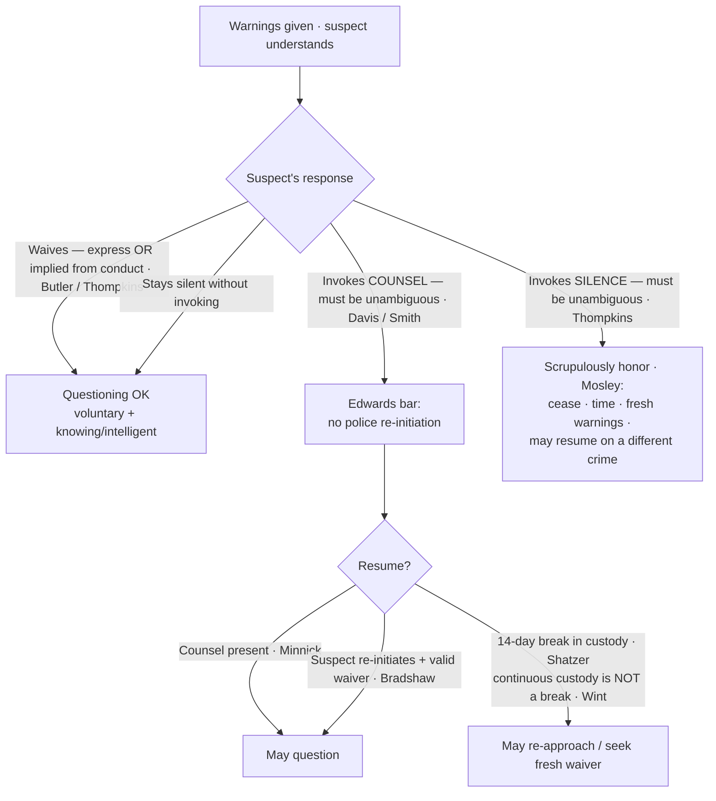

# S9 R1 panel-review — Opus model-diversity lane (prompt pack)

You are the **Claude/Opus** leg of the S9 three-lane adversarial panel (1 Claude + 2 Codex, R1). The two Codex lanes carry the A (support/quote-fidelity) and B (currency/treatment) attack lenses; **you carry model diversity and MUST vote on every paneled assertion across BOTH lenses' concerns.** You are refute-framed: try hard to break each assertion; **default to REFUTED on uncertainty**; never fabricate a cite, quote, or holding; use ONLY the evidence inlined below (no search, no outside knowledge). You are a SIGHTED reviewer — the FULL lake record (judgment fields included) is inlined.

You are a WRITER lane, not an adjudicator: you FIND and VOTE. You do not tally, adjudicate, or close any row — the orchestrator does.

For EACH group below, return one JSON object with the exact `reviewed[]` shape from the output contract (identical framing to the Codex lenses). Emit a finding object ONLY for a real defect (verdict refuted / stands-modified); a group you find wholly clean returns all-`stands` verdicts (the harness records a clean attestation). Concatenate the per-group JSON objects into a top-level `{"packs": [ ... ]}` array, one entry per group, each carrying its `group_id`.


OUTPUT CONTRACT — return ONE JSON object, nothing else:
{
  "lens": "A" | "B",
  "group_id": "<echo the group id>",
  "reviewed": [
    {
      "assertion_id": "<from group_inventory.jsonl>",
      "dimension": "existence|support|quote_fidelity|pincite|treatment|black_letter",
      "verdict": "stands" | "refuted" | "stands-modified",
      "verifiable_from_disclosed": true | false,
      "defect": null,   // null when verdict=="stands"; else an object:
      //  {"problem": "...", "severity": "high|medium|low", "proposed_fix": "...", "evidence_quote": "verbatim from disclosed evidence or null", "needs_cl": true|false, "locator_note": "..."}
      "reasons": ["short evidence-grounded reason", "..."],
      "breaks_true_positives": true | false,
      "residual_risks": ["..."],
      "suggested_tightening": "... or null"
    }
  ],
  "notes": ""
}
Rules: verdict=='stands' <=> defect==null (assertion survives your attack). verdict=='refuted' <=> a real defect (the assertion as framed is wrong). verdict=='stands-modified' <=> survives but needs a stated modification (a minor defect). Review EVERY assertion_id in group_inventory.jsonl exactly once. Output ONLY the JSON object.
---

## GROUP: content/confessions-interrogation-and-the-fifth-amendment/Miranda Waiver and Invocation.md  (`doctrine`, 28 assertions)

### content_page

```
---
weight: 30
topic: "Miranda: Waiver and Invocation"
type: doctrine
jurisdiction: Federal (U.S. Const. amend. V); SCOTUS baseline
status: draft
related:
  - "[[Miranda and Custodial Interrogation]]"
  - "[[Due-Process Voluntariness of Confessions]]"
  - "[[Sixth Amendment Right to Counsel]]"
  - "[[The Exclusionary Rule]]"
aliases:
  - "Miranda: Waiver and Invocation"
  - "Miranda Waiver and Invocation"
  - "9-confessions-interrogation/Miranda-Waiver-and-Invocation"
  - "miranda-waiver-invocation"
---

# Miranda: Waiver and Invocation

*Did the suspect validly waive, or unambiguously invoke, and what must I do either way?*

> [!rule] Black-letter rule
> After warnings, a suspect may **waive** (voluntarily, knowingly, and intelligently; express or implied from conduct) and be questioned, or **invoke** and stop it. An unambiguous invocation of **counsel** bars police-initiated interrogation until counsel is present, unless the suspect himself re-initiates ([[Edwards v. Arizona|*Edwards*]]); an invocation of **silence** must be **"scrupulously honored"** ([[Michigan v. Mosley|*Mosley*]]). Silence alone is neither a waiver nor an invocation ([[Berghuis v. Thompkins|*Thompkins*]]); the invocation must be unambiguous ([[Davis v. United States|*Davis*]]).
> ^rule-miranda-waiver

## The Brief

This page picks up **after** the warnings are given; whether warnings were required at all is governed by [[Miranda and Custodial Interrogation]]. Once a suspect has been warned, everything turns on his response: he may **waive** and be questioned, or **invoke** and stop it. Get the branch wrong and an otherwise-good confession is suppressed.

**Waiver — the default path.** A valid *[[Miranda v. Arizona|Miranda]]* waiver has two components: it must be **(1) voluntary** (the product of a free and deliberate choice rather than coercion) **and (2) knowing and intelligent** (made with awareness of the nature of the right and the consequences of abandoning it). A waiver need **not be express**: it may be **inferred from the suspect's words and conduct** after he receives and understands the warnings, though **silence alone is never a waiver** and the burden of proving waiver stays on the government ([[North Carolina v. Butler#Rule|*Butler*]]). *Thompkins* applies this in the field: a suspect who stays largely silent through a long interrogation and then answers a question has **impliedly waived**, because "a suspect who has received and understood the *Miranda* warnings, and has not invoked his *Miranda* rights, waives the right to remain silent by making an uncoerced statement to the police" ([[Berghuis v. Thompkins#^pin-388|*Berghuis v. Thompkins*]]). The flip side of that same holding is the invocation rule below: **silence is not an invocation.**

**What the suspect need not know.** The "knowing" component tests the suspect's understanding of the **right**, not the police's candor about the investigation. A waiver is knowing and intelligent even though officers did not disclose **every crime or subject** the questioning would cover ("a suspect's awareness of all the possible subjects of questioning in advance of interrogation is not relevant") ([[Colorado v. Spring#^pin-577|*Colorado v. Spring*]]), and even though police **failed to tell him an attorney was trying to reach him**; events outside the suspect's awareness do not bear on his own knowing, voluntary choice ([[Moran v. Burbine#Rule|*Moran v. Burbine*]]). For **juveniles**, there is no special per-se rule: a juvenile's request for a probation officer is **not** a per-se invocation, and the validity of a juvenile's waiver is judged by the **[[Common Legal Terms#totality-of-the-circumstances|totality of the circumstances]]**: age, experience, education, background, and capacity to understand ([[Fare v. Michael C|*Fare v. Michael C.*]], 442 U.S. 707, [725](https://www.courtlistener.com/opinion/110117/fare-v-michael-c/) (1979)).

**A partial invocation is honored as made.** A suspect may draw his own line. One who refuses to give a **written** statement without counsel but **agrees to talk orally** has invoked only as to the writing; his oral statements are admissible, because authorities may honor "the tenor or sense of a defendant's response to the[] warnings" ([[Connecticut v. Barrett#^pin-528|*Connecticut v. Barrett*]]). Scope is set by the suspect's own words.

**Invocation runs on two distinct tracks.** An invocation of **counsel** and an invocation of **silence** trigger different rules; confusing them is the classic field error.

**Track 1 — the right to counsel and the *[[Edwards v. Arizona|Edwards]]* rule.** Once a suspect **invokes counsel**, all interrogation must **cease** and may not resume until **counsel has been made available**, *unless the suspect himself initiates* further communication ([[Edwards v. Arizona#Rule|*Edwards v. Arizona*]]). This is a rigid, prophylactic bright line:
- **Re-initiation** requires more than a routine request (for water, a phone). The suspect must say something evincing "a willingness and a desire for a generalized discussion about the investigation"; even then, the statement is admissible **only if** he **also validly waived** counsel under the totality (the two-step *[[Edwards v. Arizona|Edwards]]* analysis) ([[Oregon v. Bradshaw|*Oregon v. Bradshaw*]], 462 U.S. 1039, [1046](https://www.courtlistener.com/opinion/110987/oregon-v-bradshaw/) (1983)).
- The bar is **not offense-specific**: it blocks questioning about **any** offense, even an unrelated one, and a second officer's ignorance of the invocation is no excuse ([[Arizona v. Roberson#Rule|*Arizona v. Roberson*]]). (Contrast the offense-**specific** Sixth Amendment right, a different regime that must be kept distinct, treated on [[Sixth Amendment Right to Counsel]]; invoking one is not invoking the other, [[McNeil v. Wisconsin|*McNeil v. Wisconsin*]], 501 U.S. 171, [175](https://www.courtlistener.com/opinion/112622/mcneil-v-wisconsin/) (1991).)
- Counsel must be **present** for any police-initiated re-questioning; the bar is **not** lifted merely because the suspect already **consulted** a lawyer ([[Minnick v. Mississippi#Rule|*Minnick v. Mississippi*]]).
- The bar is **not permanent**: a **14-day break in *[[Miranda v. Arizona|Miranda]]* custody** ends *[[Edwards v. Arizona|Edwards]]* protection, after which police may re-approach and seek a fresh waiver; release back into the general prison population can itself be that break ([[Maryland v. Shatzer#Rule|*Maryland v. Shatzer*]]).

**The invocation of counsel must be unambiguous.** *[[Edwards v. Arizona|Edwards]]* protects only a **clear** request. An **equivocal** reference to counsel ("Maybe I should talk to a lawyer") does **not** require officers to stop, or even to ask clarifying questions ([[Davis v. United States#Rule|*Davis v. United States*]]). But officers may **not** manufacture ambiguity after the fact: once a suspect has clearly requested counsel, his **post-request answers** to continued (improper) questioning may **not** be used to cast retrospective doubt on the clarity of the request; they bear only on the separate question of waiver ([[Smith v. Illinois#^pin-100|*Smith v. Illinois*]]).

**Track 2 — the right to silence.** An invocation of **silence** is governed by a **softer** standard than *[[Edwards v. Arizona|Edwards]]*: police need only **"scrupulously honor"** it. Where officers **stopped** questioning on the suspect's assertion of silence, let a significant time pass, gave **fresh warnings**, and then questioned about a **different crime**, the later statements were admissible ([[Michigan v. Mosley#Rule|*Michigan v. Mosley*]]). But the **same unambiguity gate** applies at the threshold: a suspect who wants questioning to stop must say so **unambiguously**; merely falling silent neither invokes the right nor blocks waiver ([[Berghuis v. Thompkins#^pin-382|*Thompkins*]], carrying the *[[Davis v. United States|Davis]]* standard into the silence track).

**Impeachment and the use of silence.** Suppression in the case-in-chief does not always keep a statement out entirely:
- An **un-warned but voluntary** statement (inadmissible as affirmative proof) may still be used to **impeach** the defendant if he takes the stand and testifies inconsistently; *[[Miranda v. Arizona|Miranda]]*'s shield "cannot be perverted into a license to use perjury by way of a defense" ([[Harris v. New York|*Harris v. New York*]], 401 U.S. 222, [226](https://www.courtlistener.com/opinion/108272/harris-v-new-york/) (1971)).
- But **post-arrest, post-*[[Miranda v. Arizona|Miranda]]* silence** may **not** be used to impeach an [[Brady and Giglio|exculpatory]] story offered at trial: the warnings carry an implicit assurance that silence carries no penalty, so using it is a **due-process** violation ([[Doyle v. Ohio#^pin-618|*Doyle v. Ohio*]]).
- And **pre-custody, pre-*[[Miranda v. Arizona|Miranda]]* silence** during voluntary questioning is **unprotected unless the suspect expressly invokes** the privilege; a suspect who simply goes quiet without claiming the Fifth may have that silence used against him ([[Salinas v. Texas#Rule|*Salinas v. Texas*]]).

**Fruits of a *[[Miranda v. Arizona|Miranda]]* lapse.** A bare warnings lapse is a departure from a **prophylactic** rule, not itself a Fifth Amendment violation, so the strict fruit-of-the-poisonous-tree doctrine does not automatically apply ([[Michigan v. Tucker#^pin-446|*Michigan v. Tucker*]]). Concretely: an earlier **un-warned but voluntary** statement does **not** automatically taint a later, properly warned and waived confession ([[Oregon v. Elstad#Rule|*Oregon v. Elstad*]], *limited by* [[Missouri v. Seibert|*Seibert*]]); the **physical fruits** of an un-warned voluntary statement are **admissible** ([[United States v. Patane#Rule|*United States v. Patane*]]); but a **deliberate** "question-first, warn-later" **two-step** engineered to circumvent *[[Miranda v. Arizona|Miranda]]* invalidates the warned second statement; *[[Oregon v. Elstad|Elstad]]*'s safe harbor does not cover bad-faith end-runs ([[Missouri v. Seibert#Rule|*Missouri v. Seibert*]]). The line between them is **deliberateness plus nexus**: absent a deliberate two-step and any link between the unwarned and warned statements, *[[Oregon v. Elstad|Elstad]]* controls ([[Bobby v. Dixon#^pin-31|*Bobby v. Dixon*]]). (Fourth Amendment fruit-of-the-poisonous-tree analysis lives on [[The Exclusionary Rule]]; separate due-process coercion claims go to [[Due-Process Voluntariness of Confessions]].)

**Elements · burden · standard of review · remedy.**
- **Elements of a valid waiver:** (1) **voluntary** (free, uncoerced choice) **and** (2) **knowing and intelligent** (aware of the right and the consequences of abandoning it); **express or implied** from a course of conduct after warnings ([[North Carolina v. Butler]]; [[Berghuis v. Thompkins]]).
- **Elements of an effective invocation:** an **unambiguous** assertion of counsel **or** silence ([[Davis v. United States]]; [[Berghuis v. Thompkins]]); an invocation of counsel triggers the *[[Edwards v. Arizona|Edwards]]* bar, an invocation of silence the *[[Michigan v. Mosley|Mosley]]* "scrupulously honor" duty.
- **Burden:** the **prosecution** proves a valid waiver by a **[[Common Legal Terms#preponderance-of-the-evidence|preponderance of the evidence]]** ([[Colorado v. Connelly]]); the suspect need not prove his invocation, but it must have been unambiguous to count.
- **Standard of review:** waiver and invocation are assessed on the **[[Common Legal Terms#totality-of-the-circumstances|totality of the circumstances]]** (the whole course of conduct, not a single formula) ([[North Carolina v. Butler]]; [[Fare v. Michael C]]).
- **Remedy:** **exclusion from the prosecution's case-in-chief** of statements taken in violation of the waiver/invocation rules, subject to the **impeachment** use of voluntary un-warned statements ([[Harris v. New York]]) and the **fruits** limits above ([[Oregon v. Elstad]]; [[United States v. Patane]]).

**Common pitfalls.**
- **Treating silence as an invocation.** Staying quiet neither invokes the right to silence nor blocks waiver; to stop questioning, the suspect must invoke **unambiguously** ([[Berghuis v. Thompkins]]).
- **Treating an ambiguous lawyer reference as an invocation.** Officers may keep questioning after an equivocal statement and need not even ask clarifying questions ([[Davis v. United States]]); the much-discussed "lawyer dog" anecdote (*[[State v. Demesme]]*, La. 2017, a [[Common Legal Terms#concurring-opinion|concurrence]] to a writ denial treating "why don't you just give me a lawyer dog" as too ambiguous to invoke) shows how literally some courts apply this. *(State, illustrative; no case page.)*
- **Confusing the two tracks.** Invoking **silence** (scrupulously honor; re-questioning on a different crime can be permissible under *[[Michigan v. Mosley|Mosley]]*) is not the same as invoking **counsel** (the rigid, offense-blind *[[Edwards v. Arizona|Edwards]]* bar). Treat them identically and you either over- or under-protect the suspect.
- **Misreading *[[Maryland v. Shatzer|Shatzer]]* as a 14-day *waiting period*.** *[[Maryland v. Shatzer|Shatzer]]* requires a genuine **break in *[[Miranda v. Arizona|Miranda]]* custody** plus 14 days, **not** 14 days of waiting while the suspect stays in custody. A suspect in **continuous** custody never gets a *[[Maryland v. Shatzer|Shatzer]]* break, so *[[Edwards v. Arizona|Edwards]]* still bars police-initiated re-questioning (see the *[[State v. Wint|Wint]]* illustration under Lower-court developments).

> **Scope note.** This page governs everything *after* the warnings — **waiver, invocation (counsel and silence), the *[[Edwards v. Arizona|Edwards]]* bar, and the *[[Miranda v. Arizona|Miranda]]*-fruits / impeachment lines**. Whether warnings were owed at all (custody + interrogation) is on [[Miranda and Custodial Interrogation]]; due-process coercion independent of *[[Miranda v. Arizona|Miranda]]* is on [[Due-Process Voluntariness of Confessions]]; the offense-specific Sixth Amendment right that attaches at charging is on [[Sixth Amendment Right to Counsel]]; Fourth Amendment fruit-of-the-poisonous-tree is on [[The Exclusionary Rule]].

## Lower-court developments

Circuit/state authority only; no SCOTUS. The SCOTUS framework above remains the controlling law; the live action sits in two places: how the circuits apply *[[Missouri v. Seibert|Seibert]]*'s fractured opinion to the deliberate two-step, and how far *[[Maryland v. Shatzer|Shatzer]]*'s "break in custody" reaches.

- **[[United States v. Capers]], 627 F.3d 470 (2d Cir. 2010) / [[United States v. Williams]], 435 F.3d 1148 (9th Cir. 2006)** · role: **illustrates-a-split**. Because *[[Missouri v. Seibert|Seibert]]* produced no majority rationale, lower courts run it through the *Marks* narrowest-holding rule and have not agreed. *[[United States v. Williams|Williams]]* (9th Cir.) treats as "*Seibert*'s holding" a **combined** test drawn from both the plurality and Justice Kennedy: a court suppresses a postwarning confession only where (1) officers **deliberately** used the two-step strategy (Kennedy's intent-based narrowing) **and** (2) the midstream *[[Miranda v. Arizona|Miranda]]* warning, judged objectively, "did not effectively apprise the suspect of his rights" (the plurality's effectiveness inquiry). *[[United States v. Capers|Capers]]* (2d Cir.) is in accord, treating Kennedy's intent-based [[Common Legal Terms#concurring-opinion|concurrence]] as controlling. **Binding in-circuit — 2d Cir. / 9th Cir.**; Persuasive (outside those circuits). ⚖ Circuit split, with no SCOTUS case pending to resolve it. *(No case pages; named in prose.)* [opinion (Capers)](https://www.courtlistener.com/opinion/180156/united-states-v-capers/) · [opinion (Williams)](https://www.courtlistener.com/opinion/793121/united-states-v-tashiri-wayne-williams/)
- **[[State v. Wint]], 236 N.J. 174, 198 A.3d 963 (2018)** · role: **clarifies / narrows application**. Continuous pre-indictment pretrial detention is **not** a *[[Maryland v. Shatzer|Shatzer]]* break in custody: a suspect held ~6 months after invoking counsel could not be re-interrogated (even on an unrelated out-of-state murder), and repeated fresh warnings did not cure the *[[Edwards v. Arizona|Edwards]]* violation, because the coercive *[[Miranda v. Arizona|Miranda]]*-custody pressure never let up. **Persuasive — state, illustrative** (N.J. Supreme Court). *(No case page; named in prose.)* [opinion](https://www.courtlistener.com/opinion/8267547/state-v-wint/)

## Key cases

| Case | Holding | Opinion |
| --- | --- | --- |
| *[[Edwards v. Arizona]]* | Once counsel is invoked, police may not re-initiate interrogation until counsel is made available, unless the accused himself initiates. | [opinion](https://www.courtlistener.com/opinion/110475/edwards-v-arizona/) |
| *[[Berghuis v. Thompkins]]* | Silence alone does not invoke; the right must be invoked unambiguously, and a suspect who answers after understanding the warnings impliedly waives. | [opinion](https://www.courtlistener.com/opinion/147529/berghuis-v-thompkins/) |
| *[[North Carolina v. Butler]]* | Waiver need not be express (it may be inferred from words and conduct), but silence alone is never enough and the burden stays on the government. | [opinion](https://www.courtlistener.com/opinion/110065/north-carolina-v-butler/) |
| *[[Colorado v. Spring]]* | A waiver is knowing and intelligent even though police did not disclose every crime or subject the questioning would cover. | [opinion](https://www.courtlistener.com/opinion/111798/colorado-v-spring/) |
| *[[Moran v. Burbine]]* | Waiver is valid even though police failed to tell the suspect an attorney was trying to reach him; events outside his knowledge do not bear on waiver. | [opinion](https://www.courtlistener.com/opinion/111614/moran-v-burbine/) |
| *[[Fare v. Michael C]]* | A juvenile's request for a probation officer is not a per-se invocation; juvenile waiver is judged by the [[Common Legal Terms#totality-of-the-circumstances\|totality of the circumstances]]. | [opinion](https://www.courtlistener.com/opinion/110117/fare-v-michael-c/) |
| *[[Connecticut v. Barrett]]* | A limited invocation is honored as made: refusing a written statement without counsel while agreeing to talk orally does not bar oral questioning. | [opinion](https://www.courtlistener.com/opinion/111796/connecticut-v-barrett/) |
| *[[Oregon v. Bradshaw]]* | After invoking counsel, a suspect "re-initiates" only by evincing a desire for a generalized discussion of the investigation, and must still validly waive. | [opinion](https://www.courtlistener.com/opinion/110987/oregon-v-bradshaw/) |
| *[[Arizona v. Roberson]]* | The Edwards bar is not offense-specific: invocation blocks questioning on any offense, and a second officer's ignorance is no excuse. | [opinion](https://www.courtlistener.com/opinion/112100/arizona-v-roberson/) |
| *[[Minnick v. Mississippi]]* | Edwards is not satisfied by a prior consultation with counsel; counsel must be present for police-initiated re-questioning. | [opinion](https://www.courtlistener.com/opinion/112513/minnick-v-mississippi/) |
| *[[Maryland v. Shatzer]]* | A 14-day break in Miranda custody ends Edwards protection; release into the general prison population counts as a break. | [opinion](https://www.courtlistener.com/opinion/1734/maryland-v-shatzer/) |
| *[[Davis v. United States]]* | An invocation of counsel must be unambiguous; an equivocal reference does not require police to stop or to ask clarifying questions. | [opinion](https://www.courtlistener.com/opinion/117863/davis-v-united-states/) |
| *[[Smith v. Illinois]]* | Post-request answers to continued questioning may not be used to cast doubt on the clarity of an initial invocation; they bear only on waiver. | [opinion](https://www.courtlistener.com/opinion/111288/smith-v-illinois/) |
| *[[Michigan v. Mosley]]* | After an invocation of silence, later statements are admissible if the invocation was "scrupulously honored." | [opinion](https://www.courtlistener.com/opinion/109336/michigan-v-mosley/) |
| *[[Michigan v. Tucker]]* | The fruits of a mere prophylactic Miranda lapse (a witness's identity) need not be suppressed where the statement was voluntary and uncompelled. | [opinion](https://www.courtlistener.com/opinion/109063/michigan-v-tucker/) |
| *[[Oregon v. Elstad]]* | An earlier un-warned but voluntary statement does not taint a later, properly warned and waived confession. | [opinion](https://www.courtlistener.com/opinion/111364/oregon-v-elstad/) |
| *[[Missouri v. Seibert]]* | A deliberate "question-first, warn-later" two-step interrogation is invalid. | [opinion](https://www.courtlistener.com/opinion/137002/missouri-v-seibert/) |
| *[[Bobby v. Dixon]]* | Marks the *[[Oregon v. Elstad\|Elstad]]*/*[[Missouri v. Seibert\|Seibert]]* line: absent a deliberate two-step **and** a nexus between an earlier unwarned statement and a later warned confession, *[[Oregon v. Elstad\|Elstad]]* (not *[[Missouri v. Seibert\|Seibert]]*) controls. | [opinion](https://www.courtlistener.com/opinion/616807/bobby-v-dixon/) |
| *[[United States v. Patane]]* | Physical fruits of an un-warned but voluntary statement are admissible. | [opinion](https://www.courtlistener.com/opinion/137003/united-states-v-patane/) |
| *[[Harris v. New York]]* | An un-warned but voluntary statement, inadmissible in the case-in-chief, may be used to impeach the defendant's contrary trial testimony (*limiting*). | [opinion](https://www.courtlistener.com/opinion/108272/harris-v-new-york/) |
| *[[Doyle v. Ohio]]* | Post-arrest, post-Miranda silence may not be used to impeach an [[Brady and Giglio\|exculpatory]] trial account; the warnings implicitly assure silence carries no penalty. | [opinion](https://www.courtlistener.com/opinion/109491/doyle-v-ohio/) |
| *[[Salinas v. Texas]]* | Pre-custody, pre-Miranda silence during voluntary questioning is unprotected unless the suspect expressly invokes the privilege. | [opinion](https://www.courtlistener.com/opinion/903977/salinas-v-texas/) |

## Related cases across doctrines

These cases are treated in full on other pages but bear directly on Miranda waiver and invocation, framed here for that doctrine.

| Case | Relevance here | Primary home | Opinion |
| --- | --- | --- | --- |
| *[[Montejo v. Louisiana]]* | A suspect may validly waive and submit to police-initiated interrogation even after counsel has been appointed; the rigid *[[Edwards v. Arizona\|Edwards]]*/Miranda bar runs off the suspect's own invocation, not the mere existence of a lawyer. | [[Sixth Amendment Right to Counsel]] | [opinion](https://www.courtlistener.com/opinion/145873/montejo-v-louisiana/) |
| *[[Patterson v. Illinois]]* | The standard [[Miranda and Custodial Interrogation\|Miranda warnings]] themselves convey enough for a knowing and intelligent waiver: the same warnings that waive the Fifth Amendment rights also suffice to waive the post-charge Sixth Amendment right to counsel for questioning. | [[Sixth Amendment Right to Counsel]] | [opinion](https://www.courtlistener.com/opinion/112127/patterson-v-illinois/) |
| *[[Texas v. Cobb]]* | The Sixth Amendment right to counsel is offense-specific, a sharp contrast to the offense-blind *[[Edwards v. Arizona\|Edwards]]*/*[[Arizona v. Roberson\|Roberson]]* bar that follows a Miranda invocation; keep the two invocation regimes distinct. | [[Sixth Amendment Right to Counsel]] | [opinion](https://www.courtlistener.com/opinion/118417/texas-v-cobb/) |
| *[[McNeil v. Wisconsin]]* | Invoking the offense-specific **Sixth Amendment** right (e.g., at a bail hearing) is **not** an invocation of the distinct **Fifth Amendment** *[[Miranda v. Arizona\|Miranda]]*-*[[Edwards v. Arizona\|Edwards]]* counsel right; the two are separate regimes. | [[Sixth Amendment Right to Counsel]] | [opinion](https://www.courtlistener.com/opinion/112622/mcneil-v-wisconsin/) |
| *[[Colorado v. Connelly]]* | A Miranda waiver is involuntary only where there is coercive police activity (a mentally ill suspect's "voices" do not undercut waiver); the government's burden to prove waiver is a [[Common Legal Terms#preponderance-of-the-evidence\|preponderance of the evidence]]. | [[Due-Process Voluntariness of Confessions]] | [opinion](https://www.courtlistener.com/opinion/111779/colorado-v-connelly/) |

## Visual



## Sources

- [Edwards v. Arizona, 451 U.S. 477 (1981)](https://www.courtlistener.com/opinion/110475/edwards-v-arizona/)
- [Berghuis v. Thompkins, 560 U.S. 370 (2010)](https://www.courtlistener.com/opinion/147529/berghuis-v-thompkins/)
- [North Carolina v. Butler, 441 U.S. 369 (1979)](https://www.courtlistener.com/opinion/110065/north-carolina-v-butler/)
- [Colorado v. Spring, 479 U.S. 564 (1987)](https://www.courtlistener.com/opinion/111798/colorado-v-spring/)
- [Moran v. Burbine, 475 U.S. 412 (1986)](https://www.courtlistener.com/opinion/111614/moran-v-burbine/)
- [Fare v. Michael C., 442 U.S. 707 (1979)](https://www.courtlistener.com/opinion/110117/fare-v-michael-c/) — pinpoint: 725
- [Connecticut v. Barrett, 479 U.S. 523 (1987)](https://www.courtlistener.com/opinion/111796/connecticut-v-barrett/)
- [Oregon v. Bradshaw, 462 U.S. 1039 (1983)](https://www.courtlistener.com/opinion/110987/oregon-v-bradshaw/) — pinpoint: 1046
- [Arizona v. Roberson, 486 U.S. 675 (1988)](https://www.courtlistener.com/opinion/112100/arizona-v-roberson/)
- [Minnick v. Mississippi, 498 U.S. 146 (1990)](https://www.courtlistener.com/opinion/112513/minnick-v-mississippi/)
- [Maryland v. Shatzer, 559 U.S. 98 (2010)](https://www.courtlistener.com/opinion/1734/maryland-v-shatzer/)
- [Davis v. United States, 512 U.S. 452 (1994)](https://www.courtlistener.com/opinion/117863/davis-v-united-states/)
- [Smith v. Illinois, 469 U.S. 91 (1984)](https://www.courtlistener.com/opinion/111288/smith-v-illinois/)
- [Michigan v. Mosley, 423 U.S. 96 (1975)](https://www.courtlistener.com/opinion/109336/michigan-v-mosley/)
- [Michigan v. Tucker, 417 U.S. 433 (1974)](https://www.courtlistener.com/opinion/109063/michigan-v-tucker/)
- [Oregon v. Elstad, 470 U.S. 298 (1985)](https://www.courtlistener.com/opinion/111364/oregon-v-elstad/)
- [Missouri v. Seibert, 542 U.S. 600 (2004)](https://www.courtlistener.com/opinion/137002/missouri-v-seibert/)
- [Bobby v. Dixon, 565 U.S. 23 (2011)](https://www.courtlistener.com/opinion/616807/bobby-v-dixon/) — pinpoint: 31
- [United States v. Patane, 542 U.S. 630 (2004)](https://www.courtlistener.com/opinion/137003/united-states-v-patane/)
- [Harris v. New York, 401 U.S. 222 (1971)](https://www.courtlistener.com/opinion/108272/harris-v-new-york/) — pinpoint: 226
- [Doyle v. Ohio, 426 U.S. 610 (1976)](https://www.courtlistener.com/opinion/109491/doyle-v-ohio/)
- [Salinas v. Texas, 570 U.S. 178 (2013)](https://www.courtlistener.com/opinion/903977/salinas-v-texas/)
- [Montejo v. Louisiana, 556 U.S. 778 (2009)](https://www.courtlistener.com/opinion/145873/montejo-v-louisiana/)
- [Patterson v. Illinois, 487 U.S. 285 (1988)](https://www.courtlistener.com/opinion/112127/patterson-v-illinois/)
- [Texas v. Cobb, 532 U.S. 162 (2001)](https://www.courtlistener.com/opinion/118417/texas-v-cobb/)
- [McNeil v. Wisconsin, 501 U.S. 171 (1991)](https://www.courtlistener.com/opinion/112622/mcneil-v-wisconsin/) — pinpoint: 175
- [Colorado v. Connelly, 479 U.S. 157 (1986)](https://www.courtlistener.com/opinion/111779/colorado-v-connelly/)
- [Bobby v. Dixon, 565 U.S. 23 (2011)](https://www.courtlistener.com/opinion/616807/bobby-v-dixon/)
- [United States v. Capers, 627 F.3d 470 (2d Cir. 2010)](https://www.courtlistener.com/opinion/180156/united-states-v-capers/) *(circuit; no case page)*
- [United States v. Williams, 435 F.3d 1148 (9th Cir. 2006)](https://www.courtlistener.com/opinion/793121/united-states-v-tashiri-wayne-williams/) *(circuit; no case page)*
- [State v. Wint, 236 N.J. 174, 198 A.3d 963 (2018)](https://www.courtlistener.com/opinion/8267547/state-v-wint/) *(Persuasive — state, illustrative; no case page)*
- [State v. Demesme, 228 So. 3d 1206 (La. 2017)](https://www.courtlistener.com/opinion/5035127/state-v-demesme/) *(Persuasive — state, illustrative; no case page)*

```

### group_inventory (assertions under review)

```jsonl
{"assertion_id": "0ff6ce19f22c6d18", "dimension": "existence", "kind": "case_cite", "locator": {"case": "McNeil v. Wisconsin", "table_line": 97}, "payload": {"case": "McNeil v. Wisconsin", "cells": ["*[[McNeil v. Wisconsin]]*", "Invoking the offense-specific **Sixth Amendment** right (e.g., at a bail hearing) is **not** an invocation of the distinct **Fifth Amendment** *[[Miranda v. Arizona\\|Miranda]]*-*[[Edwards v. Arizona\\|Edwards]]* counsel right; the two are separate regimes.", "[[Sixth Amendment Right to Counsel]]", "[opinion](https://www.courtlistener.com/opinion/112622/mcneil-v-wisconsin/)"], "header": ["Case", "Relevance here", "Primary home", "Opinion"]}}
{"assertion_id": "1ee18f4badb47480", "dimension": "existence", "kind": "case_cite", "locator": {"case": "North Carolina v. Butler", "table_line": 67}, "payload": {"case": "North Carolina v. Butler", "cells": ["*[[North Carolina v. Butler]]*", "Waiver need not be express (it may be inferred from words and conduct), but silence alone is never enough and the burden stays on the government.", "[opinion](https://www.courtlistener.com/opinion/110065/north-carolina-v-butler/)"], "header": ["Case", "Holding", "Opinion"]}}
{"assertion_id": "37dcbc857b029695", "dimension": "existence", "kind": "case_cite", "locator": {"case": "Oregon v. Elstad", "table_line": 80}, "payload": {"case": "Oregon v. Elstad", "cells": ["*[[Oregon v. Elstad]]*", "An earlier un-warned but voluntary statement does not taint a later, properly warned and waived confession.", "[opinion](https://www.courtlistener.com/opinion/111364/oregon-v-elstad/)"], "header": ["Case", "Holding", "Opinion"]}}
{"assertion_id": "399c2203a0b514eb", "dimension": "existence", "kind": "case_cite", "locator": {"case": "Colorado v. Connelly", "table_line": 98}, "payload": {"case": "Colorado v. Connelly", "cells": ["*[[Colorado v. Connelly]]*", "A Miranda waiver is involuntary only where there is coercive police activity (a mentally ill suspect's \"voices\" do not undercut waiver); the government's burden to prove waiver is a [[Common Legal Terms#preponderance-of-the-evidence\\|preponderance of the evidence]].", "[[Due-Process Voluntariness of Confessions]]", "[opinion](https://www.courtlistener.com/opinion/111779/colorado-v-connelly/)"], "header": ["Case", "Relevance here", "Primary home", "Opinion"]}}
{"assertion_id": "47851f0b6953a2b6", "dimension": "existence", "kind": "case_cite", "locator": {"case": "Doyle v. Ohio", "table_line": 85}, "payload": {"case": "Doyle v. Ohio", "cells": ["*[[Doyle v. Ohio]]*", "Post-arrest, post-Miranda silence may not be used to impeach an [[Brady and Giglio\\|exculpatory]] trial account; the warnings implicitly assure silence carries no penalty.", "[opinion](https://www.courtlistener.com/opinion/109491/doyle-v-ohio/)"], "header": ["Case", "Holding", "Opinion"]}}
{"assertion_id": "4d22aab15f44fcdd", "dimension": "existence", "kind": "case_cite", "locator": {"case": "Davis v. United States", "table_line": 76}, "payload": {"case": "Davis v. United States", "cells": ["*[[Davis v. United States]]*", "An invocation of counsel must be unambiguous; an equivocal reference does not require police to stop or to ask clarifying questions.", "[opinion](https://www.courtlistener.com/opinion/117863/davis-v-united-states/)"], "header": ["Case", "Holding", "Opinion"]}}
{"assertion_id": "5517282b16748eeb", "dimension": "existence", "kind": "case_cite", "locator": {"case": "United States v. Patane", "table_line": 83}, "payload": {"case": "United States v. Patane", "cells": ["*[[United States v. Patane]]*", "Physical fruits of an un-warned but voluntary statement are admissible.", "[opinion](https://www.courtlistener.com/opinion/137003/united-states-v-patane/)"], "header": ["Case", "Holding", "Opinion"]}}
{"assertion_id": "56d30bff9187838d", "dimension": "existence", "kind": "case_cite", "locator": {"case": "Berghuis v. Thompkins", "table_line": 66}, "payload": {"case": "Berghuis v. Thompkins", "cells": ["*[[Berghuis v. Thompkins]]*", "Silence alone does not invoke; the right must be invoked unambiguously, and a suspect who answers after understanding the warnings impliedly waives.", "[opinion](https://www.courtlistener.com/opinion/147529/berghuis-v-thompkins/)"], "header": ["Case", "Holding", "Opinion"]}}
{"assertion_id": "691faa82e2a1c7fa", "dimension": "existence", "kind": "case_cite", "locator": {"case": "Smith v. Illinois", "table_line": 77}, "payload": {"case": "Smith v. Illinois", "cells": ["*[[Smith v. Illinois]]*", "Post-request answers to continued questioning may not be used to cast doubt on the clarity of an initial invocation; they bear only on waiver.", "[opinion](https://www.courtlistener.com/opinion/111288/smith-v-illinois/)"], "header": ["Case", "Holding", "Opinion"]}}
{"assertion_id": "6e91f4e1ff7bb76b", "dimension": "existence", "kind": "case_cite", "locator": {"case": "Fare v. Michael C", "table_line": 70}, "payload": {"case": "Fare v. Michael C", "cells": ["*[[Fare v. Michael C]]*", "A juvenile's request for a probation officer is not a per-se invocation; juvenile waiver is judged by the [[Common Legal Terms#totality-of-the-circumstances\\|totality of the circumstances]].", "[opinion](https://www.courtlistener.com/opinion/110117/fare-v-michael-c/)"], "header": ["Case", "Holding", "Opinion"]}}
{"assertion_id": "909c8151c563cb3c", "dimension": "existence", "kind": "case_cite", "locator": {"case": "Oregon v. Bradshaw", "table_line": 72}, "payload": {"case": "Oregon v. Bradshaw", "cells": ["*[[Oregon v. Bradshaw]]*", "After invoking counsel, a suspect \"re-initiates\" only by evincing a desire for a generalized discussion of the investigation, and must still validly waive.", "[opinion](https://www.courtlistener.com/opinion/110987/oregon-v-bradshaw/)"], "header": ["Case", "Holding", "Opinion"]}}
{"assertion_id": "992da289259af659", "dimension": "existence", "kind": "case_cite", "locator": {"case": "Minnick v. Mississippi", "table_line": 74}, "payload": {"case": "Minnick v. Mississippi", "cells": ["*[[Minnick v. Mississippi]]*", "Edwards is not satisfied by a prior consultation with counsel; counsel must be present for police-initiated re-questioning.", "[opinion](https://www.courtlistener.com/opinion/112513/minnick-v-mississippi/)"], "header": ["Case", "Holding", "Opinion"]}}
{"assertion_id": "9f1ba0a8a4b8b412", "dimension": "existence", "kind": "case_cite", "locator": {"case": "Missouri v. Seibert", "table_line": 81}, "payload": {"case": "Missouri v. Seibert", "cells": ["*[[Missouri v. Seibert]]*", "A deliberate \"question-first, warn-later\" two-step interrogation is invalid.", "[opinion](https://www.courtlistener.com/opinion/137002/missouri-v-seibert/)"], "header": ["Case", "Holding", "Opinion"]}}
{"assertion_id": "a1e93be1e8d13a9d", "dimension": "existence", "kind": "case_cite", "locator": {"case": "Harris v. New York", "table_line": 84}, "payload": {"case": "Harris v. New York", "cells": ["*[[Harris v. New York]]*", "An un-warned but voluntary statement, inadmissible in the case-in-chief, may be used to impeach the defendant's contrary trial testimony (*limiting*).", "[opinion](https://www.courtlistener.com/opinion/108272/harris-v-new-york/)"], "header": ["Case", "Holding", "Opinion"]}}
{"assertion_id": "acf17c3cda82d3ad", "dimension": "existence", "kind": "case_cite", "locator": {"case": "Salinas v. Texas", "table_line": 86}, "payload": {"case": "Salinas v. Texas", "cells": ["*[[Salinas v. Texas]]*", "Pre-custody, pre-Miranda silence during voluntary questioning is unprotected unless the suspect expressly invokes the privilege.", "[opinion](https://www.courtlistener.com/opinion/903977/salinas-v-texas/)"], "header": ["Case", "Holding", "Opinion"]}}
{"assertion_id": "b0c1c35e2659a9d3", "dimension": "existence", "kind": "case_cite", "locator": {"case": "Texas v. Cobb", "table_line": 96}, "payload": {"case": "Texas v. Cobb", "cells": ["*[[Texas v. Cobb]]*", "The Sixth Amendment right to counsel is offense-specific, a sharp contrast to the offense-blind *[[Edwards v. Arizona\\|Edwards]]*/*[[Arizona v. Roberson\\|Roberson]]* bar that follows a Miranda invocation; keep the two invocation regimes distinct.", "[[Sixth Amendment Right to Counsel]]", "[opinion](https://www.courtlistener.com/opinion/118417/texas-v-cobb/)"], "header": ["Case", "Relevance here", "Primary home", "Opinion"]}}
{"assertion_id": "bd8f66a4e22fe793", "dimension": "existence", "kind": "case_cite", "locator": {"case": "Connecticut v. Barrett", "table_line": 71}, "payload": {"case": "Connecticut v. Barrett", "cells": ["*[[Connecticut v. Barrett]]*", "A limited invocation is honored as made: refusing a written statement without counsel while agreeing to talk orally does not bar oral questioning.", "[opinion](https://www.courtlistener.com/opinion/111796/connecticut-v-barrett/)"], "header": ["Case", "Holding", "Opinion"]}}
{"assertion_id": "cc4aa3efb1bc19b3", "dimension": "existence", "kind": "case_cite", "locator": {"case": "Bobby v. Dixon", "table_line": 82}, "payload": {"case": "Bobby v. Dixon", "cells": ["*[[Bobby v. Dixon]]*", "Marks the *[[Oregon v. Elstad\\|Elstad]]*/*[[Missouri v. Seibert\\|Seibert]]* line: absent a deliberate two-step **and** a nexus between an earlier unwarned statement and a later warned confession, *[[Oregon v. Elstad\\|Elstad]]* (not *[[Missouri v. Seibert\\|Seibert]]*) controls.", "[opinion](https://www.courtlistener.com/opinion/616807/bobby-v-dixon/)"], "header": ["Case", "Holding", "Opinion"]}}
{"assertion_id": "ccd9c2177f627e17", "dimension": "existence", "kind": "case_cite", "locator": {"case": "Colorado v. Spring", "table_line": 68}, "payload": {"case": "Colorado v. Spring", "cells": ["*[[Colorado v. Spring]]*", "A waiver is knowing and intelligent even though police did not disclose every crime or subject the questioning would cover.", "[opinion](https://www.courtlistener.com/opinion/111798/colorado-v-spring/)"], "header": ["Case", "Holding", "Opinion"]}}
{"assertion_id": "cd903b77b21a0c9d", "dimension": "existence", "kind": "case_cite", "locator": {"case": "Moran v. Burbine", "table_line": 69}, "payload": {"case": "Moran v. Burbine", "cells": ["*[[Moran v. Burbine]]*", "Waiver is valid even though police failed to tell the suspect an attorney was trying to reach him; events outside his knowledge do not bear on waiver.", "[opinion](https://www.courtlistener.com/opinion/111614/moran-v-burbine/)"], "header": ["Case", "Holding", "Opinion"]}}
{"assertion_id": "d79afe7576c7fbd5", "dimension": "existence", "kind": "case_cite", "locator": {"case": "Edwards v. Arizona", "table_line": 65}, "payload": {"case": "Edwards v. Arizona", "cells": ["*[[Edwards v. Arizona]]*", "Once counsel is invoked, police may not re-initiate interrogation until counsel is made available, unless the accused himself initiates.", "[opinion](https://www.courtlistener.com/opinion/110475/edwards-v-arizona/)"], "header": ["Case", "Holding", "Opinion"]}}
{"assertion_id": "db94c87f1eacca8e", "dimension": "existence", "kind": "case_cite", "locator": {"case": "Maryland v. Shatzer", "table_line": 75}, "payload": {"case": "Maryland v. Shatzer", "cells": ["*[[Maryland v. Shatzer]]*", "A 14-day break in Miranda custody ends Edwards protection; release into the general prison population counts as a break.", "[opinion](https://www.courtlistener.com/opinion/1734/maryland-v-shatzer/)"], "header": ["Case", "Holding", "Opinion"]}}
{"assertion_id": "def2ba1a32742136", "dimension": "existence", "kind": "case_cite", "locator": {"case": "Michigan v. Mosley", "table_line": 78}, "payload": {"case": "Michigan v. Mosley", "cells": ["*[[Michigan v. Mosley]]*", "After an invocation of silence, later statements are admissible if the invocation was \"scrupulously honored.\"", "[opinion](https://www.courtlistener.com/opinion/109336/michigan-v-mosley/)"], "header": ["Case", "Holding", "Opinion"]}}
{"assertion_id": "f41bff55a117d96b", "dimension": "existence", "kind": "case_cite", "locator": {"case": "Michigan v. Tucker", "table_line": 79}, "payload": {"case": "Michigan v. Tucker", "cells": ["*[[Michigan v. Tucker]]*", "The fruits of a mere prophylactic Miranda lapse (a witness's identity) need not be suppressed where the statement was voluntary and uncompelled.", "[opinion](https://www.courtlistener.com/opinion/109063/michigan-v-tucker/)"], "header": ["Case", "Holding", "Opinion"]}}
{"assertion_id": "f6daca23956e27ed", "dimension": "existence", "kind": "case_cite", "locator": {"case": "Montejo v. Louisiana", "table_line": 94}, "payload": {"case": "Montejo v. Louisiana", "cells": ["*[[Montejo v. Louisiana]]*", "A suspect may validly waive and submit to police-initiated interrogation even after counsel has been appointed; the rigid *[[Edwards v. Arizona\\|Edwards]]*/Miranda bar runs off the suspect's own invocation, not the mere existence of a lawyer.", "[[Sixth Amendment Right to Counsel]]", "[opinion](https://www.courtlistener.com/opinion/145873/montejo-v-louisiana/)"], "header": ["Case", "Relevance here", "Primary home", "Opinion"]}}
{"assertion_id": "f74990a1cfe168b7", "dimension": "existence", "kind": "case_cite", "locator": {"case": "Patterson v. Illinois", "table_line": 95}, "payload": {"case": "Patterson v. Illinois", "cells": ["*[[Patterson v. Illinois]]*", "The standard [[Miranda and Custodial Interrogation\\|Miranda warnings]] themselves convey enough for a knowing and intelligent waiver: the same warnings that waive the Fifth Amendment rights also suffice to waive the post-charge Sixth Amendment right to counsel for questioning.", "[[Sixth Amendment Right to Counsel]]", "[opinion](https://www.courtlistener.com/opinion/112127/patterson-v-illinois/)"], "header": ["Case", "Relevance here", "Primary home", "Opinion"]}}
{"assertion_id": "fc84f8e5794ce395", "dimension": "existence", "kind": "case_cite", "locator": {"case": "Arizona v. Roberson", "table_line": 73}, "payload": {"case": "Arizona v. Roberson", "cells": ["*[[Arizona v. Roberson]]*", "The Edwards bar is not offense-specific: invocation blocks questioning on any offense, and a second officer's ignorance is no excuse.", "[opinion](https://www.courtlistener.com/opinion/112100/arizona-v-roberson/)"], "header": ["Case", "Holding", "Opinion"]}}
{"assertion_id": "d9e53755ff9489bc", "dimension": "support", "kind": "proposition", "locator": {"callout": "^rule-miranda-waiver"}, "payload": {"anchor": "^rule-miranda-waiver", "statement": "[!rule] Black-letter rule\nAfter warnings, a suspect may **waive** (voluntarily, knowingly, and intelligently; express or implied from conduct) and be questioned, or **invoke** and stop it. An unambiguous invocation of **counsel** bars police-initiated interrogation until counsel is present, unless the suspect himself re-initiates ([[Edwards v. Arizona|*Edwards*]]); an invocation of **silence** must be **\"scrupulously honored\"** ([[Michigan v. Mosley|*Mosley*]]). Silence alone is neither a waiver nor an invocation ([[Berghuis v. Thompkins|*Thompkins*]]); the invocation must be unambiguous ([[Davis v. United States|*Davis*]])."}}
```

### lake record — Arizona v. Roberson

```json
{
  "schema_version": "s2.v1",
  "record_id": "Arizona v. Roberson",
  "stub": false,
  "status": "verified",
  "identity": {
    "case_name": "Arizona v. Roberson",
    "case_name_short": "Roberson",
    "case_name_full": "Arizona v. Roberson",
    "input_case_name": "Arizona v. Roberson",
    "court": "U.S. Supreme Court",
    "court_id": "scotus",
    "court_level": "scotus",
    "circuit": null,
    "state": null,
    "date_decided": "1988-06-15",
    "year": 1988,
    "docket": null,
    "cluster_id": 112100,
    "lead_opinion_id": 9431349,
    "sibling_ids": [
      112100,
      9431349,
      9431350
    ],
    "absolute_url": "/opinion/112100/arizona-v-roberson/",
    "identity_method": "citation+party-text",
    "expected_citation_found": true,
    "party_name_in_text": true,
    "canonical_name_match": true,
    "alternates": [
      {
        "cluster_id": 9074843,
        "score": 10,
        "case_name": "Arizona v. Roberson"
      },
      {
        "cluster_id": 9074842,
        "score": 10,
        "case_name": "Arizona v. Roberson"
      },
      {
        "cluster_id": 9074378,
        "score": 10,
        "case_name": "Arizona v. Roberson"
      },
      {
        "cluster_id": 9074377,
        "score": 10,
        "case_name": "Arizona v. Roberson"
      }
    ],
    "reason_code": null
  },
  "citations": {
    "official": {
      "cite": "486 U.S. 675",
      "volume": "486",
      "reporter": "U.S.",
      "page": "675",
      "type": 1,
      "selected_official": true,
      "source": "cluster.citations[]"
    },
    "parallel": [
      {
        "cite": "108 S. Ct. 2093",
        "volume": "108",
        "reporter": "S. Ct.",
        "page": "2093",
        "type": 1,
        "selected_official": false,
        "source": "cluster.citations[]"
      },
      {
        "cite": "100 L. Ed. 2d 704",
        "volume": "100",
        "reporter": "L. Ed. 2d",
        "page": "704",
        "type": 1,
        "selected_official": false,
        "source": "cluster.citations[]"
      },
      {
        "cite": "56 U.S.L.W. 4590",
        "volume": "56",
        "reporter": "U.S.L.W.",
        "page": "4590",
        "type": 4,
        "selected_official": false,
        "source": "cluster.citations[]"
      }
    ],
    "vendor_neutral": [
      {
        "cite": "1988 U.S. LEXIS 2726",
        "volume": "1988",
        "reporter": "U.S. LEXIS",
        "page": "2726",
        "type": 6,
        "selected_official": false,
        "source": "cluster.citations[]"
      }
    ],
    "all": [
      {
        "cite": "486 U.S. 675",
        "volume": "486",
        "reporter": "U.S.",
        "page": "675",
        "type": 1,
        "selected_official": false,
        "source": "cluster.citations[]"
      },
      {
        "cite": "108 S. Ct. 2093",
        "volume": "108",
        "reporter": "S. Ct.",
        "page": "2093",
        "type": 1,
        "selected_official": false,
        "source": "cluster.citations[]"
      },
      {
        "cite": "100 L. Ed. 2d 704",
        "volume": "100",
        "reporter": "L. Ed. 2d",
        "page": "704",
        "type": 1,
        "selected_official": false,
        "source": "cluster.citations[]"
      },
      {
        "cite": "1988 U.S. LEXIS 2726",
        "volume": "1988",
        "reporter": "U.S. LEXIS",
        "page": "2726",
        "type": 6,
        "selected_official": false,
        "source": "cluster.citations[]"
      },
      {
        "cite": "56 U.S.L.W. 4590",
        "volume": "56",
        "reporter": "U.S.L.W.",
        "page": "4590",
        "type": 4,
        "selected_official": false,
        "source": "cluster.citations[]"
      }
    ],
    "display": "486 U.S. 675",
    "official_selection": {
      "court_class": "scotus",
      "selected": "486 U.S. 675",
      "reason": "selected_rank_1"
    }
  },
  "pinpoints": [
    {
      "id": "pin-683",
      "page": null,
      "quote": "--- # Arizona v. Roberson *486 U.S. 675 (1988)* \u00b7 U.S. Supreme Court \u00b7 **Binding \u2014 SCOTUS** \u00b7 Treatment: **good** *(as of 2026-06-30)* <!-- header line; TreatmentBadge + weight render here, degrading to the text above --> ## Background Roberson was arrested at the scene of a burglary and, after Miranda warnings, said he wanted a lawyer before answering any questions. Three days later, while he was still in custody, a different officer \u2014 unaware of the earlier invocation \u2014 gave fresh Miranda warnings and questioned Roberson about a *different* burglary, and Roberson made an incriminating statement. He moved to suppress it. ## Issue Whether the *Edwards* rule barring police-initiated interrogation after a suspect invokes counsel applies when the later interrogation concerns a separate offense or investigation. ## Rule Yes \u2014 the *Edwards* bar is not offense-specific.",
      "star_marker": null,
      "quote_fidelity": "mismatch",
      "pinpoint_status": "slip-only",
      "position": null
    },
    {
      "id": "pin-684",
      "page": null,
      "quote": "That a suspect's request for counsel should apply to any questions the police wish to pose follows, we think, not only from *Edwards* and *Miranda* . . . .",
      "star_marker": null,
      "quote_fidelity": "mismatch",
      "pinpoint_status": "slip-only",
      "position": null
    }
  ],
  "treatment": {
    "field_i_validity": "good_law",
    "as_of_content": "1988-06-15",
    "as_of_treatment": "2026-06-30",
    "composite_basis": "migration-seed",
    "composite_basis_ref": "Arizona v. Roberson",
    "varies_by_point": false,
    "scope_note": "Old as_of seeds as_of_treatment; S2 derivation re-derives and may downgrade.",
    "point_overrides": [],
    "edges": [
      {
        "citing_case": {
          "name": "State v. DeJong",
          "cluster_id": 2669581,
          "cite": null,
          "field_ii": "abrogated"
        },
        "field_ii": "abrogated",
        "field_iii": "mentioned",
        "point": null,
        "proposed": true,
        "journal_ref": "Arizona v. Roberson:lane1_negative"
      },
      {
        "citing_case": {
          "name": "State v. Garcia",
          "cluster_id": 2713978,
          "cite": [
            "2013 SD 46",
            "834 N.W.2d 821",
            "2013 WL 3226703",
            "2013 S.D. LEXIS 71"
          ],
          "field_ii": "abrogated"
        },
        "field_ii": "abrogated",
        "field_iii": "mentioned",
        "point": null,
        "proposed": true,
        "journal_ref": "Arizona v. Roberson:lane1_negative"
      },
      {
        "citing_case": {
          "name": "Pecina v. State",
          "cluster_id": 2292956,
          "cite": [
            "326 S.W.3d 249",
            "2010 Tex. App. LEXIS 5631",
            "2010 WL 2825663"
          ],
          "field_ii": "overruled"
        },
        "field_ii": "overruled",
        "field_iii": "mentioned",
        "point": null,
        "proposed": true,
        "journal_ref": "Arizona v. Roberson:lane1_negative"
      },
      {
        "citing_case": {
          "name": "State v. Gobert",
          "cluster_id": 1947904,
          "cite": [
            "244 S.W.3d 861",
            "2008 Tex. App. LEXIS 742",
            "2008 WL 269448"
          ],
          "field_ii": "overruled"
        },
        "field_ii": "overruled",
        "field_iii": "mentioned",
        "point": null,
        "proposed": true,
        "journal_ref": "Arizona v. Roberson:lane1_negative"
      },
      {
        "citing_case": {
          "name": "Robert Van Hook v. Carl S. Anderson, Warden",
          "cluster_id": 793987,
          "cite": [
            "444 F.3d 830",
            "2006 U.S. App. LEXIS 9628",
            "2006 WL 997203"
          ],
          "field_ii": "overruled"
        },
        "field_ii": "overruled",
        "field_iii": "mentioned",
        "point": null,
        "proposed": true,
        "journal_ref": "Arizona v. Roberson:lane1_negative"
      },
      {
        "citing_case": {
          "name": "Houston v. State",
          "cluster_id": 1678067,
          "cite": [
            "185 S.W.3d 917",
            "2006 Tex. App. LEXIS 1352",
            "2006 WL 358070"
          ],
          "field_ii": "overruled"
        },
        "field_ii": "overruled",
        "field_iii": "mentioned",
        "point": null,
        "proposed": true,
        "journal_ref": "Arizona v. Roberson:lane1_negative"
      },
      {
        "citing_case": {
          "name": "Moran v. State",
          "cluster_id": 1560713,
          "cite": [
            "171 S.W.3d 382",
            "2005 WL 1583847"
          ],
          "field_ii": "overruled"
        },
        "field_ii": "overruled",
        "field_iii": "mentioned",
        "point": null,
        "proposed": true,
        "journal_ref": "Arizona v. Roberson:lane1_negative"
      },
      {
        "citing_case": {
          "name": "United States v. Gregory Johnson, A/K/A Little Greg, United States of America v. Gregory Johnson, A/K/A Little Greg",
          "cluster_id": 789459,
          "cite": [
            "400 F.3d 187",
            "2005 WL 526889"
          ],
          "field_ii": "questioned"
        },
        "field_ii": "questioned",
        "field_iii": "mentioned",
        "point": null,
        "proposed": true,
        "journal_ref": "Arizona v. Roberson:lane1_negative"
      },
      {
        "citing_case": {
          "name": "Davis v. United States",
          "cluster_id": 117863,
          "cite": [
            "129 L. Ed. 2d 362",
            "114 S. Ct. 2350",
            "512 U.S. 452",
            "1994 U.S. LEXIS 4827"
          ],
          "field_ii": "questioned"
        },
        "field_ii": "questioned",
        "field_iii": "mentioned",
        "point": null,
        "proposed": true,
        "journal_ref": "Arizona v. Roberson:lane2_top_cited"
      },
      {
        "citing_case": {
          "name": "Dickerson v. United States",
          "cluster_id": 118380,
          "cite": [
            "147 L. Ed. 2d 405",
            "120 S. Ct. 2326",
            "530 U.S. 428",
            "2000 U.S. LEXIS 4305"
          ],
          "field_ii": "overruled"
        },
        "field_ii": "overruled",
        "field_iii": "mentioned",
        "point": null,
        "proposed": true,
        "journal_ref": "Arizona v. Roberson:lane2_top_cited"
      },
      {
        "citing_case": {
          "name": "McNeil v. Wisconsin",
          "cluster_id": 112622,
          "cite": [
            "115 L. Ed. 2d 158",
            "111 S. Ct. 2204",
            "501 U.S. 171",
            "1991 U.S. LEXIS 3483"
          ],
          "field_ii": "questioned"
        },
        "field_ii": "questioned",
        "field_iii": "mentioned",
        "point": null,
        "proposed": true,
        "journal_ref": "Arizona v. Roberson:lane2_top_cited"
      },
      {
        "citing_case": {
          "name": "Wright v. West",
          "cluster_id": 112771,
          "cite": [
            "120 L. Ed. 2d 225",
            "112 S. Ct. 2482",
            "505 U.S. 277",
            "1992 U.S. LEXIS 3689"
          ],
          "field_ii": "overruled"
        },
        "field_ii": "overruled",
        "field_iii": "mentioned",
        "point": null,
        "proposed": true,
        "journal_ref": "Arizona v. Roberson:lane2_top_cited"
      },
      {
        "citing_case": {
          "name": "California v. Acevedo",
          "cluster_id": 112608,
          "cite": [
            "114 L. Ed. 2d 619",
            "111 S. Ct. 1982",
            "500 U.S. 565",
            "1991 U.S. LEXIS 3016"
          ],
          "field_ii": "overruled"
        },
        "field_ii": "overruled",
        "field_iii": "mentioned",
        "point": null,
        "proposed": true,
        "journal_ref": "Arizona v. Roberson:lane2_top_cited"
      },
      {
        "citing_case": {
          "name": "Green v. State",
          "cluster_id": 1657475,
          "cite": [
            "934 S.W.2d 92",
            "1996 Tex. Crim. App. LEXIS 185",
            "1996 WL 512395"
          ],
          "field_ii": "overruled"
        },
        "field_ii": "overruled",
        "field_iii": "mentioned",
        "point": null,
        "proposed": true,
        "journal_ref": "Arizona v. Roberson:lane2_top_cited"
      },
      {
        "citing_case": {
          "name": "Harper v. Virginia Department of Taxation",
          "cluster_id": 112890,
          "cite": [
            "125 L. Ed. 2d 74",
            "113 S. Ct. 2510",
            "509 U.S. 86",
            "1993 U.S. LEXIS 4212",
            "7 Fla. L. Weekly Fed. S 456",
            "16 Employee Benefits Cas. (BNA) 2313",
            "93 Daily Journal DAR 7730",
            "93 Cal. Daily Op. Serv. 4491",
            "61 U.S.L.W. 4664"
          ],
          "field_ii": "overruled"
        },
        "field_ii": "overruled",
        "field_iii": "mentioned",
        "point": null,
        "proposed": true,
        "journal_ref": "Arizona v. Roberson:lane2_top_cited"
      },
      {
        "citing_case": {
          "name": "People v. Waidla",
          "cluster_id": 1316339,
          "cite": [
            "996 P.2d 46",
            "94 Cal. Rptr. 2d 396",
            "22 Cal. 4th 690",
            "22 Cal. 690",
            "2000 Daily Journal DAR 3605",
            "2000 Cal. Daily Op. Serv. 2687",
            "2000 Cal. LEXIS 2229"
          ],
          "field_ii": "overruled"
        },
        "field_ii": "overruled",
        "field_iii": "mentioned",
        "point": null,
        "proposed": true,
        "journal_ref": "Arizona v. Roberson:lane2_top_cited"
      },
      {
        "citing_case": {
          "name": "Saffle v. Parks",
          "cluster_id": 112390,
          "cite": [
            "108 L. Ed. 2d 415",
            "110 S. Ct. 1257",
            "494 U.S. 484",
            "1990 U.S. LEXIS 1178",
            "58 U.S.L.W. 4322"
          ],
          "field_ii": "overruled"
        },
        "field_ii": "overruled",
        "field_iii": "mentioned",
        "point": null,
        "proposed": true,
        "journal_ref": "Arizona v. Roberson:lane2_top_cited"
      },
      {
        "citing_case": {
          "name": "People v. Cunningham",
          "cluster_id": 2587254,
          "cite": [
            "25 P.3d 519",
            "108 Cal. Rptr. 2d 291",
            "25 Cal. 4th 926"
          ],
          "field_ii": "overruled"
        },
        "field_ii": "overruled",
        "field_iii": "mentioned",
        "point": null,
        "proposed": true,
        "journal_ref": "Arizona v. Roberson:lane2_top_cited"
      },
      {
        "citing_case": {
          "name": "Patterson v. Illinois",
          "cluster_id": 112127,
          "cite": [
            "101 L. Ed. 2d 261",
            "108 S. Ct. 2389",
            "487 U.S. 285",
            "1988 U.S. LEXIS 2876",
            "56 U.S.L.W. 4733"
          ],
          "field_ii": "questioned"
        },
        "field_ii": "questioned",
        "field_iii": "mentioned",
        "point": null,
        "proposed": true,
        "journal_ref": "Arizona v. Roberson:lane2_top_cited"
      },
      {
        "citing_case": {
          "name": "Illinois v. Perkins",
          "cluster_id": 112452,
          "cite": [
            "110 L. Ed. 2d 243",
            "110 S. Ct. 2394",
            "496 U.S. 292",
            "1990 U.S. LEXIS 2885"
          ],
          "field_ii": "questioned"
        },
        "field_ii": "questioned",
        "field_iii": "mentioned",
        "point": null,
        "proposed": true,
        "journal_ref": "Arizona v. Roberson:lane2_top_cited"
      },
      {
        "citing_case": {
          "name": "Minnick v. Mississippi",
          "cluster_id": 112513,
          "cite": [
            "112 L. Ed. 2d 489",
            "111 S. Ct. 486",
            "498 U.S. 146",
            "1990 U.S. LEXIS 6118"
          ],
          "field_ii": "questioned"
        },
        "field_ii": "questioned",
        "field_iii": "mentioned",
        "point": null,
        "proposed": true,
        "journal_ref": "Arizona v. Roberson:lane2_top_cited"
      },
      {
        "citing_case": {
          "name": "Leif Taylor v. Thomas M. Maddox, Interim Director George Galaza Cal Terhune",
          "cluster_id": 786028,
          "cite": [
            "366 F.3d 992",
            "2004 U.S. App. LEXIS 9068",
            "2004 WL 1043343"
          ],
          "field_ii": "superseded_by_statute"
        },
        "field_ii": "superseded_by_statute",
        "field_iii": "mentioned",
        "point": null,
        "proposed": true,
        "journal_ref": "Arizona v. Roberson:lane2_top_cited"
      },
      {
        "citing_case": {
          "name": "People v. Bradford",
          "cluster_id": 1239150,
          "cite": [
            "15 Cal. 4th 1229",
            "939 P.2d 259",
            "97 Daily Journal DAR 9003",
            "97 Cal. Daily Op. Serv. 5537",
            "65 Cal. Rptr. 2d 145",
            "1997 Cal. LEXIS 3699"
          ],
          "field_ii": "overruled"
        },
        "field_ii": "overruled",
        "field_iii": "mentioned",
        "point": null,
        "proposed": true,
        "journal_ref": "Arizona v. Roberson:lane2_top_cited"
      },
      {
        "citing_case": {
          "name": "People v. Crittenden",
          "cluster_id": 2614001,
          "cite": [
            "885 P.2d 887",
            "9 Cal. 4th 83",
            "36 Cal. Rptr. 2d 474",
            "94 Daily Journal DAR 18013",
            "94 Cal. Daily Op. Serv. 9702",
            "1994 Cal. LEXIS 6570"
          ],
          "field_ii": "overruled"
        },
        "field_ii": "overruled",
        "field_iii": "mentioned",
        "point": null,
        "proposed": true,
        "journal_ref": "Arizona v. Roberson:lane2_top_cited"
      },
      {
        "citing_case": {
          "name": "Montejo v. Louisiana",
          "cluster_id": 145873,
          "cite": [
            "173 L. Ed. 2d 955",
            "129 S. Ct. 2079",
            "556 U.S. 778",
            "2009 U.S. LEXIS 3973"
          ],
          "field_ii": "overruled"
        },
        "field_ii": "overruled",
        "field_iii": "mentioned",
        "point": null,
        "proposed": true,
        "journal_ref": "Arizona v. Roberson:lane2_top_cited"
      },
      {
        "citing_case": {
          "name": "Maryland v. Shatzer",
          "cluster_id": 1734,
          "cite": [
            "175 L. Ed. 2d 1045",
            "130 S. Ct. 1213",
            "559 U.S. 98",
            "2010 U.S. LEXIS 1899"
          ],
          "field_ii": "criticized"
        },
        "field_ii": "criticized",
        "field_iii": "mentioned",
        "point": null,
        "proposed": true,
        "journal_ref": "Arizona v. Roberson:lane2_top_cited"
      },
      {
        "citing_case": {
          "name": "Butler v. McKellar",
          "cluster_id": 112387,
          "cite": [
            "108 L. Ed. 2d 347",
            "110 S. Ct. 1212",
            "494 U.S. 407",
            "1990 U.S. LEXIS 1246"
          ],
          "field_ii": "overruled"
        },
        "field_ii": "overruled",
        "field_iii": "mentioned",
        "point": null,
        "proposed": true,
        "journal_ref": "Arizona v. Roberson:lane2_top_cited"
      },
      {
        "citing_case": {
          "name": "People v. Williams",
          "cluster_id": 1801669,
          "cite": [
            "49 Cal. 4th 405",
            "2010 D.A.R. 10",
            "111 Cal. Rptr. 3d 589",
            "233 P.3d 1000",
            "2010 Cal. LEXIS 5970"
          ],
          "field_ii": "overruled"
        },
        "field_ii": "overruled",
        "field_iii": "mentioned",
        "point": null,
        "proposed": true,
        "journal_ref": "Arizona v. Roberson:lane2_top_cited"
      },
      {
        "citing_case": {
          "name": "J. D. B. v. North Carolina",
          "cluster_id": 218925,
          "cite": [
            "180 L. Ed. 2d 310",
            "131 S. Ct. 2394",
            "564 U.S. 261",
            "2011 U.S. LEXIS 4557",
            "22 Fla. L. Weekly Fed. S 1135",
            "79 U.S.L.W. 4504"
          ],
          "field_ii": "overruled"
        },
        "field_ii": "overruled",
        "field_iii": "mentioned",
        "point": null,
        "proposed": true,
        "journal_ref": "Arizona v. Roberson:lane2_top_cited"
      },
      {
        "citing_case": {
          "name": "Herron v. State",
          "cluster_id": 2351946,
          "cite": [
            "86 S.W.3d 621",
            "2002 Tex. Crim. App. LEXIS 197",
            "2002 WL 31255420"
          ],
          "field_ii": "overruled"
        },
        "field_ii": "overruled",
        "field_iii": "mentioned",
        "point": null,
        "proposed": true,
        "journal_ref": "Arizona v. Roberson:lane2_top_cited"
      },
      {
        "citing_case": {
          "name": "People v. Mickey",
          "cluster_id": 1226896,
          "cite": [
            "818 P.2d 84",
            "54 Cal. 3d 612",
            "286 Cal. Rptr. 801",
            "91 Daily Journal DAR 13544",
            "91 Cal. Daily Op. Serv. 8732",
            "1991 Cal. LEXIS 4664"
          ],
          "field_ii": "overruled"
        },
        "field_ii": "overruled",
        "field_iii": "mentioned",
        "point": null,
        "proposed": true,
        "journal_ref": "Arizona v. Roberson:lane2_top_cited"
      },
      {
        "citing_case": {
          "name": "Commonwealth v. Spotz",
          "cluster_id": 2074443,
          "cite": [
            "896 A.2d 1191",
            "587 Pa. 1",
            "2006 Pa. LEXIS 659"
          ],
          "field_ii": "overruled"
        },
        "field_ii": "overruled",
        "field_iii": "mentioned",
        "point": null,
        "proposed": true,
        "journal_ref": "Arizona v. Roberson:lane2_top_cited"
      },
      {
        "citing_case": {
          "name": "People v. Bradford",
          "cluster_id": 1407706,
          "cite": [
            "14 Cal. 4th 1005",
            "929 P.2d 544",
            "97 Daily Journal DAR 899",
            "97 Cal. Daily Op. Serv. 520",
            "60 Cal. Rptr. 2d 225",
            "1997 Cal. LEXIS 9"
          ],
          "field_ii": "overruled"
        },
        "field_ii": "overruled",
        "field_iii": "mentioned",
        "point": null,
        "proposed": true,
        "journal_ref": "Arizona v. Roberson:lane2_top_cited"
      }
    ],
    "derivation": {
      "lane1_negative": {
        "query": "cites:(112100 OR 9431349 OR 9431350) AND (overrul* OR abrogat* OR supersed* OR \"recede from\" OR \"no longer good law\" OR vacat* OR reversed) ",
        "reviewed": 200,
        "cap": 200,
        "cap_hit": true,
        "final_cursor": "https://www.courtlistener.com/api/rest/v4/search/?cursor=cz0xMDE2NTgyNDAwMDAwJnM9MTgyMTk3MiZ0PW8mZD0yMDI2LTA3LTA0JnA9MTE%3D&fields=absolute_url%2CcaseName%2CcaseNameFull%2Ccitation%2CciteCount%2Ccluster_id%2Ccourt%2Ccourt_citation_string%2Ccourt_id%2CdateFiled%2Copinions%2Csibling_ids%2Cstatus%2Csyllabus&order_by=dateFiled+desc&page_size=100&q=cites%3A%28112100+OR+9431349+OR+9431350%29+AND+%28overrul%2A+OR+abrogat%2A+OR+supersed%2A+OR+%22recede+from%22+OR+%22no+longer+good+law%22+OR+vacat%2A+OR+reversed%29+&stat_Published=on&type=o",
        "audit_needed": true,
        "proposed_negative_events": 8,
        "audit_marker": "R15 treatment audit required",
        "triage_mode": "snippet-first",
        "snippet_field": "results[].opinions[].snippet",
        "triage_journaled": 200,
        "triage_read": 8,
        "triage_snippet_classified": 192
      },
      "lane2_top_cited": {
        "query": "cites:(112100 OR 9431349 OR 9431350)",
        "reviewed": 25,
        "cap": 25,
        "cap_hit": true,
        "final_cursor": "https://www.courtlistener.com/api/rest/v4/search/?cursor=cz0yMTYmcz0zMTU5OTk1JnQ9byZkPTIwMjYtMDctMDQmcD0z&order_by=citeCount+desc&page_size=25&q=cites%3A%28112100+OR+9431349+OR+9431350%29&type=o",
        "audit_needed": true,
        "proposed_negative_events": 25,
        "audit_marker": "R15 treatment audit required"
      },
      "lane3_recency": {
        "query": "cites:(112100 OR 9431349 OR 9431350)",
        "reviewed": 11,
        "cap": 200,
        "cap_hit": false,
        "final_cursor": null,
        "audit_needed": false,
        "proposed_negative_events": 0,
        "audit_marker": null,
        "triage_mode": "snippet-first",
        "snippet_field": "results[].opinions[].snippet",
        "triage_journaled": 11,
        "triage_read": 0,
        "triage_snippet_classified": 11
      }
    }
  },
  "progeny": {
    "complete_query": "cites:(112100 OR 9431349 OR 9431350)",
    "indexed_citing_opinions": 589,
    "count_source": "search",
    "per_sibling": [
      {
        "opinion_id": 112100,
        "count": 547,
        "count_source": "search"
      },
      {
        "opinion_id": 9431349,
        "count": 53,
        "count_source": "search"
      },
      {
        "opinion_id": 9431350,
        "count": 0,
        "count_source": "search"
      }
    ],
    "citation_count": 963,
    "cache_path": "/Users/johngalt/cssi-lake/cache/progeny/arizona-v-roberson.jsonl",
    "enumeration": "bounded",
    "cursor": "https://www.courtlistener.com/api/rest/v4/search/?cursor=cz0xLjY3NTc0MTcmcz00NzUxMDkzJnQ9byZkPTIwMjYtMDctMDQmcD0y&order_by=score+desc&page_size=100&q=cites%3A%28112100+OR+9431349+OR+9431350%29&type=o",
    "rows_cached": 20,
    "outbound_opinion_edges": [
      {
        "source_opinion_id": 112100,
        "cited_id": 106822,
        "source": "search.opinions[].cites[]"
      },
      {
        "source_opinion_id": 112100,
        "cited_id": 107252,
        "source": "search.opinions[].cites[]"
      },
      {
        "source_opinion_id": 112100,
        "cited_id": 108471,
        "source": "search.opinions[].cites[]"
      },
      {
        "source_opinion_id": 112100,
        "cited_id": 109063,
        "source": "search.opinions[].cites[]"
      },
      {
        "source_opinion_id": 112100,
        "cited_id": 109336,
        "source": "search.opinions[].cites[]"
      },
      {
        "source_opinion_id": 112100,
        "cited_id": 110117,
        "source": "search.opinions[].cites[]"
      },
      {
        "source_opinion_id": 112100,
        "cited_id": 110254,
        "source": "search.opinions[].cites[]"
      },
      {
        "source_opinion_id": 112100,
        "cited_id": 110475,
        "source": "search.opinions[].cites[]"
      },
      {
        "source_opinion_id": 112100,
        "cited_id": 110809,
        "source": "search.opinions[].cites[]"
      },
      {
        "source_opinion_id": 112100,
        "cited_id": 110987,
        "source": "search.opinions[].cites[]"
      },
      {
        "source_opinion_id": 112100,
        "cited_id": 111112,
        "source": "search.opinions[].cites[]"
      },
      {
        "source_opinion_id": 112100,
        "cited_id": 111214,
        "source": "search.opinions[].cites[]"
      },
      {
        "source_opinion_id": 112100,
        "cited_id": 111249,
        "source": "search.opinions[].cites[]"
      },
      {
        "source_opinion_id": 112100,
        "cited_id": 111288,
        "source": "search.opinions[].cites[]"
      },
      {
        "source_opinion_id": 112100,
        "cited_id": 111355,
        "source": "search.opinions[].cites[]"
      },
      {
        "source_opinion_id": 112100,
        "cited_id": 111364,
        "source": "search.opinions[].cites[]"
      },
      {
        "source_opinion_id": 112100,
        "cited_id": 111546,
        "source": "search.opinions[].cites[]"
      },
      {
        "source_opinion_id": 112100,
        "cited_id": 111614,
        "source": "search.opinions[].cites[]"
      },
      {
        "source_opinion_id": 112100,
        "cited_id": 111622,
        "source": "search.opinions[].cites[]"
      },
      {
        "source_opinion_id": 112100,
        "cited_id": 111796,
        "source": "search.opinions[].cites[]"
      },
      {
        "source_opinion_id": 112100,
        "cited_id": 111798,
        "source": "search.opinions[].cites[]"
      },
      {
        "source_opinion_id": 112100,
        "cited_id": 419689,
        "source": "search.opinions[].cites[]"
      },
      {
        "source_opinion_id": 112100,
        "cited_id": 484283,
        "source": "search.opinions[].cites[]"
      },
      {
        "source_opinion_id": 112100,
        "cited_id": 487174,
        "source": "search.opinions[].cites[]"
      },
      {
        "source_opinion_id": 112100,
        "cited_id": 1177179,
        "source": "search.opinions[].cites[]"
      },
      {
        "source_opinion_id": 112100,
        "cited_id": 1278606,
        "source": "search.opinions[].cites[]"
      },
      {
        "source_opinion_id": 112100,
        "cited_id": 1305977,
        "source": "search.opinions[].cites[]"
      },
      {
        "source_opinion_id": 112100,
        "cited_id": 1314131,
        "source": "search.opinions[].cites[]"
      },
      {
        "source_opinion_id": 112100,
        "cited_id": 1434323,
        "source": "search.opinions[].cites[]"
      },
      {
        "source_opinion_id": 112100,
        "cited_id": 1615933,
        "source": "search.opinions[].cites[]"
      },
      {
        "source_opinion_id": 112100,
        "cited_id": 1713623,
        "source": "search.opinions[].cites[]"
      },
      {
        "source_opinion_id": 112100,
        "cited_id": 1721254,
        "source": "search.opinions[].cites[]"
      },
      {
        "source_opinion_id": 112100,
        "cited_id": 1817395,
        "source": "search.opinions[].cites[]"
      },
      {
        "source_opinion_id": 112100,
        "cited_id": 1983609,
        "source": "search.opinions[].cites[]"
      }
    ]
  },
  "off_cl_links": [],
  "provenance": {
    "cl_source": "LRU",
    "cl_api": "https://www.courtlistener.com/api/rest/v4",
    "built_by": "S2-BUILDER-AUTHORING",
    "build_run": "s2-build-96d841cbb12e",
    "date_created": "2026-07-04T18:40:48Z",
    "date_modified": "2026-07-06T10:25:11Z",
    "warnings": [
      "legacy treatment migrated: good -> good_law"
    ],
    "field_provenance": {
      "identity": {
        "src": "CourtListener search + clusters + lead opinion text",
        "at": "2026-07-04T18:41:23Z",
        "verifier": "S2-BUILDER-AUTHORING"
      },
      "treatment.field_i_validity": {
        "src": "_treatment-migration.json + page frontmatter",
        "at": "2026-07-04T18:41:23Z",
        "verifier": "S2-BUILDER-AUTHORING"
      },
      "point_overrides": {
        "src": "S2 treatment derivation proposed only",
        "at": "2026-07-04T18:46:09Z",
        "verifier": "S2-BUILDER-AUTHORING"
      },
      "pinpoints": {
        "src": "content page quote harvest + lead opinion text",
        "at": "2026-07-04T18:41:23Z",
        "verifier": "S2-BUILDER-AUTHORING"
      }
    }
  }
}

```

### lake record — Berghuis v. Thompkins

```json
{
  "schema_version": "s2.v1",
  "record_id": "Berghuis v. Thompkins",
  "stub": false,
  "status": "verified",
  "identity": {
    "case_name": "Berghuis v. Thompkins",
    "case_name_short": "Berghuis",
    "case_name_full": "MARY BERGHUIS, WARDEN v. VAN CHESTER THOMPKINS",
    "input_case_name": "Berghuis v. Thompkins",
    "court": "U.S. Supreme Court",
    "court_id": "scotus",
    "court_level": "scotus",
    "circuit": null,
    "state": null,
    "date_decided": "2010-06-01",
    "year": 2010,
    "docket": "08-1470",
    "cluster_id": 6796082,
    "lead_opinion_id": 6680916,
    "sibling_ids": [
      6680916,
      6680917
    ],
    "absolute_url": "/opinion/6796082/berghuis-v-thompkins/",
    "identity_method": "citation+party-text",
    "expected_citation_found": true,
    "party_name_in_text": true,
    "canonical_name_match": true,
    "alternates": [
      {
        "cluster_id": 147529,
        "score": 110,
        "case_name": "Berghuis v. Thompkins"
      },
      {
        "cluster_id": 7337135,
        "score": 10,
        "case_name": "Berghuis v. Thompkins"
      },
      {
        "cluster_id": 6788362,
        "score": 10,
        "case_name": "Berghuis v. Thompkins"
      }
    ],
    "reason_code": null
  },
  "citations": {
    "official": null,
    "parallel": [
      {
        "cite": "176 L. Ed. 2d 1098",
        "volume": "176",
        "reporter": "L. Ed. 2d",
        "page": "1098",
        "type": 1,
        "selected_official": false,
        "source": "cluster.citations[]"
      },
      {
        "cite": "130 S. Ct. 2250",
        "volume": "130",
        "reporter": "S. Ct.",
        "page": "2250",
        "type": 1,
        "selected_official": false,
        "source": "cluster.citations[]"
      },
      {
        "cite": "560 U.S. 370",
        "volume": "560",
        "reporter": "U.S.",
        "page": "370",
        "type": 1,
        "selected_official": false,
        "source": "cluster.citations[]"
      },
      {
        "cite": "22 Fla. L. Weekly Fed. S 375",
        "volume": "22",
        "reporter": "Fla. L. Weekly Fed. S",
        "page": "375",
        "type": 1,
        "selected_official": false,
        "source": "cluster.citations[]"
      },
      {
        "cite": "78 U.S.L.W. 4479",
        "volume": "78",
        "reporter": "U.S.L.W.",
        "page": "4479",
        "type": 4,
        "selected_official": false,
        "source": "cluster.citations[]"
      }
    ],
    "vendor_neutral": [
      {
        "cite": "2010 U.S. LEXIS 4379",
        "volume": "2010",
        "reporter": "U.S. LEXIS",
        "page": "4379",
        "type": 6,
        "selected_official": false,
        "source": "cluster.citations[]"
      }
    ],
    "all": [
      {
        "cite": "176 L. Ed. 2d 1098",
        "volume": "176",
        "reporter": "L. Ed. 2d",
        "page": "1098",
        "type": 1,
        "selected_official": false,
        "source": "cluster.citations[]"
      },
      {
        "cite": "2010 U.S. LEXIS 4379",
        "volume": "2010",
        "reporter": "U.S. LEXIS",
        "page": "4379",
        "type": 6,
        "selected_official": false,
        "source": "cluster.citations[]"
      },
      {
        "cite": "130 S. Ct. 2250",
        "volume": "130",
        "reporter": "S. Ct.",
        "page": "2250",
        "type": 1,
        "selected_official": false,
        "source": "cluster.citations[]"
      },
      {
        "cite": "560 U.S. 370",
        "volume": "560",
        "reporter": "U.S.",
        "page": "370",
        "type": 1,
        "selected_official": false,
        "source": "cluster.citations[]"
      },
      {
        "cite": "22 Fla. L. Weekly Fed. S 375",
        "volume": "22",
        "reporter": "Fla. L. Weekly Fed. S",
        "page": "375",
        "type": 1,
        "selected_official": false,
        "source": "cluster.citations[]"
      },
      {
        "cite": "78 U.S.L.W. 4479",
        "volume": "78",
        "reporter": "U.S.L.W.",
        "page": "4479",
        "type": 4,
        "selected_official": false,
        "source": "cluster.citations[]"
      }
    ],
    "display": null,
    "official_selection": {
      "court_class": "scotus",
      "selected": null,
      "reason": "unlisted_reporter:Fla. L. Weekly Fed. S"
    }
  },
  "pinpoints": [
    {
      "id": "pin-382",
      "page": null,
      "quote": "That answer was admitted at trial and he was convicted of first-degree murder. ## Issue (1) Whether Thompkins invoked his right to remain silent by staying largely silent for nearly three hours; and (2) whether he waived that right by answering the officer's question after receiving and understanding the warnings. ## Rule Silence alone does not invoke the right; the invocation must be unambiguous, just as for the right to counsel.",
      "star_marker": null,
      "quote_fidelity": "mismatch",
      "pinpoint_status": "slip-only",
      "position": null
    },
    {
      "id": "pin-388",
      "page": null,
      "quote": "In sum, a suspect who has received and understood the Miranda warnings, and has not invoked his Miranda rights, waives the right to remain silent by making an uncoerced statement to the police.",
      "star_marker": null,
      "quote_fidelity": "mismatch",
      "pinpoint_status": "slip-only",
      "position": null
    }
  ],
  "treatment": {
    "field_i_validity": "good_law",
    "as_of_content": "2010-06-01",
    "as_of_treatment": "2026-06-30",
    "composite_basis": "migration-seed",
    "composite_basis_ref": "Berghuis v. Thompkins",
    "varies_by_point": false,
    "scope_note": "Old as_of seeds as_of_treatment; S2 derivation re-derives and may downgrade.",
    "point_overrides": [],
    "edges": [
      {
        "citing_case": {
          "name": "Williams v. Davis",
          "cluster_id": 7320834,
          "cite": [
            "192 F. Supp. 3d 732",
            "2016 WL 3523876"
          ],
          "field_ii": "questioned"
        },
        "field_ii": "questioned",
        "field_iii": "mentioned",
        "point": null,
        "proposed": true,
        "journal_ref": "Berghuis v. Thompkins:lane1_negative"
      },
      {
        "citing_case": {
          "name": "State v. DeJong",
          "cluster_id": 2669581,
          "cite": null,
          "field_ii": "abrogated"
        },
        "field_ii": "abrogated",
        "field_iii": "mentioned",
        "point": null,
        "proposed": true,
        "journal_ref": "Berghuis v. Thompkins:lane1_negative"
      },
      {
        "citing_case": {
          "name": "State v. Patton",
          "cluster_id": 2669580,
          "cite": [
            "287 Neb. 899"
          ],
          "field_ii": "abrogated"
        },
        "field_ii": "abrogated",
        "field_iii": "mentioned",
        "point": null,
        "proposed": true,
        "journal_ref": "Berghuis v. Thompkins:lane1_negative"
      },
      {
        "citing_case": {
          "name": "United States v. Erickson Meko Campbell",
          "cluster_id": 6357475,
          "cite": [
            "26 F.4th 860"
          ],
          "field_ii": "overruled"
        },
        "field_ii": "overruled",
        "field_iii": "mentioned",
        "point": null,
        "proposed": true,
        "journal_ref": "Berghuis v. Thompkins:lane2_top_cited"
      },
      {
        "citing_case": {
          "name": "State v. Hernandez",
          "cluster_id": 4497144,
          "cite": [
            "299 Neb. 896",
            "911 N.W.2d 524"
          ],
          "field_ii": "overruled"
        },
        "field_ii": "overruled",
        "field_iii": "mentioned",
        "point": null,
        "proposed": true,
        "journal_ref": "Berghuis v. Thompkins:lane2_top_cited"
      },
      {
        "citing_case": {
          "name": "Meekins v. State",
          "cluster_id": 2544137,
          "cite": [
            "340 S.W.3d 454",
            "2011 Tex. Crim. App. LEXIS 592",
            "2011 WL 1663151"
          ],
          "field_ii": "overruled"
        },
        "field_ii": "overruled",
        "field_iii": "mentioned",
        "point": null,
        "proposed": true,
        "journal_ref": "Berghuis v. Thompkins:lane2_top_cited"
      },
      {
        "citing_case": {
          "name": "The PEOPLE of the State of Colorado, IN the INTEREST OF Minor Child: B.H. and B.H., Minor Child v. D.H.",
          "cluster_id": 10018910,
          "cite": [
            "488 P.3d 1026"
          ],
          "field_ii": "questioned"
        },
        "field_ii": "questioned",
        "field_iii": "mentioned",
        "point": null,
        "proposed": true,
        "journal_ref": "Berghuis v. Thompkins:lane2_top_cited"
      },
      {
        "citing_case": {
          "name": "State v. Myers (Slip Opinion)",
          "cluster_id": 4498685,
          "cite": [
            "2018 Ohio 1903",
            "114 N.E.3d 1138",
            "154 Ohio St. 3d 405"
          ],
          "field_ii": "overruled"
        },
        "field_ii": "overruled",
        "field_iii": "mentioned",
        "point": null,
        "proposed": true,
        "journal_ref": "Berghuis v. Thompkins:lane2_top_cited"
      },
      {
        "citing_case": {
          "name": "Donald Dallas v. Warden",
          "cluster_id": 4767554,
          "cite": [
            "964 F.3d 1285"
          ],
          "field_ii": "superseded_by_statute"
        },
        "field_ii": "superseded_by_statute",
        "field_iii": "mentioned",
        "point": null,
        "proposed": true,
        "journal_ref": "Berghuis v. Thompkins:lane2_top_cited"
      },
      {
        "citing_case": {
          "name": "United States v. Oliver",
          "cluster_id": 182380,
          "cite": [
            "630 F.3d 397",
            "2011 U.S. App. LEXIS 289",
            "2011 WL 38035"
          ],
          "field_ii": "superseded_by_statute"
        },
        "field_ii": "superseded_by_statute",
        "field_iii": "mentioned",
        "point": null,
        "proposed": true,
        "journal_ref": "Berghuis v. Thompkins:lane2_top_cited"
      },
      {
        "citing_case": {
          "name": "Salts v. Epps",
          "cluster_id": 626317,
          "cite": [
            "676 F.3d 468",
            "2012 WL 1034026"
          ],
          "field_ii": "questioned"
        },
        "field_ii": "questioned",
        "field_iii": "mentioned",
        "point": null,
        "proposed": true,
        "journal_ref": "Berghuis v. Thompkins:lane2_top_cited"
      },
      {
        "citing_case": {
          "name": "State v. Tench",
          "cluster_id": 7178800,
          "cite": [
            "123 N.E.3d 955",
            "156 Ohio St. 3d 85",
            "2018 Ohio 5205"
          ],
          "field_ii": "overruled"
        },
        "field_ii": "overruled",
        "field_iii": "mentioned",
        "point": null,
        "proposed": true,
        "journal_ref": "Berghuis v. Thompkins:lane2_top_cited"
      },
      {
        "citing_case": {
          "name": "State v. Martin (Slip Opinion)",
          "cluster_id": 4425665,
          "cite": [
            "2017 Ohio 7556"
          ],
          "field_ii": "overruled"
        },
        "field_ii": "overruled",
        "field_iii": "mentioned",
        "point": null,
        "proposed": true,
        "journal_ref": "Berghuis v. Thompkins:lane2_top_cited"
      },
      {
        "citing_case": {
          "name": "Murphy v. Davis",
          "cluster_id": 8443655,
          "cite": [
            "901 F.3d 578"
          ],
          "field_ii": "overruled"
        },
        "field_ii": "overruled",
        "field_iii": "mentioned",
        "point": null,
        "proposed": true,
        "journal_ref": "Berghuis v. Thompkins:lane2_top_cited"
      },
      {
        "citing_case": {
          "name": "United States v. Capers",
          "cluster_id": 180156,
          "cite": [
            "627 F.3d 470",
            "2010 U.S. App. LEXIS 24516",
            "2010 WL 4869768"
          ],
          "field_ii": "questioned"
        },
        "field_ii": "questioned",
        "field_iii": "mentioned",
        "point": null,
        "proposed": true,
        "journal_ref": "Berghuis v. Thompkins:lane2_top_cited"
      },
      {
        "citing_case": {
          "name": "State v. Burries",
          "cluster_id": 4438267,
          "cite": [
            "900 N.W.2d 483",
            "297 Neb. 367"
          ],
          "field_ii": "overruled"
        },
        "field_ii": "overruled",
        "field_iii": "mentioned",
        "point": null,
        "proposed": true,
        "journal_ref": "Berghuis v. Thompkins:lane2_top_cited"
      },
      {
        "citing_case": {
          "name": "Damion Hayes v. Secretary, Florida Department of Corrections",
          "cluster_id": 5044093,
          "cite": [
            "10 F.4th 1203"
          ],
          "field_ii": "overruled"
        },
        "field_ii": "overruled",
        "field_iii": "mentioned",
        "point": null,
        "proposed": true,
        "journal_ref": "Berghuis v. Thompkins:lane2_top_cited"
      },
      {
        "citing_case": {
          "name": "State v. Davis",
          "cluster_id": 4799752,
          "cite": [
            "474 P.3d 722"
          ],
          "field_ii": "overruled"
        },
        "field_ii": "overruled",
        "field_iii": "mentioned",
        "point": null,
        "proposed": true,
        "journal_ref": "Berghuis v. Thompkins:lane2_top_cited"
      },
      {
        "citing_case": {
          "name": "United States v. Coombs",
          "cluster_id": 4393307,
          "cite": [
            "857 F.3d 439",
            "2017 U.S. App. LEXIS 8832",
            "2017 WL 2198118"
          ],
          "field_ii": "questioned"
        },
        "field_ii": "questioned",
        "field_iii": "mentioned",
        "point": null,
        "proposed": true,
        "journal_ref": "Berghuis v. Thompkins:lane2_top_cited"
      },
      {
        "citing_case": {
          "name": "United States v. Davis",
          "cluster_id": 9427492,
          "cite": [
            "82 F.4th 190"
          ],
          "field_ii": "criticized"
        },
        "field_ii": "criticized",
        "field_iii": "mentioned",
        "point": null,
        "proposed": true,
        "journal_ref": "Berghuis v. Thompkins:lane2_top_cited"
      },
      {
        "citing_case": {
          "name": "State v. Farra",
          "cluster_id": 6464381,
          "cite": [
            "2022 Ohio 1421"
          ],
          "field_ii": "overruled"
        },
        "field_ii": "overruled",
        "field_iii": "mentioned",
        "point": null,
        "proposed": true,
        "journal_ref": "Berghuis v. Thompkins:lane2_top_cited"
      },
      {
        "citing_case": {
          "name": "United States v. Verdugo",
          "cluster_id": 173724,
          "cite": [
            "617 F.3d 565",
            "2010 U.S. App. LEXIS 17281",
            "2010 WL 3260805"
          ],
          "field_ii": "questioned"
        },
        "field_ii": "questioned",
        "field_iii": "mentioned",
        "point": null,
        "proposed": true,
        "journal_ref": "Berghuis v. Thompkins:lane2_top_cited"
      },
      {
        "citing_case": {
          "name": "State v. Sutton",
          "cluster_id": 10646144,
          "cite": [
            "319 Neb. 581"
          ],
          "field_ii": "overruled"
        },
        "field_ii": "overruled",
        "field_iii": "mentioned",
        "point": null,
        "proposed": true,
        "journal_ref": "Berghuis v. Thompkins:lane2_top_cited"
      },
      {
        "citing_case": {
          "name": "United States v. Hinkley",
          "cluster_id": 3006252,
          "cite": [
            "803 F.3d 85",
            "2015 U.S. App. LEXIS 17215",
            "2015 WL 5719626"
          ],
          "field_ii": "questioned"
        },
        "field_ii": "questioned",
        "field_iii": "mentioned",
        "point": null,
        "proposed": true,
        "journal_ref": "Berghuis v. Thompkins:lane2_top_cited"
      },
      {
        "citing_case": {
          "name": "Hinkson v. State",
          "cluster_id": 10367329,
          "cite": [
            "850 S.E.2d 41",
            "310 Ga. 388"
          ],
          "field_ii": "overruled"
        },
        "field_ii": "overruled",
        "field_iii": "mentioned",
        "point": null,
        "proposed": true,
        "journal_ref": "Berghuis v. Thompkins:lane2_top_cited"
      },
      {
        "citing_case": {
          "name": "United States v. Guillen",
          "cluster_id": 4877545,
          "cite": [
            "995 F.3d 1095"
          ],
          "field_ii": "questioned"
        },
        "field_ii": "questioned",
        "field_iii": "mentioned",
        "point": null,
        "proposed": true,
        "journal_ref": "Berghuis v. Thompkins:lane2_top_cited"
      },
      {
        "citing_case": {
          "name": "State v. Clifton",
          "cluster_id": 4400956,
          "cite": [
            "892 N.W.2d 112",
            "296 Neb. 135"
          ],
          "field_ii": "overruled"
        },
        "field_ii": "overruled",
        "field_iii": "mentioned",
        "point": null,
        "proposed": true,
        "journal_ref": "Berghuis v. Thompkins:lane2_top_cited"
      }
    ],
    "derivation": {
      "lane1_negative": {
        "query": "cites:(6680916 OR 6680917) AND (overrul* OR abrogat* OR supersed* OR \"recede from\" OR \"no longer good law\" OR vacat* OR reversed) ",
        "reviewed": 131,
        "cap": 200,
        "cap_hit": false,
        "final_cursor": null,
        "audit_needed": false,
        "proposed_negative_events": 3,
        "audit_marker": null,
        "triage_mode": "snippet-first",
        "snippet_field": "results[].opinions[].snippet",
        "triage_journaled": 131,
        "triage_read": 3,
        "triage_snippet_classified": 128
      },
      "lane2_top_cited": {
        "query": "cites:(6680916 OR 6680917)",
        "reviewed": 25,
        "cap": 25,
        "cap_hit": true,
        "final_cursor": "https://www.courtlistener.com/api/rest/v4/search/?cursor=cz0xMiZzPTEwMzY3NDQ5JnQ9byZkPTIwMjYtMDctMDQmcD0z&order_by=citeCount+desc&page_size=25&q=cites%3A%286680916+OR+6680917%29&type=o",
        "audit_needed": true,
        "proposed_negative_events": 24,
        "audit_marker": "R15 treatment audit required"
      },
      "lane3_recency": {
        "query": "cites:(6680916 OR 6680917)",
        "reviewed": 54,
        "cap": 200,
        "cap_hit": false,
        "final_cursor": null,
        "audit_needed": false,
        "proposed_negative_events": 0,
        "audit_marker": null,
        "triage_mode": "snippet-first",
        "snippet_field": "results[].opinions[].snippet",
        "triage_journaled": 54,
        "triage_read": 0,
        "triage_snippet_classified": 54
      }
    }
  },
  "progeny": {
    "complete_query": "cites:(6680916 OR 6680917)",
    "indexed_citing_opinions": 155,
    "count_source": "search",
    "per_sibling": [
      {
        "opinion_id": 6680916,
        "count": 155,
        "count_source": "search"
      },
      {
        "opinion_id": 6680917,
        "count": 0,
        "count_source": "search"
      }
    ],
    "citation_count": 1604,
    "cache_path": "/Users/johngalt/cssi-lake/cache/progeny/berghuis-v-thompkins.jsonl",
    "enumeration": "bounded",
    "cursor": "https://www.courtlistener.com/api/rest/v4/search/?cursor=cz0xLjg5NDczODImcz0xMDA0NjM1OSZ0PW8mZD0yMDI2LTA3LTA0JnA9Mg%3D%3D&order_by=score+desc&page_size=100&q=cites%3A%286680916+OR+6680917%29&type=o",
    "rows_cached": 20,
    "outbound_opinion_edges": []
  },
  "off_cl_links": [],
  "provenance": {
    "cl_source": "U",
    "cl_api": "https://www.courtlistener.com/api/rest/v4",
    "built_by": "S2-BUILDER-AUTHORING",
    "build_run": "s2-build-96d841cbb12e",
    "date_created": "2026-07-04T19:47:41Z",
    "date_modified": "2026-07-06T10:25:11Z",
    "warnings": [
      "official cite selection failed closed: unlisted_reporter:Fla. L. Weekly Fed. S",
      "legacy treatment migrated: good -> good_law"
    ],
    "field_provenance": {
      "identity": {
        "src": "CourtListener search + clusters + lead opinion text",
        "at": "2026-07-04T19:48:22Z",
        "verifier": "S2-BUILDER-AUTHORING"
      },
      "treatment.field_i_validity": {
        "src": "_treatment-migration.json + page frontmatter",
        "at": "2026-07-04T19:48:22Z",
        "verifier": "S2-BUILDER-AUTHORING"
      },
      "point_overrides": {
        "src": "S2 treatment derivation proposed only",
        "at": "2026-07-04T19:55:03Z",
        "verifier": "S2-BUILDER-AUTHORING"
      },
      "pinpoints": {
        "src": "content page quote harvest + lead opinion text",
        "at": "2026-07-04T19:48:22Z",
        "verifier": "S2-BUILDER-AUTHORING"
      }
    }
  }
}

```

### lake record — Bobby v. Dixon

```json
{
  "schema_version": "s2.v1",
  "record_id": "Bobby v. Dixon",
  "stub": false,
  "status": "verified",
  "identity": {
    "case_name": "Bobby v. Dixon",
    "case_name_short": "Bobby",
    "case_name_full": "Bobby, Warden v. Dixon",
    "input_case_name": "Bobby v. Dixon",
    "court": "U.S. Supreme Court",
    "court_id": "scotus",
    "court_level": "scotus",
    "circuit": null,
    "state": null,
    "date_decided": "2011-11-07",
    "year": 2011,
    "docket": "10-1540",
    "cluster_id": 616807,
    "lead_opinion_id": 616807,
    "sibling_ids": [
      616807
    ],
    "absolute_url": "/opinion/616807/bobby-v-dixon/",
    "identity_method": "citation+party-text",
    "expected_citation_found": true,
    "party_name_in_text": true,
    "canonical_name_match": true,
    "alternates": [],
    "reason_code": null
  },
  "citations": {
    "official": {
      "cite": "565 U.S. 23",
      "volume": "565",
      "reporter": "U.S.",
      "page": "23",
      "type": 1,
      "selected_official": true,
      "source": "cluster.citations[]"
    },
    "parallel": [
      {
        "cite": "132 S. Ct. 26",
        "volume": "132",
        "reporter": "S. Ct.",
        "page": "26",
        "type": 1,
        "selected_official": false,
        "source": "cluster.citations[]"
      },
      {
        "cite": "181 L. Ed. 2d 328",
        "volume": "181",
        "reporter": "L. Ed. 2d",
        "page": "328",
        "type": 1,
        "selected_official": false,
        "source": "cluster.citations[]"
      }
    ],
    "vendor_neutral": [
      {
        "cite": "2011 U.S. LEXIS 7926",
        "volume": "2011",
        "reporter": "U.S. LEXIS",
        "page": "7926",
        "type": 6,
        "selected_official": false,
        "source": "cluster.citations[]"
      }
    ],
    "all": [
      {
        "cite": "132 S. Ct. 26",
        "volume": "132",
        "reporter": "S. Ct.",
        "page": "26",
        "type": 1,
        "selected_official": false,
        "source": "cluster.citations[]"
      },
      {
        "cite": "181 L. Ed. 2d 328",
        "volume": "181",
        "reporter": "L. Ed. 2d",
        "page": "328",
        "type": 1,
        "selected_official": false,
        "source": "cluster.citations[]"
      },
      {
        "cite": "565 U.S. 23",
        "volume": "565",
        "reporter": "U.S.",
        "page": "23",
        "type": 1,
        "selected_official": false,
        "source": "cluster.citations[]"
      },
      {
        "cite": "2011 U.S. LEXIS 7926",
        "volume": "2011",
        "reporter": "U.S. LEXIS",
        "page": "7926",
        "type": 6,
        "selected_official": false,
        "source": "cluster.citations[]"
      }
    ],
    "display": "565 U.S. 23",
    "official_selection": {
      "court_class": "scotus",
      "selected": "565 U.S. 23",
      "reason": "selected_rank_1"
    }
  },
  "pinpoints": [
    {
      "id": "pin-31",
      "page": null,
      "quote": "strategy under *Missouri v. Seibert*. ## Issue Whether, on AEDPA review, the state court unreasonably applied clearly established federal law in admitting Dixon's warned murder confession given his earlier unwarned interrogation about a related forgery. ## Rule No \u2014 admission was reasonable; *Seibert*'s concern was absent and *Elstad* governs.",
      "star_marker": null,
      "quote_fidelity": "mismatch",
      "pinpoint_status": "slip-only",
      "position": null
    },
    {
      "id": "pin-31a",
      "page": null,
      "quote": "simply 'no nexus' between Dixon's unwarned admission to forgery and his later, warned confession to murder,",
      "star_marker": null,
      "quote_fidelity": "mismatch",
      "pinpoint_status": "slip-only",
      "position": null
    }
  ],
  "treatment": {
    "field_i_validity": "good_law",
    "as_of_content": "2011-11-07",
    "as_of_treatment": "2026-06-30",
    "composite_basis": "migration-seed",
    "composite_basis_ref": "Bobby v. Dixon",
    "varies_by_point": false,
    "scope_note": "Per curiam AEDPA reversal; good law.",
    "point_overrides": [],
    "edges": [
      {
        "citing_case": {
          "name": "State v. Abbott",
          "cluster_id": 10366844,
          "cite": [
            "303 Ga. 297"
          ],
          "field_ii": "overruled"
        },
        "field_ii": "overruled",
        "field_iii": "mentioned",
        "point": null,
        "proposed": true,
        "journal_ref": "Bobby v. Dixon:lane1_negative"
      },
      {
        "citing_case": {
          "name": "Jose Vasquez v. State",
          "cluster_id": 2763816,
          "cite": [
            "453 S.W.3d 555",
            "2014 Tex. App. LEXIS 13776",
            "2014 WL 7365945"
          ],
          "field_ii": "questioned"
        },
        "field_ii": "questioned",
        "field_iii": "mentioned",
        "point": null,
        "proposed": true,
        "journal_ref": "Bobby v. Dixon:lane1_negative"
      },
      {
        "citing_case": {
          "name": "State v. DeJong",
          "cluster_id": 2669581,
          "cite": null,
          "field_ii": "abrogated"
        },
        "field_ii": "abrogated",
        "field_iii": "mentioned",
        "point": null,
        "proposed": true,
        "journal_ref": "Bobby v. Dixon:lane1_negative"
      },
      {
        "citing_case": {
          "name": "Paul H. Evans v. Secretary, Florida Department of Corrections",
          "cluster_id": 810858,
          "cite": [
            "699 F.3d 1249",
            "2012 WL 5200326",
            "2012 U.S. App. LEXIS 22072"
          ],
          "field_ii": "overruled"
        },
        "field_ii": "overruled",
        "field_iii": "mentioned",
        "point": null,
        "proposed": true,
        "journal_ref": "Bobby v. Dixon:lane1_negative"
      },
      {
        "citing_case": {
          "name": "Antwion Thompson v. D. Runnel",
          "cluster_id": 815924,
          "cite": [
            "705 F.3d 1089",
            "2013 WL 263909",
            "2013 U.S. App. LEXIS 1585"
          ],
          "field_ii": "superseded_by_statute"
        },
        "field_ii": "superseded_by_statute",
        "field_iii": "mentioned",
        "point": null,
        "proposed": true,
        "journal_ref": "Bobby v. Dixon:lane2_top_cited"
      },
      {
        "citing_case": {
          "name": "People v. Krebs",
          "cluster_id": 4680693,
          "cite": [
            "452 P.3d 609",
            "255 Cal. Rptr. 3d 95",
            "8 Cal. 5th 265"
          ],
          "field_ii": "abrogated"
        },
        "field_ii": "abrogated",
        "field_iii": "mentioned",
        "point": null,
        "proposed": true,
        "journal_ref": "Bobby v. Dixon:lane2_top_cited"
      },
      {
        "citing_case": {
          "name": "People v. Young",
          "cluster_id": 4642880,
          "cite": [
            "250 Cal. Rptr. 3d 192",
            "445 P.3d 591",
            "7 Cal. 5th 905"
          ],
          "field_ii": "questioned"
        },
        "field_ii": "questioned",
        "field_iii": "mentioned",
        "point": null,
        "proposed": true,
        "journal_ref": "Bobby v. Dixon:lane2_top_cited"
      },
      {
        "citing_case": {
          "name": "Robert Wayne Holsey v. Warden, Georgia Diagonstic Prison",
          "cluster_id": 808587,
          "cite": [
            "694 F.3d 1230",
            "2012 WL 4017294",
            "2012 U.S. App. LEXIS 19370"
          ],
          "field_ii": "criticized"
        },
        "field_ii": "criticized",
        "field_iii": "mentioned",
        "point": null,
        "proposed": true,
        "journal_ref": "Bobby v. Dixon:lane2_top_cited"
      },
      {
        "citing_case": {
          "name": "Roy Blackmon v. Raymond Booker",
          "cluster_id": 809747,
          "cite": [
            "696 F.3d 536",
            "2012 WL 4774510",
            "2012 U.S. App. LEXIS 20898"
          ],
          "field_ii": "criticized"
        },
        "field_ii": "criticized",
        "field_iii": "mentioned",
        "point": null,
        "proposed": true,
        "journal_ref": "Bobby v. Dixon:lane2_top_cited"
      },
      {
        "citing_case": {
          "name": "State v. Jarnagin",
          "cluster_id": 834830,
          "cite": [
            "277 P.3d 535",
            "351 Or. 703",
            "2012 WL 1437302",
            "2012 Ore. LEXIS 271"
          ],
          "field_ii": "questioned"
        },
        "field_ii": "questioned",
        "field_iii": "mentioned",
        "point": null,
        "proposed": true,
        "journal_ref": "Bobby v. Dixon:lane2_top_cited"
      },
      {
        "citing_case": {
          "name": "Byron Black v. Ricky Bell",
          "cluster_id": 618946,
          "cite": [
            "664 F.3d 81",
            "2011 U.S. App. LEXIS 24798",
            "2011 WL 6224560"
          ],
          "field_ii": "questioned"
        },
        "field_ii": "questioned",
        "field_iii": "mentioned",
        "point": null,
        "proposed": true,
        "journal_ref": "Bobby v. Dixon:lane2_top_cited"
      },
      {
        "citing_case": {
          "name": "Wade Robertson v. Rise Pichon",
          "cluster_id": 4372525,
          "cite": [
            "849 F.3d 1173",
            "2017 WL 816886",
            "2017 U.S. App. LEXIS 3770"
          ],
          "field_ii": "criticized"
        },
        "field_ii": "criticized",
        "field_iii": "mentioned",
        "point": null,
        "proposed": true,
        "journal_ref": "Bobby v. Dixon:lane2_top_cited"
      },
      {
        "citing_case": {
          "name": "United States v. David Duvall",
          "cluster_id": 1037487,
          "cite": [
            "408 U.S. App. D.C. 73",
            "740 F.3d 604",
            "2013 WL 6501162",
            "2013 U.S. App. LEXIS 16874"
          ],
          "field_ii": "overruled"
        },
        "field_ii": "overruled",
        "field_iii": "mentioned",
        "point": null,
        "proposed": true,
        "journal_ref": "Bobby v. Dixon:lane2_top_cited"
      },
      {
        "citing_case": {
          "name": "State v. Clifton",
          "cluster_id": 4400956,
          "cite": [
            "892 N.W.2d 112",
            "296 Neb. 135"
          ],
          "field_ii": "overruled"
        },
        "field_ii": "overruled",
        "field_iii": "mentioned",
        "point": null,
        "proposed": true,
        "journal_ref": "Bobby v. Dixon:lane2_top_cited"
      },
      {
        "citing_case": {
          "name": "Peak v. Webb",
          "cluster_id": 625291,
          "cite": [
            "673 F.3d 465",
            "2012 U.S. App. LEXIS 5358",
            "2012 WL 833179"
          ],
          "field_ii": "overruled"
        },
        "field_ii": "overruled",
        "field_iii": "mentioned",
        "point": null,
        "proposed": true,
        "journal_ref": "Bobby v. Dixon:lane2_top_cited"
      },
      {
        "citing_case": {
          "name": "Kevin Moore v. Mary Berghuis",
          "cluster_id": 812911,
          "cite": [
            "700 F.3d 882",
            "2012 U.S. App. LEXIS 24627",
            "2012 WL 5971205"
          ],
          "field_ii": "questioned"
        },
        "field_ii": "questioned",
        "field_iii": "mentioned",
        "point": null,
        "proposed": true,
        "journal_ref": "Bobby v. Dixon:lane2_top_cited"
      },
      {
        "citing_case": {
          "name": "Vaughn Mitchell v. Duncan MacLaren",
          "cluster_id": 4645020,
          "cite": [
            "933 F.3d 526"
          ],
          "field_ii": "overruled"
        },
        "field_ii": "overruled",
        "field_iii": "mentioned",
        "point": null,
        "proposed": true,
        "journal_ref": "Bobby v. Dixon:lane2_top_cited"
      },
      {
        "citing_case": {
          "name": "Michael D. Overstree v. Bill Wilson",
          "cluster_id": 804052,
          "cite": [
            "686 F.3d 404",
            "2012 WL 2819296",
            "2012 U.S. App. LEXIS 14106"
          ],
          "field_ii": "criticized"
        },
        "field_ii": "criticized",
        "field_iii": "mentioned",
        "point": null,
        "proposed": true,
        "journal_ref": "Bobby v. Dixon:lane2_top_cited"
      },
      {
        "citing_case": {
          "name": "Verigan v. People",
          "cluster_id": 4506740,
          "cite": [
            "2018 CO 53",
            "420 P.3d 247"
          ],
          "field_ii": "questioned"
        },
        "field_ii": "questioned",
        "field_iii": "mentioned",
        "point": null,
        "proposed": true,
        "journal_ref": "Bobby v. Dixon:lane2_top_cited"
      },
      {
        "citing_case": {
          "name": "State v. Beeson",
          "cluster_id": 10133881,
          "cite": [
            "307 Or. App. 808",
            "479 P.3d 576"
          ],
          "field_ii": "questioned"
        },
        "field_ii": "questioned",
        "field_iii": "mentioned",
        "point": null,
        "proposed": true,
        "journal_ref": "Bobby v. Dixon:lane2_top_cited"
      },
      {
        "citing_case": {
          "name": "Nanavati v. Adecco USA, Inc.",
          "cluster_id": 7313087,
          "cite": [
            "99 F. Supp. 3d 1072",
            "2015 U.S. Dist. LEXIS 49053",
            "2015 WL 1738152"
          ],
          "field_ii": "overruled"
        },
        "field_ii": "overruled",
        "field_iii": "mentioned",
        "point": null,
        "proposed": true,
        "journal_ref": "Bobby v. Dixon:lane2_top_cited"
      },
      {
        "citing_case": {
          "name": "MERAS v. Sisto",
          "cluster_id": 798465,
          "cite": [
            "676 F.3d 1184",
            "2012 WL 1382857",
            "2012 U.S. App. LEXIS 8104"
          ],
          "field_ii": "overruled"
        },
        "field_ii": "overruled",
        "field_iii": "mentioned",
        "point": null,
        "proposed": true,
        "journal_ref": "Bobby v. Dixon:lane2_top_cited"
      },
      {
        "citing_case": {
          "name": "Adrian Reyes v. Greg Lewis",
          "cluster_id": 2827465,
          "cite": [
            "798 F.3d 815",
            "2015 U.S. App. LEXIS 14296",
            "2015 WL 4773374"
          ],
          "field_ii": "questioned"
        },
        "field_ii": "questioned",
        "field_iii": "mentioned",
        "point": null,
        "proposed": true,
        "journal_ref": "Bobby v. Dixon:lane2_top_cited"
      },
      {
        "citing_case": {
          "name": "Sakajust Scott v. Randall Hepp",
          "cluster_id": 9382680,
          "cite": [
            "62 F.4th 343"
          ],
          "field_ii": "questioned"
        },
        "field_ii": "questioned",
        "field_iii": "mentioned",
        "point": null,
        "proposed": true,
        "journal_ref": "Bobby v. Dixon:lane2_top_cited"
      },
      {
        "citing_case": {
          "name": "United States v. Mohamad Khweis",
          "cluster_id": 4788077,
          "cite": [
            "971 F.3d 453"
          ],
          "field_ii": "questioned"
        },
        "field_ii": "questioned",
        "field_iii": "mentioned",
        "point": null,
        "proposed": true,
        "journal_ref": "Bobby v. Dixon:lane2_top_cited"
      },
      {
        "citing_case": {
          "name": "State v. Felix Ruiz",
          "cluster_id": 4463512,
          "cite": [
            "179 A.3d 333",
            "170 N.H. 553"
          ],
          "field_ii": "questioned"
        },
        "field_ii": "questioned",
        "field_iii": "mentioned",
        "point": null,
        "proposed": true,
        "journal_ref": "Bobby v. Dixon:lane2_top_cited"
      }
    ],
    "derivation": {
      "lane1_negative": {
        "query": "cites:(616807) AND (overrul* OR abrogat* OR supersed* OR \"recede from\" OR \"no longer good law\" OR vacat* OR reversed) ",
        "reviewed": 65,
        "cap": 200,
        "cap_hit": false,
        "final_cursor": null,
        "audit_needed": false,
        "proposed_negative_events": 4,
        "audit_marker": null,
        "triage_mode": "snippet-first",
        "snippet_field": "results[].opinions[].snippet",
        "triage_journaled": 65,
        "triage_read": 4,
        "triage_snippet_classified": 61
      },
      "lane2_top_cited": {
        "query": "cites:(616807)",
        "reviewed": 25,
        "cap": 25,
        "cap_hit": true,
        "final_cursor": "https://www.courtlistener.com/api/rest/v4/search/?cursor=cz0xJnM9MzE2NzQ1MyZ0PW8mZD0yMDI2LTA3LTA0JnA9Mw%3D%3D&order_by=citeCount+desc&page_size=25&q=cites%3A%28616807%29&type=o",
        "audit_needed": true,
        "proposed_negative_events": 24,
        "audit_marker": "R15 treatment audit required"
      },
      "lane3_recency": {
        "query": "cites:(616807)",
        "reviewed": 5,
        "cap": 200,
        "cap_hit": false,
        "final_cursor": null,
        "audit_needed": false,
        "proposed_negative_events": 0,
        "audit_marker": null,
        "triage_mode": "snippet-first",
        "snippet_field": "results[].opinions[].snippet",
        "triage_journaled": 5,
        "triage_read": 0,
        "triage_snippet_classified": 5
      }
    }
  },
  "progeny": {
    "complete_query": "cites:(616807)",
    "indexed_citing_opinions": 67,
    "count_source": "search",
    "per_sibling": [
      {
        "opinion_id": 616807,
        "count": 67,
        "count_source": "search"
      }
    ],
    "citation_count": 282,
    "cache_path": "/Users/johngalt/cssi-lake/cache/progeny/bobby-v-dixon.jsonl",
    "enumeration": "bounded",
    "cursor": "https://www.courtlistener.com/api/rest/v4/search/?cursor=cz0xLjU3NzUyMTEmcz0xMDM2Njg0NCZ0PW8mZD0yMDI2LTA3LTA0JnA9Mg%3D%3D&order_by=score+desc&page_size=100&q=cites%3A%28616807%29&type=o",
    "rows_cached": 20,
    "outbound_opinion_edges": [
      {
        "source_opinion_id": 616807,
        "cited_id": 107252,
        "source": "search.opinions[].cites[]"
      },
      {
        "source_opinion_id": 616807,
        "cited_id": 109905,
        "source": "search.opinions[].cites[]"
      },
      {
        "source_opinion_id": 616807,
        "cited_id": 111364,
        "source": "search.opinions[].cites[]"
      },
      {
        "source_opinion_id": 616807,
        "cited_id": 111542,
        "source": "search.opinions[].cites[]"
      },
      {
        "source_opinion_id": 616807,
        "cited_id": 112566,
        "source": "search.opinions[].cites[]"
      },
      {
        "source_opinion_id": 616807,
        "cited_id": 112622,
        "source": "search.opinions[].cites[]"
      },
      {
        "source_opinion_id": 616807,
        "cited_id": 137002,
        "source": "search.opinions[].cites[]"
      },
      {
        "source_opinion_id": 616807,
        "cited_id": 145873,
        "source": "search.opinions[].cites[]"
      },
      {
        "source_opinion_id": 616807,
        "cited_id": 180733,
        "source": "search.opinions[].cites[]"
      }
    ]
  },
  "off_cl_links": [],
  "provenance": {
    "cl_source": "CU",
    "cl_api": "https://www.courtlistener.com/api/rest/v4",
    "built_by": "S2-BUILDER-AUTHORING",
    "build_run": "s2-build-96d841cbb12e",
    "date_created": "2026-07-04T20:02:45Z",
    "date_modified": "2026-07-06T10:25:11Z",
    "warnings": [
      "legacy treatment migrated: good -> good_law"
    ],
    "field_provenance": {
      "identity": {
        "src": "CourtListener search + clusters + lead opinion text",
        "at": "2026-07-04T20:04:07Z",
        "verifier": "S2-BUILDER-AUTHORING"
      },
      "treatment.field_i_validity": {
        "src": "_treatment-migration.json + page frontmatter",
        "at": "2026-07-04T20:04:07Z",
        "verifier": "S2-BUILDER-AUTHORING"
      },
      "point_overrides": {
        "src": "S2 treatment derivation proposed only",
        "at": "2026-07-04T20:07:56Z",
        "verifier": "S2-BUILDER-AUTHORING"
      },
      "pinpoints": {
        "src": "content page quote harvest + lead opinion text",
        "at": "2026-07-04T20:04:07Z",
        "verifier": "S2-BUILDER-AUTHORING"
      }
    }
  }
}

```

### lake record — Colorado v. Connelly

```json
{
  "schema_version": "s2.v1",
  "record_id": "Colorado v. Connelly",
  "stub": false,
  "status": "verified",
  "identity": {
    "case_name": "Colorado v. Connelly",
    "case_name_short": "Connelly",
    "case_name_full": "Colorado v. Connelly",
    "input_case_name": "Colorado v. Connelly",
    "court": "U.S. Supreme Court",
    "court_id": "scotus",
    "court_level": "scotus",
    "circuit": null,
    "state": null,
    "date_decided": "1986-12-10",
    "year": 1986,
    "docket": null,
    "cluster_id": 111779,
    "lead_opinion_id": 9430748,
    "sibling_ids": [
      111779,
      9430748,
      9430749,
      9430750,
      9430751
    ],
    "absolute_url": "/opinion/111779/colorado-v-connelly/",
    "identity_method": "citation+party-text",
    "expected_citation_found": true,
    "party_name_in_text": true,
    "canonical_name_match": true,
    "alternates": [
      {
        "cluster_id": 9060076,
        "score": 20,
        "case_name": "Colorado v. Connelly"
      },
      {
        "cluster_id": 111587,
        "score": 20,
        "case_name": "Colorado v. Connelly"
      }
    ],
    "reason_code": null
  },
  "citations": {
    "official": {
      "cite": "479 U.S. 157",
      "volume": "479",
      "reporter": "U.S.",
      "page": "157",
      "type": 1,
      "selected_official": true,
      "source": "cluster.citations[]"
    },
    "parallel": [
      {
        "cite": "107 S. Ct. 515",
        "volume": "107",
        "reporter": "S. Ct.",
        "page": "515",
        "type": 1,
        "selected_official": false,
        "source": "cluster.citations[]"
      },
      {
        "cite": "93 L. Ed. 2d 473",
        "volume": "93",
        "reporter": "L. Ed. 2d",
        "page": "473",
        "type": 1,
        "selected_official": false,
        "source": "cluster.citations[]"
      },
      {
        "cite": "55 U.S.L.W. 4043",
        "volume": "55",
        "reporter": "U.S.L.W.",
        "page": "4043",
        "type": 4,
        "selected_official": false,
        "source": "cluster.citations[]"
      }
    ],
    "vendor_neutral": [
      {
        "cite": "1986 U.S. LEXIS 23",
        "volume": "1986",
        "reporter": "U.S. LEXIS",
        "page": "23",
        "type": 6,
        "selected_official": false,
        "source": "cluster.citations[]"
      }
    ],
    "all": [
      {
        "cite": "479 U.S. 157",
        "volume": "479",
        "reporter": "U.S.",
        "page": "157",
        "type": 1,
        "selected_official": false,
        "source": "cluster.citations[]"
      },
      {
        "cite": "107 S. Ct. 515",
        "volume": "107",
        "reporter": "S. Ct.",
        "page": "515",
        "type": 1,
        "selected_official": false,
        "source": "cluster.citations[]"
      },
      {
        "cite": "93 L. Ed. 2d 473",
        "volume": "93",
        "reporter": "L. Ed. 2d",
        "page": "473",
        "type": 1,
        "selected_official": false,
        "source": "cluster.citations[]"
      },
      {
        "cite": "1986 U.S. LEXIS 23",
        "volume": "1986",
        "reporter": "U.S. LEXIS",
        "page": "23",
        "type": 6,
        "selected_official": false,
        "source": "cluster.citations[]"
      },
      {
        "cite": "55 U.S.L.W. 4043",
        "volume": "55",
        "reporter": "U.S.L.W.",
        "page": "4043",
        "type": 4,
        "selected_official": false,
        "source": "cluster.citations[]"
      }
    ],
    "display": "479 U.S. 157",
    "official_selection": {
      "court_class": "scotus",
      "selected": "479 U.S. 157",
      "reason": "selected_rank_1"
    }
  },
  "pinpoints": [
    {
      "id": "pin-167",
      "page": null,
      "quote": "under the Due Process Clause based solely on the speaker's mental illness, absent any coercive police conduct. ## Rule No; due-process involuntariness requires state coercion.",
      "star_marker": null,
      "quote_fidelity": "mismatch",
      "pinpoint_status": "slip-only",
      "position": null
    }
  ],
  "treatment": {
    "field_i_validity": "good_law",
    "as_of_content": "1986-12-10",
    "as_of_treatment": "2026-06-30",
    "composite_basis": "migration-seed",
    "composite_basis_ref": "Colorado v. Connelly",
    "varies_by_point": false,
    "scope_note": "Old as_of seeds as_of_treatment; S2 derivation re-derives and may downgrade.",
    "point_overrides": [],
    "edges": [
      {
        "citing_case": {
          "name": "United States v. Baez",
          "cluster_id": 10283156,
          "cite": null,
          "field_ii": "superseded_by_statute"
        },
        "field_ii": "superseded_by_statute",
        "field_iii": "mentioned",
        "point": null,
        "proposed": true,
        "journal_ref": "Colorado v. Connelly:lane1_negative"
      },
      {
        "citing_case": {
          "name": "State v. Barrett",
          "cluster_id": 4629724,
          "cite": [
            "442 P.3d 492"
          ],
          "field_ii": "overruled"
        },
        "field_ii": "overruled",
        "field_iii": "mentioned",
        "point": null,
        "proposed": true,
        "journal_ref": "Colorado v. Connelly:lane1_negative"
      },
      {
        "citing_case": {
          "name": "Ex parte Lalonde",
          "cluster_id": 6243862,
          "cite": [
            "570 S.W.3d 716"
          ],
          "field_ii": "overruled"
        },
        "field_ii": "overruled",
        "field_iii": "mentioned",
        "point": null,
        "proposed": true,
        "journal_ref": "Colorado v. Connelly:lane1_negative"
      },
      {
        "citing_case": {
          "name": "People v. Mateo",
          "cluster_id": 2006639,
          "cite": [
            "811 N.E.2d 1053",
            "2 N.Y.3d 383",
            "779 N.Y.S.2d 399",
            "2 N.Y. 383",
            "2004 N.Y. LEXIS 263"
          ],
          "field_ii": "questioned"
        },
        "field_ii": "questioned",
        "field_iii": "mentioned",
        "point": null,
        "proposed": true,
        "journal_ref": "Colorado v. Connelly:lane2_top_cited"
      },
      {
        "citing_case": {
          "name": "Bourjaily v. United States",
          "cluster_id": 111938,
          "cite": [
            "97 L. Ed. 2d 144",
            "107 S. Ct. 2775",
            "483 U.S. 171",
            "1987 U.S. LEXIS 2874",
            "22 Fed. R. Serv. 1105",
            "55 U.S.L.W. 4962"
          ],
          "field_ii": "overruled"
        },
        "field_ii": "overruled",
        "field_iii": "mentioned",
        "point": null,
        "proposed": true,
        "journal_ref": "Colorado v. Connelly:lane2_top_cited"
      },
      {
        "citing_case": {
          "name": "State v. Smith",
          "cluster_id": 6883327,
          "cite": [
            "80 Ohio St. 3d 89"
          ],
          "field_ii": "overruled"
        },
        "field_ii": "overruled",
        "field_iii": "mentioned",
        "point": null,
        "proposed": true,
        "journal_ref": "Colorado v. Connelly:lane2_top_cited"
      },
      {
        "citing_case": {
          "name": "Dickerson v. United States",
          "cluster_id": 118380,
          "cite": [
            "147 L. Ed. 2d 405",
            "120 S. Ct. 2326",
            "530 U.S. 428",
            "2000 U.S. LEXIS 4305"
          ],
          "field_ii": "overruled"
        },
        "field_ii": "overruled",
        "field_iii": "mentioned",
        "point": null,
        "proposed": true,
        "journal_ref": "Colorado v. Connelly:lane2_top_cited"
      },
      {
        "citing_case": {
          "name": "Missouri v. Seibert",
          "cluster_id": 137002,
          "cite": [
            "159 L. Ed. 2d 643",
            "124 S. Ct. 2601",
            "542 U.S. 600",
            "2004 U.S. LEXIS 4578"
          ],
          "field_ii": "overruled"
        },
        "field_ii": "overruled",
        "field_iii": "mentioned",
        "point": null,
        "proposed": true,
        "journal_ref": "Colorado v. Connelly:lane2_top_cited"
      },
      {
        "citing_case": {
          "name": "Hudson v. Michigan",
          "cluster_id": 145646,
          "cite": [
            "165 L. Ed. 2d 56",
            "126 S. Ct. 2159",
            "547 U.S. 586",
            "2006 U.S. LEXIS 4677"
          ],
          "field_ii": "overruled"
        },
        "field_ii": "overruled",
        "field_iii": "mentioned",
        "point": null,
        "proposed": true,
        "journal_ref": "Colorado v. Connelly:lane2_top_cited"
      },
      {
        "citing_case": {
          "name": "Medina v. California",
          "cluster_id": 112775,
          "cite": [
            "120 L. Ed. 2d 353",
            "112 S. Ct. 2572",
            "505 U.S. 437",
            "1992 U.S. LEXIS 3696"
          ],
          "field_ii": "abrogated"
        },
        "field_ii": "abrogated",
        "field_iii": "mentioned",
        "point": null,
        "proposed": true,
        "journal_ref": "Colorado v. Connelly:lane2_top_cited"
      },
      {
        "citing_case": {
          "name": "People v. Maury",
          "cluster_id": 2598797,
          "cite": [
            "68 P.3d 1",
            "133 Cal. Rptr. 2d 561",
            "30 Cal. 4th 342"
          ],
          "field_ii": "overruled"
        },
        "field_ii": "overruled",
        "field_iii": "mentioned",
        "point": null,
        "proposed": true,
        "journal_ref": "Colorado v. Connelly:lane2_top_cited"
      },
      {
        "citing_case": {
          "name": "Cockrell v. State",
          "cluster_id": 1517348,
          "cite": [
            "933 S.W.2d 73",
            "1996 Tex. Crim. App. LEXIS 182",
            "1996 WL 514836"
          ],
          "field_ii": "overruled"
        },
        "field_ii": "overruled",
        "field_iii": "mentioned",
        "point": null,
        "proposed": true,
        "journal_ref": "Colorado v. Connelly:lane2_top_cited"
      },
      {
        "citing_case": {
          "name": "Colorado v. Spring",
          "cluster_id": 111798,
          "cite": [
            "93 L. Ed. 2d 954",
            "107 S. Ct. 851",
            "479 U.S. 564",
            "1987 U.S. LEXIS 418",
            "55 U.S.L.W. 4162"
          ],
          "field_ii": "questioned"
        },
        "field_ii": "questioned",
        "field_iii": "mentioned",
        "point": null,
        "proposed": true,
        "journal_ref": "Colorado v. Connelly:lane2_top_cited"
      },
      {
        "citing_case": {
          "name": "Alvarado v. State",
          "cluster_id": 1676536,
          "cite": [
            "912 S.W.2d 199",
            "1995 Tex. Crim. App. LEXIS 116",
            "1995 WL 675552"
          ],
          "field_ii": "overruled"
        },
        "field_ii": "overruled",
        "field_iii": "mentioned",
        "point": null,
        "proposed": true,
        "journal_ref": "Colorado v. Connelly:lane2_top_cited"
      },
      {
        "citing_case": {
          "name": "Penry v. State",
          "cluster_id": 2372264,
          "cite": [
            "903 S.W.2d 715",
            "1995 WL 68622"
          ],
          "field_ii": "overruled"
        },
        "field_ii": "overruled",
        "field_iii": "mentioned",
        "point": null,
        "proposed": true,
        "journal_ref": "Colorado v. Connelly:lane2_top_cited"
      },
      {
        "citing_case": {
          "name": "Beverly A. Seymour v. Diane Walker,respondent-Appellee",
          "cluster_id": 770145,
          "cite": [
            "224 F.3d 542",
            "2000 U.S. App. LEXIS 20170",
            "2000 WL 1154017"
          ],
          "field_ii": "questioned"
        },
        "field_ii": "questioned",
        "field_iii": "mentioned",
        "point": null,
        "proposed": true,
        "journal_ref": "Colorado v. Connelly:lane2_top_cited"
      },
      {
        "citing_case": {
          "name": "People v. District Court in & for First Judicial District, Jefferson County",
          "cluster_id": 1138536,
          "cite": [
            "785 P.2d 141",
            "14 Brief Times Rptr. 75",
            "1990 Colo. LEXIS 4"
          ],
          "field_ii": "questioned"
        },
        "field_ii": "questioned",
        "field_iii": "mentioned",
        "point": null,
        "proposed": true,
        "journal_ref": "Colorado v. Connelly:lane2_top_cited"
      },
      {
        "citing_case": {
          "name": "Robert Glen Coe, Petitioner-Appellee/cross-Appellant v. Ricky Bell, Warden, Respondent-Appellant/cross-Appellee",
          "cluster_id": 759483,
          "cite": [
            "161 F.3d 320"
          ],
          "field_ii": "overruled"
        },
        "field_ii": "overruled",
        "field_iii": "mentioned",
        "point": null,
        "proposed": true,
        "journal_ref": "Colorado v. Connelly:lane2_top_cited"
      },
      {
        "citing_case": {
          "name": "State v. Leonard",
          "cluster_id": 6893283,
          "cite": [
            "104 Ohio St. 3d 54"
          ],
          "field_ii": "overruled"
        },
        "field_ii": "overruled",
        "field_iii": "mentioned",
        "point": null,
        "proposed": true,
        "journal_ref": "Colorado v. Connelly:lane2_top_cited"
      },
      {
        "citing_case": {
          "name": "Duckworth v. Eagan",
          "cluster_id": 112322,
          "cite": [
            "106 L. Ed. 2d 166",
            "109 S. Ct. 2875",
            "492 U.S. 195",
            "1989 U.S. LEXIS 3196",
            "57 U.S.L.W. 4942"
          ],
          "field_ii": "questioned"
        },
        "field_ii": "questioned",
        "field_iii": "mentioned",
        "point": null,
        "proposed": true,
        "journal_ref": "Colorado v. Connelly:lane2_top_cited"
      },
      {
        "citing_case": {
          "name": "Withrow v. Williams",
          "cluster_id": 112847,
          "cite": [
            "123 L. Ed. 2d 407",
            "113 S. Ct. 1745",
            "507 U.S. 680",
            "1993 U.S. LEXIS 2980"
          ],
          "field_ii": "questioned"
        },
        "field_ii": "questioned",
        "field_iii": "mentioned",
        "point": null,
        "proposed": true,
        "journal_ref": "Colorado v. Connelly:lane2_top_cited"
      },
      {
        "citing_case": {
          "name": "Oursbourn v. State",
          "cluster_id": 2334003,
          "cite": [
            "259 S.W.3d 159",
            "2008 Tex. Crim. App. LEXIS 686",
            "2008 WL 2261744"
          ],
          "field_ii": "overruled"
        },
        "field_ii": "overruled",
        "field_iii": "mentioned",
        "point": null,
        "proposed": true,
        "journal_ref": "Colorado v. Connelly:lane2_top_cited"
      },
      {
        "citing_case": {
          "name": "Byron Halsey v. Frank Pfeiffer",
          "cluster_id": 2671183,
          "cite": [
            "750 F.3d 273",
            "2014 WL 1622769",
            "2014 U.S. App. LEXIS 7696"
          ],
          "field_ii": "questioned"
        },
        "field_ii": "questioned",
        "field_iii": "mentioned",
        "point": null,
        "proposed": true,
        "journal_ref": "Colorado v. Connelly:lane2_top_cited"
      },
      {
        "citing_case": {
          "name": "People v. Montoya",
          "cluster_id": 1202376,
          "cite": [
            "753 P.2d 729",
            "12 Brief Times Rptr. 482",
            "1988 Colo. LEXIS 39",
            "1988 WL 25119"
          ],
          "field_ii": "overruled"
        },
        "field_ii": "overruled",
        "field_iii": "mentioned",
        "point": null,
        "proposed": true,
        "journal_ref": "Colorado v. Connelly:lane2_top_cited"
      },
      {
        "citing_case": {
          "name": "Lane v. State",
          "cluster_id": 1517312,
          "cite": [
            "933 S.W.2d 504",
            "1996 Tex. Crim. App. LEXIS 225",
            "1996 WL 649142"
          ],
          "field_ii": "overruled"
        },
        "field_ii": "overruled",
        "field_iii": "mentioned",
        "point": null,
        "proposed": true,
        "journal_ref": "Colorado v. Connelly:lane2_top_cited"
      },
      {
        "citing_case": {
          "name": "People v. Weaver",
          "cluster_id": 2633370,
          "cite": [
            "29 P.3d 103",
            "111 Cal. Rptr. 2d 2",
            "26 Cal. 4th 876",
            "2001 D.A.R. 8853",
            "2001 Daily Journal DAR 8853",
            "2001 Cal. Daily Op. Serv. 7228",
            "2001 Cal. LEXIS 5263"
          ],
          "field_ii": "overruled"
        },
        "field_ii": "overruled",
        "field_iii": "mentioned",
        "point": null,
        "proposed": true,
        "journal_ref": "Colorado v. Connelly:lane2_top_cited"
      },
      {
        "citing_case": {
          "name": "People v. Guerra",
          "cluster_id": 2633286,
          "cite": [
            "129 P.3d 321",
            "40 Cal. Rptr. 3d 118",
            "37 Cal. 4th 1067",
            "2006 Cal. Daily Op. Serv. 1802",
            "2006 Daily Journal DAR 2547",
            "2006 Cal. LEXIS 2872"
          ],
          "field_ii": "overruled"
        },
        "field_ii": "overruled",
        "field_iii": "mentioned",
        "point": null,
        "proposed": true,
        "journal_ref": "Colorado v. Connelly:lane2_top_cited"
      },
      {
        "citing_case": {
          "name": "State v. Antwine",
          "cluster_id": 2364064,
          "cite": [
            "743 S.W.2d 51",
            "1987 Mo. LEXIS 374",
            "1987 WL 2721"
          ],
          "field_ii": "overruled"
        },
        "field_ii": "overruled",
        "field_iii": "mentioned",
        "point": null,
        "proposed": true,
        "journal_ref": "Colorado v. Connelly:lane2_top_cited"
      }
    ],
    "derivation": {
      "lane1_negative": {
        "query": "cites:(111779 OR 9430748 OR 9430749 OR 9430750 OR 9430751) AND (overrul* OR abrogat* OR supersed* OR \"recede from\" OR \"no longer good law\" OR vacat* OR reversed) ",
        "reviewed": 200,
        "cap": 200,
        "cap_hit": true,
        "final_cursor": "https://www.courtlistener.com/api/rest/v4/search/?cursor=cz0xNTUyODY3MjAwMDAwJnM9NDYwMDc4MCZ0PW8mZD0yMDI2LTA3LTA0JnA9MTE%3D&fields=absolute_url%2CcaseName%2CcaseNameFull%2Ccitation%2CciteCount%2Ccluster_id%2Ccourt%2Ccourt_citation_string%2Ccourt_id%2CdateFiled%2Copinions%2Csibling_ids%2Cstatus%2Csyllabus&order_by=dateFiled+desc&page_size=100&q=cites%3A%28111779+OR+9430748+OR+9430749+OR+9430750+OR+9430751%29+AND+%28overrul%2A+OR+abrogat%2A+OR+supersed%2A+OR+%22recede+from%22+OR+%22no+longer+good+law%22+OR+vacat%2A+OR+reversed%29+&stat_Published=on&type=o",
        "audit_needed": true,
        "proposed_negative_events": 3,
        "audit_marker": "R15 treatment audit required",
        "triage_mode": "snippet-first",
        "snippet_field": "results[].opinions[].snippet",
        "triage_journaled": 200,
        "triage_read": 3,
        "triage_snippet_classified": 197
      },
      "lane2_top_cited": {
        "query": "cites:(111779 OR 9430748 OR 9430749 OR 9430750 OR 9430751)",
        "reviewed": 25,
        "cap": 25,
        "cap_hit": true,
        "final_cursor": "https://www.courtlistener.com/api/rest/v4/search/?cursor=cz0zNzYmcz0yNDE3NTEyJnQ9byZkPTIwMjYtMDctMDQmcD0z&order_by=citeCount+desc&page_size=25&q=cites%3A%28111779+OR+9430748+OR+9430749+OR+9430750+OR+9430751%29&type=o",
        "audit_needed": true,
        "proposed_negative_events": 25,
        "audit_marker": "R15 treatment audit required"
      },
      "lane3_recency": {
        "query": "cites:(111779 OR 9430748 OR 9430749 OR 9430750 OR 9430751)",
        "reviewed": 99,
        "cap": 200,
        "cap_hit": false,
        "final_cursor": null,
        "audit_needed": false,
        "proposed_negative_events": 1,
        "audit_marker": null,
        "triage_mode": "snippet-first",
        "snippet_field": "results[].opinions[].snippet",
        "triage_journaled": 99,
        "triage_read": 1,
        "triage_snippet_classified": 98
      }
    }
  },
  "progeny": {
    "complete_query": "cites:(111779 OR 9430748 OR 9430749 OR 9430750 OR 9430751)",
    "indexed_citing_opinions": 2352,
    "count_source": "search",
    "per_sibling": [
      {
        "opinion_id": 111779,
        "count": 2044,
        "count_source": "search"
      },
      {
        "opinion_id": 9430748,
        "count": 338,
        "count_source": "search"
      },
      {
        "opinion_id": 9430749,
        "count": 0,
        "count_source": "search"
      },
      {
        "opinion_id": 9430750,
        "count": 0,
        "count_source": "search"
      },
      {
        "opinion_id": 9430751,
        "count": 0,
        "count_source": "search"
      }
    ],
    "citation_count": 4020,
    "cache_path": "/Users/johngalt/cssi-lake/cache/progeny/colorado-v-connelly.jsonl",
    "enumeration": "bounded",
    "cursor": "https://www.courtlistener.com/api/rest/v4/search/?cursor=cz0xLjkyMDAzMzgmcz0xMDM0MDIzOCZ0PW8mZD0yMDI2LTA3LTA0JnA9Mg%3D%3D&order_by=score+desc&page_size=100&q=cites%3A%28111779+OR+9430748+OR+9430749+OR+9430750+OR+9430751%29&type=o",
    "rows_cached": 20,
    "outbound_opinion_edges": [
      {
        "source_opinion_id": 111779,
        "cited_id": 99820,
        "source": "search.opinions[].cites[]"
      },
      {
        "source_opinion_id": 111779,
        "cited_id": 100929,
        "source": "search.opinions[].cites[]"
      },
      {
        "source_opinion_id": 111779,
        "cited_id": 102604,
        "source": "search.opinions[].cites[]"
      },
      {
        "source_opinion_id": 111779,
        "cited_id": 103981,
        "source": "search.opinions[].cites[]"
      },
      {
        "source_opinion_id": 111779,
        "cited_id": 104710,
        "source": "search.opinions[].cites[]"
      },
      {
        "source_opinion_id": 111779,
        "cited_id": 105149,
        "source": "search.opinions[].cites[]"
      },
      {
        "source_opinion_id": 111779,
        "cited_id": 105589,
        "source": "search.opinions[].cites[]"
      },
      {
        "source_opinion_id": 111779,
        "cited_id": 105690,
        "source": "search.opinions[].cites[]"
      },
      {
        "source_opinion_id": 111779,
        "cited_id": 105917,
        "source": "search.opinions[].cites[]"
      },
      {
        "source_opinion_id": 111779,
        "cited_id": 105977,
        "source": "search.opinions[].cites[]"
      },
      {
        "source_opinion_id": 111779,
        "cited_id": 106192,
        "source": "search.opinions[].cites[]"
      },
      {
        "source_opinion_id": 111779,
        "cited_id": 106278,
        "source": "search.opinions[].cites[]"
      },
      {
        "source_opinion_id": 111779,
        "cited_id": 106284,
        "source": "search.opinions[].cites[]"
      },
      {
        "source_opinion_id": 111779,
        "cited_id": 106285,
        "source": "search.opinions[].cites[]"
      },
      {
        "source_opinion_id": 111779,
        "cited_id": 106544,
        "source": "search.opinions[].cites[]"
      },
      {
        "source_opinion_id": 111779,
        "cited_id": 106862,
        "source": "search.opinions[].cites[]"
      },
      {
        "source_opinion_id": 111779,
        "cited_id": 106881,
        "source": "search.opinions[].cites[]"
      },
      {
        "source_opinion_id": 111779,
        "cited_id": 106883,
        "source": "search.opinions[].cites[]"
      },
      {
        "source_opinion_id": 111779,
        "cited_id": 107252,
        "source": "search.opinions[].cites[]"
      },
      {
        "source_opinion_id": 111779,
        "cited_id": 107261,
        "source": "search.opinions[].cites[]"
      },
      {
        "source_opinion_id": 111779,
        "cited_id": 107486,
        "source": "search.opinions[].cites[]"
      },
      {
        "source_opinion_id": 111779,
        "cited_id": 107526,
        "source": "search.opinions[].cites[]"
      },
      {
        "source_opinion_id": 111779,
        "cited_id": 107650,
        "source": "search.opinions[].cites[]"
      },
      {
        "source_opinion_id": 111779,
        "cited_id": 107890,
        "source": "search.opinions[].cites[]"
      },
      {
        "source_opinion_id": 111779,
        "cited_id": 107913,
        "source": "search.opinions[].cites[]"
      },
      {
        "source_opinion_id": 111779,
        "cited_id": 108111,
        "source": "search.opinions[].cites[]"
      },
      {
        "source_opinion_id": 111779,
        "cited_id": 108272,
        "source": "search.opinions[].cites[]"
      },
      {
        "source_opinion_id": 111779,
        "cited_id": 108377,
        "source": "search.opinions[].cites[]"
      },
      {
        "source_opinion_id": 111779,
        "cited_id": 108429,
        "source": "search.opinions[].cites[]"
      },
      {
        "source_opinion_id": 111779,
        "cited_id": 108800,
        "source": "search.opinions[].cites[]"
      },
      {
        "source_opinion_id": 111779,
        "cited_id": 108898,
        "source": "search.opinions[].cites[]"
      },
      {
        "source_opinion_id": 111779,
        "cited_id": 108967,
        "source": "search.opinions[].cites[]"
      },
      {
        "source_opinion_id": 111779,
        "cited_id": 109430,
        "source": "search.opinions[].cites[]"
      },
      {
        "source_opinion_id": 111779,
        "cited_id": 109537,
        "source": "search.opinions[].cites[]"
      },
      {
        "source_opinion_id": 111779,
        "cited_id": 109539,
        "source": "search.opinions[].cites[]"
      },
      {
        "source_opinion_id": 111779,
        "cited_id": 109659,
        "source": "search.opinions[].cites[]"
      },
      {
        "source_opinion_id": 111779,
        "cited_id": 109905,
        "source": "search.opinions[].cites[]"
      },
      {
        "source_opinion_id": 111779,
        "cited_id": 110065,
        "source": "search.opinions[].cites[]"
      },
      {
        "source_opinion_id": 111779,
        "cited_id": 110117,
        "source": "search.opinions[].cites[]"
      },
      {
        "source_opinion_id": 111779,
        "cited_id": 110179,
        "source": "search.opinions[].cites[]"
      },
      {
        "source_opinion_id": 111779,
        "cited_id": 110267,
        "source": "search.opinions[].cites[]"
      },
      {
        "source_opinion_id": 111779,
        "cited_id": 110314,
        "source": "search.opinions[].cites[]"
      },
      {
        "source_opinion_id": 111779,
        "cited_id": 111017,
        "source": "search.opinions[].cites[]"
      },
      {
        "source_opinion_id": 111779,
        "cited_id": 111204,
        "source": "search.opinions[].cites[]"
      },
      {
        "source_opinion_id": 111779,
        "cited_id": 111262,
        "source": "search.opinions[].cites[]"
      },
      {
        "source_opinion_id": 111779,
        "cited_id": 111364,
        "source": "search.opinions[].cites[]"
      },
      {
        "source_opinion_id": 111779,
        "cited_id": 111542,
        "source": "search.opinions[].cites[]"
      },
      {
        "source_opinion_id": 111779,
        "cited_id": 111587,
        "source": "search.opinions[].cites[]"
      },
      {
        "source_opinion_id": 111779,
        "cited_id": 111614,
        "source": "search.opinions[].cites[]"
      },
      {
        "source_opinion_id": 111779,
        "cited_id": 111625,
        "source": "search.opinions[].cites[]"
      },
      {
        "source_opinion_id": 111779,
        "cited_id": 1153782,
        "source": "search.opinions[].cites[]"
      },
      {
        "source_opinion_id": 111779,
        "cited_id": 2499246,
        "source": "search.opinions[].cites[]"
      }
    ]
  },
  "off_cl_links": [],
  "provenance": {
    "cl_source": "LRU",
    "cl_api": "https://www.courtlistener.com/api/rest/v4",
    "built_by": "S2-BUILDER-AUTHORING",
    "build_run": "s2-build-96d841cbb12e",
    "date_created": "2026-07-05T00:39:03Z",
    "date_modified": "2026-07-06T10:25:11Z",
    "warnings": [
      "legacy treatment migrated: good -> good_law"
    ],
    "field_provenance": {
      "identity": {
        "src": "CourtListener search + clusters + lead opinion text",
        "at": "2026-07-05T00:39:54Z",
        "verifier": "S2-BUILDER-AUTHORING"
      },
      "treatment.field_i_validity": {
        "src": "_treatment-migration.json + page frontmatter",
        "at": "2026-07-05T00:39:54Z",
        "verifier": "S2-BUILDER-AUTHORING"
      },
      "point_overrides": {
        "src": "S2 treatment derivation proposed only",
        "at": "2026-07-05T00:43:36Z",
        "verifier": "S2-BUILDER-AUTHORING"
      },
      "pinpoints": {
        "src": "content page quote harvest + lead opinion text",
        "at": "2026-07-05T00:39:54Z",
        "verifier": "S2-BUILDER-AUTHORING"
      }
    }
  }
}

```

### lake record — Colorado v. Spring

```json
{
  "schema_version": "s2.v1",
  "record_id": "Colorado v. Spring",
  "stub": false,
  "status": "verified",
  "identity": {
    "case_name": "Colorado v. Spring",
    "case_name_short": "Spring",
    "case_name_full": "Colorado v. Spring",
    "input_case_name": "Colorado v. Spring",
    "court": "U.S. Supreme Court",
    "court_id": "scotus",
    "court_level": "scotus",
    "circuit": null,
    "state": null,
    "date_decided": "1987-01-27",
    "year": 1987,
    "docket": "85-1517",
    "cluster_id": 111798,
    "lead_opinion_id": 9430793,
    "sibling_ids": [
      111798,
      9430793,
      9430794
    ],
    "absolute_url": "/opinion/111798/colorado-v-spring/",
    "identity_method": "citation+party-text",
    "expected_citation_found": true,
    "party_name_in_text": true,
    "canonical_name_match": true,
    "alternates": [],
    "reason_code": null
  },
  "citations": {
    "official": {
      "cite": "479 U.S. 564",
      "volume": "479",
      "reporter": "U.S.",
      "page": "564",
      "type": 1,
      "selected_official": true,
      "source": "cluster.citations[]"
    },
    "parallel": [
      {
        "cite": "107 S. Ct. 851",
        "volume": "107",
        "reporter": "S. Ct.",
        "page": "851",
        "type": 1,
        "selected_official": false,
        "source": "cluster.citations[]"
      },
      {
        "cite": "93 L. Ed. 2d 954",
        "volume": "93",
        "reporter": "L. Ed. 2d",
        "page": "954",
        "type": 1,
        "selected_official": false,
        "source": "cluster.citations[]"
      },
      {
        "cite": "55 U.S.L.W. 4162",
        "volume": "55",
        "reporter": "U.S.L.W.",
        "page": "4162",
        "type": 4,
        "selected_official": false,
        "source": "cluster.citations[]"
      }
    ],
    "vendor_neutral": [
      {
        "cite": "1987 U.S. LEXIS 418",
        "volume": "1987",
        "reporter": "U.S. LEXIS",
        "page": "418",
        "type": 6,
        "selected_official": false,
        "source": "cluster.citations[]"
      }
    ],
    "all": [
      {
        "cite": "479 U.S. 564",
        "volume": "479",
        "reporter": "U.S.",
        "page": "564",
        "type": 1,
        "selected_official": false,
        "source": "cluster.citations[]"
      },
      {
        "cite": "107 S. Ct. 851",
        "volume": "107",
        "reporter": "S. Ct.",
        "page": "851",
        "type": 1,
        "selected_official": false,
        "source": "cluster.citations[]"
      },
      {
        "cite": "93 L. Ed. 2d 954",
        "volume": "93",
        "reporter": "L. Ed. 2d",
        "page": "954",
        "type": 1,
        "selected_official": false,
        "source": "cluster.citations[]"
      },
      {
        "cite": "1987 U.S. LEXIS 418",
        "volume": "1987",
        "reporter": "U.S. LEXIS",
        "page": "418",
        "type": 6,
        "selected_official": false,
        "source": "cluster.citations[]"
      },
      {
        "cite": "55 U.S.L.W. 4162",
        "volume": "55",
        "reporter": "U.S.L.W.",
        "page": "4162",
        "type": 4,
        "selected_official": false,
        "source": "cluster.citations[]"
      }
    ],
    "display": "479 U.S. 564",
    "official_selection": {
      "court_class": "scotus",
      "selected": "479 U.S. 564",
      "reason": "selected_rank_1"
    }
  },
  "pinpoints": [
    {
      "id": "pin-577",
      "page": null,
      "quote": "--- # Colorado v. Spring *479 U.S. 564 (1987)* \u00b7 U.S. Supreme Court \u00b7 **Binding \u2014 SCOTUS** \u00b7 Treatment: **good** *(as of 2026-06-30)* <!-- header line; TreatmentBadge + weight render here, degrading to the text above --> ## Background Spring was arrested by federal agents on firearms charges. After Miranda warnings, he waived his rights and answered questions; the agents also asked him about an unrelated Colorado murder, which he eventually admitted. Spring argued his waiver was invalid because the agents had not told him in advance that they intended to question him about the homicide. ## Issue Whether a suspect's waiver of his Miranda rights is rendered invalid (not knowing and intelligent) because the police did not inform him beforehand of all the subjects or offenses the interrogation would cover. ## Rule No. A valid waiver requires that it be voluntary and that it be made with full awareness of the *nature* of the right abandoned and the consequences of doing so \u2014 not awareness of every tactical detail.",
      "star_marker": null,
      "quote_fidelity": "mismatch",
      "pinpoint_status": "slip-only",
      "position": null
    }
  ],
  "treatment": {
    "field_i_validity": "good_law",
    "as_of_content": "1987-01-27",
    "as_of_treatment": "2026-06-30",
    "composite_basis": "migration-seed",
    "composite_basis_ref": "Colorado v. Spring",
    "varies_by_point": false,
    "scope_note": "Good law.",
    "point_overrides": [],
    "edges": [
      {
        "citing_case": {
          "name": "State v. Mattox",
          "cluster_id": 4478290,
          "cite": [
            "2018 Ohio 992",
            "108 N.E.3d 1139"
          ],
          "field_ii": "overruled"
        },
        "field_ii": "overruled",
        "field_iii": "mentioned",
        "point": null,
        "proposed": true,
        "journal_ref": "Colorado v. Spring:lane1_negative"
      },
      {
        "citing_case": {
          "name": "State Of Iowa Vs. Luis Fernando Ortiz",
          "cluster_id": 4472662,
          "cite": null,
          "field_ii": "questioned"
        },
        "field_ii": "questioned",
        "field_iii": "mentioned",
        "point": null,
        "proposed": true,
        "journal_ref": "Colorado v. Spring:lane1_negative"
      },
      {
        "citing_case": {
          "name": "State v. Moore, 07ca093 (11-26-2008)",
          "cluster_id": 3983329,
          "cite": [
            "2008 Ohio 6238"
          ],
          "field_ii": "overruled"
        },
        "field_ii": "overruled",
        "field_iii": "mentioned",
        "point": null,
        "proposed": true,
        "journal_ref": "Colorado v. Spring:lane1_negative"
      },
      {
        "citing_case": {
          "name": "Illinois v. Rodriguez",
          "cluster_id": 112475,
          "cite": [
            "111 L. Ed. 2d 148",
            "110 S. Ct. 2793",
            "497 U.S. 177",
            "1990 U.S. LEXIS 3295",
            "58 U.S.L.W. 4892"
          ],
          "field_ii": "questioned"
        },
        "field_ii": "questioned",
        "field_iii": "mentioned",
        "point": null,
        "proposed": true,
        "journal_ref": "Colorado v. Spring:lane2_top_cited"
      },
      {
        "citing_case": {
          "name": "United States v. Ruiz",
          "cluster_id": 121166,
          "cite": [
            "153 L. Ed. 2d 586",
            "122 S. Ct. 2450",
            "536 U.S. 622",
            "2002 U.S. LEXIS 4650"
          ],
          "field_ii": "questioned"
        },
        "field_ii": "questioned",
        "field_iii": "mentioned",
        "point": null,
        "proposed": true,
        "journal_ref": "Colorado v. Spring:lane2_top_cited"
      },
      {
        "citing_case": {
          "name": "United States v. Male Juvenile (95-Cr-1074)",
          "cluster_id": 744606,
          "cite": [
            "121 F.3d 34",
            "1997 U.S. App. LEXIS 19219",
            "1997 WL 416548"
          ],
          "field_ii": "questioned"
        },
        "field_ii": "questioned",
        "field_iii": "mentioned",
        "point": null,
        "proposed": true,
        "journal_ref": "Colorado v. Spring:lane2_top_cited"
      },
      {
        "citing_case": {
          "name": "Arizona v. Roberson",
          "cluster_id": 112100,
          "cite": [
            "100 L. Ed. 2d 704",
            "108 S. Ct. 2093",
            "486 U.S. 675",
            "1988 U.S. LEXIS 2726",
            "56 U.S.L.W. 4590"
          ],
          "field_ii": "questioned"
        },
        "field_ii": "questioned",
        "field_iii": "mentioned",
        "point": null,
        "proposed": true,
        "journal_ref": "Colorado v. Spring:lane2_top_cited"
      },
      {
        "citing_case": {
          "name": "People v. Boyette",
          "cluster_id": 2544386,
          "cite": [
            "58 P.3d 391",
            "127 Cal. Rptr. 2d 544",
            "29 Cal. 4th 381"
          ],
          "field_ii": "overruled"
        },
        "field_ii": "overruled",
        "field_iii": "mentioned",
        "point": null,
        "proposed": true,
        "journal_ref": "Colorado v. Spring:lane2_top_cited"
      },
      {
        "citing_case": {
          "name": "Penry v. State",
          "cluster_id": 2372264,
          "cite": [
            "903 S.W.2d 715",
            "1995 WL 68622"
          ],
          "field_ii": "overruled"
        },
        "field_ii": "overruled",
        "field_iii": "mentioned",
        "point": null,
        "proposed": true,
        "journal_ref": "Colorado v. Spring:lane2_top_cited"
      },
      {
        "citing_case": {
          "name": "People v. District Court in & for First Judicial District, Jefferson County",
          "cluster_id": 1138536,
          "cite": [
            "785 P.2d 141",
            "14 Brief Times Rptr. 75",
            "1990 Colo. LEXIS 4"
          ],
          "field_ii": "questioned"
        },
        "field_ii": "questioned",
        "field_iii": "mentioned",
        "point": null,
        "proposed": true,
        "journal_ref": "Colorado v. Spring:lane2_top_cited"
      },
      {
        "citing_case": {
          "name": "State v. Tibbetts",
          "cluster_id": 6889013,
          "cite": [
            "92 Ohio St. 3d 146",
            "749 N.E.2d 226"
          ],
          "field_ii": "overruled"
        },
        "field_ii": "overruled",
        "field_iii": "mentioned",
        "point": null,
        "proposed": true,
        "journal_ref": "Colorado v. Spring:lane2_top_cited"
      },
      {
        "citing_case": {
          "name": "Arizona v. Mauro",
          "cluster_id": 111878,
          "cite": [
            "95 L. Ed. 2d 458",
            "107 S. Ct. 1931",
            "481 U.S. 520",
            "1987 U.S. LEXIS 1933"
          ],
          "field_ii": "questioned"
        },
        "field_ii": "questioned",
        "field_iii": "mentioned",
        "point": null,
        "proposed": true,
        "journal_ref": "Colorado v. Spring:lane2_top_cited"
      },
      {
        "citing_case": {
          "name": "State v. Koedatich",
          "cluster_id": 2159212,
          "cite": [
            "548 A.2d 939",
            "112 N.J. 225",
            "1988 N.J. LEXIS 83"
          ],
          "field_ii": "questioned"
        },
        "field_ii": "questioned",
        "field_iii": "mentioned",
        "point": null,
        "proposed": true,
        "journal_ref": "Colorado v. Spring:lane2_top_cited"
      },
      {
        "citing_case": {
          "name": "Traylor v. State",
          "cluster_id": 1765408,
          "cite": [
            "596 So. 2d 957",
            "1992 WL 4873"
          ],
          "field_ii": "overruled"
        },
        "field_ii": "overruled",
        "field_iii": "mentioned",
        "point": null,
        "proposed": true,
        "journal_ref": "Colorado v. Spring:lane2_top_cited"
      },
      {
        "citing_case": {
          "name": "People v. Musselwhite",
          "cluster_id": 1225502,
          "cite": [
            "17 Cal. 4th 1216",
            "954 P.2d 475",
            "98 Daily Journal DAR 4745",
            "98 Cal. Daily Op. Serv. 3452",
            "74 Cal. Rptr. 2d 212",
            "1998 Cal. LEXIS 2622"
          ],
          "field_ii": "overruled"
        },
        "field_ii": "overruled",
        "field_iii": "mentioned",
        "point": null,
        "proposed": true,
        "journal_ref": "Colorado v. Spring:lane2_top_cited"
      },
      {
        "citing_case": {
          "name": "Lee Moore v. Betty Mitchell",
          "cluster_id": 2981722,
          "cite": [
            "708 F.3d 760",
            "2013 U.S. App. LEXIS 3915",
            "2013 WL 673524"
          ],
          "field_ii": "overruled"
        },
        "field_ii": "overruled",
        "field_iii": "mentioned",
        "point": null,
        "proposed": true,
        "journal_ref": "Colorado v. Spring:lane2_top_cited"
      },
      {
        "citing_case": {
          "name": "State v. Van Tran",
          "cluster_id": 2428819,
          "cite": [
            "864 S.W.2d 465",
            "1993 Tenn. LEXIS 343"
          ],
          "field_ii": "questioned"
        },
        "field_ii": "questioned",
        "field_iii": "mentioned",
        "point": null,
        "proposed": true,
        "journal_ref": "Colorado v. Spring:lane2_top_cited"
      },
      {
        "citing_case": {
          "name": "United States v. Ian Gordon, United States of America v. Ian Gordon",
          "cluster_id": 536184,
          "cite": [
            "895 F.2d 932"
          ],
          "field_ii": "questioned"
        },
        "field_ii": "questioned",
        "field_iii": "mentioned",
        "point": null,
        "proposed": true,
        "journal_ref": "Colorado v. Spring:lane2_top_cited"
      },
      {
        "citing_case": {
          "name": "People v. Clark",
          "cluster_id": 1121458,
          "cite": [
            "857 P.2d 1099",
            "5 Cal. 4th 950",
            "22 Cal. Rptr. 2d 689",
            "93 Daily Journal DAR 11122",
            "93 Cal. Daily Op. Serv. 6528",
            "1993 Cal. LEXIS 4179"
          ],
          "field_ii": "overruled"
        },
        "field_ii": "overruled",
        "field_iii": "mentioned",
        "point": null,
        "proposed": true,
        "journal_ref": "Colorado v. Spring:lane2_top_cited"
      },
      {
        "citing_case": {
          "name": "Leza v. State",
          "cluster_id": 2541167,
          "cite": [
            "351 S.W.3d 344",
            "2011 Tex. Crim. App. LEXIS 1372",
            "2011 WL 4809816"
          ],
          "field_ii": "overruled"
        },
        "field_ii": "overruled",
        "field_iii": "mentioned",
        "point": null,
        "proposed": true,
        "journal_ref": "Colorado v. Spring:lane2_top_cited"
      },
      {
        "citing_case": {
          "name": "Ramirez v. State",
          "cluster_id": 1706879,
          "cite": [
            "739 So. 2d 568",
            "1999 WL 506949"
          ],
          "field_ii": "superseded_by_statute"
        },
        "field_ii": "superseded_by_statute",
        "field_iii": "mentioned",
        "point": null,
        "proposed": true,
        "journal_ref": "Colorado v. Spring:lane2_top_cited"
      },
      {
        "citing_case": {
          "name": "People v. Wash",
          "cluster_id": 1158185,
          "cite": [
            "861 P.2d 1107",
            "6 Cal. 4th 215",
            "24 Cal. Rptr. 2d 421",
            "93 Cal. Daily Op. Serv. 8554",
            "93 Daily Journal DAR 14629",
            "1993 Cal. LEXIS 5807"
          ],
          "field_ii": "overruled"
        },
        "field_ii": "overruled",
        "field_iii": "mentioned",
        "point": null,
        "proposed": true,
        "journal_ref": "Colorado v. Spring:lane2_top_cited"
      },
      {
        "citing_case": {
          "name": "State v. Goodwin",
          "cluster_id": 1667339,
          "cite": [
            "774 N.W.2d 733",
            "278 Neb. 945"
          ],
          "field_ii": "overruled"
        },
        "field_ii": "overruled",
        "field_iii": "mentioned",
        "point": null,
        "proposed": true,
        "journal_ref": "Colorado v. Spring:lane2_top_cited"
      },
      {
        "citing_case": {
          "name": "United States v. Brenton-Farley",
          "cluster_id": 147727,
          "cite": [
            "607 F.3d 1294",
            "2010 U.S. App. LEXIS 11125",
            "2010 WL 2179617"
          ],
          "field_ii": "criticized"
        },
        "field_ii": "criticized",
        "field_iii": "mentioned",
        "point": null,
        "proposed": true,
        "journal_ref": "Colorado v. Spring:lane2_top_cited"
      },
      {
        "citing_case": {
          "name": "Ripkowski v. State",
          "cluster_id": 1588890,
          "cite": [
            "61 S.W.3d 378",
            "2001 Tex. Crim. App. LEXIS 98",
            "2001 WL 1360126"
          ],
          "field_ii": "overruled"
        },
        "field_ii": "overruled",
        "field_iii": "mentioned",
        "point": null,
        "proposed": true,
        "journal_ref": "Colorado v. Spring:lane2_top_cited"
      },
      {
        "citing_case": {
          "name": "People v. Hill",
          "cluster_id": 1190445,
          "cite": [
            "839 P.2d 984",
            "3 Cal. 4th 959",
            "13 Cal. Rptr. 2d 475",
            "92 Daily Journal DAR 15770",
            "92 Cal. Daily Op. Serv. 9338",
            "1992 Cal. LEXIS 5500"
          ],
          "field_ii": "overruled"
        },
        "field_ii": "overruled",
        "field_iii": "mentioned",
        "point": null,
        "proposed": true,
        "journal_ref": "Colorado v. Spring:lane2_top_cited"
      },
      {
        "citing_case": {
          "name": "People v. Humphrey",
          "cluster_id": 2588759,
          "cite": [
            "132 P.3d 352",
            "2006 WL 988349"
          ],
          "field_ii": "questioned"
        },
        "field_ii": "questioned",
        "field_iii": "mentioned",
        "point": null,
        "proposed": true,
        "journal_ref": "Colorado v. Spring:lane2_top_cited"
      },
      {
        "citing_case": {
          "name": "Dennis Rosa Collazo v. Wayne Estelle, Warden, California Mens Colony",
          "cluster_id": 565270,
          "cite": [
            "940 F.2d 411",
            "91 Daily Journal DAR 8681",
            "91 Cal. Daily Op. Serv. 5640",
            "1991 U.S. App. LEXIS 15265"
          ],
          "field_ii": "questioned"
        },
        "field_ii": "questioned",
        "field_iii": "mentioned",
        "point": null,
        "proposed": true,
        "journal_ref": "Colorado v. Spring:lane2_top_cited"
      }
    ],
    "derivation": {
      "lane1_negative": {
        "query": "cites:(111798 OR 9430793 OR 9430794) AND (overrul* OR abrogat* OR supersed* OR \"recede from\" OR \"no longer good law\" OR vacat* OR reversed) ",
        "reviewed": 200,
        "cap": 200,
        "cap_hit": true,
        "final_cursor": "https://www.courtlistener.com/api/rest/v4/search/?cursor=cz0xMjIzNDI0MDAwMDAwJnM9MjkzOTkzNSZ0PW8mZD0yMDI2LTA3LTA0JnA9MTE%3D&fields=absolute_url%2CcaseName%2CcaseNameFull%2Ccitation%2CciteCount%2Ccluster_id%2Ccourt%2Ccourt_citation_string%2Ccourt_id%2CdateFiled%2Copinions%2Csibling_ids%2Cstatus%2Csyllabus&order_by=dateFiled+desc&page_size=100&q=cites%3A%28111798+OR+9430793+OR+9430794%29+AND+%28overrul%2A+OR+abrogat%2A+OR+supersed%2A+OR+%22recede+from%22+OR+%22no+longer+good+law%22+OR+vacat%2A+OR+reversed%29+&stat_Published=on&type=o",
        "audit_needed": true,
        "proposed_negative_events": 3,
        "audit_marker": "R15 treatment audit required",
        "triage_mode": "snippet-first",
        "snippet_field": "results[].opinions[].snippet",
        "triage_journaled": 200,
        "triage_read": 3,
        "triage_snippet_classified": 197
      },
      "lane2_top_cited": {
        "query": "cites:(111798 OR 9430793 OR 9430794)",
        "reviewed": 25,
        "cap": 25,
        "cap_hit": true,
        "final_cursor": "https://www.courtlistener.com/api/rest/v4/search/?cursor=cz0xNTEmcz0xNzQyMDIzJnQ9byZkPTIwMjYtMDctMDQmcD0z&order_by=citeCount+desc&page_size=25&q=cites%3A%28111798+OR+9430793+OR+9430794%29&type=o",
        "audit_needed": true,
        "proposed_negative_events": 25,
        "audit_marker": "R15 treatment audit required"
      },
      "lane3_recency": {
        "query": "cites:(111798 OR 9430793 OR 9430794)",
        "reviewed": 23,
        "cap": 200,
        "cap_hit": false,
        "final_cursor": null,
        "audit_needed": false,
        "proposed_negative_events": 0,
        "audit_marker": null,
        "triage_mode": "snippet-first",
        "snippet_field": "results[].opinions[].snippet",
        "triage_journaled": 23,
        "triage_read": 0,
        "triage_snippet_classified": 23
      }
    }
  },
  "progeny": {
    "complete_query": "cites:(111798 OR 9430793 OR 9430794)",
    "indexed_citing_opinions": 627,
    "count_source": "search",
    "per_sibling": [
      {
        "opinion_id": 111798,
        "count": 546,
        "count_source": "search"
      },
      {
        "opinion_id": 9430793,
        "count": 89,
        "count_source": "search"
      },
      {
        "opinion_id": 9430794,
        "count": 0,
        "count_source": "search"
      }
    ],
    "citation_count": 1070,
    "cache_path": "/Users/johngalt/cssi-lake/cache/progeny/colorado-v-spring.jsonl",
    "enumeration": "bounded",
    "cursor": "https://www.courtlistener.com/api/rest/v4/search/?cursor=cz0xLjgyNTA2OTUmcz05Mzk3NjI0JnQ9byZkPTIwMjYtMDctMDQmcD0y&order_by=score+desc&page_size=100&q=cites%3A%28111798+OR+9430793+OR+9430794%29&type=o",
    "rows_cached": 20,
    "outbound_opinion_edges": [
      {
        "source_opinion_id": 111798,
        "cited_id": 103050,
        "source": "search.opinions[].cites[]"
      },
      {
        "source_opinion_id": 111798,
        "cited_id": 105917,
        "source": "search.opinions[].cites[]"
      },
      {
        "source_opinion_id": 111798,
        "cited_id": 106284,
        "source": "search.opinions[].cites[]"
      },
      {
        "source_opinion_id": 111798,
        "cited_id": 106515,
        "source": "search.opinions[].cites[]"
      },
      {
        "source_opinion_id": 111798,
        "cited_id": 106558,
        "source": "search.opinions[].cites[]"
      },
      {
        "source_opinion_id": 111798,
        "cited_id": 106862,
        "source": "search.opinions[].cites[]"
      },
      {
        "source_opinion_id": 111798,
        "cited_id": 107252,
        "source": "search.opinions[].cites[]"
      },
      {
        "source_opinion_id": 111798,
        "cited_id": 109304,
        "source": "search.opinions[].cites[]"
      },
      {
        "source_opinion_id": 111798,
        "cited_id": 109624,
        "source": "search.opinions[].cites[]"
      },
      {
        "source_opinion_id": 111798,
        "cited_id": 109659,
        "source": "search.opinions[].cites[]"
      },
      {
        "source_opinion_id": 111798,
        "cited_id": 110065,
        "source": "search.opinions[].cites[]"
      },
      {
        "source_opinion_id": 111798,
        "cited_id": 110096,
        "source": "search.opinions[].cites[]"
      },
      {
        "source_opinion_id": 111798,
        "cited_id": 110117,
        "source": "search.opinions[].cites[]"
      },
      {
        "source_opinion_id": 111798,
        "cited_id": 111364,
        "source": "search.opinions[].cites[]"
      },
      {
        "source_opinion_id": 111798,
        "cited_id": 111614,
        "source": "search.opinions[].cites[]"
      },
      {
        "source_opinion_id": 111798,
        "cited_id": 111779,
        "source": "search.opinions[].cites[]"
      },
      {
        "source_opinion_id": 111798,
        "cited_id": 291902,
        "source": "search.opinions[].cites[]"
      },
      {
        "source_opinion_id": 111798,
        "cited_id": 334838,
        "source": "search.opinions[].cites[]"
      },
      {
        "source_opinion_id": 111798,
        "cited_id": 388110,
        "source": "search.opinions[].cites[]"
      },
      {
        "source_opinion_id": 111798,
        "cited_id": 392980,
        "source": "search.opinions[].cites[]"
      },
      {
        "source_opinion_id": 111798,
        "cited_id": 431718,
        "source": "search.opinions[].cites[]"
      },
      {
        "source_opinion_id": 111798,
        "cited_id": 2605185,
        "source": "search.opinions[].cites[]"
      }
    ]
  },
  "off_cl_links": [],
  "provenance": {
    "cl_source": "LRU",
    "cl_api": "https://www.courtlistener.com/api/rest/v4",
    "built_by": "S2-BUILDER-AUTHORING",
    "build_run": "s2-build-96d841cbb12e",
    "date_created": "2026-07-05T00:43:36Z",
    "date_modified": "2026-07-06T10:25:11Z",
    "warnings": [
      "legacy treatment migrated: good -> good_law"
    ],
    "field_provenance": {
      "identity": {
        "src": "CourtListener search + clusters + lead opinion text",
        "at": "2026-07-05T00:43:51Z",
        "verifier": "S2-BUILDER-AUTHORING"
      },
      "treatment.field_i_validity": {
        "src": "_treatment-migration.json + page frontmatter",
        "at": "2026-07-05T00:43:51Z",
        "verifier": "S2-BUILDER-AUTHORING"
      },
      "point_overrides": {
        "src": "S2 treatment derivation proposed only",
        "at": "2026-07-05T00:47:03Z",
        "verifier": "S2-BUILDER-AUTHORING"
      },
      "pinpoints": {
        "src": "content page quote harvest + lead opinion text",
        "at": "2026-07-05T00:43:51Z",
        "verifier": "S2-BUILDER-AUTHORING"
      }
    }
  }
}

```

### lake record — Connecticut v. Barrett

```json
{
  "schema_version": "s2.v1",
  "record_id": "Connecticut v. Barrett",
  "stub": false,
  "status": "verified",
  "identity": {
    "case_name": "Connecticut v. Barrett",
    "case_name_short": "Barrett",
    "case_name_full": "Connecticut v. Barrett",
    "input_case_name": "Connecticut v. Barrett",
    "court": "U.S. Supreme Court",
    "court_id": "scotus",
    "court_level": "scotus",
    "circuit": null,
    "state": null,
    "date_decided": "1987-01-27",
    "year": 1987,
    "docket": "85-899",
    "cluster_id": 111796,
    "lead_opinion_id": 111796,
    "sibling_ids": [
      111796,
      9430786,
      9430787,
      9430788
    ],
    "absolute_url": "/opinion/111796/connecticut-v-barrett/",
    "identity_method": "citation+party-text",
    "expected_citation_found": true,
    "party_name_in_text": true,
    "canonical_name_match": true,
    "alternates": [],
    "reason_code": null
  },
  "citations": {
    "official": {
      "cite": "479 U.S. 523",
      "volume": "479",
      "reporter": "U.S.",
      "page": "523",
      "type": 1,
      "selected_official": true,
      "source": "cluster.citations[]"
    },
    "parallel": [
      {
        "cite": "107 S. Ct. 828",
        "volume": "107",
        "reporter": "S. Ct.",
        "page": "828",
        "type": 1,
        "selected_official": false,
        "source": "cluster.citations[]"
      },
      {
        "cite": "93 L. Ed. 2d 920",
        "volume": "93",
        "reporter": "L. Ed. 2d",
        "page": "920",
        "type": 1,
        "selected_official": false,
        "source": "cluster.citations[]"
      },
      {
        "cite": "55 U.S.L.W. 4151",
        "volume": "55",
        "reporter": "U.S.L.W.",
        "page": "4151",
        "type": 4,
        "selected_official": false,
        "source": "cluster.citations[]"
      }
    ],
    "vendor_neutral": [
      {
        "cite": "1987 U.S. LEXIS 419",
        "volume": "1987",
        "reporter": "U.S. LEXIS",
        "page": "419",
        "type": 6,
        "selected_official": false,
        "source": "cluster.citations[]"
      }
    ],
    "all": [
      {
        "cite": "479 U.S. 523",
        "volume": "479",
        "reporter": "U.S.",
        "page": "523",
        "type": 1,
        "selected_official": false,
        "source": "cluster.citations[]"
      },
      {
        "cite": "107 S. Ct. 828",
        "volume": "107",
        "reporter": "S. Ct.",
        "page": "828",
        "type": 1,
        "selected_official": false,
        "source": "cluster.citations[]"
      },
      {
        "cite": "93 L. Ed. 2d 920",
        "volume": "93",
        "reporter": "L. Ed. 2d",
        "page": "920",
        "type": 1,
        "selected_official": false,
        "source": "cluster.citations[]"
      },
      {
        "cite": "1987 U.S. LEXIS 419",
        "volume": "1987",
        "reporter": "U.S. LEXIS",
        "page": "419",
        "type": 6,
        "selected_official": false,
        "source": "cluster.citations[]"
      },
      {
        "cite": "55 U.S.L.W. 4151",
        "volume": "55",
        "reporter": "U.S.L.W.",
        "page": "4151",
        "type": 4,
        "selected_official": false,
        "source": "cluster.citations[]"
      }
    ],
    "display": "479 U.S. 523",
    "official_selection": {
      "court_class": "scotus",
      "selected": "479 U.S. 523",
      "reason": "selected_rank_1"
    }
  },
  "pinpoints": [
    {
      "id": "pin-528",
      "page": null,
      "quote": "--- # Connecticut v. Barrett *479 U.S. 523 (1987)* \u00b7 U.S. Supreme Court \u00b7 **Binding \u2014 SCOTUS** \u00b7 Treatment: **good** *(as of 2026-06-30)* <!-- header line; TreatmentBadge + weight render here, degrading to the text above --> ## Background After Miranda warnings, Barrett told police he would not give a *written* statement without a lawyer present, but that he was willing to talk about the incident *orally*. The police took his oral statements without counsel. The Connecticut Supreme Court treated his refusal to give a written statement as an invocation of counsel barring all interrogation and suppressed the oral statements. ## Issue Whether a suspect who refuses to make a written statement without counsel, but agrees to speak orally, has invoked his right to counsel so as to bar all further interrogation under *Edwards v. Arizona*. ## Rule No. The right to counsel may be invoked in a limited way, and authorities may honor the limits the suspect himself sets.",
      "star_marker": null,
      "quote_fidelity": "mismatch",
      "pinpoint_status": "slip-only",
      "position": null
    },
    {
      "id": "pin-529",
      "page": null,
      "quote": "limited requests for counsel ... were accompanied by affirmative announcements of his willingness to speak with the authorities,",
      "star_marker": null,
      "quote_fidelity": "mismatch",
      "pinpoint_status": "slip-only",
      "position": null
    }
  ],
  "treatment": {
    "field_i_validity": "good_law",
    "as_of_content": "1987-01-27",
    "as_of_treatment": "2026-06-30",
    "composite_basis": "migration-seed",
    "composite_basis_ref": "Connecticut v. Barrett",
    "varies_by_point": false,
    "scope_note": "Good law.",
    "point_overrides": [],
    "edges": [
      {
        "citing_case": {
          "name": "State v. Tellez-Suarez",
          "cluster_id": 10134379,
          "cite": [
            "312 Or. App. 531",
            "493 P.3d 28"
          ],
          "field_ii": "questioned"
        },
        "field_ii": "questioned",
        "field_iii": "mentioned",
        "point": null,
        "proposed": true,
        "journal_ref": "Connecticut v. Barrett:lane1_negative"
      },
      {
        "citing_case": {
          "name": "State v. DeJong",
          "cluster_id": 2669581,
          "cite": null,
          "field_ii": "abrogated"
        },
        "field_ii": "abrogated",
        "field_iii": "mentioned",
        "point": null,
        "proposed": true,
        "journal_ref": "Connecticut v. Barrett:lane1_negative"
      },
      {
        "citing_case": {
          "name": "United States v. Plugh",
          "cluster_id": 2496,
          "cite": [
            "576 F.3d 135",
            "2009 U.S. App. LEXIS 16979",
            "2009 WL 2341966"
          ],
          "field_ii": "questioned"
        },
        "field_ii": "questioned",
        "field_iii": "mentioned",
        "point": null,
        "proposed": true,
        "journal_ref": "Connecticut v. Barrett:lane1_negative"
      },
      {
        "citing_case": {
          "name": "Robin Lynn Anderson v. State",
          "cluster_id": 2850439,
          "cite": null,
          "field_ii": "overruled"
        },
        "field_ii": "overruled",
        "field_iii": "mentioned",
        "point": null,
        "proposed": true,
        "journal_ref": "Connecticut v. Barrett:lane1_negative"
      },
      {
        "citing_case": {
          "name": "United States v. Dickerson",
          "cluster_id": 2967209,
          "cite": null,
          "field_ii": "overruled"
        },
        "field_ii": "overruled",
        "field_iii": "mentioned",
        "point": null,
        "proposed": true,
        "journal_ref": "Connecticut v. Barrett:lane1_negative"
      },
      {
        "citing_case": {
          "name": "Larry Winsett v. Odie Washington, Warden of Dixon Correctional Center",
          "cluster_id": 748614,
          "cite": [
            "130 F.3d 269",
            "1997 U.S. App. LEXIS 32286",
            "1997 WL 716044"
          ],
          "field_ii": "overruled"
        },
        "field_ii": "overruled",
        "field_iii": "mentioned",
        "point": null,
        "proposed": true,
        "journal_ref": "Connecticut v. Barrett:lane1_negative"
      },
      {
        "citing_case": {
          "name": "Cothren v. State",
          "cluster_id": 1913446,
          "cite": [
            "705 So. 2d 849",
            "1997 WL 15337"
          ],
          "field_ii": "overruled"
        },
        "field_ii": "overruled",
        "field_iii": "mentioned",
        "point": null,
        "proposed": true,
        "journal_ref": "Connecticut v. Barrett:lane1_negative"
      },
      {
        "citing_case": {
          "name": "People v. Hendricks",
          "cluster_id": 6130812,
          "cite": [
            "222 A.D.2d 74",
            "646 N.Y.S.2d 845",
            "1996 N.Y. App. Div. LEXIS 8596"
          ],
          "field_ii": "overruled"
        },
        "field_ii": "overruled",
        "field_iii": "mentioned",
        "point": null,
        "proposed": true,
        "journal_ref": "Connecticut v. Barrett:lane1_negative"
      },
      {
        "citing_case": {
          "name": "Cooper v. Dupnik",
          "cluster_id": 9008075,
          "cite": [
            "963 F.2d 1220",
            "1992 WL 88704"
          ],
          "field_ii": "overruled"
        },
        "field_ii": "overruled",
        "field_iii": "mentioned",
        "point": null,
        "proposed": true,
        "journal_ref": "Connecticut v. Barrett:lane1_negative"
      },
      {
        "citing_case": {
          "name": "Davis v. United States",
          "cluster_id": 117863,
          "cite": [
            "129 L. Ed. 2d 362",
            "114 S. Ct. 2350",
            "512 U.S. 452",
            "1994 U.S. LEXIS 4827"
          ],
          "field_ii": "questioned"
        },
        "field_ii": "questioned",
        "field_iii": "mentioned",
        "point": null,
        "proposed": true,
        "journal_ref": "Connecticut v. Barrett:lane2_top_cited"
      },
      {
        "citing_case": {
          "name": "Dickerson v. United States",
          "cluster_id": 118380,
          "cite": [
            "147 L. Ed. 2d 405",
            "120 S. Ct. 2326",
            "530 U.S. 428",
            "2000 U.S. LEXIS 4305"
          ],
          "field_ii": "overruled"
        },
        "field_ii": "overruled",
        "field_iii": "mentioned",
        "point": null,
        "proposed": true,
        "journal_ref": "Connecticut v. Barrett:lane2_top_cited"
      },
      {
        "citing_case": {
          "name": "Dinkins v. State",
          "cluster_id": 1688238,
          "cite": [
            "894 S.W.2d 330",
            "1995 Tex. Crim. App. LEXIS 9",
            "1995 WL 40331"
          ],
          "field_ii": "overruled"
        },
        "field_ii": "overruled",
        "field_iii": "mentioned",
        "point": null,
        "proposed": true,
        "journal_ref": "Connecticut v. Barrett:lane2_top_cited"
      },
      {
        "citing_case": {
          "name": "Arizona v. Roberson",
          "cluster_id": 112100,
          "cite": [
            "100 L. Ed. 2d 704",
            "108 S. Ct. 2093",
            "486 U.S. 675",
            "1988 U.S. LEXIS 2726",
            "56 U.S.L.W. 4590"
          ],
          "field_ii": "questioned"
        },
        "field_ii": "questioned",
        "field_iii": "mentioned",
        "point": null,
        "proposed": true,
        "journal_ref": "Connecticut v. Barrett:lane2_top_cited"
      },
      {
        "citing_case": {
          "name": "Chavez v. Martinez",
          "cluster_id": 127927,
          "cite": [
            "155 L. Ed. 2d 984",
            "123 S. Ct. 1994",
            "538 U.S. 760",
            "2003 U.S. LEXIS 4274"
          ],
          "field_ii": "questioned"
        },
        "field_ii": "questioned",
        "field_iii": "mentioned",
        "point": null,
        "proposed": true,
        "journal_ref": "Connecticut v. Barrett:lane2_top_cited"
      },
      {
        "citing_case": {
          "name": "People v. District Court in & for First Judicial District, Jefferson County",
          "cluster_id": 1138536,
          "cite": [
            "785 P.2d 141",
            "14 Brief Times Rptr. 75",
            "1990 Colo. LEXIS 4"
          ],
          "field_ii": "questioned"
        },
        "field_ii": "questioned",
        "field_iii": "mentioned",
        "point": null,
        "proposed": true,
        "journal_ref": "Connecticut v. Barrett:lane2_top_cited"
      },
      {
        "citing_case": {
          "name": "Withrow v. Williams",
          "cluster_id": 112847,
          "cite": [
            "123 L. Ed. 2d 407",
            "113 S. Ct. 1745",
            "507 U.S. 680",
            "1993 U.S. LEXIS 2980"
          ],
          "field_ii": "questioned"
        },
        "field_ii": "questioned",
        "field_iii": "mentioned",
        "point": null,
        "proposed": true,
        "journal_ref": "Connecticut v. Barrett:lane2_top_cited"
      },
      {
        "citing_case": {
          "name": "People v. Williams",
          "cluster_id": 1801669,
          "cite": [
            "49 Cal. 4th 405",
            "2010 D.A.R. 10",
            "111 Cal. Rptr. 3d 589",
            "233 P.3d 1000",
            "2010 Cal. LEXIS 5970"
          ],
          "field_ii": "overruled"
        },
        "field_ii": "overruled",
        "field_iii": "mentioned",
        "point": null,
        "proposed": true,
        "journal_ref": "Connecticut v. Barrett:lane2_top_cited"
      },
      {
        "citing_case": {
          "name": "Arizona v. Mauro",
          "cluster_id": 111878,
          "cite": [
            "95 L. Ed. 2d 458",
            "107 S. Ct. 1931",
            "481 U.S. 520",
            "1987 U.S. LEXIS 1933"
          ],
          "field_ii": "questioned"
        },
        "field_ii": "questioned",
        "field_iii": "mentioned",
        "point": null,
        "proposed": true,
        "journal_ref": "Connecticut v. Barrett:lane2_top_cited"
      },
      {
        "citing_case": {
          "name": "People v. Bradford",
          "cluster_id": 1407706,
          "cite": [
            "14 Cal. 4th 1005",
            "929 P.2d 544",
            "97 Daily Journal DAR 899",
            "97 Cal. Daily Op. Serv. 520",
            "60 Cal. Rptr. 2d 225",
            "1997 Cal. LEXIS 9"
          ],
          "field_ii": "overruled"
        },
        "field_ii": "overruled",
        "field_iii": "mentioned",
        "point": null,
        "proposed": true,
        "journal_ref": "Connecticut v. Barrett:lane2_top_cited"
      },
      {
        "citing_case": {
          "name": "Holland v. State",
          "cluster_id": 1784340,
          "cite": [
            "587 So. 2d 848",
            "1991 WL 178413"
          ],
          "field_ii": "overruled"
        },
        "field_ii": "overruled",
        "field_iii": "mentioned",
        "point": null,
        "proposed": true,
        "journal_ref": "Connecticut v. Barrett:lane2_top_cited"
      },
      {
        "citing_case": {
          "name": "People v. Martinez",
          "cluster_id": 2637824,
          "cite": [
            "47 Cal. 4th 911",
            "10 Cal. Daily Op. Serv. 583",
            "224 P.3d 877",
            "105 Cal. Rptr. 3d 131",
            "2010 Cal. LEXIS 111"
          ],
          "field_ii": "overruled"
        },
        "field_ii": "overruled",
        "field_iii": "mentioned",
        "point": null,
        "proposed": true,
        "journal_ref": "Connecticut v. Barrett:lane2_top_cited"
      },
      {
        "citing_case": {
          "name": "People v. Sully",
          "cluster_id": 1386747,
          "cite": [
            "812 P.2d 163",
            "53 Cal. 3d 1195",
            "283 Cal. Rptr. 144",
            "91 Cal. Daily Op. Serv. 5489",
            "1991 Cal. LEXIS 2977"
          ],
          "field_ii": "questioned"
        },
        "field_ii": "questioned",
        "field_iii": "mentioned",
        "point": null,
        "proposed": true,
        "journal_ref": "Connecticut v. Barrett:lane2_top_cited"
      },
      {
        "citing_case": {
          "name": "State v. Green",
          "cluster_id": 1730571,
          "cite": [
            "655 So. 2d 272",
            "1995 WL 312446"
          ],
          "field_ii": "overruled"
        },
        "field_ii": "overruled",
        "field_iii": "mentioned",
        "point": null,
        "proposed": true,
        "journal_ref": "Connecticut v. Barrett:lane2_top_cited"
      },
      {
        "citing_case": {
          "name": "State v. Rogers",
          "cluster_id": 1654613,
          "cite": [
            "760 N.W.2d 35",
            "277 Neb. 37"
          ],
          "field_ii": "overruled"
        },
        "field_ii": "overruled",
        "field_iii": "mentioned",
        "point": null,
        "proposed": true,
        "journal_ref": "Connecticut v. Barrett:lane2_top_cited"
      },
      {
        "citing_case": {
          "name": "United States v. Ian Gordon, United States of America v. Ian Gordon",
          "cluster_id": 536184,
          "cite": [
            "895 F.2d 932"
          ],
          "field_ii": "questioned"
        },
        "field_ii": "questioned",
        "field_iii": "mentioned",
        "point": null,
        "proposed": true,
        "journal_ref": "Connecticut v. Barrett:lane2_top_cited"
      },
      {
        "citing_case": {
          "name": "State v. Gerald",
          "cluster_id": 2260422,
          "cite": [
            "549 A.2d 792",
            "113 N.J. 40",
            "83 A.L.R. 4th 331",
            "1988 N.J. LEXIS 107"
          ],
          "field_ii": "superseded_by_statute"
        },
        "field_ii": "superseded_by_statute",
        "field_iii": "mentioned",
        "point": null,
        "proposed": true,
        "journal_ref": "Connecticut v. Barrett:lane2_top_cited"
      },
      {
        "citing_case": {
          "name": "Alvarado v. State",
          "cluster_id": 2450595,
          "cite": [
            "853 S.W.2d 17",
            "1993 Tex. Crim. App. LEXIS 70",
            "1993 WL 89307"
          ],
          "field_ii": "questioned"
        },
        "field_ii": "questioned",
        "field_iii": "mentioned",
        "point": null,
        "proposed": true,
        "journal_ref": "Connecticut v. Barrett:lane2_top_cited"
      },
      {
        "citing_case": {
          "name": "Dennis Rosa Collazo v. Wayne Estelle, Warden, California Mens Colony",
          "cluster_id": 565270,
          "cite": [
            "940 F.2d 411",
            "91 Daily Journal DAR 8681",
            "91 Cal. Daily Op. Serv. 5640",
            "1991 U.S. App. LEXIS 15265"
          ],
          "field_ii": "questioned"
        },
        "field_ii": "questioned",
        "field_iii": "mentioned",
        "point": null,
        "proposed": true,
        "journal_ref": "Connecticut v. Barrett:lane2_top_cited"
      },
      {
        "citing_case": {
          "name": "State v. Hunter",
          "cluster_id": 1659158,
          "cite": [
            "840 S.W.2d 850",
            "1992 WL 308879"
          ],
          "field_ii": "overruled"
        },
        "field_ii": "overruled",
        "field_iii": "mentioned",
        "point": null,
        "proposed": true,
        "journal_ref": "Connecticut v. Barrett:lane2_top_cited"
      },
      {
        "citing_case": {
          "name": "People v. Thomas",
          "cluster_id": 844168,
          "cite": [
            "54 Cal. 4th 908",
            "281 P.3d 361",
            "144 Cal. Rptr. 3d 366",
            "2012 WL 3043901",
            "2012 Cal. LEXIS 7089"
          ],
          "field_ii": "overruled"
        },
        "field_ii": "overruled",
        "field_iii": "mentioned",
        "point": null,
        "proposed": true,
        "journal_ref": "Connecticut v. Barrett:lane2_top_cited"
      },
      {
        "citing_case": {
          "name": "Hooks v. State",
          "cluster_id": 1765577,
          "cite": [
            "534 So. 2d 329"
          ],
          "field_ii": "overruled"
        },
        "field_ii": "overruled",
        "field_iii": "mentioned",
        "point": null,
        "proposed": true,
        "journal_ref": "Connecticut v. Barrett:lane2_top_cited"
      },
      {
        "citing_case": {
          "name": "Smith v. State",
          "cluster_id": 1775207,
          "cite": [
            "779 S.W.2d 417",
            "1989 Tex. Crim. App. LEXIS 185",
            "1989 WL 122612"
          ],
          "field_ii": "overruled"
        },
        "field_ii": "overruled",
        "field_iii": "mentioned",
        "point": null,
        "proposed": true,
        "journal_ref": "Connecticut v. Barrett:lane2_top_cited"
      },
      {
        "citing_case": {
          "name": "State v. Montez",
          "cluster_id": 1345733,
          "cite": [
            "789 P.2d 1352",
            "309 Or. 564",
            "1990 Ore. LEXIS 68"
          ],
          "field_ii": "overruled"
        },
        "field_ii": "overruled",
        "field_iii": "mentioned",
        "point": null,
        "proposed": true,
        "journal_ref": "Connecticut v. Barrett:lane2_top_cited"
      },
      {
        "citing_case": {
          "name": "State v. Murray",
          "cluster_id": 1824177,
          "cite": [
            "827 So. 2d 488",
            "2002 WL 1980814"
          ],
          "field_ii": "questioned"
        },
        "field_ii": "questioned",
        "field_iii": "mentioned",
        "point": null,
        "proposed": true,
        "journal_ref": "Connecticut v. Barrett:lane2_top_cited"
      }
    ],
    "derivation": {
      "lane1_negative": {
        "query": "cites:(111796 OR 9430786 OR 9430787 OR 9430788) AND (overrul* OR abrogat* OR supersed* OR \"recede from\" OR \"no longer good law\" OR vacat* OR reversed) ",
        "reviewed": 200,
        "cap": 200,
        "cap_hit": true,
        "final_cursor": "https://www.courtlistener.com/api/rest/v4/search/?cursor=cz03MDUwMjQwMDAwMDAmcz01ODM0NDcmdD1vJmQ9MjAyNi0wNy0wNCZwPTEx&fields=absolute_url%2CcaseName%2CcaseNameFull%2Ccitation%2CciteCount%2Ccluster_id%2Ccourt%2Ccourt_citation_string%2Ccourt_id%2CdateFiled%2Copinions%2Csibling_ids%2Cstatus%2Csyllabus&order_by=dateFiled+desc&page_size=100&q=cites%3A%28111796+OR+9430786+OR+9430787+OR+9430788%29+AND+%28overrul%2A+OR+abrogat%2A+OR+supersed%2A+OR+%22recede+from%22+OR+%22no+longer+good+law%22+OR+vacat%2A+OR+reversed%29+&stat_Published=on&type=o",
        "audit_needed": true,
        "proposed_negative_events": 9,
        "audit_marker": "R15 treatment audit required",
        "triage_mode": "snippet-first",
        "snippet_field": "results[].opinions[].snippet",
        "triage_journaled": 200,
        "triage_read": 9,
        "triage_snippet_classified": 191
      },
      "lane2_top_cited": {
        "query": "cites:(111796 OR 9430786 OR 9430787 OR 9430788)",
        "reviewed": 25,
        "cap": 25,
        "cap_hit": true,
        "final_cursor": "https://www.courtlistener.com/api/rest/v4/search/?cursor=cz0xMTAmcz03NDg2MTQmdD1vJmQ9MjAyNi0wNy0wNCZwPTM%3D&order_by=citeCount+desc&page_size=25&q=cites%3A%28111796+OR+9430786+OR+9430787+OR+9430788%29&type=o",
        "audit_needed": true,
        "proposed_negative_events": 25,
        "audit_marker": "R15 treatment audit required"
      },
      "lane3_recency": {
        "query": "cites:(111796 OR 9430786 OR 9430787 OR 9430788)",
        "reviewed": 8,
        "cap": 200,
        "cap_hit": false,
        "final_cursor": null,
        "audit_needed": false,
        "proposed_negative_events": 0,
        "audit_marker": null,
        "triage_mode": "snippet-first",
        "snippet_field": "results[].opinions[].snippet",
        "triage_journaled": 8,
        "triage_read": 0,
        "triage_snippet_classified": 8
      }
    }
  },
  "progeny": {
    "complete_query": "cites:(111796 OR 9430786 OR 9430787 OR 9430788)",
    "indexed_citing_opinions": 362,
    "count_source": "search",
    "per_sibling": [
      {
        "opinion_id": 111796,
        "count": 325,
        "count_source": "search"
      },
      {
        "opinion_id": 9430786,
        "count": 48,
        "count_source": "search"
      },
      {
        "opinion_id": 9430787,
        "count": 0,
        "count_source": "search"
      },
      {
        "opinion_id": 9430788,
        "count": 0,
        "count_source": "search"
      }
    ],
    "citation_count": 572,
    "cache_path": "/Users/johngalt/cssi-lake/cache/progeny/connecticut-v-barrett.jsonl",
    "enumeration": "bounded",
    "cursor": "https://www.courtlistener.com/api/rest/v4/search/?cursor=cz0xLjY2MDcyMiZzPTQ2OTM0NDgmdD1vJmQ9MjAyNi0wNy0wNCZwPTI%3D&order_by=score+desc&page_size=100&q=cites%3A%28111796+OR+9430786+OR+9430787+OR+9430788%29&type=o",
    "rows_cached": 20,
    "outbound_opinion_edges": [
      {
        "source_opinion_id": 111796,
        "cited_id": 103050,
        "source": "search.opinions[].cites[]"
      },
      {
        "source_opinion_id": 111796,
        "cited_id": 106388,
        "source": "search.opinions[].cites[]"
      },
      {
        "source_opinion_id": 111796,
        "cited_id": 107252,
        "source": "search.opinions[].cites[]"
      },
      {
        "source_opinion_id": 111796,
        "cited_id": 108800,
        "source": "search.opinions[].cites[]"
      },
      {
        "source_opinion_id": 111796,
        "cited_id": 110065,
        "source": "search.opinions[].cites[]"
      },
      {
        "source_opinion_id": 111796,
        "cited_id": 110475,
        "source": "search.opinions[].cites[]"
      },
      {
        "source_opinion_id": 111796,
        "cited_id": 110987,
        "source": "search.opinions[].cites[]"
      },
      {
        "source_opinion_id": 111796,
        "cited_id": 111020,
        "source": "search.opinions[].cites[]"
      },
      {
        "source_opinion_id": 111796,
        "cited_id": 111214,
        "source": "search.opinions[].cites[]"
      },
      {
        "source_opinion_id": 111796,
        "cited_id": 111288,
        "source": "search.opinions[].cites[]"
      },
      {
        "source_opinion_id": 111796,
        "cited_id": 111364,
        "source": "search.opinions[].cites[]"
      },
      {
        "source_opinion_id": 111796,
        "cited_id": 111614,
        "source": "search.opinions[].cites[]"
      },
      {
        "source_opinion_id": 111796,
        "cited_id": 111622,
        "source": "search.opinions[].cites[]"
      },
      {
        "source_opinion_id": 111796,
        "cited_id": 444143,
        "source": "search.opinions[].cites[]"
      }
    ]
  },
  "off_cl_links": [],
  "provenance": {
    "cl_source": "LRU",
    "cl_api": "https://www.courtlistener.com/api/rest/v4",
    "built_by": "S2-BUILDER-AUTHORING",
    "build_run": "s2-build-96d841cbb12e",
    "date_created": "2026-07-05T00:56:06Z",
    "date_modified": "2026-07-06T10:25:11Z",
    "warnings": [
      "legacy treatment migrated: good -> good_law"
    ],
    "field_provenance": {
      "identity": {
        "src": "CourtListener search + clusters + lead opinion text",
        "at": "2026-07-05T00:56:23Z",
        "verifier": "S2-BUILDER-AUTHORING"
      },
      "treatment.field_i_validity": {
        "src": "_treatment-migration.json + page frontmatter",
        "at": "2026-07-05T00:56:23Z",
        "verifier": "S2-BUILDER-AUTHORING"
      },
      "point_overrides": {
        "src": "S2 treatment derivation proposed only",
        "at": "2026-07-05T01:01:06Z",
        "verifier": "S2-BUILDER-AUTHORING"
      },
      "pinpoints": {
        "src": "content page quote harvest + lead opinion text",
        "at": "2026-07-05T00:56:23Z",
        "verifier": "S2-BUILDER-AUTHORING"
      }
    }
  }
}

```

### lake record — Davis v. United States

```json
{
  "schema_version": "s2.v1",
  "record_id": "Davis v. United States",
  "stub": false,
  "status": "under_review",
  "identity": {
    "case_name": "Davis v. United States",
    "case_name_short": "Davis",
    "case_name_full": "Davis v. United States",
    "input_case_name": "Davis v. United States",
    "court": "U.S. Supreme Court",
    "court_id": "scotus",
    "court_level": "scotus",
    "circuit": null,
    "state": null,
    "date_decided": "1994-06-24",
    "year": 1994,
    "docket": null,
    "cluster_id": 117863,
    "lead_opinion_id": 9433017,
    "sibling_ids": [
      117863,
      9433017,
      9433018
    ],
    "absolute_url": "/opinion/117863/davis-v-united-states/",
    "identity_method": "panel-cluster-rekey",
    "expected_citation_found": true,
    "party_name_in_text": false,
    "canonical_name_match": true,
    "alternates": [
      {
        "cluster_id": 9148720,
        "score": 20,
        "case_name": "Davis v. United States"
      },
      {
        "cluster_id": 9147571,
        "score": 20,
        "case_name": "Davis v. United States"
      },
      {
        "cluster_id": 9147570,
        "score": 20,
        "case_name": "Davis v. United States"
      },
      {
        "cluster_id": 9147150,
        "score": 20,
        "case_name": "Davis v. United States"
      },
      {
        "cluster_id": 9147149,
        "score": 20,
        "case_name": "Davis v. United States"
      }
    ],
    "reason_code": "two_key_not_satisfied"
  },
  "citations": {
    "official": {
      "cite": "512 U.S. 452",
      "volume": "512",
      "reporter": "U.S.",
      "page": "452",
      "type": 1,
      "selected_official": true,
      "source": "cluster.citations[]"
    },
    "parallel": [
      {
        "cite": "114 S. Ct. 2350",
        "volume": "114",
        "reporter": "S. Ct.",
        "page": "2350",
        "type": 1,
        "selected_official": false,
        "source": "cluster.citations[]"
      },
      {
        "cite": "129 L. Ed. 2d 362",
        "volume": "129",
        "reporter": "L. Ed. 2d",
        "page": "362",
        "type": 1,
        "selected_official": false,
        "source": "cluster.citations[]"
      }
    ],
    "vendor_neutral": [
      {
        "cite": "1994 U.S. LEXIS 4827",
        "volume": "1994",
        "reporter": "U.S. LEXIS",
        "page": "4827",
        "type": 6,
        "selected_official": false,
        "source": "cluster.citations[]"
      }
    ],
    "all": [
      {
        "cite": "512 U.S. 452",
        "volume": "512",
        "reporter": "U.S.",
        "page": "452",
        "type": 1,
        "selected_official": false,
        "source": "cluster.citations[]"
      },
      {
        "cite": "114 S. Ct. 2350",
        "volume": "114",
        "reporter": "S. Ct.",
        "page": "2350",
        "type": 1,
        "selected_official": false,
        "source": "cluster.citations[]"
      },
      {
        "cite": "129 L. Ed. 2d 362",
        "volume": "129",
        "reporter": "L. Ed. 2d",
        "page": "362",
        "type": 1,
        "selected_official": false,
        "source": "cluster.citations[]"
      },
      {
        "cite": "1994 U.S. LEXIS 4827",
        "volume": "1994",
        "reporter": "U.S. LEXIS",
        "page": "4827",
        "type": 6,
        "selected_official": false,
        "source": "cluster.citations[]"
      }
    ],
    "display": "512 U.S. 452",
    "official_selection": {
      "court_class": "scotus",
      "selected": "512 U.S. 452",
      "reason": "selected_rank_1"
    }
  },
  "pinpoints": [
    {
      "id": "pin-459",
      "page": null,
      "quote": "--- # Davis v. United States *512 U.S. 452 (1994)* \u00b7 U.S. Supreme Court \u00b7 **Binding \u2014 SCOTUS** \u00b7 Treatment: **good** *(as of 2026-06-30)* <!-- header line; TreatmentBadge + weight render here, degrading to the text above --> ## Background During a Naval Investigative Service custodial interrogation about a murder, Davis waived his rights and answered questions, then said that maybe he should talk to a lawyer. The agents asked clarifying questions; Davis said he did not want a lawyer, and questioning continued, producing incriminating statements. He moved to suppress, arguing his remark invoked his right to counsel. ## Issue Whether an ambiguous or equivocal reference to counsel during custodial interrogation requires police to stop questioning under *Edwards v. Arizona*. ## Rule No; the invocation of counsel must be unambiguous.",
      "star_marker": null,
      "quote_fidelity": "mismatch",
      "pinpoint_status": "slip-only",
      "position": null
    }
  ],
  "treatment": {
    "field_i_validity": "good_law",
    "as_of_content": "1994-06-24",
    "as_of_treatment": "2026-06-30",
    "composite_basis": "migration-seed",
    "composite_basis_ref": "Davis v. United States",
    "varies_by_point": false,
    "scope_note": "Old as_of seeds as_of_treatment; S2 derivation re-derives and may downgrade.",
    "point_overrides": [],
    "edges": [],
    "derivation": {
      "lane1_negative": {
        "query": "cites:(9143409) AND (overrul* OR abrogat* OR supersed* OR \"recede from\" OR \"no longer good law\" OR vacat* OR reversed) ",
        "reviewed": 0,
        "cap": 200,
        "cap_hit": false,
        "final_cursor": null,
        "audit_needed": false,
        "proposed_negative_events": 0,
        "audit_marker": null,
        "triage_mode": "snippet-first",
        "snippet_field": "results[].opinions[].snippet",
        "triage_journaled": 0,
        "triage_read": 0,
        "triage_snippet_classified": 0
      },
      "lane2_top_cited": {
        "query": "cites:(9143409)",
        "reviewed": 0,
        "cap": 25,
        "cap_hit": false,
        "final_cursor": null,
        "audit_needed": false,
        "proposed_negative_events": 0,
        "audit_marker": null
      },
      "lane3_recency": {
        "query": "cites:(9143409)",
        "reviewed": 0,
        "cap": 200,
        "cap_hit": false,
        "final_cursor": null,
        "audit_needed": false,
        "proposed_negative_events": 0,
        "audit_marker": null,
        "triage_mode": "snippet-first",
        "snippet_field": "results[].opinions[].snippet",
        "triage_journaled": 0,
        "triage_read": 0,
        "triage_snippet_classified": 0
      }
    }
  },
  "progeny": {
    "complete_query": "cites:(9143409)",
    "indexed_citing_opinions": 0,
    "count_source": "search",
    "per_sibling": [
      {
        "opinion_id": 9143409,
        "count": 0,
        "count_source": "search"
      }
    ],
    "citation_count": 0,
    "cache_path": "/Users/johngalt/cssi-lake/cache/progeny/davis-v-united-states.jsonl",
    "enumeration": "bounded",
    "cursor": null,
    "rows_cached": 0,
    "outbound_opinion_edges": []
  },
  "off_cl_links": [],
  "provenance": {
    "cl_source": "U",
    "cl_api": "https://www.courtlistener.com/api/rest/v4",
    "built_by": "S2-BUILDER-AUTHORING",
    "build_run": "s2-build-96d841cbb12e",
    "date_created": "2026-07-05T02:18:01Z",
    "date_modified": "2026-07-09T23:22:52Z",
    "warnings": [
      "two-key identity check did not fully satisfy citation plus party text",
      "legacy treatment migrated: good -> good_law",
      "panel cluster re-key -> cluster 117863 (evidence: S9 F-S9-DN-002 miskey-sweep; _run/s9/rekey-targets.jsonl 2026-07-09; stub cluster 9148721 -> merits 117863 (Davis v. United States, 512 U.S. 452, 1994))"
    ],
    "field_provenance": {
      "identity": {
        "src": "CourtListener search + clusters + lead opinion text",
        "at": "2026-07-05T02:20:09Z",
        "verifier": "S2-BUILDER-AUTHORING"
      },
      "treatment.field_i_validity": {
        "src": "_treatment-migration.json + page frontmatter",
        "at": "2026-07-05T02:20:09Z",
        "verifier": "S2-BUILDER-AUTHORING"
      },
      "point_overrides": {
        "src": "S2 treatment derivation proposed only",
        "at": "2026-07-05T02:20:37Z",
        "verifier": "S2-BUILDER-AUTHORING"
      },
      "pinpoints": {
        "src": "content page quote harvest + lead opinion text",
        "at": "2026-07-05T02:20:09Z",
        "verifier": "S2-BUILDER-AUTHORING"
      }
    }
  }
}

```

### lake record — Doyle v. Ohio

```json
{
  "schema_version": "s2.v1",
  "record_id": "Doyle v. Ohio",
  "stub": false,
  "status": "verified",
  "identity": {
    "case_name": "Doyle v. Ohio",
    "case_name_short": "Doyle",
    "case_name_full": "Doyle v. Ohio",
    "input_case_name": "Doyle v. Ohio",
    "court": "U.S. Supreme Court",
    "court_id": "scotus",
    "court_level": "scotus",
    "circuit": null,
    "state": null,
    "date_decided": "1976-06-17",
    "year": 1976,
    "docket": "75-5014",
    "cluster_id": 109491,
    "lead_opinion_id": 109491,
    "sibling_ids": [
      109491,
      9426459,
      9426460
    ],
    "absolute_url": "/opinion/109491/doyle-v-ohio/",
    "identity_method": "citation+party-text",
    "expected_citation_found": true,
    "party_name_in_text": true,
    "canonical_name_match": true,
    "alternates": [],
    "reason_code": null
  },
  "citations": {
    "official": {
      "cite": "426 U.S. 610",
      "volume": "426",
      "reporter": "U.S.",
      "page": "610",
      "type": 1,
      "selected_official": true,
      "source": "cluster.citations[]"
    },
    "parallel": [
      {
        "cite": "96 S. Ct. 2240",
        "volume": "96",
        "reporter": "S. Ct.",
        "page": "2240",
        "type": 1,
        "selected_official": false,
        "source": "cluster.citations[]"
      },
      {
        "cite": "49 L. Ed. 2d 91",
        "volume": "49",
        "reporter": "L. Ed. 2d",
        "page": "91",
        "type": 1,
        "selected_official": false,
        "source": "cluster.citations[]"
      }
    ],
    "vendor_neutral": [
      {
        "cite": "1976 U.S. LEXIS 66",
        "volume": "1976",
        "reporter": "U.S. LEXIS",
        "page": "66",
        "type": 6,
        "selected_official": false,
        "source": "cluster.citations[]"
      }
    ],
    "all": [
      {
        "cite": "426 U.S. 610",
        "volume": "426",
        "reporter": "U.S.",
        "page": "610",
        "type": 1,
        "selected_official": false,
        "source": "cluster.citations[]"
      },
      {
        "cite": "96 S. Ct. 2240",
        "volume": "96",
        "reporter": "S. Ct.",
        "page": "2240",
        "type": 1,
        "selected_official": false,
        "source": "cluster.citations[]"
      },
      {
        "cite": "49 L. Ed. 2d 91",
        "volume": "49",
        "reporter": "L. Ed. 2d",
        "page": "91",
        "type": 1,
        "selected_official": false,
        "source": "cluster.citations[]"
      },
      {
        "cite": "1976 U.S. LEXIS 66",
        "volume": "1976",
        "reporter": "U.S. LEXIS",
        "page": "66",
        "type": 6,
        "selected_official": false,
        "source": "cluster.citations[]"
      }
    ],
    "display": "426 U.S. 610",
    "official_selection": {
      "court_class": "scotus",
      "selected": "426 U.S. 610",
      "reason": "selected_rank_1"
    }
  },
  "pinpoints": [
    {
      "id": "pin-617",
      "page": null,
      "quote": "--- # Doyle v. Ohio *426 U.S. 610 (1976)* \u00b7 U.S. Supreme Court \u00b7 **Binding \u2014 SCOTUS** \u00b7 Treatment: **good** *(as of 2026-06-30)* <!-- header line; TreatmentBadge + weight render here, degrading to the text above --> ## Background Doyle and a codefendant were arrested for selling marijuana and given Miranda warnings. They said nothing at arrest. At trial each testified to an exculpatory story (that they had been framed). On cross-examination the prosecutor impeached them by asking why, if their story were true, they had not told it to the arresting officer at the time of arrest. ## Issue Whether a state prosecutor may use a defendant's silence at the time of arrest, after Miranda warnings were given, to impeach an exculpatory account the defendant offers for the first time at trial. ## Rule No. Using post-arrest, post-*Miranda* silence to impeach violates due process. Post-arrest silence following Miranda warnings is",
      "star_marker": null,
      "quote_fidelity": "mismatch",
      "pinpoint_status": "slip-only",
      "position": null
    },
    {
      "id": "pin-618",
      "page": null,
      "quote": "[W]hile it is true that the *Miranda* warnings contain no express assurance that silence will carry no penalty, such assurance is implicit to any person who receives the warnings. In such circumstances, it would be fundamentally unfair and a deprivation of due process to allow the arrested person's silence to be used to impeach an explanation subsequently offered at trial.",
      "star_marker": null,
      "quote_fidelity": "mismatch",
      "pinpoint_status": "slip-only",
      "position": null
    }
  ],
  "treatment": {
    "field_i_validity": "good_law",
    "as_of_content": "1976-06-17",
    "as_of_treatment": "2026-06-30",
    "composite_basis": "migration-seed",
    "composite_basis_ref": "Doyle v. Ohio",
    "varies_by_point": false,
    "scope_note": "Good law; cabined to post-Miranda silence (see Jenkins v. Anderson, Fletcher v. Weir, Salinas) but the core Doyle rule is intact.",
    "point_overrides": [],
    "edges": [
      {
        "citing_case": {
          "name": "State of Louisiana v. Sharrieff M. Kent",
          "cluster_id": 9487155,
          "cite": null,
          "field_ii": "questioned"
        },
        "field_ii": "questioned",
        "field_iii": "mentioned",
        "point": null,
        "proposed": true,
        "journal_ref": "Doyle v. Ohio:lane1_negative"
      },
      {
        "citing_case": {
          "name": "Commonwealth v. Morris",
          "cluster_id": 9415465,
          "cite": null,
          "field_ii": "overruled"
        },
        "field_ii": "overruled",
        "field_iii": "mentioned",
        "point": null,
        "proposed": true,
        "journal_ref": "Doyle v. Ohio:lane1_negative"
      },
      {
        "citing_case": {
          "name": "State v. Tappia Green",
          "cluster_id": 9409950,
          "cite": null,
          "field_ii": "questioned"
        },
        "field_ii": "questioned",
        "field_iii": "mentioned",
        "point": null,
        "proposed": true,
        "journal_ref": "Doyle v. Ohio:lane1_negative"
      },
      {
        "citing_case": {
          "name": "Commonwealth v. Rivera",
          "cluster_id": 4743993,
          "cite": null,
          "field_ii": "overruled"
        },
        "field_ii": "overruled",
        "field_iii": "mentioned",
        "point": null,
        "proposed": true,
        "journal_ref": "Doyle v. Ohio:lane1_negative"
      },
      {
        "citing_case": {
          "name": "State v. Sesmas",
          "cluster_id": 4735753,
          "cite": [
            "459 P.3d 1265"
          ],
          "field_ii": "overruled"
        },
        "field_ii": "overruled",
        "field_iii": "mentioned",
        "point": null,
        "proposed": true,
        "journal_ref": "Doyle v. Ohio:lane1_negative"
      },
      {
        "citing_case": {
          "name": "State v. Orr",
          "cluster_id": 10367163,
          "cite": [
            "305 Ga. 729"
          ],
          "field_ii": "overruled"
        },
        "field_ii": "overruled",
        "field_iii": "mentioned",
        "point": null,
        "proposed": true,
        "journal_ref": "Doyle v. Ohio:lane1_negative"
      },
      {
        "citing_case": {
          "name": "State v. Randle",
          "cluster_id": 4523033,
          "cite": [
            "2018 SD 61",
            "916 N.W.2d 461"
          ],
          "field_ii": "questioned"
        },
        "field_ii": "questioned",
        "field_iii": "mentioned",
        "point": null,
        "proposed": true,
        "journal_ref": "Doyle v. Ohio:lane1_negative"
      },
      {
        "citing_case": {
          "name": "Brecht v. Abrahamson",
          "cluster_id": 112845,
          "cite": [
            "123 L. Ed. 2d 353",
            "113 S. Ct. 1710",
            "507 U.S. 619",
            "1993 U.S. LEXIS 2981"
          ],
          "field_ii": "criticized"
        },
        "field_ii": "criticized",
        "field_iii": "mentioned",
        "point": null,
        "proposed": true,
        "journal_ref": "Doyle v. Ohio:lane2_top_cited"
      },
      {
        "citing_case": {
          "name": "Moran v. Burbine",
          "cluster_id": 111614,
          "cite": [
            "89 L. Ed. 2d 410",
            "106 S. Ct. 1135",
            "475 U.S. 412",
            "1986 U.S. LEXIS 32",
            "54 U.S.L.W. 4265"
          ],
          "field_ii": "questioned"
        },
        "field_ii": "questioned",
        "field_iii": "mentioned",
        "point": null,
        "proposed": true,
        "journal_ref": "Doyle v. Ohio:lane2_top_cited"
      },
      {
        "citing_case": {
          "name": "Brewer v. Williams",
          "cluster_id": 109624,
          "cite": [
            "51 L. Ed. 2d 424",
            "97 S. Ct. 1232",
            "430 U.S. 387",
            "1977 U.S. LEXIS 64"
          ],
          "field_ii": "overruled"
        },
        "field_ii": "overruled",
        "field_iii": "mentioned",
        "point": null,
        "proposed": true,
        "journal_ref": "Doyle v. Ohio:lane2_top_cited"
      },
      {
        "citing_case": {
          "name": "Dickerson v. United States",
          "cluster_id": 118380,
          "cite": [
            "147 L. Ed. 2d 405",
            "120 S. Ct. 2326",
            "530 U.S. 428",
            "2000 U.S. LEXIS 4305"
          ],
          "field_ii": "overruled"
        },
        "field_ii": "overruled",
        "field_iii": "mentioned",
        "point": null,
        "proposed": true,
        "journal_ref": "Doyle v. Ohio:lane2_top_cited"
      },
      {
        "citing_case": {
          "name": "Dinkins v. State",
          "cluster_id": 1688238,
          "cite": [
            "894 S.W.2d 330",
            "1995 Tex. Crim. App. LEXIS 9",
            "1995 WL 40331"
          ],
          "field_ii": "overruled"
        },
        "field_ii": "overruled",
        "field_iii": "mentioned",
        "point": null,
        "proposed": true,
        "journal_ref": "Doyle v. Ohio:lane2_top_cited"
      },
      {
        "citing_case": {
          "name": "Jenkins v. Anderson",
          "cluster_id": 110298,
          "cite": [
            "65 L. Ed. 2d 86",
            "100 S. Ct. 2124",
            "447 U.S. 231",
            "1980 U.S. LEXIS 131"
          ],
          "field_ii": "overruled"
        },
        "field_ii": "overruled",
        "field_iii": "mentioned",
        "point": null,
        "proposed": true,
        "journal_ref": "Doyle v. Ohio:lane2_top_cited"
      },
      {
        "citing_case": {
          "name": "South Dakota v. Neville",
          "cluster_id": 110832,
          "cite": [
            "74 L. Ed. 2d 748",
            "103 S. Ct. 916",
            "459 U.S. 553",
            "1983 U.S. LEXIS 129",
            "51 U.S.L.W. 4148"
          ],
          "field_ii": "questioned"
        },
        "field_ii": "questioned",
        "field_iii": "mentioned",
        "point": null,
        "proposed": true,
        "journal_ref": "Doyle v. Ohio:lane2_top_cited"
      },
      {
        "citing_case": {
          "name": "Greer v. Miller",
          "cluster_id": 111956,
          "cite": [
            "97 L. Ed. 2d 618",
            "107 S. Ct. 3102",
            "483 U.S. 756",
            "1987 U.S. LEXIS 2930"
          ],
          "field_ii": "overruled"
        },
        "field_ii": "overruled",
        "field_iii": "mentioned",
        "point": null,
        "proposed": true,
        "journal_ref": "Doyle v. Ohio:lane2_top_cited"
      },
      {
        "citing_case": {
          "name": "United States v. Orange Jell Beechum",
          "cluster_id": 358983,
          "cite": [
            "582 F.2d 898",
            "1978 U.S. App. LEXIS 8198",
            "3 Fed. R. Serv. 1185"
          ],
          "field_ii": "overruled"
        },
        "field_ii": "overruled",
        "field_iii": "mentioned",
        "point": null,
        "proposed": true,
        "journal_ref": "Doyle v. Ohio:lane2_top_cited"
      },
      {
        "citing_case": {
          "name": "People v. Osband",
          "cluster_id": 5607850,
          "cite": [
            "13 Cal. 4th 622",
            "919 P.2d 640",
            "96 Daily Journal DAR 9137",
            "96 Cal. Daily Op. Serv. 5583",
            "55 Cal. Rptr. 2d 26",
            "1996 Cal. LEXIS 3814"
          ],
          "field_ii": "overruled"
        },
        "field_ii": "overruled",
        "field_iii": "mentioned",
        "point": null,
        "proposed": true,
        "journal_ref": "Doyle v. Ohio:lane2_top_cited"
      },
      {
        "citing_case": {
          "name": "Anderson v. Charles",
          "cluster_id": 110306,
          "cite": [
            "65 L. Ed. 2d 222",
            "100 S. Ct. 2180",
            "447 U.S. 404",
            "1980 U.S. LEXIS 116"
          ],
          "field_ii": "questioned"
        },
        "field_ii": "questioned",
        "field_iii": "mentioned",
        "point": null,
        "proposed": true,
        "journal_ref": "Doyle v. Ohio:lane2_top_cited"
      },
      {
        "citing_case": {
          "name": "People v. Coffman",
          "cluster_id": 2623595,
          "cite": [
            "96 P.3d 30",
            "17 Cal. Rptr. 3d 710",
            "34 Cal. 4th 1"
          ],
          "field_ii": "overruled"
        },
        "field_ii": "overruled",
        "field_iii": "mentioned",
        "point": null,
        "proposed": true,
        "journal_ref": "Doyle v. Ohio:lane2_top_cited"
      },
      {
        "citing_case": {
          "name": "People v. Clark",
          "cluster_id": 844247,
          "cite": [
            "52 Cal. 4th 856",
            "261 P.3d 243",
            "131 Cal. Rptr. 3d 225",
            "2011 Cal. LEXIS 8769"
          ],
          "field_ii": "overruled"
        },
        "field_ii": "overruled",
        "field_iii": "mentioned",
        "point": null,
        "proposed": true,
        "journal_ref": "Doyle v. Ohio:lane2_top_cited"
      },
      {
        "citing_case": {
          "name": "Wainwright v. Greenfield",
          "cluster_id": 111553,
          "cite": [
            "88 L. Ed. 2d 623",
            "106 S. Ct. 634",
            "474 U.S. 284",
            "1986 U.S. LEXIS 41",
            "54 U.S.L.W. 4077"
          ],
          "field_ii": "questioned"
        },
        "field_ii": "questioned",
        "field_iii": "mentioned",
        "point": null,
        "proposed": true,
        "journal_ref": "Doyle v. Ohio:lane2_top_cited"
      },
      {
        "citing_case": {
          "name": "Fletcher v. Weir",
          "cluster_id": 110668,
          "cite": [
            "71 L. Ed. 2d 490",
            "102 S. Ct. 1309",
            "455 U.S. 603",
            "1982 U.S. LEXIS 84"
          ],
          "field_ii": "questioned"
        },
        "field_ii": "questioned",
        "field_iii": "mentioned",
        "point": null,
        "proposed": true,
        "journal_ref": "Doyle v. Ohio:lane2_top_cited"
      },
      {
        "citing_case": {
          "name": "Roberts v. United States",
          "cluster_id": 110234,
          "cite": [
            "63 L. Ed. 2d 622",
            "100 S. Ct. 1358",
            "445 U.S. 552",
            "1980 U.S. LEXIS 93"
          ],
          "field_ii": "questioned"
        },
        "field_ii": "questioned",
        "field_iii": "mentioned",
        "point": null,
        "proposed": true,
        "journal_ref": "Doyle v. Ohio:lane2_top_cited"
      },
      {
        "citing_case": {
          "name": "People v. Crittenden",
          "cluster_id": 2614001,
          "cite": [
            "885 P.2d 887",
            "9 Cal. 4th 83",
            "36 Cal. Rptr. 2d 474",
            "94 Daily Journal DAR 18013",
            "94 Cal. Daily Op. Serv. 9702",
            "1994 Cal. LEXIS 6570"
          ],
          "field_ii": "overruled"
        },
        "field_ii": "overruled",
        "field_iii": "mentioned",
        "point": null,
        "proposed": true,
        "journal_ref": "Doyle v. Ohio:lane2_top_cited"
      },
      {
        "citing_case": {
          "name": "People v. Hughes",
          "cluster_id": 2581420,
          "cite": [
            "39 P.3d 432",
            "116 Cal. Rptr. 2d 401",
            "27 Cal. 4th 287"
          ],
          "field_ii": "overruled"
        },
        "field_ii": "overruled",
        "field_iii": "mentioned",
        "point": null,
        "proposed": true,
        "journal_ref": "Doyle v. Ohio:lane2_top_cited"
      },
      {
        "citing_case": {
          "name": "Duckworth v. Eagan",
          "cluster_id": 112322,
          "cite": [
            "106 L. Ed. 2d 166",
            "109 S. Ct. 2875",
            "492 U.S. 195",
            "1989 U.S. LEXIS 3196",
            "57 U.S.L.W. 4942"
          ],
          "field_ii": "questioned"
        },
        "field_ii": "questioned",
        "field_iii": "mentioned",
        "point": null,
        "proposed": true,
        "journal_ref": "Doyle v. Ohio:lane2_top_cited"
      },
      {
        "citing_case": {
          "name": "United States v. Marvin Baker",
          "cluster_id": 77176,
          "cite": [
            "432 F.3d 1189",
            "2005 WL 3369204"
          ],
          "field_ii": "overruled"
        },
        "field_ii": "overruled",
        "field_iii": "mentioned",
        "point": null,
        "proposed": true,
        "journal_ref": "Doyle v. Ohio:lane2_top_cited"
      },
      {
        "citing_case": {
          "name": "State v. Antwine",
          "cluster_id": 2364064,
          "cite": [
            "743 S.W.2d 51",
            "1987 Mo. LEXIS 374",
            "1987 WL 2721"
          ],
          "field_ii": "overruled"
        },
        "field_ii": "overruled",
        "field_iii": "mentioned",
        "point": null,
        "proposed": true,
        "journal_ref": "Doyle v. Ohio:lane2_top_cited"
      },
      {
        "citing_case": {
          "name": "People v. Rundle",
          "cluster_id": 2633881,
          "cite": [
            "180 P.3d 224",
            "74 Cal. Rptr. 3d 454",
            "43 Cal. 4th 76",
            "2008 Cal. LEXIS 3795"
          ],
          "field_ii": "overruled"
        },
        "field_ii": "overruled",
        "field_iii": "mentioned",
        "point": null,
        "proposed": true,
        "journal_ref": "Doyle v. Ohio:lane2_top_cited"
      },
      {
        "citing_case": {
          "name": "v. Monroe",
          "cluster_id": 4764609,
          "cite": [
            "468 P.3d 1273",
            "2020 CO 67"
          ],
          "field_ii": "overruled"
        },
        "field_ii": "overruled",
        "field_iii": "mentioned",
        "point": null,
        "proposed": true,
        "journal_ref": "Doyle v. Ohio:lane2_top_cited"
      },
      {
        "citing_case": {
          "name": "Heidelberg v. State",
          "cluster_id": 2120437,
          "cite": [
            "144 S.W.3d 535",
            "2004 Tex. Crim. App. LEXIS 1479",
            "2004 WL 2109065"
          ],
          "field_ii": "overruled"
        },
        "field_ii": "overruled",
        "field_iii": "mentioned",
        "point": null,
        "proposed": true,
        "journal_ref": "Doyle v. Ohio:lane2_top_cited"
      },
      {
        "citing_case": {
          "name": "People v. Glasper",
          "cluster_id": 2027353,
          "cite": [
            "917 N.E.2d 401",
            "234 Ill. 2d 173",
            "334 Ill. Dec. 575",
            "2009 Ill. LEXIS 933"
          ],
          "field_ii": "overruled"
        },
        "field_ii": "overruled",
        "field_iii": "mentioned",
        "point": null,
        "proposed": true,
        "journal_ref": "Doyle v. Ohio:lane2_top_cited"
      }
    ],
    "derivation": {
      "lane1_negative": {
        "query": "cites:(109491 OR 9426459 OR 9426460) AND (overrul* OR abrogat* OR supersed* OR \"recede from\" OR \"no longer good law\" OR vacat* OR reversed) ",
        "reviewed": 200,
        "cap": 200,
        "cap_hit": true,
        "final_cursor": "https://www.courtlistener.com/api/rest/v4/search/?cursor=cz0xNTMyMDQ0ODAwMDAwJnM9NDUxOTA2MiZ0PW8mZD0yMDI2LTA3LTA0JnA9MTE%3D&fields=absolute_url%2CcaseName%2CcaseNameFull%2Ccitation%2CciteCount%2Ccluster_id%2Ccourt%2Ccourt_citation_string%2Ccourt_id%2CdateFiled%2Copinions%2Csibling_ids%2Cstatus%2Csyllabus&order_by=dateFiled+desc&page_size=100&q=cites%3A%28109491+OR+9426459+OR+9426460%29+AND+%28overrul%2A+OR+abrogat%2A+OR+supersed%2A+OR+%22recede+from%22+OR+%22no+longer+good+law%22+OR+vacat%2A+OR+reversed%29+&stat_Published=on&type=o",
        "audit_needed": true,
        "proposed_negative_events": 7,
        "audit_marker": "R15 treatment audit required",
        "triage_mode": "snippet-first",
        "snippet_field": "results[].opinions[].snippet",
        "triage_journaled": 200,
        "triage_read": 7,
        "triage_snippet_classified": 193
      },
      "lane2_top_cited": {
        "query": "cites:(109491 OR 9426459 OR 9426460)",
        "reviewed": 25,
        "cap": 25,
        "cap_hit": true,
        "final_cursor": "https://www.courtlistener.com/api/rest/v4/search/?cursor=cz0zMzkmcz0yODQ1OCZ0PW8mZD0yMDI2LTA3LTA0JnA9Mw%3D%3D&order_by=citeCount+desc&page_size=25&q=cites%3A%28109491+OR+9426459+OR+9426460%29&type=o",
        "audit_needed": true,
        "proposed_negative_events": 25,
        "audit_marker": "R15 treatment audit required"
      },
      "lane3_recency": {
        "query": "cites:(109491 OR 9426459 OR 9426460)",
        "reviewed": 64,
        "cap": 200,
        "cap_hit": false,
        "final_cursor": null,
        "audit_needed": false,
        "proposed_negative_events": 2,
        "audit_marker": null,
        "triage_mode": "snippet-first",
        "snippet_field": "results[].opinions[].snippet",
        "triage_journaled": 64,
        "triage_read": 2,
        "triage_snippet_classified": 62
      }
    }
  },
  "progeny": {
    "complete_query": "cites:(109491 OR 9426459 OR 9426460)",
    "indexed_citing_opinions": 2961,
    "count_source": "search",
    "per_sibling": [
      {
        "opinion_id": 109491,
        "count": 2633,
        "count_source": "search"
      },
      {
        "opinion_id": 9426459,
        "count": 386,
        "count_source": "search"
      },
      {
        "opinion_id": 9426460,
        "count": 0,
        "count_source": "search"
      }
    ],
    "citation_count": 4773,
    "cache_path": "/Users/johngalt/cssi-lake/cache/progeny/doyle-v-ohio.jsonl",
    "enumeration": "bounded",
    "cursor": "https://www.courtlistener.com/api/rest/v4/search/?cursor=cz0xLjkyMjQ2MjUmcz0xMDMzNjQxOCZ0PW8mZD0yMDI2LTA3LTA0JnA9Mg%3D%3D&order_by=score+desc&page_size=100&q=cites%3A%28109491+OR+9426459+OR+9426460%29&type=o",
    "rows_cached": 20,
    "outbound_opinion_edges": [
      {
        "source_opinion_id": 109491,
        "cited_id": 95301,
        "source": "search.opinions[].cites[]"
      },
      {
        "source_opinion_id": 109491,
        "cited_id": 100906,
        "source": "search.opinions[].cites[]"
      },
      {
        "source_opinion_id": 109491,
        "cited_id": 103779,
        "source": "search.opinions[].cites[]"
      },
      {
        "source_opinion_id": 109491,
        "cited_id": 105188,
        "source": "search.opinions[].cites[]"
      },
      {
        "source_opinion_id": 109491,
        "cited_id": 105508,
        "source": "search.opinions[].cites[]"
      },
      {
        "source_opinion_id": 109491,
        "cited_id": 105661,
        "source": "search.opinions[].cites[]"
      },
      {
        "source_opinion_id": 109491,
        "cited_id": 105925,
        "source": "search.opinions[].cites[]"
      },
      {
        "source_opinion_id": 109491,
        "cited_id": 106219,
        "source": "search.opinions[].cites[]"
      },
      {
        "source_opinion_id": 109491,
        "cited_id": 106862,
        "source": "search.opinions[].cites[]"
      },
      {
        "source_opinion_id": 109491,
        "cited_id": 107038,
        "source": "search.opinions[].cites[]"
      },
      {
        "source_opinion_id": 109491,
        "cited_id": 107252,
        "source": "search.opinions[].cites[]"
      },
      {
        "source_opinion_id": 109491,
        "cited_id": 107872,
        "source": "search.opinions[].cites[]"
      },
      {
        "source_opinion_id": 109491,
        "cited_id": 108272,
        "source": "search.opinions[].cites[]"
      },
      {
        "source_opinion_id": 109491,
        "cited_id": 109063,
        "source": "search.opinions[].cites[]"
      },
      {
        "source_opinion_id": 109491,
        "cited_id": 109101,
        "source": "search.opinions[].cites[]"
      },
      {
        "source_opinion_id": 109491,
        "cited_id": 109221,
        "source": "search.opinions[].cites[]"
      },
      {
        "source_opinion_id": 109491,
        "cited_id": 109289,
        "source": "search.opinions[].cites[]"
      },
      {
        "source_opinion_id": 109491,
        "cited_id": 279002,
        "source": "search.opinions[].cites[]"
      },
      {
        "source_opinion_id": 109491,
        "cited_id": 323043,
        "source": "search.opinions[].cites[]"
      },
      {
        "source_opinion_id": 109491,
        "cited_id": 2499246,
        "source": "search.opinions[].cites[]"
      }
    ]
  },
  "off_cl_links": [],
  "provenance": {
    "cl_source": "LRU",
    "cl_api": "https://www.courtlistener.com/api/rest/v4",
    "built_by": "S2-BUILDER-AUTHORING",
    "build_run": "s2-build-96d841cbb12e",
    "date_created": "2026-07-05T02:48:28Z",
    "date_modified": "2026-07-06T10:25:11Z",
    "warnings": [
      "legacy treatment migrated: good -> good_law"
    ],
    "field_provenance": {
      "identity": {
        "src": "CourtListener search + clusters + lead opinion text",
        "at": "2026-07-05T02:48:41Z",
        "verifier": "S2-BUILDER-AUTHORING"
      },
      "treatment.field_i_validity": {
        "src": "_treatment-migration.json + page frontmatter",
        "at": "2026-07-05T02:48:41Z",
        "verifier": "S2-BUILDER-AUTHORING"
      },
      "point_overrides": {
        "src": "S2 treatment derivation proposed only",
        "at": "2026-07-05T02:53:55Z",
        "verifier": "S2-BUILDER-AUTHORING"
      },
      "pinpoints": {
        "src": "content page quote harvest + lead opinion text",
        "at": "2026-07-05T02:48:41Z",
        "verifier": "S2-BUILDER-AUTHORING"
      }
    }
  }
}

```

### lake record — Edwards v. Arizona

```json
{
  "schema_version": "s2.v1",
  "record_id": "Edwards v. Arizona",
  "stub": false,
  "status": "verified",
  "identity": {
    "case_name": "Edwards v. Arizona",
    "case_name_short": "Edwards",
    "case_name_full": "Edwards v. Arizona",
    "input_case_name": "Edwards v. Arizona",
    "court": "U.S. Supreme Court",
    "court_id": "scotus",
    "court_level": "scotus",
    "circuit": null,
    "state": null,
    "date_decided": "1981-06-22",
    "year": 1981,
    "docket": null,
    "cluster_id": 110475,
    "lead_opinion_id": 9428324,
    "sibling_ids": [
      110475,
      9428324,
      9428325,
      9428326
    ],
    "absolute_url": "/opinion/110475/edwards-v-arizona/",
    "identity_method": "citation+party-text",
    "expected_citation_found": true,
    "party_name_in_text": true,
    "canonical_name_match": true,
    "alternates": [
      {
        "cluster_id": 9033394,
        "score": 20,
        "case_name": "Edwards v. Arizona"
      }
    ],
    "reason_code": null
  },
  "citations": {
    "official": {
      "cite": "451 U.S. 477",
      "volume": "451",
      "reporter": "U.S.",
      "page": "477",
      "type": 1,
      "selected_official": true,
      "source": "cluster.citations[]"
    },
    "parallel": [
      {
        "cite": "101 S. Ct. 1880",
        "volume": "101",
        "reporter": "S. Ct.",
        "page": "1880",
        "type": 1,
        "selected_official": false,
        "source": "cluster.citations[]"
      },
      {
        "cite": "68 L. Ed. 2d 378",
        "volume": "68",
        "reporter": "L. Ed. 2d",
        "page": "378",
        "type": 1,
        "selected_official": false,
        "source": "cluster.citations[]"
      }
    ],
    "vendor_neutral": [
      {
        "cite": "1981 U.S. LEXIS 96",
        "volume": "1981",
        "reporter": "U.S. LEXIS",
        "page": "96",
        "type": 6,
        "selected_official": false,
        "source": "cluster.citations[]"
      }
    ],
    "all": [
      {
        "cite": "451 U.S. 477",
        "volume": "451",
        "reporter": "U.S.",
        "page": "477",
        "type": 1,
        "selected_official": false,
        "source": "cluster.citations[]"
      },
      {
        "cite": "101 S. Ct. 1880",
        "volume": "101",
        "reporter": "S. Ct.",
        "page": "1880",
        "type": 1,
        "selected_official": false,
        "source": "cluster.citations[]"
      },
      {
        "cite": "68 L. Ed. 2d 378",
        "volume": "68",
        "reporter": "L. Ed. 2d",
        "page": "378",
        "type": 1,
        "selected_official": false,
        "source": "cluster.citations[]"
      },
      {
        "cite": "1981 U.S. LEXIS 96",
        "volume": "1981",
        "reporter": "U.S. LEXIS",
        "page": "96",
        "type": 6,
        "selected_official": false,
        "source": "cluster.citations[]"
      }
    ],
    "display": "451 U.S. 477",
    "official_selection": {
      "court_class": "scotus",
      "selected": "451 U.S. 477",
      "reason": "selected_rank_1"
    }
  },
  "pinpoints": [
    {
      "id": "pin-484",
      "page": null,
      "quote": "--- # Edwards v. Arizona *451 U.S. 477 (1981)* \u00b7 U.S. Supreme Court \u00b7 **Binding \u2014 SCOTUS** \u00b7 Treatment: **good** *(as of 2026-06-30)* <!-- header line; TreatmentBadge + weight render here, degrading to the text above --> ## Background After being given *Miranda* warnings, Edwards invoked his right to counsel and questioning stopped. The next morning, before counsel was made available, different officers came to the jail, re-advised him, and obtained an incriminating statement. The Arizona courts held he had waived his right to counsel by talking; the Supreme Court granted review. ## Issue Whether, once a suspect has invoked the right to counsel, a valid waiver can be shown merely because he later responds to further police-initiated interrogation. ## Rule No; once counsel is invoked, police may not reinitiate interrogation.",
      "star_marker": null,
      "quote_fidelity": "mismatch",
      "pinpoint_status": "slip-only",
      "position": null
    },
    {
      "id": "pin-484a",
      "page": null,
      "quote": "[A]n accused, such as Edwards, having expressed his desire to deal with the police only through counsel, is not subject to further interrogation by the authorities until counsel has been made available to him, unless the accused himself initiates further communication, exchanges, or conversations with the police.",
      "star_marker": null,
      "quote_fidelity": "mismatch",
      "pinpoint_status": "slip-only",
      "position": null
    }
  ],
  "treatment": {
    "field_i_validity": "good_law",
    "as_of_content": "1981-05-18",
    "as_of_treatment": "2026-06-30",
    "composite_basis": "migration-seed",
    "composite_basis_ref": "Edwards v. Arizona",
    "varies_by_point": false,
    "scope_note": "Old as_of seeds as_of_treatment; S2 derivation re-derives and may downgrade.",
    "point_overrides": [],
    "edges": [
      {
        "citing_case": {
          "name": "Commonwealth v. Roberson",
          "cluster_id": 9481866,
          "cite": null,
          "field_ii": "superseded_by_statute"
        },
        "field_ii": "superseded_by_statute",
        "field_iii": "mentioned",
        "point": null,
        "proposed": true,
        "journal_ref": "Edwards v. Arizona:lane1_negative"
      },
      {
        "citing_case": {
          "name": "Jenkins v. State",
          "cluster_id": 10680001,
          "cite": [
            "894 S.E.2d 566",
            "317 Ga. 585"
          ],
          "field_ii": "criticized"
        },
        "field_ii": "criticized",
        "field_iii": "mentioned",
        "point": null,
        "proposed": true,
        "journal_ref": "Edwards v. Arizona:lane1_negative"
      },
      {
        "citing_case": {
          "name": "State v. Harvin",
          "cluster_id": 9352546,
          "cite": null,
          "field_ii": "overruled"
        },
        "field_ii": "overruled",
        "field_iii": "mentioned",
        "point": null,
        "proposed": true,
        "journal_ref": "Edwards v. Arizona:lane1_negative"
      },
      {
        "citing_case": {
          "name": "State v. Harvin",
          "cluster_id": 9329344,
          "cite": null,
          "field_ii": "overruled"
        },
        "field_ii": "overruled",
        "field_iii": "mentioned",
        "point": null,
        "proposed": true,
        "journal_ref": "Edwards v. Arizona:lane1_negative"
      },
      {
        "citing_case": {
          "name": "State v. Harvin",
          "cluster_id": 8465498,
          "cite": null,
          "field_ii": "overruled"
        },
        "field_ii": "overruled",
        "field_iii": "mentioned",
        "point": null,
        "proposed": true,
        "journal_ref": "Edwards v. Arizona:lane1_negative"
      },
      {
        "citing_case": {
          "name": "Commonwealth v. Gonzalez",
          "cluster_id": 4892536,
          "cite": null,
          "field_ii": "superseded_by_statute"
        },
        "field_ii": "superseded_by_statute",
        "field_iii": "mentioned",
        "point": null,
        "proposed": true,
        "journal_ref": "Edwards v. Arizona:lane1_negative"
      },
      {
        "citing_case": {
          "name": "Teague v. Lane",
          "cluster_id": 112206,
          "cite": [
            "103 L. Ed. 2d 334",
            "109 S. Ct. 1060",
            "489 U.S. 288",
            "1989 U.S. LEXIS 1043"
          ],
          "field_ii": "overruled"
        },
        "field_ii": "overruled",
        "field_iii": "mentioned",
        "point": null,
        "proposed": true,
        "journal_ref": "Edwards v. Arizona:lane2_top_cited"
      },
      {
        "citing_case": {
          "name": "Griffith v. Kentucky",
          "cluster_id": 111785,
          "cite": [
            "93 L. Ed. 2d 649",
            "107 S. Ct. 708",
            "479 U.S. 314",
            "1987 U.S. LEXIS 283",
            "55 U.S.L.W. 4089"
          ],
          "field_ii": "overruled"
        },
        "field_ii": "overruled",
        "field_iii": "mentioned",
        "point": null,
        "proposed": true,
        "journal_ref": "Edwards v. Arizona:lane2_top_cited"
      },
      {
        "citing_case": {
          "name": "Moran v. Burbine",
          "cluster_id": 111614,
          "cite": [
            "89 L. Ed. 2d 410",
            "106 S. Ct. 1135",
            "475 U.S. 412",
            "1986 U.S. LEXIS 32",
            "54 U.S.L.W. 4265"
          ],
          "field_ii": "questioned"
        },
        "field_ii": "questioned",
        "field_iii": "mentioned",
        "point": null,
        "proposed": true,
        "journal_ref": "Edwards v. Arizona:lane2_top_cited"
      },
      {
        "citing_case": {
          "name": "Oregon v. Elstad",
          "cluster_id": 111364,
          "cite": [
            "84 L. Ed. 2d 222",
            "105 S. Ct. 1285",
            "470 U.S. 298",
            "1985 U.S. LEXIS 60",
            "53 U.S.L.W. 4244"
          ],
          "field_ii": "criticized"
        },
        "field_ii": "criticized",
        "field_iii": "mentioned",
        "point": null,
        "proposed": true,
        "journal_ref": "Edwards v. Arizona:lane2_top_cited"
      },
      {
        "citing_case": {
          "name": "Davis v. United States",
          "cluster_id": 117863,
          "cite": [
            "129 L. Ed. 2d 362",
            "114 S. Ct. 2350",
            "512 U.S. 452",
            "1994 U.S. LEXIS 4827"
          ],
          "field_ii": "questioned"
        },
        "field_ii": "questioned",
        "field_iii": "mentioned",
        "point": null,
        "proposed": true,
        "journal_ref": "Edwards v. Arizona:lane2_top_cited"
      },
      {
        "citing_case": {
          "name": "Dickerson v. United States",
          "cluster_id": 118380,
          "cite": [
            "147 L. Ed. 2d 405",
            "120 S. Ct. 2326",
            "530 U.S. 428",
            "2000 U.S. LEXIS 4305"
          ],
          "field_ii": "overruled"
        },
        "field_ii": "overruled",
        "field_iii": "mentioned",
        "point": null,
        "proposed": true,
        "journal_ref": "Edwards v. Arizona:lane2_top_cited"
      },
      {
        "citing_case": {
          "name": "McNeil v. Wisconsin",
          "cluster_id": 112622,
          "cite": [
            "115 L. Ed. 2d 158",
            "111 S. Ct. 2204",
            "501 U.S. 171",
            "1991 U.S. LEXIS 3483"
          ],
          "field_ii": "questioned"
        },
        "field_ii": "questioned",
        "field_iii": "mentioned",
        "point": null,
        "proposed": true,
        "journal_ref": "Edwards v. Arizona:lane2_top_cited"
      },
      {
        "citing_case": {
          "name": "Wright v. West",
          "cluster_id": 112771,
          "cite": [
            "120 L. Ed. 2d 225",
            "112 S. Ct. 2482",
            "505 U.S. 277",
            "1992 U.S. LEXIS 3689"
          ],
          "field_ii": "overruled"
        },
        "field_ii": "overruled",
        "field_iii": "mentioned",
        "point": null,
        "proposed": true,
        "journal_ref": "Edwards v. Arizona:lane2_top_cited"
      },
      {
        "citing_case": {
          "name": "Dinkins v. State",
          "cluster_id": 1688238,
          "cite": [
            "894 S.W.2d 330",
            "1995 Tex. Crim. App. LEXIS 9",
            "1995 WL 40331"
          ],
          "field_ii": "overruled"
        },
        "field_ii": "overruled",
        "field_iii": "mentioned",
        "point": null,
        "proposed": true,
        "journal_ref": "Edwards v. Arizona:lane2_top_cited"
      },
      {
        "citing_case": {
          "name": "New York v. Quarles",
          "cluster_id": 111214,
          "cite": [
            "81 L. Ed. 2d 550",
            "104 S. Ct. 2626",
            "467 U.S. 649",
            "1984 U.S. LEXIS 111",
            "52 U.S.L.W. 4790"
          ],
          "field_ii": "questioned"
        },
        "field_ii": "questioned",
        "field_iii": "mentioned",
        "point": null,
        "proposed": true,
        "journal_ref": "Edwards v. Arizona:lane2_top_cited"
      },
      {
        "citing_case": {
          "name": "Michigan v. Jackson",
          "cluster_id": 111622,
          "cite": [
            "89 L. Ed. 2d 631",
            "106 S. Ct. 1404",
            "475 U.S. 625",
            "1986 U.S. LEXIS 91",
            "54 U.S.L.W. 4334"
          ],
          "field_ii": "overruled"
        },
        "field_ii": "overruled",
        "field_iii": "mentioned",
        "point": null,
        "proposed": true,
        "journal_ref": "Edwards v. Arizona:lane2_top_cited"
      },
      {
        "citing_case": {
          "name": "Oregon v. Bradshaw",
          "cluster_id": 110987,
          "cite": [
            "77 L. Ed. 2d 405",
            "103 S. Ct. 2830",
            "462 U.S. 1039",
            "1983 U.S. LEXIS 82",
            "51 U.S.L.W. 4940"
          ],
          "field_ii": "questioned"
        },
        "field_ii": "questioned",
        "field_iii": "mentioned",
        "point": null,
        "proposed": true,
        "journal_ref": "Edwards v. Arizona:lane2_top_cited"
      },
      {
        "citing_case": {
          "name": "Green v. State",
          "cluster_id": 1657475,
          "cite": [
            "934 S.W.2d 92",
            "1996 Tex. Crim. App. LEXIS 185",
            "1996 WL 512395"
          ],
          "field_ii": "overruled"
        },
        "field_ii": "overruled",
        "field_iii": "mentioned",
        "point": null,
        "proposed": true,
        "journal_ref": "Edwards v. Arizona:lane2_top_cited"
      },
      {
        "citing_case": {
          "name": "Muniz v. State",
          "cluster_id": 1471480,
          "cite": [
            "851 S.W.2d 238",
            "1993 Tex. Crim. App. LEXIS 5",
            "1993 WL 871"
          ],
          "field_ii": "overruled"
        },
        "field_ii": "overruled",
        "field_iii": "mentioned",
        "point": null,
        "proposed": true,
        "journal_ref": "Edwards v. Arizona:lane2_top_cited"
      },
      {
        "citing_case": {
          "name": "Smith v. Illinois",
          "cluster_id": 111288,
          "cite": [
            "83 L. Ed. 2d 488",
            "105 S. Ct. 490",
            "469 U.S. 91",
            "1984 U.S. LEXIS 167",
            "53 U.S.L.W. 3430"
          ],
          "field_ii": "criticized"
        },
        "field_ii": "criticized",
        "field_iii": "mentioned",
        "point": null,
        "proposed": true,
        "journal_ref": "Edwards v. Arizona:lane2_top_cited"
      },
      {
        "citing_case": {
          "name": "People v. Waidla",
          "cluster_id": 1316339,
          "cite": [
            "996 P.2d 46",
            "94 Cal. Rptr. 2d 396",
            "22 Cal. 4th 690",
            "22 Cal. 690",
            "2000 Daily Journal DAR 3605",
            "2000 Cal. Daily Op. Serv. 2687",
            "2000 Cal. LEXIS 2229"
          ],
          "field_ii": "overruled"
        },
        "field_ii": "overruled",
        "field_iii": "mentioned",
        "point": null,
        "proposed": true,
        "journal_ref": "Edwards v. Arizona:lane2_top_cited"
      },
      {
        "citing_case": {
          "name": "Saffle v. Parks",
          "cluster_id": 112390,
          "cite": [
            "108 L. Ed. 2d 415",
            "110 S. Ct. 1257",
            "494 U.S. 484",
            "1990 U.S. LEXIS 1178",
            "58 U.S.L.W. 4322"
          ],
          "field_ii": "overruled"
        },
        "field_ii": "overruled",
        "field_iii": "mentioned",
        "point": null,
        "proposed": true,
        "journal_ref": "Edwards v. Arizona:lane2_top_cited"
      },
      {
        "citing_case": {
          "name": "People v. Cunningham",
          "cluster_id": 2587254,
          "cite": [
            "25 P.3d 519",
            "108 Cal. Rptr. 2d 291",
            "25 Cal. 4th 926"
          ],
          "field_ii": "overruled"
        },
        "field_ii": "overruled",
        "field_iii": "mentioned",
        "point": null,
        "proposed": true,
        "journal_ref": "Edwards v. Arizona:lane2_top_cited"
      },
      {
        "citing_case": {
          "name": "Patterson v. Illinois",
          "cluster_id": 112127,
          "cite": [
            "101 L. Ed. 2d 261",
            "108 S. Ct. 2389",
            "487 U.S. 285",
            "1988 U.S. LEXIS 2876",
            "56 U.S.L.W. 4733"
          ],
          "field_ii": "questioned"
        },
        "field_ii": "questioned",
        "field_iii": "mentioned",
        "point": null,
        "proposed": true,
        "journal_ref": "Edwards v. Arizona:lane2_top_cited"
      },
      {
        "citing_case": {
          "name": "Arizona v. Roberson",
          "cluster_id": 112100,
          "cite": [
            "100 L. Ed. 2d 704",
            "108 S. Ct. 2093",
            "486 U.S. 675",
            "1988 U.S. LEXIS 2726",
            "56 U.S.L.W. 4590"
          ],
          "field_ii": "questioned"
        },
        "field_ii": "questioned",
        "field_iii": "mentioned",
        "point": null,
        "proposed": true,
        "journal_ref": "Edwards v. Arizona:lane2_top_cited"
      },
      {
        "citing_case": {
          "name": "Illinois v. Perkins",
          "cluster_id": 112452,
          "cite": [
            "110 L. Ed. 2d 243",
            "110 S. Ct. 2394",
            "496 U.S. 292",
            "1990 U.S. LEXIS 2885"
          ],
          "field_ii": "questioned"
        },
        "field_ii": "questioned",
        "field_iii": "mentioned",
        "point": null,
        "proposed": true,
        "journal_ref": "Edwards v. Arizona:lane2_top_cited"
      },
      {
        "citing_case": {
          "name": "People v. Coffman",
          "cluster_id": 2623595,
          "cite": [
            "96 P.3d 30",
            "17 Cal. Rptr. 3d 710",
            "34 Cal. 4th 1"
          ],
          "field_ii": "overruled"
        },
        "field_ii": "overruled",
        "field_iii": "mentioned",
        "point": null,
        "proposed": true,
        "journal_ref": "Edwards v. Arizona:lane2_top_cited"
      },
      {
        "citing_case": {
          "name": "Minnick v. Mississippi",
          "cluster_id": 112513,
          "cite": [
            "112 L. Ed. 2d 489",
            "111 S. Ct. 486",
            "498 U.S. 146",
            "1990 U.S. LEXIS 6118"
          ],
          "field_ii": "questioned"
        },
        "field_ii": "questioned",
        "field_iii": "mentioned",
        "point": null,
        "proposed": true,
        "journal_ref": "Edwards v. Arizona:lane2_top_cited"
      },
      {
        "citing_case": {
          "name": "Leif Taylor v. Thomas M. Maddox, Interim Director George Galaza Cal Terhune",
          "cluster_id": 786028,
          "cite": [
            "366 F.3d 992",
            "2004 U.S. App. LEXIS 9068",
            "2004 WL 1043343"
          ],
          "field_ii": "superseded_by_statute"
        },
        "field_ii": "superseded_by_statute",
        "field_iii": "mentioned",
        "point": null,
        "proposed": true,
        "journal_ref": "Edwards v. Arizona:lane2_top_cited"
      },
      {
        "citing_case": {
          "name": "People v. Frye",
          "cluster_id": 5607916,
          "cite": [
            "18 Cal. 4th 894",
            "98 Cal. Daily Op. Serv. 5949",
            "959 P.2d 183",
            "98 Daily Journal DAR 8259",
            "77 Cal. Rptr. 2d 25",
            "1998 Cal. LEXIS 4688"
          ],
          "field_ii": "overruled"
        },
        "field_ii": "overruled",
        "field_iii": "mentioned",
        "point": null,
        "proposed": true,
        "journal_ref": "Edwards v. Arizona:lane2_top_cited"
      }
    ],
    "derivation": {
      "lane1_negative": {
        "query": "cites:(110475 OR 9428324 OR 9428325 OR 9428326) AND (overrul* OR abrogat* OR supersed* OR \"recede from\" OR \"no longer good law\" OR vacat* OR reversed) ",
        "reviewed": 200,
        "cap": 200,
        "cap_hit": true,
        "final_cursor": "https://www.courtlistener.com/api/rest/v4/search/?cursor=cz0xNTg1MDA4MDAwMDAwJnM9NDczODU5NyZ0PW8mZD0yMDI2LTA3LTA0JnA9MTE%3D&fields=absolute_url%2CcaseName%2CcaseNameFull%2Ccitation%2CciteCount%2Ccluster_id%2Ccourt%2Ccourt_citation_string%2Ccourt_id%2CdateFiled%2Copinions%2Csibling_ids%2Cstatus%2Csyllabus&order_by=dateFiled+desc&page_size=100&q=cites%3A%28110475+OR+9428324+OR+9428325+OR+9428326%29+AND+%28overrul%2A+OR+abrogat%2A+OR+supersed%2A+OR+%22recede+from%22+OR+%22no+longer+good+law%22+OR+vacat%2A+OR+reversed%29+&stat_Published=on&type=o",
        "audit_needed": true,
        "proposed_negative_events": 6,
        "audit_marker": "R15 treatment audit required",
        "triage_mode": "snippet-first",
        "snippet_field": "results[].opinions[].snippet",
        "triage_journaled": 200,
        "triage_read": 6,
        "triage_snippet_classified": 194
      },
      "lane2_top_cited": {
        "query": "cites:(110475 OR 9428324 OR 9428325 OR 9428326)",
        "reviewed": 25,
        "cap": 25,
        "cap_hit": true,
        "final_cursor": "https://www.courtlistener.com/api/rest/v4/search/?cursor=cz01ODQmcz0xMTExMTImdD1vJmQ9MjAyNi0wNy0wNCZwPTM%3D&order_by=citeCount+desc&page_size=25&q=cites%3A%28110475+OR+9428324+OR+9428325+OR+9428326%29&type=o",
        "audit_needed": true,
        "proposed_negative_events": 25,
        "audit_marker": "R15 treatment audit required"
      },
      "lane3_recency": {
        "query": "cites:(110475 OR 9428324 OR 9428325 OR 9428326)",
        "reviewed": 111,
        "cap": 200,
        "cap_hit": false,
        "final_cursor": null,
        "audit_needed": false,
        "proposed_negative_events": 2,
        "audit_marker": null,
        "triage_mode": "snippet-first",
        "snippet_field": "results[].opinions[].snippet",
        "triage_journaled": 111,
        "triage_read": 2,
        "triage_snippet_classified": 109
      }
    }
  },
  "progeny": {
    "complete_query": "cites:(110475 OR 9428324 OR 9428325 OR 9428326)",
    "indexed_citing_opinions": 4273,
    "count_source": "search",
    "per_sibling": [
      {
        "opinion_id": 110475,
        "count": 3858,
        "count_source": "search"
      },
      {
        "opinion_id": 9428324,
        "count": 496,
        "count_source": "search"
      },
      {
        "opinion_id": 9428325,
        "count": 0,
        "count_source": "search"
      },
      {
        "opinion_id": 9428326,
        "count": 0,
        "count_source": "search"
      }
    ],
    "citation_count": 6936,
    "cache_path": "/Users/johngalt/cssi-lake/cache/progeny/edwards-v-arizona.jsonl",
    "enumeration": "bounded",
    "cursor": "https://www.courtlistener.com/api/rest/v4/search/?cursor=cz0xLjk1Njk4MTUmcz0xMDY5MDQ2NyZ0PW8mZD0yMDI2LTA3LTA0JnA9Mg%3D%3D&order_by=score+desc&page_size=100&q=cites%3A%28110475+OR+9428324+OR+9428325+OR+9428326%29&type=o",
    "rows_cached": 20,
    "outbound_opinion_edges": [
      {
        "source_opinion_id": 110475,
        "cited_id": 103050,
        "source": "search.opinions[].cites[]"
      },
      {
        "source_opinion_id": 110475,
        "cited_id": 106822,
        "source": "search.opinions[].cites[]"
      },
      {
        "source_opinion_id": 110475,
        "cited_id": 107252,
        "source": "search.opinions[].cites[]"
      },
      {
        "source_opinion_id": 110475,
        "cited_id": 108554,
        "source": "search.opinions[].cites[]"
      },
      {
        "source_opinion_id": 110475,
        "cited_id": 108800,
        "source": "search.opinions[].cites[]"
      },
      {
        "source_opinion_id": 110475,
        "cited_id": 109063,
        "source": "search.opinions[].cites[]"
      },
      {
        "source_opinion_id": 110475,
        "cited_id": 109309,
        "source": "search.opinions[].cites[]"
      },
      {
        "source_opinion_id": 110475,
        "cited_id": 109336,
        "source": "search.opinions[].cites[]"
      },
      {
        "source_opinion_id": 110475,
        "cited_id": 109624,
        "source": "search.opinions[].cites[]"
      },
      {
        "source_opinion_id": 110475,
        "cited_id": 109757,
        "source": "search.opinions[].cites[]"
      },
      {
        "source_opinion_id": 110475,
        "cited_id": 110065,
        "source": "search.opinions[].cites[]"
      },
      {
        "source_opinion_id": 110475,
        "cited_id": 110117,
        "source": "search.opinions[].cites[]"
      },
      {
        "source_opinion_id": 110475,
        "cited_id": 110254,
        "source": "search.opinions[].cites[]"
      },
      {
        "source_opinion_id": 110475,
        "cited_id": 284316,
        "source": "search.opinions[].cites[]"
      },
      {
        "source_opinion_id": 110475,
        "cited_id": 343144,
        "source": "search.opinions[].cites[]"
      },
      {
        "source_opinion_id": 110475,
        "cited_id": 343316,
        "source": "search.opinions[].cites[]"
      },
      {
        "source_opinion_id": 110475,
        "cited_id": 352531,
        "source": "search.opinions[].cites[]"
      },
      {
        "source_opinion_id": 110475,
        "cited_id": 360916,
        "source": "search.opinions[].cites[]"
      },
      {
        "source_opinion_id": 110475,
        "cited_id": 365779,
        "source": "search.opinions[].cites[]"
      },
      {
        "source_opinion_id": 110475,
        "cited_id": 368063,
        "source": "search.opinions[].cites[]"
      },
      {
        "source_opinion_id": 110475,
        "cited_id": 376877,
        "source": "search.opinions[].cites[]"
      },
      {
        "source_opinion_id": 110475,
        "cited_id": 377005,
        "source": "search.opinions[].cites[]"
      },
      {
        "source_opinion_id": 110475,
        "cited_id": 1166290,
        "source": "search.opinions[].cites[]"
      },
      {
        "source_opinion_id": 110475,
        "cited_id": 1186156,
        "source": "search.opinions[].cites[]"
      },
      {
        "source_opinion_id": 110475,
        "cited_id": 1372441,
        "source": "search.opinions[].cites[]"
      },
      {
        "source_opinion_id": 110475,
        "cited_id": 1435218,
        "source": "search.opinions[].cites[]"
      },
      {
        "source_opinion_id": 110475,
        "cited_id": 2118946,
        "source": "search.opinions[].cites[]"
      },
      {
        "source_opinion_id": 110475,
        "cited_id": 2510431,
        "source": "search.opinions[].cites[]"
      }
    ]
  },
  "off_cl_links": [],
  "provenance": {
    "cl_source": "LRU",
    "cl_api": "https://www.courtlistener.com/api/rest/v4",
    "built_by": "S2-BUILDER-AUTHORING",
    "build_run": "s2-build-96d841cbb12e",
    "date_created": "2026-07-05T03:04:34Z",
    "date_modified": "2026-07-06T10:25:11Z",
    "warnings": [
      "legacy treatment migrated: good -> good_law"
    ],
    "field_provenance": {
      "identity": {
        "src": "CourtListener search + clusters + lead opinion text",
        "at": "2026-07-05T03:04:54Z",
        "verifier": "S2-BUILDER-AUTHORING"
      },
      "treatment.field_i_validity": {
        "src": "_treatment-migration.json + page frontmatter",
        "at": "2026-07-05T03:04:54Z",
        "verifier": "S2-BUILDER-AUTHORING"
      },
      "point_overrides": {
        "src": "S2 treatment derivation proposed only",
        "at": "2026-07-05T03:11:05Z",
        "verifier": "S2-BUILDER-AUTHORING"
      },
      "pinpoints": {
        "src": "content page quote harvest + lead opinion text",
        "at": "2026-07-05T03:04:54Z",
        "verifier": "S2-BUILDER-AUTHORING"
      }
    }
  }
}

```

### lake record — Fare v. Michael C

```json
{
  "schema_version": "s2.v1",
  "record_id": "Fare v. Michael C",
  "stub": false,
  "status": "verified",
  "identity": {
    "case_name": "Fare v. Michael C.",
    "case_name_short": "Fare",
    "case_name_full": "Fare, Acting Chief Probation Officer v. Michael C.",
    "input_case_name": "Fare v. Michael C.",
    "court": "U.S. Supreme Court",
    "court_id": "scotus",
    "court_level": "scotus",
    "circuit": null,
    "state": null,
    "date_decided": "1979-10-01",
    "year": 1979,
    "docket": "78-334",
    "cluster_id": 110117,
    "lead_opinion_id": 110117,
    "sibling_ids": [
      110117,
      9427635,
      9427636,
      9427637
    ],
    "absolute_url": "/opinion/110117/fare-v-michael-c/",
    "identity_method": "citation+party-text",
    "expected_citation_found": true,
    "party_name_in_text": true,
    "canonical_name_match": true,
    "alternates": [],
    "reason_code": null
  },
  "citations": {
    "official": {
      "cite": "442 U.S. 707",
      "volume": "442",
      "reporter": "U.S.",
      "page": "707",
      "type": 1,
      "selected_official": true,
      "source": "cluster.citations[]"
    },
    "parallel": [
      {
        "cite": "99 S. Ct. 2560",
        "volume": "99",
        "reporter": "S. Ct.",
        "page": "2560",
        "type": 1,
        "selected_official": false,
        "source": "cluster.citations[]"
      },
      {
        "cite": "61 L. Ed. 2d 197",
        "volume": "61",
        "reporter": "L. Ed. 2d",
        "page": "197",
        "type": 1,
        "selected_official": false,
        "source": "cluster.citations[]"
      }
    ],
    "vendor_neutral": [
      {
        "cite": "1979 U.S. LEXIS 133",
        "volume": "1979",
        "reporter": "U.S. LEXIS",
        "page": "133",
        "type": 6,
        "selected_official": false,
        "source": "cluster.citations[]"
      }
    ],
    "all": [
      {
        "cite": "442 U.S. 707",
        "volume": "442",
        "reporter": "U.S.",
        "page": "707",
        "type": 1,
        "selected_official": false,
        "source": "cluster.citations[]"
      },
      {
        "cite": "99 S. Ct. 2560",
        "volume": "99",
        "reporter": "S. Ct.",
        "page": "2560",
        "type": 1,
        "selected_official": false,
        "source": "cluster.citations[]"
      },
      {
        "cite": "61 L. Ed. 2d 197",
        "volume": "61",
        "reporter": "L. Ed. 2d",
        "page": "197",
        "type": 1,
        "selected_official": false,
        "source": "cluster.citations[]"
      },
      {
        "cite": "1979 U.S. LEXIS 133",
        "volume": "1979",
        "reporter": "U.S. LEXIS",
        "page": "133",
        "type": 6,
        "selected_official": false,
        "source": "cluster.citations[]"
      }
    ],
    "display": "442 U.S. 707",
    "official_selection": {
      "court_class": "scotus",
      "selected": "442 U.S. 707",
      "reason": "selected_rank_1"
    }
  },
  "pinpoints": [
    {
      "id": "pin-724",
      "page": null,
      "quote": "--- # Fare v. Michael C. *442 U.S. 707 (1979)* \u00b7 U.S. Supreme Court \u00b7 **Binding \u2014 SCOTUS** \u00b7 Treatment: **good** *(as of 2026-06-30)* <!-- header line; TreatmentBadge + weight render here, degrading to the text above --> ## Background Michael C., a 16-year-old on probation, was taken into custody on suspicion of murder and given Miranda warnings. He asked to see his probation officer. Police did not produce the officer and continued questioning; Michael then waived his rights and made incriminating statements and sketches. The California Supreme Court held that his request for his probation officer was a per se invocation of his Fifth Amendment rights, equivalent to a request for counsel, requiring that questioning stop. ## Issue Whether a juvenile's request to speak with his probation officer is a per se invocation of the Fifth Amendment right to counsel (or to silence), and by what standard a juvenile's waiver of Miranda rights is measured. ## Rule A request for a probation officer is not a per se invocation. The per se rule for a request for *counsel* rests on the lawyer's unique role:",
      "star_marker": null,
      "quote_fidelity": "mismatch",
      "pinpoint_status": "slip-only",
      "position": null
    },
    {
      "id": "pin-725",
      "page": null,
      "quote": "This totality-of-the-circumstances approach is adequate to determine whether there has been a waiver even where interrogation of juveniles is involved.",
      "star_marker": "725",
      "quote_fidelity": "matched",
      "pinpoint_status": "star-verified",
      "position": 41514,
      "fragment": "#:~:text=This%20totality%2Dof%2Dthe%2Dcircumstances%20approach%20is%20adequate",
      "fragment_validated_at": "2026-07-09T15:40:45Z"
    }
  ],
  "treatment": {
    "field_i_validity": "good_law",
    "as_of_content": "1979-06-20",
    "as_of_treatment": "2026-06-30",
    "composite_basis": "migration-seed",
    "composite_basis_ref": "Fare v. Michael C.",
    "varies_by_point": false,
    "scope_note": "Good law; the juvenile totality-of-the-circumstances waiver test remains the rule (cf. J.D.B. v. North Carolina on age in the custody inquiry).",
    "point_overrides": [],
    "edges": [
      {
        "citing_case": {
          "name": "the State of Texas v. Kevin Castanedanieto",
          "cluster_id": 7857287,
          "cite": null,
          "field_ii": "overruled"
        },
        "field_ii": "overruled",
        "field_iii": "mentioned",
        "point": null,
        "proposed": true,
        "journal_ref": "Fare v. Michael C:lane1_negative"
      },
      {
        "citing_case": {
          "name": "State v. Saldierna",
          "cluster_id": 4527726,
          "cite": [
            "817 S.E.2d 174",
            "371 N.C. 407"
          ],
          "field_ii": "questioned"
        },
        "field_ii": "questioned",
        "field_iii": "mentioned",
        "point": null,
        "proposed": true,
        "journal_ref": "Fare v. Michael C:lane1_negative"
      },
      {
        "citing_case": {
          "name": "State v. Benitez",
          "cluster_id": 4465236,
          "cite": [
            "810 S.E.2d 781"
          ],
          "field_ii": "overruled"
        },
        "field_ii": "overruled",
        "field_iii": "mentioned",
        "point": null,
        "proposed": true,
        "journal_ref": "Fare v. Michael C:lane1_negative"
      },
      {
        "citing_case": {
          "name": "State v. Kasey A. Smith",
          "cluster_id": 4442984,
          "cite": [
            "162 Idaho 878",
            "406 P.3d 890"
          ],
          "field_ii": "questioned"
        },
        "field_ii": "questioned",
        "field_iii": "mentioned",
        "point": null,
        "proposed": true,
        "journal_ref": "Fare v. Michael C:lane1_negative"
      },
      {
        "citing_case": {
          "name": "State of Iowa v. Hillary Lee Tyler",
          "cluster_id": 2820149,
          "cite": null,
          "field_ii": "overruled"
        },
        "field_ii": "overruled",
        "field_iii": "mentioned",
        "point": null,
        "proposed": true,
        "journal_ref": "Fare v. Michael C:lane1_negative"
      },
      {
        "citing_case": {
          "name": "State of Iowa v. Hillary Lee Tyler",
          "cluster_id": 2812907,
          "cite": [
            "867 N.W.2d 136",
            "2015 Iowa Sup. LEXIS 79"
          ],
          "field_ii": "overruled"
        },
        "field_ii": "overruled",
        "field_iii": "mentioned",
        "point": null,
        "proposed": true,
        "journal_ref": "Fare v. Michael C:lane1_negative"
      },
      {
        "citing_case": {
          "name": "CHARLES S. TURNER,CHRISTOPHER D. TURNER,RUSSELL L. OVERTON, LEVY ROUSE, CLIFTON E. YARBOROUGH, KELVIN D. SMITH, & TIMOTHY CATLETT",
          "cluster_id": 2807493,
          "cite": [
            "116 A.3d 894",
            "2015 D.C. App. LEXIS 262"
          ],
          "field_ii": "superseded_by_statute"
        },
        "field_ii": "superseded_by_statute",
        "field_iii": "mentioned",
        "point": null,
        "proposed": true,
        "journal_ref": "Fare v. Michael C:lane1_negative"
      },
      {
        "citing_case": {
          "name": "United States v. Zaitar",
          "cluster_id": 2662455,
          "cite": [
            "858 F. Supp. 2d 103",
            "2012 WL 1570865",
            "2012 U.S. Dist. LEXIS 63313"
          ],
          "field_ii": "questioned"
        },
        "field_ii": "questioned",
        "field_iii": "mentioned",
        "point": null,
        "proposed": true,
        "journal_ref": "Fare v. Michael C:lane1_negative"
      },
      {
        "citing_case": {
          "name": "Edwards v. Arizona",
          "cluster_id": 110475,
          "cite": [
            "68 L. Ed. 2d 378",
            "101 S. Ct. 1880",
            "451 U.S. 477",
            "1981 U.S. LEXIS 96"
          ],
          "field_ii": "questioned"
        },
        "field_ii": "questioned",
        "field_iii": "mentioned",
        "point": null,
        "proposed": true,
        "journal_ref": "Fare v. Michael C:lane2_top_cited"
      },
      {
        "citing_case": {
          "name": "Berkemer v. McCarty",
          "cluster_id": 111249,
          "cite": [
            "82 L. Ed. 2d 317",
            "104 S. Ct. 3138",
            "468 U.S. 420",
            "1984 U.S. LEXIS 140",
            "52 U.S.L.W. 5023"
          ],
          "field_ii": "overruled"
        },
        "field_ii": "overruled",
        "field_iii": "mentioned",
        "point": null,
        "proposed": true,
        "journal_ref": "Fare v. Michael C:lane2_top_cited"
      },
      {
        "citing_case": {
          "name": "Colorado v. Connelly",
          "cluster_id": 111779,
          "cite": [
            "93 L. Ed. 2d 473",
            "107 S. Ct. 515",
            "479 U.S. 157",
            "1986 U.S. LEXIS 23",
            "55 U.S.L.W. 4043"
          ],
          "field_ii": "criticized"
        },
        "field_ii": "criticized",
        "field_iii": "mentioned",
        "point": null,
        "proposed": true,
        "journal_ref": "Fare v. Michael C:lane2_top_cited"
      },
      {
        "citing_case": {
          "name": "Moran v. Burbine",
          "cluster_id": 111614,
          "cite": [
            "89 L. Ed. 2d 410",
            "106 S. Ct. 1135",
            "475 U.S. 412",
            "1986 U.S. LEXIS 32",
            "54 U.S.L.W. 4265"
          ],
          "field_ii": "questioned"
        },
        "field_ii": "questioned",
        "field_iii": "mentioned",
        "point": null,
        "proposed": true,
        "journal_ref": "Fare v. Michael C:lane2_top_cited"
      },
      {
        "citing_case": {
          "name": "Oregon v. Elstad",
          "cluster_id": 111364,
          "cite": [
            "84 L. Ed. 2d 222",
            "105 S. Ct. 1285",
            "470 U.S. 298",
            "1985 U.S. LEXIS 60",
            "53 U.S.L.W. 4244"
          ],
          "field_ii": "criticized"
        },
        "field_ii": "criticized",
        "field_iii": "mentioned",
        "point": null,
        "proposed": true,
        "journal_ref": "Fare v. Michael C:lane2_top_cited"
      },
      {
        "citing_case": {
          "name": "Davis v. United States",
          "cluster_id": 117863,
          "cite": [
            "129 L. Ed. 2d 362",
            "114 S. Ct. 2350",
            "512 U.S. 452",
            "1994 U.S. LEXIS 4827"
          ],
          "field_ii": "questioned"
        },
        "field_ii": "questioned",
        "field_iii": "mentioned",
        "point": null,
        "proposed": true,
        "journal_ref": "Fare v. Michael C:lane2_top_cited"
      },
      {
        "citing_case": {
          "name": "Reno v. Flores",
          "cluster_id": 112833,
          "cite": [
            "123 L. Ed. 2d 1",
            "113 S. Ct. 1439",
            "507 U.S. 292",
            "1993 U.S. LEXIS 2399"
          ],
          "field_ii": "criticized"
        },
        "field_ii": "criticized",
        "field_iii": "mentioned",
        "point": null,
        "proposed": true,
        "journal_ref": "Fare v. Michael C:lane2_top_cited"
      },
      {
        "citing_case": {
          "name": "Burger v. Kemp",
          "cluster_id": 111957,
          "cite": [
            "97 L. Ed. 2d 638",
            "107 S. Ct. 3114",
            "483 U.S. 776",
            "1987 U.S. LEXIS 3047"
          ],
          "field_ii": "questioned"
        },
        "field_ii": "questioned",
        "field_iii": "mentioned",
        "point": null,
        "proposed": true,
        "journal_ref": "Fare v. Michael C:lane2_top_cited"
      },
      {
        "citing_case": {
          "name": "Minnesota v. Murphy",
          "cluster_id": 111105,
          "cite": [
            "79 L. Ed. 2d 409",
            "104 S. Ct. 1136",
            "465 U.S. 420",
            "1984 U.S. LEXIS 33",
            "52 U.S.L.W. 4246"
          ],
          "field_ii": "questioned"
        },
        "field_ii": "questioned",
        "field_iii": "mentioned",
        "point": null,
        "proposed": true,
        "journal_ref": "Fare v. Michael C:lane2_top_cited"
      },
      {
        "citing_case": {
          "name": "New York v. Quarles",
          "cluster_id": 111214,
          "cite": [
            "81 L. Ed. 2d 550",
            "104 S. Ct. 2626",
            "467 U.S. 649",
            "1984 U.S. LEXIS 111",
            "52 U.S.L.W. 4790"
          ],
          "field_ii": "questioned"
        },
        "field_ii": "questioned",
        "field_iii": "mentioned",
        "point": null,
        "proposed": true,
        "journal_ref": "Fare v. Michael C:lane2_top_cited"
      },
      {
        "citing_case": {
          "name": "Oregon v. Bradshaw",
          "cluster_id": 110987,
          "cite": [
            "77 L. Ed. 2d 405",
            "103 S. Ct. 2830",
            "462 U.S. 1039",
            "1983 U.S. LEXIS 82",
            "51 U.S.L.W. 4940"
          ],
          "field_ii": "questioned"
        },
        "field_ii": "questioned",
        "field_iii": "mentioned",
        "point": null,
        "proposed": true,
        "journal_ref": "Fare v. Michael C:lane2_top_cited"
      },
      {
        "citing_case": {
          "name": "Smith v. Illinois",
          "cluster_id": 111288,
          "cite": [
            "83 L. Ed. 2d 488",
            "105 S. Ct. 490",
            "469 U.S. 91",
            "1984 U.S. LEXIS 167",
            "53 U.S.L.W. 3430"
          ],
          "field_ii": "criticized"
        },
        "field_ii": "criticized",
        "field_iii": "mentioned",
        "point": null,
        "proposed": true,
        "journal_ref": "Fare v. Michael C:lane2_top_cited"
      },
      {
        "citing_case": {
          "name": "Colorado v. Spring",
          "cluster_id": 111798,
          "cite": [
            "93 L. Ed. 2d 954",
            "107 S. Ct. 851",
            "479 U.S. 564",
            "1987 U.S. LEXIS 418",
            "55 U.S.L.W. 4162"
          ],
          "field_ii": "questioned"
        },
        "field_ii": "questioned",
        "field_iii": "mentioned",
        "point": null,
        "proposed": true,
        "journal_ref": "Fare v. Michael C:lane2_top_cited"
      },
      {
        "citing_case": {
          "name": "United States v. Henry",
          "cluster_id": 110300,
          "cite": [
            "65 L. Ed. 2d 115",
            "100 S. Ct. 2183",
            "447 U.S. 264",
            "1980 U.S. LEXIS 111"
          ],
          "field_ii": "abrogated"
        },
        "field_ii": "abrogated",
        "field_iii": "mentioned",
        "point": null,
        "proposed": true,
        "journal_ref": "Fare v. Michael C:lane2_top_cited"
      },
      {
        "citing_case": {
          "name": "United States v. Male Juvenile (95-Cr-1074)",
          "cluster_id": 744606,
          "cite": [
            "121 F.3d 34",
            "1997 U.S. App. LEXIS 19219",
            "1997 WL 416548"
          ],
          "field_ii": "questioned"
        },
        "field_ii": "questioned",
        "field_iii": "mentioned",
        "point": null,
        "proposed": true,
        "journal_ref": "Fare v. Michael C:lane2_top_cited"
      },
      {
        "citing_case": {
          "name": "Pennsylvania v. Muniz",
          "cluster_id": 112464,
          "cite": [
            "110 L. Ed. 2d 528",
            "110 S. Ct. 2638",
            "496 U.S. 582",
            "1990 U.S. LEXIS 3211"
          ],
          "field_ii": "questioned"
        },
        "field_ii": "questioned",
        "field_iii": "mentioned",
        "point": null,
        "proposed": true,
        "journal_ref": "Fare v. Michael C:lane2_top_cited"
      },
      {
        "citing_case": {
          "name": "Arizona v. Roberson",
          "cluster_id": 112100,
          "cite": [
            "100 L. Ed. 2d 704",
            "108 S. Ct. 2093",
            "486 U.S. 675",
            "1988 U.S. LEXIS 2726",
            "56 U.S.L.W. 4590"
          ],
          "field_ii": "questioned"
        },
        "field_ii": "questioned",
        "field_iii": "mentioned",
        "point": null,
        "proposed": true,
        "journal_ref": "Fare v. Michael C:lane2_top_cited"
      },
      {
        "citing_case": {
          "name": "Illinois v. Perkins",
          "cluster_id": 112452,
          "cite": [
            "110 L. Ed. 2d 243",
            "110 S. Ct. 2394",
            "496 U.S. 292",
            "1990 U.S. LEXIS 2885"
          ],
          "field_ii": "questioned"
        },
        "field_ii": "questioned",
        "field_iii": "mentioned",
        "point": null,
        "proposed": true,
        "journal_ref": "Fare v. Michael C:lane2_top_cited"
      },
      {
        "citing_case": {
          "name": "Minnick v. Mississippi",
          "cluster_id": 112513,
          "cite": [
            "112 L. Ed. 2d 489",
            "111 S. Ct. 486",
            "498 U.S. 146",
            "1990 U.S. LEXIS 6118"
          ],
          "field_ii": "questioned"
        },
        "field_ii": "questioned",
        "field_iii": "mentioned",
        "point": null,
        "proposed": true,
        "journal_ref": "Fare v. Michael C:lane2_top_cited"
      },
      {
        "citing_case": {
          "name": "Leif Taylor v. Thomas M. Maddox, Interim Director George Galaza Cal Terhune",
          "cluster_id": 786028,
          "cite": [
            "366 F.3d 992",
            "2004 U.S. App. LEXIS 9068",
            "2004 WL 1043343"
          ],
          "field_ii": "superseded_by_statute"
        },
        "field_ii": "superseded_by_statute",
        "field_iii": "mentioned",
        "point": null,
        "proposed": true,
        "journal_ref": "Fare v. Michael C:lane2_top_cited"
      },
      {
        "citing_case": {
          "name": "Neal v. State",
          "cluster_id": 1869722,
          "cite": [
            "451 So. 2d 743"
          ],
          "field_ii": "overruled"
        },
        "field_ii": "overruled",
        "field_iii": "mentioned",
        "point": null,
        "proposed": true,
        "journal_ref": "Fare v. Michael C:lane2_top_cited"
      },
      {
        "citing_case": {
          "name": "Maryland v. Shatzer",
          "cluster_id": 1734,
          "cite": [
            "175 L. Ed. 2d 1045",
            "130 S. Ct. 1213",
            "559 U.S. 98",
            "2010 U.S. LEXIS 1899"
          ],
          "field_ii": "criticized"
        },
        "field_ii": "criticized",
        "field_iii": "mentioned",
        "point": null,
        "proposed": true,
        "journal_ref": "Fare v. Michael C:lane2_top_cited"
      },
      {
        "citing_case": {
          "name": "Thompson v. Oklahoma",
          "cluster_id": 112142,
          "cite": [
            "101 L. Ed. 2d 702",
            "108 S. Ct. 2687",
            "487 U.S. 815",
            "1988 U.S. LEXIS 3028",
            "56 U.S.L.W. 4892"
          ],
          "field_ii": "questioned"
        },
        "field_ii": "questioned",
        "field_iii": "mentioned",
        "point": null,
        "proposed": true,
        "journal_ref": "Fare v. Michael C:lane2_top_cited"
      },
      {
        "citing_case": {
          "name": "State v. Stephenson",
          "cluster_id": 2410270,
          "cite": [
            "878 S.W.2d 530",
            "1994 Tenn. LEXIS 143"
          ],
          "field_ii": "overruled"
        },
        "field_ii": "overruled",
        "field_iii": "mentioned",
        "point": null,
        "proposed": true,
        "journal_ref": "Fare v. Michael C:lane2_top_cited"
      },
      {
        "citing_case": {
          "name": "Solem v. Stumes",
          "cluster_id": 111112,
          "cite": [
            "79 L. Ed. 2d 579",
            "104 S. Ct. 1338",
            "465 U.S. 638",
            "1984 U.S. LEXIS 36",
            "52 U.S.L.W. 4307"
          ],
          "field_ii": "overruled"
        },
        "field_ii": "overruled",
        "field_iii": "mentioned",
        "point": null,
        "proposed": true,
        "journal_ref": "Fare v. Michael C:lane2_top_cited"
      }
    ],
    "derivation": {
      "lane1_negative": {
        "query": "cites:(110117 OR 9427635 OR 9427636 OR 9427637) AND (overrul* OR abrogat* OR supersed* OR \"recede from\" OR \"no longer good law\" OR vacat* OR reversed) ",
        "reviewed": 200,
        "cap": 200,
        "cap_hit": true,
        "final_cursor": "https://www.courtlistener.com/api/rest/v4/search/?cursor=cz0xMzI3Mjc2ODAwMDAwJnM9MjUwNzgyNyZ0PW8mZD0yMDI2LTA3LTA0JnA9MTE%3D&fields=absolute_url%2CcaseName%2CcaseNameFull%2Ccitation%2CciteCount%2Ccluster_id%2Ccourt%2Ccourt_citation_string%2Ccourt_id%2CdateFiled%2Copinions%2Csibling_ids%2Cstatus%2Csyllabus&order_by=dateFiled+desc&page_size=100&q=cites%3A%28110117+OR+9427635+OR+9427636+OR+9427637%29+AND+%28overrul%2A+OR+abrogat%2A+OR+supersed%2A+OR+%22recede+from%22+OR+%22no+longer+good+law%22+OR+vacat%2A+OR+reversed%29+&stat_Published=on&type=o",
        "audit_needed": true,
        "proposed_negative_events": 8,
        "audit_marker": "R15 treatment audit required",
        "triage_mode": "snippet-first",
        "snippet_field": "results[].opinions[].snippet",
        "triage_journaled": 200,
        "triage_read": 8,
        "triage_snippet_classified": 192
      },
      "lane2_top_cited": {
        "query": "cites:(110117 OR 9427635 OR 9427636 OR 9427637)",
        "reviewed": 25,
        "cap": 25,
        "cap_hit": true,
        "final_cursor": "https://www.courtlistener.com/api/rest/v4/search/?cursor=cz0yNjkmcz0yMjM0NTEyJnQ9byZkPTIwMjYtMDctMDQmcD0z&order_by=citeCount+desc&page_size=25&q=cites%3A%28110117+OR+9427635+OR+9427636+OR+9427637%29&type=o",
        "audit_needed": true,
        "proposed_negative_events": 25,
        "audit_marker": "R15 treatment audit required"
      },
      "lane3_recency": {
        "query": "cites:(110117 OR 9427635 OR 9427636 OR 9427637)",
        "reviewed": 49,
        "cap": 200,
        "cap_hit": false,
        "final_cursor": null,
        "audit_needed": false,
        "proposed_negative_events": 0,
        "audit_marker": null,
        "triage_mode": "snippet-first",
        "snippet_field": "results[].opinions[].snippet",
        "triage_journaled": 49,
        "triage_read": 0,
        "triage_snippet_classified": 49
      }
    }
  },
  "progeny": {
    "complete_query": "cites:(110117 OR 9427635 OR 9427636 OR 9427637)",
    "indexed_citing_opinions": 1106,
    "count_source": "search",
    "per_sibling": [
      {
        "opinion_id": 110117,
        "count": 995,
        "count_source": "search"
      },
      {
        "opinion_id": 9427635,
        "count": 136,
        "count_source": "search"
      },
      {
        "opinion_id": 9427636,
        "count": 0,
        "count_source": "search"
      },
      {
        "opinion_id": 9427637,
        "count": 0,
        "count_source": "search"
      }
    ],
    "citation_count": 1729,
    "cache_path": "/Users/johngalt/cssi-lake/cache/progeny/fare-v-michael-c.jsonl",
    "enumeration": "bounded",
    "cursor": "https://www.courtlistener.com/api/rest/v4/search/?cursor=cz0xLjkwNDYzMTEmcz0xMDI3NjE4OCZ0PW8mZD0yMDI2LTA3LTA0JnA9Mg%3D%3D&order_by=score+desc&page_size=100&q=cites%3A%28110117+OR+9427635+OR+9427636+OR+9427637%29&type=o",
    "rows_cached": 20,
    "outbound_opinion_edges": [
      {
        "source_opinion_id": 110117,
        "cited_id": 88971,
        "source": "search.opinions[].cites[]"
      },
      {
        "source_opinion_id": 110117,
        "cited_id": 103992,
        "source": "search.opinions[].cites[]"
      },
      {
        "source_opinion_id": 110117,
        "cited_id": 104491,
        "source": "search.opinions[].cites[]"
      },
      {
        "source_opinion_id": 110117,
        "cited_id": 106018,
        "source": "search.opinions[].cites[]"
      },
      {
        "source_opinion_id": 110117,
        "cited_id": 106421,
        "source": "search.opinions[].cites[]"
      },
      {
        "source_opinion_id": 110117,
        "cited_id": 107252,
        "source": "search.opinions[].cites[]"
      },
      {
        "source_opinion_id": 110117,
        "cited_id": 107439,
        "source": "search.opinions[].cites[]"
      },
      {
        "source_opinion_id": 110117,
        "cited_id": 108272,
        "source": "search.opinions[].cites[]"
      },
      {
        "source_opinion_id": 110117,
        "cited_id": 108378,
        "source": "search.opinions[].cites[]"
      },
      {
        "source_opinion_id": 110117,
        "cited_id": 109063,
        "source": "search.opinions[].cites[]"
      },
      {
        "source_opinion_id": 110117,
        "cited_id": 109221,
        "source": "search.opinions[].cites[]"
      },
      {
        "source_opinion_id": 110117,
        "cited_id": 109430,
        "source": "search.opinions[].cites[]"
      },
      {
        "source_opinion_id": 110117,
        "cited_id": 109997,
        "source": "search.opinions[].cites[]"
      },
      {
        "source_opinion_id": 110117,
        "cited_id": 110065,
        "source": "search.opinions[].cites[]"
      },
      {
        "source_opinion_id": 110117,
        "cited_id": 348757,
        "source": "search.opinions[].cites[]"
      },
      {
        "source_opinion_id": 110117,
        "cited_id": 1185789,
        "source": "search.opinions[].cites[]"
      },
      {
        "source_opinion_id": 110117,
        "cited_id": 1247133,
        "source": "search.opinions[].cites[]"
      },
      {
        "source_opinion_id": 110117,
        "cited_id": 1396562,
        "source": "search.opinions[].cites[]"
      },
      {
        "source_opinion_id": 110117,
        "cited_id": 1412703,
        "source": "search.opinions[].cites[]"
      },
      {
        "source_opinion_id": 110117,
        "cited_id": 2176459,
        "source": "search.opinions[].cites[]"
      }
    ]
  },
  "off_cl_links": [],
  "provenance": {
    "cl_source": "LRU",
    "cl_api": "https://www.courtlistener.com/api/rest/v4",
    "built_by": "S2-BUILDER-AUTHORING",
    "build_run": "s2-build-96d841cbb12e",
    "date_created": "2026-07-05T03:20:17Z",
    "date_modified": "2026-07-09T15:47:29Z",
    "warnings": [
      "legacy treatment migrated: good -> good_law"
    ],
    "field_provenance": {
      "identity": {
        "src": "CourtListener search + clusters + lead opinion text",
        "at": "2026-07-05T03:20:28Z",
        "verifier": "S2-BUILDER-AUTHORING"
      },
      "treatment.field_i_validity": {
        "src": "_treatment-migration.json + page frontmatter",
        "at": "2026-07-05T03:20:28Z",
        "verifier": "S2-BUILDER-AUTHORING"
      },
      "point_overrides": {
        "src": "S2 treatment derivation proposed only",
        "at": "2026-07-05T03:24:43Z",
        "verifier": "S2-BUILDER-AUTHORING"
      },
      "pinpoints": {
        "src": "content page quote harvest + lead opinion text",
        "at": "2026-07-05T03:20:28Z",
        "verifier": "S2-BUILDER-AUTHORING"
      }
    }
  }
}

```

### lake record — Harris v. New York

```json
{
  "schema_version": "s2.v1",
  "record_id": "Harris v. New York",
  "stub": false,
  "status": "verified",
  "identity": {
    "case_name": "Harris v. New York",
    "case_name_short": "Harris",
    "case_name_full": "Harris v. New York",
    "input_case_name": "Harris v. New York",
    "court": "U.S. Supreme Court",
    "court_id": "scotus",
    "court_level": "scotus",
    "circuit": null,
    "state": null,
    "date_decided": "1971-02-24",
    "year": 1971,
    "docket": "206",
    "cluster_id": 108272,
    "lead_opinion_id": 108272,
    "sibling_ids": [
      108272,
      9424454,
      9424455
    ],
    "absolute_url": "/opinion/108272/harris-v-new-york/",
    "identity_method": "citation+party-text",
    "expected_citation_found": true,
    "party_name_in_text": true,
    "canonical_name_match": true,
    "alternates": [],
    "reason_code": null
  },
  "citations": {
    "official": {
      "cite": "401 U.S. 222",
      "volume": "401",
      "reporter": "U.S.",
      "page": "222",
      "type": 1,
      "selected_official": true,
      "source": "cluster.citations[]"
    },
    "parallel": [
      {
        "cite": "91 S. Ct. 643",
        "volume": "91",
        "reporter": "S. Ct.",
        "page": "643",
        "type": 1,
        "selected_official": false,
        "source": "cluster.citations[]"
      },
      {
        "cite": "28 L. Ed. 2d 1",
        "volume": "28",
        "reporter": "L. Ed. 2d",
        "page": "1",
        "type": 1,
        "selected_official": false,
        "source": "cluster.citations[]"
      }
    ],
    "vendor_neutral": [
      {
        "cite": "1971 U.S. LEXIS 75",
        "volume": "1971",
        "reporter": "U.S. LEXIS",
        "page": "75",
        "type": 6,
        "selected_official": false,
        "source": "cluster.citations[]"
      }
    ],
    "all": [
      {
        "cite": "401 U.S. 222",
        "volume": "401",
        "reporter": "U.S.",
        "page": "222",
        "type": 1,
        "selected_official": false,
        "source": "cluster.citations[]"
      },
      {
        "cite": "91 S. Ct. 643",
        "volume": "91",
        "reporter": "S. Ct.",
        "page": "643",
        "type": 1,
        "selected_official": false,
        "source": "cluster.citations[]"
      },
      {
        "cite": "28 L. Ed. 2d 1",
        "volume": "28",
        "reporter": "L. Ed. 2d",
        "page": "1",
        "type": 1,
        "selected_official": false,
        "source": "cluster.citations[]"
      },
      {
        "cite": "1971 U.S. LEXIS 75",
        "volume": "1971",
        "reporter": "U.S. LEXIS",
        "page": "75",
        "type": 6,
        "selected_official": false,
        "source": "cluster.citations[]"
      }
    ],
    "display": "401 U.S. 222",
    "official_selection": {
      "court_class": "scotus",
      "selected": "401 U.S. 222",
      "reason": "selected_rank_1"
    }
  },
  "pinpoints": [
    {
      "id": "pin-225",
      "page": null,
      "quote": "--- # Harris v. New York *401 U.S. 222 (1971)* \u00b7 U.S. Supreme Court \u00b7 **Binding \u2014 SCOTUS** \u00b7 Treatment: **good** *(as of 2026-06-30)* <!-- header line; TreatmentBadge + weight render here, degrading to the text above --> ## Background Harris was charged with selling heroin. He had made statements to police that were inadmissible in the prosecution's case-in-chief because adequate Miranda warnings had not been given. At trial Harris took the stand and gave testimony contradicting those statements. Over objection, the prosecution used the earlier statements on cross-examination to impeach his credibility. There was no claim the statements had been coerced or were involuntary. ## Issue Whether a statement that is inadmissible in the prosecution's case-in-chief for want of Miranda warnings, but that is otherwise voluntary, may nonetheless be used to impeach the defendant's credibility when he testifies inconsistently at trial. ## Rule Yes.",
      "star_marker": null,
      "quote_fidelity": "mismatch",
      "pinpoint_status": "slip-only",
      "position": null
    },
    {
      "id": "pin-226",
      "page": null,
      "quote": "The shield provided by *Miranda* cannot be perverted into a license to use perjury by way of a defense, free from the risk of confrontation with prior inconsistent utterances. We hold, therefore, that petitioner's credibility was appropriately impeached by use of his earlier conflicting statements.",
      "star_marker": null,
      "quote_fidelity": "mismatch",
      "pinpoint_status": "slip-only",
      "position": null
    }
  ],
  "treatment": {
    "field_i_validity": "good_law",
    "as_of_content": "1971-02-24",
    "as_of_treatment": "2026-06-30",
    "composite_basis": "migration-seed",
    "composite_basis_ref": "Harris v. New York",
    "varies_by_point": false,
    "scope_note": "Good law; the Miranda impeachment exception was extended in Oregon v. Hass and (for the Fourth Amendment) tracks Walder/Havens, but does not reach silence (Doyle) or defense witnesses (James v. Illinois).",
    "point_overrides": [],
    "edges": [
      {
        "citing_case": {
          "name": "People v. Hopson",
          "cluster_id": 4405826,
          "cite": [
            "219 Cal. Rptr. 3d 717",
            "396 P.3d 1054",
            "3 Cal. 5th 424",
            "2017 WL 2837126",
            "2017 Cal. LEXIS 4894"
          ],
          "field_ii": "overruled"
        },
        "field_ii": "overruled",
        "field_iii": "mentioned",
        "point": null,
        "proposed": true,
        "journal_ref": "Harris v. New York:lane1_negative"
      },
      {
        "citing_case": {
          "name": "State v. Richared E. Ladue",
          "cluster_id": 4489460,
          "cite": [
            "168 A.3d 430",
            "2017 VT 20",
            "2017 Vt. LEXIS 23"
          ],
          "field_ii": "overruled"
        },
        "field_ii": "overruled",
        "field_iii": "mentioned",
        "point": null,
        "proposed": true,
        "journal_ref": "Harris v. New York:lane1_negative"
      },
      {
        "citing_case": {
          "name": "Thomas Rigterink v. State of Florida",
          "cluster_id": 3196514,
          "cite": [
            "193 So. 3d 846",
            "41 Fla. L. Weekly Supp. 177",
            "2016 WL 1592714",
            "2016 Fla. LEXIS 835"
          ],
          "field_ii": "questioned"
        },
        "field_ii": "questioned",
        "field_iii": "mentioned",
        "point": null,
        "proposed": true,
        "journal_ref": "Harris v. New York:lane1_negative"
      },
      {
        "citing_case": {
          "name": "Patrick Broom a/k/a Patrick Brown v. United States",
          "cluster_id": 2809687,
          "cite": [
            "118 A.3d 207",
            "2015 D.C. App. LEXIS 265",
            "2015 WL 3768885"
          ],
          "field_ii": "questioned"
        },
        "field_ii": "questioned",
        "field_iii": "mentioned",
        "point": null,
        "proposed": true,
        "journal_ref": "Harris v. New York:lane1_negative"
      },
      {
        "citing_case": {
          "name": "Commonwealth, Aplt. v. Molina, M.",
          "cluster_id": 2753817,
          "cite": null,
          "field_ii": "overruled"
        },
        "field_ii": "overruled",
        "field_iii": "mentioned",
        "point": null,
        "proposed": true,
        "journal_ref": "Harris v. New York:lane1_negative"
      },
      {
        "citing_case": {
          "name": "Curtis Tyrell Cutler v. State of Indiana",
          "cluster_id": 2727954,
          "cite": [
            "983 N.E.2d 217",
            "2013 WL 633050",
            "2013 Ind. App. LEXIS 82"
          ],
          "field_ii": "overruled"
        },
        "field_ii": "overruled",
        "field_iii": "mentioned",
        "point": null,
        "proposed": true,
        "journal_ref": "Harris v. New York:lane1_negative"
      },
      {
        "citing_case": {
          "name": "People v. Reid",
          "cluster_id": 5641509,
          "cite": [
            "19 N.Y.3d 382",
            "971 N.E.2d 353"
          ],
          "field_ii": "overruled"
        },
        "field_ii": "overruled",
        "field_iii": "mentioned",
        "point": null,
        "proposed": true,
        "journal_ref": "Harris v. New York:lane1_negative"
      },
      {
        "citing_case": {
          "name": "United States v. Allen Murdock",
          "cluster_id": 622650,
          "cite": [
            "399 U.S. App. D.C. 153",
            "667 F.3d 1302",
            "2012 WL 414459",
            "2012 U.S. App. LEXIS 2599"
          ],
          "field_ii": "questioned"
        },
        "field_ii": "questioned",
        "field_iii": "mentioned",
        "point": null,
        "proposed": true,
        "journal_ref": "Harris v. New York:lane1_negative"
      },
      {
        "citing_case": {
          "name": "Commonwealth v. McCollum",
          "cluster_id": 6589541,
          "cite": [
            "79 Mass. App. Ct. 239",
            "945 N.E.2d 937",
            "2011 Mass. App. LEXIS 546"
          ],
          "field_ii": "questioned"
        },
        "field_ii": "questioned",
        "field_iii": "mentioned",
        "point": null,
        "proposed": true,
        "journal_ref": "Harris v. New York:lane1_negative"
      },
      {
        "citing_case": {
          "name": "Commonwealth v. Garvin",
          "cluster_id": 6580150,
          "cite": [
            "456 Mass. 778",
            "926 N.E.2d 169",
            "2010 Mass. LEXIS 216"
          ],
          "field_ii": "criticized"
        },
        "field_ii": "criticized",
        "field_iii": "mentioned",
        "point": null,
        "proposed": true,
        "journal_ref": "Harris v. New York:lane1_negative"
      },
      {
        "citing_case": {
          "name": "Commonwealth v. Simon",
          "cluster_id": 2483876,
          "cite": [
            "456 Mass. 280",
            "923 N.E.2d 58",
            "2010 Mass. LEXIS 89"
          ],
          "field_ii": "questioned"
        },
        "field_ii": "questioned",
        "field_iii": "mentioned",
        "point": null,
        "proposed": true,
        "journal_ref": "Harris v. New York:lane1_negative"
      },
      {
        "citing_case": {
          "name": "Lawrence Samuel Jr. v. State",
          "cluster_id": 3130658,
          "cite": null,
          "field_ii": "overruled"
        },
        "field_ii": "overruled",
        "field_iii": "mentioned",
        "point": null,
        "proposed": true,
        "journal_ref": "Harris v. New York:lane1_negative"
      },
      {
        "citing_case": {
          "name": "Illinois v. Gates",
          "cluster_id": 110959,
          "cite": [
            "76 L. Ed. 2d 527",
            "103 S. Ct. 2317",
            "462 U.S. 213",
            "1983 U.S. LEXIS 54",
            "51 U.S.L.W. 4709"
          ],
          "field_ii": "overruled"
        },
        "field_ii": "overruled",
        "field_iii": "mentioned",
        "point": null,
        "proposed": true,
        "journal_ref": "Harris v. New York:lane2_top_cited"
      },
      {
        "citing_case": {
          "name": "Faretta v. California",
          "cluster_id": 109309,
          "cite": [
            "45 L. Ed. 2d 562",
            "95 S. Ct. 2525",
            "422 U.S. 806",
            "1975 U.S. LEXIS 83"
          ],
          "field_ii": "abrogated"
        },
        "field_ii": "abrogated",
        "field_iii": "mentioned",
        "point": null,
        "proposed": true,
        "journal_ref": "Harris v. New York:lane2_top_cited"
      },
      {
        "citing_case": {
          "name": "United States v. Leon",
          "cluster_id": 111262,
          "cite": [
            "82 L. Ed. 2d 677",
            "104 S. Ct. 3405",
            "468 U.S. 897",
            "1984 U.S. LEXIS 153"
          ],
          "field_ii": "overruled"
        },
        "field_ii": "overruled",
        "field_iii": "mentioned",
        "point": null,
        "proposed": true,
        "journal_ref": "Harris v. New York:lane2_top_cited"
      },
      {
        "citing_case": {
          "name": "Wainwright v. Sykes",
          "cluster_id": 109717,
          "cite": [
            "53 L. Ed. 2d 594",
            "97 S. Ct. 2497",
            "433 U.S. 72",
            "1977 U.S. LEXIS 135"
          ],
          "field_ii": "overruled"
        },
        "field_ii": "overruled",
        "field_iii": "mentioned",
        "point": null,
        "proposed": true,
        "journal_ref": "Harris v. New York:lane2_top_cited"
      },
      {
        "citing_case": {
          "name": "People v. Mateo",
          "cluster_id": 2006639,
          "cite": [
            "811 N.E.2d 1053",
            "2 N.Y.3d 383",
            "779 N.Y.S.2d 399",
            "2 N.Y. 383",
            "2004 N.Y. LEXIS 263"
          ],
          "field_ii": "questioned"
        },
        "field_ii": "questioned",
        "field_iii": "mentioned",
        "point": null,
        "proposed": true,
        "journal_ref": "Harris v. New York:lane2_top_cited"
      },
      {
        "citing_case": {
          "name": "Berkemer v. McCarty",
          "cluster_id": 111249,
          "cite": [
            "82 L. Ed. 2d 317",
            "104 S. Ct. 3138",
            "468 U.S. 420",
            "1984 U.S. LEXIS 140",
            "52 U.S.L.W. 5023"
          ],
          "field_ii": "overruled"
        },
        "field_ii": "overruled",
        "field_iii": "mentioned",
        "point": null,
        "proposed": true,
        "journal_ref": "Harris v. New York:lane2_top_cited"
      },
      {
        "citing_case": {
          "name": "Doyle v. Ohio",
          "cluster_id": 109491,
          "cite": [
            "49 L. Ed. 2d 91",
            "96 S. Ct. 2240",
            "426 U.S. 610",
            "1976 U.S. LEXIS 66"
          ],
          "field_ii": "overruled"
        },
        "field_ii": "overruled",
        "field_iii": "mentioned",
        "point": null,
        "proposed": true,
        "journal_ref": "Harris v. New York:lane2_top_cited"
      },
      {
        "citing_case": {
          "name": "Colorado v. Connelly",
          "cluster_id": 111779,
          "cite": [
            "93 L. Ed. 2d 473",
            "107 S. Ct. 515",
            "479 U.S. 157",
            "1986 U.S. LEXIS 23",
            "55 U.S.L.W. 4043"
          ],
          "field_ii": "criticized"
        },
        "field_ii": "criticized",
        "field_iii": "mentioned",
        "point": null,
        "proposed": true,
        "journal_ref": "Harris v. New York:lane2_top_cited"
      },
      {
        "citing_case": {
          "name": "Mincey v. Arizona",
          "cluster_id": 109905,
          "cite": [
            "57 L. Ed. 2d 290",
            "98 S. Ct. 2408",
            "437 U.S. 385",
            "1978 U.S. LEXIS 115"
          ],
          "field_ii": "overruled"
        },
        "field_ii": "overruled",
        "field_iii": "mentioned",
        "point": null,
        "proposed": true,
        "journal_ref": "Harris v. New York:lane2_top_cited"
      },
      {
        "citing_case": {
          "name": "Oregon v. Elstad",
          "cluster_id": 111364,
          "cite": [
            "84 L. Ed. 2d 222",
            "105 S. Ct. 1285",
            "470 U.S. 298",
            "1985 U.S. LEXIS 60",
            "53 U.S.L.W. 4244"
          ],
          "field_ii": "criticized"
        },
        "field_ii": "criticized",
        "field_iii": "mentioned",
        "point": null,
        "proposed": true,
        "journal_ref": "Harris v. New York:lane2_top_cited"
      },
      {
        "citing_case": {
          "name": "Richardson v. Marsh",
          "cluster_id": 111865,
          "cite": [
            "95 L. Ed. 2d 176",
            "107 S. Ct. 1702",
            "481 U.S. 200",
            "1987 U.S. LEXIS 1812",
            "55 U.S.L.W. 4509"
          ],
          "field_ii": "questioned"
        },
        "field_ii": "questioned",
        "field_iii": "mentioned",
        "point": null,
        "proposed": true,
        "journal_ref": "Harris v. New York:lane2_top_cited"
      },
      {
        "citing_case": {
          "name": "Brewer v. Williams",
          "cluster_id": 109624,
          "cite": [
            "51 L. Ed. 2d 424",
            "97 S. Ct. 1232",
            "430 U.S. 387",
            "1977 U.S. LEXIS 64"
          ],
          "field_ii": "overruled"
        },
        "field_ii": "overruled",
        "field_iii": "mentioned",
        "point": null,
        "proposed": true,
        "journal_ref": "Harris v. New York:lane2_top_cited"
      },
      {
        "citing_case": {
          "name": "Stansbury v. California",
          "cluster_id": 117843,
          "cite": [
            "128 L. Ed. 2d 293",
            "114 S. Ct. 1526",
            "511 U.S. 318",
            "1994 U.S. LEXIS 3293"
          ],
          "field_ii": "questioned"
        },
        "field_ii": "questioned",
        "field_iii": "mentioned",
        "point": null,
        "proposed": true,
        "journal_ref": "Harris v. New York:lane2_top_cited"
      },
      {
        "citing_case": {
          "name": "Michigan v. Mosley",
          "cluster_id": 109336,
          "cite": [
            "46 L. Ed. 2d 313",
            "96 S. Ct. 321",
            "423 U.S. 96",
            "1975 U.S. LEXIS 100"
          ],
          "field_ii": "overruled"
        },
        "field_ii": "overruled",
        "field_iii": "mentioned",
        "point": null,
        "proposed": true,
        "journal_ref": "Harris v. New York:lane2_top_cited"
      },
      {
        "citing_case": {
          "name": "Rock v. Arkansas",
          "cluster_id": 111933,
          "cite": [
            "97 L. Ed. 2d 37",
            "107 S. Ct. 2704",
            "483 U.S. 44",
            "1987 U.S. LEXIS 2732",
            "55 U.S.L.W. 4925",
            "22 Fed. R. Serv. 1128"
          ],
          "field_ii": "questioned"
        },
        "field_ii": "questioned",
        "field_iii": "mentioned",
        "point": null,
        "proposed": true,
        "journal_ref": "Harris v. New York:lane2_top_cited"
      },
      {
        "citing_case": {
          "name": "McKaskle v. Wiggins",
          "cluster_id": 111095,
          "cite": [
            "79 L. Ed. 2d 122",
            "104 S. Ct. 944",
            "465 U.S. 168",
            "1984 U.S. LEXIS 24",
            "52 U.S.L.W. 4176"
          ],
          "field_ii": "overruled"
        },
        "field_ii": "overruled",
        "field_iii": "mentioned",
        "point": null,
        "proposed": true,
        "journal_ref": "Harris v. New York:lane2_top_cited"
      },
      {
        "citing_case": {
          "name": "Baxter v. Palmigiano",
          "cluster_id": 109429,
          "cite": [
            "47 L. Ed. 2d 810",
            "96 S. Ct. 1551",
            "425 U.S. 308",
            "1976 U.S. LEXIS 115"
          ],
          "field_ii": "overruled"
        },
        "field_ii": "overruled",
        "field_iii": "mentioned",
        "point": null,
        "proposed": true,
        "journal_ref": "Harris v. New York:lane2_top_cited"
      },
      {
        "citing_case": {
          "name": "Dickerson v. United States",
          "cluster_id": 118380,
          "cite": [
            "147 L. Ed. 2d 405",
            "120 S. Ct. 2326",
            "530 U.S. 428",
            "2000 U.S. LEXIS 4305"
          ],
          "field_ii": "overruled"
        },
        "field_ii": "overruled",
        "field_iii": "mentioned",
        "point": null,
        "proposed": true,
        "journal_ref": "Harris v. New York:lane2_top_cited"
      },
      {
        "citing_case": {
          "name": "United States v. Salvucci",
          "cluster_id": 110325,
          "cite": [
            "65 L. Ed. 2d 619",
            "100 S. Ct. 2547",
            "448 U.S. 83",
            "1980 U.S. LEXIS 141"
          ],
          "field_ii": "overruled"
        },
        "field_ii": "overruled",
        "field_iii": "mentioned",
        "point": null,
        "proposed": true,
        "journal_ref": "Harris v. New York:lane2_top_cited"
      },
      {
        "citing_case": {
          "name": "Fare v. Michael C.",
          "cluster_id": 110117,
          "cite": [
            "61 L. Ed. 2d 197",
            "99 S. Ct. 2560",
            "442 U.S. 707",
            "1979 U.S. LEXIS 133"
          ],
          "field_ii": "criticized"
        },
        "field_ii": "criticized",
        "field_iii": "mentioned",
        "point": null,
        "proposed": true,
        "journal_ref": "Harris v. New York:lane2_top_cited"
      },
      {
        "citing_case": {
          "name": "Missouri v. Seibert",
          "cluster_id": 137002,
          "cite": [
            "159 L. Ed. 2d 643",
            "124 S. Ct. 2601",
            "542 U.S. 600",
            "2004 U.S. LEXIS 4578"
          ],
          "field_ii": "overruled"
        },
        "field_ii": "overruled",
        "field_iii": "mentioned",
        "point": null,
        "proposed": true,
        "journal_ref": "Harris v. New York:lane2_top_cited"
      },
      {
        "citing_case": {
          "name": "Salinas v. State",
          "cluster_id": 1685186,
          "cite": [
            "163 S.W.3d 734",
            "2005 Tex. Crim. App. LEXIS 741",
            "2005 WL 1162528"
          ],
          "field_ii": "overruled"
        },
        "field_ii": "overruled",
        "field_iii": "mentioned",
        "point": null,
        "proposed": true,
        "journal_ref": "Harris v. New York:lane2_top_cited"
      },
      {
        "citing_case": {
          "name": "New York v. Quarles",
          "cluster_id": 111214,
          "cite": [
            "81 L. Ed. 2d 550",
            "104 S. Ct. 2626",
            "467 U.S. 649",
            "1984 U.S. LEXIS 111",
            "52 U.S.L.W. 4790"
          ],
          "field_ii": "questioned"
        },
        "field_ii": "questioned",
        "field_iii": "mentioned",
        "point": null,
        "proposed": true,
        "journal_ref": "Harris v. New York:lane2_top_cited"
      },
      {
        "citing_case": {
          "name": "Michigan v. Tucker",
          "cluster_id": 109063,
          "cite": [
            "41 L. Ed. 2d 182",
            "94 S. Ct. 2357",
            "417 U.S. 433",
            "1974 U.S. LEXIS 71"
          ],
          "field_ii": "overruled"
        },
        "field_ii": "overruled",
        "field_iii": "mentioned",
        "point": null,
        "proposed": true,
        "journal_ref": "Harris v. New York:lane2_top_cited"
      },
      {
        "citing_case": {
          "name": "Oregon v. Hass",
          "cluster_id": 109221,
          "cite": [
            "43 L. Ed. 2d 570",
            "95 S. Ct. 1215",
            "420 U.S. 714",
            "1975 U.S. LEXIS 5"
          ],
          "field_ii": "overruled"
        },
        "field_ii": "overruled",
        "field_iii": "mentioned",
        "point": null,
        "proposed": true,
        "journal_ref": "Harris v. New York:lane2_top_cited"
      }
    ],
    "derivation": {
      "lane1_negative": {
        "query": "cites:(108272 OR 9424454 OR 9424455) AND (overrul* OR abrogat* OR supersed* OR \"recede from\" OR \"no longer good law\" OR vacat* OR reversed) ",
        "reviewed": 200,
        "cap": 200,
        "cap_hit": true,
        "final_cursor": "https://www.courtlistener.com/api/rest/v4/search/?cursor=cz0xMjU3OTg0MDAwMDAwJnM9MjQyMTg2NCZ0PW8mZD0yMDI2LTA3LTA0JnA9MTE%3D&fields=absolute_url%2CcaseName%2CcaseNameFull%2Ccitation%2CciteCount%2Ccluster_id%2Ccourt%2Ccourt_citation_string%2Ccourt_id%2CdateFiled%2Copinions%2Csibling_ids%2Cstatus%2Csyllabus&order_by=dateFiled+desc&page_size=100&q=cites%3A%28108272+OR+9424454+OR+9424455%29+AND+%28overrul%2A+OR+abrogat%2A+OR+supersed%2A+OR+%22recede+from%22+OR+%22no+longer+good+law%22+OR+vacat%2A+OR+reversed%29+&stat_Published=on&type=o",
        "audit_needed": true,
        "proposed_negative_events": 12,
        "audit_marker": "R15 treatment audit required",
        "triage_mode": "snippet-first",
        "snippet_field": "results[].opinions[].snippet",
        "triage_journaled": 200,
        "triage_read": 12,
        "triage_snippet_classified": 188
      },
      "lane2_top_cited": {
        "query": "cites:(108272 OR 9424454 OR 9424455)",
        "reviewed": 25,
        "cap": 25,
        "cap_hit": true,
        "final_cursor": "https://www.courtlistener.com/api/rest/v4/search/?cursor=cz02ODYmcz0yMzU1MzQ0JnQ9byZkPTIwMjYtMDctMDQmcD0z&order_by=citeCount+desc&page_size=25&q=cites%3A%28108272+OR+9424454+OR+9424455%29&type=o",
        "audit_needed": true,
        "proposed_negative_events": 25,
        "audit_marker": "R15 treatment audit required"
      },
      "lane3_recency": {
        "query": "cites:(108272 OR 9424454 OR 9424455)",
        "reviewed": 33,
        "cap": 200,
        "cap_hit": false,
        "final_cursor": null,
        "audit_needed": false,
        "proposed_negative_events": 0,
        "audit_marker": null,
        "triage_mode": "snippet-first",
        "snippet_field": "results[].opinions[].snippet",
        "triage_journaled": 33,
        "triage_read": 0,
        "triage_snippet_classified": 33
      }
    }
  },
  "progeny": {
    "complete_query": "cites:(108272 OR 9424454 OR 9424455)",
    "indexed_citing_opinions": 1928,
    "count_source": "search",
    "per_sibling": [
      {
        "opinion_id": 108272,
        "count": 1795,
        "count_source": "search"
      },
      {
        "opinion_id": 9424454,
        "count": 185,
        "count_source": "search"
      },
      {
        "opinion_id": 9424455,
        "count": 0,
        "count_source": "search"
      }
    ],
    "citation_count": 2903,
    "cache_path": "/Users/johngalt/cssi-lake/cache/progeny/harris-v-new-york.jsonl",
    "enumeration": "bounded",
    "cursor": "https://www.courtlistener.com/api/rest/v4/search/?cursor=cz0xLjg3MDg0NTgmcz05NDgzMTAzJnQ9byZkPTIwMjYtMDctMDQmcD0y&order_by=score+desc&page_size=100&q=cites%3A%28108272+OR+9424454+OR+9424455%29&type=o",
    "rows_cached": 20,
    "outbound_opinion_edges": [
      {
        "source_opinion_id": 108272,
        "cited_id": 98094,
        "source": "search.opinions[].cites[]"
      },
      {
        "source_opinion_id": 108272,
        "cited_id": 105188,
        "source": "search.opinions[].cites[]"
      },
      {
        "source_opinion_id": 108272,
        "cited_id": 106285,
        "source": "search.opinions[].cites[]"
      },
      {
        "source_opinion_id": 108272,
        "cited_id": 106699,
        "source": "search.opinions[].cites[]"
      },
      {
        "source_opinion_id": 108272,
        "cited_id": 106862,
        "source": "search.opinions[].cites[]"
      },
      {
        "source_opinion_id": 108272,
        "cited_id": 107038,
        "source": "search.opinions[].cites[]"
      },
      {
        "source_opinion_id": 108272,
        "cited_id": 107252,
        "source": "search.opinions[].cites[]"
      },
      {
        "source_opinion_id": 108272,
        "cited_id": 107265,
        "source": "search.opinions[].cites[]"
      },
      {
        "source_opinion_id": 108272,
        "cited_id": 107359,
        "source": "search.opinions[].cites[]"
      },
      {
        "source_opinion_id": 108272,
        "cited_id": 107651,
        "source": "search.opinions[].cites[]"
      },
      {
        "source_opinion_id": 108272,
        "cited_id": 108002,
        "source": "search.opinions[].cites[]"
      },
      {
        "source_opinion_id": 108272,
        "cited_id": 260072,
        "source": "search.opinions[].cites[]"
      },
      {
        "source_opinion_id": 108272,
        "cited_id": 277194,
        "source": "search.opinions[].cites[]"
      },
      {
        "source_opinion_id": 108272,
        "cited_id": 279491,
        "source": "search.opinions[].cites[]"
      },
      {
        "source_opinion_id": 108272,
        "cited_id": 280065,
        "source": "search.opinions[].cites[]"
      },
      {
        "source_opinion_id": 108272,
        "cited_id": 282229,
        "source": "search.opinions[].cites[]"
      },
      {
        "source_opinion_id": 108272,
        "cited_id": 282758,
        "source": "search.opinions[].cites[]"
      },
      {
        "source_opinion_id": 108272,
        "cited_id": 1173777,
        "source": "search.opinions[].cites[]"
      },
      {
        "source_opinion_id": 108272,
        "cited_id": 1246844,
        "source": "search.opinions[].cites[]"
      },
      {
        "source_opinion_id": 108272,
        "cited_id": 1290054,
        "source": "search.opinions[].cites[]"
      },
      {
        "source_opinion_id": 108272,
        "cited_id": 1433274,
        "source": "search.opinions[].cites[]"
      },
      {
        "source_opinion_id": 108272,
        "cited_id": 1492401,
        "source": "search.opinions[].cites[]"
      },
      {
        "source_opinion_id": 108272,
        "cited_id": 1628518,
        "source": "search.opinions[].cites[]"
      },
      {
        "source_opinion_id": 108272,
        "cited_id": 1750859,
        "source": "search.opinions[].cites[]"
      },
      {
        "source_opinion_id": 108272,
        "cited_id": 1774823,
        "source": "search.opinions[].cites[]"
      },
      {
        "source_opinion_id": 108272,
        "cited_id": 1779353,
        "source": "search.opinions[].cites[]"
      },
      {
        "source_opinion_id": 108272,
        "cited_id": 1885369,
        "source": "search.opinions[].cites[]"
      },
      {
        "source_opinion_id": 108272,
        "cited_id": 1960473,
        "source": "search.opinions[].cites[]"
      },
      {
        "source_opinion_id": 108272,
        "cited_id": 2017386,
        "source": "search.opinions[].cites[]"
      },
      {
        "source_opinion_id": 108272,
        "cited_id": 2029356,
        "source": "search.opinions[].cites[]"
      },
      {
        "source_opinion_id": 108272,
        "cited_id": 2611284,
        "source": "search.opinions[].cites[]"
      },
      {
        "source_opinion_id": 108272,
        "cited_id": 2612058,
        "source": "search.opinions[].cites[]"
      }
    ]
  },
  "off_cl_links": [],
  "provenance": {
    "cl_source": "LRU",
    "cl_api": "https://www.courtlistener.com/api/rest/v4",
    "built_by": "S2-BUILDER-AUTHORING",
    "build_run": "s2-build-96d841cbb12e",
    "date_created": "2026-07-05T06:21:45Z",
    "date_modified": "2026-07-06T10:25:11Z",
    "warnings": [
      "legacy treatment migrated: good -> good_law"
    ],
    "field_provenance": {
      "identity": {
        "src": "CourtListener search + clusters + lead opinion text",
        "at": "2026-07-05T06:22:04Z",
        "verifier": "S2-BUILDER-AUTHORING"
      },
      "treatment.field_i_validity": {
        "src": "_treatment-migration.json + page frontmatter",
        "at": "2026-07-05T06:22:04Z",
        "verifier": "S2-BUILDER-AUTHORING"
      },
      "point_overrides": {
        "src": "S2 treatment derivation proposed only",
        "at": "2026-07-05T06:27:39Z",
        "verifier": "S2-BUILDER-AUTHORING"
      },
      "pinpoints": {
        "src": "content page quote harvest + lead opinion text",
        "at": "2026-07-05T06:22:04Z",
        "verifier": "S2-BUILDER-AUTHORING"
      }
    }
  }
}

```

### lake record — Maryland v. Shatzer

```json
{
  "schema_version": "s2.v1",
  "record_id": "Maryland v. Shatzer",
  "stub": false,
  "status": "verified",
  "identity": {
    "case_name": "Maryland v. Shatzer",
    "case_name_short": "Shatzer",
    "case_name_full": "Maryland v. Shatzer",
    "input_case_name": "Maryland v. Shatzer",
    "court": "U.S. Supreme Court",
    "court_id": "scotus",
    "court_level": "scotus",
    "circuit": null,
    "state": null,
    "date_decided": "2010-02-24",
    "year": 2010,
    "docket": "08-680",
    "cluster_id": 1734,
    "lead_opinion_id": 1734,
    "sibling_ids": [
      1734,
      9413177,
      9413178,
      9413179
    ],
    "absolute_url": "/opinion/1734/maryland-v-shatzer/",
    "identity_method": "citation+party-text",
    "expected_citation_found": true,
    "party_name_in_text": true,
    "canonical_name_match": true,
    "alternates": [],
    "reason_code": null
  },
  "citations": {
    "official": {
      "cite": "559 U.S. 98",
      "volume": "559",
      "reporter": "U.S.",
      "page": "98",
      "type": 1,
      "selected_official": true,
      "source": "cluster.citations[]"
    },
    "parallel": [
      {
        "cite": "130 S. Ct. 1213",
        "volume": "130",
        "reporter": "S. Ct.",
        "page": "1213",
        "type": 1,
        "selected_official": false,
        "source": "cluster.citations[]"
      },
      {
        "cite": "175 L. Ed. 2d 1045",
        "volume": "175",
        "reporter": "L. Ed. 2d",
        "page": "1045",
        "type": 1,
        "selected_official": false,
        "source": "cluster.citations[]"
      }
    ],
    "vendor_neutral": [
      {
        "cite": "2010 U.S. LEXIS 1899",
        "volume": "2010",
        "reporter": "U.S. LEXIS",
        "page": "1899",
        "type": 6,
        "selected_official": false,
        "source": "cluster.citations[]"
      }
    ],
    "all": [
      {
        "cite": "559 U.S. 98",
        "volume": "559",
        "reporter": "U.S.",
        "page": "98",
        "type": 1,
        "selected_official": false,
        "source": "cluster.citations[]"
      },
      {
        "cite": "130 S. Ct. 1213",
        "volume": "130",
        "reporter": "S. Ct.",
        "page": "1213",
        "type": 1,
        "selected_official": false,
        "source": "cluster.citations[]"
      },
      {
        "cite": "175 L. Ed. 2d 1045",
        "volume": "175",
        "reporter": "L. Ed. 2d",
        "page": "1045",
        "type": 1,
        "selected_official": false,
        "source": "cluster.citations[]"
      },
      {
        "cite": "2010 U.S. LEXIS 1899",
        "volume": "2010",
        "reporter": "U.S. LEXIS",
        "page": "1899",
        "type": 6,
        "selected_official": false,
        "source": "cluster.citations[]"
      }
    ],
    "display": "559 U.S. 98",
    "official_selection": {
      "court_class": "scotus",
      "selected": "559 U.S. 98",
      "reason": "selected_rank_1"
    }
  },
  "pinpoints": [
    {
      "id": "pin-op11",
      "page": null,
      "quote": "--- # Maryland v. Shatzer *559 U.S. 98 (2010)* \u00b7 U.S. Supreme Court \u00b7 **Binding \u2014 SCOTUS** \u00b7 Treatment: **good** *(as of 2026-06-30)* <!-- header line; TreatmentBadge + weight render here, degrading to the text above --> ## Background A detective tried to question Shatzer, then a prison inmate, about allegations he had abused his son; Shatzer invoked his *Miranda* right to counsel, and the interview ended. Shatzer remained in the general prison population. Nearly three years later, a different detective reopened the investigation, gave fresh *Miranda* warnings, obtained a waiver, and Shatzer made incriminating statements. He argued *Edwards v. Arizona* barred the later interrogation. ## Issue Whether the *Edwards* prohibition on police-initiated reinterrogation after a suspect invokes counsel ends when there is a break in *Miranda* custody, and if so, how long the break must be \u2014 and whether release back into the general prison population counts as such a break. ## Rule The *Edwards* presumption is not eternal; a sufficient break in custody ends it, and the Court fixed the period at 14 days:",
      "star_marker": null,
      "quote_fidelity": "mismatch",
      "pinpoint_status": "slip-only",
      "position": null
    }
  ],
  "treatment": {
    "field_i_validity": "good_law",
    "as_of_content": "2010-02-24",
    "as_of_treatment": "2026-06-30",
    "composite_basis": "migration-seed",
    "composite_basis_ref": "Maryland v. Shatzer",
    "varies_by_point": false,
    "scope_note": "Old as_of seeds as_of_treatment; S2 derivation re-derives and may downgrade.",
    "point_overrides": [],
    "edges": [
      {
        "citing_case": {
          "name": "State of Iowa v. Michael Hillery",
          "cluster_id": 4868029,
          "cite": null,
          "field_ii": "questioned"
        },
        "field_ii": "questioned",
        "field_iii": "mentioned",
        "point": null,
        "proposed": true,
        "journal_ref": "Maryland v. Shatzer:lane1_negative"
      },
      {
        "citing_case": {
          "name": "State of Iowa v. Michael Hillery",
          "cluster_id": 4865672,
          "cite": null,
          "field_ii": "questioned"
        },
        "field_ii": "questioned",
        "field_iii": "mentioned",
        "point": null,
        "proposed": true,
        "journal_ref": "Maryland v. Shatzer:lane1_negative"
      },
      {
        "citing_case": {
          "name": "State v. Barksdale",
          "cluster_id": 4867083,
          "cite": null,
          "field_ii": "overruled"
        },
        "field_ii": "overruled",
        "field_iii": "mentioned",
        "point": null,
        "proposed": true,
        "journal_ref": "Maryland v. Shatzer:lane1_negative"
      },
      {
        "citing_case": {
          "name": "State v. Hinshaw",
          "cluster_id": 4545610,
          "cite": [
            "2018 Ohio 4226",
            "120 N.E.3d 514"
          ],
          "field_ii": "overruled"
        },
        "field_ii": "overruled",
        "field_iii": "mentioned",
        "point": null,
        "proposed": true,
        "journal_ref": "Maryland v. Shatzer:lane1_negative"
      },
      {
        "citing_case": {
          "name": "United States v. Hallford",
          "cluster_id": 4444995,
          "cite": [
            "280 F. Supp. 3d 170"
          ],
          "field_ii": "questioned"
        },
        "field_ii": "questioned",
        "field_iii": "mentioned",
        "point": null,
        "proposed": true,
        "journal_ref": "Maryland v. Shatzer:lane1_negative"
      },
      {
        "citing_case": {
          "name": "State v. Hammonds",
          "cluster_id": 4430449,
          "cite": [
            "804 S.E.2d 438",
            "370 N.C. 158",
            "2017 WL 4322423",
            "2017 N.C. LEXIS 702"
          ],
          "field_ii": "questioned"
        },
        "field_ii": "questioned",
        "field_iii": "mentioned",
        "point": null,
        "proposed": true,
        "journal_ref": "Maryland v. Shatzer:lane1_negative"
      },
      {
        "citing_case": {
          "name": "State v. MacDonald",
          "cluster_id": 5309859,
          "cite": [
            "2017 UT App 124",
            "402 P.3d 91",
            "844 Utah Adv. Rep. 90",
            "2017 WL 3224516",
            "2017 Utah App. LEXIS 124"
          ],
          "field_ii": "abrogated"
        },
        "field_ii": "abrogated",
        "field_iii": "mentioned",
        "point": null,
        "proposed": true,
        "journal_ref": "Maryland v. Shatzer:lane1_negative"
      },
      {
        "citing_case": {
          "name": "NYIA GORE v. UNITED STATES",
          "cluster_id": 4248978,
          "cite": [
            "145 A.3d 540",
            "2016 D.C. App. LEXIS 313",
            "2016 WL 4411321"
          ],
          "field_ii": "questioned"
        },
        "field_ii": "questioned",
        "field_iii": "mentioned",
        "point": null,
        "proposed": true,
        "journal_ref": "Maryland v. Shatzer:lane1_negative"
      },
      {
        "citing_case": {
          "name": "Jovan'z Smith v. Ken Clark",
          "cluster_id": 3134205,
          "cite": [
            "804 F.3d 983",
            "2015 U.S. App. LEXIS 18335",
            "2015 WL 6387862"
          ],
          "field_ii": "questioned"
        },
        "field_ii": "questioned",
        "field_iii": "mentioned",
        "point": null,
        "proposed": true,
        "journal_ref": "Maryland v. Shatzer:lane1_negative"
      },
      {
        "citing_case": {
          "name": "Patrick Broom a/k/a Patrick Brown v. United States",
          "cluster_id": 2809687,
          "cite": [
            "118 A.3d 207",
            "2015 D.C. App. LEXIS 265",
            "2015 WL 3768885"
          ],
          "field_ii": "questioned"
        },
        "field_ii": "questioned",
        "field_iii": "mentioned",
        "point": null,
        "proposed": true,
        "journal_ref": "Maryland v. Shatzer:lane1_negative"
      },
      {
        "citing_case": {
          "name": "People v. Ledbetter",
          "cluster_id": 6294956,
          "cite": [
            "47 Misc. 3d 336",
            "998 N.Y.S.2d 286"
          ],
          "field_ii": "questioned"
        },
        "field_ii": "questioned",
        "field_iii": "mentioned",
        "point": null,
        "proposed": true,
        "journal_ref": "Maryland v. Shatzer:lane1_negative"
      },
      {
        "citing_case": {
          "name": "Commonwealth v. Burgos",
          "cluster_id": 2754022,
          "cite": [
            "470 Mass. 133",
            "19 N.E.3d 843"
          ],
          "field_ii": "superseded_by_statute"
        },
        "field_ii": "superseded_by_statute",
        "field_iii": "mentioned",
        "point": null,
        "proposed": true,
        "journal_ref": "Maryland v. Shatzer:lane1_negative"
      },
      {
        "citing_case": {
          "name": "United States v. Taylor",
          "cluster_id": 7306221,
          "cite": [
            "17 F. Supp. 3d 162",
            "2014 WL 1653194",
            "2014 U.S. Dist. LEXIS 57397"
          ],
          "field_ii": "abrogated"
        },
        "field_ii": "abrogated",
        "field_iii": "mentioned",
        "point": null,
        "proposed": true,
        "journal_ref": "Maryland v. Shatzer:lane1_negative"
      },
      {
        "citing_case": {
          "name": "State v. DeJong",
          "cluster_id": 2669581,
          "cite": null,
          "field_ii": "abrogated"
        },
        "field_ii": "abrogated",
        "field_iii": "mentioned",
        "point": null,
        "proposed": true,
        "journal_ref": "Maryland v. Shatzer:lane1_negative"
      },
      {
        "citing_case": {
          "name": "State of Arizona v. David James Yonkman",
          "cluster_id": 2688514,
          "cite": [
            "233 Ariz. 369",
            "312 P.3d 1135"
          ],
          "field_ii": "questioned"
        },
        "field_ii": "questioned",
        "field_iii": "mentioned",
        "point": null,
        "proposed": true,
        "journal_ref": "Maryland v. Shatzer:lane1_negative"
      },
      {
        "citing_case": {
          "name": "State v. Tennison M. Silver",
          "cluster_id": 903129,
          "cite": [
            "155 Idaho 29",
            "304 P.3d 304",
            "2013 WL 2996126",
            "2013 Ida. App. LEXIS 56"
          ],
          "field_ii": "questioned"
        },
        "field_ii": "questioned",
        "field_iii": "mentioned",
        "point": null,
        "proposed": true,
        "journal_ref": "Maryland v. Shatzer:lane1_negative"
      },
      {
        "citing_case": {
          "name": "People v. Marko",
          "cluster_id": 3008904,
          "cite": [
            "2015 COA 139",
            "434 P.3d 618"
          ],
          "field_ii": "overruled"
        },
        "field_ii": "overruled",
        "field_iii": "mentioned",
        "point": null,
        "proposed": true,
        "journal_ref": "Maryland v. Shatzer:lane2_top_cited"
      },
      {
        "citing_case": {
          "name": "People v. Williams",
          "cluster_id": 1801669,
          "cite": [
            "49 Cal. 4th 405",
            "2010 D.A.R. 10",
            "111 Cal. Rptr. 3d 589",
            "233 P.3d 1000",
            "2010 Cal. LEXIS 5970"
          ],
          "field_ii": "overruled"
        },
        "field_ii": "overruled",
        "field_iii": "mentioned",
        "point": null,
        "proposed": true,
        "journal_ref": "Maryland v. Shatzer:lane2_top_cited"
      },
      {
        "citing_case": {
          "name": "People v. Gamache",
          "cluster_id": 2523859,
          "cite": [
            "48 Cal. 4th 347",
            "227 P.3d 342",
            "106 Cal. Rptr. 3d 771",
            "2010 Cal. LEXIS 1914"
          ],
          "field_ii": "overruled"
        },
        "field_ii": "overruled",
        "field_iii": "mentioned",
        "point": null,
        "proposed": true,
        "journal_ref": "Maryland v. Shatzer:lane2_top_cited"
      },
      {
        "citing_case": {
          "name": "People v. Linton",
          "cluster_id": 944931,
          "cite": [
            "56 Cal. 4th 1146",
            "302 P.3d 927",
            "158 Cal. Rptr. 3d 521",
            "2013 WL 3214690",
            "2013 Cal. LEXIS 5338"
          ],
          "field_ii": "overruled"
        },
        "field_ii": "overruled",
        "field_iii": "mentioned",
        "point": null,
        "proposed": true,
        "journal_ref": "Maryland v. Shatzer:lane2_top_cited"
      },
      {
        "citing_case": {
          "name": "Commonwealth v. Briggs",
          "cluster_id": 2550075,
          "cite": [
            "12 A.3d 291",
            "608 Pa. 430",
            "2011 Pa. LEXIS 107"
          ],
          "field_ii": "overruled"
        },
        "field_ii": "overruled",
        "field_iii": "mentioned",
        "point": null,
        "proposed": true,
        "journal_ref": "Maryland v. Shatzer:lane2_top_cited"
      },
      {
        "citing_case": {
          "name": "Commonwealth v. Martin",
          "cluster_id": 2445914,
          "cite": [
            "5 A.3d 177",
            "607 Pa. 165",
            "2010 Pa. LEXIS 2866"
          ],
          "field_ii": "abrogated"
        },
        "field_ii": "abrogated",
        "field_iii": "mentioned",
        "point": null,
        "proposed": true,
        "journal_ref": "Maryland v. Shatzer:lane2_top_cited"
      },
      {
        "citing_case": {
          "name": "State of Iowa v. Randall Lee Pals",
          "cluster_id": 4472392,
          "cite": [
            "805 N.W.2d 767",
            "2011 Iowa Sup. LEXIS 87"
          ],
          "field_ii": "overruled"
        },
        "field_ii": "overruled",
        "field_iii": "mentioned",
        "point": null,
        "proposed": true,
        "journal_ref": "Maryland v. Shatzer:lane2_top_cited"
      },
      {
        "citing_case": {
          "name": "Fernandez v. California",
          "cluster_id": 2654534,
          "cite": [
            "188 L. Ed. 2d 25",
            "134 S. Ct. 1126",
            "2014 U.S. LEXIS 1636",
            "82 U.S.L.W. 4102",
            "571 U.S. 292",
            "24 Fla. L. Weekly Fed. S 553",
            "2014 WL 700100"
          ],
          "field_ii": "questioned"
        },
        "field_ii": "questioned",
        "field_iii": "mentioned",
        "point": null,
        "proposed": true,
        "journal_ref": "Maryland v. Shatzer:lane2_top_cited"
      },
      {
        "citing_case": {
          "name": "Commonwealth v. Woodard, A., Aplt.",
          "cluster_id": 3159995,
          "cite": [
            "129 A.3d 480",
            "634 Pa. 162",
            "2015 Pa. LEXIS 2786",
            "2015 WL 7767271"
          ],
          "field_ii": "questioned"
        },
        "field_ii": "questioned",
        "field_iii": "mentioned",
        "point": null,
        "proposed": true,
        "journal_ref": "Maryland v. Shatzer:lane2_top_cited"
      },
      {
        "citing_case": {
          "name": "People v. Dement",
          "cluster_id": 844239,
          "cite": [
            "264 P.3d 292",
            "53 Cal. 4th 1",
            "133 Cal. Rptr. 3d 496",
            "2011 Cal. LEXIS 12151"
          ],
          "field_ii": "overruled"
        },
        "field_ii": "overruled",
        "field_iii": "mentioned",
        "point": null,
        "proposed": true,
        "journal_ref": "Maryland v. Shatzer:lane2_top_cited"
      },
      {
        "citing_case": {
          "name": "People v. Thomas",
          "cluster_id": 844168,
          "cite": [
            "54 Cal. 4th 908",
            "281 P.3d 361",
            "144 Cal. Rptr. 3d 366",
            "2012 WL 3043901",
            "2012 Cal. LEXIS 7089"
          ],
          "field_ii": "overruled"
        },
        "field_ii": "overruled",
        "field_iii": "mentioned",
        "point": null,
        "proposed": true,
        "journal_ref": "Maryland v. Shatzer:lane2_top_cited"
      },
      {
        "citing_case": {
          "name": "State of Tennessee v. David Hooper Climer, Jr.",
          "cluster_id": 1043889,
          "cite": [
            "400 S.W.3d 537",
            "2013 WL 1694804",
            "2013 Tenn. LEXIS 354"
          ],
          "field_ii": "overruled"
        },
        "field_ii": "overruled",
        "field_iii": "mentioned",
        "point": null,
        "proposed": true,
        "journal_ref": "Maryland v. Shatzer:lane2_top_cited"
      },
      {
        "citing_case": {
          "name": "People v. Contreras",
          "cluster_id": 4471023,
          "cite": [
            "229 Cal. Rptr. 3d 249",
            "411 P.3d 445",
            "4 Cal. 5th 349"
          ],
          "field_ii": "criticized"
        },
        "field_ii": "criticized",
        "field_iii": "mentioned",
        "point": null,
        "proposed": true,
        "journal_ref": "Maryland v. Shatzer:lane2_top_cited"
      },
      {
        "citing_case": {
          "name": "Commonwealth v. Keaton",
          "cluster_id": 2301803,
          "cite": [
            "45 A.3d 1050",
            "615 Pa. 675"
          ],
          "field_ii": "abrogated"
        },
        "field_ii": "abrogated",
        "field_iii": "mentioned",
        "point": null,
        "proposed": true,
        "journal_ref": "Maryland v. Shatzer:lane2_top_cited"
      },
      {
        "citing_case": {
          "name": "Vega v. Tekoh",
          "cluster_id": 6480695,
          "cite": [
            "597 U.S. 134",
            "213 L. Ed. 2d 479",
            "142 S. Ct. 2095"
          ],
          "field_ii": "overruled"
        },
        "field_ii": "overruled",
        "field_iii": "mentioned",
        "point": null,
        "proposed": true,
        "journal_ref": "Maryland v. Shatzer:lane2_top_cited"
      },
      {
        "citing_case": {
          "name": "United States v. Hughes",
          "cluster_id": 214334,
          "cite": [
            "640 F.3d 428",
            "2011 U.S. App. LEXIS 7338",
            "2011 WL 1332061"
          ],
          "field_ii": "questioned"
        },
        "field_ii": "questioned",
        "field_iii": "mentioned",
        "point": null,
        "proposed": true,
        "journal_ref": "Maryland v. Shatzer:lane2_top_cited"
      },
      {
        "citing_case": {
          "name": "State of Iowa v. Zyriah Henry Floyd Schlitter",
          "cluster_id": 3212050,
          "cite": [
            "881 N.W.2d 380",
            "2016 Iowa Sup. LEXIS 70"
          ],
          "field_ii": "overruled"
        },
        "field_ii": "overruled",
        "field_iii": "mentioned",
        "point": null,
        "proposed": true,
        "journal_ref": "Maryland v. Shatzer:lane2_top_cited"
      },
      {
        "citing_case": {
          "name": "People v. Krebs",
          "cluster_id": 4680693,
          "cite": [
            "452 P.3d 609",
            "255 Cal. Rptr. 3d 95",
            "8 Cal. 5th 265"
          ],
          "field_ii": "abrogated"
        },
        "field_ii": "abrogated",
        "field_iii": "mentioned",
        "point": null,
        "proposed": true,
        "journal_ref": "Maryland v. Shatzer:lane2_top_cited"
      },
      {
        "citing_case": {
          "name": "People v. Elliott",
          "cluster_id": 2712696,
          "cite": [
            "494 Mich. 292",
            "833 N.W.2d 284",
            "2013 WL 3198007",
            "2013 Mich. LEXIS 938"
          ],
          "field_ii": "questioned"
        },
        "field_ii": "questioned",
        "field_iii": "mentioned",
        "point": null,
        "proposed": true,
        "journal_ref": "Maryland v. Shatzer:lane2_top_cited"
      },
      {
        "citing_case": {
          "name": "State of Iowa v. Robert Dale Lowe, Jr.",
          "cluster_id": 4472370,
          "cite": [
            "812 N.W.2d 554",
            "2012 Iowa Sup. LEXIS 8"
          ],
          "field_ii": "overruled"
        },
        "field_ii": "overruled",
        "field_iii": "mentioned",
        "point": null,
        "proposed": true,
        "journal_ref": "Maryland v. Shatzer:lane2_top_cited"
      },
      {
        "citing_case": {
          "name": "People v. Molano",
          "cluster_id": 6240586,
          "cite": [
            "249 Cal. Rptr. 3d 1",
            "7 Cal. 5th 620",
            "443 P.3d 856"
          ],
          "field_ii": "overruled"
        },
        "field_ii": "overruled",
        "field_iii": "mentioned",
        "point": null,
        "proposed": true,
        "journal_ref": "Maryland v. Shatzer:lane2_top_cited"
      },
      {
        "citing_case": {
          "name": "Tizon v. Commonwealth",
          "cluster_id": 1061710,
          "cite": [
            "723 S.E.2d 260",
            "60 Va. App. 1",
            "2012 WL 1080167",
            "2012 Va. App. LEXIS 105"
          ],
          "field_ii": "overruled"
        },
        "field_ii": "overruled",
        "field_iii": "mentioned",
        "point": null,
        "proposed": true,
        "journal_ref": "Maryland v. Shatzer:lane2_top_cited"
      },
      {
        "citing_case": {
          "name": "People v. Nelson",
          "cluster_id": 844227,
          "cite": [
            "266 P.3d 1008",
            "53 Cal. 4th 367",
            "135 Cal. Rptr. 3d 312",
            "2012 Cal. LEXIS 4",
            "2012 WL 88552"
          ],
          "field_ii": "questioned"
        },
        "field_ii": "questioned",
        "field_iii": "mentioned",
        "point": null,
        "proposed": true,
        "journal_ref": "Maryland v. Shatzer:lane2_top_cited"
      },
      {
        "citing_case": {
          "name": "United States v. Straker",
          "cluster_id": 2832658,
          "cite": [
            "419 U.S. App. D.C. 210",
            "800 F.3d 570",
            "2015 WL 5099548"
          ],
          "field_ii": "overruled"
        },
        "field_ii": "overruled",
        "field_iii": "mentioned",
        "point": null,
        "proposed": true,
        "journal_ref": "Maryland v. Shatzer:lane2_top_cited"
      },
      {
        "citing_case": {
          "name": "United States v. Barnes",
          "cluster_id": 4498370,
          "cite": [
            "890 F.3d 910"
          ],
          "field_ii": "questioned"
        },
        "field_ii": "questioned",
        "field_iii": "mentioned",
        "point": null,
        "proposed": true,
        "journal_ref": "Maryland v. Shatzer:lane2_top_cited"
      }
    ],
    "derivation": {
      "lane1_negative": {
        "query": "cites:(1734 OR 9413177 OR 9413178 OR 9413179) AND (overrul* OR abrogat* OR supersed* OR \"recede from\" OR \"no longer good law\" OR vacat* OR reversed) ",
        "reviewed": 200,
        "cap": 200,
        "cap_hit": true,
        "final_cursor": "https://www.courtlistener.com/api/rest/v4/search/?cursor=cz0xMzYwMjgxNjAwMDAwJnM9MjY5MjQwMSZ0PW8mZD0yMDI2LTA3LTA1JnA9MTE%3D&fields=absolute_url%2CcaseName%2CcaseNameFull%2Ccitation%2CciteCount%2Ccluster_id%2Ccourt%2Ccourt_citation_string%2Ccourt_id%2CdateFiled%2Copinions%2Csibling_ids%2Cstatus%2Csyllabus&order_by=dateFiled+desc&page_size=100&q=cites%3A%281734+OR+9413177+OR+9413178+OR+9413179%29+AND+%28overrul%2A+OR+abrogat%2A+OR+supersed%2A+OR+%22recede+from%22+OR+%22no+longer+good+law%22+OR+vacat%2A+OR+reversed%29+&stat_Published=on&type=o",
        "audit_needed": true,
        "proposed_negative_events": 16,
        "audit_marker": "R15 treatment audit required",
        "triage_mode": "snippet-first",
        "snippet_field": "results[].opinions[].snippet",
        "triage_journaled": 200,
        "triage_read": 16,
        "triage_snippet_classified": 184
      },
      "lane2_top_cited": {
        "query": "cites:(1734 OR 9413177 OR 9413178 OR 9413179)",
        "reviewed": 25,
        "cap": 25,
        "cap_hit": true,
        "final_cursor": "https://www.courtlistener.com/api/rest/v4/search/?cursor=cz0zNiZzPTQ0NzI0MDAmdD1vJmQ9MjAyNi0wNy0wNSZwPTM%3D&order_by=citeCount+desc&page_size=25&q=cites%3A%281734+OR+9413177+OR+9413178+OR+9413179%29&type=o",
        "audit_needed": true,
        "proposed_negative_events": 25,
        "audit_marker": "R15 treatment audit required"
      },
      "lane3_recency": {
        "query": "cites:(1734 OR 9413177 OR 9413178 OR 9413179)",
        "reviewed": 34,
        "cap": 200,
        "cap_hit": false,
        "final_cursor": null,
        "audit_needed": false,
        "proposed_negative_events": 0,
        "audit_marker": null,
        "triage_mode": "snippet-first",
        "snippet_field": "results[].opinions[].snippet",
        "triage_journaled": 34,
        "triage_read": 0,
        "triage_snippet_classified": 34
      }
    }
  },
  "progeny": {
    "complete_query": "cites:(1734 OR 9413177 OR 9413178 OR 9413179)",
    "indexed_citing_opinions": 323,
    "count_source": "search",
    "per_sibling": [
      {
        "opinion_id": 1734,
        "count": 254,
        "count_source": "search"
      },
      {
        "opinion_id": 9413177,
        "count": 72,
        "count_source": "search"
      },
      {
        "opinion_id": 9413178,
        "count": 0,
        "count_source": "search"
      },
      {
        "opinion_id": 9413179,
        "count": 0,
        "count_source": "search"
      }
    ],
    "citation_count": 624,
    "cache_path": "/Users/johngalt/cssi-lake/cache/progeny/maryland-v-shatzer.jsonl",
    "enumeration": "bounded",
    "cursor": "https://www.courtlistener.com/api/rest/v4/search/?cursor=cz0xLjg2MjYxNDUmcz05NDYxNDI3JnQ9byZkPTIwMjYtMDctMDUmcD0y&order_by=score+desc&page_size=100&q=cites%3A%281734+OR+9413177+OR+9413178+OR+9413179%29&type=o",
    "rows_cached": 20,
    "outbound_opinion_edges": [
      {
        "source_opinion_id": 1734,
        "cited_id": 96405,
        "source": "search.opinions[].cites[]"
      },
      {
        "source_opinion_id": 1734,
        "cited_id": 103050,
        "source": "search.opinions[].cites[]"
      },
      {
        "source_opinion_id": 1734,
        "cited_id": 9422839,
        "source": "search.opinions[].cites[]"
      },
      {
        "source_opinion_id": 1734,
        "cited_id": 9423233,
        "source": "search.opinions[].cites[]"
      },
      {
        "source_opinion_id": 1734,
        "cited_id": 9423682,
        "source": "search.opinions[].cites[]"
      },
      {
        "source_opinion_id": 1734,
        "cited_id": 9423752,
        "source": "search.opinions[].cites[]"
      },
      {
        "source_opinion_id": 1734,
        "cited_id": 9423964,
        "source": "search.opinions[].cites[]"
      },
      {
        "source_opinion_id": 1734,
        "cited_id": 9424967,
        "source": "search.opinions[].cites[]"
      },
      {
        "source_opinion_id": 1734,
        "cited_id": 9425988,
        "source": "search.opinions[].cites[]"
      },
      {
        "source_opinion_id": 1734,
        "cited_id": 9426230,
        "source": "search.opinions[].cites[]"
      },
      {
        "source_opinion_id": 1734,
        "cited_id": 9427635,
        "source": "search.opinions[].cites[]"
      },
      {
        "source_opinion_id": 1734,
        "cited_id": 9428324,
        "source": "search.opinions[].cites[]"
      },
      {
        "source_opinion_id": 1734,
        "cited_id": 9429286,
        "source": "search.opinions[].cites[]"
      },
      {
        "source_opinion_id": 1734,
        "cited_id": 9429516,
        "source": "search.opinions[].cites[]"
      },
      {
        "source_opinion_id": 1734,
        "cited_id": 9429664,
        "source": "search.opinions[].cites[]"
      },
      {
        "source_opinion_id": 1734,
        "cited_id": 9429728,
        "source": "search.opinions[].cites[]"
      },
      {
        "source_opinion_id": 1734,
        "cited_id": 9429796,
        "source": "search.opinions[].cites[]"
      },
      {
        "source_opinion_id": 1734,
        "cited_id": 9429912,
        "source": "search.opinions[].cites[]"
      },
      {
        "source_opinion_id": 1734,
        "cited_id": 9430407,
        "source": "search.opinions[].cites[]"
      },
      {
        "source_opinion_id": 1734,
        "cited_id": 9431349,
        "source": "search.opinions[].cites[]"
      },
      {
        "source_opinion_id": 1734,
        "cited_id": 9431404,
        "source": "search.opinions[].cites[]"
      },
      {
        "source_opinion_id": 1734,
        "cited_id": 9431937,
        "source": "search.opinions[].cites[]"
      },
      {
        "source_opinion_id": 1734,
        "cited_id": 9432050,
        "source": "search.opinions[].cites[]"
      },
      {
        "source_opinion_id": 1734,
        "cited_id": 9432151,
        "source": "search.opinions[].cites[]"
      },
      {
        "source_opinion_id": 1734,
        "cited_id": 9432173,
        "source": "search.opinions[].cites[]"
      },
      {
        "source_opinion_id": 1734,
        "cited_id": 9432264,
        "source": "search.opinions[].cites[]"
      },
      {
        "source_opinion_id": 1734,
        "cited_id": 9432329,
        "source": "search.opinions[].cites[]"
      },
      {
        "source_opinion_id": 1734,
        "cited_id": 9432992,
        "source": "search.opinions[].cites[]"
      },
      {
        "source_opinion_id": 1734,
        "cited_id": 9433017,
        "source": "search.opinions[].cites[]"
      },
      {
        "source_opinion_id": 1734,
        "cited_id": 9433984,
        "source": "search.opinions[].cites[]"
      },
      {
        "source_opinion_id": 1734,
        "cited_id": 9434063,
        "source": "search.opinions[].cites[]"
      },
      {
        "source_opinion_id": 1734,
        "cited_id": 9434450,
        "source": "search.opinions[].cites[]"
      },
      {
        "source_opinion_id": 1734,
        "cited_id": 9434686,
        "source": "search.opinions[].cites[]"
      },
      {
        "source_opinion_id": 1734,
        "cited_id": 9699927,
        "source": "search.opinions[].cites[]"
      },
      {
        "source_opinion_id": 1734,
        "cited_id": 9749372,
        "source": "search.opinions[].cites[]"
      },
      {
        "source_opinion_id": 1734,
        "cited_id": 9782269,
        "source": "search.opinions[].cites[]"
      },
      {
        "source_opinion_id": 1734,
        "cited_id": 9842071,
        "source": "search.opinions[].cites[]"
      },
      {
        "source_opinion_id": 1734,
        "cited_id": 9842121,
        "source": "search.opinions[].cites[]"
      }
    ]
  },
  "off_cl_links": [],
  "provenance": {
    "cl_source": "CU",
    "cl_api": "https://www.courtlistener.com/api/rest/v4",
    "built_by": "S2-BUILDER-AUTHORING",
    "build_run": "s2-build-96d841cbb12e",
    "date_created": "2026-07-05T12:12:56Z",
    "date_modified": "2026-07-06T10:25:11Z",
    "warnings": [
      "legacy treatment migrated: good -> good_law"
    ],
    "field_provenance": {
      "identity": {
        "src": "CourtListener search + clusters + lead opinion text",
        "at": "2026-07-05T12:13:09Z",
        "verifier": "S2-BUILDER-AUTHORING"
      },
      "treatment.field_i_validity": {
        "src": "_treatment-migration.json + page frontmatter",
        "at": "2026-07-05T12:13:09Z",
        "verifier": "S2-BUILDER-AUTHORING"
      },
      "point_overrides": {
        "src": "S2 treatment derivation proposed only",
        "at": "2026-07-05T12:16:51Z",
        "verifier": "S2-BUILDER-AUTHORING"
      },
      "pinpoints": {
        "src": "content page quote harvest + lead opinion text",
        "at": "2026-07-05T12:13:09Z",
        "verifier": "S2-BUILDER-AUTHORING"
      }
    }
  }
}

```

### lake record — McNeil v. Wisconsin

```json
{
  "schema_version": "s2.v1",
  "record_id": "McNeil v. Wisconsin",
  "stub": false,
  "status": "verified",
  "identity": {
    "case_name": "McNeil v. Wisconsin",
    "case_name_short": "McNeil",
    "case_name_full": "McNEIL v. WISCONSIN",
    "input_case_name": "McNeil v. Wisconsin",
    "court": "U.S. Supreme Court",
    "court_id": "scotus",
    "court_level": "scotus",
    "circuit": null,
    "state": null,
    "date_decided": "1991-06-13",
    "year": 1991,
    "docket": null,
    "cluster_id": 112622,
    "lead_opinion_id": 9432329,
    "sibling_ids": [
      112622,
      9432329,
      9432330,
      9432331
    ],
    "absolute_url": "/opinion/112622/mcneil-v-wisconsin/",
    "identity_method": "citation+party-text",
    "expected_citation_found": true,
    "party_name_in_text": true,
    "canonical_name_match": true,
    "alternates": [
      {
        "cluster_id": 9104955,
        "score": 20,
        "case_name": "McNeil v. Wisconsin"
      },
      {
        "cluster_id": 9104954,
        "score": 20,
        "case_name": "McNeil v. Wisconsin"
      }
    ],
    "reason_code": null
  },
  "citations": {
    "official": {
      "cite": "501 U.S. 171",
      "volume": "501",
      "reporter": "U.S.",
      "page": "171",
      "type": 1,
      "selected_official": true,
      "source": "cluster.citations[]"
    },
    "parallel": [
      {
        "cite": "111 S. Ct. 2204",
        "volume": "111",
        "reporter": "S. Ct.",
        "page": "2204",
        "type": 1,
        "selected_official": false,
        "source": "cluster.citations[]"
      },
      {
        "cite": "115 L. Ed. 2d 158",
        "volume": "115",
        "reporter": "L. Ed. 2d",
        "page": "158",
        "type": 1,
        "selected_official": false,
        "source": "cluster.citations[]"
      }
    ],
    "vendor_neutral": [
      {
        "cite": "1991 U.S. LEXIS 3483",
        "volume": "1991",
        "reporter": "U.S. LEXIS",
        "page": "3483",
        "type": 6,
        "selected_official": false,
        "source": "cluster.citations[]"
      }
    ],
    "all": [
      {
        "cite": "501 U.S. 171",
        "volume": "501",
        "reporter": "U.S.",
        "page": "171",
        "type": 1,
        "selected_official": false,
        "source": "cluster.citations[]"
      },
      {
        "cite": "111 S. Ct. 2204",
        "volume": "111",
        "reporter": "S. Ct.",
        "page": "2204",
        "type": 1,
        "selected_official": false,
        "source": "cluster.citations[]"
      },
      {
        "cite": "115 L. Ed. 2d 158",
        "volume": "115",
        "reporter": "L. Ed. 2d",
        "page": "158",
        "type": 1,
        "selected_official": false,
        "source": "cluster.citations[]"
      },
      {
        "cite": "1991 U.S. LEXIS 3483",
        "volume": "1991",
        "reporter": "U.S. LEXIS",
        "page": "3483",
        "type": 6,
        "selected_official": false,
        "source": "cluster.citations[]"
      }
    ],
    "display": "501 U.S. 171",
    "official_selection": {
      "court_class": "scotus",
      "selected": "501 U.S. 171",
      "reason": "selected_rank_1"
    }
  },
  "pinpoints": [
    {
      "id": "pin-175",
      "page": null,
      "quote": "--- # McNeil v. Wisconsin *501 U.S. 171 (1991)* \u00b7 U.S. Supreme Court \u00b7 **Binding \u2014 SCOTUS** \u00b7 Treatment: **good** *(as of 2026-06-30)* <!-- header line; TreatmentBadge + weight render here, degrading to the text above --> ## Background McNeil appeared with a public defender at a bail hearing on a West Allis armed robbery. While he was jailed, police later gave him Miranda warnings and questioned him about a separate set of crimes in Caledonia; he waived his rights and made incriminating statements. He argued that his courtroom appearance with counsel on the West Allis charge barred any police-initiated questioning on the uncharged Caledonia offenses. ## Issue Whether an accused's invocation of the Sixth Amendment right to counsel at a proceeding on one charged offense also invokes the Fifth Amendment *Miranda*-*Edwards* right to counsel so as to bar police-initiated interrogation about other, uncharged offenses. ## Rule No.",
      "star_marker": null,
      "quote_fidelity": "mismatch",
      "pinpoint_status": "slip-only",
      "position": null
    }
  ],
  "treatment": {
    "field_i_validity": "good_law",
    "as_of_content": "1991-06-13",
    "as_of_treatment": "2026-06-30",
    "composite_basis": "migration-seed",
    "composite_basis_ref": "McNeil v. Wisconsin",
    "varies_by_point": false,
    "scope_note": "Old as_of seeds as_of_treatment; S2 derivation re-derives and may downgrade.",
    "point_overrides": [],
    "edges": [
      {
        "citing_case": {
          "name": "Jenkins v. State",
          "cluster_id": 10680001,
          "cite": [
            "894 S.E.2d 566",
            "317 Ga. 585"
          ],
          "field_ii": "criticized"
        },
        "field_ii": "criticized",
        "field_iii": "mentioned",
        "point": null,
        "proposed": true,
        "journal_ref": "McNeil v. Wisconsin:lane1_negative"
      },
      {
        "citing_case": {
          "name": "United States v. Nader Abdallah",
          "cluster_id": 4574399,
          "cite": [
            "911 F.3d 201"
          ],
          "field_ii": "questioned"
        },
        "field_ii": "questioned",
        "field_iii": "mentioned",
        "point": null,
        "proposed": true,
        "journal_ref": "McNeil v. Wisconsin:lane1_negative"
      },
      {
        "citing_case": {
          "name": "Guillermo Hernandez Ruiz v. State of Iowa",
          "cluster_id": 4501180,
          "cite": [
            "912 N.W.2d 435"
          ],
          "field_ii": "overruled"
        },
        "field_ii": "overruled",
        "field_iii": "mentioned",
        "point": null,
        "proposed": true,
        "journal_ref": "McNeil v. Wisconsin:lane1_negative"
      },
      {
        "citing_case": {
          "name": "John Turner v. United States",
          "cluster_id": 4480399,
          "cite": [
            "885 F.3d 949"
          ],
          "field_ii": "overruled"
        },
        "field_ii": "overruled",
        "field_iii": "mentioned",
        "point": null,
        "proposed": true,
        "journal_ref": "McNeil v. Wisconsin:lane1_negative"
      },
      {
        "citing_case": {
          "name": "State v. Saldierna",
          "cluster_id": 4332369,
          "cite": [
            "369 N.C. 401",
            "794 S.E.2d 474",
            "2016 N.C. LEXIS 1117"
          ],
          "field_ii": "abrogated"
        },
        "field_ii": "abrogated",
        "field_iii": "mentioned",
        "point": null,
        "proposed": true,
        "journal_ref": "McNeil v. Wisconsin:lane1_negative"
      },
      {
        "citing_case": {
          "name": "Jones v. Stephens",
          "cluster_id": 7317930,
          "cite": [
            "157 F. Supp. 3d 623",
            "2016 U.S. Dist. LEXIS 3888",
            "2016 WL 147919"
          ],
          "field_ii": "overruled"
        },
        "field_ii": "overruled",
        "field_iii": "mentioned",
        "point": null,
        "proposed": true,
        "journal_ref": "McNeil v. Wisconsin:lane1_negative"
      },
      {
        "citing_case": {
          "name": "Ward v. Lamar University",
          "cluster_id": 5446494,
          "cite": [
            "484 S.W.3d 440",
            "2016 Tex. App. LEXIS 260",
            "2016 WL 145817"
          ],
          "field_ii": "overruled"
        },
        "field_ii": "overruled",
        "field_iii": "mentioned",
        "point": null,
        "proposed": true,
        "journal_ref": "McNeil v. Wisconsin:lane1_negative"
      },
      {
        "citing_case": {
          "name": "Vicki Ward v. Lamar University, Texas State University System and James Simmons",
          "cluster_id": 2979722,
          "cite": null,
          "field_ii": "overruled"
        },
        "field_ii": "overruled",
        "field_iii": "mentioned",
        "point": null,
        "proposed": true,
        "journal_ref": "McNeil v. Wisconsin:lane1_negative"
      },
      {
        "citing_case": {
          "name": "Tio Sessoms v. D Runnels",
          "cluster_id": 2736109,
          "cite": [
            "768 F.3d 882",
            "2014 U.S. App. LEXIS 18237",
            "2014 WL 4668005"
          ],
          "field_ii": "questioned"
        },
        "field_ii": "questioned",
        "field_iii": "mentioned",
        "point": null,
        "proposed": true,
        "journal_ref": "McNeil v. Wisconsin:lane1_negative"
      },
      {
        "citing_case": {
          "name": "United States v. Medunjanin",
          "cluster_id": 2675041,
          "cite": [
            "752 F.3d 576",
            "2014 U.S. App. LEXIS 9306",
            "2014 WL 2054016"
          ],
          "field_ii": "superseded_by_statute"
        },
        "field_ii": "superseded_by_statute",
        "field_iii": "mentioned",
        "point": null,
        "proposed": true,
        "journal_ref": "McNeil v. Wisconsin:lane1_negative"
      },
      {
        "citing_case": {
          "name": "Doggett v. United States",
          "cluster_id": 112780,
          "cite": [
            "120 L. Ed. 2d 520",
            "112 S. Ct. 2686",
            "505 U.S. 647",
            "1992 U.S. LEXIS 4362"
          ],
          "field_ii": "questioned"
        },
        "field_ii": "questioned",
        "field_iii": "mentioned",
        "point": null,
        "proposed": true,
        "journal_ref": "McNeil v. Wisconsin:lane2_top_cited"
      },
      {
        "citing_case": {
          "name": "Wesbrook v. State",
          "cluster_id": 1473130,
          "cite": [
            "29 S.W.3d 103",
            "2000 Tex. Crim. App. LEXIS 86",
            "2000 WL 1346901"
          ],
          "field_ii": "overruled"
        },
        "field_ii": "overruled",
        "field_iii": "mentioned",
        "point": null,
        "proposed": true,
        "journal_ref": "McNeil v. Wisconsin:lane2_top_cited"
      },
      {
        "citing_case": {
          "name": "Davis v. United States",
          "cluster_id": 117863,
          "cite": [
            "129 L. Ed. 2d 362",
            "114 S. Ct. 2350",
            "512 U.S. 452",
            "1994 U.S. LEXIS 4827"
          ],
          "field_ii": "questioned"
        },
        "field_ii": "questioned",
        "field_iii": "mentioned",
        "point": null,
        "proposed": true,
        "journal_ref": "McNeil v. Wisconsin:lane2_top_cited"
      },
      {
        "citing_case": {
          "name": "Green v. State",
          "cluster_id": 1657475,
          "cite": [
            "934 S.W.2d 92",
            "1996 Tex. Crim. App. LEXIS 185",
            "1996 WL 512395"
          ],
          "field_ii": "overruled"
        },
        "field_ii": "overruled",
        "field_iii": "mentioned",
        "point": null,
        "proposed": true,
        "journal_ref": "McNeil v. Wisconsin:lane2_top_cited"
      },
      {
        "citing_case": {
          "name": "People v. Cunningham",
          "cluster_id": 2587254,
          "cite": [
            "25 P.3d 519",
            "108 Cal. Rptr. 2d 291",
            "25 Cal. 4th 926"
          ],
          "field_ii": "overruled"
        },
        "field_ii": "overruled",
        "field_iii": "mentioned",
        "point": null,
        "proposed": true,
        "journal_ref": "McNeil v. Wisconsin:lane2_top_cited"
      },
      {
        "citing_case": {
          "name": "State v. Harris",
          "cluster_id": 1476684,
          "cite": [
            "859 A.2d 364",
            "181 N.J. 391",
            "2004 N.J. LEXIS 1080"
          ],
          "field_ii": "overruled"
        },
        "field_ii": "overruled",
        "field_iii": "mentioned",
        "point": null,
        "proposed": true,
        "journal_ref": "McNeil v. Wisconsin:lane2_top_cited"
      },
      {
        "citing_case": {
          "name": "People v. Frye",
          "cluster_id": 5607916,
          "cite": [
            "18 Cal. 4th 894",
            "98 Cal. Daily Op. Serv. 5949",
            "959 P.2d 183",
            "98 Daily Journal DAR 8259",
            "77 Cal. Rptr. 2d 25",
            "1998 Cal. LEXIS 4688"
          ],
          "field_ii": "overruled"
        },
        "field_ii": "overruled",
        "field_iii": "mentioned",
        "point": null,
        "proposed": true,
        "journal_ref": "McNeil v. Wisconsin:lane2_top_cited"
      },
      {
        "citing_case": {
          "name": "People v. Bradford",
          "cluster_id": 1239150,
          "cite": [
            "15 Cal. 4th 1229",
            "939 P.2d 259",
            "97 Daily Journal DAR 9003",
            "97 Cal. Daily Op. Serv. 5537",
            "65 Cal. Rptr. 2d 145",
            "1997 Cal. LEXIS 3699"
          ],
          "field_ii": "overruled"
        },
        "field_ii": "overruled",
        "field_iii": "mentioned",
        "point": null,
        "proposed": true,
        "journal_ref": "McNeil v. Wisconsin:lane2_top_cited"
      },
      {
        "citing_case": {
          "name": "State v. Lawrence",
          "cluster_id": 2501123,
          "cite": [
            "723 S.E.2d 326",
            "365 N.C. 506",
            "2012 WL 1242316",
            "2012 N.C. LEXIS 265"
          ],
          "field_ii": "questioned"
        },
        "field_ii": "questioned",
        "field_iii": "mentioned",
        "point": null,
        "proposed": true,
        "journal_ref": "McNeil v. Wisconsin:lane2_top_cited"
      },
      {
        "citing_case": {
          "name": "People v. Crittenden",
          "cluster_id": 2614001,
          "cite": [
            "885 P.2d 887",
            "9 Cal. 4th 83",
            "36 Cal. Rptr. 2d 474",
            "94 Daily Journal DAR 18013",
            "94 Cal. Daily Op. Serv. 9702",
            "1994 Cal. LEXIS 6570"
          ],
          "field_ii": "overruled"
        },
        "field_ii": "overruled",
        "field_iii": "mentioned",
        "point": null,
        "proposed": true,
        "journal_ref": "McNeil v. Wisconsin:lane2_top_cited"
      },
      {
        "citing_case": {
          "name": "Montejo v. Louisiana",
          "cluster_id": 145873,
          "cite": [
            "173 L. Ed. 2d 955",
            "129 S. Ct. 2079",
            "556 U.S. 778",
            "2009 U.S. LEXIS 3973"
          ],
          "field_ii": "overruled"
        },
        "field_ii": "overruled",
        "field_iii": "mentioned",
        "point": null,
        "proposed": true,
        "journal_ref": "McNeil v. Wisconsin:lane2_top_cited"
      },
      {
        "citing_case": {
          "name": "Withrow v. Williams",
          "cluster_id": 112847,
          "cite": [
            "123 L. Ed. 2d 407",
            "113 S. Ct. 1745",
            "507 U.S. 680",
            "1993 U.S. LEXIS 2980"
          ],
          "field_ii": "questioned"
        },
        "field_ii": "questioned",
        "field_iii": "mentioned",
        "point": null,
        "proposed": true,
        "journal_ref": "McNeil v. Wisconsin:lane2_top_cited"
      },
      {
        "citing_case": {
          "name": "Guidry v. State",
          "cluster_id": 2342370,
          "cite": [
            "9 S.W.3d 133",
            "1999 Tex. Crim. App. LEXIS 145",
            "1999 WL 1144826"
          ],
          "field_ii": "overruled"
        },
        "field_ii": "overruled",
        "field_iii": "mentioned",
        "point": null,
        "proposed": true,
        "journal_ref": "McNeil v. Wisconsin:lane2_top_cited"
      },
      {
        "citing_case": {
          "name": "Maryland v. Shatzer",
          "cluster_id": 1734,
          "cite": [
            "175 L. Ed. 2d 1045",
            "130 S. Ct. 1213",
            "559 U.S. 98",
            "2010 U.S. LEXIS 1899"
          ],
          "field_ii": "criticized"
        },
        "field_ii": "criticized",
        "field_iii": "mentioned",
        "point": null,
        "proposed": true,
        "journal_ref": "McNeil v. Wisconsin:lane2_top_cited"
      },
      {
        "citing_case": {
          "name": "Janecka v. State",
          "cluster_id": 1743739,
          "cite": [
            "937 S.W.2d 456",
            "1996 Tex. Crim. App. LEXIS 240",
            "1996 WL 682137"
          ],
          "field_ii": "overruled"
        },
        "field_ii": "overruled",
        "field_iii": "mentioned",
        "point": null,
        "proposed": true,
        "journal_ref": "McNeil v. Wisconsin:lane2_top_cited"
      },
      {
        "citing_case": {
          "name": "Texas v. Cobb",
          "cluster_id": 118417,
          "cite": [
            "149 L. Ed. 2d 321",
            "121 S. Ct. 1335",
            "532 U.S. 162",
            "2001 U.S. LEXIS 2696"
          ],
          "field_ii": "overruled"
        },
        "field_ii": "overruled",
        "field_iii": "mentioned",
        "point": null,
        "proposed": true,
        "journal_ref": "McNeil v. Wisconsin:lane2_top_cited"
      },
      {
        "citing_case": {
          "name": "Sanchez-Llamas v. Oregon",
          "cluster_id": 145628,
          "cite": [
            "165 L. Ed. 2d 557",
            "126 S. Ct. 2669",
            "548 U.S. 331",
            "2006 U.S. LEXIS 5177"
          ],
          "field_ii": "overruled"
        },
        "field_ii": "overruled",
        "field_iii": "mentioned",
        "point": null,
        "proposed": true,
        "journal_ref": "McNeil v. Wisconsin:lane2_top_cited"
      },
      {
        "citing_case": {
          "name": "Rothgery v. Gillespie County",
          "cluster_id": 145785,
          "cite": [
            "171 L. Ed. 2d 366",
            "128 S. Ct. 2578",
            "554 U.S. 191",
            "2008 U.S. LEXIS 5057",
            "21 Fla. L. Weekly Fed. S 429",
            "76 U.S.L.W. 4520"
          ],
          "field_ii": "questioned"
        },
        "field_ii": "questioned",
        "field_iii": "mentioned",
        "point": null,
        "proposed": true,
        "journal_ref": "McNeil v. Wisconsin:lane2_top_cited"
      },
      {
        "citing_case": {
          "name": "Commonwealth v. Sherwood",
          "cluster_id": 1995264,
          "cite": [
            "982 A.2d 483",
            "603 Pa. 92",
            "2009 Pa. LEXIS 2359"
          ],
          "field_ii": "questioned"
        },
        "field_ii": "questioned",
        "field_iii": "mentioned",
        "point": null,
        "proposed": true,
        "journal_ref": "McNeil v. Wisconsin:lane2_top_cited"
      },
      {
        "citing_case": {
          "name": "United States v. Yousef",
          "cluster_id": 781722,
          "cite": [
            "327 F.3d 56",
            "61 Fed. R. Serv. 251",
            "2003 U.S. App. LEXIS 6437"
          ],
          "field_ii": "overruled"
        },
        "field_ii": "overruled",
        "field_iii": "mentioned",
        "point": null,
        "proposed": true,
        "journal_ref": "McNeil v. Wisconsin:lane2_top_cited"
      },
      {
        "citing_case": {
          "name": "United States v. Erickson Meko Campbell",
          "cluster_id": 6357475,
          "cite": [
            "26 F.4th 860"
          ],
          "field_ii": "overruled"
        },
        "field_ii": "overruled",
        "field_iii": "mentioned",
        "point": null,
        "proposed": true,
        "journal_ref": "McNeil v. Wisconsin:lane2_top_cited"
      },
      {
        "citing_case": {
          "name": "MacK v. State",
          "cluster_id": 1751529,
          "cite": [
            "650 So. 2d 1289",
            "1994 WL 707272"
          ],
          "field_ii": "overruled"
        },
        "field_ii": "overruled",
        "field_iii": "mentioned",
        "point": null,
        "proposed": true,
        "journal_ref": "McNeil v. Wisconsin:lane2_top_cited"
      },
      {
        "citing_case": {
          "name": "Willie v. State",
          "cluster_id": 1706565,
          "cite": [
            "585 So. 2d 660",
            "1991 WL 142136"
          ],
          "field_ii": "overruled"
        },
        "field_ii": "overruled",
        "field_iii": "mentioned",
        "point": null,
        "proposed": true,
        "journal_ref": "McNeil v. Wisconsin:lane2_top_cited"
      },
      {
        "citing_case": {
          "name": "Traylor v. State",
          "cluster_id": 1765408,
          "cite": [
            "596 So. 2d 957",
            "1992 WL 4873"
          ],
          "field_ii": "overruled"
        },
        "field_ii": "overruled",
        "field_iii": "mentioned",
        "point": null,
        "proposed": true,
        "journal_ref": "McNeil v. Wisconsin:lane2_top_cited"
      },
      {
        "citing_case": {
          "name": "Billy Russell Clark v. Tim Murphy",
          "cluster_id": 782256,
          "cite": [
            "331 F.3d 1062",
            "2003 Cal. Daily Op. Serv. 4923",
            "2003 Daily Journal DAR 6263",
            "2003 U.S. App. LEXIS 11496",
            "2003 WL 21338911"
          ],
          "field_ii": "overruled"
        },
        "field_ii": "overruled",
        "field_iii": "mentioned",
        "point": null,
        "proposed": true,
        "journal_ref": "McNeil v. Wisconsin:lane2_top_cited"
      }
    ],
    "derivation": {
      "lane1_negative": {
        "query": "cites:(112622 OR 9432329 OR 9432330 OR 9432331) AND (overrul* OR abrogat* OR supersed* OR \"recede from\" OR \"no longer good law\" OR vacat* OR reversed) ",
        "reviewed": 200,
        "cap": 200,
        "cap_hit": true,
        "final_cursor": "https://www.courtlistener.com/api/rest/v4/search/?cursor=cz0xMzk5NTA3MjAwMDAwJnM9MjY3MzAxNiZ0PW8mZD0yMDI2LTA3LTA1JnA9MTE%3D&fields=absolute_url%2CcaseName%2CcaseNameFull%2Ccitation%2CciteCount%2Ccluster_id%2Ccourt%2Ccourt_citation_string%2Ccourt_id%2CdateFiled%2Copinions%2Csibling_ids%2Cstatus%2Csyllabus&order_by=dateFiled+desc&page_size=100&q=cites%3A%28112622+OR+9432329+OR+9432330+OR+9432331%29+AND+%28overrul%2A+OR+abrogat%2A+OR+supersed%2A+OR+%22recede+from%22+OR+%22no+longer+good+law%22+OR+vacat%2A+OR+reversed%29+&stat_Published=on&type=o",
        "audit_needed": true,
        "proposed_negative_events": 10,
        "audit_marker": "R15 treatment audit required",
        "triage_mode": "snippet-first",
        "snippet_field": "results[].opinions[].snippet",
        "triage_journaled": 200,
        "triage_read": 11,
        "triage_snippet_classified": 189
      },
      "lane2_top_cited": {
        "query": "cites:(112622 OR 9432329 OR 9432330 OR 9432331)",
        "reviewed": 25,
        "cap": 25,
        "cap_hit": true,
        "final_cursor": "https://www.courtlistener.com/api/rest/v4/search/?cursor=cz0yNjAmcz0xNDQ3ODgxJnQ9byZkPTIwMjYtMDctMDUmcD0z&order_by=citeCount+desc&page_size=25&q=cites%3A%28112622+OR+9432329+OR+9432330+OR+9432331%29&type=o",
        "audit_needed": true,
        "proposed_negative_events": 25,
        "audit_marker": "R15 treatment audit required"
      },
      "lane3_recency": {
        "query": "cites:(112622 OR 9432329 OR 9432330 OR 9432331)",
        "reviewed": 39,
        "cap": 200,
        "cap_hit": false,
        "final_cursor": null,
        "audit_needed": false,
        "proposed_negative_events": 1,
        "audit_marker": null,
        "triage_mode": "snippet-first",
        "snippet_field": "results[].opinions[].snippet",
        "triage_journaled": 39,
        "triage_read": 1,
        "triage_snippet_classified": 38
      }
    }
  },
  "progeny": {
    "complete_query": "cites:(112622 OR 9432329 OR 9432330 OR 9432331)",
    "indexed_citing_opinions": 1145,
    "count_source": "search",
    "per_sibling": [
      {
        "opinion_id": 112622,
        "count": 1017,
        "count_source": "search"
      },
      {
        "opinion_id": 9432329,
        "count": 152,
        "count_source": "search"
      },
      {
        "opinion_id": 9432330,
        "count": 0,
        "count_source": "search"
      },
      {
        "opinion_id": 9432331,
        "count": 0,
        "count_source": "search"
      }
    ],
    "citation_count": 1820,
    "cache_path": "/Users/johngalt/cssi-lake/cache/progeny/mcneil-v-wisconsin.jsonl",
    "enumeration": "bounded",
    "cursor": "https://www.courtlistener.com/api/rest/v4/search/?cursor=cz0xLjg5MjQ5Nzkmcz0xMDExMTk0NiZ0PW8mZD0yMDI2LTA3LTA1JnA9Mg%3D%3D&order_by=score+desc&page_size=100&q=cites%3A%28112622+OR+9432329+OR+9432330+OR+9432331%29&type=o",
    "rows_cached": 20,
    "outbound_opinion_edges": [
      {
        "source_opinion_id": 112622,
        "cited_id": 103833,
        "source": "search.opinions[].cites[]"
      },
      {
        "source_opinion_id": 112622,
        "cited_id": 107252,
        "source": "search.opinions[].cites[]"
      },
      {
        "source_opinion_id": 112622,
        "cited_id": 108554,
        "source": "search.opinions[].cites[]"
      },
      {
        "source_opinion_id": 112622,
        "cited_id": 110254,
        "source": "search.opinions[].cites[]"
      },
      {
        "source_opinion_id": 112622,
        "cited_id": 110475,
        "source": "search.opinions[].cites[]"
      },
      {
        "source_opinion_id": 112622,
        "cited_id": 111112,
        "source": "search.opinions[].cites[]"
      },
      {
        "source_opinion_id": 112622,
        "cited_id": 111193,
        "source": "search.opinions[].cites[]"
      },
      {
        "source_opinion_id": 112622,
        "cited_id": 111546,
        "source": "search.opinions[].cites[]"
      },
      {
        "source_opinion_id": 112622,
        "cited_id": 111614,
        "source": "search.opinions[].cites[]"
      },
      {
        "source_opinion_id": 112622,
        "cited_id": 111622,
        "source": "search.opinions[].cites[]"
      },
      {
        "source_opinion_id": 112622,
        "cited_id": 112100,
        "source": "search.opinions[].cites[]"
      },
      {
        "source_opinion_id": 112622,
        "cited_id": 112385,
        "source": "search.opinions[].cites[]"
      },
      {
        "source_opinion_id": 112622,
        "cited_id": 112464,
        "source": "search.opinions[].cites[]"
      },
      {
        "source_opinion_id": 112622,
        "cited_id": 112513,
        "source": "search.opinions[].cites[]"
      },
      {
        "source_opinion_id": 112622,
        "cited_id": 484283,
        "source": "search.opinions[].cites[]"
      },
      {
        "source_opinion_id": 112622,
        "cited_id": 1190975,
        "source": "search.opinions[].cites[]"
      },
      {
        "source_opinion_id": 112622,
        "cited_id": 2207530,
        "source": "search.opinions[].cites[]"
      }
    ]
  },
  "off_cl_links": [],
  "provenance": {
    "cl_source": "LRU",
    "cl_api": "https://www.courtlistener.com/api/rest/v4",
    "built_by": "S2-BUILDER-AUTHORING",
    "build_run": "s2-build-96d841cbb12e",
    "date_created": "2026-07-05T13:00:42Z",
    "date_modified": "2026-07-06T10:25:12Z",
    "warnings": [
      "legacy treatment migrated: good -> good_law"
    ],
    "field_provenance": {
      "identity": {
        "src": "CourtListener search + clusters + lead opinion text",
        "at": "2026-07-05T13:01:14Z",
        "verifier": "S2-BUILDER-AUTHORING"
      },
      "treatment.field_i_validity": {
        "src": "_treatment-migration.json + page frontmatter",
        "at": "2026-07-05T13:01:14Z",
        "verifier": "S2-BUILDER-AUTHORING"
      },
      "point_overrides": {
        "src": "S2 treatment derivation proposed only",
        "at": "2026-07-05T13:05:30Z",
        "verifier": "S2-BUILDER-AUTHORING"
      },
      "pinpoints": {
        "src": "content page quote harvest + lead opinion text",
        "at": "2026-07-05T13:01:14Z",
        "verifier": "S2-BUILDER-AUTHORING"
      }
    }
  }
}

```

### lake record — Michigan v. Mosley

```json
{
  "schema_version": "s2.v1",
  "record_id": "Michigan v. Mosley",
  "stub": false,
  "status": "verified",
  "identity": {
    "case_name": "Michigan v. Mosley",
    "case_name_short": "Mosley",
    "case_name_full": "Michigan v. Mosley",
    "input_case_name": "Michigan v. Mosley",
    "court": "U.S. Supreme Court",
    "court_id": "scotus",
    "court_level": "scotus",
    "circuit": null,
    "state": null,
    "date_decided": "1975-12-09",
    "year": 1975,
    "docket": null,
    "cluster_id": 109336,
    "lead_opinion_id": 109336,
    "sibling_ids": [
      109336,
      9426230,
      9426231,
      9426232
    ],
    "absolute_url": "/opinion/109336/michigan-v-mosley/",
    "identity_method": "citation+party-text",
    "expected_citation_found": true,
    "party_name_in_text": true,
    "canonical_name_match": true,
    "alternates": [
      {
        "cluster_id": 9001359,
        "score": 20,
        "case_name": "Michigan v. Mosley"
      }
    ],
    "reason_code": null
  },
  "citations": {
    "official": {
      "cite": "423 U.S. 96",
      "volume": "423",
      "reporter": "U.S.",
      "page": "96",
      "type": 1,
      "selected_official": true,
      "source": "cluster.citations[]"
    },
    "parallel": [
      {
        "cite": "96 S. Ct. 321",
        "volume": "96",
        "reporter": "S. Ct.",
        "page": "321",
        "type": 1,
        "selected_official": false,
        "source": "cluster.citations[]"
      },
      {
        "cite": "46 L. Ed. 2d 313",
        "volume": "46",
        "reporter": "L. Ed. 2d",
        "page": "313",
        "type": 1,
        "selected_official": false,
        "source": "cluster.citations[]"
      }
    ],
    "vendor_neutral": [
      {
        "cite": "1975 U.S. LEXIS 100",
        "volume": "1975",
        "reporter": "U.S. LEXIS",
        "page": "100",
        "type": 6,
        "selected_official": false,
        "source": "cluster.citations[]"
      }
    ],
    "all": [
      {
        "cite": "423 U.S. 96",
        "volume": "423",
        "reporter": "U.S.",
        "page": "96",
        "type": 1,
        "selected_official": false,
        "source": "cluster.citations[]"
      },
      {
        "cite": "96 S. Ct. 321",
        "volume": "96",
        "reporter": "S. Ct.",
        "page": "321",
        "type": 1,
        "selected_official": false,
        "source": "cluster.citations[]"
      },
      {
        "cite": "46 L. Ed. 2d 313",
        "volume": "46",
        "reporter": "L. Ed. 2d",
        "page": "313",
        "type": 1,
        "selected_official": false,
        "source": "cluster.citations[]"
      },
      {
        "cite": "1975 U.S. LEXIS 100",
        "volume": "1975",
        "reporter": "U.S. LEXIS",
        "page": "100",
        "type": 6,
        "selected_official": false,
        "source": "cluster.citations[]"
      }
    ],
    "display": "423 U.S. 96",
    "official_selection": {
      "court_class": "scotus",
      "selected": "423 U.S. 96",
      "reason": "selected_rank_1"
    }
  },
  "pinpoints": [
    {
      "id": "pin-104",
      "page": null,
      "quote": "--- # Michigan v. Mosley *423 U.S. 96 (1975)* \u00b7 U.S. Supreme Court \u00b7 **Binding \u2014 SCOTUS** \u00b7 Treatment: **good** *(as of 2026-06-30)* <!-- header line; TreatmentBadge + weight render here, degrading to the text above --> ## Background Mosley was arrested for robberies and given *Miranda* warnings; when he said he did not want to talk about the robberies, the detective immediately stopped questioning. More than two hours later, a different detective in another location gave fresh *Miranda* warnings and questioned Mosley about an unrelated holdup murder, and Mosley made incriminating statements. ## Issue Whether, after a suspect in custody invokes his right to remain silent, the police may later resume questioning on a different offense. ## Rule The answer turns on whether the invocation was honored:",
      "star_marker": null,
      "quote_fidelity": "mismatch",
      "pinpoint_status": "slip-only",
      "position": null
    }
  ],
  "treatment": {
    "field_i_validity": "good_law",
    "as_of_content": "1975-12-09",
    "as_of_treatment": "2026-06-30",
    "composite_basis": "migration-seed",
    "composite_basis_ref": "Michigan v. Mosley",
    "varies_by_point": false,
    "scope_note": "Old as_of seeds as_of_treatment; S2 derivation re-derives and may downgrade.",
    "point_overrides": [],
    "edges": [
      {
        "citing_case": {
          "name": "Commonwealth v. Roberson",
          "cluster_id": 9481866,
          "cite": null,
          "field_ii": "superseded_by_statute"
        },
        "field_ii": "superseded_by_statute",
        "field_iii": "mentioned",
        "point": null,
        "proposed": true,
        "journal_ref": "Michigan v. Mosley:lane1_negative"
      },
      {
        "citing_case": {
          "name": "Commonwealth v. Gonzalez",
          "cluster_id": 4892536,
          "cite": null,
          "field_ii": "superseded_by_statute"
        },
        "field_ii": "superseded_by_statute",
        "field_iii": "mentioned",
        "point": null,
        "proposed": true,
        "journal_ref": "Michigan v. Mosley:lane1_negative"
      },
      {
        "citing_case": {
          "name": "United States v. Nader Abdallah",
          "cluster_id": 4574399,
          "cite": [
            "911 F.3d 201"
          ],
          "field_ii": "questioned"
        },
        "field_ii": "questioned",
        "field_iii": "mentioned",
        "point": null,
        "proposed": true,
        "journal_ref": "Michigan v. Mosley:lane1_negative"
      },
      {
        "citing_case": {
          "name": "Commonwealth v. Durand",
          "cluster_id": 4303284,
          "cite": [
            "475 Mass. 657",
            "59 N.E.3d 1152"
          ],
          "field_ii": "superseded_by_statute"
        },
        "field_ii": "superseded_by_statute",
        "field_iii": "mentioned",
        "point": null,
        "proposed": true,
        "journal_ref": "Michigan v. Mosley:lane1_negative"
      },
      {
        "citing_case": {
          "name": "Kevin Jones, Jr. v. K. Harrington",
          "cluster_id": 4240929,
          "cite": [
            "829 F.3d 1128",
            "2015 U.S. App. LEXIS 23120",
            "2016 WL 3947820"
          ],
          "field_ii": "questioned"
        },
        "field_ii": "questioned",
        "field_iii": "mentioned",
        "point": null,
        "proposed": true,
        "journal_ref": "Michigan v. Mosley:lane1_negative"
      },
      {
        "citing_case": {
          "name": "Commonwealth v. Pacheco",
          "cluster_id": 2794582,
          "cite": [
            "87 Mass. App. Ct. 286"
          ],
          "field_ii": "superseded_by_statute"
        },
        "field_ii": "superseded_by_statute",
        "field_iii": "mentioned",
        "point": null,
        "proposed": true,
        "journal_ref": "Michigan v. Mosley:lane1_negative"
      },
      {
        "citing_case": {
          "name": "Savoy v. State",
          "cluster_id": 2686761,
          "cite": [
            "218 Md. App. 130",
            "96 A.3d 842",
            "2014 WL 3752115",
            "2014 Md. App. LEXIS 78"
          ],
          "field_ii": "questioned"
        },
        "field_ii": "questioned",
        "field_iii": "mentioned",
        "point": null,
        "proposed": true,
        "journal_ref": "Michigan v. Mosley:lane1_negative"
      },
      {
        "citing_case": {
          "name": "United States v. Oquendo-Rivas",
          "cluster_id": 2670502,
          "cite": [
            "750 F.3d 12",
            "2014 WL 1613682",
            "2014 U.S. App. LEXIS 7352"
          ],
          "field_ii": "questioned"
        },
        "field_ii": "questioned",
        "field_iii": "mentioned",
        "point": null,
        "proposed": true,
        "journal_ref": "Michigan v. Mosley:lane1_negative"
      },
      {
        "citing_case": {
          "name": "State v. DeJong",
          "cluster_id": 2669581,
          "cite": null,
          "field_ii": "abrogated"
        },
        "field_ii": "abrogated",
        "field_iii": "mentioned",
        "point": null,
        "proposed": true,
        "journal_ref": "Michigan v. Mosley:lane1_negative"
      },
      {
        "citing_case": {
          "name": "State of Iowa v. Isaac Andrew Baldon III",
          "cluster_id": 4472245,
          "cite": [
            "829 N.W.2d 785",
            "2013 WL 1694553",
            "2013 Iowa Sup. LEXIS 42"
          ],
          "field_ii": "superseded_by_statute"
        },
        "field_ii": "superseded_by_statute",
        "field_iii": "mentioned",
        "point": null,
        "proposed": true,
        "journal_ref": "Michigan v. Mosley:lane1_negative"
      },
      {
        "citing_case": {
          "name": "State v. Gonzalez",
          "cluster_id": 2319916,
          "cite": [
            "25 A.3d 648",
            "302 Conn. 287",
            "2011 Conn. LEXIS 355",
            "2011 WL 3802478"
          ],
          "field_ii": "questioned"
        },
        "field_ii": "questioned",
        "field_iii": "mentioned",
        "point": null,
        "proposed": true,
        "journal_ref": "Michigan v. Mosley:lane1_negative"
      },
      {
        "citing_case": {
          "name": "Edwards v. Arizona",
          "cluster_id": 110475,
          "cite": [
            "68 L. Ed. 2d 378",
            "101 S. Ct. 1880",
            "451 U.S. 477",
            "1981 U.S. LEXIS 96"
          ],
          "field_ii": "questioned"
        },
        "field_ii": "questioned",
        "field_iii": "mentioned",
        "point": null,
        "proposed": true,
        "journal_ref": "Michigan v. Mosley:lane2_top_cited"
      },
      {
        "citing_case": {
          "name": "Rhode Island v. Innis",
          "cluster_id": 110254,
          "cite": [
            "64 L. Ed. 2d 297",
            "100 S. Ct. 1682",
            "446 U.S. 291",
            "1980 U.S. LEXIS 94"
          ],
          "field_ii": "overruled"
        },
        "field_ii": "overruled",
        "field_iii": "mentioned",
        "point": null,
        "proposed": true,
        "journal_ref": "Michigan v. Mosley:lane2_top_cited"
      },
      {
        "citing_case": {
          "name": "Paul v. Davis",
          "cluster_id": 109402,
          "cite": [
            "47 L. Ed. 2d 405",
            "96 S. Ct. 1155",
            "424 U.S. 693",
            "1976 U.S. LEXIS 112"
          ],
          "field_ii": "questioned"
        },
        "field_ii": "questioned",
        "field_iii": "mentioned",
        "point": null,
        "proposed": true,
        "journal_ref": "Michigan v. Mosley:lane2_top_cited"
      },
      {
        "citing_case": {
          "name": "Moran v. Burbine",
          "cluster_id": 111614,
          "cite": [
            "89 L. Ed. 2d 410",
            "106 S. Ct. 1135",
            "475 U.S. 412",
            "1986 U.S. LEXIS 32",
            "54 U.S.L.W. 4265"
          ],
          "field_ii": "questioned"
        },
        "field_ii": "questioned",
        "field_iii": "mentioned",
        "point": null,
        "proposed": true,
        "journal_ref": "Michigan v. Mosley:lane2_top_cited"
      },
      {
        "citing_case": {
          "name": "Oregon v. Elstad",
          "cluster_id": 111364,
          "cite": [
            "84 L. Ed. 2d 222",
            "105 S. Ct. 1285",
            "470 U.S. 298",
            "1985 U.S. LEXIS 60",
            "53 U.S.L.W. 4244"
          ],
          "field_ii": "criticized"
        },
        "field_ii": "criticized",
        "field_iii": "mentioned",
        "point": null,
        "proposed": true,
        "journal_ref": "Michigan v. Mosley:lane2_top_cited"
      },
      {
        "citing_case": {
          "name": "Davis v. United States",
          "cluster_id": 117863,
          "cite": [
            "129 L. Ed. 2d 362",
            "114 S. Ct. 2350",
            "512 U.S. 452",
            "1994 U.S. LEXIS 4827"
          ],
          "field_ii": "questioned"
        },
        "field_ii": "questioned",
        "field_iii": "mentioned",
        "point": null,
        "proposed": true,
        "journal_ref": "Michigan v. Mosley:lane2_top_cited"
      },
      {
        "citing_case": {
          "name": "State v. DiGuilio",
          "cluster_id": 1807773,
          "cite": [
            "491 So. 2d 1129",
            "11 Fla. L. Weekly 339"
          ],
          "field_ii": "overruled"
        },
        "field_ii": "overruled",
        "field_iii": "mentioned",
        "point": null,
        "proposed": true,
        "journal_ref": "Michigan v. Mosley:lane2_top_cited"
      },
      {
        "citing_case": {
          "name": "Oregon v. Mathiason",
          "cluster_id": 109587,
          "cite": [
            "50 L. Ed. 2d 714",
            "97 S. Ct. 711",
            "429 U.S. 492",
            "1977 U.S. LEXIS 38"
          ],
          "field_ii": "questioned"
        },
        "field_ii": "questioned",
        "field_iii": "mentioned",
        "point": null,
        "proposed": true,
        "journal_ref": "Michigan v. Mosley:lane2_top_cited"
      },
      {
        "citing_case": {
          "name": "Brewer v. Williams",
          "cluster_id": 109624,
          "cite": [
            "51 L. Ed. 2d 424",
            "97 S. Ct. 1232",
            "430 U.S. 387",
            "1977 U.S. LEXIS 64"
          ],
          "field_ii": "overruled"
        },
        "field_ii": "overruled",
        "field_iii": "mentioned",
        "point": null,
        "proposed": true,
        "journal_ref": "Michigan v. Mosley:lane2_top_cited"
      },
      {
        "citing_case": {
          "name": "Baxter v. Palmigiano",
          "cluster_id": 109429,
          "cite": [
            "47 L. Ed. 2d 810",
            "96 S. Ct. 1551",
            "425 U.S. 308",
            "1976 U.S. LEXIS 115"
          ],
          "field_ii": "overruled"
        },
        "field_ii": "overruled",
        "field_iii": "mentioned",
        "point": null,
        "proposed": true,
        "journal_ref": "Michigan v. Mosley:lane2_top_cited"
      },
      {
        "citing_case": {
          "name": "Dickerson v. United States",
          "cluster_id": 118380,
          "cite": [
            "147 L. Ed. 2d 405",
            "120 S. Ct. 2326",
            "530 U.S. 428",
            "2000 U.S. LEXIS 4305"
          ],
          "field_ii": "overruled"
        },
        "field_ii": "overruled",
        "field_iii": "mentioned",
        "point": null,
        "proposed": true,
        "journal_ref": "Michigan v. Mosley:lane2_top_cited"
      },
      {
        "citing_case": {
          "name": "Hernandez v. State",
          "cluster_id": 2424950,
          "cite": [
            "988 S.W.2d 770",
            "1999 Tex. Crim. App. LEXIS 33",
            "1999 WL 212791"
          ],
          "field_ii": "overruled"
        },
        "field_ii": "overruled",
        "field_iii": "mentioned",
        "point": null,
        "proposed": true,
        "journal_ref": "Michigan v. Mosley:lane2_top_cited"
      },
      {
        "citing_case": {
          "name": "New York v. Quarles",
          "cluster_id": 111214,
          "cite": [
            "81 L. Ed. 2d 550",
            "104 S. Ct. 2626",
            "467 U.S. 649",
            "1984 U.S. LEXIS 111",
            "52 U.S.L.W. 4790"
          ],
          "field_ii": "questioned"
        },
        "field_ii": "questioned",
        "field_iii": "mentioned",
        "point": null,
        "proposed": true,
        "journal_ref": "Michigan v. Mosley:lane2_top_cited"
      },
      {
        "citing_case": {
          "name": "Dowthitt v. State",
          "cluster_id": 1777832,
          "cite": [
            "931 S.W.2d 244",
            "1996 Tex. Crim. App. LEXIS 93",
            "1996 WL 347772"
          ],
          "field_ii": "overruled"
        },
        "field_ii": "overruled",
        "field_iii": "mentioned",
        "point": null,
        "proposed": true,
        "journal_ref": "Michigan v. Mosley:lane2_top_cited"
      },
      {
        "citing_case": {
          "name": "Oregon v. Bradshaw",
          "cluster_id": 110987,
          "cite": [
            "77 L. Ed. 2d 405",
            "103 S. Ct. 2830",
            "462 U.S. 1039",
            "1983 U.S. LEXIS 82",
            "51 U.S.L.W. 4940"
          ],
          "field_ii": "questioned"
        },
        "field_ii": "questioned",
        "field_iii": "mentioned",
        "point": null,
        "proposed": true,
        "journal_ref": "Michigan v. Mosley:lane2_top_cited"
      },
      {
        "citing_case": {
          "name": "Smith v. Illinois",
          "cluster_id": 111288,
          "cite": [
            "83 L. Ed. 2d 488",
            "105 S. Ct. 490",
            "469 U.S. 91",
            "1984 U.S. LEXIS 167",
            "53 U.S.L.W. 3430"
          ],
          "field_ii": "criticized"
        },
        "field_ii": "criticized",
        "field_iii": "mentioned",
        "point": null,
        "proposed": true,
        "journal_ref": "Michigan v. Mosley:lane2_top_cited"
      },
      {
        "citing_case": {
          "name": "United States v. Miller",
          "cluster_id": 109433,
          "cite": [
            "48 L. Ed. 2d 71",
            "96 S. Ct. 1619",
            "425 U.S. 435",
            "1976 U.S. LEXIS 148",
            "37 A.F.T.R.2d (RIA) 1261"
          ],
          "field_ii": "overruled"
        },
        "field_ii": "overruled",
        "field_iii": "mentioned",
        "point": null,
        "proposed": true,
        "journal_ref": "Michigan v. Mosley:lane2_top_cited"
      },
      {
        "citing_case": {
          "name": "Patterson v. Illinois",
          "cluster_id": 112127,
          "cite": [
            "101 L. Ed. 2d 261",
            "108 S. Ct. 2389",
            "487 U.S. 285",
            "1988 U.S. LEXIS 2876",
            "56 U.S.L.W. 4733"
          ],
          "field_ii": "questioned"
        },
        "field_ii": "questioned",
        "field_iii": "mentioned",
        "point": null,
        "proposed": true,
        "journal_ref": "Michigan v. Mosley:lane2_top_cited"
      },
      {
        "citing_case": {
          "name": "Arizona v. Roberson",
          "cluster_id": 112100,
          "cite": [
            "100 L. Ed. 2d 704",
            "108 S. Ct. 2093",
            "486 U.S. 675",
            "1988 U.S. LEXIS 2726",
            "56 U.S.L.W. 4590"
          ],
          "field_ii": "questioned"
        },
        "field_ii": "questioned",
        "field_iii": "mentioned",
        "point": null,
        "proposed": true,
        "journal_ref": "Michigan v. Mosley:lane2_top_cited"
      },
      {
        "citing_case": {
          "name": "Illinois v. Perkins",
          "cluster_id": 112452,
          "cite": [
            "110 L. Ed. 2d 243",
            "110 S. Ct. 2394",
            "496 U.S. 292",
            "1990 U.S. LEXIS 2885"
          ],
          "field_ii": "questioned"
        },
        "field_ii": "questioned",
        "field_iii": "mentioned",
        "point": null,
        "proposed": true,
        "journal_ref": "Michigan v. Mosley:lane2_top_cited"
      },
      {
        "citing_case": {
          "name": "Minnick v. Mississippi",
          "cluster_id": 112513,
          "cite": [
            "112 L. Ed. 2d 489",
            "111 S. Ct. 486",
            "498 U.S. 146",
            "1990 U.S. LEXIS 6118"
          ],
          "field_ii": "questioned"
        },
        "field_ii": "questioned",
        "field_iii": "mentioned",
        "point": null,
        "proposed": true,
        "journal_ref": "Michigan v. Mosley:lane2_top_cited"
      },
      {
        "citing_case": {
          "name": "Michigan v. Harvey",
          "cluster_id": 112385,
          "cite": [
            "108 L. Ed. 2d 293",
            "110 S. Ct. 1176",
            "494 U.S. 344",
            "1990 U.S. LEXIS 1229"
          ],
          "field_ii": "questioned"
        },
        "field_ii": "questioned",
        "field_iii": "mentioned",
        "point": null,
        "proposed": true,
        "journal_ref": "Michigan v. Mosley:lane2_top_cited"
      },
      {
        "citing_case": {
          "name": "People v. Crittenden",
          "cluster_id": 2614001,
          "cite": [
            "885 P.2d 887",
            "9 Cal. 4th 83",
            "36 Cal. Rptr. 2d 474",
            "94 Daily Journal DAR 18013",
            "94 Cal. Daily Op. Serv. 9702",
            "1994 Cal. LEXIS 6570"
          ],
          "field_ii": "overruled"
        },
        "field_ii": "overruled",
        "field_iii": "mentioned",
        "point": null,
        "proposed": true,
        "journal_ref": "Michigan v. Mosley:lane2_top_cited"
      },
      {
        "citing_case": {
          "name": "Neal v. State",
          "cluster_id": 1869722,
          "cite": [
            "451 So. 2d 743"
          ],
          "field_ii": "overruled"
        },
        "field_ii": "overruled",
        "field_iii": "mentioned",
        "point": null,
        "proposed": true,
        "journal_ref": "Michigan v. Mosley:lane2_top_cited"
      },
      {
        "citing_case": {
          "name": "People v. Marko",
          "cluster_id": 3008904,
          "cite": [
            "2015 COA 139",
            "434 P.3d 618"
          ],
          "field_ii": "overruled"
        },
        "field_ii": "overruled",
        "field_iii": "mentioned",
        "point": null,
        "proposed": true,
        "journal_ref": "Michigan v. Mosley:lane2_top_cited"
      }
    ],
    "derivation": {
      "lane1_negative": {
        "query": "cites:(109336 OR 9426230 OR 9426231 OR 9426232) AND (overrul* OR abrogat* OR supersed* OR \"recede from\" OR \"no longer good law\" OR vacat* OR reversed) ",
        "reviewed": 200,
        "cap": 200,
        "cap_hit": true,
        "final_cursor": "https://www.courtlistener.com/api/rest/v4/search/?cursor=cz0xMzAzMjU3NjAwMDAwJnM9MjE1MTEzJnQ9byZkPTIwMjYtMDctMDUmcD0xMQ%3D%3D&fields=absolute_url%2CcaseName%2CcaseNameFull%2Ccitation%2CciteCount%2Ccluster_id%2Ccourt%2Ccourt_citation_string%2Ccourt_id%2CdateFiled%2Copinions%2Csibling_ids%2Cstatus%2Csyllabus&order_by=dateFiled+desc&page_size=100&q=cites%3A%28109336+OR+9426230+OR+9426231+OR+9426232%29+AND+%28overrul%2A+OR+abrogat%2A+OR+supersed%2A+OR+%22recede+from%22+OR+%22no+longer+good+law%22+OR+vacat%2A+OR+reversed%29+&stat_Published=on&type=o",
        "audit_needed": true,
        "proposed_negative_events": 11,
        "audit_marker": "R15 treatment audit required",
        "triage_mode": "snippet-first",
        "snippet_field": "results[].opinions[].snippet",
        "triage_journaled": 200,
        "triage_read": 11,
        "triage_snippet_classified": 189
      },
      "lane2_top_cited": {
        "query": "cites:(109336 OR 9426230 OR 9426231 OR 9426232)",
        "reviewed": 25,
        "cap": 25,
        "cap_hit": true,
        "final_cursor": "https://www.courtlistener.com/api/rest/v4/search/?cursor=cz0zMjgmcz0zNDIyODMmdD1vJmQ9MjAyNi0wNy0wNSZwPTM%3D&order_by=citeCount+desc&page_size=25&q=cites%3A%28109336+OR+9426230+OR+9426231+OR+9426232%29&type=o",
        "audit_needed": true,
        "proposed_negative_events": 25,
        "audit_marker": "R15 treatment audit required"
      },
      "lane3_recency": {
        "query": "cites:(109336 OR 9426230 OR 9426231 OR 9426232)",
        "reviewed": 29,
        "cap": 200,
        "cap_hit": false,
        "final_cursor": null,
        "audit_needed": false,
        "proposed_negative_events": 1,
        "audit_marker": null,
        "triage_mode": "snippet-first",
        "snippet_field": "results[].opinions[].snippet",
        "triage_journaled": 29,
        "triage_read": 1,
        "triage_snippet_classified": 28
      }
    }
  },
  "progeny": {
    "complete_query": "cites:(109336 OR 9426230 OR 9426231 OR 9426232)",
    "indexed_citing_opinions": 1649,
    "count_source": "search",
    "per_sibling": [
      {
        "opinion_id": 109336,
        "count": 1501,
        "count_source": "search"
      },
      {
        "opinion_id": 9426230,
        "count": 184,
        "count_source": "search"
      },
      {
        "opinion_id": 9426231,
        "count": 0,
        "count_source": "search"
      },
      {
        "opinion_id": 9426232,
        "count": 0,
        "count_source": "search"
      }
    ],
    "citation_count": 2562,
    "cache_path": "/Users/johngalt/cssi-lake/cache/progeny/michigan-v-mosley.jsonl",
    "enumeration": "bounded",
    "cursor": "https://www.courtlistener.com/api/rest/v4/search/?cursor=cz0xLjg2OTk2MTkmcz05NDgxODY2JnQ9byZkPTIwMjYtMDctMDUmcD0y&order_by=score+desc&page_size=100&q=cites%3A%28109336+OR+9426230+OR+9426231+OR+9426232%29&type=o",
    "rows_cached": 20,
    "outbound_opinion_edges": [
      {
        "source_opinion_id": 109336,
        "cited_id": 103791,
        "source": "search.opinions[].cites[]"
      },
      {
        "source_opinion_id": 109336,
        "cited_id": 105545,
        "source": "search.opinions[].cites[]"
      },
      {
        "source_opinion_id": 109336,
        "cited_id": 106388,
        "source": "search.opinions[].cites[]"
      },
      {
        "source_opinion_id": 109336,
        "cited_id": 106883,
        "source": "search.opinions[].cites[]"
      },
      {
        "source_opinion_id": 109336,
        "cited_id": 107252,
        "source": "search.opinions[].cites[]"
      },
      {
        "source_opinion_id": 109336,
        "cited_id": 107360,
        "source": "search.opinions[].cites[]"
      },
      {
        "source_opinion_id": 109336,
        "cited_id": 107951,
        "source": "search.opinions[].cites[]"
      },
      {
        "source_opinion_id": 109336,
        "cited_id": 108137,
        "source": "search.opinions[].cites[]"
      },
      {
        "source_opinion_id": 109336,
        "cited_id": 108138,
        "source": "search.opinions[].cites[]"
      },
      {
        "source_opinion_id": 109336,
        "cited_id": 108139,
        "source": "search.opinions[].cites[]"
      },
      {
        "source_opinion_id": 109336,
        "cited_id": 108272,
        "source": "search.opinions[].cites[]"
      },
      {
        "source_opinion_id": 109336,
        "cited_id": 108304,
        "source": "search.opinions[].cites[]"
      },
      {
        "source_opinion_id": 109336,
        "cited_id": 108416,
        "source": "search.opinions[].cites[]"
      },
      {
        "source_opinion_id": 109336,
        "cited_id": 108429,
        "source": "search.opinions[].cites[]"
      },
      {
        "source_opinion_id": 109336,
        "cited_id": 108762,
        "source": "search.opinions[].cites[]"
      },
      {
        "source_opinion_id": 109336,
        "cited_id": 108800,
        "source": "search.opinions[].cites[]"
      },
      {
        "source_opinion_id": 109336,
        "cited_id": 109063,
        "source": "search.opinions[].cites[]"
      },
      {
        "source_opinion_id": 109336,
        "cited_id": 109186,
        "source": "search.opinions[].cites[]"
      },
      {
        "source_opinion_id": 109336,
        "cited_id": 109221,
        "source": "search.opinions[].cites[]"
      },
      {
        "source_opinion_id": 109336,
        "cited_id": 109309,
        "source": "search.opinions[].cites[]"
      },
      {
        "source_opinion_id": 109336,
        "cited_id": 279322,
        "source": "search.opinions[].cites[]"
      },
      {
        "source_opinion_id": 109336,
        "cited_id": 304272,
        "source": "search.opinions[].cites[]"
      },
      {
        "source_opinion_id": 109336,
        "cited_id": 316371,
        "source": "search.opinions[].cites[]"
      },
      {
        "source_opinion_id": 109336,
        "cited_id": 1166074,
        "source": "search.opinions[].cites[]"
      },
      {
        "source_opinion_id": 109336,
        "cited_id": 1180572,
        "source": "search.opinions[].cites[]"
      },
      {
        "source_opinion_id": 109336,
        "cited_id": 1192799,
        "source": "search.opinions[].cites[]"
      },
      {
        "source_opinion_id": 109336,
        "cited_id": 1203861,
        "source": "search.opinions[].cites[]"
      },
      {
        "source_opinion_id": 109336,
        "cited_id": 1244888,
        "source": "search.opinions[].cites[]"
      },
      {
        "source_opinion_id": 109336,
        "cited_id": 1246504,
        "source": "search.opinions[].cites[]"
      },
      {
        "source_opinion_id": 109336,
        "cited_id": 1270289,
        "source": "search.opinions[].cites[]"
      },
      {
        "source_opinion_id": 109336,
        "cited_id": 1580188,
        "source": "search.opinions[].cites[]"
      },
      {
        "source_opinion_id": 109336,
        "cited_id": 1633109,
        "source": "search.opinions[].cites[]"
      },
      {
        "source_opinion_id": 109336,
        "cited_id": 1674847,
        "source": "search.opinions[].cites[]"
      },
      {
        "source_opinion_id": 109336,
        "cited_id": 1720652,
        "source": "search.opinions[].cites[]"
      },
      {
        "source_opinion_id": 109336,
        "cited_id": 1837757,
        "source": "search.opinions[].cites[]"
      },
      {
        "source_opinion_id": 109336,
        "cited_id": 1958523,
        "source": "search.opinions[].cites[]"
      },
      {
        "source_opinion_id": 109336,
        "cited_id": 2007024,
        "source": "search.opinions[].cites[]"
      },
      {
        "source_opinion_id": 109336,
        "cited_id": 2041775,
        "source": "search.opinions[].cites[]"
      },
      {
        "source_opinion_id": 109336,
        "cited_id": 2281071,
        "source": "search.opinions[].cites[]"
      },
      {
        "source_opinion_id": 109336,
        "cited_id": 2301022,
        "source": "search.opinions[].cites[]"
      },
      {
        "source_opinion_id": 109336,
        "cited_id": 2341485,
        "source": "search.opinions[].cites[]"
      },
      {
        "source_opinion_id": 109336,
        "cited_id": 2455151,
        "source": "search.opinions[].cites[]"
      },
      {
        "source_opinion_id": 109336,
        "cited_id": 2596192,
        "source": "search.opinions[].cites[]"
      }
    ]
  },
  "off_cl_links": [],
  "provenance": {
    "cl_source": "LRU",
    "cl_api": "https://www.courtlistener.com/api/rest/v4",
    "built_by": "S2-BUILDER-AUTHORING",
    "build_run": "s2-build-96d841cbb12e",
    "date_created": "2026-07-05T13:34:04Z",
    "date_modified": "2026-07-06T10:25:12Z",
    "warnings": [
      "legacy treatment migrated: good -> good_law"
    ],
    "field_provenance": {
      "identity": {
        "src": "CourtListener search + clusters + lead opinion text",
        "at": "2026-07-05T13:34:29Z",
        "verifier": "S2-BUILDER-AUTHORING"
      },
      "treatment.field_i_validity": {
        "src": "_treatment-migration.json + page frontmatter",
        "at": "2026-07-05T13:34:29Z",
        "verifier": "S2-BUILDER-AUTHORING"
      },
      "point_overrides": {
        "src": "S2 treatment derivation proposed only",
        "at": "2026-07-05T13:38:36Z",
        "verifier": "S2-BUILDER-AUTHORING"
      },
      "pinpoints": {
        "src": "content page quote harvest + lead opinion text",
        "at": "2026-07-05T13:34:29Z",
        "verifier": "S2-BUILDER-AUTHORING"
      }
    }
  }
}

```

### lake record — Michigan v. Tucker

```json
{
  "schema_version": "s2.v1",
  "record_id": "Michigan v. Tucker",
  "stub": false,
  "status": "verified",
  "identity": {
    "case_name": "Michigan v. Tucker",
    "case_name_short": "Tucker",
    "case_name_full": "Michigan v. Tucker",
    "input_case_name": "Michigan v. Tucker",
    "court": "U.S. Supreme Court",
    "court_id": "scotus",
    "court_level": "scotus",
    "circuit": null,
    "state": null,
    "date_decided": "1974-06-10",
    "year": 1974,
    "docket": "73-482",
    "cluster_id": 109063,
    "lead_opinion_id": 9425753,
    "sibling_ids": [
      109063,
      9425753,
      9425754,
      9425755
    ],
    "absolute_url": "/opinion/109063/michigan-v-tucker/",
    "identity_method": "citation+party-text",
    "expected_citation_found": true,
    "party_name_in_text": true,
    "canonical_name_match": true,
    "alternates": [
      {
        "cluster_id": 8997318,
        "score": 20,
        "case_name": "Michigan v. Tucker"
      },
      {
        "cluster_id": 8997041,
        "score": 20,
        "case_name": "Michigan v. Tucker"
      },
      {
        "cluster_id": 8996752,
        "score": 20,
        "case_name": "Michigan v. Tucker"
      }
    ],
    "reason_code": null
  },
  "citations": {
    "official": {
      "cite": "417 U.S. 433",
      "volume": "417",
      "reporter": "U.S.",
      "page": "433",
      "type": 1,
      "selected_official": true,
      "source": "cluster.citations[]"
    },
    "parallel": [
      {
        "cite": "94 S. Ct. 2357",
        "volume": "94",
        "reporter": "S. Ct.",
        "page": "2357",
        "type": 1,
        "selected_official": false,
        "source": "cluster.citations[]"
      },
      {
        "cite": "41 L. Ed. 2d 182",
        "volume": "41",
        "reporter": "L. Ed. 2d",
        "page": "182",
        "type": 1,
        "selected_official": false,
        "source": "cluster.citations[]"
      }
    ],
    "vendor_neutral": [
      {
        "cite": "1974 U.S. LEXIS 71",
        "volume": "1974",
        "reporter": "U.S. LEXIS",
        "page": "71",
        "type": 6,
        "selected_official": false,
        "source": "cluster.citations[]"
      }
    ],
    "all": [
      {
        "cite": "417 U.S. 433",
        "volume": "417",
        "reporter": "U.S.",
        "page": "433",
        "type": 1,
        "selected_official": false,
        "source": "cluster.citations[]"
      },
      {
        "cite": "94 S. Ct. 2357",
        "volume": "94",
        "reporter": "S. Ct.",
        "page": "2357",
        "type": 1,
        "selected_official": false,
        "source": "cluster.citations[]"
      },
      {
        "cite": "41 L. Ed. 2d 182",
        "volume": "41",
        "reporter": "L. Ed. 2d",
        "page": "182",
        "type": 1,
        "selected_official": false,
        "source": "cluster.citations[]"
      },
      {
        "cite": "1974 U.S. LEXIS 71",
        "volume": "1974",
        "reporter": "U.S. LEXIS",
        "page": "71",
        "type": 6,
        "selected_official": false,
        "source": "cluster.citations[]"
      }
    ],
    "display": "417 U.S. 433",
    "official_selection": {
      "court_class": "scotus",
      "selected": "417 U.S. 433",
      "reason": "selected_rank_1"
    }
  },
  "pinpoints": [
    {
      "id": "pin-446",
      "page": null,
      "quote": "of the *Miranda* violation. ## Rule No. A failure to give the full *Miranda* warnings, without more, is not itself a violation of the Fifth Amendment; it is a departure from prophylactic safeguards.",
      "star_marker": null,
      "quote_fidelity": "mismatch",
      "pinpoint_status": "slip-only",
      "position": null
    }
  ],
  "treatment": {
    "field_i_validity": "good_law",
    "as_of_content": "1974-06-10",
    "as_of_treatment": "2026-06-30",
    "composite_basis": "migration-seed",
    "composite_basis_ref": "Michigan v. Tucker",
    "varies_by_point": false,
    "scope_note": "Dickerson v. United States (2000) reaffirmed Miranda's constitutional status, but the Tucker fruits principle survives and was applied in United States v. Patane (2004).",
    "point_overrides": [],
    "edges": [
      {
        "citing_case": {
          "name": "Commonwealth v. Privette",
          "cluster_id": 9387170,
          "cite": null,
          "field_ii": "overruled"
        },
        "field_ii": "overruled",
        "field_iii": "mentioned",
        "point": null,
        "proposed": true,
        "journal_ref": "Michigan v. Tucker:lane1_negative"
      },
      {
        "citing_case": {
          "name": "State v. Matthew Elliot Cohagan",
          "cluster_id": 4421478,
          "cite": [
            "162 Idaho 717",
            "404 P.3d 659"
          ],
          "field_ii": "questioned"
        },
        "field_ii": "questioned",
        "field_iii": "mentioned",
        "point": null,
        "proposed": true,
        "journal_ref": "Michigan v. Tucker:lane1_negative"
      },
      {
        "citing_case": {
          "name": "Cruz, Adelfo Ramirez",
          "cluster_id": 2950538,
          "cite": [
            "461 S.W.3d 531",
            "2015 Tex. Crim. App. LEXIS 561",
            "2015 WL 2236982"
          ],
          "field_ii": "questioned"
        },
        "field_ii": "questioned",
        "field_iii": "mentioned",
        "point": null,
        "proposed": true,
        "journal_ref": "Michigan v. Tucker:lane1_negative"
      },
      {
        "citing_case": {
          "name": "State v. Fernandez-Torres \u2013 (",
          "cluster_id": 2745409,
          "cite": [
            "50 Kan. App. 2d 1069",
            "337 P.3d 691"
          ],
          "field_ii": "questioned"
        },
        "field_ii": "questioned",
        "field_iii": "mentioned",
        "point": null,
        "proposed": true,
        "journal_ref": "Michigan v. Tucker:lane1_negative"
      },
      {
        "citing_case": {
          "name": "Commonwealth v. Simon",
          "cluster_id": 2483876,
          "cite": [
            "456 Mass. 280",
            "923 N.E.2d 58",
            "2010 Mass. LEXIS 89"
          ],
          "field_ii": "questioned"
        },
        "field_ii": "questioned",
        "field_iii": "mentioned",
        "point": null,
        "proposed": true,
        "journal_ref": "Michigan v. Tucker:lane1_negative"
      },
      {
        "citing_case": {
          "name": "United States v. Damon Kimbrough",
          "cluster_id": 796843,
          "cite": [
            "477 F.3d 144",
            "2007 U.S. App. LEXIS 3488",
            "2007 WL 495026"
          ],
          "field_ii": "questioned"
        },
        "field_ii": "questioned",
        "field_iii": "mentioned",
        "point": null,
        "proposed": true,
        "journal_ref": "Michigan v. Tucker:lane1_negative"
      },
      {
        "citing_case": {
          "name": "United States v. James David Nichols, United States of America v. James David Nichols",
          "cluster_id": 793364,
          "cite": [
            "438 F.3d 437",
            "2006 WL 464130"
          ],
          "field_ii": "questioned"
        },
        "field_ii": "questioned",
        "field_iii": "mentioned",
        "point": null,
        "proposed": true,
        "journal_ref": "Michigan v. Tucker:lane1_negative"
      },
      {
        "citing_case": {
          "name": "in the Matter of H v.",
          "cluster_id": 2847659,
          "cite": null,
          "field_ii": "overruled"
        },
        "field_ii": "overruled",
        "field_iii": "mentioned",
        "point": null,
        "proposed": true,
        "journal_ref": "Michigan v. Tucker:lane1_negative"
      },
      {
        "citing_case": {
          "name": "Illinois v. Gates",
          "cluster_id": 110959,
          "cite": [
            "76 L. Ed. 2d 527",
            "103 S. Ct. 2317",
            "462 U.S. 213",
            "1983 U.S. LEXIS 54",
            "51 U.S.L.W. 4709"
          ],
          "field_ii": "overruled"
        },
        "field_ii": "overruled",
        "field_iii": "mentioned",
        "point": null,
        "proposed": true,
        "journal_ref": "Michigan v. Tucker:lane2_top_cited"
      },
      {
        "citing_case": {
          "name": "United States v. Leon",
          "cluster_id": 111262,
          "cite": [
            "82 L. Ed. 2d 677",
            "104 S. Ct. 3405",
            "468 U.S. 897",
            "1984 U.S. LEXIS 153"
          ],
          "field_ii": "overruled"
        },
        "field_ii": "overruled",
        "field_iii": "mentioned",
        "point": null,
        "proposed": true,
        "journal_ref": "Michigan v. Tucker:lane2_top_cited"
      },
      {
        "citing_case": {
          "name": "Edwards v. Arizona",
          "cluster_id": 110475,
          "cite": [
            "68 L. Ed. 2d 378",
            "101 S. Ct. 1880",
            "451 U.S. 477",
            "1981 U.S. LEXIS 96"
          ],
          "field_ii": "questioned"
        },
        "field_ii": "questioned",
        "field_iii": "mentioned",
        "point": null,
        "proposed": true,
        "journal_ref": "Michigan v. Tucker:lane2_top_cited"
      },
      {
        "citing_case": {
          "name": "Doyle v. Ohio",
          "cluster_id": 109491,
          "cite": [
            "49 L. Ed. 2d 91",
            "96 S. Ct. 2240",
            "426 U.S. 610",
            "1976 U.S. LEXIS 66"
          ],
          "field_ii": "overruled"
        },
        "field_ii": "overruled",
        "field_iii": "mentioned",
        "point": null,
        "proposed": true,
        "journal_ref": "Michigan v. Tucker:lane2_top_cited"
      },
      {
        "citing_case": {
          "name": "Brown v. Illinois",
          "cluster_id": 109304,
          "cite": [
            "45 L. Ed. 2d 416",
            "95 S. Ct. 2254",
            "422 U.S. 590",
            "1975 U.S. LEXIS 82"
          ],
          "field_ii": "overruled"
        },
        "field_ii": "overruled",
        "field_iii": "mentioned",
        "point": null,
        "proposed": true,
        "journal_ref": "Michigan v. Tucker:lane2_top_cited"
      },
      {
        "citing_case": {
          "name": "Moran v. Burbine",
          "cluster_id": 111614,
          "cite": [
            "89 L. Ed. 2d 410",
            "106 S. Ct. 1135",
            "475 U.S. 412",
            "1986 U.S. LEXIS 32",
            "54 U.S.L.W. 4265"
          ],
          "field_ii": "questioned"
        },
        "field_ii": "questioned",
        "field_iii": "mentioned",
        "point": null,
        "proposed": true,
        "journal_ref": "Michigan v. Tucker:lane2_top_cited"
      },
      {
        "citing_case": {
          "name": "Oregon v. Elstad",
          "cluster_id": 111364,
          "cite": [
            "84 L. Ed. 2d 222",
            "105 S. Ct. 1285",
            "470 U.S. 298",
            "1985 U.S. LEXIS 60",
            "53 U.S.L.W. 4244"
          ],
          "field_ii": "criticized"
        },
        "field_ii": "criticized",
        "field_iii": "mentioned",
        "point": null,
        "proposed": true,
        "journal_ref": "Michigan v. Tucker:lane2_top_cited"
      },
      {
        "citing_case": {
          "name": "Davis v. United States",
          "cluster_id": 117863,
          "cite": [
            "129 L. Ed. 2d 362",
            "114 S. Ct. 2350",
            "512 U.S. 452",
            "1994 U.S. LEXIS 4827"
          ],
          "field_ii": "questioned"
        },
        "field_ii": "questioned",
        "field_iii": "mentioned",
        "point": null,
        "proposed": true,
        "journal_ref": "Michigan v. Tucker:lane2_top_cited"
      },
      {
        "citing_case": {
          "name": "Brewer v. Williams",
          "cluster_id": 109624,
          "cite": [
            "51 L. Ed. 2d 424",
            "97 S. Ct. 1232",
            "430 U.S. 387",
            "1977 U.S. LEXIS 64"
          ],
          "field_ii": "overruled"
        },
        "field_ii": "overruled",
        "field_iii": "mentioned",
        "point": null,
        "proposed": true,
        "journal_ref": "Michigan v. Tucker:lane2_top_cited"
      },
      {
        "citing_case": {
          "name": "Michigan v. Mosley",
          "cluster_id": 109336,
          "cite": [
            "46 L. Ed. 2d 313",
            "96 S. Ct. 321",
            "423 U.S. 96",
            "1975 U.S. LEXIS 100"
          ],
          "field_ii": "overruled"
        },
        "field_ii": "overruled",
        "field_iii": "mentioned",
        "point": null,
        "proposed": true,
        "journal_ref": "Michigan v. Tucker:lane2_top_cited"
      },
      {
        "citing_case": {
          "name": "Dickerson v. United States",
          "cluster_id": 118380,
          "cite": [
            "147 L. Ed. 2d 405",
            "120 S. Ct. 2326",
            "530 U.S. 428",
            "2000 U.S. LEXIS 4305"
          ],
          "field_ii": "overruled"
        },
        "field_ii": "overruled",
        "field_iii": "mentioned",
        "point": null,
        "proposed": true,
        "journal_ref": "Michigan v. Tucker:lane2_top_cited"
      },
      {
        "citing_case": {
          "name": "Fare v. Michael C.",
          "cluster_id": 110117,
          "cite": [
            "61 L. Ed. 2d 197",
            "99 S. Ct. 2560",
            "442 U.S. 707",
            "1979 U.S. LEXIS 133"
          ],
          "field_ii": "criticized"
        },
        "field_ii": "criticized",
        "field_iii": "mentioned",
        "point": null,
        "proposed": true,
        "journal_ref": "Michigan v. Tucker:lane2_top_cited"
      },
      {
        "citing_case": {
          "name": "Minnesota v. Murphy",
          "cluster_id": 111105,
          "cite": [
            "79 L. Ed. 2d 409",
            "104 S. Ct. 1136",
            "465 U.S. 420",
            "1984 U.S. LEXIS 33",
            "52 U.S.L.W. 4246"
          ],
          "field_ii": "questioned"
        },
        "field_ii": "questioned",
        "field_iii": "mentioned",
        "point": null,
        "proposed": true,
        "journal_ref": "Michigan v. Tucker:lane2_top_cited"
      },
      {
        "citing_case": {
          "name": "Herring v. United States",
          "cluster_id": 145922,
          "cite": [
            "172 L. Ed. 2d 496",
            "129 S. Ct. 695",
            "555 U.S. 135",
            "2009 U.S. LEXIS 581"
          ],
          "field_ii": "overruled"
        },
        "field_ii": "overruled",
        "field_iii": "mentioned",
        "point": null,
        "proposed": true,
        "journal_ref": "Michigan v. Tucker:lane2_top_cited"
      },
      {
        "citing_case": {
          "name": "Missouri v. Seibert",
          "cluster_id": 137002,
          "cite": [
            "159 L. Ed. 2d 643",
            "124 S. Ct. 2601",
            "542 U.S. 600",
            "2004 U.S. LEXIS 4578"
          ],
          "field_ii": "overruled"
        },
        "field_ii": "overruled",
        "field_iii": "mentioned",
        "point": null,
        "proposed": true,
        "journal_ref": "Michigan v. Tucker:lane2_top_cited"
      },
      {
        "citing_case": {
          "name": "Davis v. United States",
          "cluster_id": 218926,
          "cite": [
            "180 L. Ed. 2d 285",
            "131 S. Ct. 2419",
            "564 U.S. 229",
            "2011 U.S. LEXIS 4560"
          ],
          "field_ii": "overruled"
        },
        "field_ii": "overruled",
        "field_iii": "mentioned",
        "point": null,
        "proposed": true,
        "journal_ref": "Michigan v. Tucker:lane2_top_cited"
      },
      {
        "citing_case": {
          "name": "New York v. Quarles",
          "cluster_id": 111214,
          "cite": [
            "81 L. Ed. 2d 550",
            "104 S. Ct. 2626",
            "467 U.S. 649",
            "1984 U.S. LEXIS 111",
            "52 U.S.L.W. 4790"
          ],
          "field_ii": "questioned"
        },
        "field_ii": "questioned",
        "field_iii": "mentioned",
        "point": null,
        "proposed": true,
        "journal_ref": "Michigan v. Tucker:lane2_top_cited"
      },
      {
        "citing_case": {
          "name": "United States v. Janis",
          "cluster_id": 109539,
          "cite": [
            "49 L. Ed. 2d 1046",
            "96 S. Ct. 3021",
            "428 U.S. 433",
            "1976 U.S. LEXIS 162"
          ],
          "field_ii": "questioned"
        },
        "field_ii": "questioned",
        "field_iii": "mentioned",
        "point": null,
        "proposed": true,
        "journal_ref": "Michigan v. Tucker:lane2_top_cited"
      },
      {
        "citing_case": {
          "name": "Andresen v. Maryland",
          "cluster_id": 109522,
          "cite": [
            "49 L. Ed. 2d 627",
            "96 S. Ct. 2737",
            "427 U.S. 463",
            "1976 U.S. LEXIS 78"
          ],
          "field_ii": "overruled"
        },
        "field_ii": "overruled",
        "field_iii": "mentioned",
        "point": null,
        "proposed": true,
        "journal_ref": "Michigan v. Tucker:lane2_top_cited"
      },
      {
        "citing_case": {
          "name": "Leday v. State",
          "cluster_id": 1678149,
          "cite": [
            "983 S.W.2d 713",
            "1998 Tex. Crim. App. LEXIS 172",
            "1998 WL 870371"
          ],
          "field_ii": "overruled"
        },
        "field_ii": "overruled",
        "field_iii": "mentioned",
        "point": null,
        "proposed": true,
        "journal_ref": "Michigan v. Tucker:lane2_top_cited"
      },
      {
        "citing_case": {
          "name": "Hudson v. Michigan",
          "cluster_id": 145646,
          "cite": [
            "165 L. Ed. 2d 56",
            "126 S. Ct. 2159",
            "547 U.S. 586",
            "2006 U.S. LEXIS 4677"
          ],
          "field_ii": "overruled"
        },
        "field_ii": "overruled",
        "field_iii": "mentioned",
        "point": null,
        "proposed": true,
        "journal_ref": "Michigan v. Tucker:lane2_top_cited"
      },
      {
        "citing_case": {
          "name": "People v. Waidla",
          "cluster_id": 1316339,
          "cite": [
            "996 P.2d 46",
            "94 Cal. Rptr. 2d 396",
            "22 Cal. 4th 690",
            "22 Cal. 690",
            "2000 Daily Journal DAR 3605",
            "2000 Cal. Daily Op. Serv. 2687",
            "2000 Cal. LEXIS 2229"
          ],
          "field_ii": "overruled"
        },
        "field_ii": "overruled",
        "field_iii": "mentioned",
        "point": null,
        "proposed": true,
        "journal_ref": "Michigan v. Tucker:lane2_top_cited"
      },
      {
        "citing_case": {
          "name": "Illinois v. Krull",
          "cluster_id": 111835,
          "cite": [
            "94 L. Ed. 2d 364",
            "107 S. Ct. 1160",
            "480 U.S. 340",
            "1987 U.S. LEXIS 1061",
            "55 U.S.L.W. 4291"
          ],
          "field_ii": "questioned"
        },
        "field_ii": "questioned",
        "field_iii": "mentioned",
        "point": null,
        "proposed": true,
        "journal_ref": "Michigan v. Tucker:lane2_top_cited"
      },
      {
        "citing_case": {
          "name": "United States v. Johnson",
          "cluster_id": 110754,
          "cite": [
            "73 L. Ed. 2d 202",
            "102 S. Ct. 2579",
            "457 U.S. 537",
            "1982 U.S. LEXIS 134",
            "50 U.S.L.W. 4742"
          ],
          "field_ii": "overruled"
        },
        "field_ii": "overruled",
        "field_iii": "mentioned",
        "point": null,
        "proposed": true,
        "journal_ref": "Michigan v. Tucker:lane2_top_cited"
      },
      {
        "citing_case": {
          "name": "Arizona v. Roberson",
          "cluster_id": 112100,
          "cite": [
            "100 L. Ed. 2d 704",
            "108 S. Ct. 2093",
            "486 U.S. 675",
            "1988 U.S. LEXIS 2726",
            "56 U.S.L.W. 4590"
          ],
          "field_ii": "questioned"
        },
        "field_ii": "questioned",
        "field_iii": "mentioned",
        "point": null,
        "proposed": true,
        "journal_ref": "Michigan v. Tucker:lane2_top_cited"
      }
    ],
    "derivation": {
      "lane1_negative": {
        "query": "cites:(109063 OR 9425753 OR 9425754 OR 9425755) AND (overrul* OR abrogat* OR supersed* OR \"recede from\" OR \"no longer good law\" OR vacat* OR reversed) ",
        "reviewed": 200,
        "cap": 200,
        "cap_hit": true,
        "final_cursor": "https://www.courtlistener.com/api/rest/v4/search/?cursor=cz0xMDM5NDc4NDAwMDAwJnM9MTg5MDkzNSZ0PW8mZD0yMDI2LTA3LTA1JnA9MTE%3D&fields=absolute_url%2CcaseName%2CcaseNameFull%2Ccitation%2CciteCount%2Ccluster_id%2Ccourt%2Ccourt_citation_string%2Ccourt_id%2CdateFiled%2Copinions%2Csibling_ids%2Cstatus%2Csyllabus&order_by=dateFiled+desc&page_size=100&q=cites%3A%28109063+OR+9425753+OR+9425754+OR+9425755%29+AND+%28overrul%2A+OR+abrogat%2A+OR+supersed%2A+OR+%22recede+from%22+OR+%22no+longer+good+law%22+OR+vacat%2A+OR+reversed%29+&stat_Published=on&type=o",
        "audit_needed": true,
        "proposed_negative_events": 8,
        "audit_marker": "R15 treatment audit required",
        "triage_mode": "snippet-first",
        "snippet_field": "results[].opinions[].snippet",
        "triage_journaled": 200,
        "triage_read": 8,
        "triage_snippet_classified": 192
      },
      "lane2_top_cited": {
        "query": "cites:(109063 OR 9425753 OR 9425754 OR 9425755)",
        "reviewed": 25,
        "cap": 25,
        "cap_hit": true,
        "final_cursor": "https://www.courtlistener.com/api/rest/v4/search/?cursor=cz00MjQmcz0yMjc4NzM5JnQ9byZkPTIwMjYtMDctMDUmcD0z&order_by=citeCount+desc&page_size=25&q=cites%3A%28109063+OR+9425753+OR+9425754+OR+9425755%29&type=o",
        "audit_needed": true,
        "proposed_negative_events": 25,
        "audit_marker": "R15 treatment audit required"
      },
      "lane3_recency": {
        "query": "cites:(109063 OR 9425753 OR 9425754 OR 9425755)",
        "reviewed": 20,
        "cap": 200,
        "cap_hit": false,
        "final_cursor": null,
        "audit_needed": false,
        "proposed_negative_events": 0,
        "audit_marker": null,
        "triage_mode": "snippet-first",
        "snippet_field": "results[].opinions[].snippet",
        "triage_journaled": 20,
        "triage_read": 0,
        "triage_snippet_classified": 20
      }
    }
  },
  "progeny": {
    "complete_query": "cites:(109063 OR 9425753 OR 9425754 OR 9425755)",
    "indexed_citing_opinions": 898,
    "count_source": "search",
    "per_sibling": [
      {
        "opinion_id": 109063,
        "count": 825,
        "count_source": "search"
      },
      {
        "opinion_id": 9425753,
        "count": 104,
        "count_source": "search"
      },
      {
        "opinion_id": 9425754,
        "count": 0,
        "count_source": "search"
      },
      {
        "opinion_id": 9425755,
        "count": 0,
        "count_source": "search"
      }
    ],
    "citation_count": 1437,
    "cache_path": "/Users/johngalt/cssi-lake/cache/progeny/michigan-v-tucker.jsonl",
    "enumeration": "bounded",
    "cursor": "https://www.courtlistener.com/api/rest/v4/search/?cursor=cz0xLjc2OTAyMDcmcz02NDU2ODgzJnQ9byZkPTIwMjYtMDctMDUmcD0y&order_by=score+desc&page_size=100&q=cites%3A%28109063+OR+9425753+OR+9425754+OR+9425755%29&type=o",
    "rows_cached": 20,
    "outbound_opinion_edges": [
      {
        "source_opinion_id": 109063,
        "cited_id": 93234,
        "source": "search.opinions[].cites[]"
      },
      {
        "source_opinion_id": 109063,
        "cited_id": 98094,
        "source": "search.opinions[].cites[]"
      },
      {
        "source_opinion_id": 109063,
        "cited_id": 99506,
        "source": "search.opinions[].cites[]"
      },
      {
        "source_opinion_id": 109063,
        "cited_id": 100474,
        "source": "search.opinions[].cites[]"
      },
      {
        "source_opinion_id": 109063,
        "cited_id": 102604,
        "source": "search.opinions[].cites[]"
      },
      {
        "source_opinion_id": 109063,
        "cited_id": 103301,
        "source": "search.opinions[].cites[]"
      },
      {
        "source_opinion_id": 109063,
        "cited_id": 103368,
        "source": "search.opinions[].cites[]"
      },
      {
        "source_opinion_id": 109063,
        "cited_id": 104710,
        "source": "search.opinions[].cites[]"
      },
      {
        "source_opinion_id": 109063,
        "cited_id": 105305,
        "source": "search.opinions[].cites[]"
      },
      {
        "source_opinion_id": 109063,
        "cited_id": 105363,
        "source": "search.opinions[].cites[]"
      },
      {
        "source_opinion_id": 109063,
        "cited_id": 105508,
        "source": "search.opinions[].cites[]"
      },
      {
        "source_opinion_id": 109063,
        "cited_id": 105532,
        "source": "search.opinions[].cites[]"
      },
      {
        "source_opinion_id": 109063,
        "cited_id": 105690,
        "source": "search.opinions[].cites[]"
      },
      {
        "source_opinion_id": 109063,
        "cited_id": 106107,
        "source": "search.opinions[].cites[]"
      },
      {
        "source_opinion_id": 109063,
        "cited_id": 106285,
        "source": "search.opinions[].cites[]"
      },
      {
        "source_opinion_id": 109063,
        "cited_id": 106421,
        "source": "search.opinions[].cites[]"
      },
      {
        "source_opinion_id": 109063,
        "cited_id": 106515,
        "source": "search.opinions[].cites[]"
      },
      {
        "source_opinion_id": 109063,
        "cited_id": 106625,
        "source": "search.opinions[].cites[]"
      },
      {
        "source_opinion_id": 109063,
        "cited_id": 106862,
        "source": "search.opinions[].cites[]"
      },
      {
        "source_opinion_id": 109063,
        "cited_id": 106864,
        "source": "search.opinions[].cites[]"
      },
      {
        "source_opinion_id": 109063,
        "cited_id": 106881,
        "source": "search.opinions[].cites[]"
      },
      {
        "source_opinion_id": 109063,
        "cited_id": 106883,
        "source": "search.opinions[].cites[]"
      },
      {
        "source_opinion_id": 109063,
        "cited_id": 107038,
        "source": "search.opinions[].cites[]"
      },
      {
        "source_opinion_id": 109063,
        "cited_id": 107084,
        "source": "search.opinions[].cites[]"
      },
      {
        "source_opinion_id": 109063,
        "cited_id": 107252,
        "source": "search.opinions[].cites[]"
      },
      {
        "source_opinion_id": 109063,
        "cited_id": 107260,
        "source": "search.opinions[].cites[]"
      },
      {
        "source_opinion_id": 109063,
        "cited_id": 107262,
        "source": "search.opinions[].cites[]"
      },
      {
        "source_opinion_id": 109063,
        "cited_id": 107439,
        "source": "search.opinions[].cites[]"
      },
      {
        "source_opinion_id": 109063,
        "cited_id": 107486,
        "source": "search.opinions[].cites[]"
      },
      {
        "source_opinion_id": 109063,
        "cited_id": 107487,
        "source": "search.opinions[].cites[]"
      },
      {
        "source_opinion_id": 109063,
        "cited_id": 107488,
        "source": "search.opinions[].cites[]"
      },
      {
        "source_opinion_id": 109063,
        "cited_id": 107564,
        "source": "search.opinions[].cites[]"
      },
      {
        "source_opinion_id": 109063,
        "cited_id": 107729,
        "source": "search.opinions[].cites[]"
      },
      {
        "source_opinion_id": 109063,
        "cited_id": 107741,
        "source": "search.opinions[].cites[]"
      },
      {
        "source_opinion_id": 109063,
        "cited_id": 107746,
        "source": "search.opinions[].cites[]"
      },
      {
        "source_opinion_id": 109063,
        "cited_id": 107788,
        "source": "search.opinions[].cites[]"
      },
      {
        "source_opinion_id": 109063,
        "cited_id": 107875,
        "source": "search.opinions[].cites[]"
      },
      {
        "source_opinion_id": 109063,
        "cited_id": 107883,
        "source": "search.opinions[].cites[]"
      },
      {
        "source_opinion_id": 109063,
        "cited_id": 107913,
        "source": "search.opinions[].cites[]"
      },
      {
        "source_opinion_id": 109063,
        "cited_id": 107949,
        "source": "search.opinions[].cites[]"
      },
      {
        "source_opinion_id": 109063,
        "cited_id": 108272,
        "source": "search.opinions[].cites[]"
      },
      {
        "source_opinion_id": 109063,
        "cited_id": 108301,
        "source": "search.opinions[].cites[]"
      },
      {
        "source_opinion_id": 109063,
        "cited_id": 108541,
        "source": "search.opinions[].cites[]"
      },
      {
        "source_opinion_id": 109063,
        "cited_id": 108554,
        "source": "search.opinions[].cites[]"
      },
      {
        "source_opinion_id": 109063,
        "cited_id": 108709,
        "source": "search.opinions[].cites[]"
      },
      {
        "source_opinion_id": 109063,
        "cited_id": 108794,
        "source": "search.opinions[].cites[]"
      },
      {
        "source_opinion_id": 109063,
        "cited_id": 108860,
        "source": "search.opinions[].cites[]"
      },
      {
        "source_opinion_id": 109063,
        "cited_id": 108898,
        "source": "search.opinions[].cites[]"
      },
      {
        "source_opinion_id": 109063,
        "cited_id": 239500,
        "source": "search.opinions[].cites[]"
      },
      {
        "source_opinion_id": 109063,
        "cited_id": 300429,
        "source": "search.opinions[].cites[]"
      },
      {
        "source_opinion_id": 109063,
        "cited_id": 1661457,
        "source": "search.opinions[].cites[]"
      },
      {
        "source_opinion_id": 109063,
        "cited_id": 2004533,
        "source": "search.opinions[].cites[]"
      },
      {
        "source_opinion_id": 109063,
        "cited_id": 2181751,
        "source": "search.opinions[].cites[]"
      },
      {
        "source_opinion_id": 109063,
        "cited_id": 2499246,
        "source": "search.opinions[].cites[]"
      }
    ]
  },
  "off_cl_links": [],
  "provenance": {
    "cl_source": "LRU",
    "cl_api": "https://www.courtlistener.com/api/rest/v4",
    "built_by": "S2-BUILDER-AUTHORING",
    "build_run": "s2-build-96d841cbb12e",
    "date_created": "2026-07-05T13:45:38Z",
    "date_modified": "2026-07-06T10:25:12Z",
    "warnings": [
      "legacy treatment migrated: good -> good_law"
    ],
    "field_provenance": {
      "identity": {
        "src": "CourtListener search + clusters + lead opinion text",
        "at": "2026-07-05T13:46:07Z",
        "verifier": "S2-BUILDER-AUTHORING"
      },
      "treatment.field_i_validity": {
        "src": "_treatment-migration.json + page frontmatter",
        "at": "2026-07-05T13:46:07Z",
        "verifier": "S2-BUILDER-AUTHORING"
      },
      "point_overrides": {
        "src": "S2 treatment derivation proposed only",
        "at": "2026-07-05T13:48:49Z",
        "verifier": "S2-BUILDER-AUTHORING"
      },
      "pinpoints": {
        "src": "content page quote harvest + lead opinion text",
        "at": "2026-07-05T13:46:07Z",
        "verifier": "S2-BUILDER-AUTHORING"
      }
    }
  }
}

```

### lake record — Minnick v. Mississippi

```json
{
  "schema_version": "s2.v1",
  "record_id": "Minnick v. Mississippi",
  "stub": false,
  "status": "verified",
  "identity": {
    "case_name": "Minnick v. Mississippi",
    "case_name_short": "Minnick",
    "case_name_full": "Minnick v. Mississippi",
    "input_case_name": "Minnick v. Mississippi",
    "court": "U.S. Supreme Court",
    "court_id": "scotus",
    "court_level": "scotus",
    "circuit": null,
    "state": null,
    "date_decided": "1990-12-03",
    "year": 1990,
    "docket": null,
    "cluster_id": 112513,
    "lead_opinion_id": 112513,
    "sibling_ids": [
      112513,
      9432173,
      9432174
    ],
    "absolute_url": "/opinion/112513/minnick-v-mississippi/",
    "identity_method": "citation+party-text",
    "expected_citation_found": true,
    "party_name_in_text": true,
    "canonical_name_match": true,
    "alternates": [
      {
        "cluster_id": 9099703,
        "score": 20,
        "case_name": "Minnick v. Mississippi"
      },
      {
        "cluster_id": 9099702,
        "score": 20,
        "case_name": "Minnick v. Mississippi"
      },
      {
        "cluster_id": 9099554,
        "score": 20,
        "case_name": "Minnick v. Mississippi"
      },
      {
        "cluster_id": 9099553,
        "score": 20,
        "case_name": "Minnick v. Mississippi"
      },
      {
        "cluster_id": 9096960,
        "score": 20,
        "case_name": "Minnick v. Mississippi"
      }
    ],
    "reason_code": null
  },
  "citations": {
    "official": {
      "cite": "498 U.S. 146",
      "volume": "498",
      "reporter": "U.S.",
      "page": "146",
      "type": 1,
      "selected_official": true,
      "source": "cluster.citations[]"
    },
    "parallel": [
      {
        "cite": "111 S. Ct. 486",
        "volume": "111",
        "reporter": "S. Ct.",
        "page": "486",
        "type": 1,
        "selected_official": false,
        "source": "cluster.citations[]"
      },
      {
        "cite": "112 L. Ed. 2d 489",
        "volume": "112",
        "reporter": "L. Ed. 2d",
        "page": "489",
        "type": 1,
        "selected_official": false,
        "source": "cluster.citations[]"
      }
    ],
    "vendor_neutral": [
      {
        "cite": "1990 U.S. LEXIS 6118",
        "volume": "1990",
        "reporter": "U.S. LEXIS",
        "page": "6118",
        "type": 6,
        "selected_official": false,
        "source": "cluster.citations[]"
      }
    ],
    "all": [
      {
        "cite": "498 U.S. 146",
        "volume": "498",
        "reporter": "U.S.",
        "page": "146",
        "type": 1,
        "selected_official": false,
        "source": "cluster.citations[]"
      },
      {
        "cite": "111 S. Ct. 486",
        "volume": "111",
        "reporter": "S. Ct.",
        "page": "486",
        "type": 1,
        "selected_official": false,
        "source": "cluster.citations[]"
      },
      {
        "cite": "112 L. Ed. 2d 489",
        "volume": "112",
        "reporter": "L. Ed. 2d",
        "page": "489",
        "type": 1,
        "selected_official": false,
        "source": "cluster.citations[]"
      },
      {
        "cite": "1990 U.S. LEXIS 6118",
        "volume": "1990",
        "reporter": "U.S. LEXIS",
        "page": "6118",
        "type": 6,
        "selected_official": false,
        "source": "cluster.citations[]"
      }
    ],
    "display": "498 U.S. 146",
    "official_selection": {
      "court_class": "scotus",
      "selected": "498 U.S. 146",
      "reason": "selected_rank_1"
    }
  },
  "pinpoints": [
    {
      "id": "pin-153",
      "page": null,
      "quote": "--- # Minnick v. Mississippi *498 U.S. 146 (1990)* \u00b7 U.S. Supreme Court \u00b7 **Binding \u2014 SCOTUS** \u00b7 Treatment: **good** *(as of 2026-06-30)* <!-- header line; TreatmentBadge + weight render here, degrading to the text above --> ## Background After his arrest, Minnick invoked his right to counsel during FBI questioning, and the interview stopped. He then consulted with appointed counsel. Days later, a state officer returned and, without counsel present, questioned him again; Minnick made incriminating statements. ## Issue Whether the *Edwards* bar on police-initiated interrogation after a request for counsel ends once the suspect has consulted with an attorney. ## Rule No.",
      "star_marker": null,
      "quote_fidelity": "mismatch",
      "pinpoint_status": "slip-only",
      "position": null
    }
  ],
  "treatment": {
    "field_i_validity": "good_law",
    "as_of_content": "1990-12-03",
    "as_of_treatment": "2026-06-30",
    "composite_basis": "migration-seed",
    "composite_basis_ref": "Minnick v. Mississippi",
    "varies_by_point": false,
    "scope_note": "Old as_of seeds as_of_treatment; S2 derivation re-derives and may downgrade.",
    "point_overrides": [],
    "edges": [
      {
        "citing_case": {
          "name": "State v. DeJong",
          "cluster_id": 2669581,
          "cite": null,
          "field_ii": "abrogated"
        },
        "field_ii": "abrogated",
        "field_iii": "mentioned",
        "point": null,
        "proposed": true,
        "journal_ref": "Minnick v. Mississippi:lane1_negative"
      },
      {
        "citing_case": {
          "name": "Hodson v. State",
          "cluster_id": 2542781,
          "cite": [
            "350 S.W.3d 169",
            "2011 WL 1796088"
          ],
          "field_ii": "overruled"
        },
        "field_ii": "overruled",
        "field_iii": "mentioned",
        "point": null,
        "proposed": true,
        "journal_ref": "Minnick v. Mississippi:lane1_negative"
      },
      {
        "citing_case": {
          "name": "State Of Iowa Vs. Colby Alan Palmer",
          "cluster_id": 4472471,
          "cite": [
            "791 N.W.2d 840",
            "2010 Iowa Sup. LEXIS 144"
          ],
          "field_ii": "overruled"
        },
        "field_ii": "overruled",
        "field_iii": "mentioned",
        "point": null,
        "proposed": true,
        "journal_ref": "Minnick v. Mississippi:lane1_negative"
      },
      {
        "citing_case": {
          "name": "Pecina v. State",
          "cluster_id": 2292956,
          "cite": [
            "326 S.W.3d 249",
            "2010 Tex. App. LEXIS 5631",
            "2010 WL 2825663"
          ],
          "field_ii": "overruled"
        },
        "field_ii": "overruled",
        "field_iii": "mentioned",
        "point": null,
        "proposed": true,
        "journal_ref": "Minnick v. Mississippi:lane1_negative"
      },
      {
        "citing_case": {
          "name": "Flores v. State",
          "cluster_id": 1871985,
          "cite": [
            "299 S.W.3d 843",
            "2009 WL 3466009"
          ],
          "field_ii": "overruled"
        },
        "field_ii": "overruled",
        "field_iii": "mentioned",
        "point": null,
        "proposed": true,
        "journal_ref": "Minnick v. Mississippi:lane1_negative"
      },
      {
        "citing_case": {
          "name": "United States v. Plugh",
          "cluster_id": 2496,
          "cite": [
            "576 F.3d 135",
            "2009 U.S. App. LEXIS 16979",
            "2009 WL 2341966"
          ],
          "field_ii": "questioned"
        },
        "field_ii": "questioned",
        "field_iii": "mentioned",
        "point": null,
        "proposed": true,
        "journal_ref": "Minnick v. Mississippi:lane1_negative"
      },
      {
        "citing_case": {
          "name": "Martinez v. State",
          "cluster_id": 1450662,
          "cite": [
            "275 S.W.3d 29",
            "2008 WL 2840151"
          ],
          "field_ii": "overruled"
        },
        "field_ii": "overruled",
        "field_iii": "mentioned",
        "point": null,
        "proposed": true,
        "journal_ref": "Minnick v. Mississippi:lane1_negative"
      },
      {
        "citing_case": {
          "name": "State v. Gobert",
          "cluster_id": 1947904,
          "cite": [
            "244 S.W.3d 861",
            "2008 Tex. App. LEXIS 742",
            "2008 WL 269448"
          ],
          "field_ii": "overruled"
        },
        "field_ii": "overruled",
        "field_iii": "mentioned",
        "point": null,
        "proposed": true,
        "journal_ref": "Minnick v. Mississippi:lane1_negative"
      },
      {
        "citing_case": {
          "name": "Robert Van Hook v. Carl S. Anderson, Warden",
          "cluster_id": 793987,
          "cite": [
            "444 F.3d 830",
            "2006 U.S. App. LEXIS 9628",
            "2006 WL 997203"
          ],
          "field_ii": "overruled"
        },
        "field_ii": "overruled",
        "field_iii": "mentioned",
        "point": null,
        "proposed": true,
        "journal_ref": "Minnick v. Mississippi:lane1_negative"
      },
      {
        "citing_case": {
          "name": "in the Matter of H v.",
          "cluster_id": 2847659,
          "cite": null,
          "field_ii": "overruled"
        },
        "field_ii": "overruled",
        "field_iii": "mentioned",
        "point": null,
        "proposed": true,
        "journal_ref": "Minnick v. Mississippi:lane1_negative"
      },
      {
        "citing_case": {
          "name": "United States v. Gregory Johnson, A/K/A Little Greg, United States of America v. Gregory Johnson, A/K/A Little Greg",
          "cluster_id": 789459,
          "cite": [
            "400 F.3d 187",
            "2005 WL 526889"
          ],
          "field_ii": "questioned"
        },
        "field_ii": "questioned",
        "field_iii": "mentioned",
        "point": null,
        "proposed": true,
        "journal_ref": "Minnick v. Mississippi:lane1_negative"
      },
      {
        "citing_case": {
          "name": "Davis v. United States",
          "cluster_id": 117863,
          "cite": [
            "129 L. Ed. 2d 362",
            "114 S. Ct. 2350",
            "512 U.S. 452",
            "1994 U.S. LEXIS 4827"
          ],
          "field_ii": "questioned"
        },
        "field_ii": "questioned",
        "field_iii": "mentioned",
        "point": null,
        "proposed": true,
        "journal_ref": "Minnick v. Mississippi:lane2_top_cited"
      },
      {
        "citing_case": {
          "name": "Dickerson v. United States",
          "cluster_id": 118380,
          "cite": [
            "147 L. Ed. 2d 405",
            "120 S. Ct. 2326",
            "530 U.S. 428",
            "2000 U.S. LEXIS 4305"
          ],
          "field_ii": "overruled"
        },
        "field_ii": "overruled",
        "field_iii": "mentioned",
        "point": null,
        "proposed": true,
        "journal_ref": "Minnick v. Mississippi:lane2_top_cited"
      },
      {
        "citing_case": {
          "name": "McNeil v. Wisconsin",
          "cluster_id": 112622,
          "cite": [
            "115 L. Ed. 2d 158",
            "111 S. Ct. 2204",
            "501 U.S. 171",
            "1991 U.S. LEXIS 3483"
          ],
          "field_ii": "questioned"
        },
        "field_ii": "questioned",
        "field_iii": "mentioned",
        "point": null,
        "proposed": true,
        "journal_ref": "Minnick v. Mississippi:lane2_top_cited"
      },
      {
        "citing_case": {
          "name": "Dinkins v. State",
          "cluster_id": 1688238,
          "cite": [
            "894 S.W.2d 330",
            "1995 Tex. Crim. App. LEXIS 9",
            "1995 WL 40331"
          ],
          "field_ii": "overruled"
        },
        "field_ii": "overruled",
        "field_iii": "mentioned",
        "point": null,
        "proposed": true,
        "journal_ref": "Minnick v. Mississippi:lane2_top_cited"
      },
      {
        "citing_case": {
          "name": "California v. Acevedo",
          "cluster_id": 112608,
          "cite": [
            "114 L. Ed. 2d 619",
            "111 S. Ct. 1982",
            "500 U.S. 565",
            "1991 U.S. LEXIS 3016"
          ],
          "field_ii": "overruled"
        },
        "field_ii": "overruled",
        "field_iii": "mentioned",
        "point": null,
        "proposed": true,
        "journal_ref": "Minnick v. Mississippi:lane2_top_cited"
      },
      {
        "citing_case": {
          "name": "Muniz v. State",
          "cluster_id": 1471480,
          "cite": [
            "851 S.W.2d 238",
            "1993 Tex. Crim. App. LEXIS 5",
            "1993 WL 871"
          ],
          "field_ii": "overruled"
        },
        "field_ii": "overruled",
        "field_iii": "mentioned",
        "point": null,
        "proposed": true,
        "journal_ref": "Minnick v. Mississippi:lane2_top_cited"
      },
      {
        "citing_case": {
          "name": "People v. Waidla",
          "cluster_id": 1316339,
          "cite": [
            "996 P.2d 46",
            "94 Cal. Rptr. 2d 396",
            "22 Cal. 4th 690",
            "22 Cal. 690",
            "2000 Daily Journal DAR 3605",
            "2000 Cal. Daily Op. Serv. 2687",
            "2000 Cal. LEXIS 2229"
          ],
          "field_ii": "overruled"
        },
        "field_ii": "overruled",
        "field_iii": "mentioned",
        "point": null,
        "proposed": true,
        "journal_ref": "Minnick v. Mississippi:lane2_top_cited"
      },
      {
        "citing_case": {
          "name": "Montejo v. Louisiana",
          "cluster_id": 145873,
          "cite": [
            "173 L. Ed. 2d 955",
            "129 S. Ct. 2079",
            "556 U.S. 778",
            "2009 U.S. LEXIS 3973"
          ],
          "field_ii": "overruled"
        },
        "field_ii": "overruled",
        "field_iii": "mentioned",
        "point": null,
        "proposed": true,
        "journal_ref": "Minnick v. Mississippi:lane2_top_cited"
      },
      {
        "citing_case": {
          "name": "Maryland v. Shatzer",
          "cluster_id": 1734,
          "cite": [
            "175 L. Ed. 2d 1045",
            "130 S. Ct. 1213",
            "559 U.S. 98",
            "2010 U.S. LEXIS 1899"
          ],
          "field_ii": "criticized"
        },
        "field_ii": "criticized",
        "field_iii": "mentioned",
        "point": null,
        "proposed": true,
        "journal_ref": "Minnick v. Mississippi:lane2_top_cited"
      },
      {
        "citing_case": {
          "name": "Hansen v. State",
          "cluster_id": 1829968,
          "cite": [
            "592 So. 2d 114",
            "1991 WL 280025"
          ],
          "field_ii": "overruled"
        },
        "field_ii": "overruled",
        "field_iii": "mentioned",
        "point": null,
        "proposed": true,
        "journal_ref": "Minnick v. Mississippi:lane2_top_cited"
      },
      {
        "citing_case": {
          "name": "Taylor v. State",
          "cluster_id": 1936088,
          "cite": [
            "672 So. 2d 1246",
            "1996 WL 197700"
          ],
          "field_ii": "overruled"
        },
        "field_ii": "overruled",
        "field_iii": "mentioned",
        "point": null,
        "proposed": true,
        "journal_ref": "Minnick v. Mississippi:lane2_top_cited"
      },
      {
        "citing_case": {
          "name": "People v. Bradford",
          "cluster_id": 1407706,
          "cite": [
            "14 Cal. 4th 1005",
            "929 P.2d 544",
            "97 Daily Journal DAR 899",
            "97 Cal. Daily Op. Serv. 520",
            "60 Cal. Rptr. 2d 225",
            "1997 Cal. LEXIS 9"
          ],
          "field_ii": "overruled"
        },
        "field_ii": "overruled",
        "field_iii": "mentioned",
        "point": null,
        "proposed": true,
        "journal_ref": "Minnick v. Mississippi:lane2_top_cited"
      },
      {
        "citing_case": {
          "name": "Holland v. State",
          "cluster_id": 1913318,
          "cite": [
            "705 So. 2d 307",
            "1997 WL 562038"
          ],
          "field_ii": "overruled"
        },
        "field_ii": "overruled",
        "field_iii": "mentioned",
        "point": null,
        "proposed": true,
        "journal_ref": "Minnick v. Mississippi:lane2_top_cited"
      },
      {
        "citing_case": {
          "name": "Willie v. State",
          "cluster_id": 1706565,
          "cite": [
            "585 So. 2d 660",
            "1991 WL 142136"
          ],
          "field_ii": "overruled"
        },
        "field_ii": "overruled",
        "field_iii": "mentioned",
        "point": null,
        "proposed": true,
        "journal_ref": "Minnick v. Mississippi:lane2_top_cited"
      },
      {
        "citing_case": {
          "name": "Traylor v. State",
          "cluster_id": 1765408,
          "cite": [
            "596 So. 2d 957",
            "1992 WL 4873"
          ],
          "field_ii": "overruled"
        },
        "field_ii": "overruled",
        "field_iii": "mentioned",
        "point": null,
        "proposed": true,
        "journal_ref": "Minnick v. Mississippi:lane2_top_cited"
      },
      {
        "citing_case": {
          "name": "Balfour v. State",
          "cluster_id": 1858937,
          "cite": [
            "598 So. 2d 731",
            "1992 WL 64497"
          ],
          "field_ii": "overruled"
        },
        "field_ii": "overruled",
        "field_iii": "mentioned",
        "point": null,
        "proposed": true,
        "journal_ref": "Minnick v. Mississippi:lane2_top_cited"
      },
      {
        "citing_case": {
          "name": "Ladner v. State",
          "cluster_id": 1106169,
          "cite": [
            "584 So. 2d 743",
            "1991 WL 134881"
          ],
          "field_ii": "overruled"
        },
        "field_ii": "overruled",
        "field_iii": "mentioned",
        "point": null,
        "proposed": true,
        "journal_ref": "Minnick v. Mississippi:lane2_top_cited"
      },
      {
        "citing_case": {
          "name": "Commonwealth v. Martin",
          "cluster_id": 2445914,
          "cite": [
            "5 A.3d 177",
            "607 Pa. 165",
            "2010 Pa. LEXIS 2866"
          ],
          "field_ii": "abrogated"
        },
        "field_ii": "abrogated",
        "field_iii": "mentioned",
        "point": null,
        "proposed": true,
        "journal_ref": "Minnick v. Mississippi:lane2_top_cited"
      },
      {
        "citing_case": {
          "name": "Simmons v. State",
          "cluster_id": 1652484,
          "cite": [
            "805 So. 2d 452",
            "2001 WL 1587933"
          ],
          "field_ii": "overruled"
        },
        "field_ii": "overruled",
        "field_iii": "mentioned",
        "point": null,
        "proposed": true,
        "journal_ref": "Minnick v. Mississippi:lane2_top_cited"
      },
      {
        "citing_case": {
          "name": "Duplantis v. State",
          "cluster_id": 1659824,
          "cite": [
            "644 So. 2d 1235",
            "1994 WL 590825"
          ],
          "field_ii": "overruled"
        },
        "field_ii": "overruled",
        "field_iii": "mentioned",
        "point": null,
        "proposed": true,
        "journal_ref": "Minnick v. Mississippi:lane2_top_cited"
      },
      {
        "citing_case": {
          "name": "State v. Green",
          "cluster_id": 1730571,
          "cite": [
            "655 So. 2d 272",
            "1995 WL 312446"
          ],
          "field_ii": "overruled"
        },
        "field_ii": "overruled",
        "field_iii": "mentioned",
        "point": null,
        "proposed": true,
        "journal_ref": "Minnick v. Mississippi:lane2_top_cited"
      },
      {
        "citing_case": {
          "name": "United States v. Leonard David Griffin",
          "cluster_id": 553880,
          "cite": [
            "922 F.2d 1343",
            "1990 U.S. App. LEXIS 22396",
            "1990 WL 212298"
          ],
          "field_ii": "overruled"
        },
        "field_ii": "overruled",
        "field_iii": "mentioned",
        "point": null,
        "proposed": true,
        "journal_ref": "Minnick v. Mississippi:lane2_top_cited"
      },
      {
        "citing_case": {
          "name": "Jackson v. State",
          "cluster_id": 1868949,
          "cite": [
            "684 So. 2d 1213",
            "1996 WL 694199"
          ],
          "field_ii": "overruled"
        },
        "field_ii": "overruled",
        "field_iii": "mentioned",
        "point": null,
        "proposed": true,
        "journal_ref": "Minnick v. Mississippi:lane2_top_cited"
      },
      {
        "citing_case": {
          "name": "Abram v. State",
          "cluster_id": 1096122,
          "cite": [
            "606 So. 2d 1015",
            "1992 WL 223914"
          ],
          "field_ii": "overruled"
        },
        "field_ii": "overruled",
        "field_iii": "mentioned",
        "point": null,
        "proposed": true,
        "journal_ref": "Minnick v. Mississippi:lane2_top_cited"
      },
      {
        "citing_case": {
          "name": "Lester v. State",
          "cluster_id": 1136432,
          "cite": [
            "692 So. 2d 755",
            "1997 WL 167015"
          ],
          "field_ii": "overruled"
        },
        "field_ii": "overruled",
        "field_iii": "mentioned",
        "point": null,
        "proposed": true,
        "journal_ref": "Minnick v. Mississippi:lane2_top_cited"
      }
    ],
    "derivation": {
      "lane1_negative": {
        "query": "cites:(112513 OR 9432173 OR 9432174) AND (overrul* OR abrogat* OR supersed* OR \"recede from\" OR \"no longer good law\" OR vacat* OR reversed) ",
        "reviewed": 200,
        "cap": 200,
        "cap_hit": true,
        "final_cursor": "https://www.courtlistener.com/api/rest/v4/search/?cursor=cz0xMDM4OTYwMDAwMDAwJnM9MTY3MDIxMyZ0PW8mZD0yMDI2LTA3LTA1JnA9MTE%3D&fields=absolute_url%2CcaseName%2CcaseNameFull%2Ccitation%2CciteCount%2Ccluster_id%2Ccourt%2Ccourt_citation_string%2Ccourt_id%2CdateFiled%2Copinions%2Csibling_ids%2Cstatus%2Csyllabus&order_by=dateFiled+desc&page_size=100&q=cites%3A%28112513+OR+9432173+OR+9432174%29+AND+%28overrul%2A+OR+abrogat%2A+OR+supersed%2A+OR+%22recede+from%22+OR+%22no+longer+good+law%22+OR+vacat%2A+OR+reversed%29+&stat_Published=on&type=o",
        "audit_needed": true,
        "proposed_negative_events": 11,
        "audit_marker": "R15 treatment audit required",
        "triage_mode": "snippet-first",
        "snippet_field": "results[].opinions[].snippet",
        "triage_journaled": 200,
        "triage_read": 11,
        "triage_snippet_classified": 189
      },
      "lane2_top_cited": {
        "query": "cites:(112513 OR 9432173 OR 9432174)",
        "reviewed": 25,
        "cap": 25,
        "cap_hit": true,
        "final_cursor": "https://www.courtlistener.com/api/rest/v4/search/?cursor=cz0xODUmcz0xNzQ3MDk5JnQ9byZkPTIwMjYtMDctMDUmcD0z&order_by=citeCount+desc&page_size=25&q=cites%3A%28112513+OR+9432173+OR+9432174%29&type=o",
        "audit_needed": true,
        "proposed_negative_events": 25,
        "audit_marker": "R15 treatment audit required"
      },
      "lane3_recency": {
        "query": "cites:(112513 OR 9432173 OR 9432174)",
        "reviewed": 15,
        "cap": 200,
        "cap_hit": false,
        "final_cursor": null,
        "audit_needed": false,
        "proposed_negative_events": 0,
        "audit_marker": null,
        "triage_mode": "snippet-first",
        "snippet_field": "results[].opinions[].snippet",
        "triage_journaled": 15,
        "triage_read": 0,
        "triage_snippet_classified": 15
      }
    }
  },
  "progeny": {
    "complete_query": "cites:(112513 OR 9432173 OR 9432174)",
    "indexed_citing_opinions": 541,
    "count_source": "search",
    "per_sibling": [
      {
        "opinion_id": 112513,
        "count": 492,
        "count_source": "search"
      },
      {
        "opinion_id": 9432173,
        "count": 63,
        "count_source": "search"
      },
      {
        "opinion_id": 9432174,
        "count": 0,
        "count_source": "search"
      }
    ],
    "citation_count": 848,
    "cache_path": "/Users/johngalt/cssi-lake/cache/progeny/minnick-v-mississippi.jsonl",
    "enumeration": "bounded",
    "cursor": "https://www.courtlistener.com/api/rest/v4/search/?cursor=cz0xLjc0NDk5MTkmcz0xMDI4MDE1MSZ0PW8mZD0yMDI2LTA3LTA1JnA9Mg%3D%3D&order_by=score+desc&page_size=100&q=cites%3A%28112513+OR+9432173+OR+9432174%29&type=o",
    "rows_cached": 20,
    "outbound_opinion_edges": [
      {
        "source_opinion_id": 112513,
        "cited_id": 103050,
        "source": "search.opinions[].cites[]"
      },
      {
        "source_opinion_id": 112513,
        "cited_id": 104710,
        "source": "search.opinions[].cites[]"
      },
      {
        "source_opinion_id": 112513,
        "cited_id": 107209,
        "source": "search.opinions[].cites[]"
      },
      {
        "source_opinion_id": 112513,
        "cited_id": 107252,
        "source": "search.opinions[].cites[]"
      },
      {
        "source_opinion_id": 112513,
        "cited_id": 109063,
        "source": "search.opinions[].cites[]"
      },
      {
        "source_opinion_id": 112513,
        "cited_id": 109309,
        "source": "search.opinions[].cites[]"
      },
      {
        "source_opinion_id": 112513,
        "cited_id": 109336,
        "source": "search.opinions[].cites[]"
      },
      {
        "source_opinion_id": 112513,
        "cited_id": 109659,
        "source": "search.opinions[].cites[]"
      },
      {
        "source_opinion_id": 112513,
        "cited_id": 110065,
        "source": "search.opinions[].cites[]"
      },
      {
        "source_opinion_id": 112513,
        "cited_id": 110117,
        "source": "search.opinions[].cites[]"
      },
      {
        "source_opinion_id": 112513,
        "cited_id": 110475,
        "source": "search.opinions[].cites[]"
      },
      {
        "source_opinion_id": 112513,
        "cited_id": 110987,
        "source": "search.opinions[].cites[]"
      },
      {
        "source_opinion_id": 112513,
        "cited_id": 111288,
        "source": "search.opinions[].cites[]"
      },
      {
        "source_opinion_id": 112513,
        "cited_id": 111355,
        "source": "search.opinions[].cites[]"
      },
      {
        "source_opinion_id": 112513,
        "cited_id": 111614,
        "source": "search.opinions[].cites[]"
      },
      {
        "source_opinion_id": 112513,
        "cited_id": 111622,
        "source": "search.opinions[].cites[]"
      },
      {
        "source_opinion_id": 112513,
        "cited_id": 112100,
        "source": "search.opinions[].cites[]"
      },
      {
        "source_opinion_id": 112513,
        "cited_id": 112127,
        "source": "search.opinions[].cites[]"
      },
      {
        "source_opinion_id": 112513,
        "cited_id": 112385,
        "source": "search.opinions[].cites[]"
      },
      {
        "source_opinion_id": 112513,
        "cited_id": 1140464,
        "source": "search.opinions[].cites[]"
      }
    ]
  },
  "off_cl_links": [],
  "provenance": {
    "cl_source": "LRU",
    "cl_api": "https://www.courtlistener.com/api/rest/v4",
    "built_by": "S2-BUILDER-AUTHORING",
    "build_run": "s2-build-96d841cbb12e",
    "date_created": "2026-07-05T14:06:13Z",
    "date_modified": "2026-07-06T10:25:12Z",
    "warnings": [
      "legacy treatment migrated: good -> good_law"
    ],
    "field_provenance": {
      "identity": {
        "src": "CourtListener search + clusters + lead opinion text",
        "at": "2026-07-05T14:06:53Z",
        "verifier": "S2-BUILDER-AUTHORING"
      },
      "treatment.field_i_validity": {
        "src": "_treatment-migration.json + page frontmatter",
        "at": "2026-07-05T14:06:53Z",
        "verifier": "S2-BUILDER-AUTHORING"
      },
      "point_overrides": {
        "src": "S2 treatment derivation proposed only",
        "at": "2026-07-05T14:09:29Z",
        "verifier": "S2-BUILDER-AUTHORING"
      },
      "pinpoints": {
        "src": "content page quote harvest + lead opinion text",
        "at": "2026-07-05T14:06:53Z",
        "verifier": "S2-BUILDER-AUTHORING"
      }
    }
  }
}

```

### lake record — Missouri v. Seibert

```json
{
  "schema_version": "s2.v1",
  "record_id": "Missouri v. Seibert",
  "stub": false,
  "status": "verified",
  "identity": {
    "case_name": "Missouri v. Seibert",
    "case_name_short": "Seibert",
    "case_name_full": "Missouri v. Seibert",
    "input_case_name": "Missouri v. Seibert",
    "court": "U.S. Supreme Court",
    "court_id": "scotus",
    "court_level": "scotus",
    "circuit": null,
    "state": null,
    "date_decided": "2004-06-28",
    "year": 2004,
    "docket": null,
    "cluster_id": 137002,
    "lead_opinion_id": 137002,
    "sibling_ids": [
      137002,
      9434682,
      9434683,
      9434684,
      9434685
    ],
    "absolute_url": "/opinion/137002/missouri-v-seibert/",
    "identity_method": "citation+party-text",
    "expected_citation_found": true,
    "party_name_in_text": true,
    "canonical_name_match": true,
    "alternates": [],
    "reason_code": null
  },
  "citations": {
    "official": {
      "cite": "542 U.S. 600",
      "volume": "542",
      "reporter": "U.S.",
      "page": "600",
      "type": 1,
      "selected_official": true,
      "source": "cluster.citations[]"
    },
    "parallel": [
      {
        "cite": "124 S. Ct. 2601",
        "volume": "124",
        "reporter": "S. Ct.",
        "page": "2601",
        "type": 1,
        "selected_official": false,
        "source": "cluster.citations[]"
      },
      {
        "cite": "159 L. Ed. 2d 643",
        "volume": "159",
        "reporter": "L. Ed. 2d",
        "page": "643",
        "type": 1,
        "selected_official": false,
        "source": "cluster.citations[]"
      }
    ],
    "vendor_neutral": [
      {
        "cite": "2004 U.S. LEXIS 4578",
        "volume": "2004",
        "reporter": "U.S. LEXIS",
        "page": "4578",
        "type": 6,
        "selected_official": false,
        "source": "cluster.citations[]"
      }
    ],
    "all": [
      {
        "cite": "542 U.S. 600",
        "volume": "542",
        "reporter": "U.S.",
        "page": "600",
        "type": 1,
        "selected_official": false,
        "source": "cluster.citations[]"
      },
      {
        "cite": "124 S. Ct. 2601",
        "volume": "124",
        "reporter": "S. Ct.",
        "page": "2601",
        "type": 1,
        "selected_official": false,
        "source": "cluster.citations[]"
      },
      {
        "cite": "159 L. Ed. 2d 643",
        "volume": "159",
        "reporter": "L. Ed. 2d",
        "page": "643",
        "type": 1,
        "selected_official": false,
        "source": "cluster.citations[]"
      },
      {
        "cite": "2004 U.S. LEXIS 4578",
        "volume": "2004",
        "reporter": "U.S. LEXIS",
        "page": "4578",
        "type": 6,
        "selected_official": false,
        "source": "cluster.citations[]"
      }
    ],
    "display": "542 U.S. 600",
    "official_selection": {
      "court_class": "scotus",
      "selected": "542 U.S. 600",
      "reason": "selected_rank_1"
    }
  },
  "pinpoints": [
    {
      "id": "pin-604",
      "page": null,
      "quote": "interrogation technique. ## Rule No (plurality).",
      "star_marker": null,
      "quote_fidelity": "mismatch",
      "pinpoint_status": "slip-only",
      "position": null
    }
  ],
  "treatment": {
    "field_i_validity": "good_law",
    "as_of_content": "2004-06-28",
    "as_of_treatment": "2026-06-30",
    "composite_basis": "migration-seed",
    "composite_basis_ref": "Missouri v. Seibert",
    "varies_by_point": false,
    "scope_note": "Plurality opinion; Justice Kennedy's concurrence in the judgment is generally treated as controlling.",
    "point_overrides": [],
    "edges": [
      {
        "citing_case": {
          "name": "State v. Yaeger",
          "cluster_id": 10134256,
          "cite": [
            "311 Or. App. 626",
            "492 P.3d 668"
          ],
          "field_ii": "questioned"
        },
        "field_ii": "questioned",
        "field_iii": "mentioned",
        "point": null,
        "proposed": true,
        "journal_ref": "Missouri v. Seibert:lane1_negative"
      },
      {
        "citing_case": {
          "name": "United States v. Chhay Lim",
          "cluster_id": 4522500,
          "cite": [
            "897 F.3d 673"
          ],
          "field_ii": "overruled"
        },
        "field_ii": "overruled",
        "field_iii": "mentioned",
        "point": null,
        "proposed": true,
        "journal_ref": "Missouri v. Seibert:lane1_negative"
      },
      {
        "citing_case": {
          "name": "State v. Abbott",
          "cluster_id": 10366844,
          "cite": [
            "303 Ga. 297"
          ],
          "field_ii": "overruled"
        },
        "field_ii": "overruled",
        "field_iii": "mentioned",
        "point": null,
        "proposed": true,
        "journal_ref": "Missouri v. Seibert:lane1_negative"
      },
      {
        "citing_case": {
          "name": "State v. Kasey A. Smith",
          "cluster_id": 4442984,
          "cite": [
            "162 Idaho 878",
            "406 P.3d 890"
          ],
          "field_ii": "questioned"
        },
        "field_ii": "questioned",
        "field_iii": "mentioned",
        "point": null,
        "proposed": true,
        "journal_ref": "Missouri v. Seibert:lane1_negative"
      },
      {
        "citing_case": {
          "name": "Phillips v. People",
          "cluster_id": 4636609,
          "cite": [
            "2019 CO 72",
            "443 P.3d 1016"
          ],
          "field_ii": "abrogated"
        },
        "field_ii": "abrogated",
        "field_iii": "mentioned",
        "point": null,
        "proposed": true,
        "journal_ref": "Missouri v. Seibert:lane2_top_cited"
      },
      {
        "citing_case": {
          "name": "People v. Williams",
          "cluster_id": 1801669,
          "cite": [
            "49 Cal. 4th 405",
            "2010 D.A.R. 10",
            "111 Cal. Rptr. 3d 589",
            "233 P.3d 1000",
            "2010 Cal. LEXIS 5970"
          ],
          "field_ii": "overruled"
        },
        "field_ii": "overruled",
        "field_iii": "mentioned",
        "point": null,
        "proposed": true,
        "journal_ref": "Missouri v. Seibert:lane2_top_cited"
      },
      {
        "citing_case": {
          "name": "J. D. B. v. North Carolina",
          "cluster_id": 218925,
          "cite": [
            "180 L. Ed. 2d 310",
            "131 S. Ct. 2394",
            "564 U.S. 261",
            "2011 U.S. LEXIS 4557",
            "22 Fla. L. Weekly Fed. S 1135",
            "79 U.S.L.W. 4504"
          ],
          "field_ii": "overruled"
        },
        "field_ii": "overruled",
        "field_iii": "mentioned",
        "point": null,
        "proposed": true,
        "journal_ref": "Missouri v. Seibert:lane2_top_cited"
      },
      {
        "citing_case": {
          "name": "People v. Lam Thanh Nguyen",
          "cluster_id": 2827119,
          "cite": [
            "61 Cal. 4th 1015",
            "354 P.3d 90",
            "191 Cal. Rptr. 3d 182",
            "2015 Cal. LEXIS 5407"
          ],
          "field_ii": "overruled"
        },
        "field_ii": "overruled",
        "field_iii": "mentioned",
        "point": null,
        "proposed": true,
        "journal_ref": "Missouri v. Seibert:lane2_top_cited"
      },
      {
        "citing_case": {
          "name": "State v. Hale",
          "cluster_id": 6897940,
          "cite": [
            "119 Ohio St. 3d 118",
            "892 N.E.2d 864"
          ],
          "field_ii": "overruled"
        },
        "field_ii": "overruled",
        "field_iii": "mentioned",
        "point": null,
        "proposed": true,
        "journal_ref": "Missouri v. Seibert:lane2_top_cited"
      },
      {
        "citing_case": {
          "name": "State v. Leger",
          "cluster_id": 1592017,
          "cite": [
            "936 So. 2d 108",
            "2006 WL 1883421"
          ],
          "field_ii": "questioned"
        },
        "field_ii": "questioned",
        "field_iii": "mentioned",
        "point": null,
        "proposed": true,
        "journal_ref": "Missouri v. Seibert:lane2_top_cited"
      },
      {
        "citing_case": {
          "name": "People v. Scott",
          "cluster_id": 844257,
          "cite": [
            "257 P.3d 703",
            "52 Cal. 4th 452",
            "129 Cal. Rptr. 3d 91",
            "2011 Cal. LEXIS 8086"
          ],
          "field_ii": "overruled"
        },
        "field_ii": "overruled",
        "field_iii": "mentioned",
        "point": null,
        "proposed": true,
        "journal_ref": "Missouri v. Seibert:lane2_top_cited"
      },
      {
        "citing_case": {
          "name": "People v. San Nicolas",
          "cluster_id": 2507905,
          "cite": [
            "101 P.3d 509",
            "21 Cal. Rptr. 3d 612",
            "34 Cal. 4th 614",
            "2004 Daily Journal DAR 14410",
            "2004 Cal. Daily Op. Serv. 10643",
            "2004 Cal. LEXIS 11655"
          ],
          "field_ii": "overruled"
        },
        "field_ii": "overruled",
        "field_iii": "mentioned",
        "point": null,
        "proposed": true,
        "journal_ref": "Missouri v. Seibert:lane2_top_cited"
      },
      {
        "citing_case": {
          "name": "Bobby v. Dixon",
          "cluster_id": 616807,
          "cite": [
            "181 L. Ed. 2d 328",
            "132 S. Ct. 26",
            "565 U.S. 23",
            "2011 U.S. LEXIS 7926"
          ],
          "field_ii": "questioned"
        },
        "field_ii": "questioned",
        "field_iii": "mentioned",
        "point": null,
        "proposed": true,
        "journal_ref": "Missouri v. Seibert:lane2_top_cited"
      },
      {
        "citing_case": {
          "name": "United States v. Meier Jason Brown",
          "cluster_id": 77264,
          "cite": [
            "441 F.3d 1330",
            "69 Fed. R. Serv. 738",
            "2006 U.S. App. LEXIS 6052",
            "2006 WL 587875"
          ],
          "field_ii": "overruled"
        },
        "field_ii": "overruled",
        "field_iii": "mentioned",
        "point": null,
        "proposed": true,
        "journal_ref": "Missouri v. Seibert:lane2_top_cited"
      },
      {
        "citing_case": {
          "name": "Commonwealth v. Eichinger",
          "cluster_id": 2091853,
          "cite": [
            "915 A.2d 1122",
            "591 Pa. 1",
            "2007 Pa. LEXIS 357"
          ],
          "field_ii": "questioned"
        },
        "field_ii": "questioned",
        "field_iii": "mentioned",
        "point": null,
        "proposed": true,
        "journal_ref": "Missouri v. Seibert:lane2_top_cited"
      },
      {
        "citing_case": {
          "name": "People v. Paulman",
          "cluster_id": 2021621,
          "cite": [
            "833 N.E.2d 239",
            "5 N.Y.3d 122",
            "800 N.Y.S.2d 96",
            "2005 NY Slip Op 5452",
            "2005 N.Y. LEXIS 1459"
          ],
          "field_ii": "questioned"
        },
        "field_ii": "questioned",
        "field_iii": "mentioned",
        "point": null,
        "proposed": true,
        "journal_ref": "Missouri v. Seibert:lane2_top_cited"
      },
      {
        "citing_case": {
          "name": "United States v. Tashiri Wayne Williams",
          "cluster_id": 793121,
          "cite": [
            "435 F.3d 1148",
            "2006 U.S. App. LEXIS 2235",
            "2006 WL 213852"
          ],
          "field_ii": "abrogated"
        },
        "field_ii": "abrogated",
        "field_iii": "mentioned",
        "point": null,
        "proposed": true,
        "journal_ref": "Missouri v. Seibert:lane2_top_cited"
      },
      {
        "citing_case": {
          "name": "People v. Lopez",
          "cluster_id": 2060903,
          "cite": [
            "892 N.E.2d 1047",
            "229 Ill. 2d 322",
            "323 Ill. Dec. 55",
            "2008 Ill. LEXIS 630"
          ],
          "field_ii": "questioned"
        },
        "field_ii": "questioned",
        "field_iii": "mentioned",
        "point": null,
        "proposed": true,
        "journal_ref": "Missouri v. Seibert:lane2_top_cited"
      },
      {
        "citing_case": {
          "name": "Unkart, Rodney Gale",
          "cluster_id": 2948085,
          "cite": [
            "400 S.W.3d 94",
            "2013 WL 2419497",
            "2013 Tex. Crim. App. LEXIS 818"
          ],
          "field_ii": "overruled"
        },
        "field_ii": "overruled",
        "field_iii": "mentioned",
        "point": null,
        "proposed": true,
        "journal_ref": "Missouri v. Seibert:lane2_top_cited"
      },
      {
        "citing_case": {
          "name": "Hoffner v. Bradshaw",
          "cluster_id": 175794,
          "cite": [
            "622 F.3d 487",
            "2010 U.S. App. LEXIS 19747",
            "2010 WL 3724790"
          ],
          "field_ii": "overruled"
        },
        "field_ii": "overruled",
        "field_iii": "mentioned",
        "point": null,
        "proposed": true,
        "journal_ref": "Missouri v. Seibert:lane2_top_cited"
      },
      {
        "citing_case": {
          "name": "State v. Blank",
          "cluster_id": 1620393,
          "cite": [
            "955 So. 2d 90",
            "2007 WL 1108842"
          ],
          "field_ii": "overruled"
        },
        "field_ii": "overruled",
        "field_iii": "mentioned",
        "point": null,
        "proposed": true,
        "journal_ref": "Missouri v. Seibert:lane2_top_cited"
      },
      {
        "citing_case": {
          "name": "State of Iowa v. Hillary Lee Tyler",
          "cluster_id": 2812907,
          "cite": [
            "867 N.W.2d 136",
            "2015 Iowa Sup. LEXIS 79"
          ],
          "field_ii": "overruled"
        },
        "field_ii": "overruled",
        "field_iii": "mentioned",
        "point": null,
        "proposed": true,
        "journal_ref": "Missouri v. Seibert:lane2_top_cited"
      },
      {
        "citing_case": {
          "name": "People v. Caro",
          "cluster_id": 4629272,
          "cite": [
            "248 Cal. Rptr. 3d 96",
            "7 Cal. 5th 463",
            "442 P.3d 316"
          ],
          "field_ii": "overruled"
        },
        "field_ii": "overruled",
        "field_iii": "mentioned",
        "point": null,
        "proposed": true,
        "journal_ref": "Missouri v. Seibert:lane2_top_cited"
      },
      {
        "citing_case": {
          "name": "United States v. Antonio Rodriguez-Preciado, AKA Tony Rodriguez-Preciado",
          "cluster_id": 789441,
          "cite": [
            "399 F.3d 1118",
            "2005 U.S. App. LEXIS 3634",
            "2005 WL 502860"
          ],
          "field_ii": "overruled"
        },
        "field_ii": "overruled",
        "field_iii": "mentioned",
        "point": null,
        "proposed": true,
        "journal_ref": "Missouri v. Seibert:lane2_top_cited"
      },
      {
        "citing_case": {
          "name": "Antwion Thompson v. D. Runnel",
          "cluster_id": 815924,
          "cite": [
            "705 F.3d 1089",
            "2013 WL 263909",
            "2013 U.S. App. LEXIS 1585"
          ],
          "field_ii": "superseded_by_statute"
        },
        "field_ii": "superseded_by_statute",
        "field_iii": "mentioned",
        "point": null,
        "proposed": true,
        "journal_ref": "Missouri v. Seibert:lane2_top_cited"
      },
      {
        "citing_case": {
          "name": "United States v. Stanley Street",
          "cluster_id": 77537,
          "cite": [
            "472 F.3d 1298",
            "2006 WL 3734533"
          ],
          "field_ii": "questioned"
        },
        "field_ii": "questioned",
        "field_iii": "mentioned",
        "point": null,
        "proposed": true,
        "journal_ref": "Missouri v. Seibert:lane2_top_cited"
      },
      {
        "citing_case": {
          "name": "Nicole Harris v. Sheryl Thompson",
          "cluster_id": 810477,
          "cite": [
            "698 F.3d 609",
            "2012 WL 4944325",
            "2012 U.S. App. LEXIS 21727"
          ],
          "field_ii": "abrogated"
        },
        "field_ii": "abrogated",
        "field_iii": "mentioned",
        "point": null,
        "proposed": true,
        "journal_ref": "Missouri v. Seibert:lane2_top_cited"
      },
      {
        "citing_case": {
          "name": "State v. Knapp",
          "cluster_id": 1713730,
          "cite": [
            "2005 WI 127",
            "700 N.W.2d 899",
            "285 Wis. 2d 86",
            "2005 Wisc. LEXIS 395"
          ],
          "field_ii": "overruled"
        },
        "field_ii": "overruled",
        "field_iii": "mentioned",
        "point": null,
        "proposed": true,
        "journal_ref": "Missouri v. Seibert:lane2_top_cited"
      },
      {
        "citing_case": {
          "name": "State v. Dupree",
          "cluster_id": 3192634,
          "cite": [
            "304 Kan. 43",
            "371 P.3d 862",
            "2016 WL 1391917",
            "2016 Kan. LEXIS 154"
          ],
          "field_ii": "overruled"
        },
        "field_ii": "overruled",
        "field_iii": "mentioned",
        "point": null,
        "proposed": true,
        "journal_ref": "Missouri v. Seibert:lane2_top_cited"
      }
    ],
    "derivation": {
      "lane1_negative": {
        "query": "cites:(137002 OR 9434682 OR 9434683 OR 9434684 OR 9434685) AND (overrul* OR abrogat* OR supersed* OR \"recede from\" OR \"no longer good law\" OR vacat* OR reversed) ",
        "reviewed": 200,
        "cap": 200,
        "cap_hit": true,
        "final_cursor": "https://www.courtlistener.com/api/rest/v4/search/?cursor=cz0xNDQzNDg0ODAwMDAwJnM9MzAwNTU4NCZ0PW8mZD0yMDI2LTA3LTA1JnA9MTE%3D&fields=absolute_url%2CcaseName%2CcaseNameFull%2Ccitation%2CciteCount%2Ccluster_id%2Ccourt%2Ccourt_citation_string%2Ccourt_id%2CdateFiled%2Copinions%2Csibling_ids%2Cstatus%2Csyllabus&order_by=dateFiled+desc&page_size=100&q=cites%3A%28137002+OR+9434682+OR+9434683+OR+9434684+OR+9434685%29+AND+%28overrul%2A+OR+abrogat%2A+OR+supersed%2A+OR+%22recede+from%22+OR+%22no+longer+good+law%22+OR+vacat%2A+OR+reversed%29+&stat_Published=on&type=o",
        "audit_needed": true,
        "proposed_negative_events": 4,
        "audit_marker": "R15 treatment audit required",
        "triage_mode": "snippet-first",
        "snippet_field": "results[].opinions[].snippet",
        "triage_journaled": 200,
        "triage_read": 4,
        "triage_snippet_classified": 196
      },
      "lane2_top_cited": {
        "query": "cites:(137002 OR 9434682 OR 9434683 OR 9434684 OR 9434685)",
        "reviewed": 25,
        "cap": 25,
        "cap_hit": true,
        "final_cursor": "https://www.courtlistener.com/api/rest/v4/search/?cursor=cz05OSZzPTc5ODA2MyZ0PW8mZD0yMDI2LTA3LTA1JnA9Mw%3D%3D&order_by=citeCount+desc&page_size=25&q=cites%3A%28137002+OR+9434682+OR+9434683+OR+9434684+OR+9434685%29&type=o",
        "audit_needed": true,
        "proposed_negative_events": 25,
        "audit_marker": "R15 treatment audit required"
      },
      "lane3_recency": {
        "query": "cites:(137002 OR 9434682 OR 9434683 OR 9434684 OR 9434685)",
        "reviewed": 42,
        "cap": 200,
        "cap_hit": false,
        "final_cursor": null,
        "audit_needed": false,
        "proposed_negative_events": 0,
        "audit_marker": null,
        "triage_mode": "snippet-first",
        "snippet_field": "results[].opinions[].snippet",
        "triage_journaled": 42,
        "triage_read": 0,
        "triage_snippet_classified": 42
      }
    }
  },
  "progeny": {
    "complete_query": "cites:(137002 OR 9434682 OR 9434683 OR 9434684 OR 9434685)",
    "indexed_citing_opinions": 863,
    "count_source": "search",
    "per_sibling": [
      {
        "opinion_id": 137002,
        "count": 742,
        "count_source": "search"
      },
      {
        "opinion_id": 9434682,
        "count": 130,
        "count_source": "search"
      },
      {
        "opinion_id": 9434683,
        "count": 0,
        "count_source": "search"
      },
      {
        "opinion_id": 9434684,
        "count": 0,
        "count_source": "search"
      },
      {
        "opinion_id": 9434685,
        "count": 0,
        "count_source": "search"
      }
    ],
    "citation_count": 1541,
    "cache_path": "/Users/johngalt/cssi-lake/cache/progeny/missouri-v-seibert.jsonl",
    "enumeration": "bounded",
    "cursor": "https://www.courtlistener.com/api/rest/v4/search/?cursor=cz0xLjg4OTUxNTMmcz0xMDU4MTUwNyZ0PW8mZD0yMDI2LTA3LTA1JnA9Mg%3D%3D&order_by=score+desc&page_size=100&q=cites%3A%28137002+OR+9434682+OR+9434683+OR+9434684+OR+9434685%29&type=o",
    "rows_cached": 20,
    "outbound_opinion_edges": [
      {
        "source_opinion_id": 137002,
        "cited_id": 102604,
        "source": "search.opinions[].cites[]"
      },
      {
        "source_opinion_id": 137002,
        "cited_id": 106515,
        "source": "search.opinions[].cites[]"
      },
      {
        "source_opinion_id": 137002,
        "cited_id": 106862,
        "source": "search.opinions[].cites[]"
      },
      {
        "source_opinion_id": 137002,
        "cited_id": 107252,
        "source": "search.opinions[].cites[]"
      },
      {
        "source_opinion_id": 137002,
        "cited_id": 107577,
        "source": "search.opinions[].cites[]"
      },
      {
        "source_opinion_id": 137002,
        "cited_id": 107913,
        "source": "search.opinions[].cites[]"
      },
      {
        "source_opinion_id": 137002,
        "cited_id": 108272,
        "source": "search.opinions[].cites[]"
      },
      {
        "source_opinion_id": 137002,
        "cited_id": 108429,
        "source": "search.opinions[].cites[]"
      },
      {
        "source_opinion_id": 137002,
        "cited_id": 109063,
        "source": "search.opinions[].cites[]"
      },
      {
        "source_opinion_id": 137002,
        "cited_id": 109304,
        "source": "search.opinions[].cites[]"
      },
      {
        "source_opinion_id": 137002,
        "cited_id": 110556,
        "source": "search.opinions[].cites[]"
      },
      {
        "source_opinion_id": 137002,
        "cited_id": 110760,
        "source": "search.opinions[].cites[]"
      },
      {
        "source_opinion_id": 137002,
        "cited_id": 111204,
        "source": "search.opinions[].cites[]"
      },
      {
        "source_opinion_id": 137002,
        "cited_id": 111214,
        "source": "search.opinions[].cites[]"
      },
      {
        "source_opinion_id": 137002,
        "cited_id": 111249,
        "source": "search.opinions[].cites[]"
      },
      {
        "source_opinion_id": 137002,
        "cited_id": 111262,
        "source": "search.opinions[].cites[]"
      },
      {
        "source_opinion_id": 137002,
        "cited_id": 111364,
        "source": "search.opinions[].cites[]"
      },
      {
        "source_opinion_id": 137002,
        "cited_id": 111614,
        "source": "search.opinions[].cites[]"
      },
      {
        "source_opinion_id": 137002,
        "cited_id": 111779,
        "source": "search.opinions[].cites[]"
      },
      {
        "source_opinion_id": 137002,
        "cited_id": 112322,
        "source": "search.opinions[].cites[]"
      },
      {
        "source_opinion_id": 137002,
        "cited_id": 117843,
        "source": "search.opinions[].cites[]"
      },
      {
        "source_opinion_id": 137002,
        "cited_id": 118036,
        "source": "search.opinions[].cites[]"
      },
      {
        "source_opinion_id": 137002,
        "cited_id": 118380,
        "source": "search.opinions[].cites[]"
      },
      {
        "source_opinion_id": 137002,
        "cited_id": 127927,
        "source": "search.opinions[].cites[]"
      },
      {
        "source_opinion_id": 137002,
        "cited_id": 198872,
        "source": "search.opinions[].cites[]"
      },
      {
        "source_opinion_id": 137002,
        "cited_id": 528515,
        "source": "search.opinions[].cites[]"
      },
      {
        "source_opinion_id": 137002,
        "cited_id": 575188,
        "source": "search.opinions[].cites[]"
      },
      {
        "source_opinion_id": 137002,
        "cited_id": 583447,
        "source": "search.opinions[].cites[]"
      },
      {
        "source_opinion_id": 137002,
        "cited_id": 766929,
        "source": "search.opinions[].cites[]"
      },
      {
        "source_opinion_id": 137002,
        "cited_id": 775079,
        "source": "search.opinions[].cites[]"
      },
      {
        "source_opinion_id": 137002,
        "cited_id": 1173989,
        "source": "search.opinions[].cites[]"
      },
      {
        "source_opinion_id": 137002,
        "cited_id": 1378981,
        "source": "search.opinions[].cites[]"
      },
      {
        "source_opinion_id": 137002,
        "cited_id": 1890935,
        "source": "search.opinions[].cites[]"
      },
      {
        "source_opinion_id": 137002,
        "cited_id": 2499246,
        "source": "search.opinions[].cites[]"
      },
      {
        "source_opinion_id": 137002,
        "cited_id": 2588587,
        "source": "search.opinions[].cites[]"
      }
    ]
  },
  "off_cl_links": [],
  "provenance": {
    "cl_source": "LRU",
    "cl_api": "https://www.courtlistener.com/api/rest/v4",
    "built_by": "S2-BUILDER-AUTHORING",
    "build_run": "s2-build-96d841cbb12e",
    "date_created": "2026-07-05T14:17:00Z",
    "date_modified": "2026-07-06T10:25:12Z",
    "warnings": [
      "legacy treatment migrated: good -> good_law"
    ],
    "field_provenance": {
      "identity": {
        "src": "CourtListener search + clusters + lead opinion text",
        "at": "2026-07-05T14:17:11Z",
        "verifier": "S2-BUILDER-AUTHORING"
      },
      "treatment.field_i_validity": {
        "src": "_treatment-migration.json + page frontmatter",
        "at": "2026-07-05T14:17:11Z",
        "verifier": "S2-BUILDER-AUTHORING"
      },
      "point_overrides": {
        "src": "S2 treatment derivation proposed only",
        "at": "2026-07-05T14:21:07Z",
        "verifier": "S2-BUILDER-AUTHORING"
      },
      "pinpoints": {
        "src": "content page quote harvest + lead opinion text",
        "at": "2026-07-05T14:17:11Z",
        "verifier": "S2-BUILDER-AUTHORING"
      }
    }
  }
}

```

### lake record — Montejo v. Louisiana

```json
{
  "schema_version": "s2.v1",
  "record_id": "Montejo v. Louisiana",
  "stub": false,
  "status": "verified",
  "identity": {
    "case_name": "Montejo v. Louisiana",
    "case_name_short": "Montejo",
    "case_name_full": "Montejo v. Louisiana",
    "input_case_name": "Montejo v. Louisiana",
    "court": "U.S. Supreme Court",
    "court_id": "scotus",
    "court_level": "scotus",
    "circuit": null,
    "state": null,
    "date_decided": "2009-05-26",
    "year": 2009,
    "docket": null,
    "cluster_id": 145873,
    "lead_opinion_id": 145873,
    "sibling_ids": [
      145873,
      9435335,
      9435336
    ],
    "absolute_url": "/opinion/145873/montejo-v-louisiana/",
    "identity_method": "citation+party-text",
    "expected_citation_found": true,
    "party_name_in_text": true,
    "canonical_name_match": true,
    "alternates": [],
    "reason_code": null
  },
  "citations": {
    "official": {
      "cite": "556 U.S. 778",
      "volume": "556",
      "reporter": "U.S.",
      "page": "778",
      "type": 1,
      "selected_official": true,
      "source": "cluster.citations[]"
    },
    "parallel": [
      {
        "cite": "129 S. Ct. 2079",
        "volume": "129",
        "reporter": "S. Ct.",
        "page": "2079",
        "type": 1,
        "selected_official": false,
        "source": "cluster.citations[]"
      },
      {
        "cite": "173 L. Ed. 2d 955",
        "volume": "173",
        "reporter": "L. Ed. 2d",
        "page": "955",
        "type": 1,
        "selected_official": false,
        "source": "cluster.citations[]"
      }
    ],
    "vendor_neutral": [
      {
        "cite": "2009 U.S. LEXIS 3973",
        "volume": "2009",
        "reporter": "U.S. LEXIS",
        "page": "3973",
        "type": 6,
        "selected_official": false,
        "source": "cluster.citations[]"
      }
    ],
    "all": [
      {
        "cite": "556 U.S. 778",
        "volume": "556",
        "reporter": "U.S.",
        "page": "778",
        "type": 1,
        "selected_official": false,
        "source": "cluster.citations[]"
      },
      {
        "cite": "129 S. Ct. 2079",
        "volume": "129",
        "reporter": "S. Ct.",
        "page": "2079",
        "type": 1,
        "selected_official": false,
        "source": "cluster.citations[]"
      },
      {
        "cite": "173 L. Ed. 2d 955",
        "volume": "173",
        "reporter": "L. Ed. 2d",
        "page": "955",
        "type": 1,
        "selected_official": false,
        "source": "cluster.citations[]"
      },
      {
        "cite": "2009 U.S. LEXIS 3973",
        "volume": "2009",
        "reporter": "U.S. LEXIS",
        "page": "3973",
        "type": 6,
        "selected_official": false,
        "source": "cluster.citations[]"
      }
    ],
    "display": "556 U.S. 778",
    "official_selection": {
      "court_class": "scotus",
      "selected": "556 U.S. 778",
      "reason": "selected_rank_1"
    }
  },
  "pinpoints": [
    {
      "id": "pin-797",
      "page": null,
      "quote": "the court ordered the appointment of counsel. Before Montejo met his appointed lawyer, detectives read him his *Miranda* rights; he agreed to accompany them to locate the murder weapon and, during the trip, wrote an inculpatory letter of apology to the victim's widow. He sought to suppress the letter under *Michigan v. Jackson* because police had initiated interrogation after counsel was appointed. ## Issue Whether, once the Sixth Amendment right to counsel has attached and counsel has been appointed, a waiver of counsel during police-initiated interrogation is presumed invalid under *Michigan v. Jackson*. ## Rule No \u2014 police are not categorically barred from initiating interrogation. The Court overruled the *Michigan v. Jackson* presumption and held that a defendant may waive the Sixth Amendment right to counsel during police-initiated interrogation even after counsel has been requested or appointed, provided the waiver is voluntary, knowing, and intelligent. A standard set of *Miranda* warnings and waiver ordinarily suffices to relinquish the Sixth Amendment right, because the *Miranda\u2013Edwards\u2013Minnick* line already protects a defendant who does not wish to be questioned without counsel.",
      "star_marker": null,
      "quote_fidelity": "mismatch",
      "pinpoint_status": "slip-only",
      "position": null
    }
  ],
  "treatment": {
    "field_i_validity": "good_law",
    "as_of_content": "2009-05-26",
    "as_of_treatment": "2026-06-30",
    "composite_basis": "migration-seed",
    "composite_basis_ref": "Montejo v. Louisiana",
    "varies_by_point": false,
    "scope_note": "Montejo itself overruled Michigan v. Jackson; Montejo is good law.",
    "point_overrides": [],
    "edges": [
      {
        "citing_case": {
          "name": "the State of Texas v. Kevin Castanedanieto",
          "cluster_id": 7857287,
          "cite": null,
          "field_ii": "overruled"
        },
        "field_ii": "overruled",
        "field_iii": "mentioned",
        "point": null,
        "proposed": true,
        "journal_ref": "Montejo v. Louisiana:lane1_negative"
      },
      {
        "citing_case": {
          "name": "Cook v. State",
          "cluster_id": 10679925,
          "cite": [
            "870 S.E.2d 758",
            "313 Ga. 471"
          ],
          "field_ii": "overruled"
        },
        "field_ii": "overruled",
        "field_iii": "mentioned",
        "point": null,
        "proposed": true,
        "journal_ref": "Montejo v. Louisiana:lane1_negative"
      },
      {
        "citing_case": {
          "name": "Ramos v. Louisiana",
          "cluster_id": 9231323,
          "cite": [
            "140 S. Ct. 1390",
            "206 L. Ed. 2d 583"
          ],
          "field_ii": "overruled"
        },
        "field_ii": "overruled",
        "field_iii": "mentioned",
        "point": null,
        "proposed": true,
        "journal_ref": "Montejo v. Louisiana:lane1_negative"
      },
      {
        "citing_case": {
          "name": "John Turner v. United States",
          "cluster_id": 4480399,
          "cite": [
            "885 F.3d 949"
          ],
          "field_ii": "overruled"
        },
        "field_ii": "overruled",
        "field_iii": "mentioned",
        "point": null,
        "proposed": true,
        "journal_ref": "Montejo v. Louisiana:lane1_negative"
      },
      {
        "citing_case": {
          "name": "People v. Dwight Smith",
          "cluster_id": 4452817,
          "cite": null,
          "field_ii": "questioned"
        },
        "field_ii": "questioned",
        "field_iii": "mentioned",
        "point": null,
        "proposed": true,
        "journal_ref": "Montejo v. Louisiana:lane1_negative"
      },
      {
        "citing_case": {
          "name": "John Turner v. United States",
          "cluster_id": 4348984,
          "cite": [
            "848 F.3d 767",
            "2017 FED App. 0034P",
            "2017 WL 603848",
            "2017 U.S. App. LEXIS 2629"
          ],
          "field_ii": "overruled"
        },
        "field_ii": "overruled",
        "field_iii": "mentioned",
        "point": null,
        "proposed": true,
        "journal_ref": "Montejo v. Louisiana:lane1_negative"
      },
      {
        "citing_case": {
          "name": "Gustavo Andres Vasquez v. State",
          "cluster_id": 4252017,
          "cite": [
            "501 S.W.3d 691",
            "2016 Tex. App. LEXIS 9349",
            "2016 WL 4483462"
          ],
          "field_ii": "overruled"
        },
        "field_ii": "overruled",
        "field_iii": "mentioned",
        "point": null,
        "proposed": true,
        "journal_ref": "Montejo v. Louisiana:lane1_negative"
      },
      {
        "citing_case": {
          "name": "Commonwealth v. Neary-French",
          "cluster_id": 4247088,
          "cite": null,
          "field_ii": "overruled"
        },
        "field_ii": "overruled",
        "field_iii": "mentioned",
        "point": null,
        "proposed": true,
        "journal_ref": "Montejo v. Louisiana:lane1_negative"
      },
      {
        "citing_case": {
          "name": "State v. Dickson",
          "cluster_id": 4244499,
          "cite": [
            "141 A.3d 810",
            "322 Conn. 410",
            "2016 Conn. LEXIS 236"
          ],
          "field_ii": "overruled"
        },
        "field_ii": "overruled",
        "field_iii": "mentioned",
        "point": null,
        "proposed": true,
        "journal_ref": "Montejo v. Louisiana:lane1_negative"
      },
      {
        "citing_case": {
          "name": "State v. Francis",
          "cluster_id": 4243552,
          "cite": [
            "140 A.3d 927",
            "322 Conn. 247",
            "2016 Conn. LEXIS 231"
          ],
          "field_ii": "overruled"
        },
        "field_ii": "overruled",
        "field_iii": "mentioned",
        "point": null,
        "proposed": true,
        "journal_ref": "Montejo v. Louisiana:lane1_negative"
      },
      {
        "citing_case": {
          "name": "Jenkins v. Bergeron",
          "cluster_id": 3207734,
          "cite": [
            "824 F.3d 148",
            "2016 U.S. App. LEXIS 9732",
            "2016 WL 3031089"
          ],
          "field_ii": "overruled"
        },
        "field_ii": "overruled",
        "field_iii": "mentioned",
        "point": null,
        "proposed": true,
        "journal_ref": "Montejo v. Louisiana:lane1_negative"
      },
      {
        "citing_case": {
          "name": "Jones v. Stephens",
          "cluster_id": 7317930,
          "cite": [
            "157 F. Supp. 3d 623",
            "2016 U.S. Dist. LEXIS 3888",
            "2016 WL 147919"
          ],
          "field_ii": "overruled"
        },
        "field_ii": "overruled",
        "field_iii": "mentioned",
        "point": null,
        "proposed": true,
        "journal_ref": "Montejo v. Louisiana:lane1_negative"
      },
      {
        "citing_case": {
          "name": "Martinez v. Ryan",
          "cluster_id": 625711,
          "cite": [
            "182 L. Ed. 2d 272",
            "132 S. Ct. 1309",
            "566 U.S. 1",
            "2012 U.S. LEXIS 2317"
          ],
          "field_ii": "overruled"
        },
        "field_ii": "overruled",
        "field_iii": "mentioned",
        "point": null,
        "proposed": true,
        "journal_ref": "Montejo v. Louisiana:lane2_top_cited"
      },
      {
        "citing_case": {
          "name": "Missouri v. Frye",
          "cluster_id": 626055,
          "cite": [
            "182 L. Ed. 2d 379",
            "132 S. Ct. 1399",
            "566 U.S. 134",
            "2012 U.S. LEXIS 2321"
          ],
          "field_ii": "superseded_by_statute"
        },
        "field_ii": "superseded_by_statute",
        "field_iii": "mentioned",
        "point": null,
        "proposed": true,
        "journal_ref": "Montejo v. Louisiana:lane2_top_cited"
      },
      {
        "citing_case": {
          "name": "Citizens United v. Federal Election Commission",
          "cluster_id": 1741,
          "cite": [
            "175 L. Ed. 2d 753",
            "130 S. Ct. 876",
            "558 U.S. 310",
            "2010 U.S. LEXIS 766",
            "22 Fla. L. Weekly Fed. S 73",
            "78 U.S.L.W. 4078",
            "187 L.R.R.M. (BNA) 2961",
            "159 Lab. Cas. (CCH) 10,166"
          ],
          "field_ii": "overruled"
        },
        "field_ii": "overruled",
        "field_iii": "mentioned",
        "point": null,
        "proposed": true,
        "journal_ref": "Montejo v. Louisiana:lane2_top_cited"
      },
      {
        "citing_case": {
          "name": "Jae Lee v. United States",
          "cluster_id": 4403800,
          "cite": [
            "582 U.S. 357",
            "2017 U.S. LEXIS 4045",
            "137 S. Ct. 1958",
            "198 L. Ed. 2d 476",
            "26 Fla. L. Weekly Fed. S 733",
            "85 U.S.L.W. 4412",
            "2017 WL 2694701"
          ],
          "field_ii": "questioned"
        },
        "field_ii": "questioned",
        "field_iii": "mentioned",
        "point": null,
        "proposed": true,
        "journal_ref": "Montejo v. Louisiana:lane2_top_cited"
      },
      {
        "citing_case": {
          "name": "Brittany Morrow v. Barry Balaski",
          "cluster_id": 891221,
          "cite": [
            "719 F.3d 160",
            "98 A.L.R. 6th 777",
            "2013 WL 2466892",
            "2013 U.S. App. LEXIS 11246"
          ],
          "field_ii": "superseded_by_statute"
        },
        "field_ii": "superseded_by_statute",
        "field_iii": "mentioned",
        "point": null,
        "proposed": true,
        "journal_ref": "Montejo v. Louisiana:lane2_top_cited"
      },
      {
        "citing_case": {
          "name": "Janus v. State, County, and Municipal Employees",
          "cluster_id": 4511640,
          "cite": [
            "585 U.S. 878",
            "138 S. Ct. 2448",
            "201 L. Ed. 2d 924",
            "2018 U.S. LEXIS 4028"
          ],
          "field_ii": "overruled"
        },
        "field_ii": "overruled",
        "field_iii": "mentioned",
        "point": null,
        "proposed": true,
        "journal_ref": "Montejo v. Louisiana:lane2_top_cited"
      },
      {
        "citing_case": {
          "name": "People v. Williams",
          "cluster_id": 1801669,
          "cite": [
            "49 Cal. 4th 405",
            "2010 D.A.R. 10",
            "111 Cal. Rptr. 3d 589",
            "233 P.3d 1000",
            "2010 Cal. LEXIS 5970"
          ],
          "field_ii": "overruled"
        },
        "field_ii": "overruled",
        "field_iii": "mentioned",
        "point": null,
        "proposed": true,
        "journal_ref": "Montejo v. Louisiana:lane2_top_cited"
      },
      {
        "citing_case": {
          "name": "Loper Bright Enterprises v. Raimondo",
          "cluster_id": 10600041,
          "cite": [
            "603 U.S. 369"
          ],
          "field_ii": "overruled"
        },
        "field_ii": "overruled",
        "field_iii": "mentioned",
        "point": null,
        "proposed": true,
        "journal_ref": "Montejo v. Louisiana:lane2_top_cited"
      },
      {
        "citing_case": {
          "name": "Commonwealth v. Briggs",
          "cluster_id": 2550075,
          "cite": [
            "12 A.3d 291",
            "608 Pa. 430",
            "2011 Pa. LEXIS 107"
          ],
          "field_ii": "overruled"
        },
        "field_ii": "overruled",
        "field_iii": "mentioned",
        "point": null,
        "proposed": true,
        "journal_ref": "Montejo v. Louisiana:lane2_top_cited"
      },
      {
        "citing_case": {
          "name": "Loper Bright Enterprises v. Raimondo",
          "cluster_id": 9986254,
          "cite": [
            "603 U.S. 369"
          ],
          "field_ii": "overruled"
        },
        "field_ii": "overruled",
        "field_iii": "mentioned",
        "point": null,
        "proposed": true,
        "journal_ref": "Montejo v. Louisiana:lane2_top_cited"
      },
      {
        "citing_case": {
          "name": "Commonwealth v. Cox",
          "cluster_id": 2345288,
          "cite": [
            "983 A.2d 666",
            "603 Pa. 223",
            "2009 Pa. LEXIS 2423"
          ],
          "field_ii": "overruled"
        },
        "field_ii": "overruled",
        "field_iii": "mentioned",
        "point": null,
        "proposed": true,
        "journal_ref": "Montejo v. Louisiana:lane2_top_cited"
      },
      {
        "citing_case": {
          "name": "Bobby v. Dixon",
          "cluster_id": 616807,
          "cite": [
            "181 L. Ed. 2d 328",
            "132 S. Ct. 26",
            "565 U.S. 23",
            "2011 U.S. LEXIS 7926"
          ],
          "field_ii": "questioned"
        },
        "field_ii": "questioned",
        "field_iii": "mentioned",
        "point": null,
        "proposed": true,
        "journal_ref": "Montejo v. Louisiana:lane2_top_cited"
      },
      {
        "citing_case": {
          "name": "Lansing Schools Education Ass'n v. Lansing Board of Education",
          "cluster_id": 830370,
          "cite": [
            "487 Mich. 349"
          ],
          "field_ii": "overruled"
        },
        "field_ii": "overruled",
        "field_iii": "mentioned",
        "point": null,
        "proposed": true,
        "journal_ref": "Montejo v. Louisiana:lane2_top_cited"
      },
      {
        "citing_case": {
          "name": "Hooks v. Workman",
          "cluster_id": 805977,
          "cite": [
            "689 F.3d 1148",
            "2012 WL 3140916",
            "2012 U.S. App. LEXIS 16150"
          ],
          "field_ii": "overruled"
        },
        "field_ii": "overruled",
        "field_iii": "mentioned",
        "point": null,
        "proposed": true,
        "journal_ref": "Montejo v. Louisiana:lane2_top_cited"
      },
      {
        "citing_case": {
          "name": "Ramos v. Louisiana",
          "cluster_id": 4746633,
          "cite": [
            "590 U.S. 83"
          ],
          "field_ii": "overruled"
        },
        "field_ii": "overruled",
        "field_iii": "mentioned",
        "point": null,
        "proposed": true,
        "journal_ref": "Montejo v. Louisiana:lane2_top_cited"
      },
      {
        "citing_case": {
          "name": "Gamble v. United States",
          "cluster_id": 4630267,
          "cite": [
            "587 U.S. 678",
            "139 S. Ct. 1960",
            "204 L. Ed. 2d 322",
            "2019 U.S. LEXIS 4173"
          ],
          "field_ii": "overruled"
        },
        "field_ii": "overruled",
        "field_iii": "mentioned",
        "point": null,
        "proposed": true,
        "journal_ref": "Montejo v. Louisiana:lane2_top_cited"
      },
      {
        "citing_case": {
          "name": "People v. Bonilla-Barraza",
          "cluster_id": 2625609,
          "cite": [
            "209 P.3d 1090",
            "2009 WL 1741945"
          ],
          "field_ii": "questioned"
        },
        "field_ii": "questioned",
        "field_iii": "mentioned",
        "point": null,
        "proposed": true,
        "journal_ref": "Montejo v. Louisiana:lane2_top_cited"
      },
      {
        "citing_case": {
          "name": "State v. Jackson",
          "cluster_id": 1346679,
          "cite": [
            "697 S.E.2d 757",
            "287 Ga. 646",
            "2010 Fulton County D. Rep. 2574",
            "2010 Ga. LEXIS 484"
          ],
          "field_ii": "overruled"
        },
        "field_ii": "overruled",
        "field_iii": "mentioned",
        "point": null,
        "proposed": true,
        "journal_ref": "Montejo v. Louisiana:lane2_top_cited"
      },
      {
        "citing_case": {
          "name": "Vega v. Tekoh",
          "cluster_id": 6480695,
          "cite": [
            "597 U.S. 134",
            "213 L. Ed. 2d 479",
            "142 S. Ct. 2095"
          ],
          "field_ii": "overruled"
        },
        "field_ii": "overruled",
        "field_iii": "mentioned",
        "point": null,
        "proposed": true,
        "journal_ref": "Montejo v. Louisiana:lane2_top_cited"
      },
      {
        "citing_case": {
          "name": "Eldridge v. Johndrow",
          "cluster_id": 2775233,
          "cite": [
            "2015 UT 21",
            "345 P.3d 553",
            "2015 Utah LEXIS 67",
            "779 Utah Adv. Rep. 112",
            "2015 WL 404491"
          ],
          "field_ii": "overruled"
        },
        "field_ii": "overruled",
        "field_iii": "mentioned",
        "point": null,
        "proposed": true,
        "journal_ref": "Montejo v. Louisiana:lane2_top_cited"
      },
      {
        "citing_case": {
          "name": "Ayers v. Hudson",
          "cluster_id": 176545,
          "cite": [
            "623 F.3d 301",
            "2010 U.S. App. LEXIS 20487",
            "2010 WL 3894463"
          ],
          "field_ii": "overruled"
        },
        "field_ii": "overruled",
        "field_iii": "mentioned",
        "point": null,
        "proposed": true,
        "journal_ref": "Montejo v. Louisiana:lane2_top_cited"
      },
      {
        "citing_case": {
          "name": "Pecina, Alfredo Leyva",
          "cluster_id": 2947167,
          "cite": [
            "361 S.W.3d 68",
            "2012 WL 204293",
            "2012 Tex. Crim. App. LEXIS 143"
          ],
          "field_ii": "overruled"
        },
        "field_ii": "overruled",
        "field_iii": "mentioned",
        "point": null,
        "proposed": true,
        "journal_ref": "Montejo v. Louisiana:lane2_top_cited"
      },
      {
        "citing_case": {
          "name": "State of Tennessee v. Howard Hawk Willis",
          "cluster_id": 4236316,
          "cite": [
            "496 S.W.3d 653",
            "2016 Tenn. LEXIS 405"
          ],
          "field_ii": "overruled"
        },
        "field_ii": "overruled",
        "field_iii": "mentioned",
        "point": null,
        "proposed": true,
        "journal_ref": "Montejo v. Louisiana:lane2_top_cited"
      }
    ],
    "derivation": {
      "lane1_negative": {
        "query": "cites:(145873 OR 9435335 OR 9435336) AND (overrul* OR abrogat* OR supersed* OR \"recede from\" OR \"no longer good law\" OR vacat* OR reversed) ",
        "reviewed": 200,
        "cap": 200,
        "cap_hit": true,
        "final_cursor": "https://www.courtlistener.com/api/rest/v4/search/?cursor=cz0xNDM4NzMyODAwMDAwJnM9MjgyNjA1MSZ0PW8mZD0yMDI2LTA3LTA1JnA9MTE%3D&fields=absolute_url%2CcaseName%2CcaseNameFull%2Ccitation%2CciteCount%2Ccluster_id%2Ccourt%2Ccourt_citation_string%2Ccourt_id%2CdateFiled%2Copinions%2Csibling_ids%2Cstatus%2Csyllabus&order_by=dateFiled+desc&page_size=100&q=cites%3A%28145873+OR+9435335+OR+9435336%29+AND+%28overrul%2A+OR+abrogat%2A+OR+supersed%2A+OR+%22recede+from%22+OR+%22no+longer+good+law%22+OR+vacat%2A+OR+reversed%29+&stat_Published=on&type=o",
        "audit_needed": true,
        "proposed_negative_events": 12,
        "audit_marker": "R15 treatment audit required",
        "triage_mode": "snippet-first",
        "snippet_field": "results[].opinions[].snippet",
        "triage_journaled": 200,
        "triage_read": 12,
        "triage_snippet_classified": 188
      },
      "lane2_top_cited": {
        "query": "cites:(145873 OR 9435335 OR 9435336)",
        "reviewed": 25,
        "cap": 25,
        "cap_hit": true,
        "final_cursor": "https://www.courtlistener.com/api/rest/v4/search/?cursor=cz02MyZzPTgwNTkxMyZ0PW8mZD0yMDI2LTA3LTA1JnA9Mw%3D%3D&order_by=citeCount+desc&page_size=25&q=cites%3A%28145873+OR+9435335+OR+9435336%29&type=o",
        "audit_needed": true,
        "proposed_negative_events": 25,
        "audit_marker": "R15 treatment audit required"
      },
      "lane3_recency": {
        "query": "cites:(145873 OR 9435335 OR 9435336)",
        "reviewed": 49,
        "cap": 200,
        "cap_hit": false,
        "final_cursor": null,
        "audit_needed": false,
        "proposed_negative_events": 0,
        "audit_marker": null,
        "triage_mode": "snippet-first",
        "snippet_field": "results[].opinions[].snippet",
        "triage_journaled": 49,
        "triage_read": 0,
        "triage_snippet_classified": 49
      }
    }
  },
  "progeny": {
    "complete_query": "cites:(145873 OR 9435335 OR 9435336)",
    "indexed_citing_opinions": 391,
    "count_source": "search",
    "per_sibling": [
      {
        "opinion_id": 145873,
        "count": 307,
        "count_source": "search"
      },
      {
        "opinion_id": 9435335,
        "count": 93,
        "count_source": "search"
      },
      {
        "opinion_id": 9435336,
        "count": 0,
        "count_source": "search"
      }
    ],
    "citation_count": 669,
    "cache_path": "/Users/johngalt/cssi-lake/cache/progeny/montejo-v-louisiana.jsonl",
    "enumeration": "bounded",
    "cursor": "https://www.courtlistener.com/api/rest/v4/search/?cursor=cz0xLjg5MTMwNDMmcz0xMDAxNzc3NyZ0PW8mZD0yMDI2LTA3LTA1JnA9Mg%3D%3D&order_by=score+desc&page_size=100&q=cites%3A%28145873+OR+9435335+OR+9435336%29&type=o",
    "rows_cached": 20,
    "outbound_opinion_edges": [
      {
        "source_opinion_id": 145873,
        "cited_id": 96405,
        "source": "search.opinions[].cites[]"
      },
      {
        "source_opinion_id": 145873,
        "cited_id": 103050,
        "source": "search.opinions[].cites[]"
      },
      {
        "source_opinion_id": 145873,
        "cited_id": 103833,
        "source": "search.opinions[].cites[]"
      },
      {
        "source_opinion_id": 145873,
        "cited_id": 105917,
        "source": "search.opinions[].cites[]"
      },
      {
        "source_opinion_id": 145873,
        "cited_id": 106822,
        "source": "search.opinions[].cites[]"
      },
      {
        "source_opinion_id": 145873,
        "cited_id": 107252,
        "source": "search.opinions[].cites[]"
      },
      {
        "source_opinion_id": 145873,
        "cited_id": 107486,
        "source": "search.opinions[].cites[]"
      },
      {
        "source_opinion_id": 145873,
        "cited_id": 109624,
        "source": "search.opinions[].cites[]"
      },
      {
        "source_opinion_id": 145873,
        "cited_id": 110300,
        "source": "search.opinions[].cites[]"
      },
      {
        "source_opinion_id": 145873,
        "cited_id": 110475,
        "source": "search.opinions[].cites[]"
      },
      {
        "source_opinion_id": 145873,
        "cited_id": 110559,
        "source": "search.opinions[].cites[]"
      },
      {
        "source_opinion_id": 145873,
        "cited_id": 111193,
        "source": "search.opinions[].cites[]"
      },
      {
        "source_opinion_id": 145873,
        "cited_id": 111262,
        "source": "search.opinions[].cites[]"
      },
      {
        "source_opinion_id": 145873,
        "cited_id": 111546,
        "source": "search.opinions[].cites[]"
      },
      {
        "source_opinion_id": 145873,
        "cited_id": 111552,
        "source": "search.opinions[].cites[]"
      },
      {
        "source_opinion_id": 145873,
        "cited_id": 111614,
        "source": "search.opinions[].cites[]"
      },
      {
        "source_opinion_id": 145873,
        "cited_id": 111622,
        "source": "search.opinions[].cites[]"
      },
      {
        "source_opinion_id": 145873,
        "cited_id": 112100,
        "source": "search.opinions[].cites[]"
      },
      {
        "source_opinion_id": 145873,
        "cited_id": 112127,
        "source": "search.opinions[].cites[]"
      },
      {
        "source_opinion_id": 145873,
        "cited_id": 112385,
        "source": "search.opinions[].cites[]"
      },
      {
        "source_opinion_id": 145873,
        "cited_id": 112513,
        "source": "search.opinions[].cites[]"
      },
      {
        "source_opinion_id": 145873,
        "cited_id": 112622,
        "source": "search.opinions[].cites[]"
      },
      {
        "source_opinion_id": 145873,
        "cited_id": 112643,
        "source": "search.opinions[].cites[]"
      },
      {
        "source_opinion_id": 145873,
        "cited_id": 117863,
        "source": "search.opinions[].cites[]"
      },
      {
        "source_opinion_id": 145873,
        "cited_id": 118417,
        "source": "search.opinions[].cites[]"
      },
      {
        "source_opinion_id": 145873,
        "cited_id": 134725,
        "source": "search.opinions[].cites[]"
      },
      {
        "source_opinion_id": 145873,
        "cited_id": 142900,
        "source": "search.opinions[].cites[]"
      },
      {
        "source_opinion_id": 145873,
        "cited_id": 145633,
        "source": "search.opinions[].cites[]"
      },
      {
        "source_opinion_id": 145873,
        "cited_id": 145701,
        "source": "search.opinions[].cites[]"
      },
      {
        "source_opinion_id": 145873,
        "cited_id": 145702,
        "source": "search.opinions[].cites[]"
      },
      {
        "source_opinion_id": 145873,
        "cited_id": 145706,
        "source": "search.opinions[].cites[]"
      },
      {
        "source_opinion_id": 145873,
        "cited_id": 145714,
        "source": "search.opinions[].cites[]"
      },
      {
        "source_opinion_id": 145873,
        "cited_id": 145744,
        "source": "search.opinions[].cites[]"
      },
      {
        "source_opinion_id": 145873,
        "cited_id": 577034,
        "source": "search.opinions[].cites[]"
      },
      {
        "source_opinion_id": 145873,
        "cited_id": 1236300,
        "source": "search.opinions[].cites[]"
      },
      {
        "source_opinion_id": 145873,
        "cited_id": 1793654,
        "source": "search.opinions[].cites[]"
      }
    ]
  },
  "off_cl_links": [],
  "provenance": {
    "cl_source": "CU",
    "cl_api": "https://www.courtlistener.com/api/rest/v4",
    "built_by": "S2-BUILDER-AUTHORING",
    "build_run": "s2-build-96d841cbb12e",
    "date_created": "2026-07-05T14:30:21Z",
    "date_modified": "2026-07-06T10:25:12Z",
    "warnings": [
      "legacy treatment migrated: good -> good_law"
    ],
    "field_provenance": {
      "identity": {
        "src": "CourtListener search + clusters + lead opinion text",
        "at": "2026-07-05T14:30:42Z",
        "verifier": "S2-BUILDER-AUTHORING"
      },
      "treatment.field_i_validity": {
        "src": "_treatment-migration.json + page frontmatter",
        "at": "2026-07-05T14:30:42Z",
        "verifier": "S2-BUILDER-AUTHORING"
      },
      "point_overrides": {
        "src": "S2 treatment derivation proposed only",
        "at": "2026-07-05T14:36:03Z",
        "verifier": "S2-BUILDER-AUTHORING"
      },
      "pinpoints": {
        "src": "content page quote harvest + lead opinion text",
        "at": "2026-07-05T14:30:42Z",
        "verifier": "S2-BUILDER-AUTHORING"
      }
    }
  }
}

```

### lake record — Moran v. Burbine

```json
{
  "schema_version": "s2.v1",
  "record_id": "Moran v. Burbine",
  "stub": false,
  "status": "verified",
  "identity": {
    "case_name": "Moran v. Burbine",
    "case_name_short": "Moran",
    "case_name_full": "Moran, Superintendent, Rhode Island Department of Corrections v. Burbine",
    "input_case_name": "Moran v. Burbine",
    "court": "U.S. Supreme Court",
    "court_id": "scotus",
    "court_level": "scotus",
    "circuit": null,
    "state": null,
    "date_decided": "1986-03-10",
    "year": 1986,
    "docket": null,
    "cluster_id": 111614,
    "lead_opinion_id": 111614,
    "sibling_ids": [
      111614,
      9842071,
      9842072
    ],
    "absolute_url": "/opinion/111614/moran-v-burbine/",
    "identity_method": "citation+party-text",
    "expected_citation_found": true,
    "party_name_in_text": true,
    "canonical_name_match": true,
    "alternates": [],
    "reason_code": null
  },
  "citations": {
    "official": {
      "cite": "475 U.S. 412",
      "volume": "475",
      "reporter": "U.S.",
      "page": "412",
      "type": 1,
      "selected_official": true,
      "source": "cluster.citations[]"
    },
    "parallel": [
      {
        "cite": "106 S. Ct. 1135",
        "volume": "106",
        "reporter": "S. Ct.",
        "page": "1135",
        "type": 1,
        "selected_official": false,
        "source": "cluster.citations[]"
      },
      {
        "cite": "89 L. Ed. 2d 410",
        "volume": "89",
        "reporter": "L. Ed. 2d",
        "page": "410",
        "type": 1,
        "selected_official": false,
        "source": "cluster.citations[]"
      },
      {
        "cite": "54 U.S.L.W. 4265",
        "volume": "54",
        "reporter": "U.S.L.W.",
        "page": "4265",
        "type": 4,
        "selected_official": false,
        "source": "cluster.citations[]"
      }
    ],
    "vendor_neutral": [
      {
        "cite": "1986 U.S. LEXIS 32",
        "volume": "1986",
        "reporter": "U.S. LEXIS",
        "page": "32",
        "type": 6,
        "selected_official": false,
        "source": "cluster.citations[]"
      }
    ],
    "all": [
      {
        "cite": "475 U.S. 412",
        "volume": "475",
        "reporter": "U.S.",
        "page": "412",
        "type": 1,
        "selected_official": false,
        "source": "cluster.citations[]"
      },
      {
        "cite": "106 S. Ct. 1135",
        "volume": "106",
        "reporter": "S. Ct.",
        "page": "1135",
        "type": 1,
        "selected_official": false,
        "source": "cluster.citations[]"
      },
      {
        "cite": "89 L. Ed. 2d 410",
        "volume": "89",
        "reporter": "L. Ed. 2d",
        "page": "410",
        "type": 1,
        "selected_official": false,
        "source": "cluster.citations[]"
      },
      {
        "cite": "1986 U.S. LEXIS 32",
        "volume": "1986",
        "reporter": "U.S. LEXIS",
        "page": "32",
        "type": 6,
        "selected_official": false,
        "source": "cluster.citations[]"
      },
      {
        "cite": "54 U.S.L.W. 4265",
        "volume": "54",
        "reporter": "U.S.L.W.",
        "page": "4265",
        "type": 4,
        "selected_official": false,
        "source": "cluster.citations[]"
      }
    ],
    "display": "475 U.S. 412",
    "official_selection": {
      "court_class": "scotus",
      "selected": "475 U.S. 412",
      "reason": "selected_rank_1"
    }
  },
  "pinpoints": [
    {
      "id": "pin-421",
      "page": null,
      "quote": "--- # Moran v. Burbine *475 U.S. 412 (1986)* \u00b7 U.S. Supreme Court \u00b7 **Binding \u2014 SCOTUS** \u00b7 Treatment: **good** *(as of 2026-06-30)* <!-- header line; TreatmentBadge + weight render here, degrading to the text above --> ## Background Burbine was arrested for a burglary; police then connected him to a murder. While he was in custody, his sister obtained a public defender, who telephoned the station and was told Burbine would not be questioned until the next day. Unaware of the call and never told of it, Burbine was given *Miranda* warnings, waived his rights, and confessed to the murder. ## Issue Whether a *Miranda* waiver is invalid because police failed to inform the suspect that an attorney was trying to reach him, or because police misled the attorney about whether questioning would occur. ## Rule No. A waiver is valid if it is voluntary, knowing, and intelligent, judged by a two-part inquiry:",
      "star_marker": null,
      "quote_fidelity": "mismatch",
      "pinpoint_status": "slip-only",
      "position": null
    },
    {
      "id": "pin-422",
      "page": null,
      "quote": "Events occurring outside of the presence of the suspect and entirely unknown to him surely can have no bearing on the capacity to comprehend and knowingly relinquish a constitutional right.",
      "star_marker": "422",
      "quote_fidelity": "matched",
      "pinpoint_status": "star-verified",
      "position": 20840,
      "fragment": "#:~:text=Events%20occurring%20outside%20of%20the",
      "fragment_validated_at": "2026-07-09T15:40:45Z"
    }
  ],
  "treatment": {
    "field_i_validity": "good_law",
    "as_of_content": "1986-03-10",
    "as_of_treatment": "2026-06-30",
    "composite_basis": "migration-seed",
    "composite_basis_ref": "Moran v. Burbine",
    "varies_by_point": false,
    "scope_note": "Canonical statement of the two-dimensional Miranda-waiver standard; no negative treatment.",
    "point_overrides": [],
    "edges": [
      {
        "citing_case": {
          "name": "State v. Harvin",
          "cluster_id": 9352546,
          "cite": null,
          "field_ii": "overruled"
        },
        "field_ii": "overruled",
        "field_iii": "mentioned",
        "point": null,
        "proposed": true,
        "journal_ref": "Moran v. Burbine:lane1_negative"
      },
      {
        "citing_case": {
          "name": "State v. Harvin",
          "cluster_id": 9329344,
          "cite": null,
          "field_ii": "overruled"
        },
        "field_ii": "overruled",
        "field_iii": "mentioned",
        "point": null,
        "proposed": true,
        "journal_ref": "Moran v. Burbine:lane1_negative"
      },
      {
        "citing_case": {
          "name": "State v. Harvin",
          "cluster_id": 8465498,
          "cite": null,
          "field_ii": "overruled"
        },
        "field_ii": "overruled",
        "field_iii": "mentioned",
        "point": null,
        "proposed": true,
        "journal_ref": "Moran v. Burbine:lane1_negative"
      },
      {
        "citing_case": {
          "name": "State v. Simpkins",
          "cluster_id": 10018645,
          "cite": null,
          "field_ii": "questioned"
        },
        "field_ii": "questioned",
        "field_iii": "mentioned",
        "point": null,
        "proposed": true,
        "journal_ref": "Moran v. Burbine:lane1_negative"
      },
      {
        "citing_case": {
          "name": "State v. Simpkins",
          "cluster_id": 4731163,
          "cite": null,
          "field_ii": "questioned"
        },
        "field_ii": "questioned",
        "field_iii": "mentioned",
        "point": null,
        "proposed": true,
        "journal_ref": "Moran v. Burbine:lane1_negative"
      },
      {
        "citing_case": {
          "name": "State v. Vasquez-Santiago",
          "cluster_id": 10133179,
          "cite": [
            "301 Or. App. 90",
            "456 P.3d 270"
          ],
          "field_ii": "questioned"
        },
        "field_ii": "questioned",
        "field_iii": "mentioned",
        "point": null,
        "proposed": true,
        "journal_ref": "Moran v. Burbine:lane1_negative"
      },
      {
        "citing_case": {
          "name": "Teague v. Lane",
          "cluster_id": 112206,
          "cite": [
            "103 L. Ed. 2d 334",
            "109 S. Ct. 1060",
            "489 U.S. 288",
            "1989 U.S. LEXIS 1043"
          ],
          "field_ii": "overruled"
        },
        "field_ii": "overruled",
        "field_iii": "mentioned",
        "point": null,
        "proposed": true,
        "journal_ref": "Moran v. Burbine:lane2_top_cited"
      },
      {
        "citing_case": {
          "name": "Padilla v. Kentucky",
          "cluster_id": 1723,
          "cite": [
            "176 L. Ed. 2d 284",
            "130 S. Ct. 1473",
            "559 U.S. 356",
            "2010 U.S. LEXIS 2928"
          ],
          "field_ii": "questioned"
        },
        "field_ii": "questioned",
        "field_iii": "mentioned",
        "point": null,
        "proposed": true,
        "journal_ref": "Moran v. Burbine:lane2_top_cited"
      },
      {
        "citing_case": {
          "name": "Colorado v. Connelly",
          "cluster_id": 111779,
          "cite": [
            "93 L. Ed. 2d 473",
            "107 S. Ct. 515",
            "479 U.S. 157",
            "1986 U.S. LEXIS 23",
            "55 U.S.L.W. 4043"
          ],
          "field_ii": "criticized"
        },
        "field_ii": "criticized",
        "field_iii": "mentioned",
        "point": null,
        "proposed": true,
        "journal_ref": "Moran v. Burbine:lane2_top_cited"
      },
      {
        "citing_case": {
          "name": "Davis v. United States",
          "cluster_id": 117863,
          "cite": [
            "129 L. Ed. 2d 362",
            "114 S. Ct. 2350",
            "512 U.S. 452",
            "1994 U.S. LEXIS 4827"
          ],
          "field_ii": "questioned"
        },
        "field_ii": "questioned",
        "field_iii": "mentioned",
        "point": null,
        "proposed": true,
        "journal_ref": "Moran v. Burbine:lane2_top_cited"
      },
      {
        "citing_case": {
          "name": "Richardson v. Marsh",
          "cluster_id": 111865,
          "cite": [
            "95 L. Ed. 2d 176",
            "107 S. Ct. 1702",
            "481 U.S. 200",
            "1987 U.S. LEXIS 1812",
            "55 U.S.L.W. 4509"
          ],
          "field_ii": "questioned"
        },
        "field_ii": "questioned",
        "field_iii": "mentioned",
        "point": null,
        "proposed": true,
        "journal_ref": "Moran v. Burbine:lane2_top_cited"
      },
      {
        "citing_case": {
          "name": "Dickerson v. United States",
          "cluster_id": 118380,
          "cite": [
            "147 L. Ed. 2d 405",
            "120 S. Ct. 2326",
            "530 U.S. 428",
            "2000 U.S. LEXIS 4305"
          ],
          "field_ii": "overruled"
        },
        "field_ii": "overruled",
        "field_iii": "mentioned",
        "point": null,
        "proposed": true,
        "journal_ref": "Moran v. Burbine:lane2_top_cited"
      },
      {
        "citing_case": {
          "name": "McNeil v. Wisconsin",
          "cluster_id": 112622,
          "cite": [
            "115 L. Ed. 2d 158",
            "111 S. Ct. 2204",
            "501 U.S. 171",
            "1991 U.S. LEXIS 3483"
          ],
          "field_ii": "questioned"
        },
        "field_ii": "questioned",
        "field_iii": "mentioned",
        "point": null,
        "proposed": true,
        "journal_ref": "Moran v. Burbine:lane2_top_cited"
      },
      {
        "citing_case": {
          "name": "in Int. of B.H",
          "cluster_id": 4889275,
          "cite": [
            "2021 CO 39"
          ],
          "field_ii": "questioned"
        },
        "field_ii": "questioned",
        "field_iii": "mentioned",
        "point": null,
        "proposed": true,
        "journal_ref": "Moran v. Burbine:lane2_top_cited"
      },
      {
        "citing_case": {
          "name": "Smith v. Murray",
          "cluster_id": 111728,
          "cite": [
            "91 L. Ed. 2d 434",
            "106 S. Ct. 2661",
            "477 U.S. 527",
            "1986 U.S. LEXIS 67",
            "54 U.S.L.W. 4833"
          ],
          "field_ii": "questioned"
        },
        "field_ii": "questioned",
        "field_iii": "mentioned",
        "point": null,
        "proposed": true,
        "journal_ref": "Moran v. Burbine:lane2_top_cited"
      },
      {
        "citing_case": {
          "name": "Wright v. West",
          "cluster_id": 112771,
          "cite": [
            "120 L. Ed. 2d 225",
            "112 S. Ct. 2482",
            "505 U.S. 277",
            "1992 U.S. LEXIS 3689"
          ],
          "field_ii": "overruled"
        },
        "field_ii": "overruled",
        "field_iii": "mentioned",
        "point": null,
        "proposed": true,
        "journal_ref": "Moran v. Burbine:lane2_top_cited"
      },
      {
        "citing_case": {
          "name": "Missouri v. Seibert",
          "cluster_id": 137002,
          "cite": [
            "159 L. Ed. 2d 643",
            "124 S. Ct. 2601",
            "542 U.S. 600",
            "2004 U.S. LEXIS 4578"
          ],
          "field_ii": "overruled"
        },
        "field_ii": "overruled",
        "field_iii": "mentioned",
        "point": null,
        "proposed": true,
        "journal_ref": "Moran v. Burbine:lane2_top_cited"
      },
      {
        "citing_case": {
          "name": "Green v. State",
          "cluster_id": 1657475,
          "cite": [
            "934 S.W.2d 92",
            "1996 Tex. Crim. App. LEXIS 185",
            "1996 WL 512395"
          ],
          "field_ii": "overruled"
        },
        "field_ii": "overruled",
        "field_iii": "mentioned",
        "point": null,
        "proposed": true,
        "journal_ref": "Moran v. Burbine:lane2_top_cited"
      },
      {
        "citing_case": {
          "name": "Colorado v. Spring",
          "cluster_id": 111798,
          "cite": [
            "93 L. Ed. 2d 954",
            "107 S. Ct. 851",
            "479 U.S. 564",
            "1987 U.S. LEXIS 418",
            "55 U.S.L.W. 4162"
          ],
          "field_ii": "questioned"
        },
        "field_ii": "questioned",
        "field_iii": "mentioned",
        "point": null,
        "proposed": true,
        "journal_ref": "Moran v. Burbine:lane2_top_cited"
      },
      {
        "citing_case": {
          "name": "Heitman v. State",
          "cluster_id": 2461257,
          "cite": [
            "815 S.W.2d 681",
            "60 U.S.L.W. 2074",
            "1991 Tex. Crim. App. LEXIS 160",
            "1991 WL 111761"
          ],
          "field_ii": "overruled"
        },
        "field_ii": "overruled",
        "field_iii": "mentioned",
        "point": null,
        "proposed": true,
        "journal_ref": "Moran v. Burbine:lane2_top_cited"
      },
      {
        "citing_case": {
          "name": "Patterson v. Illinois",
          "cluster_id": 112127,
          "cite": [
            "101 L. Ed. 2d 261",
            "108 S. Ct. 2389",
            "487 U.S. 285",
            "1988 U.S. LEXIS 2876",
            "56 U.S.L.W. 4733"
          ],
          "field_ii": "questioned"
        },
        "field_ii": "questioned",
        "field_iii": "mentioned",
        "point": null,
        "proposed": true,
        "journal_ref": "Moran v. Burbine:lane2_top_cited"
      },
      {
        "citing_case": {
          "name": "United States v. Male Juvenile (95-Cr-1074)",
          "cluster_id": 744606,
          "cite": [
            "121 F.3d 34",
            "1997 U.S. App. LEXIS 19219",
            "1997 WL 416548"
          ],
          "field_ii": "questioned"
        },
        "field_ii": "questioned",
        "field_iii": "mentioned",
        "point": null,
        "proposed": true,
        "journal_ref": "Moran v. Burbine:lane2_top_cited"
      },
      {
        "citing_case": {
          "name": "Arizona v. Roberson",
          "cluster_id": 112100,
          "cite": [
            "100 L. Ed. 2d 704",
            "108 S. Ct. 2093",
            "486 U.S. 675",
            "1988 U.S. LEXIS 2726",
            "56 U.S.L.W. 4590"
          ],
          "field_ii": "questioned"
        },
        "field_ii": "questioned",
        "field_iii": "mentioned",
        "point": null,
        "proposed": true,
        "journal_ref": "Moran v. Burbine:lane2_top_cited"
      },
      {
        "citing_case": {
          "name": "Illinois v. Perkins",
          "cluster_id": 112452,
          "cite": [
            "110 L. Ed. 2d 243",
            "110 S. Ct. 2394",
            "496 U.S. 292",
            "1990 U.S. LEXIS 2885"
          ],
          "field_ii": "questioned"
        },
        "field_ii": "questioned",
        "field_iii": "mentioned",
        "point": null,
        "proposed": true,
        "journal_ref": "Moran v. Burbine:lane2_top_cited"
      },
      {
        "citing_case": {
          "name": "Minnick v. Mississippi",
          "cluster_id": 112513,
          "cite": [
            "112 L. Ed. 2d 489",
            "111 S. Ct. 486",
            "498 U.S. 146",
            "1990 U.S. LEXIS 6118"
          ],
          "field_ii": "questioned"
        },
        "field_ii": "questioned",
        "field_iii": "mentioned",
        "point": null,
        "proposed": true,
        "journal_ref": "Moran v. Burbine:lane2_top_cited"
      },
      {
        "citing_case": {
          "name": "Richardson v. State",
          "cluster_id": 853754,
          "cite": [
            "717 N.E.2d 32",
            "1999 Ind. LEXIS 918",
            "1999 WL 784001"
          ],
          "field_ii": "overruled"
        },
        "field_ii": "overruled",
        "field_iii": "mentioned",
        "point": null,
        "proposed": true,
        "journal_ref": "Moran v. Burbine:lane2_top_cited"
      },
      {
        "citing_case": {
          "name": "Albert L. Wilson v. Edward Murray, Director of the Virginia Department of Corrections",
          "cluster_id": 480360,
          "cite": [
            "806 F.2d 1232",
            "1986 U.S. App. LEXIS 34712"
          ],
          "field_ii": "questioned"
        },
        "field_ii": "questioned",
        "field_iii": "mentioned",
        "point": null,
        "proposed": true,
        "journal_ref": "Moran v. Burbine:lane2_top_cited"
      },
      {
        "citing_case": {
          "name": "Gray v. Maryland",
          "cluster_id": 118184,
          "cite": [
            "140 L. Ed. 2d 294",
            "118 S. Ct. 1151",
            "523 U.S. 185",
            "1998 U.S. LEXIS 1605"
          ],
          "field_ii": "overruled"
        },
        "field_ii": "overruled",
        "field_iii": "mentioned",
        "point": null,
        "proposed": true,
        "journal_ref": "Moran v. Burbine:lane2_top_cited"
      },
      {
        "citing_case": {
          "name": "Penry v. State",
          "cluster_id": 2372264,
          "cite": [
            "903 S.W.2d 715",
            "1995 WL 68622"
          ],
          "field_ii": "overruled"
        },
        "field_ii": "overruled",
        "field_iii": "mentioned",
        "point": null,
        "proposed": true,
        "journal_ref": "Moran v. Burbine:lane2_top_cited"
      },
      {
        "citing_case": {
          "name": "Beverly A. Seymour v. Diane Walker,respondent-Appellee",
          "cluster_id": 770145,
          "cite": [
            "224 F.3d 542",
            "2000 U.S. App. LEXIS 20170",
            "2000 WL 1154017"
          ],
          "field_ii": "questioned"
        },
        "field_ii": "questioned",
        "field_iii": "mentioned",
        "point": null,
        "proposed": true,
        "journal_ref": "Moran v. Burbine:lane2_top_cited"
      },
      {
        "citing_case": {
          "name": "People v. District Court in & for First Judicial District, Jefferson County",
          "cluster_id": 1138536,
          "cite": [
            "785 P.2d 141",
            "14 Brief Times Rptr. 75",
            "1990 Colo. LEXIS 4"
          ],
          "field_ii": "questioned"
        },
        "field_ii": "questioned",
        "field_iii": "mentioned",
        "point": null,
        "proposed": true,
        "journal_ref": "Moran v. Burbine:lane2_top_cited"
      }
    ],
    "derivation": {
      "lane1_negative": {
        "query": "cites:(111614 OR 9842071 OR 9842072) AND (overrul* OR abrogat* OR supersed* OR \"recede from\" OR \"no longer good law\" OR vacat* OR reversed) ",
        "reviewed": 200,
        "cap": 200,
        "cap_hit": true,
        "final_cursor": "https://www.courtlistener.com/api/rest/v4/search/?cursor=cz0xNTYyMjg0ODAwMDAwJnM9NDYzNzA0NyZ0PW8mZD0yMDI2LTA3LTA1JnA9MTE%3D&fields=absolute_url%2CcaseName%2CcaseNameFull%2Ccitation%2CciteCount%2Ccluster_id%2Ccourt%2Ccourt_citation_string%2Ccourt_id%2CdateFiled%2Copinions%2Csibling_ids%2Cstatus%2Csyllabus&order_by=dateFiled+desc&page_size=100&q=cites%3A%28111614+OR+9842071+OR+9842072%29+AND+%28overrul%2A+OR+abrogat%2A+OR+supersed%2A+OR+%22recede+from%22+OR+%22no+longer+good+law%22+OR+vacat%2A+OR+reversed%29+&stat_Published=on&type=o",
        "audit_needed": true,
        "proposed_negative_events": 6,
        "audit_marker": "R15 treatment audit required",
        "triage_mode": "snippet-first",
        "snippet_field": "results[].opinions[].snippet",
        "triage_journaled": 200,
        "triage_read": 6,
        "triage_snippet_classified": 194
      },
      "lane2_top_cited": {
        "query": "cites:(111614 OR 9842071 OR 9842072)",
        "reviewed": 25,
        "cap": 25,
        "cap_hit": true,
        "final_cursor": "https://www.courtlistener.com/api/rest/v4/search/?cursor=cz00NTMmcz0xNDU2MjgmdD1vJmQ9MjAyNi0wNy0wNSZwPTM%3D&order_by=citeCount+desc&page_size=25&q=cites%3A%28111614+OR+9842071+OR+9842072%29&type=o",
        "audit_needed": true,
        "proposed_negative_events": 25,
        "audit_marker": "R15 treatment audit required"
      },
      "lane3_recency": {
        "query": "cites:(111614 OR 9842071 OR 9842072)",
        "reviewed": 109,
        "cap": 200,
        "cap_hit": false,
        "final_cursor": null,
        "audit_needed": false,
        "proposed_negative_events": 0,
        "audit_marker": null,
        "triage_mode": "snippet-first",
        "snippet_field": "results[].opinions[].snippet",
        "triage_journaled": 109,
        "triage_read": 0,
        "triage_snippet_classified": 109
      }
    }
  },
  "progeny": {
    "complete_query": "cites:(111614 OR 9842071 OR 9842072)",
    "indexed_citing_opinions": 1991,
    "count_source": "search",
    "per_sibling": [
      {
        "opinion_id": 111614,
        "count": 1730,
        "count_source": "search"
      },
      {
        "opinion_id": 9842071,
        "count": 297,
        "count_source": "search"
      },
      {
        "opinion_id": 9842072,
        "count": 0,
        "count_source": "search"
      }
    ],
    "citation_count": 3340,
    "cache_path": "/Users/johngalt/cssi-lake/cache/progeny/moran-v-burbine.jsonl",
    "enumeration": "bounded",
    "cursor": "https://www.courtlistener.com/api/rest/v4/search/?cursor=cz0xLjkzNjk1Mzcmcz0xMDU5Njc4MiZ0PW8mZD0yMDI2LTA3LTA1JnA9Mg%3D%3D&order_by=score+desc&page_size=100&q=cites%3A%28111614+OR+9842071+OR+9842072%29&type=o",
    "rows_cached": 20,
    "outbound_opinion_edges": [
      {
        "source_opinion_id": 111614,
        "cited_id": 100471,
        "source": "search.opinions[].cites[]"
      },
      {
        "source_opinion_id": 111614,
        "cited_id": 102189,
        "source": "search.opinions[].cites[]"
      },
      {
        "source_opinion_id": 111614,
        "cited_id": 102604,
        "source": "search.opinions[].cites[]"
      },
      {
        "source_opinion_id": 111614,
        "cited_id": 103050,
        "source": "search.opinions[].cites[]"
      },
      {
        "source_opinion_id": 111614,
        "cited_id": 103702,
        "source": "search.opinions[].cites[]"
      },
      {
        "source_opinion_id": 111614,
        "cited_id": 103981,
        "source": "search.opinions[].cites[]"
      },
      {
        "source_opinion_id": 111614,
        "cited_id": 104710,
        "source": "search.opinions[].cites[]"
      },
      {
        "source_opinion_id": 111614,
        "cited_id": 104769,
        "source": "search.opinions[].cites[]"
      },
      {
        "source_opinion_id": 111614,
        "cited_id": 104931,
        "source": "search.opinions[].cites[]"
      },
      {
        "source_opinion_id": 111614,
        "cited_id": 104943,
        "source": "search.opinions[].cites[]"
      },
      {
        "source_opinion_id": 111614,
        "cited_id": 105977,
        "source": "search.opinions[].cites[]"
      },
      {
        "source_opinion_id": 111614,
        "cited_id": 106192,
        "source": "search.opinions[].cites[]"
      },
      {
        "source_opinion_id": 111614,
        "cited_id": 106598,
        "source": "search.opinions[].cites[]"
      },
      {
        "source_opinion_id": 111614,
        "cited_id": 106625,
        "source": "search.opinions[].cites[]"
      },
      {
        "source_opinion_id": 111614,
        "cited_id": 106822,
        "source": "search.opinions[].cites[]"
      },
      {
        "source_opinion_id": 111614,
        "cited_id": 106862,
        "source": "search.opinions[].cites[]"
      },
      {
        "source_opinion_id": 111614,
        "cited_id": 106883,
        "source": "search.opinions[].cites[]"
      },
      {
        "source_opinion_id": 111614,
        "cited_id": 107038,
        "source": "search.opinions[].cites[]"
      },
      {
        "source_opinion_id": 111614,
        "cited_id": 107252,
        "source": "search.opinions[].cites[]"
      },
      {
        "source_opinion_id": 111614,
        "cited_id": 107260,
        "source": "search.opinions[].cites[]"
      },
      {
        "source_opinion_id": 111614,
        "cited_id": 107486,
        "source": "search.opinions[].cites[]"
      },
      {
        "source_opinion_id": 111614,
        "cited_id": 107526,
        "source": "search.opinions[].cites[]"
      },
      {
        "source_opinion_id": 111614,
        "cited_id": 107694,
        "source": "search.opinions[].cites[]"
      },
      {
        "source_opinion_id": 111614,
        "cited_id": 107978,
        "source": "search.opinions[].cites[]"
      },
      {
        "source_opinion_id": 111614,
        "cited_id": 108138,
        "source": "search.opinions[].cites[]"
      },
      {
        "source_opinion_id": 111614,
        "cited_id": 108148,
        "source": "search.opinions[].cites[]"
      },
      {
        "source_opinion_id": 111614,
        "cited_id": 108554,
        "source": "search.opinions[].cites[]"
      },
      {
        "source_opinion_id": 111614,
        "cited_id": 108613,
        "source": "search.opinions[].cites[]"
      },
      {
        "source_opinion_id": 111614,
        "cited_id": 108800,
        "source": "search.opinions[].cites[]"
      },
      {
        "source_opinion_id": 111614,
        "cited_id": 109042,
        "source": "search.opinions[].cites[]"
      },
      {
        "source_opinion_id": 111614,
        "cited_id": 109063,
        "source": "search.opinions[].cites[]"
      },
      {
        "source_opinion_id": 111614,
        "cited_id": 109309,
        "source": "search.opinions[].cites[]"
      },
      {
        "source_opinion_id": 111614,
        "cited_id": 109336,
        "source": "search.opinions[].cites[]"
      },
      {
        "source_opinion_id": 111614,
        "cited_id": 109430,
        "source": "search.opinions[].cites[]"
      },
      {
        "source_opinion_id": 111614,
        "cited_id": 109491,
        "source": "search.opinions[].cites[]"
      },
      {
        "source_opinion_id": 111614,
        "cited_id": 109506,
        "source": "search.opinions[].cites[]"
      },
      {
        "source_opinion_id": 111614,
        "cited_id": 109624,
        "source": "search.opinions[].cites[]"
      },
      {
        "source_opinion_id": 111614,
        "cited_id": 109659,
        "source": "search.opinions[].cites[]"
      },
      {
        "source_opinion_id": 111614,
        "cited_id": 109717,
        "source": "search.opinions[].cites[]"
      },
      {
        "source_opinion_id": 111614,
        "cited_id": 109825,
        "source": "search.opinions[].cites[]"
      },
      {
        "source_opinion_id": 111614,
        "cited_id": 110065,
        "source": "search.opinions[].cites[]"
      },
      {
        "source_opinion_id": 111614,
        "cited_id": 110096,
        "source": "search.opinions[].cites[]"
      },
      {
        "source_opinion_id": 111614,
        "cited_id": 110117,
        "source": "search.opinions[].cites[]"
      },
      {
        "source_opinion_id": 111614,
        "cited_id": 110179,
        "source": "search.opinions[].cites[]"
      },
      {
        "source_opinion_id": 111614,
        "cited_id": 110475,
        "source": "search.opinions[].cites[]"
      },
      {
        "source_opinion_id": 111614,
        "cited_id": 110692,
        "source": "search.opinions[].cites[]"
      },
      {
        "source_opinion_id": 111614,
        "cited_id": 110987,
        "source": "search.opinions[].cites[]"
      },
      {
        "source_opinion_id": 111614,
        "cited_id": 111112,
        "source": "search.opinions[].cites[]"
      },
      {
        "source_opinion_id": 111614,
        "cited_id": 111169,
        "source": "search.opinions[].cites[]"
      },
      {
        "source_opinion_id": 111614,
        "cited_id": 111170,
        "source": "search.opinions[].cites[]"
      },
      {
        "source_opinion_id": 111614,
        "cited_id": 111193,
        "source": "search.opinions[].cites[]"
      },
      {
        "source_opinion_id": 111614,
        "cited_id": 111214,
        "source": "search.opinions[].cites[]"
      },
      {
        "source_opinion_id": 111614,
        "cited_id": 111249,
        "source": "search.opinions[].cites[]"
      },
      {
        "source_opinion_id": 111614,
        "cited_id": 111364,
        "source": "search.opinions[].cites[]"
      },
      {
        "source_opinion_id": 111614,
        "cited_id": 111471,
        "source": "search.opinions[].cites[]"
      },
      {
        "source_opinion_id": 111614,
        "cited_id": 111514,
        "source": "search.opinions[].cites[]"
      },
      {
        "source_opinion_id": 111614,
        "cited_id": 111539,
        "source": "search.opinions[].cites[]"
      },
      {
        "source_opinion_id": 111614,
        "cited_id": 111542,
        "source": "search.opinions[].cites[]"
      },
      {
        "source_opinion_id": 111614,
        "cited_id": 111546,
        "source": "search.opinions[].cites[]"
      },
      {
        "source_opinion_id": 111614,
        "cited_id": 111553,
        "source": "search.opinions[].cites[]"
      },
      {
        "source_opinion_id": 111614,
        "cited_id": 303738,
        "source": "search.opinions[].cites[]"
      },
      {
        "source_opinion_id": 111614,
        "cited_id": 436102,
        "source": "search.opinions[].cites[]"
      },
      {
        "source_opinion_id": 111614,
        "cited_id": 446925,
        "source": "search.opinions[].cites[]"
      },
      {
        "source_opinion_id": 111614,
        "cited_id": 1169436,
        "source": "search.opinions[].cites[]"
      },
      {
        "source_opinion_id": 111614,
        "cited_id": 1174756,
        "source": "search.opinions[].cites[]"
      },
      {
        "source_opinion_id": 111614,
        "cited_id": 1320570,
        "source": "search.opinions[].cites[]"
      },
      {
        "source_opinion_id": 111614,
        "cited_id": 1345918,
        "source": "search.opinions[].cites[]"
      },
      {
        "source_opinion_id": 111614,
        "cited_id": 1467753,
        "source": "search.opinions[].cites[]"
      },
      {
        "source_opinion_id": 111614,
        "cited_id": 1525657,
        "source": "search.opinions[].cites[]"
      },
      {
        "source_opinion_id": 111614,
        "cited_id": 1688778,
        "source": "search.opinions[].cites[]"
      },
      {
        "source_opinion_id": 111614,
        "cited_id": 1715629,
        "source": "search.opinions[].cites[]"
      },
      {
        "source_opinion_id": 111614,
        "cited_id": 1843028,
        "source": "search.opinions[].cites[]"
      },
      {
        "source_opinion_id": 111614,
        "cited_id": 1847051,
        "source": "search.opinions[].cites[]"
      },
      {
        "source_opinion_id": 111614,
        "cited_id": 1869337,
        "source": "search.opinions[].cites[]"
      },
      {
        "source_opinion_id": 111614,
        "cited_id": 1955294,
        "source": "search.opinions[].cites[]"
      },
      {
        "source_opinion_id": 111614,
        "cited_id": 1996598,
        "source": "search.opinions[].cites[]"
      },
      {
        "source_opinion_id": 111614,
        "cited_id": 2055814,
        "source": "search.opinions[].cites[]"
      },
      {
        "source_opinion_id": 111614,
        "cited_id": 2238115,
        "source": "search.opinions[].cites[]"
      },
      {
        "source_opinion_id": 111614,
        "cited_id": 2267415,
        "source": "search.opinions[].cites[]"
      },
      {
        "source_opinion_id": 111614,
        "cited_id": 2314564,
        "source": "search.opinions[].cites[]"
      },
      {
        "source_opinion_id": 111614,
        "cited_id": 2499246,
        "source": "search.opinions[].cites[]"
      }
    ]
  },
  "off_cl_links": [],
  "provenance": {
    "cl_source": "LRU",
    "cl_api": "https://www.courtlistener.com/api/rest/v4",
    "built_by": "S2-BUILDER-AUTHORING",
    "build_run": "s2-build-96d841cbb12e",
    "date_created": "2026-07-05T14:39:18Z",
    "date_modified": "2026-07-09T15:47:29Z",
    "warnings": [
      "legacy treatment migrated: good -> good_law"
    ],
    "field_provenance": {
      "identity": {
        "src": "CourtListener search + clusters + lead opinion text",
        "at": "2026-07-05T14:39:51Z",
        "verifier": "S2-BUILDER-AUTHORING"
      },
      "treatment.field_i_validity": {
        "src": "_treatment-migration.json + page frontmatter",
        "at": "2026-07-05T14:39:51Z",
        "verifier": "S2-BUILDER-AUTHORING"
      },
      "point_overrides": {
        "src": "S2 treatment derivation proposed only",
        "at": "2026-07-05T14:43:30Z",
        "verifier": "S2-BUILDER-AUTHORING"
      },
      "pinpoints": {
        "src": "content page quote harvest + lead opinion text",
        "at": "2026-07-05T14:39:51Z",
        "verifier": "S2-BUILDER-AUTHORING"
      }
    }
  }
}

```

### lake record — North Carolina v. Butler

```json
{
  "schema_version": "s2.v1",
  "record_id": "North Carolina v. Butler",
  "stub": false,
  "status": "verified",
  "identity": {
    "case_name": "North Carolina v. Butler",
    "case_name_short": "",
    "case_name_full": "North Carolina v. Butler",
    "input_case_name": "North Carolina v. Butler",
    "court": "U.S. Supreme Court",
    "court_id": "scotus",
    "court_level": "scotus",
    "circuit": null,
    "state": null,
    "date_decided": "1979-04-24",
    "year": 1979,
    "docket": null,
    "cluster_id": 110065,
    "lead_opinion_id": 9427547,
    "sibling_ids": [
      110065,
      9427547,
      9427548,
      9427549
    ],
    "absolute_url": "/opinion/110065/north-carolina-v-butler/",
    "identity_method": "citation+party-text",
    "expected_citation_found": true,
    "party_name_in_text": true,
    "canonical_name_match": true,
    "alternates": [
      {
        "cluster_id": 9021516,
        "score": 20,
        "case_name": "North Carolina v. Butler"
      },
      {
        "cluster_id": 9020876,
        "score": 20,
        "case_name": "North Carolina v. Butler"
      }
    ],
    "reason_code": null
  },
  "citations": {
    "official": {
      "cite": "441 U.S. 369",
      "volume": "441",
      "reporter": "U.S.",
      "page": "369",
      "type": 1,
      "selected_official": true,
      "source": "cluster.citations[]"
    },
    "parallel": [
      {
        "cite": "99 S. Ct. 1755",
        "volume": "99",
        "reporter": "S. Ct.",
        "page": "1755",
        "type": 1,
        "selected_official": false,
        "source": "cluster.citations[]"
      },
      {
        "cite": "60 L. Ed. 2d 286",
        "volume": "60",
        "reporter": "L. Ed. 2d",
        "page": "286",
        "type": 1,
        "selected_official": false,
        "source": "cluster.citations[]"
      }
    ],
    "vendor_neutral": [
      {
        "cite": "1979 U.S. LEXIS 91",
        "volume": "1979",
        "reporter": "U.S. LEXIS",
        "page": "91",
        "type": 6,
        "selected_official": false,
        "source": "cluster.citations[]"
      }
    ],
    "all": [
      {
        "cite": "441 U.S. 369",
        "volume": "441",
        "reporter": "U.S.",
        "page": "369",
        "type": 1,
        "selected_official": false,
        "source": "cluster.citations[]"
      },
      {
        "cite": "99 S. Ct. 1755",
        "volume": "99",
        "reporter": "S. Ct.",
        "page": "1755",
        "type": 1,
        "selected_official": false,
        "source": "cluster.citations[]"
      },
      {
        "cite": "60 L. Ed. 2d 286",
        "volume": "60",
        "reporter": "L. Ed. 2d",
        "page": "286",
        "type": 1,
        "selected_official": false,
        "source": "cluster.citations[]"
      },
      {
        "cite": "1979 U.S. LEXIS 91",
        "volume": "1979",
        "reporter": "U.S. LEXIS",
        "page": "91",
        "type": 6,
        "selected_official": false,
        "source": "cluster.citations[]"
      }
    ],
    "display": "441 U.S. 369",
    "official_selection": {
      "court_class": "scotus",
      "selected": "441 U.S. 369",
      "reason": "selected_rank_1"
    }
  },
  "pinpoints": [
    {
      "id": "pin-373",
      "page": null,
      "quote": "--- # North Carolina v. Butler *441 U.S. 369 (1979)* \u00b7 U.S. Supreme Court \u00b7 **Binding \u2014 SCOTUS** \u00b7 Treatment: **good** *(as of 2026-06-30)* <!-- header line; TreatmentBadge + weight render here, degrading to the text above --> ## Background After his arrest, Butler was advised of his *Miranda* rights and given a waiver form. He said he understood his rights but refused to sign the waiver, stating that he would talk but would not sign any form. He then made inculpatory statements without expressly waiving and without requesting counsel. ## Issue Whether an explicit (signed or spoken) statement of waiver is necessary for a valid *Miranda* waiver, or whether waiver may be inferred from the suspect's words and conduct. ## Rule An express waiver is not required.",
      "star_marker": null,
      "quote_fidelity": "mismatch",
      "pinpoint_status": "slip-only",
      "position": null
    },
    {
      "id": "pin-373b",
      "page": null,
      "quote": "The courts must presume that a defendant did not waive his rights; the prosecution's burden is great; but in at least some cases waiver can be clearly inferred from the actions and words of the person interrogated.",
      "star_marker": null,
      "quote_fidelity": "mismatch",
      "pinpoint_status": "slip-only",
      "position": null
    }
  ],
  "treatment": {
    "field_i_validity": "good_law",
    "as_of_content": "1979-04-24",
    "as_of_treatment": "2026-06-30",
    "composite_basis": "migration-seed",
    "composite_basis_ref": "North Carolina v. Butler",
    "varies_by_point": false,
    "scope_note": "Implied-waiver rule; reaffirmed in Berghuis v. Thompkins; good law.",
    "point_overrides": [],
    "edges": [
      {
        "citing_case": {
          "name": "Dias v. Boone",
          "cluster_id": 10680524,
          "cite": [
            "912 S.E.2d 547",
            "320 Ga. 785"
          ],
          "field_ii": "overruled"
        },
        "field_ii": "overruled",
        "field_iii": "mentioned",
        "point": null,
        "proposed": true,
        "journal_ref": "North Carolina v. Butler:lane1_negative"
      },
      {
        "citing_case": {
          "name": "Commonwealth v. Delossantos",
          "cluster_id": 9405989,
          "cite": null,
          "field_ii": "superseded_by_statute"
        },
        "field_ii": "superseded_by_statute",
        "field_iii": "mentioned",
        "point": null,
        "proposed": true,
        "journal_ref": "North Carolina v. Butler:lane1_negative"
      },
      {
        "citing_case": {
          "name": "1A Auto, Inc. v. Director of the Office of Campaign and Political Finance",
          "cluster_id": 4533242,
          "cite": [
            "105 N.E.3d 1175",
            "480 Mass. 423"
          ],
          "field_ii": "overruled"
        },
        "field_ii": "overruled",
        "field_iii": "mentioned",
        "point": null,
        "proposed": true,
        "journal_ref": "North Carolina v. Butler:lane1_negative"
      },
      {
        "citing_case": {
          "name": "State v. Saldierna",
          "cluster_id": 4527726,
          "cite": [
            "817 S.E.2d 174",
            "371 N.C. 407"
          ],
          "field_ii": "questioned"
        },
        "field_ii": "questioned",
        "field_iii": "mentioned",
        "point": null,
        "proposed": true,
        "journal_ref": "North Carolina v. Butler:lane1_negative"
      },
      {
        "citing_case": {
          "name": "Jones v. Stephens",
          "cluster_id": 7317930,
          "cite": [
            "157 F. Supp. 3d 623",
            "2016 U.S. Dist. LEXIS 3888",
            "2016 WL 147919"
          ],
          "field_ii": "overruled"
        },
        "field_ii": "overruled",
        "field_iii": "mentioned",
        "point": null,
        "proposed": true,
        "journal_ref": "North Carolina v. Butler:lane1_negative"
      },
      {
        "citing_case": {
          "name": "State v. Johnson",
          "cluster_id": 2830722,
          "cite": null,
          "field_ii": "overruled"
        },
        "field_ii": "overruled",
        "field_iii": "mentioned",
        "point": null,
        "proposed": true,
        "journal_ref": "North Carolina v. Butler:lane1_negative"
      },
      {
        "citing_case": {
          "name": "State v. Johnson",
          "cluster_id": 2828358,
          "cite": [
            "413 S.C. 458",
            "776 S.E.2d 367",
            "2015 S.C. LEXIS 302"
          ],
          "field_ii": "overruled"
        },
        "field_ii": "overruled",
        "field_iii": "mentioned",
        "point": null,
        "proposed": true,
        "journal_ref": "North Carolina v. Butler:lane1_negative"
      },
      {
        "citing_case": {
          "name": "Commonwealth, Aplt v. Hill, E.",
          "cluster_id": 2754405,
          "cite": null,
          "field_ii": "questioned"
        },
        "field_ii": "questioned",
        "field_iii": "mentioned",
        "point": null,
        "proposed": true,
        "journal_ref": "North Carolina v. Butler:lane1_negative"
      },
      {
        "citing_case": {
          "name": "Garcia, Irving Magana",
          "cluster_id": 2949812,
          "cite": [
            "429 S.W.3d 604",
            "2014 WL 1375457",
            "2014 Tex. Crim. App. LEXIS 540"
          ],
          "field_ii": "overruled"
        },
        "field_ii": "overruled",
        "field_iii": "mentioned",
        "point": null,
        "proposed": true,
        "journal_ref": "North Carolina v. Butler:lane1_negative"
      },
      {
        "citing_case": {
          "name": "Edwards v. Arizona",
          "cluster_id": 110475,
          "cite": [
            "68 L. Ed. 2d 378",
            "101 S. Ct. 1880",
            "451 U.S. 477",
            "1981 U.S. LEXIS 96"
          ],
          "field_ii": "questioned"
        },
        "field_ii": "questioned",
        "field_iii": "mentioned",
        "point": null,
        "proposed": true,
        "journal_ref": "North Carolina v. Butler:lane2_top_cited"
      },
      {
        "citing_case": {
          "name": "Colorado v. Connelly",
          "cluster_id": 111779,
          "cite": [
            "93 L. Ed. 2d 473",
            "107 S. Ct. 515",
            "479 U.S. 157",
            "1986 U.S. LEXIS 23",
            "55 U.S.L.W. 4043"
          ],
          "field_ii": "criticized"
        },
        "field_ii": "criticized",
        "field_iii": "mentioned",
        "point": null,
        "proposed": true,
        "journal_ref": "North Carolina v. Butler:lane2_top_cited"
      },
      {
        "citing_case": {
          "name": "Moran v. Burbine",
          "cluster_id": 111614,
          "cite": [
            "89 L. Ed. 2d 410",
            "106 S. Ct. 1135",
            "475 U.S. 412",
            "1986 U.S. LEXIS 32",
            "54 U.S.L.W. 4265"
          ],
          "field_ii": "questioned"
        },
        "field_ii": "questioned",
        "field_iii": "mentioned",
        "point": null,
        "proposed": true,
        "journal_ref": "North Carolina v. Butler:lane2_top_cited"
      },
      {
        "citing_case": {
          "name": "Davis v. United States",
          "cluster_id": 117863,
          "cite": [
            "129 L. Ed. 2d 362",
            "114 S. Ct. 2350",
            "512 U.S. 452",
            "1994 U.S. LEXIS 4827"
          ],
          "field_ii": "questioned"
        },
        "field_ii": "questioned",
        "field_iii": "mentioned",
        "point": null,
        "proposed": true,
        "journal_ref": "North Carolina v. Butler:lane2_top_cited"
      },
      {
        "citing_case": {
          "name": "Fare v. Michael C.",
          "cluster_id": 110117,
          "cite": [
            "61 L. Ed. 2d 197",
            "99 S. Ct. 2560",
            "442 U.S. 707",
            "1979 U.S. LEXIS 133"
          ],
          "field_ii": "criticized"
        },
        "field_ii": "criticized",
        "field_iii": "mentioned",
        "point": null,
        "proposed": true,
        "journal_ref": "North Carolina v. Butler:lane2_top_cited"
      },
      {
        "citing_case": {
          "name": "Oregon v. Bradshaw",
          "cluster_id": 110987,
          "cite": [
            "77 L. Ed. 2d 405",
            "103 S. Ct. 2830",
            "462 U.S. 1039",
            "1983 U.S. LEXIS 82",
            "51 U.S.L.W. 4940"
          ],
          "field_ii": "questioned"
        },
        "field_ii": "questioned",
        "field_iii": "mentioned",
        "point": null,
        "proposed": true,
        "journal_ref": "North Carolina v. Butler:lane2_top_cited"
      },
      {
        "citing_case": {
          "name": "Minnesota v. Clover Leaf Creamery Co.",
          "cluster_id": 110380,
          "cite": [
            "66 L. Ed. 2d 659",
            "101 S. Ct. 715",
            "449 U.S. 456",
            "1981 U.S. LEXIS 14"
          ],
          "field_ii": "questioned"
        },
        "field_ii": "questioned",
        "field_iii": "mentioned",
        "point": null,
        "proposed": true,
        "journal_ref": "North Carolina v. Butler:lane2_top_cited"
      },
      {
        "citing_case": {
          "name": "Colorado v. Spring",
          "cluster_id": 111798,
          "cite": [
            "93 L. Ed. 2d 954",
            "107 S. Ct. 851",
            "479 U.S. 564",
            "1987 U.S. LEXIS 418",
            "55 U.S.L.W. 4162"
          ],
          "field_ii": "questioned"
        },
        "field_ii": "questioned",
        "field_iii": "mentioned",
        "point": null,
        "proposed": true,
        "journal_ref": "North Carolina v. Butler:lane2_top_cited"
      },
      {
        "citing_case": {
          "name": "Minnick v. Mississippi",
          "cluster_id": 112513,
          "cite": [
            "112 L. Ed. 2d 489",
            "111 S. Ct. 486",
            "498 U.S. 146",
            "1990 U.S. LEXIS 6118"
          ],
          "field_ii": "questioned"
        },
        "field_ii": "questioned",
        "field_iii": "mentioned",
        "point": null,
        "proposed": true,
        "journal_ref": "North Carolina v. Butler:lane2_top_cited"
      },
      {
        "citing_case": {
          "name": "Mays v. State",
          "cluster_id": 1523430,
          "cite": [
            "904 S.W.2d 920",
            "1995 Tex. App. LEXIS 1814",
            "1995 WL 470664"
          ],
          "field_ii": "overruled"
        },
        "field_ii": "overruled",
        "field_iii": "mentioned",
        "point": null,
        "proposed": true,
        "journal_ref": "North Carolina v. Butler:lane2_top_cited"
      },
      {
        "citing_case": {
          "name": "Albert L. Wilson v. Edward Murray, Director of the Virginia Department of Corrections",
          "cluster_id": 480360,
          "cite": [
            "806 F.2d 1232",
            "1986 U.S. App. LEXIS 34712"
          ],
          "field_ii": "questioned"
        },
        "field_ii": "questioned",
        "field_iii": "mentioned",
        "point": null,
        "proposed": true,
        "journal_ref": "North Carolina v. Butler:lane2_top_cited"
      },
      {
        "citing_case": {
          "name": "Beverly A. Seymour v. Diane Walker,respondent-Appellee",
          "cluster_id": 770145,
          "cite": [
            "224 F.3d 542",
            "2000 U.S. App. LEXIS 20170",
            "2000 WL 1154017"
          ],
          "field_ii": "questioned"
        },
        "field_ii": "questioned",
        "field_iii": "mentioned",
        "point": null,
        "proposed": true,
        "journal_ref": "North Carolina v. Butler:lane2_top_cited"
      },
      {
        "citing_case": {
          "name": "State v. Stephenson",
          "cluster_id": 2410270,
          "cite": [
            "878 S.W.2d 530",
            "1994 Tenn. LEXIS 143"
          ],
          "field_ii": "overruled"
        },
        "field_ii": "overruled",
        "field_iii": "mentioned",
        "point": null,
        "proposed": true,
        "journal_ref": "North Carolina v. Butler:lane2_top_cited"
      },
      {
        "citing_case": {
          "name": "Solem v. Stumes",
          "cluster_id": 111112,
          "cite": [
            "79 L. Ed. 2d 579",
            "104 S. Ct. 1338",
            "465 U.S. 638",
            "1984 U.S. LEXIS 36",
            "52 U.S.L.W. 4307"
          ],
          "field_ii": "overruled"
        },
        "field_ii": "overruled",
        "field_iii": "mentioned",
        "point": null,
        "proposed": true,
        "journal_ref": "North Carolina v. Butler:lane2_top_cited"
      },
      {
        "citing_case": {
          "name": "Connecticut v. Barrett",
          "cluster_id": 111796,
          "cite": [
            "93 L. Ed. 2d 920",
            "107 S. Ct. 828",
            "479 U.S. 523",
            "1987 U.S. LEXIS 419",
            "55 U.S.L.W. 4151"
          ],
          "field_ii": "questioned"
        },
        "field_ii": "questioned",
        "field_iii": "mentioned",
        "point": null,
        "proposed": true,
        "journal_ref": "North Carolina v. Butler:lane2_top_cited"
      },
      {
        "citing_case": {
          "name": "Commonwealth v. Bomar",
          "cluster_id": 1989353,
          "cite": [
            "826 A.2d 831",
            "573 Pa. 426",
            "2003 Pa. LEXIS 920"
          ],
          "field_ii": "overruled"
        },
        "field_ii": "overruled",
        "field_iii": "mentioned",
        "point": null,
        "proposed": true,
        "journal_ref": "North Carolina v. Butler:lane2_top_cited"
      },
      {
        "citing_case": {
          "name": "Wainwright v. State",
          "cluster_id": 2382336,
          "cite": [
            "504 A.2d 1096",
            "1986 Del. LEXIS 1040"
          ],
          "field_ii": "questioned"
        },
        "field_ii": "questioned",
        "field_iii": "mentioned",
        "point": null,
        "proposed": true,
        "journal_ref": "North Carolina v. Butler:lane2_top_cited"
      },
      {
        "citing_case": {
          "name": "State v. Powell",
          "cluster_id": 2690788,
          "cite": [
            "2012 Ohio 2577",
            "132 Ohio St. 3d 233"
          ],
          "field_ii": "overruled"
        },
        "field_ii": "overruled",
        "field_iii": "mentioned",
        "point": null,
        "proposed": true,
        "journal_ref": "North Carolina v. Butler:lane2_top_cited"
      },
      {
        "citing_case": {
          "name": "Garcia v. State",
          "cluster_id": 2459967,
          "cite": [
            "919 S.W.2d 370",
            "1996 Tex. Crim. App. LEXIS 35",
            "1994 WL 706957"
          ],
          "field_ii": "overruled"
        },
        "field_ii": "overruled",
        "field_iii": "mentioned",
        "point": null,
        "proposed": true,
        "journal_ref": "North Carolina v. Butler:lane2_top_cited"
      },
      {
        "citing_case": {
          "name": "Juan H. v. Walter Allen III",
          "cluster_id": 790372,
          "cite": [
            "408 F.3d 1262"
          ],
          "field_ii": "overruled"
        },
        "field_ii": "overruled",
        "field_iii": "mentioned",
        "point": null,
        "proposed": true,
        "journal_ref": "North Carolina v. Butler:lane2_top_cited"
      },
      {
        "citing_case": {
          "name": "Holland v. State",
          "cluster_id": 1784340,
          "cite": [
            "587 So. 2d 848",
            "1991 WL 178413"
          ],
          "field_ii": "overruled"
        },
        "field_ii": "overruled",
        "field_iii": "mentioned",
        "point": null,
        "proposed": true,
        "journal_ref": "North Carolina v. Butler:lane2_top_cited"
      },
      {
        "citing_case": {
          "name": "State v. Pena",
          "cluster_id": 1229684,
          "cite": [
            "869 P.2d 932",
            "232 Utah Adv. Rep. 3",
            "1994 Utah LEXIS 6",
            "1994 WL 46544"
          ],
          "field_ii": "questioned"
        },
        "field_ii": "questioned",
        "field_iii": "mentioned",
        "point": null,
        "proposed": true,
        "journal_ref": "North Carolina v. Butler:lane2_top_cited"
      },
      {
        "citing_case": {
          "name": "Watkins v. Sowders",
          "cluster_id": 110371,
          "cite": [
            "66 L. Ed. 2d 549",
            "101 S. Ct. 654",
            "449 U.S. 341",
            "1981 U.S. LEXIS 53",
            "49 U.S.L.W. 4082"
          ],
          "field_ii": "questioned"
        },
        "field_ii": "questioned",
        "field_iii": "mentioned",
        "point": null,
        "proposed": true,
        "journal_ref": "North Carolina v. Butler:lane2_top_cited"
      },
      {
        "citing_case": {
          "name": "Russel William Burket v. Ronald Angelone, Director, Virginia Department of Corrections",
          "cluster_id": 768204,
          "cite": [
            "208 F.3d 172",
            "2000 U.S. App. LEXIS 5116",
            "2000 WL 309299"
          ],
          "field_ii": "questioned"
        },
        "field_ii": "questioned",
        "field_iii": "mentioned",
        "point": null,
        "proposed": true,
        "journal_ref": "North Carolina v. Butler:lane2_top_cited"
      }
    ],
    "derivation": {
      "lane1_negative": {
        "query": "cites:(110065 OR 9427547 OR 9427548 OR 9427549) AND (overrul* OR abrogat* OR supersed* OR \"recede from\" OR \"no longer good law\" OR vacat* OR reversed) ",
        "reviewed": 200,
        "cap": 200,
        "cap_hit": true,
        "final_cursor": "https://www.courtlistener.com/api/rest/v4/search/?cursor=cz0xMzQ0ODE2MDAwMDAwJnM9ODQ0MTU2JnQ9byZkPTIwMjYtMDctMDUmcD0xMQ%3D%3D&fields=absolute_url%2CcaseName%2CcaseNameFull%2Ccitation%2CciteCount%2Ccluster_id%2Ccourt%2Ccourt_citation_string%2Ccourt_id%2CdateFiled%2Copinions%2Csibling_ids%2Cstatus%2Csyllabus&order_by=dateFiled+desc&page_size=100&q=cites%3A%28110065+OR+9427547+OR+9427548+OR+9427549%29+AND+%28overrul%2A+OR+abrogat%2A+OR+supersed%2A+OR+%22recede+from%22+OR+%22no+longer+good+law%22+OR+vacat%2A+OR+reversed%29+&stat_Published=on&type=o",
        "audit_needed": true,
        "proposed_negative_events": 9,
        "audit_marker": "R15 treatment audit required",
        "triage_mode": "snippet-first",
        "snippet_field": "results[].opinions[].snippet",
        "triage_journaled": 200,
        "triage_read": 9,
        "triage_snippet_classified": 191
      },
      "lane2_top_cited": {
        "query": "cites:(110065 OR 9427547 OR 9427548 OR 9427549)",
        "reviewed": 25,
        "cap": 25,
        "cap_hit": true,
        "final_cursor": "https://www.courtlistener.com/api/rest/v4/search/?cursor=cz0yNjEmcz0xMjQ0NzUyJnQ9byZkPTIwMjYtMDctMDUmcD0z&order_by=citeCount+desc&page_size=25&q=cites%3A%28110065+OR+9427547+OR+9427548+OR+9427549%29&type=o",
        "audit_needed": true,
        "proposed_negative_events": 24,
        "audit_marker": "R15 treatment audit required"
      },
      "lane3_recency": {
        "query": "cites:(110065 OR 9427547 OR 9427548 OR 9427549)",
        "reviewed": 46,
        "cap": 200,
        "cap_hit": false,
        "final_cursor": null,
        "audit_needed": false,
        "proposed_negative_events": 1,
        "audit_marker": null,
        "triage_mode": "snippet-first",
        "snippet_field": "results[].opinions[].snippet",
        "triage_journaled": 46,
        "triage_read": 1,
        "triage_snippet_classified": 45
      }
    }
  },
  "progeny": {
    "complete_query": "cites:(110065 OR 9427547 OR 9427548 OR 9427549)",
    "indexed_citing_opinions": 1355,
    "count_source": "search",
    "per_sibling": [
      {
        "opinion_id": 110065,
        "count": 1169,
        "count_source": "search"
      },
      {
        "opinion_id": 9427547,
        "count": 212,
        "count_source": "search"
      },
      {
        "opinion_id": 9427548,
        "count": 0,
        "count_source": "search"
      },
      {
        "opinion_id": 9427549,
        "count": 0,
        "count_source": "search"
      }
    ],
    "citation_count": 2173,
    "cache_path": "/Users/johngalt/cssi-lake/cache/progeny/north-carolina-v-butler.jsonl",
    "enumeration": "bounded",
    "cursor": "https://www.courtlistener.com/api/rest/v4/search/?cursor=cz0xLjkwNDQ4MDgmcz0xMDI3NjE4OCZ0PW8mZD0yMDI2LTA3LTA1JnA9Mg%3D%3D&order_by=score+desc&page_size=100&q=cites%3A%28110065+OR+9427547+OR+9427548+OR+9427549%29&type=o",
    "rows_cached": 20,
    "outbound_opinion_edges": [
      {
        "source_opinion_id": 110065,
        "cited_id": 103050,
        "source": "search.opinions[].cites[]"
      },
      {
        "source_opinion_id": 110065,
        "cited_id": 106388,
        "source": "search.opinions[].cites[]"
      },
      {
        "source_opinion_id": 110065,
        "cited_id": 106545,
        "source": "search.opinions[].cites[]"
      },
      {
        "source_opinion_id": 110065,
        "cited_id": 107252,
        "source": "search.opinions[].cites[]"
      },
      {
        "source_opinion_id": 110065,
        "cited_id": 107913,
        "source": "search.opinions[].cites[]"
      },
      {
        "source_opinion_id": 110065,
        "cited_id": 108800,
        "source": "search.opinions[].cites[]"
      },
      {
        "source_opinion_id": 110065,
        "cited_id": 109221,
        "source": "search.opinions[].cites[]"
      },
      {
        "source_opinion_id": 110065,
        "cited_id": 109659,
        "source": "search.opinions[].cites[]"
      },
      {
        "source_opinion_id": 110065,
        "cited_id": 277766,
        "source": "search.opinions[].cites[]"
      },
      {
        "source_opinion_id": 110065,
        "cited_id": 278912,
        "source": "search.opinions[].cites[]"
      },
      {
        "source_opinion_id": 110065,
        "cited_id": 280792,
        "source": "search.opinions[].cites[]"
      },
      {
        "source_opinion_id": 110065,
        "cited_id": 288244,
        "source": "search.opinions[].cites[]"
      },
      {
        "source_opinion_id": 110065,
        "cited_id": 294040,
        "source": "search.opinions[].cites[]"
      },
      {
        "source_opinion_id": 110065,
        "cited_id": 296344,
        "source": "search.opinions[].cites[]"
      },
      {
        "source_opinion_id": 110065,
        "cited_id": 300514,
        "source": "search.opinions[].cites[]"
      },
      {
        "source_opinion_id": 110065,
        "cited_id": 300899,
        "source": "search.opinions[].cites[]"
      },
      {
        "source_opinion_id": 110065,
        "cited_id": 305663,
        "source": "search.opinions[].cites[]"
      },
      {
        "source_opinion_id": 110065,
        "cited_id": 315587,
        "source": "search.opinions[].cites[]"
      },
      {
        "source_opinion_id": 110065,
        "cited_id": 319939,
        "source": "search.opinions[].cites[]"
      },
      {
        "source_opinion_id": 110065,
        "cited_id": 320109,
        "source": "search.opinions[].cites[]"
      },
      {
        "source_opinion_id": 110065,
        "cited_id": 320439,
        "source": "search.opinions[].cites[]"
      },
      {
        "source_opinion_id": 110065,
        "cited_id": 324438,
        "source": "search.opinions[].cites[]"
      },
      {
        "source_opinion_id": 110065,
        "cited_id": 328787,
        "source": "search.opinions[].cites[]"
      },
      {
        "source_opinion_id": 110065,
        "cited_id": 339071,
        "source": "search.opinions[].cites[]"
      },
      {
        "source_opinion_id": 110065,
        "cited_id": 340511,
        "source": "search.opinions[].cites[]"
      },
      {
        "source_opinion_id": 110065,
        "cited_id": 1163905,
        "source": "search.opinions[].cites[]"
      },
      {
        "source_opinion_id": 110065,
        "cited_id": 1180267,
        "source": "search.opinions[].cites[]"
      },
      {
        "source_opinion_id": 110065,
        "cited_id": 1191424,
        "source": "search.opinions[].cites[]"
      },
      {
        "source_opinion_id": 110065,
        "cited_id": 1224771,
        "source": "search.opinions[].cites[]"
      },
      {
        "source_opinion_id": 110065,
        "cited_id": 1259789,
        "source": "search.opinions[].cites[]"
      },
      {
        "source_opinion_id": 110065,
        "cited_id": 1264180,
        "source": "search.opinions[].cites[]"
      },
      {
        "source_opinion_id": 110065,
        "cited_id": 1275041,
        "source": "search.opinions[].cites[]"
      },
      {
        "source_opinion_id": 110065,
        "cited_id": 1338200,
        "source": "search.opinions[].cites[]"
      },
      {
        "source_opinion_id": 110065,
        "cited_id": 1413276,
        "source": "search.opinions[].cites[]"
      },
      {
        "source_opinion_id": 110065,
        "cited_id": 1414808,
        "source": "search.opinions[].cites[]"
      },
      {
        "source_opinion_id": 110065,
        "cited_id": 1424568,
        "source": "search.opinions[].cites[]"
      },
      {
        "source_opinion_id": 110065,
        "cited_id": 1434456,
        "source": "search.opinions[].cites[]"
      },
      {
        "source_opinion_id": 110065,
        "cited_id": 1575075,
        "source": "search.opinions[].cites[]"
      },
      {
        "source_opinion_id": 110065,
        "cited_id": 1657897,
        "source": "search.opinions[].cites[]"
      },
      {
        "source_opinion_id": 110065,
        "cited_id": 1658656,
        "source": "search.opinions[].cites[]"
      },
      {
        "source_opinion_id": 110065,
        "cited_id": 1662874,
        "source": "search.opinions[].cites[]"
      },
      {
        "source_opinion_id": 110065,
        "cited_id": 1728481,
        "source": "search.opinions[].cites[]"
      },
      {
        "source_opinion_id": 110065,
        "cited_id": 1824562,
        "source": "search.opinions[].cites[]"
      },
      {
        "source_opinion_id": 110065,
        "cited_id": 1885915,
        "source": "search.opinions[].cites[]"
      },
      {
        "source_opinion_id": 110065,
        "cited_id": 1891400,
        "source": "search.opinions[].cites[]"
      },
      {
        "source_opinion_id": 110065,
        "cited_id": 1892749,
        "source": "search.opinions[].cites[]"
      },
      {
        "source_opinion_id": 110065,
        "cited_id": 2157474,
        "source": "search.opinions[].cites[]"
      },
      {
        "source_opinion_id": 110065,
        "cited_id": 2232976,
        "source": "search.opinions[].cites[]"
      },
      {
        "source_opinion_id": 110065,
        "cited_id": 2327606,
        "source": "search.opinions[].cites[]"
      },
      {
        "source_opinion_id": 110065,
        "cited_id": 2610043,
        "source": "search.opinions[].cites[]"
      },
      {
        "source_opinion_id": 110065,
        "cited_id": 2616723,
        "source": "search.opinions[].cites[]"
      }
    ]
  },
  "off_cl_links": [],
  "provenance": {
    "cl_source": "LRU",
    "cl_api": "https://www.courtlistener.com/api/rest/v4",
    "built_by": "S2-BUILDER-AUTHORING",
    "build_run": "s2-build-96d841cbb12e",
    "date_created": "2026-07-05T15:56:28Z",
    "date_modified": "2026-07-06T10:25:12Z",
    "warnings": [
      "legacy treatment migrated: good -> good_law"
    ],
    "field_provenance": {
      "identity": {
        "src": "CourtListener search + clusters + lead opinion text",
        "at": "2026-07-05T15:56:56Z",
        "verifier": "S2-BUILDER-AUTHORING"
      },
      "treatment.field_i_validity": {
        "src": "_treatment-migration.json + page frontmatter",
        "at": "2026-07-05T15:56:56Z",
        "verifier": "S2-BUILDER-AUTHORING"
      },
      "point_overrides": {
        "src": "S2 treatment derivation proposed only",
        "at": "2026-07-05T16:00:57Z",
        "verifier": "S2-BUILDER-AUTHORING"
      },
      "pinpoints": {
        "src": "content page quote harvest + lead opinion text",
        "at": "2026-07-05T15:56:56Z",
        "verifier": "S2-BUILDER-AUTHORING"
      }
    }
  }
}

```

### lake record — Oregon v. Bradshaw

```json
{
  "schema_version": "s2.v1",
  "record_id": "Oregon v. Bradshaw",
  "stub": false,
  "status": "verified",
  "identity": {
    "case_name": "Oregon v. Bradshaw",
    "case_name_short": "Bradshaw",
    "case_name_full": "Oregon v. Bradshaw",
    "input_case_name": "Oregon v. Bradshaw",
    "court": "U.S. Supreme Court",
    "court_id": "scotus",
    "court_level": "scotus",
    "circuit": null,
    "state": null,
    "date_decided": "1983-06-23",
    "year": 1983,
    "docket": "81-1857",
    "cluster_id": 110987,
    "lead_opinion_id": 9429286,
    "sibling_ids": [
      110987,
      9429286,
      9429287,
      9429288
    ],
    "absolute_url": "/opinion/110987/oregon-v-bradshaw/",
    "identity_method": "citation+party-text",
    "expected_citation_found": true,
    "party_name_in_text": true,
    "canonical_name_match": true,
    "alternates": [],
    "reason_code": null
  },
  "citations": {
    "official": {
      "cite": "462 U.S. 1039",
      "volume": "462",
      "reporter": "U.S.",
      "page": "1039",
      "type": 1,
      "selected_official": true,
      "source": "cluster.citations[]"
    },
    "parallel": [
      {
        "cite": "103 S. Ct. 2830",
        "volume": "103",
        "reporter": "S. Ct.",
        "page": "2830",
        "type": 1,
        "selected_official": false,
        "source": "cluster.citations[]"
      },
      {
        "cite": "77 L. Ed. 2d 405",
        "volume": "77",
        "reporter": "L. Ed. 2d",
        "page": "405",
        "type": 1,
        "selected_official": false,
        "source": "cluster.citations[]"
      },
      {
        "cite": "51 U.S.L.W. 4940",
        "volume": "51",
        "reporter": "U.S.L.W.",
        "page": "4940",
        "type": 4,
        "selected_official": false,
        "source": "cluster.citations[]"
      }
    ],
    "vendor_neutral": [
      {
        "cite": "1983 U.S. LEXIS 82",
        "volume": "1983",
        "reporter": "U.S. LEXIS",
        "page": "82",
        "type": 6,
        "selected_official": false,
        "source": "cluster.citations[]"
      }
    ],
    "all": [
      {
        "cite": "462 U.S. 1039",
        "volume": "462",
        "reporter": "U.S.",
        "page": "1039",
        "type": 1,
        "selected_official": false,
        "source": "cluster.citations[]"
      },
      {
        "cite": "103 S. Ct. 2830",
        "volume": "103",
        "reporter": "S. Ct.",
        "page": "2830",
        "type": 1,
        "selected_official": false,
        "source": "cluster.citations[]"
      },
      {
        "cite": "77 L. Ed. 2d 405",
        "volume": "77",
        "reporter": "L. Ed. 2d",
        "page": "405",
        "type": 1,
        "selected_official": false,
        "source": "cluster.citations[]"
      },
      {
        "cite": "1983 U.S. LEXIS 82",
        "volume": "1983",
        "reporter": "U.S. LEXIS",
        "page": "82",
        "type": 6,
        "selected_official": false,
        "source": "cluster.citations[]"
      },
      {
        "cite": "51 U.S.L.W. 4940",
        "volume": "51",
        "reporter": "U.S.L.W.",
        "page": "4940",
        "type": 4,
        "selected_official": false,
        "source": "cluster.citations[]"
      }
    ],
    "display": "462 U.S. 1039",
    "official_selection": {
      "court_class": "scotus",
      "selected": "462 U.S. 1039",
      "reason": "selected_rank_1"
    }
  },
  "pinpoints": [
    {
      "id": "pin-1045",
      "page": null,
      "quote": "further communication so that interrogation may resume \u2014 and what else must the State show before the resulting statements are admissible? ## Rule *Edwards* bars further interrogation after an invocation of counsel unless the accused himself",
      "star_marker": null,
      "quote_fidelity": "mismatch",
      "pinpoint_status": "slip-only",
      "position": null
    },
    {
      "id": "pin-1046",
      "page": null,
      "quote": "evinced a willingness and a desire for a generalized discussion about the investigation.",
      "star_marker": null,
      "quote_fidelity": "mismatch",
      "pinpoint_status": "slip-only",
      "position": null
    }
  ],
  "treatment": {
    "field_i_validity": "good_law",
    "as_of_content": "1983-06-23",
    "as_of_treatment": "2026-06-30",
    "composite_basis": "migration-seed",
    "composite_basis_ref": "Oregon v. Bradshaw",
    "varies_by_point": false,
    "scope_note": "Plurality; the two-step Edwards initiation/waiver framework it states is settled and good law.",
    "point_overrides": [],
    "edges": [
      {
        "citing_case": {
          "name": "Commonwealth v. Gonzalez",
          "cluster_id": 4892536,
          "cite": null,
          "field_ii": "superseded_by_statute"
        },
        "field_ii": "superseded_by_statute",
        "field_iii": "mentioned",
        "point": null,
        "proposed": true,
        "journal_ref": "Oregon v. Bradshaw:lane1_negative"
      },
      {
        "citing_case": {
          "name": "Commonwealth v. Colon",
          "cluster_id": 4671866,
          "cite": null,
          "field_ii": "superseded_by_statute"
        },
        "field_ii": "superseded_by_statute",
        "field_iii": "mentioned",
        "point": null,
        "proposed": true,
        "journal_ref": "Oregon v. Bradshaw:lane1_negative"
      },
      {
        "citing_case": {
          "name": "Rowland v. State",
          "cluster_id": 10367127,
          "cite": [
            "306 Ga. 59"
          ],
          "field_ii": "overruled"
        },
        "field_ii": "overruled",
        "field_iii": "mentioned",
        "point": null,
        "proposed": true,
        "journal_ref": "Oregon v. Bradshaw:lane1_negative"
      },
      {
        "citing_case": {
          "name": "State v. Boyd",
          "cluster_id": 4259208,
          "cite": [
            "360 Or. 302",
            "380 P.3d 941",
            "2016 Ore. LEXIS 612"
          ],
          "field_ii": "questioned"
        },
        "field_ii": "questioned",
        "field_iii": "mentioned",
        "point": null,
        "proposed": true,
        "journal_ref": "Oregon v. Bradshaw:lane1_negative"
      },
      {
        "citing_case": {
          "name": "Commonwealth, Aplt v. Hill, E.",
          "cluster_id": 2754405,
          "cite": null,
          "field_ii": "questioned"
        },
        "field_ii": "questioned",
        "field_iii": "mentioned",
        "point": null,
        "proposed": true,
        "journal_ref": "Oregon v. Bradshaw:lane1_negative"
      },
      {
        "citing_case": {
          "name": "Commonwealth v. Letkowski",
          "cluster_id": 6589954,
          "cite": [
            "83 Mass. App. Ct. 847",
            "991 N.E.2d 1106",
            "2013 WL 3242668",
            "2013 Mass. App. LEXIS 114"
          ],
          "field_ii": "questioned"
        },
        "field_ii": "questioned",
        "field_iii": "mentioned",
        "point": null,
        "proposed": true,
        "journal_ref": "Oregon v. Bradshaw:lane1_negative"
      },
      {
        "citing_case": {
          "name": "State v. Gonzalez",
          "cluster_id": 2319916,
          "cite": [
            "25 A.3d 648",
            "302 Conn. 287",
            "2011 Conn. LEXIS 355",
            "2011 WL 3802478"
          ],
          "field_ii": "questioned"
        },
        "field_ii": "questioned",
        "field_iii": "mentioned",
        "point": null,
        "proposed": true,
        "journal_ref": "Oregon v. Bradshaw:lane1_negative"
      },
      {
        "citing_case": {
          "name": "Pecina v. State",
          "cluster_id": 2292956,
          "cite": [
            "326 S.W.3d 249",
            "2010 Tex. App. LEXIS 5631",
            "2010 WL 2825663"
          ],
          "field_ii": "overruled"
        },
        "field_ii": "overruled",
        "field_iii": "mentioned",
        "point": null,
        "proposed": true,
        "journal_ref": "Oregon v. Bradshaw:lane1_negative"
      },
      {
        "citing_case": {
          "name": "Martinez v. State",
          "cluster_id": 1450662,
          "cite": [
            "275 S.W.3d 29",
            "2008 WL 2840151"
          ],
          "field_ii": "overruled"
        },
        "field_ii": "overruled",
        "field_iii": "mentioned",
        "point": null,
        "proposed": true,
        "journal_ref": "Oregon v. Bradshaw:lane1_negative"
      },
      {
        "citing_case": {
          "name": "Michigan v. Long",
          "cluster_id": 111020,
          "cite": [
            "77 L. Ed. 2d 1201",
            "103 S. Ct. 3469",
            "463 U.S. 1032",
            "1983 U.S. LEXIS 7",
            "51 U.S.L.W. 5231"
          ],
          "field_ii": "questioned"
        },
        "field_ii": "questioned",
        "field_iii": "mentioned",
        "point": null,
        "proposed": true,
        "journal_ref": "Oregon v. Bradshaw:lane2_top_cited"
      },
      {
        "citing_case": {
          "name": "Moran v. Burbine",
          "cluster_id": 111614,
          "cite": [
            "89 L. Ed. 2d 410",
            "106 S. Ct. 1135",
            "475 U.S. 412",
            "1986 U.S. LEXIS 32",
            "54 U.S.L.W. 4265"
          ],
          "field_ii": "questioned"
        },
        "field_ii": "questioned",
        "field_iii": "mentioned",
        "point": null,
        "proposed": true,
        "journal_ref": "Oregon v. Bradshaw:lane2_top_cited"
      },
      {
        "citing_case": {
          "name": "Davis v. United States",
          "cluster_id": 117863,
          "cite": [
            "129 L. Ed. 2d 362",
            "114 S. Ct. 2350",
            "512 U.S. 452",
            "1994 U.S. LEXIS 4827"
          ],
          "field_ii": "questioned"
        },
        "field_ii": "questioned",
        "field_iii": "mentioned",
        "point": null,
        "proposed": true,
        "journal_ref": "Oregon v. Bradshaw:lane2_top_cited"
      },
      {
        "citing_case": {
          "name": "Michigan v. Jackson",
          "cluster_id": 111622,
          "cite": [
            "89 L. Ed. 2d 631",
            "106 S. Ct. 1404",
            "475 U.S. 625",
            "1986 U.S. LEXIS 91",
            "54 U.S.L.W. 4334"
          ],
          "field_ii": "overruled"
        },
        "field_ii": "overruled",
        "field_iii": "mentioned",
        "point": null,
        "proposed": true,
        "journal_ref": "Oregon v. Bradshaw:lane2_top_cited"
      },
      {
        "citing_case": {
          "name": "Smith v. Illinois",
          "cluster_id": 111288,
          "cite": [
            "83 L. Ed. 2d 488",
            "105 S. Ct. 490",
            "469 U.S. 91",
            "1984 U.S. LEXIS 167",
            "53 U.S.L.W. 3430"
          ],
          "field_ii": "criticized"
        },
        "field_ii": "criticized",
        "field_iii": "mentioned",
        "point": null,
        "proposed": true,
        "journal_ref": "Oregon v. Bradshaw:lane2_top_cited"
      },
      {
        "citing_case": {
          "name": "People v. Waidla",
          "cluster_id": 1316339,
          "cite": [
            "996 P.2d 46",
            "94 Cal. Rptr. 2d 396",
            "22 Cal. 4th 690",
            "22 Cal. 690",
            "2000 Daily Journal DAR 3605",
            "2000 Cal. Daily Op. Serv. 2687",
            "2000 Cal. LEXIS 2229"
          ],
          "field_ii": "overruled"
        },
        "field_ii": "overruled",
        "field_iii": "mentioned",
        "point": null,
        "proposed": true,
        "journal_ref": "Oregon v. Bradshaw:lane2_top_cited"
      },
      {
        "citing_case": {
          "name": "Arizona v. Roberson",
          "cluster_id": 112100,
          "cite": [
            "100 L. Ed. 2d 704",
            "108 S. Ct. 2093",
            "486 U.S. 675",
            "1988 U.S. LEXIS 2726",
            "56 U.S.L.W. 4590"
          ],
          "field_ii": "questioned"
        },
        "field_ii": "questioned",
        "field_iii": "mentioned",
        "point": null,
        "proposed": true,
        "journal_ref": "Oregon v. Bradshaw:lane2_top_cited"
      },
      {
        "citing_case": {
          "name": "Minnick v. Mississippi",
          "cluster_id": 112513,
          "cite": [
            "112 L. Ed. 2d 489",
            "111 S. Ct. 486",
            "498 U.S. 146",
            "1990 U.S. LEXIS 6118"
          ],
          "field_ii": "questioned"
        },
        "field_ii": "questioned",
        "field_iii": "mentioned",
        "point": null,
        "proposed": true,
        "journal_ref": "Oregon v. Bradshaw:lane2_top_cited"
      },
      {
        "citing_case": {
          "name": "People v. Bradford",
          "cluster_id": 1239150,
          "cite": [
            "15 Cal. 4th 1229",
            "939 P.2d 259",
            "97 Daily Journal DAR 9003",
            "97 Cal. Daily Op. Serv. 5537",
            "65 Cal. Rptr. 2d 145",
            "1997 Cal. LEXIS 3699"
          ],
          "field_ii": "overruled"
        },
        "field_ii": "overruled",
        "field_iii": "mentioned",
        "point": null,
        "proposed": true,
        "journal_ref": "Oregon v. Bradshaw:lane2_top_cited"
      },
      {
        "citing_case": {
          "name": "Michigan v. Harvey",
          "cluster_id": 112385,
          "cite": [
            "108 L. Ed. 2d 293",
            "110 S. Ct. 1176",
            "494 U.S. 344",
            "1990 U.S. LEXIS 1229"
          ],
          "field_ii": "questioned"
        },
        "field_ii": "questioned",
        "field_iii": "mentioned",
        "point": null,
        "proposed": true,
        "journal_ref": "Oregon v. Bradshaw:lane2_top_cited"
      },
      {
        "citing_case": {
          "name": "Neal v. State",
          "cluster_id": 1869722,
          "cite": [
            "451 So. 2d 743"
          ],
          "field_ii": "overruled"
        },
        "field_ii": "overruled",
        "field_iii": "mentioned",
        "point": null,
        "proposed": true,
        "journal_ref": "Oregon v. Bradshaw:lane2_top_cited"
      },
      {
        "citing_case": {
          "name": "Maryland v. Shatzer",
          "cluster_id": 1734,
          "cite": [
            "175 L. Ed. 2d 1045",
            "130 S. Ct. 1213",
            "559 U.S. 98",
            "2010 U.S. LEXIS 1899"
          ],
          "field_ii": "criticized"
        },
        "field_ii": "criticized",
        "field_iii": "mentioned",
        "point": null,
        "proposed": true,
        "journal_ref": "Oregon v. Bradshaw:lane2_top_cited"
      },
      {
        "citing_case": {
          "name": "Solem v. Stumes",
          "cluster_id": 111112,
          "cite": [
            "79 L. Ed. 2d 579",
            "104 S. Ct. 1338",
            "465 U.S. 638",
            "1984 U.S. LEXIS 36",
            "52 U.S.L.W. 4307"
          ],
          "field_ii": "overruled"
        },
        "field_ii": "overruled",
        "field_iii": "mentioned",
        "point": null,
        "proposed": true,
        "journal_ref": "Oregon v. Bradshaw:lane2_top_cited"
      },
      {
        "citing_case": {
          "name": "Connecticut v. Barrett",
          "cluster_id": 111796,
          "cite": [
            "93 L. Ed. 2d 920",
            "107 S. Ct. 828",
            "479 U.S. 523",
            "1987 U.S. LEXIS 419",
            "55 U.S.L.W. 4151"
          ],
          "field_ii": "questioned"
        },
        "field_ii": "questioned",
        "field_iii": "mentioned",
        "point": null,
        "proposed": true,
        "journal_ref": "Oregon v. Bradshaw:lane2_top_cited"
      },
      {
        "citing_case": {
          "name": "People v. Memro",
          "cluster_id": 1375029,
          "cite": [
            "905 P.2d 1305",
            "11 Cal. 4th 786",
            "47 Cal. Rptr. 2d 219",
            "95 Daily Journal DAR 15919",
            "95 Cal. Daily Op. Serv. 9091",
            "1995 Cal. LEXIS 6793"
          ],
          "field_ii": "overruled"
        },
        "field_ii": "overruled",
        "field_iii": "mentioned",
        "point": null,
        "proposed": true,
        "journal_ref": "Oregon v. Bradshaw:lane2_top_cited"
      },
      {
        "citing_case": {
          "name": "People v. Mickey",
          "cluster_id": 1226896,
          "cite": [
            "818 P.2d 84",
            "54 Cal. 3d 612",
            "286 Cal. Rptr. 801",
            "91 Daily Journal DAR 13544",
            "91 Cal. Daily Op. Serv. 8732",
            "1991 Cal. LEXIS 4664"
          ],
          "field_ii": "overruled"
        },
        "field_ii": "overruled",
        "field_iii": "mentioned",
        "point": null,
        "proposed": true,
        "journal_ref": "Oregon v. Bradshaw:lane2_top_cited"
      },
      {
        "citing_case": {
          "name": "Wainwright v. State",
          "cluster_id": 2382336,
          "cite": [
            "504 A.2d 1096",
            "1986 Del. LEXIS 1040"
          ],
          "field_ii": "questioned"
        },
        "field_ii": "questioned",
        "field_iii": "mentioned",
        "point": null,
        "proposed": true,
        "journal_ref": "Oregon v. Bradshaw:lane2_top_cited"
      },
      {
        "citing_case": {
          "name": "State v. Powell",
          "cluster_id": 2690788,
          "cite": [
            "2012 Ohio 2577",
            "132 Ohio St. 3d 233"
          ],
          "field_ii": "overruled"
        },
        "field_ii": "overruled",
        "field_iii": "mentioned",
        "point": null,
        "proposed": true,
        "journal_ref": "Oregon v. Bradshaw:lane2_top_cited"
      },
      {
        "citing_case": {
          "name": "People v. Bradford",
          "cluster_id": 1407706,
          "cite": [
            "14 Cal. 4th 1005",
            "929 P.2d 544",
            "97 Daily Journal DAR 899",
            "97 Cal. Daily Op. Serv. 520",
            "60 Cal. Rptr. 2d 225",
            "1997 Cal. LEXIS 9"
          ],
          "field_ii": "overruled"
        },
        "field_ii": "overruled",
        "field_iii": "mentioned",
        "point": null,
        "proposed": true,
        "journal_ref": "Oregon v. Bradshaw:lane2_top_cited"
      },
      {
        "citing_case": {
          "name": "People v. Marshall",
          "cluster_id": 1425683,
          "cite": [
            "790 P.2d 676",
            "50 Cal. 3d 907",
            "269 Cal. Rptr. 269",
            "1990 Cal. LEXIS 1959"
          ],
          "field_ii": "overruled"
        },
        "field_ii": "overruled",
        "field_iii": "mentioned",
        "point": null,
        "proposed": true,
        "journal_ref": "Oregon v. Bradshaw:lane2_top_cited"
      },
      {
        "citing_case": {
          "name": "People v. Davis",
          "cluster_id": 1801680,
          "cite": [
            "46 Cal. 4th 539",
            "208 P.3d 78",
            "94 Cal. Rptr. 3d 322",
            "2009 Cal. LEXIS 4707"
          ],
          "field_ii": "overruled"
        },
        "field_ii": "overruled",
        "field_iii": "mentioned",
        "point": null,
        "proposed": true,
        "journal_ref": "Oregon v. Bradshaw:lane2_top_cited"
      },
      {
        "citing_case": {
          "name": "State v. Jones",
          "cluster_id": 2689817,
          "cite": [
            "2000 Ohio 187",
            "90 Ohio St. 3d 403",
            "739 N.E.2d 300"
          ],
          "field_ii": "overruled"
        },
        "field_ii": "overruled",
        "field_iii": "mentioned",
        "point": null,
        "proposed": true,
        "journal_ref": "Oregon v. Bradshaw:lane2_top_cited"
      },
      {
        "citing_case": {
          "name": "Etheridge v. State",
          "cluster_id": 2372478,
          "cite": [
            "903 S.W.2d 1",
            "1994 Tex. Crim. App. LEXIS 83",
            "1994 WL 273325"
          ],
          "field_ii": "overruled"
        },
        "field_ii": "overruled",
        "field_iii": "mentioned",
        "point": null,
        "proposed": true,
        "journal_ref": "Oregon v. Bradshaw:lane2_top_cited"
      },
      {
        "citing_case": {
          "name": "State v. Green",
          "cluster_id": 1730571,
          "cite": [
            "655 So. 2d 272",
            "1995 WL 312446"
          ],
          "field_ii": "overruled"
        },
        "field_ii": "overruled",
        "field_iii": "mentioned",
        "point": null,
        "proposed": true,
        "journal_ref": "Oregon v. Bradshaw:lane2_top_cited"
      },
      {
        "citing_case": {
          "name": "People v. Cruz",
          "cluster_id": 2584939,
          "cite": [
            "44 Cal. 4th 636",
            "187 P.3d 970",
            "80 Cal. Rptr. 3d 126",
            "2008 Cal. LEXIS 9079"
          ],
          "field_ii": "questioned"
        },
        "field_ii": "questioned",
        "field_iii": "mentioned",
        "point": null,
        "proposed": true,
        "journal_ref": "Oregon v. Bradshaw:lane2_top_cited"
      }
    ],
    "derivation": {
      "lane1_negative": {
        "query": "cites:(110987 OR 9429286 OR 9429287 OR 9429288) AND (overrul* OR abrogat* OR supersed* OR \"recede from\" OR \"no longer good law\" OR vacat* OR reversed) ",
        "reviewed": 200,
        "cap": 200,
        "cap_hit": true,
        "final_cursor": "https://www.courtlistener.com/api/rest/v4/search/?cursor=cz0xMjE2NzcxMjAwMDAwJnM9Mjg3OTQ0MyZ0PW8mZD0yMDI2LTA3LTA1JnA9MTE%3D&fields=absolute_url%2CcaseName%2CcaseNameFull%2Ccitation%2CciteCount%2Ccluster_id%2Ccourt%2Ccourt_citation_string%2Ccourt_id%2CdateFiled%2Copinions%2Csibling_ids%2Cstatus%2Csyllabus&order_by=dateFiled+desc&page_size=100&q=cites%3A%28110987+OR+9429286+OR+9429287+OR+9429288%29+AND+%28overrul%2A+OR+abrogat%2A+OR+supersed%2A+OR+%22recede+from%22+OR+%22no+longer+good+law%22+OR+vacat%2A+OR+reversed%29+&stat_Published=on&type=o",
        "audit_needed": true,
        "proposed_negative_events": 9,
        "audit_marker": "R15 treatment audit required",
        "triage_mode": "snippet-first",
        "snippet_field": "results[].opinions[].snippet",
        "triage_journaled": 200,
        "triage_read": 9,
        "triage_snippet_classified": 191
      },
      "lane2_top_cited": {
        "query": "cites:(110987 OR 9429286 OR 9429287 OR 9429288)",
        "reviewed": 25,
        "cap": 25,
        "cap_hit": true,
        "final_cursor": "https://www.courtlistener.com/api/rest/v4/search/?cursor=cz0xOTEmcz0xNTIwMzA5JnQ9byZkPTIwMjYtMDctMDUmcD0z&order_by=citeCount+desc&page_size=25&q=cites%3A%28110987+OR+9429286+OR+9429287+OR+9429288%29&type=o",
        "audit_needed": true,
        "proposed_negative_events": 25,
        "audit_marker": "R15 treatment audit required"
      },
      "lane3_recency": {
        "query": "cites:(110987 OR 9429286 OR 9429287 OR 9429288)",
        "reviewed": 28,
        "cap": 200,
        "cap_hit": false,
        "final_cursor": null,
        "audit_needed": false,
        "proposed_negative_events": 0,
        "audit_marker": null,
        "triage_mode": "snippet-first",
        "snippet_field": "results[].opinions[].snippet",
        "triage_journaled": 28,
        "triage_read": 0,
        "triage_snippet_classified": 28
      }
    }
  },
  "progeny": {
    "complete_query": "cites:(110987 OR 9429286 OR 9429287 OR 9429288)",
    "indexed_citing_opinions": 824,
    "count_source": "search",
    "per_sibling": [
      {
        "opinion_id": 110987,
        "count": 732,
        "count_source": "search"
      },
      {
        "opinion_id": 9429286,
        "count": 101,
        "count_source": "search"
      },
      {
        "opinion_id": 9429287,
        "count": 0,
        "count_source": "search"
      },
      {
        "opinion_id": 9429288,
        "count": 0,
        "count_source": "search"
      }
    ],
    "citation_count": 1351,
    "cache_path": "/Users/johngalt/cssi-lake/cache/progeny/oregon-v-bradshaw.jsonl",
    "enumeration": "bounded",
    "cursor": "https://www.courtlistener.com/api/rest/v4/search/?cursor=cz0xLjg1NzE5ODQmcz05NDUwOTMxJnQ9byZkPTIwMjYtMDctMDUmcD0y&order_by=score+desc&page_size=100&q=cites%3A%28110987+OR+9429286+OR+9429287+OR+9429288%29&type=o",
    "rows_cached": 20,
    "outbound_opinion_edges": [
      {
        "source_opinion_id": 110987,
        "cited_id": 103050,
        "source": "search.opinions[].cites[]"
      },
      {
        "source_opinion_id": 110987,
        "cited_id": 107252,
        "source": "search.opinions[].cites[]"
      },
      {
        "source_opinion_id": 110987,
        "cited_id": 109336,
        "source": "search.opinions[].cites[]"
      },
      {
        "source_opinion_id": 110987,
        "cited_id": 110065,
        "source": "search.opinions[].cites[]"
      },
      {
        "source_opinion_id": 110987,
        "cited_id": 110117,
        "source": "search.opinions[].cites[]"
      },
      {
        "source_opinion_id": 110987,
        "cited_id": 110119,
        "source": "search.opinions[].cites[]"
      },
      {
        "source_opinion_id": 110987,
        "cited_id": 110475,
        "source": "search.opinions[].cites[]"
      },
      {
        "source_opinion_id": 110987,
        "cited_id": 110558,
        "source": "search.opinions[].cites[]"
      },
      {
        "source_opinion_id": 110987,
        "cited_id": 110719,
        "source": "search.opinions[].cites[]"
      },
      {
        "source_opinion_id": 110987,
        "cited_id": 110809,
        "source": "search.opinions[].cites[]"
      },
      {
        "source_opinion_id": 110987,
        "cited_id": 392817,
        "source": "search.opinions[].cites[]"
      },
      {
        "source_opinion_id": 110987,
        "cited_id": 403900,
        "source": "search.opinions[].cites[]"
      },
      {
        "source_opinion_id": 110987,
        "cited_id": 406019,
        "source": "search.opinions[].cites[]"
      },
      {
        "source_opinion_id": 110987,
        "cited_id": 409288,
        "source": "search.opinions[].cites[]"
      },
      {
        "source_opinion_id": 110987,
        "cited_id": 1115589,
        "source": "search.opinions[].cites[]"
      },
      {
        "source_opinion_id": 110987,
        "cited_id": 1159238,
        "source": "search.opinions[].cites[]"
      },
      {
        "source_opinion_id": 110987,
        "cited_id": 1356056,
        "source": "search.opinions[].cites[]"
      },
      {
        "source_opinion_id": 110987,
        "cited_id": 1363682,
        "source": "search.opinions[].cites[]"
      },
      {
        "source_opinion_id": 110987,
        "cited_id": 1385367,
        "source": "search.opinions[].cites[]"
      },
      {
        "source_opinion_id": 110987,
        "cited_id": 1767568,
        "source": "search.opinions[].cites[]"
      },
      {
        "source_opinion_id": 110987,
        "cited_id": 1771028,
        "source": "search.opinions[].cites[]"
      },
      {
        "source_opinion_id": 110987,
        "cited_id": 1962224,
        "source": "search.opinions[].cites[]"
      },
      {
        "source_opinion_id": 110987,
        "cited_id": 2075223,
        "source": "search.opinions[].cites[]"
      },
      {
        "source_opinion_id": 110987,
        "cited_id": 2144643,
        "source": "search.opinions[].cites[]"
      },
      {
        "source_opinion_id": 110987,
        "cited_id": 2280262,
        "source": "search.opinions[].cites[]"
      },
      {
        "source_opinion_id": 110987,
        "cited_id": 2362374,
        "source": "search.opinions[].cites[]"
      },
      {
        "source_opinion_id": 110987,
        "cited_id": 2385822,
        "source": "search.opinions[].cites[]"
      }
    ]
  },
  "off_cl_links": [],
  "provenance": {
    "cl_source": "LRU",
    "cl_api": "https://www.courtlistener.com/api/rest/v4",
    "built_by": "S2-BUILDER-AUTHORING",
    "build_run": "s2-build-96d841cbb12e",
    "date_created": "2026-07-05T16:16:17Z",
    "date_modified": "2026-07-06T10:25:12Z",
    "warnings": [
      "legacy treatment migrated: good -> good_law"
    ],
    "field_provenance": {
      "identity": {
        "src": "CourtListener search + clusters + lead opinion text",
        "at": "2026-07-05T16:16:32Z",
        "verifier": "S2-BUILDER-AUTHORING"
      },
      "treatment.field_i_validity": {
        "src": "_treatment-migration.json + page frontmatter",
        "at": "2026-07-05T16:16:32Z",
        "verifier": "S2-BUILDER-AUTHORING"
      },
      "point_overrides": {
        "src": "S2 treatment derivation proposed only",
        "at": "2026-07-05T16:20:09Z",
        "verifier": "S2-BUILDER-AUTHORING"
      },
      "pinpoints": {
        "src": "content page quote harvest + lead opinion text",
        "at": "2026-07-05T16:16:32Z",
        "verifier": "S2-BUILDER-AUTHORING"
      }
    }
  }
}

```

### lake record — Oregon v. Elstad

```json
{
  "schema_version": "s2.v1",
  "record_id": "Oregon v. Elstad",
  "stub": false,
  "status": "verified",
  "identity": {
    "case_name": "Oregon v. Elstad",
    "case_name_short": "Elstad",
    "case_name_full": "Oregon v. Elstad",
    "input_case_name": "Oregon v. Elstad",
    "court": "U.S. Supreme Court",
    "court_id": "scotus",
    "court_level": "scotus",
    "circuit": null,
    "state": null,
    "date_decided": "1985-03-04",
    "year": 1985,
    "docket": null,
    "cluster_id": 111364,
    "lead_opinion_id": 9429930,
    "sibling_ids": [
      111364,
      9429930,
      9429931,
      9429932
    ],
    "absolute_url": "/opinion/111364/oregon-v-elstad/",
    "identity_method": "citation+party-text",
    "expected_citation_found": true,
    "party_name_in_text": true,
    "canonical_name_match": true,
    "alternates": [],
    "reason_code": null
  },
  "citations": {
    "official": {
      "cite": "470 U.S. 298",
      "volume": "470",
      "reporter": "U.S.",
      "page": "298",
      "type": 1,
      "selected_official": true,
      "source": "cluster.citations[]"
    },
    "parallel": [
      {
        "cite": "105 S. Ct. 1285",
        "volume": "105",
        "reporter": "S. Ct.",
        "page": "1285",
        "type": 1,
        "selected_official": false,
        "source": "cluster.citations[]"
      },
      {
        "cite": "84 L. Ed. 2d 222",
        "volume": "84",
        "reporter": "L. Ed. 2d",
        "page": "222",
        "type": 1,
        "selected_official": false,
        "source": "cluster.citations[]"
      },
      {
        "cite": "53 U.S.L.W. 4244",
        "volume": "53",
        "reporter": "U.S.L.W.",
        "page": "4244",
        "type": 4,
        "selected_official": false,
        "source": "cluster.citations[]"
      }
    ],
    "vendor_neutral": [
      {
        "cite": "1985 U.S. LEXIS 60",
        "volume": "1985",
        "reporter": "U.S. LEXIS",
        "page": "60",
        "type": 6,
        "selected_official": false,
        "source": "cluster.citations[]"
      }
    ],
    "all": [
      {
        "cite": "470 U.S. 298",
        "volume": "470",
        "reporter": "U.S.",
        "page": "298",
        "type": 1,
        "selected_official": false,
        "source": "cluster.citations[]"
      },
      {
        "cite": "105 S. Ct. 1285",
        "volume": "105",
        "reporter": "S. Ct.",
        "page": "1285",
        "type": 1,
        "selected_official": false,
        "source": "cluster.citations[]"
      },
      {
        "cite": "84 L. Ed. 2d 222",
        "volume": "84",
        "reporter": "L. Ed. 2d",
        "page": "222",
        "type": 1,
        "selected_official": false,
        "source": "cluster.citations[]"
      },
      {
        "cite": "1985 U.S. LEXIS 60",
        "volume": "1985",
        "reporter": "U.S. LEXIS",
        "page": "60",
        "type": 6,
        "selected_official": false,
        "source": "cluster.citations[]"
      },
      {
        "cite": "53 U.S.L.W. 4244",
        "volume": "53",
        "reporter": "U.S.L.W.",
        "page": "4244",
        "type": 4,
        "selected_official": false,
        "source": "cluster.citations[]"
      }
    ],
    "display": "470 U.S. 298",
    "official_selection": {
      "court_class": "scotus",
      "selected": "470 U.S. 298",
      "reason": "selected_rank_1"
    }
  },
  "pinpoints": [
    {
      "id": "pin-314",
      "page": null,
      "quote": "About an hour later at the station, he was given full *Miranda* warnings, waived his rights, and gave a complete written confession. ## Issue Whether an initial, voluntary but un-Mirandized admission taints a later, properly warned confession. ## Rule No, absent coercion.",
      "star_marker": null,
      "quote_fidelity": "mismatch",
      "pinpoint_status": "slip-only",
      "position": null
    },
    {
      "id": "pin-318",
      "page": null,
      "quote": "We hold today that a suspect who has once responded to unwarned yet uncoercive questioning is not thereby disabled from waiving his rights and confessing after he has been given the requisite *Miranda* warnings.",
      "star_marker": null,
      "quote_fidelity": "mismatch",
      "pinpoint_status": "slip-only",
      "position": null
    }
  ],
  "treatment": {
    "field_i_validity": "caution",
    "as_of_content": "1985-03-04",
    "as_of_treatment": "2026-06-30",
    "composite_basis": "migration-seed",
    "composite_basis_ref": "Oregon v. Elstad",
    "varies_by_point": true,
    "scope_note": "Limited as applied to deliberate 'question-first' two-step interrogations by Missouri v. Seibert (2004); Elstad otherwise governs inadvertent/good-faith failures to warn.",
    "point_overrides": [
      {
        "point": "legacy-limited-oregon-v-elstad",
        "point_label": "Legacy limited treatment point",
        "field_i_validity": "caution",
        "as_of_treatment": "2026-06-30",
        "s3_binding_status": "provisional",
        "by": [
          {
            "name": "Missouri v. Seibert",
            "cluster_id": 137002,
            "cite": "542 U.S. 600",
            "field_ii": "limited"
          }
        ],
        "scope_note": "Limited as applied to deliberate 'question-first' two-step interrogations by Missouri v. Seibert (2004); Elstad otherwise governs inadvertent/good-faith failures to warn."
      }
    ],
    "edges": [
      {
        "citing_case": {
          "name": "Missouri v. Seibert",
          "cluster_id": 137002,
          "cite": "542 U.S. 600",
          "field_ii": "limited"
        },
        "field_ii": "limited",
        "field_iii": "mentioned",
        "point": null,
        "proposed": true,
        "journal_ref": "migration:limited"
      },
      {
        "citing_case": {
          "name": "State v. Gideon",
          "cluster_id": 4632199,
          "cite": [
            "2019 Ohio 2482",
            "130 N.E.3d 357"
          ],
          "field_ii": "questioned"
        },
        "field_ii": "questioned",
        "field_iii": "mentioned",
        "point": null,
        "proposed": true,
        "journal_ref": "Oregon v. Elstad:lane1_negative"
      },
      {
        "citing_case": {
          "name": "State v. Abbott",
          "cluster_id": 10366844,
          "cite": [
            "303 Ga. 297"
          ],
          "field_ii": "overruled"
        },
        "field_ii": "overruled",
        "field_iii": "mentioned",
        "point": null,
        "proposed": true,
        "journal_ref": "Oregon v. Elstad:lane1_negative"
      },
      {
        "citing_case": {
          "name": "State v. Dickson",
          "cluster_id": 4244499,
          "cite": [
            "141 A.3d 810",
            "322 Conn. 410",
            "2016 Conn. LEXIS 236"
          ],
          "field_ii": "overruled"
        },
        "field_ii": "overruled",
        "field_iii": "mentioned",
        "point": null,
        "proposed": true,
        "journal_ref": "Oregon v. Elstad:lane1_negative"
      },
      {
        "citing_case": {
          "name": "State v. Portillo",
          "cluster_id": 3210008,
          "cite": [
            "787 S.E.2d 822",
            "247 N.C. App. 834",
            "2016 N.C. App. LEXIS 619"
          ],
          "field_ii": "questioned"
        },
        "field_ii": "questioned",
        "field_iii": "mentioned",
        "point": null,
        "proposed": true,
        "journal_ref": "Oregon v. Elstad:lane1_negative"
      },
      {
        "citing_case": {
          "name": "Thomas Rigterink v. State of Florida",
          "cluster_id": 3196514,
          "cite": [
            "193 So. 3d 846",
            "41 Fla. L. Weekly Supp. 177",
            "2016 WL 1592714",
            "2016 Fla. LEXIS 835"
          ],
          "field_ii": "questioned"
        },
        "field_ii": "questioned",
        "field_iii": "mentioned",
        "point": null,
        "proposed": true,
        "journal_ref": "Oregon v. Elstad:lane1_negative"
      },
      {
        "citing_case": {
          "name": "Jones v. Stephens",
          "cluster_id": 7317930,
          "cite": [
            "157 F. Supp. 3d 623",
            "2016 U.S. Dist. LEXIS 3888",
            "2016 WL 147919"
          ],
          "field_ii": "overruled"
        },
        "field_ii": "overruled",
        "field_iii": "mentioned",
        "point": null,
        "proposed": true,
        "journal_ref": "Oregon v. Elstad:lane1_negative"
      },
      {
        "citing_case": {
          "name": "Arizona v. Fulminante",
          "cluster_id": 112566,
          "cite": [
            "113 L. Ed. 2d 302",
            "111 S. Ct. 1246",
            "499 U.S. 279",
            "1991 U.S. LEXIS 1854"
          ],
          "field_ii": "overruled"
        },
        "field_ii": "overruled",
        "field_iii": "mentioned",
        "point": null,
        "proposed": true,
        "journal_ref": "Oregon v. Elstad:lane2_top_cited"
      },
      {
        "citing_case": {
          "name": "Colorado v. Connelly",
          "cluster_id": 111779,
          "cite": [
            "93 L. Ed. 2d 473",
            "107 S. Ct. 515",
            "479 U.S. 157",
            "1986 U.S. LEXIS 23",
            "55 U.S.L.W. 4043"
          ],
          "field_ii": "criticized"
        },
        "field_ii": "criticized",
        "field_iii": "mentioned",
        "point": null,
        "proposed": true,
        "journal_ref": "Oregon v. Elstad:lane2_top_cited"
      },
      {
        "citing_case": {
          "name": "Moran v. Burbine",
          "cluster_id": 111614,
          "cite": [
            "89 L. Ed. 2d 410",
            "106 S. Ct. 1135",
            "475 U.S. 412",
            "1986 U.S. LEXIS 32",
            "54 U.S.L.W. 4265"
          ],
          "field_ii": "questioned"
        },
        "field_ii": "questioned",
        "field_iii": "mentioned",
        "point": null,
        "proposed": true,
        "journal_ref": "Oregon v. Elstad:lane2_top_cited"
      },
      {
        "citing_case": {
          "name": "Ohio v. Robinette",
          "cluster_id": 118066,
          "cite": [
            "136 L. Ed. 2d 347",
            "117 S. Ct. 417",
            "519 U.S. 33",
            "1996 U.S. LEXIS 6971"
          ],
          "field_ii": "criticized"
        },
        "field_ii": "criticized",
        "field_iii": "mentioned",
        "point": null,
        "proposed": true,
        "journal_ref": "Oregon v. Elstad:lane2_top_cited"
      },
      {
        "citing_case": {
          "name": "Dickerson v. United States",
          "cluster_id": 118380,
          "cite": [
            "147 L. Ed. 2d 405",
            "120 S. Ct. 2326",
            "530 U.S. 428",
            "2000 U.S. LEXIS 4305"
          ],
          "field_ii": "overruled"
        },
        "field_ii": "overruled",
        "field_iii": "mentioned",
        "point": null,
        "proposed": true,
        "journal_ref": "Oregon v. Elstad:lane2_top_cited"
      },
      {
        "citing_case": {
          "name": "Vasquez v. Hillery",
          "cluster_id": 111552,
          "cite": [
            "88 L. Ed. 2d 598",
            "106 S. Ct. 617",
            "474 U.S. 254",
            "1986 U.S. LEXIS 40",
            "54 U.S.L.W. 4068"
          ],
          "field_ii": "overruled"
        },
        "field_ii": "overruled",
        "field_iii": "mentioned",
        "point": null,
        "proposed": true,
        "journal_ref": "Oregon v. Elstad:lane2_top_cited"
      },
      {
        "citing_case": {
          "name": "Missouri v. Seibert",
          "cluster_id": 137002,
          "cite": [
            "159 L. Ed. 2d 643",
            "124 S. Ct. 2601",
            "542 U.S. 600",
            "2004 U.S. LEXIS 4578"
          ],
          "field_ii": "overruled"
        },
        "field_ii": "overruled",
        "field_iii": "mentioned",
        "point": null,
        "proposed": true,
        "journal_ref": "Oregon v. Elstad:lane2_top_cited"
      },
      {
        "citing_case": {
          "name": "Michigan v. Jackson",
          "cluster_id": 111622,
          "cite": [
            "89 L. Ed. 2d 631",
            "106 S. Ct. 1404",
            "475 U.S. 625",
            "1986 U.S. LEXIS 91",
            "54 U.S.L.W. 4334"
          ],
          "field_ii": "overruled"
        },
        "field_ii": "overruled",
        "field_iii": "mentioned",
        "point": null,
        "proposed": true,
        "journal_ref": "Oregon v. Elstad:lane2_top_cited"
      },
      {
        "citing_case": {
          "name": "Leday v. State",
          "cluster_id": 1678149,
          "cite": [
            "983 S.W.2d 713",
            "1998 Tex. Crim. App. LEXIS 172",
            "1998 WL 870371"
          ],
          "field_ii": "overruled"
        },
        "field_ii": "overruled",
        "field_iii": "mentioned",
        "point": null,
        "proposed": true,
        "journal_ref": "Oregon v. Elstad:lane2_top_cited"
      },
      {
        "citing_case": {
          "name": "Colorado v. Spring",
          "cluster_id": 111798,
          "cite": [
            "93 L. Ed. 2d 954",
            "107 S. Ct. 851",
            "479 U.S. 564",
            "1987 U.S. LEXIS 418",
            "55 U.S.L.W. 4162"
          ],
          "field_ii": "questioned"
        },
        "field_ii": "questioned",
        "field_iii": "mentioned",
        "point": null,
        "proposed": true,
        "journal_ref": "Oregon v. Elstad:lane2_top_cited"
      },
      {
        "citing_case": {
          "name": "Patterson v. Illinois",
          "cluster_id": 112127,
          "cite": [
            "101 L. Ed. 2d 261",
            "108 S. Ct. 2389",
            "487 U.S. 285",
            "1988 U.S. LEXIS 2876",
            "56 U.S.L.W. 4733"
          ],
          "field_ii": "questioned"
        },
        "field_ii": "questioned",
        "field_iii": "mentioned",
        "point": null,
        "proposed": true,
        "journal_ref": "Oregon v. Elstad:lane2_top_cited"
      },
      {
        "citing_case": {
          "name": "Arizona v. Roberson",
          "cluster_id": 112100,
          "cite": [
            "100 L. Ed. 2d 704",
            "108 S. Ct. 2093",
            "486 U.S. 675",
            "1988 U.S. LEXIS 2726",
            "56 U.S.L.W. 4590"
          ],
          "field_ii": "questioned"
        },
        "field_ii": "questioned",
        "field_iii": "mentioned",
        "point": null,
        "proposed": true,
        "journal_ref": "Oregon v. Elstad:lane2_top_cited"
      },
      {
        "citing_case": {
          "name": "Chavez v. Martinez",
          "cluster_id": 127927,
          "cite": [
            "155 L. Ed. 2d 984",
            "123 S. Ct. 1994",
            "538 U.S. 760",
            "2003 U.S. LEXIS 4274"
          ],
          "field_ii": "questioned"
        },
        "field_ii": "questioned",
        "field_iii": "mentioned",
        "point": null,
        "proposed": true,
        "journal_ref": "Oregon v. Elstad:lane2_top_cited"
      },
      {
        "citing_case": {
          "name": "Phillips v. People",
          "cluster_id": 4636609,
          "cite": [
            "2019 CO 72",
            "443 P.3d 1016"
          ],
          "field_ii": "abrogated"
        },
        "field_ii": "abrogated",
        "field_iii": "mentioned",
        "point": null,
        "proposed": true,
        "journal_ref": "Oregon v. Elstad:lane2_top_cited"
      },
      {
        "citing_case": {
          "name": "State v. Russell",
          "cluster_id": 1296847,
          "cite": [
            "882 P.2d 747",
            "125 Wash. 2d 24",
            "63 U.S.L.W. 2291",
            "1994 Wash. LEXIS 635"
          ],
          "field_ii": "overruled"
        },
        "field_ii": "overruled",
        "field_iii": "mentioned",
        "point": null,
        "proposed": true,
        "journal_ref": "Oregon v. Elstad:lane2_top_cited"
      },
      {
        "citing_case": {
          "name": "State v. Brown",
          "cluster_id": 1653372,
          "cite": [
            "836 S.W.2d 530",
            "1992 Tenn. LEXIS 401"
          ],
          "field_ii": "overruled"
        },
        "field_ii": "overruled",
        "field_iii": "mentioned",
        "point": null,
        "proposed": true,
        "journal_ref": "Oregon v. Elstad:lane2_top_cited"
      },
      {
        "citing_case": {
          "name": "People v. District Court in & for First Judicial District, Jefferson County",
          "cluster_id": 1138536,
          "cite": [
            "785 P.2d 141",
            "14 Brief Times Rptr. 75",
            "1990 Colo. LEXIS 4"
          ],
          "field_ii": "questioned"
        },
        "field_ii": "questioned",
        "field_iii": "mentioned",
        "point": null,
        "proposed": true,
        "journal_ref": "Oregon v. Elstad:lane2_top_cited"
      },
      {
        "citing_case": {
          "name": "Michigan v. Harvey",
          "cluster_id": 112385,
          "cite": [
            "108 L. Ed. 2d 293",
            "110 S. Ct. 1176",
            "494 U.S. 344",
            "1990 U.S. LEXIS 1229"
          ],
          "field_ii": "questioned"
        },
        "field_ii": "questioned",
        "field_iii": "mentioned",
        "point": null,
        "proposed": true,
        "journal_ref": "Oregon v. Elstad:lane2_top_cited"
      },
      {
        "citing_case": {
          "name": "State v. Walton",
          "cluster_id": 2355344,
          "cite": [
            "41 S.W.3d 75",
            "2001 Tenn. LEXIS 222"
          ],
          "field_ii": "overruled"
        },
        "field_ii": "overruled",
        "field_iii": "mentioned",
        "point": null,
        "proposed": true,
        "journal_ref": "Oregon v. Elstad:lane2_top_cited"
      },
      {
        "citing_case": {
          "name": "Duckworth v. Eagan",
          "cluster_id": 112322,
          "cite": [
            "106 L. Ed. 2d 166",
            "109 S. Ct. 2875",
            "492 U.S. 195",
            "1989 U.S. LEXIS 3196",
            "57 U.S.L.W. 4942"
          ],
          "field_ii": "questioned"
        },
        "field_ii": "questioned",
        "field_iii": "mentioned",
        "point": null,
        "proposed": true,
        "journal_ref": "Oregon v. Elstad:lane2_top_cited"
      },
      {
        "citing_case": {
          "name": "Withrow v. Williams",
          "cluster_id": 112847,
          "cite": [
            "123 L. Ed. 2d 407",
            "113 S. Ct. 1745",
            "507 U.S. 680",
            "1993 U.S. LEXIS 2980"
          ],
          "field_ii": "questioned"
        },
        "field_ii": "questioned",
        "field_iii": "mentioned",
        "point": null,
        "proposed": true,
        "journal_ref": "Oregon v. Elstad:lane2_top_cited"
      },
      {
        "citing_case": {
          "name": "People v. Samayoa",
          "cluster_id": 5607879,
          "cite": [
            "15 Cal. 4th 795",
            "938 P.2d 2",
            "97 Daily Journal DAR 7699",
            "64 Cal. Rptr. 2d 400",
            "97 Cal. Daily Op. Serv. 4760",
            "1997 Cal. LEXIS 2966"
          ],
          "field_ii": "overruled"
        },
        "field_ii": "overruled",
        "field_iii": "mentioned",
        "point": null,
        "proposed": true,
        "journal_ref": "Oregon v. Elstad:lane2_top_cited"
      },
      {
        "citing_case": {
          "name": "United States v. Patane",
          "cluster_id": 137003,
          "cite": [
            "159 L. Ed. 2d 667",
            "124 S. Ct. 2620",
            "542 U.S. 630",
            "2004 U.S. LEXIS 4577"
          ],
          "field_ii": "superseded_by_statute"
        },
        "field_ii": "superseded_by_statute",
        "field_iii": "mentioned",
        "point": null,
        "proposed": true,
        "journal_ref": "Oregon v. Elstad:lane2_top_cited"
      },
      {
        "citing_case": {
          "name": "Estrada v. State",
          "cluster_id": 1890229,
          "cite": [
            "313 S.W.3d 274",
            "2010 Tex. Crim. App. LEXIS 722",
            "2010 WL 2382555"
          ],
          "field_ii": "overruled"
        },
        "field_ii": "overruled",
        "field_iii": "mentioned",
        "point": null,
        "proposed": true,
        "journal_ref": "Oregon v. Elstad:lane2_top_cited"
      },
      {
        "citing_case": {
          "name": "Connecticut v. Barrett",
          "cluster_id": 111796,
          "cite": [
            "93 L. Ed. 2d 920",
            "107 S. Ct. 828",
            "479 U.S. 523",
            "1987 U.S. LEXIS 419",
            "55 U.S.L.W. 4151"
          ],
          "field_ii": "questioned"
        },
        "field_ii": "questioned",
        "field_iii": "mentioned",
        "point": null,
        "proposed": true,
        "journal_ref": "Oregon v. Elstad:lane2_top_cited"
      }
    ],
    "derivation": {
      "lane1_negative": {
        "query": "cites:(111364 OR 9429930 OR 9429931 OR 9429932) AND (overrul* OR abrogat* OR supersed* OR \"recede from\" OR \"no longer good law\" OR vacat* OR reversed) ",
        "reviewed": 200,
        "cap": 200,
        "cap_hit": true,
        "final_cursor": "https://www.courtlistener.com/api/rest/v4/search/?cursor=cz0xNDQzNTcxMjAwMDAwJnM9NDI5MjY1NiZ0PW8mZD0yMDI2LTA3LTA1JnA9MTE%3D&fields=absolute_url%2CcaseName%2CcaseNameFull%2Ccitation%2CciteCount%2Ccluster_id%2Ccourt%2Ccourt_citation_string%2Ccourt_id%2CdateFiled%2Copinions%2Csibling_ids%2Cstatus%2Csyllabus&order_by=dateFiled+desc&page_size=100&q=cites%3A%28111364+OR+9429930+OR+9429931+OR+9429932%29+AND+%28overrul%2A+OR+abrogat%2A+OR+supersed%2A+OR+%22recede+from%22+OR+%22no+longer+good+law%22+OR+vacat%2A+OR+reversed%29+&stat_Published=on&type=o",
        "audit_needed": true,
        "proposed_negative_events": 6,
        "audit_marker": "R15 treatment audit required",
        "triage_mode": "snippet-first",
        "snippet_field": "results[].opinions[].snippet",
        "triage_journaled": 200,
        "triage_read": 6,
        "triage_snippet_classified": 194
      },
      "lane2_top_cited": {
        "query": "cites:(111364 OR 9429930 OR 9429931 OR 9429932)",
        "reviewed": 25,
        "cap": 25,
        "cap_hit": true,
        "final_cursor": "https://www.courtlistener.com/api/rest/v4/search/?cursor=cz0zNTkmcz03NTEzNDYmdD1vJmQ9MjAyNi0wNy0wNSZwPTM%3D&order_by=citeCount+desc&page_size=25&q=cites%3A%28111364+OR+9429930+OR+9429931+OR+9429932%29&type=o",
        "audit_needed": true,
        "proposed_negative_events": 25,
        "audit_marker": "R15 treatment audit required"
      },
      "lane3_recency": {
        "query": "cites:(111364 OR 9429930 OR 9429931 OR 9429932)",
        "reviewed": 45,
        "cap": 200,
        "cap_hit": false,
        "final_cursor": null,
        "audit_needed": false,
        "proposed_negative_events": 0,
        "audit_marker": null,
        "triage_mode": "snippet-first",
        "snippet_field": "results[].opinions[].snippet",
        "triage_journaled": 45,
        "triage_read": 0,
        "triage_snippet_classified": 45
      }
    }
  },
  "progeny": {
    "complete_query": "cites:(111364 OR 9429930 OR 9429931 OR 9429932)",
    "indexed_citing_opinions": 1760,
    "count_source": "search",
    "per_sibling": [
      {
        "opinion_id": 111364,
        "count": 1568,
        "count_source": "search"
      },
      {
        "opinion_id": 9429930,
        "count": 232,
        "count_source": "search"
      },
      {
        "opinion_id": 9429931,
        "count": 0,
        "count_source": "search"
      },
      {
        "opinion_id": 9429932,
        "count": 0,
        "count_source": "search"
      }
    ],
    "citation_count": 2824,
    "cache_path": "/Users/johngalt/cssi-lake/cache/progeny/oregon-v-elstad.jsonl",
    "enumeration": "bounded",
    "cursor": "https://www.courtlistener.com/api/rest/v4/search/?cursor=cz0xLjkwMzg3OTYmcz0xMDI4MTUxMSZ0PW8mZD0yMDI2LTA3LTA1JnA9Mg%3D%3D&order_by=score+desc&page_size=100&q=cites%3A%28111364+OR+9429930+OR+9429931+OR+9429932%29&type=o",
    "rows_cached": 20,
    "outbound_opinion_edges": [
      {
        "source_opinion_id": 111364,
        "cited_id": 93234,
        "source": "search.opinions[].cites[]"
      },
      {
        "source_opinion_id": 111364,
        "cited_id": 94782,
        "source": "search.opinions[].cites[]"
      },
      {
        "source_opinion_id": 111364,
        "cited_id": 99506,
        "source": "search.opinions[].cites[]"
      },
      {
        "source_opinion_id": 111364,
        "cited_id": 100471,
        "source": "search.opinions[].cites[]"
      },
      {
        "source_opinion_id": 111364,
        "cited_id": 102604,
        "source": "search.opinions[].cites[]"
      },
      {
        "source_opinion_id": 111364,
        "cited_id": 103259,
        "source": "search.opinions[].cites[]"
      },
      {
        "source_opinion_id": 111364,
        "cited_id": 103301,
        "source": "search.opinions[].cites[]"
      },
      {
        "source_opinion_id": 111364,
        "cited_id": 103368,
        "source": "search.opinions[].cites[]"
      },
      {
        "source_opinion_id": 111364,
        "cited_id": 103702,
        "source": "search.opinions[].cites[]"
      },
      {
        "source_opinion_id": 111364,
        "cited_id": 103791,
        "source": "search.opinions[].cites[]"
      },
      {
        "source_opinion_id": 111364,
        "cited_id": 103981,
        "source": "search.opinions[].cites[]"
      },
      {
        "source_opinion_id": 111364,
        "cited_id": 104010,
        "source": "search.opinions[].cites[]"
      },
      {
        "source_opinion_id": 111364,
        "cited_id": 104108,
        "source": "search.opinions[].cites[]"
      },
      {
        "source_opinion_id": 111364,
        "cited_id": 104440,
        "source": "search.opinions[].cites[]"
      },
      {
        "source_opinion_id": 111364,
        "cited_id": 104912,
        "source": "search.opinions[].cites[]"
      },
      {
        "source_opinion_id": 111364,
        "cited_id": 105229,
        "source": "search.opinions[].cites[]"
      },
      {
        "source_opinion_id": 111364,
        "cited_id": 105363,
        "source": "search.opinions[].cites[]"
      },
      {
        "source_opinion_id": 111364,
        "cited_id": 105545,
        "source": "search.opinions[].cites[]"
      },
      {
        "source_opinion_id": 111364,
        "cited_id": 106192,
        "source": "search.opinions[].cites[]"
      },
      {
        "source_opinion_id": 111364,
        "cited_id": 106278,
        "source": "search.opinions[].cites[]"
      },
      {
        "source_opinion_id": 111364,
        "cited_id": 106515,
        "source": "search.opinions[].cites[]"
      },
      {
        "source_opinion_id": 111364,
        "cited_id": 106625,
        "source": "search.opinions[].cites[]"
      },
      {
        "source_opinion_id": 111364,
        "cited_id": 106699,
        "source": "search.opinions[].cites[]"
      },
      {
        "source_opinion_id": 111364,
        "cited_id": 106862,
        "source": "search.opinions[].cites[]"
      },
      {
        "source_opinion_id": 111364,
        "cited_id": 106864,
        "source": "search.opinions[].cites[]"
      },
      {
        "source_opinion_id": 111364,
        "cited_id": 106883,
        "source": "search.opinions[].cites[]"
      },
      {
        "source_opinion_id": 111364,
        "cited_id": 107252,
        "source": "search.opinions[].cites[]"
      },
      {
        "source_opinion_id": 111364,
        "cited_id": 107262,
        "source": "search.opinions[].cites[]"
      },
      {
        "source_opinion_id": 111364,
        "cited_id": 107419,
        "source": "search.opinions[].cites[]"
      },
      {
        "source_opinion_id": 111364,
        "cited_id": 107526,
        "source": "search.opinions[].cites[]"
      },
      {
        "source_opinion_id": 111364,
        "cited_id": 107684,
        "source": "search.opinions[].cites[]"
      },
      {
        "source_opinion_id": 111364,
        "cited_id": 107694,
        "source": "search.opinions[].cites[]"
      },
      {
        "source_opinion_id": 111364,
        "cited_id": 107736,
        "source": "search.opinions[].cites[]"
      },
      {
        "source_opinion_id": 111364,
        "cited_id": 107872,
        "source": "search.opinions[].cites[]"
      },
      {
        "source_opinion_id": 111364,
        "cited_id": 107883,
        "source": "search.opinions[].cites[]"
      },
      {
        "source_opinion_id": 111364,
        "cited_id": 107913,
        "source": "search.opinions[].cites[]"
      },
      {
        "source_opinion_id": 111364,
        "cited_id": 108138,
        "source": "search.opinions[].cites[]"
      },
      {
        "source_opinion_id": 111364,
        "cited_id": 108182,
        "source": "search.opinions[].cites[]"
      },
      {
        "source_opinion_id": 111364,
        "cited_id": 108272,
        "source": "search.opinions[].cites[]"
      },
      {
        "source_opinion_id": 111364,
        "cited_id": 108541,
        "source": "search.opinions[].cites[]"
      },
      {
        "source_opinion_id": 111364,
        "cited_id": 108882,
        "source": "search.opinions[].cites[]"
      },
      {
        "source_opinion_id": 111364,
        "cited_id": 109063,
        "source": "search.opinions[].cites[]"
      },
      {
        "source_opinion_id": 111364,
        "cited_id": 109130,
        "source": "search.opinions[].cites[]"
      },
      {
        "source_opinion_id": 111364,
        "cited_id": 109304,
        "source": "search.opinions[].cites[]"
      },
      {
        "source_opinion_id": 111364,
        "cited_id": 109336,
        "source": "search.opinions[].cites[]"
      },
      {
        "source_opinion_id": 111364,
        "cited_id": 109442,
        "source": "search.opinions[].cites[]"
      },
      {
        "source_opinion_id": 111364,
        "cited_id": 109587,
        "source": "search.opinions[].cites[]"
      },
      {
        "source_opinion_id": 111364,
        "cited_id": 109659,
        "source": "search.opinions[].cites[]"
      },
      {
        "source_opinion_id": 111364,
        "cited_id": 109816,
        "source": "search.opinions[].cites[]"
      },
      {
        "source_opinion_id": 111364,
        "cited_id": 110096,
        "source": "search.opinions[].cites[]"
      },
      {
        "source_opinion_id": 111364,
        "cited_id": 110117,
        "source": "search.opinions[].cites[]"
      },
      {
        "source_opinion_id": 111364,
        "cited_id": 110254,
        "source": "search.opinions[].cites[]"
      },
      {
        "source_opinion_id": 111364,
        "cited_id": 110326,
        "source": "search.opinions[].cites[]"
      },
      {
        "source_opinion_id": 111364,
        "cited_id": 110475,
        "source": "search.opinions[].cites[]"
      },
      {
        "source_opinion_id": 111364,
        "cited_id": 110760,
        "source": "search.opinions[].cites[]"
      },
      {
        "source_opinion_id": 111364,
        "cited_id": 111023,
        "source": "search.opinions[].cites[]"
      },
      {
        "source_opinion_id": 111364,
        "cited_id": 111112,
        "source": "search.opinions[].cites[]"
      },
      {
        "source_opinion_id": 111364,
        "cited_id": 111214,
        "source": "search.opinions[].cites[]"
      },
      {
        "source_opinion_id": 111364,
        "cited_id": 111262,
        "source": "search.opinions[].cites[]"
      },
      {
        "source_opinion_id": 111364,
        "cited_id": 111288,
        "source": "search.opinions[].cites[]"
      },
      {
        "source_opinion_id": 111364,
        "cited_id": 244463,
        "source": "search.opinions[].cites[]"
      },
      {
        "source_opinion_id": 111364,
        "cited_id": 260072,
        "source": "search.opinions[].cites[]"
      },
      {
        "source_opinion_id": 111364,
        "cited_id": 262430,
        "source": "search.opinions[].cites[]"
      },
      {
        "source_opinion_id": 111364,
        "cited_id": 263485,
        "source": "search.opinions[].cites[]"
      },
      {
        "source_opinion_id": 111364,
        "cited_id": 275353,
        "source": "search.opinions[].cites[]"
      },
      {
        "source_opinion_id": 111364,
        "cited_id": 280455,
        "source": "search.opinions[].cites[]"
      },
      {
        "source_opinion_id": 111364,
        "cited_id": 280782,
        "source": "search.opinions[].cites[]"
      },
      {
        "source_opinion_id": 111364,
        "cited_id": 315338,
        "source": "search.opinions[].cites[]"
      },
      {
        "source_opinion_id": 111364,
        "cited_id": 317110,
        "source": "search.opinions[].cites[]"
      },
      {
        "source_opinion_id": 111364,
        "cited_id": 336178,
        "source": "search.opinions[].cites[]"
      },
      {
        "source_opinion_id": 111364,
        "cited_id": 339054,
        "source": "search.opinions[].cites[]"
      },
      {
        "source_opinion_id": 111364,
        "cited_id": 348792,
        "source": "search.opinions[].cites[]"
      },
      {
        "source_opinion_id": 111364,
        "cited_id": 349630,
        "source": "search.opinions[].cites[]"
      },
      {
        "source_opinion_id": 111364,
        "cited_id": 397374,
        "source": "search.opinions[].cites[]"
      },
      {
        "source_opinion_id": 111364,
        "cited_id": 414117,
        "source": "search.opinions[].cites[]"
      },
      {
        "source_opinion_id": 111364,
        "cited_id": 877624,
        "source": "search.opinions[].cites[]"
      },
      {
        "source_opinion_id": 111364,
        "cited_id": 1112895,
        "source": "search.opinions[].cites[]"
      },
      {
        "source_opinion_id": 111364,
        "cited_id": 1144156,
        "source": "search.opinions[].cites[]"
      },
      {
        "source_opinion_id": 111364,
        "cited_id": 1145231,
        "source": "search.opinions[].cites[]"
      },
      {
        "source_opinion_id": 111364,
        "cited_id": 1161498,
        "source": "search.opinions[].cites[]"
      },
      {
        "source_opinion_id": 111364,
        "cited_id": 1170008,
        "source": "search.opinions[].cites[]"
      },
      {
        "source_opinion_id": 111364,
        "cited_id": 1173989,
        "source": "search.opinions[].cites[]"
      },
      {
        "source_opinion_id": 111364,
        "cited_id": 1180469,
        "source": "search.opinions[].cites[]"
      },
      {
        "source_opinion_id": 111364,
        "cited_id": 1231742,
        "source": "search.opinions[].cites[]"
      },
      {
        "source_opinion_id": 111364,
        "cited_id": 1234251,
        "source": "search.opinions[].cites[]"
      },
      {
        "source_opinion_id": 111364,
        "cited_id": 1248061,
        "source": "search.opinions[].cites[]"
      },
      {
        "source_opinion_id": 111364,
        "cited_id": 1306478,
        "source": "search.opinions[].cites[]"
      },
      {
        "source_opinion_id": 111364,
        "cited_id": 1320417,
        "source": "search.opinions[].cites[]"
      },
      {
        "source_opinion_id": 111364,
        "cited_id": 1360101,
        "source": "search.opinions[].cites[]"
      },
      {
        "source_opinion_id": 111364,
        "cited_id": 1419581,
        "source": "search.opinions[].cites[]"
      },
      {
        "source_opinion_id": 111364,
        "cited_id": 1472767,
        "source": "search.opinions[].cites[]"
      },
      {
        "source_opinion_id": 111364,
        "cited_id": 1496973,
        "source": "search.opinions[].cites[]"
      },
      {
        "source_opinion_id": 111364,
        "cited_id": 1502926,
        "source": "search.opinions[].cites[]"
      },
      {
        "source_opinion_id": 111364,
        "cited_id": 1519558,
        "source": "search.opinions[].cites[]"
      },
      {
        "source_opinion_id": 111364,
        "cited_id": 1566744,
        "source": "search.opinions[].cites[]"
      },
      {
        "source_opinion_id": 111364,
        "cited_id": 1631959,
        "source": "search.opinions[].cites[]"
      },
      {
        "source_opinion_id": 111364,
        "cited_id": 1634761,
        "source": "search.opinions[].cites[]"
      },
      {
        "source_opinion_id": 111364,
        "cited_id": 1635158,
        "source": "search.opinions[].cites[]"
      },
      {
        "source_opinion_id": 111364,
        "cited_id": 1758320,
        "source": "search.opinions[].cites[]"
      },
      {
        "source_opinion_id": 111364,
        "cited_id": 1837744,
        "source": "search.opinions[].cites[]"
      },
      {
        "source_opinion_id": 111364,
        "cited_id": 1851084,
        "source": "search.opinions[].cites[]"
      },
      {
        "source_opinion_id": 111364,
        "cited_id": 1962849,
        "source": "search.opinions[].cites[]"
      },
      {
        "source_opinion_id": 111364,
        "cited_id": 1992428,
        "source": "search.opinions[].cites[]"
      },
      {
        "source_opinion_id": 111364,
        "cited_id": 2012195,
        "source": "search.opinions[].cites[]"
      },
      {
        "source_opinion_id": 111364,
        "cited_id": 2023548,
        "source": "search.opinions[].cites[]"
      },
      {
        "source_opinion_id": 111364,
        "cited_id": 2064265,
        "source": "search.opinions[].cites[]"
      },
      {
        "source_opinion_id": 111364,
        "cited_id": 2084604,
        "source": "search.opinions[].cites[]"
      },
      {
        "source_opinion_id": 111364,
        "cited_id": 2093616,
        "source": "search.opinions[].cites[]"
      },
      {
        "source_opinion_id": 111364,
        "cited_id": 2096024,
        "source": "search.opinions[].cites[]"
      },
      {
        "source_opinion_id": 111364,
        "cited_id": 2112079,
        "source": "search.opinions[].cites[]"
      },
      {
        "source_opinion_id": 111364,
        "cited_id": 2122160,
        "source": "search.opinions[].cites[]"
      },
      {
        "source_opinion_id": 111364,
        "cited_id": 2141638,
        "source": "search.opinions[].cites[]"
      },
      {
        "source_opinion_id": 111364,
        "cited_id": 2195849,
        "source": "search.opinions[].cites[]"
      },
      {
        "source_opinion_id": 111364,
        "cited_id": 2211745,
        "source": "search.opinions[].cites[]"
      },
      {
        "source_opinion_id": 111364,
        "cited_id": 2225068,
        "source": "search.opinions[].cites[]"
      },
      {
        "source_opinion_id": 111364,
        "cited_id": 2280368,
        "source": "search.opinions[].cites[]"
      },
      {
        "source_opinion_id": 111364,
        "cited_id": 2285307,
        "source": "search.opinions[].cites[]"
      },
      {
        "source_opinion_id": 111364,
        "cited_id": 2609123,
        "source": "search.opinions[].cites[]"
      },
      {
        "source_opinion_id": 111364,
        "cited_id": 2615164,
        "source": "search.opinions[].cites[]"
      }
    ]
  },
  "off_cl_links": [],
  "provenance": {
    "cl_source": "LRU",
    "cl_api": "https://www.courtlistener.com/api/rest/v4",
    "built_by": "S2-BUILDER-AUTHORING",
    "build_run": "s2-build-96d841cbb12e",
    "date_created": "2026-07-05T16:20:09Z",
    "date_modified": "2026-07-06T10:25:12Z",
    "warnings": [
      "legacy treatment migrated: limited -> caution",
      "F-S2-29 migration reference repair"
    ],
    "field_provenance": {
      "identity": {
        "src": "CourtListener search + clusters + lead opinion text",
        "at": "2026-07-05T16:20:26Z",
        "verifier": "S2-BUILDER-AUTHORING"
      },
      "treatment.field_i_validity": {
        "src": "_treatment-migration.json + page frontmatter",
        "at": "2026-07-05T16:20:26Z",
        "verifier": "S2-BUILDER-AUTHORING"
      },
      "point_overrides": {
        "src": "F-S2-29 migration reference repair",
        "at": "2026-07-06T07:11:32Z",
        "verifier": "orchestrator claude-fable-5"
      },
      "pinpoints": {
        "src": "content page quote harvest + lead opinion text",
        "at": "2026-07-05T16:20:26Z",
        "verifier": "S2-BUILDER-AUTHORING"
      }
    }
  }
}

```

### lake record — Patterson v. Illinois

```json
{
  "schema_version": "s2.v1",
  "record_id": "Patterson v. Illinois",
  "stub": false,
  "status": "verified",
  "identity": {
    "case_name": "Patterson v. Illinois",
    "case_name_short": "Patterson",
    "case_name_full": "Patterson v. Illinois",
    "input_case_name": "Patterson v. Illinois",
    "court": "U.S. Supreme Court",
    "court_id": "scotus",
    "court_level": "scotus",
    "circuit": null,
    "state": null,
    "date_decided": "1988-06-24",
    "year": 1988,
    "docket": null,
    "cluster_id": 112127,
    "lead_opinion_id": 9431404,
    "sibling_ids": [
      112127,
      9431404,
      9431405,
      9431406
    ],
    "absolute_url": "/opinion/112127/patterson-v-illinois/",
    "identity_method": "citation+party-text",
    "expected_citation_found": true,
    "party_name_in_text": true,
    "canonical_name_match": true,
    "alternates": [
      {
        "cluster_id": 9074851,
        "score": 20,
        "case_name": "Patterson v. Illinois"
      },
      {
        "cluster_id": 9074850,
        "score": 20,
        "case_name": "Patterson v. Illinois"
      }
    ],
    "reason_code": null
  },
  "citations": {
    "official": {
      "cite": "487 U.S. 285",
      "volume": "487",
      "reporter": "U.S.",
      "page": "285",
      "type": 1,
      "selected_official": true,
      "source": "cluster.citations[]"
    },
    "parallel": [
      {
        "cite": "108 S. Ct. 2389",
        "volume": "108",
        "reporter": "S. Ct.",
        "page": "2389",
        "type": 1,
        "selected_official": false,
        "source": "cluster.citations[]"
      },
      {
        "cite": "101 L. Ed. 2d 261",
        "volume": "101",
        "reporter": "L. Ed. 2d",
        "page": "261",
        "type": 1,
        "selected_official": false,
        "source": "cluster.citations[]"
      },
      {
        "cite": "56 U.S.L.W. 4733",
        "volume": "56",
        "reporter": "U.S.L.W.",
        "page": "4733",
        "type": 4,
        "selected_official": false,
        "source": "cluster.citations[]"
      }
    ],
    "vendor_neutral": [
      {
        "cite": "1988 U.S. LEXIS 2876",
        "volume": "1988",
        "reporter": "U.S. LEXIS",
        "page": "2876",
        "type": 6,
        "selected_official": false,
        "source": "cluster.citations[]"
      }
    ],
    "all": [
      {
        "cite": "487 U.S. 285",
        "volume": "487",
        "reporter": "U.S.",
        "page": "285",
        "type": 1,
        "selected_official": false,
        "source": "cluster.citations[]"
      },
      {
        "cite": "108 S. Ct. 2389",
        "volume": "108",
        "reporter": "S. Ct.",
        "page": "2389",
        "type": 1,
        "selected_official": false,
        "source": "cluster.citations[]"
      },
      {
        "cite": "101 L. Ed. 2d 261",
        "volume": "101",
        "reporter": "L. Ed. 2d",
        "page": "261",
        "type": 1,
        "selected_official": false,
        "source": "cluster.citations[]"
      },
      {
        "cite": "1988 U.S. LEXIS 2876",
        "volume": "1988",
        "reporter": "U.S. LEXIS",
        "page": "2876",
        "type": 6,
        "selected_official": false,
        "source": "cluster.citations[]"
      },
      {
        "cite": "56 U.S.L.W. 4733",
        "volume": "56",
        "reporter": "U.S.L.W.",
        "page": "4733",
        "type": 4,
        "selected_official": false,
        "source": "cluster.citations[]"
      }
    ],
    "display": "487 U.S. 285",
    "official_selection": {
      "court_class": "scotus",
      "selected": "487 U.S. 285",
      "reason": "selected_rank_1"
    }
  },
  "pinpoints": [
    {
      "id": "pin-296",
      "page": null,
      "quote": "--- # Patterson v. Illinois *487 U.S. 285 (1988)* \u00b7 U.S. Supreme Court \u00b7 **Binding \u2014 SCOTUS** \u00b7 Treatment: **good** *(as of 2026-06-30)* <!-- header line; TreatmentBadge + weight render here, degrading to the text above --> ## Background After Patterson was indicted for a gang-related murder, and before he had retained or requested counsel, an officer informed him he had been formally charged, administered the *Miranda* warnings, and questioned him. Patterson waived his rights and made incriminating statements, which were used at his trial. ## Issue Whether an accused may waive his Sixth Amendment right to counsel for post-indictment questioning on the strength of the *Miranda* warnings, where he has not retained or requested counsel. ## Rule Yes.",
      "star_marker": null,
      "quote_fidelity": "mismatch",
      "pinpoint_status": "slip-only",
      "position": null
    }
  ],
  "treatment": {
    "field_i_validity": "good_law",
    "as_of_content": "1988-06-24",
    "as_of_treatment": "2026-06-30",
    "composite_basis": "migration-seed",
    "composite_basis_ref": "Patterson v. Illinois",
    "varies_by_point": false,
    "scope_note": "Old as_of seeds as_of_treatment; S2 derivation re-derives and may downgrade.",
    "point_overrides": [],
    "edges": [
      {
        "citing_case": {
          "name": "Jones v. Stephens",
          "cluster_id": 7317930,
          "cite": [
            "157 F. Supp. 3d 623",
            "2016 U.S. Dist. LEXIS 3888",
            "2016 WL 147919"
          ],
          "field_ii": "overruled"
        },
        "field_ii": "overruled",
        "field_iii": "mentioned",
        "point": null,
        "proposed": true,
        "journal_ref": "Patterson v. Illinois:lane1_negative"
      },
      {
        "citing_case": {
          "name": "United States v. Savino Braxton",
          "cluster_id": 2797003,
          "cite": [
            "784 F.3d 240",
            "2015 U.S. App. LEXIS 6990",
            "2015 WL 1905882"
          ],
          "field_ii": "questioned"
        },
        "field_ii": "questioned",
        "field_iii": "mentioned",
        "point": null,
        "proposed": true,
        "journal_ref": "Patterson v. Illinois:lane1_negative"
      },
      {
        "citing_case": {
          "name": "Commonwealth, Aplt v. Hill, E.",
          "cluster_id": 2754405,
          "cite": null,
          "field_ii": "questioned"
        },
        "field_ii": "questioned",
        "field_iii": "mentioned",
        "point": null,
        "proposed": true,
        "journal_ref": "Patterson v. Illinois:lane1_negative"
      },
      {
        "citing_case": {
          "name": "Leonard Kidd v. Michael Lemke",
          "cluster_id": 2709205,
          "cite": [
            "734 F.3d 696",
            "2013 WL 5855718",
            "2013 U.S. App. LEXIS 22303"
          ],
          "field_ii": "questioned"
        },
        "field_ii": "questioned",
        "field_iii": "mentioned",
        "point": null,
        "proposed": true,
        "journal_ref": "Patterson v. Illinois:lane1_negative"
      },
      {
        "citing_case": {
          "name": "Hodson v. State",
          "cluster_id": 2542781,
          "cite": [
            "350 S.W.3d 169",
            "2011 WL 1796088"
          ],
          "field_ii": "overruled"
        },
        "field_ii": "overruled",
        "field_iii": "mentioned",
        "point": null,
        "proposed": true,
        "journal_ref": "Patterson v. Illinois:lane1_negative"
      },
      {
        "citing_case": {
          "name": "People v. Crampe",
          "cluster_id": 5641118,
          "cite": [
            "17 N.Y.3d 469",
            "957 N.E.2d 255"
          ],
          "field_ii": "questioned"
        },
        "field_ii": "questioned",
        "field_iii": "mentioned",
        "point": null,
        "proposed": true,
        "journal_ref": "Patterson v. Illinois:lane1_negative"
      },
      {
        "citing_case": {
          "name": "Pecina v. State",
          "cluster_id": 2292956,
          "cite": [
            "326 S.W.3d 249",
            "2010 Tex. App. LEXIS 5631",
            "2010 WL 2825663"
          ],
          "field_ii": "overruled"
        },
        "field_ii": "overruled",
        "field_iii": "mentioned",
        "point": null,
        "proposed": true,
        "journal_ref": "Patterson v. Illinois:lane1_negative"
      },
      {
        "citing_case": {
          "name": "Flores v. State",
          "cluster_id": 1871985,
          "cite": [
            "299 S.W.3d 843",
            "2009 WL 3466009"
          ],
          "field_ii": "overruled"
        },
        "field_ii": "overruled",
        "field_iii": "mentioned",
        "point": null,
        "proposed": true,
        "journal_ref": "Patterson v. Illinois:lane1_negative"
      },
      {
        "citing_case": {
          "name": "Kansas v. Ventris",
          "cluster_id": 145880,
          "cite": [
            "173 L. Ed. 2d 801",
            "129 S. Ct. 1841",
            "556 U.S. 586",
            "2009 U.S. LEXIS 3299"
          ],
          "field_ii": "questioned"
        },
        "field_ii": "questioned",
        "field_iii": "mentioned",
        "point": null,
        "proposed": true,
        "journal_ref": "Patterson v. Illinois:lane1_negative"
      },
      {
        "citing_case": {
          "name": "Minnick v. Mississippi",
          "cluster_id": 112513,
          "cite": [
            "112 L. Ed. 2d 489",
            "111 S. Ct. 486",
            "498 U.S. 146",
            "1990 U.S. LEXIS 6118"
          ],
          "field_ii": "questioned"
        },
        "field_ii": "questioned",
        "field_iii": "mentioned",
        "point": null,
        "proposed": true,
        "journal_ref": "Patterson v. Illinois:lane2_top_cited"
      },
      {
        "citing_case": {
          "name": "Martinez v. Court of Appeal of California, Fourth Appellate District",
          "cluster_id": 118328,
          "cite": [
            "145 L. Ed. 2d 597",
            "120 S. Ct. 684",
            "528 U.S. 152",
            "2000 U.S. LEXIS 502"
          ],
          "field_ii": "questioned"
        },
        "field_ii": "questioned",
        "field_iii": "mentioned",
        "point": null,
        "proposed": true,
        "journal_ref": "Patterson v. Illinois:lane2_top_cited"
      },
      {
        "citing_case": {
          "name": "People v. Frye",
          "cluster_id": 5607916,
          "cite": [
            "18 Cal. 4th 894",
            "98 Cal. Daily Op. Serv. 5949",
            "959 P.2d 183",
            "98 Daily Journal DAR 8259",
            "77 Cal. Rptr. 2d 25",
            "1998 Cal. LEXIS 4688"
          ],
          "field_ii": "overruled"
        },
        "field_ii": "overruled",
        "field_iii": "mentioned",
        "point": null,
        "proposed": true,
        "journal_ref": "Patterson v. Illinois:lane2_top_cited"
      },
      {
        "citing_case": {
          "name": "Iowa v. Tovar",
          "cluster_id": 134725,
          "cite": [
            "158 L. Ed. 2d 209",
            "124 S. Ct. 1379",
            "541 U.S. 77",
            "2004 U.S. LEXIS 1837"
          ],
          "field_ii": "criticized"
        },
        "field_ii": "criticized",
        "field_iii": "mentioned",
        "point": null,
        "proposed": true,
        "journal_ref": "Patterson v. Illinois:lane2_top_cited"
      },
      {
        "citing_case": {
          "name": "Michigan v. Harvey",
          "cluster_id": 112385,
          "cite": [
            "108 L. Ed. 2d 293",
            "110 S. Ct. 1176",
            "494 U.S. 344",
            "1990 U.S. LEXIS 1229"
          ],
          "field_ii": "questioned"
        },
        "field_ii": "questioned",
        "field_iii": "mentioned",
        "point": null,
        "proposed": true,
        "journal_ref": "Patterson v. Illinois:lane2_top_cited"
      },
      {
        "citing_case": {
          "name": "United States v. Marvin Berkowitz",
          "cluster_id": 557342,
          "cite": [
            "927 F.2d 1376",
            "1991 U.S. App. LEXIS 4135",
            "1991 WL 33079"
          ],
          "field_ii": "questioned"
        },
        "field_ii": "questioned",
        "field_iii": "mentioned",
        "point": null,
        "proposed": true,
        "journal_ref": "Patterson v. Illinois:lane2_top_cited"
      },
      {
        "citing_case": {
          "name": "Montejo v. Louisiana",
          "cluster_id": 145873,
          "cite": [
            "173 L. Ed. 2d 955",
            "129 S. Ct. 2079",
            "556 U.S. 778",
            "2009 U.S. LEXIS 3973"
          ],
          "field_ii": "overruled"
        },
        "field_ii": "overruled",
        "field_iii": "mentioned",
        "point": null,
        "proposed": true,
        "journal_ref": "Patterson v. Illinois:lane2_top_cited"
      },
      {
        "citing_case": {
          "name": "Maryland v. Shatzer",
          "cluster_id": 1734,
          "cite": [
            "175 L. Ed. 2d 1045",
            "130 S. Ct. 1213",
            "559 U.S. 98",
            "2010 U.S. LEXIS 1899"
          ],
          "field_ii": "criticized"
        },
        "field_ii": "criticized",
        "field_iii": "mentioned",
        "point": null,
        "proposed": true,
        "journal_ref": "Patterson v. Illinois:lane2_top_cited"
      },
      {
        "citing_case": {
          "name": "Texas v. Cobb",
          "cluster_id": 118417,
          "cite": [
            "149 L. Ed. 2d 321",
            "121 S. Ct. 1335",
            "532 U.S. 162",
            "2001 U.S. LEXIS 2696"
          ],
          "field_ii": "overruled"
        },
        "field_ii": "overruled",
        "field_iii": "mentioned",
        "point": null,
        "proposed": true,
        "journal_ref": "Patterson v. Illinois:lane2_top_cited"
      },
      {
        "citing_case": {
          "name": "Fuller v. State",
          "cluster_id": 1575568,
          "cite": [
            "829 S.W.2d 191",
            "1992 Tex. Crim. App. LEXIS 62",
            "1992 WL 55274"
          ],
          "field_ii": "overruled"
        },
        "field_ii": "overruled",
        "field_iii": "mentioned",
        "point": null,
        "proposed": true,
        "journal_ref": "Patterson v. Illinois:lane2_top_cited"
      },
      {
        "citing_case": {
          "name": "Rothgery v. Gillespie County",
          "cluster_id": 145785,
          "cite": [
            "171 L. Ed. 2d 366",
            "128 S. Ct. 2578",
            "554 U.S. 191",
            "2008 U.S. LEXIS 5057",
            "21 Fla. L. Weekly Fed. S 429",
            "76 U.S.L.W. 4520"
          ],
          "field_ii": "questioned"
        },
        "field_ii": "questioned",
        "field_iii": "mentioned",
        "point": null,
        "proposed": true,
        "journal_ref": "Patterson v. Illinois:lane2_top_cited"
      },
      {
        "citing_case": {
          "name": "United States v. Yousef",
          "cluster_id": 781722,
          "cite": [
            "327 F.3d 56",
            "61 Fed. R. Serv. 251",
            "2003 U.S. App. LEXIS 6437"
          ],
          "field_ii": "overruled"
        },
        "field_ii": "overruled",
        "field_iii": "mentioned",
        "point": null,
        "proposed": true,
        "journal_ref": "Patterson v. Illinois:lane2_top_cited"
      },
      {
        "citing_case": {
          "name": "Commonwealth v. Briggs",
          "cluster_id": 2550075,
          "cite": [
            "12 A.3d 291",
            "608 Pa. 430",
            "2011 Pa. LEXIS 107"
          ],
          "field_ii": "overruled"
        },
        "field_ii": "overruled",
        "field_iii": "mentioned",
        "point": null,
        "proposed": true,
        "journal_ref": "Patterson v. Illinois:lane2_top_cited"
      },
      {
        "citing_case": {
          "name": "People v. Bradford",
          "cluster_id": 1407706,
          "cite": [
            "14 Cal. 4th 1005",
            "929 P.2d 544",
            "97 Daily Journal DAR 899",
            "97 Cal. Daily Op. Serv. 520",
            "60 Cal. Rptr. 2d 225",
            "1997 Cal. LEXIS 9"
          ],
          "field_ii": "overruled"
        },
        "field_ii": "overruled",
        "field_iii": "mentioned",
        "point": null,
        "proposed": true,
        "journal_ref": "Patterson v. Illinois:lane2_top_cited"
      },
      {
        "citing_case": {
          "name": "People v. Carter",
          "cluster_id": 2639408,
          "cite": [
            "70 P.3d 981",
            "135 Cal. Rptr. 2d 553",
            "30 Cal. 4th 1166"
          ],
          "field_ii": "overruled"
        },
        "field_ii": "overruled",
        "field_iii": "mentioned",
        "point": null,
        "proposed": true,
        "journal_ref": "Patterson v. Illinois:lane2_top_cited"
      },
      {
        "citing_case": {
          "name": "Willie v. State",
          "cluster_id": 1706565,
          "cite": [
            "585 So. 2d 660",
            "1991 WL 142136"
          ],
          "field_ii": "overruled"
        },
        "field_ii": "overruled",
        "field_iii": "mentioned",
        "point": null,
        "proposed": true,
        "journal_ref": "Patterson v. Illinois:lane2_top_cited"
      },
      {
        "citing_case": {
          "name": "Traylor v. State",
          "cluster_id": 1765408,
          "cite": [
            "596 So. 2d 957",
            "1992 WL 4873"
          ],
          "field_ii": "overruled"
        },
        "field_ii": "overruled",
        "field_iii": "mentioned",
        "point": null,
        "proposed": true,
        "journal_ref": "Patterson v. Illinois:lane2_top_cited"
      },
      {
        "citing_case": {
          "name": "United States v. Rigoberto Moya-Gomez Celestino Orlando Estevez Amado Raphael Leon Adalberto Herrera and Menelao Orlando Estevez",
          "cluster_id": 513458,
          "cite": [
            "860 F.2d 706"
          ],
          "field_ii": "overruled"
        },
        "field_ii": "overruled",
        "field_iii": "mentioned",
        "point": null,
        "proposed": true,
        "journal_ref": "Patterson v. Illinois:lane2_top_cited"
      },
      {
        "citing_case": {
          "name": "State v. Conway",
          "cluster_id": 6894227,
          "cite": [
            "108 Ohio St. 3d 214"
          ],
          "field_ii": "overruled"
        },
        "field_ii": "overruled",
        "field_iii": "mentioned",
        "point": null,
        "proposed": true,
        "journal_ref": "Patterson v. Illinois:lane2_top_cited"
      },
      {
        "citing_case": {
          "name": "People v. Collins",
          "cluster_id": 2518032,
          "cite": [
            "232 P.3d 32",
            "49 Cal. 4th 175",
            "110 Cal. Rptr. 3d 384",
            "2010 Cal. LEXIS 5032"
          ],
          "field_ii": "overruled"
        },
        "field_ii": "overruled",
        "field_iii": "mentioned",
        "point": null,
        "proposed": true,
        "journal_ref": "Patterson v. Illinois:lane2_top_cited"
      },
      {
        "citing_case": {
          "name": "People v. Sully",
          "cluster_id": 1386747,
          "cite": [
            "812 P.2d 163",
            "53 Cal. 3d 1195",
            "283 Cal. Rptr. 144",
            "91 Cal. Daily Op. Serv. 5489",
            "1991 Cal. LEXIS 2977"
          ],
          "field_ii": "questioned"
        },
        "field_ii": "questioned",
        "field_iii": "mentioned",
        "point": null,
        "proposed": true,
        "journal_ref": "Patterson v. Illinois:lane2_top_cited"
      },
      {
        "citing_case": {
          "name": "United States v. Posada-Rios",
          "cluster_id": 16117,
          "cite": [
            "158 F.3d 832",
            "1998 WL 736317"
          ],
          "field_ii": "overruled"
        },
        "field_ii": "overruled",
        "field_iii": "mentioned",
        "point": null,
        "proposed": true,
        "journal_ref": "Patterson v. Illinois:lane2_top_cited"
      },
      {
        "citing_case": {
          "name": "State of Texas v. Guerrero, Ex Parte Marcelino",
          "cluster_id": 2948089,
          "cite": [
            "400 S.W.3d 576",
            "2013 WL 2419595",
            "2013 Tex. Crim. App. LEXIS 820"
          ],
          "field_ii": "questioned"
        },
        "field_ii": "questioned",
        "field_iii": "mentioned",
        "point": null,
        "proposed": true,
        "journal_ref": "Patterson v. Illinois:lane2_top_cited"
      },
      {
        "citing_case": {
          "name": "United States v. Posada-Rios",
          "cluster_id": 758679,
          "cite": [
            "158 F.3d 832",
            "1998 WL 736317"
          ],
          "field_ii": "overruled"
        },
        "field_ii": "overruled",
        "field_iii": "mentioned",
        "point": null,
        "proposed": true,
        "journal_ref": "Patterson v. Illinois:lane2_top_cited"
      },
      {
        "citing_case": {
          "name": "United States v. Yousef",
          "cluster_id": 8437415,
          "cite": [
            "327 F.3d 56"
          ],
          "field_ii": "overruled"
        },
        "field_ii": "overruled",
        "field_iii": "mentioned",
        "point": null,
        "proposed": true,
        "journal_ref": "Patterson v. Illinois:lane2_top_cited"
      }
    ],
    "derivation": {
      "lane1_negative": {
        "query": "cites:(112127 OR 9431404 OR 9431405 OR 9431406) AND (overrul* OR abrogat* OR supersed* OR \"recede from\" OR \"no longer good law\" OR vacat* OR reversed) ",
        "reviewed": 200,
        "cap": 200,
        "cap_hit": true,
        "final_cursor": "https://www.courtlistener.com/api/rest/v4/search/?cursor=cz0xMjEzNTc0NDAwMDAwJnM9MzE0Njk5NyZ0PW8mZD0yMDI2LTA3LTA1JnA9MTE%3D&fields=absolute_url%2CcaseName%2CcaseNameFull%2Ccitation%2CciteCount%2Ccluster_id%2Ccourt%2Ccourt_citation_string%2Ccourt_id%2CdateFiled%2Copinions%2Csibling_ids%2Cstatus%2Csyllabus&order_by=dateFiled+desc&page_size=100&q=cites%3A%28112127+OR+9431404+OR+9431405+OR+9431406%29+AND+%28overrul%2A+OR+abrogat%2A+OR+supersed%2A+OR+%22recede+from%22+OR+%22no+longer+good+law%22+OR+vacat%2A+OR+reversed%29+&stat_Published=on&type=o",
        "audit_needed": true,
        "proposed_negative_events": 9,
        "audit_marker": "R15 treatment audit required",
        "triage_mode": "snippet-first",
        "snippet_field": "results[].opinions[].snippet",
        "triage_journaled": 200,
        "triage_read": 10,
        "triage_snippet_classified": 190
      },
      "lane2_top_cited": {
        "query": "cites:(112127 OR 9431404 OR 9431405 OR 9431406)",
        "reviewed": 25,
        "cap": 25,
        "cap_hit": true,
        "final_cursor": "https://www.courtlistener.com/api/rest/v4/search/?cursor=cz0xNzkmcz0xNDU4ODAmdD1vJmQ9MjAyNi0wNy0wNSZwPTM%3D&order_by=citeCount+desc&page_size=25&q=cites%3A%28112127+OR+9431404+OR+9431405+OR+9431406%29&type=o",
        "audit_needed": true,
        "proposed_negative_events": 25,
        "audit_marker": "R15 treatment audit required"
      },
      "lane3_recency": {
        "query": "cites:(112127 OR 9431404 OR 9431405 OR 9431406)",
        "reviewed": 15,
        "cap": 200,
        "cap_hit": false,
        "final_cursor": null,
        "audit_needed": false,
        "proposed_negative_events": 0,
        "audit_marker": null,
        "triage_mode": "snippet-first",
        "snippet_field": "results[].opinions[].snippet",
        "triage_journaled": 15,
        "triage_read": 0,
        "triage_snippet_classified": 15
      }
    }
  },
  "progeny": {
    "complete_query": "cites:(112127 OR 9431404 OR 9431405 OR 9431406)",
    "indexed_citing_opinions": 643,
    "count_source": "search",
    "per_sibling": [
      {
        "opinion_id": 112127,
        "count": 574,
        "count_source": "search"
      },
      {
        "opinion_id": 9431404,
        "count": 86,
        "count_source": "search"
      },
      {
        "opinion_id": 9431405,
        "count": 0,
        "count_source": "search"
      },
      {
        "opinion_id": 9431406,
        "count": 0,
        "count_source": "search"
      }
    ],
    "citation_count": 1013,
    "cache_path": "/Users/johngalt/cssi-lake/cache/progeny/patterson-v-illinois.jsonl",
    "enumeration": "bounded",
    "cursor": "https://www.courtlistener.com/api/rest/v4/search/?cursor=cz0xLjgyMjIwNTgmcz05MzkxNTQwJnQ9byZkPTIwMjYtMDctMDUmcD0y&order_by=score+desc&page_size=100&q=cites%3A%28112127+OR+9431404+OR+9431405+OR+9431406%29&type=o",
    "rows_cached": 20,
    "outbound_opinion_edges": [
      {
        "source_opinion_id": 112127,
        "cited_id": 103050,
        "source": "search.opinions[].cites[]"
      },
      {
        "source_opinion_id": 112127,
        "cited_id": 104496,
        "source": "search.opinions[].cites[]"
      },
      {
        "source_opinion_id": 112127,
        "cited_id": 105449,
        "source": "search.opinions[].cites[]"
      },
      {
        "source_opinion_id": 112127,
        "cited_id": 105917,
        "source": "search.opinions[].cites[]"
      },
      {
        "source_opinion_id": 112127,
        "cited_id": 106388,
        "source": "search.opinions[].cites[]"
      },
      {
        "source_opinion_id": 112127,
        "cited_id": 106822,
        "source": "search.opinions[].cites[]"
      },
      {
        "source_opinion_id": 112127,
        "cited_id": 106883,
        "source": "search.opinions[].cites[]"
      },
      {
        "source_opinion_id": 112127,
        "cited_id": 107252,
        "source": "search.opinions[].cites[]"
      },
      {
        "source_opinion_id": 112127,
        "cited_id": 107486,
        "source": "search.opinions[].cites[]"
      },
      {
        "source_opinion_id": 112127,
        "cited_id": 107487,
        "source": "search.opinions[].cites[]"
      },
      {
        "source_opinion_id": 112127,
        "cited_id": 108554,
        "source": "search.opinions[].cites[]"
      },
      {
        "source_opinion_id": 112127,
        "cited_id": 108846,
        "source": "search.opinions[].cites[]"
      },
      {
        "source_opinion_id": 112127,
        "cited_id": 109309,
        "source": "search.opinions[].cites[]"
      },
      {
        "source_opinion_id": 112127,
        "cited_id": 109336,
        "source": "search.opinions[].cites[]"
      },
      {
        "source_opinion_id": 112127,
        "cited_id": 109492,
        "source": "search.opinions[].cites[]"
      },
      {
        "source_opinion_id": 112127,
        "cited_id": 109624,
        "source": "search.opinions[].cites[]"
      },
      {
        "source_opinion_id": 112127,
        "cited_id": 109659,
        "source": "search.opinions[].cites[]"
      },
      {
        "source_opinion_id": 112127,
        "cited_id": 110254,
        "source": "search.opinions[].cites[]"
      },
      {
        "source_opinion_id": 112127,
        "cited_id": 110300,
        "source": "search.opinions[].cites[]"
      },
      {
        "source_opinion_id": 112127,
        "cited_id": 110475,
        "source": "search.opinions[].cites[]"
      },
      {
        "source_opinion_id": 112127,
        "cited_id": 110809,
        "source": "search.opinions[].cites[]"
      },
      {
        "source_opinion_id": 112127,
        "cited_id": 111193,
        "source": "search.opinions[].cites[]"
      },
      {
        "source_opinion_id": 112127,
        "cited_id": 111364,
        "source": "search.opinions[].cites[]"
      },
      {
        "source_opinion_id": 112127,
        "cited_id": 111546,
        "source": "search.opinions[].cites[]"
      },
      {
        "source_opinion_id": 112127,
        "cited_id": 111614,
        "source": "search.opinions[].cites[]"
      },
      {
        "source_opinion_id": 112127,
        "cited_id": 111622,
        "source": "search.opinions[].cites[]"
      },
      {
        "source_opinion_id": 112127,
        "cited_id": 112074,
        "source": "search.opinions[].cites[]"
      },
      {
        "source_opinion_id": 112127,
        "cited_id": 112100,
        "source": "search.opinions[].cites[]"
      },
      {
        "source_opinion_id": 112127,
        "cited_id": 374894,
        "source": "search.opinions[].cites[]"
      },
      {
        "source_opinion_id": 112127,
        "cited_id": 379999,
        "source": "search.opinions[].cites[]"
      },
      {
        "source_opinion_id": 112127,
        "cited_id": 418052,
        "source": "search.opinions[].cites[]"
      },
      {
        "source_opinion_id": 112127,
        "cited_id": 437719,
        "source": "search.opinions[].cites[]"
      },
      {
        "source_opinion_id": 112127,
        "cited_id": 454503,
        "source": "search.opinions[].cites[]"
      },
      {
        "source_opinion_id": 112127,
        "cited_id": 1653387,
        "source": "search.opinions[].cites[]"
      },
      {
        "source_opinion_id": 112127,
        "cited_id": 1875896,
        "source": "search.opinions[].cites[]"
      },
      {
        "source_opinion_id": 112127,
        "cited_id": 2037100,
        "source": "search.opinions[].cites[]"
      },
      {
        "source_opinion_id": 112127,
        "cited_id": 2043878,
        "source": "search.opinions[].cites[]"
      },
      {
        "source_opinion_id": 112127,
        "cited_id": 2140351,
        "source": "search.opinions[].cites[]"
      }
    ]
  },
  "off_cl_links": [],
  "provenance": {
    "cl_source": "LRU",
    "cl_api": "https://www.courtlistener.com/api/rest/v4",
    "built_by": "S2-BUILDER-AUTHORING",
    "build_run": "s2-build-96d841cbb12e",
    "date_created": "2026-07-05T16:31:32Z",
    "date_modified": "2026-07-06T10:25:12Z",
    "warnings": [
      "legacy treatment migrated: good -> good_law"
    ],
    "field_provenance": {
      "identity": {
        "src": "CourtListener search + clusters + lead opinion text",
        "at": "2026-07-05T16:32:01Z",
        "verifier": "S2-BUILDER-AUTHORING"
      },
      "treatment.field_i_validity": {
        "src": "_treatment-migration.json + page frontmatter",
        "at": "2026-07-05T16:32:01Z",
        "verifier": "S2-BUILDER-AUTHORING"
      },
      "point_overrides": {
        "src": "S2 treatment derivation proposed only",
        "at": "2026-07-05T16:36:39Z",
        "verifier": "S2-BUILDER-AUTHORING"
      },
      "pinpoints": {
        "src": "content page quote harvest + lead opinion text",
        "at": "2026-07-05T16:32:01Z",
        "verifier": "S2-BUILDER-AUTHORING"
      }
    }
  }
}

```

### lake record — Salinas v. Texas

```json
{
  "schema_version": "s2.v1",
  "record_id": "Salinas v. Texas",
  "stub": false,
  "status": "verified",
  "identity": {
    "case_name": "Salinas v. Texas",
    "case_name_short": "",
    "case_name_full": "Genovevo SALINAS, Petitioner v. TEXAS.",
    "input_case_name": "Salinas v. Texas",
    "court": "U.S. Supreme Court",
    "court_id": "scotus",
    "court_level": "scotus",
    "circuit": null,
    "state": null,
    "date_decided": "2013-06-17",
    "year": 2013,
    "docket": "12-246",
    "cluster_id": 903977,
    "lead_opinion_id": 903977,
    "sibling_ids": [
      903977
    ],
    "absolute_url": "/opinion/903977/salinas-v-texas/",
    "identity_method": "citation+party-text",
    "expected_citation_found": true,
    "party_name_in_text": true,
    "canonical_name_match": true,
    "alternates": [],
    "reason_code": null
  },
  "citations": {
    "official": null,
    "parallel": [
      {
        "cite": "133 S. Ct. 2174",
        "volume": "133",
        "reporter": "S. Ct.",
        "page": "2174",
        "type": 1,
        "selected_official": false,
        "source": "cluster.citations[]"
      },
      {
        "cite": "186 L. Ed. 2d 376",
        "volume": "186",
        "reporter": "L. Ed. 2d",
        "page": "376",
        "type": 1,
        "selected_official": false,
        "source": "cluster.citations[]"
      },
      {
        "cite": "570 U.S. 178",
        "volume": "570",
        "reporter": "U.S.",
        "page": "178",
        "type": 1,
        "selected_official": false,
        "source": "cluster.citations[]"
      },
      {
        "cite": "81 U.S.L.W. 4467",
        "volume": "81",
        "reporter": "U.S.L.W.",
        "page": "4467",
        "type": 4,
        "selected_official": false,
        "source": "cluster.citations[]"
      },
      {
        "cite": "24 Fla. L. Weekly Fed. S 294",
        "volume": "24",
        "reporter": "Fla. L. Weekly Fed. S",
        "page": "294",
        "type": 1,
        "selected_official": false,
        "source": "cluster.citations[]"
      }
    ],
    "vendor_neutral": [
      {
        "cite": "2013 U.S. LEXIS 4697",
        "volume": "2013",
        "reporter": "U.S. LEXIS",
        "page": "4697",
        "type": 6,
        "selected_official": false,
        "source": "cluster.citations[]"
      },
      {
        "cite": "2013 WL 2922119",
        "volume": "2013",
        "reporter": "WL",
        "page": "2922119",
        "type": 7,
        "selected_official": false,
        "source": "cluster.citations[]"
      }
    ],
    "all": [
      {
        "cite": "133 S. Ct. 2174",
        "volume": "133",
        "reporter": "S. Ct.",
        "page": "2174",
        "type": 1,
        "selected_official": false,
        "source": "cluster.citations[]"
      },
      {
        "cite": "186 L. Ed. 2d 376",
        "volume": "186",
        "reporter": "L. Ed. 2d",
        "page": "376",
        "type": 1,
        "selected_official": false,
        "source": "cluster.citations[]"
      },
      {
        "cite": "2013 U.S. LEXIS 4697",
        "volume": "2013",
        "reporter": "U.S. LEXIS",
        "page": "4697",
        "type": 6,
        "selected_official": false,
        "source": "cluster.citations[]"
      },
      {
        "cite": "570 U.S. 178",
        "volume": "570",
        "reporter": "U.S.",
        "page": "178",
        "type": 1,
        "selected_official": false,
        "source": "cluster.citations[]"
      },
      {
        "cite": "81 U.S.L.W. 4467",
        "volume": "81",
        "reporter": "U.S.L.W.",
        "page": "4467",
        "type": 4,
        "selected_official": false,
        "source": "cluster.citations[]"
      },
      {
        "cite": "24 Fla. L. Weekly Fed. S 294",
        "volume": "24",
        "reporter": "Fla. L. Weekly Fed. S",
        "page": "294",
        "type": 1,
        "selected_official": false,
        "source": "cluster.citations[]"
      },
      {
        "cite": "2013 WL 2922119",
        "volume": "2013",
        "reporter": "WL",
        "page": "2922119",
        "type": 7,
        "selected_official": false,
        "source": "cluster.citations[]"
      }
    ],
    "display": null,
    "official_selection": {
      "court_class": "scotus",
      "selected": null,
      "reason": "unlisted_reporter:Fla. L. Weekly Fed. S"
    }
  },
  "pinpoints": [
    {
      "id": "pin-2179",
      "page": null,
      "quote": "--- # Salinas v. Texas *570 U.S. 178 (2013)* \u00b7 U.S. Supreme Court \u00b7 **Binding \u2014 SCOTUS** \u00b7 Treatment: **good** *(as of 2026-06-30)* <!-- header line; TreatmentBadge + weight render here, degrading to the text above --> ## Background Salinas voluntarily went to the police station and answered questions about a double murder; he was not under arrest and had not been given Miranda warnings. When an officer asked whether shotgun shells found at the scene would match his gun, Salinas said nothing \u2014 he looked down, shuffled his feet, and bit his lip. At his murder trial the prosecutor used his silence and reaction as evidence of guilt. Salinas argued this violated his Fifth Amendment privilege against self-incrimination. ## Issue Whether the Fifth Amendment bars the prosecution from using, as evidence of guilt, a suspect's silence during voluntary, noncustodial police questioning where the suspect did not expressly invoke the privilege against self-incrimination. ## Rule No \u2014 absent an express invocation, the silence is not protected. The privilege is generally not self-executing: a witness who wants its protection ordinarily must claim it.",
      "star_marker": null,
      "quote_fidelity": "mismatch",
      "pinpoint_status": "slip-only",
      "position": null
    },
    {
      "id": "pin-2178",
      "page": null,
      "quote": "Fifth Amendment claim fails because he did not expressly invoke the privilege against self-incrimination",
      "star_marker": null,
      "quote_fidelity": "mismatch",
      "pinpoint_status": "slip-only",
      "position": null
    }
  ],
  "treatment": {
    "field_i_validity": "good_law",
    "as_of_content": "2013-06-17",
    "as_of_treatment": "2026-06-30",
    "composite_basis": "migration-seed",
    "composite_basis_ref": "Salinas v. Texas",
    "varies_by_point": false,
    "scope_note": "Fractured 5-4 (Alito plurality of three; Thomas & Scalia concurring in the judgment on a broader ground). The express-invocation holding governs.",
    "point_overrides": [],
    "edges": [
      {
        "citing_case": {
          "name": "State v. Orr",
          "cluster_id": 10367163,
          "cite": [
            "305 Ga. 729"
          ],
          "field_ii": "overruled"
        },
        "field_ii": "overruled",
        "field_iii": "mentioned",
        "point": null,
        "proposed": true,
        "journal_ref": "Salinas v. Texas:lane1_negative"
      },
      {
        "citing_case": {
          "name": "United States v. Allen",
          "cluster_id": 4409967,
          "cite": [
            "864 F.3d 63",
            "2017 U.S. App. LEXIS 12942",
            "2017 WL 3040201"
          ],
          "field_ii": "overruled"
        },
        "field_ii": "overruled",
        "field_iii": "mentioned",
        "point": null,
        "proposed": true,
        "journal_ref": "Salinas v. Texas:lane1_negative"
      },
      {
        "citing_case": {
          "name": "State v. Richared E. Ladue",
          "cluster_id": 4489460,
          "cite": [
            "168 A.3d 430",
            "2017 VT 20",
            "2017 Vt. LEXIS 23"
          ],
          "field_ii": "overruled"
        },
        "field_ii": "overruled",
        "field_iii": "mentioned",
        "point": null,
        "proposed": true,
        "journal_ref": "Salinas v. Texas:lane1_negative"
      },
      {
        "citing_case": {
          "name": "State of Minnesota v. Adam John Lilienthal",
          "cluster_id": 4345669,
          "cite": [
            "889 N.W.2d 780",
            "2017 WL 432937",
            "2017 Minn. LEXIS 50"
          ],
          "field_ii": "overruled"
        },
        "field_ii": "overruled",
        "field_iii": "mentioned",
        "point": null,
        "proposed": true,
        "journal_ref": "Salinas v. Texas:lane1_negative"
      },
      {
        "citing_case": {
          "name": "State of Washington v. Sergio Magana, Jr.",
          "cluster_id": 4331725,
          "cite": [
            "197 Wash. App. 189",
            "389 P.3d 654"
          ],
          "field_ii": "overruled"
        },
        "field_ii": "overruled",
        "field_iii": "mentioned",
        "point": null,
        "proposed": true,
        "journal_ref": "Salinas v. Texas:lane1_negative"
      },
      {
        "citing_case": {
          "name": "Samuel Williams v. Christopher Epps",
          "cluster_id": 2821157,
          "cite": [
            "797 F.3d 276",
            "2015 WL 4546858"
          ],
          "field_ii": "superseded_by_statute"
        },
        "field_ii": "superseded_by_statute",
        "field_iii": "mentioned",
        "point": null,
        "proposed": true,
        "journal_ref": "Salinas v. Texas:lane1_negative"
      },
      {
        "citing_case": {
          "name": "Mark Douglas Robison v. State",
          "cluster_id": 2772649,
          "cite": [
            "461 S.W.3d 194"
          ],
          "field_ii": "overruled"
        },
        "field_ii": "overruled",
        "field_iii": "mentioned",
        "point": null,
        "proposed": true,
        "journal_ref": "Salinas v. Texas:lane1_negative"
      },
      {
        "citing_case": {
          "name": "Commonwealth, Aplt. v. Molina, M.",
          "cluster_id": 2753817,
          "cite": null,
          "field_ii": "overruled"
        },
        "field_ii": "overruled",
        "field_iii": "mentioned",
        "point": null,
        "proposed": true,
        "journal_ref": "Salinas v. Texas:lane1_negative"
      },
      {
        "citing_case": {
          "name": "Commonwealth, Aplt. v. Molina, M.",
          "cluster_id": 2753816,
          "cite": null,
          "field_ii": "questioned"
        },
        "field_ii": "questioned",
        "field_iii": "mentioned",
        "point": null,
        "proposed": true,
        "journal_ref": "Salinas v. Texas:lane1_negative"
      },
      {
        "citing_case": {
          "name": "Sessoms v. Grounds",
          "cluster_id": 8442084,
          "cite": [
            "776 F.3d 615",
            "2015 WL 294273"
          ],
          "field_ii": "questioned"
        },
        "field_ii": "questioned",
        "field_iii": "mentioned",
        "point": null,
        "proposed": true,
        "journal_ref": "Salinas v. Texas:lane1_negative"
      },
      {
        "citing_case": {
          "name": "Tio Sessoms v. D Runnels",
          "cluster_id": 2736109,
          "cite": [
            "768 F.3d 882",
            "2014 U.S. App. LEXIS 18237",
            "2014 WL 4668005"
          ],
          "field_ii": "questioned"
        },
        "field_ii": "questioned",
        "field_iii": "mentioned",
        "point": null,
        "proposed": true,
        "journal_ref": "Salinas v. Texas:lane1_negative"
      },
      {
        "citing_case": {
          "name": "People v. Tom",
          "cluster_id": 2718098,
          "cite": [
            "59 Cal. 4th 1210",
            "331 P.3d 303"
          ],
          "field_ii": "questioned"
        },
        "field_ii": "questioned",
        "field_iii": "mentioned",
        "point": null,
        "proposed": true,
        "journal_ref": "Salinas v. Texas:lane1_negative"
      },
      {
        "citing_case": {
          "name": "United States v. Medunjanin",
          "cluster_id": 2675041,
          "cite": [
            "752 F.3d 576",
            "2014 U.S. App. LEXIS 9306",
            "2014 WL 2054016"
          ],
          "field_ii": "superseded_by_statute"
        },
        "field_ii": "superseded_by_statute",
        "field_iii": "mentioned",
        "point": null,
        "proposed": true,
        "journal_ref": "Salinas v. Texas:lane1_negative"
      },
      {
        "citing_case": {
          "name": "State of Tennessee v. Jessie Dotson",
          "cluster_id": 2738561,
          "cite": [
            "450 S.W.3d 1",
            "2014 Tenn. LEXIS 694"
          ],
          "field_ii": "overruled"
        },
        "field_ii": "overruled",
        "field_iii": "mentioned",
        "point": null,
        "proposed": true,
        "journal_ref": "Salinas v. Texas:lane2_top_cited"
      },
      {
        "citing_case": {
          "name": "BOSSE v. STATE",
          "cluster_id": 4438014,
          "cite": [
            "400 P.3d 834",
            "2017 OK CR 10",
            "2017 WL 2376976",
            "2017 Okla. Crim. App. LEXIS 11"
          ],
          "field_ii": "overruled"
        },
        "field_ii": "overruled",
        "field_iii": "mentioned",
        "point": null,
        "proposed": true,
        "journal_ref": "Salinas v. Texas:lane2_top_cited"
      },
      {
        "citing_case": {
          "name": "United States v. Knapp",
          "cluster_id": 2649391,
          "cite": [
            "73 M.J. 33",
            "2014 WL 184989",
            "2014 CAAF LEXIS 54"
          ],
          "field_ii": "overruled"
        },
        "field_ii": "overruled",
        "field_iii": "mentioned",
        "point": null,
        "proposed": true,
        "journal_ref": "Salinas v. Texas:lane2_top_cited"
      },
      {
        "citing_case": {
          "name": "BOSSE v. STATE",
          "cluster_id": 4396433,
          "cite": [
            "2017 OK CR 10"
          ],
          "field_ii": "overruled"
        },
        "field_ii": "overruled",
        "field_iii": "mentioned",
        "point": null,
        "proposed": true,
        "journal_ref": "Salinas v. Texas:lane2_top_cited"
      },
      {
        "citing_case": {
          "name": "Commonwealth, Aplt. v. Molina, M.",
          "cluster_id": 2753815,
          "cite": [
            "104 A.3d 430",
            "628 Pa. 465",
            "2014 Pa. LEXIS 3035"
          ],
          "field_ii": "overruled"
        },
        "field_ii": "overruled",
        "field_iii": "mentioned",
        "point": null,
        "proposed": true,
        "journal_ref": "Salinas v. Texas:lane2_top_cited"
      },
      {
        "citing_case": {
          "name": "Leo Abby v. Carol Howe",
          "cluster_id": 2651692,
          "cite": [
            "742 F.3d 221",
            "2014 WL 321866",
            "2014 U.S. App. LEXIS 1842"
          ],
          "field_ii": "overruled"
        },
        "field_ii": "overruled",
        "field_iii": "mentioned",
        "point": null,
        "proposed": true,
        "journal_ref": "Salinas v. Texas:lane2_top_cited"
      },
      {
        "citing_case": {
          "name": "Commonwealth v. Adams, S., Aplt.",
          "cluster_id": 2753839,
          "cite": [
            "104 A.3d 511",
            "628 Pa. 600",
            "2014 Pa. LEXIS 3041"
          ],
          "field_ii": "overruled"
        },
        "field_ii": "overruled",
        "field_iii": "mentioned",
        "point": null,
        "proposed": true,
        "journal_ref": "Salinas v. Texas:lane2_top_cited"
      },
      {
        "citing_case": {
          "name": "United States v. Mario Wilchcombe",
          "cluster_id": 4302304,
          "cite": [
            "838 F.3d 1179",
            "2016 U.S. App. LEXIS 17971",
            "2016 WL 5750924"
          ],
          "field_ii": "overruled"
        },
        "field_ii": "overruled",
        "field_iii": "mentioned",
        "point": null,
        "proposed": true,
        "journal_ref": "Salinas v. Texas:lane2_top_cited"
      },
      {
        "citing_case": {
          "name": "John Cruz Buentello v. State",
          "cluster_id": 4329019,
          "cite": [
            "512 S.W.3d 508",
            "2016 WL 7164021",
            "2016 Tex. App. LEXIS 13030"
          ],
          "field_ii": "overruled"
        },
        "field_ii": "overruled",
        "field_iii": "mentioned",
        "point": null,
        "proposed": true,
        "journal_ref": "Salinas v. Texas:lane2_top_cited"
      },
      {
        "citing_case": {
          "name": "State v. Torres. ICA s.d.o., filed 05/23/2018, 142 Haw. 355.",
          "cluster_id": 4608716,
          "cite": [
            "439 P.3d 234"
          ],
          "field_ii": "questioned"
        },
        "field_ii": "questioned",
        "field_iii": "mentioned",
        "point": null,
        "proposed": true,
        "journal_ref": "Salinas v. Texas:lane2_top_cited"
      },
      {
        "citing_case": {
          "name": "State of Maine v. Jason M. Lovejoy",
          "cluster_id": 2679907,
          "cite": [
            "2014 ME 48",
            "89 A.3d 1066",
            "2014 WL 1257079",
            "2014 Me. LEXIS 55"
          ],
          "field_ii": "overruled"
        },
        "field_ii": "overruled",
        "field_iii": "mentioned",
        "point": null,
        "proposed": true,
        "journal_ref": "Salinas v. Texas:lane2_top_cited"
      },
      {
        "citing_case": {
          "name": "State of Maine v. Rondon Athayde",
          "cluster_id": 6621361,
          "cite": [
            "277 A.3d 387",
            "2022 ME 41"
          ],
          "field_ii": "overruled"
        },
        "field_ii": "overruled",
        "field_iii": "mentioned",
        "point": null,
        "proposed": true,
        "journal_ref": "Salinas v. Texas:lane2_top_cited"
      },
      {
        "citing_case": {
          "name": "State of Florida v. Donna Horwitz",
          "cluster_id": 3200851,
          "cite": [
            "191 So. 3d 429",
            "41 Fla. L. Weekly Supp. 211",
            "2016 WL 2586307",
            "2016 Fla. LEXIS 955"
          ],
          "field_ii": "overruled"
        },
        "field_ii": "overruled",
        "field_iii": "mentioned",
        "point": null,
        "proposed": true,
        "journal_ref": "Salinas v. Texas:lane2_top_cited"
      },
      {
        "citing_case": {
          "name": "United States v. Okatan",
          "cluster_id": 1038349,
          "cite": [
            "728 F.3d 111",
            "2013 WL 4504587"
          ],
          "field_ii": "overruled"
        },
        "field_ii": "overruled",
        "field_iii": "mentioned",
        "point": null,
        "proposed": true,
        "journal_ref": "Salinas v. Texas:lane2_top_cited"
      },
      {
        "citing_case": {
          "name": "State v. Schiller-Munneman",
          "cluster_id": 3218962,
          "cite": [
            "359 Or. 808",
            "377 P.3d 554",
            "2016 Ore. LEXIS 404"
          ],
          "field_ii": "questioned"
        },
        "field_ii": "questioned",
        "field_iii": "mentioned",
        "point": null,
        "proposed": true,
        "journal_ref": "Salinas v. Texas:lane2_top_cited"
      },
      {
        "citing_case": {
          "name": "BOSSE v. STATE",
          "cluster_id": 3132663,
          "cite": [
            "2015 OK CR 14",
            "360 P.3d 1203",
            "2015 Okla. Crim. App. LEXIS 14",
            "2015 WL 6143204"
          ],
          "field_ii": "overruled"
        },
        "field_ii": "overruled",
        "field_iii": "mentioned",
        "point": null,
        "proposed": true,
        "journal_ref": "Salinas v. Texas:lane2_top_cited"
      },
      {
        "citing_case": {
          "name": "People v. Stevens",
          "cluster_id": 2772763,
          "cite": [
            "2014 IL 116300"
          ],
          "field_ii": "questioned"
        },
        "field_ii": "questioned",
        "field_iii": "mentioned",
        "point": null,
        "proposed": true,
        "journal_ref": "Salinas v. Texas:lane2_top_cited"
      }
    ],
    "derivation": {
      "lane1_negative": {
        "query": "cites:(903977) AND (overrul* OR abrogat* OR supersed* OR \"recede from\" OR \"no longer good law\" OR vacat* OR reversed) ",
        "reviewed": 107,
        "cap": 200,
        "cap_hit": false,
        "final_cursor": null,
        "audit_needed": false,
        "proposed_negative_events": 13,
        "audit_marker": null,
        "triage_mode": "snippet-first",
        "snippet_field": "results[].opinions[].snippet",
        "triage_journaled": 107,
        "triage_read": 13,
        "triage_snippet_classified": 94
      },
      "lane2_top_cited": {
        "query": "cites:(903977)",
        "reviewed": 25,
        "cap": 25,
        "cap_hit": true,
        "final_cursor": "https://www.courtlistener.com/api/rest/v4/search/?cursor=cz04JnM9MjY5MjI5MCZ0PW8mZD0yMDI2LTA3LTA1JnA9Mw%3D%3D&order_by=citeCount+desc&page_size=25&q=cites%3A%28903977%29&type=o",
        "audit_needed": true,
        "proposed_negative_events": 25,
        "audit_marker": "R15 treatment audit required"
      },
      "lane3_recency": {
        "query": "cites:(903977)",
        "reviewed": 25,
        "cap": 200,
        "cap_hit": false,
        "final_cursor": null,
        "audit_needed": false,
        "proposed_negative_events": 0,
        "audit_marker": null,
        "triage_mode": "snippet-first",
        "snippet_field": "results[].opinions[].snippet",
        "triage_journaled": 25,
        "triage_read": 0,
        "triage_snippet_classified": 25
      }
    }
  },
  "progeny": {
    "complete_query": "cites:(903977)",
    "indexed_citing_opinions": 118,
    "count_source": "search",
    "per_sibling": [
      {
        "opinion_id": 903977,
        "count": 118,
        "count_source": "search"
      }
    ],
    "citation_count": 293,
    "cache_path": "/Users/johngalt/cssi-lake/cache/progeny/salinas-v-texas.jsonl",
    "enumeration": "bounded",
    "cursor": "https://www.courtlistener.com/api/rest/v4/search/?cursor=cz0xLjgyNDc4MyZzPTkzOTYxNDkmdD1vJmQ9MjAyNi0wNy0wNSZwPTI%3D&order_by=score+desc&page_size=100&q=cites%3A%28903977%29&type=o",
    "rows_cached": 20,
    "outbound_opinion_edges": [
      {
        "source_opinion_id": 903977,
        "cited_id": 96405,
        "source": "search.opinions[].cites[]"
      },
      {
        "source_opinion_id": 903977,
        "cited_id": 100991,
        "source": "search.opinions[].cites[]"
      },
      {
        "source_opinion_id": 903977,
        "cited_id": 101083,
        "source": "search.opinions[].cites[]"
      },
      {
        "source_opinion_id": 903977,
        "cited_id": 104849,
        "source": "search.opinions[].cites[]"
      },
      {
        "source_opinion_id": 903977,
        "cited_id": 104912,
        "source": "search.opinions[].cites[]"
      },
      {
        "source_opinion_id": 903977,
        "cited_id": 105305,
        "source": "search.opinions[].cites[]"
      },
      {
        "source_opinion_id": 903977,
        "cited_id": 106393,
        "source": "search.opinions[].cites[]"
      },
      {
        "source_opinion_id": 903977,
        "cited_id": 107038,
        "source": "search.opinions[].cites[]"
      },
      {
        "source_opinion_id": 903977,
        "cited_id": 107252,
        "source": "search.opinions[].cites[]"
      },
      {
        "source_opinion_id": 903977,
        "cited_id": 107336,
        "source": "search.opinions[].cites[]"
      },
      {
        "source_opinion_id": 903977,
        "cited_id": 107606,
        "source": "search.opinions[].cites[]"
      },
      {
        "source_opinion_id": 903977,
        "cited_id": 107607,
        "source": "search.opinions[].cites[]"
      },
      {
        "source_opinion_id": 903977,
        "cited_id": 107912,
        "source": "search.opinions[].cites[]"
      },
      {
        "source_opinion_id": 903977,
        "cited_id": 107934,
        "source": "search.opinions[].cites[]"
      },
      {
        "source_opinion_id": 903977,
        "cited_id": 108033,
        "source": "search.opinions[].cites[]"
      },
      {
        "source_opinion_id": 903977,
        "cited_id": 108066,
        "source": "search.opinions[].cites[]"
      },
      {
        "source_opinion_id": 903977,
        "cited_id": 108541,
        "source": "search.opinions[].cites[]"
      },
      {
        "source_opinion_id": 903977,
        "cited_id": 108882,
        "source": "search.opinions[].cites[]"
      },
      {
        "source_opinion_id": 903977,
        "cited_id": 109063,
        "source": "search.opinions[].cites[]"
      },
      {
        "source_opinion_id": 903977,
        "cited_id": 109400,
        "source": "search.opinions[].cites[]"
      },
      {
        "source_opinion_id": 903977,
        "cited_id": 109491,
        "source": "search.opinions[].cites[]"
      },
      {
        "source_opinion_id": 903977,
        "cited_id": 109683,
        "source": "search.opinions[].cites[]"
      },
      {
        "source_opinion_id": 903977,
        "cited_id": 110234,
        "source": "search.opinions[].cites[]"
      },
      {
        "source_opinion_id": 903977,
        "cited_id": 110298,
        "source": "search.opinions[].cites[]"
      },
      {
        "source_opinion_id": 903977,
        "cited_id": 110426,
        "source": "search.opinions[].cites[]"
      },
      {
        "source_opinion_id": 903977,
        "cited_id": 110832,
        "source": "search.opinions[].cites[]"
      },
      {
        "source_opinion_id": 903977,
        "cited_id": 110890,
        "source": "search.opinions[].cites[]"
      },
      {
        "source_opinion_id": 903977,
        "cited_id": 111105,
        "source": "search.opinions[].cites[]"
      },
      {
        "source_opinion_id": 903977,
        "cited_id": 111249,
        "source": "search.opinions[].cites[]"
      },
      {
        "source_opinion_id": 903977,
        "cited_id": 112464,
        "source": "search.opinions[].cites[]"
      },
      {
        "source_opinion_id": 903977,
        "cited_id": 117863,
        "source": "search.opinions[].cites[]"
      },
      {
        "source_opinion_id": 903977,
        "cited_id": 118168,
        "source": "search.opinions[].cites[]"
      },
      {
        "source_opinion_id": 903977,
        "cited_id": 118278,
        "source": "search.opinions[].cites[]"
      },
      {
        "source_opinion_id": 903977,
        "cited_id": 118380,
        "source": "search.opinions[].cites[]"
      },
      {
        "source_opinion_id": 903977,
        "cited_id": 137003,
        "source": "search.opinions[].cites[]"
      },
      {
        "source_opinion_id": 903977,
        "cited_id": 147529,
        "source": "search.opinions[].cites[]"
      },
      {
        "source_opinion_id": 903977,
        "cited_id": 173867,
        "source": "search.opinions[].cites[]"
      },
      {
        "source_opinion_id": 903977,
        "cited_id": 316702,
        "source": "search.opinions[].cites[]"
      },
      {
        "source_opinion_id": 903977,
        "cited_id": 387369,
        "source": "search.opinions[].cites[]"
      },
      {
        "source_opinion_id": 903977,
        "cited_id": 568540,
        "source": "search.opinions[].cites[]"
      },
      {
        "source_opinion_id": 903977,
        "cited_id": 577243,
        "source": "search.opinions[].cites[]"
      },
      {
        "source_opinion_id": 903977,
        "cited_id": 599386,
        "source": "search.opinions[].cites[]"
      },
      {
        "source_opinion_id": 903977,
        "cited_id": 689174,
        "source": "search.opinions[].cites[]"
      },
      {
        "source_opinion_id": 903977,
        "cited_id": 694385,
        "source": "search.opinions[].cites[]"
      },
      {
        "source_opinion_id": 903977,
        "cited_id": 733232,
        "source": "search.opinions[].cites[]"
      }
    ]
  },
  "off_cl_links": [],
  "provenance": {
    "cl_source": "CU",
    "cl_api": "https://www.courtlistener.com/api/rest/v4",
    "built_by": "S2-BUILDER-AUTHORING",
    "build_run": "s2-build-96d841cbb12e",
    "date_created": "2026-07-05T18:30:51Z",
    "date_modified": "2026-07-06T10:25:12Z",
    "warnings": [
      "official cite selection failed closed: unlisted_reporter:Fla. L. Weekly Fed. S",
      "legacy treatment migrated: good -> good_law"
    ],
    "field_provenance": {
      "identity": {
        "src": "CourtListener search + clusters + lead opinion text",
        "at": "2026-07-05T18:31:01Z",
        "verifier": "S2-BUILDER-AUTHORING"
      },
      "treatment.field_i_validity": {
        "src": "_treatment-migration.json + page frontmatter",
        "at": "2026-07-05T18:31:01Z",
        "verifier": "S2-BUILDER-AUTHORING"
      },
      "point_overrides": {
        "src": "S2 treatment derivation proposed only",
        "at": "2026-07-05T18:34:51Z",
        "verifier": "S2-BUILDER-AUTHORING"
      },
      "pinpoints": {
        "src": "content page quote harvest + lead opinion text",
        "at": "2026-07-05T18:31:01Z",
        "verifier": "S2-BUILDER-AUTHORING"
      }
    }
  }
}

```

### lake record — Smith v. Illinois

```json
{
  "schema_version": "s2.v1",
  "record_id": "Smith v. Illinois",
  "stub": false,
  "status": "verified",
  "identity": {
    "case_name": "Smith v. Illinois",
    "case_name_short": "",
    "case_name_full": "Smith v. Illinois",
    "input_case_name": "Smith v. Illinois",
    "court": "U.S. Supreme Court",
    "court_id": "scotus",
    "court_level": "scotus",
    "circuit": null,
    "state": null,
    "date_decided": "1984-12-10",
    "year": 1984,
    "docket": "84-5332",
    "cluster_id": 111288,
    "lead_opinion_id": 9429796,
    "sibling_ids": [
      111288,
      9429796,
      9429797
    ],
    "absolute_url": "/opinion/111288/smith-v-illinois/",
    "identity_method": "citation+party-text",
    "expected_citation_found": true,
    "party_name_in_text": true,
    "canonical_name_match": true,
    "alternates": [],
    "reason_code": null
  },
  "citations": {
    "official": {
      "cite": "469 U.S. 91",
      "volume": "469",
      "reporter": "U.S.",
      "page": "91",
      "type": 1,
      "selected_official": true,
      "source": "cluster.citations[]"
    },
    "parallel": [
      {
        "cite": "105 S. Ct. 490",
        "volume": "105",
        "reporter": "S. Ct.",
        "page": "490",
        "type": 1,
        "selected_official": false,
        "source": "cluster.citations[]"
      },
      {
        "cite": "83 L. Ed. 2d 488",
        "volume": "83",
        "reporter": "L. Ed. 2d",
        "page": "488",
        "type": 1,
        "selected_official": false,
        "source": "cluster.citations[]"
      },
      {
        "cite": "53 U.S.L.W. 3430",
        "volume": "53",
        "reporter": "U.S.L.W.",
        "page": "3430",
        "type": 4,
        "selected_official": false,
        "source": "cluster.citations[]"
      }
    ],
    "vendor_neutral": [
      {
        "cite": "1984 U.S. LEXIS 167",
        "volume": "1984",
        "reporter": "U.S. LEXIS",
        "page": "167",
        "type": 6,
        "selected_official": false,
        "source": "cluster.citations[]"
      }
    ],
    "all": [
      {
        "cite": "469 U.S. 91",
        "volume": "469",
        "reporter": "U.S.",
        "page": "91",
        "type": 1,
        "selected_official": false,
        "source": "cluster.citations[]"
      },
      {
        "cite": "105 S. Ct. 490",
        "volume": "105",
        "reporter": "S. Ct.",
        "page": "490",
        "type": 1,
        "selected_official": false,
        "source": "cluster.citations[]"
      },
      {
        "cite": "83 L. Ed. 2d 488",
        "volume": "83",
        "reporter": "L. Ed. 2d",
        "page": "488",
        "type": 1,
        "selected_official": false,
        "source": "cluster.citations[]"
      },
      {
        "cite": "1984 U.S. LEXIS 167",
        "volume": "1984",
        "reporter": "U.S. LEXIS",
        "page": "167",
        "type": 6,
        "selected_official": false,
        "source": "cluster.citations[]"
      },
      {
        "cite": "53 U.S.L.W. 3430",
        "volume": "53",
        "reporter": "U.S.L.W.",
        "page": "3430",
        "type": 4,
        "selected_official": false,
        "source": "cluster.citations[]"
      }
    ],
    "display": "469 U.S. 91",
    "official_selection": {
      "court_class": "scotus",
      "selected": "469 U.S. 91",
      "reason": "selected_rank_1"
    }
  },
  "pinpoints": [
    {
      "id": "pin-100",
      "page": null,
      "quote": "Rather than stopping, the officers finished the warnings and continued questioning; Smith then made some equivocal remarks and ultimately confessed. The Illinois courts used Smith's later equivocal statements to conclude that his initial request for counsel had not been a clear invocation. ## Issue Whether an accused's responses to *continued* interrogation, given after he has requested counsel, may be used to determine that the initial request for counsel was ambiguous. ## Rule No. Under *Edwards v. Arizona*, once an accused invokes the right to counsel all interrogation must cease until counsel is provided or the accused himself reinitiates and validly waives. The clarity of an invocation is judged on the request and the circumstances leading up to it \u2014 not on what the suspect says afterward in response to officers who improperly kept questioning.",
      "star_marker": null,
      "quote_fidelity": "mismatch",
      "pinpoint_status": "slip-only",
      "position": null
    }
  ],
  "treatment": {
    "field_i_validity": "good_law",
    "as_of_content": "1984-12-10",
    "as_of_treatment": "2026-06-30",
    "composite_basis": "migration-seed",
    "composite_basis_ref": "Smith v. Illinois",
    "varies_by_point": false,
    "scope_note": "Good law on its narrow holding; the threshold question whether the initial request was unambiguous is governed by Davis v. United States (1994).",
    "point_overrides": [],
    "edges": [
      {
        "citing_case": {
          "name": "State v. Tellez-Suarez",
          "cluster_id": 10134379,
          "cite": [
            "312 Or. App. 531",
            "493 P.3d 28"
          ],
          "field_ii": "questioned"
        },
        "field_ii": "questioned",
        "field_iii": "mentioned",
        "point": null,
        "proposed": true,
        "journal_ref": "Smith v. Illinois:lane1_negative"
      },
      {
        "citing_case": {
          "name": "United States v. Nader Abdallah",
          "cluster_id": 4574399,
          "cite": [
            "911 F.3d 201"
          ],
          "field_ii": "questioned"
        },
        "field_ii": "questioned",
        "field_iii": "mentioned",
        "point": null,
        "proposed": true,
        "journal_ref": "Smith v. Illinois:lane1_negative"
      },
      {
        "citing_case": {
          "name": "Kevin Jones, Jr. v. K. Harrington",
          "cluster_id": 4240929,
          "cite": [
            "829 F.3d 1128",
            "2015 U.S. App. LEXIS 23120",
            "2016 WL 3947820"
          ],
          "field_ii": "questioned"
        },
        "field_ii": "questioned",
        "field_iii": "mentioned",
        "point": null,
        "proposed": true,
        "journal_ref": "Smith v. Illinois:lane1_negative"
      },
      {
        "citing_case": {
          "name": "Francisco Garcia v. David Long",
          "cluster_id": 3164323,
          "cite": [
            "808 F.3d 771",
            "2015 U.S. App. LEXIS 22205",
            "2015 WL 9267557"
          ],
          "field_ii": "questioned"
        },
        "field_ii": "questioned",
        "field_iii": "mentioned",
        "point": null,
        "proposed": true,
        "journal_ref": "Smith v. Illinois:lane1_negative"
      },
      {
        "citing_case": {
          "name": "State v. Johnson",
          "cluster_id": 2830722,
          "cite": null,
          "field_ii": "overruled"
        },
        "field_ii": "overruled",
        "field_iii": "mentioned",
        "point": null,
        "proposed": true,
        "journal_ref": "Smith v. Illinois:lane1_negative"
      },
      {
        "citing_case": {
          "name": "State v. Johnson",
          "cluster_id": 2828358,
          "cite": [
            "413 S.C. 458",
            "776 S.E.2d 367",
            "2015 S.C. LEXIS 302"
          ],
          "field_ii": "overruled"
        },
        "field_ii": "overruled",
        "field_iii": "mentioned",
        "point": null,
        "proposed": true,
        "journal_ref": "Smith v. Illinois:lane1_negative"
      },
      {
        "citing_case": {
          "name": "Ryan E. Bean v. State of Indiana",
          "cluster_id": 2729695,
          "cite": [
            "973 N.E.2d 35",
            "2012 WL 3598405",
            "2012 Ind. App. LEXIS 403"
          ],
          "field_ii": "overruled"
        },
        "field_ii": "overruled",
        "field_iii": "mentioned",
        "point": null,
        "proposed": true,
        "journal_ref": "Smith v. Illinois:lane1_negative"
      },
      {
        "citing_case": {
          "name": "State v. Gonzalez",
          "cluster_id": 2319916,
          "cite": [
            "25 A.3d 648",
            "302 Conn. 287",
            "2011 Conn. LEXIS 355",
            "2011 WL 3802478"
          ],
          "field_ii": "questioned"
        },
        "field_ii": "questioned",
        "field_iii": "mentioned",
        "point": null,
        "proposed": true,
        "journal_ref": "Smith v. Illinois:lane1_negative"
      },
      {
        "citing_case": {
          "name": "Pecina v. State",
          "cluster_id": 2292956,
          "cite": [
            "326 S.W.3d 249",
            "2010 Tex. App. LEXIS 5631",
            "2010 WL 2825663"
          ],
          "field_ii": "overruled"
        },
        "field_ii": "overruled",
        "field_iii": "mentioned",
        "point": null,
        "proposed": true,
        "journal_ref": "Smith v. Illinois:lane1_negative"
      },
      {
        "citing_case": {
          "name": "People v. Ramirez",
          "cluster_id": 3145133,
          "cite": [
            "402 Ill. App. 3d 638",
            "343 Ill. Dec. 405",
            "934 N.E.2d 1008",
            "2010 Ill. App. LEXIS 587"
          ],
          "field_ii": "questioned"
        },
        "field_ii": "questioned",
        "field_iii": "mentioned",
        "point": null,
        "proposed": true,
        "journal_ref": "Smith v. Illinois:lane1_negative"
      },
      {
        "citing_case": {
          "name": "Oregon v. Elstad",
          "cluster_id": 111364,
          "cite": [
            "84 L. Ed. 2d 222",
            "105 S. Ct. 1285",
            "470 U.S. 298",
            "1985 U.S. LEXIS 60",
            "53 U.S.L.W. 4244"
          ],
          "field_ii": "criticized"
        },
        "field_ii": "criticized",
        "field_iii": "mentioned",
        "point": null,
        "proposed": true,
        "journal_ref": "Smith v. Illinois:lane2_top_cited"
      },
      {
        "citing_case": {
          "name": "Davis v. United States",
          "cluster_id": 117863,
          "cite": [
            "129 L. Ed. 2d 362",
            "114 S. Ct. 2350",
            "512 U.S. 452",
            "1994 U.S. LEXIS 4827"
          ],
          "field_ii": "questioned"
        },
        "field_ii": "questioned",
        "field_iii": "mentioned",
        "point": null,
        "proposed": true,
        "journal_ref": "Smith v. Illinois:lane2_top_cited"
      },
      {
        "citing_case": {
          "name": "Dinkins v. State",
          "cluster_id": 1688238,
          "cite": [
            "894 S.W.2d 330",
            "1995 Tex. Crim. App. LEXIS 9",
            "1995 WL 40331"
          ],
          "field_ii": "overruled"
        },
        "field_ii": "overruled",
        "field_iii": "mentioned",
        "point": null,
        "proposed": true,
        "journal_ref": "Smith v. Illinois:lane2_top_cited"
      },
      {
        "citing_case": {
          "name": "Michigan v. Jackson",
          "cluster_id": 111622,
          "cite": [
            "89 L. Ed. 2d 631",
            "106 S. Ct. 1404",
            "475 U.S. 625",
            "1986 U.S. LEXIS 91",
            "54 U.S.L.W. 4334"
          ],
          "field_ii": "overruled"
        },
        "field_ii": "overruled",
        "field_iii": "mentioned",
        "point": null,
        "proposed": true,
        "journal_ref": "Smith v. Illinois:lane2_top_cited"
      },
      {
        "citing_case": {
          "name": "Muniz v. State",
          "cluster_id": 1471480,
          "cite": [
            "851 S.W.2d 238",
            "1993 Tex. Crim. App. LEXIS 5",
            "1993 WL 871"
          ],
          "field_ii": "overruled"
        },
        "field_ii": "overruled",
        "field_iii": "mentioned",
        "point": null,
        "proposed": true,
        "journal_ref": "Smith v. Illinois:lane2_top_cited"
      },
      {
        "citing_case": {
          "name": "People v. Cunningham",
          "cluster_id": 2587254,
          "cite": [
            "25 P.3d 519",
            "108 Cal. Rptr. 2d 291",
            "25 Cal. 4th 926"
          ],
          "field_ii": "overruled"
        },
        "field_ii": "overruled",
        "field_iii": "mentioned",
        "point": null,
        "proposed": true,
        "journal_ref": "Smith v. Illinois:lane2_top_cited"
      },
      {
        "citing_case": {
          "name": "Arizona v. Roberson",
          "cluster_id": 112100,
          "cite": [
            "100 L. Ed. 2d 704",
            "108 S. Ct. 2093",
            "486 U.S. 675",
            "1988 U.S. LEXIS 2726",
            "56 U.S.L.W. 4590"
          ],
          "field_ii": "questioned"
        },
        "field_ii": "questioned",
        "field_iii": "mentioned",
        "point": null,
        "proposed": true,
        "journal_ref": "Smith v. Illinois:lane2_top_cited"
      },
      {
        "citing_case": {
          "name": "Minnick v. Mississippi",
          "cluster_id": 112513,
          "cite": [
            "112 L. Ed. 2d 489",
            "111 S. Ct. 486",
            "498 U.S. 146",
            "1990 U.S. LEXIS 6118"
          ],
          "field_ii": "questioned"
        },
        "field_ii": "questioned",
        "field_iii": "mentioned",
        "point": null,
        "proposed": true,
        "journal_ref": "Smith v. Illinois:lane2_top_cited"
      },
      {
        "citing_case": {
          "name": "People v. Crittenden",
          "cluster_id": 2614001,
          "cite": [
            "885 P.2d 887",
            "9 Cal. 4th 83",
            "36 Cal. Rptr. 2d 474",
            "94 Daily Journal DAR 18013",
            "94 Cal. Daily Op. Serv. 9702",
            "1994 Cal. LEXIS 6570"
          ],
          "field_ii": "overruled"
        },
        "field_ii": "overruled",
        "field_iii": "mentioned",
        "point": null,
        "proposed": true,
        "journal_ref": "Smith v. Illinois:lane2_top_cited"
      },
      {
        "citing_case": {
          "name": "Maryland v. Shatzer",
          "cluster_id": 1734,
          "cite": [
            "175 L. Ed. 2d 1045",
            "130 S. Ct. 1213",
            "559 U.S. 98",
            "2010 U.S. LEXIS 1899"
          ],
          "field_ii": "criticized"
        },
        "field_ii": "criticized",
        "field_iii": "mentioned",
        "point": null,
        "proposed": true,
        "journal_ref": "Smith v. Illinois:lane2_top_cited"
      },
      {
        "citing_case": {
          "name": "Connecticut v. Barrett",
          "cluster_id": 111796,
          "cite": [
            "93 L. Ed. 2d 920",
            "107 S. Ct. 828",
            "479 U.S. 523",
            "1987 U.S. LEXIS 419",
            "55 U.S.L.W. 4151"
          ],
          "field_ii": "questioned"
        },
        "field_ii": "questioned",
        "field_iii": "mentioned",
        "point": null,
        "proposed": true,
        "journal_ref": "Smith v. Illinois:lane2_top_cited"
      },
      {
        "citing_case": {
          "name": "People v. Williams",
          "cluster_id": 1801669,
          "cite": [
            "49 Cal. 4th 405",
            "2010 D.A.R. 10",
            "111 Cal. Rptr. 3d 589",
            "233 P.3d 1000",
            "2010 Cal. LEXIS 5970"
          ],
          "field_ii": "overruled"
        },
        "field_ii": "overruled",
        "field_iii": "mentioned",
        "point": null,
        "proposed": true,
        "journal_ref": "Smith v. Illinois:lane2_top_cited"
      },
      {
        "citing_case": {
          "name": "Davis v. State",
          "cluster_id": 1890892,
          "cite": [
            "313 S.W.3d 317",
            "2010 Tex. Crim. App. LEXIS 723",
            "2010 WL 2382567"
          ],
          "field_ii": "overruled"
        },
        "field_ii": "overruled",
        "field_iii": "mentioned",
        "point": null,
        "proposed": true,
        "journal_ref": "Smith v. Illinois:lane2_top_cited"
      },
      {
        "citing_case": {
          "name": "Wainwright v. State",
          "cluster_id": 2382336,
          "cite": [
            "504 A.2d 1096",
            "1986 Del. LEXIS 1040"
          ],
          "field_ii": "questioned"
        },
        "field_ii": "questioned",
        "field_iii": "mentioned",
        "point": null,
        "proposed": true,
        "journal_ref": "Smith v. Illinois:lane2_top_cited"
      },
      {
        "citing_case": {
          "name": "Commonwealth v. Briggs",
          "cluster_id": 2550075,
          "cite": [
            "12 A.3d 291",
            "608 Pa. 430",
            "2011 Pa. LEXIS 107"
          ],
          "field_ii": "overruled"
        },
        "field_ii": "overruled",
        "field_iii": "mentioned",
        "point": null,
        "proposed": true,
        "journal_ref": "Smith v. Illinois:lane2_top_cited"
      },
      {
        "citing_case": {
          "name": "Garcia v. State",
          "cluster_id": 2459967,
          "cite": [
            "919 S.W.2d 370",
            "1996 Tex. Crim. App. LEXIS 35",
            "1994 WL 706957"
          ],
          "field_ii": "overruled"
        },
        "field_ii": "overruled",
        "field_iii": "mentioned",
        "point": null,
        "proposed": true,
        "journal_ref": "Smith v. Illinois:lane2_top_cited"
      },
      {
        "citing_case": {
          "name": "People v. Duff",
          "cluster_id": 2651723,
          "cite": [
            "58 Cal. 4th 527",
            "317 P.3d 1148",
            "167 Cal. Rptr. 3d 615",
            "2014 WL 321872",
            "2014 Cal. LEXIS 637"
          ],
          "field_ii": "overruled"
        },
        "field_ii": "overruled",
        "field_iii": "mentioned",
        "point": null,
        "proposed": true,
        "journal_ref": "Smith v. Illinois:lane2_top_cited"
      },
      {
        "citing_case": {
          "name": "Holland v. State",
          "cluster_id": 1784340,
          "cite": [
            "587 So. 2d 848",
            "1991 WL 178413"
          ],
          "field_ii": "overruled"
        },
        "field_ii": "overruled",
        "field_iii": "mentioned",
        "point": null,
        "proposed": true,
        "journal_ref": "Smith v. Illinois:lane2_top_cited"
      },
      {
        "citing_case": {
          "name": "Billy Russell Clark v. Tim Murphy",
          "cluster_id": 782256,
          "cite": [
            "331 F.3d 1062",
            "2003 Cal. Daily Op. Serv. 4923",
            "2003 Daily Journal DAR 6263",
            "2003 U.S. App. LEXIS 11496",
            "2003 WL 21338911"
          ],
          "field_ii": "overruled"
        },
        "field_ii": "overruled",
        "field_iii": "mentioned",
        "point": null,
        "proposed": true,
        "journal_ref": "Smith v. Illinois:lane2_top_cited"
      },
      {
        "citing_case": {
          "name": "People v. Martinez",
          "cluster_id": 2637824,
          "cite": [
            "47 Cal. 4th 911",
            "10 Cal. Daily Op. Serv. 583",
            "224 P.3d 877",
            "105 Cal. Rptr. 3d 131",
            "2010 Cal. LEXIS 111"
          ],
          "field_ii": "overruled"
        },
        "field_ii": "overruled",
        "field_iii": "mentioned",
        "point": null,
        "proposed": true,
        "journal_ref": "Smith v. Illinois:lane2_top_cited"
      },
      {
        "citing_case": {
          "name": "Balfour v. State",
          "cluster_id": 1858937,
          "cite": [
            "598 So. 2d 731",
            "1992 WL 64497"
          ],
          "field_ii": "overruled"
        },
        "field_ii": "overruled",
        "field_iii": "mentioned",
        "point": null,
        "proposed": true,
        "journal_ref": "Smith v. Illinois:lane2_top_cited"
      },
      {
        "citing_case": {
          "name": "Montoya v. State",
          "cluster_id": 1529929,
          "cite": [
            "744 S.W.2d 15",
            "1987 Tex. Crim. App. LEXIS 681",
            "1987 WL 297"
          ],
          "field_ii": "overruled"
        },
        "field_ii": "overruled",
        "field_iii": "mentioned",
        "point": null,
        "proposed": true,
        "journal_ref": "Smith v. Illinois:lane2_top_cited"
      },
      {
        "citing_case": {
          "name": "Etheridge v. State",
          "cluster_id": 2372478,
          "cite": [
            "903 S.W.2d 1",
            "1994 Tex. Crim. App. LEXIS 83",
            "1994 WL 273325"
          ],
          "field_ii": "overruled"
        },
        "field_ii": "overruled",
        "field_iii": "mentioned",
        "point": null,
        "proposed": true,
        "journal_ref": "Smith v. Illinois:lane2_top_cited"
      },
      {
        "citing_case": {
          "name": "People v. San Nicolas",
          "cluster_id": 2507905,
          "cite": [
            "101 P.3d 509",
            "21 Cal. Rptr. 3d 612",
            "34 Cal. 4th 614",
            "2004 Daily Journal DAR 14410",
            "2004 Cal. Daily Op. Serv. 10643",
            "2004 Cal. LEXIS 11655"
          ],
          "field_ii": "overruled"
        },
        "field_ii": "overruled",
        "field_iii": "mentioned",
        "point": null,
        "proposed": true,
        "journal_ref": "Smith v. Illinois:lane2_top_cited"
      },
      {
        "citing_case": {
          "name": "Duplantis v. State",
          "cluster_id": 1659824,
          "cite": [
            "644 So. 2d 1235",
            "1994 WL 590825"
          ],
          "field_ii": "overruled"
        },
        "field_ii": "overruled",
        "field_iii": "mentioned",
        "point": null,
        "proposed": true,
        "journal_ref": "Smith v. Illinois:lane2_top_cited"
      }
    ],
    "derivation": {
      "lane1_negative": {
        "query": "cites:(111288 OR 9429796 OR 9429797) AND (overrul* OR abrogat* OR supersed* OR \"recede from\" OR \"no longer good law\" OR vacat* OR reversed) ",
        "reviewed": 200,
        "cap": 200,
        "cap_hit": true,
        "final_cursor": "https://www.courtlistener.com/api/rest/v4/search/?cursor=cz0xMjc1MzUwNDAwMDAwJnM9MTQ3NTI5JnQ9byZkPTIwMjYtMDctMDUmcD0xMQ%3D%3D&fields=absolute_url%2CcaseName%2CcaseNameFull%2Ccitation%2CciteCount%2Ccluster_id%2Ccourt%2Ccourt_citation_string%2Ccourt_id%2CdateFiled%2Copinions%2Csibling_ids%2Cstatus%2Csyllabus&order_by=dateFiled+desc&page_size=100&q=cites%3A%28111288+OR+9429796+OR+9429797%29+AND+%28overrul%2A+OR+abrogat%2A+OR+supersed%2A+OR+%22recede+from%22+OR+%22no+longer+good+law%22+OR+vacat%2A+OR+reversed%29+&stat_Published=on&type=o",
        "audit_needed": true,
        "proposed_negative_events": 10,
        "audit_marker": "R15 treatment audit required",
        "triage_mode": "snippet-first",
        "snippet_field": "results[].opinions[].snippet",
        "triage_journaled": 200,
        "triage_read": 10,
        "triage_snippet_classified": 190
      },
      "lane2_top_cited": {
        "query": "cites:(111288 OR 9429796 OR 9429797)",
        "reviewed": 25,
        "cap": 25,
        "cap_hit": true,
        "final_cursor": "https://www.courtlistener.com/api/rest/v4/search/?cursor=cz0xODAmcz0xMjAyNTMzJnQ9byZkPTIwMjYtMDctMDUmcD0z&order_by=citeCount+desc&page_size=25&q=cites%3A%28111288+OR+9429796+OR+9429797%29&type=o",
        "audit_needed": true,
        "proposed_negative_events": 25,
        "audit_marker": "R15 treatment audit required"
      },
      "lane3_recency": {
        "query": "cites:(111288 OR 9429796 OR 9429797)",
        "reviewed": 34,
        "cap": 200,
        "cap_hit": false,
        "final_cursor": null,
        "audit_needed": false,
        "proposed_negative_events": 0,
        "audit_marker": null,
        "triage_mode": "snippet-first",
        "snippet_field": "results[].opinions[].snippet",
        "triage_journaled": 34,
        "triage_read": 0,
        "triage_snippet_classified": 34
      }
    }
  },
  "progeny": {
    "complete_query": "cites:(111288 OR 9429796 OR 9429797)",
    "indexed_citing_opinions": 751,
    "count_source": "search",
    "per_sibling": [
      {
        "opinion_id": 111288,
        "count": 658,
        "count_source": "search"
      },
      {
        "opinion_id": 9429796,
        "count": 112,
        "count_source": "search"
      },
      {
        "opinion_id": 9429797,
        "count": 0,
        "count_source": "search"
      }
    ],
    "citation_count": 1228,
    "cache_path": "/Users/johngalt/cssi-lake/cache/progeny/smith-v-illinois.jsonl",
    "enumeration": "bounded",
    "cursor": "https://www.courtlistener.com/api/rest/v4/search/?cursor=cz0xLjg3NDIzODMmcz05NDkxMzY5JnQ9byZkPTIwMjYtMDctMDUmcD0y&order_by=score+desc&page_size=100&q=cites%3A%28111288+OR+9429796+OR+9429797%29&type=o",
    "rows_cached": 20,
    "outbound_opinion_edges": [
      {
        "source_opinion_id": 111288,
        "cited_id": 107252,
        "source": "search.opinions[].cites[]"
      },
      {
        "source_opinion_id": 111288,
        "cited_id": 109336,
        "source": "search.opinions[].cites[]"
      },
      {
        "source_opinion_id": 111288,
        "cited_id": 110117,
        "source": "search.opinions[].cites[]"
      },
      {
        "source_opinion_id": 111288,
        "cited_id": 110254,
        "source": "search.opinions[].cites[]"
      },
      {
        "source_opinion_id": 111288,
        "cited_id": 110475,
        "source": "search.opinions[].cites[]"
      },
      {
        "source_opinion_id": 111288,
        "cited_id": 110809,
        "source": "search.opinions[].cites[]"
      },
      {
        "source_opinion_id": 111288,
        "cited_id": 110987,
        "source": "search.opinions[].cites[]"
      },
      {
        "source_opinion_id": 111288,
        "cited_id": 111112,
        "source": "search.opinions[].cites[]"
      },
      {
        "source_opinion_id": 111288,
        "cited_id": 368063,
        "source": "search.opinions[].cites[]"
      },
      {
        "source_opinion_id": 111288,
        "cited_id": 1161267,
        "source": "search.opinions[].cites[]"
      },
      {
        "source_opinion_id": 111288,
        "cited_id": 1259486,
        "source": "search.opinions[].cites[]"
      },
      {
        "source_opinion_id": 111288,
        "cited_id": 1773695,
        "source": "search.opinions[].cites[]"
      },
      {
        "source_opinion_id": 111288,
        "cited_id": 2087192,
        "source": "search.opinions[].cites[]"
      },
      {
        "source_opinion_id": 111288,
        "cited_id": 2090485,
        "source": "search.opinions[].cites[]"
      },
      {
        "source_opinion_id": 111288,
        "cited_id": 2190311,
        "source": "search.opinions[].cites[]"
      }
    ]
  },
  "off_cl_links": [],
  "provenance": {
    "cl_source": "LRU",
    "cl_api": "https://www.courtlistener.com/api/rest/v4",
    "built_by": "S2-BUILDER-AUTHORING",
    "build_run": "s2-build-96d841cbb12e",
    "date_created": "2026-07-05T19:56:17Z",
    "date_modified": "2026-07-06T10:25:12Z",
    "warnings": [
      "legacy treatment migrated: good -> good_law"
    ],
    "field_provenance": {
      "identity": {
        "src": "CourtListener search + clusters + lead opinion text",
        "at": "2026-07-05T19:56:32Z",
        "verifier": "S2-BUILDER-AUTHORING"
      },
      "treatment.field_i_validity": {
        "src": "_treatment-migration.json + page frontmatter",
        "at": "2026-07-05T19:56:32Z",
        "verifier": "S2-BUILDER-AUTHORING"
      },
      "point_overrides": {
        "src": "S2 treatment derivation proposed only",
        "at": "2026-07-05T19:59:02Z",
        "verifier": "S2-BUILDER-AUTHORING"
      },
      "pinpoints": {
        "src": "content page quote harvest + lead opinion text",
        "at": "2026-07-05T19:56:32Z",
        "verifier": "S2-BUILDER-AUTHORING"
      }
    }
  }
}

```

### lake record — Texas v. Cobb

```json
{
  "schema_version": "s2.v1",
  "record_id": "Texas v. Cobb",
  "stub": false,
  "status": "verified",
  "identity": {
    "case_name": "Texas v. Cobb",
    "case_name_short": "Cobb",
    "case_name_full": "Texas v. Cobb",
    "input_case_name": "Texas v. Cobb",
    "court": "U.S. Supreme Court",
    "court_id": "scotus",
    "court_level": "scotus",
    "circuit": null,
    "state": null,
    "date_decided": "2001-04-17",
    "year": 2001,
    "docket": null,
    "cluster_id": 118417,
    "lead_opinion_id": 9434063,
    "sibling_ids": [
      118417,
      9434063,
      9434064,
      9434065
    ],
    "absolute_url": "/opinion/118417/texas-v-cobb/",
    "identity_method": "citation+party-text",
    "expected_citation_found": true,
    "party_name_in_text": true,
    "canonical_name_match": true,
    "alternates": [],
    "reason_code": null
  },
  "citations": {
    "official": {
      "cite": "532 U.S. 162",
      "volume": "532",
      "reporter": "U.S.",
      "page": "162",
      "type": 1,
      "selected_official": true,
      "source": "cluster.citations[]"
    },
    "parallel": [
      {
        "cite": "121 S. Ct. 1335",
        "volume": "121",
        "reporter": "S. Ct.",
        "page": "1335",
        "type": 1,
        "selected_official": false,
        "source": "cluster.citations[]"
      },
      {
        "cite": "149 L. Ed. 2d 321",
        "volume": "149",
        "reporter": "L. Ed. 2d",
        "page": "321",
        "type": 1,
        "selected_official": false,
        "source": "cluster.citations[]"
      }
    ],
    "vendor_neutral": [
      {
        "cite": "2001 U.S. LEXIS 2696",
        "volume": "2001",
        "reporter": "U.S. LEXIS",
        "page": "2696",
        "type": 6,
        "selected_official": false,
        "source": "cluster.citations[]"
      }
    ],
    "all": [
      {
        "cite": "532 U.S. 162",
        "volume": "532",
        "reporter": "U.S.",
        "page": "162",
        "type": 1,
        "selected_official": false,
        "source": "cluster.citations[]"
      },
      {
        "cite": "121 S. Ct. 1335",
        "volume": "121",
        "reporter": "S. Ct.",
        "page": "1335",
        "type": 1,
        "selected_official": false,
        "source": "cluster.citations[]"
      },
      {
        "cite": "149 L. Ed. 2d 321",
        "volume": "149",
        "reporter": "L. Ed. 2d",
        "page": "321",
        "type": 1,
        "selected_official": false,
        "source": "cluster.citations[]"
      },
      {
        "cite": "2001 U.S. LEXIS 2696",
        "volume": "2001",
        "reporter": "U.S. LEXIS",
        "page": "2696",
        "type": 6,
        "selected_official": false,
        "source": "cluster.citations[]"
      }
    ],
    "display": "532 U.S. 162",
    "official_selection": {
      "court_class": "scotus",
      "selected": "532 U.S. 162",
      "reason": "selected_rank_1"
    }
  },
  "pinpoints": [
    {
      "id": "pin-164",
      "page": null,
      "quote": "--- # Texas v. Cobb *532 U.S. 162 (2001)* \u00b7 U.S. Supreme Court \u00b7 **Binding \u2014 SCOTUS** \u00b7 Treatment: **good** *(as of 2026-06-30)* <!-- header line; TreatmentBadge + weight render here, degrading to the text above --> ## Background Cobb was indicted for burglary of a home and was appointed counsel on that charge. A woman and her infant daughter had disappeared from the home. While free on bond and represented on the burglary, Cobb later confessed to his father, who told police; after Miranda warnings and a waiver, Cobb confessed to murdering the woman and child. He argued the murder confession was taken in violation of his Sixth Amendment right to counsel, which had attached on the factually related burglary. ## Issue Whether the Sixth Amendment right to counsel, once it has attached to a charged offense, also extends to other uncharged offenses that are factually related to the charged one. ## Rule The right to counsel is charge-specific:",
      "star_marker": null,
      "quote_fidelity": "mismatch",
      "pinpoint_status": "slip-only",
      "position": null
    },
    {
      "id": "pin-173",
      "page": null,
      "quote": "is fixed by the *Blockburger* same-elements test:",
      "star_marker": null,
      "quote_fidelity": "mismatch",
      "pinpoint_status": "slip-only",
      "position": null
    }
  ],
  "treatment": {
    "field_i_validity": "good_law",
    "as_of_content": "2001-04-02",
    "as_of_treatment": "2026-06-30",
    "composite_basis": "migration-seed",
    "composite_basis_ref": "Texas v. Cobb",
    "varies_by_point": false,
    "scope_note": "Good law; defines the scope of the Sixth Amendment right by the Blockburger same-elements test.",
    "point_overrides": [],
    "edges": [
      {
        "citing_case": {
          "name": "Commonwealth v. Fernandes",
          "cluster_id": 9414986,
          "cite": null,
          "field_ii": "abrogated"
        },
        "field_ii": "abrogated",
        "field_iii": "mentioned",
        "point": null,
        "proposed": true,
        "journal_ref": "Texas v. Cobb:lane1_negative"
      },
      {
        "citing_case": {
          "name": "United States v. Handa",
          "cluster_id": 4505766,
          "cite": [
            "892 F.3d 95"
          ],
          "field_ii": "superseded_by_statute"
        },
        "field_ii": "superseded_by_statute",
        "field_iii": "mentioned",
        "point": null,
        "proposed": true,
        "journal_ref": "Texas v. Cobb:lane1_negative"
      },
      {
        "citing_case": {
          "name": "John Turner v. United States",
          "cluster_id": 4480399,
          "cite": [
            "885 F.3d 949"
          ],
          "field_ii": "overruled"
        },
        "field_ii": "overruled",
        "field_iii": "mentioned",
        "point": null,
        "proposed": true,
        "journal_ref": "Texas v. Cobb:lane1_negative"
      },
      {
        "citing_case": {
          "name": "Jones v. Stephens",
          "cluster_id": 7317930,
          "cite": [
            "157 F. Supp. 3d 623",
            "2016 U.S. Dist. LEXIS 3888",
            "2016 WL 147919"
          ],
          "field_ii": "overruled"
        },
        "field_ii": "overruled",
        "field_iii": "mentioned",
        "point": null,
        "proposed": true,
        "journal_ref": "Texas v. Cobb:lane1_negative"
      },
      {
        "citing_case": {
          "name": "DUTTON v. CITY OF MIDWEST CITY",
          "cluster_id": 2813680,
          "cite": [
            "2015 OK 51",
            "353 P.3d 532",
            "2015 Okla. LEXIS 75",
            "2015 WL 3998977"
          ],
          "field_ii": "overruled"
        },
        "field_ii": "overruled",
        "field_iii": "mentioned",
        "point": null,
        "proposed": true,
        "journal_ref": "Texas v. Cobb:lane1_negative"
      },
      {
        "citing_case": {
          "name": "in Re Mark Athans, Omar Martinez and Prestige Surgical Assistants, LLC",
          "cluster_id": 2980932,
          "cite": [
            "458 S.W.3d 675",
            "2015 Tex. App. LEXIS 1499",
            "2015 WL 673416"
          ],
          "field_ii": "questioned"
        },
        "field_ii": "questioned",
        "field_iii": "mentioned",
        "point": null,
        "proposed": true,
        "journal_ref": "Texas v. Cobb:lane1_negative"
      },
      {
        "citing_case": {
          "name": "United States v. Taylor",
          "cluster_id": 7306221,
          "cite": [
            "17 F. Supp. 3d 162",
            "2014 WL 1653194",
            "2014 U.S. Dist. LEXIS 57397"
          ],
          "field_ii": "abrogated"
        },
        "field_ii": "abrogated",
        "field_iii": "mentioned",
        "point": null,
        "proposed": true,
        "journal_ref": "Texas v. Cobb:lane1_negative"
      },
      {
        "citing_case": {
          "name": "United States v. Basciano",
          "cluster_id": 2470094,
          "cite": [
            "763 F. Supp. 2d 303",
            "2011 U.S. Dist. LEXIS 2901",
            "2011 WL 114865"
          ],
          "field_ii": "superseded_by_statute"
        },
        "field_ii": "superseded_by_statute",
        "field_iii": "mentioned",
        "point": null,
        "proposed": true,
        "journal_ref": "Texas v. Cobb:lane1_negative"
      },
      {
        "citing_case": {
          "name": "Commonwealth v. Tlasek",
          "cluster_id": 6589376,
          "cite": [
            "77 Mass. App. Ct. 298",
            "930 N.E.2d 170",
            "2010 Mass. App. LEXIS 999"
          ],
          "field_ii": "overruled"
        },
        "field_ii": "overruled",
        "field_iii": "mentioned",
        "point": null,
        "proposed": true,
        "journal_ref": "Texas v. Cobb:lane1_negative"
      },
      {
        "citing_case": {
          "name": "Pecina v. State",
          "cluster_id": 2292956,
          "cite": [
            "326 S.W.3d 249",
            "2010 Tex. App. LEXIS 5631",
            "2010 WL 2825663"
          ],
          "field_ii": "overruled"
        },
        "field_ii": "overruled",
        "field_iii": "mentioned",
        "point": null,
        "proposed": true,
        "journal_ref": "Texas v. Cobb:lane1_negative"
      },
      {
        "citing_case": {
          "name": "United States v. Samuel Constanza Alvarado",
          "cluster_id": 793566,
          "cite": [
            "440 F.3d 191",
            "2006 U.S. App. LEXIS 6055",
            "2006 WL 598152"
          ],
          "field_ii": "questioned"
        },
        "field_ii": "questioned",
        "field_iii": "mentioned",
        "point": null,
        "proposed": true,
        "journal_ref": "Texas v. Cobb:lane1_negative"
      },
      {
        "citing_case": {
          "name": "Ronald R. Scarberry v. State of Iowa",
          "cluster_id": 792613,
          "cite": [
            "430 F.3d 956",
            "2005 U.S. App. LEXIS 25648",
            "2005 WL 3159221"
          ],
          "field_ii": "abrogated"
        },
        "field_ii": "abrogated",
        "field_iii": "mentioned",
        "point": null,
        "proposed": true,
        "journal_ref": "Texas v. Cobb:lane1_negative"
      },
      {
        "citing_case": {
          "name": "Padilla v. Kentucky",
          "cluster_id": 1723,
          "cite": [
            "176 L. Ed. 2d 284",
            "130 S. Ct. 1473",
            "559 U.S. 356",
            "2010 U.S. LEXIS 2928"
          ],
          "field_ii": "questioned"
        },
        "field_ii": "questioned",
        "field_iii": "mentioned",
        "point": null,
        "proposed": true,
        "journal_ref": "Texas v. Cobb:lane2_top_cited"
      },
      {
        "citing_case": {
          "name": "State v. Harris",
          "cluster_id": 1476684,
          "cite": [
            "859 A.2d 364",
            "181 N.J. 391",
            "2004 N.J. LEXIS 1080"
          ],
          "field_ii": "overruled"
        },
        "field_ii": "overruled",
        "field_iii": "mentioned",
        "point": null,
        "proposed": true,
        "journal_ref": "Texas v. Cobb:lane2_top_cited"
      },
      {
        "citing_case": {
          "name": "Montejo v. Louisiana",
          "cluster_id": 145873,
          "cite": [
            "173 L. Ed. 2d 955",
            "129 S. Ct. 2079",
            "556 U.S. 778",
            "2009 U.S. LEXIS 3973"
          ],
          "field_ii": "overruled"
        },
        "field_ii": "overruled",
        "field_iii": "mentioned",
        "point": null,
        "proposed": true,
        "journal_ref": "Texas v. Cobb:lane2_top_cited"
      },
      {
        "citing_case": {
          "name": "Maryland v. Shatzer",
          "cluster_id": 1734,
          "cite": [
            "175 L. Ed. 2d 1045",
            "130 S. Ct. 1213",
            "559 U.S. 98",
            "2010 U.S. LEXIS 1899"
          ],
          "field_ii": "criticized"
        },
        "field_ii": "criticized",
        "field_iii": "mentioned",
        "point": null,
        "proposed": true,
        "journal_ref": "Texas v. Cobb:lane2_top_cited"
      },
      {
        "citing_case": {
          "name": "Rothgery v. Gillespie County",
          "cluster_id": 145785,
          "cite": [
            "171 L. Ed. 2d 366",
            "128 S. Ct. 2578",
            "554 U.S. 191",
            "2008 U.S. LEXIS 5057",
            "21 Fla. L. Weekly Fed. S 429",
            "76 U.S.L.W. 4520"
          ],
          "field_ii": "questioned"
        },
        "field_ii": "questioned",
        "field_iii": "mentioned",
        "point": null,
        "proposed": true,
        "journal_ref": "Texas v. Cobb:lane2_top_cited"
      },
      {
        "citing_case": {
          "name": "United States v. Yousef",
          "cluster_id": 781722,
          "cite": [
            "327 F.3d 56",
            "61 Fed. R. Serv. 251",
            "2003 U.S. App. LEXIS 6437"
          ],
          "field_ii": "overruled"
        },
        "field_ii": "overruled",
        "field_iii": "mentioned",
        "point": null,
        "proposed": true,
        "journal_ref": "Texas v. Cobb:lane2_top_cited"
      },
      {
        "citing_case": {
          "name": "United States v. Quiroz",
          "cluster_id": 4282819,
          "cite": [
            "55 M.J. 334",
            "2001 CAAF LEXIS 1020"
          ],
          "field_ii": "overruled"
        },
        "field_ii": "overruled",
        "field_iii": "mentioned",
        "point": null,
        "proposed": true,
        "journal_ref": "Texas v. Cobb:lane2_top_cited"
      },
      {
        "citing_case": {
          "name": "State v. Lotter",
          "cluster_id": 8285182,
          "cite": [
            "917 N.W.2d 850",
            "301 Neb. 125"
          ],
          "field_ii": "overruled"
        },
        "field_ii": "overruled",
        "field_iii": "mentioned",
        "point": null,
        "proposed": true,
        "journal_ref": "Texas v. Cobb:lane2_top_cited"
      },
      {
        "citing_case": {
          "name": "United States v. Yousef",
          "cluster_id": 8437415,
          "cite": [
            "327 F.3d 56"
          ],
          "field_ii": "overruled"
        },
        "field_ii": "overruled",
        "field_iii": "mentioned",
        "point": null,
        "proposed": true,
        "journal_ref": "Texas v. Cobb:lane2_top_cited"
      },
      {
        "citing_case": {
          "name": "State v. Gregory",
          "cluster_id": 2621432,
          "cite": [
            "147 P.3d 1201"
          ],
          "field_ii": "overruled"
        },
        "field_ii": "overruled",
        "field_iii": "mentioned",
        "point": null,
        "proposed": true,
        "journal_ref": "Texas v. Cobb:lane2_top_cited"
      },
      {
        "citing_case": {
          "name": "People v. DePriest",
          "cluster_id": 2517841,
          "cite": [
            "163 P.3d 896",
            "63 Cal. Rptr. 3d 896",
            "42 Cal. 4th 1",
            "2007 Cal. LEXIS 8291"
          ],
          "field_ii": "overruled"
        },
        "field_ii": "overruled",
        "field_iii": "mentioned",
        "point": null,
        "proposed": true,
        "journal_ref": "Texas v. Cobb:lane2_top_cited"
      },
      {
        "citing_case": {
          "name": "People v. Thornton",
          "cluster_id": 2552553,
          "cite": [
            "161 P.3d 3",
            "61 Cal. Rptr. 3d 461",
            "41 Cal. 4th 391",
            "2007 Cal. LEXIS 6759"
          ],
          "field_ii": "overruled"
        },
        "field_ii": "overruled",
        "field_iii": "mentioned",
        "point": null,
        "proposed": true,
        "journal_ref": "Texas v. Cobb:lane2_top_cited"
      },
      {
        "citing_case": {
          "name": "United States v. Tommie T. Childs",
          "cluster_id": 776249,
          "cite": [
            "277 F.3d 947",
            "2002 U.S. App. LEXIS 760",
            "2002 WL 63798"
          ],
          "field_ii": "overruled"
        },
        "field_ii": "overruled",
        "field_iii": "mentioned",
        "point": null,
        "proposed": true,
        "journal_ref": "Texas v. Cobb:lane2_top_cited"
      },
      {
        "citing_case": {
          "name": "People v. Fayed",
          "cluster_id": 4741522,
          "cite": [
            "9 Cal. 5th 147",
            "260 Cal. Rptr. 3d 761",
            "460 P.3d 1149"
          ],
          "field_ii": "overruled"
        },
        "field_ii": "overruled",
        "field_iii": "mentioned",
        "point": null,
        "proposed": true,
        "journal_ref": "Texas v. Cobb:lane2_top_cited"
      },
      {
        "citing_case": {
          "name": "Kaemmerling v. Lappin",
          "cluster_id": 187263,
          "cite": [
            "553 F.3d 669",
            "384 U.S. App. D.C. 240",
            "2008 U.S. App. LEXIS 26507",
            "2008 WL 5396823"
          ],
          "field_ii": "questioned"
        },
        "field_ii": "questioned",
        "field_iii": "mentioned",
        "point": null,
        "proposed": true,
        "journal_ref": "Texas v. Cobb:lane2_top_cited"
      },
      {
        "citing_case": {
          "name": "United States v. Hitt",
          "cluster_id": 47622,
          "cite": [
            "473 F.3d 146",
            "2006 WL 3616560"
          ],
          "field_ii": "abrogated"
        },
        "field_ii": "abrogated",
        "field_iii": "mentioned",
        "point": null,
        "proposed": true,
        "journal_ref": "Texas v. Cobb:lane2_top_cited"
      },
      {
        "citing_case": {
          "name": "Thompson, Ex Parte Ronald",
          "cluster_id": 2949202,
          "cite": [
            "442 S.W.3d 325",
            "2014 Tex. Crim. App. LEXIS 969",
            "2014 WL 4627231"
          ],
          "field_ii": "questioned"
        },
        "field_ii": "questioned",
        "field_iii": "mentioned",
        "point": null,
        "proposed": true,
        "journal_ref": "Texas v. Cobb:lane2_top_cited"
      },
      {
        "citing_case": {
          "name": "State v. Sapp",
          "cluster_id": 2689898,
          "cite": [
            "2004 Ohio 7008",
            "105 Ohio St. 3d 104",
            "822 N.E.2d 1239"
          ],
          "field_ii": "overruled"
        },
        "field_ii": "overruled",
        "field_iii": "mentioned",
        "point": null,
        "proposed": true,
        "journal_ref": "Texas v. Cobb:lane2_top_cited"
      },
      {
        "citing_case": {
          "name": "Cobb v. State",
          "cluster_id": 1588789,
          "cite": [
            "85 S.W.3d 258",
            "2002 Tex. Crim. App. LEXIS 111",
            "2002 WL 1059741"
          ],
          "field_ii": "overruled"
        },
        "field_ii": "overruled",
        "field_iii": "mentioned",
        "point": null,
        "proposed": true,
        "journal_ref": "Texas v. Cobb:lane2_top_cited"
      },
      {
        "citing_case": {
          "name": "Warner v. State",
          "cluster_id": 2586068,
          "cite": [
            "2006 OK CR 40",
            "144 P.3d 838",
            "2006 WL 2788641"
          ],
          "field_ii": "overruled"
        },
        "field_ii": "overruled",
        "field_iii": "mentioned",
        "point": null,
        "proposed": true,
        "journal_ref": "Texas v. Cobb:lane2_top_cited"
      },
      {
        "citing_case": {
          "name": "People v. Trujillo",
          "cluster_id": 2588337,
          "cite": [
            "146 P.3d 1259",
            "51 Cal. Rptr. 3d 718",
            "40 Cal. 4th 165",
            "2006 Daily Journal DAR 16081",
            "2006 Cal. Daily Op. Serv. 11289",
            "2006 Cal. LEXIS 14358"
          ],
          "field_ii": "overruled"
        },
        "field_ii": "overruled",
        "field_iii": "mentioned",
        "point": null,
        "proposed": true,
        "journal_ref": "Texas v. Cobb:lane2_top_cited"
      },
      {
        "citing_case": {
          "name": "United States v. Toles",
          "cluster_id": 162347,
          "cite": [
            "297 F.3d 959",
            "2002 U.S. App. LEXIS 12481",
            "2002 WL 1365590"
          ],
          "field_ii": "overruled"
        },
        "field_ii": "overruled",
        "field_iii": "mentioned",
        "point": null,
        "proposed": true,
        "journal_ref": "Texas v. Cobb:lane2_top_cited"
      },
      {
        "citing_case": {
          "name": "Commonwealth v. Vasquez",
          "cluster_id": 2484061,
          "cite": [
            "456 Mass. 350",
            "923 N.E.2d 524",
            "2010 Mass. LEXIS 120"
          ],
          "field_ii": "overruled"
        },
        "field_ii": "overruled",
        "field_iii": "mentioned",
        "point": null,
        "proposed": true,
        "journal_ref": "Texas v. Cobb:lane2_top_cited"
      },
      {
        "citing_case": {
          "name": "Pecina, Alfredo Leyva",
          "cluster_id": 2947167,
          "cite": [
            "361 S.W.3d 68",
            "2012 WL 204293",
            "2012 Tex. Crim. App. LEXIS 143"
          ],
          "field_ii": "overruled"
        },
        "field_ii": "overruled",
        "field_iii": "mentioned",
        "point": null,
        "proposed": true,
        "journal_ref": "Texas v. Cobb:lane2_top_cited"
      },
      {
        "citing_case": {
          "name": "State v. Mayes",
          "cluster_id": 1440035,
          "cite": [
            "63 S.W.3d 615",
            "2001 Mo. LEXIS 99",
            "2001 WL 1609093"
          ],
          "field_ii": "overruled"
        },
        "field_ii": "overruled",
        "field_iii": "mentioned",
        "point": null,
        "proposed": true,
        "journal_ref": "Texas v. Cobb:lane2_top_cited"
      }
    ],
    "derivation": {
      "lane1_negative": {
        "query": "cites:(118417 OR 9434063 OR 9434064 OR 9434065) AND (overrul* OR abrogat* OR supersed* OR \"recede from\" OR \"no longer good law\" OR vacat* OR reversed) ",
        "reviewed": 200,
        "cap": 200,
        "cap_hit": true,
        "final_cursor": "https://www.courtlistener.com/api/rest/v4/search/?cursor=cz0xMDc2NTQ0MDAwMDAwJnM9Nzg0NDYyJnQ9byZkPTIwMjYtMDctMDUmcD0xMQ%3D%3D&fields=absolute_url%2CcaseName%2CcaseNameFull%2Ccitation%2CciteCount%2Ccluster_id%2Ccourt%2Ccourt_citation_string%2Ccourt_id%2CdateFiled%2Copinions%2Csibling_ids%2Cstatus%2Csyllabus&order_by=dateFiled+desc&page_size=100&q=cites%3A%28118417+OR+9434063+OR+9434064+OR+9434065%29+AND+%28overrul%2A+OR+abrogat%2A+OR+supersed%2A+OR+%22recede+from%22+OR+%22no+longer+good+law%22+OR+vacat%2A+OR+reversed%29+&stat_Published=on&type=o",
        "audit_needed": true,
        "proposed_negative_events": 12,
        "audit_marker": "R15 treatment audit required",
        "triage_mode": "snippet-first",
        "snippet_field": "results[].opinions[].snippet",
        "triage_journaled": 200,
        "triage_read": 12,
        "triage_snippet_classified": 188
      },
      "lane2_top_cited": {
        "query": "cites:(118417 OR 9434063 OR 9434064 OR 9434065)",
        "reviewed": 25,
        "cap": 25,
        "cap_hit": true,
        "final_cursor": "https://www.courtlistener.com/api/rest/v4/search/?cursor=cz04MCZzPTMwMTM0NzEmdD1vJmQ9MjAyNi0wNy0wNSZwPTM%3D&order_by=citeCount+desc&page_size=25&q=cites%3A%28118417+OR+9434063+OR+9434064+OR+9434065%29&type=o",
        "audit_needed": true,
        "proposed_negative_events": 25,
        "audit_marker": "R15 treatment audit required"
      },
      "lane3_recency": {
        "query": "cites:(118417 OR 9434063 OR 9434064 OR 9434065)",
        "reviewed": 13,
        "cap": 200,
        "cap_hit": false,
        "final_cursor": null,
        "audit_needed": false,
        "proposed_negative_events": 1,
        "audit_marker": null,
        "triage_mode": "snippet-first",
        "snippet_field": "results[].opinions[].snippet",
        "triage_journaled": 13,
        "triage_read": 1,
        "triage_snippet_classified": 12
      }
    }
  },
  "progeny": {
    "complete_query": "cites:(118417 OR 9434063 OR 9434064 OR 9434065)",
    "indexed_citing_opinions": 305,
    "count_source": "search",
    "per_sibling": [
      {
        "opinion_id": 118417,
        "count": 268,
        "count_source": "search"
      },
      {
        "opinion_id": 9434063,
        "count": 47,
        "count_source": "search"
      },
      {
        "opinion_id": 9434064,
        "count": 0,
        "count_source": "search"
      },
      {
        "opinion_id": 9434065,
        "count": 0,
        "count_source": "search"
      }
    ],
    "citation_count": 504,
    "cache_path": "/Users/johngalt/cssi-lake/cache/progeny/texas-v-cobb.jsonl",
    "enumeration": "bounded",
    "cursor": "https://www.courtlistener.com/api/rest/v4/search/?cursor=cz0xLjcyNzExMTEmcz00ODg3NTY2JnQ9byZkPTIwMjYtMDctMDUmcD0y&order_by=score+desc&page_size=100&q=cites%3A%28118417+OR+9434063+OR+9434064+OR+9434065%29&type=o",
    "rows_cached": 20,
    "outbound_opinion_edges": [
      {
        "source_opinion_id": 118417,
        "cited_id": 106545,
        "source": "search.opinions[].cites[]"
      },
      {
        "source_opinion_id": 118417,
        "cited_id": 106822,
        "source": "search.opinions[].cites[]"
      },
      {
        "source_opinion_id": 118417,
        "cited_id": 107252,
        "source": "search.opinions[].cites[]"
      },
      {
        "source_opinion_id": 118417,
        "cited_id": 108114,
        "source": "search.opinions[].cites[]"
      },
      {
        "source_opinion_id": 118417,
        "cited_id": 108554,
        "source": "search.opinions[].cites[]"
      },
      {
        "source_opinion_id": 118417,
        "cited_id": 108987,
        "source": "search.opinions[].cites[]"
      },
      {
        "source_opinion_id": 118417,
        "cited_id": 109624,
        "source": "search.opinions[].cites[]"
      },
      {
        "source_opinion_id": 118417,
        "cited_id": 109695,
        "source": "search.opinions[].cites[]"
      },
      {
        "source_opinion_id": 118417,
        "cited_id": 110254,
        "source": "search.opinions[].cites[]"
      },
      {
        "source_opinion_id": 118417,
        "cited_id": 110428,
        "source": "search.opinions[].cites[]"
      },
      {
        "source_opinion_id": 118417,
        "cited_id": 110475,
        "source": "search.opinions[].cites[]"
      },
      {
        "source_opinion_id": 118417,
        "cited_id": 110559,
        "source": "search.opinions[].cites[]"
      },
      {
        "source_opinion_id": 118417,
        "cited_id": 111193,
        "source": "search.opinions[].cites[]"
      },
      {
        "source_opinion_id": 118417,
        "cited_id": 111289,
        "source": "search.opinions[].cites[]"
      },
      {
        "source_opinion_id": 118417,
        "cited_id": 111546,
        "source": "search.opinions[].cites[]"
      },
      {
        "source_opinion_id": 118417,
        "cited_id": 111614,
        "source": "search.opinions[].cites[]"
      },
      {
        "source_opinion_id": 118417,
        "cited_id": 111622,
        "source": "search.opinions[].cites[]"
      },
      {
        "source_opinion_id": 118417,
        "cited_id": 112127,
        "source": "search.opinions[].cites[]"
      },
      {
        "source_opinion_id": 118417,
        "cited_id": 112622,
        "source": "search.opinions[].cites[]"
      },
      {
        "source_opinion_id": 118417,
        "cited_id": 112906,
        "source": "search.opinions[].cites[]"
      },
      {
        "source_opinion_id": 118417,
        "cited_id": 117863,
        "source": "search.opinions[].cites[]"
      },
      {
        "source_opinion_id": 118417,
        "cited_id": 118380,
        "source": "search.opinions[].cites[]"
      },
      {
        "source_opinion_id": 118417,
        "cited_id": 606691,
        "source": "search.opinions[].cites[]"
      },
      {
        "source_opinion_id": 118417,
        "cited_id": 734234,
        "source": "search.opinions[].cites[]"
      },
      {
        "source_opinion_id": 118417,
        "cited_id": 746894,
        "source": "search.opinions[].cites[]"
      },
      {
        "source_opinion_id": 118417,
        "cited_id": 752877,
        "source": "search.opinions[].cites[]"
      },
      {
        "source_opinion_id": 118417,
        "cited_id": 1236300,
        "source": "search.opinions[].cites[]"
      },
      {
        "source_opinion_id": 118417,
        "cited_id": 1778701,
        "source": "search.opinions[].cites[]"
      },
      {
        "source_opinion_id": 118417,
        "cited_id": 1960321,
        "source": "search.opinions[].cites[]"
      },
      {
        "source_opinion_id": 118417,
        "cited_id": 2009182,
        "source": "search.opinions[].cites[]"
      },
      {
        "source_opinion_id": 118417,
        "cited_id": 2025446,
        "source": "search.opinions[].cites[]"
      },
      {
        "source_opinion_id": 118417,
        "cited_id": 2239111,
        "source": "search.opinions[].cites[]"
      },
      {
        "source_opinion_id": 118417,
        "cited_id": 2278126,
        "source": "search.opinions[].cites[]"
      }
    ]
  },
  "off_cl_links": [],
  "provenance": {
    "cl_source": "LRU",
    "cl_api": "https://www.courtlistener.com/api/rest/v4",
    "built_by": "S2-BUILDER-AUTHORING",
    "build_run": "s2-build-96d841cbb12e",
    "date_created": "2026-07-05T21:28:38Z",
    "date_modified": "2026-07-06T10:25:12Z",
    "warnings": [
      "legacy treatment migrated: good -> good_law"
    ],
    "field_provenance": {
      "identity": {
        "src": "CourtListener search + clusters + lead opinion text",
        "at": "2026-07-05T21:28:58Z",
        "verifier": "S2-BUILDER-AUTHORING"
      },
      "treatment.field_i_validity": {
        "src": "_treatment-migration.json + page frontmatter",
        "at": "2026-07-05T21:28:58Z",
        "verifier": "S2-BUILDER-AUTHORING"
      },
      "point_overrides": {
        "src": "S2 treatment derivation proposed only",
        "at": "2026-07-05T21:33:21Z",
        "verifier": "S2-BUILDER-AUTHORING"
      },
      "pinpoints": {
        "src": "content page quote harvest + lead opinion text",
        "at": "2026-07-05T21:28:58Z",
        "verifier": "S2-BUILDER-AUTHORING"
      }
    }
  }
}

```

### lake record — United States v. Patane

```json
{
  "schema_version": "s2.v1",
  "record_id": "United States v. Patane",
  "stub": false,
  "status": "verified",
  "identity": {
    "case_name": "United States v. Patane",
    "case_name_short": "Patane",
    "case_name_full": "United States v. Patane",
    "input_case_name": "United States v. Patane",
    "court": "U.S. Supreme Court",
    "court_id": "scotus",
    "court_level": "scotus",
    "circuit": null,
    "state": null,
    "date_decided": "2004-06-28",
    "year": 2004,
    "docket": null,
    "cluster_id": 137003,
    "lead_opinion_id": 137003,
    "sibling_ids": [
      137003,
      9434686,
      9434687,
      9434688,
      9434689
    ],
    "absolute_url": "/opinion/137003/united-states-v-patane/",
    "identity_method": "citation+party-text",
    "expected_citation_found": true,
    "party_name_in_text": true,
    "canonical_name_match": true,
    "alternates": [],
    "reason_code": null
  },
  "citations": {
    "official": {
      "cite": "542 U.S. 630",
      "volume": "542",
      "reporter": "U.S.",
      "page": "630",
      "type": 1,
      "selected_official": true,
      "source": "cluster.citations[]"
    },
    "parallel": [
      {
        "cite": "124 S. Ct. 2620",
        "volume": "124",
        "reporter": "S. Ct.",
        "page": "2620",
        "type": 1,
        "selected_official": false,
        "source": "cluster.citations[]"
      },
      {
        "cite": "159 L. Ed. 2d 667",
        "volume": "159",
        "reporter": "L. Ed. 2d",
        "page": "667",
        "type": 1,
        "selected_official": false,
        "source": "cluster.citations[]"
      }
    ],
    "vendor_neutral": [
      {
        "cite": "2004 U.S. LEXIS 4577",
        "volume": "2004",
        "reporter": "U.S. LEXIS",
        "page": "4577",
        "type": 6,
        "selected_official": false,
        "source": "cluster.citations[]"
      }
    ],
    "all": [
      {
        "cite": "542 U.S. 630",
        "volume": "542",
        "reporter": "U.S.",
        "page": "630",
        "type": 1,
        "selected_official": false,
        "source": "cluster.citations[]"
      },
      {
        "cite": "124 S. Ct. 2620",
        "volume": "124",
        "reporter": "S. Ct.",
        "page": "2620",
        "type": 1,
        "selected_official": false,
        "source": "cluster.citations[]"
      },
      {
        "cite": "159 L. Ed. 2d 667",
        "volume": "159",
        "reporter": "L. Ed. 2d",
        "page": "667",
        "type": 1,
        "selected_official": false,
        "source": "cluster.citations[]"
      },
      {
        "cite": "2004 U.S. LEXIS 4577",
        "volume": "2004",
        "reporter": "U.S. LEXIS",
        "page": "4577",
        "type": 6,
        "selected_official": false,
        "source": "cluster.citations[]"
      }
    ],
    "display": "542 U.S. 630",
    "official_selection": {
      "court_class": "scotus",
      "selected": "542 U.S. 630",
      "reason": "selected_rank_1"
    }
  },
  "pinpoints": [
    {
      "id": "pin-636",
      "page": null,
      "quote": "--- # United States v. Patane *542 U.S. 630 (2004)* \u00b7 U.S. Supreme Court \u00b7 **Binding \u2014 SCOTUS** \u00b7 Treatment: **good** *(as of 2026-06-30)* <!-- header line; TreatmentBadge + weight render here, degrading to the text above --> ## Background Patane was arrested in connection with a restraining-order violation. As an officer began to advise him of his *Miranda* rights, Patane interrupted, saying he knew his rights, and the officer stopped. Patane then told the officers he had a Glock pistol in his bedroom. Because Patane was a convicted felon, the pistol supported a felon-in-possession charge. He moved to suppress the gun as the fruit of his unwarned statement. The Tenth Circuit ordered suppression; the Supreme Court reversed. ## Issue Whether a failure to give *Miranda* warnings requires suppression of the physical fruits \u2014 here, a pistol \u2014 of a suspect's unwarned but voluntary statements. ## Rule No. The *Miranda* rule is a prophylactic safeguard for the Self-Incrimination Clause, and that Clause is not violated by admitting the nontestimonial physical fruit of a voluntary statement. The plurality explained:",
      "star_marker": null,
      "quote_fidelity": "mismatch",
      "pinpoint_status": "slip-only",
      "position": null
    },
    {
      "id": "pin-637",
      "page": null,
      "quote": "the exclusionary rule articulated in cases such as *Wong Sun* does not apply.",
      "star_marker": null,
      "quote_fidelity": "mismatch",
      "pinpoint_status": "slip-only",
      "position": null
    }
  ],
  "treatment": {
    "field_i_validity": "good_law",
    "as_of_content": "2004-06-28",
    "as_of_treatment": "2026-06-30",
    "composite_basis": "migration-seed",
    "composite_basis_ref": "United States v. Patane",
    "varies_by_point": false,
    "scope_note": "Plurality opinion; Kennedy and O'Connor, JJ., concurred in the judgment.",
    "point_overrides": [],
    "edges": [
      {
        "citing_case": {
          "name": "Jenkins v. State",
          "cluster_id": 10680001,
          "cite": [
            "894 S.E.2d 566",
            "317 Ga. 585"
          ],
          "field_ii": "criticized"
        },
        "field_ii": "criticized",
        "field_iii": "mentioned",
        "point": null,
        "proposed": true,
        "journal_ref": "United States v. Patane:lane1_negative"
      },
      {
        "citing_case": {
          "name": "United States v. Chhay Lim",
          "cluster_id": 4522500,
          "cite": [
            "897 F.3d 673"
          ],
          "field_ii": "overruled"
        },
        "field_ii": "overruled",
        "field_iii": "mentioned",
        "point": null,
        "proposed": true,
        "journal_ref": "United States v. Patane:lane1_negative"
      },
      {
        "citing_case": {
          "name": "Commonwealth v. Jones",
          "cluster_id": 4517594,
          "cite": [
            "193 A.3d 957"
          ],
          "field_ii": "questioned"
        },
        "field_ii": "questioned",
        "field_iii": "mentioned",
        "point": null,
        "proposed": true,
        "journal_ref": "United States v. Patane:lane1_negative"
      },
      {
        "citing_case": {
          "name": "Cleveland v. Oles (Slip Opinion)",
          "cluster_id": 4410433,
          "cite": [
            "2017 Ohio 5834",
            "92 N.E.3d 810",
            "152 Ohio St. 3d 1"
          ],
          "field_ii": "questioned"
        },
        "field_ii": "questioned",
        "field_iii": "mentioned",
        "point": null,
        "proposed": true,
        "journal_ref": "United States v. Patane:lane1_negative"
      },
      {
        "citing_case": {
          "name": "United States v. Allen",
          "cluster_id": 4409967,
          "cite": [
            "864 F.3d 63",
            "2017 U.S. App. LEXIS 12942",
            "2017 WL 3040201"
          ],
          "field_ii": "overruled"
        },
        "field_ii": "overruled",
        "field_iii": "mentioned",
        "point": null,
        "proposed": true,
        "journal_ref": "United States v. Patane:lane1_negative"
      },
      {
        "citing_case": {
          "name": "NYIA GORE v. UNITED STATES",
          "cluster_id": 4248978,
          "cite": [
            "145 A.3d 540",
            "2016 D.C. App. LEXIS 313",
            "2016 WL 4411321"
          ],
          "field_ii": "questioned"
        },
        "field_ii": "questioned",
        "field_iii": "mentioned",
        "point": null,
        "proposed": true,
        "journal_ref": "United States v. Patane:lane1_negative"
      },
      {
        "citing_case": {
          "name": "Jones v. Stephens",
          "cluster_id": 7317930,
          "cite": [
            "157 F. Supp. 3d 623",
            "2016 U.S. Dist. LEXIS 3888",
            "2016 WL 147919"
          ],
          "field_ii": "overruled"
        },
        "field_ii": "overruled",
        "field_iii": "mentioned",
        "point": null,
        "proposed": true,
        "journal_ref": "United States v. Patane:lane1_negative"
      },
      {
        "citing_case": {
          "name": "Patrick Broom a/k/a Patrick Brown v. United States",
          "cluster_id": 2809687,
          "cite": [
            "118 A.3d 207",
            "2015 D.C. App. LEXIS 265",
            "2015 WL 3768885"
          ],
          "field_ii": "questioned"
        },
        "field_ii": "questioned",
        "field_iii": "mentioned",
        "point": null,
        "proposed": true,
        "journal_ref": "United States v. Patane:lane1_negative"
      },
      {
        "citing_case": {
          "name": "In the Matter of J.T.M., a Juvenile",
          "cluster_id": 3076829,
          "cite": [
            "441 S.W.3d 455",
            "2014 WL 949949",
            "2014 Tex. App. LEXIS 2910"
          ],
          "field_ii": "overruled"
        },
        "field_ii": "overruled",
        "field_iii": "mentioned",
        "point": null,
        "proposed": true,
        "journal_ref": "United States v. Patane:lane1_negative"
      },
      {
        "citing_case": {
          "name": "United States v. McCallum",
          "cluster_id": 2661991,
          "cite": [
            "885 F. Supp. 2d 105",
            "2012 WL 3289767"
          ],
          "field_ii": "superseded_by_statute"
        },
        "field_ii": "superseded_by_statute",
        "field_iii": "mentioned",
        "point": null,
        "proposed": true,
        "journal_ref": "United States v. Patane:lane1_negative"
      },
      {
        "citing_case": {
          "name": "State v. Gonzalez",
          "cluster_id": 2319916,
          "cite": [
            "25 A.3d 648",
            "302 Conn. 287",
            "2011 Conn. LEXIS 355",
            "2011 WL 3802478"
          ],
          "field_ii": "questioned"
        },
        "field_ii": "questioned",
        "field_iii": "mentioned",
        "point": null,
        "proposed": true,
        "journal_ref": "United States v. Patane:lane1_negative"
      },
      {
        "citing_case": {
          "name": "Commonwealth v. Simon",
          "cluster_id": 2483876,
          "cite": [
            "456 Mass. 280",
            "923 N.E.2d 58",
            "2010 Mass. LEXIS 89"
          ],
          "field_ii": "questioned"
        },
        "field_ii": "questioned",
        "field_iii": "mentioned",
        "point": null,
        "proposed": true,
        "journal_ref": "United States v. Patane:lane1_negative"
      },
      {
        "citing_case": {
          "name": "United States v. Burnette",
          "cluster_id": 2519721,
          "cite": [
            "535 F. Supp. 2d 772",
            "2007 WL 4911523"
          ],
          "field_ii": "overruled"
        },
        "field_ii": "overruled",
        "field_iii": "mentioned",
        "point": null,
        "proposed": true,
        "journal_ref": "United States v. Patane:lane1_negative"
      },
      {
        "citing_case": {
          "name": "Maryland v. Shatzer",
          "cluster_id": 1734,
          "cite": [
            "175 L. Ed. 2d 1045",
            "130 S. Ct. 1213",
            "559 U.S. 98",
            "2010 U.S. LEXIS 1899"
          ],
          "field_ii": "criticized"
        },
        "field_ii": "criticized",
        "field_iii": "mentioned",
        "point": null,
        "proposed": true,
        "journal_ref": "United States v. Patane:lane2_top_cited"
      },
      {
        "citing_case": {
          "name": "Cortez v. McCauley",
          "cluster_id": 167088,
          "cite": [
            "478 F.3d 1108",
            "2007 WL 503819"
          ],
          "field_ii": "abrogated"
        },
        "field_ii": "abrogated",
        "field_iii": "mentioned",
        "point": null,
        "proposed": true,
        "journal_ref": "United States v. Patane:lane2_top_cited"
      },
      {
        "citing_case": {
          "name": "J. D. B. v. North Carolina",
          "cluster_id": 218925,
          "cite": [
            "180 L. Ed. 2d 310",
            "131 S. Ct. 2394",
            "564 U.S. 261",
            "2011 U.S. LEXIS 4557",
            "22 Fla. L. Weekly Fed. S 1135",
            "79 U.S.L.W. 4504"
          ],
          "field_ii": "overruled"
        },
        "field_ii": "overruled",
        "field_iii": "mentioned",
        "point": null,
        "proposed": true,
        "journal_ref": "United States v. Patane:lane2_top_cited"
      },
      {
        "citing_case": {
          "name": "Swain v. State",
          "cluster_id": 1490445,
          "cite": [
            "181 S.W.3d 359",
            "2005 Tex. Crim. App. LEXIS 1864",
            "2005 WL 2861584"
          ],
          "field_ii": "overruled"
        },
        "field_ii": "overruled",
        "field_iii": "mentioned",
        "point": null,
        "proposed": true,
        "journal_ref": "United States v. Patane:lane2_top_cited"
      },
      {
        "citing_case": {
          "name": "People v. Davis",
          "cluster_id": 2575950,
          "cite": [
            "115 P.3d 417",
            "31 Cal. Rptr. 3d 96",
            "36 Cal. 4th 510",
            "2005 Cal. Daily Op. Serv. 6393",
            "2005 Daily Journal DAR 8733",
            "2005 Cal. LEXIS 7963"
          ],
          "field_ii": "overruled"
        },
        "field_ii": "overruled",
        "field_iii": "mentioned",
        "point": null,
        "proposed": true,
        "journal_ref": "United States v. Patane:lane2_top_cited"
      },
      {
        "citing_case": {
          "name": "Salinas v. Texas",
          "cluster_id": 903977,
          "cite": [
            "186 L. Ed. 2d 376",
            "133 S. Ct. 2174",
            "2013 U.S. LEXIS 4697",
            "570 U.S. 178",
            "81 U.S.L.W. 4467",
            "24 Fla. L. Weekly Fed. S 294",
            "2013 WL 2922119"
          ],
          "field_ii": "questioned"
        },
        "field_ii": "questioned",
        "field_iii": "mentioned",
        "point": null,
        "proposed": true,
        "journal_ref": "United States v. Patane:lane2_top_cited"
      },
      {
        "citing_case": {
          "name": "People in the Interest of B.D",
          "cluster_id": 4611859,
          "cite": [
            "2019 COA 57"
          ],
          "field_ii": "questioned"
        },
        "field_ii": "questioned",
        "field_iii": "mentioned",
        "point": null,
        "proposed": true,
        "journal_ref": "United States v. Patane:lane2_top_cited"
      },
      {
        "citing_case": {
          "name": "State of Tennessee v. David Hooper Climer, Jr.",
          "cluster_id": 1043889,
          "cite": [
            "400 S.W.3d 537",
            "2013 WL 1694804",
            "2013 Tenn. LEXIS 354"
          ],
          "field_ii": "overruled"
        },
        "field_ii": "overruled",
        "field_iii": "mentioned",
        "point": null,
        "proposed": true,
        "journal_ref": "United States v. Patane:lane2_top_cited"
      },
      {
        "citing_case": {
          "name": "Vega v. Tekoh",
          "cluster_id": 6480695,
          "cite": [
            "597 U.S. 134",
            "213 L. Ed. 2d 479",
            "142 S. Ct. 2095"
          ],
          "field_ii": "overruled"
        },
        "field_ii": "overruled",
        "field_iii": "mentioned",
        "point": null,
        "proposed": true,
        "journal_ref": "United States v. Patane:lane2_top_cited"
      },
      {
        "citing_case": {
          "name": "State v. Knapp",
          "cluster_id": 1713730,
          "cite": [
            "2005 WI 127",
            "700 N.W.2d 899",
            "285 Wis. 2d 86",
            "2005 Wisc. LEXIS 395"
          ],
          "field_ii": "overruled"
        },
        "field_ii": "overruled",
        "field_iii": "mentioned",
        "point": null,
        "proposed": true,
        "journal_ref": "United States v. Patane:lane2_top_cited"
      },
      {
        "citing_case": {
          "name": "Desmond v. Mukasey",
          "cluster_id": 187228,
          "cite": [
            "530 F.3d 944",
            "382 U.S. App. D.C. 31",
            "20 Am. Disabilities Cas. (BNA) 1291",
            "2008 U.S. App. LEXIS 13803",
            "2008 WL 2583022"
          ],
          "field_ii": "criticized"
        },
        "field_ii": "criticized",
        "field_iii": "mentioned",
        "point": null,
        "proposed": true,
        "journal_ref": "United States v. Patane:lane2_top_cited"
      },
      {
        "citing_case": {
          "name": "Chamberlin v. State",
          "cluster_id": 1638526,
          "cite": [
            "989 So. 2d 320",
            "2008 WL 2761889"
          ],
          "field_ii": "overruled"
        },
        "field_ii": "overruled",
        "field_iii": "mentioned",
        "point": null,
        "proposed": true,
        "journal_ref": "United States v. Patane:lane2_top_cited"
      },
      {
        "citing_case": {
          "name": "Clay v. State",
          "cluster_id": 2506826,
          "cite": [
            "725 S.E.2d 260",
            "290 Ga. 822",
            "2012 Fulton County D. Rep. 982",
            "2012 Ga. LEXIS 301"
          ],
          "field_ii": "overruled"
        },
        "field_ii": "overruled",
        "field_iii": "mentioned",
        "point": null,
        "proposed": true,
        "journal_ref": "United States v. Patane:lane2_top_cited"
      },
      {
        "citing_case": {
          "name": "United States v. Timothy Stewart",
          "cluster_id": 788327,
          "cite": [
            "388 F.3d 1079",
            "2004 U.S. App. LEXIS 23395",
            "2004 WL 2523358"
          ],
          "field_ii": "questioned"
        },
        "field_ii": "questioned",
        "field_iii": "mentioned",
        "point": null,
        "proposed": true,
        "journal_ref": "United States v. Patane:lane2_top_cited"
      },
      {
        "citing_case": {
          "name": "State v. O'NEILL",
          "cluster_id": 1946717,
          "cite": [
            "936 A.2d 438",
            "193 N.J. 148",
            "2007 N.J. LEXIS 1507"
          ],
          "field_ii": "questioned"
        },
        "field_ii": "questioned",
        "field_iii": "mentioned",
        "point": null,
        "proposed": true,
        "journal_ref": "United States v. Patane:lane2_top_cited"
      },
      {
        "citing_case": {
          "name": "Commonwealth v. Santiago",
          "cluster_id": 2306570,
          "cite": [
            "980 A.2d 659",
            "2009 Pa. Super. 169",
            "2009 Pa. Super. LEXIS 3268",
            "2009 WL 2634846"
          ],
          "field_ii": "questioned"
        },
        "field_ii": "questioned",
        "field_iii": "mentioned",
        "point": null,
        "proposed": true,
        "journal_ref": "United States v. Patane:lane2_top_cited"
      },
      {
        "citing_case": {
          "name": "United States v. Carrizales-Toledo",
          "cluster_id": 167815,
          "cite": [
            "454 F.3d 1142",
            "2006 U.S. App. LEXIS 18280",
            "2006 WL 2022911"
          ],
          "field_ii": "questioned"
        },
        "field_ii": "questioned",
        "field_iii": "mentioned",
        "point": null,
        "proposed": true,
        "journal_ref": "United States v. Patane:lane2_top_cited"
      },
      {
        "citing_case": {
          "name": "United States v. Larry D. Peterson and Larry D. Willis",
          "cluster_id": 790977,
          "cite": [
            "414 F.3d 825",
            "2005 U.S. App. LEXIS 14431",
            "2005 WL 1661259"
          ],
          "field_ii": "questioned"
        },
        "field_ii": "questioned",
        "field_iii": "mentioned",
        "point": null,
        "proposed": true,
        "journal_ref": "United States v. Patane:lane2_top_cited"
      },
      {
        "citing_case": {
          "name": "United States v. Pettigrew",
          "cluster_id": 167856,
          "cite": [
            "468 F.3d 626",
            "2006 U.S. App. LEXIS 28128",
            "2006 WL 2946893"
          ],
          "field_ii": "overruled"
        },
        "field_ii": "overruled",
        "field_iii": "mentioned",
        "point": null,
        "proposed": true,
        "journal_ref": "United States v. Patane:lane2_top_cited"
      },
      {
        "citing_case": {
          "name": "State v. Vondehn",
          "cluster_id": 835033,
          "cite": [
            "236 P.3d 691",
            "348 Or. 462",
            "2010 Ore. LEXIS 504"
          ],
          "field_ii": "questioned"
        },
        "field_ii": "questioned",
        "field_iii": "mentioned",
        "point": null,
        "proposed": true,
        "journal_ref": "United States v. Patane:lane2_top_cited"
      },
      {
        "citing_case": {
          "name": "State v. Mole (Slip Opinion)",
          "cluster_id": 4242422,
          "cite": [
            "2016 Ohio 5124",
            "149 Ohio St. 3d 215",
            "74 N.E.3d 368"
          ],
          "field_ii": "overruled"
        },
        "field_ii": "overruled",
        "field_iii": "mentioned",
        "point": null,
        "proposed": true,
        "journal_ref": "United States v. Patane:lane2_top_cited"
      },
      {
        "citing_case": {
          "name": "People v. Vance",
          "cluster_id": 2277859,
          "cite": [
            "188 Cal. App. 4th 1182",
            "116 Cal. Rptr. 3d 98",
            "2010 Cal. App. LEXIS 1691"
          ],
          "field_ii": "overruled"
        },
        "field_ii": "overruled",
        "field_iii": "mentioned",
        "point": null,
        "proposed": true,
        "journal_ref": "United States v. Patane:lane2_top_cited"
      },
      {
        "citing_case": {
          "name": "Welch v. Commonwealth",
          "cluster_id": 1793000,
          "cite": [
            "149 S.W.3d 407",
            "2004 Ky. LEXIS 276",
            "2004 WL 2623964"
          ],
          "field_ii": "questioned"
        },
        "field_ii": "questioned",
        "field_iii": "mentioned",
        "point": null,
        "proposed": true,
        "journal_ref": "United States v. Patane:lane2_top_cited"
      },
      {
        "citing_case": {
          "name": "People v. Johnson",
          "cluster_id": 2282662,
          "cite": [
            "183 Cal. App. 4th 253",
            "107 Cal. Rptr. 3d 228",
            "2010 Cal. App. LEXIS 429"
          ],
          "field_ii": "questioned"
        },
        "field_ii": "questioned",
        "field_iii": "mentioned",
        "point": null,
        "proposed": true,
        "journal_ref": "United States v. Patane:lane2_top_cited"
      },
      {
        "citing_case": {
          "name": "State v. Popenhagen",
          "cluster_id": 1917034,
          "cite": [
            "2008 WI 55",
            "749 N.W.2d 611",
            "309 Wis. 2d 601",
            "2008 Wisc. LEXIS 307"
          ],
          "field_ii": "overruled"
        },
        "field_ii": "overruled",
        "field_iii": "mentioned",
        "point": null,
        "proposed": true,
        "journal_ref": "United States v. Patane:lane2_top_cited"
      }
    ],
    "derivation": {
      "lane1_negative": {
        "query": "cites:(137003 OR 9434686 OR 9434687 OR 9434688 OR 9434689) AND (overrul* OR abrogat* OR supersed* OR \"recede from\" OR \"no longer good law\" OR vacat* OR reversed) ",
        "reviewed": 200,
        "cap": 200,
        "cap_hit": true,
        "final_cursor": "https://www.courtlistener.com/api/rest/v4/search/?cursor=cz0xMTkwODUxMjAwMDAwJnM9MTQ3NzQ3NCZ0PW8mZD0yMDI2LTA3LTA1JnA9MTE%3D&fields=absolute_url%2CcaseName%2CcaseNameFull%2Ccitation%2CciteCount%2Ccluster_id%2Ccourt%2Ccourt_citation_string%2Ccourt_id%2CdateFiled%2Copinions%2Csibling_ids%2Cstatus%2Csyllabus&order_by=dateFiled+desc&page_size=100&q=cites%3A%28137003+OR+9434686+OR+9434687+OR+9434688+OR+9434689%29+AND+%28overrul%2A+OR+abrogat%2A+OR+supersed%2A+OR+%22recede+from%22+OR+%22no+longer+good+law%22+OR+vacat%2A+OR+reversed%29+&stat_Published=on&type=o",
        "audit_needed": true,
        "proposed_negative_events": 13,
        "audit_marker": "R15 treatment audit required",
        "triage_mode": "snippet-first",
        "snippet_field": "results[].opinions[].snippet",
        "triage_journaled": 200,
        "triage_read": 13,
        "triage_snippet_classified": 187
      },
      "lane2_top_cited": {
        "query": "cites:(137003 OR 9434686 OR 9434687 OR 9434688 OR 9434689)",
        "reviewed": 25,
        "cap": 25,
        "cap_hit": true,
        "final_cursor": "https://www.courtlistener.com/api/rest/v4/search/?cursor=cz00NCZzPTg5NDk4NSZ0PW8mZD0yMDI2LTA3LTA1JnA9Mw%3D%3D&order_by=citeCount+desc&page_size=25&q=cites%3A%28137003+OR+9434686+OR+9434687+OR+9434688+OR+9434689%29&type=o",
        "audit_needed": true,
        "proposed_negative_events": 25,
        "audit_marker": "R15 treatment audit required"
      },
      "lane3_recency": {
        "query": "cites:(137003 OR 9434686 OR 9434687 OR 9434688 OR 9434689)",
        "reviewed": 30,
        "cap": 200,
        "cap_hit": false,
        "final_cursor": null,
        "audit_needed": false,
        "proposed_negative_events": 1,
        "audit_marker": null,
        "triage_mode": "snippet-first",
        "snippet_field": "results[].opinions[].snippet",
        "triage_journaled": 30,
        "triage_read": 1,
        "triage_snippet_classified": 29
      }
    }
  },
  "progeny": {
    "complete_query": "cites:(137003 OR 9434686 OR 9434687 OR 9434688 OR 9434689)",
    "indexed_citing_opinions": 344,
    "count_source": "search",
    "per_sibling": [
      {
        "opinion_id": 137003,
        "count": 276,
        "count_source": "search"
      },
      {
        "opinion_id": 9434686,
        "count": 75,
        "count_source": "search"
      },
      {
        "opinion_id": 9434687,
        "count": 0,
        "count_source": "search"
      },
      {
        "opinion_id": 9434688,
        "count": 0,
        "count_source": "search"
      },
      {
        "opinion_id": 9434689,
        "count": 0,
        "count_source": "search"
      }
    ],
    "citation_count": 620,
    "cache_path": "/Users/johngalt/cssi-lake/cache/progeny/united-states-v-patane.jsonl",
    "enumeration": "bounded",
    "cursor": "https://www.courtlistener.com/api/rest/v4/search/?cursor=cz0xLjg1NDI3OCZzPTk0NDMzMzUmdD1vJmQ9MjAyNi0wNy0wNSZwPTI%3D&order_by=score+desc&page_size=100&q=cites%3A%28137003+OR+9434686+OR+9434687+OR+9434688+OR+9434689%29&type=o",
    "rows_cached": 20,
    "outbound_opinion_edges": [
      {
        "source_opinion_id": 137003,
        "cited_id": 103259,
        "source": "search.opinions[].cites[]"
      },
      {
        "source_opinion_id": 137003,
        "cited_id": 106515,
        "source": "search.opinions[].cites[]"
      },
      {
        "source_opinion_id": 137003,
        "cited_id": 106883,
        "source": "search.opinions[].cites[]"
      },
      {
        "source_opinion_id": 137003,
        "cited_id": 107252,
        "source": "search.opinions[].cites[]"
      },
      {
        "source_opinion_id": 137003,
        "cited_id": 107262,
        "source": "search.opinions[].cites[]"
      },
      {
        "source_opinion_id": 137003,
        "cited_id": 107465,
        "source": "search.opinions[].cites[]"
      },
      {
        "source_opinion_id": 137003,
        "cited_id": 107739,
        "source": "search.opinions[].cites[]"
      },
      {
        "source_opinion_id": 137003,
        "cited_id": 108272,
        "source": "search.opinions[].cites[]"
      },
      {
        "source_opinion_id": 137003,
        "cited_id": 108541,
        "source": "search.opinions[].cites[]"
      },
      {
        "source_opinion_id": 137003,
        "cited_id": 109063,
        "source": "search.opinions[].cites[]"
      },
      {
        "source_opinion_id": 137003,
        "cited_id": 109432,
        "source": "search.opinions[].cites[]"
      },
      {
        "source_opinion_id": 137003,
        "cited_id": 110038,
        "source": "search.opinions[].cites[]"
      },
      {
        "source_opinion_id": 137003,
        "cited_id": 110475,
        "source": "search.opinions[].cites[]"
      },
      {
        "source_opinion_id": 137003,
        "cited_id": 111105,
        "source": "search.opinions[].cites[]"
      },
      {
        "source_opinion_id": 137003,
        "cited_id": 111204,
        "source": "search.opinions[].cites[]"
      },
      {
        "source_opinion_id": 137003,
        "cited_id": 111214,
        "source": "search.opinions[].cites[]"
      },
      {
        "source_opinion_id": 137003,
        "cited_id": 111364,
        "source": "search.opinions[].cites[]"
      },
      {
        "source_opinion_id": 137003,
        "cited_id": 111614,
        "source": "search.opinions[].cites[]"
      },
      {
        "source_opinion_id": 137003,
        "cited_id": 112057,
        "source": "search.opinions[].cites[]"
      },
      {
        "source_opinion_id": 137003,
        "cited_id": 112257,
        "source": "search.opinions[].cites[]"
      },
      {
        "source_opinion_id": 137003,
        "cited_id": 112382,
        "source": "search.opinions[].cites[]"
      },
      {
        "source_opinion_id": 137003,
        "cited_id": 112847,
        "source": "search.opinions[].cites[]"
      },
      {
        "source_opinion_id": 137003,
        "cited_id": 117843,
        "source": "search.opinions[].cites[]"
      },
      {
        "source_opinion_id": 137003,
        "cited_id": 118242,
        "source": "search.opinions[].cites[]"
      },
      {
        "source_opinion_id": 137003,
        "cited_id": 118380,
        "source": "search.opinions[].cites[]"
      },
      {
        "source_opinion_id": 137003,
        "cited_id": 127927,
        "source": "search.opinions[].cites[]"
      },
      {
        "source_opinion_id": 137003,
        "cited_id": 162589,
        "source": "search.opinions[].cites[]"
      },
      {
        "source_opinion_id": 137003,
        "cited_id": 200020,
        "source": "search.opinions[].cites[]"
      },
      {
        "source_opinion_id": 137003,
        "cited_id": 775633,
        "source": "search.opinions[].cites[]"
      },
      {
        "source_opinion_id": 137003,
        "cited_id": 776886,
        "source": "search.opinions[].cites[]"
      },
      {
        "source_opinion_id": 137003,
        "cited_id": 783781,
        "source": "search.opinions[].cites[]"
      },
      {
        "source_opinion_id": 137003,
        "cited_id": 1087666,
        "source": "search.opinions[].cites[]"
      },
      {
        "source_opinion_id": 137003,
        "cited_id": 2021779,
        "source": "search.opinions[].cites[]"
      },
      {
        "source_opinion_id": 137003,
        "cited_id": 2125014,
        "source": "search.opinions[].cites[]"
      }
    ]
  },
  "off_cl_links": [],
  "provenance": {
    "cl_source": "LRU",
    "cl_api": "https://www.courtlistener.com/api/rest/v4",
    "built_by": "S2-BUILDER-AUTHORING",
    "build_run": "s2-build-96d841cbb12e",
    "date_created": "2026-07-06T02:07:43Z",
    "date_modified": "2026-07-06T10:25:12Z",
    "warnings": [
      "legacy treatment migrated: good -> good_law"
    ],
    "field_provenance": {
      "identity": {
        "src": "CourtListener search + clusters + lead opinion text",
        "at": "2026-07-06T02:07:54Z",
        "verifier": "S2-BUILDER-AUTHORING"
      },
      "treatment.field_i_validity": {
        "src": "_treatment-migration.json + page frontmatter",
        "at": "2026-07-06T02:07:54Z",
        "verifier": "S2-BUILDER-AUTHORING"
      },
      "point_overrides": {
        "src": "S2 treatment derivation proposed only",
        "at": "2026-07-06T02:12:06Z",
        "verifier": "S2-BUILDER-AUTHORING"
      },
      "pinpoints": {
        "src": "content page quote harvest + lead opinion text",
        "at": "2026-07-06T02:07:54Z",
        "verifier": "S2-BUILDER-AUTHORING"
      }
    }
  }
}

```

---
