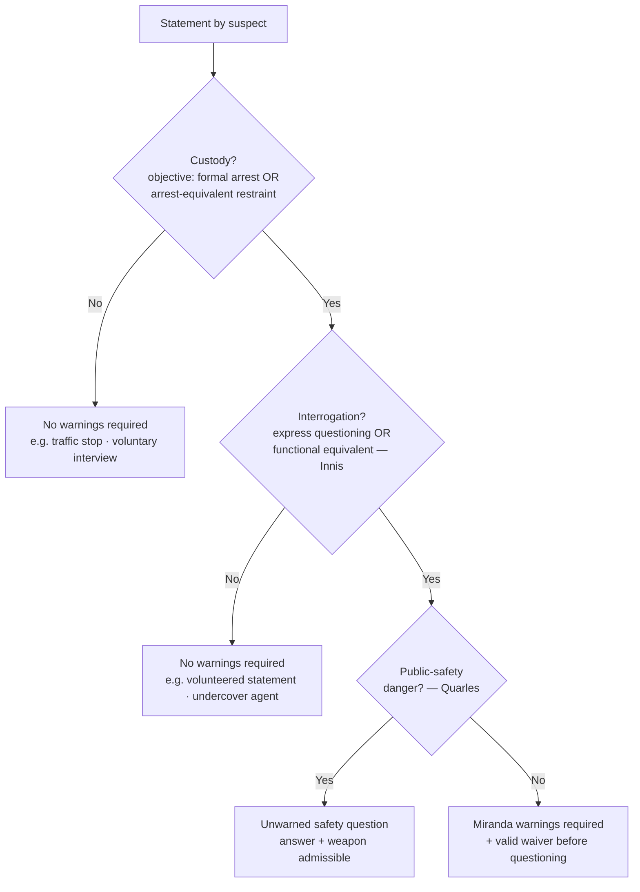

# S9 R1 panel-review — Opus model-diversity lane (prompt pack)

You are the **Claude/Opus** leg of the S9 three-lane adversarial panel (1 Claude + 2 Codex, R1). The two Codex lanes carry the A (support/quote-fidelity) and B (currency/treatment) attack lenses; **you carry model diversity and MUST vote on every paneled assertion across BOTH lenses' concerns.** You are refute-framed: try hard to break each assertion; **default to REFUTED on uncertainty**; never fabricate a cite, quote, or holding; use ONLY the evidence inlined below (no search, no outside knowledge). You are a SIGHTED reviewer — the FULL lake record (judgment fields included) is inlined.

You are a WRITER lane, not an adjudicator: you FIND and VOTE. You do not tally, adjudicate, or close any row — the orchestrator does.

For EACH group below, return one JSON object with the exact `reviewed[]` shape from the output contract (identical framing to the Codex lenses). Emit a finding object ONLY for a real defect (verdict refuted / stands-modified); a group you find wholly clean returns all-`stands` verdicts (the harness records a clean attestation). Concatenate the per-group JSON objects into a top-level `{"packs": [ ... ]}` array, one entry per group, each carrying its `group_id`.


OUTPUT CONTRACT — return ONE JSON object, nothing else:
{
  "lens": "A" | "B",
  "group_id": "<echo the group id>",
  "reviewed": [
    {
      "assertion_id": "<from group_inventory.jsonl>",
      "dimension": "existence|support|quote_fidelity|pincite|treatment|black_letter",
      "verdict": "stands" | "refuted" | "stands-modified",
      "verifiable_from_disclosed": true | false,
      "defect": null,   // null when verdict=="stands"; else an object:
      //  {"problem": "...", "severity": "high|medium|low", "proposed_fix": "...", "evidence_quote": "verbatim from disclosed evidence or null", "needs_cl": true|false, "locator_note": "..."}
      "reasons": ["short evidence-grounded reason", "..."],
      "breaks_true_positives": true | false,
      "residual_risks": ["..."],
      "suggested_tightening": "... or null"
    }
  ],
  "notes": ""
}
Rules: verdict=='stands' <=> defect==null (assertion survives your attack). verdict=='refuted' <=> a real defect (the assertion as framed is wrong). verdict=='stands-modified' <=> survives but needs a stated modification (a minor defect). Review EVERY assertion_id in group_inventory.jsonl exactly once. Output ONLY the JSON object.
---

## GROUP: content/confessions-interrogation-and-the-fifth-amendment/Miranda and Custodial Interrogation.md  (`doctrine`, 31 assertions)

### content_page

```
---
weight: 20
aliases:
  - "Miranda and Custodial Interrogation"
  - "9-confessions-interrogation/Miranda-and-Custodial-Interrogation"
  - "miranda-custodial-interrogation"
topic: Miranda and Custodial Interrogation
type: doctrine
jurisdiction: Federal (U.S. Const. amend. V); SCOTUS baseline
status: draft
related:
  - "[[Miranda Waiver and Invocation]]"
  - "[[Due-Process Voluntariness of Confessions]]"
  - "[[Sixth Amendment Right to Counsel]]"
  - "[[Seizure of the Person]]"
  - "[[Traffic Stops]]"
  - "[[Section 1983 Liability and Qualified Immunity]]"
---

# Miranda and Custodial Interrogation

*Do I have to Mirandize this person: is this custody plus interrogation?*

> [!rule] Black-letter rule
> Statements obtained through **custodial interrogation** are inadmissible in the prosecution's case-in-chief unless police first gave the *[[Miranda v. Arizona|Miranda]]* warnings and the suspect made a **knowing, voluntary waiver**. Warnings are owed only when **both** triggers are present: **custody** (formal arrest or a restraint equivalent to it, judged objectively) **and interrogation** (express questioning or its functional equivalent). Neither trigger alone requires warnings, and a volunteered statement is never the product of interrogation. *[[Miranda v. Arizona]]*, 384 U.S. 436 (1966); *[[New York v. Quarles|Quarles]]*, 467 U.S. 649 (1984) (public-safety exception).
> ^rule-miranda

## The Brief

**Black-letter rule.** A suspect's statements obtained through **custodial interrogation** are **inadmissible in the prosecution's case-in-chief** unless the police first gave the **[[Miranda v. Arizona|*Miranda*]] warnings** and the suspect made a **knowing, voluntary waiver** ([[Miranda v. Arizona#Rule|*Miranda v. Arizona*]]). Warnings are owed only when **both** triggers are present: **custody** *and* **interrogation**. Neither one alone requires warnings, and a volunteered statement is never the product of interrogation.

**Trigger 1: custody.** Custody means a **formal arrest** *or* a **restraint on freedom of movement of the degree associated with a formal arrest**, judged by an **objective** test: what a reasonable person in the suspect's position would understand, not the officer's private view ([[California v. Beheler#Rule|*Beheler*]]; [[Stansbury v. California|*Stansbury*]], where an officer's undisclosed suspicion is irrelevant). The inquiry has two parts: the factual circumstances of the interrogation, and whether, given them, a reasonable person would have felt free to terminate the questioning and leave ([[Thompson v. Keohane|*Thompson v. Keohane*]]). Applying that test:
- An **ordinary traffic stop is not custody**: it is temporary, public, and non-arrest-equivalent ([[Berkemer v. McCarty#Rule|*Berkemer*]]), and the same holds for **roadside DUI field-sobriety questioning** before arrest ([[Pennsylvania v. Bruder|*Bruder*]], applying *[[Berkemer v. McCarty|Berkemer]]*).
- A **voluntary station-house interview** is **not automatically** custody: where the suspect comes in voluntarily, is told he is not under arrest, and is free to leave, he is not "in custody" ([[Oregon v. Mathiason|*Mathiason*]]; [[California v. Beheler|*Beheler*]]). Custody turns on **restraint, not focus**: an IRS target interviewed in his own home is not in custody merely because the investigation has zeroed in on him ([[Beckwith v. United States|*Beckwith*]]).
- **Setting is not dispositive; restraint is.** Custody can exist in the suspect's **own bedroom** when four officers question him under arrest in the early morning ([[Orozco v. Texas|*Orozco*]]); conversely, **incarceration alone is not custody**, and questioning a prison inmate requires a totality analysis, not an automatic finding ([[Howes v. Fields|*Howes v. Fields*]]). But a person **already in custody who is questioned about an unrelated matter can be** in *[[Miranda v. Arizona|Miranda]]* custody: the reason for the confinement does not curtail the warnings ([[Mathis v. United States (1968)|*Mathis*]], *limited by* [[Howes v. Fields]] as to the broad "imprisonment = custody" reading).
- Because the test is **objective**, a **child's age counts** in the custody calculus **when it was known to or objectively apparent to** the officer ([[J.D.B. v. North Carolina#Rule|*J.D.B.*]]); but age and experience were **not** part of the clearly-established objective test for AEDPA purposes at the time of [[Yarborough v. Alvarado|*Yarborough v. Alvarado*]].

**Trigger 2: interrogation.** Interrogation means **express questioning** *or* its **functional equivalent**: "any words or actions on the part of the police (other than those normally attendant to arrest and custody) that the police **should know are reasonably likely to elicit an incriminating response**," a test that focuses on the **suspect's perceptions**, not the officer's intent ([[Rhode Island v. Innis#Rule|*Innis*]]). Applying it:
- Officers do **not** interrogate merely by **hoping** a suspect incriminates himself: letting a suspect who invoked speak with his wife while an officer records is not the functional equivalent of questioning ([[Arizona v. Mauro|*Mauro*]]).
- **Routine booking questions** (name, address, and the like) fall within a **booking exception**; but a question whose answer's *content* reveals a suspect's impaired mental state (the "sixth-birthday" question) is testimonial and must be suppressed if unwarned, whereas the merely **physical** manner of slurred speech is not ([[Pennsylvania v. Muniz|*Muniz*]]).
- There is **no interrogation**, indeed no *[[Miranda v. Arizona|Miranda]]* at all, where an **undercover officer or agent posing as an inmate** draws out statements, because a suspect who does not know he faces the State feels no police-dominated coercion ([[Illinois v. Perkins|*Perkins*]]).

**Content of the warnings.** The four warnings are substantively required, but **no talismanic recitation** is: warnings are adequate if, read as a whole and given a commonsense reading, they **reasonably convey** the suspect's rights ([[California v. Prysock|*Prysock*]]; [[Duckworth v. Eagan|*Duckworth*]], upholding "if and when you go to court" language in context; [[Florida v. Powell|*Powell*]], advice reasonably conveying the right to counsel *throughout* interrogation).

**Public-safety exception.** Warnings may be **dispensed with** for questions **reasonably prompted by an immediate threat to public safety**: asking a just-arrested suspect where a hidden loaded gun is, before *Mirandizing* him, so that both the answer and the weapon are admissible ([[New York v. Quarles#Rule|*Quarles*]]). It is narrow: it reaches questions **neutralizing an immediate danger**, not routine investigative fact-gathering.

**Fruits and procedure (summary — full treatment in [[Miranda Waiver and Invocation]]).** A first, **un-warned but voluntary** statement does **not automatically taint** a later, properly warned one ([[Oregon v. Elstad|*Elstad*]]). **But** where officers **deliberately** use a "question-first, warn-later" **two-step** to undermine *[[Miranda v. Arizona|Miranda]]*, the midstream warnings may be ineffective and the second statement suppressed (*[[Oregon v. Elstad|Elstad]]* *limited by* [[Missouri v. Seibert|*Seibert*]]). And the **physical fruits** of an un-warned voluntary statement are **admissible** ([[United States v. Patane|*Patane*]]).

**Constitutional status and remedy.** *[[Miranda v. Arizona|Miranda]]* is a **constitutional rule** that Congress **cannot override by statute**: 18 U.S.C. § 3501 cannot displace it ([[Dickerson v. United States#Rule|*Dickerson*]]). Its rules are nonetheless **prophylactic**: a bare *[[Miranda v. Arizona|Miranda]]* violation (admission of an un-warned statement) is **not itself a Fifth Amendment violation and will not support a 42 U.S.C. § 1983 damages suit** against the officer ([[Vega v. Tekoh#Rule|*Vega v. Tekoh*]], qualifying *[[Dickerson v. United States|Dickerson]]*'s "constitutional rule" framing), consistent with the rule that the Self-Incrimination Clause is a **trial right**, so coercive questioning that yields no statement used at a criminal trial is not, by itself, a completed Fifth Amendment violation ([[Chavez v. Martinez|*Chavez v. Martinez*]]).

**Elements · burden · standard of review · remedy.**
- **Elements:** (1) custody (objective, arrest-equivalent restraint) **and** (2) interrogation (express questioning or its functional equivalent); **both** required; then (3) absence of warnings **or** of a valid waiver.
- **Burden:** the prosecution carries the burden of establishing that the warnings were given and that the suspect **knowingly and voluntarily waived** before a custodial-interrogation statement may be used in its case-in-chief ([[Miranda v. Arizona]]); the waiver/invocation burden and its preponderance standard are developed in [[Miranda Waiver and Invocation]].
- **Standard of review:** the ultimate custody determination is a **mixed question of law and fact** subject to **independent ([[Common Legal Terms#de-novo|de novo]]) federal review** ([[Thompson v. Keohane]]).
- **Remedy:** **exclusion from the prosecution's case-in-chief** ([[Miranda v. Arizona]]), but **not** a § 1983 damages remedy ([[Vega v. Tekoh]]), **not** suppression of physical fruits ([[United States v. Patane]]), and an un-warned statement may still be available to **impeach** (see [[Miranda Waiver and Invocation]]).

**Common pitfalls.**
- **Treating *[[Miranda v. Arizona|Miranda]]* as covering all police contact.** Warnings attach only when custody **and** interrogation coincide, so on-scene, consensual, or non-custodial questioning needs none.
- **Calling a *[[Terry v. Ohio|Terry]]* or traffic stop "custody."** A brief public detention is a [[Seizure of the Person|Fourth Amendment seizure]] but not *[[Miranda v. Arizona|Miranda]]* custody ([[Berkemer v. McCarty]]; see [[Traffic Stops]]).
- **Suppressing volunteered statements.** Spontaneous, unsolicited words, even after arrest, are not the product of interrogation ([[Rhode Island v. Innis]]).
- **Relying on the officer's unspoken view of the suspect.** Custody is objective ([[Stansbury v. California]]).
- **Reading the public-safety exception broadly.** It is confined to neutralizing an **immediate** danger ([[New York v. Quarles]]).

> **Scope note.** This page covers whether warnings are **required** (the custody + interrogation gate) plus the **content of the warnings** and the **public-safety exception**, with a summary of the fruits line. What happens *after* warnings — **waiver, invocation, and the fuller fruits/impeachment analysis** — lives in [[Miranda Waiver and Invocation]]. Coercion claims independent of *[[Miranda v. Arizona|Miranda]]* go to [[Due-Process Voluntariness of Confessions]]. The distinct, offense-specific **Sixth Amendment** right that attaches at formal charging is treated in [[Sixth Amendment Right to Counsel]].

## Lower-court developments

Circuit/state authority only; no SCOTUS. The core *[[Miranda v. Arizona|Miranda]]* trigger (custody + interrogation) and the *[[New York v. Quarles|Quarles]]* public-safety exception remain settled, but the circuits diverge on how far the public-safety exception reaches once an arrestee is secured.

- **[[United States v. Liddell]], 517 F.3d 1007 (8th Cir. 2008)** · role: **expand / illustrates-a-split**. The Eighth Circuit read the public-safety exception broadly, extending it to the **generalized** risk that officers might mishandle an undiscovered weapon when searching a **secured** arrestee's car or apartment (even absent a true immediate [[Exigent Circumstances and Hot Pursuit|exigency]]), so that questions about weapons or contraband are admissible: "the risk of police officers being injured by the mishandling of unknown firearms or drug paraphernalia provides a sufficient public safety basis to ask a suspect who has been arrested and secured whether there are weapons or contraband in a car or apartment that the police are about to search" (517 F.3d at 1009–10). **Binding in-circuit — 8th Cir.** (Persuasive outside the circuit); the opinion expressly acknowledges a **circuit split** (Judge Gruender [[Common Legal Terms#concurring-opinion|concurred]] to criticize the broad reading as untethered from *[[New York v. Quarles|Quarles]]*'s [[Exigent Circumstances and Hot Pursuit|exigency]] requirement), with a narrower line confining the exception to an actual, immediate threat. ⚖ Circuit split. [opinion](https://www.courtlistener.com/opinion/1461978/united-states-v-liddell/).

## Key cases

| Case | Holding | Opinion |
| --- | --- | --- |
| *[[Miranda v. Arizona]]* | Custodial-interrogation statements are inadmissible absent the warnings and a knowing, voluntary waiver. | [opinion](https://www.courtlistener.com/opinion/107252/miranda-v-arizona/) |
| *[[Berkemer v. McCarty]]* | *[[Miranda v. Arizona\|Miranda]]* covers all offenses, but an ordinary traffic stop is not custody. | [opinion](https://www.courtlistener.com/opinion/111249/berkemer-v-mccarty/) |
| *[[Beckwith v. United States]]* | Custody, not investigative "focus," triggers *[[Miranda v. Arizona\|Miranda]]*; a non-custodial home interview of a tax target is not custody. | [opinion](https://www.courtlistener.com/opinion/109430/beckwith-v-united-states/) |
| *[[California v. Beheler]]* | A voluntary station interview after which the suspect may leave is not custody; the test is formal arrest or arrest-equivalent restraint. | [opinion](https://www.courtlistener.com/opinion/111023/california-v-beheler/) |
| *[[Oregon v. Mathiason]]* | A voluntary station-house interview, told free to leave, is not custody. | [opinion](https://www.courtlistener.com/opinion/109587/oregon-v-mathiason/) |
| *[[Orozco v. Texas]]* | Custody can exist in the suspect's own bedroom; it is not limited to the stationhouse. | [opinion](https://www.courtlistener.com/opinion/107883/orozco-v-texas/) |
| *[[Stansbury v. California]]* | Custody is objective; an officer's undisclosed suspicion is irrelevant. | [opinion](https://www.courtlistener.com/opinion/117843/stansbury-v-california/) |
| *[[Howes v. Fields]]* | Imprisonment alone is not *[[Miranda v. Arizona\|Miranda]]* custody; custody turns on the totality. | [opinion](https://www.courtlistener.com/opinion/623144/howes-v-fields/) |
| *[[Mathis v. United States (1968)]]* | A person already in custody, questioned on an unrelated matter, can be in *[[Miranda v. Arizona\|Miranda]]* custody. | [opinion](https://www.courtlistener.com/opinion/107676/mathis-v-united-states/) |
| *[[Thompson v. Keohane]]* | Custody is a two-part objective inquiry and a mixed question of law and fact subject to independent federal review. | [opinion](https://www.courtlistener.com/opinion/117982/thompson-v-keohane/) |
| *[[Yarborough v. Alvarado]]* | The custody test is objective; age and experience were not clearly-established elements of it (AEDPA). | [opinion](https://www.courtlistener.com/opinion/134748/yarborough-v-alvarado/) |
| *[[J.D.B. v. North Carolina]]* | A child's age is part of the objective custody analysis when known or apparent to the officer. | [opinion](https://www.courtlistener.com/opinion/218925/j-d-b-v-north-carolina/) |
| *[[Rhode Island v. Innis]]* | "Interrogation" includes express questioning *and* its functional equivalent. | [opinion](https://www.courtlistener.com/opinion/110254/rhode-island-v-innis/) |
| *[[Arizona v. Mauro]]* | Merely hoping a suspect incriminates himself (a recorded spousal visit) is not interrogation. | [opinion](https://www.courtlistener.com/opinion/111878/arizona-v-mauro/) |
| *[[Pennsylvania v. Muniz]]* | Routine booking questions are exempt; a content-testimonial question is interrogation; slurred-speech manner is non-testimonial. | [opinion](https://www.courtlistener.com/opinion/112464/pennsylvania-v-muniz/) |
| *[[Illinois v. Perkins]]* | No warnings for an undercover or jailhouse agent; there is no police-dominated coercive atmosphere. | [opinion](https://www.courtlistener.com/opinion/112452/illinois-v-perkins/) |
| *[[California v. Prysock]]* | Warnings need not be verbatim; they are adequate if they reasonably convey the rights. | [opinion](https://www.courtlistener.com/opinion/110556/california-v-prysock/) |
| *[[Duckworth v. Eagan]]* | "If and when you go to court" counsel language is adequate read in totality. | [opinion](https://www.courtlistener.com/opinion/112322/duckworth-v-eagan/) |
| *[[Florida v. Powell]]* | Warnings need no precise words; the test is whether they reasonably convey the rights, including counsel throughout. | [opinion](https://www.courtlistener.com/opinion/1736/florida-v-powell/) |
| *[[New York v. Quarles]]* | Public-safety exception: unwarned questions to neutralize an immediate danger are allowed. | [opinion](https://www.courtlistener.com/opinion/111214/new-york-v-quarles/) |
| *[[Dickerson v. United States]]* | *[[Miranda v. Arizona\|Miranda]]* is a constitutional rule; 18 U.S.C. § 3501 cannot supersede it. | [opinion](https://www.courtlistener.com/opinion/118380/dickerson-v-united-states/) |
| *[[Vega v. Tekoh]]* | A *[[Miranda v. Arizona\|Miranda]]* violation is not itself a Fifth Amendment violation and supports no § 1983 damages claim. | [opinion](https://www.courtlistener.com/opinion/6480695/vega-v-tekoh/) |
| *[[Chavez v. Martinez]]* | The Self-Incrimination Clause is a trial right; coercive questioning yielding no trial-used statement is not itself a completed violation. | [opinion](https://www.courtlistener.com/opinion/127927/chavez-v-martinez/) |

## Related cases across doctrines

These cases are treated in full on other pages but bear directly on custodial interrogation, framed here for that doctrine.

| Case | Relevance here | Primary home | Opinion |
| --- | --- | --- | --- |
| *[[Brewer v. Williams]]* | The "Christian burial speech" is the textbook illustration of the *functional equivalent* of interrogation (words an officer should know are reasonably likely to elicit an incriminating response), **but the Court decided it on Sixth Amendment (deliberate-elicitation) grounds**; *[[Rhode Island v. Innis\|Innis]]* itself *distinguished* *[[Brewer v. Williams\|Brewer]]* rather than treating it as a *[[Miranda v. Arizona\|Miranda]]* illustration; keep the 5A *[[Rhode Island v. Innis\|Innis]]* functional-equivalent standard separate from the 6A [[Massiah v. United States\|*Massiah*]]/*[[Brewer v. Williams\|Brewer]]* deliberate-elicitation standard. | [[Sixth Amendment Right to Counsel]] | [opinion](https://www.courtlistener.com/opinion/109624/brewer-v-williams/) |
| *[[Escobedo v. Illinois]]* | The historical precursor: custodial questioning of a focus-suspect denied counsel, later recast as a Fifth Amendment matter and confined to its facts; taught as origin, not a freestanding test. | [[Sixth Amendment Right to Counsel]] | [opinion](https://www.courtlistener.com/opinion/106883/escobedo-v-illinois/) |
| *[[Malloy v. Hogan]]* | Incorporates the Fifth Amendment privilege against self-incrimination against the States, the constitutional footing on which *[[Miranda v. Arizona\|Miranda]]* rests. | [[Due-Process Voluntariness of Confessions]] | [opinion](https://www.courtlistener.com/opinion/106862/malloy-v-hogan/) |
| *[[Corley v. United States]]* | The McNabb-Mallory prompt-presentment rule is a **separate** suppression path for federal confessions (unreasonable pre-presentment delay), independent of the *[[Miranda v. Arizona\|Miranda]]* gate. | [[Due-Process Voluntariness of Confessions]] | [opinion](https://www.courtlistener.com/opinion/145888/corley-v-united-states/) |
| *[[Dunaway v. New York]]* | An arrest-tantamount seizure on less than probable cause makes the resulting confession a fruit of the illegal seizure that *[[Miranda v. Arizona\|Miranda]]* warnings alone do not attenuate. | [[Seizure of the Person]] | [opinion](https://www.courtlistener.com/opinion/110096/dunaway-v-new-york/) |
| *[[Kaupp v. Texas]]* | A 3 a.m. removal without probable cause is an arrest; "Okay" was submission, not consent, so the confession is suppressed unless the taint is purged; warnings do not cure the illegal seizure. | [[Seizure of the Person]] | [opinion](https://www.courtlistener.com/opinion/127919/kaupp-v-texas/) |
| *[[Pennsylvania v. Bruder]]* | Ordinary roadside DUI field-sobriety questioning before arrest is not custodial interrogation (applying *[[Berkemer v. McCarty\|Berkemer]]*). | [[Traffic Stops]] | [opinion](https://www.courtlistener.com/opinion/112152/pennsylvania-v-bruder/) |

## Visual



## Sources

- [Miranda v. Arizona, 384 U.S. 436 (1966)](https://www.courtlistener.com/opinion/107252/miranda-v-arizona/)
- [Rhode Island v. Innis, 446 U.S. 291 (1980)](https://www.courtlistener.com/opinion/110254/rhode-island-v-innis/)
- [Berkemer v. McCarty, 468 U.S. 420 (1984)](https://www.courtlistener.com/opinion/111249/berkemer-v-mccarty/)
- [Beckwith v. United States, 425 U.S. 341 (1976)](https://www.courtlistener.com/opinion/109430/beckwith-v-united-states/)
- [California v. Beheler, 463 U.S. 1121 (1983)](https://www.courtlistener.com/opinion/111023/california-v-beheler/)
- [Oregon v. Mathiason, 429 U.S. 492 (1977)](https://www.courtlistener.com/opinion/109587/oregon-v-mathiason/)
- [Orozco v. Texas, 394 U.S. 324 (1969)](https://www.courtlistener.com/opinion/107883/orozco-v-texas/)
- [Stansbury v. California, 511 U.S. 318 (1994)](https://www.courtlistener.com/opinion/117843/stansbury-v-california/)
- [Howes v. Fields, 565 U.S. 499 (2012)](https://www.courtlistener.com/opinion/623144/howes-v-fields/)
- [Mathis v. United States, 391 U.S. 1 (1968)](https://www.courtlistener.com/opinion/107676/mathis-v-united-states/)
- [Thompson v. Keohane, 516 U.S. 99 (1995)](https://www.courtlistener.com/opinion/117982/thompson-v-keohane/)
- [Yarborough v. Alvarado, 541 U.S. 652 (2004)](https://www.courtlistener.com/opinion/134748/yarborough-v-alvarado/)
- [J.D.B. v. North Carolina, 564 U.S. 261 (2011)](https://www.courtlistener.com/opinion/218925/j-d-b-v-north-carolina/)
- [Arizona v. Mauro, 481 U.S. 520 (1987)](https://www.courtlistener.com/opinion/111878/arizona-v-mauro/)
- [Pennsylvania v. Muniz, 496 U.S. 582 (1990)](https://www.courtlistener.com/opinion/112464/pennsylvania-v-muniz/)
- [Illinois v. Perkins, 496 U.S. 292 (1990)](https://www.courtlistener.com/opinion/112452/illinois-v-perkins/)
- [California v. Prysock, 451 U.S. 355 (1981)](https://www.courtlistener.com/opinion/110556/california-v-prysock/)
- [Duckworth v. Eagan, 492 U.S. 195 (1989)](https://www.courtlistener.com/opinion/112322/duckworth-v-eagan/)
- [Florida v. Powell, 559 U.S. 50 (2010)](https://www.courtlistener.com/opinion/1736/florida-v-powell/)
- [New York v. Quarles, 467 U.S. 649 (1984)](https://www.courtlistener.com/opinion/111214/new-york-v-quarles/)
- [Oregon v. Elstad, 470 U.S. 298 (1985)](https://www.courtlistener.com/opinion/111364/oregon-v-elstad/)
- [Missouri v. Seibert, 542 U.S. 600 (2004)](https://www.courtlistener.com/opinion/137002/missouri-v-seibert/)
- [United States v. Patane, 542 U.S. 630 (2004)](https://www.courtlistener.com/opinion/137003/united-states-v-patane/)
- [Dickerson v. United States, 530 U.S. 428 (2000)](https://www.courtlistener.com/opinion/118380/dickerson-v-united-states/)
- [Vega v. Tekoh, 597 U.S. 134 (2022)](https://www.courtlistener.com/opinion/6480695/vega-v-tekoh/)
- [Chavez v. Martinez, 538 U.S. 760 (2003)](https://www.courtlistener.com/opinion/127927/chavez-v-martinez/)
- [Escobedo v. Illinois, 378 U.S. 478 (1964)](https://www.courtlistener.com/opinion/106883/escobedo-v-illinois/)
- [Malloy v. Hogan, 378 U.S. 1 (1964)](https://www.courtlistener.com/opinion/106862/malloy-v-hogan/)
- [Corley v. United States, 556 U.S. 303 (2009)](https://www.courtlistener.com/opinion/145888/corley-v-united-states/)
- [Dunaway v. New York, 442 U.S. 200 (1979)](https://www.courtlistener.com/opinion/110096/dunaway-v-new-york/)
- [Kaupp v. Texas, 538 U.S. 626 (2003)](https://www.courtlistener.com/opinion/127919/kaupp-v-texas/)
- [Pennsylvania v. Bruder, 488 U.S. 9 (1988)](https://www.courtlistener.com/opinion/112152/pennsylvania-v-bruder/)
- [Brewer v. Williams, 430 U.S. 387 (1977)](https://www.courtlistener.com/opinion/109624/brewer-v-williams/)

```

### group_inventory (assertions under review)

```jsonl
{"assertion_id": "087a5493f410d671", "dimension": "existence", "kind": "case_cite", "locator": {"case": "Dickerson v. United States", "table_line": 78}, "payload": {"case": "Dickerson v. United States", "cells": ["*[[Dickerson v. United States]]*", "*[[Miranda v. Arizona\\|Miranda]]* is a constitutional rule; 18 U.S.C. § 3501 cannot supersede it.", "[opinion](https://www.courtlistener.com/opinion/118380/dickerson-v-united-states/)"], "header": ["Case", "Holding", "Opinion"]}}
{"assertion_id": "2469dde80e6f3197", "dimension": "existence", "kind": "case_cite", "locator": {"case": "Orozco v. Texas", "table_line": 63}, "payload": {"case": "Orozco v. Texas", "cells": ["*[[Orozco v. Texas]]*", "Custody can exist in the suspect's own bedroom; it is not limited to the stationhouse.", "[opinion](https://www.courtlistener.com/opinion/107883/orozco-v-texas/)"], "header": ["Case", "Holding", "Opinion"]}}
{"assertion_id": "2c69cac19aa17ff4", "dimension": "existence", "kind": "case_cite", "locator": {"case": "Howes v. Fields", "table_line": 65}, "payload": {"case": "Howes v. Fields", "cells": ["*[[Howes v. Fields]]*", "Imprisonment alone is not *[[Miranda v. Arizona\\|Miranda]]* custody; custody turns on the totality.", "[opinion](https://www.courtlistener.com/opinion/623144/howes-v-fields/)"], "header": ["Case", "Holding", "Opinion"]}}
{"assertion_id": "31817af0cb32d613", "dimension": "existence", "kind": "case_cite", "locator": {"case": "Mathis v. United States (1968)", "table_line": 66}, "payload": {"case": "Mathis v. United States (1968)", "cells": ["*[[Mathis v. United States (1968)]]*", "A person already in custody, questioned on an unrelated matter, can be in *[[Miranda v. Arizona\\|Miranda]]* custody.", "[opinion](https://www.courtlistener.com/opinion/107676/mathis-v-united-states/)"], "header": ["Case", "Holding", "Opinion"]}}
{"assertion_id": "3a76802871b59507", "dimension": "existence", "kind": "case_cite", "locator": {"case": "Chavez v. Martinez", "table_line": 80}, "payload": {"case": "Chavez v. Martinez", "cells": ["*[[Chavez v. Martinez]]*", "The Self-Incrimination Clause is a trial right; coercive questioning yielding no trial-used statement is not itself a completed violation.", "[opinion](https://www.courtlistener.com/opinion/127927/chavez-v-martinez/)"], "header": ["Case", "Holding", "Opinion"]}}
{"assertion_id": "55bc820f330f1265", "dimension": "existence", "kind": "case_cite", "locator": {"case": "Vega v. Tekoh", "table_line": 79}, "payload": {"case": "Vega v. Tekoh", "cells": ["*[[Vega v. Tekoh]]*", "A *[[Miranda v. Arizona\\|Miranda]]* violation is not itself a Fifth Amendment violation and supports no § 1983 damages claim.", "[opinion](https://www.courtlistener.com/opinion/6480695/vega-v-tekoh/)"], "header": ["Case", "Holding", "Opinion"]}}
{"assertion_id": "60e04adc95366a64", "dimension": "existence", "kind": "case_cite", "locator": {"case": "Florida v. Powell", "table_line": 76}, "payload": {"case": "Florida v. Powell", "cells": ["*[[Florida v. Powell]]*", "Warnings need no precise words; the test is whether they reasonably convey the rights, including counsel throughout.", "[opinion](https://www.courtlistener.com/opinion/1736/florida-v-powell/)"], "header": ["Case", "Holding", "Opinion"]}}
{"assertion_id": "68e7b1da100512b8", "dimension": "existence", "kind": "case_cite", "locator": {"case": "Miranda v. Arizona", "table_line": 58}, "payload": {"case": "Miranda v. Arizona", "cells": ["*[[Miranda v. Arizona]]*", "Custodial-interrogation statements are inadmissible absent the warnings and a knowing, voluntary waiver.", "[opinion](https://www.courtlistener.com/opinion/107252/miranda-v-arizona/)"], "header": ["Case", "Holding", "Opinion"]}}
{"assertion_id": "6c3128dc71c7f7d9", "dimension": "existence", "kind": "case_cite", "locator": {"case": "Pennsylvania v. Bruder", "table_line": 94}, "payload": {"case": "Pennsylvania v. Bruder", "cells": ["*[[Pennsylvania v. Bruder]]*", "Ordinary roadside DUI field-sobriety questioning before arrest is not custodial interrogation (applying *[[Berkemer v. McCarty\\|Berkemer]]*).", "[[Traffic Stops]]", "[opinion](https://www.courtlistener.com/opinion/112152/pennsylvania-v-bruder/)"], "header": ["Case", "Relevance here", "Primary home", "Opinion"]}}
{"assertion_id": "72fef961e2d9e5f3", "dimension": "existence", "kind": "case_cite", "locator": {"case": "Escobedo v. Illinois", "table_line": 89}, "payload": {"case": "Escobedo v. Illinois", "cells": ["*[[Escobedo v. Illinois]]*", "The historical precursor: custodial questioning of a focus-suspect denied counsel, later recast as a Fifth Amendment matter and confined to its facts; taught as origin, not a freestanding test.", "[[Sixth Amendment Right to Counsel]]", "[opinion](https://www.courtlistener.com/opinion/106883/escobedo-v-illinois/)"], "header": ["Case", "Relevance here", "Primary home", "Opinion"]}}
{"assertion_id": "7e3ac0451e40cdf7", "dimension": "existence", "kind": "case_cite", "locator": {"case": "California v. Prysock", "table_line": 74}, "payload": {"case": "California v. Prysock", "cells": ["*[[California v. Prysock]]*", "Warnings need not be verbatim; they are adequate if they reasonably convey the rights.", "[opinion](https://www.courtlistener.com/opinion/110556/california-v-prysock/)"], "header": ["Case", "Holding", "Opinion"]}}
{"assertion_id": "82ea6a9e4a117f58", "dimension": "existence", "kind": "case_cite", "locator": {"case": "Pennsylvania v. Muniz", "table_line": 72}, "payload": {"case": "Pennsylvania v. Muniz", "cells": ["*[[Pennsylvania v. Muniz]]*", "Routine booking questions are exempt; a content-testimonial question is interrogation; slurred-speech manner is non-testimonial.", "[opinion](https://www.courtlistener.com/opinion/112464/pennsylvania-v-muniz/)"], "header": ["Case", "Holding", "Opinion"]}}
{"assertion_id": "8ca5594d5cabbbe0", "dimension": "existence", "kind": "case_cite", "locator": {"case": "Malloy v. Hogan", "table_line": 90}, "payload": {"case": "Malloy v. Hogan", "cells": ["*[[Malloy v. Hogan]]*", "Incorporates the Fifth Amendment privilege against self-incrimination against the States, the constitutional footing on which *[[Miranda v. Arizona\\|Miranda]]* rests.", "[[Due-Process Voluntariness of Confessions]]", "[opinion](https://www.courtlistener.com/opinion/106862/malloy-v-hogan/)"], "header": ["Case", "Relevance here", "Primary home", "Opinion"]}}
{"assertion_id": "8d558ebcaac36063", "dimension": "existence", "kind": "case_cite", "locator": {"case": "Beckwith v. United States", "table_line": 60}, "payload": {"case": "Beckwith v. United States", "cells": ["*[[Beckwith v. United States]]*", "Custody, not investigative \"focus,\" triggers *[[Miranda v. Arizona\\|Miranda]]*; a non-custodial home interview of a tax target is not custody.", "[opinion](https://www.courtlistener.com/opinion/109430/beckwith-v-united-states/)"], "header": ["Case", "Holding", "Opinion"]}}
{"assertion_id": "8f495205010a026a", "dimension": "existence", "kind": "case_cite", "locator": {"case": "Dunaway v. New York", "table_line": 92}, "payload": {"case": "Dunaway v. New York", "cells": ["*[[Dunaway v. New York]]*", "An arrest-tantamount seizure on less than probable cause makes the resulting confession a fruit of the illegal seizure that *[[Miranda v. Arizona\\|Miranda]]* warnings alone do not attenuate.", "[[Seizure of the Person]]", "[opinion](https://www.courtlistener.com/opinion/110096/dunaway-v-new-york/)"], "header": ["Case", "Relevance here", "Primary home", "Opinion"]}}
{"assertion_id": "90dbf06ce2e5481b", "dimension": "existence", "kind": "case_cite", "locator": {"case": "Brewer v. Williams", "table_line": 88}, "payload": {"case": "Brewer v. Williams", "cells": ["*[[Brewer v. Williams]]*", "The \"Christian burial speech\" is the textbook illustration of the *functional equivalent* of interrogation (words an officer should know are reasonably likely to elicit an incriminating response), **but the Court decided it on Sixth Amendment (deliberate-elicitation) grounds**; *[[Rhode Island v. Innis\\|Innis]]* itself *distinguished* *[[Brewer v. Williams\\|Brewer]]* rather than treating it as a *[[Miranda v. Arizona\\|Miranda]]* illustration; keep the 5A *[[Rhode Island v. Innis\\|Innis]]* functional-equivalent standard separate from the 6A [[Massiah v. United States\\|*Massiah*]]/*[[Brewer v. Williams\\|Brewer]]* deliberate-elicitation standard.", "[[Sixth Amendment Right to Counsel]]", "[opinion](https://www.courtlistener.com/opinion/109624/brewer-v-williams/)"], "header": ["Case", "Relevance here", "Primary home", "Opinion"]}}
{"assertion_id": "9c84ec7f793f3893", "dimension": "existence", "kind": "case_cite", "locator": {"case": "Rhode Island v. Innis", "table_line": 70}, "payload": {"case": "Rhode Island v. Innis", "cells": ["*[[Rhode Island v. Innis]]*", "\"Interrogation\" includes express questioning *and* its functional equivalent.", "[opinion](https://www.courtlistener.com/opinion/110254/rhode-island-v-innis/)"], "header": ["Case", "Holding", "Opinion"]}}
{"assertion_id": "9dddde132158ff3b", "dimension": "existence", "kind": "case_cite", "locator": {"case": "Arizona v. Mauro", "table_line": 71}, "payload": {"case": "Arizona v. Mauro", "cells": ["*[[Arizona v. Mauro]]*", "Merely hoping a suspect incriminates himself (a recorded spousal visit) is not interrogation.", "[opinion](https://www.courtlistener.com/opinion/111878/arizona-v-mauro/)"], "header": ["Case", "Holding", "Opinion"]}}
{"assertion_id": "9f469cf8c44b473a", "dimension": "existence", "kind": "case_cite", "locator": {"case": "Corley v. United States", "table_line": 91}, "payload": {"case": "Corley v. United States", "cells": ["*[[Corley v. United States]]*", "The McNabb-Mallory prompt-presentment rule is a **separate** suppression path for federal confessions (unreasonable pre-presentment delay), independent of the *[[Miranda v. Arizona\\|Miranda]]* gate.", "[[Due-Process Voluntariness of Confessions]]", "[opinion](https://www.courtlistener.com/opinion/145888/corley-v-united-states/)"], "header": ["Case", "Relevance here", "Primary home", "Opinion"]}}
{"assertion_id": "a112bec58ebab29c", "dimension": "existence", "kind": "case_cite", "locator": {"case": "New York v. Quarles", "table_line": 77}, "payload": {"case": "New York v. Quarles", "cells": ["*[[New York v. Quarles]]*", "Public-safety exception: unwarned questions to neutralize an immediate danger are allowed.", "[opinion](https://www.courtlistener.com/opinion/111214/new-york-v-quarles/)"], "header": ["Case", "Holding", "Opinion"]}}
{"assertion_id": "a1a5b82648cd500c", "dimension": "existence", "kind": "case_cite", "locator": {"case": "California v. Beheler", "table_line": 61}, "payload": {"case": "California v. Beheler", "cells": ["*[[California v. Beheler]]*", "A voluntary station interview after which the suspect may leave is not custody; the test is formal arrest or arrest-equivalent restraint.", "[opinion](https://www.courtlistener.com/opinion/111023/california-v-beheler/)"], "header": ["Case", "Holding", "Opinion"]}}
{"assertion_id": "ad50ad20e9223f7d", "dimension": "existence", "kind": "case_cite", "locator": {"case": "Illinois v. Perkins", "table_line": 73}, "payload": {"case": "Illinois v. Perkins", "cells": ["*[[Illinois v. Perkins]]*", "No warnings for an undercover or jailhouse agent; there is no police-dominated coercive atmosphere.", "[opinion](https://www.courtlistener.com/opinion/112452/illinois-v-perkins/)"], "header": ["Case", "Holding", "Opinion"]}}
{"assertion_id": "b1d1037063cb9828", "dimension": "existence", "kind": "case_cite", "locator": {"case": "Duckworth v. Eagan", "table_line": 75}, "payload": {"case": "Duckworth v. Eagan", "cells": ["*[[Duckworth v. Eagan]]*", "\"If and when you go to court\" counsel language is adequate read in totality.", "[opinion](https://www.courtlistener.com/opinion/112322/duckworth-v-eagan/)"], "header": ["Case", "Holding", "Opinion"]}}
{"assertion_id": "b91ecaed5e068374", "dimension": "existence", "kind": "case_cite", "locator": {"case": "J.D.B. v. North Carolina", "table_line": 69}, "payload": {"case": "J.D.B. v. North Carolina", "cells": ["*[[J.D.B. v. North Carolina]]*", "A child's age is part of the objective custody analysis when known or apparent to the officer.", "[opinion](https://www.courtlistener.com/opinion/218925/j-d-b-v-north-carolina/)"], "header": ["Case", "Holding", "Opinion"]}}
{"assertion_id": "df7d043604fa1da1", "dimension": "existence", "kind": "case_cite", "locator": {"case": "Berkemer v. McCarty", "table_line": 59}, "payload": {"case": "Berkemer v. McCarty", "cells": ["*[[Berkemer v. McCarty]]*", "*[[Miranda v. Arizona\\|Miranda]]* covers all offenses, but an ordinary traffic stop is not custody.", "[opinion](https://www.courtlistener.com/opinion/111249/berkemer-v-mccarty/)"], "header": ["Case", "Holding", "Opinion"]}}
{"assertion_id": "e2e2e59b74733bf7", "dimension": "existence", "kind": "case_cite", "locator": {"case": "Stansbury v. California", "table_line": 64}, "payload": {"case": "Stansbury v. California", "cells": ["*[[Stansbury v. California]]*", "Custody is objective; an officer's undisclosed suspicion is irrelevant.", "[opinion](https://www.courtlistener.com/opinion/117843/stansbury-v-california/)"], "header": ["Case", "Holding", "Opinion"]}}
{"assertion_id": "ea2ecd6a40477ee3", "dimension": "existence", "kind": "case_cite", "locator": {"case": "Yarborough v. Alvarado", "table_line": 68}, "payload": {"case": "Yarborough v. Alvarado", "cells": ["*[[Yarborough v. Alvarado]]*", "The custody test is objective; age and experience were not clearly-established elements of it (AEDPA).", "[opinion](https://www.courtlistener.com/opinion/134748/yarborough-v-alvarado/)"], "header": ["Case", "Holding", "Opinion"]}}
{"assertion_id": "eb1d81fc8d54ea89", "dimension": "existence", "kind": "case_cite", "locator": {"case": "Kaupp v. Texas", "table_line": 93}, "payload": {"case": "Kaupp v. Texas", "cells": ["*[[Kaupp v. Texas]]*", "A 3 a.m. removal without probable cause is an arrest; \"Okay\" was submission, not consent, so the confession is suppressed unless the taint is purged; warnings do not cure the illegal seizure.", "[[Seizure of the Person]]", "[opinion](https://www.courtlistener.com/opinion/127919/kaupp-v-texas/)"], "header": ["Case", "Relevance here", "Primary home", "Opinion"]}}
{"assertion_id": "ec3615ad4f3cbcfe", "dimension": "existence", "kind": "case_cite", "locator": {"case": "Oregon v. Mathiason", "table_line": 62}, "payload": {"case": "Oregon v. Mathiason", "cells": ["*[[Oregon v. Mathiason]]*", "A voluntary station-house interview, told free to leave, is not custody.", "[opinion](https://www.courtlistener.com/opinion/109587/oregon-v-mathiason/)"], "header": ["Case", "Holding", "Opinion"]}}
{"assertion_id": "fb087a9e5f73a8cf", "dimension": "existence", "kind": "case_cite", "locator": {"case": "Thompson v. Keohane", "table_line": 67}, "payload": {"case": "Thompson v. Keohane", "cells": ["*[[Thompson v. Keohane]]*", "Custody is a two-part objective inquiry and a mixed question of law and fact subject to independent federal review.", "[opinion](https://www.courtlistener.com/opinion/117982/thompson-v-keohane/)"], "header": ["Case", "Holding", "Opinion"]}}
{"assertion_id": "e58dcd6f8a67ccfc", "dimension": "support", "kind": "proposition", "locator": {"callout": "^rule-miranda"}, "payload": {"anchor": "^rule-miranda", "statement": "[!rule] Black-letter rule\nStatements obtained through **custodial interrogation** are inadmissible in the prosecution's case-in-chief unless police first gave the *[[Miranda v. Arizona|Miranda]]* warnings and the suspect made a **knowing, voluntary waiver**. Warnings are owed only when **both** triggers are present: **custody** (formal arrest or a restraint equivalent to it, judged objectively) **and interrogation** (express questioning or its functional equivalent). Neither trigger alone requires warnings, and a volunteered statement is never the product of interrogation. *[[Miranda v. Arizona]]*, 384 U.S. 436 (1966); *[[New York v. Quarles|Quarles]]*, 467 U.S. 649 (1984) (public-safety exception)."}}
```

### lake record — Arizona v. Mauro

```json
{
  "schema_version": "s2.v1",
  "record_id": "Arizona v. Mauro",
  "stub": false,
  "status": "verified",
  "identity": {
    "case_name": "Arizona v. Mauro",
    "case_name_short": "Mauro",
    "case_name_full": "Arizona v. Mauro",
    "input_case_name": "Arizona v. Mauro",
    "court": "U.S. Supreme Court",
    "court_id": "scotus",
    "court_level": "scotus",
    "circuit": null,
    "state": null,
    "date_decided": "1987-06-26",
    "year": 1987,
    "docket": "85-2121",
    "cluster_id": 111878,
    "lead_opinion_id": 9430952,
    "sibling_ids": [
      111878,
      9430952,
      9430953
    ],
    "absolute_url": "/opinion/111878/arizona-v-mauro/",
    "identity_method": "citation+party-text",
    "expected_citation_found": true,
    "party_name_in_text": true,
    "canonical_name_match": true,
    "alternates": [
      {
        "cluster_id": 9070020,
        "score": 10,
        "case_name": "Arizona v. Mauro"
      },
      {
        "cluster_id": 9070019,
        "score": 10,
        "case_name": "Arizona v. Mauro"
      }
    ],
    "reason_code": null
  },
  "citations": {
    "official": {
      "cite": "481 U.S. 520",
      "volume": "481",
      "reporter": "U.S.",
      "page": "520",
      "type": 1,
      "selected_official": true,
      "source": "cluster.citations[]"
    },
    "parallel": [
      {
        "cite": "107 S. Ct. 1931",
        "volume": "107",
        "reporter": "S. Ct.",
        "page": "1931",
        "type": 1,
        "selected_official": false,
        "source": "cluster.citations[]"
      },
      {
        "cite": "95 L. Ed. 2d 458",
        "volume": "95",
        "reporter": "L. Ed. 2d",
        "page": "458",
        "type": 1,
        "selected_official": false,
        "source": "cluster.citations[]"
      }
    ],
    "vendor_neutral": [
      {
        "cite": "1987 U.S. LEXIS 1933",
        "volume": "1987",
        "reporter": "U.S. LEXIS",
        "page": "1933",
        "type": 6,
        "selected_official": false,
        "source": "cluster.citations[]"
      }
    ],
    "all": [
      {
        "cite": "481 U.S. 520",
        "volume": "481",
        "reporter": "U.S.",
        "page": "520",
        "type": 1,
        "selected_official": false,
        "source": "cluster.citations[]"
      },
      {
        "cite": "107 S. Ct. 1931",
        "volume": "107",
        "reporter": "S. Ct.",
        "page": "1931",
        "type": 1,
        "selected_official": false,
        "source": "cluster.citations[]"
      },
      {
        "cite": "95 L. Ed. 2d 458",
        "volume": "95",
        "reporter": "L. Ed. 2d",
        "page": "458",
        "type": 1,
        "selected_official": false,
        "source": "cluster.citations[]"
      },
      {
        "cite": "1987 U.S. LEXIS 1933",
        "volume": "1987",
        "reporter": "U.S. LEXIS",
        "page": "1933",
        "type": 6,
        "selected_official": false,
        "source": "cluster.citations[]"
      }
    ],
    "display": "481 U.S. 520",
    "official_selection": {
      "court_class": "scotus",
      "selected": "481 U.S. 520",
      "reason": "selected_rank_1"
    }
  },
  "pinpoints": [
    {
      "id": "pin-528",
      "page": null,
      "quote": "--- # Arizona v. Mauro *481 U.S. 520 (1987)* \u00b7 U.S. Supreme Court \u00b7 **Binding \u2014 SCOTUS** \u00b7 Treatment: **good** *(as of 2026-06-30)* <!-- header line; TreatmentBadge + weight render here, degrading to the text above --> ## Background Mauro was arrested after admitting he had killed his son. After receiving Miranda warnings he invoked his right to counsel, and questioning stopped. His wife, who was being questioned in another room, insisted on speaking with him. Officers tried to discourage her but relented, requiring that a detective be present and that a tape recorder be running in plain view. During the conversation Mauro made incriminating statements, which the prosecution later used to rebut his insanity defense. The Arizona Supreme Court held that allowing the spousal meeting was the functional equivalent of interrogation under [[Rhode Island v. Innis]]. ## Issue Whether permitting a suspect who has invoked his Miranda rights to speak with his spouse, in the presence of an officer with a recorder, constitutes interrogation or its functional equivalent. ## Rule No.",
      "star_marker": null,
      "quote_fidelity": "mismatch",
      "pinpoint_status": "slip-only",
      "position": null
    },
    {
      "id": "pin-529",
      "page": null,
      "quote": "Officers do not interrogate a suspect simply by hoping that he will incriminate himself.",
      "star_marker": "529",
      "quote_fidelity": "matched",
      "pinpoint_status": "star-verified",
      "position": 18639,
      "fragment": "#:~:text=Officers%20do%20not%20interrogate%20a",
      "fragment_validated_at": "2026-07-09T15:40:45Z"
    }
  ],
  "treatment": {
    "field_i_validity": "good_law",
    "as_of_content": "1987-06-26",
    "as_of_treatment": "2026-06-30",
    "composite_basis": "migration-seed",
    "composite_basis_ref": "Arizona v. Mauro",
    "varies_by_point": false,
    "scope_note": "Good law; allowing a suspect who has invoked Miranda to speak with his spouse in an officer's presence (recorded) is not interrogation or its functional equivalent under Innis.",
    "point_overrides": [],
    "edges": [
      {
        "citing_case": {
          "name": "Commonwealth v. Colon",
          "cluster_id": 4671866,
          "cite": null,
          "field_ii": "superseded_by_statute"
        },
        "field_ii": "superseded_by_statute",
        "field_iii": "mentioned",
        "point": null,
        "proposed": true,
        "journal_ref": "Arizona v. Mauro:lane1_negative"
      },
      {
        "citing_case": {
          "name": "Patrick Broom a/k/a Patrick Brown v. United States",
          "cluster_id": 2809687,
          "cite": [
            "118 A.3d 207",
            "2015 D.C. App. LEXIS 265",
            "2015 WL 3768885"
          ],
          "field_ii": "questioned"
        },
        "field_ii": "questioned",
        "field_iii": "mentioned",
        "point": null,
        "proposed": true,
        "journal_ref": "Arizona v. Mauro:lane1_negative"
      },
      {
        "citing_case": {
          "name": "Commonwealth v. Quarles",
          "cluster_id": 1057961,
          "cite": null,
          "field_ii": "questioned"
        },
        "field_ii": "questioned",
        "field_iii": "mentioned",
        "point": null,
        "proposed": true,
        "journal_ref": "Arizona v. Mauro:lane1_negative"
      },
      {
        "citing_case": {
          "name": "United States v. Damon Kimbrough",
          "cluster_id": 796843,
          "cite": [
            "477 F.3d 144",
            "2007 U.S. App. LEXIS 3488",
            "2007 WL 495026"
          ],
          "field_ii": "questioned"
        },
        "field_ii": "questioned",
        "field_iii": "mentioned",
        "point": null,
        "proposed": true,
        "journal_ref": "Arizona v. Mauro:lane1_negative"
      },
      {
        "citing_case": {
          "name": "United States v. Alexander",
          "cluster_id": 167490,
          "cite": [
            "447 F.3d 1290",
            "2006 U.S. App. LEXIS 11993",
            "2006 WL 1314663"
          ],
          "field_ii": "questioned"
        },
        "field_ii": "questioned",
        "field_iii": "mentioned",
        "point": null,
        "proposed": true,
        "journal_ref": "Arizona v. Mauro:lane1_negative"
      },
      {
        "citing_case": {
          "name": "United States v. Julian Galindo-Gallegos, AKA Jose Reyes-Olague, AKA Aurelio Garcia-Chairez, AKA Jose Olague Reyes",
          "cluster_id": 772608,
          "cite": [
            "244 F.3d 728",
            "2001 Daily Journal DAR 3047",
            "2001 U.S. App. LEXIS 4891",
            "2001 WL 289956"
          ],
          "field_ii": "questioned"
        },
        "field_ii": "questioned",
        "field_iii": "mentioned",
        "point": null,
        "proposed": true,
        "journal_ref": "Arizona v. Mauro:lane1_negative"
      },
      {
        "citing_case": {
          "name": "Pennsylvania v. Muniz",
          "cluster_id": 112464,
          "cite": [
            "110 L. Ed. 2d 528",
            "110 S. Ct. 2638",
            "496 U.S. 582",
            "1990 U.S. LEXIS 3211"
          ],
          "field_ii": "questioned"
        },
        "field_ii": "questioned",
        "field_iii": "mentioned",
        "point": null,
        "proposed": true,
        "journal_ref": "Arizona v. Mauro:lane2_top_cited"
      },
      {
        "citing_case": {
          "name": "People v. Linton",
          "cluster_id": 944931,
          "cite": [
            "56 Cal. 4th 1146",
            "302 P.3d 927",
            "158 Cal. Rptr. 3d 521",
            "2013 WL 3214690",
            "2013 Cal. LEXIS 5338"
          ],
          "field_ii": "overruled"
        },
        "field_ii": "overruled",
        "field_iii": "mentioned",
        "point": null,
        "proposed": true,
        "journal_ref": "Arizona v. Mauro:lane2_top_cited"
      },
      {
        "citing_case": {
          "name": "State v. Leger",
          "cluster_id": 1592017,
          "cite": [
            "936 So. 2d 108",
            "2006 WL 1883421"
          ],
          "field_ii": "questioned"
        },
        "field_ii": "questioned",
        "field_iii": "mentioned",
        "point": null,
        "proposed": true,
        "journal_ref": "Arizona v. Mauro:lane2_top_cited"
      },
      {
        "citing_case": {
          "name": "People v. Davis",
          "cluster_id": 2575950,
          "cite": [
            "115 P.3d 417",
            "31 Cal. Rptr. 3d 96",
            "36 Cal. 4th 510",
            "2005 Cal. Daily Op. Serv. 6393",
            "2005 Daily Journal DAR 8733",
            "2005 Cal. LEXIS 7963"
          ],
          "field_ii": "overruled"
        },
        "field_ii": "overruled",
        "field_iii": "mentioned",
        "point": null,
        "proposed": true,
        "journal_ref": "Arizona v. Mauro:lane2_top_cited"
      },
      {
        "citing_case": {
          "name": "People v. Ray",
          "cluster_id": 1130099,
          "cite": [
            "13 Cal. 4th 313",
            "914 P.2d 846",
            "96 Daily Journal DAR 5231",
            "52 Cal. Rptr. 2d 296",
            "96 Cal. Daily Op. Serv. 3222",
            "1996 Cal. LEXIS 1906"
          ],
          "field_ii": "overruled"
        },
        "field_ii": "overruled",
        "field_iii": "mentioned",
        "point": null,
        "proposed": true,
        "journal_ref": "Arizona v. Mauro:lane2_top_cited"
      },
      {
        "citing_case": {
          "name": "People v. Leonard",
          "cluster_id": 2632907,
          "cite": [
            "157 P.3d 973",
            "58 Cal. Rptr. 3d 368",
            "40 Cal. 4th 1370",
            "2007 Cal. Daily Op. Serv. 5424",
            "2007 Cal. LEXIS 5071"
          ],
          "field_ii": "overruled"
        },
        "field_ii": "overruled",
        "field_iii": "mentioned",
        "point": null,
        "proposed": true,
        "journal_ref": "Arizona v. Mauro:lane2_top_cited"
      },
      {
        "citing_case": {
          "name": "United States v. Francisco Sangineto-Miranda, (87-5667) Luray Betts, (87-5668) Enrique Vargas, (87-5711) & Benjamin Nelson, (87-5712)",
          "cluster_id": 513263,
          "cite": [
            "859 F.2d 1501"
          ],
          "field_ii": "questioned"
        },
        "field_ii": "questioned",
        "field_iii": "mentioned",
        "point": null,
        "proposed": true,
        "journal_ref": "Arizona v. Mauro:lane2_top_cited"
      },
      {
        "citing_case": {
          "name": "Woodward v. State",
          "cluster_id": 1611371,
          "cite": [
            "533 So. 2d 418",
            "1988 WL 28413"
          ],
          "field_ii": "overruled"
        },
        "field_ii": "overruled",
        "field_iii": "mentioned",
        "point": null,
        "proposed": true,
        "journal_ref": "Arizona v. Mauro:lane2_top_cited"
      },
      {
        "citing_case": {
          "name": "People v. Clark",
          "cluster_id": 1121458,
          "cite": [
            "857 P.2d 1099",
            "5 Cal. 4th 950",
            "22 Cal. Rptr. 2d 689",
            "93 Daily Journal DAR 11122",
            "93 Cal. Daily Op. Serv. 6528",
            "1993 Cal. LEXIS 4179"
          ],
          "field_ii": "overruled"
        },
        "field_ii": "overruled",
        "field_iii": "mentioned",
        "point": null,
        "proposed": true,
        "journal_ref": "Arizona v. Mauro:lane2_top_cited"
      },
      {
        "citing_case": {
          "name": "People v. Medina",
          "cluster_id": 2610902,
          "cite": [
            "799 P.2d 1282",
            "51 Cal. 3d 870",
            "274 Cal. Rptr. 849",
            "90 Cal. Daily Op. Serv. 8358",
            "1990 Cal. LEXIS 5054"
          ],
          "field_ii": "questioned"
        },
        "field_ii": "questioned",
        "field_iii": "mentioned",
        "point": null,
        "proposed": true,
        "journal_ref": "Arizona v. Mauro:lane2_top_cited"
      },
      {
        "citing_case": {
          "name": "People v. Enraca",
          "cluster_id": 844219,
          "cite": [
            "269 P.3d 543",
            "53 Cal. 4th 735",
            "137 Cal. Rptr. 3d 117",
            "2012 WL 360555",
            "2012 Cal. LEXIS 1078"
          ],
          "field_ii": "overruled"
        },
        "field_ii": "overruled",
        "field_iii": "mentioned",
        "point": null,
        "proposed": true,
        "journal_ref": "Arizona v. Mauro:lane2_top_cited"
      },
      {
        "citing_case": {
          "name": "People v. Gallego",
          "cluster_id": 1351145,
          "cite": [
            "802 P.2d 169",
            "52 Cal. 3d 115",
            "276 Cal. Rptr. 679",
            "90 Daily Journal DAR 14576",
            "90 Cal. Daily Op. Serv. 9269",
            "1990 Cal. LEXIS 5484"
          ],
          "field_ii": "abrogated"
        },
        "field_ii": "abrogated",
        "field_iii": "mentioned",
        "point": null,
        "proposed": true,
        "journal_ref": "Arizona v. Mauro:lane2_top_cited"
      },
      {
        "citing_case": {
          "name": "Dennis Rosa Collazo v. Wayne Estelle, Warden, California Mens Colony",
          "cluster_id": 565270,
          "cite": [
            "940 F.2d 411",
            "91 Daily Journal DAR 8681",
            "91 Cal. Daily Op. Serv. 5640",
            "1991 U.S. App. LEXIS 15265"
          ],
          "field_ii": "questioned"
        },
        "field_ii": "questioned",
        "field_iii": "mentioned",
        "point": null,
        "proposed": true,
        "journal_ref": "Arizona v. Mauro:lane2_top_cited"
      },
      {
        "citing_case": {
          "name": "People v. Dement",
          "cluster_id": 844239,
          "cite": [
            "264 P.3d 292",
            "53 Cal. 4th 1",
            "133 Cal. Rptr. 3d 496",
            "2011 Cal. LEXIS 12151"
          ],
          "field_ii": "overruled"
        },
        "field_ii": "overruled",
        "field_iii": "mentioned",
        "point": null,
        "proposed": true,
        "journal_ref": "Arizona v. Mauro:lane2_top_cited"
      },
      {
        "citing_case": {
          "name": "People v. Tate",
          "cluster_id": 2512108,
          "cite": [
            "234 P.3d 428",
            "49 Cal. 4th 635",
            "112 Cal. Rptr. 3d 156",
            "2010 Cal. LEXIS 6548"
          ],
          "field_ii": "overruled"
        },
        "field_ii": "overruled",
        "field_iii": "mentioned",
        "point": null,
        "proposed": true,
        "journal_ref": "Arizona v. Mauro:lane2_top_cited"
      },
      {
        "citing_case": {
          "name": "State of Tennessee v. Jessie Dotson",
          "cluster_id": 2738561,
          "cite": [
            "450 S.W.3d 1",
            "2014 Tenn. LEXIS 694"
          ],
          "field_ii": "overruled"
        },
        "field_ii": "overruled",
        "field_iii": "mentioned",
        "point": null,
        "proposed": true,
        "journal_ref": "Arizona v. Mauro:lane2_top_cited"
      },
      {
        "citing_case": {
          "name": "People v. Doll",
          "cluster_id": 5642287,
          "cite": [
            "21 N.Y.3d 665",
            "998 N.E.2d 384"
          ],
          "field_ii": "questioned"
        },
        "field_ii": "questioned",
        "field_iii": "mentioned",
        "point": null,
        "proposed": true,
        "journal_ref": "Arizona v. Mauro:lane2_top_cited"
      },
      {
        "citing_case": {
          "name": "Jaturun Siripongs v. Arthur Calderon, Warden",
          "cluster_id": 678556,
          "cite": [
            "35 F.3d 1308"
          ],
          "field_ii": "criticized"
        },
        "field_ii": "criticized",
        "field_iii": "mentioned",
        "point": null,
        "proposed": true,
        "journal_ref": "Arizona v. Mauro:lane2_top_cited"
      },
      {
        "citing_case": {
          "name": "Jenkins v. Commonwealth",
          "cluster_id": 1420585,
          "cite": [
            "423 S.E.2d 360",
            "244 Va. 445",
            "9 Va. Law Rep. 480",
            "1992 Va. LEXIS 111"
          ],
          "field_ii": "overruled"
        },
        "field_ii": "overruled",
        "field_iii": "mentioned",
        "point": null,
        "proposed": true,
        "journal_ref": "Arizona v. Mauro:lane2_top_cited"
      },
      {
        "citing_case": {
          "name": "State v. Turner",
          "cluster_id": 4326929,
          "cite": [
            "2016 Ohio 7983"
          ],
          "field_ii": "questioned"
        },
        "field_ii": "questioned",
        "field_iii": "mentioned",
        "point": null,
        "proposed": true,
        "journal_ref": "Arizona v. Mauro:lane2_top_cited"
      },
      {
        "citing_case": {
          "name": "State v. Copeland",
          "cluster_id": 1678832,
          "cite": [
            "530 So. 2d 526",
            "1988 WL 31771"
          ],
          "field_ii": "overruled"
        },
        "field_ii": "overruled",
        "field_iii": "mentioned",
        "point": null,
        "proposed": true,
        "journal_ref": "Arizona v. Mauro:lane2_top_cited"
      },
      {
        "citing_case": {
          "name": "Snow v. State",
          "cluster_id": 1695079,
          "cite": [
            "800 So. 2d 472",
            "2001 WL 1137390"
          ],
          "field_ii": "overruled"
        },
        "field_ii": "overruled",
        "field_iii": "mentioned",
        "point": null,
        "proposed": true,
        "journal_ref": "Arizona v. Mauro:lane2_top_cited"
      },
      {
        "citing_case": {
          "name": "Adkins v. Commonwealth",
          "cluster_id": 1377595,
          "cite": [
            "96 S.W.3d 779",
            "2003 Ky. LEXIS 13",
            "2003 WL 367054"
          ],
          "field_ii": "overruled"
        },
        "field_ii": "overruled",
        "field_iii": "mentioned",
        "point": null,
        "proposed": true,
        "journal_ref": "Arizona v. Mauro:lane2_top_cited"
      },
      {
        "citing_case": {
          "name": "Harold S. Alston v. Walter Redman, Warden Charles M. Oberly, Iii, Attorney General of the State of Delaware and the State of Delaware",
          "cluster_id": 677798,
          "cite": [
            "34 F.3d 1237",
            "1994 U.S. App. LEXIS 24171",
            "1994 WL 480728"
          ],
          "field_ii": "abrogated"
        },
        "field_ii": "abrogated",
        "field_iii": "mentioned",
        "point": null,
        "proposed": true,
        "journal_ref": "Arizona v. Mauro:lane2_top_cited"
      }
    ],
    "derivation": {
      "lane1_negative": {
        "query": "cites:(111878 OR 9430952 OR 9430953) AND (overrul* OR abrogat* OR supersed* OR \"recede from\" OR \"no longer good law\" OR vacat* OR reversed) ",
        "reviewed": 200,
        "cap": 200,
        "cap_hit": true,
        "final_cursor": "https://www.courtlistener.com/api/rest/v4/search/?cursor=cz01OTY5Mzc2MDAwMDAmcz0xMzQ5MzM1JnQ9byZkPTIwMjYtMDctMDQmcD0xMQ%3D%3D&fields=absolute_url%2CcaseName%2CcaseNameFull%2Ccitation%2CciteCount%2Ccluster_id%2Ccourt%2Ccourt_citation_string%2Ccourt_id%2CdateFiled%2Copinions%2Csibling_ids%2Cstatus%2Csyllabus&order_by=dateFiled+desc&page_size=100&q=cites%3A%28111878+OR+9430952+OR+9430953%29+AND+%28overrul%2A+OR+abrogat%2A+OR+supersed%2A+OR+%22recede+from%22+OR+%22no+longer+good+law%22+OR+vacat%2A+OR+reversed%29+&stat_Published=on&type=o",
        "audit_needed": true,
        "proposed_negative_events": 6,
        "audit_marker": "R15 treatment audit required",
        "triage_mode": "snippet-first",
        "snippet_field": "results[].opinions[].snippet",
        "triage_journaled": 200,
        "triage_read": 6,
        "triage_snippet_classified": 194
      },
      "lane2_top_cited": {
        "query": "cites:(111878 OR 9430952 OR 9430953)",
        "reviewed": 25,
        "cap": 25,
        "cap_hit": true,
        "final_cursor": "https://www.courtlistener.com/api/rest/v4/search/?cursor=cz02OSZzPTQ5ODA0NyZ0PW8mZD0yMDI2LTA3LTA0JnA9Mw%3D%3D&order_by=citeCount+desc&page_size=25&q=cites%3A%28111878+OR+9430952+OR+9430953%29&type=o",
        "audit_needed": true,
        "proposed_negative_events": 24,
        "audit_marker": "R15 treatment audit required"
      },
      "lane3_recency": {
        "query": "cites:(111878 OR 9430952 OR 9430953)",
        "reviewed": 9,
        "cap": 200,
        "cap_hit": false,
        "final_cursor": null,
        "audit_needed": false,
        "proposed_negative_events": 0,
        "audit_marker": null,
        "triage_mode": "snippet-first",
        "snippet_field": "results[].opinions[].snippet",
        "triage_journaled": 9,
        "triage_read": 0,
        "triage_snippet_classified": 9
      }
    }
  },
  "progeny": {
    "complete_query": "cites:(111878 OR 9430952 OR 9430953)",
    "indexed_citing_opinions": 268,
    "count_source": "search",
    "per_sibling": [
      {
        "opinion_id": 111878,
        "count": 230,
        "count_source": "search"
      },
      {
        "opinion_id": 9430952,
        "count": 43,
        "count_source": "search"
      },
      {
        "opinion_id": 9430953,
        "count": 0,
        "count_source": "search"
      }
    ],
    "citation_count": 419,
    "cache_path": "/Users/johngalt/cssi-lake/cache/progeny/arizona-v-mauro.jsonl",
    "enumeration": "bounded",
    "cursor": "https://www.courtlistener.com/api/rest/v4/search/?cursor=cz0xLjY1MjI0NDcmcz00Njc1NDk4JnQ9byZkPTIwMjYtMDctMDQmcD0y&order_by=score+desc&page_size=100&q=cites%3A%28111878+OR+9430952+OR+9430953%29&type=o",
    "rows_cached": 20,
    "outbound_opinion_edges": [
      {
        "source_opinion_id": 111878,
        "cited_id": 106862,
        "source": "search.opinions[].cites[]"
      },
      {
        "source_opinion_id": 111878,
        "cited_id": 107252,
        "source": "search.opinions[].cites[]"
      },
      {
        "source_opinion_id": 111878,
        "cited_id": 109659,
        "source": "search.opinions[].cites[]"
      },
      {
        "source_opinion_id": 111878,
        "cited_id": 110254,
        "source": "search.opinions[].cites[]"
      },
      {
        "source_opinion_id": 111878,
        "cited_id": 110475,
        "source": "search.opinions[].cites[]"
      },
      {
        "source_opinion_id": 111878,
        "cited_id": 111364,
        "source": "search.opinions[].cites[]"
      },
      {
        "source_opinion_id": 111878,
        "cited_id": 111796,
        "source": "search.opinions[].cites[]"
      },
      {
        "source_opinion_id": 111878,
        "cited_id": 111798,
        "source": "search.opinions[].cites[]"
      },
      {
        "source_opinion_id": 111878,
        "cited_id": 1160581,
        "source": "search.opinions[].cites[]"
      },
      {
        "source_opinion_id": 111878,
        "cited_id": 1169190,
        "source": "search.opinions[].cites[]"
      }
    ]
  },
  "off_cl_links": [],
  "provenance": {
    "cl_source": "LRU",
    "cl_api": "https://www.courtlistener.com/api/rest/v4",
    "built_by": "S2-BUILDER-AUTHORING",
    "build_run": "s2-build-96d841cbb12e",
    "date_created": "2026-07-04T18:35:04Z",
    "date_modified": "2026-07-09T15:47:29Z",
    "warnings": [
      "legacy treatment migrated: good -> good_law"
    ],
    "field_provenance": {
      "identity": {
        "src": "CourtListener search + clusters + lead opinion text",
        "at": "2026-07-04T18:35:30Z",
        "verifier": "S2-BUILDER-AUTHORING"
      },
      "treatment.field_i_validity": {
        "src": "_treatment-migration.json + page frontmatter",
        "at": "2026-07-04T18:35:30Z",
        "verifier": "S2-BUILDER-AUTHORING"
      },
      "point_overrides": {
        "src": "S2 treatment derivation proposed only",
        "at": "2026-07-04T18:40:48Z",
        "verifier": "S2-BUILDER-AUTHORING"
      },
      "pinpoints": {
        "src": "content page quote harvest + lead opinion text",
        "at": "2026-07-04T18:35:30Z",
        "verifier": "S2-BUILDER-AUTHORING"
      }
    }
  }
}

```

### lake record — Beckwith v. United States

```json
{
  "schema_version": "s2.v1",
  "record_id": "Beckwith v. United States",
  "stub": false,
  "status": "verified",
  "identity": {
    "case_name": "Beckwith v. United States",
    "case_name_short": "Beckwith",
    "case_name_full": "Beckwith v. United States",
    "input_case_name": "Beckwith v. United States",
    "court": "U.S. Supreme Court",
    "court_id": "scotus",
    "court_level": "scotus",
    "circuit": null,
    "state": null,
    "date_decided": "1976-04-21",
    "year": 1976,
    "docket": "74-1243",
    "cluster_id": 109430,
    "lead_opinion_id": 9426365,
    "sibling_ids": [
      109430,
      9426365,
      9426366,
      9426367
    ],
    "absolute_url": "/opinion/109430/beckwith-v-united-states/",
    "identity_method": "citation+party-text",
    "expected_citation_found": true,
    "party_name_in_text": true,
    "canonical_name_match": true,
    "alternates": [],
    "reason_code": null
  },
  "citations": {
    "official": {
      "cite": "425 U.S. 341",
      "volume": "425",
      "reporter": "U.S.",
      "page": "341",
      "type": 1,
      "selected_official": true,
      "source": "cluster.citations[]"
    },
    "parallel": [
      {
        "cite": "96 S. Ct. 1612",
        "volume": "96",
        "reporter": "S. Ct.",
        "page": "1612",
        "type": 1,
        "selected_official": false,
        "source": "cluster.citations[]"
      },
      {
        "cite": "48 L. Ed. 2d 1",
        "volume": "48",
        "reporter": "L. Ed. 2d",
        "page": "1",
        "type": 1,
        "selected_official": false,
        "source": "cluster.citations[]"
      },
      {
        "cite": "37 A.F.T.R.2d (RIA) 1232",
        "volume": "37",
        "reporter": "A.F.T.R.2d (RIA)",
        "page": "1232",
        "type": 4,
        "selected_official": false,
        "source": "cluster.citations[]"
      }
    ],
    "vendor_neutral": [
      {
        "cite": "1976 U.S. LEXIS 147",
        "volume": "1976",
        "reporter": "U.S. LEXIS",
        "page": "147",
        "type": 6,
        "selected_official": false,
        "source": "cluster.citations[]"
      }
    ],
    "all": [
      {
        "cite": "425 U.S. 341",
        "volume": "425",
        "reporter": "U.S.",
        "page": "341",
        "type": 1,
        "selected_official": false,
        "source": "cluster.citations[]"
      },
      {
        "cite": "96 S. Ct. 1612",
        "volume": "96",
        "reporter": "S. Ct.",
        "page": "1612",
        "type": 1,
        "selected_official": false,
        "source": "cluster.citations[]"
      },
      {
        "cite": "48 L. Ed. 2d 1",
        "volume": "48",
        "reporter": "L. Ed. 2d",
        "page": "1",
        "type": 1,
        "selected_official": false,
        "source": "cluster.citations[]"
      },
      {
        "cite": "1976 U.S. LEXIS 147",
        "volume": "1976",
        "reporter": "U.S. LEXIS",
        "page": "147",
        "type": 6,
        "selected_official": false,
        "source": "cluster.citations[]"
      },
      {
        "cite": "37 A.F.T.R.2d (RIA) 1232",
        "volume": "37",
        "reporter": "A.F.T.R.2d (RIA)",
        "page": "1232",
        "type": 4,
        "selected_official": false,
        "source": "cluster.citations[]"
      }
    ],
    "display": "425 U.S. 341",
    "official_selection": {
      "court_class": "scotus",
      "selected": "425 U.S. 341",
      "reason": "selected_rank_1"
    }
  },
  "pinpoints": [
    {
      "id": "pin-346",
      "page": null,
      "quote": "of the investigation. ## Rule No \u2014 Miranda turns on custody, not investigative focus. In its decisions after *Miranda*",
      "star_marker": null,
      "quote_fidelity": "mismatch",
      "pinpoint_status": "slip-only",
      "position": null
    },
    {
      "id": "pin-347",
      "page": null,
      "quote": "'It was the compulsive aspect of custodial interrogation, and not the strength or content of the government's suspicions at the time the questioning was conducted, which led the court to impose the *Miranda* requirements with regard to custodial questioning.'",
      "star_marker": null,
      "quote_fidelity": "mismatch",
      "pinpoint_status": "slip-only",
      "position": null
    }
  ],
  "treatment": {
    "field_i_validity": "good_law",
    "as_of_content": "1976-04-21",
    "as_of_treatment": "2026-06-30",
    "composite_basis": "migration-seed",
    "composite_basis_ref": "Beckwith v. United States",
    "varies_by_point": false,
    "scope_note": "Good law; Miranda is triggered by custody, not by the investigation's 'focus' on the suspect. A noncustodial interview \u2014 even of a criminal-investigation target in a private home \u2014 requires no Miranda warnings.",
    "point_overrides": [],
    "edges": [
      {
        "citing_case": {
          "name": "State of Louisiana v. John Noehl and Analise Noehl",
          "cluster_id": 10618700,
          "cite": null,
          "field_ii": "questioned"
        },
        "field_ii": "questioned",
        "field_iii": "mentioned",
        "point": null,
        "proposed": true,
        "journal_ref": "Beckwith v. United States:lane1_negative"
      },
      {
        "citing_case": {
          "name": "United States v. Faux",
          "cluster_id": 7312636,
          "cite": [
            "94 F. Supp. 3d 258",
            "2015 U.S. Dist. LEXIS 37051",
            "2015 WL 1347041"
          ],
          "field_ii": "superseded_by_statute"
        },
        "field_ii": "superseded_by_statute",
        "field_iii": "mentioned",
        "point": null,
        "proposed": true,
        "journal_ref": "Beckwith v. United States:lane1_negative"
      },
      {
        "citing_case": {
          "name": "United States v. Hughes",
          "cluster_id": 214334,
          "cite": [
            "640 F.3d 428",
            "2011 U.S. App. LEXIS 7338",
            "2011 WL 1332061"
          ],
          "field_ii": "questioned"
        },
        "field_ii": "questioned",
        "field_iii": "mentioned",
        "point": null,
        "proposed": true,
        "journal_ref": "Beckwith v. United States:lane1_negative"
      },
      {
        "citing_case": {
          "name": "Lawrence Samuel Jr. v. State",
          "cluster_id": 3130658,
          "cite": null,
          "field_ii": "overruled"
        },
        "field_ii": "overruled",
        "field_iii": "mentioned",
        "point": null,
        "proposed": true,
        "journal_ref": "Beckwith v. United States:lane1_negative"
      },
      {
        "citing_case": {
          "name": "State v. Charles",
          "cluster_id": 1563356,
          "cite": [
            "16 So. 3d 1166",
            "2009 La. LEXIS 2354",
            "2009 WL 2838411"
          ],
          "field_ii": "questioned"
        },
        "field_ii": "questioned",
        "field_iii": "mentioned",
        "point": null,
        "proposed": true,
        "journal_ref": "Beckwith v. United States:lane1_negative"
      },
      {
        "citing_case": {
          "name": "United States v. Burnette",
          "cluster_id": 2519721,
          "cite": [
            "535 F. Supp. 2d 772",
            "2007 WL 4911523"
          ],
          "field_ii": "overruled"
        },
        "field_ii": "overruled",
        "field_iii": "mentioned",
        "point": null,
        "proposed": true,
        "journal_ref": "Beckwith v. United States:lane1_negative"
      },
      {
        "citing_case": {
          "name": "United States v. Thomas Edward Uzenski",
          "cluster_id": 792949,
          "cite": [
            "434 F.3d 690",
            "69 Fed. R. Serv. 274",
            "2006 U.S. App. LEXIS 827",
            "2006 WL 73632"
          ],
          "field_ii": "overruled"
        },
        "field_ii": "overruled",
        "field_iii": "mentioned",
        "point": null,
        "proposed": true,
        "journal_ref": "Beckwith v. United States:lane1_negative"
      },
      {
        "citing_case": {
          "name": "Wilkerson, Ray Mitchell",
          "cluster_id": 2936737,
          "cite": null,
          "field_ii": "overruled"
        },
        "field_ii": "overruled",
        "field_iii": "mentioned",
        "point": null,
        "proposed": true,
        "journal_ref": "Beckwith v. United States:lane1_negative"
      },
      {
        "citing_case": {
          "name": "White v. State",
          "cluster_id": 1777867,
          "cite": [
            "931 S.W.2d 736",
            "1996 Tex. App. LEXIS 4445",
            "1996 WL 580988"
          ],
          "field_ii": "overruled"
        },
        "field_ii": "overruled",
        "field_iii": "mentioned",
        "point": null,
        "proposed": true,
        "journal_ref": "Beckwith v. United States:lane1_negative"
      },
      {
        "citing_case": {
          "name": "Berkemer v. McCarty",
          "cluster_id": 111249,
          "cite": [
            "82 L. Ed. 2d 317",
            "104 S. Ct. 3138",
            "468 U.S. 420",
            "1984 U.S. LEXIS 140",
            "52 U.S.L.W. 5023"
          ],
          "field_ii": "overruled"
        },
        "field_ii": "overruled",
        "field_iii": "mentioned",
        "point": null,
        "proposed": true,
        "journal_ref": "Beckwith v. United States:lane2_top_cited"
      },
      {
        "citing_case": {
          "name": "Colorado v. Connelly",
          "cluster_id": 111779,
          "cite": [
            "93 L. Ed. 2d 473",
            "107 S. Ct. 515",
            "479 U.S. 157",
            "1986 U.S. LEXIS 23",
            "55 U.S.L.W. 4043"
          ],
          "field_ii": "criticized"
        },
        "field_ii": "criticized",
        "field_iii": "mentioned",
        "point": null,
        "proposed": true,
        "journal_ref": "Beckwith v. United States:lane2_top_cited"
      },
      {
        "citing_case": {
          "name": "Moran v. Burbine",
          "cluster_id": 111614,
          "cite": [
            "89 L. Ed. 2d 410",
            "106 S. Ct. 1135",
            "475 U.S. 412",
            "1986 U.S. LEXIS 32",
            "54 U.S.L.W. 4265"
          ],
          "field_ii": "questioned"
        },
        "field_ii": "questioned",
        "field_iii": "mentioned",
        "point": null,
        "proposed": true,
        "journal_ref": "Beckwith v. United States:lane2_top_cited"
      },
      {
        "citing_case": {
          "name": "Oregon v. Mathiason",
          "cluster_id": 109587,
          "cite": [
            "50 L. Ed. 2d 714",
            "97 S. Ct. 711",
            "429 U.S. 492",
            "1977 U.S. LEXIS 38"
          ],
          "field_ii": "questioned"
        },
        "field_ii": "questioned",
        "field_iii": "mentioned",
        "point": null,
        "proposed": true,
        "journal_ref": "Beckwith v. United States:lane2_top_cited"
      },
      {
        "citing_case": {
          "name": "Stansbury v. California",
          "cluster_id": 117843,
          "cite": [
            "128 L. Ed. 2d 293",
            "114 S. Ct. 1526",
            "511 U.S. 318",
            "1994 U.S. LEXIS 3293"
          ],
          "field_ii": "questioned"
        },
        "field_ii": "questioned",
        "field_iii": "mentioned",
        "point": null,
        "proposed": true,
        "journal_ref": "Beckwith v. United States:lane2_top_cited"
      },
      {
        "citing_case": {
          "name": "California v. Beheler",
          "cluster_id": 111023,
          "cite": [
            "77 L. Ed. 2d 1275",
            "103 S. Ct. 3517",
            "463 U.S. 1121",
            "1983 U.S. LEXIS 114",
            "51 U.S.L.W. 3934"
          ],
          "field_ii": "questioned"
        },
        "field_ii": "questioned",
        "field_iii": "mentioned",
        "point": null,
        "proposed": true,
        "journal_ref": "Beckwith v. United States:lane2_top_cited"
      },
      {
        "citing_case": {
          "name": "Fare v. Michael C.",
          "cluster_id": 110117,
          "cite": [
            "61 L. Ed. 2d 197",
            "99 S. Ct. 2560",
            "442 U.S. 707",
            "1979 U.S. LEXIS 133"
          ],
          "field_ii": "criticized"
        },
        "field_ii": "criticized",
        "field_iii": "mentioned",
        "point": null,
        "proposed": true,
        "journal_ref": "Beckwith v. United States:lane2_top_cited"
      },
      {
        "citing_case": {
          "name": "Minnesota v. Murphy",
          "cluster_id": 111105,
          "cite": [
            "79 L. Ed. 2d 409",
            "104 S. Ct. 1136",
            "465 U.S. 420",
            "1984 U.S. LEXIS 33",
            "52 U.S.L.W. 4246"
          ],
          "field_ii": "questioned"
        },
        "field_ii": "questioned",
        "field_iii": "mentioned",
        "point": null,
        "proposed": true,
        "journal_ref": "Beckwith v. United States:lane2_top_cited"
      },
      {
        "citing_case": {
          "name": "New York v. Quarles",
          "cluster_id": 111214,
          "cite": [
            "81 L. Ed. 2d 550",
            "104 S. Ct. 2626",
            "467 U.S. 649",
            "1984 U.S. LEXIS 111",
            "52 U.S.L.W. 4790"
          ],
          "field_ii": "questioned"
        },
        "field_ii": "questioned",
        "field_iii": "mentioned",
        "point": null,
        "proposed": true,
        "journal_ref": "Beckwith v. United States:lane2_top_cited"
      },
      {
        "citing_case": {
          "name": "McKune v. Lile",
          "cluster_id": 121146,
          "cite": [
            "153 L. Ed. 2d 47",
            "122 S. Ct. 2017",
            "536 U.S. 24",
            "2002 U.S. LEXIS 4206"
          ],
          "field_ii": "overruled"
        },
        "field_ii": "overruled",
        "field_iii": "mentioned",
        "point": null,
        "proposed": true,
        "journal_ref": "Beckwith v. United States:lane2_top_cited"
      },
      {
        "citing_case": {
          "name": "State v. Brown",
          "cluster_id": 1653372,
          "cite": [
            "836 S.W.2d 530",
            "1992 Tenn. LEXIS 401"
          ],
          "field_ii": "overruled"
        },
        "field_ii": "overruled",
        "field_iii": "mentioned",
        "point": null,
        "proposed": true,
        "journal_ref": "Beckwith v. United States:lane2_top_cited"
      },
      {
        "citing_case": {
          "name": "Gardner v. State",
          "cluster_id": 1749178,
          "cite": [
            "306 S.W.3d 274",
            "2009 Tex. Crim. App. LEXIS 1441",
            "2009 WL 3365652"
          ],
          "field_ii": "overruled"
        },
        "field_ii": "overruled",
        "field_iii": "mentioned",
        "point": null,
        "proposed": true,
        "journal_ref": "Beckwith v. United States:lane2_top_cited"
      },
      {
        "citing_case": {
          "name": "Coleman v. Commonwealth",
          "cluster_id": 1227505,
          "cite": [
            "307 S.E.2d 864",
            "226 Va. 31",
            "1983 Va. LEXIS 266"
          ],
          "field_ii": "overruled"
        },
        "field_ii": "overruled",
        "field_iii": "mentioned",
        "point": null,
        "proposed": true,
        "journal_ref": "Beckwith v. United States:lane2_top_cited"
      },
      {
        "citing_case": {
          "name": "Holland v. State",
          "cluster_id": 1784340,
          "cite": [
            "587 So. 2d 848",
            "1991 WL 178413"
          ],
          "field_ii": "overruled"
        },
        "field_ii": "overruled",
        "field_iii": "mentioned",
        "point": null,
        "proposed": true,
        "journal_ref": "Beckwith v. United States:lane2_top_cited"
      },
      {
        "citing_case": {
          "name": "People v. Matheny",
          "cluster_id": 2637091,
          "cite": [
            "46 P.3d 453",
            "2002 WL 1009210"
          ],
          "field_ii": "overruled"
        },
        "field_ii": "overruled",
        "field_iii": "mentioned",
        "point": null,
        "proposed": true,
        "journal_ref": "Beckwith v. United States:lane2_top_cited"
      },
      {
        "citing_case": {
          "name": "United States v. Washington",
          "cluster_id": 109659,
          "cite": [
            "52 L. Ed. 2d 238",
            "97 S. Ct. 1814",
            "431 U.S. 181",
            "1977 U.S. LEXIS 89"
          ],
          "field_ii": "questioned"
        },
        "field_ii": "questioned",
        "field_iii": "mentioned",
        "point": null,
        "proposed": true,
        "journal_ref": "Beckwith v. United States:lane2_top_cited"
      },
      {
        "citing_case": {
          "name": "McCambridge v. State",
          "cluster_id": 2437346,
          "cite": [
            "712 S.W.2d 499",
            "1986 Tex. Crim. App. LEXIS 1275"
          ],
          "field_ii": "overruled"
        },
        "field_ii": "overruled",
        "field_iii": "mentioned",
        "point": null,
        "proposed": true,
        "journal_ref": "Beckwith v. United States:lane2_top_cited"
      },
      {
        "citing_case": {
          "name": "United States v. Leonard David Griffin",
          "cluster_id": 553880,
          "cite": [
            "922 F.2d 1343",
            "1990 U.S. App. LEXIS 22396",
            "1990 WL 212298"
          ],
          "field_ii": "overruled"
        },
        "field_ii": "overruled",
        "field_iii": "mentioned",
        "point": null,
        "proposed": true,
        "journal_ref": "Beckwith v. United States:lane2_top_cited"
      },
      {
        "citing_case": {
          "name": "Marcus T. Baumann v. United States",
          "cluster_id": 410430,
          "cite": [
            "692 F.2d 565",
            "1982 U.S. App. LEXIS 24530"
          ],
          "field_ii": "questioned"
        },
        "field_ii": "questioned",
        "field_iii": "mentioned",
        "point": null,
        "proposed": true,
        "journal_ref": "Beckwith v. United States:lane2_top_cited"
      },
      {
        "citing_case": {
          "name": "United States v. Daniel Chalan, Jr.",
          "cluster_id": 483901,
          "cite": [
            "812 F.2d 1302",
            "1987 U.S. App. LEXIS 2758",
            "22 Fed. R. Serv. 1200"
          ],
          "field_ii": "questioned"
        },
        "field_ii": "questioned",
        "field_iii": "mentioned",
        "point": null,
        "proposed": true,
        "journal_ref": "Beckwith v. United States:lane2_top_cited"
      },
      {
        "citing_case": {
          "name": "Shiflet v. State",
          "cluster_id": 1745641,
          "cite": [
            "732 S.W.2d 622",
            "1985 Tex. Crim. App. LEXIS 1718"
          ],
          "field_ii": "questioned"
        },
        "field_ii": "questioned",
        "field_iii": "mentioned",
        "point": null,
        "proposed": true,
        "journal_ref": "Beckwith v. United States:lane2_top_cited"
      },
      {
        "citing_case": {
          "name": "United States v. John E. Kenny, Trenton P. Oelberg, and William L. Parker, Defendants",
          "cluster_id": 389261,
          "cite": [
            "645 F.2d 1323"
          ],
          "field_ii": "overruled"
        },
        "field_ii": "overruled",
        "field_iii": "mentioned",
        "point": null,
        "proposed": true,
        "journal_ref": "Beckwith v. United States:lane2_top_cited"
      },
      {
        "citing_case": {
          "name": "Richard Joseph, Petitioner-Appellant/cross-Appellee v. Ralph Coyle, Warden, Respondent-Appellee/cross-Appellant",
          "cluster_id": 796039,
          "cite": [
            "469 F.3d 441",
            "2006 U.S. App. LEXIS 27697",
            "2006 WL 3250935"
          ],
          "field_ii": "abrogated"
        },
        "field_ii": "abrogated",
        "field_iii": "mentioned",
        "point": null,
        "proposed": true,
        "journal_ref": "Beckwith v. United States:lane2_top_cited"
      },
      {
        "citing_case": {
          "name": "Wicker v. State",
          "cluster_id": 1655134,
          "cite": [
            "740 S.W.2d 779",
            "1987 Tex. Crim. App. LEXIS 671",
            "1987 WL 1000"
          ],
          "field_ii": "overruled"
        },
        "field_ii": "overruled",
        "field_iii": "mentioned",
        "point": null,
        "proposed": true,
        "journal_ref": "Beckwith v. United States:lane2_top_cited"
      },
      {
        "citing_case": {
          "name": "Meek v. State",
          "cluster_id": 1577494,
          "cite": [
            "790 S.W.2d 618",
            "1990 Tex. Crim. App. LEXIS 84",
            "1990 WL 67493"
          ],
          "field_ii": "questioned"
        },
        "field_ii": "questioned",
        "field_iii": "mentioned",
        "point": null,
        "proposed": true,
        "journal_ref": "Beckwith v. United States:lane2_top_cited"
      }
    ],
    "derivation": {
      "lane1_negative": {
        "query": "cites:(109430 OR 9426365 OR 9426366 OR 9426367) AND (overrul* OR abrogat* OR supersed* OR \"recede from\" OR \"no longer good law\" OR vacat* OR reversed) ",
        "reviewed": 200,
        "cap": 200,
        "cap_hit": true,
        "final_cursor": "https://www.courtlistener.com/api/rest/v4/search/?cursor=cz04MTQ1NzkyMDAwMDAmcz0xNTMwMTI4JnQ9byZkPTIwMjYtMDctMDQmcD0xMQ%3D%3D&fields=absolute_url%2CcaseName%2CcaseNameFull%2Ccitation%2CciteCount%2Ccluster_id%2Ccourt%2Ccourt_citation_string%2Ccourt_id%2CdateFiled%2Copinions%2Csibling_ids%2Cstatus%2Csyllabus&order_by=dateFiled+desc&page_size=100&q=cites%3A%28109430+OR+9426365+OR+9426366+OR+9426367%29+AND+%28overrul%2A+OR+abrogat%2A+OR+supersed%2A+OR+%22recede+from%22+OR+%22no+longer+good+law%22+OR+vacat%2A+OR+reversed%29+&stat_Published=on&type=o",
        "audit_needed": true,
        "proposed_negative_events": 9,
        "audit_marker": "R15 treatment audit required",
        "triage_mode": "snippet-first",
        "snippet_field": "results[].opinions[].snippet",
        "triage_journaled": 200,
        "triage_read": 9,
        "triage_snippet_classified": 191
      },
      "lane2_top_cited": {
        "query": "cites:(109430 OR 9426365 OR 9426366 OR 9426367)",
        "reviewed": 25,
        "cap": 25,
        "cap_hit": true,
        "final_cursor": "https://www.courtlistener.com/api/rest/v4/search/?cursor=cz0xODImcz0xOTAwMzU2JnQ9byZkPTIwMjYtMDctMDQmcD0z&order_by=citeCount+desc&page_size=25&q=cites%3A%28109430+OR+9426365+OR+9426366+OR+9426367%29&type=o",
        "audit_needed": true,
        "proposed_negative_events": 25,
        "audit_marker": "R15 treatment audit required"
      },
      "lane3_recency": {
        "query": "cites:(109430 OR 9426365 OR 9426366 OR 9426367)",
        "reviewed": 4,
        "cap": 200,
        "cap_hit": false,
        "final_cursor": null,
        "audit_needed": false,
        "proposed_negative_events": 1,
        "audit_marker": null,
        "triage_mode": "snippet-first",
        "snippet_field": "results[].opinions[].snippet",
        "triage_journaled": 4,
        "triage_read": 1,
        "triage_snippet_classified": 3
      }
    }
  },
  "progeny": {
    "complete_query": "cites:(109430 OR 9426365 OR 9426366 OR 9426367)",
    "indexed_citing_opinions": 706,
    "count_source": "search",
    "per_sibling": [
      {
        "opinion_id": 109430,
        "count": 649,
        "count_source": "search"
      },
      {
        "opinion_id": 9426365,
        "count": 77,
        "count_source": "search"
      },
      {
        "opinion_id": 9426366,
        "count": 0,
        "count_source": "search"
      },
      {
        "opinion_id": 9426367,
        "count": 0,
        "count_source": "search"
      }
    ],
    "citation_count": 1005,
    "cache_path": "/Users/johngalt/cssi-lake/cache/progeny/beckwith-v-united-states.jsonl",
    "enumeration": "bounded",
    "cursor": "https://www.courtlistener.com/api/rest/v4/search/?cursor=cz0xLjUzNTI5ODgmcz00Mzc4NTI0JnQ9byZkPTIwMjYtMDctMDQmcD0y&order_by=score+desc&page_size=100&q=cites%3A%28109430+OR+9426365+OR+9426366+OR+9426367%29&type=o",
    "rows_cached": 20,
    "outbound_opinion_edges": [
      {
        "source_opinion_id": 109430,
        "cited_id": 106192,
        "source": "search.opinions[].cites[]"
      },
      {
        "source_opinion_id": 109430,
        "cited_id": 107252,
        "source": "search.opinions[].cites[]"
      },
      {
        "source_opinion_id": 109430,
        "cited_id": 107261,
        "source": "search.opinions[].cites[]"
      },
      {
        "source_opinion_id": 109430,
        "cited_id": 107676,
        "source": "search.opinions[].cites[]"
      },
      {
        "source_opinion_id": 109430,
        "cited_id": 107880,
        "source": "search.opinions[].cites[]"
      },
      {
        "source_opinion_id": 109430,
        "cited_id": 107883,
        "source": "search.opinions[].cites[]"
      },
      {
        "source_opinion_id": 109430,
        "cited_id": 107913,
        "source": "search.opinions[].cites[]"
      },
      {
        "source_opinion_id": 109430,
        "cited_id": 108800,
        "source": "search.opinions[].cites[]"
      },
      {
        "source_opinion_id": 109430,
        "cited_id": 281129,
        "source": "search.opinions[].cites[]"
      },
      {
        "source_opinion_id": 109430,
        "cited_id": 281735,
        "source": "search.opinions[].cites[]"
      },
      {
        "source_opinion_id": 109430,
        "cited_id": 285855,
        "source": "search.opinions[].cites[]"
      },
      {
        "source_opinion_id": 109430,
        "cited_id": 288179,
        "source": "search.opinions[].cites[]"
      },
      {
        "source_opinion_id": 109430,
        "cited_id": 289616,
        "source": "search.opinions[].cites[]"
      },
      {
        "source_opinion_id": 109430,
        "cited_id": 292827,
        "source": "search.opinions[].cites[]"
      },
      {
        "source_opinion_id": 109430,
        "cited_id": 294195,
        "source": "search.opinions[].cites[]"
      },
      {
        "source_opinion_id": 109430,
        "cited_id": 294580,
        "source": "search.opinions[].cites[]"
      },
      {
        "source_opinion_id": 109430,
        "cited_id": 299047,
        "source": "search.opinions[].cites[]"
      },
      {
        "source_opinion_id": 109430,
        "cited_id": 310330,
        "source": "search.opinions[].cites[]"
      },
      {
        "source_opinion_id": 109430,
        "cited_id": 322550,
        "source": "search.opinions[].cites[]"
      },
      {
        "source_opinion_id": 109430,
        "cited_id": 325001,
        "source": "search.opinions[].cites[]"
      }
    ]
  },
  "off_cl_links": [],
  "provenance": {
    "cl_source": "LRU",
    "cl_api": "https://www.courtlistener.com/api/rest/v4",
    "built_by": "S2-BUILDER-AUTHORING",
    "build_run": "s2-build-96d841cbb12e",
    "date_created": "2026-07-04T19:27:30Z",
    "date_modified": "2026-07-06T10:25:11Z",
    "warnings": [
      "legacy treatment migrated: good -> good_law"
    ],
    "field_provenance": {
      "identity": {
        "src": "CourtListener search + clusters + lead opinion text",
        "at": "2026-07-04T19:27:45Z",
        "verifier": "S2-BUILDER-AUTHORING"
      },
      "treatment.field_i_validity": {
        "src": "_treatment-migration.json + page frontmatter",
        "at": "2026-07-04T19:27:45Z",
        "verifier": "S2-BUILDER-AUTHORING"
      },
      "point_overrides": {
        "src": "S2 treatment derivation proposed only",
        "at": "2026-07-04T19:33:42Z",
        "verifier": "S2-BUILDER-AUTHORING"
      },
      "pinpoints": {
        "src": "content page quote harvest + lead opinion text",
        "at": "2026-07-04T19:27:45Z",
        "verifier": "S2-BUILDER-AUTHORING"
      }
    }
  }
}

```

### lake record — Berkemer v. McCarty

```json
{
  "schema_version": "s2.v1",
  "record_id": "Berkemer v. McCarty",
  "stub": false,
  "status": "under_review",
  "identity": {
    "case_name": "Berkemer v. McCarty",
    "case_name_short": "Berkemer",
    "case_name_full": "BERKEMER, SHERIFF OF FRANKLIN COUNTY, OHIO v. McCARTY",
    "input_case_name": "Berkemer v. McCarty",
    "court": "U.S. Supreme Court",
    "court_id": "scotus",
    "court_level": "scotus",
    "circuit": null,
    "state": null,
    "date_decided": "1984-07-02",
    "year": 1984,
    "docket": "83-710",
    "cluster_id": 111249,
    "lead_opinion_id": 9429728,
    "sibling_ids": [
      111249,
      9429728,
      9429729
    ],
    "absolute_url": "/opinion/111249/berkemer-v-mccarty/",
    "identity_method": "name+docket",
    "expected_citation_found": true,
    "party_name_in_text": false,
    "canonical_name_match": true,
    "alternates": [
      {
        "cluster_id": 9047277,
        "score": 10,
        "case_name": "Berkemer v. McCarty"
      },
      {
        "cluster_id": 9287487,
        "score": 10,
        "case_name": "Berkemer v. McCarty"
      }
    ],
    "reason_code": "recent_or_no_official_cite"
  },
  "citations": {
    "official": {
      "cite": "468 U.S. 420",
      "volume": "468",
      "reporter": "U.S.",
      "page": "420",
      "type": 1,
      "selected_official": true,
      "source": "cluster.citations[]"
    },
    "parallel": [
      {
        "cite": "104 S. Ct. 3138",
        "volume": "104",
        "reporter": "S. Ct.",
        "page": "3138",
        "type": 1,
        "selected_official": false,
        "source": "cluster.citations[]"
      },
      {
        "cite": "82 L. Ed. 2d 317",
        "volume": "82",
        "reporter": "L. Ed. 2d",
        "page": "317",
        "type": 1,
        "selected_official": false,
        "source": "cluster.citations[]"
      },
      {
        "cite": "52 U.S.L.W. 5023",
        "volume": "52",
        "reporter": "U.S.L.W.",
        "page": "5023",
        "type": 4,
        "selected_official": false,
        "source": "cluster.citations[]"
      }
    ],
    "vendor_neutral": [
      {
        "cite": "1984 U.S. LEXIS 140",
        "volume": "1984",
        "reporter": "U.S. LEXIS",
        "page": "140",
        "type": 6,
        "selected_official": false,
        "source": "cluster.citations[]"
      }
    ],
    "all": [
      {
        "cite": "468 U.S. 420",
        "volume": "468",
        "reporter": "U.S.",
        "page": "420",
        "type": 1,
        "selected_official": false,
        "source": "cluster.citations[]"
      },
      {
        "cite": "104 S. Ct. 3138",
        "volume": "104",
        "reporter": "S. Ct.",
        "page": "3138",
        "type": 1,
        "selected_official": false,
        "source": "cluster.citations[]"
      },
      {
        "cite": "82 L. Ed. 2d 317",
        "volume": "82",
        "reporter": "L. Ed. 2d",
        "page": "317",
        "type": 1,
        "selected_official": false,
        "source": "cluster.citations[]"
      },
      {
        "cite": "1984 U.S. LEXIS 140",
        "volume": "1984",
        "reporter": "U.S. LEXIS",
        "page": "140",
        "type": 6,
        "selected_official": false,
        "source": "cluster.citations[]"
      },
      {
        "cite": "52 U.S.L.W. 5023",
        "volume": "52",
        "reporter": "U.S.L.W.",
        "page": "5023",
        "type": 4,
        "selected_official": false,
        "source": "cluster.citations[]"
      }
    ],
    "display": "468 U.S. 420",
    "official_selection": {
      "court_class": "scotus",
      "selected": "468 U.S. 420",
      "reason": "selected_rank_1"
    }
  },
  "pinpoints": [
    {
      "id": "pin-434",
      "page": null,
      "quote": "requiring Miranda warnings. ## Rule Miranda applies to custodial interrogation no matter how minor the offense:",
      "star_marker": null,
      "quote_fidelity": "mismatch",
      "pinpoint_status": "slip-only",
      "position": null
    },
    {
      "id": "pin-440",
      "page": null,
      "quote": "The similarly noncoercive aspect of ordinary traffic stops prompts us to hold that persons temporarily detained pursuant to such stops are not 'in custody' for the purposes of *Miranda*.",
      "star_marker": null,
      "quote_fidelity": "mismatch",
      "pinpoint_status": "slip-only",
      "position": null
    }
  ],
  "treatment": {
    "field_i_validity": "good_law",
    "as_of_content": "1984-07-02",
    "as_of_treatment": "2026-06-30",
    "composite_basis": "migration-seed",
    "composite_basis_ref": "Berkemer v. McCarty",
    "varies_by_point": false,
    "scope_note": "Old as_of seeds as_of_treatment; S2 derivation re-derives and may downgrade.",
    "point_overrides": [],
    "edges": [
      {
        "citing_case": {
          "name": "State of Louisiana v. John Noehl and Analise Noehl",
          "cluster_id": 10618700,
          "cite": null,
          "field_ii": "questioned"
        },
        "field_ii": "questioned",
        "field_iii": "mentioned",
        "point": null,
        "proposed": true,
        "journal_ref": "Berkemer v. McCarty:lane1_negative"
      },
      {
        "citing_case": {
          "name": "Poulson v. Commonwealth",
          "cluster_id": 10375911,
          "cite": null,
          "field_ii": "questioned"
        },
        "field_ii": "questioned",
        "field_iii": "mentioned",
        "point": null,
        "proposed": true,
        "journal_ref": "Berkemer v. McCarty:lane1_negative"
      },
      {
        "citing_case": {
          "name": "Marlon Juan Lall v. the State of Texas",
          "cluster_id": 10046849,
          "cite": null,
          "field_ii": "overruled"
        },
        "field_ii": "overruled",
        "field_iii": "mentioned",
        "point": null,
        "proposed": true,
        "journal_ref": "Berkemer v. McCarty:lane1_negative"
      },
      {
        "citing_case": {
          "name": "State of Iowa v. Chase Robert Griffin",
          "cluster_id": 9438185,
          "cite": null,
          "field_ii": "questioned"
        },
        "field_ii": "questioned",
        "field_iii": "mentioned",
        "point": null,
        "proposed": true,
        "journal_ref": "Berkemer v. McCarty:lane1_negative"
      },
      {
        "citing_case": {
          "name": "Jenkins v. State",
          "cluster_id": 10680001,
          "cite": [
            "894 S.E.2d 566",
            "317 Ga. 585"
          ],
          "field_ii": "criticized"
        },
        "field_ii": "criticized",
        "field_iii": "mentioned",
        "point": null,
        "proposed": true,
        "journal_ref": "Berkemer v. McCarty:lane1_negative"
      },
      {
        "citing_case": {
          "name": "State v. Barksdale",
          "cluster_id": 4867083,
          "cite": null,
          "field_ii": "overruled"
        },
        "field_ii": "overruled",
        "field_iii": "mentioned",
        "point": null,
        "proposed": true,
        "journal_ref": "Berkemer v. McCarty:lane1_negative"
      },
      {
        "citing_case": {
          "name": "Commonwealth v. Evelyn",
          "cluster_id": 4786331,
          "cite": null,
          "field_ii": "superseded_by_statute"
        },
        "field_ii": "superseded_by_statute",
        "field_iii": "mentioned",
        "point": null,
        "proposed": true,
        "journal_ref": "Berkemer v. McCarty:lane1_negative"
      },
      {
        "citing_case": {
          "name": "Yarborough v. Alvarado",
          "cluster_id": 134748,
          "cite": [
            "158 L. Ed. 2d 938",
            "124 S. Ct. 2140",
            "541 U.S. 652",
            "2004 U.S. LEXIS 3843"
          ],
          "field_ii": "questioned"
        },
        "field_ii": "questioned",
        "field_iii": "mentioned",
        "point": null,
        "proposed": true,
        "journal_ref": "Berkemer v. McCarty:lane2_top_cited"
      },
      {
        "citing_case": {
          "name": "Moran v. Burbine",
          "cluster_id": 111614,
          "cite": [
            "89 L. Ed. 2d 410",
            "106 S. Ct. 1135",
            "475 U.S. 412",
            "1986 U.S. LEXIS 32",
            "54 U.S.L.W. 4265"
          ],
          "field_ii": "questioned"
        },
        "field_ii": "questioned",
        "field_iii": "mentioned",
        "point": null,
        "proposed": true,
        "journal_ref": "Berkemer v. McCarty:lane2_top_cited"
      },
      {
        "citing_case": {
          "name": "Siegert v. Gilley",
          "cluster_id": 112594,
          "cite": [
            "114 L. Ed. 2d 277",
            "111 S. Ct. 1789",
            "500 U.S. 226",
            "1991 U.S. LEXIS 2909",
            "59 U.S.L.W. 4465"
          ],
          "field_ii": "questioned"
        },
        "field_ii": "questioned",
        "field_iii": "mentioned",
        "point": null,
        "proposed": true,
        "journal_ref": "Berkemer v. McCarty:lane2_top_cited"
      },
      {
        "citing_case": {
          "name": "Stansbury v. California",
          "cluster_id": 117843,
          "cite": [
            "128 L. Ed. 2d 293",
            "114 S. Ct. 1526",
            "511 U.S. 318",
            "1994 U.S. LEXIS 3293"
          ],
          "field_ii": "questioned"
        },
        "field_ii": "questioned",
        "field_iii": "mentioned",
        "point": null,
        "proposed": true,
        "journal_ref": "Berkemer v. McCarty:lane2_top_cited"
      },
      {
        "citing_case": {
          "name": "Rodriguez v. United States",
          "cluster_id": 2795278,
          "cite": [
            "575 U.S. 348",
            "135 S. Ct. 1609",
            "191 L. Ed. 2d 492",
            "2015 U.S. LEXIS 2807",
            "83 U.S.L.W. 4241",
            "25 Fla. L. Weekly Fed. S 191"
          ],
          "field_ii": "abrogated"
        },
        "field_ii": "abrogated",
        "field_iii": "mentioned",
        "point": null,
        "proposed": true,
        "journal_ref": "Berkemer v. McCarty:lane2_top_cited"
      },
      {
        "citing_case": {
          "name": "Illinois v. Caballes",
          "cluster_id": 137742,
          "cite": [
            "160 L. Ed. 2d 842",
            "125 S. Ct. 834",
            "543 U.S. 405",
            "2005 U.S. LEXIS 769"
          ],
          "field_ii": "questioned"
        },
        "field_ii": "questioned",
        "field_iii": "mentioned",
        "point": null,
        "proposed": true,
        "journal_ref": "Berkemer v. McCarty:lane2_top_cited"
      },
      {
        "citing_case": {
          "name": "Dickerson v. United States",
          "cluster_id": 118380,
          "cite": [
            "147 L. Ed. 2d 405",
            "120 S. Ct. 2326",
            "530 U.S. 428",
            "2000 U.S. LEXIS 4305"
          ],
          "field_ii": "overruled"
        },
        "field_ii": "overruled",
        "field_iii": "mentioned",
        "point": null,
        "proposed": true,
        "journal_ref": "Berkemer v. McCarty:lane2_top_cited"
      },
      {
        "citing_case": {
          "name": "Thompson v. Keohane",
          "cluster_id": 117982,
          "cite": [
            "133 L. Ed. 2d 383",
            "116 S. Ct. 457",
            "516 U.S. 99",
            "1995 U.S. LEXIS 8315",
            "95 Cal. Daily Op. Serv. 8968"
          ],
          "field_ii": "overruled"
        },
        "field_ii": "overruled",
        "field_iii": "mentioned",
        "point": null,
        "proposed": true,
        "journal_ref": "Berkemer v. McCarty:lane2_top_cited"
      },
      {
        "citing_case": {
          "name": "Arizona v. Johnson",
          "cluster_id": 145912,
          "cite": [
            "172 L. Ed. 2d 694",
            "129 S. Ct. 781",
            "555 U.S. 323",
            "2009 U.S. LEXIS 868"
          ],
          "field_ii": "questioned"
        },
        "field_ii": "questioned",
        "field_iii": "mentioned",
        "point": null,
        "proposed": true,
        "journal_ref": "Berkemer v. McCarty:lane2_top_cited"
      },
      {
        "citing_case": {
          "name": "Wright v. West",
          "cluster_id": 112771,
          "cite": [
            "120 L. Ed. 2d 225",
            "112 S. Ct. 2482",
            "505 U.S. 277",
            "1992 U.S. LEXIS 3689"
          ],
          "field_ii": "overruled"
        },
        "field_ii": "overruled",
        "field_iii": "mentioned",
        "point": null,
        "proposed": true,
        "journal_ref": "Berkemer v. McCarty:lane2_top_cited"
      },
      {
        "citing_case": {
          "name": "Missouri v. Seibert",
          "cluster_id": 137002,
          "cite": [
            "159 L. Ed. 2d 643",
            "124 S. Ct. 2601",
            "542 U.S. 600",
            "2004 U.S. LEXIS 4578"
          ],
          "field_ii": "overruled"
        },
        "field_ii": "overruled",
        "field_iii": "mentioned",
        "point": null,
        "proposed": true,
        "journal_ref": "Berkemer v. McCarty:lane2_top_cited"
      },
      {
        "citing_case": {
          "name": "Brendlin v. California",
          "cluster_id": 145712,
          "cite": [
            "168 L. Ed. 2d 132",
            "127 S. Ct. 2400",
            "551 U.S. 249",
            "2007 U.S. LEXIS 7897"
          ],
          "field_ii": "questioned"
        },
        "field_ii": "questioned",
        "field_iii": "mentioned",
        "point": null,
        "proposed": true,
        "journal_ref": "Berkemer v. McCarty:lane2_top_cited"
      },
      {
        "citing_case": {
          "name": "Atwater v. City of Lago Vista",
          "cluster_id": 2620702,
          "cite": [
            "149 L. Ed. 2d 549",
            "121 S. Ct. 1536",
            "532 U.S. 318",
            "2001 U.S. LEXIS 3366",
            "2001 Daily Journal DAR 3953",
            "2001 Colo. J. C.A.R. 2069",
            "14 Fla. L. Weekly Fed. S 193",
            "69 U.S.L.W. 4262",
            "2001 Cal. Daily Op. Serv. 3203"
          ],
          "field_ii": "overruled"
        },
        "field_ii": "overruled",
        "field_iii": "mentioned",
        "point": null,
        "proposed": true,
        "journal_ref": "Berkemer v. McCarty:lane2_top_cited"
      },
      {
        "citing_case": {
          "name": "Board of Trustees of State Univ. of NY v. Fox",
          "cluster_id": 112329,
          "cite": [
            "106 L. Ed. 2d 388",
            "109 S. Ct. 3028",
            "492 U.S. 469",
            "1989 U.S. LEXIS 3289",
            "57 U.S.L.W. 5015"
          ],
          "field_ii": "questioned"
        },
        "field_ii": "questioned",
        "field_iii": "mentioned",
        "point": null,
        "proposed": true,
        "journal_ref": "Berkemer v. McCarty:lane2_top_cited"
      },
      {
        "citing_case": {
          "name": "Jones v. United States",
          "cluster_id": 118309,
          "cite": [
            "144 L. Ed. 2d 370",
            "119 S. Ct. 2090",
            "527 U.S. 373",
            "1999 U.S. LEXIS 4201"
          ],
          "field_ii": "questioned"
        },
        "field_ii": "questioned",
        "field_iii": "mentioned",
        "point": null,
        "proposed": true,
        "journal_ref": "Berkemer v. McCarty:lane2_top_cited"
      },
      {
        "citing_case": {
          "name": "Taylor v. Freeland & Kronz",
          "cluster_id": 112725,
          "cite": [
            "118 L. Ed. 2d 280",
            "112 S. Ct. 1644",
            "503 U.S. 638",
            "1992 U.S. LEXIS 2546"
          ],
          "field_ii": "questioned"
        },
        "field_ii": "questioned",
        "field_iii": "mentioned",
        "point": null,
        "proposed": true,
        "journal_ref": "Berkemer v. McCarty:lane2_top_cited"
      },
      {
        "citing_case": {
          "name": "Arizona v. Roberson",
          "cluster_id": 112100,
          "cite": [
            "100 L. Ed. 2d 704",
            "108 S. Ct. 2093",
            "486 U.S. 675",
            "1988 U.S. LEXIS 2726",
            "56 U.S.L.W. 4590"
          ],
          "field_ii": "questioned"
        },
        "field_ii": "questioned",
        "field_iii": "mentioned",
        "point": null,
        "proposed": true,
        "journal_ref": "Berkemer v. McCarty:lane2_top_cited"
      },
      {
        "citing_case": {
          "name": "Yee v. City of Escondido",
          "cluster_id": 112719,
          "cite": [
            "118 L. Ed. 2d 153",
            "112 S. Ct. 1522",
            "503 U.S. 519",
            "1992 U.S. LEXIS 2115"
          ],
          "field_ii": "questioned"
        },
        "field_ii": "questioned",
        "field_iii": "mentioned",
        "point": null,
        "proposed": true,
        "journal_ref": "Berkemer v. McCarty:lane2_top_cited"
      },
      {
        "citing_case": {
          "name": "McKune v. Lile",
          "cluster_id": 121146,
          "cite": [
            "153 L. Ed. 2d 47",
            "122 S. Ct. 2017",
            "536 U.S. 24",
            "2002 U.S. LEXIS 4206"
          ],
          "field_ii": "overruled"
        },
        "field_ii": "overruled",
        "field_iii": "mentioned",
        "point": null,
        "proposed": true,
        "journal_ref": "Berkemer v. McCarty:lane2_top_cited"
      },
      {
        "citing_case": {
          "name": "People v. Minjarez",
          "cluster_id": 2623400,
          "cite": [
            "81 P.3d 348",
            "2003 WL 22938909"
          ],
          "field_ii": "questioned"
        },
        "field_ii": "questioned",
        "field_iii": "mentioned",
        "point": null,
        "proposed": true,
        "journal_ref": "Berkemer v. McCarty:lane2_top_cited"
      },
      {
        "citing_case": {
          "name": "Illinois v. Perkins",
          "cluster_id": 112452,
          "cite": [
            "110 L. Ed. 2d 243",
            "110 S. Ct. 2394",
            "496 U.S. 292",
            "1990 U.S. LEXIS 2885"
          ],
          "field_ii": "questioned"
        },
        "field_ii": "questioned",
        "field_iii": "mentioned",
        "point": null,
        "proposed": true,
        "journal_ref": "Berkemer v. McCarty:lane2_top_cited"
      },
      {
        "citing_case": {
          "name": "Hiibel v. Sixth Judicial Dist. Court of Nev., Humboldt Cty.",
          "cluster_id": 136990,
          "cite": [
            "159 L. Ed. 2d 292",
            "124 S. Ct. 2451",
            "542 U.S. 177",
            "2004 U.S. LEXIS 4385",
            "17 Fla. L. Weekly Fed. S 406",
            "72 U.S.L.W. 4509"
          ],
          "field_ii": "questioned"
        },
        "field_ii": "questioned",
        "field_iii": "mentioned",
        "point": null,
        "proposed": true,
        "journal_ref": "Berkemer v. McCarty:lane2_top_cited"
      },
      {
        "citing_case": {
          "name": "Knowles v. Iowa",
          "cluster_id": 118250,
          "cite": [
            "142 L. Ed. 2d 492",
            "119 S. Ct. 484",
            "525 U.S. 113",
            "1998 U.S. LEXIS 8068"
          ],
          "field_ii": "questioned"
        },
        "field_ii": "questioned",
        "field_iii": "mentioned",
        "point": null,
        "proposed": true,
        "journal_ref": "Berkemer v. McCarty:lane2_top_cited"
      },
      {
        "citing_case": {
          "name": "Howes v. Fields",
          "cluster_id": 623144,
          "cite": [
            "182 L. Ed. 2d 17",
            "132 S. Ct. 1181",
            "565 U.S. 499",
            "2012 U.S. LEXIS 1077",
            "2012 WL 538280"
          ],
          "field_ii": "questioned"
        },
        "field_ii": "questioned",
        "field_iii": "mentioned",
        "point": null,
        "proposed": true,
        "journal_ref": "Berkemer v. McCarty:lane2_top_cited"
      },
      {
        "citing_case": {
          "name": "United States v. David Lee Rusher, United States of America v. Sarah Jean Shoemaker Rusher, A/K/A Sarah Anne Rusher, United States of America v. James Joseph Flannery, A/K/A James Joseph Fleming, A/K/A Richard J. Mutschler",
          "cluster_id": 584528,
          "cite": [
            "966 F.2d 868",
            "1992 U.S. App. LEXIS 12338"
          ],
          "field_ii": "questioned"
        },
        "field_ii": "questioned",
        "field_iii": "mentioned",
        "point": null,
        "proposed": true,
        "journal_ref": "Berkemer v. McCarty:lane2_top_cited"
      }
    ],
    "derivation": {
      "lane1_negative": {
        "query": "cites:(111249 OR 9429728 OR 9429729) AND (overrul* OR abrogat* OR supersed* OR \"recede from\" OR \"no longer good law\" OR vacat* OR reversed) ",
        "reviewed": 200,
        "cap": 200,
        "cap_hit": true,
        "final_cursor": "https://www.courtlistener.com/api/rest/v4/search/?cursor=cz0xNTk0MDgwMDAwMDAwJnM9MTAwMTkyNDAmdD1vJmQ9MjAyNi0wNy0wNCZwPTEx&fields=absolute_url%2CcaseName%2CcaseNameFull%2Ccitation%2CciteCount%2Ccluster_id%2Ccourt%2Ccourt_citation_string%2Ccourt_id%2CdateFiled%2Copinions%2Csibling_ids%2Cstatus%2Csyllabus&order_by=dateFiled+desc&page_size=100&q=cites%3A%28111249+OR+9429728+OR+9429729%29+AND+%28overrul%2A+OR+abrogat%2A+OR+supersed%2A+OR+%22recede+from%22+OR+%22no+longer+good+law%22+OR+vacat%2A+OR+reversed%29+&stat_Published=on&type=o",
        "audit_needed": true,
        "proposed_negative_events": 7,
        "audit_marker": "R15 treatment audit required",
        "triage_mode": "snippet-first",
        "snippet_field": "results[].opinions[].snippet",
        "triage_journaled": 200,
        "triage_read": 7,
        "triage_snippet_classified": 193
      },
      "lane2_top_cited": {
        "query": "cites:(111249 OR 9429728 OR 9429729)",
        "reviewed": 25,
        "cap": 25,
        "cap_hit": true,
        "final_cursor": "https://www.courtlistener.com/api/rest/v4/search/?cursor=cz00Mjkmcz0zOTQxMzE2JnQ9byZkPTIwMjYtMDctMDQmcD0z&order_by=citeCount+desc&page_size=25&q=cites%3A%28111249+OR+9429728+OR+9429729%29&type=o",
        "audit_needed": true,
        "proposed_negative_events": 25,
        "audit_marker": "R15 treatment audit required"
      },
      "lane3_recency": {
        "query": "cites:(111249 OR 9429728 OR 9429729)",
        "reviewed": 116,
        "cap": 200,
        "cap_hit": false,
        "final_cursor": null,
        "audit_needed": false,
        "proposed_negative_events": 5,
        "audit_marker": null,
        "triage_mode": "snippet-first",
        "snippet_field": "results[].opinions[].snippet",
        "triage_journaled": 116,
        "triage_read": 5,
        "triage_snippet_classified": 111
      }
    }
  },
  "progeny": {
    "complete_query": "cites:(111249 OR 9429728 OR 9429729)",
    "indexed_citing_opinions": 3076,
    "count_source": "search",
    "per_sibling": [
      {
        "opinion_id": 111249,
        "count": 2653,
        "count_source": "search"
      },
      {
        "opinion_id": 9429728,
        "count": 474,
        "count_source": "search"
      },
      {
        "opinion_id": 9429729,
        "count": 0,
        "count_source": "search"
      }
    ],
    "citation_count": 4858,
    "cache_path": "/Users/johngalt/cssi-lake/cache/progeny/berkemer-v-mccarty.jsonl",
    "enumeration": "bounded",
    "cursor": "https://www.courtlistener.com/api/rest/v4/search/?cursor=cz0xLjkzODE3OTYmcz0xMDU5NzQ3NCZ0PW8mZD0yMDI2LTA3LTA0JnA9Mg%3D%3D&order_by=score+desc&page_size=100&q=cites%3A%28111249+OR+9429728+OR+9429729%29&type=o",
    "rows_cached": 20,
    "outbound_opinion_edges": [
      {
        "source_opinion_id": 111249,
        "cited_id": 102605,
        "source": "search.opinions[].cites[]"
      },
      {
        "source_opinion_id": 111249,
        "cited_id": 105591,
        "source": "search.opinions[].cites[]"
      },
      {
        "source_opinion_id": 111249,
        "cited_id": 106862,
        "source": "search.opinions[].cites[]"
      },
      {
        "source_opinion_id": 111249,
        "cited_id": 107252,
        "source": "search.opinions[].cites[]"
      },
      {
        "source_opinion_id": 111249,
        "cited_id": 107359,
        "source": "search.opinions[].cites[]"
      },
      {
        "source_opinion_id": 111249,
        "cited_id": 107676,
        "source": "search.opinions[].cites[]"
      },
      {
        "source_opinion_id": 111249,
        "cited_id": 107729,
        "source": "search.opinions[].cites[]"
      },
      {
        "source_opinion_id": 111249,
        "cited_id": 107883,
        "source": "search.opinions[].cites[]"
      },
      {
        "source_opinion_id": 111249,
        "cited_id": 108153,
        "source": "search.opinions[].cites[]"
      },
      {
        "source_opinion_id": 111249,
        "cited_id": 108272,
        "source": "search.opinions[].cites[]"
      },
      {
        "source_opinion_id": 111249,
        "cited_id": 108350,
        "source": "search.opinions[].cites[]"
      },
      {
        "source_opinion_id": 111249,
        "cited_id": 108571,
        "source": "search.opinions[].cites[]"
      },
      {
        "source_opinion_id": 111249,
        "cited_id": 108585,
        "source": "search.opinions[].cites[]"
      },
      {
        "source_opinion_id": 111249,
        "cited_id": 108893,
        "source": "search.opinions[].cites[]"
      },
      {
        "source_opinion_id": 111249,
        "cited_id": 109252,
        "source": "search.opinions[].cites[]"
      },
      {
        "source_opinion_id": 111249,
        "cited_id": 109311,
        "source": "search.opinions[].cites[]"
      },
      {
        "source_opinion_id": 111249,
        "cited_id": 109430,
        "source": "search.opinions[].cites[]"
      },
      {
        "source_opinion_id": 111249,
        "cited_id": 109587,
        "source": "search.opinions[].cites[]"
      },
      {
        "source_opinion_id": 111249,
        "cited_id": 109659,
        "source": "search.opinions[].cites[]"
      },
      {
        "source_opinion_id": 111249,
        "cited_id": 109881,
        "source": "search.opinions[].cites[]"
      },
      {
        "source_opinion_id": 111249,
        "cited_id": 109930,
        "source": "search.opinions[].cites[]"
      },
      {
        "source_opinion_id": 111249,
        "cited_id": 110032,
        "source": "search.opinions[].cites[]"
      },
      {
        "source_opinion_id": 111249,
        "cited_id": 110045,
        "source": "search.opinions[].cites[]"
      },
      {
        "source_opinion_id": 111249,
        "cited_id": 110117,
        "source": "search.opinions[].cites[]"
      },
      {
        "source_opinion_id": 111249,
        "cited_id": 110183,
        "source": "search.opinions[].cites[]"
      },
      {
        "source_opinion_id": 111249,
        "cited_id": 110245,
        "source": "search.opinions[].cites[]"
      },
      {
        "source_opinion_id": 111249,
        "cited_id": 110254,
        "source": "search.opinions[].cites[]"
      },
      {
        "source_opinion_id": 111249,
        "cited_id": 110474,
        "source": "search.opinions[].cites[]"
      },
      {
        "source_opinion_id": 111249,
        "cited_id": 110832,
        "source": "search.opinions[].cites[]"
      },
      {
        "source_opinion_id": 111249,
        "cited_id": 111000,
        "source": "search.opinions[].cites[]"
      },
      {
        "source_opinion_id": 111249,
        "cited_id": 111023,
        "source": "search.opinions[].cites[]"
      },
      {
        "source_opinion_id": 111249,
        "cited_id": 111101,
        "source": "search.opinions[].cites[]"
      },
      {
        "source_opinion_id": 111249,
        "cited_id": 111105,
        "source": "search.opinions[].cites[]"
      },
      {
        "source_opinion_id": 111249,
        "cited_id": 111109,
        "source": "search.opinions[].cites[]"
      },
      {
        "source_opinion_id": 111249,
        "cited_id": 111110,
        "source": "search.opinions[].cites[]"
      },
      {
        "source_opinion_id": 111249,
        "cited_id": 111173,
        "source": "search.opinions[].cites[]"
      },
      {
        "source_opinion_id": 111249,
        "cited_id": 111193,
        "source": "search.opinions[].cites[]"
      },
      {
        "source_opinion_id": 111249,
        "cited_id": 111197,
        "source": "search.opinions[].cites[]"
      },
      {
        "source_opinion_id": 111249,
        "cited_id": 111206,
        "source": "search.opinions[].cites[]"
      },
      {
        "source_opinion_id": 111249,
        "cited_id": 111211,
        "source": "search.opinions[].cites[]"
      },
      {
        "source_opinion_id": 111249,
        "cited_id": 111214,
        "source": "search.opinions[].cites[]"
      },
      {
        "source_opinion_id": 111249,
        "cited_id": 279036,
        "source": "search.opinions[].cites[]"
      },
      {
        "source_opinion_id": 111249,
        "cited_id": 282815,
        "source": "search.opinions[].cites[]"
      },
      {
        "source_opinion_id": 111249,
        "cited_id": 283849,
        "source": "search.opinions[].cites[]"
      },
      {
        "source_opinion_id": 111249,
        "cited_id": 338963,
        "source": "search.opinions[].cites[]"
      },
      {
        "source_opinion_id": 111249,
        "cited_id": 421705,
        "source": "search.opinions[].cites[]"
      },
      {
        "source_opinion_id": 111249,
        "cited_id": 424072,
        "source": "search.opinions[].cites[]"
      },
      {
        "source_opinion_id": 111249,
        "cited_id": 1146993,
        "source": "search.opinions[].cites[]"
      },
      {
        "source_opinion_id": 111249,
        "cited_id": 1158866,
        "source": "search.opinions[].cites[]"
      },
      {
        "source_opinion_id": 111249,
        "cited_id": 1217972,
        "source": "search.opinions[].cites[]"
      },
      {
        "source_opinion_id": 111249,
        "cited_id": 1220711,
        "source": "search.opinions[].cites[]"
      },
      {
        "source_opinion_id": 111249,
        "cited_id": 1223447,
        "source": "search.opinions[].cites[]"
      },
      {
        "source_opinion_id": 111249,
        "cited_id": 1262034,
        "source": "search.opinions[].cites[]"
      },
      {
        "source_opinion_id": 111249,
        "cited_id": 1325690,
        "source": "search.opinions[].cites[]"
      },
      {
        "source_opinion_id": 111249,
        "cited_id": 1381407,
        "source": "search.opinions[].cites[]"
      },
      {
        "source_opinion_id": 111249,
        "cited_id": 1430357,
        "source": "search.opinions[].cites[]"
      },
      {
        "source_opinion_id": 111249,
        "cited_id": 1592530,
        "source": "search.opinions[].cites[]"
      },
      {
        "source_opinion_id": 111249,
        "cited_id": 1725045,
        "source": "search.opinions[].cites[]"
      },
      {
        "source_opinion_id": 111249,
        "cited_id": 1935505,
        "source": "search.opinions[].cites[]"
      },
      {
        "source_opinion_id": 111249,
        "cited_id": 1939088,
        "source": "search.opinions[].cites[]"
      },
      {
        "source_opinion_id": 111249,
        "cited_id": 1981202,
        "source": "search.opinions[].cites[]"
      },
      {
        "source_opinion_id": 111249,
        "cited_id": 2011645,
        "source": "search.opinions[].cites[]"
      },
      {
        "source_opinion_id": 111249,
        "cited_id": 2086722,
        "source": "search.opinions[].cites[]"
      },
      {
        "source_opinion_id": 111249,
        "cited_id": 2102837,
        "source": "search.opinions[].cites[]"
      },
      {
        "source_opinion_id": 111249,
        "cited_id": 2380940,
        "source": "search.opinions[].cites[]"
      },
      {
        "source_opinion_id": 111249,
        "cited_id": 2452444,
        "source": "search.opinions[].cites[]"
      }
    ]
  },
  "off_cl_links": [],
  "provenance": {
    "cl_source": "LRU",
    "cl_api": "https://www.courtlistener.com/api/rest/v4",
    "built_by": "S2-BUILDER-AUTHORING",
    "build_run": "s2-build-96d841cbb12e",
    "date_created": "2026-07-04T19:55:03Z",
    "date_modified": "2026-07-06T07:20:20Z",
    "warnings": [
      "legacy treatment migrated: good -> good_law"
    ],
    "field_provenance": {
      "identity": {
        "src": "CourtListener search + clusters + lead opinion text",
        "at": "2026-07-04T19:55:41Z",
        "verifier": "S2-BUILDER-AUTHORING"
      },
      "treatment.field_i_validity": {
        "src": "_treatment-migration.json + page frontmatter",
        "at": "2026-07-04T19:55:41Z",
        "verifier": "S2-BUILDER-AUTHORING"
      },
      "point_overrides": {
        "src": "S2 treatment derivation proposed only",
        "at": "2026-07-04T19:59:30Z",
        "verifier": "S2-BUILDER-AUTHORING"
      },
      "pinpoints": {
        "src": "content page quote harvest + lead opinion text",
        "at": "2026-07-04T19:55:41Z",
        "verifier": "S2-BUILDER-AUTHORING"
      }
    }
  }
}

```

### lake record — Brewer v. Williams

```json
{
  "schema_version": "s2.v1",
  "record_id": "Brewer v. Williams",
  "stub": false,
  "status": "verified",
  "identity": {
    "case_name": "Brewer v. Williams",
    "case_name_short": "Brewer",
    "case_name_full": "Brewer, Warden v. Williams",
    "input_case_name": "Brewer v. Williams",
    "court": "U.S. Supreme Court",
    "court_id": "scotus",
    "court_level": "scotus",
    "circuit": null,
    "state": null,
    "date_decided": "1977-05-16",
    "year": 1977,
    "docket": "74-1263",
    "cluster_id": 109624,
    "lead_opinion_id": 109624,
    "sibling_ids": [
      109624,
      9426723,
      9426724,
      9426725,
      9426726,
      9426727,
      9426728,
      9426729
    ],
    "absolute_url": "/opinion/109624/brewer-v-williams/",
    "identity_method": "citation+party-text",
    "expected_citation_found": true,
    "party_name_in_text": true,
    "canonical_name_match": true,
    "alternates": [
      {
        "cluster_id": 9013081,
        "score": 10,
        "case_name": "Brewer v. Williams"
      }
    ],
    "reason_code": null
  },
  "citations": {
    "official": {
      "cite": "430 U.S. 387",
      "volume": "430",
      "reporter": "U.S.",
      "page": "387",
      "type": 1,
      "selected_official": true,
      "source": "cluster.citations[]"
    },
    "parallel": [
      {
        "cite": "97 S. Ct. 1232",
        "volume": "97",
        "reporter": "S. Ct.",
        "page": "1232",
        "type": 1,
        "selected_official": false,
        "source": "cluster.citations[]"
      },
      {
        "cite": "51 L. Ed. 2d 424",
        "volume": "51",
        "reporter": "L. Ed. 2d",
        "page": "424",
        "type": 1,
        "selected_official": false,
        "source": "cluster.citations[]"
      }
    ],
    "vendor_neutral": [
      {
        "cite": "1977 U.S. LEXIS 64",
        "volume": "1977",
        "reporter": "U.S. LEXIS",
        "page": "64",
        "type": 6,
        "selected_official": false,
        "source": "cluster.citations[]"
      }
    ],
    "all": [
      {
        "cite": "430 U.S. 387",
        "volume": "430",
        "reporter": "U.S.",
        "page": "387",
        "type": 1,
        "selected_official": false,
        "source": "cluster.citations[]"
      },
      {
        "cite": "97 S. Ct. 1232",
        "volume": "97",
        "reporter": "S. Ct.",
        "page": "1232",
        "type": 1,
        "selected_official": false,
        "source": "cluster.citations[]"
      },
      {
        "cite": "51 L. Ed. 2d 424",
        "volume": "51",
        "reporter": "L. Ed. 2d",
        "page": "424",
        "type": 1,
        "selected_official": false,
        "source": "cluster.citations[]"
      },
      {
        "cite": "1977 U.S. LEXIS 64",
        "volume": "1977",
        "reporter": "U.S. LEXIS",
        "page": "64",
        "type": 6,
        "selected_official": false,
        "source": "cluster.citations[]"
      }
    ],
    "display": "430 U.S. 387",
    "official_selection": {
      "court_class": "scotus",
      "selected": "430 U.S. 387",
      "reason": "selected_rank_1"
    }
  },
  "pinpoints": [
    {
      "id": "pin-398",
      "page": null,
      "quote": "suggesting the child deserved a Christian burial before snow hid the body. Williams then directed the officers to the body. ## Issue Whether police violated the Sixth Amendment right to counsel by deliberately eliciting incriminating statements and disclosures from an arraigned, represented defendant, outside counsel's presence and without a valid waiver. ## Rule The right had attached:",
      "star_marker": null,
      "quote_fidelity": "mismatch",
      "pinpoint_status": "slip-only",
      "position": null
    },
    {
      "id": "pin-399",
      "page": null,
      "quote": "There can be no serious doubt, either, that Detective Leaming deliberately and designedly set out to elicit information from Williams just as surely as \u2014 and perhaps more effectively than \u2014 if he had formally interrogated him.",
      "star_marker": null,
      "quote_fidelity": "mismatch",
      "pinpoint_status": "slip-only",
      "position": null
    }
  ],
  "treatment": {
    "field_i_validity": "good_law",
    "as_of_content": "1977-05-16",
    "as_of_treatment": "2026-06-30",
    "composite_basis": "migration-seed",
    "composite_basis_ref": "Brewer v. Williams",
    "varies_by_point": false,
    "scope_note": "Sixth Amendment holding intact; the sequel Nix v. Williams concerned the exclusionary remedy (inevitable discovery), not Brewer's right-to-counsel holding.",
    "point_overrides": [],
    "edges": [
      {
        "citing_case": {
          "name": "State v. Simpkins",
          "cluster_id": 10018645,
          "cite": null,
          "field_ii": "questioned"
        },
        "field_ii": "questioned",
        "field_iii": "mentioned",
        "point": null,
        "proposed": true,
        "journal_ref": "Brewer v. Williams:lane1_negative"
      },
      {
        "citing_case": {
          "name": "State v. Simpkins",
          "cluster_id": 4731163,
          "cite": null,
          "field_ii": "questioned"
        },
        "field_ii": "questioned",
        "field_iii": "mentioned",
        "point": null,
        "proposed": true,
        "journal_ref": "Brewer v. Williams:lane1_negative"
      },
      {
        "citing_case": {
          "name": "Commonwealth v. Colon",
          "cluster_id": 4671866,
          "cite": null,
          "field_ii": "superseded_by_statute"
        },
        "field_ii": "superseded_by_statute",
        "field_iii": "mentioned",
        "point": null,
        "proposed": true,
        "journal_ref": "Brewer v. Williams:lane1_negative"
      },
      {
        "citing_case": {
          "name": "Commonwealth v. Carter",
          "cluster_id": 7176175,
          "cite": [
            "110 N.E.3d 1219"
          ],
          "field_ii": "questioned"
        },
        "field_ii": "questioned",
        "field_iii": "mentioned",
        "point": null,
        "proposed": true,
        "journal_ref": "Brewer v. Williams:lane1_negative"
      },
      {
        "citing_case": {
          "name": "John Turner v. United States",
          "cluster_id": 4480399,
          "cite": [
            "885 F.3d 949"
          ],
          "field_ii": "overruled"
        },
        "field_ii": "overruled",
        "field_iii": "mentioned",
        "point": null,
        "proposed": true,
        "journal_ref": "Brewer v. Williams:lane1_negative"
      },
      {
        "citing_case": {
          "name": "Jenkins v. Bergeron",
          "cluster_id": 3207734,
          "cite": [
            "824 F.3d 148",
            "2016 U.S. App. LEXIS 9732",
            "2016 WL 3031089"
          ],
          "field_ii": "overruled"
        },
        "field_ii": "overruled",
        "field_iii": "mentioned",
        "point": null,
        "proposed": true,
        "journal_ref": "Brewer v. Williams:lane1_negative"
      },
      {
        "citing_case": {
          "name": "Jones v. Stephens",
          "cluster_id": 7317930,
          "cite": [
            "157 F. Supp. 3d 623",
            "2016 U.S. Dist. LEXIS 3888",
            "2016 WL 147919"
          ],
          "field_ii": "overruled"
        },
        "field_ii": "overruled",
        "field_iii": "mentioned",
        "point": null,
        "proposed": true,
        "journal_ref": "Brewer v. Williams:lane1_negative"
      },
      {
        "citing_case": {
          "name": "Miller v. Deal",
          "cluster_id": 2735639,
          "cite": null,
          "field_ii": "abrogated"
        },
        "field_ii": "abrogated",
        "field_iii": "mentioned",
        "point": null,
        "proposed": true,
        "journal_ref": "Brewer v. Williams:lane1_negative"
      },
      {
        "citing_case": {
          "name": "Miller v. Deal",
          "cluster_id": 2687518,
          "cite": [
            "295 Ga. 504",
            "761 S.E.2d 274",
            "2014 WL 3396506",
            "2014 Ga. LEXIS 581"
          ],
          "field_ii": "questioned"
        },
        "field_ii": "questioned",
        "field_iii": "mentioned",
        "point": null,
        "proposed": true,
        "journal_ref": "Brewer v. Williams:lane1_negative"
      },
      {
        "citing_case": {
          "name": "Illinois v. Gates",
          "cluster_id": 110959,
          "cite": [
            "76 L. Ed. 2d 527",
            "103 S. Ct. 2317",
            "462 U.S. 213",
            "1983 U.S. LEXIS 54",
            "51 U.S.L.W. 4709"
          ],
          "field_ii": "overruled"
        },
        "field_ii": "overruled",
        "field_iii": "mentioned",
        "point": null,
        "proposed": true,
        "journal_ref": "Brewer v. Williams:lane2_top_cited"
      },
      {
        "citing_case": {
          "name": "Franks v. Delaware",
          "cluster_id": 109925,
          "cite": [
            "57 L. Ed. 2d 667",
            "98 S. Ct. 2674",
            "438 U.S. 154",
            "1978 U.S. LEXIS 127"
          ],
          "field_ii": "overruled"
        },
        "field_ii": "overruled",
        "field_iii": "mentioned",
        "point": null,
        "proposed": true,
        "journal_ref": "Brewer v. Williams:lane2_top_cited"
      },
      {
        "citing_case": {
          "name": "Edwards v. Arizona",
          "cluster_id": 110475,
          "cite": [
            "68 L. Ed. 2d 378",
            "101 S. Ct. 1880",
            "451 U.S. 477",
            "1981 U.S. LEXIS 96"
          ],
          "field_ii": "questioned"
        },
        "field_ii": "questioned",
        "field_iii": "mentioned",
        "point": null,
        "proposed": true,
        "journal_ref": "Brewer v. Williams:lane2_top_cited"
      },
      {
        "citing_case": {
          "name": "Wainwright v. Sykes",
          "cluster_id": 109717,
          "cite": [
            "53 L. Ed. 2d 594",
            "97 S. Ct. 2497",
            "433 U.S. 72",
            "1977 U.S. LEXIS 135"
          ],
          "field_ii": "overruled"
        },
        "field_ii": "overruled",
        "field_iii": "mentioned",
        "point": null,
        "proposed": true,
        "journal_ref": "Brewer v. Williams:lane2_top_cited"
      },
      {
        "citing_case": {
          "name": "Baker v. McCollan",
          "cluster_id": 110132,
          "cite": [
            "61 L. Ed. 2d 433",
            "99 S. Ct. 2689",
            "443 U.S. 137",
            "1979 U.S. LEXIS 141"
          ],
          "field_ii": "questioned"
        },
        "field_ii": "questioned",
        "field_iii": "mentioned",
        "point": null,
        "proposed": true,
        "journal_ref": "Brewer v. Williams:lane2_top_cited"
      },
      {
        "citing_case": {
          "name": "Rhode Island v. Innis",
          "cluster_id": 110254,
          "cite": [
            "64 L. Ed. 2d 297",
            "100 S. Ct. 1682",
            "446 U.S. 291",
            "1980 U.S. LEXIS 94"
          ],
          "field_ii": "overruled"
        },
        "field_ii": "overruled",
        "field_iii": "mentioned",
        "point": null,
        "proposed": true,
        "journal_ref": "Brewer v. Williams:lane2_top_cited"
      },
      {
        "citing_case": {
          "name": "Cuyler v. Sullivan",
          "cluster_id": 110256,
          "cite": [
            "64 L. Ed. 2d 333",
            "100 S. Ct. 1708",
            "446 U.S. 335",
            "1980 U.S. LEXIS 96"
          ],
          "field_ii": "superseded_by_statute"
        },
        "field_ii": "superseded_by_statute",
        "field_iii": "mentioned",
        "point": null,
        "proposed": true,
        "journal_ref": "Brewer v. Williams:lane2_top_cited"
      },
      {
        "citing_case": {
          "name": "Manson v. Brathwaite",
          "cluster_id": 109693,
          "cite": [
            "53 L. Ed. 2d 140",
            "97 S. Ct. 2243",
            "432 U.S. 98",
            "1977 U.S. LEXIS 116"
          ],
          "field_ii": "criticized"
        },
        "field_ii": "criticized",
        "field_iii": "mentioned",
        "point": null,
        "proposed": true,
        "journal_ref": "Brewer v. Williams:lane2_top_cited"
      },
      {
        "citing_case": {
          "name": "Moran v. Burbine",
          "cluster_id": 111614,
          "cite": [
            "89 L. Ed. 2d 410",
            "106 S. Ct. 1135",
            "475 U.S. 412",
            "1986 U.S. LEXIS 32",
            "54 U.S.L.W. 4265"
          ],
          "field_ii": "questioned"
        },
        "field_ii": "questioned",
        "field_iii": "mentioned",
        "point": null,
        "proposed": true,
        "journal_ref": "Brewer v. Williams:lane2_top_cited"
      },
      {
        "citing_case": {
          "name": "Nix v. Williams",
          "cluster_id": 111204,
          "cite": [
            "81 L. Ed. 2d 377",
            "104 S. Ct. 2501",
            "467 U.S. 431",
            "1984 U.S. LEXIS 101",
            "52 U.S.L.W. 4732"
          ],
          "field_ii": "questioned"
        },
        "field_ii": "questioned",
        "field_iii": "mentioned",
        "point": null,
        "proposed": true,
        "journal_ref": "Brewer v. Williams:lane2_top_cited"
      },
      {
        "citing_case": {
          "name": "Sumner v. Mata",
          "cluster_id": 110382,
          "cite": [
            "66 L. Ed. 2d 722",
            "101 S. Ct. 764",
            "449 U.S. 539",
            "1981 U.S. LEXIS 62",
            "49 U.S.L.W. 4133"
          ],
          "field_ii": "questioned"
        },
        "field_ii": "questioned",
        "field_iii": "mentioned",
        "point": null,
        "proposed": true,
        "journal_ref": "Brewer v. Williams:lane2_top_cited"
      },
      {
        "citing_case": {
          "name": "Estelle v. Smith",
          "cluster_id": 110474,
          "cite": [
            "68 L. Ed. 2d 359",
            "101 S. Ct. 1866",
            "451 U.S. 454",
            "1981 U.S. LEXIS 95",
            "49 U.S.L.W. 4490"
          ],
          "field_ii": "questioned"
        },
        "field_ii": "questioned",
        "field_iii": "mentioned",
        "point": null,
        "proposed": true,
        "journal_ref": "Brewer v. Williams:lane2_top_cited"
      },
      {
        "citing_case": {
          "name": "Thompson v. Keohane",
          "cluster_id": 117982,
          "cite": [
            "133 L. Ed. 2d 383",
            "116 S. Ct. 457",
            "516 U.S. 99",
            "1995 U.S. LEXIS 8315",
            "95 Cal. Daily Op. Serv. 8968"
          ],
          "field_ii": "overruled"
        },
        "field_ii": "overruled",
        "field_iii": "mentioned",
        "point": null,
        "proposed": true,
        "journal_ref": "Brewer v. Williams:lane2_top_cited"
      },
      {
        "citing_case": {
          "name": "Wright v. West",
          "cluster_id": 112771,
          "cite": [
            "120 L. Ed. 2d 225",
            "112 S. Ct. 2482",
            "505 U.S. 277",
            "1992 U.S. LEXIS 3689"
          ],
          "field_ii": "overruled"
        },
        "field_ii": "overruled",
        "field_iii": "mentioned",
        "point": null,
        "proposed": true,
        "journal_ref": "Brewer v. Williams:lane2_top_cited"
      },
      {
        "citing_case": {
          "name": "Marin v. State",
          "cluster_id": 1471238,
          "cite": [
            "851 S.W.2d 275",
            "1993 Tex. Crim. App. LEXIS 57",
            "1993 WL 62078"
          ],
          "field_ii": "questioned"
        },
        "field_ii": "questioned",
        "field_iii": "mentioned",
        "point": null,
        "proposed": true,
        "journal_ref": "Brewer v. Williams:lane2_top_cited"
      },
      {
        "citing_case": {
          "name": "New York v. Quarles",
          "cluster_id": 111214,
          "cite": [
            "81 L. Ed. 2d 550",
            "104 S. Ct. 2626",
            "467 U.S. 649",
            "1984 U.S. LEXIS 111",
            "52 U.S.L.W. 4790"
          ],
          "field_ii": "questioned"
        },
        "field_ii": "questioned",
        "field_iii": "mentioned",
        "point": null,
        "proposed": true,
        "journal_ref": "Brewer v. Williams:lane2_top_cited"
      },
      {
        "citing_case": {
          "name": "Michigan v. Jackson",
          "cluster_id": 111622,
          "cite": [
            "89 L. Ed. 2d 631",
            "106 S. Ct. 1404",
            "475 U.S. 625",
            "1986 U.S. LEXIS 91",
            "54 U.S.L.W. 4334"
          ],
          "field_ii": "overruled"
        },
        "field_ii": "overruled",
        "field_iii": "mentioned",
        "point": null,
        "proposed": true,
        "journal_ref": "Brewer v. Williams:lane2_top_cited"
      },
      {
        "citing_case": {
          "name": "Nixon v. Administrator of General Services",
          "cluster_id": 109729,
          "cite": [
            "53 L. Ed. 2d 867",
            "97 S. Ct. 2777",
            "433 U.S. 425",
            "1977 U.S. LEXIS 24",
            "2 Media L. Rep. (BNA) 2025"
          ],
          "field_ii": "overruled"
        },
        "field_ii": "overruled",
        "field_iii": "mentioned",
        "point": null,
        "proposed": true,
        "journal_ref": "Brewer v. Williams:lane2_top_cited"
      },
      {
        "citing_case": {
          "name": "Maine v. Moulton",
          "cluster_id": 111546,
          "cite": [
            "88 L. Ed. 2d 481",
            "106 S. Ct. 477",
            "474 U.S. 159",
            "1985 U.S. LEXIS 147",
            "54 U.S.L.W. 4039"
          ],
          "field_ii": "questioned"
        },
        "field_ii": "questioned",
        "field_iii": "mentioned",
        "point": null,
        "proposed": true,
        "journal_ref": "Brewer v. Williams:lane2_top_cited"
      },
      {
        "citing_case": {
          "name": "Gannett Co. v. DePasquale",
          "cluster_id": 110140,
          "cite": [
            "61 L. Ed. 2d 608",
            "99 S. Ct. 2898",
            "443 U.S. 368",
            "1979 U.S. LEXIS 15",
            "5 Media L. Rep. (BNA) 1337"
          ],
          "field_ii": "criticized"
        },
        "field_ii": "criticized",
        "field_iii": "mentioned",
        "point": null,
        "proposed": true,
        "journal_ref": "Brewer v. Williams:lane2_top_cited"
      },
      {
        "citing_case": {
          "name": "Kuhlmann v. Wilson",
          "cluster_id": 111726,
          "cite": [
            "91 L. Ed. 2d 364",
            "106 S. Ct. 2616",
            "477 U.S. 436",
            "1986 U.S. LEXIS 65",
            "54 U.S.L.W. 4809"
          ],
          "field_ii": "criticized"
        },
        "field_ii": "criticized",
        "field_iii": "mentioned",
        "point": null,
        "proposed": true,
        "journal_ref": "Brewer v. Williams:lane2_top_cited"
      },
      {
        "citing_case": {
          "name": "Kerry Heckman, on Behalf of Themselves and All Other Persons Similarly Situated v. Williamson County",
          "cluster_id": 895412,
          "cite": [
            "369 S.W.3d 137",
            "55 Tex. Sup. Ct. J. 803",
            "2012 WL 2052813",
            "2012 Tex. LEXIS 462"
          ],
          "field_ii": "abrogated"
        },
        "field_ii": "abrogated",
        "field_iii": "mentioned",
        "point": null,
        "proposed": true,
        "journal_ref": "Brewer v. Williams:lane2_top_cited"
      },
      {
        "citing_case": {
          "name": "United States v. Gouveia",
          "cluster_id": 111193,
          "cite": [
            "81 L. Ed. 2d 146",
            "104 S. Ct. 2292",
            "467 U.S. 180",
            "1984 U.S. LEXIS 91",
            "52 U.S.L.W. 4659"
          ],
          "field_ii": "questioned"
        },
        "field_ii": "questioned",
        "field_iii": "mentioned",
        "point": null,
        "proposed": true,
        "journal_ref": "Brewer v. Williams:lane2_top_cited"
      },
      {
        "citing_case": {
          "name": "Colorado v. Spring",
          "cluster_id": 111798,
          "cite": [
            "93 L. Ed. 2d 954",
            "107 S. Ct. 851",
            "479 U.S. 564",
            "1987 U.S. LEXIS 418",
            "55 U.S.L.W. 4162"
          ],
          "field_ii": "questioned"
        },
        "field_ii": "questioned",
        "field_iii": "mentioned",
        "point": null,
        "proposed": true,
        "journal_ref": "Brewer v. Williams:lane2_top_cited"
      },
      {
        "citing_case": {
          "name": "United States v. Henry",
          "cluster_id": 110300,
          "cite": [
            "65 L. Ed. 2d 115",
            "100 S. Ct. 2183",
            "447 U.S. 264",
            "1980 U.S. LEXIS 111"
          ],
          "field_ii": "abrogated"
        },
        "field_ii": "abrogated",
        "field_iii": "mentioned",
        "point": null,
        "proposed": true,
        "journal_ref": "Brewer v. Williams:lane2_top_cited"
      }
    ],
    "derivation": {
      "lane1_negative": {
        "query": "cites:(109624 OR 9426723 OR 9426724 OR 9426725 OR 9426726 OR 9426727 OR 9426728 OR 9426729) AND (overrul* OR abrogat* OR supersed* OR \"recede from\" OR \"no longer good law\" OR vacat* OR reversed) ",
        "reviewed": 200,
        "cap": 200,
        "cap_hit": true,
        "final_cursor": "https://www.courtlistener.com/api/rest/v4/search/?cursor=cz0xMzA3NDA0ODAwMDAwJnM9ODg5Nzg4JnQ9byZkPTIwMjYtMDctMDQmcD0xMQ%3D%3D&fields=absolute_url%2CcaseName%2CcaseNameFull%2Ccitation%2CciteCount%2Ccluster_id%2Ccourt%2Ccourt_citation_string%2Ccourt_id%2CdateFiled%2Copinions%2Csibling_ids%2Cstatus%2Csyllabus&order_by=dateFiled+desc&page_size=100&q=cites%3A%28109624+OR+9426723+OR+9426724+OR+9426725+OR+9426726+OR+9426727+OR+9426728+OR+9426729%29+AND+%28overrul%2A+OR+abrogat%2A+OR+supersed%2A+OR+%22recede+from%22+OR+%22no+longer+good+law%22+OR+vacat%2A+OR+reversed%29+&stat_Published=on&type=o",
        "audit_needed": true,
        "proposed_negative_events": 9,
        "audit_marker": "R15 treatment audit required",
        "triage_mode": "snippet-first",
        "snippet_field": "results[].opinions[].snippet",
        "triage_journaled": 200,
        "triage_read": 9,
        "triage_snippet_classified": 191
      },
      "lane2_top_cited": {
        "query": "cites:(109624 OR 9426723 OR 9426724 OR 9426725 OR 9426726 OR 9426727 OR 9426728 OR 9426729)",
        "reviewed": 25,
        "cap": 25,
        "cap_hit": true,
        "final_cursor": "https://www.courtlistener.com/api/rest/v4/search/?cursor=cz00Mjkmcz0xNzMzMDQ1JnQ9byZkPTIwMjYtMDctMDQmcD0z&order_by=citeCount+desc&page_size=25&q=cites%3A%28109624+OR+9426723+OR+9426724+OR+9426725+OR+9426726+OR+9426727+OR+9426728+OR+9426729%29&type=o",
        "audit_needed": true,
        "proposed_negative_events": 25,
        "audit_marker": "R15 treatment audit required"
      },
      "lane3_recency": {
        "query": "cites:(109624 OR 9426723 OR 9426724 OR 9426725 OR 9426726 OR 9426727 OR 9426728 OR 9426729)",
        "reviewed": 35,
        "cap": 200,
        "cap_hit": false,
        "final_cursor": null,
        "audit_needed": false,
        "proposed_negative_events": 0,
        "audit_marker": null,
        "triage_mode": "snippet-first",
        "snippet_field": "results[].opinions[].snippet",
        "triage_journaled": 35,
        "triage_read": 0,
        "triage_snippet_classified": 35
      }
    }
  },
  "progeny": {
    "complete_query": "cites:(109624 OR 9426723 OR 9426724 OR 9426725 OR 9426726 OR 9426727 OR 9426728 OR 9426729)",
    "indexed_citing_opinions": 1682,
    "count_source": "search",
    "per_sibling": [
      {
        "opinion_id": 109624,
        "count": 1519,
        "count_source": "search"
      },
      {
        "opinion_id": 9426723,
        "count": 222,
        "count_source": "search"
      },
      {
        "opinion_id": 9426724,
        "count": 0,
        "count_source": "search"
      },
      {
        "opinion_id": 9426725,
        "count": 0,
        "count_source": "search"
      },
      {
        "opinion_id": 9426726,
        "count": 0,
        "count_source": "search"
      },
      {
        "opinion_id": 9426727,
        "count": 0,
        "count_source": "search"
      },
      {
        "opinion_id": 9426728,
        "count": 0,
        "count_source": "search"
      },
      {
        "opinion_id": 9426729,
        "count": 0,
        "count_source": "search"
      }
    ],
    "citation_count": 2627,
    "cache_path": "/Users/johngalt/cssi-lake/cache/progeny/brewer-v-williams.jsonl",
    "enumeration": "bounded",
    "cursor": "https://www.courtlistener.com/api/rest/v4/search/?cursor=cz0xLjg1Njc2JnM9OTQ1MDM0MyZ0PW8mZD0yMDI2LTA3LTA0JnA9Mg%3D%3D&order_by=score+desc&page_size=100&q=cites%3A%28109624+OR+9426723+OR+9426724+OR+9426725+OR+9426726+OR+9426727+OR+9426728+OR+9426729%29&type=o",
    "rows_cached": 20,
    "outbound_opinion_edges": [
      {
        "source_opinion_id": 109624,
        "cited_id": 103050,
        "source": "search.opinions[].cites[]"
      },
      {
        "source_opinion_id": 109624,
        "cited_id": 103597,
        "source": "search.opinions[].cites[]"
      },
      {
        "source_opinion_id": 109624,
        "cited_id": 104491,
        "source": "search.opinions[].cites[]"
      },
      {
        "source_opinion_id": 109624,
        "cited_id": 105074,
        "source": "search.opinions[].cites[]"
      },
      {
        "source_opinion_id": 109624,
        "cited_id": 105188,
        "source": "search.opinions[].cites[]"
      },
      {
        "source_opinion_id": 109624,
        "cited_id": 105917,
        "source": "search.opinions[].cites[]"
      },
      {
        "source_opinion_id": 109624,
        "cited_id": 105977,
        "source": "search.opinions[].cites[]"
      },
      {
        "source_opinion_id": 109624,
        "cited_id": 106300,
        "source": "search.opinions[].cites[]"
      },
      {
        "source_opinion_id": 109624,
        "cited_id": 106388,
        "source": "search.opinions[].cites[]"
      },
      {
        "source_opinion_id": 109624,
        "cited_id": 106515,
        "source": "search.opinions[].cites[]"
      },
      {
        "source_opinion_id": 109624,
        "cited_id": 106544,
        "source": "search.opinions[].cites[]"
      },
      {
        "source_opinion_id": 109624,
        "cited_id": 106545,
        "source": "search.opinions[].cites[]"
      },
      {
        "source_opinion_id": 109624,
        "cited_id": 106595,
        "source": "search.opinions[].cites[]"
      },
      {
        "source_opinion_id": 109624,
        "cited_id": 106822,
        "source": "search.opinions[].cites[]"
      },
      {
        "source_opinion_id": 109624,
        "cited_id": 106883,
        "source": "search.opinions[].cites[]"
      },
      {
        "source_opinion_id": 109624,
        "cited_id": 107084,
        "source": "search.opinions[].cites[]"
      },
      {
        "source_opinion_id": 109624,
        "cited_id": 107209,
        "source": "search.opinions[].cites[]"
      },
      {
        "source_opinion_id": 109624,
        "cited_id": 107252,
        "source": "search.opinions[].cites[]"
      },
      {
        "source_opinion_id": 109624,
        "cited_id": 107486,
        "source": "search.opinions[].cites[]"
      },
      {
        "source_opinion_id": 109624,
        "cited_id": 107487,
        "source": "search.opinions[].cites[]"
      },
      {
        "source_opinion_id": 109624,
        "cited_id": 107488,
        "source": "search.opinions[].cites[]"
      },
      {
        "source_opinion_id": 109624,
        "cited_id": 107636,
        "source": "search.opinions[].cites[]"
      },
      {
        "source_opinion_id": 109624,
        "cited_id": 107872,
        "source": "search.opinions[].cites[]"
      },
      {
        "source_opinion_id": 109624,
        "cited_id": 107874,
        "source": "search.opinions[].cites[]"
      },
      {
        "source_opinion_id": 109624,
        "cited_id": 108137,
        "source": "search.opinions[].cites[]"
      },
      {
        "source_opinion_id": 109624,
        "cited_id": 108138,
        "source": "search.opinions[].cites[]"
      },
      {
        "source_opinion_id": 109624,
        "cited_id": 108182,
        "source": "search.opinions[].cites[]"
      },
      {
        "source_opinion_id": 109624,
        "cited_id": 108272,
        "source": "search.opinions[].cites[]"
      },
      {
        "source_opinion_id": 109624,
        "cited_id": 108375,
        "source": "search.opinions[].cites[]"
      },
      {
        "source_opinion_id": 109624,
        "cited_id": 108554,
        "source": "search.opinions[].cites[]"
      },
      {
        "source_opinion_id": 109624,
        "cited_id": 108567,
        "source": "search.opinions[].cites[]"
      },
      {
        "source_opinion_id": 109624,
        "cited_id": 108639,
        "source": "search.opinions[].cites[]"
      },
      {
        "source_opinion_id": 109624,
        "cited_id": 108800,
        "source": "search.opinions[].cites[]"
      },
      {
        "source_opinion_id": 109624,
        "cited_id": 108846,
        "source": "search.opinions[].cites[]"
      },
      {
        "source_opinion_id": 109624,
        "cited_id": 108898,
        "source": "search.opinions[].cites[]"
      },
      {
        "source_opinion_id": 109624,
        "cited_id": 109063,
        "source": "search.opinions[].cites[]"
      },
      {
        "source_opinion_id": 109624,
        "cited_id": 109221,
        "source": "search.opinions[].cites[]"
      },
      {
        "source_opinion_id": 109624,
        "cited_id": 109302,
        "source": "search.opinions[].cites[]"
      },
      {
        "source_opinion_id": 109624,
        "cited_id": 109304,
        "source": "search.opinions[].cites[]"
      },
      {
        "source_opinion_id": 109624,
        "cited_id": 109309,
        "source": "search.opinions[].cites[]"
      },
      {
        "source_opinion_id": 109624,
        "cited_id": 109336,
        "source": "search.opinions[].cites[]"
      },
      {
        "source_opinion_id": 109624,
        "cited_id": 109438,
        "source": "search.opinions[].cites[]"
      },
      {
        "source_opinion_id": 109624,
        "cited_id": 109469,
        "source": "search.opinions[].cites[]"
      },
      {
        "source_opinion_id": 109624,
        "cited_id": 109491,
        "source": "search.opinions[].cites[]"
      },
      {
        "source_opinion_id": 109624,
        "cited_id": 109539,
        "source": "search.opinions[].cites[]"
      },
      {
        "source_opinion_id": 109624,
        "cited_id": 109540,
        "source": "search.opinions[].cites[]"
      },
      {
        "source_opinion_id": 109624,
        "cited_id": 109573,
        "source": "search.opinions[].cites[]"
      },
      {
        "source_opinion_id": 109624,
        "cited_id": 265534,
        "source": "search.opinions[].cites[]"
      },
      {
        "source_opinion_id": 109624,
        "cited_id": 276175,
        "source": "search.opinions[].cites[]"
      },
      {
        "source_opinion_id": 109624,
        "cited_id": 279298,
        "source": "search.opinions[].cites[]"
      },
      {
        "source_opinion_id": 109624,
        "cited_id": 280792,
        "source": "search.opinions[].cites[]"
      },
      {
        "source_opinion_id": 109624,
        "cited_id": 281065,
        "source": "search.opinions[].cites[]"
      },
      {
        "source_opinion_id": 109624,
        "cited_id": 282997,
        "source": "search.opinions[].cites[]"
      },
      {
        "source_opinion_id": 109624,
        "cited_id": 286561,
        "source": "search.opinions[].cites[]"
      },
      {
        "source_opinion_id": 109624,
        "cited_id": 293260,
        "source": "search.opinions[].cites[]"
      },
      {
        "source_opinion_id": 109624,
        "cited_id": 293647,
        "source": "search.opinions[].cites[]"
      },
      {
        "source_opinion_id": 109624,
        "cited_id": 294040,
        "source": "search.opinions[].cites[]"
      },
      {
        "source_opinion_id": 109624,
        "cited_id": 294723,
        "source": "search.opinions[].cites[]"
      },
      {
        "source_opinion_id": 109624,
        "cited_id": 300514,
        "source": "search.opinions[].cites[]"
      },
      {
        "source_opinion_id": 109624,
        "cited_id": 303738,
        "source": "search.opinions[].cites[]"
      },
      {
        "source_opinion_id": 109624,
        "cited_id": 308692,
        "source": "search.opinions[].cites[]"
      },
      {
        "source_opinion_id": 109624,
        "cited_id": 319744,
        "source": "search.opinions[].cites[]"
      },
      {
        "source_opinion_id": 109624,
        "cited_id": 324438,
        "source": "search.opinions[].cites[]"
      },
      {
        "source_opinion_id": 109624,
        "cited_id": 324530,
        "source": "search.opinions[].cites[]"
      },
      {
        "source_opinion_id": 109624,
        "cited_id": 325420,
        "source": "search.opinions[].cites[]"
      },
      {
        "source_opinion_id": 109624,
        "cited_id": 328787,
        "source": "search.opinions[].cites[]"
      },
      {
        "source_opinion_id": 109624,
        "cited_id": 332311,
        "source": "search.opinions[].cites[]"
      },
      {
        "source_opinion_id": 109624,
        "cited_id": 333157,
        "source": "search.opinions[].cites[]"
      },
      {
        "source_opinion_id": 109624,
        "cited_id": 339071,
        "source": "search.opinions[].cites[]"
      },
      {
        "source_opinion_id": 109624,
        "cited_id": 340098,
        "source": "search.opinions[].cites[]"
      },
      {
        "source_opinion_id": 109624,
        "cited_id": 1236300,
        "source": "search.opinions[].cites[]"
      },
      {
        "source_opinion_id": 109624,
        "cited_id": 1669210,
        "source": "search.opinions[].cites[]"
      },
      {
        "source_opinion_id": 109624,
        "cited_id": 2115457,
        "source": "search.opinions[].cites[]"
      },
      {
        "source_opinion_id": 109624,
        "cited_id": 2510431,
        "source": "search.opinions[].cites[]"
      },
      {
        "source_opinion_id": 109624,
        "cited_id": 3580565,
        "source": "search.opinions[].cites[]"
      }
    ]
  },
  "off_cl_links": [],
  "provenance": {
    "cl_source": "LRU",
    "cl_api": "https://www.courtlistener.com/api/rest/v4",
    "built_by": "S2-BUILDER-AUTHORING",
    "build_run": "s2-build-96d841cbb12e",
    "date_created": "2026-07-04T20:26:28Z",
    "date_modified": "2026-07-06T10:25:11Z",
    "warnings": [
      "legacy treatment migrated: good -> good_law"
    ],
    "field_provenance": {
      "identity": {
        "src": "CourtListener search + clusters + lead opinion text",
        "at": "2026-07-04T20:26:43Z",
        "verifier": "S2-BUILDER-AUTHORING"
      },
      "treatment.field_i_validity": {
        "src": "_treatment-migration.json + page frontmatter",
        "at": "2026-07-04T20:26:43Z",
        "verifier": "S2-BUILDER-AUTHORING"
      },
      "point_overrides": {
        "src": "S2 treatment derivation proposed only",
        "at": "2026-07-04T20:31:27Z",
        "verifier": "S2-BUILDER-AUTHORING"
      },
      "pinpoints": {
        "src": "content page quote harvest + lead opinion text",
        "at": "2026-07-04T20:26:43Z",
        "verifier": "S2-BUILDER-AUTHORING"
      }
    }
  }
}

```

### lake record — California v. Beheler

```json
{
  "schema_version": "s2.v1",
  "record_id": "California v. Beheler",
  "stub": false,
  "status": "verified",
  "identity": {
    "case_name": "California v. Beheler",
    "case_name_short": "Beheler",
    "case_name_full": "California v. Beheler",
    "input_case_name": "California v. Beheler",
    "court": "U.S. Supreme Court",
    "court_id": "scotus",
    "court_level": "scotus",
    "circuit": null,
    "state": null,
    "date_decided": "1983-07-06",
    "year": 1983,
    "docket": "82-1666",
    "cluster_id": 111023,
    "lead_opinion_id": 9429374,
    "sibling_ids": [
      111023,
      9429374,
      9429375
    ],
    "absolute_url": "/opinion/111023/california-v-beheler/",
    "identity_method": "citation+party-text",
    "expected_citation_found": true,
    "party_name_in_text": true,
    "canonical_name_match": true,
    "alternates": [],
    "reason_code": null
  },
  "citations": {
    "official": {
      "cite": "463 U.S. 1121",
      "volume": "463",
      "reporter": "U.S.",
      "page": "1121",
      "type": 1,
      "selected_official": true,
      "source": "cluster.citations[]"
    },
    "parallel": [
      {
        "cite": "103 S. Ct. 3517",
        "volume": "103",
        "reporter": "S. Ct.",
        "page": "3517",
        "type": 1,
        "selected_official": false,
        "source": "cluster.citations[]"
      },
      {
        "cite": "77 L. Ed. 2d 1275",
        "volume": "77",
        "reporter": "L. Ed. 2d",
        "page": "1275",
        "type": 1,
        "selected_official": false,
        "source": "cluster.citations[]"
      },
      {
        "cite": "51 U.S.L.W. 3934",
        "volume": "51",
        "reporter": "U.S.L.W.",
        "page": "3934",
        "type": 4,
        "selected_official": false,
        "source": "cluster.citations[]"
      }
    ],
    "vendor_neutral": [
      {
        "cite": "1983 U.S. LEXIS 114",
        "volume": "1983",
        "reporter": "U.S. LEXIS",
        "page": "114",
        "type": 6,
        "selected_official": false,
        "source": "cluster.citations[]"
      }
    ],
    "all": [
      {
        "cite": "463 U.S. 1121",
        "volume": "463",
        "reporter": "U.S.",
        "page": "1121",
        "type": 1,
        "selected_official": false,
        "source": "cluster.citations[]"
      },
      {
        "cite": "103 S. Ct. 3517",
        "volume": "103",
        "reporter": "S. Ct.",
        "page": "3517",
        "type": 1,
        "selected_official": false,
        "source": "cluster.citations[]"
      },
      {
        "cite": "77 L. Ed. 2d 1275",
        "volume": "77",
        "reporter": "L. Ed. 2d",
        "page": "1275",
        "type": 1,
        "selected_official": false,
        "source": "cluster.citations[]"
      },
      {
        "cite": "1983 U.S. LEXIS 114",
        "volume": "1983",
        "reporter": "U.S. LEXIS",
        "page": "114",
        "type": 6,
        "selected_official": false,
        "source": "cluster.citations[]"
      },
      {
        "cite": "51 U.S.L.W. 3934",
        "volume": "51",
        "reporter": "U.S.L.W.",
        "page": "3934",
        "type": 4,
        "selected_official": false,
        "source": "cluster.citations[]"
      }
    ],
    "display": "463 U.S. 1121",
    "official_selection": {
      "court_class": "scotus",
      "selected": "463 U.S. 1121",
      "reason": "selected_rank_1"
    }
  },
  "pinpoints": [
    {
      "id": "pin-1123",
      "page": null,
      "quote": "--- # California v. Beheler *463 U.S. 1121 (1983)* \u00b7 U.S. Supreme Court \u00b7 **Binding \u2014 SCOTUS** \u00b7 Treatment: **good** *(as of 2026-06-30)* <!-- header line; TreatmentBadge + weight render here, degrading to the text above --> ## Background After Beheler and several acquaintances tried to steal hashish from a dealer, his stepbrother shot and killed her. Beheler called the police, told them his stepbrother was the killer, and consented to a search of his yard, where the gun was found. That evening he voluntarily accompanied police to the station, having been told he was not under arrest. He talked to police about the murder for under 30 minutes without receiving Miranda warnings, and was then allowed to return home. Five days later he was arrested, given Miranda warnings, and gave a second, taped confession. The California Court of Appeal held the first, un-warned interview was custodial and reversed his conviction. ## Issue Whether Miranda warnings are required when a suspect, not placed under arrest, voluntarily comes to the police station and is allowed to leave unhindered after a brief interview. ## Rule No. The question",
      "star_marker": null,
      "quote_fidelity": "mismatch",
      "pinpoint_status": "slip-only",
      "position": null
    },
    {
      "id": "pin-1125",
      "page": null,
      "quote": "Although the circumstances of each case must certainly influence a determination of whether a suspect is 'in custody' . . . , the ultimate inquiry is simply whether there is a 'formal arrest or restraint on freedom of movement' of the degree associated with a formal arrest.",
      "star_marker": null,
      "quote_fidelity": "mismatch",
      "pinpoint_status": "slip-only",
      "position": null
    }
  ],
  "treatment": {
    "field_i_validity": "good_law",
    "as_of_content": "1983-07-06",
    "as_of_treatment": "2026-06-30",
    "composite_basis": "migration-seed",
    "composite_basis_ref": "California v. Beheler",
    "varies_by_point": false,
    "scope_note": "Good law; the 'Beheler' formulation of Miranda custody \u2014 a suspect who voluntarily comes to the station, is told he is not under arrest, and is free to leave is not in custody. The custody test is restraint 'of the degree associated with a formal arrest.'",
    "point_overrides": [],
    "edges": [
      {
        "citing_case": {
          "name": "State of Louisiana v. John Noehl and Analise Noehl",
          "cluster_id": 10618700,
          "cite": null,
          "field_ii": "questioned"
        },
        "field_ii": "questioned",
        "field_iii": "mentioned",
        "point": null,
        "proposed": true,
        "journal_ref": "California v. Beheler:lane1_negative"
      },
      {
        "citing_case": {
          "name": "State v. Mattox",
          "cluster_id": 4478290,
          "cite": [
            "2018 Ohio 992",
            "108 N.E.3d 1139"
          ],
          "field_ii": "overruled"
        },
        "field_ii": "overruled",
        "field_iii": "mentioned",
        "point": null,
        "proposed": true,
        "journal_ref": "California v. Beheler:lane1_negative"
      },
      {
        "citing_case": {
          "name": "State v. MacDonald",
          "cluster_id": 5309859,
          "cite": [
            "2017 UT App 124",
            "402 P.3d 91",
            "844 Utah Adv. Rep. 90",
            "2017 WL 3224516",
            "2017 Utah App. LEXIS 124"
          ],
          "field_ii": "abrogated"
        },
        "field_ii": "abrogated",
        "field_iii": "mentioned",
        "point": null,
        "proposed": true,
        "journal_ref": "California v. Beheler:lane1_negative"
      },
      {
        "citing_case": {
          "name": "State v. Soto",
          "cluster_id": 4401346,
          "cite": [
            "2017 Ohio 4348",
            "93 N.E.3d 204"
          ],
          "field_ii": "questioned"
        },
        "field_ii": "questioned",
        "field_iii": "mentioned",
        "point": null,
        "proposed": true,
        "journal_ref": "California v. Beheler:lane1_negative"
      },
      {
        "citing_case": {
          "name": "NYIA GORE v. UNITED STATES",
          "cluster_id": 4248978,
          "cite": [
            "145 A.3d 540",
            "2016 D.C. App. LEXIS 313",
            "2016 WL 4411321"
          ],
          "field_ii": "questioned"
        },
        "field_ii": "questioned",
        "field_iii": "mentioned",
        "point": null,
        "proposed": true,
        "journal_ref": "California v. Beheler:lane1_negative"
      },
      {
        "citing_case": {
          "name": "Jovan'z Smith v. Ken Clark",
          "cluster_id": 3134205,
          "cite": [
            "804 F.3d 983",
            "2015 U.S. App. LEXIS 18335",
            "2015 WL 6387862"
          ],
          "field_ii": "questioned"
        },
        "field_ii": "questioned",
        "field_iii": "mentioned",
        "point": null,
        "proposed": true,
        "journal_ref": "California v. Beheler:lane1_negative"
      },
      {
        "citing_case": {
          "name": "Berkemer v. McCarty",
          "cluster_id": 111249,
          "cite": [
            "82 L. Ed. 2d 317",
            "104 S. Ct. 3138",
            "468 U.S. 420",
            "1984 U.S. LEXIS 140",
            "52 U.S.L.W. 5023"
          ],
          "field_ii": "overruled"
        },
        "field_ii": "overruled",
        "field_iii": "mentioned",
        "point": null,
        "proposed": true,
        "journal_ref": "California v. Beheler:lane2_top_cited"
      },
      {
        "citing_case": {
          "name": "Superintendent, Mass. Correctional Institution at Walpole v. Hill",
          "cluster_id": 111476,
          "cite": [
            "86 L. Ed. 2d 356",
            "105 S. Ct. 2768",
            "472 U.S. 445",
            "1985 U.S. LEXIS 109",
            "53 U.S.L.W. 4778"
          ],
          "field_ii": "questioned"
        },
        "field_ii": "questioned",
        "field_iii": "mentioned",
        "point": null,
        "proposed": true,
        "journal_ref": "California v. Beheler:lane2_top_cited"
      },
      {
        "citing_case": {
          "name": "Yarborough v. Alvarado",
          "cluster_id": 134748,
          "cite": [
            "158 L. Ed. 2d 938",
            "124 S. Ct. 2140",
            "541 U.S. 652",
            "2004 U.S. LEXIS 3843"
          ],
          "field_ii": "questioned"
        },
        "field_ii": "questioned",
        "field_iii": "mentioned",
        "point": null,
        "proposed": true,
        "journal_ref": "California v. Beheler:lane2_top_cited"
      },
      {
        "citing_case": {
          "name": "Oregon v. Elstad",
          "cluster_id": 111364,
          "cite": [
            "84 L. Ed. 2d 222",
            "105 S. Ct. 1285",
            "470 U.S. 298",
            "1985 U.S. LEXIS 60",
            "53 U.S.L.W. 4244"
          ],
          "field_ii": "criticized"
        },
        "field_ii": "criticized",
        "field_iii": "mentioned",
        "point": null,
        "proposed": true,
        "journal_ref": "California v. Beheler:lane2_top_cited"
      },
      {
        "citing_case": {
          "name": "Stansbury v. California",
          "cluster_id": 117843,
          "cite": [
            "128 L. Ed. 2d 293",
            "114 S. Ct. 1526",
            "511 U.S. 318",
            "1994 U.S. LEXIS 3293"
          ],
          "field_ii": "questioned"
        },
        "field_ii": "questioned",
        "field_iii": "mentioned",
        "point": null,
        "proposed": true,
        "journal_ref": "California v. Beheler:lane2_top_cited"
      },
      {
        "citing_case": {
          "name": "Thompson v. Keohane",
          "cluster_id": 117982,
          "cite": [
            "133 L. Ed. 2d 383",
            "116 S. Ct. 457",
            "516 U.S. 99",
            "1995 U.S. LEXIS 8315",
            "95 Cal. Daily Op. Serv. 8968"
          ],
          "field_ii": "overruled"
        },
        "field_ii": "overruled",
        "field_iii": "mentioned",
        "point": null,
        "proposed": true,
        "journal_ref": "California v. Beheler:lane2_top_cited"
      },
      {
        "citing_case": {
          "name": "Minnesota v. Murphy",
          "cluster_id": 111105,
          "cite": [
            "79 L. Ed. 2d 409",
            "104 S. Ct. 1136",
            "465 U.S. 420",
            "1984 U.S. LEXIS 33",
            "52 U.S.L.W. 4246"
          ],
          "field_ii": "questioned"
        },
        "field_ii": "questioned",
        "field_iii": "mentioned",
        "point": null,
        "proposed": true,
        "journal_ref": "California v. Beheler:lane2_top_cited"
      },
      {
        "citing_case": {
          "name": "New York v. Quarles",
          "cluster_id": 111214,
          "cite": [
            "81 L. Ed. 2d 550",
            "104 S. Ct. 2626",
            "467 U.S. 649",
            "1984 U.S. LEXIS 111",
            "52 U.S.L.W. 4790"
          ],
          "field_ii": "questioned"
        },
        "field_ii": "questioned",
        "field_iii": "mentioned",
        "point": null,
        "proposed": true,
        "journal_ref": "California v. Beheler:lane2_top_cited"
      },
      {
        "citing_case": {
          "name": "Dowthitt v. State",
          "cluster_id": 1777832,
          "cite": [
            "931 S.W.2d 244",
            "1996 Tex. Crim. App. LEXIS 93",
            "1996 WL 347772"
          ],
          "field_ii": "overruled"
        },
        "field_ii": "overruled",
        "field_iii": "mentioned",
        "point": null,
        "proposed": true,
        "journal_ref": "California v. Beheler:lane2_top_cited"
      },
      {
        "citing_case": {
          "name": "Howes v. Fields",
          "cluster_id": 623144,
          "cite": [
            "182 L. Ed. 2d 17",
            "132 S. Ct. 1181",
            "565 U.S. 499",
            "2012 U.S. LEXIS 1077",
            "2012 WL 538280"
          ],
          "field_ii": "questioned"
        },
        "field_ii": "questioned",
        "field_iii": "mentioned",
        "point": null,
        "proposed": true,
        "journal_ref": "California v. Beheler:lane2_top_cited"
      },
      {
        "citing_case": {
          "name": "Gardner v. State",
          "cluster_id": 1749178,
          "cite": [
            "306 S.W.3d 274",
            "2009 Tex. Crim. App. LEXIS 1441",
            "2009 WL 3365652"
          ],
          "field_ii": "overruled"
        },
        "field_ii": "overruled",
        "field_iii": "mentioned",
        "point": null,
        "proposed": true,
        "journal_ref": "California v. Beheler:lane2_top_cited"
      },
      {
        "citing_case": {
          "name": "Estrada v. State",
          "cluster_id": 1890229,
          "cite": [
            "313 S.W.3d 274",
            "2010 Tex. Crim. App. LEXIS 722",
            "2010 WL 2382555"
          ],
          "field_ii": "overruled"
        },
        "field_ii": "overruled",
        "field_iii": "mentioned",
        "point": null,
        "proposed": true,
        "journal_ref": "California v. Beheler:lane2_top_cited"
      },
      {
        "citing_case": {
          "name": "Freddie Sevier v. Kenneth Turner",
          "cluster_id": 440363,
          "cite": [
            "742 F.2d 262"
          ],
          "field_ii": "questioned"
        },
        "field_ii": "questioned",
        "field_iii": "mentioned",
        "point": null,
        "proposed": true,
        "journal_ref": "California v. Beheler:lane2_top_cited"
      },
      {
        "citing_case": {
          "name": "Cortez v. McCauley",
          "cluster_id": 167088,
          "cite": [
            "478 F.3d 1108",
            "2007 WL 503819"
          ],
          "field_ii": "abrogated"
        },
        "field_ii": "abrogated",
        "field_iii": "mentioned",
        "point": null,
        "proposed": true,
        "journal_ref": "California v. Beheler:lane2_top_cited"
      },
      {
        "citing_case": {
          "name": "J. D. B. v. North Carolina",
          "cluster_id": 218925,
          "cite": [
            "180 L. Ed. 2d 310",
            "131 S. Ct. 2394",
            "564 U.S. 261",
            "2011 U.S. LEXIS 4557",
            "22 Fla. L. Weekly Fed. S 1135",
            "79 U.S.L.W. 4504"
          ],
          "field_ii": "overruled"
        },
        "field_ii": "overruled",
        "field_iii": "mentioned",
        "point": null,
        "proposed": true,
        "journal_ref": "California v. Beheler:lane2_top_cited"
      },
      {
        "citing_case": {
          "name": "State v. Smith",
          "cluster_id": 1728885,
          "cite": [
            "868 S.W.2d 561",
            "1993 Tenn. LEXIS 410"
          ],
          "field_ii": "questioned"
        },
        "field_ii": "questioned",
        "field_iii": "mentioned",
        "point": null,
        "proposed": true,
        "journal_ref": "California v. Beheler:lane2_top_cited"
      },
      {
        "citing_case": {
          "name": "Herrera v. State",
          "cluster_id": 1872663,
          "cite": [
            "241 S.W.3d 520",
            "2007 Tex. Crim. App. LEXIS 1675",
            "2007 WL 4146707"
          ],
          "field_ii": "overruled"
        },
        "field_ii": "overruled",
        "field_iii": "mentioned",
        "point": null,
        "proposed": true,
        "journal_ref": "California v. Beheler:lane2_top_cited"
      },
      {
        "citing_case": {
          "name": "United States v. Vincent Anthony Perdue",
          "cluster_id": 656633,
          "cite": [
            "8 F.3d 1455",
            "1993 U.S. App. LEXIS 28321",
            "1993 WL 437983"
          ],
          "field_ii": "questioned"
        },
        "field_ii": "questioned",
        "field_iii": "mentioned",
        "point": null,
        "proposed": true,
        "journal_ref": "California v. Beheler:lane2_top_cited"
      },
      {
        "citing_case": {
          "name": "People v. Morris",
          "cluster_id": 1454621,
          "cite": [
            "807 P.2d 949",
            "53 Cal. 3d 152",
            "279 Cal. Rptr. 720",
            "91 Daily Journal DAR 3869",
            "91 Cal. Daily Op. Serv. 2303",
            "1991 Cal. LEXIS 1218"
          ],
          "field_ii": "overruled"
        },
        "field_ii": "overruled",
        "field_iii": "mentioned",
        "point": null,
        "proposed": true,
        "journal_ref": "California v. Beheler:lane2_top_cited"
      },
      {
        "citing_case": {
          "name": "Ronald Dean Combs v. Ralph Coyle",
          "cluster_id": 767855,
          "cite": [
            "205 F.3d 269",
            "2000 U.S. App. LEXIS 2578",
            "2000 WL 201970"
          ],
          "field_ii": "overruled"
        },
        "field_ii": "overruled",
        "field_iii": "mentioned",
        "point": null,
        "proposed": true,
        "journal_ref": "California v. Beheler:lane2_top_cited"
      },
      {
        "citing_case": {
          "name": "United States v. Sewn Newton",
          "cluster_id": 786350,
          "cite": [
            "369 F.3d 659",
            "2004 U.S. App. LEXIS 10343",
            "2004 WL 1161747"
          ],
          "field_ii": "questioned"
        },
        "field_ii": "questioned",
        "field_iii": "mentioned",
        "point": null,
        "proposed": true,
        "journal_ref": "California v. Beheler:lane2_top_cited"
      },
      {
        "citing_case": {
          "name": "People v. Matheny",
          "cluster_id": 2637091,
          "cite": [
            "46 P.3d 453",
            "2002 WL 1009210"
          ],
          "field_ii": "overruled"
        },
        "field_ii": "overruled",
        "field_iii": "mentioned",
        "point": null,
        "proposed": true,
        "journal_ref": "California v. Beheler:lane2_top_cited"
      },
      {
        "citing_case": {
          "name": "State v. Terrell Hubbard (073539)",
          "cluster_id": 2811145,
          "cite": [
            "222 N.J. 249",
            "118 A.3d 314"
          ],
          "field_ii": "questioned"
        },
        "field_ii": "questioned",
        "field_iii": "mentioned",
        "point": null,
        "proposed": true,
        "journal_ref": "California v. Beheler:lane2_top_cited"
      },
      {
        "citing_case": {
          "name": "Maurice A. Mason v. Betty Mitchell",
          "cluster_id": 780969,
          "cite": [
            "320 F.3d 604",
            "2003 U.S. App. LEXIS 2026",
            "2003 WL 252101"
          ],
          "field_ii": "overruled"
        },
        "field_ii": "overruled",
        "field_iii": "mentioned",
        "point": null,
        "proposed": true,
        "journal_ref": "California v. Beheler:lane2_top_cited"
      },
      {
        "citing_case": {
          "name": "Russel William Burket v. Ronald Angelone, Director, Virginia Department of Corrections",
          "cluster_id": 768204,
          "cite": [
            "208 F.3d 172",
            "2000 U.S. App. LEXIS 5116",
            "2000 WL 309299"
          ],
          "field_ii": "questioned"
        },
        "field_ii": "questioned",
        "field_iii": "mentioned",
        "point": null,
        "proposed": true,
        "journal_ref": "California v. Beheler:lane2_top_cited"
      }
    ],
    "derivation": {
      "lane1_negative": {
        "query": "cites:(111023 OR 9429374 OR 9429375) AND (overrul* OR abrogat* OR supersed* OR \"recede from\" OR \"no longer good law\" OR vacat* OR reversed) ",
        "reviewed": 200,
        "cap": 200,
        "cap_hit": true,
        "final_cursor": "https://www.courtlistener.com/api/rest/v4/search/?cursor=cz0xNDQzMTM5MjAwMDAwJnM9MzAwNDczMCZ0PW8mZD0yMDI2LTA3LTA0JnA9MTE%3D&fields=absolute_url%2CcaseName%2CcaseNameFull%2Ccitation%2CciteCount%2Ccluster_id%2Ccourt%2Ccourt_citation_string%2Ccourt_id%2CdateFiled%2Copinions%2Csibling_ids%2Cstatus%2Csyllabus&order_by=dateFiled+desc&page_size=100&q=cites%3A%28111023+OR+9429374+OR+9429375%29+AND+%28overrul%2A+OR+abrogat%2A+OR+supersed%2A+OR+%22recede+from%22+OR+%22no+longer+good+law%22+OR+vacat%2A+OR+reversed%29+&stat_Published=on&type=o",
        "audit_needed": true,
        "proposed_negative_events": 6,
        "audit_marker": "R15 treatment audit required",
        "triage_mode": "snippet-first",
        "snippet_field": "results[].opinions[].snippet",
        "triage_journaled": 200,
        "triage_read": 6,
        "triage_snippet_classified": 194
      },
      "lane2_top_cited": {
        "query": "cites:(111023 OR 9429374 OR 9429375)",
        "reviewed": 25,
        "cap": 25,
        "cap_hit": true,
        "final_cursor": "https://www.courtlistener.com/api/rest/v4/search/?cursor=cz0yMTEmcz03MDM5OTMmdD1vJmQ9MjAyNi0wNy0wNCZwPTM%3D&order_by=citeCount+desc&page_size=25&q=cites%3A%28111023+OR+9429374+OR+9429375%29&type=o",
        "audit_needed": true,
        "proposed_negative_events": 25,
        "audit_marker": "R15 treatment audit required"
      },
      "lane3_recency": {
        "query": "cites:(111023 OR 9429374 OR 9429375)",
        "reviewed": 42,
        "cap": 200,
        "cap_hit": false,
        "final_cursor": null,
        "audit_needed": false,
        "proposed_negative_events": 1,
        "audit_marker": null,
        "triage_mode": "snippet-first",
        "snippet_field": "results[].opinions[].snippet",
        "triage_journaled": 42,
        "triage_read": 1,
        "triage_snippet_classified": 41
      }
    }
  },
  "progeny": {
    "complete_query": "cites:(111023 OR 9429374 OR 9429375)",
    "indexed_citing_opinions": 1239,
    "count_source": "search",
    "per_sibling": [
      {
        "opinion_id": 111023,
        "count": 1067,
        "count_source": "search"
      },
      {
        "opinion_id": 9429374,
        "count": 192,
        "count_source": "search"
      },
      {
        "opinion_id": 9429375,
        "count": 0,
        "count_source": "search"
      }
    ],
    "citation_count": 2048,
    "cache_path": "/Users/johngalt/cssi-lake/cache/progeny/california-v-beheler.jsonl",
    "enumeration": "bounded",
    "cursor": "https://www.courtlistener.com/api/rest/v4/search/?cursor=cz0xLjkwMDg3NyZzPTEwMTI3NjkzJnQ9byZkPTIwMjYtMDctMDQmcD0y&order_by=score+desc&page_size=100&q=cites%3A%28111023+OR+9429374+OR+9429375%29&type=o",
    "rows_cached": 20,
    "outbound_opinion_edges": [
      {
        "source_opinion_id": 111023,
        "cited_id": 107252,
        "source": "search.opinions[].cites[]"
      },
      {
        "source_opinion_id": 111023,
        "cited_id": 109430,
        "source": "search.opinions[].cites[]"
      },
      {
        "source_opinion_id": 111023,
        "cited_id": 109587,
        "source": "search.opinions[].cites[]"
      },
      {
        "source_opinion_id": 111023,
        "cited_id": 110254,
        "source": "search.opinions[].cites[]"
      },
      {
        "source_opinion_id": 111023,
        "cited_id": 110289,
        "source": "search.opinions[].cites[]"
      },
      {
        "source_opinion_id": 111023,
        "cited_id": 1129634,
        "source": "search.opinions[].cites[]"
      },
      {
        "source_opinion_id": 111023,
        "cited_id": 1133244,
        "source": "search.opinions[].cites[]"
      },
      {
        "source_opinion_id": 111023,
        "cited_id": 1164451,
        "source": "search.opinions[].cites[]"
      },
      {
        "source_opinion_id": 111023,
        "cited_id": 1193480,
        "source": "search.opinions[].cites[]"
      },
      {
        "source_opinion_id": 111023,
        "cited_id": 1228924,
        "source": "search.opinions[].cites[]"
      },
      {
        "source_opinion_id": 111023,
        "cited_id": 1247133,
        "source": "search.opinions[].cites[]"
      },
      {
        "source_opinion_id": 111023,
        "cited_id": 1289115,
        "source": "search.opinions[].cites[]"
      },
      {
        "source_opinion_id": 111023,
        "cited_id": 1450284,
        "source": "search.opinions[].cites[]"
      },
      {
        "source_opinion_id": 111023,
        "cited_id": 2131068,
        "source": "search.opinions[].cites[]"
      },
      {
        "source_opinion_id": 111023,
        "cited_id": 2144845,
        "source": "search.opinions[].cites[]"
      }
    ]
  },
  "off_cl_links": [],
  "provenance": {
    "cl_source": "LRU",
    "cl_api": "https://www.courtlistener.com/api/rest/v4",
    "built_by": "S2-BUILDER-AUTHORING",
    "build_run": "s2-build-96d841cbb12e",
    "date_created": "2026-07-04T21:19:23Z",
    "date_modified": "2026-07-06T10:25:11Z",
    "warnings": [
      "legacy treatment migrated: good -> good_law"
    ],
    "field_provenance": {
      "identity": {
        "src": "CourtListener search + clusters + lead opinion text",
        "at": "2026-07-04T21:19:39Z",
        "verifier": "S2-BUILDER-AUTHORING"
      },
      "treatment.field_i_validity": {
        "src": "_treatment-migration.json + page frontmatter",
        "at": "2026-07-04T21:19:39Z",
        "verifier": "S2-BUILDER-AUTHORING"
      },
      "point_overrides": {
        "src": "S2 treatment derivation proposed only",
        "at": "2026-07-04T21:26:11Z",
        "verifier": "S2-BUILDER-AUTHORING"
      },
      "pinpoints": {
        "src": "content page quote harvest + lead opinion text",
        "at": "2026-07-04T21:19:39Z",
        "verifier": "S2-BUILDER-AUTHORING"
      }
    }
  }
}

```

### lake record — California v. Prysock

```json
{
  "schema_version": "s2.v1",
  "record_id": "California v. Prysock",
  "stub": false,
  "status": "under_review",
  "identity": {
    "case_name": "California v. Prysock",
    "case_name_short": "Prysock",
    "case_name_full": "California v. Prysock",
    "input_case_name": "California v. Prysock",
    "court": "U.S. Supreme Court",
    "court_id": "scotus",
    "court_level": "scotus",
    "circuit": null,
    "state": null,
    "date_decided": "1981-06-29",
    "year": 1981,
    "docket": "80-1846",
    "cluster_id": 110556,
    "lead_opinion_id": 9428478,
    "sibling_ids": [
      110556,
      9428478,
      9428479
    ],
    "absolute_url": "/opinion/110556/california-v-prysock/",
    "identity_method": "name+docket",
    "expected_citation_found": false,
    "party_name_in_text": true,
    "canonical_name_match": true,
    "alternates": [
      {
        "cluster_id": 110503,
        "score": 20,
        "case_name": "California v. Prysock"
      }
    ],
    "reason_code": "recent_or_no_official_cite"
  },
  "citations": {
    "official": {
      "cite": "453 U.S. 355",
      "volume": "453",
      "reporter": "U.S.",
      "page": "355",
      "type": 1,
      "selected_official": true,
      "source": "cluster.citations[]"
    },
    "parallel": [
      {
        "cite": "101 S. Ct. 2806",
        "volume": "101",
        "reporter": "S. Ct.",
        "page": "2806",
        "type": 1,
        "selected_official": false,
        "source": "cluster.citations[]"
      },
      {
        "cite": "69 L. Ed. 2d 696",
        "volume": "69",
        "reporter": "L. Ed. 2d",
        "page": "696",
        "type": 1,
        "selected_official": false,
        "source": "cluster.citations[]"
      },
      {
        "cite": "49 U.S.L.W. 3964",
        "volume": "49",
        "reporter": "U.S.L.W.",
        "page": "3964",
        "type": 4,
        "selected_official": false,
        "source": "cluster.citations[]"
      }
    ],
    "vendor_neutral": [
      {
        "cite": "1981 U.S. LEXIS 131",
        "volume": "1981",
        "reporter": "U.S. LEXIS",
        "page": "131",
        "type": 6,
        "selected_official": false,
        "source": "cluster.citations[]"
      }
    ],
    "all": [
      {
        "cite": "453 U.S. 355",
        "volume": "453",
        "reporter": "U.S.",
        "page": "355",
        "type": 1,
        "selected_official": false,
        "source": "cluster.citations[]"
      },
      {
        "cite": "101 S. Ct. 2806",
        "volume": "101",
        "reporter": "S. Ct.",
        "page": "2806",
        "type": 1,
        "selected_official": false,
        "source": "cluster.citations[]"
      },
      {
        "cite": "69 L. Ed. 2d 696",
        "volume": "69",
        "reporter": "L. Ed. 2d",
        "page": "696",
        "type": 1,
        "selected_official": false,
        "source": "cluster.citations[]"
      },
      {
        "cite": "1981 U.S. LEXIS 131",
        "volume": "1981",
        "reporter": "U.S. LEXIS",
        "page": "131",
        "type": 6,
        "selected_official": false,
        "source": "cluster.citations[]"
      },
      {
        "cite": "49 U.S.L.W. 3964",
        "volume": "49",
        "reporter": "U.S.L.W.",
        "page": "3964",
        "type": 4,
        "selected_official": false,
        "source": "cluster.citations[]"
      }
    ],
    "display": "453 U.S. 355",
    "official_selection": {
      "court_class": "scotus",
      "selected": "453 U.S. 355",
      "reason": "selected_rank_1"
    }
  },
  "pinpoints": [
    {
      "id": "pin-359",
      "page": null,
      "quote": "--- # California v. Prysock *451 U.S. 355 (1981)* \u00b7 U.S. Supreme Court \u00b7 **Binding \u2014 SCOTUS** \u00b7 Treatment: **good** *(as of 2026-06-30)* <!-- header line; TreatmentBadge + weight render here, degrading to the text above --> ## Background Randall Prysock, a juvenile murder suspect, was given Miranda warnings before questioning. He was told he had the right to a lawyer before and during questioning and the right to have a lawyer appointed at no cost if he could not afford one. The California Court of Appeal held the warnings defective because the appointed-counsel advice was not expressly tied to a point *before* questioning, and suppressed his statements. ## Issue Whether Miranda warnings are inadequate simply because the advice about the right to appointed counsel was not given in the precise language or sequence used in *Miranda* itself. ## Rule No. Miranda warnings need not track an exact script; a warning that reasonably conveys the rights suffices.",
      "star_marker": null,
      "quote_fidelity": "mismatch",
      "pinpoint_status": "slip-only",
      "position": null
    },
    {
      "id": "pin-359a",
      "page": null,
      "quote": "*Miranda* itself indicated that no talismanic incantation was required to satisfy its strictures.",
      "star_marker": null,
      "quote_fidelity": "mismatch",
      "pinpoint_status": "slip-only",
      "position": null
    }
  ],
  "treatment": {
    "field_i_validity": "good_law",
    "as_of_content": "1981-06-23",
    "as_of_treatment": "2026-06-30",
    "composite_basis": "migration-seed",
    "composite_basis_ref": "California v. Prysock",
    "varies_by_point": false,
    "scope_note": "Reaffirmed and applied by Duckworth v. Eagan (1989) and Florida v. Powell (2010); good law.",
    "point_overrides": [],
    "edges": [
      {
        "citing_case": {
          "name": "United States v. Larry Loucious",
          "cluster_id": 4347647,
          "cite": [
            "847 F.3d 1146",
            "2017 WL 510457",
            "2017 U.S. App. LEXIS 2166"
          ],
          "field_ii": "questioned"
        },
        "field_ii": "questioned",
        "field_iii": "mentioned",
        "point": null,
        "proposed": true,
        "journal_ref": "California v. Prysock:lane1_negative"
      },
      {
        "citing_case": {
          "name": "State Of Iowa Vs. Luis Fernando Ortiz",
          "cluster_id": 4472662,
          "cite": null,
          "field_ii": "questioned"
        },
        "field_ii": "questioned",
        "field_iii": "mentioned",
        "point": null,
        "proposed": true,
        "journal_ref": "California v. Prysock:lane1_negative"
      },
      {
        "citing_case": {
          "name": "State v. Ramirez",
          "cluster_id": 3958382,
          "cite": [
            "732 N.E.2d 1064",
            "135 Ohio App. 3d 89"
          ],
          "field_ii": "overruled"
        },
        "field_ii": "overruled",
        "field_iii": "mentioned",
        "point": null,
        "proposed": true,
        "journal_ref": "California v. Prysock:lane1_negative"
      },
      {
        "citing_case": {
          "name": "Thomas v. State",
          "cluster_id": 1112339,
          "cite": [
            "625 So. 2d 1149",
            "1992 Ala. Crim. App. LEXIS 243",
            "1992 WL 92475"
          ],
          "field_ii": "overruled"
        },
        "field_ii": "overruled",
        "field_iii": "mentioned",
        "point": null,
        "proposed": true,
        "journal_ref": "California v. Prysock:lane1_negative"
      },
      {
        "citing_case": {
          "name": "People v. Mattson",
          "cluster_id": 1345979,
          "cite": [
            "789 P.2d 983",
            "50 Cal. 3d 826",
            "268 Cal. Rptr. 802",
            "1990 Cal. LEXIS 1844"
          ],
          "field_ii": "overruled"
        },
        "field_ii": "overruled",
        "field_iii": "mentioned",
        "point": null,
        "proposed": true,
        "journal_ref": "California v. Prysock:lane1_negative"
      },
      {
        "citing_case": {
          "name": "People v. Valdivia",
          "cluster_id": 5807063,
          "cite": [
            "180 Cal. App. 3d 657",
            "226 Cal. Rptr. 144",
            "1986 Cal. App. LEXIS 1537"
          ],
          "field_ii": "questioned"
        },
        "field_ii": "questioned",
        "field_iii": "mentioned",
        "point": null,
        "proposed": true,
        "journal_ref": "California v. Prysock:lane1_negative"
      },
      {
        "citing_case": {
          "name": "Missouri v. Seibert",
          "cluster_id": 137002,
          "cite": [
            "159 L. Ed. 2d 643",
            "124 S. Ct. 2601",
            "542 U.S. 600",
            "2004 U.S. LEXIS 4578"
          ],
          "field_ii": "overruled"
        },
        "field_ii": "overruled",
        "field_iii": "mentioned",
        "point": null,
        "proposed": true,
        "journal_ref": "California v. Prysock:lane2_top_cited"
      },
      {
        "citing_case": {
          "name": "Duckworth v. Eagan",
          "cluster_id": 112322,
          "cite": [
            "106 L. Ed. 2d 166",
            "109 S. Ct. 2875",
            "492 U.S. 195",
            "1989 U.S. LEXIS 3196",
            "57 U.S.L.W. 4942"
          ],
          "field_ii": "questioned"
        },
        "field_ii": "questioned",
        "field_iii": "mentioned",
        "point": null,
        "proposed": true,
        "journal_ref": "California v. Prysock:lane2_top_cited"
      },
      {
        "citing_case": {
          "name": "People v. Musselwhite",
          "cluster_id": 1225502,
          "cite": [
            "17 Cal. 4th 1216",
            "954 P.2d 475",
            "98 Daily Journal DAR 4745",
            "98 Cal. Daily Op. Serv. 3452",
            "74 Cal. Rptr. 2d 212",
            "1998 Cal. LEXIS 2622"
          ],
          "field_ii": "overruled"
        },
        "field_ii": "overruled",
        "field_iii": "mentioned",
        "point": null,
        "proposed": true,
        "journal_ref": "California v. Prysock:lane2_top_cited"
      },
      {
        "citing_case": {
          "name": "State v. Rupe",
          "cluster_id": 1159824,
          "cite": [
            "683 P.2d 571",
            "101 Wash. 2d 664",
            "1984 Wash. LEXIS 1675"
          ],
          "field_ii": "overruled"
        },
        "field_ii": "overruled",
        "field_iii": "mentioned",
        "point": null,
        "proposed": true,
        "journal_ref": "California v. Prysock:lane2_top_cited"
      },
      {
        "citing_case": {
          "name": "People v. Wader",
          "cluster_id": 1447881,
          "cite": [
            "854 P.2d 80",
            "5 Cal. 4th 610",
            "20 Cal. Rptr. 2d 788",
            "93 Daily Journal DAR 8799",
            "93 Cal. Daily Op. Serv. 5245",
            "1993 Cal. LEXIS 3188"
          ],
          "field_ii": "overruled"
        },
        "field_ii": "overruled",
        "field_iii": "mentioned",
        "point": null,
        "proposed": true,
        "journal_ref": "California v. Prysock:lane2_top_cited"
      },
      {
        "citing_case": {
          "name": "People v. Louisias",
          "cluster_id": 5845572,
          "cite": [
            "29 A.D.3d 1017",
            "815 N.Y.S.2d 727"
          ],
          "field_ii": "questioned"
        },
        "field_ii": "questioned",
        "field_iii": "mentioned",
        "point": null,
        "proposed": true,
        "journal_ref": "California v. Prysock:lane2_top_cited"
      },
      {
        "citing_case": {
          "name": "Florida v. Powell",
          "cluster_id": 1736,
          "cite": [
            "175 L. Ed. 2d 1009",
            "130 S. Ct. 1195",
            "559 U.S. 50",
            "2010 U.S. LEXIS 1898"
          ],
          "field_ii": "overruled"
        },
        "field_ii": "overruled",
        "field_iii": "mentioned",
        "point": null,
        "proposed": true,
        "journal_ref": "California v. Prysock:lane2_top_cited"
      },
      {
        "citing_case": {
          "name": "People v. Wash",
          "cluster_id": 1158185,
          "cite": [
            "861 P.2d 1107",
            "6 Cal. 4th 215",
            "24 Cal. Rptr. 2d 421",
            "93 Cal. Daily Op. Serv. 8554",
            "93 Daily Journal DAR 14629",
            "1993 Cal. LEXIS 5807"
          ],
          "field_ii": "overruled"
        },
        "field_ii": "overruled",
        "field_iii": "mentioned",
        "point": null,
        "proposed": true,
        "journal_ref": "California v. Prysock:lane2_top_cited"
      },
      {
        "citing_case": {
          "name": "People v. Thompson",
          "cluster_id": 1138459,
          "cite": [
            "785 P.2d 857",
            "50 Cal. 3d 134",
            "266 Cal. Rptr. 309",
            "1990 Cal. LEXIS 518"
          ],
          "field_ii": "overruled"
        },
        "field_ii": "overruled",
        "field_iii": "mentioned",
        "point": null,
        "proposed": true,
        "journal_ref": "California v. Prysock:lane2_top_cited"
      },
      {
        "citing_case": {
          "name": "Penry v. State",
          "cluster_id": 1565146,
          "cite": [
            "691 S.W.2d 636",
            "1985 Tex. Crim. App. LEXIS 1198"
          ],
          "field_ii": "overruled"
        },
        "field_ii": "overruled",
        "field_iii": "mentioned",
        "point": null,
        "proposed": true,
        "journal_ref": "California v. Prysock:lane2_top_cited"
      },
      {
        "citing_case": {
          "name": "Price v. State.",
          "cluster_id": 1707117,
          "cite": [
            "725 So. 2d 1063",
            "1998 WL 560257"
          ],
          "field_ii": "overruled"
        },
        "field_ii": "overruled",
        "field_iii": "mentioned",
        "point": null,
        "proposed": true,
        "journal_ref": "California v. Prysock:lane2_top_cited"
      },
      {
        "citing_case": {
          "name": "Ex Parte Siebert",
          "cluster_id": 1816780,
          "cite": [
            "555 So. 2d 780",
            "1989 WL 163740"
          ],
          "field_ii": "questioned"
        },
        "field_ii": "questioned",
        "field_iii": "mentioned",
        "point": null,
        "proposed": true,
        "journal_ref": "California v. Prysock:lane2_top_cited"
      },
      {
        "citing_case": {
          "name": "State v. Foust",
          "cluster_id": 2689896,
          "cite": [
            "2004 Ohio 7006",
            "105 Ohio St. 3d 137",
            "823 N.E.2d 836"
          ],
          "field_ii": "overruled"
        },
        "field_ii": "overruled",
        "field_iii": "mentioned",
        "point": null,
        "proposed": true,
        "journal_ref": "California v. Prysock:lane2_top_cited"
      },
      {
        "citing_case": {
          "name": "United States v. Terrance Anderson",
          "cluster_id": 558038,
          "cite": [
            "929 F.2d 96",
            "1991 U.S. App. LEXIS 5371",
            "1991 WL 43249"
          ],
          "field_ii": "questioned"
        },
        "field_ii": "questioned",
        "field_iii": "mentioned",
        "point": null,
        "proposed": true,
        "journal_ref": "California v. Prysock:lane2_top_cited"
      },
      {
        "citing_case": {
          "name": "Nollie Lee Martin v. Louie L. Wainwright",
          "cluster_id": 457158,
          "cite": [
            "770 F.2d 918",
            "78 A.L.R. Fed. 515",
            "1985 U.S. App. LEXIS 21452"
          ],
          "field_ii": "questioned"
        },
        "field_ii": "questioned",
        "field_iii": "mentioned",
        "point": null,
        "proposed": true,
        "journal_ref": "California v. Prysock:lane2_top_cited"
      },
      {
        "citing_case": {
          "name": "People v. Kelly",
          "cluster_id": 2612432,
          "cite": [
            "800 P.2d 516",
            "51 Cal. 3d 931",
            "275 Cal. Rptr. 160",
            "90 Cal. Daily Op. Serv. 8544",
            "1990 Cal. LEXIS 5814"
          ],
          "field_ii": "overruled"
        },
        "field_ii": "overruled",
        "field_iii": "mentioned",
        "point": null,
        "proposed": true,
        "journal_ref": "California v. Prysock:lane2_top_cited"
      },
      {
        "citing_case": {
          "name": "United States v. Stanley Street",
          "cluster_id": 77537,
          "cite": [
            "472 F.3d 1298",
            "2006 WL 3734533"
          ],
          "field_ii": "questioned"
        },
        "field_ii": "questioned",
        "field_iii": "mentioned",
        "point": null,
        "proposed": true,
        "journal_ref": "California v. Prysock:lane2_top_cited"
      },
      {
        "citing_case": {
          "name": "Commonwealth v. Colon-Cruz",
          "cluster_id": 2153683,
          "cite": [
            "562 N.E.2d 797",
            "408 Mass. 533",
            "1990 Mass. LEXIS 472"
          ],
          "field_ii": "overruled"
        },
        "field_ii": "overruled",
        "field_iii": "mentioned",
        "point": null,
        "proposed": true,
        "journal_ref": "California v. Prysock:lane2_top_cited"
      },
      {
        "citing_case": {
          "name": "State of Tennessee v. Lemaricus Devall Davidson",
          "cluster_id": 4331383,
          "cite": [
            "509 S.W.3d 156",
            "2016 Tenn. LEXIS 913"
          ],
          "field_ii": "overruled"
        },
        "field_ii": "overruled",
        "field_iii": "mentioned",
        "point": null,
        "proposed": true,
        "journal_ref": "California v. Prysock:lane2_top_cited"
      },
      {
        "citing_case": {
          "name": "Garrett v. State",
          "cluster_id": 2460932,
          "cite": [
            "682 S.W.2d 301",
            "1984 Tex. Crim. App. LEXIS 735"
          ],
          "field_ii": "overruled"
        },
        "field_ii": "overruled",
        "field_iii": "mentioned",
        "point": null,
        "proposed": true,
        "journal_ref": "California v. Prysock:lane2_top_cited"
      },
      {
        "citing_case": {
          "name": "United States v. Cruz, Jose, United States of America v. Alverio, Julian Miguel",
          "cluster_id": 546224,
          "cite": [
            "910 F.2d 1072"
          ],
          "field_ii": "questioned"
        },
        "field_ii": "questioned",
        "field_iii": "mentioned",
        "point": null,
        "proposed": true,
        "journal_ref": "California v. Prysock:lane2_top_cited"
      },
      {
        "citing_case": {
          "name": "People v. Hensley",
          "cluster_id": 2686689,
          "cite": [
            "59 Cal. 4th 788",
            "330 P.3d 296",
            "175 Cal. Rptr. 3d 213",
            "2014 WL 3747139",
            "2014 Cal. LEXIS 5317"
          ],
          "field_ii": "questioned"
        },
        "field_ii": "questioned",
        "field_iii": "mentioned",
        "point": null,
        "proposed": true,
        "journal_ref": "California v. Prysock:lane2_top_cited"
      },
      {
        "citing_case": {
          "name": "Ex Parte Gardner",
          "cluster_id": 1785392,
          "cite": [
            "959 S.W.2d 189",
            "1998 Tex. Crim. App. LEXIS 14",
            "1996 WL 692075"
          ],
          "field_ii": "questioned"
        },
        "field_ii": "questioned",
        "field_iii": "mentioned",
        "point": null,
        "proposed": true,
        "journal_ref": "California v. Prysock:lane2_top_cited"
      },
      {
        "citing_case": {
          "name": "Billy Joe Battie v. W. J. Estelle, Jr., Director, Texas Department of Corrections",
          "cluster_id": 392853,
          "cite": [
            "655 F.2d 692",
            "1981 U.S. App. LEXIS 17825"
          ],
          "field_ii": "overruled"
        },
        "field_ii": "overruled",
        "field_iii": "mentioned",
        "point": null,
        "proposed": true,
        "journal_ref": "California v. Prysock:lane2_top_cited"
      }
    ],
    "derivation": {
      "lane1_negative": {
        "query": "cites:(110556 OR 9428478 OR 9428479) AND (overrul* OR abrogat* OR supersed* OR \"recede from\" OR \"no longer good law\" OR vacat* OR reversed) ",
        "reviewed": 200,
        "cap": 200,
        "cap_hit": true,
        "final_cursor": "https://www.courtlistener.com/api/rest/v4/search/?cursor=cz00NzQwNzY4MDAwMDAmcz0xNTY1MTQ2JnQ9byZkPTIwMjYtMDctMDQmcD0xMQ%3D%3D&fields=absolute_url%2CcaseName%2CcaseNameFull%2Ccitation%2CciteCount%2Ccluster_id%2Ccourt%2Ccourt_citation_string%2Ccourt_id%2CdateFiled%2Copinions%2Csibling_ids%2Cstatus%2Csyllabus&order_by=dateFiled+desc&page_size=100&q=cites%3A%28110556+OR+9428478+OR+9428479%29+AND+%28overrul%2A+OR+abrogat%2A+OR+supersed%2A+OR+%22recede+from%22+OR+%22no+longer+good+law%22+OR+vacat%2A+OR+reversed%29+&stat_Published=on&type=o",
        "audit_needed": true,
        "proposed_negative_events": 6,
        "audit_marker": "R15 treatment audit required",
        "triage_mode": "snippet-first",
        "snippet_field": "results[].opinions[].snippet",
        "triage_journaled": 200,
        "triage_read": 6,
        "triage_snippet_classified": 194
      },
      "lane2_top_cited": {
        "query": "cites:(110556 OR 9428478 OR 9428479)",
        "reviewed": 25,
        "cap": 25,
        "cap_hit": true,
        "final_cursor": "https://www.courtlistener.com/api/rest/v4/search/?cursor=cz02NyZzPTU0NDczNyZ0PW8mZD0yMDI2LTA3LTA0JnA9Mw%3D%3D&order_by=citeCount+desc&page_size=25&q=cites%3A%28110556+OR+9428478+OR+9428479%29&type=o",
        "audit_needed": true,
        "proposed_negative_events": 25,
        "audit_marker": "R15 treatment audit required"
      },
      "lane3_recency": {
        "query": "cites:(110556 OR 9428478 OR 9428479)",
        "reviewed": 10,
        "cap": 200,
        "cap_hit": false,
        "final_cursor": null,
        "audit_needed": false,
        "proposed_negative_events": 0,
        "audit_marker": null,
        "triage_mode": "snippet-first",
        "snippet_field": "results[].opinions[].snippet",
        "triage_journaled": 10,
        "triage_read": 0,
        "triage_snippet_classified": 10
      }
    }
  },
  "progeny": {
    "complete_query": "cites:(110556 OR 9428478 OR 9428479)",
    "indexed_citing_opinions": 288,
    "count_source": "search",
    "per_sibling": [
      {
        "opinion_id": 110556,
        "count": 252,
        "count_source": "search"
      },
      {
        "opinion_id": 9428478,
        "count": 39,
        "count_source": "search"
      },
      {
        "opinion_id": 9428479,
        "count": 0,
        "count_source": "search"
      }
    ],
    "citation_count": 537,
    "cache_path": "/Users/johngalt/cssi-lake/cache/progeny/california-v-prysock.jsonl",
    "enumeration": "bounded",
    "cursor": "https://www.courtlistener.com/api/rest/v4/search/?cursor=cz0xLjY0MzgxNjYmcz00NjU3Nzk3JnQ9byZkPTIwMjYtMDctMDQmcD0y&order_by=score+desc&page_size=100&q=cites%3A%28110556+OR+9428478+OR+9428479%29&type=o",
    "rows_cached": 20,
    "outbound_opinion_edges": [
      {
        "source_opinion_id": 110556,
        "cited_id": 107252,
        "source": "search.opinions[].cites[]"
      },
      {
        "source_opinion_id": 110556,
        "cited_id": 109997,
        "source": "search.opinions[].cites[]"
      },
      {
        "source_opinion_id": 110556,
        "cited_id": 110117,
        "source": "search.opinions[].cites[]"
      },
      {
        "source_opinion_id": 110556,
        "cited_id": 110254,
        "source": "search.opinions[].cites[]"
      },
      {
        "source_opinion_id": 110556,
        "cited_id": 276591,
        "source": "search.opinions[].cites[]"
      },
      {
        "source_opinion_id": 110556,
        "cited_id": 291232,
        "source": "search.opinions[].cites[]"
      },
      {
        "source_opinion_id": 110556,
        "cited_id": 291907,
        "source": "search.opinions[].cites[]"
      },
      {
        "source_opinion_id": 110556,
        "cited_id": 296899,
        "source": "search.opinions[].cites[]"
      },
      {
        "source_opinion_id": 110556,
        "cited_id": 375540,
        "source": "search.opinions[].cites[]"
      }
    ]
  },
  "off_cl_links": [],
  "provenance": {
    "cl_source": "LRU",
    "cl_api": "https://www.courtlistener.com/api/rest/v4",
    "built_by": "S2-BUILDER-AUTHORING",
    "build_run": "s2-build-96d841cbb12e",
    "date_created": "2026-07-04T23:22:08Z",
    "date_modified": "2026-07-06T07:29:13Z",
    "warnings": [
      "legacy treatment migrated: good -> good_law"
    ],
    "field_provenance": {
      "identity": {
        "src": "CourtListener search + clusters + lead opinion text",
        "at": "2026-07-04T23:22:28Z",
        "verifier": "S2-BUILDER-AUTHORING"
      },
      "treatment.field_i_validity": {
        "src": "_treatment-migration.json + page frontmatter",
        "at": "2026-07-04T23:22:28Z",
        "verifier": "S2-BUILDER-AUTHORING"
      },
      "point_overrides": {
        "src": "S2 treatment derivation proposed only",
        "at": "2026-07-04T23:26:45Z",
        "verifier": "S2-BUILDER-AUTHORING"
      },
      "pinpoints": {
        "src": "content page quote harvest + lead opinion text",
        "at": "2026-07-04T23:22:28Z",
        "verifier": "S2-BUILDER-AUTHORING"
      }
    }
  }
}

```

### lake record — Chavez v. Martinez

```json
{
  "schema_version": "s2.v1",
  "record_id": "Chavez v. Martinez",
  "stub": false,
  "status": "verified",
  "identity": {
    "case_name": "Chavez v. Martinez",
    "case_name_short": "Chavez",
    "case_name_full": "Chavez v. Martinez",
    "input_case_name": "Chavez v. Martinez",
    "court": "U.S. Supreme Court",
    "court_id": "scotus",
    "court_level": "scotus",
    "circuit": null,
    "state": null,
    "date_decided": "2003-05-27",
    "year": 2003,
    "docket": "01-1444",
    "cluster_id": 127927,
    "lead_opinion_id": 127927,
    "sibling_ids": [
      127927,
      9434450,
      9434451,
      9434452,
      9434453,
      9434454,
      9434455
    ],
    "absolute_url": "/opinion/127927/chavez-v-martinez/",
    "identity_method": "citation+party-text",
    "expected_citation_found": true,
    "party_name_in_text": true,
    "canonical_name_match": true,
    "alternates": [
      {
        "cluster_id": 127891,
        "score": 20,
        "case_name": "Ben Chavez v. Oliverio Martinez"
      }
    ],
    "reason_code": null
  },
  "citations": {
    "official": {
      "cite": "538 U.S. 760",
      "volume": "538",
      "reporter": "U.S.",
      "page": "760",
      "type": 1,
      "selected_official": true,
      "source": "cluster.citations[]"
    },
    "parallel": [
      {
        "cite": "123 S. Ct. 1994",
        "volume": "123",
        "reporter": "S. Ct.",
        "page": "1994",
        "type": 1,
        "selected_official": false,
        "source": "cluster.citations[]"
      },
      {
        "cite": "155 L. Ed. 2d 984",
        "volume": "155",
        "reporter": "L. Ed. 2d",
        "page": "984",
        "type": 1,
        "selected_official": false,
        "source": "cluster.citations[]"
      }
    ],
    "vendor_neutral": [
      {
        "cite": "2003 U.S. LEXIS 4274",
        "volume": "2003",
        "reporter": "U.S. LEXIS",
        "page": "4274",
        "type": 6,
        "selected_official": false,
        "source": "cluster.citations[]"
      }
    ],
    "all": [
      {
        "cite": "538 U.S. 760",
        "volume": "538",
        "reporter": "U.S.",
        "page": "760",
        "type": 1,
        "selected_official": false,
        "source": "cluster.citations[]"
      },
      {
        "cite": "123 S. Ct. 1994",
        "volume": "123",
        "reporter": "S. Ct.",
        "page": "1994",
        "type": 1,
        "selected_official": false,
        "source": "cluster.citations[]"
      },
      {
        "cite": "155 L. Ed. 2d 984",
        "volume": "155",
        "reporter": "L. Ed. 2d",
        "page": "984",
        "type": 1,
        "selected_official": false,
        "source": "cluster.citations[]"
      },
      {
        "cite": "2003 U.S. LEXIS 4274",
        "volume": "2003",
        "reporter": "U.S. LEXIS",
        "page": "4274",
        "type": 6,
        "selected_official": false,
        "source": "cluster.citations[]"
      }
    ],
    "display": "538 U.S. 760",
    "official_selection": {
      "court_class": "scotus",
      "selected": "538 U.S. 760",
      "reason": "selected_rank_1"
    }
  },
  "pinpoints": [
    {
      "id": "pin-766",
      "page": null,
      "quote": "--- # Chavez v. Martinez *538 U.S. 760 (2003)* \u00b7 U.S. Supreme Court \u00b7 **Binding \u2014 SCOTUS** \u00b7 Treatment: **good** *(as of 2026-06-30)* <!-- header line; TreatmentBadge + weight render here, degrading to the text above --> ## Background Officer Chavez questioned Martinez, who had been shot during a police encounter and was receiving emergency treatment, persistently and without Miranda warnings while Martinez screamed in pain and begged for treatment. Martinez was never charged with a crime and his statements were never used against him in any criminal proceeding. He sued under 42 U.S.C. \u00a7 1983, alleging the coercive interrogation violated his Fifth and Fourteenth Amendment rights; the Ninth Circuit denied Chavez qualified immunity. ## Issue Whether coercive police questioning that yields no statement ever used against the suspect in a criminal case violates the Fifth Amendment's Self-Incrimination Clause (or substantive due process) so as to support a \u00a7 1983 damages action. ## Rule No completed Self-Incrimination Clause violation occurs from the questioning alone. The Fifth Amendment provides that no person",
      "star_marker": null,
      "quote_fidelity": "mismatch",
      "pinpoint_status": "slip-only",
      "position": null
    },
    {
      "id": "pin-767",
      "page": null,
      "quote": "but it is not until their use in a criminal case that a violation of the Self-Incrimination Clause occurs",
      "star_marker": null,
      "quote_fidelity": "matched",
      "pinpoint_status": "slip-only",
      "position": 21039,
      "fragment": "#:~:text=but%20it%20is%20not%20until%20their",
      "fragment_validated_at": "2026-07-09T15:40:45Z"
    }
  ],
  "treatment": {
    "field_i_validity": "good_law",
    "as_of_content": "2003-05-27",
    "as_of_treatment": "2026-06-30",
    "composite_basis": "migration-seed",
    "composite_basis_ref": "Chavez v. Martinez",
    "varies_by_point": false,
    "scope_note": "Fractured decision; the Self-Incrimination holding was reaffirmed and clarified by Vega v. Tekoh (2022). Good law.",
    "point_overrides": [],
    "edges": [
      {
        "citing_case": {
          "name": "State of Iowa v. Colby Davis Laub",
          "cluster_id": 9493043,
          "cite": null,
          "field_ii": "overruled"
        },
        "field_ii": "overruled",
        "field_iii": "mentioned",
        "point": null,
        "proposed": true,
        "journal_ref": "Chavez v. Martinez:lane1_negative"
      },
      {
        "citing_case": {
          "name": "State of Iowa v. Colby Davis Laub",
          "cluster_id": 9473742,
          "cite": null,
          "field_ii": "overruled"
        },
        "field_ii": "overruled",
        "field_iii": "mentioned",
        "point": null,
        "proposed": true,
        "journal_ref": "Chavez v. Martinez:lane1_negative"
      },
      {
        "citing_case": {
          "name": "Jamie Peterson v. David Heymes",
          "cluster_id": 4642776,
          "cite": [
            "931 F.3d 546"
          ],
          "field_ii": "questioned"
        },
        "field_ii": "questioned",
        "field_iii": "mentioned",
        "point": null,
        "proposed": true,
        "journal_ref": "Chavez v. Martinez:lane1_negative"
      },
      {
        "citing_case": {
          "name": "Anthony Johnson v. Edward Winstead",
          "cluster_id": 4526340,
          "cite": [
            "900 F.3d 428"
          ],
          "field_ii": "overruled"
        },
        "field_ii": "overruled",
        "field_iii": "mentioned",
        "point": null,
        "proposed": true,
        "journal_ref": "Chavez v. Martinez:lane1_negative"
      },
      {
        "citing_case": {
          "name": "United States v. Chhay Lim",
          "cluster_id": 4522500,
          "cite": [
            "897 F.3d 673"
          ],
          "field_ii": "overruled"
        },
        "field_ii": "overruled",
        "field_iii": "mentioned",
        "point": null,
        "proposed": true,
        "journal_ref": "Chavez v. Martinez:lane1_negative"
      },
      {
        "citing_case": {
          "name": "United States v. Allen",
          "cluster_id": 4409967,
          "cite": [
            "864 F.3d 63",
            "2017 U.S. App. LEXIS 12942",
            "2017 WL 3040201"
          ],
          "field_ii": "overruled"
        },
        "field_ii": "overruled",
        "field_iii": "mentioned",
        "point": null,
        "proposed": true,
        "journal_ref": "Chavez v. Martinez:lane1_negative"
      },
      {
        "citing_case": {
          "name": "Kelly Park v. Karen Thompson",
          "cluster_id": 4375052,
          "cite": [
            "851 F.3d 910",
            "2017 WL 971806",
            "2017 U.S. App. LEXIS 4426"
          ],
          "field_ii": "overruled"
        },
        "field_ii": "overruled",
        "field_iii": "mentioned",
        "point": null,
        "proposed": true,
        "journal_ref": "Chavez v. Martinez:lane1_negative"
      },
      {
        "citing_case": {
          "name": "Cruz, Adelfo Ramirez",
          "cluster_id": 2950538,
          "cite": [
            "461 S.W.3d 531",
            "2015 Tex. Crim. App. LEXIS 561",
            "2015 WL 2236982"
          ],
          "field_ii": "questioned"
        },
        "field_ii": "questioned",
        "field_iii": "mentioned",
        "point": null,
        "proposed": true,
        "journal_ref": "Chavez v. Martinez:lane1_negative"
      },
      {
        "citing_case": {
          "name": "Marrero-Rodriguez v. Municipality of San Juan",
          "cluster_id": 799410,
          "cite": [
            "677 F.3d 497",
            "2012 U.S. App. LEXIS 9273",
            "2012 WL 1571234"
          ],
          "field_ii": "questioned"
        },
        "field_ii": "questioned",
        "field_iii": "mentioned",
        "point": null,
        "proposed": true,
        "journal_ref": "Chavez v. Martinez:lane1_negative"
      },
      {
        "citing_case": {
          "name": "People v. Uribe",
          "cluster_id": 5810602,
          "cite": [
            "199 Cal. App. 4th 836",
            "132 Cal. Rptr. 3d 102",
            "2011 Cal. App. LEXIS 1253"
          ],
          "field_ii": "criticized"
        },
        "field_ii": "criticized",
        "field_iii": "mentioned",
        "point": null,
        "proposed": true,
        "journal_ref": "Chavez v. Martinez:lane1_negative"
      },
      {
        "citing_case": {
          "name": "Smith v. Almada",
          "cluster_id": 177469,
          "cite": [
            "640 F.3d 931",
            "2011 WL 941606"
          ],
          "field_ii": "overruled"
        },
        "field_ii": "overruled",
        "field_iii": "mentioned",
        "point": null,
        "proposed": true,
        "journal_ref": "Chavez v. Martinez:lane1_negative"
      },
      {
        "citing_case": {
          "name": "Crowe v. County of San Diego",
          "cluster_id": 3065383,
          "cite": [
            "593 F.3d 841",
            "2010 WL 293758"
          ],
          "field_ii": "overruled"
        },
        "field_ii": "overruled",
        "field_iii": "mentioned",
        "point": null,
        "proposed": true,
        "journal_ref": "Chavez v. Martinez:lane1_negative"
      },
      {
        "citing_case": {
          "name": "Mayle v. Felix",
          "cluster_id": 799989,
          "cite": [
            "162 L. Ed. 2d 582",
            "125 S. Ct. 2562",
            "545 U.S. 644",
            "2005 U.S. LEXIS 5016"
          ],
          "field_ii": "questioned"
        },
        "field_ii": "questioned",
        "field_iii": "mentioned",
        "point": null,
        "proposed": true,
        "journal_ref": "Chavez v. Martinez:lane2_top_cited"
      },
      {
        "citing_case": {
          "name": "Missouri v. Seibert",
          "cluster_id": 137002,
          "cite": [
            "159 L. Ed. 2d 643",
            "124 S. Ct. 2601",
            "542 U.S. 600",
            "2004 U.S. LEXIS 4578"
          ],
          "field_ii": "overruled"
        },
        "field_ii": "overruled",
        "field_iii": "mentioned",
        "point": null,
        "proposed": true,
        "journal_ref": "Chavez v. Martinez:lane2_top_cited"
      },
      {
        "citing_case": {
          "name": "Hiibel v. Sixth Judicial Dist. Court of Nev., Humboldt Cty.",
          "cluster_id": 136990,
          "cite": [
            "159 L. Ed. 2d 292",
            "124 S. Ct. 2451",
            "542 U.S. 177",
            "2004 U.S. LEXIS 4385",
            "17 Fla. L. Weekly Fed. S 406",
            "72 U.S.L.W. 4509"
          ],
          "field_ii": "questioned"
        },
        "field_ii": "questioned",
        "field_iii": "mentioned",
        "point": null,
        "proposed": true,
        "journal_ref": "Chavez v. Martinez:lane2_top_cited"
      },
      {
        "citing_case": {
          "name": "Maryland v. Shatzer",
          "cluster_id": 1734,
          "cite": [
            "175 L. Ed. 2d 1045",
            "130 S. Ct. 1213",
            "559 U.S. 98",
            "2010 U.S. LEXIS 1899"
          ],
          "field_ii": "criticized"
        },
        "field_ii": "criticized",
        "field_iii": "mentioned",
        "point": null,
        "proposed": true,
        "journal_ref": "Chavez v. Martinez:lane2_top_cited"
      },
      {
        "citing_case": {
          "name": "United States v. Patane",
          "cluster_id": 137003,
          "cite": [
            "159 L. Ed. 2d 667",
            "124 S. Ct. 2620",
            "542 U.S. 630",
            "2004 U.S. LEXIS 4577"
          ],
          "field_ii": "superseded_by_statute"
        },
        "field_ii": "superseded_by_statute",
        "field_iii": "mentioned",
        "point": null,
        "proposed": true,
        "journal_ref": "Chavez v. Martinez:lane2_top_cited"
      },
      {
        "citing_case": {
          "name": "Brittany Morrow v. Barry Balaski",
          "cluster_id": 891221,
          "cite": [
            "719 F.3d 160",
            "98 A.L.R. 6th 777",
            "2013 WL 2466892",
            "2013 U.S. App. LEXIS 11246"
          ],
          "field_ii": "superseded_by_statute"
        },
        "field_ii": "superseded_by_statute",
        "field_iii": "mentioned",
        "point": null,
        "proposed": true,
        "journal_ref": "Chavez v. Martinez:lane2_top_cited"
      },
      {
        "citing_case": {
          "name": "Maldonado v. Fontanes",
          "cluster_id": 203857,
          "cite": [
            "568 F.3d 263",
            "2009 U.S. App. LEXIS 12716",
            "2009 WL 1547737"
          ],
          "field_ii": "overruled"
        },
        "field_ii": "overruled",
        "field_iii": "mentioned",
        "point": null,
        "proposed": true,
        "journal_ref": "Chavez v. Martinez:lane2_top_cited"
      },
      {
        "citing_case": {
          "name": "Harold Hall v. City of Los Angeles",
          "cluster_id": 809053,
          "cite": [
            "697 F.3d 1059",
            "83 Fed. R. Serv. 3d 930",
            "2012 WL 4335936",
            "2012 U.S. App. LEXIS 19980"
          ],
          "field_ii": "superseded_by_statute"
        },
        "field_ii": "superseded_by_statute",
        "field_iii": "mentioned",
        "point": null,
        "proposed": true,
        "journal_ref": "Chavez v. Martinez:lane2_top_cited"
      },
      {
        "citing_case": {
          "name": "Doe Ex Rel. Magee v. Covington County School District",
          "cluster_id": 626050,
          "cite": [
            "675 F.3d 849",
            "2012 U.S. App. LEXIS 6080",
            "2012 WL 976349"
          ],
          "field_ii": "abrogated"
        },
        "field_ii": "abrogated",
        "field_iii": "mentioned",
        "point": null,
        "proposed": true,
        "journal_ref": "Chavez v. Martinez:lane2_top_cited"
      },
      {
        "citing_case": {
          "name": "Dias v. City and County of Denver",
          "cluster_id": 172192,
          "cite": [
            "567 F.3d 1169",
            "2009 U.S. App. LEXIS 11163",
            "2009 WL 1490359"
          ],
          "field_ii": "questioned"
        },
        "field_ii": "questioned",
        "field_iii": "mentioned",
        "point": null,
        "proposed": true,
        "journal_ref": "Chavez v. Martinez:lane2_top_cited"
      },
      {
        "citing_case": {
          "name": "Koch v. City of Del City",
          "cluster_id": 616534,
          "cite": [
            "660 F.3d 1228",
            "2011 U.S. App. LEXIS 22095",
            "2011 WL 5176164"
          ],
          "field_ii": "questioned"
        },
        "field_ii": "questioned",
        "field_iii": "mentioned",
        "point": null,
        "proposed": true,
        "journal_ref": "Chavez v. Martinez:lane2_top_cited"
      },
      {
        "citing_case": {
          "name": "Higazy v. Templeton",
          "cluster_id": 1384819,
          "cite": [
            "505 F.3d 161",
            "2007 WL 3024811"
          ],
          "field_ii": "superseded_by_statute"
        },
        "field_ii": "superseded_by_statute",
        "field_iii": "mentioned",
        "point": null,
        "proposed": true,
        "journal_ref": "Chavez v. Martinez:lane2_top_cited"
      },
      {
        "citing_case": {
          "name": "Crowe v. County of San Diego",
          "cluster_id": 148932,
          "cite": [
            "608 F.3d 406",
            "2010 U.S. App. LEXIS 12917",
            "2010 WL 2431842"
          ],
          "field_ii": "overruled"
        },
        "field_ii": "overruled",
        "field_iii": "mentioned",
        "point": null,
        "proposed": true,
        "journal_ref": "Chavez v. Martinez:lane2_top_cited"
      },
      {
        "citing_case": {
          "name": "Jackson v. Conway",
          "cluster_id": 2718013,
          "cite": [
            "763 F.3d 115",
            "2014 WL 3953234",
            "2014 U.S. App. LEXIS 15589"
          ],
          "field_ii": "overruled"
        },
        "field_ii": "overruled",
        "field_iii": "mentioned",
        "point": null,
        "proposed": true,
        "journal_ref": "Chavez v. Martinez:lane2_top_cited"
      },
      {
        "citing_case": {
          "name": "People v. Neal",
          "cluster_id": 2588587,
          "cite": [
            "72 P.3d 280",
            "1 Cal. Rptr. 3d 650",
            "31 Cal. 4th 63",
            "2003 Daily Journal DAR 7693",
            "2003 Cal. Daily Op. Serv. 6149",
            "2003 Cal. LEXIS 4426",
            "2003 WL 21639167"
          ],
          "field_ii": "overruled"
        },
        "field_ii": "overruled",
        "field_iii": "mentioned",
        "point": null,
        "proposed": true,
        "journal_ref": "Chavez v. Martinez:lane2_top_cited"
      },
      {
        "citing_case": {
          "name": "United States v. Tashiri Wayne Williams",
          "cluster_id": 793121,
          "cite": [
            "435 F.3d 1148",
            "2006 U.S. App. LEXIS 2235",
            "2006 WL 213852"
          ],
          "field_ii": "abrogated"
        },
        "field_ii": "abrogated",
        "field_iii": "mentioned",
        "point": null,
        "proposed": true,
        "journal_ref": "Chavez v. Martinez:lane2_top_cited"
      },
      {
        "citing_case": {
          "name": "State v. Seering",
          "cluster_id": 1787414,
          "cite": [
            "701 N.W.2d 655",
            "2005 Iowa Sup. LEXIS 105",
            "2005 WL 1790924"
          ],
          "field_ii": "questioned"
        },
        "field_ii": "questioned",
        "field_iii": "mentioned",
        "point": null,
        "proposed": true,
        "journal_ref": "Chavez v. Martinez:lane2_top_cited"
      },
      {
        "citing_case": {
          "name": "Matthew Livers v. Tim Dunning",
          "cluster_id": 811594,
          "cite": [
            "700 F.3d 340"
          ],
          "field_ii": "overruled"
        },
        "field_ii": "overruled",
        "field_iii": "mentioned",
        "point": null,
        "proposed": true,
        "journal_ref": "Chavez v. Martinez:lane2_top_cited"
      },
      {
        "citing_case": {
          "name": "Hopkins v. Bonvicino",
          "cluster_id": 1448451,
          "cite": [
            "573 F.3d 752",
            "2009 U.S. App. LEXIS 15689",
            "2009 WL 2052987"
          ],
          "field_ii": "abrogated"
        },
        "field_ii": "abrogated",
        "field_iii": "mentioned",
        "point": null,
        "proposed": true,
        "journal_ref": "Chavez v. Martinez:lane2_top_cited"
      },
      {
        "citing_case": {
          "name": "Knight Ex Rel. Kerr v. Miami-Dade County",
          "cluster_id": 4389467,
          "cite": [
            "856 F.3d 795",
            "103 Fed. R. Serv. 388",
            "97 Fed. R. Serv. 3d 1086",
            "2017 WL 1755573",
            "2017 U.S. App. LEXIS 8036"
          ],
          "field_ii": "questioned"
        },
        "field_ii": "questioned",
        "field_iii": "mentioned",
        "point": null,
        "proposed": true,
        "journal_ref": "Chavez v. Martinez:lane2_top_cited"
      },
      {
        "citing_case": {
          "name": "Jeffrey McKinley v. City of Mansfield",
          "cluster_id": 789901,
          "cite": [
            "404 F.3d 418",
            "22 I.E.R. Cas. (BNA) 1254",
            "2005 U.S. App. LEXIS 5875",
            "2005 WL 819969"
          ],
          "field_ii": "questioned"
        },
        "field_ii": "questioned",
        "field_iii": "mentioned",
        "point": null,
        "proposed": true,
        "journal_ref": "Chavez v. Martinez:lane2_top_cited"
      },
      {
        "citing_case": {
          "name": "Sornberger v. City Of Knoxville",
          "cluster_id": 792982,
          "cite": [
            "434 F.3d 1006",
            "2006 U.S. App. LEXIS 1394"
          ],
          "field_ii": "questioned"
        },
        "field_ii": "questioned",
        "field_iii": "mentioned",
        "point": null,
        "proposed": true,
        "journal_ref": "Chavez v. Martinez:lane2_top_cited"
      },
      {
        "citing_case": {
          "name": "Murray v. Earle",
          "cluster_id": 37873,
          "cite": [
            "405 F.3d 278",
            "2005 WL 730071"
          ],
          "field_ii": "superseded_by_statute"
        },
        "field_ii": "superseded_by_statute",
        "field_iii": "mentioned",
        "point": null,
        "proposed": true,
        "journal_ref": "Chavez v. Martinez:lane2_top_cited"
      },
      {
        "citing_case": {
          "name": "United States v. Lawrence Antelope, United States of America v. Lawrence Antelope",
          "cluster_id": 789030,
          "cite": [
            "395 F.3d 1128",
            "2005 WL 170738"
          ],
          "field_ii": "questioned"
        },
        "field_ii": "questioned",
        "field_iii": "mentioned",
        "point": null,
        "proposed": true,
        "journal_ref": "Chavez v. Martinez:lane2_top_cited"
      }
    ],
    "derivation": {
      "lane1_negative": {
        "query": "cites:(127927 OR 9434450 OR 9434451 OR 9434452 OR 9434453 OR 9434454 OR 9434455) AND (overrul* OR abrogat* OR supersed* OR \"recede from\" OR \"no longer good law\" OR vacat* OR reversed) ",
        "reviewed": 200,
        "cap": 200,
        "cap_hit": true,
        "final_cursor": "https://www.courtlistener.com/api/rest/v4/search/?cursor=cz0xMjQ4MzkzNjAwMDAwJnM9MjU5MDM5OCZ0PW8mZD0yMDI2LTA3LTA0JnA9MTE%3D&fields=absolute_url%2CcaseName%2CcaseNameFull%2Ccitation%2CciteCount%2Ccluster_id%2Ccourt%2Ccourt_citation_string%2Ccourt_id%2CdateFiled%2Copinions%2Csibling_ids%2Cstatus%2Csyllabus&order_by=dateFiled+desc&page_size=100&q=cites%3A%28127927+OR+9434450+OR+9434451+OR+9434452+OR+9434453+OR+9434454+OR+9434455%29+AND+%28overrul%2A+OR+abrogat%2A+OR+supersed%2A+OR+%22recede+from%22+OR+%22no+longer+good+law%22+OR+vacat%2A+OR+reversed%29+&stat_Published=on&type=o",
        "audit_needed": true,
        "proposed_negative_events": 12,
        "audit_marker": "R15 treatment audit required",
        "triage_mode": "snippet-first",
        "snippet_field": "results[].opinions[].snippet",
        "triage_journaled": 200,
        "triage_read": 12,
        "triage_snippet_classified": 188
      },
      "lane2_top_cited": {
        "query": "cites:(127927 OR 9434450 OR 9434451 OR 9434452 OR 9434453 OR 9434454 OR 9434455)",
        "reviewed": 25,
        "cap": 25,
        "cap_hit": true,
        "final_cursor": "https://www.courtlistener.com/api/rest/v4/search/?cursor=cz0xMDcmcz0xMzQ2MzEyJnQ9byZkPTIwMjYtMDctMDQmcD0z&order_by=citeCount+desc&page_size=25&q=cites%3A%28127927+OR+9434450+OR+9434451+OR+9434452+OR+9434453+OR+9434454+OR+9434455%29&type=o",
        "audit_needed": true,
        "proposed_negative_events": 25,
        "audit_marker": "R15 treatment audit required"
      },
      "lane3_recency": {
        "query": "cites:(127927 OR 9434450 OR 9434451 OR 9434452 OR 9434453 OR 9434454 OR 9434455)",
        "reviewed": 34,
        "cap": 200,
        "cap_hit": false,
        "final_cursor": null,
        "audit_needed": false,
        "proposed_negative_events": 2,
        "audit_marker": null,
        "triage_mode": "snippet-first",
        "snippet_field": "results[].opinions[].snippet",
        "triage_journaled": 34,
        "triage_read": 2,
        "triage_snippet_classified": 32
      }
    }
  },
  "progeny": {
    "complete_query": "cites:(127927 OR 9434450 OR 9434451 OR 9434452 OR 9434453 OR 9434454 OR 9434455)",
    "indexed_citing_opinions": 403,
    "count_source": "search",
    "per_sibling": [
      {
        "opinion_id": 127927,
        "count": 326,
        "count_source": "search"
      },
      {
        "opinion_id": 9434450,
        "count": 85,
        "count_source": "search"
      },
      {
        "opinion_id": 9434451,
        "count": 0,
        "count_source": "search"
      },
      {
        "opinion_id": 9434452,
        "count": 0,
        "count_source": "search"
      },
      {
        "opinion_id": 9434453,
        "count": 0,
        "count_source": "search"
      },
      {
        "opinion_id": 9434454,
        "count": 0,
        "count_source": "search"
      },
      {
        "opinion_id": 9434455,
        "count": 0,
        "count_source": "search"
      }
    ],
    "citation_count": 902,
    "cache_path": "/Users/johngalt/cssi-lake/cache/progeny/chavez-v-martinez.jsonl",
    "enumeration": "bounded",
    "cursor": "https://www.courtlistener.com/api/rest/v4/search/?cursor=cz0xLjg5MTkwMDkmcz0xMDAyNzkyNiZ0PW8mZD0yMDI2LTA3LTA0JnA9Mg%3D%3D&order_by=score+desc&page_size=100&q=cites%3A%28127927+OR+9434450+OR+9434451+OR+9434452+OR+9434453+OR+9434454+OR+9434455%29&type=o",
    "rows_cached": 20,
    "outbound_opinion_edges": [
      {
        "source_opinion_id": 127927,
        "cited_id": 88493,
        "source": "search.opinions[].cites[]"
      },
      {
        "source_opinion_id": 127927,
        "cited_id": 93234,
        "source": "search.opinions[].cites[]"
      },
      {
        "source_opinion_id": 127927,
        "cited_id": 93425,
        "source": "search.opinions[].cites[]"
      },
      {
        "source_opinion_id": 127927,
        "cited_id": 94410,
        "source": "search.opinions[].cites[]"
      },
      {
        "source_opinion_id": 127927,
        "cited_id": 94782,
        "source": "search.opinions[].cites[]"
      },
      {
        "source_opinion_id": 127927,
        "cited_id": 100474,
        "source": "search.opinions[].cites[]"
      },
      {
        "source_opinion_id": 127927,
        "cited_id": 102604,
        "source": "search.opinions[].cites[]"
      },
      {
        "source_opinion_id": 127927,
        "cited_id": 102879,
        "source": "search.opinions[].cites[]"
      },
      {
        "source_opinion_id": 127927,
        "cited_id": 103301,
        "source": "search.opinions[].cites[]"
      },
      {
        "source_opinion_id": 127927,
        "cited_id": 103368,
        "source": "search.opinions[].cites[]"
      },
      {
        "source_opinion_id": 127927,
        "cited_id": 103702,
        "source": "search.opinions[].cites[]"
      },
      {
        "source_opinion_id": 127927,
        "cited_id": 103748,
        "source": "search.opinions[].cites[]"
      },
      {
        "source_opinion_id": 127927,
        "cited_id": 103981,
        "source": "search.opinions[].cites[]"
      },
      {
        "source_opinion_id": 127927,
        "cited_id": 104108,
        "source": "search.opinions[].cites[]"
      },
      {
        "source_opinion_id": 127927,
        "cited_id": 104135,
        "source": "search.opinions[].cites[]"
      },
      {
        "source_opinion_id": 127927,
        "cited_id": 104585,
        "source": "search.opinions[].cites[]"
      },
      {
        "source_opinion_id": 127927,
        "cited_id": 104813,
        "source": "search.opinions[].cites[]"
      },
      {
        "source_opinion_id": 127927,
        "cited_id": 104849,
        "source": "search.opinions[].cites[]"
      },
      {
        "source_opinion_id": 127927,
        "cited_id": 104943,
        "source": "search.opinions[].cites[]"
      },
      {
        "source_opinion_id": 127927,
        "cited_id": 105229,
        "source": "search.opinions[].cites[]"
      },
      {
        "source_opinion_id": 127927,
        "cited_id": 105456,
        "source": "search.opinions[].cites[]"
      },
      {
        "source_opinion_id": 127927,
        "cited_id": 106278,
        "source": "search.opinions[].cites[]"
      },
      {
        "source_opinion_id": 127927,
        "cited_id": 106862,
        "source": "search.opinions[].cites[]"
      },
      {
        "source_opinion_id": 127927,
        "cited_id": 106864,
        "source": "search.opinions[].cites[]"
      },
      {
        "source_opinion_id": 127927,
        "cited_id": 107038,
        "source": "search.opinions[].cites[]"
      },
      {
        "source_opinion_id": 127927,
        "cited_id": 107238,
        "source": "search.opinions[].cites[]"
      },
      {
        "source_opinion_id": 127927,
        "cited_id": 107252,
        "source": "search.opinions[].cites[]"
      },
      {
        "source_opinion_id": 127927,
        "cited_id": 107419,
        "source": "search.opinions[].cites[]"
      },
      {
        "source_opinion_id": 127927,
        "cited_id": 107526,
        "source": "search.opinions[].cites[]"
      },
      {
        "source_opinion_id": 127927,
        "cited_id": 107694,
        "source": "search.opinions[].cites[]"
      },
      {
        "source_opinion_id": 127927,
        "cited_id": 107738,
        "source": "search.opinions[].cites[]"
      },
      {
        "source_opinion_id": 127927,
        "cited_id": 107739,
        "source": "search.opinions[].cites[]"
      },
      {
        "source_opinion_id": 127927,
        "cited_id": 108066,
        "source": "search.opinions[].cites[]"
      },
      {
        "source_opinion_id": 127927,
        "cited_id": 108182,
        "source": "search.opinions[].cites[]"
      },
      {
        "source_opinion_id": 127927,
        "cited_id": 108272,
        "source": "search.opinions[].cites[]"
      },
      {
        "source_opinion_id": 127927,
        "cited_id": 108301,
        "source": "search.opinions[].cites[]"
      },
      {
        "source_opinion_id": 127927,
        "cited_id": 108541,
        "source": "search.opinions[].cites[]"
      },
      {
        "source_opinion_id": 127927,
        "cited_id": 108882,
        "source": "search.opinions[].cites[]"
      },
      {
        "source_opinion_id": 127927,
        "cited_id": 109063,
        "source": "search.opinions[].cites[]"
      },
      {
        "source_opinion_id": 127927,
        "cited_id": 109130,
        "source": "search.opinions[].cites[]"
      },
      {
        "source_opinion_id": 127927,
        "cited_id": 109400,
        "source": "search.opinions[].cites[]"
      },
      {
        "source_opinion_id": 127927,
        "cited_id": 109683,
        "source": "search.opinions[].cites[]"
      },
      {
        "source_opinion_id": 127927,
        "cited_id": 109905,
        "source": "search.opinions[].cites[]"
      },
      {
        "source_opinion_id": 127927,
        "cited_id": 110821,
        "source": "search.opinions[].cites[]"
      },
      {
        "source_opinion_id": 127927,
        "cited_id": 111105,
        "source": "search.opinions[].cites[]"
      },
      {
        "source_opinion_id": 127927,
        "cited_id": 111214,
        "source": "search.opinions[].cites[]"
      },
      {
        "source_opinion_id": 127927,
        "cited_id": 111364,
        "source": "search.opinions[].cites[]"
      },
      {
        "source_opinion_id": 127927,
        "cited_id": 111549,
        "source": "search.opinions[].cites[]"
      },
      {
        "source_opinion_id": 127927,
        "cited_id": 111796,
        "source": "search.opinions[].cites[]"
      },
      {
        "source_opinion_id": 127927,
        "cited_id": 111891,
        "source": "search.opinions[].cites[]"
      },
      {
        "source_opinion_id": 127927,
        "cited_id": 112257,
        "source": "search.opinions[].cites[]"
      },
      {
        "source_opinion_id": 127927,
        "cited_id": 112341,
        "source": "search.opinions[].cites[]"
      },
      {
        "source_opinion_id": 127927,
        "cited_id": 112382,
        "source": "search.opinions[].cites[]"
      },
      {
        "source_opinion_id": 127927,
        "cited_id": 112699,
        "source": "search.opinions[].cites[]"
      },
      {
        "source_opinion_id": 127927,
        "cited_id": 112833,
        "source": "search.opinions[].cites[]"
      },
      {
        "source_opinion_id": 127927,
        "cited_id": 112847,
        "source": "search.opinions[].cites[]"
      },
      {
        "source_opinion_id": 127927,
        "cited_id": 112924,
        "source": "search.opinions[].cites[]"
      },
      {
        "source_opinion_id": 127927,
        "cited_id": 118101,
        "source": "search.opinions[].cites[]"
      },
      {
        "source_opinion_id": 127927,
        "cited_id": 118144,
        "source": "search.opinions[].cites[]"
      },
      {
        "source_opinion_id": 127927,
        "cited_id": 118214,
        "source": "search.opinions[].cites[]"
      },
      {
        "source_opinion_id": 127927,
        "cited_id": 118242,
        "source": "search.opinions[].cites[]"
      },
      {
        "source_opinion_id": 127927,
        "cited_id": 118380,
        "source": "search.opinions[].cites[]"
      },
      {
        "source_opinion_id": 127927,
        "cited_id": 121146,
        "source": "search.opinions[].cites[]"
      },
      {
        "source_opinion_id": 127927,
        "cited_id": 244463,
        "source": "search.opinions[].cites[]"
      },
      {
        "source_opinion_id": 127927,
        "cited_id": 340844,
        "source": "search.opinions[].cites[]"
      },
      {
        "source_opinion_id": 127927,
        "cited_id": 516470,
        "source": "search.opinions[].cites[]"
      },
      {
        "source_opinion_id": 127927,
        "cited_id": 583447,
        "source": "search.opinions[].cites[]"
      },
      {
        "source_opinion_id": 127927,
        "cited_id": 676039,
        "source": "search.opinions[].cites[]"
      },
      {
        "source_opinion_id": 127927,
        "cited_id": 775485,
        "source": "search.opinions[].cites[]"
      },
      {
        "source_opinion_id": 127927,
        "cited_id": 1634761,
        "source": "search.opinions[].cites[]"
      },
      {
        "source_opinion_id": 127927,
        "cited_id": 1635158,
        "source": "search.opinions[].cites[]"
      },
      {
        "source_opinion_id": 127927,
        "cited_id": 1992428,
        "source": "search.opinions[].cites[]"
      },
      {
        "source_opinion_id": 127927,
        "cited_id": 2285307,
        "source": "search.opinions[].cites[]"
      }
    ]
  },
  "off_cl_links": [],
  "provenance": {
    "cl_source": "RU",
    "cl_api": "https://www.courtlistener.com/api/rest/v4",
    "built_by": "S2-BUILDER-AUTHORING",
    "build_run": "s2-build-96d841cbb12e",
    "date_created": "2026-07-04T23:57:49Z",
    "date_modified": "2026-07-09T15:47:29Z",
    "warnings": [
      "legacy treatment migrated: good -> good_law"
    ],
    "field_provenance": {
      "identity": {
        "src": "CourtListener search + clusters + lead opinion text",
        "at": "2026-07-04T23:58:05Z",
        "verifier": "S2-BUILDER-AUTHORING"
      },
      "treatment.field_i_validity": {
        "src": "_treatment-migration.json + page frontmatter",
        "at": "2026-07-04T23:58:05Z",
        "verifier": "S2-BUILDER-AUTHORING"
      },
      "point_overrides": {
        "src": "S2 treatment derivation proposed only",
        "at": "2026-07-05T00:04:45Z",
        "verifier": "S2-BUILDER-AUTHORING"
      },
      "pinpoints": {
        "src": "content page quote harvest + lead opinion text",
        "at": "2026-07-04T23:58:05Z",
        "verifier": "S2-BUILDER-AUTHORING"
      }
    }
  }
}

```

### lake record — Corley v. United States

```json
{
  "schema_version": "s2.v1",
  "record_id": "Corley v. United States",
  "stub": false,
  "status": "verified",
  "identity": {
    "case_name": "Corley v. United States",
    "case_name_short": "Corley",
    "case_name_full": "Corley v. United States",
    "input_case_name": "Corley v. United States",
    "court": "U.S. Supreme Court",
    "court_id": "scotus",
    "court_level": "scotus",
    "circuit": null,
    "state": null,
    "date_decided": "2009-04-06",
    "year": 2009,
    "docket": "07-10441",
    "cluster_id": 145888,
    "lead_opinion_id": 145888,
    "sibling_ids": [
      145888
    ],
    "absolute_url": "/opinion/145888/corley-v-united-states/",
    "identity_method": "citation+party-text",
    "expected_citation_found": true,
    "party_name_in_text": true,
    "canonical_name_match": true,
    "alternates": [],
    "reason_code": null
  },
  "citations": {
    "official": {
      "cite": "556 U.S. 303",
      "volume": "556",
      "reporter": "U.S.",
      "page": "303",
      "type": 1,
      "selected_official": true,
      "source": "cluster.citations[]"
    },
    "parallel": [
      {
        "cite": "129 S. Ct. 1558",
        "volume": "129",
        "reporter": "S. Ct.",
        "page": "1558",
        "type": 1,
        "selected_official": false,
        "source": "cluster.citations[]"
      },
      {
        "cite": "173 L. Ed. 2d 443",
        "volume": "173",
        "reporter": "L. Ed. 2d",
        "page": "443",
        "type": 1,
        "selected_official": false,
        "source": "cluster.citations[]"
      }
    ],
    "vendor_neutral": [
      {
        "cite": "2009 U.S. LEXIS 2512",
        "volume": "2009",
        "reporter": "U.S. LEXIS",
        "page": "2512",
        "type": 6,
        "selected_official": false,
        "source": "cluster.citations[]"
      }
    ],
    "all": [
      {
        "cite": "556 U.S. 303",
        "volume": "556",
        "reporter": "U.S.",
        "page": "303",
        "type": 1,
        "selected_official": false,
        "source": "cluster.citations[]"
      },
      {
        "cite": "129 S. Ct. 1558",
        "volume": "129",
        "reporter": "S. Ct.",
        "page": "1558",
        "type": 1,
        "selected_official": false,
        "source": "cluster.citations[]"
      },
      {
        "cite": "173 L. Ed. 2d 443",
        "volume": "173",
        "reporter": "L. Ed. 2d",
        "page": "443",
        "type": 1,
        "selected_official": false,
        "source": "cluster.citations[]"
      },
      {
        "cite": "2009 U.S. LEXIS 2512",
        "volume": "2009",
        "reporter": "U.S. LEXIS",
        "page": "2512",
        "type": 6,
        "selected_official": false,
        "source": "cluster.citations[]"
      }
    ],
    "display": "556 U.S. 303",
    "official_selection": {
      "court_class": "scotus",
      "selected": "556 U.S. 303",
      "reason": "selected_rank_1"
    }
  },
  "pinpoints": [
    {
      "id": "pin-309",
      "page": null,
      "quote": "--- # Corley v. United States *556 U.S. 303 (2009)* \u00b7 U.S. Supreme Court \u00b7 **Binding \u2014 SCOTUS** \u00b7 Treatment: **good** *(as of 2026-06-30)* <!-- header line; TreatmentBadge + weight render here, degrading to the text above --> ## Background Johnnie Corley was suspected of a bank robbery. Federal agents arrested him about 8 a.m. on an unrelated state warrant after he fled and assaulted an officer. The FBI held him at a local station, took him to a hospital for a minor cut, and then to the Philadelphia FBI office. Although the nearest magistrate judges' chambers were in the same building, the agents did not present Corley but questioned him, and about 9.5 hours after arrest he began an oral confession to the robbery, followed later by a written one. He moved to suppress the confessions under the McNabb-Mallory rule for unreasonable delay in presentment. ## Issue Whether 18 U.S.C. \u00a73501 abolished the McNabb-Mallory rule entirely, or whether \u00a73501(c) merely creates a six-hour safe harbor \u2014 leaving McNabb-Mallory to exclude a federal confession made during an unreasonable presentment delay beyond that window. ## Rule Section 3501 modified, but did not supplant, McNabb-Mallory. The Court restated the rule it preserved:",
      "star_marker": null,
      "quote_fidelity": "mismatch",
      "pinpoint_status": "slip-only",
      "position": null
    },
    {
      "id": "pin-322",
      "page": null,
      "quote": "We hold that \u00a73501 modified *McNabb-Mallory* without supplanting it. Under the rule as revised by \u00a73501(c), a district court with a suppression claim must find whether the defendant confessed within six hours of arrest . . . . If the confession occurred before presentment and beyond six hours, however, the court must decide whether delaying that long was unreasonable or unnecessary under the *McNabb-Mallory* cases, and if it was, the confession is to be suppressed.",
      "star_marker": null,
      "quote_fidelity": "mismatch",
      "pinpoint_status": "slip-only",
      "position": null
    }
  ],
  "treatment": {
    "field_i_validity": "good_law",
    "as_of_content": "2009-04-06",
    "as_of_treatment": "2026-06-30",
    "composite_basis": "migration-seed",
    "composite_basis_ref": "Corley v. United States",
    "varies_by_point": false,
    "scope_note": "Good law; the controlling modern statement of the federal McNabb-Mallory prompt-presentment rule as modified by 18 U.S.C. \u00a73501. A federal-court rule (Rule 5(a)/\u00a73501), not a constitutional rule binding the States.",
    "point_overrides": [],
    "edges": [
      {
        "citing_case": {
          "name": "Pharmaceutical Care Management Ass'n v. Gerhart",
          "cluster_id": 4337608,
          "cite": [
            "852 F.3d 722",
            "63 Employee Benefits Cas. (BNA) 1085",
            "2017 WL 104467",
            "2017 U.S. App. LEXIS 476"
          ],
          "field_ii": "questioned"
        },
        "field_ii": "questioned",
        "field_iii": "mentioned",
        "point": null,
        "proposed": true,
        "journal_ref": "Corley v. United States:lane1_negative"
      },
      {
        "citing_case": {
          "name": "MSPA Claims 1, LLC v. Infinity Auto Insurance Company",
          "cluster_id": 4252384,
          "cite": [
            "835 F.3d 1351",
            "2016 U.S. App. LEXIS 15984"
          ],
          "field_ii": "questioned"
        },
        "field_ii": "questioned",
        "field_iii": "mentioned",
        "point": null,
        "proposed": true,
        "journal_ref": "Corley v. United States:lane1_negative"
      },
      {
        "citing_case": {
          "name": "Doscher v. Sea Port Group Securities, LLC",
          "cluster_id": 4246233,
          "cite": [
            "832 F.3d 372",
            "2016 U.S. App. LEXIS 14767",
            "2016 WL 4245427"
          ],
          "field_ii": "overruled"
        },
        "field_ii": "overruled",
        "field_iii": "mentioned",
        "point": null,
        "proposed": true,
        "journal_ref": "Corley v. United States:lane1_negative"
      },
      {
        "citing_case": {
          "name": "Natural Resources Defense Council, Inc. v. Pritzker",
          "cluster_id": 4238897,
          "cite": [
            "828 F.3d 1125",
            "2016 D.A.R. 7241",
            "82 ERC (BNA) 1979",
            "2016 U.S. App. LEXIS 13021"
          ],
          "field_ii": "questioned"
        },
        "field_ii": "questioned",
        "field_iii": "mentioned",
        "point": null,
        "proposed": true,
        "journal_ref": "Corley v. United States:lane1_negative"
      },
      {
        "citing_case": {
          "name": "Marx v. General Revenue Corp.",
          "cluster_id": 821305,
          "cite": [
            "185 L. Ed. 2d 242",
            "133 S. Ct. 1166",
            "568 U.S. 371",
            "2013 U.S. LEXIS 1859",
            "81 U.S.L.W. 4135",
            "84 Fed. R. Serv. 3d 1486",
            "24 Fla. L. Weekly Fed. S 60"
          ],
          "field_ii": "superseded_by_statute"
        },
        "field_ii": "superseded_by_statute",
        "field_iii": "mentioned",
        "point": null,
        "proposed": true,
        "journal_ref": "Corley v. United States:lane2_top_cited"
      },
      {
        "citing_case": {
          "name": "United States v. Erickson Meko Campbell",
          "cluster_id": 6357475,
          "cite": [
            "26 F.4th 860"
          ],
          "field_ii": "overruled"
        },
        "field_ii": "overruled",
        "field_iii": "mentioned",
        "point": null,
        "proposed": true,
        "journal_ref": "Corley v. United States:lane2_top_cited"
      },
      {
        "citing_case": {
          "name": "Forest Grove School District v. T. A.",
          "cluster_id": 145855,
          "cite": [
            "174 L. Ed. 2d 168",
            "129 S. Ct. 2484",
            "557 U.S. 230",
            "2009 U.S. LEXIS 4645",
            "77 U.S.L.W. 4550",
            "21 Fla. L. Weekly Fed. S 983"
          ],
          "field_ii": "abrogated"
        },
        "field_ii": "abrogated",
        "field_iii": "mentioned",
        "point": null,
        "proposed": true,
        "journal_ref": "Corley v. United States:lane2_top_cited"
      },
      {
        "citing_case": {
          "name": "Walter Shuker v. Smith & Nephew PLC",
          "cluster_id": 4473712,
          "cite": [
            "885 F.3d 760"
          ],
          "field_ii": "overruled"
        },
        "field_ii": "overruled",
        "field_iii": "mentioned",
        "point": null,
        "proposed": true,
        "journal_ref": "Corley v. United States:lane2_top_cited"
      },
      {
        "citing_case": {
          "name": "Mary Jo C. v. New York State and Local Retirement System et ano.",
          "cluster_id": 816224,
          "cite": [
            "707 F.3d 144",
            "2013 WL 322879",
            "2013 U.S. App. LEXIS 2013"
          ],
          "field_ii": "abrogated"
        },
        "field_ii": "abrogated",
        "field_iii": "mentioned",
        "point": null,
        "proposed": true,
        "journal_ref": "Corley v. United States:lane2_top_cited"
      },
      {
        "citing_case": {
          "name": "Matthew Alexander v. Verizon Wireless Services, LL",
          "cluster_id": 4442643,
          "cite": [
            "875 F.3d 243"
          ],
          "field_ii": "superseded_by_statute"
        },
        "field_ii": "superseded_by_statute",
        "field_iii": "mentioned",
        "point": null,
        "proposed": true,
        "journal_ref": "Corley v. United States:lane2_top_cited"
      },
      {
        "citing_case": {
          "name": "Bloch v. Frischholz",
          "cluster_id": 1345471,
          "cite": [
            "587 F.3d 771",
            "2009 U.S. App. LEXIS 24917",
            "2009 WL 3789996"
          ],
          "field_ii": "overruled"
        },
        "field_ii": "overruled",
        "field_iii": "mentioned",
        "point": null,
        "proposed": true,
        "journal_ref": "Corley v. United States:lane2_top_cited"
      },
      {
        "citing_case": {
          "name": "Ward v. Chavez",
          "cluster_id": 799476,
          "cite": [
            "678 F.3d 1042",
            "2012 WL 1592171",
            "2012 U.S. App. LEXIS 9316"
          ],
          "field_ii": "abrogated"
        },
        "field_ii": "abrogated",
        "field_iii": "mentioned",
        "point": null,
        "proposed": true,
        "journal_ref": "Corley v. United States:lane2_top_cited"
      },
      {
        "citing_case": {
          "name": "Jane Doe v. Mercy Catholic Medical Center",
          "cluster_id": 4373438,
          "cite": [
            "850 F.3d 545",
            "2017 WL 894455",
            "2017 U.S. App. LEXIS 4004",
            "101 Empl. Prac. Dec. (CCH) 45,757"
          ],
          "field_ii": "overruled"
        },
        "field_ii": "overruled",
        "field_iii": "mentioned",
        "point": null,
        "proposed": true,
        "journal_ref": "Corley v. United States:lane2_top_cited"
      },
      {
        "citing_case": {
          "name": "James Latiolais v. Eagle, Incorporated",
          "cluster_id": 4729521,
          "cite": [
            "951 F.3d 286"
          ],
          "field_ii": "overruled"
        },
        "field_ii": "overruled",
        "field_iii": "mentioned",
        "point": null,
        "proposed": true,
        "journal_ref": "Corley v. United States:lane2_top_cited"
      },
      {
        "citing_case": {
          "name": "Landstar Express America, Inc. v. Federal Maritime Commission",
          "cluster_id": 187384,
          "cite": [
            "569 F.3d 493",
            "386 U.S. App. D.C. 336",
            "2009 U.S. App. LEXIS 13940",
            "2009 WL 1812746"
          ],
          "field_ii": "questioned"
        },
        "field_ii": "questioned",
        "field_iii": "mentioned",
        "point": null,
        "proposed": true,
        "journal_ref": "Corley v. United States:lane2_top_cited"
      },
      {
        "citing_case": {
          "name": "Glaser v. Wound Care Consultants, Inc.",
          "cluster_id": 1196972,
          "cite": [
            "570 F.3d 907",
            "2009 U.S. App. LEXIS 14394",
            "2009 WL 1885500"
          ],
          "field_ii": "overruled"
        },
        "field_ii": "overruled",
        "field_iii": "mentioned",
        "point": null,
        "proposed": true,
        "journal_ref": "Corley v. United States:lane2_top_cited"
      },
      {
        "citing_case": {
          "name": "Guedes v. Bureau of Alcohol, Tobacco, Firearms",
          "cluster_id": 4605646,
          "cite": [
            "920 F.3d 1"
          ],
          "field_ii": "superseded_by_statute"
        },
        "field_ii": "superseded_by_statute",
        "field_iii": "mentioned",
        "point": null,
        "proposed": true,
        "journal_ref": "Corley v. United States:lane2_top_cited"
      },
      {
        "citing_case": {
          "name": "Kawashima v. Holder",
          "cluster_id": 623145,
          "cite": [
            "182 L. Ed. 2d 1",
            "132 S. Ct. 1166",
            "565 U.S. 478",
            "2012 U.S. LEXIS 1084"
          ],
          "field_ii": "questioned"
        },
        "field_ii": "questioned",
        "field_iii": "mentioned",
        "point": null,
        "proposed": true,
        "journal_ref": "Corley v. United States:lane2_top_cited"
      },
      {
        "citing_case": {
          "name": "Khadidja Issa v. Lancaster School District",
          "cluster_id": 4343616,
          "cite": [
            "847 F.3d 121",
            "2017 WL 393164",
            "2017 U.S. App. LEXIS 1595",
            "339 Educ. L. Rep. 630"
          ],
          "field_ii": "abrogated"
        },
        "field_ii": "abrogated",
        "field_iii": "mentioned",
        "point": null,
        "proposed": true,
        "journal_ref": "Corley v. United States:lane2_top_cited"
      },
      {
        "citing_case": {
          "name": "G.G. v. Salesforce.com, Inc.",
          "cluster_id": 9417992,
          "cite": [
            "76 F.4th 544"
          ],
          "field_ii": "criticized"
        },
        "field_ii": "criticized",
        "field_iii": "mentioned",
        "point": null,
        "proposed": true,
        "journal_ref": "Corley v. United States:lane2_top_cited"
      },
      {
        "citing_case": {
          "name": "Sioux Honey Ass'n v. Hartford Fire Insurance",
          "cluster_id": 624415,
          "cite": [
            "672 F.3d 1041",
            "2012 WL 379626",
            "33 I.T.R.D. (BNA) 1929",
            "2012 U.S. App. LEXIS 2399"
          ],
          "field_ii": "questioned"
        },
        "field_ii": "questioned",
        "field_iii": "mentioned",
        "point": null,
        "proposed": true,
        "journal_ref": "Corley v. United States:lane2_top_cited"
      },
      {
        "citing_case": {
          "name": "Barnes v. Belice (In Re Belice)",
          "cluster_id": 2195918,
          "cite": [
            "461 B.R. 564",
            "2011 WL 6942900"
          ],
          "field_ii": "questioned"
        },
        "field_ii": "questioned",
        "field_iii": "mentioned",
        "point": null,
        "proposed": true,
        "journal_ref": "Corley v. United States:lane2_top_cited"
      },
      {
        "citing_case": {
          "name": "Barton v. Barr",
          "cluster_id": 4747781,
          "cite": [
            "590 U.S. 222",
            "140 S. Ct. 1442",
            "206 L. Ed. 2d 682"
          ],
          "field_ii": "questioned"
        },
        "field_ii": "questioned",
        "field_iii": "mentioned",
        "point": null,
        "proposed": true,
        "journal_ref": "Corley v. United States:lane2_top_cited"
      },
      {
        "citing_case": {
          "name": "United States v. Dane Gillis",
          "cluster_id": 4660754,
          "cite": [
            "938 F.3d 1181"
          ],
          "field_ii": "overruled"
        },
        "field_ii": "overruled",
        "field_iii": "mentioned",
        "point": null,
        "proposed": true,
        "journal_ref": "Corley v. United States:lane2_top_cited"
      },
      {
        "citing_case": {
          "name": "United States v. Trinity Rolando Cabezas-Montano",
          "cluster_id": 4722792,
          "cite": [
            "949 F.3d 567"
          ],
          "field_ii": "overruled"
        },
        "field_ii": "overruled",
        "field_iii": "mentioned",
        "point": null,
        "proposed": true,
        "journal_ref": "Corley v. United States:lane2_top_cited"
      },
      {
        "citing_case": {
          "name": "Rubin v. Islamic Republic of Iran",
          "cluster_id": 4469600,
          "cite": [
            "583 U.S. 202",
            "138 S. Ct. 816",
            "200 L. Ed. 2d 58",
            "2018 U.S. LEXIS 1376"
          ],
          "field_ii": "abrogated"
        },
        "field_ii": "abrogated",
        "field_iii": "mentioned",
        "point": null,
        "proposed": true,
        "journal_ref": "Corley v. United States:lane2_top_cited"
      },
      {
        "citing_case": {
          "name": "In Re Lehman Bros. Mortgage-Backed Securities",
          "cluster_id": 216493,
          "cite": [
            "650 F.3d 167"
          ],
          "field_ii": "abrogated"
        },
        "field_ii": "abrogated",
        "field_iii": "mentioned",
        "point": null,
        "proposed": true,
        "journal_ref": "Corley v. United States:lane2_top_cited"
      },
      {
        "citing_case": {
          "name": "United States v. Clenney",
          "cluster_id": 184207,
          "cite": [
            "631 F.3d 658",
            "2011 U.S. App. LEXIS 2117",
            "2011 WL 322640"
          ],
          "field_ii": "questioned"
        },
        "field_ii": "questioned",
        "field_iii": "mentioned",
        "point": null,
        "proposed": true,
        "journal_ref": "Corley v. United States:lane2_top_cited"
      },
      {
        "citing_case": {
          "name": "United States v. Redlightning",
          "cluster_id": 177836,
          "cite": [
            "624 F.3d 1090",
            "2010 U.S. App. LEXIS 21957",
            "2010 WL 4158583"
          ],
          "field_ii": "overruled"
        },
        "field_ii": "overruled",
        "field_iii": "mentioned",
        "point": null,
        "proposed": true,
        "journal_ref": "Corley v. United States:lane2_top_cited"
      }
    ],
    "derivation": {
      "lane1_negative": {
        "query": "cites:(145888) AND (overrul* OR abrogat* OR supersed* OR \"recede from\" OR \"no longer good law\" OR vacat* OR reversed) ",
        "reviewed": 200,
        "cap": 200,
        "cap_hit": true,
        "final_cursor": "https://www.courtlistener.com/api/rest/v4/search/?cursor=cz0xNDMyNTk4NDAwMDAwJnM9MjgwMzQwOCZ0PW8mZD0yMDI2LTA3LTA0JnA9MTE%3D&fields=absolute_url%2CcaseName%2CcaseNameFull%2Ccitation%2CciteCount%2Ccluster_id%2Ccourt%2Ccourt_citation_string%2Ccourt_id%2CdateFiled%2Copinions%2Csibling_ids%2Cstatus%2Csyllabus&order_by=dateFiled+desc&page_size=100&q=cites%3A%28145888%29+AND+%28overrul%2A+OR+abrogat%2A+OR+supersed%2A+OR+%22recede+from%22+OR+%22no+longer+good+law%22+OR+vacat%2A+OR+reversed%29+&stat_Published=on&type=o",
        "audit_needed": true,
        "proposed_negative_events": 4,
        "audit_marker": "R15 treatment audit required",
        "triage_mode": "snippet-first",
        "snippet_field": "results[].opinions[].snippet",
        "triage_journaled": 200,
        "triage_read": 4,
        "triage_snippet_classified": 196
      },
      "lane2_top_cited": {
        "query": "cites:(145888)",
        "reviewed": 25,
        "cap": 25,
        "cap_hit": true,
        "final_cursor": "https://www.courtlistener.com/api/rest/v4/search/?cursor=cz01OCZzPTg0NDEyMjcmdD1vJmQ9MjAyNi0wNy0wNCZwPTM%3D&order_by=citeCount+desc&page_size=25&q=cites%3A%28145888%29&type=o",
        "audit_needed": true,
        "proposed_negative_events": 25,
        "audit_marker": "R15 treatment audit required"
      },
      "lane3_recency": {
        "query": "cites:(145888)",
        "reviewed": 47,
        "cap": 200,
        "cap_hit": false,
        "final_cursor": null,
        "audit_needed": false,
        "proposed_negative_events": 0,
        "audit_marker": null,
        "triage_mode": "snippet-first",
        "snippet_field": "results[].opinions[].snippet",
        "triage_journaled": 47,
        "triage_read": 0,
        "triage_snippet_classified": 47
      }
    }
  },
  "progeny": {
    "complete_query": "cites:(145888)",
    "indexed_citing_opinions": 458,
    "count_source": "search",
    "per_sibling": [
      {
        "opinion_id": 145888,
        "count": 458,
        "count_source": "search"
      }
    ],
    "citation_count": 914,
    "cache_path": "/Users/johngalt/cssi-lake/cache/progeny/corley-v-united-states.jsonl",
    "enumeration": "bounded",
    "cursor": "https://www.courtlistener.com/api/rest/v4/search/?cursor=cz0xLjg5MzY5MjQmcz0xMDAzOTI2NyZ0PW8mZD0yMDI2LTA3LTA0JnA9Mg%3D%3D&order_by=score+desc&page_size=100&q=cites%3A%28145888%29&type=o",
    "rows_cached": 20,
    "outbound_opinion_edges": [
      {
        "source_opinion_id": 145888,
        "cited_id": 94454,
        "source": "search.opinions[].cites[]"
      },
      {
        "source_opinion_id": 145888,
        "cited_id": 94782,
        "source": "search.opinions[].cites[]"
      },
      {
        "source_opinion_id": 145888,
        "cited_id": 96405,
        "source": "search.opinions[].cites[]"
      },
      {
        "source_opinion_id": 145888,
        "cited_id": 100471,
        "source": "search.opinions[].cites[]"
      },
      {
        "source_opinion_id": 145888,
        "cited_id": 103791,
        "source": "search.opinions[].cites[]"
      },
      {
        "source_opinion_id": 145888,
        "cited_id": 104010,
        "source": "search.opinions[].cites[]"
      },
      {
        "source_opinion_id": 145888,
        "cited_id": 104603,
        "source": "search.opinions[].cites[]"
      },
      {
        "source_opinion_id": 145888,
        "cited_id": 105545,
        "source": "search.opinions[].cites[]"
      },
      {
        "source_opinion_id": 145888,
        "cited_id": 106625,
        "source": "search.opinions[].cites[]"
      },
      {
        "source_opinion_id": 145888,
        "cited_id": 106883,
        "source": "search.opinions[].cites[]"
      },
      {
        "source_opinion_id": 145888,
        "cited_id": 107252,
        "source": "search.opinions[].cites[]"
      },
      {
        "source_opinion_id": 145888,
        "cited_id": 110077,
        "source": "search.opinions[].cites[]"
      },
      {
        "source_opinion_id": 145888,
        "cited_id": 110079,
        "source": "search.opinions[].cites[]"
      },
      {
        "source_opinion_id": 145888,
        "cited_id": 110258,
        "source": "search.opinions[].cites[]"
      },
      {
        "source_opinion_id": 145888,
        "cited_id": 111043,
        "source": "search.opinions[].cites[]"
      },
      {
        "source_opinion_id": 145888,
        "cited_id": 111487,
        "source": "search.opinions[].cites[]"
      },
      {
        "source_opinion_id": 145888,
        "cited_id": 112310,
        "source": "search.opinions[].cites[]"
      },
      {
        "source_opinion_id": 145888,
        "cited_id": 112585,
        "source": "search.opinions[].cites[]"
      },
      {
        "source_opinion_id": 145888,
        "cited_id": 112670,
        "source": "search.opinions[].cites[]"
      },
      {
        "source_opinion_id": 145888,
        "cited_id": 112706,
        "source": "search.opinions[].cites[]"
      },
      {
        "source_opinion_id": 145888,
        "cited_id": 117863,
        "source": "search.opinions[].cites[]"
      },
      {
        "source_opinion_id": 145888,
        "cited_id": 117887,
        "source": "search.opinions[].cites[]"
      },
      {
        "source_opinion_id": 145888,
        "cited_id": 117955,
        "source": "search.opinions[].cites[]"
      },
      {
        "source_opinion_id": 145888,
        "cited_id": 118324,
        "source": "search.opinions[].cites[]"
      },
      {
        "source_opinion_id": 145888,
        "cited_id": 118347,
        "source": "search.opinions[].cites[]"
      },
      {
        "source_opinion_id": 145888,
        "cited_id": 118380,
        "source": "search.opinions[].cites[]"
      },
      {
        "source_opinion_id": 145888,
        "cited_id": 136987,
        "source": "search.opinions[].cites[]"
      },
      {
        "source_opinion_id": 145888,
        "cited_id": 145646,
        "source": "search.opinions[].cites[]"
      },
      {
        "source_opinion_id": 145888,
        "cited_id": 287662,
        "source": "search.opinions[].cites[]"
      },
      {
        "source_opinion_id": 145888,
        "cited_id": 307188,
        "source": "search.opinions[].cites[]"
      },
      {
        "source_opinion_id": 145888,
        "cited_id": 350606,
        "source": "search.opinions[].cites[]"
      },
      {
        "source_opinion_id": 145888,
        "cited_id": 411243,
        "source": "search.opinions[].cites[]"
      },
      {
        "source_opinion_id": 145888,
        "cited_id": 435237,
        "source": "search.opinions[].cites[]"
      },
      {
        "source_opinion_id": 145888,
        "cited_id": 577700,
        "source": "search.opinions[].cites[]"
      },
      {
        "source_opinion_id": 145888,
        "cited_id": 604116,
        "source": "search.opinions[].cites[]"
      },
      {
        "source_opinion_id": 145888,
        "cited_id": 733387,
        "source": "search.opinions[].cites[]"
      },
      {
        "source_opinion_id": 145888,
        "cited_id": 779209,
        "source": "search.opinions[].cites[]"
      },
      {
        "source_opinion_id": 145888,
        "cited_id": 1087948,
        "source": "search.opinions[].cites[]"
      },
      {
        "source_opinion_id": 145888,
        "cited_id": 1193367,
        "source": "search.opinions[].cites[]"
      }
    ]
  },
  "off_cl_links": [],
  "provenance": {
    "cl_source": "CU",
    "cl_api": "https://www.courtlistener.com/api/rest/v4",
    "built_by": "S2-BUILDER-AUTHORING",
    "build_run": "s2-build-96d841cbb12e",
    "date_created": "2026-07-05T01:20:16Z",
    "date_modified": "2026-07-06T10:25:11Z",
    "warnings": [
      "legacy treatment migrated: good -> good_law"
    ],
    "field_provenance": {
      "identity": {
        "src": "CourtListener search + clusters + lead opinion text",
        "at": "2026-07-05T01:21:39Z",
        "verifier": "S2-BUILDER-AUTHORING"
      },
      "treatment.field_i_validity": {
        "src": "_treatment-migration.json + page frontmatter",
        "at": "2026-07-05T01:21:39Z",
        "verifier": "S2-BUILDER-AUTHORING"
      },
      "point_overrides": {
        "src": "S2 treatment derivation proposed only",
        "at": "2026-07-05T01:27:02Z",
        "verifier": "S2-BUILDER-AUTHORING"
      },
      "pinpoints": {
        "src": "content page quote harvest + lead opinion text",
        "at": "2026-07-05T01:21:39Z",
        "verifier": "S2-BUILDER-AUTHORING"
      }
    }
  }
}

```

### lake record — Dickerson v. United States

```json
{
  "schema_version": "s2.v1",
  "record_id": "Dickerson v. United States",
  "stub": false,
  "status": "verified",
  "identity": {
    "case_name": "Dickerson v. United States",
    "case_name_short": "Dickerson",
    "case_name_full": "Dickerson v. United States",
    "input_case_name": "Dickerson v. United States",
    "court": "U.S. Supreme Court",
    "court_id": "scotus",
    "court_level": "scotus",
    "circuit": null,
    "state": null,
    "date_decided": "2000-06-26",
    "year": 2000,
    "docket": "99-5525",
    "cluster_id": 118380,
    "lead_opinion_id": 118380,
    "sibling_ids": [
      118380,
      9433984,
      9433985
    ],
    "absolute_url": "/opinion/118380/dickerson-v-united-states/",
    "identity_method": "citation+party-text",
    "expected_citation_found": true,
    "party_name_in_text": true,
    "canonical_name_match": true,
    "alternates": [
      {
        "cluster_id": 9261445,
        "score": 20,
        "case_name": "Dickerson v. United States"
      },
      {
        "cluster_id": 9190515,
        "score": 20,
        "case_name": "Dickerson v. United States"
      },
      {
        "cluster_id": 9190514,
        "score": 20,
        "case_name": "Dickerson v. United States"
      },
      {
        "cluster_id": 9263817,
        "score": 20,
        "case_name": "Dickerson v. United States"
      }
    ],
    "reason_code": null
  },
  "citations": {
    "official": {
      "cite": "530 U.S. 428",
      "volume": "530",
      "reporter": "U.S.",
      "page": "428",
      "type": 1,
      "selected_official": true,
      "source": "cluster.citations[]"
    },
    "parallel": [
      {
        "cite": "120 S. Ct. 2326",
        "volume": "120",
        "reporter": "S. Ct.",
        "page": "2326",
        "type": 1,
        "selected_official": false,
        "source": "cluster.citations[]"
      },
      {
        "cite": "147 L. Ed. 2d 405",
        "volume": "147",
        "reporter": "L. Ed. 2d",
        "page": "405",
        "type": 1,
        "selected_official": false,
        "source": "cluster.citations[]"
      }
    ],
    "vendor_neutral": [
      {
        "cite": "2000 U.S. LEXIS 4305",
        "volume": "2000",
        "reporter": "U.S. LEXIS",
        "page": "4305",
        "type": 6,
        "selected_official": false,
        "source": "cluster.citations[]"
      }
    ],
    "all": [
      {
        "cite": "530 U.S. 428",
        "volume": "530",
        "reporter": "U.S.",
        "page": "428",
        "type": 1,
        "selected_official": false,
        "source": "cluster.citations[]"
      },
      {
        "cite": "120 S. Ct. 2326",
        "volume": "120",
        "reporter": "S. Ct.",
        "page": "2326",
        "type": 1,
        "selected_official": false,
        "source": "cluster.citations[]"
      },
      {
        "cite": "147 L. Ed. 2d 405",
        "volume": "147",
        "reporter": "L. Ed. 2d",
        "page": "405",
        "type": 1,
        "selected_official": false,
        "source": "cluster.citations[]"
      },
      {
        "cite": "2000 U.S. LEXIS 4305",
        "volume": "2000",
        "reporter": "U.S. LEXIS",
        "page": "4305",
        "type": 6,
        "selected_official": false,
        "source": "cluster.citations[]"
      }
    ],
    "display": "530 U.S. 428",
    "official_selection": {
      "court_class": "scotus",
      "selected": "530 U.S. 428",
      "reason": "selected_rank_1"
    }
  },
  "pinpoints": [
    {
      "id": "pin-444",
      "page": null,
      "quote": "--- # Dickerson v. United States *530 U.S. 428 (2000)* \u00b7 U.S. Supreme Court \u00b7 **Binding \u2014 SCOTUS** \u00b7 Treatment: **good** *(as of 2026-06-30)* <!-- header line; TreatmentBadge + weight render here, degrading to the text above --> ## Background Dickerson, charged with bank robbery, moved to suppress a statement made without complete *Miranda* warnings. The Government invoked 18 U.S.C. \u00a7 3501, a statute enacted after *Miranda* that made the admissibility of confessions turn solely on voluntariness. The Fourth Circuit held \u00a7 3501 governed and displaced *Miranda*; the Supreme Court took the case to decide whether Congress could do so. ## Issue Whether Congress may legislatively supersede *Miranda v. Arizona* and replace its warning requirement with a pure voluntariness test under \u00a7 3501. ## Rule No; *Miranda* is a constitutional rule beyond Congress's power to overrule by statute.",
      "star_marker": null,
      "quote_fidelity": "mismatch",
      "pinpoint_status": "slip-only",
      "position": null
    }
  ],
  "treatment": {
    "field_i_validity": "good_law",
    "as_of_content": "2000-06-26",
    "as_of_treatment": "2026-06-30",
    "composite_basis": "migration-seed",
    "composite_basis_ref": "Dickerson v. United States",
    "varies_by_point": false,
    "scope_note": "Old as_of seeds as_of_treatment; S2 derivation re-derives and may downgrade.",
    "point_overrides": [],
    "edges": [
      {
        "citing_case": {
          "name": "Jenkins v. State",
          "cluster_id": 10680001,
          "cite": [
            "894 S.E.2d 566",
            "317 Ga. 585"
          ],
          "field_ii": "criticized"
        },
        "field_ii": "criticized",
        "field_iii": "mentioned",
        "point": null,
        "proposed": true,
        "journal_ref": "Dickerson v. United States:lane1_negative"
      },
      {
        "citing_case": {
          "name": "Ramos v. Louisiana",
          "cluster_id": 9231323,
          "cite": [
            "140 S. Ct. 1390",
            "206 L. Ed. 2d 583"
          ],
          "field_ii": "overruled"
        },
        "field_ii": "overruled",
        "field_iii": "mentioned",
        "point": null,
        "proposed": true,
        "journal_ref": "Dickerson v. United States:lane1_negative"
      },
      {
        "citing_case": {
          "name": "State v. Gideon",
          "cluster_id": 4632199,
          "cite": [
            "2019 Ohio 2482",
            "130 N.E.3d 357"
          ],
          "field_ii": "questioned"
        },
        "field_ii": "questioned",
        "field_iii": "mentioned",
        "point": null,
        "proposed": true,
        "journal_ref": "Dickerson v. United States:lane1_negative"
      },
      {
        "citing_case": {
          "name": "United States v. Nader Abdallah",
          "cluster_id": 4574399,
          "cite": [
            "911 F.3d 201"
          ],
          "field_ii": "questioned"
        },
        "field_ii": "questioned",
        "field_iii": "mentioned",
        "point": null,
        "proposed": true,
        "journal_ref": "Dickerson v. United States:lane1_negative"
      },
      {
        "citing_case": {
          "name": "Alleyne v. United States",
          "cluster_id": 903985,
          "cite": [
            "186 L. Ed. 2d 314",
            "133 S. Ct. 2151",
            "2013 U.S. LEXIS 4543",
            "570 U.S. 99",
            "81 U.S.L.W. 4444",
            "24 Fla. L. Weekly Fed. S 310",
            "2013 WL 2922116"
          ],
          "field_ii": "overruled"
        },
        "field_ii": "overruled",
        "field_iii": "mentioned",
        "point": null,
        "proposed": true,
        "journal_ref": "Dickerson v. United States:lane2_top_cited"
      },
      {
        "citing_case": {
          "name": "Davis v. Washington",
          "cluster_id": 145641,
          "cite": [
            "165 L. Ed. 2d 224",
            "126 S. Ct. 2266",
            "547 U.S. 813",
            "2006 U.S. LEXIS 4886"
          ],
          "field_ii": "overruled"
        },
        "field_ii": "overruled",
        "field_iii": "mentioned",
        "point": null,
        "proposed": true,
        "journal_ref": "Dickerson v. United States:lane2_top_cited"
      },
      {
        "citing_case": {
          "name": "Kimbrough v. United States",
          "cluster_id": 145841,
          "cite": [
            "169 L. Ed. 2d 481",
            "128 S. Ct. 558",
            "552 U.S. 85",
            "2007 U.S. LEXIS 13082"
          ],
          "field_ii": "overruled"
        },
        "field_ii": "overruled",
        "field_iii": "mentioned",
        "point": null,
        "proposed": true,
        "journal_ref": "Dickerson v. United States:lane2_top_cited"
      },
      {
        "citing_case": {
          "name": "Arizona v. Gant",
          "cluster_id": 145887,
          "cite": [
            "173 L. Ed. 2d 485",
            "129 S. Ct. 1710",
            "556 U.S. 332",
            "2009 U.S. LEXIS 3120"
          ],
          "field_ii": "overruled"
        },
        "field_ii": "overruled",
        "field_iii": "mentioned",
        "point": null,
        "proposed": true,
        "journal_ref": "Dickerson v. United States:lane2_top_cited"
      },
      {
        "citing_case": {
          "name": "Citizens United v. Federal Election Commission",
          "cluster_id": 1741,
          "cite": [
            "175 L. Ed. 2d 753",
            "130 S. Ct. 876",
            "558 U.S. 310",
            "2010 U.S. LEXIS 766",
            "22 Fla. L. Weekly Fed. S 73",
            "78 U.S.L.W. 4078",
            "187 L.R.R.M. (BNA) 2961",
            "159 Lab. Cas. (CCH) 10,166"
          ],
          "field_ii": "overruled"
        },
        "field_ii": "overruled",
        "field_iii": "mentioned",
        "point": null,
        "proposed": true,
        "journal_ref": "Dickerson v. United States:lane2_top_cited"
      },
      {
        "citing_case": {
          "name": "Missouri v. Seibert",
          "cluster_id": 137002,
          "cite": [
            "159 L. Ed. 2d 643",
            "124 S. Ct. 2601",
            "542 U.S. 600",
            "2004 U.S. LEXIS 4578"
          ],
          "field_ii": "overruled"
        },
        "field_ii": "overruled",
        "field_iii": "mentioned",
        "point": null,
        "proposed": true,
        "journal_ref": "Dickerson v. United States:lane2_top_cited"
      },
      {
        "citing_case": {
          "name": "Hudson v. Michigan",
          "cluster_id": 145646,
          "cite": [
            "165 L. Ed. 2d 56",
            "126 S. Ct. 2159",
            "547 U.S. 586",
            "2006 U.S. LEXIS 4677"
          ],
          "field_ii": "overruled"
        },
        "field_ii": "overruled",
        "field_iii": "mentioned",
        "point": null,
        "proposed": true,
        "journal_ref": "Dickerson v. United States:lane2_top_cited"
      },
      {
        "citing_case": {
          "name": "Johnson v. California",
          "cluster_id": 799972,
          "cite": [
            "162 L. Ed. 2d 129",
            "125 S. Ct. 2410",
            "545 U.S. 162",
            "2005 U.S. LEXIS 4842",
            "8 A.L.R. Fed. 2d 849"
          ],
          "field_ii": "questioned"
        },
        "field_ii": "questioned",
        "field_iii": "mentioned",
        "point": null,
        "proposed": true,
        "journal_ref": "Dickerson v. United States:lane2_top_cited"
      },
      {
        "citing_case": {
          "name": "People v. Cunningham",
          "cluster_id": 2587254,
          "cite": [
            "25 P.3d 519",
            "108 Cal. Rptr. 2d 291",
            "25 Cal. 4th 926"
          ],
          "field_ii": "overruled"
        },
        "field_ii": "overruled",
        "field_iii": "mentioned",
        "point": null,
        "proposed": true,
        "journal_ref": "Dickerson v. United States:lane2_top_cited"
      },
      {
        "citing_case": {
          "name": "McKune v. Lile",
          "cluster_id": 121146,
          "cite": [
            "153 L. Ed. 2d 47",
            "122 S. Ct. 2017",
            "536 U.S. 24",
            "2002 U.S. LEXIS 4206"
          ],
          "field_ii": "overruled"
        },
        "field_ii": "overruled",
        "field_iii": "mentioned",
        "point": null,
        "proposed": true,
        "journal_ref": "Dickerson v. United States:lane2_top_cited"
      },
      {
        "citing_case": {
          "name": "Corley v. United States",
          "cluster_id": 145888,
          "cite": [
            "173 L. Ed. 2d 443",
            "129 S. Ct. 1558",
            "556 U.S. 303",
            "2009 U.S. LEXIS 2512"
          ],
          "field_ii": "overruled"
        },
        "field_ii": "overruled",
        "field_iii": "mentioned",
        "point": null,
        "proposed": true,
        "journal_ref": "Dickerson v. United States:lane2_top_cited"
      },
      {
        "citing_case": {
          "name": "Jones v. Flowers",
          "cluster_id": 145663,
          "cite": [
            "164 L. Ed. 2d 415",
            "126 S. Ct. 1708",
            "547 U.S. 220",
            "2006 U.S. LEXIS 3451"
          ],
          "field_ii": "questioned"
        },
        "field_ii": "questioned",
        "field_iii": "mentioned",
        "point": null,
        "proposed": true,
        "journal_ref": "Dickerson v. United States:lane2_top_cited"
      },
      {
        "citing_case": {
          "name": "Chavez v. Martinez",
          "cluster_id": 127927,
          "cite": [
            "155 L. Ed. 2d 984",
            "123 S. Ct. 1994",
            "538 U.S. 760",
            "2003 U.S. LEXIS 4274"
          ],
          "field_ii": "questioned"
        },
        "field_ii": "questioned",
        "field_iii": "mentioned",
        "point": null,
        "proposed": true,
        "journal_ref": "Dickerson v. United States:lane2_top_cited"
      },
      {
        "citing_case": {
          "name": "Paulson v. State",
          "cluster_id": 1754997,
          "cite": [
            "28 S.W.3d 570",
            "2000 Tex. Crim. App. LEXIS 89",
            "2000 WL 1468423"
          ],
          "field_ii": "overruled"
        },
        "field_ii": "overruled",
        "field_iii": "mentioned",
        "point": null,
        "proposed": true,
        "journal_ref": "Dickerson v. United States:lane2_top_cited"
      },
      {
        "citing_case": {
          "name": "People v. Coffman",
          "cluster_id": 2623595,
          "cite": [
            "96 P.3d 30",
            "17 Cal. Rptr. 3d 710",
            "34 Cal. 4th 1"
          ],
          "field_ii": "overruled"
        },
        "field_ii": "overruled",
        "field_iii": "mentioned",
        "point": null,
        "proposed": true,
        "journal_ref": "Dickerson v. United States:lane2_top_cited"
      },
      {
        "citing_case": {
          "name": "District Attorney's Office for the Third Judicial District v. Osborne",
          "cluster_id": 145860,
          "cite": [
            "174 L. Ed. 2d 38",
            "129 S. Ct. 2308",
            "557 U.S. 52",
            "2009 U.S. LEXIS 4536",
            "21 Fla. L. Weekly Fed. S 945",
            "77 U.S.L.W. 4498"
          ],
          "field_ii": "criticized"
        },
        "field_ii": "criticized",
        "field_iii": "mentioned",
        "point": null,
        "proposed": true,
        "journal_ref": "Dickerson v. United States:lane2_top_cited"
      },
      {
        "citing_case": {
          "name": "Holloman Ex Rel. Holloman v. Harland",
          "cluster_id": 76571,
          "cite": [
            "370 F.3d 1252",
            "2004 WL 1178465"
          ],
          "field_ii": "overruled"
        },
        "field_ii": "overruled",
        "field_iii": "mentioned",
        "point": null,
        "proposed": true,
        "journal_ref": "Dickerson v. United States:lane2_top_cited"
      },
      {
        "citing_case": {
          "name": "State v. Walton",
          "cluster_id": 2355344,
          "cite": [
            "41 S.W.3d 75",
            "2001 Tenn. LEXIS 222"
          ],
          "field_ii": "overruled"
        },
        "field_ii": "overruled",
        "field_iii": "mentioned",
        "point": null,
        "proposed": true,
        "journal_ref": "Dickerson v. United States:lane2_top_cited"
      },
      {
        "citing_case": {
          "name": "Federal Election Commission v. Wisconsin Right to Life, Inc.",
          "cluster_id": 145706,
          "cite": [
            "168 L. Ed. 2d 329",
            "127 S. Ct. 2652",
            "551 U.S. 449",
            "2007 U.S. LEXIS 8515"
          ],
          "field_ii": "overruled"
        },
        "field_ii": "overruled",
        "field_iii": "mentioned",
        "point": null,
        "proposed": true,
        "journal_ref": "Dickerson v. United States:lane2_top_cited"
      },
      {
        "citing_case": {
          "name": "People v. Marko",
          "cluster_id": 3008904,
          "cite": [
            "2015 COA 139",
            "434 P.3d 618"
          ],
          "field_ii": "overruled"
        },
        "field_ii": "overruled",
        "field_iii": "mentioned",
        "point": null,
        "proposed": true,
        "journal_ref": "Dickerson v. United States:lane2_top_cited"
      },
      {
        "citing_case": {
          "name": "United States v. Windsor",
          "cluster_id": 945737,
          "cite": [
            "186 L. Ed. 2d 808",
            "133 S. Ct. 2675",
            "2013 U.S. LEXIS 4921",
            "570 U.S. 744",
            "24 Fla. L. Weekly Fed. S 445",
            "81 U.S.L.W. 4633",
            "57 Employee Benefits Cas. (BNA) 1577",
            "2013 WL 3196928",
            "111 A.F.T.R.2d (RIA) 2385",
            "118 Fair Empl. Prac. Cas. (BNA) 1417"
          ],
          "field_ii": "questioned"
        },
        "field_ii": "questioned",
        "field_iii": "mentioned",
        "point": null,
        "proposed": true,
        "journal_ref": "Dickerson v. United States:lane2_top_cited"
      },
      {
        "citing_case": {
          "name": "Maryland v. Shatzer",
          "cluster_id": 1734,
          "cite": [
            "175 L. Ed. 2d 1045",
            "130 S. Ct. 1213",
            "559 U.S. 98",
            "2010 U.S. LEXIS 1899"
          ],
          "field_ii": "criticized"
        },
        "field_ii": "criticized",
        "field_iii": "mentioned",
        "point": null,
        "proposed": true,
        "journal_ref": "Dickerson v. United States:lane2_top_cited"
      },
      {
        "citing_case": {
          "name": "United States v. Patane",
          "cluster_id": 137003,
          "cite": [
            "159 L. Ed. 2d 667",
            "124 S. Ct. 2620",
            "542 U.S. 630",
            "2004 U.S. LEXIS 4577"
          ],
          "field_ii": "superseded_by_statute"
        },
        "field_ii": "superseded_by_statute",
        "field_iii": "mentioned",
        "point": null,
        "proposed": true,
        "journal_ref": "Dickerson v. United States:lane2_top_cited"
      },
      {
        "citing_case": {
          "name": "Brittany Morrow v. Barry Balaski",
          "cluster_id": 891221,
          "cite": [
            "719 F.3d 160",
            "98 A.L.R. 6th 777",
            "2013 WL 2466892",
            "2013 U.S. App. LEXIS 11246"
          ],
          "field_ii": "superseded_by_statute"
        },
        "field_ii": "superseded_by_statute",
        "field_iii": "mentioned",
        "point": null,
        "proposed": true,
        "journal_ref": "Dickerson v. United States:lane2_top_cited"
      }
    ],
    "derivation": {
      "lane1_negative": {
        "query": "cites:(118380 OR 9433984 OR 9433985) AND (overrul* OR abrogat* OR supersed* OR \"recede from\" OR \"no longer good law\" OR vacat* OR reversed) ",
        "reviewed": 200,
        "cap": 200,
        "cap_hit": true,
        "final_cursor": "https://www.courtlistener.com/api/rest/v4/search/?cursor=cz0xNTI4MjQzMjAwMDAwJnM9NDUwNDQwNyZ0PW8mZD0yMDI2LTA3LTA0JnA9MTE%3D&fields=absolute_url%2CcaseName%2CcaseNameFull%2Ccitation%2CciteCount%2Ccluster_id%2Ccourt%2Ccourt_citation_string%2Ccourt_id%2CdateFiled%2Copinions%2Csibling_ids%2Cstatus%2Csyllabus&order_by=dateFiled+desc&page_size=100&q=cites%3A%28118380+OR+9433984+OR+9433985%29+AND+%28overrul%2A+OR+abrogat%2A+OR+supersed%2A+OR+%22recede+from%22+OR+%22no+longer+good+law%22+OR+vacat%2A+OR+reversed%29+&stat_Published=on&type=o",
        "audit_needed": true,
        "proposed_negative_events": 4,
        "audit_marker": "R15 treatment audit required",
        "triage_mode": "snippet-first",
        "snippet_field": "results[].opinions[].snippet",
        "triage_journaled": 200,
        "triage_read": 4,
        "triage_snippet_classified": 196
      },
      "lane2_top_cited": {
        "query": "cites:(118380 OR 9433984 OR 9433985)",
        "reviewed": 25,
        "cap": 25,
        "cap_hit": true,
        "final_cursor": "https://www.courtlistener.com/api/rest/v4/search/?cursor=cz00NDkmcz0yNjM4NDM0JnQ9byZkPTIwMjYtMDctMDQmcD0z&order_by=citeCount+desc&page_size=25&q=cites%3A%28118380+OR+9433984+OR+9433985%29&type=o",
        "audit_needed": true,
        "proposed_negative_events": 25,
        "audit_marker": "R15 treatment audit required"
      },
      "lane3_recency": {
        "query": "cites:(118380 OR 9433984 OR 9433985)",
        "reviewed": 73,
        "cap": 200,
        "cap_hit": false,
        "final_cursor": null,
        "audit_needed": false,
        "proposed_negative_events": 1,
        "audit_marker": null,
        "triage_mode": "snippet-first",
        "snippet_field": "results[].opinions[].snippet",
        "triage_journaled": 73,
        "triage_read": 1,
        "triage_snippet_classified": 72
      }
    }
  },
  "progeny": {
    "complete_query": "cites:(118380 OR 9433984 OR 9433985)",
    "indexed_citing_opinions": 1204,
    "count_source": "search",
    "per_sibling": [
      {
        "opinion_id": 118380,
        "count": 998,
        "count_source": "search"
      },
      {
        "opinion_id": 9433984,
        "count": 237,
        "count_source": "search"
      },
      {
        "opinion_id": 9433985,
        "count": 0,
        "count_source": "search"
      }
    ],
    "citation_count": 1934,
    "cache_path": "/Users/johngalt/cssi-lake/cache/progeny/dickerson-v-united-states.jsonl",
    "enumeration": "bounded",
    "cursor": "https://www.courtlistener.com/api/rest/v4/search/?cursor=cz0xLjkyODM5Njgmcz0xMDM2ODk5MiZ0PW8mZD0yMDI2LTA3LTA0JnA9Mg%3D%3D&order_by=score+desc&page_size=100&q=cites%3A%28118380+OR+9433984+OR+9433985%29&type=o",
    "rows_cached": 20,
    "outbound_opinion_edges": [
      {
        "source_opinion_id": 118380,
        "cited_id": 91057,
        "source": "search.opinions[].cites[]"
      },
      {
        "source_opinion_id": 118380,
        "cited_id": 94327,
        "source": "search.opinions[].cites[]"
      },
      {
        "source_opinion_id": 118380,
        "cited_id": 94454,
        "source": "search.opinions[].cites[]"
      },
      {
        "source_opinion_id": 118380,
        "cited_id": 97552,
        "source": "search.opinions[].cites[]"
      },
      {
        "source_opinion_id": 118380,
        "cited_id": 102164,
        "source": "search.opinions[].cites[]"
      },
      {
        "source_opinion_id": 118380,
        "cited_id": 102604,
        "source": "search.opinions[].cites[]"
      },
      {
        "source_opinion_id": 118380,
        "cited_id": 103301,
        "source": "search.opinions[].cites[]"
      },
      {
        "source_opinion_id": 118380,
        "cited_id": 103981,
        "source": "search.opinions[].cites[]"
      },
      {
        "source_opinion_id": 118380,
        "cited_id": 104108,
        "source": "search.opinions[].cites[]"
      },
      {
        "source_opinion_id": 118380,
        "cited_id": 104710,
        "source": "search.opinions[].cites[]"
      },
      {
        "source_opinion_id": 118380,
        "cited_id": 105072,
        "source": "search.opinions[].cites[]"
      },
      {
        "source_opinion_id": 118380,
        "cited_id": 105149,
        "source": "search.opinions[].cites[]"
      },
      {
        "source_opinion_id": 118380,
        "cited_id": 105382,
        "source": "search.opinions[].cites[]"
      },
      {
        "source_opinion_id": 118380,
        "cited_id": 105745,
        "source": "search.opinions[].cites[]"
      },
      {
        "source_opinion_id": 118380,
        "cited_id": 105750,
        "source": "search.opinions[].cites[]"
      },
      {
        "source_opinion_id": 118380,
        "cited_id": 105920,
        "source": "search.opinions[].cites[]"
      },
      {
        "source_opinion_id": 118380,
        "cited_id": 106129,
        "source": "search.opinions[].cites[]"
      },
      {
        "source_opinion_id": 118380,
        "cited_id": 106278,
        "source": "search.opinions[].cites[]"
      },
      {
        "source_opinion_id": 118380,
        "cited_id": 106421,
        "source": "search.opinions[].cites[]"
      },
      {
        "source_opinion_id": 118380,
        "cited_id": 106625,
        "source": "search.opinions[].cites[]"
      },
      {
        "source_opinion_id": 118380,
        "cited_id": 106761,
        "source": "search.opinions[].cites[]"
      },
      {
        "source_opinion_id": 118380,
        "cited_id": 106862,
        "source": "search.opinions[].cites[]"
      },
      {
        "source_opinion_id": 118380,
        "cited_id": 106987,
        "source": "search.opinions[].cites[]"
      },
      {
        "source_opinion_id": 118380,
        "cited_id": 107252,
        "source": "search.opinions[].cites[]"
      },
      {
        "source_opinion_id": 118380,
        "cited_id": 107423,
        "source": "search.opinions[].cites[]"
      },
      {
        "source_opinion_id": 118380,
        "cited_id": 107684,
        "source": "search.opinions[].cites[]"
      },
      {
        "source_opinion_id": 118380,
        "cited_id": 107883,
        "source": "search.opinions[].cites[]"
      },
      {
        "source_opinion_id": 118380,
        "cited_id": 107978,
        "source": "search.opinions[].cites[]"
      },
      {
        "source_opinion_id": 118380,
        "cited_id": 108272,
        "source": "search.opinions[].cites[]"
      },
      {
        "source_opinion_id": 118380,
        "cited_id": 108375,
        "source": "search.opinions[].cites[]"
      },
      {
        "source_opinion_id": 118380,
        "cited_id": 108794,
        "source": "search.opinions[].cites[]"
      },
      {
        "source_opinion_id": 118380,
        "cited_id": 108800,
        "source": "search.opinions[].cites[]"
      },
      {
        "source_opinion_id": 118380,
        "cited_id": 109063,
        "source": "search.opinions[].cites[]"
      },
      {
        "source_opinion_id": 118380,
        "cited_id": 109091,
        "source": "search.opinions[].cites[]"
      },
      {
        "source_opinion_id": 118380,
        "cited_id": 109221,
        "source": "search.opinions[].cites[]"
      },
      {
        "source_opinion_id": 118380,
        "cited_id": 109336,
        "source": "search.opinions[].cites[]"
      },
      {
        "source_opinion_id": 118380,
        "cited_id": 109491,
        "source": "search.opinions[].cites[]"
      },
      {
        "source_opinion_id": 118380,
        "cited_id": 109659,
        "source": "search.opinions[].cites[]"
      },
      {
        "source_opinion_id": 118380,
        "cited_id": 109905,
        "source": "search.opinions[].cites[]"
      },
      {
        "source_opinion_id": 118380,
        "cited_id": 110038,
        "source": "search.opinions[].cites[]"
      },
      {
        "source_opinion_id": 118380,
        "cited_id": 110075,
        "source": "search.opinions[].cites[]"
      },
      {
        "source_opinion_id": 118380,
        "cited_id": 110168,
        "source": "search.opinions[].cites[]"
      },
      {
        "source_opinion_id": 118380,
        "cited_id": 110254,
        "source": "search.opinions[].cites[]"
      },
      {
        "source_opinion_id": 118380,
        "cited_id": 110459,
        "source": "search.opinions[].cites[]"
      },
      {
        "source_opinion_id": 118380,
        "cited_id": 110475,
        "source": "search.opinions[].cites[]"
      },
      {
        "source_opinion_id": 118380,
        "cited_id": 110590,
        "source": "search.opinions[].cites[]"
      },
      {
        "source_opinion_id": 118380,
        "cited_id": 110645,
        "source": "search.opinions[].cites[]"
      },
      {
        "source_opinion_id": 118380,
        "cited_id": 110783,
        "source": "search.opinions[].cites[]"
      },
      {
        "source_opinion_id": 118380,
        "cited_id": 111194,
        "source": "search.opinions[].cites[]"
      },
      {
        "source_opinion_id": 118380,
        "cited_id": 111204,
        "source": "search.opinions[].cites[]"
      },
      {
        "source_opinion_id": 118380,
        "cited_id": 111214,
        "source": "search.opinions[].cites[]"
      },
      {
        "source_opinion_id": 118380,
        "cited_id": 111249,
        "source": "search.opinions[].cites[]"
      },
      {
        "source_opinion_id": 118380,
        "cited_id": 111364,
        "source": "search.opinions[].cites[]"
      },
      {
        "source_opinion_id": 118380,
        "cited_id": 111546,
        "source": "search.opinions[].cites[]"
      },
      {
        "source_opinion_id": 118380,
        "cited_id": 111614,
        "source": "search.opinions[].cites[]"
      },
      {
        "source_opinion_id": 118380,
        "cited_id": 111622,
        "source": "search.opinions[].cites[]"
      },
      {
        "source_opinion_id": 118380,
        "cited_id": 111779,
        "source": "search.opinions[].cites[]"
      },
      {
        "source_opinion_id": 118380,
        "cited_id": 111796,
        "source": "search.opinions[].cites[]"
      },
      {
        "source_opinion_id": 118380,
        "cited_id": 111865,
        "source": "search.opinions[].cites[]"
      },
      {
        "source_opinion_id": 118380,
        "cited_id": 112100,
        "source": "search.opinions[].cites[]"
      },
      {
        "source_opinion_id": 118380,
        "cited_id": 112296,
        "source": "search.opinions[].cites[]"
      },
      {
        "source_opinion_id": 118380,
        "cited_id": 112322,
        "source": "search.opinions[].cites[]"
      },
      {
        "source_opinion_id": 118380,
        "cited_id": 112387,
        "source": "search.opinions[].cites[]"
      },
      {
        "source_opinion_id": 118380,
        "cited_id": 112452,
        "source": "search.opinions[].cites[]"
      },
      {
        "source_opinion_id": 118380,
        "cited_id": 112513,
        "source": "search.opinions[].cites[]"
      },
      {
        "source_opinion_id": 118380,
        "cited_id": 112604,
        "source": "search.opinions[].cites[]"
      },
      {
        "source_opinion_id": 118380,
        "cited_id": 112643,
        "source": "search.opinions[].cites[]"
      },
      {
        "source_opinion_id": 118380,
        "cited_id": 112847,
        "source": "search.opinions[].cites[]"
      },
      {
        "source_opinion_id": 118380,
        "cited_id": 117843,
        "source": "search.opinions[].cites[]"
      },
      {
        "source_opinion_id": 118380,
        "cited_id": 117863,
        "source": "search.opinions[].cites[]"
      },
      {
        "source_opinion_id": 118380,
        "cited_id": 117982,
        "source": "search.opinions[].cites[]"
      },
      {
        "source_opinion_id": 118380,
        "cited_id": 118021,
        "source": "search.opinions[].cites[]"
      },
      {
        "source_opinion_id": 118380,
        "cited_id": 118038,
        "source": "search.opinions[].cites[]"
      },
      {
        "source_opinion_id": 118380,
        "cited_id": 118133,
        "source": "search.opinions[].cites[]"
      },
      {
        "source_opinion_id": 118380,
        "cited_id": 118140,
        "source": "search.opinions[].cites[]"
      },
      {
        "source_opinion_id": 118380,
        "cited_id": 118149,
        "source": "search.opinions[].cites[]"
      },
      {
        "source_opinion_id": 118380,
        "cited_id": 118278,
        "source": "search.opinions[].cites[]"
      },
      {
        "source_opinion_id": 118380,
        "cited_id": 118332,
        "source": "search.opinions[].cites[]"
      },
      {
        "source_opinion_id": 118380,
        "cited_id": 521076,
        "source": "search.opinions[].cites[]"
      },
      {
        "source_opinion_id": 118380,
        "cited_id": 761256,
        "source": "search.opinions[].cites[]"
      },
      {
        "source_opinion_id": 118380,
        "cited_id": 2499246,
        "source": "search.opinions[].cites[]"
      }
    ]
  },
  "off_cl_links": [],
  "provenance": {
    "cl_source": "LRU",
    "cl_api": "https://www.courtlistener.com/api/rest/v4",
    "built_by": "S2-BUILDER-AUTHORING",
    "build_run": "s2-build-96d841cbb12e",
    "date_created": "2026-07-05T02:29:37Z",
    "date_modified": "2026-07-06T10:25:11Z",
    "warnings": [
      "legacy treatment migrated: good -> good_law"
    ],
    "field_provenance": {
      "identity": {
        "src": "CourtListener search + clusters + lead opinion text",
        "at": "2026-07-05T02:30:11Z",
        "verifier": "S2-BUILDER-AUTHORING"
      },
      "treatment.field_i_validity": {
        "src": "_treatment-migration.json + page frontmatter",
        "at": "2026-07-05T02:30:11Z",
        "verifier": "S2-BUILDER-AUTHORING"
      },
      "point_overrides": {
        "src": "S2 treatment derivation proposed only",
        "at": "2026-07-05T02:34:44Z",
        "verifier": "S2-BUILDER-AUTHORING"
      },
      "pinpoints": {
        "src": "content page quote harvest + lead opinion text",
        "at": "2026-07-05T02:30:11Z",
        "verifier": "S2-BUILDER-AUTHORING"
      }
    }
  }
}

```

### lake record — Duckworth v. Eagan

```json
{
  "schema_version": "s2.v1",
  "record_id": "Duckworth v. Eagan",
  "stub": false,
  "status": "verified",
  "identity": {
    "case_name": "Duckworth v. Eagan",
    "case_name_short": "Duckworth",
    "case_name_full": "Duckworth v. Eagan",
    "input_case_name": "Duckworth v. Eagan",
    "court": "U.S. Supreme Court",
    "court_id": "scotus",
    "court_level": "scotus",
    "circuit": null,
    "state": null,
    "date_decided": "1989-06-26",
    "year": 1989,
    "docket": "88-317",
    "cluster_id": 112322,
    "lead_opinion_id": 9431819,
    "sibling_ids": [
      112322,
      9431819,
      9431820,
      9431821
    ],
    "absolute_url": "/opinion/112322/duckworth-v-eagan/",
    "identity_method": "citation+party-text",
    "expected_citation_found": true,
    "party_name_in_text": true,
    "canonical_name_match": true,
    "alternates": [
      {
        "cluster_id": 9083435,
        "score": 20,
        "case_name": "Duckworth v. Eagan"
      },
      {
        "cluster_id": 9083434,
        "score": 20,
        "case_name": "Duckworth v. Eagan"
      }
    ],
    "reason_code": null
  },
  "citations": {
    "official": {
      "cite": "492 U.S. 195",
      "volume": "492",
      "reporter": "U.S.",
      "page": "195",
      "type": 1,
      "selected_official": true,
      "source": "cluster.citations[]"
    },
    "parallel": [
      {
        "cite": "109 S. Ct. 2875",
        "volume": "109",
        "reporter": "S. Ct.",
        "page": "2875",
        "type": 1,
        "selected_official": false,
        "source": "cluster.citations[]"
      },
      {
        "cite": "106 L. Ed. 2d 166",
        "volume": "106",
        "reporter": "L. Ed. 2d",
        "page": "166",
        "type": 1,
        "selected_official": false,
        "source": "cluster.citations[]"
      },
      {
        "cite": "57 U.S.L.W. 4942",
        "volume": "57",
        "reporter": "U.S.L.W.",
        "page": "4942",
        "type": 4,
        "selected_official": false,
        "source": "cluster.citations[]"
      }
    ],
    "vendor_neutral": [
      {
        "cite": "1989 U.S. LEXIS 3196",
        "volume": "1989",
        "reporter": "U.S. LEXIS",
        "page": "3196",
        "type": 6,
        "selected_official": false,
        "source": "cluster.citations[]"
      }
    ],
    "all": [
      {
        "cite": "492 U.S. 195",
        "volume": "492",
        "reporter": "U.S.",
        "page": "195",
        "type": 1,
        "selected_official": false,
        "source": "cluster.citations[]"
      },
      {
        "cite": "109 S. Ct. 2875",
        "volume": "109",
        "reporter": "S. Ct.",
        "page": "2875",
        "type": 1,
        "selected_official": false,
        "source": "cluster.citations[]"
      },
      {
        "cite": "106 L. Ed. 2d 166",
        "volume": "106",
        "reporter": "L. Ed. 2d",
        "page": "166",
        "type": 1,
        "selected_official": false,
        "source": "cluster.citations[]"
      },
      {
        "cite": "1989 U.S. LEXIS 3196",
        "volume": "1989",
        "reporter": "U.S. LEXIS",
        "page": "3196",
        "type": 6,
        "selected_official": false,
        "source": "cluster.citations[]"
      },
      {
        "cite": "57 U.S.L.W. 4942",
        "volume": "57",
        "reporter": "U.S.L.W.",
        "page": "4942",
        "type": 4,
        "selected_official": false,
        "source": "cluster.citations[]"
      }
    ],
    "display": "492 U.S. 195",
    "official_selection": {
      "court_class": "scotus",
      "selected": "492 U.S. 195",
      "reason": "selected_rank_1"
    }
  },
  "pinpoints": [
    {
      "id": "pin-203",
      "page": null,
      "quote": "are inadequate under *Miranda v. Arizona*. ## Rule No. Warnings are measured for whether they reasonably convey the *Miranda* rights, not for verbatim precision.",
      "star_marker": null,
      "quote_fidelity": "mismatch",
      "pinpoint_status": "slip-only",
      "position": null
    },
    {
      "id": "pin-204",
      "page": null,
      "quote": "does not require that attorneys be producible on call,",
      "star_marker": "204",
      "quote_fidelity": "matched",
      "pinpoint_status": "star-verified",
      "position": 19336,
      "fragment": "#:~:text=does%20not%20require%20that%20attorneys",
      "fragment_validated_at": "2026-07-09T15:40:45Z"
    },
    {
      "id": "pin-205",
      "page": null,
      "quote": "before [the police] ask[ed] [him] questions",
      "star_marker": "205",
      "quote_fidelity": "matched",
      "pinpoint_status": "star-verified",
      "position": 22526,
      "fragment": "#:~:text=before%20%5Bthe%20police%5D%20ask%5Bed%5D%20%5Bhim%5D",
      "fragment_validated_at": "2026-07-09T15:40:45Z"
    }
  ],
  "treatment": {
    "field_i_validity": "good_law",
    "as_of_content": "1989-06-26",
    "as_of_treatment": "2026-06-30",
    "composite_basis": "migration-seed",
    "composite_basis_ref": "Duckworth v. Eagan",
    "varies_by_point": false,
    "scope_note": "Reasonably-conveys standard applied; reaffirmed in Florida v. Powell (2010); good law.",
    "point_overrides": [],
    "edges": [
      {
        "citing_case": {
          "name": "United States v. Larry Loucious",
          "cluster_id": 4347647,
          "cite": [
            "847 F.3d 1146",
            "2017 WL 510457",
            "2017 U.S. App. LEXIS 2166"
          ],
          "field_ii": "questioned"
        },
        "field_ii": "questioned",
        "field_iii": "mentioned",
        "point": null,
        "proposed": true,
        "journal_ref": "Duckworth v. Eagan:lane1_negative"
      },
      {
        "citing_case": {
          "name": "State Of Iowa Vs. Luis Fernando Ortiz",
          "cluster_id": 4472662,
          "cite": null,
          "field_ii": "questioned"
        },
        "field_ii": "questioned",
        "field_iii": "mentioned",
        "point": null,
        "proposed": true,
        "journal_ref": "Duckworth v. Eagan:lane1_negative"
      },
      {
        "citing_case": {
          "name": "Frederick G. Jackson v. Matthew J. Frank, 1",
          "cluster_id": 784078,
          "cite": [
            "348 F.3d 658",
            "2003 U.S. App. LEXIS 22776",
            "2003 WL 22511145"
          ],
          "field_ii": "questioned"
        },
        "field_ii": "questioned",
        "field_iii": "mentioned",
        "point": null,
        "proposed": true,
        "journal_ref": "Duckworth v. Eagan:lane1_negative"
      },
      {
        "citing_case": {
          "name": "United States v. Dickerson",
          "cluster_id": 2967209,
          "cite": null,
          "field_ii": "overruled"
        },
        "field_ii": "overruled",
        "field_iii": "mentioned",
        "point": null,
        "proposed": true,
        "journal_ref": "Duckworth v. Eagan:lane1_negative"
      },
      {
        "citing_case": {
          "name": "State v. Ramirez",
          "cluster_id": 3958382,
          "cite": [
            "732 N.E.2d 1064",
            "135 Ohio App. 3d 89"
          ],
          "field_ii": "overruled"
        },
        "field_ii": "overruled",
        "field_iii": "mentioned",
        "point": null,
        "proposed": true,
        "journal_ref": "Duckworth v. Eagan:lane1_negative"
      },
      {
        "citing_case": {
          "name": "Brecht v. Abrahamson",
          "cluster_id": 112845,
          "cite": [
            "123 L. Ed. 2d 353",
            "113 S. Ct. 1710",
            "507 U.S. 619",
            "1993 U.S. LEXIS 2981"
          ],
          "field_ii": "criticized"
        },
        "field_ii": "criticized",
        "field_iii": "mentioned",
        "point": null,
        "proposed": true,
        "journal_ref": "Duckworth v. Eagan:lane2_top_cited"
      },
      {
        "citing_case": {
          "name": "Lockhart v. Fretwell",
          "cluster_id": 112807,
          "cite": [
            "122 L. Ed. 2d 180",
            "113 S. Ct. 838",
            "506 U.S. 364",
            "1993 U.S. LEXIS 1016"
          ],
          "field_ii": "overruled"
        },
        "field_ii": "overruled",
        "field_iii": "mentioned",
        "point": null,
        "proposed": true,
        "journal_ref": "Duckworth v. Eagan:lane2_top_cited"
      },
      {
        "citing_case": {
          "name": "Ylst v. Nunnemaker",
          "cluster_id": 112642,
          "cite": [
            "115 L. Ed. 2d 706",
            "111 S. Ct. 2590",
            "501 U.S. 797",
            "1991 U.S. LEXIS 3636"
          ],
          "field_ii": "questioned"
        },
        "field_ii": "questioned",
        "field_iii": "mentioned",
        "point": null,
        "proposed": true,
        "journal_ref": "Duckworth v. Eagan:lane2_top_cited"
      },
      {
        "citing_case": {
          "name": "Dickerson v. United States",
          "cluster_id": 118380,
          "cite": [
            "147 L. Ed. 2d 405",
            "120 S. Ct. 2326",
            "530 U.S. 428",
            "2000 U.S. LEXIS 4305"
          ],
          "field_ii": "overruled"
        },
        "field_ii": "overruled",
        "field_iii": "mentioned",
        "point": null,
        "proposed": true,
        "journal_ref": "Duckworth v. Eagan:lane2_top_cited"
      },
      {
        "citing_case": {
          "name": "O'NEAL v. McAninch",
          "cluster_id": 117897,
          "cite": [
            "130 L. Ed. 2d 947",
            "115 S. Ct. 992",
            "513 U.S. 432",
            "1995 U.S. LEXIS 908"
          ],
          "field_ii": "overruled"
        },
        "field_ii": "overruled",
        "field_iii": "mentioned",
        "point": null,
        "proposed": true,
        "journal_ref": "Duckworth v. Eagan:lane2_top_cited"
      },
      {
        "citing_case": {
          "name": "Wright v. West",
          "cluster_id": 112771,
          "cite": [
            "120 L. Ed. 2d 225",
            "112 S. Ct. 2482",
            "505 U.S. 277",
            "1992 U.S. LEXIS 3689"
          ],
          "field_ii": "overruled"
        },
        "field_ii": "overruled",
        "field_iii": "mentioned",
        "point": null,
        "proposed": true,
        "journal_ref": "Duckworth v. Eagan:lane2_top_cited"
      },
      {
        "citing_case": {
          "name": "Missouri v. Seibert",
          "cluster_id": 137002,
          "cite": [
            "159 L. Ed. 2d 643",
            "124 S. Ct. 2601",
            "542 U.S. 600",
            "2004 U.S. LEXIS 4578"
          ],
          "field_ii": "overruled"
        },
        "field_ii": "overruled",
        "field_iii": "mentioned",
        "point": null,
        "proposed": true,
        "journal_ref": "Duckworth v. Eagan:lane2_top_cited"
      },
      {
        "citing_case": {
          "name": "McFarland v. Scott",
          "cluster_id": 117873,
          "cite": [
            "129 L. Ed. 2d 666",
            "114 S. Ct. 2568",
            "512 U.S. 849",
            "1994 U.S. LEXIS 5085",
            "8 Fla. L. Weekly Fed. S 405",
            "62 U.S.L.W. 4713",
            "94 Cal. Daily Op. Serv. 5054",
            "94 Daily Journal DAR 9257"
          ],
          "field_ii": "questioned"
        },
        "field_ii": "questioned",
        "field_iii": "mentioned",
        "point": null,
        "proposed": true,
        "journal_ref": "Duckworth v. Eagan:lane2_top_cited"
      },
      {
        "citing_case": {
          "name": "People v. Holt",
          "cluster_id": 5607876,
          "cite": [
            "15 Cal. 4th 619",
            "97 Daily Journal DAR 6322",
            "97 Cal. Daily Op. Serv. 3742",
            "63 Cal. Rptr. 2d 782",
            "937 P.2d 213",
            "1997 Cal. LEXIS 2309"
          ],
          "field_ii": "questioned"
        },
        "field_ii": "questioned",
        "field_iii": "mentioned",
        "point": null,
        "proposed": true,
        "journal_ref": "Duckworth v. Eagan:lane2_top_cited"
      },
      {
        "citing_case": {
          "name": "Withrow v. Williams",
          "cluster_id": 112847,
          "cite": [
            "123 L. Ed. 2d 407",
            "113 S. Ct. 1745",
            "507 U.S. 680",
            "1993 U.S. LEXIS 2980"
          ],
          "field_ii": "questioned"
        },
        "field_ii": "questioned",
        "field_iii": "mentioned",
        "point": null,
        "proposed": true,
        "journal_ref": "Duckworth v. Eagan:lane2_top_cited"
      },
      {
        "citing_case": {
          "name": "People v. Samayoa",
          "cluster_id": 5607879,
          "cite": [
            "15 Cal. 4th 795",
            "938 P.2d 2",
            "97 Daily Journal DAR 7699",
            "64 Cal. Rptr. 2d 400",
            "97 Cal. Daily Op. Serv. 4760",
            "1997 Cal. LEXIS 2966"
          ],
          "field_ii": "overruled"
        },
        "field_ii": "overruled",
        "field_iii": "mentioned",
        "point": null,
        "proposed": true,
        "journal_ref": "Duckworth v. Eagan:lane2_top_cited"
      },
      {
        "citing_case": {
          "name": "People v. Bradford",
          "cluster_id": 1407706,
          "cite": [
            "14 Cal. 4th 1005",
            "929 P.2d 544",
            "97 Daily Journal DAR 899",
            "97 Cal. Daily Op. Serv. 520",
            "60 Cal. Rptr. 2d 225",
            "1997 Cal. LEXIS 9"
          ],
          "field_ii": "overruled"
        },
        "field_ii": "overruled",
        "field_iii": "mentioned",
        "point": null,
        "proposed": true,
        "journal_ref": "Duckworth v. Eagan:lane2_top_cited"
      },
      {
        "citing_case": {
          "name": "Traylor v. State",
          "cluster_id": 1765408,
          "cite": [
            "596 So. 2d 957",
            "1992 WL 4873"
          ],
          "field_ii": "overruled"
        },
        "field_ii": "overruled",
        "field_iii": "mentioned",
        "point": null,
        "proposed": true,
        "journal_ref": "Duckworth v. Eagan:lane2_top_cited"
      },
      {
        "citing_case": {
          "name": "Willie Clisby, Cross-Appellant v. Charlie Jones, Warden, Holman Unit, Alabama Department of Corrections, Cross-Appellee",
          "cluster_id": 580810,
          "cite": [
            "960 F.2d 925",
            "1992 U.S. App. LEXIS 8906",
            "1992 WL 91127"
          ],
          "field_ii": "questioned"
        },
        "field_ii": "questioned",
        "field_iii": "mentioned",
        "point": null,
        "proposed": true,
        "journal_ref": "Duckworth v. Eagan:lane2_top_cited"
      },
      {
        "citing_case": {
          "name": "Lawrence S. Bittaker v. Jeanne S. Woodford, Warden, California State Prison of San Quentin",
          "cluster_id": 782239,
          "cite": [
            "331 F.3d 715",
            "2003 Daily Journal DAR 6078",
            "61 Fed. R. Serv. 923",
            "2003 Cal. Daily Op. Serv. 4773",
            "2003 U.S. App. LEXIS 11298",
            "2003 WL 21297178"
          ],
          "field_ii": "overruled"
        },
        "field_ii": "overruled",
        "field_iii": "mentioned",
        "point": null,
        "proposed": true,
        "journal_ref": "Duckworth v. Eagan:lane2_top_cited"
      },
      {
        "citing_case": {
          "name": "People v. Wader",
          "cluster_id": 1447881,
          "cite": [
            "854 P.2d 80",
            "5 Cal. 4th 610",
            "20 Cal. Rptr. 2d 788",
            "93 Daily Journal DAR 8799",
            "93 Cal. Daily Op. Serv. 5245",
            "1993 Cal. LEXIS 3188"
          ],
          "field_ii": "overruled"
        },
        "field_ii": "overruled",
        "field_iii": "mentioned",
        "point": null,
        "proposed": true,
        "journal_ref": "Duckworth v. Eagan:lane2_top_cited"
      },
      {
        "citing_case": {
          "name": "People v. Louisias",
          "cluster_id": 5845572,
          "cite": [
            "29 A.D.3d 1017",
            "815 N.Y.S.2d 727"
          ],
          "field_ii": "questioned"
        },
        "field_ii": "questioned",
        "field_iii": "mentioned",
        "point": null,
        "proposed": true,
        "journal_ref": "Duckworth v. Eagan:lane2_top_cited"
      },
      {
        "citing_case": {
          "name": "Florida v. Powell",
          "cluster_id": 1736,
          "cite": [
            "175 L. Ed. 2d 1009",
            "130 S. Ct. 1195",
            "559 U.S. 50",
            "2010 U.S. LEXIS 1898"
          ],
          "field_ii": "overruled"
        },
        "field_ii": "overruled",
        "field_iii": "mentioned",
        "point": null,
        "proposed": true,
        "journal_ref": "Duckworth v. Eagan:lane2_top_cited"
      },
      {
        "citing_case": {
          "name": "People v. Enraca",
          "cluster_id": 844219,
          "cite": [
            "269 P.3d 543",
            "53 Cal. 4th 735",
            "137 Cal. Rptr. 3d 117",
            "2012 WL 360555",
            "2012 Cal. LEXIS 1078"
          ],
          "field_ii": "overruled"
        },
        "field_ii": "overruled",
        "field_iii": "mentioned",
        "point": null,
        "proposed": true,
        "journal_ref": "Duckworth v. Eagan:lane2_top_cited"
      },
      {
        "citing_case": {
          "name": "Noah H. Lundy v. Donal Campbell and Charles W. Burson",
          "cluster_id": 531249,
          "cite": [
            "888 F.2d 467"
          ],
          "field_ii": "abrogated"
        },
        "field_ii": "abrogated",
        "field_iii": "mentioned",
        "point": null,
        "proposed": true,
        "journal_ref": "Duckworth v. Eagan:lane2_top_cited"
      },
      {
        "citing_case": {
          "name": "People v. Wash",
          "cluster_id": 1158185,
          "cite": [
            "861 P.2d 1107",
            "6 Cal. 4th 215",
            "24 Cal. Rptr. 2d 421",
            "93 Cal. Daily Op. Serv. 8554",
            "93 Daily Journal DAR 14629",
            "1993 Cal. LEXIS 5807"
          ],
          "field_ii": "overruled"
        },
        "field_ii": "overruled",
        "field_iii": "mentioned",
        "point": null,
        "proposed": true,
        "journal_ref": "Duckworth v. Eagan:lane2_top_cited"
      },
      {
        "citing_case": {
          "name": "People v. Smith",
          "cluster_id": 2632408,
          "cite": [
            "150 P.3d 1224",
            "54 Cal. Rptr. 3d 245",
            "40 Cal. 4th 483",
            "2007 Cal. Daily Op. Serv. 1275",
            "2007 Daily Journal DAR 1761",
            "2007 Cal. LEXIS 749"
          ],
          "field_ii": "overruled"
        },
        "field_ii": "overruled",
        "field_iii": "mentioned",
        "point": null,
        "proposed": true,
        "journal_ref": "Duckworth v. Eagan:lane2_top_cited"
      },
      {
        "citing_case": {
          "name": "Dennis Rosa Collazo v. Wayne Estelle, Warden, California Mens Colony",
          "cluster_id": 565270,
          "cite": [
            "940 F.2d 411",
            "91 Daily Journal DAR 8681",
            "91 Cal. Daily Op. Serv. 5640",
            "1991 U.S. App. LEXIS 15265"
          ],
          "field_ii": "questioned"
        },
        "field_ii": "questioned",
        "field_iii": "mentioned",
        "point": null,
        "proposed": true,
        "journal_ref": "Duckworth v. Eagan:lane2_top_cited"
      },
      {
        "citing_case": {
          "name": "People v. Combs",
          "cluster_id": 2508099,
          "cite": [
            "101 P.3d 1007",
            "22 Cal. Rptr. 3d 61",
            "34 Cal. 4th 821",
            "2004 Cal. Daily Op. Serv. 11051",
            "2004 Daily Journal DAR 14981",
            "2004 Cal. LEXIS 11889"
          ],
          "field_ii": "overruled"
        },
        "field_ii": "overruled",
        "field_iii": "mentioned",
        "point": null,
        "proposed": true,
        "journal_ref": "Duckworth v. Eagan:lane2_top_cited"
      },
      {
        "citing_case": {
          "name": "People v. Valdez",
          "cluster_id": 2507157,
          "cite": [
            "178 P.3d 1269",
            "2007 Colo. App. LEXIS 2493",
            "2007 WL 4531716"
          ],
          "field_ii": "abrogated"
        },
        "field_ii": "abrogated",
        "field_iii": "mentioned",
        "point": null,
        "proposed": true,
        "journal_ref": "Duckworth v. Eagan:lane2_top_cited"
      }
    ],
    "derivation": {
      "lane1_negative": {
        "query": "cites:(112322 OR 9431819 OR 9431820 OR 9431821) AND (overrul* OR abrogat* OR supersed* OR \"recede from\" OR \"no longer good law\" OR vacat* OR reversed) ",
        "reviewed": 200,
        "cap": 200,
        "cap_hit": true,
        "final_cursor": "https://www.courtlistener.com/api/rest/v4/search/?cursor=cz04OTkxNjQ4MDAwMDAmcz0yNjE2OTg5JnQ9byZkPTIwMjYtMDctMDQmcD0xMQ%3D%3D&fields=absolute_url%2CcaseName%2CcaseNameFull%2Ccitation%2CciteCount%2Ccluster_id%2Ccourt%2Ccourt_citation_string%2Ccourt_id%2CdateFiled%2Copinions%2Csibling_ids%2Cstatus%2Csyllabus&order_by=dateFiled+desc&page_size=100&q=cites%3A%28112322+OR+9431819+OR+9431820+OR+9431821%29+AND+%28overrul%2A+OR+abrogat%2A+OR+supersed%2A+OR+%22recede+from%22+OR+%22no+longer+good+law%22+OR+vacat%2A+OR+reversed%29+&stat_Published=on&type=o",
        "audit_needed": true,
        "proposed_negative_events": 5,
        "audit_marker": "R15 treatment audit required",
        "triage_mode": "snippet-first",
        "snippet_field": "results[].opinions[].snippet",
        "triage_journaled": 200,
        "triage_read": 5,
        "triage_snippet_classified": 195
      },
      "lane2_top_cited": {
        "query": "cites:(112322 OR 9431819 OR 9431820 OR 9431821)",
        "reviewed": 25,
        "cap": 25,
        "cap_hit": true,
        "final_cursor": "https://www.courtlistener.com/api/rest/v4/search/?cursor=cz0xMjQmcz0yOTQ3MTY3JnQ9byZkPTIwMjYtMDctMDQmcD0z&order_by=citeCount+desc&page_size=25&q=cites%3A%28112322+OR+9431819+OR+9431820+OR+9431821%29&type=o",
        "audit_needed": true,
        "proposed_negative_events": 25,
        "audit_marker": "R15 treatment audit required"
      },
      "lane3_recency": {
        "query": "cites:(112322 OR 9431819 OR 9431820 OR 9431821)",
        "reviewed": 17,
        "cap": 200,
        "cap_hit": false,
        "final_cursor": null,
        "audit_needed": false,
        "proposed_negative_events": 0,
        "audit_marker": null,
        "triage_mode": "snippet-first",
        "snippet_field": "results[].opinions[].snippet",
        "triage_journaled": 17,
        "triage_read": 0,
        "triage_snippet_classified": 17
      }
    }
  },
  "progeny": {
    "complete_query": "cites:(112322 OR 9431819 OR 9431820 OR 9431821)",
    "indexed_citing_opinions": 362,
    "count_source": "search",
    "per_sibling": [
      {
        "opinion_id": 112322,
        "count": 308,
        "count_source": "search"
      },
      {
        "opinion_id": 9431819,
        "count": 55,
        "count_source": "search"
      },
      {
        "opinion_id": 9431820,
        "count": 0,
        "count_source": "search"
      },
      {
        "opinion_id": 9431821,
        "count": 0,
        "count_source": "search"
      }
    ],
    "citation_count": 666,
    "cache_path": "/Users/johngalt/cssi-lake/cache/progeny/duckworth-v-eagan.jsonl",
    "enumeration": "bounded",
    "cursor": "https://www.courtlistener.com/api/rest/v4/search/?cursor=cz0xLjc4MDgyNjImcz02NDgwNjk1JnQ9byZkPTIwMjYtMDctMDQmcD0y&order_by=score+desc&page_size=100&q=cites%3A%28112322+OR+9431819+OR+9431820+OR+9431821%29&type=o",
    "rows_cached": 20,
    "outbound_opinion_edges": [
      {
        "source_opinion_id": 112322,
        "cited_id": 105074,
        "source": "search.opinions[].cites[]"
      },
      {
        "source_opinion_id": 112322,
        "cited_id": 105188,
        "source": "search.opinions[].cites[]"
      },
      {
        "source_opinion_id": 112322,
        "cited_id": 106192,
        "source": "search.opinions[].cites[]"
      },
      {
        "source_opinion_id": 112322,
        "cited_id": 106548,
        "source": "search.opinions[].cites[]"
      },
      {
        "source_opinion_id": 112322,
        "cited_id": 106862,
        "source": "search.opinions[].cites[]"
      },
      {
        "source_opinion_id": 112322,
        "cited_id": 107252,
        "source": "search.opinions[].cites[]"
      },
      {
        "source_opinion_id": 112322,
        "cited_id": 107260,
        "source": "search.opinions[].cites[]"
      },
      {
        "source_opinion_id": 112322,
        "cited_id": 107883,
        "source": "search.opinions[].cites[]"
      },
      {
        "source_opinion_id": 112322,
        "cited_id": 107892,
        "source": "search.opinions[].cites[]"
      },
      {
        "source_opinion_id": 112322,
        "cited_id": 108898,
        "source": "search.opinions[].cites[]"
      },
      {
        "source_opinion_id": 112322,
        "cited_id": 108997,
        "source": "search.opinions[].cites[]"
      },
      {
        "source_opinion_id": 112322,
        "cited_id": 109063,
        "source": "search.opinions[].cites[]"
      },
      {
        "source_opinion_id": 112322,
        "cited_id": 109221,
        "source": "search.opinions[].cites[]"
      },
      {
        "source_opinion_id": 112322,
        "cited_id": 109439,
        "source": "search.opinions[].cites[]"
      },
      {
        "source_opinion_id": 112322,
        "cited_id": 109491,
        "source": "search.opinions[].cites[]"
      },
      {
        "source_opinion_id": 112322,
        "cited_id": 109540,
        "source": "search.opinions[].cites[]"
      },
      {
        "source_opinion_id": 112322,
        "cited_id": 109624,
        "source": "search.opinions[].cites[]"
      },
      {
        "source_opinion_id": 112322,
        "cited_id": 109905,
        "source": "search.opinions[].cites[]"
      },
      {
        "source_opinion_id": 112322,
        "cited_id": 110080,
        "source": "search.opinions[].cites[]"
      },
      {
        "source_opinion_id": 112322,
        "cited_id": 110138,
        "source": "search.opinions[].cites[]"
      },
      {
        "source_opinion_id": 112322,
        "cited_id": 110143,
        "source": "search.opinions[].cites[]"
      },
      {
        "source_opinion_id": 112322,
        "cited_id": 110254,
        "source": "search.opinions[].cites[]"
      },
      {
        "source_opinion_id": 112322,
        "cited_id": 110556,
        "source": "search.opinions[].cites[]"
      },
      {
        "source_opinion_id": 112322,
        "cited_id": 110662,
        "source": "search.opinions[].cites[]"
      },
      {
        "source_opinion_id": 112322,
        "cited_id": 110937,
        "source": "search.opinions[].cites[]"
      },
      {
        "source_opinion_id": 112322,
        "cited_id": 111214,
        "source": "search.opinions[].cites[]"
      },
      {
        "source_opinion_id": 112322,
        "cited_id": 111262,
        "source": "search.opinions[].cites[]"
      },
      {
        "source_opinion_id": 112322,
        "cited_id": 111364,
        "source": "search.opinions[].cites[]"
      },
      {
        "source_opinion_id": 112322,
        "cited_id": 111552,
        "source": "search.opinions[].cites[]"
      },
      {
        "source_opinion_id": 112322,
        "cited_id": 111726,
        "source": "search.opinions[].cites[]"
      },
      {
        "source_opinion_id": 112322,
        "cited_id": 111779,
        "source": "search.opinions[].cites[]"
      },
      {
        "source_opinion_id": 112322,
        "cited_id": 111956,
        "source": "search.opinions[].cites[]"
      },
      {
        "source_opinion_id": 112322,
        "cited_id": 112205,
        "source": "search.opinions[].cites[]"
      },
      {
        "source_opinion_id": 112322,
        "cited_id": 112303,
        "source": "search.opinions[].cites[]"
      },
      {
        "source_opinion_id": 112322,
        "cited_id": 276591,
        "source": "search.opinions[].cites[]"
      },
      {
        "source_opinion_id": 112322,
        "cited_id": 286347,
        "source": "search.opinions[].cites[]"
      },
      {
        "source_opinion_id": 112322,
        "cited_id": 288454,
        "source": "search.opinions[].cites[]"
      },
      {
        "source_opinion_id": 112322,
        "cited_id": 291907,
        "source": "search.opinions[].cites[]"
      },
      {
        "source_opinion_id": 112322,
        "cited_id": 300429,
        "source": "search.opinions[].cites[]"
      },
      {
        "source_opinion_id": 112322,
        "cited_id": 304664,
        "source": "search.opinions[].cites[]"
      },
      {
        "source_opinion_id": 112322,
        "cited_id": 305989,
        "source": "search.opinions[].cites[]"
      },
      {
        "source_opinion_id": 112322,
        "cited_id": 312948,
        "source": "search.opinions[].cites[]"
      },
      {
        "source_opinion_id": 112322,
        "cited_id": 398333,
        "source": "search.opinions[].cites[]"
      },
      {
        "source_opinion_id": 112322,
        "cited_id": 408067,
        "source": "search.opinions[].cites[]"
      },
      {
        "source_opinion_id": 112322,
        "cited_id": 498413,
        "source": "search.opinions[].cites[]"
      },
      {
        "source_opinion_id": 112322,
        "cited_id": 504373,
        "source": "search.opinions[].cites[]"
      },
      {
        "source_opinion_id": 112322,
        "cited_id": 876832,
        "source": "search.opinions[].cites[]"
      },
      {
        "source_opinion_id": 112322,
        "cited_id": 1095760,
        "source": "search.opinions[].cites[]"
      },
      {
        "source_opinion_id": 112322,
        "cited_id": 1127188,
        "source": "search.opinions[].cites[]"
      },
      {
        "source_opinion_id": 112322,
        "cited_id": 1143399,
        "source": "search.opinions[].cites[]"
      },
      {
        "source_opinion_id": 112322,
        "cited_id": 1159462,
        "source": "search.opinions[].cites[]"
      },
      {
        "source_opinion_id": 112322,
        "cited_id": 1161202,
        "source": "search.opinions[].cites[]"
      },
      {
        "source_opinion_id": 112322,
        "cited_id": 1164112,
        "source": "search.opinions[].cites[]"
      },
      {
        "source_opinion_id": 112322,
        "cited_id": 1324496,
        "source": "search.opinions[].cites[]"
      },
      {
        "source_opinion_id": 112322,
        "cited_id": 1396567,
        "source": "search.opinions[].cites[]"
      },
      {
        "source_opinion_id": 112322,
        "cited_id": 1498770,
        "source": "search.opinions[].cites[]"
      },
      {
        "source_opinion_id": 112322,
        "cited_id": 1635437,
        "source": "search.opinions[].cites[]"
      },
      {
        "source_opinion_id": 112322,
        "cited_id": 1951549,
        "source": "search.opinions[].cites[]"
      },
      {
        "source_opinion_id": 112322,
        "cited_id": 1963066,
        "source": "search.opinions[].cites[]"
      },
      {
        "source_opinion_id": 112322,
        "cited_id": 1977442,
        "source": "search.opinions[].cites[]"
      },
      {
        "source_opinion_id": 112322,
        "cited_id": 2071255,
        "source": "search.opinions[].cites[]"
      },
      {
        "source_opinion_id": 112322,
        "cited_id": 2099157,
        "source": "search.opinions[].cites[]"
      },
      {
        "source_opinion_id": 112322,
        "cited_id": 2116013,
        "source": "search.opinions[].cites[]"
      },
      {
        "source_opinion_id": 112322,
        "cited_id": 2146839,
        "source": "search.opinions[].cites[]"
      },
      {
        "source_opinion_id": 112322,
        "cited_id": 2218275,
        "source": "search.opinions[].cites[]"
      },
      {
        "source_opinion_id": 112322,
        "cited_id": 2226296,
        "source": "search.opinions[].cites[]"
      }
    ]
  },
  "off_cl_links": [],
  "provenance": {
    "cl_source": "LRU",
    "cl_api": "https://www.courtlistener.com/api/rest/v4",
    "built_by": "S2-BUILDER-AUTHORING",
    "build_run": "s2-build-96d841cbb12e",
    "date_created": "2026-07-05T02:56:57Z",
    "date_modified": "2026-07-09T15:47:29Z",
    "warnings": [
      "legacy treatment migrated: good -> good_law"
    ],
    "field_provenance": {
      "identity": {
        "src": "CourtListener search + clusters + lead opinion text",
        "at": "2026-07-05T02:57:21Z",
        "verifier": "S2-BUILDER-AUTHORING"
      },
      "treatment.field_i_validity": {
        "src": "_treatment-migration.json + page frontmatter",
        "at": "2026-07-05T02:57:21Z",
        "verifier": "S2-BUILDER-AUTHORING"
      },
      "point_overrides": {
        "src": "S2 treatment derivation proposed only",
        "at": "2026-07-05T03:00:34Z",
        "verifier": "S2-BUILDER-AUTHORING"
      },
      "pinpoints": {
        "src": "content page quote harvest + lead opinion text",
        "at": "2026-07-05T02:57:21Z",
        "verifier": "S2-BUILDER-AUTHORING"
      }
    }
  }
}

```

### lake record — Dunaway v. New York

```json
{
  "schema_version": "s2.v1",
  "record_id": "Dunaway v. New York",
  "stub": false,
  "status": "verified",
  "identity": {
    "case_name": "Dunaway v. New York",
    "case_name_short": "Dunaway",
    "case_name_full": "Dunaway v. New York",
    "input_case_name": "Dunaway v. New York",
    "court": "U.S. Supreme Court",
    "court_id": "scotus",
    "court_level": "scotus",
    "circuit": null,
    "state": null,
    "date_decided": "1979-06-05",
    "year": 1979,
    "docket": "78-5066",
    "cluster_id": 110096,
    "lead_opinion_id": 110096,
    "sibling_ids": [
      110096,
      9427599,
      9427600,
      9427601,
      9427602
    ],
    "absolute_url": "/opinion/110096/dunaway-v-new-york/",
    "identity_method": "citation+party-text",
    "expected_citation_found": true,
    "party_name_in_text": true,
    "canonical_name_match": true,
    "alternates": [],
    "reason_code": null
  },
  "citations": {
    "official": {
      "cite": "442 U.S. 200",
      "volume": "442",
      "reporter": "U.S.",
      "page": "200",
      "type": 1,
      "selected_official": true,
      "source": "cluster.citations[]"
    },
    "parallel": [
      {
        "cite": "99 S. Ct. 2248",
        "volume": "99",
        "reporter": "S. Ct.",
        "page": "2248",
        "type": 1,
        "selected_official": false,
        "source": "cluster.citations[]"
      },
      {
        "cite": "60 L. Ed. 2d 824",
        "volume": "60",
        "reporter": "L. Ed. 2d",
        "page": "824",
        "type": 1,
        "selected_official": false,
        "source": "cluster.citations[]"
      }
    ],
    "vendor_neutral": [
      {
        "cite": "1979 U.S. LEXIS 126",
        "volume": "1979",
        "reporter": "U.S. LEXIS",
        "page": "126",
        "type": 6,
        "selected_official": false,
        "source": "cluster.citations[]"
      }
    ],
    "all": [
      {
        "cite": "442 U.S. 200",
        "volume": "442",
        "reporter": "U.S.",
        "page": "200",
        "type": 1,
        "selected_official": false,
        "source": "cluster.citations[]"
      },
      {
        "cite": "99 S. Ct. 2248",
        "volume": "99",
        "reporter": "S. Ct.",
        "page": "2248",
        "type": 1,
        "selected_official": false,
        "source": "cluster.citations[]"
      },
      {
        "cite": "60 L. Ed. 2d 824",
        "volume": "60",
        "reporter": "L. Ed. 2d",
        "page": "824",
        "type": 1,
        "selected_official": false,
        "source": "cluster.citations[]"
      },
      {
        "cite": "1979 U.S. LEXIS 126",
        "volume": "1979",
        "reporter": "U.S. LEXIS",
        "page": "126",
        "type": 6,
        "selected_official": false,
        "source": "cluster.citations[]"
      }
    ],
    "display": "442 U.S. 200",
    "official_selection": {
      "court_class": "scotus",
      "selected": "442 U.S. 200",
      "reason": "selected_rank_1"
    }
  },
  "pinpoints": [
    {
      "id": "pin-216",
      "page": null,
      "quote": "--- # Dunaway v. New York *442 U.S. 200 (1979)* \u00b7 U.S. Supreme Court \u00b7 **Binding \u2014 SCOTUS** \u00b7 Treatment: **good** *(as of 2026-06-30)* <!-- header line; TreatmentBadge + weight render here, degrading to the text above --> ## Background Investigating a killing during an attempted robbery, Rochester police picked up Dunaway, drove him to the station, and questioned him after Miranda warnings; he made incriminating statements and drew sketches implicating himself. He was never told he was under arrest, but he was not free to leave and would have been physically restrained had he tried. The State conceded the police lacked probable cause to arrest him. He moved to suppress the statements and sketches. ## Issue Whether police may seize a suspect on less than probable cause, transport him to the station, and detain him for custodial interrogation consistent with the Fourth Amendment \u2014 and, if not, whether the resulting confession must be suppressed. ## Rule No. A station-house detention for interrogation is a seizure that requires probable cause; it cannot be justified by a *Terry*-type balancing of interests.",
      "star_marker": null,
      "quote_fidelity": "mismatch",
      "pinpoint_status": "slip-only",
      "position": null
    },
    {
      "id": "pin-217",
      "page": null,
      "quote": "*Miranda* warnings, and the exclusion of a confession made without them, do not alone sufficiently deter a Fourth Amendment violation.",
      "star_marker": null,
      "quote_fidelity": "mismatch",
      "pinpoint_status": "slip-only",
      "position": null
    },
    {
      "id": "pin-218",
      "page": null,
      "quote": "threshold requirement",
      "star_marker": "217",
      "quote_fidelity": "matched",
      "pinpoint_status": "star-verified",
      "position": 36446,
      "fragment": "#:~:text=%22-,threshold%20requirement",
      "fragment_validated_at": "2026-07-09T15:40:45Z"
    },
    {
      "id": "pin-218b",
      "page": null,
      "quote": "virtually a replica",
      "star_marker": "218",
      "quote_fidelity": "matched",
      "pinpoint_status": "star-verified",
      "position": 38800,
      "fragment": "#:~:text=virtually%20a%20replica",
      "fragment_validated_at": "2026-07-09T15:40:45Z"
    }
  ],
  "treatment": {
    "field_i_validity": "good_law",
    "as_of_content": "1979-06-05",
    "as_of_treatment": "2026-06-30",
    "composite_basis": "migration-seed",
    "composite_basis_ref": "Dunaway v. New York",
    "varies_by_point": false,
    "scope_note": "Foundational: a station-house detention for interrogation requires probable cause, and Miranda warnings alone do not attenuate the taint of an illegal arrest. Good law.",
    "point_overrides": [],
    "edges": [
      {
        "citing_case": {
          "name": "Commonwealth v. Evelyn",
          "cluster_id": 4786331,
          "cite": null,
          "field_ii": "superseded_by_statute"
        },
        "field_ii": "superseded_by_statute",
        "field_iii": "mentioned",
        "point": null,
        "proposed": true,
        "journal_ref": "Dunaway v. New York:lane1_negative"
      },
      {
        "citing_case": {
          "name": "Michele Hall v. District of Columbia",
          "cluster_id": 4418006,
          "cite": [
            "867 F.3d 138",
            "2017 WL 3443060",
            "2017 U.S. App. LEXIS 14888"
          ],
          "field_ii": "questioned"
        },
        "field_ii": "questioned",
        "field_iii": "mentioned",
        "point": null,
        "proposed": true,
        "journal_ref": "Dunaway v. New York:lane1_negative"
      },
      {
        "citing_case": {
          "name": "People v. Cruz",
          "cluster_id": 2834741,
          "cite": [
            "131 A.D.3d 970",
            "16 N.Y.S.3d 584",
            "2015 WL 5124984"
          ],
          "field_ii": "questioned"
        },
        "field_ii": "questioned",
        "field_iii": "mentioned",
        "point": null,
        "proposed": true,
        "journal_ref": "Dunaway v. New York:lane1_negative"
      },
      {
        "citing_case": {
          "name": "Pyon v. State",
          "cluster_id": 2791489,
          "cite": [
            "222 Md. App. 412",
            "112 A.3d 1130",
            "2015 Md. App. LEXIS 50"
          ],
          "field_ii": "overruled"
        },
        "field_ii": "overruled",
        "field_iii": "mentioned",
        "point": null,
        "proposed": true,
        "journal_ref": "Dunaway v. New York:lane1_negative"
      },
      {
        "citing_case": {
          "name": "Riley v. Cal. United States",
          "cluster_id": 2680439,
          "cite": [
            "189 L. Ed. 2d 430",
            "134 S. Ct. 2473",
            "2014 U.S. LEXIS 4497",
            "82 U.S.L.W. 4558"
          ],
          "field_ii": "overruled"
        },
        "field_ii": "overruled",
        "field_iii": "mentioned",
        "point": null,
        "proposed": true,
        "journal_ref": "Dunaway v. New York:lane1_negative"
      },
      {
        "citing_case": {
          "name": "State of Tennessee v. Courtney Bishop",
          "cluster_id": 2655823,
          "cite": [
            "431 S.W.3d 22",
            "2014 WL 888198",
            "2014 Tenn. LEXIS 189"
          ],
          "field_ii": "overruled"
        },
        "field_ii": "overruled",
        "field_iii": "mentioned",
        "point": null,
        "proposed": true,
        "journal_ref": "Dunaway v. New York:lane1_negative"
      },
      {
        "citing_case": {
          "name": "Danielle Kelly v. State of Indiana",
          "cluster_id": 2644345,
          "cite": [
            "997 N.E.2d 1045",
            "2013 WL 6122278",
            "2013 Ind. LEXIS 904"
          ],
          "field_ii": "questioned"
        },
        "field_ii": "questioned",
        "field_iii": "mentioned",
        "point": null,
        "proposed": true,
        "journal_ref": "Dunaway v. New York:lane1_negative"
      },
      {
        "citing_case": {
          "name": "Illinois v. Gates",
          "cluster_id": 110959,
          "cite": [
            "76 L. Ed. 2d 527",
            "103 S. Ct. 2317",
            "462 U.S. 213",
            "1983 U.S. LEXIS 54",
            "51 U.S.L.W. 4709"
          ],
          "field_ii": "overruled"
        },
        "field_ii": "overruled",
        "field_iii": "mentioned",
        "point": null,
        "proposed": true,
        "journal_ref": "Dunaway v. New York:lane2_top_cited"
      },
      {
        "citing_case": {
          "name": "United States v. Leon",
          "cluster_id": 111262,
          "cite": [
            "82 L. Ed. 2d 677",
            "104 S. Ct. 3405",
            "468 U.S. 897",
            "1984 U.S. LEXIS 153"
          ],
          "field_ii": "overruled"
        },
        "field_ii": "overruled",
        "field_iii": "mentioned",
        "point": null,
        "proposed": true,
        "journal_ref": "Dunaway v. New York:lane2_top_cited"
      },
      {
        "citing_case": {
          "name": "Florida v. Royer",
          "cluster_id": 110890,
          "cite": [
            "75 L. Ed. 2d 229",
            "103 S. Ct. 1319",
            "460 U.S. 491",
            "1983 U.S. LEXIS 151",
            "51 U.S.L.W. 4293"
          ],
          "field_ii": "questioned"
        },
        "field_ii": "questioned",
        "field_iii": "mentioned",
        "point": null,
        "proposed": true,
        "journal_ref": "Dunaway v. New York:lane2_top_cited"
      },
      {
        "citing_case": {
          "name": "United States v. Mendenhall",
          "cluster_id": 110264,
          "cite": [
            "64 L. Ed. 2d 497",
            "100 S. Ct. 1870",
            "446 U.S. 544",
            "1980 U.S. LEXIS 102"
          ],
          "field_ii": "questioned"
        },
        "field_ii": "questioned",
        "field_iii": "mentioned",
        "point": null,
        "proposed": true,
        "journal_ref": "Dunaway v. New York:lane2_top_cited"
      },
      {
        "citing_case": {
          "name": "Baker v. McCollan",
          "cluster_id": 110132,
          "cite": [
            "61 L. Ed. 2d 433",
            "99 S. Ct. 2689",
            "443 U.S. 137",
            "1979 U.S. LEXIS 141"
          ],
          "field_ii": "questioned"
        },
        "field_ii": "questioned",
        "field_iii": "mentioned",
        "point": null,
        "proposed": true,
        "journal_ref": "Dunaway v. New York:lane2_top_cited"
      },
      {
        "citing_case": {
          "name": "Michigan v. Long",
          "cluster_id": 111020,
          "cite": [
            "77 L. Ed. 2d 1201",
            "103 S. Ct. 3469",
            "463 U.S. 1032",
            "1983 U.S. LEXIS 7",
            "51 U.S.L.W. 5231"
          ],
          "field_ii": "questioned"
        },
        "field_ii": "questioned",
        "field_iii": "mentioned",
        "point": null,
        "proposed": true,
        "journal_ref": "Dunaway v. New York:lane2_top_cited"
      },
      {
        "citing_case": {
          "name": "California v. Hodari D.",
          "cluster_id": 112579,
          "cite": [
            "113 L. Ed. 2d 690",
            "111 S. Ct. 1547",
            "499 U.S. 621",
            "1991 U.S. LEXIS 2397",
            "91 Cal. Daily Op. Serv. 2893",
            "59 U.S.L.W. 4335",
            "91 Daily Journal DAR 4665"
          ],
          "field_ii": "criticized"
        },
        "field_ii": "criticized",
        "field_iii": "mentioned",
        "point": null,
        "proposed": true,
        "journal_ref": "Dunaway v. New York:lane2_top_cited"
      },
      {
        "citing_case": {
          "name": "New York v. Belton",
          "cluster_id": 110559,
          "cite": [
            "69 L. Ed. 2d 768",
            "101 S. Ct. 2860",
            "453 U.S. 454",
            "1981 U.S. LEXIS 13"
          ],
          "field_ii": "overruled"
        },
        "field_ii": "overruled",
        "field_iii": "mentioned",
        "point": null,
        "proposed": true,
        "journal_ref": "Dunaway v. New York:lane2_top_cited"
      },
      {
        "citing_case": {
          "name": "United States v. Place",
          "cluster_id": 110979,
          "cite": [
            "77 L. Ed. 2d 110",
            "103 S. Ct. 2637",
            "462 U.S. 696",
            "1983 U.S. LEXIS 74",
            "51 U.S.L.W. 4844"
          ],
          "field_ii": "questioned"
        },
        "field_ii": "questioned",
        "field_iii": "mentioned",
        "point": null,
        "proposed": true,
        "journal_ref": "Dunaway v. New York:lane2_top_cited"
      },
      {
        "citing_case": {
          "name": "Moran v. Burbine",
          "cluster_id": 111614,
          "cite": [
            "89 L. Ed. 2d 410",
            "106 S. Ct. 1135",
            "475 U.S. 412",
            "1986 U.S. LEXIS 32",
            "54 U.S.L.W. 4265"
          ],
          "field_ii": "questioned"
        },
        "field_ii": "questioned",
        "field_iii": "mentioned",
        "point": null,
        "proposed": true,
        "journal_ref": "Dunaway v. New York:lane2_top_cited"
      },
      {
        "citing_case": {
          "name": "Kolender v. Lawson",
          "cluster_id": 110926,
          "cite": [
            "75 L. Ed. 2d 903",
            "103 S. Ct. 1855",
            "461 U.S. 352",
            "1983 U.S. LEXIS 159",
            "51 U.S.L.W. 4532"
          ],
          "field_ii": "questioned"
        },
        "field_ii": "questioned",
        "field_iii": "mentioned",
        "point": null,
        "proposed": true,
        "journal_ref": "Dunaway v. New York:lane2_top_cited"
      },
      {
        "citing_case": {
          "name": "United States v. Jacobsen",
          "cluster_id": 111143,
          "cite": [
            "80 L. Ed. 2d 85",
            "104 S. Ct. 1652",
            "466 U.S. 109",
            "1984 U.S. LEXIS 53",
            "52 U.S.L.W. 4414"
          ],
          "field_ii": "overruled"
        },
        "field_ii": "overruled",
        "field_iii": "mentioned",
        "point": null,
        "proposed": true,
        "journal_ref": "Dunaway v. New York:lane2_top_cited"
      },
      {
        "citing_case": {
          "name": "United States v. Sharpe",
          "cluster_id": 111378,
          "cite": [
            "84 L. Ed. 2d 605",
            "105 S. Ct. 1568",
            "470 U.S. 675",
            "1985 U.S. LEXIS 74",
            "53 U.S.L.W. 4346"
          ],
          "field_ii": "overruled"
        },
        "field_ii": "overruled",
        "field_iii": "mentioned",
        "point": null,
        "proposed": true,
        "journal_ref": "Dunaway v. New York:lane2_top_cited"
      },
      {
        "citing_case": {
          "name": "Oregon v. Elstad",
          "cluster_id": 111364,
          "cite": [
            "84 L. Ed. 2d 222",
            "105 S. Ct. 1285",
            "470 U.S. 298",
            "1985 U.S. LEXIS 60",
            "53 U.S.L.W. 4244"
          ],
          "field_ii": "criticized"
        },
        "field_ii": "criticized",
        "field_iii": "mentioned",
        "point": null,
        "proposed": true,
        "journal_ref": "Dunaway v. New York:lane2_top_cited"
      },
      {
        "citing_case": {
          "name": "Arizona v. Gant",
          "cluster_id": 145887,
          "cite": [
            "173 L. Ed. 2d 485",
            "129 S. Ct. 1710",
            "556 U.S. 332",
            "2009 U.S. LEXIS 3120"
          ],
          "field_ii": "overruled"
        },
        "field_ii": "overruled",
        "field_iii": "mentioned",
        "point": null,
        "proposed": true,
        "journal_ref": "Dunaway v. New York:lane2_top_cited"
      },
      {
        "citing_case": {
          "name": "Ashcroft v. al-Kidd",
          "cluster_id": 217703,
          "cite": [
            "179 L. Ed. 2d 1149",
            "131 S. Ct. 2074",
            "563 U.S. 731",
            "2011 U.S. LEXIS 4021"
          ],
          "field_ii": "questioned"
        },
        "field_ii": "questioned",
        "field_iii": "mentioned",
        "point": null,
        "proposed": true,
        "journal_ref": "Dunaway v. New York:lane2_top_cited"
      },
      {
        "citing_case": {
          "name": "Brown v. Texas",
          "cluster_id": 110128,
          "cite": [
            "61 L. Ed. 2d 357",
            "99 S. Ct. 2637",
            "443 U.S. 47",
            "1979 U.S. LEXIS 136"
          ],
          "field_ii": "questioned"
        },
        "field_ii": "questioned",
        "field_iii": "mentioned",
        "point": null,
        "proposed": true,
        "journal_ref": "Dunaway v. New York:lane2_top_cited"
      },
      {
        "citing_case": {
          "name": "Skinner v. Railway Labor Executives' Assn.",
          "cluster_id": 112219,
          "cite": [
            "103 L. Ed. 2d 639",
            "109 S. Ct. 1402",
            "489 U.S. 602",
            "1989 U.S. LEXIS 1568",
            "4 I.E.R. Cas. (BNA) 224",
            "1989 CCH OSHD 28,476",
            "57 U.S.L.W. 4324",
            "13 OSHC (BNA) 2065",
            "130 L.R.R.M. (BNA) 2857",
            "49 Empl. Prac. Dec. (CCH) 38,791"
          ],
          "field_ii": "abrogated"
        },
        "field_ii": "abrogated",
        "field_iii": "mentioned",
        "point": null,
        "proposed": true,
        "journal_ref": "Dunaway v. New York:lane2_top_cited"
      },
      {
        "citing_case": {
          "name": "Rawlings v. Kentucky",
          "cluster_id": 110326,
          "cite": [
            "65 L. Ed. 2d 633",
            "100 S. Ct. 2556",
            "448 U.S. 98",
            "1980 U.S. LEXIS 142"
          ],
          "field_ii": "overruled"
        },
        "field_ii": "overruled",
        "field_iii": "mentioned",
        "point": null,
        "proposed": true,
        "journal_ref": "Dunaway v. New York:lane2_top_cited"
      },
      {
        "citing_case": {
          "name": "New Jersey v. T. L. O.",
          "cluster_id": 111301,
          "cite": [
            "83 L. Ed. 2d 720",
            "105 S. Ct. 733",
            "469 U.S. 325",
            "1985 U.S. LEXIS 41",
            "53 U.S.L.W. 4083"
          ],
          "field_ii": "questioned"
        },
        "field_ii": "questioned",
        "field_iii": "mentioned",
        "point": null,
        "proposed": true,
        "journal_ref": "Dunaway v. New York:lane2_top_cited"
      },
      {
        "citing_case": {
          "name": "United States v. Hensley",
          "cluster_id": 111294,
          "cite": [
            "83 L. Ed. 2d 604",
            "105 S. Ct. 675",
            "469 U.S. 221",
            "1985 U.S. LEXIS 34",
            "53 U.S.L.W. 4053"
          ],
          "field_ii": "questioned"
        },
        "field_ii": "questioned",
        "field_iii": "mentioned",
        "point": null,
        "proposed": true,
        "journal_ref": "Dunaway v. New York:lane2_top_cited"
      },
      {
        "citing_case": {
          "name": "Rodriguez v. United States",
          "cluster_id": 2795278,
          "cite": [
            "575 U.S. 348",
            "135 S. Ct. 1609",
            "191 L. Ed. 2d 492",
            "2015 U.S. LEXIS 2807",
            "83 U.S.L.W. 4241",
            "25 Fla. L. Weekly Fed. S 191"
          ],
          "field_ii": "abrogated"
        },
        "field_ii": "abrogated",
        "field_iii": "mentioned",
        "point": null,
        "proposed": true,
        "journal_ref": "Dunaway v. New York:lane2_top_cited"
      },
      {
        "citing_case": {
          "name": "Ybarra v. Illinois",
          "cluster_id": 110158,
          "cite": [
            "62 L. Ed. 2d 238",
            "100 S. Ct. 338",
            "444 U.S. 85",
            "1979 U.S. LEXIS 151"
          ],
          "field_ii": "questioned"
        },
        "field_ii": "questioned",
        "field_iii": "mentioned",
        "point": null,
        "proposed": true,
        "journal_ref": "Dunaway v. New York:lane2_top_cited"
      },
      {
        "citing_case": {
          "name": "Michigan v. Summers",
          "cluster_id": 110534,
          "cite": [
            "69 L. Ed. 2d 340",
            "101 S. Ct. 2587",
            "452 U.S. 692",
            "1981 U.S. LEXIS 118",
            "49 U.S.L.W. 4776"
          ],
          "field_ii": "questioned"
        },
        "field_ii": "questioned",
        "field_iii": "mentioned",
        "point": null,
        "proposed": true,
        "journal_ref": "Dunaway v. New York:lane2_top_cited"
      },
      {
        "citing_case": {
          "name": "Ohio v. Robinette",
          "cluster_id": 118066,
          "cite": [
            "136 L. Ed. 2d 347",
            "117 S. Ct. 417",
            "519 U.S. 33",
            "1996 U.S. LEXIS 6971"
          ],
          "field_ii": "criticized"
        },
        "field_ii": "criticized",
        "field_iii": "mentioned",
        "point": null,
        "proposed": true,
        "journal_ref": "Dunaway v. New York:lane2_top_cited"
      }
    ],
    "derivation": {
      "lane1_negative": {
        "query": "cites:(110096 OR 9427599 OR 9427600 OR 9427601 OR 9427602) AND (overrul* OR abrogat* OR supersed* OR \"recede from\" OR \"no longer good law\" OR vacat* OR reversed) ",
        "reviewed": 200,
        "cap": 200,
        "cap_hit": true,
        "final_cursor": "https://www.courtlistener.com/api/rest/v4/search/?cursor=cz0xMjgyMDAzMjAwMDAwJnM9MTczNDU2JnQ9byZkPTIwMjYtMDctMDQmcD0xMQ%3D%3D&fields=absolute_url%2CcaseName%2CcaseNameFull%2Ccitation%2CciteCount%2Ccluster_id%2Ccourt%2Ccourt_citation_string%2Ccourt_id%2CdateFiled%2Copinions%2Csibling_ids%2Cstatus%2Csyllabus&order_by=dateFiled+desc&page_size=100&q=cites%3A%28110096+OR+9427599+OR+9427600+OR+9427601+OR+9427602%29+AND+%28overrul%2A+OR+abrogat%2A+OR+supersed%2A+OR+%22recede+from%22+OR+%22no+longer+good+law%22+OR+vacat%2A+OR+reversed%29+&stat_Published=on&type=o",
        "audit_needed": true,
        "proposed_negative_events": 7,
        "audit_marker": "R15 treatment audit required",
        "triage_mode": "snippet-first",
        "snippet_field": "results[].opinions[].snippet",
        "triage_journaled": 200,
        "triage_read": 7,
        "triage_snippet_classified": 193
      },
      "lane2_top_cited": {
        "query": "cites:(110096 OR 9427599 OR 9427600 OR 9427601 OR 9427602)",
        "reviewed": 25,
        "cap": 25,
        "cap_hit": true,
        "final_cursor": "https://www.courtlistener.com/api/rest/v4/search/?cursor=cz0xMDM3JnM9MTEwNzU0JnQ9byZkPTIwMjYtMDctMDQmcD0z&order_by=citeCount+desc&page_size=25&q=cites%3A%28110096+OR+9427599+OR+9427600+OR+9427601+OR+9427602%29&type=o",
        "audit_needed": true,
        "proposed_negative_events": 25,
        "audit_marker": "R15 treatment audit required"
      },
      "lane3_recency": {
        "query": "cites:(110096 OR 9427599 OR 9427600 OR 9427601 OR 9427602)",
        "reviewed": 24,
        "cap": 200,
        "cap_hit": false,
        "final_cursor": null,
        "audit_needed": false,
        "proposed_negative_events": 0,
        "audit_marker": null,
        "triage_mode": "snippet-first",
        "snippet_field": "results[].opinions[].snippet",
        "triage_journaled": 24,
        "triage_read": 0,
        "triage_snippet_classified": 24
      }
    }
  },
  "progeny": {
    "complete_query": "cites:(110096 OR 9427599 OR 9427600 OR 9427601 OR 9427602)",
    "indexed_citing_opinions": 2331,
    "count_source": "search",
    "per_sibling": [
      {
        "opinion_id": 110096,
        "count": 2149,
        "count_source": "search"
      },
      {
        "opinion_id": 9427599,
        "count": 234,
        "count_source": "search"
      },
      {
        "opinion_id": 9427600,
        "count": 0,
        "count_source": "search"
      },
      {
        "opinion_id": 9427601,
        "count": 1,
        "count_source": "search"
      },
      {
        "opinion_id": 9427602,
        "count": 0,
        "count_source": "search"
      }
    ],
    "citation_count": 3635,
    "cache_path": "/Users/johngalt/cssi-lake/cache/progeny/dunaway-v-new-york.jsonl",
    "enumeration": "bounded",
    "cursor": "https://www.courtlistener.com/api/rest/v4/search/?cursor=cz0xLjg0NjU2Mzkmcz05NDI5NzY4JnQ9byZkPTIwMjYtMDctMDQmcD0y&order_by=score+desc&page_size=100&q=cites%3A%28110096+OR+9427599+OR+9427600+OR+9427601+OR+9427602%29&type=o",
    "rows_cached": 20,
    "outbound_opinion_edges": [
      {
        "source_opinion_id": 110096,
        "cited_id": 99506,
        "source": "search.opinions[].cites[]"
      },
      {
        "source_opinion_id": 110096,
        "cited_id": 100567,
        "source": "search.opinions[].cites[]"
      },
      {
        "source_opinion_id": 110096,
        "cited_id": 103259,
        "source": "search.opinions[].cites[]"
      },
      {
        "source_opinion_id": 110096,
        "cited_id": 104504,
        "source": "search.opinions[].cites[]"
      },
      {
        "source_opinion_id": 110096,
        "cited_id": 104716,
        "source": "search.opinions[].cites[]"
      },
      {
        "source_opinion_id": 110096,
        "cited_id": 105963,
        "source": "search.opinions[].cites[]"
      },
      {
        "source_opinion_id": 110096,
        "cited_id": 106285,
        "source": "search.opinions[].cites[]"
      },
      {
        "source_opinion_id": 110096,
        "cited_id": 106515,
        "source": "search.opinions[].cites[]"
      },
      {
        "source_opinion_id": 110096,
        "cited_id": 106641,
        "source": "search.opinions[].cites[]"
      },
      {
        "source_opinion_id": 110096,
        "cited_id": 106865,
        "source": "search.opinions[].cites[]"
      },
      {
        "source_opinion_id": 110096,
        "cited_id": 107252,
        "source": "search.opinions[].cites[]"
      },
      {
        "source_opinion_id": 110096,
        "cited_id": 107465,
        "source": "search.opinions[].cites[]"
      },
      {
        "source_opinion_id": 110096,
        "cited_id": 107473,
        "source": "search.opinions[].cites[]"
      },
      {
        "source_opinion_id": 110096,
        "cited_id": 107729,
        "source": "search.opinions[].cites[]"
      },
      {
        "source_opinion_id": 110096,
        "cited_id": 107730,
        "source": "search.opinions[].cites[]"
      },
      {
        "source_opinion_id": 110096,
        "cited_id": 107831,
        "source": "search.opinions[].cites[]"
      },
      {
        "source_opinion_id": 110096,
        "cited_id": 107912,
        "source": "search.opinions[].cites[]"
      },
      {
        "source_opinion_id": 110096,
        "cited_id": 108571,
        "source": "search.opinions[].cites[]"
      },
      {
        "source_opinion_id": 110096,
        "cited_id": 108801,
        "source": "search.opinions[].cites[]"
      },
      {
        "source_opinion_id": 110096,
        "cited_id": 109186,
        "source": "search.opinions[].cites[]"
      },
      {
        "source_opinion_id": 110096,
        "cited_id": 109302,
        "source": "search.opinions[].cites[]"
      },
      {
        "source_opinion_id": 110096,
        "cited_id": 109304,
        "source": "search.opinions[].cites[]"
      },
      {
        "source_opinion_id": 110096,
        "cited_id": 109311,
        "source": "search.opinions[].cites[]"
      },
      {
        "source_opinion_id": 110096,
        "cited_id": 109541,
        "source": "search.opinions[].cites[]"
      },
      {
        "source_opinion_id": 110096,
        "cited_id": 109587,
        "source": "search.opinions[].cites[]"
      },
      {
        "source_opinion_id": 110096,
        "cited_id": 109751,
        "source": "search.opinions[].cites[]"
      },
      {
        "source_opinion_id": 110096,
        "cited_id": 109866,
        "source": "search.opinions[].cites[]"
      },
      {
        "source_opinion_id": 110096,
        "cited_id": 109874,
        "source": "search.opinions[].cites[]"
      },
      {
        "source_opinion_id": 110096,
        "cited_id": 109876,
        "source": "search.opinions[].cites[]"
      },
      {
        "source_opinion_id": 110096,
        "cited_id": 109905,
        "source": "search.opinions[].cites[]"
      },
      {
        "source_opinion_id": 110096,
        "cited_id": 110045,
        "source": "search.opinions[].cites[]"
      },
      {
        "source_opinion_id": 110096,
        "cited_id": 2589474,
        "source": "search.opinions[].cites[]"
      }
    ]
  },
  "off_cl_links": [],
  "provenance": {
    "cl_source": "LRU",
    "cl_api": "https://www.courtlistener.com/api/rest/v4",
    "built_by": "S2-BUILDER-AUTHORING",
    "build_run": "s2-build-96d841cbb12e",
    "date_created": "2026-07-05T03:00:34Z",
    "date_modified": "2026-07-09T15:47:29Z",
    "warnings": [
      "legacy treatment migrated: good -> good_law"
    ],
    "field_provenance": {
      "identity": {
        "src": "CourtListener search + clusters + lead opinion text",
        "at": "2026-07-05T03:00:44Z",
        "verifier": "S2-BUILDER-AUTHORING"
      },
      "treatment.field_i_validity": {
        "src": "_treatment-migration.json + page frontmatter",
        "at": "2026-07-05T03:00:44Z",
        "verifier": "S2-BUILDER-AUTHORING"
      },
      "point_overrides": {
        "src": "S2 treatment derivation proposed only",
        "at": "2026-07-05T03:04:34Z",
        "verifier": "S2-BUILDER-AUTHORING"
      },
      "pinpoints": {
        "src": "content page quote harvest + lead opinion text",
        "at": "2026-07-05T03:00:44Z",
        "verifier": "S2-BUILDER-AUTHORING"
      }
    }
  }
}

```

### lake record — Escobedo v. Illinois

```json
{
  "schema_version": "s2.v1",
  "record_id": "Escobedo v. Illinois",
  "stub": false,
  "status": "verified",
  "identity": {
    "case_name": "Escobedo v. Illinois",
    "case_name_short": "Escobedo",
    "case_name_full": "Escobedo v. Illinois",
    "input_case_name": "Escobedo v. Illinois",
    "court": "U.S. Supreme Court",
    "court_id": "scotus",
    "court_level": "scotus",
    "circuit": null,
    "state": null,
    "date_decided": "1964-06-22",
    "year": 1964,
    "docket": "615",
    "cluster_id": 106883,
    "lead_opinion_id": 106883,
    "sibling_ids": [
      106883,
      9422869,
      9422870
    ],
    "absolute_url": "/opinion/106883/escobedo-v-illinois/",
    "identity_method": "citation+party-text",
    "expected_citation_found": true,
    "party_name_in_text": true,
    "canonical_name_match": true,
    "alternates": [],
    "reason_code": null
  },
  "citations": {
    "official": {
      "cite": "378 U.S. 478",
      "volume": "378",
      "reporter": "U.S.",
      "page": "478",
      "type": 1,
      "selected_official": true,
      "source": "cluster.citations[]"
    },
    "parallel": [
      {
        "cite": "84 S. Ct. 1758",
        "volume": "84",
        "reporter": "S. Ct.",
        "page": "1758",
        "type": 1,
        "selected_official": false,
        "source": "cluster.citations[]"
      },
      {
        "cite": "12 L. Ed. 2d 977",
        "volume": "12",
        "reporter": "L. Ed. 2d",
        "page": "977",
        "type": 1,
        "selected_official": false,
        "source": "cluster.citations[]"
      },
      {
        "cite": "4 Ohio Misc. 197",
        "volume": "4",
        "reporter": "Ohio Misc.",
        "page": "197",
        "type": 2,
        "selected_official": false,
        "source": "cluster.citations[]"
      },
      {
        "cite": "32 Ohio Op. 2d 31",
        "volume": "32",
        "reporter": "Ohio Op. 2d",
        "page": "31",
        "type": 2,
        "selected_official": false,
        "source": "cluster.citations[]"
      }
    ],
    "vendor_neutral": [
      {
        "cite": "1964 U.S. LEXIS 827",
        "volume": "1964",
        "reporter": "U.S. LEXIS",
        "page": "827",
        "type": 6,
        "selected_official": false,
        "source": "cluster.citations[]"
      }
    ],
    "all": [
      {
        "cite": "378 U.S. 478",
        "volume": "378",
        "reporter": "U.S.",
        "page": "478",
        "type": 1,
        "selected_official": false,
        "source": "cluster.citations[]"
      },
      {
        "cite": "84 S. Ct. 1758",
        "volume": "84",
        "reporter": "S. Ct.",
        "page": "1758",
        "type": 1,
        "selected_official": false,
        "source": "cluster.citations[]"
      },
      {
        "cite": "12 L. Ed. 2d 977",
        "volume": "12",
        "reporter": "L. Ed. 2d",
        "page": "977",
        "type": 1,
        "selected_official": false,
        "source": "cluster.citations[]"
      },
      {
        "cite": "1964 U.S. LEXIS 827",
        "volume": "1964",
        "reporter": "U.S. LEXIS",
        "page": "827",
        "type": 6,
        "selected_official": false,
        "source": "cluster.citations[]"
      },
      {
        "cite": "4 Ohio Misc. 197",
        "volume": "4",
        "reporter": "Ohio Misc.",
        "page": "197",
        "type": 2,
        "selected_official": false,
        "source": "cluster.citations[]"
      },
      {
        "cite": "32 Ohio Op. 2d 31",
        "volume": "32",
        "reporter": "Ohio Op. 2d",
        "page": "31",
        "type": 2,
        "selected_official": false,
        "source": "cluster.citations[]"
      }
    ],
    "display": "378 U.S. 478",
    "official_selection": {
      "court_class": "scotus",
      "selected": "378 U.S. 478",
      "reason": "selected_rank_1"
    }
  },
  "pinpoints": [
    {
      "id": "pin-490",
      "page": null,
      "quote": "--- # Escobedo v. Illinois *378 U.S. 478 (1964)* \u00b7 U.S. Supreme Court \u00b7 **Binding \u2014 SCOTUS** \u00b7 Treatment: **limited** *(as of 2026-06-30)* <!-- header line; TreatmentBadge + weight render here, degrading to the text above --> ## Background Escobedo was arrested for the murder of his brother-in-law. During interrogation he repeatedly asked to speak with his retained lawyer, who had come to the station and was himself trying to see Escobedo; police refused to let them meet and did not warn Escobedo of his right to remain silent. Escobedo made incriminating statements that were used to convict him. ## Issue Whether the refusal, during a custodial interrogation that had focused on the suspect, to honor his request to consult his retained counsel \u2014 coupled with the failure to warn him of his right to remain silent \u2014 denied him the Sixth Amendment right to counsel and rendered his statements inadmissible. ## Rule Yes.",
      "star_marker": null,
      "quote_fidelity": "mismatch",
      "pinpoint_status": "slip-only",
      "position": null
    }
  ],
  "treatment": {
    "field_i_validity": "caution",
    "as_of_content": "1964-06-22",
    "as_of_treatment": "2026-06-30",
    "composite_basis": "migration-seed",
    "composite_basis_ref": "Escobedo v. Illinois",
    "varies_by_point": true,
    "scope_note": "The result stands, but Escobedo's Sixth-Amendment-during-interrogation theory was recast as a Fifth Amendment matter by Miranda (1966) and confined to its facts by Kirby v. Illinois (1972) and Moran v. Burbine (1986). Taught as the historical precursor to Miranda.",
    "point_overrides": [
      {
        "point": "legacy-limited-escobedo-v-illinois",
        "point_label": "Legacy limited treatment point",
        "field_i_validity": "caution",
        "as_of_treatment": "2026-06-30",
        "s3_binding_status": "provisional",
        "by": [
          {
            "name": "Miranda v. Arizona",
            "cluster_id": 107252,
            "cite": "384 U.S. 436",
            "field_ii": "limited"
          },
          {
            "name": "Kirby v. Illinois",
            "cluster_id": 108554,
            "cite": "406 U.S. 682",
            "field_ii": "limited"
          },
          {
            "name": "Moran v. Burbine",
            "cluster_id": 111614,
            "cite": "475 U.S. 412",
            "field_ii": "limited"
          }
        ],
        "scope_note": "The result stands, but Escobedo's Sixth-Amendment-during-interrogation theory was recast as a Fifth Amendment matter by Miranda (1966) and confined to its facts by Kirby v. Illinois (1972) and Moran v. Burbine (1986). Taught as the historical precursor to Miranda."
      }
    ],
    "edges": [
      {
        "citing_case": {
          "name": "Miranda v. Arizona",
          "cluster_id": 107252,
          "cite": "384 U.S. 436",
          "field_ii": "limited"
        },
        "field_ii": "limited",
        "field_iii": "mentioned",
        "point": null,
        "proposed": true,
        "journal_ref": "migration:limited"
      },
      {
        "citing_case": {
          "name": "Kirby v. Illinois",
          "cluster_id": 108554,
          "cite": "406 U.S. 682",
          "field_ii": "limited"
        },
        "field_ii": "limited",
        "field_iii": "mentioned",
        "point": null,
        "proposed": true,
        "journal_ref": "migration:limited"
      },
      {
        "citing_case": {
          "name": "Moran v. Burbine",
          "cluster_id": 111614,
          "cite": "475 U.S. 412",
          "field_ii": "limited"
        },
        "field_ii": "limited",
        "field_iii": "mentioned",
        "point": null,
        "proposed": true,
        "journal_ref": "migration:limited"
      },
      {
        "citing_case": {
          "name": "State of Tennessee v. Courtney Bishop",
          "cluster_id": 2655823,
          "cite": [
            "431 S.W.3d 22",
            "2014 WL 888198",
            "2014 Tenn. LEXIS 189"
          ],
          "field_ii": "overruled"
        },
        "field_ii": "overruled",
        "field_iii": "mentioned",
        "point": null,
        "proposed": true,
        "journal_ref": "Escobedo v. Illinois:lane1_negative"
      },
      {
        "citing_case": {
          "name": "Commonwealth v. Simon",
          "cluster_id": 2483876,
          "cite": [
            "456 Mass. 280",
            "923 N.E.2d 58",
            "2010 Mass. LEXIS 89"
          ],
          "field_ii": "questioned"
        },
        "field_ii": "questioned",
        "field_iii": "mentioned",
        "point": null,
        "proposed": true,
        "journal_ref": "Escobedo v. Illinois:lane1_negative"
      },
      {
        "citing_case": {
          "name": "Corley v. United States",
          "cluster_id": 145888,
          "cite": [
            "173 L. Ed. 2d 443",
            "129 S. Ct. 1558",
            "556 U.S. 303",
            "2009 U.S. LEXIS 2512"
          ],
          "field_ii": "overruled"
        },
        "field_ii": "overruled",
        "field_iii": "mentioned",
        "point": null,
        "proposed": true,
        "journal_ref": "Escobedo v. Illinois:lane1_negative"
      },
      {
        "citing_case": {
          "name": "United States v. Sawyer",
          "cluster_id": 2521466,
          "cite": [
            "2004 OK CR 22",
            "92 P.3d 707",
            "2004 WL 1244992"
          ],
          "field_ii": "overruled"
        },
        "field_ii": "overruled",
        "field_iii": "mentioned",
        "point": null,
        "proposed": true,
        "journal_ref": "Escobedo v. Illinois:lane1_negative"
      },
      {
        "citing_case": {
          "name": "Mendez v. State",
          "cluster_id": 1426447,
          "cite": [
            "56 S.W.3d 880",
            "2001 WL 1044612"
          ],
          "field_ii": "overruled"
        },
        "field_ii": "overruled",
        "field_iii": "mentioned",
        "point": null,
        "proposed": true,
        "journal_ref": "Escobedo v. Illinois:lane1_negative"
      },
      {
        "citing_case": {
          "name": "People v. Jones",
          "cluster_id": 1194882,
          "cite": [
            "17 Cal. 4th 279",
            "949 P.2d 890",
            "98 Cal. Daily Op. Serv. 789",
            "98 Daily Journal DAR 1025",
            "70 Cal. Rptr. 2d 793",
            "1998 Cal. LEXIS 23"
          ],
          "field_ii": "abrogated"
        },
        "field_ii": "abrogated",
        "field_iii": "mentioned",
        "point": null,
        "proposed": true,
        "journal_ref": "Escobedo v. Illinois:lane1_negative"
      },
      {
        "citing_case": {
          "name": "Larry Winsett v. Odie Washington, Warden of Dixon Correctional Center",
          "cluster_id": 748614,
          "cite": [
            "130 F.3d 269",
            "1997 U.S. App. LEXIS 32286",
            "1997 WL 716044"
          ],
          "field_ii": "overruled"
        },
        "field_ii": "overruled",
        "field_iii": "mentioned",
        "point": null,
        "proposed": true,
        "journal_ref": "Escobedo v. Illinois:lane1_negative"
      },
      {
        "citing_case": {
          "name": "Richard Louis Arnold Phillips v. Daniel B. Vasquez, Warden, San Quentin State Prison",
          "cluster_id": 697343,
          "cite": [
            "56 F.3d 1030",
            "95 Daily Journal DAR 6705",
            "95 Cal. Daily Op. Serv. 3912",
            "1995 U.S. App. LEXIS 12695",
            "1995 WL 319974"
          ],
          "field_ii": "questioned"
        },
        "field_ii": "questioned",
        "field_iii": "mentioned",
        "point": null,
        "proposed": true,
        "journal_ref": "Escobedo v. Illinois:lane1_negative"
      },
      {
        "citing_case": {
          "name": "Miranda v. Arizona",
          "cluster_id": 107252,
          "cite": [
            "16 L. Ed. 2d 694",
            "86 S. Ct. 1602",
            "384 U.S. 436",
            "1966 U.S. LEXIS 2817",
            "10 Ohio Misc. 9",
            "36 Ohio Op. 2d 237",
            "10 A.L.R. 3d 974"
          ],
          "field_ii": "overruled"
        },
        "field_ii": "overruled",
        "field_iii": "mentioned",
        "point": null,
        "proposed": true,
        "journal_ref": "Escobedo v. Illinois:lane2_top_cited"
      },
      {
        "citing_case": {
          "name": "Schneckloth v. Bustamonte",
          "cluster_id": 108800,
          "cite": [
            "36 L. Ed. 2d 854",
            "93 S. Ct. 2041",
            "412 U.S. 218",
            "1973 U.S. LEXIS 6"
          ],
          "field_ii": "questioned"
        },
        "field_ii": "questioned",
        "field_iii": "mentioned",
        "point": null,
        "proposed": true,
        "journal_ref": "Escobedo v. Illinois:lane2_top_cited"
      },
      {
        "citing_case": {
          "name": "United States v. Wade",
          "cluster_id": 107486,
          "cite": [
            "18 L. Ed. 2d 1149",
            "87 S. Ct. 1926",
            "388 U.S. 218",
            "1967 U.S. LEXIS 1085"
          ],
          "field_ii": "overruled"
        },
        "field_ii": "overruled",
        "field_iii": "mentioned",
        "point": null,
        "proposed": true,
        "journal_ref": "Escobedo v. Illinois:lane2_top_cited"
      },
      {
        "citing_case": {
          "name": "Pembaur v. City of Cincinnati",
          "cluster_id": 111615,
          "cite": [
            "89 L. Ed. 2d 452",
            "106 S. Ct. 1292",
            "475 U.S. 469",
            "1986 U.S. LEXIS 33",
            "54 U.S.L.W. 4289"
          ],
          "field_ii": "overruled"
        },
        "field_ii": "overruled",
        "field_iii": "mentioned",
        "point": null,
        "proposed": true,
        "journal_ref": "Escobedo v. Illinois:lane2_top_cited"
      },
      {
        "citing_case": {
          "name": "Wainwright v. Sykes",
          "cluster_id": 109717,
          "cite": [
            "53 L. Ed. 2d 594",
            "97 S. Ct. 2497",
            "433 U.S. 72",
            "1977 U.S. LEXIS 135"
          ],
          "field_ii": "overruled"
        },
        "field_ii": "overruled",
        "field_iii": "mentioned",
        "point": null,
        "proposed": true,
        "journal_ref": "Escobedo v. Illinois:lane2_top_cited"
      },
      {
        "citing_case": {
          "name": "Schmerber v. California",
          "cluster_id": 107262,
          "cite": [
            "16 L. Ed. 2d 908",
            "86 S. Ct. 1826",
            "384 U.S. 757",
            "1966 U.S. LEXIS 1129"
          ],
          "field_ii": "overruled"
        },
        "field_ii": "overruled",
        "field_iii": "mentioned",
        "point": null,
        "proposed": true,
        "journal_ref": "Escobedo v. Illinois:lane2_top_cited"
      },
      {
        "citing_case": {
          "name": "Rose v. Lundy",
          "cluster_id": 110662,
          "cite": [
            "71 L. Ed. 2d 379",
            "102 S. Ct. 1198",
            "455 U.S. 509",
            "1982 U.S. LEXIS 79"
          ],
          "field_ii": "overruled"
        },
        "field_ii": "overruled",
        "field_iii": "mentioned",
        "point": null,
        "proposed": true,
        "journal_ref": "Escobedo v. Illinois:lane2_top_cited"
      },
      {
        "citing_case": {
          "name": "Clewis v. State",
          "cluster_id": 2462780,
          "cite": [
            "922 S.W.2d 126",
            "1996 Tex. Crim. App. LEXIS 11",
            "1996 WL 37908"
          ],
          "field_ii": "overruled"
        },
        "field_ii": "overruled",
        "field_iii": "mentioned",
        "point": null,
        "proposed": true,
        "journal_ref": "Escobedo v. Illinois:lane2_top_cited"
      },
      {
        "citing_case": {
          "name": "Escobedo v. Illinois",
          "cluster_id": 106883,
          "cite": [
            "12 L. Ed. 2d 977",
            "84 S. Ct. 1758",
            "378 U.S. 478",
            "1964 U.S. LEXIS 827",
            "4 Ohio Misc. 197",
            "32 Ohio Op. 2d 31"
          ],
          "field_ii": "superseded_by_statute"
        },
        "field_ii": "superseded_by_statute",
        "field_iii": "mentioned",
        "point": null,
        "proposed": true,
        "journal_ref": "Escobedo v. Illinois:lane2_top_cited"
      },
      {
        "citing_case": {
          "name": "Colorado v. Connelly",
          "cluster_id": 111779,
          "cite": [
            "93 L. Ed. 2d 473",
            "107 S. Ct. 515",
            "479 U.S. 157",
            "1986 U.S. LEXIS 23",
            "55 U.S.L.W. 4043"
          ],
          "field_ii": "criticized"
        },
        "field_ii": "criticized",
        "field_iii": "mentioned",
        "point": null,
        "proposed": true,
        "journal_ref": "Escobedo v. Illinois:lane2_top_cited"
      },
      {
        "citing_case": {
          "name": "Moran v. Burbine",
          "cluster_id": 111614,
          "cite": [
            "89 L. Ed. 2d 410",
            "106 S. Ct. 1135",
            "475 U.S. 412",
            "1986 U.S. LEXIS 32",
            "54 U.S.L.W. 4265"
          ],
          "field_ii": "questioned"
        },
        "field_ii": "questioned",
        "field_iii": "mentioned",
        "point": null,
        "proposed": true,
        "journal_ref": "Escobedo v. Illinois:lane2_top_cited"
      },
      {
        "citing_case": {
          "name": "Johnson v. New Jersey",
          "cluster_id": 107260,
          "cite": [
            "16 L. Ed. 2d 882",
            "86 S. Ct. 1772",
            "384 U.S. 719",
            "1966 U.S. LEXIS 1127",
            "36 Ohio Op. 2d 439",
            "8 Ohio Misc. 324"
          ],
          "field_ii": "questioned"
        },
        "field_ii": "questioned",
        "field_iii": "mentioned",
        "point": null,
        "proposed": true,
        "journal_ref": "Escobedo v. Illinois:lane2_top_cited"
      },
      {
        "citing_case": {
          "name": "Kirby v. Illinois",
          "cluster_id": 108554,
          "cite": [
            "32 L. Ed. 2d 411",
            "92 S. Ct. 1877",
            "406 U.S. 682",
            "1972 U.S. LEXIS 49"
          ],
          "field_ii": "questioned"
        },
        "field_ii": "questioned",
        "field_iii": "mentioned",
        "point": null,
        "proposed": true,
        "journal_ref": "Escobedo v. Illinois:lane2_top_cited"
      },
      {
        "citing_case": {
          "name": "Oregon v. Elstad",
          "cluster_id": 111364,
          "cite": [
            "84 L. Ed. 2d 222",
            "105 S. Ct. 1285",
            "470 U.S. 298",
            "1985 U.S. LEXIS 60",
            "53 U.S.L.W. 4244"
          ],
          "field_ii": "criticized"
        },
        "field_ii": "criticized",
        "field_iii": "mentioned",
        "point": null,
        "proposed": true,
        "journal_ref": "Escobedo v. Illinois:lane2_top_cited"
      },
      {
        "citing_case": {
          "name": "Davis v. United States",
          "cluster_id": 117863,
          "cite": [
            "129 L. Ed. 2d 362",
            "114 S. Ct. 2350",
            "512 U.S. 452",
            "1994 U.S. LEXIS 4827"
          ],
          "field_ii": "questioned"
        },
        "field_ii": "questioned",
        "field_iii": "mentioned",
        "point": null,
        "proposed": true,
        "journal_ref": "Escobedo v. Illinois:lane2_top_cited"
      },
      {
        "citing_case": {
          "name": "Brewer v. Williams",
          "cluster_id": 109624,
          "cite": [
            "51 L. Ed. 2d 424",
            "97 S. Ct. 1232",
            "430 U.S. 387",
            "1977 U.S. LEXIS 64"
          ],
          "field_ii": "overruled"
        },
        "field_ii": "overruled",
        "field_iii": "mentioned",
        "point": null,
        "proposed": true,
        "journal_ref": "Escobedo v. Illinois:lane2_top_cited"
      },
      {
        "citing_case": {
          "name": "Michigan v. Mosley",
          "cluster_id": 109336,
          "cite": [
            "46 L. Ed. 2d 313",
            "96 S. Ct. 321",
            "423 U.S. 96",
            "1975 U.S. LEXIS 100"
          ],
          "field_ii": "overruled"
        },
        "field_ii": "overruled",
        "field_iii": "mentioned",
        "point": null,
        "proposed": true,
        "journal_ref": "Escobedo v. Illinois:lane2_top_cited"
      },
      {
        "citing_case": {
          "name": "Hoffa v. United States",
          "cluster_id": 107318,
          "cite": [
            "17 L. Ed. 2d 374",
            "87 S. Ct. 408",
            "385 U.S. 293",
            "1966 U.S. LEXIS 2778"
          ],
          "field_ii": "criticized"
        },
        "field_ii": "criticized",
        "field_iii": "mentioned",
        "point": null,
        "proposed": true,
        "journal_ref": "Escobedo v. Illinois:lane2_top_cited"
      },
      {
        "citing_case": {
          "name": "Minnesota v. Murphy",
          "cluster_id": 111105,
          "cite": [
            "79 L. Ed. 2d 409",
            "104 S. Ct. 1136",
            "465 U.S. 420",
            "1984 U.S. LEXIS 33",
            "52 U.S.L.W. 4246"
          ],
          "field_ii": "questioned"
        },
        "field_ii": "questioned",
        "field_iii": "mentioned",
        "point": null,
        "proposed": true,
        "journal_ref": "Escobedo v. Illinois:lane2_top_cited"
      },
      {
        "citing_case": {
          "name": "Hellard v. State",
          "cluster_id": 2459031,
          "cite": [
            "629 S.W.2d 4",
            "1982 Tenn. LEXIS 389"
          ],
          "field_ii": "questioned"
        },
        "field_ii": "questioned",
        "field_iii": "mentioned",
        "point": null,
        "proposed": true,
        "journal_ref": "Escobedo v. Illinois:lane2_top_cited"
      },
      {
        "citing_case": {
          "name": "Davis v. United States",
          "cluster_id": 218926,
          "cite": [
            "180 L. Ed. 2d 285",
            "131 S. Ct. 2419",
            "564 U.S. 229",
            "2011 U.S. LEXIS 4560"
          ],
          "field_ii": "overruled"
        },
        "field_ii": "overruled",
        "field_iii": "mentioned",
        "point": null,
        "proposed": true,
        "journal_ref": "Escobedo v. Illinois:lane2_top_cited"
      },
      {
        "citing_case": {
          "name": "Frazier v. Cupp",
          "cluster_id": 107913,
          "cite": [
            "22 L. Ed. 2d 684",
            "89 S. Ct. 1420",
            "394 U.S. 731",
            "1969 U.S. LEXIS 1870"
          ],
          "field_ii": "questioned"
        },
        "field_ii": "questioned",
        "field_iii": "mentioned",
        "point": null,
        "proposed": true,
        "journal_ref": "Escobedo v. Illinois:lane2_top_cited"
      },
      {
        "citing_case": {
          "name": "New York v. Quarles",
          "cluster_id": 111214,
          "cite": [
            "81 L. Ed. 2d 550",
            "104 S. Ct. 2626",
            "467 U.S. 649",
            "1984 U.S. LEXIS 111",
            "52 U.S.L.W. 4790"
          ],
          "field_ii": "questioned"
        },
        "field_ii": "questioned",
        "field_iii": "mentioned",
        "point": null,
        "proposed": true,
        "journal_ref": "Escobedo v. Illinois:lane2_top_cited"
      },
      {
        "citing_case": {
          "name": "Michigan v. Tucker",
          "cluster_id": 109063,
          "cite": [
            "41 L. Ed. 2d 182",
            "94 S. Ct. 2357",
            "417 U.S. 433",
            "1974 U.S. LEXIS 71"
          ],
          "field_ii": "overruled"
        },
        "field_ii": "overruled",
        "field_iii": "mentioned",
        "point": null,
        "proposed": true,
        "journal_ref": "Escobedo v. Illinois:lane2_top_cited"
      },
      {
        "citing_case": {
          "name": "Maine v. Moulton",
          "cluster_id": 111546,
          "cite": [
            "88 L. Ed. 2d 481",
            "106 S. Ct. 477",
            "474 U.S. 159",
            "1985 U.S. LEXIS 147",
            "54 U.S.L.W. 4039"
          ],
          "field_ii": "questioned"
        },
        "field_ii": "questioned",
        "field_iii": "mentioned",
        "point": null,
        "proposed": true,
        "journal_ref": "Escobedo v. Illinois:lane2_top_cited"
      }
    ],
    "derivation": {
      "lane1_negative": {
        "query": "cites:(106883 OR 9422869 OR 9422870) AND (overrul* OR abrogat* OR supersed* OR \"recede from\" OR \"no longer good law\" OR vacat* OR reversed) ",
        "reviewed": 200,
        "cap": 200,
        "cap_hit": true,
        "final_cursor": "https://www.courtlistener.com/api/rest/v4/search/?cursor=cz03ODc4ODE2MDAwMDAmcz02ODM5JnQ9byZkPTIwMjYtMDctMDQmcD0xMQ%3D%3D&fields=absolute_url%2CcaseName%2CcaseNameFull%2Ccitation%2CciteCount%2Ccluster_id%2Ccourt%2Ccourt_citation_string%2Ccourt_id%2CdateFiled%2Copinions%2Csibling_ids%2Cstatus%2Csyllabus&order_by=dateFiled+desc&page_size=100&q=cites%3A%28106883+OR+9422869+OR+9422870%29+AND+%28overrul%2A+OR+abrogat%2A+OR+supersed%2A+OR+%22recede+from%22+OR+%22no+longer+good+law%22+OR+vacat%2A+OR+reversed%29+&stat_Published=on&type=o",
        "audit_needed": true,
        "proposed_negative_events": 8,
        "audit_marker": "R15 treatment audit required",
        "triage_mode": "snippet-first",
        "snippet_field": "results[].opinions[].snippet",
        "triage_journaled": 200,
        "triage_read": 9,
        "triage_snippet_classified": 191
      },
      "lane2_top_cited": {
        "query": "cites:(106883 OR 9422869 OR 9422870)",
        "reviewed": 25,
        "cap": 25,
        "cap_hit": true,
        "final_cursor": "https://www.courtlistener.com/api/rest/v4/search/?cursor=cz03Mzcmcz01NjgyMDE3JnQ9byZkPTIwMjYtMDctMDQmcD0z&order_by=citeCount+desc&page_size=25&q=cites%3A%28106883+OR+9422869+OR+9422870%29&type=o",
        "audit_needed": true,
        "proposed_negative_events": 25,
        "audit_marker": "R15 treatment audit required"
      },
      "lane3_recency": {
        "query": "cites:(106883 OR 9422869 OR 9422870)",
        "reviewed": 10,
        "cap": 200,
        "cap_hit": false,
        "final_cursor": null,
        "audit_needed": false,
        "proposed_negative_events": 0,
        "audit_marker": null,
        "triage_mode": "snippet-first",
        "snippet_field": "results[].opinions[].snippet",
        "triage_journaled": 10,
        "triage_read": 0,
        "triage_snippet_classified": 10
      }
    }
  },
  "progeny": {
    "complete_query": "cites:(106883 OR 9422869 OR 9422870)",
    "indexed_citing_opinions": 3478,
    "count_source": "search",
    "per_sibling": [
      {
        "opinion_id": 106883,
        "count": 3261,
        "count_source": "search"
      },
      {
        "opinion_id": 9422869,
        "count": 360,
        "count_source": "search"
      },
      {
        "opinion_id": 9422870,
        "count": 0,
        "count_source": "search"
      }
    ],
    "citation_count": 5250,
    "cache_path": "/Users/johngalt/cssi-lake/cache/progeny/escobedo-v-illinois.jsonl",
    "enumeration": "bounded",
    "cursor": "https://www.courtlistener.com/api/rest/v4/search/?cursor=cz0xLjcwMzcyNDMmcz00ODM1MzUwJnQ9byZkPTIwMjYtMDctMDQmcD0y&order_by=score+desc&page_size=100&q=cites%3A%28106883+OR+9422869+OR+9422870%29&type=o",
    "rows_cached": 20,
    "outbound_opinion_edges": [
      {
        "source_opinion_id": 106883,
        "cited_id": 94782,
        "source": "search.opinions[].cites[]"
      },
      {
        "source_opinion_id": 106883,
        "cited_id": 103050,
        "source": "search.opinions[].cites[]"
      },
      {
        "source_opinion_id": 106883,
        "cited_id": 103702,
        "source": "search.opinions[].cites[]"
      },
      {
        "source_opinion_id": 106883,
        "cited_id": 103981,
        "source": "search.opinions[].cites[]"
      },
      {
        "source_opinion_id": 106883,
        "cited_id": 104491,
        "source": "search.opinions[].cites[]"
      },
      {
        "source_opinion_id": 106883,
        "cited_id": 104710,
        "source": "search.opinions[].cites[]"
      },
      {
        "source_opinion_id": 106883,
        "cited_id": 105382,
        "source": "search.opinions[].cites[]"
      },
      {
        "source_opinion_id": 106883,
        "cited_id": 105690,
        "source": "search.opinions[].cites[]"
      },
      {
        "source_opinion_id": 106883,
        "cited_id": 105745,
        "source": "search.opinions[].cites[]"
      },
      {
        "source_opinion_id": 106883,
        "cited_id": 105750,
        "source": "search.opinions[].cites[]"
      },
      {
        "source_opinion_id": 106883,
        "cited_id": 105917,
        "source": "search.opinions[].cites[]"
      },
      {
        "source_opinion_id": 106883,
        "cited_id": 106300,
        "source": "search.opinions[].cites[]"
      },
      {
        "source_opinion_id": 106883,
        "cited_id": 106388,
        "source": "search.opinions[].cites[]"
      },
      {
        "source_opinion_id": 106883,
        "cited_id": 106545,
        "source": "search.opinions[].cites[]"
      },
      {
        "source_opinion_id": 106883,
        "cited_id": 106546,
        "source": "search.opinions[].cites[]"
      },
      {
        "source_opinion_id": 106883,
        "cited_id": 106558,
        "source": "search.opinions[].cites[]"
      },
      {
        "source_opinion_id": 106883,
        "cited_id": 106595,
        "source": "search.opinions[].cites[]"
      },
      {
        "source_opinion_id": 106883,
        "cited_id": 106625,
        "source": "search.opinions[].cites[]"
      },
      {
        "source_opinion_id": 106883,
        "cited_id": 106822,
        "source": "search.opinions[].cites[]"
      },
      {
        "source_opinion_id": 106883,
        "cited_id": 106862,
        "source": "search.opinions[].cites[]"
      },
      {
        "source_opinion_id": 106883,
        "cited_id": 237373,
        "source": "search.opinions[].cites[]"
      },
      {
        "source_opinion_id": 106883,
        "cited_id": 261371,
        "source": "search.opinions[].cites[]"
      },
      {
        "source_opinion_id": 106883,
        "cited_id": 1236300,
        "source": "search.opinions[].cites[]"
      },
      {
        "source_opinion_id": 106883,
        "cited_id": 1490510,
        "source": "search.opinions[].cites[]"
      },
      {
        "source_opinion_id": 106883,
        "cited_id": 1501119,
        "source": "search.opinions[].cites[]"
      },
      {
        "source_opinion_id": 106883,
        "cited_id": 1653387,
        "source": "search.opinions[].cites[]"
      },
      {
        "source_opinion_id": 106883,
        "cited_id": 1952574,
        "source": "search.opinions[].cites[]"
      },
      {
        "source_opinion_id": 106883,
        "cited_id": 2193029,
        "source": "search.opinions[].cites[]"
      },
      {
        "source_opinion_id": 106883,
        "cited_id": 5520716,
        "source": "search.opinions[].cites[]"
      },
      {
        "source_opinion_id": 106883,
        "cited_id": 9422869,
        "source": "search.opinions[].cites[]"
      },
      {
        "source_opinion_id": 9422869,
        "cited_id": 94782,
        "source": "search.opinions[].cites[]"
      },
      {
        "source_opinion_id": 9422869,
        "cited_id": 103050,
        "source": "search.opinions[].cites[]"
      },
      {
        "source_opinion_id": 9422869,
        "cited_id": 103981,
        "source": "search.opinions[].cites[]"
      },
      {
        "source_opinion_id": 9422869,
        "cited_id": 104710,
        "source": "search.opinions[].cites[]"
      },
      {
        "source_opinion_id": 9422869,
        "cited_id": 105449,
        "source": "search.opinions[].cites[]"
      },
      {
        "source_opinion_id": 9422869,
        "cited_id": 105745,
        "source": "search.opinions[].cites[]"
      },
      {
        "source_opinion_id": 9422869,
        "cited_id": 105750,
        "source": "search.opinions[].cites[]"
      },
      {
        "source_opinion_id": 9422869,
        "cited_id": 105917,
        "source": "search.opinions[].cites[]"
      },
      {
        "source_opinion_id": 9422869,
        "cited_id": 106300,
        "source": "search.opinions[].cites[]"
      },
      {
        "source_opinion_id": 9422869,
        "cited_id": 106545,
        "source": "search.opinions[].cites[]"
      },
      {
        "source_opinion_id": 9422869,
        "cited_id": 106558,
        "source": "search.opinions[].cites[]"
      },
      {
        "source_opinion_id": 9422869,
        "cited_id": 106595,
        "source": "search.opinions[].cites[]"
      },
      {
        "source_opinion_id": 9422869,
        "cited_id": 106625,
        "source": "search.opinions[].cites[]"
      },
      {
        "source_opinion_id": 9422869,
        "cited_id": 106822,
        "source": "search.opinions[].cites[]"
      },
      {
        "source_opinion_id": 9422869,
        "cited_id": 261371,
        "source": "search.opinions[].cites[]"
      },
      {
        "source_opinion_id": 9422869,
        "cited_id": 1236300,
        "source": "search.opinions[].cites[]"
      },
      {
        "source_opinion_id": 9422869,
        "cited_id": 1653387,
        "source": "search.opinions[].cites[]"
      },
      {
        "source_opinion_id": 9422869,
        "cited_id": 2193029,
        "source": "search.opinions[].cites[]"
      },
      {
        "source_opinion_id": 9422869,
        "cited_id": 5520716,
        "source": "search.opinions[].cites[]"
      },
      {
        "source_opinion_id": 9422870,
        "cited_id": 103702,
        "source": "search.opinions[].cites[]"
      },
      {
        "source_opinion_id": 9422870,
        "cited_id": 104491,
        "source": "search.opinions[].cites[]"
      },
      {
        "source_opinion_id": 9422870,
        "cited_id": 105382,
        "source": "search.opinions[].cites[]"
      },
      {
        "source_opinion_id": 9422870,
        "cited_id": 105690,
        "source": "search.opinions[].cites[]"
      },
      {
        "source_opinion_id": 9422870,
        "cited_id": 105750,
        "source": "search.opinions[].cites[]"
      },
      {
        "source_opinion_id": 9422870,
        "cited_id": 106300,
        "source": "search.opinions[].cites[]"
      },
      {
        "source_opinion_id": 9422870,
        "cited_id": 106388,
        "source": "search.opinions[].cites[]"
      },
      {
        "source_opinion_id": 9422870,
        "cited_id": 106545,
        "source": "search.opinions[].cites[]"
      },
      {
        "source_opinion_id": 9422870,
        "cited_id": 106546,
        "source": "search.opinions[].cites[]"
      },
      {
        "source_opinion_id": 9422870,
        "cited_id": 106595,
        "source": "search.opinions[].cites[]"
      },
      {
        "source_opinion_id": 9422870,
        "cited_id": 106822,
        "source": "search.opinions[].cites[]"
      },
      {
        "source_opinion_id": 9422870,
        "cited_id": 106862,
        "source": "search.opinions[].cites[]"
      },
      {
        "source_opinion_id": 9422870,
        "cited_id": 237373,
        "source": "search.opinions[].cites[]"
      },
      {
        "source_opinion_id": 9422870,
        "cited_id": 1490510,
        "source": "search.opinions[].cites[]"
      },
      {
        "source_opinion_id": 9422870,
        "cited_id": 1501119,
        "source": "search.opinions[].cites[]"
      },
      {
        "source_opinion_id": 9422870,
        "cited_id": 1952574,
        "source": "search.opinions[].cites[]"
      }
    ]
  },
  "off_cl_links": [],
  "provenance": {
    "cl_source": "LRU",
    "cl_api": "https://www.courtlistener.com/api/rest/v4",
    "built_by": "S2-BUILDER-AUTHORING",
    "build_run": "s2-build-96d841cbb12e",
    "date_created": "2026-07-05T03:16:35Z",
    "date_modified": "2026-07-06T10:25:11Z",
    "warnings": [
      "legacy treatment migrated: limited -> caution",
      "F-S2-29 migration reference repair"
    ],
    "field_provenance": {
      "identity": {
        "src": "CourtListener search + clusters + lead opinion text",
        "at": "2026-07-05T03:16:50Z",
        "verifier": "S2-BUILDER-AUTHORING"
      },
      "treatment.field_i_validity": {
        "src": "_treatment-migration.json + page frontmatter",
        "at": "2026-07-05T03:16:51Z",
        "verifier": "S2-BUILDER-AUTHORING"
      },
      "point_overrides": {
        "src": "F-S2-29 migration reference repair",
        "at": "2026-07-06T07:11:31Z",
        "verifier": "orchestrator claude-fable-5"
      },
      "pinpoints": {
        "src": "content page quote harvest + lead opinion text",
        "at": "2026-07-05T03:16:51Z",
        "verifier": "S2-BUILDER-AUTHORING"
      }
    }
  }
}

```

### lake record — Florida v. Powell

```json
{
  "schema_version": "s2.v1",
  "record_id": "Florida v. Powell",
  "stub": false,
  "status": "verified",
  "identity": {
    "case_name": "Florida v. Powell",
    "case_name_short": "Powell",
    "case_name_full": "Florida v. Powell",
    "input_case_name": "Florida v. Powell",
    "court": "U.S. Supreme Court",
    "court_id": "scotus",
    "court_level": "scotus",
    "circuit": null,
    "state": null,
    "date_decided": "2010-02-23",
    "year": 2010,
    "docket": "08-1175",
    "cluster_id": 1736,
    "lead_opinion_id": 1736,
    "sibling_ids": [
      1736,
      9413180,
      9413181
    ],
    "absolute_url": "/opinion/1736/florida-v-powell/",
    "identity_method": "citation+party-text",
    "expected_citation_found": true,
    "party_name_in_text": true,
    "canonical_name_match": true,
    "alternates": [],
    "reason_code": null
  },
  "citations": {
    "official": {
      "cite": "559 U.S. 50",
      "volume": "559",
      "reporter": "U.S.",
      "page": "50",
      "type": 1,
      "selected_official": true,
      "source": "cluster.citations[]"
    },
    "parallel": [
      {
        "cite": "130 S. Ct. 1195",
        "volume": "130",
        "reporter": "S. Ct.",
        "page": "1195",
        "type": 1,
        "selected_official": false,
        "source": "cluster.citations[]"
      },
      {
        "cite": "175 L. Ed. 2d 1009",
        "volume": "175",
        "reporter": "L. Ed. 2d",
        "page": "1009",
        "type": 1,
        "selected_official": false,
        "source": "cluster.citations[]"
      }
    ],
    "vendor_neutral": [
      {
        "cite": "2010 U.S. LEXIS 1898",
        "volume": "2010",
        "reporter": "U.S. LEXIS",
        "page": "1898",
        "type": 6,
        "selected_official": false,
        "source": "cluster.citations[]"
      }
    ],
    "all": [
      {
        "cite": "559 U.S. 50",
        "volume": "559",
        "reporter": "U.S.",
        "page": "50",
        "type": 1,
        "selected_official": false,
        "source": "cluster.citations[]"
      },
      {
        "cite": "130 S. Ct. 1195",
        "volume": "130",
        "reporter": "S. Ct.",
        "page": "1195",
        "type": 1,
        "selected_official": false,
        "source": "cluster.citations[]"
      },
      {
        "cite": "175 L. Ed. 2d 1009",
        "volume": "175",
        "reporter": "L. Ed. 2d",
        "page": "1009",
        "type": 1,
        "selected_official": false,
        "source": "cluster.citations[]"
      },
      {
        "cite": "2010 U.S. LEXIS 1898",
        "volume": "2010",
        "reporter": "U.S. LEXIS",
        "page": "1898",
        "type": 6,
        "selected_official": false,
        "source": "cluster.citations[]"
      }
    ],
    "display": "559 U.S. 50",
    "official_selection": {
      "court_class": "scotus",
      "selected": "559 U.S. 50",
      "reason": "selected_rank_1"
    }
  },
  "pinpoints": [
    {
      "id": "pin-60",
      "page": null,
      "quote": "but do not expressly state a right to have counsel present throughout interrogation, adequately convey the right to counsel. ## Rule Yes \u2014 warnings need not track any precise script.",
      "star_marker": null,
      "quote_fidelity": "mismatch",
      "pinpoint_status": "slip-only",
      "position": null
    },
    {
      "id": "pin-62",
      "page": null,
      "quote": "\u2014 *Id.* (quoting *Duckworth v. Eagan*, 492 U.S. 195, 203 (1989), in turn quoting *California v. Prysock*, 453 U.S. 355, 361 (1981)). ## Application Reading the two statements together, the warning passed the test.",
      "star_marker": null,
      "quote_fidelity": "mismatch",
      "pinpoint_status": "slip-only",
      "position": null
    }
  ],
  "treatment": {
    "field_i_validity": "good_law",
    "as_of_content": "2010-02-23",
    "as_of_treatment": "2026-06-30",
    "composite_basis": "migration-seed",
    "composite_basis_ref": "Florida v. Powell",
    "varies_by_point": false,
    "scope_note": "Good law; the four Miranda warnings are invariable in substance but need not be conveyed in any precise words \u2014 the test is whether the warnings reasonably convey the suspect's rights.",
    "point_overrides": [],
    "edges": [
      {
        "citing_case": {
          "name": "United States v. Larry Loucious",
          "cluster_id": 4347647,
          "cite": [
            "847 F.3d 1146",
            "2017 WL 510457",
            "2017 U.S. App. LEXIS 2166"
          ],
          "field_ii": "questioned"
        },
        "field_ii": "questioned",
        "field_iii": "mentioned",
        "point": null,
        "proposed": true,
        "journal_ref": "Florida v. Powell:lane1_negative"
      },
      {
        "citing_case": {
          "name": "Thomas Rigterink v. State of Florida",
          "cluster_id": 3196514,
          "cite": [
            "193 So. 3d 846",
            "41 Fla. L. Weekly Supp. 177",
            "2016 WL 1592714",
            "2016 Fla. LEXIS 835"
          ],
          "field_ii": "questioned"
        },
        "field_ii": "questioned",
        "field_iii": "mentioned",
        "point": null,
        "proposed": true,
        "journal_ref": "Florida v. Powell:lane1_negative"
      },
      {
        "citing_case": {
          "name": "Commonwealth v. Colavita",
          "cluster_id": 1917344,
          "cite": [
            "993 A.2d 874",
            "606 Pa. 1",
            "2010 Pa. LEXIS 939"
          ],
          "field_ii": "abrogated"
        },
        "field_ii": "abrogated",
        "field_iii": "mentioned",
        "point": null,
        "proposed": true,
        "journal_ref": "Florida v. Powell:lane2_top_cited"
      },
      {
        "citing_case": {
          "name": "Commonwealth v. Martin",
          "cluster_id": 2445914,
          "cite": [
            "5 A.3d 177",
            "607 Pa. 165",
            "2010 Pa. LEXIS 2866"
          ],
          "field_ii": "abrogated"
        },
        "field_ii": "abrogated",
        "field_iii": "mentioned",
        "point": null,
        "proposed": true,
        "journal_ref": "Florida v. Powell:lane2_top_cited"
      },
      {
        "citing_case": {
          "name": "Kansas v. Kansas",
          "cluster_id": 3170728,
          "cite": [
            "577 U.S. 108",
            "136 S. Ct. 633",
            "193 L. Ed. 2d 535",
            "2016 U.S. LEXIS 845",
            "84 U.S.L.W. 4037",
            "25 Fla. L. Weekly Fed. S 593"
          ],
          "field_ii": "questioned"
        },
        "field_ii": "questioned",
        "field_iii": "mentioned",
        "point": null,
        "proposed": true,
        "journal_ref": "Florida v. Powell:lane2_top_cited"
      },
      {
        "citing_case": {
          "name": "Runningeagle v. Schriro",
          "cluster_id": 804607,
          "cite": [
            "686 F.3d 758",
            "2012 WL 2913810",
            "2012 U.S. App. LEXIS 14682"
          ],
          "field_ii": "questioned"
        },
        "field_ii": "questioned",
        "field_iii": "mentioned",
        "point": null,
        "proposed": true,
        "journal_ref": "Florida v. Powell:lane2_top_cited"
      },
      {
        "citing_case": {
          "name": "Doody v. Ryan",
          "cluster_id": 216097,
          "cite": [
            "649 F.3d 986",
            "2011 U.S. App. LEXIS 9102",
            "2011 WL 1663551"
          ],
          "field_ii": "overruled"
        },
        "field_ii": "overruled",
        "field_iii": "mentioned",
        "point": null,
        "proposed": true,
        "journal_ref": "Florida v. Powell:lane2_top_cited"
      },
      {
        "citing_case": {
          "name": "United States v. Clenney",
          "cluster_id": 184207,
          "cite": [
            "631 F.3d 658",
            "2011 U.S. App. LEXIS 2117",
            "2011 WL 322640"
          ],
          "field_ii": "questioned"
        },
        "field_ii": "questioned",
        "field_iii": "mentioned",
        "point": null,
        "proposed": true,
        "journal_ref": "Florida v. Powell:lane2_top_cited"
      },
      {
        "citing_case": {
          "name": "United States v. Morgan Chase Woods",
          "cluster_id": 802516,
          "cite": [
            "684 F.3d 1045",
            "88 Fed. R. Serv. 970",
            "2012 WL 2196179",
            "2012 U.S. App. LEXIS 12295"
          ],
          "field_ii": "overruled"
        },
        "field_ii": "overruled",
        "field_iii": "mentioned",
        "point": null,
        "proposed": true,
        "journal_ref": "Florida v. Powell:lane2_top_cited"
      },
      {
        "citing_case": {
          "name": "People v. Dunbar",
          "cluster_id": 5643419,
          "cite": [
            "24 N.Y.3d 304",
            "23 N.E.3d 946"
          ],
          "field_ii": "questioned"
        },
        "field_ii": "questioned",
        "field_iii": "mentioned",
        "point": null,
        "proposed": true,
        "journal_ref": "Florida v. Powell:lane2_top_cited"
      },
      {
        "citing_case": {
          "name": "Miller v. State",
          "cluster_id": 2534150,
          "cite": [
            "42 So. 3d 204",
            "35 Fla. L. Weekly Supp. 323",
            "2010 Fla. LEXIS 854",
            "2010 WL 2195709"
          ],
          "field_ii": "overruled"
        },
        "field_ii": "overruled",
        "field_iii": "mentioned",
        "point": null,
        "proposed": true,
        "journal_ref": "Florida v. Powell:lane2_top_cited"
      },
      {
        "citing_case": {
          "name": "State v. Johnson, Terence",
          "cluster_id": 3007650,
          "cite": [
            "475 S.W.3d 860",
            "2015 Tex. Crim. App. LEXIS 1057",
            "2015 WL 5853115"
          ],
          "field_ii": "questioned"
        },
        "field_ii": "questioned",
        "field_iii": "mentioned",
        "point": null,
        "proposed": true,
        "journal_ref": "Florida v. Powell:lane2_top_cited"
      },
      {
        "citing_case": {
          "name": "United States v. Murphy",
          "cluster_id": 813022,
          "cite": [
            "703 F.3d 182",
            "2012 U.S. App. LEXIS 24904",
            "2012 WL 6013773"
          ],
          "field_ii": "questioned"
        },
        "field_ii": "questioned",
        "field_iii": "mentioned",
        "point": null,
        "proposed": true,
        "journal_ref": "Florida v. Powell:lane2_top_cited"
      },
      {
        "citing_case": {
          "name": "Lee v. State",
          "cluster_id": 2553300,
          "cite": [
            "12 A.3d 1238",
            "418 Md. 136",
            "2011 Md. LEXIS 21"
          ],
          "field_ii": "questioned"
        },
        "field_ii": "questioned",
        "field_iii": "mentioned",
        "point": null,
        "proposed": true,
        "journal_ref": "Florida v. Powell:lane2_top_cited"
      },
      {
        "citing_case": {
          "name": "Treesh v. Bagley",
          "cluster_id": 150480,
          "cite": [
            "612 F.3d 424",
            "2010 U.S. App. LEXIS 14260",
            "2010 WL 2771869"
          ],
          "field_ii": "questioned"
        },
        "field_ii": "questioned",
        "field_iii": "mentioned",
        "point": null,
        "proposed": true,
        "journal_ref": "Florida v. Powell:lane2_top_cited"
      },
      {
        "citing_case": {
          "name": "United States v. Acosta-Col\u00f3n",
          "cluster_id": 8619484,
          "cite": [
            "741 F.3d 179"
          ],
          "field_ii": "overruled"
        },
        "field_ii": "overruled",
        "field_iii": "mentioned",
        "point": null,
        "proposed": true,
        "journal_ref": "Florida v. Powell:lane2_top_cited"
      },
      {
        "citing_case": {
          "name": "United States v. John Wysinger",
          "cluster_id": 802889,
          "cite": [
            "683 F.3d 784",
            "2012 WL 2362492",
            "2012 U.S. App. LEXIS 12768"
          ],
          "field_ii": "questioned"
        },
        "field_ii": "questioned",
        "field_iii": "mentioned",
        "point": null,
        "proposed": true,
        "journal_ref": "Florida v. Powell:lane2_top_cited"
      },
      {
        "citing_case": {
          "name": "United States v. Dire",
          "cluster_id": 800805,
          "cite": [
            "680 F.3d 446",
            "2012 WL 1860992"
          ],
          "field_ii": "superseded_by_statute"
        },
        "field_ii": "superseded_by_statute",
        "field_iii": "mentioned",
        "point": null,
        "proposed": true,
        "journal_ref": "Florida v. Powell:lane2_top_cited"
      },
      {
        "citing_case": {
          "name": "United States v. Kelvin Crumpton",
          "cluster_id": 3208822,
          "cite": [
            "824 F.3d 593",
            "2016 FED App. 0131P",
            "2016 U.S. App. LEXIS 9993"
          ],
          "field_ii": "overruled"
        },
        "field_ii": "overruled",
        "field_iii": "mentioned",
        "point": null,
        "proposed": true,
        "journal_ref": "Florida v. Powell:lane2_top_cited"
      },
      {
        "citing_case": {
          "name": "Alexander Balbuena v. William Sullivan",
          "cluster_id": 4775798,
          "cite": [
            "980 F.3d 619"
          ],
          "field_ii": "overruled"
        },
        "field_ii": "overruled",
        "field_iii": "mentioned",
        "point": null,
        "proposed": true,
        "journal_ref": "Florida v. Powell:lane2_top_cited"
      },
      {
        "citing_case": {
          "name": "Rigterink v. State",
          "cluster_id": 2494456,
          "cite": [
            "66 So. 3d 866",
            "36 Fla. L. Weekly Supp. 273",
            "2011 Fla. LEXIS 1343",
            "2011 WL 2374188"
          ],
          "field_ii": "overruled"
        },
        "field_ii": "overruled",
        "field_iii": "mentioned",
        "point": null,
        "proposed": true,
        "journal_ref": "Florida v. Powell:lane2_top_cited"
      },
      {
        "citing_case": {
          "name": "State v. Luckett",
          "cluster_id": 1917460,
          "cite": [
            "993 A.2d 25",
            "413 Md. 360",
            "2010 Md. LEXIS 140"
          ],
          "field_ii": "questioned"
        },
        "field_ii": "questioned",
        "field_iii": "mentioned",
        "point": null,
        "proposed": true,
        "journal_ref": "Florida v. Powell:lane2_top_cited"
      },
      {
        "citing_case": {
          "name": "People v. Dunbar",
          "cluster_id": 6045181,
          "cite": [
            "104 A.D.3d 198",
            "958 N.Y.S.2d 764"
          ],
          "field_ii": "questioned"
        },
        "field_ii": "questioned",
        "field_iii": "mentioned",
        "point": null,
        "proposed": true,
        "journal_ref": "Florida v. Powell:lane2_top_cited"
      },
      {
        "citing_case": {
          "name": "People v. Polk",
          "cluster_id": 2481127,
          "cite": [
            "942 N.E.2d 44",
            "407 Ill. App. 3d 80",
            "347 Ill. Dec. 211",
            "2010 Ill. App. LEXIS 1421"
          ],
          "field_ii": "questioned"
        },
        "field_ii": "questioned",
        "field_iii": "mentioned",
        "point": null,
        "proposed": true,
        "journal_ref": "Florida v. Powell:lane2_top_cited"
      },
      {
        "citing_case": {
          "name": "Reuben Lujan v. Silvia Garcia",
          "cluster_id": 2620316,
          "cite": [
            "734 F.3d 917"
          ],
          "field_ii": "questioned"
        },
        "field_ii": "questioned",
        "field_iii": "mentioned",
        "point": null,
        "proposed": true,
        "journal_ref": "Florida v. Powell:lane2_top_cited"
      },
      {
        "citing_case": {
          "name": "United States v. Michael Clayton",
          "cluster_id": 4657797,
          "cite": [
            "937 F.3d 630"
          ],
          "field_ii": "superseded_by_statute"
        },
        "field_ii": "superseded_by_statute",
        "field_iii": "mentioned",
        "point": null,
        "proposed": true,
        "journal_ref": "Florida v. Powell:lane2_top_cited"
      },
      {
        "citing_case": {
          "name": "State v. Ralios",
          "cluster_id": 901976,
          "cite": [
            "2010 SD 43",
            "783 N.W.2d 647",
            "2010 S.D. LEXIS 45",
            "2010 WL 2306679"
          ],
          "field_ii": "questioned"
        },
        "field_ii": "questioned",
        "field_iii": "mentioned",
        "point": null,
        "proposed": true,
        "journal_ref": "Florida v. Powell:lane2_top_cited"
      }
    ],
    "derivation": {
      "lane1_negative": {
        "query": "cites:(1736 OR 9413180 OR 9413181) AND (overrul* OR abrogat* OR supersed* OR \"recede from\" OR \"no longer good law\" OR vacat* OR reversed) ",
        "reviewed": 96,
        "cap": 200,
        "cap_hit": false,
        "final_cursor": null,
        "audit_needed": false,
        "proposed_negative_events": 2,
        "audit_marker": null,
        "triage_mode": "snippet-first",
        "snippet_field": "results[].opinions[].snippet",
        "triage_journaled": 96,
        "triage_read": 4,
        "triage_snippet_classified": 92
      },
      "lane2_top_cited": {
        "query": "cites:(1736 OR 9413180 OR 9413181)",
        "reviewed": 25,
        "cap": 25,
        "cap_hit": true,
        "final_cursor": "https://www.courtlistener.com/api/rest/v4/search/?cursor=cz03JnM9OTM5MDM5NSZ0PW8mZD0yMDI2LTA3LTA0JnA9Mw%3D%3D&order_by=citeCount+desc&page_size=25&q=cites%3A%281736+OR+9413180+OR+9413181%29&type=o",
        "audit_needed": true,
        "proposed_negative_events": 25,
        "audit_marker": "R15 treatment audit required"
      },
      "lane3_recency": {
        "query": "cites:(1736 OR 9413180 OR 9413181)",
        "reviewed": 14,
        "cap": 200,
        "cap_hit": false,
        "final_cursor": null,
        "audit_needed": false,
        "proposed_negative_events": 0,
        "audit_marker": null,
        "triage_mode": "snippet-first",
        "snippet_field": "results[].opinions[].snippet",
        "triage_journaled": 14,
        "triage_read": 0,
        "triage_snippet_classified": 14
      }
    }
  },
  "progeny": {
    "complete_query": "cites:(1736 OR 9413180 OR 9413181)",
    "indexed_citing_opinions": 119,
    "count_source": "search",
    "per_sibling": [
      {
        "opinion_id": 1736,
        "count": 84,
        "count_source": "search"
      },
      {
        "opinion_id": 9413180,
        "count": 37,
        "count_source": "search"
      },
      {
        "opinion_id": 9413181,
        "count": 0,
        "count_source": "search"
      }
    ],
    "citation_count": 253,
    "cache_path": "/Users/johngalt/cssi-lake/cache/progeny/florida-v-powell.jsonl",
    "enumeration": "bounded",
    "cursor": "https://www.courtlistener.com/api/rest/v4/search/?cursor=cz0xLjcwNjI0NTkmcz00ODQxNjc1JnQ9byZkPTIwMjYtMDctMDQmcD0y&order_by=score+desc&page_size=100&q=cites%3A%281736+OR+9413180+OR+9413181%29&type=o",
    "rows_cached": 20,
    "outbound_opinion_edges": [
      {
        "source_opinion_id": 1736,
        "cited_id": 96405,
        "source": "search.opinions[].cites[]"
      },
      {
        "source_opinion_id": 1736,
        "cited_id": 103332,
        "source": "search.opinions[].cites[]"
      },
      {
        "source_opinion_id": 1736,
        "cited_id": 107252,
        "source": "search.opinions[].cites[]"
      },
      {
        "source_opinion_id": 1736,
        "cited_id": 107360,
        "source": "search.opinions[].cites[]"
      },
      {
        "source_opinion_id": 1736,
        "cited_id": 107729,
        "source": "search.opinions[].cites[]"
      },
      {
        "source_opinion_id": 1736,
        "cited_id": 109221,
        "source": "search.opinions[].cites[]"
      },
      {
        "source_opinion_id": 1736,
        "cited_id": 110254,
        "source": "search.opinions[].cites[]"
      },
      {
        "source_opinion_id": 1736,
        "cited_id": 110556,
        "source": "search.opinions[].cites[]"
      },
      {
        "source_opinion_id": 1736,
        "cited_id": 111020,
        "source": "search.opinions[].cites[]"
      },
      {
        "source_opinion_id": 1736,
        "cited_id": 111146,
        "source": "search.opinions[].cites[]"
      },
      {
        "source_opinion_id": 1736,
        "cited_id": 111635,
        "source": "search.opinions[].cites[]"
      },
      {
        "source_opinion_id": 1736,
        "cited_id": 111823,
        "source": "search.opinions[].cites[]"
      },
      {
        "source_opinion_id": 1736,
        "cited_id": 112095,
        "source": "search.opinions[].cites[]"
      },
      {
        "source_opinion_id": 1736,
        "cited_id": 112175,
        "source": "search.opinions[].cites[]"
      },
      {
        "source_opinion_id": 1736,
        "cited_id": 112322,
        "source": "search.opinions[].cites[]"
      },
      {
        "source_opinion_id": 1736,
        "cited_id": 112464,
        "source": "search.opinions[].cites[]"
      },
      {
        "source_opinion_id": 1736,
        "cited_id": 112475,
        "source": "search.opinions[].cites[]"
      },
      {
        "source_opinion_id": 1736,
        "cited_id": 112640,
        "source": "search.opinions[].cites[]"
      },
      {
        "source_opinion_id": 1736,
        "cited_id": 117905,
        "source": "search.opinions[].cites[]"
      },
      {
        "source_opinion_id": 1736,
        "cited_id": 118063,
        "source": "search.opinions[].cites[]"
      },
      {
        "source_opinion_id": 1736,
        "cited_id": 118066,
        "source": "search.opinions[].cites[]"
      },
      {
        "source_opinion_id": 1736,
        "cited_id": 130147,
        "source": "search.opinions[].cites[]"
      },
      {
        "source_opinion_id": 1736,
        "cited_id": 131160,
        "source": "search.opinions[].cites[]"
      },
      {
        "source_opinion_id": 1736,
        "cited_id": 278817,
        "source": "search.opinions[].cites[]"
      },
      {
        "source_opinion_id": 1736,
        "cited_id": 291232,
        "source": "search.opinions[].cites[]"
      },
      {
        "source_opinion_id": 1736,
        "cited_id": 313363,
        "source": "search.opinions[].cites[]"
      },
      {
        "source_opinion_id": 1736,
        "cited_id": 390282,
        "source": "search.opinions[].cites[]"
      },
      {
        "source_opinion_id": 1736,
        "cited_id": 544737,
        "source": "search.opinions[].cites[]"
      },
      {
        "source_opinion_id": 1736,
        "cited_id": 576294,
        "source": "search.opinions[].cites[]"
      },
      {
        "source_opinion_id": 1736,
        "cited_id": 582787,
        "source": "search.opinions[].cites[]"
      },
      {
        "source_opinion_id": 1736,
        "cited_id": 717584,
        "source": "search.opinions[].cites[]"
      },
      {
        "source_opinion_id": 1736,
        "cited_id": 1087618,
        "source": "search.opinions[].cites[]"
      },
      {
        "source_opinion_id": 1736,
        "cited_id": 1571939,
        "source": "search.opinions[].cites[]"
      },
      {
        "source_opinion_id": 1736,
        "cited_id": 1746854,
        "source": "search.opinions[].cites[]"
      },
      {
        "source_opinion_id": 1736,
        "cited_id": 1765408,
        "source": "search.opinions[].cites[]"
      },
      {
        "source_opinion_id": 1736,
        "cited_id": 1822619,
        "source": "search.opinions[].cites[]"
      },
      {
        "source_opinion_id": 1736,
        "cited_id": 1969831,
        "source": "search.opinions[].cites[]"
      },
      {
        "source_opinion_id": 1736,
        "cited_id": 1984308,
        "source": "search.opinions[].cites[]"
      }
    ]
  },
  "off_cl_links": [],
  "provenance": {
    "cl_source": "CU",
    "cl_api": "https://www.courtlistener.com/api/rest/v4",
    "built_by": "S2-BUILDER-AUTHORING",
    "build_run": "s2-build-96d841cbb12e",
    "date_created": "2026-07-05T04:18:38Z",
    "date_modified": "2026-07-06T10:25:11Z",
    "warnings": [
      "legacy treatment migrated: good -> good_law"
    ],
    "field_provenance": {
      "identity": {
        "src": "CourtListener search + clusters + lead opinion text",
        "at": "2026-07-05T04:18:52Z",
        "verifier": "S2-BUILDER-AUTHORING"
      },
      "treatment.field_i_validity": {
        "src": "_treatment-migration.json + page frontmatter",
        "at": "2026-07-05T04:18:52Z",
        "verifier": "S2-BUILDER-AUTHORING"
      },
      "point_overrides": {
        "src": "S2 treatment derivation proposed only",
        "at": "2026-07-05T04:22:26Z",
        "verifier": "S2-BUILDER-AUTHORING"
      },
      "pinpoints": {
        "src": "content page quote harvest + lead opinion text",
        "at": "2026-07-05T04:18:52Z",
        "verifier": "S2-BUILDER-AUTHORING"
      }
    }
  }
}

```

### lake record — Howes v. Fields

```json
{
  "schema_version": "s2.v1",
  "record_id": "Howes v. Fields",
  "stub": false,
  "status": "verified",
  "identity": {
    "case_name": "Howes v. Fields",
    "case_name_short": "Howes",
    "case_name_full": "Howes, Warden v. Fields",
    "input_case_name": "Howes v. Fields",
    "court": "U.S. Supreme Court",
    "court_id": "scotus",
    "court_level": "scotus",
    "circuit": null,
    "state": null,
    "date_decided": "2012-02-21",
    "year": 2012,
    "docket": "10-680",
    "cluster_id": 623144,
    "lead_opinion_id": 623144,
    "sibling_ids": [
      623144,
      9485375,
      9485376
    ],
    "absolute_url": "/opinion/623144/howes-v-fields/",
    "identity_method": "citation+party-text",
    "expected_citation_found": true,
    "party_name_in_text": true,
    "canonical_name_match": true,
    "alternates": [],
    "reason_code": null
  },
  "citations": {
    "official": {
      "cite": "565 U.S. 499",
      "volume": "565",
      "reporter": "U.S.",
      "page": "499",
      "type": 1,
      "selected_official": true,
      "source": "cluster.citations[]"
    },
    "parallel": [
      {
        "cite": "132 S. Ct. 1181",
        "volume": "132",
        "reporter": "S. Ct.",
        "page": "1181",
        "type": 1,
        "selected_official": false,
        "source": "cluster.citations[]"
      },
      {
        "cite": "182 L. Ed. 2d 17",
        "volume": "182",
        "reporter": "L. Ed. 2d",
        "page": "17",
        "type": 1,
        "selected_official": false,
        "source": "cluster.citations[]"
      }
    ],
    "vendor_neutral": [
      {
        "cite": "2012 U.S. LEXIS 1077",
        "volume": "2012",
        "reporter": "U.S. LEXIS",
        "page": "1077",
        "type": 6,
        "selected_official": false,
        "source": "cluster.citations[]"
      },
      {
        "cite": "2012 WL 538280",
        "volume": "2012",
        "reporter": "WL",
        "page": "538280",
        "type": 7,
        "selected_official": false,
        "source": "cluster.citations[]"
      }
    ],
    "all": [
      {
        "cite": "132 S. Ct. 1181",
        "volume": "132",
        "reporter": "S. Ct.",
        "page": "1181",
        "type": 1,
        "selected_official": false,
        "source": "cluster.citations[]"
      },
      {
        "cite": "182 L. Ed. 2d 17",
        "volume": "182",
        "reporter": "L. Ed. 2d",
        "page": "17",
        "type": 1,
        "selected_official": false,
        "source": "cluster.citations[]"
      },
      {
        "cite": "565 U.S. 499",
        "volume": "565",
        "reporter": "U.S.",
        "page": "499",
        "type": 1,
        "selected_official": false,
        "source": "cluster.citations[]"
      },
      {
        "cite": "2012 U.S. LEXIS 1077",
        "volume": "2012",
        "reporter": "U.S. LEXIS",
        "page": "1077",
        "type": 6,
        "selected_official": false,
        "source": "cluster.citations[]"
      },
      {
        "cite": "2012 WL 538280",
        "volume": "2012",
        "reporter": "WL",
        "page": "538280",
        "type": 7,
        "selected_official": false,
        "source": "cluster.citations[]"
      }
    ],
    "display": "565 U.S. 499",
    "official_selection": {
      "court_class": "scotus",
      "selected": "565 U.S. 499",
      "reason": "selected_rank_1"
    }
  },
  "pinpoints": [
    {
      "id": "pin-op9",
      "page": null,
      "quote": "for *Miranda* purposes \u2014 requiring warnings \u2014 simply because he is incarcerated and is questioned in private about events occurring outside the prison. ## Rule No; there is no categorical rule, and imprisonment by itself is not *Miranda* custody.",
      "star_marker": null,
      "quote_fidelity": "mismatch",
      "pinpoint_status": "slip-only",
      "position": null
    },
    {
      "id": "pin-op10",
      "page": null,
      "quote": "If a break in custody can occur while a prisoner is serving an uninterrupted term of imprisonment, it must follow that imprisonment alone is not enough to create a custodial situation within the meaning of Miranda.",
      "star_marker": null,
      "quote_fidelity": "matched",
      "pinpoint_status": "slip-only",
      "position": 26225,
      "fragment": "#:~:text=If%20a%20break%20in%20custody%20can%20occur%20while",
      "fragment_validated_at": "2026-07-09T15:40:45Z"
    }
  ],
  "treatment": {
    "field_i_validity": "good_law",
    "as_of_content": "2012-02-21",
    "as_of_treatment": "2026-06-30",
    "composite_basis": "migration-seed",
    "composite_basis_ref": "Howes v. Fields",
    "varies_by_point": false,
    "scope_note": "Old as_of seeds as_of_treatment; S2 derivation re-derives and may downgrade.",
    "point_overrides": [],
    "edges": [
      {
        "citing_case": {
          "name": "State v. Barksdale",
          "cluster_id": 4867083,
          "cite": null,
          "field_ii": "overruled"
        },
        "field_ii": "overruled",
        "field_iii": "mentioned",
        "point": null,
        "proposed": true,
        "journal_ref": "Howes v. Fields:lane1_negative"
      },
      {
        "citing_case": {
          "name": "State v. Gideon",
          "cluster_id": 4632199,
          "cite": [
            "2019 Ohio 2482",
            "130 N.E.3d 357"
          ],
          "field_ii": "questioned"
        },
        "field_ii": "questioned",
        "field_iii": "mentioned",
        "point": null,
        "proposed": true,
        "journal_ref": "Howes v. Fields:lane1_negative"
      },
      {
        "citing_case": {
          "name": "Commonwealth v. Cawthron",
          "cluster_id": 4500714,
          "cite": [
            "97 N.E.3d 671",
            "479 Mass. 612"
          ],
          "field_ii": "superseded_by_statute"
        },
        "field_ii": "superseded_by_statute",
        "field_iii": "mentioned",
        "point": null,
        "proposed": true,
        "journal_ref": "Howes v. Fields:lane1_negative"
      },
      {
        "citing_case": {
          "name": "State v. Mattox",
          "cluster_id": 4478290,
          "cite": [
            "2018 Ohio 992",
            "108 N.E.3d 1139"
          ],
          "field_ii": "overruled"
        },
        "field_ii": "overruled",
        "field_iii": "mentioned",
        "point": null,
        "proposed": true,
        "journal_ref": "Howes v. Fields:lane1_negative"
      },
      {
        "citing_case": {
          "name": "United States v. Hallford",
          "cluster_id": 4444995,
          "cite": [
            "280 F. Supp. 3d 170"
          ],
          "field_ii": "questioned"
        },
        "field_ii": "questioned",
        "field_iii": "mentioned",
        "point": null,
        "proposed": true,
        "journal_ref": "Howes v. Fields:lane1_negative"
      },
      {
        "citing_case": {
          "name": "State v. Hammonds",
          "cluster_id": 4430449,
          "cite": [
            "804 S.E.2d 438",
            "370 N.C. 158",
            "2017 WL 4322423",
            "2017 N.C. LEXIS 702"
          ],
          "field_ii": "questioned"
        },
        "field_ii": "questioned",
        "field_iii": "mentioned",
        "point": null,
        "proposed": true,
        "journal_ref": "Howes v. Fields:lane1_negative"
      },
      {
        "citing_case": {
          "name": "State v. MacDonald",
          "cluster_id": 5309859,
          "cite": [
            "2017 UT App 124",
            "402 P.3d 91",
            "844 Utah Adv. Rep. 90",
            "2017 WL 3224516",
            "2017 Utah App. LEXIS 124"
          ],
          "field_ii": "abrogated"
        },
        "field_ii": "abrogated",
        "field_iii": "mentioned",
        "point": null,
        "proposed": true,
        "journal_ref": "Howes v. Fields:lane1_negative"
      },
      {
        "citing_case": {
          "name": "State v. Soto",
          "cluster_id": 4401346,
          "cite": [
            "2017 Ohio 4348",
            "93 N.E.3d 204"
          ],
          "field_ii": "questioned"
        },
        "field_ii": "questioned",
        "field_iii": "mentioned",
        "point": null,
        "proposed": true,
        "journal_ref": "Howes v. Fields:lane1_negative"
      },
      {
        "citing_case": {
          "name": "People v. Marko",
          "cluster_id": 3008904,
          "cite": [
            "2015 COA 139",
            "434 P.3d 618"
          ],
          "field_ii": "overruled"
        },
        "field_ii": "overruled",
        "field_iii": "mentioned",
        "point": null,
        "proposed": true,
        "journal_ref": "Howes v. Fields:lane2_top_cited"
      },
      {
        "citing_case": {
          "name": "v. Davis",
          "cluster_id": 4667521,
          "cite": [
            "2019 CO 84"
          ],
          "field_ii": "questioned"
        },
        "field_ii": "questioned",
        "field_iii": "mentioned",
        "point": null,
        "proposed": true,
        "journal_ref": "Howes v. Fields:lane2_top_cited"
      },
      {
        "citing_case": {
          "name": "Todd Peterson v. Timothy Douma",
          "cluster_id": 2708669,
          "cite": [
            "751 F.3d 524",
            "2014 WL 1778150",
            "2014 U.S. App. LEXIS 8524"
          ],
          "field_ii": "questioned"
        },
        "field_ii": "questioned",
        "field_iii": "mentioned",
        "point": null,
        "proposed": true,
        "journal_ref": "Howes v. Fields:lane2_top_cited"
      },
      {
        "citing_case": {
          "name": "State of Texas v. Ortiz, Octavio",
          "cluster_id": 2945879,
          "cite": [
            "382 S.W.3d 367",
            "2012 Tex. Crim. App. LEXIS 1386",
            "2012 WL 5348503"
          ],
          "field_ii": "questioned"
        },
        "field_ii": "questioned",
        "field_iii": "mentioned",
        "point": null,
        "proposed": true,
        "journal_ref": "Howes v. Fields:lane2_top_cited"
      },
      {
        "citing_case": {
          "name": "Commonwealth v. Keaton",
          "cluster_id": 2301803,
          "cite": [
            "45 A.3d 1050",
            "615 Pa. 675"
          ],
          "field_ii": "abrogated"
        },
        "field_ii": "abrogated",
        "field_iii": "mentioned",
        "point": null,
        "proposed": true,
        "journal_ref": "Howes v. Fields:lane2_top_cited"
      },
      {
        "citing_case": {
          "name": "Vega v. Tekoh",
          "cluster_id": 6480695,
          "cite": [
            "597 U.S. 134",
            "213 L. Ed. 2d 479",
            "142 S. Ct. 2095"
          ],
          "field_ii": "overruled"
        },
        "field_ii": "overruled",
        "field_iii": "mentioned",
        "point": null,
        "proposed": true,
        "journal_ref": "Howes v. Fields:lane2_top_cited"
      },
      {
        "citing_case": {
          "name": "People v. Caro",
          "cluster_id": 4629272,
          "cite": [
            "248 Cal. Rptr. 3d 96",
            "7 Cal. 5th 463",
            "442 P.3d 316"
          ],
          "field_ii": "overruled"
        },
        "field_ii": "overruled",
        "field_iii": "mentioned",
        "point": null,
        "proposed": true,
        "journal_ref": "Howes v. Fields:lane2_top_cited"
      },
      {
        "citing_case": {
          "name": "State of Iowa v. Zyriah Henry Floyd Schlitter",
          "cluster_id": 3212050,
          "cite": [
            "881 N.W.2d 380",
            "2016 Iowa Sup. LEXIS 70"
          ],
          "field_ii": "overruled"
        },
        "field_ii": "overruled",
        "field_iii": "mentioned",
        "point": null,
        "proposed": true,
        "journal_ref": "Howes v. Fields:lane2_top_cited"
      },
      {
        "citing_case": {
          "name": "People v. Krebs",
          "cluster_id": 4680693,
          "cite": [
            "452 P.3d 609",
            "255 Cal. Rptr. 3d 95",
            "8 Cal. 5th 265"
          ],
          "field_ii": "abrogated"
        },
        "field_ii": "abrogated",
        "field_iii": "mentioned",
        "point": null,
        "proposed": true,
        "journal_ref": "Howes v. Fields:lane2_top_cited"
      },
      {
        "citing_case": {
          "name": "People v. Elliott",
          "cluster_id": 2712696,
          "cite": [
            "494 Mich. 292",
            "833 N.W.2d 284",
            "2013 WL 3198007",
            "2013 Mich. LEXIS 938"
          ],
          "field_ii": "questioned"
        },
        "field_ii": "questioned",
        "field_iii": "mentioned",
        "point": null,
        "proposed": true,
        "journal_ref": "Howes v. Fields:lane2_top_cited"
      },
      {
        "citing_case": {
          "name": "People v. Molano",
          "cluster_id": 6240586,
          "cite": [
            "249 Cal. Rptr. 3d 1",
            "7 Cal. 5th 620",
            "443 P.3d 856"
          ],
          "field_ii": "overruled"
        },
        "field_ii": "overruled",
        "field_iii": "mentioned",
        "point": null,
        "proposed": true,
        "journal_ref": "Howes v. Fields:lane2_top_cited"
      },
      {
        "citing_case": {
          "name": "Tizon v. Commonwealth",
          "cluster_id": 1061710,
          "cite": [
            "723 S.E.2d 260",
            "60 Va. App. 1",
            "2012 WL 1080167",
            "2012 Va. App. LEXIS 105"
          ],
          "field_ii": "overruled"
        },
        "field_ii": "overruled",
        "field_iii": "mentioned",
        "point": null,
        "proposed": true,
        "journal_ref": "Howes v. Fields:lane2_top_cited"
      },
      {
        "citing_case": {
          "name": "Dishon McNary v. Marcus Hardy",
          "cluster_id": 821295,
          "cite": [
            "708 F.3d 905",
            "2013 WL 673653",
            "2013 U.S. App. LEXIS 3885"
          ],
          "field_ii": "questioned"
        },
        "field_ii": "questioned",
        "field_iii": "mentioned",
        "point": null,
        "proposed": true,
        "journal_ref": "Howes v. Fields:lane2_top_cited"
      },
      {
        "citing_case": {
          "name": "Andrew v. White",
          "cluster_id": 10318017,
          "cite": [
            "604 U.S. 86",
            "220 L. Ed. 2d 340",
            "145 S. Ct. 75"
          ],
          "field_ii": "overruled"
        },
        "field_ii": "overruled",
        "field_iii": "mentioned",
        "point": null,
        "proposed": true,
        "journal_ref": "Howes v. Fields:lane2_top_cited"
      },
      {
        "citing_case": {
          "name": "Campbell v. Bradshaw",
          "cluster_id": 625704,
          "cite": [
            "674 F.3d 578",
            "2012 WL 913788",
            "2012 U.S. App. LEXIS 5735"
          ],
          "field_ii": "overruled"
        },
        "field_ii": "overruled",
        "field_iii": "mentioned",
        "point": null,
        "proposed": true,
        "journal_ref": "Howes v. Fields:lane2_top_cited"
      },
      {
        "citing_case": {
          "name": "State v. Timothy E. Dobbs",
          "cluster_id": 4765836,
          "cite": [
            "945 N.W.2d 609",
            "392 Wis. 2d 505",
            "2020 WI 64"
          ],
          "field_ii": "overruled"
        },
        "field_ii": "overruled",
        "field_iii": "mentioned",
        "point": null,
        "proposed": true,
        "journal_ref": "Howes v. Fields:lane2_top_cited"
      },
      {
        "citing_case": {
          "name": "Owens v. Trammell",
          "cluster_id": 2814864,
          "cite": [
            "792 F.3d 1234",
            "2015 U.S. App. LEXIS 11687",
            "2015 WL 4081123"
          ],
          "field_ii": "superseded_by_statute"
        },
        "field_ii": "superseded_by_statute",
        "field_iii": "mentioned",
        "point": null,
        "proposed": true,
        "journal_ref": "Howes v. Fields:lane2_top_cited"
      },
      {
        "citing_case": {
          "name": "William Morva v. David Zook",
          "cluster_id": 3201023,
          "cite": [
            "821 F.3d 517",
            "2016 U.S. App. LEXIS 8336",
            "2016 WL 2587362"
          ],
          "field_ii": "questioned"
        },
        "field_ii": "questioned",
        "field_iii": "mentioned",
        "point": null,
        "proposed": true,
        "journal_ref": "Howes v. Fields:lane2_top_cited"
      },
      {
        "citing_case": {
          "name": "Budder v. Addison",
          "cluster_id": 4377018,
          "cite": [
            "851 F.3d 1047",
            "2017 U.S. App. LEXIS 4988",
            "2017 WL 1056094"
          ],
          "field_ii": "questioned"
        },
        "field_ii": "questioned",
        "field_iii": "mentioned",
        "point": null,
        "proposed": true,
        "journal_ref": "Howes v. Fields:lane2_top_cited"
      },
      {
        "citing_case": {
          "name": "People of Michigan v. John Edward Barritt",
          "cluster_id": 4525400,
          "cite": [
            "926 N.W.2d 811",
            "325 Mich. App. 556"
          ],
          "field_ii": "questioned"
        },
        "field_ii": "questioned",
        "field_iii": "mentioned",
        "point": null,
        "proposed": true,
        "journal_ref": "Howes v. Fields:lane2_top_cited"
      },
      {
        "citing_case": {
          "name": "People v. Smith",
          "cluster_id": 4408805,
          "cite": [
            "2016 IL 119659"
          ],
          "field_ii": "questioned"
        },
        "field_ii": "questioned",
        "field_iii": "mentioned",
        "point": null,
        "proposed": true,
        "journal_ref": "Howes v. Fields:lane2_top_cited"
      },
      {
        "citing_case": {
          "name": "BAUMRUK v. State",
          "cluster_id": 2546714,
          "cite": [
            "364 S.W.3d 518",
            "2012 WL 1339359",
            "2012 Mo. LEXIS 94"
          ],
          "field_ii": "overruled"
        },
        "field_ii": "overruled",
        "field_iii": "mentioned",
        "point": null,
        "proposed": true,
        "journal_ref": "Howes v. Fields:lane2_top_cited"
      },
      {
        "citing_case": {
          "name": "United States v. Ryan Holness",
          "cluster_id": 820254,
          "cite": [
            "706 F.3d 579",
            "2013 WL 491944",
            "2013 U.S. App. LEXIS 2834"
          ],
          "field_ii": "superseded_by_statute"
        },
        "field_ii": "superseded_by_statute",
        "field_iii": "mentioned",
        "point": null,
        "proposed": true,
        "journal_ref": "Howes v. Fields:lane2_top_cited"
      },
      {
        "citing_case": {
          "name": "People of Michigan v. William Little",
          "cluster_id": 3216832,
          "cite": [
            "499 Mich. 332"
          ],
          "field_ii": "overruled"
        },
        "field_ii": "overruled",
        "field_iii": "mentioned",
        "point": null,
        "proposed": true,
        "journal_ref": "Howes v. Fields:lane2_top_cited"
      },
      {
        "citing_case": {
          "name": "People v. Saldana",
          "cluster_id": 6239325,
          "cite": [
            "228 Cal. Rptr. 3d 1",
            "19 Cal. App. 5th 432"
          ],
          "field_ii": "overruled"
        },
        "field_ii": "overruled",
        "field_iii": "mentioned",
        "point": null,
        "proposed": true,
        "journal_ref": "Howes v. Fields:lane2_top_cited"
      }
    ],
    "derivation": {
      "lane1_negative": {
        "query": "cites:(623144 OR 9485375 OR 9485376) AND (overrul* OR abrogat* OR supersed* OR \"recede from\" OR \"no longer good law\" OR vacat* OR reversed) ",
        "reviewed": 200,
        "cap": 200,
        "cap_hit": true,
        "final_cursor": "https://www.courtlistener.com/api/rest/v4/search/?cursor=cz0xNDc2NDAzMjAwMDAwJnM9NDMxMjM3MiZ0PW8mZD0yMDI2LTA3LTA1JnA9MTE%3D&fields=absolute_url%2CcaseName%2CcaseNameFull%2Ccitation%2CciteCount%2Ccluster_id%2Ccourt%2Ccourt_citation_string%2Ccourt_id%2CdateFiled%2Copinions%2Csibling_ids%2Cstatus%2Csyllabus&order_by=dateFiled+desc&page_size=100&q=cites%3A%28623144+OR+9485375+OR+9485376%29+AND+%28overrul%2A+OR+abrogat%2A+OR+supersed%2A+OR+%22recede+from%22+OR+%22no+longer+good+law%22+OR+vacat%2A+OR+reversed%29+&stat_Published=on&type=o",
        "audit_needed": true,
        "proposed_negative_events": 8,
        "audit_marker": "R15 treatment audit required",
        "triage_mode": "snippet-first",
        "snippet_field": "results[].opinions[].snippet",
        "triage_journaled": 200,
        "triage_read": 8,
        "triage_snippet_classified": 192
      },
      "lane2_top_cited": {
        "query": "cites:(623144 OR 9485375 OR 9485376)",
        "reviewed": 25,
        "cap": 25,
        "cap_hit": true,
        "final_cursor": "https://www.courtlistener.com/api/rest/v4/search/?cursor=cz0yNyZzPTQzMzEzNTkmdD1vJmQ9MjAyNi0wNy0wNSZwPTM%3D&order_by=citeCount+desc&page_size=25&q=cites%3A%28623144+OR+9485375+OR+9485376%29&type=o",
        "audit_needed": true,
        "proposed_negative_events": 25,
        "audit_marker": "R15 treatment audit required"
      },
      "lane3_recency": {
        "query": "cites:(623144 OR 9485375 OR 9485376)",
        "reviewed": 61,
        "cap": 200,
        "cap_hit": false,
        "final_cursor": null,
        "audit_needed": false,
        "proposed_negative_events": 0,
        "audit_marker": null,
        "triage_mode": "snippet-first",
        "snippet_field": "results[].opinions[].snippet",
        "triage_journaled": 61,
        "triage_read": 0,
        "triage_snippet_classified": 61
      }
    }
  },
  "progeny": {
    "complete_query": "cites:(623144 OR 9485375 OR 9485376)",
    "indexed_citing_opinions": 331,
    "count_source": "search",
    "per_sibling": [
      {
        "opinion_id": 623144,
        "count": 212,
        "count_source": "search"
      },
      {
        "opinion_id": 9485375,
        "count": 122,
        "count_source": "search"
      },
      {
        "opinion_id": 9485376,
        "count": 0,
        "count_source": "search"
      }
    ],
    "citation_count": 785,
    "cache_path": "/Users/johngalt/cssi-lake/cache/progeny/howes-v-fields.jsonl",
    "enumeration": "bounded",
    "cursor": "https://www.courtlistener.com/api/rest/v4/search/?cursor=cz0xLjkxNjY5OTkmcz0xMDMxMzM5NSZ0PW8mZD0yMDI2LTA3LTA1JnA9Mg%3D%3D&order_by=score+desc&page_size=100&q=cites%3A%28623144+OR+9485375+OR+9485376%29&type=o",
    "rows_cached": 20,
    "outbound_opinion_edges": [
      {
        "source_opinion_id": 623144,
        "cited_id": 96405,
        "source": "search.opinions[].cites[]"
      },
      {
        "source_opinion_id": 623144,
        "cited_id": 107252,
        "source": "search.opinions[].cites[]"
      },
      {
        "source_opinion_id": 623144,
        "cited_id": 107676,
        "source": "search.opinions[].cites[]"
      },
      {
        "source_opinion_id": 623144,
        "cited_id": 107729,
        "source": "search.opinions[].cites[]"
      },
      {
        "source_opinion_id": 623144,
        "cited_id": 109587,
        "source": "search.opinions[].cites[]"
      },
      {
        "source_opinion_id": 623144,
        "cited_id": 110475,
        "source": "search.opinions[].cites[]"
      },
      {
        "source_opinion_id": 623144,
        "cited_id": 111023,
        "source": "search.opinions[].cites[]"
      },
      {
        "source_opinion_id": 623144,
        "cited_id": 111214,
        "source": "search.opinions[].cites[]"
      },
      {
        "source_opinion_id": 623144,
        "cited_id": 111249,
        "source": "search.opinions[].cites[]"
      },
      {
        "source_opinion_id": 623144,
        "cited_id": 112452,
        "source": "search.opinions[].cites[]"
      },
      {
        "source_opinion_id": 623144,
        "cited_id": 117843,
        "source": "search.opinions[].cites[]"
      },
      {
        "source_opinion_id": 623144,
        "cited_id": 117982,
        "source": "search.opinions[].cites[]"
      },
      {
        "source_opinion_id": 623144,
        "cited_id": 134748,
        "source": "search.opinions[].cites[]"
      },
      {
        "source_opinion_id": 623144,
        "cited_id": 145122,
        "source": "search.opinions[].cites[]"
      },
      {
        "source_opinion_id": 623144,
        "cited_id": 173739,
        "source": "search.opinions[].cites[]"
      },
      {
        "source_opinion_id": 623144,
        "cited_id": 275662,
        "source": "search.opinions[].cites[]"
      }
    ]
  },
  "off_cl_links": [],
  "provenance": {
    "cl_source": "CU",
    "cl_api": "https://www.courtlistener.com/api/rest/v4",
    "built_by": "S2-BUILDER-AUTHORING",
    "build_run": "s2-build-96d841cbb12e",
    "date_created": "2026-07-05T07:30:59Z",
    "date_modified": "2026-07-09T15:47:29Z",
    "warnings": [
      "legacy treatment migrated: good -> good_law"
    ],
    "field_provenance": {
      "identity": {
        "src": "CourtListener search + clusters + lead opinion text",
        "at": "2026-07-05T07:31:18Z",
        "verifier": "S2-BUILDER-AUTHORING"
      },
      "treatment.field_i_validity": {
        "src": "_treatment-migration.json + page frontmatter",
        "at": "2026-07-05T07:31:18Z",
        "verifier": "S2-BUILDER-AUTHORING"
      },
      "point_overrides": {
        "src": "S2 treatment derivation proposed only",
        "at": "2026-07-05T07:37:58Z",
        "verifier": "S2-BUILDER-AUTHORING"
      },
      "pinpoints": {
        "src": "content page quote harvest + lead opinion text",
        "at": "2026-07-05T07:31:18Z",
        "verifier": "S2-BUILDER-AUTHORING"
      }
    }
  }
}

```

### lake record — Illinois v. Perkins

```json
{
  "schema_version": "s2.v1",
  "record_id": "Illinois v. Perkins",
  "stub": false,
  "status": "verified",
  "identity": {
    "case_name": "Illinois v. Perkins",
    "case_name_short": "Perkins",
    "case_name_full": "Illinois v. Perkins",
    "input_case_name": "Illinois v. Perkins",
    "court": "U.S. Supreme Court",
    "court_id": "scotus",
    "court_level": "scotus",
    "circuit": null,
    "state": null,
    "date_decided": "1990-06-04",
    "year": 1990,
    "docket": null,
    "cluster_id": 112452,
    "lead_opinion_id": 9432050,
    "sibling_ids": [
      112452,
      9432050,
      9432051,
      9432052
    ],
    "absolute_url": "/opinion/112452/illinois-v-perkins/",
    "identity_method": "citation+party-text",
    "expected_citation_found": true,
    "party_name_in_text": true,
    "canonical_name_match": true,
    "alternates": [
      {
        "cluster_id": 9094326,
        "score": 20,
        "case_name": "Illinois v. Perkins"
      },
      {
        "cluster_id": 9094325,
        "score": 20,
        "case_name": "Illinois v. Perkins"
      },
      {
        "cluster_id": 9093481,
        "score": 20,
        "case_name": "Illinois v. Perkins"
      },
      {
        "cluster_id": 9093480,
        "score": 20,
        "case_name": "Illinois v. Perkins"
      }
    ],
    "reason_code": null
  },
  "citations": {
    "official": {
      "cite": "496 U.S. 292",
      "volume": "496",
      "reporter": "U.S.",
      "page": "292",
      "type": 1,
      "selected_official": true,
      "source": "cluster.citations[]"
    },
    "parallel": [
      {
        "cite": "110 S. Ct. 2394",
        "volume": "110",
        "reporter": "S. Ct.",
        "page": "2394",
        "type": 1,
        "selected_official": false,
        "source": "cluster.citations[]"
      },
      {
        "cite": "110 L. Ed. 2d 243",
        "volume": "110",
        "reporter": "L. Ed. 2d",
        "page": "243",
        "type": 1,
        "selected_official": false,
        "source": "cluster.citations[]"
      }
    ],
    "vendor_neutral": [
      {
        "cite": "1990 U.S. LEXIS 2885",
        "volume": "1990",
        "reporter": "U.S. LEXIS",
        "page": "2885",
        "type": 6,
        "selected_official": false,
        "source": "cluster.citations[]"
      }
    ],
    "all": [
      {
        "cite": "496 U.S. 292",
        "volume": "496",
        "reporter": "U.S.",
        "page": "292",
        "type": 1,
        "selected_official": false,
        "source": "cluster.citations[]"
      },
      {
        "cite": "110 S. Ct. 2394",
        "volume": "110",
        "reporter": "S. Ct.",
        "page": "2394",
        "type": 1,
        "selected_official": false,
        "source": "cluster.citations[]"
      },
      {
        "cite": "110 L. Ed. 2d 243",
        "volume": "110",
        "reporter": "L. Ed. 2d",
        "page": "243",
        "type": 1,
        "selected_official": false,
        "source": "cluster.citations[]"
      },
      {
        "cite": "1990 U.S. LEXIS 2885",
        "volume": "1990",
        "reporter": "U.S. LEXIS",
        "page": "2885",
        "type": 6,
        "selected_official": false,
        "source": "cluster.citations[]"
      }
    ],
    "display": "496 U.S. 292",
    "official_selection": {
      "court_class": "scotus",
      "selected": "496 U.S. 292",
      "reason": "selected_rank_1"
    }
  },
  "pinpoints": [
    {
      "id": "pin-296",
      "page": null,
      "quote": "), and an informant in a cellblock with Perkins, who was jailed on an unrelated charge. Posing as fellow inmates planning a sham escape, they drew Perkins into conversation, and he made statements implicating himself in a murder under investigation. He received no *Miranda* warnings and moved to suppress the statements. ## Issue Whether *Miranda* warnings are required before an undercover law enforcement officer, posing as a fellow inmate, questions an incarcerated suspect in a manner likely to elicit an incriminating response. ## Rule No.",
      "star_marker": null,
      "quote_fidelity": "mismatch",
      "pinpoint_status": "slip-only",
      "position": null
    },
    {
      "id": "pin-300",
      "page": null,
      "quote": "We hold that an undercover law enforcement officer posing as a fellow inmate need not give Miranda warnings to an incarcerated suspect before asking questions that may elicit an incriminating response.",
      "star_marker": null,
      "quote_fidelity": "mismatch",
      "pinpoint_status": "slip-only",
      "position": null
    }
  ],
  "treatment": {
    "field_i_validity": "good_law",
    "as_of_content": "1990-06-04",
    "as_of_treatment": "2026-06-30",
    "composite_basis": "migration-seed",
    "composite_basis_ref": "Illinois v. Perkins",
    "varies_by_point": false,
    "scope_note": "Old as_of seeds as_of_treatment; S2 derivation re-derives and may downgrade.",
    "point_overrides": [],
    "edges": [
      {
        "citing_case": {
          "name": "Jenkins v. State",
          "cluster_id": 10680001,
          "cite": [
            "894 S.E.2d 566",
            "317 Ga. 585"
          ],
          "field_ii": "criticized"
        },
        "field_ii": "criticized",
        "field_iii": "mentioned",
        "point": null,
        "proposed": true,
        "journal_ref": "Illinois v. Perkins:lane1_negative"
      },
      {
        "citing_case": {
          "name": "United States v. Hallford",
          "cluster_id": 4444995,
          "cite": [
            "280 F. Supp. 3d 170"
          ],
          "field_ii": "questioned"
        },
        "field_ii": "questioned",
        "field_iii": "mentioned",
        "point": null,
        "proposed": true,
        "journal_ref": "Illinois v. Perkins:lane1_negative"
      },
      {
        "citing_case": {
          "name": "NYIA GORE v. UNITED STATES",
          "cluster_id": 4248978,
          "cite": [
            "145 A.3d 540",
            "2016 D.C. App. LEXIS 313",
            "2016 WL 4411321"
          ],
          "field_ii": "questioned"
        },
        "field_ii": "questioned",
        "field_iii": "mentioned",
        "point": null,
        "proposed": true,
        "journal_ref": "Illinois v. Perkins:lane1_negative"
      },
      {
        "citing_case": {
          "name": "Amended September 20, 2016 State of Iowa v. Justin Alexander Marshall",
          "cluster_id": 4472001,
          "cite": null,
          "field_ii": "overruled"
        },
        "field_ii": "overruled",
        "field_iii": "mentioned",
        "point": null,
        "proposed": true,
        "journal_ref": "Illinois v. Perkins:lane1_negative"
      },
      {
        "citing_case": {
          "name": "State of Iowa v. Justin Alexander Marshall",
          "cluster_id": 3218790,
          "cite": [
            "882 N.W.2d 68",
            "2016 Iowa Sup. LEXIS 80"
          ],
          "field_ii": "overruled"
        },
        "field_ii": "overruled",
        "field_iii": "mentioned",
        "point": null,
        "proposed": true,
        "journal_ref": "Illinois v. Perkins:lane1_negative"
      },
      {
        "citing_case": {
          "name": "Commonwealth v. Burgos",
          "cluster_id": 2754022,
          "cite": [
            "470 Mass. 133",
            "19 N.E.3d 843"
          ],
          "field_ii": "superseded_by_statute"
        },
        "field_ii": "superseded_by_statute",
        "field_iii": "mentioned",
        "point": null,
        "proposed": true,
        "journal_ref": "Illinois v. Perkins:lane1_negative"
      },
      {
        "citing_case": {
          "name": "United States v. Taylor",
          "cluster_id": 7306221,
          "cite": [
            "17 F. Supp. 3d 162",
            "2014 WL 1653194",
            "2014 U.S. Dist. LEXIS 57397"
          ],
          "field_ii": "abrogated"
        },
        "field_ii": "abrogated",
        "field_iii": "mentioned",
        "point": null,
        "proposed": true,
        "journal_ref": "Illinois v. Perkins:lane1_negative"
      },
      {
        "citing_case": {
          "name": "United States v. Larry Whitfield",
          "cluster_id": 2968731,
          "cite": [
            "695 F.3d 288",
            "2012 U.S. App. LEXIS 17762",
            "2012 WL 3591038"
          ],
          "field_ii": "overruled"
        },
        "field_ii": "overruled",
        "field_iii": "mentioned",
        "point": null,
        "proposed": true,
        "journal_ref": "Illinois v. Perkins:lane1_negative"
      },
      {
        "citing_case": {
          "name": "United States v. Basciano",
          "cluster_id": 2470094,
          "cite": [
            "763 F. Supp. 2d 303",
            "2011 U.S. Dist. LEXIS 2901",
            "2011 WL 114865"
          ],
          "field_ii": "superseded_by_statute"
        },
        "field_ii": "superseded_by_statute",
        "field_iii": "mentioned",
        "point": null,
        "proposed": true,
        "journal_ref": "Illinois v. Perkins:lane1_negative"
      },
      {
        "citing_case": {
          "name": "People v. Passino",
          "cluster_id": 5899747,
          "cite": [
            "53 A.D.3d 204",
            "861 N.Y.S.2d 168"
          ],
          "field_ii": "questioned"
        },
        "field_ii": "questioned",
        "field_iii": "mentioned",
        "point": null,
        "proposed": true,
        "journal_ref": "Illinois v. Perkins:lane1_negative"
      },
      {
        "citing_case": {
          "name": "State v. Tate, 07 Ma 130 (6-26-2008)",
          "cluster_id": 3981154,
          "cite": [
            "2008 Ohio 3245"
          ],
          "field_ii": "overruled"
        },
        "field_ii": "overruled",
        "field_iii": "mentioned",
        "point": null,
        "proposed": true,
        "journal_ref": "Illinois v. Perkins:lane1_negative"
      },
      {
        "citing_case": {
          "name": "United States v. Burnette",
          "cluster_id": 2519721,
          "cite": [
            "535 F. Supp. 2d 772",
            "2007 WL 4911523"
          ],
          "field_ii": "overruled"
        },
        "field_ii": "overruled",
        "field_iii": "mentioned",
        "point": null,
        "proposed": true,
        "journal_ref": "Illinois v. Perkins:lane1_negative"
      },
      {
        "citing_case": {
          "name": "United States v. Damon Kimbrough",
          "cluster_id": 796843,
          "cite": [
            "477 F.3d 144",
            "2007 U.S. App. LEXIS 3488",
            "2007 WL 495026"
          ],
          "field_ii": "questioned"
        },
        "field_ii": "questioned",
        "field_iii": "mentioned",
        "point": null,
        "proposed": true,
        "journal_ref": "Illinois v. Perkins:lane1_negative"
      },
      {
        "citing_case": {
          "name": "Arizona v. Fulminante",
          "cluster_id": 112566,
          "cite": [
            "113 L. Ed. 2d 302",
            "111 S. Ct. 1246",
            "499 U.S. 279",
            "1991 U.S. LEXIS 1854"
          ],
          "field_ii": "overruled"
        },
        "field_ii": "overruled",
        "field_iii": "mentioned",
        "point": null,
        "proposed": true,
        "journal_ref": "Illinois v. Perkins:lane2_top_cited"
      },
      {
        "citing_case": {
          "name": "Stansbury v. California",
          "cluster_id": 117843,
          "cite": [
            "128 L. Ed. 2d 293",
            "114 S. Ct. 1526",
            "511 U.S. 318",
            "1994 U.S. LEXIS 3293"
          ],
          "field_ii": "questioned"
        },
        "field_ii": "questioned",
        "field_iii": "mentioned",
        "point": null,
        "proposed": true,
        "journal_ref": "Illinois v. Perkins:lane2_top_cited"
      },
      {
        "citing_case": {
          "name": "Dickerson v. United States",
          "cluster_id": 118380,
          "cite": [
            "147 L. Ed. 2d 405",
            "120 S. Ct. 2326",
            "530 U.S. 428",
            "2000 U.S. LEXIS 4305"
          ],
          "field_ii": "overruled"
        },
        "field_ii": "overruled",
        "field_iii": "mentioned",
        "point": null,
        "proposed": true,
        "journal_ref": "Illinois v. Perkins:lane2_top_cited"
      },
      {
        "citing_case": {
          "name": "Thompson v. Keohane",
          "cluster_id": 117982,
          "cite": [
            "133 L. Ed. 2d 383",
            "116 S. Ct. 457",
            "516 U.S. 99",
            "1995 U.S. LEXIS 8315",
            "95 Cal. Daily Op. Serv. 8968"
          ],
          "field_ii": "overruled"
        },
        "field_ii": "overruled",
        "field_iii": "mentioned",
        "point": null,
        "proposed": true,
        "journal_ref": "Illinois v. Perkins:lane2_top_cited"
      },
      {
        "citing_case": {
          "name": "People v. Maury",
          "cluster_id": 2598797,
          "cite": [
            "68 P.3d 1",
            "133 Cal. Rptr. 2d 561",
            "30 Cal. 4th 342"
          ],
          "field_ii": "overruled"
        },
        "field_ii": "overruled",
        "field_iii": "mentioned",
        "point": null,
        "proposed": true,
        "journal_ref": "Illinois v. Perkins:lane2_top_cited"
      },
      {
        "citing_case": {
          "name": "State v. Harris",
          "cluster_id": 1476684,
          "cite": [
            "859 A.2d 364",
            "181 N.J. 391",
            "2004 N.J. LEXIS 1080"
          ],
          "field_ii": "overruled"
        },
        "field_ii": "overruled",
        "field_iii": "mentioned",
        "point": null,
        "proposed": true,
        "journal_ref": "Illinois v. Perkins:lane2_top_cited"
      },
      {
        "citing_case": {
          "name": "Howes v. Fields",
          "cluster_id": 623144,
          "cite": [
            "182 L. Ed. 2d 17",
            "132 S. Ct. 1181",
            "565 U.S. 499",
            "2012 U.S. LEXIS 1077",
            "2012 WL 538280"
          ],
          "field_ii": "questioned"
        },
        "field_ii": "questioned",
        "field_iii": "mentioned",
        "point": null,
        "proposed": true,
        "journal_ref": "Illinois v. Perkins:lane2_top_cited"
      },
      {
        "citing_case": {
          "name": "State v. Walton",
          "cluster_id": 2355344,
          "cite": [
            "41 S.W.3d 75",
            "2001 Tenn. LEXIS 222"
          ],
          "field_ii": "overruled"
        },
        "field_ii": "overruled",
        "field_iii": "mentioned",
        "point": null,
        "proposed": true,
        "journal_ref": "Illinois v. Perkins:lane2_top_cited"
      },
      {
        "citing_case": {
          "name": "Maryland v. Shatzer",
          "cluster_id": 1734,
          "cite": [
            "175 L. Ed. 2d 1045",
            "130 S. Ct. 1213",
            "559 U.S. 98",
            "2010 U.S. LEXIS 1899"
          ],
          "field_ii": "criticized"
        },
        "field_ii": "criticized",
        "field_iii": "mentioned",
        "point": null,
        "proposed": true,
        "journal_ref": "Illinois v. Perkins:lane2_top_cited"
      },
      {
        "citing_case": {
          "name": "People v. Williams",
          "cluster_id": 1801669,
          "cite": [
            "49 Cal. 4th 405",
            "2010 D.A.R. 10",
            "111 Cal. Rptr. 3d 589",
            "233 P.3d 1000",
            "2010 Cal. LEXIS 5970"
          ],
          "field_ii": "overruled"
        },
        "field_ii": "overruled",
        "field_iii": "mentioned",
        "point": null,
        "proposed": true,
        "journal_ref": "Illinois v. Perkins:lane2_top_cited"
      },
      {
        "citing_case": {
          "name": "Ferguson v. City of Charleston",
          "cluster_id": 118414,
          "cite": [
            "149 L. Ed. 2d 205",
            "121 S. Ct. 1281",
            "532 U.S. 67",
            "2001 U.S. LEXIS 2460",
            "2001 Daily Journal DAR 2839",
            "2001 Colo. J. C.A.R. 1427",
            "14 Fla. L. Weekly Fed. S 152",
            "69 U.S.L.W. 4184"
          ],
          "field_ii": "questioned"
        },
        "field_ii": "questioned",
        "field_iii": "mentioned",
        "point": null,
        "proposed": true,
        "journal_ref": "Illinois v. Perkins:lane2_top_cited"
      },
      {
        "citing_case": {
          "name": "People v. Clair",
          "cluster_id": 1171441,
          "cite": [
            "828 P.2d 705",
            "2 Cal. 4th 629",
            "7 Cal. Rptr. 2d 564",
            "92 Cal. Daily Op. Serv. 3966",
            "92 Daily Journal DAR 6358",
            "1992 Cal. LEXIS 1837"
          ],
          "field_ii": "overruled"
        },
        "field_ii": "overruled",
        "field_iii": "mentioned",
        "point": null,
        "proposed": true,
        "journal_ref": "Illinois v. Perkins:lane2_top_cited"
      },
      {
        "citing_case": {
          "name": "Herrera v. State",
          "cluster_id": 1872663,
          "cite": [
            "241 S.W.3d 520",
            "2007 Tex. Crim. App. LEXIS 1675",
            "2007 WL 4146707"
          ],
          "field_ii": "overruled"
        },
        "field_ii": "overruled",
        "field_iii": "mentioned",
        "point": null,
        "proposed": true,
        "journal_ref": "Illinois v. Perkins:lane2_top_cited"
      },
      {
        "citing_case": {
          "name": "State v. Leger",
          "cluster_id": 1592017,
          "cite": [
            "936 So. 2d 108",
            "2006 WL 1883421"
          ],
          "field_ii": "questioned"
        },
        "field_ii": "questioned",
        "field_iii": "mentioned",
        "point": null,
        "proposed": true,
        "journal_ref": "Illinois v. Perkins:lane2_top_cited"
      },
      {
        "citing_case": {
          "name": "People v. Gonzales and Soliz",
          "cluster_id": 844263,
          "cite": [
            "256 P.3d 543",
            "52 Cal. 4th 254",
            "128 Cal. Rptr. 3d 417",
            "2011 Cal. LEXIS 7683"
          ],
          "field_ii": "overruled"
        },
        "field_ii": "overruled",
        "field_iii": "mentioned",
        "point": null,
        "proposed": true,
        "journal_ref": "Illinois v. Perkins:lane2_top_cited"
      },
      {
        "citing_case": {
          "name": "Traylor v. State",
          "cluster_id": 1765408,
          "cite": [
            "596 So. 2d 957",
            "1992 WL 4873"
          ],
          "field_ii": "overruled"
        },
        "field_ii": "overruled",
        "field_iii": "mentioned",
        "point": null,
        "proposed": true,
        "journal_ref": "Illinois v. Perkins:lane2_top_cited"
      },
      {
        "citing_case": {
          "name": "People v. Matheny",
          "cluster_id": 2637091,
          "cite": [
            "46 P.3d 453",
            "2002 WL 1009210"
          ],
          "field_ii": "overruled"
        },
        "field_ii": "overruled",
        "field_iii": "mentioned",
        "point": null,
        "proposed": true,
        "journal_ref": "Illinois v. Perkins:lane2_top_cited"
      },
      {
        "citing_case": {
          "name": "State v. Atwood",
          "cluster_id": 1182224,
          "cite": [
            "832 P.2d 593",
            "171 Ariz. 576"
          ],
          "field_ii": "overruled"
        },
        "field_ii": "overruled",
        "field_iii": "mentioned",
        "point": null,
        "proposed": true,
        "journal_ref": "Illinois v. Perkins:lane2_top_cited"
      },
      {
        "citing_case": {
          "name": "People v. Davis",
          "cluster_id": 2575950,
          "cite": [
            "115 P.3d 417",
            "31 Cal. Rptr. 3d 96",
            "36 Cal. 4th 510",
            "2005 Cal. Daily Op. Serv. 6393",
            "2005 Daily Journal DAR 8733",
            "2005 Cal. LEXIS 7963"
          ],
          "field_ii": "overruled"
        },
        "field_ii": "overruled",
        "field_iii": "mentioned",
        "point": null,
        "proposed": true,
        "journal_ref": "Illinois v. Perkins:lane2_top_cited"
      },
      {
        "citing_case": {
          "name": "People v. Leonard",
          "cluster_id": 2632907,
          "cite": [
            "157 P.3d 973",
            "58 Cal. Rptr. 3d 368",
            "40 Cal. 4th 1370",
            "2007 Cal. Daily Op. Serv. 5424",
            "2007 Cal. LEXIS 5071"
          ],
          "field_ii": "overruled"
        },
        "field_ii": "overruled",
        "field_iii": "mentioned",
        "point": null,
        "proposed": true,
        "journal_ref": "Illinois v. Perkins:lane2_top_cited"
      },
      {
        "citing_case": {
          "name": "State v. Perez",
          "cluster_id": 2691798,
          "cite": [
            "2009 Ohio 6179",
            "124 Ohio St. 3d 122",
            "920 N.E.2d 104"
          ],
          "field_ii": "overruled"
        },
        "field_ii": "overruled",
        "field_iii": "mentioned",
        "point": null,
        "proposed": true,
        "journal_ref": "Illinois v. Perkins:lane2_top_cited"
      },
      {
        "citing_case": {
          "name": "United States v. Smalls",
          "cluster_id": 145451,
          "cite": [
            "605 F.3d 765",
            "2010 U.S. App. LEXIS 9107",
            "2010 WL 1745123"
          ],
          "field_ii": "overruled"
        },
        "field_ii": "overruled",
        "field_iii": "mentioned",
        "point": null,
        "proposed": true,
        "journal_ref": "Illinois v. Perkins:lane2_top_cited"
      },
      {
        "citing_case": {
          "name": "People v. Manning",
          "cluster_id": 2074839,
          "cite": [
            "695 N.E.2d 423",
            "182 Ill. 2d 193",
            "230 Ill. Dec. 933",
            "1998 Ill. LEXIS 368"
          ],
          "field_ii": "questioned"
        },
        "field_ii": "questioned",
        "field_iii": "mentioned",
        "point": null,
        "proposed": true,
        "journal_ref": "Illinois v. Perkins:lane2_top_cited"
      },
      {
        "citing_case": {
          "name": "People v. Fayed",
          "cluster_id": 4741522,
          "cite": [
            "9 Cal. 5th 147",
            "260 Cal. Rptr. 3d 761",
            "460 P.3d 1149"
          ],
          "field_ii": "overruled"
        },
        "field_ii": "overruled",
        "field_iii": "mentioned",
        "point": null,
        "proposed": true,
        "journal_ref": "Illinois v. Perkins:lane2_top_cited"
      },
      {
        "citing_case": {
          "name": "People v. Tate",
          "cluster_id": 2512108,
          "cite": [
            "234 P.3d 428",
            "49 Cal. 4th 635",
            "112 Cal. Rptr. 3d 156",
            "2010 Cal. LEXIS 6548"
          ],
          "field_ii": "overruled"
        },
        "field_ii": "overruled",
        "field_iii": "mentioned",
        "point": null,
        "proposed": true,
        "journal_ref": "Illinois v. Perkins:lane2_top_cited"
      }
    ],
    "derivation": {
      "lane1_negative": {
        "query": "cites:(112452 OR 9432050 OR 9432051 OR 9432052) AND (overrul* OR abrogat* OR supersed* OR \"recede from\" OR \"no longer good law\" OR vacat* OR reversed) ",
        "reviewed": 200,
        "cap": 200,
        "cap_hit": true,
        "final_cursor": "https://www.courtlistener.com/api/rest/v4/search/?cursor=cz0xMTI2NzQyNDAwMDAwJnM9MjUxMzc1NSZ0PW8mZD0yMDI2LTA3LTA1JnA9MTE%3D&fields=absolute_url%2CcaseName%2CcaseNameFull%2Ccitation%2CciteCount%2Ccluster_id%2Ccourt%2Ccourt_citation_string%2Ccourt_id%2CdateFiled%2Copinions%2Csibling_ids%2Cstatus%2Csyllabus&order_by=dateFiled+desc&page_size=100&q=cites%3A%28112452+OR+9432050+OR+9432051+OR+9432052%29+AND+%28overrul%2A+OR+abrogat%2A+OR+supersed%2A+OR+%22recede+from%22+OR+%22no+longer+good+law%22+OR+vacat%2A+OR+reversed%29+&stat_Published=on&type=o",
        "audit_needed": true,
        "proposed_negative_events": 13,
        "audit_marker": "R15 treatment audit required",
        "triage_mode": "snippet-first",
        "snippet_field": "results[].opinions[].snippet",
        "triage_journaled": 200,
        "triage_read": 13,
        "triage_snippet_classified": 187
      },
      "lane2_top_cited": {
        "query": "cites:(112452 OR 9432050 OR 9432051 OR 9432052)",
        "reviewed": 25,
        "cap": 25,
        "cap_hit": true,
        "final_cursor": "https://www.courtlistener.com/api/rest/v4/search/?cursor=cz0xNDYmcz0xMzc3NTk1JnQ9byZkPTIwMjYtMDctMDUmcD0z&order_by=citeCount+desc&page_size=25&q=cites%3A%28112452+OR+9432050+OR+9432051+OR+9432052%29&type=o",
        "audit_needed": true,
        "proposed_negative_events": 25,
        "audit_marker": "R15 treatment audit required"
      },
      "lane3_recency": {
        "query": "cites:(112452 OR 9432050 OR 9432051 OR 9432052)",
        "reviewed": 26,
        "cap": 200,
        "cap_hit": false,
        "final_cursor": null,
        "audit_needed": false,
        "proposed_negative_events": 1,
        "audit_marker": null,
        "triage_mode": "snippet-first",
        "snippet_field": "results[].opinions[].snippet",
        "triage_journaled": 26,
        "triage_read": 1,
        "triage_snippet_classified": 25
      }
    }
  },
  "progeny": {
    "complete_query": "cites:(112452 OR 9432050 OR 9432051 OR 9432052)",
    "indexed_citing_opinions": 516,
    "count_source": "search",
    "per_sibling": [
      {
        "opinion_id": 112452,
        "count": 441,
        "count_source": "search"
      },
      {
        "opinion_id": 9432050,
        "count": 83,
        "count_source": "search"
      },
      {
        "opinion_id": 9432051,
        "count": 0,
        "count_source": "search"
      },
      {
        "opinion_id": 9432052,
        "count": 0,
        "count_source": "search"
      }
    ],
    "citation_count": 908,
    "cache_path": "/Users/johngalt/cssi-lake/cache/progeny/illinois-v-perkins.jsonl",
    "enumeration": "bounded",
    "cursor": "https://www.courtlistener.com/api/rest/v4/search/?cursor=cz0xLjg0MjUwMzImcz05NDI0MTMxJnQ9byZkPTIwMjYtMDctMDUmcD0y&order_by=score+desc&page_size=100&q=cites%3A%28112452+OR+9432050+OR+9432051+OR+9432052%29&type=o",
    "rows_cached": 20,
    "outbound_opinion_edges": [
      {
        "source_opinion_id": 112452,
        "cited_id": 102604,
        "source": "search.opinions[].cites[]"
      },
      {
        "source_opinion_id": 112452,
        "cited_id": 103981,
        "source": "search.opinions[].cites[]"
      },
      {
        "source_opinion_id": 112452,
        "cited_id": 105690,
        "source": "search.opinions[].cites[]"
      },
      {
        "source_opinion_id": 112452,
        "cited_id": 105917,
        "source": "search.opinions[].cites[]"
      },
      {
        "source_opinion_id": 112452,
        "cited_id": 105977,
        "source": "search.opinions[].cites[]"
      },
      {
        "source_opinion_id": 112452,
        "cited_id": 106192,
        "source": "search.opinions[].cites[]"
      },
      {
        "source_opinion_id": 112452,
        "cited_id": 106822,
        "source": "search.opinions[].cites[]"
      },
      {
        "source_opinion_id": 112452,
        "cited_id": 107252,
        "source": "search.opinions[].cites[]"
      },
      {
        "source_opinion_id": 112452,
        "cited_id": 107318,
        "source": "search.opinions[].cites[]"
      },
      {
        "source_opinion_id": 112452,
        "cited_id": 107676,
        "source": "search.opinions[].cites[]"
      },
      {
        "source_opinion_id": 112452,
        "cited_id": 107883,
        "source": "search.opinions[].cites[]"
      },
      {
        "source_opinion_id": 112452,
        "cited_id": 107913,
        "source": "search.opinions[].cites[]"
      },
      {
        "source_opinion_id": 112452,
        "cited_id": 108231,
        "source": "search.opinions[].cites[]"
      },
      {
        "source_opinion_id": 112452,
        "cited_id": 109336,
        "source": "search.opinions[].cites[]"
      },
      {
        "source_opinion_id": 112452,
        "cited_id": 109587,
        "source": "search.opinions[].cites[]"
      },
      {
        "source_opinion_id": 112452,
        "cited_id": 109905,
        "source": "search.opinions[].cites[]"
      },
      {
        "source_opinion_id": 112452,
        "cited_id": 110117,
        "source": "search.opinions[].cites[]"
      },
      {
        "source_opinion_id": 112452,
        "cited_id": 110254,
        "source": "search.opinions[].cites[]"
      },
      {
        "source_opinion_id": 112452,
        "cited_id": 110300,
        "source": "search.opinions[].cites[]"
      },
      {
        "source_opinion_id": 112452,
        "cited_id": 110474,
        "source": "search.opinions[].cites[]"
      },
      {
        "source_opinion_id": 112452,
        "cited_id": 110475,
        "source": "search.opinions[].cites[]"
      },
      {
        "source_opinion_id": 112452,
        "cited_id": 111214,
        "source": "search.opinions[].cites[]"
      },
      {
        "source_opinion_id": 112452,
        "cited_id": 111249,
        "source": "search.opinions[].cites[]"
      },
      {
        "source_opinion_id": 112452,
        "cited_id": 111542,
        "source": "search.opinions[].cites[]"
      },
      {
        "source_opinion_id": 112452,
        "cited_id": 111546,
        "source": "search.opinions[].cites[]"
      },
      {
        "source_opinion_id": 112452,
        "cited_id": 111614,
        "source": "search.opinions[].cites[]"
      },
      {
        "source_opinion_id": 112452,
        "cited_id": 111622,
        "source": "search.opinions[].cites[]"
      },
      {
        "source_opinion_id": 112452,
        "cited_id": 112100,
        "source": "search.opinions[].cites[]"
      },
      {
        "source_opinion_id": 112452,
        "cited_id": 112410,
        "source": "search.opinions[].cites[]"
      },
      {
        "source_opinion_id": 112452,
        "cited_id": 2099831,
        "source": "search.opinions[].cites[]"
      }
    ]
  },
  "off_cl_links": [],
  "provenance": {
    "cl_source": "LRU",
    "cl_api": "https://www.courtlistener.com/api/rest/v4",
    "built_by": "S2-BUILDER-AUTHORING",
    "build_run": "s2-build-96d841cbb12e",
    "date_created": "2026-07-05T08:20:09Z",
    "date_modified": "2026-07-06T10:25:11Z",
    "warnings": [
      "legacy treatment migrated: good -> good_law"
    ],
    "field_provenance": {
      "identity": {
        "src": "CourtListener search + clusters + lead opinion text",
        "at": "2026-07-05T08:20:47Z",
        "verifier": "S2-BUILDER-AUTHORING"
      },
      "treatment.field_i_validity": {
        "src": "_treatment-migration.json + page frontmatter",
        "at": "2026-07-05T08:20:47Z",
        "verifier": "S2-BUILDER-AUTHORING"
      },
      "point_overrides": {
        "src": "S2 treatment derivation proposed only",
        "at": "2026-07-05T08:26:14Z",
        "verifier": "S2-BUILDER-AUTHORING"
      },
      "pinpoints": {
        "src": "content page quote harvest + lead opinion text",
        "at": "2026-07-05T08:20:47Z",
        "verifier": "S2-BUILDER-AUTHORING"
      }
    }
  }
}

```

### lake record — J.D.B. v. North Carolina

```json
{
  "schema_version": "s2.v1",
  "record_id": "J.D.B. v. North Carolina",
  "stub": false,
  "status": "verified",
  "identity": {
    "case_name": "J. D. B. v. North Carolina",
    "case_name_short": "",
    "case_name_full": "J. D. B. v. NORTH CAROLINA",
    "input_case_name": "J.D.B. v. North Carolina",
    "court": "U.S. Supreme Court",
    "court_id": "scotus",
    "court_level": "scotus",
    "circuit": null,
    "state": null,
    "date_decided": "2011-06-16",
    "year": 2011,
    "docket": "09-11121",
    "cluster_id": 7345714,
    "lead_opinion_id": 7263680,
    "sibling_ids": [
      7263680,
      7263681
    ],
    "absolute_url": "/opinion/7345714/j-d-b-v-north-carolina/",
    "identity_method": "citation+party-text",
    "expected_citation_found": true,
    "party_name_in_text": true,
    "canonical_name_match": true,
    "alternates": [
      {
        "cluster_id": 218925,
        "score": 120,
        "case_name": "J. D. B. v. North Carolina"
      },
      {
        "cluster_id": 7342486,
        "score": 20,
        "case_name": "J. D. B. v. North Carolina"
      }
    ],
    "reason_code": null
  },
  "citations": {
    "official": {
      "cite": "564 U.S. 261",
      "volume": "564",
      "reporter": "U.S.",
      "page": "261",
      "type": 1,
      "selected_official": true,
      "source": "cluster.citations[]"
    },
    "parallel": [
      {
        "cite": "180 L. Ed. 2d 310",
        "volume": "180",
        "reporter": "L. Ed. 2d",
        "page": "310",
        "type": 1,
        "selected_official": false,
        "source": "cluster.citations[]"
      },
      {
        "cite": "131 S. Ct. 2394",
        "volume": "131",
        "reporter": "S. Ct.",
        "page": "2394",
        "type": 1,
        "selected_official": false,
        "source": "cluster.citations[]"
      }
    ],
    "vendor_neutral": [
      {
        "cite": "2011 U.S. LEXIS 4557",
        "volume": "2011",
        "reporter": "U.S. LEXIS",
        "page": "4557",
        "type": 6,
        "selected_official": false,
        "source": "cluster.citations[]"
      }
    ],
    "all": [
      {
        "cite": "180 L. Ed. 2d 310",
        "volume": "180",
        "reporter": "L. Ed. 2d",
        "page": "310",
        "type": 1,
        "selected_official": false,
        "source": "cluster.citations[]"
      },
      {
        "cite": "2011 U.S. LEXIS 4557",
        "volume": "2011",
        "reporter": "U.S. LEXIS",
        "page": "4557",
        "type": 6,
        "selected_official": false,
        "source": "cluster.citations[]"
      },
      {
        "cite": "131 S. Ct. 2394",
        "volume": "131",
        "reporter": "S. Ct.",
        "page": "2394",
        "type": 1,
        "selected_official": false,
        "source": "cluster.citations[]"
      },
      {
        "cite": "564 U.S. 261",
        "volume": "564",
        "reporter": "U.S.",
        "page": "261",
        "type": 1,
        "selected_official": false,
        "source": "cluster.citations[]"
      }
    ],
    "display": "564 U.S. 261",
    "official_selection": {
      "court_class": "scotus",
      "selected": "564 U.S. 261",
      "reason": "selected_rank_1"
    }
  },
  "pinpoints": [
    {
      "id": "pin-op1",
      "page": null,
      "quote": "--- # J.D.B. v. North Carolina *564 U.S. 261 (2011)* \u00b7 U.S. Supreme Court \u00b7 **Binding \u2014 SCOTUS** \u00b7 Treatment: **good** *(as of 2026-06-30)* <!-- header line; TreatmentBadge + weight render here, degrading to the text above --> ## Background J.D.B., a 13-year-old seventh-grader, was removed from his classroom by a uniformed officer, taken to a closed conference room, and questioned by police and school officials for thirty to forty-five minutes about neighborhood break-ins. He was not given *Miranda* warnings, was not told he could leave or call a guardian, and ultimately confessed. The North Carolina courts held his age was irrelevant to whether he was in custody. ## Issue Whether a child's age is relevant to the *Miranda* custody analysis when that age is known to, or objectively apparent to, the officer who questions the child. ## Rule Yes.",
      "star_marker": null,
      "quote_fidelity": "mismatch",
      "pinpoint_status": "slip-only",
      "position": null
    },
    {
      "id": "pin-op11",
      "page": null,
      "quote": "So long as the child's age was known to the officer at the time of the interview, or would have been objectively apparent to any reasonable officer, including age as part of the custody analysis requires officers neither to consider circumstances 'unknowable' to them . . . nor to 'anticipat[e] the frailties or idiosyncrasies' of the particular suspect whom they question.",
      "star_marker": null,
      "quote_fidelity": "mismatch",
      "pinpoint_status": "slip-only",
      "position": null
    }
  ],
  "treatment": {
    "field_i_validity": "good_law",
    "as_of_content": "2011-06-16",
    "as_of_treatment": "2026-06-30",
    "composite_basis": "migration-seed",
    "composite_basis_ref": "J.D.B. v. North Carolina",
    "varies_by_point": false,
    "scope_note": "Old as_of seeds as_of_treatment; S2 derivation re-derives and may downgrade.",
    "point_overrides": [],
    "edges": [
      {
        "citing_case": {
          "name": "Commonwealth v. Mattis",
          "cluster_id": 9459197,
          "cite": null,
          "field_ii": "overruled"
        },
        "field_ii": "overruled",
        "field_iii": "mentioned",
        "point": null,
        "proposed": true,
        "journal_ref": "J.D.B. v. North Carolina:lane1_negative"
      },
      {
        "citing_case": {
          "name": "In re E.W.",
          "cluster_id": 2770572,
          "cite": [
            "198 Vt. 311",
            "2015 VT 7",
            "114 A.3d 112",
            "2015 Vt. LEXIS 7"
          ],
          "field_ii": "questioned"
        },
        "field_ii": "questioned",
        "field_iii": "mentioned",
        "point": null,
        "proposed": true,
        "journal_ref": "J.D.B. v. North Carolina:lane1_negative"
      },
      {
        "citing_case": {
          "name": "Morgan v. Swanson",
          "cluster_id": 8441074,
          "cite": [
            "659 F.3d 359",
            "2011 U.S. App. LEXIS 19656",
            "2011 WL 4470233"
          ],
          "field_ii": "overruled"
        },
        "field_ii": "overruled",
        "field_iii": "mentioned",
        "point": null,
        "proposed": true,
        "journal_ref": "J.D.B. v. North Carolina:lane1_negative"
      },
      {
        "citing_case": {
          "name": "Vega v. Tekoh",
          "cluster_id": 6480695,
          "cite": [
            "597 U.S. 134",
            "213 L. Ed. 2d 479",
            "142 S. Ct. 2095"
          ],
          "field_ii": "overruled"
        },
        "field_ii": "overruled",
        "field_iii": "mentioned",
        "point": null,
        "proposed": true,
        "journal_ref": "J.D.B. v. North Carolina:lane2_top_cited"
      },
      {
        "citing_case": {
          "name": "State v. Aalim (Slip Opinion)",
          "cluster_id": 4394360,
          "cite": [
            "2017 Ohio 2956",
            "150 Ohio St. 3d 489"
          ],
          "field_ii": "overruled"
        },
        "field_ii": "overruled",
        "field_iii": "mentioned",
        "point": null,
        "proposed": true,
        "journal_ref": "J.D.B. v. North Carolina:lane2_top_cited"
      },
      {
        "citing_case": {
          "name": "State v. Long",
          "cluster_id": 2690164,
          "cite": [
            "2014 Ohio 849",
            "138 Ohio St. 3d 478",
            "8 N.E.3d 890"
          ],
          "field_ii": "questioned"
        },
        "field_ii": "questioned",
        "field_iii": "mentioned",
        "point": null,
        "proposed": true,
        "journal_ref": "J.D.B. v. North Carolina:lane2_top_cited"
      },
      {
        "citing_case": {
          "name": "Sara Dees v. County of San Diego",
          "cluster_id": 4756523,
          "cite": [
            "960 F.3d 1145"
          ],
          "field_ii": "questioned"
        },
        "field_ii": "questioned",
        "field_iii": "mentioned",
        "point": null,
        "proposed": true,
        "journal_ref": "J.D.B. v. North Carolina:lane2_top_cited"
      },
      {
        "citing_case": {
          "name": "Rachel Scanlon v. County of Los Angeles",
          "cluster_id": 9471587,
          "cite": [
            "92 F.4th 781"
          ],
          "field_ii": "questioned"
        },
        "field_ii": "questioned",
        "field_iii": "mentioned",
        "point": null,
        "proposed": true,
        "journal_ref": "J.D.B. v. North Carolina:lane2_top_cited"
      },
      {
        "citing_case": {
          "name": "State v. Jones",
          "cluster_id": 5145789,
          "cite": [
            "55 A.3d 432",
            "2012 ME 126",
            "2012 Me. LEXIS 126"
          ],
          "field_ii": "overruled"
        },
        "field_ii": "overruled",
        "field_iii": "mentioned",
        "point": null,
        "proposed": true,
        "journal_ref": "J.D.B. v. North Carolina:lane2_top_cited"
      },
      {
        "citing_case": {
          "name": "United States v. Chad Soderman",
          "cluster_id": 4841363,
          "cite": [
            "983 F.3d 369"
          ],
          "field_ii": "questioned"
        },
        "field_ii": "questioned",
        "field_iii": "mentioned",
        "point": null,
        "proposed": true,
        "journal_ref": "J.D.B. v. North Carolina:lane2_top_cited"
      },
      {
        "citing_case": {
          "name": "Jonathan Boyer v. Darrel Vannoy, Warden",
          "cluster_id": 4409622,
          "cite": [
            "863 F.3d 428",
            "2017 U.S. App. LEXIS 12764",
            "2017 WL 3016043"
          ],
          "field_ii": "superseded_by_statute"
        },
        "field_ii": "superseded_by_statute",
        "field_iii": "mentioned",
        "point": null,
        "proposed": true,
        "journal_ref": "J.D.B. v. North Carolina:lane2_top_cited"
      },
      {
        "citing_case": {
          "name": "The PEOPLE of the State of Colorado, Petitioner/Cross-Respondent, IN the INTEREST OF T.B., Respondent/Cross-Petitioner",
          "cluster_id": 10018886,
          "cite": [
            "489 P.3d 752"
          ],
          "field_ii": "overruled"
        },
        "field_ii": "overruled",
        "field_iii": "mentioned",
        "point": null,
        "proposed": true,
        "journal_ref": "J.D.B. v. North Carolina:lane2_top_cited"
      },
      {
        "citing_case": {
          "name": "United States v. Coulter",
          "cluster_id": 6624576,
          "cite": [
            "41 F.4th 451"
          ],
          "field_ii": "superseded_by_statute"
        },
        "field_ii": "superseded_by_statute",
        "field_iii": "mentioned",
        "point": null,
        "proposed": true,
        "journal_ref": "J.D.B. v. North Carolina:lane2_top_cited"
      },
      {
        "citing_case": {
          "name": "State v. G.O.",
          "cluster_id": 9480222,
          "cite": [
            "543 P.3d 1096"
          ],
          "field_ii": "overruled"
        },
        "field_ii": "overruled",
        "field_iii": "mentioned",
        "point": null,
        "proposed": true,
        "journal_ref": "J.D.B. v. North Carolina:lane2_top_cited"
      },
      {
        "citing_case": {
          "name": "State v. Bush",
          "cluster_id": 9450931,
          "cite": [
            "231 N.E.3d 569",
            "2023 Ohio 4473"
          ],
          "field_ii": "overruled"
        },
        "field_ii": "overruled",
        "field_iii": "mentioned",
        "point": null,
        "proposed": true,
        "journal_ref": "J.D.B. v. North Carolina:lane2_top_cited"
      },
      {
        "citing_case": {
          "name": "Commonwealth v. Bermudez",
          "cluster_id": 6589872,
          "cite": [
            "83 Mass. App. Ct. 46",
            "980 N.E.2d 462",
            "2012 Mass. App. LEXIS 294"
          ],
          "field_ii": "questioned"
        },
        "field_ii": "questioned",
        "field_iii": "mentioned",
        "point": null,
        "proposed": true,
        "journal_ref": "J.D.B. v. North Carolina:lane2_top_cited"
      },
      {
        "citing_case": {
          "name": "State v. J.H.-M.",
          "cluster_id": 10376010,
          "cite": [
            "566 P.3d 847"
          ],
          "field_ii": "questioned"
        },
        "field_ii": "questioned",
        "field_iii": "mentioned",
        "point": null,
        "proposed": true,
        "journal_ref": "J.D.B. v. North Carolina:lane2_top_cited"
      },
      {
        "citing_case": {
          "name": "In re T.D.S.",
          "cluster_id": 9476954,
          "cite": [
            "2024 Ohio 595"
          ],
          "field_ii": "questioned"
        },
        "field_ii": "questioned",
        "field_iii": "mentioned",
        "point": null,
        "proposed": true,
        "journal_ref": "J.D.B. v. North Carolina:lane2_top_cited"
      },
      {
        "citing_case": {
          "name": "Jimmie Bowen v. Secretary, Florida Department of Corrections",
          "cluster_id": 9475524,
          "cite": [
            "92 F.4th 1328"
          ],
          "field_ii": "questioned"
        },
        "field_ii": "questioned",
        "field_iii": "mentioned",
        "point": null,
        "proposed": true,
        "journal_ref": "J.D.B. v. North Carolina:lane2_top_cited"
      },
      {
        "citing_case": {
          "name": "United States v. Ervin Leggette",
          "cluster_id": 9357989,
          "cite": [
            "57 F.4th 406"
          ],
          "field_ii": "questioned"
        },
        "field_ii": "questioned",
        "field_iii": "mentioned",
        "point": null,
        "proposed": true,
        "journal_ref": "J.D.B. v. North Carolina:lane2_top_cited"
      },
      {
        "citing_case": {
          "name": "Matter of Luis P.",
          "cluster_id": 10688544,
          "cite": [
            "32 N.Y.3d 1165",
            "2018 NY Slip Op 08427"
          ],
          "field_ii": "questioned"
        },
        "field_ii": "questioned",
        "field_iii": "mentioned",
        "point": null,
        "proposed": true,
        "journal_ref": "J.D.B. v. North Carolina:lane2_top_cited"
      },
      {
        "citing_case": {
          "name": "United States v. Campos-Ayala",
          "cluster_id": 9514436,
          "cite": [
            "105 F.4th 235"
          ],
          "field_ii": "overruled"
        },
        "field_ii": "overruled",
        "field_iii": "mentioned",
        "point": null,
        "proposed": true,
        "journal_ref": "J.D.B. v. North Carolina:lane2_top_cited"
      },
      {
        "citing_case": {
          "name": "Raymond Lewis v. Chance Andes",
          "cluster_id": 9483149,
          "cite": [
            "95 F.4th 1166"
          ],
          "field_ii": "overruled"
        },
        "field_ii": "overruled",
        "field_iii": "mentioned",
        "point": null,
        "proposed": true,
        "journal_ref": "J.D.B. v. North Carolina:lane2_top_cited"
      },
      {
        "citing_case": {
          "name": "State v. Heatherington",
          "cluster_id": 6462570,
          "cite": [
            "2022 Ohio 1375"
          ],
          "field_ii": "overruled"
        },
        "field_ii": "overruled",
        "field_iii": "mentioned",
        "point": null,
        "proposed": true,
        "journal_ref": "J.D.B. v. North Carolina:lane2_top_cited"
      },
      {
        "citing_case": {
          "name": "United States v. Jorge Leal",
          "cluster_id": 4893446,
          "cite": [
            "1 F.4th 545"
          ],
          "field_ii": "questioned"
        },
        "field_ii": "questioned",
        "field_iii": "mentioned",
        "point": null,
        "proposed": true,
        "journal_ref": "J.D.B. v. North Carolina:lane2_top_cited"
      },
      {
        "citing_case": {
          "name": "In re R.C.",
          "cluster_id": 4745406,
          "cite": [
            "2020 Ohio 1486"
          ],
          "field_ii": "overruled"
        },
        "field_ii": "overruled",
        "field_iii": "mentioned",
        "point": null,
        "proposed": true,
        "journal_ref": "J.D.B. v. North Carolina:lane2_top_cited"
      },
      {
        "citing_case": {
          "name": "State v. Logan T. Kruckenberg Anderson",
          "cluster_id": 10111918,
          "cite": [
            "2024 WI App 45"
          ],
          "field_ii": "overruled"
        },
        "field_ii": "overruled",
        "field_iii": "mentioned",
        "point": null,
        "proposed": true,
        "journal_ref": "J.D.B. v. North Carolina:lane2_top_cited"
      }
    ],
    "derivation": {
      "lane1_negative": {
        "query": "cites:(7263680 OR 7263681) AND (overrul* OR abrogat* OR supersed* OR \"recede from\" OR \"no longer good law\" OR vacat* OR reversed) ",
        "reviewed": 69,
        "cap": 200,
        "cap_hit": false,
        "final_cursor": null,
        "audit_needed": false,
        "proposed_negative_events": 3,
        "audit_marker": null,
        "triage_mode": "snippet-first",
        "snippet_field": "results[].opinions[].snippet",
        "triage_journaled": 69,
        "triage_read": 3,
        "triage_snippet_classified": 66
      },
      "lane2_top_cited": {
        "query": "cites:(7263680 OR 7263681)",
        "reviewed": 25,
        "cap": 25,
        "cap_hit": true,
        "final_cursor": "https://www.courtlistener.com/api/rest/v4/search/?cursor=cz0xJnM9NzMzNTgzNCZ0PW8mZD0yMDI2LTA3LTA1JnA9Mw%3D%3D&order_by=citeCount+desc&page_size=25&q=cites%3A%287263680+OR+7263681%29&type=o",
        "audit_needed": true,
        "proposed_negative_events": 25,
        "audit_marker": "R15 treatment audit required"
      },
      "lane3_recency": {
        "query": "cites:(7263680 OR 7263681)",
        "reviewed": 33,
        "cap": 200,
        "cap_hit": false,
        "final_cursor": null,
        "audit_needed": false,
        "proposed_negative_events": 1,
        "audit_marker": null,
        "triage_mode": "snippet-first",
        "snippet_field": "results[].opinions[].snippet",
        "triage_journaled": 33,
        "triage_read": 1,
        "triage_snippet_classified": 32
      }
    }
  },
  "progeny": {
    "complete_query": "cites:(7263680 OR 7263681)",
    "indexed_citing_opinions": 80,
    "count_source": "search",
    "per_sibling": [
      {
        "opinion_id": 7263680,
        "count": 80,
        "count_source": "search"
      },
      {
        "opinion_id": 7263681,
        "count": 0,
        "count_source": "search"
      }
    ],
    "citation_count": 563,
    "cache_path": "/Users/johngalt/cssi-lake/cache/progeny/j-d-b-v-north-carolina.jsonl",
    "enumeration": "bounded",
    "cursor": "https://www.courtlistener.com/api/rest/v4/search/?cursor=cz0xLjg2NDk2MjImcz05NDcxNTg3JnQ9byZkPTIwMjYtMDctMDUmcD0y&order_by=score+desc&page_size=100&q=cites%3A%287263680+OR+7263681%29&type=o",
    "rows_cached": 20,
    "outbound_opinion_edges": []
  },
  "off_cl_links": [],
  "provenance": {
    "cl_source": "U",
    "cl_api": "https://www.courtlistener.com/api/rest/v4",
    "built_by": "S2-BUILDER-AUTHORING",
    "build_run": "s2-build-96d841cbb12e",
    "date_created": "2026-07-05T08:42:32Z",
    "date_modified": "2026-07-06T10:25:11Z",
    "warnings": [
      "legacy treatment migrated: good -> good_law"
    ],
    "field_provenance": {
      "identity": {
        "src": "CourtListener search + clusters + lead opinion text",
        "at": "2026-07-05T08:43:00Z",
        "verifier": "S2-BUILDER-AUTHORING"
      },
      "treatment.field_i_validity": {
        "src": "_treatment-migration.json + page frontmatter",
        "at": "2026-07-05T08:43:00Z",
        "verifier": "S2-BUILDER-AUTHORING"
      },
      "point_overrides": {
        "src": "S2 treatment derivation proposed only",
        "at": "2026-07-05T08:46:20Z",
        "verifier": "S2-BUILDER-AUTHORING"
      },
      "pinpoints": {
        "src": "content page quote harvest + lead opinion text",
        "at": "2026-07-05T08:43:00Z",
        "verifier": "S2-BUILDER-AUTHORING"
      }
    }
  }
}

```

### lake record — Kaupp v. Texas

```json
{
  "schema_version": "s2.v1",
  "record_id": "Kaupp v. Texas",
  "stub": false,
  "status": "verified",
  "identity": {
    "case_name": "Kaupp v. Texas",
    "case_name_short": "Kaupp",
    "case_name_full": "Kaupp v. Texas",
    "input_case_name": "Kaupp v. Texas",
    "court": "U.S. Supreme Court",
    "court_id": "scotus",
    "court_level": "scotus",
    "circuit": null,
    "state": null,
    "date_decided": "2003-05-05",
    "year": 2003,
    "docket": "02-5636",
    "cluster_id": 127919,
    "lead_opinion_id": 127919,
    "sibling_ids": [
      127919
    ],
    "absolute_url": "/opinion/127919/kaupp-v-texas/",
    "identity_method": "citation+party-text",
    "expected_citation_found": true,
    "party_name_in_text": true,
    "canonical_name_match": true,
    "alternates": [
      {
        "cluster_id": 127896,
        "score": 20,
        "case_name": "Robert Kaupp v. Texas"
      }
    ],
    "reason_code": null
  },
  "citations": {
    "official": {
      "cite": "538 U.S. 626",
      "volume": "538",
      "reporter": "U.S.",
      "page": "626",
      "type": 1,
      "selected_official": true,
      "source": "cluster.citations[]"
    },
    "parallel": [
      {
        "cite": "123 S. Ct. 1843",
        "volume": "123",
        "reporter": "S. Ct.",
        "page": "1843",
        "type": 1,
        "selected_official": false,
        "source": "cluster.citations[]"
      },
      {
        "cite": "155 L. Ed. 2d 814",
        "volume": "155",
        "reporter": "L. Ed. 2d",
        "page": "814",
        "type": 1,
        "selected_official": false,
        "source": "cluster.citations[]"
      }
    ],
    "vendor_neutral": [
      {
        "cite": "2003 U.S. LEXIS 3670",
        "volume": "2003",
        "reporter": "U.S. LEXIS",
        "page": "3670",
        "type": 6,
        "selected_official": false,
        "source": "cluster.citations[]"
      }
    ],
    "all": [
      {
        "cite": "538 U.S. 626",
        "volume": "538",
        "reporter": "U.S.",
        "page": "626",
        "type": 1,
        "selected_official": false,
        "source": "cluster.citations[]"
      },
      {
        "cite": "123 S. Ct. 1843",
        "volume": "123",
        "reporter": "S. Ct.",
        "page": "1843",
        "type": 1,
        "selected_official": false,
        "source": "cluster.citations[]"
      },
      {
        "cite": "155 L. Ed. 2d 814",
        "volume": "155",
        "reporter": "L. Ed. 2d",
        "page": "814",
        "type": 1,
        "selected_official": false,
        "source": "cluster.citations[]"
      },
      {
        "cite": "2003 U.S. LEXIS 3670",
        "volume": "2003",
        "reporter": "U.S. LEXIS",
        "page": "3670",
        "type": 6,
        "selected_official": false,
        "source": "cluster.citations[]"
      }
    ],
    "display": "538 U.S. 626",
    "official_selection": {
      "court_class": "scotus",
      "selected": "538 U.S. 626",
      "reason": "selected_rank_1"
    }
  },
  "pinpoints": [
    {
      "id": "pin-630",
      "page": null,
      "quote": "handcuffed him, and took him \u2014 shoeless and in his underwear in January \u2014 to a patrol car, then to the crime scene and the sheriff's office. After Miranda warnings and confrontation with a co-suspect's statement, he admitted some involvement. The Texas courts treated the encounter as consensual and admitted the confession. ## Issue Whether removing a suspect from his home and transporting him to the station for interrogation, without probable cause, was an arrest requiring probable cause \u2014 and, if so, whether his confession must be suppressed as the fruit of that illegal arrest. ## Rule Yes; an involuntary station-house transport for questioning is an arrest.",
      "star_marker": null,
      "quote_fidelity": "mismatch",
      "pinpoint_status": "slip-only",
      "position": null
    },
    {
      "id": "pin-632",
      "page": null,
      "quote": "well-established precedent requires suppression of the confession unless that confession was 'an act of free will [sufficient] to purge the primary taint of the unlawful invasion,'",
      "star_marker": null,
      "quote_fidelity": "mismatch",
      "pinpoint_status": "slip-only",
      "position": null
    },
    {
      "id": "pin-631",
      "page": null,
      "quote": "even more starkly than the facts in *Dunaway*.",
      "star_marker": null,
      "quote_fidelity": "mismatch",
      "pinpoint_status": "slip-only",
      "position": null
    }
  ],
  "treatment": {
    "field_i_validity": "good_law",
    "as_of_content": "2003-05-05",
    "as_of_treatment": "2026-06-30",
    "composite_basis": "migration-seed",
    "composite_basis_ref": "Kaupp v. Texas",
    "varies_by_point": false,
    "scope_note": "Per curiam application of Dunaway/Brown: a 3 a.m. station-house removal without probable cause is an arrest; the confession is its fruit absent attenuation. Good law.",
    "point_overrides": [],
    "edges": [
      {
        "citing_case": {
          "name": "Commonwealth v. Jenkins",
          "cluster_id": 9998064,
          "cite": null,
          "field_ii": "overruled"
        },
        "field_ii": "overruled",
        "field_iii": "mentioned",
        "point": null,
        "proposed": true,
        "journal_ref": "Kaupp v. Texas:lane1_negative"
      },
      {
        "citing_case": {
          "name": "Commonwealth v. Fredericq",
          "cluster_id": 4613398,
          "cite": [
            "121 N.E.3d 166",
            "482 Mass. 70"
          ],
          "field_ii": "superseded_by_statute"
        },
        "field_ii": "superseded_by_statute",
        "field_iii": "mentioned",
        "point": null,
        "proposed": true,
        "journal_ref": "Kaupp v. Texas:lane1_negative"
      },
      {
        "citing_case": {
          "name": "State v. Abbott",
          "cluster_id": 10366844,
          "cite": [
            "303 Ga. 297"
          ],
          "field_ii": "overruled"
        },
        "field_ii": "overruled",
        "field_iii": "mentioned",
        "point": null,
        "proposed": true,
        "journal_ref": "Kaupp v. Texas:lane1_negative"
      },
      {
        "citing_case": {
          "name": "State v. Matthew Elliot Cohagan",
          "cluster_id": 4421478,
          "cite": [
            "162 Idaho 717",
            "404 P.3d 659"
          ],
          "field_ii": "questioned"
        },
        "field_ii": "questioned",
        "field_iii": "mentioned",
        "point": null,
        "proposed": true,
        "journal_ref": "Kaupp v. Texas:lane1_negative"
      },
      {
        "citing_case": {
          "name": "United States v. Mercedes-De la Cruz",
          "cluster_id": 2803337,
          "cite": [
            "787 F.3d 61",
            "2015 U.S. App. LEXIS 8624",
            "2015 WL 3378255"
          ],
          "field_ii": "questioned"
        },
        "field_ii": "questioned",
        "field_iii": "mentioned",
        "point": null,
        "proposed": true,
        "journal_ref": "Kaupp v. Texas:lane1_negative"
      },
      {
        "citing_case": {
          "name": "Baldwin v. State",
          "cluster_id": 1427878,
          "cite": [
            "278 S.W.3d 367",
            "2009 Tex. Crim. App. LEXIS 318",
            "2009 WL 605368"
          ],
          "field_ii": "questioned"
        },
        "field_ii": "questioned",
        "field_iii": "mentioned",
        "point": null,
        "proposed": true,
        "journal_ref": "Kaupp v. Texas:lane1_negative"
      },
      {
        "citing_case": {
          "name": "United States v. St. Germain",
          "cluster_id": 8455684,
          "cite": [
            "107 F. App'x 91"
          ],
          "field_ii": "questioned"
        },
        "field_ii": "questioned",
        "field_iii": "mentioned",
        "point": null,
        "proposed": true,
        "journal_ref": "Kaupp v. Texas:lane1_negative"
      },
      {
        "citing_case": {
          "name": "Kaupp, Robert Justin v. State",
          "cluster_id": 2930629,
          "cite": null,
          "field_ii": "overruled"
        },
        "field_ii": "overruled",
        "field_iii": "mentioned",
        "point": null,
        "proposed": true,
        "journal_ref": "Kaupp v. Texas:lane1_negative"
      },
      {
        "citing_case": {
          "name": "Yarborough v. Alvarado",
          "cluster_id": 134748,
          "cite": [
            "158 L. Ed. 2d 938",
            "124 S. Ct. 2140",
            "541 U.S. 652",
            "2004 U.S. LEXIS 3843"
          ],
          "field_ii": "questioned"
        },
        "field_ii": "questioned",
        "field_iii": "mentioned",
        "point": null,
        "proposed": true,
        "journal_ref": "Kaupp v. Texas:lane2_top_cited"
      },
      {
        "citing_case": {
          "name": "Hudson v. Michigan",
          "cluster_id": 145646,
          "cite": [
            "165 L. Ed. 2d 56",
            "126 S. Ct. 2159",
            "547 U.S. 586",
            "2006 U.S. LEXIS 4677"
          ],
          "field_ii": "overruled"
        },
        "field_ii": "overruled",
        "field_iii": "mentioned",
        "point": null,
        "proposed": true,
        "journal_ref": "Kaupp v. Texas:lane2_top_cited"
      },
      {
        "citing_case": {
          "name": "State v. Garcia-Cantu",
          "cluster_id": 1769810,
          "cite": [
            "253 S.W.3d 236",
            "2008 Tex. Crim. App. LEXIS 581",
            "2008 WL 1958956"
          ],
          "field_ii": "questioned"
        },
        "field_ii": "questioned",
        "field_iii": "mentioned",
        "point": null,
        "proposed": true,
        "journal_ref": "Kaupp v. Texas:lane2_top_cited"
      },
      {
        "citing_case": {
          "name": "Crain v. State",
          "cluster_id": 2353970,
          "cite": [
            "315 S.W.3d 43",
            "2010 Tex. Crim. App. LEXIS 794",
            "2010 WL 2595077"
          ],
          "field_ii": "overruled"
        },
        "field_ii": "overruled",
        "field_iii": "mentioned",
        "point": null,
        "proposed": true,
        "journal_ref": "Kaupp v. Texas:lane2_top_cited"
      },
      {
        "citing_case": {
          "name": "Cortez v. McCauley",
          "cluster_id": 167088,
          "cite": [
            "478 F.3d 1108",
            "2007 WL 503819"
          ],
          "field_ii": "abrogated"
        },
        "field_ii": "abrogated",
        "field_iii": "mentioned",
        "point": null,
        "proposed": true,
        "journal_ref": "Kaupp v. Texas:lane2_top_cited"
      },
      {
        "citing_case": {
          "name": "Utah v. Strieff",
          "cluster_id": 3214882,
          "cite": [
            "579 U.S. 232",
            "195 L. Ed. 2d 400",
            "2016 U.S. LEXIS 3926"
          ],
          "field_ii": "questioned"
        },
        "field_ii": "questioned",
        "field_iii": "mentioned",
        "point": null,
        "proposed": true,
        "journal_ref": "Kaupp v. Texas:lane2_top_cited"
      },
      {
        "citing_case": {
          "name": "State v. Rogers",
          "cluster_id": 1654613,
          "cite": [
            "760 N.W.2d 35",
            "277 Neb. 37"
          ],
          "field_ii": "overruled"
        },
        "field_ii": "overruled",
        "field_iii": "mentioned",
        "point": null,
        "proposed": true,
        "journal_ref": "Kaupp v. Texas:lane2_top_cited"
      },
      {
        "citing_case": {
          "name": "State v. Ball",
          "cluster_id": 1742701,
          "cite": [
            "710 N.W.2d 592",
            "271 Neb. 140",
            "2006 Neb. LEXIS 37"
          ],
          "field_ii": "overruled"
        },
        "field_ii": "overruled",
        "field_iii": "mentioned",
        "point": null,
        "proposed": true,
        "journal_ref": "Kaupp v. Texas:lane2_top_cited"
      },
      {
        "citing_case": {
          "name": "United States v. Vernon Snype, Marisa Hicks",
          "cluster_id": 793658,
          "cite": [
            "441 F.3d 119",
            "69 Fed. R. Serv. 817",
            "2006 U.S. App. LEXIS 6909"
          ],
          "field_ii": "criticized"
        },
        "field_ii": "criticized",
        "field_iii": "mentioned",
        "point": null,
        "proposed": true,
        "journal_ref": "Kaupp v. Texas:lane2_top_cited"
      },
      {
        "citing_case": {
          "name": "Johnny L. Marshall v. Secretary, Florida Department of Corrections",
          "cluster_id": 4237860,
          "cite": [
            "828 F.3d 1277",
            "2016 U.S. App. LEXIS 12812",
            "2016 WL 3742164"
          ],
          "field_ii": "questioned"
        },
        "field_ii": "questioned",
        "field_iii": "mentioned",
        "point": null,
        "proposed": true,
        "journal_ref": "Kaupp v. Texas:lane2_top_cited"
      },
      {
        "citing_case": {
          "name": "Matthew Livers v. Tim Dunning",
          "cluster_id": 811594,
          "cite": [
            "700 F.3d 340"
          ],
          "field_ii": "overruled"
        },
        "field_ii": "overruled",
        "field_iii": "mentioned",
        "point": null,
        "proposed": true,
        "journal_ref": "Kaupp v. Texas:lane2_top_cited"
      },
      {
        "citing_case": {
          "name": "Sornberger v. City Of Knoxville",
          "cluster_id": 792982,
          "cite": [
            "434 F.3d 1006",
            "2006 U.S. App. LEXIS 1394"
          ],
          "field_ii": "questioned"
        },
        "field_ii": "questioned",
        "field_iii": "mentioned",
        "point": null,
        "proposed": true,
        "journal_ref": "Kaupp v. Texas:lane2_top_cited"
      },
      {
        "citing_case": {
          "name": "People v. Celis",
          "cluster_id": 2581042,
          "cite": [
            "93 P.3d 1027",
            "16 Cal. Rptr. 3d 85",
            "33 Cal. 4th 667",
            "2004 Cal. Daily Op. Serv. 6680",
            "2004 Daily Journal DAR 9051",
            "2004 Cal. LEXIS 6771"
          ],
          "field_ii": "questioned"
        },
        "field_ii": "questioned",
        "field_iii": "mentioned",
        "point": null,
        "proposed": true,
        "journal_ref": "Kaupp v. Texas:lane2_top_cited"
      },
      {
        "citing_case": {
          "name": "Thompson, Ex Parte Ronald",
          "cluster_id": 2949202,
          "cite": [
            "442 S.W.3d 325",
            "2014 Tex. Crim. App. LEXIS 969",
            "2014 WL 4627231"
          ],
          "field_ii": "questioned"
        },
        "field_ii": "questioned",
        "field_iii": "mentioned",
        "point": null,
        "proposed": true,
        "journal_ref": "Kaupp v. Texas:lane2_top_cited"
      },
      {
        "citing_case": {
          "name": "United States v. Beauchamp",
          "cluster_id": 615987,
          "cite": [
            "659 F.3d 560",
            "2011 U.S. App. LEXIS 21498",
            "2011 WL 5041918"
          ],
          "field_ii": "overruled"
        },
        "field_ii": "overruled",
        "field_iii": "mentioned",
        "point": null,
        "proposed": true,
        "journal_ref": "Kaupp v. Texas:lane2_top_cited"
      },
      {
        "citing_case": {
          "name": "State v. Young",
          "cluster_id": 1867862,
          "cite": [
            "2006 WI 98",
            "717 N.W.2d 729",
            "294 Wis. 2d 1",
            "2006 Wisc. LEXIS 393",
            "2006 WL 1900137"
          ],
          "field_ii": "overruled"
        },
        "field_ii": "overruled",
        "field_iii": "mentioned",
        "point": null,
        "proposed": true,
        "journal_ref": "Kaupp v. Texas:lane2_top_cited"
      },
      {
        "citing_case": {
          "name": "United States v. White",
          "cluster_id": 172784,
          "cite": [
            "584 F.3d 935",
            "2009 U.S. App. LEXIS 23296",
            "2009 WL 3381528"
          ],
          "field_ii": "superseded_by_statute"
        },
        "field_ii": "superseded_by_statute",
        "field_iii": "mentioned",
        "point": null,
        "proposed": true,
        "journal_ref": "Kaupp v. Texas:lane2_top_cited"
      },
      {
        "citing_case": {
          "name": "Turner v. State",
          "cluster_id": 1384700,
          "cite": [
            "252 S.W.3d 571",
            "2008 Tex. App. LEXIS 2009",
            "2008 WL 731598"
          ],
          "field_ii": "overruled"
        },
        "field_ii": "overruled",
        "field_iii": "mentioned",
        "point": null,
        "proposed": true,
        "journal_ref": "Kaupp v. Texas:lane2_top_cited"
      },
      {
        "citing_case": {
          "name": "State v. Glass",
          "cluster_id": 1878755,
          "cite": [
            "136 S.W.3d 496",
            "2004 WL 1244459"
          ],
          "field_ii": "overruled"
        },
        "field_ii": "overruled",
        "field_iii": "mentioned",
        "point": null,
        "proposed": true,
        "journal_ref": "Kaupp v. Texas:lane2_top_cited"
      },
      {
        "citing_case": {
          "name": "United States v. Bailey",
          "cluster_id": 2654019,
          "cite": [
            "743 F.3d 322",
            "2014 WL 657932"
          ],
          "field_ii": "overruled"
        },
        "field_ii": "overruled",
        "field_iii": "mentioned",
        "point": null,
        "proposed": true,
        "journal_ref": "Kaupp v. Texas:lane2_top_cited"
      },
      {
        "citing_case": {
          "name": "United States v. De Jesus-Batres",
          "cluster_id": 38073,
          "cite": [
            "410 F.3d 154",
            "2005 U.S. App. LEXIS 8702",
            "2005 WL 1155677"
          ],
          "field_ii": "questioned"
        },
        "field_ii": "questioned",
        "field_iii": "mentioned",
        "point": null,
        "proposed": true,
        "journal_ref": "Kaupp v. Texas:lane2_top_cited"
      },
      {
        "citing_case": {
          "name": "United States v. Dunn",
          "cluster_id": 76311,
          "cite": [
            "345 F.3d 1285",
            "2003 U.S. App. LEXIS 19457",
            "2003 WL 22158086"
          ],
          "field_ii": "questioned"
        },
        "field_ii": "questioned",
        "field_iii": "mentioned",
        "point": null,
        "proposed": true,
        "journal_ref": "Kaupp v. Texas:lane2_top_cited"
      },
      {
        "citing_case": {
          "name": "Aguilera v. Baca",
          "cluster_id": 1390016,
          "cite": [
            "510 F.3d 1161",
            "27 I.E.R. Cas. (BNA) 31",
            "2007 U.S. App. LEXIS 29804",
            "2007 WL 4531990"
          ],
          "field_ii": "questioned"
        },
        "field_ii": "questioned",
        "field_iii": "mentioned",
        "point": null,
        "proposed": true,
        "journal_ref": "Kaupp v. Texas:lane2_top_cited"
      }
    ],
    "derivation": {
      "lane1_negative": {
        "query": "cites:(127919) AND (overrul* OR abrogat* OR supersed* OR \"recede from\" OR \"no longer good law\" OR vacat* OR reversed) ",
        "reviewed": 195,
        "cap": 200,
        "cap_hit": false,
        "final_cursor": null,
        "audit_needed": false,
        "proposed_negative_events": 8,
        "audit_marker": null,
        "triage_mode": "snippet-first",
        "snippet_field": "results[].opinions[].snippet",
        "triage_journaled": 195,
        "triage_read": 10,
        "triage_snippet_classified": 185
      },
      "lane2_top_cited": {
        "query": "cites:(127919)",
        "reviewed": 25,
        "cap": 25,
        "cap_hit": true,
        "final_cursor": "https://www.courtlistener.com/api/rest/v4/search/?cursor=cz01NiZzPTc5NTY2NyZ0PW8mZD0yMDI2LTA3LTA1JnA9Mw%3D%3D&order_by=citeCount+desc&page_size=25&q=cites%3A%28127919%29&type=o",
        "audit_needed": true,
        "proposed_negative_events": 24,
        "audit_marker": "R15 treatment audit required"
      },
      "lane3_recency": {
        "query": "cites:(127919)",
        "reviewed": 8,
        "cap": 200,
        "cap_hit": false,
        "final_cursor": null,
        "audit_needed": false,
        "proposed_negative_events": 1,
        "audit_marker": null,
        "triage_mode": "snippet-first",
        "snippet_field": "results[].opinions[].snippet",
        "triage_journaled": 8,
        "triage_read": 1,
        "triage_snippet_classified": 7
      }
    }
  },
  "progeny": {
    "complete_query": "cites:(127919)",
    "indexed_citing_opinions": 246,
    "count_source": "search",
    "per_sibling": [
      {
        "opinion_id": 127919,
        "count": 246,
        "count_source": "search"
      }
    ],
    "citation_count": 414,
    "cache_path": "/Users/johngalt/cssi-lake/cache/progeny/kaupp-v-texas.jsonl",
    "enumeration": "bounded",
    "cursor": "https://www.courtlistener.com/api/rest/v4/search/?cursor=cz0xLjYzOTI0JnM9NDY0MzMwOCZ0PW8mZD0yMDI2LTA3LTA1JnA9Mg%3D%3D&order_by=score+desc&page_size=100&q=cites%3A%28127919%29&type=o",
    "rows_cached": 20,
    "outbound_opinion_edges": [
      {
        "source_opinion_id": 127919,
        "cited_id": 106515,
        "source": "search.opinions[].cites[]"
      },
      {
        "source_opinion_id": 127919,
        "cited_id": 107252,
        "source": "search.opinions[].cites[]"
      },
      {
        "source_opinion_id": 127919,
        "cited_id": 107729,
        "source": "search.opinions[].cites[]"
      },
      {
        "source_opinion_id": 127919,
        "cited_id": 108800,
        "source": "search.opinions[].cites[]"
      },
      {
        "source_opinion_id": 127919,
        "cited_id": 109304,
        "source": "search.opinions[].cites[]"
      },
      {
        "source_opinion_id": 127919,
        "cited_id": 110096,
        "source": "search.opinions[].cites[]"
      },
      {
        "source_opinion_id": 127919,
        "cited_id": 110235,
        "source": "search.opinions[].cites[]"
      },
      {
        "source_opinion_id": 127919,
        "cited_id": 110264,
        "source": "search.opinions[].cites[]"
      },
      {
        "source_opinion_id": 127919,
        "cited_id": 110760,
        "source": "search.opinions[].cites[]"
      },
      {
        "source_opinion_id": 127919,
        "cited_id": 110890,
        "source": "search.opinions[].cites[]"
      },
      {
        "source_opinion_id": 127919,
        "cited_id": 111148,
        "source": "search.opinions[].cites[]"
      },
      {
        "source_opinion_id": 127919,
        "cited_id": 111382,
        "source": "search.opinions[].cites[]"
      },
      {
        "source_opinion_id": 127919,
        "cited_id": 112095,
        "source": "search.opinions[].cites[]"
      },
      {
        "source_opinion_id": 127919,
        "cited_id": 112239,
        "source": "search.opinions[].cites[]"
      },
      {
        "source_opinion_id": 127919,
        "cited_id": 112579,
        "source": "search.opinions[].cites[]"
      },
      {
        "source_opinion_id": 127919,
        "cited_id": 112631,
        "source": "search.opinions[].cites[]"
      }
    ]
  },
  "off_cl_links": [],
  "provenance": {
    "cl_source": "RU",
    "cl_api": "https://www.courtlistener.com/api/rest/v4",
    "built_by": "S2-BUILDER-AUTHORING",
    "build_run": "s2-build-96d841cbb12e",
    "date_created": "2026-07-05T09:12:05Z",
    "date_modified": "2026-07-06T10:25:11Z",
    "warnings": [
      "legacy treatment migrated: good -> good_law"
    ],
    "field_provenance": {
      "identity": {
        "src": "CourtListener search + clusters + lead opinion text",
        "at": "2026-07-05T09:12:24Z",
        "verifier": "S2-BUILDER-AUTHORING"
      },
      "treatment.field_i_validity": {
        "src": "_treatment-migration.json + page frontmatter",
        "at": "2026-07-05T09:12:24Z",
        "verifier": "S2-BUILDER-AUTHORING"
      },
      "point_overrides": {
        "src": "S2 treatment derivation proposed only",
        "at": "2026-07-05T09:15:59Z",
        "verifier": "S2-BUILDER-AUTHORING"
      },
      "pinpoints": {
        "src": "content page quote harvest + lead opinion text",
        "at": "2026-07-05T09:12:24Z",
        "verifier": "S2-BUILDER-AUTHORING"
      }
    }
  }
}

```

### lake record — Malloy v. Hogan

```json
{
  "schema_version": "s2.v1",
  "record_id": "Malloy v. Hogan",
  "stub": false,
  "status": "verified",
  "identity": {
    "case_name": "Malloy v. Hogan",
    "case_name_short": "Malloy",
    "case_name_full": "Malloy v. Hogan, Sheriff",
    "input_case_name": "Malloy v. Hogan",
    "court": "U.S. Supreme Court",
    "court_id": "scotus",
    "court_level": "scotus",
    "circuit": null,
    "state": null,
    "date_decided": "1964-06-15",
    "year": 1964,
    "docket": "110",
    "cluster_id": 106862,
    "lead_opinion_id": 106862,
    "sibling_ids": [
      106862,
      9422839,
      9422840
    ],
    "absolute_url": "/opinion/106862/malloy-v-hogan/",
    "identity_method": "citation+party-text",
    "expected_citation_found": true,
    "party_name_in_text": true,
    "canonical_name_match": true,
    "alternates": [],
    "reason_code": null
  },
  "citations": {
    "official": {
      "cite": "378 U.S. 1",
      "volume": "378",
      "reporter": "U.S.",
      "page": "1",
      "type": 1,
      "selected_official": true,
      "source": "cluster.citations[]"
    },
    "parallel": [
      {
        "cite": "84 S. Ct. 1489",
        "volume": "84",
        "reporter": "S. Ct.",
        "page": "1489",
        "type": 1,
        "selected_official": false,
        "source": "cluster.citations[]"
      },
      {
        "cite": "12 L. Ed. 2d 653",
        "volume": "12",
        "reporter": "L. Ed. 2d",
        "page": "653",
        "type": 1,
        "selected_official": false,
        "source": "cluster.citations[]"
      }
    ],
    "vendor_neutral": [
      {
        "cite": "1964 U.S. LEXIS 993",
        "volume": "1964",
        "reporter": "U.S. LEXIS",
        "page": "993",
        "type": 6,
        "selected_official": false,
        "source": "cluster.citations[]"
      }
    ],
    "all": [
      {
        "cite": "378 U.S. 1",
        "volume": "378",
        "reporter": "U.S.",
        "page": "1",
        "type": 1,
        "selected_official": false,
        "source": "cluster.citations[]"
      },
      {
        "cite": "84 S. Ct. 1489",
        "volume": "84",
        "reporter": "S. Ct.",
        "page": "1489",
        "type": 1,
        "selected_official": false,
        "source": "cluster.citations[]"
      },
      {
        "cite": "12 L. Ed. 2d 653",
        "volume": "12",
        "reporter": "L. Ed. 2d",
        "page": "653",
        "type": 1,
        "selected_official": false,
        "source": "cluster.citations[]"
      },
      {
        "cite": "1964 U.S. LEXIS 993",
        "volume": "1964",
        "reporter": "U.S. LEXIS",
        "page": "993",
        "type": 6,
        "selected_official": false,
        "source": "cluster.citations[]"
      }
    ],
    "display": "378 U.S. 1",
    "official_selection": {
      "court_class": "scotus",
      "selected": "378 U.S. 1",
      "reason": "selected_rank_1"
    }
  },
  "pinpoints": [
    {
      "id": "pin-6",
      "page": null,
      "quote": "--- # Malloy v. Hogan *378 U.S. 1 (1964)* \u00b7 U.S. Supreme Court \u00b7 **Binding \u2014 SCOTUS** \u00b7 Treatment: **good** *(as of 2026-06-30)* <!-- header line; TreatmentBadge + weight render here, degrading to the text above --> ## Background Malloy, on probation for a state gambling misdemeanor, was called before a state inquiry into gambling. He refused to answer questions about his arrest and associates, invoking the privilege against self-incrimination. The Connecticut courts, relying on *Twining v. New Jersey* and *Adamson v. California*, held the privilege did not bind the State, found the questions non-incriminatory, and held him in contempt \u2014 imprisoning him until he answered. He sought habeas corpus. ## Issue Whether the Fifth Amendment privilege against self-incrimination is safeguarded against state action by the Fourteenth Amendment, and by what standard. ## Rule The privilege is incorporated against the States.",
      "star_marker": null,
      "quote_fidelity": "mismatch",
      "pinpoint_status": "slip-only",
      "position": null
    },
    {
      "id": "pin-8",
      "page": null,
      "quote": "The Fourteenth Amendment secures against state invasion the same privilege that the Fifth Amendment guarantees against federal infringement\u2014the right of a person to remain silent unless he chooses to speak in the unfettered exercise of his own will, and to suffer no penalty . . . for such silence.",
      "star_marker": null,
      "quote_fidelity": "mismatch",
      "pinpoint_status": "slip-only",
      "position": null
    },
    {
      "id": "pin-10",
      "page": null,
      "quote": "a 'watered-down, subjective version of the individual guarantees of the Bill of Rights.'",
      "star_marker": null,
      "quote_fidelity": "mismatch",
      "pinpoint_status": "slip-only",
      "position": null
    }
  ],
  "treatment": {
    "field_i_validity": "good_law",
    "as_of_content": "1964-06-15",
    "as_of_treatment": "2026-06-30",
    "composite_basis": "migration-seed",
    "composite_basis_ref": "Malloy v. Hogan",
    "varies_by_point": false,
    "scope_note": "Foundational incorporation of the Fifth Amendment privilege against the States; good law and the constitutional predicate for Miranda. Overruled Twining and Adamson on this point.",
    "point_overrides": [],
    "edges": [
      {
        "citing_case": {
          "name": "Commonwealth v. Williams",
          "cluster_id": 10829752,
          "cite": null,
          "field_ii": "superseded_by_statute"
        },
        "field_ii": "superseded_by_statute",
        "field_iii": "mentioned",
        "point": null,
        "proposed": true,
        "journal_ref": "Malloy v. Hogan:lane1_negative"
      },
      {
        "citing_case": {
          "name": "State of Iowa v. Deonte WB Ellison",
          "cluster_id": 9372742,
          "cite": null,
          "field_ii": "overruled"
        },
        "field_ii": "overruled",
        "field_iii": "mentioned",
        "point": null,
        "proposed": true,
        "journal_ref": "Malloy v. Hogan:lane1_negative"
      },
      {
        "citing_case": {
          "name": "Butler v. State",
          "cluster_id": 8244686,
          "cite": null,
          "field_ii": "superseded_by_statute"
        },
        "field_ii": "superseded_by_statute",
        "field_iii": "mentioned",
        "point": null,
        "proposed": true,
        "journal_ref": "Malloy v. Hogan:lane1_negative"
      },
      {
        "citing_case": {
          "name": "Butler v. State",
          "cluster_id": 8242363,
          "cite": null,
          "field_ii": "superseded_by_statute"
        },
        "field_ii": "superseded_by_statute",
        "field_iii": "mentioned",
        "point": null,
        "proposed": true,
        "journal_ref": "Malloy v. Hogan:lane1_negative"
      },
      {
        "citing_case": {
          "name": "Butler v. State",
          "cluster_id": 7861363,
          "cite": null,
          "field_ii": "superseded_by_statute"
        },
        "field_ii": "superseded_by_statute",
        "field_iii": "mentioned",
        "point": null,
        "proposed": true,
        "journal_ref": "Malloy v. Hogan:lane1_negative"
      },
      {
        "citing_case": {
          "name": "Ramos v. Louisiana",
          "cluster_id": 9231323,
          "cite": [
            "140 S. Ct. 1390",
            "206 L. Ed. 2d 583"
          ],
          "field_ii": "overruled"
        },
        "field_ii": "overruled",
        "field_iii": "mentioned",
        "point": null,
        "proposed": true,
        "journal_ref": "Malloy v. Hogan:lane1_negative"
      },
      {
        "citing_case": {
          "name": "State v. Vasquez-Santiago",
          "cluster_id": 10133179,
          "cite": [
            "301 Or. App. 90",
            "456 P.3d 270"
          ],
          "field_ii": "questioned"
        },
        "field_ii": "questioned",
        "field_iii": "mentioned",
        "point": null,
        "proposed": true,
        "journal_ref": "Malloy v. Hogan:lane1_negative"
      },
      {
        "citing_case": {
          "name": "Jamie Peterson v. David Heymes",
          "cluster_id": 4642776,
          "cite": [
            "931 F.3d 546"
          ],
          "field_ii": "questioned"
        },
        "field_ii": "questioned",
        "field_iii": "mentioned",
        "point": null,
        "proposed": true,
        "journal_ref": "Malloy v. Hogan:lane1_negative"
      },
      {
        "citing_case": {
          "name": "Heffington v. Moser",
          "cluster_id": 4531554,
          "cite": [
            "192 A.3d 900",
            "238 Md. App. 509"
          ],
          "field_ii": "questioned"
        },
        "field_ii": "questioned",
        "field_iii": "mentioned",
        "point": null,
        "proposed": true,
        "journal_ref": "Malloy v. Hogan:lane1_negative"
      },
      {
        "citing_case": {
          "name": "Miranda v. Arizona",
          "cluster_id": 107252,
          "cite": [
            "16 L. Ed. 2d 694",
            "86 S. Ct. 1602",
            "384 U.S. 436",
            "1966 U.S. LEXIS 2817",
            "10 Ohio Misc. 9",
            "36 Ohio Op. 2d 237",
            "10 A.L.R. 3d 974"
          ],
          "field_ii": "overruled"
        },
        "field_ii": "overruled",
        "field_iii": "mentioned",
        "point": null,
        "proposed": true,
        "journal_ref": "Malloy v. Hogan:lane2_top_cited"
      },
      {
        "citing_case": {
          "name": "Chapman v. California",
          "cluster_id": 107359,
          "cite": [
            "17 L. Ed. 2d 705",
            "87 S. Ct. 824",
            "386 U.S. 18",
            "1967 U.S. LEXIS 2198"
          ],
          "field_ii": "overruled"
        },
        "field_ii": "overruled",
        "field_iii": "mentioned",
        "point": null,
        "proposed": true,
        "journal_ref": "Malloy v. Hogan:lane2_top_cited"
      },
      {
        "citing_case": {
          "name": "Boykin v. Alabama",
          "cluster_id": 107951,
          "cite": [
            "23 L. Ed. 2d 274",
            "89 S. Ct. 1709",
            "395 U.S. 238",
            "1969 U.S. LEXIS 1434"
          ],
          "field_ii": "questioned"
        },
        "field_ii": "questioned",
        "field_iii": "mentioned",
        "point": null,
        "proposed": true,
        "journal_ref": "Malloy v. Hogan:lane2_top_cited"
      },
      {
        "citing_case": {
          "name": "In Re WINSHIP",
          "cluster_id": 108111,
          "cite": [
            "25 L. Ed. 2d 368",
            "90 S. Ct. 1068",
            "397 U.S. 358",
            "1970 U.S. LEXIS 56"
          ],
          "field_ii": "criticized"
        },
        "field_ii": "criticized",
        "field_iii": "mentioned",
        "point": null,
        "proposed": true,
        "journal_ref": "Malloy v. Hogan:lane2_top_cited"
      },
      {
        "citing_case": {
          "name": "Daniels v. Williams",
          "cluster_id": 111555,
          "cite": [
            "88 L. Ed. 2d 662",
            "106 S. Ct. 662",
            "474 U.S. 327",
            "1986 U.S. LEXIS 43",
            "54 U.S.L.W. 4090"
          ],
          "field_ii": "overruled"
        },
        "field_ii": "overruled",
        "field_iii": "mentioned",
        "point": null,
        "proposed": true,
        "journal_ref": "Malloy v. Hogan:lane2_top_cited"
      },
      {
        "citing_case": {
          "name": "Brady v. United States",
          "cluster_id": 108137,
          "cite": [
            "25 L. Ed. 2d 747",
            "90 S. Ct. 1463",
            "397 U.S. 742",
            "1970 U.S. LEXIS 45"
          ],
          "field_ii": "questioned"
        },
        "field_ii": "questioned",
        "field_iii": "mentioned",
        "point": null,
        "proposed": true,
        "journal_ref": "Malloy v. Hogan:lane2_top_cited"
      },
      {
        "citing_case": {
          "name": "Albright v. Oliver",
          "cluster_id": 112924,
          "cite": [
            "127 L. Ed. 2d 114",
            "114 S. Ct. 807",
            "510 U.S. 266",
            "1994 U.S. LEXIS 1319"
          ],
          "field_ii": "overruled"
        },
        "field_ii": "overruled",
        "field_iii": "mentioned",
        "point": null,
        "proposed": true,
        "journal_ref": "Malloy v. Hogan:lane2_top_cited"
      },
      {
        "citing_case": {
          "name": "Schmerber v. California",
          "cluster_id": 107262,
          "cite": [
            "16 L. Ed. 2d 908",
            "86 S. Ct. 1826",
            "384 U.S. 757",
            "1966 U.S. LEXIS 1129"
          ],
          "field_ii": "overruled"
        },
        "field_ii": "overruled",
        "field_iii": "mentioned",
        "point": null,
        "proposed": true,
        "journal_ref": "Malloy v. Hogan:lane2_top_cited"
      },
      {
        "citing_case": {
          "name": "Arizona v. Fulminante",
          "cluster_id": 112566,
          "cite": [
            "113 L. Ed. 2d 302",
            "111 S. Ct. 1246",
            "499 U.S. 279",
            "1991 U.S. LEXIS 1854"
          ],
          "field_ii": "overruled"
        },
        "field_ii": "overruled",
        "field_iii": "mentioned",
        "point": null,
        "proposed": true,
        "journal_ref": "Malloy v. Hogan:lane2_top_cited"
      },
      {
        "citing_case": {
          "name": "Clewis v. State",
          "cluster_id": 2462780,
          "cite": [
            "922 S.W.2d 126",
            "1996 Tex. Crim. App. LEXIS 11",
            "1996 WL 37908"
          ],
          "field_ii": "overruled"
        },
        "field_ii": "overruled",
        "field_iii": "mentioned",
        "point": null,
        "proposed": true,
        "journal_ref": "Malloy v. Hogan:lane2_top_cited"
      },
      {
        "citing_case": {
          "name": "In Re GAULT",
          "cluster_id": 107439,
          "cite": [
            "18 L. Ed. 2d 527",
            "87 S. Ct. 1428",
            "387 U.S. 1",
            "1967 U.S. LEXIS 1478",
            "40 Ohio Op. 2d 378"
          ],
          "field_ii": "overruled"
        },
        "field_ii": "overruled",
        "field_iii": "mentioned",
        "point": null,
        "proposed": true,
        "journal_ref": "Malloy v. Hogan:lane2_top_cited"
      },
      {
        "citing_case": {
          "name": "Santobello v. New York",
          "cluster_id": 108416,
          "cite": [
            "30 L. Ed. 2d 427",
            "92 S. Ct. 495",
            "404 U.S. 257",
            "1971 U.S. LEXIS 1"
          ],
          "field_ii": "questioned"
        },
        "field_ii": "questioned",
        "field_iii": "mentioned",
        "point": null,
        "proposed": true,
        "journal_ref": "Malloy v. Hogan:lane2_top_cited"
      },
      {
        "citing_case": {
          "name": "Escobedo v. Illinois",
          "cluster_id": 106883,
          "cite": [
            "12 L. Ed. 2d 977",
            "84 S. Ct. 1758",
            "378 U.S. 478",
            "1964 U.S. LEXIS 827",
            "4 Ohio Misc. 197",
            "32 Ohio Op. 2d 31"
          ],
          "field_ii": "superseded_by_statute"
        },
        "field_ii": "superseded_by_statute",
        "field_iii": "mentioned",
        "point": null,
        "proposed": true,
        "journal_ref": "Malloy v. Hogan:lane2_top_cited"
      },
      {
        "citing_case": {
          "name": "Furman v. Georgia",
          "cluster_id": 108605,
          "cite": [
            "33 L. Ed. 2d 346",
            "92 S. Ct. 2726",
            "408 U.S. 238",
            "1972 U.S. LEXIS 169"
          ],
          "field_ii": "overruled"
        },
        "field_ii": "overruled",
        "field_iii": "mentioned",
        "point": null,
        "proposed": true,
        "journal_ref": "Malloy v. Hogan:lane2_top_cited"
      },
      {
        "citing_case": {
          "name": "Berkemer v. McCarty",
          "cluster_id": 111249,
          "cite": [
            "82 L. Ed. 2d 317",
            "104 S. Ct. 3138",
            "468 U.S. 420",
            "1984 U.S. LEXIS 140",
            "52 U.S.L.W. 5023"
          ],
          "field_ii": "overruled"
        },
        "field_ii": "overruled",
        "field_iii": "mentioned",
        "point": null,
        "proposed": true,
        "journal_ref": "Malloy v. Hogan:lane2_top_cited"
      },
      {
        "citing_case": {
          "name": "Doyle v. Ohio",
          "cluster_id": 109491,
          "cite": [
            "49 L. Ed. 2d 91",
            "96 S. Ct. 2240",
            "426 U.S. 610",
            "1976 U.S. LEXIS 66"
          ],
          "field_ii": "overruled"
        },
        "field_ii": "overruled",
        "field_iii": "mentioned",
        "point": null,
        "proposed": true,
        "journal_ref": "Malloy v. Hogan:lane2_top_cited"
      },
      {
        "citing_case": {
          "name": "Pointer v. Texas",
          "cluster_id": 107014,
          "cite": [
            "13 L. Ed. 2d 923",
            "85 S. Ct. 1065",
            "380 U.S. 400",
            "1965 U.S. LEXIS 1481"
          ],
          "field_ii": "overruled"
        },
        "field_ii": "overruled",
        "field_iii": "mentioned",
        "point": null,
        "proposed": true,
        "journal_ref": "Malloy v. Hogan:lane2_top_cited"
      },
      {
        "citing_case": {
          "name": "Griswold v. Connecticut",
          "cluster_id": 107082,
          "cite": [
            "14 L. Ed. 2d 510",
            "85 S. Ct. 1678",
            "381 U.S. 479",
            "1965 U.S. LEXIS 2282"
          ],
          "field_ii": "overruled"
        },
        "field_ii": "overruled",
        "field_iii": "mentioned",
        "point": null,
        "proposed": true,
        "journal_ref": "Malloy v. Hogan:lane2_top_cited"
      },
      {
        "citing_case": {
          "name": "Ashe v. Swenson",
          "cluster_id": 108114,
          "cite": [
            "25 L. Ed. 2d 469",
            "90 S. Ct. 1189",
            "397 U.S. 436",
            "1970 U.S. LEXIS 54"
          ],
          "field_ii": "overruled"
        },
        "field_ii": "overruled",
        "field_iii": "mentioned",
        "point": null,
        "proposed": true,
        "journal_ref": "Malloy v. Hogan:lane2_top_cited"
      },
      {
        "citing_case": {
          "name": "Griffin v. California",
          "cluster_id": 107038,
          "cite": [
            "14 L. Ed. 2d 106",
            "85 S. Ct. 1229",
            "380 U.S. 609",
            "1965 U.S. LEXIS 1346"
          ],
          "field_ii": "questioned"
        },
        "field_ii": "questioned",
        "field_iii": "mentioned",
        "point": null,
        "proposed": true,
        "journal_ref": "Malloy v. Hogan:lane2_top_cited"
      },
      {
        "citing_case": {
          "name": "Benton v. Maryland",
          "cluster_id": 107980,
          "cite": [
            "23 L. Ed. 2d 707",
            "89 S. Ct. 2056",
            "395 U.S. 784",
            "1969 U.S. LEXIS 1167"
          ],
          "field_ii": "overruled"
        },
        "field_ii": "overruled",
        "field_iii": "mentioned",
        "point": null,
        "proposed": true,
        "journal_ref": "Malloy v. Hogan:lane2_top_cited"
      },
      {
        "citing_case": {
          "name": "Colorado v. Connelly",
          "cluster_id": 111779,
          "cite": [
            "93 L. Ed. 2d 473",
            "107 S. Ct. 515",
            "479 U.S. 157",
            "1986 U.S. LEXIS 23",
            "55 U.S.L.W. 4043"
          ],
          "field_ii": "criticized"
        },
        "field_ii": "criticized",
        "field_iii": "mentioned",
        "point": null,
        "proposed": true,
        "journal_ref": "Malloy v. Hogan:lane2_top_cited"
      },
      {
        "citing_case": {
          "name": "Gilbert v. California",
          "cluster_id": 107487,
          "cite": [
            "18 L. Ed. 2d 1178",
            "87 S. Ct. 1951",
            "388 U.S. 263",
            "1967 U.S. LEXIS 1086"
          ],
          "field_ii": "questioned"
        },
        "field_ii": "questioned",
        "field_iii": "mentioned",
        "point": null,
        "proposed": true,
        "journal_ref": "Malloy v. Hogan:lane2_top_cited"
      },
      {
        "citing_case": {
          "name": "Duncan v. Louisiana",
          "cluster_id": 107685,
          "cite": [
            "20 L. Ed. 2d 491",
            "88 S. Ct. 1444",
            "391 U.S. 145",
            "1968 U.S. LEXIS 1631",
            "45 Ohio Op. 2d 198"
          ],
          "field_ii": "overruled"
        },
        "field_ii": "overruled",
        "field_iii": "mentioned",
        "point": null,
        "proposed": true,
        "journal_ref": "Malloy v. Hogan:lane2_top_cited"
      },
      {
        "citing_case": {
          "name": "Moran v. Burbine",
          "cluster_id": 111614,
          "cite": [
            "89 L. Ed. 2d 410",
            "106 S. Ct. 1135",
            "475 U.S. 412",
            "1986 U.S. LEXIS 32",
            "54 U.S.L.W. 4265"
          ],
          "field_ii": "questioned"
        },
        "field_ii": "questioned",
        "field_iii": "mentioned",
        "point": null,
        "proposed": true,
        "journal_ref": "Malloy v. Hogan:lane2_top_cited"
      }
    ],
    "derivation": {
      "lane1_negative": {
        "query": "cites:(106862 OR 9422839 OR 9422840) AND (overrul* OR abrogat* OR supersed* OR \"recede from\" OR \"no longer good law\" OR vacat* OR reversed) ",
        "reviewed": 200,
        "cap": 200,
        "cap_hit": true,
        "final_cursor": "https://www.courtlistener.com/api/rest/v4/search/?cursor=cz0xNTE2MjMzNjAwMDAwJnM9NDQ2MDI4MyZ0PW8mZD0yMDI2LTA3LTA1JnA9MTE%3D&fields=absolute_url%2CcaseName%2CcaseNameFull%2Ccitation%2CciteCount%2Ccluster_id%2Ccourt%2Ccourt_citation_string%2Ccourt_id%2CdateFiled%2Copinions%2Csibling_ids%2Cstatus%2Csyllabus&order_by=dateFiled+desc&page_size=100&q=cites%3A%28106862+OR+9422839+OR+9422840%29+AND+%28overrul%2A+OR+abrogat%2A+OR+supersed%2A+OR+%22recede+from%22+OR+%22no+longer+good+law%22+OR+vacat%2A+OR+reversed%29+&stat_Published=on&type=o",
        "audit_needed": true,
        "proposed_negative_events": 9,
        "audit_marker": "R15 treatment audit required",
        "triage_mode": "snippet-first",
        "snippet_field": "results[].opinions[].snippet",
        "triage_journaled": 200,
        "triage_read": 9,
        "triage_snippet_classified": 191
      },
      "lane2_top_cited": {
        "query": "cites:(106862 OR 9422839 OR 9422840)",
        "reviewed": 25,
        "cap": 25,
        "cap_hit": true,
        "final_cursor": "https://www.courtlistener.com/api/rest/v4/search/?cursor=cz0xOTM0JnM9MTE4MzgwJnQ9byZkPTIwMjYtMDctMDUmcD0z&order_by=citeCount+desc&page_size=25&q=cites%3A%28106862+OR+9422839+OR+9422840%29&type=o",
        "audit_needed": true,
        "proposed_negative_events": 25,
        "audit_marker": "R15 treatment audit required"
      },
      "lane3_recency": {
        "query": "cites:(106862 OR 9422839 OR 9422840)",
        "reviewed": 79,
        "cap": 200,
        "cap_hit": false,
        "final_cursor": null,
        "audit_needed": false,
        "proposed_negative_events": 1,
        "audit_marker": null,
        "triage_mode": "snippet-first",
        "snippet_field": "results[].opinions[].snippet",
        "triage_journaled": 79,
        "triage_read": 1,
        "triage_snippet_classified": 78
      }
    }
  },
  "progeny": {
    "complete_query": "cites:(106862 OR 9422839 OR 9422840)",
    "indexed_citing_opinions": 2305,
    "count_source": "search",
    "per_sibling": [
      {
        "opinion_id": 106862,
        "count": 2083,
        "count_source": "search"
      },
      {
        "opinion_id": 9422839,
        "count": 274,
        "count_source": "search"
      },
      {
        "opinion_id": 9422840,
        "count": 0,
        "count_source": "search"
      }
    ],
    "citation_count": 3675,
    "cache_path": "/Users/johngalt/cssi-lake/cache/progeny/malloy-v-hogan.jsonl",
    "enumeration": "bounded",
    "cursor": "https://www.courtlistener.com/api/rest/v4/search/?cursor=cz0xLjkyNzc4NzImcz0xMDM2NzYzOSZ0PW8mZD0yMDI2LTA3LTA1JnA9Mg%3D%3D&order_by=score+desc&page_size=100&q=cites%3A%28106862+OR+9422839+OR+9422840%29&type=o",
    "rows_cached": 20,
    "outbound_opinion_edges": [
      {
        "source_opinion_id": 106862,
        "cited_id": 89245,
        "source": "search.opinions[].cites[]"
      },
      {
        "source_opinion_id": 106862,
        "cited_id": 89309,
        "source": "search.opinions[].cites[]"
      },
      {
        "source_opinion_id": 106862,
        "cited_id": 89446,
        "source": "search.opinions[].cites[]"
      },
      {
        "source_opinion_id": 106862,
        "cited_id": 89675,
        "source": "search.opinions[].cites[]"
      },
      {
        "source_opinion_id": 106862,
        "cited_id": 91054,
        "source": "search.opinions[].cites[]"
      },
      {
        "source_opinion_id": 106862,
        "cited_id": 91153,
        "source": "search.opinions[].cites[]"
      },
      {
        "source_opinion_id": 106862,
        "cited_id": 91528,
        "source": "search.opinions[].cites[]"
      },
      {
        "source_opinion_id": 106862,
        "cited_id": 91573,
        "source": "search.opinions[].cites[]"
      },
      {
        "source_opinion_id": 106862,
        "cited_id": 92032,
        "source": "search.opinions[].cites[]"
      },
      {
        "source_opinion_id": 106862,
        "cited_id": 92834,
        "source": "search.opinions[].cites[]"
      },
      {
        "source_opinion_id": 106862,
        "cited_id": 93208,
        "source": "search.opinions[].cites[]"
      },
      {
        "source_opinion_id": 106862,
        "cited_id": 93234,
        "source": "search.opinions[].cites[]"
      },
      {
        "source_opinion_id": 106862,
        "cited_id": 93324,
        "source": "search.opinions[].cites[]"
      },
      {
        "source_opinion_id": 106862,
        "cited_id": 93930,
        "source": "search.opinions[].cites[]"
      },
      {
        "source_opinion_id": 106862,
        "cited_id": 94410,
        "source": "search.opinions[].cites[]"
      },
      {
        "source_opinion_id": 106862,
        "cited_id": 94648,
        "source": "search.opinions[].cites[]"
      },
      {
        "source_opinion_id": 106862,
        "cited_id": 94782,
        "source": "search.opinions[].cites[]"
      },
      {
        "source_opinion_id": 106862,
        "cited_id": 94828,
        "source": "search.opinions[].cites[]"
      },
      {
        "source_opinion_id": 106862,
        "cited_id": 95204,
        "source": "search.opinions[].cites[]"
      },
      {
        "source_opinion_id": 106862,
        "cited_id": 96885,
        "source": "search.opinions[].cites[]"
      },
      {
        "source_opinion_id": 106862,
        "cited_id": 98094,
        "source": "search.opinions[].cites[]"
      },
      {
        "source_opinion_id": 106862,
        "cited_id": 98977,
        "source": "search.opinions[].cites[]"
      },
      {
        "source_opinion_id": 106862,
        "cited_id": 100023,
        "source": "search.opinions[].cites[]"
      },
      {
        "source_opinion_id": 106862,
        "cited_id": 100122,
        "source": "search.opinions[].cites[]"
      },
      {
        "source_opinion_id": 106862,
        "cited_id": 100471,
        "source": "search.opinions[].cites[]"
      },
      {
        "source_opinion_id": 106862,
        "cited_id": 100474,
        "source": "search.opinions[].cites[]"
      },
      {
        "source_opinion_id": 106862,
        "cited_id": 100708,
        "source": "search.opinions[].cites[]"
      },
      {
        "source_opinion_id": 106862,
        "cited_id": 101836,
        "source": "search.opinions[].cites[]"
      },
      {
        "source_opinion_id": 106862,
        "cited_id": 102189,
        "source": "search.opinions[].cites[]"
      },
      {
        "source_opinion_id": 106862,
        "cited_id": 102372,
        "source": "search.opinions[].cites[]"
      },
      {
        "source_opinion_id": 106862,
        "cited_id": 102601,
        "source": "search.opinions[].cites[]"
      },
      {
        "source_opinion_id": 106862,
        "cited_id": 102604,
        "source": "search.opinions[].cites[]"
      },
      {
        "source_opinion_id": 106862,
        "cited_id": 102728,
        "source": "search.opinions[].cites[]"
      },
      {
        "source_opinion_id": 106862,
        "cited_id": 102879,
        "source": "search.opinions[].cites[]"
      },
      {
        "source_opinion_id": 106862,
        "cited_id": 102991,
        "source": "search.opinions[].cites[]"
      },
      {
        "source_opinion_id": 106862,
        "cited_id": 103355,
        "source": "search.opinions[].cites[]"
      },
      {
        "source_opinion_id": 106862,
        "cited_id": 103561,
        "source": "search.opinions[].cites[]"
      },
      {
        "source_opinion_id": 106862,
        "cited_id": 103694,
        "source": "search.opinions[].cites[]"
      },
      {
        "source_opinion_id": 106862,
        "cited_id": 103981,
        "source": "search.opinions[].cites[]"
      },
      {
        "source_opinion_id": 106862,
        "cited_id": 104108,
        "source": "search.opinions[].cites[]"
      },
      {
        "source_opinion_id": 106862,
        "cited_id": 104455,
        "source": "search.opinions[].cites[]"
      },
      {
        "source_opinion_id": 106862,
        "cited_id": 104675,
        "source": "search.opinions[].cites[]"
      },
      {
        "source_opinion_id": 106862,
        "cited_id": 104709,
        "source": "search.opinions[].cites[]"
      },
      {
        "source_opinion_id": 106862,
        "cited_id": 104849,
        "source": "search.opinions[].cites[]"
      },
      {
        "source_opinion_id": 106862,
        "cited_id": 104912,
        "source": "search.opinions[].cites[]"
      },
      {
        "source_opinion_id": 106862,
        "cited_id": 105256,
        "source": "search.opinions[].cites[]"
      },
      {
        "source_opinion_id": 106862,
        "cited_id": 105306,
        "source": "search.opinions[].cites[]"
      },
      {
        "source_opinion_id": 106862,
        "cited_id": 105608,
        "source": "search.opinions[].cites[]"
      },
      {
        "source_opinion_id": 106862,
        "cited_id": 105741,
        "source": "search.opinions[].cites[]"
      },
      {
        "source_opinion_id": 106862,
        "cited_id": 105860,
        "source": "search.opinions[].cites[]"
      },
      {
        "source_opinion_id": 106862,
        "cited_id": 105917,
        "source": "search.opinions[].cites[]"
      },
      {
        "source_opinion_id": 106862,
        "cited_id": 106107,
        "source": "search.opinions[].cites[]"
      },
      {
        "source_opinion_id": 106862,
        "cited_id": 106109,
        "source": "search.opinions[].cites[]"
      },
      {
        "source_opinion_id": 106862,
        "cited_id": 106142,
        "source": "search.opinions[].cites[]"
      },
      {
        "source_opinion_id": 106862,
        "cited_id": 106192,
        "source": "search.opinions[].cites[]"
      },
      {
        "source_opinion_id": 106862,
        "cited_id": 106223,
        "source": "search.opinions[].cites[]"
      },
      {
        "source_opinion_id": 106862,
        "cited_id": 106240,
        "source": "search.opinions[].cites[]"
      },
      {
        "source_opinion_id": 106862,
        "cited_id": 106285,
        "source": "search.opinions[].cites[]"
      },
      {
        "source_opinion_id": 106862,
        "cited_id": 106451,
        "source": "search.opinions[].cites[]"
      },
      {
        "source_opinion_id": 106862,
        "cited_id": 106514,
        "source": "search.opinions[].cites[]"
      },
      {
        "source_opinion_id": 106862,
        "cited_id": 106545,
        "source": "search.opinions[].cites[]"
      },
      {
        "source_opinion_id": 106862,
        "cited_id": 106558,
        "source": "search.opinions[].cites[]"
      },
      {
        "source_opinion_id": 106862,
        "cited_id": 106625,
        "source": "search.opinions[].cites[]"
      },
      {
        "source_opinion_id": 106862,
        "cited_id": 106641,
        "source": "search.opinions[].cites[]"
      },
      {
        "source_opinion_id": 106862,
        "cited_id": 106761,
        "source": "search.opinions[].cites[]"
      },
      {
        "source_opinion_id": 106862,
        "cited_id": 106803,
        "source": "search.opinions[].cites[]"
      },
      {
        "source_opinion_id": 106862,
        "cited_id": 1236300,
        "source": "search.opinions[].cites[]"
      },
      {
        "source_opinion_id": 106862,
        "cited_id": 2354861,
        "source": "search.opinions[].cites[]"
      },
      {
        "source_opinion_id": 106862,
        "cited_id": 2621051,
        "source": "search.opinions[].cites[]"
      },
      {
        "source_opinion_id": 106862,
        "cited_id": 3321596,
        "source": "search.opinions[].cites[]"
      }
    ]
  },
  "off_cl_links": [],
  "provenance": {
    "cl_source": "LRU",
    "cl_api": "https://www.courtlistener.com/api/rest/v4",
    "built_by": "S2-BUILDER-AUTHORING",
    "build_run": "s2-build-96d841cbb12e",
    "date_created": "2026-07-05T11:27:51Z",
    "date_modified": "2026-07-06T10:25:11Z",
    "warnings": [
      "legacy treatment migrated: good -> good_law"
    ],
    "field_provenance": {
      "identity": {
        "src": "CourtListener search + clusters + lead opinion text",
        "at": "2026-07-05T11:28:02Z",
        "verifier": "S2-BUILDER-AUTHORING"
      },
      "treatment.field_i_validity": {
        "src": "_treatment-migration.json + page frontmatter",
        "at": "2026-07-05T11:28:02Z",
        "verifier": "S2-BUILDER-AUTHORING"
      },
      "point_overrides": {
        "src": "S2 treatment derivation proposed only",
        "at": "2026-07-05T11:31:25Z",
        "verifier": "S2-BUILDER-AUTHORING"
      },
      "pinpoints": {
        "src": "content page quote harvest + lead opinion text",
        "at": "2026-07-05T11:28:02Z",
        "verifier": "S2-BUILDER-AUTHORING"
      }
    }
  }
}

```

### lake record — Mathis v. United States (1968)

```json
{
  "schema_version": "s2.v1",
  "record_id": "Mathis v. United States (1968)",
  "stub": false,
  "status": "under_review",
  "identity": {
    "case_name": "Mathis v. United States",
    "case_name_short": "Mathis",
    "case_name_full": "Mathis v. United States",
    "input_case_name": "Mathis v. United States (1968)",
    "court": "U.S. Supreme Court",
    "court_id": "scotus",
    "court_level": "scotus",
    "circuit": null,
    "state": null,
    "date_decided": "1968-05-06",
    "year": 1968,
    "docket": "726",
    "cluster_id": 107676,
    "lead_opinion_id": 9423682,
    "sibling_ids": [
      107676,
      9423682,
      9423683
    ],
    "absolute_url": "/opinion/107676/mathis-v-united-states/",
    "identity_method": "name+docket",
    "expected_citation_found": true,
    "party_name_in_text": false,
    "canonical_name_match": true,
    "alternates": [],
    "reason_code": "recent_or_no_official_cite"
  },
  "citations": {
    "official": {
      "cite": "391 U.S. 1",
      "volume": "391",
      "reporter": "U.S.",
      "page": "1",
      "type": 1,
      "selected_official": true,
      "source": "cluster.citations[]"
    },
    "parallel": [
      {
        "cite": "88 S. Ct. 1503",
        "volume": "88",
        "reporter": "S. Ct.",
        "page": "1503",
        "type": 1,
        "selected_official": false,
        "source": "cluster.citations[]"
      },
      {
        "cite": "20 L. Ed. 2d 381",
        "volume": "20",
        "reporter": "L. Ed. 2d",
        "page": "381",
        "type": 1,
        "selected_official": false,
        "source": "cluster.citations[]"
      },
      {
        "cite": "2 C.B. 903",
        "volume": "2",
        "reporter": "C.B.",
        "page": "903",
        "type": 4,
        "selected_official": false,
        "source": "cluster.citations[]"
      },
      {
        "cite": "21 A.F.T.R.2d (RIA) 1251",
        "volume": "21",
        "reporter": "A.F.T.R.2d (RIA)",
        "page": "1251",
        "type": 4,
        "selected_official": false,
        "source": "cluster.citations[]"
      }
    ],
    "vendor_neutral": [
      {
        "cite": "1968 U.S. LEXIS 3108",
        "volume": "1968",
        "reporter": "U.S. LEXIS",
        "page": "3108",
        "type": 6,
        "selected_official": false,
        "source": "cluster.citations[]"
      }
    ],
    "all": [
      {
        "cite": "391 U.S. 1",
        "volume": "391",
        "reporter": "U.S.",
        "page": "1",
        "type": 1,
        "selected_official": false,
        "source": "cluster.citations[]"
      },
      {
        "cite": "88 S. Ct. 1503",
        "volume": "88",
        "reporter": "S. Ct.",
        "page": "1503",
        "type": 1,
        "selected_official": false,
        "source": "cluster.citations[]"
      },
      {
        "cite": "20 L. Ed. 2d 381",
        "volume": "20",
        "reporter": "L. Ed. 2d",
        "page": "381",
        "type": 1,
        "selected_official": false,
        "source": "cluster.citations[]"
      },
      {
        "cite": "1968 U.S. LEXIS 3108",
        "volume": "1968",
        "reporter": "U.S. LEXIS",
        "page": "3108",
        "type": 6,
        "selected_official": false,
        "source": "cluster.citations[]"
      },
      {
        "cite": "2 C.B. 903",
        "volume": "2",
        "reporter": "C.B.",
        "page": "903",
        "type": 4,
        "selected_official": false,
        "source": "cluster.citations[]"
      },
      {
        "cite": "21 A.F.T.R.2d (RIA) 1251",
        "volume": "21",
        "reporter": "A.F.T.R.2d (RIA)",
        "page": "1251",
        "type": 4,
        "selected_official": false,
        "source": "cluster.citations[]"
      }
    ],
    "display": "391 U.S. 1",
    "official_selection": {
      "court_class": "scotus",
      "selected": "391 U.S. 1",
      "reason": "selected_rank_1"
    }
  },
  "pinpoints": [
    {
      "id": "pin-4",
      "page": null,
      "quote": "--- # Mathis v. United States (1968) *391 U.S. 1 (1968)* \u00b7 U.S. Supreme Court \u00b7 **Binding \u2014 SCOTUS** \u00b7 Treatment: **limited** *(as of 2026-06-30)* \u2014 by [[Howes v. Fields]] <!-- header line; TreatmentBadge + weight render here, degrading to the text above --> ## Background While Mathis was serving a state sentence in prison, a federal revenue agent interviewed him about his individual income-tax returns, obtaining documents and oral statements without giving any Miranda warnings. Those statements were later used to convict him in federal court of knowingly filing false claims for tax refunds. At trial he sought, unsuccessfully, to suppress the statements under [[Miranda v. Arizona]]; the District Court and Fifth Circuit rejected the claim. ## Issue Whether Miranda warnings were required before a revenue agent questioned a person who was already in custody \u2014 serving a sentence for a separate offense \u2014 in the course of a tax investigation. ## Rule Yes. The Court rejected the Government's two distinctions.",
      "star_marker": null,
      "quote_fidelity": "mismatch",
      "pinpoint_status": "slip-only",
      "position": null
    },
    {
      "id": "pin-5",
      "page": null,
      "quote": "There is no substance to such a distinction . . . . We find nothing in the *Miranda* opinion which calls for a curtailment of the warnings to be given persons under interrogation by officers based on the reason why the person is in custody.",
      "star_marker": null,
      "quote_fidelity": "mismatch",
      "pinpoint_status": "slip-only",
      "position": null
    }
  ],
  "treatment": {
    "field_i_validity": "caution",
    "as_of_content": "1968-05-06",
    "as_of_treatment": "2026-06-30",
    "composite_basis": "migration-seed",
    "composite_basis_ref": "Mathis v. United States (1968)",
    "varies_by_point": true,
    "scope_note": "Holding stands: Miranda is not lost because in-custody questioning concerns a separate/unrelated matter (here, an IRS interview of a state prisoner). But the broad reading that incarceration itself is always Miranda 'custody' was rejected/limited by Howes v. Fields, 565 U.S. 499 (2012) \u2014 prison questioning now takes a totality-of-circumstances custody analysis.",
    "point_overrides": [
      {
        "point": "legacy-limited-mathis-v-united-states-1968",
        "point_label": "Legacy limited treatment point",
        "field_i_validity": "caution",
        "as_of_treatment": "2026-06-30",
        "s3_binding_status": "provisional",
        "by": [
          {
            "name": "Howes v. Fields",
            "cluster_id": 623144,
            "cite": "565 U.S. 499",
            "field_ii": "limited"
          }
        ],
        "scope_note": "Holding stands: Miranda is not lost because in-custody questioning concerns a separate/unrelated matter (here, an IRS interview of a state prisoner). But the broad reading that incarceration itself is always Miranda 'custody' was rejected/limited by Howes v. Fields, 565 U.S. 499 (2012) \u2014 prison questioning now takes a totality-of-circumstances custody analysis."
      }
    ],
    "edges": [
      {
        "citing_case": {
          "name": "Howes v. Fields",
          "cluster_id": 623144,
          "cite": "565 U.S. 499",
          "field_ii": "limited"
        },
        "field_ii": "limited",
        "field_iii": "mentioned",
        "point": null,
        "proposed": true,
        "journal_ref": "migration:limited"
      },
      {
        "citing_case": {
          "name": "State of Louisiana v. Joseph Michael Moultrie",
          "cluster_id": 4405157,
          "cite": [
            "224 So. 3d 349",
            "2017 La. LEXIS 1382",
            "2017 WL 2836066"
          ],
          "field_ii": "questioned"
        },
        "field_ii": "questioned",
        "field_iii": "mentioned",
        "point": null,
        "proposed": true,
        "journal_ref": "Mathis v. United States (1968):lane1_negative"
      },
      {
        "citing_case": {
          "name": "People v. Ledbetter",
          "cluster_id": 6294956,
          "cite": [
            "47 Misc. 3d 336",
            "998 N.Y.S.2d 286"
          ],
          "field_ii": "questioned"
        },
        "field_ii": "questioned",
        "field_iii": "mentioned",
        "point": null,
        "proposed": true,
        "journal_ref": "Mathis v. United States (1968):lane1_negative"
      },
      {
        "citing_case": {
          "name": "People v. Passino",
          "cluster_id": 5899747,
          "cite": [
            "53 A.D.3d 204",
            "861 N.Y.S.2d 168"
          ],
          "field_ii": "questioned"
        },
        "field_ii": "questioned",
        "field_iii": "mentioned",
        "point": null,
        "proposed": true,
        "journal_ref": "Mathis v. United States (1968):lane1_negative"
      },
      {
        "citing_case": {
          "name": "Wilkerson, Ray Mitchell",
          "cluster_id": 2936737,
          "cite": null,
          "field_ii": "overruled"
        },
        "field_ii": "overruled",
        "field_iii": "mentioned",
        "point": null,
        "proposed": true,
        "journal_ref": "Mathis v. United States (1968):lane1_negative"
      },
      {
        "citing_case": {
          "name": "State v. Harper",
          "cluster_id": 2382899,
          "cite": [
            "613 A.2d 945",
            "1992 Me. LEXIS 202"
          ],
          "field_ii": "questioned"
        },
        "field_ii": "questioned",
        "field_iii": "mentioned",
        "point": null,
        "proposed": true,
        "journal_ref": "Mathis v. United States (1968):lane1_negative"
      },
      {
        "citing_case": {
          "name": "United States of America David E. Mitchell, Revenue Office of the Internal Revenue Service v. Roger L. Sharp",
          "cluster_id": 552785,
          "cite": [
            "920 F.2d 1167"
          ],
          "field_ii": "questioned"
        },
        "field_ii": "questioned",
        "field_iii": "mentioned",
        "point": null,
        "proposed": true,
        "journal_ref": "Mathis v. United States (1968):lane1_negative"
      },
      {
        "citing_case": {
          "name": "Ingersoll v. Palmer",
          "cluster_id": 2604190,
          "cite": [
            "743 P.2d 1299",
            "43 Cal. 3d 1321",
            "241 Cal. Rptr. 42",
            "1987 Cal. LEXIS 451"
          ],
          "field_ii": "overruled"
        },
        "field_ii": "overruled",
        "field_iii": "mentioned",
        "point": null,
        "proposed": true,
        "journal_ref": "Mathis v. United States (1968):lane1_negative"
      },
      {
        "citing_case": {
          "name": "State v. Larson",
          "cluster_id": 2080732,
          "cite": [
            "346 N.W.2d 199",
            "1984 Minn. App. LEXIS 3051"
          ],
          "field_ii": "questioned"
        },
        "field_ii": "questioned",
        "field_iii": "mentioned",
        "point": null,
        "proposed": true,
        "journal_ref": "Mathis v. United States (1968):lane1_negative"
      },
      {
        "citing_case": {
          "name": "State v. Falby",
          "cluster_id": 2380627,
          "cite": [
            "187 Conn. 6",
            "444 A.2d 213",
            "1982 Conn. LEXIS 499"
          ],
          "field_ii": "superseded_by_statute"
        },
        "field_ii": "superseded_by_statute",
        "field_iii": "mentioned",
        "point": null,
        "proposed": true,
        "journal_ref": "Mathis v. United States (1968):lane1_negative"
      },
      {
        "citing_case": {
          "name": "Berkemer v. McCarty",
          "cluster_id": 111249,
          "cite": [
            "82 L. Ed. 2d 317",
            "104 S. Ct. 3138",
            "468 U.S. 420",
            "1984 U.S. LEXIS 140",
            "52 U.S.L.W. 5023"
          ],
          "field_ii": "overruled"
        },
        "field_ii": "overruled",
        "field_iii": "mentioned",
        "point": null,
        "proposed": true,
        "journal_ref": "Mathis v. United States (1968):lane2_top_cited"
      },
      {
        "citing_case": {
          "name": "Oregon v. Mathiason",
          "cluster_id": 109587,
          "cite": [
            "50 L. Ed. 2d 714",
            "97 S. Ct. 711",
            "429 U.S. 492",
            "1977 U.S. LEXIS 38"
          ],
          "field_ii": "questioned"
        },
        "field_ii": "questioned",
        "field_iii": "mentioned",
        "point": null,
        "proposed": true,
        "journal_ref": "Mathis v. United States (1968):lane2_top_cited"
      },
      {
        "citing_case": {
          "name": "Baxter v. Palmigiano",
          "cluster_id": 109429,
          "cite": [
            "47 L. Ed. 2d 810",
            "96 S. Ct. 1551",
            "425 U.S. 308",
            "1976 U.S. LEXIS 115"
          ],
          "field_ii": "overruled"
        },
        "field_ii": "overruled",
        "field_iii": "mentioned",
        "point": null,
        "proposed": true,
        "journal_ref": "Mathis v. United States (1968):lane2_top_cited"
      },
      {
        "citing_case": {
          "name": "Coleman v. Alabama",
          "cluster_id": 108182,
          "cite": [
            "26 L. Ed. 2d 387",
            "90 S. Ct. 1999",
            "399 U.S. 1",
            "1970 U.S. LEXIS 17"
          ],
          "field_ii": "questioned"
        },
        "field_ii": "questioned",
        "field_iii": "mentioned",
        "point": null,
        "proposed": true,
        "journal_ref": "Mathis v. United States (1968):lane2_top_cited"
      },
      {
        "citing_case": {
          "name": "New York v. Quarles",
          "cluster_id": 111214,
          "cite": [
            "81 L. Ed. 2d 550",
            "104 S. Ct. 2626",
            "467 U.S. 649",
            "1984 U.S. LEXIS 111",
            "52 U.S.L.W. 4790"
          ],
          "field_ii": "questioned"
        },
        "field_ii": "questioned",
        "field_iii": "mentioned",
        "point": null,
        "proposed": true,
        "journal_ref": "Mathis v. United States (1968):lane2_top_cited"
      },
      {
        "citing_case": {
          "name": "Beckwith v. United States",
          "cluster_id": 109430,
          "cite": [
            "48 L. Ed. 2d 1",
            "96 S. Ct. 1612",
            "425 U.S. 341",
            "1976 U.S. LEXIS 147",
            "37 A.F.T.R.2d (RIA) 1232"
          ],
          "field_ii": "questioned"
        },
        "field_ii": "questioned",
        "field_iii": "mentioned",
        "point": null,
        "proposed": true,
        "journal_ref": "Mathis v. United States (1968):lane2_top_cited"
      },
      {
        "citing_case": {
          "name": "Donaldson v. United States",
          "cluster_id": 108236,
          "cite": [
            "27 L. Ed. 2d 580",
            "91 S. Ct. 534",
            "400 U.S. 517",
            "1971 U.S. LEXIS 147",
            "14 Fed. R. Serv. 2d 1096",
            "27 A.F.T.R.2d (RIA) 482"
          ],
          "field_ii": "questioned"
        },
        "field_ii": "questioned",
        "field_iii": "mentioned",
        "point": null,
        "proposed": true,
        "journal_ref": "Mathis v. United States (1968):lane2_top_cited"
      },
      {
        "citing_case": {
          "name": "Illinois v. Perkins",
          "cluster_id": 112452,
          "cite": [
            "110 L. Ed. 2d 243",
            "110 S. Ct. 2394",
            "496 U.S. 292",
            "1990 U.S. LEXIS 2885"
          ],
          "field_ii": "questioned"
        },
        "field_ii": "questioned",
        "field_iii": "mentioned",
        "point": null,
        "proposed": true,
        "journal_ref": "Mathis v. United States (1968):lane2_top_cited"
      },
      {
        "citing_case": {
          "name": "Howes v. Fields",
          "cluster_id": 623144,
          "cite": [
            "182 L. Ed. 2d 17",
            "132 S. Ct. 1181",
            "565 U.S. 499",
            "2012 U.S. LEXIS 1077",
            "2012 WL 538280"
          ],
          "field_ii": "questioned"
        },
        "field_ii": "questioned",
        "field_iii": "mentioned",
        "point": null,
        "proposed": true,
        "journal_ref": "Mathis v. United States (1968):lane2_top_cited"
      },
      {
        "citing_case": {
          "name": "Petzoldt v. Commissioner",
          "cluster_id": 4706920,
          "cite": [
            "92 T.C. 661",
            "1989 U.S. Tax Ct. LEXIS 42",
            "92 T.C. No. 37"
          ],
          "field_ii": "questioned"
        },
        "field_ii": "questioned",
        "field_iii": "mentioned",
        "point": null,
        "proposed": true,
        "journal_ref": "Mathis v. United States (1968):lane2_top_cited"
      },
      {
        "citing_case": {
          "name": "Maryland v. Shatzer",
          "cluster_id": 1734,
          "cite": [
            "175 L. Ed. 2d 1045",
            "130 S. Ct. 1213",
            "559 U.S. 98",
            "2010 U.S. LEXIS 1899"
          ],
          "field_ii": "criticized"
        },
        "field_ii": "criticized",
        "field_iii": "mentioned",
        "point": null,
        "proposed": true,
        "journal_ref": "Mathis v. United States (1968):lane2_top_cited"
      },
      {
        "citing_case": {
          "name": "Orozco v. Texas",
          "cluster_id": 107883,
          "cite": [
            "22 L. Ed. 2d 311",
            "394 U.S. 324",
            "89 S. Ct. 1095",
            "1969 U.S. LEXIS 2154"
          ],
          "field_ii": "questioned"
        },
        "field_ii": "questioned",
        "field_iii": "mentioned",
        "point": null,
        "proposed": true,
        "journal_ref": "Mathis v. United States (1968):lane2_top_cited"
      },
      {
        "citing_case": {
          "name": "Herrera v. State",
          "cluster_id": 1872663,
          "cite": [
            "241 S.W.3d 520",
            "2007 Tex. Crim. App. LEXIS 1675",
            "2007 WL 4146707"
          ],
          "field_ii": "overruled"
        },
        "field_ii": "overruled",
        "field_iii": "mentioned",
        "point": null,
        "proposed": true,
        "journal_ref": "Mathis v. United States (1968):lane2_top_cited"
      },
      {
        "citing_case": {
          "name": "People v. Roldan",
          "cluster_id": 2546413,
          "cite": [
            "110 P.3d 289",
            "27 Cal. Rptr. 3d 360",
            "35 Cal. 4th 646",
            "2005 Cal. Daily Op. Serv. 3440",
            "2005 Daily Journal DAR 4656",
            "2005 Cal. LEXIS 4270"
          ],
          "field_ii": "overruled"
        },
        "field_ii": "overruled",
        "field_iii": "mentioned",
        "point": null,
        "proposed": true,
        "journal_ref": "Mathis v. United States (1968):lane2_top_cited"
      },
      {
        "citing_case": {
          "name": "Adams v. Illinois",
          "cluster_id": 108480,
          "cite": [
            "31 L. Ed. 2d 202",
            "92 S. Ct. 916",
            "405 U.S. 278",
            "1972 U.S. LEXIS 81"
          ],
          "field_ii": "superseded_by_statute"
        },
        "field_ii": "superseded_by_statute",
        "field_iii": "mentioned",
        "point": null,
        "proposed": true,
        "journal_ref": "Mathis v. United States (1968):lane2_top_cited"
      },
      {
        "citing_case": {
          "name": "Blain v. Commonwealth",
          "cluster_id": 1349204,
          "cite": [
            "371 S.E.2d 838",
            "7 Va. App. 10",
            "5 Va. Law Rep. 356",
            "1988 Va. App. LEXIS 94"
          ],
          "field_ii": "overruled"
        },
        "field_ii": "overruled",
        "field_iii": "mentioned",
        "point": null,
        "proposed": true,
        "journal_ref": "Mathis v. United States (1968):lane2_top_cited"
      },
      {
        "citing_case": {
          "name": "United States v. Leonard David Griffin",
          "cluster_id": 553880,
          "cite": [
            "922 F.2d 1343",
            "1990 U.S. App. LEXIS 22396",
            "1990 WL 212298"
          ],
          "field_ii": "overruled"
        },
        "field_ii": "overruled",
        "field_iii": "mentioned",
        "point": null,
        "proposed": true,
        "journal_ref": "Mathis v. United States (1968):lane2_top_cited"
      },
      {
        "citing_case": {
          "name": "Avant v. Clifford",
          "cluster_id": 1549504,
          "cite": [
            "341 A.2d 629",
            "67 N.J. 496",
            "1975 N.J. LEXIS 205"
          ],
          "field_ii": "questioned"
        },
        "field_ii": "questioned",
        "field_iii": "mentioned",
        "point": null,
        "proposed": true,
        "journal_ref": "Mathis v. United States (1968):lane2_top_cited"
      },
      {
        "citing_case": {
          "name": "Jackson v. Conway",
          "cluster_id": 2718013,
          "cite": [
            "763 F.3d 115",
            "2014 WL 3953234",
            "2014 U.S. App. LEXIS 15589"
          ],
          "field_ii": "overruled"
        },
        "field_ii": "overruled",
        "field_iii": "mentioned",
        "point": null,
        "proposed": true,
        "journal_ref": "Mathis v. United States (1968):lane2_top_cited"
      },
      {
        "citing_case": {
          "name": "Wicker v. State",
          "cluster_id": 1655134,
          "cite": [
            "740 S.W.2d 779",
            "1987 Tex. Crim. App. LEXIS 671",
            "1987 WL 1000"
          ],
          "field_ii": "overruled"
        },
        "field_ii": "overruled",
        "field_iii": "mentioned",
        "point": null,
        "proposed": true,
        "journal_ref": "Mathis v. United States (1968):lane2_top_cited"
      },
      {
        "citing_case": {
          "name": "State v. Walton",
          "cluster_id": 1203058,
          "cite": [
            "824 P.2d 533",
            "64 Wash. App. 410",
            "1992 Wash. App. LEXIS 249"
          ],
          "field_ii": "questioned"
        },
        "field_ii": "questioned",
        "field_iii": "mentioned",
        "point": null,
        "proposed": true,
        "journal_ref": "Mathis v. United States (1968):lane2_top_cited"
      },
      {
        "citing_case": {
          "name": "Cannon v. State",
          "cluster_id": 1564923,
          "cite": [
            "691 S.W.2d 664",
            "1985 Tex. Crim. App. LEXIS 1371"
          ],
          "field_ii": "overruled"
        },
        "field_ii": "overruled",
        "field_iii": "mentioned",
        "point": null,
        "proposed": true,
        "journal_ref": "Mathis v. United States (1968):lane2_top_cited"
      },
      {
        "citing_case": {
          "name": "Commonwealth v. Haas",
          "cluster_id": 2057986,
          "cite": [
            "369 N.E.2d 692",
            "373 Mass. 545",
            "1977 Mass. LEXIS 1107"
          ],
          "field_ii": "questioned"
        },
        "field_ii": "questioned",
        "field_iii": "mentioned",
        "point": null,
        "proposed": true,
        "journal_ref": "Mathis v. United States (1968):lane2_top_cited"
      },
      {
        "citing_case": {
          "name": "United States v. Kenneth George Montos",
          "cluster_id": 288244,
          "cite": [
            "421 F.2d 215"
          ],
          "field_ii": "questioned"
        },
        "field_ii": "questioned",
        "field_iii": "mentioned",
        "point": null,
        "proposed": true,
        "journal_ref": "Mathis v. United States (1968):lane2_top_cited"
      },
      {
        "citing_case": {
          "name": "Commonwealth v. Heggins",
          "cluster_id": 1547181,
          "cite": [
            "809 A.2d 908"
          ],
          "field_ii": "questioned"
        },
        "field_ii": "questioned",
        "field_iii": "mentioned",
        "point": null,
        "proposed": true,
        "journal_ref": "Mathis v. United States (1968):lane2_top_cited"
      }
    ],
    "derivation": {
      "lane1_negative": {
        "query": "cites:(107676 OR 9423682 OR 9423683) AND (overrul* OR abrogat* OR supersed* OR \"recede from\" OR \"no longer good law\" OR vacat* OR reversed) ",
        "reviewed": 200,
        "cap": 200,
        "cap_hit": true,
        "final_cursor": "https://www.courtlistener.com/api/rest/v4/search/?cursor=cz0zODkzMTg0MDAwMDAmcz0yMzgwNjI3JnQ9byZkPTIwMjYtMDctMDUmcD0xMQ%3D%3D&fields=absolute_url%2CcaseName%2CcaseNameFull%2Ccitation%2CciteCount%2Ccluster_id%2Ccourt%2Ccourt_citation_string%2Ccourt_id%2CdateFiled%2Copinions%2Csibling_ids%2Cstatus%2Csyllabus&order_by=dateFiled+desc&page_size=100&q=cites%3A%28107676+OR+9423682+OR+9423683%29+AND+%28overrul%2A+OR+abrogat%2A+OR+supersed%2A+OR+%22recede+from%22+OR+%22no+longer+good+law%22+OR+vacat%2A+OR+reversed%29+&stat_Published=on&type=o",
        "audit_needed": true,
        "proposed_negative_events": 9,
        "audit_marker": "R15 treatment audit required",
        "triage_mode": "snippet-first",
        "snippet_field": "results[].opinions[].snippet",
        "triage_journaled": 200,
        "triage_read": 9,
        "triage_snippet_classified": 191
      },
      "lane2_top_cited": {
        "query": "cites:(107676 OR 9423682 OR 9423683)",
        "reviewed": 25,
        "cap": 25,
        "cap_hit": true,
        "final_cursor": "https://www.courtlistener.com/api/rest/v4/search/?cursor=cz0xMDAmcz0xMzEyMjYyJnQ9byZkPTIwMjYtMDctMDUmcD0z&order_by=citeCount+desc&page_size=25&q=cites%3A%28107676+OR+9423682+OR+9423683%29&type=o",
        "audit_needed": true,
        "proposed_negative_events": 25,
        "audit_marker": "R15 treatment audit required"
      },
      "lane3_recency": {
        "query": "cites:(107676 OR 9423682 OR 9423683)",
        "reviewed": 3,
        "cap": 200,
        "cap_hit": false,
        "final_cursor": null,
        "audit_needed": false,
        "proposed_negative_events": 0,
        "audit_marker": null,
        "triage_mode": "snippet-first",
        "snippet_field": "results[].opinions[].snippet",
        "triage_journaled": 3,
        "triage_read": 0,
        "triage_snippet_classified": 3
      }
    }
  },
  "progeny": {
    "complete_query": "cites:(107676 OR 9423682 OR 9423683)",
    "indexed_citing_opinions": 477,
    "count_source": "search",
    "per_sibling": [
      {
        "opinion_id": 107676,
        "count": 444,
        "count_source": "search"
      },
      {
        "opinion_id": 9423682,
        "count": 44,
        "count_source": "search"
      },
      {
        "opinion_id": 9423683,
        "count": 0,
        "count_source": "search"
      }
    ],
    "citation_count": 762,
    "cache_path": "/Users/johngalt/cssi-lake/cache/progeny/mathis-v-united-states-1968.jsonl",
    "enumeration": "bounded",
    "cursor": "https://www.courtlistener.com/api/rest/v4/search/?cursor=cz0xLjY0MzMwNzMmcz00NjU2NTgxJnQ9byZkPTIwMjYtMDctMDUmcD0y&order_by=score+desc&page_size=100&q=cites%3A%28107676+OR+9423682+OR+9423683%29&type=o",
    "rows_cached": 20,
    "outbound_opinion_edges": [
      {
        "source_opinion_id": 107676,
        "cited_id": 107252,
        "source": "search.opinions[].cites[]"
      },
      {
        "source_opinion_id": 107676,
        "cited_id": 275662,
        "source": "search.opinions[].cites[]"
      }
    ]
  },
  "off_cl_links": [],
  "provenance": {
    "cl_source": "LRU",
    "cl_api": "https://www.courtlistener.com/api/rest/v4",
    "built_by": "S2-BUILDER-AUTHORING",
    "build_run": "s2-build-96d841cbb12e",
    "date_created": "2026-07-05T12:53:28Z",
    "date_modified": "2026-07-06T08:17:45Z",
    "warnings": [
      "legacy treatment migrated: limited -> caution",
      "F-S2-29 migration reference repair"
    ],
    "field_provenance": {
      "identity": {
        "src": "CourtListener search + clusters + lead opinion text",
        "at": "2026-07-05T12:53:46Z",
        "verifier": "S2-BUILDER-AUTHORING"
      },
      "treatment.field_i_validity": {
        "src": "_treatment-migration.json + page frontmatter",
        "at": "2026-07-05T12:53:46Z",
        "verifier": "S2-BUILDER-AUTHORING"
      },
      "point_overrides": {
        "src": "F-S2-29 migration reference repair",
        "at": "2026-07-06T07:11:32Z",
        "verifier": "orchestrator claude-fable-5"
      },
      "pinpoints": {
        "src": "content page quote harvest + lead opinion text",
        "at": "2026-07-05T12:53:46Z",
        "verifier": "S2-BUILDER-AUTHORING"
      }
    }
  }
}

```

### lake record — Miranda v. Arizona

```json
{
  "schema_version": "s2.v1",
  "record_id": "Miranda v. Arizona",
  "stub": false,
  "status": "verified",
  "identity": {
    "case_name": "Miranda v. Arizona",
    "case_name_short": "Miranda",
    "case_name_full": "Miranda v. Arizona",
    "input_case_name": "Miranda v. Arizona",
    "court": "U.S. Supreme Court",
    "court_id": "scotus",
    "court_level": "scotus",
    "circuit": null,
    "state": null,
    "date_decided": "1966-06-13",
    "year": 1966,
    "docket": null,
    "cluster_id": 107252,
    "lead_opinion_id": 9423233,
    "sibling_ids": [
      107252,
      9423233,
      9423234,
      9423235
    ],
    "absolute_url": "/opinion/107252/miranda-v-arizona/",
    "identity_method": "citation+party-text",
    "expected_citation_found": true,
    "party_name_in_text": true,
    "canonical_name_match": true,
    "alternates": [],
    "reason_code": null
  },
  "citations": {
    "official": {
      "cite": "384 U.S. 436",
      "volume": "384",
      "reporter": "U.S.",
      "page": "436",
      "type": 1,
      "selected_official": true,
      "source": "cluster.citations[]"
    },
    "parallel": [
      {
        "cite": "86 S. Ct. 1602",
        "volume": "86",
        "reporter": "S. Ct.",
        "page": "1602",
        "type": 1,
        "selected_official": false,
        "source": "cluster.citations[]"
      },
      {
        "cite": "16 L. Ed. 2d 694",
        "volume": "16",
        "reporter": "L. Ed. 2d",
        "page": "694",
        "type": 1,
        "selected_official": false,
        "source": "cluster.citations[]"
      },
      {
        "cite": "10 Ohio Misc. 9",
        "volume": "10",
        "reporter": "Ohio Misc.",
        "page": "9",
        "type": 2,
        "selected_official": false,
        "source": "cluster.citations[]"
      },
      {
        "cite": "36 Ohio Op. 2d 237",
        "volume": "36",
        "reporter": "Ohio Op. 2d",
        "page": "237",
        "type": 2,
        "selected_official": false,
        "source": "cluster.citations[]"
      },
      {
        "cite": "10 A.L.R. 3d 974",
        "volume": "10",
        "reporter": "A.L.R. 3d",
        "page": "974",
        "type": 4,
        "selected_official": false,
        "source": "cluster.citations[]"
      }
    ],
    "vendor_neutral": [
      {
        "cite": "1966 U.S. LEXIS 2817",
        "volume": "1966",
        "reporter": "U.S. LEXIS",
        "page": "2817",
        "type": 6,
        "selected_official": false,
        "source": "cluster.citations[]"
      }
    ],
    "all": [
      {
        "cite": "384 U.S. 436",
        "volume": "384",
        "reporter": "U.S.",
        "page": "436",
        "type": 1,
        "selected_official": false,
        "source": "cluster.citations[]"
      },
      {
        "cite": "86 S. Ct. 1602",
        "volume": "86",
        "reporter": "S. Ct.",
        "page": "1602",
        "type": 1,
        "selected_official": false,
        "source": "cluster.citations[]"
      },
      {
        "cite": "16 L. Ed. 2d 694",
        "volume": "16",
        "reporter": "L. Ed. 2d",
        "page": "694",
        "type": 1,
        "selected_official": false,
        "source": "cluster.citations[]"
      },
      {
        "cite": "1966 U.S. LEXIS 2817",
        "volume": "1966",
        "reporter": "U.S. LEXIS",
        "page": "2817",
        "type": 6,
        "selected_official": false,
        "source": "cluster.citations[]"
      },
      {
        "cite": "10 Ohio Misc. 9",
        "volume": "10",
        "reporter": "Ohio Misc.",
        "page": "9",
        "type": 2,
        "selected_official": false,
        "source": "cluster.citations[]"
      },
      {
        "cite": "36 Ohio Op. 2d 237",
        "volume": "36",
        "reporter": "Ohio Op. 2d",
        "page": "237",
        "type": 2,
        "selected_official": false,
        "source": "cluster.citations[]"
      },
      {
        "cite": "10 A.L.R. 3d 974",
        "volume": "10",
        "reporter": "A.L.R. 3d",
        "page": "974",
        "type": 4,
        "selected_official": false,
        "source": "cluster.citations[]"
      }
    ],
    "display": "384 U.S. 436",
    "official_selection": {
      "court_class": "scotus",
      "selected": "384 U.S. 436",
      "reason": "selected_rank_1"
    }
  },
  "pinpoints": [
    {
      "id": "pin-444",
      "page": null,
      "quote": "--- # Miranda v. Arizona *384 U.S. 436 (1966)* \u00b7 U.S. Supreme Court \u00b7 **Binding \u2014 SCOTUS** \u00b7 Treatment: **good** *(as of 2026-06-30)* <!-- header line; TreatmentBadge + weight render here, degrading to the text above --> ## Background In four consolidated cases, suspects were questioned in police custody without being advised of their rights and made incriminating statements used to convict them. Miranda himself was interrogated and signed a written confession without being told he had a right to remain silent or to the assistance of counsel. ## Issue What safeguards the prosecution must show were used before statements obtained from custodial interrogation may be admitted against a defendant. ## Rule",
      "star_marker": null,
      "quote_fidelity": "mismatch",
      "pinpoint_status": "slip-only",
      "position": null
    },
    {
      "id": "pin-444a",
      "page": null,
      "quote": "By custodial interrogation, we mean questioning initiated by law enforcement officers after a person has been taken into custody or otherwise deprived of his freedom of action in any significant way.",
      "star_marker": "444",
      "quote_fidelity": "matched",
      "pinpoint_status": "star-verified",
      "position": 9263,
      "fragment": "#:~:text=By%20custodial%20interrogation%2C%20we%20mean",
      "fragment_validated_at": "2026-07-09T15:40:45Z"
    }
  ],
  "treatment": {
    "field_i_validity": "good_law",
    "as_of_content": "1966-06-13",
    "as_of_treatment": "2026-06-30",
    "composite_basis": "migration-seed",
    "composite_basis_ref": "Miranda v. Arizona",
    "varies_by_point": false,
    "scope_note": "Reaffirmed as a constitutional rule in Dickerson v. United States.",
    "point_overrides": [],
    "edges": [
      {
        "citing_case": {
          "name": "AJAY (AJAY) v. STATE (CRIMINAL)",
          "cluster_id": 10774936,
          "cite": [
            "142 Nev. Adv. Op. No. 4"
          ],
          "field_ii": "questioned"
        },
        "field_ii": "questioned",
        "field_iii": "mentioned",
        "point": null,
        "proposed": true,
        "journal_ref": "Miranda v. Arizona:lane1_negative"
      },
      {
        "citing_case": {
          "name": "Miranda v. Arizona",
          "cluster_id": 107252,
          "cite": [
            "16 L. Ed. 2d 694",
            "86 S. Ct. 1602",
            "384 U.S. 436",
            "1966 U.S. LEXIS 2817",
            "10 Ohio Misc. 9",
            "36 Ohio Op. 2d 237",
            "10 A.L.R. 3d 974"
          ],
          "field_ii": "overruled"
        },
        "field_ii": "overruled",
        "field_iii": "mentioned",
        "point": null,
        "proposed": true,
        "journal_ref": "Miranda v. Arizona:lane2_top_cited"
      },
      {
        "citing_case": {
          "name": "Illinois v. Gates",
          "cluster_id": 110959,
          "cite": [
            "76 L. Ed. 2d 527",
            "103 S. Ct. 2317",
            "462 U.S. 213",
            "1983 U.S. LEXIS 54",
            "51 U.S.L.W. 4709"
          ],
          "field_ii": "overruled"
        },
        "field_ii": "overruled",
        "field_iii": "mentioned",
        "point": null,
        "proposed": true,
        "journal_ref": "Miranda v. Arizona:lane2_top_cited"
      },
      {
        "citing_case": {
          "name": "Barker v. Wingo",
          "cluster_id": 108590,
          "cite": [
            "33 L. Ed. 2d 101",
            "92 S. Ct. 2182",
            "407 U.S. 514",
            "1972 U.S. LEXIS 34"
          ],
          "field_ii": "questioned"
        },
        "field_ii": "questioned",
        "field_iii": "mentioned",
        "point": null,
        "proposed": true,
        "journal_ref": "Miranda v. Arizona:lane2_top_cited"
      },
      {
        "citing_case": {
          "name": "Schneckloth v. Bustamonte",
          "cluster_id": 108800,
          "cite": [
            "36 L. Ed. 2d 854",
            "93 S. Ct. 2041",
            "412 U.S. 218",
            "1973 U.S. LEXIS 6"
          ],
          "field_ii": "questioned"
        },
        "field_ii": "questioned",
        "field_iii": "mentioned",
        "point": null,
        "proposed": true,
        "journal_ref": "Miranda v. Arizona:lane2_top_cited"
      },
      {
        "citing_case": {
          "name": "Bruton v. United States",
          "cluster_id": 107684,
          "cite": [
            "20 L. Ed. 2d 476",
            "88 S. Ct. 1620",
            "391 U.S. 123",
            "1968 U.S. LEXIS 1630"
          ],
          "field_ii": "overruled"
        },
        "field_ii": "overruled",
        "field_iii": "mentioned",
        "point": null,
        "proposed": true,
        "journal_ref": "Miranda v. Arizona:lane2_top_cited"
      },
      {
        "citing_case": {
          "name": "Franks v. Delaware",
          "cluster_id": 109925,
          "cite": [
            "57 L. Ed. 2d 667",
            "98 S. Ct. 2674",
            "438 U.S. 154",
            "1978 U.S. LEXIS 127"
          ],
          "field_ii": "overruled"
        },
        "field_ii": "overruled",
        "field_iii": "mentioned",
        "point": null,
        "proposed": true,
        "journal_ref": "Miranda v. Arizona:lane2_top_cited"
      },
      {
        "citing_case": {
          "name": "United States v. Wade",
          "cluster_id": 107486,
          "cite": [
            "18 L. Ed. 2d 1149",
            "87 S. Ct. 1926",
            "388 U.S. 218",
            "1967 U.S. LEXIS 1085"
          ],
          "field_ii": "overruled"
        },
        "field_ii": "overruled",
        "field_iii": "mentioned",
        "point": null,
        "proposed": true,
        "journal_ref": "Miranda v. Arizona:lane2_top_cited"
      },
      {
        "citing_case": {
          "name": "Gregg v. Georgia",
          "cluster_id": 109532,
          "cite": [
            "49 L. Ed. 2d 859",
            "96 S. Ct. 2909",
            "428 U.S. 153",
            "1976 U.S. LEXIS 82"
          ],
          "field_ii": "overruled"
        },
        "field_ii": "overruled",
        "field_iii": "mentioned",
        "point": null,
        "proposed": true,
        "journal_ref": "Miranda v. Arizona:lane2_top_cited"
      },
      {
        "citing_case": {
          "name": "Rose v. Lee",
          "cluster_id": 773551,
          "cite": [
            "252 F.3d 676",
            "2001 U.S. App. LEXIS 10698",
            "2001 WL 558079"
          ],
          "field_ii": "overruled"
        },
        "field_ii": "overruled",
        "field_iii": "mentioned",
        "point": null,
        "proposed": true,
        "journal_ref": "Miranda v. Arizona:lane2_top_cited"
      },
      {
        "citing_case": {
          "name": "Brady v. United States",
          "cluster_id": 108137,
          "cite": [
            "25 L. Ed. 2d 747",
            "90 S. Ct. 1463",
            "397 U.S. 742",
            "1970 U.S. LEXIS 45"
          ],
          "field_ii": "questioned"
        },
        "field_ii": "questioned",
        "field_iii": "mentioned",
        "point": null,
        "proposed": true,
        "journal_ref": "Miranda v. Arizona:lane2_top_cited"
      },
      {
        "citing_case": {
          "name": "Brecht v. Abrahamson",
          "cluster_id": 112845,
          "cite": [
            "123 L. Ed. 2d 353",
            "113 S. Ct. 1710",
            "507 U.S. 619",
            "1993 U.S. LEXIS 2981"
          ],
          "field_ii": "criticized"
        },
        "field_ii": "criticized",
        "field_iii": "mentioned",
        "point": null,
        "proposed": true,
        "journal_ref": "Miranda v. Arizona:lane2_top_cited"
      },
      {
        "citing_case": {
          "name": "Edwards v. Arizona",
          "cluster_id": 110475,
          "cite": [
            "68 L. Ed. 2d 378",
            "101 S. Ct. 1880",
            "451 U.S. 477",
            "1981 U.S. LEXIS 96"
          ],
          "field_ii": "questioned"
        },
        "field_ii": "questioned",
        "field_iii": "mentioned",
        "point": null,
        "proposed": true,
        "journal_ref": "Miranda v. Arizona:lane2_top_cited"
      },
      {
        "citing_case": {
          "name": "O'Sullivan v. Boerckel",
          "cluster_id": 118296,
          "cite": [
            "144 L. Ed. 2d 1",
            "119 S. Ct. 1728",
            "526 U.S. 838",
            "1999 U.S. LEXIS 4003"
          ],
          "field_ii": "overruled"
        },
        "field_ii": "overruled",
        "field_iii": "mentioned",
        "point": null,
        "proposed": true,
        "journal_ref": "Miranda v. Arizona:lane2_top_cited"
      },
      {
        "citing_case": {
          "name": "Teague v. Lane",
          "cluster_id": 112206,
          "cite": [
            "103 L. Ed. 2d 334",
            "109 S. Ct. 1060",
            "489 U.S. 288",
            "1989 U.S. LEXIS 1043"
          ],
          "field_ii": "overruled"
        },
        "field_ii": "overruled",
        "field_iii": "mentioned",
        "point": null,
        "proposed": true,
        "journal_ref": "Miranda v. Arizona:lane2_top_cited"
      },
      {
        "citing_case": {
          "name": "Chimel v. California",
          "cluster_id": 107979,
          "cite": [
            "23 L. Ed. 2d 685",
            "89 S. Ct. 2034",
            "395 U.S. 752",
            "1969 U.S. LEXIS 1166"
          ],
          "field_ii": "questioned"
        },
        "field_ii": "questioned",
        "field_iii": "mentioned",
        "point": null,
        "proposed": true,
        "journal_ref": "Miranda v. Arizona:lane2_top_cited"
      },
      {
        "citing_case": {
          "name": "Pembaur v. City of Cincinnati",
          "cluster_id": 111615,
          "cite": [
            "89 L. Ed. 2d 452",
            "106 S. Ct. 1292",
            "475 U.S. 469",
            "1986 U.S. LEXIS 33",
            "54 U.S.L.W. 4289"
          ],
          "field_ii": "overruled"
        },
        "field_ii": "overruled",
        "field_iii": "mentioned",
        "point": null,
        "proposed": true,
        "journal_ref": "Miranda v. Arizona:lane2_top_cited"
      },
      {
        "citing_case": {
          "name": "Wainwright v. Sykes",
          "cluster_id": 109717,
          "cite": [
            "53 L. Ed. 2d 594",
            "97 S. Ct. 2497",
            "433 U.S. 72",
            "1977 U.S. LEXIS 135"
          ],
          "field_ii": "overruled"
        },
        "field_ii": "overruled",
        "field_iii": "mentioned",
        "point": null,
        "proposed": true,
        "journal_ref": "Miranda v. Arizona:lane2_top_cited"
      },
      {
        "citing_case": {
          "name": "Arizona v. Fulminante",
          "cluster_id": 112566,
          "cite": [
            "113 L. Ed. 2d 302",
            "111 S. Ct. 1246",
            "499 U.S. 279",
            "1991 U.S. LEXIS 1854"
          ],
          "field_ii": "overruled"
        },
        "field_ii": "overruled",
        "field_iii": "mentioned",
        "point": null,
        "proposed": true,
        "journal_ref": "Miranda v. Arizona:lane2_top_cited"
      },
      {
        "citing_case": {
          "name": "Rose v. Lundy",
          "cluster_id": 110662,
          "cite": [
            "71 L. Ed. 2d 379",
            "102 S. Ct. 1198",
            "455 U.S. 509",
            "1982 U.S. LEXIS 79"
          ],
          "field_ii": "overruled"
        },
        "field_ii": "overruled",
        "field_iii": "mentioned",
        "point": null,
        "proposed": true,
        "journal_ref": "Miranda v. Arizona:lane2_top_cited"
      },
      {
        "citing_case": {
          "name": "Clewis v. State",
          "cluster_id": 2462780,
          "cite": [
            "922 S.W.2d 126",
            "1996 Tex. Crim. App. LEXIS 11",
            "1996 WL 37908"
          ],
          "field_ii": "overruled"
        },
        "field_ii": "overruled",
        "field_iii": "mentioned",
        "point": null,
        "proposed": true,
        "journal_ref": "Miranda v. Arizona:lane2_top_cited"
      },
      {
        "citing_case": {
          "name": "Baker v. McCollan",
          "cluster_id": 110132,
          "cite": [
            "61 L. Ed. 2d 433",
            "99 S. Ct. 2689",
            "443 U.S. 137",
            "1979 U.S. LEXIS 141"
          ],
          "field_ii": "questioned"
        },
        "field_ii": "questioned",
        "field_iii": "mentioned",
        "point": null,
        "proposed": true,
        "journal_ref": "Miranda v. Arizona:lane2_top_cited"
      },
      {
        "citing_case": {
          "name": "Rhode Island v. Innis",
          "cluster_id": 110254,
          "cite": [
            "64 L. Ed. 2d 297",
            "100 S. Ct. 1682",
            "446 U.S. 291",
            "1980 U.S. LEXIS 94"
          ],
          "field_ii": "overruled"
        },
        "field_ii": "overruled",
        "field_iii": "mentioned",
        "point": null,
        "proposed": true,
        "journal_ref": "Miranda v. Arizona:lane2_top_cited"
      },
      {
        "citing_case": {
          "name": "In Re GAULT",
          "cluster_id": 107439,
          "cite": [
            "18 L. Ed. 2d 527",
            "87 S. Ct. 1428",
            "387 U.S. 1",
            "1967 U.S. LEXIS 1478",
            "40 Ohio Op. 2d 378"
          ],
          "field_ii": "overruled"
        },
        "field_ii": "overruled",
        "field_iii": "mentioned",
        "point": null,
        "proposed": true,
        "journal_ref": "Miranda v. Arizona:lane2_top_cited"
      },
      {
        "citing_case": {
          "name": "Furman v. Georgia",
          "cluster_id": 108605,
          "cite": [
            "33 L. Ed. 2d 346",
            "92 S. Ct. 2726",
            "408 U.S. 238",
            "1972 U.S. LEXIS 169"
          ],
          "field_ii": "overruled"
        },
        "field_ii": "overruled",
        "field_iii": "mentioned",
        "point": null,
        "proposed": true,
        "journal_ref": "Miranda v. Arizona:lane2_top_cited"
      },
      {
        "citing_case": {
          "name": "Berkemer v. McCarty",
          "cluster_id": 111249,
          "cite": [
            "82 L. Ed. 2d 317",
            "104 S. Ct. 3138",
            "468 U.S. 420",
            "1984 U.S. LEXIS 140",
            "52 U.S.L.W. 5023"
          ],
          "field_ii": "overruled"
        },
        "field_ii": "overruled",
        "field_iii": "mentioned",
        "point": null,
        "proposed": true,
        "journal_ref": "Miranda v. Arizona:lane2_top_cited"
      }
    ],
    "derivation": {
      "lane1_negative": {
        "query": "cites:(107252 OR 9423233 OR 9423234 OR 9423235) AND (overrul* OR abrogat* OR supersed* OR \"recede from\" OR \"no longer good law\" OR vacat* OR reversed) ",
        "reviewed": 200,
        "cap": 200,
        "cap_hit": true,
        "final_cursor": "https://www.courtlistener.com/api/rest/v4/search/?cursor=cz0xNzYwNTcyODAwMDAwJnM9MTA3MDYyNzUmdD1vJmQ9MjAyNi0wNy0wNSZwPTEx&fields=absolute_url%2CcaseName%2CcaseNameFull%2Ccitation%2CciteCount%2Ccluster_id%2Ccourt%2Ccourt_citation_string%2Ccourt_id%2CdateFiled%2Copinions%2Csibling_ids%2Cstatus%2Csyllabus&order_by=dateFiled+desc&page_size=100&q=cites%3A%28107252+OR+9423233+OR+9423234+OR+9423235%29+AND+%28overrul%2A+OR+abrogat%2A+OR+supersed%2A+OR+%22recede+from%22+OR+%22no+longer+good+law%22+OR+vacat%2A+OR+reversed%29+&stat_Published=on&type=o",
        "audit_needed": true,
        "proposed_negative_events": 1,
        "audit_marker": "R15 treatment audit required",
        "triage_mode": "snippet-first",
        "snippet_field": "results[].opinions[].snippet",
        "triage_journaled": 200,
        "triage_read": 1,
        "triage_snippet_classified": 199
      },
      "lane2_top_cited": {
        "query": "cites:(107252 OR 9423233 OR 9423234 OR 9423235)",
        "reviewed": 25,
        "cap": 25,
        "cap_hit": true,
        "final_cursor": "https://www.courtlistener.com/api/rest/v4/search/?cursor=cz0zMzQwJnM9MTExNjE0JnQ9byZkPTIwMjYtMDctMDUmcD0z&order_by=citeCount+desc&page_size=25&q=cites%3A%28107252+OR+9423233+OR+9423234+OR+9423235%29&type=o",
        "audit_needed": true,
        "proposed_negative_events": 25,
        "audit_marker": "R15 treatment audit required"
      },
      "lane3_recency": {
        "query": "cites:(107252 OR 9423233 OR 9423234 OR 9423235)",
        "reviewed": 200,
        "cap": 200,
        "cap_hit": true,
        "final_cursor": "https://www.courtlistener.com/api/rest/v4/search/?cursor=cz0xNzY1NDExMjAwMDAwJnM9MTA3NTMzNzMmdD1vJmQ9MjAyNi0wNy0wNiZwPTEx&fields=absolute_url%2CcaseName%2CcaseNameFull%2Ccitation%2CciteCount%2Ccluster_id%2Ccourt%2Ccourt_citation_string%2Ccourt_id%2CdateFiled%2Copinions%2Csibling_ids%2Cstatus%2Csyllabus&filed_after=2023-07-06&order_by=dateFiled+desc&page_size=100&q=cites%3A%28107252+OR+9423233+OR+9423234+OR+9423235%29&type=o",
        "audit_needed": true,
        "proposed_negative_events": 1,
        "audit_marker": "R15 treatment audit required",
        "triage_mode": "snippet-first",
        "snippet_field": "results[].opinions[].snippet",
        "triage_journaled": 200,
        "triage_read": 1,
        "triage_snippet_classified": 199
      }
    }
  },
  "progeny": {
    "complete_query": "cites:(107252 OR 9423233 OR 9423234 OR 9423235)",
    "indexed_citing_opinions": 34147,
    "count_source": "search",
    "per_sibling": [
      {
        "opinion_id": 107252,
        "count": 30407,
        "count_source": "search"
      },
      {
        "opinion_id": 9423233,
        "count": 4367,
        "count_source": "search"
      },
      {
        "opinion_id": 9423234,
        "count": 0,
        "count_source": "search"
      },
      {
        "opinion_id": 9423235,
        "count": 0,
        "count_source": "search"
      }
    ],
    "citation_count": 58315,
    "cache_path": "/Users/johngalt/cssi-lake/cache/progeny/miranda-v-arizona.jsonl",
    "enumeration": "bounded",
    "cursor": "https://www.courtlistener.com/api/rest/v4/search/?cursor=cz0yLjc3Nzc1ODQmcz04NzI3NjQyJnQ9byZkPTIwMjYtMDctMDUmcD0y&order_by=score+desc&page_size=100&q=cites%3A%28107252+OR+9423233+OR+9423234+OR+9423235%29&type=o",
    "rows_cached": 20,
    "outbound_opinion_edges": [
      {
        "source_opinion_id": 9423235,
        "cited_id": 91057,
        "source": "search.opinions[].cites[]"
      },
      {
        "source_opinion_id": 9423235,
        "cited_id": 91573,
        "source": "search.opinions[].cites[]"
      },
      {
        "source_opinion_id": 9423235,
        "cited_id": 93234,
        "source": "search.opinions[].cites[]"
      },
      {
        "source_opinion_id": 9423235,
        "cited_id": 94082,
        "source": "search.opinions[].cites[]"
      },
      {
        "source_opinion_id": 9423235,
        "cited_id": 94327,
        "source": "search.opinions[].cites[]"
      },
      {
        "source_opinion_id": 9423235,
        "cited_id": 94410,
        "source": "search.opinions[].cites[]"
      },
      {
        "source_opinion_id": 9423235,
        "cited_id": 94454,
        "source": "search.opinions[].cites[]"
      },
      {
        "source_opinion_id": 9423235,
        "cited_id": 94782,
        "source": "search.opinions[].cites[]"
      },
      {
        "source_opinion_id": 9423235,
        "cited_id": 97552,
        "source": "search.opinions[].cites[]"
      },
      {
        "source_opinion_id": 9423235,
        "cited_id": 99820,
        "source": "search.opinions[].cites[]"
      },
      {
        "source_opinion_id": 9423235,
        "cited_id": 100471,
        "source": "search.opinions[].cites[]"
      },
      {
        "source_opinion_id": 9423235,
        "cited_id": 102604,
        "source": "search.opinions[].cites[]"
      },
      {
        "source_opinion_id": 9423235,
        "cited_id": 103561,
        "source": "search.opinions[].cites[]"
      },
      {
        "source_opinion_id": 9423235,
        "cited_id": 103791,
        "source": "search.opinions[].cites[]"
      },
      {
        "source_opinion_id": 9423235,
        "cited_id": 103855,
        "source": "search.opinions[].cites[]"
      },
      {
        "source_opinion_id": 9423235,
        "cited_id": 103974,
        "source": "search.opinions[].cites[]"
      },
      {
        "source_opinion_id": 9423235,
        "cited_id": 103981,
        "source": "search.opinions[].cites[]"
      },
      {
        "source_opinion_id": 9423235,
        "cited_id": 104716,
        "source": "search.opinions[].cites[]"
      },
      {
        "source_opinion_id": 9423235,
        "cited_id": 104931,
        "source": "search.opinions[].cites[]"
      },
      {
        "source_opinion_id": 9423235,
        "cited_id": 105149,
        "source": "search.opinions[].cites[]"
      },
      {
        "source_opinion_id": 9423235,
        "cited_id": 105745,
        "source": "search.opinions[].cites[]"
      },
      {
        "source_opinion_id": 9423235,
        "cited_id": 105750,
        "source": "search.opinions[].cites[]"
      },
      {
        "source_opinion_id": 9423235,
        "cited_id": 106284,
        "source": "search.opinions[].cites[]"
      },
      {
        "source_opinion_id": 9423235,
        "cited_id": 106285,
        "source": "search.opinions[].cites[]"
      },
      {
        "source_opinion_id": 9423235,
        "cited_id": 106512,
        "source": "search.opinions[].cites[]"
      },
      {
        "source_opinion_id": 9423235,
        "cited_id": 106545,
        "source": "search.opinions[].cites[]"
      },
      {
        "source_opinion_id": 9423235,
        "cited_id": 106558,
        "source": "search.opinions[].cites[]"
      },
      {
        "source_opinion_id": 9423235,
        "cited_id": 106625,
        "source": "search.opinions[].cites[]"
      },
      {
        "source_opinion_id": 9423235,
        "cited_id": 106862,
        "source": "search.opinions[].cites[]"
      },
      {
        "source_opinion_id": 9423235,
        "cited_id": 106883,
        "source": "search.opinions[].cites[]"
      },
      {
        "source_opinion_id": 9423235,
        "cited_id": 107116,
        "source": "search.opinions[].cites[]"
      },
      {
        "source_opinion_id": 9423235,
        "cited_id": 270056,
        "source": "search.opinions[].cites[]"
      },
      {
        "source_opinion_id": 9423235,
        "cited_id": 270206,
        "source": "search.opinions[].cites[]"
      },
      {
        "source_opinion_id": 9423235,
        "cited_id": 270413,
        "source": "search.opinions[].cites[]"
      },
      {
        "source_opinion_id": 9423235,
        "cited_id": 1177527,
        "source": "search.opinions[].cites[]"
      },
      {
        "source_opinion_id": 9423235,
        "cited_id": 2189589,
        "source": "search.opinions[].cites[]"
      },
      {
        "source_opinion_id": 9423235,
        "cited_id": 2402399,
        "source": "search.opinions[].cites[]"
      },
      {
        "source_opinion_id": 9423233,
        "cited_id": 85330,
        "source": "search.opinions[].cites[]"
      },
      {
        "source_opinion_id": 9423233,
        "cited_id": 91057,
        "source": "search.opinions[].cites[]"
      },
      {
        "source_opinion_id": 9423233,
        "cited_id": 91573,
        "source": "search.opinions[].cites[]"
      },
      {
        "source_opinion_id": 9423233,
        "cited_id": 93234,
        "source": "search.opinions[].cites[]"
      },
      {
        "source_opinion_id": 9423233,
        "cited_id": 94410,
        "source": "search.opinions[].cites[]"
      },
      {
        "source_opinion_id": 9423233,
        "cited_id": 94454,
        "source": "search.opinions[].cites[]"
      },
      {
        "source_opinion_id": 9423233,
        "cited_id": 94782,
        "source": "search.opinions[].cites[]"
      },
      {
        "source_opinion_id": 9423233,
        "cited_id": 97242,
        "source": "search.opinions[].cites[]"
      },
      {
        "source_opinion_id": 9423233,
        "cited_id": 99506,
        "source": "search.opinions[].cites[]"
      },
      {
        "source_opinion_id": 9423233,
        "cited_id": 100471,
        "source": "search.opinions[].cites[]"
      },
      {
        "source_opinion_id": 9423233,
        "cited_id": 101320,
        "source": "search.opinions[].cites[]"
      },
      {
        "source_opinion_id": 9423233,
        "cited_id": 102604,
        "source": "search.opinions[].cites[]"
      },
      {
        "source_opinion_id": 9423233,
        "cited_id": 103050,
        "source": "search.opinions[].cites[]"
      },
      {
        "source_opinion_id": 9423233,
        "cited_id": 103301,
        "source": "search.opinions[].cites[]"
      },
      {
        "source_opinion_id": 9423233,
        "cited_id": 103368,
        "source": "search.opinions[].cites[]"
      },
      {
        "source_opinion_id": 9423233,
        "cited_id": 103597,
        "source": "search.opinions[].cites[]"
      },
      {
        "source_opinion_id": 9423233,
        "cited_id": 103694,
        "source": "search.opinions[].cites[]"
      },
      {
        "source_opinion_id": 9423233,
        "cited_id": 103702,
        "source": "search.opinions[].cites[]"
      },
      {
        "source_opinion_id": 9423233,
        "cited_id": 103769,
        "source": "search.opinions[].cites[]"
      },
      {
        "source_opinion_id": 9423233,
        "cited_id": 103791,
        "source": "search.opinions[].cites[]"
      },
      {
        "source_opinion_id": 9423233,
        "cited_id": 103792,
        "source": "search.opinions[].cites[]"
      },
      {
        "source_opinion_id": 9423233,
        "cited_id": 103981,
        "source": "search.opinions[].cites[]"
      },
      {
        "source_opinion_id": 9423233,
        "cited_id": 104108,
        "source": "search.opinions[].cites[]"
      },
      {
        "source_opinion_id": 9423233,
        "cited_id": 104491,
        "source": "search.opinions[].cites[]"
      },
      {
        "source_opinion_id": 9423233,
        "cited_id": 104849,
        "source": "search.opinions[].cites[]"
      },
      {
        "source_opinion_id": 9423233,
        "cited_id": 104890,
        "source": "search.opinions[].cites[]"
      },
      {
        "source_opinion_id": 9423233,
        "cited_id": 104931,
        "source": "search.opinions[].cites[]"
      },
      {
        "source_opinion_id": 9423233,
        "cited_id": 105229,
        "source": "search.opinions[].cites[]"
      },
      {
        "source_opinion_id": 9423233,
        "cited_id": 105305,
        "source": "search.opinions[].cites[]"
      },
      {
        "source_opinion_id": 9423233,
        "cited_id": 105363,
        "source": "search.opinions[].cites[]"
      },
      {
        "source_opinion_id": 9423233,
        "cited_id": 105449,
        "source": "search.opinions[].cites[]"
      },
      {
        "source_opinion_id": 9423233,
        "cited_id": 105508,
        "source": "search.opinions[].cites[]"
      },
      {
        "source_opinion_id": 9423233,
        "cited_id": 105545,
        "source": "search.opinions[].cites[]"
      },
      {
        "source_opinion_id": 9423233,
        "cited_id": 105745,
        "source": "search.opinions[].cites[]"
      },
      {
        "source_opinion_id": 9423233,
        "cited_id": 105750,
        "source": "search.opinions[].cites[]"
      },
      {
        "source_opinion_id": 9423233,
        "cited_id": 105917,
        "source": "search.opinions[].cites[]"
      },
      {
        "source_opinion_id": 9423233,
        "cited_id": 105977,
        "source": "search.opinions[].cites[]"
      },
      {
        "source_opinion_id": 9423233,
        "cited_id": 106192,
        "source": "search.opinions[].cites[]"
      },
      {
        "source_opinion_id": 9423233,
        "cited_id": 106285,
        "source": "search.opinions[].cites[]"
      },
      {
        "source_opinion_id": 9423233,
        "cited_id": 106388,
        "source": "search.opinions[].cites[]"
      },
      {
        "source_opinion_id": 9423233,
        "cited_id": 106544,
        "source": "search.opinions[].cites[]"
      },
      {
        "source_opinion_id": 9423233,
        "cited_id": 106545,
        "source": "search.opinions[].cites[]"
      },
      {
        "source_opinion_id": 9423233,
        "cited_id": 106546,
        "source": "search.opinions[].cites[]"
      },
      {
        "source_opinion_id": 9423233,
        "cited_id": 106548,
        "source": "search.opinions[].cites[]"
      },
      {
        "source_opinion_id": 9423233,
        "cited_id": 106558,
        "source": "search.opinions[].cites[]"
      },
      {
        "source_opinion_id": 9423233,
        "cited_id": 106625,
        "source": "search.opinions[].cites[]"
      },
      {
        "source_opinion_id": 9423233,
        "cited_id": 106862,
        "source": "search.opinions[].cites[]"
      },
      {
        "source_opinion_id": 9423233,
        "cited_id": 106864,
        "source": "search.opinions[].cites[]"
      },
      {
        "source_opinion_id": 9423233,
        "cited_id": 106881,
        "source": "search.opinions[].cites[]"
      },
      {
        "source_opinion_id": 9423233,
        "cited_id": 106883,
        "source": "search.opinions[].cites[]"
      },
      {
        "source_opinion_id": 9423233,
        "cited_id": 107014,
        "source": "search.opinions[].cites[]"
      },
      {
        "source_opinion_id": 9423233,
        "cited_id": 107038,
        "source": "search.opinions[].cites[]"
      },
      {
        "source_opinion_id": 9423233,
        "cited_id": 107085,
        "source": "search.opinions[].cites[]"
      },
      {
        "source_opinion_id": 9423233,
        "cited_id": 236744,
        "source": "search.opinions[].cites[]"
      },
      {
        "source_opinion_id": 9423233,
        "cited_id": 244463,
        "source": "search.opinions[].cites[]"
      },
      {
        "source_opinion_id": 9423233,
        "cited_id": 264658,
        "source": "search.opinions[].cites[]"
      },
      {
        "source_opinion_id": 9423233,
        "cited_id": 265586,
        "source": "search.opinions[].cites[]"
      },
      {
        "source_opinion_id": 9423233,
        "cited_id": 267168,
        "source": "search.opinions[].cites[]"
      },
      {
        "source_opinion_id": 9423233,
        "cited_id": 268400,
        "source": "search.opinions[].cites[]"
      },
      {
        "source_opinion_id": 9423233,
        "cited_id": 268701,
        "source": "search.opinions[].cites[]"
      },
      {
        "source_opinion_id": 9423233,
        "cited_id": 269239,
        "source": "search.opinions[].cites[]"
      },
      {
        "source_opinion_id": 9423233,
        "cited_id": 269286,
        "source": "search.opinions[].cites[]"
      },
      {
        "source_opinion_id": 9423233,
        "cited_id": 270022,
        "source": "search.opinions[].cites[]"
      },
      {
        "source_opinion_id": 9423233,
        "cited_id": 1167454,
        "source": "search.opinions[].cites[]"
      },
      {
        "source_opinion_id": 9423233,
        "cited_id": 1177555,
        "source": "search.opinions[].cites[]"
      },
      {
        "source_opinion_id": 9423233,
        "cited_id": 1297557,
        "source": "search.opinions[].cites[]"
      },
      {
        "source_opinion_id": 9423233,
        "cited_id": 1393125,
        "source": "search.opinions[].cites[]"
      },
      {
        "source_opinion_id": 9423233,
        "cited_id": 1429077,
        "source": "search.opinions[].cites[]"
      },
      {
        "source_opinion_id": 9423233,
        "cited_id": 1544343,
        "source": "search.opinions[].cites[]"
      },
      {
        "source_opinion_id": 9423233,
        "cited_id": 2045374,
        "source": "search.opinions[].cites[]"
      },
      {
        "source_opinion_id": 9423233,
        "cited_id": 2221754,
        "source": "search.opinions[].cites[]"
      },
      {
        "source_opinion_id": 9423233,
        "cited_id": 2608355,
        "source": "search.opinions[].cites[]"
      },
      {
        "source_opinion_id": 9423233,
        "cited_id": 3314077,
        "source": "search.opinions[].cites[]"
      },
      {
        "source_opinion_id": 9423233,
        "cited_id": 5516029,
        "source": "search.opinions[].cites[]"
      },
      {
        "source_opinion_id": 9423233,
        "cited_id": 5520716,
        "source": "search.opinions[].cites[]"
      },
      {
        "source_opinion_id": 9423233,
        "cited_id": 5521593,
        "source": "search.opinions[].cites[]"
      },
      {
        "source_opinion_id": 9423233,
        "cited_id": 5521618,
        "source": "search.opinions[].cites[]"
      },
      {
        "source_opinion_id": 9423233,
        "cited_id": 6751647,
        "source": "search.opinions[].cites[]"
      },
      {
        "source_opinion_id": 9423233,
        "cited_id": 6913112,
        "source": "search.opinions[].cites[]"
      },
      {
        "source_opinion_id": 9423233,
        "cited_id": 8144042,
        "source": "search.opinions[].cites[]"
      },
      {
        "source_opinion_id": 9423233,
        "cited_id": 8155149,
        "source": "search.opinions[].cites[]"
      },
      {
        "source_opinion_id": 9423233,
        "cited_id": 8156474,
        "source": "search.opinions[].cites[]"
      },
      {
        "source_opinion_id": 9423233,
        "cited_id": 8571803,
        "source": "search.opinions[].cites[]"
      },
      {
        "source_opinion_id": 9423233,
        "cited_id": 8571939,
        "source": "search.opinions[].cites[]"
      },
      {
        "source_opinion_id": 9423233,
        "cited_id": 9419181,
        "source": "search.opinions[].cites[]"
      },
      {
        "source_opinion_id": 9423233,
        "cited_id": 9422869,
        "source": "search.opinions[].cites[]"
      },
      {
        "source_opinion_id": 9423233,
        "cited_id": 9423096,
        "source": "search.opinions[].cites[]"
      },
      {
        "source_opinion_id": 9423233,
        "cited_id": 9549155,
        "source": "search.opinions[].cites[]"
      },
      {
        "source_opinion_id": 9423234,
        "cited_id": 91057,
        "source": "search.opinions[].cites[]"
      },
      {
        "source_opinion_id": 9423234,
        "cited_id": 94327,
        "source": "search.opinions[].cites[]"
      },
      {
        "source_opinion_id": 9423234,
        "cited_id": 94454,
        "source": "search.opinions[].cites[]"
      },
      {
        "source_opinion_id": 9423234,
        "cited_id": 94782,
        "source": "search.opinions[].cites[]"
      },
      {
        "source_opinion_id": 9423234,
        "cited_id": 97552,
        "source": "search.opinions[].cites[]"
      },
      {
        "source_opinion_id": 9423234,
        "cited_id": 99820,
        "source": "search.opinions[].cites[]"
      },
      {
        "source_opinion_id": 9423234,
        "cited_id": 100471,
        "source": "search.opinions[].cites[]"
      },
      {
        "source_opinion_id": 9423234,
        "cited_id": 100776,
        "source": "search.opinions[].cites[]"
      },
      {
        "source_opinion_id": 9423234,
        "cited_id": 102189,
        "source": "search.opinions[].cites[]"
      },
      {
        "source_opinion_id": 9423234,
        "cited_id": 102604,
        "source": "search.opinions[].cites[]"
      },
      {
        "source_opinion_id": 9423234,
        "cited_id": 103050,
        "source": "search.opinions[].cites[]"
      },
      {
        "source_opinion_id": 9423234,
        "cited_id": 103301,
        "source": "search.opinions[].cites[]"
      },
      {
        "source_opinion_id": 9423234,
        "cited_id": 103702,
        "source": "search.opinions[].cites[]"
      },
      {
        "source_opinion_id": 9423234,
        "cited_id": 103792,
        "source": "search.opinions[].cites[]"
      },
      {
        "source_opinion_id": 9423234,
        "cited_id": 103833,
        "source": "search.opinions[].cites[]"
      },
      {
        "source_opinion_id": 9423234,
        "cited_id": 103981,
        "source": "search.opinions[].cites[]"
      },
      {
        "source_opinion_id": 9423234,
        "cited_id": 104010,
        "source": "search.opinions[].cites[]"
      },
      {
        "source_opinion_id": 9423234,
        "cited_id": 104709,
        "source": "search.opinions[].cites[]"
      },
      {
        "source_opinion_id": 9423234,
        "cited_id": 104710,
        "source": "search.opinions[].cites[]"
      },
      {
        "source_opinion_id": 9423234,
        "cited_id": 104931,
        "source": "search.opinions[].cites[]"
      },
      {
        "source_opinion_id": 9423234,
        "cited_id": 104997,
        "source": "search.opinions[].cites[]"
      },
      {
        "source_opinion_id": 9423234,
        "cited_id": 105095,
        "source": "search.opinions[].cites[]"
      },
      {
        "source_opinion_id": 9423234,
        "cited_id": 105149,
        "source": "search.opinions[].cites[]"
      },
      {
        "source_opinion_id": 9423234,
        "cited_id": 105690,
        "source": "search.opinions[].cites[]"
      },
      {
        "source_opinion_id": 9423234,
        "cited_id": 105745,
        "source": "search.opinions[].cites[]"
      },
      {
        "source_opinion_id": 9423234,
        "cited_id": 105750,
        "source": "search.opinions[].cites[]"
      },
      {
        "source_opinion_id": 9423234,
        "cited_id": 106278,
        "source": "search.opinions[].cites[]"
      },
      {
        "source_opinion_id": 9423234,
        "cited_id": 106284,
        "source": "search.opinions[].cites[]"
      },
      {
        "source_opinion_id": 9423234,
        "cited_id": 106285,
        "source": "search.opinions[].cites[]"
      },
      {
        "source_opinion_id": 9423234,
        "cited_id": 106388,
        "source": "search.opinions[].cites[]"
      },
      {
        "source_opinion_id": 9423234,
        "cited_id": 106421,
        "source": "search.opinions[].cites[]"
      },
      {
        "source_opinion_id": 9423234,
        "cited_id": 106512,
        "source": "search.opinions[].cites[]"
      },
      {
        "source_opinion_id": 9423234,
        "cited_id": 106545,
        "source": "search.opinions[].cites[]"
      },
      {
        "source_opinion_id": 9423234,
        "cited_id": 106546,
        "source": "search.opinions[].cites[]"
      },
      {
        "source_opinion_id": 9423234,
        "cited_id": 106558,
        "source": "search.opinions[].cites[]"
      },
      {
        "source_opinion_id": 9423234,
        "cited_id": 106625,
        "source": "search.opinions[].cites[]"
      },
      {
        "source_opinion_id": 9423234,
        "cited_id": 106862,
        "source": "search.opinions[].cites[]"
      },
      {
        "source_opinion_id": 9423234,
        "cited_id": 106883,
        "source": "search.opinions[].cites[]"
      },
      {
        "source_opinion_id": 9423234,
        "cited_id": 106962,
        "source": "search.opinions[].cites[]"
      },
      {
        "source_opinion_id": 9423234,
        "cited_id": 265095,
        "source": "search.opinions[].cites[]"
      },
      {
        "source_opinion_id": 9423234,
        "cited_id": 265525,
        "source": "search.opinions[].cites[]"
      },
      {
        "source_opinion_id": 9423234,
        "cited_id": 265586,
        "source": "search.opinions[].cites[]"
      },
      {
        "source_opinion_id": 9423234,
        "cited_id": 266372,
        "source": "search.opinions[].cites[]"
      },
      {
        "source_opinion_id": 9423234,
        "cited_id": 267167,
        "source": "search.opinions[].cites[]"
      },
      {
        "source_opinion_id": 9423234,
        "cited_id": 267168,
        "source": "search.opinions[].cites[]"
      },
      {
        "source_opinion_id": 9423234,
        "cited_id": 268701,
        "source": "search.opinions[].cites[]"
      },
      {
        "source_opinion_id": 9423234,
        "cited_id": 270054,
        "source": "search.opinions[].cites[]"
      },
      {
        "source_opinion_id": 9423234,
        "cited_id": 1177555,
        "source": "search.opinions[].cites[]"
      },
      {
        "source_opinion_id": 9423234,
        "cited_id": 1177616,
        "source": "search.opinions[].cites[]"
      },
      {
        "source_opinion_id": 9423234,
        "cited_id": 1484800,
        "source": "search.opinions[].cites[]"
      },
      {
        "source_opinion_id": 9423234,
        "cited_id": 1512810,
        "source": "search.opinions[].cites[]"
      },
      {
        "source_opinion_id": 9423234,
        "cited_id": 1513064,
        "source": "search.opinions[].cites[]"
      },
      {
        "source_opinion_id": 9423234,
        "cited_id": 1738732,
        "source": "search.opinions[].cites[]"
      },
      {
        "source_opinion_id": 9423234,
        "cited_id": 1789370,
        "source": "search.opinions[].cites[]"
      },
      {
        "source_opinion_id": 9423234,
        "cited_id": 2106318,
        "source": "search.opinions[].cites[]"
      },
      {
        "source_opinion_id": 9423234,
        "cited_id": 2138506,
        "source": "search.opinions[].cites[]"
      },
      {
        "source_opinion_id": 9423234,
        "cited_id": 2221754,
        "source": "search.opinions[].cites[]"
      },
      {
        "source_opinion_id": 9423234,
        "cited_id": 2398929,
        "source": "search.opinions[].cites[]"
      },
      {
        "source_opinion_id": 9423234,
        "cited_id": 2402413,
        "source": "search.opinions[].cites[]"
      },
      {
        "source_opinion_id": 9423234,
        "cited_id": 2619836,
        "source": "search.opinions[].cites[]"
      },
      {
        "source_opinion_id": 9423234,
        "cited_id": 5521591,
        "source": "search.opinions[].cites[]"
      },
      {
        "source_opinion_id": 9423234,
        "cited_id": 9421842,
        "source": "search.opinions[].cites[]"
      },
      {
        "source_opinion_id": 9423234,
        "cited_id": 9444722,
        "source": "search.opinions[].cites[]"
      },
      {
        "source_opinion_id": 107252,
        "cited_id": 85330,
        "source": "search.opinions[].cites[]"
      },
      {
        "source_opinion_id": 107252,
        "cited_id": 91057,
        "source": "search.opinions[].cites[]"
      },
      {
        "source_opinion_id": 107252,
        "cited_id": 91573,
        "source": "search.opinions[].cites[]"
      },
      {
        "source_opinion_id": 107252,
        "cited_id": 93234,
        "source": "search.opinions[].cites[]"
      },
      {
        "source_opinion_id": 107252,
        "cited_id": 94082,
        "source": "search.opinions[].cites[]"
      },
      {
        "source_opinion_id": 107252,
        "cited_id": 94327,
        "source": "search.opinions[].cites[]"
      },
      {
        "source_opinion_id": 107252,
        "cited_id": 94410,
        "source": "search.opinions[].cites[]"
      },
      {
        "source_opinion_id": 107252,
        "cited_id": 94454,
        "source": "search.opinions[].cites[]"
      },
      {
        "source_opinion_id": 107252,
        "cited_id": 94782,
        "source": "search.opinions[].cites[]"
      },
      {
        "source_opinion_id": 107252,
        "cited_id": 97242,
        "source": "search.opinions[].cites[]"
      },
      {
        "source_opinion_id": 107252,
        "cited_id": 97552,
        "source": "search.opinions[].cites[]"
      },
      {
        "source_opinion_id": 107252,
        "cited_id": 99506,
        "source": "search.opinions[].cites[]"
      },
      {
        "source_opinion_id": 107252,
        "cited_id": 99820,
        "source": "search.opinions[].cites[]"
      },
      {
        "source_opinion_id": 107252,
        "cited_id": 100471,
        "source": "search.opinions[].cites[]"
      },
      {
        "source_opinion_id": 107252,
        "cited_id": 100776,
        "source": "search.opinions[].cites[]"
      },
      {
        "source_opinion_id": 107252,
        "cited_id": 101320,
        "source": "search.opinions[].cites[]"
      },
      {
        "source_opinion_id": 107252,
        "cited_id": 102189,
        "source": "search.opinions[].cites[]"
      },
      {
        "source_opinion_id": 107252,
        "cited_id": 102604,
        "source": "search.opinions[].cites[]"
      },
      {
        "source_opinion_id": 107252,
        "cited_id": 103050,
        "source": "search.opinions[].cites[]"
      },
      {
        "source_opinion_id": 107252,
        "cited_id": 103170,
        "source": "search.opinions[].cites[]"
      },
      {
        "source_opinion_id": 107252,
        "cited_id": 103301,
        "source": "search.opinions[].cites[]"
      },
      {
        "source_opinion_id": 107252,
        "cited_id": 103368,
        "source": "search.opinions[].cites[]"
      },
      {
        "source_opinion_id": 107252,
        "cited_id": 103561,
        "source": "search.opinions[].cites[]"
      },
      {
        "source_opinion_id": 107252,
        "cited_id": 103597,
        "source": "search.opinions[].cites[]"
      },
      {
        "source_opinion_id": 107252,
        "cited_id": 103694,
        "source": "search.opinions[].cites[]"
      },
      {
        "source_opinion_id": 107252,
        "cited_id": 103702,
        "source": "search.opinions[].cites[]"
      },
      {
        "source_opinion_id": 107252,
        "cited_id": 103769,
        "source": "search.opinions[].cites[]"
      },
      {
        "source_opinion_id": 107252,
        "cited_id": 103791,
        "source": "search.opinions[].cites[]"
      },
      {
        "source_opinion_id": 107252,
        "cited_id": 103792,
        "source": "search.opinions[].cites[]"
      },
      {
        "source_opinion_id": 107252,
        "cited_id": 103833,
        "source": "search.opinions[].cites[]"
      },
      {
        "source_opinion_id": 107252,
        "cited_id": 103855,
        "source": "search.opinions[].cites[]"
      },
      {
        "source_opinion_id": 107252,
        "cited_id": 103974,
        "source": "search.opinions[].cites[]"
      },
      {
        "source_opinion_id": 107252,
        "cited_id": 103981,
        "source": "search.opinions[].cites[]"
      },
      {
        "source_opinion_id": 107252,
        "cited_id": 104010,
        "source": "search.opinions[].cites[]"
      },
      {
        "source_opinion_id": 107252,
        "cited_id": 104108,
        "source": "search.opinions[].cites[]"
      },
      {
        "source_opinion_id": 107252,
        "cited_id": 104491,
        "source": "search.opinions[].cites[]"
      },
      {
        "source_opinion_id": 107252,
        "cited_id": 104709,
        "source": "search.opinions[].cites[]"
      },
      {
        "source_opinion_id": 107252,
        "cited_id": 104710,
        "source": "search.opinions[].cites[]"
      },
      {
        "source_opinion_id": 107252,
        "cited_id": 104716,
        "source": "search.opinions[].cites[]"
      },
      {
        "source_opinion_id": 107252,
        "cited_id": 104849,
        "source": "search.opinions[].cites[]"
      },
      {
        "source_opinion_id": 107252,
        "cited_id": 104890,
        "source": "search.opinions[].cites[]"
      },
      {
        "source_opinion_id": 107252,
        "cited_id": 104912,
        "source": "search.opinions[].cites[]"
      },
      {
        "source_opinion_id": 107252,
        "cited_id": 104931,
        "source": "search.opinions[].cites[]"
      },
      {
        "source_opinion_id": 107252,
        "cited_id": 104997,
        "source": "search.opinions[].cites[]"
      },
      {
        "source_opinion_id": 107252,
        "cited_id": 105095,
        "source": "search.opinions[].cites[]"
      },
      {
        "source_opinion_id": 107252,
        "cited_id": 105149,
        "source": "search.opinions[].cites[]"
      },
      {
        "source_opinion_id": 107252,
        "cited_id": 105229,
        "source": "search.opinions[].cites[]"
      },
      {
        "source_opinion_id": 107252,
        "cited_id": 105305,
        "source": "search.opinions[].cites[]"
      },
      {
        "source_opinion_id": 107252,
        "cited_id": 105363,
        "source": "search.opinions[].cites[]"
      },
      {
        "source_opinion_id": 107252,
        "cited_id": 105449,
        "source": "search.opinions[].cites[]"
      },
      {
        "source_opinion_id": 107252,
        "cited_id": 105508,
        "source": "search.opinions[].cites[]"
      },
      {
        "source_opinion_id": 107252,
        "cited_id": 105545,
        "source": "search.opinions[].cites[]"
      },
      {
        "source_opinion_id": 107252,
        "cited_id": 105690,
        "source": "search.opinions[].cites[]"
      },
      {
        "source_opinion_id": 107252,
        "cited_id": 105745,
        "source": "search.opinions[].cites[]"
      },
      {
        "source_opinion_id": 107252,
        "cited_id": 105750,
        "source": "search.opinions[].cites[]"
      },
      {
        "source_opinion_id": 107252,
        "cited_id": 105917,
        "source": "search.opinions[].cites[]"
      },
      {
        "source_opinion_id": 107252,
        "cited_id": 105977,
        "source": "search.opinions[].cites[]"
      },
      {
        "source_opinion_id": 107252,
        "cited_id": 106192,
        "source": "search.opinions[].cites[]"
      },
      {
        "source_opinion_id": 107252,
        "cited_id": 106278,
        "source": "search.opinions[].cites[]"
      },
      {
        "source_opinion_id": 107252,
        "cited_id": 106284,
        "source": "search.opinions[].cites[]"
      },
      {
        "source_opinion_id": 107252,
        "cited_id": 106285,
        "source": "search.opinions[].cites[]"
      },
      {
        "source_opinion_id": 107252,
        "cited_id": 106388,
        "source": "search.opinions[].cites[]"
      },
      {
        "source_opinion_id": 107252,
        "cited_id": 106421,
        "source": "search.opinions[].cites[]"
      },
      {
        "source_opinion_id": 107252,
        "cited_id": 106512,
        "source": "search.opinions[].cites[]"
      },
      {
        "source_opinion_id": 107252,
        "cited_id": 106544,
        "source": "search.opinions[].cites[]"
      },
      {
        "source_opinion_id": 107252,
        "cited_id": 106545,
        "source": "search.opinions[].cites[]"
      },
      {
        "source_opinion_id": 107252,
        "cited_id": 106546,
        "source": "search.opinions[].cites[]"
      },
      {
        "source_opinion_id": 107252,
        "cited_id": 106548,
        "source": "search.opinions[].cites[]"
      },
      {
        "source_opinion_id": 107252,
        "cited_id": 106558,
        "source": "search.opinions[].cites[]"
      },
      {
        "source_opinion_id": 107252,
        "cited_id": 106625,
        "source": "search.opinions[].cites[]"
      },
      {
        "source_opinion_id": 107252,
        "cited_id": 106862,
        "source": "search.opinions[].cites[]"
      },
      {
        "source_opinion_id": 107252,
        "cited_id": 106864,
        "source": "search.opinions[].cites[]"
      },
      {
        "source_opinion_id": 107252,
        "cited_id": 106881,
        "source": "search.opinions[].cites[]"
      },
      {
        "source_opinion_id": 107252,
        "cited_id": 106883,
        "source": "search.opinions[].cites[]"
      },
      {
        "source_opinion_id": 107252,
        "cited_id": 106962,
        "source": "search.opinions[].cites[]"
      },
      {
        "source_opinion_id": 107252,
        "cited_id": 107014,
        "source": "search.opinions[].cites[]"
      },
      {
        "source_opinion_id": 107252,
        "cited_id": 107038,
        "source": "search.opinions[].cites[]"
      },
      {
        "source_opinion_id": 107252,
        "cited_id": 107085,
        "source": "search.opinions[].cites[]"
      },
      {
        "source_opinion_id": 107252,
        "cited_id": 107116,
        "source": "search.opinions[].cites[]"
      },
      {
        "source_opinion_id": 107252,
        "cited_id": 236744,
        "source": "search.opinions[].cites[]"
      },
      {
        "source_opinion_id": 107252,
        "cited_id": 244463,
        "source": "search.opinions[].cites[]"
      },
      {
        "source_opinion_id": 107252,
        "cited_id": 264658,
        "source": "search.opinions[].cites[]"
      },
      {
        "source_opinion_id": 107252,
        "cited_id": 265095,
        "source": "search.opinions[].cites[]"
      },
      {
        "source_opinion_id": 107252,
        "cited_id": 265525,
        "source": "search.opinions[].cites[]"
      },
      {
        "source_opinion_id": 107252,
        "cited_id": 265586,
        "source": "search.opinions[].cites[]"
      },
      {
        "source_opinion_id": 107252,
        "cited_id": 266372,
        "source": "search.opinions[].cites[]"
      },
      {
        "source_opinion_id": 107252,
        "cited_id": 267167,
        "source": "search.opinions[].cites[]"
      },
      {
        "source_opinion_id": 107252,
        "cited_id": 267168,
        "source": "search.opinions[].cites[]"
      },
      {
        "source_opinion_id": 107252,
        "cited_id": 268400,
        "source": "search.opinions[].cites[]"
      },
      {
        "source_opinion_id": 107252,
        "cited_id": 268701,
        "source": "search.opinions[].cites[]"
      },
      {
        "source_opinion_id": 107252,
        "cited_id": 269239,
        "source": "search.opinions[].cites[]"
      },
      {
        "source_opinion_id": 107252,
        "cited_id": 269286,
        "source": "search.opinions[].cites[]"
      },
      {
        "source_opinion_id": 107252,
        "cited_id": 270022,
        "source": "search.opinions[].cites[]"
      },
      {
        "source_opinion_id": 107252,
        "cited_id": 270054,
        "source": "search.opinions[].cites[]"
      },
      {
        "source_opinion_id": 107252,
        "cited_id": 270056,
        "source": "search.opinions[].cites[]"
      },
      {
        "source_opinion_id": 107252,
        "cited_id": 270206,
        "source": "search.opinions[].cites[]"
      },
      {
        "source_opinion_id": 107252,
        "cited_id": 270413,
        "source": "search.opinions[].cites[]"
      },
      {
        "source_opinion_id": 107252,
        "cited_id": 1167454,
        "source": "search.opinions[].cites[]"
      },
      {
        "source_opinion_id": 107252,
        "cited_id": 1177527,
        "source": "search.opinions[].cites[]"
      },
      {
        "source_opinion_id": 107252,
        "cited_id": 1177555,
        "source": "search.opinions[].cites[]"
      },
      {
        "source_opinion_id": 107252,
        "cited_id": 1177616,
        "source": "search.opinions[].cites[]"
      },
      {
        "source_opinion_id": 107252,
        "cited_id": 1297557,
        "source": "search.opinions[].cites[]"
      },
      {
        "source_opinion_id": 107252,
        "cited_id": 1393125,
        "source": "search.opinions[].cites[]"
      },
      {
        "source_opinion_id": 107252,
        "cited_id": 1429077,
        "source": "search.opinions[].cites[]"
      },
      {
        "source_opinion_id": 107252,
        "cited_id": 1484800,
        "source": "search.opinions[].cites[]"
      },
      {
        "source_opinion_id": 107252,
        "cited_id": 1512810,
        "source": "search.opinions[].cites[]"
      },
      {
        "source_opinion_id": 107252,
        "cited_id": 1513064,
        "source": "search.opinions[].cites[]"
      },
      {
        "source_opinion_id": 107252,
        "cited_id": 1544343,
        "source": "search.opinions[].cites[]"
      },
      {
        "source_opinion_id": 107252,
        "cited_id": 1738732,
        "source": "search.opinions[].cites[]"
      },
      {
        "source_opinion_id": 107252,
        "cited_id": 1789370,
        "source": "search.opinions[].cites[]"
      },
      {
        "source_opinion_id": 107252,
        "cited_id": 2045374,
        "source": "search.opinions[].cites[]"
      },
      {
        "source_opinion_id": 107252,
        "cited_id": 2106318,
        "source": "search.opinions[].cites[]"
      },
      {
        "source_opinion_id": 107252,
        "cited_id": 2138506,
        "source": "search.opinions[].cites[]"
      },
      {
        "source_opinion_id": 107252,
        "cited_id": 2189589,
        "source": "search.opinions[].cites[]"
      },
      {
        "source_opinion_id": 107252,
        "cited_id": 2221754,
        "source": "search.opinions[].cites[]"
      },
      {
        "source_opinion_id": 107252,
        "cited_id": 2398929,
        "source": "search.opinions[].cites[]"
      },
      {
        "source_opinion_id": 107252,
        "cited_id": 2402399,
        "source": "search.opinions[].cites[]"
      },
      {
        "source_opinion_id": 107252,
        "cited_id": 2402413,
        "source": "search.opinions[].cites[]"
      },
      {
        "source_opinion_id": 107252,
        "cited_id": 2608355,
        "source": "search.opinions[].cites[]"
      },
      {
        "source_opinion_id": 107252,
        "cited_id": 2619836,
        "source": "search.opinions[].cites[]"
      },
      {
        "source_opinion_id": 107252,
        "cited_id": 3314077,
        "source": "search.opinions[].cites[]"
      },
      {
        "source_opinion_id": 107252,
        "cited_id": 5516029,
        "source": "search.opinions[].cites[]"
      },
      {
        "source_opinion_id": 107252,
        "cited_id": 5520716,
        "source": "search.opinions[].cites[]"
      },
      {
        "source_opinion_id": 107252,
        "cited_id": 5521591,
        "source": "search.opinions[].cites[]"
      },
      {
        "source_opinion_id": 107252,
        "cited_id": 5521593,
        "source": "search.opinions[].cites[]"
      },
      {
        "source_opinion_id": 107252,
        "cited_id": 5521618,
        "source": "search.opinions[].cites[]"
      },
      {
        "source_opinion_id": 107252,
        "cited_id": 6751647,
        "source": "search.opinions[].cites[]"
      },
      {
        "source_opinion_id": 107252,
        "cited_id": 6913112,
        "source": "search.opinions[].cites[]"
      },
      {
        "source_opinion_id": 107252,
        "cited_id": 8144042,
        "source": "search.opinions[].cites[]"
      },
      {
        "source_opinion_id": 107252,
        "cited_id": 8155149,
        "source": "search.opinions[].cites[]"
      },
      {
        "source_opinion_id": 107252,
        "cited_id": 8156474,
        "source": "search.opinions[].cites[]"
      },
      {
        "source_opinion_id": 107252,
        "cited_id": 8571803,
        "source": "search.opinions[].cites[]"
      },
      {
        "source_opinion_id": 107252,
        "cited_id": 8571939,
        "source": "search.opinions[].cites[]"
      },
      {
        "source_opinion_id": 107252,
        "cited_id": 9419181,
        "source": "search.opinions[].cites[]"
      },
      {
        "source_opinion_id": 107252,
        "cited_id": 9421842,
        "source": "search.opinions[].cites[]"
      },
      {
        "source_opinion_id": 107252,
        "cited_id": 9422869,
        "source": "search.opinions[].cites[]"
      },
      {
        "source_opinion_id": 107252,
        "cited_id": 9423096,
        "source": "search.opinions[].cites[]"
      },
      {
        "source_opinion_id": 107252,
        "cited_id": 9423233,
        "source": "search.opinions[].cites[]"
      },
      {
        "source_opinion_id": 107252,
        "cited_id": 9444722,
        "source": "search.opinions[].cites[]"
      },
      {
        "source_opinion_id": 107252,
        "cited_id": 9549155,
        "source": "search.opinions[].cites[]"
      }
    ]
  },
  "off_cl_links": [],
  "provenance": {
    "cl_source": "LRU",
    "cl_api": "https://www.courtlistener.com/api/rest/v4",
    "built_by": "S2-BUILDER-AUTHORING",
    "build_run": "s2-build-96d841cbb12e",
    "date_created": "2026-07-05T14:09:29Z",
    "date_modified": "2026-07-09T15:47:29Z",
    "warnings": [
      "legacy treatment migrated: good -> good_law"
    ],
    "field_provenance": {
      "identity": {
        "src": "CourtListener search + clusters + lead opinion text",
        "at": "2026-07-05T14:09:44Z",
        "verifier": "S2-BUILDER-AUTHORING"
      },
      "treatment.field_i_validity": {
        "src": "_treatment-migration.json + page frontmatter",
        "at": "2026-07-05T14:09:44Z",
        "verifier": "S2-BUILDER-AUTHORING"
      },
      "point_overrides": {
        "src": "S2 treatment derivation proposed only",
        "at": "2026-07-05T14:13:33Z",
        "verifier": "S2-BUILDER-AUTHORING"
      },
      "pinpoints": {
        "src": "content page quote harvest + lead opinion text",
        "at": "2026-07-05T14:09:44Z",
        "verifier": "S2-BUILDER-AUTHORING"
      }
    }
  }
}

```

### lake record — New York v. Quarles

```json
{
  "schema_version": "s2.v1",
  "record_id": "New York v. Quarles",
  "stub": false,
  "status": "verified",
  "identity": {
    "case_name": "New York v. Quarles",
    "case_name_short": "Quarles",
    "case_name_full": "New York v. Quarles",
    "input_case_name": "New York v. Quarles",
    "court": "U.S. Supreme Court",
    "court_id": "scotus",
    "court_level": "scotus",
    "circuit": null,
    "state": null,
    "date_decided": "1984-06-12",
    "year": 1984,
    "docket": null,
    "cluster_id": 111214,
    "lead_opinion_id": 9429664,
    "sibling_ids": [
      111214,
      9429664,
      9429665,
      9429666
    ],
    "absolute_url": "/opinion/111214/new-york-v-quarles/",
    "identity_method": "citation+party-text",
    "expected_citation_found": true,
    "party_name_in_text": true,
    "canonical_name_match": true,
    "alternates": [],
    "reason_code": null
  },
  "citations": {
    "official": {
      "cite": "467 U.S. 649",
      "volume": "467",
      "reporter": "U.S.",
      "page": "649",
      "type": 1,
      "selected_official": true,
      "source": "cluster.citations[]"
    },
    "parallel": [
      {
        "cite": "104 S. Ct. 2626",
        "volume": "104",
        "reporter": "S. Ct.",
        "page": "2626",
        "type": 1,
        "selected_official": false,
        "source": "cluster.citations[]"
      },
      {
        "cite": "81 L. Ed. 2d 550",
        "volume": "81",
        "reporter": "L. Ed. 2d",
        "page": "550",
        "type": 1,
        "selected_official": false,
        "source": "cluster.citations[]"
      },
      {
        "cite": "52 U.S.L.W. 4790",
        "volume": "52",
        "reporter": "U.S.L.W.",
        "page": "4790",
        "type": 4,
        "selected_official": false,
        "source": "cluster.citations[]"
      }
    ],
    "vendor_neutral": [
      {
        "cite": "1984 U.S. LEXIS 111",
        "volume": "1984",
        "reporter": "U.S. LEXIS",
        "page": "111",
        "type": 6,
        "selected_official": false,
        "source": "cluster.citations[]"
      }
    ],
    "all": [
      {
        "cite": "467 U.S. 649",
        "volume": "467",
        "reporter": "U.S.",
        "page": "649",
        "type": 1,
        "selected_official": false,
        "source": "cluster.citations[]"
      },
      {
        "cite": "104 S. Ct. 2626",
        "volume": "104",
        "reporter": "S. Ct.",
        "page": "2626",
        "type": 1,
        "selected_official": false,
        "source": "cluster.citations[]"
      },
      {
        "cite": "81 L. Ed. 2d 550",
        "volume": "81",
        "reporter": "L. Ed. 2d",
        "page": "550",
        "type": 1,
        "selected_official": false,
        "source": "cluster.citations[]"
      },
      {
        "cite": "1984 U.S. LEXIS 111",
        "volume": "1984",
        "reporter": "U.S. LEXIS",
        "page": "111",
        "type": 6,
        "selected_official": false,
        "source": "cluster.citations[]"
      },
      {
        "cite": "52 U.S.L.W. 4790",
        "volume": "52",
        "reporter": "U.S.L.W.",
        "page": "4790",
        "type": 4,
        "selected_official": false,
        "source": "cluster.citations[]"
      }
    ],
    "display": "467 U.S. 649",
    "official_selection": {
      "court_class": "scotus",
      "selected": "467 U.S. 649",
      "reason": "selected_rank_1"
    }
  },
  "pinpoints": [
    {
      "id": "pin-655",
      "page": null,
      "quote": "; the officer retrieved a loaded revolver. ## Issue Whether there is an exception to *Miranda* for questions reasonably prompted by a concern for public safety. ## Rule Yes.",
      "star_marker": null,
      "quote_fidelity": "mismatch",
      "pinpoint_status": "slip-only",
      "position": null
    },
    {
      "id": "pin-657",
      "page": null,
      "quote": "We conclude that the need for answers to questions in a situation posing a threat to the public safety outweighs the need for the prophylactic rule protecting the Fifth Amendment's privilege against self-incrimination.",
      "star_marker": null,
      "quote_fidelity": "mismatch",
      "pinpoint_status": "slip-only",
      "position": null
    }
  ],
  "treatment": {
    "field_i_validity": "good_law",
    "as_of_content": "1984-06-12",
    "as_of_treatment": "2026-06-30",
    "composite_basis": "migration-seed",
    "composite_basis_ref": "New York v. Quarles",
    "varies_by_point": false,
    "scope_note": "Establishes the public-safety exception to Miranda; good law.",
    "point_overrides": [],
    "edges": [
      {
        "citing_case": {
          "name": "Commonwealth v. Earl",
          "cluster_id": 9404588,
          "cite": null,
          "field_ii": "superseded_by_statute"
        },
        "field_ii": "superseded_by_statute",
        "field_iii": "mentioned",
        "point": null,
        "proposed": true,
        "journal_ref": "New York v. Quarles:lane1_negative"
      },
      {
        "citing_case": {
          "name": "United States v. Chhay Lim",
          "cluster_id": 4522500,
          "cite": [
            "897 F.3d 673"
          ],
          "field_ii": "overruled"
        },
        "field_ii": "overruled",
        "field_iii": "mentioned",
        "point": null,
        "proposed": true,
        "journal_ref": "New York v. Quarles:lane1_negative"
      },
      {
        "citing_case": {
          "name": "Commonwealth v. Castano",
          "cluster_id": 4432551,
          "cite": null,
          "field_ii": "superseded_by_statute"
        },
        "field_ii": "superseded_by_statute",
        "field_iii": "mentioned",
        "point": null,
        "proposed": true,
        "journal_ref": "New York v. Quarles:lane1_negative"
      },
      {
        "citing_case": {
          "name": "United States v. Alfonzo Williams",
          "cluster_id": 4327223,
          "cite": [
            "842 F.3d 1143",
            "2016 U.S. App. LEXIS 21621",
            "2016 WL 7046754"
          ],
          "field_ii": "superseded_by_statute"
        },
        "field_ii": "superseded_by_statute",
        "field_iii": "mentioned",
        "point": null,
        "proposed": true,
        "journal_ref": "New York v. Quarles:lane1_negative"
      },
      {
        "citing_case": {
          "name": "Jovan'z Smith v. Ken Clark",
          "cluster_id": 3134205,
          "cite": [
            "804 F.3d 983",
            "2015 U.S. App. LEXIS 18335",
            "2015 WL 6387862"
          ],
          "field_ii": "questioned"
        },
        "field_ii": "questioned",
        "field_iii": "mentioned",
        "point": null,
        "proposed": true,
        "journal_ref": "New York v. Quarles:lane1_negative"
      },
      {
        "citing_case": {
          "name": "Patrick Broom a/k/a Patrick Brown v. United States",
          "cluster_id": 2809687,
          "cite": [
            "118 A.3d 207",
            "2015 D.C. App. LEXIS 265",
            "2015 WL 3768885"
          ],
          "field_ii": "questioned"
        },
        "field_ii": "questioned",
        "field_iii": "mentioned",
        "point": null,
        "proposed": true,
        "journal_ref": "New York v. Quarles:lane1_negative"
      },
      {
        "citing_case": {
          "name": "State v. Gonzalez",
          "cluster_id": 2319916,
          "cite": [
            "25 A.3d 648",
            "302 Conn. 287",
            "2011 Conn. LEXIS 355",
            "2011 WL 3802478"
          ],
          "field_ii": "questioned"
        },
        "field_ii": "questioned",
        "field_iii": "mentioned",
        "point": null,
        "proposed": true,
        "journal_ref": "New York v. Quarles:lane1_negative"
      },
      {
        "citing_case": {
          "name": "Arizona v. Fulminante",
          "cluster_id": 112566,
          "cite": [
            "113 L. Ed. 2d 302",
            "111 S. Ct. 1246",
            "499 U.S. 279",
            "1991 U.S. LEXIS 1854"
          ],
          "field_ii": "overruled"
        },
        "field_ii": "overruled",
        "field_iii": "mentioned",
        "point": null,
        "proposed": true,
        "journal_ref": "New York v. Quarles:lane2_top_cited"
      },
      {
        "citing_case": {
          "name": "Berkemer v. McCarty",
          "cluster_id": 111249,
          "cite": [
            "82 L. Ed. 2d 317",
            "104 S. Ct. 3138",
            "468 U.S. 420",
            "1984 U.S. LEXIS 140",
            "52 U.S.L.W. 5023"
          ],
          "field_ii": "overruled"
        },
        "field_ii": "overruled",
        "field_iii": "mentioned",
        "point": null,
        "proposed": true,
        "journal_ref": "New York v. Quarles:lane2_top_cited"
      },
      {
        "citing_case": {
          "name": "Davis v. Washington",
          "cluster_id": 145641,
          "cite": [
            "165 L. Ed. 2d 224",
            "126 S. Ct. 2266",
            "547 U.S. 813",
            "2006 U.S. LEXIS 4886"
          ],
          "field_ii": "overruled"
        },
        "field_ii": "overruled",
        "field_iii": "mentioned",
        "point": null,
        "proposed": true,
        "journal_ref": "New York v. Quarles:lane2_top_cited"
      },
      {
        "citing_case": {
          "name": "Moran v. Burbine",
          "cluster_id": 111614,
          "cite": [
            "89 L. Ed. 2d 410",
            "106 S. Ct. 1135",
            "475 U.S. 412",
            "1986 U.S. LEXIS 32",
            "54 U.S.L.W. 4265"
          ],
          "field_ii": "questioned"
        },
        "field_ii": "questioned",
        "field_iii": "mentioned",
        "point": null,
        "proposed": true,
        "journal_ref": "New York v. Quarles:lane2_top_cited"
      },
      {
        "citing_case": {
          "name": "District of Columbia v. Heller",
          "cluster_id": 145777,
          "cite": [
            "171 L. Ed. 2d 637",
            "128 S. Ct. 2783",
            "554 U.S. 570",
            "2008 U.S. LEXIS 5268"
          ],
          "field_ii": "overruled"
        },
        "field_ii": "overruled",
        "field_iii": "mentioned",
        "point": null,
        "proposed": true,
        "journal_ref": "New York v. Quarles:lane2_top_cited"
      },
      {
        "citing_case": {
          "name": "United States v. Sharpe",
          "cluster_id": 111378,
          "cite": [
            "84 L. Ed. 2d 605",
            "105 S. Ct. 1568",
            "470 U.S. 675",
            "1985 U.S. LEXIS 74",
            "53 U.S.L.W. 4346"
          ],
          "field_ii": "overruled"
        },
        "field_ii": "overruled",
        "field_iii": "mentioned",
        "point": null,
        "proposed": true,
        "journal_ref": "New York v. Quarles:lane2_top_cited"
      },
      {
        "citing_case": {
          "name": "Oregon v. Elstad",
          "cluster_id": 111364,
          "cite": [
            "84 L. Ed. 2d 222",
            "105 S. Ct. 1285",
            "470 U.S. 298",
            "1985 U.S. LEXIS 60",
            "53 U.S.L.W. 4244"
          ],
          "field_ii": "criticized"
        },
        "field_ii": "criticized",
        "field_iii": "mentioned",
        "point": null,
        "proposed": true,
        "journal_ref": "New York v. Quarles:lane2_top_cited"
      },
      {
        "citing_case": {
          "name": "Pennsylvania v. Ritchie",
          "cluster_id": 111822,
          "cite": [
            "94 L. Ed. 2d 40",
            "107 S. Ct. 989",
            "480 U.S. 39",
            "1987 U.S. LEXIS 558",
            "55 U.S.L.W. 4180"
          ],
          "field_ii": "questioned"
        },
        "field_ii": "questioned",
        "field_iii": "mentioned",
        "point": null,
        "proposed": true,
        "journal_ref": "New York v. Quarles:lane2_top_cited"
      },
      {
        "citing_case": {
          "name": "McDonald v. City of Chicago",
          "cluster_id": 149702,
          "cite": [
            "177 L. Ed. 2d 894",
            "130 S. Ct. 3020",
            "561 U.S. 742",
            "2010 U.S. LEXIS 5523",
            "22 Fla. L. Weekly Fed. S 619",
            "78 U.S.L.W. 4844"
          ],
          "field_ii": "overruled"
        },
        "field_ii": "overruled",
        "field_iii": "mentioned",
        "point": null,
        "proposed": true,
        "journal_ref": "New York v. Quarles:lane2_top_cited"
      },
      {
        "citing_case": {
          "name": "Dickerson v. United States",
          "cluster_id": 118380,
          "cite": [
            "147 L. Ed. 2d 405",
            "120 S. Ct. 2326",
            "530 U.S. 428",
            "2000 U.S. LEXIS 4305"
          ],
          "field_ii": "overruled"
        },
        "field_ii": "overruled",
        "field_iii": "mentioned",
        "point": null,
        "proposed": true,
        "journal_ref": "New York v. Quarles:lane2_top_cited"
      },
      {
        "citing_case": {
          "name": "Missouri v. Seibert",
          "cluster_id": 137002,
          "cite": [
            "159 L. Ed. 2d 643",
            "124 S. Ct. 2601",
            "542 U.S. 600",
            "2004 U.S. LEXIS 4578"
          ],
          "field_ii": "overruled"
        },
        "field_ii": "overruled",
        "field_iii": "mentioned",
        "point": null,
        "proposed": true,
        "journal_ref": "New York v. Quarles:lane2_top_cited"
      },
      {
        "citing_case": {
          "name": "Michigan v. Bryant",
          "cluster_id": 2959736,
          "cite": [
            "179 L. Ed. 2d 93",
            "131 S. Ct. 1143",
            "562 U.S. 344",
            "2011 U.S. LEXIS 1713"
          ],
          "field_ii": "overruled"
        },
        "field_ii": "overruled",
        "field_iii": "mentioned",
        "point": null,
        "proposed": true,
        "journal_ref": "New York v. Quarles:lane2_top_cited"
      },
      {
        "citing_case": {
          "name": "Arizona v. Roberson",
          "cluster_id": 112100,
          "cite": [
            "100 L. Ed. 2d 704",
            "108 S. Ct. 2093",
            "486 U.S. 675",
            "1988 U.S. LEXIS 2726",
            "56 U.S.L.W. 4590"
          ],
          "field_ii": "questioned"
        },
        "field_ii": "questioned",
        "field_iii": "mentioned",
        "point": null,
        "proposed": true,
        "journal_ref": "New York v. Quarles:lane2_top_cited"
      },
      {
        "citing_case": {
          "name": "Illinois v. Perkins",
          "cluster_id": 112452,
          "cite": [
            "110 L. Ed. 2d 243",
            "110 S. Ct. 2394",
            "496 U.S. 292",
            "1990 U.S. LEXIS 2885"
          ],
          "field_ii": "questioned"
        },
        "field_ii": "questioned",
        "field_iii": "mentioned",
        "point": null,
        "proposed": true,
        "journal_ref": "New York v. Quarles:lane2_top_cited"
      },
      {
        "citing_case": {
          "name": "Chavez v. Martinez",
          "cluster_id": 127927,
          "cite": [
            "155 L. Ed. 2d 984",
            "123 S. Ct. 1994",
            "538 U.S. 760",
            "2003 U.S. LEXIS 4274"
          ],
          "field_ii": "questioned"
        },
        "field_ii": "questioned",
        "field_iii": "mentioned",
        "point": null,
        "proposed": true,
        "journal_ref": "New York v. Quarles:lane2_top_cited"
      },
      {
        "citing_case": {
          "name": "People v. Coffman",
          "cluster_id": 2623595,
          "cite": [
            "96 P.3d 30",
            "17 Cal. Rptr. 3d 710",
            "34 Cal. 4th 1"
          ],
          "field_ii": "overruled"
        },
        "field_ii": "overruled",
        "field_iii": "mentioned",
        "point": null,
        "proposed": true,
        "journal_ref": "New York v. Quarles:lane2_top_cited"
      },
      {
        "citing_case": {
          "name": "Howes v. Fields",
          "cluster_id": 623144,
          "cite": [
            "182 L. Ed. 2d 17",
            "132 S. Ct. 1181",
            "565 U.S. 499",
            "2012 U.S. LEXIS 1077",
            "2012 WL 538280"
          ],
          "field_ii": "questioned"
        },
        "field_ii": "questioned",
        "field_iii": "mentioned",
        "point": null,
        "proposed": true,
        "journal_ref": "New York v. Quarles:lane2_top_cited"
      },
      {
        "citing_case": {
          "name": "Michigan v. Harvey",
          "cluster_id": 112385,
          "cite": [
            "108 L. Ed. 2d 293",
            "110 S. Ct. 1176",
            "494 U.S. 344",
            "1990 U.S. LEXIS 1229"
          ],
          "field_ii": "questioned"
        },
        "field_ii": "questioned",
        "field_iii": "mentioned",
        "point": null,
        "proposed": true,
        "journal_ref": "New York v. Quarles:lane2_top_cited"
      },
      {
        "citing_case": {
          "name": "State v. Walton",
          "cluster_id": 2355344,
          "cite": [
            "41 S.W.3d 75",
            "2001 Tenn. LEXIS 222"
          ],
          "field_ii": "overruled"
        },
        "field_ii": "overruled",
        "field_iii": "mentioned",
        "point": null,
        "proposed": true,
        "journal_ref": "New York v. Quarles:lane2_top_cited"
      },
      {
        "citing_case": {
          "name": "Duckworth v. Eagan",
          "cluster_id": 112322,
          "cite": [
            "106 L. Ed. 2d 166",
            "109 S. Ct. 2875",
            "492 U.S. 195",
            "1989 U.S. LEXIS 3196",
            "57 U.S.L.W. 4942"
          ],
          "field_ii": "questioned"
        },
        "field_ii": "questioned",
        "field_iii": "mentioned",
        "point": null,
        "proposed": true,
        "journal_ref": "New York v. Quarles:lane2_top_cited"
      },
      {
        "citing_case": {
          "name": "Withrow v. Williams",
          "cluster_id": 112847,
          "cite": [
            "123 L. Ed. 2d 407",
            "113 S. Ct. 1745",
            "507 U.S. 680",
            "1993 U.S. LEXIS 2980"
          ],
          "field_ii": "questioned"
        },
        "field_ii": "questioned",
        "field_iii": "mentioned",
        "point": null,
        "proposed": true,
        "journal_ref": "New York v. Quarles:lane2_top_cited"
      },
      {
        "citing_case": {
          "name": "Maryland v. Shatzer",
          "cluster_id": 1734,
          "cite": [
            "175 L. Ed. 2d 1045",
            "130 S. Ct. 1213",
            "559 U.S. 98",
            "2010 U.S. LEXIS 1899"
          ],
          "field_ii": "criticized"
        },
        "field_ii": "criticized",
        "field_iii": "mentioned",
        "point": null,
        "proposed": true,
        "journal_ref": "New York v. Quarles:lane2_top_cited"
      },
      {
        "citing_case": {
          "name": "United States v. Patane",
          "cluster_id": 137003,
          "cite": [
            "159 L. Ed. 2d 667",
            "124 S. Ct. 2620",
            "542 U.S. 630",
            "2004 U.S. LEXIS 4577"
          ],
          "field_ii": "superseded_by_statute"
        },
        "field_ii": "superseded_by_statute",
        "field_iii": "mentioned",
        "point": null,
        "proposed": true,
        "journal_ref": "New York v. Quarles:lane2_top_cited"
      },
      {
        "citing_case": {
          "name": "People v. Panah",
          "cluster_id": 2509294,
          "cite": [
            "107 P.3d 790",
            "25 Cal. Rptr. 3d 672",
            "35 Cal. 4th 395",
            "2005 Cal. Daily Op. Serv. 2194",
            "2005 Daily Journal DAR 3023",
            "2005 Cal. LEXIS 2712"
          ],
          "field_ii": "overruled"
        },
        "field_ii": "overruled",
        "field_iii": "mentioned",
        "point": null,
        "proposed": true,
        "journal_ref": "New York v. Quarles:lane2_top_cited"
      },
      {
        "citing_case": {
          "name": "Connecticut v. Barrett",
          "cluster_id": 111796,
          "cite": [
            "93 L. Ed. 2d 920",
            "107 S. Ct. 828",
            "479 U.S. 523",
            "1987 U.S. LEXIS 419",
            "55 U.S.L.W. 4151"
          ],
          "field_ii": "questioned"
        },
        "field_ii": "questioned",
        "field_iii": "mentioned",
        "point": null,
        "proposed": true,
        "journal_ref": "New York v. Quarles:lane2_top_cited"
      }
    ],
    "derivation": {
      "lane1_negative": {
        "query": "cites:(111214 OR 9429664 OR 9429665 OR 9429666) AND (overrul* OR abrogat* OR supersed* OR \"recede from\" OR \"no longer good law\" OR vacat* OR reversed) ",
        "reviewed": 200,
        "cap": 200,
        "cap_hit": true,
        "final_cursor": "https://www.courtlistener.com/api/rest/v4/search/?cursor=cz0xMzA3NjY0MDAwMDAwJnM9NTk2ODYyOSZ0PW8mZD0yMDI2LTA3LTA1JnA9MTE%3D&fields=absolute_url%2CcaseName%2CcaseNameFull%2Ccitation%2CciteCount%2Ccluster_id%2Ccourt%2Ccourt_citation_string%2Ccourt_id%2CdateFiled%2Copinions%2Csibling_ids%2Cstatus%2Csyllabus&order_by=dateFiled+desc&page_size=100&q=cites%3A%28111214+OR+9429664+OR+9429665+OR+9429666%29+AND+%28overrul%2A+OR+abrogat%2A+OR+supersed%2A+OR+%22recede+from%22+OR+%22no+longer+good+law%22+OR+vacat%2A+OR+reversed%29+&stat_Published=on&type=o",
        "audit_needed": true,
        "proposed_negative_events": 7,
        "audit_marker": "R15 treatment audit required",
        "triage_mode": "snippet-first",
        "snippet_field": "results[].opinions[].snippet",
        "triage_journaled": 200,
        "triage_read": 7,
        "triage_snippet_classified": 193
      },
      "lane2_top_cited": {
        "query": "cites:(111214 OR 9429664 OR 9429665 OR 9429666)",
        "reviewed": 25,
        "cap": 25,
        "cap_hit": true,
        "final_cursor": "https://www.courtlistener.com/api/rest/v4/search/?cursor=cz0yNjEmcz0xMjQ0NzUyJnQ9byZkPTIwMjYtMDctMDUmcD0z&order_by=citeCount+desc&page_size=25&q=cites%3A%28111214+OR+9429664+OR+9429665+OR+9429666%29&type=o",
        "audit_needed": true,
        "proposed_negative_events": 25,
        "audit_marker": "R15 treatment audit required"
      },
      "lane3_recency": {
        "query": "cites:(111214 OR 9429664 OR 9429665 OR 9429666)",
        "reviewed": 53,
        "cap": 200,
        "cap_hit": false,
        "final_cursor": null,
        "audit_needed": false,
        "proposed_negative_events": 0,
        "audit_marker": null,
        "triage_mode": "snippet-first",
        "snippet_field": "results[].opinions[].snippet",
        "triage_journaled": 53,
        "triage_read": 0,
        "triage_snippet_classified": 53
      }
    }
  },
  "progeny": {
    "complete_query": "cites:(111214 OR 9429664 OR 9429665 OR 9429666)",
    "indexed_citing_opinions": 925,
    "count_source": "search",
    "per_sibling": [
      {
        "opinion_id": 111214,
        "count": 782,
        "count_source": "search"
      },
      {
        "opinion_id": 9429664,
        "count": 160,
        "count_source": "search"
      },
      {
        "opinion_id": 9429665,
        "count": 0,
        "count_source": "search"
      },
      {
        "opinion_id": 9429666,
        "count": 0,
        "count_source": "search"
      }
    ],
    "citation_count": 1468,
    "cache_path": "/Users/johngalt/cssi-lake/cache/progeny/new-york-v-quarles.jsonl",
    "enumeration": "bounded",
    "cursor": "https://www.courtlistener.com/api/rest/v4/search/?cursor=cz0xLjg3MzIwNTEmcz05NDkzMDI5JnQ9byZkPTIwMjYtMDctMDUmcD0y&order_by=score+desc&page_size=100&q=cites%3A%28111214+OR+9429664+OR+9429665+OR+9429666%29&type=o",
    "rows_cached": 20,
    "outbound_opinion_edges": [
      {
        "source_opinion_id": 111214,
        "cited_id": 93234,
        "source": "search.opinions[].cites[]"
      },
      {
        "source_opinion_id": 111214,
        "cited_id": 99506,
        "source": "search.opinions[].cites[]"
      },
      {
        "source_opinion_id": 111214,
        "cited_id": 100474,
        "source": "search.opinions[].cites[]"
      },
      {
        "source_opinion_id": 111214,
        "cited_id": 102604,
        "source": "search.opinions[].cites[]"
      },
      {
        "source_opinion_id": 111214,
        "cited_id": 103301,
        "source": "search.opinions[].cites[]"
      },
      {
        "source_opinion_id": 111214,
        "cited_id": 103320,
        "source": "search.opinions[].cites[]"
      },
      {
        "source_opinion_id": 111214,
        "cited_id": 104010,
        "source": "search.opinions[].cites[]"
      },
      {
        "source_opinion_id": 111214,
        "cited_id": 104504,
        "source": "search.opinions[].cites[]"
      },
      {
        "source_opinion_id": 111214,
        "cited_id": 104605,
        "source": "search.opinions[].cites[]"
      },
      {
        "source_opinion_id": 111214,
        "cited_id": 105690,
        "source": "search.opinions[].cites[]"
      },
      {
        "source_opinion_id": 111214,
        "cited_id": 106515,
        "source": "search.opinions[].cites[]"
      },
      {
        "source_opinion_id": 111214,
        "cited_id": 106625,
        "source": "search.opinions[].cites[]"
      },
      {
        "source_opinion_id": 111214,
        "cited_id": 106822,
        "source": "search.opinions[].cites[]"
      },
      {
        "source_opinion_id": 111214,
        "cited_id": 106862,
        "source": "search.opinions[].cites[]"
      },
      {
        "source_opinion_id": 111214,
        "cited_id": 106864,
        "source": "search.opinions[].cites[]"
      },
      {
        "source_opinion_id": 111214,
        "cited_id": 106883,
        "source": "search.opinions[].cites[]"
      },
      {
        "source_opinion_id": 111214,
        "cited_id": 107252,
        "source": "search.opinions[].cites[]"
      },
      {
        "source_opinion_id": 111214,
        "cited_id": 107260,
        "source": "search.opinions[].cites[]"
      },
      {
        "source_opinion_id": 111214,
        "cited_id": 107261,
        "source": "search.opinions[].cites[]"
      },
      {
        "source_opinion_id": 111214,
        "cited_id": 107262,
        "source": "search.opinions[].cites[]"
      },
      {
        "source_opinion_id": 111214,
        "cited_id": 107465,
        "source": "search.opinions[].cites[]"
      },
      {
        "source_opinion_id": 111214,
        "cited_id": 107486,
        "source": "search.opinions[].cites[]"
      },
      {
        "source_opinion_id": 111214,
        "cited_id": 107487,
        "source": "search.opinions[].cites[]"
      },
      {
        "source_opinion_id": 111214,
        "cited_id": 107676,
        "source": "search.opinions[].cites[]"
      },
      {
        "source_opinion_id": 111214,
        "cited_id": 107883,
        "source": "search.opinions[].cites[]"
      },
      {
        "source_opinion_id": 111214,
        "cited_id": 108066,
        "source": "search.opinions[].cites[]"
      },
      {
        "source_opinion_id": 111214,
        "cited_id": 108272,
        "source": "search.opinions[].cites[]"
      },
      {
        "source_opinion_id": 111214,
        "cited_id": 108335,
        "source": "search.opinions[].cites[]"
      },
      {
        "source_opinion_id": 111214,
        "cited_id": 108541,
        "source": "search.opinions[].cites[]"
      },
      {
        "source_opinion_id": 111214,
        "cited_id": 108709,
        "source": "search.opinions[].cites[]"
      },
      {
        "source_opinion_id": 111214,
        "cited_id": 108710,
        "source": "search.opinions[].cites[]"
      },
      {
        "source_opinion_id": 111214,
        "cited_id": 108846,
        "source": "search.opinions[].cites[]"
      },
      {
        "source_opinion_id": 111214,
        "cited_id": 108882,
        "source": "search.opinions[].cites[]"
      },
      {
        "source_opinion_id": 111214,
        "cited_id": 108893,
        "source": "search.opinions[].cites[]"
      },
      {
        "source_opinion_id": 111214,
        "cited_id": 109063,
        "source": "search.opinions[].cites[]"
      },
      {
        "source_opinion_id": 111214,
        "cited_id": 109130,
        "source": "search.opinions[].cites[]"
      },
      {
        "source_opinion_id": 111214,
        "cited_id": 109207,
        "source": "search.opinions[].cites[]"
      },
      {
        "source_opinion_id": 111214,
        "cited_id": 109221,
        "source": "search.opinions[].cites[]"
      },
      {
        "source_opinion_id": 111214,
        "cited_id": 109336,
        "source": "search.opinions[].cites[]"
      },
      {
        "source_opinion_id": 111214,
        "cited_id": 109430,
        "source": "search.opinions[].cites[]"
      },
      {
        "source_opinion_id": 111214,
        "cited_id": 109432,
        "source": "search.opinions[].cites[]"
      },
      {
        "source_opinion_id": 111214,
        "cited_id": 109587,
        "source": "search.opinions[].cites[]"
      },
      {
        "source_opinion_id": 111214,
        "cited_id": 109590,
        "source": "search.opinions[].cites[]"
      },
      {
        "source_opinion_id": 111214,
        "cited_id": 109624,
        "source": "search.opinions[].cites[]"
      },
      {
        "source_opinion_id": 111214,
        "cited_id": 109659,
        "source": "search.opinions[].cites[]"
      },
      {
        "source_opinion_id": 111214,
        "cited_id": 109874,
        "source": "search.opinions[].cites[]"
      },
      {
        "source_opinion_id": 111214,
        "cited_id": 109905,
        "source": "search.opinions[].cites[]"
      },
      {
        "source_opinion_id": 111214,
        "cited_id": 109997,
        "source": "search.opinions[].cites[]"
      },
      {
        "source_opinion_id": 111214,
        "cited_id": 110038,
        "source": "search.opinions[].cites[]"
      },
      {
        "source_opinion_id": 111214,
        "cited_id": 110096,
        "source": "search.opinions[].cites[]"
      },
      {
        "source_opinion_id": 111214,
        "cited_id": 110117,
        "source": "search.opinions[].cites[]"
      },
      {
        "source_opinion_id": 111214,
        "cited_id": 110230,
        "source": "search.opinions[].cites[]"
      },
      {
        "source_opinion_id": 111214,
        "cited_id": 110234,
        "source": "search.opinions[].cites[]"
      },
      {
        "source_opinion_id": 111214,
        "cited_id": 110254,
        "source": "search.opinions[].cites[]"
      },
      {
        "source_opinion_id": 111214,
        "cited_id": 110264,
        "source": "search.opinions[].cites[]"
      },
      {
        "source_opinion_id": 111214,
        "cited_id": 110474,
        "source": "search.opinions[].cites[]"
      },
      {
        "source_opinion_id": 111214,
        "cited_id": 110475,
        "source": "search.opinions[].cites[]"
      },
      {
        "source_opinion_id": 111214,
        "cited_id": 110667,
        "source": "search.opinions[].cites[]"
      },
      {
        "source_opinion_id": 111214,
        "cited_id": 110959,
        "source": "search.opinions[].cites[]"
      },
      {
        "source_opinion_id": 111214,
        "cited_id": 111020,
        "source": "search.opinions[].cites[]"
      },
      {
        "source_opinion_id": 111214,
        "cited_id": 111023,
        "source": "search.opinions[].cites[]"
      },
      {
        "source_opinion_id": 111214,
        "cited_id": 111051,
        "source": "search.opinions[].cites[]"
      },
      {
        "source_opinion_id": 111214,
        "cited_id": 111057,
        "source": "search.opinions[].cites[]"
      },
      {
        "source_opinion_id": 111214,
        "cited_id": 111105,
        "source": "search.opinions[].cites[]"
      },
      {
        "source_opinion_id": 111214,
        "cited_id": 336178,
        "source": "search.opinions[].cites[]"
      },
      {
        "source_opinion_id": 111214,
        "cited_id": 375540,
        "source": "search.opinions[].cites[]"
      },
      {
        "source_opinion_id": 111214,
        "cited_id": 1173989,
        "source": "search.opinions[].cites[]"
      },
      {
        "source_opinion_id": 111214,
        "cited_id": 2499246,
        "source": "search.opinions[].cites[]"
      }
    ]
  },
  "off_cl_links": [],
  "provenance": {
    "cl_source": "LRU",
    "cl_api": "https://www.courtlistener.com/api/rest/v4",
    "built_by": "S2-BUILDER-AUTHORING",
    "build_run": "s2-build-96d841cbb12e",
    "date_created": "2026-07-05T15:48:41Z",
    "date_modified": "2026-07-06T10:25:12Z",
    "warnings": [
      "legacy treatment migrated: good -> good_law"
    ],
    "field_provenance": {
      "identity": {
        "src": "CourtListener search + clusters + lead opinion text",
        "at": "2026-07-05T15:48:56Z",
        "verifier": "S2-BUILDER-AUTHORING"
      },
      "treatment.field_i_validity": {
        "src": "_treatment-migration.json + page frontmatter",
        "at": "2026-07-05T15:48:56Z",
        "verifier": "S2-BUILDER-AUTHORING"
      },
      "point_overrides": {
        "src": "S2 treatment derivation proposed only",
        "at": "2026-07-05T15:52:21Z",
        "verifier": "S2-BUILDER-AUTHORING"
      },
      "pinpoints": {
        "src": "content page quote harvest + lead opinion text",
        "at": "2026-07-05T15:48:56Z",
        "verifier": "S2-BUILDER-AUTHORING"
      }
    }
  }
}

```

### lake record — Oregon v. Mathiason

```json
{
  "schema_version": "s2.v1",
  "record_id": "Oregon v. Mathiason",
  "stub": false,
  "status": "verified",
  "identity": {
    "case_name": "Oregon v. Mathiason",
    "case_name_short": "Mathiason",
    "case_name_full": "Oregon v. Mathiason",
    "input_case_name": "Oregon v. Mathiason",
    "court": "U.S. Supreme Court",
    "court_id": "scotus",
    "court_level": "scotus",
    "circuit": null,
    "state": null,
    "date_decided": "1977-01-25",
    "year": 1977,
    "docket": null,
    "cluster_id": 109587,
    "lead_opinion_id": 109587,
    "sibling_ids": [
      109587,
      9426651,
      9426652,
      9426653
    ],
    "absolute_url": "/opinion/109587/oregon-v-mathiason/",
    "identity_method": "citation+party-text",
    "expected_citation_found": true,
    "party_name_in_text": true,
    "canonical_name_match": true,
    "alternates": [],
    "reason_code": null
  },
  "citations": {
    "official": {
      "cite": "429 U.S. 492",
      "volume": "429",
      "reporter": "U.S.",
      "page": "492",
      "type": 1,
      "selected_official": true,
      "source": "cluster.citations[]"
    },
    "parallel": [
      {
        "cite": "97 S. Ct. 711",
        "volume": "97",
        "reporter": "S. Ct.",
        "page": "711",
        "type": 1,
        "selected_official": false,
        "source": "cluster.citations[]"
      },
      {
        "cite": "50 L. Ed. 2d 714",
        "volume": "50",
        "reporter": "L. Ed. 2d",
        "page": "714",
        "type": 1,
        "selected_official": false,
        "source": "cluster.citations[]"
      }
    ],
    "vendor_neutral": [
      {
        "cite": "1977 U.S. LEXIS 38",
        "volume": "1977",
        "reporter": "U.S. LEXIS",
        "page": "38",
        "type": 6,
        "selected_official": false,
        "source": "cluster.citations[]"
      }
    ],
    "all": [
      {
        "cite": "429 U.S. 492",
        "volume": "429",
        "reporter": "U.S.",
        "page": "492",
        "type": 1,
        "selected_official": false,
        "source": "cluster.citations[]"
      },
      {
        "cite": "97 S. Ct. 711",
        "volume": "97",
        "reporter": "S. Ct.",
        "page": "711",
        "type": 1,
        "selected_official": false,
        "source": "cluster.citations[]"
      },
      {
        "cite": "50 L. Ed. 2d 714",
        "volume": "50",
        "reporter": "L. Ed. 2d",
        "page": "714",
        "type": 1,
        "selected_official": false,
        "source": "cluster.citations[]"
      },
      {
        "cite": "1977 U.S. LEXIS 38",
        "volume": "1977",
        "reporter": "U.S. LEXIS",
        "page": "38",
        "type": 6,
        "selected_official": false,
        "source": "cluster.citations[]"
      }
    ],
    "display": "429 U.S. 492",
    "official_selection": {
      "court_class": "scotus",
      "selected": "429 U.S. 492",
      "reason": "selected_rank_1"
    }
  },
  "pinpoints": [
    {
      "id": "pin-495",
      "page": null,
      "quote": "for *Miranda* purposes. ## Rule *Miranda* applies only to custodial interrogation; a station-house setting or a",
      "star_marker": null,
      "quote_fidelity": "mismatch",
      "pinpoint_status": "slip-only",
      "position": null
    },
    {
      "id": "pin-495b",
      "page": null,
      "quote": "*Miranda* warnings are required only where there has been such a restriction on a person's freedom as to render him 'in custody.'",
      "star_marker": null,
      "quote_fidelity": "mismatch",
      "pinpoint_status": "slip-only",
      "position": null
    }
  ],
  "treatment": {
    "field_i_validity": "good_law",
    "as_of_content": "1977-01-25",
    "as_of_treatment": "2026-06-30",
    "composite_basis": "migration-seed",
    "composite_basis_ref": "Oregon v. Mathiason",
    "varies_by_point": false,
    "scope_note": "Per curiam; voluntary station-house interview is not custody; good law.",
    "point_overrides": [],
    "edges": [
      {
        "citing_case": {
          "name": "Butler v. State",
          "cluster_id": 8244686,
          "cite": null,
          "field_ii": "superseded_by_statute"
        },
        "field_ii": "superseded_by_statute",
        "field_iii": "mentioned",
        "point": null,
        "proposed": true,
        "journal_ref": "Oregon v. Mathiason:lane1_negative"
      },
      {
        "citing_case": {
          "name": "Butler v. State",
          "cluster_id": 8242363,
          "cite": null,
          "field_ii": "superseded_by_statute"
        },
        "field_ii": "superseded_by_statute",
        "field_iii": "mentioned",
        "point": null,
        "proposed": true,
        "journal_ref": "Oregon v. Mathiason:lane1_negative"
      },
      {
        "citing_case": {
          "name": "Butler v. State",
          "cluster_id": 7861363,
          "cite": null,
          "field_ii": "superseded_by_statute"
        },
        "field_ii": "superseded_by_statute",
        "field_iii": "mentioned",
        "point": null,
        "proposed": true,
        "journal_ref": "Oregon v. Mathiason:lane1_negative"
      },
      {
        "citing_case": {
          "name": "Commonwealth v. Welch",
          "cluster_id": 4883662,
          "cite": null,
          "field_ii": "superseded_by_statute"
        },
        "field_ii": "superseded_by_statute",
        "field_iii": "mentioned",
        "point": null,
        "proposed": true,
        "journal_ref": "Oregon v. Mathiason:lane1_negative"
      },
      {
        "citing_case": {
          "name": "State v. Barksdale",
          "cluster_id": 4867083,
          "cite": null,
          "field_ii": "overruled"
        },
        "field_ii": "overruled",
        "field_iii": "mentioned",
        "point": null,
        "proposed": true,
        "journal_ref": "Oregon v. Mathiason:lane1_negative"
      },
      {
        "citing_case": {
          "name": "State v. Mattox",
          "cluster_id": 4478290,
          "cite": [
            "2018 Ohio 992",
            "108 N.E.3d 1139"
          ],
          "field_ii": "overruled"
        },
        "field_ii": "overruled",
        "field_iii": "mentioned",
        "point": null,
        "proposed": true,
        "journal_ref": "Oregon v. Mathiason:lane1_negative"
      },
      {
        "citing_case": {
          "name": "State v. MacDonald",
          "cluster_id": 5309859,
          "cite": [
            "2017 UT App 124",
            "402 P.3d 91",
            "844 Utah Adv. Rep. 90",
            "2017 WL 3224516",
            "2017 Utah App. LEXIS 124"
          ],
          "field_ii": "abrogated"
        },
        "field_ii": "abrogated",
        "field_iii": "mentioned",
        "point": null,
        "proposed": true,
        "journal_ref": "Oregon v. Mathiason:lane1_negative"
      },
      {
        "citing_case": {
          "name": "State v. Soto",
          "cluster_id": 4401346,
          "cite": [
            "2017 Ohio 4348",
            "93 N.E.3d 204"
          ],
          "field_ii": "questioned"
        },
        "field_ii": "questioned",
        "field_iii": "mentioned",
        "point": null,
        "proposed": true,
        "journal_ref": "Oregon v. Mathiason:lane1_negative"
      },
      {
        "citing_case": {
          "name": "State v. Parlier",
          "cluster_id": 4373268,
          "cite": [
            "797 S.E.2d 340",
            "2017 WL 899978",
            "2017 N.C. App. LEXIS 136"
          ],
          "field_ii": "overruled"
        },
        "field_ii": "overruled",
        "field_iii": "mentioned",
        "point": null,
        "proposed": true,
        "journal_ref": "Oregon v. Mathiason:lane1_negative"
      },
      {
        "citing_case": {
          "name": "State v. Portillo",
          "cluster_id": 3210008,
          "cite": [
            "787 S.E.2d 822",
            "247 N.C. App. 834",
            "2016 N.C. App. LEXIS 619"
          ],
          "field_ii": "questioned"
        },
        "field_ii": "questioned",
        "field_iii": "mentioned",
        "point": null,
        "proposed": true,
        "journal_ref": "Oregon v. Mathiason:lane1_negative"
      },
      {
        "citing_case": {
          "name": "Manson v. Brathwaite",
          "cluster_id": 109693,
          "cite": [
            "53 L. Ed. 2d 140",
            "97 S. Ct. 2243",
            "432 U.S. 98",
            "1977 U.S. LEXIS 116"
          ],
          "field_ii": "criticized"
        },
        "field_ii": "criticized",
        "field_iii": "mentioned",
        "point": null,
        "proposed": true,
        "journal_ref": "Oregon v. Mathiason:lane2_top_cited"
      },
      {
        "citing_case": {
          "name": "Berkemer v. McCarty",
          "cluster_id": 111249,
          "cite": [
            "82 L. Ed. 2d 317",
            "104 S. Ct. 3138",
            "468 U.S. 420",
            "1984 U.S. LEXIS 140",
            "52 U.S.L.W. 5023"
          ],
          "field_ii": "overruled"
        },
        "field_ii": "overruled",
        "field_iii": "mentioned",
        "point": null,
        "proposed": true,
        "journal_ref": "Oregon v. Mathiason:lane2_top_cited"
      },
      {
        "citing_case": {
          "name": "Dunaway v. New York",
          "cluster_id": 110096,
          "cite": [
            "60 L. Ed. 2d 824",
            "99 S. Ct. 2248",
            "442 U.S. 200",
            "1979 U.S. LEXIS 126"
          ],
          "field_ii": "questioned"
        },
        "field_ii": "questioned",
        "field_iii": "mentioned",
        "point": null,
        "proposed": true,
        "journal_ref": "Oregon v. Mathiason:lane2_top_cited"
      },
      {
        "citing_case": {
          "name": "Yarborough v. Alvarado",
          "cluster_id": 134748,
          "cite": [
            "158 L. Ed. 2d 938",
            "124 S. Ct. 2140",
            "541 U.S. 652",
            "2004 U.S. LEXIS 3843"
          ],
          "field_ii": "questioned"
        },
        "field_ii": "questioned",
        "field_iii": "mentioned",
        "point": null,
        "proposed": true,
        "journal_ref": "Oregon v. Mathiason:lane2_top_cited"
      },
      {
        "citing_case": {
          "name": "Oregon v. Elstad",
          "cluster_id": 111364,
          "cite": [
            "84 L. Ed. 2d 222",
            "105 S. Ct. 1285",
            "470 U.S. 298",
            "1985 U.S. LEXIS 60",
            "53 U.S.L.W. 4244"
          ],
          "field_ii": "criticized"
        },
        "field_ii": "criticized",
        "field_iii": "mentioned",
        "point": null,
        "proposed": true,
        "journal_ref": "Oregon v. Mathiason:lane2_top_cited"
      },
      {
        "citing_case": {
          "name": "Stansbury v. California",
          "cluster_id": 117843,
          "cite": [
            "128 L. Ed. 2d 293",
            "114 S. Ct. 1526",
            "511 U.S. 318",
            "1994 U.S. LEXIS 3293"
          ],
          "field_ii": "questioned"
        },
        "field_ii": "questioned",
        "field_iii": "mentioned",
        "point": null,
        "proposed": true,
        "journal_ref": "Oregon v. Mathiason:lane2_top_cited"
      },
      {
        "citing_case": {
          "name": "California v. Beheler",
          "cluster_id": 111023,
          "cite": [
            "77 L. Ed. 2d 1275",
            "103 S. Ct. 3517",
            "463 U.S. 1121",
            "1983 U.S. LEXIS 114",
            "51 U.S.L.W. 3934"
          ],
          "field_ii": "questioned"
        },
        "field_ii": "questioned",
        "field_iii": "mentioned",
        "point": null,
        "proposed": true,
        "journal_ref": "Oregon v. Mathiason:lane2_top_cited"
      },
      {
        "citing_case": {
          "name": "Thompson v. Keohane",
          "cluster_id": 117982,
          "cite": [
            "133 L. Ed. 2d 383",
            "116 S. Ct. 457",
            "516 U.S. 99",
            "1995 U.S. LEXIS 8315",
            "95 Cal. Daily Op. Serv. 8968"
          ],
          "field_ii": "overruled"
        },
        "field_ii": "overruled",
        "field_iii": "mentioned",
        "point": null,
        "proposed": true,
        "journal_ref": "Oregon v. Mathiason:lane2_top_cited"
      },
      {
        "citing_case": {
          "name": "Minnesota v. Murphy",
          "cluster_id": 111105,
          "cite": [
            "79 L. Ed. 2d 409",
            "104 S. Ct. 1136",
            "465 U.S. 420",
            "1984 U.S. LEXIS 33",
            "52 U.S.L.W. 4246"
          ],
          "field_ii": "questioned"
        },
        "field_ii": "questioned",
        "field_iii": "mentioned",
        "point": null,
        "proposed": true,
        "journal_ref": "Oregon v. Mathiason:lane2_top_cited"
      },
      {
        "citing_case": {
          "name": "New York v. Quarles",
          "cluster_id": 111214,
          "cite": [
            "81 L. Ed. 2d 550",
            "104 S. Ct. 2626",
            "467 U.S. 649",
            "1984 U.S. LEXIS 111",
            "52 U.S.L.W. 4790"
          ],
          "field_ii": "questioned"
        },
        "field_ii": "questioned",
        "field_iii": "mentioned",
        "point": null,
        "proposed": true,
        "journal_ref": "Oregon v. Mathiason:lane2_top_cited"
      },
      {
        "citing_case": {
          "name": "Dowthitt v. State",
          "cluster_id": 1777832,
          "cite": [
            "931 S.W.2d 244",
            "1996 Tex. Crim. App. LEXIS 93",
            "1996 WL 347772"
          ],
          "field_ii": "overruled"
        },
        "field_ii": "overruled",
        "field_iii": "mentioned",
        "point": null,
        "proposed": true,
        "journal_ref": "Oregon v. Mathiason:lane2_top_cited"
      },
      {
        "citing_case": {
          "name": "State v. Green",
          "cluster_id": 1407600,
          "cite": [
            "616 P.2d 628",
            "94 Wash. 2d 216",
            "1980 Wash. LEXIS 1360"
          ],
          "field_ii": "questioned"
        },
        "field_ii": "questioned",
        "field_iii": "mentioned",
        "point": null,
        "proposed": true,
        "journal_ref": "Oregon v. Mathiason:lane2_top_cited"
      },
      {
        "citing_case": {
          "name": "McKune v. Lile",
          "cluster_id": 121146,
          "cite": [
            "153 L. Ed. 2d 47",
            "122 S. Ct. 2017",
            "536 U.S. 24",
            "2002 U.S. LEXIS 4206"
          ],
          "field_ii": "overruled"
        },
        "field_ii": "overruled",
        "field_iii": "mentioned",
        "point": null,
        "proposed": true,
        "journal_ref": "Oregon v. Mathiason:lane2_top_cited"
      },
      {
        "citing_case": {
          "name": "People v. Minjarez",
          "cluster_id": 2623400,
          "cite": [
            "81 P.3d 348",
            "2003 WL 22938909"
          ],
          "field_ii": "questioned"
        },
        "field_ii": "questioned",
        "field_iii": "mentioned",
        "point": null,
        "proposed": true,
        "journal_ref": "Oregon v. Mathiason:lane2_top_cited"
      },
      {
        "citing_case": {
          "name": "Illinois v. Perkins",
          "cluster_id": 112452,
          "cite": [
            "110 L. Ed. 2d 243",
            "110 S. Ct. 2394",
            "496 U.S. 292",
            "1990 U.S. LEXIS 2885"
          ],
          "field_ii": "questioned"
        },
        "field_ii": "questioned",
        "field_iii": "mentioned",
        "point": null,
        "proposed": true,
        "journal_ref": "Oregon v. Mathiason:lane2_top_cited"
      },
      {
        "citing_case": {
          "name": "Howes v. Fields",
          "cluster_id": 623144,
          "cite": [
            "182 L. Ed. 2d 17",
            "132 S. Ct. 1181",
            "565 U.S. 499",
            "2012 U.S. LEXIS 1077",
            "2012 WL 538280"
          ],
          "field_ii": "questioned"
        },
        "field_ii": "questioned",
        "field_iii": "mentioned",
        "point": null,
        "proposed": true,
        "journal_ref": "Oregon v. Mathiason:lane2_top_cited"
      },
      {
        "citing_case": {
          "name": "Jeffers v. United States",
          "cluster_id": 109694,
          "cite": [
            "53 L. Ed. 2d 168",
            "97 S. Ct. 2207",
            "432 U.S. 137",
            "1977 U.S. LEXIS 20"
          ],
          "field_ii": "questioned"
        },
        "field_ii": "questioned",
        "field_iii": "mentioned",
        "point": null,
        "proposed": true,
        "journal_ref": "Oregon v. Mathiason:lane2_top_cited"
      },
      {
        "citing_case": {
          "name": "Hankerson v. North Carolina",
          "cluster_id": 109699,
          "cite": [
            "53 L. Ed. 2d 306",
            "97 S. Ct. 2339",
            "432 U.S. 233",
            "1977 U.S. LEXIS 121"
          ],
          "field_ii": "questioned"
        },
        "field_ii": "questioned",
        "field_iii": "mentioned",
        "point": null,
        "proposed": true,
        "journal_ref": "Oregon v. Mathiason:lane2_top_cited"
      },
      {
        "citing_case": {
          "name": "Estrada v. State",
          "cluster_id": 1890229,
          "cite": [
            "313 S.W.3d 274",
            "2010 Tex. Crim. App. LEXIS 722",
            "2010 WL 2382555"
          ],
          "field_ii": "overruled"
        },
        "field_ii": "overruled",
        "field_iii": "mentioned",
        "point": null,
        "proposed": true,
        "journal_ref": "Oregon v. Mathiason:lane2_top_cited"
      },
      {
        "citing_case": {
          "name": "Freddie Sevier v. Kenneth Turner",
          "cluster_id": 440363,
          "cite": [
            "742 F.2d 262"
          ],
          "field_ii": "questioned"
        },
        "field_ii": "questioned",
        "field_iii": "mentioned",
        "point": null,
        "proposed": true,
        "journal_ref": "Oregon v. Mathiason:lane2_top_cited"
      },
      {
        "citing_case": {
          "name": "J. D. B. v. North Carolina",
          "cluster_id": 218925,
          "cite": [
            "180 L. Ed. 2d 310",
            "131 S. Ct. 2394",
            "564 U.S. 261",
            "2011 U.S. LEXIS 4557",
            "22 Fla. L. Weekly Fed. S 1135",
            "79 U.S.L.W. 4504"
          ],
          "field_ii": "overruled"
        },
        "field_ii": "overruled",
        "field_iii": "mentioned",
        "point": null,
        "proposed": true,
        "journal_ref": "Oregon v. Mathiason:lane2_top_cited"
      },
      {
        "citing_case": {
          "name": "State v. Smith",
          "cluster_id": 1728885,
          "cite": [
            "868 S.W.2d 561",
            "1993 Tenn. LEXIS 410"
          ],
          "field_ii": "questioned"
        },
        "field_ii": "questioned",
        "field_iii": "mentioned",
        "point": null,
        "proposed": true,
        "journal_ref": "Oregon v. Mathiason:lane2_top_cited"
      },
      {
        "citing_case": {
          "name": "Chambers v. State",
          "cluster_id": 2378796,
          "cite": [
            "866 S.W.2d 9",
            "1993 Tex. Crim. App. LEXIS 166",
            "1993 WL 431505"
          ],
          "field_ii": "overruled"
        },
        "field_ii": "overruled",
        "field_iii": "mentioned",
        "point": null,
        "proposed": true,
        "journal_ref": "Oregon v. Mathiason:lane2_top_cited"
      },
      {
        "citing_case": {
          "name": "Herrera v. State",
          "cluster_id": 1872663,
          "cite": [
            "241 S.W.3d 520",
            "2007 Tex. Crim. App. LEXIS 1675",
            "2007 WL 4146707"
          ],
          "field_ii": "overruled"
        },
        "field_ii": "overruled",
        "field_iii": "mentioned",
        "point": null,
        "proposed": true,
        "journal_ref": "Oregon v. Mathiason:lane2_top_cited"
      },
      {
        "citing_case": {
          "name": "People v. Linton",
          "cluster_id": 944931,
          "cite": [
            "56 Cal. 4th 1146",
            "302 P.3d 927",
            "158 Cal. Rptr. 3d 521",
            "2013 WL 3214690",
            "2013 Cal. LEXIS 5338"
          ],
          "field_ii": "overruled"
        },
        "field_ii": "overruled",
        "field_iii": "mentioned",
        "point": null,
        "proposed": true,
        "journal_ref": "Oregon v. Mathiason:lane2_top_cited"
      }
    ],
    "derivation": {
      "lane1_negative": {
        "query": "cites:(109587 OR 9426651 OR 9426652 OR 9426653) AND (overrul* OR abrogat* OR supersed* OR \"recede from\" OR \"no longer good law\" OR vacat* OR reversed) ",
        "reviewed": 200,
        "cap": 200,
        "cap_hit": true,
        "final_cursor": "https://www.courtlistener.com/api/rest/v4/search/?cursor=cz0xNDYzMDk3NjAwMDAwJnM9MzIwNDg0NiZ0PW8mZD0yMDI2LTA3LTA1JnA9MTE%3D&fields=absolute_url%2CcaseName%2CcaseNameFull%2Ccitation%2CciteCount%2Ccluster_id%2Ccourt%2Ccourt_citation_string%2Ccourt_id%2CdateFiled%2Copinions%2Csibling_ids%2Cstatus%2Csyllabus&order_by=dateFiled+desc&page_size=100&q=cites%3A%28109587+OR+9426651+OR+9426652+OR+9426653%29+AND+%28overrul%2A+OR+abrogat%2A+OR+supersed%2A+OR+%22recede+from%22+OR+%22no+longer+good+law%22+OR+vacat%2A+OR+reversed%29+&stat_Published=on&type=o",
        "audit_needed": true,
        "proposed_negative_events": 10,
        "audit_marker": "R15 treatment audit required",
        "triage_mode": "snippet-first",
        "snippet_field": "results[].opinions[].snippet",
        "triage_journaled": 200,
        "triage_read": 10,
        "triage_snippet_classified": 190
      },
      "lane2_top_cited": {
        "query": "cites:(109587 OR 9426651 OR 9426652 OR 9426653)",
        "reviewed": 25,
        "cap": 25,
        "cap_hit": true,
        "final_cursor": "https://www.courtlistener.com/api/rest/v4/search/?cursor=cz0yNjkmcz0xNzQ1NjQxJnQ9byZkPTIwMjYtMDctMDUmcD0z&order_by=citeCount+desc&page_size=25&q=cites%3A%28109587+OR+9426651+OR+9426652+OR+9426653%29&type=o",
        "audit_needed": true,
        "proposed_negative_events": 25,
        "audit_marker": "R15 treatment audit required"
      },
      "lane3_recency": {
        "query": "cites:(109587 OR 9426651 OR 9426652 OR 9426653)",
        "reviewed": 38,
        "cap": 200,
        "cap_hit": false,
        "final_cursor": null,
        "audit_needed": false,
        "proposed_negative_events": 0,
        "audit_marker": null,
        "triage_mode": "snippet-first",
        "snippet_field": "results[].opinions[].snippet",
        "triage_journaled": 38,
        "triage_read": 0,
        "triage_snippet_classified": 38
      }
    }
  },
  "progeny": {
    "complete_query": "cites:(109587 OR 9426651 OR 9426652 OR 9426653)",
    "indexed_citing_opinions": 1709,
    "count_source": "search",
    "per_sibling": [
      {
        "opinion_id": 109587,
        "count": 1538,
        "count_source": "search"
      },
      {
        "opinion_id": 9426651,
        "count": 200,
        "count_source": "search"
      },
      {
        "opinion_id": 9426652,
        "count": 0,
        "count_source": "search"
      },
      {
        "opinion_id": 9426653,
        "count": 0,
        "count_source": "search"
      }
    ],
    "citation_count": 2680,
    "cache_path": "/Users/johngalt/cssi-lake/cache/progeny/oregon-v-mathiason.jsonl",
    "enumeration": "bounded",
    "cursor": "https://www.courtlistener.com/api/rest/v4/search/?cursor=cz0xLjg5MzM5MzYmcz0xMDAzODI1MiZ0PW8mZD0yMDI2LTA3LTA1JnA9Mg%3D%3D&order_by=score+desc&page_size=100&q=cites%3A%28109587+OR+9426651+OR+9426652+OR+9426653%29&type=o",
    "rows_cached": 20,
    "outbound_opinion_edges": [
      {
        "source_opinion_id": 109587,
        "cited_id": 93234,
        "source": "search.opinions[].cites[]"
      },
      {
        "source_opinion_id": 109587,
        "cited_id": 107252,
        "source": "search.opinions[].cites[]"
      },
      {
        "source_opinion_id": 109587,
        "cited_id": 107676,
        "source": "search.opinions[].cites[]"
      },
      {
        "source_opinion_id": 109587,
        "cited_id": 107883,
        "source": "search.opinions[].cites[]"
      },
      {
        "source_opinion_id": 109587,
        "cited_id": 108429,
        "source": "search.opinions[].cites[]"
      },
      {
        "source_opinion_id": 109587,
        "cited_id": 109336,
        "source": "search.opinions[].cites[]"
      },
      {
        "source_opinion_id": 109587,
        "cited_id": 109429,
        "source": "search.opinions[].cites[]"
      },
      {
        "source_opinion_id": 109587,
        "cited_id": 109430,
        "source": "search.opinions[].cites[]"
      },
      {
        "source_opinion_id": 109587,
        "cited_id": 109537,
        "source": "search.opinions[].cites[]"
      },
      {
        "source_opinion_id": 109587,
        "cited_id": 283849,
        "source": "search.opinions[].cites[]"
      },
      {
        "source_opinion_id": 109587,
        "cited_id": 1289115,
        "source": "search.opinions[].cites[]"
      },
      {
        "source_opinion_id": 109587,
        "cited_id": 1390996,
        "source": "search.opinions[].cites[]"
      }
    ]
  },
  "off_cl_links": [],
  "provenance": {
    "cl_source": "LRU",
    "cl_api": "https://www.courtlistener.com/api/rest/v4",
    "built_by": "S2-BUILDER-AUTHORING",
    "build_run": "s2-build-96d841cbb12e",
    "date_created": "2026-07-05T16:22:38Z",
    "date_modified": "2026-07-06T10:25:12Z",
    "warnings": [
      "legacy treatment migrated: good -> good_law"
    ],
    "field_provenance": {
      "identity": {
        "src": "CourtListener search + clusters + lead opinion text",
        "at": "2026-07-05T16:22:47Z",
        "verifier": "S2-BUILDER-AUTHORING"
      },
      "treatment.field_i_validity": {
        "src": "_treatment-migration.json + page frontmatter",
        "at": "2026-07-05T16:22:47Z",
        "verifier": "S2-BUILDER-AUTHORING"
      },
      "point_overrides": {
        "src": "S2 treatment derivation proposed only",
        "at": "2026-07-05T16:25:07Z",
        "verifier": "S2-BUILDER-AUTHORING"
      },
      "pinpoints": {
        "src": "content page quote harvest + lead opinion text",
        "at": "2026-07-05T16:22:47Z",
        "verifier": "S2-BUILDER-AUTHORING"
      }
    }
  }
}

```

### lake record — Orozco v. Texas

```json
{
  "schema_version": "s2.v1",
  "record_id": "Orozco v. Texas",
  "stub": false,
  "status": "verified",
  "identity": {
    "case_name": "Orozco v. Texas",
    "case_name_short": "Orozco",
    "case_name_full": "Orozco v. Texas",
    "input_case_name": "Orozco v. Texas",
    "court": "U.S. Supreme Court",
    "court_id": "scotus",
    "court_level": "scotus",
    "circuit": null,
    "state": null,
    "date_decided": "1969-03-25",
    "year": 1969,
    "docket": "641",
    "cluster_id": 107883,
    "lead_opinion_id": 107883,
    "sibling_ids": [
      107883,
      9423964,
      9423965,
      9423966
    ],
    "absolute_url": "/opinion/107883/orozco-v-texas/",
    "identity_method": "citation+party-text",
    "expected_citation_found": true,
    "party_name_in_text": true,
    "canonical_name_match": true,
    "alternates": [],
    "reason_code": null
  },
  "citations": {
    "official": {
      "cite": "394 U.S. 324",
      "volume": "394",
      "reporter": "U.S.",
      "page": "324",
      "type": 1,
      "selected_official": true,
      "source": "cluster.citations[]"
    },
    "parallel": [
      {
        "cite": "89 S. Ct. 1095",
        "volume": "89",
        "reporter": "S. Ct.",
        "page": "1095",
        "type": 1,
        "selected_official": false,
        "source": "cluster.citations[]"
      },
      {
        "cite": "22 L. Ed. 2d 311",
        "volume": "22",
        "reporter": "L. Ed. 2d",
        "page": "311",
        "type": 1,
        "selected_official": false,
        "source": "cluster.citations[]"
      }
    ],
    "vendor_neutral": [
      {
        "cite": "1969 U.S. LEXIS 2154",
        "volume": "1969",
        "reporter": "U.S. LEXIS",
        "page": "2154",
        "type": 6,
        "selected_official": false,
        "source": "cluster.citations[]"
      }
    ],
    "all": [
      {
        "cite": "394 U.S. 324",
        "volume": "394",
        "reporter": "U.S.",
        "page": "324",
        "type": 1,
        "selected_official": false,
        "source": "cluster.citations[]"
      },
      {
        "cite": "89 S. Ct. 1095",
        "volume": "89",
        "reporter": "S. Ct.",
        "page": "1095",
        "type": 1,
        "selected_official": false,
        "source": "cluster.citations[]"
      },
      {
        "cite": "22 L. Ed. 2d 311",
        "volume": "22",
        "reporter": "L. Ed. 2d",
        "page": "311",
        "type": 1,
        "selected_official": false,
        "source": "cluster.citations[]"
      },
      {
        "cite": "1969 U.S. LEXIS 2154",
        "volume": "1969",
        "reporter": "U.S. LEXIS",
        "page": "2154",
        "type": 6,
        "selected_official": false,
        "source": "cluster.citations[]"
      }
    ],
    "display": "394 U.S. 324",
    "official_selection": {
      "court_class": "scotus",
      "selected": "394 U.S. 324",
      "reason": "selected_rank_1"
    }
  },
  "pinpoints": [
    {
      "id": "pin-326",
      "page": null,
      "quote": "Without any Miranda warnings, the officers questioned him; he admitted owning a pistol and said it was in a washing machine, where it was found and matched by ballistics to the fatal shot. ## Issue Whether Miranda warnings were required before custodial questioning that occurred in the suspect's own bedroom rather than at a police station. ## Rule Yes.",
      "star_marker": null,
      "quote_fidelity": "mismatch",
      "pinpoint_status": "slip-only",
      "position": null
    },
    {
      "id": "pin-327",
      "page": null,
      "quote": "in custody at the station *or otherwise deprived of his freedom of action in any significant way*.",
      "star_marker": null,
      "quote_fidelity": "mismatch",
      "pinpoint_status": "slip-only",
      "position": null
    }
  ],
  "treatment": {
    "field_i_validity": "good_law",
    "as_of_content": "1969-03-25",
    "as_of_treatment": "2026-06-30",
    "composite_basis": "migration-seed",
    "composite_basis_ref": "Orozco v. Texas",
    "varies_by_point": false,
    "scope_note": "Old as_of seeds as_of_treatment; S2 derivation re-derives and may downgrade.",
    "point_overrides": [],
    "edges": [
      {
        "citing_case": {
          "name": "United States v. Faux",
          "cluster_id": 7312636,
          "cite": [
            "94 F. Supp. 3d 258",
            "2015 U.S. Dist. LEXIS 37051",
            "2015 WL 1347041"
          ],
          "field_ii": "superseded_by_statute"
        },
        "field_ii": "superseded_by_statute",
        "field_iii": "mentioned",
        "point": null,
        "proposed": true,
        "journal_ref": "Orozco v. Texas:lane1_negative"
      },
      {
        "citing_case": {
          "name": "United States v. Hughes",
          "cluster_id": 214334,
          "cite": [
            "640 F.3d 428",
            "2011 U.S. App. LEXIS 7338",
            "2011 WL 1332061"
          ],
          "field_ii": "questioned"
        },
        "field_ii": "questioned",
        "field_iii": "mentioned",
        "point": null,
        "proposed": true,
        "journal_ref": "Orozco v. Texas:lane1_negative"
      },
      {
        "citing_case": {
          "name": "Fiedler v. State",
          "cluster_id": 1533838,
          "cite": [
            "991 S.W.2d 70",
            "1998 WL 1058889"
          ],
          "field_ii": "overruled"
        },
        "field_ii": "overruled",
        "field_iii": "mentioned",
        "point": null,
        "proposed": true,
        "journal_ref": "Orozco v. Texas:lane1_negative"
      },
      {
        "citing_case": {
          "name": "United States v. Ronald Wayne Davis",
          "cluster_id": 471603,
          "cite": [
            "792 F.2d 1299",
            "20 Fed. R. Serv. 762",
            "1986 U.S. App. LEXIS 24794"
          ],
          "field_ii": "overruled"
        },
        "field_ii": "overruled",
        "field_iii": "mentioned",
        "point": null,
        "proposed": true,
        "journal_ref": "Orozco v. Texas:lane1_negative"
      },
      {
        "citing_case": {
          "name": "United States v. Jerry Rorex",
          "cluster_id": 437540,
          "cite": [
            "737 F.2d 753",
            "1984 U.S. App. LEXIS 21056"
          ],
          "field_ii": "overruled"
        },
        "field_ii": "overruled",
        "field_iii": "mentioned",
        "point": null,
        "proposed": true,
        "journal_ref": "Orozco v. Texas:lane1_negative"
      },
      {
        "citing_case": {
          "name": "State v. Larson",
          "cluster_id": 2080732,
          "cite": [
            "346 N.W.2d 199",
            "1984 Minn. App. LEXIS 3051"
          ],
          "field_ii": "questioned"
        },
        "field_ii": "questioned",
        "field_iii": "mentioned",
        "point": null,
        "proposed": true,
        "journal_ref": "Orozco v. Texas:lane1_negative"
      },
      {
        "citing_case": {
          "name": "State v. Greathouse",
          "cluster_id": 1669864,
          "cite": [
            "627 S.W.2d 592"
          ],
          "field_ii": "overruled"
        },
        "field_ii": "overruled",
        "field_iii": "mentioned",
        "point": null,
        "proposed": true,
        "journal_ref": "Orozco v. Texas:lane1_negative"
      },
      {
        "citing_case": {
          "name": "Wilder v. State",
          "cluster_id": 2463525,
          "cite": [
            "583 S.W.2d 349",
            "1979 Tex. Crim. App. LEXIS 1817"
          ],
          "field_ii": "overruled"
        },
        "field_ii": "overruled",
        "field_iii": "mentioned",
        "point": null,
        "proposed": true,
        "journal_ref": "Orozco v. Texas:lane1_negative"
      },
      {
        "citing_case": {
          "name": "Chimel v. California",
          "cluster_id": 107979,
          "cite": [
            "23 L. Ed. 2d 685",
            "89 S. Ct. 2034",
            "395 U.S. 752",
            "1969 U.S. LEXIS 1166"
          ],
          "field_ii": "questioned"
        },
        "field_ii": "questioned",
        "field_iii": "mentioned",
        "point": null,
        "proposed": true,
        "journal_ref": "Orozco v. Texas:lane2_top_cited"
      },
      {
        "citing_case": {
          "name": "Berkemer v. McCarty",
          "cluster_id": 111249,
          "cite": [
            "82 L. Ed. 2d 317",
            "104 S. Ct. 3138",
            "468 U.S. 420",
            "1984 U.S. LEXIS 140",
            "52 U.S.L.W. 5023"
          ],
          "field_ii": "overruled"
        },
        "field_ii": "overruled",
        "field_iii": "mentioned",
        "point": null,
        "proposed": true,
        "journal_ref": "Orozco v. Texas:lane2_top_cited"
      },
      {
        "citing_case": {
          "name": "United States v. Marion",
          "cluster_id": 108420,
          "cite": [
            "30 L. Ed. 2d 468",
            "92 S. Ct. 455",
            "404 U.S. 307",
            "1971 U.S. LEXIS 4"
          ],
          "field_ii": "questioned"
        },
        "field_ii": "questioned",
        "field_iii": "mentioned",
        "point": null,
        "proposed": true,
        "journal_ref": "Orozco v. Texas:lane2_top_cited"
      },
      {
        "citing_case": {
          "name": "Oregon v. Elstad",
          "cluster_id": 111364,
          "cite": [
            "84 L. Ed. 2d 222",
            "105 S. Ct. 1285",
            "470 U.S. 298",
            "1985 U.S. LEXIS 60",
            "53 U.S.L.W. 4244"
          ],
          "field_ii": "criticized"
        },
        "field_ii": "criticized",
        "field_iii": "mentioned",
        "point": null,
        "proposed": true,
        "journal_ref": "Orozco v. Texas:lane2_top_cited"
      },
      {
        "citing_case": {
          "name": "Oregon v. Mathiason",
          "cluster_id": 109587,
          "cite": [
            "50 L. Ed. 2d 714",
            "97 S. Ct. 711",
            "429 U.S. 492",
            "1977 U.S. LEXIS 38"
          ],
          "field_ii": "questioned"
        },
        "field_ii": "questioned",
        "field_iii": "mentioned",
        "point": null,
        "proposed": true,
        "journal_ref": "Orozco v. Texas:lane2_top_cited"
      },
      {
        "citing_case": {
          "name": "Dickerson v. United States",
          "cluster_id": 118380,
          "cite": [
            "147 L. Ed. 2d 405",
            "120 S. Ct. 2326",
            "530 U.S. 428",
            "2000 U.S. LEXIS 4305"
          ],
          "field_ii": "overruled"
        },
        "field_ii": "overruled",
        "field_iii": "mentioned",
        "point": null,
        "proposed": true,
        "journal_ref": "Orozco v. Texas:lane2_top_cited"
      },
      {
        "citing_case": {
          "name": "Coleman v. Alabama",
          "cluster_id": 108182,
          "cite": [
            "26 L. Ed. 2d 387",
            "90 S. Ct. 1999",
            "399 U.S. 1",
            "1970 U.S. LEXIS 17"
          ],
          "field_ii": "questioned"
        },
        "field_ii": "questioned",
        "field_iii": "mentioned",
        "point": null,
        "proposed": true,
        "journal_ref": "Orozco v. Texas:lane2_top_cited"
      },
      {
        "citing_case": {
          "name": "New York v. Quarles",
          "cluster_id": 111214,
          "cite": [
            "81 L. Ed. 2d 550",
            "104 S. Ct. 2626",
            "467 U.S. 649",
            "1984 U.S. LEXIS 111",
            "52 U.S.L.W. 4790"
          ],
          "field_ii": "questioned"
        },
        "field_ii": "questioned",
        "field_iii": "mentioned",
        "point": null,
        "proposed": true,
        "journal_ref": "Orozco v. Texas:lane2_top_cited"
      },
      {
        "citing_case": {
          "name": "Michigan v. Tucker",
          "cluster_id": 109063,
          "cite": [
            "41 L. Ed. 2d 182",
            "94 S. Ct. 2357",
            "417 U.S. 433",
            "1974 U.S. LEXIS 71"
          ],
          "field_ii": "overruled"
        },
        "field_ii": "overruled",
        "field_iii": "mentioned",
        "point": null,
        "proposed": true,
        "journal_ref": "Orozco v. Texas:lane2_top_cited"
      },
      {
        "citing_case": {
          "name": "Boys Markets, Inc. v. Retail Clerks Union, Local 770",
          "cluster_id": 108154,
          "cite": [
            "26 L. Ed. 2d 199",
            "90 S. Ct. 1583",
            "398 U.S. 235",
            "1970 U.S. LEXIS 79",
            "74 L.R.R.M. (BNA) 2257"
          ],
          "field_ii": "overruled"
        },
        "field_ii": "overruled",
        "field_iii": "mentioned",
        "point": null,
        "proposed": true,
        "journal_ref": "Orozco v. Texas:lane2_top_cited"
      },
      {
        "citing_case": {
          "name": "Beckwith v. United States",
          "cluster_id": 109430,
          "cite": [
            "48 L. Ed. 2d 1",
            "96 S. Ct. 1612",
            "425 U.S. 341",
            "1976 U.S. LEXIS 147",
            "37 A.F.T.R.2d (RIA) 1232"
          ],
          "field_ii": "questioned"
        },
        "field_ii": "questioned",
        "field_iii": "mentioned",
        "point": null,
        "proposed": true,
        "journal_ref": "Orozco v. Texas:lane2_top_cited"
      },
      {
        "citing_case": {
          "name": "Illinois v. Perkins",
          "cluster_id": 112452,
          "cite": [
            "110 L. Ed. 2d 243",
            "110 S. Ct. 2394",
            "496 U.S. 292",
            "1990 U.S. LEXIS 2885"
          ],
          "field_ii": "questioned"
        },
        "field_ii": "questioned",
        "field_iii": "mentioned",
        "point": null,
        "proposed": true,
        "journal_ref": "Orozco v. Texas:lane2_top_cited"
      },
      {
        "citing_case": {
          "name": "Duckworth v. Eagan",
          "cluster_id": 112322,
          "cite": [
            "106 L. Ed. 2d 166",
            "109 S. Ct. 2875",
            "492 U.S. 195",
            "1989 U.S. LEXIS 3196",
            "57 U.S.L.W. 4942"
          ],
          "field_ii": "questioned"
        },
        "field_ii": "questioned",
        "field_iii": "mentioned",
        "point": null,
        "proposed": true,
        "journal_ref": "Orozco v. Texas:lane2_top_cited"
      },
      {
        "citing_case": {
          "name": "Maryland v. Shatzer",
          "cluster_id": 1734,
          "cite": [
            "175 L. Ed. 2d 1045",
            "130 S. Ct. 1213",
            "559 U.S. 98",
            "2010 U.S. LEXIS 1899"
          ],
          "field_ii": "criticized"
        },
        "field_ii": "criticized",
        "field_iii": "mentioned",
        "point": null,
        "proposed": true,
        "journal_ref": "Orozco v. Texas:lane2_top_cited"
      },
      {
        "citing_case": {
          "name": "J. D. B. v. North Carolina",
          "cluster_id": 218925,
          "cite": [
            "180 L. Ed. 2d 310",
            "131 S. Ct. 2394",
            "564 U.S. 261",
            "2011 U.S. LEXIS 4557",
            "22 Fla. L. Weekly Fed. S 1135",
            "79 U.S.L.W. 4504"
          ],
          "field_ii": "overruled"
        },
        "field_ii": "overruled",
        "field_iii": "mentioned",
        "point": null,
        "proposed": true,
        "journal_ref": "Orozco v. Texas:lane2_top_cited"
      },
      {
        "citing_case": {
          "name": "State v. Hopfer",
          "cluster_id": 3941316,
          "cite": [
            "679 N.E.2d 321",
            "112 Ohio App. 3d 521"
          ],
          "field_ii": "overruled"
        },
        "field_ii": "overruled",
        "field_iii": "mentioned",
        "point": null,
        "proposed": true,
        "journal_ref": "Orozco v. Texas:lane2_top_cited"
      },
      {
        "citing_case": {
          "name": "People v. Linton",
          "cluster_id": 944931,
          "cite": [
            "56 Cal. 4th 1146",
            "302 P.3d 927",
            "158 Cal. Rptr. 3d 521",
            "2013 WL 3214690",
            "2013 Cal. LEXIS 5338"
          ],
          "field_ii": "overruled"
        },
        "field_ii": "overruled",
        "field_iii": "mentioned",
        "point": null,
        "proposed": true,
        "journal_ref": "Orozco v. Texas:lane2_top_cited"
      },
      {
        "citing_case": {
          "name": "Coleman v. Commonwealth",
          "cluster_id": 1227505,
          "cite": [
            "307 S.E.2d 864",
            "226 Va. 31",
            "1983 Va. LEXIS 266"
          ],
          "field_ii": "overruled"
        },
        "field_ii": "overruled",
        "field_iii": "mentioned",
        "point": null,
        "proposed": true,
        "journal_ref": "Orozco v. Texas:lane2_top_cited"
      },
      {
        "citing_case": {
          "name": "United States v. Sewn Newton",
          "cluster_id": 786350,
          "cite": [
            "369 F.3d 659",
            "2004 U.S. App. LEXIS 10343",
            "2004 WL 1161747"
          ],
          "field_ii": "questioned"
        },
        "field_ii": "questioned",
        "field_iii": "mentioned",
        "point": null,
        "proposed": true,
        "journal_ref": "Orozco v. Texas:lane2_top_cited"
      },
      {
        "citing_case": {
          "name": "Adams v. Illinois",
          "cluster_id": 108480,
          "cite": [
            "31 L. Ed. 2d 202",
            "92 S. Ct. 916",
            "405 U.S. 278",
            "1972 U.S. LEXIS 81"
          ],
          "field_ii": "superseded_by_statute"
        },
        "field_ii": "superseded_by_statute",
        "field_iii": "mentioned",
        "point": null,
        "proposed": true,
        "journal_ref": "Orozco v. Texas:lane2_top_cited"
      },
      {
        "citing_case": {
          "name": "United States v. Leonard David Griffin",
          "cluster_id": 553880,
          "cite": [
            "922 F.2d 1343",
            "1990 U.S. App. LEXIS 22396",
            "1990 WL 212298"
          ],
          "field_ii": "overruled"
        },
        "field_ii": "overruled",
        "field_iii": "mentioned",
        "point": null,
        "proposed": true,
        "journal_ref": "Orozco v. Texas:lane2_top_cited"
      },
      {
        "citing_case": {
          "name": "United States v. John Fioravanti, Nicholas Panaccione, and Angelo Pepe, Nicholas Panaccione",
          "cluster_id": 285356,
          "cite": [
            "412 F.2d 407"
          ],
          "field_ii": "questioned"
        },
        "field_ii": "questioned",
        "field_iii": "mentioned",
        "point": null,
        "proposed": true,
        "journal_ref": "Orozco v. Texas:lane2_top_cited"
      },
      {
        "citing_case": {
          "name": "Wicker v. State",
          "cluster_id": 1655134,
          "cite": [
            "740 S.W.2d 779",
            "1987 Tex. Crim. App. LEXIS 671",
            "1987 WL 1000"
          ],
          "field_ii": "overruled"
        },
        "field_ii": "overruled",
        "field_iii": "mentioned",
        "point": null,
        "proposed": true,
        "journal_ref": "Orozco v. Texas:lane2_top_cited"
      },
      {
        "citing_case": {
          "name": "v. Davis",
          "cluster_id": 4667521,
          "cite": [
            "2019 CO 84"
          ],
          "field_ii": "questioned"
        },
        "field_ii": "questioned",
        "field_iii": "mentioned",
        "point": null,
        "proposed": true,
        "journal_ref": "Orozco v. Texas:lane2_top_cited"
      },
      {
        "citing_case": {
          "name": "Cannon v. State",
          "cluster_id": 1564923,
          "cite": [
            "691 S.W.2d 664",
            "1985 Tex. Crim. App. LEXIS 1371"
          ],
          "field_ii": "overruled"
        },
        "field_ii": "overruled",
        "field_iii": "mentioned",
        "point": null,
        "proposed": true,
        "journal_ref": "Orozco v. Texas:lane2_top_cited"
      }
    ],
    "derivation": {
      "lane1_negative": {
        "query": "cites:(107883 OR 9423964 OR 9423965 OR 9423966) AND (overrul* OR abrogat* OR supersed* OR \"recede from\" OR \"no longer good law\" OR vacat* OR reversed) ",
        "reviewed": 200,
        "cap": 200,
        "cap_hit": true,
        "final_cursor": "https://www.courtlistener.com/api/rest/v4/search/?cursor=cz0yNjY0NTc2MDAwMDAmcz0xNDEyNzQ3JnQ9byZkPTIwMjYtMDctMDUmcD0xMQ%3D%3D&fields=absolute_url%2CcaseName%2CcaseNameFull%2Ccitation%2CciteCount%2Ccluster_id%2Ccourt%2Ccourt_citation_string%2Ccourt_id%2CdateFiled%2Copinions%2Csibling_ids%2Cstatus%2Csyllabus&order_by=dateFiled+desc&page_size=100&q=cites%3A%28107883+OR+9423964+OR+9423965+OR+9423966%29+AND+%28overrul%2A+OR+abrogat%2A+OR+supersed%2A+OR+%22recede+from%22+OR+%22no+longer+good+law%22+OR+vacat%2A+OR+reversed%29+&stat_Published=on&type=o",
        "audit_needed": true,
        "proposed_negative_events": 8,
        "audit_marker": "R15 treatment audit required",
        "triage_mode": "snippet-first",
        "snippet_field": "results[].opinions[].snippet",
        "triage_journaled": 200,
        "triage_read": 8,
        "triage_snippet_classified": 192
      },
      "lane2_top_cited": {
        "query": "cites:(107883 OR 9423964 OR 9423965 OR 9423966)",
        "reviewed": 25,
        "cap": 25,
        "cap_hit": true,
        "final_cursor": "https://www.courtlistener.com/api/rest/v4/search/?cursor=cz0xMzUmcz0xNDUzMjk4JnQ9byZkPTIwMjYtMDctMDUmcD0z&order_by=citeCount+desc&page_size=25&q=cites%3A%28107883+OR+9423964+OR+9423965+OR+9423966%29&type=o",
        "audit_needed": true,
        "proposed_negative_events": 25,
        "audit_marker": "R15 treatment audit required"
      },
      "lane3_recency": {
        "query": "cites:(107883 OR 9423964 OR 9423965 OR 9423966)",
        "reviewed": 1,
        "cap": 200,
        "cap_hit": false,
        "final_cursor": null,
        "audit_needed": false,
        "proposed_negative_events": 0,
        "audit_marker": null,
        "triage_mode": "snippet-first",
        "snippet_field": "results[].opinions[].snippet",
        "triage_journaled": 1,
        "triage_read": 0,
        "triage_snippet_classified": 1
      }
    }
  },
  "progeny": {
    "complete_query": "cites:(107883 OR 9423964 OR 9423965 OR 9423966)",
    "indexed_citing_opinions": 447,
    "count_source": "search",
    "per_sibling": [
      {
        "opinion_id": 107883,
        "count": 424,
        "count_source": "search"
      },
      {
        "opinion_id": 9423964,
        "count": 34,
        "count_source": "search"
      },
      {
        "opinion_id": 9423965,
        "count": 0,
        "count_source": "search"
      },
      {
        "opinion_id": 9423966,
        "count": 0,
        "count_source": "search"
      }
    ],
    "citation_count": 661,
    "cache_path": "/Users/johngalt/cssi-lake/cache/progeny/orozco-v-texas.jsonl",
    "enumeration": "bounded",
    "cursor": "https://www.courtlistener.com/api/rest/v4/search/?cursor=cz0xLjQ4OTQ3MTYmcz03MzE4NjgxJnQ9byZkPTIwMjYtMDctMDUmcD0y&order_by=score+desc&page_size=100&q=cites%3A%28107883+OR+9423964+OR+9423965+OR+9423966%29&type=o",
    "rows_cached": 20,
    "outbound_opinion_edges": [
      {
        "source_opinion_id": 107883,
        "cited_id": 107252,
        "source": "search.opinions[].cites[]"
      },
      {
        "source_opinion_id": 107883,
        "cited_id": 107260,
        "source": "search.opinions[].cites[]"
      },
      {
        "source_opinion_id": 107883,
        "cited_id": 107676,
        "source": "search.opinions[].cites[]"
      },
      {
        "source_opinion_id": 107883,
        "cited_id": 1527140,
        "source": "search.opinions[].cites[]"
      }
    ]
  },
  "off_cl_links": [],
  "provenance": {
    "cl_source": "LRU",
    "cl_api": "https://www.courtlistener.com/api/rest/v4",
    "built_by": "S2-BUILDER-AUTHORING",
    "build_run": "s2-build-96d841cbb12e",
    "date_created": "2026-07-05T16:28:19Z",
    "date_modified": "2026-07-06T10:25:12Z",
    "warnings": [
      "legacy treatment migrated: good -> good_law"
    ],
    "field_provenance": {
      "identity": {
        "src": "CourtListener search + clusters + lead opinion text",
        "at": "2026-07-05T16:28:29Z",
        "verifier": "S2-BUILDER-AUTHORING"
      },
      "treatment.field_i_validity": {
        "src": "_treatment-migration.json + page frontmatter",
        "at": "2026-07-05T16:28:29Z",
        "verifier": "S2-BUILDER-AUTHORING"
      },
      "point_overrides": {
        "src": "S2 treatment derivation proposed only",
        "at": "2026-07-05T16:31:32Z",
        "verifier": "S2-BUILDER-AUTHORING"
      },
      "pinpoints": {
        "src": "content page quote harvest + lead opinion text",
        "at": "2026-07-05T16:28:29Z",
        "verifier": "S2-BUILDER-AUTHORING"
      }
    }
  }
}

```

### lake record — Pennsylvania v. Bruder

```json
{
  "schema_version": "s2.v1",
  "record_id": "Pennsylvania v. Bruder",
  "stub": false,
  "status": "verified",
  "identity": {
    "case_name": "Pennsylvania v. Bruder",
    "case_name_short": "Bruder",
    "case_name_full": "Pennsylvania v. Bruder",
    "input_case_name": "Pennsylvania v. Bruder",
    "court": "U.S. Supreme Court",
    "court_id": "scotus",
    "court_level": "scotus",
    "circuit": null,
    "state": null,
    "date_decided": "1988-10-31",
    "year": 1988,
    "docket": "88-161",
    "cluster_id": 112152,
    "lead_opinion_id": 112152,
    "sibling_ids": [
      112152,
      9431478,
      9431479,
      9431480
    ],
    "absolute_url": "/opinion/112152/pennsylvania-v-bruder/",
    "identity_method": "citation+party-text",
    "expected_citation_found": true,
    "party_name_in_text": true,
    "canonical_name_match": true,
    "alternates": [],
    "reason_code": null
  },
  "citations": {
    "official": {
      "cite": "488 U.S. 9",
      "volume": "488",
      "reporter": "U.S.",
      "page": "9",
      "type": 1,
      "selected_official": true,
      "source": "cluster.citations[]"
    },
    "parallel": [
      {
        "cite": "109 S. Ct. 205",
        "volume": "109",
        "reporter": "S. Ct.",
        "page": "205",
        "type": 1,
        "selected_official": false,
        "source": "cluster.citations[]"
      },
      {
        "cite": "102 L. Ed. 2d 172",
        "volume": "102",
        "reporter": "L. Ed. 2d",
        "page": "172",
        "type": 1,
        "selected_official": false,
        "source": "cluster.citations[]"
      }
    ],
    "vendor_neutral": [
      {
        "cite": "1988 U.S. LEXIS 4816",
        "volume": "1988",
        "reporter": "U.S. LEXIS",
        "page": "4816",
        "type": 6,
        "selected_official": false,
        "source": "cluster.citations[]"
      }
    ],
    "all": [
      {
        "cite": "488 U.S. 9",
        "volume": "488",
        "reporter": "U.S.",
        "page": "9",
        "type": 1,
        "selected_official": false,
        "source": "cluster.citations[]"
      },
      {
        "cite": "109 S. Ct. 205",
        "volume": "109",
        "reporter": "S. Ct.",
        "page": "205",
        "type": 1,
        "selected_official": false,
        "source": "cluster.citations[]"
      },
      {
        "cite": "102 L. Ed. 2d 172",
        "volume": "102",
        "reporter": "L. Ed. 2d",
        "page": "172",
        "type": 1,
        "selected_official": false,
        "source": "cluster.citations[]"
      },
      {
        "cite": "1988 U.S. LEXIS 4816",
        "volume": "1988",
        "reporter": "U.S. LEXIS",
        "page": "4816",
        "type": 6,
        "selected_official": false,
        "source": "cluster.citations[]"
      }
    ],
    "display": "488 U.S. 9",
    "official_selection": {
      "court_class": "scotus",
      "selected": "488 U.S. 9",
      "reason": "selected_rank_1"
    }
  },
  "pinpoints": [
    {
      "id": "pin-10",
      "page": null,
      "quote": "--- # Pennsylvania v. Bruder *488 U.S. 9 (1988)* \u00b7 U.S. Supreme Court \u00b7 **Binding \u2014 SCOTUS** \u00b7 Treatment: **good** *(as of 2026-06-30)* <!-- header line; TreatmentBadge + weight render here, degrading to the text above --> ## Background Officer Shallis observed Bruder driving erratically and running a red light, and stopped him. Smelling alcohol and seeing Bruder's stumbling movements, the officer administered field sobriety tests and asked whether he had been drinking; Bruder admitted he had and recited the alphabet. He was then arrested for driving under the influence. The Pennsylvania Superior Court held that his roadside statements were the product of un-warned custodial interrogation and suppressed them for lack of Miranda warnings. ## Issue Whether roadside questioning of a motorist during an ordinary traffic stop \u2014 here, DUI sobriety questioning before arrest \u2014 is custodial interrogation requiring Miranda warnings. ## Rule No. The decision was",
      "star_marker": null,
      "quote_fidelity": "mismatch",
      "pinpoint_status": "slip-only",
      "position": null
    },
    {
      "id": "pin-11",
      "page": null,
      "quote": "*Berkemer*'s rule, that ordinary traffic stops do not involve custody for purposes of *Miranda*, governs this case.",
      "star_marker": null,
      "quote_fidelity": "mismatch",
      "pinpoint_status": "slip-only",
      "position": null
    }
  ],
  "treatment": {
    "field_i_validity": "good_law",
    "as_of_content": "1988-10-31",
    "as_of_treatment": "2026-06-30",
    "composite_basis": "migration-seed",
    "composite_basis_ref": "Pennsylvania v. Bruder",
    "varies_by_point": false,
    "scope_note": "Good law; per curiam application of Berkemer v. McCarty \u2014 ordinary traffic stops are non-custodial, so roadside DUI questioning needs no Miranda warnings before arrest.",
    "point_overrides": [],
    "edges": [
      {
        "citing_case": {
          "name": "Commonwealth v. Tantillo",
          "cluster_id": 9413972,
          "cite": null,
          "field_ii": "superseded_by_statute"
        },
        "field_ii": "superseded_by_statute",
        "field_iii": "mentioned",
        "point": null,
        "proposed": true,
        "journal_ref": "Pennsylvania v. Bruder:lane1_negative"
      },
      {
        "citing_case": {
          "name": "Commonwealth v. Earl",
          "cluster_id": 9404588,
          "cite": null,
          "field_ii": "superseded_by_statute"
        },
        "field_ii": "superseded_by_statute",
        "field_iii": "mentioned",
        "point": null,
        "proposed": true,
        "journal_ref": "Pennsylvania v. Bruder:lane1_negative"
      },
      {
        "citing_case": {
          "name": "State of Missouri v. Harvey D. Harris",
          "cluster_id": 4650068,
          "cite": null,
          "field_ii": "overruled"
        },
        "field_ii": "overruled",
        "field_iii": "mentioned",
        "point": null,
        "proposed": true,
        "journal_ref": "Pennsylvania v. Bruder:lane1_negative"
      },
      {
        "citing_case": {
          "name": "Commonwealth v. Cawthron",
          "cluster_id": 4500714,
          "cite": [
            "97 N.E.3d 671",
            "479 Mass. 612"
          ],
          "field_ii": "superseded_by_statute"
        },
        "field_ii": "superseded_by_statute",
        "field_iii": "mentioned",
        "point": null,
        "proposed": true,
        "journal_ref": "Pennsylvania v. Bruder:lane1_negative"
      },
      {
        "citing_case": {
          "name": "National Ass'n of Telecommunications Officers & Advisors v. Federal Communications Commission",
          "cluster_id": 4407120,
          "cite": [
            "862 F.3d 18",
            "2017 WL 2883738",
            "2017 U.S. App. LEXIS 12139"
          ],
          "field_ii": "questioned"
        },
        "field_ii": "questioned",
        "field_iii": "mentioned",
        "point": null,
        "proposed": true,
        "journal_ref": "Pennsylvania v. Bruder:lane1_negative"
      },
      {
        "citing_case": {
          "name": "Commonwealth v. Becla",
          "cluster_id": 6589084,
          "cite": [
            "74 Mass. App. Ct. 142",
            "904 N.E.2d 783",
            "2009 Mass. App. LEXIS 436"
          ],
          "field_ii": "questioned"
        },
        "field_ii": "questioned",
        "field_iii": "mentioned",
        "point": null,
        "proposed": true,
        "journal_ref": "Pennsylvania v. Bruder:lane1_negative"
      },
      {
        "citing_case": {
          "name": "Smith v. Ohio",
          "cluster_id": 112392,
          "cite": [
            "108 L. Ed. 2d 464",
            "110 S. Ct. 1288",
            "494 U.S. 541",
            "1990 U.S. LEXIS 1198"
          ],
          "field_ii": "questioned"
        },
        "field_ii": "questioned",
        "field_iii": "mentioned",
        "point": null,
        "proposed": true,
        "journal_ref": "Pennsylvania v. Bruder:lane1_negative"
      },
      {
        "citing_case": {
          "name": "Hildwin v. Florida",
          "cluster_id": 112269,
          "cite": [
            "104 L. Ed. 2d 728",
            "109 S. Ct. 2055",
            "490 U.S. 638",
            "1989 U.S. LEXIS 2698"
          ],
          "field_ii": "questioned"
        },
        "field_ii": "questioned",
        "field_iii": "mentioned",
        "point": null,
        "proposed": true,
        "journal_ref": "Pennsylvania v. Bruder:lane1_negative"
      },
      {
        "citing_case": {
          "name": "Stansbury v. California",
          "cluster_id": 117843,
          "cite": [
            "128 L. Ed. 2d 293",
            "114 S. Ct. 1526",
            "511 U.S. 318",
            "1994 U.S. LEXIS 3293"
          ],
          "field_ii": "questioned"
        },
        "field_ii": "questioned",
        "field_iii": "mentioned",
        "point": null,
        "proposed": true,
        "journal_ref": "Pennsylvania v. Bruder:lane2_top_cited"
      },
      {
        "citing_case": {
          "name": "Thompson v. Keohane",
          "cluster_id": 117982,
          "cite": [
            "133 L. Ed. 2d 383",
            "116 S. Ct. 457",
            "516 U.S. 99",
            "1995 U.S. LEXIS 8315",
            "95 Cal. Daily Op. Serv. 8968"
          ],
          "field_ii": "overruled"
        },
        "field_ii": "overruled",
        "field_iii": "mentioned",
        "point": null,
        "proposed": true,
        "journal_ref": "Pennsylvania v. Bruder:lane2_top_cited"
      },
      {
        "citing_case": {
          "name": "Pennsylvania v. Muniz",
          "cluster_id": 112464,
          "cite": [
            "110 L. Ed. 2d 528",
            "110 S. Ct. 2638",
            "496 U.S. 582",
            "1990 U.S. LEXIS 3211"
          ],
          "field_ii": "questioned"
        },
        "field_ii": "questioned",
        "field_iii": "mentioned",
        "point": null,
        "proposed": true,
        "journal_ref": "Pennsylvania v. Bruder:lane2_top_cited"
      },
      {
        "citing_case": {
          "name": "State of Texas v. Ortiz, Octavio",
          "cluster_id": 2945879,
          "cite": [
            "382 S.W.3d 367",
            "2012 Tex. Crim. App. LEXIS 1386",
            "2012 WL 5348503"
          ],
          "field_ii": "questioned"
        },
        "field_ii": "questioned",
        "field_iii": "mentioned",
        "point": null,
        "proposed": true,
        "journal_ref": "Pennsylvania v. Bruder:lane2_top_cited"
      },
      {
        "citing_case": {
          "name": "State v. Carlson",
          "cluster_id": 1219515,
          "cite": [
            "808 P.2d 1002",
            "311 Or. 201",
            "1991 Ore. LEXIS 22"
          ],
          "field_ii": "questioned"
        },
        "field_ii": "questioned",
        "field_iii": "mentioned",
        "point": null,
        "proposed": true,
        "journal_ref": "Pennsylvania v. Bruder:lane2_top_cited"
      },
      {
        "citing_case": {
          "name": "Commonwealth v. Mannion",
          "cluster_id": 1486747,
          "cite": [
            "725 A.2d 196",
            "1999 Pa. Super. 25",
            "1999 Pa. Super. LEXIS 58"
          ],
          "field_ii": "questioned"
        },
        "field_ii": "questioned",
        "field_iii": "mentioned",
        "point": null,
        "proposed": true,
        "journal_ref": "Pennsylvania v. Bruder:lane2_top_cited"
      },
      {
        "citing_case": {
          "name": "State v. Easler",
          "cluster_id": 1421141,
          "cite": [
            "489 S.E.2d 617",
            "327 S.C. 121",
            "1997 S.C. LEXIS 146"
          ],
          "field_ii": "overruled"
        },
        "field_ii": "overruled",
        "field_iii": "mentioned",
        "point": null,
        "proposed": true,
        "journal_ref": "Pennsylvania v. Bruder:lane2_top_cited"
      },
      {
        "citing_case": {
          "name": "McCambridge v. State",
          "cluster_id": 2465567,
          "cite": [
            "778 S.W.2d 70",
            "1989 WL 104638"
          ],
          "field_ii": "overruled"
        },
        "field_ii": "overruled",
        "field_iii": "mentioned",
        "point": null,
        "proposed": true,
        "journal_ref": "Pennsylvania v. Bruder:lane2_top_cited"
      },
      {
        "citing_case": {
          "name": "State v. Fish",
          "cluster_id": 1392390,
          "cite": [
            "893 P.2d 1023",
            "321 Or. 48",
            "1995 Ore. LEXIS 30"
          ],
          "field_ii": "overruled"
        },
        "field_ii": "overruled",
        "field_iii": "mentioned",
        "point": null,
        "proposed": true,
        "journal_ref": "Pennsylvania v. Bruder:lane2_top_cited"
      },
      {
        "citing_case": {
          "name": "State v. Ah Loo",
          "cluster_id": 2632163,
          "cite": [
            "10 P.3d 728",
            "94 Haw. 207",
            "2000 Haw. LEXIS 322"
          ],
          "field_ii": "overruled"
        },
        "field_ii": "overruled",
        "field_iii": "mentioned",
        "point": null,
        "proposed": true,
        "journal_ref": "Pennsylvania v. Bruder:lane2_top_cited"
      },
      {
        "citing_case": {
          "name": "State v. Timothy E. Dobbs",
          "cluster_id": 4765836,
          "cite": [
            "945 N.W.2d 609",
            "392 Wis. 2d 505",
            "2020 WI 64"
          ],
          "field_ii": "overruled"
        },
        "field_ii": "overruled",
        "field_iii": "mentioned",
        "point": null,
        "proposed": true,
        "journal_ref": "Pennsylvania v. Bruder:lane2_top_cited"
      },
      {
        "citing_case": {
          "name": "Commonwealth v. Turner",
          "cluster_id": 2286044,
          "cite": [
            "772 A.2d 970",
            "2001 Pa. Super. 79",
            "2001 Pa. Super. LEXIS 275"
          ],
          "field_ii": "questioned"
        },
        "field_ii": "questioned",
        "field_iii": "mentioned",
        "point": null,
        "proposed": true,
        "journal_ref": "Pennsylvania v. Bruder:lane2_top_cited"
      },
      {
        "citing_case": {
          "name": "United States v. Mary E. Martinez, A/K/A Esperanza Lozada and Clara J. Araujo",
          "cluster_id": 597896,
          "cite": [
            "983 F.2d 968",
            "37 Fed. R. Serv. 968",
            "1992 U.S. App. LEXIS 33785",
            "1992 WL 387386"
          ],
          "field_ii": "overruled"
        },
        "field_ii": "overruled",
        "field_iii": "mentioned",
        "point": null,
        "proposed": true,
        "journal_ref": "Pennsylvania v. Bruder:lane2_top_cited"
      },
      {
        "citing_case": {
          "name": "State v. Fritschen",
          "cluster_id": 1351455,
          "cite": [
            "802 P.2d 558",
            "247 Kan. 592",
            "1990 Kan. LEXIS 190"
          ],
          "field_ii": "overruled"
        },
        "field_ii": "overruled",
        "field_iii": "mentioned",
        "point": null,
        "proposed": true,
        "journal_ref": "Pennsylvania v. Bruder:lane2_top_cited"
      },
      {
        "citing_case": {
          "name": "Commonwealth v. Leib",
          "cluster_id": 2177823,
          "cite": [
            "588 A.2d 922",
            "403 Pa. Super. 223",
            "1991 Pa. Super. LEXIS 383"
          ],
          "field_ii": "overruled"
        },
        "field_ii": "overruled",
        "field_iii": "mentioned",
        "point": null,
        "proposed": true,
        "journal_ref": "Pennsylvania v. Bruder:lane2_top_cited"
      },
      {
        "citing_case": {
          "name": "Commonwealth v. Wimbush",
          "cluster_id": 1926596,
          "cite": [
            "750 A.2d 807",
            "561 Pa. 368",
            "2000 Pa. LEXIS 918"
          ],
          "field_ii": "questioned"
        },
        "field_ii": "questioned",
        "field_iii": "mentioned",
        "point": null,
        "proposed": true,
        "journal_ref": "Pennsylvania v. Bruder:lane2_top_cited"
      },
      {
        "citing_case": {
          "name": "United States v. James Wynne",
          "cluster_id": 606744,
          "cite": [
            "993 F.2d 760",
            "1993 U.S. App. LEXIS 11403",
            "1993 WL 158552"
          ],
          "field_ii": "questioned"
        },
        "field_ii": "questioned",
        "field_iii": "mentioned",
        "point": null,
        "proposed": true,
        "journal_ref": "Pennsylvania v. Bruder:lane2_top_cited"
      },
      {
        "citing_case": {
          "name": "People v. Burton",
          "cluster_id": 1249245,
          "cite": [
            "651 N.W.2d 143",
            "252 Mich. App. 130"
          ],
          "field_ii": "overruled"
        },
        "field_ii": "overruled",
        "field_iii": "mentioned",
        "point": null,
        "proposed": true,
        "journal_ref": "Pennsylvania v. Bruder:lane2_top_cited"
      },
      {
        "citing_case": {
          "name": "Terrell v. Morris, Superintendent, Southern Ohio Correctional Facility",
          "cluster_id": 112335,
          "cite": [
            "107 L. Ed. 2d 1",
            "110 S. Ct. 4",
            "493 U.S. 1",
            "1989 U.S. LEXIS 4756",
            "58 U.S.L.W. 3236"
          ],
          "field_ii": "questioned"
        },
        "field_ii": "questioned",
        "field_iii": "mentioned",
        "point": null,
        "proposed": true,
        "journal_ref": "Pennsylvania v. Bruder:lane2_top_cited"
      },
      {
        "citing_case": {
          "name": "People v. Hasenflue",
          "cluster_id": 6162310,
          "cite": [
            "252 A.D.2d 829",
            "675 N.Y.S.2d 464",
            "1998 N.Y. App. Div. LEXIS 8593"
          ],
          "field_ii": "questioned"
        },
        "field_ii": "questioned",
        "field_iii": "mentioned",
        "point": null,
        "proposed": true,
        "journal_ref": "Pennsylvania v. Bruder:lane2_top_cited"
      }
    ],
    "derivation": {
      "lane1_negative": {
        "query": "cites:(112152 OR 9431478 OR 9431479 OR 9431480) AND (overrul* OR abrogat* OR supersed* OR \"recede from\" OR \"no longer good law\" OR vacat* OR reversed) ",
        "reviewed": 97,
        "cap": 200,
        "cap_hit": false,
        "final_cursor": null,
        "audit_needed": false,
        "proposed_negative_events": 8,
        "audit_marker": null,
        "triage_mode": "snippet-first",
        "snippet_field": "results[].opinions[].snippet",
        "triage_journaled": 97,
        "triage_read": 8,
        "triage_snippet_classified": 89
      },
      "lane2_top_cited": {
        "query": "cites:(112152 OR 9431478 OR 9431479 OR 9431480)",
        "reviewed": 25,
        "cap": 25,
        "cap_hit": true,
        "final_cursor": "https://www.courtlistener.com/api/rest/v4/search/?cursor=cz0xOCZzPTEzNjYzMDMmdD1vJmQ9MjAyNi0wNy0wNSZwPTM%3D&order_by=citeCount+desc&page_size=25&q=cites%3A%28112152+OR+9431478+OR+9431479+OR+9431480%29&type=o",
        "audit_needed": true,
        "proposed_negative_events": 22,
        "audit_marker": "R15 treatment audit required"
      },
      "lane3_recency": {
        "query": "cites:(112152 OR 9431478 OR 9431479 OR 9431480)",
        "reviewed": 2,
        "cap": 200,
        "cap_hit": false,
        "final_cursor": null,
        "audit_needed": false,
        "proposed_negative_events": 1,
        "audit_marker": null,
        "triage_mode": "snippet-first",
        "snippet_field": "results[].opinions[].snippet",
        "triage_journaled": 2,
        "triage_read": 1,
        "triage_snippet_classified": 1
      }
    }
  },
  "progeny": {
    "complete_query": "cites:(112152 OR 9431478 OR 9431479 OR 9431480)",
    "indexed_citing_opinions": 125,
    "count_source": "search",
    "per_sibling": [
      {
        "opinion_id": 112152,
        "count": 105,
        "count_source": "search"
      },
      {
        "opinion_id": 9431478,
        "count": 22,
        "count_source": "search"
      },
      {
        "opinion_id": 9431479,
        "count": 0,
        "count_source": "search"
      },
      {
        "opinion_id": 9431480,
        "count": 0,
        "count_source": "search"
      }
    ],
    "citation_count": 190,
    "cache_path": "/Users/johngalt/cssi-lake/cache/progeny/pennsylvania-v-bruder.jsonl",
    "enumeration": "bounded",
    "cursor": "https://www.courtlistener.com/api/rest/v4/search/?cursor=cz0xLjQwMDE1MDgmcz0zMDc4NDczJnQ9byZkPTIwMjYtMDctMDUmcD0y&order_by=score+desc&page_size=100&q=cites%3A%28112152+OR+9431478+OR+9431479+OR+9431480%29&type=o",
    "rows_cached": 20,
    "outbound_opinion_edges": [
      {
        "source_opinion_id": 112152,
        "cited_id": 107252,
        "source": "search.opinions[].cites[]"
      },
      {
        "source_opinion_id": 112152,
        "cited_id": 110593,
        "source": "search.opinions[].cites[]"
      },
      {
        "source_opinion_id": 112152,
        "cited_id": 111022,
        "source": "search.opinions[].cites[]"
      },
      {
        "source_opinion_id": 112152,
        "cited_id": 111023,
        "source": "search.opinions[].cites[]"
      },
      {
        "source_opinion_id": 112152,
        "cited_id": 111157,
        "source": "search.opinions[].cites[]"
      },
      {
        "source_opinion_id": 112152,
        "cited_id": 111249,
        "source": "search.opinions[].cites[]"
      },
      {
        "source_opinion_id": 112152,
        "cited_id": 111962,
        "source": "search.opinions[].cites[]"
      },
      {
        "source_opinion_id": 112152,
        "cited_id": 112024,
        "source": "search.opinions[].cites[]"
      },
      {
        "source_opinion_id": 112152,
        "cited_id": 1981202,
        "source": "search.opinions[].cites[]"
      },
      {
        "source_opinion_id": 112152,
        "cited_id": 2169088,
        "source": "search.opinions[].cites[]"
      },
      {
        "source_opinion_id": 112152,
        "cited_id": 2258133,
        "source": "search.opinions[].cites[]"
      }
    ]
  },
  "off_cl_links": [],
  "provenance": {
    "cl_source": "LRU",
    "cl_api": "https://www.courtlistener.com/api/rest/v4",
    "built_by": "S2-BUILDER-AUTHORING",
    "build_run": "s2-build-96d841cbb12e",
    "date_created": "2026-07-05T16:50:48Z",
    "date_modified": "2026-07-06T10:25:12Z",
    "warnings": [
      "legacy treatment migrated: good -> good_law"
    ],
    "field_provenance": {
      "identity": {
        "src": "CourtListener search + clusters + lead opinion text",
        "at": "2026-07-05T16:50:57Z",
        "verifier": "S2-BUILDER-AUTHORING"
      },
      "treatment.field_i_validity": {
        "src": "_treatment-migration.json + page frontmatter",
        "at": "2026-07-05T16:50:57Z",
        "verifier": "S2-BUILDER-AUTHORING"
      },
      "point_overrides": {
        "src": "S2 treatment derivation proposed only",
        "at": "2026-07-05T16:54:55Z",
        "verifier": "S2-BUILDER-AUTHORING"
      },
      "pinpoints": {
        "src": "content page quote harvest + lead opinion text",
        "at": "2026-07-05T16:50:57Z",
        "verifier": "S2-BUILDER-AUTHORING"
      }
    }
  }
}

```

### lake record — Pennsylvania v. Muniz

```json
{
  "schema_version": "s2.v1",
  "record_id": "Pennsylvania v. Muniz",
  "stub": false,
  "status": "verified",
  "identity": {
    "case_name": "Pennsylvania v. Muniz",
    "case_name_short": "Muniz",
    "case_name_full": "Pennsylvania v. Muniz",
    "input_case_name": "Pennsylvania v. Muniz",
    "court": "U.S. Supreme Court",
    "court_id": "scotus",
    "court_level": "scotus",
    "circuit": null,
    "state": null,
    "date_decided": "1990-06-18",
    "year": 1990,
    "docket": "89-213",
    "cluster_id": 112464,
    "lead_opinion_id": 112464,
    "sibling_ids": [
      112464,
      9432075,
      9432076,
      9432077
    ],
    "absolute_url": "/opinion/112464/pennsylvania-v-muniz/",
    "identity_method": "citation+party-text",
    "expected_citation_found": true,
    "party_name_in_text": true,
    "canonical_name_match": true,
    "alternates": [
      {
        "cluster_id": 9093487,
        "score": 20,
        "case_name": "Pennsylvania v. Muniz"
      },
      {
        "cluster_id": 9093486,
        "score": 20,
        "case_name": "Pennsylvania v. Muniz"
      }
    ],
    "reason_code": null
  },
  "citations": {
    "official": {
      "cite": "496 U.S. 582",
      "volume": "496",
      "reporter": "U.S.",
      "page": "582",
      "type": 1,
      "selected_official": true,
      "source": "cluster.citations[]"
    },
    "parallel": [
      {
        "cite": "110 S. Ct. 2638",
        "volume": "110",
        "reporter": "S. Ct.",
        "page": "2638",
        "type": 1,
        "selected_official": false,
        "source": "cluster.citations[]"
      },
      {
        "cite": "110 L. Ed. 2d 528",
        "volume": "110",
        "reporter": "L. Ed. 2d",
        "page": "528",
        "type": 1,
        "selected_official": false,
        "source": "cluster.citations[]"
      }
    ],
    "vendor_neutral": [
      {
        "cite": "1990 U.S. LEXIS 3211",
        "volume": "1990",
        "reporter": "U.S. LEXIS",
        "page": "3211",
        "type": 6,
        "selected_official": false,
        "source": "cluster.citations[]"
      }
    ],
    "all": [
      {
        "cite": "496 U.S. 582",
        "volume": "496",
        "reporter": "U.S.",
        "page": "582",
        "type": 1,
        "selected_official": false,
        "source": "cluster.citations[]"
      },
      {
        "cite": "110 S. Ct. 2638",
        "volume": "110",
        "reporter": "S. Ct.",
        "page": "2638",
        "type": 1,
        "selected_official": false,
        "source": "cluster.citations[]"
      },
      {
        "cite": "110 L. Ed. 2d 528",
        "volume": "110",
        "reporter": "L. Ed. 2d",
        "page": "528",
        "type": 1,
        "selected_official": false,
        "source": "cluster.citations[]"
      },
      {
        "cite": "1990 U.S. LEXIS 3211",
        "volume": "1990",
        "reporter": "U.S. LEXIS",
        "page": "3211",
        "type": 6,
        "selected_official": false,
        "source": "cluster.citations[]"
      }
    ],
    "display": "496 U.S. 582",
    "official_selection": {
      "court_class": "scotus",
      "selected": "496 U.S. 582",
      "reason": "selected_rank_1"
    }
  },
  "pinpoints": [
    {
      "id": "pin-591",
      "page": null,
      "quote": "question, and (3) his answers to routine biographical booking questions were testimonial and required suppression. ## Rule **Slurring is non-testimonial.**",
      "star_marker": null,
      "quote_fidelity": "mismatch",
      "pinpoint_status": "slip-only",
      "position": null
    },
    {
      "id": "pin-599",
      "page": null,
      "quote": "sixth birthday",
      "star_marker": "586",
      "quote_fidelity": "matched",
      "pinpoint_status": "star-verified",
      "position": 3073,
      "fragment": "#:~:text=your-,sixth%20birthday",
      "fragment_validated_at": "2026-07-09T15:40:45Z"
    },
    {
      "id": "pin-601",
      "page": null,
      "quote": "answers to th[e] first seven questions are . . . admissible because the questions fall within a 'routine booking question' exception which exempts from *Miranda*'s coverage questions to secure the 'biographical data necessary to complete booking or pretrial services.'",
      "star_marker": null,
      "quote_fidelity": "mismatch",
      "pinpoint_status": "slip-only",
      "position": null
    }
  ],
  "treatment": {
    "field_i_validity": "good_law",
    "as_of_content": "1990-06-18",
    "as_of_treatment": "2026-06-30",
    "composite_basis": "migration-seed",
    "composite_basis_ref": "Pennsylvania v. Muniz",
    "varies_by_point": false,
    "scope_note": "Good law (fractured opinion). The slurred manner of speech is non-testimonial; the 'sixth birthday' answer was testimonial and required suppression (custodial, unwarned); the routine biographical booking questions fall within a 'routine booking question' exception to Miranda.",
    "point_overrides": [],
    "edges": [
      {
        "citing_case": {
          "name": "Commonwealth v. Janvier",
          "cluster_id": 9494606,
          "cite": null,
          "field_ii": "superseded_by_statute"
        },
        "field_ii": "superseded_by_statute",
        "field_iii": "mentioned",
        "point": null,
        "proposed": true,
        "journal_ref": "Pennsylvania v. Muniz:lane1_negative"
      },
      {
        "citing_case": {
          "name": "Jenkins v. State",
          "cluster_id": 10680001,
          "cite": [
            "894 S.E.2d 566",
            "317 Ga. 585"
          ],
          "field_ii": "criticized"
        },
        "field_ii": "criticized",
        "field_iii": "mentioned",
        "point": null,
        "proposed": true,
        "journal_ref": "Pennsylvania v. Muniz:lane1_negative"
      },
      {
        "citing_case": {
          "name": "James Toler v. United States",
          "cluster_id": 4575476,
          "cite": [
            "198 A.3d 767"
          ],
          "field_ii": "questioned"
        },
        "field_ii": "questioned",
        "field_iii": "mentioned",
        "point": null,
        "proposed": true,
        "journal_ref": "Pennsylvania v. Muniz:lane1_negative"
      },
      {
        "citing_case": {
          "name": "Kirby. v. State",
          "cluster_id": 10366681,
          "cite": [
            "304 Ga. 472"
          ],
          "field_ii": "overruled"
        },
        "field_ii": "overruled",
        "field_iii": "mentioned",
        "point": null,
        "proposed": true,
        "journal_ref": "Pennsylvania v. Muniz:lane1_negative"
      },
      {
        "citing_case": {
          "name": "United States v. Brigido Zapien",
          "cluster_id": 4405817,
          "cite": [
            "861 F.3d 971",
            "2017 WL 2836162",
            "2017 U.S. App. LEXIS 11809"
          ],
          "field_ii": "overruled"
        },
        "field_ii": "overruled",
        "field_iii": "mentioned",
        "point": null,
        "proposed": true,
        "journal_ref": "Pennsylvania v. Muniz:lane1_negative"
      },
      {
        "citing_case": {
          "name": "United States v. Alfonzo Williams",
          "cluster_id": 4327223,
          "cite": [
            "842 F.3d 1143",
            "2016 U.S. App. LEXIS 21621",
            "2016 WL 7046754"
          ],
          "field_ii": "superseded_by_statute"
        },
        "field_ii": "superseded_by_statute",
        "field_iii": "mentioned",
        "point": null,
        "proposed": true,
        "journal_ref": "Pennsylvania v. Muniz:lane1_negative"
      },
      {
        "citing_case": {
          "name": "State v. Boyd",
          "cluster_id": 4259208,
          "cite": [
            "360 Or. 302",
            "380 P.3d 941",
            "2016 Ore. LEXIS 612"
          ],
          "field_ii": "questioned"
        },
        "field_ii": "questioned",
        "field_iii": "mentioned",
        "point": null,
        "proposed": true,
        "journal_ref": "Pennsylvania v. Muniz:lane1_negative"
      },
      {
        "citing_case": {
          "name": "State v. Tisa Farrow",
          "cluster_id": 3184707,
          "cite": [
            "2016 VT 30",
            "201 Vt. 437",
            "144 A.3d 1036",
            "2016 Vt. LEXIS 33",
            "2016 WL 932894"
          ],
          "field_ii": "overruled"
        },
        "field_ii": "overruled",
        "field_iii": "mentioned",
        "point": null,
        "proposed": true,
        "journal_ref": "Pennsylvania v. Muniz:lane1_negative"
      },
      {
        "citing_case": {
          "name": "United States v. Chandler",
          "cluster_id": 7318545,
          "cite": [
            "164 F. Supp. 3d 368",
            "2016 U.S. Dist. LEXIS 17682",
            "2016 WL 614679"
          ],
          "field_ii": "superseded_by_statute"
        },
        "field_ii": "superseded_by_statute",
        "field_iii": "mentioned",
        "point": null,
        "proposed": true,
        "journal_ref": "Pennsylvania v. Muniz:lane1_negative"
      },
      {
        "citing_case": {
          "name": "Cruz, Adelfo Ramirez",
          "cluster_id": 2950538,
          "cite": [
            "461 S.W.3d 531",
            "2015 Tex. Crim. App. LEXIS 561",
            "2015 WL 2236982"
          ],
          "field_ii": "questioned"
        },
        "field_ii": "questioned",
        "field_iii": "mentioned",
        "point": null,
        "proposed": true,
        "journal_ref": "Pennsylvania v. Muniz:lane1_negative"
      },
      {
        "citing_case": {
          "name": "United States v. Zaitar",
          "cluster_id": 2662455,
          "cite": [
            "858 F. Supp. 2d 103",
            "2012 WL 1570865",
            "2012 U.S. Dist. LEXIS 63313"
          ],
          "field_ii": "questioned"
        },
        "field_ii": "questioned",
        "field_iii": "mentioned",
        "point": null,
        "proposed": true,
        "journal_ref": "Pennsylvania v. Muniz:lane1_negative"
      },
      {
        "citing_case": {
          "name": "McNeil v. Wisconsin",
          "cluster_id": 112622,
          "cite": [
            "115 L. Ed. 2d 158",
            "111 S. Ct. 2204",
            "501 U.S. 171",
            "1991 U.S. LEXIS 3483"
          ],
          "field_ii": "questioned"
        },
        "field_ii": "questioned",
        "field_iii": "mentioned",
        "point": null,
        "proposed": true,
        "journal_ref": "Pennsylvania v. Muniz:lane2_top_cited"
      },
      {
        "citing_case": {
          "name": "Hiibel v. Sixth Judicial Dist. Court of Nev., Humboldt Cty.",
          "cluster_id": 136990,
          "cite": [
            "159 L. Ed. 2d 292",
            "124 S. Ct. 2451",
            "542 U.S. 177",
            "2004 U.S. LEXIS 4385",
            "17 Fla. L. Weekly Fed. S 406",
            "72 U.S.L.W. 4509"
          ],
          "field_ii": "questioned"
        },
        "field_ii": "questioned",
        "field_iii": "mentioned",
        "point": null,
        "proposed": true,
        "journal_ref": "Pennsylvania v. Muniz:lane2_top_cited"
      },
      {
        "citing_case": {
          "name": "State v. Walton",
          "cluster_id": 2355344,
          "cite": [
            "41 S.W.3d 75",
            "2001 Tenn. LEXIS 222"
          ],
          "field_ii": "overruled"
        },
        "field_ii": "overruled",
        "field_iii": "mentioned",
        "point": null,
        "proposed": true,
        "journal_ref": "Pennsylvania v. Muniz:lane2_top_cited"
      },
      {
        "citing_case": {
          "name": "Maryland v. King",
          "cluster_id": 873669,
          "cite": [
            "186 L. Ed. 2d 1",
            "133 S. Ct. 1958",
            "2013 U.S. LEXIS 4165",
            "569 U.S. 435",
            "24 Fla. L. Weekly Fed. S 234",
            "81 U.S.L.W. 4343",
            "2013 WL 2371466"
          ],
          "field_ii": "questioned"
        },
        "field_ii": "questioned",
        "field_iii": "mentioned",
        "point": null,
        "proposed": true,
        "journal_ref": "Pennsylvania v. Muniz:lane2_top_cited"
      },
      {
        "citing_case": {
          "name": "Pennsylvania v. Labron",
          "cluster_id": 118063,
          "cite": [
            "135 L. Ed. 2d 1031",
            "116 S. Ct. 2485",
            "518 U.S. 938",
            "1996 U.S. LEXIS 4268"
          ],
          "field_ii": "questioned"
        },
        "field_ii": "questioned",
        "field_iii": "mentioned",
        "point": null,
        "proposed": true,
        "journal_ref": "Pennsylvania v. Muniz:lane2_top_cited"
      },
      {
        "citing_case": {
          "name": "Commonwealth v. Briggs",
          "cluster_id": 2550075,
          "cite": [
            "12 A.3d 291",
            "608 Pa. 430",
            "2011 Pa. LEXIS 107"
          ],
          "field_ii": "overruled"
        },
        "field_ii": "overruled",
        "field_iii": "mentioned",
        "point": null,
        "proposed": true,
        "journal_ref": "Pennsylvania v. Muniz:lane2_top_cited"
      },
      {
        "citing_case": {
          "name": "Evans v. State",
          "cluster_id": 1707183,
          "cite": [
            "725 So. 2d 613",
            "1997 WL 562044"
          ],
          "field_ii": "overruled"
        },
        "field_ii": "overruled",
        "field_iii": "mentioned",
        "point": null,
        "proposed": true,
        "journal_ref": "Pennsylvania v. Muniz:lane2_top_cited"
      },
      {
        "citing_case": {
          "name": "State v. Hale",
          "cluster_id": 6897940,
          "cite": [
            "119 Ohio St. 3d 118",
            "892 N.E.2d 864"
          ],
          "field_ii": "overruled"
        },
        "field_ii": "overruled",
        "field_iii": "mentioned",
        "point": null,
        "proposed": true,
        "journal_ref": "Pennsylvania v. Muniz:lane2_top_cited"
      },
      {
        "citing_case": {
          "name": "People v. Bradford",
          "cluster_id": 1407706,
          "cite": [
            "14 Cal. 4th 1005",
            "929 P.2d 544",
            "97 Daily Journal DAR 899",
            "97 Cal. Daily Op. Serv. 520",
            "60 Cal. Rptr. 2d 225",
            "1997 Cal. LEXIS 9"
          ],
          "field_ii": "overruled"
        },
        "field_ii": "overruled",
        "field_iii": "mentioned",
        "point": null,
        "proposed": true,
        "journal_ref": "Pennsylvania v. Muniz:lane2_top_cited"
      },
      {
        "citing_case": {
          "name": "People v. Morales",
          "cluster_id": 2629809,
          "cite": [
            "18 P.3d 11",
            "104 Cal. Rptr. 2d 582",
            "25 Cal. 4th 34",
            "2001 Daily Journal DAR 2253",
            "2001 Cal. Daily Op. Serv. 1805",
            "2001 Cal. LEXIS 1163"
          ],
          "field_ii": "overruled"
        },
        "field_ii": "overruled",
        "field_iii": "mentioned",
        "point": null,
        "proposed": true,
        "journal_ref": "Pennsylvania v. Muniz:lane2_top_cited"
      },
      {
        "citing_case": {
          "name": "United States v. Hubbell",
          "cluster_id": 1087666,
          "cite": [
            "147 L. Ed. 2d 24",
            "120 S. Ct. 2037",
            "530 U.S. 27",
            "2000 U.S. LEXIS 3768"
          ],
          "field_ii": "questioned"
        },
        "field_ii": "questioned",
        "field_iii": "mentioned",
        "point": null,
        "proposed": true,
        "journal_ref": "Pennsylvania v. Muniz:lane2_top_cited"
      },
      {
        "citing_case": {
          "name": "Pirtle v. Morgan",
          "cluster_id": 7109731,
          "cite": [
            "313 F.3d 1160",
            "2002 WL 31840626"
          ],
          "field_ii": "questioned"
        },
        "field_ii": "questioned",
        "field_iii": "mentioned",
        "point": null,
        "proposed": true,
        "journal_ref": "Pennsylvania v. Muniz:lane2_top_cited"
      },
      {
        "citing_case": {
          "name": "State v. Golphin",
          "cluster_id": 1274200,
          "cite": [
            "533 S.E.2d 168",
            "352 N.C. 364",
            "2000 N.C. LEXIS 618"
          ],
          "field_ii": "overruled"
        },
        "field_ii": "overruled",
        "field_iii": "mentioned",
        "point": null,
        "proposed": true,
        "journal_ref": "Pennsylvania v. Muniz:lane2_top_cited"
      },
      {
        "citing_case": {
          "name": "United States v. Robert Augustine D'anjou, A/K/A Dennis Dennison",
          "cluster_id": 663096,
          "cite": [
            "16 F.3d 604",
            "40 Fed. R. Serv. 515",
            "1994 U.S. App. LEXIS 2622",
            "1994 WL 46727"
          ],
          "field_ii": "superseded_by_statute"
        },
        "field_ii": "superseded_by_statute",
        "field_iii": "mentioned",
        "point": null,
        "proposed": true,
        "journal_ref": "Pennsylvania v. Muniz:lane2_top_cited"
      },
      {
        "citing_case": {
          "name": "Salinas v. Texas",
          "cluster_id": 903977,
          "cite": [
            "186 L. Ed. 2d 376",
            "133 S. Ct. 2174",
            "2013 U.S. LEXIS 4697",
            "570 U.S. 178",
            "81 U.S.L.W. 4467",
            "24 Fla. L. Weekly Fed. S 294",
            "2013 WL 2922119"
          ],
          "field_ii": "questioned"
        },
        "field_ii": "questioned",
        "field_iii": "mentioned",
        "point": null,
        "proposed": true,
        "journal_ref": "Pennsylvania v. Muniz:lane2_top_cited"
      },
      {
        "citing_case": {
          "name": "Florida v. Powell",
          "cluster_id": 1736,
          "cite": [
            "175 L. Ed. 2d 1009",
            "130 S. Ct. 1195",
            "559 U.S. 50",
            "2010 U.S. LEXIS 1898"
          ],
          "field_ii": "overruled"
        },
        "field_ii": "overruled",
        "field_iii": "mentioned",
        "point": null,
        "proposed": true,
        "journal_ref": "Pennsylvania v. Muniz:lane2_top_cited"
      },
      {
        "citing_case": {
          "name": "United States v. Johnny Rivera, Elena Vila",
          "cluster_id": 568540,
          "cite": [
            "944 F.2d 1563",
            "1991 U.S. App. LEXIS 24889",
            "1991 WL 197347"
          ],
          "field_ii": "questioned"
        },
        "field_ii": "questioned",
        "field_iii": "mentioned",
        "point": null,
        "proposed": true,
        "journal_ref": "Pennsylvania v. Muniz:lane2_top_cited"
      },
      {
        "citing_case": {
          "name": "Nicholas v. Goord",
          "cluster_id": 8439101,
          "cite": [
            "430 F.3d 652",
            "2005 WL 3150611"
          ],
          "field_ii": "overruled"
        },
        "field_ii": "overruled",
        "field_iii": "mentioned",
        "point": null,
        "proposed": true,
        "journal_ref": "Pennsylvania v. Muniz:lane2_top_cited"
      },
      {
        "citing_case": {
          "name": "Commonwealth v. Pagan",
          "cluster_id": 2334891,
          "cite": [
            "950 A.2d 270",
            "597 Pa. 69",
            "2008 Pa. LEXIS 918"
          ],
          "field_ii": "overruled"
        },
        "field_ii": "overruled",
        "field_iii": "mentioned",
        "point": null,
        "proposed": true,
        "journal_ref": "Pennsylvania v. Muniz:lane2_top_cited"
      },
      {
        "citing_case": {
          "name": "Commonwealth v. Beshore",
          "cluster_id": 1979564,
          "cite": [
            "916 A.2d 1128"
          ],
          "field_ii": "questioned"
        },
        "field_ii": "questioned",
        "field_iii": "mentioned",
        "point": null,
        "proposed": true,
        "journal_ref": "Pennsylvania v. Muniz:lane2_top_cited"
      },
      {
        "citing_case": {
          "name": "United States v. Balsys",
          "cluster_id": 118242,
          "cite": [
            "141 L. Ed. 2d 575",
            "118 S. Ct. 2218",
            "524 U.S. 666",
            "1998 U.S. LEXIS 4210"
          ],
          "field_ii": "overruled"
        },
        "field_ii": "overruled",
        "field_iii": "mentioned",
        "point": null,
        "proposed": true,
        "journal_ref": "Pennsylvania v. Muniz:lane2_top_cited"
      },
      {
        "citing_case": {
          "name": "State v. JAVIER M.",
          "cluster_id": 2516018,
          "cite": [
            "33 P.3d 1",
            "131 N.M. 1",
            "2001 NMSC 030"
          ],
          "field_ii": "questioned"
        },
        "field_ii": "questioned",
        "field_iii": "mentioned",
        "point": null,
        "proposed": true,
        "journal_ref": "Pennsylvania v. Muniz:lane2_top_cited"
      },
      {
        "citing_case": {
          "name": "State v. Bormann",
          "cluster_id": 2234021,
          "cite": [
            "777 N.W.2d 829",
            "279 Neb. 320"
          ],
          "field_ii": "overruled"
        },
        "field_ii": "overruled",
        "field_iii": "mentioned",
        "point": null,
        "proposed": true,
        "journal_ref": "Pennsylvania v. Muniz:lane2_top_cited"
      },
      {
        "citing_case": {
          "name": "Griffith v. State",
          "cluster_id": 2335950,
          "cite": [
            "55 S.W.3d 598",
            "2001 Tex. Crim. App. LEXIS 70",
            "2001 WL 1090773"
          ],
          "field_ii": "overruled"
        },
        "field_ii": "overruled",
        "field_iii": "mentioned",
        "point": null,
        "proposed": true,
        "journal_ref": "Pennsylvania v. Muniz:lane2_top_cited"
      },
      {
        "citing_case": {
          "name": "United States v. Ramon Velarde-Gomez",
          "cluster_id": 775389,
          "cite": [
            "269 F.3d 1023",
            "2001 Daily Journal DAR 11297",
            "2001 Cal. Daily Op. Serv. 9050",
            "2001 U.S. App. LEXIS 22714",
            "2001 WL 1262610"
          ],
          "field_ii": "overruled"
        },
        "field_ii": "overruled",
        "field_iii": "mentioned",
        "point": null,
        "proposed": true,
        "journal_ref": "Pennsylvania v. Muniz:lane2_top_cited"
      }
    ],
    "derivation": {
      "lane1_negative": {
        "query": "cites:(112464 OR 9432075 OR 9432076 OR 9432077) AND (overrul* OR abrogat* OR supersed* OR \"recede from\" OR \"no longer good law\" OR vacat* OR reversed) ",
        "reviewed": 200,
        "cap": 200,
        "cap_hit": true,
        "final_cursor": "https://www.courtlistener.com/api/rest/v4/search/?cursor=cz0xMjUyOTcyODAwMDAwJnM9MjQzMjc3NSZ0PW8mZD0yMDI2LTA3LTA1JnA9MTE%3D&fields=absolute_url%2CcaseName%2CcaseNameFull%2Ccitation%2CciteCount%2Ccluster_id%2Ccourt%2Ccourt_citation_string%2Ccourt_id%2CdateFiled%2Copinions%2Csibling_ids%2Cstatus%2Csyllabus&order_by=dateFiled+desc&page_size=100&q=cites%3A%28112464+OR+9432075+OR+9432076+OR+9432077%29+AND+%28overrul%2A+OR+abrogat%2A+OR+supersed%2A+OR+%22recede+from%22+OR+%22no+longer+good+law%22+OR+vacat%2A+OR+reversed%29+&stat_Published=on&type=o",
        "audit_needed": true,
        "proposed_negative_events": 11,
        "audit_marker": "R15 treatment audit required",
        "triage_mode": "snippet-first",
        "snippet_field": "results[].opinions[].snippet",
        "triage_journaled": 200,
        "triage_read": 11,
        "triage_snippet_classified": 189
      },
      "lane2_top_cited": {
        "query": "cites:(112464 OR 9432075 OR 9432076 OR 9432077)",
        "reviewed": 25,
        "cap": 25,
        "cap_hit": true,
        "final_cursor": "https://www.courtlistener.com/api/rest/v4/search/?cursor=cz0xMTImcz03ODAyMTYmdD1vJmQ9MjAyNi0wNy0wNSZwPTM%3D&order_by=citeCount+desc&page_size=25&q=cites%3A%28112464+OR+9432075+OR+9432076+OR+9432077%29&type=o",
        "audit_needed": true,
        "proposed_negative_events": 25,
        "audit_marker": "R15 treatment audit required"
      },
      "lane3_recency": {
        "query": "cites:(112464 OR 9432075 OR 9432076 OR 9432077)",
        "reviewed": 30,
        "cap": 200,
        "cap_hit": false,
        "final_cursor": null,
        "audit_needed": false,
        "proposed_negative_events": 2,
        "audit_marker": null,
        "triage_mode": "snippet-first",
        "snippet_field": "results[].opinions[].snippet",
        "triage_journaled": 30,
        "triage_read": 2,
        "triage_snippet_classified": 28
      }
    }
  },
  "progeny": {
    "complete_query": "cites:(112464 OR 9432075 OR 9432076 OR 9432077)",
    "indexed_citing_opinions": 634,
    "count_source": "search",
    "per_sibling": [
      {
        "opinion_id": 112464,
        "count": 520,
        "count_source": "search"
      },
      {
        "opinion_id": 9432075,
        "count": 123,
        "count_source": "search"
      },
      {
        "opinion_id": 9432076,
        "count": 0,
        "count_source": "search"
      },
      {
        "opinion_id": 9432077,
        "count": 0,
        "count_source": "search"
      }
    ],
    "citation_count": 976,
    "cache_path": "/Users/johngalt/cssi-lake/cache/progeny/pennsylvania-v-muniz.jsonl",
    "enumeration": "bounded",
    "cursor": "https://www.courtlistener.com/api/rest/v4/search/?cursor=cz0xLjg4MzU2NiZzPTk1MTYyMDAmdD1vJmQ9MjAyNi0wNy0wNSZwPTI%3D&order_by=score+desc&page_size=100&q=cites%3A%28112464+OR+9432075+OR+9432076+OR+9432077%29&type=o",
    "rows_cached": 20,
    "outbound_opinion_edges": [
      {
        "source_opinion_id": 112464,
        "cited_id": 97290,
        "source": "search.opinions[].cites[]"
      },
      {
        "source_opinion_id": 112464,
        "cited_id": 105363,
        "source": "search.opinions[].cites[]"
      },
      {
        "source_opinion_id": 112464,
        "cited_id": 105528,
        "source": "search.opinions[].cites[]"
      },
      {
        "source_opinion_id": 112464,
        "cited_id": 106862,
        "source": "search.opinions[].cites[]"
      },
      {
        "source_opinion_id": 112464,
        "cited_id": 106864,
        "source": "search.opinions[].cites[]"
      },
      {
        "source_opinion_id": 112464,
        "cited_id": 107038,
        "source": "search.opinions[].cites[]"
      },
      {
        "source_opinion_id": 112464,
        "cited_id": 107252,
        "source": "search.opinions[].cites[]"
      },
      {
        "source_opinion_id": 112464,
        "cited_id": 107262,
        "source": "search.opinions[].cites[]"
      },
      {
        "source_opinion_id": 112464,
        "cited_id": 107486,
        "source": "search.opinions[].cites[]"
      },
      {
        "source_opinion_id": 112464,
        "cited_id": 107487,
        "source": "search.opinions[].cites[]"
      },
      {
        "source_opinion_id": 112464,
        "cited_id": 108650,
        "source": "search.opinions[].cites[]"
      },
      {
        "source_opinion_id": 112464,
        "cited_id": 108709,
        "source": "search.opinions[].cites[]"
      },
      {
        "source_opinion_id": 112464,
        "cited_id": 108710,
        "source": "search.opinions[].cites[]"
      },
      {
        "source_opinion_id": 112464,
        "cited_id": 109292,
        "source": "search.opinions[].cites[]"
      },
      {
        "source_opinion_id": 112464,
        "cited_id": 109522,
        "source": "search.opinions[].cites[]"
      },
      {
        "source_opinion_id": 112464,
        "cited_id": 110117,
        "source": "search.opinions[].cites[]"
      },
      {
        "source_opinion_id": 112464,
        "cited_id": 110254,
        "source": "search.opinions[].cites[]"
      },
      {
        "source_opinion_id": 112464,
        "cited_id": 110474,
        "source": "search.opinions[].cites[]"
      },
      {
        "source_opinion_id": 112464,
        "cited_id": 110832,
        "source": "search.opinions[].cites[]"
      },
      {
        "source_opinion_id": 112464,
        "cited_id": 111020,
        "source": "search.opinions[].cites[]"
      },
      {
        "source_opinion_id": 112464,
        "cited_id": 111878,
        "source": "search.opinions[].cites[]"
      },
      {
        "source_opinion_id": 112464,
        "cited_id": 112120,
        "source": "search.opinions[].cites[]"
      },
      {
        "source_opinion_id": 112464,
        "cited_id": 112123,
        "source": "search.opinions[].cites[]"
      },
      {
        "source_opinion_id": 112464,
        "cited_id": 112152,
        "source": "search.opinions[].cites[]"
      },
      {
        "source_opinion_id": 112464,
        "cited_id": 375540,
        "source": "search.opinions[].cites[]"
      },
      {
        "source_opinion_id": 112464,
        "cited_id": 403655,
        "source": "search.opinions[].cites[]"
      },
      {
        "source_opinion_id": 112464,
        "cited_id": 424921,
        "source": "search.opinions[].cites[]"
      },
      {
        "source_opinion_id": 112464,
        "cited_id": 424960,
        "source": "search.opinions[].cites[]"
      },
      {
        "source_opinion_id": 112464,
        "cited_id": 521998,
        "source": "search.opinions[].cites[]"
      },
      {
        "source_opinion_id": 112464,
        "cited_id": 1533585,
        "source": "search.opinions[].cites[]"
      },
      {
        "source_opinion_id": 112464,
        "cited_id": 1702883,
        "source": "search.opinions[].cites[]"
      },
      {
        "source_opinion_id": 112464,
        "cited_id": 1782123,
        "source": "search.opinions[].cites[]"
      },
      {
        "source_opinion_id": 112464,
        "cited_id": 1931990,
        "source": "search.opinions[].cites[]"
      },
      {
        "source_opinion_id": 112464,
        "cited_id": 1996025,
        "source": "search.opinions[].cites[]"
      },
      {
        "source_opinion_id": 112464,
        "cited_id": 2102837,
        "source": "search.opinions[].cites[]"
      },
      {
        "source_opinion_id": 112464,
        "cited_id": 2259488,
        "source": "search.opinions[].cites[]"
      },
      {
        "source_opinion_id": 112464,
        "cited_id": 2592211,
        "source": "search.opinions[].cites[]"
      }
    ]
  },
  "off_cl_links": [],
  "provenance": {
    "cl_source": "LRU",
    "cl_api": "https://www.courtlistener.com/api/rest/v4",
    "built_by": "S2-BUILDER-AUTHORING",
    "build_run": "s2-build-96d841cbb12e",
    "date_created": "2026-07-05T17:00:21Z",
    "date_modified": "2026-07-09T15:47:29Z",
    "warnings": [
      "legacy treatment migrated: good -> good_law"
    ],
    "field_provenance": {
      "identity": {
        "src": "CourtListener search + clusters + lead opinion text",
        "at": "2026-07-05T17:00:51Z",
        "verifier": "S2-BUILDER-AUTHORING"
      },
      "treatment.field_i_validity": {
        "src": "_treatment-migration.json + page frontmatter",
        "at": "2026-07-05T17:00:51Z",
        "verifier": "S2-BUILDER-AUTHORING"
      },
      "point_overrides": {
        "src": "S2 treatment derivation proposed only",
        "at": "2026-07-05T17:05:17Z",
        "verifier": "S2-BUILDER-AUTHORING"
      },
      "pinpoints": {
        "src": "content page quote harvest + lead opinion text",
        "at": "2026-07-05T17:00:51Z",
        "verifier": "S2-BUILDER-AUTHORING"
      }
    }
  }
}

```

### lake record — Rhode Island v. Innis

```json
{
  "schema_version": "s2.v1",
  "record_id": "Rhode Island v. Innis",
  "stub": false,
  "status": "verified",
  "identity": {
    "case_name": "Rhode Island v. Innis",
    "case_name_short": "Innis",
    "case_name_full": "Rhode Island v. Innis",
    "input_case_name": "Rhode Island v. Innis",
    "court": "U.S. Supreme Court",
    "court_id": "scotus",
    "court_level": "scotus",
    "circuit": null,
    "state": null,
    "date_decided": "1980-05-12",
    "year": 1980,
    "docket": "78-1076",
    "cluster_id": 110254,
    "lead_opinion_id": 9427901,
    "sibling_ids": [
      110254,
      9427901,
      9427902,
      9427903,
      9427904,
      9427905
    ],
    "absolute_url": "/opinion/110254/rhode-island-v-innis/",
    "identity_method": "citation+party-text",
    "expected_citation_found": true,
    "party_name_in_text": true,
    "canonical_name_match": true,
    "alternates": [],
    "reason_code": null
  },
  "citations": {
    "official": {
      "cite": "446 U.S. 291",
      "volume": "446",
      "reporter": "U.S.",
      "page": "291",
      "type": 1,
      "selected_official": true,
      "source": "cluster.citations[]"
    },
    "parallel": [
      {
        "cite": "100 S. Ct. 1682",
        "volume": "100",
        "reporter": "S. Ct.",
        "page": "1682",
        "type": 1,
        "selected_official": false,
        "source": "cluster.citations[]"
      },
      {
        "cite": "64 L. Ed. 2d 297",
        "volume": "64",
        "reporter": "L. Ed. 2d",
        "page": "297",
        "type": 1,
        "selected_official": false,
        "source": "cluster.citations[]"
      }
    ],
    "vendor_neutral": [
      {
        "cite": "1980 U.S. LEXIS 94",
        "volume": "1980",
        "reporter": "U.S. LEXIS",
        "page": "94",
        "type": 6,
        "selected_official": false,
        "source": "cluster.citations[]"
      }
    ],
    "all": [
      {
        "cite": "446 U.S. 291",
        "volume": "446",
        "reporter": "U.S.",
        "page": "291",
        "type": 1,
        "selected_official": false,
        "source": "cluster.citations[]"
      },
      {
        "cite": "100 S. Ct. 1682",
        "volume": "100",
        "reporter": "S. Ct.",
        "page": "1682",
        "type": 1,
        "selected_official": false,
        "source": "cluster.citations[]"
      },
      {
        "cite": "64 L. Ed. 2d 297",
        "volume": "64",
        "reporter": "L. Ed. 2d",
        "page": "297",
        "type": 1,
        "selected_official": false,
        "source": "cluster.citations[]"
      },
      {
        "cite": "1980 U.S. LEXIS 94",
        "volume": "1980",
        "reporter": "U.S. LEXIS",
        "page": "94",
        "type": 6,
        "selected_official": false,
        "source": "cluster.citations[]"
      }
    ],
    "display": "446 U.S. 291",
    "official_selection": {
      "court_class": "scotus",
      "selected": "446 U.S. 291",
      "reason": "selected_rank_1"
    }
  },
  "pinpoints": [
    {
      "id": "pin-301",
      "page": null,
      "quote": "under *Miranda*, such that it was barred after Innis invoked his right to counsel. ## Rule",
      "star_marker": null,
      "quote_fidelity": "mismatch",
      "pinpoint_status": "slip-only",
      "position": null
    },
    {
      "id": "pin-301a",
      "page": null,
      "quote": "The latter portion of this definition focuses primarily upon the perceptions of the suspect, rather than the intent of the police.",
      "star_marker": "301",
      "quote_fidelity": "matched",
      "pinpoint_status": "star-verified",
      "position": 17473,
      "fragment": "#:~:text=The%20latter%20portion%20of%20this",
      "fragment_validated_at": "2026-07-09T15:40:45Z"
    }
  ],
  "treatment": {
    "field_i_validity": "good_law",
    "as_of_content": "1980-05-12",
    "as_of_treatment": "2026-06-30",
    "composite_basis": "migration-seed",
    "composite_basis_ref": "Rhode Island v. Innis",
    "varies_by_point": false,
    "scope_note": "Old as_of seeds as_of_treatment; S2 derivation re-derives and may downgrade.",
    "point_overrides": [],
    "edges": [
      {
        "citing_case": {
          "name": "State v. Phillip W. Lowery",
          "cluster_id": 10005376,
          "cite": null,
          "field_ii": "overruled"
        },
        "field_ii": "overruled",
        "field_iii": "mentioned",
        "point": null,
        "proposed": true,
        "journal_ref": "Rhode Island v. Innis:lane1_negative"
      },
      {
        "citing_case": {
          "name": "Commonwealth v. Roberson",
          "cluster_id": 9481866,
          "cite": null,
          "field_ii": "superseded_by_statute"
        },
        "field_ii": "superseded_by_statute",
        "field_iii": "mentioned",
        "point": null,
        "proposed": true,
        "journal_ref": "Rhode Island v. Innis:lane1_negative"
      },
      {
        "citing_case": {
          "name": "Jenkins v. State",
          "cluster_id": 10680001,
          "cite": [
            "894 S.E.2d 566",
            "317 Ga. 585"
          ],
          "field_ii": "criticized"
        },
        "field_ii": "criticized",
        "field_iii": "mentioned",
        "point": null,
        "proposed": true,
        "journal_ref": "Rhode Island v. Innis:lane1_negative"
      },
      {
        "citing_case": {
          "name": "State v. Tappia Green",
          "cluster_id": 9409950,
          "cite": null,
          "field_ii": "questioned"
        },
        "field_ii": "questioned",
        "field_iii": "mentioned",
        "point": null,
        "proposed": true,
        "journal_ref": "Rhode Island v. Innis:lane1_negative"
      },
      {
        "citing_case": {
          "name": "Commonwealth v. Earl",
          "cluster_id": 9404588,
          "cite": null,
          "field_ii": "superseded_by_statute"
        },
        "field_ii": "superseded_by_statute",
        "field_iii": "mentioned",
        "point": null,
        "proposed": true,
        "journal_ref": "Rhode Island v. Innis:lane1_negative"
      },
      {
        "citing_case": {
          "name": "State v. Yaeger",
          "cluster_id": 10134256,
          "cite": [
            "311 Or. App. 626",
            "492 P.3d 668"
          ],
          "field_ii": "questioned"
        },
        "field_ii": "questioned",
        "field_iii": "mentioned",
        "point": null,
        "proposed": true,
        "journal_ref": "Rhode Island v. Innis:lane1_negative"
      },
      {
        "citing_case": {
          "name": "State v. Shevyakov",
          "cluster_id": 10134233,
          "cite": [
            "311 Or. App. 82",
            "489 P.3d 580"
          ],
          "field_ii": "questioned"
        },
        "field_ii": "questioned",
        "field_iii": "mentioned",
        "point": null,
        "proposed": true,
        "journal_ref": "Rhode Island v. Innis:lane1_negative"
      },
      {
        "citing_case": {
          "name": "Crawford v. Washington",
          "cluster_id": 134724,
          "cite": [
            "158 L. Ed. 2d 177",
            "124 S. Ct. 1354",
            "541 U.S. 36",
            "2004 U.S. LEXIS 1838"
          ],
          "field_ii": "overruled"
        },
        "field_ii": "overruled",
        "field_iii": "mentioned",
        "point": null,
        "proposed": true,
        "journal_ref": "Rhode Island v. Innis:lane2_top_cited"
      },
      {
        "citing_case": {
          "name": "Edwards v. Arizona",
          "cluster_id": 110475,
          "cite": [
            "68 L. Ed. 2d 378",
            "101 S. Ct. 1880",
            "451 U.S. 477",
            "1981 U.S. LEXIS 96"
          ],
          "field_ii": "questioned"
        },
        "field_ii": "questioned",
        "field_iii": "mentioned",
        "point": null,
        "proposed": true,
        "journal_ref": "Rhode Island v. Innis:lane2_top_cited"
      },
      {
        "citing_case": {
          "name": "Berkemer v. McCarty",
          "cluster_id": 111249,
          "cite": [
            "82 L. Ed. 2d 317",
            "104 S. Ct. 3138",
            "468 U.S. 420",
            "1984 U.S. LEXIS 140",
            "52 U.S.L.W. 5023"
          ],
          "field_ii": "overruled"
        },
        "field_ii": "overruled",
        "field_iii": "mentioned",
        "point": null,
        "proposed": true,
        "journal_ref": "Rhode Island v. Innis:lane2_top_cited"
      },
      {
        "citing_case": {
          "name": "Davis v. Washington",
          "cluster_id": 145641,
          "cite": [
            "165 L. Ed. 2d 224",
            "126 S. Ct. 2266",
            "547 U.S. 813",
            "2006 U.S. LEXIS 4886"
          ],
          "field_ii": "overruled"
        },
        "field_ii": "overruled",
        "field_iii": "mentioned",
        "point": null,
        "proposed": true,
        "journal_ref": "Rhode Island v. Innis:lane2_top_cited"
      },
      {
        "citing_case": {
          "name": "People v. Enoch",
          "cluster_id": 2139907,
          "cite": [
            "522 N.E.2d 1124",
            "122 Ill. 2d 176",
            "119 Ill. Dec. 265",
            "1988 Ill. LEXIS 41"
          ],
          "field_ii": "questioned"
        },
        "field_ii": "questioned",
        "field_iii": "mentioned",
        "point": null,
        "proposed": true,
        "journal_ref": "Rhode Island v. Innis:lane2_top_cited"
      },
      {
        "citing_case": {
          "name": "Oregon v. Elstad",
          "cluster_id": 111364,
          "cite": [
            "84 L. Ed. 2d 222",
            "105 S. Ct. 1285",
            "470 U.S. 298",
            "1985 U.S. LEXIS 60",
            "53 U.S.L.W. 4244"
          ],
          "field_ii": "criticized"
        },
        "field_ii": "criticized",
        "field_iii": "mentioned",
        "point": null,
        "proposed": true,
        "journal_ref": "Rhode Island v. Innis:lane2_top_cited"
      },
      {
        "citing_case": {
          "name": "California v. Beheler",
          "cluster_id": 111023,
          "cite": [
            "77 L. Ed. 2d 1275",
            "103 S. Ct. 3517",
            "463 U.S. 1121",
            "1983 U.S. LEXIS 114",
            "51 U.S.L.W. 3934"
          ],
          "field_ii": "questioned"
        },
        "field_ii": "questioned",
        "field_iii": "mentioned",
        "point": null,
        "proposed": true,
        "journal_ref": "Rhode Island v. Innis:lane2_top_cited"
      },
      {
        "citing_case": {
          "name": "Dickerson v. United States",
          "cluster_id": 118380,
          "cite": [
            "147 L. Ed. 2d 405",
            "120 S. Ct. 2326",
            "530 U.S. 428",
            "2000 U.S. LEXIS 4305"
          ],
          "field_ii": "overruled"
        },
        "field_ii": "overruled",
        "field_iii": "mentioned",
        "point": null,
        "proposed": true,
        "journal_ref": "Rhode Island v. Innis:lane2_top_cited"
      },
      {
        "citing_case": {
          "name": "McNeil v. Wisconsin",
          "cluster_id": 112622,
          "cite": [
            "115 L. Ed. 2d 158",
            "111 S. Ct. 2204",
            "501 U.S. 171",
            "1991 U.S. LEXIS 3483"
          ],
          "field_ii": "questioned"
        },
        "field_ii": "questioned",
        "field_iii": "mentioned",
        "point": null,
        "proposed": true,
        "journal_ref": "Rhode Island v. Innis:lane2_top_cited"
      },
      {
        "citing_case": {
          "name": "New York v. Quarles",
          "cluster_id": 111214,
          "cite": [
            "81 L. Ed. 2d 550",
            "104 S. Ct. 2626",
            "467 U.S. 649",
            "1984 U.S. LEXIS 111",
            "52 U.S.L.W. 4790"
          ],
          "field_ii": "questioned"
        },
        "field_ii": "questioned",
        "field_iii": "mentioned",
        "point": null,
        "proposed": true,
        "journal_ref": "Rhode Island v. Innis:lane2_top_cited"
      },
      {
        "citing_case": {
          "name": "Michigan v. Bryant",
          "cluster_id": 2959736,
          "cite": [
            "179 L. Ed. 2d 93",
            "131 S. Ct. 1143",
            "562 U.S. 344",
            "2011 U.S. LEXIS 1713"
          ],
          "field_ii": "overruled"
        },
        "field_ii": "overruled",
        "field_iii": "mentioned",
        "point": null,
        "proposed": true,
        "journal_ref": "Rhode Island v. Innis:lane2_top_cited"
      },
      {
        "citing_case": {
          "name": "State v. Green",
          "cluster_id": 1407600,
          "cite": [
            "616 P.2d 628",
            "94 Wash. 2d 216",
            "1980 Wash. LEXIS 1360"
          ],
          "field_ii": "questioned"
        },
        "field_ii": "questioned",
        "field_iii": "mentioned",
        "point": null,
        "proposed": true,
        "journal_ref": "Rhode Island v. Innis:lane2_top_cited"
      },
      {
        "citing_case": {
          "name": "South Dakota v. Neville",
          "cluster_id": 110832,
          "cite": [
            "74 L. Ed. 2d 748",
            "103 S. Ct. 916",
            "459 U.S. 553",
            "1983 U.S. LEXIS 129",
            "51 U.S.L.W. 4148"
          ],
          "field_ii": "questioned"
        },
        "field_ii": "questioned",
        "field_iii": "mentioned",
        "point": null,
        "proposed": true,
        "journal_ref": "Rhode Island v. Innis:lane2_top_cited"
      },
      {
        "citing_case": {
          "name": "Smith v. Illinois",
          "cluster_id": 111288,
          "cite": [
            "83 L. Ed. 2d 488",
            "105 S. Ct. 490",
            "469 U.S. 91",
            "1984 U.S. LEXIS 167",
            "53 U.S.L.W. 3430"
          ],
          "field_ii": "criticized"
        },
        "field_ii": "criticized",
        "field_iii": "mentioned",
        "point": null,
        "proposed": true,
        "journal_ref": "Rhode Island v. Innis:lane2_top_cited"
      },
      {
        "citing_case": {
          "name": "United States v. Gouveia",
          "cluster_id": 111193,
          "cite": [
            "81 L. Ed. 2d 146",
            "104 S. Ct. 2292",
            "467 U.S. 180",
            "1984 U.S. LEXIS 91",
            "52 U.S.L.W. 4659"
          ],
          "field_ii": "questioned"
        },
        "field_ii": "questioned",
        "field_iii": "mentioned",
        "point": null,
        "proposed": true,
        "journal_ref": "Rhode Island v. Innis:lane2_top_cited"
      },
      {
        "citing_case": {
          "name": "People v. Cunningham",
          "cluster_id": 2587254,
          "cite": [
            "25 P.3d 519",
            "108 Cal. Rptr. 2d 291",
            "25 Cal. 4th 926"
          ],
          "field_ii": "overruled"
        },
        "field_ii": "overruled",
        "field_iii": "mentioned",
        "point": null,
        "proposed": true,
        "journal_ref": "Rhode Island v. Innis:lane2_top_cited"
      },
      {
        "citing_case": {
          "name": "United States v. Henry",
          "cluster_id": 110300,
          "cite": [
            "65 L. Ed. 2d 115",
            "100 S. Ct. 2183",
            "447 U.S. 264",
            "1980 U.S. LEXIS 111"
          ],
          "field_ii": "abrogated"
        },
        "field_ii": "abrogated",
        "field_iii": "mentioned",
        "point": null,
        "proposed": true,
        "journal_ref": "Rhode Island v. Innis:lane2_top_cited"
      },
      {
        "citing_case": {
          "name": "Patterson v. Illinois",
          "cluster_id": 112127,
          "cite": [
            "101 L. Ed. 2d 261",
            "108 S. Ct. 2389",
            "487 U.S. 285",
            "1988 U.S. LEXIS 2876",
            "56 U.S.L.W. 4733"
          ],
          "field_ii": "questioned"
        },
        "field_ii": "questioned",
        "field_iii": "mentioned",
        "point": null,
        "proposed": true,
        "journal_ref": "Rhode Island v. Innis:lane2_top_cited"
      },
      {
        "citing_case": {
          "name": "Pennsylvania v. Muniz",
          "cluster_id": 112464,
          "cite": [
            "110 L. Ed. 2d 528",
            "110 S. Ct. 2638",
            "496 U.S. 582",
            "1990 U.S. LEXIS 3211"
          ],
          "field_ii": "questioned"
        },
        "field_ii": "questioned",
        "field_iii": "mentioned",
        "point": null,
        "proposed": true,
        "journal_ref": "Rhode Island v. Innis:lane2_top_cited"
      },
      {
        "citing_case": {
          "name": "Arizona v. Roberson",
          "cluster_id": 112100,
          "cite": [
            "100 L. Ed. 2d 704",
            "108 S. Ct. 2093",
            "486 U.S. 675",
            "1988 U.S. LEXIS 2726",
            "56 U.S.L.W. 4590"
          ],
          "field_ii": "questioned"
        },
        "field_ii": "questioned",
        "field_iii": "mentioned",
        "point": null,
        "proposed": true,
        "journal_ref": "Rhode Island v. Innis:lane2_top_cited"
      },
      {
        "citing_case": {
          "name": "Illinois v. Perkins",
          "cluster_id": 112452,
          "cite": [
            "110 L. Ed. 2d 243",
            "110 S. Ct. 2394",
            "496 U.S. 292",
            "1990 U.S. LEXIS 2885"
          ],
          "field_ii": "questioned"
        },
        "field_ii": "questioned",
        "field_iii": "mentioned",
        "point": null,
        "proposed": true,
        "journal_ref": "Rhode Island v. Innis:lane2_top_cited"
      },
      {
        "citing_case": {
          "name": "Albert L. Wilson v. Edward Murray, Director of the Virginia Department of Corrections",
          "cluster_id": 480360,
          "cite": [
            "806 F.2d 1232",
            "1986 U.S. App. LEXIS 34712"
          ],
          "field_ii": "questioned"
        },
        "field_ii": "questioned",
        "field_iii": "mentioned",
        "point": null,
        "proposed": true,
        "journal_ref": "Rhode Island v. Innis:lane2_top_cited"
      },
      {
        "citing_case": {
          "name": "State v. Walton",
          "cluster_id": 2355344,
          "cite": [
            "41 S.W.3d 75",
            "2001 Tenn. LEXIS 222"
          ],
          "field_ii": "overruled"
        },
        "field_ii": "overruled",
        "field_iii": "mentioned",
        "point": null,
        "proposed": true,
        "journal_ref": "Rhode Island v. Innis:lane2_top_cited"
      },
      {
        "citing_case": {
          "name": "Duckworth v. Eagan",
          "cluster_id": 112322,
          "cite": [
            "106 L. Ed. 2d 166",
            "109 S. Ct. 2875",
            "492 U.S. 195",
            "1989 U.S. LEXIS 3196",
            "57 U.S.L.W. 4942"
          ],
          "field_ii": "questioned"
        },
        "field_ii": "questioned",
        "field_iii": "mentioned",
        "point": null,
        "proposed": true,
        "journal_ref": "Rhode Island v. Innis:lane2_top_cited"
      },
      {
        "citing_case": {
          "name": "Withrow v. Williams",
          "cluster_id": 112847,
          "cite": [
            "123 L. Ed. 2d 407",
            "113 S. Ct. 1745",
            "507 U.S. 680",
            "1993 U.S. LEXIS 2980"
          ],
          "field_ii": "questioned"
        },
        "field_ii": "questioned",
        "field_iii": "mentioned",
        "point": null,
        "proposed": true,
        "journal_ref": "Rhode Island v. Innis:lane2_top_cited"
      }
    ],
    "derivation": {
      "lane1_negative": {
        "query": "cites:(110254 OR 9427901 OR 9427902 OR 9427903 OR 9427904 OR 9427905) AND (overrul* OR abrogat* OR supersed* OR \"recede from\" OR \"no longer good law\" OR vacat* OR reversed) ",
        "reviewed": 200,
        "cap": 200,
        "cap_hit": true,
        "final_cursor": "https://www.courtlistener.com/api/rest/v4/search/?cursor=cz0xNTg2OTA4ODAwMDAwJnM9NDc0NTUzNiZ0PW8mZD0yMDI2LTA3LTA1JnA9MTE%3D&fields=absolute_url%2CcaseName%2CcaseNameFull%2Ccitation%2CciteCount%2Ccluster_id%2Ccourt%2Ccourt_citation_string%2Ccourt_id%2CdateFiled%2Copinions%2Csibling_ids%2Cstatus%2Csyllabus&order_by=dateFiled+desc&page_size=100&q=cites%3A%28110254+OR+9427901+OR+9427902+OR+9427903+OR+9427904+OR+9427905%29+AND+%28overrul%2A+OR+abrogat%2A+OR+supersed%2A+OR+%22recede+from%22+OR+%22no+longer+good+law%22+OR+vacat%2A+OR+reversed%29+&stat_Published=on&type=o",
        "audit_needed": true,
        "proposed_negative_events": 7,
        "audit_marker": "R15 treatment audit required",
        "triage_mode": "snippet-first",
        "snippet_field": "results[].opinions[].snippet",
        "triage_journaled": 200,
        "triage_read": 7,
        "triage_snippet_classified": 193
      },
      "lane2_top_cited": {
        "query": "cites:(110254 OR 9427901 OR 9427902 OR 9427903 OR 9427904 OR 9427905)",
        "reviewed": 25,
        "cap": 25,
        "cap_hit": true,
        "final_cursor": "https://www.courtlistener.com/api/rest/v4/search/?cursor=cz00MTkmcz0xMTE4NzgmdD1vJmQ9MjAyNi0wNy0wNSZwPTM%3D&order_by=citeCount+desc&page_size=25&q=cites%3A%28110254+OR+9427901+OR+9427902+OR+9427903+OR+9427904+OR+9427905%29&type=o",
        "audit_needed": true,
        "proposed_negative_events": 25,
        "audit_marker": "R15 treatment audit required"
      },
      "lane3_recency": {
        "query": "cites:(110254 OR 9427901 OR 9427902 OR 9427903 OR 9427904 OR 9427905)",
        "reviewed": 110,
        "cap": 200,
        "cap_hit": false,
        "final_cursor": null,
        "audit_needed": false,
        "proposed_negative_events": 3,
        "audit_marker": null,
        "triage_mode": "snippet-first",
        "snippet_field": "results[].opinions[].snippet",
        "triage_journaled": 110,
        "triage_read": 3,
        "triage_snippet_classified": 107
      }
    }
  },
  "progeny": {
    "complete_query": "cites:(110254 OR 9427901 OR 9427902 OR 9427903 OR 9427904 OR 9427905)",
    "indexed_citing_opinions": 3579,
    "count_source": "search",
    "per_sibling": [
      {
        "opinion_id": 110254,
        "count": 3110,
        "count_source": "search"
      },
      {
        "opinion_id": 9427901,
        "count": 526,
        "count_source": "search"
      },
      {
        "opinion_id": 9427902,
        "count": 0,
        "count_source": "search"
      },
      {
        "opinion_id": 9427903,
        "count": 0,
        "count_source": "search"
      },
      {
        "opinion_id": 9427904,
        "count": 0,
        "count_source": "search"
      },
      {
        "opinion_id": 9427905,
        "count": 0,
        "count_source": "search"
      }
    ],
    "citation_count": 5575,
    "cache_path": "/Users/johngalt/cssi-lake/cache/progeny/rhode-island-v-innis.jsonl",
    "enumeration": "bounded",
    "cursor": "https://www.courtlistener.com/api/rest/v4/search/?cursor=cz0xLjk0MjQ3Njkmcz0xMDYyMTgyOCZ0PW8mZD0yMDI2LTA3LTA1JnA9Mg%3D%3D&order_by=score+desc&page_size=100&q=cites%3A%28110254+OR+9427901+OR+9427902+OR+9427903+OR+9427904+OR+9427905%29&type=o",
    "rows_cached": 20,
    "outbound_opinion_edges": [
      {
        "source_opinion_id": 110254,
        "cited_id": 106822,
        "source": "search.opinions[].cites[]"
      },
      {
        "source_opinion_id": 110254,
        "cited_id": 107252,
        "source": "search.opinions[].cites[]"
      },
      {
        "source_opinion_id": 110254,
        "cited_id": 109336,
        "source": "search.opinions[].cites[]"
      },
      {
        "source_opinion_id": 110254,
        "cited_id": 109624,
        "source": "search.opinions[].cites[]"
      },
      {
        "source_opinion_id": 110254,
        "cited_id": 110207,
        "source": "search.opinions[].cites[]"
      },
      {
        "source_opinion_id": 110254,
        "cited_id": 2318620,
        "source": "search.opinions[].cites[]"
      }
    ]
  },
  "off_cl_links": [],
  "provenance": {
    "cl_source": "LRU",
    "cl_api": "https://www.courtlistener.com/api/rest/v4",
    "built_by": "S2-BUILDER-AUTHORING",
    "build_run": "s2-build-96d841cbb12e",
    "date_created": "2026-07-05T17:26:29Z",
    "date_modified": "2026-07-09T15:47:29Z",
    "warnings": [
      "legacy treatment migrated: good -> good_law"
    ],
    "field_provenance": {
      "identity": {
        "src": "CourtListener search + clusters + lead opinion text",
        "at": "2026-07-05T17:26:44Z",
        "verifier": "S2-BUILDER-AUTHORING"
      },
      "treatment.field_i_validity": {
        "src": "_treatment-migration.json + page frontmatter",
        "at": "2026-07-05T17:26:44Z",
        "verifier": "S2-BUILDER-AUTHORING"
      },
      "point_overrides": {
        "src": "S2 treatment derivation proposed only",
        "at": "2026-07-05T17:29:24Z",
        "verifier": "S2-BUILDER-AUTHORING"
      },
      "pinpoints": {
        "src": "content page quote harvest + lead opinion text",
        "at": "2026-07-05T17:26:44Z",
        "verifier": "S2-BUILDER-AUTHORING"
      }
    }
  }
}

```

### lake record — Stansbury v. California

```json
{
  "schema_version": "s2.v1",
  "record_id": "Stansbury v. California",
  "stub": false,
  "status": "verified",
  "identity": {
    "case_name": "Stansbury v. California",
    "case_name_short": "Stansbury",
    "case_name_full": "Stansbury v. California",
    "input_case_name": "Stansbury v. California",
    "court": "U.S. Supreme Court",
    "court_id": "scotus",
    "court_level": "scotus",
    "circuit": null,
    "state": null,
    "date_decided": "1994-04-26",
    "year": 1994,
    "docket": "93-5770",
    "cluster_id": 117843,
    "lead_opinion_id": 9432992,
    "sibling_ids": [
      117843,
      9432992,
      9432993
    ],
    "absolute_url": "/opinion/117843/stansbury-v-california/",
    "identity_method": "citation+party-text",
    "expected_citation_found": true,
    "party_name_in_text": true,
    "canonical_name_match": true,
    "alternates": [],
    "reason_code": null
  },
  "citations": {
    "official": {
      "cite": "511 U.S. 318",
      "volume": "511",
      "reporter": "U.S.",
      "page": "318",
      "type": 1,
      "selected_official": true,
      "source": "cluster.citations[]"
    },
    "parallel": [
      {
        "cite": "114 S. Ct. 1526",
        "volume": "114",
        "reporter": "S. Ct.",
        "page": "1526",
        "type": 1,
        "selected_official": false,
        "source": "cluster.citations[]"
      },
      {
        "cite": "128 L. Ed. 2d 293",
        "volume": "128",
        "reporter": "L. Ed. 2d",
        "page": "293",
        "type": 1,
        "selected_official": false,
        "source": "cluster.citations[]"
      }
    ],
    "vendor_neutral": [
      {
        "cite": "1994 U.S. LEXIS 3293",
        "volume": "1994",
        "reporter": "U.S. LEXIS",
        "page": "3293",
        "type": 6,
        "selected_official": false,
        "source": "cluster.citations[]"
      }
    ],
    "all": [
      {
        "cite": "511 U.S. 318",
        "volume": "511",
        "reporter": "U.S.",
        "page": "318",
        "type": 1,
        "selected_official": false,
        "source": "cluster.citations[]"
      },
      {
        "cite": "114 S. Ct. 1526",
        "volume": "114",
        "reporter": "S. Ct.",
        "page": "1526",
        "type": 1,
        "selected_official": false,
        "source": "cluster.citations[]"
      },
      {
        "cite": "128 L. Ed. 2d 293",
        "volume": "128",
        "reporter": "L. Ed. 2d",
        "page": "293",
        "type": 1,
        "selected_official": false,
        "source": "cluster.citations[]"
      },
      {
        "cite": "1994 U.S. LEXIS 3293",
        "volume": "1994",
        "reporter": "U.S. LEXIS",
        "page": "3293",
        "type": 6,
        "selected_official": false,
        "source": "cluster.citations[]"
      }
    ],
    "display": "511 U.S. 318",
    "official_selection": {
      "court_class": "scotus",
      "selected": "511 U.S. 318",
      "reason": "selected_rank_1"
    }
  },
  "pinpoints": [
    {
      "id": "pin-318",
      "page": null,
      "quote": "for *Miranda* purposes turns on the interrogating officer's subjective, undisclosed view that the person is a suspect. ## Rule Custody is an objective inquiry.",
      "star_marker": null,
      "quote_fidelity": "mismatch",
      "pinpoint_status": "slip-only",
      "position": null
    },
    {
      "id": "pin-323",
      "page": null,
      "quote": "[T]he initial determination of custody depends on the objective circumstances of the interrogation, not on the subjective views harbored by either the interrogating officers or the person being questioned.",
      "star_marker": null,
      "quote_fidelity": "mismatch",
      "pinpoint_status": "slip-only",
      "position": null
    }
  ],
  "treatment": {
    "field_i_validity": "good_law",
    "as_of_content": "1994-04-26",
    "as_of_treatment": "2026-06-30",
    "composite_basis": "migration-seed",
    "composite_basis_ref": "Stansbury v. California",
    "varies_by_point": false,
    "scope_note": "Per curiam.",
    "point_overrides": [],
    "edges": [
      {
        "citing_case": {
          "name": "State of Louisiana v. John Noehl and Analise Noehl",
          "cluster_id": 10618700,
          "cite": null,
          "field_ii": "questioned"
        },
        "field_ii": "questioned",
        "field_iii": "mentioned",
        "point": null,
        "proposed": true,
        "journal_ref": "Stansbury v. California:lane1_negative"
      },
      {
        "citing_case": {
          "name": "Jenkins v. State",
          "cluster_id": 10680001,
          "cite": [
            "894 S.E.2d 566",
            "317 Ga. 585"
          ],
          "field_ii": "criticized"
        },
        "field_ii": "criticized",
        "field_iii": "mentioned",
        "point": null,
        "proposed": true,
        "journal_ref": "Stansbury v. California:lane1_negative"
      },
      {
        "citing_case": {
          "name": "Commonwealth v. Welch",
          "cluster_id": 4883662,
          "cite": null,
          "field_ii": "superseded_by_statute"
        },
        "field_ii": "superseded_by_statute",
        "field_iii": "mentioned",
        "point": null,
        "proposed": true,
        "journal_ref": "Stansbury v. California:lane1_negative"
      },
      {
        "citing_case": {
          "name": "State v. Barksdale",
          "cluster_id": 4867083,
          "cite": null,
          "field_ii": "overruled"
        },
        "field_ii": "overruled",
        "field_iii": "mentioned",
        "point": null,
        "proposed": true,
        "journal_ref": "Stansbury v. California:lane1_negative"
      },
      {
        "citing_case": {
          "name": "Commonwealth v. Evelyn",
          "cluster_id": 4786331,
          "cite": null,
          "field_ii": "superseded_by_statute"
        },
        "field_ii": "superseded_by_statute",
        "field_iii": "mentioned",
        "point": null,
        "proposed": true,
        "journal_ref": "Stansbury v. California:lane1_negative"
      },
      {
        "citing_case": {
          "name": "Commonwealth v. Tejada",
          "cluster_id": 4720843,
          "cite": null,
          "field_ii": "superseded_by_statute"
        },
        "field_ii": "superseded_by_statute",
        "field_iii": "mentioned",
        "point": null,
        "proposed": true,
        "journal_ref": "Stansbury v. California:lane1_negative"
      },
      {
        "citing_case": {
          "name": "Ricky Moreno v. State",
          "cluster_id": 4658088,
          "cite": null,
          "field_ii": "overruled"
        },
        "field_ii": "overruled",
        "field_iii": "mentioned",
        "point": null,
        "proposed": true,
        "journal_ref": "Stansbury v. California:lane1_negative"
      },
      {
        "citing_case": {
          "name": "Commonwealth v. Cawthron",
          "cluster_id": 4500714,
          "cite": [
            "97 N.E.3d 671",
            "479 Mass. 612"
          ],
          "field_ii": "superseded_by_statute"
        },
        "field_ii": "superseded_by_statute",
        "field_iii": "mentioned",
        "point": null,
        "proposed": true,
        "journal_ref": "Stansbury v. California:lane1_negative"
      },
      {
        "citing_case": {
          "name": "State v. Mattox",
          "cluster_id": 4478290,
          "cite": [
            "2018 Ohio 992",
            "108 N.E.3d 1139"
          ],
          "field_ii": "overruled"
        },
        "field_ii": "overruled",
        "field_iii": "mentioned",
        "point": null,
        "proposed": true,
        "journal_ref": "Stansbury v. California:lane1_negative"
      },
      {
        "citing_case": {
          "name": "Yarborough v. Alvarado",
          "cluster_id": 134748,
          "cite": [
            "158 L. Ed. 2d 938",
            "124 S. Ct. 2140",
            "541 U.S. 652",
            "2004 U.S. LEXIS 3843"
          ],
          "field_ii": "questioned"
        },
        "field_ii": "questioned",
        "field_iii": "mentioned",
        "point": null,
        "proposed": true,
        "journal_ref": "Stansbury v. California:lane2_top_cited"
      },
      {
        "citing_case": {
          "name": "Dickerson v. United States",
          "cluster_id": 118380,
          "cite": [
            "147 L. Ed. 2d 405",
            "120 S. Ct. 2326",
            "530 U.S. 428",
            "2000 U.S. LEXIS 4305"
          ],
          "field_ii": "overruled"
        },
        "field_ii": "overruled",
        "field_iii": "mentioned",
        "point": null,
        "proposed": true,
        "journal_ref": "Stansbury v. California:lane2_top_cited"
      },
      {
        "citing_case": {
          "name": "Thompson v. Keohane",
          "cluster_id": 117982,
          "cite": [
            "133 L. Ed. 2d 383",
            "116 S. Ct. 457",
            "516 U.S. 99",
            "1995 U.S. LEXIS 8315",
            "95 Cal. Daily Op. Serv. 8968"
          ],
          "field_ii": "overruled"
        },
        "field_ii": "overruled",
        "field_iii": "mentioned",
        "point": null,
        "proposed": true,
        "journal_ref": "Stansbury v. California:lane2_top_cited"
      },
      {
        "citing_case": {
          "name": "Missouri v. Seibert",
          "cluster_id": 137002,
          "cite": [
            "159 L. Ed. 2d 643",
            "124 S. Ct. 2601",
            "542 U.S. 600",
            "2004 U.S. LEXIS 4578"
          ],
          "field_ii": "overruled"
        },
        "field_ii": "overruled",
        "field_iii": "mentioned",
        "point": null,
        "proposed": true,
        "journal_ref": "Stansbury v. California:lane2_top_cited"
      },
      {
        "citing_case": {
          "name": "Dowthitt v. State",
          "cluster_id": 1777832,
          "cite": [
            "931 S.W.2d 244",
            "1996 Tex. Crim. App. LEXIS 93",
            "1996 WL 347772"
          ],
          "field_ii": "overruled"
        },
        "field_ii": "overruled",
        "field_iii": "mentioned",
        "point": null,
        "proposed": true,
        "journal_ref": "Stansbury v. California:lane2_top_cited"
      },
      {
        "citing_case": {
          "name": "People v. Zamudio",
          "cluster_id": 2634388,
          "cite": [
            "181 P.3d 105",
            "75 Cal. Rptr. 3d 289",
            "43 Cal. 4th 327",
            "2008 Cal. LEXIS 4431"
          ],
          "field_ii": "overruled"
        },
        "field_ii": "overruled",
        "field_iii": "mentioned",
        "point": null,
        "proposed": true,
        "journal_ref": "Stansbury v. California:lane2_top_cited"
      },
      {
        "citing_case": {
          "name": "People v. Minjarez",
          "cluster_id": 2623400,
          "cite": [
            "81 P.3d 348",
            "2003 WL 22938909"
          ],
          "field_ii": "questioned"
        },
        "field_ii": "questioned",
        "field_iii": "mentioned",
        "point": null,
        "proposed": true,
        "journal_ref": "Stansbury v. California:lane2_top_cited"
      },
      {
        "citing_case": {
          "name": "People v. Rodrigues",
          "cluster_id": 2613958,
          "cite": [
            "885 P.2d 1",
            "8 Cal. 4th 1060",
            "36 Cal. Rptr. 2d 235",
            "94 Cal. Daily Op. Serv. 9194",
            "94 Daily Journal DAR 17083",
            "1994 Cal. LEXIS 6025"
          ],
          "field_ii": "overruled"
        },
        "field_ii": "overruled",
        "field_iii": "mentioned",
        "point": null,
        "proposed": true,
        "journal_ref": "Stansbury v. California:lane2_top_cited"
      },
      {
        "citing_case": {
          "name": "People v. Frye",
          "cluster_id": 5607916,
          "cite": [
            "18 Cal. 4th 894",
            "98 Cal. Daily Op. Serv. 5949",
            "959 P.2d 183",
            "98 Daily Journal DAR 8259",
            "77 Cal. Rptr. 2d 25",
            "1998 Cal. LEXIS 4688"
          ],
          "field_ii": "overruled"
        },
        "field_ii": "overruled",
        "field_iii": "mentioned",
        "point": null,
        "proposed": true,
        "journal_ref": "Stansbury v. California:lane2_top_cited"
      },
      {
        "citing_case": {
          "name": "Howes v. Fields",
          "cluster_id": 623144,
          "cite": [
            "182 L. Ed. 2d 17",
            "132 S. Ct. 1181",
            "565 U.S. 499",
            "2012 U.S. LEXIS 1077",
            "2012 WL 538280"
          ],
          "field_ii": "questioned"
        },
        "field_ii": "questioned",
        "field_iii": "mentioned",
        "point": null,
        "proposed": true,
        "journal_ref": "Stansbury v. California:lane2_top_cited"
      },
      {
        "citing_case": {
          "name": "People v. Jenkins",
          "cluster_id": 1195356,
          "cite": [
            "997 P.2d 1044",
            "95 Cal. Rptr. 2d 377",
            "22 Cal. 4th 900"
          ],
          "field_ii": "overruled"
        },
        "field_ii": "overruled",
        "field_iii": "mentioned",
        "point": null,
        "proposed": true,
        "journal_ref": "Stansbury v. California:lane2_top_cited"
      },
      {
        "citing_case": {
          "name": "People v. Boyette",
          "cluster_id": 2544386,
          "cite": [
            "58 P.3d 391",
            "127 Cal. Rptr. 2d 544",
            "29 Cal. 4th 381"
          ],
          "field_ii": "overruled"
        },
        "field_ii": "overruled",
        "field_iii": "mentioned",
        "point": null,
        "proposed": true,
        "journal_ref": "Stansbury v. California:lane2_top_cited"
      },
      {
        "citing_case": {
          "name": "People v. Bradford",
          "cluster_id": 1239150,
          "cite": [
            "15 Cal. 4th 1229",
            "939 P.2d 259",
            "97 Daily Journal DAR 9003",
            "97 Cal. Daily Op. Serv. 5537",
            "65 Cal. Rptr. 2d 145",
            "1997 Cal. LEXIS 3699"
          ],
          "field_ii": "overruled"
        },
        "field_ii": "overruled",
        "field_iii": "mentioned",
        "point": null,
        "proposed": true,
        "journal_ref": "Stansbury v. California:lane2_top_cited"
      },
      {
        "citing_case": {
          "name": "People v. Rogers",
          "cluster_id": 2633651,
          "cite": [
            "141 P.3d 135",
            "48 Cal. Rptr. 3d 1",
            "39 Cal. 4th 826",
            "2006 Cal. Daily Op. Serv. 7701",
            "2006 Daily Journal DAR 11065",
            "2006 Cal. LEXIS 9862"
          ],
          "field_ii": "overruled"
        },
        "field_ii": "overruled",
        "field_iii": "mentioned",
        "point": null,
        "proposed": true,
        "journal_ref": "Stansbury v. California:lane2_top_cited"
      },
      {
        "citing_case": {
          "name": "People v. Lucas",
          "cluster_id": 1152592,
          "cite": [
            "907 P.2d 373",
            "12 Cal. 4th 415",
            "48 Cal. Rptr. 2d 525",
            "96 Daily Journal DAR 96",
            "96 Cal. Daily Op. Serv. 70",
            "1995 Cal. LEXIS 7350"
          ],
          "field_ii": "overruled"
        },
        "field_ii": "overruled",
        "field_iii": "mentioned",
        "point": null,
        "proposed": true,
        "journal_ref": "Stansbury v. California:lane2_top_cited"
      },
      {
        "citing_case": {
          "name": "State v. Walton",
          "cluster_id": 2355344,
          "cite": [
            "41 S.W.3d 75",
            "2001 Tenn. LEXIS 222"
          ],
          "field_ii": "overruled"
        },
        "field_ii": "overruled",
        "field_iii": "mentioned",
        "point": null,
        "proposed": true,
        "journal_ref": "Stansbury v. California:lane2_top_cited"
      },
      {
        "citing_case": {
          "name": "Maryland v. Shatzer",
          "cluster_id": 1734,
          "cite": [
            "175 L. Ed. 2d 1045",
            "130 S. Ct. 1213",
            "559 U.S. 98",
            "2010 U.S. LEXIS 1899"
          ],
          "field_ii": "criticized"
        },
        "field_ii": "criticized",
        "field_iii": "mentioned",
        "point": null,
        "proposed": true,
        "journal_ref": "Stansbury v. California:lane2_top_cited"
      },
      {
        "citing_case": {
          "name": "United States v. Patane",
          "cluster_id": 137003,
          "cite": [
            "159 L. Ed. 2d 667",
            "124 S. Ct. 2620",
            "542 U.S. 630",
            "2004 U.S. LEXIS 4577"
          ],
          "field_ii": "superseded_by_statute"
        },
        "field_ii": "superseded_by_statute",
        "field_iii": "mentioned",
        "point": null,
        "proposed": true,
        "journal_ref": "Stansbury v. California:lane2_top_cited"
      },
      {
        "citing_case": {
          "name": "People v. Lewis",
          "cluster_id": 5607965,
          "cite": [
            "25 Cal. 4th 610",
            "22 P.3d 392",
            "2001 Cal. Daily Op. Serv. 3958",
            "106 Cal. Rptr. 2d 629",
            "2001 Daily Journal DAR 4843",
            "2001 Cal. LEXIS 3090"
          ],
          "field_ii": "overruled"
        },
        "field_ii": "overruled",
        "field_iii": "mentioned",
        "point": null,
        "proposed": true,
        "journal_ref": "Stansbury v. California:lane2_top_cited"
      },
      {
        "citing_case": {
          "name": "People v. Anderson",
          "cluster_id": 5607964,
          "cite": [
            "25 Cal. 4th 543",
            "106 Cal. Rptr. 2d 575",
            "2001 Cal. Daily Op. Serv. 3861",
            "2001 Daily Journal DAR 4715",
            "22 P.3d 347",
            "2001 Cal. LEXIS 3089"
          ],
          "field_ii": "overruled"
        },
        "field_ii": "overruled",
        "field_iii": "mentioned",
        "point": null,
        "proposed": true,
        "journal_ref": "Stansbury v. California:lane2_top_cited"
      },
      {
        "citing_case": {
          "name": "Estrada v. State",
          "cluster_id": 1890229,
          "cite": [
            "313 S.W.3d 274",
            "2010 Tex. Crim. App. LEXIS 722",
            "2010 WL 2382555"
          ],
          "field_ii": "overruled"
        },
        "field_ii": "overruled",
        "field_iii": "mentioned",
        "point": null,
        "proposed": true,
        "journal_ref": "Stansbury v. California:lane2_top_cited"
      },
      {
        "citing_case": {
          "name": "J. D. B. v. North Carolina",
          "cluster_id": 218925,
          "cite": [
            "180 L. Ed. 2d 310",
            "131 S. Ct. 2394",
            "564 U.S. 261",
            "2011 U.S. LEXIS 4557",
            "22 Fla. L. Weekly Fed. S 1135",
            "79 U.S.L.W. 4504"
          ],
          "field_ii": "overruled"
        },
        "field_ii": "overruled",
        "field_iii": "mentioned",
        "point": null,
        "proposed": true,
        "journal_ref": "Stansbury v. California:lane2_top_cited"
      },
      {
        "citing_case": {
          "name": "People v. Carpenter",
          "cluster_id": 5607872,
          "cite": [
            "15 Cal. 4th 312",
            "935 P.2d 708",
            "63 Cal. Rptr. 2d 1",
            "97 Cal. Daily Op. Serv. 3058",
            "97 Daily Journal DAR 5375",
            "1997 Cal. LEXIS 1948"
          ],
          "field_ii": "overruled"
        },
        "field_ii": "overruled",
        "field_iii": "mentioned",
        "point": null,
        "proposed": true,
        "journal_ref": "Stansbury v. California:lane2_top_cited"
      },
      {
        "citing_case": {
          "name": "Nenno v. State",
          "cluster_id": 1491957,
          "cite": [
            "970 S.W.2d 549",
            "1998 Tex. Crim. App. LEXIS 81",
            "1998 WL 331283"
          ],
          "field_ii": "overruled"
        },
        "field_ii": "overruled",
        "field_iii": "mentioned",
        "point": null,
        "proposed": true,
        "journal_ref": "Stansbury v. California:lane2_top_cited"
      },
      {
        "citing_case": {
          "name": "Herrera v. State",
          "cluster_id": 1872663,
          "cite": [
            "241 S.W.3d 520",
            "2007 Tex. Crim. App. LEXIS 1675",
            "2007 WL 4146707"
          ],
          "field_ii": "overruled"
        },
        "field_ii": "overruled",
        "field_iii": "mentioned",
        "point": null,
        "proposed": true,
        "journal_ref": "Stansbury v. California:lane2_top_cited"
      }
    ],
    "derivation": {
      "lane1_negative": {
        "query": "cites:(117843 OR 9432992 OR 9432993) AND (overrul* OR abrogat* OR supersed* OR \"recede from\" OR \"no longer good law\" OR vacat* OR reversed) ",
        "reviewed": 200,
        "cap": 200,
        "cap_hit": true,
        "final_cursor": "https://www.courtlistener.com/api/rest/v4/search/?cursor=cz0xNTEyNjA0ODAwMDAwJnM9NDQ1MDU0NiZ0PW8mZD0yMDI2LTA3LTA1JnA9MTE%3D&fields=absolute_url%2CcaseName%2CcaseNameFull%2Ccitation%2CciteCount%2Ccluster_id%2Ccourt%2Ccourt_citation_string%2Ccourt_id%2CdateFiled%2Copinions%2Csibling_ids%2Cstatus%2Csyllabus&order_by=dateFiled+desc&page_size=100&q=cites%3A%28117843+OR+9432992+OR+9432993%29+AND+%28overrul%2A+OR+abrogat%2A+OR+supersed%2A+OR+%22recede+from%22+OR+%22no+longer+good+law%22+OR+vacat%2A+OR+reversed%29+&stat_Published=on&type=o",
        "audit_needed": true,
        "proposed_negative_events": 9,
        "audit_marker": "R15 treatment audit required",
        "triage_mode": "snippet-first",
        "snippet_field": "results[].opinions[].snippet",
        "triage_journaled": 200,
        "triage_read": 9,
        "triage_snippet_classified": 191
      },
      "lane2_top_cited": {
        "query": "cites:(117843 OR 9432992 OR 9432993)",
        "reviewed": 25,
        "cap": 25,
        "cap_hit": true,
        "final_cursor": "https://www.courtlistener.com/api/rest/v4/search/?cursor=cz0yOTImcz0yMTcwNTUzJnQ9byZkPTIwMjYtMDctMDUmcD0z&order_by=citeCount+desc&page_size=25&q=cites%3A%28117843+OR+9432992+OR+9432993%29&type=o",
        "audit_needed": true,
        "proposed_negative_events": 25,
        "audit_marker": "R15 treatment audit required"
      },
      "lane3_recency": {
        "query": "cites:(117843 OR 9432992 OR 9432993)",
        "reviewed": 61,
        "cap": 200,
        "cap_hit": false,
        "final_cursor": null,
        "audit_needed": false,
        "proposed_negative_events": 2,
        "audit_marker": null,
        "triage_mode": "snippet-first",
        "snippet_field": "results[].opinions[].snippet",
        "triage_journaled": 61,
        "triage_read": 2,
        "triage_snippet_classified": 59
      }
    }
  },
  "progeny": {
    "complete_query": "cites:(117843 OR 9432992 OR 9432993)",
    "indexed_citing_opinions": 1598,
    "count_source": "search",
    "per_sibling": [
      {
        "opinion_id": 117843,
        "count": 1378,
        "count_source": "search"
      },
      {
        "opinion_id": 9432992,
        "count": 243,
        "count_source": "search"
      },
      {
        "opinion_id": 9432993,
        "count": 0,
        "count_source": "search"
      }
    ],
    "citation_count": 2603,
    "cache_path": "/Users/johngalt/cssi-lake/cache/progeny/stansbury-v-california.jsonl",
    "enumeration": "bounded",
    "cursor": "https://www.courtlistener.com/api/rest/v4/search/?cursor=cz0xLjkyNzYzNDgmcz0xMDM2ODE3NSZ0PW8mZD0yMDI2LTA3LTA1JnA9Mg%3D%3D&order_by=score+desc&page_size=100&q=cites%3A%28117843+OR+9432992+OR+9432993%29&type=o",
    "rows_cached": 20,
    "outbound_opinion_edges": [
      {
        "source_opinion_id": 117843,
        "cited_id": 107252,
        "source": "search.opinions[].cites[]"
      },
      {
        "source_opinion_id": 117843,
        "cited_id": 108272,
        "source": "search.opinions[].cites[]"
      },
      {
        "source_opinion_id": 117843,
        "cited_id": 109430,
        "source": "search.opinions[].cites[]"
      },
      {
        "source_opinion_id": 117843,
        "cited_id": 109587,
        "source": "search.opinions[].cites[]"
      },
      {
        "source_opinion_id": 117843,
        "cited_id": 110264,
        "source": "search.opinions[].cites[]"
      },
      {
        "source_opinion_id": 117843,
        "cited_id": 111023,
        "source": "search.opinions[].cites[]"
      },
      {
        "source_opinion_id": 117843,
        "cited_id": 111105,
        "source": "search.opinions[].cites[]"
      },
      {
        "source_opinion_id": 117843,
        "cited_id": 111249,
        "source": "search.opinions[].cites[]"
      },
      {
        "source_opinion_id": 117843,
        "cited_id": 112095,
        "source": "search.opinions[].cites[]"
      },
      {
        "source_opinion_id": 117843,
        "cited_id": 112152,
        "source": "search.opinions[].cites[]"
      },
      {
        "source_opinion_id": 117843,
        "cited_id": 112452,
        "source": "search.opinions[].cites[]"
      },
      {
        "source_opinion_id": 117843,
        "cited_id": 1282767,
        "source": "search.opinions[].cites[]"
      },
      {
        "source_opinion_id": 117843,
        "cited_id": 1367676,
        "source": "search.opinions[].cites[]"
      },
      {
        "source_opinion_id": 117843,
        "cited_id": 1504175,
        "source": "search.opinions[].cites[]"
      },
      {
        "source_opinion_id": 117843,
        "cited_id": 2131068,
        "source": "search.opinions[].cites[]"
      }
    ]
  },
  "off_cl_links": [],
  "provenance": {
    "cl_source": "LRU",
    "cl_api": "https://www.courtlistener.com/api/rest/v4",
    "built_by": "S2-BUILDER-AUTHORING",
    "build_run": "s2-build-96d841cbb12e",
    "date_created": "2026-07-05T20:24:13Z",
    "date_modified": "2026-07-06T10:25:12Z",
    "warnings": [
      "legacy treatment migrated: good -> good_law"
    ],
    "field_provenance": {
      "identity": {
        "src": "CourtListener search + clusters + lead opinion text",
        "at": "2026-07-05T20:24:29Z",
        "verifier": "S2-BUILDER-AUTHORING"
      },
      "treatment.field_i_validity": {
        "src": "_treatment-migration.json + page frontmatter",
        "at": "2026-07-05T20:24:29Z",
        "verifier": "S2-BUILDER-AUTHORING"
      },
      "point_overrides": {
        "src": "S2 treatment derivation proposed only",
        "at": "2026-07-05T20:26:55Z",
        "verifier": "S2-BUILDER-AUTHORING"
      },
      "pinpoints": {
        "src": "content page quote harvest + lead opinion text",
        "at": "2026-07-05T20:24:29Z",
        "verifier": "S2-BUILDER-AUTHORING"
      }
    }
  }
}

```

### lake record — Thompson v. Keohane

```json
{
  "schema_version": "s2.v1",
  "record_id": "Thompson v. Keohane",
  "stub": false,
  "status": "verified",
  "identity": {
    "case_name": "Thompson v. Keohane",
    "case_name_short": "Thompson",
    "case_name_full": "THOMPSON v. KEOHANE, WARDEN, Et Al.",
    "input_case_name": "Thompson v. Keohane",
    "court": "U.S. Supreme Court",
    "court_id": "scotus",
    "court_level": "scotus",
    "circuit": null,
    "state": null,
    "date_decided": "1995-11-29",
    "year": 1995,
    "docket": "94-6615",
    "cluster_id": 117982,
    "lead_opinion_id": 117982,
    "sibling_ids": [
      117982,
      9433228,
      9433229
    ],
    "absolute_url": "/opinion/117982/thompson-v-keohane/",
    "identity_method": "citation+party-text",
    "expected_citation_found": true,
    "party_name_in_text": true,
    "canonical_name_match": true,
    "alternates": [],
    "reason_code": null
  },
  "citations": {
    "official": {
      "cite": "516 U.S. 99",
      "volume": "516",
      "reporter": "U.S.",
      "page": "99",
      "type": 1,
      "selected_official": true,
      "source": "cluster.citations[]"
    },
    "parallel": [
      {
        "cite": "116 S. Ct. 457",
        "volume": "116",
        "reporter": "S. Ct.",
        "page": "457",
        "type": 1,
        "selected_official": false,
        "source": "cluster.citations[]"
      },
      {
        "cite": "133 L. Ed. 2d 383",
        "volume": "133",
        "reporter": "L. Ed. 2d",
        "page": "383",
        "type": 1,
        "selected_official": false,
        "source": "cluster.citations[]"
      }
    ],
    "vendor_neutral": [
      {
        "cite": "1995 U.S. LEXIS 8315",
        "volume": "1995",
        "reporter": "U.S. LEXIS",
        "page": "8315",
        "type": 6,
        "selected_official": false,
        "source": "cluster.citations[]"
      },
      {
        "cite": "95 Cal. Daily Op. Serv. 8968",
        "volume": "95",
        "reporter": "Cal. Daily Op. Serv.",
        "page": "8968",
        "type": 6,
        "selected_official": false,
        "source": "cluster.citations[]"
      }
    ],
    "all": [
      {
        "cite": "516 U.S. 99",
        "volume": "516",
        "reporter": "U.S.",
        "page": "99",
        "type": 1,
        "selected_official": false,
        "source": "cluster.citations[]"
      },
      {
        "cite": "116 S. Ct. 457",
        "volume": "116",
        "reporter": "S. Ct.",
        "page": "457",
        "type": 1,
        "selected_official": false,
        "source": "cluster.citations[]"
      },
      {
        "cite": "133 L. Ed. 2d 383",
        "volume": "133",
        "reporter": "L. Ed. 2d",
        "page": "383",
        "type": 1,
        "selected_official": false,
        "source": "cluster.citations[]"
      },
      {
        "cite": "1995 U.S. LEXIS 8315",
        "volume": "1995",
        "reporter": "U.S. LEXIS",
        "page": "8315",
        "type": 6,
        "selected_official": false,
        "source": "cluster.citations[]"
      },
      {
        "cite": "95 Cal. Daily Op. Serv. 8968",
        "volume": "95",
        "reporter": "Cal. Daily Op. Serv.",
        "page": "8968",
        "type": 6,
        "selected_official": false,
        "source": "cluster.citations[]"
      }
    ],
    "display": "516 U.S. 99",
    "official_selection": {
      "court_class": "scotus",
      "selected": "516 U.S. 99",
      "reason": "selected_rank_1"
    }
  },
  "pinpoints": [
    {
      "id": "pin-112",
      "page": null,
      "quote": "determination for Miranda purposes is a factual finding entitled to the \u00a72254(d) presumption of correctness, or a mixed question of law and fact subject to independent federal review \u2014 and what the custody inquiry requires. ## Rule The custody inquiry is objective and two-part.",
      "star_marker": null,
      "quote_fidelity": "mismatch",
      "pinpoint_status": "slip-only",
      "position": null
    },
    {
      "id": "pin-113",
      "page": null,
      "quote": "This ultimate determination, we hold, presents a 'mixed question of law and fact' qualifying for independent review.",
      "star_marker": null,
      "quote_fidelity": "mismatch",
      "pinpoint_status": "slip-only",
      "position": null
    }
  ],
  "treatment": {
    "field_i_validity": "good_law",
    "as_of_content": "1995-11-29",
    "as_of_treatment": "2026-06-30",
    "composite_basis": "migration-seed",
    "composite_basis_ref": "Thompson v. Keohane",
    "varies_by_point": false,
    "scope_note": "Good law; the Miranda custody inquiry is objective (would a reasonable person feel free to terminate the interrogation and leave) and is a mixed question of law and fact. The \u00a72254(d) habeas-review framework was later changed by AEDPA (1996); see Yarborough v. Alvarado for custody under AEDPA deference.",
    "point_overrides": [],
    "edges": [
      {
        "citing_case": {
          "name": "State v. Wright",
          "cluster_id": 10658752,
          "cite": null,
          "field_ii": "questioned"
        },
        "field_ii": "questioned",
        "field_iii": "mentioned",
        "point": null,
        "proposed": true,
        "journal_ref": "Thompson v. Keohane:lane1_negative"
      },
      {
        "citing_case": {
          "name": "Commonwealth v. Fisher",
          "cluster_id": 9427178,
          "cite": null,
          "field_ii": "superseded_by_statute"
        },
        "field_ii": "superseded_by_statute",
        "field_iii": "mentioned",
        "point": null,
        "proposed": true,
        "journal_ref": "Thompson v. Keohane:lane1_negative"
      },
      {
        "citing_case": {
          "name": "Commonwealth v. Chilcoff",
          "cluster_id": 9417570,
          "cite": null,
          "field_ii": "superseded_by_statute"
        },
        "field_ii": "superseded_by_statute",
        "field_iii": "mentioned",
        "point": null,
        "proposed": true,
        "journal_ref": "Thompson v. Keohane:lane1_negative"
      },
      {
        "citing_case": {
          "name": "Commonwealth v. Earl",
          "cluster_id": 9404588,
          "cite": null,
          "field_ii": "superseded_by_statute"
        },
        "field_ii": "superseded_by_statute",
        "field_iii": "mentioned",
        "point": null,
        "proposed": true,
        "journal_ref": "Thompson v. Keohane:lane1_negative"
      },
      {
        "citing_case": {
          "name": "State v. Gideon",
          "cluster_id": 4632199,
          "cite": [
            "2019 Ohio 2482",
            "130 N.E.3d 357"
          ],
          "field_ii": "questioned"
        },
        "field_ii": "questioned",
        "field_iii": "mentioned",
        "point": null,
        "proposed": true,
        "journal_ref": "Thompson v. Keohane:lane1_negative"
      },
      {
        "citing_case": {
          "name": "United States v. Hallford",
          "cluster_id": 4444995,
          "cite": [
            "280 F. Supp. 3d 170"
          ],
          "field_ii": "questioned"
        },
        "field_ii": "questioned",
        "field_iii": "mentioned",
        "point": null,
        "proposed": true,
        "journal_ref": "Thompson v. Keohane:lane1_negative"
      },
      {
        "citing_case": {
          "name": "State v. Hammonds",
          "cluster_id": 4430449,
          "cite": [
            "804 S.E.2d 438",
            "370 N.C. 158",
            "2017 WL 4322423",
            "2017 N.C. LEXIS 702"
          ],
          "field_ii": "questioned"
        },
        "field_ii": "questioned",
        "field_iii": "mentioned",
        "point": null,
        "proposed": true,
        "journal_ref": "Thompson v. Keohane:lane1_negative"
      },
      {
        "citing_case": {
          "name": "State v. Soto",
          "cluster_id": 4401346,
          "cite": [
            "2017 Ohio 4348",
            "93 N.E.3d 204"
          ],
          "field_ii": "questioned"
        },
        "field_ii": "questioned",
        "field_iii": "mentioned",
        "point": null,
        "proposed": true,
        "journal_ref": "Thompson v. Keohane:lane1_negative"
      },
      {
        "citing_case": {
          "name": "United States v. Candelario-Santana",
          "cluster_id": 4248720,
          "cite": [
            "834 F.3d 8",
            "2016 U.S. App. LEXIS 15115",
            "2016 WL 4376420"
          ],
          "field_ii": "superseded_by_statute"
        },
        "field_ii": "superseded_by_statute",
        "field_iii": "mentioned",
        "point": null,
        "proposed": true,
        "journal_ref": "Thompson v. Keohane:lane1_negative"
      },
      {
        "citing_case": {
          "name": "Jovan'z Smith v. Ken Clark",
          "cluster_id": 3134205,
          "cite": [
            "804 F.3d 983",
            "2015 U.S. App. LEXIS 18335",
            "2015 WL 6387862"
          ],
          "field_ii": "questioned"
        },
        "field_ii": "questioned",
        "field_iii": "mentioned",
        "point": null,
        "proposed": true,
        "journal_ref": "Thompson v. Keohane:lane1_negative"
      },
      {
        "citing_case": {
          "name": "State v. Deal",
          "cluster_id": 2811812,
          "cite": [
            "2015 SD 51",
            "866 N.W.2d 141",
            "2015 S.D. LEXIS 88",
            "2015 WL 3898050"
          ],
          "field_ii": "questioned"
        },
        "field_ii": "questioned",
        "field_iii": "mentioned",
        "point": null,
        "proposed": true,
        "journal_ref": "Thompson v. Keohane:lane1_negative"
      },
      {
        "citing_case": {
          "name": "Williams v. Taylor",
          "cluster_id": 145122,
          "cite": [
            "146 L. Ed. 2d 389",
            "120 S. Ct. 1495",
            "529 U.S. 362",
            "2000 U.S. LEXIS 2837"
          ],
          "field_ii": "overruled"
        },
        "field_ii": "overruled",
        "field_iii": "mentioned",
        "point": null,
        "proposed": true,
        "journal_ref": "Thompson v. Keohane:lane2_top_cited"
      },
      {
        "citing_case": {
          "name": "Ornelas v. United States",
          "cluster_id": 118030,
          "cite": [
            "134 L. Ed. 2d 911",
            "116 S. Ct. 1657",
            "517 U.S. 690",
            "1996 U.S. LEXIS 3391"
          ],
          "field_ii": "questioned"
        },
        "field_ii": "questioned",
        "field_iii": "mentioned",
        "point": null,
        "proposed": true,
        "journal_ref": "Thompson v. Keohane:lane2_top_cited"
      },
      {
        "citing_case": {
          "name": "Yarborough v. Alvarado",
          "cluster_id": 134748,
          "cite": [
            "158 L. Ed. 2d 938",
            "124 S. Ct. 2140",
            "541 U.S. 652",
            "2004 U.S. LEXIS 3843"
          ],
          "field_ii": "questioned"
        },
        "field_ii": "questioned",
        "field_iii": "mentioned",
        "point": null,
        "proposed": true,
        "journal_ref": "Thompson v. Keohane:lane2_top_cited"
      },
      {
        "citing_case": {
          "name": "Dickerson v. United States",
          "cluster_id": 118380,
          "cite": [
            "147 L. Ed. 2d 405",
            "120 S. Ct. 2326",
            "530 U.S. 428",
            "2000 U.S. LEXIS 4305"
          ],
          "field_ii": "overruled"
        },
        "field_ii": "overruled",
        "field_iii": "mentioned",
        "point": null,
        "proposed": true,
        "journal_ref": "Thompson v. Keohane:lane2_top_cited"
      },
      {
        "citing_case": {
          "name": "Villarreal v. State",
          "cluster_id": 2365320,
          "cite": [
            "935 S.W.2d 134",
            "1996 Tex. Crim. App. LEXIS 237",
            "1996 WL 668593"
          ],
          "field_ii": "overruled"
        },
        "field_ii": "overruled",
        "field_iii": "mentioned",
        "point": null,
        "proposed": true,
        "journal_ref": "Thompson v. Keohane:lane2_top_cited"
      },
      {
        "citing_case": {
          "name": "Davis v. State",
          "cluster_id": 2419717,
          "cite": [
            "947 S.W.2d 240",
            "1997 Tex. Crim. App. LEXIS 43",
            "1997 WL 292676"
          ],
          "field_ii": "overruled"
        },
        "field_ii": "overruled",
        "field_iii": "mentioned",
        "point": null,
        "proposed": true,
        "journal_ref": "Thompson v. Keohane:lane2_top_cited"
      },
      {
        "citing_case": {
          "name": "People v. Zamudio",
          "cluster_id": 2634388,
          "cite": [
            "181 P.3d 105",
            "75 Cal. Rptr. 3d 289",
            "43 Cal. 4th 327",
            "2008 Cal. LEXIS 4431"
          ],
          "field_ii": "overruled"
        },
        "field_ii": "overruled",
        "field_iii": "mentioned",
        "point": null,
        "proposed": true,
        "journal_ref": "Thompson v. Keohane:lane2_top_cited"
      },
      {
        "citing_case": {
          "name": "People v. Minjarez",
          "cluster_id": 2623400,
          "cite": [
            "81 P.3d 348",
            "2003 WL 22938909"
          ],
          "field_ii": "questioned"
        },
        "field_ii": "questioned",
        "field_iii": "mentioned",
        "point": null,
        "proposed": true,
        "journal_ref": "Thompson v. Keohane:lane2_top_cited"
      },
      {
        "citing_case": {
          "name": "Howes v. Fields",
          "cluster_id": 623144,
          "cite": [
            "182 L. Ed. 2d 17",
            "132 S. Ct. 1181",
            "565 U.S. 499",
            "2012 U.S. LEXIS 1077",
            "2012 WL 538280"
          ],
          "field_ii": "questioned"
        },
        "field_ii": "questioned",
        "field_iii": "mentioned",
        "point": null,
        "proposed": true,
        "journal_ref": "Thompson v. Keohane:lane2_top_cited"
      },
      {
        "citing_case": {
          "name": "Beverly A. Seymour v. Diane Walker,respondent-Appellee",
          "cluster_id": 770145,
          "cite": [
            "224 F.3d 542",
            "2000 U.S. App. LEXIS 20170",
            "2000 WL 1154017"
          ],
          "field_ii": "questioned"
        },
        "field_ii": "questioned",
        "field_iii": "mentioned",
        "point": null,
        "proposed": true,
        "journal_ref": "Thompson v. Keohane:lane2_top_cited"
      },
      {
        "citing_case": {
          "name": "People v. Ochoa",
          "cluster_id": 2609413,
          "cite": [
            "966 P.2d 442",
            "79 Cal. Rptr. 2d 408",
            "19 Cal. 4th 353"
          ],
          "field_ii": "overruled"
        },
        "field_ii": "overruled",
        "field_iii": "mentioned",
        "point": null,
        "proposed": true,
        "journal_ref": "Thompson v. Keohane:lane2_top_cited"
      },
      {
        "citing_case": {
          "name": "J. D. B. v. North Carolina",
          "cluster_id": 218925,
          "cite": [
            "180 L. Ed. 2d 310",
            "131 S. Ct. 2394",
            "564 U.S. 261",
            "2011 U.S. LEXIS 4557",
            "22 Fla. L. Weekly Fed. S 1135",
            "79 U.S.L.W. 4504"
          ],
          "field_ii": "overruled"
        },
        "field_ii": "overruled",
        "field_iii": "mentioned",
        "point": null,
        "proposed": true,
        "journal_ref": "Thompson v. Keohane:lane2_top_cited"
      },
      {
        "citing_case": {
          "name": "Tax Analysts v. Internal Revenue Service",
          "cluster_id": 743062,
          "cite": [
            "117 F.3d 607",
            "326 U.S. App. D.C. 53",
            "38 Fed. R. Serv. 3d 849",
            "80 A.F.T.R.2d (RIA) 5152",
            "1997 U.S. App. LEXIS 17044"
          ],
          "field_ii": "overruled"
        },
        "field_ii": "overruled",
        "field_iii": "mentioned",
        "point": null,
        "proposed": true,
        "journal_ref": "Thompson v. Keohane:lane2_top_cited"
      },
      {
        "citing_case": {
          "name": "Herrera v. State",
          "cluster_id": 1872663,
          "cite": [
            "241 S.W.3d 520",
            "2007 Tex. Crim. App. LEXIS 1675",
            "2007 WL 4146707"
          ],
          "field_ii": "overruled"
        },
        "field_ii": "overruled",
        "field_iii": "mentioned",
        "point": null,
        "proposed": true,
        "journal_ref": "Thompson v. Keohane:lane2_top_cited"
      },
      {
        "citing_case": {
          "name": "People v. Cromer",
          "cluster_id": 2585551,
          "cite": [
            "15 P.3d 243",
            "103 Cal. Rptr. 2d 23",
            "24 Cal. 4th 889"
          ],
          "field_ii": "questioned"
        },
        "field_ii": "questioned",
        "field_iii": "mentioned",
        "point": null,
        "proposed": true,
        "journal_ref": "Thompson v. Keohane:lane2_top_cited"
      },
      {
        "citing_case": {
          "name": "United States v. Sewn Newton",
          "cluster_id": 786350,
          "cite": [
            "369 F.3d 659",
            "2004 U.S. App. LEXIS 10343",
            "2004 WL 1161747"
          ],
          "field_ii": "questioned"
        },
        "field_ii": "questioned",
        "field_iii": "mentioned",
        "point": null,
        "proposed": true,
        "journal_ref": "Thompson v. Keohane:lane2_top_cited"
      },
      {
        "citing_case": {
          "name": "People v. Matheny",
          "cluster_id": 2637091,
          "cite": [
            "46 P.3d 453",
            "2002 WL 1009210"
          ],
          "field_ii": "overruled"
        },
        "field_ii": "overruled",
        "field_iii": "mentioned",
        "point": null,
        "proposed": true,
        "journal_ref": "Thompson v. Keohane:lane2_top_cited"
      },
      {
        "citing_case": {
          "name": "Martin H. Tankleff v. D.A. Senkowski, Superintendent of Clinton Correctional Facility",
          "cluster_id": 751346,
          "cite": [
            "135 F.3d 235",
            "1998 U.S. App. LEXIS 348"
          ],
          "field_ii": "overruled"
        },
        "field_ii": "overruled",
        "field_iii": "mentioned",
        "point": null,
        "proposed": true,
        "journal_ref": "Thompson v. Keohane:lane2_top_cited"
      },
      {
        "citing_case": {
          "name": "Valdez v. Cockrell",
          "cluster_id": 7102203,
          "cite": [
            "274 F.3d 941",
            "2001 U.S. App. LEXIS 25890",
            "2001 WL 1530153"
          ],
          "field_ii": "overruled"
        },
        "field_ii": "overruled",
        "field_iii": "mentioned",
        "point": null,
        "proposed": true,
        "journal_ref": "Thompson v. Keohane:lane2_top_cited"
      },
      {
        "citing_case": {
          "name": "Connor v. State",
          "cluster_id": 1960654,
          "cite": [
            "803 So. 2d 598",
            "2001 WL 1013245"
          ],
          "field_ii": "abrogated"
        },
        "field_ii": "abrogated",
        "field_iii": "mentioned",
        "point": null,
        "proposed": true,
        "journal_ref": "Thompson v. Keohane:lane2_top_cited"
      },
      {
        "citing_case": {
          "name": "U. S. Bank N. A. v. Village at Lakeridge, LLC",
          "cluster_id": 4474474,
          "cite": [
            "583 U.S. 387",
            "138 S. Ct. 960",
            "200 L. Ed. 2d 218",
            "2018 U.S. LEXIS 1520"
          ],
          "field_ii": "questioned"
        },
        "field_ii": "questioned",
        "field_iii": "mentioned",
        "point": null,
        "proposed": true,
        "journal_ref": "Thompson v. Keohane:lane2_top_cited"
      },
      {
        "citing_case": {
          "name": "Francis S. v. Stone",
          "cluster_id": 7080910,
          "cite": [
            "221 F.3d 100",
            "2000 WL 1120432"
          ],
          "field_ii": "overruled"
        },
        "field_ii": "overruled",
        "field_iii": "mentioned",
        "point": null,
        "proposed": true,
        "journal_ref": "Thompson v. Keohane:lane2_top_cited"
      },
      {
        "citing_case": {
          "name": "Alfred R. Dyer v. Arthur Calderon, Warden, of California State Prison at San Quentin",
          "cluster_id": 756751,
          "cite": [
            "151 F.3d 970",
            "98 Daily Journal DAR 8548",
            "98 Cal. Daily Op. Serv. 6157",
            "1998 U.S. App. LEXIS 18171",
            "1998 WL 448039"
          ],
          "field_ii": "questioned"
        },
        "field_ii": "questioned",
        "field_iii": "mentioned",
        "point": null,
        "proposed": true,
        "journal_ref": "Thompson v. Keohane:lane2_top_cited"
      }
    ],
    "derivation": {
      "lane1_negative": {
        "query": "cites:(117982 OR 9433228 OR 9433229) AND (overrul* OR abrogat* OR supersed* OR \"recede from\" OR \"no longer good law\" OR vacat* OR reversed) ",
        "reviewed": 200,
        "cap": 200,
        "cap_hit": true,
        "final_cursor": "https://www.courtlistener.com/api/rest/v4/search/?cursor=cz0xNDMzNzIxNjAwMDAwJnM9MjgwNjM5OCZ0PW8mZD0yMDI2LTA3LTA1JnA9MTE%3D&fields=absolute_url%2CcaseName%2CcaseNameFull%2Ccitation%2CciteCount%2Ccluster_id%2Ccourt%2Ccourt_citation_string%2Ccourt_id%2CdateFiled%2Copinions%2Csibling_ids%2Cstatus%2Csyllabus&order_by=dateFiled+desc&page_size=100&q=cites%3A%28117982+OR+9433228+OR+9433229%29+AND+%28overrul%2A+OR+abrogat%2A+OR+supersed%2A+OR+%22recede+from%22+OR+%22no+longer+good+law%22+OR+vacat%2A+OR+reversed%29+&stat_Published=on&type=o",
        "audit_needed": true,
        "proposed_negative_events": 11,
        "audit_marker": "R15 treatment audit required",
        "triage_mode": "snippet-first",
        "snippet_field": "results[].opinions[].snippet",
        "triage_journaled": 200,
        "triage_read": 11,
        "triage_snippet_classified": 189
      },
      "lane2_top_cited": {
        "query": "cites:(117982 OR 9433228 OR 9433229)",
        "reviewed": 25,
        "cap": 25,
        "cap_hit": true,
        "final_cursor": "https://www.courtlistener.com/api/rest/v4/search/?cursor=cz0yMDYmcz0xMjUxNTg5JnQ9byZkPTIwMjYtMDctMDUmcD0z&order_by=citeCount+desc&page_size=25&q=cites%3A%28117982+OR+9433228+OR+9433229%29&type=o",
        "audit_needed": true,
        "proposed_negative_events": 23,
        "audit_marker": "R15 treatment audit required"
      },
      "lane3_recency": {
        "query": "cites:(117982 OR 9433228 OR 9433229)",
        "reviewed": 47,
        "cap": 200,
        "cap_hit": false,
        "final_cursor": null,
        "audit_needed": false,
        "proposed_negative_events": 3,
        "audit_marker": null,
        "triage_mode": "snippet-first",
        "snippet_field": "results[].opinions[].snippet",
        "triage_journaled": 47,
        "triage_read": 3,
        "triage_snippet_classified": 44
      }
    }
  },
  "progeny": {
    "complete_query": "cites:(117982 OR 9433228 OR 9433229)",
    "indexed_citing_opinions": 979,
    "count_source": "search",
    "per_sibling": [
      {
        "opinion_id": 117982,
        "count": 812,
        "count_source": "search"
      },
      {
        "opinion_id": 9433228,
        "count": 187,
        "count_source": "search"
      },
      {
        "opinion_id": 9433229,
        "count": 0,
        "count_source": "search"
      }
    ],
    "citation_count": 1729,
    "cache_path": "/Users/johngalt/cssi-lake/cache/progeny/thompson-v-keohane.jsonl",
    "enumeration": "bounded",
    "cursor": "https://www.courtlistener.com/api/rest/v4/search/?cursor=cz0xLjkyMTM5OTUmcz0xMDMzMzc1MiZ0PW8mZD0yMDI2LTA3LTA1JnA9Mg%3D%3D&order_by=score+desc&page_size=100&q=cites%3A%28117982+OR+9433228+OR+9433229%29&type=o",
    "rows_cached": 20,
    "outbound_opinion_edges": [
      {
        "source_opinion_id": 117982,
        "cited_id": 105074,
        "source": "search.opinions[].cites[]"
      },
      {
        "source_opinion_id": 117982,
        "cited_id": 105243,
        "source": "search.opinions[].cites[]"
      },
      {
        "source_opinion_id": 117982,
        "cited_id": 106284,
        "source": "search.opinions[].cites[]"
      },
      {
        "source_opinion_id": 117982,
        "cited_id": 106544,
        "source": "search.opinions[].cites[]"
      },
      {
        "source_opinion_id": 117982,
        "cited_id": 107252,
        "source": "search.opinions[].cites[]"
      },
      {
        "source_opinion_id": 117982,
        "cited_id": 109221,
        "source": "search.opinions[].cites[]"
      },
      {
        "source_opinion_id": 117982,
        "cited_id": 109587,
        "source": "search.opinions[].cites[]"
      },
      {
        "source_opinion_id": 117982,
        "cited_id": 109624,
        "source": "search.opinions[].cites[]"
      },
      {
        "source_opinion_id": 117982,
        "cited_id": 110256,
        "source": "search.opinions[].cites[]"
      },
      {
        "source_opinion_id": 117982,
        "cited_id": 110667,
        "source": "search.opinions[].cites[]"
      },
      {
        "source_opinion_id": 117982,
        "cited_id": 110698,
        "source": "search.opinions[].cites[]"
      },
      {
        "source_opinion_id": 117982,
        "cited_id": 110954,
        "source": "search.opinions[].cites[]"
      },
      {
        "source_opinion_id": 117982,
        "cited_id": 111023,
        "source": "search.opinions[].cites[]"
      },
      {
        "source_opinion_id": 117982,
        "cited_id": 111051,
        "source": "search.opinions[].cites[]"
      },
      {
        "source_opinion_id": 117982,
        "cited_id": 111112,
        "source": "search.opinions[].cites[]"
      },
      {
        "source_opinion_id": 117982,
        "cited_id": 111170,
        "source": "search.opinions[].cites[]"
      },
      {
        "source_opinion_id": 117982,
        "cited_id": 111228,
        "source": "search.opinions[].cites[]"
      },
      {
        "source_opinion_id": 117982,
        "cited_id": 111249,
        "source": "search.opinions[].cites[]"
      },
      {
        "source_opinion_id": 117982,
        "cited_id": 111303,
        "source": "search.opinions[].cites[]"
      },
      {
        "source_opinion_id": 117982,
        "cited_id": 111373,
        "source": "search.opinions[].cites[]"
      },
      {
        "source_opinion_id": 117982,
        "cited_id": 111542,
        "source": "search.opinions[].cites[]"
      },
      {
        "source_opinion_id": 117982,
        "cited_id": 112137,
        "source": "search.opinions[].cites[]"
      },
      {
        "source_opinion_id": 117982,
        "cited_id": 112152,
        "source": "search.opinions[].cites[]"
      },
      {
        "source_opinion_id": 117982,
        "cited_id": 112206,
        "source": "search.opinions[].cites[]"
      },
      {
        "source_opinion_id": 117982,
        "cited_id": 112387,
        "source": "search.opinions[].cites[]"
      },
      {
        "source_opinion_id": 117982,
        "cited_id": 112452,
        "source": "search.opinions[].cites[]"
      },
      {
        "source_opinion_id": 117982,
        "cited_id": 112457,
        "source": "search.opinions[].cites[]"
      },
      {
        "source_opinion_id": 117982,
        "cited_id": 112477,
        "source": "search.opinions[].cites[]"
      },
      {
        "source_opinion_id": 117982,
        "cited_id": 112705,
        "source": "search.opinions[].cites[]"
      },
      {
        "source_opinion_id": 117982,
        "cited_id": 112728,
        "source": "search.opinions[].cites[]"
      },
      {
        "source_opinion_id": 117982,
        "cited_id": 112771,
        "source": "search.opinions[].cites[]"
      },
      {
        "source_opinion_id": 117982,
        "cited_id": 112845,
        "source": "search.opinions[].cites[]"
      },
      {
        "source_opinion_id": 117982,
        "cited_id": 112847,
        "source": "search.opinions[].cites[]"
      },
      {
        "source_opinion_id": 117982,
        "cited_id": 117843,
        "source": "search.opinions[].cites[]"
      },
      {
        "source_opinion_id": 117982,
        "cited_id": 561218,
        "source": "search.opinions[].cites[]"
      },
      {
        "source_opinion_id": 117982,
        "cited_id": 574996,
        "source": "search.opinions[].cites[]"
      },
      {
        "source_opinion_id": 117982,
        "cited_id": 597894,
        "source": "search.opinions[].cites[]"
      },
      {
        "source_opinion_id": 117982,
        "cited_id": 677390,
        "source": "search.opinions[].cites[]"
      },
      {
        "source_opinion_id": 117982,
        "cited_id": 687663,
        "source": "search.opinions[].cites[]"
      },
      {
        "source_opinion_id": 117982,
        "cited_id": 1121449,
        "source": "search.opinions[].cites[]"
      },
      {
        "source_opinion_id": 117982,
        "cited_id": 1160128,
        "source": "search.opinions[].cites[]"
      },
      {
        "source_opinion_id": 117982,
        "cited_id": 1175340,
        "source": "search.opinions[].cites[]"
      }
    ]
  },
  "off_cl_links": [],
  "provenance": {
    "cl_source": "LRU",
    "cl_api": "https://www.courtlistener.com/api/rest/v4",
    "built_by": "S2-BUILDER-AUTHORING",
    "build_run": "s2-build-96d841cbb12e",
    "date_created": "2026-07-05T21:33:22Z",
    "date_modified": "2026-07-06T10:25:12Z",
    "warnings": [
      "legacy treatment migrated: good -> good_law"
    ],
    "field_provenance": {
      "identity": {
        "src": "CourtListener search + clusters + lead opinion text",
        "at": "2026-07-05T21:33:45Z",
        "verifier": "S2-BUILDER-AUTHORING"
      },
      "treatment.field_i_validity": {
        "src": "_treatment-migration.json + page frontmatter",
        "at": "2026-07-05T21:33:45Z",
        "verifier": "S2-BUILDER-AUTHORING"
      },
      "point_overrides": {
        "src": "S2 treatment derivation proposed only",
        "at": "2026-07-05T21:37:54Z",
        "verifier": "S2-BUILDER-AUTHORING"
      },
      "pinpoints": {
        "src": "content page quote harvest + lead opinion text",
        "at": "2026-07-05T21:33:45Z",
        "verifier": "S2-BUILDER-AUTHORING"
      }
    }
  }
}

```

### lake record — Vega v. Tekoh

```json
{
  "schema_version": "s2.v1",
  "record_id": "Vega v. Tekoh",
  "stub": false,
  "status": "verified",
  "identity": {
    "case_name": "Vega v. Tekoh",
    "case_name_short": "Vega",
    "case_name_full": "",
    "input_case_name": "Vega v. Tekoh",
    "court": "U.S. Supreme Court",
    "court_id": "scotus",
    "court_level": "scotus",
    "circuit": null,
    "state": null,
    "date_decided": "2022-06-23",
    "year": 2022,
    "docket": "21-499",
    "cluster_id": 6480695,
    "lead_opinion_id": 6352828,
    "sibling_ids": [
      6352828
    ],
    "absolute_url": "/opinion/6480695/vega-v-tekoh/",
    "identity_method": "citation+party-text",
    "expected_citation_found": true,
    "party_name_in_text": true,
    "canonical_name_match": true,
    "alternates": [],
    "reason_code": null
  },
  "citations": {
    "official": {
      "cite": "597 U.S. 134",
      "volume": "597",
      "reporter": "U.S.",
      "page": "134",
      "type": 1,
      "selected_official": true,
      "source": "cluster.citations[]"
    },
    "parallel": [
      {
        "cite": "213 L. Ed. 2d 479",
        "volume": "213",
        "reporter": "L. Ed. 2d",
        "page": "479",
        "type": 1,
        "selected_official": false,
        "source": "cluster.citations[]"
      },
      {
        "cite": "142 S. Ct. 2095",
        "volume": "142",
        "reporter": "S. Ct.",
        "page": "2095",
        "type": 1,
        "selected_official": false,
        "source": "cluster.citations[]"
      }
    ],
    "vendor_neutral": [],
    "all": [
      {
        "cite": "597 U.S. 134",
        "volume": "597",
        "reporter": "U.S.",
        "page": "134",
        "type": 1,
        "selected_official": false,
        "source": "cluster.citations[]"
      },
      {
        "cite": "213 L. Ed. 2d 479",
        "volume": "213",
        "reporter": "L. Ed. 2d",
        "page": "479",
        "type": 1,
        "selected_official": false,
        "source": "cluster.citations[]"
      },
      {
        "cite": "142 S. Ct. 2095",
        "volume": "142",
        "reporter": "S. Ct.",
        "page": "2095",
        "type": 1,
        "selected_official": false,
        "source": "cluster.citations[]"
      }
    ],
    "display": "597 U.S. 134",
    "official_selection": {
      "court_class": "scotus",
      "selected": "597 U.S. 134",
      "reason": "selected_rank_1"
    }
  },
  "pinpoints": [
    {
      "id": "pin-134",
      "page": null,
      "quote": "for \u00a7 1983 purposes. ## Rule No.",
      "star_marker": null,
      "quote_fidelity": "mismatch",
      "pinpoint_status": "slip-only",
      "position": null
    },
    {
      "id": "pin-134a",
      "page": null,
      "quote": "Concluding:",
      "star_marker": null,
      "quote_fidelity": "mismatch",
      "pinpoint_status": "slip-only",
      "position": null
    }
  ],
  "treatment": {
    "field_i_validity": "good_law",
    "as_of_content": "2022-06-23",
    "as_of_treatment": "2026-06-30",
    "composite_basis": "migration-seed",
    "composite_basis_ref": "Vega v. Tekoh",
    "varies_by_point": false,
    "scope_note": "Recent controlling decision; good law.",
    "point_overrides": [],
    "edges": [
      {
        "citing_case": {
          "name": "Ronald Fosnight v. Robert Jones",
          "cluster_id": 7441273,
          "cite": [
            "41 F.4th 916"
          ],
          "field_ii": "questioned"
        },
        "field_ii": "questioned",
        "field_iii": "mentioned",
        "point": null,
        "proposed": true,
        "journal_ref": "Vega v. Tekoh:lane2_top_cited"
      },
      {
        "citing_case": {
          "name": "Dwayne Holloway v. City of Milwaukee",
          "cluster_id": 7855045,
          "cite": [
            "43 F.4th 760"
          ],
          "field_ii": "questioned"
        },
        "field_ii": "questioned",
        "field_iii": "mentioned",
        "point": null,
        "proposed": true,
        "journal_ref": "Vega v. Tekoh:lane2_top_cited"
      },
      {
        "citing_case": {
          "name": "People v. Logan",
          "cluster_id": 9486489,
          "cite": [
            "2024 IL 129054"
          ],
          "field_ii": "overruled"
        },
        "field_ii": "overruled",
        "field_iii": "mentioned",
        "point": null,
        "proposed": true,
        "journal_ref": "Vega v. Tekoh:lane2_top_cited"
      },
      {
        "citing_case": {
          "name": "Waukegan Potawatomi Casino, LLC v. City of Waukegan",
          "cluster_id": 10333614,
          "cite": [
            "128 F.4th 871"
          ],
          "field_ii": "abrogated"
        },
        "field_ii": "abrogated",
        "field_iii": "mentioned",
        "point": null,
        "proposed": true,
        "journal_ref": "Vega v. Tekoh:lane2_top_cited"
      },
      {
        "citing_case": {
          "name": "Wilson v. Midland County",
          "cluster_id": 10116259,
          "cite": [
            "116 F.4th 384"
          ],
          "field_ii": "overruled"
        },
        "field_ii": "overruled",
        "field_iii": "mentioned",
        "point": null,
        "proposed": true,
        "journal_ref": "Vega v. Tekoh:lane2_top_cited"
      },
      {
        "citing_case": {
          "name": "Terence Tekoh v. County of Los Angeles",
          "cluster_id": 9418187,
          "cite": [
            "75 F.4th 1264"
          ],
          "field_ii": "questioned"
        },
        "field_ii": "questioned",
        "field_iii": "mentioned",
        "point": null,
        "proposed": true,
        "journal_ref": "Vega v. Tekoh:lane2_top_cited"
      },
      {
        "citing_case": {
          "name": "United States v. Coulter",
          "cluster_id": 6624576,
          "cite": [
            "41 F.4th 451"
          ],
          "field_ii": "superseded_by_statute"
        },
        "field_ii": "superseded_by_statute",
        "field_iii": "mentioned",
        "point": null,
        "proposed": true,
        "journal_ref": "Vega v. Tekoh:lane2_top_cited"
      },
      {
        "citing_case": {
          "name": "United States v. Travis Lester",
          "cluster_id": 9494065,
          "cite": [
            "98 F.4th 768"
          ],
          "field_ii": "questioned"
        },
        "field_ii": "questioned",
        "field_iii": "mentioned",
        "point": null,
        "proposed": true,
        "journal_ref": "Vega v. Tekoh:lane2_top_cited"
      },
      {
        "citing_case": {
          "name": "Aaron Salter v. City of Detroit, Mich.",
          "cluster_id": 10361064,
          "cite": [
            "133 F.4th 527"
          ],
          "field_ii": "superseded_by_statute"
        },
        "field_ii": "superseded_by_statute",
        "field_iii": "mentioned",
        "point": null,
        "proposed": true,
        "journal_ref": "Vega v. Tekoh:lane2_top_cited"
      },
      {
        "citing_case": {
          "name": "State v. Schaefer",
          "cluster_id": 10311854,
          "cite": [
            "563 P.3d 424",
            "2025 UT App 4"
          ],
          "field_ii": "questioned"
        },
        "field_ii": "questioned",
        "field_iii": "mentioned",
        "point": null,
        "proposed": true,
        "journal_ref": "Vega v. Tekoh:lane2_top_cited"
      },
      {
        "citing_case": {
          "name": "Dale E. Holloway, Jr. v. Governor, State of New Hampshire, et al.",
          "cluster_id": 10695608,
          "cite": [
            "2022 DNH 097"
          ],
          "field_ii": "questioned"
        },
        "field_ii": "questioned",
        "field_iii": "mentioned",
        "point": null,
        "proposed": true,
        "journal_ref": "Vega v. Tekoh:lane2_top_cited"
      },
      {
        "citing_case": {
          "name": "Eric Blackmon v. Gregory Jones",
          "cluster_id": 10360714,
          "cite": [
            "132 F.4th 522"
          ],
          "field_ii": "questioned"
        },
        "field_ii": "questioned",
        "field_iii": "mentioned",
        "point": null,
        "proposed": true,
        "journal_ref": "Vega v. Tekoh:lane2_top_cited"
      },
      {
        "citing_case": {
          "name": "Zuniga De La Cruz v. Garland",
          "cluster_id": 9441968,
          "cite": [
            "86 F.4th 1236"
          ],
          "field_ii": "questioned"
        },
        "field_ii": "questioned",
        "field_iii": "mentioned",
        "point": null,
        "proposed": true,
        "journal_ref": "Vega v. Tekoh:lane2_top_cited"
      },
      {
        "citing_case": {
          "name": "Willey v. Springfield Twp.",
          "cluster_id": 10862344,
          "cite": [
            "2026 Ohio 1842"
          ],
          "field_ii": "overruled"
        },
        "field_ii": "overruled",
        "field_iii": "mentioned",
        "point": null,
        "proposed": true,
        "journal_ref": "Vega v. Tekoh:lane2_top_cited"
      },
      {
        "citing_case": {
          "name": "O.W. v. Marie Carr",
          "cluster_id": 10840933,
          "cite": null,
          "field_ii": "questioned"
        },
        "field_ii": "questioned",
        "field_iii": "mentioned",
        "point": null,
        "proposed": true,
        "journal_ref": "Vega v. Tekoh:lane2_top_cited"
      },
      {
        "citing_case": {
          "name": "United States v. Kevin Loren Daniels",
          "cluster_id": 10770631,
          "cite": null,
          "field_ii": "overruled"
        },
        "field_ii": "overruled",
        "field_iii": "mentioned",
        "point": null,
        "proposed": true,
        "journal_ref": "Vega v. Tekoh:lane2_top_cited"
      },
      {
        "citing_case": {
          "name": "United States v. Rajeri Curry",
          "cluster_id": 10710491,
          "cite": null,
          "field_ii": "questioned"
        },
        "field_ii": "questioned",
        "field_iii": "mentioned",
        "point": null,
        "proposed": true,
        "journal_ref": "Vega v. Tekoh:lane2_top_cited"
      },
      {
        "citing_case": {
          "name": "Warren v. State",
          "cluster_id": 10679805,
          "cite": [
            "878 S.E.2d 438",
            "314 Ga. 598"
          ],
          "field_ii": "questioned"
        },
        "field_ii": "questioned",
        "field_iii": "mentioned",
        "point": null,
        "proposed": true,
        "journal_ref": "Vega v. Tekoh:lane2_top_cited"
      },
      {
        "citing_case": {
          "name": "Brandon Paul Janssen v. State of Florida",
          "cluster_id": 10661543,
          "cite": null,
          "field_ii": "questioned"
        },
        "field_ii": "questioned",
        "field_iii": "mentioned",
        "point": null,
        "proposed": true,
        "journal_ref": "Vega v. Tekoh:lane2_top_cited"
      },
      {
        "citing_case": {
          "name": "State of Florida v. Thomas Michael Pastor, Jr.",
          "cluster_id": 10658570,
          "cite": null,
          "field_ii": "questioned"
        },
        "field_ii": "questioned",
        "field_iii": "mentioned",
        "point": null,
        "proposed": true,
        "journal_ref": "Vega v. Tekoh:lane2_top_cited"
      },
      {
        "citing_case": {
          "name": "M.A. v. J.H.M.",
          "cluster_id": 10592887,
          "cite": null,
          "field_ii": "questioned"
        },
        "field_ii": "questioned",
        "field_iii": "mentioned",
        "point": null,
        "proposed": true,
        "journal_ref": "Vega v. Tekoh:lane2_top_cited"
      },
      {
        "citing_case": {
          "name": "Zachary Joseph Penna v. State of Florida",
          "cluster_id": 10419663,
          "cite": null,
          "field_ii": "overruled"
        },
        "field_ii": "overruled",
        "field_iii": "mentioned",
        "point": null,
        "proposed": true,
        "journal_ref": "Vega v. Tekoh:lane2_top_cited"
      },
      {
        "citing_case": {
          "name": "State of Arizona v. Giovani Fuster Melendez",
          "cluster_id": 10367639,
          "cite": [
            "565 P.3d 1034"
          ],
          "field_ii": "overruled"
        },
        "field_ii": "overruled",
        "field_iii": "mentioned",
        "point": null,
        "proposed": true,
        "journal_ref": "Vega v. Tekoh:lane2_top_cited"
      },
      {
        "citing_case": {
          "name": "Garrett Dale Reeves v. the State of Texas",
          "cluster_id": 10333815,
          "cite": null,
          "field_ii": "overruled"
        },
        "field_ii": "overruled",
        "field_iii": "mentioned",
        "point": null,
        "proposed": true,
        "journal_ref": "Vega v. Tekoh:lane2_top_cited"
      }
    ],
    "derivation": {
      "lane1_negative": {
        "query": "cites:(6352828) AND (overrul* OR abrogat* OR supersed* OR \"recede from\" OR \"no longer good law\" OR vacat* OR reversed) ",
        "reviewed": 25,
        "cap": 200,
        "cap_hit": false,
        "final_cursor": null,
        "audit_needed": false,
        "proposed_negative_events": 0,
        "audit_marker": null,
        "triage_mode": "snippet-first",
        "snippet_field": "results[].opinions[].snippet",
        "triage_journaled": 25,
        "triage_read": 0,
        "triage_snippet_classified": 25
      },
      "lane2_top_cited": {
        "query": "cites:(6352828)",
        "reviewed": 25,
        "cap": 25,
        "cap_hit": true,
        "final_cursor": "https://www.courtlistener.com/api/rest/v4/search/?cursor=cz0wJnM9MTA2NjE1NDMmdD1vJmQ9MjAyNi0wNy0wNiZwPTI%3D&order_by=citeCount+desc&page_size=25&q=cites%3A%286352828%29&type=o",
        "audit_needed": true,
        "proposed_negative_events": 24,
        "audit_marker": "R15 treatment audit required"
      },
      "lane3_recency": {
        "query": "cites:(6352828)",
        "reviewed": 25,
        "cap": 200,
        "cap_hit": false,
        "final_cursor": null,
        "audit_needed": false,
        "proposed_negative_events": 0,
        "audit_marker": null,
        "triage_mode": "snippet-first",
        "snippet_field": "results[].opinions[].snippet",
        "triage_journaled": 25,
        "triage_read": 0,
        "triage_snippet_classified": 25
      }
    }
  },
  "progeny": {
    "complete_query": "cites:(6352828)",
    "indexed_citing_opinions": 32,
    "count_source": "search",
    "per_sibling": [
      {
        "opinion_id": 6352828,
        "count": 32,
        "count_source": "search"
      }
    ],
    "citation_count": 154,
    "cache_path": "/Users/johngalt/cssi-lake/cache/progeny/vega-v-tekoh.jsonl",
    "enumeration": "bounded",
    "cursor": "https://www.courtlistener.com/api/rest/v4/search/?cursor=cz0xLjg1MjUyODMmcz05NDM4NDI4JnQ9byZkPTIwMjYtMDctMDUmcD0y&order_by=score+desc&page_size=100&q=cites%3A%286352828%29&type=o",
    "rows_cached": 20,
    "outbound_opinion_edges": [
      {
        "source_opinion_id": 6352828,
        "cited_id": 96405,
        "source": "search.opinions[].cites[]"
      },
      {
        "source_opinion_id": 6352828,
        "cited_id": 108882,
        "source": "search.opinions[].cites[]"
      },
      {
        "source_opinion_id": 6352828,
        "cited_id": 110268,
        "source": "search.opinions[].cites[]"
      },
      {
        "source_opinion_id": 6352828,
        "cited_id": 4651954,
        "source": "search.opinions[].cites[]"
      },
      {
        "source_opinion_id": 6352828,
        "cited_id": 4692581,
        "source": "search.opinions[].cites[]"
      },
      {
        "source_opinion_id": 6352828,
        "cited_id": 7263680,
        "source": "search.opinions[].cites[]"
      },
      {
        "source_opinion_id": 6352828,
        "cited_id": 8985601,
        "source": "search.opinions[].cites[]"
      },
      {
        "source_opinion_id": 6352828,
        "cited_id": 9413177,
        "source": "search.opinions[].cites[]"
      },
      {
        "source_opinion_id": 6352828,
        "cited_id": 9417767,
        "source": "search.opinions[].cites[]"
      },
      {
        "source_opinion_id": 6352828,
        "cited_id": 9419051,
        "source": "search.opinions[].cites[]"
      },
      {
        "source_opinion_id": 6352828,
        "cited_id": 9422515,
        "source": "search.opinions[].cites[]"
      },
      {
        "source_opinion_id": 6352828,
        "cited_id": 9422839,
        "source": "search.opinions[].cites[]"
      },
      {
        "source_opinion_id": 6352828,
        "cited_id": 9423233,
        "source": "search.opinions[].cites[]"
      },
      {
        "source_opinion_id": 6352828,
        "cited_id": 9423964,
        "source": "search.opinions[].cites[]"
      },
      {
        "source_opinion_id": 6352828,
        "cited_id": 9424454,
        "source": "search.opinions[].cites[]"
      },
      {
        "source_opinion_id": 6352828,
        "cited_id": 9425260,
        "source": "search.opinions[].cites[]"
      },
      {
        "source_opinion_id": 6352828,
        "cited_id": 9425753,
        "source": "search.opinions[].cites[]"
      },
      {
        "source_opinion_id": 6352828,
        "cited_id": 9426178,
        "source": "search.opinions[].cites[]"
      },
      {
        "source_opinion_id": 6352828,
        "cited_id": 9426459,
        "source": "search.opinions[].cites[]"
      },
      {
        "source_opinion_id": 6352828,
        "cited_id": 9426587,
        "source": "search.opinions[].cites[]"
      },
      {
        "source_opinion_id": 6352828,
        "cited_id": 9427279,
        "source": "search.opinions[].cites[]"
      },
      {
        "source_opinion_id": 6352828,
        "cited_id": 9427404,
        "source": "search.opinions[].cites[]"
      },
      {
        "source_opinion_id": 6352828,
        "cited_id": 9427547,
        "source": "search.opinions[].cites[]"
      },
      {
        "source_opinion_id": 6352828,
        "cited_id": 9427972,
        "source": "search.opinions[].cites[]"
      },
      {
        "source_opinion_id": 6352828,
        "cited_id": 9429007,
        "source": "search.opinions[].cites[]"
      },
      {
        "source_opinion_id": 6352828,
        "cited_id": 9429504,
        "source": "search.opinions[].cites[]"
      },
      {
        "source_opinion_id": 6352828,
        "cited_id": 9429664,
        "source": "search.opinions[].cites[]"
      },
      {
        "source_opinion_id": 6352828,
        "cited_id": 9429930,
        "source": "search.opinions[].cites[]"
      },
      {
        "source_opinion_id": 6352828,
        "cited_id": 9430786,
        "source": "search.opinions[].cites[]"
      },
      {
        "source_opinion_id": 6352828,
        "cited_id": 9431349,
        "source": "search.opinions[].cites[]"
      },
      {
        "source_opinion_id": 6352828,
        "cited_id": 9431819,
        "source": "search.opinions[].cites[]"
      },
      {
        "source_opinion_id": 6352828,
        "cited_id": 9431937,
        "source": "search.opinions[].cites[]"
      },
      {
        "source_opinion_id": 6352828,
        "cited_id": 9432192,
        "source": "search.opinions[].cites[]"
      },
      {
        "source_opinion_id": 6352828,
        "cited_id": 9432264,
        "source": "search.opinions[].cites[]"
      },
      {
        "source_opinion_id": 6352828,
        "cited_id": 9432329,
        "source": "search.opinions[].cites[]"
      },
      {
        "source_opinion_id": 6352828,
        "cited_id": 9432778,
        "source": "search.opinions[].cites[]"
      },
      {
        "source_opinion_id": 6352828,
        "cited_id": 9432786,
        "source": "search.opinions[].cites[]"
      },
      {
        "source_opinion_id": 6352828,
        "cited_id": 9433017,
        "source": "search.opinions[].cites[]"
      },
      {
        "source_opinion_id": 6352828,
        "cited_id": 9433019,
        "source": "search.opinions[].cites[]"
      },
      {
        "source_opinion_id": 6352828,
        "cited_id": 9433228,
        "source": "search.opinions[].cites[]"
      },
      {
        "source_opinion_id": 6352828,
        "cited_id": 9433893,
        "source": "search.opinions[].cites[]"
      },
      {
        "source_opinion_id": 6352828,
        "cited_id": 9433984,
        "source": "search.opinions[].cites[]"
      },
      {
        "source_opinion_id": 6352828,
        "cited_id": 9434450,
        "source": "search.opinions[].cites[]"
      },
      {
        "source_opinion_id": 6352828,
        "cited_id": 9434686,
        "source": "search.opinions[].cites[]"
      },
      {
        "source_opinion_id": 6352828,
        "cited_id": 9434762,
        "source": "search.opinions[].cites[]"
      },
      {
        "source_opinion_id": 6352828,
        "cited_id": 9435335,
        "source": "search.opinions[].cites[]"
      },
      {
        "source_opinion_id": 6352828,
        "cited_id": 9485375,
        "source": "search.opinions[].cites[]"
      },
      {
        "source_opinion_id": 6352828,
        "cited_id": 9842134,
        "source": "search.opinions[].cites[]"
      }
    ]
  },
  "off_cl_links": [],
  "provenance": {
    "cl_source": "C",
    "cl_api": "https://www.courtlistener.com/api/rest/v4",
    "built_by": "S2-BUILDER-AUTHORING",
    "build_run": "s2-build-96d841cbb12e",
    "date_created": "2026-07-06T03:47:05Z",
    "date_modified": "2026-07-06T10:25:12Z",
    "warnings": [
      "legacy treatment migrated: good -> good_law"
    ],
    "field_provenance": {
      "identity": {
        "src": "CourtListener search + clusters + lead opinion text",
        "at": "2026-07-06T03:47:15Z",
        "verifier": "S2-BUILDER-AUTHORING"
      },
      "treatment.field_i_validity": {
        "src": "_treatment-migration.json + page frontmatter",
        "at": "2026-07-06T03:47:15Z",
        "verifier": "S2-BUILDER-AUTHORING"
      },
      "point_overrides": {
        "src": "S2 treatment derivation proposed only",
        "at": "2026-07-06T03:50:21Z",
        "verifier": "S2-BUILDER-AUTHORING"
      },
      "pinpoints": {
        "src": "content page quote harvest + lead opinion text",
        "at": "2026-07-06T03:47:15Z",
        "verifier": "S2-BUILDER-AUTHORING"
      }
    }
  }
}

```

### lake record — Yarborough v. Alvarado

```json
{
  "schema_version": "s2.v1",
  "record_id": "Yarborough v. Alvarado",
  "stub": false,
  "status": "verified",
  "identity": {
    "case_name": "Yarborough v. Alvarado",
    "case_name_short": "Yarborough",
    "case_name_full": "Yarborough, Warden v. Alvarado",
    "input_case_name": "Yarborough v. Alvarado",
    "court": "U.S. Supreme Court",
    "court_id": "scotus",
    "court_level": "scotus",
    "circuit": null,
    "state": null,
    "date_decided": "2004-06-01",
    "year": 2004,
    "docket": "02-1684",
    "cluster_id": 134748,
    "lead_opinion_id": 134748,
    "sibling_ids": [
      134748,
      9434617,
      9434618,
      9434619
    ],
    "absolute_url": "/opinion/134748/yarborough-v-alvarado/",
    "identity_method": "citation+party-text",
    "expected_citation_found": true,
    "party_name_in_text": true,
    "canonical_name_match": true,
    "alternates": [],
    "reason_code": null
  },
  "citations": {
    "official": {
      "cite": "541 U.S. 652",
      "volume": "541",
      "reporter": "U.S.",
      "page": "652",
      "type": 1,
      "selected_official": true,
      "source": "cluster.citations[]"
    },
    "parallel": [
      {
        "cite": "124 S. Ct. 2140",
        "volume": "124",
        "reporter": "S. Ct.",
        "page": "2140",
        "type": 1,
        "selected_official": false,
        "source": "cluster.citations[]"
      },
      {
        "cite": "158 L. Ed. 2d 938",
        "volume": "158",
        "reporter": "L. Ed. 2d",
        "page": "938",
        "type": 1,
        "selected_official": false,
        "source": "cluster.citations[]"
      }
    ],
    "vendor_neutral": [
      {
        "cite": "2004 U.S. LEXIS 3843",
        "volume": "2004",
        "reporter": "U.S. LEXIS",
        "page": "3843",
        "type": 6,
        "selected_official": false,
        "source": "cluster.citations[]"
      }
    ],
    "all": [
      {
        "cite": "541 U.S. 652",
        "volume": "541",
        "reporter": "U.S.",
        "page": "652",
        "type": 1,
        "selected_official": false,
        "source": "cluster.citations[]"
      },
      {
        "cite": "124 S. Ct. 2140",
        "volume": "124",
        "reporter": "S. Ct.",
        "page": "2140",
        "type": 1,
        "selected_official": false,
        "source": "cluster.citations[]"
      },
      {
        "cite": "158 L. Ed. 2d 938",
        "volume": "158",
        "reporter": "L. Ed. 2d",
        "page": "938",
        "type": 1,
        "selected_official": false,
        "source": "cluster.citations[]"
      },
      {
        "cite": "2004 U.S. LEXIS 3843",
        "volume": "2004",
        "reporter": "U.S. LEXIS",
        "page": "3843",
        "type": 6,
        "selected_official": false,
        "source": "cluster.citations[]"
      }
    ],
    "display": "541 U.S. 652",
    "official_selection": {
      "court_class": "scotus",
      "selected": "541 U.S. 652",
      "reason": "selected_rank_1"
    }
  },
  "pinpoints": [
    {
      "id": "pin-665",
      "page": null,
      "quote": "\u2014 made without considering his age and inexperience \u2014 was an unreasonable application of clearly established federal law warranting habeas relief under AEDPA. ## Rule No. Under AEDPA,",
      "star_marker": null,
      "quote_fidelity": "mismatch",
      "pinpoint_status": "slip-only",
      "position": null
    },
    {
      "id": "pin-666",
      "page": null,
      "quote": "Our opinions applying the *Miranda* custody test have not mentioned the suspect's age, much less mandated its consideration. The only indications in the Court's opinions relevant to a suspect's experience with law enforcement have rejected reliance on such factors.",
      "star_marker": null,
      "quote_fidelity": "mismatch",
      "pinpoint_status": "slip-only",
      "position": null
    },
    {
      "id": "pin-668",
      "page": null,
      "quote": "[T]he custody inquiry states an objective rule designed to give clear guidance to the police, while consideration of a suspect's individual characteristics \u2014 including his age \u2014 could be viewed as creating a subjective inquiry.",
      "star_marker": null,
      "quote_fidelity": "mismatch",
      "pinpoint_status": "slip-only",
      "position": null
    }
  ],
  "treatment": {
    "field_i_validity": "good_law",
    "as_of_content": "2004-06-01",
    "as_of_treatment": "2026-06-30",
    "composite_basis": "migration-seed",
    "composite_basis_ref": "Yarborough v. Alvarado",
    "varies_by_point": false,
    "scope_note": "Good law; the Miranda custody test is objective and the Court's cases had not made a suspect's age/experience part of it, so a state court did not unreasonably apply clearly established law (AEDPA). Qualified for juveniles by J.D.B. v. North Carolina (2011): a child's age is part of the custody analysis when known to the officer or objectively apparent \u2014 J.D.B. distinguished Alvarado as an AEDPA-deference holding.",
    "point_overrides": [],
    "edges": [
      {
        "citing_case": {
          "name": "Commonwealth v. Evelyn",
          "cluster_id": 4786331,
          "cite": null,
          "field_ii": "superseded_by_statute"
        },
        "field_ii": "superseded_by_statute",
        "field_iii": "mentioned",
        "point": null,
        "proposed": true,
        "journal_ref": "Yarborough v. Alvarado:lane1_negative"
      },
      {
        "citing_case": {
          "name": "United States v. Hallford",
          "cluster_id": 4444995,
          "cite": [
            "280 F. Supp. 3d 170"
          ],
          "field_ii": "questioned"
        },
        "field_ii": "questioned",
        "field_iii": "mentioned",
        "point": null,
        "proposed": true,
        "journal_ref": "Yarborough v. Alvarado:lane1_negative"
      },
      {
        "citing_case": {
          "name": "Harrington v. Richter",
          "cluster_id": 182992,
          "cite": [
            "178 L. Ed. 2d 624",
            "131 S. Ct. 770",
            "562 U.S. 86",
            "2011 U.S. LEXIS 912"
          ],
          "field_ii": "questioned"
        },
        "field_ii": "questioned",
        "field_iii": "mentioned",
        "point": null,
        "proposed": true,
        "journal_ref": "Yarborough v. Alvarado:lane2_top_cited"
      },
      {
        "citing_case": {
          "name": "Knowles v. Mirzayance",
          "cluster_id": 145897,
          "cite": [
            "173 L. Ed. 2d 251",
            "129 S. Ct. 1411",
            "556 U.S. 111",
            "2009 U.S. LEXIS 2329"
          ],
          "field_ii": "questioned"
        },
        "field_ii": "questioned",
        "field_iii": "mentioned",
        "point": null,
        "proposed": true,
        "journal_ref": "Yarborough v. Alvarado:lane2_top_cited"
      },
      {
        "citing_case": {
          "name": "White v. Woodall",
          "cluster_id": 2670965,
          "cite": [
            "188 L. Ed. 2d 698",
            "134 S. Ct. 1697",
            "2014 U.S. LEXIS 2935",
            "82 U.S.L.W. 4288",
            "572 U.S. 415",
            "24 Fla. L. Weekly Fed. S 695",
            "2014 WL 1612424"
          ],
          "field_ii": "criticized"
        },
        "field_ii": "criticized",
        "field_iii": "mentioned",
        "point": null,
        "proposed": true,
        "journal_ref": "Yarborough v. Alvarado:lane2_top_cited"
      },
      {
        "citing_case": {
          "name": "Carey v. Musladin",
          "cluster_id": 145770,
          "cite": [
            "166 L. Ed. 2d 482",
            "127 S. Ct. 649",
            "549 U.S. 70",
            "2006 U.S. LEXIS 9587",
            "2006 WL 3542769"
          ],
          "field_ii": "questioned"
        },
        "field_ii": "questioned",
        "field_iii": "mentioned",
        "point": null,
        "proposed": true,
        "journal_ref": "Yarborough v. Alvarado:lane2_top_cited"
      },
      {
        "citing_case": {
          "name": "Parker v. Matthews",
          "cluster_id": 801975,
          "cite": [
            "183 L. Ed. 2d 32",
            "132 S. Ct. 2148",
            "567 U.S. 37",
            "2012 U.S. LEXIS 4306"
          ],
          "field_ii": "questioned"
        },
        "field_ii": "questioned",
        "field_iii": "mentioned",
        "point": null,
        "proposed": true,
        "journal_ref": "Yarborough v. Alvarado:lane2_top_cited"
      },
      {
        "citing_case": {
          "name": "Davis v. Ayala",
          "cluster_id": 2811849,
          "cite": [
            "576 U.S. 257",
            "135 S. Ct. 2187",
            "192 L. Ed. 2d 323",
            "2015 U.S. LEXIS 4059",
            "25 Fla. L. Weekly Fed. S 371",
            "83 U.S.L.W. 4470"
          ],
          "field_ii": "abrogated"
        },
        "field_ii": "abrogated",
        "field_iii": "mentioned",
        "point": null,
        "proposed": true,
        "journal_ref": "Yarborough v. Alvarado:lane2_top_cited"
      },
      {
        "citing_case": {
          "name": "Howes v. Fields",
          "cluster_id": 623144,
          "cite": [
            "182 L. Ed. 2d 17",
            "132 S. Ct. 1181",
            "565 U.S. 499",
            "2012 U.S. LEXIS 1077",
            "2012 WL 538280"
          ],
          "field_ii": "questioned"
        },
        "field_ii": "questioned",
        "field_iii": "mentioned",
        "point": null,
        "proposed": true,
        "journal_ref": "Yarborough v. Alvarado:lane2_top_cited"
      },
      {
        "citing_case": {
          "name": "Marshall v. Rodgers",
          "cluster_id": 856791,
          "cite": [
            "185 L. Ed. 2d 540",
            "133 S. Ct. 1446",
            "569 U.S. 58",
            "2013 U.S. LEXIS 2546",
            "81 U.S.L.W. 4226",
            "24 Fla. L. Weekly Fed. S 131",
            "2013 WL 1285304"
          ],
          "field_ii": "questioned"
        },
        "field_ii": "questioned",
        "field_iii": "mentioned",
        "point": null,
        "proposed": true,
        "journal_ref": "Yarborough v. Alvarado:lane2_top_cited"
      },
      {
        "citing_case": {
          "name": "Donald Eugene Lambert v. James Blodgett, Donald Eugene Lambert v. James Blodgett",
          "cluster_id": 788795,
          "cite": [
            "393 F.3d 943",
            "2004 U.S. App. LEXIS 26895"
          ],
          "field_ii": "questioned"
        },
        "field_ii": "questioned",
        "field_iii": "mentioned",
        "point": null,
        "proposed": true,
        "journal_ref": "Yarborough v. Alvarado:lane2_top_cited"
      },
      {
        "citing_case": {
          "name": "J. D. B. v. North Carolina",
          "cluster_id": 218925,
          "cite": [
            "180 L. Ed. 2d 310",
            "131 S. Ct. 2394",
            "564 U.S. 261",
            "2011 U.S. LEXIS 4557",
            "22 Fla. L. Weekly Fed. S 1135",
            "79 U.S.L.W. 4504"
          ],
          "field_ii": "overruled"
        },
        "field_ii": "overruled",
        "field_iii": "mentioned",
        "point": null,
        "proposed": true,
        "journal_ref": "Yarborough v. Alvarado:lane2_top_cited"
      },
      {
        "citing_case": {
          "name": "Brown v. Davenport",
          "cluster_id": 6461473,
          "cite": [
            "596 U.S. 118",
            "142 S. Ct. 1510"
          ],
          "field_ii": "abrogated"
        },
        "field_ii": "abrogated",
        "field_iii": "mentioned",
        "point": null,
        "proposed": true,
        "journal_ref": "Yarborough v. Alvarado:lane2_top_cited"
      },
      {
        "citing_case": {
          "name": "Davis v. Lafler",
          "cluster_id": 614567,
          "cite": [
            "658 F.3d 525",
            "2011 U.S. App. LEXIS 20036",
            "2011 WL 4537788"
          ],
          "field_ii": "questioned"
        },
        "field_ii": "questioned",
        "field_iii": "mentioned",
        "point": null,
        "proposed": true,
        "journal_ref": "Yarborough v. Alvarado:lane2_top_cited"
      },
      {
        "citing_case": {
          "name": "People v. Linton",
          "cluster_id": 944931,
          "cite": [
            "56 Cal. 4th 1146",
            "302 P.3d 927",
            "158 Cal. Rptr. 3d 521",
            "2013 WL 3214690",
            "2013 Cal. LEXIS 5338"
          ],
          "field_ii": "overruled"
        },
        "field_ii": "overruled",
        "field_iii": "mentioned",
        "point": null,
        "proposed": true,
        "journal_ref": "Yarborough v. Alvarado:lane2_top_cited"
      },
      {
        "citing_case": {
          "name": "Juan H. v. Walter Allen III",
          "cluster_id": 790372,
          "cite": [
            "408 F.3d 1262"
          ],
          "field_ii": "overruled"
        },
        "field_ii": "overruled",
        "field_iii": "mentioned",
        "point": null,
        "proposed": true,
        "journal_ref": "Yarborough v. Alvarado:lane2_top_cited"
      },
      {
        "citing_case": {
          "name": "Blystone v. Horn",
          "cluster_id": 619606,
          "cite": [
            "664 F.3d 397",
            "81 Fed. R. Serv. 3d 370",
            "2011 U.S. App. LEXIS 25553",
            "2011 WL 6598166"
          ],
          "field_ii": "questioned"
        },
        "field_ii": "questioned",
        "field_iii": "mentioned",
        "point": null,
        "proposed": true,
        "journal_ref": "Yarborough v. Alvarado:lane2_top_cited"
      },
      {
        "citing_case": {
          "name": "Robert Murray v. Dora Schriro",
          "cluster_id": 2657481,
          "cite": [
            "745 F.3d 984",
            "2014 WL 997716",
            "2014 U.S. App. LEXIS 5002"
          ],
          "field_ii": "overruled"
        },
        "field_ii": "overruled",
        "field_iii": "mentioned",
        "point": null,
        "proposed": true,
        "journal_ref": "Yarborough v. Alvarado:lane2_top_cited"
      },
      {
        "citing_case": {
          "name": "Abdul-Kabir v. Quarterman",
          "cluster_id": 145742,
          "cite": [
            "167 L. Ed. 2d 585",
            "127 S. Ct. 1654",
            "550 U.S. 233",
            "2007 U.S. LEXIS 4536"
          ],
          "field_ii": "overruled"
        },
        "field_ii": "overruled",
        "field_iii": "mentioned",
        "point": null,
        "proposed": true,
        "journal_ref": "Yarborough v. Alvarado:lane2_top_cited"
      },
      {
        "citing_case": {
          "name": "People v. Leonard",
          "cluster_id": 2632907,
          "cite": [
            "157 P.3d 973",
            "58 Cal. Rptr. 3d 368",
            "40 Cal. 4th 1370",
            "2007 Cal. Daily Op. Serv. 5424",
            "2007 Cal. LEXIS 5071"
          ],
          "field_ii": "overruled"
        },
        "field_ii": "overruled",
        "field_iii": "mentioned",
        "point": null,
        "proposed": true,
        "journal_ref": "Yarborough v. Alvarado:lane2_top_cited"
      },
      {
        "citing_case": {
          "name": "Shinn v. Kayer",
          "cluster_id": 4838846,
          "cite": [
            "592 U.S. 111",
            "208 L. Ed. 2d 353",
            "141 S. Ct. 517"
          ],
          "field_ii": "questioned"
        },
        "field_ii": "questioned",
        "field_iii": "mentioned",
        "point": null,
        "proposed": true,
        "journal_ref": "Yarborough v. Alvarado:lane2_top_cited"
      },
      {
        "citing_case": {
          "name": "Edwards v. Fischer",
          "cluster_id": 2451137,
          "cite": [
            "414 F. Supp. 2d 342",
            "2006 U.S. Dist. LEXIS 7195",
            "2006 WL 354317"
          ],
          "field_ii": "overruled"
        },
        "field_ii": "overruled",
        "field_iii": "mentioned",
        "point": null,
        "proposed": true,
        "journal_ref": "Yarborough v. Alvarado:lane2_top_cited"
      },
      {
        "citing_case": {
          "name": "State v. Rogers",
          "cluster_id": 1654613,
          "cite": [
            "760 N.W.2d 35",
            "277 Neb. 37"
          ],
          "field_ii": "overruled"
        },
        "field_ii": "overruled",
        "field_iii": "mentioned",
        "point": null,
        "proposed": true,
        "journal_ref": "Yarborough v. Alvarado:lane2_top_cited"
      },
      {
        "citing_case": {
          "name": "Byrd v. Workman",
          "cluster_id": 217643,
          "cite": [
            "645 F.3d 1159",
            "2011 U.S. App. LEXIS 10678",
            "2011 WL 2084204"
          ],
          "field_ii": "questioned"
        },
        "field_ii": "questioned",
        "field_iii": "mentioned",
        "point": null,
        "proposed": true,
        "journal_ref": "Yarborough v. Alvarado:lane2_top_cited"
      },
      {
        "citing_case": {
          "name": "Lewis v. Zon",
          "cluster_id": 2309715,
          "cite": [
            "573 F. Supp. 2d 804",
            "2008 U.S. Dist. LEXIS 66064",
            "2008 WL 4006780"
          ],
          "field_ii": "questioned"
        },
        "field_ii": "questioned",
        "field_iii": "mentioned",
        "point": null,
        "proposed": true,
        "journal_ref": "Yarborough v. Alvarado:lane2_top_cited"
      },
      {
        "citing_case": {
          "name": "Stanley v. Cullen",
          "cluster_id": 183944,
          "cite": [
            "633 F.3d 852",
            "2011 WL 285218"
          ],
          "field_ii": "questioned"
        },
        "field_ii": "questioned",
        "field_iii": "mentioned",
        "point": null,
        "proposed": true,
        "journal_ref": "Yarborough v. Alvarado:lane2_top_cited"
      }
    ],
    "derivation": {
      "lane1_negative": {
        "query": "cites:(134748 OR 9434617 OR 9434618 OR 9434619) AND (overrul* OR abrogat* OR supersed* OR \"recede from\" OR \"no longer good law\" OR vacat* OR reversed) ",
        "reviewed": 200,
        "cap": 200,
        "cap_hit": true,
        "final_cursor": "https://www.courtlistener.com/api/rest/v4/search/?cursor=cz0xNTA1MjYwODAwMDAwJnM9NDQyNTg3MyZ0PW8mZD0yMDI2LTA3LTA1JnA9MTE%3D&fields=absolute_url%2CcaseName%2CcaseNameFull%2Ccitation%2CciteCount%2Ccluster_id%2Ccourt%2Ccourt_citation_string%2Ccourt_id%2CdateFiled%2Copinions%2Csibling_ids%2Cstatus%2Csyllabus&order_by=dateFiled+desc&page_size=100&q=cites%3A%28134748+OR+9434617+OR+9434618+OR+9434619%29+AND+%28overrul%2A+OR+abrogat%2A+OR+supersed%2A+OR+%22recede+from%22+OR+%22no+longer+good+law%22+OR+vacat%2A+OR+reversed%29+&stat_Published=on&type=o",
        "audit_needed": true,
        "proposed_negative_events": 2,
        "audit_marker": "R15 treatment audit required",
        "triage_mode": "snippet-first",
        "snippet_field": "results[].opinions[].snippet",
        "triage_journaled": 200,
        "triage_read": 2,
        "triage_snippet_classified": 198
      },
      "lane2_top_cited": {
        "query": "cites:(134748 OR 9434617 OR 9434618 OR 9434619)",
        "reviewed": 25,
        "cap": 25,
        "cap_hit": true,
        "final_cursor": "https://www.courtlistener.com/api/rest/v4/search/?cursor=cz0xNjkmcz0yMjMxOTA1JnQ9byZkPTIwMjYtMDctMDUmcD0z&order_by=citeCount+desc&page_size=25&q=cites%3A%28134748+OR+9434617+OR+9434618+OR+9434619%29&type=o",
        "audit_needed": true,
        "proposed_negative_events": 24,
        "audit_marker": "R15 treatment audit required"
      },
      "lane3_recency": {
        "query": "cites:(134748 OR 9434617 OR 9434618 OR 9434619)",
        "reviewed": 54,
        "cap": 200,
        "cap_hit": false,
        "final_cursor": null,
        "audit_needed": false,
        "proposed_negative_events": 0,
        "audit_marker": null,
        "triage_mode": "snippet-first",
        "snippet_field": "results[].opinions[].snippet",
        "triage_journaled": 54,
        "triage_read": 0,
        "triage_snippet_classified": 54
      }
    }
  },
  "progeny": {
    "complete_query": "cites:(134748 OR 9434617 OR 9434618 OR 9434619)",
    "indexed_citing_opinions": 911,
    "count_source": "search",
    "per_sibling": [
      {
        "opinion_id": 134748,
        "count": 729,
        "count_source": "search"
      },
      {
        "opinion_id": 9434617,
        "count": 195,
        "count_source": "search"
      },
      {
        "opinion_id": 9434618,
        "count": 0,
        "count_source": "search"
      },
      {
        "opinion_id": 9434619,
        "count": 0,
        "count_source": "search"
      }
    ],
    "citation_count": 3547,
    "cache_path": "/Users/johngalt/cssi-lake/cache/progeny/yarborough-v-alvarado.jsonl",
    "enumeration": "bounded",
    "cursor": "https://www.courtlistener.com/api/rest/v4/search/?cursor=cz0xLjkxODIxNDQmcz0xMDMyMDczMiZ0PW8mZD0yMDI2LTA3LTA1JnA9Mg%3D%3D&order_by=score+desc&page_size=100&q=cites%3A%28134748+OR+9434617+OR+9434618+OR+9434619%29&type=o",
    "rows_cached": 20,
    "outbound_opinion_edges": [
      {
        "source_opinion_id": 134748,
        "cited_id": 76066,
        "source": "search.opinions[].cites[]"
      },
      {
        "source_opinion_id": 134748,
        "cited_id": 104491,
        "source": "search.opinions[].cites[]"
      },
      {
        "source_opinion_id": 134748,
        "cited_id": 106558,
        "source": "search.opinions[].cites[]"
      },
      {
        "source_opinion_id": 134748,
        "cited_id": 107252,
        "source": "search.opinions[].cites[]"
      },
      {
        "source_opinion_id": 134748,
        "cited_id": 107439,
        "source": "search.opinions[].cites[]"
      },
      {
        "source_opinion_id": 134748,
        "cited_id": 108800,
        "source": "search.opinions[].cites[]"
      },
      {
        "source_opinion_id": 134748,
        "cited_id": 109587,
        "source": "search.opinions[].cites[]"
      },
      {
        "source_opinion_id": 134748,
        "cited_id": 111023,
        "source": "search.opinions[].cites[]"
      },
      {
        "source_opinion_id": 134748,
        "cited_id": 111198,
        "source": "search.opinions[].cites[]"
      },
      {
        "source_opinion_id": 134748,
        "cited_id": 111249,
        "source": "search.opinions[].cites[]"
      },
      {
        "source_opinion_id": 134748,
        "cited_id": 112206,
        "source": "search.opinions[].cites[]"
      },
      {
        "source_opinion_id": 134748,
        "cited_id": 112771,
        "source": "search.opinions[].cites[]"
      },
      {
        "source_opinion_id": 134748,
        "cited_id": 117843,
        "source": "search.opinions[].cites[]"
      },
      {
        "source_opinion_id": 134748,
        "cited_id": 117982,
        "source": "search.opinions[].cites[]"
      },
      {
        "source_opinion_id": 134748,
        "cited_id": 122243,
        "source": "search.opinions[].cites[]"
      },
      {
        "source_opinion_id": 134748,
        "cited_id": 127898,
        "source": "search.opinions[].cites[]"
      },
      {
        "source_opinion_id": 134748,
        "cited_id": 127919,
        "source": "search.opinions[].cites[]"
      },
      {
        "source_opinion_id": 134748,
        "cited_id": 145122,
        "source": "search.opinions[].cites[]"
      },
      {
        "source_opinion_id": 134748,
        "cited_id": 771619,
        "source": "search.opinions[].cites[]"
      },
      {
        "source_opinion_id": 134748,
        "cited_id": 780555,
        "source": "search.opinions[].cites[]"
      },
      {
        "source_opinion_id": 134748,
        "cited_id": 2248648,
        "source": "search.opinions[].cites[]"
      }
    ]
  },
  "off_cl_links": [],
  "provenance": {
    "cl_source": "LRU",
    "cl_api": "https://www.courtlistener.com/api/rest/v4",
    "built_by": "S2-BUILDER-AUTHORING",
    "build_run": "s2-build-96d841cbb12e",
    "date_created": "2026-07-06T04:50:52Z",
    "date_modified": "2026-07-06T10:25:12Z",
    "warnings": [
      "legacy treatment migrated: good -> good_law"
    ],
    "field_provenance": {
      "identity": {
        "src": "CourtListener search + clusters + lead opinion text",
        "at": "2026-07-06T04:51:04Z",
        "verifier": "S2-BUILDER-AUTHORING"
      },
      "treatment.field_i_validity": {
        "src": "_treatment-migration.json + page frontmatter",
        "at": "2026-07-06T04:51:04Z",
        "verifier": "S2-BUILDER-AUTHORING"
      },
      "point_overrides": {
        "src": "S2 treatment derivation proposed only",
        "at": "2026-07-06T04:55:11Z",
        "verifier": "S2-BUILDER-AUTHORING"
      },
      "pinpoints": {
        "src": "content page quote harvest + lead opinion text",
        "at": "2026-07-06T04:51:04Z",
        "verifier": "S2-BUILDER-AUTHORING"
      }
    }
  }
}

```

---
