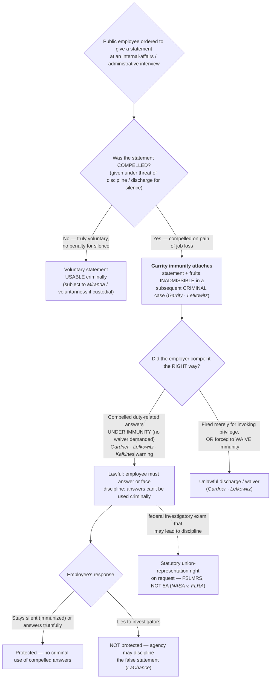

# S9 R1 panel-review — Opus model-diversity lane (prompt pack)

You are the **Claude/Opus** leg of the S9 three-lane adversarial panel (1 Claude + 2 Codex, R1). The two Codex lanes carry the A (support/quote-fidelity) and B (currency/treatment) attack lenses; **you carry model diversity and MUST vote on every paneled assertion across BOTH lenses' concerns.** You are refute-framed: try hard to break each assertion; **default to REFUTED on uncertainty**; never fabricate a cite, quote, or holding; use ONLY the evidence inlined below (no search, no outside knowledge). You are a SIGHTED reviewer — the FULL lake record (judgment fields included) is inlined.

You are a WRITER lane, not an adjudicator: you FIND and VOTE. You do not tally, adjudicate, or close any row — the orchestrator does.

For EACH group below, return one JSON object with the exact `reviewed[]` shape from the output contract (identical framing to the Codex lenses). Emit a finding object ONLY for a real defect (verdict refuted / stands-modified); a group you find wholly clean returns all-`stands` verdicts (the harness records a clean attestation). Concatenate the per-group JSON objects into a top-level `{"packs": [ ... ]}` array, one entry per group, each carrying its `group_id`.


OUTPUT CONTRACT — return ONE JSON object, nothing else:
{
  "lens": "A" | "B",
  "group_id": "<echo the group id>",
  "reviewed": [
    {
      "assertion_id": "<from group_inventory.jsonl>",
      "dimension": "existence|support|quote_fidelity|pincite|treatment|black_letter",
      "verdict": "stands" | "refuted" | "stands-modified",
      "verifiable_from_disclosed": true | false,
      "defect": null,   // null when verdict=="stands"; else an object:
      //  {"problem": "...", "severity": "high|medium|low", "proposed_fix": "...", "evidence_quote": "verbatim from disclosed evidence or null", "needs_cl": true|false, "locator_note": "..."}
      "reasons": ["short evidence-grounded reason", "..."],
      "breaks_true_positives": true | false,
      "residual_risks": ["..."],
      "suggested_tightening": "... or null"
    }
  ],
  "notes": ""
}
Rules: verdict=='stands' <=> defect==null (assertion survives your attack). verdict=='refuted' <=> a real defect (the assertion as framed is wrong). verdict=='stands-modified' <=> survives but needs a stated modification (a minor defect). Review EVERY assertion_id in group_inventory.jsonl exactly once. Output ONLY the JSON object.
---

## GROUP: content/confessions-interrogation-and-the-fifth-amendment/Public-Employee Compelled Statements (Garrity).md  (`doctrine`, 8 assertions)

### content_page

```
---
weight: 40
title: "Public-Employee Compelled Statements (Garrity)"
aliases:
  - "Public-Employee Compelled Statements (Garrity)"
  - "Garrity"
  - "Garrity Rule"
  - "Garrity Warning"
  - "9-confessions-interrogation/Public-Employee-Compelled-Statements-(Garrity)"
topic: Public-Employee Compelled Statements (Garrity)
type: doctrine
amendment: "U.S. Const. amend. V"
jurisdiction: Federal (U.S. Const. amend. V, incorporated via amend. XIV); SCOTUS baseline + Fed. Cir. (Kalkines)
status: draft
related: ["[[Miranda and Custodial Interrogation]]", "[[Miranda Waiver and Invocation]]"]
---

# Public-Employee Compelled Statements (Garrity)

*I am ordered to give a statement at an internal-affairs interview: what is compelled, what is immunized, and what can be used against me criminally?*

> [!rule] Black-letter rule
> Statements **compelled** from a public employee under **threat of losing the job** are coerced, and the Constitution bars their **use against the employee in a subsequent criminal case**; the immunity attaches from the **compulsion itself** and reaches the statement's **fruits**. The employer may still compel duty-related answers, but only **under immunity**, never by demanding a **waiver** of it. *[[Garrity v. New Jersey|Garrity]]*, 385 U.S. 493, [500](https://www.courtlistener.com/opinion/107336/garrity-v-new-jersey/) (1967); *[[Gardner v. Broderick|Gardner]]*, 392 U.S. 273, [278](https://www.courtlistener.com/opinion/107738/gardner-v-broderick/) (1968); *[[Lefkowitz v. Turley|Lefkowitz]]*, 414 U.S. 70, [84–85](https://www.courtlistener.com/opinion/108882/lefkowitz-v-turley/) (1973).
> ^rule-garrity

<!-- PROVENANCE (OPTIONAL->CORE promotion): This doctrine sits in an employment / internal-affairs posture rather than field search-and-seizure, so S2 §2.0 originally tagged the government-employee Fifth-Amendment (Garrity) cluster OPTIONAL. It is promoted to CORE on audience-relevance grounds — the students ARE the public employees (police officers), and Garrity/Kalkines warnings bear on them directly (U2-S5 / D3-S2). The promotion supersedes S2 §2.0's OPTIONAL tag for this one cluster; recommend adding a one-line OPTIONAL->CORE cross-ref to S2 §2.0 at execution (the APPROVED S2 is not edited here). The six Garrity-cluster case pages S5 ingested (verified, live-checked) home to this page. -->

## The Brief

This page is written for the **officer as the public employee**. It does not ask what an officer may do in the field; it asks what happens when the officer's own employer orders a statement in an administrative or IA inquiry while a criminal investigation looms. The engine is the Fifth Amendment privilege against self-incrimination (applied to the states through the Fourteenth), not custody or interrogation.

**The black-letter rule: Garrity immunity (stated up front).** Statements **compelled** from a public employee under threat of **losing the job** are **coerced**, and the Constitution bars their use against the employee in a **subsequent criminal case**. In *[[Garrity v. New Jersey]]*, the officers were told they could refuse to answer, but that a refusal would forfeit their offices under a state statute; the Court held that "[t]he option to lose their means of livelihood or to pay the penalty of self-incrimination is the antithesis of free choice to speak out or to remain silent." *[[Garrity v. New Jersey#^pin-497|Garrity v. New Jersey]]*, 385 U.S. 493, [497](https://www.courtlistener.com/opinion/107336/garrity-v-new-jersey/) (1967). It therefore held "the protection of the individual under the Fourteenth Amendment against coerced statements prohibits use in subsequent criminal proceedings of statements obtained under threat of removal from office, and that it extends to all, whether they are policemen or other members of our body politic." *[[Garrity v. New Jersey#^pin-500|Id.]]* at 500. The immunity is a consequence of the **compulsion itself**; it attaches because the statement was extracted on pain of job loss, not because any particular form was read. Its reach includes the statement's **fruits**: answers "elicited upon the threat of the loss of employment are compelled and inadmissible in evidence." *[[Lefkowitz v. Turley#^pin-84a|Lefkowitz v. Turley]]*, 414 U.S. 70, [84–85](https://www.courtlistener.com/opinion/108882/lefkowitz-v-turley/) (1973).

**The employer's side: the government may compel, but only under immunity (Gardner / Lefkowitz).** *[[Garrity v. New Jersey|Garrity]]* immunity is **not** a shield that lets the officer refuse the IA order. The employer **may** require a public employee to answer questions **"specifically, directly, and narrowly relating to the performance of his official duties,"** on pain of dismissal, **but only if** the employee is **not required to waive** the immunity. *[[Gardner v. Broderick]]* holds that a policeman may **not** be fired **merely for refusing to sign a waiver of immunity** before a grand jury: "the mandate of the great privilege against self-incrimination does not tolerate the attempt . . . to coerce a waiver of the immunity it confers on penalty of the loss of employment." *[[Gardner v. Broderick#^pin-279|Gardner v. Broderick]]*, 392 U.S. 273, [279](https://www.courtlistener.com/opinion/107738/gardner-v-broderick/) (1968). Had the officer instead "refused to answer questions specifically, directly, and narrowly relating to the performance of his official duties, **without being required to waive his immunity** . . . the privilege . . . would not have been a bar to his dismissal." *[[Gardner v. Broderick#^pin-278|Id.]]* at 278. *[[Lefkowitz v. Turley]]* fixes the same line and extends it beyond employees to independent contractors: "given adequate immunity, the State may plainly insist that employees either answer questions under oath about the performance of their job or suffer the loss of employment," *[[Lefkowitz v. Turley#^pin-84|Lefkowitz v. Turley]]*, 414 U.S. at [84](https://www.courtlistener.com/opinion/108882/lefkowitz-v-turley/), but "the State may not insist that [they] waive their Fifth Amendment privilege . . . and consent to the use of the fruits of the interrogation in any later proceedings," and "must offer . . . whatever immunity is required to supplant the privilege." *[[Lefkowitz v. Turley#^pin-84a|Id.]]* at 84–85. **The bargain the Constitution forbids is "invoke and be fired *and* have your statement used."** The bargain it permits is "answer, keep your job, and the answer cannot be used to prosecute you."

**The immunity family (trial-side).** *[[Garrity v. New Jersey|Garrity]]* immunity is one application of the broader **use-and-derivative-use immunity** doctrine. Four companion authorities frame it (each named plainly, with no CSSI case page):
- *Kastigar v. United States*, 406 U.S. 441 (1972): use-and-derivative-use immunity is coextensive with the Fifth Amendment privilege, so the government may compel testimony once it supplants the privilege with immunity, and it must thereafter build its case only from a wholly **[[Inevitable Discovery and Independent Source|independent source]]**. This is the engine under *[[Lefkowitz v. Turley|Lefkowitz]]*'s rule that compelled answers and their fruits are inadmissible.
- *Uniformed Sanitation Men Assn., Inc. v. Commissioner of Sanitation*, 392 U.S. 280 (1968): decided with *[[Gardner v. Broderick|Gardner]]*, it holds that public employees may not be discharged simply for invoking the privilege, though they may be compelled to answer duty-related questions under immunity.
- *Lefkowitz v. Cunningham*, 431 U.S. 801 (1977): the same rule bars stripping office or party position from an official who invokes the privilege, extending the penalty-cases line beyond ordinary employees.
- *New Jersey v. Portash*, 440 U.S. 450 (1979): immunized testimony may not be used even to **impeach** the witness at a later criminal trial, a sharper bar than the impeachment use allowed for merely un-*Mirandized* statements.

**The warning: Garrity / Kalkines.** Because the line turns on whether the employee was compelled *and* immunized, the practice grew up of **advising the employee before the compelled interview**. The **Garrity warning** (the common name in state and local police IA practice, tracing to *[[Garrity v. New Jersey|Garrity]]*, *[[Gardner v. Broderick|Gardner]]*, and *[[Lefkowitz v. Turley|Lefkowitz]]*) tells the employee two things: (1) you are **ordered to answer**, and refusing may result in **discipline or discharge**; and (2) your compelled answers **cannot be used against you in a criminal prosecution**. The federal-sector formulation is the **Kalkines warning**: "a governmental employer is not wholly barred from insisting that relevant information be given it; the public servant can be removed for not replying if he is **adequately informed both that he is subject to discharge for not answering and that his replies (and their fruits) cannot be employed against him in a criminal case.**" *[[Kalkines v. United States#^pin-1393|Kalkines v. United States]]*, 473 F.2d 1391, 1393 (Ct. Cl. 1973). Conversely, "the individual cannot be discharged simply because he invokes his Fifth Amendment privilege . . . in refusing to respond." *[[Kalkines v. United States#^pin-1393a|Id.]]* An employer that wants the answers **must supply the immunizing warning**; if it does not, a discharge grounded on the employee's refusal to answer is invalid (as *[[Kalkines v. United States|Kalkines]]*'s was, where the "fruits" protection was never brought home). *[[Kalkines v. United States|Kalkines]]* is a **U.S. Court of Claims** decision whose precedent binds in the **Federal Circuit** (**Binding in-circuit — Fed. Cir.**).

**The limit: you may stay silent, but you may not lie (LaChance).** The privilege protects **silence, not falsehood**. *[[LaChance v. Erickson]]* holds that a government agency **may discipline** an employee for **making false statements** to investigators in response to an underlying misconduct charge: "A citizen may decline to answer the question, or answer it honestly, but he cannot with impunity knowingly and willfully answer with a falsehood." *[[LaChance v. Erickson#^pin-265|LaChance v. Erickson]]*, 522 U.S. 262, [265](https://www.courtlistener.com/opinion/118163/lachance-v-erickson/) (1998). The employee's protected options are two: remain silent (invoking the privilege if answering "could expose [him] to a criminal prosecution," *[[LaChance v. Erickson|id.]]*, 522 U.S. at [267](https://www.courtlistener.com/opinion/118163/lachance-v-erickson/)) or answer truthfully, so "a Government agency may take adverse action against an employee because the employee made false statements in response to an underlying charge of misconduct." *[[LaChance v. Erickson#^pin-268|Id.]]* at 268. *[[Garrity v. New Jersey|Garrity]]* immunity is a right against **compelled self-incrimination**, not a license to lie one's way out of an IA interview.

**A statutory companion, not a Fifth Amendment rule: the representation right ([[NASA v. FLRA]]).** *[[NASA v. FLRA]]* is grouped here because it governs the **same setting** (the public employee facing a compelled investigatory interview), but it is a **statutory** holding, **not a Fifth Amendment ruling**. It construes the **Federal Service Labor-Management Relations Statute (FSLMRS)**, 5 U.S.C. § 7114(a)(2)(B), which grants a union-representation right at "any examination of an employee in the unit by a representative of the agency in connection with an investigation" where the employee "reasonably believes that the examination may result in disciplinary action" and "requests representation." *[[NASA v. FLRA#^pin-233|NASA v. FLRA]]*, 527 U.S. 229, [233](https://www.courtlistener.com/opinion/118306/nasa-v-flra/) (1999). The Court held that a **NASA Office of Inspector General investigator is a "representative of the agency"** for that purpose, so the statutory representation right applies. *[[NASA v. FLRA#^pin-231|Id.]]* at 231. It is the federal-sector analog of the private-sector *Weingarten* right, and it is **not** authority for any constitutional immunity; cite it for the **statutory** right to representation at the interview, never for the *[[Garrity v. New Jersey|Garrity]]* rule itself.

**Garrity is not Miranda: compelled employment, not custodial interrogation.** The officer-student's most useful distinction. *[[Miranda and Custodial Interrogation|Miranda]]* addresses **custodial interrogation** by police: the pressure is the police-dominated custodial setting, the suspect may **invoke and remain silent with no penalty**, and the remedy is exclusion from the criminal case-in-chief. **[[Garrity v. New Jersey|Garrity]]** addresses **compelled employment statements**: there is no custody requirement; the "compulsion" is the **threat of job loss** for silence; and, critically, the officer at a properly-warned IA interview is **not** free to simply stay silent without consequence, because silence can cost the job (*[[Gardner v. Broderick|Gardner]]* / *[[Kalkines v. United States|Kalkines]]*). What the officer **gets in return** is that the compelled answers and their fruits **cannot be used to prosecute** him. So on the street the Fifth Amendment buys **silence**; in the IA room it buys **immunity for answers the employer can order you to give**. Keep the two warnings straight: the **[[Miranda and Custodial Interrogation|Miranda warning]]** (custody + interrogation; you may remain silent) is not the **Garrity/Kalkines warning** (compelled employment interview; you must answer or face discipline, but the answers cannot be used criminally).

**Burden · standard of review · remedy.** Whether a statement was **"compelled"** is judged **objectively**: the constitutionally disabling pressure is the penalty of job loss for silence, the "antithesis of free choice" (*[[Garrity v. New Jersey|Garrity]]*), not the employee's subjective anxiety. In a **criminal** case, once the statement is shown to have been compelled under threat of removal, the statement **and its fruits are inadmissible** (*[[Lefkowitz v. Turley|Lefkowitz]]*), so the prosecution must build its case from evidence drawn from a **source independent** of the compelled statement. On the **administrative** side, the employer that wants to compel answers **carries the burden** of first giving the immunizing (*[[Kalkines v. United States|Kalkines]]*) warning; a discharge grounded on a refusal to answer without that warning is invalid, while a discharge for **refusing to waive immunity** is invalid regardless (*[[Gardner v. Broderick|Gardner]]*). The **remedy** for criminal use of a *[[Garrity v. New Jersey|Garrity]]*-compelled statement or its fruits is **suppression** under the [[The Exclusionary Rule|exclusionary rule]]; the remedy for an unlawful discharge is reinstatement in the employment forum.

**Common pitfalls.**
- **Thinking the Fifth Amendment lets you refuse the IA order the way it lets a suspect stay silent on the street.** It does not: once properly immunized, you can be **compelled** to answer duty-related questions and **disciplined for silence** (*[[Gardner v. Broderick|Gardner]]* / *[[Lefkowitz v. Turley|Lefkowitz]]* / *[[Kalkines v. United States|Kalkines]]*).
- **Assuming a "Garrity warning" makes the statement disappear.** It immunizes the statement from **criminal** use; it does **not** shield it from **administrative** discipline, and it does **not** shield a **lie** (*[[LaChance v. Erickson|LaChance]]*).
- **Signing a "waiver of immunity."** That is precisely what the employer may **not** demand as the price of the job (*[[Gardner v. Broderick|Gardner]]* / *[[Lefkowitz v. Turley|Lefkowitz]]*); a signed waiver can surrender the very protection *[[Garrity v. New Jersey|Garrity]]* supplies.
- **Investigators using a compelled IA statement, or its fruits, to build the criminal case.** Compelled statements and their fruits are inadmissible; a criminal investigation must be **walled off** from the *[[Garrity v. New Jersey|Garrity]]*-compelled material (*[[Garrity v. New Jersey|Garrity]]* / *[[Lefkowitz v. Turley|Lefkowitz]]*).
- **Treating *[[NASA v. FLRA]]* as constitutional authority.** It is a **statutory** FSLMRS representation-rights holding, not a Fifth Amendment ruling; do not cite it for *[[Garrity v. New Jersey|Garrity]]* immunity.
- **Conflating the Garrity warning with the Kalkines warning without noting the forum.** Both convey the same two-part message; *[[Kalkines v. United States|Kalkines]]* is the **federal**-employee formulation (**Binding in-circuit — Fed. Cir.**) that expressly requires advising of both discharge-for-silence **and** no-criminal-use-of-replies-and-fruits.

## Lower-court developments

Circuit/state developments only; **no SCOTUS**. The controlling Supreme Court cases (*[[Garrity v. New Jersey|Garrity]]*, *[[Gardner v. Broderick|Gardner]]*, *[[Lefkowitz v. Turley|Lefkowitz]]*, *[[LaChance v. Erickson|LaChance]]*, *[[NASA v. FLRA]]*) home to **Key cases** regardless of date, per the no-SCOTUS-in-recent-developments rule; the federal *[[Kalkines v. United States|Kalkines]]* warning is **Binding in-circuit — Fed. Cir.** and likewise homes to Key. The live line-drawing at the lower-court level tracks a few recurring frontiers: (a) whether *[[Garrity v. New Jersey|Garrity]]* immunity is **self-executing**, attaching from the objective compulsion of a job-loss threat even where **no formal warning** was read, versus requiring a subjective belief that silence would cost the job that was **objectively reasonable**; (b) the **adequacy** of a given IA advisement measured against the *[[Kalkines v. United States|Kalkines]]* two-part standard (discharge-for-silence **and** no-criminal-use-of-replies-and-fruits); and (c) the interaction of *[[Garrity v. New Jersey|Garrity]]* with **state Police Officer Bills of Rights (POBRs)**, which layer statutory interview protections on top of the constitutional floor. No SCOTUS case is pending on these points. *Specific circuit and state authority developing these frontiers is a live-verify addition (serial CL, L2/L4) deferred to the standing find, adjudicate, and fix gate (R13) and S9; no new case holding is asserted here.*

## Key cases

| Case | Holding | Opinion |
|---|---|---|
| *[[Garrity v. New Jersey]]*, 385 U.S. 493 (1967) | **Anchor.** Statements compelled from a public employee under **threat of removal from office** are coerced, and their use against the employee in a **subsequent criminal proceeding** is barred (the Garrity rule). | [opinion](https://www.courtlistener.com/opinion/107336/garrity-v-new-jersey/) |
| *[[Gardner v. Broderick]]*, 392 U.S. 273 (1968) | **Refinement.** A police officer may **not** be dismissed merely for refusing to **waive immunity**; but he may be compelled to answer questions **specifically, directly, and narrowly** about official duties under immunity, and discharged for refusing **those**. | [opinion](https://www.courtlistener.com/opinion/107738/gardner-v-broderick/) |
| *[[Lefkowitz v. Turley]]*, 414 U.S. 70 (1973) | **Refinement.** The State may compel duty-related answers **only by granting immunity**, never by demanding a **waiver**; answers threatened by loss of employment are "compelled and inadmissible." Extends the rule to independent contractors. | [opinion](https://www.courtlistener.com/opinion/108882/lefkowitz-v-turley/) |
| *[[Kalkines v. United States]]*, 473 F.2d 1391 (Ct. Cl. 1973) | **Refinement (federal warning).** A federal employee may be discharged for refusing to answer only if **adequately advised both** that refusal risks discharge **and** that his replies (and their fruits) cannot be used criminally (the **Kalkines warning**). | [opinion](https://www.courtlistener.com/opinion/8615714/kalkines-v-united-states/) |
| *[[LaChance v. Erickson]]*, 522 U.S. 262 (1998) | **Limit.** The privilege protects **silence, not falsehood**: an agency **may** discipline an employee for making **false statements** to investigators in response to an underlying misconduct charge. | [opinion](https://www.courtlistener.com/opinion/118163/lachance-v-erickson/) |
| *[[NASA v. FLRA]]*, 527 U.S. 229 (1999) | **Statutory companion (not 5A).** Under the **FSLMRS**, 5 U.S.C. § 7114(a)(2)(B), a NASA-OIG investigator is a "representative of the agency," so the employee's **statutory union-representation right** at an investigatory exam that may lead to discipline applies. | [opinion](https://www.courtlistener.com/opinion/9188189/national-aeronautics-space-administration-v-federal-labor-relations-authority/) |

## Related cases across doctrines

These are treated in full on other pages but bear on the *[[Garrity v. New Jersey|Garrity]]* setting (the **Fifth Amendment self-incrimination privilege**), framed here for that contrast.

| Case | Relevance here | Primary home | Opinion |
|---|---|---|---|
| *[[Miranda v. Arizona]]*, 384 U.S. 436 (1966) | The **custodial-interrogation** counterpart: *[[Miranda v. Arizona\|Miranda]]* compulsion arises from a **police-dominated custodial setting** and the suspect may **invoke and stay silent with no penalty**; **[[Garrity v. New Jersey\|Garrity]]** compulsion arises from the **threat of job loss** and the properly-warned employee **must answer or face discipline** but earns **criminal-use immunity**. Both enforce the same Fifth Amendment privilege through different doctrines; do not conflate the **[[Miranda and Custodial Interrogation\|Miranda warning]]** with the **Garrity/Kalkines warning**. | [[Miranda and Custodial Interrogation]] | [opinion](https://www.courtlistener.com/opinion/107252/miranda-v-arizona/) |

Cross-doctrine bridges: the **custody + interrogation** gate and the post-warning **waiver/invocation** rules live on [[Miranda and Custodial Interrogation]] and [[Miranda Waiver and Invocation]]; a coercion claim independent of any employment threat runs through [[Due-Process Voluntariness of Confessions]].

## Visual



## Sources

- [Garrity v. New Jersey, 385 U.S. 493 (1967)](https://www.courtlistener.com/opinion/107336/garrity-v-new-jersey/) — pinpoints 497, 500
- [Gardner v. Broderick, 392 U.S. 273 (1968)](https://www.courtlistener.com/opinion/107738/gardner-v-broderick/) — pinpoints 278, 279
- [Lefkowitz v. Turley, 414 U.S. 70 (1973)](https://www.courtlistener.com/opinion/108882/lefkowitz-v-turley/) — pinpoints 84, 84–85
- [Kalkines v. United States, 473 F.2d 1391 (Ct. Cl. 1973)](https://www.courtlistener.com/opinion/8615714/kalkines-v-united-states/) — pinpoint 1393
- [LaChance v. Erickson, 522 U.S. 262 (1998)](https://www.courtlistener.com/opinion/118163/lachance-v-erickson/) — pinpoints 265, 267, 268
- [NASA v. FLRA, 527 U.S. 229 (1999)](https://www.courtlistener.com/opinion/9188189/national-aeronautics-space-administration-v-federal-labor-relations-authority/) — pinpoints 231, 233
- [Kastigar v. United States, 406 U.S. 441 (1972)](https://www.courtlistener.com/opinion/108541/kastigar-v-united-states/) *(immunity family; no case page)*
- [Uniformed Sanitation Men Assn., Inc. v. Commissioner of Sanitation, 392 U.S. 280 (1968)](https://www.courtlistener.com/opinion/107739/uniformed-sanitation-men-assn-v-commissioner-of-sanitation-of-new-york/) *(immunity family; no case page)*
- [Lefkowitz v. Cunningham, 431 U.S. 801 (1977)](https://www.courtlistener.com/opinion/109683/lefkowitz-v-cunningham/) *(immunity family; no case page)*
- [New Jersey v. Portash, 440 U.S. 450 (1979)](https://www.courtlistener.com/opinion/110038/new-jersey-v-portash/) *(immunity family; no case page)*
- [Miranda v. Arizona, 384 U.S. 436 (1966)](https://www.courtlistener.com/opinion/107252/miranda-v-arizona/) (cross-doctrine contrast)

```

### group_inventory (assertions under review)

```jsonl
{"assertion_id": "01e5cbaa5dca2dd5", "dimension": "existence", "kind": "case_cite", "locator": {"case": "Garrity v. New Jersey", "table_line": 52}, "payload": {"case": "Garrity v. New Jersey", "cells": ["*[[Garrity v. New Jersey]]*, 385 U.S. 493 (1967)", "**Anchor.** Statements compelled from a public employee under **threat of removal from office** are coerced, and their use against the employee in a **subsequent criminal proceeding** is barred (the Garrity rule).", "[opinion](https://www.courtlistener.com/opinion/107336/garrity-v-new-jersey/)"], "header": ["Case", "Holding", "Opinion"]}}
{"assertion_id": "4ef5b29e9f3df478", "dimension": "existence", "kind": "case_cite", "locator": {"case": "Kalkines v. United States", "table_line": 55}, "payload": {"case": "Kalkines v. United States", "cells": ["*[[Kalkines v. United States]]*, 473 F.2d 1391 (Ct. Cl. 1973)", "**Refinement (federal warning).** A federal employee may be discharged for refusing to answer only if **adequately advised both** that refusal risks discharge **and** that his replies (and their fruits) cannot be used criminally (the **Kalkines warning**).", "[opinion](https://www.courtlistener.com/opinion/8615714/kalkines-v-united-states/)"], "header": ["Case", "Holding", "Opinion"]}}
{"assertion_id": "8f1f05728d6e4239", "dimension": "existence", "kind": "case_cite", "locator": {"case": "Gardner v. Broderick", "table_line": 53}, "payload": {"case": "Gardner v. Broderick", "cells": ["*[[Gardner v. Broderick]]*, 392 U.S. 273 (1968)", "**Refinement.** A police officer may **not** be dismissed merely for refusing to **waive immunity**; but he may be compelled to answer questions **specifically, directly, and narrowly** about official duties under immunity, and discharged for refusing **those**.", "[opinion](https://www.courtlistener.com/opinion/107738/gardner-v-broderick/)"], "header": ["Case", "Holding", "Opinion"]}}
{"assertion_id": "afd576e7e19e6138", "dimension": "existence", "kind": "case_cite", "locator": {"case": "LaChance v. Erickson", "table_line": 56}, "payload": {"case": "LaChance v. Erickson", "cells": ["*[[LaChance v. Erickson]]*, 522 U.S. 262 (1998)", "**Limit.** The privilege protects **silence, not falsehood**: an agency **may** discipline an employee for making **false statements** to investigators in response to an underlying misconduct charge.", "[opinion](https://www.courtlistener.com/opinion/118163/lachance-v-erickson/)"], "header": ["Case", "Holding", "Opinion"]}}
{"assertion_id": "cd522996dabc3f47", "dimension": "existence", "kind": "case_cite", "locator": {"case": "NASA v. FLRA", "table_line": 57}, "payload": {"case": "NASA v. FLRA", "cells": ["*[[NASA v. FLRA]]*, 527 U.S. 229 (1999)", "**Statutory companion (not 5A).** Under the **FSLMRS**, 5 U.S.C. § 7114(a)(2)(B), a NASA-OIG investigator is a \"representative of the agency,\" so the employee's **statutory union-representation right** at an investigatory exam that may lead to discipline applies.", "[opinion](https://www.courtlistener.com/opinion/9188189/national-aeronautics-space-administration-v-federal-labor-relations-authority/)"], "header": ["Case", "Holding", "Opinion"]}}
{"assertion_id": "d3c7757421bb4bad", "dimension": "existence", "kind": "case_cite", "locator": {"case": "Lefkowitz v. Turley", "table_line": 54}, "payload": {"case": "Lefkowitz v. Turley", "cells": ["*[[Lefkowitz v. Turley]]*, 414 U.S. 70 (1973)", "**Refinement.** The State may compel duty-related answers **only by granting immunity**, never by demanding a **waiver**; answers threatened by loss of employment are \"compelled and inadmissible.\" Extends the rule to independent contractors.", "[opinion](https://www.courtlistener.com/opinion/108882/lefkowitz-v-turley/)"], "header": ["Case", "Holding", "Opinion"]}}
{"assertion_id": "d99b33f4d51208a6", "dimension": "existence", "kind": "case_cite", "locator": {"case": "Miranda v. Arizona", "table_line": 65}, "payload": {"case": "Miranda v. Arizona", "cells": ["*[[Miranda v. Arizona]]*, 384 U.S. 436 (1966)", "The **custodial-interrogation** counterpart: *[[Miranda v. Arizona\\|Miranda]]* compulsion arises from a **police-dominated custodial setting** and the suspect may **invoke and stay silent with no penalty**; **[[Garrity v. New Jersey\\|Garrity]]** compulsion arises from the **threat of job loss** and the properly-warned employee **must answer or face discipline** but earns **criminal-use immunity**. Both enforce the same Fifth Amendment privilege through different doctrines; do not conflate the **[[Miranda and Custodial Interrogation\\|Miranda warning]]** with the **Garrity/Kalkines warning**.", "[[Miranda and Custodial Interrogation]]", "[opinion](https://www.courtlistener.com/opinion/107252/miranda-v-arizona/)"], "header": ["Case", "Relevance here", "Primary home", "Opinion"]}}
{"assertion_id": "fe7068fc20efb8aa", "dimension": "support", "kind": "proposition", "locator": {"callout": "^rule-garrity"}, "payload": {"anchor": "^rule-garrity", "statement": "[!rule] Black-letter rule\nStatements **compelled** from a public employee under **threat of losing the job** are coerced, and the Constitution bars their **use against the employee in a subsequent criminal case**; the immunity attaches from the **compulsion itself** and reaches the statement's **fruits**. The employer may still compel duty-related answers, but only **under immunity**, never by demanding a **waiver** of it. *[[Garrity v. New Jersey|Garrity]]*, 385 U.S. 493, [500](https://www.courtlistener.com/opinion/107336/garrity-v-new-jersey/) (1967); *[[Gardner v. Broderick|Gardner]]*, 392 U.S. 273, [278](https://www.courtlistener.com/opinion/107738/gardner-v-broderick/) (1968); *[[Lefkowitz v. Turley|Lefkowitz]]*, 414 U.S. 70, [84–85](https://www.courtlistener.com/opinion/108882/lefkowitz-v-turley/) (1973)."}}
```

### lake record — Gardner v. Broderick

```json
{
  "schema_version": "s2.v1",
  "record_id": "Gardner v. Broderick",
  "stub": false,
  "status": "verified",
  "identity": {
    "case_name": "Gardner v. Broderick",
    "case_name_short": "Gardner",
    "case_name_full": "GARDNER v. BRODERICK, POLICE COMMISSIONER OF THE CITY OF NEW YORK, Et Al.",
    "input_case_name": "Gardner v. Broderick",
    "court": "U.S. Supreme Court",
    "court_id": "scotus",
    "court_level": "scotus",
    "circuit": null,
    "state": null,
    "date_decided": "1968-06-10",
    "year": 1968,
    "docket": "635",
    "cluster_id": 107738,
    "lead_opinion_id": 107738,
    "sibling_ids": [
      107738
    ],
    "absolute_url": "/opinion/107738/gardner-v-broderick/",
    "identity_method": "citation+party-text",
    "expected_citation_found": true,
    "party_name_in_text": true,
    "canonical_name_match": true,
    "alternates": [
      {
        "cluster_id": 8970907,
        "score": 20,
        "case_name": "Gardner v. Broderick"
      },
      {
        "cluster_id": 8970362,
        "score": 20,
        "case_name": "Gardner v. Broderick"
      }
    ],
    "reason_code": null
  },
  "citations": {
    "official": {
      "cite": "392 U.S. 273",
      "volume": "392",
      "reporter": "U.S.",
      "page": "273",
      "type": 1,
      "selected_official": true,
      "source": "cluster.citations[]"
    },
    "parallel": [
      {
        "cite": "88 S. Ct. 1913",
        "volume": "88",
        "reporter": "S. Ct.",
        "page": "1913",
        "type": 1,
        "selected_official": false,
        "source": "cluster.citations[]"
      },
      {
        "cite": "20 L. Ed. 2d 1082",
        "volume": "20",
        "reporter": "L. Ed. 2d",
        "page": "1082",
        "type": 1,
        "selected_official": false,
        "source": "cluster.citations[]"
      }
    ],
    "vendor_neutral": [
      {
        "cite": "1968 U.S. LEXIS 1351",
        "volume": "1968",
        "reporter": "U.S. LEXIS",
        "page": "1351",
        "type": 6,
        "selected_official": false,
        "source": "cluster.citations[]"
      }
    ],
    "all": [
      {
        "cite": "392 U.S. 273",
        "volume": "392",
        "reporter": "U.S.",
        "page": "273",
        "type": 1,
        "selected_official": false,
        "source": "cluster.citations[]"
      },
      {
        "cite": "88 S. Ct. 1913",
        "volume": "88",
        "reporter": "S. Ct.",
        "page": "1913",
        "type": 1,
        "selected_official": false,
        "source": "cluster.citations[]"
      },
      {
        "cite": "20 L. Ed. 2d 1082",
        "volume": "20",
        "reporter": "L. Ed. 2d",
        "page": "1082",
        "type": 1,
        "selected_official": false,
        "source": "cluster.citations[]"
      },
      {
        "cite": "1968 U.S. LEXIS 1351",
        "volume": "1968",
        "reporter": "U.S. LEXIS",
        "page": "1351",
        "type": 6,
        "selected_official": false,
        "source": "cluster.citations[]"
      }
    ],
    "display": "392 U.S. 273",
    "official_selection": {
      "court_class": "scotus",
      "selected": "392 U.S. 273",
      "reason": "selected_rank_1"
    }
  },
  "pinpoints": [
    {
      "id": "pin-279",
      "page": null,
      "quote": "that would have allowed his compelled testimony to be used to prosecute him. He refused to sign and was discharged from the force under a City Charter provision mandating dismissal of any officer who refuses to waive immunity. He challenged the dismissal as a penalty for exercising his Fifth Amendment privilege. ## Issue Whether a police officer may be dismissed solely because he refused to waive his constitutional privilege against self-incrimination \u2014 that is, refused to sign a waiver of immunity \u2014 before a grand jury investigating his conduct. ## Rule An employee may not be fired merely for asserting the privilege:",
      "star_marker": null,
      "quote_fidelity": "mismatch",
      "pinpoint_status": "slip-only",
      "position": null
    },
    {
      "id": "pin-278",
      "page": null,
      "quote": "If appellant, a policeman, had refused to answer questions specifically, directly, and narrowly relating to the performance of his official duties, without being required to waive his immunity with respect to the use of his answers or the fruits thereof in a criminal prosecution of himself, . . . the privilege against self-incrimination would not have been a bar to his dismissal.",
      "star_marker": null,
      "quote_fidelity": "mismatch",
      "pinpoint_status": "slip-only",
      "position": null
    }
  ],
  "treatment": {
    "field_i_validity": "good_law",
    "as_of_content": "1968-06-10",
    "as_of_treatment": "2026-06-30",
    "composite_basis": "migration-seed",
    "composite_basis_ref": "Gardner v. Broderick",
    "varies_by_point": false,
    "scope_note": "Good law; the Garrity companion drawing the line between firing an employee for asserting the privilege (barred) and compelling job-related answers under use immunity (permitted).",
    "point_overrides": [],
    "edges": [
      {
        "citing_case": {
          "name": "State v. Gideon",
          "cluster_id": 4632199,
          "cite": [
            "2019 Ohio 2482",
            "130 N.E.3d 357"
          ],
          "field_ii": "questioned"
        },
        "field_ii": "questioned",
        "field_iii": "mentioned",
        "point": null,
        "proposed": true,
        "journal_ref": "Gardner v. Broderick:lane1_negative"
      },
      {
        "citing_case": {
          "name": "United States v. Von Behren",
          "cluster_id": 3202148,
          "cite": [
            "822 F.3d 1139",
            "2016 U.S. App. LEXIS 8567",
            "2016 WL 2641270"
          ],
          "field_ii": "questioned"
        },
        "field_ii": "questioned",
        "field_iii": "mentioned",
        "point": null,
        "proposed": true,
        "journal_ref": "Gardner v. Broderick:lane1_negative"
      },
      {
        "citing_case": {
          "name": "Spielbauer v. County of Santa Clara",
          "cluster_id": 5608087,
          "cite": [
            "45 Cal. 4th 704",
            "199 P.3d 1125",
            "88 Cal. Rptr. 3d 590",
            "28 I.E.R. Cas. (BNA) 1254",
            "2009 Cal. LEXIS 1010"
          ],
          "field_ii": "questioned"
        },
        "field_ii": "questioned",
        "field_iii": "mentioned",
        "point": null,
        "proposed": true,
        "journal_ref": "Gardner v. Broderick:lane1_negative"
      },
      {
        "citing_case": {
          "name": "Aguilera v. Baca",
          "cluster_id": 1390016,
          "cite": [
            "510 F.3d 1161",
            "27 I.E.R. Cas. (BNA) 31",
            "2007 U.S. App. LEXIS 29804",
            "2007 WL 4531990"
          ],
          "field_ii": "questioned"
        },
        "field_ii": "questioned",
        "field_iii": "mentioned",
        "point": null,
        "proposed": true,
        "journal_ref": "Gardner v. Broderick:lane1_negative"
      },
      {
        "citing_case": {
          "name": "Sher v. U.S. Department of Veterans Affairs",
          "cluster_id": 202763,
          "cite": [
            "488 F.3d 489",
            "26 I.E.R. Cas. (BNA) 243",
            "2007 U.S. App. LEXIS 12365",
            "90 Empl. Prac. Dec. (CCH) 43,067",
            "100 Fair Empl. Prac. Cas. (BNA) 1495",
            "2007 WL 1532655"
          ],
          "field_ii": "overruled"
        },
        "field_ii": "overruled",
        "field_iii": "mentioned",
        "point": null,
        "proposed": true,
        "journal_ref": "Gardner v. Broderick:lane1_negative"
      },
      {
        "citing_case": {
          "name": "In Re Verbois",
          "cluster_id": 1451583,
          "cite": [
            "10 S.W.3d 825",
            "2000 Tex. App. LEXIS 1263",
            "2000 WL 216934"
          ],
          "field_ii": "questioned"
        },
        "field_ii": "questioned",
        "field_iii": "mentioned",
        "point": null,
        "proposed": true,
        "journal_ref": "Gardner v. Broderick:lane1_negative"
      },
      {
        "citing_case": {
          "name": "Burlington Police Officers' Ass'n v. City of Burlington",
          "cluster_id": 8209509,
          "cite": [
            "166 Vt. 581",
            "689 A.2d 1071",
            "1996 Vt. LEXIS 165"
          ],
          "field_ii": "questioned"
        },
        "field_ii": "questioned",
        "field_iii": "mentioned",
        "point": null,
        "proposed": true,
        "journal_ref": "Gardner v. Broderick:lane1_negative"
      },
      {
        "citing_case": {
          "name": "Serafino v. Hasbro, Inc.",
          "cluster_id": 196719,
          "cite": [
            "82 F.3d 515",
            "1996 U.S. App. LEXIS 8849",
            "70 Fair Empl. Prac. Cas. (BNA) 917",
            "1996 WL 187381"
          ],
          "field_ii": "questioned"
        },
        "field_ii": "questioned",
        "field_iii": "mentioned",
        "point": null,
        "proposed": true,
        "journal_ref": "Gardner v. Broderick:lane1_negative"
      },
      {
        "citing_case": {
          "name": "National Treasury Employees Union v. U.S. Department of the Treasury",
          "cluster_id": 6491,
          "cite": [
            "25 F.3d 237"
          ],
          "field_ii": "questioned"
        },
        "field_ii": "questioned",
        "field_iii": "mentioned",
        "point": null,
        "proposed": true,
        "journal_ref": "Gardner v. Broderick:lane1_negative"
      },
      {
        "citing_case": {
          "name": "In Re Moses",
          "cluster_id": 1882575,
          "cite": [
            "792 F. Supp. 529",
            "1992 U.S. Dist. LEXIS 8685",
            "23 Bankr. Ct. Dec. (CRR) 137",
            "1992 WL 132012"
          ],
          "field_ii": "superseded_by_statute"
        },
        "field_ii": "superseded_by_statute",
        "field_iii": "mentioned",
        "point": null,
        "proposed": true,
        "journal_ref": "Gardner v. Broderick:lane1_negative"
      },
      {
        "citing_case": {
          "name": "Steven M. Asherman v. Larry Meachum, Commissioner, Connecticut Department of Correction",
          "cluster_id": 578610,
          "cite": [
            "957 F.2d 978",
            "1992 U.S. App. LEXIS 2101"
          ],
          "field_ii": "abrogated"
        },
        "field_ii": "abrogated",
        "field_iii": "mentioned",
        "point": null,
        "proposed": true,
        "journal_ref": "Gardner v. Broderick:lane1_negative"
      },
      {
        "citing_case": {
          "name": "Matt v. Larocca",
          "cluster_id": 5689113,
          "cite": [
            "71 N.Y.2d 154",
            "524 N.Y.S.2d 180",
            "518 N.E.2d 1172",
            "1987 N.Y. LEXIS 19884"
          ],
          "field_ii": "questioned"
        },
        "field_ii": "questioned",
        "field_iii": "mentioned",
        "point": null,
        "proposed": true,
        "journal_ref": "Gardner v. Broderick:lane1_negative"
      },
      {
        "citing_case": {
          "name": "Lonnie Benjamin and Harold Hicken v. The City of Montgomery",
          "cluster_id": 466179,
          "cite": [
            "785 F.2d 959",
            "1986 U.S. App. LEXIS 23631"
          ],
          "field_ii": "questioned"
        },
        "field_ii": "questioned",
        "field_iii": "mentioned",
        "point": null,
        "proposed": true,
        "journal_ref": "Gardner v. Broderick:lane1_negative"
      },
      {
        "citing_case": {
          "name": "Lybarger v. City of Los Angeles",
          "cluster_id": 1206957,
          "cite": [
            "710 P.2d 329",
            "40 Cal. 3d 822",
            "221 Cal. Rptr. 529",
            "1985 Cal. LEXIS 436"
          ],
          "field_ii": "questioned"
        },
        "field_ii": "questioned",
        "field_iii": "mentioned",
        "point": null,
        "proposed": true,
        "journal_ref": "Gardner v. Broderick:lane1_negative"
      },
      {
        "citing_case": {
          "name": "Clarence Leon Taylor, Jr. v. E. Parry Best, Lt. D.W. Smith, Paul Mills L.T. Lester",
          "cluster_id": 442995,
          "cite": [
            "746 F.2d 220",
            "1984 U.S. App. LEXIS 18178"
          ],
          "field_ii": "questioned"
        },
        "field_ii": "questioned",
        "field_iii": "mentioned",
        "point": null,
        "proposed": true,
        "journal_ref": "Gardner v. Broderick:lane1_negative"
      },
      {
        "citing_case": {
          "name": "National Acceptance Company of America v. Joseph S. Bathalter, Jr.",
          "cluster_id": 417757,
          "cite": [
            "705 F.2d 924",
            "36 Fed. R. Serv. 2d 447",
            "1983 U.S. App. LEXIS 28695"
          ],
          "field_ii": "questioned"
        },
        "field_ii": "questioned",
        "field_iii": "mentioned",
        "point": null,
        "proposed": true,
        "journal_ref": "Gardner v. Broderick:lane1_negative"
      },
      {
        "citing_case": {
          "name": "In re the Claim of Altieri",
          "cluster_id": 5999349,
          "cite": [
            "92 A.D.2d 1028",
            "461 N.Y.S.2d 436",
            "1983 N.Y. App. Div. LEXIS 17429"
          ],
          "field_ii": "questioned"
        },
        "field_ii": "questioned",
        "field_iii": "mentioned",
        "point": null,
        "proposed": true,
        "journal_ref": "Gardner v. Broderick:lane1_negative"
      },
      {
        "citing_case": {
          "name": "STATE DEPT. OF HIGHWAY SAF., ETC. v. Zimmer",
          "cluster_id": 1729887,
          "cite": [
            "398 So. 2d 463"
          ],
          "field_ii": "questioned"
        },
        "field_ii": "questioned",
        "field_iii": "mentioned",
        "point": null,
        "proposed": true,
        "journal_ref": "Gardner v. Broderick:lane1_negative"
      },
      {
        "citing_case": {
          "name": "Kastigar v. United States",
          "cluster_id": 108541,
          "cite": [
            "32 L. Ed. 2d 212",
            "92 S. Ct. 1653",
            "406 U.S. 441",
            "1972 U.S. LEXIS 57"
          ],
          "field_ii": "overruled"
        },
        "field_ii": "overruled",
        "field_iii": "mentioned",
        "point": null,
        "proposed": true,
        "journal_ref": "Gardner v. Broderick:lane2_top_cited"
      },
      {
        "citing_case": {
          "name": "Baxter v. Palmigiano",
          "cluster_id": 109429,
          "cite": [
            "47 L. Ed. 2d 810",
            "96 S. Ct. 1551",
            "425 U.S. 308",
            "1976 U.S. LEXIS 115"
          ],
          "field_ii": "overruled"
        },
        "field_ii": "overruled",
        "field_iii": "mentioned",
        "point": null,
        "proposed": true,
        "journal_ref": "Gardner v. Broderick:lane2_top_cited"
      },
      {
        "citing_case": {
          "name": "Minnesota v. Murphy",
          "cluster_id": 111105,
          "cite": [
            "79 L. Ed. 2d 409",
            "104 S. Ct. 1136",
            "465 U.S. 420",
            "1984 U.S. LEXIS 33",
            "52 U.S.L.W. 4246"
          ],
          "field_ii": "questioned"
        },
        "field_ii": "questioned",
        "field_iii": "mentioned",
        "point": null,
        "proposed": true,
        "journal_ref": "Gardner v. Broderick:lane2_top_cited"
      },
      {
        "citing_case": {
          "name": "Lefkowitz v. Turley",
          "cluster_id": 108882,
          "cite": [
            "38 L. Ed. 2d 274",
            "94 S. Ct. 316",
            "414 U.S. 70",
            "1973 U.S. LEXIS 132"
          ],
          "field_ii": "questioned"
        },
        "field_ii": "questioned",
        "field_iii": "mentioned",
        "point": null,
        "proposed": true,
        "journal_ref": "Gardner v. Broderick:lane2_top_cited"
      },
      {
        "citing_case": {
          "name": "McKune v. Lile",
          "cluster_id": 121146,
          "cite": [
            "153 L. Ed. 2d 47",
            "122 S. Ct. 2017",
            "536 U.S. 24",
            "2002 U.S. LEXIS 4206"
          ],
          "field_ii": "overruled"
        },
        "field_ii": "overruled",
        "field_iii": "mentioned",
        "point": null,
        "proposed": true,
        "journal_ref": "Gardner v. Broderick:lane2_top_cited"
      },
      {
        "citing_case": {
          "name": "Chavez v. Martinez",
          "cluster_id": 127927,
          "cite": [
            "155 L. Ed. 2d 984",
            "123 S. Ct. 1994",
            "538 U.S. 760",
            "2003 U.S. LEXIS 4274"
          ],
          "field_ii": "questioned"
        },
        "field_ii": "questioned",
        "field_iii": "mentioned",
        "point": null,
        "proposed": true,
        "journal_ref": "Gardner v. Broderick:lane2_top_cited"
      },
      {
        "citing_case": {
          "name": "Maness v. Meyers",
          "cluster_id": 109130,
          "cite": [
            "42 L. Ed. 2d 574",
            "95 S. Ct. 584",
            "419 U.S. 449",
            "1975 U.S. LEXIS 20"
          ],
          "field_ii": "overruled"
        },
        "field_ii": "overruled",
        "field_iii": "mentioned",
        "point": null,
        "proposed": true,
        "journal_ref": "Gardner v. Broderick:lane2_top_cited"
      },
      {
        "citing_case": {
          "name": "Couch v. United States",
          "cluster_id": 108650,
          "cite": [
            "34 L. Ed. 2d 548",
            "93 S. Ct. 611",
            "409 U.S. 322",
            "1973 U.S. LEXIS 23",
            "31 A.F.T.R.2d (RIA) 477"
          ],
          "field_ii": "questioned"
        },
        "field_ii": "questioned",
        "field_iii": "mentioned",
        "point": null,
        "proposed": true,
        "journal_ref": "Gardner v. Broderick:lane2_top_cited"
      },
      {
        "citing_case": {
          "name": "United States v. Kordel",
          "cluster_id": 108066,
          "cite": [
            "25 L. Ed. 2d 1",
            "90 S. Ct. 763",
            "397 U.S. 1",
            "1970 U.S. LEXIS 71",
            "13 Fed. R. Serv. 2d 868"
          ],
          "field_ii": "questioned"
        },
        "field_ii": "questioned",
        "field_iii": "mentioned",
        "point": null,
        "proposed": true,
        "journal_ref": "Gardner v. Broderick:lane2_top_cited"
      },
      {
        "citing_case": {
          "name": "Filarsky v. Delia",
          "cluster_id": 798512,
          "cite": [
            "182 L. Ed. 2d 662",
            "132 S. Ct. 1657",
            "566 U.S. 377",
            "2012 U.S. LEXIS 3105"
          ],
          "field_ii": "abrogated"
        },
        "field_ii": "abrogated",
        "field_iii": "mentioned",
        "point": null,
        "proposed": true,
        "journal_ref": "Gardner v. Broderick:lane2_top_cited"
      },
      {
        "citing_case": {
          "name": "Brooks v. Tennessee",
          "cluster_id": 108551,
          "cite": [
            "32 L. Ed. 2d 358",
            "92 S. Ct. 1891",
            "406 U.S. 605",
            "1972 U.S. LEXIS 48"
          ],
          "field_ii": "overruled"
        },
        "field_ii": "overruled",
        "field_iii": "mentioned",
        "point": null,
        "proposed": true,
        "journal_ref": "Gardner v. Broderick:lane2_top_cited"
      },
      {
        "citing_case": {
          "name": "Lefkowitz v. Cunningham",
          "cluster_id": 109683,
          "cite": [
            "53 L. Ed. 2d 1",
            "97 S. Ct. 2132",
            "431 U.S. 801",
            "1977 U.S. LEXIS 19"
          ],
          "field_ii": "questioned"
        },
        "field_ii": "questioned",
        "field_iii": "mentioned",
        "point": null,
        "proposed": true,
        "journal_ref": "Gardner v. Broderick:lane2_top_cited"
      },
      {
        "citing_case": {
          "name": "Garner v. United States",
          "cluster_id": 109400,
          "cite": [
            "47 L. Ed. 2d 370",
            "96 S. Ct. 1178",
            "424 U.S. 648",
            "1976 U.S. LEXIS 138"
          ],
          "field_ii": "questioned"
        },
        "field_ii": "questioned",
        "field_iii": "mentioned",
        "point": null,
        "proposed": true,
        "journal_ref": "Gardner v. Broderick:lane2_top_cited"
      },
      {
        "citing_case": {
          "name": "Selective Service System v. Minnesota Public Interest Research Group",
          "cluster_id": 111260,
          "cite": [
            "82 L. Ed. 2d 632",
            "104 S. Ct. 3348",
            "468 U.S. 841",
            "1984 U.S. LEXIS 151",
            "52 U.S.L.W. 5140"
          ],
          "field_ii": "questioned"
        },
        "field_ii": "questioned",
        "field_iii": "mentioned",
        "point": null,
        "proposed": true,
        "journal_ref": "Gardner v. Broderick:lane2_top_cited"
      },
      {
        "citing_case": {
          "name": "Fuller v. Oregon",
          "cluster_id": 109043,
          "cite": [
            "40 L. Ed. 2d 642",
            "94 S. Ct. 2116",
            "417 U.S. 40",
            "1974 U.S. LEXIS 55"
          ],
          "field_ii": "questioned"
        },
        "field_ii": "questioned",
        "field_iii": "mentioned",
        "point": null,
        "proposed": true,
        "journal_ref": "Gardner v. Broderick:lane2_top_cited"
      },
      {
        "citing_case": {
          "name": "United States v. Apfelbaum",
          "cluster_id": 110216,
          "cite": [
            "63 L. Ed. 2d 250",
            "100 S. Ct. 948",
            "445 U.S. 115",
            "1980 U.S. LEXIS 87"
          ],
          "field_ii": "overruled"
        },
        "field_ii": "overruled",
        "field_iii": "mentioned",
        "point": null,
        "proposed": true,
        "journal_ref": "Gardner v. Broderick:lane2_top_cited"
      },
      {
        "citing_case": {
          "name": "Avant v. Clifford",
          "cluster_id": 1549504,
          "cite": [
            "341 A.2d 629",
            "67 N.J. 496",
            "1975 N.J. LEXIS 205"
          ],
          "field_ii": "questioned"
        },
        "field_ii": "questioned",
        "field_iii": "mentioned",
        "point": null,
        "proposed": true,
        "journal_ref": "Gardner v. Broderick:lane2_top_cited"
      },
      {
        "citing_case": {
          "name": "Bennie Lenard, Cross-Appellant v. Robert Argento & Joseph Sansone v. Village of Melrose Park",
          "cluster_id": 414191,
          "cite": [
            "699 F.2d 874"
          ],
          "field_ii": "overruled"
        },
        "field_ii": "overruled",
        "field_iii": "mentioned",
        "point": null,
        "proposed": true,
        "journal_ref": "Gardner v. Broderick:lane2_top_cited"
      },
      {
        "citing_case": {
          "name": "Pillsbury Co. v. Conboy",
          "cluster_id": 110821,
          "cite": [
            "74 L. Ed. 2d 430",
            "103 S. Ct. 608",
            "459 U.S. 248",
            "1983 U.S. LEXIS 124",
            "35 Fed. R. Serv. 2d 669",
            "51 U.S.L.W. 4061",
            "12 Fed. R. Serv. 1"
          ],
          "field_ii": "overruled"
        },
        "field_ii": "overruled",
        "field_iii": "mentioned",
        "point": null,
        "proposed": true,
        "journal_ref": "Gardner v. Broderick:lane2_top_cited"
      },
      {
        "citing_case": {
          "name": "United States v. Richard Aichele",
          "cluster_id": 566407,
          "cite": [
            "941 F.2d 761",
            "91 Cal. Daily Op. Serv. 6180",
            "91 Daily Journal DAR 9211",
            "1991 U.S. App. LEXIS 16620",
            "1991 WL 138118"
          ],
          "field_ii": "questioned"
        },
        "field_ii": "questioned",
        "field_iii": "mentioned",
        "point": null,
        "proposed": true,
        "journal_ref": "Gardner v. Broderick:lane2_top_cited"
      },
      {
        "citing_case": {
          "name": "Edith Libutti, Doing Business as Lion Crest Stable, a Sole Proprietorship v. United States",
          "cluster_id": 736205,
          "cite": [
            "107 F.3d 110",
            "79 A.F.T.R.2d (RIA) 1240",
            "1997 U.S. App. LEXIS 3060"
          ],
          "field_ii": "questioned"
        },
        "field_ii": "questioned",
        "field_iii": "mentioned",
        "point": null,
        "proposed": true,
        "journal_ref": "Gardner v. Broderick:lane2_top_cited"
      },
      {
        "citing_case": {
          "name": "William L. O'Brien v. Robert J. Digrazia",
          "cluster_id": 340425,
          "cite": [
            "544 F.2d 543",
            "1976 U.S. App. LEXIS 6330"
          ],
          "field_ii": "questioned"
        },
        "field_ii": "questioned",
        "field_iii": "mentioned",
        "point": null,
        "proposed": true,
        "journal_ref": "Gardner v. Broderick:lane2_top_cited"
      },
      {
        "citing_case": {
          "name": "In Re Carroll",
          "cluster_id": 2285969,
          "cite": [
            "772 A.2d 45",
            "339 N.J. Super. 429"
          ],
          "field_ii": "superseded_by_statute"
        },
        "field_ii": "superseded_by_statute",
        "field_iii": "mentioned",
        "point": null,
        "proposed": true,
        "journal_ref": "Gardner v. Broderick:lane2_top_cited"
      },
      {
        "citing_case": {
          "name": "United States v. Veal",
          "cluster_id": 73222,
          "cite": [
            "153 F.3d 1233",
            "1998 U.S. App. LEXIS 38861",
            "1998 WL 564374"
          ],
          "field_ii": "questioned"
        },
        "field_ii": "questioned",
        "field_iii": "mentioned",
        "point": null,
        "proposed": true,
        "journal_ref": "Gardner v. Broderick:lane2_top_cited"
      },
      {
        "citing_case": {
          "name": "Vincent E. Scott v. United States",
          "cluster_id": 287590,
          "cite": [
            "419 F.2d 264",
            "135 U.S. App. D.C. 377",
            "1969 U.S. App. LEXIS 8942"
          ],
          "field_ii": "overruled"
        },
        "field_ii": "overruled",
        "field_iii": "mentioned",
        "point": null,
        "proposed": true,
        "journal_ref": "Gardner v. Broderick:lane2_top_cited"
      }
    ],
    "derivation": {
      "lane1_negative": {
        "query": "cites:(107738) AND (overrul* OR abrogat* OR supersed* OR \"recede from\" OR \"no longer good law\" OR vacat* OR reversed) ",
        "reviewed": 200,
        "cap": 200,
        "cap_hit": true,
        "final_cursor": "https://www.courtlistener.com/api/rest/v4/search/?cursor=cz0zNTg0NzM2MDAwMDAmcz01OTg1NDM3JnQ9byZkPTIwMjYtMDctMDQmcD0xMQ%3D%3D&fields=absolute_url%2CcaseName%2CcaseNameFull%2Ccitation%2CciteCount%2Ccluster_id%2Ccourt%2Ccourt_citation_string%2Ccourt_id%2CdateFiled%2Copinions%2Csibling_ids%2Cstatus%2Csyllabus&order_by=dateFiled+desc&page_size=100&q=cites%3A%28107738%29+AND+%28overrul%2A+OR+abrogat%2A+OR+supersed%2A+OR+%22recede+from%22+OR+%22no+longer+good+law%22+OR+vacat%2A+OR+reversed%29+&stat_Published=on&type=o",
        "audit_needed": true,
        "proposed_negative_events": 18,
        "audit_marker": "R15 treatment audit required",
        "triage_mode": "snippet-first",
        "snippet_field": "results[].opinions[].snippet",
        "triage_journaled": 200,
        "triage_read": 19,
        "triage_snippet_classified": 181
      },
      "lane2_top_cited": {
        "query": "cites:(107738)",
        "reviewed": 25,
        "cap": 25,
        "cap_hit": true,
        "final_cursor": "https://www.courtlistener.com/api/rest/v4/search/?cursor=cz04OCZzPTY1NzM0MSZ0PW8mZD0yMDI2LTA3LTA0JnA9Mw%3D%3D&order_by=citeCount+desc&page_size=25&q=cites%3A%28107738%29&type=o",
        "audit_needed": true,
        "proposed_negative_events": 25,
        "audit_marker": "R15 treatment audit required"
      },
      "lane3_recency": {
        "query": "cites:(107738)",
        "reviewed": 4,
        "cap": 200,
        "cap_hit": false,
        "final_cursor": null,
        "audit_needed": false,
        "proposed_negative_events": 0,
        "audit_marker": null,
        "triage_mode": "snippet-first",
        "snippet_field": "results[].opinions[].snippet",
        "triage_journaled": 4,
        "triage_read": 0,
        "triage_snippet_classified": 4
      }
    }
  },
  "progeny": {
    "complete_query": "cites:(107738)",
    "indexed_citing_opinions": 488,
    "count_source": "search",
    "per_sibling": [
      {
        "opinion_id": 107738,
        "count": 488,
        "count_source": "search"
      }
    ],
    "citation_count": 696,
    "cache_path": "/Users/johngalt/cssi-lake/cache/progeny/gardner-v-broderick.jsonl",
    "enumeration": "bounded",
    "cursor": "https://www.courtlistener.com/api/rest/v4/search/?cursor=cz0xLjQ4MDA2NzYmcz0zMTYwMDQwJnQ9byZkPTIwMjYtMDctMDQmcD0y&order_by=score+desc&page_size=100&q=cites%3A%28107738%29&type=o",
    "rows_cached": 20,
    "outbound_opinion_edges": [
      {
        "source_opinion_id": 107738,
        "cited_id": 93234,
        "source": "search.opinions[].cites[]"
      },
      {
        "source_opinion_id": 107738,
        "cited_id": 106862,
        "source": "search.opinions[].cites[]"
      },
      {
        "source_opinion_id": 107738,
        "cited_id": 106864,
        "source": "search.opinions[].cites[]"
      },
      {
        "source_opinion_id": 107738,
        "cited_id": 107038,
        "source": "search.opinions[].cites[]"
      },
      {
        "source_opinion_id": 107738,
        "cited_id": 107252,
        "source": "search.opinions[].cites[]"
      },
      {
        "source_opinion_id": 107738,
        "cited_id": 107336,
        "source": "search.opinions[].cites[]"
      },
      {
        "source_opinion_id": 107738,
        "cited_id": 107337,
        "source": "search.opinions[].cites[]"
      },
      {
        "source_opinion_id": 107738,
        "cited_id": 2591177,
        "source": "search.opinions[].cites[]"
      }
    ]
  },
  "off_cl_links": [],
  "provenance": {
    "cl_source": "LRU",
    "cl_api": "https://www.courtlistener.com/api/rest/v4",
    "built_by": "S2-BUILDER-AUTHORING",
    "build_run": "s2-build-96d841cbb12e",
    "date_created": "2026-07-05T05:04:47Z",
    "date_modified": "2026-07-06T10:25:11Z",
    "warnings": [
      "legacy treatment migrated: good -> good_law"
    ],
    "field_provenance": {
      "identity": {
        "src": "CourtListener search + clusters + lead opinion text",
        "at": "2026-07-05T05:06:20Z",
        "verifier": "S2-BUILDER-AUTHORING"
      },
      "treatment.field_i_validity": {
        "src": "_treatment-migration.json + page frontmatter",
        "at": "2026-07-05T05:06:20Z",
        "verifier": "S2-BUILDER-AUTHORING"
      },
      "point_overrides": {
        "src": "S2 treatment derivation proposed only",
        "at": "2026-07-05T05:12:44Z",
        "verifier": "S2-BUILDER-AUTHORING"
      },
      "pinpoints": {
        "src": "content page quote harvest + lead opinion text",
        "at": "2026-07-05T05:06:20Z",
        "verifier": "S2-BUILDER-AUTHORING"
      }
    }
  }
}

```

### lake record — Garrity v. New Jersey

```json
{
  "schema_version": "s2.v1",
  "record_id": "Garrity v. New Jersey",
  "stub": false,
  "status": "verified",
  "identity": {
    "case_name": "Garrity v. New Jersey",
    "case_name_short": "Garrity",
    "case_name_full": "GARRITY Et Al. v. NEW JERSEY",
    "input_case_name": "Garrity v. New Jersey",
    "court": "U.S. Supreme Court",
    "court_id": "scotus",
    "court_level": "scotus",
    "circuit": null,
    "state": null,
    "date_decided": "1967-01-23",
    "year": 1967,
    "docket": "13",
    "cluster_id": 107336,
    "lead_opinion_id": 107336,
    "sibling_ids": [
      107336,
      9423318,
      9423319
    ],
    "absolute_url": "/opinion/107336/garrity-v-new-jersey/",
    "identity_method": "citation+party-text",
    "expected_citation_found": true,
    "party_name_in_text": true,
    "canonical_name_match": true,
    "alternates": [],
    "reason_code": null
  },
  "citations": {
    "official": {
      "cite": "385 U.S. 493",
      "volume": "385",
      "reporter": "U.S.",
      "page": "493",
      "type": 1,
      "selected_official": true,
      "source": "cluster.citations[]"
    },
    "parallel": [
      {
        "cite": "87 S. Ct. 616",
        "volume": "87",
        "reporter": "S. Ct.",
        "page": "616",
        "type": 1,
        "selected_official": false,
        "source": "cluster.citations[]"
      },
      {
        "cite": "17 L. Ed. 2d 562",
        "volume": "17",
        "reporter": "L. Ed. 2d",
        "page": "562",
        "type": 1,
        "selected_official": false,
        "source": "cluster.citations[]"
      }
    ],
    "vendor_neutral": [
      {
        "cite": "1967 U.S. LEXIS 2882",
        "volume": "1967",
        "reporter": "U.S. LEXIS",
        "page": "2882",
        "type": 6,
        "selected_official": false,
        "source": "cluster.citations[]"
      }
    ],
    "all": [
      {
        "cite": "385 U.S. 493",
        "volume": "385",
        "reporter": "U.S.",
        "page": "493",
        "type": 1,
        "selected_official": false,
        "source": "cluster.citations[]"
      },
      {
        "cite": "87 S. Ct. 616",
        "volume": "87",
        "reporter": "S. Ct.",
        "page": "616",
        "type": 1,
        "selected_official": false,
        "source": "cluster.citations[]"
      },
      {
        "cite": "17 L. Ed. 2d 562",
        "volume": "17",
        "reporter": "L. Ed. 2d",
        "page": "562",
        "type": 1,
        "selected_official": false,
        "source": "cluster.citations[]"
      },
      {
        "cite": "1967 U.S. LEXIS 2882",
        "volume": "1967",
        "reporter": "U.S. LEXIS",
        "page": "2882",
        "type": 6,
        "selected_official": false,
        "source": "cluster.citations[]"
      }
    ],
    "display": "385 U.S. 493",
    "official_selection": {
      "court_class": "scotus",
      "selected": "385 U.S. 493",
      "reason": "selected_rank_1"
    }
  },
  "pinpoints": [
    {
      "id": "pin-497",
      "page": null,
      "quote": "--- # Garrity v. New Jersey *385 U.S. 493 (1967)* \u00b7 U.S. Supreme Court \u00b7 **Binding \u2014 SCOTUS** \u00b7 Treatment: **good** *(as of 2026-06-30)* <!-- header line; TreatmentBadge + weight render here, degrading to the text above --> ## Background New Jersey police officers were investigated for fixing traffic tickets. Before questioning, each officer was warned that anything he said could be used against him in a criminal proceeding, that he could refuse to answer to avoid self-incrimination, but that under a state forfeiture-of-office statute a refusal to answer would cost him his job. The officers answered, and their statements were used to convict them of conspiracy to obstruct the administration of the traffic laws. They challenged the convictions as resting on coerced statements. ## Issue Whether statements obtained from public employees under threat of removal from office are made voluntarily, such that they may be used against the employees in a subsequent criminal prosecution consistent with the Fourteenth Amendment. ## Rule No. The threat of discharge renders such statements involuntary.",
      "star_marker": null,
      "quote_fidelity": "mismatch",
      "pinpoint_status": "slip-only",
      "position": null
    },
    {
      "id": "pin-500",
      "page": null,
      "quote": "We now hold the protection of the individual under the Fourteenth Amendment against coerced statements prohibits use in subsequent criminal proceedings of statements obtained under threat of removal from office, and that it extends to all, whether they are policemen or other members of our body politic.",
      "star_marker": "500",
      "quote_fidelity": "matched",
      "pinpoint_status": "star-verified",
      "position": 15381,
      "fragment": "#:~:text=We%20now%20hold%20the%20protection",
      "fragment_validated_at": "2026-07-09T15:40:45Z"
    }
  ],
  "treatment": {
    "field_i_validity": "good_law",
    "as_of_content": "1967-01-16",
    "as_of_treatment": "2026-06-30",
    "composite_basis": "migration-seed",
    "composite_basis_ref": "Garrity v. New Jersey",
    "varies_by_point": false,
    "scope_note": "Good law; foundation of the 'Garrity rule' / Garrity warnings for compelled public-employee statements.",
    "point_overrides": [],
    "edges": [
      {
        "citing_case": {
          "name": "State v. Gideon",
          "cluster_id": 4632199,
          "cite": [
            "2019 Ohio 2482",
            "130 N.E.3d 357"
          ],
          "field_ii": "questioned"
        },
        "field_ii": "questioned",
        "field_iii": "mentioned",
        "point": null,
        "proposed": true,
        "journal_ref": "Garrity v. New Jersey:lane1_negative"
      },
      {
        "citing_case": {
          "name": "United States v. Allen",
          "cluster_id": 4409967,
          "cite": [
            "864 F.3d 63",
            "2017 U.S. App. LEXIS 12942",
            "2017 WL 3040201"
          ],
          "field_ii": "overruled"
        },
        "field_ii": "overruled",
        "field_iii": "mentioned",
        "point": null,
        "proposed": true,
        "journal_ref": "Garrity v. New Jersey:lane1_negative"
      },
      {
        "citing_case": {
          "name": "State v. Gregory Wayne Powell",
          "cluster_id": 4348676,
          "cite": [
            "161 Idaho 774",
            "391 P.3d 659",
            "2017 WL 587254",
            "2017 Ida. App. LEXIS 17"
          ],
          "field_ii": "questioned"
        },
        "field_ii": "questioned",
        "field_iii": "mentioned",
        "point": null,
        "proposed": true,
        "journal_ref": "Garrity v. New Jersey:lane1_negative"
      },
      {
        "citing_case": {
          "name": "United States v. Von Behren",
          "cluster_id": 3202148,
          "cite": [
            "822 F.3d 1139",
            "2016 U.S. App. LEXIS 8567",
            "2016 WL 2641270"
          ],
          "field_ii": "questioned"
        },
        "field_ii": "questioned",
        "field_iii": "mentioned",
        "point": null,
        "proposed": true,
        "journal_ref": "Garrity v. New Jersey:lane1_negative"
      },
      {
        "citing_case": {
          "name": "National Railroad Passenger Corporation v. Fraternal Order of Police, Lodge 189",
          "cluster_id": 3151447,
          "cite": [
            "142 F. Supp. 3d 82",
            "204 L.R.R.M. (BNA) 3525",
            "2015 U.S. Dist. LEXIS 148320",
            "2015 WL 6692104"
          ],
          "field_ii": "questioned"
        },
        "field_ii": "questioned",
        "field_iii": "mentioned",
        "point": null,
        "proposed": true,
        "journal_ref": "Garrity v. New Jersey:lane1_negative"
      },
      {
        "citing_case": {
          "name": "James Patrick Smith v. State",
          "cluster_id": 2854959,
          "cite": null,
          "field_ii": "overruled"
        },
        "field_ii": "overruled",
        "field_iii": "mentioned",
        "point": null,
        "proposed": true,
        "journal_ref": "Garrity v. New Jersey:lane1_negative"
      },
      {
        "citing_case": {
          "name": "Korey Demaine Walker v. State",
          "cluster_id": 2855445,
          "cite": null,
          "field_ii": "overruled"
        },
        "field_ii": "overruled",
        "field_iii": "mentioned",
        "point": null,
        "proposed": true,
        "journal_ref": "Garrity v. New Jersey:lane1_negative"
      },
      {
        "citing_case": {
          "name": "Spielbauer v. County of Santa Clara",
          "cluster_id": 5608087,
          "cite": [
            "45 Cal. 4th 704",
            "199 P.3d 1125",
            "88 Cal. Rptr. 3d 590",
            "28 I.E.R. Cas. (BNA) 1254",
            "2009 Cal. LEXIS 1010"
          ],
          "field_ii": "questioned"
        },
        "field_ii": "questioned",
        "field_iii": "mentioned",
        "point": null,
        "proposed": true,
        "journal_ref": "Garrity v. New Jersey:lane1_negative"
      },
      {
        "citing_case": {
          "name": "Aguilera v. Baca",
          "cluster_id": 1390016,
          "cite": [
            "510 F.3d 1161",
            "27 I.E.R. Cas. (BNA) 31",
            "2007 U.S. App. LEXIS 29804",
            "2007 WL 4531990"
          ],
          "field_ii": "questioned"
        },
        "field_ii": "questioned",
        "field_iii": "mentioned",
        "point": null,
        "proposed": true,
        "journal_ref": "Garrity v. New Jersey:lane1_negative"
      },
      {
        "citing_case": {
          "name": "Sher v. U.S. Department of Veterans Affairs",
          "cluster_id": 202763,
          "cite": [
            "488 F.3d 489",
            "26 I.E.R. Cas. (BNA) 243",
            "2007 U.S. App. LEXIS 12365",
            "90 Empl. Prac. Dec. (CCH) 43,067",
            "100 Fair Empl. Prac. Cas. (BNA) 1495",
            "2007 WL 1532655"
          ],
          "field_ii": "overruled"
        },
        "field_ii": "overruled",
        "field_iii": "mentioned",
        "point": null,
        "proposed": true,
        "journal_ref": "Garrity v. New Jersey:lane1_negative"
      },
      {
        "citing_case": {
          "name": "In Re GAULT",
          "cluster_id": 107439,
          "cite": [
            "18 L. Ed. 2d 527",
            "87 S. Ct. 1428",
            "387 U.S. 1",
            "1967 U.S. LEXIS 1478",
            "40 Ohio Op. 2d 378"
          ],
          "field_ii": "overruled"
        },
        "field_ii": "overruled",
        "field_iii": "mentioned",
        "point": null,
        "proposed": true,
        "journal_ref": "Garrity v. New Jersey:lane2_top_cited"
      },
      {
        "citing_case": {
          "name": "Baxter v. Palmigiano",
          "cluster_id": 109429,
          "cite": [
            "47 L. Ed. 2d 810",
            "96 S. Ct. 1551",
            "425 U.S. 308",
            "1976 U.S. LEXIS 115"
          ],
          "field_ii": "overruled"
        },
        "field_ii": "overruled",
        "field_iii": "mentioned",
        "point": null,
        "proposed": true,
        "journal_ref": "Garrity v. New Jersey:lane2_top_cited"
      },
      {
        "citing_case": {
          "name": "Dunn v. Blumstein",
          "cluster_id": 108485,
          "cite": [
            "31 L. Ed. 2d 274",
            "92 S. Ct. 995",
            "405 U.S. 330",
            "1972 U.S. LEXIS 75"
          ],
          "field_ii": "overruled"
        },
        "field_ii": "overruled",
        "field_iii": "mentioned",
        "point": null,
        "proposed": true,
        "journal_ref": "Garrity v. New Jersey:lane2_top_cited"
      },
      {
        "citing_case": {
          "name": "Minnesota v. Murphy",
          "cluster_id": 111105,
          "cite": [
            "79 L. Ed. 2d 409",
            "104 S. Ct. 1136",
            "465 U.S. 420",
            "1984 U.S. LEXIS 33",
            "52 U.S.L.W. 4246"
          ],
          "field_ii": "questioned"
        },
        "field_ii": "questioned",
        "field_iii": "mentioned",
        "point": null,
        "proposed": true,
        "journal_ref": "Garrity v. New Jersey:lane2_top_cited"
      },
      {
        "citing_case": {
          "name": "Cox Broadcasting Corp. v. Cohn",
          "cluster_id": 109207,
          "cite": [
            "43 L. Ed. 2d 328",
            "95 S. Ct. 1029",
            "420 U.S. 469",
            "1975 U.S. LEXIS 139",
            "32 Rad. Reg. 2d (P & F) 1511",
            "1 Media L. Rep. (BNA) 1819"
          ],
          "field_ii": "abrogated"
        },
        "field_ii": "abrogated",
        "field_iii": "mentioned",
        "point": null,
        "proposed": true,
        "journal_ref": "Garrity v. New Jersey:lane2_top_cited"
      },
      {
        "citing_case": {
          "name": "Lefkowitz v. Turley",
          "cluster_id": 108882,
          "cite": [
            "38 L. Ed. 2d 274",
            "94 S. Ct. 316",
            "414 U.S. 70",
            "1973 U.S. LEXIS 132"
          ],
          "field_ii": "questioned"
        },
        "field_ii": "questioned",
        "field_iii": "mentioned",
        "point": null,
        "proposed": true,
        "journal_ref": "Garrity v. New Jersey:lane2_top_cited"
      },
      {
        "citing_case": {
          "name": "McGautha v. California",
          "cluster_id": 108329,
          "cite": [
            "28 L. Ed. 2d 711",
            "91 S. Ct. 1454",
            "402 U.S. 183",
            "1971 U.S. LEXIS 107"
          ],
          "field_ii": "overruled"
        },
        "field_ii": "overruled",
        "field_iii": "mentioned",
        "point": null,
        "proposed": true,
        "journal_ref": "Garrity v. New Jersey:lane2_top_cited"
      },
      {
        "citing_case": {
          "name": "McKune v. Lile",
          "cluster_id": 121146,
          "cite": [
            "153 L. Ed. 2d 47",
            "122 S. Ct. 2017",
            "536 U.S. 24",
            "2002 U.S. LEXIS 4206"
          ],
          "field_ii": "overruled"
        },
        "field_ii": "overruled",
        "field_iii": "mentioned",
        "point": null,
        "proposed": true,
        "journal_ref": "Garrity v. New Jersey:lane2_top_cited"
      },
      {
        "citing_case": {
          "name": "Maness v. Meyers",
          "cluster_id": 109130,
          "cite": [
            "42 L. Ed. 2d 574",
            "95 S. Ct. 584",
            "419 U.S. 449",
            "1975 U.S. LEXIS 20"
          ],
          "field_ii": "overruled"
        },
        "field_ii": "overruled",
        "field_iii": "mentioned",
        "point": null,
        "proposed": true,
        "journal_ref": "Garrity v. New Jersey:lane2_top_cited"
      },
      {
        "citing_case": {
          "name": "Parker v. North Carolina",
          "cluster_id": 108139,
          "cite": [
            "25 L. Ed. 2d 785",
            "90 S. Ct. 1458",
            "397 U.S. 790",
            "1970 U.S. LEXIS 47"
          ],
          "field_ii": "questioned"
        },
        "field_ii": "questioned",
        "field_iii": "mentioned",
        "point": null,
        "proposed": true,
        "journal_ref": "Garrity v. New Jersey:lane2_top_cited"
      },
      {
        "citing_case": {
          "name": "Lefkowitz v. Cunningham",
          "cluster_id": 109683,
          "cite": [
            "53 L. Ed. 2d 1",
            "97 S. Ct. 2132",
            "431 U.S. 801",
            "1977 U.S. LEXIS 19"
          ],
          "field_ii": "questioned"
        },
        "field_ii": "questioned",
        "field_iii": "mentioned",
        "point": null,
        "proposed": true,
        "journal_ref": "Garrity v. New Jersey:lane2_top_cited"
      },
      {
        "citing_case": {
          "name": "Gardner v. Broderick",
          "cluster_id": 107738,
          "cite": [
            "20 L. Ed. 2d 1082",
            "88 S. Ct. 1913",
            "392 U.S. 273",
            "1968 U.S. LEXIS 1351"
          ],
          "field_ii": "questioned"
        },
        "field_ii": "questioned",
        "field_iii": "mentioned",
        "point": null,
        "proposed": true,
        "journal_ref": "Garrity v. New Jersey:lane2_top_cited"
      },
      {
        "citing_case": {
          "name": "Garner v. United States",
          "cluster_id": 109400,
          "cite": [
            "47 L. Ed. 2d 370",
            "96 S. Ct. 1178",
            "424 U.S. 648",
            "1976 U.S. LEXIS 138"
          ],
          "field_ii": "questioned"
        },
        "field_ii": "questioned",
        "field_iii": "mentioned",
        "point": null,
        "proposed": true,
        "journal_ref": "Garrity v. New Jersey:lane2_top_cited"
      },
      {
        "citing_case": {
          "name": "United States v. Mandujano",
          "cluster_id": 109442,
          "cite": [
            "48 L. Ed. 2d 212",
            "96 S. Ct. 1768",
            "425 U.S. 564",
            "1976 U.S. LEXIS 6"
          ],
          "field_ii": "questioned"
        },
        "field_ii": "questioned",
        "field_iii": "mentioned",
        "point": null,
        "proposed": true,
        "journal_ref": "Garrity v. New Jersey:lane2_top_cited"
      },
      {
        "citing_case": {
          "name": "Kelley v. Johnson",
          "cluster_id": 109423,
          "cite": [
            "47 L. Ed. 2d 708",
            "96 S. Ct. 1440",
            "425 U.S. 238",
            "1976 U.S. LEXIS 35",
            "11 Empl. Prac. Dec. (CCH) 10,788"
          ],
          "field_ii": "questioned"
        },
        "field_ii": "questioned",
        "field_iii": "mentioned",
        "point": null,
        "proposed": true,
        "journal_ref": "Garrity v. New Jersey:lane2_top_cited"
      },
      {
        "citing_case": {
          "name": "Dennis v. Higgins",
          "cluster_id": 112534,
          "cite": [
            "112 L. Ed. 2d 969",
            "111 S. Ct. 865",
            "498 U.S. 439",
            "1991 U.S. LEXIS 1142"
          ],
          "field_ii": "questioned"
        },
        "field_ii": "questioned",
        "field_iii": "mentioned",
        "point": null,
        "proposed": true,
        "journal_ref": "Garrity v. New Jersey:lane2_top_cited"
      },
      {
        "citing_case": {
          "name": "Uniformed Sanitation Men Ass'n v. Commissioner of Sanitation of New York",
          "cluster_id": 107739,
          "cite": [
            "20 L. Ed. 2d 1089",
            "88 S. Ct. 1917",
            "392 U.S. 280",
            "1968 U.S. LEXIS 1352"
          ],
          "field_ii": "questioned"
        },
        "field_ii": "questioned",
        "field_iii": "mentioned",
        "point": null,
        "proposed": true,
        "journal_ref": "Garrity v. New Jersey:lane2_top_cited"
      },
      {
        "citing_case": {
          "name": "Kenneth Wynder v. James W. McMahon David Spahl, Robert Jones, Louis B. Barbaria, Craig Masterson, Individually, John Keats, Marine Midland Bank",
          "cluster_id": 785304,
          "cite": [
            "360 F.3d 73",
            "2004 U.S. App. LEXIS 3906",
            "93 Fair Empl. Prac. Cas. (BNA) 596",
            "2004 WL 370665"
          ],
          "field_ii": "questioned"
        },
        "field_ii": "questioned",
        "field_iii": "mentioned",
        "point": null,
        "proposed": true,
        "journal_ref": "Garrity v. New Jersey:lane2_top_cited"
      },
      {
        "citing_case": {
          "name": "California v. Byers",
          "cluster_id": 108335,
          "cite": [
            "29 L. Ed. 2d 9",
            "91 S. Ct. 1535",
            "402 U.S. 424",
            "1971 U.S. LEXIS 128"
          ],
          "field_ii": "overruled"
        },
        "field_ii": "overruled",
        "field_iii": "mentioned",
        "point": null,
        "proposed": true,
        "journal_ref": "Garrity v. New Jersey:lane2_top_cited"
      },
      {
        "citing_case": {
          "name": "People v. Brown",
          "cluster_id": 1670023,
          "cite": [
            "755 N.W.2d 664",
            "279 Mich. App. 116"
          ],
          "field_ii": "questioned"
        },
        "field_ii": "questioned",
        "field_iii": "mentioned",
        "point": null,
        "proposed": true,
        "journal_ref": "Garrity v. New Jersey:lane2_top_cited"
      },
      {
        "citing_case": {
          "name": "Charles E. Egger v. Harlan C. Phillips",
          "cluster_id": 420747,
          "cite": [
            "710 F.2d 292"
          ],
          "field_ii": "overruled"
        },
        "field_ii": "overruled",
        "field_iii": "mentioned",
        "point": null,
        "proposed": true,
        "journal_ref": "Garrity v. New Jersey:lane2_top_cited"
      },
      {
        "citing_case": {
          "name": "Selective Service System v. Minnesota Public Interest Research Group",
          "cluster_id": 111260,
          "cite": [
            "82 L. Ed. 2d 632",
            "104 S. Ct. 3348",
            "468 U.S. 841",
            "1984 U.S. LEXIS 151",
            "52 U.S.L.W. 5140"
          ],
          "field_ii": "questioned"
        },
        "field_ii": "questioned",
        "field_iii": "mentioned",
        "point": null,
        "proposed": true,
        "journal_ref": "Garrity v. New Jersey:lane2_top_cited"
      },
      {
        "citing_case": {
          "name": "Salinas v. Texas",
          "cluster_id": 903977,
          "cite": [
            "186 L. Ed. 2d 376",
            "133 S. Ct. 2174",
            "2013 U.S. LEXIS 4697",
            "570 U.S. 178",
            "81 U.S.L.W. 4467",
            "24 Fla. L. Weekly Fed. S 294",
            "2013 WL 2922119"
          ],
          "field_ii": "questioned"
        },
        "field_ii": "questioned",
        "field_iii": "mentioned",
        "point": null,
        "proposed": true,
        "journal_ref": "Garrity v. New Jersey:lane2_top_cited"
      },
      {
        "citing_case": {
          "name": "Avant v. Clifford",
          "cluster_id": 1549504,
          "cite": [
            "341 A.2d 629",
            "67 N.J. 496",
            "1975 N.J. LEXIS 205"
          ],
          "field_ii": "questioned"
        },
        "field_ii": "questioned",
        "field_iii": "mentioned",
        "point": null,
        "proposed": true,
        "journal_ref": "Garrity v. New Jersey:lane2_top_cited"
      },
      {
        "citing_case": {
          "name": "Sheldon L. Wulf v. The City of Wichita, Gene Denton, and Richard Lamunyon",
          "cluster_id": 528293,
          "cite": [
            "883 F.2d 842"
          ],
          "field_ii": "criticized"
        },
        "field_ii": "criticized",
        "field_iii": "mentioned",
        "point": null,
        "proposed": true,
        "journal_ref": "Garrity v. New Jersey:lane2_top_cited"
      }
    ],
    "derivation": {
      "lane1_negative": {
        "query": "cites:(107336 OR 9423318 OR 9423319) AND (overrul* OR abrogat* OR supersed* OR \"recede from\" OR \"no longer good law\" OR vacat* OR reversed) ",
        "reviewed": 200,
        "cap": 200,
        "cap_hit": true,
        "final_cursor": "https://www.courtlistener.com/api/rest/v4/search/?cursor=cz0xMTQ2MDk2MDAwMDAwJnM9NDExMzg5MCZ0PW8mZD0yMDI2LTA3LTA0JnA9MTE%3D&fields=absolute_url%2CcaseName%2CcaseNameFull%2Ccitation%2CciteCount%2Ccluster_id%2Ccourt%2Ccourt_citation_string%2Ccourt_id%2CdateFiled%2Copinions%2Csibling_ids%2Cstatus%2Csyllabus&order_by=dateFiled+desc&page_size=100&q=cites%3A%28107336+OR+9423318+OR+9423319%29+AND+%28overrul%2A+OR+abrogat%2A+OR+supersed%2A+OR+%22recede+from%22+OR+%22no+longer+good+law%22+OR+vacat%2A+OR+reversed%29+&stat_Published=on&type=o",
        "audit_needed": true,
        "proposed_negative_events": 10,
        "audit_marker": "R15 treatment audit required",
        "triage_mode": "snippet-first",
        "snippet_field": "results[].opinions[].snippet",
        "triage_journaled": 200,
        "triage_read": 10,
        "triage_snippet_classified": 190
      },
      "lane2_top_cited": {
        "query": "cites:(107336 OR 9423318 OR 9423319)",
        "reviewed": 25,
        "cap": 25,
        "cap_hit": true,
        "final_cursor": "https://www.courtlistener.com/api/rest/v4/search/?cursor=cz0xNTQmcz0xMTIzNjAmdD1vJmQ9MjAyNi0wNy0wNCZwPTM%3D&order_by=citeCount+desc&page_size=25&q=cites%3A%28107336+OR+9423318+OR+9423319%29&type=o",
        "audit_needed": true,
        "proposed_negative_events": 25,
        "audit_marker": "R15 treatment audit required"
      },
      "lane3_recency": {
        "query": "cites:(107336 OR 9423318 OR 9423319)",
        "reviewed": 22,
        "cap": 200,
        "cap_hit": false,
        "final_cursor": null,
        "audit_needed": false,
        "proposed_negative_events": 0,
        "audit_marker": null,
        "triage_mode": "snippet-first",
        "snippet_field": "results[].opinions[].snippet",
        "triage_journaled": 22,
        "triage_read": 0,
        "triage_snippet_classified": 22
      }
    }
  },
  "progeny": {
    "complete_query": "cites:(107336 OR 9423318 OR 9423319)",
    "indexed_citing_opinions": 1024,
    "count_source": "search",
    "per_sibling": [
      {
        "opinion_id": 107336,
        "count": 906,
        "count_source": "search"
      },
      {
        "opinion_id": 9423318,
        "count": 134,
        "count_source": "search"
      },
      {
        "opinion_id": 9423319,
        "count": 0,
        "count_source": "search"
      }
    ],
    "citation_count": 1543,
    "cache_path": "/Users/johngalt/cssi-lake/cache/progeny/garrity-v-new-jersey.jsonl",
    "enumeration": "bounded",
    "cursor": "https://www.courtlistener.com/api/rest/v4/search/?cursor=cz0xLjc5NzUwMzUmcz04NDA0NDA5JnQ9byZkPTIwMjYtMDctMDQmcD0y&order_by=score+desc&page_size=100&q=cites%3A%28107336+OR+9423318+OR+9423319%29&type=o",
    "rows_cached": 20,
    "outbound_opinion_edges": [
      {
        "source_opinion_id": 107336,
        "cited_id": 91573,
        "source": "search.opinions[].cites[]"
      },
      {
        "source_opinion_id": 107336,
        "cited_id": 97150,
        "source": "search.opinions[].cites[]"
      },
      {
        "source_opinion_id": 107336,
        "cited_id": 99227,
        "source": "search.opinions[].cites[]"
      },
      {
        "source_opinion_id": 107336,
        "cited_id": 99901,
        "source": "search.opinions[].cites[]"
      },
      {
        "source_opinion_id": 107336,
        "cited_id": 101688,
        "source": "search.opinions[].cites[]"
      },
      {
        "source_opinion_id": 107336,
        "cited_id": 102604,
        "source": "search.opinions[].cites[]"
      },
      {
        "source_opinion_id": 107336,
        "cited_id": 102991,
        "source": "search.opinions[].cites[]"
      },
      {
        "source_opinion_id": 107336,
        "cited_id": 103301,
        "source": "search.opinions[].cites[]"
      },
      {
        "source_opinion_id": 107336,
        "cited_id": 103561,
        "source": "search.opinions[].cites[]"
      },
      {
        "source_opinion_id": 107336,
        "cited_id": 103831,
        "source": "search.opinions[].cites[]"
      },
      {
        "source_opinion_id": 107336,
        "cited_id": 103981,
        "source": "search.opinions[].cites[]"
      },
      {
        "source_opinion_id": 107336,
        "cited_id": 104061,
        "source": "search.opinions[].cites[]"
      },
      {
        "source_opinion_id": 107336,
        "cited_id": 105229,
        "source": "search.opinions[].cites[]"
      },
      {
        "source_opinion_id": 107336,
        "cited_id": 105377,
        "source": "search.opinions[].cites[]"
      },
      {
        "source_opinion_id": 107336,
        "cited_id": 105690,
        "source": "search.opinions[].cites[]"
      },
      {
        "source_opinion_id": 107336,
        "cited_id": 105743,
        "source": "search.opinions[].cites[]"
      },
      {
        "source_opinion_id": 107336,
        "cited_id": 105745,
        "source": "search.opinions[].cites[]"
      },
      {
        "source_opinion_id": 107336,
        "cited_id": 105977,
        "source": "search.opinions[].cites[]"
      },
      {
        "source_opinion_id": 107336,
        "cited_id": 106007,
        "source": "search.opinions[].cites[]"
      },
      {
        "source_opinion_id": 107336,
        "cited_id": 106278,
        "source": "search.opinions[].cites[]"
      },
      {
        "source_opinion_id": 107336,
        "cited_id": 106558,
        "source": "search.opinions[].cites[]"
      },
      {
        "source_opinion_id": 107336,
        "cited_id": 106625,
        "source": "search.opinions[].cites[]"
      },
      {
        "source_opinion_id": 107336,
        "cited_id": 107033,
        "source": "search.opinions[].cites[]"
      },
      {
        "source_opinion_id": 107336,
        "cited_id": 107064,
        "source": "search.opinions[].cites[]"
      },
      {
        "source_opinion_id": 107336,
        "cited_id": 107173,
        "source": "search.opinions[].cites[]"
      },
      {
        "source_opinion_id": 107336,
        "cited_id": 107252,
        "source": "search.opinions[].cites[]"
      },
      {
        "source_opinion_id": 107336,
        "cited_id": 107261,
        "source": "search.opinions[].cites[]"
      },
      {
        "source_opinion_id": 107336,
        "cited_id": 228335,
        "source": "search.opinions[].cites[]"
      },
      {
        "source_opinion_id": 107336,
        "cited_id": 2286396,
        "source": "search.opinions[].cites[]"
      },
      {
        "source_opinion_id": 107336,
        "cited_id": 2402426,
        "source": "search.opinions[].cites[]"
      }
    ]
  },
  "off_cl_links": [],
  "provenance": {
    "cl_source": "LRU",
    "cl_api": "https://www.courtlistener.com/api/rest/v4",
    "built_by": "S2-BUILDER-AUTHORING",
    "build_run": "s2-build-96d841cbb12e",
    "date_created": "2026-07-05T05:12:44Z",
    "date_modified": "2026-07-09T15:47:29Z",
    "warnings": [
      "legacy treatment migrated: good -> good_law"
    ],
    "field_provenance": {
      "identity": {
        "src": "CourtListener search + clusters + lead opinion text",
        "at": "2026-07-05T05:12:57Z",
        "verifier": "S2-BUILDER-AUTHORING"
      },
      "treatment.field_i_validity": {
        "src": "_treatment-migration.json + page frontmatter",
        "at": "2026-07-05T05:12:57Z",
        "verifier": "S2-BUILDER-AUTHORING"
      },
      "point_overrides": {
        "src": "S2 treatment derivation proposed only",
        "at": "2026-07-05T05:18:41Z",
        "verifier": "S2-BUILDER-AUTHORING"
      },
      "pinpoints": {
        "src": "content page quote harvest + lead opinion text",
        "at": "2026-07-05T05:12:57Z",
        "verifier": "S2-BUILDER-AUTHORING"
      }
    }
  }
}

```

### lake record — Kalkines v. United States

```json
{
  "schema_version": "s2.v1",
  "record_id": "Kalkines v. United States",
  "stub": false,
  "status": "verified",
  "identity": {
    "case_name": "Kalkines v. United States",
    "case_name_short": "Kalkines",
    "case_name_full": "GEORGE KALKINES v. United States",
    "input_case_name": "Kalkines v. United States",
    "court": "U.S. Court of Claims",
    "court_id": "cc",
    "court_level": "other",
    "circuit": null,
    "state": null,
    "date_decided": "1973-02-16",
    "year": 1973,
    "docket": null,
    "cluster_id": 8615714,
    "lead_opinion_id": 8594616,
    "sibling_ids": [
      8594616
    ],
    "absolute_url": "/opinion/8615714/kalkines-v-united-states/",
    "identity_method": "citation+party-text",
    "expected_citation_found": true,
    "party_name_in_text": true,
    "canonical_name_match": true,
    "alternates": [],
    "reason_code": null
  },
  "citations": {
    "official": null,
    "parallel": [
      {
        "cite": "200 Ct. Cl. 570",
        "volume": "200",
        "reporter": "Ct. Cl.",
        "page": "570",
        "type": 4,
        "selected_official": false,
        "source": "cluster.citations[]"
      },
      {
        "cite": "473 F.2d 1391",
        "volume": "473",
        "reporter": "F.2d",
        "page": "1391",
        "type": 1,
        "selected_official": false,
        "source": "cluster.citations[]"
      },
      {
        "cite": "1973 U.S. Ct. Cl. LEXIS 11",
        "volume": "1973",
        "reporter": "U.S. Ct. Cl. LEXIS",
        "page": "11",
        "type": 4,
        "selected_official": false,
        "source": "cluster.citations[]"
      }
    ],
    "vendor_neutral": [],
    "all": [
      {
        "cite": "200 Ct. Cl. 570",
        "volume": "200",
        "reporter": "Ct. Cl.",
        "page": "570",
        "type": 4,
        "selected_official": false,
        "source": "cluster.citations[]"
      },
      {
        "cite": "473 F.2d 1391",
        "volume": "473",
        "reporter": "F.2d",
        "page": "1391",
        "type": 1,
        "selected_official": false,
        "source": "cluster.citations[]"
      },
      {
        "cite": "1973 U.S. Ct. Cl. LEXIS 11",
        "volume": "1973",
        "reporter": "U.S. Ct. Cl. LEXIS",
        "page": "11",
        "type": 4,
        "selected_official": false,
        "source": "cluster.citations[]"
      }
    ],
    "display": null,
    "official_selection": {
      "court_class": "other",
      "selected": null,
      "reason": "unlisted_reporter:Ct. Cl."
    }
  },
  "pinpoints": [
    {
      "id": "pin-1393a",
      "page": null,
      "quote": "--- # Kalkines v. United States *473 F.2d 1391 (Ct. Cl. 1973)* \u00b7 U.S. Court of Claims \u00b7 **Binding in-circuit \u2014 Fed. Cir.** \u00b7 Treatment: **good** *(as of 2026-06-30)* <!-- header line; TreatmentBadge + weight render here, degrading to the text above --> ## Background George Kalkines, an import specialist with the Bureau of Customs, was investigated for allegedly accepting a bribe, with a criminal grand-jury investigation proceeding concurrently with the agency's administrative inquiry. At four interviews he declined to answer certain questions about his finances and the performance of his duties. The agency discharged him for failing to answer work-related questions in violation of Customs and Treasury manuals, and the Civil Service Commission affirmed. Kalkines sued, contending he had never been adequately assured that his answers could not be used against him in the pending criminal matter. ## Issue Whether a federal employee may be discharged for refusing to answer questions about the performance of his duties when he was not adequately advised that he must answer or face discharge, and that his answers and their fruits could not be used against him in a criminal prosecution. ## Rule A public employee cannot be fired merely for invoking the privilege:",
      "star_marker": null,
      "quote_fidelity": "mismatch",
      "pinpoint_status": "slip-only",
      "position": null
    },
    {
      "id": "pin-1393",
      "page": null,
      "quote": "[A] governmental employer is not wholly barred from insisting that relevant information be given it; the public servant can be removed for not replying if he is adequately informed both that he is subject to discharge for not answering and that his replies (and their fruits) cannot be employed against him in a criminal case.",
      "star_marker": null,
      "quote_fidelity": "mismatch",
      "pinpoint_status": "slip-only",
      "position": null
    }
  ],
  "treatment": {
    "field_i_validity": "good_law",
    "as_of_content": "1973-02-16",
    "as_of_treatment": "2026-06-30",
    "composite_basis": "migration-seed",
    "composite_basis_ref": "Kalkines v. United States",
    "varies_by_point": false,
    "scope_note": "Good law; the 'Kalkines warning' remains the governing standard for compelling federal employees to answer job-related questions. A U.S. Court of Claims decision; its precedent was adopted as binding by the Federal Circuit (South Corp. v. United States).",
    "point_overrides": [],
    "edges": [
      {
        "citing_case": {
          "name": "John P. Mack v. United States of America, Federal Bureau of Investigation, Defendants",
          "cluster_id": 484948,
          "cite": [
            "814 F.2d 120",
            "1987 U.S. App. LEXIS 4041",
            "43 Empl. Prac. Dec. (CCH) 37,032"
          ],
          "field_ii": "questioned"
        },
        "field_ii": "questioned",
        "field_iii": "mentioned",
        "point": null,
        "proposed": true,
        "journal_ref": "Kalkines v. United States:lane2_top_cited"
      },
      {
        "citing_case": {
          "name": "Aguilera v. Baca",
          "cluster_id": 1390016,
          "cite": [
            "510 F.3d 1161",
            "27 I.E.R. Cas. (BNA) 31",
            "2007 U.S. App. LEXIS 29804",
            "2007 WL 4531990"
          ],
          "field_ii": "questioned"
        },
        "field_ii": "questioned",
        "field_iii": "mentioned",
        "point": null,
        "proposed": true,
        "journal_ref": "Kalkines v. United States:lane2_top_cited"
      },
      {
        "citing_case": {
          "name": "Meyer Kama v. Alejandro Mayorkas",
          "cluster_id": 10006780,
          "cite": [
            "107 F.4th 1054"
          ],
          "field_ii": "questioned"
        },
        "field_ii": "questioned",
        "field_iii": "mentioned",
        "point": null,
        "proposed": true,
        "journal_ref": "Kalkines v. United States:lane2_top_cited"
      },
      {
        "citing_case": {
          "name": "Sergio Luna v. Department of Homeland Security",
          "cluster_id": 9459217,
          "cite": [
            "2024 MSPB 2"
          ],
          "field_ii": "questioned"
        },
        "field_ii": "questioned",
        "field_iii": "mentioned",
        "point": null,
        "proposed": true,
        "journal_ref": "Kalkines v. United States:lane2_top_cited"
      },
      {
        "citing_case": {
          "name": "Michelle Shows v. Department of the Treasury",
          "cluster_id": 10743161,
          "cite": [
            "2025 MSPB 5"
          ],
          "field_ii": "questioned"
        },
        "field_ii": "questioned",
        "field_iii": "mentioned",
        "point": null,
        "proposed": true,
        "journal_ref": "Kalkines v. United States:lane2_top_cited"
      },
      {
        "citing_case": {
          "name": "Use of Polygraph Examinations in Investigating Disclosure of Information About Pending Criminal Investigations",
          "cluster_id": 4342987,
          "cite": null,
          "field_ii": "criticized"
        },
        "field_ii": "criticized",
        "field_iii": "mentioned",
        "point": null,
        "proposed": true,
        "journal_ref": "Kalkines v. United States:lane2_top_cited"
      }
    ],
    "derivation": {
      "lane1_negative": {
        "query": "cites:(8594616) AND (overrul* OR abrogat* OR supersed* OR \"recede from\" OR \"no longer good law\" OR vacat* OR reversed) AND court_id:(scotus)",
        "reviewed": 0,
        "cap": 200,
        "cap_hit": false,
        "final_cursor": null,
        "audit_needed": false,
        "proposed_negative_events": 0,
        "audit_marker": null,
        "triage_mode": "snippet-first",
        "snippet_field": "results[].opinions[].snippet",
        "triage_journaled": 0,
        "triage_read": 0,
        "triage_snippet_classified": 0
      },
      "lane2_top_cited": {
        "query": "cites:(8594616)",
        "reviewed": 6,
        "cap": 25,
        "cap_hit": false,
        "final_cursor": null,
        "audit_needed": false,
        "proposed_negative_events": 6,
        "audit_marker": null
      },
      "lane3_recency": {
        "query": "cites:(8594616)",
        "reviewed": 3,
        "cap": 200,
        "cap_hit": false,
        "final_cursor": null,
        "audit_needed": false,
        "proposed_negative_events": 0,
        "audit_marker": null,
        "triage_mode": "snippet-first",
        "snippet_field": "results[].opinions[].snippet",
        "triage_journaled": 3,
        "triage_read": 0,
        "triage_snippet_classified": 3
      }
    }
  },
  "progeny": {
    "complete_query": "cites:(8594616)",
    "indexed_citing_opinions": 6,
    "count_source": "search",
    "per_sibling": [
      {
        "opinion_id": 8594616,
        "count": 6,
        "count_source": "search"
      }
    ],
    "citation_count": 59,
    "cache_path": "/Users/johngalt/cssi-lake/cache/progeny/kalkines-v-united-states.jsonl",
    "enumeration": "bounded",
    "cursor": null,
    "rows_cached": 6,
    "outbound_opinion_edges": []
  },
  "off_cl_links": [],
  "provenance": {
    "cl_source": "U",
    "cl_api": "https://www.courtlistener.com/api/rest/v4",
    "built_by": "S2-BUILDER-AUTHORING",
    "build_run": "s2-build-96d841cbb12e",
    "date_created": "2026-07-05T09:03:38Z",
    "date_modified": "2026-07-06T10:25:11Z",
    "warnings": [
      "official cite selection failed closed: unlisted_reporter:Ct. Cl.",
      "legacy treatment migrated: good -> good_law"
    ],
    "field_provenance": {
      "identity": {
        "src": "CourtListener search + clusters + lead opinion text",
        "at": "2026-07-05T09:03:53Z",
        "verifier": "S2-BUILDER-AUTHORING"
      },
      "treatment.field_i_validity": {
        "src": "_treatment-migration.json + page frontmatter",
        "at": "2026-07-05T09:03:53Z",
        "verifier": "S2-BUILDER-AUTHORING"
      },
      "point_overrides": {
        "src": "S2 treatment derivation proposed only",
        "at": "2026-07-05T09:04:51Z",
        "verifier": "S2-BUILDER-AUTHORING"
      },
      "pinpoints": {
        "src": "content page quote harvest + lead opinion text",
        "at": "2026-07-05T09:03:53Z",
        "verifier": "S2-BUILDER-AUTHORING"
      }
    }
  }
}

```

### lake record — LaChance v. Erickson

```json
{
  "schema_version": "s2.v1",
  "record_id": "LaChance v. Erickson",
  "stub": false,
  "status": "under_review",
  "identity": {
    "case_name": "LaChance v. Erickson",
    "case_name_short": "LaChance",
    "case_name_full": "LACHANCE, DIRECTOR, OFFICE OF PERSONNEL MANAGEMENT v. ERICKSON Et Al.",
    "input_case_name": "LaChance v. Erickson",
    "court": "U.S. Supreme Court",
    "court_id": "scotus",
    "court_level": "scotus",
    "circuit": null,
    "state": null,
    "date_decided": "1998-01-21",
    "year": 1998,
    "docket": "96-1395",
    "cluster_id": 118163,
    "lead_opinion_id": 118163,
    "sibling_ids": [
      118163
    ],
    "absolute_url": "/opinion/118163/lachance-v-erickson/",
    "identity_method": "name+docket",
    "expected_citation_found": true,
    "party_name_in_text": false,
    "canonical_name_match": true,
    "alternates": [],
    "reason_code": "recent_or_no_official_cite"
  },
  "citations": {
    "official": {
      "cite": "522 U.S. 262",
      "volume": "522",
      "reporter": "U.S.",
      "page": "262",
      "type": 1,
      "selected_official": true,
      "source": "cluster.citations[]"
    },
    "parallel": [
      {
        "cite": "118 S. Ct. 753",
        "volume": "118",
        "reporter": "S. Ct.",
        "page": "753",
        "type": 1,
        "selected_official": false,
        "source": "cluster.citations[]"
      },
      {
        "cite": "139 L. Ed. 2d 695",
        "volume": "139",
        "reporter": "L. Ed. 2d",
        "page": "695",
        "type": 1,
        "selected_official": false,
        "source": "cluster.citations[]"
      }
    ],
    "vendor_neutral": [
      {
        "cite": "1998 U.S. LEXIS 636",
        "volume": "1998",
        "reporter": "U.S. LEXIS",
        "page": "636",
        "type": 6,
        "selected_official": false,
        "source": "cluster.citations[]"
      }
    ],
    "all": [
      {
        "cite": "522 U.S. 262",
        "volume": "522",
        "reporter": "U.S.",
        "page": "262",
        "type": 1,
        "selected_official": false,
        "source": "cluster.citations[]"
      },
      {
        "cite": "118 S. Ct. 753",
        "volume": "118",
        "reporter": "S. Ct.",
        "page": "753",
        "type": 1,
        "selected_official": false,
        "source": "cluster.citations[]"
      },
      {
        "cite": "139 L. Ed. 2d 695",
        "volume": "139",
        "reporter": "L. Ed. 2d",
        "page": "695",
        "type": 1,
        "selected_official": false,
        "source": "cluster.citations[]"
      },
      {
        "cite": "1998 U.S. LEXIS 636",
        "volume": "1998",
        "reporter": "U.S. LEXIS",
        "page": "636",
        "type": 6,
        "selected_official": false,
        "source": "cluster.citations[]"
      }
    ],
    "display": "522 U.S. 262",
    "official_selection": {
      "court_class": "scotus",
      "selected": "522 U.S. 262",
      "reason": "selected_rank_1"
    }
  },
  "pinpoints": [
    {
      "id": "pin-265",
      "page": null,
      "quote": "--- # LaChance v. Erickson *522 U.S. 262 (1998)* \u00b7 U.S. Supreme Court \u00b7 **Binding \u2014 SCOTUS** \u00b7 Treatment: **good** *(as of 2026-06-30)* <!-- header line; TreatmentBadge + weight render here, degrading to the text above --> ## Background Several federal employees were the subject of agency adverse actions for misconduct, and each made false statements to agency investigators denying the charged conduct. The agencies added a false-statement charge and relied on it in part. The Merit Systems Protection Board upheld the penalties based on the underlying misconduct but overturned the false-statement charges, and the Court of Appeals for the Federal Circuit agreed, reasoning that due process barred charging an employee for denying the underlying charge. The Director of the Office of Personnel Management sought review. ## Issue Whether the Due Process Clause or the Civil Service Reform Act precludes a federal agency from sanctioning an employee for making false statements to the agency in response to an underlying charge of employment-related misconduct. ## Rule No. There is no right to lie, even within a right to be heard. Quoting *Bryson*:",
      "star_marker": null,
      "quote_fidelity": "mismatch",
      "pinpoint_status": "slip-only",
      "position": null
    },
    {
      "id": "pin-267",
      "page": null,
      "quote": "If answering an agency's investigatory question could expose an employee to a criminal prosecution, he may exercise his Fifth Amendment right to remain silent.",
      "star_marker": null,
      "quote_fidelity": "mismatch",
      "pinpoint_status": "slip-only",
      "position": null
    },
    {
      "id": "pin-268",
      "page": null,
      "quote": "[W]e hold that a Government agency may take adverse action against an employee because the employee made false statements in response to an underlying charge of misconduct.",
      "star_marker": null,
      "quote_fidelity": "mismatch",
      "pinpoint_status": "slip-only",
      "position": null
    }
  ],
  "treatment": {
    "field_i_validity": "good_law",
    "as_of_content": "1998-01-21",
    "as_of_treatment": "2026-06-30",
    "composite_basis": "migration-seed",
    "composite_basis_ref": "LaChance v. Erickson",
    "varies_by_point": false,
    "scope_note": "Good law; marks the boundary of the Garrity line \u2014 the privilege lets a public employee stay silent, but not lie.",
    "point_overrides": [],
    "edges": [
      {
        "citing_case": {
          "name": "Douglas M. Wright v. United States Postal Service",
          "cluster_id": 765216,
          "cite": [
            "183 F.3d 1328",
            "1999 U.S. App. LEXIS 13194",
            "1999 WL 391364"
          ],
          "field_ii": "questioned"
        },
        "field_ii": "questioned",
        "field_iii": "mentioned",
        "point": null,
        "proposed": true,
        "journal_ref": "LaChance v. Erickson:lane1_negative"
      },
      {
        "citing_case": {
          "name": "Stevenson v. Carroll",
          "cluster_id": 1395962,
          "cite": [
            "495 F.3d 62",
            "2007 WL 2164165"
          ],
          "field_ii": "questioned"
        },
        "field_ii": "questioned",
        "field_iii": "mentioned",
        "point": null,
        "proposed": true,
        "journal_ref": "LaChance v. Erickson:lane2_top_cited"
      },
      {
        "citing_case": {
          "name": "United States v. Veal",
          "cluster_id": 73222,
          "cite": [
            "153 F.3d 1233",
            "1998 U.S. App. LEXIS 38861",
            "1998 WL 564374"
          ],
          "field_ii": "questioned"
        },
        "field_ii": "questioned",
        "field_iii": "mentioned",
        "point": null,
        "proposed": true,
        "journal_ref": "LaChance v. Erickson:lane2_top_cited"
      },
      {
        "citing_case": {
          "name": "United States v. Veal",
          "cluster_id": 73223,
          "cite": [
            "153 F.3d 1233"
          ],
          "field_ii": "questioned"
        },
        "field_ii": "questioned",
        "field_iii": "mentioned",
        "point": null,
        "proposed": true,
        "journal_ref": "LaChance v. Erickson:lane2_top_cited"
      },
      {
        "citing_case": {
          "name": "Ex Parte Geiken",
          "cluster_id": 1755481,
          "cite": [
            "28 S.W.3d 553",
            "2000 Tex. Crim. App. LEXIS 90",
            "2000 WL 1468654"
          ],
          "field_ii": "overruled"
        },
        "field_ii": "overruled",
        "field_iii": "mentioned",
        "point": null,
        "proposed": true,
        "journal_ref": "LaChance v. Erickson:lane2_top_cited"
      },
      {
        "citing_case": {
          "name": "Joshua v. City of Gainesville",
          "cluster_id": 1140033,
          "cite": [
            "768 So. 2d 432",
            "25 Fla. L. Weekly Supp. 641",
            "2000 Fla. LEXIS 1751",
            "2000 WL 1227755"
          ],
          "field_ii": "questioned"
        },
        "field_ii": "questioned",
        "field_iii": "mentioned",
        "point": null,
        "proposed": true,
        "journal_ref": "LaChance v. Erickson:lane2_top_cited"
      },
      {
        "citing_case": {
          "name": "State v. Azad Haji Abdullah",
          "cluster_id": 3133306,
          "cite": [
            "158 Idaho 386",
            "348 P.3d 1",
            "2015 Ida. LEXIS 78"
          ],
          "field_ii": "overruled"
        },
        "field_ii": "overruled",
        "field_iii": "mentioned",
        "point": null,
        "proposed": true,
        "journal_ref": "LaChance v. Erickson:lane2_top_cited"
      },
      {
        "citing_case": {
          "name": "Aubrey v. Koppes",
          "cluster_id": 4786583,
          "cite": [
            "975 F.3d 995"
          ],
          "field_ii": "overruled"
        },
        "field_ii": "overruled",
        "field_iii": "mentioned",
        "point": null,
        "proposed": true,
        "journal_ref": "LaChance v. Erickson:lane2_top_cited"
      },
      {
        "citing_case": {
          "name": "Hale v. Fox",
          "cluster_id": 4239796,
          "cite": [
            "829 F.3d 1162",
            "2016 U.S. App. LEXIS 13155",
            "2016 WL 3902561"
          ],
          "field_ii": "questioned"
        },
        "field_ii": "questioned",
        "field_iii": "mentioned",
        "point": null,
        "proposed": true,
        "journal_ref": "LaChance v. Erickson:lane2_top_cited"
      },
      {
        "citing_case": {
          "name": "United States v. Joseph A. Kirschenbaum, A/K/A Ari Kirschenbaum, Appeal Of: Julie Kirschenbaum",
          "cluster_id": 758074,
          "cite": [
            "156 F.3d 784"
          ],
          "field_ii": "overruled"
        },
        "field_ii": "overruled",
        "field_iii": "mentioned",
        "point": null,
        "proposed": true,
        "journal_ref": "LaChance v. Erickson:lane2_top_cited"
      },
      {
        "citing_case": {
          "name": "Xy, LLC v. Trans Ova Genetics, L.C.",
          "cluster_id": 4500454,
          "cite": [
            "890 F.3d 1282"
          ],
          "field_ii": "overruled"
        },
        "field_ii": "overruled",
        "field_iii": "mentioned",
        "point": null,
        "proposed": true,
        "journal_ref": "LaChance v. Erickson:lane2_top_cited"
      },
      {
        "citing_case": {
          "name": "Elliott v. Martinez",
          "cluster_id": 626933,
          "cite": [
            "675 F.3d 1241",
            "2012 U.S. App. LEXIS 7096",
            "2012 WL 1153488"
          ],
          "field_ii": "questioned"
        },
        "field_ii": "questioned",
        "field_iii": "mentioned",
        "point": null,
        "proposed": true,
        "journal_ref": "LaChance v. Erickson:lane2_top_cited"
      },
      {
        "citing_case": {
          "name": "Psc Vsmpo-Avismo Corp. v. United States",
          "cluster_id": 805388,
          "cite": [
            "688 F.3d 751",
            "2012 WL 3055876",
            "34 I.T.R.D. (BNA) 1737",
            "2012 U.S. App. LEXIS 15638"
          ],
          "field_ii": "questioned"
        },
        "field_ii": "questioned",
        "field_iii": "mentioned",
        "point": null,
        "proposed": true,
        "journal_ref": "LaChance v. Erickson:lane2_top_cited"
      },
      {
        "citing_case": {
          "name": "Sears v. State",
          "cluster_id": 1636585,
          "cite": [
            "91 S.W.3d 451",
            "2002 Tex. App. LEXIS 8309",
            "2002 WL 31627990"
          ],
          "field_ii": "overruled"
        },
        "field_ii": "overruled",
        "field_iii": "mentioned",
        "point": null,
        "proposed": true,
        "journal_ref": "LaChance v. Erickson:lane2_top_cited"
      },
      {
        "citing_case": {
          "name": "Frey Corporation v. City of Peoria, Illinois",
          "cluster_id": 2709391,
          "cite": [
            "735 F.3d 505",
            "2013 WL 4257891",
            "2013 U.S. App. LEXIS 17123"
          ],
          "field_ii": "questioned"
        },
        "field_ii": "questioned",
        "field_iii": "mentioned",
        "point": null,
        "proposed": true,
        "journal_ref": "LaChance v. Erickson:lane2_top_cited"
      },
      {
        "citing_case": {
          "name": "People of Michigan v. William Little",
          "cluster_id": 3216832,
          "cite": [
            "499 Mich. 332"
          ],
          "field_ii": "overruled"
        },
        "field_ii": "overruled",
        "field_iii": "mentioned",
        "point": null,
        "proposed": true,
        "journal_ref": "LaChance v. Erickson:lane2_top_cited"
      },
      {
        "citing_case": {
          "name": "People v. Carlin",
          "cluster_id": 2254756,
          "cite": [
            "58 Cal. Rptr. 3d 495",
            "150 Cal. App. 4th 322",
            "2007 Daily Journal DAR 5883",
            "2007 Cal. Daily Op. Serv. 4622",
            "2007 Cal. App. LEXIS 658"
          ],
          "field_ii": "overruled"
        },
        "field_ii": "overruled",
        "field_iii": "mentioned",
        "point": null,
        "proposed": true,
        "journal_ref": "LaChance v. Erickson:lane2_top_cited"
      },
      {
        "citing_case": {
          "name": "Roberts v. Total Health Care, Inc.",
          "cluster_id": 2070848,
          "cite": [
            "709 A.2d 142",
            "349 Md. 499",
            "1998 Md. LEXIS 313"
          ],
          "field_ii": "questioned"
        },
        "field_ii": "questioned",
        "field_iii": "mentioned",
        "point": null,
        "proposed": true,
        "journal_ref": "LaChance v. Erickson:lane2_top_cited"
      },
      {
        "citing_case": {
          "name": "United States v. Alisal Water Corporation Toro Water Service, Inc. North Monterey County Water Service, Inc. Moss Landing Water Service, Inc. Natholyn P. Adcock Robert T. Adcock, United States of America v. Alisal Water Corporation Toro Water Service, Inc. Robert T. Adcock North Monterey County Water Service, Inc. Moss Landing Water Service, Inc. Natholyn P. Adcock, and Patricia Adcock Bruce Pierson David M. Simcho, John W. Richardson, Receiver",
          "cluster_id": 792691,
          "cite": [
            "431 F.3d 643",
            "62 ERC (BNA) 1009",
            "2005 U.S. App. LEXIS 27271"
          ],
          "field_ii": "questioned"
        },
        "field_ii": "questioned",
        "field_iii": "mentioned",
        "point": null,
        "proposed": true,
        "journal_ref": "LaChance v. Erickson:lane2_top_cited"
      },
      {
        "citing_case": {
          "name": "Neifert v. Department of the Environment",
          "cluster_id": 2320041,
          "cite": [
            "910 A.2d 1100",
            "395 Md. 486",
            "64 ERC (BNA) 1685",
            "2006 Md. LEXIS 754"
          ],
          "field_ii": "criticized"
        },
        "field_ii": "criticized",
        "field_iii": "mentioned",
        "point": null,
        "proposed": true,
        "journal_ref": "LaChance v. Erickson:lane2_top_cited"
      },
      {
        "citing_case": {
          "name": "Sullivan v. Barnett",
          "cluster_id": 752420,
          "cite": [
            "139 F.3d 158"
          ],
          "field_ii": "abrogated"
        },
        "field_ii": "abrogated",
        "field_iii": "mentioned",
        "point": null,
        "proposed": true,
        "journal_ref": "LaChance v. Erickson:lane2_top_cited"
      },
      {
        "citing_case": {
          "name": "Hardy v. State",
          "cluster_id": 2174351,
          "cite": [
            "50 S.W.3d 689",
            "2001 Tex. App. LEXIS 4458",
            "2001 WL 739242"
          ],
          "field_ii": "questioned"
        },
        "field_ii": "questioned",
        "field_iii": "mentioned",
        "point": null,
        "proposed": true,
        "journal_ref": "LaChance v. Erickson:lane2_top_cited"
      },
      {
        "citing_case": {
          "name": "Texas Department of Public Safety v. Story",
          "cluster_id": 1880958,
          "cite": [
            "115 S.W.3d 588",
            "2003 Tex. App. LEXIS 6040",
            "2003 WL 21665542"
          ],
          "field_ii": "questioned"
        },
        "field_ii": "questioned",
        "field_iii": "mentioned",
        "point": null,
        "proposed": true,
        "journal_ref": "LaChance v. Erickson:lane2_top_cited"
      }
    ],
    "derivation": {
      "lane1_negative": {
        "query": "cites:(118163) AND (overrul* OR abrogat* OR supersed* OR \"recede from\" OR \"no longer good law\" OR vacat* OR reversed) ",
        "reviewed": 98,
        "cap": 200,
        "cap_hit": false,
        "final_cursor": null,
        "audit_needed": false,
        "proposed_negative_events": 1,
        "audit_marker": null,
        "triage_mode": "snippet-first",
        "snippet_field": "results[].opinions[].snippet",
        "triage_journaled": 98,
        "triage_read": 1,
        "triage_snippet_classified": 97
      },
      "lane2_top_cited": {
        "query": "cites:(118163)",
        "reviewed": 25,
        "cap": 25,
        "cap_hit": true,
        "final_cursor": "https://www.courtlistener.com/api/rest/v4/search/?cursor=cz0xMiZzPTI0NzUxNTEmdD1vJmQ9MjAyNi0wNy0wNSZwPTM%3D&order_by=citeCount+desc&page_size=25&q=cites%3A%28118163%29&type=o",
        "audit_needed": true,
        "proposed_negative_events": 22,
        "audit_marker": "R15 treatment audit required"
      },
      "lane3_recency": {
        "query": "cites:(118163)",
        "reviewed": 15,
        "cap": 200,
        "cap_hit": false,
        "final_cursor": null,
        "audit_needed": false,
        "proposed_negative_events": 0,
        "audit_marker": null,
        "triage_mode": "snippet-first",
        "snippet_field": "results[].opinions[].snippet",
        "triage_journaled": 15,
        "triage_read": 0,
        "triage_snippet_classified": 15
      }
    }
  },
  "progeny": {
    "complete_query": "cites:(118163)",
    "indexed_citing_opinions": 125,
    "count_source": "search",
    "per_sibling": [
      {
        "opinion_id": 118163,
        "count": 125,
        "count_source": "search"
      }
    ],
    "citation_count": 220,
    "cache_path": "/Users/johngalt/cssi-lake/cache/progeny/lachance-v-erickson.jsonl",
    "enumeration": "bounded",
    "cursor": "https://www.courtlistener.com/api/rest/v4/search/?cursor=cz0xLjcxNjc3NjQmcz01MzEzMzU5JnQ9byZkPTIwMjYtMDctMDUmcD0y&order_by=score+desc&page_size=100&q=cites%3A%28118163%29&type=o",
    "rows_cached": 20,
    "outbound_opinion_edges": [
      {
        "source_opinion_id": 118163,
        "cited_id": 96424,
        "source": "search.opinions[].cites[]"
      },
      {
        "source_opinion_id": 118163,
        "cited_id": 106221,
        "source": "search.opinions[].cites[]"
      },
      {
        "source_opinion_id": 118163,
        "cited_id": 107265,
        "source": "search.opinions[].cites[]"
      },
      {
        "source_opinion_id": 118163,
        "cited_id": 108001,
        "source": "search.opinions[].cites[]"
      },
      {
        "source_opinion_id": 118163,
        "cited_id": 109429,
        "source": "search.opinions[].cites[]"
      },
      {
        "source_opinion_id": 118163,
        "cited_id": 109658,
        "source": "search.opinions[].cites[]"
      },
      {
        "source_opinion_id": 118163,
        "cited_id": 109922,
        "source": "search.opinions[].cites[]"
      },
      {
        "source_opinion_id": 118163,
        "cited_id": 110267,
        "source": "search.opinions[].cites[]"
      },
      {
        "source_opinion_id": 118163,
        "cited_id": 110331,
        "source": "search.opinions[].cites[]"
      },
      {
        "source_opinion_id": 118163,
        "cited_id": 111372,
        "source": "search.opinions[].cites[]"
      },
      {
        "source_opinion_id": 118163,
        "cited_id": 111603,
        "source": "search.opinions[].cites[]"
      },
      {
        "source_opinion_id": 118163,
        "cited_id": 112821,
        "source": "search.opinions[].cites[]"
      },
      {
        "source_opinion_id": 118163,
        "cited_id": 722408,
        "source": "search.opinions[].cites[]"
      }
    ]
  },
  "off_cl_links": [],
  "provenance": {
    "cl_source": "LRU",
    "cl_api": "https://www.courtlistener.com/api/rest/v4",
    "built_by": "S2-BUILDER-AUTHORING",
    "build_run": "s2-build-96d841cbb12e",
    "date_created": "2026-07-05T10:42:02Z",
    "date_modified": "2026-07-06T08:11:12Z",
    "warnings": [
      "legacy treatment migrated: good -> good_law"
    ],
    "field_provenance": {
      "identity": {
        "src": "CourtListener search + clusters + lead opinion text",
        "at": "2026-07-05T10:42:19Z",
        "verifier": "S2-BUILDER-AUTHORING"
      },
      "treatment.field_i_validity": {
        "src": "_treatment-migration.json + page frontmatter",
        "at": "2026-07-05T10:42:19Z",
        "verifier": "S2-BUILDER-AUTHORING"
      },
      "point_overrides": {
        "src": "S2 treatment derivation proposed only",
        "at": "2026-07-05T10:46:31Z",
        "verifier": "S2-BUILDER-AUTHORING"
      },
      "pinpoints": {
        "src": "content page quote harvest + lead opinion text",
        "at": "2026-07-05T10:42:19Z",
        "verifier": "S2-BUILDER-AUTHORING"
      }
    }
  }
}

```

### lake record — Lefkowitz v. Turley

```json
{
  "schema_version": "s2.v1",
  "record_id": "Lefkowitz v. Turley",
  "stub": false,
  "status": "verified",
  "identity": {
    "case_name": "Lefkowitz v. Turley",
    "case_name_short": "Lefkowitz",
    "case_name_full": "LEFKOWITZ, ATTORNEY GENERAL OF NEW YORK, Et Al. v. TURLEY Et Al.",
    "input_case_name": "Lefkowitz v. Turley",
    "court": "U.S. Supreme Court",
    "court_id": "scotus",
    "court_level": "scotus",
    "circuit": null,
    "state": null,
    "date_decided": "1973-11-19",
    "year": 1973,
    "docket": "72-331",
    "cluster_id": 108882,
    "lead_opinion_id": 108882,
    "sibling_ids": [
      108882
    ],
    "absolute_url": "/opinion/108882/lefkowitz-v-turley/",
    "identity_method": "citation+party-text",
    "expected_citation_found": true,
    "party_name_in_text": true,
    "canonical_name_match": true,
    "alternates": [
      {
        "cluster_id": 8991929,
        "score": 20,
        "case_name": "Lefkowitz v. Turley"
      }
    ],
    "reason_code": null
  },
  "citations": {
    "official": {
      "cite": "414 U.S. 70",
      "volume": "414",
      "reporter": "U.S.",
      "page": "70",
      "type": 1,
      "selected_official": true,
      "source": "cluster.citations[]"
    },
    "parallel": [
      {
        "cite": "94 S. Ct. 316",
        "volume": "94",
        "reporter": "S. Ct.",
        "page": "316",
        "type": 1,
        "selected_official": false,
        "source": "cluster.citations[]"
      },
      {
        "cite": "38 L. Ed. 2d 274",
        "volume": "38",
        "reporter": "L. Ed. 2d",
        "page": "274",
        "type": 1,
        "selected_official": false,
        "source": "cluster.citations[]"
      }
    ],
    "vendor_neutral": [
      {
        "cite": "1973 U.S. LEXIS 132",
        "volume": "1973",
        "reporter": "U.S. LEXIS",
        "page": "132",
        "type": 6,
        "selected_official": false,
        "source": "cluster.citations[]"
      }
    ],
    "all": [
      {
        "cite": "414 U.S. 70",
        "volume": "414",
        "reporter": "U.S.",
        "page": "70",
        "type": 1,
        "selected_official": false,
        "source": "cluster.citations[]"
      },
      {
        "cite": "94 S. Ct. 316",
        "volume": "94",
        "reporter": "S. Ct.",
        "page": "316",
        "type": 1,
        "selected_official": false,
        "source": "cluster.citations[]"
      },
      {
        "cite": "38 L. Ed. 2d 274",
        "volume": "38",
        "reporter": "L. Ed. 2d",
        "page": "274",
        "type": 1,
        "selected_official": false,
        "source": "cluster.citations[]"
      },
      {
        "cite": "1973 U.S. LEXIS 132",
        "volume": "1973",
        "reporter": "U.S. LEXIS",
        "page": "132",
        "type": 6,
        "selected_official": false,
        "source": "cluster.citations[]"
      }
    ],
    "display": "414 U.S. 70",
    "official_selection": {
      "court_class": "scotus",
      "selected": "414 U.S. 70",
      "reason": "selected_rank_1"
    }
  },
  "pinpoints": [
    {
      "id": "pin-84",
      "page": null,
      "quote": "--- # Lefkowitz v. Turley *414 U.S. 70 (1973)* \u00b7 U.S. Supreme Court \u00b7 **Binding \u2014 SCOTUS** \u00b7 Treatment: **good** *(as of 2026-06-30)* <!-- header line; TreatmentBadge + weight render here, degrading to the text above --> ## Background New York statutes provided that any person doing business with the State who, when called before a grand jury, refused to waive immunity or to answer questions about his state contracts would have his existing contracts cancelled and be disqualified from public contracting for five years. Two architects who performed state work were subpoenaed before a grand jury, refused to waive immunity, and sued to enjoin the statutes as violating the Fifth Amendment. A three-judge district court held the statutes unconstitutional, and the New York Attorney General appealed. ## Issue Whether a State may, consistent with the Fifth Amendment, require a contractor (or public employee) either to waive his privilege against self-incrimination and testify or to forfeit his existing state contracts and be disqualified from future state work. ## Rule The State may compel duty-related answers, but only under immunity:",
      "star_marker": null,
      "quote_fidelity": "mismatch",
      "pinpoint_status": "slip-only",
      "position": null
    },
    {
      "id": "pin-84a",
      "page": null,
      "quote": "[T]he State may not insist that appellees waive their Fifth Amendment privilege against self-incrimination and consent to the use of the fruits of the interrogation in any later proceedings brought against them. Rather, the State must recognize what our cases hold: that answers elicited upon the threat of the loss of employment are compelled and inadmissible in evidence. Hence, if answers are to be required in such circumstances States must offer to the witness whatever immunity is required to supplant the privilege and may not insist that the employee or contractor waive such immunity.",
      "star_marker": null,
      "quote_fidelity": "mismatch",
      "pinpoint_status": "slip-only",
      "position": null
    }
  ],
  "treatment": {
    "field_i_validity": "good_law",
    "as_of_content": "1973-11-19",
    "as_of_treatment": "2026-06-30",
    "composite_basis": "migration-seed",
    "composite_basis_ref": "Lefkowitz v. Turley",
    "varies_by_point": false,
    "scope_note": "Good law; extends the Garrity/Gardner principle to independent contractors and fixes the rule that the State must grant immunity rather than demand a waiver.",
    "point_overrides": [],
    "edges": [
      {
        "citing_case": {
          "name": "State v. Gideon",
          "cluster_id": 4632199,
          "cite": [
            "2019 Ohio 2482",
            "130 N.E.3d 357"
          ],
          "field_ii": "questioned"
        },
        "field_ii": "questioned",
        "field_iii": "mentioned",
        "point": null,
        "proposed": true,
        "journal_ref": "Lefkowitz v. Turley:lane1_negative"
      },
      {
        "citing_case": {
          "name": "Heffington v. Moser",
          "cluster_id": 4531554,
          "cite": [
            "192 A.3d 900",
            "238 Md. App. 509"
          ],
          "field_ii": "questioned"
        },
        "field_ii": "questioned",
        "field_iii": "mentioned",
        "point": null,
        "proposed": true,
        "journal_ref": "Lefkowitz v. Turley:lane1_negative"
      },
      {
        "citing_case": {
          "name": "State v. Gregory Wayne Powell",
          "cluster_id": 4348676,
          "cite": [
            "161 Idaho 774",
            "391 P.3d 659",
            "2017 WL 587254",
            "2017 Ida. App. LEXIS 17"
          ],
          "field_ii": "questioned"
        },
        "field_ii": "questioned",
        "field_iii": "mentioned",
        "point": null,
        "proposed": true,
        "journal_ref": "Lefkowitz v. Turley:lane1_negative"
      },
      {
        "citing_case": {
          "name": "People in re L.K",
          "cluster_id": 4247631,
          "cite": [
            "2016 COA 112",
            "410 P.3d 664"
          ],
          "field_ii": "abrogated"
        },
        "field_ii": "abrogated",
        "field_iii": "mentioned",
        "point": null,
        "proposed": true,
        "journal_ref": "Lefkowitz v. Turley:lane1_negative"
      },
      {
        "citing_case": {
          "name": "United States v. Von Behren",
          "cluster_id": 3202148,
          "cite": [
            "822 F.3d 1139",
            "2016 U.S. App. LEXIS 8567",
            "2016 WL 2641270"
          ],
          "field_ii": "questioned"
        },
        "field_ii": "questioned",
        "field_iii": "mentioned",
        "point": null,
        "proposed": true,
        "journal_ref": "Lefkowitz v. Turley:lane1_negative"
      },
      {
        "citing_case": {
          "name": "Jesus J. Pena v. State",
          "cluster_id": 3199326,
          "cite": [
            "508 S.W.3d 599",
            "2016 WL 1702219",
            "2016 Tex. App. LEXIS 4360"
          ],
          "field_ii": "overruled"
        },
        "field_ii": "overruled",
        "field_iii": "mentioned",
        "point": null,
        "proposed": true,
        "journal_ref": "Lefkowitz v. Turley:lane1_negative"
      },
      {
        "citing_case": {
          "name": "State v. Turner",
          "cluster_id": 2723970,
          "cite": [
            "300 Kan. 662",
            "333 P.3d 155",
            "2014 Kan. LEXIS 499"
          ],
          "field_ii": "questioned"
        },
        "field_ii": "questioned",
        "field_iii": "mentioned",
        "point": null,
        "proposed": true,
        "journal_ref": "Lefkowitz v. Turley:lane1_negative"
      },
      {
        "citing_case": {
          "name": "United States v. Brent Vreeland",
          "cluster_id": 803377,
          "cite": [
            "684 F.3d 653",
            "2012 WL 2477578",
            "2012 U.S. App. LEXIS 13307"
          ],
          "field_ii": "questioned"
        },
        "field_ii": "questioned",
        "field_iii": "mentioned",
        "point": null,
        "proposed": true,
        "journal_ref": "Lefkowitz v. Turley:lane1_negative"
      },
      {
        "citing_case": {
          "name": "Ex Parte Dangelo",
          "cluster_id": 2537141,
          "cite": [
            "339 S.W.3d 143",
            "2010 WL 5118650"
          ],
          "field_ii": "overruled"
        },
        "field_ii": "overruled",
        "field_iii": "mentioned",
        "point": null,
        "proposed": true,
        "journal_ref": "Lefkowitz v. Turley:lane1_negative"
      },
      {
        "citing_case": {
          "name": "Spielbauer v. County of Santa Clara",
          "cluster_id": 5608087,
          "cite": [
            "45 Cal. 4th 704",
            "199 P.3d 1125",
            "88 Cal. Rptr. 3d 590",
            "28 I.E.R. Cas. (BNA) 1254",
            "2009 Cal. LEXIS 1010"
          ],
          "field_ii": "questioned"
        },
        "field_ii": "questioned",
        "field_iii": "mentioned",
        "point": null,
        "proposed": true,
        "journal_ref": "Lefkowitz v. Turley:lane1_negative"
      },
      {
        "citing_case": {
          "name": "Aguilera v. Baca",
          "cluster_id": 1390016,
          "cite": [
            "510 F.3d 1161",
            "27 I.E.R. Cas. (BNA) 31",
            "2007 U.S. App. LEXIS 29804",
            "2007 WL 4531990"
          ],
          "field_ii": "questioned"
        },
        "field_ii": "questioned",
        "field_iii": "mentioned",
        "point": null,
        "proposed": true,
        "journal_ref": "Lefkowitz v. Turley:lane1_negative"
      },
      {
        "citing_case": {
          "name": "Cleveland Board of Education v. Loudermill",
          "cluster_id": 111372,
          "cite": [
            "84 L. Ed. 2d 494",
            "105 S. Ct. 1487",
            "470 U.S. 532",
            "1985 U.S. LEXIS 68",
            "1 I.E.R. Cas. (BNA) 424",
            "53 U.S.L.W. 4306",
            "118 L.R.R.M. (BNA) 3041"
          ],
          "field_ii": "questioned"
        },
        "field_ii": "questioned",
        "field_iii": "mentioned",
        "point": null,
        "proposed": true,
        "journal_ref": "Lefkowitz v. Turley:lane2_top_cited"
      },
      {
        "citing_case": {
          "name": "Oregon v. Elstad",
          "cluster_id": 111364,
          "cite": [
            "84 L. Ed. 2d 222",
            "105 S. Ct. 1285",
            "470 U.S. 298",
            "1985 U.S. LEXIS 60",
            "53 U.S.L.W. 4244"
          ],
          "field_ii": "criticized"
        },
        "field_ii": "criticized",
        "field_iii": "mentioned",
        "point": null,
        "proposed": true,
        "journal_ref": "Lefkowitz v. Turley:lane2_top_cited"
      },
      {
        "citing_case": {
          "name": "Baxter v. Palmigiano",
          "cluster_id": 109429,
          "cite": [
            "47 L. Ed. 2d 810",
            "96 S. Ct. 1551",
            "425 U.S. 308",
            "1976 U.S. LEXIS 115"
          ],
          "field_ii": "overruled"
        },
        "field_ii": "overruled",
        "field_iii": "mentioned",
        "point": null,
        "proposed": true,
        "journal_ref": "Lefkowitz v. Turley:lane2_top_cited"
      },
      {
        "citing_case": {
          "name": "Arnett v. Kennedy",
          "cluster_id": 109008,
          "cite": [
            "40 L. Ed. 2d 15",
            "94 S. Ct. 1633",
            "416 U.S. 134",
            "1974 U.S. LEXIS 125"
          ],
          "field_ii": "criticized"
        },
        "field_ii": "criticized",
        "field_iii": "mentioned",
        "point": null,
        "proposed": true,
        "journal_ref": "Lefkowitz v. Turley:lane2_top_cited"
      },
      {
        "citing_case": {
          "name": "Minnesota v. Murphy",
          "cluster_id": 111105,
          "cite": [
            "79 L. Ed. 2d 409",
            "104 S. Ct. 1136",
            "465 U.S. 420",
            "1984 U.S. LEXIS 33",
            "52 U.S.L.W. 4246"
          ],
          "field_ii": "questioned"
        },
        "field_ii": "questioned",
        "field_iii": "mentioned",
        "point": null,
        "proposed": true,
        "journal_ref": "Lefkowitz v. Turley:lane2_top_cited"
      },
      {
        "citing_case": {
          "name": "New York v. Quarles",
          "cluster_id": 111214,
          "cite": [
            "81 L. Ed. 2d 550",
            "104 S. Ct. 2626",
            "467 U.S. 649",
            "1984 U.S. LEXIS 111",
            "52 U.S.L.W. 4790"
          ],
          "field_ii": "questioned"
        },
        "field_ii": "questioned",
        "field_iii": "mentioned",
        "point": null,
        "proposed": true,
        "journal_ref": "Lefkowitz v. Turley:lane2_top_cited"
      },
      {
        "citing_case": {
          "name": "McKune v. Lile",
          "cluster_id": 121146,
          "cite": [
            "153 L. Ed. 2d 47",
            "122 S. Ct. 2017",
            "536 U.S. 24",
            "2002 U.S. LEXIS 4206"
          ],
          "field_ii": "overruled"
        },
        "field_ii": "overruled",
        "field_iii": "mentioned",
        "point": null,
        "proposed": true,
        "journal_ref": "Lefkowitz v. Turley:lane2_top_cited"
      },
      {
        "citing_case": {
          "name": "Chavez v. Martinez",
          "cluster_id": 127927,
          "cite": [
            "155 L. Ed. 2d 984",
            "123 S. Ct. 1994",
            "538 U.S. 760",
            "2003 U.S. LEXIS 4274"
          ],
          "field_ii": "questioned"
        },
        "field_ii": "questioned",
        "field_iii": "mentioned",
        "point": null,
        "proposed": true,
        "journal_ref": "Lefkowitz v. Turley:lane2_top_cited"
      },
      {
        "citing_case": {
          "name": "Maness v. Meyers",
          "cluster_id": 109130,
          "cite": [
            "42 L. Ed. 2d 574",
            "95 S. Ct. 584",
            "419 U.S. 449",
            "1975 U.S. LEXIS 20"
          ],
          "field_ii": "overruled"
        },
        "field_ii": "overruled",
        "field_iii": "mentioned",
        "point": null,
        "proposed": true,
        "journal_ref": "Lefkowitz v. Turley:lane2_top_cited"
      },
      {
        "citing_case": {
          "name": "Board of Comm'rs, Wabaunsee Cty. v. Umbehr",
          "cluster_id": 118059,
          "cite": [
            "135 L. Ed. 2d 843",
            "116 S. Ct. 2342",
            "518 U.S. 668",
            "1996 U.S. LEXIS 4262",
            "10 Fla. L. Weekly Fed. S 124",
            "64 U.S.L.W. 4682",
            "96 Cal. Daily Op. Serv. 4821",
            "11 I.E.R. Cas. (BNA) 1393",
            "96 Daily Journal DAR 7732"
          ],
          "field_ii": "overruled"
        },
        "field_ii": "overruled",
        "field_iii": "mentioned",
        "point": null,
        "proposed": true,
        "journal_ref": "Lefkowitz v. Turley:lane2_top_cited"
      },
      {
        "citing_case": {
          "name": "Wilkie v. Robbins",
          "cluster_id": 145705,
          "cite": [
            "168 L. Ed. 2d 389",
            "127 S. Ct. 2588",
            "551 U.S. 537",
            "2007 U.S. LEXIS 8513"
          ],
          "field_ii": "questioned"
        },
        "field_ii": "questioned",
        "field_iii": "mentioned",
        "point": null,
        "proposed": true,
        "journal_ref": "Lefkowitz v. Turley:lane2_top_cited"
      },
      {
        "citing_case": {
          "name": "Lefkowitz v. Cunningham",
          "cluster_id": 109683,
          "cite": [
            "53 L. Ed. 2d 1",
            "97 S. Ct. 2132",
            "431 U.S. 801",
            "1977 U.S. LEXIS 19"
          ],
          "field_ii": "questioned"
        },
        "field_ii": "questioned",
        "field_iii": "mentioned",
        "point": null,
        "proposed": true,
        "journal_ref": "Lefkowitz v. Turley:lane2_top_cited"
      },
      {
        "citing_case": {
          "name": "Allen v. Illinois",
          "cluster_id": 111745,
          "cite": [
            "92 L. Ed. 2d 296",
            "106 S. Ct. 2988",
            "478 U.S. 364",
            "1986 U.S. LEXIS 130",
            "54 U.S.L.W. 4966"
          ],
          "field_ii": "questioned"
        },
        "field_ii": "questioned",
        "field_iii": "mentioned",
        "point": null,
        "proposed": true,
        "journal_ref": "Lefkowitz v. Turley:lane2_top_cited"
      },
      {
        "citing_case": {
          "name": "Garner v. United States",
          "cluster_id": 109400,
          "cite": [
            "47 L. Ed. 2d 370",
            "96 S. Ct. 1178",
            "424 U.S. 648",
            "1976 U.S. LEXIS 138"
          ],
          "field_ii": "questioned"
        },
        "field_ii": "questioned",
        "field_iii": "mentioned",
        "point": null,
        "proposed": true,
        "journal_ref": "Lefkowitz v. Turley:lane2_top_cited"
      },
      {
        "citing_case": {
          "name": "United States v. Mandujano",
          "cluster_id": 109442,
          "cite": [
            "48 L. Ed. 2d 212",
            "96 S. Ct. 1768",
            "425 U.S. 564",
            "1976 U.S. LEXIS 6"
          ],
          "field_ii": "questioned"
        },
        "field_ii": "questioned",
        "field_iii": "mentioned",
        "point": null,
        "proposed": true,
        "journal_ref": "Lefkowitz v. Turley:lane2_top_cited"
      },
      {
        "citing_case": {
          "name": "Selective Service System v. Minnesota Public Interest Research Group",
          "cluster_id": 111260,
          "cite": [
            "82 L. Ed. 2d 632",
            "104 S. Ct. 3348",
            "468 U.S. 841",
            "1984 U.S. LEXIS 151",
            "52 U.S.L.W. 5140"
          ],
          "field_ii": "questioned"
        },
        "field_ii": "questioned",
        "field_iii": "mentioned",
        "point": null,
        "proposed": true,
        "journal_ref": "Lefkowitz v. Turley:lane2_top_cited"
      },
      {
        "citing_case": {
          "name": "O'Hare Truck Service, Inc. v. City of Northlake",
          "cluster_id": 118060,
          "cite": [
            "135 L. Ed. 2d 874",
            "116 S. Ct. 2353",
            "518 U.S. 712",
            "1996 U.S. LEXIS 4263",
            "64 U.S.L.W. 4694",
            "10 Fla. L. Weekly Fed. S 115",
            "11 I.E.R. Cas. (BNA) 1377",
            "96 Cal. Daily Op. Serv. 4812",
            "96 Daily Journal DAR 7746"
          ],
          "field_ii": "criticized"
        },
        "field_ii": "criticized",
        "field_iii": "mentioned",
        "point": null,
        "proposed": true,
        "journal_ref": "Lefkowitz v. Turley:lane2_top_cited"
      },
      {
        "citing_case": {
          "name": "Asplin v. Mueller",
          "cluster_id": 1389666,
          "cite": [
            "687 P.2d 1329",
            "1984 Colo. App. LEXIS 1157"
          ],
          "field_ii": "questioned"
        },
        "field_ii": "questioned",
        "field_iii": "mentioned",
        "point": null,
        "proposed": true,
        "journal_ref": "Lefkowitz v. Turley:lane2_top_cited"
      },
      {
        "citing_case": {
          "name": "Heller v. District of Columbia",
          "cluster_id": 614652,
          "cite": [
            "670 F.3d 1244",
            "399 U.S. App. D.C. 314",
            "2011 U.S. App. LEXIS 20130",
            "2011 WL 4551558"
          ],
          "field_ii": "superseded_by_statute"
        },
        "field_ii": "superseded_by_statute",
        "field_iii": "mentioned",
        "point": null,
        "proposed": true,
        "journal_ref": "Lefkowitz v. Turley:lane2_top_cited"
      },
      {
        "citing_case": {
          "name": "United States v. Sonya Evette Singleton, National Association of Criminal Defense Lawyers, Amicus Curiae",
          "cluster_id": 760928,
          "cite": [
            "165 F.3d 1297",
            "1999 Colo. J. C.A.R. 590",
            "1999 U.S. App. LEXIS 222",
            "1999 WL 6469"
          ],
          "field_ii": "overruled"
        },
        "field_ii": "overruled",
        "field_iii": "mentioned",
        "point": null,
        "proposed": true,
        "journal_ref": "Lefkowitz v. Turley:lane2_top_cited"
      },
      {
        "citing_case": {
          "name": "Salinas v. Texas",
          "cluster_id": 903977,
          "cite": [
            "186 L. Ed. 2d 376",
            "133 S. Ct. 2174",
            "2013 U.S. LEXIS 4697",
            "570 U.S. 178",
            "81 U.S.L.W. 4467",
            "24 Fla. L. Weekly Fed. S 294",
            "2013 WL 2922119"
          ],
          "field_ii": "questioned"
        },
        "field_ii": "questioned",
        "field_iii": "mentioned",
        "point": null,
        "proposed": true,
        "journal_ref": "Lefkowitz v. Turley:lane2_top_cited"
      },
      {
        "citing_case": {
          "name": "Phillip Fantone v. Fred Latini",
          "cluster_id": 2779958,
          "cite": [
            "780 F.3d 184",
            "2015 U.S. App. LEXIS 2470",
            "2015 WL 669290"
          ],
          "field_ii": "questioned"
        },
        "field_ii": "questioned",
        "field_iii": "mentioned",
        "point": null,
        "proposed": true,
        "journal_ref": "Lefkowitz v. Turley:lane2_top_cited"
      },
      {
        "citing_case": {
          "name": "Avant v. Clifford",
          "cluster_id": 1549504,
          "cite": [
            "341 A.2d 629",
            "67 N.J. 496",
            "1975 N.J. LEXIS 205"
          ],
          "field_ii": "questioned"
        },
        "field_ii": "questioned",
        "field_iii": "mentioned",
        "point": null,
        "proposed": true,
        "journal_ref": "Lefkowitz v. Turley:lane2_top_cited"
      },
      {
        "citing_case": {
          "name": "United States v. Karl P. Zinn",
          "cluster_id": 76088,
          "cite": [
            "321 F.3d 1084",
            "2003 WL 328925"
          ],
          "field_ii": "overruled"
        },
        "field_ii": "overruled",
        "field_iii": "mentioned",
        "point": null,
        "proposed": true,
        "journal_ref": "Lefkowitz v. Turley:lane2_top_cited"
      },
      {
        "citing_case": {
          "name": "United States v. Richard Aichele",
          "cluster_id": 566407,
          "cite": [
            "941 F.2d 761",
            "91 Cal. Daily Op. Serv. 6180",
            "91 Daily Journal DAR 9211",
            "1991 U.S. App. LEXIS 16620",
            "1991 WL 138118"
          ],
          "field_ii": "questioned"
        },
        "field_ii": "questioned",
        "field_iii": "mentioned",
        "point": null,
        "proposed": true,
        "journal_ref": "Lefkowitz v. Turley:lane2_top_cited"
      }
    ],
    "derivation": {
      "lane1_negative": {
        "query": "cites:(108882) AND (overrul* OR abrogat* OR supersed* OR \"recede from\" OR \"no longer good law\" OR vacat* OR reversed) ",
        "reviewed": 200,
        "cap": 200,
        "cap_hit": true,
        "final_cursor": "https://www.courtlistener.com/api/rest/v4/search/?cursor=cz0xMDUzOTkzNjAwMDAwJnM9MTI3ODkxJnQ9byZkPTIwMjYtMDctMDUmcD0xMQ%3D%3D&fields=absolute_url%2CcaseName%2CcaseNameFull%2Ccitation%2CciteCount%2Ccluster_id%2Ccourt%2Ccourt_citation_string%2Ccourt_id%2CdateFiled%2Copinions%2Csibling_ids%2Cstatus%2Csyllabus&order_by=dateFiled+desc&page_size=100&q=cites%3A%28108882%29+AND+%28overrul%2A+OR+abrogat%2A+OR+supersed%2A+OR+%22recede+from%22+OR+%22no+longer+good+law%22+OR+vacat%2A+OR+reversed%29+&stat_Published=on&type=o",
        "audit_needed": true,
        "proposed_negative_events": 11,
        "audit_marker": "R15 treatment audit required",
        "triage_mode": "snippet-first",
        "snippet_field": "results[].opinions[].snippet",
        "triage_journaled": 200,
        "triage_read": 11,
        "triage_snippet_classified": 189
      },
      "lane2_top_cited": {
        "query": "cites:(108882)",
        "reviewed": 25,
        "cap": 25,
        "cap_hit": true,
        "final_cursor": "https://www.courtlistener.com/api/rest/v4/search/?cursor=cz0xMzUmcz03MzIyMiZ0PW8mZD0yMDI2LTA3LTA1JnA9Mw%3D%3D&order_by=citeCount+desc&page_size=25&q=cites%3A%28108882%29&type=o",
        "audit_needed": true,
        "proposed_negative_events": 25,
        "audit_marker": "R15 treatment audit required"
      },
      "lane3_recency": {
        "query": "cites:(108882)",
        "reviewed": 22,
        "cap": 200,
        "cap_hit": false,
        "final_cursor": null,
        "audit_needed": false,
        "proposed_negative_events": 0,
        "audit_marker": null,
        "triage_mode": "snippet-first",
        "snippet_field": "results[].opinions[].snippet",
        "triage_journaled": 22,
        "triage_read": 0,
        "triage_snippet_classified": 22
      }
    }
  },
  "progeny": {
    "complete_query": "cites:(108882)",
    "indexed_citing_opinions": 663,
    "count_source": "search",
    "per_sibling": [
      {
        "opinion_id": 108882,
        "count": 663,
        "count_source": "search"
      }
    ],
    "citation_count": 1103,
    "cache_path": "/Users/johngalt/cssi-lake/cache/progeny/lefkowitz-v-turley.jsonl",
    "enumeration": "bounded",
    "cursor": "https://www.courtlistener.com/api/rest/v4/search/?cursor=cz0xLjgwNTQxMjMmcz05MzY3NTAyJnQ9byZkPTIwMjYtMDctMDUmcD0y&order_by=score+desc&page_size=100&q=cites%3A%28108882%29&type=o",
    "rows_cached": 20,
    "outbound_opinion_edges": [
      {
        "source_opinion_id": 108882,
        "cited_id": 85566,
        "source": "search.opinions[].cites[]"
      },
      {
        "source_opinion_id": 108882,
        "cited_id": 91573,
        "source": "search.opinions[].cites[]"
      },
      {
        "source_opinion_id": 108882,
        "cited_id": 93234,
        "source": "search.opinions[].cites[]"
      },
      {
        "source_opinion_id": 108882,
        "cited_id": 94410,
        "source": "search.opinions[].cites[]"
      },
      {
        "source_opinion_id": 108882,
        "cited_id": 96424,
        "source": "search.opinions[].cites[]"
      },
      {
        "source_opinion_id": 108882,
        "cited_id": 100474,
        "source": "search.opinions[].cites[]"
      },
      {
        "source_opinion_id": 108882,
        "cited_id": 105095,
        "source": "search.opinions[].cites[]"
      },
      {
        "source_opinion_id": 108882,
        "cited_id": 105363,
        "source": "search.opinions[].cites[]"
      },
      {
        "source_opinion_id": 108882,
        "cited_id": 106075,
        "source": "search.opinions[].cites[]"
      },
      {
        "source_opinion_id": 108882,
        "cited_id": 106862,
        "source": "search.opinions[].cites[]"
      },
      {
        "source_opinion_id": 108882,
        "cited_id": 106864,
        "source": "search.opinions[].cites[]"
      },
      {
        "source_opinion_id": 108882,
        "cited_id": 107248,
        "source": "search.opinions[].cites[]"
      },
      {
        "source_opinion_id": 108882,
        "cited_id": 107336,
        "source": "search.opinions[].cites[]"
      },
      {
        "source_opinion_id": 108882,
        "cited_id": 107738,
        "source": "search.opinions[].cites[]"
      },
      {
        "source_opinion_id": 108882,
        "cited_id": 107739,
        "source": "search.opinions[].cites[]"
      },
      {
        "source_opinion_id": 108882,
        "cited_id": 108238,
        "source": "search.opinions[].cites[]"
      },
      {
        "source_opinion_id": 108882,
        "cited_id": 108541,
        "source": "search.opinions[].cites[]"
      },
      {
        "source_opinion_id": 108882,
        "cited_id": 2339910,
        "source": "search.opinions[].cites[]"
      },
      {
        "source_opinion_id": 108882,
        "cited_id": 2499246,
        "source": "search.opinions[].cites[]"
      }
    ]
  },
  "off_cl_links": [],
  "provenance": {
    "cl_source": "LRU",
    "cl_api": "https://www.courtlistener.com/api/rest/v4",
    "built_by": "S2-BUILDER-AUTHORING",
    "build_run": "s2-build-96d841cbb12e",
    "date_created": "2026-07-05T10:47:20Z",
    "date_modified": "2026-07-06T10:25:11Z",
    "warnings": [
      "legacy treatment migrated: good -> good_law"
    ],
    "field_provenance": {
      "identity": {
        "src": "CourtListener search + clusters + lead opinion text",
        "at": "2026-07-05T10:47:38Z",
        "verifier": "S2-BUILDER-AUTHORING"
      },
      "treatment.field_i_validity": {
        "src": "_treatment-migration.json + page frontmatter",
        "at": "2026-07-05T10:47:38Z",
        "verifier": "S2-BUILDER-AUTHORING"
      },
      "point_overrides": {
        "src": "S2 treatment derivation proposed only",
        "at": "2026-07-05T10:51:41Z",
        "verifier": "S2-BUILDER-AUTHORING"
      },
      "pinpoints": {
        "src": "content page quote harvest + lead opinion text",
        "at": "2026-07-05T10:47:38Z",
        "verifier": "S2-BUILDER-AUTHORING"
      }
    }
  }
}

```

### lake record — Miranda v. Arizona

```json
{
  "schema_version": "s2.v1",
  "record_id": "Miranda v. Arizona",
  "stub": false,
  "status": "verified",
  "identity": {
    "case_name": "Miranda v. Arizona",
    "case_name_short": "Miranda",
    "case_name_full": "Miranda v. Arizona",
    "input_case_name": "Miranda v. Arizona",
    "court": "U.S. Supreme Court",
    "court_id": "scotus",
    "court_level": "scotus",
    "circuit": null,
    "state": null,
    "date_decided": "1966-06-13",
    "year": 1966,
    "docket": null,
    "cluster_id": 107252,
    "lead_opinion_id": 9423233,
    "sibling_ids": [
      107252,
      9423233,
      9423234,
      9423235
    ],
    "absolute_url": "/opinion/107252/miranda-v-arizona/",
    "identity_method": "citation+party-text",
    "expected_citation_found": true,
    "party_name_in_text": true,
    "canonical_name_match": true,
    "alternates": [],
    "reason_code": null
  },
  "citations": {
    "official": {
      "cite": "384 U.S. 436",
      "volume": "384",
      "reporter": "U.S.",
      "page": "436",
      "type": 1,
      "selected_official": true,
      "source": "cluster.citations[]"
    },
    "parallel": [
      {
        "cite": "86 S. Ct. 1602",
        "volume": "86",
        "reporter": "S. Ct.",
        "page": "1602",
        "type": 1,
        "selected_official": false,
        "source": "cluster.citations[]"
      },
      {
        "cite": "16 L. Ed. 2d 694",
        "volume": "16",
        "reporter": "L. Ed. 2d",
        "page": "694",
        "type": 1,
        "selected_official": false,
        "source": "cluster.citations[]"
      },
      {
        "cite": "10 Ohio Misc. 9",
        "volume": "10",
        "reporter": "Ohio Misc.",
        "page": "9",
        "type": 2,
        "selected_official": false,
        "source": "cluster.citations[]"
      },
      {
        "cite": "36 Ohio Op. 2d 237",
        "volume": "36",
        "reporter": "Ohio Op. 2d",
        "page": "237",
        "type": 2,
        "selected_official": false,
        "source": "cluster.citations[]"
      },
      {
        "cite": "10 A.L.R. 3d 974",
        "volume": "10",
        "reporter": "A.L.R. 3d",
        "page": "974",
        "type": 4,
        "selected_official": false,
        "source": "cluster.citations[]"
      }
    ],
    "vendor_neutral": [
      {
        "cite": "1966 U.S. LEXIS 2817",
        "volume": "1966",
        "reporter": "U.S. LEXIS",
        "page": "2817",
        "type": 6,
        "selected_official": false,
        "source": "cluster.citations[]"
      }
    ],
    "all": [
      {
        "cite": "384 U.S. 436",
        "volume": "384",
        "reporter": "U.S.",
        "page": "436",
        "type": 1,
        "selected_official": false,
        "source": "cluster.citations[]"
      },
      {
        "cite": "86 S. Ct. 1602",
        "volume": "86",
        "reporter": "S. Ct.",
        "page": "1602",
        "type": 1,
        "selected_official": false,
        "source": "cluster.citations[]"
      },
      {
        "cite": "16 L. Ed. 2d 694",
        "volume": "16",
        "reporter": "L. Ed. 2d",
        "page": "694",
        "type": 1,
        "selected_official": false,
        "source": "cluster.citations[]"
      },
      {
        "cite": "1966 U.S. LEXIS 2817",
        "volume": "1966",
        "reporter": "U.S. LEXIS",
        "page": "2817",
        "type": 6,
        "selected_official": false,
        "source": "cluster.citations[]"
      },
      {
        "cite": "10 Ohio Misc. 9",
        "volume": "10",
        "reporter": "Ohio Misc.",
        "page": "9",
        "type": 2,
        "selected_official": false,
        "source": "cluster.citations[]"
      },
      {
        "cite": "36 Ohio Op. 2d 237",
        "volume": "36",
        "reporter": "Ohio Op. 2d",
        "page": "237",
        "type": 2,
        "selected_official": false,
        "source": "cluster.citations[]"
      },
      {
        "cite": "10 A.L.R. 3d 974",
        "volume": "10",
        "reporter": "A.L.R. 3d",
        "page": "974",
        "type": 4,
        "selected_official": false,
        "source": "cluster.citations[]"
      }
    ],
    "display": "384 U.S. 436",
    "official_selection": {
      "court_class": "scotus",
      "selected": "384 U.S. 436",
      "reason": "selected_rank_1"
    }
  },
  "pinpoints": [
    {
      "id": "pin-444",
      "page": null,
      "quote": "--- # Miranda v. Arizona *384 U.S. 436 (1966)* \u00b7 U.S. Supreme Court \u00b7 **Binding \u2014 SCOTUS** \u00b7 Treatment: **good** *(as of 2026-06-30)* <!-- header line; TreatmentBadge + weight render here, degrading to the text above --> ## Background In four consolidated cases, suspects were questioned in police custody without being advised of their rights and made incriminating statements used to convict them. Miranda himself was interrogated and signed a written confession without being told he had a right to remain silent or to the assistance of counsel. ## Issue What safeguards the prosecution must show were used before statements obtained from custodial interrogation may be admitted against a defendant. ## Rule",
      "star_marker": null,
      "quote_fidelity": "mismatch",
      "pinpoint_status": "slip-only",
      "position": null
    },
    {
      "id": "pin-444a",
      "page": null,
      "quote": "By custodial interrogation, we mean questioning initiated by law enforcement officers after a person has been taken into custody or otherwise deprived of his freedom of action in any significant way.",
      "star_marker": "444",
      "quote_fidelity": "matched",
      "pinpoint_status": "star-verified",
      "position": 9263,
      "fragment": "#:~:text=By%20custodial%20interrogation%2C%20we%20mean",
      "fragment_validated_at": "2026-07-09T15:40:45Z"
    }
  ],
  "treatment": {
    "field_i_validity": "good_law",
    "as_of_content": "1966-06-13",
    "as_of_treatment": "2026-06-30",
    "composite_basis": "migration-seed",
    "composite_basis_ref": "Miranda v. Arizona",
    "varies_by_point": false,
    "scope_note": "Reaffirmed as a constitutional rule in Dickerson v. United States.",
    "point_overrides": [],
    "edges": [
      {
        "citing_case": {
          "name": "AJAY (AJAY) v. STATE (CRIMINAL)",
          "cluster_id": 10774936,
          "cite": [
            "142 Nev. Adv. Op. No. 4"
          ],
          "field_ii": "questioned"
        },
        "field_ii": "questioned",
        "field_iii": "mentioned",
        "point": null,
        "proposed": true,
        "journal_ref": "Miranda v. Arizona:lane1_negative"
      },
      {
        "citing_case": {
          "name": "Miranda v. Arizona",
          "cluster_id": 107252,
          "cite": [
            "16 L. Ed. 2d 694",
            "86 S. Ct. 1602",
            "384 U.S. 436",
            "1966 U.S. LEXIS 2817",
            "10 Ohio Misc. 9",
            "36 Ohio Op. 2d 237",
            "10 A.L.R. 3d 974"
          ],
          "field_ii": "overruled"
        },
        "field_ii": "overruled",
        "field_iii": "mentioned",
        "point": null,
        "proposed": true,
        "journal_ref": "Miranda v. Arizona:lane2_top_cited"
      },
      {
        "citing_case": {
          "name": "Illinois v. Gates",
          "cluster_id": 110959,
          "cite": [
            "76 L. Ed. 2d 527",
            "103 S. Ct. 2317",
            "462 U.S. 213",
            "1983 U.S. LEXIS 54",
            "51 U.S.L.W. 4709"
          ],
          "field_ii": "overruled"
        },
        "field_ii": "overruled",
        "field_iii": "mentioned",
        "point": null,
        "proposed": true,
        "journal_ref": "Miranda v. Arizona:lane2_top_cited"
      },
      {
        "citing_case": {
          "name": "Barker v. Wingo",
          "cluster_id": 108590,
          "cite": [
            "33 L. Ed. 2d 101",
            "92 S. Ct. 2182",
            "407 U.S. 514",
            "1972 U.S. LEXIS 34"
          ],
          "field_ii": "questioned"
        },
        "field_ii": "questioned",
        "field_iii": "mentioned",
        "point": null,
        "proposed": true,
        "journal_ref": "Miranda v. Arizona:lane2_top_cited"
      },
      {
        "citing_case": {
          "name": "Schneckloth v. Bustamonte",
          "cluster_id": 108800,
          "cite": [
            "36 L. Ed. 2d 854",
            "93 S. Ct. 2041",
            "412 U.S. 218",
            "1973 U.S. LEXIS 6"
          ],
          "field_ii": "questioned"
        },
        "field_ii": "questioned",
        "field_iii": "mentioned",
        "point": null,
        "proposed": true,
        "journal_ref": "Miranda v. Arizona:lane2_top_cited"
      },
      {
        "citing_case": {
          "name": "Bruton v. United States",
          "cluster_id": 107684,
          "cite": [
            "20 L. Ed. 2d 476",
            "88 S. Ct. 1620",
            "391 U.S. 123",
            "1968 U.S. LEXIS 1630"
          ],
          "field_ii": "overruled"
        },
        "field_ii": "overruled",
        "field_iii": "mentioned",
        "point": null,
        "proposed": true,
        "journal_ref": "Miranda v. Arizona:lane2_top_cited"
      },
      {
        "citing_case": {
          "name": "Franks v. Delaware",
          "cluster_id": 109925,
          "cite": [
            "57 L. Ed. 2d 667",
            "98 S. Ct. 2674",
            "438 U.S. 154",
            "1978 U.S. LEXIS 127"
          ],
          "field_ii": "overruled"
        },
        "field_ii": "overruled",
        "field_iii": "mentioned",
        "point": null,
        "proposed": true,
        "journal_ref": "Miranda v. Arizona:lane2_top_cited"
      },
      {
        "citing_case": {
          "name": "United States v. Wade",
          "cluster_id": 107486,
          "cite": [
            "18 L. Ed. 2d 1149",
            "87 S. Ct. 1926",
            "388 U.S. 218",
            "1967 U.S. LEXIS 1085"
          ],
          "field_ii": "overruled"
        },
        "field_ii": "overruled",
        "field_iii": "mentioned",
        "point": null,
        "proposed": true,
        "journal_ref": "Miranda v. Arizona:lane2_top_cited"
      },
      {
        "citing_case": {
          "name": "Gregg v. Georgia",
          "cluster_id": 109532,
          "cite": [
            "49 L. Ed. 2d 859",
            "96 S. Ct. 2909",
            "428 U.S. 153",
            "1976 U.S. LEXIS 82"
          ],
          "field_ii": "overruled"
        },
        "field_ii": "overruled",
        "field_iii": "mentioned",
        "point": null,
        "proposed": true,
        "journal_ref": "Miranda v. Arizona:lane2_top_cited"
      },
      {
        "citing_case": {
          "name": "Rose v. Lee",
          "cluster_id": 773551,
          "cite": [
            "252 F.3d 676",
            "2001 U.S. App. LEXIS 10698",
            "2001 WL 558079"
          ],
          "field_ii": "overruled"
        },
        "field_ii": "overruled",
        "field_iii": "mentioned",
        "point": null,
        "proposed": true,
        "journal_ref": "Miranda v. Arizona:lane2_top_cited"
      },
      {
        "citing_case": {
          "name": "Brady v. United States",
          "cluster_id": 108137,
          "cite": [
            "25 L. Ed. 2d 747",
            "90 S. Ct. 1463",
            "397 U.S. 742",
            "1970 U.S. LEXIS 45"
          ],
          "field_ii": "questioned"
        },
        "field_ii": "questioned",
        "field_iii": "mentioned",
        "point": null,
        "proposed": true,
        "journal_ref": "Miranda v. Arizona:lane2_top_cited"
      },
      {
        "citing_case": {
          "name": "Brecht v. Abrahamson",
          "cluster_id": 112845,
          "cite": [
            "123 L. Ed. 2d 353",
            "113 S. Ct. 1710",
            "507 U.S. 619",
            "1993 U.S. LEXIS 2981"
          ],
          "field_ii": "criticized"
        },
        "field_ii": "criticized",
        "field_iii": "mentioned",
        "point": null,
        "proposed": true,
        "journal_ref": "Miranda v. Arizona:lane2_top_cited"
      },
      {
        "citing_case": {
          "name": "Edwards v. Arizona",
          "cluster_id": 110475,
          "cite": [
            "68 L. Ed. 2d 378",
            "101 S. Ct. 1880",
            "451 U.S. 477",
            "1981 U.S. LEXIS 96"
          ],
          "field_ii": "questioned"
        },
        "field_ii": "questioned",
        "field_iii": "mentioned",
        "point": null,
        "proposed": true,
        "journal_ref": "Miranda v. Arizona:lane2_top_cited"
      },
      {
        "citing_case": {
          "name": "O'Sullivan v. Boerckel",
          "cluster_id": 118296,
          "cite": [
            "144 L. Ed. 2d 1",
            "119 S. Ct. 1728",
            "526 U.S. 838",
            "1999 U.S. LEXIS 4003"
          ],
          "field_ii": "overruled"
        },
        "field_ii": "overruled",
        "field_iii": "mentioned",
        "point": null,
        "proposed": true,
        "journal_ref": "Miranda v. Arizona:lane2_top_cited"
      },
      {
        "citing_case": {
          "name": "Teague v. Lane",
          "cluster_id": 112206,
          "cite": [
            "103 L. Ed. 2d 334",
            "109 S. Ct. 1060",
            "489 U.S. 288",
            "1989 U.S. LEXIS 1043"
          ],
          "field_ii": "overruled"
        },
        "field_ii": "overruled",
        "field_iii": "mentioned",
        "point": null,
        "proposed": true,
        "journal_ref": "Miranda v. Arizona:lane2_top_cited"
      },
      {
        "citing_case": {
          "name": "Chimel v. California",
          "cluster_id": 107979,
          "cite": [
            "23 L. Ed. 2d 685",
            "89 S. Ct. 2034",
            "395 U.S. 752",
            "1969 U.S. LEXIS 1166"
          ],
          "field_ii": "questioned"
        },
        "field_ii": "questioned",
        "field_iii": "mentioned",
        "point": null,
        "proposed": true,
        "journal_ref": "Miranda v. Arizona:lane2_top_cited"
      },
      {
        "citing_case": {
          "name": "Pembaur v. City of Cincinnati",
          "cluster_id": 111615,
          "cite": [
            "89 L. Ed. 2d 452",
            "106 S. Ct. 1292",
            "475 U.S. 469",
            "1986 U.S. LEXIS 33",
            "54 U.S.L.W. 4289"
          ],
          "field_ii": "overruled"
        },
        "field_ii": "overruled",
        "field_iii": "mentioned",
        "point": null,
        "proposed": true,
        "journal_ref": "Miranda v. Arizona:lane2_top_cited"
      },
      {
        "citing_case": {
          "name": "Wainwright v. Sykes",
          "cluster_id": 109717,
          "cite": [
            "53 L. Ed. 2d 594",
            "97 S. Ct. 2497",
            "433 U.S. 72",
            "1977 U.S. LEXIS 135"
          ],
          "field_ii": "overruled"
        },
        "field_ii": "overruled",
        "field_iii": "mentioned",
        "point": null,
        "proposed": true,
        "journal_ref": "Miranda v. Arizona:lane2_top_cited"
      },
      {
        "citing_case": {
          "name": "Arizona v. Fulminante",
          "cluster_id": 112566,
          "cite": [
            "113 L. Ed. 2d 302",
            "111 S. Ct. 1246",
            "499 U.S. 279",
            "1991 U.S. LEXIS 1854"
          ],
          "field_ii": "overruled"
        },
        "field_ii": "overruled",
        "field_iii": "mentioned",
        "point": null,
        "proposed": true,
        "journal_ref": "Miranda v. Arizona:lane2_top_cited"
      },
      {
        "citing_case": {
          "name": "Rose v. Lundy",
          "cluster_id": 110662,
          "cite": [
            "71 L. Ed. 2d 379",
            "102 S. Ct. 1198",
            "455 U.S. 509",
            "1982 U.S. LEXIS 79"
          ],
          "field_ii": "overruled"
        },
        "field_ii": "overruled",
        "field_iii": "mentioned",
        "point": null,
        "proposed": true,
        "journal_ref": "Miranda v. Arizona:lane2_top_cited"
      },
      {
        "citing_case": {
          "name": "Clewis v. State",
          "cluster_id": 2462780,
          "cite": [
            "922 S.W.2d 126",
            "1996 Tex. Crim. App. LEXIS 11",
            "1996 WL 37908"
          ],
          "field_ii": "overruled"
        },
        "field_ii": "overruled",
        "field_iii": "mentioned",
        "point": null,
        "proposed": true,
        "journal_ref": "Miranda v. Arizona:lane2_top_cited"
      },
      {
        "citing_case": {
          "name": "Baker v. McCollan",
          "cluster_id": 110132,
          "cite": [
            "61 L. Ed. 2d 433",
            "99 S. Ct. 2689",
            "443 U.S. 137",
            "1979 U.S. LEXIS 141"
          ],
          "field_ii": "questioned"
        },
        "field_ii": "questioned",
        "field_iii": "mentioned",
        "point": null,
        "proposed": true,
        "journal_ref": "Miranda v. Arizona:lane2_top_cited"
      },
      {
        "citing_case": {
          "name": "Rhode Island v. Innis",
          "cluster_id": 110254,
          "cite": [
            "64 L. Ed. 2d 297",
            "100 S. Ct. 1682",
            "446 U.S. 291",
            "1980 U.S. LEXIS 94"
          ],
          "field_ii": "overruled"
        },
        "field_ii": "overruled",
        "field_iii": "mentioned",
        "point": null,
        "proposed": true,
        "journal_ref": "Miranda v. Arizona:lane2_top_cited"
      },
      {
        "citing_case": {
          "name": "In Re GAULT",
          "cluster_id": 107439,
          "cite": [
            "18 L. Ed. 2d 527",
            "87 S. Ct. 1428",
            "387 U.S. 1",
            "1967 U.S. LEXIS 1478",
            "40 Ohio Op. 2d 378"
          ],
          "field_ii": "overruled"
        },
        "field_ii": "overruled",
        "field_iii": "mentioned",
        "point": null,
        "proposed": true,
        "journal_ref": "Miranda v. Arizona:lane2_top_cited"
      },
      {
        "citing_case": {
          "name": "Furman v. Georgia",
          "cluster_id": 108605,
          "cite": [
            "33 L. Ed. 2d 346",
            "92 S. Ct. 2726",
            "408 U.S. 238",
            "1972 U.S. LEXIS 169"
          ],
          "field_ii": "overruled"
        },
        "field_ii": "overruled",
        "field_iii": "mentioned",
        "point": null,
        "proposed": true,
        "journal_ref": "Miranda v. Arizona:lane2_top_cited"
      },
      {
        "citing_case": {
          "name": "Berkemer v. McCarty",
          "cluster_id": 111249,
          "cite": [
            "82 L. Ed. 2d 317",
            "104 S. Ct. 3138",
            "468 U.S. 420",
            "1984 U.S. LEXIS 140",
            "52 U.S.L.W. 5023"
          ],
          "field_ii": "overruled"
        },
        "field_ii": "overruled",
        "field_iii": "mentioned",
        "point": null,
        "proposed": true,
        "journal_ref": "Miranda v. Arizona:lane2_top_cited"
      }
    ],
    "derivation": {
      "lane1_negative": {
        "query": "cites:(107252 OR 9423233 OR 9423234 OR 9423235) AND (overrul* OR abrogat* OR supersed* OR \"recede from\" OR \"no longer good law\" OR vacat* OR reversed) ",
        "reviewed": 200,
        "cap": 200,
        "cap_hit": true,
        "final_cursor": "https://www.courtlistener.com/api/rest/v4/search/?cursor=cz0xNzYwNTcyODAwMDAwJnM9MTA3MDYyNzUmdD1vJmQ9MjAyNi0wNy0wNSZwPTEx&fields=absolute_url%2CcaseName%2CcaseNameFull%2Ccitation%2CciteCount%2Ccluster_id%2Ccourt%2Ccourt_citation_string%2Ccourt_id%2CdateFiled%2Copinions%2Csibling_ids%2Cstatus%2Csyllabus&order_by=dateFiled+desc&page_size=100&q=cites%3A%28107252+OR+9423233+OR+9423234+OR+9423235%29+AND+%28overrul%2A+OR+abrogat%2A+OR+supersed%2A+OR+%22recede+from%22+OR+%22no+longer+good+law%22+OR+vacat%2A+OR+reversed%29+&stat_Published=on&type=o",
        "audit_needed": true,
        "proposed_negative_events": 1,
        "audit_marker": "R15 treatment audit required",
        "triage_mode": "snippet-first",
        "snippet_field": "results[].opinions[].snippet",
        "triage_journaled": 200,
        "triage_read": 1,
        "triage_snippet_classified": 199
      },
      "lane2_top_cited": {
        "query": "cites:(107252 OR 9423233 OR 9423234 OR 9423235)",
        "reviewed": 25,
        "cap": 25,
        "cap_hit": true,
        "final_cursor": "https://www.courtlistener.com/api/rest/v4/search/?cursor=cz0zMzQwJnM9MTExNjE0JnQ9byZkPTIwMjYtMDctMDUmcD0z&order_by=citeCount+desc&page_size=25&q=cites%3A%28107252+OR+9423233+OR+9423234+OR+9423235%29&type=o",
        "audit_needed": true,
        "proposed_negative_events": 25,
        "audit_marker": "R15 treatment audit required"
      },
      "lane3_recency": {
        "query": "cites:(107252 OR 9423233 OR 9423234 OR 9423235)",
        "reviewed": 200,
        "cap": 200,
        "cap_hit": true,
        "final_cursor": "https://www.courtlistener.com/api/rest/v4/search/?cursor=cz0xNzY1NDExMjAwMDAwJnM9MTA3NTMzNzMmdD1vJmQ9MjAyNi0wNy0wNiZwPTEx&fields=absolute_url%2CcaseName%2CcaseNameFull%2Ccitation%2CciteCount%2Ccluster_id%2Ccourt%2Ccourt_citation_string%2Ccourt_id%2CdateFiled%2Copinions%2Csibling_ids%2Cstatus%2Csyllabus&filed_after=2023-07-06&order_by=dateFiled+desc&page_size=100&q=cites%3A%28107252+OR+9423233+OR+9423234+OR+9423235%29&type=o",
        "audit_needed": true,
        "proposed_negative_events": 1,
        "audit_marker": "R15 treatment audit required",
        "triage_mode": "snippet-first",
        "snippet_field": "results[].opinions[].snippet",
        "triage_journaled": 200,
        "triage_read": 1,
        "triage_snippet_classified": 199
      }
    }
  },
  "progeny": {
    "complete_query": "cites:(107252 OR 9423233 OR 9423234 OR 9423235)",
    "indexed_citing_opinions": 34147,
    "count_source": "search",
    "per_sibling": [
      {
        "opinion_id": 107252,
        "count": 30407,
        "count_source": "search"
      },
      {
        "opinion_id": 9423233,
        "count": 4367,
        "count_source": "search"
      },
      {
        "opinion_id": 9423234,
        "count": 0,
        "count_source": "search"
      },
      {
        "opinion_id": 9423235,
        "count": 0,
        "count_source": "search"
      }
    ],
    "citation_count": 58315,
    "cache_path": "/Users/johngalt/cssi-lake/cache/progeny/miranda-v-arizona.jsonl",
    "enumeration": "bounded",
    "cursor": "https://www.courtlistener.com/api/rest/v4/search/?cursor=cz0yLjc3Nzc1ODQmcz04NzI3NjQyJnQ9byZkPTIwMjYtMDctMDUmcD0y&order_by=score+desc&page_size=100&q=cites%3A%28107252+OR+9423233+OR+9423234+OR+9423235%29&type=o",
    "rows_cached": 20,
    "outbound_opinion_edges": [
      {
        "source_opinion_id": 9423235,
        "cited_id": 91057,
        "source": "search.opinions[].cites[]"
      },
      {
        "source_opinion_id": 9423235,
        "cited_id": 91573,
        "source": "search.opinions[].cites[]"
      },
      {
        "source_opinion_id": 9423235,
        "cited_id": 93234,
        "source": "search.opinions[].cites[]"
      },
      {
        "source_opinion_id": 9423235,
        "cited_id": 94082,
        "source": "search.opinions[].cites[]"
      },
      {
        "source_opinion_id": 9423235,
        "cited_id": 94327,
        "source": "search.opinions[].cites[]"
      },
      {
        "source_opinion_id": 9423235,
        "cited_id": 94410,
        "source": "search.opinions[].cites[]"
      },
      {
        "source_opinion_id": 9423235,
        "cited_id": 94454,
        "source": "search.opinions[].cites[]"
      },
      {
        "source_opinion_id": 9423235,
        "cited_id": 94782,
        "source": "search.opinions[].cites[]"
      },
      {
        "source_opinion_id": 9423235,
        "cited_id": 97552,
        "source": "search.opinions[].cites[]"
      },
      {
        "source_opinion_id": 9423235,
        "cited_id": 99820,
        "source": "search.opinions[].cites[]"
      },
      {
        "source_opinion_id": 9423235,
        "cited_id": 100471,
        "source": "search.opinions[].cites[]"
      },
      {
        "source_opinion_id": 9423235,
        "cited_id": 102604,
        "source": "search.opinions[].cites[]"
      },
      {
        "source_opinion_id": 9423235,
        "cited_id": 103561,
        "source": "search.opinions[].cites[]"
      },
      {
        "source_opinion_id": 9423235,
        "cited_id": 103791,
        "source": "search.opinions[].cites[]"
      },
      {
        "source_opinion_id": 9423235,
        "cited_id": 103855,
        "source": "search.opinions[].cites[]"
      },
      {
        "source_opinion_id": 9423235,
        "cited_id": 103974,
        "source": "search.opinions[].cites[]"
      },
      {
        "source_opinion_id": 9423235,
        "cited_id": 103981,
        "source": "search.opinions[].cites[]"
      },
      {
        "source_opinion_id": 9423235,
        "cited_id": 104716,
        "source": "search.opinions[].cites[]"
      },
      {
        "source_opinion_id": 9423235,
        "cited_id": 104931,
        "source": "search.opinions[].cites[]"
      },
      {
        "source_opinion_id": 9423235,
        "cited_id": 105149,
        "source": "search.opinions[].cites[]"
      },
      {
        "source_opinion_id": 9423235,
        "cited_id": 105745,
        "source": "search.opinions[].cites[]"
      },
      {
        "source_opinion_id": 9423235,
        "cited_id": 105750,
        "source": "search.opinions[].cites[]"
      },
      {
        "source_opinion_id": 9423235,
        "cited_id": 106284,
        "source": "search.opinions[].cites[]"
      },
      {
        "source_opinion_id": 9423235,
        "cited_id": 106285,
        "source": "search.opinions[].cites[]"
      },
      {
        "source_opinion_id": 9423235,
        "cited_id": 106512,
        "source": "search.opinions[].cites[]"
      },
      {
        "source_opinion_id": 9423235,
        "cited_id": 106545,
        "source": "search.opinions[].cites[]"
      },
      {
        "source_opinion_id": 9423235,
        "cited_id": 106558,
        "source": "search.opinions[].cites[]"
      },
      {
        "source_opinion_id": 9423235,
        "cited_id": 106625,
        "source": "search.opinions[].cites[]"
      },
      {
        "source_opinion_id": 9423235,
        "cited_id": 106862,
        "source": "search.opinions[].cites[]"
      },
      {
        "source_opinion_id": 9423235,
        "cited_id": 106883,
        "source": "search.opinions[].cites[]"
      },
      {
        "source_opinion_id": 9423235,
        "cited_id": 107116,
        "source": "search.opinions[].cites[]"
      },
      {
        "source_opinion_id": 9423235,
        "cited_id": 270056,
        "source": "search.opinions[].cites[]"
      },
      {
        "source_opinion_id": 9423235,
        "cited_id": 270206,
        "source": "search.opinions[].cites[]"
      },
      {
        "source_opinion_id": 9423235,
        "cited_id": 270413,
        "source": "search.opinions[].cites[]"
      },
      {
        "source_opinion_id": 9423235,
        "cited_id": 1177527,
        "source": "search.opinions[].cites[]"
      },
      {
        "source_opinion_id": 9423235,
        "cited_id": 2189589,
        "source": "search.opinions[].cites[]"
      },
      {
        "source_opinion_id": 9423235,
        "cited_id": 2402399,
        "source": "search.opinions[].cites[]"
      },
      {
        "source_opinion_id": 9423233,
        "cited_id": 85330,
        "source": "search.opinions[].cites[]"
      },
      {
        "source_opinion_id": 9423233,
        "cited_id": 91057,
        "source": "search.opinions[].cites[]"
      },
      {
        "source_opinion_id": 9423233,
        "cited_id": 91573,
        "source": "search.opinions[].cites[]"
      },
      {
        "source_opinion_id": 9423233,
        "cited_id": 93234,
        "source": "search.opinions[].cites[]"
      },
      {
        "source_opinion_id": 9423233,
        "cited_id": 94410,
        "source": "search.opinions[].cites[]"
      },
      {
        "source_opinion_id": 9423233,
        "cited_id": 94454,
        "source": "search.opinions[].cites[]"
      },
      {
        "source_opinion_id": 9423233,
        "cited_id": 94782,
        "source": "search.opinions[].cites[]"
      },
      {
        "source_opinion_id": 9423233,
        "cited_id": 97242,
        "source": "search.opinions[].cites[]"
      },
      {
        "source_opinion_id": 9423233,
        "cited_id": 99506,
        "source": "search.opinions[].cites[]"
      },
      {
        "source_opinion_id": 9423233,
        "cited_id": 100471,
        "source": "search.opinions[].cites[]"
      },
      {
        "source_opinion_id": 9423233,
        "cited_id": 101320,
        "source": "search.opinions[].cites[]"
      },
      {
        "source_opinion_id": 9423233,
        "cited_id": 102604,
        "source": "search.opinions[].cites[]"
      },
      {
        "source_opinion_id": 9423233,
        "cited_id": 103050,
        "source": "search.opinions[].cites[]"
      },
      {
        "source_opinion_id": 9423233,
        "cited_id": 103301,
        "source": "search.opinions[].cites[]"
      },
      {
        "source_opinion_id": 9423233,
        "cited_id": 103368,
        "source": "search.opinions[].cites[]"
      },
      {
        "source_opinion_id": 9423233,
        "cited_id": 103597,
        "source": "search.opinions[].cites[]"
      },
      {
        "source_opinion_id": 9423233,
        "cited_id": 103694,
        "source": "search.opinions[].cites[]"
      },
      {
        "source_opinion_id": 9423233,
        "cited_id": 103702,
        "source": "search.opinions[].cites[]"
      },
      {
        "source_opinion_id": 9423233,
        "cited_id": 103769,
        "source": "search.opinions[].cites[]"
      },
      {
        "source_opinion_id": 9423233,
        "cited_id": 103791,
        "source": "search.opinions[].cites[]"
      },
      {
        "source_opinion_id": 9423233,
        "cited_id": 103792,
        "source": "search.opinions[].cites[]"
      },
      {
        "source_opinion_id": 9423233,
        "cited_id": 103981,
        "source": "search.opinions[].cites[]"
      },
      {
        "source_opinion_id": 9423233,
        "cited_id": 104108,
        "source": "search.opinions[].cites[]"
      },
      {
        "source_opinion_id": 9423233,
        "cited_id": 104491,
        "source": "search.opinions[].cites[]"
      },
      {
        "source_opinion_id": 9423233,
        "cited_id": 104849,
        "source": "search.opinions[].cites[]"
      },
      {
        "source_opinion_id": 9423233,
        "cited_id": 104890,
        "source": "search.opinions[].cites[]"
      },
      {
        "source_opinion_id": 9423233,
        "cited_id": 104931,
        "source": "search.opinions[].cites[]"
      },
      {
        "source_opinion_id": 9423233,
        "cited_id": 105229,
        "source": "search.opinions[].cites[]"
      },
      {
        "source_opinion_id": 9423233,
        "cited_id": 105305,
        "source": "search.opinions[].cites[]"
      },
      {
        "source_opinion_id": 9423233,
        "cited_id": 105363,
        "source": "search.opinions[].cites[]"
      },
      {
        "source_opinion_id": 9423233,
        "cited_id": 105449,
        "source": "search.opinions[].cites[]"
      },
      {
        "source_opinion_id": 9423233,
        "cited_id": 105508,
        "source": "search.opinions[].cites[]"
      },
      {
        "source_opinion_id": 9423233,
        "cited_id": 105545,
        "source": "search.opinions[].cites[]"
      },
      {
        "source_opinion_id": 9423233,
        "cited_id": 105745,
        "source": "search.opinions[].cites[]"
      },
      {
        "source_opinion_id": 9423233,
        "cited_id": 105750,
        "source": "search.opinions[].cites[]"
      },
      {
        "source_opinion_id": 9423233,
        "cited_id": 105917,
        "source": "search.opinions[].cites[]"
      },
      {
        "source_opinion_id": 9423233,
        "cited_id": 105977,
        "source": "search.opinions[].cites[]"
      },
      {
        "source_opinion_id": 9423233,
        "cited_id": 106192,
        "source": "search.opinions[].cites[]"
      },
      {
        "source_opinion_id": 9423233,
        "cited_id": 106285,
        "source": "search.opinions[].cites[]"
      },
      {
        "source_opinion_id": 9423233,
        "cited_id": 106388,
        "source": "search.opinions[].cites[]"
      },
      {
        "source_opinion_id": 9423233,
        "cited_id": 106544,
        "source": "search.opinions[].cites[]"
      },
      {
        "source_opinion_id": 9423233,
        "cited_id": 106545,
        "source": "search.opinions[].cites[]"
      },
      {
        "source_opinion_id": 9423233,
        "cited_id": 106546,
        "source": "search.opinions[].cites[]"
      },
      {
        "source_opinion_id": 9423233,
        "cited_id": 106548,
        "source": "search.opinions[].cites[]"
      },
      {
        "source_opinion_id": 9423233,
        "cited_id": 106558,
        "source": "search.opinions[].cites[]"
      },
      {
        "source_opinion_id": 9423233,
        "cited_id": 106625,
        "source": "search.opinions[].cites[]"
      },
      {
        "source_opinion_id": 9423233,
        "cited_id": 106862,
        "source": "search.opinions[].cites[]"
      },
      {
        "source_opinion_id": 9423233,
        "cited_id": 106864,
        "source": "search.opinions[].cites[]"
      },
      {
        "source_opinion_id": 9423233,
        "cited_id": 106881,
        "source": "search.opinions[].cites[]"
      },
      {
        "source_opinion_id": 9423233,
        "cited_id": 106883,
        "source": "search.opinions[].cites[]"
      },
      {
        "source_opinion_id": 9423233,
        "cited_id": 107014,
        "source": "search.opinions[].cites[]"
      },
      {
        "source_opinion_id": 9423233,
        "cited_id": 107038,
        "source": "search.opinions[].cites[]"
      },
      {
        "source_opinion_id": 9423233,
        "cited_id": 107085,
        "source": "search.opinions[].cites[]"
      },
      {
        "source_opinion_id": 9423233,
        "cited_id": 236744,
        "source": "search.opinions[].cites[]"
      },
      {
        "source_opinion_id": 9423233,
        "cited_id": 244463,
        "source": "search.opinions[].cites[]"
      },
      {
        "source_opinion_id": 9423233,
        "cited_id": 264658,
        "source": "search.opinions[].cites[]"
      },
      {
        "source_opinion_id": 9423233,
        "cited_id": 265586,
        "source": "search.opinions[].cites[]"
      },
      {
        "source_opinion_id": 9423233,
        "cited_id": 267168,
        "source": "search.opinions[].cites[]"
      },
      {
        "source_opinion_id": 9423233,
        "cited_id": 268400,
        "source": "search.opinions[].cites[]"
      },
      {
        "source_opinion_id": 9423233,
        "cited_id": 268701,
        "source": "search.opinions[].cites[]"
      },
      {
        "source_opinion_id": 9423233,
        "cited_id": 269239,
        "source": "search.opinions[].cites[]"
      },
      {
        "source_opinion_id": 9423233,
        "cited_id": 269286,
        "source": "search.opinions[].cites[]"
      },
      {
        "source_opinion_id": 9423233,
        "cited_id": 270022,
        "source": "search.opinions[].cites[]"
      },
      {
        "source_opinion_id": 9423233,
        "cited_id": 1167454,
        "source": "search.opinions[].cites[]"
      },
      {
        "source_opinion_id": 9423233,
        "cited_id": 1177555,
        "source": "search.opinions[].cites[]"
      },
      {
        "source_opinion_id": 9423233,
        "cited_id": 1297557,
        "source": "search.opinions[].cites[]"
      },
      {
        "source_opinion_id": 9423233,
        "cited_id": 1393125,
        "source": "search.opinions[].cites[]"
      },
      {
        "source_opinion_id": 9423233,
        "cited_id": 1429077,
        "source": "search.opinions[].cites[]"
      },
      {
        "source_opinion_id": 9423233,
        "cited_id": 1544343,
        "source": "search.opinions[].cites[]"
      },
      {
        "source_opinion_id": 9423233,
        "cited_id": 2045374,
        "source": "search.opinions[].cites[]"
      },
      {
        "source_opinion_id": 9423233,
        "cited_id": 2221754,
        "source": "search.opinions[].cites[]"
      },
      {
        "source_opinion_id": 9423233,
        "cited_id": 2608355,
        "source": "search.opinions[].cites[]"
      },
      {
        "source_opinion_id": 9423233,
        "cited_id": 3314077,
        "source": "search.opinions[].cites[]"
      },
      {
        "source_opinion_id": 9423233,
        "cited_id": 5516029,
        "source": "search.opinions[].cites[]"
      },
      {
        "source_opinion_id": 9423233,
        "cited_id": 5520716,
        "source": "search.opinions[].cites[]"
      },
      {
        "source_opinion_id": 9423233,
        "cited_id": 5521593,
        "source": "search.opinions[].cites[]"
      },
      {
        "source_opinion_id": 9423233,
        "cited_id": 5521618,
        "source": "search.opinions[].cites[]"
      },
      {
        "source_opinion_id": 9423233,
        "cited_id": 6751647,
        "source": "search.opinions[].cites[]"
      },
      {
        "source_opinion_id": 9423233,
        "cited_id": 6913112,
        "source": "search.opinions[].cites[]"
      },
      {
        "source_opinion_id": 9423233,
        "cited_id": 8144042,
        "source": "search.opinions[].cites[]"
      },
      {
        "source_opinion_id": 9423233,
        "cited_id": 8155149,
        "source": "search.opinions[].cites[]"
      },
      {
        "source_opinion_id": 9423233,
        "cited_id": 8156474,
        "source": "search.opinions[].cites[]"
      },
      {
        "source_opinion_id": 9423233,
        "cited_id": 8571803,
        "source": "search.opinions[].cites[]"
      },
      {
        "source_opinion_id": 9423233,
        "cited_id": 8571939,
        "source": "search.opinions[].cites[]"
      },
      {
        "source_opinion_id": 9423233,
        "cited_id": 9419181,
        "source": "search.opinions[].cites[]"
      },
      {
        "source_opinion_id": 9423233,
        "cited_id": 9422869,
        "source": "search.opinions[].cites[]"
      },
      {
        "source_opinion_id": 9423233,
        "cited_id": 9423096,
        "source": "search.opinions[].cites[]"
      },
      {
        "source_opinion_id": 9423233,
        "cited_id": 9549155,
        "source": "search.opinions[].cites[]"
      },
      {
        "source_opinion_id": 9423234,
        "cited_id": 91057,
        "source": "search.opinions[].cites[]"
      },
      {
        "source_opinion_id": 9423234,
        "cited_id": 94327,
        "source": "search.opinions[].cites[]"
      },
      {
        "source_opinion_id": 9423234,
        "cited_id": 94454,
        "source": "search.opinions[].cites[]"
      },
      {
        "source_opinion_id": 9423234,
        "cited_id": 94782,
        "source": "search.opinions[].cites[]"
      },
      {
        "source_opinion_id": 9423234,
        "cited_id": 97552,
        "source": "search.opinions[].cites[]"
      },
      {
        "source_opinion_id": 9423234,
        "cited_id": 99820,
        "source": "search.opinions[].cites[]"
      },
      {
        "source_opinion_id": 9423234,
        "cited_id": 100471,
        "source": "search.opinions[].cites[]"
      },
      {
        "source_opinion_id": 9423234,
        "cited_id": 100776,
        "source": "search.opinions[].cites[]"
      },
      {
        "source_opinion_id": 9423234,
        "cited_id": 102189,
        "source": "search.opinions[].cites[]"
      },
      {
        "source_opinion_id": 9423234,
        "cited_id": 102604,
        "source": "search.opinions[].cites[]"
      },
      {
        "source_opinion_id": 9423234,
        "cited_id": 103050,
        "source": "search.opinions[].cites[]"
      },
      {
        "source_opinion_id": 9423234,
        "cited_id": 103301,
        "source": "search.opinions[].cites[]"
      },
      {
        "source_opinion_id": 9423234,
        "cited_id": 103702,
        "source": "search.opinions[].cites[]"
      },
      {
        "source_opinion_id": 9423234,
        "cited_id": 103792,
        "source": "search.opinions[].cites[]"
      },
      {
        "source_opinion_id": 9423234,
        "cited_id": 103833,
        "source": "search.opinions[].cites[]"
      },
      {
        "source_opinion_id": 9423234,
        "cited_id": 103981,
        "source": "search.opinions[].cites[]"
      },
      {
        "source_opinion_id": 9423234,
        "cited_id": 104010,
        "source": "search.opinions[].cites[]"
      },
      {
        "source_opinion_id": 9423234,
        "cited_id": 104709,
        "source": "search.opinions[].cites[]"
      },
      {
        "source_opinion_id": 9423234,
        "cited_id": 104710,
        "source": "search.opinions[].cites[]"
      },
      {
        "source_opinion_id": 9423234,
        "cited_id": 104931,
        "source": "search.opinions[].cites[]"
      },
      {
        "source_opinion_id": 9423234,
        "cited_id": 104997,
        "source": "search.opinions[].cites[]"
      },
      {
        "source_opinion_id": 9423234,
        "cited_id": 105095,
        "source": "search.opinions[].cites[]"
      },
      {
        "source_opinion_id": 9423234,
        "cited_id": 105149,
        "source": "search.opinions[].cites[]"
      },
      {
        "source_opinion_id": 9423234,
        "cited_id": 105690,
        "source": "search.opinions[].cites[]"
      },
      {
        "source_opinion_id": 9423234,
        "cited_id": 105745,
        "source": "search.opinions[].cites[]"
      },
      {
        "source_opinion_id": 9423234,
        "cited_id": 105750,
        "source": "search.opinions[].cites[]"
      },
      {
        "source_opinion_id": 9423234,
        "cited_id": 106278,
        "source": "search.opinions[].cites[]"
      },
      {
        "source_opinion_id": 9423234,
        "cited_id": 106284,
        "source": "search.opinions[].cites[]"
      },
      {
        "source_opinion_id": 9423234,
        "cited_id": 106285,
        "source": "search.opinions[].cites[]"
      },
      {
        "source_opinion_id": 9423234,
        "cited_id": 106388,
        "source": "search.opinions[].cites[]"
      },
      {
        "source_opinion_id": 9423234,
        "cited_id": 106421,
        "source": "search.opinions[].cites[]"
      },
      {
        "source_opinion_id": 9423234,
        "cited_id": 106512,
        "source": "search.opinions[].cites[]"
      },
      {
        "source_opinion_id": 9423234,
        "cited_id": 106545,
        "source": "search.opinions[].cites[]"
      },
      {
        "source_opinion_id": 9423234,
        "cited_id": 106546,
        "source": "search.opinions[].cites[]"
      },
      {
        "source_opinion_id": 9423234,
        "cited_id": 106558,
        "source": "search.opinions[].cites[]"
      },
      {
        "source_opinion_id": 9423234,
        "cited_id": 106625,
        "source": "search.opinions[].cites[]"
      },
      {
        "source_opinion_id": 9423234,
        "cited_id": 106862,
        "source": "search.opinions[].cites[]"
      },
      {
        "source_opinion_id": 9423234,
        "cited_id": 106883,
        "source": "search.opinions[].cites[]"
      },
      {
        "source_opinion_id": 9423234,
        "cited_id": 106962,
        "source": "search.opinions[].cites[]"
      },
      {
        "source_opinion_id": 9423234,
        "cited_id": 265095,
        "source": "search.opinions[].cites[]"
      },
      {
        "source_opinion_id": 9423234,
        "cited_id": 265525,
        "source": "search.opinions[].cites[]"
      },
      {
        "source_opinion_id": 9423234,
        "cited_id": 265586,
        "source": "search.opinions[].cites[]"
      },
      {
        "source_opinion_id": 9423234,
        "cited_id": 266372,
        "source": "search.opinions[].cites[]"
      },
      {
        "source_opinion_id": 9423234,
        "cited_id": 267167,
        "source": "search.opinions[].cites[]"
      },
      {
        "source_opinion_id": 9423234,
        "cited_id": 267168,
        "source": "search.opinions[].cites[]"
      },
      {
        "source_opinion_id": 9423234,
        "cited_id": 268701,
        "source": "search.opinions[].cites[]"
      },
      {
        "source_opinion_id": 9423234,
        "cited_id": 270054,
        "source": "search.opinions[].cites[]"
      },
      {
        "source_opinion_id": 9423234,
        "cited_id": 1177555,
        "source": "search.opinions[].cites[]"
      },
      {
        "source_opinion_id": 9423234,
        "cited_id": 1177616,
        "source": "search.opinions[].cites[]"
      },
      {
        "source_opinion_id": 9423234,
        "cited_id": 1484800,
        "source": "search.opinions[].cites[]"
      },
      {
        "source_opinion_id": 9423234,
        "cited_id": 1512810,
        "source": "search.opinions[].cites[]"
      },
      {
        "source_opinion_id": 9423234,
        "cited_id": 1513064,
        "source": "search.opinions[].cites[]"
      },
      {
        "source_opinion_id": 9423234,
        "cited_id": 1738732,
        "source": "search.opinions[].cites[]"
      },
      {
        "source_opinion_id": 9423234,
        "cited_id": 1789370,
        "source": "search.opinions[].cites[]"
      },
      {
        "source_opinion_id": 9423234,
        "cited_id": 2106318,
        "source": "search.opinions[].cites[]"
      },
      {
        "source_opinion_id": 9423234,
        "cited_id": 2138506,
        "source": "search.opinions[].cites[]"
      },
      {
        "source_opinion_id": 9423234,
        "cited_id": 2221754,
        "source": "search.opinions[].cites[]"
      },
      {
        "source_opinion_id": 9423234,
        "cited_id": 2398929,
        "source": "search.opinions[].cites[]"
      },
      {
        "source_opinion_id": 9423234,
        "cited_id": 2402413,
        "source": "search.opinions[].cites[]"
      },
      {
        "source_opinion_id": 9423234,
        "cited_id": 2619836,
        "source": "search.opinions[].cites[]"
      },
      {
        "source_opinion_id": 9423234,
        "cited_id": 5521591,
        "source": "search.opinions[].cites[]"
      },
      {
        "source_opinion_id": 9423234,
        "cited_id": 9421842,
        "source": "search.opinions[].cites[]"
      },
      {
        "source_opinion_id": 9423234,
        "cited_id": 9444722,
        "source": "search.opinions[].cites[]"
      },
      {
        "source_opinion_id": 107252,
        "cited_id": 85330,
        "source": "search.opinions[].cites[]"
      },
      {
        "source_opinion_id": 107252,
        "cited_id": 91057,
        "source": "search.opinions[].cites[]"
      },
      {
        "source_opinion_id": 107252,
        "cited_id": 91573,
        "source": "search.opinions[].cites[]"
      },
      {
        "source_opinion_id": 107252,
        "cited_id": 93234,
        "source": "search.opinions[].cites[]"
      },
      {
        "source_opinion_id": 107252,
        "cited_id": 94082,
        "source": "search.opinions[].cites[]"
      },
      {
        "source_opinion_id": 107252,
        "cited_id": 94327,
        "source": "search.opinions[].cites[]"
      },
      {
        "source_opinion_id": 107252,
        "cited_id": 94410,
        "source": "search.opinions[].cites[]"
      },
      {
        "source_opinion_id": 107252,
        "cited_id": 94454,
        "source": "search.opinions[].cites[]"
      },
      {
        "source_opinion_id": 107252,
        "cited_id": 94782,
        "source": "search.opinions[].cites[]"
      },
      {
        "source_opinion_id": 107252,
        "cited_id": 97242,
        "source": "search.opinions[].cites[]"
      },
      {
        "source_opinion_id": 107252,
        "cited_id": 97552,
        "source": "search.opinions[].cites[]"
      },
      {
        "source_opinion_id": 107252,
        "cited_id": 99506,
        "source": "search.opinions[].cites[]"
      },
      {
        "source_opinion_id": 107252,
        "cited_id": 99820,
        "source": "search.opinions[].cites[]"
      },
      {
        "source_opinion_id": 107252,
        "cited_id": 100471,
        "source": "search.opinions[].cites[]"
      },
      {
        "source_opinion_id": 107252,
        "cited_id": 100776,
        "source": "search.opinions[].cites[]"
      },
      {
        "source_opinion_id": 107252,
        "cited_id": 101320,
        "source": "search.opinions[].cites[]"
      },
      {
        "source_opinion_id": 107252,
        "cited_id": 102189,
        "source": "search.opinions[].cites[]"
      },
      {
        "source_opinion_id": 107252,
        "cited_id": 102604,
        "source": "search.opinions[].cites[]"
      },
      {
        "source_opinion_id": 107252,
        "cited_id": 103050,
        "source": "search.opinions[].cites[]"
      },
      {
        "source_opinion_id": 107252,
        "cited_id": 103170,
        "source": "search.opinions[].cites[]"
      },
      {
        "source_opinion_id": 107252,
        "cited_id": 103301,
        "source": "search.opinions[].cites[]"
      },
      {
        "source_opinion_id": 107252,
        "cited_id": 103368,
        "source": "search.opinions[].cites[]"
      },
      {
        "source_opinion_id": 107252,
        "cited_id": 103561,
        "source": "search.opinions[].cites[]"
      },
      {
        "source_opinion_id": 107252,
        "cited_id": 103597,
        "source": "search.opinions[].cites[]"
      },
      {
        "source_opinion_id": 107252,
        "cited_id": 103694,
        "source": "search.opinions[].cites[]"
      },
      {
        "source_opinion_id": 107252,
        "cited_id": 103702,
        "source": "search.opinions[].cites[]"
      },
      {
        "source_opinion_id": 107252,
        "cited_id": 103769,
        "source": "search.opinions[].cites[]"
      },
      {
        "source_opinion_id": 107252,
        "cited_id": 103791,
        "source": "search.opinions[].cites[]"
      },
      {
        "source_opinion_id": 107252,
        "cited_id": 103792,
        "source": "search.opinions[].cites[]"
      },
      {
        "source_opinion_id": 107252,
        "cited_id": 103833,
        "source": "search.opinions[].cites[]"
      },
      {
        "source_opinion_id": 107252,
        "cited_id": 103855,
        "source": "search.opinions[].cites[]"
      },
      {
        "source_opinion_id": 107252,
        "cited_id": 103974,
        "source": "search.opinions[].cites[]"
      },
      {
        "source_opinion_id": 107252,
        "cited_id": 103981,
        "source": "search.opinions[].cites[]"
      },
      {
        "source_opinion_id": 107252,
        "cited_id": 104010,
        "source": "search.opinions[].cites[]"
      },
      {
        "source_opinion_id": 107252,
        "cited_id": 104108,
        "source": "search.opinions[].cites[]"
      },
      {
        "source_opinion_id": 107252,
        "cited_id": 104491,
        "source": "search.opinions[].cites[]"
      },
      {
        "source_opinion_id": 107252,
        "cited_id": 104709,
        "source": "search.opinions[].cites[]"
      },
      {
        "source_opinion_id": 107252,
        "cited_id": 104710,
        "source": "search.opinions[].cites[]"
      },
      {
        "source_opinion_id": 107252,
        "cited_id": 104716,
        "source": "search.opinions[].cites[]"
      },
      {
        "source_opinion_id": 107252,
        "cited_id": 104849,
        "source": "search.opinions[].cites[]"
      },
      {
        "source_opinion_id": 107252,
        "cited_id": 104890,
        "source": "search.opinions[].cites[]"
      },
      {
        "source_opinion_id": 107252,
        "cited_id": 104912,
        "source": "search.opinions[].cites[]"
      },
      {
        "source_opinion_id": 107252,
        "cited_id": 104931,
        "source": "search.opinions[].cites[]"
      },
      {
        "source_opinion_id": 107252,
        "cited_id": 104997,
        "source": "search.opinions[].cites[]"
      },
      {
        "source_opinion_id": 107252,
        "cited_id": 105095,
        "source": "search.opinions[].cites[]"
      },
      {
        "source_opinion_id": 107252,
        "cited_id": 105149,
        "source": "search.opinions[].cites[]"
      },
      {
        "source_opinion_id": 107252,
        "cited_id": 105229,
        "source": "search.opinions[].cites[]"
      },
      {
        "source_opinion_id": 107252,
        "cited_id": 105305,
        "source": "search.opinions[].cites[]"
      },
      {
        "source_opinion_id": 107252,
        "cited_id": 105363,
        "source": "search.opinions[].cites[]"
      },
      {
        "source_opinion_id": 107252,
        "cited_id": 105449,
        "source": "search.opinions[].cites[]"
      },
      {
        "source_opinion_id": 107252,
        "cited_id": 105508,
        "source": "search.opinions[].cites[]"
      },
      {
        "source_opinion_id": 107252,
        "cited_id": 105545,
        "source": "search.opinions[].cites[]"
      },
      {
        "source_opinion_id": 107252,
        "cited_id": 105690,
        "source": "search.opinions[].cites[]"
      },
      {
        "source_opinion_id": 107252,
        "cited_id": 105745,
        "source": "search.opinions[].cites[]"
      },
      {
        "source_opinion_id": 107252,
        "cited_id": 105750,
        "source": "search.opinions[].cites[]"
      },
      {
        "source_opinion_id": 107252,
        "cited_id": 105917,
        "source": "search.opinions[].cites[]"
      },
      {
        "source_opinion_id": 107252,
        "cited_id": 105977,
        "source": "search.opinions[].cites[]"
      },
      {
        "source_opinion_id": 107252,
        "cited_id": 106192,
        "source": "search.opinions[].cites[]"
      },
      {
        "source_opinion_id": 107252,
        "cited_id": 106278,
        "source": "search.opinions[].cites[]"
      },
      {
        "source_opinion_id": 107252,
        "cited_id": 106284,
        "source": "search.opinions[].cites[]"
      },
      {
        "source_opinion_id": 107252,
        "cited_id": 106285,
        "source": "search.opinions[].cites[]"
      },
      {
        "source_opinion_id": 107252,
        "cited_id": 106388,
        "source": "search.opinions[].cites[]"
      },
      {
        "source_opinion_id": 107252,
        "cited_id": 106421,
        "source": "search.opinions[].cites[]"
      },
      {
        "source_opinion_id": 107252,
        "cited_id": 106512,
        "source": "search.opinions[].cites[]"
      },
      {
        "source_opinion_id": 107252,
        "cited_id": 106544,
        "source": "search.opinions[].cites[]"
      },
      {
        "source_opinion_id": 107252,
        "cited_id": 106545,
        "source": "search.opinions[].cites[]"
      },
      {
        "source_opinion_id": 107252,
        "cited_id": 106546,
        "source": "search.opinions[].cites[]"
      },
      {
        "source_opinion_id": 107252,
        "cited_id": 106548,
        "source": "search.opinions[].cites[]"
      },
      {
        "source_opinion_id": 107252,
        "cited_id": 106558,
        "source": "search.opinions[].cites[]"
      },
      {
        "source_opinion_id": 107252,
        "cited_id": 106625,
        "source": "search.opinions[].cites[]"
      },
      {
        "source_opinion_id": 107252,
        "cited_id": 106862,
        "source": "search.opinions[].cites[]"
      },
      {
        "source_opinion_id": 107252,
        "cited_id": 106864,
        "source": "search.opinions[].cites[]"
      },
      {
        "source_opinion_id": 107252,
        "cited_id": 106881,
        "source": "search.opinions[].cites[]"
      },
      {
        "source_opinion_id": 107252,
        "cited_id": 106883,
        "source": "search.opinions[].cites[]"
      },
      {
        "source_opinion_id": 107252,
        "cited_id": 106962,
        "source": "search.opinions[].cites[]"
      },
      {
        "source_opinion_id": 107252,
        "cited_id": 107014,
        "source": "search.opinions[].cites[]"
      },
      {
        "source_opinion_id": 107252,
        "cited_id": 107038,
        "source": "search.opinions[].cites[]"
      },
      {
        "source_opinion_id": 107252,
        "cited_id": 107085,
        "source": "search.opinions[].cites[]"
      },
      {
        "source_opinion_id": 107252,
        "cited_id": 107116,
        "source": "search.opinions[].cites[]"
      },
      {
        "source_opinion_id": 107252,
        "cited_id": 236744,
        "source": "search.opinions[].cites[]"
      },
      {
        "source_opinion_id": 107252,
        "cited_id": 244463,
        "source": "search.opinions[].cites[]"
      },
      {
        "source_opinion_id": 107252,
        "cited_id": 264658,
        "source": "search.opinions[].cites[]"
      },
      {
        "source_opinion_id": 107252,
        "cited_id": 265095,
        "source": "search.opinions[].cites[]"
      },
      {
        "source_opinion_id": 107252,
        "cited_id": 265525,
        "source": "search.opinions[].cites[]"
      },
      {
        "source_opinion_id": 107252,
        "cited_id": 265586,
        "source": "search.opinions[].cites[]"
      },
      {
        "source_opinion_id": 107252,
        "cited_id": 266372,
        "source": "search.opinions[].cites[]"
      },
      {
        "source_opinion_id": 107252,
        "cited_id": 267167,
        "source": "search.opinions[].cites[]"
      },
      {
        "source_opinion_id": 107252,
        "cited_id": 267168,
        "source": "search.opinions[].cites[]"
      },
      {
        "source_opinion_id": 107252,
        "cited_id": 268400,
        "source": "search.opinions[].cites[]"
      },
      {
        "source_opinion_id": 107252,
        "cited_id": 268701,
        "source": "search.opinions[].cites[]"
      },
      {
        "source_opinion_id": 107252,
        "cited_id": 269239,
        "source": "search.opinions[].cites[]"
      },
      {
        "source_opinion_id": 107252,
        "cited_id": 269286,
        "source": "search.opinions[].cites[]"
      },
      {
        "source_opinion_id": 107252,
        "cited_id": 270022,
        "source": "search.opinions[].cites[]"
      },
      {
        "source_opinion_id": 107252,
        "cited_id": 270054,
        "source": "search.opinions[].cites[]"
      },
      {
        "source_opinion_id": 107252,
        "cited_id": 270056,
        "source": "search.opinions[].cites[]"
      },
      {
        "source_opinion_id": 107252,
        "cited_id": 270206,
        "source": "search.opinions[].cites[]"
      },
      {
        "source_opinion_id": 107252,
        "cited_id": 270413,
        "source": "search.opinions[].cites[]"
      },
      {
        "source_opinion_id": 107252,
        "cited_id": 1167454,
        "source": "search.opinions[].cites[]"
      },
      {
        "source_opinion_id": 107252,
        "cited_id": 1177527,
        "source": "search.opinions[].cites[]"
      },
      {
        "source_opinion_id": 107252,
        "cited_id": 1177555,
        "source": "search.opinions[].cites[]"
      },
      {
        "source_opinion_id": 107252,
        "cited_id": 1177616,
        "source": "search.opinions[].cites[]"
      },
      {
        "source_opinion_id": 107252,
        "cited_id": 1297557,
        "source": "search.opinions[].cites[]"
      },
      {
        "source_opinion_id": 107252,
        "cited_id": 1393125,
        "source": "search.opinions[].cites[]"
      },
      {
        "source_opinion_id": 107252,
        "cited_id": 1429077,
        "source": "search.opinions[].cites[]"
      },
      {
        "source_opinion_id": 107252,
        "cited_id": 1484800,
        "source": "search.opinions[].cites[]"
      },
      {
        "source_opinion_id": 107252,
        "cited_id": 1512810,
        "source": "search.opinions[].cites[]"
      },
      {
        "source_opinion_id": 107252,
        "cited_id": 1513064,
        "source": "search.opinions[].cites[]"
      },
      {
        "source_opinion_id": 107252,
        "cited_id": 1544343,
        "source": "search.opinions[].cites[]"
      },
      {
        "source_opinion_id": 107252,
        "cited_id": 1738732,
        "source": "search.opinions[].cites[]"
      },
      {
        "source_opinion_id": 107252,
        "cited_id": 1789370,
        "source": "search.opinions[].cites[]"
      },
      {
        "source_opinion_id": 107252,
        "cited_id": 2045374,
        "source": "search.opinions[].cites[]"
      },
      {
        "source_opinion_id": 107252,
        "cited_id": 2106318,
        "source": "search.opinions[].cites[]"
      },
      {
        "source_opinion_id": 107252,
        "cited_id": 2138506,
        "source": "search.opinions[].cites[]"
      },
      {
        "source_opinion_id": 107252,
        "cited_id": 2189589,
        "source": "search.opinions[].cites[]"
      },
      {
        "source_opinion_id": 107252,
        "cited_id": 2221754,
        "source": "search.opinions[].cites[]"
      },
      {
        "source_opinion_id": 107252,
        "cited_id": 2398929,
        "source": "search.opinions[].cites[]"
      },
      {
        "source_opinion_id": 107252,
        "cited_id": 2402399,
        "source": "search.opinions[].cites[]"
      },
      {
        "source_opinion_id": 107252,
        "cited_id": 2402413,
        "source": "search.opinions[].cites[]"
      },
      {
        "source_opinion_id": 107252,
        "cited_id": 2608355,
        "source": "search.opinions[].cites[]"
      },
      {
        "source_opinion_id": 107252,
        "cited_id": 2619836,
        "source": "search.opinions[].cites[]"
      },
      {
        "source_opinion_id": 107252,
        "cited_id": 3314077,
        "source": "search.opinions[].cites[]"
      },
      {
        "source_opinion_id": 107252,
        "cited_id": 5516029,
        "source": "search.opinions[].cites[]"
      },
      {
        "source_opinion_id": 107252,
        "cited_id": 5520716,
        "source": "search.opinions[].cites[]"
      },
      {
        "source_opinion_id": 107252,
        "cited_id": 5521591,
        "source": "search.opinions[].cites[]"
      },
      {
        "source_opinion_id": 107252,
        "cited_id": 5521593,
        "source": "search.opinions[].cites[]"
      },
      {
        "source_opinion_id": 107252,
        "cited_id": 5521618,
        "source": "search.opinions[].cites[]"
      },
      {
        "source_opinion_id": 107252,
        "cited_id": 6751647,
        "source": "search.opinions[].cites[]"
      },
      {
        "source_opinion_id": 107252,
        "cited_id": 6913112,
        "source": "search.opinions[].cites[]"
      },
      {
        "source_opinion_id": 107252,
        "cited_id": 8144042,
        "source": "search.opinions[].cites[]"
      },
      {
        "source_opinion_id": 107252,
        "cited_id": 8155149,
        "source": "search.opinions[].cites[]"
      },
      {
        "source_opinion_id": 107252,
        "cited_id": 8156474,
        "source": "search.opinions[].cites[]"
      },
      {
        "source_opinion_id": 107252,
        "cited_id": 8571803,
        "source": "search.opinions[].cites[]"
      },
      {
        "source_opinion_id": 107252,
        "cited_id": 8571939,
        "source": "search.opinions[].cites[]"
      },
      {
        "source_opinion_id": 107252,
        "cited_id": 9419181,
        "source": "search.opinions[].cites[]"
      },
      {
        "source_opinion_id": 107252,
        "cited_id": 9421842,
        "source": "search.opinions[].cites[]"
      },
      {
        "source_opinion_id": 107252,
        "cited_id": 9422869,
        "source": "search.opinions[].cites[]"
      },
      {
        "source_opinion_id": 107252,
        "cited_id": 9423096,
        "source": "search.opinions[].cites[]"
      },
      {
        "source_opinion_id": 107252,
        "cited_id": 9423233,
        "source": "search.opinions[].cites[]"
      },
      {
        "source_opinion_id": 107252,
        "cited_id": 9444722,
        "source": "search.opinions[].cites[]"
      },
      {
        "source_opinion_id": 107252,
        "cited_id": 9549155,
        "source": "search.opinions[].cites[]"
      }
    ]
  },
  "off_cl_links": [],
  "provenance": {
    "cl_source": "LRU",
    "cl_api": "https://www.courtlistener.com/api/rest/v4",
    "built_by": "S2-BUILDER-AUTHORING",
    "build_run": "s2-build-96d841cbb12e",
    "date_created": "2026-07-05T14:09:29Z",
    "date_modified": "2026-07-09T15:47:29Z",
    "warnings": [
      "legacy treatment migrated: good -> good_law"
    ],
    "field_provenance": {
      "identity": {
        "src": "CourtListener search + clusters + lead opinion text",
        "at": "2026-07-05T14:09:44Z",
        "verifier": "S2-BUILDER-AUTHORING"
      },
      "treatment.field_i_validity": {
        "src": "_treatment-migration.json + page frontmatter",
        "at": "2026-07-05T14:09:44Z",
        "verifier": "S2-BUILDER-AUTHORING"
      },
      "point_overrides": {
        "src": "S2 treatment derivation proposed only",
        "at": "2026-07-05T14:13:33Z",
        "verifier": "S2-BUILDER-AUTHORING"
      },
      "pinpoints": {
        "src": "content page quote harvest + lead opinion text",
        "at": "2026-07-05T14:09:44Z",
        "verifier": "S2-BUILDER-AUTHORING"
      }
    }
  }
}

```

### lake record — NASA v. FLRA

```json
{
  "schema_version": "s2.v1",
  "record_id": "NASA v. FLRA",
  "stub": false,
  "status": "verified",
  "identity": {
    "case_name": "Nasa v. Flra",
    "case_name_short": "Nasa",
    "case_name_full": "",
    "input_case_name": "NASA v. FLRA",
    "court": "U.S. Supreme Court",
    "court_id": "scotus",
    "court_level": "scotus",
    "circuit": null,
    "state": null,
    "date_decided": "1999-06-17",
    "year": 1999,
    "docket": "98-369",
    "cluster_id": 118306,
    "lead_opinion_id": 118306,
    "sibling_ids": [
      118306
    ],
    "absolute_url": "/opinion/118306/nasa-v-flra/",
    "identity_method": "citation+party-text",
    "expected_citation_found": true,
    "party_name_in_text": true,
    "canonical_name_match": true,
    "alternates": [],
    "reason_code": null
  },
  "citations": {
    "official": {
      "cite": "527 U.S. 229",
      "volume": "527",
      "reporter": "U.S.",
      "page": "229",
      "type": 1,
      "selected_official": true,
      "source": "cluster.citations[]"
    },
    "parallel": [
      {
        "cite": "119 S. Ct. 1979",
        "volume": "119",
        "reporter": "S. Ct.",
        "page": "1979",
        "type": 1,
        "selected_official": false,
        "source": "cluster.citations[]"
      },
      {
        "cite": "144 L. Ed. 2d 258",
        "volume": "144",
        "reporter": "L. Ed. 2d",
        "page": "258",
        "type": 1,
        "selected_official": false,
        "source": "cluster.citations[]"
      }
    ],
    "vendor_neutral": [
      {
        "cite": "1999 U.S. LEXIS 4190",
        "volume": "1999",
        "reporter": "U.S. LEXIS",
        "page": "4190",
        "type": 6,
        "selected_official": false,
        "source": "cluster.citations[]"
      }
    ],
    "all": [
      {
        "cite": "527 U.S. 229",
        "volume": "527",
        "reporter": "U.S.",
        "page": "229",
        "type": 1,
        "selected_official": false,
        "source": "cluster.citations[]"
      },
      {
        "cite": "119 S. Ct. 1979",
        "volume": "119",
        "reporter": "S. Ct.",
        "page": "1979",
        "type": 1,
        "selected_official": false,
        "source": "cluster.citations[]"
      },
      {
        "cite": "144 L. Ed. 2d 258",
        "volume": "144",
        "reporter": "L. Ed. 2d",
        "page": "258",
        "type": 1,
        "selected_official": false,
        "source": "cluster.citations[]"
      },
      {
        "cite": "1999 U.S. LEXIS 4190",
        "volume": "1999",
        "reporter": "U.S. LEXIS",
        "page": "4190",
        "type": 6,
        "selected_official": false,
        "source": "cluster.citations[]"
      }
    ],
    "display": "527 U.S. 229",
    "official_selection": {
      "court_class": "scotus",
      "selected": "527 U.S. 229",
      "reason": "selected_rank_1"
    }
  },
  "pinpoints": [
    {
      "id": "pin-233",
      "page": null,
      "quote": "within the meaning of 5 U.S.C. \u00a7 7114(a)(2)(B), so that a NASA employee's statutory right to union representation at an investigatory examination may be invoked. ## Rule The statute grants the representation right at",
      "star_marker": null,
      "quote_fidelity": "mismatch",
      "pinpoint_status": "slip-only",
      "position": null
    },
    {
      "id": "pin-231",
      "page": null,
      "quote": "representative of the agency",
      "star_marker": "233",
      "quote_fidelity": "matched",
      "pinpoint_status": "star-verified",
      "position": 6390,
      "fragment": "#:~:text=by%20a-,representative%20of%20the%20agency",
      "fragment_validated_at": "2026-07-09T15:40:45Z"
    }
  ],
  "treatment": {
    "field_i_validity": "good_law",
    "as_of_content": "1999-06-17",
    "as_of_treatment": "2026-06-30",
    "composite_basis": "migration-seed",
    "composite_basis_ref": "NASA v. FLRA",
    "varies_by_point": false,
    "scope_note": "Good law; a statutory (FSLMRS) holding on federal-sector representation rights \u2014 distinct from the Fifth Amendment Garrity line, grouped with it for the public-employee compelled-interview context.",
    "point_overrides": [],
    "edges": [
      {
        "citing_case": {
          "name": "Jefferson v. Harris",
          "cluster_id": 3187270,
          "cite": [
            "170 F. Supp. 3d 194",
            "2016 U.S. Dist. LEXIS 35685",
            "2016 WL 1091063"
          ],
          "field_ii": "overruled"
        },
        "field_ii": "overruled",
        "field_iii": "mentioned",
        "point": null,
        "proposed": true,
        "journal_ref": "NASA v. FLRA:lane1_negative"
      },
      {
        "citing_case": {
          "name": "National Railroad Passenger Corporation v. Fraternal Order of Police, Lodge 189",
          "cluster_id": 3151447,
          "cite": [
            "142 F. Supp. 3d 82",
            "204 L.R.R.M. (BNA) 3525",
            "2015 U.S. Dist. LEXIS 148320",
            "2015 WL 6692104"
          ],
          "field_ii": "questioned"
        },
        "field_ii": "questioned",
        "field_iii": "mentioned",
        "point": null,
        "proposed": true,
        "journal_ref": "NASA v. FLRA:lane1_negative"
      },
      {
        "citing_case": {
          "name": "National Treasury Employees Union v. Federal Labor Relations Authority",
          "cluster_id": 2657562,
          "cite": [
            "409 U.S. App. D.C. 51",
            "745 F.3d 1219",
            "2014 WL 1099618",
            "198 L.R.R.M. (BNA) 2793",
            "2014 U.S. App. LEXIS 5297"
          ],
          "field_ii": "questioned"
        },
        "field_ii": "questioned",
        "field_iii": "mentioned",
        "point": null,
        "proposed": true,
        "journal_ref": "NASA v. FLRA:lane2_top_cited"
      },
      {
        "citing_case": {
          "name": "Neighborhood Assistance Corporation of America (Naca) v. U.S. Department of Housing and Urban Development",
          "cluster_id": 2660018,
          "cite": [
            "19 F. Supp. 3d 1",
            "2013 WL 5314457",
            "2013 U.S. Dist. LEXIS 136857"
          ],
          "field_ii": "overruled"
        },
        "field_ii": "overruled",
        "field_iii": "mentioned",
        "point": null,
        "proposed": true,
        "journal_ref": "NASA v. FLRA:lane2_top_cited"
      },
      {
        "citing_case": {
          "name": "National Treasury Employees Union v. Federal Labor Relations Authority",
          "cluster_id": 2678671,
          "cite": [
            "410 U.S. App. D.C. 239",
            "754 F.3d 1031",
            "2014 WL 2721170",
            "199 L.R.R.M. (BNA) 3617",
            "2014 U.S. App. LEXIS 11208"
          ],
          "field_ii": "questioned"
        },
        "field_ii": "questioned",
        "field_iii": "mentioned",
        "point": null,
        "proposed": true,
        "journal_ref": "NASA v. FLRA:lane2_top_cited"
      },
      {
        "citing_case": {
          "name": "Trkr United Sfty v. Mead, Kenneth M.",
          "cluster_id": 185455,
          "cite": [
            "251 F.3d 183",
            "346 U.S. App. D.C. 122",
            "2001 U.S. App. LEXIS 11680",
            "2001 WL 603688"
          ],
          "field_ii": "questioned"
        },
        "field_ii": "questioned",
        "field_iii": "mentioned",
        "point": null,
        "proposed": true,
        "journal_ref": "NASA v. FLRA:lane2_top_cited"
      },
      {
        "citing_case": {
          "name": "Tennessee Valley Authority, Georgia Power Company, Intervenor v. United States Environmental Protection Agency, John H. Hankinson, Jr., Regional Administrator, Alabama Power Company, Duke Energy Corporation, Georgia Power Company, Intervenor v. United States Environmental Protection Agency, John H. Hankinson, Jr., Regional Administrator, Tennessee Valley Authority, Georgia Power Company, Intervenor v. United States Environmental Protection Agency, John H. Hankinson, Jr., Regional Administrator, Tennessee Valley Authority, Georgia Power Company, Intervenor v. United States Environmental Protection Agency, John H. Hankinson, Jr., Regional Administrator, Alabama Power Company, Duke Energy Corporation, Georgia Power Company, Intervenor v. United States Environmental Protection Agency, John H. Hankinson, Jr., Regional Administrator, Tennessee Valley Authority, Georgia Power Company, Intervenor v. United States Environmental Protection Agency, John H. Hankinson, Jr., Regional Administrator, Tennessee Valley Authority v. Christine Todd Whitman, Administrator, United States Environmental Protection Agency, United States Environmental Protection Agency, Alabama Power Company v. Christine Todd Whitman, Administrator, United States Environmental Protection Agency, United States Environmental Protection Agency, Tennessee Valley Public Power Association, Memphis Light, Gas & Water Division, Electric Power Board of Chattanooga v. Christine Todd Whitman, Administrator, United States Environmental Protection Agency, United States Environmental Protection Agency, Duke Energy Corporation v. Christine Todd Whitman, Administrator, United States Environmental Protection Agency, United States Environmental Protection Agency",
          "cluster_id": 776384,
          "cite": [
            "278 F.3d 1184"
          ],
          "field_ii": "criticized"
        },
        "field_ii": "criticized",
        "field_iii": "mentioned",
        "point": null,
        "proposed": true,
        "journal_ref": "NASA v. FLRA:lane2_top_cited"
      },
      {
        "citing_case": {
          "name": "Truckers United for Safety v. Mead",
          "cluster_id": 2399005,
          "cite": [
            "86 F. Supp. 2d 1",
            "2000 U.S. Dist. LEXIS 2576",
            "2000 WL 280030"
          ],
          "field_ii": "criticized"
        },
        "field_ii": "criticized",
        "field_iii": "mentioned",
        "point": null,
        "proposed": true,
        "journal_ref": "NASA v. FLRA:lane2_top_cited"
      },
      {
        "citing_case": {
          "name": "DOJ v. FLRA",
          "cluster_id": 185513,
          "cite": [
            "266 F.3d 1228"
          ],
          "field_ii": "questioned"
        },
        "field_ii": "questioned",
        "field_iii": "mentioned",
        "point": null,
        "proposed": true,
        "journal_ref": "NASA v. FLRA:lane2_top_cited"
      },
      {
        "citing_case": {
          "name": "City of Round Rock v. Rodriguez",
          "cluster_id": 2273819,
          "cite": [
            "317 S.W.3d 871",
            "189 L.R.R.M. (BNA) 2076",
            "2010 Tex. App. LEXIS 5867",
            "2010 WL 2867385"
          ],
          "field_ii": "overruled"
        },
        "field_ii": "overruled",
        "field_iii": "mentioned",
        "point": null,
        "proposed": true,
        "journal_ref": "NASA v. FLRA:lane2_top_cited"
      },
      {
        "citing_case": {
          "name": "United States v. Ben Tan",
          "cluster_id": 5296734,
          "cite": [
            "16 F.4th 1346"
          ],
          "field_ii": "questioned"
        },
        "field_ii": "questioned",
        "field_iii": "mentioned",
        "point": null,
        "proposed": true,
        "journal_ref": "NASA v. FLRA:lane2_top_cited"
      },
      {
        "citing_case": {
          "name": "American Federation of Government Employees v. Federal Labor Relations Authority",
          "cluster_id": 4254518,
          "cite": [
            "836 F.3d 1291",
            "2016 WL 4659805"
          ],
          "field_ii": "questioned"
        },
        "field_ii": "questioned",
        "field_iii": "mentioned",
        "point": null,
        "proposed": true,
        "journal_ref": "NASA v. FLRA:lane2_top_cited"
      },
      {
        "citing_case": {
          "name": "Arias v. Herzon",
          "cluster_id": 10654928,
          "cite": null,
          "field_ii": "overruled"
        },
        "field_ii": "overruled",
        "field_iii": "mentioned",
        "point": null,
        "proposed": true,
        "journal_ref": "NASA v. FLRA:lane2_top_cited"
      },
      {
        "citing_case": {
          "name": "Potential Litigation Between the Department of Labor and the United States Postal Service",
          "cluster_id": 6236899,
          "cite": null,
          "field_ii": "questioned"
        },
        "field_ii": "questioned",
        "field_iii": "mentioned",
        "point": null,
        "proposed": true,
        "journal_ref": "NASA v. FLRA:lane2_top_cited"
      },
      {
        "citing_case": {
          "name": "National Railroad Passenger Corp. v. Fraternal Order of Police, Lodge 189 Labor Committee",
          "cluster_id": 4387093,
          "cite": [
            "855 F.3d 335",
            "209 L.R.R.M. (BNA) 3007",
            "2017 U.S. App. LEXIS 7522",
            "2017 WL 1521563"
          ],
          "field_ii": "questioned"
        },
        "field_ii": "questioned",
        "field_iii": "mentioned",
        "point": null,
        "proposed": true,
        "journal_ref": "NASA v. FLRA:lane2_top_cited"
      },
      {
        "citing_case": {
          "name": "ID/Guerra LP v. Texas Workforce Commission",
          "cluster_id": 2952040,
          "cite": null,
          "field_ii": "questioned"
        },
        "field_ii": "questioned",
        "field_iii": "mentioned",
        "point": null,
        "proposed": true,
        "journal_ref": "NASA v. FLRA:lane2_top_cited"
      },
      {
        "citing_case": {
          "name": "the City of Round Rock, Texas, and Round Rock Fire Chief Larry Hodge v. Jaime Rodriguez and Round Rock Fire Fighters Association",
          "cluster_id": 2952033,
          "cite": null,
          "field_ii": "questioned"
        },
        "field_ii": "questioned",
        "field_iii": "mentioned",
        "point": null,
        "proposed": true,
        "journal_ref": "NASA v. FLRA:lane2_top_cited"
      },
      {
        "citing_case": {
          "name": "US DHS Customs and Border v. FLRA",
          "cluster_id": 2676834,
          "cite": null,
          "field_ii": "questioned"
        },
        "field_ii": "questioned",
        "field_iii": "mentioned",
        "point": null,
        "proposed": true,
        "journal_ref": "NASA v. FLRA:lane2_top_cited"
      }
    ],
    "derivation": {
      "lane1_negative": {
        "query": "cites:(118306) AND (overrul* OR abrogat* OR supersed* OR \"recede from\" OR \"no longer good law\" OR vacat* OR reversed) ",
        "reviewed": 12,
        "cap": 200,
        "cap_hit": false,
        "final_cursor": null,
        "audit_needed": false,
        "proposed_negative_events": 2,
        "audit_marker": null,
        "triage_mode": "snippet-first",
        "snippet_field": "results[].opinions[].snippet",
        "triage_journaled": 12,
        "triage_read": 2,
        "triage_snippet_classified": 10
      },
      "lane2_top_cited": {
        "query": "cites:(118306)",
        "reviewed": 18,
        "cap": 25,
        "cap_hit": false,
        "final_cursor": null,
        "audit_needed": false,
        "proposed_negative_events": 18,
        "audit_marker": null
      },
      "lane3_recency": {
        "query": "cites:(118306)",
        "reviewed": 1,
        "cap": 200,
        "cap_hit": false,
        "final_cursor": null,
        "audit_needed": false,
        "proposed_negative_events": 0,
        "audit_marker": null,
        "triage_mode": "snippet-first",
        "snippet_field": "results[].opinions[].snippet",
        "triage_journaled": 1,
        "triage_read": 0,
        "triage_snippet_classified": 1
      }
    }
  },
  "progeny": {
    "complete_query": "cites:(118306)",
    "indexed_citing_opinions": 18,
    "count_source": "search",
    "per_sibling": [
      {
        "opinion_id": 118306,
        "count": 18,
        "count_source": "search"
      }
    ],
    "citation_count": 18,
    "cache_path": "/Users/johngalt/cssi-lake/cache/progeny/nasa-v-flra.jsonl",
    "enumeration": "bounded",
    "cursor": null,
    "rows_cached": 18,
    "outbound_opinion_edges": [
      {
        "source_opinion_id": 118306,
        "cited_id": 109194,
        "source": "search.opinions[].cites[]"
      },
      {
        "source_opinion_id": 118306,
        "cited_id": 112214,
        "source": "search.opinions[].cites[]"
      },
      {
        "source_opinion_id": 118306,
        "cited_id": 112437,
        "source": "search.opinions[].cites[]"
      },
      {
        "source_opinion_id": 118306,
        "cited_id": 118270,
        "source": "search.opinions[].cites[]"
      },
      {
        "source_opinion_id": 118306,
        "cited_id": 510640,
        "source": "search.opinions[].cites[]"
      },
      {
        "source_opinion_id": 118306,
        "cited_id": 670704,
        "source": "search.opinions[].cites[]"
      },
      {
        "source_opinion_id": 118306,
        "cited_id": 744588,
        "source": "search.opinions[].cites[]"
      },
      {
        "source_opinion_id": 118306,
        "cited_id": 1637175,
        "source": "search.opinions[].cites[]"
      }
    ]
  },
  "off_cl_links": [],
  "provenance": {
    "cl_source": "LR",
    "cl_api": "https://www.courtlistener.com/api/rest/v4",
    "built_by": "S2-BUILDER-AUTHORING",
    "build_run": "s2-build-96d841cbb12e",
    "date_created": "2026-07-05T15:01:24Z",
    "date_modified": "2026-07-09T15:47:29Z",
    "warnings": [
      "legacy treatment migrated: good -> good_law"
    ],
    "field_provenance": {
      "identity": {
        "src": "CourtListener search + clusters + lead opinion text",
        "at": "2026-07-05T15:02:06Z",
        "verifier": "S2-BUILDER-AUTHORING"
      },
      "treatment.field_i_validity": {
        "src": "_treatment-migration.json + page frontmatter",
        "at": "2026-07-05T15:02:06Z",
        "verifier": "S2-BUILDER-AUTHORING"
      },
      "point_overrides": {
        "src": "S2 treatment derivation proposed only",
        "at": "2026-07-05T15:04:48Z",
        "verifier": "S2-BUILDER-AUTHORING"
      },
      "pinpoints": {
        "src": "content page quote harvest + lead opinion text",
        "at": "2026-07-05T15:02:06Z",
        "verifier": "S2-BUILDER-AUTHORING"
      }
    }
  }
}

```

---
