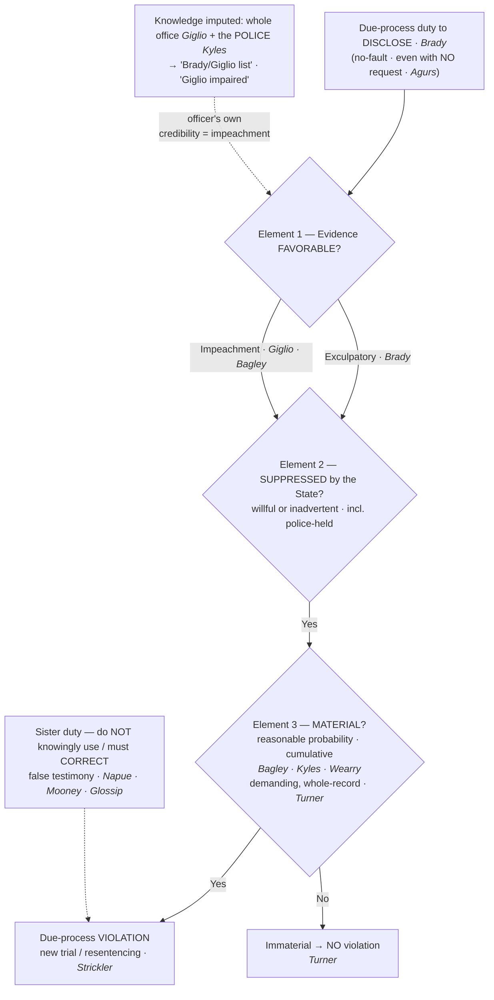

# S9 R1 panel-review — Opus model-diversity lane (prompt pack)

You are the **Claude/Opus** leg of the S9 three-lane adversarial panel (1 Claude + 2 Codex, R1). The two Codex lanes carry the A (support/quote-fidelity) and B (currency/treatment) attack lenses; **you carry model diversity and MUST vote on every paneled assertion across BOTH lenses' concerns.** You are refute-framed: try hard to break each assertion; **default to REFUTED on uncertainty**; never fabricate a cite, quote, or holding; use ONLY the evidence inlined below (no search, no outside knowledge). You are a SIGHTED reviewer — the FULL lake record (judgment fields included) is inlined.

You are a WRITER lane, not an adjudicator: you FIND and VOTE. You do not tally, adjudicate, or close any row — the orchestrator does.

For EACH group below, return one JSON object with the exact `reviewed[]` shape from the output contract (identical framing to the Codex lenses). Emit a finding object ONLY for a real defect (verdict refuted / stands-modified); a group you find wholly clean returns all-`stands` verdicts (the harness records a clean attestation). Concatenate the per-group JSON objects into a top-level `{"packs": [ ... ]}` array, one entry per group, each carrying its `group_id`.


OUTPUT CONTRACT — return ONE JSON object, nothing else:
{
  "lens": "A" | "B",
  "group_id": "<echo the group id>",
  "reviewed": [
    {
      "assertion_id": "<from group_inventory.jsonl>",
      "dimension": "existence|support|quote_fidelity|pincite|treatment|black_letter",
      "verdict": "stands" | "refuted" | "stands-modified",
      "verifiable_from_disclosed": true | false,
      "defect": null,   // null when verdict=="stands"; else an object:
      //  {"problem": "...", "severity": "high|medium|low", "proposed_fix": "...", "evidence_quote": "verbatim from disclosed evidence or null", "needs_cl": true|false, "locator_note": "..."}
      "reasons": ["short evidence-grounded reason", "..."],
      "breaks_true_positives": true | false,
      "residual_risks": ["..."],
      "suggested_tightening": "... or null"
    }
  ],
  "notes": ""
}
Rules: verdict=='stands' <=> defect==null (assertion survives your attack). verdict=='refuted' <=> a real defect (the assertion as framed is wrong). verdict=='stands-modified' <=> survives but needs a stated modification (a minor defect). Review EVERY assertion_id in group_inventory.jsonl exactly once. Output ONLY the JSON object.
---

## GROUP: content/fair-trial-and-reliability-doctrines/Brady and Giglio.md  (`doctrine`, 19 assertions)

### content_page

```
---
weight: 20
title: "Brady and Giglio"
aliases:
  - "Brady"
  - "Giglio"
  - "Brady material"
  - "Giglio material"
  - "Giglio cop"
  - "Giglio impaired"
  - "Brady/Giglio list"
  - "Brady and Giglio"
  - "10-use-of-force-liability/Brady-and-Giglio"
  - "brady-giglio"
topic: "Brady and Giglio"
type: doctrine
amendment: "U.S. Const. amend. V & XIV (Due Process)"
jurisdiction: "Federal (U.S. Const. amends. V/XIV, Due Process); SCOTUS baseline"
status: draft
related:
  - "[[Section 1983 Liability and Qualified Immunity]]"
---

# Brady and Giglio

*What must I, and the prosecutor, disclose to the defense, and when does a failure to turn something over become a constitutional violation?*

> [!rule] Black-letter rule
> Due process forbids the State to win a conviction while suppressing evidence favorable to the accused that is **material** to guilt or punishment, **irrespective of good or bad faith**. The duty is **no-fault**, runs **even absent a defense request**, and reaches **impeachment** as well as exculpatory evidence (*[[Giglio v. United States|Giglio]]*). It extends to favorable evidence known only to the **police**, whose knowledge is imputed to the prosecution (*[[Kyles v. Whitley|Kyles]]*). A violation has **three components**: favorable + suppressed + material. *[[Brady v. Maryland|Brady]]*, 373 U.S. 83, [87](https://www.courtlistener.com/opinion/106598/brady-v-maryland/) (1963); *[[Giglio v. United States|Giglio]]*, 405 U.S. 150, [154](https://www.courtlistener.com/opinion/108471/giglio-v-united-states/) (1972); *[[Kyles v. Whitley|Kyles]]*, 514 U.S. 419, [421](https://www.courtlistener.com/opinion/117923/kyles-v-whitley/) (1995).
> ^rule-brady

## The Brief

**Black-letter rule: a no-fault disclosure duty.** Due process forbids the State to win a conviction while sitting on evidence that helps the defense. "[T]he suppression by the prosecution of evidence favorable to an accused upon request violates due process where the evidence is material either to guilt or to punishment, **irrespective of the good faith or bad faith of the prosecution**." *[[Brady v. Maryland|Brady v. Maryland]]*, 373 U.S. at [87](https://www.courtlistener.com/opinion/106598/brady-v-maryland/). An honest oversight violates it exactly as a deliberate cover-up does. Later cases dropped *[[Brady v. Maryland|Brady]]*'s "upon request" qualifier, so the duty runs **even when the defense makes no request**. *[[United States v. Agurs|United States v. Agurs]]*, 427 U.S. 97 (1976) (materiality formula later superseded by *[[United States v. Bagley|Bagley]]*).

**The three elements: the working checklist.** A true violation has **three components**: "The evidence at issue must be favorable to the accused, either because it is exculpatory, or because it is impeaching; that evidence must have been suppressed by the State, either willfully or inadvertently; and prejudice must have ensued." *[[Strickler v. Greene|Strickler v. Greene]]*, 527 U.S. 263, [281-82](https://www.courtlistener.com/opinion/118307/strickler-v-greene/) (1999). Take them in order: **favorable · suppressed · material**.

**Element 1: favorable, meaning exculpatory OR impeaching.** The duty is **not limited to exculpatory evidence**; it reaches **impeachment** evidence with equal force. *[[Giglio v. United States|Giglio]]* extended *[[Brady v. Maryland|Brady]]* to a concealed promise of leniency to a key government witness, holding that when the "reliability of a given witness may well be determinative of guilt or innocence," nondisclosure of evidence affecting credibility falls within the rule. *[[Giglio v. United States|Giglio v. United States]]*, 405 U.S. at [154](https://www.courtlistener.com/opinion/108471/giglio-v-united-states/). *[[United States v. Bagley|Bagley]]* confirms that impeachment evidence, like exculpatory evidence, is within the *[[Brady v. Maryland|Brady]]* rule. *[[United States v. Bagley]]*, 473 U.S. 667 (1985). In the field this covers **deals or promises to witnesses, prior inconsistent statements, bias, mental condition, relevant convictions, and drug or alcohol issues**, anything the defense could use to attack a government witness's credibility.

**Element 2: suppressed by the State, including evidence known only to the police.** The prosecutor's reach extends past his own file. He has an affirmative duty to learn of favorable evidence known to others acting on the government's behalf, **including the police**: the *[[Brady v. Maryland|Brady]]* obligation "turns on the cumulative effect of all such evidence suppressed by the government, and ... the prosecutor remains responsible for gauging that effect **regardless of any failure by the police to bring favorable evidence to the prosecutor's attention**." *[[Kyles v. Whitley|Kyles v. Whitley]]*, 514 U.S. at [421](https://www.courtlistener.com/opinion/117923/kyles-v-whitley/). "No one told me" is therefore no defense; the government is treated as **one team**, and a promise or knowledge held by one member is attributed to the office as a whole (*[[Giglio v. United States|Giglio]]*, 405 U.S. at [154](https://www.courtlistener.com/opinion/108471/giglio-v-united-states/)). Suppression counts whether "willfully or inadvertently" (*[[Strickler v. Greene|Strickler]]*, 527 U.S. at [282](https://www.courtlistener.com/opinion/118307/strickler-v-greene/)).

**Element 3: material, a reasonable probability of a different result, judged cumulatively.** Prejudice and materiality are **one inquiry, not two**. Evidence "is material only if there is a **reasonable probability** that, had the evidence been disclosed to the defense, the result of the proceeding would have been different. A 'reasonable probability' is a probability sufficient to **undermine confidence in the outcome**." *[[United States v. Bagley|United States v. Bagley]]*, 473 U.S. at [682](https://www.courtlistener.com/opinion/111514/united-states-v-bagley/). It is **not** a more-likely-than-not test; the question is whether, in the evidence's absence, the defendant received "a verdict worthy of confidence." *[[Kyles v. Whitley#^pin-434|Kyles]]*, 514 U.S. at [434](https://www.courtlistener.com/opinion/117923/kyles-v-whitley/#:~:text=The%20question%20is%20not%20whether). And materiality is assessed **cumulatively**: the suppressed items are weighed **collectively, not one at a time** (*[[Kyles v. Whitley|Kyles]]*; *[[Wearry v. Cain|Wearry v. Cain]]*, 577 U.S. 385 (2016) ([[Common Legal Terms#per-curiam|per curiam]])). But the standard is **demanding and cuts both ways**: where there is no reasonable probability of a different result on the whole record, there is **no violation** (*[[Turner v. United States|Turner v. United States]]*, 582 U.S. 313 (2017)). *[[United States v. Agurs|Agurs]]*'s stricter no-request materiality formula was superseded by *[[United States v. Bagley|Bagley]]*'s unified test. *[[United States v. Agurs|Agurs]]*, 427 U.S. at [108](https://www.courtlistener.com/opinion/109506/united-states-v-agurs/).

**The companion duty: to preserve evidence (*[[California v. Trombetta|Trombetta]]* / *[[Arizona v. Youngblood|Youngblood]]*).** Distinct from the duty to **disclose** favorable evidence is a narrower due-process duty to **preserve** it, and this one turns squarely on the officer's handling of evidence. Under *[[California v. Trombetta|California v. Trombetta]]*, 467 U.S. 479 (1984), the State must preserve evidence only where it possessed an **apparent exculpatory value** before it was destroyed and is of such a nature that the defendant **cannot obtain comparable evidence** by other reasonably available means. For merely **potentially useful** evidence (evidence that might have exonerated but whose value is unknown), *[[Arizona v. Youngblood|Arizona v. Youngblood]]*, 488 U.S. 51 (1988), sets a stricter bar for the defense: failure to preserve it violates due process **only on a showing of bad faith** by the police. Good-faith loss or routine destruction of potentially useful evidence is not a due-process violation; deliberate destruction to defeat the defense is.

**The police officer's role: the "Brady cop" / "Giglio cop."** Because police-held favorable evidence is imputed to the prosecution (*[[Kyles v. Whitley|Kyles]]*) and office knowledge is treated as a unit (*[[Giglio v. United States|Giglio]]*), the officer's operational duty is concrete: **surface favorable evidence, exculpatory or impeaching, to the prosecutor, affirmatively.** Burying it does not make it disappear, and whether it turns out "material" is the court's whole-record call (*[[Turner v. United States|Turner]]*), not the officer's to pre-judge. The same imputation makes an **officer's own credibility history** *[[Giglio v. United States|Giglio]]* material: sustained findings of dishonesty or untruthfulness, false reports, false testimony, and certain convictions must be turned over so the defense can impeach the officer. That is the doctrinal root of the prosecutor's-office **"Brady/Giglio list,"** an administrative roster of officers with sustained credibility findings whose history must be disclosed as impeachment. (No SCOTUS case creates the list itself; it is a management practice flowing from *[[Kyles v. Whitley|Kyles]]* plus *[[Giglio v. United States|Giglio]]* imputation.) An officer who lands on it can become **"Giglio impaired,"** effectively unusable as a credible witness, which can end a career's value in court. Here integrity is not merely ethics; it is **admissibility**.

**The sister duty: do not knowingly use false testimony (*[[Napue v. Illinois|Napue]]* / *[[Mooney v. Holohan|Mooney]]*).** Distinct from the duty to *disclose* favorable evidence is the duty **not to knowingly use, and to correct, false testimony**. "[A] conviction obtained through use of false evidence, known to be such by representatives of the State, must fall under the Fourteenth Amendment," and that principle "does not cease to apply merely because the false testimony goes only to the **credibility** of the witness." *[[Napue v. Illinois|Napue v. Illinois]]*, 360 U.S. 264, [269](https://www.courtlistener.com/opinion/105912/napue-v-illinois/) (1959). Its historical origin is *[[Mooney v. Holohan|Mooney v. Holohan]]*, 294 U.S. 103, [112](https://www.courtlistener.com/opinion/102372/mooney-v-holohan/) (1935) (a "deliberate deception of court and jury by the presentation of testimony known to be perjured" is "as inconsistent with the rudimentary demands of justice as is the obtaining of a like result by intimidation"). The line was applied most recently in *[[Glossip v. Oklahoma|Glossip v. Oklahoma]]*, 604 U.S. 226 (2025), where the prosecution's failure to correct a star witness's false testimony about his psychiatric history warranted a new trial under *[[Napue v. Illinois|Napue]]*'s forgiving "reasonable likelihood" standard, a defendant-friendly test distinct from *[[United States v. Bagley|Bagley]]* materiality. *[[Giglio v. United States|Giglio]]* sits at the intersection of the two duties.

**Applications along the line.** *[[Banks v. Dretke|Banks v. Dretke]]* rejected a "due diligence" defense to suppression, holding that a "'prosecutor may hide, defendant must seek,' [rule] is not tenable in a system constitutionally bound to accord defendants due process," where the State concealed that its key witness was a paid informant. *[[Banks v. Dretke|Banks]]*, 540 U.S. 668, [696](https://www.courtlistener.com/opinion/131165/banks-v-dretke/) (2004). *[[Cone v. Bell|Cone v. Bell]]*, 556 U.S. 449 (2009), confirmed that *[[Brady v. Maryland|Brady]]* materiality is assessed as to **punishment**, not only guilt: evidence immaterial to guilt may still require a new **sentencing** if it could have swayed one juror toward life. *[[Smith v. Cain|Smith v. Cain]]*, 565 U.S. 73 (2012), reversed because undisclosed impeachment of the **sole eyewitness** was material as a matter of law. And *[[Turner v. United States|Turner]]* is the counterweight, a demanding whole-record materiality analysis that found **no** violation.

**Brady is a constitutional floor, NOT the criminal-discovery rules.** *[[Brady v. Maryland|Brady]]*/*[[Giglio v. United States|Giglio]]* is a **due-process** obligation, separate from statutory and rule-based discovery (Fed. R. Crim. P. 16 and the Jencks Act, 18 U.S.C. § 3500). Complying with Rule 16 does **not** discharge the *[[Brady v. Maryland|Brady]]* duty: favorable evidence may fall outside Rule 16's enumerated categories, and the constitutional duty can run on a different (often earlier) due-process timeline. Discovery compliance and *[[Brady v. Maryland|Brady]]* compliance are two separate checklists.

**Burden · standard of review · remedy.** The disclosure duty rests on the **prosecution** and, upstream, on the whole prosecution team, including the police (*[[Kyles v. Whitley|Kyles]]*). On a *[[Brady v. Maryland|Brady]]* claim the **defendant** bears the burden of establishing the three components (favorable · suppressed · material); because materiality is a legal question about confidence in the verdict, a reviewing court decides it **[[Common Legal Terms#de-novo|de novo]]** (historical facts for [[Common Legal Terms#clear-error|clear error]]). The **remedy** for a proven violation is a **new trial**, or a new **sentencing** where the evidence was material only to punishment (*[[Cone v. Bell|Cone]]*). There is no separate harmless-error overlay, because the materiality element already builds prejudice into the test. On federal [[Common Legal Terms#habeas-corpus|habeas]], relief follows when the state court's no-violation ruling was an unreasonable application of this clearly established law (*[[Benn v. Lambert|Benn v. Lambert]]* (9th Cir.)).

**Common pitfalls.**
- **Thinking good faith excuses non-disclosure.** It does not; the duty is no-fault, and *[[Strickler v. Greene|Strickler]]* reaches suppression done "inadvertently."
- **Treating *[[Brady v. Maryland|Brady]]* as exculpatory-only.** Impeachment evidence is squarely covered (*[[Giglio v. United States|Giglio]]*, *[[United States v. Bagley|Bagley]]*).
- **"The prosecutor never asked, so I'm clear."** *[[Kyles v. Whitley|Kyles]]* imputes police-held favorable evidence to the prosecution; surface it, **including your own credibility issues**.
- **"I produced it in Rule 16 discovery, so *Brady* is satisfied."** *[[Brady v. Maryland|Brady]]* is a separate **constitutional** duty and may run earlier and broader.
- **"It was minor / just one item, so no harm."** Materiality is judged **cumulatively** (*[[Kyles v. Whitley|Kyles]]*, *[[Wearry v. Cain|Wearry]]*), and materiality is the **court's** whole-record call (*[[Turner v. United States|Turner]]*), not yours to pre-judge, so surface it.
- **Confusing *[[Napue v. Illinois|Napue]]* with *[[Brady v. Maryland|Brady]]*.** *[[Napue v. Illinois|Napue]]* is the duty **not to knowingly use (and to correct) false** testimony; *[[Brady v. Maryland|Brady]]* is the duty to **disclose favorable** evidence.
- **Confusing the duty to disclose with the duty to preserve.** *[[Brady v. Maryland|Brady]]* is about **disclosing** existing favorable evidence; *[[California v. Trombetta|Trombetta]]* / *[[Arizona v. Youngblood|Youngblood]]* govern **destroyed** evidence, where potentially-useful evidence needs a **bad-faith** showing.
- **Treating *[[Brady v. Maryland|Brady]]*/*[[Giglio v. United States|Giglio]]* as a search-and-seizure rule.** It is a **disclosure / trial-fairness** doctrine grounded in due process; do not conflate it with the Fourth Amendment exclusionary rule.

**The civil boundary (clearly CIVIL, not the criminal *[[Brady v. Maryland|Brady]]* spine).** A single *[[Brady v. Maryland|Brady]]* violation by a prosecutor, even one that sends an innocent man toward execution, does **not** by itself establish municipal **§1983** failure-to-train liability: "A pattern of similar constitutional violations by untrained employees is 'ordinarily necessary' to demonstrate deliberate indifference for purposes of failure to train." *[[Connick v. Thompson|Connick v. Thompson]]*, 563 U.S. 51, [62](https://www.courtlistener.com/opinion/7343085/connick-v-thompson/) (2011). This is the civil ceiling, distinct from the criminal due-process duty; see [[Section 1983 Liability and Qualified Immunity]].

## Lower-court developments

Circuit and state developments only; no SCOTUS. The controlling Supreme Court cases, including the 2025 *[[Glossip v. Oklahoma|Glossip]]* application of *[[Napue v. Illinois|Napue]]*, home to **Key cases** regardless of date, per the no-SCOTUS-in-recent-developments rule. The live frontier here is **timing**: whether the disclosure duty reaches the **pre-plea** stage, where the circuits have divided and the Supreme Court has so far declined to resolve it. The case below is circuit law that binds only within its own circuit and does not state nationwide law.

- **[[Alvarez v. City of Brownsville]] (5th Cir. 2018) (en banc)** — *Limits / narrows · circuit split.* Sitting [[Reading and Citing Cases#en-banc|en banc]], the Fifth Circuit held that *[[Brady v. Maryland|Brady]]* is a **trial right** that does not operate at the guilty-plea stage: there is **no** constitutional duty to disclose even directly exculpatory evidence before a plea, extending *[[United States v. Ruiz]]*, 536 U.S. 622 (2002) (no duty to disclose **impeachment** evidence pre-plea) to **exculpatory** evidence. Because no such right exists, the City could not face §1983 municipal liability and dismissal was rendered for the City; the Supreme Court denied [[Reading and Citing Cases#certiorari-cert|certiorari]] (2019), leaving the split intact. **Binding in-circuit — 5th Cir.** · good. ⚖ Circuit split. [opinion](https://www.courtlistener.com/opinion/4536189/george-alvarez-v-city-of-brownsville/)

## Key cases

| Case | Holding | Opinion |
|---|---|---|
| *[[Mooney v. Holohan]]*, 294 U.S. 103 (1935) | **Anchor (historical origin).** The knowing use of **perjured testimony** by the State to obtain a conviction violates due process, the precursor of the *[[Napue v. Illinois\|Napue]]*/*[[Giglio v. United States\|Giglio]]* false-testimony line. | [opinion](https://www.courtlistener.com/opinion/102372/mooney-v-holohan/) |
| *[[Napue v. Illinois]]*, 360 U.S. 264 (1959) | **Anchor (false testimony).** The State may **not knowingly use false testimony**, even false testimony going only to a witness's **credibility**, and must correct it. | [opinion](https://www.courtlistener.com/opinion/105912/napue-v-illinois/) |
| *[[Brady v. Maryland]]*, 373 U.S. 83 (1963) | **Anchor.** Suppression of **favorable, material** evidence violates due process, **irrespective of good or bad faith**, the foundational no-fault disclosure duty. | [opinion](https://www.courtlistener.com/opinion/106598/brady-v-maryland/) |
| *[[Giglio v. United States]]*, 405 U.S. 150 (1972) | **Anchor (impeachment).** **Impeachment** evidence (e.g., a promise to a key witness) is within *[[Brady v. Maryland\|Brady]]*; one prosecutor's knowledge is imputed to the **whole office**. | [opinion](https://www.courtlistener.com/opinion/108471/giglio-v-united-states/) |
| *[[United States v. Agurs]]*, 427 U.S. 97 (1976) | **Progeny (limited).** The disclosure duty arises **even with no defense request**; its own materiality formula was later superseded by *[[United States v. Bagley\|Bagley]]*. | [opinion](https://www.courtlistener.com/opinion/109506/united-states-v-agurs/) |
| *[[United States v. Bagley]]*, 473 U.S. 667 (1985) | **Progeny (the materiality test).** Unified **materiality** standard: a "reasonable probability" of a different result, sufficient to undermine confidence; impeachment evidence is within the rule. | [opinion](https://www.courtlistener.com/opinion/111514/united-states-v-bagley/) |
| *[[California v. Trombetta]]*, 467 U.S. 479 (1984) | **Progeny (duty to preserve).** Due process requires preserving evidence only where its **exculpatory value was apparent** before destruction and comparable evidence is **not otherwise available**. | [opinion](https://www.courtlistener.com/opinion/111206/california-v-trombetta/) |
| *[[Arizona v. Youngblood]]*, 488 U.S. 51 (1988) | **Progeny (bad-faith limit).** Failure to preserve merely **potentially useful** evidence violates due process **only on a showing of bad faith** by the police. | [opinion](https://www.courtlistener.com/opinion/112156/arizona-v-youngblood/) |
| *[[Kyles v. Whitley]]*, 514 U.S. 419 (1995) | **Progeny (the LE hook).** Materiality is judged **cumulatively**; the prosecutor must **learn of favorable evidence known to the police**, so "no one told me" is no defense. | [opinion](https://www.courtlistener.com/opinion/117923/kyles-v-whitley/) |
| *[[Strickler v. Greene]]*, 527 U.S. 263 (1999) | **Progeny (the checklist).** Canonical **three components** of a *[[Brady v. Maryland\|Brady]]* violation: favorable + suppressed (willfully or inadvertently) + prejudice. | [opinion](https://www.courtlistener.com/opinion/118307/strickler-v-greene/) |
| *[[Banks v. Dretke]]*, 540 U.S. 668 (2004) | **Progeny.** No "due diligence" defense to suppression; the notion that a prosecutor may hide while the defendant must seek is not tenable, and concealing a witness's **informant status** is a *[[Brady v. Maryland\|Brady]]*/*[[Giglio v. United States\|Giglio]]* violation. | [opinion](https://www.courtlistener.com/opinion/131165/banks-v-dretke/) |
| *[[Cone v. Bell]]*, 556 U.S. 449 (2009) | **Progeny.** *[[Brady v. Maryland\|Brady]]* materiality reaches evidence material to **punishment**, not just guilt; a mistaken "previously determined" state ruling does not bar [[Common Legal Terms#habeas-corpus\|habeas]] review. | [opinion](https://www.courtlistener.com/opinion/145883/cone-v-bell/) |
| *[[Smith v. Cain]]*, 565 U.S. 73 (2012) | **Progeny.** Modern reversal: **undisclosed impeachment of the sole eyewitness** was material as a matter of law, conviction reversed. | [opinion](https://www.courtlistener.com/opinion/620666/smith-v-cain/) |
| *[[Wearry v. Cain]]*, 577 U.S. 385 (2016) (per curiam) | **Progeny.** Reaffirms **cumulative** materiality on a forgiving standard: the accused need show only that the new evidence undermines confidence in the verdict. | [opinion](https://www.courtlistener.com/opinion/3183098/wearry-v-cain/) |
| *[[Turner v. United States]]*, 582 U.S. 313 (2017) | **Progeny (counterweight).** Materiality is **demanding and judged on the whole record**; suppression here was **immaterial**, so no *[[Brady v. Maryland\|Brady]]* violation. | [opinion](https://www.courtlistener.com/opinion/4403802/turner-v-united-states/) |
| *[[Glossip v. Oklahoma]]*, 604 U.S. 226 (2025) | **Progeny (*[[Napue v. Illinois\|Napue]]*).** Knowing failure to **correct** a star witness's false testimony violated due process; new trial ordered under the "reasonable likelihood" standard. | [opinion](https://www.courtlistener.com/opinion/10339023/glossip-v-oklahoma/) |
| *[[Benn v. Lambert]]*, 283 F.3d 1040 (9th Cir. 2002) | **Progeny (the two-fer illustration).** [[Common Legal Terms#habeas-corpus\|Habeas]] granted where the State suppressed **both** material exculpatory and impeachment evidence, each independently sufficient, assessed cumulatively (binding in the 9th Cir. only). | [opinion](https://www.courtlistener.com/opinion/776954/gary-benn-v-john-lambert-superintendent-of-the-washington-state/) |

## Related cases across doctrines

These cases are treated in full on other doctrine pages but bear on the *[[Brady v. Maryland|Brady]]*/*[[Giglio v. United States|Giglio]]* disclosure duty; each is framed here for that doctrine.

| Case | Relevance here | Primary home | Opinion |
|---|---|---|---|
| *[[Connick v. Thompson]]*, 563 U.S. 51 (2011) | A single *[[Brady v. Maryland\|Brady]]* violation, even one that frees an innocent man from death row, will not by itself prove a prosecutor's office liable under **§1983** for failure to train; a **pattern** is "ordinarily necessary." The **civil ceiling** on the criminal *[[Brady v. Maryland\|Brady]]* duty. | [[Section 1983 Liability and Qualified Immunity]] | [opinion](https://www.courtlistener.com/opinion/213505/connick-v-thompson/) |

## Visual



## Sources

- [Mooney v. Holohan, 294 U.S. 103 (1935)](https://www.courtlistener.com/opinion/102372/mooney-v-holohan/) — pinpoint 112
- [Napue v. Illinois, 360 U.S. 264 (1959)](https://www.courtlistener.com/opinion/105912/napue-v-illinois/) — pinpoint 269
- [Brady v. Maryland, 373 U.S. 83 (1963)](https://www.courtlistener.com/opinion/106598/brady-v-maryland/) — pinpoint 87
- [Giglio v. United States, 405 U.S. 150 (1972)](https://www.courtlistener.com/opinion/108471/giglio-v-united-states/) — pinpoint 154
- [United States v. Agurs, 427 U.S. 97 (1976)](https://www.courtlistener.com/opinion/109506/united-states-v-agurs/) — pinpoint 108 (materiality formula limited by [[United States v. Bagley|Bagley]])
- [United States v. Bagley, 473 U.S. 667 (1985)](https://www.courtlistener.com/opinion/111514/united-states-v-bagley/) — pinpoint 682
- [California v. Trombetta, 467 U.S. 479 (1984)](https://www.courtlistener.com/opinion/111206/california-v-trombetta/) (duty to preserve)
- [Arizona v. Youngblood, 488 U.S. 51 (1988)](https://www.courtlistener.com/opinion/112156/arizona-v-youngblood/) (bad-faith preservation limit)
- [Kyles v. Whitley, 514 U.S. 419 (1995)](https://www.courtlistener.com/opinion/117923/kyles-v-whitley/) — pinpoints 421, 434
- [Strickler v. Greene, 527 U.S. 263 (1999)](https://www.courtlistener.com/opinion/118307/strickler-v-greene/) — pinpoints 281-82, 282
- [Banks v. Dretke, 540 U.S. 668 (2004)](https://www.courtlistener.com/opinion/131165/banks-v-dretke/) — pinpoint 696
- [Cone v. Bell, 556 U.S. 449 (2009)](https://www.courtlistener.com/opinion/145883/cone-v-bell/) (materiality reaches punishment)
- [Smith v. Cain, 565 U.S. 73 (2012)](https://www.courtlistener.com/opinion/620666/smith-v-cain/) (sole-eyewitness impeachment)
- [Wearry v. Cain, 577 U.S. 385, 136 S. Ct. 1002 (2016) (per curiam)](https://www.courtlistener.com/opinion/3183098/wearry-v-cain/) — pinpoints 136 S. Ct. at 1006, 1007
- [Turner v. United States, 582 U.S. 313, 137 S. Ct. 1885 (2017)](https://www.courtlistener.com/opinion/4403802/turner-v-united-states/) — pinpoint 137 S. Ct. at 1894
- [Glossip v. Oklahoma, 604 U.S. 226 (2025)](https://www.courtlistener.com/opinion/10339023/glossip-v-oklahoma/) (case-level)
- [Connick v. Thompson, 563 U.S. 51 (2011)](https://www.courtlistener.com/opinion/213505/connick-v-thompson/) — pinpoint 62 (home = [[Section 1983 Liability and Qualified Immunity]])
- [Benn v. Lambert, 283 F.3d 1040 (9th Cir. 2002)](https://www.courtlistener.com/opinion/776954/gary-benn-v-john-lambert-superintendent-of-the-washington-state/) (Binding in-circuit — 9th Cir.)
- [Alvarez v. City of Brownsville, 904 F.3d 382 (5th Cir. 2018) (en banc)](https://www.courtlistener.com/opinion/4536189/george-alvarez-v-city-of-brownsville/) (Binding in-circuit — 5th Cir.; pre-plea Brady; ⚖ split; page-less)
- [United States v. Ruiz, 536 U.S. 622 (2002)](https://www.courtlistener.com/opinion/121166/united-states-v-ruiz/) (no pre-plea impeachment-disclosure duty; page-less; cited in Alvarez)

```

### group_inventory (assertions under review)

```jsonl
{"assertion_id": "05978f1192760e10", "dimension": "existence", "kind": "case_cite", "locator": {"case": "Connick v. Thompson", "table_line": 80}, "payload": {"case": "Connick v. Thompson", "cells": ["*[[Connick v. Thompson]]*, 563 U.S. 51 (2011)", "A single *[[Brady v. Maryland\\|Brady]]* violation, even one that frees an innocent man from death row, will not by itself prove a prosecutor's office liable under **§1983** for failure to train; a **pattern** is \"ordinarily necessary.\" The **civil ceiling** on the criminal *[[Brady v. Maryland\\|Brady]]* duty.", "[[Section 1983 Liability and Qualified Immunity]]", "[opinion](https://www.courtlistener.com/opinion/213505/connick-v-thompson/)"], "header": ["Case", "Relevance here", "Primary home", "Opinion"]}}
{"assertion_id": "409147643eb7ac71", "dimension": "existence", "kind": "case_cite", "locator": {"case": "Banks v. Dretke", "table_line": 66}, "payload": {"case": "Banks v. Dretke", "cells": ["*[[Banks v. Dretke]]*, 540 U.S. 668 (2004)", "**Progeny.** No \"due diligence\" defense to suppression; the notion that a prosecutor may hide while the defendant must seek is not tenable, and concealing a witness's **informant status** is a *[[Brady v. Maryland\\|Brady]]*/*[[Giglio v. United States\\|Giglio]]* violation.", "[opinion](https://www.courtlistener.com/opinion/131165/banks-v-dretke/)"], "header": ["Case", "Holding", "Opinion"]}}
{"assertion_id": "47596f8e00b16c01", "dimension": "existence", "kind": "case_cite", "locator": {"case": "Kyles v. Whitley", "table_line": 64}, "payload": {"case": "Kyles v. Whitley", "cells": ["*[[Kyles v. Whitley]]*, 514 U.S. 419 (1995)", "**Progeny (the LE hook).** Materiality is judged **cumulatively**; the prosecutor must **learn of favorable evidence known to the police**, so \"no one told me\" is no defense.", "[opinion](https://www.courtlistener.com/opinion/117923/kyles-v-whitley/)"], "header": ["Case", "Holding", "Opinion"]}}
{"assertion_id": "5693e1953c82e928", "dimension": "existence", "kind": "case_cite", "locator": {"case": "Turner v. United States", "table_line": 70}, "payload": {"case": "Turner v. United States", "cells": ["*[[Turner v. United States]]*, 582 U.S. 313 (2017)", "**Progeny (counterweight).** Materiality is **demanding and judged on the whole record**; suppression here was **immaterial**, so no *[[Brady v. Maryland\\|Brady]]* violation.", "[opinion](https://www.courtlistener.com/opinion/4403802/turner-v-united-states/)"], "header": ["Case", "Holding", "Opinion"]}}
{"assertion_id": "606447c154ad3b1b", "dimension": "existence", "kind": "case_cite", "locator": {"case": "Strickler v. Greene", "table_line": 65}, "payload": {"case": "Strickler v. Greene", "cells": ["*[[Strickler v. Greene]]*, 527 U.S. 263 (1999)", "**Progeny (the checklist).** Canonical **three components** of a *[[Brady v. Maryland\\|Brady]]* violation: favorable + suppressed (willfully or inadvertently) + prejudice.", "[opinion](https://www.courtlistener.com/opinion/118307/strickler-v-greene/)"], "header": ["Case", "Holding", "Opinion"]}}
{"assertion_id": "81168ec65d6c7db9", "dimension": "existence", "kind": "case_cite", "locator": {"case": "Brady v. Maryland", "table_line": 58}, "payload": {"case": "Brady v. Maryland", "cells": ["*[[Brady v. Maryland]]*, 373 U.S. 83 (1963)", "**Anchor.** Suppression of **favorable, material** evidence violates due process, **irrespective of good or bad faith**, the foundational no-fault disclosure duty.", "[opinion](https://www.courtlistener.com/opinion/106598/brady-v-maryland/)"], "header": ["Case", "Holding", "Opinion"]}}
{"assertion_id": "8555827d5acc400e", "dimension": "existence", "kind": "case_cite", "locator": {"case": "Cone v. Bell", "table_line": 67}, "payload": {"case": "Cone v. Bell", "cells": ["*[[Cone v. Bell]]*, 556 U.S. 449 (2009)", "**Progeny.** *[[Brady v. Maryland\\|Brady]]* materiality reaches evidence material to **punishment**, not just guilt; a mistaken \"previously determined\" state ruling does not bar [[Common Legal Terms#habeas-corpus\\|habeas]] review.", "[opinion](https://www.courtlistener.com/opinion/145883/cone-v-bell/)"], "header": ["Case", "Holding", "Opinion"]}}
{"assertion_id": "85b5cdc0671e9ffe", "dimension": "existence", "kind": "case_cite", "locator": {"case": "Glossip v. Oklahoma", "table_line": 71}, "payload": {"case": "Glossip v. Oklahoma", "cells": ["*[[Glossip v. Oklahoma]]*, 604 U.S. 226 (2025)", "**Progeny (*[[Napue v. Illinois\\|Napue]]*).** Knowing failure to **correct** a star witness's false testimony violated due process; new trial ordered under the \"reasonable likelihood\" standard.", "[opinion](https://www.courtlistener.com/opinion/10339023/glossip-v-oklahoma/)"], "header": ["Case", "Holding", "Opinion"]}}
{"assertion_id": "936cb30e011478b3", "dimension": "existence", "kind": "case_cite", "locator": {"case": "California v. Trombetta", "table_line": 62}, "payload": {"case": "California v. Trombetta", "cells": ["*[[California v. Trombetta]]*, 467 U.S. 479 (1984)", "**Progeny (duty to preserve).** Due process requires preserving evidence only where its **exculpatory value was apparent** before destruction and comparable evidence is **not otherwise available**.", "[opinion](https://www.courtlistener.com/opinion/111206/california-v-trombetta/)"], "header": ["Case", "Holding", "Opinion"]}}
{"assertion_id": "9c830abdfaeef7b2", "dimension": "existence", "kind": "case_cite", "locator": {"case": "Napue v. Illinois", "table_line": 57}, "payload": {"case": "Napue v. Illinois", "cells": ["*[[Napue v. Illinois]]*, 360 U.S. 264 (1959)", "**Anchor (false testimony).** The State may **not knowingly use false testimony**, even false testimony going only to a witness's **credibility**, and must correct it.", "[opinion](https://www.courtlistener.com/opinion/105912/napue-v-illinois/)"], "header": ["Case", "Holding", "Opinion"]}}
{"assertion_id": "a1822d7ff826dd29", "dimension": "existence", "kind": "case_cite", "locator": {"case": "Giglio v. United States", "table_line": 59}, "payload": {"case": "Giglio v. United States", "cells": ["*[[Giglio v. United States]]*, 405 U.S. 150 (1972)", "**Anchor (impeachment).** **Impeachment** evidence (e.g., a promise to a key witness) is within *[[Brady v. Maryland\\|Brady]]*; one prosecutor's knowledge is imputed to the **whole office**.", "[opinion](https://www.courtlistener.com/opinion/108471/giglio-v-united-states/)"], "header": ["Case", "Holding", "Opinion"]}}
{"assertion_id": "aa9c3be4086629c3", "dimension": "existence", "kind": "case_cite", "locator": {"case": "Smith v. Cain", "table_line": 68}, "payload": {"case": "Smith v. Cain", "cells": ["*[[Smith v. Cain]]*, 565 U.S. 73 (2012)", "**Progeny.** Modern reversal: **undisclosed impeachment of the sole eyewitness** was material as a matter of law, conviction reversed.", "[opinion](https://www.courtlistener.com/opinion/620666/smith-v-cain/)"], "header": ["Case", "Holding", "Opinion"]}}
{"assertion_id": "b90485e432b397eb", "dimension": "existence", "kind": "case_cite", "locator": {"case": "Mooney v. Holohan", "table_line": 56}, "payload": {"case": "Mooney v. Holohan", "cells": ["*[[Mooney v. Holohan]]*, 294 U.S. 103 (1935)", "**Anchor (historical origin).** The knowing use of **perjured testimony** by the State to obtain a conviction violates due process, the precursor of the *[[Napue v. Illinois\\|Napue]]*/*[[Giglio v. United States\\|Giglio]]* false-testimony line.", "[opinion](https://www.courtlistener.com/opinion/102372/mooney-v-holohan/)"], "header": ["Case", "Holding", "Opinion"]}}
{"assertion_id": "c38e11b90eaffeae", "dimension": "existence", "kind": "case_cite", "locator": {"case": "Benn v. Lambert", "table_line": 72}, "payload": {"case": "Benn v. Lambert", "cells": ["*[[Benn v. Lambert]]*, 283 F.3d 1040 (9th Cir. 2002)", "**Progeny (the two-fer illustration).** [[Common Legal Terms#habeas-corpus\\|Habeas]] granted where the State suppressed **both** material exculpatory and impeachment evidence, each independently sufficient, assessed cumulatively (binding in the 9th Cir. only).", "[opinion](https://www.courtlistener.com/opinion/776954/gary-benn-v-john-lambert-superintendent-of-the-washington-state/)"], "header": ["Case", "Holding", "Opinion"]}}
{"assertion_id": "ced78e89258a6222", "dimension": "existence", "kind": "case_cite", "locator": {"case": "Arizona v. Youngblood", "table_line": 63}, "payload": {"case": "Arizona v. Youngblood", "cells": ["*[[Arizona v. Youngblood]]*, 488 U.S. 51 (1988)", "**Progeny (bad-faith limit).** Failure to preserve merely **potentially useful** evidence violates due process **only on a showing of bad faith** by the police.", "[opinion](https://www.courtlistener.com/opinion/112156/arizona-v-youngblood/)"], "header": ["Case", "Holding", "Opinion"]}}
{"assertion_id": "d24d9d1c2303badd", "dimension": "existence", "kind": "case_cite", "locator": {"case": "United States v. Agurs", "table_line": 60}, "payload": {"case": "United States v. Agurs", "cells": ["*[[United States v. Agurs]]*, 427 U.S. 97 (1976)", "**Progeny (limited).** The disclosure duty arises **even with no defense request**; its own materiality formula was later superseded by *[[United States v. Bagley\\|Bagley]]*.", "[opinion](https://www.courtlistener.com/opinion/109506/united-states-v-agurs/)"], "header": ["Case", "Holding", "Opinion"]}}
{"assertion_id": "ede619fa014c6984", "dimension": "existence", "kind": "case_cite", "locator": {"case": "United States v. Bagley", "table_line": 61}, "payload": {"case": "United States v. Bagley", "cells": ["*[[United States v. Bagley]]*, 473 U.S. 667 (1985)", "**Progeny (the materiality test).** Unified **materiality** standard: a \"reasonable probability\" of a different result, sufficient to undermine confidence; impeachment evidence is within the rule.", "[opinion](https://www.courtlistener.com/opinion/111514/united-states-v-bagley/)"], "header": ["Case", "Holding", "Opinion"]}}
{"assertion_id": "f88c04b10b371075", "dimension": "existence", "kind": "case_cite", "locator": {"case": "Wearry v. Cain", "table_line": 69}, "payload": {"case": "Wearry v. Cain", "cells": ["*[[Wearry v. Cain]]*, 577 U.S. 385 (2016) (per curiam)", "**Progeny.** Reaffirms **cumulative** materiality on a forgiving standard: the accused need show only that the new evidence undermines confidence in the verdict.", "[opinion](https://www.courtlistener.com/opinion/3183098/wearry-v-cain/)"], "header": ["Case", "Holding", "Opinion"]}}
{"assertion_id": "87d75f50889f4a81", "dimension": "support", "kind": "proposition", "locator": {"callout": "^rule-brady"}, "payload": {"anchor": "^rule-brady", "statement": "[!rule] Black-letter rule\nDue process forbids the State to win a conviction while suppressing evidence favorable to the accused that is **material** to guilt or punishment, **irrespective of good or bad faith**. The duty is **no-fault**, runs **even absent a defense request**, and reaches **impeachment** as well as exculpatory evidence (*[[Giglio v. United States|Giglio]]*). It extends to favorable evidence known only to the **police**, whose knowledge is imputed to the prosecution (*[[Kyles v. Whitley|Kyles]]*). A violation has **three components**: favorable + suppressed + material. *[[Brady v. Maryland|Brady]]*, 373 U.S. 83, [87](https://www.courtlistener.com/opinion/106598/brady-v-maryland/) (1963); *[[Giglio v. United States|Giglio]]*, 405 U.S. 150, [154](https://www.courtlistener.com/opinion/108471/giglio-v-united-states/) (1972); *[[Kyles v. Whitley|Kyles]]*, 514 U.S. 419, [421](https://www.courtlistener.com/opinion/117923/kyles-v-whitley/) (1995)."}}
```

### lake record — Arizona v. Youngblood

```json
{
  "schema_version": "s2.v1",
  "record_id": "Arizona v. Youngblood",
  "status": "under_review",
  "identity": {
    "case_name": "Arizona v. Youngblood",
    "case_name_short": "Youngblood",
    "case_name_full": "Arizona v. Youngblood",
    "input_case_name": "Arizona v. Youngblood",
    "court": "U.S. Supreme Court",
    "court_id": "scotus",
    "court_level": "scotus",
    "circuit": null,
    "state": null,
    "date_decided": "1989-01-23",
    "year": 1989,
    "docket": "No. 86-1904",
    "cluster_id": 112156,
    "lead_opinion_id": 9431483,
    "sibling_ids": [],
    "absolute_url": "/opinion/112156/arizona-v-youngblood/",
    "identity_method": "frontier-identity",
    "expected_citation_found": true,
    "party_name_in_text": false,
    "canonical_name_match": true,
    "alternates": [],
    "reason_code": null
  },
  "citations": {
    "official": {
      "cite": "488 U.S. 51",
      "volume": "488",
      "reporter": "U.S.",
      "page": "51",
      "type": 1,
      "selected_official": true,
      "source": "cluster.citations[]"
    },
    "parallel": [
      {
        "cite": "109 S. Ct. 333",
        "volume": "109",
        "reporter": "S. Ct.",
        "page": "333",
        "type": 1,
        "selected_official": false,
        "source": "cluster.citations[]"
      },
      {
        "cite": "102 L. Ed. 2d 281",
        "volume": "102",
        "reporter": "L. Ed. 2d",
        "page": "281",
        "type": 1,
        "selected_official": false,
        "source": "cluster.citations[]"
      }
    ],
    "vendor_neutral": [
      {
        "cite": "1988 U.S. LEXIS 5404",
        "volume": "1988",
        "reporter": "U.S. LEXIS",
        "page": "5404",
        "type": 6,
        "selected_official": false,
        "source": "cluster.citations[]"
      }
    ],
    "all": [
      {
        "cite": "488 U.S. 51",
        "volume": "488",
        "reporter": "U.S.",
        "page": "51",
        "type": 1,
        "selected_official": false,
        "source": "cluster.citations[]"
      },
      {
        "cite": "109 S. Ct. 333",
        "volume": "109",
        "reporter": "S. Ct.",
        "page": "333",
        "type": 1,
        "selected_official": false,
        "source": "cluster.citations[]"
      },
      {
        "cite": "102 L. Ed. 2d 281",
        "volume": "102",
        "reporter": "L. Ed. 2d",
        "page": "281",
        "type": 1,
        "selected_official": false,
        "source": "cluster.citations[]"
      },
      {
        "cite": "1988 U.S. LEXIS 5404",
        "volume": "1988",
        "reporter": "U.S. LEXIS",
        "page": "5404",
        "type": 6,
        "selected_official": false,
        "source": "cluster.citations[]"
      }
    ],
    "display": "488 U.S. 51",
    "official_selection": {
      "court_class": "scotus",
      "selected": "488 U.S. 51",
      "reason": "selected_rank_1"
    }
  },
  "pinpoints": [],
  "treatment": {
    "field_i_validity": "unverified",
    "as_of_content": null,
    "as_of_treatment": null,
    "composite_basis": "unverified",
    "composite_basis_ref": null,
    "varies_by_point": false,
    "scope_note": "Frontier stub: treatment/progeny intentionally not derived until S6 promotion.",
    "point_overrides": [],
    "edges": [],
    "derivation": {}
  },
  "progeny": {
    "complete_query": null,
    "indexed_citing_opinions": null,
    "count_source": null,
    "per_sibling": [],
    "citation_count": null,
    "cache_path": null,
    "enumeration": null,
    "cursor": null,
    "rows_cached": 0,
    "outbound_opinion_edges": []
  },
  "off_cl_links": [],
  "provenance": {
    "cl_source": null,
    "cl_api": "https://www.courtlistener.com/api/rest/v4",
    "built_by": "S2-BUILDER-AUTHORING",
    "build_run": "s2-build-96d841cbb12e",
    "date_created": "2026-07-06T13:45:44Z",
    "date_modified": "2026-07-10T20:54:54Z",
    "warnings": [],
    "field_provenance": {
      "identity": {
        "src": "CourtListener frontier identity search",
        "at": "2026-07-06T13:46:25Z",
        "verifier": "S2-BUILDER-AUTHORING"
      },
      "treatment.field_i_validity": {
        "src": "frontier stub, no treatment",
        "at": "2026-07-06T13:46:25Z",
        "verifier": "S2-BUILDER-AUTHORING"
      },
      "point_overrides": {
        "src": "frontier stub, no treatment",
        "at": "2026-07-06T13:46:25Z",
        "verifier": "S2-BUILDER-AUTHORING"
      },
      "pinpoints": {
        "src": "frontier stub, no pinpoints",
        "at": "2026-07-06T13:46:25Z",
        "verifier": "S2-BUILDER-AUTHORING"
      }
    },
    "s6_promotion": {
      "from_record_id": "arizona-v-youngblood--112156",
      "to_record_id": "Arizona v. Youngblood",
      "as_of": "2026-07-07",
      "born_status": "under_review"
    }
  }
}

```

### lake record — Banks v. Dretke

```json
{
  "schema_version": "s2.v1",
  "record_id": "Banks v. Dretke",
  "stub": false,
  "status": "verified",
  "identity": {
    "case_name": "Banks v. Dretke",
    "case_name_short": "Banks",
    "case_name_full": "Banks v. Dretke, Director, Texas Department of Criminal Justice, Correctional Institutions Division",
    "input_case_name": "Banks v. Dretke",
    "court": "U.S. Supreme Court",
    "court_id": "scotus",
    "court_level": "scotus",
    "circuit": null,
    "state": null,
    "date_decided": "2004-02-24",
    "year": 2004,
    "docket": "02-8286",
    "cluster_id": 131165,
    "lead_opinion_id": 131165,
    "sibling_ids": [
      131165,
      9434551,
      9434552
    ],
    "absolute_url": "/opinion/131165/banks-v-dretke/",
    "identity_method": "citation+party-text",
    "expected_citation_found": true,
    "party_name_in_text": true,
    "canonical_name_match": true,
    "alternates": [],
    "reason_code": null
  },
  "citations": {
    "official": null,
    "parallel": [
      {
        "cite": "540 U.S. 668",
        "volume": "540",
        "reporter": "U.S.",
        "page": "668",
        "type": 1,
        "selected_official": false,
        "source": "cluster.citations[]"
      },
      {
        "cite": "124 S. Ct. 1256",
        "volume": "124",
        "reporter": "S. Ct.",
        "page": "1256",
        "type": 1,
        "selected_official": false,
        "source": "cluster.citations[]"
      },
      {
        "cite": "157 L. Ed. 2d 1166",
        "volume": "157",
        "reporter": "L. Ed. 2d",
        "page": "1166",
        "type": 1,
        "selected_official": false,
        "source": "cluster.citations[]"
      },
      {
        "cite": "72 U.S.L.W. 4193",
        "volume": "72",
        "reporter": "U.S.L.W.",
        "page": "4193",
        "type": 4,
        "selected_official": false,
        "source": "cluster.citations[]"
      },
      {
        "cite": "17 Fla. L. Weekly Fed. S 153",
        "volume": "17",
        "reporter": "Fla. L. Weekly Fed. S",
        "page": "153",
        "type": 1,
        "selected_official": false,
        "source": "cluster.citations[]"
      }
    ],
    "vendor_neutral": [
      {
        "cite": "2004 U.S. LEXIS 1621",
        "volume": "2004",
        "reporter": "U.S. LEXIS",
        "page": "1621",
        "type": 6,
        "selected_official": false,
        "source": "cluster.citations[]"
      }
    ],
    "all": [
      {
        "cite": "540 U.S. 668",
        "volume": "540",
        "reporter": "U.S.",
        "page": "668",
        "type": 1,
        "selected_official": false,
        "source": "cluster.citations[]"
      },
      {
        "cite": "124 S. Ct. 1256",
        "volume": "124",
        "reporter": "S. Ct.",
        "page": "1256",
        "type": 1,
        "selected_official": false,
        "source": "cluster.citations[]"
      },
      {
        "cite": "157 L. Ed. 2d 1166",
        "volume": "157",
        "reporter": "L. Ed. 2d",
        "page": "1166",
        "type": 1,
        "selected_official": false,
        "source": "cluster.citations[]"
      },
      {
        "cite": "2004 U.S. LEXIS 1621",
        "volume": "2004",
        "reporter": "U.S. LEXIS",
        "page": "1621",
        "type": 6,
        "selected_official": false,
        "source": "cluster.citations[]"
      },
      {
        "cite": "72 U.S.L.W. 4193",
        "volume": "72",
        "reporter": "U.S.L.W.",
        "page": "4193",
        "type": 4,
        "selected_official": false,
        "source": "cluster.citations[]"
      },
      {
        "cite": "17 Fla. L. Weekly Fed. S 153",
        "volume": "17",
        "reporter": "Fla. L. Weekly Fed. S",
        "page": "153",
        "type": 1,
        "selected_official": false,
        "source": "cluster.citations[]"
      }
    ],
    "display": null,
    "official_selection": {
      "court_class": "scotus",
      "selected": null,
      "reason": "unlisted_reporter:Fla. L. Weekly Fed. S"
    }
  },
  "pinpoints": [
    {
      "id": "pin-691",
      "page": null,
      "quote": "--- # Banks v. Dretke *540 U.S. 668 (2004)* \u00b7 U.S. Supreme Court \u00b7 **Binding \u2014 SCOTUS** \u00b7 Treatment: **good** *(as of 2026-06-30)* <!-- header line; TreatmentBadge + weight render here, degrading to the text above --> ## Background Delma Banks was convicted of capital murder and sentenced to death in Texas. Two key prosecution witnesses, Robert Farr and Charles Cook, helped secure the conviction and death sentence. Farr \u2014 who supplied much of the evidence that Banks would commit future violence \u2014 was in fact a paid police informant, and the State had also withheld a transcript of a pretrial interview in which Cook's testimony was coached. Throughout trial and state postconviction proceedings the prosecution represented that it had disclosed everything and even denied that Farr was an informant. Banks raised the suppressed-evidence claims on federal habeas. ## Issue Whether Banks established a Brady violation as to Farr's concealed informant status \u2014 and whether his failure, in state proceedings, to prove what the State had hidden barred federal habeas relief. ## Rule The Court reiterated *Brady*'s rule and the three-part test from [[Strickler v. Greene]]: a *Brady*",
      "star_marker": null,
      "quote_fidelity": "mismatch",
      "pinpoint_status": "slip-only",
      "position": null
    },
    {
      "id": "pin-696",
      "page": null,
      "quote": "A rule thus declaring 'prosecutor may hide, defendant must seek,' is not tenable in a system constitutionally bound to accord defendants due process.",
      "star_marker": null,
      "quote_fidelity": "mismatch",
      "pinpoint_status": "slip-only",
      "position": null
    },
    {
      "id": "pin-698",
      "page": null,
      "quote": "[n]othing in *Roviaro*, or any other decision of this Court, suggests that the State can examine an informant at trial, withholding acknowledgment of his informant status in the hope that defendant will not catch on, so will make no disclosure motion.",
      "star_marker": null,
      "quote_fidelity": "mismatch",
      "pinpoint_status": "slip-only",
      "position": null
    }
  ],
  "treatment": {
    "field_i_validity": "good_law",
    "as_of_content": "2004-02-24",
    "as_of_treatment": "2026-06-30",
    "composite_basis": "migration-seed",
    "composite_basis_ref": "Banks v. Dretke",
    "varies_by_point": false,
    "scope_note": "Good law. Reaffirms the Strickler three-component Brady test and holds the State cannot present an informant as a witness while concealing his informant status; a defendant's failure to ferret out concealed Brady material does not forfeit the claim.",
    "point_overrides": [],
    "edges": [
      {
        "citing_case": {
          "name": "Graham v. District Attorney for the Hampden District",
          "cluster_id": 9468079,
          "cite": null,
          "field_ii": "overruled"
        },
        "field_ii": "overruled",
        "field_iii": "mentioned",
        "point": null,
        "proposed": true,
        "journal_ref": "Banks v. Dretke:lane1_negative"
      },
      {
        "citing_case": {
          "name": "State v. Hale",
          "cluster_id": 9435476,
          "cite": [
            "2023 Ohio 3894"
          ],
          "field_ii": "overruled"
        },
        "field_ii": "overruled",
        "field_iii": "mentioned",
        "point": null,
        "proposed": true,
        "journal_ref": "Banks v. Dretke:lane1_negative"
      },
      {
        "citing_case": {
          "name": "Anthony Juniper v. David Zook",
          "cluster_id": 4443845,
          "cite": [
            "876 F.3d 551"
          ],
          "field_ii": "questioned"
        },
        "field_ii": "questioned",
        "field_iii": "mentioned",
        "point": null,
        "proposed": true,
        "journal_ref": "Banks v. Dretke:lane1_negative"
      },
      {
        "citing_case": {
          "name": "Joshua Frost v. Ron Van Boening",
          "cluster_id": 3187283,
          "cite": [
            "818 F.3d 469",
            "2016 WL 1085228",
            "2016 U.S. App. LEXIS 5077"
          ],
          "field_ii": "superseded_by_statute"
        },
        "field_ii": "superseded_by_statute",
        "field_iii": "mentioned",
        "point": null,
        "proposed": true,
        "journal_ref": "Banks v. Dretke:lane1_negative"
      },
      {
        "citing_case": {
          "name": "Randall Amado v. Terri Gonzalez",
          "cluster_id": 2683349,
          "cite": [
            "758 F.3d 1119",
            "2014 U.S. App. LEXIS 13710",
            "2014 WL 3377340"
          ],
          "field_ii": "overruled"
        },
        "field_ii": "overruled",
        "field_iii": "mentioned",
        "point": null,
        "proposed": true,
        "journal_ref": "Banks v. Dretke:lane1_negative"
      },
      {
        "citing_case": {
          "name": "United States v. Nelson",
          "cluster_id": 2659519,
          "cite": [
            "59 F. Supp. 3d 15",
            "2014 U.S. Dist. LEXIS 17008",
            "2014 WL 535461"
          ],
          "field_ii": "overruled"
        },
        "field_ii": "overruled",
        "field_iii": "mentioned",
        "point": null,
        "proposed": true,
        "journal_ref": "Banks v. Dretke:lane1_negative"
      },
      {
        "citing_case": {
          "name": "United States v. Nelson",
          "cluster_id": 2659864,
          "cite": [
            "979 F. Supp. 2d 123",
            "2013 WL 5778318",
            "2013 U.S. Dist. LEXIS 153420"
          ],
          "field_ii": "abrogated"
        },
        "field_ii": "abrogated",
        "field_iii": "mentioned",
        "point": null,
        "proposed": true,
        "journal_ref": "Banks v. Dretke:lane1_negative"
      },
      {
        "citing_case": {
          "name": "Timothy Hennis v. Frank Hemlick",
          "cluster_id": 621017,
          "cite": [
            "666 F.3d 270",
            "2012 WL 120054",
            "2012 U.S. App. LEXIS 923"
          ],
          "field_ii": "questioned"
        },
        "field_ii": "questioned",
        "field_iii": "mentioned",
        "point": null,
        "proposed": true,
        "journal_ref": "Banks v. Dretke:lane1_negative"
      },
      {
        "citing_case": {
          "name": "Jesse Gonzalez v. Robert Wong",
          "cluster_id": 618469,
          "cite": [
            "667 F.3d 965",
            "2011 U.S. App. LEXIS 24191",
            "2011 WL 6061514"
          ],
          "field_ii": "overruled"
        },
        "field_ii": "overruled",
        "field_iii": "mentioned",
        "point": null,
        "proposed": true,
        "journal_ref": "Banks v. Dretke:lane1_negative"
      },
      {
        "citing_case": {
          "name": "Smith v. Almada",
          "cluster_id": 177469,
          "cite": [
            "640 F.3d 931",
            "2011 WL 941606"
          ],
          "field_ii": "overruled"
        },
        "field_ii": "overruled",
        "field_iii": "mentioned",
        "point": null,
        "proposed": true,
        "journal_ref": "Banks v. Dretke:lane1_negative"
      },
      {
        "citing_case": {
          "name": "Mayle v. Felix",
          "cluster_id": 799989,
          "cite": [
            "162 L. Ed. 2d 582",
            "125 S. Ct. 2562",
            "545 U.S. 644",
            "2005 U.S. LEXIS 5016"
          ],
          "field_ii": "questioned"
        },
        "field_ii": "questioned",
        "field_iii": "mentioned",
        "point": null,
        "proposed": true,
        "journal_ref": "Banks v. Dretke:lane2_top_cited"
      },
      {
        "citing_case": {
          "name": "Cone v. Bell",
          "cluster_id": 145883,
          "cite": [
            "173 L. Ed. 2d 701",
            "129 S. Ct. 1769",
            "556 U.S. 449",
            "2009 U.S. LEXIS 3298"
          ],
          "field_ii": "questioned"
        },
        "field_ii": "questioned",
        "field_iii": "mentioned",
        "point": null,
        "proposed": true,
        "journal_ref": "Banks v. Dretke:lane2_top_cited"
      },
      {
        "citing_case": {
          "name": "Goodman v. Praxair, Inc.",
          "cluster_id": 1426951,
          "cite": [
            "494 F.3d 458",
            "68 Fed. R. Serv. 3d 850",
            "2007 U.S. App. LEXIS 17631",
            "2007 WL 2121724"
          ],
          "field_ii": "overruled"
        },
        "field_ii": "overruled",
        "field_iii": "mentioned",
        "point": null,
        "proposed": true,
        "journal_ref": "Banks v. Dretke:lane2_top_cited"
      },
      {
        "citing_case": {
          "name": "United States v. Leonard A. Pelullo, United States of America v. Leonard A. Pelullo",
          "cluster_id": 789362,
          "cite": [
            "399 F.3d 197",
            "2005 WL 433589"
          ],
          "field_ii": "questioned"
        },
        "field_ii": "questioned",
        "field_iii": "mentioned",
        "point": null,
        "proposed": true,
        "journal_ref": "Banks v. Dretke:lane2_top_cited"
      },
      {
        "citing_case": {
          "name": "Lambert v. Blackwell",
          "cluster_id": 3013731,
          "cite": [
            "387 F.3d 210"
          ],
          "field_ii": "superseded_by_statute"
        },
        "field_ii": "superseded_by_statute",
        "field_iii": "mentioned",
        "point": null,
        "proposed": true,
        "journal_ref": "Banks v. Dretke:lane2_top_cited"
      },
      {
        "citing_case": {
          "name": "Rhoades v. State",
          "cluster_id": 874869,
          "cite": [
            "220 P.3d 1066",
            "148 Idaho 247",
            "2009 Ida. LEXIS 195"
          ],
          "field_ii": "questioned"
        },
        "field_ii": "questioned",
        "field_iii": "mentioned",
        "point": null,
        "proposed": true,
        "journal_ref": "Banks v. Dretke:lane2_top_cited"
      },
      {
        "citing_case": {
          "name": "Skinner v. Switzer",
          "cluster_id": 206098,
          "cite": [
            "179 L. Ed. 2d 233",
            "131 S. Ct. 1289",
            "562 U.S. 521",
            "2011 U.S. LEXIS 1905",
            "2011 D.A.R. 3506"
          ],
          "field_ii": "questioned"
        },
        "field_ii": "questioned",
        "field_iii": "mentioned",
        "point": null,
        "proposed": true,
        "journal_ref": "Banks v. Dretke:lane2_top_cited"
      },
      {
        "citing_case": {
          "name": "Herbert Whitlock v. Charles Bruegge",
          "cluster_id": 801194,
          "cite": [
            "682 F.3d 567",
            "2012 WL 1939906",
            "2012 U.S. App. LEXIS 10825"
          ],
          "field_ii": "superseded_by_statute"
        },
        "field_ii": "superseded_by_statute",
        "field_iii": "mentioned",
        "point": null,
        "proposed": true,
        "journal_ref": "Banks v. Dretke:lane2_top_cited"
      },
      {
        "citing_case": {
          "name": "People v. Chenault",
          "cluster_id": 2710712,
          "cite": [
            "495 Mich. 142",
            "845 N.W.2d 731",
            "2014 Mich. LEXIS 601"
          ],
          "field_ii": "overruled"
        },
        "field_ii": "overruled",
        "field_iii": "mentioned",
        "point": null,
        "proposed": true,
        "journal_ref": "Banks v. Dretke:lane2_top_cited"
      },
      {
        "citing_case": {
          "name": "State v. Ketterer",
          "cluster_id": 2478526,
          "cite": [
            "2010 OH 3831",
            "126 Ohio St. 3d 448",
            "935 N.E.2d 9"
          ],
          "field_ii": "overruled"
        },
        "field_ii": "overruled",
        "field_iii": "mentioned",
        "point": null,
        "proposed": true,
        "journal_ref": "Banks v. Dretke:lane2_top_cited"
      },
      {
        "citing_case": {
          "name": "Jeffrey Wogenstahl v. Betty Mitchell",
          "cluster_id": 621975,
          "cite": [
            "668 F.3d 307",
            "2012 WL 310819",
            "2012 U.S. App. LEXIS 1905"
          ],
          "field_ii": "abrogated"
        },
        "field_ii": "abrogated",
        "field_iii": "mentioned",
        "point": null,
        "proposed": true,
        "journal_ref": "Banks v. Dretke:lane2_top_cited"
      },
      {
        "citing_case": {
          "name": "State v. Ketterer",
          "cluster_id": 2691519,
          "cite": [
            "2010 Ohio 3831"
          ],
          "field_ii": "overruled"
        },
        "field_ii": "overruled",
        "field_iii": "mentioned",
        "point": null,
        "proposed": true,
        "journal_ref": "Banks v. Dretke:lane2_top_cited"
      },
      {
        "citing_case": {
          "name": "People v. Zambrano",
          "cluster_id": 2517801,
          "cite": [
            "163 P.3d 4",
            "63 Cal. Rptr. 3d 297",
            "41 Cal. 4th 1082",
            "2007 Cal. LEXIS 8079"
          ],
          "field_ii": "overruled"
        },
        "field_ii": "overruled",
        "field_iii": "mentioned",
        "point": null,
        "proposed": true,
        "journal_ref": "Banks v. Dretke:lane2_top_cited"
      },
      {
        "citing_case": {
          "name": "Anton E. Barker v. Gary Fleming",
          "cluster_id": 791948,
          "cite": [
            "423 F.3d 1085",
            "2005 U.S. App. LEXIS 19372",
            "5 Cal. Daily Op. Serv. 8151"
          ],
          "field_ii": "questioned"
        },
        "field_ii": "questioned",
        "field_iii": "mentioned",
        "point": null,
        "proposed": true,
        "journal_ref": "Banks v. Dretke:lane2_top_cited"
      },
      {
        "citing_case": {
          "name": "Dennis v. Secretary, Pennsylvania Department of Corrections",
          "cluster_id": 4250271,
          "cite": [
            "834 F.3d 263",
            "2016 U.S. App. LEXIS 15434",
            "2016 WL 4440925"
          ],
          "field_ii": "overruled"
        },
        "field_ii": "overruled",
        "field_iii": "mentioned",
        "point": null,
        "proposed": true,
        "journal_ref": "Banks v. Dretke:lane2_top_cited"
      },
      {
        "citing_case": {
          "name": "Harm v. State",
          "cluster_id": 1893606,
          "cite": [
            "183 S.W.3d 403",
            "2006 Tex. Crim. App. LEXIS 117",
            "2006 WL 168374"
          ],
          "field_ii": "questioned"
        },
        "field_ii": "questioned",
        "field_iii": "mentioned",
        "point": null,
        "proposed": true,
        "journal_ref": "Banks v. Dretke:lane2_top_cited"
      },
      {
        "citing_case": {
          "name": "Jackson v. Conway",
          "cluster_id": 2718013,
          "cite": [
            "763 F.3d 115",
            "2014 WL 3953234",
            "2014 U.S. App. LEXIS 15589"
          ],
          "field_ii": "overruled"
        },
        "field_ii": "overruled",
        "field_iii": "mentioned",
        "point": null,
        "proposed": true,
        "journal_ref": "Banks v. Dretke:lane2_top_cited"
      },
      {
        "citing_case": {
          "name": "Richard Joseph, Petitioner-Appellant/cross-Appellee v. Ralph Coyle, Warden, Respondent-Appellee/cross-Appellant",
          "cluster_id": 796039,
          "cite": [
            "469 F.3d 441",
            "2006 U.S. App. LEXIS 27697",
            "2006 WL 3250935"
          ],
          "field_ii": "abrogated"
        },
        "field_ii": "abrogated",
        "field_iii": "mentioned",
        "point": null,
        "proposed": true,
        "journal_ref": "Banks v. Dretke:lane2_top_cited"
      },
      {
        "citing_case": {
          "name": "Fontenot v. Crow",
          "cluster_id": 4899382,
          "cite": [
            "4 F.4th 982"
          ],
          "field_ii": "overruled"
        },
        "field_ii": "overruled",
        "field_iii": "mentioned",
        "point": null,
        "proposed": true,
        "journal_ref": "Banks v. Dretke:lane2_top_cited"
      },
      {
        "citing_case": {
          "name": "Dwayne Woods v. Stephen Sinclair",
          "cluster_id": 2720496,
          "cite": [
            "764 F.3d 1109",
            "2014 U.S. App. LEXIS 16386",
            "2014 WL 4179917"
          ],
          "field_ii": "overruled"
        },
        "field_ii": "overruled",
        "field_iii": "mentioned",
        "point": null,
        "proposed": true,
        "journal_ref": "Banks v. Dretke:lane2_top_cited"
      },
      {
        "citing_case": {
          "name": "Richard Adams Hovey v. Robert L. Ayers, Jr., Acting Warden, California State Prison at San Quentin",
          "cluster_id": 795328,
          "cite": [
            "458 F.3d 892",
            "2006 WL 2325130"
          ],
          "field_ii": "overruled"
        },
        "field_ii": "overruled",
        "field_iii": "mentioned",
        "point": null,
        "proposed": true,
        "journal_ref": "Banks v. Dretke:lane2_top_cited"
      },
      {
        "citing_case": {
          "name": "United States v. Byron Mitchell",
          "cluster_id": 785864,
          "cite": [
            "365 F.3d 215",
            "2004 U.S. App. LEXIS 8474",
            "2004 WL 908359"
          ],
          "field_ii": "overruled"
        },
        "field_ii": "overruled",
        "field_iii": "mentioned",
        "point": null,
        "proposed": true,
        "journal_ref": "Banks v. Dretke:lane2_top_cited"
      },
      {
        "citing_case": {
          "name": "Lambert v. Blackwell",
          "cluster_id": 788147,
          "cite": [
            "387 F.3d 210",
            "2004 U.S. App. LEXIS 21176"
          ],
          "field_ii": "superseded_by_statute"
        },
        "field_ii": "superseded_by_statute",
        "field_iii": "mentioned",
        "point": null,
        "proposed": true,
        "journal_ref": "Banks v. Dretke:lane2_top_cited"
      },
      {
        "citing_case": {
          "name": "Thomas Socha v. Gary Boughton",
          "cluster_id": 2718114,
          "cite": [
            "763 F.3d 674",
            "2014 WL 3953932",
            "2014 U.S. App. LEXIS 15646"
          ],
          "field_ii": "questioned"
        },
        "field_ii": "questioned",
        "field_iii": "mentioned",
        "point": null,
        "proposed": true,
        "journal_ref": "Banks v. Dretke:lane2_top_cited"
      },
      {
        "citing_case": {
          "name": "Thomas Barton v. Warden, Southern Ohio Correctional Facility",
          "cluster_id": 2801073,
          "cite": [
            "786 F.3d 450",
            "2015 U.S. App. LEXIS 8020",
            "2015 WL 2262762"
          ],
          "field_ii": "questioned"
        },
        "field_ii": "questioned",
        "field_iii": "mentioned",
        "point": null,
        "proposed": true,
        "journal_ref": "Banks v. Dretke:lane2_top_cited"
      }
    ],
    "derivation": {
      "lane1_negative": {
        "query": "cites:(131165 OR 9434551 OR 9434552) AND (overrul* OR abrogat* OR supersed* OR \"recede from\" OR \"no longer good law\" OR vacat* OR reversed) ",
        "reviewed": 200,
        "cap": 200,
        "cap_hit": true,
        "final_cursor": "https://www.courtlistener.com/api/rest/v4/search/?cursor=cz0xMjg0MDc2ODAwMDAwJnM9MTc1MTI2JnQ9byZkPTIwMjYtMDctMDQmcD0xMQ%3D%3D&fields=absolute_url%2CcaseName%2CcaseNameFull%2Ccitation%2CciteCount%2Ccluster_id%2Ccourt%2Ccourt_citation_string%2Ccourt_id%2CdateFiled%2Copinions%2Csibling_ids%2Cstatus%2Csyllabus&order_by=dateFiled+desc&page_size=100&q=cites%3A%28131165+OR+9434551+OR+9434552%29+AND+%28overrul%2A+OR+abrogat%2A+OR+supersed%2A+OR+%22recede+from%22+OR+%22no+longer+good+law%22+OR+vacat%2A+OR+reversed%29+&stat_Published=on&type=o",
        "audit_needed": true,
        "proposed_negative_events": 10,
        "audit_marker": "R15 treatment audit required",
        "triage_mode": "snippet-first",
        "snippet_field": "results[].opinions[].snippet",
        "triage_journaled": 200,
        "triage_read": 10,
        "triage_snippet_classified": 190
      },
      "lane2_top_cited": {
        "query": "cites:(131165 OR 9434551 OR 9434552)",
        "reviewed": 25,
        "cap": 25,
        "cap_hit": true,
        "final_cursor": "https://www.courtlistener.com/api/rest/v4/search/?cursor=cz0xMzYmcz0xMDQwNTUwJnQ9byZkPTIwMjYtMDctMDQmcD0z&order_by=citeCount+desc&page_size=25&q=cites%3A%28131165+OR+9434551+OR+9434552%29&type=o",
        "audit_needed": true,
        "proposed_negative_events": 25,
        "audit_marker": "R15 treatment audit required"
      },
      "lane3_recency": {
        "query": "cites:(131165 OR 9434551 OR 9434552)",
        "reviewed": 31,
        "cap": 200,
        "cap_hit": false,
        "final_cursor": null,
        "audit_needed": false,
        "proposed_negative_events": 2,
        "audit_marker": null,
        "triage_mode": "snippet-first",
        "snippet_field": "results[].opinions[].snippet",
        "triage_journaled": 31,
        "triage_read": 2,
        "triage_snippet_classified": 29
      }
    }
  },
  "progeny": {
    "complete_query": "cites:(131165 OR 9434551 OR 9434552)",
    "indexed_citing_opinions": 458,
    "count_source": "search",
    "per_sibling": [
      {
        "opinion_id": 131165,
        "count": 390,
        "count_source": "search"
      },
      {
        "opinion_id": 9434551,
        "count": 79,
        "count_source": "search"
      },
      {
        "opinion_id": 9434552,
        "count": 0,
        "count_source": "search"
      }
    ],
    "citation_count": 1115,
    "cache_path": "/Users/johngalt/cssi-lake/cache/progeny/banks-v-dretke.jsonl",
    "enumeration": "bounded",
    "cursor": "https://www.courtlistener.com/api/rest/v4/search/?cursor=cz0xLjg3MTE0MDUmcz05NDg0MjQ5JnQ9byZkPTIwMjYtMDctMDQmcD0y&order_by=score+desc&page_size=100&q=cites%3A%28131165+OR+9434551+OR+9434552%29&type=o",
    "rows_cached": 20,
    "outbound_opinion_edges": [
      {
        "source_opinion_id": 131165,
        "cited_id": 100923,
        "source": "search.opinions[].cites[]"
      },
      {
        "source_opinion_id": 131165,
        "cited_id": 102372,
        "source": "search.opinions[].cites[]"
      },
      {
        "source_opinion_id": 131165,
        "cited_id": 102436,
        "source": "search.opinions[].cites[]"
      },
      {
        "source_opinion_id": 131165,
        "cited_id": 105021,
        "source": "search.opinions[].cites[]"
      },
      {
        "source_opinion_id": 131165,
        "cited_id": 105484,
        "source": "search.opinions[].cites[]"
      },
      {
        "source_opinion_id": 131165,
        "cited_id": 105912,
        "source": "search.opinions[].cites[]"
      },
      {
        "source_opinion_id": 131165,
        "cited_id": 106598,
        "source": "search.opinions[].cites[]"
      },
      {
        "source_opinion_id": 131165,
        "cited_id": 106997,
        "source": "search.opinions[].cites[]"
      },
      {
        "source_opinion_id": 131165,
        "cited_id": 107318,
        "source": "search.opinions[].cites[]"
      },
      {
        "source_opinion_id": 131165,
        "cited_id": 107877,
        "source": "search.opinions[].cites[]"
      },
      {
        "source_opinion_id": 131165,
        "cited_id": 108471,
        "source": "search.opinions[].cites[]"
      },
      {
        "source_opinion_id": 131165,
        "cited_id": 109506,
        "source": "search.opinions[].cites[]"
      },
      {
        "source_opinion_id": 131165,
        "cited_id": 110662,
        "source": "search.opinions[].cites[]"
      },
      {
        "source_opinion_id": 131165,
        "cited_id": 111071,
        "source": "search.opinions[].cites[]"
      },
      {
        "source_opinion_id": 131165,
        "cited_id": 111170,
        "source": "search.opinions[].cites[]"
      },
      {
        "source_opinion_id": 131165,
        "cited_id": 111514,
        "source": "search.opinions[].cites[]"
      },
      {
        "source_opinion_id": 131165,
        "cited_id": 111727,
        "source": "search.opinions[].cites[]"
      },
      {
        "source_opinion_id": 131165,
        "cited_id": 111862,
        "source": "search.opinions[].cites[]"
      },
      {
        "source_opinion_id": 131165,
        "cited_id": 112078,
        "source": "search.opinions[].cites[]"
      },
      {
        "source_opinion_id": 131165,
        "cited_id": 112325,
        "source": "search.opinions[].cites[]"
      },
      {
        "source_opinion_id": 131165,
        "cited_id": 112728,
        "source": "search.opinions[].cites[]"
      },
      {
        "source_opinion_id": 131165,
        "cited_id": 112847,
        "source": "search.opinions[].cites[]"
      },
      {
        "source_opinion_id": 131165,
        "cited_id": 117923,
        "source": "search.opinions[].cites[]"
      },
      {
        "source_opinion_id": 131165,
        "cited_id": 118048,
        "source": "search.opinions[].cites[]"
      },
      {
        "source_opinion_id": 131165,
        "cited_id": 118123,
        "source": "search.opinions[].cites[]"
      },
      {
        "source_opinion_id": 131165,
        "cited_id": 118135,
        "source": "search.opinions[].cites[]"
      },
      {
        "source_opinion_id": 131165,
        "cited_id": 118307,
        "source": "search.opinions[].cites[]"
      },
      {
        "source_opinion_id": 131165,
        "cited_id": 118359,
        "source": "search.opinions[].cites[]"
      },
      {
        "source_opinion_id": 131165,
        "cited_id": 122258,
        "source": "search.opinions[].cites[]"
      },
      {
        "source_opinion_id": 131165,
        "cited_id": 1571252,
        "source": "search.opinions[].cites[]"
      },
      {
        "source_opinion_id": 131165,
        "cited_id": 1624564,
        "source": "search.opinions[].cites[]"
      },
      {
        "source_opinion_id": 131165,
        "cited_id": 1637408,
        "source": "search.opinions[].cites[]"
      },
      {
        "source_opinion_id": 131165,
        "cited_id": 2467197,
        "source": "search.opinions[].cites[]"
      }
    ]
  },
  "off_cl_links": [],
  "provenance": {
    "cl_source": "LRU",
    "cl_api": "https://www.courtlistener.com/api/rest/v4",
    "built_by": "S2-BUILDER-AUTHORING",
    "build_run": "s2-build-96d841cbb12e",
    "date_created": "2026-07-04T19:20:23Z",
    "date_modified": "2026-07-06T10:25:11Z",
    "warnings": [
      "official cite selection failed closed: unlisted_reporter:Fla. L. Weekly Fed. S",
      "legacy treatment migrated: good -> good_law"
    ],
    "field_provenance": {
      "identity": {
        "src": "CourtListener search + clusters + lead opinion text",
        "at": "2026-07-04T19:20:41Z",
        "verifier": "S2-BUILDER-AUTHORING"
      },
      "treatment.field_i_validity": {
        "src": "_treatment-migration.json + page frontmatter",
        "at": "2026-07-04T19:20:41Z",
        "verifier": "S2-BUILDER-AUTHORING"
      },
      "point_overrides": {
        "src": "S2 treatment derivation proposed only",
        "at": "2026-07-04T19:26:45Z",
        "verifier": "S2-BUILDER-AUTHORING"
      },
      "pinpoints": {
        "src": "content page quote harvest + lead opinion text",
        "at": "2026-07-04T19:20:41Z",
        "verifier": "S2-BUILDER-AUTHORING"
      }
    }
  }
}

```

### lake record — Benn v. Lambert

```json
{
  "schema_version": "s2.v1",
  "record_id": "Benn v. Lambert",
  "stub": false,
  "status": "under_review",
  "identity": {
    "case_name": "Gary Benn v. John Lambert, Superintendent of the Washington State Penitentiary",
    "case_name_short": "",
    "case_name_full": "Gary BENN, Petitioner-Appellee, v. John LAMBERT, Superintendent of the Washington State Penitentiary, Respondent-Appellant",
    "input_case_name": "Benn v. Lambert",
    "court": "U.S. Court of Appeals, Ninth Circuit",
    "court_id": "ca9",
    "court_level": "coa",
    "circuit": "9th",
    "state": null,
    "date_decided": "2002-02-26",
    "year": 2002,
    "docket": "00-99014",
    "cluster_id": 776954,
    "lead_opinion_id": 9494850,
    "sibling_ids": [
      776954,
      9494850,
      9494851
    ],
    "absolute_url": "/opinion/776954/gary-benn-v-john-lambert-superintendent-of-the-washington-state/",
    "identity_method": "name+docket",
    "expected_citation_found": true,
    "party_name_in_text": false,
    "canonical_name_match": true,
    "alternates": [],
    "reason_code": "recent_or_no_official_cite"
  },
  "citations": {
    "official": {
      "cite": "283 F.3d 1040",
      "volume": "283",
      "reporter": "F.3d",
      "page": "1040",
      "type": 1,
      "selected_official": true,
      "source": "cluster.citations[]"
    },
    "parallel": [
      {
        "cite": "2002 Daily Journal DAR 2161",
        "volume": "2002",
        "reporter": "Daily Journal DAR",
        "page": "2161",
        "type": 2,
        "selected_official": false,
        "source": "cluster.citations[]"
      }
    ],
    "vendor_neutral": [
      {
        "cite": "2002 Cal. Daily Op. Serv. 1758",
        "volume": "2002",
        "reporter": "Cal. Daily Op. Serv.",
        "page": "1758",
        "type": 6,
        "selected_official": false,
        "source": "cluster.citations[]"
      },
      {
        "cite": "2002 U.S. App. LEXIS 2899",
        "volume": "2002",
        "reporter": "U.S. App. LEXIS",
        "page": "2899",
        "type": 6,
        "selected_official": false,
        "source": "cluster.citations[]"
      },
      {
        "cite": "2002 WL 264622",
        "volume": "2002",
        "reporter": "WL",
        "page": "264622",
        "type": 7,
        "selected_official": false,
        "source": "cluster.citations[]"
      }
    ],
    "all": [
      {
        "cite": "283 F.3d 1040",
        "volume": "283",
        "reporter": "F.3d",
        "page": "1040",
        "type": 1,
        "selected_official": false,
        "source": "cluster.citations[]"
      },
      {
        "cite": "2002 Cal. Daily Op. Serv. 1758",
        "volume": "2002",
        "reporter": "Cal. Daily Op. Serv.",
        "page": "1758",
        "type": 6,
        "selected_official": false,
        "source": "cluster.citations[]"
      },
      {
        "cite": "2002 Daily Journal DAR 2161",
        "volume": "2002",
        "reporter": "Daily Journal DAR",
        "page": "2161",
        "type": 2,
        "selected_official": false,
        "source": "cluster.citations[]"
      },
      {
        "cite": "2002 U.S. App. LEXIS 2899",
        "volume": "2002",
        "reporter": "U.S. App. LEXIS",
        "page": "2899",
        "type": 6,
        "selected_official": false,
        "source": "cluster.citations[]"
      },
      {
        "cite": "2002 WL 264622",
        "volume": "2002",
        "reporter": "WL",
        "page": "264622",
        "type": 7,
        "selected_official": false,
        "source": "cluster.citations[]"
      }
    ],
    "display": "283 F.3d 1040",
    "official_selection": {
      "court_class": "coa",
      "selected": "283 F.3d 1040",
      "reason": "selected_rank_1"
    }
  },
  "pinpoints": [
    {
      "id": "pin-p1",
      "page": null,
      "quote": "--- # Benn v. Lambert *283 F.3d 1040 (9th Cir. 2002)* \u00b7 U.S. Court of Appeals, Ninth Circuit \u00b7 **Binding in-circuit \u2014 9th Cir.** \u00b7 Treatment: **good** *(as of 2026-06-30)* <!-- header line; TreatmentBadge + weight render here, degrading to the text above --> ## Background Benn was convicted in Washington state court of two premeditated murders and sentenced to death. The prosecution's theory was that he killed to cover up an arson-insurance-fraud scheme, and it relied heavily on jailhouse informant Roy Patrick's account of Benn's alleged admissions and on circumstantial arson evidence. On federal habeas review, Benn showed that the State had suppressed (1) expert/agency evidence indicating the fire may have been accidental \u2014 undermining the arson motive \u2014 and (2) impeachment evidence about Patrick's own criminal misconduct and repeated lies to police while serving as an informant. The district court granted habeas relief and the State appealed. ## Issue Whether the state court's conclusion that no *Brady* violation occurred was an unreasonable application of clearly established federal law, given the State's suppression of exculpatory arson evidence and informant-impeachment evidence. ## Rule A *Brady* violation has three elements \u2014 the evidence must be favorable to the accused (exculpatory or impeaching), it must have been suppressed by the State (willfully or inadvertently), and prejudice must have ensued (a reasonable probability that disclosure would have changed the result, undermining confidence in the verdict). Applying that standard, the court held:",
      "star_marker": null,
      "quote_fidelity": "mismatch",
      "pinpoint_status": "slip-only",
      "position": null
    },
    {
      "id": "pin-p58",
      "page": null,
      "quote": "Were there no other pieces of withheld evidence in this case, we would hold that the suppression of impeachment evidence about Patrick's criminal misconduct and repeated lies to the police, while acting as an informant, is, standing alone, sufficiently prejudicial to establish a *Brady* violation.",
      "star_marker": null,
      "quote_fidelity": "mismatch",
      "pinpoint_status": "slip-only",
      "position": null
    }
  ],
  "treatment": {
    "field_i_validity": "good_law",
    "as_of_content": "2002-02-26",
    "as_of_treatment": "2026-06-30",
    "composite_basis": "migration-seed",
    "composite_basis_ref": "Benn v. Lambert",
    "varies_by_point": false,
    "scope_note": "Old as_of seeds as_of_treatment; S2 derivation re-derives and may downgrade.",
    "point_overrides": [],
    "edges": [
      {
        "citing_case": {
          "name": "United States v. Yepiz",
          "cluster_id": 4331742,
          "cite": [
            "844 F.3d 1070",
            "2016 WL 7367827"
          ],
          "field_ii": "overruled"
        },
        "field_ii": "overruled",
        "field_iii": "mentioned",
        "point": null,
        "proposed": true,
        "journal_ref": "Benn v. Lambert:lane1_negative"
      },
      {
        "citing_case": {
          "name": "Randall Amado v. Terri Gonzalez",
          "cluster_id": 2683349,
          "cite": [
            "758 F.3d 1119",
            "2014 U.S. App. LEXIS 13710",
            "2014 WL 3377340"
          ],
          "field_ii": "overruled"
        },
        "field_ii": "overruled",
        "field_iii": "mentioned",
        "point": null,
        "proposed": true,
        "journal_ref": "Benn v. Lambert:lane1_negative"
      },
      {
        "citing_case": {
          "name": "Mathew Musladin v. Anthony Lamarque, Warden",
          "cluster_id": 789867,
          "cite": [
            "403 F.3d 1072",
            "2005 U.S. App. LEXIS 5685",
            "2005 WL 797565"
          ],
          "field_ii": "questioned"
        },
        "field_ii": "questioned",
        "field_iii": "mentioned",
        "point": null,
        "proposed": true,
        "journal_ref": "Benn v. Lambert:lane1_negative"
      },
      {
        "citing_case": {
          "name": "Michael Jon Bailey v. Diane Rae, Oregon State Board of Parole and Post Prison Supervision, Chairperson",
          "cluster_id": 783142,
          "cite": [
            "339 F.3d 1107",
            "2003 Daily Journal DAR 9669",
            "2003 Cal. Daily Op. Serv. 7250",
            "2003 U.S. App. LEXIS 16546",
            "2003 WL 21920243"
          ],
          "field_ii": "questioned"
        },
        "field_ii": "questioned",
        "field_iii": "mentioned",
        "point": null,
        "proposed": true,
        "journal_ref": "Benn v. Lambert:lane1_negative"
      },
      {
        "citing_case": {
          "name": "Anton E. Barker v. Gary Fleming",
          "cluster_id": 791948,
          "cite": [
            "423 F.3d 1085",
            "2005 U.S. App. LEXIS 19372",
            "5 Cal. Daily Op. Serv. 8151"
          ],
          "field_ii": "questioned"
        },
        "field_ii": "questioned",
        "field_iii": "mentioned",
        "point": null,
        "proposed": true,
        "journal_ref": "Benn v. Lambert:lane2_top_cited"
      },
      {
        "citing_case": {
          "name": "State v. Gregory",
          "cluster_id": 2621432,
          "cite": [
            "147 P.3d 1201"
          ],
          "field_ii": "overruled"
        },
        "field_ii": "overruled",
        "field_iii": "mentioned",
        "point": null,
        "proposed": true,
        "journal_ref": "Benn v. Lambert:lane2_top_cited"
      },
      {
        "citing_case": {
          "name": "Alcala v. Woodford",
          "cluster_id": 8437569,
          "cite": [
            "334 F.3d 862",
            "2003 WL 21479370"
          ],
          "field_ii": "overruled"
        },
        "field_ii": "overruled",
        "field_iii": "mentioned",
        "point": null,
        "proposed": true,
        "journal_ref": "Benn v. Lambert:lane2_top_cited"
      },
      {
        "citing_case": {
          "name": "Jackson v. Brown",
          "cluster_id": 1272426,
          "cite": [
            "513 F.3d 1057",
            "2008 U.S. App. LEXIS 1266",
            "2008 WL 185528"
          ],
          "field_ii": "overruled"
        },
        "field_ii": "overruled",
        "field_iii": "mentioned",
        "point": null,
        "proposed": true,
        "journal_ref": "Benn v. Lambert:lane2_top_cited"
      },
      {
        "citing_case": {
          "name": "Runningeagle v. Schriro",
          "cluster_id": 804607,
          "cite": [
            "686 F.3d 758",
            "2012 WL 2913810",
            "2012 U.S. App. LEXIS 14682"
          ],
          "field_ii": "questioned"
        },
        "field_ii": "questioned",
        "field_iii": "mentioned",
        "point": null,
        "proposed": true,
        "journal_ref": "Benn v. Lambert:lane2_top_cited"
      },
      {
        "citing_case": {
          "name": "State v. Cross",
          "cluster_id": 2630721,
          "cite": [
            "132 P.3d 80"
          ],
          "field_ii": "overruled"
        },
        "field_ii": "overruled",
        "field_iii": "mentioned",
        "point": null,
        "proposed": true,
        "journal_ref": "Benn v. Lambert:lane2_top_cited"
      },
      {
        "citing_case": {
          "name": "Ambrose Gill v. Robert J. Ayers, Warden Attorney General of the State of California",
          "cluster_id": 783480,
          "cite": [
            "342 F.3d 911",
            "2003 U.S. App. LEXIS 17979",
            "2003 Cal. Daily Op. Serv. 7843",
            "2003 WL 22020010"
          ],
          "field_ii": "superseded_by_statute"
        },
        "field_ii": "superseded_by_statute",
        "field_iii": "mentioned",
        "point": null,
        "proposed": true,
        "journal_ref": "Benn v. Lambert:lane2_top_cited"
      },
      {
        "citing_case": {
          "name": "Hein v. Sullivan",
          "cluster_id": 1594,
          "cite": [
            "601 F.3d 897",
            "2010 U.S. App. LEXIS 7479",
            "2010 WL 1427588"
          ],
          "field_ii": "questioned"
        },
        "field_ii": "questioned",
        "field_iii": "mentioned",
        "point": null,
        "proposed": true,
        "journal_ref": "Benn v. Lambert:lane2_top_cited"
      },
      {
        "citing_case": {
          "name": "Milke v. Ryan",
          "cluster_id": 855224,
          "cite": [
            "711 F.3d 998",
            "2013 WL 979127",
            "2013 U.S. App. LEXIS 5102"
          ],
          "field_ii": "questioned"
        },
        "field_ii": "questioned",
        "field_iii": "mentioned",
        "point": null,
        "proposed": true,
        "journal_ref": "Benn v. Lambert:lane2_top_cited"
      },
      {
        "citing_case": {
          "name": "Rodney J. Alcala v. Jeanne S. Woodford, Warden, of the California State Prison at San Quentin, Rodney J. Alcala v. Jeanne S. Woodford, Warden, of the California State Prison at San Quentin",
          "cluster_id": 782567,
          "cite": [
            "334 F.3d 862",
            "2003 Cal. Daily Op. Serv. 5645",
            "2003 Daily Journal DAR 7155",
            "2003 U.S. App. LEXIS 13039"
          ],
          "field_ii": "overruled"
        },
        "field_ii": "overruled",
        "field_iii": "mentioned",
        "point": null,
        "proposed": true,
        "journal_ref": "Benn v. Lambert:lane2_top_cited"
      },
      {
        "citing_case": {
          "name": "Sivak v. Hardison",
          "cluster_id": 613265,
          "cite": [
            "658 F.3d 898",
            "2011 U.S. App. LEXIS 18568",
            "2011 WL 3907111"
          ],
          "field_ii": "overruled"
        },
        "field_ii": "overruled",
        "field_iii": "mentioned",
        "point": null,
        "proposed": true,
        "journal_ref": "Benn v. Lambert:lane2_top_cited"
      },
      {
        "citing_case": {
          "name": "State v. Mullen",
          "cluster_id": 2460107,
          "cite": [
            "259 P.3d 158",
            "171 Wash. 2d 881"
          ],
          "field_ii": "questioned"
        },
        "field_ii": "questioned",
        "field_iii": "mentioned",
        "point": null,
        "proposed": true,
        "journal_ref": "Benn v. Lambert:lane2_top_cited"
      },
      {
        "citing_case": {
          "name": "Tennison v. City and County of San Francisco",
          "cluster_id": 1196411,
          "cite": [
            "570 F.3d 1078",
            "2009 U.S. App. LEXIS 13882",
            "2009 WL 1758711"
          ],
          "field_ii": "questioned"
        },
        "field_ii": "questioned",
        "field_iii": "mentioned",
        "point": null,
        "proposed": true,
        "journal_ref": "Benn v. Lambert:lane2_top_cited"
      },
      {
        "citing_case": {
          "name": "Jesse Gonzalez v. Robert Wong",
          "cluster_id": 618469,
          "cite": [
            "667 F.3d 965",
            "2011 U.S. App. LEXIS 24191",
            "2011 WL 6061514"
          ],
          "field_ii": "overruled"
        },
        "field_ii": "overruled",
        "field_iii": "mentioned",
        "point": null,
        "proposed": true,
        "journal_ref": "Benn v. Lambert:lane2_top_cited"
      },
      {
        "citing_case": {
          "name": "Mejia v. Garcia",
          "cluster_id": 1199760,
          "cite": [
            "534 F.3d 1036",
            "2008 WL 2853384"
          ],
          "field_ii": "questioned"
        },
        "field_ii": "questioned",
        "field_iii": "mentioned",
        "point": null,
        "proposed": true,
        "journal_ref": "Benn v. Lambert:lane2_top_cited"
      },
      {
        "citing_case": {
          "name": "United States v. Kohring",
          "cluster_id": 206598,
          "cite": [
            "637 F.3d 895",
            "2011 U.S. App. LEXIS 4763",
            "2011 WL 833263"
          ],
          "field_ii": "abrogated"
        },
        "field_ii": "abrogated",
        "field_iii": "mentioned",
        "point": null,
        "proposed": true,
        "journal_ref": "Benn v. Lambert:lane2_top_cited"
      },
      {
        "citing_case": {
          "name": "United States v. Price",
          "cluster_id": 1468715,
          "cite": [
            "566 F.3d 900",
            "2009 WL 1408117"
          ],
          "field_ii": "questioned"
        },
        "field_ii": "questioned",
        "field_iii": "mentioned",
        "point": null,
        "proposed": true,
        "journal_ref": "Benn v. Lambert:lane2_top_cited"
      },
      {
        "citing_case": {
          "name": "Roosevelt Moore v. M. Biter",
          "cluster_id": 1036737,
          "cite": [
            "725 F.3d 1184",
            "2013 WL 4011011",
            "2013 U.S. App. LEXIS 16321"
          ],
          "field_ii": "abrogated"
        },
        "field_ii": "abrogated",
        "field_iii": "mentioned",
        "point": null,
        "proposed": true,
        "journal_ref": "Benn v. Lambert:lane2_top_cited"
      },
      {
        "citing_case": {
          "name": "Albert Cunningham v. Robert Wong",
          "cluster_id": 814985,
          "cite": [
            "704 F.3d 1143",
            "2013 WL 69198",
            "2013 U.S. App. LEXIS 451"
          ],
          "field_ii": "questioned"
        },
        "field_ii": "questioned",
        "field_iii": "mentioned",
        "point": null,
        "proposed": true,
        "journal_ref": "Benn v. Lambert:lane2_top_cited"
      },
      {
        "citing_case": {
          "name": "James F. Horton, II v. Deneice Mayle, Warden",
          "cluster_id": 790305,
          "cite": [
            "408 F.3d 570",
            "2005 U.S. App. LEXIS 8121",
            "2004 WL 3327643"
          ],
          "field_ii": "questioned"
        },
        "field_ii": "questioned",
        "field_iii": "mentioned",
        "point": null,
        "proposed": true,
        "journal_ref": "Benn v. Lambert:lane2_top_cited"
      },
      {
        "citing_case": {
          "name": "United States v. Jernigan",
          "cluster_id": 1446636,
          "cite": [
            "492 F.3d 1050",
            "2007 U.S. App. LEXIS 16185",
            "2007 WL 1965112"
          ],
          "field_ii": "questioned"
        },
        "field_ii": "questioned",
        "field_iii": "mentioned",
        "point": null,
        "proposed": true,
        "journal_ref": "Benn v. Lambert:lane2_top_cited"
      },
      {
        "citing_case": {
          "name": "State v. Sublett",
          "cluster_id": 2630175,
          "cite": [
            "231 P.3d 231",
            "156 Wash. App. 160"
          ],
          "field_ii": "questioned"
        },
        "field_ii": "questioned",
        "field_iii": "mentioned",
        "point": null,
        "proposed": true,
        "journal_ref": "Benn v. Lambert:lane2_top_cited"
      },
      {
        "citing_case": {
          "name": "Benjamin Wai Silva v. Jill Brown, Warden",
          "cluster_id": 791225,
          "cite": [
            "416 F.3d 980",
            "2005 U.S. App. LEXIS 15252",
            "2005 WL 1732765"
          ],
          "field_ii": "questioned"
        },
        "field_ii": "questioned",
        "field_iii": "mentioned",
        "point": null,
        "proposed": true,
        "journal_ref": "Benn v. Lambert:lane2_top_cited"
      },
      {
        "citing_case": {
          "name": "United States v. Rene Blanco",
          "cluster_id": 788648,
          "cite": [
            "392 F.3d 382",
            "2004 U.S. App. LEXIS 26815",
            "2004 WL 2979747"
          ],
          "field_ii": "overruled"
        },
        "field_ii": "overruled",
        "field_iii": "mentioned",
        "point": null,
        "proposed": true,
        "journal_ref": "Benn v. Lambert:lane2_top_cited"
      }
    ],
    "derivation": {
      "lane1_negative": {
        "query": "cites:(776954 OR 9494850 OR 9494851) AND (overrul* OR abrogat* OR supersed* OR \"recede from\" OR \"no longer good law\" OR vacat* OR reversed) AND court_id:(scotus OR ca9)",
        "reviewed": 78,
        "cap": 200,
        "cap_hit": false,
        "final_cursor": null,
        "audit_needed": false,
        "proposed_negative_events": 4,
        "audit_marker": null,
        "triage_mode": "snippet-first",
        "snippet_field": "results[].opinions[].snippet",
        "triage_journaled": 78,
        "triage_read": 4,
        "triage_snippet_classified": 74
      },
      "lane2_top_cited": {
        "query": "cites:(776954 OR 9494850 OR 9494851)",
        "reviewed": 25,
        "cap": 25,
        "cap_hit": true,
        "final_cursor": "https://www.courtlistener.com/api/rest/v4/search/?cursor=cz0zNiZzPTc4NTA2MSZ0PW8mZD0yMDI2LTA3LTA0JnA9Mw%3D%3D&order_by=citeCount+desc&page_size=25&q=cites%3A%28776954+OR+9494850+OR+9494851%29&type=o",
        "audit_needed": true,
        "proposed_negative_events": 25,
        "audit_marker": "R15 treatment audit required"
      },
      "lane3_recency": {
        "query": "cites:(776954 OR 9494850 OR 9494851)",
        "reviewed": 3,
        "cap": 200,
        "cap_hit": false,
        "final_cursor": null,
        "audit_needed": false,
        "proposed_negative_events": 0,
        "audit_marker": null,
        "triage_mode": "snippet-first",
        "snippet_field": "results[].opinions[].snippet",
        "triage_journaled": 3,
        "triage_read": 0,
        "triage_snippet_classified": 3
      }
    }
  },
  "progeny": {
    "complete_query": "cites:(776954 OR 9494850 OR 9494851)",
    "indexed_citing_opinions": 127,
    "count_source": "search",
    "per_sibling": [
      {
        "opinion_id": 776954,
        "count": 121,
        "count_source": "search"
      },
      {
        "opinion_id": 9494850,
        "count": 6,
        "count_source": "search"
      },
      {
        "opinion_id": 9494851,
        "count": 0,
        "count_source": "search"
      }
    ],
    "citation_count": 244,
    "cache_path": "/Users/johngalt/cssi-lake/cache/progeny/benn-v-lambert.jsonl",
    "enumeration": "bounded",
    "cursor": "https://www.courtlistener.com/api/rest/v4/search/?cursor=cz0xLjQyMzY2Mjgmcz0zMDY2MTgzJnQ9byZkPTIwMjYtMDctMDQmcD0y&order_by=score+desc&page_size=100&q=cites%3A%28776954+OR+9494850+OR+9494851%29&type=o",
    "rows_cached": 20,
    "outbound_opinion_edges": [
      {
        "source_opinion_id": 9494850,
        "cited_id": 105912,
        "source": "search.opinions[].cites[]"
      },
      {
        "source_opinion_id": 9494850,
        "cited_id": 106598,
        "source": "search.opinions[].cites[]"
      },
      {
        "source_opinion_id": 9494850,
        "cited_id": 108471,
        "source": "search.opinions[].cites[]"
      },
      {
        "source_opinion_id": 9494850,
        "cited_id": 109506,
        "source": "search.opinions[].cites[]"
      },
      {
        "source_opinion_id": 9494850,
        "cited_id": 111170,
        "source": "search.opinions[].cites[]"
      },
      {
        "source_opinion_id": 9494850,
        "cited_id": 111514,
        "source": "search.opinions[].cites[]"
      },
      {
        "source_opinion_id": 9494850,
        "cited_id": 112845,
        "source": "search.opinions[].cites[]"
      },
      {
        "source_opinion_id": 9494850,
        "cited_id": 117923,
        "source": "search.opinions[].cites[]"
      },
      {
        "source_opinion_id": 9494850,
        "cited_id": 145122,
        "source": "search.opinions[].cites[]"
      },
      {
        "source_opinion_id": 9494850,
        "cited_id": 469158,
        "source": "search.opinions[].cites[]"
      },
      {
        "source_opinion_id": 9494850,
        "cited_id": 519281,
        "source": "search.opinions[].cites[]"
      },
      {
        "source_opinion_id": 9494850,
        "cited_id": 547559,
        "source": "search.opinions[].cites[]"
      },
      {
        "source_opinion_id": 9494850,
        "cited_id": 566407,
        "source": "search.opinions[].cites[]"
      },
      {
        "source_opinion_id": 9494850,
        "cited_id": 602901,
        "source": "search.opinions[].cites[]"
      },
      {
        "source_opinion_id": 9494850,
        "cited_id": 687686,
        "source": "search.opinions[].cites[]"
      },
      {
        "source_opinion_id": 9494850,
        "cited_id": 729651,
        "source": "search.opinions[].cites[]"
      },
      {
        "source_opinion_id": 9494850,
        "cited_id": 748634,
        "source": "search.opinions[].cites[]"
      },
      {
        "source_opinion_id": 9494850,
        "cited_id": 754108,
        "source": "search.opinions[].cites[]"
      },
      {
        "source_opinion_id": 9494850,
        "cited_id": 755880,
        "source": "search.opinions[].cites[]"
      },
      {
        "source_opinion_id": 9494850,
        "cited_id": 765715,
        "source": "search.opinions[].cites[]"
      },
      {
        "source_opinion_id": 9494850,
        "cited_id": 768763,
        "source": "search.opinions[].cites[]"
      },
      {
        "source_opinion_id": 9494850,
        "cited_id": 771419,
        "source": "search.opinions[].cites[]"
      },
      {
        "source_opinion_id": 9494850,
        "cited_id": 1201923,
        "source": "search.opinions[].cites[]"
      },
      {
        "source_opinion_id": 9494850,
        "cited_id": 4711467,
        "source": "search.opinions[].cites[]"
      },
      {
        "source_opinion_id": 9494850,
        "cited_id": 4711688,
        "source": "search.opinions[].cites[]"
      },
      {
        "source_opinion_id": 9494850,
        "cited_id": 6960900,
        "source": "search.opinions[].cites[]"
      },
      {
        "source_opinion_id": 9494850,
        "cited_id": 7008694,
        "source": "search.opinions[].cites[]"
      },
      {
        "source_opinion_id": 9494850,
        "cited_id": 7009786,
        "source": "search.opinions[].cites[]"
      },
      {
        "source_opinion_id": 9494850,
        "cited_id": 9009924,
        "source": "search.opinions[].cites[]"
      },
      {
        "source_opinion_id": 9494850,
        "cited_id": 9434817,
        "source": "search.opinions[].cites[]"
      },
      {
        "source_opinion_id": 776954,
        "cited_id": 105912,
        "source": "search.opinions[].cites[]"
      },
      {
        "source_opinion_id": 776954,
        "cited_id": 106598,
        "source": "search.opinions[].cites[]"
      },
      {
        "source_opinion_id": 776954,
        "cited_id": 108471,
        "source": "search.opinions[].cites[]"
      },
      {
        "source_opinion_id": 776954,
        "cited_id": 109506,
        "source": "search.opinions[].cites[]"
      },
      {
        "source_opinion_id": 776954,
        "cited_id": 111170,
        "source": "search.opinions[].cites[]"
      },
      {
        "source_opinion_id": 776954,
        "cited_id": 111514,
        "source": "search.opinions[].cites[]"
      },
      {
        "source_opinion_id": 776954,
        "cited_id": 112845,
        "source": "search.opinions[].cites[]"
      },
      {
        "source_opinion_id": 776954,
        "cited_id": 117923,
        "source": "search.opinions[].cites[]"
      },
      {
        "source_opinion_id": 776954,
        "cited_id": 145122,
        "source": "search.opinions[].cites[]"
      },
      {
        "source_opinion_id": 776954,
        "cited_id": 602901,
        "source": "search.opinions[].cites[]"
      },
      {
        "source_opinion_id": 776954,
        "cited_id": 605585,
        "source": "search.opinions[].cites[]"
      },
      {
        "source_opinion_id": 776954,
        "cited_id": 687686,
        "source": "search.opinions[].cites[]"
      },
      {
        "source_opinion_id": 776954,
        "cited_id": 729651,
        "source": "search.opinions[].cites[]"
      },
      {
        "source_opinion_id": 776954,
        "cited_id": 748634,
        "source": "search.opinions[].cites[]"
      },
      {
        "source_opinion_id": 776954,
        "cited_id": 749834,
        "source": "search.opinions[].cites[]"
      },
      {
        "source_opinion_id": 776954,
        "cited_id": 754108,
        "source": "search.opinions[].cites[]"
      },
      {
        "source_opinion_id": 776954,
        "cited_id": 755880,
        "source": "search.opinions[].cites[]"
      },
      {
        "source_opinion_id": 776954,
        "cited_id": 765715,
        "source": "search.opinions[].cites[]"
      },
      {
        "source_opinion_id": 776954,
        "cited_id": 768763,
        "source": "search.opinions[].cites[]"
      },
      {
        "source_opinion_id": 776954,
        "cited_id": 771419,
        "source": "search.opinions[].cites[]"
      },
      {
        "source_opinion_id": 776954,
        "cited_id": 776953,
        "source": "search.opinions[].cites[]"
      },
      {
        "source_opinion_id": 776954,
        "cited_id": 1186228,
        "source": "search.opinions[].cites[]"
      },
      {
        "source_opinion_id": 776954,
        "cited_id": 1199674,
        "source": "search.opinions[].cites[]"
      },
      {
        "source_opinion_id": 776954,
        "cited_id": 1201923,
        "source": "search.opinions[].cites[]"
      },
      {
        "source_opinion_id": 9494851,
        "cited_id": 4711467,
        "source": "search.opinions[].cites[]"
      }
    ]
  },
  "off_cl_links": [],
  "provenance": {
    "cl_source": "RU",
    "cl_api": "https://www.courtlistener.com/api/rest/v4",
    "built_by": "S2-BUILDER-AUTHORING",
    "build_run": "s2-build-96d841cbb12e",
    "date_created": "2026-07-04T22:57:48Z",
    "date_modified": "2026-07-06T07:19:16Z",
    "warnings": [
      "legacy treatment migrated: good -> good_law"
    ],
    "field_provenance": {
      "identity": {
        "src": "CourtListener search + clusters + lead opinion text",
        "at": "2026-07-04T22:57:49Z",
        "verifier": "S2-BUILDER-AUTHORING"
      },
      "treatment.field_i_validity": {
        "src": "_treatment-migration.json + page frontmatter",
        "at": "2026-07-04T22:57:49Z",
        "verifier": "S2-BUILDER-AUTHORING"
      },
      "point_overrides": {
        "src": "S2 treatment derivation proposed only",
        "at": "2026-07-04T23:00:41Z",
        "verifier": "S2-BUILDER-AUTHORING"
      },
      "pinpoints": {
        "src": "content page quote harvest + lead opinion text",
        "at": "2026-07-04T22:57:49Z",
        "verifier": "S2-BUILDER-AUTHORING"
      }
    }
  }
}

```

### lake record — Brady v. Maryland

```json
{
  "schema_version": "s2.v1",
  "record_id": "Brady v. Maryland",
  "stub": false,
  "status": "verified",
  "identity": {
    "case_name": "Brady v. Maryland",
    "case_name_short": "Brady",
    "case_name_full": "Brady v. Maryland",
    "input_case_name": "Brady v. Maryland",
    "court": "U.S. Supreme Court",
    "court_id": "scotus",
    "court_level": "scotus",
    "circuit": null,
    "state": null,
    "date_decided": "1963-05-13",
    "year": 1963,
    "docket": "490",
    "cluster_id": 106598,
    "lead_opinion_id": 106598,
    "sibling_ids": [
      106598,
      9422583,
      9422584
    ],
    "absolute_url": "/opinion/106598/brady-v-maryland/",
    "identity_method": "citation+party-text",
    "expected_citation_found": true,
    "party_name_in_text": true,
    "canonical_name_match": true,
    "alternates": [],
    "reason_code": null
  },
  "citations": {
    "official": {
      "cite": "373 U.S. 83",
      "volume": "373",
      "reporter": "U.S.",
      "page": "83",
      "type": 1,
      "selected_official": true,
      "source": "cluster.citations[]"
    },
    "parallel": [
      {
        "cite": "83 S. Ct. 1194",
        "volume": "83",
        "reporter": "S. Ct.",
        "page": "1194",
        "type": 1,
        "selected_official": false,
        "source": "cluster.citations[]"
      },
      {
        "cite": "10 L. Ed. 2d 215",
        "volume": "10",
        "reporter": "L. Ed. 2d",
        "page": "215",
        "type": 1,
        "selected_official": false,
        "source": "cluster.citations[]"
      }
    ],
    "vendor_neutral": [
      {
        "cite": "1963 U.S. LEXIS 1615",
        "volume": "1963",
        "reporter": "U.S. LEXIS",
        "page": "1615",
        "type": 6,
        "selected_official": false,
        "source": "cluster.citations[]"
      }
    ],
    "all": [
      {
        "cite": "373 U.S. 83",
        "volume": "373",
        "reporter": "U.S.",
        "page": "83",
        "type": 1,
        "selected_official": false,
        "source": "cluster.citations[]"
      },
      {
        "cite": "83 S. Ct. 1194",
        "volume": "83",
        "reporter": "S. Ct.",
        "page": "1194",
        "type": 1,
        "selected_official": false,
        "source": "cluster.citations[]"
      },
      {
        "cite": "10 L. Ed. 2d 215",
        "volume": "10",
        "reporter": "L. Ed. 2d",
        "page": "215",
        "type": 1,
        "selected_official": false,
        "source": "cluster.citations[]"
      },
      {
        "cite": "1963 U.S. LEXIS 1615",
        "volume": "1963",
        "reporter": "U.S. LEXIS",
        "page": "1615",
        "type": 6,
        "selected_official": false,
        "source": "cluster.citations[]"
      }
    ],
    "display": "373 U.S. 83",
    "official_selection": {
      "court_class": "scotus",
      "selected": "373 U.S. 83",
      "reason": "selected_rank_1"
    }
  },
  "pinpoints": [
    {
      "id": "pin-87",
      "page": null,
      "quote": "--- # Brady v. Maryland *373 U.S. 83 (1963)* \u00b7 U.S. Supreme Court \u00b7 **Binding \u2014 SCOTUS** \u00b7 Treatment: **good** *(as of 2026-06-30)* <!-- header line; TreatmentBadge + weight render here, degrading to the text above --> ## Background Brady and a companion, Boblit, were tried separately for a murder committed in the course of a robbery. Brady admitted participating but insisted Boblit did the actual killing. Before trial Brady's counsel asked to see Boblit's statements; the prosecution turned over several but withheld the one in which Boblit admitted the killing. Brady discovered the withheld confession only after he had been convicted and sentenced to death. ## Issue Whether the prosecution's suppression of evidence favorable to the accused, requested by the defense and material to guilt or punishment, violates due process. ## Rule",
      "star_marker": null,
      "quote_fidelity": "mismatch",
      "pinpoint_status": "slip-only",
      "position": null
    }
  ],
  "treatment": {
    "field_i_validity": "good_law",
    "as_of_content": "1963-05-13",
    "as_of_treatment": "2026-06-30",
    "composite_basis": "migration-seed",
    "composite_basis_ref": "Brady v. Maryland",
    "varies_by_point": false,
    "scope_note": "Foundational disclosure rule; later refined (not undermined) by Giglio and United States v. Bagley.",
    "point_overrides": [],
    "edges": [
      {
        "citing_case": {
          "name": "United States v. Jevric",
          "cluster_id": 10873877,
          "cite": null,
          "field_ii": "superseded_by_statute"
        },
        "field_ii": "superseded_by_statute",
        "field_iii": "mentioned",
        "point": null,
        "proposed": true,
        "journal_ref": "Brady v. Maryland:lane1_negative"
      },
      {
        "citing_case": {
          "name": "Faretta v. California",
          "cluster_id": 109309,
          "cite": [
            "45 L. Ed. 2d 562",
            "95 S. Ct. 2525",
            "422 U.S. 806",
            "1975 U.S. LEXIS 83"
          ],
          "field_ii": "abrogated"
        },
        "field_ii": "abrogated",
        "field_iii": "mentioned",
        "point": null,
        "proposed": true,
        "journal_ref": "Brady v. Maryland:lane2_top_cited"
      },
      {
        "citing_case": {
          "name": "United States v. Bagley",
          "cluster_id": 111514,
          "cite": [
            "87 L. Ed. 2d 481",
            "105 S. Ct. 3375",
            "473 U.S. 667",
            "1985 U.S. LEXIS 130",
            "53 U.S.L.W. 5084"
          ],
          "field_ii": "criticized"
        },
        "field_ii": "criticized",
        "field_iii": "mentioned",
        "point": null,
        "proposed": true,
        "journal_ref": "Brady v. Maryland:lane2_top_cited"
      },
      {
        "citing_case": {
          "name": "United States v. Wade",
          "cluster_id": 107486,
          "cite": [
            "18 L. Ed. 2d 1149",
            "87 S. Ct. 1926",
            "388 U.S. 218",
            "1967 U.S. LEXIS 1085"
          ],
          "field_ii": "overruled"
        },
        "field_ii": "overruled",
        "field_iii": "mentioned",
        "point": null,
        "proposed": true,
        "journal_ref": "Brady v. Maryland:lane2_top_cited"
      },
      {
        "citing_case": {
          "name": "Schlup v. Delo",
          "cluster_id": 117893,
          "cite": [
            "130 L. Ed. 2d 808",
            "115 S. Ct. 851",
            "513 U.S. 298",
            "1995 U.S. LEXIS 701",
            "1995 WL 20524"
          ],
          "field_ii": "questioned"
        },
        "field_ii": "questioned",
        "field_iii": "mentioned",
        "point": null,
        "proposed": true,
        "journal_ref": "Brady v. Maryland:lane2_top_cited"
      },
      {
        "citing_case": {
          "name": "Murray v. Carrier",
          "cluster_id": 111727,
          "cite": [
            "91 L. Ed. 2d 397",
            "106 S. Ct. 2639",
            "477 U.S. 478",
            "1986 U.S. LEXIS 66",
            "54 U.S.L.W. 4820"
          ],
          "field_ii": "questioned"
        },
        "field_ii": "questioned",
        "field_iii": "mentioned",
        "point": null,
        "proposed": true,
        "journal_ref": "Brady v. Maryland:lane2_top_cited"
      },
      {
        "citing_case": {
          "name": "Imbler v. Pachtman",
          "cluster_id": 109387,
          "cite": [
            "47 L. Ed. 2d 128",
            "96 S. Ct. 984",
            "424 U.S. 409",
            "1976 U.S. LEXIS 25"
          ],
          "field_ii": "abrogated"
        },
        "field_ii": "abrogated",
        "field_iii": "mentioned",
        "point": null,
        "proposed": true,
        "journal_ref": "Brady v. Maryland:lane2_top_cited"
      },
      {
        "citing_case": {
          "name": "Albright v. Oliver",
          "cluster_id": 112924,
          "cite": [
            "127 L. Ed. 2d 114",
            "114 S. Ct. 807",
            "510 U.S. 266",
            "1994 U.S. LEXIS 1319"
          ],
          "field_ii": "overruled"
        },
        "field_ii": "overruled",
        "field_iii": "mentioned",
        "point": null,
        "proposed": true,
        "journal_ref": "Brady v. Maryland:lane2_top_cited"
      },
      {
        "citing_case": {
          "name": "Giglio v. United States",
          "cluster_id": 108471,
          "cite": [
            "31 L. Ed. 2d 104",
            "92 S. Ct. 763",
            "405 U.S. 150",
            "1972 U.S. LEXIS 83"
          ],
          "field_ii": "questioned"
        },
        "field_ii": "questioned",
        "field_iii": "mentioned",
        "point": null,
        "proposed": true,
        "journal_ref": "Brady v. Maryland:lane2_top_cited"
      },
      {
        "citing_case": {
          "name": "O'Sullivan v. Boerckel",
          "cluster_id": 118296,
          "cite": [
            "144 L. Ed. 2d 1",
            "119 S. Ct. 1728",
            "526 U.S. 838",
            "1999 U.S. LEXIS 4003"
          ],
          "field_ii": "overruled"
        },
        "field_ii": "overruled",
        "field_iii": "mentioned",
        "point": null,
        "proposed": true,
        "journal_ref": "Brady v. Maryland:lane2_top_cited"
      },
      {
        "citing_case": {
          "name": "United States v. Agurs",
          "cluster_id": 109506,
          "cite": [
            "49 L. Ed. 2d 342",
            "96 S. Ct. 2392",
            "427 U.S. 97",
            "1976 U.S. LEXIS 72"
          ],
          "field_ii": "questioned"
        },
        "field_ii": "questioned",
        "field_iii": "mentioned",
        "point": null,
        "proposed": true,
        "journal_ref": "Brady v. Maryland:lane2_top_cited"
      },
      {
        "citing_case": {
          "name": "Kyles v. Whitley",
          "cluster_id": 117923,
          "cite": [
            "131 L. Ed. 2d 490",
            "115 S. Ct. 1555",
            "514 U.S. 419",
            "1995 U.S. LEXIS 2845"
          ],
          "field_ii": "questioned"
        },
        "field_ii": "questioned",
        "field_iii": "mentioned",
        "point": null,
        "proposed": true,
        "journal_ref": "Brady v. Maryland:lane2_top_cited"
      },
      {
        "citing_case": {
          "name": "Pace v. DiGuglielmo",
          "cluster_id": 142891,
          "cite": [
            "161 L. Ed. 2d 669",
            "125 S. Ct. 1807",
            "544 U.S. 408",
            "2005 U.S. LEXIS 3705",
            "5 Cal. Daily Op. Serv. 3526",
            "73 U.S.L.W. 4304",
            "18 Fla. L. Weekly Fed. S 250"
          ],
          "field_ii": "overruled"
        },
        "field_ii": "overruled",
        "field_iii": "mentioned",
        "point": null,
        "proposed": true,
        "journal_ref": "Brady v. Maryland:lane2_top_cited"
      },
      {
        "citing_case": {
          "name": "Strickler v. Greene",
          "cluster_id": 118307,
          "cite": [
            "144 L. Ed. 2d 286",
            "119 S. Ct. 1936",
            "527 U.S. 263",
            "1999 U.S. LEXIS 4191"
          ],
          "field_ii": "criticized"
        },
        "field_ii": "criticized",
        "field_iii": "mentioned",
        "point": null,
        "proposed": true,
        "journal_ref": "Brady v. Maryland:lane2_top_cited"
      },
      {
        "citing_case": {
          "name": "Martinez v. Ryan",
          "cluster_id": 625711,
          "cite": [
            "182 L. Ed. 2d 272",
            "132 S. Ct. 1309",
            "566 U.S. 1",
            "2012 U.S. LEXIS 2317"
          ],
          "field_ii": "overruled"
        },
        "field_ii": "overruled",
        "field_iii": "mentioned",
        "point": null,
        "proposed": true,
        "journal_ref": "Brady v. Maryland:lane2_top_cited"
      },
      {
        "citing_case": {
          "name": "Donnelly v. DeChristoforo",
          "cluster_id": 109024,
          "cite": [
            "40 L. Ed. 2d 431",
            "94 S. Ct. 1868",
            "416 U.S. 637",
            "1974 U.S. LEXIS 138"
          ],
          "field_ii": "questioned"
        },
        "field_ii": "questioned",
        "field_iii": "mentioned",
        "point": null,
        "proposed": true,
        "journal_ref": "Brady v. Maryland:lane2_top_cited"
      },
      {
        "citing_case": {
          "name": "United States v. Marion",
          "cluster_id": 108420,
          "cite": [
            "30 L. Ed. 2d 468",
            "92 S. Ct. 455",
            "404 U.S. 307",
            "1971 U.S. LEXIS 4"
          ],
          "field_ii": "questioned"
        },
        "field_ii": "questioned",
        "field_iii": "mentioned",
        "point": null,
        "proposed": true,
        "journal_ref": "Brady v. Maryland:lane2_top_cited"
      },
      {
        "citing_case": {
          "name": "Smith v. Phillips",
          "cluster_id": 110645,
          "cite": [
            "71 L. Ed. 2d 78",
            "102 S. Ct. 940",
            "455 U.S. 209",
            "1982 U.S. LEXIS 69"
          ],
          "field_ii": "overruled"
        },
        "field_ii": "overruled",
        "field_iii": "mentioned",
        "point": null,
        "proposed": true,
        "journal_ref": "Brady v. Maryland:lane2_top_cited"
      },
      {
        "citing_case": {
          "name": "Smith v. Robbins",
          "cluster_id": 118332,
          "cite": [
            "145 L. Ed. 2d 756",
            "120 S. Ct. 746",
            "528 U.S. 259",
            "2000 U.S. LEXIS 825"
          ],
          "field_ii": "overruled"
        },
        "field_ii": "overruled",
        "field_iii": "mentioned",
        "point": null,
        "proposed": true,
        "journal_ref": "Brady v. Maryland:lane2_top_cited"
      },
      {
        "citing_case": {
          "name": "California v. Trombetta",
          "cluster_id": 111206,
          "cite": [
            "81 L. Ed. 2d 413",
            "104 S. Ct. 2528",
            "467 U.S. 479",
            "1984 U.S. LEXIS 103",
            "52 U.S.L.W. 4744"
          ],
          "field_ii": "questioned"
        },
        "field_ii": "questioned",
        "field_iii": "mentioned",
        "point": null,
        "proposed": true,
        "journal_ref": "Brady v. Maryland:lane2_top_cited"
      },
      {
        "citing_case": {
          "name": "Arizona v. Youngblood",
          "cluster_id": 112156,
          "cite": [
            "102 L. Ed. 2d 281",
            "109 S. Ct. 333",
            "488 U.S. 51",
            "1988 U.S. LEXIS 5404"
          ],
          "field_ii": "questioned"
        },
        "field_ii": "questioned",
        "field_iii": "mentioned",
        "point": null,
        "proposed": true,
        "journal_ref": "Brady v. Maryland:lane2_top_cited"
      },
      {
        "citing_case": {
          "name": "McCleskey v. Zant",
          "cluster_id": 112573,
          "cite": [
            "113 L. Ed. 2d 517",
            "111 S. Ct. 1454",
            "499 U.S. 467",
            "1991 U.S. LEXIS 2218",
            "59 U.S.L.W. 4288",
            "91 Cal. Daily Op. Serv. 2680",
            "91 Daily Journal DAR 4340"
          ],
          "field_ii": "superseded_by_statute"
        },
        "field_ii": "superseded_by_statute",
        "field_iii": "mentioned",
        "point": null,
        "proposed": true,
        "journal_ref": "Brady v. Maryland:lane2_top_cited"
      },
      {
        "citing_case": {
          "name": "Moran v. Burbine",
          "cluster_id": 111614,
          "cite": [
            "89 L. Ed. 2d 410",
            "106 S. Ct. 1135",
            "475 U.S. 412",
            "1986 U.S. LEXIS 32",
            "54 U.S.L.W. 4265"
          ],
          "field_ii": "questioned"
        },
        "field_ii": "questioned",
        "field_iii": "mentioned",
        "point": null,
        "proposed": true,
        "journal_ref": "Brady v. Maryland:lane2_top_cited"
      },
      {
        "citing_case": {
          "name": "Herrera v. Collins",
          "cluster_id": 112808,
          "cite": [
            "122 L. Ed. 2d 203",
            "113 S. Ct. 853",
            "506 U.S. 390",
            "1993 U.S. LEXIS 1017"
          ],
          "field_ii": "questioned"
        },
        "field_ii": "questioned",
        "field_iii": "mentioned",
        "point": null,
        "proposed": true,
        "journal_ref": "Brady v. Maryland:lane2_top_cited"
      },
      {
        "citing_case": {
          "name": "Garcetti v. Ceballos",
          "cluster_id": 145653,
          "cite": [
            "164 L. Ed. 2d 689",
            "126 S. Ct. 1951",
            "547 U.S. 410",
            "2006 U.S. LEXIS 4341"
          ],
          "field_ii": "overruled"
        },
        "field_ii": "overruled",
        "field_iii": "mentioned",
        "point": null,
        "proposed": true,
        "journal_ref": "Brady v. Maryland:lane2_top_cited"
      },
      {
        "citing_case": {
          "name": "Caldwell v. Mississippi",
          "cluster_id": 111471,
          "cite": [
            "86 L. Ed. 2d 231",
            "105 S. Ct. 2633",
            "472 U.S. 320",
            "1985 U.S. LEXIS 96",
            "53 U.S.L.W. 4743"
          ],
          "field_ii": "questioned"
        },
        "field_ii": "questioned",
        "field_iii": "mentioned",
        "point": null,
        "proposed": true,
        "journal_ref": "Brady v. Maryland:lane2_top_cited"
      }
    ],
    "derivation": {
      "lane1_negative": {
        "query": "cites:(106598 OR 9422583 OR 9422584) AND (overrul* OR abrogat* OR supersed* OR \"recede from\" OR \"no longer good law\" OR vacat* OR reversed) ",
        "reviewed": 200,
        "cap": 200,
        "cap_hit": true,
        "final_cursor": "https://www.courtlistener.com/api/rest/v4/search/?cursor=cz0xNzU0MjY1NjAwMDAwJnM9MTA3OTc2NzImdD1vJmQ9MjAyNi0wNy0wNCZwPTEx&fields=absolute_url%2CcaseName%2CcaseNameFull%2Ccitation%2CciteCount%2Ccluster_id%2Ccourt%2Ccourt_citation_string%2Ccourt_id%2CdateFiled%2Copinions%2Csibling_ids%2Cstatus%2Csyllabus&order_by=dateFiled+desc&page_size=100&q=cites%3A%28106598+OR+9422583+OR+9422584%29+AND+%28overrul%2A+OR+abrogat%2A+OR+supersed%2A+OR+%22recede+from%22+OR+%22no+longer+good+law%22+OR+vacat%2A+OR+reversed%29+&stat_Published=on&type=o",
        "audit_needed": true,
        "proposed_negative_events": 1,
        "audit_marker": "R15 treatment audit required",
        "triage_mode": "snippet-first",
        "snippet_field": "results[].opinions[].snippet",
        "triage_journaled": 200,
        "triage_read": 1,
        "triage_snippet_classified": 199
      },
      "lane2_top_cited": {
        "query": "cites:(106598 OR 9422583 OR 9422584)",
        "reviewed": 25,
        "cap": 25,
        "cap_hit": true,
        "final_cursor": "https://www.courtlistener.com/api/rest/v4/search/?cursor=cz0xNjEyJnM9MjExNTk0NSZ0PW8mZD0yMDI2LTA3LTA0JnA9Mw%3D%3D&order_by=citeCount+desc&page_size=25&q=cites%3A%28106598+OR+9422583+OR+9422584%29&type=o",
        "audit_needed": true,
        "proposed_negative_events": 25,
        "audit_marker": "R15 treatment audit required"
      },
      "lane3_recency": {
        "query": "cites:(106598 OR 9422583 OR 9422584)",
        "reviewed": 200,
        "cap": 200,
        "cap_hit": true,
        "final_cursor": "https://www.courtlistener.com/api/rest/v4/search/?cursor=cz0xNzYwNDAwMDAwMDAwJnM9MTA3MDY4MDQmdD1vJmQ9MjAyNi0wNy0wNiZwPTEx&fields=absolute_url%2CcaseName%2CcaseNameFull%2Ccitation%2CciteCount%2Ccluster_id%2Ccourt%2Ccourt_citation_string%2Ccourt_id%2CdateFiled%2Copinions%2Csibling_ids%2Cstatus%2Csyllabus&filed_after=2023-07-06&order_by=dateFiled+desc&page_size=100&q=cites%3A%28106598+OR+9422583+OR+9422584%29&type=o",
        "audit_needed": true,
        "proposed_negative_events": 1,
        "audit_marker": "R15 treatment audit required",
        "triage_mode": "snippet-first",
        "snippet_field": "results[].opinions[].snippet",
        "triage_journaled": 200,
        "triage_read": 1,
        "triage_snippet_classified": 199
      }
    }
  },
  "progeny": {
    "complete_query": "cites:(106598 OR 9422583 OR 9422584)",
    "indexed_citing_opinions": 19246,
    "count_source": "search",
    "per_sibling": [
      {
        "opinion_id": 106598,
        "count": 17003,
        "count_source": "search"
      },
      {
        "opinion_id": 9422583,
        "count": 2633,
        "count_source": "search"
      },
      {
        "opinion_id": 9422584,
        "count": 0,
        "count_source": "search"
      }
    ],
    "citation_count": 33964,
    "cache_path": "/Users/johngalt/cssi-lake/cache/progeny/brady-v-maryland.jsonl",
    "enumeration": "bounded",
    "cursor": "https://www.courtlistener.com/api/rest/v4/search/?cursor=cz0yLjQ2NzM5OTEmcz0yNDU4MzMzJnQ9byZkPTIwMjYtMDctMDQmcD0y&order_by=score+desc&page_size=100&q=cites%3A%28106598+OR+9422583+OR+9422584%29&type=o",
    "rows_cached": 20,
    "outbound_opinion_edges": [
      {
        "source_opinion_id": 106598,
        "cited_id": 102372,
        "source": "search.opinions[].cites[]"
      },
      {
        "source_opinion_id": 106598,
        "cited_id": 102863,
        "source": "search.opinions[].cites[]"
      },
      {
        "source_opinion_id": 106598,
        "cited_id": 103282,
        "source": "search.opinions[].cites[]"
      },
      {
        "source_opinion_id": 106598,
        "cited_id": 103332,
        "source": "search.opinions[].cites[]"
      },
      {
        "source_opinion_id": 106598,
        "cited_id": 103727,
        "source": "search.opinions[].cites[]"
      },
      {
        "source_opinion_id": 106598,
        "cited_id": 103798,
        "source": "search.opinions[].cites[]"
      },
      {
        "source_opinion_id": 106598,
        "cited_id": 104054,
        "source": "search.opinions[].cites[]"
      },
      {
        "source_opinion_id": 106598,
        "cited_id": 104183,
        "source": "search.opinions[].cites[]"
      },
      {
        "source_opinion_id": 106598,
        "cited_id": 104272,
        "source": "search.opinions[].cites[]"
      },
      {
        "source_opinion_id": 106598,
        "cited_id": 104681,
        "source": "search.opinions[].cites[]"
      },
      {
        "source_opinion_id": 106598,
        "cited_id": 104695,
        "source": "search.opinions[].cites[]"
      },
      {
        "source_opinion_id": 106598,
        "cited_id": 105403,
        "source": "search.opinions[].cites[]"
      },
      {
        "source_opinion_id": 106598,
        "cited_id": 105566,
        "source": "search.opinions[].cites[]"
      },
      {
        "source_opinion_id": 106598,
        "cited_id": 105912,
        "source": "search.opinions[].cites[]"
      },
      {
        "source_opinion_id": 106598,
        "cited_id": 106054,
        "source": "search.opinions[].cites[]"
      },
      {
        "source_opinion_id": 106598,
        "cited_id": 106521,
        "source": "search.opinions[].cites[]"
      },
      {
        "source_opinion_id": 106598,
        "cited_id": 1932282,
        "source": "search.opinions[].cites[]"
      },
      {
        "source_opinion_id": 106598,
        "cited_id": 2204133,
        "source": "search.opinions[].cites[]"
      },
      {
        "source_opinion_id": 106598,
        "cited_id": 2324852,
        "source": "search.opinions[].cites[]"
      },
      {
        "source_opinion_id": 106598,
        "cited_id": 2333601,
        "source": "search.opinions[].cites[]"
      },
      {
        "source_opinion_id": 106598,
        "cited_id": 2336815,
        "source": "search.opinions[].cites[]"
      },
      {
        "source_opinion_id": 106598,
        "cited_id": 3482675,
        "source": "search.opinions[].cites[]"
      },
      {
        "source_opinion_id": 106598,
        "cited_id": 3486546,
        "source": "search.opinions[].cites[]"
      },
      {
        "source_opinion_id": 106598,
        "cited_id": 3486645,
        "source": "search.opinions[].cites[]"
      },
      {
        "source_opinion_id": 106598,
        "cited_id": 3487541,
        "source": "search.opinions[].cites[]"
      },
      {
        "source_opinion_id": 106598,
        "cited_id": 3488520,
        "source": "search.opinions[].cites[]"
      }
    ]
  },
  "off_cl_links": [],
  "provenance": {
    "cl_source": "LRU",
    "cl_api": "https://www.courtlistener.com/api/rest/v4",
    "built_by": "S2-BUILDER-AUTHORING",
    "build_run": "s2-build-96d841cbb12e",
    "date_created": "2026-07-04T20:17:56Z",
    "date_modified": "2026-07-06T10:25:11Z",
    "warnings": [
      "legacy treatment migrated: good -> good_law"
    ],
    "field_provenance": {
      "identity": {
        "src": "CourtListener search + clusters + lead opinion text",
        "at": "2026-07-04T20:18:13Z",
        "verifier": "S2-BUILDER-AUTHORING"
      },
      "treatment.field_i_validity": {
        "src": "_treatment-migration.json + page frontmatter",
        "at": "2026-07-04T20:18:13Z",
        "verifier": "S2-BUILDER-AUTHORING"
      },
      "point_overrides": {
        "src": "S2 treatment derivation proposed only",
        "at": "2026-07-04T20:22:58Z",
        "verifier": "S2-BUILDER-AUTHORING"
      },
      "pinpoints": {
        "src": "content page quote harvest + lead opinion text",
        "at": "2026-07-04T20:18:13Z",
        "verifier": "S2-BUILDER-AUTHORING"
      }
    }
  }
}

```

### lake record — California v. Trombetta

```json
{
  "schema_version": "s2.v1",
  "record_id": "California v. Trombetta",
  "status": "under_review",
  "identity": {
    "case_name": "California v. Trombetta",
    "case_name_short": "Trombetta",
    "case_name_full": "CALIFORNIA v. TROMBETTA Et Al.",
    "input_case_name": "California v. Trombetta",
    "court": "U.S. Supreme Court",
    "court_id": "scotus",
    "court_level": "scotus",
    "circuit": null,
    "state": null,
    "date_decided": "1984-06-11",
    "year": 1984,
    "docket": "No. 83-305",
    "cluster_id": 111206,
    "lead_opinion_id": 9429651,
    "sibling_ids": [],
    "absolute_url": "/opinion/111206/california-v-trombetta/",
    "identity_method": "frontier-identity",
    "expected_citation_found": true,
    "party_name_in_text": false,
    "canonical_name_match": true,
    "alternates": [],
    "reason_code": null
  },
  "citations": {
    "official": {
      "cite": "467 U.S. 479",
      "volume": "467",
      "reporter": "U.S.",
      "page": "479",
      "type": 1,
      "selected_official": true,
      "source": "cluster.citations[]"
    },
    "parallel": [
      {
        "cite": "104 S. Ct. 2528",
        "volume": "104",
        "reporter": "S. Ct.",
        "page": "2528",
        "type": 1,
        "selected_official": false,
        "source": "cluster.citations[]"
      },
      {
        "cite": "81 L. Ed. 2d 413",
        "volume": "81",
        "reporter": "L. Ed. 2d",
        "page": "413",
        "type": 1,
        "selected_official": false,
        "source": "cluster.citations[]"
      },
      {
        "cite": "52 U.S.L.W. 4744",
        "volume": "52",
        "reporter": "U.S.L.W.",
        "page": "4744",
        "type": 4,
        "selected_official": false,
        "source": "cluster.citations[]"
      }
    ],
    "vendor_neutral": [
      {
        "cite": "1984 U.S. LEXIS 103",
        "volume": "1984",
        "reporter": "U.S. LEXIS",
        "page": "103",
        "type": 6,
        "selected_official": false,
        "source": "cluster.citations[]"
      }
    ],
    "all": [
      {
        "cite": "467 U.S. 479",
        "volume": "467",
        "reporter": "U.S.",
        "page": "479",
        "type": 1,
        "selected_official": false,
        "source": "cluster.citations[]"
      },
      {
        "cite": "104 S. Ct. 2528",
        "volume": "104",
        "reporter": "S. Ct.",
        "page": "2528",
        "type": 1,
        "selected_official": false,
        "source": "cluster.citations[]"
      },
      {
        "cite": "81 L. Ed. 2d 413",
        "volume": "81",
        "reporter": "L. Ed. 2d",
        "page": "413",
        "type": 1,
        "selected_official": false,
        "source": "cluster.citations[]"
      },
      {
        "cite": "1984 U.S. LEXIS 103",
        "volume": "1984",
        "reporter": "U.S. LEXIS",
        "page": "103",
        "type": 6,
        "selected_official": false,
        "source": "cluster.citations[]"
      },
      {
        "cite": "52 U.S.L.W. 4744",
        "volume": "52",
        "reporter": "U.S.L.W.",
        "page": "4744",
        "type": 4,
        "selected_official": false,
        "source": "cluster.citations[]"
      }
    ],
    "display": "467 U.S. 479",
    "official_selection": {
      "court_class": "scotus",
      "selected": "467 U.S. 479",
      "reason": "selected_rank_1"
    }
  },
  "pinpoints": [],
  "treatment": {
    "field_i_validity": "unverified",
    "as_of_content": null,
    "as_of_treatment": null,
    "composite_basis": "unverified",
    "composite_basis_ref": null,
    "varies_by_point": false,
    "scope_note": "Frontier stub: treatment/progeny intentionally not derived until S6 promotion.",
    "point_overrides": [],
    "edges": [],
    "derivation": {}
  },
  "progeny": {
    "complete_query": null,
    "indexed_citing_opinions": null,
    "count_source": null,
    "per_sibling": [],
    "citation_count": null,
    "cache_path": null,
    "enumeration": null,
    "cursor": null,
    "rows_cached": 0,
    "outbound_opinion_edges": []
  },
  "off_cl_links": [],
  "provenance": {
    "cl_source": null,
    "cl_api": "https://www.courtlistener.com/api/rest/v4",
    "built_by": "S2-BUILDER-AUTHORING",
    "build_run": "s2-build-96d841cbb12e",
    "date_created": "2026-07-06T13:45:34Z",
    "date_modified": "2026-07-10T20:54:54Z",
    "warnings": [],
    "field_provenance": {
      "identity": {
        "src": "CourtListener frontier identity search",
        "at": "2026-07-06T13:45:44Z",
        "verifier": "S2-BUILDER-AUTHORING"
      },
      "treatment.field_i_validity": {
        "src": "frontier stub, no treatment",
        "at": "2026-07-06T13:45:44Z",
        "verifier": "S2-BUILDER-AUTHORING"
      },
      "point_overrides": {
        "src": "frontier stub, no treatment",
        "at": "2026-07-06T13:45:44Z",
        "verifier": "S2-BUILDER-AUTHORING"
      },
      "pinpoints": {
        "src": "frontier stub, no pinpoints",
        "at": "2026-07-06T13:45:44Z",
        "verifier": "S2-BUILDER-AUTHORING"
      }
    },
    "s6_promotion": {
      "from_record_id": "california-v-trombetta--111206",
      "to_record_id": "California v. Trombetta",
      "as_of": "2026-07-07",
      "born_status": "under_review"
    }
  }
}

```

### lake record — Cone v. Bell

```json
{
  "schema_version": "s2.v1",
  "record_id": "Cone v. Bell",
  "stub": false,
  "status": "verified",
  "identity": {
    "case_name": "Cone v. Bell",
    "case_name_short": "Cone",
    "case_name_full": "Cone v. Bell, Warden",
    "input_case_name": "Cone v. Bell",
    "court": "U.S. Supreme Court",
    "court_id": "scotus",
    "court_level": "scotus",
    "circuit": null,
    "state": null,
    "date_decided": "2009-04-28",
    "year": 2009,
    "docket": "07-1114",
    "cluster_id": 145883,
    "lead_opinion_id": 145883,
    "sibling_ids": [
      145883,
      9435356,
      9435357,
      9435358
    ],
    "absolute_url": "/opinion/145883/cone-v-bell/",
    "identity_method": "citation+party-text",
    "expected_citation_found": true,
    "party_name_in_text": true,
    "canonical_name_match": true,
    "alternates": [],
    "reason_code": null
  },
  "citations": {
    "official": {
      "cite": "556 U.S. 449",
      "volume": "556",
      "reporter": "U.S.",
      "page": "449",
      "type": 1,
      "selected_official": true,
      "source": "cluster.citations[]"
    },
    "parallel": [
      {
        "cite": "129 S. Ct. 1769",
        "volume": "129",
        "reporter": "S. Ct.",
        "page": "1769",
        "type": 1,
        "selected_official": false,
        "source": "cluster.citations[]"
      },
      {
        "cite": "173 L. Ed. 2d 701",
        "volume": "173",
        "reporter": "L. Ed. 2d",
        "page": "701",
        "type": 1,
        "selected_official": false,
        "source": "cluster.citations[]"
      }
    ],
    "vendor_neutral": [
      {
        "cite": "2009 U.S. LEXIS 3298",
        "volume": "2009",
        "reporter": "U.S. LEXIS",
        "page": "3298",
        "type": 6,
        "selected_official": false,
        "source": "cluster.citations[]"
      }
    ],
    "all": [
      {
        "cite": "556 U.S. 449",
        "volume": "556",
        "reporter": "U.S.",
        "page": "449",
        "type": 1,
        "selected_official": false,
        "source": "cluster.citations[]"
      },
      {
        "cite": "129 S. Ct. 1769",
        "volume": "129",
        "reporter": "S. Ct.",
        "page": "1769",
        "type": 1,
        "selected_official": false,
        "source": "cluster.citations[]"
      },
      {
        "cite": "173 L. Ed. 2d 701",
        "volume": "173",
        "reporter": "L. Ed. 2d",
        "page": "701",
        "type": 1,
        "selected_official": false,
        "source": "cluster.citations[]"
      },
      {
        "cite": "2009 U.S. LEXIS 3298",
        "volume": "2009",
        "reporter": "U.S. LEXIS",
        "page": "3298",
        "type": 6,
        "selected_official": false,
        "source": "cluster.citations[]"
      }
    ],
    "display": "556 U.S. 449",
    "official_selection": {
      "court_class": "scotus",
      "selected": "556 U.S. 449",
      "reason": "selected_rank_1"
    }
  },
  "pinpoints": [
    {
      "id": "pin-469",
      "page": null,
      "quote": "and the federal courts found it defaulted and, in any event, not material to guilt. ## Issue Whether Cone's *Brady* claim was procedurally barred from federal habeas review, and whether the suppressed evidence \u2014 even if not material to guilt \u2014 had to be assessed for materiality to his death sentence. ## Rule *Brady* reaches evidence material to punishment.",
      "star_marker": null,
      "quote_fidelity": "mismatch",
      "pinpoint_status": "slip-only",
      "position": null
    },
    {
      "id": "pin-470",
      "page": null,
      "quote": "evidence is 'material' within the meaning of *Brady* when there is a reasonable probability that, had the evidence been disclosed, the result of the proceeding would have been different.",
      "star_marker": null,
      "quote_fidelity": "mismatch",
      "pinpoint_status": "slip-only",
      "position": null
    },
    {
      "id": "pin-470b",
      "page": null,
      "quote": "the obligation to disclose evidence favorable to the defense may arise more broadly under a prosecutor's ethical or statutory obligations.",
      "star_marker": null,
      "quote_fidelity": "mismatch",
      "pinpoint_status": "slip-only",
      "position": null
    }
  ],
  "treatment": {
    "field_i_validity": "good_law",
    "as_of_content": "2009-04-28",
    "as_of_treatment": "2026-06-30",
    "composite_basis": "migration-seed",
    "composite_basis_ref": "Cone v. Bell",
    "varies_by_point": false,
    "scope_note": "Good law. Confirms Brady's disclosure duty reaches evidence material to punishment, not just guilt, and that a state court's mistaken 'previously determined' ruling does not procedurally bar federal habeas review of the Brady claim.",
    "point_overrides": [],
    "edges": [
      {
        "citing_case": {
          "name": "Scott Panetti v. Lorie Davis, Director",
          "cluster_id": 4408050,
          "cite": [
            "863 F.3d 366",
            "2017 WL 2953154",
            "2017 U.S. App. LEXIS 12390"
          ],
          "field_ii": "questioned"
        },
        "field_ii": "questioned",
        "field_iii": "mentioned",
        "point": null,
        "proposed": true,
        "journal_ref": "Cone v. Bell:lane1_negative"
      },
      {
        "citing_case": {
          "name": "JAMES J. DORSEY v. UNITED STATES",
          "cluster_id": 4370480,
          "cite": [
            "154 A.3d 106",
            "2017 WL 728705",
            "2017 D.C. App. LEXIS 14"
          ],
          "field_ii": "overruled"
        },
        "field_ii": "overruled",
        "field_iii": "mentioned",
        "point": null,
        "proposed": true,
        "journal_ref": "Cone v. Bell:lane1_negative"
      },
      {
        "citing_case": {
          "name": "Taylor v. Connelly",
          "cluster_id": 7306337,
          "cite": [
            "18 F. Supp. 3d 242",
            "2014 WL 1814153",
            "2014 U.S. Dist. LEXIS 63236"
          ],
          "field_ii": "questioned"
        },
        "field_ii": "questioned",
        "field_iii": "mentioned",
        "point": null,
        "proposed": true,
        "journal_ref": "Cone v. Bell:lane1_negative"
      },
      {
        "citing_case": {
          "name": "Lebere v. Abbott",
          "cluster_id": 1085878,
          "cite": [
            "732 F.3d 1224",
            "2013 U.S. App. LEXIS 21131",
            "2013 WL 5663866"
          ],
          "field_ii": "questioned"
        },
        "field_ii": "questioned",
        "field_iii": "mentioned",
        "point": null,
        "proposed": true,
        "journal_ref": "Cone v. Bell:lane2_top_cited"
      },
      {
        "citing_case": {
          "name": "Smith v. Cain",
          "cluster_id": 620666,
          "cite": [
            "181 L. Ed. 2d 571",
            "132 S. Ct. 627",
            "565 U.S. 73",
            "2012 U.S. LEXIS 576"
          ],
          "field_ii": "questioned"
        },
        "field_ii": "questioned",
        "field_iii": "mentioned",
        "point": null,
        "proposed": true,
        "journal_ref": "Cone v. Bell:lane2_top_cited"
      },
      {
        "citing_case": {
          "name": "Jeffrey Wogenstahl v. Betty Mitchell",
          "cluster_id": 621975,
          "cite": [
            "668 F.3d 307",
            "2012 WL 310819",
            "2012 U.S. App. LEXIS 1905"
          ],
          "field_ii": "abrogated"
        },
        "field_ii": "abrogated",
        "field_iii": "mentioned",
        "point": null,
        "proposed": true,
        "journal_ref": "Cone v. Bell:lane2_top_cited"
      },
      {
        "citing_case": {
          "name": "Dennis v. Secretary, Pennsylvania Department of Corrections",
          "cluster_id": 4250271,
          "cite": [
            "834 F.3d 263",
            "2016 U.S. App. LEXIS 15434",
            "2016 WL 4440925"
          ],
          "field_ii": "overruled"
        },
        "field_ii": "overruled",
        "field_iii": "mentioned",
        "point": null,
        "proposed": true,
        "journal_ref": "Cone v. Bell:lane2_top_cited"
      },
      {
        "citing_case": {
          "name": "People v. Verdugo",
          "cluster_id": 1801961,
          "cite": [
            "50 Cal. 4th 263",
            "236 P.3d 1035",
            "113 Cal. Rptr. 3d 803",
            "2010 Cal. LEXIS 7524"
          ],
          "field_ii": "questioned"
        },
        "field_ii": "questioned",
        "field_iii": "mentioned",
        "point": null,
        "proposed": true,
        "journal_ref": "Cone v. Bell:lane2_top_cited"
      },
      {
        "citing_case": {
          "name": "Jackson v. Conway",
          "cluster_id": 2718013,
          "cite": [
            "763 F.3d 115",
            "2014 WL 3953234",
            "2014 U.S. App. LEXIS 15589"
          ],
          "field_ii": "overruled"
        },
        "field_ii": "overruled",
        "field_iii": "mentioned",
        "point": null,
        "proposed": true,
        "journal_ref": "Cone v. Bell:lane2_top_cited"
      },
      {
        "citing_case": {
          "name": "Grant v. Royal",
          "cluster_id": 4482788,
          "cite": [
            "886 F.3d 874"
          ],
          "field_ii": "overruled"
        },
        "field_ii": "overruled",
        "field_iii": "mentioned",
        "point": null,
        "proposed": true,
        "journal_ref": "Cone v. Bell:lane2_top_cited"
      },
      {
        "citing_case": {
          "name": "Turner v. United States",
          "cluster_id": 4403802,
          "cite": [
            "582 U.S. 313",
            "2017 U.S. LEXIS 4041",
            "137 S. Ct. 1885",
            "198 L. Ed. 2d 443",
            "26 Fla. L. Weekly Fed. S 700",
            "85 U.S.L.W. 4488",
            "2017 WL 2674152"
          ],
          "field_ii": "questioned"
        },
        "field_ii": "questioned",
        "field_iii": "mentioned",
        "point": null,
        "proposed": true,
        "journal_ref": "Cone v. Bell:lane2_top_cited"
      },
      {
        "citing_case": {
          "name": "United States v. Moore",
          "cluster_id": 222130,
          "cite": [
            "651 F.3d 30",
            "397 U.S. App. D.C. 148",
            "2011 U.S. App. LEXIS 15666",
            "2011 WL 3211511"
          ],
          "field_ii": "overruled"
        },
        "field_ii": "overruled",
        "field_iii": "mentioned",
        "point": null,
        "proposed": true,
        "journal_ref": "Cone v. Bell:lane2_top_cited"
      },
      {
        "citing_case": {
          "name": "Jalowiec v. Bradshaw",
          "cluster_id": 613237,
          "cite": [
            "657 F.3d 293",
            "2011 U.S. App. LEXIS 18570",
            "2011 WL 3903439"
          ],
          "field_ii": "questioned"
        },
        "field_ii": "questioned",
        "field_iii": "mentioned",
        "point": null,
        "proposed": true,
        "journal_ref": "Cone v. Bell:lane2_top_cited"
      },
      {
        "citing_case": {
          "name": "People v. Verdugo",
          "cluster_id": 2389003,
          "cite": [
            "50 Cal. 4th 263"
          ],
          "field_ii": "questioned"
        },
        "field_ii": "questioned",
        "field_iii": "mentioned",
        "point": null,
        "proposed": true,
        "journal_ref": "Cone v. Bell:lane2_top_cited"
      },
      {
        "citing_case": {
          "name": "Runningeagle v. Schriro",
          "cluster_id": 804607,
          "cite": [
            "686 F.3d 758",
            "2012 WL 2913810",
            "2012 U.S. App. LEXIS 14682"
          ],
          "field_ii": "questioned"
        },
        "field_ii": "questioned",
        "field_iii": "mentioned",
        "point": null,
        "proposed": true,
        "journal_ref": "Cone v. Bell:lane2_top_cited"
      },
      {
        "citing_case": {
          "name": "Marcos Poventud v. City of New York",
          "cluster_id": 2649520,
          "cite": [
            "750 F.3d 121",
            "2014 WL 182313",
            "2014 U.S. App. LEXIS 864"
          ],
          "field_ii": "overruled"
        },
        "field_ii": "overruled",
        "field_iii": "mentioned",
        "point": null,
        "proposed": true,
        "journal_ref": "Cone v. Bell:lane2_top_cited"
      },
      {
        "citing_case": {
          "name": "Brooks v. Tennessee",
          "cluster_id": 179722,
          "cite": [
            "626 F.3d 878",
            "2010 U.S. App. LEXIS 24025",
            "2010 WL 4721099"
          ],
          "field_ii": "questioned"
        },
        "field_ii": "questioned",
        "field_iii": "mentioned",
        "point": null,
        "proposed": true,
        "journal_ref": "Cone v. Bell:lane2_top_cited"
      },
      {
        "citing_case": {
          "name": "Belnap v. Iasis Healthcare",
          "cluster_id": 4336218,
          "cite": [
            "844 F.3d 1272",
            "2017 WL 56277",
            "2017 U.S. App. LEXIS 180"
          ],
          "field_ii": "overruled"
        },
        "field_ii": "overruled",
        "field_iii": "mentioned",
        "point": null,
        "proposed": true,
        "journal_ref": "Cone v. Bell:lane2_top_cited"
      },
      {
        "citing_case": {
          "name": "Downs v. Lape",
          "cluster_id": 613588,
          "cite": [
            "657 F.3d 97",
            "2011 U.S. App. LEXIS 18921",
            "2011 WL 4057173"
          ],
          "field_ii": "abrogated"
        },
        "field_ii": "abrogated",
        "field_iii": "mentioned",
        "point": null,
        "proposed": true,
        "journal_ref": "Cone v. Bell:lane2_top_cited"
      },
      {
        "citing_case": {
          "name": "United States v. Caro",
          "cluster_id": 261,
          "cite": [
            "597 F.3d 608",
            "2010 U.S. App. LEXIS 5511",
            "2010 WL 963201"
          ],
          "field_ii": "overruled"
        },
        "field_ii": "overruled",
        "field_iii": "mentioned",
        "point": null,
        "proposed": true,
        "journal_ref": "Cone v. Bell:lane2_top_cited"
      },
      {
        "citing_case": {
          "name": "Florencio Dominguez v. Scott Kernan",
          "cluster_id": 4546317,
          "cite": [
            "906 F.3d 1127"
          ],
          "field_ii": "overruled"
        },
        "field_ii": "overruled",
        "field_iii": "mentioned",
        "point": null,
        "proposed": true,
        "journal_ref": "Cone v. Bell:lane2_top_cited"
      },
      {
        "citing_case": {
          "name": "Mason v. Allen",
          "cluster_id": 146270,
          "cite": [
            "605 F.3d 1114",
            "2010 U.S. App. LEXIS 9646",
            "2010 WL 1856165"
          ],
          "field_ii": "questioned"
        },
        "field_ii": "questioned",
        "field_iii": "mentioned",
        "point": null,
        "proposed": true,
        "journal_ref": "Cone v. Bell:lane2_top_cited"
      },
      {
        "citing_case": {
          "name": "Henness v. Bagley",
          "cluster_id": 220347,
          "cite": [
            "644 F.3d 308",
            "2011 U.S. App. LEXIS 13656",
            "2011 WL 2621896"
          ],
          "field_ii": "questioned"
        },
        "field_ii": "questioned",
        "field_iii": "mentioned",
        "point": null,
        "proposed": true,
        "journal_ref": "Cone v. Bell:lane2_top_cited"
      },
      {
        "citing_case": {
          "name": "United States v. Ulbricht",
          "cluster_id": 4395694,
          "cite": [
            "858 F.3d 71",
            "2017 WL 2346566"
          ],
          "field_ii": "overruled"
        },
        "field_ii": "overruled",
        "field_iii": "mentioned",
        "point": null,
        "proposed": true,
        "journal_ref": "Cone v. Bell:lane2_top_cited"
      },
      {
        "citing_case": {
          "name": "Nicole Harris v. Sheryl Thompson",
          "cluster_id": 810477,
          "cite": [
            "698 F.3d 609",
            "2012 WL 4944325",
            "2012 U.S. App. LEXIS 21727"
          ],
          "field_ii": "abrogated"
        },
        "field_ii": "abrogated",
        "field_iii": "mentioned",
        "point": null,
        "proposed": true,
        "journal_ref": "Cone v. Bell:lane2_top_cited"
      },
      {
        "citing_case": {
          "name": "Jackson v. Danberg",
          "cluster_id": 1380327,
          "cite": [
            "594 F.3d 210",
            "2010 U.S. App. LEXIS 2100",
            "2010 WL 337319"
          ],
          "field_ii": "abrogated"
        },
        "field_ii": "abrogated",
        "field_iii": "mentioned",
        "point": null,
        "proposed": true,
        "journal_ref": "Cone v. Bell:lane2_top_cited"
      },
      {
        "citing_case": {
          "name": "Shun Warren v. Michael Baenen",
          "cluster_id": 857090,
          "cite": [
            "712 F.3d 1090",
            "2013 WL 1316905",
            "2013 U.S. App. LEXIS 6674"
          ],
          "field_ii": "questioned"
        },
        "field_ii": "questioned",
        "field_iii": "mentioned",
        "point": null,
        "proposed": true,
        "journal_ref": "Cone v. Bell:lane2_top_cited"
      },
      {
        "citing_case": {
          "name": "State v. WARRIOR",
          "cluster_id": 2330570,
          "cite": [
            "277 P.3d 1111",
            "294 Kan. 484",
            "2012 WL 1648899",
            "2012 Kan. LEXIS 255"
          ],
          "field_ii": "overruled"
        },
        "field_ii": "overruled",
        "field_iii": "mentioned",
        "point": null,
        "proposed": true,
        "journal_ref": "Cone v. Bell:lane2_top_cited"
      }
    ],
    "derivation": {
      "lane1_negative": {
        "query": "cites:(145883 OR 9435356 OR 9435357 OR 9435358) AND (overrul* OR abrogat* OR supersed* OR \"recede from\" OR \"no longer good law\" OR vacat* OR reversed) ",
        "reviewed": 200,
        "cap": 200,
        "cap_hit": true,
        "final_cursor": "https://www.courtlistener.com/api/rest/v4/search/?cursor=cz0xMzU1MDk3NjAwMDAwJnM9MTA0NTQ5NCZ0PW8mZD0yMDI2LTA3LTA0JnA9MTE%3D&fields=absolute_url%2CcaseName%2CcaseNameFull%2Ccitation%2CciteCount%2Ccluster_id%2Ccourt%2Ccourt_citation_string%2Ccourt_id%2CdateFiled%2Copinions%2Csibling_ids%2Cstatus%2Csyllabus&order_by=dateFiled+desc&page_size=100&q=cites%3A%28145883+OR+9435356+OR+9435357+OR+9435358%29+AND+%28overrul%2A+OR+abrogat%2A+OR+supersed%2A+OR+%22recede+from%22+OR+%22no+longer+good+law%22+OR+vacat%2A+OR+reversed%29+&stat_Published=on&type=o",
        "audit_needed": true,
        "proposed_negative_events": 3,
        "audit_marker": "R15 treatment audit required",
        "triage_mode": "snippet-first",
        "snippet_field": "results[].opinions[].snippet",
        "triage_journaled": 200,
        "triage_read": 3,
        "triage_snippet_classified": 197
      },
      "lane2_top_cited": {
        "query": "cites:(145883 OR 9435356 OR 9435357 OR 9435358)",
        "reviewed": 25,
        "cap": 25,
        "cap_hit": true,
        "final_cursor": "https://www.courtlistener.com/api/rest/v4/search/?cursor=cz05MCZzPTYxODQ2OSZ0PW8mZD0yMDI2LTA3LTA0JnA9Mw%3D%3D&order_by=citeCount+desc&page_size=25&q=cites%3A%28145883+OR+9435356+OR+9435357+OR+9435358%29&type=o",
        "audit_needed": true,
        "proposed_negative_events": 25,
        "audit_marker": "R15 treatment audit required"
      },
      "lane3_recency": {
        "query": "cites:(145883 OR 9435356 OR 9435357 OR 9435358)",
        "reviewed": 38,
        "cap": 200,
        "cap_hit": false,
        "final_cursor": null,
        "audit_needed": false,
        "proposed_negative_events": 0,
        "audit_marker": null,
        "triage_mode": "snippet-first",
        "snippet_field": "results[].opinions[].snippet",
        "triage_journaled": 38,
        "triage_read": 0,
        "triage_snippet_classified": 38
      }
    }
  },
  "progeny": {
    "complete_query": "cites:(145883 OR 9435356 OR 9435357 OR 9435358)",
    "indexed_citing_opinions": 354,
    "count_source": "search",
    "per_sibling": [
      {
        "opinion_id": 145883,
        "count": 278,
        "count_source": "search"
      },
      {
        "opinion_id": 9435356,
        "count": 82,
        "count_source": "search"
      },
      {
        "opinion_id": 9435357,
        "count": 0,
        "count_source": "search"
      },
      {
        "opinion_id": 9435358,
        "count": 0,
        "count_source": "search"
      }
    ],
    "citation_count": 1062,
    "cache_path": "/Users/johngalt/cssi-lake/cache/progeny/cone-v-bell.jsonl",
    "enumeration": "bounded",
    "cursor": "https://www.courtlistener.com/api/rest/v4/search/?cursor=cz0xLjg3NzQ4OTcmcz05NDk3MjcxJnQ9byZkPTIwMjYtMDctMDQmcD0y&order_by=score+desc&page_size=100&q=cites%3A%28145883+OR+9435356+OR+9435357+OR+9435358%29&type=o",
    "rows_cached": 20,
    "outbound_opinion_edges": [
      {
        "source_opinion_id": 145883,
        "cited_id": 96405,
        "source": "search.opinions[].cites[]"
      },
      {
        "source_opinion_id": 145883,
        "cited_id": 102436,
        "source": "search.opinions[].cites[]"
      },
      {
        "source_opinion_id": 145883,
        "cited_id": 106598,
        "source": "search.opinions[].cites[]"
      },
      {
        "source_opinion_id": 145883,
        "cited_id": 107015,
        "source": "search.opinions[].cites[]"
      },
      {
        "source_opinion_id": 145883,
        "cited_id": 109506,
        "source": "search.opinions[].cites[]"
      },
      {
        "source_opinion_id": 145883,
        "cited_id": 111170,
        "source": "search.opinions[].cites[]"
      },
      {
        "source_opinion_id": 145883,
        "cited_id": 111514,
        "source": "search.opinions[].cites[]"
      },
      {
        "source_opinion_id": 145883,
        "cited_id": 111822,
        "source": "search.opinions[].cites[]"
      },
      {
        "source_opinion_id": 145883,
        "cited_id": 112640,
        "source": "search.opinions[].cites[]"
      },
      {
        "source_opinion_id": 145883,
        "cited_id": 112642,
        "source": "search.opinions[].cites[]"
      },
      {
        "source_opinion_id": 145883,
        "cited_id": 112665,
        "source": "search.opinions[].cites[]"
      },
      {
        "source_opinion_id": 145883,
        "cited_id": 112773,
        "source": "search.opinions[].cites[]"
      },
      {
        "source_opinion_id": 145883,
        "cited_id": 117923,
        "source": "search.opinions[].cites[]"
      },
      {
        "source_opinion_id": 145883,
        "cited_id": 118048,
        "source": "search.opinions[].cites[]"
      },
      {
        "source_opinion_id": 145883,
        "cited_id": 118296,
        "source": "search.opinions[].cites[]"
      },
      {
        "source_opinion_id": 145883,
        "cited_id": 118307,
        "source": "search.opinions[].cites[]"
      },
      {
        "source_opinion_id": 145883,
        "cited_id": 118478,
        "source": "search.opinions[].cites[]"
      },
      {
        "source_opinion_id": 145883,
        "cited_id": 118509,
        "source": "search.opinions[].cites[]"
      },
      {
        "source_opinion_id": 145883,
        "cited_id": 130159,
        "source": "search.opinions[].cites[]"
      },
      {
        "source_opinion_id": 145883,
        "cited_id": 131165,
        "source": "search.opinions[].cites[]"
      },
      {
        "source_opinion_id": 145883,
        "cited_id": 134723,
        "source": "search.opinions[].cites[]"
      },
      {
        "source_opinion_id": 145883,
        "cited_id": 137745,
        "source": "search.opinions[].cites[]"
      },
      {
        "source_opinion_id": 145883,
        "cited_id": 145648,
        "source": "search.opinions[].cites[]"
      },
      {
        "source_opinion_id": 145883,
        "cited_id": 145691,
        "source": "search.opinions[].cites[]"
      },
      {
        "source_opinion_id": 145883,
        "cited_id": 145719,
        "source": "search.opinions[].cites[]"
      },
      {
        "source_opinion_id": 145883,
        "cited_id": 417963,
        "source": "search.opinions[].cites[]"
      },
      {
        "source_opinion_id": 145883,
        "cited_id": 552438,
        "source": "search.opinions[].cites[]"
      },
      {
        "source_opinion_id": 145883,
        "cited_id": 571286,
        "source": "search.opinions[].cites[]"
      },
      {
        "source_opinion_id": 145883,
        "cited_id": 589636,
        "source": "search.opinions[].cites[]"
      },
      {
        "source_opinion_id": 145883,
        "cited_id": 683594,
        "source": "search.opinions[].cites[]"
      },
      {
        "source_opinion_id": 145883,
        "cited_id": 747610,
        "source": "search.opinions[].cites[]"
      },
      {
        "source_opinion_id": 145883,
        "cited_id": 759546,
        "source": "search.opinions[].cites[]"
      },
      {
        "source_opinion_id": 145883,
        "cited_id": 763114,
        "source": "search.opinions[].cites[]"
      },
      {
        "source_opinion_id": 145883,
        "cited_id": 772305,
        "source": "search.opinions[].cites[]"
      },
      {
        "source_opinion_id": 145883,
        "cited_id": 772513,
        "source": "search.opinions[].cites[]"
      },
      {
        "source_opinion_id": 145883,
        "cited_id": 783551,
        "source": "search.opinions[].cites[]"
      },
      {
        "source_opinion_id": 145883,
        "cited_id": 789238,
        "source": "search.opinions[].cites[]"
      },
      {
        "source_opinion_id": 145883,
        "cited_id": 793149,
        "source": "search.opinions[].cites[]"
      },
      {
        "source_opinion_id": 145883,
        "cited_id": 797540,
        "source": "search.opinions[].cites[]"
      },
      {
        "source_opinion_id": 145883,
        "cited_id": 799980,
        "source": "search.opinions[].cites[]"
      },
      {
        "source_opinion_id": 145883,
        "cited_id": 1060393,
        "source": "search.opinions[].cites[]"
      },
      {
        "source_opinion_id": 145883,
        "cited_id": 1082314,
        "source": "search.opinions[].cites[]"
      },
      {
        "source_opinion_id": 145883,
        "cited_id": 1446767,
        "source": "search.opinions[].cites[]"
      },
      {
        "source_opinion_id": 145883,
        "cited_id": 1460405,
        "source": "search.opinions[].cites[]"
      },
      {
        "source_opinion_id": 145883,
        "cited_id": 1505581,
        "source": "search.opinions[].cites[]"
      },
      {
        "source_opinion_id": 145883,
        "cited_id": 1524614,
        "source": "search.opinions[].cites[]"
      },
      {
        "source_opinion_id": 145883,
        "cited_id": 1687210,
        "source": "search.opinions[].cites[]"
      },
      {
        "source_opinion_id": 145883,
        "cited_id": 2438728,
        "source": "search.opinions[].cites[]"
      },
      {
        "source_opinion_id": 145883,
        "cited_id": 2468521,
        "source": "search.opinions[].cites[]"
      }
    ]
  },
  "off_cl_links": [],
  "provenance": {
    "cl_source": "CU",
    "cl_api": "https://www.courtlistener.com/api/rest/v4",
    "built_by": "S2-BUILDER-AUTHORING",
    "build_run": "s2-build-96d841cbb12e",
    "date_created": "2026-07-05T00:47:54Z",
    "date_modified": "2026-07-06T10:25:11Z",
    "warnings": [
      "legacy treatment migrated: good -> good_law"
    ],
    "field_provenance": {
      "identity": {
        "src": "CourtListener search + clusters + lead opinion text",
        "at": "2026-07-05T00:48:05Z",
        "verifier": "S2-BUILDER-AUTHORING"
      },
      "treatment.field_i_validity": {
        "src": "_treatment-migration.json + page frontmatter",
        "at": "2026-07-05T00:48:05Z",
        "verifier": "S2-BUILDER-AUTHORING"
      },
      "point_overrides": {
        "src": "S2 treatment derivation proposed only",
        "at": "2026-07-05T00:52:15Z",
        "verifier": "S2-BUILDER-AUTHORING"
      },
      "pinpoints": {
        "src": "content page quote harvest + lead opinion text",
        "at": "2026-07-05T00:48:05Z",
        "verifier": "S2-BUILDER-AUTHORING"
      }
    }
  }
}

```

### lake record — Connick v. Thompson

```json
{
  "schema_version": "s2.v1",
  "record_id": "Connick v. Thompson",
  "stub": false,
  "status": "verified",
  "identity": {
    "case_name": "Connick v. Thompson",
    "case_name_short": "Connick",
    "case_name_full": "HARRY F. CONNICK, DISTRICT ATTORNEY v. JOHN THOMPSON",
    "input_case_name": "Connick v. Thompson",
    "court": "U.S. Supreme Court",
    "court_id": "scotus",
    "court_level": "scotus",
    "circuit": null,
    "state": null,
    "date_decided": "2011-03-29",
    "year": 2011,
    "docket": "09-571",
    "cluster_id": 7343085,
    "lead_opinion_id": 7261027,
    "sibling_ids": [
      7261027,
      7261028,
      7261029
    ],
    "absolute_url": "/opinion/7343085/connick-v-thompson/",
    "identity_method": "citation+party-text",
    "expected_citation_found": true,
    "party_name_in_text": true,
    "canonical_name_match": true,
    "alternates": [
      {
        "cluster_id": 213505,
        "score": 120,
        "case_name": "Connick v. Thompson"
      }
    ],
    "reason_code": null
  },
  "citations": {
    "official": null,
    "parallel": [
      {
        "cite": "179 L. Ed. 2d 417",
        "volume": "179",
        "reporter": "L. Ed. 2d",
        "page": "417",
        "type": 1,
        "selected_official": false,
        "source": "cluster.citations[]"
      },
      {
        "cite": "131 S. Ct. 1350",
        "volume": "131",
        "reporter": "S. Ct.",
        "page": "1350",
        "type": 1,
        "selected_official": false,
        "source": "cluster.citations[]"
      },
      {
        "cite": "563 U.S. 51",
        "volume": "563",
        "reporter": "U.S.",
        "page": "51",
        "type": 1,
        "selected_official": false,
        "source": "cluster.citations[]"
      },
      {
        "cite": "22 Fla. L. Weekly Fed. S 887",
        "volume": "22",
        "reporter": "Fla. L. Weekly Fed. S",
        "page": "887",
        "type": 1,
        "selected_official": false,
        "source": "cluster.citations[]"
      },
      {
        "cite": "79 U.S.L.W. 4195",
        "volume": "79",
        "reporter": "U.S.L.W.",
        "page": "4195",
        "type": 4,
        "selected_official": false,
        "source": "cluster.citations[]"
      }
    ],
    "vendor_neutral": [
      {
        "cite": "2011 U.S. LEXIS 2594",
        "volume": "2011",
        "reporter": "U.S. LEXIS",
        "page": "2594",
        "type": 6,
        "selected_official": false,
        "source": "cluster.citations[]"
      }
    ],
    "all": [
      {
        "cite": "179 L. Ed. 2d 417",
        "volume": "179",
        "reporter": "L. Ed. 2d",
        "page": "417",
        "type": 1,
        "selected_official": false,
        "source": "cluster.citations[]"
      },
      {
        "cite": "2011 U.S. LEXIS 2594",
        "volume": "2011",
        "reporter": "U.S. LEXIS",
        "page": "2594",
        "type": 6,
        "selected_official": false,
        "source": "cluster.citations[]"
      },
      {
        "cite": "131 S. Ct. 1350",
        "volume": "131",
        "reporter": "S. Ct.",
        "page": "1350",
        "type": 1,
        "selected_official": false,
        "source": "cluster.citations[]"
      },
      {
        "cite": "563 U.S. 51",
        "volume": "563",
        "reporter": "U.S.",
        "page": "51",
        "type": 1,
        "selected_official": false,
        "source": "cluster.citations[]"
      },
      {
        "cite": "22 Fla. L. Weekly Fed. S 887",
        "volume": "22",
        "reporter": "Fla. L. Weekly Fed. S",
        "page": "887",
        "type": 1,
        "selected_official": false,
        "source": "cluster.citations[]"
      },
      {
        "cite": "79 U.S.L.W. 4195",
        "volume": "79",
        "reporter": "U.S.L.W.",
        "page": "4195",
        "type": 4,
        "selected_official": false,
        "source": "cluster.citations[]"
      }
    ],
    "display": null,
    "official_selection": {
      "court_class": "scotus",
      "selected": null,
      "reason": "unlisted_reporter:Fla. L. Weekly Fed. S"
    }
  },
  "pinpoints": [
    {
      "id": "pin-62",
      "page": null,
      "quote": "--- # Connick v. Thompson *563 U.S. 51 (2011)* \u00b7 U.S. Supreme Court \u00b7 **Binding \u2014 SCOTUS** \u00b7 Treatment: **good** *(as of 2026-06-30)* <!-- header line; TreatmentBadge + weight render here, degrading to the text above --> ## Background John Thompson was convicted of armed robbery and murder in New Orleans and spent years on death row before it emerged that prosecutors in District Attorney Harry Connick's office had suppressed a crime-lab report (blood-type evidence) favorable to him, in violation of [[Brady v. Maryland]]. His convictions were vacated and he was acquitted on retrial. He sued the District Attorney's Office under \u00a7 1983, claiming Connick had been deliberately indifferent in failing to train prosecutors on their *Brady* obligations. A jury awarded him $14 million. ## Issue Whether a district attorney's office may be held liable under \u00a7 1983 for failure to train its prosecutors on *Brady* based on a single violation, absent a pattern of similar violations. ## Rule A pattern of violations is ordinarily required.",
      "star_marker": null,
      "quote_fidelity": "mismatch",
      "pinpoint_status": "slip-only",
      "position": null
    },
    {
      "id": "pin-64",
      "page": null,
      "quote": "narrow range",
      "star_marker": "428",
      "quote_fidelity": "matched",
      "pinpoint_status": "star-verified",
      "position": 39484,
      "fragment": "#:~:text=a-,narrow%20range",
      "fragment_validated_at": "2026-07-09T15:40:45Z"
    }
  ],
  "treatment": {
    "field_i_validity": "good_law",
    "as_of_content": "2011-03-29",
    "as_of_treatment": "2026-06-30",
    "composite_basis": "migration-seed",
    "composite_basis_ref": "Connick v. Thompson",
    "varies_by_point": false,
    "scope_note": "Good law: a single Brady violation, without a pattern, does not establish municipal failure-to-train liability.",
    "point_overrides": [],
    "edges": [
      {
        "citing_case": {
          "name": "Brown v. City of Hous.",
          "cluster_id": 7329084,
          "cite": [
            "297 F. Supp. 3d 748"
          ],
          "field_ii": "abrogated"
        },
        "field_ii": "abrogated",
        "field_iii": "mentioned",
        "point": null,
        "proposed": true,
        "journal_ref": "Connick v. Thompson:lane1_negative"
      },
      {
        "citing_case": {
          "name": "Ramona Hinojosa v. Brad Livingston",
          "cluster_id": 3155936,
          "cite": [
            "807 F.3d 657",
            "2015 U.S. App. LEXIS 20016",
            "2015 WL 7422990"
          ],
          "field_ii": "overruled"
        },
        "field_ii": "overruled",
        "field_iii": "mentioned",
        "point": null,
        "proposed": true,
        "journal_ref": "Connick v. Thompson:lane1_negative"
      },
      {
        "citing_case": {
          "name": "Prall v. City of Boston",
          "cluster_id": 8729956,
          "cite": [
            "985 F. Supp. 2d 115",
            "2013 WL 6076462",
            "2013 U.S. Dist. LEXIS 166128"
          ],
          "field_ii": "overruled"
        },
        "field_ii": "overruled",
        "field_iii": "mentioned",
        "point": null,
        "proposed": true,
        "journal_ref": "Connick v. Thompson:lane1_negative"
      },
      {
        "citing_case": {
          "name": "Foley v. Town of Lee",
          "cluster_id": 8716566,
          "cite": [
            "871 F. Supp. 2d 39",
            "2012 DNH 081",
            "2012 WL 1624947",
            "2012 U.S. Dist. LEXIS 64907"
          ],
          "field_ii": "questioned"
        },
        "field_ii": "questioned",
        "field_iii": "mentioned",
        "point": null,
        "proposed": true,
        "journal_ref": "Connick v. Thompson:lane1_negative"
      },
      {
        "citing_case": {
          "name": "Jones v. Town of East Haven",
          "cluster_id": 8441252,
          "cite": [
            "691 F.3d 72",
            "2012 U.S. App. LEXIS 15928",
            "2012 WL 3104523"
          ],
          "field_ii": "questioned"
        },
        "field_ii": "questioned",
        "field_iii": "mentioned",
        "point": null,
        "proposed": true,
        "journal_ref": "Connick v. Thompson:lane2_top_cited"
      },
      {
        "citing_case": {
          "name": "Haley v. City of Boston",
          "cluster_id": 613874,
          "cite": [
            "657 F.3d 39",
            "2011 U.S. App. LEXIS 19223",
            "2011 WL 4347027"
          ],
          "field_ii": "questioned"
        },
        "field_ii": "questioned",
        "field_iii": "mentioned",
        "point": null,
        "proposed": true,
        "journal_ref": "Connick v. Thompson:lane2_top_cited"
      },
      {
        "citing_case": {
          "name": "Porter v. Epps",
          "cluster_id": 614341,
          "cite": [
            "659 F.3d 440",
            "2011 U.S. App. LEXIS 19756",
            "2011 WL 4471051"
          ],
          "field_ii": "overruled"
        },
        "field_ii": "overruled",
        "field_iii": "mentioned",
        "point": null,
        "proposed": true,
        "journal_ref": "Connick v. Thompson:lane2_top_cited"
      },
      {
        "citing_case": {
          "name": "Julie Helphenstine v. Lewis County",
          "cluster_id": 9374379,
          "cite": [
            "60 F.4th 305"
          ],
          "field_ii": "questioned"
        },
        "field_ii": "questioned",
        "field_iii": "mentioned",
        "point": null,
        "proposed": true,
        "journal_ref": "Connick v. Thompson:lane2_top_cited"
      },
      {
        "citing_case": {
          "name": "Matusick v. Erie County Water Authority",
          "cluster_id": 8441814,
          "cite": [
            "757 F.3d 31",
            "2014 WL 700718"
          ],
          "field_ii": "questioned"
        },
        "field_ii": "questioned",
        "field_iii": "mentioned",
        "point": null,
        "proposed": true,
        "journal_ref": "Connick v. Thompson:lane2_top_cited"
      },
      {
        "citing_case": {
          "name": "Armstrong v. Ashley",
          "cluster_id": 9375737,
          "cite": [
            "60 F.4th 262"
          ],
          "field_ii": "overruled"
        },
        "field_ii": "overruled",
        "field_iii": "mentioned",
        "point": null,
        "proposed": true,
        "journal_ref": "Connick v. Thompson:lane2_top_cited"
      },
      {
        "citing_case": {
          "name": "Saldivar v. Racine",
          "cluster_id": 3189097,
          "cite": [
            "818 F.3d 14",
            "2016 U.S. App. LEXIS 5623",
            "2016 WL 1169397"
          ],
          "field_ii": "questioned"
        },
        "field_ii": "questioned",
        "field_iii": "mentioned",
        "point": null,
        "proposed": true,
        "journal_ref": "Connick v. Thompson:lane2_top_cited"
      },
      {
        "citing_case": {
          "name": "Tamika Johnson v. City of Philadelphia",
          "cluster_id": 4787333,
          "cite": [
            "975 F.3d 394"
          ],
          "field_ii": "questioned"
        },
        "field_ii": "questioned",
        "field_iii": "mentioned",
        "point": null,
        "proposed": true,
        "journal_ref": "Connick v. Thompson:lane2_top_cited"
      },
      {
        "citing_case": {
          "name": "Gray v. Cummings",
          "cluster_id": 4593291,
          "cite": [
            "917 F.3d 1"
          ],
          "field_ii": "overruled"
        },
        "field_ii": "overruled",
        "field_iii": "mentioned",
        "point": null,
        "proposed": true,
        "journal_ref": "Connick v. Thompson:lane2_top_cited"
      },
      {
        "citing_case": {
          "name": "Pearlie Gambrel v. Knox Cnty., Ky.",
          "cluster_id": 6347889,
          "cite": [
            "25 F.4th 391"
          ],
          "field_ii": "questioned"
        },
        "field_ii": "questioned",
        "field_iii": "mentioned",
        "point": null,
        "proposed": true,
        "journal_ref": "Connick v. Thompson:lane2_top_cited"
      },
      {
        "citing_case": {
          "name": "Michael Reck v. Wexford Health Sources, Inc.",
          "cluster_id": 6444901,
          "cite": [
            "27 F.4th 473"
          ],
          "field_ii": "questioned"
        },
        "field_ii": "questioned",
        "field_iii": "mentioned",
        "point": null,
        "proposed": true,
        "journal_ref": "Connick v. Thompson:lane2_top_cited"
      },
      {
        "citing_case": {
          "name": "Nathson Fields v. City of Chicago",
          "cluster_id": 4820969,
          "cite": [
            "981 F.3d 534"
          ],
          "field_ii": "questioned"
        },
        "field_ii": "questioned",
        "field_iii": "mentioned",
        "point": null,
        "proposed": true,
        "journal_ref": "Connick v. Thompson:lane2_top_cited"
      },
      {
        "citing_case": {
          "name": "Henderson v. Harris County",
          "cluster_id": 8248448,
          "cite": [
            "51 F.4th 125"
          ],
          "field_ii": "questioned"
        },
        "field_ii": "questioned",
        "field_iii": "mentioned",
        "point": null,
        "proposed": true,
        "journal_ref": "Connick v. Thompson:lane2_top_cited"
      },
      {
        "citing_case": {
          "name": "Lefebure v. D'aquila",
          "cluster_id": 5287572,
          "cite": [
            "15 F.4th 650"
          ],
          "field_ii": "overruled"
        },
        "field_ii": "overruled",
        "field_iii": "mentioned",
        "point": null,
        "proposed": true,
        "journal_ref": "Connick v. Thompson:lane2_top_cited"
      },
      {
        "citing_case": {
          "name": "George v. Beaver County",
          "cluster_id": 6465265,
          "cite": [
            "32 F.4th 1246"
          ],
          "field_ii": "questioned"
        },
        "field_ii": "questioned",
        "field_iii": "mentioned",
        "point": null,
        "proposed": true,
        "journal_ref": "Connick v. Thompson:lane2_top_cited"
      },
      {
        "citing_case": {
          "name": "Teresa Graham v. Shannon Barnette",
          "cluster_id": 4900401,
          "cite": [
            "5 F.4th 872"
          ],
          "field_ii": "overruled"
        },
        "field_ii": "overruled",
        "field_iii": "mentioned",
        "point": null,
        "proposed": true,
        "journal_ref": "Connick v. Thompson:lane2_top_cited"
      },
      {
        "citing_case": {
          "name": "Daniel Robbins v. City of Des Moines",
          "cluster_id": 4845312,
          "cite": [
            "984 F.3d 673"
          ],
          "field_ii": "questioned"
        },
        "field_ii": "questioned",
        "field_iii": "mentioned",
        "point": null,
        "proposed": true,
        "journal_ref": "Connick v. Thompson:lane2_top_cited"
      },
      {
        "citing_case": {
          "name": "Hill v. Walsh",
          "cluster_id": 4471312,
          "cite": [
            "884 F.3d 16"
          ],
          "field_ii": "superseded_by_statute"
        },
        "field_ii": "superseded_by_statute",
        "field_iii": "mentioned",
        "point": null,
        "proposed": true,
        "journal_ref": "Connick v. Thompson:lane2_top_cited"
      },
      {
        "citing_case": {
          "name": "Gerald Marshall v. Town of Dexter",
          "cluster_id": 3134066,
          "cite": [
            "2015 ME 135",
            "125 A.3d 1141",
            "2015 Me. LEXIS 147"
          ],
          "field_ii": "questioned"
        },
        "field_ii": "questioned",
        "field_iii": "mentioned",
        "point": null,
        "proposed": true,
        "journal_ref": "Connick v. Thompson:lane2_top_cited"
      },
      {
        "citing_case": {
          "name": "Friend v. Gasparino",
          "cluster_id": 9379829,
          "cite": [
            "61 F.4th 77"
          ],
          "field_ii": "questioned"
        },
        "field_ii": "questioned",
        "field_iii": "mentioned",
        "point": null,
        "proposed": true,
        "journal_ref": "Connick v. Thompson:lane2_top_cited"
      },
      {
        "citing_case": {
          "name": "Crittindon v. LeBlanc",
          "cluster_id": 6476851,
          "cite": [
            "37 F.4th 177"
          ],
          "field_ii": "questioned"
        },
        "field_ii": "questioned",
        "field_iii": "mentioned",
        "point": null,
        "proposed": true,
        "journal_ref": "Connick v. Thompson:lane2_top_cited"
      },
      {
        "citing_case": {
          "name": "Timmy Mosier v. Joseph Evans",
          "cluster_id": 9458549,
          "cite": [
            "90 F.4th 541"
          ],
          "field_ii": "abrogated"
        },
        "field_ii": "abrogated",
        "field_iii": "mentioned",
        "point": null,
        "proposed": true,
        "journal_ref": "Connick v. Thompson:lane2_top_cited"
      },
      {
        "citing_case": {
          "name": "Richard Hightower v. City of Philadelphia",
          "cluster_id": 10352157,
          "cite": [
            "130 F.4th 352"
          ],
          "field_ii": "abrogated"
        },
        "field_ii": "abrogated",
        "field_iii": "mentioned",
        "point": null,
        "proposed": true,
        "journal_ref": "Connick v. Thompson:lane2_top_cited"
      }
    ],
    "derivation": {
      "lane1_negative": {
        "query": "cites:(7261027 OR 7261028 OR 7261029) AND (overrul* OR abrogat* OR supersed* OR \"recede from\" OR \"no longer good law\" OR vacat* OR reversed) ",
        "reviewed": 109,
        "cap": 200,
        "cap_hit": false,
        "final_cursor": null,
        "audit_needed": false,
        "proposed_negative_events": 4,
        "audit_marker": null,
        "triage_mode": "snippet-first",
        "snippet_field": "results[].opinions[].snippet",
        "triage_journaled": 109,
        "triage_read": 5,
        "triage_snippet_classified": 104
      },
      "lane2_top_cited": {
        "query": "cites:(7261027 OR 7261028 OR 7261029)",
        "reviewed": 25,
        "cap": 25,
        "cap_hit": true,
        "final_cursor": "https://www.courtlistener.com/api/rest/v4/search/?cursor=cz0yMCZzPTg3MTI3MDkmdD1vJmQ9MjAyNi0wNy0wNCZwPTM%3D&order_by=citeCount+desc&page_size=25&q=cites%3A%287261027+OR+7261028+OR+7261029%29&type=o",
        "audit_needed": true,
        "proposed_negative_events": 24,
        "audit_marker": "R15 treatment audit required"
      },
      "lane3_recency": {
        "query": "cites:(7261027 OR 7261028 OR 7261029)",
        "reviewed": 51,
        "cap": 200,
        "cap_hit": false,
        "final_cursor": null,
        "audit_needed": false,
        "proposed_negative_events": 0,
        "audit_marker": null,
        "triage_mode": "snippet-first",
        "snippet_field": "results[].opinions[].snippet",
        "triage_journaled": 51,
        "triage_read": 0,
        "triage_snippet_classified": 51
      }
    }
  },
  "progeny": {
    "complete_query": "cites:(7261027 OR 7261028 OR 7261029)",
    "indexed_citing_opinions": 171,
    "count_source": "search",
    "per_sibling": [
      {
        "opinion_id": 7261027,
        "count": 171,
        "count_source": "search"
      },
      {
        "opinion_id": 7261028,
        "count": 0,
        "count_source": "search"
      },
      {
        "opinion_id": 7261029,
        "count": 0,
        "count_source": "search"
      }
    ],
    "citation_count": 4362,
    "cache_path": "/Users/johngalt/cssi-lake/cache/progeny/connick-v-thompson.jsonl",
    "enumeration": "bounded",
    "cursor": "https://www.courtlistener.com/api/rest/v4/search/?cursor=cz0xLjg4ODkxOTUmcz0xMDAwMTEzNiZ0PW8mZD0yMDI2LTA3LTA0JnA9Mg%3D%3D&order_by=score+desc&page_size=100&q=cites%3A%287261027+OR+7261028+OR+7261029%29&type=o",
    "rows_cached": 20,
    "outbound_opinion_edges": []
  },
  "off_cl_links": [],
  "provenance": {
    "cl_source": "U",
    "cl_api": "https://www.courtlistener.com/api/rest/v4",
    "built_by": "S2-BUILDER-AUTHORING",
    "build_run": "s2-build-96d841cbb12e",
    "date_created": "2026-07-05T01:01:06Z",
    "date_modified": "2026-07-09T15:47:29Z",
    "warnings": [
      "official cite selection failed closed: unlisted_reporter:Fla. L. Weekly Fed. S",
      "legacy treatment migrated: good -> good_law"
    ],
    "field_provenance": {
      "identity": {
        "src": "CourtListener search + clusters + lead opinion text",
        "at": "2026-07-05T01:01:25Z",
        "verifier": "S2-BUILDER-AUTHORING"
      },
      "treatment.field_i_validity": {
        "src": "_treatment-migration.json + page frontmatter",
        "at": "2026-07-05T01:01:25Z",
        "verifier": "S2-BUILDER-AUTHORING"
      },
      "point_overrides": {
        "src": "S2 treatment derivation proposed only",
        "at": "2026-07-05T01:09:56Z",
        "verifier": "S2-BUILDER-AUTHORING"
      },
      "pinpoints": {
        "src": "content page quote harvest + lead opinion text",
        "at": "2026-07-05T01:01:25Z",
        "verifier": "S2-BUILDER-AUTHORING"
      }
    }
  }
}

```

### lake record — Giglio v. United States

```json
{
  "schema_version": "s2.v1",
  "record_id": "Giglio v. United States",
  "stub": false,
  "status": "verified",
  "identity": {
    "case_name": "Giglio v. United States",
    "case_name_short": "Giglio",
    "case_name_full": "Giglio v. United States",
    "input_case_name": "Giglio v. United States",
    "court": "U.S. Supreme Court",
    "court_id": "scotus",
    "court_level": "scotus",
    "circuit": null,
    "state": null,
    "date_decided": "1972-02-24",
    "year": 1972,
    "docket": null,
    "cluster_id": 108471,
    "lead_opinion_id": 108471,
    "sibling_ids": [
      108471
    ],
    "absolute_url": "/opinion/108471/giglio-v-united-states/",
    "identity_method": "citation+party-text",
    "expected_citation_found": true,
    "party_name_in_text": true,
    "canonical_name_match": true,
    "alternates": [],
    "reason_code": null
  },
  "citations": {
    "official": {
      "cite": "405 U.S. 150",
      "volume": "405",
      "reporter": "U.S.",
      "page": "150",
      "type": 1,
      "selected_official": true,
      "source": "cluster.citations[]"
    },
    "parallel": [
      {
        "cite": "92 S. Ct. 763",
        "volume": "92",
        "reporter": "S. Ct.",
        "page": "763",
        "type": 1,
        "selected_official": false,
        "source": "cluster.citations[]"
      },
      {
        "cite": "31 L. Ed. 2d 104",
        "volume": "31",
        "reporter": "L. Ed. 2d",
        "page": "104",
        "type": 1,
        "selected_official": false,
        "source": "cluster.citations[]"
      }
    ],
    "vendor_neutral": [
      {
        "cite": "1972 U.S. LEXIS 83",
        "volume": "1972",
        "reporter": "U.S. LEXIS",
        "page": "83",
        "type": 6,
        "selected_official": false,
        "source": "cluster.citations[]"
      }
    ],
    "all": [
      {
        "cite": "405 U.S. 150",
        "volume": "405",
        "reporter": "U.S.",
        "page": "150",
        "type": 1,
        "selected_official": false,
        "source": "cluster.citations[]"
      },
      {
        "cite": "92 S. Ct. 763",
        "volume": "92",
        "reporter": "S. Ct.",
        "page": "763",
        "type": 1,
        "selected_official": false,
        "source": "cluster.citations[]"
      },
      {
        "cite": "31 L. Ed. 2d 104",
        "volume": "31",
        "reporter": "L. Ed. 2d",
        "page": "104",
        "type": 1,
        "selected_official": false,
        "source": "cluster.citations[]"
      },
      {
        "cite": "1972 U.S. LEXIS 83",
        "volume": "1972",
        "reporter": "U.S. LEXIS",
        "page": "83",
        "type": 6,
        "selected_official": false,
        "source": "cluster.citations[]"
      }
    ],
    "display": "405 U.S. 150",
    "official_selection": {
      "court_class": "scotus",
      "selected": "405 U.S. 150",
      "reason": "selected_rank_1"
    }
  },
  "pinpoints": [
    {
      "id": "pin-154",
      "page": null,
      "quote": "--- # Giglio v. United States *405 U.S. 150 (1972)* \u00b7 U.S. Supreme Court \u00b7 **Binding \u2014 SCOTUS** \u00b7 Treatment: **good** *(as of 2026-06-30)* <!-- header line; TreatmentBadge + weight render here, degrading to the text above --> ## Background Giglio was convicted of passing forged money orders almost entirely on the testimony of an accomplice, Robert Taliento, who had not been indicted. After trial, the defense learned that a prosecutor had promised Taliento he would not be prosecuted if he cooperated and testified \u2014 a promise the trial prosecutor never disclosed, and which had been denied at trial. ## Issue Whether the Government's failure to disclose a promise of leniency made to its key witness \u2014 evidence going only to the witness's credibility \u2014 violates due process and requires a new trial. ## Rule Impeachment evidence is governed by the Brady disclosure rule when the witness's credibility is central to the case.",
      "star_marker": null,
      "quote_fidelity": "mismatch",
      "pinpoint_status": "slip-only",
      "position": null
    }
  ],
  "treatment": {
    "field_i_validity": "good_law",
    "as_of_content": "1972-02-24",
    "as_of_treatment": "2026-06-30",
    "composite_basis": "migration-seed",
    "composite_basis_ref": "Giglio v. United States",
    "varies_by_point": false,
    "scope_note": "Old as_of seeds as_of_treatment; S2 derivation re-derives and may downgrade.",
    "point_overrides": [],
    "edges": [
      {
        "citing_case": {
          "name": "State Ex Rel. Darrell J. Robinson v. Darrel Vannoy, Warden, Louisiana State Penitentiary, Angola, Louisiana",
          "cluster_id": 10292764,
          "cite": null,
          "field_ii": "questioned"
        },
        "field_ii": "questioned",
        "field_iii": "mentioned",
        "point": null,
        "proposed": true,
        "journal_ref": "Giglio v. United States:lane1_negative"
      },
      {
        "citing_case": {
          "name": "Graham v. District Attorney for the Hampden District",
          "cluster_id": 9468079,
          "cite": null,
          "field_ii": "overruled"
        },
        "field_ii": "overruled",
        "field_iii": "mentioned",
        "point": null,
        "proposed": true,
        "journal_ref": "Giglio v. United States:lane1_negative"
      },
      {
        "citing_case": {
          "name": "United States v. Bagley",
          "cluster_id": 111514,
          "cite": [
            "87 L. Ed. 2d 481",
            "105 S. Ct. 3375",
            "473 U.S. 667",
            "1985 U.S. LEXIS 130",
            "53 U.S.L.W. 5084"
          ],
          "field_ii": "criticized"
        },
        "field_ii": "criticized",
        "field_iii": "mentioned",
        "point": null,
        "proposed": true,
        "journal_ref": "Giglio v. United States:lane2_top_cited"
      },
      {
        "citing_case": {
          "name": "Imbler v. Pachtman",
          "cluster_id": 109387,
          "cite": [
            "47 L. Ed. 2d 128",
            "96 S. Ct. 984",
            "424 U.S. 409",
            "1976 U.S. LEXIS 25"
          ],
          "field_ii": "abrogated"
        },
        "field_ii": "abrogated",
        "field_iii": "mentioned",
        "point": null,
        "proposed": true,
        "journal_ref": "Giglio v. United States:lane2_top_cited"
      },
      {
        "citing_case": {
          "name": "Albright v. Oliver",
          "cluster_id": 112924,
          "cite": [
            "127 L. Ed. 2d 114",
            "114 S. Ct. 807",
            "510 U.S. 266",
            "1994 U.S. LEXIS 1319"
          ],
          "field_ii": "overruled"
        },
        "field_ii": "overruled",
        "field_iii": "mentioned",
        "point": null,
        "proposed": true,
        "journal_ref": "Giglio v. United States:lane2_top_cited"
      },
      {
        "citing_case": {
          "name": "United States v. Agurs",
          "cluster_id": 109506,
          "cite": [
            "49 L. Ed. 2d 342",
            "96 S. Ct. 2392",
            "427 U.S. 97",
            "1976 U.S. LEXIS 72"
          ],
          "field_ii": "questioned"
        },
        "field_ii": "questioned",
        "field_iii": "mentioned",
        "point": null,
        "proposed": true,
        "journal_ref": "Giglio v. United States:lane2_top_cited"
      },
      {
        "citing_case": {
          "name": "Kyles v. Whitley",
          "cluster_id": 117923,
          "cite": [
            "131 L. Ed. 2d 490",
            "115 S. Ct. 1555",
            "514 U.S. 419",
            "1995 U.S. LEXIS 2845"
          ],
          "field_ii": "questioned"
        },
        "field_ii": "questioned",
        "field_iii": "mentioned",
        "point": null,
        "proposed": true,
        "journal_ref": "Giglio v. United States:lane2_top_cited"
      },
      {
        "citing_case": {
          "name": "Strickler v. Greene",
          "cluster_id": 118307,
          "cite": [
            "144 L. Ed. 2d 286",
            "119 S. Ct. 1936",
            "527 U.S. 263",
            "1999 U.S. LEXIS 4191"
          ],
          "field_ii": "criticized"
        },
        "field_ii": "criticized",
        "field_iii": "mentioned",
        "point": null,
        "proposed": true,
        "journal_ref": "Giglio v. United States:lane2_top_cited"
      },
      {
        "citing_case": {
          "name": "Smith v. Phillips",
          "cluster_id": 110645,
          "cite": [
            "71 L. Ed. 2d 78",
            "102 S. Ct. 940",
            "455 U.S. 209",
            "1982 U.S. LEXIS 69"
          ],
          "field_ii": "overruled"
        },
        "field_ii": "overruled",
        "field_iii": "mentioned",
        "point": null,
        "proposed": true,
        "journal_ref": "Giglio v. United States:lane2_top_cited"
      },
      {
        "citing_case": {
          "name": "California v. Trombetta",
          "cluster_id": 111206,
          "cite": [
            "81 L. Ed. 2d 413",
            "104 S. Ct. 2528",
            "467 U.S. 479",
            "1984 U.S. LEXIS 103",
            "52 U.S.L.W. 4744"
          ],
          "field_ii": "questioned"
        },
        "field_ii": "questioned",
        "field_iii": "mentioned",
        "point": null,
        "proposed": true,
        "journal_ref": "Giglio v. United States:lane2_top_cited"
      },
      {
        "citing_case": {
          "name": "Arizona v. Youngblood",
          "cluster_id": 112156,
          "cite": [
            "102 L. Ed. 2d 281",
            "109 S. Ct. 333",
            "488 U.S. 51",
            "1988 U.S. LEXIS 5404"
          ],
          "field_ii": "questioned"
        },
        "field_ii": "questioned",
        "field_iii": "mentioned",
        "point": null,
        "proposed": true,
        "journal_ref": "Giglio v. United States:lane2_top_cited"
      },
      {
        "citing_case": {
          "name": "McCleskey v. Zant",
          "cluster_id": 112573,
          "cite": [
            "113 L. Ed. 2d 517",
            "111 S. Ct. 1454",
            "499 U.S. 467",
            "1991 U.S. LEXIS 2218",
            "59 U.S.L.W. 4288",
            "91 Cal. Daily Op. Serv. 2680",
            "91 Daily Journal DAR 4340"
          ],
          "field_ii": "superseded_by_statute"
        },
        "field_ii": "superseded_by_statute",
        "field_iii": "mentioned",
        "point": null,
        "proposed": true,
        "journal_ref": "Giglio v. United States:lane2_top_cited"
      },
      {
        "citing_case": {
          "name": "Pennsylvania v. Ritchie",
          "cluster_id": 111822,
          "cite": [
            "94 L. Ed. 2d 40",
            "107 S. Ct. 989",
            "480 U.S. 39",
            "1987 U.S. LEXIS 558",
            "55 U.S.L.W. 4180"
          ],
          "field_ii": "questioned"
        },
        "field_ii": "questioned",
        "field_iii": "mentioned",
        "point": null,
        "proposed": true,
        "journal_ref": "Giglio v. United States:lane2_top_cited"
      },
      {
        "citing_case": {
          "name": "Kastigar v. United States",
          "cluster_id": 108541,
          "cite": [
            "32 L. Ed. 2d 212",
            "92 S. Ct. 1653",
            "406 U.S. 441",
            "1972 U.S. LEXIS 57"
          ],
          "field_ii": "overruled"
        },
        "field_ii": "overruled",
        "field_iii": "mentioned",
        "point": null,
        "proposed": true,
        "journal_ref": "Giglio v. United States:lane2_top_cited"
      },
      {
        "citing_case": {
          "name": "United States v. Hinkson",
          "cluster_id": 1191667,
          "cite": [
            "585 F.3d 1247",
            "2009 U.S. App. LEXIS 24358",
            "2009 WL 3645003"
          ],
          "field_ii": "superseded_by_statute"
        },
        "field_ii": "superseded_by_statute",
        "field_iii": "mentioned",
        "point": null,
        "proposed": true,
        "journal_ref": "Giglio v. United States:lane2_top_cited"
      },
      {
        "citing_case": {
          "name": "People v. Coleman",
          "cluster_id": 2115945,
          "cite": [
            "701 N.E.2d 1063",
            "183 Ill. 2d 366",
            "233 Ill. Dec. 789",
            "1998 Ill. LEXIS 938"
          ],
          "field_ii": "criticized"
        },
        "field_ii": "criticized",
        "field_iii": "mentioned",
        "point": null,
        "proposed": true,
        "journal_ref": "Giglio v. United States:lane2_top_cited"
      },
      {
        "citing_case": {
          "name": "Heckler v. Community Health Services of Crawford County, Inc.",
          "cluster_id": 111187,
          "cite": [
            "81 L. Ed. 2d 42",
            "104 S. Ct. 2218",
            "467 U.S. 51",
            "1984 U.S. LEXIS 87",
            "52 U.S.L.W. 4621"
          ],
          "field_ii": "questioned"
        },
        "field_ii": "questioned",
        "field_iii": "mentioned",
        "point": null,
        "proposed": true,
        "journal_ref": "Giglio v. United States:lane2_top_cited"
      },
      {
        "citing_case": {
          "name": "United States v. Valenzuela-Bernal",
          "cluster_id": 110797,
          "cite": [
            "73 L. Ed. 2d 1193",
            "102 S. Ct. 3440",
            "458 U.S. 858",
            "1982 U.S. LEXIS 159",
            "50 U.S.L.W. 5108"
          ],
          "field_ii": "questioned"
        },
        "field_ii": "questioned",
        "field_iii": "mentioned",
        "point": null,
        "proposed": true,
        "journal_ref": "Giglio v. United States:lane2_top_cited"
      },
      {
        "citing_case": {
          "name": "State v. Pettit",
          "cluster_id": 1250971,
          "cite": [
            "171 Wis. 2d 627",
            "492 N.W.2d 633"
          ],
          "field_ii": "overruled"
        },
        "field_ii": "overruled",
        "field_iii": "mentioned",
        "point": null,
        "proposed": true,
        "journal_ref": "Giglio v. United States:lane2_top_cited"
      },
      {
        "citing_case": {
          "name": "Moore v. Illinois",
          "cluster_id": 108613,
          "cite": [
            "33 L. Ed. 2d 706",
            "92 S. Ct. 2562",
            "408 U.S. 786",
            "1972 U.S. LEXIS 23"
          ],
          "field_ii": "questioned"
        },
        "field_ii": "questioned",
        "field_iii": "mentioned",
        "point": null,
        "proposed": true,
        "journal_ref": "Giglio v. United States:lane2_top_cited"
      },
      {
        "citing_case": {
          "name": "United States v. Ruiz",
          "cluster_id": 121166,
          "cite": [
            "153 L. Ed. 2d 586",
            "122 S. Ct. 2450",
            "536 U.S. 622",
            "2002 U.S. LEXIS 4650"
          ],
          "field_ii": "questioned"
        },
        "field_ii": "questioned",
        "field_iii": "mentioned",
        "point": null,
        "proposed": true,
        "journal_ref": "Giglio v. United States:lane2_top_cited"
      },
      {
        "citing_case": {
          "name": "Banks v. Dretke",
          "cluster_id": 131165,
          "cite": [
            "157 L. Ed. 2d 1166",
            "124 S. Ct. 1256",
            "540 U.S. 668",
            "2004 U.S. LEXIS 1621",
            "72 U.S.L.W. 4193",
            "17 Fla. L. Weekly Fed. S 153"
          ],
          "field_ii": "questioned"
        },
        "field_ii": "questioned",
        "field_iii": "mentioned",
        "point": null,
        "proposed": true,
        "journal_ref": "Giglio v. United States:lane2_top_cited"
      },
      {
        "citing_case": {
          "name": "Arizona v. Roberson",
          "cluster_id": 112100,
          "cite": [
            "100 L. Ed. 2d 704",
            "108 S. Ct. 2093",
            "486 U.S. 675",
            "1988 U.S. LEXIS 2726",
            "56 U.S.L.W. 4590"
          ],
          "field_ii": "questioned"
        },
        "field_ii": "questioned",
        "field_iii": "mentioned",
        "point": null,
        "proposed": true,
        "journal_ref": "Giglio v. United States:lane2_top_cited"
      },
      {
        "citing_case": {
          "name": "Van de Kamp v. Goldstein",
          "cluster_id": 145911,
          "cite": [
            "172 L. Ed. 2d 706",
            "129 S. Ct. 855",
            "555 U.S. 335",
            "2009 U.S. LEXIS 1003"
          ],
          "field_ii": "questioned"
        },
        "field_ii": "questioned",
        "field_iii": "mentioned",
        "point": null,
        "proposed": true,
        "journal_ref": "Giglio v. United States:lane2_top_cited"
      },
      {
        "citing_case": {
          "name": "United States v. Ash",
          "cluster_id": 108846,
          "cite": [
            "37 L. Ed. 2d 619",
            "93 S. Ct. 2568",
            "413 U.S. 300",
            "1973 U.S. LEXIS 45"
          ],
          "field_ii": "overruled"
        },
        "field_ii": "overruled",
        "field_iii": "mentioned",
        "point": null,
        "proposed": true,
        "journal_ref": "Giglio v. United States:lane2_top_cited"
      },
      {
        "citing_case": {
          "name": "Haley v. City of Boston",
          "cluster_id": 613874,
          "cite": [
            "657 F.3d 39",
            "2011 U.S. App. LEXIS 19223",
            "2011 WL 4347027"
          ],
          "field_ii": "questioned"
        },
        "field_ii": "questioned",
        "field_iii": "mentioned",
        "point": null,
        "proposed": true,
        "journal_ref": "Giglio v. United States:lane2_top_cited"
      },
      {
        "citing_case": {
          "name": "State v. Marshall",
          "cluster_id": 1969802,
          "cite": [
            "690 A.2d 1",
            "148 N.J. 89",
            "1997 N.J. LEXIS 70"
          ],
          "field_ii": "overruled"
        },
        "field_ii": "overruled",
        "field_iii": "mentioned",
        "point": null,
        "proposed": true,
        "journal_ref": "Giglio v. United States:lane2_top_cited"
      },
      {
        "citing_case": {
          "name": "Blake v. State",
          "cluster_id": 9423249,
          "cite": [
            "485 Md. 265"
          ],
          "field_ii": "questioned"
        },
        "field_ii": "questioned",
        "field_iii": "mentioned",
        "point": null,
        "proposed": true,
        "journal_ref": "Giglio v. United States:lane3_recency"
      }
    ],
    "derivation": {
      "lane1_negative": {
        "query": "cites:(108471) AND (overrul* OR abrogat* OR supersed* OR \"recede from\" OR \"no longer good law\" OR vacat* OR reversed) ",
        "reviewed": 200,
        "cap": 200,
        "cap_hit": true,
        "final_cursor": "https://www.courtlistener.com/api/rest/v4/search/?cursor=cz0xNjQ5Mjg5NjAwMDAwJnM9NjQ1ODQxOCZ0PW8mZD0yMDI2LTA3LTA0JnA9MTE%3D&fields=absolute_url%2CcaseName%2CcaseNameFull%2Ccitation%2CciteCount%2Ccluster_id%2Ccourt%2Ccourt_citation_string%2Ccourt_id%2CdateFiled%2Copinions%2Csibling_ids%2Cstatus%2Csyllabus&order_by=dateFiled+desc&page_size=100&q=cites%3A%28108471%29+AND+%28overrul%2A+OR+abrogat%2A+OR+supersed%2A+OR+%22recede+from%22+OR+%22no+longer+good+law%22+OR+vacat%2A+OR+reversed%29+&stat_Published=on&type=o",
        "audit_needed": true,
        "proposed_negative_events": 2,
        "audit_marker": "R15 treatment audit required",
        "triage_mode": "snippet-first",
        "snippet_field": "results[].opinions[].snippet",
        "triage_journaled": 200,
        "triage_read": 2,
        "triage_snippet_classified": 198
      },
      "lane2_top_cited": {
        "query": "cites:(108471)",
        "reviewed": 25,
        "cap": 25,
        "cap_hit": true,
        "final_cursor": "https://www.courtlistener.com/api/rest/v4/search/?cursor=cz00MTQmcz03MDUyNTc4JnQ9byZkPTIwMjYtMDctMDQmcD0z&order_by=citeCount+desc&page_size=25&q=cites%3A%28108471%29&type=o",
        "audit_needed": true,
        "proposed_negative_events": 25,
        "audit_marker": "R15 treatment audit required"
      },
      "lane3_recency": {
        "query": "cites:(108471)",
        "reviewed": 187,
        "cap": 200,
        "cap_hit": false,
        "final_cursor": null,
        "audit_needed": false,
        "proposed_negative_events": 3,
        "audit_marker": null,
        "triage_mode": "snippet-first",
        "snippet_field": "results[].opinions[].snippet",
        "triage_journaled": 187,
        "triage_read": 3,
        "triage_snippet_classified": 184
      }
    }
  },
  "progeny": {
    "complete_query": "cites:(108471)",
    "indexed_citing_opinions": 4151,
    "count_source": "search",
    "per_sibling": [
      {
        "opinion_id": 108471,
        "count": 4151,
        "count_source": "search"
      }
    ],
    "citation_count": 7011,
    "cache_path": "/Users/johngalt/cssi-lake/cache/progeny/giglio-v-united-states.jsonl",
    "enumeration": "bounded",
    "cursor": "https://www.courtlistener.com/api/rest/v4/search/?cursor=cz0xLjk0MzU1MyZzPTEwNjI0NTY2JnQ9byZkPTIwMjYtMDctMDQmcD0y&order_by=score+desc&page_size=100&q=cites%3A%28108471%29&type=o",
    "rows_cached": 20,
    "outbound_opinion_edges": [
      {
        "source_opinion_id": 108471,
        "cited_id": 102372,
        "source": "search.opinions[].cites[]"
      },
      {
        "source_opinion_id": 108471,
        "cited_id": 103727,
        "source": "search.opinions[].cites[]"
      },
      {
        "source_opinion_id": 108471,
        "cited_id": 105912,
        "source": "search.opinions[].cites[]"
      },
      {
        "source_opinion_id": 108471,
        "cited_id": 106598,
        "source": "search.opinions[].cites[]"
      },
      {
        "source_opinion_id": 108471,
        "cited_id": 279213,
        "source": "search.opinions[].cites[]"
      }
    ]
  },
  "off_cl_links": [],
  "provenance": {
    "cl_source": "LRU",
    "cl_api": "https://www.courtlistener.com/api/rest/v4",
    "built_by": "S2-BUILDER-AUTHORING",
    "build_run": "s2-build-96d841cbb12e",
    "date_created": "2026-07-05T05:27:48Z",
    "date_modified": "2026-07-06T10:25:11Z",
    "warnings": [
      "legacy treatment migrated: good -> good_law"
    ],
    "field_provenance": {
      "identity": {
        "src": "CourtListener search + clusters + lead opinion text",
        "at": "2026-07-05T05:28:03Z",
        "verifier": "S2-BUILDER-AUTHORING"
      },
      "treatment.field_i_validity": {
        "src": "_treatment-migration.json + page frontmatter",
        "at": "2026-07-05T05:28:03Z",
        "verifier": "S2-BUILDER-AUTHORING"
      },
      "point_overrides": {
        "src": "S2 treatment derivation proposed only",
        "at": "2026-07-05T05:31:03Z",
        "verifier": "S2-BUILDER-AUTHORING"
      },
      "pinpoints": {
        "src": "content page quote harvest + lead opinion text",
        "at": "2026-07-05T05:28:03Z",
        "verifier": "S2-BUILDER-AUTHORING"
      }
    }
  }
}

```

### lake record — Glossip v. Oklahoma

```json
{
  "schema_version": "s2.v1",
  "record_id": "Glossip v. Oklahoma",
  "stub": false,
  "status": "verified",
  "identity": {
    "case_name": "Glossip v. Oklahoma",
    "case_name_short": "Glossip",
    "case_name_full": "",
    "input_case_name": "Glossip v. Oklahoma",
    "court": "U.S. Supreme Court",
    "court_id": "scotus",
    "court_level": "scotus",
    "circuit": null,
    "state": null,
    "date_decided": "2025-02-25",
    "year": 2025,
    "docket": "22-7466",
    "cluster_id": 10776870,
    "lead_opinion_id": 11243457,
    "sibling_ids": [
      11243457
    ],
    "absolute_url": "/opinion/10776870/glossip-v-oklahoma/",
    "identity_method": "citation+party-text",
    "expected_citation_found": true,
    "party_name_in_text": true,
    "canonical_name_match": true,
    "alternates": [
      {
        "cluster_id": 10339193,
        "score": 120,
        "case_name": "Glossip v. Oklahoma Revisions: 2/25/25"
      },
      {
        "cluster_id": 10339023,
        "score": 120,
        "case_name": "Glossip v. Oklahoma"
      }
    ],
    "reason_code": null
  },
  "citations": {
    "official": {
      "cite": "604 U.S. 226",
      "volume": "604",
      "reporter": "U.S.",
      "page": "226",
      "type": 1,
      "selected_official": true,
      "source": "cluster.citations[]"
    },
    "parallel": [],
    "vendor_neutral": [],
    "all": [
      {
        "cite": "604 U.S. 226",
        "volume": "604",
        "reporter": "U.S.",
        "page": "226",
        "type": 1,
        "selected_official": false,
        "source": "cluster.citations[]"
      }
    ],
    "display": "604 U.S. 226",
    "official_selection": {
      "court_class": "scotus",
      "selected": "604 U.S. 226",
      "reason": "selected_rank_1"
    }
  },
  "pinpoints": [
    {
      "id": "pin-226",
      "page": null,
      "quote": "--- # Glossip v. Oklahoma *604 U.S. 226 (2025)* \u00b7 U.S. Supreme Court \u00b7 **Binding \u2014 SCOTUS** \u00b7 Treatment: **good** *(as of 2026-06-30)* <!-- header line; TreatmentBadge + weight render here, degrading to the text above --> ## Background Richard Glossip was convicted and sentenced to death for allegedly paying Justin Sneed to beat Barry Van Treese to death at an Oklahoma motel Glossip managed. Sneed \u2014 who admitted he did the killing \u2014 was the only direct evidence linking Glossip to the murder. At trial Sneed denied that he had been prescribed lithium or seen a psychiatrist, testifying he received lithium after asking for cold medicine. Decades later the State disclosed boxes of withheld documents showing Sneed had been diagnosed with bipolar disorder and prescribed lithium by a jail psychiatrist, and that the prosecutor (Smothermon) knew this. Oklahoma's attorney general confessed error and asked the state court for a new trial, but the Oklahoma Court of Criminal Appeals (OCCA) denied relief, finding no *Napue* violation. The Supreme Court stayed Glossip's execution and granted certiorari. ## Issue Whether the prosecution's failure to correct Sneed's false testimony about his psychiatric diagnosis and lithium prescription violated the due-process duty recognized in *Napue v. Illinois*, entitling Glossip to a new trial (and whether the Court had jurisdiction over the OCCA's procedural ruling). ## Rule A prosecutor must correct testimony it knows to be false. Under [[Napue v. Illinois]], a conviction knowingly",
      "star_marker": null,
      "quote_fidelity": "mismatch",
      "pinpoint_status": "slip-only",
      "position": null
    },
    {
      "id": "pin-226b",
      "page": null,
      "quote": "a new trial is warranted so long as the false testimony 'may have had an effect on the outcome of the trial,' \u2026 that is, if it '",
      "star_marker": null,
      "quote_fidelity": "mismatch",
      "pinpoint_status": "slip-only",
      "position": null
    }
  ],
  "treatment": {
    "field_i_validity": "good_law",
    "as_of_content": "2025-02-25",
    "as_of_treatment": "2026-06-30",
    "composite_basis": "migration-seed",
    "composite_basis_ref": "Glossip v. Oklahoma",
    "varies_by_point": false,
    "scope_note": "Good law (2025). Applies Napue v. Illinois: the prosecution's knowing failure to correct a key witness's false testimony violated due process and warranted a new trial. Slip opinion subject to formal revision. Distinct from Glossip v. Gross, 576 U.S. 863 (2015) (lethal-injection protocol).",
    "point_overrides": [],
    "edges": [],
    "derivation": {
      "lane1_negative": {
        "query": "cites:(11243457) AND (overrul* OR abrogat* OR supersed* OR \"recede from\" OR \"no longer good law\" OR vacat* OR reversed) ",
        "reviewed": 0,
        "cap": 200,
        "cap_hit": false,
        "final_cursor": null,
        "audit_needed": false,
        "proposed_negative_events": 0,
        "audit_marker": null,
        "triage_mode": "snippet-first",
        "snippet_field": "results[].opinions[].snippet",
        "triage_journaled": 0,
        "triage_read": 0,
        "triage_snippet_classified": 0
      },
      "lane2_top_cited": {
        "query": "cites:(11243457)",
        "reviewed": 0,
        "cap": 25,
        "cap_hit": false,
        "final_cursor": null,
        "audit_needed": false,
        "proposed_negative_events": 0,
        "audit_marker": null
      },
      "lane3_recency": {
        "query": "cites:(11243457)",
        "reviewed": 0,
        "cap": 200,
        "cap_hit": false,
        "final_cursor": null,
        "audit_needed": false,
        "proposed_negative_events": 0,
        "audit_marker": null,
        "triage_mode": "snippet-first",
        "snippet_field": "results[].opinions[].snippet",
        "triage_journaled": 0,
        "triage_read": 0,
        "triage_snippet_classified": 0
      }
    }
  },
  "progeny": {
    "complete_query": "cites:(11243457)",
    "indexed_citing_opinions": 0,
    "count_source": "search",
    "per_sibling": [
      {
        "opinion_id": 11243457,
        "count": 0,
        "count_source": "search"
      }
    ],
    "citation_count": 0,
    "cache_path": "/Users/johngalt/cssi-lake/cache/progeny/glossip-v-oklahoma.jsonl",
    "enumeration": "bounded",
    "cursor": null,
    "rows_cached": 0,
    "outbound_opinion_edges": [
      {
        "source_opinion_id": 11243457,
        "cited_id": 103610,
        "source": "search.opinions[].cites[]"
      },
      {
        "source_opinion_id": 11243457,
        "cited_id": 105912,
        "source": "search.opinions[].cites[]"
      },
      {
        "source_opinion_id": 11243457,
        "cited_id": 108164,
        "source": "search.opinions[].cites[]"
      },
      {
        "source_opinion_id": 11243457,
        "cited_id": 108471,
        "source": "search.opinions[].cites[]"
      },
      {
        "source_opinion_id": 11243457,
        "cited_id": 112456,
        "source": "search.opinions[].cites[]"
      },
      {
        "source_opinion_id": 11243457,
        "cited_id": 121172,
        "source": "search.opinions[].cites[]"
      },
      {
        "source_opinion_id": 11243457,
        "cited_id": 145766,
        "source": "search.opinions[].cites[]"
      },
      {
        "source_opinion_id": 11243457,
        "cited_id": 1087618,
        "source": "search.opinions[].cites[]"
      },
      {
        "source_opinion_id": 11243457,
        "cited_id": 2581658,
        "source": "search.opinions[].cites[]"
      },
      {
        "source_opinion_id": 11243457,
        "cited_id": 3183080,
        "source": "search.opinions[].cites[]"
      },
      {
        "source_opinion_id": 11243457,
        "cited_id": 3803122,
        "source": "search.opinions[].cites[]"
      },
      {
        "source_opinion_id": 11243457,
        "cited_id": 3805789,
        "source": "search.opinions[].cites[]"
      },
      {
        "source_opinion_id": 11243457,
        "cited_id": 3817059,
        "source": "search.opinions[].cites[]"
      },
      {
        "source_opinion_id": 11243457,
        "cited_id": 3828772,
        "source": "search.opinions[].cites[]"
      },
      {
        "source_opinion_id": 11243457,
        "cited_id": 3835480,
        "source": "search.opinions[].cites[]"
      },
      {
        "source_opinion_id": 11243457,
        "cited_id": 4687472,
        "source": "search.opinions[].cites[]"
      },
      {
        "source_opinion_id": 11243457,
        "cited_id": 5146505,
        "source": "search.opinions[].cites[]"
      },
      {
        "source_opinion_id": 11243457,
        "cited_id": 5148027,
        "source": "search.opinions[].cites[]"
      },
      {
        "source_opinion_id": 11243457,
        "cited_id": 5149077,
        "source": "search.opinions[].cites[]"
      },
      {
        "source_opinion_id": 11243457,
        "cited_id": 5149899,
        "source": "search.opinions[].cites[]"
      },
      {
        "source_opinion_id": 11243457,
        "cited_id": 5515949,
        "source": "search.opinions[].cites[]"
      },
      {
        "source_opinion_id": 11243457,
        "cited_id": 6105120,
        "source": "search.opinions[].cites[]"
      },
      {
        "source_opinion_id": 11243457,
        "cited_id": 6496181,
        "source": "search.opinions[].cites[]"
      },
      {
        "source_opinion_id": 11243457,
        "cited_id": 6671986,
        "source": "search.opinions[].cites[]"
      },
      {
        "source_opinion_id": 11243457,
        "cited_id": 8413606,
        "source": "search.opinions[].cites[]"
      },
      {
        "source_opinion_id": 11243457,
        "cited_id": 9323214,
        "source": "search.opinions[].cites[]"
      },
      {
        "source_opinion_id": 11243457,
        "cited_id": 9373886,
        "source": "search.opinions[].cites[]"
      },
      {
        "source_opinion_id": 11243457,
        "cited_id": 9405083,
        "source": "search.opinions[].cites[]"
      },
      {
        "source_opinion_id": 11243457,
        "cited_id": 9406339,
        "source": "search.opinions[].cites[]"
      },
      {
        "source_opinion_id": 11243457,
        "cited_id": 9416986,
        "source": "search.opinions[].cites[]"
      },
      {
        "source_opinion_id": 11243457,
        "cited_id": 9420168,
        "source": "search.opinions[].cites[]"
      },
      {
        "source_opinion_id": 11243457,
        "cited_id": 9422312,
        "source": "search.opinions[].cites[]"
      },
      {
        "source_opinion_id": 11243457,
        "cited_id": 9422583,
        "source": "search.opinions[].cites[]"
      },
      {
        "source_opinion_id": 11243457,
        "cited_id": 9423348,
        "source": "search.opinions[].cites[]"
      },
      {
        "source_opinion_id": 11243457,
        "cited_id": 9426342,
        "source": "search.opinions[].cites[]"
      },
      {
        "source_opinion_id": 11243457,
        "cited_id": 9426498,
        "source": "search.opinions[].cites[]"
      },
      {
        "source_opinion_id": 11243457,
        "cited_id": 9428656,
        "source": "search.opinions[].cites[]"
      },
      {
        "source_opinion_id": 11243457,
        "cited_id": 9429592,
        "source": "search.opinions[].cites[]"
      },
      {
        "source_opinion_id": 11243457,
        "cited_id": 9429915,
        "source": "search.opinions[].cites[]"
      },
      {
        "source_opinion_id": 11243457,
        "cited_id": 9430189,
        "source": "search.opinions[].cites[]"
      },
      {
        "source_opinion_id": 11243457,
        "cited_id": 9431798,
        "source": "search.opinions[].cites[]"
      },
      {
        "source_opinion_id": 11243457,
        "cited_id": 9433091,
        "source": "search.opinions[].cites[]"
      },
      {
        "source_opinion_id": 11243457,
        "cited_id": 9433120,
        "source": "search.opinions[].cites[]"
      },
      {
        "source_opinion_id": 11243457,
        "cited_id": 9433984,
        "source": "search.opinions[].cites[]"
      },
      {
        "source_opinion_id": 11243457,
        "cited_id": 9434187,
        "source": "search.opinions[].cites[]"
      },
      {
        "source_opinion_id": 11243457,
        "cited_id": 9434809,
        "source": "search.opinions[].cites[]"
      },
      {
        "source_opinion_id": 11243457,
        "cited_id": 9435084,
        "source": "search.opinions[].cites[]"
      },
      {
        "source_opinion_id": 11243457,
        "cited_id": 9796753,
        "source": "search.opinions[].cites[]"
      },
      {
        "source_opinion_id": 11243457,
        "cited_id": 9796834,
        "source": "search.opinions[].cites[]"
      },
      {
        "source_opinion_id": 11243457,
        "cited_id": 9797364,
        "source": "search.opinions[].cites[]"
      },
      {
        "source_opinion_id": 11243457,
        "cited_id": 9821185,
        "source": "search.opinions[].cites[]"
      },
      {
        "source_opinion_id": 11243457,
        "cited_id": 9823487,
        "source": "search.opinions[].cites[]"
      },
      {
        "source_opinion_id": 11243457,
        "cited_id": 9841311,
        "source": "search.opinions[].cites[]"
      },
      {
        "source_opinion_id": 11243457,
        "cited_id": 9841318,
        "source": "search.opinions[].cites[]"
      },
      {
        "source_opinion_id": 11243457,
        "cited_id": 9842050,
        "source": "search.opinions[].cites[]"
      },
      {
        "source_opinion_id": 11243457,
        "cited_id": 9842054,
        "source": "search.opinions[].cites[]"
      },
      {
        "source_opinion_id": 11243457,
        "cited_id": 9842121,
        "source": "search.opinions[].cites[]"
      }
    ]
  },
  "off_cl_links": [],
  "provenance": {
    "cl_source": "C",
    "cl_api": "https://www.courtlistener.com/api/rest/v4",
    "built_by": "S2-BUILDER-AUTHORING",
    "build_run": "s2-build-96d841cbb12e",
    "date_created": "2026-07-05T05:35:25Z",
    "date_modified": "2026-07-06T10:25:11Z",
    "warnings": [
      "legacy treatment migrated: good -> good_law"
    ],
    "field_provenance": {
      "identity": {
        "src": "CourtListener search + clusters + lead opinion text",
        "at": "2026-07-05T05:35:54Z",
        "verifier": "S2-BUILDER-AUTHORING"
      },
      "treatment.field_i_validity": {
        "src": "_treatment-migration.json + page frontmatter",
        "at": "2026-07-05T05:35:54Z",
        "verifier": "S2-BUILDER-AUTHORING"
      },
      "point_overrides": {
        "src": "S2 treatment derivation proposed only",
        "at": "2026-07-05T05:36:41Z",
        "verifier": "S2-BUILDER-AUTHORING"
      },
      "pinpoints": {
        "src": "content page quote harvest + lead opinion text",
        "at": "2026-07-05T05:35:54Z",
        "verifier": "S2-BUILDER-AUTHORING"
      }
    }
  }
}

```

### lake record — Kyles v. Whitley

```json
{
  "schema_version": "s2.v1",
  "record_id": "Kyles v. Whitley",
  "stub": false,
  "status": "verified",
  "identity": {
    "case_name": "Kyles v. Whitley",
    "case_name_short": "Kyles",
    "case_name_full": "Kyles v. Whitley, Warden",
    "input_case_name": "Kyles v. Whitley",
    "court": "U.S. Supreme Court",
    "court_id": "scotus",
    "court_level": "scotus",
    "circuit": null,
    "state": null,
    "date_decided": "1995-04-19",
    "year": 1995,
    "docket": null,
    "cluster_id": 117923,
    "lead_opinion_id": 117923,
    "sibling_ids": [
      117923,
      9433120,
      9433121,
      9433122
    ],
    "absolute_url": "/opinion/117923/kyles-v-whitley/",
    "identity_method": "citation+party-text",
    "expected_citation_found": true,
    "party_name_in_text": true,
    "canonical_name_match": true,
    "alternates": [],
    "reason_code": null
  },
  "citations": {
    "official": {
      "cite": "514 U.S. 419",
      "volume": "514",
      "reporter": "U.S.",
      "page": "419",
      "type": 1,
      "selected_official": true,
      "source": "cluster.citations[]"
    },
    "parallel": [
      {
        "cite": "115 S. Ct. 1555",
        "volume": "115",
        "reporter": "S. Ct.",
        "page": "1555",
        "type": 1,
        "selected_official": false,
        "source": "cluster.citations[]"
      },
      {
        "cite": "131 L. Ed. 2d 490",
        "volume": "131",
        "reporter": "L. Ed. 2d",
        "page": "490",
        "type": 1,
        "selected_official": false,
        "source": "cluster.citations[]"
      }
    ],
    "vendor_neutral": [
      {
        "cite": "1995 U.S. LEXIS 2845",
        "volume": "1995",
        "reporter": "U.S. LEXIS",
        "page": "2845",
        "type": 6,
        "selected_official": false,
        "source": "cluster.citations[]"
      }
    ],
    "all": [
      {
        "cite": "514 U.S. 419",
        "volume": "514",
        "reporter": "U.S.",
        "page": "419",
        "type": 1,
        "selected_official": false,
        "source": "cluster.citations[]"
      },
      {
        "cite": "115 S. Ct. 1555",
        "volume": "115",
        "reporter": "S. Ct.",
        "page": "1555",
        "type": 1,
        "selected_official": false,
        "source": "cluster.citations[]"
      },
      {
        "cite": "131 L. Ed. 2d 490",
        "volume": "131",
        "reporter": "L. Ed. 2d",
        "page": "490",
        "type": 1,
        "selected_official": false,
        "source": "cluster.citations[]"
      },
      {
        "cite": "1995 U.S. LEXIS 2845",
        "volume": "1995",
        "reporter": "U.S. LEXIS",
        "page": "2845",
        "type": 6,
        "selected_official": false,
        "source": "cluster.citations[]"
      }
    ],
    "display": "514 U.S. 419",
    "official_selection": {
      "court_class": "scotus",
      "selected": "514 U.S. 419",
      "reason": "selected_rank_1"
    }
  },
  "pinpoints": [
    {
      "id": "pin-421",
      "page": null,
      "quote": "--- # Kyles v. Whitley *514 U.S. 419 (1995)* \u00b7 U.S. Supreme Court \u00b7 **Binding \u2014 SCOTUS** \u00b7 Treatment: **good** *(as of 2026-06-30)* <!-- header line; TreatmentBadge + weight render here, degrading to the text above --> ## Background Kyles was convicted of murder and sentenced to death after a trial at which the State withheld several pieces of favorable evidence \u2014 inconsistent eyewitness statements, the changing accounts of a key informant, and other impeachment and exculpatory material, some of which was known only to the police. On habeas review he argued the cumulative effect of the suppressed evidence undermined confidence in the verdict. ## Issue Whether *Brady* materiality is assessed item-by-item or by the cumulative effect of all suppressed favorable evidence, and whether the prosecutor's disclosure duty extends to favorable evidence known only to the police. ## Rule Materiality is cumulative, and the prosecutor's duty reaches the police: the State's",
      "star_marker": null,
      "quote_fidelity": "mismatch",
      "pinpoint_status": "slip-only",
      "position": null
    },
    {
      "id": "pin-434",
      "page": null,
      "quote": "The question is not whether the defendant would more likely than not have received a different verdict with the evidence, but whether in its absence he received a fair trial, understood as a trial resulting in a verdict worthy of confidence.",
      "star_marker": "434",
      "quote_fidelity": "matched",
      "pinpoint_status": "star-verified",
      "position": 31702,
      "fragment": "#:~:text=The%20question%20is%20not%20whether",
      "fragment_validated_at": "2026-07-09T15:40:45Z"
    }
  ],
  "treatment": {
    "field_i_validity": "good_law",
    "as_of_content": "1995-04-19",
    "as_of_treatment": "2026-06-30",
    "composite_basis": "migration-seed",
    "composite_basis_ref": "Kyles v. Whitley",
    "varies_by_point": false,
    "scope_note": "Old as_of seeds as_of_treatment; S2 derivation re-derives and may downgrade.",
    "point_overrides": [],
    "edges": [
      {
        "citing_case": {
          "name": "United States v. Jevric",
          "cluster_id": 10873877,
          "cite": null,
          "field_ii": "superseded_by_statute"
        },
        "field_ii": "superseded_by_statute",
        "field_iii": "mentioned",
        "point": null,
        "proposed": true,
        "journal_ref": "Kyles v. Whitley:lane1_negative"
      },
      {
        "citing_case": {
          "name": "State Ex Rel. Darrell J. Robinson v. Darrel Vannoy, Warden, Louisiana State Penitentiary, Angola, Louisiana",
          "cluster_id": 10292764,
          "cite": null,
          "field_ii": "questioned"
        },
        "field_ii": "questioned",
        "field_iii": "mentioned",
        "point": null,
        "proposed": true,
        "journal_ref": "Kyles v. Whitley:lane1_negative"
      },
      {
        "citing_case": {
          "name": "Graham v. District Attorney for the Hampden District",
          "cluster_id": 9468079,
          "cite": null,
          "field_ii": "overruled"
        },
        "field_ii": "overruled",
        "field_iii": "mentioned",
        "point": null,
        "proposed": true,
        "journal_ref": "Kyles v. Whitley:lane1_negative"
      },
      {
        "citing_case": {
          "name": "State v. Hale",
          "cluster_id": 9435476,
          "cite": [
            "2023 Ohio 3894"
          ],
          "field_ii": "overruled"
        },
        "field_ii": "overruled",
        "field_iii": "mentioned",
        "point": null,
        "proposed": true,
        "journal_ref": "Kyles v. Whitley:lane1_negative"
      },
      {
        "citing_case": {
          "name": "State v. J. D. B.",
          "cluster_id": 10143633,
          "cite": [
            "326 Or. App. 237",
            "532 P.3d 99"
          ],
          "field_ii": "questioned"
        },
        "field_ii": "questioned",
        "field_iii": "mentioned",
        "point": null,
        "proposed": true,
        "journal_ref": "Kyles v. Whitley:lane1_negative"
      },
      {
        "citing_case": {
          "name": "Guzman v. State",
          "cluster_id": 2449770,
          "cite": [
            "955 S.W.2d 85",
            "1997 Tex. Crim. App. LEXIS 72",
            "1997 WL 587024"
          ],
          "field_ii": "overruled"
        },
        "field_ii": "overruled",
        "field_iii": "mentioned",
        "point": null,
        "proposed": true,
        "journal_ref": "Kyles v. Whitley:lane2_top_cited"
      },
      {
        "citing_case": {
          "name": "Strickler v. Greene",
          "cluster_id": 118307,
          "cite": [
            "144 L. Ed. 2d 286",
            "119 S. Ct. 1936",
            "527 U.S. 263",
            "1999 U.S. LEXIS 4191"
          ],
          "field_ii": "criticized"
        },
        "field_ii": "criticized",
        "field_iii": "mentioned",
        "point": null,
        "proposed": true,
        "journal_ref": "Kyles v. Whitley:lane2_top_cited"
      },
      {
        "citing_case": {
          "name": "Garcetti v. Ceballos",
          "cluster_id": 145653,
          "cite": [
            "164 L. Ed. 2d 689",
            "126 S. Ct. 1951",
            "547 U.S. 410",
            "2006 U.S. LEXIS 4341"
          ],
          "field_ii": "overruled"
        },
        "field_ii": "overruled",
        "field_iii": "mentioned",
        "point": null,
        "proposed": true,
        "journal_ref": "Kyles v. Whitley:lane2_top_cited"
      },
      {
        "citing_case": {
          "name": "United States v. Dominguez Benitez",
          "cluster_id": 136986,
          "cite": [
            "159 L. Ed. 2d 157",
            "124 S. Ct. 2333",
            "542 U.S. 74",
            "2004 U.S. LEXIS 4177",
            "17 Fla. L. Weekly Fed. S 379",
            "72 U.S.L.W. 4478"
          ],
          "field_ii": "questioned"
        },
        "field_ii": "questioned",
        "field_iii": "mentioned",
        "point": null,
        "proposed": true,
        "journal_ref": "Kyles v. Whitley:lane2_top_cited"
      },
      {
        "citing_case": {
          "name": "People v. Coleman",
          "cluster_id": 2115945,
          "cite": [
            "701 N.E.2d 1063",
            "183 Ill. 2d 366",
            "233 Ill. Dec. 789",
            "1998 Ill. LEXIS 938"
          ],
          "field_ii": "criticized"
        },
        "field_ii": "criticized",
        "field_iii": "mentioned",
        "point": null,
        "proposed": true,
        "journal_ref": "Kyles v. Whitley:lane2_top_cited"
      },
      {
        "citing_case": {
          "name": "Ewing v. California",
          "cluster_id": 127897,
          "cite": [
            "155 L. Ed. 2d 108",
            "123 S. Ct. 1179",
            "538 U.S. 11",
            "2003 U.S. LEXIS 1952"
          ],
          "field_ii": "overruled"
        },
        "field_ii": "overruled",
        "field_iii": "mentioned",
        "point": null,
        "proposed": true,
        "journal_ref": "Kyles v. Whitley:lane2_top_cited"
      },
      {
        "citing_case": {
          "name": "United States v. Frank Kahled Burgos, United States of America v. Alexio Burnard Gobern",
          "cluster_id": 725510,
          "cite": [
            "94 F.3d 849",
            "1996 U.S. App. LEXIS 21911",
            "1996 WL 478498"
          ],
          "field_ii": "overruled"
        },
        "field_ii": "overruled",
        "field_iii": "mentioned",
        "point": null,
        "proposed": true,
        "journal_ref": "Kyles v. Whitley:lane2_top_cited"
      },
      {
        "citing_case": {
          "name": "Calderon v. Thompson",
          "cluster_id": 118202,
          "cite": [
            "140 L. Ed. 2d 728",
            "118 S. Ct. 1489",
            "523 U.S. 538",
            "1998 U.S. LEXIS 2964"
          ],
          "field_ii": "questioned"
        },
        "field_ii": "questioned",
        "field_iii": "mentioned",
        "point": null,
        "proposed": true,
        "journal_ref": "Kyles v. Whitley:lane2_top_cited"
      },
      {
        "citing_case": {
          "name": "United States v. Ruiz",
          "cluster_id": 121166,
          "cite": [
            "153 L. Ed. 2d 586",
            "122 S. Ct. 2450",
            "536 U.S. 622",
            "2002 U.S. LEXIS 4650"
          ],
          "field_ii": "questioned"
        },
        "field_ii": "questioned",
        "field_iii": "mentioned",
        "point": null,
        "proposed": true,
        "journal_ref": "Kyles v. Whitley:lane2_top_cited"
      },
      {
        "citing_case": {
          "name": "Banks v. Dretke",
          "cluster_id": 131165,
          "cite": [
            "157 L. Ed. 2d 1166",
            "124 S. Ct. 1256",
            "540 U.S. 668",
            "2004 U.S. LEXIS 1621",
            "72 U.S.L.W. 4193",
            "17 Fla. L. Weekly Fed. S 153"
          ],
          "field_ii": "questioned"
        },
        "field_ii": "questioned",
        "field_iii": "mentioned",
        "point": null,
        "proposed": true,
        "journal_ref": "Kyles v. Whitley:lane2_top_cited"
      },
      {
        "citing_case": {
          "name": "Cavazos v. Smith",
          "cluster_id": 616357,
          "cite": [
            "181 L. Ed. 2d 311",
            "132 S. Ct. 2",
            "565 U.S. 1",
            "2011 U.S. LEXIS 7603",
            "2011 WL 5118826"
          ],
          "field_ii": "questioned"
        },
        "field_ii": "questioned",
        "field_iii": "mentioned",
        "point": null,
        "proposed": true,
        "journal_ref": "Kyles v. Whitley:lane2_top_cited"
      },
      {
        "citing_case": {
          "name": "State v. Guthrie",
          "cluster_id": 1375314,
          "cite": [
            "461 S.E.2d 163",
            "194 W. Va. 657"
          ],
          "field_ii": "overruled"
        },
        "field_ii": "overruled",
        "field_iii": "mentioned",
        "point": null,
        "proposed": true,
        "journal_ref": "Kyles v. Whitley:lane2_top_cited"
      },
      {
        "citing_case": {
          "name": "Cone v. Bell",
          "cluster_id": 145883,
          "cite": [
            "173 L. Ed. 2d 701",
            "129 S. Ct. 1769",
            "556 U.S. 449",
            "2009 U.S. LEXIS 3298"
          ],
          "field_ii": "questioned"
        },
        "field_ii": "questioned",
        "field_iii": "mentioned",
        "point": null,
        "proposed": true,
        "journal_ref": "Kyles v. Whitley:lane2_top_cited"
      },
      {
        "citing_case": {
          "name": "Fry v. Pliler",
          "cluster_id": 145720,
          "cite": [
            "168 L. Ed. 2d 16",
            "127 S. Ct. 2321",
            "551 U.S. 112",
            "2007 U.S. LEXIS 7715"
          ],
          "field_ii": "questioned"
        },
        "field_ii": "questioned",
        "field_iii": "mentioned",
        "point": null,
        "proposed": true,
        "journal_ref": "Kyles v. Whitley:lane2_top_cited"
      },
      {
        "citing_case": {
          "name": "United States v. Gilbert Isgar",
          "cluster_id": 2649047,
          "cite": [
            "739 F.3d 829",
            "2014 WL 113433"
          ],
          "field_ii": "questioned"
        },
        "field_ii": "questioned",
        "field_iii": "mentioned",
        "point": null,
        "proposed": true,
        "journal_ref": "Kyles v. Whitley:lane2_top_cited"
      },
      {
        "citing_case": {
          "name": "People v. Osband",
          "cluster_id": 5607850,
          "cite": [
            "13 Cal. 4th 622",
            "919 P.2d 640",
            "96 Daily Journal DAR 9137",
            "96 Cal. Daily Op. Serv. 5583",
            "55 Cal. Rptr. 2d 26",
            "1996 Cal. LEXIS 3814"
          ],
          "field_ii": "overruled"
        },
        "field_ii": "overruled",
        "field_iii": "mentioned",
        "point": null,
        "proposed": true,
        "journal_ref": "Kyles v. Whitley:lane2_top_cited"
      },
      {
        "citing_case": {
          "name": "State v. Thomas",
          "cluster_id": 2629208,
          "cite": [
            "83 P.3d 970"
          ],
          "field_ii": "overruled"
        },
        "field_ii": "overruled",
        "field_iii": "mentioned",
        "point": null,
        "proposed": true,
        "journal_ref": "Kyles v. Whitley:lane2_top_cited"
      },
      {
        "citing_case": {
          "name": "Lagrone v. State",
          "cluster_id": 1622023,
          "cite": [
            "942 S.W.2d 602",
            "1997 Tex. Crim. App. LEXIS 10",
            "1997 WL 43516"
          ],
          "field_ii": "overruled"
        },
        "field_ii": "overruled",
        "field_iii": "mentioned",
        "point": null,
        "proposed": true,
        "journal_ref": "Kyles v. Whitley:lane2_top_cited"
      },
      {
        "citing_case": {
          "name": "Owens v. Baltimore City State's Attorneys Office",
          "cluster_id": 2736472,
          "cite": [
            "767 F.3d 379",
            "2014 U.S. App. LEXIS 18294",
            "2014 WL 4723803"
          ],
          "field_ii": "abrogated"
        },
        "field_ii": "abrogated",
        "field_iii": "mentioned",
        "point": null,
        "proposed": true,
        "journal_ref": "Kyles v. Whitley:lane2_top_cited"
      },
      {
        "citing_case": {
          "name": "Glossip v. Gross",
          "cluster_id": 2812588,
          "cite": [
            "576 U.S. 863",
            "135 S. Ct. 2726",
            "192 L. Ed. 2d 761",
            "2015 U.S. LEXIS 4255",
            "83 U.S.L.W. 4656",
            "25 Fla. L. Weekly Fed. S 494"
          ],
          "field_ii": "overruled"
        },
        "field_ii": "overruled",
        "field_iii": "mentioned",
        "point": null,
        "proposed": true,
        "journal_ref": "Kyles v. Whitley:lane2_top_cited"
      },
      {
        "citing_case": {
          "name": "State v. LaMar",
          "cluster_id": 6890210,
          "cite": [
            "95 Ohio St. 3d 181",
            "767 N.E.2d 166"
          ],
          "field_ii": "overruled"
        },
        "field_ii": "overruled",
        "field_iii": "mentioned",
        "point": null,
        "proposed": true,
        "journal_ref": "Kyles v. Whitley:lane2_top_cited"
      },
      {
        "citing_case": {
          "name": "Haley v. City of Boston",
          "cluster_id": 613874,
          "cite": [
            "657 F.3d 39",
            "2011 U.S. App. LEXIS 19223",
            "2011 WL 4347027"
          ],
          "field_ii": "questioned"
        },
        "field_ii": "questioned",
        "field_iii": "mentioned",
        "point": null,
        "proposed": true,
        "journal_ref": "Kyles v. Whitley:lane2_top_cited"
      },
      {
        "citing_case": {
          "name": "People v. Clark",
          "cluster_id": 844247,
          "cite": [
            "52 Cal. 4th 856",
            "261 P.3d 243",
            "131 Cal. Rptr. 3d 225",
            "2011 Cal. LEXIS 8769"
          ],
          "field_ii": "overruled"
        },
        "field_ii": "overruled",
        "field_iii": "mentioned",
        "point": null,
        "proposed": true,
        "journal_ref": "Kyles v. Whitley:lane2_top_cited"
      },
      {
        "citing_case": {
          "name": "State v. Marshall",
          "cluster_id": 1969802,
          "cite": [
            "690 A.2d 1",
            "148 N.J. 89",
            "1997 N.J. LEXIS 70"
          ],
          "field_ii": "overruled"
        },
        "field_ii": "overruled",
        "field_iii": "mentioned",
        "point": null,
        "proposed": true,
        "journal_ref": "Kyles v. Whitley:lane2_top_cited"
      },
      {
        "citing_case": {
          "name": "Commonwealth v. Spotz",
          "cluster_id": 2555770,
          "cite": [
            "18 A.3d 244",
            "610 Pa. 17",
            "2011 Pa. LEXIS 1030"
          ],
          "field_ii": "overruled"
        },
        "field_ii": "overruled",
        "field_iii": "mentioned",
        "point": null,
        "proposed": true,
        "journal_ref": "Kyles v. Whitley:lane2_top_cited"
      },
      {
        "citing_case": {
          "name": "Blake v. State",
          "cluster_id": 9423249,
          "cite": [
            "485 Md. 265"
          ],
          "field_ii": "questioned"
        },
        "field_ii": "questioned",
        "field_iii": "mentioned",
        "point": null,
        "proposed": true,
        "journal_ref": "Kyles v. Whitley:lane3_recency"
      }
    ],
    "derivation": {
      "lane1_negative": {
        "query": "cites:(117923 OR 9433120 OR 9433121 OR 9433122) AND (overrul* OR abrogat* OR supersed* OR \"recede from\" OR \"no longer good law\" OR vacat* OR reversed) ",
        "reviewed": 200,
        "cap": 200,
        "cap_hit": true,
        "final_cursor": "https://www.courtlistener.com/api/rest/v4/search/?cursor=cz0xNjcyMTg1NjAwMDAwJnM9OTM1NTM2MiZ0PW8mZD0yMDI2LTA3LTA1JnA9MTE%3D&fields=absolute_url%2CcaseName%2CcaseNameFull%2Ccitation%2CciteCount%2Ccluster_id%2Ccourt%2Ccourt_citation_string%2Ccourt_id%2CdateFiled%2Copinions%2Csibling_ids%2Cstatus%2Csyllabus&order_by=dateFiled+desc&page_size=100&q=cites%3A%28117923+OR+9433120+OR+9433121+OR+9433122%29+AND+%28overrul%2A+OR+abrogat%2A+OR+supersed%2A+OR+%22recede+from%22+OR+%22no+longer+good+law%22+OR+vacat%2A+OR+reversed%29+&stat_Published=on&type=o",
        "audit_needed": true,
        "proposed_negative_events": 5,
        "audit_marker": "R15 treatment audit required",
        "triage_mode": "snippet-first",
        "snippet_field": "results[].opinions[].snippet",
        "triage_journaled": 200,
        "triage_read": 5,
        "triage_snippet_classified": 195
      },
      "lane2_top_cited": {
        "query": "cites:(117923 OR 9433120 OR 9433121 OR 9433122)",
        "reviewed": 25,
        "cap": 25,
        "cap_hit": true,
        "final_cursor": "https://www.courtlistener.com/api/rest/v4/search/?cursor=cz00NTgmcz0xNDExMzk0JnQ9byZkPTIwMjYtMDctMDUmcD0z&order_by=citeCount+desc&page_size=25&q=cites%3A%28117923+OR+9433120+OR+9433121+OR+9433122%29&type=o",
        "audit_needed": true,
        "proposed_negative_events": 25,
        "audit_marker": "R15 treatment audit required"
      },
      "lane3_recency": {
        "query": "cites:(117923 OR 9433120 OR 9433121 OR 9433122)",
        "reviewed": 191,
        "cap": 200,
        "cap_hit": false,
        "final_cursor": null,
        "audit_needed": false,
        "proposed_negative_events": 5,
        "audit_marker": null,
        "triage_mode": "snippet-first",
        "snippet_field": "results[].opinions[].snippet",
        "triage_journaled": 191,
        "triage_read": 5,
        "triage_snippet_classified": 186
      }
    }
  },
  "progeny": {
    "complete_query": "cites:(117923 OR 9433120 OR 9433121 OR 9433122)",
    "indexed_citing_opinions": 3464,
    "count_source": "search",
    "per_sibling": [
      {
        "opinion_id": 117923,
        "count": 2946,
        "count_source": "search"
      },
      {
        "opinion_id": 9433120,
        "count": 573,
        "count_source": "search"
      },
      {
        "opinion_id": 9433121,
        "count": 0,
        "count_source": "search"
      },
      {
        "opinion_id": 9433122,
        "count": 0,
        "count_source": "search"
      }
    ],
    "citation_count": 6013,
    "cache_path": "/Users/johngalt/cssi-lake/cache/progeny/kyles-v-whitley.jsonl",
    "enumeration": "bounded",
    "cursor": "https://www.courtlistener.com/api/rest/v4/search/?cursor=cz0xLjk1MTEwMzYmcz0xMDY2NDI3NCZ0PW8mZD0yMDI2LTA3LTA1JnA9Mg%3D%3D&order_by=score+desc&page_size=100&q=cites%3A%28117923+OR+9433120+OR+9433121+OR+9433122%29&type=o",
    "rows_cached": 20,
    "outbound_opinion_edges": [
      {
        "source_opinion_id": 117923,
        "cited_id": 100655,
        "source": "search.opinions[].cites[]"
      },
      {
        "source_opinion_id": 117923,
        "cited_id": 102372,
        "source": "search.opinions[].cites[]"
      },
      {
        "source_opinion_id": 117923,
        "cited_id": 102436,
        "source": "search.opinions[].cites[]"
      },
      {
        "source_opinion_id": 117923,
        "cited_id": 103727,
        "source": "search.opinions[].cites[]"
      },
      {
        "source_opinion_id": 117923,
        "cited_id": 104321,
        "source": "search.opinions[].cites[]"
      },
      {
        "source_opinion_id": 117923,
        "cited_id": 104637,
        "source": "search.opinions[].cites[]"
      },
      {
        "source_opinion_id": 117923,
        "cited_id": 105074,
        "source": "search.opinions[].cites[]"
      },
      {
        "source_opinion_id": 117923,
        "cited_id": 106598,
        "source": "search.opinions[].cites[]"
      },
      {
        "source_opinion_id": 117923,
        "cited_id": 107083,
        "source": "search.opinions[].cites[]"
      },
      {
        "source_opinion_id": 117923,
        "cited_id": 107359,
        "source": "search.opinions[].cites[]"
      },
      {
        "source_opinion_id": 117923,
        "cited_id": 107872,
        "source": "search.opinions[].cites[]"
      },
      {
        "source_opinion_id": 117923,
        "cited_id": 108471,
        "source": "search.opinions[].cites[]"
      },
      {
        "source_opinion_id": 117923,
        "cited_id": 108613,
        "source": "search.opinions[].cites[]"
      },
      {
        "source_opinion_id": 117923,
        "cited_id": 108639,
        "source": "search.opinions[].cites[]"
      },
      {
        "source_opinion_id": 117923,
        "cited_id": 109506,
        "source": "search.opinions[].cites[]"
      },
      {
        "source_opinion_id": 117923,
        "cited_id": 109693,
        "source": "search.opinions[].cites[]"
      },
      {
        "source_opinion_id": 117923,
        "cited_id": 110382,
        "source": "search.opinions[].cites[]"
      },
      {
        "source_opinion_id": 117923,
        "cited_id": 110496,
        "source": "search.opinions[].cites[]"
      },
      {
        "source_opinion_id": 117923,
        "cited_id": 111170,
        "source": "search.opinions[].cites[]"
      },
      {
        "source_opinion_id": 117923,
        "cited_id": 111262,
        "source": "search.opinions[].cites[]"
      },
      {
        "source_opinion_id": 117923,
        "cited_id": 111514,
        "source": "search.opinions[].cites[]"
      },
      {
        "source_opinion_id": 117923,
        "cited_id": 111603,
        "source": "search.opinions[].cites[]"
      },
      {
        "source_opinion_id": 117923,
        "cited_id": 111750,
        "source": "search.opinions[].cites[]"
      },
      {
        "source_opinion_id": 117923,
        "cited_id": 111957,
        "source": "search.opinions[].cites[]"
      },
      {
        "source_opinion_id": 117923,
        "cited_id": 112845,
        "source": "search.opinions[].cites[]"
      },
      {
        "source_opinion_id": 117923,
        "cited_id": 117899,
        "source": "search.opinions[].cites[]"
      },
      {
        "source_opinion_id": 117923,
        "cited_id": 456348,
        "source": "search.opinions[].cites[]"
      },
      {
        "source_opinion_id": 117923,
        "cited_id": 475335,
        "source": "search.opinions[].cites[]"
      },
      {
        "source_opinion_id": 117923,
        "cited_id": 653644,
        "source": "search.opinions[].cites[]"
      },
      {
        "source_opinion_id": 117923,
        "cited_id": 673496,
        "source": "search.opinions[].cites[]"
      },
      {
        "source_opinion_id": 117923,
        "cited_id": 1152224,
        "source": "search.opinions[].cites[]"
      },
      {
        "source_opinion_id": 117923,
        "cited_id": 1610706,
        "source": "search.opinions[].cites[]"
      },
      {
        "source_opinion_id": 117923,
        "cited_id": 1708963,
        "source": "search.opinions[].cites[]"
      }
    ]
  },
  "off_cl_links": [],
  "provenance": {
    "cl_source": "LRU",
    "cl_api": "https://www.courtlistener.com/api/rest/v4",
    "built_by": "S2-BUILDER-AUTHORING",
    "build_run": "s2-build-96d841cbb12e",
    "date_created": "2026-07-05T10:35:43Z",
    "date_modified": "2026-07-09T15:47:29Z",
    "warnings": [
      "legacy treatment migrated: good -> good_law"
    ],
    "field_provenance": {
      "identity": {
        "src": "CourtListener search + clusters + lead opinion text",
        "at": "2026-07-05T10:35:54Z",
        "verifier": "S2-BUILDER-AUTHORING"
      },
      "treatment.field_i_validity": {
        "src": "_treatment-migration.json + page frontmatter",
        "at": "2026-07-05T10:35:54Z",
        "verifier": "S2-BUILDER-AUTHORING"
      },
      "point_overrides": {
        "src": "S2 treatment derivation proposed only",
        "at": "2026-07-05T10:39:42Z",
        "verifier": "S2-BUILDER-AUTHORING"
      },
      "pinpoints": {
        "src": "content page quote harvest + lead opinion text",
        "at": "2026-07-05T10:35:54Z",
        "verifier": "S2-BUILDER-AUTHORING"
      }
    }
  }
}

```

### lake record — Mooney v. Holohan

```json
{
  "schema_version": "s2.v1",
  "record_id": "Mooney v. Holohan",
  "stub": false,
  "status": "under_review",
  "identity": {
    "case_name": "Mooney v. Holohan",
    "case_name_short": "Mooney",
    "case_name_full": "Mooney v. Holohan, Warden",
    "input_case_name": "Mooney v. Holohan",
    "court": "U.S. Supreme Court",
    "court_id": "scotus",
    "court_level": "scotus",
    "circuit": null,
    "state": null,
    "date_decided": "1935-01-21",
    "year": 1935,
    "docket": null,
    "cluster_id": 102372,
    "lead_opinion_id": 102372,
    "sibling_ids": [
      102372
    ],
    "absolute_url": "/opinion/102372/mooney-v-holohan/",
    "identity_method": "pending",
    "expected_citation_found": true,
    "party_name_in_text": false,
    "canonical_name_match": true,
    "alternates": [],
    "reason_code": "two_key_not_satisfied"
  },
  "citations": {
    "official": {
      "cite": "294 U.S. 103",
      "volume": "294",
      "reporter": "U.S.",
      "page": "103",
      "type": 1,
      "selected_official": true,
      "source": "cluster.citations[]"
    },
    "parallel": [
      {
        "cite": "55 S. Ct. 340",
        "volume": "55",
        "reporter": "S. Ct.",
        "page": "340",
        "type": 1,
        "selected_official": false,
        "source": "cluster.citations[]"
      },
      {
        "cite": "79 L. Ed. 791",
        "volume": "79",
        "reporter": "L. Ed.",
        "page": "791",
        "type": 1,
        "selected_official": false,
        "source": "cluster.citations[]"
      },
      {
        "cite": "98 A.L.R. 406",
        "volume": "98",
        "reporter": "A.L.R.",
        "page": "406",
        "type": 4,
        "selected_official": false,
        "source": "cluster.citations[]"
      }
    ],
    "vendor_neutral": [
      {
        "cite": "1935 U.S. LEXIS 40",
        "volume": "1935",
        "reporter": "U.S. LEXIS",
        "page": "40",
        "type": 6,
        "selected_official": false,
        "source": "cluster.citations[]"
      }
    ],
    "all": [
      {
        "cite": "294 U.S. 103",
        "volume": "294",
        "reporter": "U.S.",
        "page": "103",
        "type": 1,
        "selected_official": false,
        "source": "cluster.citations[]"
      },
      {
        "cite": "55 S. Ct. 340",
        "volume": "55",
        "reporter": "S. Ct.",
        "page": "340",
        "type": 1,
        "selected_official": false,
        "source": "cluster.citations[]"
      },
      {
        "cite": "79 L. Ed. 791",
        "volume": "79",
        "reporter": "L. Ed.",
        "page": "791",
        "type": 1,
        "selected_official": false,
        "source": "cluster.citations[]"
      },
      {
        "cite": "1935 U.S. LEXIS 40",
        "volume": "1935",
        "reporter": "U.S. LEXIS",
        "page": "40",
        "type": 6,
        "selected_official": false,
        "source": "cluster.citations[]"
      },
      {
        "cite": "98 A.L.R. 406",
        "volume": "98",
        "reporter": "A.L.R.",
        "page": "406",
        "type": 4,
        "selected_official": false,
        "source": "cluster.citations[]"
      }
    ],
    "display": "294 U.S. 103",
    "official_selection": {
      "court_class": "scotus",
      "selected": "294 U.S. 103",
      "reason": "selected_rank_1"
    }
  },
  "pinpoints": [
    {
      "id": "pin-112",
      "page": null,
      "quote": "--- # Mooney v. Holohan *294 U.S. 103 (1935)* \u00b7 U.S. Supreme Court \u00b7 **Binding \u2014 SCOTUS** \u00b7 Treatment: **good** *(as of 2026-06-30)* <!-- header line; TreatmentBadge + weight render here, degrading to the text above --> ## Background Tom Mooney, convicted in California in connection with the 1916 San Francisco Preparedness Day bombing, sought leave to file an original petition for a writ of habeas corpus in the Supreme Court. He alleged that the State had knowingly used perjured testimony to obtain his conviction and had deliberately suppressed evidence that would have impeached that testimony, in violation of the Fourteenth Amendment. ## Issue Whether the knowing use of perjured testimony (and suppression of impeaching evidence) by state prosecutors to procure a conviction violates due process \u2014 and whether the petitioner could pursue that claim by an original habeas petition in the Supreme Court without first exhausting state remedies. ## Rule Knowing use of perjured testimony violates due process. The Fourteenth Amendment",
      "star_marker": null,
      "quote_fidelity": "mismatch",
      "pinpoint_status": "slip-only",
      "position": null
    }
  ],
  "treatment": {
    "field_i_validity": "good_law",
    "as_of_content": "1935-01-21",
    "as_of_treatment": "2026-06-30",
    "composite_basis": "migration-seed",
    "composite_basis_ref": "Mooney v. Holohan",
    "varies_by_point": false,
    "scope_note": "Good law as to its core due-process principle \u2014 the precursor of the Napue/Giglio knowing-perjury line and the Brady disclosure line. (Its procedural holding remitting the petitioner to state habeas reflects 1935 exhaustion practice.)",
    "point_overrides": [],
    "edges": [
      {
        "citing_case": {
          "name": "Antonio Smith v. State of Indiana",
          "cluster_id": 2812363,
          "cite": [
            "34 N.E.3d 1211",
            "2015 Ind. LEXIS 567",
            "2015 WL 3929923"
          ],
          "field_ii": "questioned"
        },
        "field_ii": "questioned",
        "field_iii": "mentioned",
        "point": null,
        "proposed": true,
        "journal_ref": "Mooney v. Holohan:lane1_negative"
      },
      {
        "citing_case": {
          "name": "Guzman v. Secretary, Department of Corrections",
          "cluster_id": 618520,
          "cite": [
            "663 F.3d 1336",
            "2011 U.S. App. LEXIS 24465",
            "2011 WL 6061337"
          ],
          "field_ii": "questioned"
        },
        "field_ii": "questioned",
        "field_iii": "mentioned",
        "point": null,
        "proposed": true,
        "journal_ref": "Mooney v. Holohan:lane1_negative"
      },
      {
        "citing_case": {
          "name": "Napper, Ex Parte Lawrence James",
          "cluster_id": 2943007,
          "cite": null,
          "field_ii": "criticized"
        },
        "field_ii": "criticized",
        "field_iii": "mentioned",
        "point": null,
        "proposed": true,
        "journal_ref": "Mooney v. Holohan:lane1_negative"
      },
      {
        "citing_case": {
          "name": "State v. Krizan-Wilson",
          "cluster_id": 2275981,
          "cite": [
            "321 S.W.3d 619",
            "2010 WL 2483784"
          ],
          "field_ii": "overruled"
        },
        "field_ii": "overruled",
        "field_iii": "mentioned",
        "point": null,
        "proposed": true,
        "journal_ref": "Mooney v. Holohan:lane1_negative"
      },
      {
        "citing_case": {
          "name": "State v. Carolyn Sue Krizan-Wilson",
          "cluster_id": 2992921,
          "cite": null,
          "field_ii": "criticized"
        },
        "field_ii": "criticized",
        "field_iii": "mentioned",
        "point": null,
        "proposed": true,
        "journal_ref": "Mooney v. Holohan:lane1_negative"
      },
      {
        "citing_case": {
          "name": "McKithen v. Brown",
          "cluster_id": 1458192,
          "cite": [
            "565 F. Supp. 2d 440",
            "2008 U.S. Dist. LEXIS 55094",
            "2008 WL 2791852"
          ],
          "field_ii": "overruled"
        },
        "field_ii": "overruled",
        "field_iii": "mentioned",
        "point": null,
        "proposed": true,
        "journal_ref": "Mooney v. Holohan:lane1_negative"
      },
      {
        "citing_case": {
          "name": "Brady v. Maryland",
          "cluster_id": 106598,
          "cite": [
            "10 L. Ed. 2d 215",
            "83 S. Ct. 1194",
            "373 U.S. 83",
            "1963 U.S. LEXIS 1615"
          ],
          "field_ii": "overruled"
        },
        "field_ii": "overruled",
        "field_iii": "mentioned",
        "point": null,
        "proposed": true,
        "journal_ref": "Mooney v. Holohan:lane2_top_cited"
      },
      {
        "citing_case": {
          "name": "Johnson v. Zerbst",
          "cluster_id": 103050,
          "cite": [
            "304 U.S. 458",
            "58 S. Ct. 1019",
            "82 L. Ed. 1461",
            "1938 U.S. LEXIS 896"
          ],
          "field_ii": "questioned"
        },
        "field_ii": "questioned",
        "field_iii": "mentioned",
        "point": null,
        "proposed": true,
        "journal_ref": "Mooney v. Holohan:lane2_top_cited"
      },
      {
        "citing_case": {
          "name": "United States v. Bagley",
          "cluster_id": 111514,
          "cite": [
            "87 L. Ed. 2d 481",
            "105 S. Ct. 3375",
            "473 U.S. 667",
            "1985 U.S. LEXIS 130",
            "53 U.S.L.W. 5084"
          ],
          "field_ii": "criticized"
        },
        "field_ii": "criticized",
        "field_iii": "mentioned",
        "point": null,
        "proposed": true,
        "journal_ref": "Mooney v. Holohan:lane2_top_cited"
      },
      {
        "citing_case": {
          "name": "United States v. Wade",
          "cluster_id": 107486,
          "cite": [
            "18 L. Ed. 2d 1149",
            "87 S. Ct. 1926",
            "388 U.S. 218",
            "1967 U.S. LEXIS 1085"
          ],
          "field_ii": "overruled"
        },
        "field_ii": "overruled",
        "field_iii": "mentioned",
        "point": null,
        "proposed": true,
        "journal_ref": "Mooney v. Holohan:lane2_top_cited"
      },
      {
        "citing_case": {
          "name": "Imbler v. Pachtman",
          "cluster_id": 109387,
          "cite": [
            "47 L. Ed. 2d 128",
            "96 S. Ct. 984",
            "424 U.S. 409",
            "1976 U.S. LEXIS 25"
          ],
          "field_ii": "abrogated"
        },
        "field_ii": "abrogated",
        "field_iii": "mentioned",
        "point": null,
        "proposed": true,
        "journal_ref": "Mooney v. Holohan:lane2_top_cited"
      },
      {
        "citing_case": {
          "name": "Albright v. Oliver",
          "cluster_id": 112924,
          "cite": [
            "127 L. Ed. 2d 114",
            "114 S. Ct. 807",
            "510 U.S. 266",
            "1994 U.S. LEXIS 1319"
          ],
          "field_ii": "overruled"
        },
        "field_ii": "overruled",
        "field_iii": "mentioned",
        "point": null,
        "proposed": true,
        "journal_ref": "Mooney v. Holohan:lane2_top_cited"
      },
      {
        "citing_case": {
          "name": "Giglio v. United States",
          "cluster_id": 108471,
          "cite": [
            "31 L. Ed. 2d 104",
            "92 S. Ct. 763",
            "405 U.S. 150",
            "1972 U.S. LEXIS 83"
          ],
          "field_ii": "questioned"
        },
        "field_ii": "questioned",
        "field_iii": "mentioned",
        "point": null,
        "proposed": true,
        "journal_ref": "Mooney v. Holohan:lane2_top_cited"
      },
      {
        "citing_case": {
          "name": "United States v. Agurs",
          "cluster_id": 109506,
          "cite": [
            "49 L. Ed. 2d 342",
            "96 S. Ct. 2392",
            "427 U.S. 97",
            "1976 U.S. LEXIS 72"
          ],
          "field_ii": "questioned"
        },
        "field_ii": "questioned",
        "field_iii": "mentioned",
        "point": null,
        "proposed": true,
        "journal_ref": "Mooney v. Holohan:lane2_top_cited"
      },
      {
        "citing_case": {
          "name": "Wainwright v. Sykes",
          "cluster_id": 109717,
          "cite": [
            "53 L. Ed. 2d 594",
            "97 S. Ct. 2497",
            "433 U.S. 72",
            "1977 U.S. LEXIS 135"
          ],
          "field_ii": "overruled"
        },
        "field_ii": "overruled",
        "field_iii": "mentioned",
        "point": null,
        "proposed": true,
        "journal_ref": "Mooney v. Holohan:lane2_top_cited"
      },
      {
        "citing_case": {
          "name": "Kyles v. Whitley",
          "cluster_id": 117923,
          "cite": [
            "131 L. Ed. 2d 490",
            "115 S. Ct. 1555",
            "514 U.S. 419",
            "1995 U.S. LEXIS 2845"
          ],
          "field_ii": "questioned"
        },
        "field_ii": "questioned",
        "field_iii": "mentioned",
        "point": null,
        "proposed": true,
        "journal_ref": "Mooney v. Holohan:lane2_top_cited"
      },
      {
        "citing_case": {
          "name": "Rose v. Lundy",
          "cluster_id": 110662,
          "cite": [
            "71 L. Ed. 2d 379",
            "102 S. Ct. 1198",
            "455 U.S. 509",
            "1982 U.S. LEXIS 79"
          ],
          "field_ii": "overruled"
        },
        "field_ii": "overruled",
        "field_iii": "mentioned",
        "point": null,
        "proposed": true,
        "journal_ref": "Mooney v. Holohan:lane2_top_cited"
      },
      {
        "citing_case": {
          "name": "Santobello v. New York",
          "cluster_id": 108416,
          "cite": [
            "30 L. Ed. 2d 427",
            "92 S. Ct. 495",
            "404 U.S. 257",
            "1971 U.S. LEXIS 1"
          ],
          "field_ii": "questioned"
        },
        "field_ii": "questioned",
        "field_iii": "mentioned",
        "point": null,
        "proposed": true,
        "journal_ref": "Mooney v. Holohan:lane2_top_cited"
      },
      {
        "citing_case": {
          "name": "Strickler v. Greene",
          "cluster_id": 118307,
          "cite": [
            "144 L. Ed. 2d 286",
            "119 S. Ct. 1936",
            "527 U.S. 263",
            "1999 U.S. LEXIS 4191"
          ],
          "field_ii": "criticized"
        },
        "field_ii": "criticized",
        "field_iii": "mentioned",
        "point": null,
        "proposed": true,
        "journal_ref": "Mooney v. Holohan:lane2_top_cited"
      },
      {
        "citing_case": {
          "name": "Napue v. Illinois",
          "cluster_id": 105912,
          "cite": [
            "3 L. Ed. 2d 1217",
            "79 S. Ct. 1173",
            "360 U.S. 264",
            "1959 U.S. LEXIS 811"
          ],
          "field_ii": "questioned"
        },
        "field_ii": "questioned",
        "field_iii": "mentioned",
        "point": null,
        "proposed": true,
        "journal_ref": "Mooney v. Holohan:lane2_top_cited"
      },
      {
        "citing_case": {
          "name": "Fay v. Noia",
          "cluster_id": 106548,
          "cite": [
            "9 L. Ed. 2d 837",
            "83 S. Ct. 822",
            "372 U.S. 391",
            "1963 U.S. LEXIS 1945",
            "24 Ohio Op. 2d 12"
          ],
          "field_ii": "overruled"
        },
        "field_ii": "overruled",
        "field_iii": "mentioned",
        "point": null,
        "proposed": true,
        "journal_ref": "Mooney v. Holohan:lane2_top_cited"
      },
      {
        "citing_case": {
          "name": "Donnelly v. DeChristoforo",
          "cluster_id": 109024,
          "cite": [
            "40 L. Ed. 2d 431",
            "94 S. Ct. 1868",
            "416 U.S. 637",
            "1974 U.S. LEXIS 138"
          ],
          "field_ii": "questioned"
        },
        "field_ii": "questioned",
        "field_iii": "mentioned",
        "point": null,
        "proposed": true,
        "journal_ref": "Mooney v. Holohan:lane2_top_cited"
      },
      {
        "citing_case": {
          "name": "Malloy v. Hogan",
          "cluster_id": 106862,
          "cite": [
            "12 L. Ed. 2d 653",
            "84 S. Ct. 1489",
            "378 U.S. 1",
            "1964 U.S. LEXIS 993"
          ],
          "field_ii": "overruled"
        },
        "field_ii": "overruled",
        "field_iii": "mentioned",
        "point": null,
        "proposed": true,
        "journal_ref": "Mooney v. Holohan:lane2_top_cited"
      },
      {
        "citing_case": {
          "name": "California v. Trombetta",
          "cluster_id": 111206,
          "cite": [
            "81 L. Ed. 2d 413",
            "104 S. Ct. 2528",
            "467 U.S. 479",
            "1984 U.S. LEXIS 103",
            "52 U.S.L.W. 4744"
          ],
          "field_ii": "questioned"
        },
        "field_ii": "questioned",
        "field_iii": "mentioned",
        "point": null,
        "proposed": true,
        "journal_ref": "Mooney v. Holohan:lane2_top_cited"
      },
      {
        "citing_case": {
          "name": "Arizona v. Youngblood",
          "cluster_id": 112156,
          "cite": [
            "102 L. Ed. 2d 281",
            "109 S. Ct. 333",
            "488 U.S. 51",
            "1988 U.S. LEXIS 5404"
          ],
          "field_ii": "questioned"
        },
        "field_ii": "questioned",
        "field_iii": "mentioned",
        "point": null,
        "proposed": true,
        "journal_ref": "Mooney v. Holohan:lane2_top_cited"
      },
      {
        "citing_case": {
          "name": "California v. Green",
          "cluster_id": 108189,
          "cite": [
            "26 L. Ed. 2d 489",
            "90 S. Ct. 1930",
            "399 U.S. 149",
            "1970 U.S. LEXIS 14"
          ],
          "field_ii": "questioned"
        },
        "field_ii": "questioned",
        "field_iii": "mentioned",
        "point": null,
        "proposed": true,
        "journal_ref": "Mooney v. Holohan:lane2_top_cited"
      },
      {
        "citing_case": {
          "name": "Illinois v. Allen",
          "cluster_id": 108110,
          "cite": [
            "25 L. Ed. 2d 353",
            "90 S. Ct. 1057",
            "397 U.S. 337",
            "1970 U.S. LEXIS 55"
          ],
          "field_ii": "questioned"
        },
        "field_ii": "questioned",
        "field_iii": "mentioned",
        "point": null,
        "proposed": true,
        "journal_ref": "Mooney v. Holohan:lane2_top_cited"
      },
      {
        "citing_case": {
          "name": "Buckley v. Fitzsimmons",
          "cluster_id": 112894,
          "cite": [
            "125 L. Ed. 2d 209",
            "113 S. Ct. 2606",
            "509 U.S. 259",
            "1993 U.S. LEXIS 4400"
          ],
          "field_ii": "abrogated"
        },
        "field_ii": "abrogated",
        "field_iii": "mentioned",
        "point": null,
        "proposed": true,
        "journal_ref": "Mooney v. Holohan:lane2_top_cited"
      },
      {
        "citing_case": {
          "name": "Brown v. Allen",
          "cluster_id": 105074,
          "cite": [
            "97 L. Ed. 2d 469",
            "73 S. Ct. 397",
            "344 U.S. 443",
            "1953 U.S. LEXIS 2391",
            "97 L. Ed. 469"
          ],
          "field_ii": "overruled"
        },
        "field_ii": "overruled",
        "field_iii": "mentioned",
        "point": null,
        "proposed": true,
        "journal_ref": "Mooney v. Holohan:lane2_top_cited"
      },
      {
        "citing_case": {
          "name": "Haguer v. Committee for Industrial Organization",
          "cluster_id": 103226,
          "cite": [
            "307 U.S. 496",
            "59 S. Ct. 954",
            "83 L. Ed. 1423",
            "1939 U.S. LEXIS 1067",
            "4 L.R.R.M. (BNA) 501"
          ],
          "field_ii": "questioned"
        },
        "field_ii": "questioned",
        "field_iii": "mentioned",
        "point": null,
        "proposed": true,
        "journal_ref": "Mooney v. Holohan:lane2_top_cited"
      },
      {
        "citing_case": {
          "name": "United States v. Lovasco",
          "cluster_id": 109682,
          "cite": [
            "52 L. Ed. 2d 752",
            "97 S. Ct. 2044",
            "431 U.S. 783",
            "1977 U.S. LEXIS 107"
          ],
          "field_ii": "questioned"
        },
        "field_ii": "questioned",
        "field_iii": "mentioned",
        "point": null,
        "proposed": true,
        "journal_ref": "Mooney v. Holohan:lane2_top_cited"
      }
    ],
    "derivation": {
      "lane1_negative": {
        "query": "cites:(102372) AND (overrul* OR abrogat* OR supersed* OR \"recede from\" OR \"no longer good law\" OR vacat* OR reversed) ",
        "reviewed": 200,
        "cap": 200,
        "cap_hit": true,
        "final_cursor": "https://www.courtlistener.com/api/rest/v4/search/?cursor=cz0xMjAxMDQ2NDAwMDAwJnM9MTI3MjQyNiZ0PW8mZD0yMDI2LTA3LTA1JnA9MTE%3D&fields=absolute_url%2CcaseName%2CcaseNameFull%2Ccitation%2CciteCount%2Ccluster_id%2Ccourt%2Ccourt_citation_string%2Ccourt_id%2CdateFiled%2Copinions%2Csibling_ids%2Cstatus%2Csyllabus&order_by=dateFiled+desc&page_size=100&q=cites%3A%28102372%29+AND+%28overrul%2A+OR+abrogat%2A+OR+supersed%2A+OR+%22recede+from%22+OR+%22no+longer+good+law%22+OR+vacat%2A+OR+reversed%29+&stat_Published=on&type=o",
        "audit_needed": true,
        "proposed_negative_events": 6,
        "audit_marker": "R15 treatment audit required",
        "triage_mode": "snippet-first",
        "snippet_field": "results[].opinions[].snippet",
        "triage_journaled": 200,
        "triage_read": 7,
        "triage_snippet_classified": 193
      },
      "lane2_top_cited": {
        "query": "cites:(102372)",
        "reviewed": 25,
        "cap": 25,
        "cap_hit": true,
        "final_cursor": "https://www.courtlistener.com/api/rest/v4/search/?cursor=cz05ODQmcz0xMTE2MDMmdD1vJmQ9MjAyNi0wNy0wNSZwPTM%3D&order_by=citeCount+desc&page_size=25&q=cites%3A%28102372%29&type=o",
        "audit_needed": true,
        "proposed_negative_events": 25,
        "audit_marker": "R15 treatment audit required"
      },
      "lane3_recency": {
        "query": "cites:(102372)",
        "reviewed": 20,
        "cap": 200,
        "cap_hit": false,
        "final_cursor": null,
        "audit_needed": false,
        "proposed_negative_events": 0,
        "audit_marker": null,
        "triage_mode": "snippet-first",
        "snippet_field": "results[].opinions[].snippet",
        "triage_journaled": 20,
        "triage_read": 0,
        "triage_snippet_classified": 20
      }
    }
  },
  "progeny": {
    "complete_query": "cites:(102372)",
    "indexed_citing_opinions": 1195,
    "count_source": "search",
    "per_sibling": [
      {
        "opinion_id": 102372,
        "count": 1195,
        "count_source": "search"
      }
    ],
    "citation_count": 1838,
    "cache_path": "/Users/johngalt/cssi-lake/cache/progeny/mooney-v-holohan.jsonl",
    "enumeration": "bounded",
    "cursor": "https://www.courtlistener.com/api/rest/v4/search/?cursor=cz0xLjc1MzMyNTYmcz01MzA0MTMwJnQ9byZkPTIwMjYtMDctMDUmcD0y&order_by=score+desc&page_size=100&q=cites%3A%28102372%29&type=o",
    "rows_cached": 20,
    "outbound_opinion_edges": [
      {
        "source_opinion_id": 102372,
        "cited_id": 91149,
        "source": "search.opinions[].cites[]"
      },
      {
        "source_opinion_id": 102372,
        "cited_id": 94648,
        "source": "search.opinions[].cites[]"
      },
      {
        "source_opinion_id": 102372,
        "cited_id": 95255,
        "source": "search.opinions[].cites[]"
      },
      {
        "source_opinion_id": 102372,
        "cited_id": 95368,
        "source": "search.opinions[].cites[]"
      },
      {
        "source_opinion_id": 102372,
        "cited_id": 95992,
        "source": "search.opinions[].cites[]"
      },
      {
        "source_opinion_id": 102372,
        "cited_id": 98441,
        "source": "search.opinions[].cites[]"
      },
      {
        "source_opinion_id": 102372,
        "cited_id": 100122,
        "source": "search.opinions[].cites[]"
      },
      {
        "source_opinion_id": 102372,
        "cited_id": 100710,
        "source": "search.opinions[].cites[]"
      },
      {
        "source_opinion_id": 102372,
        "cited_id": 100929,
        "source": "search.opinions[].cites[]"
      },
      {
        "source_opinion_id": 102372,
        "cited_id": 101335,
        "source": "search.opinions[].cites[]"
      },
      {
        "source_opinion_id": 102372,
        "cited_id": 2620727,
        "source": "search.opinions[].cites[]"
      },
      {
        "source_opinion_id": 102372,
        "cited_id": 3302184,
        "source": "search.opinions[].cites[]"
      },
      {
        "source_opinion_id": 102372,
        "cited_id": 3303533,
        "source": "search.opinions[].cites[]"
      },
      {
        "source_opinion_id": 102372,
        "cited_id": 3308686,
        "source": "search.opinions[].cites[]"
      },
      {
        "source_opinion_id": 102372,
        "cited_id": 3309150,
        "source": "search.opinions[].cites[]"
      }
    ]
  },
  "off_cl_links": [],
  "provenance": {
    "cl_source": "LRU",
    "cl_api": "https://www.courtlistener.com/api/rest/v4",
    "built_by": "S2-BUILDER-AUTHORING",
    "build_run": "s2-build-96d841cbb12e",
    "date_created": "2026-07-05T14:36:03Z",
    "date_modified": "2026-07-06T08:25:38Z",
    "warnings": [
      "two-key identity check did not fully satisfy citation plus party text",
      "legacy treatment migrated: good -> good_law"
    ],
    "field_provenance": {
      "identity": {
        "src": "CourtListener search + clusters + lead opinion text",
        "at": "2026-07-05T14:36:20Z",
        "verifier": "S2-BUILDER-AUTHORING"
      },
      "treatment.field_i_validity": {
        "src": "_treatment-migration.json + page frontmatter",
        "at": "2026-07-05T14:36:20Z",
        "verifier": "S2-BUILDER-AUTHORING"
      },
      "point_overrides": {
        "src": "S2 treatment derivation proposed only",
        "at": "2026-07-05T14:39:17Z",
        "verifier": "S2-BUILDER-AUTHORING"
      },
      "pinpoints": {
        "src": "content page quote harvest + lead opinion text",
        "at": "2026-07-05T14:36:20Z",
        "verifier": "S2-BUILDER-AUTHORING"
      }
    }
  }
}

```

### lake record — Napue v. Illinois

```json
{
  "schema_version": "s2.v1",
  "record_id": "Napue v. Illinois",
  "stub": false,
  "status": "verified",
  "identity": {
    "case_name": "Napue v. Illinois",
    "case_name_short": "Napue",
    "case_name_full": "Napue v. Illinois",
    "input_case_name": "Napue v. Illinois",
    "court": "U.S. Supreme Court",
    "court_id": "scotus",
    "court_level": "scotus",
    "circuit": null,
    "state": null,
    "date_decided": "1959-06-15",
    "year": 1959,
    "docket": null,
    "cluster_id": 105912,
    "lead_opinion_id": 105912,
    "sibling_ids": [
      105912
    ],
    "absolute_url": "/opinion/105912/napue-v-illinois/",
    "identity_method": "citation+party-text",
    "expected_citation_found": true,
    "party_name_in_text": true,
    "canonical_name_match": true,
    "alternates": [],
    "reason_code": null
  },
  "citations": {
    "official": {
      "cite": "360 U.S. 264",
      "volume": "360",
      "reporter": "U.S.",
      "page": "264",
      "type": 1,
      "selected_official": true,
      "source": "cluster.citations[]"
    },
    "parallel": [
      {
        "cite": "79 S. Ct. 1173",
        "volume": "79",
        "reporter": "S. Ct.",
        "page": "1173",
        "type": 1,
        "selected_official": false,
        "source": "cluster.citations[]"
      },
      {
        "cite": "3 L. Ed. 2d 1217",
        "volume": "3",
        "reporter": "L. Ed. 2d",
        "page": "1217",
        "type": 1,
        "selected_official": false,
        "source": "cluster.citations[]"
      }
    ],
    "vendor_neutral": [
      {
        "cite": "1959 U.S. LEXIS 811",
        "volume": "1959",
        "reporter": "U.S. LEXIS",
        "page": "811",
        "type": 6,
        "selected_official": false,
        "source": "cluster.citations[]"
      }
    ],
    "all": [
      {
        "cite": "360 U.S. 264",
        "volume": "360",
        "reporter": "U.S.",
        "page": "264",
        "type": 1,
        "selected_official": false,
        "source": "cluster.citations[]"
      },
      {
        "cite": "79 S. Ct. 1173",
        "volume": "79",
        "reporter": "S. Ct.",
        "page": "1173",
        "type": 1,
        "selected_official": false,
        "source": "cluster.citations[]"
      },
      {
        "cite": "3 L. Ed. 2d 1217",
        "volume": "3",
        "reporter": "L. Ed. 2d",
        "page": "1217",
        "type": 1,
        "selected_official": false,
        "source": "cluster.citations[]"
      },
      {
        "cite": "1959 U.S. LEXIS 811",
        "volume": "1959",
        "reporter": "U.S. LEXIS",
        "page": "811",
        "type": 6,
        "selected_official": false,
        "source": "cluster.citations[]"
      }
    ],
    "display": "360 U.S. 264",
    "official_selection": {
      "court_class": "scotus",
      "selected": "360 U.S. 264",
      "reason": "selected_rank_1"
    }
  },
  "pinpoints": [
    {
      "id": "pin-269",
      "page": null,
      "quote": "--- # Napue v. Illinois *360 U.S. 264 (1959)* \u00b7 U.S. Supreme Court \u00b7 **Binding \u2014 SCOTUS** \u00b7 Treatment: **good** *(as of 2026-06-30)* <!-- header line; TreatmentBadge + weight render here, degrading to the text above --> ## Background At Napue's murder trial, the State's key witness \u2014 an accomplice already convicted of the same murder \u2014 falsely testified that he had received no promise of consideration in exchange for his testimony, when in fact the prosecutor had promised to help him. The prosecutor knew the testimony was false and did nothing to correct it. ## Issue Whether the knowing use of false testimony violates due process even when the falsehood goes only to the witness's credibility rather than directly to the defendant's guilt. ## Rule Yes.",
      "star_marker": null,
      "quote_fidelity": "mismatch",
      "pinpoint_status": "slip-only",
      "position": null
    },
    {
      "id": "pin-269b",
      "page": null,
      "quote": "does not cease to apply merely because the false testimony goes only to the credibility of the witness,",
      "star_marker": null,
      "quote_fidelity": "mismatch",
      "pinpoint_status": "slip-only",
      "position": null
    }
  ],
  "treatment": {
    "field_i_validity": "good_law",
    "as_of_content": "1959-06-15",
    "as_of_treatment": "2026-06-30",
    "composite_basis": "migration-seed",
    "composite_basis_ref": "Napue v. Illinois",
    "varies_by_point": false,
    "scope_note": "Foundational false-testimony due-process rule; carried into the Giglio line; good law.",
    "point_overrides": [],
    "edges": [
      {
        "citing_case": {
          "name": "State Ex Rel. Darrell J. Robinson v. Darrel Vannoy, Warden, Louisiana State Penitentiary, Angola, Louisiana",
          "cluster_id": 10292764,
          "cite": null,
          "field_ii": "questioned"
        },
        "field_ii": "questioned",
        "field_iii": "mentioned",
        "point": null,
        "proposed": true,
        "journal_ref": "Napue v. Illinois:lane1_negative"
      },
      {
        "citing_case": {
          "name": "Schmitt v. State",
          "cluster_id": 10680344,
          "cite": [
            "901 S.E.2d 102",
            "318 Ga. 835"
          ],
          "field_ii": "overruled"
        },
        "field_ii": "overruled",
        "field_iii": "mentioned",
        "point": null,
        "proposed": true,
        "journal_ref": "Napue v. Illinois:lane1_negative"
      },
      {
        "citing_case": {
          "name": "Commonwealth v. Sosa",
          "cluster_id": 9447945,
          "cite": null,
          "field_ii": "superseded_by_statute"
        },
        "field_ii": "superseded_by_statute",
        "field_iii": "mentioned",
        "point": null,
        "proposed": true,
        "journal_ref": "Napue v. Illinois:lane1_negative"
      },
      {
        "citing_case": {
          "name": "In the Matter of a Grand Jury Investigation",
          "cluster_id": 4783492,
          "cite": null,
          "field_ii": "superseded_by_statute"
        },
        "field_ii": "superseded_by_statute",
        "field_iii": "mentioned",
        "point": null,
        "proposed": true,
        "journal_ref": "Napue v. Illinois:lane1_negative"
      },
      {
        "citing_case": {
          "name": "Brady v. Maryland",
          "cluster_id": 106598,
          "cite": [
            "10 L. Ed. 2d 215",
            "83 S. Ct. 1194",
            "373 U.S. 83",
            "1963 U.S. LEXIS 1615"
          ],
          "field_ii": "overruled"
        },
        "field_ii": "overruled",
        "field_iii": "mentioned",
        "point": null,
        "proposed": true,
        "journal_ref": "Napue v. Illinois:lane2_top_cited"
      },
      {
        "citing_case": {
          "name": "United States v. Bagley",
          "cluster_id": 111514,
          "cite": [
            "87 L. Ed. 2d 481",
            "105 S. Ct. 3375",
            "473 U.S. 667",
            "1985 U.S. LEXIS 130",
            "53 U.S.L.W. 5084"
          ],
          "field_ii": "criticized"
        },
        "field_ii": "criticized",
        "field_iii": "mentioned",
        "point": null,
        "proposed": true,
        "journal_ref": "Napue v. Illinois:lane2_top_cited"
      },
      {
        "citing_case": {
          "name": "United States v. Wade",
          "cluster_id": 107486,
          "cite": [
            "18 L. Ed. 2d 1149",
            "87 S. Ct. 1926",
            "388 U.S. 218",
            "1967 U.S. LEXIS 1085"
          ],
          "field_ii": "overruled"
        },
        "field_ii": "overruled",
        "field_iii": "mentioned",
        "point": null,
        "proposed": true,
        "journal_ref": "Napue v. Illinois:lane2_top_cited"
      },
      {
        "citing_case": {
          "name": "Imbler v. Pachtman",
          "cluster_id": 109387,
          "cite": [
            "47 L. Ed. 2d 128",
            "96 S. Ct. 984",
            "424 U.S. 409",
            "1976 U.S. LEXIS 25"
          ],
          "field_ii": "abrogated"
        },
        "field_ii": "abrogated",
        "field_iii": "mentioned",
        "point": null,
        "proposed": true,
        "journal_ref": "Napue v. Illinois:lane2_top_cited"
      },
      {
        "citing_case": {
          "name": "Albright v. Oliver",
          "cluster_id": 112924,
          "cite": [
            "127 L. Ed. 2d 114",
            "114 S. Ct. 807",
            "510 U.S. 266",
            "1994 U.S. LEXIS 1319"
          ],
          "field_ii": "overruled"
        },
        "field_ii": "overruled",
        "field_iii": "mentioned",
        "point": null,
        "proposed": true,
        "journal_ref": "Napue v. Illinois:lane2_top_cited"
      },
      {
        "citing_case": {
          "name": "Giglio v. United States",
          "cluster_id": 108471,
          "cite": [
            "31 L. Ed. 2d 104",
            "92 S. Ct. 763",
            "405 U.S. 150",
            "1972 U.S. LEXIS 83"
          ],
          "field_ii": "questioned"
        },
        "field_ii": "questioned",
        "field_iii": "mentioned",
        "point": null,
        "proposed": true,
        "journal_ref": "Napue v. Illinois:lane2_top_cited"
      },
      {
        "citing_case": {
          "name": "United States v. Agurs",
          "cluster_id": 109506,
          "cite": [
            "49 L. Ed. 2d 342",
            "96 S. Ct. 2392",
            "427 U.S. 97",
            "1976 U.S. LEXIS 72"
          ],
          "field_ii": "questioned"
        },
        "field_ii": "questioned",
        "field_iii": "mentioned",
        "point": null,
        "proposed": true,
        "journal_ref": "Napue v. Illinois:lane2_top_cited"
      },
      {
        "citing_case": {
          "name": "Santobello v. New York",
          "cluster_id": 108416,
          "cite": [
            "30 L. Ed. 2d 427",
            "92 S. Ct. 495",
            "404 U.S. 257",
            "1971 U.S. LEXIS 1"
          ],
          "field_ii": "questioned"
        },
        "field_ii": "questioned",
        "field_iii": "mentioned",
        "point": null,
        "proposed": true,
        "journal_ref": "Napue v. Illinois:lane2_top_cited"
      },
      {
        "citing_case": {
          "name": "Strickler v. Greene",
          "cluster_id": 118307,
          "cite": [
            "144 L. Ed. 2d 286",
            "119 S. Ct. 1936",
            "527 U.S. 263",
            "1999 U.S. LEXIS 4191"
          ],
          "field_ii": "criticized"
        },
        "field_ii": "criticized",
        "field_iii": "mentioned",
        "point": null,
        "proposed": true,
        "journal_ref": "Napue v. Illinois:lane2_top_cited"
      },
      {
        "citing_case": {
          "name": "Donnelly v. DeChristoforo",
          "cluster_id": 109024,
          "cite": [
            "40 L. Ed. 2d 431",
            "94 S. Ct. 1868",
            "416 U.S. 637",
            "1974 U.S. LEXIS 138"
          ],
          "field_ii": "questioned"
        },
        "field_ii": "questioned",
        "field_iii": "mentioned",
        "point": null,
        "proposed": true,
        "journal_ref": "Napue v. Illinois:lane2_top_cited"
      },
      {
        "citing_case": {
          "name": "United States v. Marion",
          "cluster_id": 108420,
          "cite": [
            "30 L. Ed. 2d 468",
            "92 S. Ct. 455",
            "404 U.S. 307",
            "1971 U.S. LEXIS 4"
          ],
          "field_ii": "questioned"
        },
        "field_ii": "questioned",
        "field_iii": "mentioned",
        "point": null,
        "proposed": true,
        "journal_ref": "Napue v. Illinois:lane2_top_cited"
      },
      {
        "citing_case": {
          "name": "Smith v. Phillips",
          "cluster_id": 110645,
          "cite": [
            "71 L. Ed. 2d 78",
            "102 S. Ct. 940",
            "455 U.S. 209",
            "1982 U.S. LEXIS 69"
          ],
          "field_ii": "overruled"
        },
        "field_ii": "overruled",
        "field_iii": "mentioned",
        "point": null,
        "proposed": true,
        "journal_ref": "Napue v. Illinois:lane2_top_cited"
      },
      {
        "citing_case": {
          "name": "California v. Trombetta",
          "cluster_id": 111206,
          "cite": [
            "81 L. Ed. 2d 413",
            "104 S. Ct. 2528",
            "467 U.S. 479",
            "1984 U.S. LEXIS 103",
            "52 U.S.L.W. 4744"
          ],
          "field_ii": "questioned"
        },
        "field_ii": "questioned",
        "field_iii": "mentioned",
        "point": null,
        "proposed": true,
        "journal_ref": "Napue v. Illinois:lane2_top_cited"
      },
      {
        "citing_case": {
          "name": "Arizona v. Youngblood",
          "cluster_id": 112156,
          "cite": [
            "102 L. Ed. 2d 281",
            "109 S. Ct. 333",
            "488 U.S. 51",
            "1988 U.S. LEXIS 5404"
          ],
          "field_ii": "questioned"
        },
        "field_ii": "questioned",
        "field_iii": "mentioned",
        "point": null,
        "proposed": true,
        "journal_ref": "Napue v. Illinois:lane2_top_cited"
      },
      {
        "citing_case": {
          "name": "California v. Green",
          "cluster_id": 108189,
          "cite": [
            "26 L. Ed. 2d 489",
            "90 S. Ct. 1930",
            "399 U.S. 149",
            "1970 U.S. LEXIS 14"
          ],
          "field_ii": "questioned"
        },
        "field_ii": "questioned",
        "field_iii": "mentioned",
        "point": null,
        "proposed": true,
        "journal_ref": "Napue v. Illinois:lane2_top_cited"
      },
      {
        "citing_case": {
          "name": "Pennsylvania v. Ritchie",
          "cluster_id": 111822,
          "cite": [
            "94 L. Ed. 2d 40",
            "107 S. Ct. 989",
            "480 U.S. 39",
            "1987 U.S. LEXIS 558",
            "55 U.S.L.W. 4180"
          ],
          "field_ii": "questioned"
        },
        "field_ii": "questioned",
        "field_iii": "mentioned",
        "point": null,
        "proposed": true,
        "journal_ref": "Napue v. Illinois:lane2_top_cited"
      },
      {
        "citing_case": {
          "name": "United States v. Hinkson",
          "cluster_id": 1191667,
          "cite": [
            "585 F.3d 1247",
            "2009 U.S. App. LEXIS 24358",
            "2009 WL 3645003"
          ],
          "field_ii": "superseded_by_statute"
        },
        "field_ii": "superseded_by_statute",
        "field_iii": "mentioned",
        "point": null,
        "proposed": true,
        "journal_ref": "Napue v. Illinois:lane2_top_cited"
      },
      {
        "citing_case": {
          "name": "Hoffa v. United States",
          "cluster_id": 107318,
          "cite": [
            "17 L. Ed. 2d 374",
            "87 S. Ct. 408",
            "385 U.S. 293",
            "1966 U.S. LEXIS 2778"
          ],
          "field_ii": "criticized"
        },
        "field_ii": "criticized",
        "field_iii": "mentioned",
        "point": null,
        "proposed": true,
        "journal_ref": "Napue v. Illinois:lane2_top_cited"
      },
      {
        "citing_case": {
          "name": "Boyde v. California",
          "cluster_id": 112386,
          "cite": [
            "108 L. Ed. 2d 316",
            "110 S. Ct. 1190",
            "494 U.S. 370",
            "1990 U.S. LEXIS 1180"
          ],
          "field_ii": "questioned"
        },
        "field_ii": "questioned",
        "field_iii": "mentioned",
        "point": null,
        "proposed": true,
        "journal_ref": "Napue v. Illinois:lane2_top_cited"
      },
      {
        "citing_case": {
          "name": "Estes v. Texas",
          "cluster_id": 107083,
          "cite": [
            "14 L. Ed. 2d 543",
            "85 S. Ct. 1628",
            "381 U.S. 532",
            "1965 U.S. LEXIS 2339",
            "1 Media L. Rep. (BNA) 1187",
            "6 Rad. Reg. 2d (P & F) 2104"
          ],
          "field_ii": "criticized"
        },
        "field_ii": "criticized",
        "field_iii": "mentioned",
        "point": null,
        "proposed": true,
        "journal_ref": "Napue v. Illinois:lane2_top_cited"
      },
      {
        "citing_case": {
          "name": "Burgett v. Texas",
          "cluster_id": 107540,
          "cite": [
            "19 L. Ed. 2d 319",
            "88 S. Ct. 258",
            "389 U.S. 109",
            "1967 U.S. LEXIS 266"
          ],
          "field_ii": "overruled"
        },
        "field_ii": "overruled",
        "field_iii": "mentioned",
        "point": null,
        "proposed": true,
        "journal_ref": "Napue v. Illinois:lane2_top_cited"
      },
      {
        "citing_case": {
          "name": "People v. Coleman",
          "cluster_id": 2115945,
          "cite": [
            "701 N.E.2d 1063",
            "183 Ill. 2d 366",
            "233 Ill. Dec. 789",
            "1998 Ill. LEXIS 938"
          ],
          "field_ii": "criticized"
        },
        "field_ii": "criticized",
        "field_iii": "mentioned",
        "point": null,
        "proposed": true,
        "journal_ref": "Napue v. Illinois:lane2_top_cited"
      },
      {
        "citing_case": {
          "name": "Jacobellis v. Ohio",
          "cluster_id": 106877,
          "cite": [
            "12 L. Ed. 2d 793",
            "84 S. Ct. 1676",
            "378 U.S. 184",
            "1964 U.S. LEXIS 822",
            "28 Ohio Op. 2d 101"
          ],
          "field_ii": "questioned"
        },
        "field_ii": "questioned",
        "field_iii": "mentioned",
        "point": null,
        "proposed": true,
        "journal_ref": "Napue v. Illinois:lane2_top_cited"
      },
      {
        "citing_case": {
          "name": "Moore v. Illinois",
          "cluster_id": 108613,
          "cite": [
            "33 L. Ed. 2d 706",
            "92 S. Ct. 2562",
            "408 U.S. 786",
            "1972 U.S. LEXIS 23"
          ],
          "field_ii": "questioned"
        },
        "field_ii": "questioned",
        "field_iii": "mentioned",
        "point": null,
        "proposed": true,
        "journal_ref": "Napue v. Illinois:lane2_top_cited"
      },
      {
        "citing_case": {
          "name": "Banks v. Dretke",
          "cluster_id": 131165,
          "cite": [
            "157 L. Ed. 2d 1166",
            "124 S. Ct. 1256",
            "540 U.S. 668",
            "2004 U.S. LEXIS 1621",
            "72 U.S.L.W. 4193",
            "17 Fla. L. Weekly Fed. S 153"
          ],
          "field_ii": "questioned"
        },
        "field_ii": "questioned",
        "field_iii": "mentioned",
        "point": null,
        "proposed": true,
        "journal_ref": "Napue v. Illinois:lane2_top_cited"
      }
    ],
    "derivation": {
      "lane1_negative": {
        "query": "cites:(105912) AND (overrul* OR abrogat* OR supersed* OR \"recede from\" OR \"no longer good law\" OR vacat* OR reversed) ",
        "reviewed": 200,
        "cap": 200,
        "cap_hit": true,
        "final_cursor": "https://www.courtlistener.com/api/rest/v4/search/?cursor=cz0xNTg2MjE3NjAwMDAwJnM9NDc0Mjg1MyZ0PW8mZD0yMDI2LTA3LTA1JnA9MTE%3D&fields=absolute_url%2CcaseName%2CcaseNameFull%2Ccitation%2CciteCount%2Ccluster_id%2Ccourt%2Ccourt_citation_string%2Ccourt_id%2CdateFiled%2Copinions%2Csibling_ids%2Cstatus%2Csyllabus&order_by=dateFiled+desc&page_size=100&q=cites%3A%28105912%29+AND+%28overrul%2A+OR+abrogat%2A+OR+supersed%2A+OR+%22recede+from%22+OR+%22no+longer+good+law%22+OR+vacat%2A+OR+reversed%29+&stat_Published=on&type=o",
        "audit_needed": true,
        "proposed_negative_events": 4,
        "audit_marker": "R15 treatment audit required",
        "triage_mode": "snippet-first",
        "snippet_field": "results[].opinions[].snippet",
        "triage_journaled": 200,
        "triage_read": 4,
        "triage_snippet_classified": 196
      },
      "lane2_top_cited": {
        "query": "cites:(105912)",
        "reviewed": 25,
        "cap": 25,
        "cap_hit": true,
        "final_cursor": "https://www.courtlistener.com/api/rest/v4/search/?cursor=cz00MjQmcz04Njc0NzgmdD1vJmQ9MjAyNi0wNy0wNSZwPTM%3D&order_by=citeCount+desc&page_size=25&q=cites%3A%28105912%29&type=o",
        "audit_needed": true,
        "proposed_negative_events": 25,
        "audit_marker": "R15 treatment audit required"
      },
      "lane3_recency": {
        "query": "cites:(105912)",
        "reviewed": 121,
        "cap": 200,
        "cap_hit": false,
        "final_cursor": null,
        "audit_needed": false,
        "proposed_negative_events": 3,
        "audit_marker": null,
        "triage_mode": "snippet-first",
        "snippet_field": "results[].opinions[].snippet",
        "triage_journaled": 121,
        "triage_read": 3,
        "triage_snippet_classified": 118
      }
    }
  },
  "progeny": {
    "complete_query": "cites:(105912)",
    "indexed_citing_opinions": 2479,
    "count_source": "search",
    "per_sibling": [
      {
        "opinion_id": 105912,
        "count": 2479,
        "count_source": "search"
      }
    ],
    "citation_count": 4249,
    "cache_path": "/Users/johngalt/cssi-lake/cache/progeny/napue-v-illinois.jsonl",
    "enumeration": "bounded",
    "cursor": "https://www.courtlistener.com/api/rest/v4/search/?cursor=cz0xLjkzMzczOTkmcz0xMDU1MzA3NSZ0PW8mZD0yMDI2LTA3LTA1JnA9Mg%3D%3D&order_by=score+desc&page_size=100&q=cites%3A%28105912%29&type=o",
    "rows_cached": 20,
    "outbound_opinion_edges": [
      {
        "source_opinion_id": 105912,
        "cited_id": 85160,
        "source": "search.opinions[].cites[]"
      },
      {
        "source_opinion_id": 105912,
        "cited_id": 97658,
        "source": "search.opinions[].cites[]"
      },
      {
        "source_opinion_id": 105912,
        "cited_id": 97816,
        "source": "search.opinions[].cites[]"
      },
      {
        "source_opinion_id": 105912,
        "cited_id": 100264,
        "source": "search.opinions[].cites[]"
      },
      {
        "source_opinion_id": 105912,
        "cited_id": 101991,
        "source": "search.opinions[].cites[]"
      },
      {
        "source_opinion_id": 105912,
        "cited_id": 102101,
        "source": "search.opinions[].cites[]"
      },
      {
        "source_opinion_id": 105912,
        "cited_id": 102372,
        "source": "search.opinions[].cites[]"
      },
      {
        "source_opinion_id": 105912,
        "cited_id": 103391,
        "source": "search.opinions[].cites[]"
      },
      {
        "source_opinion_id": 105912,
        "cited_id": 103621,
        "source": "search.opinions[].cites[]"
      },
      {
        "source_opinion_id": 105912,
        "cited_id": 103702,
        "source": "search.opinions[].cites[]"
      },
      {
        "source_opinion_id": 105912,
        "cited_id": 103727,
        "source": "search.opinions[].cites[]"
      },
      {
        "source_opinion_id": 105912,
        "cited_id": 103813,
        "source": "search.opinions[].cites[]"
      },
      {
        "source_opinion_id": 105912,
        "cited_id": 103981,
        "source": "search.opinions[].cites[]"
      },
      {
        "source_opinion_id": 105912,
        "cited_id": 104108,
        "source": "search.opinions[].cites[]"
      },
      {
        "source_opinion_id": 105912,
        "cited_id": 104125,
        "source": "search.opinions[].cites[]"
      },
      {
        "source_opinion_id": 105912,
        "cited_id": 104491,
        "source": "search.opinions[].cites[]"
      },
      {
        "source_opinion_id": 105912,
        "cited_id": 104785,
        "source": "search.opinions[].cites[]"
      },
      {
        "source_opinion_id": 105912,
        "cited_id": 104842,
        "source": "search.opinions[].cites[]"
      },
      {
        "source_opinion_id": 105912,
        "cited_id": 104844,
        "source": "search.opinions[].cites[]"
      },
      {
        "source_opinion_id": 105912,
        "cited_id": 104997,
        "source": "search.opinions[].cites[]"
      },
      {
        "source_opinion_id": 105912,
        "cited_id": 105128,
        "source": "search.opinions[].cites[]"
      },
      {
        "source_opinion_id": 105912,
        "cited_id": 105193,
        "source": "search.opinions[].cites[]"
      },
      {
        "source_opinion_id": 105912,
        "cited_id": 105229,
        "source": "search.opinions[].cites[]"
      },
      {
        "source_opinion_id": 105912,
        "cited_id": 105421,
        "source": "search.opinions[].cites[]"
      },
      {
        "source_opinion_id": 105912,
        "cited_id": 105547,
        "source": "search.opinions[].cites[]"
      },
      {
        "source_opinion_id": 105912,
        "cited_id": 105566,
        "source": "search.opinions[].cites[]"
      },
      {
        "source_opinion_id": 105912,
        "cited_id": 105690,
        "source": "search.opinions[].cites[]"
      },
      {
        "source_opinion_id": 105912,
        "cited_id": 105766,
        "source": "search.opinions[].cites[]"
      },
      {
        "source_opinion_id": 105912,
        "cited_id": 229184,
        "source": "search.opinions[].cites[]"
      },
      {
        "source_opinion_id": 105912,
        "cited_id": 236467,
        "source": "search.opinions[].cites[]"
      },
      {
        "source_opinion_id": 105912,
        "cited_id": 238555,
        "source": "search.opinions[].cites[]"
      },
      {
        "source_opinion_id": 105912,
        "cited_id": 246192,
        "source": "search.opinions[].cites[]"
      },
      {
        "source_opinion_id": 105912,
        "cited_id": 1550123,
        "source": "search.opinions[].cites[]"
      },
      {
        "source_opinion_id": 105912,
        "cited_id": 2107640,
        "source": "search.opinions[].cites[]"
      },
      {
        "source_opinion_id": 105912,
        "cited_id": 2354547,
        "source": "search.opinions[].cites[]"
      }
    ]
  },
  "off_cl_links": [],
  "provenance": {
    "cl_source": "LRU",
    "cl_api": "https://www.courtlistener.com/api/rest/v4",
    "built_by": "S2-BUILDER-AUTHORING",
    "build_run": "s2-build-96d841cbb12e",
    "date_created": "2026-07-05T14:54:16Z",
    "date_modified": "2026-07-06T10:25:12Z",
    "warnings": [
      "legacy treatment migrated: good -> good_law"
    ],
    "field_provenance": {
      "identity": {
        "src": "CourtListener search + clusters + lead opinion text",
        "at": "2026-07-05T14:54:26Z",
        "verifier": "S2-BUILDER-AUTHORING"
      },
      "treatment.field_i_validity": {
        "src": "_treatment-migration.json + page frontmatter",
        "at": "2026-07-05T14:54:26Z",
        "verifier": "S2-BUILDER-AUTHORING"
      },
      "point_overrides": {
        "src": "S2 treatment derivation proposed only",
        "at": "2026-07-05T14:56:51Z",
        "verifier": "S2-BUILDER-AUTHORING"
      },
      "pinpoints": {
        "src": "content page quote harvest + lead opinion text",
        "at": "2026-07-05T14:54:26Z",
        "verifier": "S2-BUILDER-AUTHORING"
      }
    }
  }
}

```

### lake record — Smith v. Cain

```json
{
  "schema_version": "s2.v1",
  "record_id": "Smith v. Cain",
  "stub": false,
  "status": "verified",
  "identity": {
    "case_name": "Smith v. Cain",
    "case_name_short": "Cain",
    "case_name_full": "Smith v. Cain, Warden",
    "input_case_name": "Smith v. Cain",
    "court": "U.S. Supreme Court",
    "court_id": "scotus",
    "court_level": "scotus",
    "circuit": null,
    "state": null,
    "date_decided": "2012-01-10",
    "year": 2012,
    "docket": "10-8145",
    "cluster_id": 620666,
    "lead_opinion_id": 620666,
    "sibling_ids": [
      620666,
      9485187,
      9485188
    ],
    "absolute_url": "/opinion/620666/smith-v-cain/",
    "identity_method": "citation+party-text",
    "expected_citation_found": true,
    "party_name_in_text": true,
    "canonical_name_match": true,
    "alternates": [],
    "reason_code": null
  },
  "citations": {
    "official": {
      "cite": "565 U.S. 73",
      "volume": "565",
      "reporter": "U.S.",
      "page": "73",
      "type": 1,
      "selected_official": true,
      "source": "cluster.citations[]"
    },
    "parallel": [
      {
        "cite": "132 S. Ct. 627",
        "volume": "132",
        "reporter": "S. Ct.",
        "page": "627",
        "type": 1,
        "selected_official": false,
        "source": "cluster.citations[]"
      },
      {
        "cite": "181 L. Ed. 2d 571",
        "volume": "181",
        "reporter": "L. Ed. 2d",
        "page": "571",
        "type": 1,
        "selected_official": false,
        "source": "cluster.citations[]"
      }
    ],
    "vendor_neutral": [
      {
        "cite": "2012 U.S. LEXIS 576",
        "volume": "2012",
        "reporter": "U.S. LEXIS",
        "page": "576",
        "type": 6,
        "selected_official": false,
        "source": "cluster.citations[]"
      }
    ],
    "all": [
      {
        "cite": "132 S. Ct. 627",
        "volume": "132",
        "reporter": "S. Ct.",
        "page": "627",
        "type": 1,
        "selected_official": false,
        "source": "cluster.citations[]"
      },
      {
        "cite": "181 L. Ed. 2d 571",
        "volume": "181",
        "reporter": "L. Ed. 2d",
        "page": "571",
        "type": 1,
        "selected_official": false,
        "source": "cluster.citations[]"
      },
      {
        "cite": "565 U.S. 73",
        "volume": "565",
        "reporter": "U.S.",
        "page": "73",
        "type": 1,
        "selected_official": false,
        "source": "cluster.citations[]"
      },
      {
        "cite": "2012 U.S. LEXIS 576",
        "volume": "2012",
        "reporter": "U.S. LEXIS",
        "page": "576",
        "type": 6,
        "selected_official": false,
        "source": "cluster.citations[]"
      }
    ],
    "display": "565 U.S. 73",
    "official_selection": {
      "court_class": "scotus",
      "selected": "565 U.S. 73",
      "reason": "selected_rank_1"
    }
  },
  "pinpoints": [
    {
      "id": "pin-2",
      "page": null,
      "quote": "Smith was the gunman. The prosecution had not disclosed police notes recording that, on the night of the crime and days later, Boatner said he could not identify anyone. Smith sought relief under *Brady*. ## Issue Whether the State's failure to disclose the eyewitness's contradictory statements was a material *Brady* violation. ## Rule Suppressed impeachment evidence is material when it could reasonably undermine confidence in the verdict.",
      "star_marker": null,
      "quote_fidelity": "mismatch",
      "pinpoint_status": "slip-only",
      "position": null
    },
    {
      "id": "pin-3",
      "page": null,
      "quote": "Boatner's undisclosed statements were plainly material.",
      "star_marker": null,
      "quote_fidelity": "mismatch",
      "pinpoint_status": "slip-only",
      "position": null
    }
  ],
  "treatment": {
    "field_i_validity": "good_law",
    "as_of_content": "2012-01-10",
    "as_of_treatment": "2026-06-30",
    "composite_basis": "migration-seed",
    "composite_basis_ref": "Smith v. Cain",
    "varies_by_point": false,
    "scope_note": "Old as_of seeds as_of_treatment; S2 derivation re-derives and may downgrade.",
    "point_overrides": [],
    "edges": [
      {
        "citing_case": {
          "name": "State Ex Rel. Darrell J. Robinson v. Darrel Vannoy, Warden, Louisiana State Penitentiary, Angola, Louisiana",
          "cluster_id": 10292764,
          "cite": null,
          "field_ii": "questioned"
        },
        "field_ii": "questioned",
        "field_iii": "mentioned",
        "point": null,
        "proposed": true,
        "journal_ref": "Smith v. Cain:lane1_negative"
      },
      {
        "citing_case": {
          "name": "Lesley Esther Diamond v. State",
          "cluster_id": 4546474,
          "cite": [
            "561 S.W.3d 288"
          ],
          "field_ii": "overruled"
        },
        "field_ii": "overruled",
        "field_iii": "mentioned",
        "point": null,
        "proposed": true,
        "journal_ref": "Smith v. Cain:lane1_negative"
      },
      {
        "citing_case": {
          "name": "Lesley Esther Diamond v. State",
          "cluster_id": 4534153,
          "cite": null,
          "field_ii": "overruled"
        },
        "field_ii": "overruled",
        "field_iii": "mentioned",
        "point": null,
        "proposed": true,
        "journal_ref": "Smith v. Cain:lane1_negative"
      },
      {
        "citing_case": {
          "name": "Commonwealth v. Santos",
          "cluster_id": 4450366,
          "cite": [
            "176 A.3d 877"
          ],
          "field_ii": "questioned"
        },
        "field_ii": "questioned",
        "field_iii": "mentioned",
        "point": null,
        "proposed": true,
        "journal_ref": "Smith v. Cain:lane1_negative"
      },
      {
        "citing_case": {
          "name": "United States v. Gregory Bartko",
          "cluster_id": 1038291,
          "cite": [
            "728 F.3d 327",
            "2013 WL 4560333",
            "2013 U.S. App. LEXIS 17914"
          ],
          "field_ii": "overruled"
        },
        "field_ii": "overruled",
        "field_iii": "mentioned",
        "point": null,
        "proposed": true,
        "journal_ref": "Smith v. Cain:lane1_negative"
      },
      {
        "citing_case": {
          "name": "Candelario-Del-Moral v. UBS Financial Services Incorpo",
          "cluster_id": 811754,
          "cite": [
            "699 F.3d 93",
            "2012 WL 5458435",
            "2012 U.S. App. LEXIS 23188"
          ],
          "field_ii": "questioned"
        },
        "field_ii": "questioned",
        "field_iii": "mentioned",
        "point": null,
        "proposed": true,
        "journal_ref": "Smith v. Cain:lane1_negative"
      },
      {
        "citing_case": {
          "name": "Dennis v. Secretary, Pennsylvania Department of Corrections",
          "cluster_id": 4250271,
          "cite": [
            "834 F.3d 263",
            "2016 U.S. App. LEXIS 15434",
            "2016 WL 4440925"
          ],
          "field_ii": "overruled"
        },
        "field_ii": "overruled",
        "field_iii": "mentioned",
        "point": null,
        "proposed": true,
        "journal_ref": "Smith v. Cain:lane2_top_cited"
      },
      {
        "citing_case": {
          "name": "Fontenot v. Crow",
          "cluster_id": 4899382,
          "cite": [
            "4 F.4th 982"
          ],
          "field_ii": "overruled"
        },
        "field_ii": "overruled",
        "field_iii": "mentioned",
        "point": null,
        "proposed": true,
        "journal_ref": "Smith v. Cain:lane2_top_cited"
      },
      {
        "citing_case": {
          "name": "Wearry v. Cain",
          "cluster_id": 3183098,
          "cite": [
            "577 U.S. 385",
            "136 S. Ct. 1002",
            "194 L. Ed. 2d 78",
            "2016 U.S. LEXIS 1654",
            "84 U.S.L.W. 4125",
            "26 Fla. L. Weekly Fed. S 17",
            "2016 WL 854158"
          ],
          "field_ii": "criticized"
        },
        "field_ii": "criticized",
        "field_iii": "mentioned",
        "point": null,
        "proposed": true,
        "journal_ref": "Smith v. Cain:lane2_top_cited"
      },
      {
        "citing_case": {
          "name": "Turner v. United States",
          "cluster_id": 4403802,
          "cite": [
            "582 U.S. 313",
            "2017 U.S. LEXIS 4041",
            "137 S. Ct. 1885",
            "198 L. Ed. 2d 443",
            "26 Fla. L. Weekly Fed. S 700",
            "85 U.S.L.W. 4488",
            "2017 WL 2674152"
          ],
          "field_ii": "questioned"
        },
        "field_ii": "questioned",
        "field_iii": "mentioned",
        "point": null,
        "proposed": true,
        "journal_ref": "Smith v. Cain:lane2_top_cited"
      },
      {
        "citing_case": {
          "name": "Thomas Barton v. Warden, Southern Ohio Correctional Facility",
          "cluster_id": 2801073,
          "cite": [
            "786 F.3d 450",
            "2015 U.S. App. LEXIS 8020",
            "2015 WL 2262762"
          ],
          "field_ii": "questioned"
        },
        "field_ii": "questioned",
        "field_iii": "mentioned",
        "point": null,
        "proposed": true,
        "journal_ref": "Smith v. Cain:lane2_top_cited"
      },
      {
        "citing_case": {
          "name": "State v. Bethel (Slip Opinion)",
          "cluster_id": 6453344,
          "cite": [
            "192 N.E.3d 470",
            "167 Ohio St. 3d 362",
            "2022 Ohio 783"
          ],
          "field_ii": "overruled"
        },
        "field_ii": "overruled",
        "field_iii": "mentioned",
        "point": null,
        "proposed": true,
        "journal_ref": "Smith v. Cain:lane2_top_cited"
      },
      {
        "citing_case": {
          "name": "Nicole Harris v. Sheryl Thompson",
          "cluster_id": 810477,
          "cite": [
            "698 F.3d 609",
            "2012 WL 4944325",
            "2012 U.S. App. LEXIS 21727"
          ],
          "field_ii": "abrogated"
        },
        "field_ii": "abrogated",
        "field_iii": "mentioned",
        "point": null,
        "proposed": true,
        "journal_ref": "Smith v. Cain:lane2_top_cited"
      },
      {
        "citing_case": {
          "name": "People v. Grissom",
          "cluster_id": 824278,
          "cite": [
            "492 Mich. 296",
            "821 N.W.2d 50",
            "2012 Mich. LEXIS 1231"
          ],
          "field_ii": "overruled"
        },
        "field_ii": "overruled",
        "field_iii": "mentioned",
        "point": null,
        "proposed": true,
        "journal_ref": "Smith v. Cain:lane2_top_cited"
      },
      {
        "citing_case": {
          "name": "State v. Dolloff",
          "cluster_id": 5146055,
          "cite": [
            "58 A.3d 1032",
            "2012 ME 130",
            "2012 WL 5928662",
            "2012 Me. LEXIS 130"
          ],
          "field_ii": "overruled"
        },
        "field_ii": "overruled",
        "field_iii": "mentioned",
        "point": null,
        "proposed": true,
        "journal_ref": "Smith v. Cain:lane2_top_cited"
      },
      {
        "citing_case": {
          "name": "Nicholas Lennear v. Eric Wilson",
          "cluster_id": 4655566,
          "cite": [
            "937 F.3d 257"
          ],
          "field_ii": "abrogated"
        },
        "field_ii": "abrogated",
        "field_iii": "mentioned",
        "point": null,
        "proposed": true,
        "journal_ref": "Smith v. Cain:lane2_top_cited"
      },
      {
        "citing_case": {
          "name": "Commonwealth, Aplt v. Pelzer, K.",
          "cluster_id": 2747170,
          "cite": [
            "104 A.3d 267",
            "628 Pa. 193"
          ],
          "field_ii": "overruled"
        },
        "field_ii": "overruled",
        "field_iii": "mentioned",
        "point": null,
        "proposed": true,
        "journal_ref": "Smith v. Cain:lane2_top_cited"
      },
      {
        "citing_case": {
          "name": "Miles, Ex Parte Richard Ray Jr.",
          "cluster_id": 2947078,
          "cite": [
            "359 S.W.3d 647",
            "2012 WL 468520",
            "2012 Tex. Crim. App. LEXIS 355"
          ],
          "field_ii": "overruled"
        },
        "field_ii": "overruled",
        "field_iii": "mentioned",
        "point": null,
        "proposed": true,
        "journal_ref": "Smith v. Cain:lane2_top_cited"
      },
      {
        "citing_case": {
          "name": "United States v. Stellato",
          "cluster_id": 2828959,
          "cite": [
            "74 M.J. 473",
            "2015 CAAF LEXIS 725",
            "2015 WL 4991663"
          ],
          "field_ii": "criticized"
        },
        "field_ii": "criticized",
        "field_iii": "mentioned",
        "point": null,
        "proposed": true,
        "journal_ref": "Smith v. Cain:lane2_top_cited"
      },
      {
        "citing_case": {
          "name": "Michael Bies v. Ed Sheldon",
          "cluster_id": 2763624,
          "cite": [
            "775 F.3d 386",
            "2014 FED App. 0302P",
            "2014 WL 7247396",
            "2014 U.S. App. LEXIS 24242"
          ],
          "field_ii": "overruled"
        },
        "field_ii": "overruled",
        "field_iii": "mentioned",
        "point": null,
        "proposed": true,
        "journal_ref": "Smith v. Cain:lane2_top_cited"
      },
      {
        "citing_case": {
          "name": "Genesis Hill v. Betty Mitchell",
          "cluster_id": 4326477,
          "cite": [
            "842 F.3d 910",
            "2016 FED App. 0281P",
            "96 Fed. R. Serv. 3d 131",
            "2016 U.S. App. LEXIS 21458"
          ],
          "field_ii": "questioned"
        },
        "field_ii": "questioned",
        "field_iii": "mentioned",
        "point": null,
        "proposed": true,
        "journal_ref": "Smith v. Cain:lane2_top_cited"
      },
      {
        "citing_case": {
          "name": "Tyjuan Anderson v. City of Rockford, Illinois",
          "cluster_id": 4642953,
          "cite": [
            "932 F.3d 494"
          ],
          "field_ii": "questioned"
        },
        "field_ii": "questioned",
        "field_iii": "mentioned",
        "point": null,
        "proposed": true,
        "journal_ref": "Smith v. Cain:lane2_top_cited"
      },
      {
        "citing_case": {
          "name": "Angelo McMullan v. Raymond Booker",
          "cluster_id": 2708508,
          "cite": [
            "761 F.3d 662",
            "2014 WL 3823980",
            "2014 U.S. App. LEXIS 14999"
          ],
          "field_ii": "superseded_by_statute"
        },
        "field_ii": "superseded_by_statute",
        "field_iii": "mentioned",
        "point": null,
        "proposed": true,
        "journal_ref": "Smith v. Cain:lane2_top_cited"
      },
      {
        "citing_case": {
          "name": "United States v. Behenna",
          "cluster_id": 803734,
          "cite": [
            "71 M.J. 228",
            "2012 CAAF LEXIS 736",
            "2012 WL 2684980"
          ],
          "field_ii": "overruled"
        },
        "field_ii": "overruled",
        "field_iii": "mentioned",
        "point": null,
        "proposed": true,
        "journal_ref": "Smith v. Cain:lane2_top_cited"
      },
      {
        "citing_case": {
          "name": "John Floyd v. Darrel Vannoy, Warden",
          "cluster_id": 4510860,
          "cite": [
            "894 F.3d 143"
          ],
          "field_ii": "superseded_by_statute"
        },
        "field_ii": "superseded_by_statute",
        "field_iii": "mentioned",
        "point": null,
        "proposed": true,
        "journal_ref": "Smith v. Cain:lane2_top_cited"
      },
      {
        "citing_case": {
          "name": "United States v. Coleman",
          "cluster_id": 867087,
          "cite": [
            "72 M.J. 184",
            "2013 WL 1920736",
            "2013 CAAF LEXIS 500"
          ],
          "field_ii": "questioned"
        },
        "field_ii": "questioned",
        "field_iii": "mentioned",
        "point": null,
        "proposed": true,
        "journal_ref": "Smith v. Cain:lane2_top_cited"
      },
      {
        "citing_case": {
          "name": "United States v. Diaz",
          "cluster_id": 799463,
          "cite": [
            "679 F.3d 1183",
            "2012 WL 1592967",
            "2012 U.S. App. LEXIS 9337"
          ],
          "field_ii": "questioned"
        },
        "field_ii": "questioned",
        "field_iii": "mentioned",
        "point": null,
        "proposed": true,
        "journal_ref": "Smith v. Cain:lane2_top_cited"
      },
      {
        "citing_case": {
          "name": "Freddie McNeill, Jr. v. Margaret Bagley",
          "cluster_id": 4987267,
          "cite": [
            "10 F.4th 588"
          ],
          "field_ii": "questioned"
        },
        "field_ii": "questioned",
        "field_iii": "mentioned",
        "point": null,
        "proposed": true,
        "journal_ref": "Smith v. Cain:lane2_top_cited"
      },
      {
        "citing_case": {
          "name": "Darryl Gumm v. Betty Mitchell",
          "cluster_id": 2763627,
          "cite": [
            "775 F.3d 345",
            "2014 FED App. 0301P",
            "2014 WL 7247393",
            "2014 U.S. App. LEXIS 24245"
          ],
          "field_ii": "overruled"
        },
        "field_ii": "overruled",
        "field_iii": "mentioned",
        "point": null,
        "proposed": true,
        "journal_ref": "Smith v. Cain:lane2_top_cited"
      }
    ],
    "derivation": {
      "lane1_negative": {
        "query": "cites:(620666 OR 9485187 OR 9485188) AND (overrul* OR abrogat* OR supersed* OR \"recede from\" OR \"no longer good law\" OR vacat* OR reversed) ",
        "reviewed": 130,
        "cap": 200,
        "cap_hit": false,
        "final_cursor": null,
        "audit_needed": false,
        "proposed_negative_events": 6,
        "audit_marker": null,
        "triage_mode": "snippet-first",
        "snippet_field": "results[].opinions[].snippet",
        "triage_journaled": 130,
        "triage_read": 6,
        "triage_snippet_classified": 124
      },
      "lane2_top_cited": {
        "query": "cites:(620666 OR 9485187 OR 9485188)",
        "reviewed": 25,
        "cap": 25,
        "cap_hit": true,
        "final_cursor": "https://www.courtlistener.com/api/rest/v4/search/?cursor=cz0yOCZzPTk0MTQ0NzAmdD1vJmQ9MjAyNi0wNy0wNSZwPTM%3D&order_by=citeCount+desc&page_size=25&q=cites%3A%28620666+OR+9485187+OR+9485188%29&type=o",
        "audit_needed": true,
        "proposed_negative_events": 25,
        "audit_marker": "R15 treatment audit required"
      },
      "lane3_recency": {
        "query": "cites:(620666 OR 9485187 OR 9485188)",
        "reviewed": 26,
        "cap": 200,
        "cap_hit": false,
        "final_cursor": null,
        "audit_needed": false,
        "proposed_negative_events": 1,
        "audit_marker": null,
        "triage_mode": "snippet-first",
        "snippet_field": "results[].opinions[].snippet",
        "triage_journaled": 26,
        "triage_read": 1,
        "triage_snippet_classified": 25
      }
    }
  },
  "progeny": {
    "complete_query": "cites:(620666 OR 9485187 OR 9485188)",
    "indexed_citing_opinions": 156,
    "count_source": "search",
    "per_sibling": [
      {
        "opinion_id": 620666,
        "count": 105,
        "count_source": "search"
      },
      {
        "opinion_id": 9485187,
        "count": 54,
        "count_source": "search"
      },
      {
        "opinion_id": 9485188,
        "count": 0,
        "count_source": "search"
      }
    ],
    "citation_count": 418,
    "cache_path": "/Users/johngalt/cssi-lake/cache/progeny/smith-v-cain.jsonl",
    "enumeration": "bounded",
    "cursor": "https://www.courtlistener.com/api/rest/v4/search/?cursor=cz0xLjg1ODgwNjcmcz05NDU0OTg3JnQ9byZkPTIwMjYtMDctMDUmcD0y&order_by=score+desc&page_size=100&q=cites%3A%28620666+OR+9485187+OR+9485188%29&type=o",
    "rows_cached": 20,
    "outbound_opinion_edges": [
      {
        "source_opinion_id": 620666,
        "cited_id": 96405,
        "source": "search.opinions[].cites[]"
      },
      {
        "source_opinion_id": 620666,
        "cited_id": 106598,
        "source": "search.opinions[].cites[]"
      },
      {
        "source_opinion_id": 620666,
        "cited_id": 109506,
        "source": "search.opinions[].cites[]"
      },
      {
        "source_opinion_id": 620666,
        "cited_id": 111514,
        "source": "search.opinions[].cites[]"
      },
      {
        "source_opinion_id": 620666,
        "cited_id": 117923,
        "source": "search.opinions[].cites[]"
      },
      {
        "source_opinion_id": 620666,
        "cited_id": 118307,
        "source": "search.opinions[].cites[]"
      },
      {
        "source_opinion_id": 620666,
        "cited_id": 145883,
        "source": "search.opinions[].cites[]"
      }
    ]
  },
  "off_cl_links": [],
  "provenance": {
    "cl_source": "CU",
    "cl_api": "https://www.courtlistener.com/api/rest/v4",
    "built_by": "S2-BUILDER-AUTHORING",
    "build_run": "s2-build-96d841cbb12e",
    "date_created": "2026-07-05T19:52:04Z",
    "date_modified": "2026-07-06T10:25:12Z",
    "warnings": [
      "legacy treatment migrated: good -> good_law"
    ],
    "field_provenance": {
      "identity": {
        "src": "CourtListener search + clusters + lead opinion text",
        "at": "2026-07-05T19:52:16Z",
        "verifier": "S2-BUILDER-AUTHORING"
      },
      "treatment.field_i_validity": {
        "src": "_treatment-migration.json + page frontmatter",
        "at": "2026-07-05T19:52:16Z",
        "verifier": "S2-BUILDER-AUTHORING"
      },
      "point_overrides": {
        "src": "S2 treatment derivation proposed only",
        "at": "2026-07-05T19:56:16Z",
        "verifier": "S2-BUILDER-AUTHORING"
      },
      "pinpoints": {
        "src": "content page quote harvest + lead opinion text",
        "at": "2026-07-05T19:52:16Z",
        "verifier": "S2-BUILDER-AUTHORING"
      }
    }
  }
}

```

### lake record — Strickler v. Greene

```json
{
  "schema_version": "s2.v1",
  "record_id": "Strickler v. Greene",
  "stub": false,
  "status": "verified",
  "identity": {
    "case_name": "Strickler v. Greene",
    "case_name_short": "Strickler",
    "case_name_full": "Strickler v. Greene, Warden",
    "input_case_name": "Strickler v. Greene",
    "court": "U.S. Supreme Court",
    "court_id": "scotus",
    "court_level": "scotus",
    "circuit": null,
    "state": null,
    "date_decided": "1999-06-17",
    "year": 1999,
    "docket": "98-5864",
    "cluster_id": 118307,
    "lead_opinion_id": 118307,
    "sibling_ids": [
      118307,
      9433839,
      9433840
    ],
    "absolute_url": "/opinion/118307/strickler-v-greene/",
    "identity_method": "citation+party-text",
    "expected_citation_found": true,
    "party_name_in_text": true,
    "canonical_name_match": true,
    "alternates": [],
    "reason_code": null
  },
  "citations": {
    "official": {
      "cite": "527 U.S. 263",
      "volume": "527",
      "reporter": "U.S.",
      "page": "263",
      "type": 1,
      "selected_official": true,
      "source": "cluster.citations[]"
    },
    "parallel": [
      {
        "cite": "119 S. Ct. 1936",
        "volume": "119",
        "reporter": "S. Ct.",
        "page": "1936",
        "type": 1,
        "selected_official": false,
        "source": "cluster.citations[]"
      },
      {
        "cite": "144 L. Ed. 2d 286",
        "volume": "144",
        "reporter": "L. Ed. 2d",
        "page": "286",
        "type": 1,
        "selected_official": false,
        "source": "cluster.citations[]"
      }
    ],
    "vendor_neutral": [
      {
        "cite": "1999 U.S. LEXIS 4191",
        "volume": "1999",
        "reporter": "U.S. LEXIS",
        "page": "4191",
        "type": 6,
        "selected_official": false,
        "source": "cluster.citations[]"
      }
    ],
    "all": [
      {
        "cite": "527 U.S. 263",
        "volume": "527",
        "reporter": "U.S.",
        "page": "263",
        "type": 1,
        "selected_official": false,
        "source": "cluster.citations[]"
      },
      {
        "cite": "119 S. Ct. 1936",
        "volume": "119",
        "reporter": "S. Ct.",
        "page": "1936",
        "type": 1,
        "selected_official": false,
        "source": "cluster.citations[]"
      },
      {
        "cite": "144 L. Ed. 2d 286",
        "volume": "144",
        "reporter": "L. Ed. 2d",
        "page": "286",
        "type": 1,
        "selected_official": false,
        "source": "cluster.citations[]"
      },
      {
        "cite": "1999 U.S. LEXIS 4191",
        "volume": "1999",
        "reporter": "U.S. LEXIS",
        "page": "4191",
        "type": 6,
        "selected_official": false,
        "source": "cluster.citations[]"
      }
    ],
    "display": "527 U.S. 263",
    "official_selection": {
      "court_class": "scotus",
      "selected": "527 U.S. 263",
      "reason": "selected_rank_1"
    }
  },
  "pinpoints": [
    {
      "id": "pin-281",
      "page": null,
      "quote": "--- # Strickler v. Greene *527 U.S. 263 (1999)* \u00b7 U.S. Supreme Court \u00b7 **Binding \u2014 SCOTUS** \u00b7 Treatment: **good** *(as of 2026-06-30)* <!-- header line; TreatmentBadge + weight render here, degrading to the text above --> ## Background Strickler was convicted of capital murder. The prosecution had not disclosed police notes and letters showing that a key eyewitness, Anne Stoltzfus, had initially been unable to recall the events she later described with confidence at trial. Strickler raised a *Brady* claim in federal habeas. ## Issue What a defendant must establish to prove a *Brady* violation. ## Rule The Court set out the elements of a *Brady* violation.",
      "star_marker": null,
      "quote_fidelity": "mismatch",
      "pinpoint_status": "slip-only",
      "position": null
    },
    {
      "id": "pin-281a",
      "page": null,
      "quote": "strictly speaking, there is never a real '*Brady* violation' unless the nondisclosure was so serious that there is a reasonable probability that the suppressed evidence would have produced a different verdict.",
      "star_marker": null,
      "quote_fidelity": "mismatch",
      "pinpoint_status": "slip-only",
      "position": null
    }
  ],
  "treatment": {
    "field_i_validity": "good_law",
    "as_of_content": "1999-06-17",
    "as_of_treatment": "2026-06-30",
    "composite_basis": "migration-seed",
    "composite_basis_ref": "Strickler v. Greene",
    "varies_by_point": false,
    "scope_note": "Old as_of seeds as_of_treatment; S2 derivation re-derives and may downgrade.",
    "point_overrides": [],
    "edges": [
      {
        "citing_case": {
          "name": "United States v. Jevric",
          "cluster_id": 10873877,
          "cite": null,
          "field_ii": "superseded_by_statute"
        },
        "field_ii": "superseded_by_statute",
        "field_iii": "mentioned",
        "point": null,
        "proposed": true,
        "journal_ref": "Strickler v. Greene:lane1_negative"
      },
      {
        "citing_case": {
          "name": "United States v. Fields",
          "cluster_id": 10309030,
          "cite": null,
          "field_ii": "questioned"
        },
        "field_ii": "questioned",
        "field_iii": "mentioned",
        "point": null,
        "proposed": true,
        "journal_ref": "Strickler v. Greene:lane1_negative"
      },
      {
        "citing_case": {
          "name": "Graham v. District Attorney for the Hampden District",
          "cluster_id": 9468079,
          "cite": null,
          "field_ii": "overruled"
        },
        "field_ii": "overruled",
        "field_iii": "mentioned",
        "point": null,
        "proposed": true,
        "journal_ref": "Strickler v. Greene:lane1_negative"
      },
      {
        "citing_case": {
          "name": "State v. Hale",
          "cluster_id": 9435476,
          "cite": [
            "2023 Ohio 3894"
          ],
          "field_ii": "overruled"
        },
        "field_ii": "overruled",
        "field_iii": "mentioned",
        "point": null,
        "proposed": true,
        "journal_ref": "Strickler v. Greene:lane1_negative"
      },
      {
        "citing_case": {
          "name": "Ardolino v. People",
          "cluster_id": 2595020,
          "cite": [
            "69 P.3d 73",
            "2003 WL 21057416"
          ],
          "field_ii": "questioned"
        },
        "field_ii": "questioned",
        "field_iii": "mentioned",
        "point": null,
        "proposed": true,
        "journal_ref": "Strickler v. Greene:lane2_top_cited"
      },
      {
        "citing_case": {
          "name": "Banks v. Dretke",
          "cluster_id": 131165,
          "cite": [
            "157 L. Ed. 2d 1166",
            "124 S. Ct. 1256",
            "540 U.S. 668",
            "2004 U.S. LEXIS 1621",
            "72 U.S.L.W. 4193",
            "17 Fla. L. Weekly Fed. S 153"
          ],
          "field_ii": "questioned"
        },
        "field_ii": "questioned",
        "field_iii": "mentioned",
        "point": null,
        "proposed": true,
        "journal_ref": "Strickler v. Greene:lane2_top_cited"
      },
      {
        "citing_case": {
          "name": "Cone v. Bell",
          "cluster_id": 145883,
          "cite": [
            "173 L. Ed. 2d 701",
            "129 S. Ct. 1769",
            "556 U.S. 449",
            "2009 U.S. LEXIS 3298"
          ],
          "field_ii": "questioned"
        },
        "field_ii": "questioned",
        "field_iii": "mentioned",
        "point": null,
        "proposed": true,
        "journal_ref": "Strickler v. Greene:lane2_top_cited"
      },
      {
        "citing_case": {
          "name": "Owens v. Baltimore City State's Attorneys Office",
          "cluster_id": 2736472,
          "cite": [
            "767 F.3d 379",
            "2014 U.S. App. LEXIS 18294",
            "2014 WL 4723803"
          ],
          "field_ii": "abrogated"
        },
        "field_ii": "abrogated",
        "field_iii": "mentioned",
        "point": null,
        "proposed": true,
        "journal_ref": "Strickler v. Greene:lane2_top_cited"
      },
      {
        "citing_case": {
          "name": "State v. LaMar",
          "cluster_id": 6890210,
          "cite": [
            "95 Ohio St. 3d 181",
            "767 N.E.2d 166"
          ],
          "field_ii": "overruled"
        },
        "field_ii": "overruled",
        "field_iii": "mentioned",
        "point": null,
        "proposed": true,
        "journal_ref": "Strickler v. Greene:lane2_top_cited"
      },
      {
        "citing_case": {
          "name": "Haley v. City of Boston",
          "cluster_id": 613874,
          "cite": [
            "657 F.3d 39",
            "2011 U.S. App. LEXIS 19223",
            "2011 WL 4347027"
          ],
          "field_ii": "questioned"
        },
        "field_ii": "questioned",
        "field_iii": "mentioned",
        "point": null,
        "proposed": true,
        "journal_ref": "Strickler v. Greene:lane2_top_cited"
      },
      {
        "citing_case": {
          "name": "People v. Pitsonbarger",
          "cluster_id": 2024743,
          "cite": [
            "793 N.E.2d 609",
            "205 Ill. 2d 444",
            "275 Ill. Dec. 838"
          ],
          "field_ii": "questioned"
        },
        "field_ii": "questioned",
        "field_iii": "mentioned",
        "point": null,
        "proposed": true,
        "journal_ref": "Strickler v. Greene:lane2_top_cited"
      },
      {
        "citing_case": {
          "name": "Sykes v. Anderson",
          "cluster_id": 178987,
          "cite": [
            "625 F.3d 294",
            "2010 U.S. App. LEXIS 23204",
            "2010 WL 4453313"
          ],
          "field_ii": "overruled"
        },
        "field_ii": "overruled",
        "field_iii": "mentioned",
        "point": null,
        "proposed": true,
        "journal_ref": "Strickler v. Greene:lane2_top_cited"
      },
      {
        "citing_case": {
          "name": "United States v. Sean Howell",
          "cluster_id": 771006,
          "cite": [
            "231 F.3d 615",
            "55 Fed. R. Serv. 1314",
            "2000 Daily Journal DAR 11612",
            "2000 Cal. Daily Op. Serv. 8736",
            "2000 U.S. App. LEXIS 27067",
            "2000 WL 1617019"
          ],
          "field_ii": "overruled"
        },
        "field_ii": "overruled",
        "field_iii": "mentioned",
        "point": null,
        "proposed": true,
        "journal_ref": "Strickler v. Greene:lane2_top_cited"
      },
      {
        "citing_case": {
          "name": "United States v. Sullivan",
          "cluster_id": 2973136,
          "cite": [
            "431 F.3d 976",
            "2005 U.S. App. LEXIS 28073",
            "2005 WL 3466534"
          ],
          "field_ii": "superseded_by_statute"
        },
        "field_ii": "superseded_by_statute",
        "field_iii": "mentioned",
        "point": null,
        "proposed": true,
        "journal_ref": "Strickler v. Greene:lane2_top_cited"
      },
      {
        "citing_case": {
          "name": "Tyron Brown v. Lee Lucas",
          "cluster_id": 2675935,
          "cite": [
            "753 F.3d 606",
            "2014 WL 2198419",
            "2014 U.S. App. LEXIS 9771"
          ],
          "field_ii": "superseded_by_statute"
        },
        "field_ii": "superseded_by_statute",
        "field_iii": "mentioned",
        "point": null,
        "proposed": true,
        "journal_ref": "Strickler v. Greene:lane2_top_cited"
      },
      {
        "citing_case": {
          "name": "Joe D'Ambrosio v. Carmen Marino",
          "cluster_id": 2658128,
          "cite": [
            "747 F.3d 378",
            "2014 WL 1243792",
            "2014 U.S. App. LEXIS 5588"
          ],
          "field_ii": "questioned"
        },
        "field_ii": "questioned",
        "field_iii": "mentioned",
        "point": null,
        "proposed": true,
        "journal_ref": "Strickler v. Greene:lane2_top_cited"
      },
      {
        "citing_case": {
          "name": "United States v. Linette Perez, United States of America v. Juancho Alcantera, United States of America v. Edmundo Batoon",
          "cluster_id": 776532,
          "cite": [
            "280 F.3d 318",
            "2002 WL 171241"
          ],
          "field_ii": "overruled"
        },
        "field_ii": "overruled",
        "field_iii": "mentioned",
        "point": null,
        "proposed": true,
        "journal_ref": "Strickler v. Greene:lane2_top_cited"
      },
      {
        "citing_case": {
          "name": "Kwame Ajamu v. City of Cleveland",
          "cluster_id": 4621394,
          "cite": [
            "925 F.3d 793"
          ],
          "field_ii": "abrogated"
        },
        "field_ii": "abrogated",
        "field_iii": "mentioned",
        "point": null,
        "proposed": true,
        "journal_ref": "Strickler v. Greene:lane2_top_cited"
      },
      {
        "citing_case": {
          "name": "United States v. Leonard A. Pelullo, United States of America v. Leonard A. Pelullo",
          "cluster_id": 789362,
          "cite": [
            "399 F.3d 197",
            "2005 WL 433589"
          ],
          "field_ii": "questioned"
        },
        "field_ii": "questioned",
        "field_iii": "mentioned",
        "point": null,
        "proposed": true,
        "journal_ref": "Strickler v. Greene:lane2_top_cited"
      },
      {
        "citing_case": {
          "name": "State v. LaMar",
          "cluster_id": 10686381,
          "cite": [
            "2002 Ohio 2128",
            "95 Ohio St. 3d 181"
          ],
          "field_ii": "overruled"
        },
        "field_ii": "overruled",
        "field_iii": "mentioned",
        "point": null,
        "proposed": true,
        "journal_ref": "Strickler v. Greene:lane2_top_cited"
      },
      {
        "citing_case": {
          "name": "Aldrich v. Bock",
          "cluster_id": 2453961,
          "cite": [
            "327 F. Supp. 2d 743",
            "2004 U.S. Dist. LEXIS 14683",
            "2004 WL 1682907"
          ],
          "field_ii": "questioned"
        },
        "field_ii": "questioned",
        "field_iii": "mentioned",
        "point": null,
        "proposed": true,
        "journal_ref": "Strickler v. Greene:lane2_top_cited"
      },
      {
        "citing_case": {
          "name": "Ortiz v. Barkley",
          "cluster_id": 1810562,
          "cite": [
            "558 F. Supp. 2d 444",
            "2008 U.S. Dist. LEXIS 43653",
            "2008 WL 2266313"
          ],
          "field_ii": "questioned"
        },
        "field_ii": "questioned",
        "field_iii": "mentioned",
        "point": null,
        "proposed": true,
        "journal_ref": "Strickler v. Greene:lane2_top_cited"
      },
      {
        "citing_case": {
          "name": "Smith v. Cain",
          "cluster_id": 620666,
          "cite": [
            "181 L. Ed. 2d 571",
            "132 S. Ct. 627",
            "565 U.S. 73",
            "2012 U.S. LEXIS 576"
          ],
          "field_ii": "questioned"
        },
        "field_ii": "questioned",
        "field_iii": "mentioned",
        "point": null,
        "proposed": true,
        "journal_ref": "Strickler v. Greene:lane2_top_cited"
      },
      {
        "citing_case": {
          "name": "Dunlap v. State",
          "cluster_id": 2508569,
          "cite": [
            "106 P.3d 376",
            "141 Idaho 50",
            "2004 Ida. LEXIS 194"
          ],
          "field_ii": "superseded_by_statute"
        },
        "field_ii": "superseded_by_statute",
        "field_iii": "mentioned",
        "point": null,
        "proposed": true,
        "journal_ref": "Strickler v. Greene:lane2_top_cited"
      },
      {
        "citing_case": {
          "name": "Commonwealth v. Spotz",
          "cluster_id": 2074443,
          "cite": [
            "896 A.2d 1191",
            "587 Pa. 1",
            "2006 Pa. LEXIS 659"
          ],
          "field_ii": "overruled"
        },
        "field_ii": "overruled",
        "field_iii": "mentioned",
        "point": null,
        "proposed": true,
        "journal_ref": "Strickler v. Greene:lane2_top_cited"
      },
      {
        "citing_case": {
          "name": "Commonwealth v. Lesko",
          "cluster_id": 2422962,
          "cite": [
            "15 A.3d 345",
            "609 Pa. 128"
          ],
          "field_ii": "overruled"
        },
        "field_ii": "overruled",
        "field_iii": "mentioned",
        "point": null,
        "proposed": true,
        "journal_ref": "Strickler v. Greene:lane2_top_cited"
      },
      {
        "citing_case": {
          "name": "People v. Albarran",
          "cluster_id": 2276132,
          "cite": [
            "57 Cal. Rptr. 3d 92",
            "149 Cal. App. 4th 214",
            "2007 Cal. Daily Op. Serv. 3495",
            "2007 Daily Journal DAR 4378",
            "2007 Cal. App. LEXIS 486"
          ],
          "field_ii": "questioned"
        },
        "field_ii": "questioned",
        "field_iii": "mentioned",
        "point": null,
        "proposed": true,
        "journal_ref": "Strickler v. Greene:lane2_top_cited"
      },
      {
        "citing_case": {
          "name": "Ex Parte Chavez",
          "cluster_id": 2333628,
          "cite": [
            "213 S.W.3d 320",
            "2006 Tex. Crim. App. LEXIS 2294",
            "2006 WL 3391014"
          ],
          "field_ii": "questioned"
        },
        "field_ii": "questioned",
        "field_iii": "mentioned",
        "point": null,
        "proposed": true,
        "journal_ref": "Strickler v. Greene:lane2_top_cited"
      }
    ],
    "derivation": {
      "lane1_negative": {
        "query": "cites:(118307 OR 9433839 OR 9433840) AND (overrul* OR abrogat* OR supersed* OR \"recede from\" OR \"no longer good law\" OR vacat* OR reversed) ",
        "reviewed": 200,
        "cap": 200,
        "cap_hit": true,
        "final_cursor": "https://www.courtlistener.com/api/rest/v4/search/?cursor=cz0xNjQ1MDU2MDAwMDAwJnM9NjM1ODAyNCZ0PW8mZD0yMDI2LTA3LTA1JnA9MTE%3D&fields=absolute_url%2CcaseName%2CcaseNameFull%2Ccitation%2CciteCount%2Ccluster_id%2Ccourt%2Ccourt_citation_string%2Ccourt_id%2CdateFiled%2Copinions%2Csibling_ids%2Cstatus%2Csyllabus&order_by=dateFiled+desc&page_size=100&q=cites%3A%28118307+OR+9433839+OR+9433840%29+AND+%28overrul%2A+OR+abrogat%2A+OR+supersed%2A+OR+%22recede+from%22+OR+%22no+longer+good+law%22+OR+vacat%2A+OR+reversed%29+&stat_Published=on&type=o",
        "audit_needed": true,
        "proposed_negative_events": 4,
        "audit_marker": "R15 treatment audit required",
        "triage_mode": "snippet-first",
        "snippet_field": "results[].opinions[].snippet",
        "triage_journaled": 200,
        "triage_read": 4,
        "triage_snippet_classified": 196
      },
      "lane2_top_cited": {
        "query": "cites:(118307 OR 9433839 OR 9433840)",
        "reviewed": 25,
        "cap": 25,
        "cap_hit": true,
        "final_cursor": "https://www.courtlistener.com/api/rest/v4/search/?cursor=cz0yODYmcz03OTE5NDgmdD1vJmQ9MjAyNi0wNy0wNSZwPTM%3D&order_by=citeCount+desc&page_size=25&q=cites%3A%28118307+OR+9433839+OR+9433840%29&type=o",
        "audit_needed": true,
        "proposed_negative_events": 24,
        "audit_marker": "R15 treatment audit required"
      },
      "lane3_recency": {
        "query": "cites:(118307 OR 9433839 OR 9433840)",
        "reviewed": 146,
        "cap": 200,
        "cap_hit": false,
        "final_cursor": null,
        "audit_needed": false,
        "proposed_negative_events": 4,
        "audit_marker": null,
        "triage_mode": "snippet-first",
        "snippet_field": "results[].opinions[].snippet",
        "triage_journaled": 146,
        "triage_read": 4,
        "triage_snippet_classified": 142
      }
    }
  },
  "progeny": {
    "complete_query": "cites:(118307 OR 9433839 OR 9433840)",
    "indexed_citing_opinions": 2221,
    "count_source": "search",
    "per_sibling": [
      {
        "opinion_id": 118307,
        "count": 1865,
        "count_source": "search"
      },
      {
        "opinion_id": 9433839,
        "count": 379,
        "count_source": "search"
      },
      {
        "opinion_id": 9433840,
        "count": 0,
        "count_source": "search"
      }
    ],
    "citation_count": 4395,
    "cache_path": "/Users/johngalt/cssi-lake/cache/progeny/strickler-v-greene.jsonl",
    "enumeration": "bounded",
    "cursor": "https://www.courtlistener.com/api/rest/v4/search/?cursor=cz0xLjk0MzM5OTImcz0xMDYyNDU0NCZ0PW8mZD0yMDI2LTA3LTA1JnA9Mg%3D%3D&order_by=score+desc&page_size=100&q=cites%3A%28118307+OR+9433839+OR+9433840%29&type=o",
    "rows_cached": 20,
    "outbound_opinion_edges": [
      {
        "source_opinion_id": 118307,
        "cited_id": 102372,
        "source": "search.opinions[].cites[]"
      },
      {
        "source_opinion_id": 118307,
        "cited_id": 102436,
        "source": "search.opinions[].cites[]"
      },
      {
        "source_opinion_id": 118307,
        "cited_id": 103727,
        "source": "search.opinions[].cites[]"
      },
      {
        "source_opinion_id": 118307,
        "cited_id": 104321,
        "source": "search.opinions[].cites[]"
      },
      {
        "source_opinion_id": 118307,
        "cited_id": 104547,
        "source": "search.opinions[].cites[]"
      },
      {
        "source_opinion_id": 118307,
        "cited_id": 105074,
        "source": "search.opinions[].cites[]"
      },
      {
        "source_opinion_id": 118307,
        "cited_id": 105912,
        "source": "search.opinions[].cites[]"
      },
      {
        "source_opinion_id": 118307,
        "cited_id": 106440,
        "source": "search.opinions[].cites[]"
      },
      {
        "source_opinion_id": 118307,
        "cited_id": 106598,
        "source": "search.opinions[].cites[]"
      },
      {
        "source_opinion_id": 118307,
        "cited_id": 107359,
        "source": "search.opinions[].cites[]"
      },
      {
        "source_opinion_id": 118307,
        "cited_id": 108471,
        "source": "search.opinions[].cites[]"
      },
      {
        "source_opinion_id": 118307,
        "cited_id": 109380,
        "source": "search.opinions[].cites[]"
      },
      {
        "source_opinion_id": 118307,
        "cited_id": 109506,
        "source": "search.opinions[].cites[]"
      },
      {
        "source_opinion_id": 118307,
        "cited_id": 110797,
        "source": "search.opinions[].cites[]"
      },
      {
        "source_opinion_id": 118307,
        "cited_id": 111017,
        "source": "search.opinions[].cites[]"
      },
      {
        "source_opinion_id": 118307,
        "cited_id": 111170,
        "source": "search.opinions[].cites[]"
      },
      {
        "source_opinion_id": 118307,
        "cited_id": 111514,
        "source": "search.opinions[].cites[]"
      },
      {
        "source_opinion_id": 118307,
        "cited_id": 111606,
        "source": "search.opinions[].cites[]"
      },
      {
        "source_opinion_id": 118307,
        "cited_id": 111727,
        "source": "search.opinions[].cites[]"
      },
      {
        "source_opinion_id": 118307,
        "cited_id": 111984,
        "source": "search.opinions[].cites[]"
      },
      {
        "source_opinion_id": 118307,
        "cited_id": 112078,
        "source": "search.opinions[].cites[]"
      },
      {
        "source_opinion_id": 118307,
        "cited_id": 112523,
        "source": "search.opinions[].cites[]"
      },
      {
        "source_opinion_id": 118307,
        "cited_id": 112573,
        "source": "search.opinions[].cites[]"
      },
      {
        "source_opinion_id": 118307,
        "cited_id": 112773,
        "source": "search.opinions[].cites[]"
      },
      {
        "source_opinion_id": 118307,
        "cited_id": 112845,
        "source": "search.opinions[].cites[]"
      },
      {
        "source_opinion_id": 118307,
        "cited_id": 112893,
        "source": "search.opinions[].cites[]"
      },
      {
        "source_opinion_id": 118307,
        "cited_id": 117830,
        "source": "search.opinions[].cites[]"
      },
      {
        "source_opinion_id": 118307,
        "cited_id": 117889,
        "source": "search.opinions[].cites[]"
      },
      {
        "source_opinion_id": 118307,
        "cited_id": 117893,
        "source": "search.opinions[].cites[]"
      },
      {
        "source_opinion_id": 118307,
        "cited_id": 117923,
        "source": "search.opinions[].cites[]"
      },
      {
        "source_opinion_id": 118307,
        "cited_id": 117987,
        "source": "search.opinions[].cites[]"
      },
      {
        "source_opinion_id": 118307,
        "cited_id": 118048,
        "source": "search.opinions[].cites[]"
      },
      {
        "source_opinion_id": 118307,
        "cited_id": 118130,
        "source": "search.opinions[].cites[]"
      },
      {
        "source_opinion_id": 118307,
        "cited_id": 118205,
        "source": "search.opinions[].cites[]"
      },
      {
        "source_opinion_id": 118307,
        "cited_id": 683528,
        "source": "search.opinions[].cites[]"
      },
      {
        "source_opinion_id": 118307,
        "cited_id": 1219071,
        "source": "search.opinions[].cites[]"
      },
      {
        "source_opinion_id": 118307,
        "cited_id": 1348258,
        "source": "search.opinions[].cites[]"
      },
      {
        "source_opinion_id": 118307,
        "cited_id": 1385494,
        "source": "search.opinions[].cites[]"
      }
    ]
  },
  "off_cl_links": [],
  "provenance": {
    "cl_source": "LRU",
    "cl_api": "https://www.courtlistener.com/api/rest/v4",
    "built_by": "S2-BUILDER-AUTHORING",
    "build_run": "s2-build-96d841cbb12e",
    "date_created": "2026-07-05T21:09:17Z",
    "date_modified": "2026-07-06T10:25:12Z",
    "warnings": [
      "legacy treatment migrated: good -> good_law"
    ],
    "field_provenance": {
      "identity": {
        "src": "CourtListener search + clusters + lead opinion text",
        "at": "2026-07-05T21:09:27Z",
        "verifier": "S2-BUILDER-AUTHORING"
      },
      "treatment.field_i_validity": {
        "src": "_treatment-migration.json + page frontmatter",
        "at": "2026-07-05T21:09:27Z",
        "verifier": "S2-BUILDER-AUTHORING"
      },
      "point_overrides": {
        "src": "S2 treatment derivation proposed only",
        "at": "2026-07-05T21:12:45Z",
        "verifier": "S2-BUILDER-AUTHORING"
      },
      "pinpoints": {
        "src": "content page quote harvest + lead opinion text",
        "at": "2026-07-05T21:09:27Z",
        "verifier": "S2-BUILDER-AUTHORING"
      }
    }
  }
}

```

### lake record — Turner v. United States

```json
{
  "schema_version": "s2.v1",
  "record_id": "Turner v. United States",
  "stub": false,
  "status": "verified",
  "identity": {
    "case_name": "Turner v. United States",
    "case_name_short": "Turner",
    "case_name_full": "Charles S. TURNER, Et Al., Petitioners v. UNITED STATES. Russell L. Overton, Petitioner v. United States.",
    "input_case_name": "Turner v. United States",
    "court": "U.S. Supreme Court",
    "court_id": "scotus",
    "court_level": "scotus",
    "circuit": null,
    "state": null,
    "date_decided": "2017-06-22",
    "year": 2017,
    "docket": null,
    "cluster_id": 4403802,
    "lead_opinion_id": 4181055,
    "sibling_ids": [
      4181055
    ],
    "absolute_url": "/opinion/4403802/turner-v-united-states/",
    "identity_method": "citation+party-text",
    "expected_citation_found": true,
    "party_name_in_text": true,
    "canonical_name_match": true,
    "alternates": [],
    "reason_code": null
  },
  "citations": {
    "official": null,
    "parallel": [
      {
        "cite": "582 U.S. 313",
        "volume": "582",
        "reporter": "U.S.",
        "page": "313",
        "type": 1,
        "selected_official": false,
        "source": "cluster.citations[]"
      },
      {
        "cite": "137 S. Ct. 1885",
        "volume": "137",
        "reporter": "S. Ct.",
        "page": "1885",
        "type": 1,
        "selected_official": false,
        "source": "cluster.citations[]"
      },
      {
        "cite": "198 L. Ed. 2d 443",
        "volume": "198",
        "reporter": "L. Ed. 2d",
        "page": "443",
        "type": 1,
        "selected_official": false,
        "source": "cluster.citations[]"
      },
      {
        "cite": "26 Fla. L. Weekly Fed. S 700",
        "volume": "26",
        "reporter": "Fla. L. Weekly Fed. S",
        "page": "700",
        "type": 1,
        "selected_official": false,
        "source": "cluster.citations[]"
      },
      {
        "cite": "85 U.S.L.W. 4488",
        "volume": "85",
        "reporter": "U.S.L.W.",
        "page": "4488",
        "type": 4,
        "selected_official": false,
        "source": "cluster.citations[]"
      }
    ],
    "vendor_neutral": [
      {
        "cite": "2017 U.S. LEXIS 4041",
        "volume": "2017",
        "reporter": "U.S. LEXIS",
        "page": "4041",
        "type": 6,
        "selected_official": false,
        "source": "cluster.citations[]"
      },
      {
        "cite": "2017 WL 2674152",
        "volume": "2017",
        "reporter": "WL",
        "page": "2674152",
        "type": 7,
        "selected_official": false,
        "source": "cluster.citations[]"
      }
    ],
    "all": [
      {
        "cite": "582 U.S. 313",
        "volume": "582",
        "reporter": "U.S.",
        "page": "313",
        "type": 1,
        "selected_official": false,
        "source": "cluster.citations[]"
      },
      {
        "cite": "2017 U.S. LEXIS 4041",
        "volume": "2017",
        "reporter": "U.S. LEXIS",
        "page": "4041",
        "type": 6,
        "selected_official": false,
        "source": "cluster.citations[]"
      },
      {
        "cite": "137 S. Ct. 1885",
        "volume": "137",
        "reporter": "S. Ct.",
        "page": "1885",
        "type": 1,
        "selected_official": false,
        "source": "cluster.citations[]"
      },
      {
        "cite": "198 L. Ed. 2d 443",
        "volume": "198",
        "reporter": "L. Ed. 2d",
        "page": "443",
        "type": 1,
        "selected_official": false,
        "source": "cluster.citations[]"
      },
      {
        "cite": "26 Fla. L. Weekly Fed. S 700",
        "volume": "26",
        "reporter": "Fla. L. Weekly Fed. S",
        "page": "700",
        "type": 1,
        "selected_official": false,
        "source": "cluster.citations[]"
      },
      {
        "cite": "85 U.S.L.W. 4488",
        "volume": "85",
        "reporter": "U.S.L.W.",
        "page": "4488",
        "type": 4,
        "selected_official": false,
        "source": "cluster.citations[]"
      },
      {
        "cite": "2017 WL 2674152",
        "volume": "2017",
        "reporter": "WL",
        "page": "2674152",
        "type": 7,
        "selected_official": false,
        "source": "cluster.citations[]"
      }
    ],
    "display": null,
    "official_selection": {
      "court_class": "scotus",
      "selected": null,
      "reason": "unlisted_reporter:Fla. L. Weekly Fed. S"
    }
  },
  "pinpoints": [
    {
      "id": "pin-1893",
      "page": null,
      "quote": "under *Brady v. Maryland*, such that its suppression deprived the defendants of a fair trial. ## Rule The materiality test is demanding and is judged against the whole record:",
      "star_marker": null,
      "quote_fidelity": "mismatch",
      "pinpoint_status": "slip-only",
      "position": null
    },
    {
      "id": "pin-1894",
      "page": null,
      "quote": "it is too little, too weak, or too distant from the main evidentiary points to meet *Brady*'s standards.",
      "star_marker": null,
      "quote_fidelity": "mismatch",
      "pinpoint_status": "slip-only",
      "position": null
    }
  ],
  "treatment": {
    "field_i_validity": "good_law",
    "as_of_content": "2017-06-22",
    "as_of_treatment": "2026-06-30",
    "composite_basis": "migration-seed",
    "composite_basis_ref": "Turner v. United States",
    "varies_by_point": false,
    "scope_note": "Good law; applies the Brady/Bagley materiality standard and finds no violation on the record.",
    "point_overrides": [],
    "edges": [
      {
        "citing_case": {
          "name": "State v. J. D. B.",
          "cluster_id": 10143633,
          "cite": [
            "326 Or. App. 237",
            "532 P.3d 99"
          ],
          "field_ii": "questioned"
        },
        "field_ii": "questioned",
        "field_iii": "mentioned",
        "point": null,
        "proposed": true,
        "journal_ref": "Turner v. United States:lane1_negative"
      },
      {
        "citing_case": {
          "name": "United States v. Kenneth Fairley",
          "cluster_id": 4460856,
          "cite": [
            "880 F.3d 198"
          ],
          "field_ii": "overruled"
        },
        "field_ii": "overruled",
        "field_iii": "mentioned",
        "point": null,
        "proposed": true,
        "journal_ref": "Turner v. United States:lane1_negative"
      },
      {
        "citing_case": {
          "name": "United States v. Jabree Williams",
          "cluster_id": 4784203,
          "cite": [
            "974 F.3d 320"
          ],
          "field_ii": "abrogated"
        },
        "field_ii": "abrogated",
        "field_iii": "mentioned",
        "point": null,
        "proposed": true,
        "journal_ref": "Turner v. United States:lane2_top_cited"
      },
      {
        "citing_case": {
          "name": "Paul Browning v. Renee Baker",
          "cluster_id": 4427560,
          "cite": [
            "875 F.3d 444"
          ],
          "field_ii": "overruled"
        },
        "field_ii": "overruled",
        "field_iii": "mentioned",
        "point": null,
        "proposed": true,
        "journal_ref": "Turner v. United States:lane2_top_cited"
      },
      {
        "citing_case": {
          "name": "Murray Hooper v. David Shinn",
          "cluster_id": 4846381,
          "cite": [
            "985 F.3d 594"
          ],
          "field_ii": "overruled"
        },
        "field_ii": "overruled",
        "field_iii": "mentioned",
        "point": null,
        "proposed": true,
        "journal_ref": "Turner v. United States:lane2_top_cited"
      },
      {
        "citing_case": {
          "name": "United States v. Spencer",
          "cluster_id": 4421231,
          "cite": [
            "873 F.3d 1",
            "2017 WL 3614222",
            "2017 U.S. App. LEXIS 16129"
          ],
          "field_ii": "overruled"
        },
        "field_ii": "overruled",
        "field_iii": "mentioned",
        "point": null,
        "proposed": true,
        "journal_ref": "Turner v. United States:lane2_top_cited"
      },
      {
        "citing_case": {
          "name": "Demarcus Sears v. Warden GDCP",
          "cluster_id": 9414470,
          "cite": [
            "73 F.4th 1269"
          ],
          "field_ii": "overruled"
        },
        "field_ii": "overruled",
        "field_iii": "mentioned",
        "point": null,
        "proposed": true,
        "journal_ref": "Turner v. United States:lane2_top_cited"
      },
      {
        "citing_case": {
          "name": "McCray v. Capra",
          "cluster_id": 7857399,
          "cite": [
            "45 F.4th 634"
          ],
          "field_ii": "questioned"
        },
        "field_ii": "questioned",
        "field_iii": "mentioned",
        "point": null,
        "proposed": true,
        "journal_ref": "Turner v. United States:lane2_top_cited"
      },
      {
        "citing_case": {
          "name": "Chavez v. State",
          "cluster_id": 10367631,
          "cite": [
            "837 S.E.2d 766",
            "307 Ga. 804"
          ],
          "field_ii": "questioned"
        },
        "field_ii": "questioned",
        "field_iii": "mentioned",
        "point": null,
        "proposed": true,
        "journal_ref": "Turner v. United States:lane2_top_cited"
      },
      {
        "citing_case": {
          "name": "State v. Brown",
          "cluster_id": 9481052,
          "cite": [
            "2024 Ohio 749"
          ],
          "field_ii": "superseded_by_statute"
        },
        "field_ii": "superseded_by_statute",
        "field_iii": "mentioned",
        "point": null,
        "proposed": true,
        "journal_ref": "Turner v. United States:lane2_top_cited"
      },
      {
        "citing_case": {
          "name": "United States v. Jeremiah Edwards",
          "cluster_id": 6469003,
          "cite": [
            "34 F.4th 570"
          ],
          "field_ii": "overruled"
        },
        "field_ii": "overruled",
        "field_iii": "mentioned",
        "point": null,
        "proposed": true,
        "journal_ref": "Turner v. United States:lane2_top_cited"
      },
      {
        "citing_case": {
          "name": "United States v. Hunter",
          "cluster_id": 6461080,
          "cite": [
            "32 F.4th 22"
          ],
          "field_ii": "superseded_by_statute"
        },
        "field_ii": "superseded_by_statute",
        "field_iii": "mentioned",
        "point": null,
        "proposed": true,
        "journal_ref": "Turner v. United States:lane2_top_cited"
      },
      {
        "citing_case": {
          "name": "White v. State",
          "cluster_id": 10680302,
          "cite": [
            "903 S.E.2d 891",
            "319 Ga. 367"
          ],
          "field_ii": "questioned"
        },
        "field_ii": "questioned",
        "field_iii": "mentioned",
        "point": null,
        "proposed": true,
        "journal_ref": "Turner v. United States:lane2_top_cited"
      },
      {
        "citing_case": {
          "name": "Jimenez v. Stanford",
          "cluster_id": 9483027,
          "cite": [
            "96 F.4th 164"
          ],
          "field_ii": "overruled"
        },
        "field_ii": "overruled",
        "field_iii": "mentioned",
        "point": null,
        "proposed": true,
        "journal_ref": "Turner v. United States:lane2_top_cited"
      },
      {
        "citing_case": {
          "name": "United States v. Sepulveda",
          "cluster_id": 9389969,
          "cite": [
            "64 F.4th 700"
          ],
          "field_ii": "criticized"
        },
        "field_ii": "criticized",
        "field_iii": "mentioned",
        "point": null,
        "proposed": true,
        "journal_ref": "Turner v. United States:lane2_top_cited"
      },
      {
        "citing_case": {
          "name": "Hood v. State",
          "cluster_id": 10367761,
          "cite": [
            "860 S.E.2d 432",
            "311 Ga. 855"
          ],
          "field_ii": "overruled"
        },
        "field_ii": "overruled",
        "field_iii": "mentioned",
        "point": null,
        "proposed": true,
        "journal_ref": "Turner v. United States:lane2_top_cited"
      },
      {
        "citing_case": {
          "name": "United States v. David Bruce, II",
          "cluster_id": 4846976,
          "cite": [
            "984 F.3d 884"
          ],
          "field_ii": "overruled"
        },
        "field_ii": "overruled",
        "field_iii": "mentioned",
        "point": null,
        "proposed": true,
        "journal_ref": "Turner v. United States:lane2_top_cited"
      },
      {
        "citing_case": {
          "name": "Solorio v. Muniz",
          "cluster_id": 9022945,
          "cite": [
            "896 F.3d 914"
          ],
          "field_ii": "questioned"
        },
        "field_ii": "questioned",
        "field_iii": "mentioned",
        "point": null,
        "proposed": true,
        "journal_ref": "Turner v. United States:lane2_top_cited"
      },
      {
        "citing_case": {
          "name": "Richard Benson v. Kevin Chappell",
          "cluster_id": 4750615,
          "cite": [
            "958 F.3d 801"
          ],
          "field_ii": "overruled"
        },
        "field_ii": "overruled",
        "field_iii": "mentioned",
        "point": null,
        "proposed": true,
        "journal_ref": "Turner v. United States:lane2_top_cited"
      },
      {
        "citing_case": {
          "name": "Anthony Juniper v. Melvin Davis",
          "cluster_id": 9414861,
          "cite": [
            "74 F.4th 196"
          ],
          "field_ii": "questioned"
        },
        "field_ii": "questioned",
        "field_iii": "mentioned",
        "point": null,
        "proposed": true,
        "journal_ref": "Turner v. United States:lane2_top_cited"
      },
      {
        "citing_case": {
          "name": "United States v. Martinez-Hernandez",
          "cluster_id": 10124638,
          "cite": [
            "118 F.4th 72"
          ],
          "field_ii": "questioned"
        },
        "field_ii": "questioned",
        "field_iii": "mentioned",
        "point": null,
        "proposed": true,
        "journal_ref": "Turner v. United States:lane2_top_cited"
      },
      {
        "citing_case": {
          "name": "Marion Bowman, Jr. v. Bryan Stirling",
          "cluster_id": 7857669,
          "cite": [
            "45 F.4th 740"
          ],
          "field_ii": "questioned"
        },
        "field_ii": "questioned",
        "field_iii": "mentioned",
        "point": null,
        "proposed": true,
        "journal_ref": "Turner v. United States:lane2_top_cited"
      },
      {
        "citing_case": {
          "name": "United States v. Valas",
          "cluster_id": 6622618,
          "cite": [
            "40 F.4th 253"
          ],
          "field_ii": "questioned"
        },
        "field_ii": "questioned",
        "field_iii": "mentioned",
        "point": null,
        "proposed": true,
        "journal_ref": "Turner v. United States:lane2_top_cited"
      },
      {
        "citing_case": {
          "name": "Jeffrey Clark v. Louisville-Jefferson Cnty. Metro Gov't",
          "cluster_id": 10352228,
          "cite": [
            "130 F.4th 571"
          ],
          "field_ii": "questioned"
        },
        "field_ii": "questioned",
        "field_iii": "mentioned",
        "point": null,
        "proposed": true,
        "journal_ref": "Turner v. United States:lane2_top_cited"
      },
      {
        "citing_case": {
          "name": "Holberg v. Guerrero",
          "cluster_id": 10352198,
          "cite": [
            "130 F.4th 493"
          ],
          "field_ii": "questioned"
        },
        "field_ii": "questioned",
        "field_iii": "mentioned",
        "point": null,
        "proposed": true,
        "journal_ref": "Turner v. United States:lane2_top_cited"
      }
    ],
    "derivation": {
      "lane1_negative": {
        "query": "cites:(4181055) AND (overrul* OR abrogat* OR supersed* OR \"recede from\" OR \"no longer good law\" OR vacat* OR reversed) ",
        "reviewed": 58,
        "cap": 200,
        "cap_hit": false,
        "final_cursor": null,
        "audit_needed": false,
        "proposed_negative_events": 2,
        "audit_marker": null,
        "triage_mode": "snippet-first",
        "snippet_field": "results[].opinions[].snippet",
        "triage_journaled": 58,
        "triage_read": 2,
        "triage_snippet_classified": 56
      },
      "lane2_top_cited": {
        "query": "cites:(4181055)",
        "reviewed": 25,
        "cap": 25,
        "cap_hit": true,
        "final_cursor": "https://www.courtlistener.com/api/rest/v4/search/?cursor=cz0wJnM9MTA4MDkwMjImdD1vJmQ9MjAyNi0wNy0wNSZwPTM%3D&order_by=citeCount+desc&page_size=25&q=cites%3A%284181055%29&type=o",
        "audit_needed": true,
        "proposed_negative_events": 25,
        "audit_marker": "R15 treatment audit required"
      },
      "lane3_recency": {
        "query": "cites:(4181055)",
        "reviewed": 27,
        "cap": 200,
        "cap_hit": false,
        "final_cursor": null,
        "audit_needed": false,
        "proposed_negative_events": 0,
        "audit_marker": null,
        "triage_mode": "snippet-first",
        "snippet_field": "results[].opinions[].snippet",
        "triage_journaled": 27,
        "triage_read": 0,
        "triage_snippet_classified": 27
      }
    }
  },
  "progeny": {
    "complete_query": "cites:(4181055)",
    "indexed_citing_opinions": 68,
    "count_source": "search",
    "per_sibling": [
      {
        "opinion_id": 4181055,
        "count": 68,
        "count_source": "search"
      }
    ],
    "citation_count": 197,
    "cache_path": "/Users/johngalt/cssi-lake/cache/progeny/turner-v-united-states.jsonl",
    "enumeration": "bounded",
    "cursor": "https://www.courtlistener.com/api/rest/v4/search/?cursor=cz0xLjgzNjE0MjImcz05NDE0ODYxJnQ9byZkPTIwMjYtMDctMDUmcD0y&order_by=score+desc&page_size=100&q=cites%3A%284181055%29&type=o",
    "rows_cached": 20,
    "outbound_opinion_edges": [
      {
        "source_opinion_id": 4181055,
        "cited_id": 96405,
        "source": "search.opinions[].cites[]"
      },
      {
        "source_opinion_id": 4181055,
        "cited_id": 102436,
        "source": "search.opinions[].cites[]"
      },
      {
        "source_opinion_id": 4181055,
        "cited_id": 106598,
        "source": "search.opinions[].cites[]"
      },
      {
        "source_opinion_id": 4181055,
        "cited_id": 109506,
        "source": "search.opinions[].cites[]"
      },
      {
        "source_opinion_id": 4181055,
        "cited_id": 111514,
        "source": "search.opinions[].cites[]"
      },
      {
        "source_opinion_id": 4181055,
        "cited_id": 117923,
        "source": "search.opinions[].cites[]"
      },
      {
        "source_opinion_id": 4181055,
        "cited_id": 118307,
        "source": "search.opinions[].cites[]"
      },
      {
        "source_opinion_id": 4181055,
        "cited_id": 145883,
        "source": "search.opinions[].cites[]"
      },
      {
        "source_opinion_id": 4181055,
        "cited_id": 620666,
        "source": "search.opinions[].cites[]"
      },
      {
        "source_opinion_id": 4181055,
        "cited_id": 1525310,
        "source": "search.opinions[].cites[]"
      }
    ]
  },
  "off_cl_links": [],
  "provenance": {
    "cl_source": "CU",
    "cl_api": "https://www.courtlistener.com/api/rest/v4",
    "built_by": "S2-BUILDER-AUTHORING",
    "build_run": "s2-build-96d841cbb12e",
    "date_created": "2026-07-05T21:56:47Z",
    "date_modified": "2026-07-06T10:25:12Z",
    "warnings": [
      "official cite selection failed closed: unlisted_reporter:Fla. L. Weekly Fed. S",
      "legacy treatment migrated: good -> good_law"
    ],
    "field_provenance": {
      "identity": {
        "src": "CourtListener search + clusters + lead opinion text",
        "at": "2026-07-05T21:56:56Z",
        "verifier": "S2-BUILDER-AUTHORING"
      },
      "treatment.field_i_validity": {
        "src": "_treatment-migration.json + page frontmatter",
        "at": "2026-07-05T21:56:56Z",
        "verifier": "S2-BUILDER-AUTHORING"
      },
      "point_overrides": {
        "src": "S2 treatment derivation proposed only",
        "at": "2026-07-05T22:00:04Z",
        "verifier": "S2-BUILDER-AUTHORING"
      },
      "pinpoints": {
        "src": "content page quote harvest + lead opinion text",
        "at": "2026-07-05T21:56:56Z",
        "verifier": "S2-BUILDER-AUTHORING"
      }
    }
  }
}

```

### lake record — United States v. Agurs

```json
{
  "schema_version": "s2.v1",
  "record_id": "United States v. Agurs",
  "stub": false,
  "status": "verified",
  "identity": {
    "case_name": "United States v. Agurs",
    "case_name_short": "Agurs",
    "case_name_full": "United States v. Agurs",
    "input_case_name": "United States v. Agurs",
    "court": "U.S. Supreme Court",
    "court_id": "scotus",
    "court_level": "scotus",
    "circuit": null,
    "state": null,
    "date_decided": "1976-06-24",
    "year": 1976,
    "docket": "75-491",
    "cluster_id": 109506,
    "lead_opinion_id": 109506,
    "sibling_ids": [
      109506,
      9426498,
      9426499
    ],
    "absolute_url": "/opinion/109506/united-states-v-agurs/",
    "identity_method": "citation+party-text",
    "expected_citation_found": true,
    "party_name_in_text": true,
    "canonical_name_match": true,
    "alternates": [],
    "reason_code": null
  },
  "citations": {
    "official": {
      "cite": "427 U.S. 97",
      "volume": "427",
      "reporter": "U.S.",
      "page": "97",
      "type": 1,
      "selected_official": true,
      "source": "cluster.citations[]"
    },
    "parallel": [
      {
        "cite": "96 S. Ct. 2392",
        "volume": "96",
        "reporter": "S. Ct.",
        "page": "2392",
        "type": 1,
        "selected_official": false,
        "source": "cluster.citations[]"
      },
      {
        "cite": "49 L. Ed. 2d 342",
        "volume": "49",
        "reporter": "L. Ed. 2d",
        "page": "342",
        "type": 1,
        "selected_official": false,
        "source": "cluster.citations[]"
      }
    ],
    "vendor_neutral": [
      {
        "cite": "1976 U.S. LEXIS 72",
        "volume": "1976",
        "reporter": "U.S. LEXIS",
        "page": "72",
        "type": 6,
        "selected_official": false,
        "source": "cluster.citations[]"
      }
    ],
    "all": [
      {
        "cite": "427 U.S. 97",
        "volume": "427",
        "reporter": "U.S.",
        "page": "97",
        "type": 1,
        "selected_official": false,
        "source": "cluster.citations[]"
      },
      {
        "cite": "96 S. Ct. 2392",
        "volume": "96",
        "reporter": "S. Ct.",
        "page": "2392",
        "type": 1,
        "selected_official": false,
        "source": "cluster.citations[]"
      },
      {
        "cite": "49 L. Ed. 2d 342",
        "volume": "49",
        "reporter": "L. Ed. 2d",
        "page": "342",
        "type": 1,
        "selected_official": false,
        "source": "cluster.citations[]"
      },
      {
        "cite": "1976 U.S. LEXIS 72",
        "volume": "1976",
        "reporter": "U.S. LEXIS",
        "page": "72",
        "type": 6,
        "selected_official": false,
        "source": "cluster.citations[]"
      }
    ],
    "display": "427 U.S. 97",
    "official_selection": {
      "court_class": "scotus",
      "selected": "427 U.S. 97",
      "reason": "selected_rank_1"
    }
  },
  "pinpoints": [
    {
      "id": "pin-108",
      "page": null,
      "quote": "--- # United States v. Agurs *427 U.S. 97 (1976)* \u00b7 U.S. Supreme Court \u00b7 **Binding \u2014 SCOTUS** \u00b7 Treatment: **limited** *(as of 2026-06-30)* <!-- header line; TreatmentBadge + weight render here, degrading to the text above --> ## Background Linda Agurs was convicted of second-degree murder for stabbing James Sewell during an altercation in a hotel room; her defense was self-defense. After trial, defense counsel learned that Sewell had a prior criminal record \u2014 including convictions for assault and carrying a deadly weapon \u2014 which the prosecutor had not disclosed and which counsel argued would have supported the self-defense theory. The defense had made no specific pretrial request for the victim's record. The Court of Appeals ordered a new trial; the Government sought review. ## Issue Whether, and under what standard of materiality, the prosecution's failure to disclose exculpatory evidence violates due process when the defense made no request (or only a general request) for it. ## Rule The duty to disclose can arise without a request, but only material omissions are constitutional error \u2014 **a standard later limited by** [[United States v. Bagley]]. The Court rejected any rule that the prosecutor must disclose anything that",
      "star_marker": null,
      "quote_fidelity": "mismatch",
      "pinpoint_status": "slip-only",
      "position": null
    },
    {
      "id": "pin-112",
      "page": null,
      "quote": "if the omitted evidence creates a reasonable doubt that did not otherwise exist, constitutional error has been committed. This means that the omission must be evaluated in the context of the entire record.",
      "star_marker": "112",
      "quote_fidelity": "matched",
      "pinpoint_status": "star-verified",
      "position": 23248,
      "fragment": "#:~:text=if%20the%20omitted%20evidence%20creates%20a%20reasonable%20doubt%20that%20did%20not%20otherwise%20exist%2C",
      "fragment_validated_at": "2026-07-09T15:40:45Z"
    }
  ],
  "treatment": {
    "field_i_validity": "caution",
    "as_of_content": "1976-06-24",
    "as_of_treatment": "2026-06-30",
    "composite_basis": "migration-seed",
    "composite_basis_ref": "United States v. Agurs",
    "varies_by_point": true,
    "scope_note": "Core duty survives: obviously exculpatory evidence must be disclosed even absent a defense request. But Agurs's distinct 'reasonable doubt that did not otherwise exist' materiality formula for the no-request situation was superseded by the single 'reasonable probability' standard of United States v. Bagley (1985), which collapsed Agurs's three-situation framework.",
    "point_overrides": [
      {
        "point": "legacy-limited-united-states-v-agurs",
        "point_label": "Legacy limited treatment point",
        "field_i_validity": "caution",
        "as_of_treatment": "2026-06-30",
        "s3_binding_status": "provisional",
        "by": [
          {
            "name": "United States v. Bagley",
            "cluster_id": 111514,
            "cite": "473 U.S. 667",
            "field_ii": "limited"
          }
        ],
        "scope_note": "Core duty survives: obviously exculpatory evidence must be disclosed even absent a defense request. But Agurs's distinct 'reasonable doubt that did not otherwise exist' materiality formula for the no-request situation was superseded by the single 'reasonable probability' standard of United States v. Bagley (1985), which collapsed Agurs's three-situation framework."
      }
    ],
    "edges": [
      {
        "citing_case": {
          "name": "United States v. Bagley",
          "cluster_id": 111514,
          "cite": "473 U.S. 667",
          "field_ii": "limited"
        },
        "field_ii": "limited",
        "field_iii": "mentioned",
        "point": null,
        "proposed": true,
        "journal_ref": "migration:limited"
      },
      {
        "citing_case": {
          "name": "State of Louisiana v. Brhian Thomas",
          "cluster_id": 10618702,
          "cite": null,
          "field_ii": "questioned"
        },
        "field_ii": "questioned",
        "field_iii": "mentioned",
        "point": null,
        "proposed": true,
        "journal_ref": "United States v. Agurs:lane1_negative"
      },
      {
        "citing_case": {
          "name": "Commonwealth v. Bateman",
          "cluster_id": 9413757,
          "cite": null,
          "field_ii": "superseded_by_statute"
        },
        "field_ii": "superseded_by_statute",
        "field_iii": "mentioned",
        "point": null,
        "proposed": true,
        "journal_ref": "United States v. Agurs:lane1_negative"
      },
      {
        "citing_case": {
          "name": "Commonwealth v. Caldwell",
          "cluster_id": 4881045,
          "cite": null,
          "field_ii": "superseded_by_statute"
        },
        "field_ii": "superseded_by_statute",
        "field_iii": "mentioned",
        "point": null,
        "proposed": true,
        "journal_ref": "United States v. Agurs:lane1_negative"
      },
      {
        "citing_case": {
          "name": "Strickland v. Washington",
          "cluster_id": 111170,
          "cite": [
            "80 L. Ed. 2d 674",
            "104 S. Ct. 2052",
            "466 U.S. 668",
            "1984 U.S. LEXIS 79"
          ],
          "field_ii": "criticized"
        },
        "field_ii": "criticized",
        "field_iii": "mentioned",
        "point": null,
        "proposed": true,
        "journal_ref": "United States v. Agurs:lane2_top_cited"
      },
      {
        "citing_case": {
          "name": "United States v. Bagley",
          "cluster_id": 111514,
          "cite": [
            "87 L. Ed. 2d 481",
            "105 S. Ct. 3375",
            "473 U.S. 667",
            "1985 U.S. LEXIS 130",
            "53 U.S.L.W. 5084"
          ],
          "field_ii": "criticized"
        },
        "field_ii": "criticized",
        "field_iii": "mentioned",
        "point": null,
        "proposed": true,
        "journal_ref": "United States v. Agurs:lane2_top_cited"
      },
      {
        "citing_case": {
          "name": "Murray v. Carrier",
          "cluster_id": 111727,
          "cite": [
            "91 L. Ed. 2d 397",
            "106 S. Ct. 2639",
            "477 U.S. 478",
            "1986 U.S. LEXIS 66",
            "54 U.S.L.W. 4820"
          ],
          "field_ii": "questioned"
        },
        "field_ii": "questioned",
        "field_iii": "mentioned",
        "point": null,
        "proposed": true,
        "journal_ref": "United States v. Agurs:lane2_top_cited"
      },
      {
        "citing_case": {
          "name": "Albright v. Oliver",
          "cluster_id": 112924,
          "cite": [
            "127 L. Ed. 2d 114",
            "114 S. Ct. 807",
            "510 U.S. 266",
            "1994 U.S. LEXIS 1319"
          ],
          "field_ii": "overruled"
        },
        "field_ii": "overruled",
        "field_iii": "mentioned",
        "point": null,
        "proposed": true,
        "journal_ref": "United States v. Agurs:lane2_top_cited"
      },
      {
        "citing_case": {
          "name": "United States v. Cronic",
          "cluster_id": 111169,
          "cite": [
            "80 L. Ed. 2d 657",
            "104 S. Ct. 2039",
            "466 U.S. 648",
            "1984 U.S. LEXIS 78",
            "52 U.S.L.W. 4560"
          ],
          "field_ii": "questioned"
        },
        "field_ii": "questioned",
        "field_iii": "mentioned",
        "point": null,
        "proposed": true,
        "journal_ref": "United States v. Agurs:lane2_top_cited"
      },
      {
        "citing_case": {
          "name": "Kyles v. Whitley",
          "cluster_id": 117923,
          "cite": [
            "131 L. Ed. 2d 490",
            "115 S. Ct. 1555",
            "514 U.S. 419",
            "1995 U.S. LEXIS 2845"
          ],
          "field_ii": "questioned"
        },
        "field_ii": "questioned",
        "field_iii": "mentioned",
        "point": null,
        "proposed": true,
        "journal_ref": "United States v. Agurs:lane2_top_cited"
      },
      {
        "citing_case": {
          "name": "Strickler v. Greene",
          "cluster_id": 118307,
          "cite": [
            "144 L. Ed. 2d 286",
            "119 S. Ct. 1936",
            "527 U.S. 263",
            "1999 U.S. LEXIS 4191"
          ],
          "field_ii": "criticized"
        },
        "field_ii": "criticized",
        "field_iii": "mentioned",
        "point": null,
        "proposed": true,
        "journal_ref": "United States v. Agurs:lane2_top_cited"
      },
      {
        "citing_case": {
          "name": "Smith v. Phillips",
          "cluster_id": 110645,
          "cite": [
            "71 L. Ed. 2d 78",
            "102 S. Ct. 940",
            "455 U.S. 209",
            "1982 U.S. LEXIS 69"
          ],
          "field_ii": "overruled"
        },
        "field_ii": "overruled",
        "field_iii": "mentioned",
        "point": null,
        "proposed": true,
        "journal_ref": "United States v. Agurs:lane2_top_cited"
      },
      {
        "citing_case": {
          "name": "California v. Trombetta",
          "cluster_id": 111206,
          "cite": [
            "81 L. Ed. 2d 413",
            "104 S. Ct. 2528",
            "467 U.S. 479",
            "1984 U.S. LEXIS 103",
            "52 U.S.L.W. 4744"
          ],
          "field_ii": "questioned"
        },
        "field_ii": "questioned",
        "field_iii": "mentioned",
        "point": null,
        "proposed": true,
        "journal_ref": "United States v. Agurs:lane2_top_cited"
      },
      {
        "citing_case": {
          "name": "Arizona v. Youngblood",
          "cluster_id": 112156,
          "cite": [
            "102 L. Ed. 2d 281",
            "109 S. Ct. 333",
            "488 U.S. 51",
            "1988 U.S. LEXIS 5404"
          ],
          "field_ii": "questioned"
        },
        "field_ii": "questioned",
        "field_iii": "mentioned",
        "point": null,
        "proposed": true,
        "journal_ref": "United States v. Agurs:lane2_top_cited"
      },
      {
        "citing_case": {
          "name": "Moran v. Burbine",
          "cluster_id": 111614,
          "cite": [
            "89 L. Ed. 2d 410",
            "106 S. Ct. 1135",
            "475 U.S. 412",
            "1986 U.S. LEXIS 32",
            "54 U.S.L.W. 4265"
          ],
          "field_ii": "questioned"
        },
        "field_ii": "questioned",
        "field_iii": "mentioned",
        "point": null,
        "proposed": true,
        "journal_ref": "United States v. Agurs:lane2_top_cited"
      },
      {
        "citing_case": {
          "name": "Pennsylvania v. Ritchie",
          "cluster_id": 111822,
          "cite": [
            "94 L. Ed. 2d 40",
            "107 S. Ct. 989",
            "480 U.S. 39",
            "1987 U.S. LEXIS 558",
            "55 U.S.L.W. 4180"
          ],
          "field_ii": "questioned"
        },
        "field_ii": "questioned",
        "field_iii": "mentioned",
        "point": null,
        "proposed": true,
        "journal_ref": "United States v. Agurs:lane2_top_cited"
      },
      {
        "citing_case": {
          "name": "United States v. Dominguez Benitez",
          "cluster_id": 136986,
          "cite": [
            "159 L. Ed. 2d 157",
            "124 S. Ct. 2333",
            "542 U.S. 74",
            "2004 U.S. LEXIS 4177",
            "17 Fla. L. Weekly Fed. S 379",
            "72 U.S.L.W. 4478"
          ],
          "field_ii": "questioned"
        },
        "field_ii": "questioned",
        "field_iii": "mentioned",
        "point": null,
        "proposed": true,
        "journal_ref": "United States v. Agurs:lane2_top_cited"
      },
      {
        "citing_case": {
          "name": "Briscoe v. LaHue",
          "cluster_id": 110885,
          "cite": [
            "75 L. Ed. 2d 96",
            "103 S. Ct. 1108",
            "460 U.S. 325",
            "1983 U.S. LEXIS 146",
            "51 U.S.L.W. 4247"
          ],
          "field_ii": "abrogated"
        },
        "field_ii": "abrogated",
        "field_iii": "mentioned",
        "point": null,
        "proposed": true,
        "journal_ref": "United States v. Agurs:lane2_top_cited"
      },
      {
        "citing_case": {
          "name": "Vasquez v. Hillery",
          "cluster_id": 111552,
          "cite": [
            "88 L. Ed. 2d 598",
            "106 S. Ct. 617",
            "474 U.S. 254",
            "1986 U.S. LEXIS 40",
            "54 U.S.L.W. 4068"
          ],
          "field_ii": "overruled"
        },
        "field_ii": "overruled",
        "field_iii": "mentioned",
        "point": null,
        "proposed": true,
        "journal_ref": "United States v. Agurs:lane2_top_cited"
      },
      {
        "citing_case": {
          "name": "People v. Coleman",
          "cluster_id": 2115945,
          "cite": [
            "701 N.E.2d 1063",
            "183 Ill. 2d 366",
            "233 Ill. Dec. 789",
            "1998 Ill. LEXIS 938"
          ],
          "field_ii": "criticized"
        },
        "field_ii": "criticized",
        "field_iii": "mentioned",
        "point": null,
        "proposed": true,
        "journal_ref": "United States v. Agurs:lane2_top_cited"
      },
      {
        "citing_case": {
          "name": "United States v. Valenzuela-Bernal",
          "cluster_id": 110797,
          "cite": [
            "73 L. Ed. 2d 1193",
            "102 S. Ct. 3440",
            "458 U.S. 858",
            "1982 U.S. LEXIS 159",
            "50 U.S.L.W. 5108"
          ],
          "field_ii": "questioned"
        },
        "field_ii": "questioned",
        "field_iii": "mentioned",
        "point": null,
        "proposed": true,
        "journal_ref": "United States v. Agurs:lane2_top_cited"
      },
      {
        "citing_case": {
          "name": "Greer v. Miller",
          "cluster_id": 111956,
          "cite": [
            "97 L. Ed. 2d 618",
            "107 S. Ct. 3102",
            "483 U.S. 756",
            "1987 U.S. LEXIS 2930"
          ],
          "field_ii": "overruled"
        },
        "field_ii": "overruled",
        "field_iii": "mentioned",
        "point": null,
        "proposed": true,
        "journal_ref": "United States v. Agurs:lane2_top_cited"
      },
      {
        "citing_case": {
          "name": "United States v. Ruiz",
          "cluster_id": 121166,
          "cite": [
            "153 L. Ed. 2d 586",
            "122 S. Ct. 2450",
            "536 U.S. 622",
            "2002 U.S. LEXIS 4650"
          ],
          "field_ii": "questioned"
        },
        "field_ii": "questioned",
        "field_iii": "mentioned",
        "point": null,
        "proposed": true,
        "journal_ref": "United States v. Agurs:lane2_top_cited"
      },
      {
        "citing_case": {
          "name": "Banks v. Dretke",
          "cluster_id": 131165,
          "cite": [
            "157 L. Ed. 2d 1166",
            "124 S. Ct. 1256",
            "540 U.S. 668",
            "2004 U.S. LEXIS 1621",
            "72 U.S.L.W. 4193",
            "17 Fla. L. Weekly Fed. S 153"
          ],
          "field_ii": "questioned"
        },
        "field_ii": "questioned",
        "field_iii": "mentioned",
        "point": null,
        "proposed": true,
        "journal_ref": "United States v. Agurs:lane2_top_cited"
      },
      {
        "citing_case": {
          "name": "People v. Cole",
          "cluster_id": 2590164,
          "cite": [
            "95 P.3d 811",
            "17 Cal. Rptr. 3d 532",
            "33 Cal. 4th 1158",
            "2004 Cal. Daily Op. Serv. 7469",
            "2004 Daily Journal DAR 10101",
            "2004 Cal. LEXIS 7573"
          ],
          "field_ii": "overruled"
        },
        "field_ii": "overruled",
        "field_iii": "mentioned",
        "point": null,
        "proposed": true,
        "journal_ref": "United States v. Agurs:lane2_top_cited"
      },
      {
        "citing_case": {
          "name": "Cone v. Bell",
          "cluster_id": 145883,
          "cite": [
            "173 L. Ed. 2d 701",
            "129 S. Ct. 1769",
            "556 U.S. 449",
            "2009 U.S. LEXIS 3298"
          ],
          "field_ii": "questioned"
        },
        "field_ii": "questioned",
        "field_iii": "mentioned",
        "point": null,
        "proposed": true,
        "journal_ref": "United States v. Agurs:lane2_top_cited"
      },
      {
        "citing_case": {
          "name": "Mabry v. Johnson",
          "cluster_id": 111208,
          "cite": [
            "81 L. Ed. 2d 437",
            "104 S. Ct. 2543",
            "467 U.S. 504",
            "1984 U.S. LEXIS 105"
          ],
          "field_ii": "questioned"
        },
        "field_ii": "questioned",
        "field_iii": "mentioned",
        "point": null,
        "proposed": true,
        "journal_ref": "United States v. Agurs:lane2_top_cited"
      },
      {
        "citing_case": {
          "name": "Nix v. Whiteside",
          "cluster_id": 111603,
          "cite": [
            "89 L. Ed. 2d 123",
            "106 S. Ct. 988",
            "475 U.S. 157",
            "1986 U.S. LEXIS 8",
            "54 U.S.L.W. 4194"
          ],
          "field_ii": "questioned"
        },
        "field_ii": "questioned",
        "field_iii": "mentioned",
        "point": null,
        "proposed": true,
        "journal_ref": "United States v. Agurs:lane2_top_cited"
      },
      {
        "citing_case": {
          "name": "People v. Coffman",
          "cluster_id": 2623595,
          "cite": [
            "96 P.3d 30",
            "17 Cal. Rptr. 3d 710",
            "34 Cal. 4th 1"
          ],
          "field_ii": "overruled"
        },
        "field_ii": "overruled",
        "field_iii": "mentioned",
        "point": null,
        "proposed": true,
        "journal_ref": "United States v. Agurs:lane2_top_cited"
      }
    ],
    "derivation": {
      "lane1_negative": {
        "query": "cites:(109506 OR 9426498 OR 9426499) AND (overrul* OR abrogat* OR supersed* OR \"recede from\" OR \"no longer good law\" OR vacat* OR reversed) ",
        "reviewed": 200,
        "cap": 200,
        "cap_hit": true,
        "final_cursor": "https://www.courtlistener.com/api/rest/v4/search/?cursor=cz0xNjEwMDY0MDAwMDAwJnM9NDg0NjM4MSZ0PW8mZD0yMDI2LTA3LTA1JnA9MTE%3D&fields=absolute_url%2CcaseName%2CcaseNameFull%2Ccitation%2CciteCount%2Ccluster_id%2Ccourt%2Ccourt_citation_string%2Ccourt_id%2CdateFiled%2Copinions%2Csibling_ids%2Cstatus%2Csyllabus&order_by=dateFiled+desc&page_size=100&q=cites%3A%28109506+OR+9426498+OR+9426499%29+AND+%28overrul%2A+OR+abrogat%2A+OR+supersed%2A+OR+%22recede+from%22+OR+%22no+longer+good+law%22+OR+vacat%2A+OR+reversed%29+&stat_Published=on&type=o",
        "audit_needed": true,
        "proposed_negative_events": 3,
        "audit_marker": "R15 treatment audit required",
        "triage_mode": "snippet-first",
        "snippet_field": "results[].opinions[].snippet",
        "triage_journaled": 200,
        "triage_read": 3,
        "triage_snippet_classified": 197
      },
      "lane2_top_cited": {
        "query": "cites:(109506 OR 9426498 OR 9426499)",
        "reviewed": 25,
        "cap": 25,
        "cap_hit": true,
        "final_cursor": "https://www.courtlistener.com/api/rest/v4/search/?cursor=cz01NDQmcz0xNjk5OTE2JnQ9byZkPTIwMjYtMDctMDUmcD0z&order_by=citeCount+desc&page_size=25&q=cites%3A%28109506+OR+9426498+OR+9426499%29&type=o",
        "audit_needed": true,
        "proposed_negative_events": 25,
        "audit_marker": "R15 treatment audit required"
      },
      "lane3_recency": {
        "query": "cites:(109506 OR 9426498 OR 9426499)",
        "reviewed": 119,
        "cap": 200,
        "cap_hit": false,
        "final_cursor": null,
        "audit_needed": false,
        "proposed_negative_events": 2,
        "audit_marker": null,
        "triage_mode": "snippet-first",
        "snippet_field": "results[].opinions[].snippet",
        "triage_journaled": 119,
        "triage_read": 2,
        "triage_snippet_classified": 117
      }
    }
  },
  "progeny": {
    "complete_query": "cites:(109506 OR 9426498 OR 9426499)",
    "indexed_citing_opinions": 4292,
    "count_source": "search",
    "per_sibling": [
      {
        "opinion_id": 109506,
        "count": 3847,
        "count_source": "search"
      },
      {
        "opinion_id": 9426498,
        "count": 518,
        "count_source": "search"
      },
      {
        "opinion_id": 9426499,
        "count": 0,
        "count_source": "search"
      }
    ],
    "citation_count": 6542,
    "cache_path": "/Users/johngalt/cssi-lake/cache/progeny/united-states-v-agurs.jsonl",
    "enumeration": "bounded",
    "cursor": "https://www.courtlistener.com/api/rest/v4/search/?cursor=cz0xLjk0MTA5NDUmcz0xMDYxNTM4MyZ0PW8mZD0yMDI2LTA3LTA1JnA9Mg%3D%3D&order_by=score+desc&page_size=100&q=cites%3A%28109506+OR+9426498+OR+9426499%29&type=o",
    "rows_cached": 20,
    "outbound_opinion_edges": [
      {
        "source_opinion_id": 109506,
        "cited_id": 102372,
        "source": "search.opinions[].cites[]"
      },
      {
        "source_opinion_id": 109506,
        "cited_id": 102436,
        "source": "search.opinions[].cites[]"
      },
      {
        "source_opinion_id": 109506,
        "cited_id": 103727,
        "source": "search.opinions[].cites[]"
      },
      {
        "source_opinion_id": 109506,
        "cited_id": 104321,
        "source": "search.opinions[].cites[]"
      },
      {
        "source_opinion_id": 109506,
        "cited_id": 104681,
        "source": "search.opinions[].cites[]"
      },
      {
        "source_opinion_id": 109506,
        "cited_id": 105566,
        "source": "search.opinions[].cites[]"
      },
      {
        "source_opinion_id": 109506,
        "cited_id": 105912,
        "source": "search.opinions[].cites[]"
      },
      {
        "source_opinion_id": 109506,
        "cited_id": 106192,
        "source": "search.opinions[].cites[]"
      },
      {
        "source_opinion_id": 109506,
        "cited_id": 106284,
        "source": "search.opinions[].cites[]"
      },
      {
        "source_opinion_id": 109506,
        "cited_id": 106598,
        "source": "search.opinions[].cites[]"
      },
      {
        "source_opinion_id": 109506,
        "cited_id": 107354,
        "source": "search.opinions[].cites[]"
      },
      {
        "source_opinion_id": 109506,
        "cited_id": 107361,
        "source": "search.opinions[].cites[]"
      },
      {
        "source_opinion_id": 109506,
        "cited_id": 108471,
        "source": "search.opinions[].cites[]"
      },
      {
        "source_opinion_id": 109506,
        "cited_id": 108613,
        "source": "search.opinions[].cites[]"
      },
      {
        "source_opinion_id": 109506,
        "cited_id": 109024,
        "source": "search.opinions[].cites[]"
      },
      {
        "source_opinion_id": 109506,
        "cited_id": 253599,
        "source": "search.opinions[].cites[]"
      },
      {
        "source_opinion_id": 109506,
        "cited_id": 276039,
        "source": "search.opinions[].cites[]"
      },
      {
        "source_opinion_id": 109506,
        "cited_id": 277986,
        "source": "search.opinions[].cites[]"
      },
      {
        "source_opinion_id": 109506,
        "cited_id": 279213,
        "source": "search.opinions[].cites[]"
      },
      {
        "source_opinion_id": 109506,
        "cited_id": 279966,
        "source": "search.opinions[].cites[]"
      },
      {
        "source_opinion_id": 109506,
        "cited_id": 285114,
        "source": "search.opinions[].cites[]"
      },
      {
        "source_opinion_id": 109506,
        "cited_id": 285177,
        "source": "search.opinions[].cites[]"
      },
      {
        "source_opinion_id": 109506,
        "cited_id": 290286,
        "source": "search.opinions[].cites[]"
      },
      {
        "source_opinion_id": 109506,
        "cited_id": 295841,
        "source": "search.opinions[].cites[]"
      },
      {
        "source_opinion_id": 109506,
        "cited_id": 305106,
        "source": "search.opinions[].cites[]"
      },
      {
        "source_opinion_id": 109506,
        "cited_id": 307051,
        "source": "search.opinions[].cites[]"
      },
      {
        "source_opinion_id": 109506,
        "cited_id": 307845,
        "source": "search.opinions[].cites[]"
      },
      {
        "source_opinion_id": 109506,
        "cited_id": 313335,
        "source": "search.opinions[].cites[]"
      },
      {
        "source_opinion_id": 109506,
        "cited_id": 316285,
        "source": "search.opinions[].cites[]"
      },
      {
        "source_opinion_id": 109506,
        "cited_id": 316953,
        "source": "search.opinions[].cites[]"
      },
      {
        "source_opinion_id": 109506,
        "cited_id": 317641,
        "source": "search.opinions[].cites[]"
      },
      {
        "source_opinion_id": 109506,
        "cited_id": 320391,
        "source": "search.opinions[].cites[]"
      },
      {
        "source_opinion_id": 109506,
        "cited_id": 325310,
        "source": "search.opinions[].cites[]"
      },
      {
        "source_opinion_id": 109506,
        "cited_id": 325594,
        "source": "search.opinions[].cites[]"
      },
      {
        "source_opinion_id": 109506,
        "cited_id": 330049,
        "source": "search.opinions[].cites[]"
      },
      {
        "source_opinion_id": 109506,
        "cited_id": 330694,
        "source": "search.opinions[].cites[]"
      },
      {
        "source_opinion_id": 109506,
        "cited_id": 1361490,
        "source": "search.opinions[].cites[]"
      },
      {
        "source_opinion_id": 109506,
        "cited_id": 1474384,
        "source": "search.opinions[].cites[]"
      }
    ]
  },
  "off_cl_links": [],
  "provenance": {
    "cl_source": "LRU",
    "cl_api": "https://www.courtlistener.com/api/rest/v4",
    "built_by": "S2-BUILDER-AUTHORING",
    "build_run": "s2-build-96d841cbb12e",
    "date_created": "2026-07-05T22:00:04Z",
    "date_modified": "2026-07-09T15:47:29Z",
    "warnings": [
      "legacy treatment migrated: limited -> caution",
      "F-S2-29 migration reference repair"
    ],
    "field_provenance": {
      "identity": {
        "src": "CourtListener search + clusters + lead opinion text",
        "at": "2026-07-05T22:00:16Z",
        "verifier": "S2-BUILDER-AUTHORING"
      },
      "treatment.field_i_validity": {
        "src": "_treatment-migration.json + page frontmatter",
        "at": "2026-07-05T22:00:16Z",
        "verifier": "S2-BUILDER-AUTHORING"
      },
      "point_overrides": {
        "src": "F-S2-29 migration reference repair",
        "at": "2026-07-06T07:11:32Z",
        "verifier": "orchestrator claude-fable-5"
      },
      "pinpoints": {
        "src": "content page quote harvest + lead opinion text",
        "at": "2026-07-05T22:00:16Z",
        "verifier": "S2-BUILDER-AUTHORING"
      }
    }
  }
}

```

### lake record — United States v. Bagley

```json
{
  "schema_version": "s2.v1",
  "record_id": "United States v. Bagley",
  "stub": false,
  "status": "verified",
  "identity": {
    "case_name": "United States v. Bagley",
    "case_name_short": "Bagley",
    "case_name_full": "United States v. Bagley",
    "input_case_name": "United States v. Bagley",
    "court": "U.S. Supreme Court",
    "court_id": "scotus",
    "court_level": "scotus",
    "circuit": null,
    "state": null,
    "date_decided": "1985-07-02",
    "year": 1985,
    "docket": null,
    "cluster_id": 111514,
    "lead_opinion_id": 9430189,
    "sibling_ids": [
      111514,
      9430189,
      9430190,
      9430191,
      9430192
    ],
    "absolute_url": "/opinion/111514/united-states-v-bagley/",
    "identity_method": "citation+party-text",
    "expected_citation_found": true,
    "party_name_in_text": true,
    "canonical_name_match": true,
    "alternates": [],
    "reason_code": null
  },
  "citations": {
    "official": {
      "cite": "473 U.S. 667",
      "volume": "473",
      "reporter": "U.S.",
      "page": "667",
      "type": 1,
      "selected_official": true,
      "source": "cluster.citations[]"
    },
    "parallel": [
      {
        "cite": "105 S. Ct. 3375",
        "volume": "105",
        "reporter": "S. Ct.",
        "page": "3375",
        "type": 1,
        "selected_official": false,
        "source": "cluster.citations[]"
      },
      {
        "cite": "87 L. Ed. 2d 481",
        "volume": "87",
        "reporter": "L. Ed. 2d",
        "page": "481",
        "type": 1,
        "selected_official": false,
        "source": "cluster.citations[]"
      },
      {
        "cite": "53 U.S.L.W. 5084",
        "volume": "53",
        "reporter": "U.S.L.W.",
        "page": "5084",
        "type": 4,
        "selected_official": false,
        "source": "cluster.citations[]"
      }
    ],
    "vendor_neutral": [
      {
        "cite": "1985 U.S. LEXIS 130",
        "volume": "1985",
        "reporter": "U.S. LEXIS",
        "page": "130",
        "type": 6,
        "selected_official": false,
        "source": "cluster.citations[]"
      }
    ],
    "all": [
      {
        "cite": "473 U.S. 667",
        "volume": "473",
        "reporter": "U.S.",
        "page": "667",
        "type": 1,
        "selected_official": false,
        "source": "cluster.citations[]"
      },
      {
        "cite": "105 S. Ct. 3375",
        "volume": "105",
        "reporter": "S. Ct.",
        "page": "3375",
        "type": 1,
        "selected_official": false,
        "source": "cluster.citations[]"
      },
      {
        "cite": "87 L. Ed. 2d 481",
        "volume": "87",
        "reporter": "L. Ed. 2d",
        "page": "481",
        "type": 1,
        "selected_official": false,
        "source": "cluster.citations[]"
      },
      {
        "cite": "1985 U.S. LEXIS 130",
        "volume": "1985",
        "reporter": "U.S. LEXIS",
        "page": "130",
        "type": 6,
        "selected_official": false,
        "source": "cluster.citations[]"
      },
      {
        "cite": "53 U.S.L.W. 5084",
        "volume": "53",
        "reporter": "U.S.L.W.",
        "page": "5084",
        "type": 4,
        "selected_official": false,
        "source": "cluster.citations[]"
      }
    ],
    "display": "473 U.S. 667",
    "official_selection": {
      "court_class": "scotus",
      "selected": "473 U.S. 667",
      "reason": "selected_rank_1"
    }
  },
  "pinpoints": [
    {
      "id": "pin-682",
      "page": null,
      "quote": "--- # United States v. Bagley *473 U.S. 667 (1985)* \u00b7 U.S. Supreme Court \u00b7 **Binding \u2014 SCOTUS** \u00b7 Treatment: **good** *(as of 2026-06-30)* <!-- header line; TreatmentBadge + weight render here, degrading to the text above --> ## Background Bagley was convicted of federal narcotics and firearms charges largely on the testimony of two government informants. Although the defense had specifically requested any deals or inducements, the government did not disclose that the informants had signed contracts promising payment contingent on their assistance. Bagley later discovered the arrangements and sought relief, arguing the suppressed impeachment evidence violated *Brady*. ## Issue What standard of materiality governs a *Brady* claim, and whether a single materiality standard applies regardless of whether the defense made no request, a general request, or a specific request for the evidence. ## Rule The Court adopted one unified materiality standard for all *Brady* claims, including suppressed impeachment evidence:",
      "star_marker": null,
      "quote_fidelity": "mismatch",
      "pinpoint_status": "slip-only",
      "position": null
    }
  ],
  "treatment": {
    "field_i_validity": "good_law",
    "as_of_content": "1985-07-02",
    "as_of_treatment": "2026-06-30",
    "composite_basis": "migration-seed",
    "composite_basis_ref": "United States v. Bagley",
    "varies_by_point": false,
    "scope_note": "Good law; the controlling Brady/Giglio materiality standard.",
    "point_overrides": [],
    "edges": [
      {
        "citing_case": {
          "name": "United States v. Jevric",
          "cluster_id": 10873877,
          "cite": null,
          "field_ii": "superseded_by_statute"
        },
        "field_ii": "superseded_by_statute",
        "field_iii": "mentioned",
        "point": null,
        "proposed": true,
        "journal_ref": "United States v. Bagley:lane1_negative"
      },
      {
        "citing_case": {
          "name": "United States v. Fields",
          "cluster_id": 10309030,
          "cite": null,
          "field_ii": "questioned"
        },
        "field_ii": "questioned",
        "field_iii": "mentioned",
        "point": null,
        "proposed": true,
        "journal_ref": "United States v. Bagley:lane1_negative"
      },
      {
        "citing_case": {
          "name": "State Ex Rel. Darrell J. Robinson v. Darrel Vannoy, Warden, Louisiana State Penitentiary, Angola, Louisiana",
          "cluster_id": 10292764,
          "cite": null,
          "field_ii": "questioned"
        },
        "field_ii": "questioned",
        "field_iii": "mentioned",
        "point": null,
        "proposed": true,
        "journal_ref": "United States v. Bagley:lane1_negative"
      },
      {
        "citing_case": {
          "name": "State v. Hale",
          "cluster_id": 9435476,
          "cite": [
            "2023 Ohio 3894"
          ],
          "field_ii": "overruled"
        },
        "field_ii": "overruled",
        "field_iii": "mentioned",
        "point": null,
        "proposed": true,
        "journal_ref": "United States v. Bagley:lane1_negative"
      },
      {
        "citing_case": {
          "name": "Schlup v. Delo",
          "cluster_id": 117893,
          "cite": [
            "130 L. Ed. 2d 808",
            "115 S. Ct. 851",
            "513 U.S. 298",
            "1995 U.S. LEXIS 701",
            "1995 WL 20524"
          ],
          "field_ii": "questioned"
        },
        "field_ii": "questioned",
        "field_iii": "mentioned",
        "point": null,
        "proposed": true,
        "journal_ref": "United States v. Bagley:lane2_top_cited"
      },
      {
        "citing_case": {
          "name": "Murray v. Carrier",
          "cluster_id": 111727,
          "cite": [
            "91 L. Ed. 2d 397",
            "106 S. Ct. 2639",
            "477 U.S. 478",
            "1986 U.S. LEXIS 66",
            "54 U.S.L.W. 4820"
          ],
          "field_ii": "questioned"
        },
        "field_ii": "questioned",
        "field_iii": "mentioned",
        "point": null,
        "proposed": true,
        "journal_ref": "United States v. Bagley:lane2_top_cited"
      },
      {
        "citing_case": {
          "name": "Kyles v. Whitley",
          "cluster_id": 117923,
          "cite": [
            "131 L. Ed. 2d 490",
            "115 S. Ct. 1555",
            "514 U.S. 419",
            "1995 U.S. LEXIS 2845"
          ],
          "field_ii": "questioned"
        },
        "field_ii": "questioned",
        "field_iii": "mentioned",
        "point": null,
        "proposed": true,
        "journal_ref": "United States v. Bagley:lane2_top_cited"
      },
      {
        "citing_case": {
          "name": "Strickler v. Greene",
          "cluster_id": 118307,
          "cite": [
            "144 L. Ed. 2d 286",
            "119 S. Ct. 1936",
            "527 U.S. 263",
            "1999 U.S. LEXIS 4191"
          ],
          "field_ii": "criticized"
        },
        "field_ii": "criticized",
        "field_iii": "mentioned",
        "point": null,
        "proposed": true,
        "journal_ref": "United States v. Bagley:lane2_top_cited"
      },
      {
        "citing_case": {
          "name": "Moran v. Burbine",
          "cluster_id": 111614,
          "cite": [
            "89 L. Ed. 2d 410",
            "106 S. Ct. 1135",
            "475 U.S. 412",
            "1986 U.S. LEXIS 32",
            "54 U.S.L.W. 4265"
          ],
          "field_ii": "questioned"
        },
        "field_ii": "questioned",
        "field_iii": "mentioned",
        "point": null,
        "proposed": true,
        "journal_ref": "United States v. Bagley:lane2_top_cited"
      },
      {
        "citing_case": {
          "name": "Pennsylvania v. Ritchie",
          "cluster_id": 111822,
          "cite": [
            "94 L. Ed. 2d 40",
            "107 S. Ct. 989",
            "480 U.S. 39",
            "1987 U.S. LEXIS 558",
            "55 U.S.L.W. 4180"
          ],
          "field_ii": "questioned"
        },
        "field_ii": "questioned",
        "field_iii": "mentioned",
        "point": null,
        "proposed": true,
        "journal_ref": "United States v. Bagley:lane2_top_cited"
      },
      {
        "citing_case": {
          "name": "United States v. Dominguez Benitez",
          "cluster_id": 136986,
          "cite": [
            "159 L. Ed. 2d 157",
            "124 S. Ct. 2333",
            "542 U.S. 74",
            "2004 U.S. LEXIS 4177",
            "17 Fla. L. Weekly Fed. S 379",
            "72 U.S.L.W. 4478"
          ],
          "field_ii": "questioned"
        },
        "field_ii": "questioned",
        "field_iii": "mentioned",
        "point": null,
        "proposed": true,
        "journal_ref": "United States v. Bagley:lane2_top_cited"
      },
      {
        "citing_case": {
          "name": "Boyde v. California",
          "cluster_id": 112386,
          "cite": [
            "108 L. Ed. 2d 316",
            "110 S. Ct. 1190",
            "494 U.S. 370",
            "1990 U.S. LEXIS 1180"
          ],
          "field_ii": "questioned"
        },
        "field_ii": "questioned",
        "field_iii": "mentioned",
        "point": null,
        "proposed": true,
        "journal_ref": "United States v. Bagley:lane2_top_cited"
      },
      {
        "citing_case": {
          "name": "Sawyer v. Whitley",
          "cluster_id": 112773,
          "cite": [
            "120 L. Ed. 2d 269",
            "112 S. Ct. 2514",
            "505 U.S. 333",
            "1992 U.S. LEXIS 3864"
          ],
          "field_ii": "overruled"
        },
        "field_ii": "overruled",
        "field_iii": "mentioned",
        "point": null,
        "proposed": true,
        "journal_ref": "United States v. Bagley:lane2_top_cited"
      },
      {
        "citing_case": {
          "name": "McFarland v. State",
          "cluster_id": 2413967,
          "cite": [
            "928 S.W.2d 482",
            "1996 Tex. Crim. App. LEXIS 19",
            "1996 WL 71513"
          ],
          "field_ii": "overruled"
        },
        "field_ii": "overruled",
        "field_iii": "mentioned",
        "point": null,
        "proposed": true,
        "journal_ref": "United States v. Bagley:lane2_top_cited"
      },
      {
        "citing_case": {
          "name": "People v. Coleman",
          "cluster_id": 2115945,
          "cite": [
            "701 N.E.2d 1063",
            "183 Ill. 2d 366",
            "233 Ill. Dec. 789",
            "1998 Ill. LEXIS 938"
          ],
          "field_ii": "criticized"
        },
        "field_ii": "criticized",
        "field_iii": "mentioned",
        "point": null,
        "proposed": true,
        "journal_ref": "United States v. Bagley:lane2_top_cited"
      },
      {
        "citing_case": {
          "name": "Wyatt v. State",
          "cluster_id": 1991912,
          "cite": [
            "23 S.W.3d 18",
            "2000 Tex. Crim. App. LEXIS 46",
            "2000 WL 526330"
          ],
          "field_ii": "overruled"
        },
        "field_ii": "overruled",
        "field_iii": "mentioned",
        "point": null,
        "proposed": true,
        "journal_ref": "United States v. Bagley:lane2_top_cited"
      },
      {
        "citing_case": {
          "name": "State v. Pettit",
          "cluster_id": 1250971,
          "cite": [
            "171 Wis. 2d 627",
            "492 N.W.2d 633"
          ],
          "field_ii": "overruled"
        },
        "field_ii": "overruled",
        "field_iii": "mentioned",
        "point": null,
        "proposed": true,
        "journal_ref": "United States v. Bagley:lane2_top_cited"
      },
      {
        "citing_case": {
          "name": "Greer v. Miller",
          "cluster_id": 111956,
          "cite": [
            "97 L. Ed. 2d 618",
            "107 S. Ct. 3102",
            "483 U.S. 756",
            "1987 U.S. LEXIS 2930"
          ],
          "field_ii": "overruled"
        },
        "field_ii": "overruled",
        "field_iii": "mentioned",
        "point": null,
        "proposed": true,
        "journal_ref": "United States v. Bagley:lane2_top_cited"
      },
      {
        "citing_case": {
          "name": "United States v. David C. Hughes, the Office of the Federal Public Defender, Amicus Supporting",
          "cluster_id": 789603,
          "cite": [
            "401 F.3d 540",
            "2005 WL 628224"
          ],
          "field_ii": "abrogated"
        },
        "field_ii": "abrogated",
        "field_iii": "mentioned",
        "point": null,
        "proposed": true,
        "journal_ref": "United States v. Bagley:lane2_top_cited"
      },
      {
        "citing_case": {
          "name": "Banks v. Dretke",
          "cluster_id": 131165,
          "cite": [
            "157 L. Ed. 2d 1166",
            "124 S. Ct. 1256",
            "540 U.S. 668",
            "2004 U.S. LEXIS 1621",
            "72 U.S.L.W. 4193",
            "17 Fla. L. Weekly Fed. S 153"
          ],
          "field_ii": "questioned"
        },
        "field_ii": "questioned",
        "field_iii": "mentioned",
        "point": null,
        "proposed": true,
        "journal_ref": "United States v. Bagley:lane2_top_cited"
      },
      {
        "citing_case": {
          "name": "William George Bonin v. Arthur Calderon, as Warden of San Quentin State Prison James Rowland, Director of the California Department of Corrections",
          "cluster_id": 699264,
          "cite": [
            "59 F.3d 815",
            "95 Daily Journal DAR 8895",
            "95 Cal. Daily Op. Serv. 5256",
            "1995 U.S. App. LEXIS 16098"
          ],
          "field_ii": "overruled"
        },
        "field_ii": "overruled",
        "field_iii": "mentioned",
        "point": null,
        "proposed": true,
        "journal_ref": "United States v. Bagley:lane2_top_cited"
      },
      {
        "citing_case": {
          "name": "Cone v. Bell",
          "cluster_id": 145883,
          "cite": [
            "173 L. Ed. 2d 701",
            "129 S. Ct. 1769",
            "556 U.S. 449",
            "2009 U.S. LEXIS 3298"
          ],
          "field_ii": "questioned"
        },
        "field_ii": "questioned",
        "field_iii": "mentioned",
        "point": null,
        "proposed": true,
        "journal_ref": "United States v. Bagley:lane2_top_cited"
      },
      {
        "citing_case": {
          "name": "McFarland v. State",
          "cluster_id": 2429802,
          "cite": [
            "845 S.W.2d 824",
            "1992 Tex. Crim. App. LEXIS 251",
            "1992 WL 438312"
          ],
          "field_ii": "overruled"
        },
        "field_ii": "overruled",
        "field_iii": "mentioned",
        "point": null,
        "proposed": true,
        "journal_ref": "United States v. Bagley:lane2_top_cited"
      },
      {
        "citing_case": {
          "name": "People v. Osband",
          "cluster_id": 5607850,
          "cite": [
            "13 Cal. 4th 622",
            "919 P.2d 640",
            "96 Daily Journal DAR 9137",
            "96 Cal. Daily Op. Serv. 5583",
            "55 Cal. Rptr. 2d 26",
            "1996 Cal. LEXIS 3814"
          ],
          "field_ii": "overruled"
        },
        "field_ii": "overruled",
        "field_iii": "mentioned",
        "point": null,
        "proposed": true,
        "journal_ref": "United States v. Bagley:lane2_top_cited"
      },
      {
        "citing_case": {
          "name": "State v. Thomas",
          "cluster_id": 2629208,
          "cite": [
            "83 P.3d 970"
          ],
          "field_ii": "overruled"
        },
        "field_ii": "overruled",
        "field_iii": "mentioned",
        "point": null,
        "proposed": true,
        "journal_ref": "United States v. Bagley:lane2_top_cited"
      },
      {
        "citing_case": {
          "name": "Curry v. State",
          "cluster_id": 1638441,
          "cite": [
            "910 S.W.2d 490",
            "1995 Tex. Crim. App. LEXIS 119",
            "1995 WL 688920"
          ],
          "field_ii": "overruled"
        },
        "field_ii": "overruled",
        "field_iii": "mentioned",
        "point": null,
        "proposed": true,
        "journal_ref": "United States v. Bagley:lane2_top_cited"
      },
      {
        "citing_case": {
          "name": "State v. LaMar",
          "cluster_id": 6890210,
          "cite": [
            "95 Ohio St. 3d 181",
            "767 N.E.2d 166"
          ],
          "field_ii": "overruled"
        },
        "field_ii": "overruled",
        "field_iii": "mentioned",
        "point": null,
        "proposed": true,
        "journal_ref": "United States v. Bagley:lane2_top_cited"
      },
      {
        "citing_case": {
          "name": "Haley v. City of Boston",
          "cluster_id": 613874,
          "cite": [
            "657 F.3d 39",
            "2011 U.S. App. LEXIS 19223",
            "2011 WL 4347027"
          ],
          "field_ii": "questioned"
        },
        "field_ii": "questioned",
        "field_iii": "mentioned",
        "point": null,
        "proposed": true,
        "journal_ref": "United States v. Bagley:lane2_top_cited"
      },
      {
        "citing_case": {
          "name": "People v. Clark",
          "cluster_id": 844247,
          "cite": [
            "52 Cal. 4th 856",
            "261 P.3d 243",
            "131 Cal. Rptr. 3d 225",
            "2011 Cal. LEXIS 8769"
          ],
          "field_ii": "overruled"
        },
        "field_ii": "overruled",
        "field_iii": "mentioned",
        "point": null,
        "proposed": true,
        "journal_ref": "United States v. Bagley:lane2_top_cited"
      }
    ],
    "derivation": {
      "lane1_negative": {
        "query": "cites:(111514 OR 9430189 OR 9430190 OR 9430191 OR 9430192) AND (overrul* OR abrogat* OR supersed* OR \"recede from\" OR \"no longer good law\" OR vacat* OR reversed) ",
        "reviewed": 200,
        "cap": 200,
        "cap_hit": true,
        "final_cursor": "https://www.courtlistener.com/api/rest/v4/search/?cursor=cz0xNjg2NjE0NDAwMDAwJnM9OTQwNjE4MiZ0PW8mZD0yMDI2LTA3LTA1JnA9MTE%3D&fields=absolute_url%2CcaseName%2CcaseNameFull%2Ccitation%2CciteCount%2Ccluster_id%2Ccourt%2Ccourt_citation_string%2Ccourt_id%2CdateFiled%2Copinions%2Csibling_ids%2Cstatus%2Csyllabus&order_by=dateFiled+desc&page_size=100&q=cites%3A%28111514+OR+9430189+OR+9430190+OR+9430191+OR+9430192%29+AND+%28overrul%2A+OR+abrogat%2A+OR+supersed%2A+OR+%22recede+from%22+OR+%22no+longer+good+law%22+OR+vacat%2A+OR+reversed%29+&stat_Published=on&type=o",
        "audit_needed": true,
        "proposed_negative_events": 4,
        "audit_marker": "R15 treatment audit required",
        "triage_mode": "snippet-first",
        "snippet_field": "results[].opinions[].snippet",
        "triage_journaled": 200,
        "triage_read": 4,
        "triage_snippet_classified": 196
      },
      "lane2_top_cited": {
        "query": "cites:(111514 OR 9430189 OR 9430190 OR 9430191 OR 9430192)",
        "reviewed": 25,
        "cap": 25,
        "cap_hit": true,
        "final_cursor": "https://www.courtlistener.com/api/rest/v4/search/?cursor=cz01NDQmcz0xNjk5OTE2JnQ9byZkPTIwMjYtMDctMDUmcD0z&order_by=citeCount+desc&page_size=25&q=cites%3A%28111514+OR+9430189+OR+9430190+OR+9430191+OR+9430192%29&type=o",
        "audit_needed": true,
        "proposed_negative_events": 25,
        "audit_marker": "R15 treatment audit required"
      },
      "lane3_recency": {
        "query": "cites:(111514 OR 9430189 OR 9430190 OR 9430191 OR 9430192)",
        "reviewed": 200,
        "cap": 200,
        "cap_hit": true,
        "final_cursor": "https://www.courtlistener.com/api/rest/v4/search/?cursor=cz0xNjkwNzYxNjAwMDAwJnM9OTQyMDM1MSZ0PW8mZD0yMDI2LTA3LTA2JnA9MTE%3D&fields=absolute_url%2CcaseName%2CcaseNameFull%2Ccitation%2CciteCount%2Ccluster_id%2Ccourt%2Ccourt_citation_string%2Ccourt_id%2CdateFiled%2Copinions%2Csibling_ids%2Cstatus%2Csyllabus&filed_after=2023-07-06&order_by=dateFiled+desc&page_size=100&q=cites%3A%28111514+OR+9430189+OR+9430190+OR+9430191+OR+9430192%29&type=o",
        "audit_needed": true,
        "proposed_negative_events": 4,
        "audit_marker": "R15 treatment audit required",
        "triage_mode": "snippet-first",
        "snippet_field": "results[].opinions[].snippet",
        "triage_journaled": 200,
        "triage_read": 4,
        "triage_snippet_classified": 196
      }
    }
  },
  "progeny": {
    "complete_query": "cites:(111514 OR 9430189 OR 9430190 OR 9430191 OR 9430192)",
    "indexed_citing_opinions": 5258,
    "count_source": "search",
    "per_sibling": [
      {
        "opinion_id": 111514,
        "count": 4574,
        "count_source": "search"
      },
      {
        "opinion_id": 9430189,
        "count": 761,
        "count_source": "search"
      },
      {
        "opinion_id": 9430190,
        "count": 0,
        "count_source": "search"
      },
      {
        "opinion_id": 9430191,
        "count": 0,
        "count_source": "search"
      },
      {
        "opinion_id": 9430192,
        "count": 0,
        "count_source": "search"
      }
    ],
    "citation_count": 8547,
    "cache_path": "/Users/johngalt/cssi-lake/cache/progeny/united-states-v-bagley.jsonl",
    "enumeration": "bounded",
    "cursor": "https://www.courtlistener.com/api/rest/v4/search/?cursor=cz0xLjk1NDA0JnM9MTA2NzE2NjUmdD1vJmQ9MjAyNi0wNy0wNSZwPTI%3D&order_by=score+desc&page_size=100&q=cites%3A%28111514+OR+9430189+OR+9430190+OR+9430191+OR+9430192%29&type=o",
    "rows_cached": 20,
    "outbound_opinion_edges": [
      {
        "source_opinion_id": 111514,
        "cited_id": 102372,
        "source": "search.opinions[].cites[]"
      },
      {
        "source_opinion_id": 111514,
        "cited_id": 102436,
        "source": "search.opinions[].cites[]"
      },
      {
        "source_opinion_id": 111514,
        "cited_id": 103727,
        "source": "search.opinions[].cites[]"
      },
      {
        "source_opinion_id": 111514,
        "cited_id": 105912,
        "source": "search.opinions[].cites[]"
      },
      {
        "source_opinion_id": 111514,
        "cited_id": 106598,
        "source": "search.opinions[].cites[]"
      },
      {
        "source_opinion_id": 111514,
        "cited_id": 106699,
        "source": "search.opinions[].cites[]"
      },
      {
        "source_opinion_id": 111514,
        "cited_id": 107359,
        "source": "search.opinions[].cites[]"
      },
      {
        "source_opinion_id": 111514,
        "cited_id": 107361,
        "source": "search.opinions[].cites[]"
      },
      {
        "source_opinion_id": 111514,
        "cited_id": 107610,
        "source": "search.opinions[].cites[]"
      },
      {
        "source_opinion_id": 111514,
        "cited_id": 108471,
        "source": "search.opinions[].cites[]"
      },
      {
        "source_opinion_id": 111514,
        "cited_id": 108589,
        "source": "search.opinions[].cites[]"
      },
      {
        "source_opinion_id": 111514,
        "cited_id": 108613,
        "source": "search.opinions[].cites[]"
      },
      {
        "source_opinion_id": 111514,
        "cited_id": 108974,
        "source": "search.opinions[].cites[]"
      },
      {
        "source_opinion_id": 111514,
        "cited_id": 109506,
        "source": "search.opinions[].cites[]"
      },
      {
        "source_opinion_id": 111514,
        "cited_id": 110797,
        "source": "search.opinions[].cites[]"
      },
      {
        "source_opinion_id": 111514,
        "cited_id": 110933,
        "source": "search.opinions[].cites[]"
      },
      {
        "source_opinion_id": 111514,
        "cited_id": 111169,
        "source": "search.opinions[].cites[]"
      },
      {
        "source_opinion_id": 111514,
        "cited_id": 111170,
        "source": "search.opinions[].cites[]"
      },
      {
        "source_opinion_id": 111514,
        "cited_id": 111206,
        "source": "search.opinions[].cites[]"
      },
      {
        "source_opinion_id": 111514,
        "cited_id": 111356,
        "source": "search.opinions[].cites[]"
      },
      {
        "source_opinion_id": 111514,
        "cited_id": 229184,
        "source": "search.opinions[].cites[]"
      },
      {
        "source_opinion_id": 111514,
        "cited_id": 236467,
        "source": "search.opinions[].cites[]"
      },
      {
        "source_opinion_id": 111514,
        "cited_id": 260996,
        "source": "search.opinions[].cites[]"
      },
      {
        "source_opinion_id": 111514,
        "cited_id": 261122,
        "source": "search.opinions[].cites[]"
      },
      {
        "source_opinion_id": 111514,
        "cited_id": 424868,
        "source": "search.opinions[].cites[]"
      },
      {
        "source_opinion_id": 111514,
        "cited_id": 426309,
        "source": "search.opinions[].cites[]"
      },
      {
        "source_opinion_id": 111514,
        "cited_id": 430624,
        "source": "search.opinions[].cites[]"
      },
      {
        "source_opinion_id": 111514,
        "cited_id": 439958,
        "source": "search.opinions[].cites[]"
      },
      {
        "source_opinion_id": 111514,
        "cited_id": 1866817,
        "source": "search.opinions[].cites[]"
      }
    ]
  },
  "off_cl_links": [],
  "provenance": {
    "cl_source": "LRU",
    "cl_api": "https://www.courtlistener.com/api/rest/v4",
    "built_by": "S2-BUILDER-AUTHORING",
    "build_run": "s2-build-96d841cbb12e",
    "date_created": "2026-07-05T22:25:10Z",
    "date_modified": "2026-07-06T10:25:12Z",
    "warnings": [
      "legacy treatment migrated: good -> good_law"
    ],
    "field_provenance": {
      "identity": {
        "src": "CourtListener search + clusters + lead opinion text",
        "at": "2026-07-05T22:25:27Z",
        "verifier": "S2-BUILDER-AUTHORING"
      },
      "treatment.field_i_validity": {
        "src": "_treatment-migration.json + page frontmatter",
        "at": "2026-07-05T22:25:27Z",
        "verifier": "S2-BUILDER-AUTHORING"
      },
      "point_overrides": {
        "src": "S2 treatment derivation proposed only",
        "at": "2026-07-05T22:29:50Z",
        "verifier": "S2-BUILDER-AUTHORING"
      },
      "pinpoints": {
        "src": "content page quote harvest + lead opinion text",
        "at": "2026-07-05T22:25:27Z",
        "verifier": "S2-BUILDER-AUTHORING"
      }
    }
  }
}

```

### lake record — Wearry v. Cain

```json
{
  "schema_version": "s2.v1",
  "record_id": "Wearry v. Cain",
  "stub": false,
  "status": "verified",
  "identity": {
    "case_name": "Wearry v. Cain",
    "case_name_short": "Wearry",
    "case_name_full": "Michael WEARRY v. Burl CAIN, Warden.",
    "input_case_name": "Wearry v. Cain",
    "court": "U.S. Supreme Court",
    "court_id": "scotus",
    "court_level": "scotus",
    "circuit": null,
    "state": null,
    "date_decided": "2016-03-07",
    "year": 2016,
    "docket": null,
    "cluster_id": 3183098,
    "lead_opinion_id": 3183080,
    "sibling_ids": [
      3183080
    ],
    "absolute_url": "/opinion/3183098/wearry-v-cain/",
    "identity_method": "citation+party-text",
    "expected_citation_found": true,
    "party_name_in_text": true,
    "canonical_name_match": true,
    "alternates": [],
    "reason_code": null
  },
  "citations": {
    "official": null,
    "parallel": [
      {
        "cite": "577 U.S. 385",
        "volume": "577",
        "reporter": "U.S.",
        "page": "385",
        "type": 1,
        "selected_official": false,
        "source": "cluster.citations[]"
      },
      {
        "cite": "136 S. Ct. 1002",
        "volume": "136",
        "reporter": "S. Ct.",
        "page": "1002",
        "type": 1,
        "selected_official": false,
        "source": "cluster.citations[]"
      },
      {
        "cite": "194 L. Ed. 2d 78",
        "volume": "194",
        "reporter": "L. Ed. 2d",
        "page": "78",
        "type": 1,
        "selected_official": false,
        "source": "cluster.citations[]"
      },
      {
        "cite": "84 U.S.L.W. 4125",
        "volume": "84",
        "reporter": "U.S.L.W.",
        "page": "4125",
        "type": 4,
        "selected_official": false,
        "source": "cluster.citations[]"
      },
      {
        "cite": "26 Fla. L. Weekly Fed. S 17",
        "volume": "26",
        "reporter": "Fla. L. Weekly Fed. S",
        "page": "17",
        "type": 1,
        "selected_official": false,
        "source": "cluster.citations[]"
      }
    ],
    "vendor_neutral": [
      {
        "cite": "2016 U.S. LEXIS 1654",
        "volume": "2016",
        "reporter": "U.S. LEXIS",
        "page": "1654",
        "type": 6,
        "selected_official": false,
        "source": "cluster.citations[]"
      },
      {
        "cite": "2016 WL 854158",
        "volume": "2016",
        "reporter": "WL",
        "page": "854158",
        "type": 7,
        "selected_official": false,
        "source": "cluster.citations[]"
      }
    ],
    "all": [
      {
        "cite": "577 U.S. 385",
        "volume": "577",
        "reporter": "U.S.",
        "page": "385",
        "type": 1,
        "selected_official": false,
        "source": "cluster.citations[]"
      },
      {
        "cite": "136 S. Ct. 1002",
        "volume": "136",
        "reporter": "S. Ct.",
        "page": "1002",
        "type": 1,
        "selected_official": false,
        "source": "cluster.citations[]"
      },
      {
        "cite": "194 L. Ed. 2d 78",
        "volume": "194",
        "reporter": "L. Ed. 2d",
        "page": "78",
        "type": 1,
        "selected_official": false,
        "source": "cluster.citations[]"
      },
      {
        "cite": "2016 U.S. LEXIS 1654",
        "volume": "2016",
        "reporter": "U.S. LEXIS",
        "page": "1654",
        "type": 6,
        "selected_official": false,
        "source": "cluster.citations[]"
      },
      {
        "cite": "84 U.S.L.W. 4125",
        "volume": "84",
        "reporter": "U.S.L.W.",
        "page": "4125",
        "type": 4,
        "selected_official": false,
        "source": "cluster.citations[]"
      },
      {
        "cite": "26 Fla. L. Weekly Fed. S 17",
        "volume": "26",
        "reporter": "Fla. L. Weekly Fed. S",
        "page": "17",
        "type": 1,
        "selected_official": false,
        "source": "cluster.citations[]"
      },
      {
        "cite": "2016 WL 854158",
        "volume": "2016",
        "reporter": "WL",
        "page": "854158",
        "type": 7,
        "selected_official": false,
        "source": "cluster.citations[]"
      }
    ],
    "display": null,
    "official_selection": {
      "court_class": "scotus",
      "selected": null,
      "reason": "unlisted_reporter:Fla. L. Weekly Fed. S"
    }
  },
  "pinpoints": [
    {
      "id": "pin-1006",
      "page": null,
      "quote": "--- # Wearry v. Cain *577 U.S. 385 (2016)* \u00b7 U.S. Supreme Court \u00b7 **Binding \u2014 SCOTUS** \u00b7 Treatment: **good** *(as of 2026-06-30)* <!-- header line; TreatmentBadge + weight render here, degrading to the text above --> ## Background Michael Wearry was convicted of capital murder and sentenced to death almost entirely on the testimony of two witnesses, Scott (a prison informant) and Brown. On collateral review it emerged that the State had failed to disclose evidence impeaching both: that Scott had coached another inmate to lie about the murder, that a third man (Hutchinson) may have been physically unable to perform the role Scott described, that Scott may have implicated Wearry to settle a personal score, that Brown had twice sought a deal to reduce his own sentence, and medical records casting doubt on a witness's account of Wearry's running. The state postconviction court denied relief, finding no prejudice. ## Issue Whether the State's suppression of evidence impeaching its key witnesses was material under *Brady v. Maryland*, requiring a new trial, where the evidence must be assessed cumulatively rather than item by item. ## Rule Suppressed favorable evidence violates due process when it is material, and materiality is measured generously:",
      "star_marker": null,
      "quote_fidelity": "mismatch",
      "pinpoint_status": "slip-only",
      "position": null
    },
    {
      "id": "pin-1006a",
      "page": null,
      "quote": "He must show only that the new evidence is sufficient to 'undermine confidence' in the verdict.",
      "star_marker": null,
      "quote_fidelity": "mismatch",
      "pinpoint_status": "slip-only",
      "position": null
    },
    {
      "id": "pin-1007",
      "page": null,
      "quote": "cumulative evaluation",
      "star_marker": null,
      "quote_fidelity": "matched",
      "pinpoint_status": "slip-only",
      "position": 17776,
      "fragment": "#:~:text=cumulative%20evaluation",
      "fragment_validated_at": "2026-07-09T15:40:45Z"
    },
    {
      "id": "pin-1006b",
      "page": null,
      "quote": "resemble[d] a house of cards, built on the jury crediting Scott's account rather than Wearry's alibi.",
      "star_marker": null,
      "quote_fidelity": "mismatch",
      "pinpoint_status": "slip-only",
      "position": null
    }
  ],
  "treatment": {
    "field_i_validity": "good_law",
    "as_of_content": "2016-03-07",
    "as_of_treatment": "2026-06-30",
    "composite_basis": "migration-seed",
    "composite_basis_ref": "Wearry v. Cain",
    "varies_by_point": false,
    "scope_note": "Per curiam; reaffirms cumulative Brady materiality. Good law.",
    "point_overrides": [],
    "edges": [
      {
        "citing_case": {
          "name": "Joseph Prystash v. Lorie Davis, Director",
          "cluster_id": 4386207,
          "cite": [
            "854 F.3d 830",
            "2017 WL 1487229",
            "2017 U.S. App. LEXIS 7365"
          ],
          "field_ii": "overruled"
        },
        "field_ii": "overruled",
        "field_iii": "mentioned",
        "point": null,
        "proposed": true,
        "journal_ref": "Wearry v. Cain:lane1_negative"
      },
      {
        "citing_case": {
          "name": "Dennis v. Secretary, Pennsylvania Department of Corrections",
          "cluster_id": 4250271,
          "cite": [
            "834 F.3d 263",
            "2016 U.S. App. LEXIS 15434",
            "2016 WL 4440925"
          ],
          "field_ii": "overruled"
        },
        "field_ii": "overruled",
        "field_iii": "mentioned",
        "point": null,
        "proposed": true,
        "journal_ref": "Wearry v. Cain:lane2_top_cited"
      },
      {
        "citing_case": {
          "name": "Armstrong v. Ashley",
          "cluster_id": 9375737,
          "cite": [
            "60 F.4th 262"
          ],
          "field_ii": "overruled"
        },
        "field_ii": "overruled",
        "field_iii": "mentioned",
        "point": null,
        "proposed": true,
        "journal_ref": "Wearry v. Cain:lane2_top_cited"
      },
      {
        "citing_case": {
          "name": "Refugio Ruiz-Cortez v. Glenn Lewellen",
          "cluster_id": 4643210,
          "cite": [
            "931 F.3d 592"
          ],
          "field_ii": "criticized"
        },
        "field_ii": "criticized",
        "field_iii": "mentioned",
        "point": null,
        "proposed": true,
        "journal_ref": "Wearry v. Cain:lane2_top_cited"
      },
      {
        "citing_case": {
          "name": "Genesis Hill v. Betty Mitchell",
          "cluster_id": 4326477,
          "cite": [
            "842 F.3d 910",
            "2016 FED App. 0281P",
            "96 Fed. R. Serv. 3d 131",
            "2016 U.S. App. LEXIS 21458"
          ],
          "field_ii": "questioned"
        },
        "field_ii": "questioned",
        "field_iii": "mentioned",
        "point": null,
        "proposed": true,
        "journal_ref": "Wearry v. Cain:lane2_top_cited"
      },
      {
        "citing_case": {
          "name": "Commonwealth v. Natividad, R., Aplt.",
          "cluster_id": 4583669,
          "cite": [
            "200 A.3d 11"
          ],
          "field_ii": "questioned"
        },
        "field_ii": "questioned",
        "field_iii": "mentioned",
        "point": null,
        "proposed": true,
        "journal_ref": "Wearry v. Cain:lane2_top_cited"
      },
      {
        "citing_case": {
          "name": "John Floyd v. Darrel Vannoy, Warden",
          "cluster_id": 4510860,
          "cite": [
            "894 F.3d 143"
          ],
          "field_ii": "superseded_by_statute"
        },
        "field_ii": "superseded_by_statute",
        "field_iii": "mentioned",
        "point": null,
        "proposed": true,
        "journal_ref": "Wearry v. Cain:lane2_top_cited"
      },
      {
        "citing_case": {
          "name": "Freddie McNeill, Jr. v. Margaret Bagley",
          "cluster_id": 4987267,
          "cite": [
            "10 F.4th 588"
          ],
          "field_ii": "questioned"
        },
        "field_ii": "questioned",
        "field_iii": "mentioned",
        "point": null,
        "proposed": true,
        "journal_ref": "Wearry v. Cain:lane2_top_cited"
      },
      {
        "citing_case": {
          "name": "Paul Browning v. Renee Baker",
          "cluster_id": 4427560,
          "cite": [
            "875 F.3d 444"
          ],
          "field_ii": "overruled"
        },
        "field_ii": "overruled",
        "field_iii": "mentioned",
        "point": null,
        "proposed": true,
        "journal_ref": "Wearry v. Cain:lane2_top_cited"
      },
      {
        "citing_case": {
          "name": "Ex parte Chaney",
          "cluster_id": 6243270,
          "cite": [
            "563 S.W.3d 239"
          ],
          "field_ii": "overruled"
        },
        "field_ii": "overruled",
        "field_iii": "mentioned",
        "point": null,
        "proposed": true,
        "journal_ref": "Wearry v. Cain:lane2_top_cited"
      },
      {
        "citing_case": {
          "name": "United States v. Walter Liew",
          "cluster_id": 4389310,
          "cite": [
            "856 F.3d 585",
            "2017 WL 1753269"
          ],
          "field_ii": "overruled"
        },
        "field_ii": "overruled",
        "field_iii": "mentioned",
        "point": null,
        "proposed": true,
        "journal_ref": "Wearry v. Cain:lane2_top_cited"
      },
      {
        "citing_case": {
          "name": "Glossip v. Oklahoma",
          "cluster_id": 10339023,
          "cite": [
            "604 U.S. 226"
          ],
          "field_ii": "criticized"
        },
        "field_ii": "criticized",
        "field_iii": "mentioned",
        "point": null,
        "proposed": true,
        "journal_ref": "Wearry v. Cain:lane2_top_cited"
      },
      {
        "citing_case": {
          "name": "McCray v. Capra",
          "cluster_id": 7857399,
          "cite": [
            "45 F.4th 634"
          ],
          "field_ii": "questioned"
        },
        "field_ii": "questioned",
        "field_iii": "mentioned",
        "point": null,
        "proposed": true,
        "journal_ref": "Wearry v. Cain:lane2_top_cited"
      },
      {
        "citing_case": {
          "name": "United States v. John Ausby",
          "cluster_id": 4595449,
          "cite": [
            "916 F.3d 1089"
          ],
          "field_ii": "questioned"
        },
        "field_ii": "questioned",
        "field_iii": "mentioned",
        "point": null,
        "proposed": true,
        "journal_ref": "Wearry v. Cain:lane2_top_cited"
      },
      {
        "citing_case": {
          "name": "Wearry v. Foster",
          "cluster_id": 6465433,
          "cite": [
            "33 F.4th 260"
          ],
          "field_ii": "overruled"
        },
        "field_ii": "overruled",
        "field_iii": "mentioned",
        "point": null,
        "proposed": true,
        "journal_ref": "Wearry v. Cain:lane2_top_cited"
      },
      {
        "citing_case": {
          "name": "United States v. Sepulveda",
          "cluster_id": 9389969,
          "cite": [
            "64 F.4th 700"
          ],
          "field_ii": "criticized"
        },
        "field_ii": "criticized",
        "field_iii": "mentioned",
        "point": null,
        "proposed": true,
        "journal_ref": "Wearry v. Cain:lane2_top_cited"
      },
      {
        "citing_case": {
          "name": "People v. Jimenez",
          "cluster_id": 4240628,
          "cite": [
            "142 A.D.3d 149",
            "37 N.Y.S.3d 225"
          ],
          "field_ii": "questioned"
        },
        "field_ii": "questioned",
        "field_iii": "mentioned",
        "point": null,
        "proposed": true,
        "journal_ref": "Wearry v. Cain:lane2_top_cited"
      },
      {
        "citing_case": {
          "name": "Davel Chinn v. Warden, Chillicothe Corr. Inst.",
          "cluster_id": 6251617,
          "cite": [
            "24 F.4th 1096"
          ],
          "field_ii": "questioned"
        },
        "field_ii": "questioned",
        "field_iii": "mentioned",
        "point": null,
        "proposed": true,
        "journal_ref": "Wearry v. Cain:lane2_top_cited"
      },
      {
        "citing_case": {
          "name": "Pennsylvania State Conference of NAACP Branches v. Northampton County Board of Elections",
          "cluster_id": 9488671,
          "cite": [
            "97 F.4th 120"
          ],
          "field_ii": "superseded_by_statute"
        },
        "field_ii": "superseded_by_statute",
        "field_iii": "mentioned",
        "point": null,
        "proposed": true,
        "journal_ref": "Wearry v. Cain:lane2_top_cited"
      },
      {
        "citing_case": {
          "name": "Solorio v. Muniz",
          "cluster_id": 9022945,
          "cite": [
            "896 F.3d 914"
          ],
          "field_ii": "questioned"
        },
        "field_ii": "questioned",
        "field_iii": "mentioned",
        "point": null,
        "proposed": true,
        "journal_ref": "Wearry v. Cain:lane2_top_cited"
      },
      {
        "citing_case": {
          "name": "State v. Hill",
          "cluster_id": 4587704,
          "cite": [
            "2019 Ohio 365"
          ],
          "field_ii": "overruled"
        },
        "field_ii": "overruled",
        "field_iii": "mentioned",
        "point": null,
        "proposed": true,
        "journal_ref": "Wearry v. Cain:lane2_top_cited"
      },
      {
        "citing_case": {
          "name": "United States v. Brumfield",
          "cluster_id": 9454987,
          "cite": [
            "89 F.4th 506"
          ],
          "field_ii": "overruled"
        },
        "field_ii": "overruled",
        "field_iii": "mentioned",
        "point": null,
        "proposed": true,
        "journal_ref": "Wearry v. Cain:lane2_top_cited"
      },
      {
        "citing_case": {
          "name": "Anthony Juniper v. Melvin Davis",
          "cluster_id": 9414861,
          "cite": [
            "74 F.4th 196"
          ],
          "field_ii": "questioned"
        },
        "field_ii": "questioned",
        "field_iii": "mentioned",
        "point": null,
        "proposed": true,
        "journal_ref": "Wearry v. Cain:lane2_top_cited"
      },
      {
        "citing_case": {
          "name": "Kuantau Reeder v. Darrel Vannoy, Warden",
          "cluster_id": 4798511,
          "cite": [
            "978 F.3d 272"
          ],
          "field_ii": "questioned"
        },
        "field_ii": "questioned",
        "field_iii": "mentioned",
        "point": null,
        "proposed": true,
        "journal_ref": "Wearry v. Cain:lane2_top_cited"
      },
      {
        "citing_case": {
          "name": "John Floyd v. Darrel Vannoy, Warden",
          "cluster_id": 4484952,
          "cite": [
            "887 F.3d 214"
          ],
          "field_ii": "superseded_by_statute"
        },
        "field_ii": "superseded_by_statute",
        "field_iii": "mentioned",
        "point": null,
        "proposed": true,
        "journal_ref": "Wearry v. Cain:lane2_top_cited"
      }
    ],
    "derivation": {
      "lane1_negative": {
        "query": "cites:(3183080) AND (overrul* OR abrogat* OR supersed* OR \"recede from\" OR \"no longer good law\" OR vacat* OR reversed) ",
        "reviewed": 64,
        "cap": 200,
        "cap_hit": false,
        "final_cursor": null,
        "audit_needed": false,
        "proposed_negative_events": 1,
        "audit_marker": null,
        "triage_mode": "snippet-first",
        "snippet_field": "results[].opinions[].snippet",
        "triage_journaled": 64,
        "triage_read": 1,
        "triage_snippet_classified": 63
      },
      "lane2_top_cited": {
        "query": "cites:(3183080)",
        "reviewed": 25,
        "cap": 25,
        "cap_hit": true,
        "final_cursor": "https://www.courtlistener.com/api/rest/v4/search/?cursor=cz0wJnM9MTA2OTU0MjYmdD1vJmQ9MjAyNi0wNy0wNSZwPTM%3D&order_by=citeCount+desc&page_size=25&q=cites%3A%283183080%29&type=o",
        "audit_needed": true,
        "proposed_negative_events": 25,
        "audit_marker": "R15 treatment audit required"
      },
      "lane3_recency": {
        "query": "cites:(3183080)",
        "reviewed": 13,
        "cap": 200,
        "cap_hit": false,
        "final_cursor": null,
        "audit_needed": false,
        "proposed_negative_events": 0,
        "audit_marker": null,
        "triage_mode": "snippet-first",
        "snippet_field": "results[].opinions[].snippet",
        "triage_journaled": 13,
        "triage_read": 0,
        "triage_snippet_classified": 13
      }
    }
  },
  "progeny": {
    "complete_query": "cites:(3183080)",
    "indexed_citing_opinions": 78,
    "count_source": "search",
    "per_sibling": [
      {
        "opinion_id": 3183080,
        "count": 78,
        "count_source": "search"
      }
    ],
    "citation_count": 202,
    "cache_path": "/Users/johngalt/cssi-lake/cache/progeny/wearry-v-cain.jsonl",
    "enumeration": "bounded",
    "cursor": "https://www.courtlistener.com/api/rest/v4/search/?cursor=cz0xLjc4ODIzMjMmcz05NDA0ODc5JnQ9byZkPTIwMjYtMDctMDUmcD0y&order_by=score+desc&page_size=100&q=cites%3A%283183080%29&type=o",
    "rows_cached": 20,
    "outbound_opinion_edges": [
      {
        "source_opinion_id": 3183080,
        "cited_id": 1756,
        "source": "search.opinions[].cites[]"
      },
      {
        "source_opinion_id": 3183080,
        "cited_id": 105912,
        "source": "search.opinions[].cites[]"
      },
      {
        "source_opinion_id": 3183080,
        "cited_id": 106598,
        "source": "search.opinions[].cites[]"
      },
      {
        "source_opinion_id": 3183080,
        "cited_id": 108471,
        "source": "search.opinions[].cites[]"
      },
      {
        "source_opinion_id": 3183080,
        "cited_id": 109506,
        "source": "search.opinions[].cites[]"
      },
      {
        "source_opinion_id": 3183080,
        "cited_id": 111514,
        "source": "search.opinions[].cites[]"
      },
      {
        "source_opinion_id": 3183080,
        "cited_id": 111662,
        "source": "search.opinions[].cites[]"
      },
      {
        "source_opinion_id": 3183080,
        "cited_id": 117923,
        "source": "search.opinions[].cites[]"
      },
      {
        "source_opinion_id": 3183080,
        "cited_id": 121158,
        "source": "search.opinions[].cites[]"
      },
      {
        "source_opinion_id": 3183080,
        "cited_id": 145639,
        "source": "search.opinions[].cites[]"
      },
      {
        "source_opinion_id": 3183080,
        "cited_id": 145759,
        "source": "search.opinions[].cites[]"
      },
      {
        "source_opinion_id": 3183080,
        "cited_id": 149653,
        "source": "search.opinions[].cites[]"
      },
      {
        "source_opinion_id": 3183080,
        "cited_id": 620666,
        "source": "search.opinions[].cites[]"
      },
      {
        "source_opinion_id": 3183080,
        "cited_id": 1129223,
        "source": "search.opinions[].cites[]"
      }
    ]
  },
  "off_cl_links": [],
  "provenance": {
    "cl_source": "CU",
    "cl_api": "https://www.courtlistener.com/api/rest/v4",
    "built_by": "S2-BUILDER-AUTHORING",
    "build_run": "s2-build-96d841cbb12e",
    "date_created": "2026-07-06T04:08:42Z",
    "date_modified": "2026-07-09T15:47:29Z",
    "warnings": [
      "official cite selection failed closed: unlisted_reporter:Fla. L. Weekly Fed. S",
      "legacy treatment migrated: good -> good_law"
    ],
    "field_provenance": {
      "identity": {
        "src": "CourtListener search + clusters + lead opinion text",
        "at": "2026-07-06T04:08:51Z",
        "verifier": "S2-BUILDER-AUTHORING"
      },
      "treatment.field_i_validity": {
        "src": "_treatment-migration.json + page frontmatter",
        "at": "2026-07-06T04:08:51Z",
        "verifier": "S2-BUILDER-AUTHORING"
      },
      "point_overrides": {
        "src": "S2 treatment derivation proposed only",
        "at": "2026-07-06T04:11:06Z",
        "verifier": "S2-BUILDER-AUTHORING"
      },
      "pinpoints": {
        "src": "content page quote harvest + lead opinion text",
        "at": "2026-07-06T04:08:51Z",
        "verifier": "S2-BUILDER-AUTHORING"
      }
    }
  }
}

```

---
