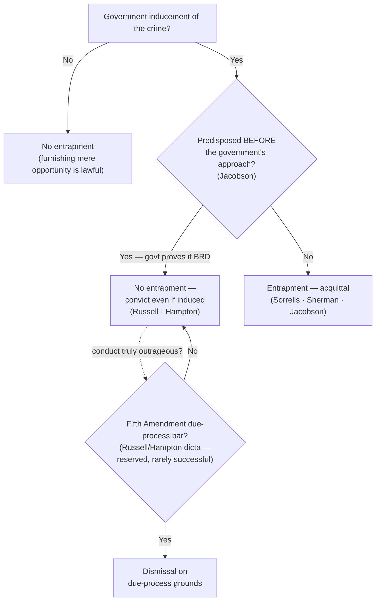

# S9 R1 panel-review — Opus model-diversity lane (prompt pack)

You are the **Claude/Opus** leg of the S9 three-lane adversarial panel (1 Claude + 2 Codex, R1). The two Codex lanes carry the A (support/quote-fidelity) and B (currency/treatment) attack lenses; **you carry model diversity and MUST vote on every paneled assertion across BOTH lenses' concerns.** You are refute-framed: try hard to break each assertion; **default to REFUTED on uncertainty**; never fabricate a cite, quote, or holding; use ONLY the evidence inlined below (no search, no outside knowledge). You are a SIGHTED reviewer — the FULL lake record (judgment fields included) is inlined.

You are a WRITER lane, not an adjudicator: you FIND and VOTE. You do not tally, adjudicate, or close any row — the orchestrator does.

For EACH group below, return one JSON object with the exact `reviewed[]` shape from the output contract (identical framing to the Codex lenses). Emit a finding object ONLY for a real defect (verdict refuted / stands-modified); a group you find wholly clean returns all-`stands` verdicts (the harness records a clean attestation). Concatenate the per-group JSON objects into a top-level `{"packs": [ ... ]}` array, one entry per group, each carrying its `group_id`.


OUTPUT CONTRACT — return ONE JSON object, nothing else:
{
  "lens": "A" | "B",
  "group_id": "<echo the group id>",
  "reviewed": [
    {
      "assertion_id": "<from group_inventory.jsonl>",
      "dimension": "existence|support|quote_fidelity|pincite|treatment|black_letter",
      "verdict": "stands" | "refuted" | "stands-modified",
      "verifiable_from_disclosed": true | false,
      "defect": null,   // null when verdict=="stands"; else an object:
      //  {"problem": "...", "severity": "high|medium|low", "proposed_fix": "...", "evidence_quote": "verbatim from disclosed evidence or null", "needs_cl": true|false, "locator_note": "..."}
      "reasons": ["short evidence-grounded reason", "..."],
      "breaks_true_positives": true | false,
      "residual_risks": ["..."],
      "suggested_tightening": "... or null"
    }
  ],
  "notes": ""
}
Rules: verdict=='stands' <=> defect==null (assertion survives your attack). verdict=='refuted' <=> a real defect (the assertion as framed is wrong). verdict=='stands-modified' <=> survives but needs a stated modification (a minor defect). Review EVERY assertion_id in group_inventory.jsonl exactly once. Output ONLY the JSON object.
---

## GROUP: content/fair-trial-and-reliability-doctrines/Entrapment.md  (`doctrine`, 9 assertions)

### content_page

```
---
weight: 30
aliases:
  - "Entrapment"
  - "11-adjacent-doctrines/Entrapment"
title: "Entrapment"
topic: Entrapment
type: doctrine
jurisdiction: Federal substantive criminal-law defense; SCOTUS baseline (due-process branch rests on the Fifth Amendment)
status: draft
related:
  - "[[Common Legal Terms]]"
  - "[[Sixth Amendment Right to Counsel]]"
  - "[[Due-Process Voluntariness of Confessions]]"
  - "[[Miranda and Custodial Interrogation]]"
---

# Entrapment

*Did the government induce a crime a non-predisposed person would not have committed?*

> [!rule] Black-letter rule
> Federal entrapment has **two elements**: (1) **government inducement** of the crime and (2) the defendant's **lack of predisposition** to commit it. **Predisposition, not the fact of inducement, controls** — a **predisposed defendant is not entrapped even if induced**. Where the government induces the offense, it must prove predisposition that existed **before** its approach. The defense is a bar to **liability** (acquittal), not a suppression remedy. *[[Sorrells v. United States|Sorrells]]*, 287 U.S. 435, [454](https://www.courtlistener.com/opinion/101997/sorrells-v-united-states/) (1932); *[[Sherman v. United States|Sherman]]*, 356 U.S. 369, [372](https://www.courtlistener.com/opinion/105681/sherman-v-united-states/) (1958); *[[Jacobson v. United States|Jacobson]]*, 503 U.S. 540, [548](https://www.courtlistener.com/opinion/112720/jacobson-v-united-states/) (1992).
> ^rule-entrapment

## The Brief

**Entrapment is a defense to criminal liability, not a suppression remedy.** It excludes no evidence and challenges no search; it defeats the conviction itself, decided by the jury or, where the evidence is undisputed, as a matter of law. The operational line runs between a lawful sting that merely furnishes an *opportunity* to offend and the unlawful government creation of the crime in the mind of an unwilling person. Furnishing the opportunity is always permissible; manufacturing the criminal design in someone not already willing is not.

**The black-letter rule: the federal *subjective* test (stated up front).** In federal court entrapment has **two elements**: (1) **government inducement** of the crime, **and** (2) the defendant's **lack of predisposition** to commit it. Both must be present, and **predisposition, not the fact of inducement, is the controlling fact**: a **predisposed defendant is not entrapped even if induced.** The defense originates in *[[Sorrells v. United States|Sorrells]]*, which defined it as "the conception and planning of an offense by an officer, and his procurement of its commission by one who would not have perpetrated it except for the trickery, persuasion, or fraud of the officer." *[[Sorrells v. United States|Sorrells]]*, 287 U.S. at [454](https://www.courtlistener.com/opinion/101997/sorrells-v-united-states/). *[[Sherman v. United States|Sherman]]* supplied the classic formulation: the task is to draw a "line ... between the trap for the unwary innocent and the trap for the unwary criminal," and entrapment exists "only when the criminal conduct was 'the product of the creative activity' of law-enforcement officials." *[[Sherman v. United States|Sherman]]*, 356 U.S. at [372](https://www.courtlistener.com/opinion/105681/sherman-v-united-states/).

**Predisposition must pre-date the government's approach: the *[[Jacobson v. United States|Jacobson]]* timing rule.** Where the government induces the offense, it must prove predisposition that existed **independent of, and prior to,** its own conduct. The government "may not originate a criminal design, implant in an innocent person's mind the disposition to commit a criminal act, and then induce commission of the crime so that the Government may prosecute." *[[Jacobson v. United States|Jacobson]]*, 503 U.S. at [548](https://www.courtlistener.com/opinion/112720/jacobson-v-united-states/). Concretely, "the prosecution must prove beyond reasonable doubt that the defendant was disposed to commit the criminal act prior to first being approached by Government agents." *[[Jacobson v. United States|Jacobson]]*, 503 U.S. at [548-49](https://www.courtlistener.com/opinion/112720/jacobson-v-united-states/). Government conduct cannot manufacture the very predisposition it later points to: 26 months of solicitation that itself created the willingness defeated the prosecution as a matter of law.

**Furnishing means or contraband to a predisposed person is not entrapment.** Supplying even a difficult-to-obtain but legal ingredient does not establish the defense: "It is only when the Government's deception actually implants the criminal design in the mind of the defendant that the defense of entrapment comes into play." *[[United States v. Russell|Russell]]*, 411 U.S. at [436](https://www.courtlistener.com/opinion/108768/united-states-v-russell/). *[[Hampton v. United States|Hampton]]* extends the point to the contraband itself. A predisposed defendant who deals government-supplied drugs has his "remedy ... sol[ely] in the defense of entrapment," which a predisposed defendant cannot make out. *[[Hampton v. United States|Hampton]]*, 425 U.S. at [490](https://www.courtlistener.com/opinion/109437/hampton-v-united-states/) (plurality).

**A defendant may claim entrapment while denying the crime.** He need not admit the acts to earn the instruction: "even if the defendant denies one or more elements of the crime, he is entitled to an entrapment instruction whenever there is sufficient evidence from which a reasonable jury could find entrapment." *[[Mathews v. United States|Mathews]]*, 485 U.S. at [62](https://www.courtlistener.com/opinion/112012/mathews-v-united-states/). Denying the offense and requesting the instruction are not mutually exclusive.

**The objective-test minority (a non-federal alternative).** A minority of states apply an **objective** test that asks whether the **police conduct** would induce a hypothetical **law-abiding person** to offend, disregarding this defendant's predisposition. It is illustrative only and **does not govern in federal court**, which applies the subjective/predisposition test; *[[United States v. Russell|Russell]]* reaffirmed the subjective test and rejected the objective approach. (See [[Common Legal Terms]].)

**The due-process "outrageous government conduct" defense (reserved, rarely successful).** Distinct from entrapment, and available in theory even to a **predisposed** defendant, is a **Fifth Amendment due-process** bar for truly egregious government conduct, floated only in [[Common Legal Terms#dicta|dictum]]. The Court reserved the possibility that "some day ... [police conduct may be] so outrageous that due process principles would absolutely bar the government from invoking judicial processes to obtain a conviction," but held *[[United States v. Russell|Russell]]* "distinctly not of that breed." *[[United States v. Russell|Russell]]*, 411 U.S. at [431-432](https://www.courtlistener.com/opinion/108768/united-states-v-russell/). In *[[Hampton v. United States|Hampton]]*, three Justices would have foreclosed the due-process route entirely, but Justices Powell and Blackmun, [[Common Legal Terms#concurring-opinion|concurring]] in the judgment, expressly **reserved** it, so no majority adopted a flat "no due-process bar." The defense exists on paper and almost never succeeds.

**Burden · standard of review · remedy.** The **defendant** bears the **burden of production** on inducement, pointing to some evidence the government induced the crime; once inducement is raised, the **government** bears the **burden of persuasion** to prove **[[Common Legal Terms#beyond-a-reasonable-doubt|beyond a reasonable doubt]]** that the defendant was predisposed, and predisposed *before* it approached him. *[[Jacobson v. United States|Jacobson]]*, 503 U.S. at [548-49](https://www.courtlistener.com/opinion/112720/jacobson-v-united-states/); *[[Mathews v. United States|Mathews]]*, 485 U.S. at [62-63](https://www.courtlistener.com/opinion/112012/mathews-v-united-states/). Entrapment is ordinarily a **jury question**; where the evidence is undisputed it may be resolved **as a matter of law** (*[[Sherman v. United States|Sherman]]*; *[[Jacobson v. United States|Jacobson]]*). The **remedy** is **acquittal**, a complete defense to liability, and **not** suppression of evidence.

**Common pitfalls.**
- **Treating inducement as automatic entrapment.** Persuasion, opportunity, or even repeated requests do not entrap a *predisposed* person; predisposition controls.
- **Applying the objective test in federal court.** "Would this tactic induce an average person?" is the state/objective framing; federal law asks about *this* defendant's predisposition.
- **Confusing entrapment with a Fourth Amendment / suppression remedy.** It suppresses nothing; it is a defense to liability decided by the jury (or, when clear, as a matter of law).
- **Assuming an undercover sting is itself entrapment.** Lawful undercover work that merely furnishes an opportunity is constitutional (*[[Illinois v. Perkins|Perkins]]* holds no *[[Miranda v. Arizona|Miranda]]* warnings are even required for an undercover jailhouse sting); what converts a sting into entrapment is implanting the criminal design in an unpredisposed target, not the deception itself.

## Lower-court developments

Circuit and state developments only; no SCOTUS. The controlling Supreme Court cases (*[[Sorrells v. United States|Sorrells]]*, *[[Sherman v. United States|Sherman]]*, *[[United States v. Russell|Russell]]*, *[[Jacobson v. United States|Jacobson]]*, *[[Mathews v. United States|Mathews]]*, *[[Hampton v. United States|Hampton]]*) home to **Key cases** regardless of date, per the no-SCOTUS-in-recent-developments rule. The *[[Jacobson v. United States|Jacobson]]* predisposition framework has been steadily applied in the online-sting era, where outcomes turn on the **facts of the inducement** rather than on any disagreement about the legal standard: the two-element test produces divergence on the facts, not a split on the rule. No SCOTUS case is pending on the test. Each decision below binds only in its own circuit.

- **[[United States v. Hanapel]] (8th Cir. 2024)** — *recent application (no inducement on the facts).* Applying the two-element entrapment test, the court affirmed a conviction for attempting to entice a minor: no inducement as a matter of law where the defendant readily responded to an undercover officer posing as a 14-year-old, so a reasonable jury could reject entrapment. **Binding in-circuit — 8th Cir.** · good. [opinion](https://www.courtlistener.com/opinion/10038262/united-states-v-james-hanapel/)
- **[[United States v. Perez-Rodriguez]] (1st Cir. 2021)** — *recent application (entrapment instruction wrongly refused).* [[Reading and Citing Cases#vacated|Vacated]] the conviction and [[Reading and Citing Cases#on-remand|remanded]] for a new trial: plain error to refuse an entrapment instruction in an online attempted-enticement sting where the agent's "bundling of licit and illicit sex into a package deal" (a legal encounter with an adult combined with an illegal one involving a fictitious child) is a recognized "plus factor" that could establish improper inducement, and the burden of production on both prongs was met. The *[[Jacobson v. United States|Jacobson]]* framework applied in the digital-sting context. **Binding in-circuit — 1st Cir.** · good. [opinion](https://www.courtlistener.com/opinion/5067201/united-states-v-perez-rodriguez/)

## Key cases

| Case | Holding | Opinion |
|---|---|---|
| *[[Sorrells v. United States]]*, 287 U.S. 435 (1932) | **Anchor.** Recognizes entrapment as a defense: it arises when officials implant the criminal design in a person who had no previous disposition and then lure that otherwise-innocent person into the crime. | [opinion](https://www.courtlistener.com/opinion/101997/sorrells-v-united-states/) |
| *[[Sherman v. United States]]*, 356 U.S. 369 (1958) | **Refinement.** Entrapment established as a matter of law where the government's informant implanted the design in an unwilling person (a recovering addict pressured by a fellow patient); draws the "unwary innocent"/"unwary criminal" line. | [opinion](https://www.courtlistener.com/opinion/105681/sherman-v-united-states/) |
| *[[United States v. Russell]]*, 411 U.S. 423 (1973) | **Anchor.** No entrapment where the defendant was predisposed, even though an agent supplied a hard-to-obtain but legal ingredient; reaffirms the subjective predisposition test and rejects the objective test; reserves (without applying) a due-process bar for outrageous conduct. | [opinion](https://www.courtlistener.com/opinion/108768/united-states-v-russell/) |
| *[[Jacobson v. United States]]*, 503 U.S. 540 (1992) | **Refinement.** Where the government induces the crime it must prove predisposition that existed independent of, and prior to, the inducement; 26 months of solicitation that itself created the predisposition defeats the prosecution as a matter of law. | [opinion](https://www.courtlistener.com/opinion/112720/jacobson-v-united-states/) |
| *[[Mathews v. United States]]*, 485 U.S. 58 (1988) | **Refinement.** A defendant may raise entrapment even while denying one or more elements of the charged offense, whenever the evidence would let a reasonable jury find entrapment. | [opinion](https://www.courtlistener.com/opinion/112012/mathews-v-united-states/) |
| *[[Hampton v. United States]]*, 425 U.S. 484 (1976) | **Refinement.** The entrapment defense does not bar conviction of a predisposed defendant who sold government-supplied contraband. A three-Justice plurality would further hold due process never bars such a conviction, but Powell and Blackmun (concurring in the judgment) **reserved** an outrageous-conduct due-process defense, so that broad proposition drew **no majority**. | [opinion](https://www.courtlistener.com/opinion/109437/hampton-v-united-states/) |

## Related cases across doctrines

These cases are treated in full on their own case pages, but bear directly on entrapment and are framed for that doctrine here.

| Case | Relevance here | Primary home | Opinion |
|---|---|---|---|
| *[[Illinois v. Perkins]]*, 496 U.S. 292 (1990) | **Undercover-sting backbone:** *[[Miranda v. Arizona\|Miranda]]* warnings are **not** required when an undercover agent posing as an inmate elicits statements, because the coercive atmosphere *[[Miranda v. Arizona\|Miranda]]* guards against is absent in a sting. The entrapment lesson: lawful sting tactics that furnish an opportunity are constitutional; what converts a sting into entrapment is implanting the criminal design in an unpredisposed target, not the deception itself. | [[Miranda and Custodial Interrogation]] | [opinion](https://www.courtlistener.com/opinion/112452/illinois-v-perkins/) |
| *[[United States v. Henry]]*, 447 U.S. 264 (1980) | **Sixth Amendment analog to entrapment's "the government engineered it" theory:** by intentionally creating a situation likely to *induce* an indicted defendant to make incriminating statements through a paid informant, the government "deliberately elicited" them in violation of the right to counsel. **Distinguish:** *[[United States v. Henry\|Henry]]* is a post-charge suppression rule about eliciting *statements*, not a predisposition defense to *liability*. | [[Sixth Amendment Right to Counsel]] | [opinion](https://www.courtlistener.com/opinion/110300/united-states-v-henry/) |

## Visual



## Sources

- [Sorrells v. United States, 287 U.S. 435 (1932)](https://www.courtlistener.com/opinion/101997/sorrells-v-united-states/) — pinpoint 454
- [Sherman v. United States, 356 U.S. 369 (1958)](https://www.courtlistener.com/opinion/105681/sherman-v-united-states/) — pinpoint 372
- [United States v. Russell, 411 U.S. 423 (1973)](https://www.courtlistener.com/opinion/108768/united-states-v-russell/) — pinpoints 431-432, 436
- [Jacobson v. United States, 503 U.S. 540 (1992)](https://www.courtlistener.com/opinion/112720/jacobson-v-united-states/) — pinpoints 548, 548-549
- [Mathews v. United States, 485 U.S. 58 (1988)](https://www.courtlistener.com/opinion/112012/mathews-v-united-states/) — pinpoints 62, 62-63
- [Hampton v. United States, 425 U.S. 484 (1976)](https://www.courtlistener.com/opinion/109437/hampton-v-united-states/) — pinpoint 490
- [Illinois v. Perkins, 496 U.S. 292 (1990)](https://www.courtlistener.com/opinion/112452/illinois-v-perkins/) (Related; home = [[Miranda and Custodial Interrogation]])
- [United States v. Henry, 447 U.S. 264 (1980)](https://www.courtlistener.com/opinion/110300/united-states-v-henry/) (Related; home = [[Sixth Amendment Right to Counsel]])
- [United States v. Hanapel (8th Cir. 2024)](https://www.courtlistener.com/opinion/10038262/united-states-v-james-hanapel/) (Binding in-circuit — 8th Cir.; no standalone case page)
- [United States v. Perez-Rodriguez (1st Cir. 2021)](https://www.courtlistener.com/opinion/5067201/united-states-v-perez-rodriguez/) (Binding in-circuit — 1st Cir.; no standalone case page)

```

### group_inventory (assertions under review)

```jsonl
{"assertion_id": "a4f6796051063289", "dimension": "existence", "kind": "case_cite", "locator": {"case": "United States v. Russell", "table_line": 47}, "payload": {"case": "United States v. Russell", "cells": ["*[[United States v. Russell]]*, 411 U.S. 423 (1973)", "**Anchor.** No entrapment where the defendant was predisposed, even though an agent supplied a hard-to-obtain but legal ingredient; reaffirms the subjective predisposition test and rejects the objective test; reserves (without applying) a due-process bar for outrageous conduct.", "[opinion](https://www.courtlistener.com/opinion/108768/united-states-v-russell/)"], "header": ["Case", "Holding", "Opinion"]}}
{"assertion_id": "adacd5cef2e588a0", "dimension": "existence", "kind": "case_cite", "locator": {"case": "Hampton v. United States", "table_line": 50}, "payload": {"case": "Hampton v. United States", "cells": ["*[[Hampton v. United States]]*, 425 U.S. 484 (1976)", "**Refinement.** The entrapment defense does not bar conviction of a predisposed defendant who sold government-supplied contraband. A three-Justice plurality would further hold due process never bars such a conviction, but Powell and Blackmun (concurring in the judgment) **reserved** an outrageous-conduct due-process defense, so that broad proposition drew **no majority**.", "[opinion](https://www.courtlistener.com/opinion/109437/hampton-v-united-states/)"], "header": ["Case", "Holding", "Opinion"]}}
{"assertion_id": "b732b603729f0875", "dimension": "existence", "kind": "case_cite", "locator": {"case": "Sherman v. United States", "table_line": 46}, "payload": {"case": "Sherman v. United States", "cells": ["*[[Sherman v. United States]]*, 356 U.S. 369 (1958)", "**Refinement.** Entrapment established as a matter of law where the government's informant implanted the design in an unwilling person (a recovering addict pressured by a fellow patient); draws the \"unwary innocent\"/\"unwary criminal\" line.", "[opinion](https://www.courtlistener.com/opinion/105681/sherman-v-united-states/)"], "header": ["Case", "Holding", "Opinion"]}}
{"assertion_id": "bd8c5610e913c9e7", "dimension": "existence", "kind": "case_cite", "locator": {"case": "Mathews v. United States", "table_line": 49}, "payload": {"case": "Mathews v. United States", "cells": ["*[[Mathews v. United States]]*, 485 U.S. 58 (1988)", "**Refinement.** A defendant may raise entrapment even while denying one or more elements of the charged offense, whenever the evidence would let a reasonable jury find entrapment.", "[opinion](https://www.courtlistener.com/opinion/112012/mathews-v-united-states/)"], "header": ["Case", "Holding", "Opinion"]}}
{"assertion_id": "c8959474d0b2d739", "dimension": "existence", "kind": "case_cite", "locator": {"case": "Sorrells v. United States", "table_line": 45}, "payload": {"case": "Sorrells v. United States", "cells": ["*[[Sorrells v. United States]]*, 287 U.S. 435 (1932)", "**Anchor.** Recognizes entrapment as a defense: it arises when officials implant the criminal design in a person who had no previous disposition and then lure that otherwise-innocent person into the crime.", "[opinion](https://www.courtlistener.com/opinion/101997/sorrells-v-united-states/)"], "header": ["Case", "Holding", "Opinion"]}}
{"assertion_id": "dc8de4bdf034296d", "dimension": "existence", "kind": "case_cite", "locator": {"case": "United States v. Henry", "table_line": 59}, "payload": {"case": "United States v. Henry", "cells": ["*[[United States v. Henry]]*, 447 U.S. 264 (1980)", "**Sixth Amendment analog to entrapment's \"the government engineered it\" theory:** by intentionally creating a situation likely to *induce* an indicted defendant to make incriminating statements through a paid informant, the government \"deliberately elicited\" them in violation of the right to counsel. **Distinguish:** *[[United States v. Henry\\|Henry]]* is a post-charge suppression rule about eliciting *statements*, not a predisposition defense to *liability*.", "[[Sixth Amendment Right to Counsel]]", "[opinion](https://www.courtlistener.com/opinion/110300/united-states-v-henry/)"], "header": ["Case", "Relevance here", "Primary home", "Opinion"]}}
{"assertion_id": "e7b606ac57ab8b83", "dimension": "existence", "kind": "case_cite", "locator": {"case": "Illinois v. Perkins", "table_line": 58}, "payload": {"case": "Illinois v. Perkins", "cells": ["*[[Illinois v. Perkins]]*, 496 U.S. 292 (1990)", "**Undercover-sting backbone:** *[[Miranda v. Arizona\\|Miranda]]* warnings are **not** required when an undercover agent posing as an inmate elicits statements, because the coercive atmosphere *[[Miranda v. Arizona\\|Miranda]]* guards against is absent in a sting. The entrapment lesson: lawful sting tactics that furnish an opportunity are constitutional; what converts a sting into entrapment is implanting the criminal design in an unpredisposed target, not the deception itself.", "[[Miranda and Custodial Interrogation]]", "[opinion](https://www.courtlistener.com/opinion/112452/illinois-v-perkins/)"], "header": ["Case", "Relevance here", "Primary home", "Opinion"]}}
{"assertion_id": "ff352bb38d09f68d", "dimension": "existence", "kind": "case_cite", "locator": {"case": "Jacobson v. United States", "table_line": 48}, "payload": {"case": "Jacobson v. United States", "cells": ["*[[Jacobson v. United States]]*, 503 U.S. 540 (1992)", "**Refinement.** Where the government induces the crime it must prove predisposition that existed independent of, and prior to, the inducement; 26 months of solicitation that itself created the predisposition defeats the prosecution as a matter of law.", "[opinion](https://www.courtlistener.com/opinion/112720/jacobson-v-united-states/)"], "header": ["Case", "Holding", "Opinion"]}}
{"assertion_id": "73db336f7272faec", "dimension": "support", "kind": "proposition", "locator": {"callout": "^rule-entrapment"}, "payload": {"anchor": "^rule-entrapment", "statement": "[!rule] Black-letter rule\nFederal entrapment has **two elements**: (1) **government inducement** of the crime and (2) the defendant's **lack of predisposition** to commit it. **Predisposition, not the fact of inducement, controls** — a **predisposed defendant is not entrapped even if induced**. Where the government induces the offense, it must prove predisposition that existed **before** its approach. The defense is a bar to **liability** (acquittal), not a suppression remedy. *[[Sorrells v. United States|Sorrells]]*, 287 U.S. 435, [454](https://www.courtlistener.com/opinion/101997/sorrells-v-united-states/) (1932); *[[Sherman v. United States|Sherman]]*, 356 U.S. 369, [372](https://www.courtlistener.com/opinion/105681/sherman-v-united-states/) (1958); *[[Jacobson v. United States|Jacobson]]*, 503 U.S. 540, [548](https://www.courtlistener.com/opinion/112720/jacobson-v-united-states/) (1992)."}}
```

### lake record — Hampton v. United States

```json
{
  "schema_version": "s2.v1",
  "record_id": "Hampton v. United States",
  "stub": false,
  "status": "verified",
  "identity": {
    "case_name": "Hampton v. United States",
    "case_name_short": "Hampton",
    "case_name_full": "HAMPTON, AKA BYERS v. UNITED STATES",
    "input_case_name": "Hampton v. United States",
    "court": "U.S. Supreme Court",
    "court_id": "scotus",
    "court_level": "scotus",
    "circuit": null,
    "state": null,
    "date_decided": "1976-04-27",
    "year": 1976,
    "docket": null,
    "cluster_id": 109437,
    "lead_opinion_id": 9426380,
    "sibling_ids": [
      109437,
      9426380,
      9426381,
      9426382
    ],
    "absolute_url": "/opinion/109437/hampton-v-united-states/",
    "identity_method": "citation+party-text",
    "expected_citation_found": true,
    "party_name_in_text": true,
    "canonical_name_match": true,
    "alternates": [
      {
        "cluster_id": 9010580,
        "score": 20,
        "case_name": "Hampton v. United States"
      }
    ],
    "reason_code": null
  },
  "citations": {
    "official": {
      "cite": "425 U.S. 484",
      "volume": "425",
      "reporter": "U.S.",
      "page": "484",
      "type": 1,
      "selected_official": true,
      "source": "cluster.citations[]"
    },
    "parallel": [
      {
        "cite": "96 S. Ct. 1646",
        "volume": "96",
        "reporter": "S. Ct.",
        "page": "1646",
        "type": 1,
        "selected_official": false,
        "source": "cluster.citations[]"
      },
      {
        "cite": "48 L. Ed. 2d 113",
        "volume": "48",
        "reporter": "L. Ed. 2d",
        "page": "113",
        "type": 1,
        "selected_official": false,
        "source": "cluster.citations[]"
      }
    ],
    "vendor_neutral": [
      {
        "cite": "1976 U.S. LEXIS 49",
        "volume": "1976",
        "reporter": "U.S. LEXIS",
        "page": "49",
        "type": 6,
        "selected_official": false,
        "source": "cluster.citations[]"
      }
    ],
    "all": [
      {
        "cite": "425 U.S. 484",
        "volume": "425",
        "reporter": "U.S.",
        "page": "484",
        "type": 1,
        "selected_official": false,
        "source": "cluster.citations[]"
      },
      {
        "cite": "96 S. Ct. 1646",
        "volume": "96",
        "reporter": "S. Ct.",
        "page": "1646",
        "type": 1,
        "selected_official": false,
        "source": "cluster.citations[]"
      },
      {
        "cite": "48 L. Ed. 2d 113",
        "volume": "48",
        "reporter": "L. Ed. 2d",
        "page": "113",
        "type": 1,
        "selected_official": false,
        "source": "cluster.citations[]"
      },
      {
        "cite": "1976 U.S. LEXIS 49",
        "volume": "1976",
        "reporter": "U.S. LEXIS",
        "page": "49",
        "type": 6,
        "selected_official": false,
        "source": "cluster.citations[]"
      }
    ],
    "display": "425 U.S. 484",
    "official_selection": {
      "court_class": "scotus",
      "selected": "425 U.S. 484",
      "reason": "selected_rank_1"
    }
  },
  "pinpoints": [
    {
      "id": "pin-490",
      "page": null,
      "quote": "--- # Hampton v. United States *425 U.S. 484 (1976)* \u00b7 U.S. Supreme Court \u00b7 **Binding \u2014 SCOTUS** \u00b7 Treatment: **good** *(as of 2026-06-30)* <!-- header line; TreatmentBadge + weight render here, degrading to the text above --> ## Background Hampton was convicted of selling heroin to undercover federal agents. He claimed that a government informant had supplied him the very heroin he then sold, and argued that the Government's furnishing the contraband barred his conviction. The jury was instructed that predisposition defeated entrapment, and Hampton's predisposition to commit the offense was established. ## Issue Whether the Government's supplying the contraband that a predisposed defendant then sells bars his conviction \u2014 either under the entrapment defense or under the Due Process Clause. ## Rule No. A predisposed defendant cannot claim entrapment, and \u2014 in the plurality's view \u2014 due process does not bar his conviction even where a government agent supplied the contraband.",
      "star_marker": null,
      "quote_fidelity": "mismatch",
      "pinpoint_status": "slip-only",
      "position": null
    },
    {
      "id": "pin-490a",
      "page": null,
      "quote": "If the police engage in illegal activity in concert with a defendant beyond the scope of their duties the remedy lies, not in freeing the equally culpable defendant, but in prosecuting the police under the applicable provisions of state or federal law.",
      "star_marker": null,
      "quote_fidelity": "mismatch",
      "pinpoint_status": "slip-only",
      "position": null
    }
  ],
  "treatment": {
    "field_i_validity": "good_law",
    "as_of_content": "1976-04-27",
    "as_of_treatment": "2026-06-30",
    "composite_basis": "migration-seed",
    "composite_basis_ref": "Hampton v. United States",
    "varies_by_point": false,
    "scope_note": "Plurality opinion (Rehnquist, J.); Powell & Blackmun concurred in the judgment on narrower grounds.",
    "point_overrides": [],
    "edges": [
      {
        "citing_case": {
          "name": "United States v. Washington",
          "cluster_id": 7315755,
          "cite": [
            "131 F. Supp. 3d 1007",
            "2015 U.S. Dist. LEXIS 124545",
            "2015 WL 5522286"
          ],
          "field_ii": "questioned"
        },
        "field_ii": "questioned",
        "field_iii": "mentioned",
        "point": null,
        "proposed": true,
        "journal_ref": "Hampton v. United States:lane1_negative"
      },
      {
        "citing_case": {
          "name": "United States v. Rich",
          "cluster_id": 7311690,
          "cite": [
            "83 F. Supp. 3d 424",
            "2015 U.S. Dist. LEXIS 12347",
            "2015 WL 452190"
          ],
          "field_ii": "superseded_by_statute"
        },
        "field_ii": "superseded_by_statute",
        "field_iii": "mentioned",
        "point": null,
        "proposed": true,
        "journal_ref": "Hampton v. United States:lane1_negative"
      },
      {
        "citing_case": {
          "name": "State v. Delaine and Malisa Fitzpat",
          "cluster_id": 889950,
          "cite": [
            "2012 MT 300",
            "367 Mont. 385",
            "291 P.3d 1106",
            "2012 Mont. LEXIS 368"
          ],
          "field_ii": "overruled"
        },
        "field_ii": "overruled",
        "field_iii": "mentioned",
        "point": null,
        "proposed": true,
        "journal_ref": "Hampton v. United States:lane1_negative"
      },
      {
        "citing_case": {
          "name": "People v. Uribe",
          "cluster_id": 5810602,
          "cite": [
            "199 Cal. App. 4th 836",
            "132 Cal. Rptr. 3d 102",
            "2011 Cal. App. LEXIS 1253"
          ],
          "field_ii": "criticized"
        },
        "field_ii": "criticized",
        "field_iii": "mentioned",
        "point": null,
        "proposed": true,
        "journal_ref": "Hampton v. United States:lane1_negative"
      },
      {
        "citing_case": {
          "name": "United States v. Robert A. Burke",
          "cluster_id": 792103,
          "cite": [
            "425 F.3d 400",
            "68 Fed. R. Serv. 437",
            "2005 U.S. App. LEXIS 21013",
            "2005 WL 2373934"
          ],
          "field_ii": "superseded_by_statute"
        },
        "field_ii": "superseded_by_statute",
        "field_iii": "mentioned",
        "point": null,
        "proposed": true,
        "journal_ref": "Hampton v. United States:lane1_negative"
      },
      {
        "citing_case": {
          "name": "State v. Cunningham",
          "cluster_id": 3952337,
          "cite": [
            "808 N.E.2d 488",
            "156 Ohio App. 3d 714",
            "2004 Ohio 1935"
          ],
          "field_ii": "overruled"
        },
        "field_ii": "overruled",
        "field_iii": "mentioned",
        "point": null,
        "proposed": true,
        "journal_ref": "Hampton v. United States:lane1_negative"
      },
      {
        "citing_case": {
          "name": "People v. Maffett",
          "cluster_id": 1986216,
          "cite": [
            "633 N.W.2d 339",
            "464 Mich. 878"
          ],
          "field_ii": "overruled"
        },
        "field_ii": "overruled",
        "field_iii": "mentioned",
        "point": null,
        "proposed": true,
        "journal_ref": "Hampton v. United States:lane1_negative"
      },
      {
        "citing_case": {
          "name": "United States v. Sanchez",
          "cluster_id": 72803,
          "cite": [
            "138 F.3d 1410",
            "1998 U.S. App. LEXIS 7487",
            "1998 WL 176673"
          ],
          "field_ii": "questioned"
        },
        "field_ii": "questioned",
        "field_iii": "mentioned",
        "point": null,
        "proposed": true,
        "journal_ref": "Hampton v. United States:lane1_negative"
      },
      {
        "citing_case": {
          "name": "United States v. Greer",
          "cluster_id": 9050105,
          "cite": [
            "178 F.R.D. 418",
            "1998 U.S. Dist. LEXIS 3360",
            "1998 WL 128483"
          ],
          "field_ii": "superseded_by_statute"
        },
        "field_ii": "superseded_by_statute",
        "field_iii": "mentioned",
        "point": null,
        "proposed": true,
        "journal_ref": "Hampton v. United States:lane1_negative"
      },
      {
        "citing_case": {
          "name": "United States v. Jose Sandoval",
          "cluster_id": 603895,
          "cite": [
            "990 F.2d 481",
            "93 Daily Journal DAR 4205",
            "93 Cal. Daily Op. Serv. 2475",
            "1993 U.S. App. LEXIS 6759",
            "1993 WL 94342"
          ],
          "field_ii": "overruled"
        },
        "field_ii": "overruled",
        "field_iii": "mentioned",
        "point": null,
        "proposed": true,
        "journal_ref": "Hampton v. United States:lane1_negative"
      },
      {
        "citing_case": {
          "name": "United States of America, Appellant/cross-Appellee v. Jack Pardue, Michel Pardue, Appellee/cross-Appellant",
          "cluster_id": 597867,
          "cite": [
            "983 F.2d 835"
          ],
          "field_ii": "questioned"
        },
        "field_ii": "questioned",
        "field_iii": "mentioned",
        "point": null,
        "proposed": true,
        "journal_ref": "Hampton v. United States:lane1_negative"
      },
      {
        "citing_case": {
          "name": "United States v. Barrera-Moreno",
          "cluster_id": 9003836,
          "cite": [
            "951 F.2d 1089",
            "1991 WL 263160"
          ],
          "field_ii": "questioned"
        },
        "field_ii": "questioned",
        "field_iii": "mentioned",
        "point": null,
        "proposed": true,
        "journal_ref": "Hampton v. United States:lane1_negative"
      },
      {
        "citing_case": {
          "name": "United States v. Douglas Floyd Osborne, Jr.",
          "cluster_id": 562325,
          "cite": [
            "935 F.2d 32"
          ],
          "field_ii": "questioned"
        },
        "field_ii": "questioned",
        "field_iii": "mentioned",
        "point": null,
        "proposed": true,
        "journal_ref": "Hampton v. United States:lane1_negative"
      },
      {
        "citing_case": {
          "name": "United States v. Nicholas R. Marino, United States of America v. Peter R. Chabot",
          "cluster_id": 563220,
          "cite": [
            "936 F.2d 23",
            "1991 U.S. App. LEXIS 12662",
            "1991 WL 104191"
          ],
          "field_ii": "questioned"
        },
        "field_ii": "questioned",
        "field_iii": "mentioned",
        "point": null,
        "proposed": true,
        "journal_ref": "Hampton v. United States:lane1_negative"
      },
      {
        "citing_case": {
          "name": "United States v. Jose Gonzales, A/K/A Jose Menas, United States of America v. Ruiz, Wilson",
          "cluster_id": 556660,
          "cite": [
            "927 F.2d 139",
            "1991 U.S. App. LEXIS 3577",
            "1991 WL 28353"
          ],
          "field_ii": "superseded_by_statute"
        },
        "field_ii": "superseded_by_statute",
        "field_iii": "mentioned",
        "point": null,
        "proposed": true,
        "journal_ref": "Hampton v. United States:lane1_negative"
      },
      {
        "citing_case": {
          "name": "United States v. Brent Eugene Smith, United States of America v. Roberto Osegueya Martinez, United States of America v. Richard Leroy Popp, Jr.",
          "cluster_id": 555136,
          "cite": [
            "924 F.2d 889",
            "91 Cal. Daily Op. Serv. 682",
            "91 Daily Journal DAR 1029",
            "1991 U.S. App. LEXIS 915"
          ],
          "field_ii": "questioned"
        },
        "field_ii": "questioned",
        "field_iii": "mentioned",
        "point": null,
        "proposed": true,
        "journal_ref": "Hampton v. United States:lane1_negative"
      },
      {
        "citing_case": {
          "name": "United States v. Hasting",
          "cluster_id": 110933,
          "cite": [
            "76 L. Ed. 2d 96",
            "103 S. Ct. 1974",
            "461 U.S. 499",
            "1983 U.S. LEXIS 31",
            "51 U.S.L.W. 4572"
          ],
          "field_ii": "questioned"
        },
        "field_ii": "questioned",
        "field_iii": "mentioned",
        "point": null,
        "proposed": true,
        "journal_ref": "Hampton v. United States:lane2_top_cited"
      },
      {
        "citing_case": {
          "name": "United States v. Scott",
          "cluster_id": 109895,
          "cite": [
            "57 L. Ed. 2d 65",
            "98 S. Ct. 2187",
            "437 U.S. 82",
            "1978 U.S. LEXIS 109"
          ],
          "field_ii": "overruled"
        },
        "field_ii": "overruled",
        "field_iii": "mentioned",
        "point": null,
        "proposed": true,
        "journal_ref": "Hampton v. United States:lane2_top_cited"
      },
      {
        "citing_case": {
          "name": "Mathews v. United States",
          "cluster_id": 112012,
          "cite": [
            "99 L. Ed. 2d 54",
            "108 S. Ct. 883",
            "485 U.S. 58",
            "1988 U.S. LEXIS 943"
          ],
          "field_ii": "questioned"
        },
        "field_ii": "questioned",
        "field_iii": "mentioned",
        "point": null,
        "proposed": true,
        "journal_ref": "Hampton v. United States:lane2_top_cited"
      },
      {
        "citing_case": {
          "name": "United States v. Payner",
          "cluster_id": 110317,
          "cite": [
            "65 L. Ed. 2d 468",
            "100 S. Ct. 2439",
            "447 U.S. 727",
            "1980 U.S. LEXIS 136"
          ],
          "field_ii": "questioned"
        },
        "field_ii": "questioned",
        "field_iii": "mentioned",
        "point": null,
        "proposed": true,
        "journal_ref": "Hampton v. United States:lane2_top_cited"
      },
      {
        "citing_case": {
          "name": "United States v. John Voigt",
          "cluster_id": 722380,
          "cite": [
            "89 F.3d 1050",
            "78 A.F.T.R.2d (RIA) 5577",
            "1996 U.S. App. LEXIS 16287",
            "1996 WL 380609"
          ],
          "field_ii": "superseded_by_statute"
        },
        "field_ii": "superseded_by_statute",
        "field_iii": "mentioned",
        "point": null,
        "proposed": true,
        "journal_ref": "Hampton v. United States:lane2_top_cited"
      },
      {
        "citing_case": {
          "name": "United States v. William Christopher Twigg, Iii, United States of America v. Henry Alfred Neville",
          "cluster_id": 361264,
          "cite": [
            "588 F.2d 373"
          ],
          "field_ii": "overruled"
        },
        "field_ii": "overruled",
        "field_iii": "mentioned",
        "point": null,
        "proposed": true,
        "journal_ref": "Hampton v. United States:lane2_top_cited"
      },
      {
        "citing_case": {
          "name": "United States v. John M. Murphy",
          "cluster_id": 456168,
          "cite": [
            "768 F.2d 1518"
          ],
          "field_ii": "abrogated"
        },
        "field_ii": "abrogated",
        "field_iii": "mentioned",
        "point": null,
        "proposed": true,
        "journal_ref": "Hampton v. United States:lane2_top_cited"
      },
      {
        "citing_case": {
          "name": "United States v. Sonya Evette Singleton",
          "cluster_id": 754623,
          "cite": [
            "144 F.3d 1343",
            "1998 U.S. App. LEXIS 15451",
            "1998 WL 350507"
          ],
          "field_ii": "overruled"
        },
        "field_ii": "overruled",
        "field_iii": "mentioned",
        "point": null,
        "proposed": true,
        "journal_ref": "Hampton v. United States:lane2_top_cited"
      },
      {
        "citing_case": {
          "name": "United States v. John Bagnariol, United States of America v. Gordon L. Walgren, United States of America v. Patrick Gallagher",
          "cluster_id": 397437,
          "cite": [
            "665 F.2d 877",
            "1981 U.S. App. LEXIS 15028"
          ],
          "field_ii": "criticized"
        },
        "field_ii": "criticized",
        "field_iii": "mentioned",
        "point": null,
        "proposed": true,
        "journal_ref": "Hampton v. United States:lane2_top_cited"
      },
      {
        "citing_case": {
          "name": "United States of America, in No. 81-1020 v. Jannotti, Harry P. United States of America, in No. 81-1021 v. Schwartz, George X",
          "cluster_id": 401021,
          "cite": [
            "673 F.2d 578",
            "1982 WL 602723"
          ],
          "field_ii": "overruled"
        },
        "field_ii": "overruled",
        "field_iii": "mentioned",
        "point": null,
        "proposed": true,
        "journal_ref": "Hampton v. United States:lane2_top_cited"
      },
      {
        "citing_case": {
          "name": "Vega v. Zavaras",
          "cluster_id": 158747,
          "cite": [
            "195 F.3d 573",
            "1999 Colo. J. C.A.R. 6110",
            "1999 U.S. App. LEXIS 26874",
            "1999 WL 973608"
          ],
          "field_ii": "overruled"
        },
        "field_ii": "overruled",
        "field_iii": "mentioned",
        "point": null,
        "proposed": true,
        "journal_ref": "Hampton v. United States:lane2_top_cited"
      },
      {
        "citing_case": {
          "name": "Stokes v. Gann",
          "cluster_id": 51572,
          "cite": [
            "498 F.3d 483",
            "2007 U.S. App. LEXIS 20735",
            "2007 WL 2430109"
          ],
          "field_ii": "questioned"
        },
        "field_ii": "questioned",
        "field_iii": "mentioned",
        "point": null,
        "proposed": true,
        "journal_ref": "Hampton v. United States:lane2_top_cited"
      },
      {
        "citing_case": {
          "name": "United States v. William Rey",
          "cluster_id": 483372,
          "cite": [
            "811 F.2d 1453",
            "1987 U.S. App. LEXIS 3116"
          ],
          "field_ii": "overruled"
        },
        "field_ii": "overruled",
        "field_iii": "mentioned",
        "point": null,
        "proposed": true,
        "journal_ref": "Hampton v. United States:lane2_top_cited"
      },
      {
        "citing_case": {
          "name": "United States v. Rafael Santana and Francis Fuentes",
          "cluster_id": 654192,
          "cite": [
            "6 F.3d 1",
            "1993 U.S. App. LEXIS 23810",
            "1993 WL 345746"
          ],
          "field_ii": "questioned"
        },
        "field_ii": "questioned",
        "field_iii": "mentioned",
        "point": null,
        "proposed": true,
        "journal_ref": "Hampton v. United States:lane2_top_cited"
      },
      {
        "citing_case": {
          "name": "United States v. Gendron",
          "cluster_id": 195225,
          "cite": [
            "18 F.3d 955",
            "1994 WL 50975"
          ],
          "field_ii": "questioned"
        },
        "field_ii": "questioned",
        "field_iii": "mentioned",
        "point": null,
        "proposed": true,
        "journal_ref": "Hampton v. United States:lane2_top_cited"
      },
      {
        "citing_case": {
          "name": "United States v. Hilario Mendoza-Salgado, United States of America v. Ramon Edwardo Garcia",
          "cluster_id": 583725,
          "cite": [
            "964 F.2d 993",
            "35 Fed. R. Serv. 1029",
            "1992 U.S. App. LEXIS 10413",
            "1992 WL 101352"
          ],
          "field_ii": "questioned"
        },
        "field_ii": "questioned",
        "field_iii": "mentioned",
        "point": null,
        "proposed": true,
        "journal_ref": "Hampton v. United States:lane2_top_cited"
      },
      {
        "citing_case": {
          "name": "United States v. Kojo Sababu, Jaime Delgado, and Dora Garcia",
          "cluster_id": 533826,
          "cite": [
            "891 F.2d 1308",
            "1989 U.S. App. LEXIS 19420"
          ],
          "field_ii": "questioned"
        },
        "field_ii": "questioned",
        "field_iii": "mentioned",
        "point": null,
        "proposed": true,
        "journal_ref": "Hampton v. United States:lane2_top_cited"
      },
      {
        "citing_case": {
          "name": "United States v. F. Thomas Little, United States of America v. Peter Chernik, United States of America v. Harold Grutchfield",
          "cluster_id": 447563,
          "cite": [
            "753 F.2d 1420"
          ],
          "field_ii": "questioned"
        },
        "field_ii": "questioned",
        "field_iii": "mentioned",
        "point": null,
        "proposed": true,
        "journal_ref": "Hampton v. United States:lane2_top_cited"
      },
      {
        "citing_case": {
          "name": "United States v. Paul C. Porter, United States v. Walter G. Baker, United States v. Frederick L. Hearn, United States v. Larry Reservitz",
          "cluster_id": 453326,
          "cite": [
            "764 F.2d 1",
            "1985 U.S. App. LEXIS 20706"
          ],
          "field_ii": "superseded_by_statute"
        },
        "field_ii": "superseded_by_statute",
        "field_iii": "mentioned",
        "point": null,
        "proposed": true,
        "journal_ref": "Hampton v. United States:lane2_top_cited"
      },
      {
        "citing_case": {
          "name": "United States v. Luis Humberto Barbosa",
          "cluster_id": 775561,
          "cite": [
            "271 F.3d 438",
            "2001 U.S. App. LEXIS 24350",
            "2001 WL 1382027"
          ],
          "field_ii": "overruled"
        },
        "field_ii": "overruled",
        "field_iii": "mentioned",
        "point": null,
        "proposed": true,
        "journal_ref": "Hampton v. United States:lane2_top_cited"
      },
      {
        "citing_case": {
          "name": "United States v. Angela Nolan-Cooper",
          "cluster_id": 757749,
          "cite": [
            "155 F.3d 221",
            "1998 U.S. App. LEXIS 21403"
          ],
          "field_ii": "overruled"
        },
        "field_ii": "overruled",
        "field_iii": "mentioned",
        "point": null,
        "proposed": true,
        "journal_ref": "Hampton v. United States:lane2_top_cited"
      },
      {
        "citing_case": {
          "name": "United States v. Roy Moreno Ramirez, United States of America v. Robert H. Reynolds",
          "cluster_id": 420788,
          "cite": [
            "710 F.2d 535",
            "13 Fed. R. Serv. 1310",
            "1983 U.S. App. LEXIS 25876"
          ],
          "field_ii": "overruled"
        },
        "field_ii": "overruled",
        "field_iii": "mentioned",
        "point": null,
        "proposed": true,
        "journal_ref": "Hampton v. United States:lane2_top_cited"
      },
      {
        "citing_case": {
          "name": "United States v. Darrel Paterson Simpson, Robert MacRiner Anderson, and James Roy Freeman",
          "cluster_id": 484907,
          "cite": [
            "813 F.2d 1462",
            "1987 U.S. App. LEXIS 4561"
          ],
          "field_ii": "questioned"
        },
        "field_ii": "questioned",
        "field_iii": "mentioned",
        "point": null,
        "proposed": true,
        "journal_ref": "Hampton v. United States:lane2_top_cited"
      },
      {
        "citing_case": {
          "name": "United States v. Lilly Schmidt",
          "cluster_id": 733396,
          "cite": [
            "105 F.3d 82",
            "1997 U.S. App. LEXIS 705",
            "1997 WL 31579"
          ],
          "field_ii": "criticized"
        },
        "field_ii": "criticized",
        "field_iii": "mentioned",
        "point": null,
        "proposed": true,
        "journal_ref": "Hampton v. United States:lane2_top_cited"
      }
    ],
    "derivation": {
      "lane1_negative": {
        "query": "cites:(109437 OR 9426380 OR 9426381 OR 9426382) AND (overrul* OR abrogat* OR supersed* OR \"recede from\" OR \"no longer good law\" OR vacat* OR reversed) ",
        "reviewed": 200,
        "cap": 200,
        "cap_hit": true,
        "final_cursor": "https://www.courtlistener.com/api/rest/v4/search/?cursor=cz02MzY2ODE2MDAwMDAmcz0xOTU1NDYyJnQ9byZkPTIwMjYtMDctMDQmcD0xMQ%3D%3D&fields=absolute_url%2CcaseName%2CcaseNameFull%2Ccitation%2CciteCount%2Ccluster_id%2Ccourt%2Ccourt_citation_string%2Ccourt_id%2CdateFiled%2Copinions%2Csibling_ids%2Cstatus%2Csyllabus&order_by=dateFiled+desc&page_size=100&q=cites%3A%28109437+OR+9426380+OR+9426381+OR+9426382%29+AND+%28overrul%2A+OR+abrogat%2A+OR+supersed%2A+OR+%22recede+from%22+OR+%22no+longer+good+law%22+OR+vacat%2A+OR+reversed%29+&stat_Published=on&type=o",
        "audit_needed": true,
        "proposed_negative_events": 16,
        "audit_marker": "R15 treatment audit required",
        "triage_mode": "snippet-first",
        "snippet_field": "results[].opinions[].snippet",
        "triage_journaled": 200,
        "triage_read": 18,
        "triage_snippet_classified": 182
      },
      "lane2_top_cited": {
        "query": "cites:(109437 OR 9426380 OR 9426381 OR 9426382)",
        "reviewed": 25,
        "cap": 25,
        "cap_hit": true,
        "final_cursor": "https://www.courtlistener.com/api/rest/v4/search/?cursor=cz0xMjgmcz0zODA0ODAmdD1vJmQ9MjAyNi0wNy0wNCZwPTM%3D&order_by=citeCount+desc&page_size=25&q=cites%3A%28109437+OR+9426380+OR+9426381+OR+9426382%29&type=o",
        "audit_needed": true,
        "proposed_negative_events": 25,
        "audit_marker": "R15 treatment audit required"
      },
      "lane3_recency": {
        "query": "cites:(109437 OR 9426380 OR 9426381 OR 9426382)",
        "reviewed": 3,
        "cap": 200,
        "cap_hit": false,
        "final_cursor": null,
        "audit_needed": false,
        "proposed_negative_events": 0,
        "audit_marker": null,
        "triage_mode": "snippet-first",
        "snippet_field": "results[].opinions[].snippet",
        "triage_journaled": 3,
        "triage_read": 0,
        "triage_snippet_classified": 3
      }
    }
  },
  "progeny": {
    "complete_query": "cites:(109437 OR 9426380 OR 9426381 OR 9426382)",
    "indexed_citing_opinions": 628,
    "count_source": "search",
    "per_sibling": [
      {
        "opinion_id": 109437,
        "count": 585,
        "count_source": "search"
      },
      {
        "opinion_id": 9426380,
        "count": 57,
        "count_source": "search"
      },
      {
        "opinion_id": 9426381,
        "count": 0,
        "count_source": "search"
      },
      {
        "opinion_id": 9426382,
        "count": 0,
        "count_source": "search"
      }
    ],
    "citation_count": 911,
    "cache_path": "/Users/johngalt/cssi-lake/cache/progeny/hampton-v-united-states.jsonl",
    "enumeration": "bounded",
    "cursor": "https://www.courtlistener.com/api/rest/v4/search/?cursor=cz0xLjQyMjc5OTcmcz0yNzE1MDU1JnQ9byZkPTIwMjYtMDctMDQmcD0y&order_by=score+desc&page_size=100&q=cites%3A%28109437+OR+9426380+OR+9426381+OR+9426382%29&type=o",
    "rows_cached": 20,
    "outbound_opinion_edges": [
      {
        "source_opinion_id": 109437,
        "cited_id": 101251,
        "source": "search.opinions[].cites[]"
      },
      {
        "source_opinion_id": 109437,
        "cited_id": 101997,
        "source": "search.opinions[].cites[]"
      },
      {
        "source_opinion_id": 109437,
        "cited_id": 104943,
        "source": "search.opinions[].cites[]"
      },
      {
        "source_opinion_id": 109437,
        "cited_id": 105681,
        "source": "search.opinions[].cites[]"
      },
      {
        "source_opinion_id": 109437,
        "cited_id": 108662,
        "source": "search.opinions[].cites[]"
      },
      {
        "source_opinion_id": 109437,
        "cited_id": 108768,
        "source": "search.opinions[].cites[]"
      },
      {
        "source_opinion_id": 109437,
        "cited_id": 108906,
        "source": "search.opinions[].cites[]"
      },
      {
        "source_opinion_id": 109437,
        "cited_id": 109387,
        "source": "search.opinions[].cites[]"
      },
      {
        "source_opinion_id": 109437,
        "cited_id": 298766,
        "source": "search.opinions[].cites[]"
      },
      {
        "source_opinion_id": 109437,
        "cited_id": 306412,
        "source": "search.opinions[].cites[]"
      },
      {
        "source_opinion_id": 109437,
        "cited_id": 314188,
        "source": "search.opinions[].cites[]"
      },
      {
        "source_opinion_id": 109437,
        "cited_id": 316284,
        "source": "search.opinions[].cites[]"
      },
      {
        "source_opinion_id": 109437,
        "cited_id": 318238,
        "source": "search.opinions[].cites[]"
      },
      {
        "source_opinion_id": 109437,
        "cited_id": 319175,
        "source": "search.opinions[].cites[]"
      },
      {
        "source_opinion_id": 109437,
        "cited_id": 325618,
        "source": "search.opinions[].cites[]"
      },
      {
        "source_opinion_id": 109437,
        "cited_id": 1270730,
        "source": "search.opinions[].cites[]"
      },
      {
        "source_opinion_id": 109437,
        "cited_id": 2136075,
        "source": "search.opinions[].cites[]"
      }
    ]
  },
  "off_cl_links": [],
  "provenance": {
    "cl_source": "LRU",
    "cl_api": "https://www.courtlistener.com/api/rest/v4",
    "built_by": "S2-BUILDER-AUTHORING",
    "build_run": "s2-build-96d841cbb12e",
    "date_created": "2026-07-05T06:03:22Z",
    "date_modified": "2026-07-06T10:25:11Z",
    "warnings": [
      "legacy treatment migrated: good -> good_law"
    ],
    "field_provenance": {
      "identity": {
        "src": "CourtListener search + clusters + lead opinion text",
        "at": "2026-07-05T06:03:46Z",
        "verifier": "S2-BUILDER-AUTHORING"
      },
      "treatment.field_i_validity": {
        "src": "_treatment-migration.json + page frontmatter",
        "at": "2026-07-05T06:03:46Z",
        "verifier": "S2-BUILDER-AUTHORING"
      },
      "point_overrides": {
        "src": "S2 treatment derivation proposed only",
        "at": "2026-07-05T06:11:33Z",
        "verifier": "S2-BUILDER-AUTHORING"
      },
      "pinpoints": {
        "src": "content page quote harvest + lead opinion text",
        "at": "2026-07-05T06:03:46Z",
        "verifier": "S2-BUILDER-AUTHORING"
      }
    }
  }
}

```

### lake record — Illinois v. Perkins

```json
{
  "schema_version": "s2.v1",
  "record_id": "Illinois v. Perkins",
  "stub": false,
  "status": "verified",
  "identity": {
    "case_name": "Illinois v. Perkins",
    "case_name_short": "Perkins",
    "case_name_full": "Illinois v. Perkins",
    "input_case_name": "Illinois v. Perkins",
    "court": "U.S. Supreme Court",
    "court_id": "scotus",
    "court_level": "scotus",
    "circuit": null,
    "state": null,
    "date_decided": "1990-06-04",
    "year": 1990,
    "docket": null,
    "cluster_id": 112452,
    "lead_opinion_id": 9432050,
    "sibling_ids": [
      112452,
      9432050,
      9432051,
      9432052
    ],
    "absolute_url": "/opinion/112452/illinois-v-perkins/",
    "identity_method": "citation+party-text",
    "expected_citation_found": true,
    "party_name_in_text": true,
    "canonical_name_match": true,
    "alternates": [
      {
        "cluster_id": 9094326,
        "score": 20,
        "case_name": "Illinois v. Perkins"
      },
      {
        "cluster_id": 9094325,
        "score": 20,
        "case_name": "Illinois v. Perkins"
      },
      {
        "cluster_id": 9093481,
        "score": 20,
        "case_name": "Illinois v. Perkins"
      },
      {
        "cluster_id": 9093480,
        "score": 20,
        "case_name": "Illinois v. Perkins"
      }
    ],
    "reason_code": null
  },
  "citations": {
    "official": {
      "cite": "496 U.S. 292",
      "volume": "496",
      "reporter": "U.S.",
      "page": "292",
      "type": 1,
      "selected_official": true,
      "source": "cluster.citations[]"
    },
    "parallel": [
      {
        "cite": "110 S. Ct. 2394",
        "volume": "110",
        "reporter": "S. Ct.",
        "page": "2394",
        "type": 1,
        "selected_official": false,
        "source": "cluster.citations[]"
      },
      {
        "cite": "110 L. Ed. 2d 243",
        "volume": "110",
        "reporter": "L. Ed. 2d",
        "page": "243",
        "type": 1,
        "selected_official": false,
        "source": "cluster.citations[]"
      }
    ],
    "vendor_neutral": [
      {
        "cite": "1990 U.S. LEXIS 2885",
        "volume": "1990",
        "reporter": "U.S. LEXIS",
        "page": "2885",
        "type": 6,
        "selected_official": false,
        "source": "cluster.citations[]"
      }
    ],
    "all": [
      {
        "cite": "496 U.S. 292",
        "volume": "496",
        "reporter": "U.S.",
        "page": "292",
        "type": 1,
        "selected_official": false,
        "source": "cluster.citations[]"
      },
      {
        "cite": "110 S. Ct. 2394",
        "volume": "110",
        "reporter": "S. Ct.",
        "page": "2394",
        "type": 1,
        "selected_official": false,
        "source": "cluster.citations[]"
      },
      {
        "cite": "110 L. Ed. 2d 243",
        "volume": "110",
        "reporter": "L. Ed. 2d",
        "page": "243",
        "type": 1,
        "selected_official": false,
        "source": "cluster.citations[]"
      },
      {
        "cite": "1990 U.S. LEXIS 2885",
        "volume": "1990",
        "reporter": "U.S. LEXIS",
        "page": "2885",
        "type": 6,
        "selected_official": false,
        "source": "cluster.citations[]"
      }
    ],
    "display": "496 U.S. 292",
    "official_selection": {
      "court_class": "scotus",
      "selected": "496 U.S. 292",
      "reason": "selected_rank_1"
    }
  },
  "pinpoints": [
    {
      "id": "pin-296",
      "page": null,
      "quote": "), and an informant in a cellblock with Perkins, who was jailed on an unrelated charge. Posing as fellow inmates planning a sham escape, they drew Perkins into conversation, and he made statements implicating himself in a murder under investigation. He received no *Miranda* warnings and moved to suppress the statements. ## Issue Whether *Miranda* warnings are required before an undercover law enforcement officer, posing as a fellow inmate, questions an incarcerated suspect in a manner likely to elicit an incriminating response. ## Rule No.",
      "star_marker": null,
      "quote_fidelity": "mismatch",
      "pinpoint_status": "slip-only",
      "position": null
    },
    {
      "id": "pin-300",
      "page": null,
      "quote": "We hold that an undercover law enforcement officer posing as a fellow inmate need not give Miranda warnings to an incarcerated suspect before asking questions that may elicit an incriminating response.",
      "star_marker": null,
      "quote_fidelity": "mismatch",
      "pinpoint_status": "slip-only",
      "position": null
    }
  ],
  "treatment": {
    "field_i_validity": "good_law",
    "as_of_content": "1990-06-04",
    "as_of_treatment": "2026-06-30",
    "composite_basis": "migration-seed",
    "composite_basis_ref": "Illinois v. Perkins",
    "varies_by_point": false,
    "scope_note": "Old as_of seeds as_of_treatment; S2 derivation re-derives and may downgrade.",
    "point_overrides": [],
    "edges": [
      {
        "citing_case": {
          "name": "Jenkins v. State",
          "cluster_id": 10680001,
          "cite": [
            "894 S.E.2d 566",
            "317 Ga. 585"
          ],
          "field_ii": "criticized"
        },
        "field_ii": "criticized",
        "field_iii": "mentioned",
        "point": null,
        "proposed": true,
        "journal_ref": "Illinois v. Perkins:lane1_negative"
      },
      {
        "citing_case": {
          "name": "United States v. Hallford",
          "cluster_id": 4444995,
          "cite": [
            "280 F. Supp. 3d 170"
          ],
          "field_ii": "questioned"
        },
        "field_ii": "questioned",
        "field_iii": "mentioned",
        "point": null,
        "proposed": true,
        "journal_ref": "Illinois v. Perkins:lane1_negative"
      },
      {
        "citing_case": {
          "name": "NYIA GORE v. UNITED STATES",
          "cluster_id": 4248978,
          "cite": [
            "145 A.3d 540",
            "2016 D.C. App. LEXIS 313",
            "2016 WL 4411321"
          ],
          "field_ii": "questioned"
        },
        "field_ii": "questioned",
        "field_iii": "mentioned",
        "point": null,
        "proposed": true,
        "journal_ref": "Illinois v. Perkins:lane1_negative"
      },
      {
        "citing_case": {
          "name": "Amended September 20, 2016 State of Iowa v. Justin Alexander Marshall",
          "cluster_id": 4472001,
          "cite": null,
          "field_ii": "overruled"
        },
        "field_ii": "overruled",
        "field_iii": "mentioned",
        "point": null,
        "proposed": true,
        "journal_ref": "Illinois v. Perkins:lane1_negative"
      },
      {
        "citing_case": {
          "name": "State of Iowa v. Justin Alexander Marshall",
          "cluster_id": 3218790,
          "cite": [
            "882 N.W.2d 68",
            "2016 Iowa Sup. LEXIS 80"
          ],
          "field_ii": "overruled"
        },
        "field_ii": "overruled",
        "field_iii": "mentioned",
        "point": null,
        "proposed": true,
        "journal_ref": "Illinois v. Perkins:lane1_negative"
      },
      {
        "citing_case": {
          "name": "Commonwealth v. Burgos",
          "cluster_id": 2754022,
          "cite": [
            "470 Mass. 133",
            "19 N.E.3d 843"
          ],
          "field_ii": "superseded_by_statute"
        },
        "field_ii": "superseded_by_statute",
        "field_iii": "mentioned",
        "point": null,
        "proposed": true,
        "journal_ref": "Illinois v. Perkins:lane1_negative"
      },
      {
        "citing_case": {
          "name": "United States v. Taylor",
          "cluster_id": 7306221,
          "cite": [
            "17 F. Supp. 3d 162",
            "2014 WL 1653194",
            "2014 U.S. Dist. LEXIS 57397"
          ],
          "field_ii": "abrogated"
        },
        "field_ii": "abrogated",
        "field_iii": "mentioned",
        "point": null,
        "proposed": true,
        "journal_ref": "Illinois v. Perkins:lane1_negative"
      },
      {
        "citing_case": {
          "name": "United States v. Larry Whitfield",
          "cluster_id": 2968731,
          "cite": [
            "695 F.3d 288",
            "2012 U.S. App. LEXIS 17762",
            "2012 WL 3591038"
          ],
          "field_ii": "overruled"
        },
        "field_ii": "overruled",
        "field_iii": "mentioned",
        "point": null,
        "proposed": true,
        "journal_ref": "Illinois v. Perkins:lane1_negative"
      },
      {
        "citing_case": {
          "name": "United States v. Basciano",
          "cluster_id": 2470094,
          "cite": [
            "763 F. Supp. 2d 303",
            "2011 U.S. Dist. LEXIS 2901",
            "2011 WL 114865"
          ],
          "field_ii": "superseded_by_statute"
        },
        "field_ii": "superseded_by_statute",
        "field_iii": "mentioned",
        "point": null,
        "proposed": true,
        "journal_ref": "Illinois v. Perkins:lane1_negative"
      },
      {
        "citing_case": {
          "name": "People v. Passino",
          "cluster_id": 5899747,
          "cite": [
            "53 A.D.3d 204",
            "861 N.Y.S.2d 168"
          ],
          "field_ii": "questioned"
        },
        "field_ii": "questioned",
        "field_iii": "mentioned",
        "point": null,
        "proposed": true,
        "journal_ref": "Illinois v. Perkins:lane1_negative"
      },
      {
        "citing_case": {
          "name": "State v. Tate, 07 Ma 130 (6-26-2008)",
          "cluster_id": 3981154,
          "cite": [
            "2008 Ohio 3245"
          ],
          "field_ii": "overruled"
        },
        "field_ii": "overruled",
        "field_iii": "mentioned",
        "point": null,
        "proposed": true,
        "journal_ref": "Illinois v. Perkins:lane1_negative"
      },
      {
        "citing_case": {
          "name": "United States v. Burnette",
          "cluster_id": 2519721,
          "cite": [
            "535 F. Supp. 2d 772",
            "2007 WL 4911523"
          ],
          "field_ii": "overruled"
        },
        "field_ii": "overruled",
        "field_iii": "mentioned",
        "point": null,
        "proposed": true,
        "journal_ref": "Illinois v. Perkins:lane1_negative"
      },
      {
        "citing_case": {
          "name": "United States v. Damon Kimbrough",
          "cluster_id": 796843,
          "cite": [
            "477 F.3d 144",
            "2007 U.S. App. LEXIS 3488",
            "2007 WL 495026"
          ],
          "field_ii": "questioned"
        },
        "field_ii": "questioned",
        "field_iii": "mentioned",
        "point": null,
        "proposed": true,
        "journal_ref": "Illinois v. Perkins:lane1_negative"
      },
      {
        "citing_case": {
          "name": "Arizona v. Fulminante",
          "cluster_id": 112566,
          "cite": [
            "113 L. Ed. 2d 302",
            "111 S. Ct. 1246",
            "499 U.S. 279",
            "1991 U.S. LEXIS 1854"
          ],
          "field_ii": "overruled"
        },
        "field_ii": "overruled",
        "field_iii": "mentioned",
        "point": null,
        "proposed": true,
        "journal_ref": "Illinois v. Perkins:lane2_top_cited"
      },
      {
        "citing_case": {
          "name": "Stansbury v. California",
          "cluster_id": 117843,
          "cite": [
            "128 L. Ed. 2d 293",
            "114 S. Ct. 1526",
            "511 U.S. 318",
            "1994 U.S. LEXIS 3293"
          ],
          "field_ii": "questioned"
        },
        "field_ii": "questioned",
        "field_iii": "mentioned",
        "point": null,
        "proposed": true,
        "journal_ref": "Illinois v. Perkins:lane2_top_cited"
      },
      {
        "citing_case": {
          "name": "Dickerson v. United States",
          "cluster_id": 118380,
          "cite": [
            "147 L. Ed. 2d 405",
            "120 S. Ct. 2326",
            "530 U.S. 428",
            "2000 U.S. LEXIS 4305"
          ],
          "field_ii": "overruled"
        },
        "field_ii": "overruled",
        "field_iii": "mentioned",
        "point": null,
        "proposed": true,
        "journal_ref": "Illinois v. Perkins:lane2_top_cited"
      },
      {
        "citing_case": {
          "name": "Thompson v. Keohane",
          "cluster_id": 117982,
          "cite": [
            "133 L. Ed. 2d 383",
            "116 S. Ct. 457",
            "516 U.S. 99",
            "1995 U.S. LEXIS 8315",
            "95 Cal. Daily Op. Serv. 8968"
          ],
          "field_ii": "overruled"
        },
        "field_ii": "overruled",
        "field_iii": "mentioned",
        "point": null,
        "proposed": true,
        "journal_ref": "Illinois v. Perkins:lane2_top_cited"
      },
      {
        "citing_case": {
          "name": "People v. Maury",
          "cluster_id": 2598797,
          "cite": [
            "68 P.3d 1",
            "133 Cal. Rptr. 2d 561",
            "30 Cal. 4th 342"
          ],
          "field_ii": "overruled"
        },
        "field_ii": "overruled",
        "field_iii": "mentioned",
        "point": null,
        "proposed": true,
        "journal_ref": "Illinois v. Perkins:lane2_top_cited"
      },
      {
        "citing_case": {
          "name": "State v. Harris",
          "cluster_id": 1476684,
          "cite": [
            "859 A.2d 364",
            "181 N.J. 391",
            "2004 N.J. LEXIS 1080"
          ],
          "field_ii": "overruled"
        },
        "field_ii": "overruled",
        "field_iii": "mentioned",
        "point": null,
        "proposed": true,
        "journal_ref": "Illinois v. Perkins:lane2_top_cited"
      },
      {
        "citing_case": {
          "name": "Howes v. Fields",
          "cluster_id": 623144,
          "cite": [
            "182 L. Ed. 2d 17",
            "132 S. Ct. 1181",
            "565 U.S. 499",
            "2012 U.S. LEXIS 1077",
            "2012 WL 538280"
          ],
          "field_ii": "questioned"
        },
        "field_ii": "questioned",
        "field_iii": "mentioned",
        "point": null,
        "proposed": true,
        "journal_ref": "Illinois v. Perkins:lane2_top_cited"
      },
      {
        "citing_case": {
          "name": "State v. Walton",
          "cluster_id": 2355344,
          "cite": [
            "41 S.W.3d 75",
            "2001 Tenn. LEXIS 222"
          ],
          "field_ii": "overruled"
        },
        "field_ii": "overruled",
        "field_iii": "mentioned",
        "point": null,
        "proposed": true,
        "journal_ref": "Illinois v. Perkins:lane2_top_cited"
      },
      {
        "citing_case": {
          "name": "Maryland v. Shatzer",
          "cluster_id": 1734,
          "cite": [
            "175 L. Ed. 2d 1045",
            "130 S. Ct. 1213",
            "559 U.S. 98",
            "2010 U.S. LEXIS 1899"
          ],
          "field_ii": "criticized"
        },
        "field_ii": "criticized",
        "field_iii": "mentioned",
        "point": null,
        "proposed": true,
        "journal_ref": "Illinois v. Perkins:lane2_top_cited"
      },
      {
        "citing_case": {
          "name": "People v. Williams",
          "cluster_id": 1801669,
          "cite": [
            "49 Cal. 4th 405",
            "2010 D.A.R. 10",
            "111 Cal. Rptr. 3d 589",
            "233 P.3d 1000",
            "2010 Cal. LEXIS 5970"
          ],
          "field_ii": "overruled"
        },
        "field_ii": "overruled",
        "field_iii": "mentioned",
        "point": null,
        "proposed": true,
        "journal_ref": "Illinois v. Perkins:lane2_top_cited"
      },
      {
        "citing_case": {
          "name": "Ferguson v. City of Charleston",
          "cluster_id": 118414,
          "cite": [
            "149 L. Ed. 2d 205",
            "121 S. Ct. 1281",
            "532 U.S. 67",
            "2001 U.S. LEXIS 2460",
            "2001 Daily Journal DAR 2839",
            "2001 Colo. J. C.A.R. 1427",
            "14 Fla. L. Weekly Fed. S 152",
            "69 U.S.L.W. 4184"
          ],
          "field_ii": "questioned"
        },
        "field_ii": "questioned",
        "field_iii": "mentioned",
        "point": null,
        "proposed": true,
        "journal_ref": "Illinois v. Perkins:lane2_top_cited"
      },
      {
        "citing_case": {
          "name": "People v. Clair",
          "cluster_id": 1171441,
          "cite": [
            "828 P.2d 705",
            "2 Cal. 4th 629",
            "7 Cal. Rptr. 2d 564",
            "92 Cal. Daily Op. Serv. 3966",
            "92 Daily Journal DAR 6358",
            "1992 Cal. LEXIS 1837"
          ],
          "field_ii": "overruled"
        },
        "field_ii": "overruled",
        "field_iii": "mentioned",
        "point": null,
        "proposed": true,
        "journal_ref": "Illinois v. Perkins:lane2_top_cited"
      },
      {
        "citing_case": {
          "name": "Herrera v. State",
          "cluster_id": 1872663,
          "cite": [
            "241 S.W.3d 520",
            "2007 Tex. Crim. App. LEXIS 1675",
            "2007 WL 4146707"
          ],
          "field_ii": "overruled"
        },
        "field_ii": "overruled",
        "field_iii": "mentioned",
        "point": null,
        "proposed": true,
        "journal_ref": "Illinois v. Perkins:lane2_top_cited"
      },
      {
        "citing_case": {
          "name": "State v. Leger",
          "cluster_id": 1592017,
          "cite": [
            "936 So. 2d 108",
            "2006 WL 1883421"
          ],
          "field_ii": "questioned"
        },
        "field_ii": "questioned",
        "field_iii": "mentioned",
        "point": null,
        "proposed": true,
        "journal_ref": "Illinois v. Perkins:lane2_top_cited"
      },
      {
        "citing_case": {
          "name": "People v. Gonzales and Soliz",
          "cluster_id": 844263,
          "cite": [
            "256 P.3d 543",
            "52 Cal. 4th 254",
            "128 Cal. Rptr. 3d 417",
            "2011 Cal. LEXIS 7683"
          ],
          "field_ii": "overruled"
        },
        "field_ii": "overruled",
        "field_iii": "mentioned",
        "point": null,
        "proposed": true,
        "journal_ref": "Illinois v. Perkins:lane2_top_cited"
      },
      {
        "citing_case": {
          "name": "Traylor v. State",
          "cluster_id": 1765408,
          "cite": [
            "596 So. 2d 957",
            "1992 WL 4873"
          ],
          "field_ii": "overruled"
        },
        "field_ii": "overruled",
        "field_iii": "mentioned",
        "point": null,
        "proposed": true,
        "journal_ref": "Illinois v. Perkins:lane2_top_cited"
      },
      {
        "citing_case": {
          "name": "People v. Matheny",
          "cluster_id": 2637091,
          "cite": [
            "46 P.3d 453",
            "2002 WL 1009210"
          ],
          "field_ii": "overruled"
        },
        "field_ii": "overruled",
        "field_iii": "mentioned",
        "point": null,
        "proposed": true,
        "journal_ref": "Illinois v. Perkins:lane2_top_cited"
      },
      {
        "citing_case": {
          "name": "State v. Atwood",
          "cluster_id": 1182224,
          "cite": [
            "832 P.2d 593",
            "171 Ariz. 576"
          ],
          "field_ii": "overruled"
        },
        "field_ii": "overruled",
        "field_iii": "mentioned",
        "point": null,
        "proposed": true,
        "journal_ref": "Illinois v. Perkins:lane2_top_cited"
      },
      {
        "citing_case": {
          "name": "People v. Davis",
          "cluster_id": 2575950,
          "cite": [
            "115 P.3d 417",
            "31 Cal. Rptr. 3d 96",
            "36 Cal. 4th 510",
            "2005 Cal. Daily Op. Serv. 6393",
            "2005 Daily Journal DAR 8733",
            "2005 Cal. LEXIS 7963"
          ],
          "field_ii": "overruled"
        },
        "field_ii": "overruled",
        "field_iii": "mentioned",
        "point": null,
        "proposed": true,
        "journal_ref": "Illinois v. Perkins:lane2_top_cited"
      },
      {
        "citing_case": {
          "name": "People v. Leonard",
          "cluster_id": 2632907,
          "cite": [
            "157 P.3d 973",
            "58 Cal. Rptr. 3d 368",
            "40 Cal. 4th 1370",
            "2007 Cal. Daily Op. Serv. 5424",
            "2007 Cal. LEXIS 5071"
          ],
          "field_ii": "overruled"
        },
        "field_ii": "overruled",
        "field_iii": "mentioned",
        "point": null,
        "proposed": true,
        "journal_ref": "Illinois v. Perkins:lane2_top_cited"
      },
      {
        "citing_case": {
          "name": "State v. Perez",
          "cluster_id": 2691798,
          "cite": [
            "2009 Ohio 6179",
            "124 Ohio St. 3d 122",
            "920 N.E.2d 104"
          ],
          "field_ii": "overruled"
        },
        "field_ii": "overruled",
        "field_iii": "mentioned",
        "point": null,
        "proposed": true,
        "journal_ref": "Illinois v. Perkins:lane2_top_cited"
      },
      {
        "citing_case": {
          "name": "United States v. Smalls",
          "cluster_id": 145451,
          "cite": [
            "605 F.3d 765",
            "2010 U.S. App. LEXIS 9107",
            "2010 WL 1745123"
          ],
          "field_ii": "overruled"
        },
        "field_ii": "overruled",
        "field_iii": "mentioned",
        "point": null,
        "proposed": true,
        "journal_ref": "Illinois v. Perkins:lane2_top_cited"
      },
      {
        "citing_case": {
          "name": "People v. Manning",
          "cluster_id": 2074839,
          "cite": [
            "695 N.E.2d 423",
            "182 Ill. 2d 193",
            "230 Ill. Dec. 933",
            "1998 Ill. LEXIS 368"
          ],
          "field_ii": "questioned"
        },
        "field_ii": "questioned",
        "field_iii": "mentioned",
        "point": null,
        "proposed": true,
        "journal_ref": "Illinois v. Perkins:lane2_top_cited"
      },
      {
        "citing_case": {
          "name": "People v. Fayed",
          "cluster_id": 4741522,
          "cite": [
            "9 Cal. 5th 147",
            "260 Cal. Rptr. 3d 761",
            "460 P.3d 1149"
          ],
          "field_ii": "overruled"
        },
        "field_ii": "overruled",
        "field_iii": "mentioned",
        "point": null,
        "proposed": true,
        "journal_ref": "Illinois v. Perkins:lane2_top_cited"
      },
      {
        "citing_case": {
          "name": "People v. Tate",
          "cluster_id": 2512108,
          "cite": [
            "234 P.3d 428",
            "49 Cal. 4th 635",
            "112 Cal. Rptr. 3d 156",
            "2010 Cal. LEXIS 6548"
          ],
          "field_ii": "overruled"
        },
        "field_ii": "overruled",
        "field_iii": "mentioned",
        "point": null,
        "proposed": true,
        "journal_ref": "Illinois v. Perkins:lane2_top_cited"
      }
    ],
    "derivation": {
      "lane1_negative": {
        "query": "cites:(112452 OR 9432050 OR 9432051 OR 9432052) AND (overrul* OR abrogat* OR supersed* OR \"recede from\" OR \"no longer good law\" OR vacat* OR reversed) ",
        "reviewed": 200,
        "cap": 200,
        "cap_hit": true,
        "final_cursor": "https://www.courtlistener.com/api/rest/v4/search/?cursor=cz0xMTI2NzQyNDAwMDAwJnM9MjUxMzc1NSZ0PW8mZD0yMDI2LTA3LTA1JnA9MTE%3D&fields=absolute_url%2CcaseName%2CcaseNameFull%2Ccitation%2CciteCount%2Ccluster_id%2Ccourt%2Ccourt_citation_string%2Ccourt_id%2CdateFiled%2Copinions%2Csibling_ids%2Cstatus%2Csyllabus&order_by=dateFiled+desc&page_size=100&q=cites%3A%28112452+OR+9432050+OR+9432051+OR+9432052%29+AND+%28overrul%2A+OR+abrogat%2A+OR+supersed%2A+OR+%22recede+from%22+OR+%22no+longer+good+law%22+OR+vacat%2A+OR+reversed%29+&stat_Published=on&type=o",
        "audit_needed": true,
        "proposed_negative_events": 13,
        "audit_marker": "R15 treatment audit required",
        "triage_mode": "snippet-first",
        "snippet_field": "results[].opinions[].snippet",
        "triage_journaled": 200,
        "triage_read": 13,
        "triage_snippet_classified": 187
      },
      "lane2_top_cited": {
        "query": "cites:(112452 OR 9432050 OR 9432051 OR 9432052)",
        "reviewed": 25,
        "cap": 25,
        "cap_hit": true,
        "final_cursor": "https://www.courtlistener.com/api/rest/v4/search/?cursor=cz0xNDYmcz0xMzc3NTk1JnQ9byZkPTIwMjYtMDctMDUmcD0z&order_by=citeCount+desc&page_size=25&q=cites%3A%28112452+OR+9432050+OR+9432051+OR+9432052%29&type=o",
        "audit_needed": true,
        "proposed_negative_events": 25,
        "audit_marker": "R15 treatment audit required"
      },
      "lane3_recency": {
        "query": "cites:(112452 OR 9432050 OR 9432051 OR 9432052)",
        "reviewed": 26,
        "cap": 200,
        "cap_hit": false,
        "final_cursor": null,
        "audit_needed": false,
        "proposed_negative_events": 1,
        "audit_marker": null,
        "triage_mode": "snippet-first",
        "snippet_field": "results[].opinions[].snippet",
        "triage_journaled": 26,
        "triage_read": 1,
        "triage_snippet_classified": 25
      }
    }
  },
  "progeny": {
    "complete_query": "cites:(112452 OR 9432050 OR 9432051 OR 9432052)",
    "indexed_citing_opinions": 516,
    "count_source": "search",
    "per_sibling": [
      {
        "opinion_id": 112452,
        "count": 441,
        "count_source": "search"
      },
      {
        "opinion_id": 9432050,
        "count": 83,
        "count_source": "search"
      },
      {
        "opinion_id": 9432051,
        "count": 0,
        "count_source": "search"
      },
      {
        "opinion_id": 9432052,
        "count": 0,
        "count_source": "search"
      }
    ],
    "citation_count": 908,
    "cache_path": "/Users/johngalt/cssi-lake/cache/progeny/illinois-v-perkins.jsonl",
    "enumeration": "bounded",
    "cursor": "https://www.courtlistener.com/api/rest/v4/search/?cursor=cz0xLjg0MjUwMzImcz05NDI0MTMxJnQ9byZkPTIwMjYtMDctMDUmcD0y&order_by=score+desc&page_size=100&q=cites%3A%28112452+OR+9432050+OR+9432051+OR+9432052%29&type=o",
    "rows_cached": 20,
    "outbound_opinion_edges": [
      {
        "source_opinion_id": 112452,
        "cited_id": 102604,
        "source": "search.opinions[].cites[]"
      },
      {
        "source_opinion_id": 112452,
        "cited_id": 103981,
        "source": "search.opinions[].cites[]"
      },
      {
        "source_opinion_id": 112452,
        "cited_id": 105690,
        "source": "search.opinions[].cites[]"
      },
      {
        "source_opinion_id": 112452,
        "cited_id": 105917,
        "source": "search.opinions[].cites[]"
      },
      {
        "source_opinion_id": 112452,
        "cited_id": 105977,
        "source": "search.opinions[].cites[]"
      },
      {
        "source_opinion_id": 112452,
        "cited_id": 106192,
        "source": "search.opinions[].cites[]"
      },
      {
        "source_opinion_id": 112452,
        "cited_id": 106822,
        "source": "search.opinions[].cites[]"
      },
      {
        "source_opinion_id": 112452,
        "cited_id": 107252,
        "source": "search.opinions[].cites[]"
      },
      {
        "source_opinion_id": 112452,
        "cited_id": 107318,
        "source": "search.opinions[].cites[]"
      },
      {
        "source_opinion_id": 112452,
        "cited_id": 107676,
        "source": "search.opinions[].cites[]"
      },
      {
        "source_opinion_id": 112452,
        "cited_id": 107883,
        "source": "search.opinions[].cites[]"
      },
      {
        "source_opinion_id": 112452,
        "cited_id": 107913,
        "source": "search.opinions[].cites[]"
      },
      {
        "source_opinion_id": 112452,
        "cited_id": 108231,
        "source": "search.opinions[].cites[]"
      },
      {
        "source_opinion_id": 112452,
        "cited_id": 109336,
        "source": "search.opinions[].cites[]"
      },
      {
        "source_opinion_id": 112452,
        "cited_id": 109587,
        "source": "search.opinions[].cites[]"
      },
      {
        "source_opinion_id": 112452,
        "cited_id": 109905,
        "source": "search.opinions[].cites[]"
      },
      {
        "source_opinion_id": 112452,
        "cited_id": 110117,
        "source": "search.opinions[].cites[]"
      },
      {
        "source_opinion_id": 112452,
        "cited_id": 110254,
        "source": "search.opinions[].cites[]"
      },
      {
        "source_opinion_id": 112452,
        "cited_id": 110300,
        "source": "search.opinions[].cites[]"
      },
      {
        "source_opinion_id": 112452,
        "cited_id": 110474,
        "source": "search.opinions[].cites[]"
      },
      {
        "source_opinion_id": 112452,
        "cited_id": 110475,
        "source": "search.opinions[].cites[]"
      },
      {
        "source_opinion_id": 112452,
        "cited_id": 111214,
        "source": "search.opinions[].cites[]"
      },
      {
        "source_opinion_id": 112452,
        "cited_id": 111249,
        "source": "search.opinions[].cites[]"
      },
      {
        "source_opinion_id": 112452,
        "cited_id": 111542,
        "source": "search.opinions[].cites[]"
      },
      {
        "source_opinion_id": 112452,
        "cited_id": 111546,
        "source": "search.opinions[].cites[]"
      },
      {
        "source_opinion_id": 112452,
        "cited_id": 111614,
        "source": "search.opinions[].cites[]"
      },
      {
        "source_opinion_id": 112452,
        "cited_id": 111622,
        "source": "search.opinions[].cites[]"
      },
      {
        "source_opinion_id": 112452,
        "cited_id": 112100,
        "source": "search.opinions[].cites[]"
      },
      {
        "source_opinion_id": 112452,
        "cited_id": 112410,
        "source": "search.opinions[].cites[]"
      },
      {
        "source_opinion_id": 112452,
        "cited_id": 2099831,
        "source": "search.opinions[].cites[]"
      }
    ]
  },
  "off_cl_links": [],
  "provenance": {
    "cl_source": "LRU",
    "cl_api": "https://www.courtlistener.com/api/rest/v4",
    "built_by": "S2-BUILDER-AUTHORING",
    "build_run": "s2-build-96d841cbb12e",
    "date_created": "2026-07-05T08:20:09Z",
    "date_modified": "2026-07-06T10:25:11Z",
    "warnings": [
      "legacy treatment migrated: good -> good_law"
    ],
    "field_provenance": {
      "identity": {
        "src": "CourtListener search + clusters + lead opinion text",
        "at": "2026-07-05T08:20:47Z",
        "verifier": "S2-BUILDER-AUTHORING"
      },
      "treatment.field_i_validity": {
        "src": "_treatment-migration.json + page frontmatter",
        "at": "2026-07-05T08:20:47Z",
        "verifier": "S2-BUILDER-AUTHORING"
      },
      "point_overrides": {
        "src": "S2 treatment derivation proposed only",
        "at": "2026-07-05T08:26:14Z",
        "verifier": "S2-BUILDER-AUTHORING"
      },
      "pinpoints": {
        "src": "content page quote harvest + lead opinion text",
        "at": "2026-07-05T08:20:47Z",
        "verifier": "S2-BUILDER-AUTHORING"
      }
    }
  }
}

```

### lake record — Jacobson v. United States

```json
{
  "schema_version": "s2.v1",
  "record_id": "Jacobson v. United States",
  "stub": false,
  "status": "verified",
  "identity": {
    "case_name": "Jacobson v. United States",
    "case_name_short": "Jacobson",
    "case_name_full": "Jacobson v. United States",
    "input_case_name": "Jacobson v. United States",
    "court": "U.S. Supreme Court",
    "court_id": "scotus",
    "court_level": "scotus",
    "circuit": null,
    "state": null,
    "date_decided": "1992-04-06",
    "year": 1992,
    "docket": null,
    "cluster_id": 112720,
    "lead_opinion_id": 9432514,
    "sibling_ids": [
      112720,
      9432514,
      9432515
    ],
    "absolute_url": "/opinion/112720/jacobson-v-united-states/",
    "identity_method": "citation+party-text",
    "expected_citation_found": true,
    "party_name_in_text": true,
    "canonical_name_match": true,
    "alternates": [],
    "reason_code": null
  },
  "citations": {
    "official": {
      "cite": "503 U.S. 540",
      "volume": "503",
      "reporter": "U.S.",
      "page": "540",
      "type": 1,
      "selected_official": true,
      "source": "cluster.citations[]"
    },
    "parallel": [
      {
        "cite": "112 S. Ct. 1535",
        "volume": "112",
        "reporter": "S. Ct.",
        "page": "1535",
        "type": 1,
        "selected_official": false,
        "source": "cluster.citations[]"
      },
      {
        "cite": "118 L. Ed. 2d 174",
        "volume": "118",
        "reporter": "L. Ed. 2d",
        "page": "174",
        "type": 1,
        "selected_official": false,
        "source": "cluster.citations[]"
      }
    ],
    "vendor_neutral": [
      {
        "cite": "1992 U.S. LEXIS 2117",
        "volume": "1992",
        "reporter": "U.S. LEXIS",
        "page": "2117",
        "type": 6,
        "selected_official": false,
        "source": "cluster.citations[]"
      }
    ],
    "all": [
      {
        "cite": "503 U.S. 540",
        "volume": "503",
        "reporter": "U.S.",
        "page": "540",
        "type": 1,
        "selected_official": false,
        "source": "cluster.citations[]"
      },
      {
        "cite": "112 S. Ct. 1535",
        "volume": "112",
        "reporter": "S. Ct.",
        "page": "1535",
        "type": 1,
        "selected_official": false,
        "source": "cluster.citations[]"
      },
      {
        "cite": "118 L. Ed. 2d 174",
        "volume": "118",
        "reporter": "L. Ed. 2d",
        "page": "174",
        "type": 1,
        "selected_official": false,
        "source": "cluster.citations[]"
      },
      {
        "cite": "1992 U.S. LEXIS 2117",
        "volume": "1992",
        "reporter": "U.S. LEXIS",
        "page": "2117",
        "type": 6,
        "selected_official": false,
        "source": "cluster.citations[]"
      }
    ],
    "display": "503 U.S. 540",
    "official_selection": {
      "court_class": "scotus",
      "selected": "503 U.S. 540",
      "reason": "selected_rank_1"
    }
  },
  "pinpoints": [
    {
      "id": "pin-548",
      "page": null,
      "quote": "--- # Jacobson v. United States *503 U.S. 540 (1992)* \u00b7 U.S. Supreme Court \u00b7 **Binding \u2014 SCOTUS** \u00b7 Treatment: **good** *(as of 2026-06-30)* <!-- header line; TreatmentBadge + weight render here, degrading to the text above --> ## Background Jacobson lawfully ordered magazines containing images of nude boys before such material became illegal. After the law changed, two government agencies, through a series of fictitious organizations and a pen pal, spent about two and a half years sending him mailings probing and stoking his attitudes about child erotica and decrying censorship. Eventually he ordered a magazine depicting child pornography and was arrested. He raised the entrapment defense. ## Issue Whether the government proved that Jacobson was predisposed to commit the crime independent of, and prior to, the government's lengthy inducement, as required to defeat an entrapment defense. ## Rule Where the government induces the crime, it must prove predisposition that predates its own conduct.",
      "star_marker": null,
      "quote_fidelity": "mismatch",
      "pinpoint_status": "slip-only",
      "position": null
    },
    {
      "id": "pin-548a",
      "page": null,
      "quote": "Where the Government has induced an individual to break the law and the defense of entrapment is at issue, as it was in this case, the prosecution must prove beyond reasonable doubt that the defendant was disposed to commit the criminal act prior to first being approached by Government agents.",
      "star_marker": null,
      "quote_fidelity": "mismatch",
      "pinpoint_status": "slip-only",
      "position": null
    }
  ],
  "treatment": {
    "field_i_validity": "good_law",
    "as_of_content": "1992-04-06",
    "as_of_treatment": "2026-06-30",
    "composite_basis": "migration-seed",
    "composite_basis_ref": "Jacobson v. United States",
    "varies_by_point": false,
    "scope_note": "Old as_of seeds as_of_treatment; S2 derivation re-derives and may downgrade.",
    "point_overrides": [],
    "edges": [
      {
        "citing_case": {
          "name": "State v. Von Harris",
          "cluster_id": 10324088,
          "cite": [
            "2025 Ohio 279"
          ],
          "field_ii": "overruled"
        },
        "field_ii": "overruled",
        "field_iii": "mentioned",
        "point": null,
        "proposed": true,
        "journal_ref": "Jacobson v. United States:lane1_negative"
      },
      {
        "citing_case": {
          "name": "United States v. James Barta",
          "cluster_id": 2774293,
          "cite": [
            "776 F.3d 931",
            "2015 WL 350672",
            "2015 U.S. App. LEXIS 1382"
          ],
          "field_ii": "questioned"
        },
        "field_ii": "questioned",
        "field_iii": "mentioned",
        "point": null,
        "proposed": true,
        "journal_ref": "Jacobson v. United States:lane1_negative"
      },
      {
        "citing_case": {
          "name": "United States v. Delgado-Marrero",
          "cluster_id": 2652872,
          "cite": [
            "744 F.3d 167",
            "2014 WL 522462"
          ],
          "field_ii": "overruled"
        },
        "field_ii": "overruled",
        "field_iii": "mentioned",
        "point": null,
        "proposed": true,
        "journal_ref": "Jacobson v. United States:lane1_negative"
      },
      {
        "citing_case": {
          "name": "State v. Delaine and Malisa Fitzpat",
          "cluster_id": 889950,
          "cite": [
            "2012 MT 300",
            "367 Mont. 385",
            "291 P.3d 1106",
            "2012 Mont. LEXIS 368"
          ],
          "field_ii": "overruled"
        },
        "field_ii": "overruled",
        "field_iii": "mentioned",
        "point": null,
        "proposed": true,
        "journal_ref": "Jacobson v. United States:lane1_negative"
      },
      {
        "citing_case": {
          "name": "United States v. Kevin Eric Curtin",
          "cluster_id": 798060,
          "cite": [
            "489 F.3d 935",
            "73 Fed. R. Serv. 646",
            "2007 U.S. App. LEXIS 12110",
            "2007 WL 1500295"
          ],
          "field_ii": "overruled"
        },
        "field_ii": "overruled",
        "field_iii": "mentioned",
        "point": null,
        "proposed": true,
        "journal_ref": "Jacobson v. United States:lane1_negative"
      },
      {
        "citing_case": {
          "name": "United States v. Eduardo Sandoval-Mendoza",
          "cluster_id": 796368,
          "cite": [
            "472 F.3d 645",
            "2006 U.S. App. LEXIS 31815",
            "2006 WL 3783435"
          ],
          "field_ii": "overruled"
        },
        "field_ii": "overruled",
        "field_iii": "mentioned",
        "point": null,
        "proposed": true,
        "journal_ref": "Jacobson v. United States:lane1_negative"
      },
      {
        "citing_case": {
          "name": "State v. Cunningham",
          "cluster_id": 3952337,
          "cite": [
            "808 N.E.2d 488",
            "156 Ohio App. 3d 714",
            "2004 Ohio 1935"
          ],
          "field_ii": "overruled"
        },
        "field_ii": "overruled",
        "field_iii": "mentioned",
        "point": null,
        "proposed": true,
        "journal_ref": "Jacobson v. United States:lane1_negative"
      },
      {
        "citing_case": {
          "name": "United States v. Gutierrez",
          "cluster_id": 32172,
          "cite": [
            "343 F.3d 415",
            "2003 U.S. App. LEXIS 16694",
            "2003 WL 21940783"
          ],
          "field_ii": "questioned"
        },
        "field_ii": "questioned",
        "field_iii": "mentioned",
        "point": null,
        "proposed": true,
        "journal_ref": "Jacobson v. United States:lane1_negative"
      },
      {
        "citing_case": {
          "name": "United States v. Reginald Dodd",
          "cluster_id": 770267,
          "cite": [
            "225 F.3d 340",
            "2000 U.S. App. LEXIS 21423"
          ],
          "field_ii": "superseded_by_statute"
        },
        "field_ii": "superseded_by_statute",
        "field_iii": "mentioned",
        "point": null,
        "proposed": true,
        "journal_ref": "Jacobson v. United States:lane1_negative"
      },
      {
        "citing_case": {
          "name": "United States v. Terry Lee Brooks",
          "cluster_id": 769099,
          "cite": [
            "215 F.3d 842",
            "2000 U.S. App. LEXIS 13688",
            "2000 WL 764784"
          ],
          "field_ii": "questioned"
        },
        "field_ii": "questioned",
        "field_iii": "mentioned",
        "point": null,
        "proposed": true,
        "journal_ref": "Jacobson v. United States:lane1_negative"
      },
      {
        "citing_case": {
          "name": "Free Speech Coalition v. Reno",
          "cluster_id": 7079655,
          "cite": [
            "198 F.3d 1083",
            "1999 WL 1206649"
          ],
          "field_ii": "superseded_by_statute"
        },
        "field_ii": "superseded_by_statute",
        "field_iii": "mentioned",
        "point": null,
        "proposed": true,
        "journal_ref": "Jacobson v. United States:lane1_negative"
      },
      {
        "citing_case": {
          "name": "Hawkins v. Freeman",
          "cluster_id": 2966971,
          "cite": [
            "166 F.3d 267",
            "1999 WL 21325"
          ],
          "field_ii": "superseded_by_statute"
        },
        "field_ii": "superseded_by_statute",
        "field_iii": "mentioned",
        "point": null,
        "proposed": true,
        "journal_ref": "Jacobson v. United States:lane1_negative"
      },
      {
        "citing_case": {
          "name": "United States v. Thomas",
          "cluster_id": 7058791,
          "cite": [
            "134 F.3d 975",
            "98 Daily Journal DAR 763",
            "98 Cal. Daily Op. Serv. 555",
            "48 Fed. R. Serv. 924",
            "1998 U.S. App. LEXIS 832",
            "1998 WL 19640"
          ],
          "field_ii": "questioned"
        },
        "field_ii": "questioned",
        "field_iii": "mentioned",
        "point": null,
        "proposed": true,
        "journal_ref": "Jacobson v. United States:lane1_negative"
      },
      {
        "citing_case": {
          "name": "Vazquez v. State",
          "cluster_id": 1799192,
          "cite": [
            "700 So. 2d 5",
            "1997 WL 361832"
          ],
          "field_ii": "overruled"
        },
        "field_ii": "overruled",
        "field_iii": "mentioned",
        "point": null,
        "proposed": true,
        "journal_ref": "Jacobson v. United States:lane1_negative"
      },
      {
        "citing_case": {
          "name": "United States v. Dwayne A. Washington",
          "cluster_id": 735397,
          "cite": [
            "106 F.3d 983",
            "323 U.S. App. D.C. 175",
            "46 Fed. R. Serv. 719",
            "1997 U.S. App. LEXIS 3057"
          ],
          "field_ii": "superseded_by_statute"
        },
        "field_ii": "superseded_by_statute",
        "field_iii": "mentioned",
        "point": null,
        "proposed": true,
        "journal_ref": "Jacobson v. United States:lane1_negative"
      },
      {
        "citing_case": {
          "name": "People v. Sprouse",
          "cluster_id": 1119600,
          "cite": [
            "983 P.2d 771",
            "1999 Colo. J. C.A.R. 3329",
            "1999 Colo. LEXIS 553",
            "1999 WL 391087"
          ],
          "field_ii": "questioned"
        },
        "field_ii": "questioned",
        "field_iii": "mentioned",
        "point": null,
        "proposed": true,
        "journal_ref": "Jacobson v. United States:lane2_top_cited"
      },
      {
        "citing_case": {
          "name": "Dixon v. United States",
          "cluster_id": 145638,
          "cite": [
            "165 L. Ed. 2d 299",
            "126 S. Ct. 2437",
            "548 U.S. 1",
            "2006 U.S. LEXIS 4894"
          ],
          "field_ii": "overruled"
        },
        "field_ii": "overruled",
        "field_iii": "mentioned",
        "point": null,
        "proposed": true,
        "journal_ref": "Jacobson v. United States:lane2_top_cited"
      },
      {
        "citing_case": {
          "name": "United States v. William D. Davis, United States of America v. Curry James Williams",
          "cluster_id": 679513,
          "cite": [
            "36 F.3d 1424",
            "94 Daily Journal DAR 13648",
            "1994 U.S. App. LEXIS 27168",
            "1994 WL 525969"
          ],
          "field_ii": "questioned"
        },
        "field_ii": "questioned",
        "field_iii": "mentioned",
        "point": null,
        "proposed": true,
        "journal_ref": "Jacobson v. United States:lane2_top_cited"
      },
      {
        "citing_case": {
          "name": "Anthony N. Matteo v. Superintendent, Sci Albion the District Attorney of the County of Chester the Attorney General of the State of Pennsylvania",
          "cluster_id": 762628,
          "cite": [
            "171 F.3d 877",
            "1999 U.S. App. LEXIS 5163",
            "1999 WL 164152"
          ],
          "field_ii": "criticized"
        },
        "field_ii": "criticized",
        "field_iii": "mentioned",
        "point": null,
        "proposed": true,
        "journal_ref": "Jacobson v. United States:lane2_top_cited"
      },
      {
        "citing_case": {
          "name": "United States v. Gendron",
          "cluster_id": 195225,
          "cite": [
            "18 F.3d 955",
            "1994 WL 50975"
          ],
          "field_ii": "questioned"
        },
        "field_ii": "questioned",
        "field_iii": "mentioned",
        "point": null,
        "proposed": true,
        "journal_ref": "Jacobson v. United States:lane2_top_cited"
      },
      {
        "citing_case": {
          "name": "United States v. Brand",
          "cluster_id": 8439509,
          "cite": [
            "467 F.3d 179",
            "71 Fed. R. Serv. 672",
            "2006 U.S. App. LEXIS 25887",
            "2006 WL 2981524"
          ],
          "field_ii": "questioned"
        },
        "field_ii": "questioned",
        "field_iii": "mentioned",
        "point": null,
        "proposed": true,
        "journal_ref": "Jacobson v. United States:lane2_top_cited"
      },
      {
        "citing_case": {
          "name": "United States v. Hilario Mendoza-Salgado, United States of America v. Ramon Edwardo Garcia",
          "cluster_id": 583725,
          "cite": [
            "964 F.2d 993",
            "35 Fed. R. Serv. 1029",
            "1992 U.S. App. LEXIS 10413",
            "1992 WL 101352"
          ],
          "field_ii": "questioned"
        },
        "field_ii": "questioned",
        "field_iii": "mentioned",
        "point": null,
        "proposed": true,
        "journal_ref": "Jacobson v. United States:lane2_top_cited"
      },
      {
        "citing_case": {
          "name": "United States v. Gifford",
          "cluster_id": 195222,
          "cite": [
            "17 F.3d 462",
            "1994 WL 46738"
          ],
          "field_ii": "criticized"
        },
        "field_ii": "criticized",
        "field_iii": "mentioned",
        "point": null,
        "proposed": true,
        "journal_ref": "Jacobson v. United States:lane2_top_cited"
      },
      {
        "citing_case": {
          "name": "State v. Carter",
          "cluster_id": 1795509,
          "cite": [
            "974 So. 2d 181",
            "2008 WL 80764"
          ],
          "field_ii": "questioned"
        },
        "field_ii": "questioned",
        "field_iii": "mentioned",
        "point": null,
        "proposed": true,
        "journal_ref": "Jacobson v. United States:lane2_top_cited"
      },
      {
        "citing_case": {
          "name": "United States v. Ram Singh",
          "cluster_id": 696216,
          "cite": [
            "54 F.3d 1182",
            "1995 U.S. App. LEXIS 13496",
            "1995 WL 325249"
          ],
          "field_ii": "questioned"
        },
        "field_ii": "questioned",
        "field_iii": "mentioned",
        "point": null,
        "proposed": true,
        "journal_ref": "Jacobson v. United States:lane2_top_cited"
      },
      {
        "citing_case": {
          "name": "United States of America, Plaintiff-Appellee-Cross-Appellant v. Joe Garza-Juarez and Esteban Garza-Juarez, Defendants-Appellants-Cross-Appellees",
          "cluster_id": 606075,
          "cite": [
            "992 F.2d 896",
            "93 Daily Journal DAR 5160",
            "93 Cal. Daily Op. Serv. 2972",
            "1993 U.S. App. LEXIS 8960"
          ],
          "field_ii": "superseded_by_statute"
        },
        "field_ii": "superseded_by_statute",
        "field_iii": "mentioned",
        "point": null,
        "proposed": true,
        "journal_ref": "Jacobson v. United States:lane2_top_cited"
      },
      {
        "citing_case": {
          "name": "United States v. Al Kassar",
          "cluster_id": 613957,
          "cite": [
            "660 F.3d 108",
            "2011 U.S. App. LEXIS 19357",
            "2011 WL 4375654"
          ],
          "field_ii": "questioned"
        },
        "field_ii": "questioned",
        "field_iii": "mentioned",
        "point": null,
        "proposed": true,
        "journal_ref": "Jacobson v. United States:lane2_top_cited"
      },
      {
        "citing_case": {
          "name": "United States v. Wise",
          "cluster_id": 21510,
          "cite": [
            "221 F.3d 140",
            "2000 U.S. App. LEXIS 18282",
            "2000 WL 1041236"
          ],
          "field_ii": "overruled"
        },
        "field_ii": "overruled",
        "field_iii": "mentioned",
        "point": null,
        "proposed": true,
        "journal_ref": "Jacobson v. United States:lane2_top_cited"
      },
      {
        "citing_case": {
          "name": "United States v. Squillacote",
          "cluster_id": 2967273,
          "cite": [
            "221 F.3d 542",
            "2000 WL 1139526"
          ],
          "field_ii": "questioned"
        },
        "field_ii": "questioned",
        "field_iii": "mentioned",
        "point": null,
        "proposed": true,
        "journal_ref": "Jacobson v. United States:lane2_top_cited"
      },
      {
        "citing_case": {
          "name": "United States v. Anthony Jacquez Lamarr, United States of America v. Guy A. Dillard, United States of America v. Maurice L. Mallory, A/K/A Darrell Lee Lawson",
          "cluster_id": 712191,
          "cite": [
            "75 F.3d 964",
            "43 Fed. R. Serv. 1014",
            "1996 U.S. App. LEXIS 2316"
          ],
          "field_ii": "overruled"
        },
        "field_ii": "overruled",
        "field_iii": "mentioned",
        "point": null,
        "proposed": true,
        "journal_ref": "Jacobson v. United States:lane2_top_cited"
      },
      {
        "citing_case": {
          "name": "United States v. Brace",
          "cluster_id": 15106,
          "cite": [
            "145 F.3d 247",
            "1998 WL 333453"
          ],
          "field_ii": "questioned"
        },
        "field_ii": "questioned",
        "field_iii": "mentioned",
        "point": null,
        "proposed": true,
        "journal_ref": "Jacobson v. United States:lane2_top_cited"
      },
      {
        "citing_case": {
          "name": "United States v. Jimenez Recio",
          "cluster_id": 122255,
          "cite": [
            "154 L. Ed. 2d 744",
            "123 S. Ct. 819",
            "537 U.S. 270",
            "2003 U.S. LEXIS 901"
          ],
          "field_ii": "overruled"
        },
        "field_ii": "overruled",
        "field_iii": "mentioned",
        "point": null,
        "proposed": true,
        "journal_ref": "Jacobson v. United States:lane2_top_cited"
      },
      {
        "citing_case": {
          "name": "United States v. Stephanie Cannon, Also Known as Stephanie Lynch, United States of America v. Keith Anthony Cannon, United States of America v. Stephanie Cannon, Also Known as Stephanie Lynch, United States of America v. Keith Anthony Cannon",
          "cluster_id": 721470,
          "cite": [
            "88 F.3d 1495"
          ],
          "field_ii": "overruled"
        },
        "field_ii": "overruled",
        "field_iii": "mentioned",
        "point": null,
        "proposed": true,
        "journal_ref": "Jacobson v. United States:lane2_top_cited"
      },
      {
        "citing_case": {
          "name": "United States v. Michael Davis",
          "cluster_id": 662451,
          "cite": [
            "15 F.3d 1393",
            "1994 WL 32296"
          ],
          "field_ii": "overruled"
        },
        "field_ii": "overruled",
        "field_iii": "mentioned",
        "point": null,
        "proposed": true,
        "journal_ref": "Jacobson v. United States:lane2_top_cited"
      },
      {
        "citing_case": {
          "name": "United States v. Michael Charles Jones",
          "cluster_id": 770998,
          "cite": [
            "231 F.3d 508",
            "2000 Cal. Daily Op. Serv. 8848",
            "2000 Daily Journal DAR 11717",
            "2000 U.S. App. LEXIS 27330"
          ],
          "field_ii": "questioned"
        },
        "field_ii": "questioned",
        "field_iii": "mentioned",
        "point": null,
        "proposed": true,
        "journal_ref": "Jacobson v. United States:lane2_top_cited"
      },
      {
        "citing_case": {
          "name": "Munoz v. State",
          "cluster_id": 1676101,
          "cite": [
            "629 So. 2d 90",
            "1993 WL 406367"
          ],
          "field_ii": "overruled"
        },
        "field_ii": "overruled",
        "field_iii": "mentioned",
        "point": null,
        "proposed": true,
        "journal_ref": "Jacobson v. United States:lane2_top_cited"
      },
      {
        "citing_case": {
          "name": "State v. Lively",
          "cluster_id": 1119419,
          "cite": [
            "921 P.2d 1035"
          ],
          "field_ii": "overruled"
        },
        "field_ii": "overruled",
        "field_iii": "mentioned",
        "point": null,
        "proposed": true,
        "journal_ref": "Jacobson v. United States:lane2_top_cited"
      }
    ],
    "derivation": {
      "lane1_negative": {
        "query": "cites:(112720 OR 9432514 OR 9432515) AND (overrul* OR abrogat* OR supersed* OR \"recede from\" OR \"no longer good law\" OR vacat* OR reversed) ",
        "reviewed": 200,
        "cap": 200,
        "cap_hit": true,
        "final_cursor": "https://www.courtlistener.com/api/rest/v4/search/?cursor=cz04MjYyNDMyMDAwMDAmcz03MTQ4MzQmdD1vJmQ9MjAyNi0wNy0wNSZwPTEx&fields=absolute_url%2CcaseName%2CcaseNameFull%2Ccitation%2CciteCount%2Ccluster_id%2Ccourt%2Ccourt_citation_string%2Ccourt_id%2CdateFiled%2Copinions%2Csibling_ids%2Cstatus%2Csyllabus&order_by=dateFiled+desc&page_size=100&q=cites%3A%28112720+OR+9432514+OR+9432515%29+AND+%28overrul%2A+OR+abrogat%2A+OR+supersed%2A+OR+%22recede+from%22+OR+%22no+longer+good+law%22+OR+vacat%2A+OR+reversed%29+&stat_Published=on&type=o",
        "audit_needed": true,
        "proposed_negative_events": 15,
        "audit_marker": "R15 treatment audit required",
        "triage_mode": "snippet-first",
        "snippet_field": "results[].opinions[].snippet",
        "triage_journaled": 200,
        "triage_read": 16,
        "triage_snippet_classified": 184
      },
      "lane2_top_cited": {
        "query": "cites:(112720 OR 9432514 OR 9432515)",
        "reviewed": 25,
        "cap": 25,
        "cap_hit": true,
        "final_cursor": "https://www.courtlistener.com/api/rest/v4/search/?cursor=cz04NiZzPTE1MDk1NSZ0PW8mZD0yMDI2LTA3LTA1JnA9Mw%3D%3D&order_by=citeCount+desc&page_size=25&q=cites%3A%28112720+OR+9432514+OR+9432515%29&type=o",
        "audit_needed": true,
        "proposed_negative_events": 24,
        "audit_marker": "R15 treatment audit required"
      },
      "lane3_recency": {
        "query": "cites:(112720 OR 9432514 OR 9432515)",
        "reviewed": 11,
        "cap": 200,
        "cap_hit": false,
        "final_cursor": null,
        "audit_needed": false,
        "proposed_negative_events": 1,
        "audit_marker": null,
        "triage_mode": "snippet-first",
        "snippet_field": "results[].opinions[].snippet",
        "triage_journaled": 11,
        "triage_read": 1,
        "triage_snippet_classified": 10
      }
    }
  },
  "progeny": {
    "complete_query": "cites:(112720 OR 9432514 OR 9432515)",
    "indexed_citing_opinions": 428,
    "count_source": "search",
    "per_sibling": [
      {
        "opinion_id": 112720,
        "count": 369,
        "count_source": "search"
      },
      {
        "opinion_id": 9432514,
        "count": 60,
        "count_source": "search"
      },
      {
        "opinion_id": 9432515,
        "count": 0,
        "count_source": "search"
      }
    ],
    "citation_count": 691,
    "cache_path": "/Users/johngalt/cssi-lake/cache/progeny/jacobson-v-united-states.jsonl",
    "enumeration": "bounded",
    "cursor": "https://www.courtlistener.com/api/rest/v4/search/?cursor=cz0xLjcwMTMzOTEmcz00ODA2NDMxJnQ9byZkPTIwMjYtMDctMDUmcD0y&order_by=score+desc&page_size=100&q=cites%3A%28112720+OR+9432514+OR+9432515%29&type=o",
    "rows_cached": 20,
    "outbound_opinion_edges": [
      {
        "source_opinion_id": 112720,
        "cited_id": 101997,
        "source": "search.opinions[].cites[]"
      },
      {
        "source_opinion_id": 112720,
        "cited_id": 105681,
        "source": "search.opinions[].cites[]"
      },
      {
        "source_opinion_id": 112720,
        "cited_id": 107685,
        "source": "search.opinions[].cites[]"
      },
      {
        "source_opinion_id": 112720,
        "cited_id": 107898,
        "source": "search.opinions[].cites[]"
      },
      {
        "source_opinion_id": 112720,
        "cited_id": 108768,
        "source": "search.opinions[].cites[]"
      },
      {
        "source_opinion_id": 112720,
        "cited_id": 108839,
        "source": "search.opinions[].cites[]"
      },
      {
        "source_opinion_id": 112720,
        "cited_id": 109939,
        "source": "search.opinions[].cites[]"
      },
      {
        "source_opinion_id": 112720,
        "cited_id": 110794,
        "source": "search.opinions[].cites[]"
      },
      {
        "source_opinion_id": 112720,
        "cited_id": 112012,
        "source": "search.opinions[].cites[]"
      },
      {
        "source_opinion_id": 112720,
        "cited_id": 112417,
        "source": "search.opinions[].cites[]"
      },
      {
        "source_opinion_id": 112720,
        "cited_id": 230738,
        "source": "search.opinions[].cites[]"
      },
      {
        "source_opinion_id": 112720,
        "cited_id": 342581,
        "source": "search.opinions[].cites[]"
      },
      {
        "source_opinion_id": 112720,
        "cited_id": 416501,
        "source": "search.opinions[].cites[]"
      },
      {
        "source_opinion_id": 112720,
        "cited_id": 417704,
        "source": "search.opinions[].cites[]"
      },
      {
        "source_opinion_id": 112720,
        "cited_id": 445246,
        "source": "search.opinions[].cites[]"
      },
      {
        "source_opinion_id": 112720,
        "cited_id": 527667,
        "source": "search.opinions[].cites[]"
      },
      {
        "source_opinion_id": 112720,
        "cited_id": 549820,
        "source": "search.opinions[].cites[]"
      },
      {
        "source_opinion_id": 112720,
        "cited_id": 556376,
        "source": "search.opinions[].cites[]"
      }
    ]
  },
  "off_cl_links": [],
  "provenance": {
    "cl_source": "LRU",
    "cl_api": "https://www.courtlistener.com/api/rest/v4",
    "built_by": "S2-BUILDER-AUTHORING",
    "build_run": "s2-build-96d841cbb12e",
    "date_created": "2026-07-05T08:46:20Z",
    "date_modified": "2026-07-06T10:25:11Z",
    "warnings": [
      "legacy treatment migrated: good -> good_law"
    ],
    "field_provenance": {
      "identity": {
        "src": "CourtListener search + clusters + lead opinion text",
        "at": "2026-07-05T08:46:44Z",
        "verifier": "S2-BUILDER-AUTHORING"
      },
      "treatment.field_i_validity": {
        "src": "_treatment-migration.json + page frontmatter",
        "at": "2026-07-05T08:46:44Z",
        "verifier": "S2-BUILDER-AUTHORING"
      },
      "point_overrides": {
        "src": "S2 treatment derivation proposed only",
        "at": "2026-07-05T08:52:02Z",
        "verifier": "S2-BUILDER-AUTHORING"
      },
      "pinpoints": {
        "src": "content page quote harvest + lead opinion text",
        "at": "2026-07-05T08:46:44Z",
        "verifier": "S2-BUILDER-AUTHORING"
      }
    }
  }
}

```

### lake record — Mathews v. United States

```json
{
  "schema_version": "s2.v1",
  "record_id": "Mathews v. United States",
  "stub": false,
  "status": "verified",
  "identity": {
    "case_name": "Mathews v. United States",
    "case_name_short": "Mathews",
    "case_name_full": "Mathews v. United States",
    "input_case_name": "Mathews v. United States",
    "court": "U.S. Supreme Court",
    "court_id": "scotus",
    "court_level": "scotus",
    "circuit": null,
    "state": null,
    "date_decided": "1988-02-24",
    "year": 1988,
    "docket": null,
    "cluster_id": 112012,
    "lead_opinion_id": 112012,
    "sibling_ids": [
      112012,
      9431220,
      9431221,
      9431222,
      9431223
    ],
    "absolute_url": "/opinion/112012/mathews-v-united-states/",
    "identity_method": "citation+party-text",
    "expected_citation_found": true,
    "party_name_in_text": true,
    "canonical_name_match": true,
    "alternates": [
      {
        "cluster_id": 9079219,
        "score": 20,
        "case_name": "Mathews v. United States"
      },
      {
        "cluster_id": 9079218,
        "score": 20,
        "case_name": "Mathews v. United States"
      }
    ],
    "reason_code": null
  },
  "citations": {
    "official": {
      "cite": "485 U.S. 58",
      "volume": "485",
      "reporter": "U.S.",
      "page": "58",
      "type": 1,
      "selected_official": true,
      "source": "cluster.citations[]"
    },
    "parallel": [
      {
        "cite": "108 S. Ct. 883",
        "volume": "108",
        "reporter": "S. Ct.",
        "page": "883",
        "type": 1,
        "selected_official": false,
        "source": "cluster.citations[]"
      },
      {
        "cite": "99 L. Ed. 2d 54",
        "volume": "99",
        "reporter": "L. Ed. 2d",
        "page": "54",
        "type": 1,
        "selected_official": false,
        "source": "cluster.citations[]"
      }
    ],
    "vendor_neutral": [
      {
        "cite": "1988 U.S. LEXIS 943",
        "volume": "1988",
        "reporter": "U.S. LEXIS",
        "page": "943",
        "type": 6,
        "selected_official": false,
        "source": "cluster.citations[]"
      }
    ],
    "all": [
      {
        "cite": "485 U.S. 58",
        "volume": "485",
        "reporter": "U.S.",
        "page": "58",
        "type": 1,
        "selected_official": false,
        "source": "cluster.citations[]"
      },
      {
        "cite": "108 S. Ct. 883",
        "volume": "108",
        "reporter": "S. Ct.",
        "page": "883",
        "type": 1,
        "selected_official": false,
        "source": "cluster.citations[]"
      },
      {
        "cite": "99 L. Ed. 2d 54",
        "volume": "99",
        "reporter": "L. Ed. 2d",
        "page": "54",
        "type": 1,
        "selected_official": false,
        "source": "cluster.citations[]"
      },
      {
        "cite": "1988 U.S. LEXIS 943",
        "volume": "1988",
        "reporter": "U.S. LEXIS",
        "page": "943",
        "type": 6,
        "selected_official": false,
        "source": "cluster.citations[]"
      }
    ],
    "display": "485 U.S. 58",
    "official_selection": {
      "court_class": "scotus",
      "selected": "485 U.S. 58",
      "reason": "selected_rank_1"
    }
  },
  "pinpoints": [
    {
      "id": "pin-62",
      "page": null,
      "quote": "--- # Mathews v. United States *485 U.S. 58 (1988)* \u00b7 U.S. Supreme Court \u00b7 **Binding \u2014 SCOTUS** \u00b7 Treatment: **good** *(as of 2026-06-30)* <!-- header line; TreatmentBadge + weight render here, degrading to the text above --> ## Background Mathews, an employee of the Small Business Administration, was charged with accepting a gratuity after taking a loan from a program participant who was cooperating with the FBI. Before trial he sought to raise an entrapment defense, but the District Court ruled entrapment unavailable because he would not admit all the elements (including the requisite mental state) of the offense. The Seventh Circuit affirmed. ## Issue Whether a defendant who denies one or more elements of the charged crime may nonetheless obtain a jury instruction on entrapment where the evidence would support it. ## Rule Yes.",
      "star_marker": null,
      "quote_fidelity": "mismatch",
      "pinpoint_status": "slip-only",
      "position": null
    }
  ],
  "treatment": {
    "field_i_validity": "good_law",
    "as_of_content": "1988-02-24",
    "as_of_treatment": "2026-06-30",
    "composite_basis": "migration-seed",
    "composite_basis_ref": "Mathews v. United States",
    "varies_by_point": false,
    "scope_note": "Old as_of seeds as_of_treatment; S2 derivation re-derives and may downgrade.",
    "point_overrides": [],
    "edges": [
      {
        "citing_case": {
          "name": "United States v. Darius McKeever",
          "cluster_id": 3212091,
          "cite": [
            "423 U.S. App. D.C. 102",
            "824 F.3d 1113",
            "2016 U.S. App. LEXIS 10517"
          ],
          "field_ii": "overruled"
        },
        "field_ii": "overruled",
        "field_iii": "mentioned",
        "point": null,
        "proposed": true,
        "journal_ref": "Mathews v. United States:lane1_negative"
      },
      {
        "citing_case": {
          "name": "Commonwealth v. Kaeppeler",
          "cluster_id": 3166351,
          "cite": [
            "473 Mass. 396",
            "42 N.E.3d 1090"
          ],
          "field_ii": "superseded_by_statute"
        },
        "field_ii": "superseded_by_statute",
        "field_iii": "mentioned",
        "point": null,
        "proposed": true,
        "journal_ref": "Mathews v. United States:lane1_negative"
      },
      {
        "citing_case": {
          "name": "United States v. Nwoye",
          "cluster_id": 2720438,
          "cite": [
            "60 F. Supp. 3d 225",
            "2014 U.S. Dist. LEXIS 117714",
            "2014 WL 4179119"
          ],
          "field_ii": "abrogated"
        },
        "field_ii": "abrogated",
        "field_iii": "mentioned",
        "point": null,
        "proposed": true,
        "journal_ref": "Mathews v. United States:lane1_negative"
      },
      {
        "citing_case": {
          "name": "United States v. Nelson",
          "cluster_id": 2659864,
          "cite": [
            "979 F. Supp. 2d 123",
            "2013 WL 5778318",
            "2013 U.S. Dist. LEXIS 153420"
          ],
          "field_ii": "abrogated"
        },
        "field_ii": "abrogated",
        "field_iii": "mentioned",
        "point": null,
        "proposed": true,
        "journal_ref": "Mathews v. United States:lane1_negative"
      },
      {
        "citing_case": {
          "name": "United States v. Thomas Nelson, Jr.",
          "cluster_id": 1085188,
          "cite": [
            "732 F.3d 504",
            "2013 WL 5612057",
            "2013 U.S. App. LEXIS 20752"
          ],
          "field_ii": "overruled"
        },
        "field_ii": "overruled",
        "field_iii": "mentioned",
        "point": null,
        "proposed": true,
        "journal_ref": "Mathews v. United States:lane1_negative"
      },
      {
        "citing_case": {
          "name": "State v. Singleton",
          "cluster_id": 1540031,
          "cite": [
            "974 A.2d 679",
            "292 Conn. 734",
            "2009 Conn. LEXIS 214"
          ],
          "field_ii": "criticized"
        },
        "field_ii": "criticized",
        "field_iii": "mentioned",
        "point": null,
        "proposed": true,
        "journal_ref": "Mathews v. United States:lane1_negative"
      },
      {
        "citing_case": {
          "name": "Estelle v. McGuire",
          "cluster_id": 112660,
          "cite": [
            "116 L. Ed. 2d 385",
            "112 S. Ct. 475",
            "502 U.S. 62",
            "1991 U.S. LEXIS 7060"
          ],
          "field_ii": "questioned"
        },
        "field_ii": "questioned",
        "field_iii": "mentioned",
        "point": null,
        "proposed": true,
        "journal_ref": "Mathews v. United States:lane2_top_cited"
      },
      {
        "citing_case": {
          "name": "Old Chief v. United States",
          "cluster_id": 118074,
          "cite": [
            "136 L. Ed. 2d 574",
            "117 S. Ct. 644",
            "519 U.S. 172",
            "1997 U.S. LEXIS 298"
          ],
          "field_ii": "questioned"
        },
        "field_ii": "questioned",
        "field_iii": "mentioned",
        "point": null,
        "proposed": true,
        "journal_ref": "Mathews v. United States:lane2_top_cited"
      },
      {
        "citing_case": {
          "name": "State v. LaRock",
          "cluster_id": 1201619,
          "cite": [
            "470 S.E.2d 613",
            "196 W. Va. 294",
            "1996 W. Va. LEXIS 25"
          ],
          "field_ii": "overruled"
        },
        "field_ii": "overruled",
        "field_iii": "mentioned",
        "point": null,
        "proposed": true,
        "journal_ref": "Mathews v. United States:lane2_top_cited"
      },
      {
        "citing_case": {
          "name": "Jacobson v. United States",
          "cluster_id": 112720,
          "cite": [
            "118 L. Ed. 2d 174",
            "112 S. Ct. 1535",
            "503 U.S. 540",
            "1992 U.S. LEXIS 2117"
          ],
          "field_ii": "questioned"
        },
        "field_ii": "questioned",
        "field_iii": "mentioned",
        "point": null,
        "proposed": true,
        "journal_ref": "Mathews v. United States:lane2_top_cited"
      },
      {
        "citing_case": {
          "name": "People v. VanderVliet",
          "cluster_id": 1804994,
          "cite": [
            "508 N.W.2d 114",
            "444 Mich. 52"
          ],
          "field_ii": "questioned"
        },
        "field_ii": "questioned",
        "field_iii": "mentioned",
        "point": null,
        "proposed": true,
        "journal_ref": "Mathews v. United States:lane2_top_cited"
      },
      {
        "citing_case": {
          "name": "People v. Abilez",
          "cluster_id": 2599854,
          "cite": [
            "161 P.3d 58",
            "61 Cal. Rptr. 3d 526",
            "41 Cal. 4th 472",
            "2007 Cal. LEXIS 6758"
          ],
          "field_ii": "overruled"
        },
        "field_ii": "overruled",
        "field_iii": "mentioned",
        "point": null,
        "proposed": true,
        "journal_ref": "Mathews v. United States:lane2_top_cited"
      },
      {
        "citing_case": {
          "name": "James Perruquet v. Kenneth R. Briley",
          "cluster_id": 788465,
          "cite": [
            "390 F.3d 505",
            "2004 U.S. App. LEXIS 23949",
            "2004 WL 2600589"
          ],
          "field_ii": "overruled"
        },
        "field_ii": "overruled",
        "field_iii": "mentioned",
        "point": null,
        "proposed": true,
        "journal_ref": "Mathews v. United States:lane2_top_cited"
      },
      {
        "citing_case": {
          "name": "Ferrel v. State",
          "cluster_id": 2336099,
          "cite": [
            "55 S.W.3d 586",
            "2001 Tex. Crim. App. LEXIS 68",
            "2001 WL 1043247"
          ],
          "field_ii": "questioned"
        },
        "field_ii": "questioned",
        "field_iii": "mentioned",
        "point": null,
        "proposed": true,
        "journal_ref": "Mathews v. United States:lane2_top_cited"
      },
      {
        "citing_case": {
          "name": "United States v. William D. Davis, United States of America v. Curry James Williams",
          "cluster_id": 679513,
          "cite": [
            "36 F.3d 1424",
            "94 Daily Journal DAR 13648",
            "1994 U.S. App. LEXIS 27168",
            "1994 WL 525969"
          ],
          "field_ii": "questioned"
        },
        "field_ii": "questioned",
        "field_iii": "mentioned",
        "point": null,
        "proposed": true,
        "journal_ref": "Mathews v. United States:lane2_top_cited"
      },
      {
        "citing_case": {
          "name": "United States v. Walter v. Cross, A/K/A Bobo Walter v. Cross, United States of America v. Jules C. Melograne",
          "cluster_id": 779563,
          "cite": [
            "308 F.3d 308",
            "2002 U.S. App. LEXIS 22068"
          ],
          "field_ii": "questioned"
        },
        "field_ii": "questioned",
        "field_iii": "mentioned",
        "point": null,
        "proposed": true,
        "journal_ref": "Mathews v. United States:lane2_top_cited"
      },
      {
        "citing_case": {
          "name": "People v. Evans",
          "cluster_id": 2025348,
          "cite": [
            "530 N.E.2d 1360",
            "125 Ill. 2d 50",
            "125 Ill. Dec. 790",
            "1988 Ill. LEXIS 137"
          ],
          "field_ii": "questioned"
        },
        "field_ii": "questioned",
        "field_iii": "mentioned",
        "point": null,
        "proposed": true,
        "journal_ref": "Mathews v. United States:lane2_top_cited"
      },
      {
        "citing_case": {
          "name": "People v. Salas",
          "cluster_id": 2510587,
          "cite": [
            "127 P.3d 40",
            "38 Cal. Rptr. 3d 624",
            "37 Cal. 4th 967"
          ],
          "field_ii": "overruled"
        },
        "field_ii": "overruled",
        "field_iii": "mentioned",
        "point": null,
        "proposed": true,
        "journal_ref": "Mathews v. United States:lane2_top_cited"
      },
      {
        "citing_case": {
          "name": "United States v. Rahman",
          "cluster_id": 7078717,
          "cite": [
            "189 F.3d 88"
          ],
          "field_ii": "overruled"
        },
        "field_ii": "overruled",
        "field_iii": "mentioned",
        "point": null,
        "proposed": true,
        "journal_ref": "Mathews v. United States:lane2_top_cited"
      },
      {
        "citing_case": {
          "name": "People v. Mitchell",
          "cluster_id": 2037652,
          "cite": [
            "604 N.E.2d 877",
            "152 Ill. 2d 274",
            "178 Ill. Dec. 354",
            "1992 Ill. LEXIS 152"
          ],
          "field_ii": "overruled"
        },
        "field_ii": "overruled",
        "field_iii": "mentioned",
        "point": null,
        "proposed": true,
        "journal_ref": "Mathews v. United States:lane2_top_cited"
      },
      {
        "citing_case": {
          "name": "Commonwealth v. Markman",
          "cluster_id": 1978964,
          "cite": [
            "916 A.2d 586",
            "591 Pa. 249",
            "2007 Pa. LEXIS 387"
          ],
          "field_ii": "overruled"
        },
        "field_ii": "overruled",
        "field_iii": "mentioned",
        "point": null,
        "proposed": true,
        "journal_ref": "Mathews v. United States:lane2_top_cited"
      },
      {
        "citing_case": {
          "name": "United States v. Brad Eugene Branch, Kevin Whitecliff, Jaime Castillo, Renos Lenny Avraam, Paul Fatta and Graeme Leonard Craddock",
          "cluster_id": 723782,
          "cite": [
            "91 F.3d 699"
          ],
          "field_ii": "superseded_by_statute"
        },
        "field_ii": "superseded_by_statute",
        "field_iii": "mentioned",
        "point": null,
        "proposed": true,
        "journal_ref": "Mathews v. United States:lane2_top_cited"
      },
      {
        "citing_case": {
          "name": "People v. Everette",
          "cluster_id": 2091114,
          "cite": [
            "565 N.E.2d 1295",
            "141 Ill. 2d 147",
            "152 Ill. Dec. 377",
            "1991 Ill. LEXIS 7"
          ],
          "field_ii": "questioned"
        },
        "field_ii": "questioned",
        "field_iii": "mentioned",
        "point": null,
        "proposed": true,
        "journal_ref": "Mathews v. United States:lane2_top_cited"
      },
      {
        "citing_case": {
          "name": "United States v. Brand",
          "cluster_id": 8439509,
          "cite": [
            "467 F.3d 179",
            "71 Fed. R. Serv. 672",
            "2006 U.S. App. LEXIS 25887",
            "2006 WL 2981524"
          ],
          "field_ii": "questioned"
        },
        "field_ii": "questioned",
        "field_iii": "mentioned",
        "point": null,
        "proposed": true,
        "journal_ref": "Mathews v. United States:lane2_top_cited"
      },
      {
        "citing_case": {
          "name": "United States v. Kojo Sababu, Jaime Delgado, and Dora Garcia",
          "cluster_id": 533826,
          "cite": [
            "891 F.2d 1308",
            "1989 U.S. App. LEXIS 19420"
          ],
          "field_ii": "questioned"
        },
        "field_ii": "questioned",
        "field_iii": "mentioned",
        "point": null,
        "proposed": true,
        "journal_ref": "Mathews v. United States:lane2_top_cited"
      },
      {
        "citing_case": {
          "name": "v. Wakefield",
          "cluster_id": 4480090,
          "cite": [
            "2018 COA 37",
            "428 P.3d 639"
          ],
          "field_ii": "questioned"
        },
        "field_ii": "questioned",
        "field_iii": "mentioned",
        "point": null,
        "proposed": true,
        "journal_ref": "Mathews v. United States:lane2_top_cited"
      },
      {
        "citing_case": {
          "name": "United States v. Maseratti",
          "cluster_id": 5861,
          "cite": [
            "1 F.3d 330",
            "1993 WL 326573"
          ],
          "field_ii": "overruled"
        },
        "field_ii": "overruled",
        "field_iii": "mentioned",
        "point": null,
        "proposed": true,
        "journal_ref": "Mathews v. United States:lane2_top_cited"
      },
      {
        "citing_case": {
          "name": "People v. Gardner",
          "cluster_id": 839169,
          "cite": [
            "753 N.W.2d 78",
            "482 Mich. 41"
          ],
          "field_ii": "overruled"
        },
        "field_ii": "overruled",
        "field_iii": "mentioned",
        "point": null,
        "proposed": true,
        "journal_ref": "Mathews v. United States:lane2_top_cited"
      },
      {
        "citing_case": {
          "name": "United States v. Carmen Denise Heredia",
          "cluster_id": 797504,
          "cite": [
            "483 F.3d 913",
            "2007 U.S. App. LEXIS 9911"
          ],
          "field_ii": "overruled"
        },
        "field_ii": "overruled",
        "field_iii": "mentioned",
        "point": null,
        "proposed": true,
        "journal_ref": "Mathews v. United States:lane2_top_cited"
      }
    ],
    "derivation": {
      "lane1_negative": {
        "query": "cites:(112012 OR 9431220 OR 9431221 OR 9431222 OR 9431223) AND (overrul* OR abrogat* OR supersed* OR \"recede from\" OR \"no longer good law\" OR vacat* OR reversed) ",
        "reviewed": 200,
        "cap": 200,
        "cap_hit": true,
        "final_cursor": "https://www.courtlistener.com/api/rest/v4/search/?cursor=cz0xMTY5NjgzMjAwMDAwJnM9MzAwMDIxOCZ0PW8mZD0yMDI2LTA3LTA1JnA9MTE%3D&fields=absolute_url%2CcaseName%2CcaseNameFull%2Ccitation%2CciteCount%2Ccluster_id%2Ccourt%2Ccourt_citation_string%2Ccourt_id%2CdateFiled%2Copinions%2Csibling_ids%2Cstatus%2Csyllabus&order_by=dateFiled+desc&page_size=100&q=cites%3A%28112012+OR+9431220+OR+9431221+OR+9431222+OR+9431223%29+AND+%28overrul%2A+OR+abrogat%2A+OR+supersed%2A+OR+%22recede+from%22+OR+%22no+longer+good+law%22+OR+vacat%2A+OR+reversed%29+&stat_Published=on&type=o",
        "audit_needed": true,
        "proposed_negative_events": 6,
        "audit_marker": "R15 treatment audit required",
        "triage_mode": "snippet-first",
        "snippet_field": "results[].opinions[].snippet",
        "triage_journaled": 200,
        "triage_read": 7,
        "triage_snippet_classified": 193
      },
      "lane2_top_cited": {
        "query": "cites:(112012 OR 9431220 OR 9431221 OR 9431222 OR 9431223)",
        "reviewed": 25,
        "cap": 25,
        "cap_hit": true,
        "final_cursor": "https://www.courtlistener.com/api/rest/v4/search/?cursor=cz0xMjgmcz01MTI1NzgmdD1vJmQ9MjAyNi0wNy0wNSZwPTM%3D&order_by=citeCount+desc&page_size=25&q=cites%3A%28112012+OR+9431220+OR+9431221+OR+9431222+OR+9431223%29&type=o",
        "audit_needed": true,
        "proposed_negative_events": 23,
        "audit_marker": "R15 treatment audit required"
      },
      "lane3_recency": {
        "query": "cites:(112012 OR 9431220 OR 9431221 OR 9431222 OR 9431223)",
        "reviewed": 28,
        "cap": 200,
        "cap_hit": false,
        "final_cursor": null,
        "audit_needed": false,
        "proposed_negative_events": 0,
        "audit_marker": null,
        "triage_mode": "snippet-first",
        "snippet_field": "results[].opinions[].snippet",
        "triage_journaled": 28,
        "triage_read": 0,
        "triage_snippet_classified": 28
      }
    }
  },
  "progeny": {
    "complete_query": "cites:(112012 OR 9431220 OR 9431221 OR 9431222 OR 9431223)",
    "indexed_citing_opinions": 753,
    "count_source": "search",
    "per_sibling": [
      {
        "opinion_id": 112012,
        "count": 653,
        "count_source": "search"
      },
      {
        "opinion_id": 9431220,
        "count": 107,
        "count_source": "search"
      },
      {
        "opinion_id": 9431221,
        "count": 0,
        "count_source": "search"
      },
      {
        "opinion_id": 9431222,
        "count": 0,
        "count_source": "search"
      },
      {
        "opinion_id": 9431223,
        "count": 0,
        "count_source": "search"
      }
    ],
    "citation_count": 1244,
    "cache_path": "/Users/johngalt/cssi-lake/cache/progeny/mathews-v-united-states.jsonl",
    "enumeration": "bounded",
    "cursor": "https://www.courtlistener.com/api/rest/v4/search/?cursor=cz0xLjg0MTImcz05NDIyMDM4JnQ9byZkPTIwMjYtMDctMDUmcD0y&order_by=score+desc&page_size=100&q=cites%3A%28112012+OR+9431220+OR+9431221+OR+9431222+OR+9431223%29&type=o",
    "rows_cached": 20,
    "outbound_opinion_edges": [
      {
        "source_opinion_id": 112012,
        "cited_id": 94425,
        "source": "search.opinions[].cites[]"
      },
      {
        "source_opinion_id": 112012,
        "cited_id": 101997,
        "source": "search.opinions[].cites[]"
      },
      {
        "source_opinion_id": 112012,
        "cited_id": 105681,
        "source": "search.opinions[].cites[]"
      },
      {
        "source_opinion_id": 112012,
        "cited_id": 107009,
        "source": "search.opinions[].cites[]"
      },
      {
        "source_opinion_id": 112012,
        "cited_id": 108272,
        "source": "search.opinions[].cites[]"
      },
      {
        "source_opinion_id": 112012,
        "cited_id": 108308,
        "source": "search.opinions[].cites[]"
      },
      {
        "source_opinion_id": 112012,
        "cited_id": 108412,
        "source": "search.opinions[].cites[]"
      },
      {
        "source_opinion_id": 112012,
        "cited_id": 108768,
        "source": "search.opinions[].cites[]"
      },
      {
        "source_opinion_id": 112012,
        "cited_id": 108799,
        "source": "search.opinions[].cites[]"
      },
      {
        "source_opinion_id": 112012,
        "cited_id": 109221,
        "source": "search.opinions[].cites[]"
      },
      {
        "source_opinion_id": 112012,
        "cited_id": 109437,
        "source": "search.opinions[].cites[]"
      },
      {
        "source_opinion_id": 112012,
        "cited_id": 111170,
        "source": "search.opinions[].cites[]"
      },
      {
        "source_opinion_id": 112012,
        "cited_id": 111603,
        "source": "search.opinions[].cites[]"
      },
      {
        "source_opinion_id": 112012,
        "cited_id": 251729,
        "source": "search.opinions[].cites[]"
      },
      {
        "source_opinion_id": 112012,
        "cited_id": 257213,
        "source": "search.opinions[].cites[]"
      },
      {
        "source_opinion_id": 112012,
        "cited_id": 265540,
        "source": "search.opinions[].cites[]"
      },
      {
        "source_opinion_id": 112012,
        "cited_id": 290218,
        "source": "search.opinions[].cites[]"
      },
      {
        "source_opinion_id": 112012,
        "cited_id": 330367,
        "source": "search.opinions[].cites[]"
      },
      {
        "source_opinion_id": 112012,
        "cited_id": 382671,
        "source": "search.opinions[].cites[]"
      },
      {
        "source_opinion_id": 112012,
        "cited_id": 392820,
        "source": "search.opinions[].cites[]"
      },
      {
        "source_opinion_id": 112012,
        "cited_id": 416916,
        "source": "search.opinions[].cites[]"
      },
      {
        "source_opinion_id": 112012,
        "cited_id": 435958,
        "source": "search.opinions[].cites[]"
      },
      {
        "source_opinion_id": 112012,
        "cited_id": 445051,
        "source": "search.opinions[].cites[]"
      },
      {
        "source_opinion_id": 112012,
        "cited_id": 448198,
        "source": "search.opinions[].cites[]"
      },
      {
        "source_opinion_id": 112012,
        "cited_id": 449562,
        "source": "search.opinions[].cites[]"
      },
      {
        "source_opinion_id": 112012,
        "cited_id": 456043,
        "source": "search.opinions[].cites[]"
      },
      {
        "source_opinion_id": 112012,
        "cited_id": 464967,
        "source": "search.opinions[].cites[]"
      },
      {
        "source_opinion_id": 112012,
        "cited_id": 470999,
        "source": "search.opinions[].cites[]"
      },
      {
        "source_opinion_id": 112012,
        "cited_id": 478010,
        "source": "search.opinions[].cites[]"
      }
    ]
  },
  "off_cl_links": [],
  "provenance": {
    "cl_source": "LRU",
    "cl_api": "https://www.courtlistener.com/api/rest/v4",
    "built_by": "S2-BUILDER-AUTHORING",
    "build_run": "s2-build-96d841cbb12e",
    "date_created": "2026-07-05T12:26:18Z",
    "date_modified": "2026-07-06T10:25:12Z",
    "warnings": [
      "legacy treatment migrated: good -> good_law"
    ],
    "field_provenance": {
      "identity": {
        "src": "CourtListener search + clusters + lead opinion text",
        "at": "2026-07-05T12:26:39Z",
        "verifier": "S2-BUILDER-AUTHORING"
      },
      "treatment.field_i_validity": {
        "src": "_treatment-migration.json + page frontmatter",
        "at": "2026-07-05T12:26:39Z",
        "verifier": "S2-BUILDER-AUTHORING"
      },
      "point_overrides": {
        "src": "S2 treatment derivation proposed only",
        "at": "2026-07-05T12:53:28Z",
        "verifier": "S2-BUILDER-AUTHORING"
      },
      "pinpoints": {
        "src": "content page quote harvest + lead opinion text",
        "at": "2026-07-05T12:26:39Z",
        "verifier": "S2-BUILDER-AUTHORING"
      }
    }
  }
}

```

### lake record — Sherman v. United States

```json
{
  "schema_version": "s2.v1",
  "record_id": "Sherman v. United States",
  "stub": false,
  "status": "verified",
  "identity": {
    "case_name": "Sherman v. United States",
    "case_name_short": "Sherman",
    "case_name_full": "Sherman v. United States",
    "input_case_name": "Sherman v. United States",
    "court": "U.S. Supreme Court",
    "court_id": "scotus",
    "court_level": "scotus",
    "circuit": null,
    "state": null,
    "date_decided": "1958-05-19",
    "year": 1958,
    "docket": "87",
    "cluster_id": 105681,
    "lead_opinion_id": 105681,
    "sibling_ids": [
      105681,
      9421598,
      9421599
    ],
    "absolute_url": "/opinion/105681/sherman-v-united-states/",
    "identity_method": "citation+party-text",
    "expected_citation_found": true,
    "party_name_in_text": true,
    "canonical_name_match": true,
    "alternates": [],
    "reason_code": null
  },
  "citations": {
    "official": {
      "cite": "356 U.S. 369",
      "volume": "356",
      "reporter": "U.S.",
      "page": "369",
      "type": 1,
      "selected_official": true,
      "source": "cluster.citations[]"
    },
    "parallel": [
      {
        "cite": "78 S. Ct. 819",
        "volume": "78",
        "reporter": "S. Ct.",
        "page": "819",
        "type": 1,
        "selected_official": false,
        "source": "cluster.citations[]"
      },
      {
        "cite": "2 L. Ed. 2d 848",
        "volume": "2",
        "reporter": "L. Ed. 2d",
        "page": "848",
        "type": 1,
        "selected_official": false,
        "source": "cluster.citations[]"
      }
    ],
    "vendor_neutral": [
      {
        "cite": "1958 U.S. LEXIS 1024",
        "volume": "1958",
        "reporter": "U.S. LEXIS",
        "page": "1024",
        "type": 6,
        "selected_official": false,
        "source": "cluster.citations[]"
      }
    ],
    "all": [
      {
        "cite": "356 U.S. 369",
        "volume": "356",
        "reporter": "U.S.",
        "page": "369",
        "type": 1,
        "selected_official": false,
        "source": "cluster.citations[]"
      },
      {
        "cite": "78 S. Ct. 819",
        "volume": "78",
        "reporter": "S. Ct.",
        "page": "819",
        "type": 1,
        "selected_official": false,
        "source": "cluster.citations[]"
      },
      {
        "cite": "2 L. Ed. 2d 848",
        "volume": "2",
        "reporter": "L. Ed. 2d",
        "page": "848",
        "type": 1,
        "selected_official": false,
        "source": "cluster.citations[]"
      },
      {
        "cite": "1958 U.S. LEXIS 1024",
        "volume": "1958",
        "reporter": "U.S. LEXIS",
        "page": "1024",
        "type": 6,
        "selected_official": false,
        "source": "cluster.citations[]"
      }
    ],
    "display": "356 U.S. 369",
    "official_selection": {
      "court_class": "scotus",
      "selected": "356 U.S. 369",
      "reason": "selected_rank_1"
    }
  },
  "pinpoints": [
    {
      "id": "pin-372",
      "page": null,
      "quote": "--- # Sherman v. United States *356 U.S. 369 (1958)* \u00b7 U.S. Supreme Court \u00b7 **Binding \u2014 SCOTUS** \u00b7 Treatment: **good** *(as of 2026-06-30)* <!-- header line; TreatmentBadge + weight render here, degrading to the text above --> ## Background A government informant, Kalchinian, met Sherman at a doctor's office where both were being treated for narcotics addiction and repeatedly asked Sherman to obtain drugs, appealing to sympathy until Sherman\u2014a recovering addict\u2014relented and supplied narcotics. Sherman was convicted and raised the defense of entrapment. ## Issue Whether entrapment was established as a matter of law where a government informant induced a recovering addict to obtain narcotics. ## Rule Entrapment turns on whether the government implanted the criminal design.",
      "star_marker": null,
      "quote_fidelity": "mismatch",
      "pinpoint_status": "slip-only",
      "position": null
    },
    {
      "id": "pin-372a",
      "page": null,
      "quote": "To determine whether entrapment has been established, a line must be drawn between the trap for the unwary innocent and the trap for the unwary criminal.",
      "star_marker": "372",
      "quote_fidelity": "matched",
      "pinpoint_status": "star-verified",
      "position": 6007,
      "fragment": "#:~:text=To%20determine%20whether%20entrapment%20has",
      "fragment_validated_at": "2026-07-09T15:40:45Z"
    }
  ],
  "treatment": {
    "field_i_validity": "good_law",
    "as_of_content": "1958-05-19",
    "as_of_treatment": "2026-06-30",
    "composite_basis": "migration-seed",
    "composite_basis_ref": "Sherman v. United States",
    "varies_by_point": false,
    "scope_note": "Old as_of seeds as_of_treatment; S2 derivation re-derives and may downgrade.",
    "point_overrides": [],
    "edges": [
      {
        "citing_case": {
          "name": "United States v. James Barta",
          "cluster_id": 2774293,
          "cite": [
            "776 F.3d 931",
            "2015 WL 350672",
            "2015 U.S. App. LEXIS 1382"
          ],
          "field_ii": "questioned"
        },
        "field_ii": "questioned",
        "field_iii": "mentioned",
        "point": null,
        "proposed": true,
        "journal_ref": "Sherman v. United States:lane1_negative"
      },
      {
        "citing_case": {
          "name": "State v. Delaine and Malisa Fitzpat",
          "cluster_id": 889950,
          "cite": [
            "2012 MT 300",
            "367 Mont. 385",
            "291 P.3d 1106",
            "2012 Mont. LEXIS 368"
          ],
          "field_ii": "overruled"
        },
        "field_ii": "overruled",
        "field_iii": "mentioned",
        "point": null,
        "proposed": true,
        "journal_ref": "Sherman v. United States:lane1_negative"
      },
      {
        "citing_case": {
          "name": "United States v. Gutierrez",
          "cluster_id": 32172,
          "cite": [
            "343 F.3d 415",
            "2003 U.S. App. LEXIS 16694",
            "2003 WL 21940783"
          ],
          "field_ii": "questioned"
        },
        "field_ii": "questioned",
        "field_iii": "mentioned",
        "point": null,
        "proposed": true,
        "journal_ref": "Sherman v. United States:lane1_negative"
      },
      {
        "citing_case": {
          "name": "Tony Clanton v. United States",
          "cluster_id": 776988,
          "cite": [
            "284 F.3d 420",
            "2002 U.S. App. LEXIS 4409",
            "2002 WL 431895"
          ],
          "field_ii": "criticized"
        },
        "field_ii": "criticized",
        "field_iii": "mentioned",
        "point": null,
        "proposed": true,
        "journal_ref": "Sherman v. United States:lane1_negative"
      },
      {
        "citing_case": {
          "name": "People v. Maffett",
          "cluster_id": 1986216,
          "cite": [
            "633 N.W.2d 339",
            "464 Mich. 878"
          ],
          "field_ii": "overruled"
        },
        "field_ii": "overruled",
        "field_iii": "mentioned",
        "point": null,
        "proposed": true,
        "journal_ref": "Sherman v. United States:lane1_negative"
      },
      {
        "citing_case": {
          "name": "United States v. Reginald Dodd",
          "cluster_id": 770267,
          "cite": [
            "225 F.3d 340",
            "2000 U.S. App. LEXIS 21423"
          ],
          "field_ii": "superseded_by_statute"
        },
        "field_ii": "superseded_by_statute",
        "field_iii": "mentioned",
        "point": null,
        "proposed": true,
        "journal_ref": "Sherman v. United States:lane1_negative"
      },
      {
        "citing_case": {
          "name": "United States v. Terry Lee Brooks",
          "cluster_id": 769099,
          "cite": [
            "215 F.3d 842",
            "2000 U.S. App. LEXIS 13688",
            "2000 WL 764784"
          ],
          "field_ii": "questioned"
        },
        "field_ii": "questioned",
        "field_iii": "mentioned",
        "point": null,
        "proposed": true,
        "journal_ref": "Sherman v. United States:lane1_negative"
      },
      {
        "citing_case": {
          "name": "United States v. Richard D. Barnett Virgil R. Drake",
          "cluster_id": 766842,
          "cite": [
            "197 F.3d 138"
          ],
          "field_ii": "questioned"
        },
        "field_ii": "questioned",
        "field_iii": "mentioned",
        "point": null,
        "proposed": true,
        "journal_ref": "Sherman v. United States:lane1_negative"
      },
      {
        "citing_case": {
          "name": "Jones v. Jones",
          "cluster_id": 16317,
          "cite": [
            "163 F.3d 285",
            "1998 U.S. App. LEXIS 31379",
            "1998 WL 879749"
          ],
          "field_ii": "overruled"
        },
        "field_ii": "overruled",
        "field_iii": "mentioned",
        "point": null,
        "proposed": true,
        "journal_ref": "Sherman v. United States:lane1_negative"
      },
      {
        "citing_case": {
          "name": "United States v. Thomas",
          "cluster_id": 7058791,
          "cite": [
            "134 F.3d 975",
            "98 Daily Journal DAR 763",
            "98 Cal. Daily Op. Serv. 555",
            "48 Fed. R. Serv. 924",
            "1998 U.S. App. LEXIS 832",
            "1998 WL 19640"
          ],
          "field_ii": "questioned"
        },
        "field_ii": "questioned",
        "field_iii": "mentioned",
        "point": null,
        "proposed": true,
        "journal_ref": "Sherman v. United States:lane1_negative"
      },
      {
        "citing_case": {
          "name": "Vazquez v. State",
          "cluster_id": 1799192,
          "cite": [
            "700 So. 2d 5",
            "1997 WL 361832"
          ],
          "field_ii": "overruled"
        },
        "field_ii": "overruled",
        "field_iii": "mentioned",
        "point": null,
        "proposed": true,
        "journal_ref": "Sherman v. United States:lane1_negative"
      },
      {
        "citing_case": {
          "name": "United States v. Dwayne A. Washington",
          "cluster_id": 735397,
          "cite": [
            "106 F.3d 983",
            "323 U.S. App. D.C. 175",
            "46 Fed. R. Serv. 719",
            "1997 U.S. App. LEXIS 3057"
          ],
          "field_ii": "superseded_by_statute"
        },
        "field_ii": "superseded_by_statute",
        "field_iii": "mentioned",
        "point": null,
        "proposed": true,
        "journal_ref": "Sherman v. United States:lane1_negative"
      },
      {
        "citing_case": {
          "name": "United States v. O'Brien",
          "cluster_id": 107701,
          "cite": [
            "20 L. Ed. 2d 672",
            "88 S. Ct. 1673",
            "391 U.S. 367",
            "1968 U.S. LEXIS 2910"
          ],
          "field_ii": "questioned"
        },
        "field_ii": "questioned",
        "field_iii": "mentioned",
        "point": null,
        "proposed": true,
        "journal_ref": "Sherman v. United States:lane2_top_cited"
      },
      {
        "citing_case": {
          "name": "Hoffa v. United States",
          "cluster_id": 107318,
          "cite": [
            "17 L. Ed. 2d 374",
            "87 S. Ct. 408",
            "385 U.S. 293",
            "1966 U.S. LEXIS 2778"
          ],
          "field_ii": "criticized"
        },
        "field_ii": "criticized",
        "field_iii": "mentioned",
        "point": null,
        "proposed": true,
        "journal_ref": "Sherman v. United States:lane2_top_cited"
      },
      {
        "citing_case": {
          "name": "United States v. Russell",
          "cluster_id": 108768,
          "cite": [
            "36 L. Ed. 2d 366",
            "93 S. Ct. 1637",
            "411 U.S. 423",
            "1973 U.S. LEXIS 79"
          ],
          "field_ii": "overruled"
        },
        "field_ii": "overruled",
        "field_iii": "mentioned",
        "point": null,
        "proposed": true,
        "journal_ref": "Sherman v. United States:lane2_top_cited"
      },
      {
        "citing_case": {
          "name": "Richmond Newspapers, Inc. v. Virginia",
          "cluster_id": 110339,
          "cite": [
            "65 L. Ed. 2d 973",
            "100 S. Ct. 2814",
            "448 U.S. 555",
            "1980 U.S. LEXIS 18",
            "6 Media L. Rep. (BNA) 1833"
          ],
          "field_ii": "questioned"
        },
        "field_ii": "questioned",
        "field_iii": "mentioned",
        "point": null,
        "proposed": true,
        "journal_ref": "Sherman v. United States:lane2_top_cited"
      },
      {
        "citing_case": {
          "name": "Mathews v. United States",
          "cluster_id": 112012,
          "cite": [
            "99 L. Ed. 2d 54",
            "108 S. Ct. 883",
            "485 U.S. 58",
            "1988 U.S. LEXIS 943"
          ],
          "field_ii": "questioned"
        },
        "field_ii": "questioned",
        "field_iii": "mentioned",
        "point": null,
        "proposed": true,
        "journal_ref": "Sherman v. United States:lane2_top_cited"
      },
      {
        "citing_case": {
          "name": "Lopez v. United States",
          "cluster_id": 106622,
          "cite": [
            "10 L. Ed. 2d 462",
            "83 S. Ct. 1381",
            "373 U.S. 427",
            "1963 U.S. LEXIS 2618"
          ],
          "field_ii": "overruled"
        },
        "field_ii": "overruled",
        "field_iii": "mentioned",
        "point": null,
        "proposed": true,
        "journal_ref": "Sherman v. United States:lane2_top_cited"
      },
      {
        "citing_case": {
          "name": "Hampton v. United States",
          "cluster_id": 109437,
          "cite": [
            "48 L. Ed. 2d 113",
            "96 S. Ct. 1646",
            "425 U.S. 484",
            "1976 U.S. LEXIS 49"
          ],
          "field_ii": "questioned"
        },
        "field_ii": "questioned",
        "field_iii": "mentioned",
        "point": null,
        "proposed": true,
        "journal_ref": "Sherman v. United States:lane2_top_cited"
      },
      {
        "citing_case": {
          "name": "Lewis v. United States",
          "cluster_id": 107312,
          "cite": [
            "17 L. Ed. 2d 312",
            "87 S. Ct. 424",
            "385 U.S. 206",
            "1966 U.S. LEXIS 3"
          ],
          "field_ii": "questioned"
        },
        "field_ii": "questioned",
        "field_iii": "mentioned",
        "point": null,
        "proposed": true,
        "journal_ref": "Sherman v. United States:lane2_top_cited"
      },
      {
        "citing_case": {
          "name": "Jacobson v. United States",
          "cluster_id": 112720,
          "cite": [
            "118 L. Ed. 2d 174",
            "112 S. Ct. 1535",
            "503 U.S. 540",
            "1992 U.S. LEXIS 2117"
          ],
          "field_ii": "questioned"
        },
        "field_ii": "questioned",
        "field_iii": "mentioned",
        "point": null,
        "proposed": true,
        "journal_ref": "Sherman v. United States:lane2_top_cited"
      },
      {
        "citing_case": {
          "name": "Gelbard v. United States",
          "cluster_id": 108596,
          "cite": [
            "33 L. Ed. 2d 179",
            "92 S. Ct. 2357",
            "408 U.S. 41",
            "1972 U.S. LEXIS 103"
          ],
          "field_ii": "overruled"
        },
        "field_ii": "overruled",
        "field_iii": "mentioned",
        "point": null,
        "proposed": true,
        "journal_ref": "Sherman v. United States:lane2_top_cited"
      },
      {
        "citing_case": {
          "name": "United States v. William Christopher Twigg, Iii, United States of America v. Henry Alfred Neville",
          "cluster_id": 361264,
          "cite": [
            "588 F.2d 373"
          ],
          "field_ii": "overruled"
        },
        "field_ii": "overruled",
        "field_iii": "mentioned",
        "point": null,
        "proposed": true,
        "journal_ref": "Sherman v. United States:lane2_top_cited"
      },
      {
        "citing_case": {
          "name": "United States v. William D. Davis, United States of America v. Curry James Williams",
          "cluster_id": 679513,
          "cite": [
            "36 F.3d 1424",
            "94 Daily Journal DAR 13648",
            "1994 U.S. App. LEXIS 27168",
            "1994 WL 525969"
          ],
          "field_ii": "questioned"
        },
        "field_ii": "questioned",
        "field_iii": "mentioned",
        "point": null,
        "proposed": true,
        "journal_ref": "Sherman v. United States:lane2_top_cited"
      },
      {
        "citing_case": {
          "name": "People v. Calvano",
          "cluster_id": 5679122,
          "cite": [
            "30 N.Y.2d 199",
            "282 N.E.2d 322",
            "331 N.Y.S.2d 430",
            "1972 N.Y. LEXIS 1393"
          ],
          "field_ii": "questioned"
        },
        "field_ii": "questioned",
        "field_iii": "mentioned",
        "point": null,
        "proposed": true,
        "journal_ref": "Sherman v. United States:lane2_top_cited"
      },
      {
        "citing_case": {
          "name": "United States v. Gordon Pennell",
          "cluster_id": 437507,
          "cite": [
            "737 F.2d 521"
          ],
          "field_ii": "overruled"
        },
        "field_ii": "overruled",
        "field_iii": "mentioned",
        "point": null,
        "proposed": true,
        "journal_ref": "Sherman v. United States:lane2_top_cited"
      },
      {
        "citing_case": {
          "name": "United States v. Norman Archer",
          "cluster_id": 314188,
          "cite": [
            "486 F.2d 670",
            "1973 U.S. App. LEXIS 7745"
          ],
          "field_ii": "criticized"
        },
        "field_ii": "criticized",
        "field_iii": "mentioned",
        "point": null,
        "proposed": true,
        "journal_ref": "Sherman v. United States:lane2_top_cited"
      },
      {
        "citing_case": {
          "name": "United States of America, in No. 81-1020 v. Jannotti, Harry P. United States of America, in No. 81-1021 v. Schwartz, George X",
          "cluster_id": 401021,
          "cite": [
            "673 F.2d 578",
            "1982 WL 602723"
          ],
          "field_ii": "overruled"
        },
        "field_ii": "overruled",
        "field_iii": "mentioned",
        "point": null,
        "proposed": true,
        "journal_ref": "Sherman v. United States:lane2_top_cited"
      },
      {
        "citing_case": {
          "name": "Brogan v. United States",
          "cluster_id": 118168,
          "cite": [
            "139 L. Ed. 2d 830",
            "118 S. Ct. 805",
            "522 U.S. 398",
            "1998 U.S. LEXIS 648"
          ],
          "field_ii": "questioned"
        },
        "field_ii": "questioned",
        "field_iii": "mentioned",
        "point": null,
        "proposed": true,
        "journal_ref": "Sherman v. United States:lane2_top_cited"
      },
      {
        "citing_case": {
          "name": "United States v. Arthur Ortiz",
          "cluster_id": 479010,
          "cite": [
            "804 F.2d 1161",
            "1986 U.S. App. LEXIS 33218"
          ],
          "field_ii": "questioned"
        },
        "field_ii": "questioned",
        "field_iii": "mentioned",
        "point": null,
        "proposed": true,
        "journal_ref": "Sherman v. United States:lane2_top_cited"
      },
      {
        "citing_case": {
          "name": "United States v. Richard Scott McLernon Kido Yaqui, Sherri Louise Farrell, Miguel Angel Carranza, and Marco Antonio Valdez-Cota",
          "cluster_id": 443243,
          "cite": [
            "746 F.2d 1098"
          ],
          "field_ii": "questioned"
        },
        "field_ii": "questioned",
        "field_iii": "mentioned",
        "point": null,
        "proposed": true,
        "journal_ref": "Sherman v. United States:lane2_top_cited"
      },
      {
        "citing_case": {
          "name": "United States v. Rafael Santana and Francis Fuentes",
          "cluster_id": 654192,
          "cite": [
            "6 F.3d 1",
            "1993 U.S. App. LEXIS 23810",
            "1993 WL 345746"
          ],
          "field_ii": "questioned"
        },
        "field_ii": "questioned",
        "field_iii": "mentioned",
        "point": null,
        "proposed": true,
        "journal_ref": "Sherman v. United States:lane2_top_cited"
      },
      {
        "citing_case": {
          "name": "United States v. Gendron",
          "cluster_id": 195225,
          "cite": [
            "18 F.3d 955",
            "1994 WL 50975"
          ],
          "field_ii": "questioned"
        },
        "field_ii": "questioned",
        "field_iii": "mentioned",
        "point": null,
        "proposed": true,
        "journal_ref": "Sherman v. United States:lane2_top_cited"
      },
      {
        "citing_case": {
          "name": "Paul A. Gorin v. United States of America, Henry Grillo v. United States of America, Saul Glassman v. United States",
          "cluster_id": 259678,
          "cite": [
            "313 F.2d 641",
            "11 A.F.T.R.2d (RIA) 1044",
            "1963 U.S. App. LEXIS 6082"
          ],
          "field_ii": "questioned"
        },
        "field_ii": "questioned",
        "field_iii": "mentioned",
        "point": null,
        "proposed": true,
        "journal_ref": "Sherman v. United States:lane2_top_cited"
      },
      {
        "citing_case": {
          "name": "United States v. Brand",
          "cluster_id": 8439509,
          "cite": [
            "467 F.3d 179",
            "71 Fed. R. Serv. 672",
            "2006 U.S. App. LEXIS 25887",
            "2006 WL 2981524"
          ],
          "field_ii": "questioned"
        },
        "field_ii": "questioned",
        "field_iii": "mentioned",
        "point": null,
        "proposed": true,
        "journal_ref": "Sherman v. United States:lane2_top_cited"
      },
      {
        "citing_case": {
          "name": "United States v. Kenneth Wayne Goodwin, Charles William Bullard and Grover Eugene Beaver",
          "cluster_id": 380170,
          "cite": [
            "625 F.2d 693",
            "1980 U.S. App. LEXIS 14147"
          ],
          "field_ii": "overruled"
        },
        "field_ii": "overruled",
        "field_iii": "mentioned",
        "point": null,
        "proposed": true,
        "journal_ref": "Sherman v. United States:lane2_top_cited"
      },
      {
        "citing_case": {
          "name": "People v. Moran",
          "cluster_id": 5607650,
          "cite": [
            "1 Cal. 3d 755",
            "463 P.2d 763",
            "83 Cal. Rptr. 411",
            "1970 Cal. LEXIS 345"
          ],
          "field_ii": "questioned"
        },
        "field_ii": "questioned",
        "field_iii": "mentioned",
        "point": null,
        "proposed": true,
        "journal_ref": "Sherman v. United States:lane2_top_cited"
      }
    ],
    "derivation": {
      "lane1_negative": {
        "query": "cites:(105681 OR 9421598 OR 9421599) AND (overrul* OR abrogat* OR supersed* OR \"recede from\" OR \"no longer good law\" OR vacat* OR reversed) ",
        "reviewed": 200,
        "cap": 200,
        "cap_hit": true,
        "final_cursor": "https://www.courtlistener.com/api/rest/v4/search/?cursor=cz03NTA1NTY4MDAwMDAmcz0xNjc2MTAxJnQ9byZkPTIwMjYtMDctMDUmcD0xMQ%3D%3D&fields=absolute_url%2CcaseName%2CcaseNameFull%2Ccitation%2CciteCount%2Ccluster_id%2Ccourt%2Ccourt_citation_string%2Ccourt_id%2CdateFiled%2Copinions%2Csibling_ids%2Cstatus%2Csyllabus&order_by=dateFiled+desc&page_size=100&q=cites%3A%28105681+OR+9421598+OR+9421599%29+AND+%28overrul%2A+OR+abrogat%2A+OR+supersed%2A+OR+%22recede+from%22+OR+%22no+longer+good+law%22+OR+vacat%2A+OR+reversed%29+&stat_Published=on&type=o",
        "audit_needed": true,
        "proposed_negative_events": 12,
        "audit_marker": "R15 treatment audit required",
        "triage_mode": "snippet-first",
        "snippet_field": "results[].opinions[].snippet",
        "triage_journaled": 200,
        "triage_read": 12,
        "triage_snippet_classified": 188
      },
      "lane2_top_cited": {
        "query": "cites:(105681 OR 9421598 OR 9421599)",
        "reviewed": 25,
        "cap": 25,
        "cap_hit": true,
        "final_cursor": "https://www.courtlistener.com/api/rest/v4/search/?cursor=cz0xMzEmcz0zMjM5MTkmdD1vJmQ9MjAyNi0wNy0wNSZwPTM%3D&order_by=citeCount+desc&page_size=25&q=cites%3A%28105681+OR+9421598+OR+9421599%29&type=o",
        "audit_needed": true,
        "proposed_negative_events": 25,
        "audit_marker": "R15 treatment audit required"
      },
      "lane3_recency": {
        "query": "cites:(105681 OR 9421598 OR 9421599)",
        "reviewed": 12,
        "cap": 200,
        "cap_hit": false,
        "final_cursor": null,
        "audit_needed": false,
        "proposed_negative_events": 0,
        "audit_marker": null,
        "triage_mode": "snippet-first",
        "snippet_field": "results[].opinions[].snippet",
        "triage_journaled": 12,
        "triage_read": 0,
        "triage_snippet_classified": 12
      }
    }
  },
  "progeny": {
    "complete_query": "cites:(105681 OR 9421598 OR 9421599)",
    "indexed_citing_opinions": 1086,
    "count_source": "search",
    "per_sibling": [
      {
        "opinion_id": 105681,
        "count": 1015,
        "count_source": "search"
      },
      {
        "opinion_id": 9421598,
        "count": 104,
        "count_source": "search"
      },
      {
        "opinion_id": 9421599,
        "count": 0,
        "count_source": "search"
      }
    ],
    "citation_count": 1587,
    "cache_path": "/Users/johngalt/cssi-lake/cache/progeny/sherman-v-united-states.jsonl",
    "enumeration": "bounded",
    "cursor": "https://www.courtlistener.com/api/rest/v4/search/?cursor=cz0xLjcwNjM3ODgmcz00ODQyODc1JnQ9byZkPTIwMjYtMDctMDUmcD0y&order_by=score+desc&page_size=100&q=cites%3A%28105681+OR+9421598+OR+9421599%29&type=o",
    "rows_cached": 20,
    "outbound_opinion_edges": [
      {
        "source_opinion_id": 105681,
        "cited_id": 94127,
        "source": "search.opinions[].cites[]"
      },
      {
        "source_opinion_id": 105681,
        "cited_id": 101997,
        "source": "search.opinions[].cites[]"
      },
      {
        "source_opinion_id": 105681,
        "cited_id": 103791,
        "source": "search.opinions[].cites[]"
      },
      {
        "source_opinion_id": 105681,
        "cited_id": 225592,
        "source": "search.opinions[].cites[]"
      },
      {
        "source_opinion_id": 105681,
        "cited_id": 227266,
        "source": "search.opinions[].cites[]"
      },
      {
        "source_opinion_id": 105681,
        "cited_id": 230073,
        "source": "search.opinions[].cites[]"
      },
      {
        "source_opinion_id": 105681,
        "cited_id": 230738,
        "source": "search.opinions[].cites[]"
      },
      {
        "source_opinion_id": 105681,
        "cited_id": 232111,
        "source": "search.opinions[].cites[]"
      },
      {
        "source_opinion_id": 105681,
        "cited_id": 233333,
        "source": "search.opinions[].cites[]"
      },
      {
        "source_opinion_id": 105681,
        "cited_id": 241347,
        "source": "search.opinions[].cites[]"
      },
      {
        "source_opinion_id": 105681,
        "cited_id": 1472575,
        "source": "search.opinions[].cites[]"
      },
      {
        "source_opinion_id": 105681,
        "cited_id": 1477802,
        "source": "search.opinions[].cites[]"
      },
      {
        "source_opinion_id": 105681,
        "cited_id": 1479180,
        "source": "search.opinions[].cites[]"
      },
      {
        "source_opinion_id": 105681,
        "cited_id": 1498526,
        "source": "search.opinions[].cites[]"
      },
      {
        "source_opinion_id": 105681,
        "cited_id": 1548320,
        "source": "search.opinions[].cites[]"
      },
      {
        "source_opinion_id": 105681,
        "cited_id": 1551253,
        "source": "search.opinions[].cites[]"
      }
    ]
  },
  "off_cl_links": [],
  "provenance": {
    "cl_source": "LRU",
    "cl_api": "https://www.courtlistener.com/api/rest/v4",
    "built_by": "S2-BUILDER-AUTHORING",
    "build_run": "s2-build-96d841cbb12e",
    "date_created": "2026-07-05T19:24:53Z",
    "date_modified": "2026-07-09T15:47:29Z",
    "warnings": [
      "legacy treatment migrated: good -> good_law"
    ],
    "field_provenance": {
      "identity": {
        "src": "CourtListener search + clusters + lead opinion text",
        "at": "2026-07-05T19:25:04Z",
        "verifier": "S2-BUILDER-AUTHORING"
      },
      "treatment.field_i_validity": {
        "src": "_treatment-migration.json + page frontmatter",
        "at": "2026-07-05T19:25:04Z",
        "verifier": "S2-BUILDER-AUTHORING"
      },
      "point_overrides": {
        "src": "S2 treatment derivation proposed only",
        "at": "2026-07-05T19:29:13Z",
        "verifier": "S2-BUILDER-AUTHORING"
      },
      "pinpoints": {
        "src": "content page quote harvest + lead opinion text",
        "at": "2026-07-05T19:25:04Z",
        "verifier": "S2-BUILDER-AUTHORING"
      }
    }
  }
}

```

### lake record — Sorrells v. United States

```json
{
  "schema_version": "s2.v1",
  "record_id": "Sorrells v. United States",
  "stub": false,
  "status": "under_review",
  "identity": {
    "case_name": "Sorrells v. United States",
    "case_name_short": "Sorrells",
    "case_name_full": "Sorrells v. United States",
    "input_case_name": "Sorrells v. United States",
    "court": "U.S. Supreme Court",
    "court_id": "scotus",
    "court_level": "scotus",
    "circuit": null,
    "state": null,
    "date_decided": "1932-12-19",
    "year": 1932,
    "docket": "100",
    "cluster_id": 101997,
    "lead_opinion_id": 101997,
    "sibling_ids": [
      101997
    ],
    "absolute_url": "/opinion/101997/sorrells-v-united-states/",
    "identity_method": "name+docket",
    "expected_citation_found": true,
    "party_name_in_text": false,
    "canonical_name_match": true,
    "alternates": [],
    "reason_code": "recent_or_no_official_cite"
  },
  "citations": {
    "official": {
      "cite": "287 U.S. 435",
      "volume": "287",
      "reporter": "U.S.",
      "page": "435",
      "type": 1,
      "selected_official": true,
      "source": "cluster.citations[]"
    },
    "parallel": [
      {
        "cite": "53 S. Ct. 210",
        "volume": "53",
        "reporter": "S. Ct.",
        "page": "210",
        "type": 1,
        "selected_official": false,
        "source": "cluster.citations[]"
      },
      {
        "cite": "77 L. Ed. 413",
        "volume": "77",
        "reporter": "L. Ed.",
        "page": "413",
        "type": 1,
        "selected_official": false,
        "source": "cluster.citations[]"
      },
      {
        "cite": "86 A.L.R. 249",
        "volume": "86",
        "reporter": "A.L.R.",
        "page": "249",
        "type": 4,
        "selected_official": false,
        "source": "cluster.citations[]"
      }
    ],
    "vendor_neutral": [
      {
        "cite": "1932 U.S. LEXIS 30",
        "volume": "1932",
        "reporter": "U.S. LEXIS",
        "page": "30",
        "type": 6,
        "selected_official": false,
        "source": "cluster.citations[]"
      }
    ],
    "all": [
      {
        "cite": "287 U.S. 435",
        "volume": "287",
        "reporter": "U.S.",
        "page": "435",
        "type": 1,
        "selected_official": false,
        "source": "cluster.citations[]"
      },
      {
        "cite": "53 S. Ct. 210",
        "volume": "53",
        "reporter": "S. Ct.",
        "page": "210",
        "type": 1,
        "selected_official": false,
        "source": "cluster.citations[]"
      },
      {
        "cite": "77 L. Ed. 413",
        "volume": "77",
        "reporter": "L. Ed.",
        "page": "413",
        "type": 1,
        "selected_official": false,
        "source": "cluster.citations[]"
      },
      {
        "cite": "1932 U.S. LEXIS 30",
        "volume": "1932",
        "reporter": "U.S. LEXIS",
        "page": "30",
        "type": 6,
        "selected_official": false,
        "source": "cluster.citations[]"
      },
      {
        "cite": "86 A.L.R. 249",
        "volume": "86",
        "reporter": "A.L.R.",
        "page": "249",
        "type": 4,
        "selected_official": false,
        "source": "cluster.citations[]"
      }
    ],
    "display": "287 U.S. 435",
    "official_selection": {
      "court_class": "scotus",
      "selected": "287 U.S. 435",
      "reason": "selected_rank_1"
    }
  },
  "pinpoints": [
    {
      "id": "pin-454",
      "page": null,
      "quote": "--- # Sorrells v. United States *287 U.S. 435 (1932)* \u00b7 U.S. Supreme Court \u00b7 **Binding \u2014 SCOTUS** \u00b7 Treatment: **good** *(as of 2026-06-30)* <!-- header line; TreatmentBadge + weight render here, degrading to the text above --> ## Background A Prohibition agent, posing as a fellow World War I veteran, visited Sorrells's home and\u2014after bonding over their shared war service\u2014repeatedly asked Sorrells to obtain liquor. Sorrells twice refused, then eventually procured a half-gallon of whiskey. He was convicted of possessing and selling liquor and asserted entrapment. ## Issue Whether entrapment is a valid defense, and on what basis, when government agents induce an otherwise law-abiding person to commit a crime. ## Rule Government inducement of an otherwise innocent person can defeat conviction.",
      "star_marker": null,
      "quote_fidelity": "mismatch",
      "pinpoint_status": "slip-only",
      "position": null
    }
  ],
  "treatment": {
    "field_i_validity": "good_law",
    "as_of_content": "1932-12-19",
    "as_of_treatment": "2026-06-30",
    "composite_basis": "migration-seed",
    "composite_basis_ref": "Sorrells v. United States",
    "varies_by_point": false,
    "scope_note": "Old as_of seeds as_of_treatment; S2 derivation re-derives and may downgrade.",
    "point_overrides": [],
    "edges": [
      {
        "citing_case": {
          "name": "United States v. Delgado-Marrero",
          "cluster_id": 2652872,
          "cite": [
            "744 F.3d 167",
            "2014 WL 522462"
          ],
          "field_ii": "overruled"
        },
        "field_ii": "overruled",
        "field_iii": "mentioned",
        "point": null,
        "proposed": true,
        "journal_ref": "Sorrells v. United States:lane1_negative"
      },
      {
        "citing_case": {
          "name": "United States v. Cordae Black",
          "cluster_id": 1086588,
          "cite": [
            "733 F.3d 294"
          ],
          "field_ii": "superseded_by_statute"
        },
        "field_ii": "superseded_by_statute",
        "field_iii": "mentioned",
        "point": null,
        "proposed": true,
        "journal_ref": "Sorrells v. United States:lane1_negative"
      },
      {
        "citing_case": {
          "name": "State v. Delaine and Malisa Fitzpat",
          "cluster_id": 889950,
          "cite": [
            "2012 MT 300",
            "367 Mont. 385",
            "291 P.3d 1106",
            "2012 Mont. LEXIS 368"
          ],
          "field_ii": "overruled"
        },
        "field_ii": "overruled",
        "field_iii": "mentioned",
        "point": null,
        "proposed": true,
        "journal_ref": "Sorrells v. United States:lane1_negative"
      },
      {
        "citing_case": {
          "name": "United States v. Gutierrez",
          "cluster_id": 32172,
          "cite": [
            "343 F.3d 415",
            "2003 U.S. App. LEXIS 16694",
            "2003 WL 21940783"
          ],
          "field_ii": "questioned"
        },
        "field_ii": "questioned",
        "field_iii": "mentioned",
        "point": null,
        "proposed": true,
        "journal_ref": "Sorrells v. United States:lane1_negative"
      },
      {
        "citing_case": {
          "name": "People v. Maffett",
          "cluster_id": 1986216,
          "cite": [
            "633 N.W.2d 339",
            "464 Mich. 878"
          ],
          "field_ii": "overruled"
        },
        "field_ii": "overruled",
        "field_iii": "mentioned",
        "point": null,
        "proposed": true,
        "journal_ref": "Sorrells v. United States:lane1_negative"
      },
      {
        "citing_case": {
          "name": "United States v. Reginald Dodd",
          "cluster_id": 770267,
          "cite": [
            "225 F.3d 340",
            "2000 U.S. App. LEXIS 21423"
          ],
          "field_ii": "superseded_by_statute"
        },
        "field_ii": "superseded_by_statute",
        "field_iii": "mentioned",
        "point": null,
        "proposed": true,
        "journal_ref": "Sorrells v. United States:lane1_negative"
      },
      {
        "citing_case": {
          "name": "United States v. Terry Lee Brooks",
          "cluster_id": 769099,
          "cite": [
            "215 F.3d 842",
            "2000 U.S. App. LEXIS 13688",
            "2000 WL 764784"
          ],
          "field_ii": "questioned"
        },
        "field_ii": "questioned",
        "field_iii": "mentioned",
        "point": null,
        "proposed": true,
        "journal_ref": "Sorrells v. United States:lane1_negative"
      },
      {
        "citing_case": {
          "name": "United States v. Richard D. Barnett Virgil R. Drake",
          "cluster_id": 766842,
          "cite": [
            "197 F.3d 138"
          ],
          "field_ii": "questioned"
        },
        "field_ii": "questioned",
        "field_iii": "mentioned",
        "point": null,
        "proposed": true,
        "journal_ref": "Sorrells v. United States:lane1_negative"
      },
      {
        "citing_case": {
          "name": "Vazquez v. State",
          "cluster_id": 1799192,
          "cite": [
            "700 So. 2d 5",
            "1997 WL 361832"
          ],
          "field_ii": "overruled"
        },
        "field_ii": "overruled",
        "field_iii": "mentioned",
        "point": null,
        "proposed": true,
        "journal_ref": "Sorrells v. United States:lane1_negative"
      },
      {
        "citing_case": {
          "name": "Opn. No.",
          "cluster_id": 3594829,
          "cite": null,
          "field_ii": "superseded_by_statute"
        },
        "field_ii": "superseded_by_statute",
        "field_iii": "mentioned",
        "point": null,
        "proposed": true,
        "journal_ref": "Sorrells v. United States:lane1_negative"
      },
      {
        "citing_case": {
          "name": "United States v. Jose Sandoval",
          "cluster_id": 603895,
          "cite": [
            "990 F.2d 481",
            "93 Daily Journal DAR 4205",
            "93 Cal. Daily Op. Serv. 2475",
            "1993 U.S. App. LEXIS 6759",
            "1993 WL 94342"
          ],
          "field_ii": "overruled"
        },
        "field_ii": "overruled",
        "field_iii": "mentioned",
        "point": null,
        "proposed": true,
        "journal_ref": "Sorrells v. United States:lane1_negative"
      },
      {
        "citing_case": {
          "name": "United States of America, Appellant/cross-Appellee v. Jack Pardue, Michel Pardue, Appellee/cross-Appellant",
          "cluster_id": 597867,
          "cite": [
            "983 F.2d 835"
          ],
          "field_ii": "questioned"
        },
        "field_ii": "questioned",
        "field_iii": "mentioned",
        "point": null,
        "proposed": true,
        "journal_ref": "Sorrells v. United States:lane1_negative"
      },
      {
        "citing_case": {
          "name": "United States v. American Trucking Associations",
          "cluster_id": 103369,
          "cite": [
            "310 U.S. 534",
            "60 S. Ct. 1059",
            "84 L. Ed. 1345",
            "1940 U.S. LEXIS 1049"
          ],
          "field_ii": "overruled"
        },
        "field_ii": "overruled",
        "field_iii": "mentioned",
        "point": null,
        "proposed": true,
        "journal_ref": "Sorrells v. United States:lane2_top_cited"
      },
      {
        "citing_case": {
          "name": "United States v. Russell",
          "cluster_id": 108768,
          "cite": [
            "36 L. Ed. 2d 366",
            "93 S. Ct. 1637",
            "411 U.S. 423",
            "1973 U.S. LEXIS 79"
          ],
          "field_ii": "overruled"
        },
        "field_ii": "overruled",
        "field_iii": "mentioned",
        "point": null,
        "proposed": true,
        "journal_ref": "Sorrells v. United States:lane2_top_cited"
      },
      {
        "citing_case": {
          "name": "Richmond Newspapers, Inc. v. Virginia",
          "cluster_id": 110339,
          "cite": [
            "65 L. Ed. 2d 973",
            "100 S. Ct. 2814",
            "448 U.S. 555",
            "1980 U.S. LEXIS 18",
            "6 Media L. Rep. (BNA) 1833"
          ],
          "field_ii": "questioned"
        },
        "field_ii": "questioned",
        "field_iii": "mentioned",
        "point": null,
        "proposed": true,
        "journal_ref": "Sorrells v. United States:lane2_top_cited"
      },
      {
        "citing_case": {
          "name": "Tennessee Valley Authority v. Hill",
          "cluster_id": 109897,
          "cite": [
            "57 L. Ed. 2d 117",
            "98 S. Ct. 2279",
            "437 U.S. 153",
            "1978 U.S. LEXIS 33",
            "8 Envtl. L. Rep. (Envtl. Law Inst.) 20513",
            "11 ERC (BNA) 1705"
          ],
          "field_ii": "superseded_by_statute"
        },
        "field_ii": "superseded_by_statute",
        "field_iii": "mentioned",
        "point": null,
        "proposed": true,
        "journal_ref": "Sorrells v. United States:lane2_top_cited"
      },
      {
        "citing_case": {
          "name": "Maine v. Thiboutot",
          "cluster_id": 110322,
          "cite": [
            "65 L. Ed. 2d 555",
            "100 S. Ct. 2502",
            "448 U.S. 1",
            "1980 U.S. LEXIS 51"
          ],
          "field_ii": "questioned"
        },
        "field_ii": "questioned",
        "field_iii": "mentioned",
        "point": null,
        "proposed": true,
        "journal_ref": "Sorrells v. United States:lane2_top_cited"
      },
      {
        "citing_case": {
          "name": "Sherman v. United States",
          "cluster_id": 105681,
          "cite": [
            "2 L. Ed. 2d 848",
            "78 S. Ct. 819",
            "356 U.S. 369",
            "1958 U.S. LEXIS 1024"
          ],
          "field_ii": "overruled"
        },
        "field_ii": "overruled",
        "field_iii": "mentioned",
        "point": null,
        "proposed": true,
        "journal_ref": "Sorrells v. United States:lane2_top_cited"
      },
      {
        "citing_case": {
          "name": "Mathews v. United States",
          "cluster_id": 112012,
          "cite": [
            "99 L. Ed. 2d 54",
            "108 S. Ct. 883",
            "485 U.S. 58",
            "1988 U.S. LEXIS 943"
          ],
          "field_ii": "questioned"
        },
        "field_ii": "questioned",
        "field_iii": "mentioned",
        "point": null,
        "proposed": true,
        "journal_ref": "Sorrells v. United States:lane2_top_cited"
      },
      {
        "citing_case": {
          "name": "Lopez v. United States",
          "cluster_id": 106622,
          "cite": [
            "10 L. Ed. 2d 462",
            "83 S. Ct. 1381",
            "373 U.S. 427",
            "1963 U.S. LEXIS 2618"
          ],
          "field_ii": "overruled"
        },
        "field_ii": "overruled",
        "field_iii": "mentioned",
        "point": null,
        "proposed": true,
        "journal_ref": "Sorrells v. United States:lane2_top_cited"
      },
      {
        "citing_case": {
          "name": "Hampton v. United States",
          "cluster_id": 109437,
          "cite": [
            "48 L. Ed. 2d 113",
            "96 S. Ct. 1646",
            "425 U.S. 484",
            "1976 U.S. LEXIS 49"
          ],
          "field_ii": "questioned"
        },
        "field_ii": "questioned",
        "field_iii": "mentioned",
        "point": null,
        "proposed": true,
        "journal_ref": "Sorrells v. United States:lane2_top_cited"
      },
      {
        "citing_case": {
          "name": "Gore v. United States",
          "cluster_id": 105742,
          "cite": [
            "2 L. Ed. 2d 1405",
            "78 S. Ct. 1280",
            "357 U.S. 386",
            "1958 U.S. LEXIS 1801"
          ],
          "field_ii": "overruled"
        },
        "field_ii": "overruled",
        "field_iii": "mentioned",
        "point": null,
        "proposed": true,
        "journal_ref": "Sorrells v. United States:lane2_top_cited"
      },
      {
        "citing_case": {
          "name": "Lewis v. United States",
          "cluster_id": 107312,
          "cite": [
            "17 L. Ed. 2d 312",
            "87 S. Ct. 424",
            "385 U.S. 206",
            "1966 U.S. LEXIS 3"
          ],
          "field_ii": "questioned"
        },
        "field_ii": "questioned",
        "field_iii": "mentioned",
        "point": null,
        "proposed": true,
        "journal_ref": "Sorrells v. United States:lane2_top_cited"
      },
      {
        "citing_case": {
          "name": "Jacobson v. United States",
          "cluster_id": 112720,
          "cite": [
            "118 L. Ed. 2d 174",
            "112 S. Ct. 1535",
            "503 U.S. 540",
            "1992 U.S. LEXIS 2117"
          ],
          "field_ii": "questioned"
        },
        "field_ii": "questioned",
        "field_iii": "mentioned",
        "point": null,
        "proposed": true,
        "journal_ref": "Sorrells v. United States:lane2_top_cited"
      },
      {
        "citing_case": {
          "name": "People v. Cahan",
          "cluster_id": 1237532,
          "cite": [
            "282 P.2d 905",
            "44 Cal. 2d 434",
            "50 A.L.R. 2d 513",
            "1955 Cal. LEXIS 243"
          ],
          "field_ii": "overruled"
        },
        "field_ii": "overruled",
        "field_iii": "mentioned",
        "point": null,
        "proposed": true,
        "journal_ref": "Sorrells v. United States:lane2_top_cited"
      },
      {
        "citing_case": {
          "name": "In Re Avery W. Vial, Movant",
          "cluster_id": 741872,
          "cite": [
            "115 F.3d 1192",
            "1997 U.S. App. LEXIS 14166",
            "1997 WL 324385"
          ],
          "field_ii": "abrogated"
        },
        "field_ii": "abrogated",
        "field_iii": "mentioned",
        "point": null,
        "proposed": true,
        "journal_ref": "Sorrells v. United States:lane2_top_cited"
      },
      {
        "citing_case": {
          "name": "Evans v. Jeff D. Ex Rel. Johnson",
          "cluster_id": 111627,
          "cite": [
            "89 L. Ed. 2d 747",
            "106 S. Ct. 1531",
            "475 U.S. 717",
            "1986 U.S. LEXIS 96"
          ],
          "field_ii": "questioned"
        },
        "field_ii": "questioned",
        "field_iii": "mentioned",
        "point": null,
        "proposed": true,
        "journal_ref": "Sorrells v. United States:lane2_top_cited"
      },
      {
        "citing_case": {
          "name": "Corbitt v. New Jersey",
          "cluster_id": 109956,
          "cite": [
            "58 L. Ed. 2d 466",
            "99 S. Ct. 492",
            "439 U.S. 212",
            "1978 U.S. LEXIS 144"
          ],
          "field_ii": "overruled"
        },
        "field_ii": "overruled",
        "field_iii": "mentioned",
        "point": null,
        "proposed": true,
        "journal_ref": "Sorrells v. United States:lane2_top_cited"
      },
      {
        "citing_case": {
          "name": "Armstrong Paint & Varnish Works v. Nu-Enamel Corp.",
          "cluster_id": 103108,
          "cite": [
            "305 U.S. 315",
            "59 S. Ct. 191",
            "83 L. Ed. 195",
            "1938 U.S. LEXIS 1174",
            "39 U.S.P.Q. (BNA) 402"
          ],
          "field_ii": "questioned"
        },
        "field_ii": "questioned",
        "field_iii": "mentioned",
        "point": null,
        "proposed": true,
        "journal_ref": "Sorrells v. United States:lane2_top_cited"
      },
      {
        "citing_case": {
          "name": "State v. Shuck",
          "cluster_id": 1060967,
          "cite": [
            "953 S.W.2d 662",
            "70 A.L.R. 5th 743",
            "1997 Tenn. LEXIS 487",
            "1997 WL 610824"
          ],
          "field_ii": "questioned"
        },
        "field_ii": "questioned",
        "field_iii": "mentioned",
        "point": null,
        "proposed": true,
        "journal_ref": "Sorrells v. United States:lane2_top_cited"
      },
      {
        "citing_case": {
          "name": "Raley v. Ohio",
          "cluster_id": 105925,
          "cite": [
            "3 L. Ed. 2d 1344",
            "79 S. Ct. 1257",
            "360 U.S. 423",
            "1959 U.S. LEXIS 754"
          ],
          "field_ii": "questioned"
        },
        "field_ii": "questioned",
        "field_iii": "mentioned",
        "point": null,
        "proposed": true,
        "journal_ref": "Sorrells v. United States:lane2_top_cited"
      },
      {
        "citing_case": {
          "name": "United States v. William Christopher Twigg, Iii, United States of America v. Henry Alfred Neville",
          "cluster_id": 361264,
          "cite": [
            "588 F.2d 373"
          ],
          "field_ii": "overruled"
        },
        "field_ii": "overruled",
        "field_iii": "mentioned",
        "point": null,
        "proposed": true,
        "journal_ref": "Sorrells v. United States:lane2_top_cited"
      },
      {
        "citing_case": {
          "name": "Burnet v. Guggenheim",
          "cluster_id": 102035,
          "cite": [
            "288 U.S. 280",
            "53 S. Ct. 369",
            "77 L. Ed. 748",
            "1933 U.S. LEXIS 40",
            "1 C.B. 374",
            "11 A.F.T.R. (P-H) 1392",
            "3 U.S. Tax Cas. (CCH) 1043"
          ],
          "field_ii": "questioned"
        },
        "field_ii": "questioned",
        "field_iii": "mentioned",
        "point": null,
        "proposed": true,
        "journal_ref": "Sorrells v. United States:lane2_top_cited"
      },
      {
        "citing_case": {
          "name": "Haggar Co. v. Helvering, Com'r of Internal Revenue",
          "cluster_id": 103266,
          "cite": [
            "308 U.S. 389",
            "60 S. Ct. 337",
            "84 L. Ed. 340",
            "1940 U.S. LEXIS 1218"
          ],
          "field_ii": "questioned"
        },
        "field_ii": "questioned",
        "field_iii": "mentioned",
        "point": null,
        "proposed": true,
        "journal_ref": "Sorrells v. United States:lane2_top_cited"
      },
      {
        "citing_case": {
          "name": "United States v. Dennis",
          "cluster_id": 225410,
          "cite": [
            "183 F.2d 201"
          ],
          "field_ii": "overruled"
        },
        "field_ii": "overruled",
        "field_iii": "mentioned",
        "point": null,
        "proposed": true,
        "journal_ref": "Sorrells v. United States:lane2_top_cited"
      },
      {
        "citing_case": {
          "name": "Mohamed Kamara v. Attorney General of the United States",
          "cluster_id": 791578,
          "cite": [
            "420 F.3d 202",
            "2005 U.S. App. LEXIS 18576",
            "2005 WL 2063873"
          ],
          "field_ii": "questioned"
        },
        "field_ii": "questioned",
        "field_iii": "mentioned",
        "point": null,
        "proposed": true,
        "journal_ref": "Sorrells v. United States:lane2_top_cited"
      }
    ],
    "derivation": {
      "lane1_negative": {
        "query": "cites:(101997) AND (overrul* OR abrogat* OR supersed* OR \"recede from\" OR \"no longer good law\" OR vacat* OR reversed) ",
        "reviewed": 200,
        "cap": 200,
        "cap_hit": true,
        "final_cursor": "https://www.courtlistener.com/api/rest/v4/search/?cursor=cz03MDI1MTg0MDAwMDAmcz0yMzEwMjY2JnQ9byZkPTIwMjYtMDctMDUmcD0xMQ%3D%3D&fields=absolute_url%2CcaseName%2CcaseNameFull%2Ccitation%2CciteCount%2Ccluster_id%2Ccourt%2Ccourt_citation_string%2Ccourt_id%2CdateFiled%2Copinions%2Csibling_ids%2Cstatus%2Csyllabus&order_by=dateFiled+desc&page_size=100&q=cites%3A%28101997%29+AND+%28overrul%2A+OR+abrogat%2A+OR+supersed%2A+OR+%22recede+from%22+OR+%22no+longer+good+law%22+OR+vacat%2A+OR+reversed%29+&stat_Published=on&type=o",
        "audit_needed": true,
        "proposed_negative_events": 12,
        "audit_marker": "R15 treatment audit required",
        "triage_mode": "snippet-first",
        "snippet_field": "results[].opinions[].snippet",
        "triage_journaled": 200,
        "triage_read": 13,
        "triage_snippet_classified": 187
      },
      "lane2_top_cited": {
        "query": "cites:(101997)",
        "reviewed": 25,
        "cap": 25,
        "cap_hit": true,
        "final_cursor": "https://www.courtlistener.com/api/rest/v4/search/?cursor=cz0xOTQmcz00NDMyNDMmdD1vJmQ9MjAyNi0wNy0wNSZwPTM%3D&order_by=citeCount+desc&page_size=25&q=cites%3A%28101997%29&type=o",
        "audit_needed": true,
        "proposed_negative_events": 24,
        "audit_marker": "R15 treatment audit required"
      },
      "lane3_recency": {
        "query": "cites:(101997)",
        "reviewed": 12,
        "cap": 200,
        "cap_hit": false,
        "final_cursor": null,
        "audit_needed": false,
        "proposed_negative_events": 0,
        "audit_marker": null,
        "triage_mode": "snippet-first",
        "snippet_field": "results[].opinions[].snippet",
        "triage_journaled": 12,
        "triage_read": 0,
        "triage_snippet_classified": 12
      }
    }
  },
  "progeny": {
    "complete_query": "cites:(101997)",
    "indexed_citing_opinions": 1231,
    "count_source": "search",
    "per_sibling": [
      {
        "opinion_id": 101997,
        "count": 1231,
        "count_source": "search"
      }
    ],
    "citation_count": 1793,
    "cache_path": "/Users/johngalt/cssi-lake/cache/progeny/sorrells-v-united-states.jsonl",
    "enumeration": "bounded",
    "cursor": "https://www.courtlistener.com/api/rest/v4/search/?cursor=cz0xLjU5NTQ5NTEmcz00NTI1NDk5JnQ9byZkPTIwMjYtMDctMDUmcD0y&order_by=score+desc&page_size=100&q=cites%3A%28101997%29&type=o",
    "rows_cached": 20,
    "outbound_opinion_edges": [
      {
        "source_opinion_id": 101997,
        "cited_id": 85646,
        "source": "search.opinions[].cites[]"
      },
      {
        "source_opinion_id": 101997,
        "cited_id": 85698,
        "source": "search.opinions[].cites[]"
      },
      {
        "source_opinion_id": 101997,
        "cited_id": 88029,
        "source": "search.opinions[].cites[]"
      },
      {
        "source_opinion_id": 101997,
        "cited_id": 88397,
        "source": "search.opinions[].cites[]"
      },
      {
        "source_opinion_id": 101997,
        "cited_id": 88664,
        "source": "search.opinions[].cites[]"
      },
      {
        "source_opinion_id": 101997,
        "cited_id": 89421,
        "source": "search.opinions[].cites[]"
      },
      {
        "source_opinion_id": 101997,
        "cited_id": 90036,
        "source": "search.opinions[].cites[]"
      },
      {
        "source_opinion_id": 101997,
        "cited_id": 91233,
        "source": "search.opinions[].cites[]"
      },
      {
        "source_opinion_id": 101997,
        "cited_id": 93280,
        "source": "search.opinions[].cites[]"
      },
      {
        "source_opinion_id": 101997,
        "cited_id": 93298,
        "source": "search.opinions[].cites[]"
      },
      {
        "source_opinion_id": 101997,
        "cited_id": 94127,
        "source": "search.opinions[].cites[]"
      },
      {
        "source_opinion_id": 101997,
        "cited_id": 94294,
        "source": "search.opinions[].cites[]"
      },
      {
        "source_opinion_id": 101997,
        "cited_id": 94359,
        "source": "search.opinions[].cites[]"
      },
      {
        "source_opinion_id": 101997,
        "cited_id": 94440,
        "source": "search.opinions[].cites[]"
      },
      {
        "source_opinion_id": 101997,
        "cited_id": 94604,
        "source": "search.opinions[].cites[]"
      },
      {
        "source_opinion_id": 101997,
        "cited_id": 95894,
        "source": "search.opinions[].cites[]"
      },
      {
        "source_opinion_id": 101997,
        "cited_id": 96230,
        "source": "search.opinions[].cites[]"
      },
      {
        "source_opinion_id": 101997,
        "cited_id": 96460,
        "source": "search.opinions[].cites[]"
      },
      {
        "source_opinion_id": 101997,
        "cited_id": 96682,
        "source": "search.opinions[].cites[]"
      },
      {
        "source_opinion_id": 101997,
        "cited_id": 97368,
        "source": "search.opinions[].cites[]"
      },
      {
        "source_opinion_id": 101997,
        "cited_id": 98638,
        "source": "search.opinions[].cites[]"
      },
      {
        "source_opinion_id": 101997,
        "cited_id": 98755,
        "source": "search.opinions[].cites[]"
      },
      {
        "source_opinion_id": 101997,
        "cited_id": 98794,
        "source": "search.opinions[].cites[]"
      },
      {
        "source_opinion_id": 101997,
        "cited_id": 99608,
        "source": "search.opinions[].cites[]"
      },
      {
        "source_opinion_id": 101997,
        "cited_id": 99734,
        "source": "search.opinions[].cites[]"
      },
      {
        "source_opinion_id": 101997,
        "cited_id": 100892,
        "source": "search.opinions[].cites[]"
      },
      {
        "source_opinion_id": 101997,
        "cited_id": 100923,
        "source": "search.opinions[].cites[]"
      },
      {
        "source_opinion_id": 101997,
        "cited_id": 101251,
        "source": "search.opinions[].cites[]"
      },
      {
        "source_opinion_id": 101997,
        "cited_id": 3415789,
        "source": "search.opinions[].cites[]"
      },
      {
        "source_opinion_id": 101997,
        "cited_id": 3581964,
        "source": "search.opinions[].cites[]"
      },
      {
        "source_opinion_id": 101997,
        "cited_id": 3672124,
        "source": "search.opinions[].cites[]"
      },
      {
        "source_opinion_id": 101997,
        "cited_id": 3673731,
        "source": "search.opinions[].cites[]"
      },
      {
        "source_opinion_id": 101997,
        "cited_id": 3884966,
        "source": "search.opinions[].cites[]"
      }
    ]
  },
  "off_cl_links": [],
  "provenance": {
    "cl_source": "LRU",
    "cl_api": "https://www.courtlistener.com/api/rest/v4",
    "built_by": "S2-BUILDER-AUTHORING",
    "build_run": "s2-build-96d841cbb12e",
    "date_created": "2026-07-05T20:05:23Z",
    "date_modified": "2026-07-06T08:51:01Z",
    "warnings": [
      "legacy treatment migrated: good -> good_law"
    ],
    "field_provenance": {
      "identity": {
        "src": "CourtListener search + clusters + lead opinion text",
        "at": "2026-07-05T20:05:41Z",
        "verifier": "S2-BUILDER-AUTHORING"
      },
      "treatment.field_i_validity": {
        "src": "_treatment-migration.json + page frontmatter",
        "at": "2026-07-05T20:05:41Z",
        "verifier": "S2-BUILDER-AUTHORING"
      },
      "point_overrides": {
        "src": "S2 treatment derivation proposed only",
        "at": "2026-07-05T20:10:18Z",
        "verifier": "S2-BUILDER-AUTHORING"
      },
      "pinpoints": {
        "src": "content page quote harvest + lead opinion text",
        "at": "2026-07-05T20:05:41Z",
        "verifier": "S2-BUILDER-AUTHORING"
      }
    }
  }
}

```

### lake record — United States v. Henry

```json
{
  "schema_version": "s2.v1",
  "record_id": "United States v. Henry",
  "stub": false,
  "status": "verified",
  "identity": {
    "case_name": "United States v. Henry",
    "case_name_short": "Henry",
    "case_name_full": "United States v. Henry",
    "input_case_name": "United States v. Henry",
    "court": "U.S. Supreme Court",
    "court_id": "scotus",
    "court_level": "scotus",
    "circuit": null,
    "state": null,
    "date_decided": "1980-06-16",
    "year": 1980,
    "docket": "79-121",
    "cluster_id": 110300,
    "lead_opinion_id": 9427972,
    "sibling_ids": [
      110300,
      9427972,
      9427973,
      9427974,
      9427975
    ],
    "absolute_url": "/opinion/110300/united-states-v-henry/",
    "identity_method": "citation+party-text",
    "expected_citation_found": true,
    "party_name_in_text": true,
    "canonical_name_match": true,
    "alternates": [],
    "reason_code": null
  },
  "citations": {
    "official": {
      "cite": "447 U.S. 264",
      "volume": "447",
      "reporter": "U.S.",
      "page": "264",
      "type": 1,
      "selected_official": true,
      "source": "cluster.citations[]"
    },
    "parallel": [
      {
        "cite": "100 S. Ct. 2183",
        "volume": "100",
        "reporter": "S. Ct.",
        "page": "2183",
        "type": 1,
        "selected_official": false,
        "source": "cluster.citations[]"
      },
      {
        "cite": "65 L. Ed. 2d 115",
        "volume": "65",
        "reporter": "L. Ed. 2d",
        "page": "115",
        "type": 1,
        "selected_official": false,
        "source": "cluster.citations[]"
      }
    ],
    "vendor_neutral": [
      {
        "cite": "1980 U.S. LEXIS 111",
        "volume": "1980",
        "reporter": "U.S. LEXIS",
        "page": "111",
        "type": 6,
        "selected_official": false,
        "source": "cluster.citations[]"
      }
    ],
    "all": [
      {
        "cite": "447 U.S. 264",
        "volume": "447",
        "reporter": "U.S.",
        "page": "264",
        "type": 1,
        "selected_official": false,
        "source": "cluster.citations[]"
      },
      {
        "cite": "100 S. Ct. 2183",
        "volume": "100",
        "reporter": "S. Ct.",
        "page": "2183",
        "type": 1,
        "selected_official": false,
        "source": "cluster.citations[]"
      },
      {
        "cite": "65 L. Ed. 2d 115",
        "volume": "65",
        "reporter": "L. Ed. 2d",
        "page": "115",
        "type": 1,
        "selected_official": false,
        "source": "cluster.citations[]"
      },
      {
        "cite": "1980 U.S. LEXIS 111",
        "volume": "1980",
        "reporter": "U.S. LEXIS",
        "page": "111",
        "type": 6,
        "selected_official": false,
        "source": "cluster.citations[]"
      }
    ],
    "display": "447 U.S. 264",
    "official_selection": {
      "court_class": "scotus",
      "selected": "447 U.S. 264",
      "reason": "selected_rank_1"
    }
  },
  "pinpoints": [
    {
      "id": "pin-270",
      "page": null,
      "quote": "incriminating statements from an indicted, incarcerated defendant, in violation of his Sixth Amendment right to counsel under *Massiah*, when it used a paid jailhouse informant posing as a fellow inmate. ## Rule Yes. The Sixth Amendment, as construed in [[Massiah v. United States]], bars the government from",
      "star_marker": null,
      "quote_fidelity": "mismatch",
      "pinpoint_status": "slip-only",
      "position": null
    },
    {
      "id": "pin-274",
      "page": null,
      "quote": "By intentionally creating a situation likely to induce Henry to make incriminating statements without the assistance of counsel, the Government violated Henry's Sixth Amendment right to counsel.",
      "star_marker": null,
      "quote_fidelity": "mismatch",
      "pinpoint_status": "slip-only",
      "position": null
    }
  ],
  "treatment": {
    "field_i_validity": "good_law",
    "as_of_content": "1980-06-16",
    "as_of_treatment": "2026-06-30",
    "composite_basis": "migration-seed",
    "composite_basis_ref": "United States v. Henry",
    "varies_by_point": false,
    "scope_note": "Cabined by Kuhlmann v. Wilson (a passive 'listening post' informant who does not deliberately elicit does not violate the Sixth Amendment); Henry itself remains good law.",
    "point_overrides": [],
    "edges": [
      {
        "citing_case": {
          "name": "Commonwealth v. Bateman",
          "cluster_id": 9413757,
          "cite": null,
          "field_ii": "superseded_by_statute"
        },
        "field_ii": "superseded_by_statute",
        "field_iii": "mentioned",
        "point": null,
        "proposed": true,
        "journal_ref": "United States v. Henry:lane1_negative"
      },
      {
        "citing_case": {
          "name": "Justin Barrett Blakeney v. State of Mississippi",
          "cluster_id": 4442047,
          "cite": [
            "236 So. 3d 11"
          ],
          "field_ii": "questioned"
        },
        "field_ii": "questioned",
        "field_iii": "mentioned",
        "point": null,
        "proposed": true,
        "journal_ref": "United States v. Henry:lane1_negative"
      },
      {
        "citing_case": {
          "name": "Amended September 20, 2016 State of Iowa v. Justin Alexander Marshall",
          "cluster_id": 4472001,
          "cite": null,
          "field_ii": "overruled"
        },
        "field_ii": "overruled",
        "field_iii": "mentioned",
        "point": null,
        "proposed": true,
        "journal_ref": "United States v. Henry:lane1_negative"
      },
      {
        "citing_case": {
          "name": "State of Iowa v. Justin Alexander Marshall",
          "cluster_id": 3218790,
          "cite": [
            "882 N.W.2d 68",
            "2016 Iowa Sup. LEXIS 80"
          ],
          "field_ii": "overruled"
        },
        "field_ii": "overruled",
        "field_iii": "mentioned",
        "point": null,
        "proposed": true,
        "journal_ref": "United States v. Henry:lane1_negative"
      },
      {
        "citing_case": {
          "name": "State of Iowa v. Justin Alexander Marshall",
          "cluster_id": 2806802,
          "cite": null,
          "field_ii": "overruled"
        },
        "field_ii": "overruled",
        "field_iii": "mentioned",
        "point": null,
        "proposed": true,
        "journal_ref": "United States v. Henry:lane1_negative"
      },
      {
        "citing_case": {
          "name": "United States v. Taylor",
          "cluster_id": 7306221,
          "cite": [
            "17 F. Supp. 3d 162",
            "2014 WL 1653194",
            "2014 U.S. Dist. LEXIS 57397"
          ],
          "field_ii": "abrogated"
        },
        "field_ii": "abrogated",
        "field_iii": "mentioned",
        "point": null,
        "proposed": true,
        "journal_ref": "United States v. Henry:lane1_negative"
      },
      {
        "citing_case": {
          "name": "Martin v. Giurbino",
          "cluster_id": 8642780,
          "cite": [
            "237 F. App'x 299"
          ],
          "field_ii": "questioned"
        },
        "field_ii": "questioned",
        "field_iii": "mentioned",
        "point": null,
        "proposed": true,
        "journal_ref": "United States v. Henry:lane1_negative"
      },
      {
        "citing_case": {
          "name": "Steven L. Manning v. Michael Bowersox, Superintendent Jeremiah (Jay) Nixon, Attorney General, State of Missouri.",
          "cluster_id": 779815,
          "cite": [
            "310 F.3d 571"
          ],
          "field_ii": "questioned"
        },
        "field_ii": "questioned",
        "field_iii": "mentioned",
        "point": null,
        "proposed": true,
        "journal_ref": "United States v. Henry:lane1_negative"
      },
      {
        "citing_case": {
          "name": "United States v. Darnell Hayes",
          "cluster_id": 771010,
          "cite": [
            "231 F.3d 663",
            "2000 Cal. Daily Op. Serv. 8991",
            "2000 Daily Journal DAR 11947",
            "2000 U.S. App. LEXIS 27872",
            "2000 WL 1672631"
          ],
          "field_ii": "overruled"
        },
        "field_ii": "overruled",
        "field_iii": "mentioned",
        "point": null,
        "proposed": true,
        "journal_ref": "United States v. Henry:lane1_negative"
      },
      {
        "citing_case": {
          "name": "Wesbrook v. State",
          "cluster_id": 1473130,
          "cite": [
            "29 S.W.3d 103",
            "2000 Tex. Crim. App. LEXIS 86",
            "2000 WL 1346901"
          ],
          "field_ii": "overruled"
        },
        "field_ii": "overruled",
        "field_iii": "mentioned",
        "point": null,
        "proposed": true,
        "journal_ref": "United States v. Henry:lane1_negative"
      },
      {
        "citing_case": {
          "name": "State v. Johnson",
          "cluster_id": 7898512,
          "cite": [
            "253 Conn. 1",
            "751 A.2d 298",
            "2000 Conn. LEXIS 144"
          ],
          "field_ii": "overruled"
        },
        "field_ii": "overruled",
        "field_iii": "mentioned",
        "point": null,
        "proposed": true,
        "journal_ref": "United States v. Henry:lane1_negative"
      },
      {
        "citing_case": {
          "name": "United States v. Jacobsen",
          "cluster_id": 111143,
          "cite": [
            "80 L. Ed. 2d 85",
            "104 S. Ct. 1652",
            "466 U.S. 109",
            "1984 U.S. LEXIS 53",
            "52 U.S.L.W. 4414"
          ],
          "field_ii": "overruled"
        },
        "field_ii": "overruled",
        "field_iii": "mentioned",
        "point": null,
        "proposed": true,
        "journal_ref": "United States v. Henry:lane2_top_cited"
      },
      {
        "citing_case": {
          "name": "Nix v. Williams",
          "cluster_id": 111204,
          "cite": [
            "81 L. Ed. 2d 377",
            "104 S. Ct. 2501",
            "467 U.S. 431",
            "1984 U.S. LEXIS 101",
            "52 U.S.L.W. 4732"
          ],
          "field_ii": "questioned"
        },
        "field_ii": "questioned",
        "field_iii": "mentioned",
        "point": null,
        "proposed": true,
        "journal_ref": "United States v. Henry:lane2_top_cited"
      },
      {
        "citing_case": {
          "name": "Estelle v. Smith",
          "cluster_id": 110474,
          "cite": [
            "68 L. Ed. 2d 359",
            "101 S. Ct. 1866",
            "451 U.S. 454",
            "1981 U.S. LEXIS 95",
            "49 U.S.L.W. 4490"
          ],
          "field_ii": "questioned"
        },
        "field_ii": "questioned",
        "field_iii": "mentioned",
        "point": null,
        "proposed": true,
        "journal_ref": "United States v. Henry:lane2_top_cited"
      },
      {
        "citing_case": {
          "name": "Michigan v. Jackson",
          "cluster_id": 111622,
          "cite": [
            "89 L. Ed. 2d 631",
            "106 S. Ct. 1404",
            "475 U.S. 625",
            "1986 U.S. LEXIS 91",
            "54 U.S.L.W. 4334"
          ],
          "field_ii": "overruled"
        },
        "field_ii": "overruled",
        "field_iii": "mentioned",
        "point": null,
        "proposed": true,
        "journal_ref": "United States v. Henry:lane2_top_cited"
      },
      {
        "citing_case": {
          "name": "Maine v. Moulton",
          "cluster_id": 111546,
          "cite": [
            "88 L. Ed. 2d 481",
            "106 S. Ct. 477",
            "474 U.S. 159",
            "1985 U.S. LEXIS 147",
            "54 U.S.L.W. 4039"
          ],
          "field_ii": "questioned"
        },
        "field_ii": "questioned",
        "field_iii": "mentioned",
        "point": null,
        "proposed": true,
        "journal_ref": "United States v. Henry:lane2_top_cited"
      },
      {
        "citing_case": {
          "name": "Kuhlmann v. Wilson",
          "cluster_id": 111726,
          "cite": [
            "91 L. Ed. 2d 364",
            "106 S. Ct. 2616",
            "477 U.S. 436",
            "1986 U.S. LEXIS 65",
            "54 U.S.L.W. 4809"
          ],
          "field_ii": "criticized"
        },
        "field_ii": "criticized",
        "field_iii": "mentioned",
        "point": null,
        "proposed": true,
        "journal_ref": "United States v. Henry:lane2_top_cited"
      },
      {
        "citing_case": {
          "name": "United States v. Gouveia",
          "cluster_id": 111193,
          "cite": [
            "81 L. Ed. 2d 146",
            "104 S. Ct. 2292",
            "467 U.S. 180",
            "1984 U.S. LEXIS 91",
            "52 U.S.L.W. 4659"
          ],
          "field_ii": "questioned"
        },
        "field_ii": "questioned",
        "field_iii": "mentioned",
        "point": null,
        "proposed": true,
        "journal_ref": "United States v. Henry:lane2_top_cited"
      },
      {
        "citing_case": {
          "name": "Rushen v. Spain",
          "cluster_id": 111051,
          "cite": [
            "78 L. Ed. 2d 267",
            "104 S. Ct. 453",
            "464 U.S. 114",
            "1983 U.S. LEXIS 11",
            "52 U.S.L.W. 3452"
          ],
          "field_ii": "questioned"
        },
        "field_ii": "questioned",
        "field_iii": "mentioned",
        "point": null,
        "proposed": true,
        "journal_ref": "United States v. Henry:lane2_top_cited"
      },
      {
        "citing_case": {
          "name": "Patterson v. Illinois",
          "cluster_id": 112127,
          "cite": [
            "101 L. Ed. 2d 261",
            "108 S. Ct. 2389",
            "487 U.S. 285",
            "1988 U.S. LEXIS 2876",
            "56 U.S.L.W. 4733"
          ],
          "field_ii": "questioned"
        },
        "field_ii": "questioned",
        "field_iii": "mentioned",
        "point": null,
        "proposed": true,
        "journal_ref": "United States v. Henry:lane2_top_cited"
      },
      {
        "citing_case": {
          "name": "Illinois v. Perkins",
          "cluster_id": 112452,
          "cite": [
            "110 L. Ed. 2d 243",
            "110 S. Ct. 2394",
            "496 U.S. 292",
            "1990 U.S. LEXIS 2885"
          ],
          "field_ii": "questioned"
        },
        "field_ii": "questioned",
        "field_iii": "mentioned",
        "point": null,
        "proposed": true,
        "journal_ref": "United States v. Henry:lane2_top_cited"
      },
      {
        "citing_case": {
          "name": "People v. Frye",
          "cluster_id": 5607916,
          "cite": [
            "18 Cal. 4th 894",
            "98 Cal. Daily Op. Serv. 5949",
            "959 P.2d 183",
            "98 Daily Journal DAR 8259",
            "77 Cal. Rptr. 2d 25",
            "1998 Cal. LEXIS 4688"
          ],
          "field_ii": "overruled"
        },
        "field_ii": "overruled",
        "field_iii": "mentioned",
        "point": null,
        "proposed": true,
        "journal_ref": "United States v. Henry:lane2_top_cited"
      },
      {
        "citing_case": {
          "name": "Albert L. Wilson v. Edward Murray, Director of the Virginia Department of Corrections",
          "cluster_id": 480360,
          "cite": [
            "806 F.2d 1232",
            "1986 U.S. App. LEXIS 34712"
          ],
          "field_ii": "questioned"
        },
        "field_ii": "questioned",
        "field_iii": "mentioned",
        "point": null,
        "proposed": true,
        "journal_ref": "United States v. Henry:lane2_top_cited"
      },
      {
        "citing_case": {
          "name": "Michigan v. Harvey",
          "cluster_id": 112385,
          "cite": [
            "108 L. Ed. 2d 293",
            "110 S. Ct. 1176",
            "494 U.S. 344",
            "1990 U.S. LEXIS 1229"
          ],
          "field_ii": "questioned"
        },
        "field_ii": "questioned",
        "field_iii": "mentioned",
        "point": null,
        "proposed": true,
        "journal_ref": "United States v. Henry:lane2_top_cited"
      },
      {
        "citing_case": {
          "name": "Montejo v. Louisiana",
          "cluster_id": 145873,
          "cite": [
            "173 L. Ed. 2d 955",
            "129 S. Ct. 2079",
            "556 U.S. 778",
            "2009 U.S. LEXIS 3973"
          ],
          "field_ii": "overruled"
        },
        "field_ii": "overruled",
        "field_iii": "mentioned",
        "point": null,
        "proposed": true,
        "journal_ref": "United States v. Henry:lane2_top_cited"
      },
      {
        "citing_case": {
          "name": "Solem v. Stumes",
          "cluster_id": 111112,
          "cite": [
            "79 L. Ed. 2d 579",
            "104 S. Ct. 1338",
            "465 U.S. 638",
            "1984 U.S. LEXIS 36",
            "52 U.S.L.W. 4307"
          ],
          "field_ii": "overruled"
        },
        "field_ii": "overruled",
        "field_iii": "mentioned",
        "point": null,
        "proposed": true,
        "journal_ref": "United States v. Henry:lane2_top_cited"
      },
      {
        "citing_case": {
          "name": "People v. Gonzalez",
          "cluster_id": 2612406,
          "cite": [
            "800 P.2d 1159",
            "51 Cal. 3d 1179",
            "275 Cal. Rptr. 729",
            "90 Daily Journal DAR 13736",
            "90 Cal. Daily Op. Serv. 8746",
            "1990 Cal. LEXIS 5233"
          ],
          "field_ii": "overruled"
        },
        "field_ii": "overruled",
        "field_iii": "mentioned",
        "point": null,
        "proposed": true,
        "journal_ref": "United States v. Henry:lane2_top_cited"
      },
      {
        "citing_case": {
          "name": "People v. Miranda",
          "cluster_id": 1394991,
          "cite": [
            "744 P.2d 1127",
            "44 Cal. 3d 57",
            "241 Cal. Rptr. 594",
            "1987 Cal. LEXIS 456"
          ],
          "field_ii": "overruled"
        },
        "field_ii": "overruled",
        "field_iii": "mentioned",
        "point": null,
        "proposed": true,
        "journal_ref": "United States v. Henry:lane2_top_cited"
      },
      {
        "citing_case": {
          "name": "George Thomas Franklin v. Jim Fox Martin Murray Robert Morse Bryan Cassandro John Cuneo, Sergeant Eileen Franklin-Lipsker",
          "cluster_id": 780047,
          "cite": [
            "312 F.3d 423",
            "2002 Daily Journal DAR 13381",
            "2002 Cal. Daily Op. Serv. 11479",
            "2002 U.S. App. LEXIS 24254",
            "2002 WL 31663614"
          ],
          "field_ii": "overruled"
        },
        "field_ii": "overruled",
        "field_iii": "mentioned",
        "point": null,
        "proposed": true,
        "journal_ref": "United States v. Henry:lane2_top_cited"
      },
      {
        "citing_case": {
          "name": "People v. Memro",
          "cluster_id": 1375029,
          "cite": [
            "905 P.2d 1305",
            "11 Cal. 4th 786",
            "47 Cal. Rptr. 2d 219",
            "95 Daily Journal DAR 15919",
            "95 Cal. Daily Op. Serv. 9091",
            "1995 Cal. LEXIS 6793"
          ],
          "field_ii": "overruled"
        },
        "field_ii": "overruled",
        "field_iii": "mentioned",
        "point": null,
        "proposed": true,
        "journal_ref": "United States v. Henry:lane2_top_cited"
      },
      {
        "citing_case": {
          "name": "State v. Teel",
          "cluster_id": 2376013,
          "cite": [
            "793 S.W.2d 236",
            "1990 Tenn. LEXIS 216"
          ],
          "field_ii": "overruled"
        },
        "field_ii": "overruled",
        "field_iii": "mentioned",
        "point": null,
        "proposed": true,
        "journal_ref": "United States v. Henry:lane2_top_cited"
      },
      {
        "citing_case": {
          "name": "United States v. Yousef",
          "cluster_id": 781722,
          "cite": [
            "327 F.3d 56",
            "61 Fed. R. Serv. 251",
            "2003 U.S. App. LEXIS 6437"
          ],
          "field_ii": "overruled"
        },
        "field_ii": "overruled",
        "field_iii": "mentioned",
        "point": null,
        "proposed": true,
        "journal_ref": "United States v. Henry:lane2_top_cited"
      },
      {
        "citing_case": {
          "name": "Wyrick v. Fields",
          "cluster_id": 110809,
          "cite": [
            "74 L. Ed. 2d 214",
            "103 S. Ct. 394",
            "459 U.S. 42",
            "1982 U.S. LEXIS 165",
            "51 U.S.L.W. 3411"
          ],
          "field_ii": "questioned"
        },
        "field_ii": "questioned",
        "field_iii": "mentioned",
        "point": null,
        "proposed": true,
        "journal_ref": "United States v. Henry:lane2_top_cited"
      },
      {
        "citing_case": {
          "name": "People v. Beardslee",
          "cluster_id": 1379313,
          "cite": [
            "806 P.2d 1311",
            "53 Cal. 3d 68",
            "279 Cal. Rptr. 276",
            "91 Cal. Daily Op. Serv. 2101",
            "91 Daily Journal DAR 3490",
            "1991 Cal. LEXIS 1157"
          ],
          "field_ii": "abrogated"
        },
        "field_ii": "abrogated",
        "field_iii": "mentioned",
        "point": null,
        "proposed": true,
        "journal_ref": "United States v. Henry:lane2_top_cited"
      },
      {
        "citing_case": {
          "name": "State v. Conway",
          "cluster_id": 6894227,
          "cite": [
            "108 Ohio St. 3d 214"
          ],
          "field_ii": "overruled"
        },
        "field_ii": "overruled",
        "field_iii": "mentioned",
        "point": null,
        "proposed": true,
        "journal_ref": "United States v. Henry:lane2_top_cited"
      }
    ],
    "derivation": {
      "lane1_negative": {
        "query": "cites:(110300 OR 9427972 OR 9427973 OR 9427974 OR 9427975) AND (overrul* OR abrogat* OR supersed* OR \"recede from\" OR \"no longer good law\" OR vacat* OR reversed) ",
        "reviewed": 200,
        "cap": 200,
        "cap_hit": true,
        "final_cursor": "https://www.courtlistener.com/api/rest/v4/search/?cursor=cz05NTcyMjU2MDAwMDAmcz03ODk4NTEyJnQ9byZkPTIwMjYtMDctMDUmcD0xMQ%3D%3D&fields=absolute_url%2CcaseName%2CcaseNameFull%2Ccitation%2CciteCount%2Ccluster_id%2Ccourt%2Ccourt_citation_string%2Ccourt_id%2CdateFiled%2Copinions%2Csibling_ids%2Cstatus%2Csyllabus&order_by=dateFiled+desc&page_size=100&q=cites%3A%28110300+OR+9427972+OR+9427973+OR+9427974+OR+9427975%29+AND+%28overrul%2A+OR+abrogat%2A+OR+supersed%2A+OR+%22recede+from%22+OR+%22no+longer+good+law%22+OR+vacat%2A+OR+reversed%29+&stat_Published=on&type=o",
        "audit_needed": true,
        "proposed_negative_events": 11,
        "audit_marker": "R15 treatment audit required",
        "triage_mode": "snippet-first",
        "snippet_field": "results[].opinions[].snippet",
        "triage_journaled": 200,
        "triage_read": 11,
        "triage_snippet_classified": 189
      },
      "lane2_top_cited": {
        "query": "cites:(110300 OR 9427972 OR 9427973 OR 9427974 OR 9427975)",
        "reviewed": 25,
        "cap": 25,
        "cap_hit": true,
        "final_cursor": "https://www.courtlistener.com/api/rest/v4/search/?cursor=cz0yNDAmcz03NTExMDgmdD1vJmQ9MjAyNi0wNy0wNSZwPTM%3D&order_by=citeCount+desc&page_size=25&q=cites%3A%28110300+OR+9427972+OR+9427973+OR+9427974+OR+9427975%29&type=o",
        "audit_needed": true,
        "proposed_negative_events": 25,
        "audit_marker": "R15 treatment audit required"
      },
      "lane3_recency": {
        "query": "cites:(110300 OR 9427972 OR 9427973 OR 9427974 OR 9427975)",
        "reviewed": 8,
        "cap": 200,
        "cap_hit": false,
        "final_cursor": null,
        "audit_needed": false,
        "proposed_negative_events": 1,
        "audit_marker": null,
        "triage_mode": "snippet-first",
        "snippet_field": "results[].opinions[].snippet",
        "triage_journaled": 8,
        "triage_read": 1,
        "triage_snippet_classified": 7
      }
    }
  },
  "progeny": {
    "complete_query": "cites:(110300 OR 9427972 OR 9427973 OR 9427974 OR 9427975)",
    "indexed_citing_opinions": 705,
    "count_source": "search",
    "per_sibling": [
      {
        "opinion_id": 110300,
        "count": 642,
        "count_source": "search"
      },
      {
        "opinion_id": 9427972,
        "count": 78,
        "count_source": "search"
      },
      {
        "opinion_id": 9427973,
        "count": 0,
        "count_source": "search"
      },
      {
        "opinion_id": 9427974,
        "count": 0,
        "count_source": "search"
      },
      {
        "opinion_id": 9427975,
        "count": 0,
        "count_source": "search"
      }
    ],
    "citation_count": 1014,
    "cache_path": "/Users/johngalt/cssi-lake/cache/progeny/united-states-v-henry.jsonl",
    "enumeration": "bounded",
    "cursor": "https://www.courtlistener.com/api/rest/v4/search/?cursor=cz0xLjczMTQyNjcmcz00ODk2MjExJnQ9byZkPTIwMjYtMDctMDUmcD0y&order_by=score+desc&page_size=100&q=cites%3A%28110300+OR+9427972+OR+9427973+OR+9427974+OR+9427975%29&type=o",
    "rows_cached": 20,
    "outbound_opinion_edges": [
      {
        "source_opinion_id": 110300,
        "cited_id": 98094,
        "source": "search.opinions[].cites[]"
      },
      {
        "source_opinion_id": 110300,
        "cited_id": 102604,
        "source": "search.opinions[].cites[]"
      },
      {
        "source_opinion_id": 110300,
        "cited_id": 103050,
        "source": "search.opinions[].cites[]"
      },
      {
        "source_opinion_id": 110300,
        "cited_id": 103981,
        "source": "search.opinions[].cites[]"
      },
      {
        "source_opinion_id": 110300,
        "cited_id": 105745,
        "source": "search.opinions[].cites[]"
      },
      {
        "source_opinion_id": 110300,
        "cited_id": 105750,
        "source": "search.opinions[].cites[]"
      },
      {
        "source_opinion_id": 110300,
        "cited_id": 105917,
        "source": "search.opinions[].cites[]"
      },
      {
        "source_opinion_id": 110300,
        "cited_id": 106285,
        "source": "search.opinions[].cites[]"
      },
      {
        "source_opinion_id": 110300,
        "cited_id": 106300,
        "source": "search.opinions[].cites[]"
      },
      {
        "source_opinion_id": 110300,
        "cited_id": 106425,
        "source": "search.opinions[].cites[]"
      },
      {
        "source_opinion_id": 110300,
        "cited_id": 106545,
        "source": "search.opinions[].cites[]"
      },
      {
        "source_opinion_id": 110300,
        "cited_id": 106595,
        "source": "search.opinions[].cites[]"
      },
      {
        "source_opinion_id": 110300,
        "cited_id": 106598,
        "source": "search.opinions[].cites[]"
      },
      {
        "source_opinion_id": 110300,
        "cited_id": 106822,
        "source": "search.opinions[].cites[]"
      },
      {
        "source_opinion_id": 110300,
        "cited_id": 107252,
        "source": "search.opinions[].cites[]"
      },
      {
        "source_opinion_id": 110300,
        "cited_id": 107318,
        "source": "search.opinions[].cites[]"
      },
      {
        "source_opinion_id": 110300,
        "cited_id": 107359,
        "source": "search.opinions[].cites[]"
      },
      {
        "source_opinion_id": 110300,
        "cited_id": 107486,
        "source": "search.opinions[].cites[]"
      },
      {
        "source_opinion_id": 110300,
        "cited_id": 107487,
        "source": "search.opinions[].cites[]"
      },
      {
        "source_opinion_id": 110300,
        "cited_id": 107542,
        "source": "search.opinions[].cites[]"
      },
      {
        "source_opinion_id": 110300,
        "cited_id": 108182,
        "source": "search.opinions[].cites[]"
      },
      {
        "source_opinion_id": 110300,
        "cited_id": 108304,
        "source": "search.opinions[].cites[]"
      },
      {
        "source_opinion_id": 110300,
        "cited_id": 108375,
        "source": "search.opinions[].cites[]"
      },
      {
        "source_opinion_id": 110300,
        "cited_id": 108768,
        "source": "search.opinions[].cites[]"
      },
      {
        "source_opinion_id": 110300,
        "cited_id": 108794,
        "source": "search.opinions[].cites[]"
      },
      {
        "source_opinion_id": 110300,
        "cited_id": 108846,
        "source": "search.opinions[].cites[]"
      },
      {
        "source_opinion_id": 110300,
        "cited_id": 108898,
        "source": "search.opinions[].cites[]"
      },
      {
        "source_opinion_id": 110300,
        "cited_id": 109302,
        "source": "search.opinions[].cites[]"
      },
      {
        "source_opinion_id": 110300,
        "cited_id": 109304,
        "source": "search.opinions[].cites[]"
      },
      {
        "source_opinion_id": 110300,
        "cited_id": 109539,
        "source": "search.opinions[].cites[]"
      },
      {
        "source_opinion_id": 110300,
        "cited_id": 109540,
        "source": "search.opinions[].cites[]"
      },
      {
        "source_opinion_id": 110300,
        "cited_id": 109590,
        "source": "search.opinions[].cites[]"
      },
      {
        "source_opinion_id": 110300,
        "cited_id": 109624,
        "source": "search.opinions[].cites[]"
      },
      {
        "source_opinion_id": 110300,
        "cited_id": 109659,
        "source": "search.opinions[].cites[]"
      },
      {
        "source_opinion_id": 110300,
        "cited_id": 109757,
        "source": "search.opinions[].cites[]"
      },
      {
        "source_opinion_id": 110300,
        "cited_id": 110117,
        "source": "search.opinions[].cites[]"
      },
      {
        "source_opinion_id": 110300,
        "cited_id": 110254,
        "source": "search.opinions[].cites[]"
      },
      {
        "source_opinion_id": 110300,
        "cited_id": 258052,
        "source": "search.opinions[].cites[]"
      },
      {
        "source_opinion_id": 110300,
        "cited_id": 303848,
        "source": "search.opinions[].cites[]"
      },
      {
        "source_opinion_id": 110300,
        "cited_id": 349660,
        "source": "search.opinions[].cites[]"
      },
      {
        "source_opinion_id": 110300,
        "cited_id": 360154,
        "source": "search.opinions[].cites[]"
      },
      {
        "source_opinion_id": 110300,
        "cited_id": 362794,
        "source": "search.opinions[].cites[]"
      },
      {
        "source_opinion_id": 110300,
        "cited_id": 1236300,
        "source": "search.opinions[].cites[]"
      },
      {
        "source_opinion_id": 110300,
        "cited_id": 3580565,
        "source": "search.opinions[].cites[]"
      }
    ]
  },
  "off_cl_links": [],
  "provenance": {
    "cl_source": "LRU",
    "cl_api": "https://www.courtlistener.com/api/rest/v4",
    "built_by": "S2-BUILDER-AUTHORING",
    "build_run": "s2-build-96d841cbb12e",
    "date_created": "2026-07-06T00:33:23Z",
    "date_modified": "2026-07-06T10:25:12Z",
    "warnings": [
      "legacy treatment migrated: good -> good_law"
    ],
    "field_provenance": {
      "identity": {
        "src": "CourtListener search + clusters + lead opinion text",
        "at": "2026-07-06T00:33:43Z",
        "verifier": "S2-BUILDER-AUTHORING"
      },
      "treatment.field_i_validity": {
        "src": "_treatment-migration.json + page frontmatter",
        "at": "2026-07-06T00:33:43Z",
        "verifier": "S2-BUILDER-AUTHORING"
      },
      "point_overrides": {
        "src": "S2 treatment derivation proposed only",
        "at": "2026-07-06T00:38:19Z",
        "verifier": "S2-BUILDER-AUTHORING"
      },
      "pinpoints": {
        "src": "content page quote harvest + lead opinion text",
        "at": "2026-07-06T00:33:43Z",
        "verifier": "S2-BUILDER-AUTHORING"
      }
    }
  }
}

```

### lake record — United States v. Russell

```json
{
  "schema_version": "s2.v1",
  "record_id": "United States v. Russell",
  "stub": false,
  "status": "verified",
  "identity": {
    "case_name": "United States v. Russell",
    "case_name_short": "Russell",
    "case_name_full": "United States v. Russell",
    "input_case_name": "United States v. Russell",
    "court": "U.S. Supreme Court",
    "court_id": "scotus",
    "court_level": "scotus",
    "circuit": null,
    "state": null,
    "date_decided": "1973-04-24",
    "year": 1973,
    "docket": null,
    "cluster_id": 108768,
    "lead_opinion_id": 108768,
    "sibling_ids": [
      108768,
      9425257,
      9425258,
      9425259
    ],
    "absolute_url": "/opinion/108768/united-states-v-russell/",
    "identity_method": "citation+party-text",
    "expected_citation_found": true,
    "party_name_in_text": true,
    "canonical_name_match": true,
    "alternates": [],
    "reason_code": null
  },
  "citations": {
    "official": {
      "cite": "411 U.S. 423",
      "volume": "411",
      "reporter": "U.S.",
      "page": "423",
      "type": 1,
      "selected_official": true,
      "source": "cluster.citations[]"
    },
    "parallel": [
      {
        "cite": "93 S. Ct. 1637",
        "volume": "93",
        "reporter": "S. Ct.",
        "page": "1637",
        "type": 1,
        "selected_official": false,
        "source": "cluster.citations[]"
      },
      {
        "cite": "36 L. Ed. 2d 366",
        "volume": "36",
        "reporter": "L. Ed. 2d",
        "page": "366",
        "type": 1,
        "selected_official": false,
        "source": "cluster.citations[]"
      }
    ],
    "vendor_neutral": [
      {
        "cite": "1973 U.S. LEXIS 79",
        "volume": "1973",
        "reporter": "U.S. LEXIS",
        "page": "79",
        "type": 6,
        "selected_official": false,
        "source": "cluster.citations[]"
      }
    ],
    "all": [
      {
        "cite": "411 U.S. 423",
        "volume": "411",
        "reporter": "U.S.",
        "page": "423",
        "type": 1,
        "selected_official": false,
        "source": "cluster.citations[]"
      },
      {
        "cite": "93 S. Ct. 1637",
        "volume": "93",
        "reporter": "S. Ct.",
        "page": "1637",
        "type": 1,
        "selected_official": false,
        "source": "cluster.citations[]"
      },
      {
        "cite": "36 L. Ed. 2d 366",
        "volume": "36",
        "reporter": "L. Ed. 2d",
        "page": "366",
        "type": 1,
        "selected_official": false,
        "source": "cluster.citations[]"
      },
      {
        "cite": "1973 U.S. LEXIS 79",
        "volume": "1973",
        "reporter": "U.S. LEXIS",
        "page": "79",
        "type": 6,
        "selected_official": false,
        "source": "cluster.citations[]"
      }
    ],
    "display": "411 U.S. 423",
    "official_selection": {
      "court_class": "scotus",
      "selected": "411 U.S. 423",
      "reason": "selected_rank_1"
    }
  },
  "pinpoints": [
    {
      "id": "pin-436",
      "page": null,
      "quote": "--- # United States v. Russell *411 U.S. 423 (1973)* \u00b7 U.S. Supreme Court \u00b7 **Binding \u2014 SCOTUS** \u00b7 Treatment: **good** *(as of 2026-06-30)* <!-- header line; TreatmentBadge + weight render here, degrading to the text above --> ## Background An undercover federal agent offered to supply Russell with phenyl-2-propanone \u2014 a scarce but legal chemical essential to manufacture methamphetamine \u2014 in exchange for half the drug produced and a look at the laboratory. Russell and his associates were already manufacturing methamphetamine before the agent appeared and continued after he left; the propanone could have been, and in part was, obtained without the agent. Russell was convicted, but the Court of Appeals reversed, finding entrapment as a matter of law because the agent had supplied an essential ingredient. ## Issue Whether a predisposed defendant may establish the entrapment defense merely because a government agent supplied an essential (though legal) ingredient for the crime \u2014 or whether such government participation independently bars conviction. ## Rule No. Entrapment is a limited defense centered on the defendant's predisposition, not on judicial disapproval of police methods. The Court reaffirmed the subjective test:",
      "star_marker": null,
      "quote_fidelity": "mismatch",
      "pinpoint_status": "slip-only",
      "position": null
    },
    {
      "id": "pin-431",
      "page": null,
      "quote": "While we may some day be presented with a situation in which the conduct of law enforcement agents is so outrageous that due process principles would absolutely bar the government from invoking judicial processes to obtain a conviction . . . the instant case is distinctly not of that breed.",
      "star_marker": null,
      "quote_fidelity": "mismatch",
      "pinpoint_status": "slip-only",
      "position": null
    }
  ],
  "treatment": {
    "field_i_validity": "good_law",
    "as_of_content": "1973-04-24",
    "as_of_treatment": "2026-06-30",
    "composite_basis": "migration-seed",
    "composite_basis_ref": "United States v. Russell",
    "varies_by_point": false,
    "scope_note": "Old as_of seeds as_of_treatment; S2 derivation re-derives and may downgrade.",
    "point_overrides": [],
    "edges": [
      {
        "citing_case": {
          "name": "United States v. Brock",
          "cluster_id": 7861353,
          "cite": null,
          "field_ii": "superseded_by_statute"
        },
        "field_ii": "superseded_by_statute",
        "field_iii": "mentioned",
        "point": null,
        "proposed": true,
        "journal_ref": "United States v. Russell:lane1_negative"
      },
      {
        "citing_case": {
          "name": "United States v. Darius McKeever",
          "cluster_id": 3212091,
          "cite": [
            "423 U.S. App. D.C. 102",
            "824 F.3d 1113",
            "2016 U.S. App. LEXIS 10517"
          ],
          "field_ii": "overruled"
        },
        "field_ii": "overruled",
        "field_iii": "mentioned",
        "point": null,
        "proposed": true,
        "journal_ref": "United States v. Russell:lane1_negative"
      },
      {
        "citing_case": {
          "name": "United States v. Washington",
          "cluster_id": 7315755,
          "cite": [
            "131 F. Supp. 3d 1007",
            "2015 U.S. Dist. LEXIS 124545",
            "2015 WL 5522286"
          ],
          "field_ii": "questioned"
        },
        "field_ii": "questioned",
        "field_iii": "mentioned",
        "point": null,
        "proposed": true,
        "journal_ref": "United States v. Russell:lane1_negative"
      },
      {
        "citing_case": {
          "name": "United States v. Alex Pedrin, Jr.",
          "cluster_id": 2827677,
          "cite": [
            "797 F.3d 792",
            "2015 U.S. App. LEXIS 14409",
            "2015 WL 4879850"
          ],
          "field_ii": "overruled"
        },
        "field_ii": "overruled",
        "field_iii": "mentioned",
        "point": null,
        "proposed": true,
        "journal_ref": "United States v. Russell:lane1_negative"
      },
      {
        "citing_case": {
          "name": "United States v. James Barta",
          "cluster_id": 2774293,
          "cite": [
            "776 F.3d 931",
            "2015 WL 350672",
            "2015 U.S. App. LEXIS 1382"
          ],
          "field_ii": "questioned"
        },
        "field_ii": "questioned",
        "field_iii": "mentioned",
        "point": null,
        "proposed": true,
        "journal_ref": "United States v. Russell:lane1_negative"
      },
      {
        "citing_case": {
          "name": "State v. Green",
          "cluster_id": 2649659,
          "cite": null,
          "field_ii": "overruled"
        },
        "field_ii": "overruled",
        "field_iii": "mentioned",
        "point": null,
        "proposed": true,
        "journal_ref": "United States v. Russell:lane1_negative"
      },
      {
        "citing_case": {
          "name": "United States v. Cordae Black",
          "cluster_id": 1086588,
          "cite": [
            "733 F.3d 294"
          ],
          "field_ii": "superseded_by_statute"
        },
        "field_ii": "superseded_by_statute",
        "field_iii": "mentioned",
        "point": null,
        "proposed": true,
        "journal_ref": "United States v. Russell:lane1_negative"
      },
      {
        "citing_case": {
          "name": "State v. Delaine and Malisa Fitzpat",
          "cluster_id": 889950,
          "cite": [
            "2012 MT 300",
            "367 Mont. 385",
            "291 P.3d 1106",
            "2012 Mont. LEXIS 368"
          ],
          "field_ii": "overruled"
        },
        "field_ii": "overruled",
        "field_iii": "mentioned",
        "point": null,
        "proposed": true,
        "journal_ref": "United States v. Russell:lane1_negative"
      },
      {
        "citing_case": {
          "name": "People v. Uribe",
          "cluster_id": 5810602,
          "cite": [
            "199 Cal. App. 4th 836",
            "132 Cal. Rptr. 3d 102",
            "2011 Cal. App. LEXIS 1253"
          ],
          "field_ii": "criticized"
        },
        "field_ii": "criticized",
        "field_iii": "mentioned",
        "point": null,
        "proposed": true,
        "journal_ref": "United States v. Russell:lane1_negative"
      },
      {
        "citing_case": {
          "name": "United States v. Anderson",
          "cluster_id": 4282316,
          "cite": [
            "68 M.J. 378",
            "2010 CAAF LEXIS 207",
            "2010 WL 759182"
          ],
          "field_ii": "superseded_by_statute"
        },
        "field_ii": "superseded_by_statute",
        "field_iii": "mentioned",
        "point": null,
        "proposed": true,
        "journal_ref": "United States v. Russell:lane1_negative"
      },
      {
        "citing_case": {
          "name": "United States v. George William Blood (04-5101) and Stephen L. Crittenden (04-5261)",
          "cluster_id": 793047,
          "cite": [
            "435 F.3d 612",
            "69 Fed. R. Serv. 391",
            "2006 U.S. App. LEXIS 1656"
          ],
          "field_ii": "questioned"
        },
        "field_ii": "questioned",
        "field_iii": "mentioned",
        "point": null,
        "proposed": true,
        "journal_ref": "United States v. Russell:lane1_negative"
      },
      {
        "citing_case": {
          "name": "State v. Cunningham",
          "cluster_id": 3952337,
          "cite": [
            "808 N.E.2d 488",
            "156 Ohio App. 3d 714",
            "2004 Ohio 1935"
          ],
          "field_ii": "overruled"
        },
        "field_ii": "overruled",
        "field_iii": "mentioned",
        "point": null,
        "proposed": true,
        "journal_ref": "United States v. Russell:lane1_negative"
      },
      {
        "citing_case": {
          "name": "Gary Bradley v. W.A. Duncan, Warden",
          "cluster_id": 780450,
          "cite": [
            "315 F.3d 1091",
            "2002 Cal. Daily Op. Serv. 12349",
            "2002 Daily Journal DAR 14581",
            "2002 U.S. App. LEXIS 26580",
            "2002 WL 31866175"
          ],
          "field_ii": "overruled"
        },
        "field_ii": "overruled",
        "field_iii": "mentioned",
        "point": null,
        "proposed": true,
        "journal_ref": "United States v. Russell:lane1_negative"
      },
      {
        "citing_case": {
          "name": "People v. Maffett",
          "cluster_id": 1986216,
          "cite": [
            "633 N.W.2d 339",
            "464 Mich. 878"
          ],
          "field_ii": "overruled"
        },
        "field_ii": "overruled",
        "field_iii": "mentioned",
        "point": null,
        "proposed": true,
        "journal_ref": "United States v. Russell:lane1_negative"
      },
      {
        "citing_case": {
          "name": "United States v. Kennedy",
          "cluster_id": 160210,
          "cite": [
            "225 F.3d 1187",
            "2000 Colo. J. C.A.R. 5486",
            "2000 U.S. App. LEXIS 23501",
            "2000 WL 1352891"
          ],
          "field_ii": "overruled"
        },
        "field_ii": "overruled",
        "field_iii": "mentioned",
        "point": null,
        "proposed": true,
        "journal_ref": "United States v. Russell:lane1_negative"
      },
      {
        "citing_case": {
          "name": "Bell v. Wolfish",
          "cluster_id": 110075,
          "cite": [
            "60 L. Ed. 2d 447",
            "99 S. Ct. 1861",
            "441 U.S. 520",
            "1979 U.S. LEXIS 100"
          ],
          "field_ii": "questioned"
        },
        "field_ii": "questioned",
        "field_iii": "mentioned",
        "point": null,
        "proposed": true,
        "journal_ref": "United States v. Russell:lane2_top_cited"
      },
      {
        "citing_case": {
          "name": "Richmond Newspapers, Inc. v. Virginia",
          "cluster_id": 110339,
          "cite": [
            "65 L. Ed. 2d 973",
            "100 S. Ct. 2814",
            "448 U.S. 555",
            "1980 U.S. LEXIS 18",
            "6 Media L. Rep. (BNA) 1833"
          ],
          "field_ii": "questioned"
        },
        "field_ii": "questioned",
        "field_iii": "mentioned",
        "point": null,
        "proposed": true,
        "journal_ref": "United States v. Russell:lane2_top_cited"
      },
      {
        "citing_case": {
          "name": "Weatherford v. Bursey",
          "cluster_id": 109590,
          "cite": [
            "51 L. Ed. 2d 30",
            "97 S. Ct. 837",
            "429 U.S. 545",
            "1977 U.S. LEXIS 40"
          ],
          "field_ii": "questioned"
        },
        "field_ii": "questioned",
        "field_iii": "mentioned",
        "point": null,
        "proposed": true,
        "journal_ref": "United States v. Russell:lane2_top_cited"
      },
      {
        "citing_case": {
          "name": "United States v. Scott",
          "cluster_id": 109895,
          "cite": [
            "57 L. Ed. 2d 65",
            "98 S. Ct. 2187",
            "437 U.S. 82",
            "1978 U.S. LEXIS 109"
          ],
          "field_ii": "overruled"
        },
        "field_ii": "overruled",
        "field_iii": "mentioned",
        "point": null,
        "proposed": true,
        "journal_ref": "United States v. Russell:lane2_top_cited"
      },
      {
        "citing_case": {
          "name": "Mathews v. United States",
          "cluster_id": 112012,
          "cite": [
            "99 L. Ed. 2d 54",
            "108 S. Ct. 883",
            "485 U.S. 58",
            "1988 U.S. LEXIS 943"
          ],
          "field_ii": "questioned"
        },
        "field_ii": "questioned",
        "field_iii": "mentioned",
        "point": null,
        "proposed": true,
        "journal_ref": "United States v. Russell:lane2_top_cited"
      },
      {
        "citing_case": {
          "name": "United States v. Henry",
          "cluster_id": 110300,
          "cite": [
            "65 L. Ed. 2d 115",
            "100 S. Ct. 2183",
            "447 U.S. 264",
            "1980 U.S. LEXIS 111"
          ],
          "field_ii": "abrogated"
        },
        "field_ii": "abrogated",
        "field_iii": "mentioned",
        "point": null,
        "proposed": true,
        "journal_ref": "United States v. Russell:lane2_top_cited"
      },
      {
        "citing_case": {
          "name": "Hampton v. United States",
          "cluster_id": 109437,
          "cite": [
            "48 L. Ed. 2d 113",
            "96 S. Ct. 1646",
            "425 U.S. 484",
            "1976 U.S. LEXIS 49"
          ],
          "field_ii": "questioned"
        },
        "field_ii": "questioned",
        "field_iii": "mentioned",
        "point": null,
        "proposed": true,
        "journal_ref": "United States v. Russell:lane2_top_cited"
      },
      {
        "citing_case": {
          "name": "United States v. Payner",
          "cluster_id": 110317,
          "cite": [
            "65 L. Ed. 2d 468",
            "100 S. Ct. 2439",
            "447 U.S. 727",
            "1980 U.S. LEXIS 136"
          ],
          "field_ii": "questioned"
        },
        "field_ii": "questioned",
        "field_iii": "mentioned",
        "point": null,
        "proposed": true,
        "journal_ref": "United States v. Russell:lane2_top_cited"
      },
      {
        "citing_case": {
          "name": "Jacobson v. United States",
          "cluster_id": 112720,
          "cite": [
            "118 L. Ed. 2d 174",
            "112 S. Ct. 1535",
            "503 U.S. 540",
            "1992 U.S. LEXIS 2117"
          ],
          "field_ii": "questioned"
        },
        "field_ii": "questioned",
        "field_iii": "mentioned",
        "point": null,
        "proposed": true,
        "journal_ref": "United States v. Russell:lane2_top_cited"
      },
      {
        "citing_case": {
          "name": "Peo v. Houser",
          "cluster_id": 4780480,
          "cite": [
            "2020 COA 128"
          ],
          "field_ii": "abrogated"
        },
        "field_ii": "abrogated",
        "field_iii": "mentioned",
        "point": null,
        "proposed": true,
        "journal_ref": "United States v. Russell:lane2_top_cited"
      },
      {
        "citing_case": {
          "name": "United States v. Luis Anthony Rivera",
          "cluster_id": 539940,
          "cite": [
            "900 F.2d 1462",
            "1990 U.S. App. LEXIS 4934",
            "1990 WL 37854"
          ],
          "field_ii": "criticized"
        },
        "field_ii": "criticized",
        "field_iii": "mentioned",
        "point": null,
        "proposed": true,
        "journal_ref": "United States v. Russell:lane2_top_cited"
      },
      {
        "citing_case": {
          "name": "United States v. John Voigt",
          "cluster_id": 722380,
          "cite": [
            "89 F.3d 1050",
            "78 A.F.T.R.2d (RIA) 5577",
            "1996 U.S. App. LEXIS 16287",
            "1996 WL 380609"
          ],
          "field_ii": "superseded_by_statute"
        },
        "field_ii": "superseded_by_statute",
        "field_iii": "mentioned",
        "point": null,
        "proposed": true,
        "journal_ref": "United States v. Russell:lane2_top_cited"
      },
      {
        "citing_case": {
          "name": "United States v. William Christopher Twigg, Iii, United States of America v. Henry Alfred Neville",
          "cluster_id": 361264,
          "cite": [
            "588 F.2d 373"
          ],
          "field_ii": "overruled"
        },
        "field_ii": "overruled",
        "field_iii": "mentioned",
        "point": null,
        "proposed": true,
        "journal_ref": "United States v. Russell:lane2_top_cited"
      },
      {
        "citing_case": {
          "name": "United States v. Gordon Pennell",
          "cluster_id": 437507,
          "cite": [
            "737 F.2d 521"
          ],
          "field_ii": "overruled"
        },
        "field_ii": "overruled",
        "field_iii": "mentioned",
        "point": null,
        "proposed": true,
        "journal_ref": "United States v. Russell:lane2_top_cited"
      },
      {
        "citing_case": {
          "name": "United States v. Francisco Toscanino",
          "cluster_id": 320547,
          "cite": [
            "500 F.2d 267"
          ],
          "field_ii": "overruled"
        },
        "field_ii": "overruled",
        "field_iii": "mentioned",
        "point": null,
        "proposed": true,
        "journal_ref": "United States v. Russell:lane2_top_cited"
      },
      {
        "citing_case": {
          "name": "United States v. Philip Berrigan, in No. 72-1938, and Elizabeth McAlister Appeal of Elizabeth McAlister In",
          "cluster_id": 312647,
          "cite": [
            "482 F.2d 171",
            "21 A.L.R. Fed. 105",
            "1973 U.S. App. LEXIS 9126"
          ],
          "field_ii": "questioned"
        },
        "field_ii": "questioned",
        "field_iii": "mentioned",
        "point": null,
        "proposed": true,
        "journal_ref": "United States v. Russell:lane2_top_cited"
      },
      {
        "citing_case": {
          "name": "United States v. John M. Murphy",
          "cluster_id": 456168,
          "cite": [
            "768 F.2d 1518"
          ],
          "field_ii": "abrogated"
        },
        "field_ii": "abrogated",
        "field_iii": "mentioned",
        "point": null,
        "proposed": true,
        "journal_ref": "United States v. Russell:lane2_top_cited"
      },
      {
        "citing_case": {
          "name": "United States v. Sonya Evette Singleton",
          "cluster_id": 754623,
          "cite": [
            "144 F.3d 1343",
            "1998 U.S. App. LEXIS 15451",
            "1998 WL 350507"
          ],
          "field_ii": "overruled"
        },
        "field_ii": "overruled",
        "field_iii": "mentioned",
        "point": null,
        "proposed": true,
        "journal_ref": "United States v. Russell:lane2_top_cited"
      },
      {
        "citing_case": {
          "name": "United States v. Terence George Kelly",
          "cluster_id": 531294,
          "cite": [
            "888 F.2d 732",
            "28 Fed. R. Serv. 992",
            "106 A.L.R. Fed. 965",
            "1989 U.S. App. LEXIS 15297",
            "1989 WL 125733"
          ],
          "field_ii": "questioned"
        },
        "field_ii": "questioned",
        "field_iii": "mentioned",
        "point": null,
        "proposed": true,
        "journal_ref": "United States v. Russell:lane2_top_cited"
      },
      {
        "citing_case": {
          "name": "United States v. John Bagnariol, United States of America v. Gordon L. Walgren, United States of America v. Patrick Gallagher",
          "cluster_id": 397437,
          "cite": [
            "665 F.2d 877",
            "1981 U.S. App. LEXIS 15028"
          ],
          "field_ii": "criticized"
        },
        "field_ii": "criticized",
        "field_iii": "mentioned",
        "point": null,
        "proposed": true,
        "journal_ref": "United States v. Russell:lane2_top_cited"
      },
      {
        "citing_case": {
          "name": "United States v. Norman Archer",
          "cluster_id": 314188,
          "cite": [
            "486 F.2d 670",
            "1973 U.S. App. LEXIS 7745"
          ],
          "field_ii": "criticized"
        },
        "field_ii": "criticized",
        "field_iii": "mentioned",
        "point": null,
        "proposed": true,
        "journal_ref": "United States v. Russell:lane2_top_cited"
      },
      {
        "citing_case": {
          "name": "United States of America, in No. 81-1020 v. Jannotti, Harry P. United States of America, in No. 81-1021 v. Schwartz, George X",
          "cluster_id": 401021,
          "cite": [
            "673 F.2d 578",
            "1982 WL 602723"
          ],
          "field_ii": "overruled"
        },
        "field_ii": "overruled",
        "field_iii": "mentioned",
        "point": null,
        "proposed": true,
        "journal_ref": "United States v. Russell:lane2_top_cited"
      },
      {
        "citing_case": {
          "name": "People v. Bullock",
          "cluster_id": 1599814,
          "cite": [
            "485 N.W.2d 866",
            "440 Mich. 15"
          ],
          "field_ii": "overruled"
        },
        "field_ii": "overruled",
        "field_iii": "mentioned",
        "point": null,
        "proposed": true,
        "journal_ref": "United States v. Russell:lane2_top_cited"
      },
      {
        "citing_case": {
          "name": "Vega v. Zavaras",
          "cluster_id": 158747,
          "cite": [
            "195 F.3d 573",
            "1999 Colo. J. C.A.R. 6110",
            "1999 U.S. App. LEXIS 26874",
            "1999 WL 973608"
          ],
          "field_ii": "overruled"
        },
        "field_ii": "overruled",
        "field_iii": "mentioned",
        "point": null,
        "proposed": true,
        "journal_ref": "United States v. Russell:lane2_top_cited"
      },
      {
        "citing_case": {
          "name": "United States v. Rahman",
          "cluster_id": 7078717,
          "cite": [
            "189 F.3d 88"
          ],
          "field_ii": "overruled"
        },
        "field_ii": "overruled",
        "field_iii": "mentioned",
        "point": null,
        "proposed": true,
        "journal_ref": "United States v. Russell:lane2_top_cited"
      }
    ],
    "derivation": {
      "lane1_negative": {
        "query": "cites:(108768 OR 9425257 OR 9425258 OR 9425259) AND (overrul* OR abrogat* OR supersed* OR \"recede from\" OR \"no longer good law\" OR vacat* OR reversed) ",
        "reviewed": 200,
        "cap": 200,
        "cap_hit": true,
        "final_cursor": "https://www.courtlistener.com/api/rest/v4/search/?cursor=cz05NDY1MTIwMDAwMDAmcz03NDIwMCZ0PW8mZD0yMDI2LTA3LTA1JnA9MTE%3D&fields=absolute_url%2CcaseName%2CcaseNameFull%2Ccitation%2CciteCount%2Ccluster_id%2Ccourt%2Ccourt_citation_string%2Ccourt_id%2CdateFiled%2Copinions%2Csibling_ids%2Cstatus%2Csyllabus&order_by=dateFiled+desc&page_size=100&q=cites%3A%28108768+OR+9425257+OR+9425258+OR+9425259%29+AND+%28overrul%2A+OR+abrogat%2A+OR+supersed%2A+OR+%22recede+from%22+OR+%22no+longer+good+law%22+OR+vacat%2A+OR+reversed%29+&stat_Published=on&type=o",
        "audit_needed": true,
        "proposed_negative_events": 15,
        "audit_marker": "R15 treatment audit required",
        "triage_mode": "snippet-first",
        "snippet_field": "results[].opinions[].snippet",
        "triage_journaled": 200,
        "triage_read": 17,
        "triage_snippet_classified": 183
      },
      "lane2_top_cited": {
        "query": "cites:(108768 OR 9425257 OR 9425258 OR 9425259)",
        "reviewed": 25,
        "cap": 25,
        "cap_hit": true,
        "final_cursor": "https://www.courtlistener.com/api/rest/v4/search/?cursor=cz0xODImcz01ODM3MjUmdD1vJmQ9MjAyNi0wNy0wNSZwPTM%3D&order_by=citeCount+desc&page_size=25&q=cites%3A%28108768+OR+9425257+OR+9425258+OR+9425259%29&type=o",
        "audit_needed": true,
        "proposed_negative_events": 25,
        "audit_marker": "R15 treatment audit required"
      },
      "lane3_recency": {
        "query": "cites:(108768 OR 9425257 OR 9425258 OR 9425259)",
        "reviewed": 17,
        "cap": 200,
        "cap_hit": false,
        "final_cursor": null,
        "audit_needed": false,
        "proposed_negative_events": 0,
        "audit_marker": null,
        "triage_mode": "snippet-first",
        "snippet_field": "results[].opinions[].snippet",
        "triage_journaled": 17,
        "triage_read": 0,
        "triage_snippet_classified": 17
      }
    }
  },
  "progeny": {
    "complete_query": "cites:(108768 OR 9425257 OR 9425258 OR 9425259)",
    "indexed_citing_opinions": 1351,
    "count_source": "search",
    "per_sibling": [
      {
        "opinion_id": 108768,
        "count": 1216,
        "count_source": "search"
      },
      {
        "opinion_id": 9425257,
        "count": 159,
        "count_source": "search"
      },
      {
        "opinion_id": 9425258,
        "count": 0,
        "count_source": "search"
      },
      {
        "opinion_id": 9425259,
        "count": 0,
        "count_source": "search"
      }
    ],
    "citation_count": 2014,
    "cache_path": "/Users/johngalt/cssi-lake/cache/progeny/united-states-v-russell.jsonl",
    "enumeration": "bounded",
    "cursor": "https://www.courtlistener.com/api/rest/v4/search/?cursor=cz0xLjc5MDMzNDYmcz03ODYxMzUzJnQ9byZkPTIwMjYtMDctMDUmcD0y&order_by=score+desc&page_size=100&q=cites%3A%28108768+OR+9425257+OR+9425258+OR+9425259%29&type=o",
    "rows_cached": 20,
    "outbound_opinion_edges": [
      {
        "source_opinion_id": 108768,
        "cited_id": 98094,
        "source": "search.opinions[].cites[]"
      },
      {
        "source_opinion_id": 108768,
        "cited_id": 101251,
        "source": "search.opinions[].cites[]"
      },
      {
        "source_opinion_id": 108768,
        "cited_id": 101997,
        "source": "search.opinions[].cites[]"
      },
      {
        "source_opinion_id": 108768,
        "cited_id": 104943,
        "source": "search.opinions[].cites[]"
      },
      {
        "source_opinion_id": 108768,
        "cited_id": 105681,
        "source": "search.opinions[].cites[]"
      },
      {
        "source_opinion_id": 108768,
        "cited_id": 105682,
        "source": "search.opinions[].cites[]"
      },
      {
        "source_opinion_id": 108768,
        "cited_id": 105981,
        "source": "search.opinions[].cites[]"
      },
      {
        "source_opinion_id": 108768,
        "cited_id": 106285,
        "source": "search.opinions[].cites[]"
      },
      {
        "source_opinion_id": 108768,
        "cited_id": 106622,
        "source": "search.opinions[].cites[]"
      },
      {
        "source_opinion_id": 108768,
        "cited_id": 107252,
        "source": "search.opinions[].cites[]"
      },
      {
        "source_opinion_id": 108768,
        "cited_id": 230738,
        "source": "search.opinions[].cites[]"
      },
      {
        "source_opinion_id": 108768,
        "cited_id": 245604,
        "source": "search.opinions[].cites[]"
      },
      {
        "source_opinion_id": 108768,
        "cited_id": 264312,
        "source": "search.opinions[].cites[]"
      },
      {
        "source_opinion_id": 108768,
        "cited_id": 268751,
        "source": "search.opinions[].cites[]"
      },
      {
        "source_opinion_id": 108768,
        "cited_id": 280730,
        "source": "search.opinions[].cites[]"
      },
      {
        "source_opinion_id": 108768,
        "cited_id": 298766,
        "source": "search.opinions[].cites[]"
      },
      {
        "source_opinion_id": 108768,
        "cited_id": 301226,
        "source": "search.opinions[].cites[]"
      },
      {
        "source_opinion_id": 108768,
        "cited_id": 306412,
        "source": "search.opinions[].cites[]"
      },
      {
        "source_opinion_id": 108768,
        "cited_id": 1457023,
        "source": "search.opinions[].cites[]"
      },
      {
        "source_opinion_id": 108768,
        "cited_id": 1468773,
        "source": "search.opinions[].cites[]"
      },
      {
        "source_opinion_id": 108768,
        "cited_id": 1982864,
        "source": "search.opinions[].cites[]"
      }
    ]
  },
  "off_cl_links": [],
  "provenance": {
    "cl_source": "LRU",
    "cl_api": "https://www.courtlistener.com/api/rest/v4",
    "built_by": "S2-BUILDER-AUTHORING",
    "build_run": "s2-build-96d841cbb12e",
    "date_created": "2026-07-06T02:38:48Z",
    "date_modified": "2026-07-06T10:25:12Z",
    "warnings": [
      "legacy treatment migrated: good -> good_law"
    ],
    "field_provenance": {
      "identity": {
        "src": "CourtListener search + clusters + lead opinion text",
        "at": "2026-07-06T02:38:58Z",
        "verifier": "S2-BUILDER-AUTHORING"
      },
      "treatment.field_i_validity": {
        "src": "_treatment-migration.json + page frontmatter",
        "at": "2026-07-06T02:38:58Z",
        "verifier": "S2-BUILDER-AUTHORING"
      },
      "point_overrides": {
        "src": "S2 treatment derivation proposed only",
        "at": "2026-07-06T02:43:58Z",
        "verifier": "S2-BUILDER-AUTHORING"
      },
      "pinpoints": {
        "src": "content page quote harvest + lead opinion text",
        "at": "2026-07-06T02:38:58Z",
        "verifier": "S2-BUILDER-AUTHORING"
      }
    }
  }
}

```

---
