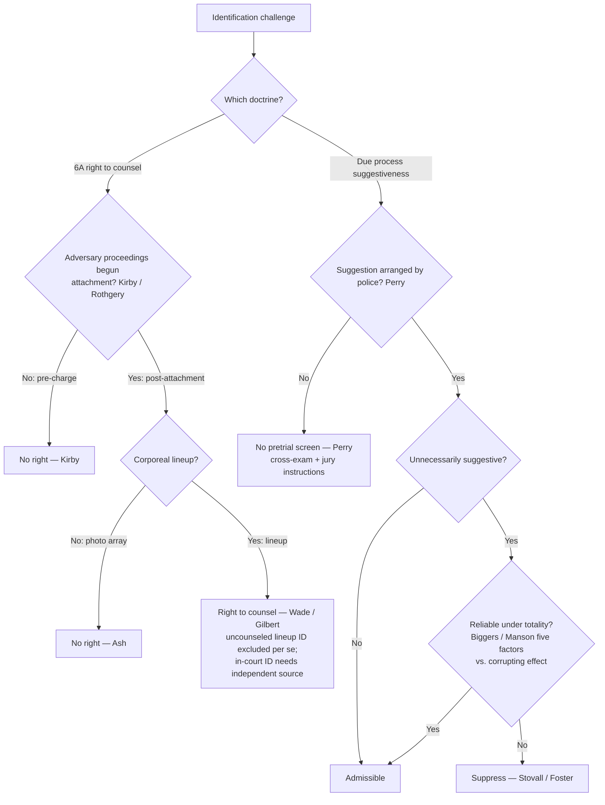

# S9 R1 panel-review — Opus model-diversity lane (prompt pack)

You are the **Claude/Opus** leg of the S9 three-lane adversarial panel (1 Claude + 2 Codex, R1). The two Codex lanes carry the A (support/quote-fidelity) and B (currency/treatment) attack lenses; **you carry model diversity and MUST vote on every paneled assertion across BOTH lenses' concerns.** You are refute-framed: try hard to break each assertion; **default to REFUTED on uncertainty**; never fabricate a cite, quote, or holding; use ONLY the evidence inlined below (no search, no outside knowledge). You are a SIGHTED reviewer — the FULL lake record (judgment fields included) is inlined.

You are a WRITER lane, not an adjudicator: you FIND and VOTE. You do not tally, adjudicate, or close any row — the orchestrator does.

For EACH group below, return one JSON object with the exact `reviewed[]` shape from the output contract (identical framing to the Codex lenses). Emit a finding object ONLY for a real defect (verdict refuted / stands-modified); a group you find wholly clean returns all-`stands` verdicts (the harness records a clean attestation). Concatenate the per-group JSON objects into a top-level `{"packs": [ ... ]}` array, one entry per group, each carrying its `group_id`.


OUTPUT CONTRACT — return ONE JSON object, nothing else:
{
  "lens": "A" | "B",
  "group_id": "<echo the group id>",
  "reviewed": [
    {
      "assertion_id": "<from group_inventory.jsonl>",
      "dimension": "existence|support|quote_fidelity|pincite|treatment|black_letter",
      "verdict": "stands" | "refuted" | "stands-modified",
      "verifiable_from_disclosed": true | false,
      "defect": null,   // null when verdict=="stands"; else an object:
      //  {"problem": "...", "severity": "high|medium|low", "proposed_fix": "...", "evidence_quote": "verbatim from disclosed evidence or null", "needs_cl": true|false, "locator_note": "..."}
      "reasons": ["short evidence-grounded reason", "..."],
      "breaks_true_positives": true | false,
      "residual_risks": ["..."],
      "suggested_tightening": "... or null"
    }
  ],
  "notes": ""
}
Rules: verdict=='stands' <=> defect==null (assertion survives your attack). verdict=='refuted' <=> a real defect (the assertion as framed is wrong). verdict=='stands-modified' <=> survives but needs a stated modification (a minor defect). Review EVERY assertion_id in group_inventory.jsonl exactly once. Output ONLY the JSON object.
---

## GROUP: content/fair-trial-and-reliability-doctrines/Eyewitness Identification.md  (`doctrine`, 14 assertions)

### content_page

```
---
weight: 10
title: "Eyewitness Identification"
aliases:
  - lineup
  - showup
  - show-up
  - photo array
  - Wade hearing
  - suggestive identification
  - "Eyewitness Identification"
  - "9-confessions-interrogation/Eyewitness-Identification"
topic: Eyewitness Identification
type: doctrine
amendment: "U.S. Const. amends. VI & XIV"
jurisdiction: Federal (U.S. Const. amends. VI & XIV); SCOTUS baseline
status: draft
related:
  - "[[Sixth Amendment Right to Counsel]]"
  - "[[Lineups and the Right to Counsel]]"
  - "[[Due-Process Voluntariness of Confessions]]"
  - "[[The Exclusionary Rule]]"
---

# Eyewitness Identification

*Is this identification admissible: was it produced by an unnecessarily suggestive procedure the police arranged, and is it nonetheless reliable?*

> [!rule] Black-letter rule
> Identification admissibility runs through **two independent federal doctrines**, and an identification can pass one and fail the other. **(1) Due process (Fourteenth Amendment):** an identification produced by an **unnecessarily suggestive** procedure the **police arranged** is excluded **only if it is unreliable** under the [[Common Legal Terms#totality-of-the-circumstances|totality of the circumstances]]; suggestiveness alone is not enough. **(2) Sixth Amendment:** a **post-attachment corporeal lineup** is a **critical stage** with a right to counsel, and an uncounseled-lineup identification is excluded [[Common Legal Terms#per-se|per se]]. *[[Manson v. Brathwaite|Manson]]*, 432 U.S. 98, [114](https://www.courtlistener.com/opinion/109693/manson-v-brathwaite/) (1977); *[[Perry v. New Hampshire|Perry]]*, 565 U.S. 228 (2012); *[[United States v. Wade|Wade]]*, 388 U.S. 218, [237](https://www.courtlistener.com/opinion/107486/united-states-v-wade/) (1967).
> ^rule-eyewitness

## The Brief

**Two independent doctrines, sorted by procedure.** The admissibility of an eyewitness identification runs through **two separate federal tracks**, and an identification can pass one and fail the other. Keep them apart: **(1)** a **Due-Process** attack on the *reliability* of a **suggestive** procedure (Fourteenth Amendment), and **(2)** a **Sixth Amendment** right to *counsel* at a **post-attachment corporeal lineup**. The first asks whether the identification is trustworthy enough to reach the jury; the second asks whether the accused was entitled to a lawyer at the confrontation. Neither turns on the other. The counsel branch is developed in full on [[Lineups and the Right to Counsel]]; this page states it and concentrates on the due-process reliability screen.

**(1) Due-process reliability: the suggestiveness/reliability screen (stated up front).** An identification produced by an **unnecessarily suggestive** police procedure is **excluded only if it is unreliable** under the [[Common Legal Terms#totality-of-the-circumstances|totality of the circumstances]]; suggestiveness alone is not enough. The origin is *[[Stovall v. Denno|Stovall v. Denno]]*, 388 U.S. 293 (1967), which recognized that a confrontation "so unnecessarily suggestive and conducive to irreparable mistaken identification" can deny due process, "a recognized ground of attack upon a conviction independent of any right to counsel claim," with the claim depending on "the totality of the circumstances." *[[Stovall v. Denno|Stovall]]*, 388 U.S. at [302](https://www.courtlistener.com/opinion/107488/stovall-v-denno/).

**The five reliability factors.** *[[Neil v. Biggers|Neil v. Biggers]]*, 409 U.S. 188 (1972), made **reliability**, not suggestiveness, the controlling question, "whether under the 'totality of the circumstances' the identification was reliable even though the confrontation procedure was suggestive," and supplied the **five reliability factors**:

1. the **opportunity of the witness to view** the criminal at the time of the crime;
2. the witness's **degree of attention**;
3. the **accuracy of the witness's prior description** of the criminal;
4. the **level of certainty** demonstrated at the confrontation; and
5. the **length of time between the crime and the confrontation**.

*[[Neil v. Biggers|Biggers]]*, 409 U.S. at [199-200](https://www.courtlistener.com/opinion/108639/neil-v-biggers/). *[[Manson v. Brathwaite|Manson v. Brathwaite]]*, 432 U.S. 98 (1977), rejected any **[[Common Legal Terms#per-se|per se]]** exclusion for suggestive procedures and made the point the linchpin: "reliability is the linchpin in determining the admissibility of identification testimony," with the *Biggers* factors weighed against "the corrupting effect of the suggestive identification itself." *[[Manson v. Brathwaite#^pin-114a|Manson]]*, 432 U.S. at [114](https://www.courtlistener.com/opinion/109693/manson-v-brathwaite/#:~:text=the%20opportunity%20of%20the%20witness).

**The threshold that switches the screen on: police arrangement.** *[[Perry v. New Hampshire|Perry v. New Hampshire]]*, 565 U.S. 228 (2012), holds that the Due Process Clause requires a preliminary judicial inquiry into the reliability of an eyewitness identification **only** when the identification was procured under unnecessarily suggestive circumstances **arranged by law enforcement**. Absent improper police arrangement, reliability is tested through vigorous cross-examination, protective rules of evidence, and jury instructions, not through pretrial exclusion. Chance or private suggestiveness (a witness's own spontaneous viewing) triggers no pretrial screen.

**Suppression is the exception.** *[[Foster v. California|Foster v. California]]*, 394 U.S. 440 (1969), is the **rare** case in which a pretrial procedure was suggestive enough to require reversal: a lineup that made the suspect stand out, then a one-on-one showup, then a repeat lineup in which he was the only carryover, so that "in effect, the police repeatedly said to the witness, 'This is the man.'" *[[Foster v. California|Foster]]*, 394 U.S. at [443](https://www.courtlistener.com/opinion/107890/foster-v-california/). For **photographic** procedures the same due-process standard applies: a conviction following a photo identification is set aside "only if the photographic identification procedure was so impermissibly suggestive as to give rise to a very substantial likelihood of irreparable misidentification." *[[Simmons v. United States|Simmons v. United States]]*, 390 U.S. 377, [384](https://www.courtlistener.com/opinion/107636/simmons-v-united-states/) (1968).

**(2) Sixth Amendment counsel at post-attachment lineups (stated up front; detailed on [[Lineups and the Right to Counsel]]).** A **post-attachment corporeal lineup** is a **critical stage** at which the accused has a Sixth Amendment right to counsel. *[[United States v. Wade|United States v. Wade]]*, 388 U.S. at [237](https://www.courtlistener.com/opinion/107486/united-states-v-wade/). Its companion, *[[Gilbert v. California|Gilbert v. California]]*, attaches a **[[Common Legal Terms#per-se|per se]]** exclusionary rule to testimony that the witness identified the accused **at** an uncounseled lineup, with an **in-court** identification surviving only on a proven **[[Inevitable Discovery and Independent Source|independent source]]**. *[[Gilbert v. California|Gilbert]]*, 388 U.S. at [273](https://www.courtlistener.com/opinion/107487/gilbert-v-california/); *[[United States v. Wade|Wade]]*, 388 U.S. at [242](https://www.courtlistener.com/opinion/107486/united-states-v-wade/). Two limits define the reach. First, the right does **not** attach **pre-charge**: *[[Kirby v. Illinois|Kirby v. Illinois]]*, 406 U.S. at [689](https://www.courtlistener.com/opinion/108554/kirby-v-illinois/) (plurality). Second, there is **no** counsel right at a **photographic array**, because it is not a trial-like confrontation of the accused. *[[United States v. Ash|United States v. Ash]]*, 413 U.S. at [321](https://www.courtlistener.com/opinion/108846/united-states-v-ash/).

**Map the procedure first, because the doctrines sort by procedure.** A **corporeal lineup** conducted **after attachment** is the one procedure that triggers the *Wade/Gilbert* counsel right; a **photo array** never does (*[[United States v. Ash|Ash]]*); and a **showup** (a one-on-one confrontation) is **not categorically** a Sixth Amendment critical stage. The canonical showup, *[[Stovall v. Denno|Stovall]]*, was analyzed under **due process**, so classify showups on the suggestiveness/reliability branch. Every procedure (lineup, showup, or photo array) is separately subject to the due-process screen when police arranged the suggestion (*[[Perry v. New Hampshire|Perry]]*).

**Attachment is not the same as the "critical stage" question.** The Sixth Amendment **attaches** at the initial appearance or arraignment (*[[Rothgery v. Gillespie County|Rothgery]]*, 554 U.S. 191 (2008)), but *[[Rothgery v. Gillespie County|Rothgery]]* expressly did **not** decide which post-attachment events are critical stages requiring counsel. It is *Wade/Gilbert* that supplies the holding that a **post-charge corporeal lineup** *is* a critical stage; events before attachment are not (*[[Kirby v. Illinois|Kirby]]*). The right is also **offense-specific**: counsel is required only for a lineup concerning the **charged** offense (*[[Texas v. Cobb|Cobb]]*, 532 U.S. 162 (2001)).

**Burden · standard of review · remedy.** On the **Sixth Amendment** (*Wade/Gilbert*) branch: once the defendant shows a lineup conducted without counsel after attachment, the **prosecution** must establish by **[[Common Legal Terms#clear-and-convincing-evidence|clear and convincing evidence]]** that any in-court identification rests on an **[[Inevitable Discovery and Independent Source|independent source]]** (*[[United States v. Wade|Wade]]*, 388 U.S. at [240](https://www.courtlistener.com/opinion/107486/united-states-v-wade/)). The **remedy** is [[Common Legal Terms#per-se|per se]] exclusion of the uncounseled-lineup testimony (*[[Gilbert v. California|Gilbert]]*), with the in-court identification admitted only on a proven [[Inevitable Discovery and Independent Source|independent source]] (*[[United States v. Wade|Wade]]*). On the **due-process** branch: the **defendant** bears the initial burden of showing the procedure was **unnecessarily suggestive** and, after *[[Perry v. New Hampshire|Perry]]*, **arranged by police**; if met, reliability is assessed under the *[[Neil v. Biggers|Biggers]]* totality against the corrupting effect of the suggestion (*[[Manson v. Brathwaite|Manson]]*), and only an **unreliable** identification is suppressed. Appellate review treats subsidiary historical facts for [[Common Legal Terms#clear-error|clear error]] and the ultimate questions (unnecessary suggestiveness and reliability) as mixed questions reviewed **[[Common Legal Terms#de-novo|de novo]]**.

**Common pitfalls.**
- **Assuming counsel attaches at every identification.** The *Wade/Gilbert* right reaches only **post-charge corporeal** confrontations. It does **not** reach pre-charge showups (*[[Kirby v. Illinois|Kirby]]*) or photo arrays (*[[United States v. Ash|Ash]]*). A pre-charge field showup needs no defense counsel.
- **Treating any suggestive procedure as automatically fatal.** Under *[[Neil v. Biggers|Biggers]]* and *[[Manson v. Brathwaite|Manson]]*, a suggestive identification is still admissible if **reliable** under the five-factor totality; suppression is the exception.
- **Applying the due-process screen to suggestion the police did not arrange.** Per *[[Perry v. New Hampshire|Perry]]*, chance or private suggestiveness triggers **no** pretrial screen; the safeguard is cross-examination and jury instruction, not a suppression remedy through [[The Exclusionary Rule|the exclusionary rule]].
- **Confusing *[[Gilbert v. California|Gilbert]]*'s [[Common Legal Terms#per-se|per se]] rule with the due-process branch.** A *[[Gilbert v. California|Gilbert]]* violation excludes the lineup-identification testimony outright, with no reliability cure; on the due-process branch reliability *rescues*.
- **Forgetting the [[Inevitable Discovery and Independent Source|independent source]].** Even after a tainted lineup, an in-court identification comes in if the prosecution proves the witness's identification has a source independent of the illegal procedure (*[[United States v. Wade|Wade]]*; and see the fruit-of-the-poisonous-tree analog in *[[United States v. Crews|Crews]]*).

## Lower-court developments

Circuit and state developments only; no SCOTUS. The controlling Supreme Court authorities (*[[United States v. Wade|Wade]]*, *[[Gilbert v. California|Gilbert]]*, *[[Stovall v. Denno|Stovall]]*, *[[Neil v. Biggers|Biggers]]*, *[[Manson v. Brathwaite|Manson]]*, *[[Kirby v. Illinois|Kirby]]*, *[[United States v. Ash|Ash]]*, and *[[Perry v. New Hampshire|Perry]]*) home to **Key cases** regardless of date, per the no-SCOTUS-in-recent-developments rule; *[[Perry v. New Hampshire|Perry]]* (2012) is the most recent SCOTUS word and belongs in Key, not here. The federal two-track framework is stable, and the live line-drawing tracks a few recurring frontiers: (a) **state high courts** that have supplemented or replaced the *[[Manson v. Brathwaite|Manson]]* reliability test with a scientifically-informed, expert-guided framework as a matter of **state** constitutional or evidence law, departing upward from the federal floor; (b) lower-court application of *[[Perry v. New Hampshire|Perry]]*'s **police-arrangement threshold** to private or accidental suggestiveness; and (c) treatment of **modern procedures**, including double-blind and sequential lineups and body-camera field showups. *Specific circuit and state authority developing these frontiers is a live-verify addition (serial CL, L2/L4) deferred to the standing find, adjudicate, and fix gate (R13) and S9; no new case holding is asserted here.*

## Key cases

| Case | Holding | Opinion |
|---|---|---|
| *[[United States v. Wade]]*, 388 U.S. 218 (1967) | **Anchor (6A).** A **post-indictment lineup** is a **critical stage** with a right to counsel; an uncounseled lineup may taint a later in-court identification absent an **[[Inevitable Discovery and Independent Source\|independent source]]**. | [opinion](https://www.courtlistener.com/opinion/107486/united-states-v-wade/) |
| *[[Gilbert v. California]]*, 388 U.S. 263 (1967) | **Anchor (6A).** Testimony that the witness identified the accused at an **uncounseled post-charge lineup** is excluded **[[Common Legal Terms#per-se\|per se]]**, with no harmless-error or reliability cure. | [opinion](https://www.courtlistener.com/opinion/107487/gilbert-v-california/) |
| *[[Stovall v. Denno]]*, 388 U.S. 293 (1967) | **Anchor (DP).** An **unnecessarily suggestive** confrontation conducive to irreparable misidentification can violate **due process**; admissibility turns on the **[[Common Legal Terms#totality-of-the-circumstances\|totality of the circumstances]]**. | [opinion](https://www.courtlistener.com/opinion/107488/stovall-v-denno/) |
| *[[Neil v. Biggers]]*, 409 U.S. 188 (1972) | **Refinement (DP).** Even an unnecessarily suggestive identification is admissible if **reliable** under the totality; reliability judged by the **five factors**. | [opinion](https://www.courtlistener.com/opinion/108639/neil-v-biggers/) |
| *[[Manson v. Brathwaite]]*, 432 U.S. 98 (1977) | **Anchor (DP).** **No [[Common Legal Terms#per-se\|per se]]** exclusion for suggestive procedures; **reliability is the linchpin** under the *Biggers* factors, weighed against the corrupting effect of the suggestion. | [opinion](https://www.courtlistener.com/opinion/109693/manson-v-brathwaite/) |
| *[[Perry v. New Hampshire]]*, 565 U.S. 228 (2012) | **Refinement (DP).** Due-process reliability screening applies **only** when police **arranged** the suggestive circumstances; otherwise the jury and cross-examination are the safeguards. | [opinion](https://www.courtlistener.com/opinion/620671/perry-v-new-hampshire/) |
| *[[Foster v. California]]*, 394 U.S. 440 (1969) | **Progeny (DP).** The **rare** reversal: cumulative suggestiveness (standout lineup, then showup, then repeat lineup) made identification all but inevitable and denied due process. | [opinion](https://www.courtlistener.com/opinion/107890/foster-v-california/) |
| *[[Simmons v. United States]]*, 390 U.S. 377 (1968) | **Progeny (DP, photo array).** A **photographic** identification denies due process only if so impermissibly suggestive as to give rise to a very substantial likelihood of irreparable misidentification. | [opinion](https://www.courtlistener.com/opinion/107636/simmons-v-united-states/) |
| *[[Kirby v. Illinois]]*, 406 U.S. 682 (1972) (plurality) | **Refinement (6A).** The counsel right attaches only **at or after** the initiation of adversary judicial proceedings; a **pre-charge** identification is not a critical stage. | [opinion](https://www.courtlistener.com/opinion/108554/kirby-v-illinois/) |
| *[[United States v. Ash]]*, 413 U.S. 300 (1973) | **Refinement (6A).** **No** right to counsel at a **post-indictment photographic display**; no trial-like confrontation because the accused is not present. | [opinion](https://www.courtlistener.com/opinion/108846/united-states-v-ash/) |

## Related cases across doctrines

These cases are treated in full elsewhere but bear on this doctrine; each holding is framed below for the eyewitness-identification context.

| Case | Relevance here | Primary home | Opinion |
|---|---|---|---|
| *[[Rothgery v. Gillespie County]]*, 554 U.S. 191 (2008) | Fixes **when** the *Wade/Kirby* counsel right can attach: the 6A **attaches** at the initial appearance or arraignment. But **attachment is distinct from the critical-stage question**; *[[Rothgery v. Gillespie County\|Rothgery]]* did not decide which post-attachment events require counsel, and it is *Wade/Gilbert* that makes a post-charge corporeal lineup a critical stage. | [[Sixth Amendment Right to Counsel]] | [opinion](https://www.courtlistener.com/opinion/145785/rothgery-v-gillespie-county/) |
| *[[Texas v. Cobb]]*, 532 U.S. 162 (2001) | The *[[United States v. Wade\|Wade]]* counsel-at-lineup right is **offense-specific**: counsel is required only for a lineup concerning the **charged** offense; a post-charge lineup on a different, uncharged offense triggers no *Wade/Gilbert* right. | [[Sixth Amendment Right to Counsel]] | [opinion](https://www.courtlistener.com/opinion/118417/texas-v-cobb/) |
| *[[United States v. Crews]]*, 445 U.S. 463 (1980) | The **independent-source** principle applied to identifications: a victim's **in-court** identification is **not** a suppressible fruit of an illegal arrest where her presence and ability to identify have a source **predating** the misconduct, the fruit-of-the-poisonous-tree analog to the *Wade/Gilbert* independent-source test. | [[The Exclusionary Rule]] | [opinion](https://www.courtlistener.com/opinion/110230/united-states-v-crews/) |

## Visual



## Sources

- [United States v. Wade, 388 U.S. 218 (1967)](https://www.courtlistener.com/opinion/107486/united-states-v-wade/) — pinpoints 237, 240, 242
- [Gilbert v. California, 388 U.S. 263 (1967)](https://www.courtlistener.com/opinion/107487/gilbert-v-california/) — pinpoint 273
- [Stovall v. Denno, 388 U.S. 293 (1967)](https://www.courtlistener.com/opinion/107488/stovall-v-denno/) — pinpoint 302
- [Neil v. Biggers, 409 U.S. 188 (1972)](https://www.courtlistener.com/opinion/108639/neil-v-biggers/) — pinpoints 199, 199-200
- [Manson v. Brathwaite, 432 U.S. 98 (1977)](https://www.courtlistener.com/opinion/109693/manson-v-brathwaite/) — pinpoint 114
- [Perry v. New Hampshire, 565 U.S. 228 (2012)](https://www.courtlistener.com/opinion/620671/perry-v-new-hampshire/) (police-arrangement trigger)
- [Foster v. California, 394 U.S. 440 (1969)](https://www.courtlistener.com/opinion/107890/foster-v-california/) — pinpoints 442, 443
- [Simmons v. United States, 390 U.S. 377 (1968)](https://www.courtlistener.com/opinion/107636/simmons-v-united-states/) — pinpoint 384
- [Kirby v. Illinois, 406 U.S. 682 (1972)](https://www.courtlistener.com/opinion/108554/kirby-v-illinois/) — pinpoint 689 (plurality)
- [United States v. Ash, 413 U.S. 300 (1973)](https://www.courtlistener.com/opinion/108846/united-states-v-ash/) — pinpoint 321
- [Rothgery v. Gillespie County, 554 U.S. 191 (2008)](https://www.courtlistener.com/opinion/145785/rothgery-v-gillespie-county/) (cross-doctrine)
- [Texas v. Cobb, 532 U.S. 162 (2001)](https://www.courtlistener.com/opinion/118417/texas-v-cobb/) (cross-doctrine)
- [United States v. Crews, 445 U.S. 463 (1980)](https://www.courtlistener.com/opinion/110230/united-states-v-crews/) (cross-doctrine)

```

### group_inventory (assertions under review)

```jsonl
{"assertion_id": "1676802019a7fd83", "dimension": "existence", "kind": "case_cite", "locator": {"case": "Texas v. Cobb", "table_line": 71}, "payload": {"case": "Texas v. Cobb", "cells": ["*[[Texas v. Cobb]]*, 532 U.S. 162 (2001)", "The *[[United States v. Wade\\|Wade]]* counsel-at-lineup right is **offense-specific**: counsel is required only for a lineup concerning the **charged** offense; a post-charge lineup on a different, uncharged offense triggers no *Wade/Gilbert* right.", "[[Sixth Amendment Right to Counsel]]", "[opinion](https://www.courtlistener.com/opinion/118417/texas-v-cobb/)"], "header": ["Case", "Relevance here", "Primary home", "Opinion"]}}
{"assertion_id": "37041c699a5f660f", "dimension": "existence", "kind": "case_cite", "locator": {"case": "Rothgery v. Gillespie County", "table_line": 70}, "payload": {"case": "Rothgery v. Gillespie County", "cells": ["*[[Rothgery v. Gillespie County]]*, 554 U.S. 191 (2008)", "Fixes **when** the *Wade/Kirby* counsel right can attach: the 6A **attaches** at the initial appearance or arraignment. But **attachment is distinct from the critical-stage question**; *[[Rothgery v. Gillespie County\\|Rothgery]]* did not decide which post-attachment events require counsel, and it is *Wade/Gilbert* that makes a post-charge corporeal lineup a critical stage.", "[[Sixth Amendment Right to Counsel]]", "[opinion](https://www.courtlistener.com/opinion/145785/rothgery-v-gillespie-county/)"], "header": ["Case", "Relevance here", "Primary home", "Opinion"]}}
{"assertion_id": "4090c5d5d0eae0cb", "dimension": "existence", "kind": "case_cite", "locator": {"case": "United States v. Ash", "table_line": 62}, "payload": {"case": "United States v. Ash", "cells": ["*[[United States v. Ash]]*, 413 U.S. 300 (1973)", "**Refinement (6A).** **No** right to counsel at a **post-indictment photographic display**; no trial-like confrontation because the accused is not present.", "[opinion](https://www.courtlistener.com/opinion/108846/united-states-v-ash/)"], "header": ["Case", "Holding", "Opinion"]}}
{"assertion_id": "4583c8571277f73d", "dimension": "existence", "kind": "case_cite", "locator": {"case": "Simmons v. United States", "table_line": 60}, "payload": {"case": "Simmons v. United States", "cells": ["*[[Simmons v. United States]]*, 390 U.S. 377 (1968)", "**Progeny (DP, photo array).** A **photographic** identification denies due process only if so impermissibly suggestive as to give rise to a very substantial likelihood of irreparable misidentification.", "[opinion](https://www.courtlistener.com/opinion/107636/simmons-v-united-states/)"], "header": ["Case", "Holding", "Opinion"]}}
{"assertion_id": "55b601bebbe7fc1c", "dimension": "existence", "kind": "case_cite", "locator": {"case": "United States v. Wade", "table_line": 53}, "payload": {"case": "United States v. Wade", "cells": ["*[[United States v. Wade]]*, 388 U.S. 218 (1967)", "**Anchor (6A).** A **post-indictment lineup** is a **critical stage** with a right to counsel; an uncounseled lineup may taint a later in-court identification absent an **[[Inevitable Discovery and Independent Source\\|independent source]]**.", "[opinion](https://www.courtlistener.com/opinion/107486/united-states-v-wade/)"], "header": ["Case", "Holding", "Opinion"]}}
{"assertion_id": "6201a202e4129a3f", "dimension": "existence", "kind": "case_cite", "locator": {"case": "United States v. Crews", "table_line": 72}, "payload": {"case": "United States v. Crews", "cells": ["*[[United States v. Crews]]*, 445 U.S. 463 (1980)", "The **independent-source** principle applied to identifications: a victim's **in-court** identification is **not** a suppressible fruit of an illegal arrest where her presence and ability to identify have a source **predating** the misconduct, the fruit-of-the-poisonous-tree analog to the *Wade/Gilbert* independent-source test.", "[[The Exclusionary Rule]]", "[opinion](https://www.courtlistener.com/opinion/110230/united-states-v-crews/)"], "header": ["Case", "Relevance here", "Primary home", "Opinion"]}}
{"assertion_id": "8d11626488e0c3eb", "dimension": "existence", "kind": "case_cite", "locator": {"case": "Kirby v. Illinois", "table_line": 61}, "payload": {"case": "Kirby v. Illinois", "cells": ["*[[Kirby v. Illinois]]*, 406 U.S. 682 (1972) (plurality)", "**Refinement (6A).** The counsel right attaches only **at or after** the initiation of adversary judicial proceedings; a **pre-charge** identification is not a critical stage.", "[opinion](https://www.courtlistener.com/opinion/108554/kirby-v-illinois/)"], "header": ["Case", "Holding", "Opinion"]}}
{"assertion_id": "b49d65af42b596b2", "dimension": "existence", "kind": "case_cite", "locator": {"case": "Gilbert v. California", "table_line": 54}, "payload": {"case": "Gilbert v. California", "cells": ["*[[Gilbert v. California]]*, 388 U.S. 263 (1967)", "**Anchor (6A).** Testimony that the witness identified the accused at an **uncounseled post-charge lineup** is excluded **[[Common Legal Terms#per-se\\|per se]]**, with no harmless-error or reliability cure.", "[opinion](https://www.courtlistener.com/opinion/107487/gilbert-v-california/)"], "header": ["Case", "Holding", "Opinion"]}}
{"assertion_id": "b715e78048d5f884", "dimension": "existence", "kind": "case_cite", "locator": {"case": "Neil v. Biggers", "table_line": 56}, "payload": {"case": "Neil v. Biggers", "cells": ["*[[Neil v. Biggers]]*, 409 U.S. 188 (1972)", "**Refinement (DP).** Even an unnecessarily suggestive identification is admissible if **reliable** under the totality; reliability judged by the **five factors**.", "[opinion](https://www.courtlistener.com/opinion/108639/neil-v-biggers/)"], "header": ["Case", "Holding", "Opinion"]}}
{"assertion_id": "cb35b86d1e6bc6d1", "dimension": "existence", "kind": "case_cite", "locator": {"case": "Perry v. New Hampshire", "table_line": 58}, "payload": {"case": "Perry v. New Hampshire", "cells": ["*[[Perry v. New Hampshire]]*, 565 U.S. 228 (2012)", "**Refinement (DP).** Due-process reliability screening applies **only** when police **arranged** the suggestive circumstances; otherwise the jury and cross-examination are the safeguards.", "[opinion](https://www.courtlistener.com/opinion/620671/perry-v-new-hampshire/)"], "header": ["Case", "Holding", "Opinion"]}}
{"assertion_id": "e3dbaea3a4e44572", "dimension": "existence", "kind": "case_cite", "locator": {"case": "Stovall v. Denno", "table_line": 55}, "payload": {"case": "Stovall v. Denno", "cells": ["*[[Stovall v. Denno]]*, 388 U.S. 293 (1967)", "**Anchor (DP).** An **unnecessarily suggestive** confrontation conducive to irreparable misidentification can violate **due process**; admissibility turns on the **[[Common Legal Terms#totality-of-the-circumstances\\|totality of the circumstances]]**.", "[opinion](https://www.courtlistener.com/opinion/107488/stovall-v-denno/)"], "header": ["Case", "Holding", "Opinion"]}}
{"assertion_id": "efb0aec2c0d45207", "dimension": "existence", "kind": "case_cite", "locator": {"case": "Manson v. Brathwaite", "table_line": 57}, "payload": {"case": "Manson v. Brathwaite", "cells": ["*[[Manson v. Brathwaite]]*, 432 U.S. 98 (1977)", "**Anchor (DP).** **No [[Common Legal Terms#per-se\\|per se]]** exclusion for suggestive procedures; **reliability is the linchpin** under the *Biggers* factors, weighed against the corrupting effect of the suggestion.", "[opinion](https://www.courtlistener.com/opinion/109693/manson-v-brathwaite/)"], "header": ["Case", "Holding", "Opinion"]}}
{"assertion_id": "ffd206d5efaf0d72", "dimension": "existence", "kind": "case_cite", "locator": {"case": "Foster v. California", "table_line": 59}, "payload": {"case": "Foster v. California", "cells": ["*[[Foster v. California]]*, 394 U.S. 440 (1969)", "**Progeny (DP).** The **rare** reversal: cumulative suggestiveness (standout lineup, then showup, then repeat lineup) made identification all but inevitable and denied due process.", "[opinion](https://www.courtlistener.com/opinion/107890/foster-v-california/)"], "header": ["Case", "Holding", "Opinion"]}}
{"assertion_id": "aa27cc5aa25db8e8", "dimension": "support", "kind": "proposition", "locator": {"callout": "^rule-eyewitness"}, "payload": {"anchor": "^rule-eyewitness", "statement": "[!rule] Black-letter rule\nIdentification admissibility runs through **two independent federal doctrines**, and an identification can pass one and fail the other. **(1) Due process (Fourteenth Amendment):** an identification produced by an **unnecessarily suggestive** procedure the **police arranged** is excluded **only if it is unreliable** under the [[Common Legal Terms#totality-of-the-circumstances|totality of the circumstances]]; suggestiveness alone is not enough. **(2) Sixth Amendment:** a **post-attachment corporeal lineup** is a **critical stage** with a right to counsel, and an uncounseled-lineup identification is excluded [[Common Legal Terms#per-se|per se]]. *[[Manson v. Brathwaite|Manson]]*, 432 U.S. 98, [114](https://www.courtlistener.com/opinion/109693/manson-v-brathwaite/) (1977); *[[Perry v. New Hampshire|Perry]]*, 565 U.S. 228 (2012); *[[United States v. Wade|Wade]]*, 388 U.S. 218, [237](https://www.courtlistener.com/opinion/107486/united-states-v-wade/) (1967)."}}
```

### lake record — Foster v. California

```json
{
  "schema_version": "s2.v1",
  "record_id": "Foster v. California",
  "stub": false,
  "status": "verified",
  "identity": {
    "case_name": "Foster v. California",
    "case_name_short": "Foster",
    "case_name_full": "Foster v. California",
    "input_case_name": "Foster v. California",
    "court": "U.S. Supreme Court",
    "court_id": "scotus",
    "court_level": "scotus",
    "circuit": null,
    "state": null,
    "date_decided": "1969-04-01",
    "year": 1969,
    "docket": "47",
    "cluster_id": 107890,
    "lead_opinion_id": 107890,
    "sibling_ids": [
      107890,
      9423977,
      9423978
    ],
    "absolute_url": "/opinion/107890/foster-v-california/",
    "identity_method": "citation+party-text",
    "expected_citation_found": true,
    "party_name_in_text": true,
    "canonical_name_match": true,
    "alternates": [],
    "reason_code": null
  },
  "citations": {
    "official": {
      "cite": "394 U.S. 440",
      "volume": "394",
      "reporter": "U.S.",
      "page": "440",
      "type": 1,
      "selected_official": true,
      "source": "cluster.citations[]"
    },
    "parallel": [
      {
        "cite": "89 S. Ct. 1127",
        "volume": "89",
        "reporter": "S. Ct.",
        "page": "1127",
        "type": 1,
        "selected_official": false,
        "source": "cluster.citations[]"
      },
      {
        "cite": "22 L. Ed. 2d 402",
        "volume": "22",
        "reporter": "L. Ed. 2d",
        "page": "402",
        "type": 1,
        "selected_official": false,
        "source": "cluster.citations[]"
      }
    ],
    "vendor_neutral": [
      {
        "cite": "1969 U.S. LEXIS 2050",
        "volume": "1969",
        "reporter": "U.S. LEXIS",
        "page": "2050",
        "type": 6,
        "selected_official": false,
        "source": "cluster.citations[]"
      }
    ],
    "all": [
      {
        "cite": "394 U.S. 440",
        "volume": "394",
        "reporter": "U.S.",
        "page": "440",
        "type": 1,
        "selected_official": false,
        "source": "cluster.citations[]"
      },
      {
        "cite": "89 S. Ct. 1127",
        "volume": "89",
        "reporter": "S. Ct.",
        "page": "1127",
        "type": 1,
        "selected_official": false,
        "source": "cluster.citations[]"
      },
      {
        "cite": "22 L. Ed. 2d 402",
        "volume": "22",
        "reporter": "L. Ed. 2d",
        "page": "402",
        "type": 1,
        "selected_official": false,
        "source": "cluster.citations[]"
      },
      {
        "cite": "1969 U.S. LEXIS 2050",
        "volume": "1969",
        "reporter": "U.S. LEXIS",
        "page": "2050",
        "type": 6,
        "selected_official": false,
        "source": "cluster.citations[]"
      }
    ],
    "display": "394 U.S. 440",
    "official_selection": {
      "court_class": "scotus",
      "selected": "394 U.S. 440",
      "reason": "selected_rank_1"
    }
  },
  "pinpoints": [
    {
      "id": "pin-442",
      "page": null,
      "quote": "## Issue Whether a pretrial identification procedure can be so unnecessarily suggestive and conducive to mistaken identification that admitting the resulting identification denies the defendant due process of law. ## Rule Yes. Even apart from the right-to-counsel rule of *Wade*/*Gilbert* (inapplicable to pre-1967 lineups),",
      "star_marker": null,
      "quote_fidelity": "mismatch",
      "pinpoint_status": "slip-only",
      "position": null
    },
    {
      "id": "pin-443",
      "page": null,
      "quote": "The suggestive elements in this identification procedure made it all but inevitable that David would identify petitioner whether or not he was in fact 'the man.' In effect, the police repeatedly said to the witness, 'This is the man.' ... This procedure so undermined the reliability of the eyewitness identification as to violate due process.",
      "star_marker": null,
      "quote_fidelity": "mismatch",
      "pinpoint_status": "slip-only",
      "position": null
    }
  ],
  "treatment": {
    "field_i_validity": "good_law",
    "as_of_content": "1969-04-01",
    "as_of_treatment": "2026-06-30",
    "composite_basis": "migration-seed",
    "composite_basis_ref": "Foster v. California",
    "varies_by_point": false,
    "scope_note": "Good law; the rare case in which the Court found a pretrial identification so suggestive as to violate due process (noted as such in Perry v. New Hampshire).",
    "point_overrides": [],
    "edges": [
      {
        "citing_case": {
          "name": "State v. Dickson",
          "cluster_id": 4244499,
          "cite": [
            "141 A.3d 810",
            "322 Conn. 410",
            "2016 Conn. LEXIS 236"
          ],
          "field_ii": "overruled"
        },
        "field_ii": "overruled",
        "field_iii": "mentioned",
        "point": null,
        "proposed": true,
        "journal_ref": "Foster v. California:lane1_negative"
      },
      {
        "citing_case": {
          "name": "State v. Newman",
          "cluster_id": 2791286,
          "cite": null,
          "field_ii": "overruled"
        },
        "field_ii": "overruled",
        "field_iii": "mentioned",
        "point": null,
        "proposed": true,
        "journal_ref": "Foster v. California:lane1_negative"
      },
      {
        "citing_case": {
          "name": "Carl Leonard Lively v. State",
          "cluster_id": 3100720,
          "cite": null,
          "field_ii": "overruled"
        },
        "field_ii": "overruled",
        "field_iii": "mentioned",
        "point": null,
        "proposed": true,
        "journal_ref": "Foster v. California:lane1_negative"
      },
      {
        "citing_case": {
          "name": "United States v. Guidry",
          "cluster_id": 37891,
          "cite": [
            "406 F.3d 314",
            "2005 U.S. App. LEXIS 5607",
            "2005 WL 768764"
          ],
          "field_ii": "questioned"
        },
        "field_ii": "questioned",
        "field_iii": "mentioned",
        "point": null,
        "proposed": true,
        "journal_ref": "Foster v. California:lane1_negative"
      },
      {
        "citing_case": {
          "name": "James David Carter v. Ricky Bell, Warden Paul Summers, Attorney General",
          "cluster_id": 769405,
          "cite": [
            "218 F.3d 581",
            "2000 U.S. App. LEXIS 15651",
            "2000 F. App'x 0221P"
          ],
          "field_ii": "questioned"
        },
        "field_ii": "questioned",
        "field_iii": "mentioned",
        "point": null,
        "proposed": true,
        "journal_ref": "Foster v. California:lane1_negative"
      },
      {
        "citing_case": {
          "name": "Hull v. State",
          "cluster_id": 1142679,
          "cite": [
            "607 So. 2d 369",
            "1992 WL 201066"
          ],
          "field_ii": "overruled"
        },
        "field_ii": "overruled",
        "field_iii": "mentioned",
        "point": null,
        "proposed": true,
        "journal_ref": "Foster v. California:lane1_negative"
      },
      {
        "citing_case": {
          "name": "Glover v. State",
          "cluster_id": 1639517,
          "cite": [
            "787 S.W.2d 544",
            "1990 Tex. App. LEXIS 1050",
            "1990 WL 59411"
          ],
          "field_ii": "overruled"
        },
        "field_ii": "overruled",
        "field_iii": "mentioned",
        "point": null,
        "proposed": true,
        "journal_ref": "Foster v. California:lane1_negative"
      },
      {
        "citing_case": {
          "name": "Neil v. Biggers",
          "cluster_id": 108639,
          "cite": [
            "34 L. Ed. 2d 401",
            "93 S. Ct. 375",
            "409 U.S. 188",
            "1972 U.S. LEXIS 6"
          ],
          "field_ii": "questioned"
        },
        "field_ii": "questioned",
        "field_iii": "mentioned",
        "point": null,
        "proposed": true,
        "journal_ref": "Foster v. California:lane2_top_cited"
      },
      {
        "citing_case": {
          "name": "Baker v. McCollan",
          "cluster_id": 110132,
          "cite": [
            "61 L. Ed. 2d 433",
            "99 S. Ct. 2689",
            "443 U.S. 137",
            "1979 U.S. LEXIS 141"
          ],
          "field_ii": "questioned"
        },
        "field_ii": "questioned",
        "field_iii": "mentioned",
        "point": null,
        "proposed": true,
        "journal_ref": "Foster v. California:lane2_top_cited"
      },
      {
        "citing_case": {
          "name": "Manson v. Brathwaite",
          "cluster_id": 109693,
          "cite": [
            "53 L. Ed. 2d 140",
            "97 S. Ct. 2243",
            "432 U.S. 98",
            "1977 U.S. LEXIS 116"
          ],
          "field_ii": "criticized"
        },
        "field_ii": "criticized",
        "field_iii": "mentioned",
        "point": null,
        "proposed": true,
        "journal_ref": "Foster v. California:lane2_top_cited"
      },
      {
        "citing_case": {
          "name": "United States v. Young",
          "cluster_id": 111353,
          "cite": [
            "84 L. Ed. 2d 1",
            "105 S. Ct. 1038",
            "470 U.S. 1",
            "1985 U.S. LEXIS 49",
            "53 U.S.L.W. 4159"
          ],
          "field_ii": "criticized"
        },
        "field_ii": "criticized",
        "field_iii": "mentioned",
        "point": null,
        "proposed": true,
        "journal_ref": "Foster v. California:lane2_top_cited"
      },
      {
        "citing_case": {
          "name": "Barefoot v. Estelle",
          "cluster_id": 111017,
          "cite": [
            "77 L. Ed. 2d 1090",
            "103 S. Ct. 3383",
            "463 U.S. 880",
            "1983 U.S. LEXIS 110",
            "51 U.S.L.W. 5189",
            "13 Fed. R. Serv. 449"
          ],
          "field_ii": "overruled"
        },
        "field_ii": "overruled",
        "field_iii": "mentioned",
        "point": null,
        "proposed": true,
        "journal_ref": "Foster v. California:lane2_top_cited"
      },
      {
        "citing_case": {
          "name": "Colorado v. Connelly",
          "cluster_id": 111779,
          "cite": [
            "93 L. Ed. 2d 473",
            "107 S. Ct. 515",
            "479 U.S. 157",
            "1986 U.S. LEXIS 23",
            "55 U.S.L.W. 4043"
          ],
          "field_ii": "criticized"
        },
        "field_ii": "criticized",
        "field_iii": "mentioned",
        "point": null,
        "proposed": true,
        "journal_ref": "Foster v. California:lane2_top_cited"
      },
      {
        "citing_case": {
          "name": "Kirby v. Illinois",
          "cluster_id": 108554,
          "cite": [
            "32 L. Ed. 2d 411",
            "92 S. Ct. 1877",
            "406 U.S. 682",
            "1972 U.S. LEXIS 49"
          ],
          "field_ii": "questioned"
        },
        "field_ii": "questioned",
        "field_iii": "mentioned",
        "point": null,
        "proposed": true,
        "journal_ref": "Foster v. California:lane2_top_cited"
      },
      {
        "citing_case": {
          "name": "United States v. Hasting",
          "cluster_id": 110933,
          "cite": [
            "76 L. Ed. 2d 96",
            "103 S. Ct. 1974",
            "461 U.S. 499",
            "1983 U.S. LEXIS 31",
            "51 U.S.L.W. 4572"
          ],
          "field_ii": "questioned"
        },
        "field_ii": "questioned",
        "field_iii": "mentioned",
        "point": null,
        "proposed": true,
        "journal_ref": "Foster v. California:lane2_top_cited"
      },
      {
        "citing_case": {
          "name": "Coleman v. Alabama",
          "cluster_id": 108182,
          "cite": [
            "26 L. Ed. 2d 387",
            "90 S. Ct. 1999",
            "399 U.S. 1",
            "1970 U.S. LEXIS 17"
          ],
          "field_ii": "questioned"
        },
        "field_ii": "questioned",
        "field_iii": "mentioned",
        "point": null,
        "proposed": true,
        "journal_ref": "Foster v. California:lane2_top_cited"
      },
      {
        "citing_case": {
          "name": "Gimmy v. People",
          "cluster_id": 1231296,
          "cite": [
            "645 P.2d 262",
            "1982 Colo. LEXIS 568"
          ],
          "field_ii": "questioned"
        },
        "field_ii": "questioned",
        "field_iii": "mentioned",
        "point": null,
        "proposed": true,
        "journal_ref": "Foster v. California:lane2_top_cited"
      },
      {
        "citing_case": {
          "name": "Gregory v. City of Louisville",
          "cluster_id": 2973641,
          "cite": [
            "444 F.3d 725",
            "2006 WL 909935"
          ],
          "field_ii": "overruled"
        },
        "field_ii": "overruled",
        "field_iii": "mentioned",
        "point": null,
        "proposed": true,
        "journal_ref": "Foster v. California:lane2_top_cited"
      },
      {
        "citing_case": {
          "name": "United States v. Manuel Concepcion, Roberto Aponte, and Nelson Frias",
          "cluster_id": 597808,
          "cite": [
            "983 F.2d 369"
          ],
          "field_ii": "criticized"
        },
        "field_ii": "criticized",
        "field_iii": "mentioned",
        "point": null,
        "proposed": true,
        "journal_ref": "Foster v. California:lane2_top_cited"
      },
      {
        "citing_case": {
          "name": "Watkins v. Sowders",
          "cluster_id": 110371,
          "cite": [
            "66 L. Ed. 2d 549",
            "101 S. Ct. 654",
            "449 U.S. 341",
            "1981 U.S. LEXIS 53",
            "49 U.S.L.W. 4082"
          ],
          "field_ii": "questioned"
        },
        "field_ii": "questioned",
        "field_iii": "mentioned",
        "point": null,
        "proposed": true,
        "journal_ref": "Foster v. California:lane2_top_cited"
      },
      {
        "citing_case": {
          "name": "Gray v. State",
          "cluster_id": 1666205,
          "cite": [
            "728 So. 2d 36",
            "1998 WL 452320"
          ],
          "field_ii": "overruled"
        },
        "field_ii": "overruled",
        "field_iii": "mentioned",
        "point": null,
        "proposed": true,
        "journal_ref": "Foster v. California:lane2_top_cited"
      },
      {
        "citing_case": {
          "name": "Frank Howard v. Barbara Bouchard, Warden",
          "cluster_id": 789998,
          "cite": [
            "405 F.3d 459",
            "2005 U.S. App. LEXIS 7271",
            "2005 WL 976980"
          ],
          "field_ii": "overruled"
        },
        "field_ii": "overruled",
        "field_iii": "mentioned",
        "point": null,
        "proposed": true,
        "journal_ref": "Foster v. California:lane2_top_cited"
      },
      {
        "citing_case": {
          "name": "People v. Mattas",
          "cluster_id": 1231857,
          "cite": [
            "645 P.2d 254"
          ],
          "field_ii": "questioned"
        },
        "field_ii": "questioned",
        "field_iii": "mentioned",
        "point": null,
        "proposed": true,
        "journal_ref": "Foster v. California:lane2_top_cited"
      },
      {
        "citing_case": {
          "name": "Ex Parte Adams",
          "cluster_id": 1784512,
          "cite": [
            "768 S.W.2d 281",
            "1989 Tex. Crim. App. LEXIS 39",
            "1989 WL 16461"
          ],
          "field_ii": "questioned"
        },
        "field_ii": "questioned",
        "field_iii": "mentioned",
        "point": null,
        "proposed": true,
        "journal_ref": "Foster v. California:lane2_top_cited"
      },
      {
        "citing_case": {
          "name": "People v. Anderson",
          "cluster_id": 2222943,
          "cite": [
            "205 N.W.2d 461",
            "389 Mich. 155",
            "1973 Mich. LEXIS 99"
          ],
          "field_ii": "overruled"
        },
        "field_ii": "overruled",
        "field_iii": "mentioned",
        "point": null,
        "proposed": true,
        "journal_ref": "Foster v. California:lane2_top_cited"
      },
      {
        "citing_case": {
          "name": "United States v. Diaz",
          "cluster_id": 75261,
          "cite": [
            "248 F.3d 1065",
            "2001 WL 392392"
          ],
          "field_ii": "overruled"
        },
        "field_ii": "overruled",
        "field_iii": "mentioned",
        "point": null,
        "proposed": true,
        "journal_ref": "Foster v. California:lane2_top_cited"
      },
      {
        "citing_case": {
          "name": "United States v. Alex Wong, Roger Kwok, Chen I. Chung, Tung Tran, Danny Ngo, Brian Chan, Joseph Wang, Chiang T. Cheng, and Steven Ng",
          "cluster_id": 683141,
          "cite": [
            "40 F.3d 1347",
            "1994 U.S. App. LEXIS 31286"
          ],
          "field_ii": "overruled"
        },
        "field_ii": "overruled",
        "field_iii": "mentioned",
        "point": null,
        "proposed": true,
        "journal_ref": "Foster v. California:lane2_top_cited"
      },
      {
        "citing_case": {
          "name": "Hernandez-Cuevas v. Taylor",
          "cluster_id": 1034188,
          "cite": [
            "723 F.3d 91",
            "2013 U.S. App. LEXIS 14469",
            "2013 WL 3742484"
          ],
          "field_ii": "superseded_by_statute"
        },
        "field_ii": "superseded_by_statute",
        "field_iii": "mentioned",
        "point": null,
        "proposed": true,
        "journal_ref": "Foster v. California:lane2_top_cited"
      },
      {
        "citing_case": {
          "name": "Gregory v. City of Louisville",
          "cluster_id": 793983,
          "cite": [
            "444 F.3d 725"
          ],
          "field_ii": "overruled"
        },
        "field_ii": "overruled",
        "field_iii": "mentioned",
        "point": null,
        "proposed": true,
        "journal_ref": "Foster v. California:lane2_top_cited"
      }
    ],
    "derivation": {
      "lane1_negative": {
        "query": "cites:(107890 OR 9423977 OR 9423978) AND (overrul* OR abrogat* OR supersed* OR \"recede from\" OR \"no longer good law\" OR vacat* OR reversed) ",
        "reviewed": 200,
        "cap": 200,
        "cap_hit": true,
        "final_cursor": "https://www.courtlistener.com/api/rest/v4/search/?cursor=cz01NjIzNzc2MDAwMDAmcz01MTI4ODgzJnQ9byZkPTIwMjYtMDctMDQmcD0xMQ%3D%3D&fields=absolute_url%2CcaseName%2CcaseNameFull%2Ccitation%2CciteCount%2Ccluster_id%2Ccourt%2Ccourt_citation_string%2Ccourt_id%2CdateFiled%2Copinions%2Csibling_ids%2Cstatus%2Csyllabus&order_by=dateFiled+desc&page_size=100&q=cites%3A%28107890+OR+9423977+OR+9423978%29+AND+%28overrul%2A+OR+abrogat%2A+OR+supersed%2A+OR+%22recede+from%22+OR+%22no+longer+good+law%22+OR+vacat%2A+OR+reversed%29+&stat_Published=on&type=o",
        "audit_needed": true,
        "proposed_negative_events": 7,
        "audit_marker": "R15 treatment audit required",
        "triage_mode": "snippet-first",
        "snippet_field": "results[].opinions[].snippet",
        "triage_journaled": 200,
        "triage_read": 8,
        "triage_snippet_classified": 192
      },
      "lane2_top_cited": {
        "query": "cites:(107890 OR 9423977 OR 9423978)",
        "reviewed": 25,
        "cap": 25,
        "cap_hit": true,
        "final_cursor": "https://www.courtlistener.com/api/rest/v4/search/?cursor=cz0xNTQmcz0xODExMzkyJnQ9byZkPTIwMjYtMDctMDQmcD0z&order_by=citeCount+desc&page_size=25&q=cites%3A%28107890+OR+9423977+OR+9423978%29&type=o",
        "audit_needed": true,
        "proposed_negative_events": 23,
        "audit_marker": "R15 treatment audit required"
      },
      "lane3_recency": {
        "query": "cites:(107890 OR 9423977 OR 9423978)",
        "reviewed": 8,
        "cap": 200,
        "cap_hit": false,
        "final_cursor": null,
        "audit_needed": false,
        "proposed_negative_events": 0,
        "audit_marker": null,
        "triage_mode": "snippet-first",
        "snippet_field": "results[].opinions[].snippet",
        "triage_journaled": 8,
        "triage_read": 0,
        "triage_snippet_classified": 8
      }
    }
  },
  "progeny": {
    "complete_query": "cites:(107890 OR 9423977 OR 9423978)",
    "indexed_citing_opinions": 722,
    "count_source": "search",
    "per_sibling": [
      {
        "opinion_id": 107890,
        "count": 667,
        "count_source": "search"
      },
      {
        "opinion_id": 9423977,
        "count": 71,
        "count_source": "search"
      },
      {
        "opinion_id": 9423978,
        "count": 0,
        "count_source": "search"
      }
    ],
    "citation_count": 1048,
    "cache_path": "/Users/johngalt/cssi-lake/cache/progeny/foster-v-california.jsonl",
    "enumeration": "bounded",
    "cursor": "https://www.courtlistener.com/api/rest/v4/search/?cursor=cz0xLjcxMzcwMyZzPTQ4NTY3MjgmdD1vJmQ9MjAyNi0wNy0wNCZwPTI%3D&order_by=score+desc&page_size=100&q=cites%3A%28107890+OR+9423977+OR+9423978%29&type=o",
    "rows_cached": 20,
    "outbound_opinion_edges": [
      {
        "source_opinion_id": 107890,
        "cited_id": 102885,
        "source": "search.opinions[].cites[]"
      },
      {
        "source_opinion_id": 107890,
        "cited_id": 103301,
        "source": "search.opinions[].cites[]"
      },
      {
        "source_opinion_id": 107890,
        "cited_id": 104108,
        "source": "search.opinions[].cites[]"
      },
      {
        "source_opinion_id": 107890,
        "cited_id": 104943,
        "source": "search.opinions[].cites[]"
      },
      {
        "source_opinion_id": 107890,
        "cited_id": 105194,
        "source": "search.opinions[].cites[]"
      },
      {
        "source_opinion_id": 107890,
        "cited_id": 107359,
        "source": "search.opinions[].cites[]"
      },
      {
        "source_opinion_id": 107890,
        "cited_id": 107486,
        "source": "search.opinions[].cites[]"
      },
      {
        "source_opinion_id": 107890,
        "cited_id": 107487,
        "source": "search.opinions[].cites[]"
      },
      {
        "source_opinion_id": 107890,
        "cited_id": 107488,
        "source": "search.opinions[].cites[]"
      },
      {
        "source_opinion_id": 107890,
        "cited_id": 107636,
        "source": "search.opinions[].cites[]"
      },
      {
        "source_opinion_id": 107890,
        "cited_id": 107638,
        "source": "search.opinions[].cites[]"
      },
      {
        "source_opinion_id": 107890,
        "cited_id": 107685,
        "source": "search.opinions[].cites[]"
      },
      {
        "source_opinion_id": 107890,
        "cited_id": 107821,
        "source": "search.opinions[].cites[]"
      },
      {
        "source_opinion_id": 107890,
        "cited_id": 1184080,
        "source": "search.opinions[].cites[]"
      },
      {
        "source_opinion_id": 107890,
        "cited_id": 1341981,
        "source": "search.opinions[].cites[]"
      },
      {
        "source_opinion_id": 107890,
        "cited_id": 1376991,
        "source": "search.opinions[].cites[]"
      }
    ]
  },
  "off_cl_links": [],
  "provenance": {
    "cl_source": "LRU",
    "cl_api": "https://www.courtlistener.com/api/rest/v4",
    "built_by": "S2-BUILDER-AUTHORING",
    "build_run": "s2-build-96d841cbb12e",
    "date_created": "2026-07-05T04:37:49Z",
    "date_modified": "2026-07-06T10:25:11Z",
    "warnings": [
      "legacy treatment migrated: good -> good_law"
    ],
    "field_provenance": {
      "identity": {
        "src": "CourtListener search + clusters + lead opinion text",
        "at": "2026-07-05T04:38:05Z",
        "verifier": "S2-BUILDER-AUTHORING"
      },
      "treatment.field_i_validity": {
        "src": "_treatment-migration.json + page frontmatter",
        "at": "2026-07-05T04:38:05Z",
        "verifier": "S2-BUILDER-AUTHORING"
      },
      "point_overrides": {
        "src": "S2 treatment derivation proposed only",
        "at": "2026-07-05T04:50:20Z",
        "verifier": "S2-BUILDER-AUTHORING"
      },
      "pinpoints": {
        "src": "content page quote harvest + lead opinion text",
        "at": "2026-07-05T04:38:05Z",
        "verifier": "S2-BUILDER-AUTHORING"
      }
    }
  }
}

```

### lake record — Gilbert v. California

```json
{
  "schema_version": "s2.v1",
  "record_id": "Gilbert v. California",
  "stub": false,
  "status": "verified",
  "identity": {
    "case_name": "Gilbert v. California",
    "case_name_short": "",
    "case_name_full": "Gilbert v. California",
    "input_case_name": "Gilbert v. California",
    "court": "U.S. Supreme Court",
    "court_id": "scotus",
    "court_level": "scotus",
    "circuit": null,
    "state": null,
    "date_decided": "1967-06-12",
    "year": 1967,
    "docket": null,
    "cluster_id": 107487,
    "lead_opinion_id": 107487,
    "sibling_ids": [
      107487,
      9423477,
      9423478,
      9423479,
      9423480,
      9423481
    ],
    "absolute_url": "/opinion/107487/gilbert-v-california/",
    "identity_method": "citation+party-text",
    "expected_citation_found": true,
    "party_name_in_text": true,
    "canonical_name_match": true,
    "alternates": [],
    "reason_code": null
  },
  "citations": {
    "official": {
      "cite": "388 U.S. 263",
      "volume": "388",
      "reporter": "U.S.",
      "page": "263",
      "type": 1,
      "selected_official": true,
      "source": "cluster.citations[]"
    },
    "parallel": [
      {
        "cite": "87 S. Ct. 1951",
        "volume": "87",
        "reporter": "S. Ct.",
        "page": "1951",
        "type": 1,
        "selected_official": false,
        "source": "cluster.citations[]"
      },
      {
        "cite": "18 L. Ed. 2d 1178",
        "volume": "18",
        "reporter": "L. Ed. 2d",
        "page": "1178",
        "type": 1,
        "selected_official": false,
        "source": "cluster.citations[]"
      }
    ],
    "vendor_neutral": [
      {
        "cite": "1967 U.S. LEXIS 1086",
        "volume": "1967",
        "reporter": "U.S. LEXIS",
        "page": "1086",
        "type": 6,
        "selected_official": false,
        "source": "cluster.citations[]"
      }
    ],
    "all": [
      {
        "cite": "388 U.S. 263",
        "volume": "388",
        "reporter": "U.S.",
        "page": "263",
        "type": 1,
        "selected_official": false,
        "source": "cluster.citations[]"
      },
      {
        "cite": "87 S. Ct. 1951",
        "volume": "87",
        "reporter": "S. Ct.",
        "page": "1951",
        "type": 1,
        "selected_official": false,
        "source": "cluster.citations[]"
      },
      {
        "cite": "18 L. Ed. 2d 1178",
        "volume": "18",
        "reporter": "L. Ed. 2d",
        "page": "1178",
        "type": 1,
        "selected_official": false,
        "source": "cluster.citations[]"
      },
      {
        "cite": "1967 U.S. LEXIS 1086",
        "volume": "1967",
        "reporter": "U.S. LEXIS",
        "page": "1086",
        "type": 6,
        "selected_official": false,
        "source": "cluster.citations[]"
      }
    ],
    "display": "388 U.S. 263",
    "official_selection": {
      "court_class": "scotus",
      "selected": "388 U.S. 263",
      "reason": "selected_rank_1"
    }
  },
  "pinpoints": [
    {
      "id": "pin-273",
      "page": null,
      "quote": "--- # Gilbert v. California *388 U.S. 263 (1967)* \u00b7 U.S. Supreme Court \u00b7 **Binding \u2014 SCOTUS** \u00b7 Treatment: **good** *(as of 2026-06-30)* <!-- header line; TreatmentBadge + weight render here, degrading to the text above --> ## Background Gilbert was convicted of armed robbery and the murder of a police officer. Sixteen days after his indictment and the appointment of counsel, police conducted a lineup in a Los Angeles auditorium \u2014 without notice to his counsel \u2014 before roughly 100 eyewitnesses to various robberies. At trial, several witnesses identified Gilbert in court, and the State also elicited testimony that they had identified him at the uncounseled lineup. ## Issue What relief is required when the State introduces (1) in-court identifications by witnesses who viewed an uncounseled post-indictment lineup and (2) testimony that those witnesses identified the accused at that lineup. ## Rule The two categories are treated differently. In-court identifications require a [[United States v. Wade]] hearing to determine whether they rest on an independent source untainted by the illegal lineup. But testimony that a witness identified the accused at the uncounseled lineup is the direct product of the constitutional violation and is subject to automatic exclusion:",
      "star_marker": null,
      "quote_fidelity": "mismatch",
      "pinpoint_status": "slip-only",
      "position": null
    }
  ],
  "treatment": {
    "field_i_validity": "good_law",
    "as_of_content": "1967-06-12",
    "as_of_treatment": "2026-06-30",
    "composite_basis": "migration-seed",
    "composite_basis_ref": "Gilbert v. California",
    "varies_by_point": false,
    "scope_note": "Wade-Gilbert right to counsel attaches only at/after initiation of adversary judicial proceedings (Kirby v. Illinois).",
    "point_overrides": [],
    "edges": [
      {
        "citing_case": {
          "name": "State of Minnesota v. Matthew Vaughn Diamond",
          "cluster_id": 4338873,
          "cite": [
            "890 N.W.2d 143",
            "2017 Minn. App. LEXIS 9",
            "2017 WL 163710"
          ],
          "field_ii": "questioned"
        },
        "field_ii": "questioned",
        "field_iii": "mentioned",
        "point": null,
        "proposed": true,
        "journal_ref": "Gilbert v. California:lane1_negative"
      },
      {
        "citing_case": {
          "name": "State v. Dickson",
          "cluster_id": 4244499,
          "cite": [
            "141 A.3d 810",
            "322 Conn. 410",
            "2016 Conn. LEXIS 236"
          ],
          "field_ii": "overruled"
        },
        "field_ii": "overruled",
        "field_iii": "mentioned",
        "point": null,
        "proposed": true,
        "journal_ref": "Gilbert v. California:lane1_negative"
      },
      {
        "citing_case": {
          "name": "People v. Guzman-Rincon",
          "cluster_id": 4247752,
          "cite": [
            "2015 COA 166"
          ],
          "field_ii": "overruled"
        },
        "field_ii": "overruled",
        "field_iii": "mentioned",
        "point": null,
        "proposed": true,
        "journal_ref": "Gilbert v. California:lane1_negative"
      },
      {
        "citing_case": {
          "name": "Longoria v. State",
          "cluster_id": 1397963,
          "cite": [
            "154 S.W.3d 747",
            "2004 WL 2851775"
          ],
          "field_ii": "overruled"
        },
        "field_ii": "overruled",
        "field_iii": "mentioned",
        "point": null,
        "proposed": true,
        "journal_ref": "Gilbert v. California:lane1_negative"
      },
      {
        "citing_case": {
          "name": "United States v. Gary Allen Lott, United States of America v. Johnny Marton Lott, AKA Johnny Martin Lott",
          "cluster_id": 779902,
          "cite": [
            "310 F.3d 1231",
            "2002 U.S. App. LEXIS 23050"
          ],
          "field_ii": "overruled"
        },
        "field_ii": "overruled",
        "field_iii": "mentioned",
        "point": null,
        "proposed": true,
        "journal_ref": "Gilbert v. California:lane1_negative"
      },
      {
        "citing_case": {
          "name": "People v. Cervantes",
          "cluster_id": 2633363,
          "cite": [
            "29 P.3d 225",
            "111 Cal. Rptr. 2d 148",
            "26 Cal. 4th 860",
            "2001 Cal. Daily Op. Serv. 7469",
            "2001 Daily Journal DAR 9125",
            "2001 Cal. LEXIS 5597"
          ],
          "field_ii": "overruled"
        },
        "field_ii": "overruled",
        "field_iii": "mentioned",
        "point": null,
        "proposed": true,
        "journal_ref": "Gilbert v. California:lane1_negative"
      },
      {
        "citing_case": {
          "name": "Commonwealth v. Blais",
          "cluster_id": 6577730,
          "cite": [
            "428 Mass. 294",
            "701 N.E.2d 314",
            "1998 Mass. LEXIS 547"
          ],
          "field_ii": "questioned"
        },
        "field_ii": "questioned",
        "field_iii": "mentioned",
        "point": null,
        "proposed": true,
        "journal_ref": "Gilbert v. California:lane1_negative"
      },
      {
        "citing_case": {
          "name": "Schneckloth v. Bustamonte",
          "cluster_id": 108800,
          "cite": [
            "36 L. Ed. 2d 854",
            "93 S. Ct. 2041",
            "412 U.S. 218",
            "1973 U.S. LEXIS 6"
          ],
          "field_ii": "questioned"
        },
        "field_ii": "questioned",
        "field_iii": "mentioned",
        "point": null,
        "proposed": true,
        "journal_ref": "Gilbert v. California:lane2_top_cited"
      },
      {
        "citing_case": {
          "name": "Neil v. Biggers",
          "cluster_id": 108639,
          "cite": [
            "34 L. Ed. 2d 401",
            "93 S. Ct. 375",
            "409 U.S. 188",
            "1972 U.S. LEXIS 6"
          ],
          "field_ii": "questioned"
        },
        "field_ii": "questioned",
        "field_iii": "mentioned",
        "point": null,
        "proposed": true,
        "journal_ref": "Gilbert v. California:lane2_top_cited"
      },
      {
        "citing_case": {
          "name": "Simmons v. United States",
          "cluster_id": 107636,
          "cite": [
            "19 L. Ed. 2d 1247",
            "88 S. Ct. 967",
            "390 U.S. 377",
            "1968 U.S. LEXIS 2167"
          ],
          "field_ii": "questioned"
        },
        "field_ii": "questioned",
        "field_iii": "mentioned",
        "point": null,
        "proposed": true,
        "journal_ref": "Gilbert v. California:lane2_top_cited"
      },
      {
        "citing_case": {
          "name": "Teague v. Lane",
          "cluster_id": 112206,
          "cite": [
            "103 L. Ed. 2d 334",
            "109 S. Ct. 1060",
            "489 U.S. 288",
            "1989 U.S. LEXIS 1043"
          ],
          "field_ii": "overruled"
        },
        "field_ii": "overruled",
        "field_iii": "mentioned",
        "point": null,
        "proposed": true,
        "journal_ref": "Gilbert v. California:lane2_top_cited"
      },
      {
        "citing_case": {
          "name": "Manson v. Brathwaite",
          "cluster_id": 109693,
          "cite": [
            "53 L. Ed. 2d 140",
            "97 S. Ct. 2243",
            "432 U.S. 98",
            "1977 U.S. LEXIS 116"
          ],
          "field_ii": "criticized"
        },
        "field_ii": "criticized",
        "field_iii": "mentioned",
        "point": null,
        "proposed": true,
        "journal_ref": "Gilbert v. California:lane2_top_cited"
      },
      {
        "citing_case": {
          "name": "United States v. Young",
          "cluster_id": 111353,
          "cite": [
            "84 L. Ed. 2d 1",
            "105 S. Ct. 1038",
            "470 U.S. 1",
            "1985 U.S. LEXIS 49",
            "53 U.S.L.W. 4159"
          ],
          "field_ii": "criticized"
        },
        "field_ii": "criticized",
        "field_iii": "mentioned",
        "point": null,
        "proposed": true,
        "journal_ref": "Gilbert v. California:lane2_top_cited"
      },
      {
        "citing_case": {
          "name": "Nix v. Williams",
          "cluster_id": 111204,
          "cite": [
            "81 L. Ed. 2d 377",
            "104 S. Ct. 2501",
            "467 U.S. 431",
            "1984 U.S. LEXIS 101",
            "52 U.S.L.W. 4732"
          ],
          "field_ii": "questioned"
        },
        "field_ii": "questioned",
        "field_iii": "mentioned",
        "point": null,
        "proposed": true,
        "journal_ref": "Gilbert v. California:lane2_top_cited"
      },
      {
        "citing_case": {
          "name": "Kirby v. Illinois",
          "cluster_id": 108554,
          "cite": [
            "32 L. Ed. 2d 411",
            "92 S. Ct. 1877",
            "406 U.S. 682",
            "1972 U.S. LEXIS 49"
          ],
          "field_ii": "questioned"
        },
        "field_ii": "questioned",
        "field_iii": "mentioned",
        "point": null,
        "proposed": true,
        "journal_ref": "Gilbert v. California:lane2_top_cited"
      },
      {
        "citing_case": {
          "name": "Brewer v. Williams",
          "cluster_id": 109624,
          "cite": [
            "51 L. Ed. 2d 424",
            "97 S. Ct. 1232",
            "430 U.S. 387",
            "1977 U.S. LEXIS 64"
          ],
          "field_ii": "overruled"
        },
        "field_ii": "overruled",
        "field_iii": "mentioned",
        "point": null,
        "proposed": true,
        "journal_ref": "Gilbert v. California:lane2_top_cited"
      },
      {
        "citing_case": {
          "name": "United States v. Watson",
          "cluster_id": 109352,
          "cite": [
            "46 L. Ed. 2d 598",
            "96 S. Ct. 820",
            "423 U.S. 411",
            "1976 U.S. LEXIS 121"
          ],
          "field_ii": "overruled"
        },
        "field_ii": "overruled",
        "field_iii": "mentioned",
        "point": null,
        "proposed": true,
        "journal_ref": "Gilbert v. California:lane2_top_cited"
      },
      {
        "citing_case": {
          "name": "Estelle v. Smith",
          "cluster_id": 110474,
          "cite": [
            "68 L. Ed. 2d 359",
            "101 S. Ct. 1866",
            "451 U.S. 454",
            "1981 U.S. LEXIS 95",
            "49 U.S.L.W. 4490"
          ],
          "field_ii": "questioned"
        },
        "field_ii": "questioned",
        "field_iii": "mentioned",
        "point": null,
        "proposed": true,
        "journal_ref": "Gilbert v. California:lane2_top_cited"
      },
      {
        "citing_case": {
          "name": "Fisher v. United States",
          "cluster_id": 109432,
          "cite": [
            "48 L. Ed. 2d 39",
            "96 S. Ct. 1569",
            "425 U.S. 391",
            "1976 U.S. LEXIS 98",
            "37 A.F.T.R.2d (RIA) 1244"
          ],
          "field_ii": "questioned"
        },
        "field_ii": "questioned",
        "field_iii": "mentioned",
        "point": null,
        "proposed": true,
        "journal_ref": "Gilbert v. California:lane2_top_cited"
      },
      {
        "citing_case": {
          "name": "Coleman v. Alabama",
          "cluster_id": 108182,
          "cite": [
            "26 L. Ed. 2d 387",
            "90 S. Ct. 1999",
            "399 U.S. 1",
            "1970 U.S. LEXIS 17"
          ],
          "field_ii": "questioned"
        },
        "field_ii": "questioned",
        "field_iii": "mentioned",
        "point": null,
        "proposed": true,
        "journal_ref": "Gilbert v. California:lane2_top_cited"
      },
      {
        "citing_case": {
          "name": "Williams v. Florida",
          "cluster_id": 108186,
          "cite": [
            "26 L. Ed. 2d 446",
            "90 S. Ct. 1893",
            "399 U.S. 78",
            "1970 U.S. LEXIS 98",
            "53 Ohio Op. 2d 55"
          ],
          "field_ii": "overruled"
        },
        "field_ii": "overruled",
        "field_iii": "mentioned",
        "point": null,
        "proposed": true,
        "journal_ref": "Gilbert v. California:lane2_top_cited"
      },
      {
        "citing_case": {
          "name": "United States v. Nobles",
          "cluster_id": 109292,
          "cite": [
            "45 L. Ed. 2d 141",
            "95 S. Ct. 2160",
            "422 U.S. 225",
            "1975 U.S. LEXIS 80"
          ],
          "field_ii": "questioned"
        },
        "field_ii": "questioned",
        "field_iii": "mentioned",
        "point": null,
        "proposed": true,
        "journal_ref": "Gilbert v. California:lane2_top_cited"
      },
      {
        "citing_case": {
          "name": "New York v. Quarles",
          "cluster_id": 111214,
          "cite": [
            "81 L. Ed. 2d 550",
            "104 S. Ct. 2626",
            "467 U.S. 649",
            "1984 U.S. LEXIS 111",
            "52 U.S.L.W. 4790"
          ],
          "field_ii": "questioned"
        },
        "field_ii": "questioned",
        "field_iii": "mentioned",
        "point": null,
        "proposed": true,
        "journal_ref": "Gilbert v. California:lane2_top_cited"
      },
      {
        "citing_case": {
          "name": "Michigan v. Tucker",
          "cluster_id": 109063,
          "cite": [
            "41 L. Ed. 2d 182",
            "94 S. Ct. 2357",
            "417 U.S. 433",
            "1974 U.S. LEXIS 71"
          ],
          "field_ii": "overruled"
        },
        "field_ii": "overruled",
        "field_iii": "mentioned",
        "point": null,
        "proposed": true,
        "journal_ref": "Gilbert v. California:lane2_top_cited"
      },
      {
        "citing_case": {
          "name": "United States v. Dionisio",
          "cluster_id": 108709,
          "cite": [
            "35 L. Ed. 2d 67",
            "93 S. Ct. 764",
            "410 U.S. 1",
            "1973 U.S. LEXIS 110"
          ],
          "field_ii": "questioned"
        },
        "field_ii": "questioned",
        "field_iii": "mentioned",
        "point": null,
        "proposed": true,
        "journal_ref": "Gilbert v. California:lane2_top_cited"
      },
      {
        "citing_case": {
          "name": "State v. Harris",
          "cluster_id": 2411822,
          "cite": [
            "839 S.W.2d 54",
            "1992 Tenn. LEXIS 348"
          ],
          "field_ii": "criticized"
        },
        "field_ii": "criticized",
        "field_iii": "mentioned",
        "point": null,
        "proposed": true,
        "journal_ref": "Gilbert v. California:lane2_top_cited"
      },
      {
        "citing_case": {
          "name": "Andresen v. Maryland",
          "cluster_id": 109522,
          "cite": [
            "49 L. Ed. 2d 627",
            "96 S. Ct. 2737",
            "427 U.S. 463",
            "1976 U.S. LEXIS 78"
          ],
          "field_ii": "overruled"
        },
        "field_ii": "overruled",
        "field_iii": "mentioned",
        "point": null,
        "proposed": true,
        "journal_ref": "Gilbert v. California:lane2_top_cited"
      },
      {
        "citing_case": {
          "name": "Desist v. United States",
          "cluster_id": 107875,
          "cite": [
            "22 L. Ed. 2d 248",
            "89 S. Ct. 1030",
            "394 U.S. 244",
            "1969 U.S. LEXIS 2159"
          ],
          "field_ii": "overruled"
        },
        "field_ii": "overruled",
        "field_iii": "mentioned",
        "point": null,
        "proposed": true,
        "journal_ref": "Gilbert v. California:lane2_top_cited"
      },
      {
        "citing_case": {
          "name": "Harper v. Virginia Department of Taxation",
          "cluster_id": 112890,
          "cite": [
            "125 L. Ed. 2d 74",
            "113 S. Ct. 2510",
            "509 U.S. 86",
            "1993 U.S. LEXIS 4212",
            "7 Fla. L. Weekly Fed. S 456",
            "16 Employee Benefits Cas. (BNA) 2313",
            "93 Daily Journal DAR 7730",
            "93 Cal. Daily Op. Serv. 4491",
            "61 U.S.L.W. 4664"
          ],
          "field_ii": "overruled"
        },
        "field_ii": "overruled",
        "field_iii": "mentioned",
        "point": null,
        "proposed": true,
        "journal_ref": "Gilbert v. California:lane2_top_cited"
      },
      {
        "citing_case": {
          "name": "Harris v. State",
          "cluster_id": 1577216,
          "cite": [
            "790 S.W.2d 568",
            "1989 Tex. Crim. App. LEXIS 151",
            "1989 WL 69709"
          ],
          "field_ii": "overruled"
        },
        "field_ii": "overruled",
        "field_iii": "mentioned",
        "point": null,
        "proposed": true,
        "journal_ref": "Gilbert v. California:lane2_top_cited"
      },
      {
        "citing_case": {
          "name": "United States v. Gouveia",
          "cluster_id": 111193,
          "cite": [
            "81 L. Ed. 2d 146",
            "104 S. Ct. 2292",
            "467 U.S. 180",
            "1984 U.S. LEXIS 91",
            "52 U.S.L.W. 4659"
          ],
          "field_ii": "questioned"
        },
        "field_ii": "questioned",
        "field_iii": "mentioned",
        "point": null,
        "proposed": true,
        "journal_ref": "Gilbert v. California:lane2_top_cited"
      }
    ],
    "derivation": {
      "lane1_negative": {
        "query": "cites:(107487 OR 9423477 OR 9423478 OR 9423479 OR 9423480 OR 9423481) AND (overrul* OR abrogat* OR supersed* OR \"recede from\" OR \"no longer good law\" OR vacat* OR reversed) ",
        "reviewed": 200,
        "cap": 200,
        "cap_hit": true,
        "final_cursor": "https://www.courtlistener.com/api/rest/v4/search/?cursor=cz04OTgxMjgwMDAwMDAmcz0xNTM1MTQyJnQ9byZkPTIwMjYtMDctMDQmcD0xMQ%3D%3D&fields=absolute_url%2CcaseName%2CcaseNameFull%2Ccitation%2CciteCount%2Ccluster_id%2Ccourt%2Ccourt_citation_string%2Ccourt_id%2CdateFiled%2Copinions%2Csibling_ids%2Cstatus%2Csyllabus&order_by=dateFiled+desc&page_size=100&q=cites%3A%28107487+OR+9423477+OR+9423478+OR+9423479+OR+9423480+OR+9423481%29+AND+%28overrul%2A+OR+abrogat%2A+OR+supersed%2A+OR+%22recede+from%22+OR+%22no+longer+good+law%22+OR+vacat%2A+OR+reversed%29+&stat_Published=on&type=o",
        "audit_needed": true,
        "proposed_negative_events": 7,
        "audit_marker": "R15 treatment audit required",
        "triage_mode": "snippet-first",
        "snippet_field": "results[].opinions[].snippet",
        "triage_journaled": 200,
        "triage_read": 9,
        "triage_snippet_classified": 191
      },
      "lane2_top_cited": {
        "query": "cites:(107487 OR 9423477 OR 9423478 OR 9423479 OR 9423480 OR 9423481)",
        "reviewed": 25,
        "cap": 25,
        "cap_hit": true,
        "final_cursor": "https://www.courtlistener.com/api/rest/v4/search/?cursor=cz01Nzcmcz0xMDgzMDMmdD1vJmQ9MjAyNi0wNy0wNCZwPTM%3D&order_by=citeCount+desc&page_size=25&q=cites%3A%28107487+OR+9423477+OR+9423478+OR+9423479+OR+9423480+OR+9423481%29&type=o",
        "audit_needed": true,
        "proposed_negative_events": 24,
        "audit_marker": "R15 treatment audit required"
      },
      "lane3_recency": {
        "query": "cites:(107487 OR 9423477 OR 9423478 OR 9423479 OR 9423480 OR 9423481)",
        "reviewed": 10,
        "cap": 200,
        "cap_hit": false,
        "final_cursor": null,
        "audit_needed": false,
        "proposed_negative_events": 0,
        "audit_marker": null,
        "triage_mode": "snippet-first",
        "snippet_field": "results[].opinions[].snippet",
        "triage_journaled": 10,
        "triage_read": 0,
        "triage_snippet_classified": 10
      }
    }
  },
  "progeny": {
    "complete_query": "cites:(107487 OR 9423477 OR 9423478 OR 9423479 OR 9423480 OR 9423481)",
    "indexed_citing_opinions": 2609,
    "count_source": "search",
    "per_sibling": [
      {
        "opinion_id": 107487,
        "count": 2461,
        "count_source": "search"
      },
      {
        "opinion_id": 9423477,
        "count": 235,
        "count_source": "search"
      },
      {
        "opinion_id": 9423478,
        "count": 0,
        "count_source": "search"
      },
      {
        "opinion_id": 9423479,
        "count": 0,
        "count_source": "search"
      },
      {
        "opinion_id": 9423480,
        "count": 0,
        "count_source": "search"
      },
      {
        "opinion_id": 9423481,
        "count": 0,
        "count_source": "search"
      }
    ],
    "citation_count": 3797,
    "cache_path": "/Users/johngalt/cssi-lake/cache/progeny/gilbert-v-california.jsonl",
    "enumeration": "bounded",
    "cursor": "https://www.courtlistener.com/api/rest/v4/search/?cursor=cz0xLjY4MzA0Nzgmcz0xMDM2NzQ0NCZ0PW8mZD0yMDI2LTA3LTA0JnA9Mg%3D%3D&order_by=score+desc&page_size=100&q=cites%3A%28107487+OR+9423477+OR+9423478+OR+9423479+OR+9423480+OR+9423481%29&type=o",
    "rows_cached": 20,
    "outbound_opinion_edges": [
      {
        "source_opinion_id": 107487,
        "cited_id": 91573,
        "source": "search.opinions[].cites[]"
      },
      {
        "source_opinion_id": 107487,
        "cited_id": 100711,
        "source": "search.opinions[].cites[]"
      },
      {
        "source_opinion_id": 107487,
        "cited_id": 101164,
        "source": "search.opinions[].cites[]"
      },
      {
        "source_opinion_id": 107487,
        "cited_id": 101899,
        "source": "search.opinions[].cites[]"
      },
      {
        "source_opinion_id": 107487,
        "cited_id": 103050,
        "source": "search.opinions[].cites[]"
      },
      {
        "source_opinion_id": 107487,
        "cited_id": 104422,
        "source": "search.opinions[].cites[]"
      },
      {
        "source_opinion_id": 107487,
        "cited_id": 104932,
        "source": "search.opinions[].cites[]"
      },
      {
        "source_opinion_id": 107487,
        "cited_id": 105440,
        "source": "search.opinions[].cites[]"
      },
      {
        "source_opinion_id": 107487,
        "cited_id": 105502,
        "source": "search.opinions[].cites[]"
      },
      {
        "source_opinion_id": 107487,
        "cited_id": 105749,
        "source": "search.opinions[].cites[]"
      },
      {
        "source_opinion_id": 107487,
        "cited_id": 105859,
        "source": "search.opinions[].cites[]"
      },
      {
        "source_opinion_id": 107487,
        "cited_id": 106108,
        "source": "search.opinions[].cites[]"
      },
      {
        "source_opinion_id": 107487,
        "cited_id": 106285,
        "source": "search.opinions[].cites[]"
      },
      {
        "source_opinion_id": 107487,
        "cited_id": 106515,
        "source": "search.opinions[].cites[]"
      },
      {
        "source_opinion_id": 107487,
        "cited_id": 106545,
        "source": "search.opinions[].cites[]"
      },
      {
        "source_opinion_id": 107487,
        "cited_id": 106699,
        "source": "search.opinions[].cites[]"
      },
      {
        "source_opinion_id": 107487,
        "cited_id": 106777,
        "source": "search.opinions[].cites[]"
      },
      {
        "source_opinion_id": 107487,
        "cited_id": 106862,
        "source": "search.opinions[].cites[]"
      },
      {
        "source_opinion_id": 107487,
        "cited_id": 107252,
        "source": "search.opinions[].cites[]"
      },
      {
        "source_opinion_id": 107487,
        "cited_id": 107262,
        "source": "search.opinions[].cites[]"
      },
      {
        "source_opinion_id": 107487,
        "cited_id": 107279,
        "source": "search.opinions[].cites[]"
      },
      {
        "source_opinion_id": 107487,
        "cited_id": 107342,
        "source": "search.opinions[].cites[]"
      },
      {
        "source_opinion_id": 107487,
        "cited_id": 107359,
        "source": "search.opinions[].cites[]"
      },
      {
        "source_opinion_id": 107487,
        "cited_id": 107439,
        "source": "search.opinions[].cites[]"
      },
      {
        "source_opinion_id": 107487,
        "cited_id": 107465,
        "source": "search.opinions[].cites[]"
      },
      {
        "source_opinion_id": 107487,
        "cited_id": 273233,
        "source": "search.opinions[].cites[]"
      },
      {
        "source_opinion_id": 107487,
        "cited_id": 1160583,
        "source": "search.opinions[].cites[]"
      },
      {
        "source_opinion_id": 107487,
        "cited_id": 1193668,
        "source": "search.opinions[].cites[]"
      },
      {
        "source_opinion_id": 107487,
        "cited_id": 1421049,
        "source": "search.opinions[].cites[]"
      },
      {
        "source_opinion_id": 107487,
        "cited_id": 1801408,
        "source": "search.opinions[].cites[]"
      },
      {
        "source_opinion_id": 107487,
        "cited_id": 2611155,
        "source": "search.opinions[].cites[]"
      }
    ]
  },
  "off_cl_links": [],
  "provenance": {
    "cl_source": "LRU",
    "cl_api": "https://www.courtlistener.com/api/rest/v4",
    "built_by": "S2-BUILDER-AUTHORING",
    "build_run": "s2-build-96d841cbb12e",
    "date_created": "2026-07-05T05:31:03Z",
    "date_modified": "2026-07-06T10:25:11Z",
    "warnings": [
      "legacy treatment migrated: good -> good_law"
    ],
    "field_provenance": {
      "identity": {
        "src": "CourtListener search + clusters + lead opinion text",
        "at": "2026-07-05T05:31:15Z",
        "verifier": "S2-BUILDER-AUTHORING"
      },
      "treatment.field_i_validity": {
        "src": "_treatment-migration.json + page frontmatter",
        "at": "2026-07-05T05:31:15Z",
        "verifier": "S2-BUILDER-AUTHORING"
      },
      "point_overrides": {
        "src": "S2 treatment derivation proposed only",
        "at": "2026-07-05T05:35:25Z",
        "verifier": "S2-BUILDER-AUTHORING"
      },
      "pinpoints": {
        "src": "content page quote harvest + lead opinion text",
        "at": "2026-07-05T05:31:15Z",
        "verifier": "S2-BUILDER-AUTHORING"
      }
    }
  }
}

```

### lake record — Kirby v. Illinois

```json
{
  "schema_version": "s2.v1",
  "record_id": "Kirby v. Illinois",
  "stub": false,
  "status": "verified",
  "identity": {
    "case_name": "Kirby v. Illinois",
    "case_name_short": "Kirby",
    "case_name_full": "Kirby v. Illinois",
    "input_case_name": "Kirby v. Illinois",
    "court": "U.S. Supreme Court",
    "court_id": "scotus",
    "court_level": "scotus",
    "circuit": null,
    "state": null,
    "date_decided": "1972-06-07",
    "year": 1972,
    "docket": null,
    "cluster_id": 108554,
    "lead_opinion_id": 108554,
    "sibling_ids": [
      108554,
      9424906,
      9424907,
      9424908,
      9424909,
      9424910
    ],
    "absolute_url": "/opinion/108554/kirby-v-illinois/",
    "identity_method": "citation+party-text",
    "expected_citation_found": true,
    "party_name_in_text": true,
    "canonical_name_match": true,
    "alternates": [
      {
        "cluster_id": 8987094,
        "score": 20,
        "case_name": "Kirby v. Illinois"
      }
    ],
    "reason_code": null
  },
  "citations": {
    "official": {
      "cite": "406 U.S. 682",
      "volume": "406",
      "reporter": "U.S.",
      "page": "682",
      "type": 1,
      "selected_official": true,
      "source": "cluster.citations[]"
    },
    "parallel": [
      {
        "cite": "92 S. Ct. 1877",
        "volume": "92",
        "reporter": "S. Ct.",
        "page": "1877",
        "type": 1,
        "selected_official": false,
        "source": "cluster.citations[]"
      },
      {
        "cite": "32 L. Ed. 2d 411",
        "volume": "32",
        "reporter": "L. Ed. 2d",
        "page": "411",
        "type": 1,
        "selected_official": false,
        "source": "cluster.citations[]"
      }
    ],
    "vendor_neutral": [
      {
        "cite": "1972 U.S. LEXIS 49",
        "volume": "1972",
        "reporter": "U.S. LEXIS",
        "page": "49",
        "type": 6,
        "selected_official": false,
        "source": "cluster.citations[]"
      }
    ],
    "all": [
      {
        "cite": "406 U.S. 682",
        "volume": "406",
        "reporter": "U.S.",
        "page": "682",
        "type": 1,
        "selected_official": false,
        "source": "cluster.citations[]"
      },
      {
        "cite": "92 S. Ct. 1877",
        "volume": "92",
        "reporter": "S. Ct.",
        "page": "1877",
        "type": 1,
        "selected_official": false,
        "source": "cluster.citations[]"
      },
      {
        "cite": "32 L. Ed. 2d 411",
        "volume": "32",
        "reporter": "L. Ed. 2d",
        "page": "411",
        "type": 1,
        "selected_official": false,
        "source": "cluster.citations[]"
      },
      {
        "cite": "1972 U.S. LEXIS 49",
        "volume": "1972",
        "reporter": "U.S. LEXIS",
        "page": "49",
        "type": 6,
        "selected_official": false,
        "source": "cluster.citations[]"
      }
    ],
    "display": "406 U.S. 682",
    "official_selection": {
      "court_class": "scotus",
      "selected": "406 U.S. 682",
      "reason": "selected_rank_1"
    }
  },
  "pinpoints": [
    {
      "id": "pin-689",
      "page": null,
      "quote": "--- # Kirby v. Illinois *406 U.S. 682 (1972)* \u00b7 U.S. Supreme Court \u00b7 **Binding \u2014 SCOTUS** \u00b7 Treatment: **good** *(as of 2026-06-30)* <!-- header line; TreatmentBadge + weight render here, degrading to the text above --> ## Background After Kirby and a companion were arrested on an unrelated matter, the robbery victim was brought to the police station and identified them in a one-on-one station-house showup. This identification occurred before Kirby had been indicted or otherwise formally charged with the robbery, and no counsel was present. The victim later repeated the identification at trial. ## Issue Whether the Sixth Amendment right to counsel applies to a corporeal identification conducted before the accused has been indicted or formally charged \u2014 i.e., before the initiation of adversary judicial criminal proceedings. ## Rule The right to counsel does not reach a pre-charge identification. As the plurality explained, all of the Court's right-to-counsel decisions",
      "star_marker": null,
      "quote_fidelity": "mismatch",
      "pinpoint_status": "slip-only",
      "position": null
    }
  ],
  "treatment": {
    "field_i_validity": "good_law",
    "as_of_content": "1972-06-07",
    "as_of_treatment": "2026-06-30",
    "composite_basis": "migration-seed",
    "composite_basis_ref": "Kirby v. Illinois",
    "varies_by_point": false,
    "scope_note": "Plurality opinion; its attachment rule was subsequently adopted by a majority (e.g., Moore v. Illinois) and reaffirmed in Rothgery v. Gillespie County (2008).",
    "point_overrides": [],
    "edges": [
      {
        "citing_case": {
          "name": "Guillermo Hernandez Ruiz v. State of Iowa",
          "cluster_id": 4501180,
          "cite": [
            "912 N.W.2d 435"
          ],
          "field_ii": "overruled"
        },
        "field_ii": "overruled",
        "field_iii": "mentioned",
        "point": null,
        "proposed": true,
        "journal_ref": "Kirby v. Illinois:lane1_negative"
      },
      {
        "citing_case": {
          "name": "John Turner v. United States",
          "cluster_id": 4480399,
          "cite": [
            "885 F.3d 949"
          ],
          "field_ii": "overruled"
        },
        "field_ii": "overruled",
        "field_iii": "mentioned",
        "point": null,
        "proposed": true,
        "journal_ref": "Kirby v. Illinois:lane1_negative"
      },
      {
        "citing_case": {
          "name": "John Turner v. United States",
          "cluster_id": 4348984,
          "cite": [
            "848 F.3d 767",
            "2017 FED App. 0034P",
            "2017 WL 603848",
            "2017 U.S. App. LEXIS 2629"
          ],
          "field_ii": "overruled"
        },
        "field_ii": "overruled",
        "field_iii": "mentioned",
        "point": null,
        "proposed": true,
        "journal_ref": "Kirby v. Illinois:lane1_negative"
      },
      {
        "citing_case": {
          "name": "Commonwealth v. Neary-French",
          "cluster_id": 4247088,
          "cite": null,
          "field_ii": "overruled"
        },
        "field_ii": "overruled",
        "field_iii": "mentioned",
        "point": null,
        "proposed": true,
        "journal_ref": "Kirby v. Illinois:lane1_negative"
      },
      {
        "citing_case": {
          "name": "Jones v. Stephens",
          "cluster_id": 7317930,
          "cite": [
            "157 F. Supp. 3d 623",
            "2016 U.S. Dist. LEXIS 3888",
            "2016 WL 147919"
          ],
          "field_ii": "overruled"
        },
        "field_ii": "overruled",
        "field_iii": "mentioned",
        "point": null,
        "proposed": true,
        "journal_ref": "Kirby v. Illinois:lane1_negative"
      },
      {
        "citing_case": {
          "name": "United States v. Faux",
          "cluster_id": 7312636,
          "cite": [
            "94 F. Supp. 3d 258",
            "2015 U.S. Dist. LEXIS 37051",
            "2015 WL 1347041"
          ],
          "field_ii": "superseded_by_statute"
        },
        "field_ii": "superseded_by_statute",
        "field_iii": "mentioned",
        "point": null,
        "proposed": true,
        "journal_ref": "Kirby v. Illinois:lane1_negative"
      },
      {
        "citing_case": {
          "name": "United States v. Medunjanin",
          "cluster_id": 2675041,
          "cite": [
            "752 F.3d 576",
            "2014 U.S. App. LEXIS 9306",
            "2014 WL 2054016"
          ],
          "field_ii": "superseded_by_statute"
        },
        "field_ii": "superseded_by_statute",
        "field_iii": "mentioned",
        "point": null,
        "proposed": true,
        "journal_ref": "Kirby v. Illinois:lane1_negative"
      },
      {
        "citing_case": {
          "name": "People v. McLean",
          "cluster_id": 6078787,
          "cite": [
            "109 A.D.3d 670",
            "970 N.Y.S.2d 332"
          ],
          "field_ii": "questioned"
        },
        "field_ii": "questioned",
        "field_iii": "mentioned",
        "point": null,
        "proposed": true,
        "journal_ref": "Kirby v. Illinois:lane1_negative"
      },
      {
        "citing_case": {
          "name": "People v. McLean",
          "cluster_id": 6078786,
          "cite": [
            "109 A.D.3d 670",
            "970 N.Y.S.2d 332"
          ],
          "field_ii": "questioned"
        },
        "field_ii": "questioned",
        "field_iii": "mentioned",
        "point": null,
        "proposed": true,
        "journal_ref": "Kirby v. Illinois:lane1_negative"
      },
      {
        "citing_case": {
          "name": "United States v. Basu",
          "cluster_id": 2662288,
          "cite": [
            "881 F. Supp. 2d 1",
            "2012 WL 2244875",
            "2012 U.S. Dist. LEXIS 84114"
          ],
          "field_ii": "questioned"
        },
        "field_ii": "questioned",
        "field_iii": "mentioned",
        "point": null,
        "proposed": true,
        "journal_ref": "Kirby v. Illinois:lane1_negative"
      },
      {
        "citing_case": {
          "name": "Dario Ramiro Acevedo v. State",
          "cluster_id": 3128772,
          "cite": null,
          "field_ii": "overruled"
        },
        "field_ii": "overruled",
        "field_iii": "mentioned",
        "point": null,
        "proposed": true,
        "journal_ref": "Kirby v. Illinois:lane1_negative"
      },
      {
        "citing_case": {
          "name": "State v. Moore, 07ca093 (11-26-2008)",
          "cluster_id": 3983329,
          "cite": [
            "2008 Ohio 6238"
          ],
          "field_ii": "overruled"
        },
        "field_ii": "overruled",
        "field_iii": "mentioned",
        "point": null,
        "proposed": true,
        "journal_ref": "Kirby v. Illinois:lane1_negative"
      },
      {
        "citing_case": {
          "name": "United States v. Burnette",
          "cluster_id": 2519721,
          "cite": [
            "535 F. Supp. 2d 772",
            "2007 WL 4911523"
          ],
          "field_ii": "overruled"
        },
        "field_ii": "overruled",
        "field_iii": "mentioned",
        "point": null,
        "proposed": true,
        "journal_ref": "Kirby v. Illinois:lane1_negative"
      },
      {
        "citing_case": {
          "name": "Schneckloth v. Bustamonte",
          "cluster_id": 108800,
          "cite": [
            "36 L. Ed. 2d 854",
            "93 S. Ct. 2041",
            "412 U.S. 218",
            "1973 U.S. LEXIS 6"
          ],
          "field_ii": "questioned"
        },
        "field_ii": "questioned",
        "field_iii": "mentioned",
        "point": null,
        "proposed": true,
        "journal_ref": "Kirby v. Illinois:lane2_top_cited"
      },
      {
        "citing_case": {
          "name": "Edwards v. Arizona",
          "cluster_id": 110475,
          "cite": [
            "68 L. Ed. 2d 378",
            "101 S. Ct. 1880",
            "451 U.S. 477",
            "1981 U.S. LEXIS 96"
          ],
          "field_ii": "questioned"
        },
        "field_ii": "questioned",
        "field_iii": "mentioned",
        "point": null,
        "proposed": true,
        "journal_ref": "Kirby v. Illinois:lane2_top_cited"
      },
      {
        "citing_case": {
          "name": "Manson v. Brathwaite",
          "cluster_id": 109693,
          "cite": [
            "53 L. Ed. 2d 140",
            "97 S. Ct. 2243",
            "432 U.S. 98",
            "1977 U.S. LEXIS 116"
          ],
          "field_ii": "criticized"
        },
        "field_ii": "criticized",
        "field_iii": "mentioned",
        "point": null,
        "proposed": true,
        "journal_ref": "Kirby v. Illinois:lane2_top_cited"
      },
      {
        "citing_case": {
          "name": "Moran v. Burbine",
          "cluster_id": 111614,
          "cite": [
            "89 L. Ed. 2d 410",
            "106 S. Ct. 1135",
            "475 U.S. 412",
            "1986 U.S. LEXIS 32",
            "54 U.S.L.W. 4265"
          ],
          "field_ii": "questioned"
        },
        "field_ii": "questioned",
        "field_iii": "mentioned",
        "point": null,
        "proposed": true,
        "journal_ref": "Kirby v. Illinois:lane2_top_cited"
      },
      {
        "citing_case": {
          "name": "Doggett v. United States",
          "cluster_id": 112780,
          "cite": [
            "120 L. Ed. 2d 520",
            "112 S. Ct. 2686",
            "505 U.S. 647",
            "1992 U.S. LEXIS 4362"
          ],
          "field_ii": "questioned"
        },
        "field_ii": "questioned",
        "field_iii": "mentioned",
        "point": null,
        "proposed": true,
        "journal_ref": "Kirby v. Illinois:lane2_top_cited"
      },
      {
        "citing_case": {
          "name": "Brewer v. Williams",
          "cluster_id": 109624,
          "cite": [
            "51 L. Ed. 2d 424",
            "97 S. Ct. 1232",
            "430 U.S. 387",
            "1977 U.S. LEXIS 64"
          ],
          "field_ii": "overruled"
        },
        "field_ii": "overruled",
        "field_iii": "mentioned",
        "point": null,
        "proposed": true,
        "journal_ref": "Kirby v. Illinois:lane2_top_cited"
      },
      {
        "citing_case": {
          "name": "Estelle v. Smith",
          "cluster_id": 110474,
          "cite": [
            "68 L. Ed. 2d 359",
            "101 S. Ct. 1866",
            "451 U.S. 454",
            "1981 U.S. LEXIS 95",
            "49 U.S.L.W. 4490"
          ],
          "field_ii": "questioned"
        },
        "field_ii": "questioned",
        "field_iii": "mentioned",
        "point": null,
        "proposed": true,
        "journal_ref": "Kirby v. Illinois:lane2_top_cited"
      },
      {
        "citing_case": {
          "name": "McNeil v. Wisconsin",
          "cluster_id": 112622,
          "cite": [
            "115 L. Ed. 2d 158",
            "111 S. Ct. 2204",
            "501 U.S. 171",
            "1991 U.S. LEXIS 3483"
          ],
          "field_ii": "questioned"
        },
        "field_ii": "questioned",
        "field_iii": "mentioned",
        "point": null,
        "proposed": true,
        "journal_ref": "Kirby v. Illinois:lane2_top_cited"
      },
      {
        "citing_case": {
          "name": "McFarland v. State",
          "cluster_id": 2413967,
          "cite": [
            "928 S.W.2d 482",
            "1996 Tex. Crim. App. LEXIS 19",
            "1996 WL 71513"
          ],
          "field_ii": "overruled"
        },
        "field_ii": "overruled",
        "field_iii": "mentioned",
        "point": null,
        "proposed": true,
        "journal_ref": "Kirby v. Illinois:lane2_top_cited"
      },
      {
        "citing_case": {
          "name": "Michigan v. Tucker",
          "cluster_id": 109063,
          "cite": [
            "41 L. Ed. 2d 182",
            "94 S. Ct. 2357",
            "417 U.S. 433",
            "1974 U.S. LEXIS 71"
          ],
          "field_ii": "overruled"
        },
        "field_ii": "overruled",
        "field_iii": "mentioned",
        "point": null,
        "proposed": true,
        "journal_ref": "Kirby v. Illinois:lane2_top_cited"
      },
      {
        "citing_case": {
          "name": "Michigan v. Jackson",
          "cluster_id": 111622,
          "cite": [
            "89 L. Ed. 2d 631",
            "106 S. Ct. 1404",
            "475 U.S. 625",
            "1986 U.S. LEXIS 91",
            "54 U.S.L.W. 4334"
          ],
          "field_ii": "overruled"
        },
        "field_ii": "overruled",
        "field_iii": "mentioned",
        "point": null,
        "proposed": true,
        "journal_ref": "Kirby v. Illinois:lane2_top_cited"
      },
      {
        "citing_case": {
          "name": "People v. Villanueva",
          "cluster_id": 4247666,
          "cite": [
            "2016 COA 70"
          ],
          "field_ii": "overruled"
        },
        "field_ii": "overruled",
        "field_iii": "mentioned",
        "point": null,
        "proposed": true,
        "journal_ref": "Kirby v. Illinois:lane2_top_cited"
      },
      {
        "citing_case": {
          "name": "Maine v. Moulton",
          "cluster_id": 111546,
          "cite": [
            "88 L. Ed. 2d 481",
            "106 S. Ct. 477",
            "474 U.S. 159",
            "1985 U.S. LEXIS 147",
            "54 U.S.L.W. 4039"
          ],
          "field_ii": "questioned"
        },
        "field_ii": "questioned",
        "field_iii": "mentioned",
        "point": null,
        "proposed": true,
        "journal_ref": "Kirby v. Illinois:lane2_top_cited"
      },
      {
        "citing_case": {
          "name": "United States v. Gouveia",
          "cluster_id": 111193,
          "cite": [
            "81 L. Ed. 2d 146",
            "104 S. Ct. 2292",
            "467 U.S. 180",
            "1984 U.S. LEXIS 91",
            "52 U.S.L.W. 4659"
          ],
          "field_ii": "questioned"
        },
        "field_ii": "questioned",
        "field_iii": "mentioned",
        "point": null,
        "proposed": true,
        "journal_ref": "Kirby v. Illinois:lane2_top_cited"
      },
      {
        "citing_case": {
          "name": "Patterson v. Illinois",
          "cluster_id": 112127,
          "cite": [
            "101 L. Ed. 2d 261",
            "108 S. Ct. 2389",
            "487 U.S. 285",
            "1988 U.S. LEXIS 2876",
            "56 U.S.L.W. 4733"
          ],
          "field_ii": "questioned"
        },
        "field_ii": "questioned",
        "field_iii": "mentioned",
        "point": null,
        "proposed": true,
        "journal_ref": "Kirby v. Illinois:lane2_top_cited"
      },
      {
        "citing_case": {
          "name": "Kleindienst v. Mandel",
          "cluster_id": 108612,
          "cite": [
            "33 L. Ed. 2d 683",
            "92 S. Ct. 2576",
            "408 U.S. 753",
            "1972 U.S. LEXIS 22"
          ],
          "field_ii": "overruled"
        },
        "field_ii": "overruled",
        "field_iii": "mentioned",
        "point": null,
        "proposed": true,
        "journal_ref": "Kirby v. Illinois:lane2_top_cited"
      },
      {
        "citing_case": {
          "name": "Satterwhite v. Texas",
          "cluster_id": 112080,
          "cite": [
            "100 L. Ed. 2d 284",
            "108 S. Ct. 1792",
            "486 U.S. 249",
            "1988 U.S. LEXIS 2474",
            "56 U.S.L.W. 4470"
          ],
          "field_ii": "questioned"
        },
        "field_ii": "questioned",
        "field_iii": "mentioned",
        "point": null,
        "proposed": true,
        "journal_ref": "Kirby v. Illinois:lane2_top_cited"
      },
      {
        "citing_case": {
          "name": "United States v. Ash",
          "cluster_id": 108846,
          "cite": [
            "37 L. Ed. 2d 619",
            "93 S. Ct. 2568",
            "413 U.S. 300",
            "1973 U.S. LEXIS 45"
          ],
          "field_ii": "overruled"
        },
        "field_ii": "overruled",
        "field_iii": "mentioned",
        "point": null,
        "proposed": true,
        "journal_ref": "Kirby v. Illinois:lane2_top_cited"
      },
      {
        "citing_case": {
          "name": "Michigan v. Harvey",
          "cluster_id": 112385,
          "cite": [
            "108 L. Ed. 2d 293",
            "110 S. Ct. 1176",
            "494 U.S. 344",
            "1990 U.S. LEXIS 1229"
          ],
          "field_ii": "questioned"
        },
        "field_ii": "questioned",
        "field_iii": "mentioned",
        "point": null,
        "proposed": true,
        "journal_ref": "Kirby v. Illinois:lane2_top_cited"
      },
      {
        "citing_case": {
          "name": "Moore v. Illinois",
          "cluster_id": 109757,
          "cite": [
            "54 L. Ed. 2d 424",
            "98 S. Ct. 458",
            "434 U.S. 220",
            "1977 U.S. LEXIS 163"
          ],
          "field_ii": "questioned"
        },
        "field_ii": "questioned",
        "field_iii": "mentioned",
        "point": null,
        "proposed": true,
        "journal_ref": "Kirby v. Illinois:lane2_top_cited"
      },
      {
        "citing_case": {
          "name": "Jordan v. State",
          "cluster_id": 1683166,
          "cite": [
            "495 S.W.2d 949",
            "1973 Tex. Crim. App. LEXIS 2642"
          ],
          "field_ii": "overruled"
        },
        "field_ii": "overruled",
        "field_iii": "mentioned",
        "point": null,
        "proposed": true,
        "journal_ref": "Kirby v. Illinois:lane2_top_cited"
      },
      {
        "citing_case": {
          "name": "Freddie Sevier v. Kenneth Turner",
          "cluster_id": 440363,
          "cite": [
            "742 F.2d 262"
          ],
          "field_ii": "questioned"
        },
        "field_ii": "questioned",
        "field_iii": "mentioned",
        "point": null,
        "proposed": true,
        "journal_ref": "Kirby v. Illinois:lane2_top_cited"
      },
      {
        "citing_case": {
          "name": "People v. Bing",
          "cluster_id": 5690131,
          "cite": [
            "76 N.Y.2d 331",
            "558 N.E.2d 1011",
            "559 N.Y.S.2d 474",
            "1990 N.Y. LEXIS 1488"
          ],
          "field_ii": "overruled"
        },
        "field_ii": "overruled",
        "field_iii": "mentioned",
        "point": null,
        "proposed": true,
        "journal_ref": "Kirby v. Illinois:lane2_top_cited"
      },
      {
        "citing_case": {
          "name": "United States v. Mandujano",
          "cluster_id": 109442,
          "cite": [
            "48 L. Ed. 2d 212",
            "96 S. Ct. 1768",
            "425 U.S. 564",
            "1976 U.S. LEXIS 6"
          ],
          "field_ii": "questioned"
        },
        "field_ii": "questioned",
        "field_iii": "mentioned",
        "point": null,
        "proposed": true,
        "journal_ref": "Kirby v. Illinois:lane2_top_cited"
      },
      {
        "citing_case": {
          "name": "Texas v. Cobb",
          "cluster_id": 118417,
          "cite": [
            "149 L. Ed. 2d 321",
            "121 S. Ct. 1335",
            "532 U.S. 162",
            "2001 U.S. LEXIS 2696"
          ],
          "field_ii": "overruled"
        },
        "field_ii": "overruled",
        "field_iii": "mentioned",
        "point": null,
        "proposed": true,
        "journal_ref": "Kirby v. Illinois:lane2_top_cited"
      }
    ],
    "derivation": {
      "lane1_negative": {
        "query": "cites:(108554 OR 9424906 OR 9424907 OR 9424908 OR 9424909 OR 9424910) AND (overrul* OR abrogat* OR supersed* OR \"recede from\" OR \"no longer good law\" OR vacat* OR reversed) ",
        "reviewed": 200,
        "cap": 200,
        "cap_hit": true,
        "final_cursor": "https://www.courtlistener.com/api/rest/v4/search/?cursor=cz0xMTU5NDg4MDAwMDAwJnM9Mjg5MzMyOCZ0PW8mZD0yMDI2LTA3LTA1JnA9MTE%3D&fields=absolute_url%2CcaseName%2CcaseNameFull%2Ccitation%2CciteCount%2Ccluster_id%2Ccourt%2Ccourt_citation_string%2Ccourt_id%2CdateFiled%2Copinions%2Csibling_ids%2Cstatus%2Csyllabus&order_by=dateFiled+desc&page_size=100&q=cites%3A%28108554+OR+9424906+OR+9424907+OR+9424908+OR+9424909+OR+9424910%29+AND+%28overrul%2A+OR+abrogat%2A+OR+supersed%2A+OR+%22recede+from%22+OR+%22no+longer+good+law%22+OR+vacat%2A+OR+reversed%29+&stat_Published=on&type=o",
        "audit_needed": true,
        "proposed_negative_events": 13,
        "audit_marker": "R15 treatment audit required",
        "triage_mode": "snippet-first",
        "snippet_field": "results[].opinions[].snippet",
        "triage_journaled": 200,
        "triage_read": 13,
        "triage_snippet_classified": 187
      },
      "lane2_top_cited": {
        "query": "cites:(108554 OR 9424906 OR 9424907 OR 9424908 OR 9424909 OR 9424910)",
        "reviewed": 25,
        "cap": 25,
        "cap_hit": true,
        "final_cursor": "https://www.courtlistener.com/api/rest/v4/search/?cursor=cz0zMjAmcz03NjI2MjgmdD1vJmQ9MjAyNi0wNy0wNSZwPTM%3D&order_by=citeCount+desc&page_size=25&q=cites%3A%28108554+OR+9424906+OR+9424907+OR+9424908+OR+9424909+OR+9424910%29&type=o",
        "audit_needed": true,
        "proposed_negative_events": 25,
        "audit_marker": "R15 treatment audit required"
      },
      "lane3_recency": {
        "query": "cites:(108554 OR 9424906 OR 9424907 OR 9424908 OR 9424909 OR 9424910)",
        "reviewed": 15,
        "cap": 200,
        "cap_hit": false,
        "final_cursor": null,
        "audit_needed": false,
        "proposed_negative_events": 0,
        "audit_marker": null,
        "triage_mode": "snippet-first",
        "snippet_field": "results[].opinions[].snippet",
        "triage_journaled": 15,
        "triage_read": 0,
        "triage_snippet_classified": 15
      }
    }
  },
  "progeny": {
    "complete_query": "cites:(108554 OR 9424906 OR 9424907 OR 9424908 OR 9424909 OR 9424910)",
    "indexed_citing_opinions": 2037,
    "count_source": "search",
    "per_sibling": [
      {
        "opinion_id": 108554,
        "count": 1884,
        "count_source": "search"
      },
      {
        "opinion_id": 9424906,
        "count": 208,
        "count_source": "search"
      },
      {
        "opinion_id": 9424907,
        "count": 0,
        "count_source": "search"
      },
      {
        "opinion_id": 9424908,
        "count": 0,
        "count_source": "search"
      },
      {
        "opinion_id": 9424909,
        "count": 0,
        "count_source": "search"
      },
      {
        "opinion_id": 9424910,
        "count": 0,
        "count_source": "search"
      }
    ],
    "citation_count": 3001,
    "cache_path": "/Users/johngalt/cssi-lake/cache/progeny/kirby-v-illinois.jsonl",
    "enumeration": "bounded",
    "cursor": "https://www.courtlistener.com/api/rest/v4/search/?cursor=cz0xLjczODA1ODcmcz0xMDI3ODc1OSZ0PW8mZD0yMDI2LTA3LTA1JnA9Mg%3D%3D&order_by=score+desc&page_size=100&q=cites%3A%28108554+OR+9424906+OR+9424907+OR+9424908+OR+9424909+OR+9424910%29&type=o",
    "rows_cached": 20,
    "outbound_opinion_edges": [
      {
        "source_opinion_id": 108554,
        "cited_id": 103050,
        "source": "search.opinions[].cites[]"
      },
      {
        "source_opinion_id": 108554,
        "cited_id": 105917,
        "source": "search.opinions[].cites[]"
      },
      {
        "source_opinion_id": 108554,
        "cited_id": 106300,
        "source": "search.opinions[].cites[]"
      },
      {
        "source_opinion_id": 108554,
        "cited_id": 106545,
        "source": "search.opinions[].cites[]"
      },
      {
        "source_opinion_id": 108554,
        "cited_id": 106595,
        "source": "search.opinions[].cites[]"
      },
      {
        "source_opinion_id": 108554,
        "cited_id": 106822,
        "source": "search.opinions[].cites[]"
      },
      {
        "source_opinion_id": 108554,
        "cited_id": 106883,
        "source": "search.opinions[].cites[]"
      },
      {
        "source_opinion_id": 108554,
        "cited_id": 107014,
        "source": "search.opinions[].cites[]"
      },
      {
        "source_opinion_id": 108554,
        "cited_id": 107252,
        "source": "search.opinions[].cites[]"
      },
      {
        "source_opinion_id": 108554,
        "cited_id": 107260,
        "source": "search.opinions[].cites[]"
      },
      {
        "source_opinion_id": 108554,
        "cited_id": 107262,
        "source": "search.opinions[].cites[]"
      },
      {
        "source_opinion_id": 108554,
        "cited_id": 107486,
        "source": "search.opinions[].cites[]"
      },
      {
        "source_opinion_id": 108554,
        "cited_id": 107487,
        "source": "search.opinions[].cites[]"
      },
      {
        "source_opinion_id": 108554,
        "cited_id": 107488,
        "source": "search.opinions[].cites[]"
      },
      {
        "source_opinion_id": 108554,
        "cited_id": 107636,
        "source": "search.opinions[].cites[]"
      },
      {
        "source_opinion_id": 108554,
        "cited_id": 107890,
        "source": "search.opinions[].cites[]"
      },
      {
        "source_opinion_id": 108554,
        "cited_id": 108182,
        "source": "search.opinions[].cites[]"
      },
      {
        "source_opinion_id": 108554,
        "cited_id": 108420,
        "source": "search.opinions[].cites[]"
      },
      {
        "source_opinion_id": 108554,
        "cited_id": 281459,
        "source": "search.opinions[].cites[]"
      },
      {
        "source_opinion_id": 108554,
        "cited_id": 281672,
        "source": "search.opinions[].cites[]"
      },
      {
        "source_opinion_id": 108554,
        "cited_id": 284146,
        "source": "search.opinions[].cites[]"
      },
      {
        "source_opinion_id": 108554,
        "cited_id": 285891,
        "source": "search.opinions[].cites[]"
      },
      {
        "source_opinion_id": 108554,
        "cited_id": 290198,
        "source": "search.opinions[].cites[]"
      },
      {
        "source_opinion_id": 108554,
        "cited_id": 290711,
        "source": "search.opinions[].cites[]"
      },
      {
        "source_opinion_id": 108554,
        "cited_id": 290752,
        "source": "search.opinions[].cites[]"
      },
      {
        "source_opinion_id": 108554,
        "cited_id": 291123,
        "source": "search.opinions[].cites[]"
      },
      {
        "source_opinion_id": 108554,
        "cited_id": 291198,
        "source": "search.opinions[].cites[]"
      },
      {
        "source_opinion_id": 108554,
        "cited_id": 295963,
        "source": "search.opinions[].cites[]"
      },
      {
        "source_opinion_id": 108554,
        "cited_id": 301056,
        "source": "search.opinions[].cites[]"
      },
      {
        "source_opinion_id": 108554,
        "cited_id": 1147816,
        "source": "search.opinions[].cites[]"
      },
      {
        "source_opinion_id": 108554,
        "cited_id": 1159535,
        "source": "search.opinions[].cites[]"
      },
      {
        "source_opinion_id": 108554,
        "cited_id": 1236300,
        "source": "search.opinions[].cites[]"
      },
      {
        "source_opinion_id": 108554,
        "cited_id": 1395727,
        "source": "search.opinions[].cites[]"
      },
      {
        "source_opinion_id": 108554,
        "cited_id": 1434555,
        "source": "search.opinions[].cites[]"
      },
      {
        "source_opinion_id": 108554,
        "cited_id": 1559532,
        "source": "search.opinions[].cites[]"
      },
      {
        "source_opinion_id": 108554,
        "cited_id": 1605190,
        "source": "search.opinions[].cites[]"
      },
      {
        "source_opinion_id": 108554,
        "cited_id": 1605345,
        "source": "search.opinions[].cites[]"
      },
      {
        "source_opinion_id": 108554,
        "cited_id": 1714361,
        "source": "search.opinions[].cites[]"
      },
      {
        "source_opinion_id": 108554,
        "cited_id": 1753794,
        "source": "search.opinions[].cites[]"
      },
      {
        "source_opinion_id": 108554,
        "cited_id": 1778052,
        "source": "search.opinions[].cites[]"
      },
      {
        "source_opinion_id": 108554,
        "cited_id": 1935989,
        "source": "search.opinions[].cites[]"
      },
      {
        "source_opinion_id": 108554,
        "cited_id": 1996605,
        "source": "search.opinions[].cites[]"
      },
      {
        "source_opinion_id": 108554,
        "cited_id": 2173439,
        "source": "search.opinions[].cites[]"
      },
      {
        "source_opinion_id": 108554,
        "cited_id": 2173626,
        "source": "search.opinions[].cites[]"
      },
      {
        "source_opinion_id": 108554,
        "cited_id": 2178575,
        "source": "search.opinions[].cites[]"
      },
      {
        "source_opinion_id": 108554,
        "cited_id": 2212706,
        "source": "search.opinions[].cites[]"
      },
      {
        "source_opinion_id": 108554,
        "cited_id": 2237741,
        "source": "search.opinions[].cites[]"
      },
      {
        "source_opinion_id": 108554,
        "cited_id": 2267026,
        "source": "search.opinions[].cites[]"
      },
      {
        "source_opinion_id": 108554,
        "cited_id": 2457586,
        "source": "search.opinions[].cites[]"
      },
      {
        "source_opinion_id": 108554,
        "cited_id": 2619489,
        "source": "search.opinions[].cites[]"
      },
      {
        "source_opinion_id": 108554,
        "cited_id": 3756832,
        "source": "search.opinions[].cites[]"
      }
    ]
  },
  "off_cl_links": [],
  "provenance": {
    "cl_source": "LRU",
    "cl_api": "https://www.courtlistener.com/api/rest/v4",
    "built_by": "S2-BUILDER-AUTHORING",
    "build_run": "s2-build-96d841cbb12e",
    "date_created": "2026-07-05T10:05:39Z",
    "date_modified": "2026-07-06T10:25:11Z",
    "warnings": [
      "legacy treatment migrated: good -> good_law"
    ],
    "field_provenance": {
      "identity": {
        "src": "CourtListener search + clusters + lead opinion text",
        "at": "2026-07-05T10:05:55Z",
        "verifier": "S2-BUILDER-AUTHORING"
      },
      "treatment.field_i_validity": {
        "src": "_treatment-migration.json + page frontmatter",
        "at": "2026-07-05T10:05:55Z",
        "verifier": "S2-BUILDER-AUTHORING"
      },
      "point_overrides": {
        "src": "S2 treatment derivation proposed only",
        "at": "2026-07-05T10:11:46Z",
        "verifier": "S2-BUILDER-AUTHORING"
      },
      "pinpoints": {
        "src": "content page quote harvest + lead opinion text",
        "at": "2026-07-05T10:05:55Z",
        "verifier": "S2-BUILDER-AUTHORING"
      }
    }
  }
}

```

### lake record — Manson v. Brathwaite

```json
{
  "schema_version": "s2.v1",
  "record_id": "Manson v. Brathwaite",
  "stub": false,
  "status": "verified",
  "identity": {
    "case_name": "Manson v. Brathwaite",
    "case_name_short": "Manson",
    "case_name_full": "Manson, Correction Commissioner v. Brathwaite",
    "input_case_name": "Manson v. Brathwaite",
    "court": "U.S. Supreme Court",
    "court_id": "scotus",
    "court_level": "scotus",
    "circuit": null,
    "state": null,
    "date_decided": "1977-06-16",
    "year": 1977,
    "docket": null,
    "cluster_id": 109693,
    "lead_opinion_id": 109693,
    "sibling_ids": [
      109693,
      9426868,
      9426869,
      9426870
    ],
    "absolute_url": "/opinion/109693/manson-v-brathwaite/",
    "identity_method": "citation+party-text",
    "expected_citation_found": true,
    "party_name_in_text": true,
    "canonical_name_match": true,
    "alternates": [
      {
        "cluster_id": 9011220,
        "score": 20,
        "case_name": "Manson v. Brathwaite"
      }
    ],
    "reason_code": null
  },
  "citations": {
    "official": {
      "cite": "432 U.S. 98",
      "volume": "432",
      "reporter": "U.S.",
      "page": "98",
      "type": 1,
      "selected_official": true,
      "source": "cluster.citations[]"
    },
    "parallel": [
      {
        "cite": "97 S. Ct. 2243",
        "volume": "97",
        "reporter": "S. Ct.",
        "page": "2243",
        "type": 1,
        "selected_official": false,
        "source": "cluster.citations[]"
      },
      {
        "cite": "53 L. Ed. 2d 140",
        "volume": "53",
        "reporter": "L. Ed. 2d",
        "page": "140",
        "type": 1,
        "selected_official": false,
        "source": "cluster.citations[]"
      }
    ],
    "vendor_neutral": [
      {
        "cite": "1977 U.S. LEXIS 116",
        "volume": "1977",
        "reporter": "U.S. LEXIS",
        "page": "116",
        "type": 6,
        "selected_official": false,
        "source": "cluster.citations[]"
      }
    ],
    "all": [
      {
        "cite": "432 U.S. 98",
        "volume": "432",
        "reporter": "U.S.",
        "page": "98",
        "type": 1,
        "selected_official": false,
        "source": "cluster.citations[]"
      },
      {
        "cite": "97 S. Ct. 2243",
        "volume": "97",
        "reporter": "S. Ct.",
        "page": "2243",
        "type": 1,
        "selected_official": false,
        "source": "cluster.citations[]"
      },
      {
        "cite": "53 L. Ed. 2d 140",
        "volume": "53",
        "reporter": "L. Ed. 2d",
        "page": "140",
        "type": 1,
        "selected_official": false,
        "source": "cluster.citations[]"
      },
      {
        "cite": "1977 U.S. LEXIS 116",
        "volume": "1977",
        "reporter": "U.S. LEXIS",
        "page": "116",
        "type": 6,
        "selected_official": false,
        "source": "cluster.citations[]"
      }
    ],
    "display": "432 U.S. 98",
    "official_selection": {
      "court_class": "scotus",
      "selected": "432 U.S. 98",
      "reason": "selected_rank_1"
    }
  },
  "pinpoints": [
    {
      "id": "pin-114",
      "page": null,
      "quote": "--- # Manson v. Brathwaite *432 U.S. 98 (1977)* \u00b7 U.S. Supreme Court \u00b7 **Binding \u2014 SCOTUS** \u00b7 Treatment: **good** *(as of 2026-06-30)* <!-- header line; TreatmentBadge + weight render here, degrading to the text above --> ## Background An undercover officer, Glover, bought heroin from a seller he viewed for a few minutes at an apartment door. He described the seller to another officer, who left a single police photograph of Brathwaite on Glover's desk; Glover identified it days later, and again identified Brathwaite at trial. Brathwaite argued the single-photo procedure was impermissibly suggestive and required exclusion of the identification. ## Issue Whether due process requires a per se rule excluding identification evidence derived from an unnecessarily suggestive procedure, or whether admissibility turns on the reliability of the identification under the totality of the circumstances. ## Rule No per se exclusion; reliability governs.",
      "star_marker": null,
      "quote_fidelity": "mismatch",
      "pinpoint_status": "slip-only",
      "position": null
    },
    {
      "id": "pin-114a",
      "page": null,
      "quote": "the opportunity of the witness to view the criminal at the time of the crime, the witness' degree of attention, the accuracy of his prior description of the criminal, the level of certainty demonstrated at the confrontation, and the time between the crime and the confrontation. Against these factors is to be weighed the corrupting effect of the suggestive identification itself.",
      "star_marker": "114",
      "quote_fidelity": "matched",
      "pinpoint_status": "star-verified",
      "position": 39257,
      "fragment": "#:~:text=the%20opportunity%20of%20the%20witness",
      "fragment_validated_at": "2026-07-09T15:40:45Z"
    }
  ],
  "treatment": {
    "field_i_validity": "good_law",
    "as_of_content": "1977-06-16",
    "as_of_treatment": "2026-06-30",
    "composite_basis": "migration-seed",
    "composite_basis_ref": "Manson v. Brathwaite",
    "varies_by_point": false,
    "scope_note": "Reliability/totality standard intact; Perry v. New Hampshire (2012) confirmed the due-process screen applies only where police arranged the suggestive circumstances, without disturbing the Manson reliability factors.",
    "point_overrides": [],
    "edges": [
      {
        "citing_case": {
          "name": "Traynham v. State",
          "cluster_id": 10021058,
          "cite": [
            "243 Md. App. 717"
          ],
          "field_ii": "overruled"
        },
        "field_ii": "overruled",
        "field_iii": "mentioned",
        "point": null,
        "proposed": true,
        "journal_ref": "Manson v. Brathwaite:lane1_negative"
      },
      {
        "citing_case": {
          "name": "Myers v. State",
          "cluster_id": 10021078,
          "cite": [
            "243 Md. App. 154"
          ],
          "field_ii": "criticized"
        },
        "field_ii": "criticized",
        "field_iii": "mentioned",
        "point": null,
        "proposed": true,
        "journal_ref": "Manson v. Brathwaite:lane1_negative"
      },
      {
        "citing_case": {
          "name": "State v. McComb",
          "cluster_id": 4394880,
          "cite": [
            "2017 Ohio 4010",
            "91 N.E.3d 255"
          ],
          "field_ii": "overruled"
        },
        "field_ii": "overruled",
        "field_iii": "mentioned",
        "point": null,
        "proposed": true,
        "journal_ref": "Manson v. Brathwaite:lane1_negative"
      },
      {
        "citing_case": {
          "name": "Kyles v. Whitley",
          "cluster_id": 117923,
          "cite": [
            "131 L. Ed. 2d 490",
            "115 S. Ct. 1555",
            "514 U.S. 419",
            "1995 U.S. LEXIS 2845"
          ],
          "field_ii": "questioned"
        },
        "field_ii": "questioned",
        "field_iii": "mentioned",
        "point": null,
        "proposed": true,
        "journal_ref": "Manson v. Brathwaite:lane2_top_cited"
      },
      {
        "citing_case": {
          "name": "Arizona v. Youngblood",
          "cluster_id": 112156,
          "cite": [
            "102 L. Ed. 2d 281",
            "109 S. Ct. 333",
            "488 U.S. 51",
            "1988 U.S. LEXIS 5404"
          ],
          "field_ii": "questioned"
        },
        "field_ii": "questioned",
        "field_iii": "mentioned",
        "point": null,
        "proposed": true,
        "journal_ref": "Manson v. Brathwaite:lane2_top_cited"
      },
      {
        "citing_case": {
          "name": "Wright v. West",
          "cluster_id": 112771,
          "cite": [
            "120 L. Ed. 2d 225",
            "112 S. Ct. 2482",
            "505 U.S. 277",
            "1992 U.S. LEXIS 3689"
          ],
          "field_ii": "overruled"
        },
        "field_ii": "overruled",
        "field_iii": "mentioned",
        "point": null,
        "proposed": true,
        "journal_ref": "Manson v. Brathwaite:lane2_top_cited"
      },
      {
        "citing_case": {
          "name": "United States v. Crews",
          "cluster_id": 110230,
          "cite": [
            "63 L. Ed. 2d 537",
            "100 S. Ct. 1244",
            "445 U.S. 463",
            "1980 U.S. LEXIS 1293"
          ],
          "field_ii": "questioned"
        },
        "field_ii": "questioned",
        "field_iii": "mentioned",
        "point": null,
        "proposed": true,
        "journal_ref": "Manson v. Brathwaite:lane2_top_cited"
      },
      {
        "citing_case": {
          "name": "People v. Cunningham",
          "cluster_id": 2587254,
          "cite": [
            "25 P.3d 519",
            "108 Cal. Rptr. 2d 291",
            "25 Cal. 4th 926"
          ],
          "field_ii": "overruled"
        },
        "field_ii": "overruled",
        "field_iii": "mentioned",
        "point": null,
        "proposed": true,
        "journal_ref": "Manson v. Brathwaite:lane2_top_cited"
      },
      {
        "citing_case": {
          "name": "United States v. Owens",
          "cluster_id": 111992,
          "cite": [
            "98 L. Ed. 2d 951",
            "108 S. Ct. 838",
            "484 U.S. 554",
            "1988 U.S. LEXIS 940",
            "56 U.S.L.W. 4160"
          ],
          "field_ii": "questioned"
        },
        "field_ii": "questioned",
        "field_iii": "mentioned",
        "point": null,
        "proposed": true,
        "journal_ref": "Manson v. Brathwaite:lane2_top_cited"
      },
      {
        "citing_case": {
          "name": "People v. Chipp",
          "cluster_id": 5689934,
          "cite": [
            "75 N.Y.2d 327",
            "552 N.E.2d 608",
            "553 N.Y.S.2d 72",
            "1990 N.Y. LEXIS 230"
          ],
          "field_ii": "questioned"
        },
        "field_ii": "questioned",
        "field_iii": "mentioned",
        "point": null,
        "proposed": true,
        "journal_ref": "Manson v. Brathwaite:lane2_top_cited"
      },
      {
        "citing_case": {
          "name": "People v. Jenkins",
          "cluster_id": 1195356,
          "cite": [
            "997 P.2d 1044",
            "95 Cal. Rptr. 2d 377",
            "22 Cal. 4th 900"
          ],
          "field_ii": "overruled"
        },
        "field_ii": "overruled",
        "field_iii": "mentioned",
        "point": null,
        "proposed": true,
        "journal_ref": "Manson v. Brathwaite:lane2_top_cited"
      },
      {
        "citing_case": {
          "name": "People v. Bryant, Smith and Wheeler",
          "cluster_id": 2720490,
          "cite": [
            "60 Cal. 4th 335",
            "178 Cal. Rptr. 3d 185",
            "334 P.3d 573",
            "2014 Cal. LEXIS 6110"
          ],
          "field_ii": "overruled"
        },
        "field_ii": "overruled",
        "field_iii": "mentioned",
        "point": null,
        "proposed": true,
        "journal_ref": "Manson v. Brathwaite:lane2_top_cited"
      },
      {
        "citing_case": {
          "name": "McDaniel v. Brown",
          "cluster_id": 1750,
          "cite": [
            "175 L. Ed. 2d 582",
            "130 S. Ct. 665",
            "558 U.S. 120",
            "2010 U.S. LEXIS 3"
          ],
          "field_ii": "criticized"
        },
        "field_ii": "criticized",
        "field_iii": "mentioned",
        "point": null,
        "proposed": true,
        "journal_ref": "Manson v. Brathwaite:lane2_top_cited"
      },
      {
        "citing_case": {
          "name": "Gimmy v. People",
          "cluster_id": 1231296,
          "cite": [
            "645 P.2d 262",
            "1982 Colo. LEXIS 568"
          ],
          "field_ii": "questioned"
        },
        "field_ii": "questioned",
        "field_iii": "mentioned",
        "point": null,
        "proposed": true,
        "journal_ref": "Manson v. Brathwaite:lane2_top_cited"
      },
      {
        "citing_case": {
          "name": "People v. Malloy",
          "cluster_id": 5685415,
          "cite": [
            "55 N.Y.2d 296",
            "434 N.E.2d 237",
            "449 N.Y.S.2d 168",
            "1982 N.Y. LEXIS 3140"
          ],
          "field_ii": "overruled"
        },
        "field_ii": "overruled",
        "field_iii": "mentioned",
        "point": null,
        "proposed": true,
        "journal_ref": "Manson v. Brathwaite:lane2_top_cited"
      },
      {
        "citing_case": {
          "name": "State v. Schevers",
          "cluster_id": 1191968,
          "cite": [
            "979 P.2d 659",
            "132 Idaho 786",
            "1999 Ida. App. LEXIS 10"
          ],
          "field_ii": "questioned"
        },
        "field_ii": "questioned",
        "field_iii": "mentioned",
        "point": null,
        "proposed": true,
        "journal_ref": "Manson v. Brathwaite:lane2_top_cited"
      },
      {
        "citing_case": {
          "name": "Moore v. Illinois",
          "cluster_id": 109757,
          "cite": [
            "54 L. Ed. 2d 424",
            "98 S. Ct. 458",
            "434 U.S. 220",
            "1977 U.S. LEXIS 163"
          ],
          "field_ii": "questioned"
        },
        "field_ii": "questioned",
        "field_iii": "mentioned",
        "point": null,
        "proposed": true,
        "journal_ref": "Manson v. Brathwaite:lane2_top_cited"
      },
      {
        "citing_case": {
          "name": "Gregory v. City of Louisville",
          "cluster_id": 2973641,
          "cite": [
            "444 F.3d 725",
            "2006 WL 909935"
          ],
          "field_ii": "overruled"
        },
        "field_ii": "overruled",
        "field_iii": "mentioned",
        "point": null,
        "proposed": true,
        "journal_ref": "Manson v. Brathwaite:lane2_top_cited"
      },
      {
        "citing_case": {
          "name": "State v. Prudholm",
          "cluster_id": 1956631,
          "cite": [
            "446 So. 2d 729"
          ],
          "field_ii": "overruled"
        },
        "field_ii": "overruled",
        "field_iii": "mentioned",
        "point": null,
        "proposed": true,
        "journal_ref": "Manson v. Brathwaite:lane2_top_cited"
      },
      {
        "citing_case": {
          "name": "People v. Arias",
          "cluster_id": 1179776,
          "cite": [
            "13 Cal. 4th 92",
            "913 P.2d 980",
            "51 Cal. Rptr. 2d 770",
            "96 Daily Journal DAR 4243",
            "96 Cal. Daily Op. Serv. 2575",
            "1996 Cal. LEXIS 1572"
          ],
          "field_ii": "overruled"
        },
        "field_ii": "overruled",
        "field_iii": "mentioned",
        "point": null,
        "proposed": true,
        "journal_ref": "Manson v. Brathwaite:lane2_top_cited"
      },
      {
        "citing_case": {
          "name": "Ibarra v. State",
          "cluster_id": 1960811,
          "cite": [
            "11 S.W.3d 189",
            "1999 Tex. Crim. App. LEXIS 117",
            "1999 WL 956173"
          ],
          "field_ii": "overruled"
        },
        "field_ii": "overruled",
        "field_iii": "mentioned",
        "point": null,
        "proposed": true,
        "journal_ref": "Manson v. Brathwaite:lane2_top_cited"
      },
      {
        "citing_case": {
          "name": "Harris v. State",
          "cluster_id": 2428074,
          "cite": [
            "827 S.W.2d 949",
            "1992 Tex. Crim. App. LEXIS 106",
            "1992 WL 79216"
          ],
          "field_ii": "overruled"
        },
        "field_ii": "overruled",
        "field_iii": "mentioned",
        "point": null,
        "proposed": true,
        "journal_ref": "Manson v. Brathwaite:lane2_top_cited"
      },
      {
        "citing_case": {
          "name": "Madden v. State",
          "cluster_id": 2381074,
          "cite": [
            "799 S.W.2d 683",
            "1990 WL 130495"
          ],
          "field_ii": "overruled"
        },
        "field_ii": "overruled",
        "field_iii": "mentioned",
        "point": null,
        "proposed": true,
        "journal_ref": "Manson v. Brathwaite:lane2_top_cited"
      },
      {
        "citing_case": {
          "name": "United States v. Murad Nersesian",
          "cluster_id": 492031,
          "cite": [
            "824 F.2d 1294",
            "23 Fed. R. Serv. 487",
            "1987 U.S. App. LEXIS 8418"
          ],
          "field_ii": "overruled"
        },
        "field_ii": "overruled",
        "field_iii": "mentioned",
        "point": null,
        "proposed": true,
        "journal_ref": "Manson v. Brathwaite:lane2_top_cited"
      },
      {
        "citing_case": {
          "name": "People v. Boyer",
          "cluster_id": 2515839,
          "cite": [
            "133 P.3d 581",
            "42 Cal. Rptr. 3d 677",
            "38 Cal. 4th 412",
            "2006 Daily Journal DAR 5671",
            "2006 Cal. Daily Op. Serv. 3863",
            "2006 Cal. LEXIS 5397"
          ],
          "field_ii": "overruled"
        },
        "field_ii": "overruled",
        "field_iii": "mentioned",
        "point": null,
        "proposed": true,
        "journal_ref": "Manson v. Brathwaite:lane2_top_cited"
      },
      {
        "citing_case": {
          "name": "Loserth v. State",
          "cluster_id": 1494741,
          "cite": [
            "963 S.W.2d 770",
            "1998 Tex. Crim. App. LEXIS 22",
            "1998 WL 75681"
          ],
          "field_ii": "questioned"
        },
        "field_ii": "questioned",
        "field_iii": "mentioned",
        "point": null,
        "proposed": true,
        "journal_ref": "Manson v. Brathwaite:lane2_top_cited"
      },
      {
        "citing_case": {
          "name": "People v. Yeoman",
          "cluster_id": 2588519,
          "cite": [
            "72 P.3d 1166",
            "2 Cal. Rptr. 3d 186",
            "31 Cal. 4th 93",
            "2003 Cal. Daily Op. Serv. 6313",
            "2003 Daily Journal DAR 7888",
            "2003 Cal. LEXIS 4823"
          ],
          "field_ii": "overruled"
        },
        "field_ii": "overruled",
        "field_iii": "mentioned",
        "point": null,
        "proposed": true,
        "journal_ref": "Manson v. Brathwaite:lane2_top_cited"
      },
      {
        "citing_case": {
          "name": "Hansen v. State",
          "cluster_id": 1829968,
          "cite": [
            "592 So. 2d 114",
            "1991 WL 280025"
          ],
          "field_ii": "overruled"
        },
        "field_ii": "overruled",
        "field_iii": "mentioned",
        "point": null,
        "proposed": true,
        "journal_ref": "Manson v. Brathwaite:lane2_top_cited"
      }
    ],
    "derivation": {
      "lane1_negative": {
        "query": "cites:(109693 OR 9426868 OR 9426869 OR 9426870) AND (overrul* OR abrogat* OR supersed* OR \"recede from\" OR \"no longer good law\" OR vacat* OR reversed) ",
        "reviewed": 200,
        "cap": 200,
        "cap_hit": true,
        "final_cursor": "https://www.courtlistener.com/api/rest/v4/search/?cursor=cz0xNDkyNTYwMDAwMDAwJnM9NDM4NDIxMyZ0PW8mZD0yMDI2LTA3LTA1JnA9MTE%3D&fields=absolute_url%2CcaseName%2CcaseNameFull%2Ccitation%2CciteCount%2Ccluster_id%2Ccourt%2Ccourt_citation_string%2Ccourt_id%2CdateFiled%2Copinions%2Csibling_ids%2Cstatus%2Csyllabus&order_by=dateFiled+desc&page_size=100&q=cites%3A%28109693+OR+9426868+OR+9426869+OR+9426870%29+AND+%28overrul%2A+OR+abrogat%2A+OR+supersed%2A+OR+%22recede+from%22+OR+%22no+longer+good+law%22+OR+vacat%2A+OR+reversed%29+&stat_Published=on&type=o",
        "audit_needed": true,
        "proposed_negative_events": 3,
        "audit_marker": "R15 treatment audit required",
        "triage_mode": "snippet-first",
        "snippet_field": "results[].opinions[].snippet",
        "triage_journaled": 200,
        "triage_read": 4,
        "triage_snippet_classified": 196
      },
      "lane2_top_cited": {
        "query": "cites:(109693 OR 9426868 OR 9426869 OR 9426870)",
        "reviewed": 25,
        "cap": 25,
        "cap_hit": true,
        "final_cursor": "https://www.courtlistener.com/api/rest/v4/search/?cursor=cz0zODAmcz0yNDM0MDI3JnQ9byZkPTIwMjYtMDctMDUmcD0z&order_by=citeCount+desc&page_size=25&q=cites%3A%28109693+OR+9426868+OR+9426869+OR+9426870%29&type=o",
        "audit_needed": true,
        "proposed_negative_events": 25,
        "audit_marker": "R15 treatment audit required"
      },
      "lane3_recency": {
        "query": "cites:(109693 OR 9426868 OR 9426869 OR 9426870)",
        "reviewed": 52,
        "cap": 200,
        "cap_hit": false,
        "final_cursor": null,
        "audit_needed": false,
        "proposed_negative_events": 0,
        "audit_marker": null,
        "triage_mode": "snippet-first",
        "snippet_field": "results[].opinions[].snippet",
        "triage_journaled": 52,
        "triage_read": 0,
        "triage_snippet_classified": 52
      }
    }
  },
  "progeny": {
    "complete_query": "cites:(109693 OR 9426868 OR 9426869 OR 9426870)",
    "indexed_citing_opinions": 3221,
    "count_source": "search",
    "per_sibling": [
      {
        "opinion_id": 109693,
        "count": 2827,
        "count_source": "search"
      },
      {
        "opinion_id": 9426868,
        "count": 433,
        "count_source": "search"
      },
      {
        "opinion_id": 9426869,
        "count": 0,
        "count_source": "search"
      },
      {
        "opinion_id": 9426870,
        "count": 0,
        "count_source": "search"
      }
    ],
    "citation_count": 5121,
    "cache_path": "/Users/johngalt/cssi-lake/cache/progeny/manson-v-brathwaite.jsonl",
    "enumeration": "bounded",
    "cursor": "https://www.courtlistener.com/api/rest/v4/search/?cursor=cz0xLjkyNjU2ODcmcz0xMDM2MDcxNCZ0PW8mZD0yMDI2LTA3LTA1JnA9Mg%3D%3D&order_by=score+desc&page_size=100&q=cites%3A%28109693+OR+9426868+OR+9426869+OR+9426870%29&type=o",
    "rows_cached": 20,
    "outbound_opinion_edges": [
      {
        "source_opinion_id": 109693,
        "cited_id": 104943,
        "source": "search.opinions[].cites[]"
      },
      {
        "source_opinion_id": 109693,
        "cited_id": 107359,
        "source": "search.opinions[].cites[]"
      },
      {
        "source_opinion_id": 109693,
        "cited_id": 107486,
        "source": "search.opinions[].cites[]"
      },
      {
        "source_opinion_id": 109693,
        "cited_id": 107487,
        "source": "search.opinions[].cites[]"
      },
      {
        "source_opinion_id": 109693,
        "cited_id": 107488,
        "source": "search.opinions[].cites[]"
      },
      {
        "source_opinion_id": 109693,
        "cited_id": 107636,
        "source": "search.opinions[].cites[]"
      },
      {
        "source_opinion_id": 109693,
        "cited_id": 107890,
        "source": "search.opinions[].cites[]"
      },
      {
        "source_opinion_id": 109693,
        "cited_id": 108182,
        "source": "search.opinions[].cites[]"
      },
      {
        "source_opinion_id": 109693,
        "cited_id": 108554,
        "source": "search.opinions[].cites[]"
      },
      {
        "source_opinion_id": 109693,
        "cited_id": 108639,
        "source": "search.opinions[].cites[]"
      },
      {
        "source_opinion_id": 109693,
        "cited_id": 109539,
        "source": "search.opinions[].cites[]"
      },
      {
        "source_opinion_id": 109693,
        "cited_id": 109587,
        "source": "search.opinions[].cites[]"
      },
      {
        "source_opinion_id": 109693,
        "cited_id": 109624,
        "source": "search.opinions[].cites[]"
      },
      {
        "source_opinion_id": 109693,
        "cited_id": 109659,
        "source": "search.opinions[].cites[]"
      },
      {
        "source_opinion_id": 109693,
        "cited_id": 109682,
        "source": "search.opinions[].cites[]"
      },
      {
        "source_opinion_id": 109693,
        "cited_id": 270486,
        "source": "search.opinions[].cites[]"
      },
      {
        "source_opinion_id": 109693,
        "cited_id": 284140,
        "source": "search.opinions[].cites[]"
      },
      {
        "source_opinion_id": 109693,
        "cited_id": 288139,
        "source": "search.opinions[].cites[]"
      },
      {
        "source_opinion_id": 109693,
        "cited_id": 308320,
        "source": "search.opinions[].cites[]"
      },
      {
        "source_opinion_id": 109693,
        "cited_id": 314070,
        "source": "search.opinions[].cites[]"
      },
      {
        "source_opinion_id": 109693,
        "cited_id": 324941,
        "source": "search.opinions[].cites[]"
      },
      {
        "source_opinion_id": 109693,
        "cited_id": 1436230,
        "source": "search.opinions[].cites[]"
      },
      {
        "source_opinion_id": 109693,
        "cited_id": 1801408,
        "source": "search.opinions[].cites[]"
      },
      {
        "source_opinion_id": 109693,
        "cited_id": 2221090,
        "source": "search.opinions[].cites[]"
      },
      {
        "source_opinion_id": 109693,
        "cited_id": 2222943,
        "source": "search.opinions[].cites[]"
      },
      {
        "source_opinion_id": 109693,
        "cited_id": 2611155,
        "source": "search.opinions[].cites[]"
      }
    ]
  },
  "off_cl_links": [],
  "provenance": {
    "cl_source": "LRU",
    "cl_api": "https://www.courtlistener.com/api/rest/v4",
    "built_by": "S2-BUILDER-AUTHORING",
    "build_run": "s2-build-96d841cbb12e",
    "date_created": "2026-07-05T11:35:13Z",
    "date_modified": "2026-07-09T15:47:29Z",
    "warnings": [
      "legacy treatment migrated: good -> good_law"
    ],
    "field_provenance": {
      "identity": {
        "src": "CourtListener search + clusters + lead opinion text",
        "at": "2026-07-05T11:35:28Z",
        "verifier": "S2-BUILDER-AUTHORING"
      },
      "treatment.field_i_validity": {
        "src": "_treatment-migration.json + page frontmatter",
        "at": "2026-07-05T11:35:28Z",
        "verifier": "S2-BUILDER-AUTHORING"
      },
      "point_overrides": {
        "src": "S2 treatment derivation proposed only",
        "at": "2026-07-05T11:39:19Z",
        "verifier": "S2-BUILDER-AUTHORING"
      },
      "pinpoints": {
        "src": "content page quote harvest + lead opinion text",
        "at": "2026-07-05T11:35:28Z",
        "verifier": "S2-BUILDER-AUTHORING"
      }
    }
  }
}

```

### lake record — Neil v. Biggers

```json
{
  "schema_version": "s2.v1",
  "record_id": "Neil v. Biggers",
  "stub": false,
  "status": "verified",
  "identity": {
    "case_name": "Neil v. Biggers",
    "case_name_short": "Neil",
    "case_name_full": "Neil, Warden v. Biggers",
    "input_case_name": "Neil v. Biggers",
    "court": "U.S. Supreme Court",
    "court_id": "scotus",
    "court_level": "scotus",
    "circuit": null,
    "state": null,
    "date_decided": "1972-12-06",
    "year": 1972,
    "docket": null,
    "cluster_id": 108639,
    "lead_opinion_id": 108639,
    "sibling_ids": [
      108639,
      9425063,
      9425064
    ],
    "absolute_url": "/opinion/108639/neil-v-biggers/",
    "identity_method": "citation+party-text",
    "expected_citation_found": true,
    "party_name_in_text": true,
    "canonical_name_match": true,
    "alternates": [
      {
        "cluster_id": 8987110,
        "score": 20,
        "case_name": "Neil v. Biggers"
      }
    ],
    "reason_code": null
  },
  "citations": {
    "official": {
      "cite": "409 U.S. 188",
      "volume": "409",
      "reporter": "U.S.",
      "page": "188",
      "type": 1,
      "selected_official": true,
      "source": "cluster.citations[]"
    },
    "parallel": [
      {
        "cite": "93 S. Ct. 375",
        "volume": "93",
        "reporter": "S. Ct.",
        "page": "375",
        "type": 1,
        "selected_official": false,
        "source": "cluster.citations[]"
      },
      {
        "cite": "34 L. Ed. 2d 401",
        "volume": "34",
        "reporter": "L. Ed. 2d",
        "page": "401",
        "type": 1,
        "selected_official": false,
        "source": "cluster.citations[]"
      }
    ],
    "vendor_neutral": [
      {
        "cite": "1972 U.S. LEXIS 6",
        "volume": "1972",
        "reporter": "U.S. LEXIS",
        "page": "6",
        "type": 6,
        "selected_official": false,
        "source": "cluster.citations[]"
      }
    ],
    "all": [
      {
        "cite": "409 U.S. 188",
        "volume": "409",
        "reporter": "U.S.",
        "page": "188",
        "type": 1,
        "selected_official": false,
        "source": "cluster.citations[]"
      },
      {
        "cite": "93 S. Ct. 375",
        "volume": "93",
        "reporter": "S. Ct.",
        "page": "375",
        "type": 1,
        "selected_official": false,
        "source": "cluster.citations[]"
      },
      {
        "cite": "34 L. Ed. 2d 401",
        "volume": "34",
        "reporter": "L. Ed. 2d",
        "page": "401",
        "type": 1,
        "selected_official": false,
        "source": "cluster.citations[]"
      },
      {
        "cite": "1972 U.S. LEXIS 6",
        "volume": "1972",
        "reporter": "U.S. LEXIS",
        "page": "6",
        "type": 6,
        "selected_official": false,
        "source": "cluster.citations[]"
      }
    ],
    "display": "409 U.S. 188",
    "official_selection": {
      "court_class": "scotus",
      "selected": "409 U.S. 188",
      "reason": "selected_rank_1"
    }
  },
  "pinpoints": [
    {
      "id": "pin-199",
      "page": null,
      "quote": "--- # Neil v. Biggers *409 U.S. 188 (1972)* \u00b7 U.S. Supreme Court \u00b7 **Binding \u2014 SCOTUS** \u00b7 Treatment: **good** *(as of 2026-06-30)* <!-- header line; TreatmentBadge + weight render here, degrading to the text above --> ## Background A rape victim identified Biggers at a station-house showup seven months after the crime, after viewing him and hearing him repeat words spoken by her attacker. During the crime she had had a prolonged opportunity to observe the assailant under light from the moon and a kitchen light. Biggers challenged the identification as the product of an unnecessarily suggestive showup. ## Issue Whether an identification produced by an unnecessarily suggestive procedure must be excluded, or whether it may be admitted if it is reliable under the totality of the circumstances. ## Rule Reliability, not suggestiveness alone, controls admissibility.",
      "star_marker": null,
      "quote_fidelity": "mismatch",
      "pinpoint_status": "slip-only",
      "position": null
    },
    {
      "id": "pin-199b",
      "page": null,
      "quote": "[T]he factors to be considered in evaluating the likelihood of misidentification include the opportunity of the witness to view the criminal at the time of the crime, the witness' degree of attention, the accuracy of the witness' prior description of the criminal, the level of certainty demonstrated by the witness at the confrontation, and the length of time between the crime and the confrontation.",
      "star_marker": null,
      "quote_fidelity": "mismatch",
      "pinpoint_status": "slip-only",
      "position": null
    }
  ],
  "treatment": {
    "field_i_validity": "good_law",
    "as_of_content": "1972-12-06",
    "as_of_treatment": "2026-06-30",
    "composite_basis": "migration-seed",
    "composite_basis_ref": "Neil v. Biggers",
    "varies_by_point": false,
    "scope_note": "Source of the five reliability factors; carried forward in Manson v. Brathwaite; good law.",
    "point_overrides": [],
    "edges": [
      {
        "citing_case": {
          "name": "State v. Tappia Green",
          "cluster_id": 9409950,
          "cite": null,
          "field_ii": "questioned"
        },
        "field_ii": "questioned",
        "field_iii": "mentioned",
        "point": null,
        "proposed": true,
        "journal_ref": "Neil v. Biggers:lane1_negative"
      },
      {
        "citing_case": {
          "name": "Traynham v. State",
          "cluster_id": 10021058,
          "cite": [
            "243 Md. App. 717"
          ],
          "field_ii": "overruled"
        },
        "field_ii": "overruled",
        "field_iii": "mentioned",
        "point": null,
        "proposed": true,
        "journal_ref": "Neil v. Biggers:lane1_negative"
      },
      {
        "citing_case": {
          "name": "Myers v. State",
          "cluster_id": 10021078,
          "cite": [
            "243 Md. App. 154"
          ],
          "field_ii": "criticized"
        },
        "field_ii": "criticized",
        "field_iii": "mentioned",
        "point": null,
        "proposed": true,
        "journal_ref": "Neil v. Biggers:lane1_negative"
      },
      {
        "citing_case": {
          "name": "Kyles v. Whitley",
          "cluster_id": 117923,
          "cite": [
            "131 L. Ed. 2d 490",
            "115 S. Ct. 1555",
            "514 U.S. 419",
            "1995 U.S. LEXIS 2845"
          ],
          "field_ii": "questioned"
        },
        "field_ii": "questioned",
        "field_iii": "mentioned",
        "point": null,
        "proposed": true,
        "journal_ref": "Neil v. Biggers:lane2_top_cited"
      },
      {
        "citing_case": {
          "name": "Baker v. McCollan",
          "cluster_id": 110132,
          "cite": [
            "61 L. Ed. 2d 433",
            "99 S. Ct. 2689",
            "443 U.S. 137",
            "1979 U.S. LEXIS 141"
          ],
          "field_ii": "questioned"
        },
        "field_ii": "questioned",
        "field_iii": "mentioned",
        "point": null,
        "proposed": true,
        "journal_ref": "Neil v. Biggers:lane2_top_cited"
      },
      {
        "citing_case": {
          "name": "Cuyler v. Sullivan",
          "cluster_id": 110256,
          "cite": [
            "64 L. Ed. 2d 333",
            "100 S. Ct. 1708",
            "446 U.S. 335",
            "1980 U.S. LEXIS 96"
          ],
          "field_ii": "superseded_by_statute"
        },
        "field_ii": "superseded_by_statute",
        "field_iii": "mentioned",
        "point": null,
        "proposed": true,
        "journal_ref": "Neil v. Biggers:lane2_top_cited"
      },
      {
        "citing_case": {
          "name": "Manson v. Brathwaite",
          "cluster_id": 109693,
          "cite": [
            "53 L. Ed. 2d 140",
            "97 S. Ct. 2243",
            "432 U.S. 98",
            "1977 U.S. LEXIS 116"
          ],
          "field_ii": "criticized"
        },
        "field_ii": "criticized",
        "field_iii": "mentioned",
        "point": null,
        "proposed": true,
        "journal_ref": "Neil v. Biggers:lane2_top_cited"
      },
      {
        "citing_case": {
          "name": "Tibbs v. Florida",
          "cluster_id": 110731,
          "cite": [
            "72 L. Ed. 2d 652",
            "102 S. Ct. 2211",
            "457 U.S. 31",
            "1982 U.S. LEXIS 116",
            "50 U.S.L.W. 4607"
          ],
          "field_ii": "overruled"
        },
        "field_ii": "overruled",
        "field_iii": "mentioned",
        "point": null,
        "proposed": true,
        "journal_ref": "Neil v. Biggers:lane2_top_cited"
      },
      {
        "citing_case": {
          "name": "Brewer v. Williams",
          "cluster_id": 109624,
          "cite": [
            "51 L. Ed. 2d 424",
            "97 S. Ct. 1232",
            "430 U.S. 387",
            "1977 U.S. LEXIS 64"
          ],
          "field_ii": "overruled"
        },
        "field_ii": "overruled",
        "field_iii": "mentioned",
        "point": null,
        "proposed": true,
        "journal_ref": "Neil v. Biggers:lane2_top_cited"
      },
      {
        "citing_case": {
          "name": "Estelle v. Williams",
          "cluster_id": 109438,
          "cite": [
            "48 L. Ed. 2d 126",
            "96 S. Ct. 1691",
            "425 U.S. 501",
            "1976 U.S. LEXIS 50"
          ],
          "field_ii": "overruled"
        },
        "field_ii": "overruled",
        "field_iii": "mentioned",
        "point": null,
        "proposed": true,
        "journal_ref": "Neil v. Biggers:lane2_top_cited"
      },
      {
        "citing_case": {
          "name": "Sumner v. Mata",
          "cluster_id": 110382,
          "cite": [
            "66 L. Ed. 2d 722",
            "101 S. Ct. 764",
            "449 U.S. 539",
            "1981 U.S. LEXIS 62",
            "49 U.S.L.W. 4133"
          ],
          "field_ii": "questioned"
        },
        "field_ii": "questioned",
        "field_iii": "mentioned",
        "point": null,
        "proposed": true,
        "journal_ref": "Neil v. Biggers:lane2_top_cited"
      },
      {
        "citing_case": {
          "name": "Wright v. West",
          "cluster_id": 112771,
          "cite": [
            "120 L. Ed. 2d 225",
            "112 S. Ct. 2482",
            "505 U.S. 277",
            "1992 U.S. LEXIS 3689"
          ],
          "field_ii": "overruled"
        },
        "field_ii": "overruled",
        "field_iii": "mentioned",
        "point": null,
        "proposed": true,
        "journal_ref": "Neil v. Biggers:lane2_top_cited"
      },
      {
        "citing_case": {
          "name": "People v. Piatkowski",
          "cluster_id": 2206245,
          "cite": [
            "870 N.E.2d 403",
            "225 Ill. 2d 551",
            "312 Ill. Dec. 338",
            "2007 Ill. LEXIS 857"
          ],
          "field_ii": "overruled"
        },
        "field_ii": "overruled",
        "field_iii": "mentioned",
        "point": null,
        "proposed": true,
        "journal_ref": "Neil v. Biggers:lane2_top_cited"
      },
      {
        "citing_case": {
          "name": "Exxon Shipping Co. v. Baker",
          "cluster_id": 145779,
          "cite": [
            "128 S. Ct. 2605",
            "554 U.S. 471"
          ],
          "field_ii": "abrogated"
        },
        "field_ii": "abrogated",
        "field_iii": "mentioned",
        "point": null,
        "proposed": true,
        "journal_ref": "Neil v. Biggers:lane2_top_cited"
      },
      {
        "citing_case": {
          "name": "United States v. Crews",
          "cluster_id": 110230,
          "cite": [
            "63 L. Ed. 2d 537",
            "100 S. Ct. 1244",
            "445 U.S. 463",
            "1980 U.S. LEXIS 1293"
          ],
          "field_ii": "questioned"
        },
        "field_ii": "questioned",
        "field_iii": "mentioned",
        "point": null,
        "proposed": true,
        "journal_ref": "Neil v. Biggers:lane2_top_cited"
      },
      {
        "citing_case": {
          "name": "State v. Reid",
          "cluster_id": 1636806,
          "cite": [
            "91 S.W.3d 247"
          ],
          "field_ii": "overruled"
        },
        "field_ii": "overruled",
        "field_iii": "mentioned",
        "point": null,
        "proposed": true,
        "journal_ref": "Neil v. Biggers:lane2_top_cited"
      },
      {
        "citing_case": {
          "name": "People v. Cunningham",
          "cluster_id": 2587254,
          "cite": [
            "25 P.3d 519",
            "108 Cal. Rptr. 2d 291",
            "25 Cal. 4th 926"
          ],
          "field_ii": "overruled"
        },
        "field_ii": "overruled",
        "field_iii": "mentioned",
        "point": null,
        "proposed": true,
        "journal_ref": "Neil v. Biggers:lane2_top_cited"
      },
      {
        "citing_case": {
          "name": "United States v. Owens",
          "cluster_id": 111992,
          "cite": [
            "98 L. Ed. 2d 951",
            "108 S. Ct. 838",
            "484 U.S. 554",
            "1988 U.S. LEXIS 940",
            "56 U.S.L.W. 4160"
          ],
          "field_ii": "questioned"
        },
        "field_ii": "questioned",
        "field_iii": "mentioned",
        "point": null,
        "proposed": true,
        "journal_ref": "Neil v. Biggers:lane2_top_cited"
      },
      {
        "citing_case": {
          "name": "Williams v. State",
          "cluster_id": 1743700,
          "cite": [
            "937 S.W.2d 479",
            "1996 WL 724669"
          ],
          "field_ii": "overruled"
        },
        "field_ii": "overruled",
        "field_iii": "mentioned",
        "point": null,
        "proposed": true,
        "journal_ref": "Neil v. Biggers:lane2_top_cited"
      },
      {
        "citing_case": {
          "name": "Trans World Airlines, Inc. v. Hardison",
          "cluster_id": 109692,
          "cite": [
            "53 L. Ed. 2d 113",
            "97 S. Ct. 2264",
            "432 U.S. 63",
            "1977 U.S. LEXIS 115",
            "14 Empl. Prac. Dec. (CCH) 7620",
            "14 Fair Empl. Prac. Cas. (BNA) 1697"
          ],
          "field_ii": "abrogated"
        },
        "field_ii": "abrogated",
        "field_iii": "mentioned",
        "point": null,
        "proposed": true,
        "journal_ref": "Neil v. Biggers:lane2_top_cited"
      },
      {
        "citing_case": {
          "name": "Rutledge v. United States",
          "cluster_id": 118013,
          "cite": [
            "134 L. Ed. 2d 419",
            "116 S. Ct. 1241",
            "517 U.S. 292",
            "1996 U.S. LEXIS 2163"
          ],
          "field_ii": "questioned"
        },
        "field_ii": "questioned",
        "field_iii": "mentioned",
        "point": null,
        "proposed": true,
        "journal_ref": "Neil v. Biggers:lane2_top_cited"
      },
      {
        "citing_case": {
          "name": "McDaniel v. Brown",
          "cluster_id": 1750,
          "cite": [
            "175 L. Ed. 2d 582",
            "130 S. Ct. 665",
            "558 U.S. 120",
            "2010 U.S. LEXIS 3"
          ],
          "field_ii": "criticized"
        },
        "field_ii": "criticized",
        "field_iii": "mentioned",
        "point": null,
        "proposed": true,
        "journal_ref": "Neil v. Biggers:lane2_top_cited"
      },
      {
        "citing_case": {
          "name": "Gimmy v. People",
          "cluster_id": 1231296,
          "cite": [
            "645 P.2d 262",
            "1982 Colo. LEXIS 568"
          ],
          "field_ii": "questioned"
        },
        "field_ii": "questioned",
        "field_iii": "mentioned",
        "point": null,
        "proposed": true,
        "journal_ref": "Neil v. Biggers:lane2_top_cited"
      },
      {
        "citing_case": {
          "name": "Sumner v. Mata",
          "cluster_id": 110667,
          "cite": [
            "71 L. Ed. 2d 480",
            "102 S. Ct. 1303",
            "455 U.S. 591",
            "1982 U.S. LEXIS 83",
            "50 U.S.L.W. 3760"
          ],
          "field_ii": "questioned"
        },
        "field_ii": "questioned",
        "field_iii": "mentioned",
        "point": null,
        "proposed": true,
        "journal_ref": "Neil v. Biggers:lane2_top_cited"
      },
      {
        "citing_case": {
          "name": "People v. Malloy",
          "cluster_id": 5685415,
          "cite": [
            "55 N.Y.2d 296",
            "434 N.E.2d 237",
            "449 N.Y.S.2d 168",
            "1982 N.Y. LEXIS 3140"
          ],
          "field_ii": "overruled"
        },
        "field_ii": "overruled",
        "field_iii": "mentioned",
        "point": null,
        "proposed": true,
        "journal_ref": "Neil v. Biggers:lane2_top_cited"
      },
      {
        "citing_case": {
          "name": "State v. Schevers",
          "cluster_id": 1191968,
          "cite": [
            "979 P.2d 659",
            "132 Idaho 786",
            "1999 Ida. App. LEXIS 10"
          ],
          "field_ii": "questioned"
        },
        "field_ii": "questioned",
        "field_iii": "mentioned",
        "point": null,
        "proposed": true,
        "journal_ref": "Neil v. Biggers:lane2_top_cited"
      },
      {
        "citing_case": {
          "name": "Moore v. Illinois",
          "cluster_id": 109757,
          "cite": [
            "54 L. Ed. 2d 424",
            "98 S. Ct. 458",
            "434 U.S. 220",
            "1977 U.S. LEXIS 163"
          ],
          "field_ii": "questioned"
        },
        "field_ii": "questioned",
        "field_iii": "mentioned",
        "point": null,
        "proposed": true,
        "journal_ref": "Neil v. Biggers:lane2_top_cited"
      }
    ],
    "derivation": {
      "lane1_negative": {
        "query": "cites:(108639 OR 9425063 OR 9425064) AND (overrul* OR abrogat* OR supersed* OR \"recede from\" OR \"no longer good law\" OR vacat* OR reversed) ",
        "reviewed": 200,
        "cap": 200,
        "cap_hit": true,
        "final_cursor": "https://www.courtlistener.com/api/rest/v4/search/?cursor=cz0xNTY5NDU2MDAwMDAwJnM9NDY2NDc1MiZ0PW8mZD0yMDI2LTA3LTA1JnA9MTE%3D&fields=absolute_url%2CcaseName%2CcaseNameFull%2Ccitation%2CciteCount%2Ccluster_id%2Ccourt%2Ccourt_citation_string%2Ccourt_id%2CdateFiled%2Copinions%2Csibling_ids%2Cstatus%2Csyllabus&order_by=dateFiled+desc&page_size=100&q=cites%3A%28108639+OR+9425063+OR+9425064%29+AND+%28overrul%2A+OR+abrogat%2A+OR+supersed%2A+OR+%22recede+from%22+OR+%22no+longer+good+law%22+OR+vacat%2A+OR+reversed%29+&stat_Published=on&type=o",
        "audit_needed": true,
        "proposed_negative_events": 3,
        "audit_marker": "R15 treatment audit required",
        "triage_mode": "snippet-first",
        "snippet_field": "results[].opinions[].snippet",
        "triage_journaled": 200,
        "triage_read": 3,
        "triage_snippet_classified": 197
      },
      "lane2_top_cited": {
        "query": "cites:(108639 OR 9425063 OR 9425064)",
        "reviewed": 25,
        "cap": 25,
        "cap_hit": true,
        "final_cursor": "https://www.courtlistener.com/api/rest/v4/search/?cursor=cz01MDImcz0yMDc3MTc4JnQ9byZkPTIwMjYtMDctMDUmcD0z&order_by=citeCount+desc&page_size=25&q=cites%3A%28108639+OR+9425063+OR+9425064%29&type=o",
        "audit_needed": true,
        "proposed_negative_events": 24,
        "audit_marker": "R15 treatment audit required"
      },
      "lane3_recency": {
        "query": "cites:(108639 OR 9425063 OR 9425064)",
        "reviewed": 69,
        "cap": 200,
        "cap_hit": false,
        "final_cursor": null,
        "audit_needed": false,
        "proposed_negative_events": 0,
        "audit_marker": null,
        "triage_mode": "snippet-first",
        "snippet_field": "results[].opinions[].snippet",
        "triage_journaled": 69,
        "triage_read": 0,
        "triage_snippet_classified": 69
      }
    }
  },
  "progeny": {
    "complete_query": "cites:(108639 OR 9425063 OR 9425064)",
    "indexed_citing_opinions": 4347,
    "count_source": "search",
    "per_sibling": [
      {
        "opinion_id": 108639,
        "count": 3947,
        "count_source": "search"
      },
      {
        "opinion_id": 9425063,
        "count": 458,
        "count_source": "search"
      },
      {
        "opinion_id": 9425064,
        "count": 0,
        "count_source": "search"
      }
    ],
    "citation_count": 7060,
    "cache_path": "/Users/johngalt/cssi-lake/cache/progeny/neil-v-biggers.jsonl",
    "enumeration": "bounded",
    "cursor": "https://www.courtlistener.com/api/rest/v4/search/?cursor=cz0xLjkxNTAzNTQmcz0xMDMwNzE1MCZ0PW8mZD0yMDI2LTA3LTA1JnA9Mg%3D%3D&order_by=score+desc&page_size=100&q=cites%3A%28108639+OR+9425063+OR+9425064%29&type=o",
    "rows_cached": 20,
    "outbound_opinion_edges": [
      {
        "source_opinion_id": 108639,
        "cited_id": 85455,
        "source": "search.opinions[].cites[]"
      },
      {
        "source_opinion_id": 108639,
        "cited_id": 85481,
        "source": "search.opinions[].cites[]"
      },
      {
        "source_opinion_id": 108639,
        "cited_id": 87987,
        "source": "search.opinions[].cites[]"
      },
      {
        "source_opinion_id": 108639,
        "cited_id": 94988,
        "source": "search.opinions[].cites[]"
      },
      {
        "source_opinion_id": 108639,
        "cited_id": 98883,
        "source": "search.opinions[].cites[]"
      },
      {
        "source_opinion_id": 108639,
        "cited_id": 100433,
        "source": "search.opinions[].cites[]"
      },
      {
        "source_opinion_id": 108639,
        "cited_id": 100923,
        "source": "search.opinions[].cites[]"
      },
      {
        "source_opinion_id": 108639,
        "cited_id": 101908,
        "source": "search.opinions[].cites[]"
      },
      {
        "source_opinion_id": 108639,
        "cited_id": 104451,
        "source": "search.opinions[].cites[]"
      },
      {
        "source_opinion_id": 108639,
        "cited_id": 104591,
        "source": "search.opinions[].cites[]"
      },
      {
        "source_opinion_id": 108639,
        "cited_id": 104726,
        "source": "search.opinions[].cites[]"
      },
      {
        "source_opinion_id": 108639,
        "cited_id": 106109,
        "source": "search.opinions[].cites[]"
      },
      {
        "source_opinion_id": 108639,
        "cited_id": 106285,
        "source": "search.opinions[].cites[]"
      },
      {
        "source_opinion_id": 108639,
        "cited_id": 106328,
        "source": "search.opinions[].cites[]"
      },
      {
        "source_opinion_id": 108639,
        "cited_id": 106548,
        "source": "search.opinions[].cites[]"
      },
      {
        "source_opinion_id": 108639,
        "cited_id": 107487,
        "source": "search.opinions[].cites[]"
      },
      {
        "source_opinion_id": 108639,
        "cited_id": 107488,
        "source": "search.opinions[].cites[]"
      },
      {
        "source_opinion_id": 108639,
        "cited_id": 107636,
        "source": "search.opinions[].cites[]"
      },
      {
        "source_opinion_id": 108639,
        "cited_id": 107638,
        "source": "search.opinions[].cites[]"
      },
      {
        "source_opinion_id": 108639,
        "cited_id": 107890,
        "source": "search.opinions[].cites[]"
      },
      {
        "source_opinion_id": 108639,
        "cited_id": 107893,
        "source": "search.opinions[].cites[]"
      },
      {
        "source_opinion_id": 108639,
        "cited_id": 108182,
        "source": "search.opinions[].cites[]"
      },
      {
        "source_opinion_id": 108639,
        "cited_id": 284140,
        "source": "search.opinions[].cites[]"
      },
      {
        "source_opinion_id": 108639,
        "cited_id": 291028,
        "source": "search.opinions[].cites[]"
      },
      {
        "source_opinion_id": 108639,
        "cited_id": 298978,
        "source": "search.opinions[].cites[]"
      },
      {
        "source_opinion_id": 108639,
        "cited_id": 303254,
        "source": "search.opinions[].cites[]"
      },
      {
        "source_opinion_id": 108639,
        "cited_id": 1493381,
        "source": "search.opinions[].cites[]"
      }
    ]
  },
  "off_cl_links": [],
  "provenance": {
    "cl_source": "LRU",
    "cl_api": "https://www.courtlistener.com/api/rest/v4",
    "built_by": "S2-BUILDER-AUTHORING",
    "build_run": "s2-build-96d841cbb12e",
    "date_created": "2026-07-05T15:14:05Z",
    "date_modified": "2026-07-06T10:25:12Z",
    "warnings": [
      "legacy treatment migrated: good -> good_law"
    ],
    "field_provenance": {
      "identity": {
        "src": "CourtListener search + clusters + lead opinion text",
        "at": "2026-07-05T15:14:29Z",
        "verifier": "S2-BUILDER-AUTHORING"
      },
      "treatment.field_i_validity": {
        "src": "_treatment-migration.json + page frontmatter",
        "at": "2026-07-05T15:24:14Z",
        "verifier": "S2-BUILDER-AUTHORING"
      },
      "point_overrides": {
        "src": "S2 treatment derivation proposed only",
        "at": "2026-07-05T15:28:21Z",
        "verifier": "S2-BUILDER-AUTHORING"
      },
      "pinpoints": {
        "src": "content page quote harvest + lead opinion text",
        "at": "2026-07-05T15:24:14Z",
        "verifier": "S2-BUILDER-AUTHORING"
      }
    }
  }
}

```

### lake record — Perry v. New Hampshire

```json
{
  "schema_version": "s2.v1",
  "record_id": "Perry v. New Hampshire",
  "stub": false,
  "status": "verified",
  "identity": {
    "case_name": "Perry v. New Hampshire",
    "case_name_short": "Perry",
    "case_name_full": "BARION PERRY v. NEW HAMPSHIRE",
    "input_case_name": "Perry v. New Hampshire",
    "court": "U.S. Supreme Court",
    "court_id": "scotus",
    "court_level": "scotus",
    "circuit": null,
    "state": null,
    "date_decided": "2012-01-11",
    "year": 2012,
    "docket": "10-8974",
    "cluster_id": 7350294,
    "lead_opinion_id": 7268276,
    "sibling_ids": [
      7268276,
      7268277,
      7268278
    ],
    "absolute_url": "/opinion/7350294/perry-v-new-hampshire/",
    "identity_method": "citation+party-text",
    "expected_citation_found": true,
    "party_name_in_text": true,
    "canonical_name_match": true,
    "alternates": [
      {
        "cluster_id": 620671,
        "score": 120,
        "case_name": "Perry v. New Hampshire"
      }
    ],
    "reason_code": null
  },
  "citations": {
    "official": null,
    "parallel": [
      {
        "cite": "181 L. Ed. 2d 694",
        "volume": "181",
        "reporter": "L. Ed. 2d",
        "page": "694",
        "type": 1,
        "selected_official": false,
        "source": "cluster.citations[]"
      },
      {
        "cite": "132 S. Ct. 716",
        "volume": "132",
        "reporter": "S. Ct.",
        "page": "716",
        "type": 1,
        "selected_official": false,
        "source": "cluster.citations[]"
      },
      {
        "cite": "565 U.S. 228",
        "volume": "565",
        "reporter": "U.S.",
        "page": "228",
        "type": 1,
        "selected_official": false,
        "source": "cluster.citations[]"
      },
      {
        "cite": "23 Fla. L. Weekly Fed. S 60",
        "volume": "23",
        "reporter": "Fla. L. Weekly Fed. S",
        "page": "60",
        "type": 1,
        "selected_official": false,
        "source": "cluster.citations[]"
      },
      {
        "cite": "80 U.S.L.W. 4073",
        "volume": "80",
        "reporter": "U.S.L.W.",
        "page": "4073",
        "type": 4,
        "selected_official": false,
        "source": "cluster.citations[]"
      }
    ],
    "vendor_neutral": [
      {
        "cite": "2012 U.S. LEXIS 579",
        "volume": "2012",
        "reporter": "U.S. LEXIS",
        "page": "579",
        "type": 6,
        "selected_official": false,
        "source": "cluster.citations[]"
      },
      {
        "cite": "2012 WL 75048",
        "volume": "2012",
        "reporter": "WL",
        "page": "75048",
        "type": 7,
        "selected_official": false,
        "source": "cluster.citations[]"
      }
    ],
    "all": [
      {
        "cite": "181 L. Ed. 2d 694",
        "volume": "181",
        "reporter": "L. Ed. 2d",
        "page": "694",
        "type": 1,
        "selected_official": false,
        "source": "cluster.citations[]"
      },
      {
        "cite": "2012 U.S. LEXIS 579",
        "volume": "2012",
        "reporter": "U.S. LEXIS",
        "page": "579",
        "type": 6,
        "selected_official": false,
        "source": "cluster.citations[]"
      },
      {
        "cite": "132 S. Ct. 716",
        "volume": "132",
        "reporter": "S. Ct.",
        "page": "716",
        "type": 1,
        "selected_official": false,
        "source": "cluster.citations[]"
      },
      {
        "cite": "565 U.S. 228",
        "volume": "565",
        "reporter": "U.S.",
        "page": "228",
        "type": 1,
        "selected_official": false,
        "source": "cluster.citations[]"
      },
      {
        "cite": "23 Fla. L. Weekly Fed. S 60",
        "volume": "23",
        "reporter": "Fla. L. Weekly Fed. S",
        "page": "60",
        "type": 1,
        "selected_official": false,
        "source": "cluster.citations[]"
      },
      {
        "cite": "80 U.S.L.W. 4073",
        "volume": "80",
        "reporter": "U.S.L.W.",
        "page": "4073",
        "type": 4,
        "selected_official": false,
        "source": "cluster.citations[]"
      },
      {
        "cite": "2012 WL 75048",
        "volume": "2012",
        "reporter": "WL",
        "page": "75048",
        "type": 7,
        "selected_official": false,
        "source": "cluster.citations[]"
      }
    ],
    "display": null,
    "official_selection": {
      "court_class": "scotus",
      "selected": null,
      "reason": "unlisted_reporter:Fla. L. Weekly Fed. S"
    }
  },
  "pinpoints": [
    {
      "id": "pin-op2",
      "page": null,
      "quote": "--- # Perry v. New Hampshire *565 U.S. 228 (2012)* \u00b7 U.S. Supreme Court \u00b7 **Binding \u2014 SCOTUS** \u00b7 Treatment: **good** *(as of 2026-06-30)* <!-- header line; TreatmentBadge + weight render here, degrading to the text above --> ## Background Around 3 a.m., police responding to a report of a man breaking into cars took a description from a witness, Nubia Blandon, who \u2014 pointing out her apartment window \u2014 identified Perry, who was then standing in the parking lot beside an officer. The witness later could not pick Perry out of a photo array. Perry moved to suppress the identification as the product of unnecessarily suggestive circumstances, even though the police had not orchestrated the showup-like confrontation. ## Issue Whether the Due Process Clause requires a preliminary judicial assessment of an eyewitness identification's reliability when the suggestive circumstances were not arranged by law enforcement. ## Rule No. Pretrial reliability screening applies only to police-arranged suggestion.",
      "star_marker": null,
      "quote_fidelity": "mismatch",
      "pinpoint_status": "slip-only",
      "position": null
    },
    {
      "id": "pin-op18",
      "page": null,
      "quote": "[T]he Due Process Clause does not require a preliminary judicial inquiry into the reliability of an eyewitness identification when the identification was not procured under unnecessarily suggestive circumstances arranged by law enforcement.",
      "star_marker": null,
      "quote_fidelity": "mismatch",
      "pinpoint_status": "slip-only",
      "position": null
    }
  ],
  "treatment": {
    "field_i_validity": "good_law",
    "as_of_content": "2012-01-11",
    "as_of_treatment": "2026-06-30",
    "composite_basis": "migration-seed",
    "composite_basis_ref": "Perry v. New Hampshire",
    "varies_by_point": false,
    "scope_note": "Old as_of seeds as_of_treatment; S2 derivation re-derives and may downgrade.",
    "point_overrides": [],
    "edges": [
      {
        "citing_case": {
          "name": "State v. Dickson",
          "cluster_id": 4244499,
          "cite": [
            "141 A.3d 810",
            "322 Conn. 410",
            "2016 Conn. LEXIS 236"
          ],
          "field_ii": "overruled"
        },
        "field_ii": "overruled",
        "field_iii": "mentioned",
        "point": null,
        "proposed": true,
        "journal_ref": "Perry v. New Hampshire:lane1_negative"
      },
      {
        "citing_case": {
          "name": "United States v. Shepard-Fraser",
          "cluster_id": 2795991,
          "cite": [
            "784 F.3d 11",
            "97 Fed. R. Serv. 306",
            "2015 U.S. App. LEXIS 6692"
          ],
          "field_ii": "abrogated"
        },
        "field_ii": "abrogated",
        "field_iii": "mentioned",
        "point": null,
        "proposed": true,
        "journal_ref": "Perry v. New Hampshire:lane1_negative"
      },
      {
        "citing_case": {
          "name": "State v. Newman",
          "cluster_id": 2791286,
          "cite": null,
          "field_ii": "overruled"
        },
        "field_ii": "overruled",
        "field_iii": "mentioned",
        "point": null,
        "proposed": true,
        "journal_ref": "Perry v. New Hampshire:lane1_negative"
      },
      {
        "citing_case": {
          "name": "Balderas v. State",
          "cluster_id": 5448260,
          "cite": [
            "517 S.W.3d 756",
            "2016 WL 6496715",
            "2016 Tex. Crim. App. LEXIS 1329"
          ],
          "field_ii": "overruled"
        },
        "field_ii": "overruled",
        "field_iii": "mentioned",
        "point": null,
        "proposed": true,
        "journal_ref": "Perry v. New Hampshire:lane2_top_cited"
      },
      {
        "citing_case": {
          "name": "State v. Martinez",
          "cluster_id": 9998900,
          "cite": [
            "478 P.3d 880",
            "2021 NMSC 002"
          ],
          "field_ii": "overruled"
        },
        "field_ii": "overruled",
        "field_iii": "mentioned",
        "point": null,
        "proposed": true,
        "journal_ref": "Perry v. New Hampshire:lane2_top_cited"
      },
      {
        "citing_case": {
          "name": "Douglas Stewart v. O'Bell \"Tom\" Winn",
          "cluster_id": 4770981,
          "cite": [
            "967 F.3d 534"
          ],
          "field_ii": "questioned"
        },
        "field_ii": "questioned",
        "field_iii": "mentioned",
        "point": null,
        "proposed": true,
        "journal_ref": "Perry v. New Hampshire:lane2_top_cited"
      },
      {
        "citing_case": {
          "name": "State of Arizona v. Ronald Bruce Bigger",
          "cluster_id": 4957843,
          "cite": [
            "492 P.3d 1020",
            "251 Ariz. 402"
          ],
          "field_ii": "overruled"
        },
        "field_ii": "overruled",
        "field_iii": "mentioned",
        "point": null,
        "proposed": true,
        "journal_ref": "Perry v. New Hampshire:lane2_top_cited"
      },
      {
        "citing_case": {
          "name": "United States v. Espinal-Almeida",
          "cluster_id": 811894,
          "cite": [
            "699 F.3d 588",
            "2012 WL 5511702"
          ],
          "field_ii": "questioned"
        },
        "field_ii": "questioned",
        "field_iii": "mentioned",
        "point": null,
        "proposed": true,
        "journal_ref": "Perry v. New Hampshire:lane2_top_cited"
      },
      {
        "citing_case": {
          "name": "Robinson v. Cook",
          "cluster_id": 815781,
          "cite": [
            "706 F.3d 25",
            "2013 U.S. App. LEXIS 1532",
            "2013 WL 238772"
          ],
          "field_ii": "questioned"
        },
        "field_ii": "questioned",
        "field_iii": "mentioned",
        "point": null,
        "proposed": true,
        "journal_ref": "Perry v. New Hampshire:lane2_top_cited"
      },
      {
        "citing_case": {
          "name": "Robert Walden v. David Shinn",
          "cluster_id": 4863579,
          "cite": [
            "990 F.3d 1183"
          ],
          "field_ii": "overruled"
        },
        "field_ii": "overruled",
        "field_iii": "mentioned",
        "point": null,
        "proposed": true,
        "journal_ref": "Perry v. New Hampshire:lane2_top_cited"
      },
      {
        "citing_case": {
          "name": "Samuel Fields v. Scott Jordan",
          "cluster_id": 9437053,
          "cite": [
            "86 F.4th 218"
          ],
          "field_ii": "abrogated"
        },
        "field_ii": "abrogated",
        "field_iii": "mentioned",
        "point": null,
        "proposed": true,
        "journal_ref": "Perry v. New Hampshire:lane2_top_cited"
      },
      {
        "citing_case": {
          "name": "United States v. Arthur",
          "cluster_id": 2720361,
          "cite": [
            "764 F.3d 92",
            "2014 U.S. App. LEXIS 16240",
            "2014 WL 4177373"
          ],
          "field_ii": "superseded_by_statute"
        },
        "field_ii": "superseded_by_statute",
        "field_iii": "mentioned",
        "point": null,
        "proposed": true,
        "journal_ref": "Perry v. New Hampshire:lane2_top_cited"
      },
      {
        "citing_case": {
          "name": "State v. Shields",
          "cluster_id": 6478700,
          "cite": [
            "511 P.3d 931"
          ],
          "field_ii": "questioned"
        },
        "field_ii": "questioned",
        "field_iii": "mentioned",
        "point": null,
        "proposed": true,
        "journal_ref": "Perry v. New Hampshire:lane2_top_cited"
      },
      {
        "citing_case": {
          "name": "United States v. Jones",
          "cluster_id": 805413,
          "cite": [
            "689 F.3d 12",
            "2012 WL 3064841",
            "2012 U.S. App. LEXIS 15631"
          ],
          "field_ii": "questioned"
        },
        "field_ii": "questioned",
        "field_iii": "mentioned",
        "point": null,
        "proposed": true,
        "journal_ref": "Perry v. New Hampshire:lane2_top_cited"
      },
      {
        "citing_case": {
          "name": "Johnson v. City of Cheyenne",
          "cluster_id": 9497271,
          "cite": [
            "99 F.4th 1206"
          ],
          "field_ii": "questioned"
        },
        "field_ii": "questioned",
        "field_iii": "mentioned",
        "point": null,
        "proposed": true,
        "journal_ref": "Perry v. New Hampshire:lane2_top_cited"
      },
      {
        "citing_case": {
          "name": "State v. Aekins",
          "cluster_id": 9373586,
          "cite": [
            "207 N.E.3d 934",
            "2023 Ohio 322"
          ],
          "field_ii": "overruled"
        },
        "field_ii": "overruled",
        "field_iii": "mentioned",
        "point": null,
        "proposed": true,
        "journal_ref": "Perry v. New Hampshire:lane2_top_cited"
      },
      {
        "citing_case": {
          "name": "United States v. Jeremiah Edwards",
          "cluster_id": 6469003,
          "cite": [
            "34 F.4th 570"
          ],
          "field_ii": "overruled"
        },
        "field_ii": "overruled",
        "field_iii": "mentioned",
        "point": null,
        "proposed": true,
        "journal_ref": "Perry v. New Hampshire:lane2_top_cited"
      },
      {
        "citing_case": {
          "name": "State v. Smith",
          "cluster_id": 2700836,
          "cite": [
            "2013 Ohio 756"
          ],
          "field_ii": "overruled"
        },
        "field_ii": "overruled",
        "field_iii": "mentioned",
        "point": null,
        "proposed": true,
        "journal_ref": "Perry v. New Hampshire:lane2_top_cited"
      },
      {
        "citing_case": {
          "name": "United States v. Jeremiah Farmer",
          "cluster_id": 6619700,
          "cite": [
            "38 F.4th 591"
          ],
          "field_ii": "overruled"
        },
        "field_ii": "overruled",
        "field_iii": "mentioned",
        "point": null,
        "proposed": true,
        "journal_ref": "Perry v. New Hampshire:lane2_top_cited"
      },
      {
        "citing_case": {
          "name": "State v. Johnson",
          "cluster_id": 4878853,
          "cite": [
            "953 N.W.2d 772",
            "308 Neb. 331"
          ],
          "field_ii": "overruled"
        },
        "field_ii": "overruled",
        "field_iii": "mentioned",
        "point": null,
        "proposed": true,
        "journal_ref": "Perry v. New Hampshire:lane2_top_cited"
      },
      {
        "citing_case": {
          "name": "State of Maine v. Matthew R. Davis",
          "cluster_id": 4526287,
          "cite": [
            "2018 ME 116",
            "191 A.3d 1147"
          ],
          "field_ii": "questioned"
        },
        "field_ii": "questioned",
        "field_iii": "mentioned",
        "point": null,
        "proposed": true,
        "journal_ref": "Perry v. New Hampshire:lane2_top_cited"
      },
      {
        "citing_case": {
          "name": "United States v. Elijah Vines",
          "cluster_id": 4957586,
          "cite": [
            "9 F.4th 500"
          ],
          "field_ii": "questioned"
        },
        "field_ii": "questioned",
        "field_iii": "mentioned",
        "point": null,
        "proposed": true,
        "journal_ref": "Perry v. New Hampshire:lane2_top_cited"
      },
      {
        "citing_case": {
          "name": "State v. Pope",
          "cluster_id": 4777304,
          "cite": [
            "943 N.W.2d 294",
            "305 Neb. 912"
          ],
          "field_ii": "overruled"
        },
        "field_ii": "overruled",
        "field_iii": "mentioned",
        "point": null,
        "proposed": true,
        "journal_ref": "Perry v. New Hampshire:lane2_top_cited"
      },
      {
        "citing_case": {
          "name": "United States v. Jonathan Wayne Daniels",
          "cluster_id": 9468693,
          "cite": [
            "91 F.4th 1083"
          ],
          "field_ii": "superseded_by_statute"
        },
        "field_ii": "superseded_by_statute",
        "field_iii": "mentioned",
        "point": null,
        "proposed": true,
        "journal_ref": "Perry v. New Hampshire:lane2_top_cited"
      }
    ],
    "derivation": {
      "lane1_negative": {
        "query": "cites:(7268276 OR 7268277 OR 7268278) AND (overrul* OR abrogat* OR supersed* OR \"recede from\" OR \"no longer good law\" OR vacat* OR reversed) ",
        "reviewed": 72,
        "cap": 200,
        "cap_hit": false,
        "final_cursor": null,
        "audit_needed": false,
        "proposed_negative_events": 3,
        "audit_marker": null,
        "triage_mode": "snippet-first",
        "snippet_field": "results[].opinions[].snippet",
        "triage_journaled": 72,
        "triage_read": 3,
        "triage_snippet_classified": 69
      },
      "lane2_top_cited": {
        "query": "cites:(7268276 OR 7268277 OR 7268278)",
        "reviewed": 25,
        "cap": 25,
        "cap_hit": true,
        "final_cursor": "https://www.courtlistener.com/api/rest/v4/search/?cursor=cz00JnM9MTAxMTg1NTMmdD1vJmQ9MjAyNi0wNy0wNSZwPTM%3D&order_by=citeCount+desc&page_size=25&q=cites%3A%287268276+OR+7268277+OR+7268278%29&type=o",
        "audit_needed": true,
        "proposed_negative_events": 23,
        "audit_marker": "R15 treatment audit required"
      },
      "lane3_recency": {
        "query": "cites:(7268276 OR 7268277 OR 7268278)",
        "reviewed": 29,
        "cap": 200,
        "cap_hit": false,
        "final_cursor": null,
        "audit_needed": false,
        "proposed_negative_events": 0,
        "audit_marker": null,
        "triage_mode": "snippet-first",
        "snippet_field": "results[].opinions[].snippet",
        "triage_journaled": 29,
        "triage_read": 0,
        "triage_snippet_classified": 29
      }
    }
  },
  "progeny": {
    "complete_query": "cites:(7268276 OR 7268277 OR 7268278)",
    "indexed_citing_opinions": 88,
    "count_source": "search",
    "per_sibling": [
      {
        "opinion_id": 7268276,
        "count": 88,
        "count_source": "search"
      },
      {
        "opinion_id": 7268277,
        "count": 0,
        "count_source": "search"
      },
      {
        "opinion_id": 7268278,
        "count": 0,
        "count_source": "search"
      }
    ],
    "citation_count": 847,
    "cache_path": "/Users/johngalt/cssi-lake/cache/progeny/perry-v-new-hampshire.jsonl",
    "enumeration": "bounded",
    "cursor": "https://www.courtlistener.com/api/rest/v4/search/?cursor=cz0xLjg1NzYzNjgmcz05NDUxOTg5JnQ9byZkPTIwMjYtMDctMDUmcD0y&order_by=score+desc&page_size=100&q=cites%3A%287268276+OR+7268277+OR+7268278%29&type=o",
    "rows_cached": 20,
    "outbound_opinion_edges": []
  },
  "off_cl_links": [],
  "provenance": {
    "cl_source": "U",
    "cl_api": "https://www.courtlistener.com/api/rest/v4",
    "built_by": "S2-BUILDER-AUTHORING",
    "build_run": "s2-build-96d841cbb12e",
    "date_created": "2026-07-05T17:07:49Z",
    "date_modified": "2026-07-06T10:25:12Z",
    "warnings": [
      "official cite selection failed closed: unlisted_reporter:Fla. L. Weekly Fed. S",
      "legacy treatment migrated: good -> good_law"
    ],
    "field_provenance": {
      "identity": {
        "src": "CourtListener search + clusters + lead opinion text",
        "at": "2026-07-05T17:08:11Z",
        "verifier": "S2-BUILDER-AUTHORING"
      },
      "treatment.field_i_validity": {
        "src": "_treatment-migration.json + page frontmatter",
        "at": "2026-07-05T17:08:11Z",
        "verifier": "S2-BUILDER-AUTHORING"
      },
      "point_overrides": {
        "src": "S2 treatment derivation proposed only",
        "at": "2026-07-05T17:11:13Z",
        "verifier": "S2-BUILDER-AUTHORING"
      },
      "pinpoints": {
        "src": "content page quote harvest + lead opinion text",
        "at": "2026-07-05T17:08:11Z",
        "verifier": "S2-BUILDER-AUTHORING"
      }
    }
  }
}

```

### lake record — Rothgery v. Gillespie County

```json
{
  "schema_version": "s2.v1",
  "record_id": "Rothgery v. Gillespie County",
  "stub": false,
  "status": "verified",
  "identity": {
    "case_name": "Rothgery v. Gillespie County",
    "case_name_short": "Rothgery",
    "case_name_full": "Rothgery v. Gillespie County, Texas",
    "input_case_name": "Rothgery v. Gillespie County",
    "court": "U.S. Supreme Court",
    "court_id": "scotus",
    "court_level": "scotus",
    "circuit": null,
    "state": null,
    "date_decided": "2008-06-23",
    "year": 2008,
    "docket": "07-440",
    "cluster_id": 145785,
    "lead_opinion_id": 145785,
    "sibling_ids": [
      145785,
      9435183,
      9435184,
      9435185,
      9435186
    ],
    "absolute_url": "/opinion/145785/rothgery-v-gillespie-county/",
    "identity_method": "citation+party-text",
    "expected_citation_found": true,
    "party_name_in_text": true,
    "canonical_name_match": true,
    "alternates": [],
    "reason_code": null
  },
  "citations": {
    "official": null,
    "parallel": [
      {
        "cite": "554 U.S. 191",
        "volume": "554",
        "reporter": "U.S.",
        "page": "191",
        "type": 1,
        "selected_official": false,
        "source": "cluster.citations[]"
      },
      {
        "cite": "128 S. Ct. 2578",
        "volume": "128",
        "reporter": "S. Ct.",
        "page": "2578",
        "type": 1,
        "selected_official": false,
        "source": "cluster.citations[]"
      },
      {
        "cite": "171 L. Ed. 2d 366",
        "volume": "171",
        "reporter": "L. Ed. 2d",
        "page": "366",
        "type": 1,
        "selected_official": false,
        "source": "cluster.citations[]"
      },
      {
        "cite": "21 Fla. L. Weekly Fed. S 429",
        "volume": "21",
        "reporter": "Fla. L. Weekly Fed. S",
        "page": "429",
        "type": 1,
        "selected_official": false,
        "source": "cluster.citations[]"
      },
      {
        "cite": "76 U.S.L.W. 4520",
        "volume": "76",
        "reporter": "U.S.L.W.",
        "page": "4520",
        "type": 4,
        "selected_official": false,
        "source": "cluster.citations[]"
      }
    ],
    "vendor_neutral": [
      {
        "cite": "2008 U.S. LEXIS 5057",
        "volume": "2008",
        "reporter": "U.S. LEXIS",
        "page": "5057",
        "type": 6,
        "selected_official": false,
        "source": "cluster.citations[]"
      }
    ],
    "all": [
      {
        "cite": "554 U.S. 191",
        "volume": "554",
        "reporter": "U.S.",
        "page": "191",
        "type": 1,
        "selected_official": false,
        "source": "cluster.citations[]"
      },
      {
        "cite": "128 S. Ct. 2578",
        "volume": "128",
        "reporter": "S. Ct.",
        "page": "2578",
        "type": 1,
        "selected_official": false,
        "source": "cluster.citations[]"
      },
      {
        "cite": "171 L. Ed. 2d 366",
        "volume": "171",
        "reporter": "L. Ed. 2d",
        "page": "366",
        "type": 1,
        "selected_official": false,
        "source": "cluster.citations[]"
      },
      {
        "cite": "2008 U.S. LEXIS 5057",
        "volume": "2008",
        "reporter": "U.S. LEXIS",
        "page": "5057",
        "type": 6,
        "selected_official": false,
        "source": "cluster.citations[]"
      },
      {
        "cite": "21 Fla. L. Weekly Fed. S 429",
        "volume": "21",
        "reporter": "Fla. L. Weekly Fed. S",
        "page": "429",
        "type": 1,
        "selected_official": false,
        "source": "cluster.citations[]"
      },
      {
        "cite": "76 U.S.L.W. 4520",
        "volume": "76",
        "reporter": "U.S.L.W.",
        "page": "4520",
        "type": 4,
        "selected_official": false,
        "source": "cluster.citations[]"
      }
    ],
    "display": null,
    "official_selection": {
      "court_class": "scotus",
      "selected": null,
      "reason": "unlisted_reporter:Fla. L. Weekly Fed. S"
    }
  },
  "pinpoints": [
    {
      "id": "pin-213",
      "page": null,
      "quote": "hearing, a magistrate informed him of the accusation and committed him to jail in lieu of bail. He repeatedly requested appointed counsel but received none for about six months, until after indictment; with counsel, the charge was dismissed. He sued the county under \u00a7 1983, contending the right to counsel had attached at the initial appearance. ## Issue Whether the Sixth Amendment right to counsel attaches at a defendant's initial appearance before a magistrate, even if no prosecutor was aware of or involved in the arrest or hearing. ## Rule Attachment occurs at the initial appearance and does not require a prosecutor's involvement.",
      "star_marker": null,
      "quote_fidelity": "mismatch",
      "pinpoint_status": "slip-only",
      "position": null
    }
  ],
  "treatment": {
    "field_i_validity": "good_law",
    "as_of_content": "2008-06-23",
    "as_of_treatment": "2026-06-30",
    "composite_basis": "migration-seed",
    "composite_basis_ref": "Rothgery v. Gillespie County",
    "varies_by_point": false,
    "scope_note": "Old as_of seeds as_of_treatment; S2 derivation re-derives and may downgrade.",
    "point_overrides": [],
    "edges": [
      {
        "citing_case": {
          "name": "Commonwealth v. Scott",
          "cluster_id": 4834608,
          "cite": null,
          "field_ii": "superseded_by_statute"
        },
        "field_ii": "superseded_by_statute",
        "field_iii": "mentioned",
        "point": null,
        "proposed": true,
        "journal_ref": "Rothgery v. Gillespie County:lane1_negative"
      },
      {
        "citing_case": {
          "name": "Guillermo Hernandez Ruiz v. State of Iowa",
          "cluster_id": 4501180,
          "cite": [
            "912 N.W.2d 435"
          ],
          "field_ii": "overruled"
        },
        "field_ii": "overruled",
        "field_iii": "mentioned",
        "point": null,
        "proposed": true,
        "journal_ref": "Rothgery v. Gillespie County:lane1_negative"
      },
      {
        "citing_case": {
          "name": "John Turner v. United States",
          "cluster_id": 4480399,
          "cite": [
            "885 F.3d 949"
          ],
          "field_ii": "overruled"
        },
        "field_ii": "overruled",
        "field_iii": "mentioned",
        "point": null,
        "proposed": true,
        "journal_ref": "Rothgery v. Gillespie County:lane1_negative"
      },
      {
        "citing_case": {
          "name": "Amended August 11, 2017 Roberto Morales Diaz v. State of Iowa",
          "cluster_id": 4471928,
          "cite": null,
          "field_ii": "abrogated"
        },
        "field_ii": "abrogated",
        "field_iii": "mentioned",
        "point": null,
        "proposed": true,
        "journal_ref": "Rothgery v. Gillespie County:lane1_negative"
      },
      {
        "citing_case": {
          "name": "Amended June 15, 2017 Roberto Morales Diaz v. State of Iowa",
          "cluster_id": 4400500,
          "cite": null,
          "field_ii": "abrogated"
        },
        "field_ii": "abrogated",
        "field_iii": "mentioned",
        "point": null,
        "proposed": true,
        "journal_ref": "Rothgery v. Gillespie County:lane1_negative"
      },
      {
        "citing_case": {
          "name": "Amended June 12, 2017 Roberto Morales Diaz v. State of Iowa",
          "cluster_id": 4399483,
          "cite": null,
          "field_ii": "abrogated"
        },
        "field_ii": "abrogated",
        "field_iii": "mentioned",
        "point": null,
        "proposed": true,
        "journal_ref": "Rothgery v. Gillespie County:lane1_negative"
      },
      {
        "citing_case": {
          "name": "Roberto Morales Diaz v. State of Iowa",
          "cluster_id": 4398775,
          "cite": [
            "896 N.W.2d 723",
            "2017 WL 2491640",
            "2017 Iowa Sup. LEXIS 63"
          ],
          "field_ii": "abrogated"
        },
        "field_ii": "abrogated",
        "field_iii": "mentioned",
        "point": null,
        "proposed": true,
        "journal_ref": "Rothgery v. Gillespie County:lane1_negative"
      },
      {
        "citing_case": {
          "name": "Commonwealth v. Neary-French",
          "cluster_id": 4247088,
          "cite": null,
          "field_ii": "overruled"
        },
        "field_ii": "overruled",
        "field_iii": "mentioned",
        "point": null,
        "proposed": true,
        "journal_ref": "Rothgery v. Gillespie County:lane1_negative"
      },
      {
        "citing_case": {
          "name": "Jones v. Stephens",
          "cluster_id": 7317930,
          "cite": [
            "157 F. Supp. 3d 623",
            "2016 U.S. Dist. LEXIS 3888",
            "2016 WL 147919"
          ],
          "field_ii": "overruled"
        },
        "field_ii": "overruled",
        "field_iii": "mentioned",
        "point": null,
        "proposed": true,
        "journal_ref": "Rothgery v. Gillespie County:lane1_negative"
      },
      {
        "citing_case": {
          "name": "United States v. Shawn Rice",
          "cluster_id": 2772299,
          "cite": [
            "776 F.3d 1021",
            "2015 WL 265459"
          ],
          "field_ii": "questioned"
        },
        "field_ii": "questioned",
        "field_iii": "mentioned",
        "point": null,
        "proposed": true,
        "journal_ref": "Rothgery v. Gillespie County:lane1_negative"
      },
      {
        "citing_case": {
          "name": "United States v. Basciano",
          "cluster_id": 2470094,
          "cite": [
            "763 F. Supp. 2d 303",
            "2011 U.S. Dist. LEXIS 2901",
            "2011 WL 114865"
          ],
          "field_ii": "superseded_by_statute"
        },
        "field_ii": "superseded_by_statute",
        "field_iii": "mentioned",
        "point": null,
        "proposed": true,
        "journal_ref": "Rothgery v. Gillespie County:lane1_negative"
      },
      {
        "citing_case": {
          "name": "Pecina v. State",
          "cluster_id": 2292956,
          "cite": [
            "326 S.W.3d 249",
            "2010 Tex. App. LEXIS 5631",
            "2010 WL 2825663"
          ],
          "field_ii": "overruled"
        },
        "field_ii": "overruled",
        "field_iii": "mentioned",
        "point": null,
        "proposed": true,
        "journal_ref": "Rothgery v. Gillespie County:lane1_negative"
      },
      {
        "citing_case": {
          "name": "Kerry Heckman, on Behalf of Themselves and All Other Persons Similarly Situated v. Williamson County",
          "cluster_id": 895412,
          "cite": [
            "369 S.W.3d 137",
            "55 Tex. Sup. Ct. J. 803",
            "2012 WL 2052813",
            "2012 Tex. LEXIS 462"
          ],
          "field_ii": "abrogated"
        },
        "field_ii": "abrogated",
        "field_iii": "mentioned",
        "point": null,
        "proposed": true,
        "journal_ref": "Rothgery v. Gillespie County:lane2_top_cited"
      },
      {
        "citing_case": {
          "name": "Commonwealth v. Briggs",
          "cluster_id": 2550075,
          "cite": [
            "12 A.3d 291",
            "608 Pa. 430",
            "2011 Pa. LEXIS 107"
          ],
          "field_ii": "overruled"
        },
        "field_ii": "overruled",
        "field_iii": "mentioned",
        "point": null,
        "proposed": true,
        "journal_ref": "Rothgery v. Gillespie County:lane2_top_cited"
      },
      {
        "citing_case": {
          "name": "United States v. Haymond",
          "cluster_id": 4632951,
          "cite": [
            "588 U.S. 634",
            "139 S. Ct. 2369",
            "204 L. Ed. 2d 897",
            "2019 U.S. LEXIS 4398"
          ],
          "field_ii": "overruled"
        },
        "field_ii": "overruled",
        "field_iii": "mentioned",
        "point": null,
        "proposed": true,
        "journal_ref": "Rothgery v. Gillespie County:lane2_top_cited"
      },
      {
        "citing_case": {
          "name": "People v. Collins",
          "cluster_id": 2518032,
          "cite": [
            "232 P.3d 32",
            "49 Cal. 4th 175",
            "110 Cal. Rptr. 3d 384",
            "2010 Cal. LEXIS 5032"
          ],
          "field_ii": "overruled"
        },
        "field_ii": "overruled",
        "field_iii": "mentioned",
        "point": null,
        "proposed": true,
        "journal_ref": "Rothgery v. Gillespie County:lane2_top_cited"
      },
      {
        "citing_case": {
          "name": "Commonwealth v. Colavita",
          "cluster_id": 1917344,
          "cite": [
            "993 A.2d 874",
            "606 Pa. 1",
            "2010 Pa. LEXIS 939"
          ],
          "field_ii": "abrogated"
        },
        "field_ii": "abrogated",
        "field_iii": "mentioned",
        "point": null,
        "proposed": true,
        "journal_ref": "Rothgery v. Gillespie County:lane2_top_cited"
      },
      {
        "citing_case": {
          "name": "People v. White",
          "cluster_id": 3135667,
          "cite": [
            "2011 IL 109689"
          ],
          "field_ii": "overruled"
        },
        "field_ii": "overruled",
        "field_iii": "mentioned",
        "point": null,
        "proposed": true,
        "journal_ref": "Rothgery v. Gillespie County:lane2_top_cited"
      },
      {
        "citing_case": {
          "name": "People v. Fayed",
          "cluster_id": 4741522,
          "cite": [
            "9 Cal. 5th 147",
            "260 Cal. Rptr. 3d 761",
            "460 P.3d 1149"
          ],
          "field_ii": "overruled"
        },
        "field_ii": "overruled",
        "field_iii": "mentioned",
        "point": null,
        "proposed": true,
        "journal_ref": "Rothgery v. Gillespie County:lane2_top_cited"
      },
      {
        "citing_case": {
          "name": "State v. Davis (Slip Opinion)",
          "cluster_id": 4723868,
          "cite": [
            "146 N.E.3d 560",
            "159 Ohio St. 3d 31",
            "2020 Ohio 309"
          ],
          "field_ii": "superseded_by_statute"
        },
        "field_ii": "superseded_by_statute",
        "field_iii": "mentioned",
        "point": null,
        "proposed": true,
        "journal_ref": "Rothgery v. Gillespie County:lane2_top_cited"
      },
      {
        "citing_case": {
          "name": "United States v. Gordon",
          "cluster_id": 855331,
          "cite": [
            "710 F.3d 1124",
            "2013 WL 1010540",
            "2013 U.S. App. LEXIS 5251"
          ],
          "field_ii": "overruled"
        },
        "field_ii": "overruled",
        "field_iii": "mentioned",
        "point": null,
        "proposed": true,
        "journal_ref": "Rothgery v. Gillespie County:lane2_top_cited"
      },
      {
        "citing_case": {
          "name": "Pecina, Alfredo Leyva",
          "cluster_id": 2947167,
          "cite": [
            "361 S.W.3d 68",
            "2012 WL 204293",
            "2012 Tex. Crim. App. LEXIS 143"
          ],
          "field_ii": "overruled"
        },
        "field_ii": "overruled",
        "field_iii": "mentioned",
        "point": null,
        "proposed": true,
        "journal_ref": "Rothgery v. Gillespie County:lane2_top_cited"
      },
      {
        "citing_case": {
          "name": "Nicholas Maslonka v. Bonita Hoffner",
          "cluster_id": 4526295,
          "cite": [
            "900 F.3d 269"
          ],
          "field_ii": "questioned"
        },
        "field_ii": "questioned",
        "field_iii": "mentioned",
        "point": null,
        "proposed": true,
        "journal_ref": "Rothgery v. Gillespie County:lane2_top_cited"
      },
      {
        "citing_case": {
          "name": "United States v. Garey",
          "cluster_id": 78113,
          "cite": [
            "540 F.3d 1253",
            "2008 WL 3850284"
          ],
          "field_ii": "questioned"
        },
        "field_ii": "questioned",
        "field_iii": "mentioned",
        "point": null,
        "proposed": true,
        "journal_ref": "Rothgery v. Gillespie County:lane2_top_cited"
      },
      {
        "citing_case": {
          "name": "Philmore v. McNeil",
          "cluster_id": 78417,
          "cite": [
            "575 F.3d 1251",
            "2009 U.S. App. LEXIS 17051",
            "2009 WL 2181682"
          ],
          "field_ii": "questioned"
        },
        "field_ii": "questioned",
        "field_iii": "mentioned",
        "point": null,
        "proposed": true,
        "journal_ref": "Rothgery v. Gillespie County:lane2_top_cited"
      },
      {
        "citing_case": {
          "name": "William Thompkins, J v. Randy Pfist",
          "cluster_id": 810674,
          "cite": [
            "698 F.3d 976",
            "2012 WL 5200352",
            "2012 U.S. App. LEXIS 22005"
          ],
          "field_ii": "questioned"
        },
        "field_ii": "questioned",
        "field_iii": "mentioned",
        "point": null,
        "proposed": true,
        "journal_ref": "Rothgery v. Gillespie County:lane2_top_cited"
      },
      {
        "citing_case": {
          "name": "Watson v. United States",
          "cluster_id": 4413795,
          "cite": [
            "865 F.3d 123",
            "2017 WL 3221270",
            "2017 U.S. App. LEXIS 13805"
          ],
          "field_ii": "overruled"
        },
        "field_ii": "overruled",
        "field_iii": "mentioned",
        "point": null,
        "proposed": true,
        "journal_ref": "Rothgery v. Gillespie County:lane2_top_cited"
      },
      {
        "citing_case": {
          "name": "Scott Schmidt v. Brian Foster",
          "cluster_id": 4575498,
          "cite": [
            "911 F.3d 469"
          ],
          "field_ii": "criticized"
        },
        "field_ii": "criticized",
        "field_iii": "mentioned",
        "point": null,
        "proposed": true,
        "journal_ref": "Rothgery v. Gillespie County:lane2_top_cited"
      },
      {
        "citing_case": {
          "name": "Hurrell-Harring v. State",
          "cluster_id": 2478385,
          "cite": [
            "930 N.E.2d 217",
            "15 N.Y.3d 8",
            "904 N.Y.S.2d 296"
          ],
          "field_ii": "questioned"
        },
        "field_ii": "questioned",
        "field_iii": "mentioned",
        "point": null,
        "proposed": true,
        "journal_ref": "Rothgery v. Gillespie County:lane2_top_cited"
      },
      {
        "citing_case": {
          "name": "People v. Gonzalez",
          "cluster_id": 5302486,
          "cite": [
            "499 P.3d 282",
            "287 Cal. Rptr. 3d 2",
            "12 Cal. 5th 367"
          ],
          "field_ii": "overruled"
        },
        "field_ii": "overruled",
        "field_iii": "mentioned",
        "point": null,
        "proposed": true,
        "journal_ref": "Rothgery v. Gillespie County:lane2_top_cited"
      },
      {
        "citing_case": {
          "name": "Commonwealth v. Lucarelli",
          "cluster_id": 2293664,
          "cite": [
            "971 A.2d 1173",
            "601 Pa. 185",
            "2009 Pa. LEXIS 933"
          ],
          "field_ii": "questioned"
        },
        "field_ii": "questioned",
        "field_iii": "mentioned",
        "point": null,
        "proposed": true,
        "journal_ref": "Rothgery v. Gillespie County:lane2_top_cited"
      },
      {
        "citing_case": {
          "name": "United States v. Stein",
          "cluster_id": 1440930,
          "cite": [
            "541 F.3d 130",
            "102 A.F.T.R.2d (RIA) 6023",
            "2008 U.S. App. LEXIS 18524",
            "2008 WL 3982104"
          ],
          "field_ii": "superseded_by_statute"
        },
        "field_ii": "superseded_by_statute",
        "field_iii": "mentioned",
        "point": null,
        "proposed": true,
        "journal_ref": "Rothgery v. Gillespie County:lane2_top_cited"
      },
      {
        "citing_case": {
          "name": "Daves v. Dallas County",
          "cluster_id": 5450527,
          "cite": [
            "22 F.4th 522"
          ],
          "field_ii": "overruled"
        },
        "field_ii": "overruled",
        "field_iii": "mentioned",
        "point": null,
        "proposed": true,
        "journal_ref": "Rothgery v. Gillespie County:lane2_top_cited"
      },
      {
        "citing_case": {
          "name": "State v. Scheffert",
          "cluster_id": 1896310,
          "cite": [
            "778 N.W.2d 733",
            "279 Neb. 479"
          ],
          "field_ii": "overruled"
        },
        "field_ii": "overruled",
        "field_iii": "mentioned",
        "point": null,
        "proposed": true,
        "journal_ref": "Rothgery v. Gillespie County:lane2_top_cited"
      },
      {
        "citing_case": {
          "name": "United States v. Alexander Michael Roy",
          "cluster_id": 4386230,
          "cite": [
            "855 F.3d 1133",
            "2017 WL 1488331",
            "2017 U.S. App. LEXIS 7354"
          ],
          "field_ii": "overruled"
        },
        "field_ii": "overruled",
        "field_iii": "mentioned",
        "point": null,
        "proposed": true,
        "journal_ref": "Rothgery v. Gillespie County:lane2_top_cited"
      }
    ],
    "derivation": {
      "lane1_negative": {
        "query": "cites:(145785 OR 9435183 OR 9435184 OR 9435185 OR 9435186) AND (overrul* OR abrogat* OR supersed* OR \"recede from\" OR \"no longer good law\" OR vacat* OR reversed) ",
        "reviewed": 200,
        "cap": 200,
        "cap_hit": true,
        "final_cursor": "https://www.courtlistener.com/api/rest/v4/search/?cursor=cz0xMjMzMDE0NDAwMDAwJnM9MTI4MzQwNiZ0PW8mZD0yMDI2LTA3LTA1JnA9MTE%3D&fields=absolute_url%2CcaseName%2CcaseNameFull%2Ccitation%2CciteCount%2Ccluster_id%2Ccourt%2Ccourt_citation_string%2Ccourt_id%2CdateFiled%2Copinions%2Csibling_ids%2Cstatus%2Csyllabus&order_by=dateFiled+desc&page_size=100&q=cites%3A%28145785+OR+9435183+OR+9435184+OR+9435185+OR+9435186%29+AND+%28overrul%2A+OR+abrogat%2A+OR+supersed%2A+OR+%22recede+from%22+OR+%22no+longer+good+law%22+OR+vacat%2A+OR+reversed%29+&stat_Published=on&type=o",
        "audit_needed": true,
        "proposed_negative_events": 12,
        "audit_marker": "R15 treatment audit required",
        "triage_mode": "snippet-first",
        "snippet_field": "results[].opinions[].snippet",
        "triage_journaled": 200,
        "triage_read": 12,
        "triage_snippet_classified": 188
      },
      "lane2_top_cited": {
        "query": "cites:(145785 OR 9435183 OR 9435184 OR 9435185 OR 9435186)",
        "reviewed": 25,
        "cap": 25,
        "cap_hit": true,
        "final_cursor": "https://www.courtlistener.com/api/rest/v4/search/?cursor=cz0zMiZzPTczMTIwMzQmdD1vJmQ9MjAyNi0wNy0wNSZwPTM%3D&order_by=citeCount+desc&page_size=25&q=cites%3A%28145785+OR+9435183+OR+9435184+OR+9435185+OR+9435186%29&type=o",
        "audit_needed": true,
        "proposed_negative_events": 24,
        "audit_marker": "R15 treatment audit required"
      },
      "lane3_recency": {
        "query": "cites:(145785 OR 9435183 OR 9435184 OR 9435185 OR 9435186)",
        "reviewed": 28,
        "cap": 200,
        "cap_hit": false,
        "final_cursor": null,
        "audit_needed": false,
        "proposed_negative_events": 0,
        "audit_marker": null,
        "triage_mode": "snippet-first",
        "snippet_field": "results[].opinions[].snippet",
        "triage_journaled": 28,
        "triage_read": 0,
        "triage_snippet_classified": 28
      }
    }
  },
  "progeny": {
    "complete_query": "cites:(145785 OR 9435183 OR 9435184 OR 9435185 OR 9435186)",
    "indexed_citing_opinions": 239,
    "count_source": "search",
    "per_sibling": [
      {
        "opinion_id": 145785,
        "count": 182,
        "count_source": "search"
      },
      {
        "opinion_id": 9435183,
        "count": 63,
        "count_source": "search"
      },
      {
        "opinion_id": 9435184,
        "count": 0,
        "count_source": "search"
      },
      {
        "opinion_id": 9435185,
        "count": 0,
        "count_source": "search"
      },
      {
        "opinion_id": 9435186,
        "count": 0,
        "count_source": "search"
      }
    ],
    "citation_count": 444,
    "cache_path": "/Users/johngalt/cssi-lake/cache/progeny/rothgery-v-gillespie-county.jsonl",
    "enumeration": "bounded",
    "cursor": "https://www.courtlistener.com/api/rest/v4/search/?cursor=cz0xLjg0MzUxNzQmcz0xMDYzMDYyMSZ0PW8mZD0yMDI2LTA3LTA1JnA9Mg%3D%3D&order_by=score+desc&page_size=100&q=cites%3A%28145785+OR+9435183+OR+9435184+OR+9435185+OR+9435186%29&type=o",
    "rows_cached": 20,
    "outbound_opinion_edges": [
      {
        "source_opinion_id": 145785,
        "cited_id": 93234,
        "source": "search.opinions[].cites[]"
      },
      {
        "source_opinion_id": 145785,
        "cited_id": 93540,
        "source": "search.opinions[].cites[]"
      },
      {
        "source_opinion_id": 145785,
        "cited_id": 96405,
        "source": "search.opinions[].cites[]"
      },
      {
        "source_opinion_id": 145785,
        "cited_id": 103050,
        "source": "search.opinions[].cites[]"
      },
      {
        "source_opinion_id": 145785,
        "cited_id": 106300,
        "source": "search.opinions[].cites[]"
      },
      {
        "source_opinion_id": 145785,
        "cited_id": 106545,
        "source": "search.opinions[].cites[]"
      },
      {
        "source_opinion_id": 145785,
        "cited_id": 106595,
        "source": "search.opinions[].cites[]"
      },
      {
        "source_opinion_id": 145785,
        "cited_id": 106822,
        "source": "search.opinions[].cites[]"
      },
      {
        "source_opinion_id": 145785,
        "cited_id": 106883,
        "source": "search.opinions[].cites[]"
      },
      {
        "source_opinion_id": 145785,
        "cited_id": 107252,
        "source": "search.opinions[].cites[]"
      },
      {
        "source_opinion_id": 145785,
        "cited_id": 107486,
        "source": "search.opinions[].cites[]"
      },
      {
        "source_opinion_id": 145785,
        "cited_id": 107487,
        "source": "search.opinions[].cites[]"
      },
      {
        "source_opinion_id": 145785,
        "cited_id": 108182,
        "source": "search.opinions[].cites[]"
      },
      {
        "source_opinion_id": 145785,
        "cited_id": 108554,
        "source": "search.opinions[].cites[]"
      },
      {
        "source_opinion_id": 145785,
        "cited_id": 108846,
        "source": "search.opinions[].cites[]"
      },
      {
        "source_opinion_id": 145785,
        "cited_id": 109186,
        "source": "search.opinions[].cites[]"
      },
      {
        "source_opinion_id": 145785,
        "cited_id": 109624,
        "source": "search.opinions[].cites[]"
      },
      {
        "source_opinion_id": 145785,
        "cited_id": 109757,
        "source": "search.opinions[].cites[]"
      },
      {
        "source_opinion_id": 145785,
        "cited_id": 110474,
        "source": "search.opinions[].cites[]"
      },
      {
        "source_opinion_id": 145785,
        "cited_id": 110475,
        "source": "search.opinions[].cites[]"
      },
      {
        "source_opinion_id": 145785,
        "cited_id": 111193,
        "source": "search.opinions[].cites[]"
      },
      {
        "source_opinion_id": 145785,
        "cited_id": 111614,
        "source": "search.opinions[].cites[]"
      },
      {
        "source_opinion_id": 145785,
        "cited_id": 111622,
        "source": "search.opinions[].cites[]"
      },
      {
        "source_opinion_id": 145785,
        "cited_id": 112080,
        "source": "search.opinions[].cites[]"
      },
      {
        "source_opinion_id": 145785,
        "cited_id": 112127,
        "source": "search.opinions[].cites[]"
      },
      {
        "source_opinion_id": 145785,
        "cited_id": 112385,
        "source": "search.opinions[].cites[]"
      },
      {
        "source_opinion_id": 145785,
        "cited_id": 112622,
        "source": "search.opinions[].cites[]"
      },
      {
        "source_opinion_id": 145785,
        "cited_id": 112780,
        "source": "search.opinions[].cites[]"
      },
      {
        "source_opinion_id": 145785,
        "cited_id": 118130,
        "source": "search.opinions[].cites[]"
      },
      {
        "source_opinion_id": 145785,
        "cited_id": 118318,
        "source": "search.opinions[].cites[]"
      },
      {
        "source_opinion_id": 145785,
        "cited_id": 118417,
        "source": "search.opinions[].cites[]"
      },
      {
        "source_opinion_id": 145785,
        "cited_id": 380338,
        "source": "search.opinions[].cites[]"
      },
      {
        "source_opinion_id": 145785,
        "cited_id": 381821,
        "source": "search.opinions[].cites[]"
      },
      {
        "source_opinion_id": 145785,
        "cited_id": 798163,
        "source": "search.opinions[].cites[]"
      },
      {
        "source_opinion_id": 145785,
        "cited_id": 1093220,
        "source": "search.opinions[].cites[]"
      },
      {
        "source_opinion_id": 145785,
        "cited_id": 1177598,
        "source": "search.opinions[].cites[]"
      },
      {
        "source_opinion_id": 145785,
        "cited_id": 1211338,
        "source": "search.opinions[].cites[]"
      },
      {
        "source_opinion_id": 145785,
        "cited_id": 1236300,
        "source": "search.opinions[].cites[]"
      },
      {
        "source_opinion_id": 145785,
        "cited_id": 1257249,
        "source": "search.opinions[].cites[]"
      },
      {
        "source_opinion_id": 145785,
        "cited_id": 1396275,
        "source": "search.opinions[].cites[]"
      },
      {
        "source_opinion_id": 145785,
        "cited_id": 1488407,
        "source": "search.opinions[].cites[]"
      },
      {
        "source_opinion_id": 145785,
        "cited_id": 1493658,
        "source": "search.opinions[].cites[]"
      },
      {
        "source_opinion_id": 145785,
        "cited_id": 1686940,
        "source": "search.opinions[].cites[]"
      },
      {
        "source_opinion_id": 145785,
        "cited_id": 1765959,
        "source": "search.opinions[].cites[]"
      },
      {
        "source_opinion_id": 145785,
        "cited_id": 1960321,
        "source": "search.opinions[].cites[]"
      },
      {
        "source_opinion_id": 145785,
        "cited_id": 2358414,
        "source": "search.opinions[].cites[]"
      },
      {
        "source_opinion_id": 145785,
        "cited_id": 2362080,
        "source": "search.opinions[].cites[]"
      },
      {
        "source_opinion_id": 145785,
        "cited_id": 2511642,
        "source": "search.opinions[].cites[]"
      }
    ]
  },
  "off_cl_links": [],
  "provenance": {
    "cl_source": "CU",
    "cl_api": "https://www.courtlistener.com/api/rest/v4",
    "built_by": "S2-BUILDER-AUTHORING",
    "build_run": "s2-build-96d841cbb12e",
    "date_created": "2026-07-05T17:47:15Z",
    "date_modified": "2026-07-06T10:25:12Z",
    "warnings": [
      "official cite selection failed closed: unlisted_reporter:Fla. L. Weekly Fed. S",
      "legacy treatment migrated: good -> good_law"
    ],
    "field_provenance": {
      "identity": {
        "src": "CourtListener search + clusters + lead opinion text",
        "at": "2026-07-05T17:47:25Z",
        "verifier": "S2-BUILDER-AUTHORING"
      },
      "treatment.field_i_validity": {
        "src": "_treatment-migration.json + page frontmatter",
        "at": "2026-07-05T17:47:25Z",
        "verifier": "S2-BUILDER-AUTHORING"
      },
      "point_overrides": {
        "src": "S2 treatment derivation proposed only",
        "at": "2026-07-05T17:52:57Z",
        "verifier": "S2-BUILDER-AUTHORING"
      },
      "pinpoints": {
        "src": "content page quote harvest + lead opinion text",
        "at": "2026-07-05T17:47:25Z",
        "verifier": "S2-BUILDER-AUTHORING"
      }
    }
  }
}

```

### lake record — Simmons v. United States

```json
{
  "schema_version": "s2.v1",
  "record_id": "Simmons v. United States",
  "stub": false,
  "status": "verified",
  "identity": {
    "case_name": "Simmons v. United States",
    "case_name_short": "Simmons",
    "case_name_full": "SIMMONS Et Al v. UNITED STATES",
    "input_case_name": "Simmons v. United States",
    "court": "U.S. Supreme Court",
    "court_id": "scotus",
    "court_level": "scotus",
    "circuit": null,
    "state": null,
    "date_decided": "1968-03-18",
    "year": 1968,
    "docket": "55",
    "cluster_id": 107636,
    "lead_opinion_id": 107636,
    "sibling_ids": [
      107636,
      9423638,
      9423639,
      9423640
    ],
    "absolute_url": "/opinion/107636/simmons-v-united-states/",
    "identity_method": "citation+party-text",
    "expected_citation_found": true,
    "party_name_in_text": true,
    "canonical_name_match": true,
    "alternates": [],
    "reason_code": null
  },
  "citations": {
    "official": {
      "cite": "390 U.S. 377",
      "volume": "390",
      "reporter": "U.S.",
      "page": "377",
      "type": 1,
      "selected_official": true,
      "source": "cluster.citations[]"
    },
    "parallel": [
      {
        "cite": "88 S. Ct. 967",
        "volume": "88",
        "reporter": "S. Ct.",
        "page": "967",
        "type": 1,
        "selected_official": false,
        "source": "cluster.citations[]"
      },
      {
        "cite": "19 L. Ed. 2d 1247",
        "volume": "19",
        "reporter": "L. Ed. 2d",
        "page": "1247",
        "type": 1,
        "selected_official": false,
        "source": "cluster.citations[]"
      }
    ],
    "vendor_neutral": [
      {
        "cite": "1968 U.S. LEXIS 2167",
        "volume": "1968",
        "reporter": "U.S. LEXIS",
        "page": "2167",
        "type": 6,
        "selected_official": false,
        "source": "cluster.citations[]"
      }
    ],
    "all": [
      {
        "cite": "390 U.S. 377",
        "volume": "390",
        "reporter": "U.S.",
        "page": "377",
        "type": 1,
        "selected_official": false,
        "source": "cluster.citations[]"
      },
      {
        "cite": "88 S. Ct. 967",
        "volume": "88",
        "reporter": "S. Ct.",
        "page": "967",
        "type": 1,
        "selected_official": false,
        "source": "cluster.citations[]"
      },
      {
        "cite": "19 L. Ed. 2d 1247",
        "volume": "19",
        "reporter": "L. Ed. 2d",
        "page": "1247",
        "type": 1,
        "selected_official": false,
        "source": "cluster.citations[]"
      },
      {
        "cite": "1968 U.S. LEXIS 2167",
        "volume": "1968",
        "reporter": "U.S. LEXIS",
        "page": "2167",
        "type": 6,
        "selected_official": false,
        "source": "cluster.citations[]"
      }
    ],
    "display": "390 U.S. 377",
    "official_selection": {
      "court_class": "scotus",
      "selected": "390 U.S. 377",
      "reason": "selected_rank_1"
    }
  },
  "pinpoints": [
    {
      "id": "pin-384",
      "page": null,
      "quote": "--- # Simmons v. United States *390 U.S. 377 (1968)* \u00b7 U.S. Supreme Court \u00b7 **Binding \u2014 SCOTUS** \u00b7 Treatment: **good** *(as of 2026-06-30)* <!-- header line; TreatmentBadge + weight render here, degrading to the text above --> ## Background Simmons, Andrews, and Garrett were tried for the armed robbery of a federally insured Chicago savings and loan. Two issues bear on this wiki. First, the FBI showed bank-employee eyewitnesses group photographs the day after the robbery, and Simmons argued the photographic procedure was so suggestive that it tainted the in-court identifications. Second, Garrett, to establish standing to suppress a suitcase of incriminating evidence, testified at a pretrial suppression hearing that the suitcase was his; the Government used that admission against him at trial. ## Issue (1) When does a pretrial photographic identification procedure deny due process; and (2) whether testimony a defendant gives at a suppression hearing to establish Fourth Amendment standing may be admitted against him at trial on the issue of guilt. ## Rule Two holdings. On identification:",
      "star_marker": null,
      "quote_fidelity": "mismatch",
      "pinpoint_status": "slip-only",
      "position": null
    },
    {
      "id": "pin-394",
      "page": null,
      "quote": "[W]e find it intolerable that one constitutional right should have to be surrendered in order to assert another. We therefore hold that when a defendant testifies in support of a motion to suppress evidence on Fourth Amendment grounds, his testimony may not thereafter be admitted against him at trial on the issue of guilt unless he makes no objection.",
      "star_marker": null,
      "quote_fidelity": "mismatch",
      "pinpoint_status": "slip-only",
      "position": null
    }
  ],
  "treatment": {
    "field_i_validity": "good_law",
    "as_of_content": "1968-03-18",
    "as_of_treatment": "2026-06-30",
    "composite_basis": "migration-seed",
    "composite_basis_ref": "Simmons v. United States",
    "varies_by_point": false,
    "scope_note": "Both holdings \u2014 the photographic-identification due-process standard and the immunity for suppression-hearing testimony \u2014 remain good law.",
    "point_overrides": [],
    "edges": [
      {
        "citing_case": {
          "name": "State v. Farook",
          "cluster_id": 9352623,
          "cite": null,
          "field_ii": "questioned"
        },
        "field_ii": "questioned",
        "field_iii": "mentioned",
        "point": null,
        "proposed": true,
        "journal_ref": "Simmons v. United States:lane1_negative"
      },
      {
        "citing_case": {
          "name": "State v. Farook",
          "cluster_id": 6466318,
          "cite": null,
          "field_ii": "questioned"
        },
        "field_ii": "questioned",
        "field_iii": "mentioned",
        "point": null,
        "proposed": true,
        "journal_ref": "Simmons v. United States:lane1_negative"
      },
      {
        "citing_case": {
          "name": "Commonwealth v. Fontanez",
          "cluster_id": 4610750,
          "cite": [
            "120 N.E.3d 707",
            "482 Mass. 22"
          ],
          "field_ii": "overruled"
        },
        "field_ii": "overruled",
        "field_iii": "mentioned",
        "point": null,
        "proposed": true,
        "journal_ref": "Simmons v. United States:lane1_negative"
      },
      {
        "citing_case": {
          "name": "Neil v. Biggers",
          "cluster_id": 108639,
          "cite": [
            "34 L. Ed. 2d 401",
            "93 S. Ct. 375",
            "409 U.S. 188",
            "1972 U.S. LEXIS 6"
          ],
          "field_ii": "questioned"
        },
        "field_ii": "questioned",
        "field_iii": "mentioned",
        "point": null,
        "proposed": true,
        "journal_ref": "Simmons v. United States:lane2_top_cited"
      },
      {
        "citing_case": {
          "name": "Rakas v. Illinois",
          "cluster_id": 109953,
          "cite": [
            "58 L. Ed. 2d 387",
            "99 S. Ct. 421",
            "439 U.S. 128",
            "1978 U.S. LEXIS 2452"
          ],
          "field_ii": "overruled"
        },
        "field_ii": "overruled",
        "field_iii": "mentioned",
        "point": null,
        "proposed": true,
        "journal_ref": "Simmons v. United States:lane2_top_cited"
      },
      {
        "citing_case": {
          "name": "Baker v. McCollan",
          "cluster_id": 110132,
          "cite": [
            "61 L. Ed. 2d 433",
            "99 S. Ct. 2689",
            "443 U.S. 137",
            "1979 U.S. LEXIS 141"
          ],
          "field_ii": "questioned"
        },
        "field_ii": "questioned",
        "field_iii": "mentioned",
        "point": null,
        "proposed": true,
        "journal_ref": "Simmons v. United States:lane2_top_cited"
      },
      {
        "citing_case": {
          "name": "Manson v. Brathwaite",
          "cluster_id": 109693,
          "cite": [
            "53 L. Ed. 2d 140",
            "97 S. Ct. 2243",
            "432 U.S. 98",
            "1977 U.S. LEXIS 116"
          ],
          "field_ii": "criticized"
        },
        "field_ii": "criticized",
        "field_iii": "mentioned",
        "point": null,
        "proposed": true,
        "journal_ref": "Simmons v. United States:lane2_top_cited"
      },
      {
        "citing_case": {
          "name": "Lockett v. Ohio",
          "cluster_id": 109935,
          "cite": [
            "57 L. Ed. 2d 973",
            "98 S. Ct. 2954",
            "438 U.S. 586",
            "1978 U.S. LEXIS 133",
            "9 Ohio Op. 3d 26"
          ],
          "field_ii": "questioned"
        },
        "field_ii": "questioned",
        "field_iii": "mentioned",
        "point": null,
        "proposed": true,
        "journal_ref": "Simmons v. United States:lane2_top_cited"
      },
      {
        "citing_case": {
          "name": "Darden v. Wainwright",
          "cluster_id": 111717,
          "cite": [
            "91 L. Ed. 2d 144",
            "106 S. Ct. 2464",
            "477 U.S. 168",
            "1986 U.S. LEXIS 113"
          ],
          "field_ii": "overruled"
        },
        "field_ii": "overruled",
        "field_iii": "mentioned",
        "point": null,
        "proposed": true,
        "journal_ref": "Simmons v. United States:lane2_top_cited"
      },
      {
        "citing_case": {
          "name": "Tibbs v. Florida",
          "cluster_id": 110731,
          "cite": [
            "72 L. Ed. 2d 652",
            "102 S. Ct. 2211",
            "457 U.S. 31",
            "1982 U.S. LEXIS 116",
            "50 U.S.L.W. 4607"
          ],
          "field_ii": "overruled"
        },
        "field_ii": "overruled",
        "field_iii": "mentioned",
        "point": null,
        "proposed": true,
        "journal_ref": "Simmons v. United States:lane2_top_cited"
      },
      {
        "citing_case": {
          "name": "California v. Green",
          "cluster_id": 108189,
          "cite": [
            "26 L. Ed. 2d 489",
            "90 S. Ct. 1930",
            "399 U.S. 149",
            "1970 U.S. LEXIS 14"
          ],
          "field_ii": "questioned"
        },
        "field_ii": "questioned",
        "field_iii": "mentioned",
        "point": null,
        "proposed": true,
        "journal_ref": "Simmons v. United States:lane2_top_cited"
      },
      {
        "citing_case": {
          "name": "Kirby v. Illinois",
          "cluster_id": 108554,
          "cite": [
            "32 L. Ed. 2d 411",
            "92 S. Ct. 1877",
            "406 U.S. 682",
            "1972 U.S. LEXIS 49"
          ],
          "field_ii": "questioned"
        },
        "field_ii": "questioned",
        "field_iii": "mentioned",
        "point": null,
        "proposed": true,
        "journal_ref": "Simmons v. United States:lane2_top_cited"
      },
      {
        "citing_case": {
          "name": "Brewer v. Williams",
          "cluster_id": 109624,
          "cite": [
            "51 L. Ed. 2d 424",
            "97 S. Ct. 1232",
            "430 U.S. 387",
            "1977 U.S. LEXIS 64"
          ],
          "field_ii": "overruled"
        },
        "field_ii": "overruled",
        "field_iii": "mentioned",
        "point": null,
        "proposed": true,
        "journal_ref": "Simmons v. United States:lane2_top_cited"
      },
      {
        "citing_case": {
          "name": "Alderman v. United States",
          "cluster_id": 107872,
          "cite": [
            "22 L. Ed. 2d 176",
            "89 S. Ct. 961",
            "394 U.S. 165",
            "1969 U.S. LEXIS 3287"
          ],
          "field_ii": "overruled"
        },
        "field_ii": "overruled",
        "field_iii": "mentioned",
        "point": null,
        "proposed": true,
        "journal_ref": "Simmons v. United States:lane2_top_cited"
      },
      {
        "citing_case": {
          "name": "Rawlings v. Kentucky",
          "cluster_id": 110326,
          "cite": [
            "65 L. Ed. 2d 633",
            "100 S. Ct. 2556",
            "448 U.S. 98",
            "1980 U.S. LEXIS 142"
          ],
          "field_ii": "overruled"
        },
        "field_ii": "overruled",
        "field_iii": "mentioned",
        "point": null,
        "proposed": true,
        "journal_ref": "Simmons v. United States:lane2_top_cited"
      },
      {
        "citing_case": {
          "name": "Sumner v. Mata",
          "cluster_id": 110382,
          "cite": [
            "66 L. Ed. 2d 722",
            "101 S. Ct. 764",
            "449 U.S. 539",
            "1981 U.S. LEXIS 62",
            "49 U.S.L.W. 4133"
          ],
          "field_ii": "questioned"
        },
        "field_ii": "questioned",
        "field_iii": "mentioned",
        "point": null,
        "proposed": true,
        "journal_ref": "Simmons v. United States:lane2_top_cited"
      },
      {
        "citing_case": {
          "name": "United States v. Salvucci",
          "cluster_id": 110325,
          "cite": [
            "65 L. Ed. 2d 619",
            "100 S. Ct. 2547",
            "448 U.S. 83",
            "1980 U.S. LEXIS 141"
          ],
          "field_ii": "overruled"
        },
        "field_ii": "overruled",
        "field_iii": "mentioned",
        "point": null,
        "proposed": true,
        "journal_ref": "Simmons v. United States:lane2_top_cited"
      },
      {
        "citing_case": {
          "name": "Coleman v. Alabama",
          "cluster_id": 108182,
          "cite": [
            "26 L. Ed. 2d 387",
            "90 S. Ct. 1999",
            "399 U.S. 1",
            "1970 U.S. LEXIS 17"
          ],
          "field_ii": "questioned"
        },
        "field_ii": "questioned",
        "field_iii": "mentioned",
        "point": null,
        "proposed": true,
        "journal_ref": "Simmons v. United States:lane2_top_cited"
      },
      {
        "citing_case": {
          "name": "Wright v. West",
          "cluster_id": 112771,
          "cite": [
            "120 L. Ed. 2d 225",
            "112 S. Ct. 2482",
            "505 U.S. 277",
            "1992 U.S. LEXIS 3689"
          ],
          "field_ii": "overruled"
        },
        "field_ii": "overruled",
        "field_iii": "mentioned",
        "point": null,
        "proposed": true,
        "journal_ref": "Simmons v. United States:lane2_top_cited"
      },
      {
        "citing_case": {
          "name": "Scott v. United States",
          "cluster_id": 109860,
          "cite": [
            "56 L. Ed. 2d 168",
            "98 S. Ct. 1717",
            "436 U.S. 128",
            "1978 U.S. LEXIS 89"
          ],
          "field_ii": "overruled"
        },
        "field_ii": "overruled",
        "field_iii": "mentioned",
        "point": null,
        "proposed": true,
        "journal_ref": "Simmons v. United States:lane2_top_cited"
      },
      {
        "citing_case": {
          "name": "Arkansas v. Sanders",
          "cluster_id": 110119,
          "cite": [
            "61 L. Ed. 2d 235",
            "99 S. Ct. 2586",
            "442 U.S. 753",
            "1979 U.S. LEXIS 6"
          ],
          "field_ii": "questioned"
        },
        "field_ii": "questioned",
        "field_iii": "mentioned",
        "point": null,
        "proposed": true,
        "journal_ref": "Simmons v. United States:lane2_top_cited"
      },
      {
        "citing_case": {
          "name": "Kentucky v. Stincer",
          "cluster_id": 111928,
          "cite": [
            "96 L. Ed. 2d 631",
            "107 S. Ct. 2658",
            "482 U.S. 730",
            "1987 U.S. LEXIS 2727",
            "55 U.S.L.W. 4901"
          ],
          "field_ii": "overruled"
        },
        "field_ii": "overruled",
        "field_iii": "mentioned",
        "point": null,
        "proposed": true,
        "journal_ref": "Simmons v. United States:lane2_top_cited"
      },
      {
        "citing_case": {
          "name": "Brown v. United States",
          "cluster_id": 108760,
          "cite": [
            "36 L. Ed. 2d 208",
            "93 S. Ct. 1565",
            "411 U.S. 223",
            "1973 U.S. LEXIS 82"
          ],
          "field_ii": "questioned"
        },
        "field_ii": "questioned",
        "field_iii": "mentioned",
        "point": null,
        "proposed": true,
        "journal_ref": "Simmons v. United States:lane2_top_cited"
      },
      {
        "citing_case": {
          "name": "McGautha v. California",
          "cluster_id": 108329,
          "cite": [
            "28 L. Ed. 2d 711",
            "91 S. Ct. 1454",
            "402 U.S. 183",
            "1971 U.S. LEXIS 107"
          ],
          "field_ii": "overruled"
        },
        "field_ii": "overruled",
        "field_iii": "mentioned",
        "point": null,
        "proposed": true,
        "journal_ref": "Simmons v. United States:lane2_top_cited"
      },
      {
        "citing_case": {
          "name": "Foster v. California",
          "cluster_id": 107890,
          "cite": [
            "22 L. Ed. 2d 402",
            "89 S. Ct. 1127",
            "394 U.S. 440",
            "1969 U.S. LEXIS 2050"
          ],
          "field_ii": "questioned"
        },
        "field_ii": "questioned",
        "field_iii": "mentioned",
        "point": null,
        "proposed": true,
        "journal_ref": "Simmons v. United States:lane2_top_cited"
      },
      {
        "citing_case": {
          "name": "Conner v. State",
          "cluster_id": 2335623,
          "cite": [
            "67 S.W.3d 192",
            "2001 Tex. Crim. App. LEXIS 61",
            "2001 WL 1043248"
          ],
          "field_ii": "overruled"
        },
        "field_ii": "overruled",
        "field_iii": "mentioned",
        "point": null,
        "proposed": true,
        "journal_ref": "Simmons v. United States:lane2_top_cited"
      },
      {
        "citing_case": {
          "name": "Chaffin v. Stynchcombe",
          "cluster_id": 108793,
          "cite": [
            "36 L. Ed. 2d 714",
            "93 S. Ct. 1977",
            "412 U.S. 17",
            "1973 U.S. LEXIS 66"
          ],
          "field_ii": "overruled"
        },
        "field_ii": "overruled",
        "field_iii": "mentioned",
        "point": null,
        "proposed": true,
        "journal_ref": "Simmons v. United States:lane2_top_cited"
      },
      {
        "citing_case": {
          "name": "United States v. Ash",
          "cluster_id": 108846,
          "cite": [
            "37 L. Ed. 2d 619",
            "93 S. Ct. 2568",
            "413 U.S. 300",
            "1973 U.S. LEXIS 45"
          ],
          "field_ii": "overruled"
        },
        "field_ii": "overruled",
        "field_iii": "mentioned",
        "point": null,
        "proposed": true,
        "journal_ref": "Simmons v. United States:lane2_top_cited"
      }
    ],
    "derivation": {
      "lane1_negative": {
        "query": "cites:(107636 OR 9423638 OR 9423639 OR 9423640) AND (overrul* OR abrogat* OR supersed* OR \"recede from\" OR \"no longer good law\" OR vacat* OR reversed) ",
        "reviewed": 200,
        "cap": 200,
        "cap_hit": true,
        "final_cursor": "https://www.courtlistener.com/api/rest/v4/search/?cursor=cz0xNDg3NzIxNjAwMDAwJnM9NDM3MDE0MiZ0PW8mZD0yMDI2LTA3LTA1JnA9MTE%3D&fields=absolute_url%2CcaseName%2CcaseNameFull%2Ccitation%2CciteCount%2Ccluster_id%2Ccourt%2Ccourt_citation_string%2Ccourt_id%2CdateFiled%2Copinions%2Csibling_ids%2Cstatus%2Csyllabus&order_by=dateFiled+desc&page_size=100&q=cites%3A%28107636+OR+9423638+OR+9423639+OR+9423640%29+AND+%28overrul%2A+OR+abrogat%2A+OR+supersed%2A+OR+%22recede+from%22+OR+%22no+longer+good+law%22+OR+vacat%2A+OR+reversed%29+&stat_Published=on&type=o",
        "audit_needed": true,
        "proposed_negative_events": 3,
        "audit_marker": "R15 treatment audit required",
        "triage_mode": "snippet-first",
        "snippet_field": "results[].opinions[].snippet",
        "triage_journaled": 200,
        "triage_read": 4,
        "triage_snippet_classified": 196
      },
      "lane2_top_cited": {
        "query": "cites:(107636 OR 9423638 OR 9423639 OR 9423640)",
        "reviewed": 25,
        "cap": 25,
        "cap_hit": true,
        "final_cursor": "https://www.courtlistener.com/api/rest/v4/search/?cursor=cz01ODImcz0xOTYwODExJnQ9byZkPTIwMjYtMDctMDUmcD0z&order_by=citeCount+desc&page_size=25&q=cites%3A%28107636+OR+9423638+OR+9423639+OR+9423640%29&type=o",
        "audit_needed": true,
        "proposed_negative_events": 25,
        "audit_marker": "R15 treatment audit required"
      },
      "lane3_recency": {
        "query": "cites:(107636 OR 9423638 OR 9423639 OR 9423640)",
        "reviewed": 48,
        "cap": 200,
        "cap_hit": false,
        "final_cursor": null,
        "audit_needed": false,
        "proposed_negative_events": 0,
        "audit_marker": null,
        "triage_mode": "snippet-first",
        "snippet_field": "results[].opinions[].snippet",
        "triage_journaled": 48,
        "triage_read": 0,
        "triage_snippet_classified": 48
      }
    }
  },
  "progeny": {
    "complete_query": "cites:(107636 OR 9423638 OR 9423639 OR 9423640)",
    "indexed_citing_opinions": 4614,
    "count_source": "search",
    "per_sibling": [
      {
        "opinion_id": 107636,
        "count": 4208,
        "count_source": "search"
      },
      {
        "opinion_id": 9423638,
        "count": 509,
        "count_source": "search"
      },
      {
        "opinion_id": 9423639,
        "count": 0,
        "count_source": "search"
      },
      {
        "opinion_id": 9423640,
        "count": 0,
        "count_source": "search"
      }
    ],
    "citation_count": 6701,
    "cache_path": "/Users/johngalt/cssi-lake/cache/progeny/simmons-v-united-states.jsonl",
    "enumeration": "bounded",
    "cursor": "https://www.courtlistener.com/api/rest/v4/search/?cursor=cz0xLjg5OTIyNzkmcz0xMDEyMjc0MyZ0PW8mZD0yMDI2LTA3LTA1JnA9Mg%3D%3D&order_by=score+desc&page_size=100&q=cites%3A%28107636+OR+9423638+OR+9423639+OR+9423640%29&type=o",
    "rows_cached": 20,
    "outbound_opinion_edges": [
      {
        "source_opinion_id": 107636,
        "cited_id": 98094,
        "source": "search.opinions[].cites[]"
      },
      {
        "source_opinion_id": 107636,
        "cited_id": 99745,
        "source": "search.opinions[].cites[]"
      },
      {
        "source_opinion_id": 107636,
        "cited_id": 104769,
        "source": "search.opinions[].cites[]"
      },
      {
        "source_opinion_id": 107636,
        "cited_id": 105517,
        "source": "search.opinions[].cites[]"
      },
      {
        "source_opinion_id": 107636,
        "cited_id": 105880,
        "source": "search.opinions[].cites[]"
      },
      {
        "source_opinion_id": 107636,
        "cited_id": 106022,
        "source": "search.opinions[].cites[]"
      },
      {
        "source_opinion_id": 107636,
        "cited_id": 106285,
        "source": "search.opinions[].cites[]"
      },
      {
        "source_opinion_id": 107636,
        "cited_id": 106512,
        "source": "search.opinions[].cites[]"
      },
      {
        "source_opinion_id": 107636,
        "cited_id": 107084,
        "source": "search.opinions[].cites[]"
      },
      {
        "source_opinion_id": 107636,
        "cited_id": 107465,
        "source": "search.opinions[].cites[]"
      },
      {
        "source_opinion_id": 107636,
        "cited_id": 107473,
        "source": "search.opinions[].cites[]"
      },
      {
        "source_opinion_id": 107636,
        "cited_id": 107486,
        "source": "search.opinions[].cites[]"
      },
      {
        "source_opinion_id": 107636,
        "cited_id": 107487,
        "source": "search.opinions[].cites[]"
      },
      {
        "source_opinion_id": 107636,
        "cited_id": 107488,
        "source": "search.opinions[].cites[]"
      },
      {
        "source_opinion_id": 107636,
        "cited_id": 107512,
        "source": "search.opinions[].cites[]"
      },
      {
        "source_opinion_id": 107636,
        "cited_id": 240852,
        "source": "search.opinions[].cites[]"
      },
      {
        "source_opinion_id": 107636,
        "cited_id": 261271,
        "source": "search.opinions[].cites[]"
      },
      {
        "source_opinion_id": 107636,
        "cited_id": 262814,
        "source": "search.opinions[].cites[]"
      },
      {
        "source_opinion_id": 107636,
        "cited_id": 271407,
        "source": "search.opinions[].cites[]"
      },
      {
        "source_opinion_id": 107636,
        "cited_id": 274369,
        "source": "search.opinions[].cites[]"
      },
      {
        "source_opinion_id": 107636,
        "cited_id": 276553,
        "source": "search.opinions[].cites[]"
      },
      {
        "source_opinion_id": 107636,
        "cited_id": 278761,
        "source": "search.opinions[].cites[]"
      },
      {
        "source_opinion_id": 107636,
        "cited_id": 1178843,
        "source": "search.opinions[].cites[]"
      },
      {
        "source_opinion_id": 107636,
        "cited_id": 1472609,
        "source": "search.opinions[].cites[]"
      },
      {
        "source_opinion_id": 107636,
        "cited_id": 1509817,
        "source": "search.opinions[].cites[]"
      },
      {
        "source_opinion_id": 107636,
        "cited_id": 1542459,
        "source": "search.opinions[].cites[]"
      },
      {
        "source_opinion_id": 107636,
        "cited_id": 1569514,
        "source": "search.opinions[].cites[]"
      },
      {
        "source_opinion_id": 107636,
        "cited_id": 1609276,
        "source": "search.opinions[].cites[]"
      }
    ]
  },
  "off_cl_links": [],
  "provenance": {
    "cl_source": "LRU",
    "cl_api": "https://www.courtlistener.com/api/rest/v4",
    "built_by": "S2-BUILDER-AUTHORING",
    "build_run": "s2-build-96d841cbb12e",
    "date_created": "2026-07-05T19:46:19Z",
    "date_modified": "2026-07-06T10:25:12Z",
    "warnings": [
      "legacy treatment migrated: good -> good_law"
    ],
    "field_provenance": {
      "identity": {
        "src": "CourtListener search + clusters + lead opinion text",
        "at": "2026-07-05T19:46:32Z",
        "verifier": "S2-BUILDER-AUTHORING"
      },
      "treatment.field_i_validity": {
        "src": "_treatment-migration.json + page frontmatter",
        "at": "2026-07-05T19:46:32Z",
        "verifier": "S2-BUILDER-AUTHORING"
      },
      "point_overrides": {
        "src": "S2 treatment derivation proposed only",
        "at": "2026-07-05T19:49:52Z",
        "verifier": "S2-BUILDER-AUTHORING"
      },
      "pinpoints": {
        "src": "content page quote harvest + lead opinion text",
        "at": "2026-07-05T19:46:32Z",
        "verifier": "S2-BUILDER-AUTHORING"
      }
    }
  }
}

```

### lake record — Stovall v. Denno

```json
{
  "schema_version": "s2.v1",
  "record_id": "Stovall v. Denno",
  "stub": false,
  "status": "verified",
  "identity": {
    "case_name": "Stovall v. Denno",
    "case_name_short": "Stovall",
    "case_name_full": "Stovall v. Denno, Warden",
    "input_case_name": "Stovall v. Denno",
    "court": "U.S. Supreme Court",
    "court_id": "scotus",
    "court_level": "scotus",
    "circuit": null,
    "state": null,
    "date_decided": "1967-06-12",
    "year": 1967,
    "docket": "254",
    "cluster_id": 107488,
    "lead_opinion_id": 107488,
    "sibling_ids": [
      107488,
      9423482,
      9423483
    ],
    "absolute_url": "/opinion/107488/stovall-v-denno/",
    "identity_method": "citation+party-text",
    "expected_citation_found": true,
    "party_name_in_text": true,
    "canonical_name_match": true,
    "alternates": [],
    "reason_code": null
  },
  "citations": {
    "official": {
      "cite": "388 U.S. 293",
      "volume": "388",
      "reporter": "U.S.",
      "page": "293",
      "type": 1,
      "selected_official": true,
      "source": "cluster.citations[]"
    },
    "parallel": [
      {
        "cite": "87 S. Ct. 1967",
        "volume": "87",
        "reporter": "S. Ct.",
        "page": "1967",
        "type": 1,
        "selected_official": false,
        "source": "cluster.citations[]"
      },
      {
        "cite": "18 L. Ed. 2d 1199",
        "volume": "18",
        "reporter": "L. Ed. 2d",
        "page": "1199",
        "type": 1,
        "selected_official": false,
        "source": "cluster.citations[]"
      }
    ],
    "vendor_neutral": [
      {
        "cite": "1967 U.S. LEXIS 1087",
        "volume": "1967",
        "reporter": "U.S. LEXIS",
        "page": "1087",
        "type": 6,
        "selected_official": false,
        "source": "cluster.citations[]"
      }
    ],
    "all": [
      {
        "cite": "388 U.S. 293",
        "volume": "388",
        "reporter": "U.S.",
        "page": "293",
        "type": 1,
        "selected_official": false,
        "source": "cluster.citations[]"
      },
      {
        "cite": "87 S. Ct. 1967",
        "volume": "87",
        "reporter": "S. Ct.",
        "page": "1967",
        "type": 1,
        "selected_official": false,
        "source": "cluster.citations[]"
      },
      {
        "cite": "18 L. Ed. 2d 1199",
        "volume": "18",
        "reporter": "L. Ed. 2d",
        "page": "1199",
        "type": 1,
        "selected_official": false,
        "source": "cluster.citations[]"
      },
      {
        "cite": "1967 U.S. LEXIS 1087",
        "volume": "1967",
        "reporter": "U.S. LEXIS",
        "page": "1087",
        "type": 6,
        "selected_official": false,
        "source": "cluster.citations[]"
      }
    ],
    "display": "388 U.S. 293",
    "official_selection": {
      "court_class": "scotus",
      "selected": "388 U.S. 293",
      "reason": "selected_rank_1"
    }
  },
  "pinpoints": [
    {
      "id": "pin-302",
      "page": null,
      "quote": "--- # Stovall v. Denno *388 U.S. 293 (1967)* \u00b7 U.S. Supreme Court \u00b7 **Binding \u2014 SCOTUS** \u00b7 Treatment: **good** *(as of 2026-06-30)* <!-- header line; TreatmentBadge + weight render here, degrading to the text above --> ## Background Stovall was brought, handcuffed, to the hospital room of a stabbing victim (Mrs. Behrendt)\u2014who was the only person who could identify her attacker and might not survive\u2014where she identified him in a one-on-one showup. He challenged the identification as unnecessarily suggestive and as a denial of due process, independent of any right-to-counsel claim. ## Issue Whether an unnecessarily suggestive identification procedure can violate due process, and how that claim is judged. ## Rule Suggestive identification procedures are tested for due-process fairness under the totality of the circumstances. The claim asks whether",
      "star_marker": null,
      "quote_fidelity": "mismatch",
      "pinpoint_status": "slip-only",
      "position": null
    },
    {
      "id": "pin-302a",
      "page": null,
      "quote": "a claimed violation of due process of law in the conduct of a confrontation depends on the totality of the circumstances surrounding it.",
      "star_marker": null,
      "quote_fidelity": "mismatch",
      "pinpoint_status": "slip-only",
      "position": null
    }
  ],
  "treatment": {
    "field_i_validity": "good_law",
    "as_of_content": "1967-06-12",
    "as_of_treatment": "2026-06-30",
    "composite_basis": "migration-seed",
    "composite_basis_ref": "Stovall v. Denno",
    "varies_by_point": false,
    "scope_note": "Due-process suggestiveness holding remains good law; reliability framework later developed in Neil v. Biggers / Manson v. Brathwaite.",
    "point_overrides": [],
    "edges": [
      {
        "citing_case": {
          "name": "United States v. Hopkins",
          "cluster_id": 4607692,
          "cite": [
            "920 F.3d 690"
          ],
          "field_ii": "questioned"
        },
        "field_ii": "questioned",
        "field_iii": "mentioned",
        "point": null,
        "proposed": true,
        "journal_ref": "Stovall v. Denno:lane1_negative"
      },
      {
        "citing_case": {
          "name": "Neil C. Albee v. State of Indiana",
          "cluster_id": 4371568,
          "cite": [
            "71 N.E.3d 856",
            "2017 WL 765903",
            "2017 Ind. App. LEXIS 91"
          ],
          "field_ii": "questioned"
        },
        "field_ii": "questioned",
        "field_iii": "mentioned",
        "point": null,
        "proposed": true,
        "journal_ref": "Stovall v. Denno:lane1_negative"
      },
      {
        "citing_case": {
          "name": "State v. Dickson",
          "cluster_id": 4244499,
          "cite": [
            "141 A.3d 810",
            "322 Conn. 410",
            "2016 Conn. LEXIS 236"
          ],
          "field_ii": "overruled"
        },
        "field_ii": "overruled",
        "field_iii": "mentioned",
        "point": null,
        "proposed": true,
        "journal_ref": "Stovall v. Denno:lane1_negative"
      },
      {
        "citing_case": {
          "name": "State of Texas v. David Ruiz-Hiracheta",
          "cluster_id": 2766491,
          "cite": null,
          "field_ii": "questioned"
        },
        "field_ii": "questioned",
        "field_iii": "mentioned",
        "point": null,
        "proposed": true,
        "journal_ref": "Stovall v. Denno:lane1_negative"
      },
      {
        "citing_case": {
          "name": "State of Texas v. David Ruiz-Hiracheta",
          "cluster_id": 2766490,
          "cite": null,
          "field_ii": "questioned"
        },
        "field_ii": "questioned",
        "field_iii": "mentioned",
        "point": null,
        "proposed": true,
        "journal_ref": "Stovall v. Denno:lane1_negative"
      },
      {
        "citing_case": {
          "name": "State v. Andres Deleon-Gloria",
          "cluster_id": 2766489,
          "cite": null,
          "field_ii": "questioned"
        },
        "field_ii": "questioned",
        "field_iii": "mentioned",
        "point": null,
        "proposed": true,
        "journal_ref": "Stovall v. Denno:lane1_negative"
      },
      {
        "citing_case": {
          "name": "State v. Andres Deleon-Gloria",
          "cluster_id": 2766488,
          "cite": null,
          "field_ii": "questioned"
        },
        "field_ii": "questioned",
        "field_iii": "mentioned",
        "point": null,
        "proposed": true,
        "journal_ref": "Stovall v. Denno:lane1_negative"
      },
      {
        "citing_case": {
          "name": "United States v. Jose Escalante-Reyes",
          "cluster_id": 805234,
          "cite": [
            "689 F.3d 415",
            "2012 WL 3024195",
            "2012 U.S. App. LEXIS 15385"
          ],
          "field_ii": "overruled"
        },
        "field_ii": "overruled",
        "field_iii": "mentioned",
        "point": null,
        "proposed": true,
        "journal_ref": "Stovall v. Denno:lane1_negative"
      },
      {
        "citing_case": {
          "name": "Illinois v. Gates",
          "cluster_id": 110959,
          "cite": [
            "76 L. Ed. 2d 527",
            "103 S. Ct. 2317",
            "462 U.S. 213",
            "1983 U.S. LEXIS 54",
            "51 U.S.L.W. 4709"
          ],
          "field_ii": "overruled"
        },
        "field_ii": "overruled",
        "field_iii": "mentioned",
        "point": null,
        "proposed": true,
        "journal_ref": "Stovall v. Denno:lane2_top_cited"
      },
      {
        "citing_case": {
          "name": "Batson v. Kentucky",
          "cluster_id": 111662,
          "cite": [
            "90 L. Ed. 2d 69",
            "106 S. Ct. 1712",
            "476 U.S. 79",
            "1986 U.S. LEXIS 150",
            "54 U.S.L.W. 4425"
          ],
          "field_ii": "overruled"
        },
        "field_ii": "overruled",
        "field_iii": "mentioned",
        "point": null,
        "proposed": true,
        "journal_ref": "Stovall v. Denno:lane2_top_cited"
      },
      {
        "citing_case": {
          "name": "United States v. Leon",
          "cluster_id": 111262,
          "cite": [
            "82 L. Ed. 2d 677",
            "104 S. Ct. 3405",
            "468 U.S. 897",
            "1984 U.S. LEXIS 153"
          ],
          "field_ii": "overruled"
        },
        "field_ii": "overruled",
        "field_iii": "mentioned",
        "point": null,
        "proposed": true,
        "journal_ref": "Stovall v. Denno:lane2_top_cited"
      },
      {
        "citing_case": {
          "name": "Albright v. Oliver",
          "cluster_id": 112924,
          "cite": [
            "127 L. Ed. 2d 114",
            "114 S. Ct. 807",
            "510 U.S. 266",
            "1994 U.S. LEXIS 1319"
          ],
          "field_ii": "overruled"
        },
        "field_ii": "overruled",
        "field_iii": "mentioned",
        "point": null,
        "proposed": true,
        "journal_ref": "Stovall v. Denno:lane2_top_cited"
      },
      {
        "citing_case": {
          "name": "Neil v. Biggers",
          "cluster_id": 108639,
          "cite": [
            "34 L. Ed. 2d 401",
            "93 S. Ct. 375",
            "409 U.S. 188",
            "1972 U.S. LEXIS 6"
          ],
          "field_ii": "questioned"
        },
        "field_ii": "questioned",
        "field_iii": "mentioned",
        "point": null,
        "proposed": true,
        "journal_ref": "Stovall v. Denno:lane2_top_cited"
      },
      {
        "citing_case": {
          "name": "Simmons v. United States",
          "cluster_id": 107636,
          "cite": [
            "19 L. Ed. 2d 1247",
            "88 S. Ct. 967",
            "390 U.S. 377",
            "1968 U.S. LEXIS 2167"
          ],
          "field_ii": "questioned"
        },
        "field_ii": "questioned",
        "field_iii": "mentioned",
        "point": null,
        "proposed": true,
        "journal_ref": "Stovall v. Denno:lane2_top_cited"
      },
      {
        "citing_case": {
          "name": "Teague v. Lane",
          "cluster_id": 112206,
          "cite": [
            "103 L. Ed. 2d 334",
            "109 S. Ct. 1060",
            "489 U.S. 288",
            "1989 U.S. LEXIS 1043"
          ],
          "field_ii": "overruled"
        },
        "field_ii": "overruled",
        "field_iii": "mentioned",
        "point": null,
        "proposed": true,
        "journal_ref": "Stovall v. Denno:lane2_top_cited"
      },
      {
        "citing_case": {
          "name": "Rose v. Lundy",
          "cluster_id": 110662,
          "cite": [
            "71 L. Ed. 2d 379",
            "102 S. Ct. 1198",
            "455 U.S. 509",
            "1982 U.S. LEXIS 79"
          ],
          "field_ii": "overruled"
        },
        "field_ii": "overruled",
        "field_iii": "mentioned",
        "point": null,
        "proposed": true,
        "journal_ref": "Stovall v. Denno:lane2_top_cited"
      },
      {
        "citing_case": {
          "name": "Manson v. Brathwaite",
          "cluster_id": 109693,
          "cite": [
            "53 L. Ed. 2d 140",
            "97 S. Ct. 2243",
            "432 U.S. 98",
            "1977 U.S. LEXIS 116"
          ],
          "field_ii": "criticized"
        },
        "field_ii": "criticized",
        "field_iii": "mentioned",
        "point": null,
        "proposed": true,
        "journal_ref": "Stovall v. Denno:lane2_top_cited"
      },
      {
        "citing_case": {
          "name": "Witherspoon v. Illinois",
          "cluster_id": 107715,
          "cite": [
            "20 L. Ed. 2d 776",
            "88 S. Ct. 1770",
            "391 U.S. 510",
            "1968 U.S. LEXIS 1469",
            "46 Ohio Op. 2d 368"
          ],
          "field_ii": "overruled"
        },
        "field_ii": "overruled",
        "field_iii": "mentioned",
        "point": null,
        "proposed": true,
        "journal_ref": "Stovall v. Denno:lane2_top_cited"
      },
      {
        "citing_case": {
          "name": "Darden v. Wainwright",
          "cluster_id": 111717,
          "cite": [
            "91 L. Ed. 2d 144",
            "106 S. Ct. 2464",
            "477 U.S. 168",
            "1986 U.S. LEXIS 113"
          ],
          "field_ii": "overruled"
        },
        "field_ii": "overruled",
        "field_iii": "mentioned",
        "point": null,
        "proposed": true,
        "journal_ref": "Stovall v. Denno:lane2_top_cited"
      },
      {
        "citing_case": {
          "name": "Lockhart v. Fretwell",
          "cluster_id": 112807,
          "cite": [
            "122 L. Ed. 2d 180",
            "113 S. Ct. 838",
            "506 U.S. 364",
            "1993 U.S. LEXIS 1016"
          ],
          "field_ii": "overruled"
        },
        "field_ii": "overruled",
        "field_iii": "mentioned",
        "point": null,
        "proposed": true,
        "journal_ref": "Stovall v. Denno:lane2_top_cited"
      },
      {
        "citing_case": {
          "name": "Griffith v. Kentucky",
          "cluster_id": 111785,
          "cite": [
            "93 L. Ed. 2d 649",
            "107 S. Ct. 708",
            "479 U.S. 314",
            "1987 U.S. LEXIS 283",
            "55 U.S.L.W. 4089"
          ],
          "field_ii": "overruled"
        },
        "field_ii": "overruled",
        "field_iii": "mentioned",
        "point": null,
        "proposed": true,
        "journal_ref": "Stovall v. Denno:lane2_top_cited"
      },
      {
        "citing_case": {
          "name": "California v. Green",
          "cluster_id": 108189,
          "cite": [
            "26 L. Ed. 2d 489",
            "90 S. Ct. 1930",
            "399 U.S. 149",
            "1970 U.S. LEXIS 14"
          ],
          "field_ii": "questioned"
        },
        "field_ii": "questioned",
        "field_iii": "mentioned",
        "point": null,
        "proposed": true,
        "journal_ref": "Stovall v. Denno:lane2_top_cited"
      },
      {
        "citing_case": {
          "name": "Nix v. Williams",
          "cluster_id": 111204,
          "cite": [
            "81 L. Ed. 2d 377",
            "104 S. Ct. 2501",
            "467 U.S. 431",
            "1984 U.S. LEXIS 101",
            "52 U.S.L.W. 4732"
          ],
          "field_ii": "questioned"
        },
        "field_ii": "questioned",
        "field_iii": "mentioned",
        "point": null,
        "proposed": true,
        "journal_ref": "Stovall v. Denno:lane2_top_cited"
      },
      {
        "citing_case": {
          "name": "Kirby v. Illinois",
          "cluster_id": 108554,
          "cite": [
            "32 L. Ed. 2d 411",
            "92 S. Ct. 1877",
            "406 U.S. 682",
            "1972 U.S. LEXIS 49"
          ],
          "field_ii": "questioned"
        },
        "field_ii": "questioned",
        "field_iii": "mentioned",
        "point": null,
        "proposed": true,
        "journal_ref": "Stovall v. Denno:lane2_top_cited"
      },
      {
        "citing_case": {
          "name": "Montgomery v. Louisiana",
          "cluster_id": 3171724,
          "cite": [
            "577 U.S. 190",
            "136 S. Ct. 718",
            "193 L. Ed. 2d 599",
            "25 Fla. L. Weekly Fed. S 611",
            "84 U.S.L.W. 4063",
            "2016 U.S. LEXIS 862"
          ],
          "field_ii": "superseded_by_statute"
        },
        "field_ii": "superseded_by_statute",
        "field_iii": "mentioned",
        "point": null,
        "proposed": true,
        "journal_ref": "Stovall v. Denno:lane2_top_cited"
      },
      {
        "citing_case": {
          "name": "Brewer v. Williams",
          "cluster_id": 109624,
          "cite": [
            "51 L. Ed. 2d 424",
            "97 S. Ct. 1232",
            "430 U.S. 387",
            "1977 U.S. LEXIS 64"
          ],
          "field_ii": "overruled"
        },
        "field_ii": "overruled",
        "field_iii": "mentioned",
        "point": null,
        "proposed": true,
        "journal_ref": "Stovall v. Denno:lane2_top_cited"
      },
      {
        "citing_case": {
          "name": "Geesa v. State",
          "cluster_id": 1522092,
          "cite": [
            "820 S.W.2d 154",
            "1991 Tex. Crim. App. LEXIS 240",
            "1991 WL 226418"
          ],
          "field_ii": "overruled"
        },
        "field_ii": "overruled",
        "field_iii": "mentioned",
        "point": null,
        "proposed": true,
        "journal_ref": "Stovall v. Denno:lane2_top_cited"
      },
      {
        "citing_case": {
          "name": "Coleman v. Alabama",
          "cluster_id": 108182,
          "cite": [
            "26 L. Ed. 2d 387",
            "90 S. Ct. 1999",
            "399 U.S. 1",
            "1970 U.S. LEXIS 17"
          ],
          "field_ii": "questioned"
        },
        "field_ii": "questioned",
        "field_iii": "mentioned",
        "point": null,
        "proposed": true,
        "journal_ref": "Stovall v. Denno:lane2_top_cited"
      },
      {
        "citing_case": {
          "name": "Davis v. United States",
          "cluster_id": 218926,
          "cite": [
            "180 L. Ed. 2d 285",
            "131 S. Ct. 2419",
            "564 U.S. 229",
            "2011 U.S. LEXIS 4560"
          ],
          "field_ii": "overruled"
        },
        "field_ii": "overruled",
        "field_iii": "mentioned",
        "point": null,
        "proposed": true,
        "journal_ref": "Stovall v. Denno:lane2_top_cited"
      },
      {
        "citing_case": {
          "name": "Michigan v. Tucker",
          "cluster_id": 109063,
          "cite": [
            "41 L. Ed. 2d 182",
            "94 S. Ct. 2357",
            "417 U.S. 433",
            "1974 U.S. LEXIS 71"
          ],
          "field_ii": "overruled"
        },
        "field_ii": "overruled",
        "field_iii": "mentioned",
        "point": null,
        "proposed": true,
        "journal_ref": "Stovall v. Denno:lane2_top_cited"
      },
      {
        "citing_case": {
          "name": "Desist v. United States",
          "cluster_id": 107875,
          "cite": [
            "22 L. Ed. 2d 248",
            "89 S. Ct. 1030",
            "394 U.S. 244",
            "1969 U.S. LEXIS 2159"
          ],
          "field_ii": "overruled"
        },
        "field_ii": "overruled",
        "field_iii": "mentioned",
        "point": null,
        "proposed": true,
        "journal_ref": "Stovall v. Denno:lane2_top_cited"
      },
      {
        "citing_case": {
          "name": "Harper v. Virginia Department of Taxation",
          "cluster_id": 112890,
          "cite": [
            "125 L. Ed. 2d 74",
            "113 S. Ct. 2510",
            "509 U.S. 86",
            "1993 U.S. LEXIS 4212",
            "7 Fla. L. Weekly Fed. S 456",
            "16 Employee Benefits Cas. (BNA) 2313",
            "93 Daily Journal DAR 7730",
            "93 Cal. Daily Op. Serv. 4491",
            "61 U.S.L.W. 4664"
          ],
          "field_ii": "overruled"
        },
        "field_ii": "overruled",
        "field_iii": "mentioned",
        "point": null,
        "proposed": true,
        "journal_ref": "Stovall v. Denno:lane2_top_cited"
      },
      {
        "citing_case": {
          "name": "Illinois v. Krull",
          "cluster_id": 111835,
          "cite": [
            "94 L. Ed. 2d 364",
            "107 S. Ct. 1160",
            "480 U.S. 340",
            "1987 U.S. LEXIS 1061",
            "55 U.S.L.W. 4291"
          ],
          "field_ii": "questioned"
        },
        "field_ii": "questioned",
        "field_iii": "mentioned",
        "point": null,
        "proposed": true,
        "journal_ref": "Stovall v. Denno:lane2_top_cited"
      }
    ],
    "derivation": {
      "lane1_negative": {
        "query": "cites:(107488 OR 9423482 OR 9423483) AND (overrul* OR abrogat* OR supersed* OR \"recede from\" OR \"no longer good law\" OR vacat* OR reversed) ",
        "reviewed": 200,
        "cap": 200,
        "cap_hit": true,
        "final_cursor": "https://www.courtlistener.com/api/rest/v4/search/?cursor=cz0xMzExMTIwMDAwMDAwJnM9MzEwNjk3NSZ0PW8mZD0yMDI2LTA3LTA1JnA9MTE%3D&fields=absolute_url%2CcaseName%2CcaseNameFull%2Ccitation%2CciteCount%2Ccluster_id%2Ccourt%2Ccourt_citation_string%2Ccourt_id%2CdateFiled%2Copinions%2Csibling_ids%2Cstatus%2Csyllabus&order_by=dateFiled+desc&page_size=100&q=cites%3A%28107488+OR+9423482+OR+9423483%29+AND+%28overrul%2A+OR+abrogat%2A+OR+supersed%2A+OR+%22recede+from%22+OR+%22no+longer+good+law%22+OR+vacat%2A+OR+reversed%29+&stat_Published=on&type=o",
        "audit_needed": true,
        "proposed_negative_events": 8,
        "audit_marker": "R15 treatment audit required",
        "triage_mode": "snippet-first",
        "snippet_field": "results[].opinions[].snippet",
        "triage_journaled": 200,
        "triage_read": 8,
        "triage_snippet_classified": 192
      },
      "lane2_top_cited": {
        "query": "cites:(107488 OR 9423482 OR 9423483)",
        "reviewed": 25,
        "cap": 25,
        "cap_hit": true,
        "final_cursor": "https://www.courtlistener.com/api/rest/v4/search/?cursor=cz02OTQmcz0xMjMxMjk2JnQ9byZkPTIwMjYtMDctMDUmcD0z&order_by=citeCount+desc&page_size=25&q=cites%3A%28107488+OR+9423482+OR+9423483%29&type=o",
        "audit_needed": true,
        "proposed_negative_events": 25,
        "audit_marker": "R15 treatment audit required"
      },
      "lane3_recency": {
        "query": "cites:(107488 OR 9423482 OR 9423483)",
        "reviewed": 24,
        "cap": 200,
        "cap_hit": false,
        "final_cursor": null,
        "audit_needed": false,
        "proposed_negative_events": 0,
        "audit_marker": null,
        "triage_mode": "snippet-first",
        "snippet_field": "results[].opinions[].snippet",
        "triage_journaled": 24,
        "triage_read": 0,
        "triage_snippet_classified": 24
      }
    }
  },
  "progeny": {
    "complete_query": "cites:(107488 OR 9423482 OR 9423483)",
    "indexed_citing_opinions": 4105,
    "count_source": "search",
    "per_sibling": [
      {
        "opinion_id": 107488,
        "count": 3847,
        "count_source": "search"
      },
      {
        "opinion_id": 9423482,
        "count": 359,
        "count_source": "search"
      },
      {
        "opinion_id": 9423483,
        "count": 0,
        "count_source": "search"
      }
    ],
    "citation_count": 6067,
    "cache_path": "/Users/johngalt/cssi-lake/cache/progeny/stovall-v-denno.jsonl",
    "enumeration": "bounded",
    "cursor": "https://www.courtlistener.com/api/rest/v4/search/?cursor=cz0xLjgzNzg3NDUmcz05NDE2OTMzJnQ9byZkPTIwMjYtMDctMDUmcD0y&order_by=score+desc&page_size=100&q=cites%3A%28107488+OR+9423482+OR+9423483%29&type=o",
    "rows_cached": 20,
    "outbound_opinion_edges": [
      {
        "source_opinion_id": 107488,
        "cited_id": 104943,
        "source": "search.opinions[].cites[]"
      },
      {
        "source_opinion_id": 107488,
        "cited_id": 106285,
        "source": "search.opinions[].cites[]"
      },
      {
        "source_opinion_id": 107488,
        "cited_id": 106300,
        "source": "search.opinions[].cites[]"
      },
      {
        "source_opinion_id": 107488,
        "cited_id": 106545,
        "source": "search.opinions[].cites[]"
      },
      {
        "source_opinion_id": 107488,
        "cited_id": 106546,
        "source": "search.opinions[].cites[]"
      },
      {
        "source_opinion_id": 107488,
        "cited_id": 106881,
        "source": "search.opinions[].cites[]"
      },
      {
        "source_opinion_id": 107488,
        "cited_id": 107038,
        "source": "search.opinions[].cites[]"
      },
      {
        "source_opinion_id": 107488,
        "cited_id": 107084,
        "source": "search.opinions[].cites[]"
      },
      {
        "source_opinion_id": 107488,
        "cited_id": 107148,
        "source": "search.opinions[].cites[]"
      },
      {
        "source_opinion_id": 107488,
        "cited_id": 107260,
        "source": "search.opinions[].cites[]"
      },
      {
        "source_opinion_id": 107488,
        "cited_id": 107261,
        "source": "search.opinions[].cites[]"
      },
      {
        "source_opinion_id": 107488,
        "cited_id": 107359,
        "source": "search.opinions[].cites[]"
      },
      {
        "source_opinion_id": 107488,
        "cited_id": 270486,
        "source": "search.opinions[].cites[]"
      },
      {
        "source_opinion_id": 107488,
        "cited_id": 271227,
        "source": "search.opinions[].cites[]"
      },
      {
        "source_opinion_id": 107488,
        "cited_id": 271407,
        "source": "search.opinions[].cites[]"
      }
    ]
  },
  "off_cl_links": [],
  "provenance": {
    "cl_source": "LRU",
    "cl_api": "https://www.courtlistener.com/api/rest/v4",
    "built_by": "S2-BUILDER-AUTHORING",
    "build_run": "s2-build-96d841cbb12e",
    "date_created": "2026-07-05T21:06:15Z",
    "date_modified": "2026-07-06T10:25:12Z",
    "warnings": [
      "legacy treatment migrated: good -> good_law"
    ],
    "field_provenance": {
      "identity": {
        "src": "CourtListener search + clusters + lead opinion text",
        "at": "2026-07-05T21:06:30Z",
        "verifier": "S2-BUILDER-AUTHORING"
      },
      "treatment.field_i_validity": {
        "src": "_treatment-migration.json + page frontmatter",
        "at": "2026-07-05T21:06:30Z",
        "verifier": "S2-BUILDER-AUTHORING"
      },
      "point_overrides": {
        "src": "S2 treatment derivation proposed only",
        "at": "2026-07-05T21:09:17Z",
        "verifier": "S2-BUILDER-AUTHORING"
      },
      "pinpoints": {
        "src": "content page quote harvest + lead opinion text",
        "at": "2026-07-05T21:06:30Z",
        "verifier": "S2-BUILDER-AUTHORING"
      }
    }
  }
}

```

### lake record — Texas v. Cobb

```json
{
  "schema_version": "s2.v1",
  "record_id": "Texas v. Cobb",
  "stub": false,
  "status": "verified",
  "identity": {
    "case_name": "Texas v. Cobb",
    "case_name_short": "Cobb",
    "case_name_full": "Texas v. Cobb",
    "input_case_name": "Texas v. Cobb",
    "court": "U.S. Supreme Court",
    "court_id": "scotus",
    "court_level": "scotus",
    "circuit": null,
    "state": null,
    "date_decided": "2001-04-17",
    "year": 2001,
    "docket": null,
    "cluster_id": 118417,
    "lead_opinion_id": 9434063,
    "sibling_ids": [
      118417,
      9434063,
      9434064,
      9434065
    ],
    "absolute_url": "/opinion/118417/texas-v-cobb/",
    "identity_method": "citation+party-text",
    "expected_citation_found": true,
    "party_name_in_text": true,
    "canonical_name_match": true,
    "alternates": [],
    "reason_code": null
  },
  "citations": {
    "official": {
      "cite": "532 U.S. 162",
      "volume": "532",
      "reporter": "U.S.",
      "page": "162",
      "type": 1,
      "selected_official": true,
      "source": "cluster.citations[]"
    },
    "parallel": [
      {
        "cite": "121 S. Ct. 1335",
        "volume": "121",
        "reporter": "S. Ct.",
        "page": "1335",
        "type": 1,
        "selected_official": false,
        "source": "cluster.citations[]"
      },
      {
        "cite": "149 L. Ed. 2d 321",
        "volume": "149",
        "reporter": "L. Ed. 2d",
        "page": "321",
        "type": 1,
        "selected_official": false,
        "source": "cluster.citations[]"
      }
    ],
    "vendor_neutral": [
      {
        "cite": "2001 U.S. LEXIS 2696",
        "volume": "2001",
        "reporter": "U.S. LEXIS",
        "page": "2696",
        "type": 6,
        "selected_official": false,
        "source": "cluster.citations[]"
      }
    ],
    "all": [
      {
        "cite": "532 U.S. 162",
        "volume": "532",
        "reporter": "U.S.",
        "page": "162",
        "type": 1,
        "selected_official": false,
        "source": "cluster.citations[]"
      },
      {
        "cite": "121 S. Ct. 1335",
        "volume": "121",
        "reporter": "S. Ct.",
        "page": "1335",
        "type": 1,
        "selected_official": false,
        "source": "cluster.citations[]"
      },
      {
        "cite": "149 L. Ed. 2d 321",
        "volume": "149",
        "reporter": "L. Ed. 2d",
        "page": "321",
        "type": 1,
        "selected_official": false,
        "source": "cluster.citations[]"
      },
      {
        "cite": "2001 U.S. LEXIS 2696",
        "volume": "2001",
        "reporter": "U.S. LEXIS",
        "page": "2696",
        "type": 6,
        "selected_official": false,
        "source": "cluster.citations[]"
      }
    ],
    "display": "532 U.S. 162",
    "official_selection": {
      "court_class": "scotus",
      "selected": "532 U.S. 162",
      "reason": "selected_rank_1"
    }
  },
  "pinpoints": [
    {
      "id": "pin-164",
      "page": null,
      "quote": "--- # Texas v. Cobb *532 U.S. 162 (2001)* \u00b7 U.S. Supreme Court \u00b7 **Binding \u2014 SCOTUS** \u00b7 Treatment: **good** *(as of 2026-06-30)* <!-- header line; TreatmentBadge + weight render here, degrading to the text above --> ## Background Cobb was indicted for burglary of a home and was appointed counsel on that charge. A woman and her infant daughter had disappeared from the home. While free on bond and represented on the burglary, Cobb later confessed to his father, who told police; after Miranda warnings and a waiver, Cobb confessed to murdering the woman and child. He argued the murder confession was taken in violation of his Sixth Amendment right to counsel, which had attached on the factually related burglary. ## Issue Whether the Sixth Amendment right to counsel, once it has attached to a charged offense, also extends to other uncharged offenses that are factually related to the charged one. ## Rule The right to counsel is charge-specific:",
      "star_marker": null,
      "quote_fidelity": "mismatch",
      "pinpoint_status": "slip-only",
      "position": null
    },
    {
      "id": "pin-173",
      "page": null,
      "quote": "is fixed by the *Blockburger* same-elements test:",
      "star_marker": null,
      "quote_fidelity": "mismatch",
      "pinpoint_status": "slip-only",
      "position": null
    }
  ],
  "treatment": {
    "field_i_validity": "good_law",
    "as_of_content": "2001-04-02",
    "as_of_treatment": "2026-06-30",
    "composite_basis": "migration-seed",
    "composite_basis_ref": "Texas v. Cobb",
    "varies_by_point": false,
    "scope_note": "Good law; defines the scope of the Sixth Amendment right by the Blockburger same-elements test.",
    "point_overrides": [],
    "edges": [
      {
        "citing_case": {
          "name": "Commonwealth v. Fernandes",
          "cluster_id": 9414986,
          "cite": null,
          "field_ii": "abrogated"
        },
        "field_ii": "abrogated",
        "field_iii": "mentioned",
        "point": null,
        "proposed": true,
        "journal_ref": "Texas v. Cobb:lane1_negative"
      },
      {
        "citing_case": {
          "name": "United States v. Handa",
          "cluster_id": 4505766,
          "cite": [
            "892 F.3d 95"
          ],
          "field_ii": "superseded_by_statute"
        },
        "field_ii": "superseded_by_statute",
        "field_iii": "mentioned",
        "point": null,
        "proposed": true,
        "journal_ref": "Texas v. Cobb:lane1_negative"
      },
      {
        "citing_case": {
          "name": "John Turner v. United States",
          "cluster_id": 4480399,
          "cite": [
            "885 F.3d 949"
          ],
          "field_ii": "overruled"
        },
        "field_ii": "overruled",
        "field_iii": "mentioned",
        "point": null,
        "proposed": true,
        "journal_ref": "Texas v. Cobb:lane1_negative"
      },
      {
        "citing_case": {
          "name": "Jones v. Stephens",
          "cluster_id": 7317930,
          "cite": [
            "157 F. Supp. 3d 623",
            "2016 U.S. Dist. LEXIS 3888",
            "2016 WL 147919"
          ],
          "field_ii": "overruled"
        },
        "field_ii": "overruled",
        "field_iii": "mentioned",
        "point": null,
        "proposed": true,
        "journal_ref": "Texas v. Cobb:lane1_negative"
      },
      {
        "citing_case": {
          "name": "DUTTON v. CITY OF MIDWEST CITY",
          "cluster_id": 2813680,
          "cite": [
            "2015 OK 51",
            "353 P.3d 532",
            "2015 Okla. LEXIS 75",
            "2015 WL 3998977"
          ],
          "field_ii": "overruled"
        },
        "field_ii": "overruled",
        "field_iii": "mentioned",
        "point": null,
        "proposed": true,
        "journal_ref": "Texas v. Cobb:lane1_negative"
      },
      {
        "citing_case": {
          "name": "in Re Mark Athans, Omar Martinez and Prestige Surgical Assistants, LLC",
          "cluster_id": 2980932,
          "cite": [
            "458 S.W.3d 675",
            "2015 Tex. App. LEXIS 1499",
            "2015 WL 673416"
          ],
          "field_ii": "questioned"
        },
        "field_ii": "questioned",
        "field_iii": "mentioned",
        "point": null,
        "proposed": true,
        "journal_ref": "Texas v. Cobb:lane1_negative"
      },
      {
        "citing_case": {
          "name": "United States v. Taylor",
          "cluster_id": 7306221,
          "cite": [
            "17 F. Supp. 3d 162",
            "2014 WL 1653194",
            "2014 U.S. Dist. LEXIS 57397"
          ],
          "field_ii": "abrogated"
        },
        "field_ii": "abrogated",
        "field_iii": "mentioned",
        "point": null,
        "proposed": true,
        "journal_ref": "Texas v. Cobb:lane1_negative"
      },
      {
        "citing_case": {
          "name": "United States v. Basciano",
          "cluster_id": 2470094,
          "cite": [
            "763 F. Supp. 2d 303",
            "2011 U.S. Dist. LEXIS 2901",
            "2011 WL 114865"
          ],
          "field_ii": "superseded_by_statute"
        },
        "field_ii": "superseded_by_statute",
        "field_iii": "mentioned",
        "point": null,
        "proposed": true,
        "journal_ref": "Texas v. Cobb:lane1_negative"
      },
      {
        "citing_case": {
          "name": "Commonwealth v. Tlasek",
          "cluster_id": 6589376,
          "cite": [
            "77 Mass. App. Ct. 298",
            "930 N.E.2d 170",
            "2010 Mass. App. LEXIS 999"
          ],
          "field_ii": "overruled"
        },
        "field_ii": "overruled",
        "field_iii": "mentioned",
        "point": null,
        "proposed": true,
        "journal_ref": "Texas v. Cobb:lane1_negative"
      },
      {
        "citing_case": {
          "name": "Pecina v. State",
          "cluster_id": 2292956,
          "cite": [
            "326 S.W.3d 249",
            "2010 Tex. App. LEXIS 5631",
            "2010 WL 2825663"
          ],
          "field_ii": "overruled"
        },
        "field_ii": "overruled",
        "field_iii": "mentioned",
        "point": null,
        "proposed": true,
        "journal_ref": "Texas v. Cobb:lane1_negative"
      },
      {
        "citing_case": {
          "name": "United States v. Samuel Constanza Alvarado",
          "cluster_id": 793566,
          "cite": [
            "440 F.3d 191",
            "2006 U.S. App. LEXIS 6055",
            "2006 WL 598152"
          ],
          "field_ii": "questioned"
        },
        "field_ii": "questioned",
        "field_iii": "mentioned",
        "point": null,
        "proposed": true,
        "journal_ref": "Texas v. Cobb:lane1_negative"
      },
      {
        "citing_case": {
          "name": "Ronald R. Scarberry v. State of Iowa",
          "cluster_id": 792613,
          "cite": [
            "430 F.3d 956",
            "2005 U.S. App. LEXIS 25648",
            "2005 WL 3159221"
          ],
          "field_ii": "abrogated"
        },
        "field_ii": "abrogated",
        "field_iii": "mentioned",
        "point": null,
        "proposed": true,
        "journal_ref": "Texas v. Cobb:lane1_negative"
      },
      {
        "citing_case": {
          "name": "Padilla v. Kentucky",
          "cluster_id": 1723,
          "cite": [
            "176 L. Ed. 2d 284",
            "130 S. Ct. 1473",
            "559 U.S. 356",
            "2010 U.S. LEXIS 2928"
          ],
          "field_ii": "questioned"
        },
        "field_ii": "questioned",
        "field_iii": "mentioned",
        "point": null,
        "proposed": true,
        "journal_ref": "Texas v. Cobb:lane2_top_cited"
      },
      {
        "citing_case": {
          "name": "State v. Harris",
          "cluster_id": 1476684,
          "cite": [
            "859 A.2d 364",
            "181 N.J. 391",
            "2004 N.J. LEXIS 1080"
          ],
          "field_ii": "overruled"
        },
        "field_ii": "overruled",
        "field_iii": "mentioned",
        "point": null,
        "proposed": true,
        "journal_ref": "Texas v. Cobb:lane2_top_cited"
      },
      {
        "citing_case": {
          "name": "Montejo v. Louisiana",
          "cluster_id": 145873,
          "cite": [
            "173 L. Ed. 2d 955",
            "129 S. Ct. 2079",
            "556 U.S. 778",
            "2009 U.S. LEXIS 3973"
          ],
          "field_ii": "overruled"
        },
        "field_ii": "overruled",
        "field_iii": "mentioned",
        "point": null,
        "proposed": true,
        "journal_ref": "Texas v. Cobb:lane2_top_cited"
      },
      {
        "citing_case": {
          "name": "Maryland v. Shatzer",
          "cluster_id": 1734,
          "cite": [
            "175 L. Ed. 2d 1045",
            "130 S. Ct. 1213",
            "559 U.S. 98",
            "2010 U.S. LEXIS 1899"
          ],
          "field_ii": "criticized"
        },
        "field_ii": "criticized",
        "field_iii": "mentioned",
        "point": null,
        "proposed": true,
        "journal_ref": "Texas v. Cobb:lane2_top_cited"
      },
      {
        "citing_case": {
          "name": "Rothgery v. Gillespie County",
          "cluster_id": 145785,
          "cite": [
            "171 L. Ed. 2d 366",
            "128 S. Ct. 2578",
            "554 U.S. 191",
            "2008 U.S. LEXIS 5057",
            "21 Fla. L. Weekly Fed. S 429",
            "76 U.S.L.W. 4520"
          ],
          "field_ii": "questioned"
        },
        "field_ii": "questioned",
        "field_iii": "mentioned",
        "point": null,
        "proposed": true,
        "journal_ref": "Texas v. Cobb:lane2_top_cited"
      },
      {
        "citing_case": {
          "name": "United States v. Yousef",
          "cluster_id": 781722,
          "cite": [
            "327 F.3d 56",
            "61 Fed. R. Serv. 251",
            "2003 U.S. App. LEXIS 6437"
          ],
          "field_ii": "overruled"
        },
        "field_ii": "overruled",
        "field_iii": "mentioned",
        "point": null,
        "proposed": true,
        "journal_ref": "Texas v. Cobb:lane2_top_cited"
      },
      {
        "citing_case": {
          "name": "United States v. Quiroz",
          "cluster_id": 4282819,
          "cite": [
            "55 M.J. 334",
            "2001 CAAF LEXIS 1020"
          ],
          "field_ii": "overruled"
        },
        "field_ii": "overruled",
        "field_iii": "mentioned",
        "point": null,
        "proposed": true,
        "journal_ref": "Texas v. Cobb:lane2_top_cited"
      },
      {
        "citing_case": {
          "name": "State v. Lotter",
          "cluster_id": 8285182,
          "cite": [
            "917 N.W.2d 850",
            "301 Neb. 125"
          ],
          "field_ii": "overruled"
        },
        "field_ii": "overruled",
        "field_iii": "mentioned",
        "point": null,
        "proposed": true,
        "journal_ref": "Texas v. Cobb:lane2_top_cited"
      },
      {
        "citing_case": {
          "name": "United States v. Yousef",
          "cluster_id": 8437415,
          "cite": [
            "327 F.3d 56"
          ],
          "field_ii": "overruled"
        },
        "field_ii": "overruled",
        "field_iii": "mentioned",
        "point": null,
        "proposed": true,
        "journal_ref": "Texas v. Cobb:lane2_top_cited"
      },
      {
        "citing_case": {
          "name": "State v. Gregory",
          "cluster_id": 2621432,
          "cite": [
            "147 P.3d 1201"
          ],
          "field_ii": "overruled"
        },
        "field_ii": "overruled",
        "field_iii": "mentioned",
        "point": null,
        "proposed": true,
        "journal_ref": "Texas v. Cobb:lane2_top_cited"
      },
      {
        "citing_case": {
          "name": "People v. DePriest",
          "cluster_id": 2517841,
          "cite": [
            "163 P.3d 896",
            "63 Cal. Rptr. 3d 896",
            "42 Cal. 4th 1",
            "2007 Cal. LEXIS 8291"
          ],
          "field_ii": "overruled"
        },
        "field_ii": "overruled",
        "field_iii": "mentioned",
        "point": null,
        "proposed": true,
        "journal_ref": "Texas v. Cobb:lane2_top_cited"
      },
      {
        "citing_case": {
          "name": "People v. Thornton",
          "cluster_id": 2552553,
          "cite": [
            "161 P.3d 3",
            "61 Cal. Rptr. 3d 461",
            "41 Cal. 4th 391",
            "2007 Cal. LEXIS 6759"
          ],
          "field_ii": "overruled"
        },
        "field_ii": "overruled",
        "field_iii": "mentioned",
        "point": null,
        "proposed": true,
        "journal_ref": "Texas v. Cobb:lane2_top_cited"
      },
      {
        "citing_case": {
          "name": "United States v. Tommie T. Childs",
          "cluster_id": 776249,
          "cite": [
            "277 F.3d 947",
            "2002 U.S. App. LEXIS 760",
            "2002 WL 63798"
          ],
          "field_ii": "overruled"
        },
        "field_ii": "overruled",
        "field_iii": "mentioned",
        "point": null,
        "proposed": true,
        "journal_ref": "Texas v. Cobb:lane2_top_cited"
      },
      {
        "citing_case": {
          "name": "People v. Fayed",
          "cluster_id": 4741522,
          "cite": [
            "9 Cal. 5th 147",
            "260 Cal. Rptr. 3d 761",
            "460 P.3d 1149"
          ],
          "field_ii": "overruled"
        },
        "field_ii": "overruled",
        "field_iii": "mentioned",
        "point": null,
        "proposed": true,
        "journal_ref": "Texas v. Cobb:lane2_top_cited"
      },
      {
        "citing_case": {
          "name": "Kaemmerling v. Lappin",
          "cluster_id": 187263,
          "cite": [
            "553 F.3d 669",
            "384 U.S. App. D.C. 240",
            "2008 U.S. App. LEXIS 26507",
            "2008 WL 5396823"
          ],
          "field_ii": "questioned"
        },
        "field_ii": "questioned",
        "field_iii": "mentioned",
        "point": null,
        "proposed": true,
        "journal_ref": "Texas v. Cobb:lane2_top_cited"
      },
      {
        "citing_case": {
          "name": "United States v. Hitt",
          "cluster_id": 47622,
          "cite": [
            "473 F.3d 146",
            "2006 WL 3616560"
          ],
          "field_ii": "abrogated"
        },
        "field_ii": "abrogated",
        "field_iii": "mentioned",
        "point": null,
        "proposed": true,
        "journal_ref": "Texas v. Cobb:lane2_top_cited"
      },
      {
        "citing_case": {
          "name": "Thompson, Ex Parte Ronald",
          "cluster_id": 2949202,
          "cite": [
            "442 S.W.3d 325",
            "2014 Tex. Crim. App. LEXIS 969",
            "2014 WL 4627231"
          ],
          "field_ii": "questioned"
        },
        "field_ii": "questioned",
        "field_iii": "mentioned",
        "point": null,
        "proposed": true,
        "journal_ref": "Texas v. Cobb:lane2_top_cited"
      },
      {
        "citing_case": {
          "name": "State v. Sapp",
          "cluster_id": 2689898,
          "cite": [
            "2004 Ohio 7008",
            "105 Ohio St. 3d 104",
            "822 N.E.2d 1239"
          ],
          "field_ii": "overruled"
        },
        "field_ii": "overruled",
        "field_iii": "mentioned",
        "point": null,
        "proposed": true,
        "journal_ref": "Texas v. Cobb:lane2_top_cited"
      },
      {
        "citing_case": {
          "name": "Cobb v. State",
          "cluster_id": 1588789,
          "cite": [
            "85 S.W.3d 258",
            "2002 Tex. Crim. App. LEXIS 111",
            "2002 WL 1059741"
          ],
          "field_ii": "overruled"
        },
        "field_ii": "overruled",
        "field_iii": "mentioned",
        "point": null,
        "proposed": true,
        "journal_ref": "Texas v. Cobb:lane2_top_cited"
      },
      {
        "citing_case": {
          "name": "Warner v. State",
          "cluster_id": 2586068,
          "cite": [
            "2006 OK CR 40",
            "144 P.3d 838",
            "2006 WL 2788641"
          ],
          "field_ii": "overruled"
        },
        "field_ii": "overruled",
        "field_iii": "mentioned",
        "point": null,
        "proposed": true,
        "journal_ref": "Texas v. Cobb:lane2_top_cited"
      },
      {
        "citing_case": {
          "name": "People v. Trujillo",
          "cluster_id": 2588337,
          "cite": [
            "146 P.3d 1259",
            "51 Cal. Rptr. 3d 718",
            "40 Cal. 4th 165",
            "2006 Daily Journal DAR 16081",
            "2006 Cal. Daily Op. Serv. 11289",
            "2006 Cal. LEXIS 14358"
          ],
          "field_ii": "overruled"
        },
        "field_ii": "overruled",
        "field_iii": "mentioned",
        "point": null,
        "proposed": true,
        "journal_ref": "Texas v. Cobb:lane2_top_cited"
      },
      {
        "citing_case": {
          "name": "United States v. Toles",
          "cluster_id": 162347,
          "cite": [
            "297 F.3d 959",
            "2002 U.S. App. LEXIS 12481",
            "2002 WL 1365590"
          ],
          "field_ii": "overruled"
        },
        "field_ii": "overruled",
        "field_iii": "mentioned",
        "point": null,
        "proposed": true,
        "journal_ref": "Texas v. Cobb:lane2_top_cited"
      },
      {
        "citing_case": {
          "name": "Commonwealth v. Vasquez",
          "cluster_id": 2484061,
          "cite": [
            "456 Mass. 350",
            "923 N.E.2d 524",
            "2010 Mass. LEXIS 120"
          ],
          "field_ii": "overruled"
        },
        "field_ii": "overruled",
        "field_iii": "mentioned",
        "point": null,
        "proposed": true,
        "journal_ref": "Texas v. Cobb:lane2_top_cited"
      },
      {
        "citing_case": {
          "name": "Pecina, Alfredo Leyva",
          "cluster_id": 2947167,
          "cite": [
            "361 S.W.3d 68",
            "2012 WL 204293",
            "2012 Tex. Crim. App. LEXIS 143"
          ],
          "field_ii": "overruled"
        },
        "field_ii": "overruled",
        "field_iii": "mentioned",
        "point": null,
        "proposed": true,
        "journal_ref": "Texas v. Cobb:lane2_top_cited"
      },
      {
        "citing_case": {
          "name": "State v. Mayes",
          "cluster_id": 1440035,
          "cite": [
            "63 S.W.3d 615",
            "2001 Mo. LEXIS 99",
            "2001 WL 1609093"
          ],
          "field_ii": "overruled"
        },
        "field_ii": "overruled",
        "field_iii": "mentioned",
        "point": null,
        "proposed": true,
        "journal_ref": "Texas v. Cobb:lane2_top_cited"
      }
    ],
    "derivation": {
      "lane1_negative": {
        "query": "cites:(118417 OR 9434063 OR 9434064 OR 9434065) AND (overrul* OR abrogat* OR supersed* OR \"recede from\" OR \"no longer good law\" OR vacat* OR reversed) ",
        "reviewed": 200,
        "cap": 200,
        "cap_hit": true,
        "final_cursor": "https://www.courtlistener.com/api/rest/v4/search/?cursor=cz0xMDc2NTQ0MDAwMDAwJnM9Nzg0NDYyJnQ9byZkPTIwMjYtMDctMDUmcD0xMQ%3D%3D&fields=absolute_url%2CcaseName%2CcaseNameFull%2Ccitation%2CciteCount%2Ccluster_id%2Ccourt%2Ccourt_citation_string%2Ccourt_id%2CdateFiled%2Copinions%2Csibling_ids%2Cstatus%2Csyllabus&order_by=dateFiled+desc&page_size=100&q=cites%3A%28118417+OR+9434063+OR+9434064+OR+9434065%29+AND+%28overrul%2A+OR+abrogat%2A+OR+supersed%2A+OR+%22recede+from%22+OR+%22no+longer+good+law%22+OR+vacat%2A+OR+reversed%29+&stat_Published=on&type=o",
        "audit_needed": true,
        "proposed_negative_events": 12,
        "audit_marker": "R15 treatment audit required",
        "triage_mode": "snippet-first",
        "snippet_field": "results[].opinions[].snippet",
        "triage_journaled": 200,
        "triage_read": 12,
        "triage_snippet_classified": 188
      },
      "lane2_top_cited": {
        "query": "cites:(118417 OR 9434063 OR 9434064 OR 9434065)",
        "reviewed": 25,
        "cap": 25,
        "cap_hit": true,
        "final_cursor": "https://www.courtlistener.com/api/rest/v4/search/?cursor=cz04MCZzPTMwMTM0NzEmdD1vJmQ9MjAyNi0wNy0wNSZwPTM%3D&order_by=citeCount+desc&page_size=25&q=cites%3A%28118417+OR+9434063+OR+9434064+OR+9434065%29&type=o",
        "audit_needed": true,
        "proposed_negative_events": 25,
        "audit_marker": "R15 treatment audit required"
      },
      "lane3_recency": {
        "query": "cites:(118417 OR 9434063 OR 9434064 OR 9434065)",
        "reviewed": 13,
        "cap": 200,
        "cap_hit": false,
        "final_cursor": null,
        "audit_needed": false,
        "proposed_negative_events": 1,
        "audit_marker": null,
        "triage_mode": "snippet-first",
        "snippet_field": "results[].opinions[].snippet",
        "triage_journaled": 13,
        "triage_read": 1,
        "triage_snippet_classified": 12
      }
    }
  },
  "progeny": {
    "complete_query": "cites:(118417 OR 9434063 OR 9434064 OR 9434065)",
    "indexed_citing_opinions": 305,
    "count_source": "search",
    "per_sibling": [
      {
        "opinion_id": 118417,
        "count": 268,
        "count_source": "search"
      },
      {
        "opinion_id": 9434063,
        "count": 47,
        "count_source": "search"
      },
      {
        "opinion_id": 9434064,
        "count": 0,
        "count_source": "search"
      },
      {
        "opinion_id": 9434065,
        "count": 0,
        "count_source": "search"
      }
    ],
    "citation_count": 504,
    "cache_path": "/Users/johngalt/cssi-lake/cache/progeny/texas-v-cobb.jsonl",
    "enumeration": "bounded",
    "cursor": "https://www.courtlistener.com/api/rest/v4/search/?cursor=cz0xLjcyNzExMTEmcz00ODg3NTY2JnQ9byZkPTIwMjYtMDctMDUmcD0y&order_by=score+desc&page_size=100&q=cites%3A%28118417+OR+9434063+OR+9434064+OR+9434065%29&type=o",
    "rows_cached": 20,
    "outbound_opinion_edges": [
      {
        "source_opinion_id": 118417,
        "cited_id": 106545,
        "source": "search.opinions[].cites[]"
      },
      {
        "source_opinion_id": 118417,
        "cited_id": 106822,
        "source": "search.opinions[].cites[]"
      },
      {
        "source_opinion_id": 118417,
        "cited_id": 107252,
        "source": "search.opinions[].cites[]"
      },
      {
        "source_opinion_id": 118417,
        "cited_id": 108114,
        "source": "search.opinions[].cites[]"
      },
      {
        "source_opinion_id": 118417,
        "cited_id": 108554,
        "source": "search.opinions[].cites[]"
      },
      {
        "source_opinion_id": 118417,
        "cited_id": 108987,
        "source": "search.opinions[].cites[]"
      },
      {
        "source_opinion_id": 118417,
        "cited_id": 109624,
        "source": "search.opinions[].cites[]"
      },
      {
        "source_opinion_id": 118417,
        "cited_id": 109695,
        "source": "search.opinions[].cites[]"
      },
      {
        "source_opinion_id": 118417,
        "cited_id": 110254,
        "source": "search.opinions[].cites[]"
      },
      {
        "source_opinion_id": 118417,
        "cited_id": 110428,
        "source": "search.opinions[].cites[]"
      },
      {
        "source_opinion_id": 118417,
        "cited_id": 110475,
        "source": "search.opinions[].cites[]"
      },
      {
        "source_opinion_id": 118417,
        "cited_id": 110559,
        "source": "search.opinions[].cites[]"
      },
      {
        "source_opinion_id": 118417,
        "cited_id": 111193,
        "source": "search.opinions[].cites[]"
      },
      {
        "source_opinion_id": 118417,
        "cited_id": 111289,
        "source": "search.opinions[].cites[]"
      },
      {
        "source_opinion_id": 118417,
        "cited_id": 111546,
        "source": "search.opinions[].cites[]"
      },
      {
        "source_opinion_id": 118417,
        "cited_id": 111614,
        "source": "search.opinions[].cites[]"
      },
      {
        "source_opinion_id": 118417,
        "cited_id": 111622,
        "source": "search.opinions[].cites[]"
      },
      {
        "source_opinion_id": 118417,
        "cited_id": 112127,
        "source": "search.opinions[].cites[]"
      },
      {
        "source_opinion_id": 118417,
        "cited_id": 112622,
        "source": "search.opinions[].cites[]"
      },
      {
        "source_opinion_id": 118417,
        "cited_id": 112906,
        "source": "search.opinions[].cites[]"
      },
      {
        "source_opinion_id": 118417,
        "cited_id": 117863,
        "source": "search.opinions[].cites[]"
      },
      {
        "source_opinion_id": 118417,
        "cited_id": 118380,
        "source": "search.opinions[].cites[]"
      },
      {
        "source_opinion_id": 118417,
        "cited_id": 606691,
        "source": "search.opinions[].cites[]"
      },
      {
        "source_opinion_id": 118417,
        "cited_id": 734234,
        "source": "search.opinions[].cites[]"
      },
      {
        "source_opinion_id": 118417,
        "cited_id": 746894,
        "source": "search.opinions[].cites[]"
      },
      {
        "source_opinion_id": 118417,
        "cited_id": 752877,
        "source": "search.opinions[].cites[]"
      },
      {
        "source_opinion_id": 118417,
        "cited_id": 1236300,
        "source": "search.opinions[].cites[]"
      },
      {
        "source_opinion_id": 118417,
        "cited_id": 1778701,
        "source": "search.opinions[].cites[]"
      },
      {
        "source_opinion_id": 118417,
        "cited_id": 1960321,
        "source": "search.opinions[].cites[]"
      },
      {
        "source_opinion_id": 118417,
        "cited_id": 2009182,
        "source": "search.opinions[].cites[]"
      },
      {
        "source_opinion_id": 118417,
        "cited_id": 2025446,
        "source": "search.opinions[].cites[]"
      },
      {
        "source_opinion_id": 118417,
        "cited_id": 2239111,
        "source": "search.opinions[].cites[]"
      },
      {
        "source_opinion_id": 118417,
        "cited_id": 2278126,
        "source": "search.opinions[].cites[]"
      }
    ]
  },
  "off_cl_links": [],
  "provenance": {
    "cl_source": "LRU",
    "cl_api": "https://www.courtlistener.com/api/rest/v4",
    "built_by": "S2-BUILDER-AUTHORING",
    "build_run": "s2-build-96d841cbb12e",
    "date_created": "2026-07-05T21:28:38Z",
    "date_modified": "2026-07-06T10:25:12Z",
    "warnings": [
      "legacy treatment migrated: good -> good_law"
    ],
    "field_provenance": {
      "identity": {
        "src": "CourtListener search + clusters + lead opinion text",
        "at": "2026-07-05T21:28:58Z",
        "verifier": "S2-BUILDER-AUTHORING"
      },
      "treatment.field_i_validity": {
        "src": "_treatment-migration.json + page frontmatter",
        "at": "2026-07-05T21:28:58Z",
        "verifier": "S2-BUILDER-AUTHORING"
      },
      "point_overrides": {
        "src": "S2 treatment derivation proposed only",
        "at": "2026-07-05T21:33:21Z",
        "verifier": "S2-BUILDER-AUTHORING"
      },
      "pinpoints": {
        "src": "content page quote harvest + lead opinion text",
        "at": "2026-07-05T21:28:58Z",
        "verifier": "S2-BUILDER-AUTHORING"
      }
    }
  }
}

```

### lake record — United States v. Ash

```json
{
  "schema_version": "s2.v1",
  "record_id": "United States v. Ash",
  "stub": false,
  "status": "verified",
  "identity": {
    "case_name": "United States v. Ash",
    "case_name_short": "Ash",
    "case_name_full": "United States v. Ash",
    "input_case_name": "United States v. Ash",
    "court": "U.S. Supreme Court",
    "court_id": "scotus",
    "court_level": "scotus",
    "circuit": null,
    "state": null,
    "date_decided": "1973-06-21",
    "year": 1973,
    "docket": null,
    "cluster_id": 108846,
    "lead_opinion_id": 108846,
    "sibling_ids": [
      108846,
      9425398,
      9425399,
      9425400
    ],
    "absolute_url": "/opinion/108846/united-states-v-ash/",
    "identity_method": "citation+party-text",
    "expected_citation_found": true,
    "party_name_in_text": true,
    "canonical_name_match": true,
    "alternates": [],
    "reason_code": null
  },
  "citations": {
    "official": {
      "cite": "413 U.S. 300",
      "volume": "413",
      "reporter": "U.S.",
      "page": "300",
      "type": 1,
      "selected_official": true,
      "source": "cluster.citations[]"
    },
    "parallel": [
      {
        "cite": "93 S. Ct. 2568",
        "volume": "93",
        "reporter": "S. Ct.",
        "page": "2568",
        "type": 1,
        "selected_official": false,
        "source": "cluster.citations[]"
      },
      {
        "cite": "37 L. Ed. 2d 619",
        "volume": "37",
        "reporter": "L. Ed. 2d",
        "page": "619",
        "type": 1,
        "selected_official": false,
        "source": "cluster.citations[]"
      }
    ],
    "vendor_neutral": [
      {
        "cite": "1973 U.S. LEXIS 45",
        "volume": "1973",
        "reporter": "U.S. LEXIS",
        "page": "45",
        "type": 6,
        "selected_official": false,
        "source": "cluster.citations[]"
      }
    ],
    "all": [
      {
        "cite": "413 U.S. 300",
        "volume": "413",
        "reporter": "U.S.",
        "page": "300",
        "type": 1,
        "selected_official": false,
        "source": "cluster.citations[]"
      },
      {
        "cite": "93 S. Ct. 2568",
        "volume": "93",
        "reporter": "S. Ct.",
        "page": "2568",
        "type": 1,
        "selected_official": false,
        "source": "cluster.citations[]"
      },
      {
        "cite": "37 L. Ed. 2d 619",
        "volume": "37",
        "reporter": "L. Ed. 2d",
        "page": "619",
        "type": 1,
        "selected_official": false,
        "source": "cluster.citations[]"
      },
      {
        "cite": "1973 U.S. LEXIS 45",
        "volume": "1973",
        "reporter": "U.S. LEXIS",
        "page": "45",
        "type": 6,
        "selected_official": false,
        "source": "cluster.citations[]"
      }
    ],
    "display": "413 U.S. 300",
    "official_selection": {
      "court_class": "scotus",
      "selected": "413 U.S. 300",
      "reason": "selected_rank_1"
    }
  },
  "pinpoints": [
    {
      "id": "pin-321",
      "page": null,
      "quote": "--- # United States v. Ash *413 U.S. 300 (1973)* \u00b7 U.S. Supreme Court \u00b7 **Binding \u2014 SCOTUS** \u00b7 Treatment: **good** *(as of 2026-06-30)* <!-- header line; TreatmentBadge + weight render here, degrading to the text above --> ## Background After Ash was indicted for a bank robbery, the prosecutor, preparing for trial, showed witnesses a set of color photographs \u2014 including Ash's \u2014 to confirm their identifications. Defense counsel was not present at this post-indictment photographic display. Ash argued the procedure was a critical stage at which he was entitled to counsel under the Sixth Amendment. ## Issue Whether a defendant has a Sixth Amendment right to have counsel present when the government conducts a post-indictment photographic display of the accused to witnesses for identification purposes. ## Rule No. The Court held that",
      "star_marker": null,
      "quote_fidelity": "mismatch",
      "pinpoint_status": "slip-only",
      "position": null
    }
  ],
  "treatment": {
    "field_i_validity": "good_law",
    "as_of_content": "1973-06-21",
    "as_of_treatment": "2026-06-30",
    "composite_basis": "migration-seed",
    "composite_basis_ref": "United States v. Ash",
    "varies_by_point": false,
    "scope_note": "Good law; no Sixth Amendment right to counsel at a photographic display.",
    "point_overrides": [],
    "edges": [
      {
        "citing_case": {
          "name": "Commonwealth v. Dew",
          "cluster_id": 9406638,
          "cite": null,
          "field_ii": "abrogated"
        },
        "field_ii": "abrogated",
        "field_iii": "mentioned",
        "point": null,
        "proposed": true,
        "journal_ref": "United States v. Ash:lane1_negative"
      },
      {
        "citing_case": {
          "name": "State v. Craigen",
          "cluster_id": 10160931,
          "cite": [
            "370 Or. 696",
            "524 P.3d 85"
          ],
          "field_ii": "questioned"
        },
        "field_ii": "questioned",
        "field_iii": "mentioned",
        "point": null,
        "proposed": true,
        "journal_ref": "United States v. Ash:lane1_negative"
      },
      {
        "citing_case": {
          "name": "John Turner v. United States",
          "cluster_id": 4480399,
          "cite": [
            "885 F.3d 949"
          ],
          "field_ii": "overruled"
        },
        "field_ii": "overruled",
        "field_iii": "mentioned",
        "point": null,
        "proposed": true,
        "journal_ref": "United States v. Ash:lane1_negative"
      },
      {
        "citing_case": {
          "name": "Ramirez v. United States",
          "cluster_id": 8719635,
          "cite": [
            "898 F. Supp. 2d 659",
            "2012 U.S. Dist. LEXIS 107824",
            "2012 WL 3115161"
          ],
          "field_ii": "superseded_by_statute"
        },
        "field_ii": "superseded_by_statute",
        "field_iii": "mentioned",
        "point": null,
        "proposed": true,
        "journal_ref": "United States v. Ash:lane1_negative"
      },
      {
        "citing_case": {
          "name": "Patrick Henry Murphy v. State",
          "cluster_id": 3127894,
          "cite": null,
          "field_ii": "overruled"
        },
        "field_ii": "overruled",
        "field_iii": "mentioned",
        "point": null,
        "proposed": true,
        "journal_ref": "United States v. Ash:lane1_negative"
      },
      {
        "citing_case": {
          "name": "Joseph Van Patten v. Jodine Deppisch",
          "cluster_id": 792984,
          "cite": [
            "434 F.3d 1038",
            "2006 U.S. App. LEXIS 1658",
            "2006 WL 162992"
          ],
          "field_ii": "questioned"
        },
        "field_ii": "questioned",
        "field_iii": "mentioned",
        "point": null,
        "proposed": true,
        "journal_ref": "United States v. Ash:lane1_negative"
      },
      {
        "citing_case": {
          "name": "LaPointe v. State",
          "cluster_id": 1380200,
          "cite": [
            "166 S.W.3d 287",
            "2005 WL 995371"
          ],
          "field_ii": "overruled"
        },
        "field_ii": "overruled",
        "field_iii": "mentioned",
        "point": null,
        "proposed": true,
        "journal_ref": "United States v. Ash:lane1_negative"
      },
      {
        "citing_case": {
          "name": "Watson v. State",
          "cluster_id": 2333044,
          "cite": [
            "95 S.W.3d 342",
            "2002 WL 1722064"
          ],
          "field_ii": "overruled"
        },
        "field_ii": "overruled",
        "field_iii": "mentioned",
        "point": null,
        "proposed": true,
        "journal_ref": "United States v. Ash:lane1_negative"
      },
      {
        "citing_case": {
          "name": "Franks v. State",
          "cluster_id": 1495257,
          "cite": [
            "90 S.W.3d 771",
            "2002 WL 1592443"
          ],
          "field_ii": "overruled"
        },
        "field_ii": "overruled",
        "field_iii": "mentioned",
        "point": null,
        "proposed": true,
        "journal_ref": "United States v. Ash:lane1_negative"
      },
      {
        "citing_case": {
          "name": "United States v. Darnell Hayes",
          "cluster_id": 771010,
          "cite": [
            "231 F.3d 663",
            "2000 Cal. Daily Op. Serv. 8991",
            "2000 Daily Journal DAR 11947",
            "2000 U.S. App. LEXIS 27872",
            "2000 WL 1672631"
          ],
          "field_ii": "overruled"
        },
        "field_ii": "overruled",
        "field_iii": "mentioned",
        "point": null,
        "proposed": true,
        "journal_ref": "United States v. Ash:lane1_negative"
      },
      {
        "citing_case": {
          "name": "Oliver v. State",
          "cluster_id": 5269601,
          "cite": [
            "995 S.W.2d 878",
            "1999 Tex. App. LEXIS 4604",
            "1999 WL 417387"
          ],
          "field_ii": "overruled"
        },
        "field_ii": "overruled",
        "field_iii": "mentioned",
        "point": null,
        "proposed": true,
        "journal_ref": "United States v. Ash:lane1_negative"
      },
      {
        "citing_case": {
          "name": "United States v. Cronic",
          "cluster_id": 111169,
          "cite": [
            "80 L. Ed. 2d 657",
            "104 S. Ct. 2039",
            "466 U.S. 648",
            "1984 U.S. LEXIS 78",
            "52 U.S.L.W. 4560"
          ],
          "field_ii": "questioned"
        },
        "field_ii": "questioned",
        "field_iii": "mentioned",
        "point": null,
        "proposed": true,
        "journal_ref": "United States v. Ash:lane2_top_cited"
      },
      {
        "citing_case": {
          "name": "Kimmelman v. Morrison",
          "cluster_id": 111724,
          "cite": [
            "91 L. Ed. 2d 305",
            "106 S. Ct. 2574",
            "477 U.S. 365",
            "1986 U.S. LEXIS 63",
            "54 U.S.L.W. 4789"
          ],
          "field_ii": "criticized"
        },
        "field_ii": "criticized",
        "field_iii": "mentioned",
        "point": null,
        "proposed": true,
        "journal_ref": "United States v. Ash:lane2_top_cited"
      },
      {
        "citing_case": {
          "name": "Evitts v. Lucey",
          "cluster_id": 111302,
          "cite": [
            "83 L. Ed. 2d 821",
            "105 S. Ct. 830",
            "469 U.S. 387",
            "1985 U.S. LEXIS 42"
          ],
          "field_ii": "superseded_by_statute"
        },
        "field_ii": "superseded_by_statute",
        "field_iii": "mentioned",
        "point": null,
        "proposed": true,
        "journal_ref": "United States v. Ash:lane2_top_cited"
      },
      {
        "citing_case": {
          "name": "Nix v. Williams",
          "cluster_id": 111204,
          "cite": [
            "81 L. Ed. 2d 377",
            "104 S. Ct. 2501",
            "467 U.S. 431",
            "1984 U.S. LEXIS 101",
            "52 U.S.L.W. 4732"
          ],
          "field_ii": "questioned"
        },
        "field_ii": "questioned",
        "field_iii": "mentioned",
        "point": null,
        "proposed": true,
        "journal_ref": "United States v. Ash:lane2_top_cited"
      },
      {
        "citing_case": {
          "name": "Brewer v. Williams",
          "cluster_id": 109624,
          "cite": [
            "51 L. Ed. 2d 424",
            "97 S. Ct. 1232",
            "430 U.S. 387",
            "1977 U.S. LEXIS 64"
          ],
          "field_ii": "overruled"
        },
        "field_ii": "overruled",
        "field_iii": "mentioned",
        "point": null,
        "proposed": true,
        "journal_ref": "United States v. Ash:lane2_top_cited"
      },
      {
        "citing_case": {
          "name": "Wheat v. United States",
          "cluster_id": 112074,
          "cite": [
            "100 L. Ed. 2d 140",
            "108 S. Ct. 1692",
            "486 U.S. 153",
            "1988 U.S. LEXIS 2306"
          ],
          "field_ii": "questioned"
        },
        "field_ii": "questioned",
        "field_iii": "mentioned",
        "point": null,
        "proposed": true,
        "journal_ref": "United States v. Ash:lane2_top_cited"
      },
      {
        "citing_case": {
          "name": "United States v. Gonzalez-Lopez",
          "cluster_id": 145633,
          "cite": [
            "165 L. Ed. 2d 409",
            "126 S. Ct. 2557",
            "548 U.S. 140",
            "2006 U.S. LEXIS 5165",
            "19 Fla. L. Weekly Fed. S 368",
            "33 A.L.R. Fed. 2d 661",
            "74 U.S.L.W. 4453"
          ],
          "field_ii": "criticized"
        },
        "field_ii": "criticized",
        "field_iii": "mentioned",
        "point": null,
        "proposed": true,
        "journal_ref": "United States v. Ash:lane2_top_cited"
      },
      {
        "citing_case": {
          "name": "New York v. Quarles",
          "cluster_id": 111214,
          "cite": [
            "81 L. Ed. 2d 550",
            "104 S. Ct. 2626",
            "467 U.S. 649",
            "1984 U.S. LEXIS 111",
            "52 U.S.L.W. 4790"
          ],
          "field_ii": "questioned"
        },
        "field_ii": "questioned",
        "field_iii": "mentioned",
        "point": null,
        "proposed": true,
        "journal_ref": "United States v. Ash:lane2_top_cited"
      },
      {
        "citing_case": {
          "name": "United States v. Gouveia",
          "cluster_id": 111193,
          "cite": [
            "81 L. Ed. 2d 146",
            "104 S. Ct. 2292",
            "467 U.S. 180",
            "1984 U.S. LEXIS 91",
            "52 U.S.L.W. 4659"
          ],
          "field_ii": "questioned"
        },
        "field_ii": "questioned",
        "field_iii": "mentioned",
        "point": null,
        "proposed": true,
        "journal_ref": "United States v. Ash:lane2_top_cited"
      },
      {
        "citing_case": {
          "name": "United States v. Henry",
          "cluster_id": 110300,
          "cite": [
            "65 L. Ed. 2d 115",
            "100 S. Ct. 2183",
            "447 U.S. 264",
            "1980 U.S. LEXIS 111"
          ],
          "field_ii": "abrogated"
        },
        "field_ii": "abrogated",
        "field_iii": "mentioned",
        "point": null,
        "proposed": true,
        "journal_ref": "United States v. Ash:lane2_top_cited"
      },
      {
        "citing_case": {
          "name": "Patterson v. Illinois",
          "cluster_id": 112127,
          "cite": [
            "101 L. Ed. 2d 261",
            "108 S. Ct. 2389",
            "487 U.S. 285",
            "1988 U.S. LEXIS 2876",
            "56 U.S.L.W. 4733"
          ],
          "field_ii": "questioned"
        },
        "field_ii": "questioned",
        "field_iii": "mentioned",
        "point": null,
        "proposed": true,
        "journal_ref": "United States v. Ash:lane2_top_cited"
      },
      {
        "citing_case": {
          "name": "Michigan v. Harvey",
          "cluster_id": 112385,
          "cite": [
            "108 L. Ed. 2d 293",
            "110 S. Ct. 1176",
            "494 U.S. 344",
            "1990 U.S. LEXIS 1229"
          ],
          "field_ii": "questioned"
        },
        "field_ii": "questioned",
        "field_iii": "mentioned",
        "point": null,
        "proposed": true,
        "journal_ref": "United States v. Ash:lane2_top_cited"
      },
      {
        "citing_case": {
          "name": "Moore v. Illinois",
          "cluster_id": 109757,
          "cite": [
            "54 L. Ed. 2d 424",
            "98 S. Ct. 458",
            "434 U.S. 220",
            "1977 U.S. LEXIS 163"
          ],
          "field_ii": "questioned"
        },
        "field_ii": "questioned",
        "field_iii": "mentioned",
        "point": null,
        "proposed": true,
        "journal_ref": "United States v. Ash:lane2_top_cited"
      },
      {
        "citing_case": {
          "name": "Perry v. Leeke",
          "cluster_id": 112168,
          "cite": [
            "102 L. Ed. 2d 624",
            "109 S. Ct. 594",
            "488 U.S. 272",
            "1989 U.S. LEXIS 306",
            "57 U.S.L.W. 4075"
          ],
          "field_ii": "questioned"
        },
        "field_ii": "questioned",
        "field_iii": "mentioned",
        "point": null,
        "proposed": true,
        "journal_ref": "United States v. Ash:lane2_top_cited"
      },
      {
        "citing_case": {
          "name": "United States v. Willie Decoster, Jr.",
          "cluster_id": 314954,
          "cite": [
            "487 F.2d 1197",
            "159 U.S. App. D.C. 326"
          ],
          "field_ii": "questioned"
        },
        "field_ii": "questioned",
        "field_iii": "mentioned",
        "point": null,
        "proposed": true,
        "journal_ref": "United States v. Ash:lane2_top_cited"
      },
      {
        "citing_case": {
          "name": "Robinson v. State",
          "cluster_id": 1448541,
          "cite": [
            "16 S.W.3d 808",
            "2000 Tex. Crim. App. LEXIS 43",
            "2000 WL 369127"
          ],
          "field_ii": "overruled"
        },
        "field_ii": "overruled",
        "field_iii": "mentioned",
        "point": null,
        "proposed": true,
        "journal_ref": "United States v. Ash:lane2_top_cited"
      },
      {
        "citing_case": {
          "name": "Rothgery v. Gillespie County",
          "cluster_id": 145785,
          "cite": [
            "171 L. Ed. 2d 366",
            "128 S. Ct. 2578",
            "554 U.S. 191",
            "2008 U.S. LEXIS 5057",
            "21 Fla. L. Weekly Fed. S 429",
            "76 U.S.L.W. 4520"
          ],
          "field_ii": "questioned"
        },
        "field_ii": "questioned",
        "field_iii": "mentioned",
        "point": null,
        "proposed": true,
        "journal_ref": "United States v. Ash:lane2_top_cited"
      },
      {
        "citing_case": {
          "name": "United States v. Michael G. Thevis, Alton Bart Hood, Global Industries, Inc., Anna Jeanette Evans",
          "cluster_id": 397401,
          "cite": [
            "665 F.2d 616",
            "9 Fed. R. Serv. 1025",
            "1982 U.S. App. LEXIS 22706"
          ],
          "field_ii": "overruled"
        },
        "field_ii": "overruled",
        "field_iii": "mentioned",
        "point": null,
        "proposed": true,
        "journal_ref": "United States v. Ash:lane2_top_cited"
      },
      {
        "citing_case": {
          "name": "United States v. Rigoberto Moya-Gomez Celestino Orlando Estevez Amado Raphael Leon Adalberto Herrera and Menelao Orlando Estevez",
          "cluster_id": 513458,
          "cite": [
            "860 F.2d 706"
          ],
          "field_ii": "overruled"
        },
        "field_ii": "overruled",
        "field_iii": "mentioned",
        "point": null,
        "proposed": true,
        "journal_ref": "United States v. Ash:lane2_top_cited"
      },
      {
        "citing_case": {
          "name": "State v. Atwood",
          "cluster_id": 1182224,
          "cite": [
            "832 P.2d 593",
            "171 Ariz. 576"
          ],
          "field_ii": "overruled"
        },
        "field_ii": "overruled",
        "field_iii": "mentioned",
        "point": null,
        "proposed": true,
        "journal_ref": "United States v. Ash:lane2_top_cited"
      },
      {
        "citing_case": {
          "name": "Williamson v. State",
          "cluster_id": 1111870,
          "cite": [
            "512 So. 2d 868"
          ],
          "field_ii": "questioned"
        },
        "field_ii": "questioned",
        "field_iii": "mentioned",
        "point": null,
        "proposed": true,
        "journal_ref": "United States v. Ash:lane2_top_cited"
      },
      {
        "citing_case": {
          "name": "People v. Mitcham",
          "cluster_id": 1203051,
          "cite": [
            "824 P.2d 1277",
            "1 Cal. 4th 1027",
            "5 Cal. Rptr. 2d 230",
            "92 Cal. Daily Op. Serv. 1532",
            "92 Daily Journal DAR 3034",
            "1992 Cal. LEXIS 1269"
          ],
          "field_ii": "overruled"
        },
        "field_ii": "overruled",
        "field_iii": "mentioned",
        "point": null,
        "proposed": true,
        "journal_ref": "United States v. Ash:lane2_top_cited"
      },
      {
        "citing_case": {
          "name": "People v. Virgil",
          "cluster_id": 844274,
          "cite": [
            "253 P.3d 553",
            "51 Cal. 4th 1210",
            "126 Cal. Rptr. 3d 465",
            "2011 Cal. LEXIS 6538"
          ],
          "field_ii": "overruled"
        },
        "field_ii": "overruled",
        "field_iii": "mentioned",
        "point": null,
        "proposed": true,
        "journal_ref": "United States v. Ash:lane2_top_cited"
      },
      {
        "citing_case": {
          "name": "People v. Jackson",
          "cluster_id": 1838293,
          "cite": [
            "217 N.W.2d 22",
            "391 Mich. 323",
            "1974 Mich. LEXIS 139"
          ],
          "field_ii": "superseded_by_statute"
        },
        "field_ii": "superseded_by_statute",
        "field_iii": "mentioned",
        "point": null,
        "proposed": true,
        "journal_ref": "United States v. Ash:lane2_top_cited"
      },
      {
        "citing_case": {
          "name": "State v. Lotter",
          "cluster_id": 2116540,
          "cite": [
            "586 N.W.2d 591",
            "255 Neb. 456",
            "1998 Neb. LEXIS 224"
          ],
          "field_ii": "overruled"
        },
        "field_ii": "overruled",
        "field_iii": "mentioned",
        "point": null,
        "proposed": true,
        "journal_ref": "United States v. Ash:lane2_top_cited"
      }
    ],
    "derivation": {
      "lane1_negative": {
        "query": "cites:(108846 OR 9425398 OR 9425399 OR 9425400) AND (overrul* OR abrogat* OR supersed* OR \"recede from\" OR \"no longer good law\" OR vacat* OR reversed) ",
        "reviewed": 200,
        "cap": 200,
        "cap_hit": true,
        "final_cursor": "https://www.courtlistener.com/api/rest/v4/search/?cursor=cz03OTUyMjU2MDAwMDAmcz02NTc2Nzg2JnQ9byZkPTIwMjYtMDctMDUmcD0xMQ%3D%3D&fields=absolute_url%2CcaseName%2CcaseNameFull%2Ccitation%2CciteCount%2Ccluster_id%2Ccourt%2Ccourt_citation_string%2Ccourt_id%2CdateFiled%2Copinions%2Csibling_ids%2Cstatus%2Csyllabus&order_by=dateFiled+desc&page_size=100&q=cites%3A%28108846+OR+9425398+OR+9425399+OR+9425400%29+AND+%28overrul%2A+OR+abrogat%2A+OR+supersed%2A+OR+%22recede+from%22+OR+%22no+longer+good+law%22+OR+vacat%2A+OR+reversed%29+&stat_Published=on&type=o",
        "audit_needed": true,
        "proposed_negative_events": 11,
        "audit_marker": "R15 treatment audit required",
        "triage_mode": "snippet-first",
        "snippet_field": "results[].opinions[].snippet",
        "triage_journaled": 200,
        "triage_read": 13,
        "triage_snippet_classified": 187
      },
      "lane2_top_cited": {
        "query": "cites:(108846 OR 9425398 OR 9425399 OR 9425400)",
        "reviewed": 25,
        "cap": 25,
        "cap_hit": true,
        "final_cursor": "https://www.courtlistener.com/api/rest/v4/search/?cursor=cz0xNzImcz0yNTQzNDU5JnQ9byZkPTIwMjYtMDctMDUmcD0z&order_by=citeCount+desc&page_size=25&q=cites%3A%28108846+OR+9425398+OR+9425399+OR+9425400%29&type=o",
        "audit_needed": true,
        "proposed_negative_events": 25,
        "audit_marker": "R15 treatment audit required"
      },
      "lane3_recency": {
        "query": "cites:(108846 OR 9425398 OR 9425399 OR 9425400)",
        "reviewed": 15,
        "cap": 200,
        "cap_hit": false,
        "final_cursor": null,
        "audit_needed": false,
        "proposed_negative_events": 0,
        "audit_marker": null,
        "triage_mode": "snippet-first",
        "snippet_field": "results[].opinions[].snippet",
        "triage_journaled": 15,
        "triage_read": 0,
        "triage_snippet_classified": 15
      }
    }
  },
  "progeny": {
    "complete_query": "cites:(108846 OR 9425398 OR 9425399 OR 9425400)",
    "indexed_citing_opinions": 590,
    "count_source": "search",
    "per_sibling": [
      {
        "opinion_id": 108846,
        "count": 551,
        "count_source": "search"
      },
      {
        "opinion_id": 9425398,
        "count": 57,
        "count_source": "search"
      },
      {
        "opinion_id": 9425399,
        "count": 0,
        "count_source": "search"
      },
      {
        "opinion_id": 9425400,
        "count": 0,
        "count_source": "search"
      }
    ],
    "citation_count": 868,
    "cache_path": "/Users/johngalt/cssi-lake/cache/progeny/united-states-v-ash.jsonl",
    "enumeration": "bounded",
    "cursor": "https://www.courtlistener.com/api/rest/v4/search/?cursor=cz0xLjc2NjY3MDEmcz02NDUwODQ1JnQ9byZkPTIwMjYtMDctMDUmcD0y&order_by=score+desc&page_size=100&q=cites%3A%28108846+OR+9425398+OR+9425399+OR+9425400%29&type=o",
    "rows_cached": 20,
    "outbound_opinion_edges": [
      {
        "source_opinion_id": 108846,
        "cited_id": 102372,
        "source": "search.opinions[].cites[]"
      },
      {
        "source_opinion_id": 108846,
        "cited_id": 102436,
        "source": "search.opinions[].cites[]"
      },
      {
        "source_opinion_id": 108846,
        "cited_id": 103050,
        "source": "search.opinions[].cites[]"
      },
      {
        "source_opinion_id": 108846,
        "cited_id": 105917,
        "source": "search.opinions[].cites[]"
      },
      {
        "source_opinion_id": 108846,
        "cited_id": 106300,
        "source": "search.opinions[].cites[]"
      },
      {
        "source_opinion_id": 108846,
        "cited_id": 106545,
        "source": "search.opinions[].cites[]"
      },
      {
        "source_opinion_id": 108846,
        "cited_id": 106595,
        "source": "search.opinions[].cites[]"
      },
      {
        "source_opinion_id": 108846,
        "cited_id": 106598,
        "source": "search.opinions[].cites[]"
      },
      {
        "source_opinion_id": 108846,
        "cited_id": 106822,
        "source": "search.opinions[].cites[]"
      },
      {
        "source_opinion_id": 108846,
        "cited_id": 106883,
        "source": "search.opinions[].cites[]"
      },
      {
        "source_opinion_id": 108846,
        "cited_id": 107252,
        "source": "search.opinions[].cites[]"
      },
      {
        "source_opinion_id": 108846,
        "cited_id": 107354,
        "source": "search.opinions[].cites[]"
      },
      {
        "source_opinion_id": 108846,
        "cited_id": 107486,
        "source": "search.opinions[].cites[]"
      },
      {
        "source_opinion_id": 108846,
        "cited_id": 107487,
        "source": "search.opinions[].cites[]"
      },
      {
        "source_opinion_id": 108846,
        "cited_id": 107488,
        "source": "search.opinions[].cites[]"
      },
      {
        "source_opinion_id": 108846,
        "cited_id": 107636,
        "source": "search.opinions[].cites[]"
      },
      {
        "source_opinion_id": 108846,
        "cited_id": 108182,
        "source": "search.opinions[].cites[]"
      },
      {
        "source_opinion_id": 108846,
        "cited_id": 108471,
        "source": "search.opinions[].cites[]"
      },
      {
        "source_opinion_id": 108846,
        "cited_id": 108554,
        "source": "search.opinions[].cites[]"
      },
      {
        "source_opinion_id": 108846,
        "cited_id": 108567,
        "source": "search.opinions[].cites[]"
      },
      {
        "source_opinion_id": 108846,
        "cited_id": 108718,
        "source": "search.opinions[].cites[]"
      },
      {
        "source_opinion_id": 108846,
        "cited_id": 108800,
        "source": "search.opinions[].cites[]"
      },
      {
        "source_opinion_id": 108846,
        "cited_id": 283186,
        "source": "search.opinions[].cites[]"
      },
      {
        "source_opinion_id": 108846,
        "cited_id": 284440,
        "source": "search.opinions[].cites[]"
      },
      {
        "source_opinion_id": 108846,
        "cited_id": 288980,
        "source": "search.opinions[].cites[]"
      },
      {
        "source_opinion_id": 108846,
        "cited_id": 290782,
        "source": "search.opinions[].cites[]"
      },
      {
        "source_opinion_id": 108846,
        "cited_id": 292225,
        "source": "search.opinions[].cites[]"
      },
      {
        "source_opinion_id": 108846,
        "cited_id": 295836,
        "source": "search.opinions[].cites[]"
      },
      {
        "source_opinion_id": 108846,
        "cited_id": 299374,
        "source": "search.opinions[].cites[]"
      },
      {
        "source_opinion_id": 108846,
        "cited_id": 303766,
        "source": "search.opinions[].cites[]"
      },
      {
        "source_opinion_id": 108846,
        "cited_id": 303865,
        "source": "search.opinions[].cites[]"
      },
      {
        "source_opinion_id": 108846,
        "cited_id": 1186833,
        "source": "search.opinions[].cites[]"
      },
      {
        "source_opinion_id": 108846,
        "cited_id": 1206841,
        "source": "search.opinions[].cites[]"
      },
      {
        "source_opinion_id": 108846,
        "cited_id": 1236300,
        "source": "search.opinions[].cites[]"
      },
      {
        "source_opinion_id": 108846,
        "cited_id": 1241302,
        "source": "search.opinions[].cites[]"
      },
      {
        "source_opinion_id": 108846,
        "cited_id": 1353187,
        "source": "search.opinions[].cites[]"
      },
      {
        "source_opinion_id": 108846,
        "cited_id": 1434555,
        "source": "search.opinions[].cites[]"
      },
      {
        "source_opinion_id": 108846,
        "cited_id": 1534458,
        "source": "search.opinions[].cites[]"
      },
      {
        "source_opinion_id": 108846,
        "cited_id": 1710337,
        "source": "search.opinions[].cites[]"
      },
      {
        "source_opinion_id": 108846,
        "cited_id": 1724451,
        "source": "search.opinions[].cites[]"
      },
      {
        "source_opinion_id": 108846,
        "cited_id": 1758004,
        "source": "search.opinions[].cites[]"
      },
      {
        "source_opinion_id": 108846,
        "cited_id": 1838693,
        "source": "search.opinions[].cites[]"
      },
      {
        "source_opinion_id": 108846,
        "cited_id": 1911421,
        "source": "search.opinions[].cites[]"
      },
      {
        "source_opinion_id": 108846,
        "cited_id": 2061648,
        "source": "search.opinions[].cites[]"
      },
      {
        "source_opinion_id": 108846,
        "cited_id": 2087977,
        "source": "search.opinions[].cites[]"
      },
      {
        "source_opinion_id": 108846,
        "cited_id": 2133215,
        "source": "search.opinions[].cites[]"
      },
      {
        "source_opinion_id": 108846,
        "cited_id": 2172829,
        "source": "search.opinions[].cites[]"
      },
      {
        "source_opinion_id": 108846,
        "cited_id": 2178575,
        "source": "search.opinions[].cites[]"
      },
      {
        "source_opinion_id": 108846,
        "cited_id": 2222943,
        "source": "search.opinions[].cites[]"
      },
      {
        "source_opinion_id": 108846,
        "cited_id": 2616794,
        "source": "search.opinions[].cites[]"
      }
    ]
  },
  "off_cl_links": [],
  "provenance": {
    "cl_source": "LRU",
    "cl_api": "https://www.courtlistener.com/api/rest/v4",
    "built_by": "S2-BUILDER-AUTHORING",
    "build_run": "s2-build-96d841cbb12e",
    "date_created": "2026-07-05T22:17:08Z",
    "date_modified": "2026-07-06T10:25:12Z",
    "warnings": [
      "legacy treatment migrated: good -> good_law"
    ],
    "field_provenance": {
      "identity": {
        "src": "CourtListener search + clusters + lead opinion text",
        "at": "2026-07-05T22:17:23Z",
        "verifier": "S2-BUILDER-AUTHORING"
      },
      "treatment.field_i_validity": {
        "src": "_treatment-migration.json + page frontmatter",
        "at": "2026-07-05T22:17:23Z",
        "verifier": "S2-BUILDER-AUTHORING"
      },
      "point_overrides": {
        "src": "S2 treatment derivation proposed only",
        "at": "2026-07-05T22:24:27Z",
        "verifier": "S2-BUILDER-AUTHORING"
      },
      "pinpoints": {
        "src": "content page quote harvest + lead opinion text",
        "at": "2026-07-05T22:17:23Z",
        "verifier": "S2-BUILDER-AUTHORING"
      }
    }
  }
}

```

### lake record — United States v. Crews

```json
{
  "schema_version": "s2.v1",
  "record_id": "United States v. Crews",
  "stub": false,
  "status": "verified",
  "identity": {
    "case_name": "United States v. Crews",
    "case_name_short": "Crews",
    "case_name_full": "United States v. Crews",
    "input_case_name": "United States v. Crews",
    "court": "U.S. Supreme Court",
    "court_id": "scotus",
    "court_level": "scotus",
    "circuit": null,
    "state": null,
    "date_decided": "1980-03-25",
    "year": 1980,
    "docket": "78-777",
    "cluster_id": 110230,
    "lead_opinion_id": 9427838,
    "sibling_ids": [
      110230,
      9427838,
      9427839,
      9427840
    ],
    "absolute_url": "/opinion/110230/united-states-v-crews/",
    "identity_method": "citation+party-text",
    "expected_citation_found": true,
    "party_name_in_text": true,
    "canonical_name_match": true,
    "alternates": [],
    "reason_code": null
  },
  "citations": {
    "official": {
      "cite": "445 U.S. 463",
      "volume": "445",
      "reporter": "U.S.",
      "page": "463",
      "type": 1,
      "selected_official": true,
      "source": "cluster.citations[]"
    },
    "parallel": [
      {
        "cite": "100 S. Ct. 1244",
        "volume": "100",
        "reporter": "S. Ct.",
        "page": "1244",
        "type": 1,
        "selected_official": false,
        "source": "cluster.citations[]"
      },
      {
        "cite": "63 L. Ed. 2d 537",
        "volume": "63",
        "reporter": "L. Ed. 2d",
        "page": "537",
        "type": 1,
        "selected_official": false,
        "source": "cluster.citations[]"
      }
    ],
    "vendor_neutral": [
      {
        "cite": "1980 U.S. LEXIS 1293",
        "volume": "1980",
        "reporter": "U.S. LEXIS",
        "page": "1293",
        "type": 6,
        "selected_official": false,
        "source": "cluster.citations[]"
      }
    ],
    "all": [
      {
        "cite": "445 U.S. 463",
        "volume": "445",
        "reporter": "U.S.",
        "page": "463",
        "type": 1,
        "selected_official": false,
        "source": "cluster.citations[]"
      },
      {
        "cite": "100 S. Ct. 1244",
        "volume": "100",
        "reporter": "S. Ct.",
        "page": "1244",
        "type": 1,
        "selected_official": false,
        "source": "cluster.citations[]"
      },
      {
        "cite": "63 L. Ed. 2d 537",
        "volume": "63",
        "reporter": "L. Ed. 2d",
        "page": "537",
        "type": 1,
        "selected_official": false,
        "source": "cluster.citations[]"
      },
      {
        "cite": "1980 U.S. LEXIS 1293",
        "volume": "1980",
        "reporter": "U.S. LEXIS",
        "page": "1293",
        "type": 6,
        "selected_official": false,
        "source": "cluster.citations[]"
      }
    ],
    "display": "445 U.S. 463",
    "official_selection": {
      "court_class": "scotus",
      "selected": "445 U.S. 463",
      "reason": "selected_rank_1"
    }
  },
  "pinpoints": [
    {
      "id": "pin-471",
      "page": null,
      "quote": "--- # United States v. Crews *445 U.S. 463 (1980)* \u00b7 U.S. Supreme Court \u00b7 **Binding \u2014 SCOTUS** \u00b7 Treatment: **good** *(as of 2026-06-30)* <!-- header line; TreatmentBadge + weight render here, degrading to the text above --> ## Background A woman was robbed at gunpoint; she immediately notified police, gave a full description, and the next day voluntarily viewed photographs. Crews was later detained without probable cause, photographed while in custody, and the victim identified his photo and then him at a lineup. The pretrial photographic and lineup identifications were conceded to be suppressible fruits of the illegal arrest; the disputed question was whether the victim's identification of Crews at trial must also be suppressed. ## Issue Whether a crime victim's in-court identification of the accused must be suppressed as a fruit of the defendant's unlawful arrest. ## Rule No, where the identification's components have an independent source that antedates the illegality.",
      "star_marker": null,
      "quote_fidelity": "mismatch",
      "pinpoint_status": "slip-only",
      "position": null
    },
    {
      "id": "pin-472",
      "page": null,
      "quote": "not traceable to any Fourth Amendment violation,",
      "star_marker": null,
      "quote_fidelity": "mismatch",
      "pinpoint_status": "slip-only",
      "position": null
    },
    {
      "id": "pin-473",
      "page": null,
      "quote": "the victim's capacity to identify her assailant in court neither resulted from nor was biased by the unlawful police conduct committed long after she had developed that capacity.",
      "star_marker": null,
      "quote_fidelity": "mismatch",
      "pinpoint_status": "slip-only",
      "position": null
    },
    {
      "id": "pin-474",
      "page": null,
      "quote": "claim immunity from prosecution simply because his appearance in court was precipitated by an unlawful arrest.",
      "star_marker": "474",
      "quote_fidelity": "matched",
      "pinpoint_status": "star-verified",
      "position": 15824,
      "fragment": "#:~:text=claim%20immunity%20from%20prosecution%20simply",
      "fragment_validated_at": "2026-07-09T15:40:45Z"
    }
  ],
  "treatment": {
    "field_i_validity": "good_law",
    "as_of_content": "1980-03-25",
    "as_of_treatment": "2026-06-30",
    "composite_basis": "migration-seed",
    "composite_basis_ref": "United States v. Crews",
    "varies_by_point": false,
    "scope_note": "The independent-source analysis of an in-court identification, and the rule that a defendant's presence is not a suppressible fruit, remain good law.",
    "point_overrides": [],
    "edges": [
      {
        "citing_case": {
          "name": "Parker Chad Ross v. Commonwealth of Virginia",
          "cluster_id": 1061425,
          "cite": [
            "61 Va. App. 752",
            "739 S.E.2d 910",
            "2013 WL 1564533",
            "2013 Va. App. LEXIS 115"
          ],
          "field_ii": "superseded_by_statute"
        },
        "field_ii": "superseded_by_statute",
        "field_iii": "mentioned",
        "point": null,
        "proposed": true,
        "journal_ref": "United States v. Crews:lane1_negative"
      },
      {
        "citing_case": {
          "name": "Young v. Conway",
          "cluster_id": 810124,
          "cite": [
            "698 F.3d 69",
            "2012 U.S. App. LEXIS 21502",
            "2012 WL 4876235"
          ],
          "field_ii": "abrogated"
        },
        "field_ii": "abrogated",
        "field_iii": "mentioned",
        "point": null,
        "proposed": true,
        "journal_ref": "United States v. Crews:lane1_negative"
      },
      {
        "citing_case": {
          "name": "People v. Hill",
          "cluster_id": 5901088,
          "cite": [
            "53 A.D.3d 1151",
            "860 N.Y.S.2d 780"
          ],
          "field_ii": "questioned"
        },
        "field_ii": "questioned",
        "field_iii": "mentioned",
        "point": null,
        "proposed": true,
        "journal_ref": "United States v. Crews:lane1_negative"
      },
      {
        "citing_case": {
          "name": "People v. Williams",
          "cluster_id": 6356597,
          "cite": [
            "19 Misc. 3d 675"
          ],
          "field_ii": "superseded_by_statute"
        },
        "field_ii": "superseded_by_statute",
        "field_iii": "mentioned",
        "point": null,
        "proposed": true,
        "journal_ref": "United States v. Crews:lane1_negative"
      },
      {
        "citing_case": {
          "name": "Olivarez v. State",
          "cluster_id": 1560637,
          "cite": [
            "171 S.W.3d 283",
            "2005 WL 1385355"
          ],
          "field_ii": "overruled"
        },
        "field_ii": "overruled",
        "field_iii": "mentioned",
        "point": null,
        "proposed": true,
        "journal_ref": "United States v. Crews:lane1_negative"
      },
      {
        "citing_case": {
          "name": "Commonwealth v. Martin",
          "cluster_id": 6588047,
          "cite": [
            "63 Mass. App. Ct. 587",
            "827 N.E.2d 1263",
            "2005 Mass. App. LEXIS 489"
          ],
          "field_ii": "questioned"
        },
        "field_ii": "questioned",
        "field_iii": "mentioned",
        "point": null,
        "proposed": true,
        "journal_ref": "United States v. Crews:lane1_negative"
      },
      {
        "citing_case": {
          "name": "Henderson v. State",
          "cluster_id": 1745593,
          "cite": [
            "82 S.W.3d 750",
            "2002 WL 1590495"
          ],
          "field_ii": "overruled"
        },
        "field_ii": "overruled",
        "field_iii": "mentioned",
        "point": null,
        "proposed": true,
        "journal_ref": "United States v. Crews:lane1_negative"
      },
      {
        "citing_case": {
          "name": "Leonard Henderson v. State",
          "cluster_id": 2920338,
          "cite": null,
          "field_ii": "overruled"
        },
        "field_ii": "overruled",
        "field_iii": "mentioned",
        "point": null,
        "proposed": true,
        "journal_ref": "United States v. Crews:lane1_negative"
      },
      {
        "citing_case": {
          "name": "People v. Astuto",
          "cluster_id": 6173483,
          "cite": [
            "263 A.D.2d 459",
            "694 N.Y.S.2d 407",
            "1999 N.Y. App. Div. LEXIS 7765"
          ],
          "field_ii": "questioned"
        },
        "field_ii": "questioned",
        "field_iii": "mentioned",
        "point": null,
        "proposed": true,
        "journal_ref": "United States v. Crews:lane1_negative"
      },
      {
        "citing_case": {
          "name": "Nix v. Williams",
          "cluster_id": 111204,
          "cite": [
            "81 L. Ed. 2d 377",
            "104 S. Ct. 2501",
            "467 U.S. 431",
            "1984 U.S. LEXIS 101",
            "52 U.S.L.W. 4732"
          ],
          "field_ii": "questioned"
        },
        "field_ii": "questioned",
        "field_iii": "mentioned",
        "point": null,
        "proposed": true,
        "journal_ref": "United States v. Crews:lane2_top_cited"
      },
      {
        "citing_case": {
          "name": "Segura v. United States",
          "cluster_id": 111259,
          "cite": [
            "82 L. Ed. 2d 599",
            "104 S. Ct. 3380",
            "468 U.S. 796",
            "1984 U.S. LEXIS 150",
            "52 U.S.L.W. 5128"
          ],
          "field_ii": "superseded_by_statute"
        },
        "field_ii": "superseded_by_statute",
        "field_iii": "mentioned",
        "point": null,
        "proposed": true,
        "journal_ref": "United States v. Crews:lane2_top_cited"
      },
      {
        "citing_case": {
          "name": "New York v. Quarles",
          "cluster_id": 111214,
          "cite": [
            "81 L. Ed. 2d 550",
            "104 S. Ct. 2626",
            "467 U.S. 649",
            "1984 U.S. LEXIS 111",
            "52 U.S.L.W. 4790"
          ],
          "field_ii": "questioned"
        },
        "field_ii": "questioned",
        "field_iii": "mentioned",
        "point": null,
        "proposed": true,
        "journal_ref": "United States v. Crews:lane2_top_cited"
      },
      {
        "citing_case": {
          "name": "New York v. Harris",
          "cluster_id": 112413,
          "cite": [
            "109 L. Ed. 2d 13",
            "110 S. Ct. 1640",
            "495 U.S. 14",
            "1990 U.S. LEXIS 2037",
            "58 U.S.L.W. 4457"
          ],
          "field_ii": "questioned"
        },
        "field_ii": "questioned",
        "field_iii": "mentioned",
        "point": null,
        "proposed": true,
        "journal_ref": "United States v. Crews:lane2_top_cited"
      },
      {
        "citing_case": {
          "name": "Maryland v. MacOn",
          "cluster_id": 111477,
          "cite": [
            "86 L. Ed. 2d 370",
            "105 S. Ct. 2778",
            "472 U.S. 463",
            "1985 U.S. LEXIS 110",
            "53 U.S.L.W. 4783"
          ],
          "field_ii": "questioned"
        },
        "field_ii": "questioned",
        "field_iii": "mentioned",
        "point": null,
        "proposed": true,
        "journal_ref": "United States v. Crews:lane2_top_cited"
      },
      {
        "citing_case": {
          "name": "United States v. Pablo Escoboza Vega",
          "cluster_id": 403767,
          "cite": [
            "678 F.2d 376",
            "1982 U.S. App. LEXIS 18982"
          ],
          "field_ii": "questioned"
        },
        "field_ii": "questioned",
        "field_iii": "mentioned",
        "point": null,
        "proposed": true,
        "journal_ref": "United States v. Crews:lane2_top_cited"
      },
      {
        "citing_case": {
          "name": "State v. Geisler",
          "cluster_id": 7894925,
          "cite": [
            "222 Conn. 672",
            "610 A.2d 1225",
            "61 U.S.L.W. 2093",
            "1992 Conn. LEXIS 214"
          ],
          "field_ii": "superseded_by_statute"
        },
        "field_ii": "superseded_by_statute",
        "field_iii": "mentioned",
        "point": null,
        "proposed": true,
        "journal_ref": "United States v. Crews:lane2_top_cited"
      },
      {
        "citing_case": {
          "name": "Ortiz v. Barkley",
          "cluster_id": 1810562,
          "cite": [
            "558 F. Supp. 2d 444",
            "2008 U.S. Dist. LEXIS 43653",
            "2008 WL 2266313"
          ],
          "field_ii": "questioned"
        },
        "field_ii": "questioned",
        "field_iii": "mentioned",
        "point": null,
        "proposed": true,
        "journal_ref": "United States v. Crews:lane2_top_cited"
      },
      {
        "citing_case": {
          "name": "People v. Williams",
          "cluster_id": 1377787,
          "cite": [
            "751 P.2d 395",
            "44 Cal. 3d 883",
            "245 Cal. Rptr. 336",
            "1988 Cal. LEXIS 74"
          ],
          "field_ii": "overruled"
        },
        "field_ii": "overruled",
        "field_iii": "mentioned",
        "point": null,
        "proposed": true,
        "journal_ref": "United States v. Crews:lane2_top_cited"
      },
      {
        "citing_case": {
          "name": "People v. Henderson",
          "cluster_id": 1057155,
          "cite": [
            "2013 IL 114040"
          ],
          "field_ii": "overruled"
        },
        "field_ii": "overruled",
        "field_iii": "mentioned",
        "point": null,
        "proposed": true,
        "journal_ref": "United States v. Crews:lane2_top_cited"
      },
      {
        "citing_case": {
          "name": "People v. Dodt",
          "cluster_id": 5686979,
          "cite": [
            "61 N.Y.2d 408",
            "462 N.E.2d 1159",
            "474 N.Y.S.2d 441",
            "1984 N.Y. LEXIS 4120"
          ],
          "field_ii": "questioned"
        },
        "field_ii": "questioned",
        "field_iii": "mentioned",
        "point": null,
        "proposed": true,
        "journal_ref": "United States v. Crews:lane2_top_cited"
      },
      {
        "citing_case": {
          "name": "Vanderbilt v. State",
          "cluster_id": 2459138,
          "cite": [
            "629 S.W.2d 709",
            "1981 Tex. Crim. App. LEXIS 1156"
          ],
          "field_ii": "overruled"
        },
        "field_ii": "overruled",
        "field_iii": "mentioned",
        "point": null,
        "proposed": true,
        "journal_ref": "United States v. Crews:lane2_top_cited"
      },
      {
        "citing_case": {
          "name": "United States v. $191,910.00 in U.S. Currency, Bruce R. Morgan, Claimant-Appellee",
          "cluster_id": 663161,
          "cite": [
            "16 F.3d 1051",
            "94 Daily Journal DAR 2139",
            "94 Cal. Daily Op. Serv. 1214",
            "1994 U.S. App. LEXIS 2681",
            "1994 WL 46744"
          ],
          "field_ii": "criticized"
        },
        "field_ii": "criticized",
        "field_iii": "mentioned",
        "point": null,
        "proposed": true,
        "journal_ref": "United States v. Crews:lane2_top_cited"
      },
      {
        "citing_case": {
          "name": "State v. Thurman",
          "cluster_id": 1367765,
          "cite": [
            "846 P.2d 1256",
            "203 Utah Adv. Rep. 18",
            "1993 Utah LEXIS 40",
            "1993 WL 4794"
          ],
          "field_ii": "overruled"
        },
        "field_ii": "overruled",
        "field_iii": "mentioned",
        "point": null,
        "proposed": true,
        "journal_ref": "United States v. Crews:lane2_top_cited"
      },
      {
        "citing_case": {
          "name": "People v. Brnja",
          "cluster_id": 5684289,
          "cite": [
            "50 N.Y.2d 366",
            "406 N.E.2d 1066",
            "429 N.Y.S.2d 173",
            "1980 N.Y. LEXIS 2356"
          ],
          "field_ii": "questioned"
        },
        "field_ii": "questioned",
        "field_iii": "mentioned",
        "point": null,
        "proposed": true,
        "journal_ref": "United States v. Crews:lane2_top_cited"
      },
      {
        "citing_case": {
          "name": "Fleming v. State",
          "cluster_id": 1702179,
          "cite": [
            "604 So. 2d 280",
            "1992 WL 132439"
          ],
          "field_ii": "overruled"
        },
        "field_ii": "overruled",
        "field_iii": "mentioned",
        "point": null,
        "proposed": true,
        "journal_ref": "United States v. Crews:lane2_top_cited"
      },
      {
        "citing_case": {
          "name": "United States of America, State of California, Intervenor v. Raphyal Crawford, AKA Aarmyl Crawford",
          "cluster_id": 786677,
          "cite": [
            "372 F.3d 1048",
            "2004 U.S. App. LEXIS 12116",
            "2004 WL 1375521"
          ],
          "field_ii": "overruled"
        },
        "field_ii": "overruled",
        "field_iii": "mentioned",
        "point": null,
        "proposed": true,
        "journal_ref": "United States v. Crews:lane2_top_cited"
      },
      {
        "citing_case": {
          "name": "Johnny L. Marshall v. Secretary, Florida Department of Corrections",
          "cluster_id": 4237860,
          "cite": [
            "828 F.3d 1277",
            "2016 U.S. App. LEXIS 12812",
            "2016 WL 3742164"
          ],
          "field_ii": "questioned"
        },
        "field_ii": "questioned",
        "field_iii": "mentioned",
        "point": null,
        "proposed": true,
        "journal_ref": "United States v. Crews:lane2_top_cited"
      },
      {
        "citing_case": {
          "name": "United States v. Acosta-Colon",
          "cluster_id": 198134,
          "cite": [
            "157 F.3d 9",
            "1998 U.S. App. LEXIS 24862",
            "1998 WL 671324"
          ],
          "field_ii": "questioned"
        },
        "field_ii": "questioned",
        "field_iii": "mentioned",
        "point": null,
        "proposed": true,
        "journal_ref": "United States v. Crews:lane2_top_cited"
      },
      {
        "citing_case": {
          "name": "United States v. Thomas Manbeck, United States of America v. Kenneth Herring, United States of America v. Mark Huiet Sale, United States of America v. Lorenz Josephus Proden, United States of America v. Kermit Theodore Brogden, United States of America v. John Wesley Flannel, United States of America v. Gary Gallopo, United States of America v. John Benjamin Barton, Jr., Jessie Lee Mallory, and Arthur Duncan, United States of America v. John O'hare, Eddie Brantley, Thomas Earnest Folske, Thomas Sams Hightower, Timothy Allen Laxton, Harrell Lewis, Jr., and John Isidore Stevens, United States of America v. Aaron Douglas Staetter, John Michael Iyoob, James Anthony Hastings, and Gregory Michael Scott, United States of America v. David Martin Summerville",
          "cluster_id": 441989,
          "cite": [
            "744 F.2d 360",
            "1984 U.S. App. LEXIS 18698"
          ],
          "field_ii": "overruled"
        },
        "field_ii": "overruled",
        "field_iii": "mentioned",
        "point": null,
        "proposed": true,
        "journal_ref": "United States v. Crews:lane2_top_cited"
      },
      {
        "citing_case": {
          "name": "United States v. Oliver L. North",
          "cluster_id": 552750,
          "cite": [
            "920 F.2d 940",
            "287 U.S. App. D.C. 146"
          ],
          "field_ii": "questioned"
        },
        "field_ii": "questioned",
        "field_iii": "mentioned",
        "point": null,
        "proposed": true,
        "journal_ref": "United States v. Crews:lane2_top_cited"
      },
      {
        "citing_case": {
          "name": "State v. Daugherty",
          "cluster_id": 1777786,
          "cite": [
            "931 S.W.2d 268",
            "1996 Tex. Crim. App. LEXIS 88",
            "1996 WL 350804"
          ],
          "field_ii": "criticized"
        },
        "field_ii": "criticized",
        "field_iii": "mentioned",
        "point": null,
        "proposed": true,
        "journal_ref": "United States v. Crews:lane2_top_cited"
      },
      {
        "citing_case": {
          "name": "United States v. George Terzado-Madruga",
          "cluster_id": 537704,
          "cite": [
            "897 F.2d 1099",
            "1990 WL 27249"
          ],
          "field_ii": "superseded_by_statute"
        },
        "field_ii": "superseded_by_statute",
        "field_iii": "mentioned",
        "point": null,
        "proposed": true,
        "journal_ref": "United States v. Crews:lane2_top_cited"
      },
      {
        "citing_case": {
          "name": "Powell v. Nevada",
          "cluster_id": 117833,
          "cite": [
            "128 L. Ed. 2d 1",
            "114 S. Ct. 1280",
            "511 U.S. 79",
            "1994 U.S. LEXIS 2655"
          ],
          "field_ii": "questioned"
        },
        "field_ii": "questioned",
        "field_iii": "mentioned",
        "point": null,
        "proposed": true,
        "journal_ref": "United States v. Crews:lane2_top_cited"
      },
      {
        "citing_case": {
          "name": "110OAG40",
          "cluster_id": 10638768,
          "cite": null,
          "field_ii": "abrogated"
        },
        "field_ii": "abrogated",
        "field_iii": "mentioned",
        "point": null,
        "proposed": true,
        "journal_ref": "United States v. Crews:lane3_recency"
      },
      {
        "citing_case": {
          "name": "Maryland Attorney General Opinion 110OAG40",
          "cluster_id": 10848272,
          "cite": null,
          "field_ii": "abrogated"
        },
        "field_ii": "abrogated",
        "field_iii": "mentioned",
        "point": null,
        "proposed": true,
        "journal_ref": "United States v. Crews:lane3_recency"
      }
    ],
    "derivation": {
      "lane1_negative": {
        "query": "cites:(110230 OR 9427838 OR 9427839 OR 9427840) AND (overrul* OR abrogat* OR supersed* OR \"recede from\" OR \"no longer good law\" OR vacat* OR reversed) ",
        "reviewed": 200,
        "cap": 200,
        "cap_hit": true,
        "final_cursor": "https://www.courtlistener.com/api/rest/v4/search/?cursor=cz05MjIwNjA4MDAwMDAmcz0xMTk5NjAxJnQ9byZkPTIwMjYtMDctMDUmcD0xMQ%3D%3D&fields=absolute_url%2CcaseName%2CcaseNameFull%2Ccitation%2CciteCount%2Ccluster_id%2Ccourt%2Ccourt_citation_string%2Ccourt_id%2CdateFiled%2Copinions%2Csibling_ids%2Cstatus%2Csyllabus&order_by=dateFiled+desc&page_size=100&q=cites%3A%28110230+OR+9427838+OR+9427839+OR+9427840%29+AND+%28overrul%2A+OR+abrogat%2A+OR+supersed%2A+OR+%22recede+from%22+OR+%22no+longer+good+law%22+OR+vacat%2A+OR+reversed%29+&stat_Published=on&type=o",
        "audit_needed": true,
        "proposed_negative_events": 9,
        "audit_marker": "R15 treatment audit required",
        "triage_mode": "snippet-first",
        "snippet_field": "results[].opinions[].snippet",
        "triage_journaled": 200,
        "triage_read": 10,
        "triage_snippet_classified": 190
      },
      "lane2_top_cited": {
        "query": "cites:(110230 OR 9427838 OR 9427839 OR 9427840)",
        "reviewed": 25,
        "cap": 25,
        "cap_hit": true,
        "final_cursor": "https://www.courtlistener.com/api/rest/v4/search/?cursor=cz0xMzAmcz01Njg2MTk2JnQ9byZkPTIwMjYtMDctMDUmcD0z&order_by=citeCount+desc&page_size=25&q=cites%3A%28110230+OR+9427838+OR+9427839+OR+9427840%29&type=o",
        "audit_needed": true,
        "proposed_negative_events": 25,
        "audit_marker": "R15 treatment audit required"
      },
      "lane3_recency": {
        "query": "cites:(110230 OR 9427838 OR 9427839 OR 9427840)",
        "reviewed": 18,
        "cap": 200,
        "cap_hit": false,
        "final_cursor": null,
        "audit_needed": false,
        "proposed_negative_events": 2,
        "audit_marker": null,
        "triage_mode": "snippet-first",
        "snippet_field": "results[].opinions[].snippet",
        "triage_journaled": 18,
        "triage_read": 2,
        "triage_snippet_classified": 16
      }
    }
  },
  "progeny": {
    "complete_query": "cites:(110230 OR 9427838 OR 9427839 OR 9427840)",
    "indexed_citing_opinions": 738,
    "count_source": "search",
    "per_sibling": [
      {
        "opinion_id": 110230,
        "count": 643,
        "count_source": "search"
      },
      {
        "opinion_id": 9427838,
        "count": 111,
        "count_source": "search"
      },
      {
        "opinion_id": 9427839,
        "count": 0,
        "count_source": "search"
      },
      {
        "opinion_id": 9427840,
        "count": 0,
        "count_source": "search"
      }
    ],
    "citation_count": 1155,
    "cache_path": "/Users/johngalt/cssi-lake/cache/progeny/united-states-v-crews.jsonl",
    "enumeration": "bounded",
    "cursor": "https://www.courtlistener.com/api/rest/v4/search/?cursor=cz0xLjc5NDQwNyZzPTgyNDQ5NzEmdD1vJmQ9MjAyNi0wNy0wNSZwPTI%3D&order_by=score+desc&page_size=100&q=cites%3A%28110230+OR+9427838+OR+9427839+OR+9427840%29&type=o",
    "rows_cached": 20,
    "outbound_opinion_edges": [
      {
        "source_opinion_id": 110230,
        "cited_id": 91772,
        "source": "search.opinions[].cites[]"
      },
      {
        "source_opinion_id": 110230,
        "cited_id": 98094,
        "source": "search.opinions[].cites[]"
      },
      {
        "source_opinion_id": 110230,
        "cited_id": 99506,
        "source": "search.opinions[].cites[]"
      },
      {
        "source_opinion_id": 110230,
        "cited_id": 103259,
        "source": "search.opinions[].cites[]"
      },
      {
        "source_opinion_id": 110230,
        "cited_id": 104977,
        "source": "search.opinions[].cites[]"
      },
      {
        "source_opinion_id": 110230,
        "cited_id": 106187,
        "source": "search.opinions[].cites[]"
      },
      {
        "source_opinion_id": 110230,
        "cited_id": 106515,
        "source": "search.opinions[].cites[]"
      },
      {
        "source_opinion_id": 110230,
        "cited_id": 106936,
        "source": "search.opinions[].cites[]"
      },
      {
        "source_opinion_id": 110230,
        "cited_id": 107238,
        "source": "search.opinions[].cites[]"
      },
      {
        "source_opinion_id": 110230,
        "cited_id": 107486,
        "source": "search.opinions[].cites[]"
      },
      {
        "source_opinion_id": 110230,
        "cited_id": 107488,
        "source": "search.opinions[].cites[]"
      },
      {
        "source_opinion_id": 110230,
        "cited_id": 107730,
        "source": "search.opinions[].cites[]"
      },
      {
        "source_opinion_id": 110230,
        "cited_id": 107736,
        "source": "search.opinions[].cites[]"
      },
      {
        "source_opinion_id": 110230,
        "cited_id": 107912,
        "source": "search.opinions[].cites[]"
      },
      {
        "source_opinion_id": 110230,
        "cited_id": 108297,
        "source": "search.opinions[].cites[]"
      },
      {
        "source_opinion_id": 110230,
        "cited_id": 108639,
        "source": "search.opinions[].cites[]"
      },
      {
        "source_opinion_id": 110230,
        "cited_id": 109020,
        "source": "search.opinions[].cites[]"
      },
      {
        "source_opinion_id": 110230,
        "cited_id": 109186,
        "source": "search.opinions[].cites[]"
      },
      {
        "source_opinion_id": 110230,
        "cited_id": 109304,
        "source": "search.opinions[].cites[]"
      },
      {
        "source_opinion_id": 110230,
        "cited_id": 109540,
        "source": "search.opinions[].cites[]"
      },
      {
        "source_opinion_id": 110230,
        "cited_id": 109693,
        "source": "search.opinions[].cites[]"
      },
      {
        "source_opinion_id": 110230,
        "cited_id": 110096,
        "source": "search.opinions[].cites[]"
      },
      {
        "source_opinion_id": 110230,
        "cited_id": 237954,
        "source": "search.opinions[].cites[]"
      },
      {
        "source_opinion_id": 110230,
        "cited_id": 250068,
        "source": "search.opinions[].cites[]"
      },
      {
        "source_opinion_id": 110230,
        "cited_id": 332396,
        "source": "search.opinions[].cites[]"
      },
      {
        "source_opinion_id": 110230,
        "cited_id": 1920133,
        "source": "search.opinions[].cites[]"
      },
      {
        "source_opinion_id": 110230,
        "cited_id": 2073438,
        "source": "search.opinions[].cites[]"
      }
    ]
  },
  "off_cl_links": [],
  "provenance": {
    "cl_source": "LRU",
    "cl_api": "https://www.courtlistener.com/api/rest/v4",
    "built_by": "S2-BUILDER-AUTHORING",
    "build_run": "s2-build-96d841cbb12e",
    "date_created": "2026-07-05T23:25:11Z",
    "date_modified": "2026-07-09T15:47:29Z",
    "warnings": [
      "legacy treatment migrated: good -> good_law"
    ],
    "field_provenance": {
      "identity": {
        "src": "CourtListener search + clusters + lead opinion text",
        "at": "2026-07-05T23:25:42Z",
        "verifier": "S2-BUILDER-AUTHORING"
      },
      "treatment.field_i_validity": {
        "src": "_treatment-migration.json + page frontmatter",
        "at": "2026-07-05T23:25:42Z",
        "verifier": "S2-BUILDER-AUTHORING"
      },
      "point_overrides": {
        "src": "S2 treatment derivation proposed only",
        "at": "2026-07-05T23:36:24Z",
        "verifier": "S2-BUILDER-AUTHORING"
      },
      "pinpoints": {
        "src": "content page quote harvest + lead opinion text",
        "at": "2026-07-05T23:25:42Z",
        "verifier": "S2-BUILDER-AUTHORING"
      }
    }
  }
}

```

### lake record — United States v. Wade

```json
{
  "schema_version": "s2.v1",
  "record_id": "United States v. Wade",
  "stub": false,
  "status": "verified",
  "identity": {
    "case_name": "United States v. Wade",
    "case_name_short": "Wade",
    "case_name_full": "United States v. Wade",
    "input_case_name": "United States v. Wade",
    "court": "U.S. Supreme Court",
    "court_id": "scotus",
    "court_level": "scotus",
    "circuit": null,
    "state": null,
    "date_decided": "1967-06-12",
    "year": 1967,
    "docket": null,
    "cluster_id": 107486,
    "lead_opinion_id": 9423472,
    "sibling_ids": [
      107486,
      9423472,
      9423473,
      9423474,
      9423475,
      9423476
    ],
    "absolute_url": "/opinion/107486/united-states-v-wade/",
    "identity_method": "citation+party-text",
    "expected_citation_found": true,
    "party_name_in_text": true,
    "canonical_name_match": true,
    "alternates": [],
    "reason_code": null
  },
  "citations": {
    "official": {
      "cite": "388 U.S. 218",
      "volume": "388",
      "reporter": "U.S.",
      "page": "218",
      "type": 1,
      "selected_official": true,
      "source": "cluster.citations[]"
    },
    "parallel": [
      {
        "cite": "87 S. Ct. 1926",
        "volume": "87",
        "reporter": "S. Ct.",
        "page": "1926",
        "type": 1,
        "selected_official": false,
        "source": "cluster.citations[]"
      },
      {
        "cite": "18 L. Ed. 2d 1149",
        "volume": "18",
        "reporter": "L. Ed. 2d",
        "page": "1149",
        "type": 1,
        "selected_official": false,
        "source": "cluster.citations[]"
      }
    ],
    "vendor_neutral": [
      {
        "cite": "1967 U.S. LEXIS 1085",
        "volume": "1967",
        "reporter": "U.S. LEXIS",
        "page": "1085",
        "type": 6,
        "selected_official": false,
        "source": "cluster.citations[]"
      }
    ],
    "all": [
      {
        "cite": "388 U.S. 218",
        "volume": "388",
        "reporter": "U.S.",
        "page": "218",
        "type": 1,
        "selected_official": false,
        "source": "cluster.citations[]"
      },
      {
        "cite": "87 S. Ct. 1926",
        "volume": "87",
        "reporter": "S. Ct.",
        "page": "1926",
        "type": 1,
        "selected_official": false,
        "source": "cluster.citations[]"
      },
      {
        "cite": "18 L. Ed. 2d 1149",
        "volume": "18",
        "reporter": "L. Ed. 2d",
        "page": "1149",
        "type": 1,
        "selected_official": false,
        "source": "cluster.citations[]"
      },
      {
        "cite": "1967 U.S. LEXIS 1085",
        "volume": "1967",
        "reporter": "U.S. LEXIS",
        "page": "1085",
        "type": 6,
        "selected_official": false,
        "source": "cluster.citations[]"
      }
    ],
    "display": "388 U.S. 218",
    "official_selection": {
      "court_class": "scotus",
      "selected": "388 U.S. 218",
      "reason": "selected_rank_1"
    }
  },
  "pinpoints": [
    {
      "id": "pin-237",
      "page": null,
      "quote": "--- # United States v. Wade *388 U.S. 218 (1967)* \u00b7 U.S. Supreme Court \u00b7 **Binding \u2014 SCOTUS** \u00b7 Treatment: **good** *(as of 2026-06-30)* <!-- header line; TreatmentBadge + weight render here, degrading to the text above --> ## Background Wade was indicted for bank robbery and counsel was appointed. Without notifying counsel, an FBI agent had Wade and other prisoners stand in a lineup \u2014 wearing strips of tape on their faces and repeating words used by the robber \u2014 so two bank employees could identify him. At trial, the two employees identified Wade in the courtroom, and on cross-examination it emerged that they had also identified him at the lineup. Wade argued that the uncounseled lineup violated his Fifth and Sixth Amendment rights. ## Issue Whether a post-indictment lineup is a critical stage of the prosecution at which the accused has a Sixth Amendment right to counsel, and what remedy applies to an in-court identification that followed an uncounseled lineup. ## Rule A post-indictment lineup is a critical stage at which the accused is entitled to counsel:",
      "star_marker": null,
      "quote_fidelity": "mismatch",
      "pinpoint_status": "slip-only",
      "position": null
    },
    {
      "id": "pin-242",
      "page": null,
      "quote": "pending a hearing to determine whether the in-court identifications had an independent source.",
      "star_marker": null,
      "quote_fidelity": "mismatch",
      "pinpoint_status": "slip-only",
      "position": null
    }
  ],
  "treatment": {
    "field_i_validity": "good_law",
    "as_of_content": "1967-06-12",
    "as_of_treatment": "2026-06-30",
    "composite_basis": "migration-seed",
    "composite_basis_ref": "United States v. Wade",
    "varies_by_point": false,
    "scope_note": "Right-to-counsel reach later limited by Kirby v. Illinois (post-charge only) and United States v. Ash (no counsel at photo arrays).",
    "point_overrides": [],
    "edges": [
      {
        "citing_case": {
          "name": "State v. Red Kettle",
          "cluster_id": 4536563,
          "cite": [
            "2018 SD 66",
            "918 N.W.2d 393"
          ],
          "field_ii": "questioned"
        },
        "field_ii": "questioned",
        "field_iii": "mentioned",
        "point": null,
        "proposed": true,
        "journal_ref": "United States v. Wade:lane1_negative"
      },
      {
        "citing_case": {
          "name": "John Turner v. United States",
          "cluster_id": 4480399,
          "cite": [
            "885 F.3d 949"
          ],
          "field_ii": "overruled"
        },
        "field_ii": "overruled",
        "field_iii": "mentioned",
        "point": null,
        "proposed": true,
        "journal_ref": "United States v. Wade:lane1_negative"
      },
      {
        "citing_case": {
          "name": "People v. Dwight Smith",
          "cluster_id": 4452817,
          "cite": null,
          "field_ii": "questioned"
        },
        "field_ii": "questioned",
        "field_iii": "mentioned",
        "point": null,
        "proposed": true,
        "journal_ref": "United States v. Wade:lane1_negative"
      },
      {
        "citing_case": {
          "name": "Bivens v. Six Unknown Named Agents of Federal Bureau of Narcotics",
          "cluster_id": 108375,
          "cite": [
            "29 L. Ed. 2d 619",
            "91 S. Ct. 1999",
            "403 U.S. 388",
            "1971 U.S. LEXIS 23"
          ],
          "field_ii": "overruled"
        },
        "field_ii": "overruled",
        "field_iii": "mentioned",
        "point": null,
        "proposed": true,
        "journal_ref": "United States v. Wade:lane2_top_cited"
      },
      {
        "citing_case": {
          "name": "Schneckloth v. Bustamonte",
          "cluster_id": 108800,
          "cite": [
            "36 L. Ed. 2d 854",
            "93 S. Ct. 2041",
            "412 U.S. 218",
            "1973 U.S. LEXIS 6"
          ],
          "field_ii": "questioned"
        },
        "field_ii": "questioned",
        "field_iii": "mentioned",
        "point": null,
        "proposed": true,
        "journal_ref": "United States v. Wade:lane2_top_cited"
      },
      {
        "citing_case": {
          "name": "Simmons v. United States",
          "cluster_id": 107636,
          "cite": [
            "19 L. Ed. 2d 1247",
            "88 S. Ct. 967",
            "390 U.S. 377",
            "1968 U.S. LEXIS 2167"
          ],
          "field_ii": "questioned"
        },
        "field_ii": "questioned",
        "field_iii": "mentioned",
        "point": null,
        "proposed": true,
        "journal_ref": "United States v. Wade:lane2_top_cited"
      },
      {
        "citing_case": {
          "name": "Teague v. Lane",
          "cluster_id": 112206,
          "cite": [
            "103 L. Ed. 2d 334",
            "109 S. Ct. 1060",
            "489 U.S. 288",
            "1989 U.S. LEXIS 1043"
          ],
          "field_ii": "overruled"
        },
        "field_ii": "overruled",
        "field_iii": "mentioned",
        "point": null,
        "proposed": true,
        "journal_ref": "United States v. Wade:lane2_top_cited"
      },
      {
        "citing_case": {
          "name": "Baker v. McCollan",
          "cluster_id": 110132,
          "cite": [
            "61 L. Ed. 2d 433",
            "99 S. Ct. 2689",
            "443 U.S. 137",
            "1979 U.S. LEXIS 141"
          ],
          "field_ii": "questioned"
        },
        "field_ii": "questioned",
        "field_iii": "mentioned",
        "point": null,
        "proposed": true,
        "journal_ref": "United States v. Wade:lane2_top_cited"
      },
      {
        "citing_case": {
          "name": "Manson v. Brathwaite",
          "cluster_id": 109693,
          "cite": [
            "53 L. Ed. 2d 140",
            "97 S. Ct. 2243",
            "432 U.S. 98",
            "1977 U.S. LEXIS 116"
          ],
          "field_ii": "criticized"
        },
        "field_ii": "criticized",
        "field_iii": "mentioned",
        "point": null,
        "proposed": true,
        "journal_ref": "United States v. Wade:lane2_top_cited"
      },
      {
        "citing_case": {
          "name": "Padilla v. Kentucky",
          "cluster_id": 1723,
          "cite": [
            "176 L. Ed. 2d 284",
            "130 S. Ct. 1473",
            "559 U.S. 356",
            "2010 U.S. LEXIS 2928"
          ],
          "field_ii": "questioned"
        },
        "field_ii": "questioned",
        "field_iii": "mentioned",
        "point": null,
        "proposed": true,
        "journal_ref": "United States v. Wade:lane2_top_cited"
      },
      {
        "citing_case": {
          "name": "United States v. Young",
          "cluster_id": 111353,
          "cite": [
            "84 L. Ed. 2d 1",
            "105 S. Ct. 1038",
            "470 U.S. 1",
            "1985 U.S. LEXIS 49",
            "53 U.S.L.W. 4159"
          ],
          "field_ii": "criticized"
        },
        "field_ii": "criticized",
        "field_iii": "mentioned",
        "point": null,
        "proposed": true,
        "journal_ref": "United States v. Wade:lane2_top_cited"
      },
      {
        "citing_case": {
          "name": "Gerstein v. Pugh",
          "cluster_id": 109186,
          "cite": [
            "43 L. Ed. 2d 54",
            "95 S. Ct. 854",
            "420 U.S. 103",
            "1975 U.S. LEXIS 29",
            "19 Fed. R. Serv. 2d 1499"
          ],
          "field_ii": "overruled"
        },
        "field_ii": "overruled",
        "field_iii": "mentioned",
        "point": null,
        "proposed": true,
        "journal_ref": "United States v. Wade:lane2_top_cited"
      },
      {
        "citing_case": {
          "name": "Colorado v. Connelly",
          "cluster_id": 111779,
          "cite": [
            "93 L. Ed. 2d 473",
            "107 S. Ct. 515",
            "479 U.S. 157",
            "1986 U.S. LEXIS 23",
            "55 U.S.L.W. 4043"
          ],
          "field_ii": "criticized"
        },
        "field_ii": "criticized",
        "field_iii": "mentioned",
        "point": null,
        "proposed": true,
        "journal_ref": "United States v. Wade:lane2_top_cited"
      },
      {
        "citing_case": {
          "name": "Baxter v. Rose",
          "cluster_id": 1769614,
          "cite": [
            "523 S.W.2d 930",
            "1975 Tenn. LEXIS 605"
          ],
          "field_ii": "overruled"
        },
        "field_ii": "overruled",
        "field_iii": "mentioned",
        "point": null,
        "proposed": true,
        "journal_ref": "United States v. Wade:lane2_top_cited"
      },
      {
        "citing_case": {
          "name": "Arizona v. Youngblood",
          "cluster_id": 112156,
          "cite": [
            "102 L. Ed. 2d 281",
            "109 S. Ct. 333",
            "488 U.S. 51",
            "1988 U.S. LEXIS 5404"
          ],
          "field_ii": "questioned"
        },
        "field_ii": "questioned",
        "field_iii": "mentioned",
        "point": null,
        "proposed": true,
        "journal_ref": "United States v. Wade:lane2_top_cited"
      },
      {
        "citing_case": {
          "name": "Moran v. Burbine",
          "cluster_id": 111614,
          "cite": [
            "89 L. Ed. 2d 410",
            "106 S. Ct. 1135",
            "475 U.S. 412",
            "1986 U.S. LEXIS 32",
            "54 U.S.L.W. 4265"
          ],
          "field_ii": "questioned"
        },
        "field_ii": "questioned",
        "field_iii": "mentioned",
        "point": null,
        "proposed": true,
        "journal_ref": "United States v. Wade:lane2_top_cited"
      },
      {
        "citing_case": {
          "name": "Lafler v. Cooper",
          "cluster_id": 625833,
          "cite": [
            "182 L. Ed. 2d 398",
            "132 S. Ct. 1376",
            "566 U.S. 156",
            "2012 U.S. LEXIS 2322"
          ],
          "field_ii": "overruled"
        },
        "field_ii": "overruled",
        "field_iii": "mentioned",
        "point": null,
        "proposed": true,
        "journal_ref": "United States v. Wade:lane2_top_cited"
      },
      {
        "citing_case": {
          "name": "Nix v. Williams",
          "cluster_id": 111204,
          "cite": [
            "81 L. Ed. 2d 377",
            "104 S. Ct. 2501",
            "467 U.S. 431",
            "1984 U.S. LEXIS 101",
            "52 U.S.L.W. 4732"
          ],
          "field_ii": "questioned"
        },
        "field_ii": "questioned",
        "field_iii": "mentioned",
        "point": null,
        "proposed": true,
        "journal_ref": "United States v. Wade:lane2_top_cited"
      },
      {
        "citing_case": {
          "name": "Kirby v. Illinois",
          "cluster_id": 108554,
          "cite": [
            "32 L. Ed. 2d 411",
            "92 S. Ct. 1877",
            "406 U.S. 682",
            "1972 U.S. LEXIS 49"
          ],
          "field_ii": "questioned"
        },
        "field_ii": "questioned",
        "field_iii": "mentioned",
        "point": null,
        "proposed": true,
        "journal_ref": "United States v. Wade:lane2_top_cited"
      },
      {
        "citing_case": {
          "name": "Harrington v. California",
          "cluster_id": 107952,
          "cite": [
            "23 L. Ed. 2d 284",
            "89 S. Ct. 1726",
            "395 U.S. 250",
            "1969 U.S. LEXIS 1435"
          ],
          "field_ii": "overruled"
        },
        "field_ii": "overruled",
        "field_iii": "mentioned",
        "point": null,
        "proposed": true,
        "journal_ref": "United States v. Wade:lane2_top_cited"
      },
      {
        "citing_case": {
          "name": "Brewer v. Williams",
          "cluster_id": 109624,
          "cite": [
            "51 L. Ed. 2d 424",
            "97 S. Ct. 1232",
            "430 U.S. 387",
            "1977 U.S. LEXIS 64"
          ],
          "field_ii": "overruled"
        },
        "field_ii": "overruled",
        "field_iii": "mentioned",
        "point": null,
        "proposed": true,
        "journal_ref": "United States v. Wade:lane2_top_cited"
      },
      {
        "citing_case": {
          "name": "Pennsylvania v. Ritchie",
          "cluster_id": 111822,
          "cite": [
            "94 L. Ed. 2d 40",
            "107 S. Ct. 989",
            "480 U.S. 39",
            "1987 U.S. LEXIS 558",
            "55 U.S.L.W. 4180"
          ],
          "field_ii": "questioned"
        },
        "field_ii": "questioned",
        "field_iii": "mentioned",
        "point": null,
        "proposed": true,
        "journal_ref": "United States v. Wade:lane2_top_cited"
      },
      {
        "citing_case": {
          "name": "United States v. Watson",
          "cluster_id": 109352,
          "cite": [
            "46 L. Ed. 2d 598",
            "96 S. Ct. 820",
            "423 U.S. 411",
            "1976 U.S. LEXIS 121"
          ],
          "field_ii": "overruled"
        },
        "field_ii": "overruled",
        "field_iii": "mentioned",
        "point": null,
        "proposed": true,
        "journal_ref": "United States v. Wade:lane2_top_cited"
      },
      {
        "citing_case": {
          "name": "Missouri v. Frye",
          "cluster_id": 626055,
          "cite": [
            "182 L. Ed. 2d 379",
            "132 S. Ct. 1399",
            "566 U.S. 134",
            "2012 U.S. LEXIS 2321"
          ],
          "field_ii": "superseded_by_statute"
        },
        "field_ii": "superseded_by_statute",
        "field_iii": "mentioned",
        "point": null,
        "proposed": true,
        "journal_ref": "United States v. Wade:lane2_top_cited"
      },
      {
        "citing_case": {
          "name": "Estelle v. Smith",
          "cluster_id": 110474,
          "cite": [
            "68 L. Ed. 2d 359",
            "101 S. Ct. 1866",
            "451 U.S. 454",
            "1981 U.S. LEXIS 95",
            "49 U.S.L.W. 4490"
          ],
          "field_ii": "questioned"
        },
        "field_ii": "questioned",
        "field_iii": "mentioned",
        "point": null,
        "proposed": true,
        "journal_ref": "United States v. Wade:lane2_top_cited"
      },
      {
        "citing_case": {
          "name": "Fisher v. United States",
          "cluster_id": 109432,
          "cite": [
            "48 L. Ed. 2d 39",
            "96 S. Ct. 1569",
            "425 U.S. 391",
            "1976 U.S. LEXIS 98",
            "37 A.F.T.R.2d (RIA) 1244"
          ],
          "field_ii": "questioned"
        },
        "field_ii": "questioned",
        "field_iii": "mentioned",
        "point": null,
        "proposed": true,
        "journal_ref": "United States v. Wade:lane2_top_cited"
      },
      {
        "citing_case": {
          "name": "United States v. Hasting",
          "cluster_id": 110933,
          "cite": [
            "76 L. Ed. 2d 96",
            "103 S. Ct. 1974",
            "461 U.S. 499",
            "1983 U.S. LEXIS 31",
            "51 U.S.L.W. 4572"
          ],
          "field_ii": "questioned"
        },
        "field_ii": "questioned",
        "field_iii": "mentioned",
        "point": null,
        "proposed": true,
        "journal_ref": "United States v. Wade:lane2_top_cited"
      },
      {
        "citing_case": {
          "name": "Coleman v. Alabama",
          "cluster_id": 108182,
          "cite": [
            "26 L. Ed. 2d 387",
            "90 S. Ct. 1999",
            "399 U.S. 1",
            "1970 U.S. LEXIS 17"
          ],
          "field_ii": "questioned"
        },
        "field_ii": "questioned",
        "field_iii": "mentioned",
        "point": null,
        "proposed": true,
        "journal_ref": "United States v. Wade:lane2_top_cited"
      }
    ],
    "derivation": {
      "lane1_negative": {
        "query": "cites:(107486 OR 9423472 OR 9423473 OR 9423474 OR 9423475 OR 9423476) AND (overrul* OR abrogat* OR supersed* OR \"recede from\" OR \"no longer good law\" OR vacat* OR reversed) ",
        "reviewed": 200,
        "cap": 200,
        "cap_hit": true,
        "final_cursor": "https://www.courtlistener.com/api/rest/v4/search/?cursor=cz0xNTEwODc2ODAwMDAwJnM9NjIzOTE4NyZ0PW8mZD0yMDI2LTA3LTA1JnA9MTE%3D&fields=absolute_url%2CcaseName%2CcaseNameFull%2Ccitation%2CciteCount%2Ccluster_id%2Ccourt%2Ccourt_citation_string%2Ccourt_id%2CdateFiled%2Copinions%2Csibling_ids%2Cstatus%2Csyllabus&order_by=dateFiled+desc&page_size=100&q=cites%3A%28107486+OR+9423472+OR+9423473+OR+9423474+OR+9423475+OR+9423476%29+AND+%28overrul%2A+OR+abrogat%2A+OR+supersed%2A+OR+%22recede+from%22+OR+%22no+longer+good+law%22+OR+vacat%2A+OR+reversed%29+&stat_Published=on&type=o",
        "audit_needed": true,
        "proposed_negative_events": 3,
        "audit_marker": "R15 treatment audit required",
        "triage_mode": "snippet-first",
        "snippet_field": "results[].opinions[].snippet",
        "triage_journaled": 200,
        "triage_read": 3,
        "triage_snippet_classified": 197
      },
      "lane2_top_cited": {
        "query": "cites:(107486 OR 9423472 OR 9423473 OR 9423474 OR 9423475 OR 9423476)",
        "reviewed": 25,
        "cap": 25,
        "cap_hit": true,
        "final_cursor": "https://www.courtlistener.com/api/rest/v4/search/?cursor=cz0xMTU1JnM9MTEwMjMwJnQ9byZkPTIwMjYtMDctMDUmcD0z&order_by=citeCount+desc&page_size=25&q=cites%3A%28107486+OR+9423472+OR+9423473+OR+9423474+OR+9423475+OR+9423476%29&type=o",
        "audit_needed": true,
        "proposed_negative_events": 25,
        "audit_marker": "R15 treatment audit required"
      },
      "lane3_recency": {
        "query": "cites:(107486 OR 9423472 OR 9423473 OR 9423474 OR 9423475 OR 9423476)",
        "reviewed": 68,
        "cap": 200,
        "cap_hit": false,
        "final_cursor": null,
        "audit_needed": false,
        "proposed_negative_events": 0,
        "audit_marker": null,
        "triage_mode": "snippet-first",
        "snippet_field": "results[].opinions[].snippet",
        "triage_journaled": 68,
        "triage_read": 0,
        "triage_snippet_classified": 68
      }
    }
  },
  "progeny": {
    "complete_query": "cites:(107486 OR 9423472 OR 9423473 OR 9423474 OR 9423475 OR 9423476)",
    "indexed_citing_opinions": 5655,
    "count_source": "search",
    "per_sibling": [
      {
        "opinion_id": 107486,
        "count": 5272,
        "count_source": "search"
      },
      {
        "opinion_id": 9423472,
        "count": 545,
        "count_source": "search"
      },
      {
        "opinion_id": 9423473,
        "count": 0,
        "count_source": "search"
      },
      {
        "opinion_id": 9423474,
        "count": 0,
        "count_source": "search"
      },
      {
        "opinion_id": 9423475,
        "count": 0,
        "count_source": "search"
      },
      {
        "opinion_id": 9423476,
        "count": 0,
        "count_source": "search"
      }
    ],
    "citation_count": 8444,
    "cache_path": "/Users/johngalt/cssi-lake/cache/progeny/united-states-v-wade.jsonl",
    "enumeration": "bounded",
    "cursor": "https://www.courtlistener.com/api/rest/v4/search/?cursor=cz0xLjkwNjQzNiZzPTEwMjcwNjI1JnQ9byZkPTIwMjYtMDctMDUmcD0y&order_by=score+desc&page_size=100&q=cites%3A%28107486+OR+9423472+OR+9423473+OR+9423474+OR+9423475+OR+9423476%29&type=o",
    "rows_cached": 20,
    "outbound_opinion_edges": [
      {
        "source_opinion_id": 107486,
        "cited_id": 96015,
        "source": "search.opinions[].cites[]"
      },
      {
        "source_opinion_id": 107486,
        "cited_id": 97290,
        "source": "search.opinions[].cites[]"
      },
      {
        "source_opinion_id": 107486,
        "cited_id": 98094,
        "source": "search.opinions[].cites[]"
      },
      {
        "source_opinion_id": 107486,
        "cited_id": 102372,
        "source": "search.opinions[].cites[]"
      },
      {
        "source_opinion_id": 107486,
        "cited_id": 102436,
        "source": "search.opinions[].cites[]"
      },
      {
        "source_opinion_id": 107486,
        "cited_id": 103259,
        "source": "search.opinions[].cites[]"
      },
      {
        "source_opinion_id": 107486,
        "cited_id": 103272,
        "source": "search.opinions[].cites[]"
      },
      {
        "source_opinion_id": 107486,
        "cited_id": 103663,
        "source": "search.opinions[].cites[]"
      },
      {
        "source_opinion_id": 107486,
        "cited_id": 103727,
        "source": "search.opinions[].cites[]"
      },
      {
        "source_opinion_id": 107486,
        "cited_id": 104943,
        "source": "search.opinions[].cites[]"
      },
      {
        "source_opinion_id": 107486,
        "cited_id": 105449,
        "source": "search.opinions[].cites[]"
      },
      {
        "source_opinion_id": 107486,
        "cited_id": 105566,
        "source": "search.opinions[].cites[]"
      },
      {
        "source_opinion_id": 107486,
        "cited_id": 105597,
        "source": "search.opinions[].cites[]"
      },
      {
        "source_opinion_id": 107486,
        "cited_id": 105912,
        "source": "search.opinions[].cites[]"
      },
      {
        "source_opinion_id": 107486,
        "cited_id": 105917,
        "source": "search.opinions[].cites[]"
      },
      {
        "source_opinion_id": 107486,
        "cited_id": 106300,
        "source": "search.opinions[].cites[]"
      },
      {
        "source_opinion_id": 107486,
        "cited_id": 106388,
        "source": "search.opinions[].cites[]"
      },
      {
        "source_opinion_id": 107486,
        "cited_id": 106515,
        "source": "search.opinions[].cites[]"
      },
      {
        "source_opinion_id": 107486,
        "cited_id": 106595,
        "source": "search.opinions[].cites[]"
      },
      {
        "source_opinion_id": 107486,
        "cited_id": 106598,
        "source": "search.opinions[].cites[]"
      },
      {
        "source_opinion_id": 107486,
        "cited_id": 106822,
        "source": "search.opinions[].cites[]"
      },
      {
        "source_opinion_id": 107486,
        "cited_id": 106864,
        "source": "search.opinions[].cites[]"
      },
      {
        "source_opinion_id": 107486,
        "cited_id": 106883,
        "source": "search.opinions[].cites[]"
      },
      {
        "source_opinion_id": 107486,
        "cited_id": 107014,
        "source": "search.opinions[].cites[]"
      },
      {
        "source_opinion_id": 107486,
        "cited_id": 107252,
        "source": "search.opinions[].cites[]"
      },
      {
        "source_opinion_id": 107486,
        "cited_id": 107262,
        "source": "search.opinions[].cites[]"
      },
      {
        "source_opinion_id": 107486,
        "cited_id": 107318,
        "source": "search.opinions[].cites[]"
      },
      {
        "source_opinion_id": 107486,
        "cited_id": 107342,
        "source": "search.opinions[].cites[]"
      },
      {
        "source_opinion_id": 107486,
        "cited_id": 107354,
        "source": "search.opinions[].cites[]"
      },
      {
        "source_opinion_id": 107486,
        "cited_id": 107359,
        "source": "search.opinions[].cites[]"
      },
      {
        "source_opinion_id": 107486,
        "cited_id": 107361,
        "source": "search.opinions[].cites[]"
      },
      {
        "source_opinion_id": 107486,
        "cited_id": 107394,
        "source": "search.opinions[].cites[]"
      },
      {
        "source_opinion_id": 107486,
        "cited_id": 247981,
        "source": "search.opinions[].cites[]"
      },
      {
        "source_opinion_id": 107486,
        "cited_id": 270482,
        "source": "search.opinions[].cites[]"
      },
      {
        "source_opinion_id": 107486,
        "cited_id": 271227,
        "source": "search.opinions[].cites[]"
      },
      {
        "source_opinion_id": 107486,
        "cited_id": 273233,
        "source": "search.opinions[].cites[]"
      },
      {
        "source_opinion_id": 107486,
        "cited_id": 1143352,
        "source": "search.opinions[].cites[]"
      },
      {
        "source_opinion_id": 107486,
        "cited_id": 1176636,
        "source": "search.opinions[].cites[]"
      },
      {
        "source_opinion_id": 107486,
        "cited_id": 1192333,
        "source": "search.opinions[].cites[]"
      },
      {
        "source_opinion_id": 107486,
        "cited_id": 1236300,
        "source": "search.opinions[].cites[]"
      },
      {
        "source_opinion_id": 107486,
        "cited_id": 1512648,
        "source": "search.opinions[].cites[]"
      },
      {
        "source_opinion_id": 107486,
        "cited_id": 1550414,
        "source": "search.opinions[].cites[]"
      },
      {
        "source_opinion_id": 107486,
        "cited_id": 1748367,
        "source": "search.opinions[].cites[]"
      },
      {
        "source_opinion_id": 107486,
        "cited_id": 1780007,
        "source": "search.opinions[].cites[]"
      },
      {
        "source_opinion_id": 107486,
        "cited_id": 2023100,
        "source": "search.opinions[].cites[]"
      },
      {
        "source_opinion_id": 107486,
        "cited_id": 2023137,
        "source": "search.opinions[].cites[]"
      },
      {
        "source_opinion_id": 107486,
        "cited_id": 2063045,
        "source": "search.opinions[].cites[]"
      },
      {
        "source_opinion_id": 107486,
        "cited_id": 2122471,
        "source": "search.opinions[].cites[]"
      },
      {
        "source_opinion_id": 107486,
        "cited_id": 2144553,
        "source": "search.opinions[].cites[]"
      },
      {
        "source_opinion_id": 107486,
        "cited_id": 2241740,
        "source": "search.opinions[].cites[]"
      },
      {
        "source_opinion_id": 107486,
        "cited_id": 2340930,
        "source": "search.opinions[].cites[]"
      },
      {
        "source_opinion_id": 107486,
        "cited_id": 2609203,
        "source": "search.opinions[].cites[]"
      },
      {
        "source_opinion_id": 107486,
        "cited_id": 2619179,
        "source": "search.opinions[].cites[]"
      },
      {
        "source_opinion_id": 107486,
        "cited_id": 3416298,
        "source": "search.opinions[].cites[]"
      },
      {
        "source_opinion_id": 107486,
        "cited_id": 3484258,
        "source": "search.opinions[].cites[]"
      },
      {
        "source_opinion_id": 107486,
        "cited_id": 3609080,
        "source": "search.opinions[].cites[]"
      }
    ]
  },
  "off_cl_links": [],
  "provenance": {
    "cl_source": "LRU",
    "cl_api": "https://www.courtlistener.com/api/rest/v4",
    "built_by": "S2-BUILDER-AUTHORING",
    "build_run": "s2-build-96d841cbb12e",
    "date_created": "2026-07-06T03:26:40Z",
    "date_modified": "2026-07-06T10:25:12Z",
    "warnings": [
      "legacy treatment migrated: good -> good_law"
    ],
    "field_provenance": {
      "identity": {
        "src": "CourtListener search + clusters + lead opinion text",
        "at": "2026-07-06T03:27:07Z",
        "verifier": "S2-BUILDER-AUTHORING"
      },
      "treatment.field_i_validity": {
        "src": "_treatment-migration.json + page frontmatter",
        "at": "2026-07-06T03:27:07Z",
        "verifier": "S2-BUILDER-AUTHORING"
      },
      "point_overrides": {
        "src": "S2 treatment derivation proposed only",
        "at": "2026-07-06T03:30:51Z",
        "verifier": "S2-BUILDER-AUTHORING"
      },
      "pinpoints": {
        "src": "content page quote harvest + lead opinion text",
        "at": "2026-07-06T03:27:07Z",
        "verifier": "S2-BUILDER-AUTHORING"
      }
    }
  }
}

```

---

## GROUP: content/foundations-and-the-fourth-amendment/Fourth Amendment Recalibration.md  (`doctrine`, 10 assertions)

### content_page

```
---
weight: 40
aliases:
  - "Fourth Amendment Recalibration"
  - "3-what-is-a-search/Fourth-Amendment-Recalibration"
title: "Fourth Amendment Recalibration"
topic: Fourth Amendment Recalibration
type: doctrine
jurisdiction: Federal (U.S. Const. amend. IV); SCOTUS baseline
status: draft
related: ["[[The Third-Party Doctrine and Digital Surveillance]]", "[[Two Definitions of Search]]", "[[Automobile Exception]]", "[[The Exclusionary Rule]]", "[[Common Law Origins]]"]
---

# Fourth Amendment Recalibration

*Why does the same constitutional text keep getting re-fitted, and which way does each new technology push government power?*

> [!rule] Black-letter rule
> The Fourth Amendment is not a fixed snapshot of 1791. Its content is a balance the Supreme Court **recalibrates** as new technology reshapes privacy and government power, and it is separately **incorporated** against the States: the right in *[[Wolf v. Colorado|Wolf]]*, 338 U.S. 25 (1949), and the exclusionary remedy in *[[Mapp v. Ohio|Mapp]]*, 367 U.S. 643 (1961).
> ^rule-fourth-amendment-recalibration

## The Brief

Think of the Amendment as a doctrine that periodically needs a new release, a **"Fourth Amendment 2.0."** The same text is re-fitted again and again because each generation produces new tools the existing rule never anticipated: the automobile, the wiretap, the searchlight, the thermal imager, the smartphone, cell-site location data.

**Two engines drive the recalibration.** The first is **new surveillance and transport technology**, which sometimes *expands* government power and sometimes *contracts* it. The automobile justified warrantless searches in *[[Carroll v. United States|Carroll]]* and the wiretap escaped the Amendment entirely in *[[Olmstead v. United States|Olmstead]]*; privacy later reclaimed the wiretap in *[[Katz v. United States|Katz]]*, the phone in *[[Riley v. California|Riley]]*, and location data in *[[Carpenter v. United States|Carpenter]]*. The second engine is **incorporation against the States**, the Amendment moving from a federal-only restraint to a fully state-binding one.

**The incorporation two-step: right first, remedy second.** It is only half-right to say "until 1949 the Fourth Amendment applied only to the federal government." *[[Wolf v. Colorado|Wolf]]*, 338 U.S. 25, [27–28](https://www.courtlistener.com/opinion/104709/wolf-v-colorado/), 33 (1949), incorporated the Amendment's **substance** against the States in 1949 but expressly **declined** to impose the federal exclusionary remedy. The exclusionary rule did not reach the States until *[[Mapp v. Ohio|Mapp]]*, 367 U.S. 643, [654–57](https://www.courtlistener.com/opinion/106285/mapp-v-ohio/), 660 (1961). So **1949 gave the right; 1961 gave the remedy.** Stating it as one event collapses twelve years of doctrine and the *[[Wolf v. Colorado|Wolf]]*-to-*[[Mapp v. Ohio|Mapp]]* overruling. See [[The Exclusionary Rule]].

**Recalibration often means overruling.** *[[Olmstead v. United States|Olmstead]]* was good law for roughly forty years before *[[Katz v. United States|Katz]]*, 389 U.S. 347, [351–53](https://www.courtlistener.com/opinion/107564/katz-v-united-states/), 361 (1967), discarded its trespass theory in 1967 and held that the Amendment "protects people, not places," so a search occurs when the government invades a [[Reasonable Expectation of Privacy|reasonable expectation of privacy]]. The property-trespass theory was not erased, though; it was revived as an independent path in *[[United States v. Jones]]*, 565 U.S. 400 (2012). See [[Two Definitions of Search]].

**The sense-enhancement thread runs from *[[United States v. Lee|Lee]]* to *[[Kyllo v. United States|Kyllo]]*.** *[[United States v. Lee]]*, 274 U.S. 559, [563](https://www.courtlistener.com/opinion/101118/united-states-v-lee/) (1927), held that a Coast Guard searchlight revealing what was in open view was not a search; *[[Kyllo v. United States|Kyllo]]*, 533 U.S. 27, [34–35](https://www.courtlistener.com/opinion/118443/kyllo-v-united-states/), 40 (2001), held that a thermal imager probing through the wall of a home with technology not in general public use *is* a search. Same principle, recalibrated as the technology grew more invasive: does the device merely improve ordinary perception, or does it pierce a space the Amendment protects? The early circuit case law the Court surveyed before *[[Carroll v. United States|Carroll]]* includes *[[Milam v. United States]]*, 296 F. 629 (4th Cir. 1924).

**Common pitfalls.**
- **Overstating *[[Carroll v. United States|Carroll]]*.** The automobile exception still **requires probable cause**. *[[Carroll v. United States|Carroll]]*, 267 U.S. 132, [149](https://www.courtlistener.com/opinion/100567/carroll-v-united-states/), 153–56 (1925). It dispenses with the *warrant*, not with the *cause*. See [[Automobile Exception]].
- **Citing a *[[Riley v. California|Riley]]* cert order for the holding.** The merits opinion is *[[Riley v. California|Riley]]*, 573 U.S. 373, [386](https://www.courtlistener.com/opinion/2680439/riley-v-cal-united-states/), 393–403 (2014) (Roberts, C.J.). The cert-stage records (134 S. Ct. 999; 134 S. Ct. 1870) are different clusters; do not grab one of those.
- **Blurring *[[Wolf v. Colorado|Wolf]]* and *[[Mapp v. Ohio|Mapp]]*.** *[[Wolf v. Colorado|Wolf]]* incorporated the **right** (1949); *[[Mapp v. Ohio|Mapp]]* incorporated the **remedy** (1961). Treating either as doing both is a common error.
- **Reading *[[Olmstead v. United States|Olmstead]]* as still good law.** It governed for about forty years but was **overruled** by *[[Katz v. United States|Katz]]* in 1967. Quoting *[[Olmstead v. United States|Olmstead]]* for the proposition that a wiretap is not a search states the *former* rule.
- **Re-litigating the modern cases here.** *[[Kyllo v. United States|Kyllo]]*, *[[Riley v. California|Riley]]*, and *[[Carpenter v. United States|Carpenter]]* appear as beats of the arc; their full doctrine lives on [[The Third-Party Doctrine and Digital Surveillance]] and the search pages.

## Key cases

*Read the table as a timeline. "Expands" and "contracts" mark the direction each decision pushed government power; the *Wolf*→*Mapp* pair runs on the separate incorporation axis.*

| Case | Holding | Opinion |
|---|---|---|
| *[[Carroll v. United States]]*, 267 U.S. 132 (1925) | 1925 · *expands.* Automobile exception: with probable cause, a movable vehicle may be searched without a warrant because its mobility makes getting one impracticable. | [opinion](https://www.courtlistener.com/opinion/100567/carroll-v-united-states/) |
| *[[United States v. Lee]]*, 274 U.S. 559 (1927) | 1927 · *expands.* A searchlight illuminating a boat's deck revealed only what was in open view and was not a search; the seed of the sense-enhancement line that flowers in *[[Kyllo v. United States\|Kyllo]]*. | [opinion](https://www.courtlistener.com/opinion/101118/united-states-v-lee/) |
| *[[Olmstead v. United States]]*, 277 U.S. 438 (1928) | 1928 · *expands.* Wiretapping without a physical trespass was no search under the property theory; **later overruled by *Katz***, with Brandeis's [[Common Legal Terms#dissenting-opinion\|dissent]] foreshadowing the privacy turn. | [opinion](https://www.courtlistener.com/opinion/101320/olmstead-v-united-states/) |
| *[[Wolf v. Colorado]]*, 338 U.S. 25 (1949) | 1949 · *incorporation, step one.* The substance of the Fourth Amendment binds the States through the Fourteenth, but no federal exclusionary remedy was imposed; **superseded on the remedy by *Mapp***. | [opinion](https://www.courtlistener.com/opinion/104709/wolf-v-colorado/) |
| *[[Mapp v. Ohio]]*, 367 U.S. 643 (1961) | 1961 · *incorporation, step two.* The exclusionary rule applies to the States, overruling *[[Wolf v. Colorado\|Wolf]]* on the remedy and completing incorporation. | [opinion](https://www.courtlistener.com/opinion/106285/mapp-v-ohio/) |
| *[[Katz v. United States]]*, 389 U.S. 347 (1967) | 1967 · *contracts.* The Amendment "protects people, not places": a search occurs when the government invades a [[Reasonable Expectation of Privacy\|reasonable expectation of privacy]], overruling *[[Olmstead v. United States\|Olmstead]]*'s trespass requirement (Harlan's [[Common Legal Terms#concurring-opinion\|concurrence]] supplies the two-part test). | [opinion](https://www.courtlistener.com/opinion/107564/katz-v-united-states/) |
| *[[Kyllo v. United States]]*, 533 U.S. 27 (2001) | 2001 · *contracts.* Thermal imaging of a home with technology not in general public use is a search, the modern recalibration of the sense-enhancement principle from *[[United States v. Lee\|Lee]]*. | [opinion](https://www.courtlistener.com/opinion/118443/kyllo-v-united-states/) |
| *[[Riley v. California]]*, 573 U.S. 373 (2014) | 2014 · *contracts.* Police generally may not search a cell phone's data incident to arrest without a warrant; the exception does not reach the trove of data on a modern smartphone. | [opinion](https://www.courtlistener.com/opinion/2680439/riley-v-california/) |
| *[[Carpenter v. United States]]*, 585 U.S. 296 (2018) | 2018 · *contracts.* Acquiring cell-site location information is a search; the third-party doctrine does not extend to comprehensive digital location records, the current endpoint of the arc. | [opinion](https://www.courtlistener.com/opinion/4510032/carpenter-v-united-states/) |

## Visual


Red marks recalibration expanding government power; blue marks recalibration contracting it; purple marks the *[[Wolf v. Colorado|Wolf]]*→*[[Mapp v. Ohio|Mapp]]* incorporation axis (right then remedy). The *[[Olmstead v. United States|Olmstead]]* node is later overruled by *[[Katz v. United States|Katz]]*.

## Sources

- [*Milam v. United States*, 296 F. 629 (4th Cir. 1924)](https://www.courtlistener.com/opinion/8849836/milam-v-united-states/) (existence, cite, court, and year verified; facts stated generally).
- [*Carroll v. United States*, 267 U.S. 132 (1925)](https://www.courtlistener.com/opinion/100567/carroll-v-united-states/) (pinpoints: 149, 153–56).
- [*United States v. Lee*, 274 U.S. 559 (1927)](https://www.courtlistener.com/opinion/101118/united-states-v-lee/) (pinpoint: 563).
- [*Olmstead v. United States*, 277 U.S. 438 (1928)](https://www.courtlistener.com/opinion/101320/olmstead-v-united-states/) (overruled by *Katz*; shown as history).
- [*Wolf v. Colorado*, 338 U.S. 25 (1949)](https://www.courtlistener.com/opinion/104709/wolf-v-colorado/) (pinpoints: 27–28, 33; superseded on the remedy by *Mapp*).
- [*Mapp v. Ohio*, 367 U.S. 643 (1961)](https://www.courtlistener.com/opinion/106285/mapp-v-ohio/) (pinpoints: 654–57, 660).
- [*Katz v. United States*, 389 U.S. 347 (1967)](https://www.courtlistener.com/opinion/107564/katz-v-united-states/) (pinpoints: 351–53, 361).
- [*Kyllo v. United States*, 533 U.S. 27 (2001)](https://www.courtlistener.com/opinion/118443/kyllo-v-united-states/) (pinpoints: 34–35, 40).
- [*Riley v. California*, 573 U.S. 373 (2014)](https://www.courtlistener.com/opinion/2680439/riley-v-california/) (pinpoints: 386, 393–403; the merits cluster, not the cert-stage records).
- [*Carpenter v. United States*, 585 U.S. 296 (2018)](https://www.courtlistener.com/opinion/4510032/carpenter-v-united-states/).

```

### group_inventory (assertions under review)

```jsonl
{"assertion_id": "04c67a656d602932", "dimension": "existence", "kind": "case_cite", "locator": {"case": "Katz v. United States", "table_line": 40}, "payload": {"case": "Katz v. United States", "cells": ["*[[Katz v. United States]]*, 389 U.S. 347 (1967)", "1967 · *contracts.* The Amendment \"protects people, not places\": a search occurs when the government invades a [[Reasonable Expectation of Privacy\\|reasonable expectation of privacy]], overruling *[[Olmstead v. United States\\|Olmstead]]*'s trespass requirement (Harlan's [[Common Legal Terms#concurring-opinion\\|concurrence]] supplies the two-part test).", "[opinion](https://www.courtlistener.com/opinion/107564/katz-v-united-states/)"], "header": ["Case", "Holding", "Opinion"]}}
{"assertion_id": "15ef89e2ec8724f6", "dimension": "existence", "kind": "case_cite", "locator": {"case": "Wolf v. Colorado", "table_line": 38}, "payload": {"case": "Wolf v. Colorado", "cells": ["*[[Wolf v. Colorado]]*, 338 U.S. 25 (1949)", "1949 · *incorporation, step one.* The substance of the Fourth Amendment binds the States through the Fourteenth, but no federal exclusionary remedy was imposed; **superseded on the remedy by *Mapp***.", "[opinion](https://www.courtlistener.com/opinion/104709/wolf-v-colorado/)"], "header": ["Case", "Holding", "Opinion"]}}
{"assertion_id": "227efd877469843a", "dimension": "existence", "kind": "case_cite", "locator": {"case": "Kyllo v. United States", "table_line": 41}, "payload": {"case": "Kyllo v. United States", "cells": ["*[[Kyllo v. United States]]*, 533 U.S. 27 (2001)", "2001 · *contracts.* Thermal imaging of a home with technology not in general public use is a search, the modern recalibration of the sense-enhancement principle from *[[United States v. Lee\\|Lee]]*.", "[opinion](https://www.courtlistener.com/opinion/118443/kyllo-v-united-states/)"], "header": ["Case", "Holding", "Opinion"]}}
{"assertion_id": "355cedcd2d001a8e", "dimension": "existence", "kind": "case_cite", "locator": {"case": "Mapp v. Ohio", "table_line": 39}, "payload": {"case": "Mapp v. Ohio", "cells": ["*[[Mapp v. Ohio]]*, 367 U.S. 643 (1961)", "1961 · *incorporation, step two.* The exclusionary rule applies to the States, overruling *[[Wolf v. Colorado\\|Wolf]]* on the remedy and completing incorporation.", "[opinion](https://www.courtlistener.com/opinion/106285/mapp-v-ohio/)"], "header": ["Case", "Holding", "Opinion"]}}
{"assertion_id": "41e92447d225cd9e", "dimension": "existence", "kind": "case_cite", "locator": {"case": "Olmstead v. United States", "table_line": 37}, "payload": {"case": "Olmstead v. United States", "cells": ["*[[Olmstead v. United States]]*, 277 U.S. 438 (1928)", "1928 · *expands.* Wiretapping without a physical trespass was no search under the property theory; **later overruled by *Katz***, with Brandeis's [[Common Legal Terms#dissenting-opinion\\|dissent]] foreshadowing the privacy turn.", "[opinion](https://www.courtlistener.com/opinion/101320/olmstead-v-united-states/)"], "header": ["Case", "Holding", "Opinion"]}}
{"assertion_id": "5001951e4379b6b1", "dimension": "existence", "kind": "case_cite", "locator": {"case": "Riley v. California", "table_line": 42}, "payload": {"case": "Riley v. California", "cells": ["*[[Riley v. California]]*, 573 U.S. 373 (2014)", "2014 · *contracts.* Police generally may not search a cell phone's data incident to arrest without a warrant; the exception does not reach the trove of data on a modern smartphone.", "[opinion](https://www.courtlistener.com/opinion/2680439/riley-v-california/)"], "header": ["Case", "Holding", "Opinion"]}}
{"assertion_id": "89dfe59f77fa9383", "dimension": "existence", "kind": "case_cite", "locator": {"case": "Carpenter v. United States", "table_line": 43}, "payload": {"case": "Carpenter v. United States", "cells": ["*[[Carpenter v. United States]]*, 585 U.S. 296 (2018)", "2018 · *contracts.* Acquiring cell-site location information is a search; the third-party doctrine does not extend to comprehensive digital location records, the current endpoint of the arc.", "[opinion](https://www.courtlistener.com/opinion/4510032/carpenter-v-united-states/)"], "header": ["Case", "Holding", "Opinion"]}}
{"assertion_id": "bd577807746f8235", "dimension": "existence", "kind": "case_cite", "locator": {"case": "United States v. Lee", "table_line": 36}, "payload": {"case": "United States v. Lee", "cells": ["*[[United States v. Lee]]*, 274 U.S. 559 (1927)", "1927 · *expands.* A searchlight illuminating a boat's deck revealed only what was in open view and was not a search; the seed of the sense-enhancement line that flowers in *[[Kyllo v. United States\\|Kyllo]]*.", "[opinion](https://www.courtlistener.com/opinion/101118/united-states-v-lee/)"], "header": ["Case", "Holding", "Opinion"]}}
{"assertion_id": "d3e27fba20ab4dd2", "dimension": "existence", "kind": "case_cite", "locator": {"case": "Carroll v. United States", "table_line": 35}, "payload": {"case": "Carroll v. United States", "cells": ["*[[Carroll v. United States]]*, 267 U.S. 132 (1925)", "1925 · *expands.* Automobile exception: with probable cause, a movable vehicle may be searched without a warrant because its mobility makes getting one impracticable.", "[opinion](https://www.courtlistener.com/opinion/100567/carroll-v-united-states/)"], "header": ["Case", "Holding", "Opinion"]}}
{"assertion_id": "dd3c72b237d674c2", "dimension": "support", "kind": "proposition", "locator": {"callout": "^rule-fourth-amendment-recalibration"}, "payload": {"anchor": "^rule-fourth-amendment-recalibration", "statement": "[!rule] Black-letter rule\nThe Fourth Amendment is not a fixed snapshot of 1791. Its content is a balance the Supreme Court **recalibrates** as new technology reshapes privacy and government power, and it is separately **incorporated** against the States: the right in *[[Wolf v. Colorado|Wolf]]*, 338 U.S. 25 (1949), and the exclusionary remedy in *[[Mapp v. Ohio|Mapp]]*, 367 U.S. 643 (1961)."}}
```

### lake record — Carpenter v. United States

```json
{
  "schema_version": "s2.v1",
  "record_id": "Carpenter v. United States",
  "stub": false,
  "status": "verified",
  "identity": {
    "case_name": "Carpenter v. United States",
    "case_name_short": "Carpenter",
    "case_name_full": "",
    "input_case_name": "Carpenter v. United States",
    "court": "U.S. Supreme Court",
    "court_id": "scotus",
    "court_level": "scotus",
    "circuit": null,
    "state": null,
    "date_decided": "2018-06-22",
    "year": 2018,
    "docket": "16-402",
    "cluster_id": 4510032,
    "lead_opinion_id": 4287285,
    "sibling_ids": [
      4287285
    ],
    "absolute_url": "/opinion/4510032/carpenter-v-united-states/",
    "identity_method": "citation+party-text",
    "expected_citation_found": true,
    "party_name_in_text": true,
    "canonical_name_match": true,
    "alternates": [
      {
        "cluster_id": 4512666,
        "score": 20,
        "case_name": "Carpenter v. United States"
      }
    ],
    "reason_code": null
  },
  "citations": {
    "official": {
      "cite": "585 U.S. 296",
      "volume": "585",
      "reporter": "U.S.",
      "page": "296",
      "type": 1,
      "selected_official": true,
      "source": "cluster.citations[]"
    },
    "parallel": [
      {
        "cite": "138 S. Ct. 2206",
        "volume": "138",
        "reporter": "S. Ct.",
        "page": "2206",
        "type": 1,
        "selected_official": false,
        "source": "cluster.citations[]"
      },
      {
        "cite": "201 L. Ed. 2d 507",
        "volume": "201",
        "reporter": "L. Ed. 2d",
        "page": "507",
        "type": 1,
        "selected_official": false,
        "source": "cluster.citations[]"
      }
    ],
    "vendor_neutral": [
      {
        "cite": "2018 U.S. LEXIS 3844",
        "volume": "2018",
        "reporter": "U.S. LEXIS",
        "page": "3844",
        "type": 6,
        "selected_official": false,
        "source": "cluster.citations[]"
      }
    ],
    "all": [
      {
        "cite": "585 U.S. 296",
        "volume": "585",
        "reporter": "U.S.",
        "page": "296",
        "type": 1,
        "selected_official": false,
        "source": "cluster.citations[]"
      },
      {
        "cite": "138 S. Ct. 2206",
        "volume": "138",
        "reporter": "S. Ct.",
        "page": "2206",
        "type": 1,
        "selected_official": false,
        "source": "cluster.citations[]"
      },
      {
        "cite": "201 L. Ed. 2d 507",
        "volume": "201",
        "reporter": "L. Ed. 2d",
        "page": "507",
        "type": 1,
        "selected_official": false,
        "source": "cluster.citations[]"
      },
      {
        "cite": "2018 U.S. LEXIS 3844",
        "volume": "2018",
        "reporter": "U.S. LEXIS",
        "page": "3844",
        "type": 6,
        "selected_official": false,
        "source": "cluster.citations[]"
      }
    ],
    "display": "585 U.S. 296",
    "official_selection": {
      "court_class": "scotus",
      "selected": "585 U.S. 296",
      "reason": "selected_rank_1"
    }
  },
  "pinpoints": [
    {
      "id": "pin-op11",
      "page": null,
      "quote": "\u2014 a showing short of probable cause \u2014 rather than a warrant. The records (nearly 12,900 location points) placed his phone near the robbery sites. He moved to suppress the CSLI as the product of a warrantless search. ## Issue Whether the Government's acquisition of historical cell-site records that chronicle a person's past movements is a search under the Fourth Amendment. ## Rule Yes.",
      "star_marker": null,
      "quote_fidelity": "mismatch",
      "pinpoint_status": "slip-only",
      "position": null
    }
  ],
  "treatment": {
    "field_i_validity": "good_law",
    "as_of_content": "2018-06-22",
    "as_of_treatment": "2026-06-30",
    "composite_basis": "migration-seed",
    "composite_basis_ref": "Carpenter v. United States",
    "varies_by_point": false,
    "scope_note": "Carpenter itself narrows the third-party doctrine for digital-age location data; it is good law.",
    "point_overrides": [],
    "edges": [
      {
        "citing_case": {
          "name": "State v. Rogers",
          "cluster_id": 10705828,
          "cite": null,
          "field_ii": "overruled"
        },
        "field_ii": "overruled",
        "field_iii": "mentioned",
        "point": null,
        "proposed": true,
        "journal_ref": "Carpenter v. United States:lane1_negative"
      },
      {
        "citing_case": {
          "name": "State v. Von Harris",
          "cluster_id": 10324088,
          "cite": [
            "2025 Ohio 279"
          ],
          "field_ii": "overruled"
        },
        "field_ii": "overruled",
        "field_iii": "mentioned",
        "point": null,
        "proposed": true,
        "journal_ref": "Carpenter v. United States:lane1_negative"
      },
      {
        "citing_case": {
          "name": "State v. Devin J. Johnson",
          "cluster_id": 10132115,
          "cite": null,
          "field_ii": "questioned"
        },
        "field_ii": "questioned",
        "field_iii": "mentioned",
        "point": null,
        "proposed": true,
        "journal_ref": "Carpenter v. United States:lane1_negative"
      },
      {
        "citing_case": {
          "name": "Thomas v. State",
          "cluster_id": 10680321,
          "cite": [
            "902 S.E.2d 566",
            "319 Ga. 123"
          ],
          "field_ii": "overruled"
        },
        "field_ii": "overruled",
        "field_iii": "mentioned",
        "point": null,
        "proposed": true,
        "journal_ref": "Carpenter v. United States:lane1_negative"
      },
      {
        "citing_case": {
          "name": "State v. Singleton",
          "cluster_id": 9506618,
          "cite": null,
          "field_ii": "overruled"
        },
        "field_ii": "overruled",
        "field_iii": "mentioned",
        "point": null,
        "proposed": true,
        "journal_ref": "Carpenter v. United States:lane1_negative"
      },
      {
        "citing_case": {
          "name": "Commonwealth v. Janvier",
          "cluster_id": 9494606,
          "cite": null,
          "field_ii": "superseded_by_statute"
        },
        "field_ii": "superseded_by_statute",
        "field_iii": "mentioned",
        "point": null,
        "proposed": true,
        "journal_ref": "Carpenter v. United States:lane1_negative"
      },
      {
        "citing_case": {
          "name": "Jamin Kidron Stocker v. the State of Texas",
          "cluster_id": 9329108,
          "cite": null,
          "field_ii": "overruled"
        },
        "field_ii": "overruled",
        "field_iii": "mentioned",
        "point": null,
        "proposed": true,
        "journal_ref": "Carpenter v. United States:lane1_negative"
      },
      {
        "citing_case": {
          "name": "State v. Hoffman",
          "cluster_id": 10135310,
          "cite": [
            "321 Or. App. 330",
            "515 P.3d 912"
          ],
          "field_ii": "questioned"
        },
        "field_ii": "questioned",
        "field_iii": "mentioned",
        "point": null,
        "proposed": true,
        "journal_ref": "Carpenter v. United States:lane1_negative"
      },
      {
        "citing_case": {
          "name": "Andrew Lennette, Individually and on behalf of C.L., O.L. and S.L., Minor Children v. State of Iowa, Melody Siver, Amy Howell, and Valerie Lovaglia",
          "cluster_id": 6476611,
          "cite": null,
          "field_ii": "overruled"
        },
        "field_ii": "overruled",
        "field_iii": "mentioned",
        "point": null,
        "proposed": true,
        "journal_ref": "Carpenter v. United States:lane1_negative"
      },
      {
        "citing_case": {
          "name": "v. Thompson",
          "cluster_id": 4858089,
          "cite": [
            "2021 CO 15"
          ],
          "field_ii": "superseded_by_statute"
        },
        "field_ii": "superseded_by_statute",
        "field_iii": "mentioned",
        "point": null,
        "proposed": true,
        "journal_ref": "Carpenter v. United States:lane2_top_cited"
      },
      {
        "citing_case": {
          "name": "Perrin Davis v. Facebook, Inc.",
          "cluster_id": 4743751,
          "cite": [
            "956 F.3d 589"
          ],
          "field_ii": "questioned"
        },
        "field_ii": "questioned",
        "field_iii": "mentioned",
        "point": null,
        "proposed": true,
        "journal_ref": "Carpenter v. United States:lane2_top_cited"
      },
      {
        "citing_case": {
          "name": "People v. Caro",
          "cluster_id": 4629272,
          "cite": [
            "248 Cal. Rptr. 3d 96",
            "7 Cal. 5th 463",
            "442 P.3d 316"
          ],
          "field_ii": "overruled"
        },
        "field_ii": "overruled",
        "field_iii": "mentioned",
        "point": null,
        "proposed": true,
        "journal_ref": "Carpenter v. United States:lane2_top_cited"
      },
      {
        "citing_case": {
          "name": "United States v. Matthew Jones",
          "cluster_id": 4757714,
          "cite": [
            "960 F.3d 949"
          ],
          "field_ii": "overruled"
        },
        "field_ii": "overruled",
        "field_iii": "mentioned",
        "point": null,
        "proposed": true,
        "journal_ref": "Carpenter v. United States:lane2_top_cited"
      },
      {
        "citing_case": {
          "name": "North American Butterfly Association v. Chad F. Wolf",
          "cluster_id": 4795622,
          "cite": [
            "977 F.3d 1244"
          ],
          "field_ii": "abrogated"
        },
        "field_ii": "abrogated",
        "field_iii": "mentioned",
        "point": null,
        "proposed": true,
        "journal_ref": "Carpenter v. United States:lane2_top_cited"
      },
      {
        "citing_case": {
          "name": "United States v. Eaglin",
          "cluster_id": 8443840,
          "cite": [
            "913 F.3d 88"
          ],
          "field_ii": "questioned"
        },
        "field_ii": "questioned",
        "field_iii": "mentioned",
        "point": null,
        "proposed": true,
        "journal_ref": "Carpenter v. United States:lane2_top_cited"
      },
      {
        "citing_case": {
          "name": "State v. Martinez",
          "cluster_id": 6243814,
          "cite": [
            "570 S.W.3d 278"
          ],
          "field_ii": "questioned"
        },
        "field_ii": "questioned",
        "field_iii": "mentioned",
        "point": null,
        "proposed": true,
        "journal_ref": "Carpenter v. United States:lane2_top_cited"
      },
      {
        "citing_case": {
          "name": "Com. v. Kurtz, J.",
          "cluster_id": 10317095,
          "cite": [
            "294 A.3d 509",
            "2023 Pa. Super. 72"
          ],
          "field_ii": "abrogated"
        },
        "field_ii": "abrogated",
        "field_iii": "mentioned",
        "point": null,
        "proposed": true,
        "journal_ref": "Carpenter v. United States:lane2_top_cited"
      },
      {
        "citing_case": {
          "name": "State v. Grady",
          "cluster_id": 4649078,
          "cite": [
            "831 S.E.2d 542",
            "372 N.C. 509"
          ],
          "field_ii": "questioned"
        },
        "field_ii": "questioned",
        "field_iii": "mentioned",
        "point": null,
        "proposed": true,
        "journal_ref": "Carpenter v. United States:lane2_top_cited"
      },
      {
        "citing_case": {
          "name": "Leaders of Beautiful Struggle v. Baltimore Police Department",
          "cluster_id": 4894627,
          "cite": [
            "2 F.4th 330"
          ],
          "field_ii": "questioned"
        },
        "field_ii": "questioned",
        "field_iii": "mentioned",
        "point": null,
        "proposed": true,
        "journal_ref": "Carpenter v. United States:lane2_top_cited"
      },
      {
        "citing_case": {
          "name": "Troester v. Starbucks Corporation",
          "cluster_id": 4520879,
          "cite": [
            "235 Cal. Rptr. 3d 820",
            "5 Cal. 5th 829",
            "421 P.3d 1114"
          ],
          "field_ii": "questioned"
        },
        "field_ii": "questioned",
        "field_iii": "mentioned",
        "point": null,
        "proposed": true,
        "journal_ref": "Carpenter v. United States:lane2_top_cited"
      },
      {
        "citing_case": {
          "name": "In the Matter of the Application of Jason Leopold to Unseal Certain Electronic Surveillance Applications and Orders",
          "cluster_id": 4766181,
          "cite": [
            "964 F.3d 1121"
          ],
          "field_ii": "questioned"
        },
        "field_ii": "questioned",
        "field_iii": "mentioned",
        "point": null,
        "proposed": true,
        "journal_ref": "Carpenter v. United States:lane2_top_cited"
      },
      {
        "citing_case": {
          "name": "United States v. William Miller",
          "cluster_id": 4835528,
          "cite": [
            "982 F.3d 412"
          ],
          "field_ii": "overruled"
        },
        "field_ii": "overruled",
        "field_iii": "mentioned",
        "point": null,
        "proposed": true,
        "journal_ref": "Carpenter v. United States:lane2_top_cited"
      },
      {
        "citing_case": {
          "name": "State v. Kaufhold",
          "cluster_id": 4770908,
          "cite": [
            "2020 Ohio 3835"
          ],
          "field_ii": "overruled"
        },
        "field_ii": "overruled",
        "field_iii": "mentioned",
        "point": null,
        "proposed": true,
        "journal_ref": "Carpenter v. United States:lane2_top_cited"
      },
      {
        "citing_case": {
          "name": "Trump v. Mazars USA, LLP",
          "cluster_id": 4766665,
          "cite": [
            "140 S. Ct. 2019",
            "207 L. Ed. 2d 951"
          ],
          "field_ii": "criticized"
        },
        "field_ii": "criticized",
        "field_iii": "mentioned",
        "point": null,
        "proposed": true,
        "journal_ref": "Carpenter v. United States:lane2_top_cited"
      },
      {
        "citing_case": {
          "name": "United States v. Charlie L. Green",
          "cluster_id": 4833880,
          "cite": [
            "981 F.3d 945"
          ],
          "field_ii": "overruled"
        },
        "field_ii": "overruled",
        "field_iii": "mentioned",
        "point": null,
        "proposed": true,
        "journal_ref": "Carpenter v. United States:lane2_top_cited"
      },
      {
        "citing_case": {
          "name": "Hill v. State",
          "cluster_id": 10367330,
          "cite": [
            "850 S.E.2d 110",
            "310 Ga. 180"
          ],
          "field_ii": "overruled"
        },
        "field_ii": "overruled",
        "field_iii": "mentioned",
        "point": null,
        "proposed": true,
        "journal_ref": "Carpenter v. United States:lane2_top_cited"
      },
      {
        "citing_case": {
          "name": "Kelsey Rose Juliana v. United States",
          "cluster_id": 4707560,
          "cite": [
            "947 F.3d 1159"
          ],
          "field_ii": "abrogated"
        },
        "field_ii": "abrogated",
        "field_iii": "mentioned",
        "point": null,
        "proposed": true,
        "journal_ref": "Carpenter v. United States:lane2_top_cited"
      },
      {
        "citing_case": {
          "name": "Com. v. Dunkins, A.",
          "cluster_id": 10315445,
          "cite": [
            "229 A.3d 622",
            "2020 Pa. Super. 38"
          ],
          "field_ii": "questioned"
        },
        "field_ii": "questioned",
        "field_iii": "mentioned",
        "point": null,
        "proposed": true,
        "journal_ref": "Carpenter v. United States:lane2_top_cited"
      },
      {
        "citing_case": {
          "name": "United States v. Dwayne Sheckles",
          "cluster_id": 4879211,
          "cite": [
            "996 F.3d 330"
          ],
          "field_ii": "abrogated"
        },
        "field_ii": "abrogated",
        "field_iii": "mentioned",
        "point": null,
        "proposed": true,
        "journal_ref": "Carpenter v. United States:lane2_top_cited"
      },
      {
        "citing_case": {
          "name": "United States v. Kunz",
          "cluster_id": 9400913,
          "cite": [
            "68 F.4th 748"
          ],
          "field_ii": "overruled"
        },
        "field_ii": "overruled",
        "field_iii": "mentioned",
        "point": null,
        "proposed": true,
        "journal_ref": "Carpenter v. United States:lane2_top_cited"
      },
      {
        "citing_case": {
          "name": "United States v. Marcus Walker",
          "cluster_id": 4861532,
          "cite": [
            "990 F.3d 316"
          ],
          "field_ii": "abrogated"
        },
        "field_ii": "abrogated",
        "field_iii": "mentioned",
        "point": null,
        "proposed": true,
        "journal_ref": "Carpenter v. United States:lane2_top_cited"
      },
      {
        "citing_case": {
          "name": "United States v. Rex Hammond",
          "cluster_id": 4877368,
          "cite": [
            "996 F.3d 374"
          ],
          "field_ii": "superseded_by_statute"
        },
        "field_ii": "superseded_by_statute",
        "field_iii": "mentioned",
        "point": null,
        "proposed": true,
        "journal_ref": "Carpenter v. United States:lane2_top_cited"
      },
      {
        "citing_case": {
          "name": "George Young, Jr. v. State of Hawaii",
          "cluster_id": 4867182,
          "cite": [
            "992 F.3d 765"
          ],
          "field_ii": "overruled"
        },
        "field_ii": "overruled",
        "field_iii": "mentioned",
        "point": null,
        "proposed": true,
        "journal_ref": "Carpenter v. United States:lane2_top_cited"
      },
      {
        "citing_case": {
          "name": "Eric K. Brooks v. D Miller",
          "cluster_id": 9421763,
          "cite": [
            "78 F.4th 1267"
          ],
          "field_ii": "overruled"
        },
        "field_ii": "overruled",
        "field_iii": "mentioned",
        "point": null,
        "proposed": true,
        "journal_ref": "Carpenter v. United States:lane2_top_cited"
      }
    ],
    "derivation": {
      "lane1_negative": {
        "query": "cites:(4287285) AND (overrul* OR abrogat* OR supersed* OR \"recede from\" OR \"no longer good law\" OR vacat* OR reversed) ",
        "reviewed": 200,
        "cap": 200,
        "cap_hit": true,
        "final_cursor": "https://www.courtlistener.com/api/rest/v4/search/?cursor=cz0xNjQzNjczNjAwMDAwJnM9NjI0NzMxNCZ0PW8mZD0yMDI2LTA3LTA0JnA9MTE%3D&fields=absolute_url%2CcaseName%2CcaseNameFull%2Ccitation%2CciteCount%2Ccluster_id%2Ccourt%2Ccourt_citation_string%2Ccourt_id%2CdateFiled%2Copinions%2Csibling_ids%2Cstatus%2Csyllabus&order_by=dateFiled+desc&page_size=100&q=cites%3A%284287285%29+AND+%28overrul%2A+OR+abrogat%2A+OR+supersed%2A+OR+%22recede+from%22+OR+%22no+longer+good+law%22+OR+vacat%2A+OR+reversed%29+&stat_Published=on&type=o",
        "audit_needed": true,
        "proposed_negative_events": 9,
        "audit_marker": "R15 treatment audit required",
        "triage_mode": "snippet-first",
        "snippet_field": "results[].opinions[].snippet",
        "triage_journaled": 200,
        "triage_read": 9,
        "triage_snippet_classified": 191
      },
      "lane2_top_cited": {
        "query": "cites:(4287285)",
        "reviewed": 25,
        "cap": 25,
        "cap_hit": true,
        "final_cursor": "https://www.courtlistener.com/api/rest/v4/search/?cursor=cz0zMiZzPTEwMzgyNzc1JnQ9byZkPTIwMjYtMDctMDQmcD0z&order_by=citeCount+desc&page_size=25&q=cites%3A%284287285%29&type=o",
        "audit_needed": true,
        "proposed_negative_events": 25,
        "audit_marker": "R15 treatment audit required"
      },
      "lane3_recency": {
        "query": "cites:(4287285)",
        "reviewed": 178,
        "cap": 200,
        "cap_hit": false,
        "final_cursor": null,
        "audit_needed": false,
        "proposed_negative_events": 6,
        "audit_marker": null,
        "triage_mode": "snippet-first",
        "snippet_field": "results[].opinions[].snippet",
        "triage_journaled": 178,
        "triage_read": 6,
        "triage_snippet_classified": 172
      }
    }
  },
  "progeny": {
    "complete_query": "cites:(4287285)",
    "indexed_citing_opinions": 525,
    "count_source": "search",
    "per_sibling": [
      {
        "opinion_id": 4287285,
        "count": 525,
        "count_source": "search"
      }
    ],
    "citation_count": 1207,
    "cache_path": "/Users/johngalt/cssi-lake/cache/progeny/carpenter-v-united-states.jsonl",
    "enumeration": "bounded",
    "cursor": "https://www.courtlistener.com/api/rest/v4/search/?cursor=cz0xLjkzNDgxMDUmcz0xMDU4MTk5OSZ0PW8mZD0yMDI2LTA3LTA0JnA9Mg%3D%3D&order_by=score+desc&page_size=100&q=cites%3A%284287285%29&type=o",
    "rows_cached": 20,
    "outbound_opinion_edges": [
      {
        "source_opinion_id": 4287285,
        "cited_id": 89759,
        "source": "search.opinions[].cites[]"
      },
      {
        "source_opinion_id": 4287285,
        "cited_id": 91573,
        "source": "search.opinions[].cites[]"
      },
      {
        "source_opinion_id": 4287285,
        "cited_id": 96405,
        "source": "search.opinions[].cites[]"
      },
      {
        "source_opinion_id": 4287285,
        "cited_id": 96424,
        "source": "search.opinions[].cites[]"
      },
      {
        "source_opinion_id": 4287285,
        "cited_id": 99422,
        "source": "search.opinions[].cites[]"
      },
      {
        "source_opinion_id": 4287285,
        "cited_id": 100047,
        "source": "search.opinions[].cites[]"
      },
      {
        "source_opinion_id": 4287285,
        "cited_id": 100567,
        "source": "search.opinions[].cites[]"
      },
      {
        "source_opinion_id": 4287285,
        "cited_id": 103990,
        "source": "search.opinions[].cites[]"
      },
      {
        "source_opinion_id": 4287285,
        "cited_id": 104239,
        "source": "search.opinions[].cites[]"
      },
      {
        "source_opinion_id": 4287285,
        "cited_id": 104490,
        "source": "search.opinions[].cites[]"
      },
      {
        "source_opinion_id": 4287285,
        "cited_id": 104758,
        "source": "search.opinions[].cites[]"
      },
      {
        "source_opinion_id": 4287285,
        "cited_id": 105021,
        "source": "search.opinions[].cites[]"
      },
      {
        "source_opinion_id": 4287285,
        "cited_id": 106130,
        "source": "search.opinions[].cites[]"
      },
      {
        "source_opinion_id": 4287285,
        "cited_id": 106187,
        "source": "search.opinions[].cites[]"
      },
      {
        "source_opinion_id": 4287285,
        "cited_id": 106197,
        "source": "search.opinions[].cites[]"
      },
      {
        "source_opinion_id": 4287285,
        "cited_id": 106515,
        "source": "search.opinions[].cites[]"
      },
      {
        "source_opinion_id": 4287285,
        "cited_id": 106777,
        "source": "search.opinions[].cites[]"
      },
      {
        "source_opinion_id": 4287285,
        "cited_id": 106933,
        "source": "search.opinions[].cites[]"
      },
      {
        "source_opinion_id": 4287285,
        "cited_id": 106964,
        "source": "search.opinions[].cites[]"
      },
      {
        "source_opinion_id": 4287285,
        "cited_id": 107082,
        "source": "search.opinions[].cites[]"
      },
      {
        "source_opinion_id": 4287285,
        "cited_id": 107318,
        "source": "search.opinions[].cites[]"
      },
      {
        "source_opinion_id": 4287285,
        "cited_id": 107473,
        "source": "search.opinions[].cites[]"
      },
      {
        "source_opinion_id": 4287285,
        "cited_id": 107474,
        "source": "search.opinions[].cites[]"
      },
      {
        "source_opinion_id": 4287285,
        "cited_id": 107483,
        "source": "search.opinions[].cites[]"
      },
      {
        "source_opinion_id": 4287285,
        "cited_id": 107564,
        "source": "search.opinions[].cites[]"
      },
      {
        "source_opinion_id": 4287285,
        "cited_id": 107716,
        "source": "search.opinions[].cites[]"
      },
      {
        "source_opinion_id": 4287285,
        "cited_id": 107729,
        "source": "search.opinions[].cites[]"
      },
      {
        "source_opinion_id": 4287285,
        "cited_id": 108304,
        "source": "search.opinions[].cites[]"
      },
      {
        "source_opinion_id": 4287285,
        "cited_id": 108709,
        "source": "search.opinions[].cites[]"
      },
      {
        "source_opinion_id": 4287285,
        "cited_id": 108713,
        "source": "search.opinions[].cites[]"
      },
      {
        "source_opinion_id": 4287285,
        "cited_id": 108898,
        "source": "search.opinions[].cites[]"
      },
      {
        "source_opinion_id": 4287285,
        "cited_id": 109005,
        "source": "search.opinions[].cites[]"
      },
      {
        "source_opinion_id": 4287285,
        "cited_id": 109069,
        "source": "search.opinions[].cites[]"
      },
      {
        "source_opinion_id": 4287285,
        "cited_id": 109101,
        "source": "search.opinions[].cites[]"
      },
      {
        "source_opinion_id": 4287285,
        "cited_id": 109432,
        "source": "search.opinions[].cites[]"
      },
      {
        "source_opinion_id": 4287285,
        "cited_id": 109433,
        "source": "search.opinions[].cites[]"
      },
      {
        "source_opinion_id": 4287285,
        "cited_id": 109522,
        "source": "search.opinions[].cites[]"
      },
      {
        "source_opinion_id": 4287285,
        "cited_id": 109541,
        "source": "search.opinions[].cites[]"
      },
      {
        "source_opinion_id": 4287285,
        "cited_id": 109905,
        "source": "search.opinions[].cites[]"
      },
      {
        "source_opinion_id": 4287285,
        "cited_id": 110061,
        "source": "search.opinions[].cites[]"
      },
      {
        "source_opinion_id": 4287285,
        "cited_id": 110118,
        "source": "search.opinions[].cites[]"
      },
      {
        "source_opinion_id": 4287285,
        "cited_id": 110325,
        "source": "search.opinions[].cites[]"
      },
      {
        "source_opinion_id": 4287285,
        "cited_id": 110326,
        "source": "search.opinions[].cites[]"
      },
      {
        "source_opinion_id": 4287285,
        "cited_id": 110719,
        "source": "search.opinions[].cites[]"
      },
      {
        "source_opinion_id": 4287285,
        "cited_id": 110882,
        "source": "search.opinions[].cites[]"
      },
      {
        "source_opinion_id": 4287285,
        "cited_id": 111061,
        "source": "search.opinions[].cites[]"
      },
      {
        "source_opinion_id": 4287285,
        "cited_id": 111102,
        "source": "search.opinions[].cites[]"
      },
      {
        "source_opinion_id": 4287285,
        "cited_id": 111146,
        "source": "search.opinions[].cites[]"
      },
      {
        "source_opinion_id": 4287285,
        "cited_id": 111217,
        "source": "search.opinions[].cites[]"
      },
      {
        "source_opinion_id": 4287285,
        "cited_id": 111227,
        "source": "search.opinions[].cites[]"
      },
      {
        "source_opinion_id": 4287285,
        "cited_id": 111851,
        "source": "search.opinions[].cites[]"
      },
      {
        "source_opinion_id": 4287285,
        "cited_id": 112067,
        "source": "search.opinions[].cites[]"
      },
      {
        "source_opinion_id": 4287285,
        "cited_id": 112175,
        "source": "search.opinions[].cites[]"
      },
      {
        "source_opinion_id": 4287285,
        "cited_id": 112382,
        "source": "search.opinions[].cites[]"
      },
      {
        "source_opinion_id": 4287285,
        "cited_id": 112416,
        "source": "search.opinions[].cites[]"
      },
      {
        "source_opinion_id": 4287285,
        "cited_id": 112448,
        "source": "search.opinions[].cites[]"
      },
      {
        "source_opinion_id": 4287285,
        "cited_id": 112608,
        "source": "search.opinions[].cites[]"
      },
      {
        "source_opinion_id": 4287285,
        "cited_id": 112795,
        "source": "search.opinions[].cites[]"
      },
      {
        "source_opinion_id": 4287285,
        "cited_id": 117936,
        "source": "search.opinions[].cites[]"
      },
      {
        "source_opinion_id": 4287285,
        "cited_id": 117964,
        "source": "search.opinions[].cites[]"
      },
      {
        "source_opinion_id": 4287285,
        "cited_id": 118148,
        "source": "search.opinions[].cites[]"
      },
      {
        "source_opinion_id": 4287285,
        "cited_id": 118180,
        "source": "search.opinions[].cites[]"
      },
      {
        "source_opinion_id": 4287285,
        "cited_id": 118443,
        "source": "search.opinions[].cites[]"
      },
      {
        "source_opinion_id": 4287285,
        "cited_id": 137006,
        "source": "search.opinions[].cites[]"
      },
      {
        "source_opinion_id": 4287285,
        "cited_id": 145633,
        "source": "search.opinions[].cites[]"
      },
      {
        "source_opinion_id": 4287285,
        "cited_id": 145777,
        "source": "search.opinions[].cites[]"
      },
      {
        "source_opinion_id": 4287285,
        "cited_id": 148797,
        "source": "search.opinions[].cites[]"
      },
      {
        "source_opinion_id": 4287285,
        "cited_id": 149703,
        "source": "search.opinions[].cites[]"
      },
      {
        "source_opinion_id": 4287285,
        "cited_id": 158478,
        "source": "search.opinions[].cites[]"
      },
      {
        "source_opinion_id": 4287285,
        "cited_id": 181032,
        "source": "search.opinions[].cites[]"
      },
      {
        "source_opinion_id": 4287285,
        "cited_id": 216733,
        "source": "search.opinions[].cites[]"
      },
      {
        "source_opinion_id": 4287285,
        "cited_id": 612140,
        "source": "search.opinions[].cites[]"
      },
      {
        "source_opinion_id": 4287285,
        "cited_id": 622304,
        "source": "search.opinions[].cites[]"
      },
      {
        "source_opinion_id": 4287285,
        "cited_id": 746807,
        "source": "search.opinions[].cites[]"
      },
      {
        "source_opinion_id": 4287285,
        "cited_id": 779290,
        "source": "search.opinions[].cites[]"
      },
      {
        "source_opinion_id": 4287285,
        "cited_id": 1087666,
        "source": "search.opinions[].cites[]"
      },
      {
        "source_opinion_id": 4287285,
        "cited_id": 1215380,
        "source": "search.opinions[].cites[]"
      },
      {
        "source_opinion_id": 4287285,
        "cited_id": 1440458,
        "source": "search.opinions[].cites[]"
      },
      {
        "source_opinion_id": 4287285,
        "cited_id": 2443377,
        "source": "search.opinions[].cites[]"
      },
      {
        "source_opinion_id": 4287285,
        "cited_id": 2513954,
        "source": "search.opinions[].cites[]"
      },
      {
        "source_opinion_id": 4287285,
        "cited_id": 2680439,
        "source": "search.opinions[].cites[]"
      },
      {
        "source_opinion_id": 4287285,
        "cited_id": 2789928,
        "source": "search.opinions[].cites[]"
      },
      {
        "source_opinion_id": 4287285,
        "cited_id": 2812209,
        "source": "search.opinions[].cites[]"
      },
      {
        "source_opinion_id": 4287285,
        "cited_id": 3235330,
        "source": "search.opinions[].cites[]"
      },
      {
        "source_opinion_id": 4287285,
        "cited_id": 4181058,
        "source": "search.opinions[].cites[]"
      },
      {
        "source_opinion_id": 4287285,
        "cited_id": 4274911,
        "source": "search.opinions[].cites[]"
      }
    ]
  },
  "off_cl_links": [],
  "provenance": {
    "cl_source": "C",
    "cl_api": "https://www.courtlistener.com/api/rest/v4",
    "built_by": "S2-BUILDER-AUTHORING",
    "build_run": "s2-build-96d841cbb12e",
    "date_created": "2026-07-04T23:36:05Z",
    "date_modified": "2026-07-06T10:25:11Z",
    "warnings": [
      "legacy treatment migrated: good -> good_law"
    ],
    "field_provenance": {
      "identity": {
        "src": "CourtListener search + clusters + lead opinion text",
        "at": "2026-07-04T23:36:21Z",
        "verifier": "S2-BUILDER-AUTHORING"
      },
      "treatment.field_i_validity": {
        "src": "_treatment-migration.json + page frontmatter",
        "at": "2026-07-04T23:36:21Z",
        "verifier": "S2-BUILDER-AUTHORING"
      },
      "point_overrides": {
        "src": "S2 treatment derivation proposed only",
        "at": "2026-07-04T23:40:51Z",
        "verifier": "S2-BUILDER-AUTHORING"
      },
      "pinpoints": {
        "src": "content page quote harvest + lead opinion text",
        "at": "2026-07-04T23:36:21Z",
        "verifier": "S2-BUILDER-AUTHORING"
      }
    }
  }
}

```

### lake record — Carroll v. United States

```json
{
  "schema_version": "s2.v1",
  "record_id": "Carroll v. United States",
  "stub": false,
  "status": "verified",
  "identity": {
    "case_name": "Carroll v. United States",
    "case_name_short": "Carroll",
    "case_name_full": "Carroll Et Al. v. United States",
    "input_case_name": "Carroll v. United States",
    "court": "U.S. Supreme Court",
    "court_id": "scotus",
    "court_level": "scotus",
    "circuit": null,
    "state": null,
    "date_decided": "1925-11-26",
    "year": 1925,
    "docket": null,
    "cluster_id": 100567,
    "lead_opinion_id": 100567,
    "sibling_ids": [
      100567,
      9418540,
      9418541
    ],
    "absolute_url": "/opinion/100567/carroll-v-united-states/",
    "identity_method": "citation+party-text",
    "expected_citation_found": true,
    "party_name_in_text": true,
    "canonical_name_match": true,
    "alternates": [],
    "reason_code": null
  },
  "citations": {
    "official": {
      "cite": "267 U.S. 132",
      "volume": "267",
      "reporter": "U.S.",
      "page": "132",
      "type": 1,
      "selected_official": true,
      "source": "cluster.citations[]"
    },
    "parallel": [
      {
        "cite": "45 S. Ct. 280",
        "volume": "45",
        "reporter": "S. Ct.",
        "page": "280",
        "type": 1,
        "selected_official": false,
        "source": "cluster.citations[]"
      },
      {
        "cite": "69 L. Ed. 543",
        "volume": "69",
        "reporter": "L. Ed.",
        "page": "543",
        "type": 1,
        "selected_official": false,
        "source": "cluster.citations[]"
      }
    ],
    "vendor_neutral": [
      {
        "cite": "1925 U.S. LEXIS 361",
        "volume": "1925",
        "reporter": "U.S. LEXIS",
        "page": "361",
        "type": 6,
        "selected_official": false,
        "source": "cluster.citations[]"
      }
    ],
    "all": [
      {
        "cite": "267 U.S. 132",
        "volume": "267",
        "reporter": "U.S.",
        "page": "132",
        "type": 1,
        "selected_official": false,
        "source": "cluster.citations[]"
      },
      {
        "cite": "45 S. Ct. 280",
        "volume": "45",
        "reporter": "S. Ct.",
        "page": "280",
        "type": 1,
        "selected_official": false,
        "source": "cluster.citations[]"
      },
      {
        "cite": "69 L. Ed. 543",
        "volume": "69",
        "reporter": "L. Ed.",
        "page": "543",
        "type": 1,
        "selected_official": false,
        "source": "cluster.citations[]"
      },
      {
        "cite": "1925 U.S. LEXIS 361",
        "volume": "1925",
        "reporter": "U.S. LEXIS",
        "page": "361",
        "type": 6,
        "selected_official": false,
        "source": "cluster.citations[]"
      }
    ],
    "display": "267 U.S. 132",
    "official_selection": {
      "court_class": "scotus",
      "selected": "267 U.S. 132",
      "reason": "selected_rank_1"
    }
  },
  "pinpoints": [
    {
      "id": "pin-p37",
      "page": null,
      "quote": "--- # Carroll v. United States *267 U.S. 132 (1925)* \u00b7 U.S. Supreme Court \u00b7 **Binding \u2014 SCOTUS** \u00b7 Treatment: **good** *(as of 2026-06-30)* <!-- header line; TreatmentBadge + weight render here, degrading to the text above --> ## Background During Prohibition, federal agents who had probable cause to believe Carroll and a companion were transporting bootleg liquor stopped their automobile on a highway between Detroit and Grand Rapids and searched it without a warrant, finding 68 bottles of liquor concealed behind the upholstery. Carroll was convicted of transporting intoxicating liquor and challenged the warrantless search. ## Issue Whether officers with probable cause may search a moving vehicle for contraband without first obtaining a warrant. ## Rule Yes. The Court distinguished fixed premises from vehicles: there is",
      "star_marker": null,
      "quote_fidelity": "mismatch",
      "pinpoint_status": "slip-only",
      "position": null
    }
  ],
  "treatment": {
    "field_i_validity": "good_law",
    "as_of_content": "1925-03-02",
    "as_of_treatment": "2026-06-30",
    "composite_basis": "migration-seed",
    "composite_basis_ref": "Carroll v. United States",
    "varies_by_point": false,
    "scope_note": "Origin of the automobile exception; repeatedly reaffirmed and refined (Chambers, Ross, Carney, Acevedo). Good law.",
    "point_overrides": [],
    "edges": [
      {
        "citing_case": {
          "name": "State of Minnesota v. Raenard Romalle Douglas",
          "cluster_id": 10129058,
          "cite": null,
          "field_ii": "overruled"
        },
        "field_ii": "overruled",
        "field_iii": "mentioned",
        "point": null,
        "proposed": true,
        "journal_ref": "Carroll v. United States:lane1_negative"
      },
      {
        "citing_case": {
          "name": "State v. McCarthy",
          "cluster_id": 10160868,
          "cite": [
            "369 Or. 129",
            "501 P.3d 478"
          ],
          "field_ii": "overruled"
        },
        "field_ii": "overruled",
        "field_iii": "mentioned",
        "point": null,
        "proposed": true,
        "journal_ref": "Carroll v. United States:lane1_negative"
      },
      {
        "citing_case": {
          "name": "Terry v. Ohio",
          "cluster_id": 107729,
          "cite": [
            "20 L. Ed. 2d 889",
            "88 S. Ct. 1868",
            "392 U.S. 1",
            "1968 U.S. LEXIS 1345",
            "44 Ohio Op. 2d 383"
          ],
          "field_ii": "questioned"
        },
        "field_ii": "questioned",
        "field_iii": "mentioned",
        "point": null,
        "proposed": true,
        "journal_ref": "Carroll v. United States:lane2_top_cited"
      },
      {
        "citing_case": {
          "name": "Gall v. United States",
          "cluster_id": 145843,
          "cite": [
            "169 L. Ed. 2d 445",
            "128 S. Ct. 586",
            "552 U.S. 38",
            "2007 U.S. LEXIS 13083"
          ],
          "field_ii": "questioned"
        },
        "field_ii": "questioned",
        "field_iii": "mentioned",
        "point": null,
        "proposed": true,
        "journal_ref": "Carroll v. United States:lane2_top_cited"
      },
      {
        "citing_case": {
          "name": "Katz v. United States",
          "cluster_id": 107564,
          "cite": [
            "19 L. Ed. 2d 576",
            "88 S. Ct. 507",
            "389 U.S. 347",
            "1967 U.S. LEXIS 2"
          ],
          "field_ii": "overruled"
        },
        "field_ii": "overruled",
        "field_iii": "mentioned",
        "point": null,
        "proposed": true,
        "journal_ref": "Carroll v. United States:lane2_top_cited"
      },
      {
        "citing_case": {
          "name": "Wong Sun v. United States",
          "cluster_id": 106515,
          "cite": [
            "9 L. Ed. 2d 441",
            "83 S. Ct. 407",
            "371 U.S. 471",
            "1963 U.S. LEXIS 2431"
          ],
          "field_ii": "overruled"
        },
        "field_ii": "overruled",
        "field_iii": "mentioned",
        "point": null,
        "proposed": true,
        "journal_ref": "Carroll v. United States:lane2_top_cited"
      },
      {
        "citing_case": {
          "name": "Schneckloth v. Bustamonte",
          "cluster_id": 108800,
          "cite": [
            "36 L. Ed. 2d 854",
            "93 S. Ct. 2041",
            "412 U.S. 218",
            "1973 U.S. LEXIS 6"
          ],
          "field_ii": "questioned"
        },
        "field_ii": "questioned",
        "field_iii": "mentioned",
        "point": null,
        "proposed": true,
        "journal_ref": "Carroll v. United States:lane2_top_cited"
      },
      {
        "citing_case": {
          "name": "Bell v. Wolfish",
          "cluster_id": 110075,
          "cite": [
            "60 L. Ed. 2d 447",
            "99 S. Ct. 1861",
            "441 U.S. 520",
            "1979 U.S. LEXIS 100"
          ],
          "field_ii": "questioned"
        },
        "field_ii": "questioned",
        "field_iii": "mentioned",
        "point": null,
        "proposed": true,
        "journal_ref": "Carroll v. United States:lane2_top_cited"
      },
      {
        "citing_case": {
          "name": "Coolidge v. New Hampshire",
          "cluster_id": 108377,
          "cite": [
            "29 L. Ed. 2d 564",
            "91 S. Ct. 2022",
            "403 U.S. 443",
            "1971 U.S. LEXIS 25"
          ],
          "field_ii": "overruled"
        },
        "field_ii": "overruled",
        "field_iii": "mentioned",
        "point": null,
        "proposed": true,
        "journal_ref": "Carroll v. United States:lane2_top_cited"
      },
      {
        "citing_case": {
          "name": "Payton v. New York",
          "cluster_id": 110235,
          "cite": [
            "63 L. Ed. 2d 639",
            "100 S. Ct. 1371",
            "445 U.S. 573",
            "1980 U.S. LEXIS 13"
          ],
          "field_ii": "questioned"
        },
        "field_ii": "questioned",
        "field_iii": "mentioned",
        "point": null,
        "proposed": true,
        "journal_ref": "Carroll v. United States:lane2_top_cited"
      },
      {
        "citing_case": {
          "name": "Aguilar v. Texas",
          "cluster_id": 106865,
          "cite": [
            "12 L. Ed. 2d 723",
            "84 S. Ct. 1509",
            "378 U.S. 108",
            "1964 U.S. LEXIS 994"
          ],
          "field_ii": "overruled"
        },
        "field_ii": "overruled",
        "field_iii": "mentioned",
        "point": null,
        "proposed": true,
        "journal_ref": "Carroll v. United States:lane2_top_cited"
      },
      {
        "citing_case": {
          "name": "Ornelas v. United States",
          "cluster_id": 118030,
          "cite": [
            "134 L. Ed. 2d 911",
            "116 S. Ct. 1657",
            "517 U.S. 690",
            "1996 U.S. LEXIS 3391"
          ],
          "field_ii": "questioned"
        },
        "field_ii": "questioned",
        "field_iii": "mentioned",
        "point": null,
        "proposed": true,
        "journal_ref": "Carroll v. United States:lane2_top_cited"
      },
      {
        "citing_case": {
          "name": "Chimel v. California",
          "cluster_id": 107979,
          "cite": [
            "23 L. Ed. 2d 685",
            "89 S. Ct. 2034",
            "395 U.S. 752",
            "1969 U.S. LEXIS 1166"
          ],
          "field_ii": "questioned"
        },
        "field_ii": "questioned",
        "field_iii": "mentioned",
        "point": null,
        "proposed": true,
        "journal_ref": "Carroll v. United States:lane2_top_cited"
      },
      {
        "citing_case": {
          "name": "Rakas v. Illinois",
          "cluster_id": 109953,
          "cite": [
            "58 L. Ed. 2d 387",
            "99 S. Ct. 421",
            "439 U.S. 128",
            "1978 U.S. LEXIS 2452"
          ],
          "field_ii": "overruled"
        },
        "field_ii": "overruled",
        "field_iii": "mentioned",
        "point": null,
        "proposed": true,
        "journal_ref": "Carroll v. United States:lane2_top_cited"
      },
      {
        "citing_case": {
          "name": "Brinegar v. United States",
          "cluster_id": 104716,
          "cite": [
            "93 L. Ed. 2d 1879",
            "69 S. Ct. 1302",
            "338 U.S. 160",
            "1949 U.S. LEXIS 2084"
          ],
          "field_ii": "overruled"
        },
        "field_ii": "overruled",
        "field_iii": "mentioned",
        "point": null,
        "proposed": true,
        "journal_ref": "Carroll v. United States:lane2_top_cited"
      },
      {
        "citing_case": {
          "name": "Delaware v. Prouse",
          "cluster_id": 110045,
          "cite": [
            "59 L. Ed. 2d 660",
            "99 S. Ct. 1391",
            "440 U.S. 648",
            "1979 U.S. LEXIS 80"
          ],
          "field_ii": "questioned"
        },
        "field_ii": "questioned",
        "field_iii": "mentioned",
        "point": null,
        "proposed": true,
        "journal_ref": "Carroll v. United States:lane2_top_cited"
      },
      {
        "citing_case": {
          "name": "Beck v. Ohio",
          "cluster_id": 106936,
          "cite": [
            "13 L. Ed. 2d 142",
            "85 S. Ct. 223",
            "379 U.S. 89",
            "1964 U.S. LEXIS 151",
            "3 Ohio Misc. 71",
            "31 Ohio Op. 2d 80"
          ],
          "field_ii": "overruled"
        },
        "field_ii": "overruled",
        "field_iii": "mentioned",
        "point": null,
        "proposed": true,
        "journal_ref": "Carroll v. United States:lane2_top_cited"
      },
      {
        "citing_case": {
          "name": "Adams v. Williams",
          "cluster_id": 108571,
          "cite": [
            "32 L. Ed. 2d 612",
            "92 S. Ct. 1921",
            "407 U.S. 143",
            "1972 U.S. LEXIS 2206"
          ],
          "field_ii": "questioned"
        },
        "field_ii": "questioned",
        "field_iii": "mentioned",
        "point": null,
        "proposed": true,
        "journal_ref": "Carroll v. United States:lane2_top_cited"
      },
      {
        "citing_case": {
          "name": "Harmelin v. Michigan",
          "cluster_id": 112646,
          "cite": [
            "115 L. Ed. 2d 836",
            "111 S. Ct. 2680",
            "501 U.S. 957",
            "1991 U.S. LEXIS 3816"
          ],
          "field_ii": "overruled"
        },
        "field_ii": "overruled",
        "field_iii": "mentioned",
        "point": null,
        "proposed": true,
        "journal_ref": "Carroll v. United States:lane2_top_cited"
      },
      {
        "citing_case": {
          "name": "Chambers v. Maroney",
          "cluster_id": 108184,
          "cite": [
            "26 L. Ed. 2d 419",
            "90 S. Ct. 1975",
            "399 U.S. 42",
            "1970 U.S. LEXIS 19"
          ],
          "field_ii": "overruled"
        },
        "field_ii": "overruled",
        "field_iii": "mentioned",
        "point": null,
        "proposed": true,
        "journal_ref": "Carroll v. United States:lane2_top_cited"
      },
      {
        "citing_case": {
          "name": "Gerstein v. Pugh",
          "cluster_id": 109186,
          "cite": [
            "43 L. Ed. 2d 54",
            "95 S. Ct. 854",
            "420 U.S. 103",
            "1975 U.S. LEXIS 29",
            "19 Fed. R. Serv. 2d 1499"
          ],
          "field_ii": "overruled"
        },
        "field_ii": "overruled",
        "field_iii": "mentioned",
        "point": null,
        "proposed": true,
        "journal_ref": "Carroll v. United States:lane2_top_cited"
      },
      {
        "citing_case": {
          "name": "Tennessee v. Garner",
          "cluster_id": 111397,
          "cite": [
            "85 L. Ed. 2d 1",
            "105 S. Ct. 1694",
            "471 U.S. 1",
            "1985 U.S. LEXIS 195",
            "53 U.S.L.W. 4410"
          ],
          "field_ii": "questioned"
        },
        "field_ii": "questioned",
        "field_iii": "mentioned",
        "point": null,
        "proposed": true,
        "journal_ref": "Carroll v. United States:lane2_top_cited"
      },
      {
        "citing_case": {
          "name": "United States v. Ventresca",
          "cluster_id": 106990,
          "cite": [
            "13 L. Ed. 2d 684",
            "85 S. Ct. 741",
            "380 U.S. 102",
            "1965 U.S. LEXIS 2438",
            "16 A.F.T.R.2d (RIA) 5787"
          ],
          "field_ii": "questioned"
        },
        "field_ii": "questioned",
        "field_iii": "mentioned",
        "point": null,
        "proposed": true,
        "journal_ref": "Carroll v. United States:lane2_top_cited"
      },
      {
        "citing_case": {
          "name": "United States v. Ross",
          "cluster_id": 110719,
          "cite": [
            "72 L. Ed. 2d 572",
            "102 S. Ct. 2157",
            "456 U.S. 798",
            "1982 U.S. LEXIS 18",
            "50 U.S.L.W. 4580"
          ],
          "field_ii": "overruled"
        },
        "field_ii": "overruled",
        "field_iii": "mentioned",
        "point": null,
        "proposed": true,
        "journal_ref": "Carroll v. United States:lane2_top_cited"
      },
      {
        "citing_case": {
          "name": "Michigan v. Long",
          "cluster_id": 111020,
          "cite": [
            "77 L. Ed. 2d 1201",
            "103 S. Ct. 3469",
            "463 U.S. 1032",
            "1983 U.S. LEXIS 7",
            "51 U.S.L.W. 5231"
          ],
          "field_ii": "questioned"
        },
        "field_ii": "questioned",
        "field_iii": "mentioned",
        "point": null,
        "proposed": true,
        "journal_ref": "Carroll v. United States:lane2_top_cited"
      },
      {
        "citing_case": {
          "name": "United States v. Brignoni-Ponce",
          "cluster_id": 109311,
          "cite": [
            "45 L. Ed. 2d 607",
            "95 S. Ct. 2574",
            "422 U.S. 873",
            "1975 U.S. LEXIS 10"
          ],
          "field_ii": "questioned"
        },
        "field_ii": "questioned",
        "field_iii": "mentioned",
        "point": null,
        "proposed": true,
        "journal_ref": "Carroll v. United States:lane2_top_cited"
      },
      {
        "citing_case": {
          "name": "Dunaway v. New York",
          "cluster_id": 110096,
          "cite": [
            "60 L. Ed. 2d 824",
            "99 S. Ct. 2248",
            "442 U.S. 200",
            "1979 U.S. LEXIS 126"
          ],
          "field_ii": "questioned"
        },
        "field_ii": "questioned",
        "field_iii": "mentioned",
        "point": null,
        "proposed": true,
        "journal_ref": "Carroll v. United States:lane2_top_cited"
      }
    ],
    "derivation": {
      "lane1_negative": {
        "query": "cites:(100567 OR 9418540 OR 9418541) AND (overrul* OR abrogat* OR supersed* OR \"recede from\" OR \"no longer good law\" OR vacat* OR reversed) ",
        "reviewed": 200,
        "cap": 200,
        "cap_hit": true,
        "final_cursor": "https://www.courtlistener.com/api/rest/v4/search/?cursor=cz0xNTMyMDQ0ODAwMDAwJnM9NDUxODk5MyZ0PW8mZD0yMDI2LTA3LTA0JnA9MTE%3D&fields=absolute_url%2CcaseName%2CcaseNameFull%2Ccitation%2CciteCount%2Ccluster_id%2Ccourt%2Ccourt_citation_string%2Ccourt_id%2CdateFiled%2Copinions%2Csibling_ids%2Cstatus%2Csyllabus&order_by=dateFiled+desc&page_size=100&q=cites%3A%28100567+OR+9418540+OR+9418541%29+AND+%28overrul%2A+OR+abrogat%2A+OR+supersed%2A+OR+%22recede+from%22+OR+%22no+longer+good+law%22+OR+vacat%2A+OR+reversed%29+&stat_Published=on&type=o",
        "audit_needed": true,
        "proposed_negative_events": 2,
        "audit_marker": "R15 treatment audit required",
        "triage_mode": "snippet-first",
        "snippet_field": "results[].opinions[].snippet",
        "triage_journaled": 200,
        "triage_read": 2,
        "triage_snippet_classified": 198
      },
      "lane2_top_cited": {
        "query": "cites:(100567 OR 9418540 OR 9418541)",
        "reviewed": 25,
        "cap": 25,
        "cap_hit": true,
        "final_cursor": "https://www.courtlistener.com/api/rest/v4/search/?cursor=cz0yMDgwJnM9MTA0NzY5JnQ9byZkPTIwMjYtMDctMDQmcD0z&order_by=citeCount+desc&page_size=25&q=cites%3A%28100567+OR+9418540+OR+9418541%29&type=o",
        "audit_needed": true,
        "proposed_negative_events": 25,
        "audit_marker": "R15 treatment audit required"
      },
      "lane3_recency": {
        "query": "cites:(100567 OR 9418540 OR 9418541)",
        "reviewed": 77,
        "cap": 200,
        "cap_hit": false,
        "final_cursor": null,
        "audit_needed": false,
        "proposed_negative_events": 1,
        "audit_marker": null,
        "triage_mode": "snippet-first",
        "snippet_field": "results[].opinions[].snippet",
        "triage_journaled": 77,
        "triage_read": 1,
        "triage_snippet_classified": 76
      }
    }
  },
  "progeny": {
    "complete_query": "cites:(100567 OR 9418540 OR 9418541)",
    "indexed_citing_opinions": 4916,
    "count_source": "search",
    "per_sibling": [
      {
        "opinion_id": 100567,
        "count": 4498,
        "count_source": "search"
      },
      {
        "opinion_id": 9418540,
        "count": 536,
        "count_source": "search"
      },
      {
        "opinion_id": 9418541,
        "count": 0,
        "count_source": "search"
      }
    ],
    "citation_count": 7455,
    "cache_path": "/Users/johngalt/cssi-lake/cache/progeny/carroll-v-united-states.jsonl",
    "enumeration": "bounded",
    "cursor": "https://www.courtlistener.com/api/rest/v4/search/?cursor=cz0xLjkzMjIxMTYmcz0xMDM4ODk1NSZ0PW8mZD0yMDI2LTA3LTA0JnA9Mg%3D%3D&order_by=score+desc&page_size=100&q=cites%3A%28100567+OR+9418540+OR+9418541%29&type=o",
    "rows_cached": 20,
    "outbound_opinion_edges": [
      {
        "source_opinion_id": 100567,
        "cited_id": 85007,
        "source": "search.opinions[].cites[]"
      },
      {
        "source_opinion_id": 100567,
        "cited_id": 85059,
        "source": "search.opinions[].cites[]"
      },
      {
        "source_opinion_id": 100567,
        "cited_id": 85079,
        "source": "search.opinions[].cites[]"
      },
      {
        "source_opinion_id": 100567,
        "cited_id": 85121,
        "source": "search.opinions[].cites[]"
      },
      {
        "source_opinion_id": 100567,
        "cited_id": 86221,
        "source": "search.opinions[].cites[]"
      },
      {
        "source_opinion_id": 100567,
        "cited_id": 87693,
        "source": "search.opinions[].cites[]"
      },
      {
        "source_opinion_id": 100567,
        "cited_id": 89833,
        "source": "search.opinions[].cites[]"
      },
      {
        "source_opinion_id": 100567,
        "cited_id": 90759,
        "source": "search.opinions[].cites[]"
      },
      {
        "source_opinion_id": 100567,
        "cited_id": 91470,
        "source": "search.opinions[].cites[]"
      },
      {
        "source_opinion_id": 100567,
        "cited_id": 91573,
        "source": "search.opinions[].cites[]"
      },
      {
        "source_opinion_id": 100567,
        "cited_id": 95241,
        "source": "search.opinions[].cites[]"
      },
      {
        "source_opinion_id": 100567,
        "cited_id": 95265,
        "source": "search.opinions[].cites[]"
      },
      {
        "source_opinion_id": 100567,
        "cited_id": 98094,
        "source": "search.opinions[].cites[]"
      },
      {
        "source_opinion_id": 100567,
        "cited_id": 99506,
        "source": "search.opinions[].cites[]"
      },
      {
        "source_opinion_id": 100567,
        "cited_id": 99745,
        "source": "search.opinions[].cites[]"
      },
      {
        "source_opinion_id": 100567,
        "cited_id": 99746,
        "source": "search.opinions[].cites[]"
      },
      {
        "source_opinion_id": 100567,
        "cited_id": 100265,
        "source": "search.opinions[].cites[]"
      },
      {
        "source_opinion_id": 100567,
        "cited_id": 100413,
        "source": "search.opinions[].cites[]"
      },
      {
        "source_opinion_id": 100567,
        "cited_id": 5560847,
        "source": "search.opinions[].cites[]"
      },
      {
        "source_opinion_id": 100567,
        "cited_id": 6236987,
        "source": "search.opinions[].cites[]"
      }
    ]
  },
  "off_cl_links": [],
  "provenance": {
    "cl_source": "RU",
    "cl_api": "https://www.courtlistener.com/api/rest/v4",
    "built_by": "S2-BUILDER-AUTHORING",
    "build_run": "s2-build-96d841cbb12e",
    "date_created": "2026-07-04T23:40:51Z",
    "date_modified": "2026-07-06T10:25:11Z",
    "warnings": [
      "legacy treatment migrated: good -> good_law"
    ],
    "field_provenance": {
      "identity": {
        "src": "CourtListener search + clusters + lead opinion text",
        "at": "2026-07-04T23:41:02Z",
        "verifier": "S2-BUILDER-AUTHORING"
      },
      "treatment.field_i_validity": {
        "src": "_treatment-migration.json + page frontmatter",
        "at": "2026-07-04T23:41:02Z",
        "verifier": "S2-BUILDER-AUTHORING"
      },
      "point_overrides": {
        "src": "S2 treatment derivation proposed only",
        "at": "2026-07-04T23:43:22Z",
        "verifier": "S2-BUILDER-AUTHORING"
      },
      "pinpoints": {
        "src": "content page quote harvest + lead opinion text",
        "at": "2026-07-04T23:41:02Z",
        "verifier": "S2-BUILDER-AUTHORING"
      }
    }
  }
}

```

### lake record — Katz v. United States

```json
{
  "schema_version": "s2.v1",
  "record_id": "Katz v. United States",
  "stub": false,
  "status": "verified",
  "identity": {
    "case_name": "Katz v. United States",
    "case_name_short": "Katz",
    "case_name_full": "Katz v. United States",
    "input_case_name": "Katz v. United States",
    "court": "U.S. Supreme Court",
    "court_id": "scotus",
    "court_level": "scotus",
    "circuit": null,
    "state": null,
    "date_decided": "1967-12-18",
    "year": 1967,
    "docket": null,
    "cluster_id": 107564,
    "lead_opinion_id": 9423552,
    "sibling_ids": [
      107564,
      9423552,
      9423553,
      9423554,
      9423555,
      9423556
    ],
    "absolute_url": "/opinion/107564/katz-v-united-states/",
    "identity_method": "citation+party-text",
    "expected_citation_found": true,
    "party_name_in_text": true,
    "canonical_name_match": true,
    "alternates": [
      {
        "cluster_id": 8968016,
        "score": 20,
        "case_name": "Katz v. United States"
      },
      {
        "cluster_id": 107431,
        "score": 20,
        "case_name": "Katz v. United States"
      }
    ],
    "reason_code": null
  },
  "citations": {
    "official": {
      "cite": "389 U.S. 347",
      "volume": "389",
      "reporter": "U.S.",
      "page": "347",
      "type": 1,
      "selected_official": true,
      "source": "cluster.citations[]"
    },
    "parallel": [
      {
        "cite": "88 S. Ct. 507",
        "volume": "88",
        "reporter": "S. Ct.",
        "page": "507",
        "type": 1,
        "selected_official": false,
        "source": "cluster.citations[]"
      },
      {
        "cite": "19 L. Ed. 2d 576",
        "volume": "19",
        "reporter": "L. Ed. 2d",
        "page": "576",
        "type": 1,
        "selected_official": false,
        "source": "cluster.citations[]"
      }
    ],
    "vendor_neutral": [
      {
        "cite": "1967 U.S. LEXIS 2",
        "volume": "1967",
        "reporter": "U.S. LEXIS",
        "page": "2",
        "type": 6,
        "selected_official": false,
        "source": "cluster.citations[]"
      }
    ],
    "all": [
      {
        "cite": "389 U.S. 347",
        "volume": "389",
        "reporter": "U.S.",
        "page": "347",
        "type": 1,
        "selected_official": false,
        "source": "cluster.citations[]"
      },
      {
        "cite": "88 S. Ct. 507",
        "volume": "88",
        "reporter": "S. Ct.",
        "page": "507",
        "type": 1,
        "selected_official": false,
        "source": "cluster.citations[]"
      },
      {
        "cite": "19 L. Ed. 2d 576",
        "volume": "19",
        "reporter": "L. Ed. 2d",
        "page": "576",
        "type": 1,
        "selected_official": false,
        "source": "cluster.citations[]"
      },
      {
        "cite": "1967 U.S. LEXIS 2",
        "volume": "1967",
        "reporter": "U.S. LEXIS",
        "page": "2",
        "type": 6,
        "selected_official": false,
        "source": "cluster.citations[]"
      }
    ],
    "display": "389 U.S. 347",
    "official_selection": {
      "court_class": "scotus",
      "selected": "389 U.S. 347",
      "reason": "selected_rank_1"
    }
  },
  "pinpoints": [
    {
      "id": "pin-351",
      "page": null,
      "quote": "and whether electronic eavesdropping on a conversation in a public phone booth, accomplished without any physical trespass, is a search and seizure subject to the Amendment. ## Rule The inquiry is personal, not spatial:",
      "star_marker": null,
      "quote_fidelity": "mismatch",
      "pinpoint_status": "slip-only",
      "position": null
    },
    {
      "id": "pin-361",
      "page": null,
      "quote": "a twofold requirement, first that a person have exhibited an actual (subjective) expectation of privacy and, second, that the expectation be one that society is prepared to recognize as 'reasonable.'",
      "star_marker": null,
      "quote_fidelity": "mismatch",
      "pinpoint_status": "slip-only",
      "position": null
    }
  ],
  "treatment": {
    "field_i_validity": "good_law",
    "as_of_content": "1967-12-18",
    "as_of_treatment": "2026-06-30",
    "composite_basis": "migration-seed",
    "composite_basis_ref": "Katz v. United States",
    "varies_by_point": false,
    "scope_note": "Katz's reasonable-expectation-of-privacy framework remains the governing search test; the trespass theory it displaced was later revived as an additional (not exclusive) basis in United States v. Jones (2012) and Carpenter (2018) without disturbing Katz.",
    "point_overrides": [],
    "edges": [
      {
        "citing_case": {
          "name": "People v. Dozier",
          "cluster_id": 10746140,
          "cite": null,
          "field_ii": "questioned"
        },
        "field_ii": "questioned",
        "field_iii": "mentioned",
        "point": null,
        "proposed": true,
        "journal_ref": "Katz v. United States:lane1_negative"
      },
      {
        "citing_case": {
          "name": "Martin v. State",
          "cluster_id": 10740496,
          "cite": null,
          "field_ii": "questioned"
        },
        "field_ii": "questioned",
        "field_iii": "mentioned",
        "point": null,
        "proposed": true,
        "journal_ref": "Katz v. United States:lane1_negative"
      },
      {
        "citing_case": {
          "name": "State v. Rogers",
          "cluster_id": 10705828,
          "cite": null,
          "field_ii": "overruled"
        },
        "field_ii": "overruled",
        "field_iii": "mentioned",
        "point": null,
        "proposed": true,
        "journal_ref": "Katz v. United States:lane1_negative"
      },
      {
        "citing_case": {
          "name": "State v. Wright",
          "cluster_id": 10658752,
          "cite": null,
          "field_ii": "questioned"
        },
        "field_ii": "questioned",
        "field_iii": "mentioned",
        "point": null,
        "proposed": true,
        "journal_ref": "Katz v. United States:lane1_negative"
      },
      {
        "citing_case": {
          "name": "Commonwealth v. Williams",
          "cluster_id": 10027459,
          "cite": null,
          "field_ii": "overruled"
        },
        "field_ii": "overruled",
        "field_iii": "mentioned",
        "point": null,
        "proposed": true,
        "journal_ref": "Katz v. United States:lane1_negative"
      },
      {
        "citing_case": {
          "name": "Commonwealth v. Lepage",
          "cluster_id": 9503197,
          "cite": null,
          "field_ii": "superseded_by_statute"
        },
        "field_ii": "superseded_by_statute",
        "field_iii": "mentioned",
        "point": null,
        "proposed": true,
        "journal_ref": "Katz v. United States:lane1_negative"
      },
      {
        "citing_case": {
          "name": "State v. Jordan",
          "cluster_id": 9487045,
          "cite": null,
          "field_ii": "questioned"
        },
        "field_ii": "questioned",
        "field_iii": "mentioned",
        "point": null,
        "proposed": true,
        "journal_ref": "Katz v. United States:lane1_negative"
      },
      {
        "citing_case": {
          "name": "Terry v. Ohio",
          "cluster_id": 107729,
          "cite": [
            "20 L. Ed. 2d 889",
            "88 S. Ct. 1868",
            "392 U.S. 1",
            "1968 U.S. LEXIS 1345",
            "44 Ohio Op. 2d 383"
          ],
          "field_ii": "questioned"
        },
        "field_ii": "questioned",
        "field_iii": "mentioned",
        "point": null,
        "proposed": true,
        "journal_ref": "Katz v. United States:lane2_top_cited"
      },
      {
        "citing_case": {
          "name": "Harlow v. Fitzgerald",
          "cluster_id": 110763,
          "cite": [
            "73 L. Ed. 2d 396",
            "102 S. Ct. 2727",
            "457 U.S. 800",
            "1982 U.S. LEXIS 139"
          ],
          "field_ii": "abrogated"
        },
        "field_ii": "abrogated",
        "field_iii": "mentioned",
        "point": null,
        "proposed": true,
        "journal_ref": "Katz v. United States:lane2_top_cited"
      },
      {
        "citing_case": {
          "name": "Bivens v. Six Unknown Named Agents of Federal Bureau of Narcotics",
          "cluster_id": 108375,
          "cite": [
            "29 L. Ed. 2d 619",
            "91 S. Ct. 1999",
            "403 U.S. 388",
            "1971 U.S. LEXIS 23"
          ],
          "field_ii": "overruled"
        },
        "field_ii": "overruled",
        "field_iii": "mentioned",
        "point": null,
        "proposed": true,
        "journal_ref": "Katz v. United States:lane2_top_cited"
      },
      {
        "citing_case": {
          "name": "Katz v. United States",
          "cluster_id": 107564,
          "cite": [
            "19 L. Ed. 2d 576",
            "88 S. Ct. 507",
            "389 U.S. 347",
            "1967 U.S. LEXIS 2"
          ],
          "field_ii": "overruled"
        },
        "field_ii": "overruled",
        "field_iii": "mentioned",
        "point": null,
        "proposed": true,
        "journal_ref": "Katz v. United States:lane2_top_cited"
      },
      {
        "citing_case": {
          "name": "Schneckloth v. Bustamonte",
          "cluster_id": 108800,
          "cite": [
            "36 L. Ed. 2d 854",
            "93 S. Ct. 2041",
            "412 U.S. 218",
            "1973 U.S. LEXIS 6"
          ],
          "field_ii": "questioned"
        },
        "field_ii": "questioned",
        "field_iii": "mentioned",
        "point": null,
        "proposed": true,
        "journal_ref": "Katz v. United States:lane2_top_cited"
      },
      {
        "citing_case": {
          "name": "Bell v. Wolfish",
          "cluster_id": 110075,
          "cite": [
            "60 L. Ed. 2d 447",
            "99 S. Ct. 1861",
            "441 U.S. 520",
            "1979 U.S. LEXIS 100"
          ],
          "field_ii": "questioned"
        },
        "field_ii": "questioned",
        "field_iii": "mentioned",
        "point": null,
        "proposed": true,
        "journal_ref": "Katz v. United States:lane2_top_cited"
      },
      {
        "citing_case": {
          "name": "United States v. Leon",
          "cluster_id": 111262,
          "cite": [
            "82 L. Ed. 2d 677",
            "104 S. Ct. 3405",
            "468 U.S. 897",
            "1984 U.S. LEXIS 153"
          ],
          "field_ii": "overruled"
        },
        "field_ii": "overruled",
        "field_iii": "mentioned",
        "point": null,
        "proposed": true,
        "journal_ref": "Katz v. United States:lane2_top_cited"
      },
      {
        "citing_case": {
          "name": "Coolidge v. New Hampshire",
          "cluster_id": 108377,
          "cite": [
            "29 L. Ed. 2d 564",
            "91 S. Ct. 2022",
            "403 U.S. 443",
            "1971 U.S. LEXIS 25"
          ],
          "field_ii": "overruled"
        },
        "field_ii": "overruled",
        "field_iii": "mentioned",
        "point": null,
        "proposed": true,
        "journal_ref": "Katz v. United States:lane2_top_cited"
      },
      {
        "citing_case": {
          "name": "Mitchell v. Forsyth",
          "cluster_id": 111481,
          "cite": [
            "86 L. Ed. 2d 411",
            "105 S. Ct. 2806",
            "472 U.S. 511",
            "1985 U.S. LEXIS 113",
            "53 U.S.L.W. 4798",
            "2 Fed. R. Serv. 3d 221"
          ],
          "field_ii": "questioned"
        },
        "field_ii": "questioned",
        "field_iii": "mentioned",
        "point": null,
        "proposed": true,
        "journal_ref": "Katz v. United States:lane2_top_cited"
      },
      {
        "citing_case": {
          "name": "Hudson v. Palmer",
          "cluster_id": 111252,
          "cite": [
            "82 L. Ed. 2d 393",
            "104 S. Ct. 3194",
            "468 U.S. 517",
            "1984 U.S. LEXIS 143",
            "52 U.S.L.W. 5052"
          ],
          "field_ii": "questioned"
        },
        "field_ii": "questioned",
        "field_iii": "mentioned",
        "point": null,
        "proposed": true,
        "journal_ref": "Katz v. United States:lane2_top_cited"
      },
      {
        "citing_case": {
          "name": "Payton v. New York",
          "cluster_id": 110235,
          "cite": [
            "63 L. Ed. 2d 639",
            "100 S. Ct. 1371",
            "445 U.S. 573",
            "1980 U.S. LEXIS 13"
          ],
          "field_ii": "questioned"
        },
        "field_ii": "questioned",
        "field_iii": "mentioned",
        "point": null,
        "proposed": true,
        "journal_ref": "Katz v. United States:lane2_top_cited"
      },
      {
        "citing_case": {
          "name": "Chimel v. California",
          "cluster_id": 107979,
          "cite": [
            "23 L. Ed. 2d 685",
            "89 S. Ct. 2034",
            "395 U.S. 752",
            "1969 U.S. LEXIS 1166"
          ],
          "field_ii": "questioned"
        },
        "field_ii": "questioned",
        "field_iii": "mentioned",
        "point": null,
        "proposed": true,
        "journal_ref": "Katz v. United States:lane2_top_cited"
      },
      {
        "citing_case": {
          "name": "United States v. Mendenhall",
          "cluster_id": 110264,
          "cite": [
            "64 L. Ed. 2d 497",
            "100 S. Ct. 1870",
            "446 U.S. 544",
            "1980 U.S. LEXIS 102"
          ],
          "field_ii": "questioned"
        },
        "field_ii": "questioned",
        "field_iii": "mentioned",
        "point": null,
        "proposed": true,
        "journal_ref": "Katz v. United States:lane2_top_cited"
      },
      {
        "citing_case": {
          "name": "Rakas v. Illinois",
          "cluster_id": 109953,
          "cite": [
            "58 L. Ed. 2d 387",
            "99 S. Ct. 421",
            "439 U.S. 128",
            "1978 U.S. LEXIS 2452"
          ],
          "field_ii": "overruled"
        },
        "field_ii": "overruled",
        "field_iii": "mentioned",
        "point": null,
        "proposed": true,
        "journal_ref": "Katz v. United States:lane2_top_cited"
      },
      {
        "citing_case": {
          "name": "Roe v. Wade",
          "cluster_id": 108713,
          "cite": [
            "35 L. Ed. 2d 147",
            "93 S. Ct. 705",
            "410 U.S. 113",
            "1973 U.S. LEXIS 159"
          ],
          "field_ii": "superseded_by_statute"
        },
        "field_ii": "superseded_by_statute",
        "field_iii": "mentioned",
        "point": null,
        "proposed": true,
        "journal_ref": "Katz v. United States:lane2_top_cited"
      },
      {
        "citing_case": {
          "name": "Paul v. Davis",
          "cluster_id": 109402,
          "cite": [
            "47 L. Ed. 2d 405",
            "96 S. Ct. 1155",
            "424 U.S. 693",
            "1976 U.S. LEXIS 112"
          ],
          "field_ii": "questioned"
        },
        "field_ii": "questioned",
        "field_iii": "mentioned",
        "point": null,
        "proposed": true,
        "journal_ref": "Katz v. United States:lane2_top_cited"
      },
      {
        "citing_case": {
          "name": "Chambers v. Maroney",
          "cluster_id": 108184,
          "cite": [
            "26 L. Ed. 2d 419",
            "90 S. Ct. 1975",
            "399 U.S. 42",
            "1970 U.S. LEXIS 19"
          ],
          "field_ii": "overruled"
        },
        "field_ii": "overruled",
        "field_iii": "mentioned",
        "point": null,
        "proposed": true,
        "journal_ref": "Katz v. United States:lane2_top_cited"
      },
      {
        "citing_case": {
          "name": "United States v. Ross",
          "cluster_id": 110719,
          "cite": [
            "72 L. Ed. 2d 572",
            "102 S. Ct. 2157",
            "456 U.S. 798",
            "1982 U.S. LEXIS 18",
            "50 U.S.L.W. 4580"
          ],
          "field_ii": "overruled"
        },
        "field_ii": "overruled",
        "field_iii": "mentioned",
        "point": null,
        "proposed": true,
        "journal_ref": "Katz v. United States:lane2_top_cited"
      },
      {
        "citing_case": {
          "name": "Mincey v. Arizona",
          "cluster_id": 109905,
          "cite": [
            "57 L. Ed. 2d 290",
            "98 S. Ct. 2408",
            "437 U.S. 385",
            "1978 U.S. LEXIS 115"
          ],
          "field_ii": "overruled"
        },
        "field_ii": "overruled",
        "field_iii": "mentioned",
        "point": null,
        "proposed": true,
        "journal_ref": "Katz v. United States:lane2_top_cited"
      },
      {
        "citing_case": {
          "name": "California v. Hodari D.",
          "cluster_id": 112579,
          "cite": [
            "113 L. Ed. 2d 690",
            "111 S. Ct. 1547",
            "499 U.S. 621",
            "1991 U.S. LEXIS 2397",
            "91 Cal. Daily Op. Serv. 2893",
            "59 U.S.L.W. 4335",
            "91 Daily Journal DAR 4665"
          ],
          "field_ii": "criticized"
        },
        "field_ii": "criticized",
        "field_iii": "mentioned",
        "point": null,
        "proposed": true,
        "journal_ref": "Katz v. United States:lane2_top_cited"
      },
      {
        "citing_case": {
          "name": "United States v. Robinson",
          "cluster_id": 108893,
          "cite": [
            "38 L. Ed. 2d 427",
            "94 S. Ct. 467",
            "414 U.S. 218",
            "1973 U.S. LEXIS 21",
            "66 Ohio Op. 2d 202"
          ],
          "field_ii": "overruled"
        },
        "field_ii": "overruled",
        "field_iii": "mentioned",
        "point": null,
        "proposed": true,
        "journal_ref": "Katz v. United States:lane2_top_cited"
      },
      {
        "citing_case": {
          "name": "Kimmelman v. Morrison",
          "cluster_id": 111724,
          "cite": [
            "91 L. Ed. 2d 305",
            "106 S. Ct. 2574",
            "477 U.S. 365",
            "1986 U.S. LEXIS 63",
            "54 U.S.L.W. 4789"
          ],
          "field_ii": "criticized"
        },
        "field_ii": "criticized",
        "field_iii": "mentioned",
        "point": null,
        "proposed": true,
        "journal_ref": "Katz v. United States:lane2_top_cited"
      },
      {
        "citing_case": {
          "name": "New York v. Belton",
          "cluster_id": 110559,
          "cite": [
            "69 L. Ed. 2d 768",
            "101 S. Ct. 2860",
            "453 U.S. 454",
            "1981 U.S. LEXIS 13"
          ],
          "field_ii": "overruled"
        },
        "field_ii": "overruled",
        "field_iii": "mentioned",
        "point": null,
        "proposed": true,
        "journal_ref": "Katz v. United States:lane2_top_cited"
      },
      {
        "citing_case": {
          "name": "South Dakota v. Opperman",
          "cluster_id": 109537,
          "cite": [
            "49 L. Ed. 2d 1000",
            "96 S. Ct. 3092",
            "428 U.S. 364",
            "1976 U.S. LEXIS 15"
          ],
          "field_ii": "questioned"
        },
        "field_ii": "questioned",
        "field_iii": "mentioned",
        "point": null,
        "proposed": true,
        "journal_ref": "Katz v. United States:lane2_top_cited"
      },
      {
        "citing_case": {
          "name": "United States v. Place",
          "cluster_id": 110979,
          "cite": [
            "77 L. Ed. 2d 110",
            "103 S. Ct. 2637",
            "462 U.S. 696",
            "1983 U.S. LEXIS 74",
            "51 U.S.L.W. 4844"
          ],
          "field_ii": "questioned"
        },
        "field_ii": "questioned",
        "field_iii": "mentioned",
        "point": null,
        "proposed": true,
        "journal_ref": "Katz v. United States:lane2_top_cited"
      },
      {
        "citing_case": {
          "name": "110OAG40",
          "cluster_id": 10638768,
          "cite": null,
          "field_ii": "abrogated"
        },
        "field_ii": "abrogated",
        "field_iii": "mentioned",
        "point": null,
        "proposed": true,
        "journal_ref": "Katz v. United States:lane3_recency"
      },
      {
        "citing_case": {
          "name": "Maryland Attorney General Opinion 110OAG40",
          "cluster_id": 10848272,
          "cite": null,
          "field_ii": "abrogated"
        },
        "field_ii": "abrogated",
        "field_iii": "mentioned",
        "point": null,
        "proposed": true,
        "journal_ref": "Katz v. United States:lane3_recency"
      }
    ],
    "derivation": {
      "lane1_negative": {
        "query": "cites:(107564 OR 9423552 OR 9423553 OR 9423554 OR 9423555 OR 9423556) AND (overrul* OR abrogat* OR supersed* OR \"recede from\" OR \"no longer good law\" OR vacat* OR reversed) ",
        "reviewed": 200,
        "cap": 200,
        "cap_hit": true,
        "final_cursor": "https://www.courtlistener.com/api/rest/v4/search/?cursor=cz0xNzAyNTk4NDAwMDAwJnM9OTQ1MjU5OCZ0PW8mZD0yMDI2LTA3LTA1JnA9MTE%3D&fields=absolute_url%2CcaseName%2CcaseNameFull%2Ccitation%2CciteCount%2Ccluster_id%2Ccourt%2Ccourt_citation_string%2Ccourt_id%2CdateFiled%2Copinions%2Csibling_ids%2Cstatus%2Csyllabus&order_by=dateFiled+desc&page_size=100&q=cites%3A%28107564+OR+9423552+OR+9423553+OR+9423554+OR+9423555+OR+9423556%29+AND+%28overrul%2A+OR+abrogat%2A+OR+supersed%2A+OR+%22recede+from%22+OR+%22no+longer+good+law%22+OR+vacat%2A+OR+reversed%29+&stat_Published=on&type=o",
        "audit_needed": true,
        "proposed_negative_events": 7,
        "audit_marker": "R15 treatment audit required",
        "triage_mode": "snippet-first",
        "snippet_field": "results[].opinions[].snippet",
        "triage_journaled": 200,
        "triage_read": 7,
        "triage_snippet_classified": 193
      },
      "lane2_top_cited": {
        "query": "cites:(107564 OR 9423552 OR 9423553 OR 9423554 OR 9423555 OR 9423556)",
        "reviewed": 25,
        "cap": 25,
        "cap_hit": true,
        "final_cursor": "https://www.courtlistener.com/api/rest/v4/search/?cursor=cz0yMzA2JnM9MTEwMTE4JnQ9byZkPTIwMjYtMDctMDUmcD0z&order_by=citeCount+desc&page_size=25&q=cites%3A%28107564+OR+9423552+OR+9423553+OR+9423554+OR+9423555+OR+9423556%29&type=o",
        "audit_needed": true,
        "proposed_negative_events": 25,
        "audit_marker": "R15 treatment audit required"
      },
      "lane3_recency": {
        "query": "cites:(107564 OR 9423552 OR 9423553 OR 9423554 OR 9423555 OR 9423556)",
        "reviewed": 200,
        "cap": 200,
        "cap_hit": true,
        "final_cursor": "https://www.courtlistener.com/api/rest/v4/search/?cursor=cz0xNzE0NjA4MDAwMDAwJnM9OTQ5ODg1OCZ0PW8mZD0yMDI2LTA3LTA2JnA9MTE%3D&fields=absolute_url%2CcaseName%2CcaseNameFull%2Ccitation%2CciteCount%2Ccluster_id%2Ccourt%2Ccourt_citation_string%2Ccourt_id%2CdateFiled%2Copinions%2Csibling_ids%2Cstatus%2Csyllabus&filed_after=2023-07-06&order_by=dateFiled+desc&page_size=100&q=cites%3A%28107564+OR+9423552+OR+9423553+OR+9423554+OR+9423555+OR+9423556%29&type=o",
        "audit_needed": true,
        "proposed_negative_events": 8,
        "audit_marker": "R15 treatment audit required",
        "triage_mode": "snippet-first",
        "snippet_field": "results[].opinions[].snippet",
        "triage_journaled": 200,
        "triage_read": 8,
        "triage_snippet_classified": 192
      }
    }
  },
  "progeny": {
    "complete_query": "cites:(107564 OR 9423552 OR 9423553 OR 9423554 OR 9423555 OR 9423556)",
    "indexed_citing_opinions": 8405,
    "count_source": "search",
    "per_sibling": [
      {
        "opinion_id": 107564,
        "count": 7414,
        "count_source": "search"
      },
      {
        "opinion_id": 9423552,
        "count": 1162,
        "count_source": "search"
      },
      {
        "opinion_id": 9423553,
        "count": 0,
        "count_source": "search"
      },
      {
        "opinion_id": 9423554,
        "count": 0,
        "count_source": "search"
      },
      {
        "opinion_id": 9423555,
        "count": 0,
        "count_source": "search"
      },
      {
        "opinion_id": 9423556,
        "count": 0,
        "count_source": "search"
      }
    ],
    "citation_count": 13311,
    "cache_path": "/Users/johngalt/cssi-lake/cache/progeny/katz-v-united-states.jsonl",
    "enumeration": "bounded",
    "cursor": "https://www.courtlistener.com/api/rest/v4/search/?cursor=cz0xLjk0ODYzNDQmcz0xMDY1MTUyOCZ0PW8mZD0yMDI2LTA3LTA1JnA9Mg%3D%3D&order_by=score+desc&page_size=100&q=cites%3A%28107564+OR+9423552+OR+9423553+OR+9423554+OR+9423555+OR+9423556%29&type=o",
    "rows_cached": 20,
    "outbound_opinion_edges": [
      {
        "source_opinion_id": 9423554,
        "cited_id": 98094,
        "source": "search.opinions[].cites[]"
      },
      {
        "source_opinion_id": 9423554,
        "cited_id": 100413,
        "source": "search.opinions[].cites[]"
      },
      {
        "source_opinion_id": 9423554,
        "cited_id": 101320,
        "source": "search.opinions[].cites[]"
      },
      {
        "source_opinion_id": 9423554,
        "cited_id": 103664,
        "source": "search.opinions[].cites[]"
      },
      {
        "source_opinion_id": 9423554,
        "cited_id": 106108,
        "source": "search.opinions[].cites[]"
      },
      {
        "source_opinion_id": 9423554,
        "cited_id": 106187,
        "source": "search.opinions[].cites[]"
      },
      {
        "source_opinion_id": 9423554,
        "cited_id": 106515,
        "source": "search.opinions[].cites[]"
      },
      {
        "source_opinion_id": 9423554,
        "cited_id": 107319,
        "source": "search.opinions[].cites[]"
      },
      {
        "source_opinion_id": 9423554,
        "cited_id": 107483,
        "source": "search.opinions[].cites[]"
      },
      {
        "source_opinion_id": 9423552,
        "cited_id": 89759,
        "source": "search.opinions[].cites[]"
      },
      {
        "source_opinion_id": 9423552,
        "cited_id": 93234,
        "source": "search.opinions[].cites[]"
      },
      {
        "source_opinion_id": 9423552,
        "cited_id": 98094,
        "source": "search.opinions[].cites[]"
      },
      {
        "source_opinion_id": 9423552,
        "cited_id": 99506,
        "source": "search.opinions[].cites[]"
      },
      {
        "source_opinion_id": 9423552,
        "cited_id": 100413,
        "source": "search.opinions[].cites[]"
      },
      {
        "source_opinion_id": 9423552,
        "cited_id": 100567,
        "source": "search.opinions[].cites[]"
      },
      {
        "source_opinion_id": 9423552,
        "cited_id": 100711,
        "source": "search.opinions[].cites[]"
      },
      {
        "source_opinion_id": 9423552,
        "cited_id": 101118,
        "source": "search.opinions[].cites[]"
      },
      {
        "source_opinion_id": 9423552,
        "cited_id": 101320,
        "source": "search.opinions[].cites[]"
      },
      {
        "source_opinion_id": 9423552,
        "cited_id": 103664,
        "source": "search.opinions[].cites[]"
      },
      {
        "source_opinion_id": 9423552,
        "cited_id": 104314,
        "source": "search.opinions[].cites[]"
      },
      {
        "source_opinion_id": 9423552,
        "cited_id": 104605,
        "source": "search.opinions[].cites[]"
      },
      {
        "source_opinion_id": 9423552,
        "cited_id": 104623,
        "source": "search.opinions[].cites[]"
      },
      {
        "source_opinion_id": 9423552,
        "cited_id": 104716,
        "source": "search.opinions[].cites[]"
      },
      {
        "source_opinion_id": 9423552,
        "cited_id": 104769,
        "source": "search.opinions[].cites[]"
      },
      {
        "source_opinion_id": 9423552,
        "cited_id": 104917,
        "source": "search.opinions[].cites[]"
      },
      {
        "source_opinion_id": 9423552,
        "cited_id": 104932,
        "source": "search.opinions[].cites[]"
      },
      {
        "source_opinion_id": 9423552,
        "cited_id": 105746,
        "source": "search.opinions[].cites[]"
      },
      {
        "source_opinion_id": 9423552,
        "cited_id": 105749,
        "source": "search.opinions[].cites[]"
      },
      {
        "source_opinion_id": 9423552,
        "cited_id": 105848,
        "source": "search.opinions[].cites[]"
      },
      {
        "source_opinion_id": 9423552,
        "cited_id": 106022,
        "source": "search.opinions[].cites[]"
      },
      {
        "source_opinion_id": 9423552,
        "cited_id": 106108,
        "source": "search.opinions[].cites[]"
      },
      {
        "source_opinion_id": 9423552,
        "cited_id": 106146,
        "source": "search.opinions[].cites[]"
      },
      {
        "source_opinion_id": 9423552,
        "cited_id": 106187,
        "source": "search.opinions[].cites[]"
      },
      {
        "source_opinion_id": 9423552,
        "cited_id": 106197,
        "source": "search.opinions[].cites[]"
      },
      {
        "source_opinion_id": 9423552,
        "cited_id": 106515,
        "source": "search.opinions[].cites[]"
      },
      {
        "source_opinion_id": 9423552,
        "cited_id": 106622,
        "source": "search.opinions[].cites[]"
      },
      {
        "source_opinion_id": 9423552,
        "cited_id": 106641,
        "source": "search.opinions[].cites[]"
      },
      {
        "source_opinion_id": 9423552,
        "cited_id": 106777,
        "source": "search.opinions[].cites[]"
      },
      {
        "source_opinion_id": 9423552,
        "cited_id": 106936,
        "source": "search.opinions[].cites[]"
      },
      {
        "source_opinion_id": 9423552,
        "cited_id": 107082,
        "source": "search.opinions[].cites[]"
      },
      {
        "source_opinion_id": 9423552,
        "cited_id": 107312,
        "source": "search.opinions[].cites[]"
      },
      {
        "source_opinion_id": 9423552,
        "cited_id": 107319,
        "source": "search.opinions[].cites[]"
      },
      {
        "source_opinion_id": 9423552,
        "cited_id": 107325,
        "source": "search.opinions[].cites[]"
      },
      {
        "source_opinion_id": 9423552,
        "cited_id": 107360,
        "source": "search.opinions[].cites[]"
      },
      {
        "source_opinion_id": 9423552,
        "cited_id": 107465,
        "source": "search.opinions[].cites[]"
      },
      {
        "source_opinion_id": 9423552,
        "cited_id": 107483,
        "source": "search.opinions[].cites[]"
      },
      {
        "source_opinion_id": 9423552,
        "cited_id": 268411,
        "source": "search.opinions[].cites[]"
      },
      {
        "source_opinion_id": 9423552,
        "cited_id": 273830,
        "source": "search.opinions[].cites[]"
      },
      {
        "source_opinion_id": 9423552,
        "cited_id": 1455097,
        "source": "search.opinions[].cites[]"
      },
      {
        "source_opinion_id": 9423552,
        "cited_id": 1497017,
        "source": "search.opinions[].cites[]"
      },
      {
        "source_opinion_id": 9423552,
        "cited_id": 1748896,
        "source": "search.opinions[].cites[]"
      },
      {
        "source_opinion_id": 107564,
        "cited_id": 89759,
        "source": "search.opinions[].cites[]"
      },
      {
        "source_opinion_id": 107564,
        "cited_id": 91573,
        "source": "search.opinions[].cites[]"
      },
      {
        "source_opinion_id": 107564,
        "cited_id": 93234,
        "source": "search.opinions[].cites[]"
      },
      {
        "source_opinion_id": 107564,
        "cited_id": 98094,
        "source": "search.opinions[].cites[]"
      },
      {
        "source_opinion_id": 107564,
        "cited_id": 99506,
        "source": "search.opinions[].cites[]"
      },
      {
        "source_opinion_id": 107564,
        "cited_id": 99745,
        "source": "search.opinions[].cites[]"
      },
      {
        "source_opinion_id": 107564,
        "cited_id": 100413,
        "source": "search.opinions[].cites[]"
      },
      {
        "source_opinion_id": 107564,
        "cited_id": 100567,
        "source": "search.opinions[].cites[]"
      },
      {
        "source_opinion_id": 107564,
        "cited_id": 100711,
        "source": "search.opinions[].cites[]"
      },
      {
        "source_opinion_id": 107564,
        "cited_id": 101118,
        "source": "search.opinions[].cites[]"
      },
      {
        "source_opinion_id": 107564,
        "cited_id": 101320,
        "source": "search.opinions[].cites[]"
      },
      {
        "source_opinion_id": 107564,
        "cited_id": 103664,
        "source": "search.opinions[].cites[]"
      },
      {
        "source_opinion_id": 107564,
        "cited_id": 104314,
        "source": "search.opinions[].cites[]"
      },
      {
        "source_opinion_id": 107564,
        "cited_id": 104605,
        "source": "search.opinions[].cites[]"
      },
      {
        "source_opinion_id": 107564,
        "cited_id": 104623,
        "source": "search.opinions[].cites[]"
      },
      {
        "source_opinion_id": 107564,
        "cited_id": 104709,
        "source": "search.opinions[].cites[]"
      },
      {
        "source_opinion_id": 107564,
        "cited_id": 104716,
        "source": "search.opinions[].cites[]"
      },
      {
        "source_opinion_id": 107564,
        "cited_id": 104769,
        "source": "search.opinions[].cites[]"
      },
      {
        "source_opinion_id": 107564,
        "cited_id": 104917,
        "source": "search.opinions[].cites[]"
      },
      {
        "source_opinion_id": 107564,
        "cited_id": 104932,
        "source": "search.opinions[].cites[]"
      },
      {
        "source_opinion_id": 107564,
        "cited_id": 105021,
        "source": "search.opinions[].cites[]"
      },
      {
        "source_opinion_id": 107564,
        "cited_id": 105746,
        "source": "search.opinions[].cites[]"
      },
      {
        "source_opinion_id": 107564,
        "cited_id": 105749,
        "source": "search.opinions[].cites[]"
      },
      {
        "source_opinion_id": 107564,
        "cited_id": 105848,
        "source": "search.opinions[].cites[]"
      },
      {
        "source_opinion_id": 107564,
        "cited_id": 106022,
        "source": "search.opinions[].cites[]"
      },
      {
        "source_opinion_id": 107564,
        "cited_id": 106108,
        "source": "search.opinions[].cites[]"
      },
      {
        "source_opinion_id": 107564,
        "cited_id": 106146,
        "source": "search.opinions[].cites[]"
      },
      {
        "source_opinion_id": 107564,
        "cited_id": 106187,
        "source": "search.opinions[].cites[]"
      },
      {
        "source_opinion_id": 107564,
        "cited_id": 106197,
        "source": "search.opinions[].cites[]"
      },
      {
        "source_opinion_id": 107564,
        "cited_id": 106285,
        "source": "search.opinions[].cites[]"
      },
      {
        "source_opinion_id": 107564,
        "cited_id": 106515,
        "source": "search.opinions[].cites[]"
      },
      {
        "source_opinion_id": 107564,
        "cited_id": 106622,
        "source": "search.opinions[].cites[]"
      },
      {
        "source_opinion_id": 107564,
        "cited_id": 106641,
        "source": "search.opinions[].cites[]"
      },
      {
        "source_opinion_id": 107564,
        "cited_id": 106777,
        "source": "search.opinions[].cites[]"
      },
      {
        "source_opinion_id": 107564,
        "cited_id": 106936,
        "source": "search.opinions[].cites[]"
      },
      {
        "source_opinion_id": 107564,
        "cited_id": 107082,
        "source": "search.opinions[].cites[]"
      },
      {
        "source_opinion_id": 107564,
        "cited_id": 107312,
        "source": "search.opinions[].cites[]"
      },
      {
        "source_opinion_id": 107564,
        "cited_id": 107318,
        "source": "search.opinions[].cites[]"
      },
      {
        "source_opinion_id": 107564,
        "cited_id": 107319,
        "source": "search.opinions[].cites[]"
      },
      {
        "source_opinion_id": 107564,
        "cited_id": 107325,
        "source": "search.opinions[].cites[]"
      },
      {
        "source_opinion_id": 107564,
        "cited_id": 107360,
        "source": "search.opinions[].cites[]"
      },
      {
        "source_opinion_id": 107564,
        "cited_id": 107465,
        "source": "search.opinions[].cites[]"
      },
      {
        "source_opinion_id": 107564,
        "cited_id": 107483,
        "source": "search.opinions[].cites[]"
      },
      {
        "source_opinion_id": 107564,
        "cited_id": 268411,
        "source": "search.opinions[].cites[]"
      },
      {
        "source_opinion_id": 107564,
        "cited_id": 273830,
        "source": "search.opinions[].cites[]"
      },
      {
        "source_opinion_id": 107564,
        "cited_id": 1455097,
        "source": "search.opinions[].cites[]"
      },
      {
        "source_opinion_id": 107564,
        "cited_id": 1497017,
        "source": "search.opinions[].cites[]"
      },
      {
        "source_opinion_id": 107564,
        "cited_id": 1748896,
        "source": "search.opinions[].cites[]"
      },
      {
        "source_opinion_id": 107564,
        "cited_id": 9423307,
        "source": "search.opinions[].cites[]"
      },
      {
        "source_opinion_id": 107564,
        "cited_id": 9423552,
        "source": "search.opinions[].cites[]"
      },
      {
        "source_opinion_id": 9423555,
        "cited_id": 105021,
        "source": "search.opinions[].cites[]"
      },
      {
        "source_opinion_id": 9423555,
        "cited_id": 106622,
        "source": "search.opinions[].cites[]"
      },
      {
        "source_opinion_id": 9423555,
        "cited_id": 107318,
        "source": "search.opinions[].cites[]"
      },
      {
        "source_opinion_id": 9423555,
        "cited_id": 107483,
        "source": "search.opinions[].cites[]"
      },
      {
        "source_opinion_id": 9423555,
        "cited_id": 9423307,
        "source": "search.opinions[].cites[]"
      },
      {
        "source_opinion_id": 9423556,
        "cited_id": 91573,
        "source": "search.opinions[].cites[]"
      },
      {
        "source_opinion_id": 9423556,
        "cited_id": 98094,
        "source": "search.opinions[].cites[]"
      },
      {
        "source_opinion_id": 9423556,
        "cited_id": 99745,
        "source": "search.opinions[].cites[]"
      },
      {
        "source_opinion_id": 9423556,
        "cited_id": 100413,
        "source": "search.opinions[].cites[]"
      },
      {
        "source_opinion_id": 9423556,
        "cited_id": 101320,
        "source": "search.opinions[].cites[]"
      },
      {
        "source_opinion_id": 9423556,
        "cited_id": 103664,
        "source": "search.opinions[].cites[]"
      },
      {
        "source_opinion_id": 9423556,
        "cited_id": 104709,
        "source": "search.opinions[].cites[]"
      },
      {
        "source_opinion_id": 9423556,
        "cited_id": 106187,
        "source": "search.opinions[].cites[]"
      },
      {
        "source_opinion_id": 9423556,
        "cited_id": 106285,
        "source": "search.opinions[].cites[]"
      },
      {
        "source_opinion_id": 9423556,
        "cited_id": 106622,
        "source": "search.opinions[].cites[]"
      },
      {
        "source_opinion_id": 9423556,
        "cited_id": 107082,
        "source": "search.opinions[].cites[]"
      },
      {
        "source_opinion_id": 9423556,
        "cited_id": 107465,
        "source": "search.opinions[].cites[]"
      },
      {
        "source_opinion_id": 9423556,
        "cited_id": 107483,
        "source": "search.opinions[].cites[]"
      },
      {
        "source_opinion_id": 9423556,
        "cited_id": 9420337,
        "source": "search.opinions[].cites[]"
      }
    ]
  },
  "off_cl_links": [],
  "provenance": {
    "cl_source": "LRU",
    "cl_api": "https://www.courtlistener.com/api/rest/v4",
    "built_by": "S2-BUILDER-AUTHORING",
    "build_run": "s2-build-96d841cbb12e",
    "date_created": "2026-07-05T09:08:01Z",
    "date_modified": "2026-07-06T10:25:11Z",
    "warnings": [
      "legacy treatment migrated: good -> good_law"
    ],
    "field_provenance": {
      "identity": {
        "src": "CourtListener search + clusters + lead opinion text",
        "at": "2026-07-05T09:08:37Z",
        "verifier": "S2-BUILDER-AUTHORING"
      },
      "treatment.field_i_validity": {
        "src": "_treatment-migration.json + page frontmatter",
        "at": "2026-07-05T09:08:37Z",
        "verifier": "S2-BUILDER-AUTHORING"
      },
      "point_overrides": {
        "src": "S2 treatment derivation proposed only",
        "at": "2026-07-05T09:12:05Z",
        "verifier": "S2-BUILDER-AUTHORING"
      },
      "pinpoints": {
        "src": "content page quote harvest + lead opinion text",
        "at": "2026-07-05T09:08:37Z",
        "verifier": "S2-BUILDER-AUTHORING"
      }
    }
  }
}

```

### lake record — Kyllo v. United States

```json
{
  "schema_version": "s2.v1",
  "record_id": "Kyllo v. United States",
  "stub": false,
  "status": "verified",
  "identity": {
    "case_name": "Kyllo v. United States",
    "case_name_short": "Kyllo",
    "case_name_full": "Kyllo v. United States",
    "input_case_name": "Kyllo v. United States",
    "court": "U.S. Supreme Court",
    "court_id": "scotus",
    "court_level": "scotus",
    "circuit": null,
    "state": null,
    "date_decided": "2001-06-11",
    "year": 2001,
    "docket": "99-8508",
    "cluster_id": 118443,
    "lead_opinion_id": 118443,
    "sibling_ids": [
      118443,
      9434104,
      9434105
    ],
    "absolute_url": "/opinion/118443/kyllo-v-united-states/",
    "identity_method": "citation+party-text",
    "expected_citation_found": true,
    "party_name_in_text": true,
    "canonical_name_match": true,
    "alternates": [],
    "reason_code": null
  },
  "citations": {
    "official": {
      "cite": "533 U.S. 27",
      "volume": "533",
      "reporter": "U.S.",
      "page": "27",
      "type": 1,
      "selected_official": true,
      "source": "cluster.citations[]"
    },
    "parallel": [
      {
        "cite": "121 S. Ct. 2038",
        "volume": "121",
        "reporter": "S. Ct.",
        "page": "2038",
        "type": 1,
        "selected_official": false,
        "source": "cluster.citations[]"
      },
      {
        "cite": "150 L. Ed. 2d 94",
        "volume": "150",
        "reporter": "L. Ed. 2d",
        "page": "94",
        "type": 1,
        "selected_official": false,
        "source": "cluster.citations[]"
      }
    ],
    "vendor_neutral": [
      {
        "cite": "2001 U.S. LEXIS 4487",
        "volume": "2001",
        "reporter": "U.S. LEXIS",
        "page": "4487",
        "type": 6,
        "selected_official": false,
        "source": "cluster.citations[]"
      }
    ],
    "all": [
      {
        "cite": "533 U.S. 27",
        "volume": "533",
        "reporter": "U.S.",
        "page": "27",
        "type": 1,
        "selected_official": false,
        "source": "cluster.citations[]"
      },
      {
        "cite": "121 S. Ct. 2038",
        "volume": "121",
        "reporter": "S. Ct.",
        "page": "2038",
        "type": 1,
        "selected_official": false,
        "source": "cluster.citations[]"
      },
      {
        "cite": "150 L. Ed. 2d 94",
        "volume": "150",
        "reporter": "L. Ed. 2d",
        "page": "94",
        "type": 1,
        "selected_official": false,
        "source": "cluster.citations[]"
      },
      {
        "cite": "2001 U.S. LEXIS 4487",
        "volume": "2001",
        "reporter": "U.S. LEXIS",
        "page": "4487",
        "type": 6,
        "selected_official": false,
        "source": "cluster.citations[]"
      }
    ],
    "display": "533 U.S. 27",
    "official_selection": {
      "court_class": "scotus",
      "selected": "533 U.S. 27",
      "reason": "selected_rank_1"
    }
  },
  "pinpoints": [
    {
      "id": "pin-34",
      "page": null,
      "quote": "within the meaning of the Fourth Amendment. ## Rule Yes.",
      "star_marker": null,
      "quote_fidelity": "mismatch",
      "pinpoint_status": "slip-only",
      "position": null
    },
    {
      "id": "pin-37",
      "page": null,
      "quote": "details, because",
      "star_marker": "37",
      "quote_fidelity": "matched",
      "pinpoint_status": "star-verified",
      "position": 21798,
      "fragment": "#:~:text=details%2C%20because",
      "fragment_validated_at": "2026-07-09T15:40:45Z"
    },
    {
      "id": "pin-40",
      "page": null,
      "quote": "Where, as here, the Government uses a device that is not in general public use, to explore details of the home that would previously have been unknowable without physical intrusion, the surveillance is a 'search' and is presumptively unreasonable without a warrant.",
      "star_marker": null,
      "quote_fidelity": "mismatch",
      "pinpoint_status": "slip-only",
      "position": null
    }
  ],
  "treatment": {
    "field_i_validity": "good_law",
    "as_of_content": "2001-06-11",
    "as_of_treatment": "2026-06-30",
    "composite_basis": "migration-seed",
    "composite_basis_ref": "Kyllo v. United States",
    "varies_by_point": false,
    "scope_note": "Good law; a cornerstone of the modern search-definition line, reinforced by Jones (2012), Jardines (2013), and Carpenter (2018).",
    "point_overrides": [],
    "edges": [
      {
        "citing_case": {
          "name": "Commonwealth v. Pond",
          "cluster_id": 9416983,
          "cite": null,
          "field_ii": "superseded_by_statute"
        },
        "field_ii": "superseded_by_statute",
        "field_iii": "mentioned",
        "point": null,
        "proposed": true,
        "journal_ref": "Kyllo v. United States:lane1_negative"
      },
      {
        "citing_case": {
          "name": "State v. Hoffman",
          "cluster_id": 10135310,
          "cite": [
            "321 Or. App. 330",
            "515 P.3d 912"
          ],
          "field_ii": "questioned"
        },
        "field_ii": "questioned",
        "field_iii": "mentioned",
        "point": null,
        "proposed": true,
        "journal_ref": "Kyllo v. United States:lane1_negative"
      },
      {
        "citing_case": {
          "name": "State v. Goldberg",
          "cluster_id": 10134107,
          "cite": [
            "309 Or. App. 660",
            "483 P.3d 671"
          ],
          "field_ii": "questioned"
        },
        "field_ii": "questioned",
        "field_iii": "mentioned",
        "point": null,
        "proposed": true,
        "journal_ref": "Kyllo v. United States:lane1_negative"
      },
      {
        "citing_case": {
          "name": "Commonwealth v. McCarthy",
          "cluster_id": 4746120,
          "cite": null,
          "field_ii": "superseded_by_statute"
        },
        "field_ii": "superseded_by_statute",
        "field_iii": "mentioned",
        "point": null,
        "proposed": true,
        "journal_ref": "Kyllo v. United States:lane1_negative"
      },
      {
        "citing_case": {
          "name": "Commonwealth v. Johnson",
          "cluster_id": 4603999,
          "cite": [
            "119 N.E.3d 669",
            "481 Mass. 710"
          ],
          "field_ii": "abrogated"
        },
        "field_ii": "abrogated",
        "field_iii": "mentioned",
        "point": null,
        "proposed": true,
        "journal_ref": "Kyllo v. United States:lane1_negative"
      },
      {
        "citing_case": {
          "name": "Davis v. Washington",
          "cluster_id": 145641,
          "cite": [
            "165 L. Ed. 2d 224",
            "126 S. Ct. 2266",
            "547 U.S. 813",
            "2006 U.S. LEXIS 4886"
          ],
          "field_ii": "overruled"
        },
        "field_ii": "overruled",
        "field_iii": "mentioned",
        "point": null,
        "proposed": true,
        "journal_ref": "Kyllo v. United States:lane2_top_cited"
      },
      {
        "citing_case": {
          "name": "District of Columbia v. Heller",
          "cluster_id": 145777,
          "cite": [
            "171 L. Ed. 2d 637",
            "128 S. Ct. 2783",
            "554 U.S. 570",
            "2008 U.S. LEXIS 5268"
          ],
          "field_ii": "overruled"
        },
        "field_ii": "overruled",
        "field_iii": "mentioned",
        "point": null,
        "proposed": true,
        "journal_ref": "Kyllo v. United States:lane2_top_cited"
      },
      {
        "citing_case": {
          "name": "Illinois v. Caballes",
          "cluster_id": 137742,
          "cite": [
            "160 L. Ed. 2d 842",
            "125 S. Ct. 834",
            "543 U.S. 405",
            "2005 U.S. LEXIS 769"
          ],
          "field_ii": "questioned"
        },
        "field_ii": "questioned",
        "field_iii": "mentioned",
        "point": null,
        "proposed": true,
        "journal_ref": "Kyllo v. United States:lane2_top_cited"
      },
      {
        "citing_case": {
          "name": "Florida v. Jardines",
          "cluster_id": 856347,
          "cite": [
            "185 L. Ed. 2d 495",
            "133 S. Ct. 1409",
            "569 U.S. 1",
            "2013 U.S. LEXIS 2542",
            "24 Fla. L. Weekly Fed. S 117",
            "81 U.S.L.W. 4209",
            "2013 WL 1196577"
          ],
          "field_ii": "questioned"
        },
        "field_ii": "questioned",
        "field_iii": "mentioned",
        "point": null,
        "proposed": true,
        "journal_ref": "Kyllo v. United States:lane2_top_cited"
      },
      {
        "citing_case": {
          "name": "Kentucky v. King",
          "cluster_id": 216733,
          "cite": [
            "179 L. Ed. 2d 865",
            "131 S. Ct. 1849",
            "563 U.S. 452",
            "2011 U.S. LEXIS 3541"
          ],
          "field_ii": "questioned"
        },
        "field_ii": "questioned",
        "field_iii": "mentioned",
        "point": null,
        "proposed": true,
        "journal_ref": "Kyllo v. United States:lane2_top_cited"
      },
      {
        "citing_case": {
          "name": "Groh v. Ramirez",
          "cluster_id": 131161,
          "cite": [
            "157 L. Ed. 2d 1068",
            "124 S. Ct. 1284",
            "540 U.S. 551",
            "2004 U.S. LEXIS 1624",
            "2004 WL 330057"
          ],
          "field_ii": "abrogated"
        },
        "field_ii": "abrogated",
        "field_iii": "mentioned",
        "point": null,
        "proposed": true,
        "journal_ref": "Kyllo v. United States:lane2_top_cited"
      },
      {
        "citing_case": {
          "name": "Hudson v. Michigan",
          "cluster_id": 145646,
          "cite": [
            "165 L. Ed. 2d 56",
            "126 S. Ct. 2159",
            "547 U.S. 586",
            "2006 U.S. LEXIS 4677"
          ],
          "field_ii": "overruled"
        },
        "field_ii": "overruled",
        "field_iii": "mentioned",
        "point": null,
        "proposed": true,
        "journal_ref": "Kyllo v. United States:lane2_top_cited"
      },
      {
        "citing_case": {
          "name": "Carpenter v. United States",
          "cluster_id": 4510032,
          "cite": [
            "585 U.S. 296",
            "138 S. Ct. 2206",
            "201 L. Ed. 2d 507",
            "2018 U.S. LEXIS 3844"
          ],
          "field_ii": "overruled"
        },
        "field_ii": "overruled",
        "field_iii": "mentioned",
        "point": null,
        "proposed": true,
        "journal_ref": "Kyllo v. United States:lane2_top_cited"
      },
      {
        "citing_case": {
          "name": "Georgia v. Randolph",
          "cluster_id": 145669,
          "cite": [
            "164 L. Ed. 2d 208",
            "126 S. Ct. 1515",
            "547 U.S. 103",
            "2006 U.S. LEXIS 2498"
          ],
          "field_ii": "questioned"
        },
        "field_ii": "questioned",
        "field_iii": "mentioned",
        "point": null,
        "proposed": true,
        "journal_ref": "Kyllo v. United States:lane2_top_cited"
      },
      {
        "citing_case": {
          "name": "United States v. Jones",
          "cluster_id": 622304,
          "cite": [
            "181 L. Ed. 2d 911",
            "132 S. Ct. 945",
            "565 U.S. 400",
            "2012 U.S. LEXIS 1063"
          ],
          "field_ii": "overruled"
        },
        "field_ii": "overruled",
        "field_iii": "mentioned",
        "point": null,
        "proposed": true,
        "journal_ref": "Kyllo v. United States:lane2_top_cited"
      },
      {
        "citing_case": {
          "name": "Henry v. Purnell",
          "cluster_id": 220962,
          "cite": [
            "652 F.3d 524",
            "2011 U.S. App. LEXIS 14391",
            "2011 WL 2725816"
          ],
          "field_ii": "overruled"
        },
        "field_ii": "overruled",
        "field_iii": "mentioned",
        "point": null,
        "proposed": true,
        "journal_ref": "Kyllo v. United States:lane2_top_cited"
      },
      {
        "citing_case": {
          "name": "Torres v. Madrid",
          "cluster_id": 4867542,
          "cite": [
            "592 U.S. 306",
            "141 S. Ct. 989",
            "209 L. Ed. 2d 190"
          ],
          "field_ii": "criticized"
        },
        "field_ii": "criticized",
        "field_iii": "mentioned",
        "point": null,
        "proposed": true,
        "journal_ref": "Kyllo v. United States:lane2_top_cited"
      },
      {
        "citing_case": {
          "name": "State v. Steelman",
          "cluster_id": 1891638,
          "cite": [
            "93 S.W.3d 102",
            "2002 Tex. Crim. App. LEXIS 206",
            "2002 WL 31398545"
          ],
          "field_ii": "questioned"
        },
        "field_ii": "questioned",
        "field_iii": "mentioned",
        "point": null,
        "proposed": true,
        "journal_ref": "Kyllo v. United States:lane2_top_cited"
      },
      {
        "citing_case": {
          "name": "United States v. Warshak",
          "cluster_id": 181032,
          "cite": [
            "631 F.3d 266",
            "2010 U.S. App. LEXIS 25415",
            "2010 WL 5071766"
          ],
          "field_ii": "overruled"
        },
        "field_ii": "overruled",
        "field_iii": "mentioned",
        "point": null,
        "proposed": true,
        "journal_ref": "Kyllo v. United States:lane2_top_cited"
      },
      {
        "citing_case": {
          "name": "Mark Atkinson v. City of Mountain View",
          "cluster_id": 819982,
          "cite": [
            "709 F.3d 1201",
            "2013 WL 462381",
            "2013 U.S. App. LEXIS 2703"
          ],
          "field_ii": "questioned"
        },
        "field_ii": "questioned",
        "field_iii": "mentioned",
        "point": null,
        "proposed": true,
        "journal_ref": "Kyllo v. United States:lane2_top_cited"
      },
      {
        "citing_case": {
          "name": "United States v. Sewn Newton",
          "cluster_id": 786350,
          "cite": [
            "369 F.3d 659",
            "2004 U.S. App. LEXIS 10343",
            "2004 WL 1161747"
          ],
          "field_ii": "questioned"
        },
        "field_ii": "questioned",
        "field_iii": "mentioned",
        "point": null,
        "proposed": true,
        "journal_ref": "Kyllo v. United States:lane2_top_cited"
      },
      {
        "citing_case": {
          "name": "Reedy v. Evanson",
          "cluster_id": 152023,
          "cite": [
            "615 F.3d 197",
            "2010 U.S. App. LEXIS 15974",
            "2010 WL 2991378"
          ],
          "field_ii": "overruled"
        },
        "field_ii": "overruled",
        "field_iii": "mentioned",
        "point": null,
        "proposed": true,
        "journal_ref": "Kyllo v. United States:lane2_top_cited"
      },
      {
        "citing_case": {
          "name": "Heller v. District of Columbia",
          "cluster_id": 614652,
          "cite": [
            "670 F.3d 1244",
            "399 U.S. App. D.C. 314",
            "2011 U.S. App. LEXIS 20130",
            "2011 WL 4551558"
          ],
          "field_ii": "superseded_by_statute"
        },
        "field_ii": "superseded_by_statute",
        "field_iii": "mentioned",
        "point": null,
        "proposed": true,
        "journal_ref": "Kyllo v. United States:lane2_top_cited"
      },
      {
        "citing_case": {
          "name": "People v. Caballes",
          "cluster_id": 2192166,
          "cite": [
            "851 N.E.2d 26",
            "221 Ill. 2d 282",
            "303 Ill. Dec. 128",
            "2006 Ill. LEXIS 625"
          ],
          "field_ii": "overruled"
        },
        "field_ii": "overruled",
        "field_iii": "mentioned",
        "point": null,
        "proposed": true,
        "journal_ref": "Kyllo v. United States:lane2_top_cited"
      },
      {
        "citing_case": {
          "name": "State Ex Rel. Rosenthal v. Poe",
          "cluster_id": 1794984,
          "cite": [
            "98 S.W.3d 194",
            "2003 Tex. Crim. App. LEXIS 37",
            "2003 WL 291926"
          ],
          "field_ii": "overruled"
        },
        "field_ii": "overruled",
        "field_iii": "mentioned",
        "point": null,
        "proposed": true,
        "journal_ref": "Kyllo v. United States:lane2_top_cited"
      },
      {
        "citing_case": {
          "name": "Anthony v. City of New York",
          "cluster_id": 8437661,
          "cite": [
            "339 F.3d 129",
            "2003 U.S. App. LEXIS 16279",
            "2003 WL 21864087"
          ],
          "field_ii": "questioned"
        },
        "field_ii": "questioned",
        "field_iii": "mentioned",
        "point": null,
        "proposed": true,
        "journal_ref": "Kyllo v. United States:lane2_top_cited"
      },
      {
        "citing_case": {
          "name": "People v. McKnight",
          "cluster_id": 4621444,
          "cite": [
            "2019 CO 36",
            "446 P.3d 397"
          ],
          "field_ii": "overruled"
        },
        "field_ii": "overruled",
        "field_iii": "mentioned",
        "point": null,
        "proposed": true,
        "journal_ref": "Kyllo v. United States:lane2_top_cited"
      },
      {
        "citing_case": {
          "name": "United States of America, State of California, Intervenor v. Raphyal Crawford, AKA Aarmyl Crawford",
          "cluster_id": 786677,
          "cite": [
            "372 F.3d 1048",
            "2004 U.S. App. LEXIS 12116",
            "2004 WL 1375521"
          ],
          "field_ii": "overruled"
        },
        "field_ii": "overruled",
        "field_iii": "mentioned",
        "point": null,
        "proposed": true,
        "journal_ref": "Kyllo v. United States:lane2_top_cited"
      },
      {
        "citing_case": {
          "name": "Commonwealth v. Jacoby, T., Aplt.",
          "cluster_id": 4429713,
          "cite": [
            "170 A.3d 1065"
          ],
          "field_ii": "questioned"
        },
        "field_ii": "questioned",
        "field_iii": "mentioned",
        "point": null,
        "proposed": true,
        "journal_ref": "Kyllo v. United States:lane2_top_cited"
      },
      {
        "citing_case": {
          "name": "Fernandez v. California",
          "cluster_id": 2654534,
          "cite": [
            "188 L. Ed. 2d 25",
            "134 S. Ct. 1126",
            "2014 U.S. LEXIS 1636",
            "82 U.S.L.W. 4102",
            "571 U.S. 292",
            "24 Fla. L. Weekly Fed. S 553",
            "2014 WL 700100"
          ],
          "field_ii": "questioned"
        },
        "field_ii": "questioned",
        "field_iii": "mentioned",
        "point": null,
        "proposed": true,
        "journal_ref": "Kyllo v. United States:lane2_top_cited"
      }
    ],
    "derivation": {
      "lane1_negative": {
        "query": "cites:(118443 OR 9434104 OR 9434105) AND (overrul* OR abrogat* OR supersed* OR \"recede from\" OR \"no longer good law\" OR vacat* OR reversed) ",
        "reviewed": 200,
        "cap": 200,
        "cap_hit": true,
        "final_cursor": "https://www.courtlistener.com/api/rest/v4/search/?cursor=cz0xNTE0OTM3NjAwMDAwJnM9NDQ1Njc4OCZ0PW8mZD0yMDI2LTA3LTA1JnA9MTE%3D&fields=absolute_url%2CcaseName%2CcaseNameFull%2Ccitation%2CciteCount%2Ccluster_id%2Ccourt%2Ccourt_citation_string%2Ccourt_id%2CdateFiled%2Copinions%2Csibling_ids%2Cstatus%2Csyllabus&order_by=dateFiled+desc&page_size=100&q=cites%3A%28118443+OR+9434104+OR+9434105%29+AND+%28overrul%2A+OR+abrogat%2A+OR+supersed%2A+OR+%22recede+from%22+OR+%22no+longer+good+law%22+OR+vacat%2A+OR+reversed%29+&stat_Published=on&type=o",
        "audit_needed": true,
        "proposed_negative_events": 5,
        "audit_marker": "R15 treatment audit required",
        "triage_mode": "snippet-first",
        "snippet_field": "results[].opinions[].snippet",
        "triage_journaled": 200,
        "triage_read": 5,
        "triage_snippet_classified": 195
      },
      "lane2_top_cited": {
        "query": "cites:(118443 OR 9434104 OR 9434105)",
        "reviewed": 25,
        "cap": 25,
        "cap_hit": true,
        "final_cursor": "https://www.courtlistener.com/api/rest/v4/search/?cursor=cz0xNTgmcz03ODkwNzImdD1vJmQ9MjAyNi0wNy0wNSZwPTM%3D&order_by=citeCount+desc&page_size=25&q=cites%3A%28118443+OR+9434104+OR+9434105%29&type=o",
        "audit_needed": true,
        "proposed_negative_events": 25,
        "audit_marker": "R15 treatment audit required"
      },
      "lane3_recency": {
        "query": "cites:(118443 OR 9434104 OR 9434105)",
        "reviewed": 78,
        "cap": 200,
        "cap_hit": false,
        "final_cursor": null,
        "audit_needed": false,
        "proposed_negative_events": 1,
        "audit_marker": null,
        "triage_mode": "snippet-first",
        "snippet_field": "results[].opinions[].snippet",
        "triage_journaled": 78,
        "triage_read": 1,
        "triage_snippet_classified": 77
      }
    }
  },
  "progeny": {
    "complete_query": "cites:(118443 OR 9434104 OR 9434105)",
    "indexed_citing_opinions": 990,
    "count_source": "search",
    "per_sibling": [
      {
        "opinion_id": 118443,
        "count": 796,
        "count_source": "search"
      },
      {
        "opinion_id": 9434104,
        "count": 211,
        "count_source": "search"
      },
      {
        "opinion_id": 9434105,
        "count": 0,
        "count_source": "search"
      }
    ],
    "citation_count": 1843,
    "cache_path": "/Users/johngalt/cssi-lake/cache/progeny/kyllo-v-united-states.jsonl",
    "enumeration": "bounded",
    "cursor": "https://www.courtlistener.com/api/rest/v4/search/?cursor=cz0xLjk0MTA5NDUmcz0xMDYxNTMxNSZ0PW8mZD0yMDI2LTA3LTA1JnA9Mg%3D%3D&order_by=score+desc&page_size=100&q=cites%3A%28118443+OR+9434104+OR+9434105%29&type=o",
    "rows_cached": 20,
    "outbound_opinion_edges": [
      {
        "source_opinion_id": 118443,
        "cited_id": 91573,
        "source": "search.opinions[].cites[]"
      },
      {
        "source_opinion_id": 118443,
        "cited_id": 100567,
        "source": "search.opinions[].cites[]"
      },
      {
        "source_opinion_id": 118443,
        "cited_id": 106187,
        "source": "search.opinions[].cites[]"
      },
      {
        "source_opinion_id": 118443,
        "cited_id": 107564,
        "source": "search.opinions[].cites[]"
      },
      {
        "source_opinion_id": 118443,
        "cited_id": 108581,
        "source": "search.opinions[].cites[]"
      },
      {
        "source_opinion_id": 118443,
        "cited_id": 109032,
        "source": "search.opinions[].cites[]"
      },
      {
        "source_opinion_id": 118443,
        "cited_id": 110118,
        "source": "search.opinions[].cites[]"
      },
      {
        "source_opinion_id": 118443,
        "cited_id": 110235,
        "source": "search.opinions[].cites[]"
      },
      {
        "source_opinion_id": 118443,
        "cited_id": 110979,
        "source": "search.opinions[].cites[]"
      },
      {
        "source_opinion_id": 118443,
        "cited_id": 111143,
        "source": "search.opinions[].cites[]"
      },
      {
        "source_opinion_id": 118443,
        "cited_id": 111146,
        "source": "search.opinions[].cites[]"
      },
      {
        "source_opinion_id": 118443,
        "cited_id": 111257,
        "source": "search.opinions[].cites[]"
      },
      {
        "source_opinion_id": 118443,
        "cited_id": 111666,
        "source": "search.opinions[].cites[]"
      },
      {
        "source_opinion_id": 118443,
        "cited_id": 111667,
        "source": "search.opinions[].cites[]"
      },
      {
        "source_opinion_id": 118443,
        "cited_id": 111834,
        "source": "search.opinions[].cites[]"
      },
      {
        "source_opinion_id": 118443,
        "cited_id": 112067,
        "source": "search.opinions[].cites[]"
      },
      {
        "source_opinion_id": 118443,
        "cited_id": 112175,
        "source": "search.opinions[].cites[]"
      },
      {
        "source_opinion_id": 118443,
        "cited_id": 112475,
        "source": "search.opinions[].cites[]"
      },
      {
        "source_opinion_id": 118443,
        "cited_id": 670592,
        "source": "search.opinions[].cites[]"
      },
      {
        "source_opinion_id": 118443,
        "cited_id": 687649,
        "source": "search.opinions[].cites[]"
      },
      {
        "source_opinion_id": 118443,
        "cited_id": 690298,
        "source": "search.opinions[].cites[]"
      },
      {
        "source_opinion_id": 118443,
        "cited_id": 701846,
        "source": "search.opinions[].cites[]"
      },
      {
        "source_opinion_id": 118443,
        "cited_id": 706029,
        "source": "search.opinions[].cites[]"
      },
      {
        "source_opinion_id": 118443,
        "cited_id": 718297,
        "source": "search.opinions[].cites[]"
      },
      {
        "source_opinion_id": 118443,
        "cited_id": 766078,
        "source": "search.opinions[].cites[]"
      },
      {
        "source_opinion_id": 118443,
        "cited_id": 2443377,
        "source": "search.opinions[].cites[]"
      }
    ]
  },
  "off_cl_links": [],
  "provenance": {
    "cl_source": "LRU",
    "cl_api": "https://www.courtlistener.com/api/rest/v4",
    "built_by": "S2-BUILDER-AUTHORING",
    "build_run": "s2-build-96d841cbb12e",
    "date_created": "2026-07-05T10:39:42Z",
    "date_modified": "2026-07-09T15:47:29Z",
    "warnings": [
      "legacy treatment migrated: good -> good_law"
    ],
    "field_provenance": {
      "identity": {
        "src": "CourtListener search + clusters + lead opinion text",
        "at": "2026-07-05T10:39:52Z",
        "verifier": "S2-BUILDER-AUTHORING"
      },
      "treatment.field_i_validity": {
        "src": "_treatment-migration.json + page frontmatter",
        "at": "2026-07-05T10:39:52Z",
        "verifier": "S2-BUILDER-AUTHORING"
      },
      "point_overrides": {
        "src": "S2 treatment derivation proposed only",
        "at": "2026-07-05T10:42:02Z",
        "verifier": "S2-BUILDER-AUTHORING"
      },
      "pinpoints": {
        "src": "content page quote harvest + lead opinion text",
        "at": "2026-07-05T10:39:52Z",
        "verifier": "S2-BUILDER-AUTHORING"
      }
    }
  }
}

```

### lake record — Mapp v. Ohio

```json
{
  "schema_version": "s2.v1",
  "record_id": "Mapp v. Ohio",
  "stub": false,
  "status": "verified",
  "identity": {
    "case_name": "Mapp v. Ohio",
    "case_name_short": "Mapp",
    "case_name_full": "Mapp v. Ohio",
    "input_case_name": "Mapp v. Ohio",
    "court": "U.S. Supreme Court",
    "court_id": "scotus",
    "court_level": "scotus",
    "circuit": null,
    "state": null,
    "date_decided": "1961-10-09",
    "year": 1961,
    "docket": null,
    "cluster_id": 106285,
    "lead_opinion_id": 106285,
    "sibling_ids": [
      106285,
      9422279,
      9422280,
      9422281,
      9422282
    ],
    "absolute_url": "/opinion/106285/mapp-v-ohio/",
    "identity_method": "citation+party-text",
    "expected_citation_found": true,
    "party_name_in_text": true,
    "canonical_name_match": true,
    "alternates": [
      {
        "cluster_id": 8951163,
        "score": 20,
        "case_name": "Mapp v. Ohio"
      },
      {
        "cluster_id": 6861770,
        "score": 20,
        "case_name": "Mapp v. Ohio"
      }
    ],
    "reason_code": null
  },
  "citations": {
    "official": {
      "cite": "367 U.S. 643",
      "volume": "367",
      "reporter": "U.S.",
      "page": "643",
      "type": 1,
      "selected_official": true,
      "source": "cluster.citations[]"
    },
    "parallel": [
      {
        "cite": "81 S. Ct. 1684",
        "volume": "81",
        "reporter": "S. Ct.",
        "page": "1684",
        "type": 1,
        "selected_official": false,
        "source": "cluster.citations[]"
      },
      {
        "cite": "6 L. Ed. 2d 1081",
        "volume": "6",
        "reporter": "L. Ed. 2d",
        "page": "1081",
        "type": 1,
        "selected_official": false,
        "source": "cluster.citations[]"
      }
    ],
    "vendor_neutral": [
      {
        "cite": "1961 U.S. LEXIS 812",
        "volume": "1961",
        "reporter": "U.S. LEXIS",
        "page": "812",
        "type": 6,
        "selected_official": false,
        "source": "cluster.citations[]"
      }
    ],
    "all": [
      {
        "cite": "367 U.S. 643",
        "volume": "367",
        "reporter": "U.S.",
        "page": "643",
        "type": 1,
        "selected_official": false,
        "source": "cluster.citations[]"
      },
      {
        "cite": "81 S. Ct. 1684",
        "volume": "81",
        "reporter": "S. Ct.",
        "page": "1684",
        "type": 1,
        "selected_official": false,
        "source": "cluster.citations[]"
      },
      {
        "cite": "6 L. Ed. 2d 1081",
        "volume": "6",
        "reporter": "L. Ed. 2d",
        "page": "1081",
        "type": 1,
        "selected_official": false,
        "source": "cluster.citations[]"
      },
      {
        "cite": "1961 U.S. LEXIS 812",
        "volume": "1961",
        "reporter": "U.S. LEXIS",
        "page": "812",
        "type": 6,
        "selected_official": false,
        "source": "cluster.citations[]"
      }
    ],
    "display": "367 U.S. 643",
    "official_selection": {
      "court_class": "scotus",
      "selected": "367 U.S. 643",
      "reason": "selected_rank_1"
    }
  },
  "pinpoints": [
    {
      "id": "pin-655",
      "page": null,
      "quote": "--- # Mapp v. Ohio *367 U.S. 643 (1961)* \u00b7 U.S. Supreme Court \u00b7 **Binding \u2014 SCOTUS** \u00b7 Treatment: **good** *(as of 2026-06-30)* <!-- header line; TreatmentBadge + weight render here, degrading to the text above --> ## Background Cleveland officers forced their way into Dollree Mapp's home without a valid warrant, searched it while looking for a bombing suspect and gambling materials, and found allegedly obscene materials, for which she was convicted. The Ohio courts admitted the unlawfully seized evidence, relying on *Wolf v. Colorado*, which had held the Fourth Amendment's exclusionary remedy was not binding on the States. ## Issue Whether evidence obtained by a search and seizure that violates the Fourth Amendment is inadmissible in a state criminal prosecution. ## Rule Yes.",
      "star_marker": null,
      "quote_fidelity": "mismatch",
      "pinpoint_status": "slip-only",
      "position": null
    }
  ],
  "treatment": {
    "field_i_validity": "good_law",
    "as_of_content": "1961-06-19",
    "as_of_treatment": "2026-06-30",
    "composite_basis": "migration-seed",
    "composite_basis_ref": "Mapp v. Ohio",
    "varies_by_point": false,
    "scope_note": "Old as_of seeds as_of_treatment; S2 derivation re-derives and may downgrade.",
    "point_overrides": [],
    "edges": [
      {
        "citing_case": {
          "name": "State v. Rogers",
          "cluster_id": 10705828,
          "cite": null,
          "field_ii": "overruled"
        },
        "field_ii": "overruled",
        "field_iii": "mentioned",
        "point": null,
        "proposed": true,
        "journal_ref": "Mapp v. Ohio:lane1_negative"
      },
      {
        "citing_case": {
          "name": "State of Minnesota v. Raenard Romalle Douglas",
          "cluster_id": 10129058,
          "cite": null,
          "field_ii": "overruled"
        },
        "field_ii": "overruled",
        "field_iii": "mentioned",
        "point": null,
        "proposed": true,
        "journal_ref": "Mapp v. Ohio:lane1_negative"
      },
      {
        "citing_case": {
          "name": "Commonwealth v. Privette",
          "cluster_id": 9387170,
          "cite": null,
          "field_ii": "overruled"
        },
        "field_ii": "overruled",
        "field_iii": "mentioned",
        "point": null,
        "proposed": true,
        "journal_ref": "Mapp v. Ohio:lane1_negative"
      },
      {
        "citing_case": {
          "name": "Ashcroft v. Iqbal",
          "cluster_id": 145875,
          "cite": [
            "173 L. Ed. 2d 868",
            "129 S. Ct. 1937",
            "556 U.S. 662",
            "2009 U.S. LEXIS 3472"
          ],
          "field_ii": "questioned"
        },
        "field_ii": "questioned",
        "field_iii": "mentioned",
        "point": null,
        "proposed": true,
        "journal_ref": "Mapp v. Ohio:lane2_top_cited"
      },
      {
        "citing_case": {
          "name": "Miranda v. Arizona",
          "cluster_id": 107252,
          "cite": [
            "16 L. Ed. 2d 694",
            "86 S. Ct. 1602",
            "384 U.S. 436",
            "1966 U.S. LEXIS 2817",
            "10 Ohio Misc. 9",
            "36 Ohio Op. 2d 237",
            "10 A.L.R. 3d 974"
          ],
          "field_ii": "overruled"
        },
        "field_ii": "overruled",
        "field_iii": "mentioned",
        "point": null,
        "proposed": true,
        "journal_ref": "Mapp v. Ohio:lane2_top_cited"
      },
      {
        "citing_case": {
          "name": "Monell v. New York City Dept. of Social Servs.",
          "cluster_id": 109881,
          "cite": [
            "56 L. Ed. 2d 611",
            "98 S. Ct. 2018",
            "436 U.S. 658",
            "1978 U.S. LEXIS 100",
            "16 Empl. Prac. Dec. (CCH) 8345",
            "17 Fair Empl. Prac. Cas. (BNA) 873"
          ],
          "field_ii": "overruled"
        },
        "field_ii": "overruled",
        "field_iii": "mentioned",
        "point": null,
        "proposed": true,
        "journal_ref": "Mapp v. Ohio:lane2_top_cited"
      },
      {
        "citing_case": {
          "name": "Terry v. Ohio",
          "cluster_id": 107729,
          "cite": [
            "20 L. Ed. 2d 889",
            "88 S. Ct. 1868",
            "392 U.S. 1",
            "1968 U.S. LEXIS 1345",
            "44 Ohio Op. 2d 383"
          ],
          "field_ii": "questioned"
        },
        "field_ii": "questioned",
        "field_iii": "mentioned",
        "point": null,
        "proposed": true,
        "journal_ref": "Mapp v. Ohio:lane2_top_cited"
      },
      {
        "citing_case": {
          "name": "Bivens v. Six Unknown Named Agents of Federal Bureau of Narcotics",
          "cluster_id": 108375,
          "cite": [
            "29 L. Ed. 2d 619",
            "91 S. Ct. 1999",
            "403 U.S. 388",
            "1971 U.S. LEXIS 23"
          ],
          "field_ii": "overruled"
        },
        "field_ii": "overruled",
        "field_iii": "mentioned",
        "point": null,
        "proposed": true,
        "journal_ref": "Mapp v. Ohio:lane2_top_cited"
      },
      {
        "citing_case": {
          "name": "Illinois v. Gates",
          "cluster_id": 110959,
          "cite": [
            "76 L. Ed. 2d 527",
            "103 S. Ct. 2317",
            "462 U.S. 213",
            "1983 U.S. LEXIS 54",
            "51 U.S.L.W. 4709"
          ],
          "field_ii": "overruled"
        },
        "field_ii": "overruled",
        "field_iii": "mentioned",
        "point": null,
        "proposed": true,
        "journal_ref": "Mapp v. Ohio:lane2_top_cited"
      },
      {
        "citing_case": {
          "name": "Katz v. United States",
          "cluster_id": 107564,
          "cite": [
            "19 L. Ed. 2d 576",
            "88 S. Ct. 507",
            "389 U.S. 347",
            "1967 U.S. LEXIS 2"
          ],
          "field_ii": "overruled"
        },
        "field_ii": "overruled",
        "field_iii": "mentioned",
        "point": null,
        "proposed": true,
        "journal_ref": "Mapp v. Ohio:lane2_top_cited"
      },
      {
        "citing_case": {
          "name": "Schneckloth v. Bustamonte",
          "cluster_id": 108800,
          "cite": [
            "36 L. Ed. 2d 854",
            "93 S. Ct. 2041",
            "412 U.S. 218",
            "1973 U.S. LEXIS 6"
          ],
          "field_ii": "questioned"
        },
        "field_ii": "questioned",
        "field_iii": "mentioned",
        "point": null,
        "proposed": true,
        "journal_ref": "Mapp v. Ohio:lane2_top_cited"
      },
      {
        "citing_case": {
          "name": "In Re WINSHIP",
          "cluster_id": 108111,
          "cite": [
            "25 L. Ed. 2d 368",
            "90 S. Ct. 1068",
            "397 U.S. 358",
            "1970 U.S. LEXIS 56"
          ],
          "field_ii": "criticized"
        },
        "field_ii": "criticized",
        "field_iii": "mentioned",
        "point": null,
        "proposed": true,
        "journal_ref": "Mapp v. Ohio:lane2_top_cited"
      },
      {
        "citing_case": {
          "name": "United States v. Leon",
          "cluster_id": 111262,
          "cite": [
            "82 L. Ed. 2d 677",
            "104 S. Ct. 3405",
            "468 U.S. 897",
            "1984 U.S. LEXIS 153"
          ],
          "field_ii": "overruled"
        },
        "field_ii": "overruled",
        "field_iii": "mentioned",
        "point": null,
        "proposed": true,
        "journal_ref": "Mapp v. Ohio:lane2_top_cited"
      },
      {
        "citing_case": {
          "name": "Mapp v. Ohio",
          "cluster_id": 106285,
          "cite": [
            "6 L. Ed. 2d 1081",
            "81 S. Ct. 1684",
            "367 U.S. 643",
            "1961 U.S. LEXIS 812"
          ],
          "field_ii": "overruled"
        },
        "field_ii": "overruled",
        "field_iii": "mentioned",
        "point": null,
        "proposed": true,
        "journal_ref": "Mapp v. Ohio:lane2_top_cited"
      },
      {
        "citing_case": {
          "name": "Coolidge v. New Hampshire",
          "cluster_id": 108377,
          "cite": [
            "29 L. Ed. 2d 564",
            "91 S. Ct. 2022",
            "403 U.S. 443",
            "1971 U.S. LEXIS 25"
          ],
          "field_ii": "overruled"
        },
        "field_ii": "overruled",
        "field_iii": "mentioned",
        "point": null,
        "proposed": true,
        "journal_ref": "Mapp v. Ohio:lane2_top_cited"
      },
      {
        "citing_case": {
          "name": "Franks v. Delaware",
          "cluster_id": 109925,
          "cite": [
            "57 L. Ed. 2d 667",
            "98 S. Ct. 2674",
            "438 U.S. 154",
            "1978 U.S. LEXIS 127"
          ],
          "field_ii": "overruled"
        },
        "field_ii": "overruled",
        "field_iii": "mentioned",
        "point": null,
        "proposed": true,
        "journal_ref": "Mapp v. Ohio:lane2_top_cited"
      },
      {
        "citing_case": {
          "name": "Daniels v. Williams",
          "cluster_id": 111555,
          "cite": [
            "88 L. Ed. 2d 662",
            "106 S. Ct. 662",
            "474 U.S. 327",
            "1986 U.S. LEXIS 43",
            "54 U.S.L.W. 4090"
          ],
          "field_ii": "overruled"
        },
        "field_ii": "overruled",
        "field_iii": "mentioned",
        "point": null,
        "proposed": true,
        "journal_ref": "Mapp v. Ohio:lane2_top_cited"
      },
      {
        "citing_case": {
          "name": "Payton v. New York",
          "cluster_id": 110235,
          "cite": [
            "63 L. Ed. 2d 639",
            "100 S. Ct. 1371",
            "445 U.S. 573",
            "1980 U.S. LEXIS 13"
          ],
          "field_ii": "questioned"
        },
        "field_ii": "questioned",
        "field_iii": "mentioned",
        "point": null,
        "proposed": true,
        "journal_ref": "Mapp v. Ohio:lane2_top_cited"
      },
      {
        "citing_case": {
          "name": "Gideon v. Wainwright",
          "cluster_id": 106545,
          "cite": [
            "9 L. Ed. 2d 799",
            "83 S. Ct. 792",
            "372 U.S. 335",
            "1963 U.S. LEXIS 1942",
            "93 A.L.R. 2d 733",
            "23 Ohio Op. 2d 258"
          ],
          "field_ii": "overruled"
        },
        "field_ii": "overruled",
        "field_iii": "mentioned",
        "point": null,
        "proposed": true,
        "journal_ref": "Mapp v. Ohio:lane2_top_cited"
      },
      {
        "citing_case": {
          "name": "Albright v. Oliver",
          "cluster_id": 112924,
          "cite": [
            "127 L. Ed. 2d 114",
            "114 S. Ct. 807",
            "510 U.S. 266",
            "1994 U.S. LEXIS 1319"
          ],
          "field_ii": "overruled"
        },
        "field_ii": "overruled",
        "field_iii": "mentioned",
        "point": null,
        "proposed": true,
        "journal_ref": "Mapp v. Ohio:lane2_top_cited"
      },
      {
        "citing_case": {
          "name": "Neil v. Biggers",
          "cluster_id": 108639,
          "cite": [
            "34 L. Ed. 2d 401",
            "93 S. Ct. 375",
            "409 U.S. 188",
            "1972 U.S. LEXIS 6"
          ],
          "field_ii": "questioned"
        },
        "field_ii": "questioned",
        "field_iii": "mentioned",
        "point": null,
        "proposed": true,
        "journal_ref": "Mapp v. Ohio:lane2_top_cited"
      },
      {
        "citing_case": {
          "name": "Brecht v. Abrahamson",
          "cluster_id": 112845,
          "cite": [
            "123 L. Ed. 2d 353",
            "113 S. Ct. 1710",
            "507 U.S. 619",
            "1993 U.S. LEXIS 2981"
          ],
          "field_ii": "criticized"
        },
        "field_ii": "criticized",
        "field_iii": "mentioned",
        "point": null,
        "proposed": true,
        "journal_ref": "Mapp v. Ohio:lane2_top_cited"
      },
      {
        "citing_case": {
          "name": "Parratt v. Taylor",
          "cluster_id": 110478,
          "cite": [
            "68 L. Ed. 2d 420",
            "101 S. Ct. 1908",
            "451 U.S. 527",
            "1981 U.S. LEXIS 99",
            "49 U.S.L.W. 4509"
          ],
          "field_ii": "questioned"
        },
        "field_ii": "questioned",
        "field_iii": "mentioned",
        "point": null,
        "proposed": true,
        "journal_ref": "Mapp v. Ohio:lane2_top_cited"
      },
      {
        "citing_case": {
          "name": "Simmons v. United States",
          "cluster_id": 107636,
          "cite": [
            "19 L. Ed. 2d 1247",
            "88 S. Ct. 967",
            "390 U.S. 377",
            "1968 U.S. LEXIS 2167"
          ],
          "field_ii": "questioned"
        },
        "field_ii": "questioned",
        "field_iii": "mentioned",
        "point": null,
        "proposed": true,
        "journal_ref": "Mapp v. Ohio:lane2_top_cited"
      },
      {
        "citing_case": {
          "name": "Teague v. Lane",
          "cluster_id": 112206,
          "cite": [
            "103 L. Ed. 2d 334",
            "109 S. Ct. 1060",
            "489 U.S. 288",
            "1989 U.S. LEXIS 1043"
          ],
          "field_ii": "overruled"
        },
        "field_ii": "overruled",
        "field_iii": "mentioned",
        "point": null,
        "proposed": true,
        "journal_ref": "Mapp v. Ohio:lane2_top_cited"
      },
      {
        "citing_case": {
          "name": "Chimel v. California",
          "cluster_id": 107979,
          "cite": [
            "23 L. Ed. 2d 685",
            "89 S. Ct. 2034",
            "395 U.S. 752",
            "1969 U.S. LEXIS 1166"
          ],
          "field_ii": "overruled"
        },
        "field_ii": "overruled",
        "field_iii": "mentioned",
        "point": null,
        "proposed": true,
        "journal_ref": "Mapp v. Ohio:lane2_top_cited"
      },
      {
        "citing_case": {
          "name": "County of Sacramento v. Lewis",
          "cluster_id": 118214,
          "cite": [
            "140 L. Ed. 2d 1043",
            "118 S. Ct. 1708",
            "523 U.S. 833",
            "1998 U.S. LEXIS 3404"
          ],
          "field_ii": "overruled"
        },
        "field_ii": "overruled",
        "field_iii": "mentioned",
        "point": null,
        "proposed": true,
        "journal_ref": "Mapp v. Ohio:lane2_top_cited"
      },
      {
        "citing_case": {
          "name": "Spinelli v. United States",
          "cluster_id": 107831,
          "cite": [
            "21 L. Ed. 2d 637",
            "89 S. Ct. 584",
            "393 U.S. 410",
            "1969 U.S. LEXIS 2701"
          ],
          "field_ii": "questioned"
        },
        "field_ii": "questioned",
        "field_iii": "mentioned",
        "point": null,
        "proposed": true,
        "journal_ref": "Mapp v. Ohio:lane2_top_cited"
      }
    ],
    "derivation": {
      "lane1_negative": {
        "query": "cites:(106285 OR 9422279 OR 9422280 OR 9422281 OR 9422282) AND (overrul* OR abrogat* OR supersed* OR \"recede from\" OR \"no longer good law\" OR vacat* OR reversed) ",
        "reviewed": 200,
        "cap": 200,
        "cap_hit": true,
        "final_cursor": "https://www.courtlistener.com/api/rest/v4/search/?cursor=cz0xNjE3NTgwODAwMDAwJnM9NDg3MDgyOCZ0PW8mZD0yMDI2LTA3LTA1JnA9MTE%3D&fields=absolute_url%2CcaseName%2CcaseNameFull%2Ccitation%2CciteCount%2Ccluster_id%2Ccourt%2Ccourt_citation_string%2Ccourt_id%2CdateFiled%2Copinions%2Csibling_ids%2Cstatus%2Csyllabus&order_by=dateFiled+desc&page_size=100&q=cites%3A%28106285+OR+9422279+OR+9422280+OR+9422281+OR+9422282%29+AND+%28overrul%2A+OR+abrogat%2A+OR+supersed%2A+OR+%22recede+from%22+OR+%22no+longer+good+law%22+OR+vacat%2A+OR+reversed%29+&stat_Published=on&type=o",
        "audit_needed": true,
        "proposed_negative_events": 3,
        "audit_marker": "R15 treatment audit required",
        "triage_mode": "snippet-first",
        "snippet_field": "results[].opinions[].snippet",
        "triage_journaled": 200,
        "triage_read": 3,
        "triage_snippet_classified": 197
      },
      "lane2_top_cited": {
        "query": "cites:(106285 OR 9422279 OR 9422280 OR 9422281 OR 9422282)",
        "reviewed": 25,
        "cap": 25,
        "cap_hit": true,
        "final_cursor": "https://www.courtlistener.com/api/rest/v4/search/?cursor=cz00MDY1JnM9MTA3OTgwJnQ9byZkPTIwMjYtMDctMDUmcD0z&order_by=citeCount+desc&page_size=25&q=cites%3A%28106285+OR+9422279+OR+9422280+OR+9422281+OR+9422282%29&type=o",
        "audit_needed": true,
        "proposed_negative_events": 25,
        "audit_marker": "R15 treatment audit required"
      },
      "lane3_recency": {
        "query": "cites:(106285 OR 9422279 OR 9422280 OR 9422281 OR 9422282)",
        "reviewed": 134,
        "cap": 200,
        "cap_hit": false,
        "final_cursor": null,
        "audit_needed": false,
        "proposed_negative_events": 2,
        "audit_marker": null,
        "triage_mode": "snippet-first",
        "snippet_field": "results[].opinions[].snippet",
        "triage_journaled": 134,
        "triage_read": 2,
        "triage_snippet_classified": 132
      }
    }
  },
  "progeny": {
    "complete_query": "cites:(106285 OR 9422279 OR 9422280 OR 9422281 OR 9422282)",
    "indexed_citing_opinions": 5734,
    "count_source": "search",
    "per_sibling": [
      {
        "opinion_id": 106285,
        "count": 5215,
        "count_source": "search"
      },
      {
        "opinion_id": 9422279,
        "count": 658,
        "count_source": "search"
      },
      {
        "opinion_id": 9422280,
        "count": 0,
        "count_source": "search"
      },
      {
        "opinion_id": 9422281,
        "count": 0,
        "count_source": "search"
      },
      {
        "opinion_id": 9422282,
        "count": 0,
        "count_source": "search"
      }
    ],
    "citation_count": 9090,
    "cache_path": "/Users/johngalt/cssi-lake/cache/progeny/mapp-v-ohio.jsonl",
    "enumeration": "bounded",
    "cursor": "https://www.courtlistener.com/api/rest/v4/search/?cursor=cz0xLjkzNzI2MDImcz0xMDU5NDg2NCZ0PW8mZD0yMDI2LTA3LTA1JnA9Mg%3D%3D&order_by=score+desc&page_size=100&q=cites%3A%28106285+OR+9422279+OR+9422280+OR+9422281+OR+9422282%29&type=o",
    "rows_cached": 20,
    "outbound_opinion_edges": [
      {
        "source_opinion_id": 9422282,
        "cited_id": 98094,
        "source": "search.opinions[].cites[]"
      },
      {
        "source_opinion_id": 9422282,
        "cited_id": 103561,
        "source": "search.opinions[].cites[]"
      },
      {
        "source_opinion_id": 9422282,
        "cited_id": 103791,
        "source": "search.opinions[].cites[]"
      },
      {
        "source_opinion_id": 9422282,
        "cited_id": 104709,
        "source": "search.opinions[].cites[]"
      },
      {
        "source_opinion_id": 9422282,
        "cited_id": 104710,
        "source": "search.opinions[].cites[]"
      },
      {
        "source_opinion_id": 9422282,
        "cited_id": 104937,
        "source": "search.opinions[].cites[]"
      },
      {
        "source_opinion_id": 9422282,
        "cited_id": 105055,
        "source": "search.opinions[].cites[]"
      },
      {
        "source_opinion_id": 9422282,
        "cited_id": 105194,
        "source": "search.opinions[].cites[]"
      },
      {
        "source_opinion_id": 9422282,
        "cited_id": 105343,
        "source": "search.opinions[].cites[]"
      },
      {
        "source_opinion_id": 9422282,
        "cited_id": 106107,
        "source": "search.opinions[].cites[]"
      },
      {
        "source_opinion_id": 9422282,
        "cited_id": 106108,
        "source": "search.opinions[].cites[]"
      },
      {
        "source_opinion_id": 9422282,
        "cited_id": 106183,
        "source": "search.opinions[].cites[]"
      },
      {
        "source_opinion_id": 9422282,
        "cited_id": 106192,
        "source": "search.opinions[].cites[]"
      },
      {
        "source_opinion_id": 9422282,
        "cited_id": 106223,
        "source": "search.opinions[].cites[]"
      },
      {
        "source_opinion_id": 9422282,
        "cited_id": 1237532,
        "source": "search.opinions[].cites[]"
      },
      {
        "source_opinion_id": 9422282,
        "cited_id": 3580565,
        "source": "search.opinions[].cites[]"
      },
      {
        "source_opinion_id": 9422282,
        "cited_id": 9417418,
        "source": "search.opinions[].cites[]"
      },
      {
        "source_opinion_id": 106285,
        "cited_id": 91573,
        "source": "search.opinions[].cites[]"
      },
      {
        "source_opinion_id": 106285,
        "cited_id": 94782,
        "source": "search.opinions[].cites[]"
      },
      {
        "source_opinion_id": 106285,
        "cited_id": 96015,
        "source": "search.opinions[].cites[]"
      },
      {
        "source_opinion_id": 106285,
        "cited_id": 98058,
        "source": "search.opinions[].cites[]"
      },
      {
        "source_opinion_id": 106285,
        "cited_id": 98094,
        "source": "search.opinions[].cites[]"
      },
      {
        "source_opinion_id": 106285,
        "cited_id": 99506,
        "source": "search.opinions[].cites[]"
      },
      {
        "source_opinion_id": 106285,
        "cited_id": 100980,
        "source": "search.opinions[].cites[]"
      },
      {
        "source_opinion_id": 106285,
        "cited_id": 101320,
        "source": "search.opinions[].cites[]"
      },
      {
        "source_opinion_id": 106285,
        "cited_id": 102879,
        "source": "search.opinions[].cites[]"
      },
      {
        "source_opinion_id": 106285,
        "cited_id": 103301,
        "source": "search.opinions[].cites[]"
      },
      {
        "source_opinion_id": 106285,
        "cited_id": 103561,
        "source": "search.opinions[].cites[]"
      },
      {
        "source_opinion_id": 106285,
        "cited_id": 103660,
        "source": "search.opinions[].cites[]"
      },
      {
        "source_opinion_id": 106285,
        "cited_id": 103791,
        "source": "search.opinions[].cites[]"
      },
      {
        "source_opinion_id": 106285,
        "cited_id": 104006,
        "source": "search.opinions[].cites[]"
      },
      {
        "source_opinion_id": 106285,
        "cited_id": 104455,
        "source": "search.opinions[].cites[]"
      },
      {
        "source_opinion_id": 106285,
        "cited_id": 104709,
        "source": "search.opinions[].cites[]"
      },
      {
        "source_opinion_id": 106285,
        "cited_id": 104710,
        "source": "search.opinions[].cites[]"
      },
      {
        "source_opinion_id": 106285,
        "cited_id": 104713,
        "source": "search.opinions[].cites[]"
      },
      {
        "source_opinion_id": 106285,
        "cited_id": 104769,
        "source": "search.opinions[].cites[]"
      },
      {
        "source_opinion_id": 106285,
        "cited_id": 104937,
        "source": "search.opinions[].cites[]"
      },
      {
        "source_opinion_id": 106285,
        "cited_id": 104943,
        "source": "search.opinions[].cites[]"
      },
      {
        "source_opinion_id": 106285,
        "cited_id": 105055,
        "source": "search.opinions[].cites[]"
      },
      {
        "source_opinion_id": 106285,
        "cited_id": 105194,
        "source": "search.opinions[].cites[]"
      },
      {
        "source_opinion_id": 106285,
        "cited_id": 105336,
        "source": "search.opinions[].cites[]"
      },
      {
        "source_opinion_id": 106285,
        "cited_id": 105343,
        "source": "search.opinions[].cites[]"
      },
      {
        "source_opinion_id": 106285,
        "cited_id": 105382,
        "source": "search.opinions[].cites[]"
      },
      {
        "source_opinion_id": 106285,
        "cited_id": 105731,
        "source": "search.opinions[].cites[]"
      },
      {
        "source_opinion_id": 106285,
        "cited_id": 105880,
        "source": "search.opinions[].cites[]"
      },
      {
        "source_opinion_id": 106285,
        "cited_id": 105911,
        "source": "search.opinions[].cites[]"
      },
      {
        "source_opinion_id": 106285,
        "cited_id": 106022,
        "source": "search.opinions[].cites[]"
      },
      {
        "source_opinion_id": 106285,
        "cited_id": 106107,
        "source": "search.opinions[].cites[]"
      },
      {
        "source_opinion_id": 106285,
        "cited_id": 106108,
        "source": "search.opinions[].cites[]"
      },
      {
        "source_opinion_id": 106285,
        "cited_id": 106170,
        "source": "search.opinions[].cites[]"
      },
      {
        "source_opinion_id": 106285,
        "cited_id": 106180,
        "source": "search.opinions[].cites[]"
      },
      {
        "source_opinion_id": 106285,
        "cited_id": 106183,
        "source": "search.opinions[].cites[]"
      },
      {
        "source_opinion_id": 106285,
        "cited_id": 106192,
        "source": "search.opinions[].cites[]"
      },
      {
        "source_opinion_id": 106285,
        "cited_id": 106223,
        "source": "search.opinions[].cites[]"
      },
      {
        "source_opinion_id": 106285,
        "cited_id": 1237532,
        "source": "search.opinions[].cites[]"
      },
      {
        "source_opinion_id": 106285,
        "cited_id": 3580565,
        "source": "search.opinions[].cites[]"
      },
      {
        "source_opinion_id": 106285,
        "cited_id": 3780866,
        "source": "search.opinions[].cites[]"
      },
      {
        "source_opinion_id": 106285,
        "cited_id": 9417418,
        "source": "search.opinions[].cites[]"
      },
      {
        "source_opinion_id": 106285,
        "cited_id": 9420649,
        "source": "search.opinions[].cites[]"
      },
      {
        "source_opinion_id": 106285,
        "cited_id": 9422279,
        "source": "search.opinions[].cites[]"
      },
      {
        "source_opinion_id": 9422279,
        "cited_id": 91573,
        "source": "search.opinions[].cites[]"
      },
      {
        "source_opinion_id": 9422279,
        "cited_id": 94782,
        "source": "search.opinions[].cites[]"
      },
      {
        "source_opinion_id": 9422279,
        "cited_id": 96015,
        "source": "search.opinions[].cites[]"
      },
      {
        "source_opinion_id": 9422279,
        "cited_id": 98058,
        "source": "search.opinions[].cites[]"
      },
      {
        "source_opinion_id": 9422279,
        "cited_id": 98094,
        "source": "search.opinions[].cites[]"
      },
      {
        "source_opinion_id": 9422279,
        "cited_id": 99506,
        "source": "search.opinions[].cites[]"
      },
      {
        "source_opinion_id": 9422279,
        "cited_id": 100980,
        "source": "search.opinions[].cites[]"
      },
      {
        "source_opinion_id": 9422279,
        "cited_id": 101320,
        "source": "search.opinions[].cites[]"
      },
      {
        "source_opinion_id": 9422279,
        "cited_id": 102879,
        "source": "search.opinions[].cites[]"
      },
      {
        "source_opinion_id": 9422279,
        "cited_id": 103301,
        "source": "search.opinions[].cites[]"
      },
      {
        "source_opinion_id": 9422279,
        "cited_id": 103660,
        "source": "search.opinions[].cites[]"
      },
      {
        "source_opinion_id": 9422279,
        "cited_id": 103791,
        "source": "search.opinions[].cites[]"
      },
      {
        "source_opinion_id": 9422279,
        "cited_id": 104006,
        "source": "search.opinions[].cites[]"
      },
      {
        "source_opinion_id": 9422279,
        "cited_id": 104709,
        "source": "search.opinions[].cites[]"
      },
      {
        "source_opinion_id": 9422279,
        "cited_id": 104713,
        "source": "search.opinions[].cites[]"
      },
      {
        "source_opinion_id": 9422279,
        "cited_id": 104769,
        "source": "search.opinions[].cites[]"
      },
      {
        "source_opinion_id": 9422279,
        "cited_id": 104943,
        "source": "search.opinions[].cites[]"
      },
      {
        "source_opinion_id": 9422279,
        "cited_id": 105194,
        "source": "search.opinions[].cites[]"
      },
      {
        "source_opinion_id": 9422279,
        "cited_id": 105336,
        "source": "search.opinions[].cites[]"
      },
      {
        "source_opinion_id": 9422279,
        "cited_id": 105343,
        "source": "search.opinions[].cites[]"
      },
      {
        "source_opinion_id": 9422279,
        "cited_id": 105382,
        "source": "search.opinions[].cites[]"
      },
      {
        "source_opinion_id": 9422279,
        "cited_id": 105731,
        "source": "search.opinions[].cites[]"
      },
      {
        "source_opinion_id": 9422279,
        "cited_id": 105911,
        "source": "search.opinions[].cites[]"
      },
      {
        "source_opinion_id": 9422279,
        "cited_id": 106022,
        "source": "search.opinions[].cites[]"
      },
      {
        "source_opinion_id": 9422279,
        "cited_id": 106107,
        "source": "search.opinions[].cites[]"
      },
      {
        "source_opinion_id": 9422279,
        "cited_id": 106180,
        "source": "search.opinions[].cites[]"
      },
      {
        "source_opinion_id": 9422279,
        "cited_id": 106192,
        "source": "search.opinions[].cites[]"
      },
      {
        "source_opinion_id": 9422279,
        "cited_id": 1237532,
        "source": "search.opinions[].cites[]"
      },
      {
        "source_opinion_id": 9422279,
        "cited_id": 3580565,
        "source": "search.opinions[].cites[]"
      },
      {
        "source_opinion_id": 9422280,
        "cited_id": 91573,
        "source": "search.opinions[].cites[]"
      },
      {
        "source_opinion_id": 9422280,
        "cited_id": 98094,
        "source": "search.opinions[].cites[]"
      },
      {
        "source_opinion_id": 9422280,
        "cited_id": 104006,
        "source": "search.opinions[].cites[]"
      },
      {
        "source_opinion_id": 9422280,
        "cited_id": 104455,
        "source": "search.opinions[].cites[]"
      },
      {
        "source_opinion_id": 9422280,
        "cited_id": 104709,
        "source": "search.opinions[].cites[]"
      },
      {
        "source_opinion_id": 9422280,
        "cited_id": 104769,
        "source": "search.opinions[].cites[]"
      },
      {
        "source_opinion_id": 9422280,
        "cited_id": 105194,
        "source": "search.opinions[].cites[]"
      },
      {
        "source_opinion_id": 9422280,
        "cited_id": 105880,
        "source": "search.opinions[].cites[]"
      },
      {
        "source_opinion_id": 9422280,
        "cited_id": 9420649,
        "source": "search.opinions[].cites[]"
      },
      {
        "source_opinion_id": 9422281,
        "cited_id": 98094,
        "source": "search.opinions[].cites[]"
      },
      {
        "source_opinion_id": 9422281,
        "cited_id": 104709,
        "source": "search.opinions[].cites[]"
      },
      {
        "source_opinion_id": 9422281,
        "cited_id": 104937,
        "source": "search.opinions[].cites[]"
      },
      {
        "source_opinion_id": 9422281,
        "cited_id": 105343,
        "source": "search.opinions[].cites[]"
      },
      {
        "source_opinion_id": 9422281,
        "cited_id": 106107,
        "source": "search.opinions[].cites[]"
      },
      {
        "source_opinion_id": 9422281,
        "cited_id": 106170,
        "source": "search.opinions[].cites[]"
      },
      {
        "source_opinion_id": 9422281,
        "cited_id": 106180,
        "source": "search.opinions[].cites[]"
      },
      {
        "source_opinion_id": 9422281,
        "cited_id": 106192,
        "source": "search.opinions[].cites[]"
      },
      {
        "source_opinion_id": 9422281,
        "cited_id": 3780866,
        "source": "search.opinions[].cites[]"
      }
    ]
  },
  "off_cl_links": [],
  "provenance": {
    "cl_source": "LRU",
    "cl_api": "https://www.courtlistener.com/api/rest/v4",
    "built_by": "S2-BUILDER-AUTHORING",
    "build_run": "s2-build-96d841cbb12e",
    "date_created": "2026-07-05T11:39:19Z",
    "date_modified": "2026-07-06T10:25:11Z",
    "warnings": [
      "legacy treatment migrated: good -> good_law"
    ],
    "field_provenance": {
      "identity": {
        "src": "CourtListener search + clusters + lead opinion text",
        "at": "2026-07-05T11:39:41Z",
        "verifier": "S2-BUILDER-AUTHORING"
      },
      "treatment.field_i_validity": {
        "src": "_treatment-migration.json + page frontmatter",
        "at": "2026-07-05T11:39:41Z",
        "verifier": "S2-BUILDER-AUTHORING"
      },
      "point_overrides": {
        "src": "S2 treatment derivation proposed only",
        "at": "2026-07-05T11:42:31Z",
        "verifier": "S2-BUILDER-AUTHORING"
      },
      "pinpoints": {
        "src": "content page quote harvest + lead opinion text",
        "at": "2026-07-05T11:39:41Z",
        "verifier": "S2-BUILDER-AUTHORING"
      }
    }
  }
}

```

### lake record — Olmstead v. United States

```json
{
  "schema_version": "s2.v1",
  "record_id": "Olmstead v. United States",
  "stub": false,
  "status": "verified",
  "identity": {
    "case_name": "Olmstead v. United States",
    "case_name_short": "Olmstead",
    "case_name_full": "OLMSTEAD Et Al. v. UNITED STATES; GREEN Et Al. v. SAME; McINNIS v. SAME",
    "input_case_name": "Olmstead v. United States",
    "court": "U.S. Supreme Court",
    "court_id": "scotus",
    "court_level": "scotus",
    "circuit": null,
    "state": null,
    "date_decided": "1928-06-04",
    "year": 1928,
    "docket": null,
    "cluster_id": 101320,
    "lead_opinion_id": 101320,
    "sibling_ids": [
      101320,
      9418652,
      9418653,
      9418654,
      9418655,
      9418656
    ],
    "absolute_url": "/opinion/101320/olmstead-v-united-states/",
    "identity_method": "citation+party-text",
    "expected_citation_found": true,
    "party_name_in_text": true,
    "canonical_name_match": true,
    "alternates": [],
    "reason_code": null
  },
  "citations": {
    "official": {
      "cite": "277 U.S. 438",
      "volume": "277",
      "reporter": "U.S.",
      "page": "438",
      "type": 1,
      "selected_official": true,
      "source": "cluster.citations[]"
    },
    "parallel": [
      {
        "cite": "48 S. Ct. 564",
        "volume": "48",
        "reporter": "S. Ct.",
        "page": "564",
        "type": 1,
        "selected_official": false,
        "source": "cluster.citations[]"
      },
      {
        "cite": "72 L. Ed. 944",
        "volume": "72",
        "reporter": "L. Ed.",
        "page": "944",
        "type": 1,
        "selected_official": false,
        "source": "cluster.citations[]"
      },
      {
        "cite": "66 A.L.R. 376",
        "volume": "66",
        "reporter": "A.L.R.",
        "page": "376",
        "type": 4,
        "selected_official": false,
        "source": "cluster.citations[]"
      }
    ],
    "vendor_neutral": [
      {
        "cite": "1928 U.S. LEXIS 694",
        "volume": "1928",
        "reporter": "U.S. LEXIS",
        "page": "694",
        "type": 6,
        "selected_official": false,
        "source": "cluster.citations[]"
      }
    ],
    "all": [
      {
        "cite": "277 U.S. 438",
        "volume": "277",
        "reporter": "U.S.",
        "page": "438",
        "type": 1,
        "selected_official": false,
        "source": "cluster.citations[]"
      },
      {
        "cite": "48 S. Ct. 564",
        "volume": "48",
        "reporter": "S. Ct.",
        "page": "564",
        "type": 1,
        "selected_official": false,
        "source": "cluster.citations[]"
      },
      {
        "cite": "72 L. Ed. 944",
        "volume": "72",
        "reporter": "L. Ed.",
        "page": "944",
        "type": 1,
        "selected_official": false,
        "source": "cluster.citations[]"
      },
      {
        "cite": "1928 U.S. LEXIS 694",
        "volume": "1928",
        "reporter": "U.S. LEXIS",
        "page": "694",
        "type": 6,
        "selected_official": false,
        "source": "cluster.citations[]"
      },
      {
        "cite": "66 A.L.R. 376",
        "volume": "66",
        "reporter": "A.L.R.",
        "page": "376",
        "type": 4,
        "selected_official": false,
        "source": "cluster.citations[]"
      }
    ],
    "display": "277 U.S. 438",
    "official_selection": {
      "court_class": "scotus",
      "selected": "277 U.S. 438",
      "reason": "selected_rank_1"
    }
  },
  "pinpoints": [
    {
      "id": "pin-464",
      "page": null,
      "quote": "within the Fourth Amendment. ## Rule *(Historical \u2014 this holding has been overruled; see Treatment.)* The Court tied Fourth Amendment protection to physical trespass and tangible things:",
      "star_marker": null,
      "quote_fidelity": "mismatch",
      "pinpoint_status": "slip-only",
      "position": null
    },
    {
      "id": "pin-464b",
      "page": null,
      "quote": "There was no searching. There was no seizure. The evidence was secured by the use of the sense of hearing and that only.",
      "star_marker": "464",
      "quote_fidelity": "matched",
      "pinpoint_status": "star-verified",
      "position": 22716,
      "fragment": "#:~:text=There%20was%20no%20searching.%20There",
      "fragment_validated_at": "2026-07-09T15:40:45Z"
    }
  ],
  "treatment": {
    "field_i_validity": "superseded",
    "as_of_content": "1928-06-04",
    "as_of_treatment": "2026-06-30",
    "composite_basis": "migration-seed",
    "composite_basis_ref": "Olmstead v. United States",
    "varies_by_point": false,
    "scope_note": "Overruled on the privacy point by Katz v. United States (1967); survives only as history. The property-trespass approach was later revived as an alternative test in United States v. Jones (2012).",
    "point_overrides": [],
    "edges": [
      {
        "citing_case": {
          "name": "Katz v. United States",
          "cluster_id": 107564,
          "cite": "389 U.S. 347",
          "field_ii": "overruled"
        },
        "field_ii": "overruled",
        "field_iii": "mentioned",
        "point": null,
        "proposed": true,
        "journal_ref": "migration:overruled"
      },
      {
        "citing_case": {
          "name": "State v. Rogers",
          "cluster_id": 10705828,
          "cite": null,
          "field_ii": "overruled"
        },
        "field_ii": "overruled",
        "field_iii": "mentioned",
        "point": null,
        "proposed": true,
        "journal_ref": "Olmstead v. United States:lane1_negative"
      },
      {
        "citing_case": {
          "name": "Andrew Lennette, Individually and on behalf of C.L., O.L. and S.L., Minor Children v. State of Iowa, Melody Siver, Amy Howell, and Valerie Lovaglia",
          "cluster_id": 6476611,
          "cite": null,
          "field_ii": "overruled"
        },
        "field_ii": "overruled",
        "field_iii": "mentioned",
        "point": null,
        "proposed": true,
        "journal_ref": "Olmstead v. United States:lane1_negative"
      },
      {
        "citing_case": {
          "name": "State of Iowa v. Isaac Andrew Baldon III",
          "cluster_id": 4472245,
          "cite": [
            "829 N.W.2d 785",
            "2013 WL 1694553",
            "2013 Iowa Sup. LEXIS 42"
          ],
          "field_ii": "superseded_by_statute"
        },
        "field_ii": "superseded_by_statute",
        "field_iii": "mentioned",
        "point": null,
        "proposed": true,
        "journal_ref": "Olmstead v. United States:lane1_negative"
      },
      {
        "citing_case": {
          "name": "United States v. Henderson",
          "cluster_id": 8714803,
          "cite": [
            "857 F. Supp. 2d 191",
            "2012 WL 1432552",
            "2012 U.S. Dist. LEXIS 57729"
          ],
          "field_ii": "questioned"
        },
        "field_ii": "questioned",
        "field_iii": "mentioned",
        "point": null,
        "proposed": true,
        "journal_ref": "Olmstead v. United States:lane1_negative"
      },
      {
        "citing_case": {
          "name": "People v. Rabb",
          "cluster_id": 5640827,
          "cite": [
            "16 N.Y.3d 145",
            "945 N.E.2d 447"
          ],
          "field_ii": "overruled"
        },
        "field_ii": "overruled",
        "field_iii": "mentioned",
        "point": null,
        "proposed": true,
        "journal_ref": "Olmstead v. United States:lane1_negative"
      },
      {
        "citing_case": {
          "name": "Mason v. State",
          "cluster_id": 2167970,
          "cite": [
            "290 S.W.3d 498",
            "2009 WL 1563551"
          ],
          "field_ii": "overruled"
        },
        "field_ii": "overruled",
        "field_iii": "mentioned",
        "point": null,
        "proposed": true,
        "journal_ref": "Olmstead v. United States:lane1_negative"
      },
      {
        "citing_case": {
          "name": "Scattaretico v. Puglisi",
          "cluster_id": 6587685,
          "cite": [
            "60 Mass. App. Ct. 138",
            "799 N.E.2d 1258"
          ],
          "field_ii": "questioned"
        },
        "field_ii": "questioned",
        "field_iii": "mentioned",
        "point": null,
        "proposed": true,
        "journal_ref": "Olmstead v. United States:lane1_negative"
      },
      {
        "citing_case": {
          "name": "Hernandez v. State",
          "cluster_id": 1882057,
          "cite": [
            "60 S.W.3d 106",
            "2001 Tex. Crim. App. LEXIS 104",
            "2001 WL 1415274"
          ],
          "field_ii": "overruled"
        },
        "field_ii": "overruled",
        "field_iii": "mentioned",
        "point": null,
        "proposed": true,
        "journal_ref": "Olmstead v. United States:lane1_negative"
      },
      {
        "citing_case": {
          "name": "Miranda v. Arizona",
          "cluster_id": 107252,
          "cite": [
            "16 L. Ed. 2d 694",
            "86 S. Ct. 1602",
            "384 U.S. 436",
            "1966 U.S. LEXIS 2817",
            "10 Ohio Misc. 9",
            "36 Ohio Op. 2d 237",
            "10 A.L.R. 3d 974"
          ],
          "field_ii": "overruled"
        },
        "field_ii": "overruled",
        "field_iii": "mentioned",
        "point": null,
        "proposed": true,
        "journal_ref": "Olmstead v. United States:lane2_top_cited"
      },
      {
        "citing_case": {
          "name": "Katz v. United States",
          "cluster_id": 107564,
          "cite": [
            "19 L. Ed. 2d 576",
            "88 S. Ct. 507",
            "389 U.S. 347",
            "1967 U.S. LEXIS 2"
          ],
          "field_ii": "overruled"
        },
        "field_ii": "overruled",
        "field_iii": "mentioned",
        "point": null,
        "proposed": true,
        "journal_ref": "Olmstead v. United States:lane2_top_cited"
      },
      {
        "citing_case": {
          "name": "Mapp v. Ohio",
          "cluster_id": 106285,
          "cite": [
            "6 L. Ed. 2d 1081",
            "81 S. Ct. 1684",
            "367 U.S. 643",
            "1961 U.S. LEXIS 812"
          ],
          "field_ii": "overruled"
        },
        "field_ii": "overruled",
        "field_iii": "mentioned",
        "point": null,
        "proposed": true,
        "journal_ref": "Olmstead v. United States:lane2_top_cited"
      },
      {
        "citing_case": {
          "name": "Williams v. Florida",
          "cluster_id": 108186,
          "cite": [
            "26 L. Ed. 2d 446",
            "90 S. Ct. 1893",
            "399 U.S. 78",
            "1970 U.S. LEXIS 98",
            "53 Ohio Op. 2d 55"
          ],
          "field_ii": "overruled"
        },
        "field_ii": "overruled",
        "field_iii": "mentioned",
        "point": null,
        "proposed": true,
        "journal_ref": "Olmstead v. United States:lane2_top_cited"
      },
      {
        "citing_case": {
          "name": "Citizens United v. Federal Election Commission",
          "cluster_id": 1741,
          "cite": [
            "175 L. Ed. 2d 753",
            "130 S. Ct. 876",
            "558 U.S. 310",
            "2010 U.S. LEXIS 766",
            "22 Fla. L. Weekly Fed. S 73",
            "78 U.S.L.W. 4078",
            "187 L.R.R.M. (BNA) 2961",
            "159 Lab. Cas. (CCH) 10,166"
          ],
          "field_ii": "overruled"
        },
        "field_ii": "overruled",
        "field_iii": "mentioned",
        "point": null,
        "proposed": true,
        "journal_ref": "Olmstead v. United States:lane2_top_cited"
      },
      {
        "citing_case": {
          "name": "Herring v. United States",
          "cluster_id": 145922,
          "cite": [
            "172 L. Ed. 2d 496",
            "129 S. Ct. 695",
            "555 U.S. 135",
            "2009 U.S. LEXIS 581"
          ],
          "field_ii": "overruled"
        },
        "field_ii": "overruled",
        "field_iii": "mentioned",
        "point": null,
        "proposed": true,
        "journal_ref": "Olmstead v. United States:lane2_top_cited"
      },
      {
        "citing_case": {
          "name": "Devereaux v. Abbey",
          "cluster_id": 7099058,
          "cite": [
            "263 F.3d 1070",
            "2001 Daily Journal DAR 9669",
            "2001 Cal. Daily Op. Serv. 7797",
            "2001 U.S. App. LEXIS 19674",
            "2001 WL 1008128"
          ],
          "field_ii": "questioned"
        },
        "field_ii": "questioned",
        "field_iii": "mentioned",
        "point": null,
        "proposed": true,
        "journal_ref": "Olmstead v. United States:lane2_top_cited"
      },
      {
        "citing_case": {
          "name": "Commonwealth v. Edmunds",
          "cluster_id": 2316698,
          "cite": [
            "586 A.2d 887",
            "526 Pa. 374",
            "1991 Pa. LEXIS 28"
          ],
          "field_ii": "criticized"
        },
        "field_ii": "criticized",
        "field_iii": "mentioned",
        "point": null,
        "proposed": true,
        "journal_ref": "Olmstead v. United States:lane2_top_cited"
      },
      {
        "citing_case": {
          "name": "Doe v. Poritz",
          "cluster_id": 1473573,
          "cite": [
            "662 A.2d 367",
            "142 N.J. 1",
            "36 A.L.R. 5th 711",
            "1995 N.J. LEXIS 519"
          ],
          "field_ii": "overruled"
        },
        "field_ii": "overruled",
        "field_iii": "mentioned",
        "point": null,
        "proposed": true,
        "journal_ref": "Olmstead v. United States:lane2_top_cited"
      },
      {
        "citing_case": {
          "name": "State v. Retherford",
          "cluster_id": 4001886,
          "cite": [
            "639 N.E.2d 498",
            "93 Ohio App. 3d 586",
            "1994 Ohio App. LEXIS 1066"
          ],
          "field_ii": "overruled"
        },
        "field_ii": "overruled",
        "field_iii": "mentioned",
        "point": null,
        "proposed": true,
        "journal_ref": "Olmstead v. United States:lane2_top_cited"
      },
      {
        "citing_case": {
          "name": "People v. Howard",
          "cluster_id": 5684310,
          "cite": [
            "50 N.Y.2d 583",
            "408 N.E.2d 908",
            "430 N.Y.S.2d 578",
            "1980 N.Y. LEXIS 2454"
          ],
          "field_ii": "questioned"
        },
        "field_ii": "questioned",
        "field_iii": "mentioned",
        "point": null,
        "proposed": true,
        "journal_ref": "Olmstead v. United States:lane2_top_cited"
      },
      {
        "citing_case": {
          "name": "People v. Cahan",
          "cluster_id": 1237532,
          "cite": [
            "282 P.2d 905",
            "44 Cal. 2d 434",
            "50 A.L.R. 2d 513",
            "1955 Cal. LEXIS 243"
          ],
          "field_ii": "overruled"
        },
        "field_ii": "overruled",
        "field_iii": "mentioned",
        "point": null,
        "proposed": true,
        "journal_ref": "Olmstead v. United States:lane2_top_cited"
      },
      {
        "citing_case": {
          "name": "Davis v. United States",
          "cluster_id": 104313,
          "cite": [
            "328 U.S. 582",
            "66 S. Ct. 1256",
            "90 L. Ed. 1453",
            "1946 U.S. LEXIS 2180"
          ],
          "field_ii": "questioned"
        },
        "field_ii": "questioned",
        "field_iii": "mentioned",
        "point": null,
        "proposed": true,
        "journal_ref": "Olmstead v. United States:lane2_top_cited"
      },
      {
        "citing_case": {
          "name": "Hill v. National Collegiate Athletic Assn.",
          "cluster_id": 1235436,
          "cite": [
            "865 P.2d 633",
            "7 Cal. 4th 1",
            "26 Cal. Rptr. 2d 834",
            "94 Cal. Daily Op. Serv. 681",
            "94 Daily Journal DAR 1141",
            "9 I.E.R. Cas. (BNA) 716",
            "1994 Cal. LEXIS 9"
          ],
          "field_ii": "overruled"
        },
        "field_ii": "overruled",
        "field_iii": "mentioned",
        "point": null,
        "proposed": true,
        "journal_ref": "Olmstead v. United States:lane2_top_cited"
      },
      {
        "citing_case": {
          "name": "Johnson v. State",
          "cluster_id": 1676406,
          "cite": [
            "912 S.W.2d 227",
            "1995 Tex. Crim. App. LEXIS 115",
            "1995 WL 675559"
          ],
          "field_ii": "overruled"
        },
        "field_ii": "overruled",
        "field_iii": "mentioned",
        "point": null,
        "proposed": true,
        "journal_ref": "Olmstead v. United States:lane2_top_cited"
      },
      {
        "citing_case": {
          "name": "Fare v. Tony C.",
          "cluster_id": 1386533,
          "cite": [
            "582 P.2d 957",
            "21 Cal. 3d 888",
            "148 Cal. Rptr. 366",
            "1978 Cal. LEXIS 269"
          ],
          "field_ii": "overruled"
        },
        "field_ii": "overruled",
        "field_iii": "mentioned",
        "point": null,
        "proposed": true,
        "journal_ref": "Olmstead v. United States:lane2_top_cited"
      },
      {
        "citing_case": {
          "name": "McCambridge v. City of Little Rock",
          "cluster_id": 1495689,
          "cite": [
            "766 S.W.2d 909",
            "298 Ark. 219",
            "16 Media L. Rep. (BNA) 1593",
            "1989 Ark. LEXIS 112"
          ],
          "field_ii": "questioned"
        },
        "field_ii": "questioned",
        "field_iii": "mentioned",
        "point": null,
        "proposed": true,
        "journal_ref": "Olmstead v. United States:lane2_top_cited"
      },
      {
        "citing_case": {
          "name": "State v. Owens",
          "cluster_id": 1227976,
          "cite": [
            "729 P.2d 524",
            "302 Or. 196",
            "1986 Ore. LEXIS 1790"
          ],
          "field_ii": "questioned"
        },
        "field_ii": "questioned",
        "field_iii": "mentioned",
        "point": null,
        "proposed": true,
        "journal_ref": "Olmstead v. United States:lane2_top_cited"
      },
      {
        "citing_case": {
          "name": "People v. Riser",
          "cluster_id": 1148989,
          "cite": [
            "47 Cal. 2d 566",
            "305 P.2d 1",
            "1956 Cal. LEXIS 302"
          ],
          "field_ii": "overruled"
        },
        "field_ii": "overruled",
        "field_iii": "mentioned",
        "point": null,
        "proposed": true,
        "journal_ref": "Olmstead v. United States:lane2_top_cited"
      },
      {
        "citing_case": {
          "name": "People v. May",
          "cluster_id": 5691156,
          "cite": [
            "81 N.Y.2d 725",
            "609 N.E.2d 113",
            "593 N.Y.S.2d 760",
            "1992 N.Y. LEXIS 4219"
          ],
          "field_ii": "questioned"
        },
        "field_ii": "questioned",
        "field_iii": "mentioned",
        "point": null,
        "proposed": true,
        "journal_ref": "Olmstead v. United States:lane2_top_cited"
      },
      {
        "citing_case": {
          "name": "UNITED STATES of America v. WESTINGHOUSE ELECTRIC CORPORATION, Appellant",
          "cluster_id": 386024,
          "cite": [
            "638 F.2d 570",
            "8 BNA OSHC 2131",
            "8 OSHC (BNA) 2131",
            "1980 U.S. App. LEXIS 12983"
          ],
          "field_ii": "questioned"
        },
        "field_ii": "questioned",
        "field_iii": "mentioned",
        "point": null,
        "proposed": true,
        "journal_ref": "Olmstead v. United States:lane2_top_cited"
      },
      {
        "citing_case": {
          "name": "United States v. Dennis",
          "cluster_id": 225410,
          "cite": [
            "183 F.2d 201"
          ],
          "field_ii": "overruled"
        },
        "field_ii": "overruled",
        "field_iii": "mentioned",
        "point": null,
        "proposed": true,
        "journal_ref": "Olmstead v. United States:lane2_top_cited"
      },
      {
        "citing_case": {
          "name": "Ashish Patel, Anverali Satani, Nazira Momin, Minaz Chamadia, and Vijay Lakshmi Yogi v. Texas Department of Licensing and Regulation",
          "cluster_id": 2831518,
          "cite": [
            "469 S.W.3d 69",
            "58 Tex. Sup. Ct. J. 1298",
            "2015 Tex. LEXIS 617",
            "2015 WL 3982687"
          ],
          "field_ii": "overruled"
        },
        "field_ii": "overruled",
        "field_iii": "mentioned",
        "point": null,
        "proposed": true,
        "journal_ref": "Olmstead v. United States:lane2_top_cited"
      },
      {
        "citing_case": {
          "name": "McCORMICK v. CARRIER",
          "cluster_id": 830367,
          "cite": [
            "487 Mich. 180",
            "795 N.W.2d 517"
          ],
          "field_ii": "overruled"
        },
        "field_ii": "overruled",
        "field_iii": "mentioned",
        "point": null,
        "proposed": true,
        "journal_ref": "Olmstead v. United States:lane2_top_cited"
      },
      {
        "citing_case": {
          "name": "State v. White",
          "cluster_id": 1194272,
          "cite": [
            "640 P.2d 1061",
            "97 Wash. 2d 92",
            "1982 Wash. LEXIS 1262"
          ],
          "field_ii": "overruled"
        },
        "field_ii": "overruled",
        "field_iii": "mentioned",
        "point": null,
        "proposed": true,
        "journal_ref": "Olmstead v. United States:lane2_top_cited"
      }
    ],
    "derivation": {
      "lane1_negative": {
        "query": "cites:(101320 OR 9418652 OR 9418653 OR 9418654 OR 9418655 OR 9418656) AND (overrul* OR abrogat* OR supersed* OR \"recede from\" OR \"no longer good law\" OR vacat* OR reversed) ",
        "reviewed": 200,
        "cap": 200,
        "cap_hit": true,
        "final_cursor": "https://www.courtlistener.com/api/rest/v4/search/?cursor=cz05OTc5MjAwMDAwMDAmcz0yMzg2MzMxJnQ9byZkPTIwMjYtMDctMDUmcD0xMQ%3D%3D&fields=absolute_url%2CcaseName%2CcaseNameFull%2Ccitation%2CciteCount%2Ccluster_id%2Ccourt%2Ccourt_citation_string%2Ccourt_id%2CdateFiled%2Copinions%2Csibling_ids%2Cstatus%2Csyllabus&order_by=dateFiled+desc&page_size=100&q=cites%3A%28101320+OR+9418652+OR+9418653+OR+9418654+OR+9418655+OR+9418656%29+AND+%28overrul%2A+OR+abrogat%2A+OR+supersed%2A+OR+%22recede+from%22+OR+%22no+longer+good+law%22+OR+vacat%2A+OR+reversed%29+&stat_Published=on&type=o",
        "audit_needed": true,
        "proposed_negative_events": 8,
        "audit_marker": "R15 treatment audit required",
        "triage_mode": "snippet-first",
        "snippet_field": "results[].opinions[].snippet",
        "triage_journaled": 200,
        "triage_read": 8,
        "triage_snippet_classified": 192
      },
      "lane2_top_cited": {
        "query": "cites:(101320 OR 9418652 OR 9418653 OR 9418654 OR 9418655 OR 9418656)",
        "reviewed": 25,
        "cap": 25,
        "cap_hit": true,
        "final_cursor": "https://www.courtlistener.com/api/rest/v4/search/?cursor=cz0yMzgmcz0zNzQ3MTYmdD1vJmQ9MjAyNi0wNy0wNSZwPTM%3D&order_by=citeCount+desc&page_size=25&q=cites%3A%28101320+OR+9418652+OR+9418653+OR+9418654+OR+9418655+OR+9418656%29&type=o",
        "audit_needed": true,
        "proposed_negative_events": 25,
        "audit_marker": "R15 treatment audit required"
      },
      "lane3_recency": {
        "query": "cites:(101320 OR 9418652 OR 9418653 OR 9418654 OR 9418655 OR 9418656)",
        "reviewed": 19,
        "cap": 200,
        "cap_hit": false,
        "final_cursor": null,
        "audit_needed": false,
        "proposed_negative_events": 1,
        "audit_marker": null,
        "triage_mode": "snippet-first",
        "snippet_field": "results[].opinions[].snippet",
        "triage_journaled": 19,
        "triage_read": 1,
        "triage_snippet_classified": 18
      }
    }
  },
  "progeny": {
    "complete_query": "cites:(101320 OR 9418652 OR 9418653 OR 9418654 OR 9418655 OR 9418656)",
    "indexed_citing_opinions": 1206,
    "count_source": "search",
    "per_sibling": [
      {
        "opinion_id": 101320,
        "count": 1092,
        "count_source": "search"
      },
      {
        "opinion_id": 9418652,
        "count": 157,
        "count_source": "search"
      },
      {
        "opinion_id": 9418653,
        "count": 0,
        "count_source": "search"
      },
      {
        "opinion_id": 9418654,
        "count": 0,
        "count_source": "search"
      },
      {
        "opinion_id": 9418655,
        "count": 0,
        "count_source": "search"
      },
      {
        "opinion_id": 9418656,
        "count": 0,
        "count_source": "search"
      }
    ],
    "citation_count": 2291,
    "cache_path": "/Users/johngalt/cssi-lake/cache/progeny/olmstead-v-united-states.jsonl",
    "enumeration": "bounded",
    "cursor": "https://www.courtlistener.com/api/rest/v4/search/?cursor=cz0xLjc5MDA1NDImcz03ODYwNjEyJnQ9byZkPTIwMjYtMDctMDUmcD0y&order_by=score+desc&page_size=100&q=cites%3A%28101320+OR+9418652+OR+9418653+OR+9418654+OR+9418655+OR+9418656%29&type=o",
    "rows_cached": 20,
    "outbound_opinion_edges": [
      {
        "source_opinion_id": 101320,
        "cited_id": 84759,
        "source": "search.opinions[].cites[]"
      },
      {
        "source_opinion_id": 101320,
        "cited_id": 84810,
        "source": "search.opinions[].cites[]"
      },
      {
        "source_opinion_id": 101320,
        "cited_id": 87533,
        "source": "search.opinions[].cites[]"
      },
      {
        "source_opinion_id": 101320,
        "cited_id": 87601,
        "source": "search.opinions[].cites[]"
      },
      {
        "source_opinion_id": 101320,
        "cited_id": 87628,
        "source": "search.opinions[].cites[]"
      },
      {
        "source_opinion_id": 101320,
        "cited_id": 87951,
        "source": "search.opinions[].cites[]"
      },
      {
        "source_opinion_id": 101320,
        "cited_id": 88038,
        "source": "search.opinions[].cites[]"
      },
      {
        "source_opinion_id": 101320,
        "cited_id": 88341,
        "source": "search.opinions[].cites[]"
      },
      {
        "source_opinion_id": 101320,
        "cited_id": 88397,
        "source": "search.opinions[].cites[]"
      },
      {
        "source_opinion_id": 101320,
        "cited_id": 88700,
        "source": "search.opinions[].cites[]"
      },
      {
        "source_opinion_id": 101320,
        "cited_id": 89027,
        "source": "search.opinions[].cites[]"
      },
      {
        "source_opinion_id": 101320,
        "cited_id": 89664,
        "source": "search.opinions[].cites[]"
      },
      {
        "source_opinion_id": 101320,
        "cited_id": 89759,
        "source": "search.opinions[].cites[]"
      },
      {
        "source_opinion_id": 101320,
        "cited_id": 90098,
        "source": "search.opinions[].cites[]"
      },
      {
        "source_opinion_id": 101320,
        "cited_id": 90320,
        "source": "search.opinions[].cites[]"
      },
      {
        "source_opinion_id": 101320,
        "cited_id": 91053,
        "source": "search.opinions[].cites[]"
      },
      {
        "source_opinion_id": 101320,
        "cited_id": 91573,
        "source": "search.opinions[].cites[]"
      },
      {
        "source_opinion_id": 101320,
        "cited_id": 91577,
        "source": "search.opinions[].cites[]"
      },
      {
        "source_opinion_id": 101320,
        "cited_id": 92439,
        "source": "search.opinions[].cites[]"
      },
      {
        "source_opinion_id": 101320,
        "cited_id": 92483,
        "source": "search.opinions[].cites[]"
      },
      {
        "source_opinion_id": 101320,
        "cited_id": 92547,
        "source": "search.opinions[].cites[]"
      },
      {
        "source_opinion_id": 101320,
        "cited_id": 92567,
        "source": "search.opinions[].cites[]"
      },
      {
        "source_opinion_id": 101320,
        "cited_id": 92798,
        "source": "search.opinions[].cites[]"
      },
      {
        "source_opinion_id": 101320,
        "cited_id": 93234,
        "source": "search.opinions[].cites[]"
      },
      {
        "source_opinion_id": 101320,
        "cited_id": 93318,
        "source": "search.opinions[].cites[]"
      },
      {
        "source_opinion_id": 101320,
        "cited_id": 93322,
        "source": "search.opinions[].cites[]"
      },
      {
        "source_opinion_id": 101320,
        "cited_id": 93392,
        "source": "search.opinions[].cites[]"
      },
      {
        "source_opinion_id": 101320,
        "cited_id": 93951,
        "source": "search.opinions[].cites[]"
      },
      {
        "source_opinion_id": 101320,
        "cited_id": 95090,
        "source": "search.opinions[].cites[]"
      },
      {
        "source_opinion_id": 101320,
        "cited_id": 95218,
        "source": "search.opinions[].cites[]"
      },
      {
        "source_opinion_id": 101320,
        "cited_id": 95873,
        "source": "search.opinions[].cites[]"
      },
      {
        "source_opinion_id": 101320,
        "cited_id": 96015,
        "source": "search.opinions[].cites[]"
      },
      {
        "source_opinion_id": 101320,
        "cited_id": 96424,
        "source": "search.opinions[].cites[]"
      },
      {
        "source_opinion_id": 101320,
        "cited_id": 96460,
        "source": "search.opinions[].cites[]"
      },
      {
        "source_opinion_id": 101320,
        "cited_id": 96812,
        "source": "search.opinions[].cites[]"
      },
      {
        "source_opinion_id": 101320,
        "cited_id": 97242,
        "source": "search.opinions[].cites[]"
      },
      {
        "source_opinion_id": 101320,
        "cited_id": 98094,
        "source": "search.opinions[].cites[]"
      },
      {
        "source_opinion_id": 101320,
        "cited_id": 98638,
        "source": "search.opinions[].cites[]"
      },
      {
        "source_opinion_id": 101320,
        "cited_id": 99065,
        "source": "search.opinions[].cites[]"
      },
      {
        "source_opinion_id": 101320,
        "cited_id": 99248,
        "source": "search.opinions[].cites[]"
      },
      {
        "source_opinion_id": 101320,
        "cited_id": 99406,
        "source": "search.opinions[].cites[]"
      },
      {
        "source_opinion_id": 101320,
        "cited_id": 99408,
        "source": "search.opinions[].cites[]"
      },
      {
        "source_opinion_id": 101320,
        "cited_id": 99464,
        "source": "search.opinions[].cites[]"
      },
      {
        "source_opinion_id": 101320,
        "cited_id": 99506,
        "source": "search.opinions[].cites[]"
      },
      {
        "source_opinion_id": 101320,
        "cited_id": 99745,
        "source": "search.opinions[].cites[]"
      },
      {
        "source_opinion_id": 101320,
        "cited_id": 99746,
        "source": "search.opinions[].cites[]"
      },
      {
        "source_opinion_id": 101320,
        "cited_id": 99820,
        "source": "search.opinions[].cites[]"
      },
      {
        "source_opinion_id": 101320,
        "cited_id": 99914,
        "source": "search.opinions[].cites[]"
      },
      {
        "source_opinion_id": 101320,
        "cited_id": 100413,
        "source": "search.opinions[].cites[]"
      },
      {
        "source_opinion_id": 101320,
        "cited_id": 100474,
        "source": "search.opinions[].cites[]"
      },
      {
        "source_opinion_id": 101320,
        "cited_id": 100567,
        "source": "search.opinions[].cites[]"
      },
      {
        "source_opinion_id": 101320,
        "cited_id": 100610,
        "source": "search.opinions[].cites[]"
      },
      {
        "source_opinion_id": 101320,
        "cited_id": 100711,
        "source": "search.opinions[].cites[]"
      },
      {
        "source_opinion_id": 101320,
        "cited_id": 100776,
        "source": "search.opinions[].cites[]"
      },
      {
        "source_opinion_id": 101320,
        "cited_id": 100926,
        "source": "search.opinions[].cites[]"
      },
      {
        "source_opinion_id": 101320,
        "cited_id": 100934,
        "source": "search.opinions[].cites[]"
      },
      {
        "source_opinion_id": 101320,
        "cited_id": 100949,
        "source": "search.opinions[].cites[]"
      },
      {
        "source_opinion_id": 101320,
        "cited_id": 100980,
        "source": "search.opinions[].cites[]"
      },
      {
        "source_opinion_id": 101320,
        "cited_id": 101076,
        "source": "search.opinions[].cites[]"
      },
      {
        "source_opinion_id": 101320,
        "cited_id": 101118,
        "source": "search.opinions[].cites[]"
      },
      {
        "source_opinion_id": 101320,
        "cited_id": 101164,
        "source": "search.opinions[].cites[]"
      },
      {
        "source_opinion_id": 101320,
        "cited_id": 101177,
        "source": "search.opinions[].cites[]"
      },
      {
        "source_opinion_id": 101320,
        "cited_id": 101180,
        "source": "search.opinions[].cites[]"
      },
      {
        "source_opinion_id": 101320,
        "cited_id": 101214,
        "source": "search.opinions[].cites[]"
      },
      {
        "source_opinion_id": 101320,
        "cited_id": 3543071,
        "source": "search.opinions[].cites[]"
      },
      {
        "source_opinion_id": 101320,
        "cited_id": 4732864,
        "source": "search.opinions[].cites[]"
      }
    ]
  },
  "off_cl_links": [],
  "provenance": {
    "cl_source": "LRU",
    "cl_api": "https://www.courtlistener.com/api/rest/v4",
    "built_by": "S2-BUILDER-AUTHORING",
    "build_run": "s2-build-96d841cbb12e",
    "date_created": "2026-07-05T16:11:49Z",
    "date_modified": "2026-07-09T15:47:29Z",
    "warnings": [
      "legacy treatment migrated: overruled -> superseded",
      "F-S2-29 migration reference repair"
    ],
    "field_provenance": {
      "identity": {
        "src": "CourtListener search + clusters + lead opinion text",
        "at": "2026-07-05T16:11:59Z",
        "verifier": "S2-BUILDER-AUTHORING"
      },
      "treatment.field_i_validity": {
        "src": "_treatment-migration.json + page frontmatter",
        "at": "2026-07-05T16:11:59Z",
        "verifier": "S2-BUILDER-AUTHORING"
      },
      "point_overrides": {
        "src": "F-S2-29 migration reference repair",
        "at": "2026-07-06T07:11:32Z",
        "verifier": "orchestrator claude-fable-5"
      },
      "pinpoints": {
        "src": "content page quote harvest + lead opinion text",
        "at": "2026-07-05T16:11:59Z",
        "verifier": "S2-BUILDER-AUTHORING"
      }
    }
  }
}

```

### lake record — Riley v. California

```json
{
  "schema_version": "s2.v1",
  "record_id": "Riley v. California",
  "stub": false,
  "status": "under_review",
  "identity": {
    "case_name": "Riley v. California",
    "case_name_short": "Riley",
    "case_name_full": "David Leon RILEY v. CALIFORNIA.",
    "input_case_name": "Riley v. California",
    "court": "U.S. Supreme Court",
    "court_id": "scotus",
    "court_level": "scotus",
    "circuit": null,
    "state": null,
    "date_decided": "2014-06-25",
    "year": 2014,
    "docket": "13-132",
    "cluster_id": 2680439,
    "lead_opinion_id": 2680439,
    "sibling_ids": [
      2680439
    ],
    "absolute_url": "/opinion/2680439/riley-v-cal-united-states/",
    "identity_method": "panel-cluster-rekey",
    "expected_citation_found": true,
    "party_name_in_text": false,
    "canonical_name_match": true,
    "alternates": [
      {
        "cluster_id": 8414700,
        "score": 20,
        "case_name": "Riley v. California"
      }
    ],
    "reason_code": "recent_or_no_official_cite"
  },
  "citations": {
    "official": {
      "cite": "134 S. Ct. 2473",
      "volume": "134",
      "reporter": "S. Ct.",
      "page": "2473",
      "type": 1,
      "selected_official": true,
      "source": "cluster.citations[]"
    },
    "parallel": [
      {
        "cite": "189 L. Ed. 2d 430",
        "volume": "189",
        "reporter": "L. Ed. 2d",
        "page": "430",
        "type": 1,
        "selected_official": false,
        "source": "cluster.citations[]"
      },
      {
        "cite": "82 U.S.L.W. 4558",
        "volume": "82",
        "reporter": "U.S.L.W.",
        "page": "4558",
        "type": 4,
        "selected_official": false,
        "source": "cluster.citations[]"
      }
    ],
    "vendor_neutral": [
      {
        "cite": "2014 U.S. LEXIS 4497",
        "volume": "2014",
        "reporter": "U.S. LEXIS",
        "page": "4497",
        "type": 6,
        "selected_official": false,
        "source": "cluster.citations[]"
      }
    ],
    "all": [
      {
        "cite": "134 S. Ct. 2473",
        "volume": "134",
        "reporter": "S. Ct.",
        "page": "2473",
        "type": 1,
        "selected_official": false,
        "source": "cluster.citations[]"
      },
      {
        "cite": "189 L. Ed. 2d 430",
        "volume": "189",
        "reporter": "L. Ed. 2d",
        "page": "430",
        "type": 1,
        "selected_official": false,
        "source": "cluster.citations[]"
      },
      {
        "cite": "2014 U.S. LEXIS 4497",
        "volume": "2014",
        "reporter": "U.S. LEXIS",
        "page": "4497",
        "type": 6,
        "selected_official": false,
        "source": "cluster.citations[]"
      },
      {
        "cite": "82 U.S.L.W. 4558",
        "volume": "82",
        "reporter": "U.S.L.W.",
        "page": "4558",
        "type": 4,
        "selected_official": false,
        "source": "cluster.citations[]"
      }
    ],
    "display": "134 S. Ct. 2473",
    "official_selection": {
      "court_class": "scotus",
      "selected": "134 S. Ct. 2473",
      "reason": "selected_rank_2"
    }
  },
  "pinpoints": [
    {
      "id": "pin-403",
      "page": null,
      "quote": "--- # Riley v. California *573 U.S. 373 (2014)* \u00b7 U.S. Supreme Court \u00b7 **Binding \u2014 SCOTUS** \u00b7 Treatment: **good** *(as of 2026-06-30)* <!-- header line; TreatmentBadge + weight render here, degrading to the text above --> ## Background In two consolidated cases, police searched the digital contents of arrestees' cell phones without a warrant, as searches incident to arrest. After arresting Riley on weapons charges, an officer searched his smart phone and found photos, videos, and contacts linking him to a gang shooting. In the companion *Wurie* case, officers searched a flip phone's call log. ## Issue Whether police may, without a warrant, search the digital contents of a cell phone seized from an individual incident to arrest. ## Rule A warrant is generally required.",
      "star_marker": null,
      "quote_fidelity": "mismatch",
      "pinpoint_status": "slip-only",
      "position": null
    }
  ],
  "treatment": {
    "field_i_validity": "good_law",
    "as_of_content": "2014-06-25",
    "as_of_treatment": "2026-06-30",
    "composite_basis": "migration-seed",
    "composite_basis_ref": "Riley v. California",
    "varies_by_point": false,
    "scope_note": "Old as_of seeds as_of_treatment; S2 derivation re-derives and may downgrade.",
    "point_overrides": [],
    "edges": [],
    "derivation": {
      "lane1_negative": {
        "query": "cites:(8386852) AND (overrul* OR abrogat* OR supersed* OR \"recede from\" OR \"no longer good law\" OR vacat* OR reversed) ",
        "reviewed": 0,
        "cap": 200,
        "cap_hit": false,
        "final_cursor": null,
        "audit_needed": false,
        "proposed_negative_events": 0,
        "audit_marker": null,
        "triage_mode": "snippet-first",
        "snippet_field": "results[].opinions[].snippet",
        "triage_journaled": 0,
        "triage_read": 0,
        "triage_snippet_classified": 0
      },
      "lane2_top_cited": {
        "query": "cites:(8386852)",
        "reviewed": 0,
        "cap": 25,
        "cap_hit": false,
        "final_cursor": null,
        "audit_needed": false,
        "proposed_negative_events": 0,
        "audit_marker": null
      },
      "lane3_recency": {
        "query": "cites:(8386852)",
        "reviewed": 0,
        "cap": 200,
        "cap_hit": false,
        "final_cursor": null,
        "audit_needed": false,
        "proposed_negative_events": 0,
        "audit_marker": null,
        "triage_mode": "snippet-first",
        "snippet_field": "results[].opinions[].snippet",
        "triage_journaled": 0,
        "triage_read": 0,
        "triage_snippet_classified": 0
      }
    }
  },
  "progeny": {
    "complete_query": "cites:(8386852)",
    "indexed_citing_opinions": 0,
    "count_source": "search",
    "per_sibling": [
      {
        "opinion_id": 8386852,
        "count": 0,
        "count_source": "search"
      }
    ],
    "citation_count": 0,
    "cache_path": "/Users/johngalt/cssi-lake/cache/progeny/riley-v-california.jsonl",
    "enumeration": "bounded",
    "cursor": null,
    "rows_cached": 0,
    "outbound_opinion_edges": []
  },
  "off_cl_links": [],
  "provenance": {
    "cl_source": "U",
    "cl_api": "https://www.courtlistener.com/api/rest/v4",
    "built_by": "S2-BUILDER-AUTHORING",
    "build_run": "s2-build-96d841cbb12e",
    "date_created": "2026-07-05T17:33:55Z",
    "date_modified": "2026-07-09T05:52:51Z",
    "warnings": [
      "legacy treatment migrated: good -> good_law",
      "panel cluster re-key -> cluster 2680439 (evidence: batch-11 catch #5; phase-a cache verification (merits cluster 2680439 vs SG-order 8416508))"
    ],
    "field_provenance": {
      "identity": {
        "src": "CourtListener search + clusters + lead opinion text",
        "at": "2026-07-05T17:35:05Z",
        "verifier": "S2-BUILDER-AUTHORING"
      },
      "treatment.field_i_validity": {
        "src": "_treatment-migration.json + page frontmatter",
        "at": "2026-07-05T17:35:05Z",
        "verifier": "S2-BUILDER-AUTHORING"
      },
      "point_overrides": {
        "src": "S2 treatment derivation proposed only",
        "at": "2026-07-05T17:35:44Z",
        "verifier": "S2-BUILDER-AUTHORING"
      },
      "pinpoints": {
        "src": "content page quote harvest + lead opinion text",
        "at": "2026-07-05T17:35:05Z",
        "verifier": "S2-BUILDER-AUTHORING"
      }
    }
  }
}

```

### lake record — United States v. Lee

```json
{
  "schema_version": "s2.v1",
  "record_id": "United States v. Lee",
  "status": "under_review",
  "identity": {
    "case_name": "United States v. Lee",
    "case_name_short": "",
    "case_name_full": "United States v. Lee",
    "input_case_name": "United States v. Lee",
    "court": "U.S.",
    "court_id": null,
    "court_level": "scotus",
    "circuit": "ca6",
    "state": null,
    "date_decided": "1927-05-31",
    "year": 1927,
    "docket": "540",
    "cluster_id": 101118,
    "lead_opinion_id": 101118,
    "sibling_ids": [],
    "absolute_url": "/opinion/101118/united-states-v-lee/",
    "identity_method": "frontier-identity",
    "expected_citation_found": true,
    "party_name_in_text": false,
    "canonical_name_match": true,
    "alternates": [],
    "reason_code": null
  },
  "citations": {
    "official": {
      "cite": "274 U.S. 559",
      "volume": "274",
      "reporter": "U.S.",
      "page": "559",
      "type": 1,
      "selected_official": true,
      "source": "cluster.citations[]"
    },
    "parallel": [
      {
        "cite": "47 S. Ct. 746",
        "volume": "47",
        "reporter": "S. Ct.",
        "page": "746",
        "type": 1,
        "selected_official": false,
        "source": "cluster.citations[]"
      },
      {
        "cite": "71 L. Ed. 1202",
        "volume": "71",
        "reporter": "L. Ed.",
        "page": "1202",
        "type": 1,
        "selected_official": false,
        "source": "cluster.citations[]"
      }
    ],
    "vendor_neutral": [
      {
        "cite": "1927 U.S. LEXIS 52",
        "volume": "1927",
        "reporter": "U.S. LEXIS",
        "page": "52",
        "type": 6,
        "selected_official": false,
        "source": "cluster.citations[]"
      }
    ],
    "all": [
      {
        "cite": "274 U.S. 559",
        "volume": "274",
        "reporter": "U.S.",
        "page": "559",
        "type": 1,
        "selected_official": false,
        "source": "cluster.citations[]"
      },
      {
        "cite": "47 S. Ct. 746",
        "volume": "47",
        "reporter": "S. Ct.",
        "page": "746",
        "type": 1,
        "selected_official": false,
        "source": "cluster.citations[]"
      },
      {
        "cite": "71 L. Ed. 1202",
        "volume": "71",
        "reporter": "L. Ed.",
        "page": "1202",
        "type": 1,
        "selected_official": false,
        "source": "cluster.citations[]"
      },
      {
        "cite": "1927 U.S. LEXIS 52",
        "volume": "1927",
        "reporter": "U.S. LEXIS",
        "page": "52",
        "type": 6,
        "selected_official": false,
        "source": "cluster.citations[]"
      }
    ],
    "display": "274 U.S. 559",
    "official_selection": {
      "court_class": "scotus",
      "selected": "274 U.S. 559",
      "reason": "selected_rank_1"
    }
  },
  "pinpoints": [],
  "treatment": {
    "field_i_validity": "unverified",
    "as_of_content": null,
    "as_of_treatment": null,
    "composite_basis": "unverified",
    "composite_basis_ref": null,
    "varies_by_point": false,
    "scope_note": "Frontier stub: treatment/progeny intentionally not derived until S6 promotion.",
    "point_overrides": [],
    "edges": [],
    "derivation": {}
  },
  "progeny": {
    "complete_query": null,
    "indexed_citing_opinions": null,
    "count_source": null,
    "per_sibling": [],
    "citation_count": null,
    "cache_path": null,
    "enumeration": null,
    "cursor": null,
    "rows_cached": 0,
    "outbound_opinion_edges": []
  },
  "off_cl_links": [],
  "provenance": {
    "cl_source": null,
    "cl_api": "https://www.courtlistener.com/api/rest/v4",
    "built_by": "S2-BUILDER-AUTHORING",
    "build_run": "s2-build-96d841cbb12e",
    "date_created": "2026-07-07T18:18:50Z",
    "date_modified": "2026-07-10T20:54:54Z",
    "warnings": [],
    "field_provenance": {
      "identity": {
        "src": "CourtListener frontier identity search",
        "at": "2026-07-07T18:18:58Z",
        "verifier": "S2-BUILDER-AUTHORING"
      },
      "treatment.field_i_validity": {
        "src": "frontier stub, no treatment",
        "at": "2026-07-07T18:18:58Z",
        "verifier": "S2-BUILDER-AUTHORING"
      },
      "point_overrides": {
        "src": "frontier stub, no treatment",
        "at": "2026-07-07T18:18:58Z",
        "verifier": "S2-BUILDER-AUTHORING"
      },
      "pinpoints": {
        "src": "frontier stub, no pinpoints",
        "at": "2026-07-07T18:18:58Z",
        "verifier": "S2-BUILDER-AUTHORING"
      }
    },
    "s6_promotion": {
      "from_record_id": "united-states-v-lee--101118",
      "to_record_id": "United States v. Lee",
      "as_of": "2026-07-07",
      "born_status": "under_review"
    }
  }
}

```

### lake record — Wolf v. Colorado

```json
{
  "schema_version": "s2.v1",
  "record_id": "Wolf v. Colorado",
  "stub": false,
  "status": "verified",
  "identity": {
    "case_name": "Wolf v. Colorado",
    "case_name_short": "Wolf",
    "case_name_full": "Wolf v. Colorado",
    "input_case_name": "Wolf v. Colorado",
    "court": "U.S. Supreme Court",
    "court_id": "scotus",
    "court_level": "scotus",
    "circuit": null,
    "state": null,
    "date_decided": "1949-06-27",
    "year": 1949,
    "docket": "17, 18",
    "cluster_id": 104709,
    "lead_opinion_id": 104709,
    "sibling_ids": [
      104709,
      9420374,
      9420375,
      9420376,
      9420377,
      9420378
    ],
    "absolute_url": "/opinion/104709/wolf-v-colorado/",
    "identity_method": "citation+party-text",
    "expected_citation_found": true,
    "party_name_in_text": true,
    "canonical_name_match": true,
    "alternates": [],
    "reason_code": null
  },
  "citations": {
    "official": {
      "cite": "338 U.S. 25",
      "volume": "338",
      "reporter": "U.S.",
      "page": "25",
      "type": 1,
      "selected_official": true,
      "source": "cluster.citations[]"
    },
    "parallel": [
      {
        "cite": "69 S. Ct. 1359",
        "volume": "69",
        "reporter": "S. Ct.",
        "page": "1359",
        "type": 1,
        "selected_official": false,
        "source": "cluster.citations[]"
      },
      {
        "cite": "93 L. Ed. 2d 1782",
        "volume": "93",
        "reporter": "L. Ed. 2d",
        "page": "1782",
        "type": 1,
        "selected_official": false,
        "source": "cluster.citations[]"
      },
      {
        "cite": "93 L. Ed. 1782",
        "volume": "93",
        "reporter": "L. Ed.",
        "page": "1782",
        "type": 1,
        "selected_official": false,
        "source": "cluster.citations[]"
      }
    ],
    "vendor_neutral": [
      {
        "cite": "1949 U.S. LEXIS 2079",
        "volume": "1949",
        "reporter": "U.S. LEXIS",
        "page": "2079",
        "type": 6,
        "selected_official": false,
        "source": "cluster.citations[]"
      }
    ],
    "all": [
      {
        "cite": "338 U.S. 25",
        "volume": "338",
        "reporter": "U.S.",
        "page": "25",
        "type": 1,
        "selected_official": false,
        "source": "cluster.citations[]"
      },
      {
        "cite": "69 S. Ct. 1359",
        "volume": "69",
        "reporter": "S. Ct.",
        "page": "1359",
        "type": 1,
        "selected_official": false,
        "source": "cluster.citations[]"
      },
      {
        "cite": "93 L. Ed. 2d 1782",
        "volume": "93",
        "reporter": "L. Ed. 2d",
        "page": "1782",
        "type": 1,
        "selected_official": false,
        "source": "cluster.citations[]"
      },
      {
        "cite": "1949 U.S. LEXIS 2079",
        "volume": "1949",
        "reporter": "U.S. LEXIS",
        "page": "2079",
        "type": 6,
        "selected_official": false,
        "source": "cluster.citations[]"
      },
      {
        "cite": "93 L. Ed. 1782",
        "volume": "93",
        "reporter": "L. Ed.",
        "page": "1782",
        "type": 1,
        "selected_official": false,
        "source": "cluster.citations[]"
      }
    ],
    "display": "338 U.S. 25",
    "official_selection": {
      "court_class": "scotus",
      "selected": "338 U.S. 25",
      "reason": "selected_rank_1"
    }
  },
  "pinpoints": [
    {
      "id": "pin-27",
      "page": null,
      "quote": "--- # Wolf v. Colorado *338 U.S. 25 (1949)* \u00b7 U.S. Supreme Court \u00b7 **Historical** \u00b7 Treatment: **overruled** *(as of 2026-06-30)* \u2014 overruled on remedy by [[Mapp v. Ohio]] <!-- header line; TreatmentBadge + weight render here, degrading to the text above --> ## Background Wolf was convicted in a Colorado court of conspiracy to commit abortion on evidence (including an appointment book) obtained by a sheriff without a warrant. He argued that the Fourteenth Amendment required a state court to exclude evidence obtained by an unreasonable search and seizure, just as *Weeks v. United States* required exclusion in federal prosecutions. ## Issue Whether the Due Process Clause of the Fourteenth Amendment requires a state court to exclude evidence obtained by an unreasonable search and seizure, as the *Weeks* rule requires in federal court. ## Rule The Fourth Amendment's core is binding on the States, but its federal exclusionary remedy is not.",
      "star_marker": null,
      "quote_fidelity": "mismatch",
      "pinpoint_status": "slip-only",
      "position": null
    },
    {
      "id": "pin-33",
      "page": null,
      "quote": "in a prosecution in a State court for a State crime the Fourteenth Amendment does not forbid the admission of evidence obtained by an unreasonable search and seizure.",
      "star_marker": "33",
      "quote_fidelity": "matched",
      "pinpoint_status": "star-verified",
      "position": 16043,
      "fragment": "#:~:text=in%20a%20prosecution%20in%20a",
      "fragment_validated_at": "2026-07-09T15:40:45Z"
    }
  ],
  "treatment": {
    "field_i_validity": "superseded",
    "as_of_content": "1949-06-27",
    "as_of_treatment": "2026-06-30",
    "composite_basis": "migration-seed",
    "composite_basis_ref": "Wolf v. Colorado",
    "varies_by_point": false,
    "scope_note": "Wolf's holding that the Fourteenth Amendment does not require the exclusionary rule of the States was overruled on that remedy point by Mapp v. Ohio (1961). Wolf's separate holding incorporating the Fourth Amendment's core against the States survived and was reaffirmed in Mapp.",
    "point_overrides": [],
    "edges": [
      {
        "citing_case": {
          "name": "Mapp v. Ohio",
          "cluster_id": 106285,
          "cite": "367 U.S. 643",
          "field_ii": "overruled"
        },
        "field_ii": "overruled",
        "field_iii": "mentioned",
        "point": null,
        "proposed": true,
        "journal_ref": "migration:overruled"
      },
      {
        "citing_case": {
          "name": "State v. Rogers",
          "cluster_id": 10705828,
          "cite": null,
          "field_ii": "overruled"
        },
        "field_ii": "overruled",
        "field_iii": "mentioned",
        "point": null,
        "proposed": true,
        "journal_ref": "Wolf v. Colorado:lane1_negative"
      },
      {
        "citing_case": {
          "name": "Rauf v. State",
          "cluster_id": 4243712,
          "cite": [
            "145 A.3d 430",
            "2016 Del. LEXIS 419",
            "2016 WL 4224252"
          ],
          "field_ii": "overruled"
        },
        "field_ii": "overruled",
        "field_iii": "mentioned",
        "point": null,
        "proposed": true,
        "journal_ref": "Wolf v. Colorado:lane1_negative"
      },
      {
        "citing_case": {
          "name": "State of Iowa v. Isaac Andrew Baldon III",
          "cluster_id": 4472245,
          "cite": [
            "829 N.W.2d 785",
            "2013 WL 1694553",
            "2013 Iowa Sup. LEXIS 42"
          ],
          "field_ii": "superseded_by_statute"
        },
        "field_ii": "superseded_by_statute",
        "field_iii": "mentioned",
        "point": null,
        "proposed": true,
        "journal_ref": "Wolf v. Colorado:lane1_negative"
      },
      {
        "citing_case": {
          "name": "Armendariz v. State",
          "cluster_id": 1495683,
          "cite": [
            "123 S.W.3d 401",
            "2003 Tex. Crim. App. LEXIS 924",
            "2003 WL 22902856"
          ],
          "field_ii": "overruled"
        },
        "field_ii": "overruled",
        "field_iii": "mentioned",
        "point": null,
        "proposed": true,
        "journal_ref": "Wolf v. Colorado:lane1_negative"
      },
      {
        "citing_case": {
          "name": "Munroe v. Zoning Board of Appeals",
          "cluster_id": 7899534,
          "cite": [
            "261 Conn. 263",
            "802 A.2d 55",
            "2002 Conn. LEXIS 298"
          ],
          "field_ii": "overruled"
        },
        "field_ii": "overruled",
        "field_iii": "mentioned",
        "point": null,
        "proposed": true,
        "journal_ref": "Wolf v. Colorado:lane1_negative"
      },
      {
        "citing_case": {
          "name": "United States v. Gary Lynn Weaver",
          "cluster_id": 729642,
          "cite": [
            "99 F.3d 1372",
            "1996 WL 648108"
          ],
          "field_ii": "questioned"
        },
        "field_ii": "questioned",
        "field_iii": "mentioned",
        "point": null,
        "proposed": true,
        "journal_ref": "Wolf v. Colorado:lane1_negative"
      },
      {
        "citing_case": {
          "name": "Hatcher v. State",
          "cluster_id": 2449969,
          "cite": [
            "916 S.W.2d 643",
            "1996 WL 46937"
          ],
          "field_ii": "overruled"
        },
        "field_ii": "overruled",
        "field_iii": "mentioned",
        "point": null,
        "proposed": true,
        "journal_ref": "Wolf v. Colorado:lane1_negative"
      },
      {
        "citing_case": {
          "name": "Johnson v. State",
          "cluster_id": 1676406,
          "cite": [
            "912 S.W.2d 227",
            "1995 Tex. Crim. App. LEXIS 115",
            "1995 WL 675559"
          ],
          "field_ii": "overruled"
        },
        "field_ii": "overruled",
        "field_iii": "mentioned",
        "point": null,
        "proposed": true,
        "journal_ref": "Wolf v. Colorado:lane1_negative"
      },
      {
        "citing_case": {
          "name": "Miranda v. Arizona",
          "cluster_id": 107252,
          "cite": [
            "16 L. Ed. 2d 694",
            "86 S. Ct. 1602",
            "384 U.S. 436",
            "1966 U.S. LEXIS 2817",
            "10 Ohio Misc. 9",
            "36 Ohio Op. 2d 237",
            "10 A.L.R. 3d 974"
          ],
          "field_ii": "overruled"
        },
        "field_ii": "overruled",
        "field_iii": "mentioned",
        "point": null,
        "proposed": true,
        "journal_ref": "Wolf v. Colorado:lane2_top_cited"
      },
      {
        "citing_case": {
          "name": "Monell v. New York City Dept. of Social Servs.",
          "cluster_id": 109881,
          "cite": [
            "56 L. Ed. 2d 611",
            "98 S. Ct. 2018",
            "436 U.S. 658",
            "1978 U.S. LEXIS 100",
            "16 Empl. Prac. Dec. (CCH) 8345",
            "17 Fair Empl. Prac. Cas. (BNA) 873"
          ],
          "field_ii": "overruled"
        },
        "field_ii": "overruled",
        "field_iii": "mentioned",
        "point": null,
        "proposed": true,
        "journal_ref": "Wolf v. Colorado:lane2_top_cited"
      },
      {
        "citing_case": {
          "name": "Bivens v. Six Unknown Named Agents of Federal Bureau of Narcotics",
          "cluster_id": 108375,
          "cite": [
            "29 L. Ed. 2d 619",
            "91 S. Ct. 1999",
            "403 U.S. 388",
            "1971 U.S. LEXIS 23"
          ],
          "field_ii": "overruled"
        },
        "field_ii": "overruled",
        "field_iii": "mentioned",
        "point": null,
        "proposed": true,
        "journal_ref": "Wolf v. Colorado:lane2_top_cited"
      },
      {
        "citing_case": {
          "name": "Illinois v. Gates",
          "cluster_id": 110959,
          "cite": [
            "76 L. Ed. 2d 527",
            "103 S. Ct. 2317",
            "462 U.S. 213",
            "1983 U.S. LEXIS 54",
            "51 U.S.L.W. 4709"
          ],
          "field_ii": "overruled"
        },
        "field_ii": "overruled",
        "field_iii": "mentioned",
        "point": null,
        "proposed": true,
        "journal_ref": "Wolf v. Colorado:lane2_top_cited"
      },
      {
        "citing_case": {
          "name": "Katz v. United States",
          "cluster_id": 107564,
          "cite": [
            "19 L. Ed. 2d 576",
            "88 S. Ct. 507",
            "389 U.S. 347",
            "1967 U.S. LEXIS 2"
          ],
          "field_ii": "overruled"
        },
        "field_ii": "overruled",
        "field_iii": "mentioned",
        "point": null,
        "proposed": true,
        "journal_ref": "Wolf v. Colorado:lane2_top_cited"
      },
      {
        "citing_case": {
          "name": "Schneckloth v. Bustamonte",
          "cluster_id": 108800,
          "cite": [
            "36 L. Ed. 2d 854",
            "93 S. Ct. 2041",
            "412 U.S. 218",
            "1973 U.S. LEXIS 6"
          ],
          "field_ii": "questioned"
        },
        "field_ii": "questioned",
        "field_iii": "mentioned",
        "point": null,
        "proposed": true,
        "journal_ref": "Wolf v. Colorado:lane2_top_cited"
      },
      {
        "citing_case": {
          "name": "United States v. Leon",
          "cluster_id": 111262,
          "cite": [
            "82 L. Ed. 2d 677",
            "104 S. Ct. 3405",
            "468 U.S. 897",
            "1984 U.S. LEXIS 153"
          ],
          "field_ii": "overruled"
        },
        "field_ii": "overruled",
        "field_iii": "mentioned",
        "point": null,
        "proposed": true,
        "journal_ref": "Wolf v. Colorado:lane2_top_cited"
      },
      {
        "citing_case": {
          "name": "Mapp v. Ohio",
          "cluster_id": 106285,
          "cite": [
            "6 L. Ed. 2d 1081",
            "81 S. Ct. 1684",
            "367 U.S. 643",
            "1961 U.S. LEXIS 812"
          ],
          "field_ii": "overruled"
        },
        "field_ii": "overruled",
        "field_iii": "mentioned",
        "point": null,
        "proposed": true,
        "journal_ref": "Wolf v. Colorado:lane2_top_cited"
      },
      {
        "citing_case": {
          "name": "Coolidge v. New Hampshire",
          "cluster_id": 108377,
          "cite": [
            "29 L. Ed. 2d 564",
            "91 S. Ct. 2022",
            "403 U.S. 443",
            "1971 U.S. LEXIS 25"
          ],
          "field_ii": "overruled"
        },
        "field_ii": "overruled",
        "field_iii": "mentioned",
        "point": null,
        "proposed": true,
        "journal_ref": "Wolf v. Colorado:lane2_top_cited"
      },
      {
        "citing_case": {
          "name": "Franks v. Delaware",
          "cluster_id": 109925,
          "cite": [
            "57 L. Ed. 2d 667",
            "98 S. Ct. 2674",
            "438 U.S. 154",
            "1978 U.S. LEXIS 127"
          ],
          "field_ii": "overruled"
        },
        "field_ii": "overruled",
        "field_iii": "mentioned",
        "point": null,
        "proposed": true,
        "journal_ref": "Wolf v. Colorado:lane2_top_cited"
      },
      {
        "citing_case": {
          "name": "Payton v. New York",
          "cluster_id": 110235,
          "cite": [
            "63 L. Ed. 2d 639",
            "100 S. Ct. 1371",
            "445 U.S. 573",
            "1980 U.S. LEXIS 13"
          ],
          "field_ii": "questioned"
        },
        "field_ii": "questioned",
        "field_iii": "mentioned",
        "point": null,
        "proposed": true,
        "journal_ref": "Wolf v. Colorado:lane2_top_cited"
      },
      {
        "citing_case": {
          "name": "Gideon v. Wainwright",
          "cluster_id": 106545,
          "cite": [
            "9 L. Ed. 2d 799",
            "83 S. Ct. 792",
            "372 U.S. 335",
            "1963 U.S. LEXIS 1942",
            "93 A.L.R. 2d 733",
            "23 Ohio Op. 2d 258"
          ],
          "field_ii": "overruled"
        },
        "field_ii": "overruled",
        "field_iii": "mentioned",
        "point": null,
        "proposed": true,
        "journal_ref": "Wolf v. Colorado:lane2_top_cited"
      },
      {
        "citing_case": {
          "name": "Albright v. Oliver",
          "cluster_id": 112924,
          "cite": [
            "127 L. Ed. 2d 114",
            "114 S. Ct. 807",
            "510 U.S. 266",
            "1994 U.S. LEXIS 1319"
          ],
          "field_ii": "overruled"
        },
        "field_ii": "overruled",
        "field_iii": "mentioned",
        "point": null,
        "proposed": true,
        "journal_ref": "Wolf v. Colorado:lane2_top_cited"
      },
      {
        "citing_case": {
          "name": "Spinelli v. United States",
          "cluster_id": 107831,
          "cite": [
            "21 L. Ed. 2d 637",
            "89 S. Ct. 584",
            "393 U.S. 410",
            "1969 U.S. LEXIS 2701"
          ],
          "field_ii": "questioned"
        },
        "field_ii": "questioned",
        "field_iii": "mentioned",
        "point": null,
        "proposed": true,
        "journal_ref": "Wolf v. Colorado:lane2_top_cited"
      },
      {
        "citing_case": {
          "name": "Schmerber v. California",
          "cluster_id": 107262,
          "cite": [
            "16 L. Ed. 2d 908",
            "86 S. Ct. 1826",
            "384 U.S. 757",
            "1966 U.S. LEXIS 1129"
          ],
          "field_ii": "overruled"
        },
        "field_ii": "overruled",
        "field_iii": "mentioned",
        "point": null,
        "proposed": true,
        "journal_ref": "Wolf v. Colorado:lane2_top_cited"
      },
      {
        "citing_case": {
          "name": "Clewis v. State",
          "cluster_id": 2462780,
          "cite": [
            "922 S.W.2d 126",
            "1996 Tex. Crim. App. LEXIS 11",
            "1996 WL 37908"
          ],
          "field_ii": "overruled"
        },
        "field_ii": "overruled",
        "field_iii": "mentioned",
        "point": null,
        "proposed": true,
        "journal_ref": "Wolf v. Colorado:lane2_top_cited"
      },
      {
        "citing_case": {
          "name": "Monroe v. Pape",
          "cluster_id": 106170,
          "cite": [
            "5 L. Ed. 2d 492",
            "81 S. Ct. 473",
            "365 U.S. 167",
            "1961 U.S. LEXIS 1687"
          ],
          "field_ii": "overruled"
        },
        "field_ii": "overruled",
        "field_iii": "mentioned",
        "point": null,
        "proposed": true,
        "journal_ref": "Wolf v. Colorado:lane2_top_cited"
      },
      {
        "citing_case": {
          "name": "Pointer v. Texas",
          "cluster_id": 107014,
          "cite": [
            "13 L. Ed. 2d 923",
            "85 S. Ct. 1065",
            "380 U.S. 400",
            "1965 U.S. LEXIS 1481"
          ],
          "field_ii": "overruled"
        },
        "field_ii": "overruled",
        "field_iii": "mentioned",
        "point": null,
        "proposed": true,
        "journal_ref": "Wolf v. Colorado:lane2_top_cited"
      },
      {
        "citing_case": {
          "name": "Griswold v. Connecticut",
          "cluster_id": 107082,
          "cite": [
            "14 L. Ed. 2d 510",
            "85 S. Ct. 1678",
            "381 U.S. 479",
            "1965 U.S. LEXIS 2282"
          ],
          "field_ii": "overruled"
        },
        "field_ii": "overruled",
        "field_iii": "mentioned",
        "point": null,
        "proposed": true,
        "journal_ref": "Wolf v. Colorado:lane2_top_cited"
      },
      {
        "citing_case": {
          "name": "Stone v. Powell",
          "cluster_id": 109540,
          "cite": [
            "49 L. Ed. 2d 1067",
            "96 S. Ct. 3037",
            "428 U.S. 465",
            "1976 U.S. LEXIS 86"
          ],
          "field_ii": "overruled"
        },
        "field_ii": "overruled",
        "field_iii": "mentioned",
        "point": null,
        "proposed": true,
        "journal_ref": "Wolf v. Colorado:lane2_top_cited"
      },
      {
        "citing_case": {
          "name": "Fay v. Noia",
          "cluster_id": 106548,
          "cite": [
            "9 L. Ed. 2d 837",
            "83 S. Ct. 822",
            "372 U.S. 391",
            "1963 U.S. LEXIS 1945",
            "24 Ohio Op. 2d 12"
          ],
          "field_ii": "overruled"
        },
        "field_ii": "overruled",
        "field_iii": "mentioned",
        "point": null,
        "proposed": true,
        "journal_ref": "Wolf v. Colorado:lane2_top_cited"
      },
      {
        "citing_case": {
          "name": "Duncan v. Louisiana",
          "cluster_id": 107685,
          "cite": [
            "20 L. Ed. 2d 491",
            "88 S. Ct. 1444",
            "391 U.S. 145",
            "1968 U.S. LEXIS 1631",
            "45 Ohio Op. 2d 198"
          ],
          "field_ii": "overruled"
        },
        "field_ii": "overruled",
        "field_iii": "mentioned",
        "point": null,
        "proposed": true,
        "journal_ref": "Wolf v. Colorado:lane2_top_cited"
      },
      {
        "citing_case": {
          "name": "Malloy v. Hogan",
          "cluster_id": 106862,
          "cite": [
            "12 L. Ed. 2d 653",
            "84 S. Ct. 1489",
            "378 U.S. 1",
            "1964 U.S. LEXIS 993"
          ],
          "field_ii": "overruled"
        },
        "field_ii": "overruled",
        "field_iii": "mentioned",
        "point": null,
        "proposed": true,
        "journal_ref": "Wolf v. Colorado:lane2_top_cited"
      },
      {
        "citing_case": {
          "name": "United States v. O'Brien",
          "cluster_id": 107701,
          "cite": [
            "20 L. Ed. 2d 672",
            "88 S. Ct. 1673",
            "391 U.S. 367",
            "1968 U.S. LEXIS 2910"
          ],
          "field_ii": "questioned"
        },
        "field_ii": "questioned",
        "field_iii": "mentioned",
        "point": null,
        "proposed": true,
        "journal_ref": "Wolf v. Colorado:lane2_top_cited"
      },
      {
        "citing_case": {
          "name": "Camara v. Municipal Court of City and County of San Francisco",
          "cluster_id": 107473,
          "cite": [
            "18 L. Ed. 2d 930",
            "87 S. Ct. 1727",
            "387 U.S. 523",
            "1967 U.S. LEXIS 1254"
          ],
          "field_ii": "overruled"
        },
        "field_ii": "overruled",
        "field_iii": "mentioned",
        "point": null,
        "proposed": true,
        "journal_ref": "Wolf v. Colorado:lane2_top_cited"
      }
    ],
    "derivation": {
      "lane1_negative": {
        "query": "cites:(104709 OR 9420374 OR 9420375 OR 9420376 OR 9420377 OR 9420378) AND (overrul* OR abrogat* OR supersed* OR \"recede from\" OR \"no longer good law\" OR vacat* OR reversed) ",
        "reviewed": 200,
        "cap": 200,
        "cap_hit": true,
        "final_cursor": "https://www.courtlistener.com/api/rest/v4/search/?cursor=cz03NDM3MzEyMDAwMDAmcz0zOTU5MTYzJnQ9byZkPTIwMjYtMDctMDUmcD0xMQ%3D%3D&fields=absolute_url%2CcaseName%2CcaseNameFull%2Ccitation%2CciteCount%2Ccluster_id%2Ccourt%2Ccourt_citation_string%2Ccourt_id%2CdateFiled%2Copinions%2Csibling_ids%2Cstatus%2Csyllabus&order_by=dateFiled+desc&page_size=100&q=cites%3A%28104709+OR+9420374+OR+9420375+OR+9420376+OR+9420377+OR+9420378%29+AND+%28overrul%2A+OR+abrogat%2A+OR+supersed%2A+OR+%22recede+from%22+OR+%22no+longer+good+law%22+OR+vacat%2A+OR+reversed%29+&stat_Published=on&type=o",
        "audit_needed": true,
        "proposed_negative_events": 8,
        "audit_marker": "R15 treatment audit required",
        "triage_mode": "snippet-first",
        "snippet_field": "results[].opinions[].snippet",
        "triage_journaled": 200,
        "triage_read": 8,
        "triage_snippet_classified": 192
      },
      "lane2_top_cited": {
        "query": "cites:(104709 OR 9420374 OR 9420375 OR 9420376 OR 9420377 OR 9420378)",
        "reviewed": 25,
        "cap": 25,
        "cap_hit": true,
        "final_cursor": "https://www.courtlistener.com/api/rest/v4/search/?cursor=cz0yMDM1JnM9MTQ5NzAyJnQ9byZkPTIwMjYtMDctMDUmcD0z&order_by=citeCount+desc&page_size=25&q=cites%3A%28104709+OR+9420374+OR+9420375+OR+9420376+OR+9420377+OR+9420378%29&type=o",
        "audit_needed": true,
        "proposed_negative_events": 25,
        "audit_marker": "R15 treatment audit required"
      },
      "lane3_recency": {
        "query": "cites:(104709 OR 9420374 OR 9420375 OR 9420376 OR 9420377 OR 9420378)",
        "reviewed": 8,
        "cap": 200,
        "cap_hit": false,
        "final_cursor": null,
        "audit_needed": false,
        "proposed_negative_events": 1,
        "audit_marker": null,
        "triage_mode": "snippet-first",
        "snippet_field": "results[].opinions[].snippet",
        "triage_journaled": 8,
        "triage_read": 1,
        "triage_snippet_classified": 7
      }
    }
  },
  "progeny": {
    "complete_query": "cites:(104709 OR 9420374 OR 9420375 OR 9420376 OR 9420377 OR 9420378)",
    "indexed_citing_opinions": 960,
    "count_source": "search",
    "per_sibling": [
      {
        "opinion_id": 104709,
        "count": 890,
        "count_source": "search"
      },
      {
        "opinion_id": 9420374,
        "count": 103,
        "count_source": "search"
      },
      {
        "opinion_id": 9420375,
        "count": 0,
        "count_source": "search"
      },
      {
        "opinion_id": 9420376,
        "count": 0,
        "count_source": "search"
      },
      {
        "opinion_id": 9420377,
        "count": 0,
        "count_source": "search"
      },
      {
        "opinion_id": 9420378,
        "count": 0,
        "count_source": "search"
      }
    ],
    "citation_count": 1555,
    "cache_path": "/Users/johngalt/cssi-lake/cache/progeny/wolf-v-colorado.jsonl",
    "enumeration": "bounded",
    "cursor": "https://www.courtlistener.com/api/rest/v4/search/?cursor=cz0xLjYzNTY5MDYmcz00NjU4OTgyJnQ9byZkPTIwMjYtMDctMDUmcD0y&order_by=score+desc&page_size=100&q=cites%3A%28104709+OR+9420374+OR+9420375+OR+9420376+OR+9420377+OR+9420378%29&type=o",
    "rows_cached": 20,
    "outbound_opinion_edges": [
      {
        "source_opinion_id": 104709,
        "cited_id": 89675,
        "source": "search.opinions[].cites[]"
      },
      {
        "source_opinion_id": 104709,
        "cited_id": 91054,
        "source": "search.opinions[].cites[]"
      },
      {
        "source_opinion_id": 104709,
        "cited_id": 91573,
        "source": "search.opinions[].cites[]"
      },
      {
        "source_opinion_id": 104709,
        "cited_id": 96015,
        "source": "search.opinions[].cites[]"
      },
      {
        "source_opinion_id": 104709,
        "cited_id": 96885,
        "source": "search.opinions[].cites[]"
      },
      {
        "source_opinion_id": 104709,
        "cited_id": 98094,
        "source": "search.opinions[].cites[]"
      },
      {
        "source_opinion_id": 104709,
        "cited_id": 99506,
        "source": "search.opinions[].cites[]"
      },
      {
        "source_opinion_id": 104709,
        "cited_id": 102604,
        "source": "search.opinions[].cites[]"
      },
      {
        "source_opinion_id": 104709,
        "cited_id": 102879,
        "source": "search.opinions[].cites[]"
      },
      {
        "source_opinion_id": 104709,
        "cited_id": 103791,
        "source": "search.opinions[].cites[]"
      },
      {
        "source_opinion_id": 104709,
        "cited_id": 104422,
        "source": "search.opinions[].cites[]"
      },
      {
        "source_opinion_id": 104709,
        "cited_id": 104455,
        "source": "search.opinions[].cites[]"
      },
      {
        "source_opinion_id": 104709,
        "cited_id": 104605,
        "source": "search.opinions[].cites[]"
      },
      {
        "source_opinion_id": 104709,
        "cited_id": 3233534,
        "source": "search.opinions[].cites[]"
      },
      {
        "source_opinion_id": 104709,
        "cited_id": 3246119,
        "source": "search.opinions[].cites[]"
      },
      {
        "source_opinion_id": 104709,
        "cited_id": 3307559,
        "source": "search.opinions[].cites[]"
      },
      {
        "source_opinion_id": 104709,
        "cited_id": 3311672,
        "source": "search.opinions[].cites[]"
      },
      {
        "source_opinion_id": 104709,
        "cited_id": 3312462,
        "source": "search.opinions[].cites[]"
      },
      {
        "source_opinion_id": 104709,
        "cited_id": 3314804,
        "source": "search.opinions[].cites[]"
      },
      {
        "source_opinion_id": 104709,
        "cited_id": 3321660,
        "source": "search.opinions[].cites[]"
      },
      {
        "source_opinion_id": 104709,
        "cited_id": 3412636,
        "source": "search.opinions[].cites[]"
      },
      {
        "source_opinion_id": 104709,
        "cited_id": 3471999,
        "source": "search.opinions[].cites[]"
      },
      {
        "source_opinion_id": 104709,
        "cited_id": 3484807,
        "source": "search.opinions[].cites[]"
      },
      {
        "source_opinion_id": 104709,
        "cited_id": 3487094,
        "source": "search.opinions[].cites[]"
      },
      {
        "source_opinion_id": 104709,
        "cited_id": 3529427,
        "source": "search.opinions[].cites[]"
      },
      {
        "source_opinion_id": 104709,
        "cited_id": 3536208,
        "source": "search.opinions[].cites[]"
      },
      {
        "source_opinion_id": 104709,
        "cited_id": 3553875,
        "source": "search.opinions[].cites[]"
      },
      {
        "source_opinion_id": 104709,
        "cited_id": 3571966,
        "source": "search.opinions[].cites[]"
      },
      {
        "source_opinion_id": 104709,
        "cited_id": 3580565,
        "source": "search.opinions[].cites[]"
      },
      {
        "source_opinion_id": 104709,
        "cited_id": 3588018,
        "source": "search.opinions[].cites[]"
      },
      {
        "source_opinion_id": 104709,
        "cited_id": 3594947,
        "source": "search.opinions[].cites[]"
      },
      {
        "source_opinion_id": 104709,
        "cited_id": 3646527,
        "source": "search.opinions[].cites[]"
      },
      {
        "source_opinion_id": 104709,
        "cited_id": 3672959,
        "source": "search.opinions[].cites[]"
      },
      {
        "source_opinion_id": 104709,
        "cited_id": 3682031,
        "source": "search.opinions[].cites[]"
      },
      {
        "source_opinion_id": 104709,
        "cited_id": 3780866,
        "source": "search.opinions[].cites[]"
      },
      {
        "source_opinion_id": 104709,
        "cited_id": 3812264,
        "source": "search.opinions[].cites[]"
      },
      {
        "source_opinion_id": 104709,
        "cited_id": 3827556,
        "source": "search.opinions[].cites[]"
      },
      {
        "source_opinion_id": 104709,
        "cited_id": 3839135,
        "source": "search.opinions[].cites[]"
      },
      {
        "source_opinion_id": 104709,
        "cited_id": 3842073,
        "source": "search.opinions[].cites[]"
      },
      {
        "source_opinion_id": 104709,
        "cited_id": 3848320,
        "source": "search.opinions[].cites[]"
      },
      {
        "source_opinion_id": 104709,
        "cited_id": 3870663,
        "source": "search.opinions[].cites[]"
      },
      {
        "source_opinion_id": 104709,
        "cited_id": 3907069,
        "source": "search.opinions[].cites[]"
      },
      {
        "source_opinion_id": 104709,
        "cited_id": 3932614,
        "source": "search.opinions[].cites[]"
      },
      {
        "source_opinion_id": 104709,
        "cited_id": 3977442,
        "source": "search.opinions[].cites[]"
      },
      {
        "source_opinion_id": 104709,
        "cited_id": 3980535,
        "source": "search.opinions[].cites[]"
      },
      {
        "source_opinion_id": 104709,
        "cited_id": 3990360,
        "source": "search.opinions[].cites[]"
      },
      {
        "source_opinion_id": 104709,
        "cited_id": 4012941,
        "source": "search.opinions[].cites[]"
      }
    ]
  },
  "off_cl_links": [],
  "provenance": {
    "cl_source": "LRU",
    "cl_api": "https://www.courtlistener.com/api/rest/v4",
    "built_by": "S2-BUILDER-AUTHORING",
    "build_run": "s2-build-96d841cbb12e",
    "date_created": "2026-07-06T04:41:07Z",
    "date_modified": "2026-07-09T15:47:29Z",
    "warnings": [
      "legacy treatment migrated: overruled -> superseded",
      "F-S2-29 migration reference repair"
    ],
    "field_provenance": {
      "identity": {
        "src": "CourtListener search + clusters + lead opinion text",
        "at": "2026-07-06T04:41:25Z",
        "verifier": "S2-BUILDER-AUTHORING"
      },
      "treatment.field_i_validity": {
        "src": "_treatment-migration.json + page frontmatter",
        "at": "2026-07-06T04:41:25Z",
        "verifier": "S2-BUILDER-AUTHORING"
      },
      "point_overrides": {
        "src": "F-S2-29 migration reference repair",
        "at": "2026-07-06T07:11:32Z",
        "verifier": "orchestrator claude-fable-5"
      },
      "pinpoints": {
        "src": "content page quote harvest + lead opinion text",
        "at": "2026-07-06T04:41:25Z",
        "verifier": "S2-BUILDER-AUTHORING"
      }
    }
  }
}

```

---
