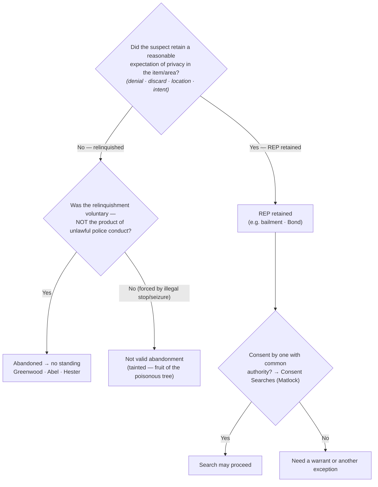
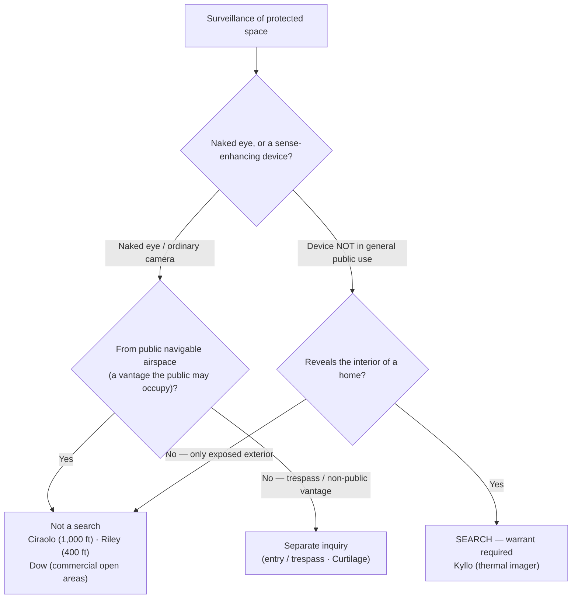

# S9 R1 panel-review — Opus model-diversity lane (prompt pack)

You are the **Claude/Opus** leg of the S9 three-lane adversarial panel (1 Claude + 2 Codex, R1). The two Codex lanes carry the A (support/quote-fidelity) and B (currency/treatment) attack lenses; **you carry model diversity and MUST vote on every paneled assertion across BOTH lenses' concerns.** You are refute-framed: try hard to break each assertion; **default to REFUTED on uncertainty**; never fabricate a cite, quote, or holding; use ONLY the evidence inlined below (no search, no outside knowledge). You are a SIGHTED reviewer — the FULL lake record (judgment fields included) is inlined.

You are a WRITER lane, not an adjudicator: you FIND and VOTE. You do not tally, adjudicate, or close any row — the orchestrator does.

For EACH group below, return one JSON object with the exact `reviewed[]` shape from the output contract (identical framing to the Codex lenses). Emit a finding object ONLY for a real defect (verdict refuted / stands-modified); a group you find wholly clean returns all-`stands` verdicts (the harness records a clean attestation). Concatenate the per-group JSON objects into a top-level `{"packs": [ ... ]}` array, one entry per group, each carrying its `group_id`.


OUTPUT CONTRACT — return ONE JSON object, nothing else:
{
  "lens": "A" | "B",
  "group_id": "<echo the group id>",
  "reviewed": [
    {
      "assertion_id": "<from group_inventory.jsonl>",
      "dimension": "existence|support|quote_fidelity|pincite|treatment|black_letter",
      "verdict": "stands" | "refuted" | "stands-modified",
      "verifiable_from_disclosed": true | false,
      "defect": null,   // null when verdict=="stands"; else an object:
      //  {"problem": "...", "severity": "high|medium|low", "proposed_fix": "...", "evidence_quote": "verbatim from disclosed evidence or null", "needs_cl": true|false, "locator_note": "..."}
      "reasons": ["short evidence-grounded reason", "..."],
      "breaks_true_positives": true | false,
      "residual_risks": ["..."],
      "suggested_tightening": "... or null"
    }
  ],
  "notes": ""
}
Rules: verdict=='stands' <=> defect==null (assertion survives your attack). verdict=='refuted' <=> a real defect (the assertion as framed is wrong). verdict=='stands-modified' <=> survives but needs a stated modification (a minor defect). Review EVERY assertion_id in group_inventory.jsonl exactly once. Output ONLY the JSON object.
---

## GROUP: content/searches/Abandonment.md  (`doctrine`, 12 assertions)

### content_page

```
---
weight: 80
aliases:
  - "Abandonment"
  - "3-what-is-a-search/Abandonment"
title: "Abandonment"
topic: Abandonment
type: doctrine
amendment: "U.S. Const. amend. IV"
jurisdiction: "Federal (U.S. Const. amend. IV); SCOTUS baseline"
status: draft
related: ["[[Fourth Amendment Framework]]", "[[Two Definitions of Search]]", "[[Curtilage]]", "[[Seizure of the Person]]", "[[Consent Searches]]", "[[Standing to Challenge a Search]]"]
---

# Abandonment

*A suspect drops a bag as he runs, leaves the trash at the curb, checks out of the hotel, tosses the phone. Did he give up his privacy, or just his grip on the thing?*

> [!rule] Black-letter rule
> A person who **voluntarily abandons** property or a place loses any [[Reasonable Expectation of Privacy|reasonable expectation of privacy]] in it and therefore has **no standing** to challenge its later search or seizure. Abandonment is judged by the *[[Katz v. United States|Katz]]* expectation-of-privacy standard, **not** by property law: the question is whether the person retained an expectation "that society accepts as objectively reasonable." *[[California v. Greenwood#^pin-40|Greenwood]]*, 486 U.S. 35, [39–40](https://www.courtlistener.com/opinion/112067/california-v-greenwood/) (1988). The relinquishment must be **voluntary**; contraband dropped only because of an **unlawful** stop or seizure is not a valid abandonment and does not defeat standing.
> ^rule-abandonment

## The Brief

**Abandonment is the absence of a retained privacy interest.** The doctrine has two facets that must both be present: an **outward act** (denial of ownership, discard, walking away) and the **intent** that act reveals, and the act must be **voluntary**. Courts synthesize the case law into four recurring factors, all bearing on one ultimate question and none an independent legal test: (1) **denial of ownership**; (2) **physical relinquishment or discard**; (3) the **location** where the item was left; and (4) **intent inferred from conduct**. The question they answer is always the same: was a [[Reasonable Expectation of Privacy|reasonable expectation of privacy]] retained?

**Curbside trash.** There is **no** [[Reasonable Expectation of Privacy|reasonable expectation of privacy]] in garbage bags left for collection at the curb, outside the [[Curtilage|curtilage]] of a home, so a warrantless search and seizure of curbside trash does not violate the Fourth Amendment. *[[California v. Greenwood|Greenwood]]*, 486 U.S. at [37](https://www.courtlistener.com/opinion/112067/california-v-greenwood/), 40–41. The reason: "It is common knowledge that plastic garbage bags left on or at the side of a public street are readily accessible to animals, children, scavengers, snoops, and other members of the public." *[[California v. Greenwood#^pin-40b|Id.]]* at 40. Note the express boundary: the bags were left for collection "outside the curtilage of a home." Trash still **within** the [[Curtilage|curtilage]] (a can beside the back door) is a different question ([[Curtilage]]).

**Vacated premises.** Items left in a hotel-room wastebasket after the guest "paid his bill and vacated the room" were abandoned, *bona vacantia*, so their warrantless seizure was lawful; once he left, "[t]he hotel then had the exclusive right to its possession," so both the abandonment and the hotel's consent justified the search. *[[Abel v. United States#^pin-241|Abel]]*, 362 U.S. 217, [241](https://www.courtlistener.com/opinion/106021/abel-v-united-states/) (1960). **Check-out**, not mere absence, is the line.

**Discard while fleeing.** A fleeing suspect who dropped containers abandoned any Fourth Amendment interest in them: "there was no seizure in the sense of the law when the officers examined the contents of each after it had been abandoned." *[[Hester v. United States#^pin-58|Hester]]*, 265 U.S. 57, [58](https://www.courtlistener.com/opinion/100413/hester-v-united-states/) (1924). The companion **seizure-timing** rule is *[[California v. Hodari D.|Hodari D.]]*: contraband a suspect "tossed away" before he submits to a show of authority is abandoned and admissible. *[[California v. Hodari D.|Hodari D.]]*, 499 U.S. 621, [629](https://www.courtlistener.com/opinion/112579/california-v-hodari-d/) (1991); see [[Seizure of the Person]].

**Bailment is not abandonment.** Giving up *possession* is not giving up *privacy*. A bus passenger **retained** a [[Reasonable Expectation of Privacy|reasonable expectation of privacy]] in a carry-on bag, and an agent's exploratory physical manipulation ("squeezing") was a search: "Physically invasive inspection is simply more intrusive than purely visual inspection." *[[Bond v. United States#^pin-337|Bond]]*, 529 U.S. 334, [337](https://www.courtlistener.com/opinion/118354/bond-v-united-states/) (2000). Handing a bag to a carrier, hotel, or friend is a temporary transfer of possession (a **bailment**) that preserves the privacy interest.

**Privacy, not property.** The reach of the Fourth Amendment is not set by state property law: a person can hold **title** to discarded property and still have abandoned any Fourth Amendment interest in it, while one who merely lends possession keeps it. The controlling question is always the *[[California v. Greenwood|Greenwood]]* / *[[Katz v. United States|Katz]]* one, whether the person retained an expectation of privacy society accepts as objectively reasonable.

**Abandonment is not common-authority consent.** Where a privacy interest **was** retained (no abandonment), a search may still be valid if a third party with **common authority** consents, but that is the **consent** route ([[Consent Searches]]), not abandonment. Common authority "rests rather on mutual use of the property by persons generally having joint access or control for most purposes," and is "not to be implied from the mere property interest a third party has in the property." *[[United States v. Matlock#^pin-171a|Matlock]]*, 415 U.S. 164, [171](https://www.courtlistener.com/opinion/108967/united-states-v-matlock/#:~:text=rests%20rather%20on%20mutual%20use) & n.7 (1974). The distinction is load-bearing: **abandonment** means there is **no** [[Reasonable Expectation of Privacy|reasonable expectation of privacy]] at all, so the defendant lacks standing; **consent** presupposes that a privacy interest exists but has been voluntarily waived. Different doctrines, different proof.

**Burden, review, and remedy.** The **defendant** bears the burden of establishing a legitimate expectation of privacy in the item searched, by a preponderance. *[[Rakas v. Illinois|Rakas]]*, 439 U.S. 128, [130–31](https://www.courtlistener.com/opinion/109953/rakas-v-illinois/) n.1 (1978); *[[Rawlings v. Kentucky|Rawlings]]*, 448 U.S. 98, [104–05](https://www.courtlistener.com/opinion/110326/rawlings-v-kentucky/) (1980). On the abandonment question itself, most courts place the burden on the **government** to prove voluntary abandonment, typically by a preponderance. Whether a legitimate expectation of privacy was retained, and whether any abandonment was voluntary, is a mixed question: historical findings of fact are reviewed for [[Common Legal Terms#clear-error|clear error]], the ultimate Fourth Amendment determination [[Common Legal Terms#de-novo|de novo]]. If the suspect retained a [[Reasonable Expectation of Privacy|reasonable expectation of privacy]] and the search was unlawful, suppression follows ([[Standing to Challenge a Search]]; [[The Exclusionary Rule]]); if he abandoned the item, he lacks standing and the suppression motion fails.

**Apply it.**
1. **Ask whether a privacy interest was retained.** Run the four factors (denial, discard, location, intent) toward the single question of retained expectation of privacy; a clean disclaimer of any connection to the item supports the inference that none was retained.
2. **Test voluntariness.** A disclaimer or discard forced by an **unlawful** stop or seizure is not a valid abandonment; it is [[Common Legal Terms#fruit-of-the-poisonous-tree|fruit of the poisonous tree]], and standing survives ([[Seizure of the Person]]).
3. **Separate possession from privacy.** A bailment (bag to a bus, luggage to a hotel) is not abandonment (*[[Bond v. United States|Bond]]*); title to discarded property is not retained privacy (*[[California v. Greenwood|Greenwood]]*).
4. **Route [[Consent Searches|third-party consent]] to the right doctrine.** If a privacy interest was retained, a co-occupant's consent is analyzed under common authority ([[Consent Searches]]), never as abandonment.

**Common pitfalls.**
- **Treating all trash as fair game.** *[[California v. Greenwood|Greenwood]]* authorizes the **curbside** bag left for collection outside the [[Curtilage|curtilage]]; trash within the [[Curtilage|curtilage]] is not covered on its terms ([[Curtilage]]).
- **Confusing giving up possession with giving up privacy.** A bailment is not abandonment (*[[Bond v. United States|Bond]]*).
- **Relying on a third party's property interest to imply consent.** Common authority turns on mutual **use** and joint **access or control**, not on who owns the item, and it belongs to [[Consent Searches]] (*[[United States v. Matlock|Matlock]]* n.7).
- **Litigating abandonment as a property dispute.** The court asks about the expectation of privacy, not who holds title (*[[California v. Greenwood|Greenwood]]*).

## Lower-court developments

The Supreme Court has not decided how abandonment applies to a cellphone, and there is no recognized circuit split on the points below; each decision binds only its own circuit and is persuasive elsewhere. The emerging refinement, reflecting *[[Riley v. California|Riley]]* and *[[Carpenter v. United States|Carpenter]]* on the comprehensiveness of phone data, is that a phone's **physical device** and its **digital data** may call for **separate** abandonment inquiries.

- **[[United States v. Hunt]] (9th Cir. 2025)** — *Binding in-circuit (9th Cir.).* Abandonment doctrine applies to cellphones, but courts must analyze the intent to abandon the **physical device** separately from the intent to abandon its **data**. Hunt, who dropped his iPhone after being shot and fled to seek medical help, abandoned neither, so he had standing (though suppression failed on the merits because agents later obtained a warrant). The published opinion holds that an accidental drop under trauma is not voluntary relinquishment of the digital data (role: **first-impression / refinement**). [opinion](https://www.courtlistener.com/opinion/10661637/united-states-v-hunt/)
- **[[United States v. Small]] (4th Cir. 2019)** — *Binding in-circuit (4th Cir.).* "[T]he simple loss of a cell phone does not entail the loss of a reasonable expectation of privacy," but Small **deliberately** discarded his phone during flight, which the court held was voluntary abandonment; he lost his expectation of privacy in both the device and its contents, and the searches were lawful (affirmed). Anticipates the device-versus-data distinction the Ninth Circuit later adopted in *[[United States v. Hunt|Hunt]]* (role: **refinement**). [opinion](https://www.courtlistener.com/opinion/4684957/united-states-v-dontae-small/)
- **[[United States v. Crumble]] (8th Cir. 2018)** — *Binding in-circuit (8th Cir.).* A defendant who wrecked his car after a shootout, fled on foot leaving the vehicle and a cellphone behind, and initially denied any knowledge of the car, abandoned the vehicle and its contents including the phone; no [[Reasonable Expectation of Privacy|reasonable expectation of privacy]], so no Fourth Amendment challenge. The court declined to categorically exempt cellphones from abandonment, distinguishing *[[Riley v. California|Riley]]* (affirmed). Shows the older *[[Hester v. United States|Hester]]* / *[[California v. Hodari D.|Hodari D.]]* discard-while-fleeing rule still reaching phones where the relinquishment is plainly voluntary (role: **refinement**). [opinion](https://www.courtlistener.com/opinion/4456532/united-states-v-prentiss-anthony-crumble/)

## Key cases

| Case | Holding | Opinion |
|---|---|---|
| *[[Hester v. United States]]*, 265 U.S. 57 (1924) | **Anchor (abandonment by flight).** A fleeing suspect who dropped containers abandoned any Fourth Amendment interest in them; examining the contents was "no seizure in the sense of the law." *(Primary home [[Open Fields]].)* | [opinion](https://www.courtlistener.com/opinion/100413/hester-v-united-states/) |
| *[[Abel v. United States]]*, 362 U.S. 217 (1960) | **Anchor (checkout).** Items left in a hotel-room wastebasket after the guest paid up and **vacated** the room were abandoned (*bona vacantia*); the warrantless seizure was lawful. | [opinion](https://www.courtlistener.com/opinion/106021/abel-v-united-states/) |
| *[[California v. Greenwood]]*, 486 U.S. 35 (1988) | **Anchor (curbside trash).** No [[Reasonable Expectation of Privacy\|reasonable expectation of privacy]] in garbage bags left for collection at the curb, outside the [[Curtilage\|curtilage]]; the warrantless search and seizure of curbside trash does not violate the Fourth Amendment. | [opinion](https://www.courtlistener.com/opinion/112067/california-v-greenwood/) |

## Related cases across doctrines

| Case | Relevance here | Primary home | Opinion |
|---|---|---|---|
| *[[Bond v. United States]]*, 529 U.S. 334 (2000) | A bus passenger **retained** a [[Reasonable Expectation of Privacy\|reasonable expectation of privacy]] in a carry-on bag; an agent's exploratory squeezing was a search. A **bailment** is not abandonment. | [[Two Definitions of Search]] | [opinion](https://www.courtlistener.com/opinion/118354/bond-v-united-states/) |
| *[[United States v. Matlock]]*, 415 U.S. 164 (1974) | The **consent** route, not abandonment: where a privacy interest was retained, a third party with common authority (mutual use plus joint access or control, not mere property interest) may validly consent. | [[Consent Searches]] | [opinion](https://www.courtlistener.com/opinion/108967/united-states-v-matlock/) |
| *[[Rakas v. Illinois]]*, 439 U.S. 128 (1978) | Fourth Amendment rights are personal: a defendant who abandoned an item cannot vicariously assert another's expectation of privacy. Sets the defendant's burden (130–31 n.1). | [[Standing to Challenge a Search]] | [opinion](https://www.courtlistener.com/opinion/109953/rakas-v-illinois/) |
| *[[Rawlings v. Kentucky]]*, 448 U.S. 98 (1980) | Owning the seized item is not enough; the defendant must have an expectation of privacy in the **place** searched. The property/privacy split that drives abandonment. | [[Standing to Challenge a Search]] | [opinion](https://www.courtlistener.com/opinion/110326/rawlings-v-kentucky/) |
| *[[United States v. Salvucci]]*, 448 U.S. 83 (1980) | Abolished automatic standing for possessory offenses (overruling *Jones v. United States* (1960)): a defendant charged with possessing the discarded item must still prove his own expectation of privacy, so a clean disclaimer leaves him no standing. | [[Standing to Challenge a Search]] | [opinion](https://www.courtlistener.com/opinion/110325/united-states-v-salvucci/) |
| *[[Katz v. United States]]*, 389 U.S. 347 (1967) | Supplies the very test abandonment turns on: a search occurs only where a person has an expectation of privacy society accepts as objectively reasonable; abandonment means that expectation was relinquished or never reasonable. | [[Reasonable Expectation of Privacy]] | [opinion](https://www.courtlistener.com/opinion/107564/katz-v-united-states/) |
| *[[Byrd v. United States]]*, 584 U.S. 395 (2018) | Lawful possession and control of effects (a rental car not in one's name) supports an expectation of privacy: the mirror image of abandonment, absence from a paper title is not relinquishment of the privacy interest. | [[Standing to Challenge a Search]] | [opinion](https://www.courtlistener.com/opinion/4497658/byrd-v-united-states/) |
| *[[Minnesota v. Carter]]*, 525 U.S. 83 (1998) | A short-term, purely commercial visitor with no prior connection had no expectation of privacy in the premises: transient, non-possessory presence, like discard, leaves no expectation society will protect. | [[Standing to Challenge a Search]] | [opinion](https://www.courtlistener.com/opinion/118249/minnesota-v-carter/) |

## Visual



## Sources

- [*Hester v. United States*, 265 U.S. 57 (1924)](https://www.courtlistener.com/opinion/100413/hester-v-united-states/) (pinpoint: 58)
- [*Abel v. United States*, 362 U.S. 217 (1960)](https://www.courtlistener.com/opinion/106021/abel-v-united-states/) (pinpoint: 241)
- [*California v. Greenwood*, 486 U.S. 35 (1988)](https://www.courtlistener.com/opinion/112067/california-v-greenwood/) (pinpoints: 37, 39–40)
- [*Bond v. United States*, 529 U.S. 334 (2000)](https://www.courtlistener.com/opinion/118354/bond-v-united-states/) (pinpoint: 337)
- [*United States v. Matlock*, 415 U.S. 164 (1974)](https://www.courtlistener.com/opinion/108967/united-states-v-matlock/) (pinpoint: 171 & n.7) *(common-authority consent line; primary home [[Consent Searches]])*
- [*California v. Hodari D.*, 499 U.S. 621 (1991)](https://www.courtlistener.com/opinion/112579/california-v-hodari-d/) (pinpoint: 629) *(abandonment-by-flight / seizure timing; primary home [[Seizure of the Person]])*

```

### group_inventory (assertions under review)

```jsonl
{"assertion_id": "272d41263e5b713e", "dimension": "existence", "kind": "case_cite", "locator": {"case": "Hester v. United States", "table_line": 52}, "payload": {"case": "Hester v. United States", "cells": ["*[[Hester v. United States]]*, 265 U.S. 57 (1924)", "**Anchor (abandonment by flight).** A fleeing suspect who dropped containers abandoned any Fourth Amendment interest in them; examining the contents was \"no seizure in the sense of the law.\" *(Primary home [[Open Fields]].)*", "[opinion](https://www.courtlistener.com/opinion/100413/hester-v-united-states/)"], "header": ["Case", "Holding", "Opinion"]}}
{"assertion_id": "4ee60fa108c7a76e", "dimension": "existence", "kind": "case_cite", "locator": {"case": "Bond v. United States", "table_line": 60}, "payload": {"case": "Bond v. United States", "cells": ["*[[Bond v. United States]]*, 529 U.S. 334 (2000)", "A bus passenger **retained** a [[Reasonable Expectation of Privacy\\|reasonable expectation of privacy]] in a carry-on bag; an agent's exploratory squeezing was a search. A **bailment** is not abandonment.", "[[Two Definitions of Search]]", "[opinion](https://www.courtlistener.com/opinion/118354/bond-v-united-states/)"], "header": ["Case", "Relevance here", "Primary home", "Opinion"]}}
{"assertion_id": "5c61feb9e38fa83a", "dimension": "existence", "kind": "case_cite", "locator": {"case": "Rakas v. Illinois", "table_line": 62}, "payload": {"case": "Rakas v. Illinois", "cells": ["*[[Rakas v. Illinois]]*, 439 U.S. 128 (1978)", "Fourth Amendment rights are personal: a defendant who abandoned an item cannot vicariously assert another's expectation of privacy. Sets the defendant's burden (130–31 n.1).", "[[Standing to Challenge a Search]]", "[opinion](https://www.courtlistener.com/opinion/109953/rakas-v-illinois/)"], "header": ["Case", "Relevance here", "Primary home", "Opinion"]}}
{"assertion_id": "78bc1b6253ad21af", "dimension": "existence", "kind": "case_cite", "locator": {"case": "Abel v. United States", "table_line": 53}, "payload": {"case": "Abel v. United States", "cells": ["*[[Abel v. United States]]*, 362 U.S. 217 (1960)", "**Anchor (checkout).** Items left in a hotel-room wastebasket after the guest paid up and **vacated** the room were abandoned (*bona vacantia*); the warrantless seizure was lawful.", "[opinion](https://www.courtlistener.com/opinion/106021/abel-v-united-states/)"], "header": ["Case", "Holding", "Opinion"]}}
{"assertion_id": "8acb69867a557079", "dimension": "existence", "kind": "case_cite", "locator": {"case": "Katz v. United States", "table_line": 65}, "payload": {"case": "Katz v. United States", "cells": ["*[[Katz v. United States]]*, 389 U.S. 347 (1967)", "Supplies the very test abandonment turns on: a search occurs only where a person has an expectation of privacy society accepts as objectively reasonable; abandonment means that expectation was relinquished or never reasonable.", "[[Reasonable Expectation of Privacy]]", "[opinion](https://www.courtlistener.com/opinion/107564/katz-v-united-states/)"], "header": ["Case", "Relevance here", "Primary home", "Opinion"]}}
{"assertion_id": "9ac25d73a31f9486", "dimension": "existence", "kind": "case_cite", "locator": {"case": "Minnesota v. Carter", "table_line": 67}, "payload": {"case": "Minnesota v. Carter", "cells": ["*[[Minnesota v. Carter]]*, 525 U.S. 83 (1998)", "A short-term, purely commercial visitor with no prior connection had no expectation of privacy in the premises: transient, non-possessory presence, like discard, leaves no expectation society will protect.", "[[Standing to Challenge a Search]]", "[opinion](https://www.courtlistener.com/opinion/118249/minnesota-v-carter/)"], "header": ["Case", "Relevance here", "Primary home", "Opinion"]}}
{"assertion_id": "9b696dbc718ac5c7", "dimension": "existence", "kind": "case_cite", "locator": {"case": "California v. Greenwood", "table_line": 54}, "payload": {"case": "California v. Greenwood", "cells": ["*[[California v. Greenwood]]*, 486 U.S. 35 (1988)", "**Anchor (curbside trash).** No [[Reasonable Expectation of Privacy\\|reasonable expectation of privacy]] in garbage bags left for collection at the curb, outside the [[Curtilage\\|curtilage]]; the warrantless search and seizure of curbside trash does not violate the Fourth Amendment.", "[opinion](https://www.courtlistener.com/opinion/112067/california-v-greenwood/)"], "header": ["Case", "Holding", "Opinion"]}}
{"assertion_id": "a16c615a89120723", "dimension": "existence", "kind": "case_cite", "locator": {"case": "Byrd v. United States", "table_line": 66}, "payload": {"case": "Byrd v. United States", "cells": ["*[[Byrd v. United States]]*, 584 U.S. 395 (2018)", "Lawful possession and control of effects (a rental car not in one's name) supports an expectation of privacy: the mirror image of abandonment, absence from a paper title is not relinquishment of the privacy interest.", "[[Standing to Challenge a Search]]", "[opinion](https://www.courtlistener.com/opinion/4497658/byrd-v-united-states/)"], "header": ["Case", "Relevance here", "Primary home", "Opinion"]}}
{"assertion_id": "a7a6c485a8810d31", "dimension": "existence", "kind": "case_cite", "locator": {"case": "Rawlings v. Kentucky", "table_line": 63}, "payload": {"case": "Rawlings v. Kentucky", "cells": ["*[[Rawlings v. Kentucky]]*, 448 U.S. 98 (1980)", "Owning the seized item is not enough; the defendant must have an expectation of privacy in the **place** searched. The property/privacy split that drives abandonment.", "[[Standing to Challenge a Search]]", "[opinion](https://www.courtlistener.com/opinion/110326/rawlings-v-kentucky/)"], "header": ["Case", "Relevance here", "Primary home", "Opinion"]}}
{"assertion_id": "cd0755edfaf61d42", "dimension": "existence", "kind": "case_cite", "locator": {"case": "United States v. Matlock", "table_line": 61}, "payload": {"case": "United States v. Matlock", "cells": ["*[[United States v. Matlock]]*, 415 U.S. 164 (1974)", "The **consent** route, not abandonment: where a privacy interest was retained, a third party with common authority (mutual use plus joint access or control, not mere property interest) may validly consent.", "[[Consent Searches]]", "[opinion](https://www.courtlistener.com/opinion/108967/united-states-v-matlock/)"], "header": ["Case", "Relevance here", "Primary home", "Opinion"]}}
{"assertion_id": "d0bd449dc1278f4b", "dimension": "existence", "kind": "case_cite", "locator": {"case": "United States v. Salvucci", "table_line": 64}, "payload": {"case": "United States v. Salvucci", "cells": ["*[[United States v. Salvucci]]*, 448 U.S. 83 (1980)", "Abolished automatic standing for possessory offenses (overruling *Jones v. United States* (1960)): a defendant charged with possessing the discarded item must still prove his own expectation of privacy, so a clean disclaimer leaves him no standing.", "[[Standing to Challenge a Search]]", "[opinion](https://www.courtlistener.com/opinion/110325/united-states-v-salvucci/)"], "header": ["Case", "Relevance here", "Primary home", "Opinion"]}}
{"assertion_id": "9d9383812a3ab553", "dimension": "support", "kind": "proposition", "locator": {"callout": "^rule-abandonment"}, "payload": {"anchor": "^rule-abandonment", "statement": "[!rule] Black-letter rule\nA person who **voluntarily abandons** property or a place loses any [[Reasonable Expectation of Privacy|reasonable expectation of privacy]] in it and therefore has **no standing** to challenge its later search or seizure. Abandonment is judged by the *[[Katz v. United States|Katz]]* expectation-of-privacy standard, **not** by property law: the question is whether the person retained an expectation \"that society accepts as objectively reasonable.\" *[[California v. Greenwood#^pin-40|Greenwood]]*, 486 U.S. 35, [39–40](https://www.courtlistener.com/opinion/112067/california-v-greenwood/) (1988). The relinquishment must be **voluntary**; contraband dropped only because of an **unlawful** stop or seizure is not a valid abandonment and does not defeat standing."}}
```

### lake record — Abel v. United States

```json
{
  "schema_version": "s2.v1",
  "record_id": "Abel v. United States",
  "stub": false,
  "status": "verified",
  "identity": {
    "case_name": "Abel v. United States",
    "case_name_short": "Abel",
    "case_name_full": "ABEL, Alias MARK, Alias COLLINS, Alias GOLDFUS, v. UNITED STATES",
    "input_case_name": "Abel v. United States",
    "court": "U.S. Supreme Court",
    "court_id": "scotus",
    "court_level": "scotus",
    "circuit": null,
    "state": null,
    "date_decided": "1960-03-28",
    "year": 1960,
    "docket": null,
    "cluster_id": 106021,
    "lead_opinion_id": 106021,
    "sibling_ids": [
      106021,
      9421949,
      9421950,
      9421951
    ],
    "absolute_url": "/opinion/106021/abel-v-united-states/",
    "identity_method": "citation+party-text",
    "expected_citation_found": true,
    "party_name_in_text": true,
    "canonical_name_match": true,
    "alternates": [
      {
        "cluster_id": 8947572,
        "score": 10,
        "case_name": "Abel v. United States"
      }
    ],
    "reason_code": null
  },
  "citations": {
    "official": {
      "cite": "362 U.S. 217",
      "volume": "362",
      "reporter": "U.S.",
      "page": "217",
      "type": 1,
      "selected_official": true,
      "source": "cluster.citations[]"
    },
    "parallel": [
      {
        "cite": "80 S. Ct. 683",
        "volume": "80",
        "reporter": "S. Ct.",
        "page": "683",
        "type": 1,
        "selected_official": false,
        "source": "cluster.citations[]"
      },
      {
        "cite": "4 L. Ed. 2d 668",
        "volume": "4",
        "reporter": "L. Ed. 2d",
        "page": "668",
        "type": 1,
        "selected_official": false,
        "source": "cluster.citations[]"
      }
    ],
    "vendor_neutral": [
      {
        "cite": "1960 U.S. LEXIS 1412",
        "volume": "1960",
        "reporter": "U.S. LEXIS",
        "page": "1412",
        "type": 6,
        "selected_official": false,
        "source": "cluster.citations[]"
      }
    ],
    "all": [
      {
        "cite": "362 U.S. 217",
        "volume": "362",
        "reporter": "U.S.",
        "page": "217",
        "type": 1,
        "selected_official": false,
        "source": "cluster.citations[]"
      },
      {
        "cite": "80 S. Ct. 683",
        "volume": "80",
        "reporter": "S. Ct.",
        "page": "683",
        "type": 1,
        "selected_official": false,
        "source": "cluster.citations[]"
      },
      {
        "cite": "4 L. Ed. 2d 668",
        "volume": "4",
        "reporter": "L. Ed. 2d",
        "page": "668",
        "type": 1,
        "selected_official": false,
        "source": "cluster.citations[]"
      },
      {
        "cite": "1960 U.S. LEXIS 1412",
        "volume": "1960",
        "reporter": "U.S. LEXIS",
        "page": "1412",
        "type": 6,
        "selected_official": false,
        "source": "cluster.citations[]"
      }
    ],
    "display": "362 U.S. 217",
    "official_selection": {
      "court_class": "scotus",
      "selected": "362 U.S. 217",
      "reason": "selected_rank_1"
    }
  },
  "pinpoints": [
    {
      "id": "pin-241",
      "page": null,
      "quote": "These and other items were introduced against him in an espionage prosecution. ## Issue Whether the warrantless search of a hotel room \u2014 and seizure of items the guest had discarded in the wastebasket \u2014 after the guest paid his bill and vacated the room violated the Fourth Amendment. ## Rule No. Once the guest vacated the room, the hotel regained the exclusive right to possession and could consent to the search; and the items left in the wastebasket were abandoned, so their warrantless seizure was lawful. The search",
      "star_marker": null,
      "quote_fidelity": "mismatch",
      "pinpoint_status": "slip-only",
      "position": null
    },
    {
      "id": "pin-241a",
      "page": null,
      "quote": "So far as the record shows, petitioner had abandoned these articles. He had thrown them away. So far as he was concerned, they were *bona vacantia.* There can be nothing unlawful in the Government's appropriation of such abandoned property.",
      "star_marker": null,
      "quote_fidelity": "mismatch",
      "pinpoint_status": "slip-only",
      "position": null
    }
  ],
  "treatment": {
    "field_i_validity": "good_law",
    "as_of_content": "1960-03-28",
    "as_of_treatment": "2026-06-30",
    "composite_basis": "migration-seed",
    "composite_basis_ref": "Abel v. United States",
    "varies_by_point": false,
    "scope_note": "Old as_of seeds as_of_treatment; S2 derivation re-derives and may downgrade.",
    "point_overrides": [],
    "edges": [
      {
        "citing_case": {
          "name": "People v. Konther",
          "cluster_id": 10874455,
          "cite": null,
          "field_ii": "questioned"
        },
        "field_ii": "questioned",
        "field_iii": "mentioned",
        "point": null,
        "proposed": true,
        "journal_ref": "Abel v. United States:lane1_negative"
      },
      {
        "citing_case": {
          "name": "United States v. Ryan Mendoza",
          "cluster_id": 10771114,
          "cite": null,
          "field_ii": "questioned"
        },
        "field_ii": "questioned",
        "field_iii": "mentioned",
        "point": null,
        "proposed": true,
        "journal_ref": "Abel v. United States:lane1_negative"
      },
      {
        "citing_case": {
          "name": "Op. Atty. Gen. 3a; 390a6",
          "cluster_id": 10754685,
          "cite": null,
          "field_ii": "abrogated"
        },
        "field_ii": "abrogated",
        "field_iii": "mentioned",
        "point": null,
        "proposed": true,
        "journal_ref": "Abel v. United States:lane1_negative"
      },
      {
        "citing_case": {
          "name": "United States v. Bryant",
          "cluster_id": 10747664,
          "cite": null,
          "field_ii": "overruled"
        },
        "field_ii": "overruled",
        "field_iii": "mentioned",
        "point": null,
        "proposed": true,
        "journal_ref": "Abel v. United States:lane1_negative"
      },
      {
        "citing_case": {
          "name": "People of Guam v. Joseph Quichocho Taimanglo II (aka Joseph Quichocho Taimanglo; aka Baby Joe; aka Joseph Quintanilla Taimanglo II)",
          "cluster_id": 10713502,
          "cite": [
            "2025 Guam 7"
          ],
          "field_ii": "abrogated"
        },
        "field_ii": "abrogated",
        "field_iii": "mentioned",
        "point": null,
        "proposed": true,
        "journal_ref": "Abel v. United States:lane1_negative"
      },
      {
        "citing_case": {
          "name": "State of Iowa v. Charles Aaron Amble and John Joseph Mandracchia",
          "cluster_id": 10604543,
          "cite": null,
          "field_ii": "overruled"
        },
        "field_ii": "overruled",
        "field_iii": "mentioned",
        "point": null,
        "proposed": true,
        "journal_ref": "Abel v. United States:lane1_negative"
      },
      {
        "citing_case": {
          "name": "State of Iowa v. Charles Aaron Amble and John Joseph Mandracchia",
          "cluster_id": 10604323,
          "cite": null,
          "field_ii": "overruled"
        },
        "field_ii": "overruled",
        "field_iii": "mentioned",
        "point": null,
        "proposed": true,
        "journal_ref": "Abel v. United States:lane1_negative"
      },
      {
        "citing_case": {
          "name": "State of Missouri v. Theresa O'Connor",
          "cluster_id": 10631514,
          "cite": null,
          "field_ii": "overruled"
        },
        "field_ii": "overruled",
        "field_iii": "mentioned",
        "point": null,
        "proposed": true,
        "journal_ref": "Abel v. United States:lane1_negative"
      },
      {
        "citing_case": {
          "name": "State of Missouri v. Timothy R. Fernandez",
          "cluster_id": 10631444,
          "cite": null,
          "field_ii": "overruled"
        },
        "field_ii": "overruled",
        "field_iii": "mentioned",
        "point": null,
        "proposed": true,
        "journal_ref": "Abel v. United States:lane1_negative"
      },
      {
        "citing_case": {
          "name": "State of Iowa v. Jerry Lynn Burns",
          "cluster_id": 9388341,
          "cite": null,
          "field_ii": "overruled"
        },
        "field_ii": "overruled",
        "field_iii": "mentioned",
        "point": null,
        "proposed": true,
        "journal_ref": "Abel v. United States:lane1_negative"
      },
      {
        "citing_case": {
          "name": "Stark v. State",
          "cluster_id": 9371579,
          "cite": [
            "171 Idaho 541",
            "524 P.3d 43"
          ],
          "field_ii": "superseded_by_statute"
        },
        "field_ii": "superseded_by_statute",
        "field_iii": "mentioned",
        "point": null,
        "proposed": true,
        "journal_ref": "Abel v. United States:lane1_negative"
      },
      {
        "citing_case": {
          "name": "United States v. Terrance Baker",
          "cluster_id": 9371555,
          "cite": [
            "58 F.4th 1109"
          ],
          "field_ii": "questioned"
        },
        "field_ii": "questioned",
        "field_iii": "mentioned",
        "point": null,
        "proposed": true,
        "journal_ref": "Abel v. United States:lane1_negative"
      },
      {
        "citing_case": {
          "name": "United States v. Malagerio",
          "cluster_id": 8243624,
          "cite": [
            "49 F.4th 911"
          ],
          "field_ii": "questioned"
        },
        "field_ii": "questioned",
        "field_iii": "mentioned",
        "point": null,
        "proposed": true,
        "journal_ref": "Abel v. United States:lane1_negative"
      },
      {
        "citing_case": {
          "name": "United States v. Jeremiah Edwards",
          "cluster_id": 6469003,
          "cite": [
            "34 F.4th 570"
          ],
          "field_ii": "overruled"
        },
        "field_ii": "overruled",
        "field_iii": "mentioned",
        "point": null,
        "proposed": true,
        "journal_ref": "Abel v. United States:lane1_negative"
      },
      {
        "citing_case": {
          "name": "State of Iowa v. Alan James Kuuttila",
          "cluster_id": 5290136,
          "cite": null,
          "field_ii": "overruled"
        },
        "field_ii": "overruled",
        "field_iii": "mentioned",
        "point": null,
        "proposed": true,
        "journal_ref": "Abel v. United States:lane1_negative"
      },
      {
        "citing_case": {
          "name": "State v. Bortree",
          "cluster_id": 5030192,
          "cite": [
            "2021 Ohio 2873"
          ],
          "field_ii": "overruled"
        },
        "field_ii": "overruled",
        "field_iii": "mentioned",
        "point": null,
        "proposed": true,
        "journal_ref": "Abel v. United States:lane1_negative"
      },
      {
        "citing_case": {
          "name": "State of Iowa v. Nicholas Dean Wright",
          "cluster_id": 5290145,
          "cite": null,
          "field_ii": "overruled"
        },
        "field_ii": "overruled",
        "field_iii": "mentioned",
        "point": null,
        "proposed": true,
        "journal_ref": "Abel v. United States:lane1_negative"
      },
      {
        "citing_case": {
          "name": "State of Iowa v. Nicholas Dean Wright",
          "cluster_id": 4894883,
          "cite": null,
          "field_ii": "overruled"
        },
        "field_ii": "overruled",
        "field_iii": "mentioned",
        "point": null,
        "proposed": true,
        "journal_ref": "Abel v. United States:lane1_negative"
      },
      {
        "citing_case": {
          "name": "State of Iowa v. Nicholas Dean Wright",
          "cluster_id": 4893114,
          "cite": null,
          "field_ii": "overruled"
        },
        "field_ii": "overruled",
        "field_iii": "mentioned",
        "point": null,
        "proposed": true,
        "journal_ref": "Abel v. United States:lane1_negative"
      },
      {
        "citing_case": {
          "name": "Gerardo Gonzalez v. Ice",
          "cluster_id": 4784538,
          "cite": null,
          "field_ii": "abrogated"
        },
        "field_ii": "abrogated",
        "field_iii": "mentioned",
        "point": null,
        "proposed": true,
        "journal_ref": "Abel v. United States:lane1_negative"
      },
      {
        "citing_case": {
          "name": "State v. Dixon",
          "cluster_id": 4805743,
          "cite": [
            "947 N.W.2d 563",
            "306 Neb. 853"
          ],
          "field_ii": "overruled"
        },
        "field_ii": "overruled",
        "field_iii": "mentioned",
        "point": null,
        "proposed": true,
        "journal_ref": "Abel v. United States:lane1_negative"
      },
      {
        "citing_case": {
          "name": "United States v. Franz Grey",
          "cluster_id": 4756521,
          "cite": [
            "959 F.3d 1166"
          ],
          "field_ii": "overruled"
        },
        "field_ii": "overruled",
        "field_iii": "mentioned",
        "point": null,
        "proposed": true,
        "journal_ref": "Abel v. United States:lane1_negative"
      },
      {
        "citing_case": {
          "name": "United States v. Quentin Ferebee",
          "cluster_id": 4747521,
          "cite": [
            "957 F.3d 406"
          ],
          "field_ii": "questioned"
        },
        "field_ii": "questioned",
        "field_iii": "mentioned",
        "point": null,
        "proposed": true,
        "journal_ref": "Abel v. United States:lane1_negative"
      },
      {
        "citing_case": {
          "name": "Jose Leonel Oseguera-Viera v. State",
          "cluster_id": 4685787,
          "cite": null,
          "field_ii": "overruled"
        },
        "field_ii": "overruled",
        "field_iii": "mentioned",
        "point": null,
        "proposed": true,
        "journal_ref": "Abel v. United States:lane1_negative"
      },
      {
        "citing_case": {
          "name": "United States v. Dontae Small",
          "cluster_id": 4684957,
          "cite": [
            "944 F.3d 490"
          ],
          "field_ii": "abrogated"
        },
        "field_ii": "abrogated",
        "field_iii": "mentioned",
        "point": null,
        "proposed": true,
        "journal_ref": "Abel v. United States:lane1_negative"
      },
      {
        "citing_case": {
          "name": "State v. Holley",
          "cluster_id": 4658152,
          "cite": null,
          "field_ii": "questioned"
        },
        "field_ii": "questioned",
        "field_iii": "mentioned",
        "point": null,
        "proposed": true,
        "journal_ref": "Abel v. United States:lane1_negative"
      },
      {
        "citing_case": {
          "name": "People v. Thomas",
          "cluster_id": 4647637,
          "cite": [
            "2019 IL App (1st) 170474"
          ],
          "field_ii": "questioned"
        },
        "field_ii": "questioned",
        "field_iii": "mentioned",
        "point": null,
        "proposed": true,
        "journal_ref": "Abel v. United States:lane1_negative"
      },
      {
        "citing_case": {
          "name": "State of Tennessee v. Martha Ann McClancy",
          "cluster_id": 4647175,
          "cite": null,
          "field_ii": "questioned"
        },
        "field_ii": "questioned",
        "field_iii": "mentioned",
        "point": null,
        "proposed": true,
        "journal_ref": "Abel v. United States:lane1_negative"
      },
      {
        "citing_case": {
          "name": "State of Iowa v. Scottize Danyelle Brown",
          "cluster_id": 4658982,
          "cite": null,
          "field_ii": "overruled"
        },
        "field_ii": "overruled",
        "field_iii": "mentioned",
        "point": null,
        "proposed": true,
        "journal_ref": "Abel v. United States:lane1_negative"
      },
      {
        "citing_case": {
          "name": "Joseph Watson v. Patrick Pearson",
          "cluster_id": 4635243,
          "cite": [
            "928 F.3d 507"
          ],
          "field_ii": "overruled"
        },
        "field_ii": "overruled",
        "field_iii": "mentioned",
        "point": null,
        "proposed": true,
        "journal_ref": "Abel v. United States:lane1_negative"
      },
      {
        "citing_case": {
          "name": "State of Iowa v. Scottize Danyelle Brown",
          "cluster_id": 4635121,
          "cite": [
            "930 N.W.2d 840"
          ],
          "field_ii": "overruled"
        },
        "field_ii": "overruled",
        "field_iii": "mentioned",
        "point": null,
        "proposed": true,
        "journal_ref": "Abel v. United States:lane1_negative"
      },
      {
        "citing_case": {
          "name": "State v. Valles",
          "cluster_id": 4609283,
          "cite": [
            "2019 ND 108",
            "925 N.W.2d 404"
          ],
          "field_ii": "questioned"
        },
        "field_ii": "questioned",
        "field_iii": "mentioned",
        "point": null,
        "proposed": true,
        "journal_ref": "Abel v. United States:lane1_negative"
      },
      {
        "citing_case": {
          "name": "Chavez v. Carmichael",
          "cluster_id": 4550937,
          "cite": [
            "822 S.E.2d 131",
            "262 N.C. App. 196"
          ],
          "field_ii": "overruled"
        },
        "field_ii": "overruled",
        "field_iii": "mentioned",
        "point": null,
        "proposed": true,
        "journal_ref": "Abel v. United States:lane1_negative"
      },
      {
        "citing_case": {
          "name": "City of El Cenizo, Texas v. State of Texas",
          "cluster_id": 4496244,
          "cite": [
            "890 F.3d 164"
          ],
          "field_ii": "overruled"
        },
        "field_ii": "overruled",
        "field_iii": "mentioned",
        "point": null,
        "proposed": true,
        "journal_ref": "Abel v. United States:lane1_negative"
      },
      {
        "citing_case": {
          "name": "City of El Cenizo, Texas v. State of Texas",
          "cluster_id": 4476977,
          "cite": [
            "885 F.3d 332"
          ],
          "field_ii": "overruled"
        },
        "field_ii": "overruled",
        "field_iii": "mentioned",
        "point": null,
        "proposed": true,
        "journal_ref": "Abel v. United States:lane1_negative"
      },
      {
        "citing_case": {
          "name": "Hull v. Town of Newtown",
          "cluster_id": 4453742,
          "cite": [
            "174 A.3d 174",
            "327 Conn. 402"
          ],
          "field_ii": "questioned"
        },
        "field_ii": "questioned",
        "field_iii": "mentioned",
        "point": null,
        "proposed": true,
        "journal_ref": "Abel v. United States:lane1_negative"
      },
      {
        "citing_case": {
          "name": "City of El Cenizo v. Texas",
          "cluster_id": 7326561,
          "cite": [
            "264 F. Supp. 3d 744"
          ],
          "field_ii": "overruled"
        },
        "field_ii": "overruled",
        "field_iii": "mentioned",
        "point": null,
        "proposed": true,
        "journal_ref": "Abel v. United States:lane1_negative"
      },
      {
        "citing_case": {
          "name": "State of Tennessee v. Bruce Wayne Sutton",
          "cluster_id": 4393282,
          "cite": null,
          "field_ii": "overruled"
        },
        "field_ii": "overruled",
        "field_iii": "mentioned",
        "point": null,
        "proposed": true,
        "journal_ref": "Abel v. United States:lane1_negative"
      },
      {
        "citing_case": {
          "name": "State of Tennessee v. Joseph Durward Watson, II - Dissenting Opinion",
          "cluster_id": 4382006,
          "cite": null,
          "field_ii": "questioned"
        },
        "field_ii": "questioned",
        "field_iii": "mentioned",
        "point": null,
        "proposed": true,
        "journal_ref": "Abel v. United States:lane1_negative"
      },
      {
        "citing_case": {
          "name": "State v. Byrd",
          "cluster_id": 4319283,
          "cite": [
            "2016 Ohio 7670"
          ],
          "field_ii": "overruled"
        },
        "field_ii": "overruled",
        "field_iii": "mentioned",
        "point": null,
        "proposed": true,
        "journal_ref": "Abel v. United States:lane1_negative"
      },
      {
        "citing_case": {
          "name": "State v. Hayward",
          "cluster_id": 4319281,
          "cite": [
            "2016 Ohio 7671"
          ],
          "field_ii": "superseded_by_statute"
        },
        "field_ii": "superseded_by_statute",
        "field_iii": "mentioned",
        "point": null,
        "proposed": true,
        "journal_ref": "Abel v. United States:lane1_negative"
      },
      {
        "citing_case": {
          "name": "State v. Jackson",
          "cluster_id": 4319280,
          "cite": [
            "2016 Ohio 7669"
          ],
          "field_ii": "overruled"
        },
        "field_ii": "overruled",
        "field_iii": "mentioned",
        "point": null,
        "proposed": true,
        "journal_ref": "Abel v. United States:lane1_negative"
      },
      {
        "citing_case": {
          "name": "State v. Samalia",
          "cluster_id": 4242519,
          "cite": null,
          "field_ii": "questioned"
        },
        "field_ii": "questioned",
        "field_iii": "mentioned",
        "point": null,
        "proposed": true,
        "journal_ref": "Abel v. United States:lane1_negative"
      },
      {
        "citing_case": {
          "name": "State v. Jeffrey B. Melling",
          "cluster_id": 3191981,
          "cite": [
            "160 Idaho 209",
            "370 P.3d 412",
            "2016 WL 1355089",
            "2016 Ida. App. LEXIS 46"
          ],
          "field_ii": "overruled"
        },
        "field_ii": "overruled",
        "field_iii": "mentioned",
        "point": null,
        "proposed": true,
        "journal_ref": "Abel v. United States:lane1_negative"
      },
      {
        "citing_case": {
          "name": "Traci Sheppard Schroeder v. State",
          "cluster_id": 3072000,
          "cite": null,
          "field_ii": "overruled"
        },
        "field_ii": "overruled",
        "field_iii": "mentioned",
        "point": null,
        "proposed": true,
        "journal_ref": "Abel v. United States:lane1_negative"
      },
      {
        "citing_case": {
          "name": "State v. Williford",
          "cluster_id": 2766778,
          "cite": null,
          "field_ii": "overruled"
        },
        "field_ii": "overruled",
        "field_iii": "mentioned",
        "point": null,
        "proposed": true,
        "journal_ref": "Abel v. United States:lane1_negative"
      },
      {
        "citing_case": {
          "name": "State v. Borders",
          "cluster_id": 2726708,
          "cite": [
            "236 N.C. App. 149",
            "762 S.E.2d 490",
            "2014 N.C. App. LEXIS 975"
          ],
          "field_ii": "overruled"
        },
        "field_ii": "overruled",
        "field_iii": "mentioned",
        "point": null,
        "proposed": true,
        "journal_ref": "Abel v. United States:lane1_negative"
      },
      {
        "citing_case": {
          "name": "Olvera v. City of Modesto",
          "cluster_id": 7308114,
          "cite": [
            "38 F. Supp. 3d 1162",
            "2014 WL 3858362",
            "2014 U.S. Dist. LEXIS 108452"
          ],
          "field_ii": "questioned"
        },
        "field_ii": "questioned",
        "field_iii": "mentioned",
        "point": null,
        "proposed": true,
        "journal_ref": "Abel v. United States:lane1_negative"
      },
      {
        "citing_case": {
          "name": "People v. Lee",
          "cluster_id": 2674606,
          "cite": [
            "2014 IL App (1st) 130507"
          ],
          "field_ii": "overruled"
        },
        "field_ii": "overruled",
        "field_iii": "mentioned",
        "point": null,
        "proposed": true,
        "journal_ref": "Abel v. United States:lane1_negative"
      },
      {
        "citing_case": {
          "name": "State of Maine v. Richard K. Ntim Jr.",
          "cluster_id": 2679977,
          "cite": [
            "2013 ME 80",
            "76 A.3d 370",
            "2013 WL 5201022",
            "2013 Me. LEXIS 81"
          ],
          "field_ii": "questioned"
        },
        "field_ii": "questioned",
        "field_iii": "mentioned",
        "point": null,
        "proposed": true,
        "journal_ref": "Abel v. United States:lane1_negative"
      },
      {
        "citing_case": {
          "name": "United States v. Jerry Nelson, Jr.",
          "cluster_id": 2981963,
          "cite": null,
          "field_ii": "questioned"
        },
        "field_ii": "questioned",
        "field_iii": "mentioned",
        "point": null,
        "proposed": true,
        "journal_ref": "Abel v. United States:lane1_negative"
      },
      {
        "citing_case": {
          "name": "United States v. Jerry Nelson, Jr.",
          "cluster_id": 1036714,
          "cite": [
            "725 F.3d 615",
            "92 Fed. R. Serv. 95",
            "2013 WL 4007652",
            "2013 U.S. App. LEXIS 16278"
          ],
          "field_ii": "questioned"
        },
        "field_ii": "questioned",
        "field_iii": "mentioned",
        "point": null,
        "proposed": true,
        "journal_ref": "Abel v. United States:lane1_negative"
      },
      {
        "citing_case": {
          "name": "United States v. Irizarry",
          "cluster_id": 858053,
          "cite": [
            "72 M.J. 100",
            "2013 WL 1628381",
            "2013 CAAF LEXIS 383"
          ],
          "field_ii": "abrogated"
        },
        "field_ii": "abrogated",
        "field_iii": "mentioned",
        "point": null,
        "proposed": true,
        "journal_ref": "Abel v. United States:lane1_negative"
      },
      {
        "citing_case": {
          "name": "LAVAN v. City of Los Angeles",
          "cluster_id": 2113714,
          "cite": [
            "797 F. Supp. 2d 1005",
            "2011 U.S. Dist. LEXIS 67332",
            "2011 WL 2516484"
          ],
          "field_ii": "questioned"
        },
        "field_ii": "questioned",
        "field_iii": "mentioned",
        "point": null,
        "proposed": true,
        "journal_ref": "Abel v. United States:lane1_negative"
      },
      {
        "citing_case": {
          "name": "State v. Wynn",
          "cluster_id": 2694594,
          "cite": [
            "2011 Ohio 1832"
          ],
          "field_ii": "overruled"
        },
        "field_ii": "overruled",
        "field_iii": "mentioned",
        "point": null,
        "proposed": true,
        "journal_ref": "Abel v. United States:lane1_negative"
      },
      {
        "citing_case": {
          "name": "Orval Roger Miller Jr. v. State",
          "cluster_id": 2954290,
          "cite": null,
          "field_ii": "overruled"
        },
        "field_ii": "overruled",
        "field_iii": "mentioned",
        "point": null,
        "proposed": true,
        "journal_ref": "Abel v. United States:lane1_negative"
      },
      {
        "citing_case": {
          "name": "Orval Roger Miller Jr. v. State",
          "cluster_id": 2954289,
          "cite": null,
          "field_ii": "overruled"
        },
        "field_ii": "overruled",
        "field_iii": "mentioned",
        "point": null,
        "proposed": true,
        "journal_ref": "Abel v. United States:lane1_negative"
      },
      {
        "citing_case": {
          "name": "Miller v. State",
          "cluster_id": 2280953,
          "cite": [
            "335 S.W.3d 847",
            "2011 Tex. App. LEXIS 1752",
            "2011 WL 832126"
          ],
          "field_ii": "overruled"
        },
        "field_ii": "overruled",
        "field_iii": "mentioned",
        "point": null,
        "proposed": true,
        "journal_ref": "Abel v. United States:lane1_negative"
      },
      {
        "citing_case": {
          "name": "State v. Eaton",
          "cluster_id": 2393809,
          "cite": [
            "707 S.E.2d 642",
            "210 N.C. App. 142",
            "2011 N.C. App. LEXIS 319"
          ],
          "field_ii": "overruled"
        },
        "field_ii": "overruled",
        "field_iii": "mentioned",
        "point": null,
        "proposed": true,
        "journal_ref": "Abel v. United States:lane1_negative"
      },
      {
        "citing_case": {
          "name": "Commonwealth v. Marshall",
          "cluster_id": 2273474,
          "cite": [
            "319 S.W.3d 352",
            "2010 Ky. LEXIS 182",
            "2010 WL 3374171"
          ],
          "field_ii": "overruled"
        },
        "field_ii": "overruled",
        "field_iii": "mentioned",
        "point": null,
        "proposed": true,
        "journal_ref": "Abel v. United States:lane1_negative"
      },
      {
        "citing_case": {
          "name": "United States v. Eddie Carlisle",
          "cluster_id": 3004320,
          "cite": null,
          "field_ii": "overruled"
        },
        "field_ii": "overruled",
        "field_iii": "mentioned",
        "point": null,
        "proposed": true,
        "journal_ref": "Abel v. United States:lane1_negative"
      },
      {
        "citing_case": {
          "name": "United States v. Carlisle",
          "cluster_id": 2530423,
          "cite": [
            "614 F.3d 750",
            "2010 U.S. App. LEXIS 17026",
            "2010 WL 3155876"
          ],
          "field_ii": "overruled"
        },
        "field_ii": "overruled",
        "field_iii": "mentioned",
        "point": null,
        "proposed": true,
        "journal_ref": "Abel v. United States:lane1_negative"
      },
      {
        "citing_case": {
          "name": "Maurice Levie v. ESL Partners, L.P.",
          "cluster_id": 152710,
          "cite": null,
          "field_ii": "overruled"
        },
        "field_ii": "overruled",
        "field_iii": "mentioned",
        "point": null,
        "proposed": true,
        "journal_ref": "Abel v. United States:lane1_negative"
      },
      {
        "citing_case": {
          "name": "State v. Nesbitt",
          "cluster_id": 2397780,
          "cite": [
            "699 S.E.2d 368",
            "305 Ga. App. 28",
            "2010 Fulton County D. Rep. 2538",
            "2010 Ga. App. LEXIS 656"
          ],
          "field_ii": "questioned"
        },
        "field_ii": "questioned",
        "field_iii": "mentioned",
        "point": null,
        "proposed": true,
        "journal_ref": "Abel v. United States:lane1_negative"
      },
      {
        "citing_case": {
          "name": "Williamson v. State",
          "cluster_id": 1917905,
          "cite": [
            "993 A.2d 626",
            "413 Md. 521",
            "2010 Md. LEXIS 175"
          ],
          "field_ii": "questioned"
        },
        "field_ii": "questioned",
        "field_iii": "mentioned",
        "point": null,
        "proposed": true,
        "journal_ref": "Abel v. United States:lane1_negative"
      },
      {
        "citing_case": {
          "name": "State v. VASQUEZ-ARENIVAR",
          "cluster_id": 1255552,
          "cite": [
            "779 N.W.2d 117",
            "18 Neb. Ct. App. 265"
          ],
          "field_ii": "questioned"
        },
        "field_ii": "questioned",
        "field_iii": "mentioned",
        "point": null,
        "proposed": true,
        "journal_ref": "Abel v. United States:lane1_negative"
      },
      {
        "citing_case": {
          "name": "State v. Howe",
          "cluster_id": 1887352,
          "cite": [
            "986 A.2d 631",
            "159 N.H. 366"
          ],
          "field_ii": "questioned"
        },
        "field_ii": "questioned",
        "field_iii": "mentioned",
        "point": null,
        "proposed": true,
        "journal_ref": "Abel v. United States:lane1_negative"
      },
      {
        "citing_case": {
          "name": "Club Retro LLC v. Hilton",
          "cluster_id": 66452,
          "cite": null,
          "field_ii": "questioned"
        },
        "field_ii": "questioned",
        "field_iii": "mentioned",
        "point": null,
        "proposed": true,
        "journal_ref": "Abel v. United States:lane1_negative"
      },
      {
        "citing_case": {
          "name": "Club Retro, L.L.C. v. Hilton",
          "cluster_id": 1459439,
          "cite": [
            "568 F.3d 181",
            "2009 U.S. App. LEXIS 9864",
            "2006 WL 6245546"
          ],
          "field_ii": "questioned"
        },
        "field_ii": "questioned",
        "field_iii": "mentioned",
        "point": null,
        "proposed": true,
        "journal_ref": "Abel v. United States:lane1_negative"
      },
      {
        "citing_case": {
          "name": "State v. Johnson",
          "cluster_id": 5143869,
          "cite": [
            "962 A.2d 973",
            "2009 ME 6",
            "2009 Me. LEXIS 6"
          ],
          "field_ii": "questioned"
        },
        "field_ii": "questioned",
        "field_iii": "mentioned",
        "point": null,
        "proposed": true,
        "journal_ref": "Abel v. United States:lane1_negative"
      },
      {
        "citing_case": {
          "name": "Assistance of Counsel in Removal Proceedings (I)",
          "cluster_id": 6236949,
          "cite": null,
          "field_ii": "overruled"
        },
        "field_ii": "overruled",
        "field_iii": "mentioned",
        "point": null,
        "proposed": true,
        "journal_ref": "Abel v. United States:lane1_negative"
      },
      {
        "citing_case": {
          "name": "United States v. Crist",
          "cluster_id": 1974111,
          "cite": [
            "627 F. Supp. 2d 575",
            "2008 U.S. Dist. LEXIS 84980",
            "2008 WL 4682806"
          ],
          "field_ii": "questioned"
        },
        "field_ii": "questioned",
        "field_iii": "mentioned",
        "point": null,
        "proposed": true,
        "journal_ref": "Abel v. United States:lane1_negative"
      },
      {
        "citing_case": {
          "name": "Smith v. State",
          "cluster_id": 1360884,
          "cite": [
            "667 S.E.2d 65",
            "284 Ga. 304",
            "2008 Fulton County D. Rep. 2964",
            "2008 Ga. LEXIS 753"
          ],
          "field_ii": "overruled"
        },
        "field_ii": "overruled",
        "field_iii": "mentioned",
        "point": null,
        "proposed": true,
        "journal_ref": "Abel v. United States:lane1_negative"
      },
      {
        "citing_case": {
          "name": "People v. Parson",
          "cluster_id": 2584947,
          "cite": [
            "44 Cal. 4th 332",
            "187 P.3d 1",
            "79 Cal. Rptr. 3d 269",
            "2008 Cal. LEXIS 8243"
          ],
          "field_ii": "criticized"
        },
        "field_ii": "criticized",
        "field_iii": "mentioned",
        "point": null,
        "proposed": true,
        "journal_ref": "Abel v. United States:lane1_negative"
      },
      {
        "citing_case": {
          "name": "United States v. Jones",
          "cluster_id": 2414367,
          "cite": [
            "556 F. Supp. 2d 985",
            "2008 WL 2251248"
          ],
          "field_ii": "questioned"
        },
        "field_ii": "questioned",
        "field_iii": "mentioned",
        "point": null,
        "proposed": true,
        "journal_ref": "Abel v. United States:lane1_negative"
      },
      {
        "citing_case": {
          "name": "Martin v. Mukasey",
          "cluster_id": 170353,
          "cite": [
            "517 F.3d 1201",
            "2008 U.S. App. LEXIS 4155",
            "2008 WL 501113"
          ],
          "field_ii": "questioned"
        },
        "field_ii": "questioned",
        "field_iii": "mentioned",
        "point": null,
        "proposed": true,
        "journal_ref": "Abel v. United States:lane1_negative"
      },
      {
        "citing_case": {
          "name": "State v. Duplessis",
          "cluster_id": 1794695,
          "cite": [
            "974 So. 2d 65",
            "2007 WL 4554325"
          ],
          "field_ii": "overruled"
        },
        "field_ii": "overruled",
        "field_iii": "mentioned",
        "point": null,
        "proposed": true,
        "journal_ref": "Abel v. United States:lane1_negative"
      },
      {
        "citing_case": {
          "name": "Bruce v. Beary",
          "cluster_id": 77819,
          "cite": [
            "498 F.3d 1232",
            "2007 U.S. App. LEXIS 21283",
            "2007 WL 2492101"
          ],
          "field_ii": "criticized"
        },
        "field_ii": "criticized",
        "field_iii": "mentioned",
        "point": null,
        "proposed": true,
        "journal_ref": "Abel v. United States:lane1_negative"
      },
      {
        "citing_case": {
          "name": "United States v. Tylan Lucas",
          "cluster_id": 3042966,
          "cite": null,
          "field_ii": "superseded_by_statute"
        },
        "field_ii": "superseded_by_statute",
        "field_iii": "mentioned",
        "point": null,
        "proposed": true,
        "journal_ref": "Abel v. United States:lane1_negative"
      },
      {
        "citing_case": {
          "name": "United States v. Lucas",
          "cluster_id": 1362932,
          "cite": [
            "499 F.3d 769",
            "2007 U.S. App. LEXIS 20076",
            "2007 WL 2386580"
          ],
          "field_ii": "superseded_by_statute"
        },
        "field_ii": "superseded_by_statute",
        "field_iii": "mentioned",
        "point": null,
        "proposed": true,
        "journal_ref": "Abel v. United States:lane1_negative"
      },
      {
        "citing_case": {
          "name": "Shawn Patrick Bryan v. State",
          "cluster_id": 2914087,
          "cite": null,
          "field_ii": "questioned"
        },
        "field_ii": "questioned",
        "field_iii": "mentioned",
        "point": null,
        "proposed": true,
        "journal_ref": "Abel v. United States:lane1_negative"
      },
      {
        "citing_case": {
          "name": "State v. McKinney",
          "cluster_id": 1392222,
          "cite": [
            "637 S.E.2d 868",
            "361 N.C. 53",
            "2006 N.C. LEXIS 1298"
          ],
          "field_ii": "questioned"
        },
        "field_ii": "questioned",
        "field_iii": "mentioned",
        "point": null,
        "proposed": true,
        "journal_ref": "Abel v. United States:lane1_negative"
      },
      {
        "citing_case": {
          "name": "People v. Sutherland",
          "cluster_id": 3135291,
          "cite": null,
          "field_ii": "criticized"
        },
        "field_ii": "criticized",
        "field_iii": "mentioned",
        "point": null,
        "proposed": true,
        "journal_ref": "Abel v. United States:lane1_negative"
      },
      {
        "citing_case": {
          "name": "People v. Sutherland",
          "cluster_id": 2036519,
          "cite": [
            "860 N.E.2d 178",
            "223 Ill. 2d 187",
            "307 Ill. Dec. 524"
          ],
          "field_ii": "criticized"
        },
        "field_ii": "criticized",
        "field_iii": "mentioned",
        "point": null,
        "proposed": true,
        "journal_ref": "Abel v. United States:lane1_negative"
      },
      {
        "citing_case": {
          "name": "Hudson v. State",
          "cluster_id": 2173357,
          "cite": [
            "205 S.W.3d 600",
            "2006 Tex. App. LEXIS 7699",
            "2006 WL 2507311"
          ],
          "field_ii": "overruled"
        },
        "field_ii": "overruled",
        "field_iii": "mentioned",
        "point": null,
        "proposed": true,
        "journal_ref": "Abel v. United States:lane1_negative"
      },
      {
        "citing_case": {
          "name": "United States v. Sedrick Roshun Decoud, Jr., A/K/A Rab Shaun Dee Merced and Shaun Vance, United States of America v. Kendra Trice, United States of America v. Audra Israel",
          "cluster_id": 795230,
          "cite": [
            "456 F.3d 996",
            "70 Fed. R. Serv. 893",
            "2006 U.S. App. LEXIS 19599"
          ],
          "field_ii": "superseded_by_statute"
        },
        "field_ii": "superseded_by_statute",
        "field_iii": "mentioned",
        "point": null,
        "proposed": true,
        "journal_ref": "Abel v. United States:lane1_negative"
      },
      {
        "citing_case": {
          "name": "United States v. Decoud",
          "cluster_id": 3038224,
          "cite": [
            "456 F.3d 996",
            "2006 WL 2136603"
          ],
          "field_ii": "superseded_by_statute"
        },
        "field_ii": "superseded_by_statute",
        "field_iii": "mentioned",
        "point": null,
        "proposed": true,
        "journal_ref": "Abel v. United States:lane1_negative"
      },
      {
        "citing_case": {
          "name": "Edward J. Zakrzewski v. James McDonough",
          "cluster_id": 77399,
          "cite": [
            "455 F.3d 1254",
            "2006 U.S. App. LEXIS 17484",
            "2006 WL 1911328"
          ],
          "field_ii": "overruled"
        },
        "field_ii": "overruled",
        "field_iii": "mentioned",
        "point": null,
        "proposed": true,
        "journal_ref": "Abel v. United States:lane1_negative"
      },
      {
        "citing_case": {
          "name": "United States v. Marzook",
          "cluster_id": 2434582,
          "cite": [
            "435 F. Supp. 2d 778",
            "2006 U.S. Dist. LEXIS 41898",
            "2006 WL 1735322"
          ],
          "field_ii": "superseded_by_statute"
        },
        "field_ii": "superseded_by_statute",
        "field_iii": "mentioned",
        "point": null,
        "proposed": true,
        "journal_ref": "Abel v. United States:lane1_negative"
      },
      {
        "citing_case": {
          "name": "State v. Sherman",
          "cluster_id": 1129307,
          "cite": [
            "931 So. 2d 286",
            "2006 WL 860652"
          ],
          "field_ii": "questioned"
        },
        "field_ii": "questioned",
        "field_iii": "mentioned",
        "point": null,
        "proposed": true,
        "journal_ref": "Abel v. United States:lane1_negative"
      },
      {
        "citing_case": {
          "name": "Clifton M. Menton v. State",
          "cluster_id": 2891732,
          "cite": null,
          "field_ii": "overruled"
        },
        "field_ii": "overruled",
        "field_iii": "mentioned",
        "point": null,
        "proposed": true,
        "journal_ref": "Abel v. United States:lane1_negative"
      },
      {
        "citing_case": {
          "name": "Clifton M. Menton v. State",
          "cluster_id": 2891731,
          "cite": null,
          "field_ii": "overruled"
        },
        "field_ii": "overruled",
        "field_iii": "mentioned",
        "point": null,
        "proposed": true,
        "journal_ref": "Abel v. United States:lane1_negative"
      },
      {
        "citing_case": {
          "name": "Clifton M. Menton v. State",
          "cluster_id": 2891730,
          "cite": null,
          "field_ii": "overruled"
        },
        "field_ii": "overruled",
        "field_iii": "mentioned",
        "point": null,
        "proposed": true,
        "journal_ref": "Abel v. United States:lane1_negative"
      },
      {
        "citing_case": {
          "name": "Adron Thomas v. State",
          "cluster_id": 2916555,
          "cite": null,
          "field_ii": "overruled"
        },
        "field_ii": "overruled",
        "field_iii": "mentioned",
        "point": null,
        "proposed": true,
        "journal_ref": "Abel v. United States:lane1_negative"
      },
      {
        "citing_case": {
          "name": "Washington v. State",
          "cluster_id": 1694079,
          "cite": [
            "922 So. 2d 145",
            "2005 WL 435119"
          ],
          "field_ii": "overruled"
        },
        "field_ii": "overruled",
        "field_iii": "mentioned",
        "point": null,
        "proposed": true,
        "journal_ref": "Abel v. United States:lane1_negative"
      },
      {
        "citing_case": {
          "name": "United States v. Stevenson",
          "cluster_id": 2968064,
          "cite": null,
          "field_ii": "overruled"
        },
        "field_ii": "overruled",
        "field_iii": "mentioned",
        "point": null,
        "proposed": true,
        "journal_ref": "Abel v. United States:lane1_negative"
      },
      {
        "citing_case": {
          "name": "United States v. Lee Ronald Stevenson",
          "cluster_id": 789072,
          "cite": [
            "396 F.3d 538",
            "2005 U.S. App. LEXIS 1558",
            "2005 WL 221869"
          ],
          "field_ii": "overruled"
        },
        "field_ii": "overruled",
        "field_iii": "mentioned",
        "point": null,
        "proposed": true,
        "journal_ref": "Abel v. United States:lane1_negative"
      },
      {
        "citing_case": {
          "name": "State v. Nieves",
          "cluster_id": 2402008,
          "cite": [
            "861 A.2d 62",
            "383 Md. 573",
            "2004 Md. LEXIS 722"
          ],
          "field_ii": "questioned"
        },
        "field_ii": "questioned",
        "field_iii": "mentioned",
        "point": null,
        "proposed": true,
        "journal_ref": "Abel v. United States:lane1_negative"
      },
      {
        "citing_case": {
          "name": "United States v. Fulani",
          "cluster_id": 3014175,
          "cite": null,
          "field_ii": "questioned"
        },
        "field_ii": "questioned",
        "field_iii": "mentioned",
        "point": null,
        "proposed": true,
        "journal_ref": "Abel v. United States:lane1_negative"
      },
      {
        "citing_case": {
          "name": "United States v. Ibrahim Hamud Fulani",
          "cluster_id": 786196,
          "cite": [
            "368 F.3d 351",
            "2004 U.S. App. LEXIS 9896",
            "2004 WL 1119635"
          ],
          "field_ii": "questioned"
        },
        "field_ii": "questioned",
        "field_iii": "mentioned",
        "point": null,
        "proposed": true,
        "journal_ref": "Abel v. United States:lane1_negative"
      },
      {
        "citing_case": {
          "name": "Murph Omar McNaughton v. State",
          "cluster_id": 2882131,
          "cite": null,
          "field_ii": "overruled"
        },
        "field_ii": "overruled",
        "field_iii": "mentioned",
        "point": null,
        "proposed": true,
        "journal_ref": "Abel v. United States:lane1_negative"
      },
      {
        "citing_case": {
          "name": "UNITED STATES v. WILLIAM SOTO-BEN\u00cdQUEZ, UNITED STATES OF AMERICA v. JUAN SOTO-RAM\u00cdREZ, UNITED STATES OF AMERICA v. EDUARDO ALICEA-TORRES, UNITED STATES OF AMERICA v. RAMON FERN\u00c1NDEZ-MALAV\u00c9, UNITED STATES OF AMERICA v. CARMELO VEGA-PACHECO, UNITED STATES OF AMERICA v. ARMANDO GARC\u00cdA-GARC\u00cdA, UNITED STATES OF AMERICA v. JOSE LUIS DE LE\u00d3N MAYSONET, UNITED STATES OF AMERICA v. RENE GONZALEZ-AYALA, UNITED STATES OF AMERICA v. JUAN ENRIQUE CINTR\u00d3N-CARABALLO, UNITED STATES OF AMERICA v. MIGUEL VEGA-COL\u00d3N, UNITED STATES OF AMERICA v. MIGUEL VEGA-COSME",
          "cluster_id": 784866,
          "cite": [
            "356 F.3d 1"
          ],
          "field_ii": "overruled"
        },
        "field_ii": "overruled",
        "field_iii": "mentioned",
        "point": null,
        "proposed": true,
        "journal_ref": "Abel v. United States:lane1_negative"
      },
      {
        "citing_case": {
          "name": "Samuel Mondragon-Garcia v. State",
          "cluster_id": 2913182,
          "cite": null,
          "field_ii": "overruled"
        },
        "field_ii": "overruled",
        "field_iii": "mentioned",
        "point": null,
        "proposed": true,
        "journal_ref": "Abel v. United States:lane1_negative"
      },
      {
        "citing_case": {
          "name": "Mondragon-Garcia v. State",
          "cluster_id": 1466707,
          "cite": [
            "129 S.W.3d 674",
            "2004 Tex. App. LEXIS 444",
            "2004 WL 67625"
          ],
          "field_ii": "overruled"
        },
        "field_ii": "overruled",
        "field_iii": "mentioned",
        "point": null,
        "proposed": true,
        "journal_ref": "Abel v. United States:lane1_negative"
      },
      {
        "citing_case": {
          "name": "Dominguez, Carlos Martinez v. State",
          "cluster_id": 2835714,
          "cite": null,
          "field_ii": "overruled"
        },
        "field_ii": "overruled",
        "field_iii": "mentioned",
        "point": null,
        "proposed": true,
        "journal_ref": "Abel v. United States:lane1_negative"
      },
      {
        "citing_case": {
          "name": "Dominguez v. State",
          "cluster_id": 1384895,
          "cite": [
            "125 S.W.3d 755",
            "2003 Tex. App. LEXIS 10758",
            "2003 WL 22999897"
          ],
          "field_ii": "overruled"
        },
        "field_ii": "overruled",
        "field_iii": "mentioned",
        "point": null,
        "proposed": true,
        "journal_ref": "Abel v. United States:lane1_negative"
      },
      {
        "citing_case": {
          "name": "UNITED STATES v. WILLIAM SOTO-BENIQUEZ, UNITED STATES OF AMERICA v. JUAN SOTO-RAMIREZ, UNITED STATES OF AMERICA v. EDUARDO ALICEA-TORRES, UNITED STATES OF AMERICA v. RAMON FERNANDEZ-MALAV\u00c9, UNITED STATES OF AMERICA v. CARMELO VEGA-PACHECO, UNITED STATES OF AMERICA v. ARMANDO GARCIA-GARCIA, UNITED STATES OF AMERICA v. JOSE LUIS DE LEON MAYSONET, UNITED STATES OF AMERICA v. RENE GONZALEZ-AYALA, UNITED STATES OF AMERICA v. JUAN ENRIQUE CINTRON-CARABALLO, UNITED STATES OF AMERICA v. MIGUEL VEGA-COLON, UNITED STATES OF AMERICA v. MIGUEL VEGA-COSME",
          "cluster_id": 784248,
          "cite": [
            "350 F.3d 131",
            "2003 U.S. App. LEXIS 23655"
          ],
          "field_ii": "overruled"
        },
        "field_ii": "overruled",
        "field_iii": "mentioned",
        "point": null,
        "proposed": true,
        "journal_ref": "Abel v. United States:lane1_negative"
      },
      {
        "citing_case": {
          "name": "United States v. Soto-Beniquez",
          "cluster_id": 200734,
          "cite": [
            "356 F.3d 1"
          ],
          "field_ii": "overruled"
        },
        "field_ii": "overruled",
        "field_iii": "mentioned",
        "point": null,
        "proposed": true,
        "journal_ref": "Abel v. United States:lane1_negative"
      },
      {
        "citing_case": {
          "name": "United States v. Jackson",
          "cluster_id": 2572005,
          "cite": [
            "360 F. Supp. 2d 24",
            "2003 U.S. Dist. LEXIS 27347",
            "2003 WL 24008994"
          ],
          "field_ii": "superseded_by_statute"
        },
        "field_ii": "superseded_by_statute",
        "field_iii": "mentioned",
        "point": null,
        "proposed": true,
        "journal_ref": "Abel v. United States:lane1_negative"
      },
      {
        "citing_case": {
          "name": "Cedric E. Wingfield v. State",
          "cluster_id": 2844500,
          "cite": null,
          "field_ii": "overruled"
        },
        "field_ii": "overruled",
        "field_iii": "mentioned",
        "point": null,
        "proposed": true,
        "journal_ref": "Abel v. United States:lane1_negative"
      },
      {
        "citing_case": {
          "name": "Cedric E. Wingfield v. State",
          "cluster_id": 2844499,
          "cite": null,
          "field_ii": "overruled"
        },
        "field_ii": "overruled",
        "field_iii": "mentioned",
        "point": null,
        "proposed": true,
        "journal_ref": "Abel v. United States:lane1_negative"
      },
      {
        "citing_case": {
          "name": "Cedric E. Wingfield v. State",
          "cluster_id": 2844774,
          "cite": null,
          "field_ii": "overruled"
        },
        "field_ii": "overruled",
        "field_iii": "mentioned",
        "point": null,
        "proposed": true,
        "journal_ref": "Abel v. United States:lane1_negative"
      },
      {
        "citing_case": {
          "name": "Cedric E. Wingfield v. State",
          "cluster_id": 2844773,
          "cite": null,
          "field_ii": "overruled"
        },
        "field_ii": "overruled",
        "field_iii": "mentioned",
        "point": null,
        "proposed": true,
        "journal_ref": "Abel v. United States:lane1_negative"
      },
      {
        "citing_case": {
          "name": "United States v. Ahern",
          "cluster_id": 200539,
          "cite": [
            "68 F. App'x 209"
          ],
          "field_ii": "questioned"
        },
        "field_ii": "questioned",
        "field_iii": "mentioned",
        "point": null,
        "proposed": true,
        "journal_ref": "Abel v. United States:lane1_negative"
      },
      {
        "citing_case": {
          "name": "Martin v. State",
          "cluster_id": 1129477,
          "cite": [
            "931 So. 2d 736",
            "2003 WL 21246587"
          ],
          "field_ii": "abrogated"
        },
        "field_ii": "abrogated",
        "field_iii": "mentioned",
        "point": null,
        "proposed": true,
        "journal_ref": "Abel v. United States:lane1_negative"
      },
      {
        "citing_case": {
          "name": "John Reed Mouton v. State",
          "cluster_id": 2881730,
          "cite": null,
          "field_ii": "overruled"
        },
        "field_ii": "overruled",
        "field_iii": "mentioned",
        "point": null,
        "proposed": true,
        "journal_ref": "Abel v. United States:lane1_negative"
      },
      {
        "citing_case": {
          "name": "Mouton v. State",
          "cluster_id": 1634836,
          "cite": [
            "101 S.W.3d 686",
            "2003 Tex. App. LEXIS 2022",
            "2003 WL 845498"
          ],
          "field_ii": "overruled"
        },
        "field_ii": "overruled",
        "field_iii": "mentioned",
        "point": null,
        "proposed": true,
        "journal_ref": "Abel v. United States:lane1_negative"
      },
      {
        "citing_case": {
          "name": "Commonwealth v. Netto",
          "cluster_id": 6578659,
          "cite": [
            "438 Mass. 686",
            "783 N.E.2d 439",
            "2003 Mass. LEXIS 171"
          ],
          "field_ii": "overruled"
        },
        "field_ii": "overruled",
        "field_iii": "mentioned",
        "point": null,
        "proposed": true,
        "journal_ref": "Abel v. United States:lane1_negative"
      },
      {
        "citing_case": {
          "name": "State v. Mosby",
          "cluster_id": 1773883,
          "cite": [
            "94 S.W.3d 410",
            "2003 Mo. App. LEXIS 37",
            "2003 WL 138232"
          ],
          "field_ii": "overruled"
        },
        "field_ii": "overruled",
        "field_iii": "mentioned",
        "point": null,
        "proposed": true,
        "journal_ref": "Abel v. United States:lane1_negative"
      },
      {
        "citing_case": {
          "name": "Willie Roy Woods v. State",
          "cluster_id": 2877945,
          "cite": null,
          "field_ii": "overruled"
        },
        "field_ii": "overruled",
        "field_iii": "mentioned",
        "point": null,
        "proposed": true,
        "journal_ref": "Abel v. United States:lane1_negative"
      },
      {
        "citing_case": {
          "name": "Ballew v. Walker",
          "cluster_id": 7295232,
          "cite": [
            "50 F. App'x 24"
          ],
          "field_ii": "questioned"
        },
        "field_ii": "questioned",
        "field_iii": "mentioned",
        "point": null,
        "proposed": true,
        "journal_ref": "Abel v. United States:lane1_negative"
      },
      {
        "citing_case": {
          "name": "Commonwealth v. Mallory",
          "cluster_id": 6587233,
          "cite": [
            "56 Mass. App. Ct. 153",
            "775 N.E.2d 764",
            "2002 Mass. App. LEXIS 1218"
          ],
          "field_ii": "questioned"
        },
        "field_ii": "questioned",
        "field_iii": "mentioned",
        "point": null,
        "proposed": true,
        "journal_ref": "Abel v. United States:lane1_negative"
      },
      {
        "citing_case": {
          "name": "Maria Alicia Walker v. State",
          "cluster_id": 2920179,
          "cite": null,
          "field_ii": "overruled"
        },
        "field_ii": "overruled",
        "field_iii": "mentioned",
        "point": null,
        "proposed": true,
        "journal_ref": "Abel v. United States:lane1_negative"
      },
      {
        "citing_case": {
          "name": "John Matthew Downing v. State of Texas",
          "cluster_id": 2915536,
          "cite": null,
          "field_ii": "overruled"
        },
        "field_ii": "overruled",
        "field_iii": "mentioned",
        "point": null,
        "proposed": true,
        "journal_ref": "Abel v. United States:lane1_negative"
      },
      {
        "citing_case": {
          "name": "Donald Lee Morrison v. State",
          "cluster_id": 2920639,
          "cite": null,
          "field_ii": "overruled"
        },
        "field_ii": "overruled",
        "field_iii": "mentioned",
        "point": null,
        "proposed": true,
        "journal_ref": "Abel v. United States:lane1_negative"
      },
      {
        "citing_case": {
          "name": "Morrison v. State",
          "cluster_id": 1662228,
          "cite": [
            "71 S.W.3d 821",
            "2002 Tex. App. LEXIS 1427",
            "2002 WL 254027"
          ],
          "field_ii": "overruled"
        },
        "field_ii": "overruled",
        "field_iii": "mentioned",
        "point": null,
        "proposed": true,
        "journal_ref": "Abel v. United States:lane1_negative"
      },
      {
        "citing_case": {
          "name": "People v. Robinson",
          "cluster_id": 2140668,
          "cite": [
            "767 N.E.2d 638",
            "97 N.Y.2d 341",
            "741 N.Y.S.2d 147"
          ],
          "field_ii": "overruled"
        },
        "field_ii": "overruled",
        "field_iii": "mentioned",
        "point": null,
        "proposed": true,
        "journal_ref": "Abel v. United States:lane1_negative"
      },
      {
        "citing_case": {
          "name": "Preston v. State",
          "cluster_id": 2318723,
          "cite": [
            "784 A.2d 601",
            "141 Md. App. 54",
            "2001 Md. App. LEXIS 165"
          ],
          "field_ii": "questioned"
        },
        "field_ii": "questioned",
        "field_iii": "mentioned",
        "point": null,
        "proposed": true,
        "journal_ref": "Abel v. United States:lane1_negative"
      },
      {
        "citing_case": {
          "name": "Commonwealth v. Rosenthal",
          "cluster_id": 6586859,
          "cite": [
            "52 Mass. App. Ct. 707",
            "755 N.E.2d 817",
            "2001 Mass. App. LEXIS 930"
          ],
          "field_ii": "questioned"
        },
        "field_ii": "questioned",
        "field_iii": "mentioned",
        "point": null,
        "proposed": true,
        "journal_ref": "Abel v. United States:lane1_negative"
      },
      {
        "citing_case": {
          "name": "Powell v. State",
          "cluster_id": 1946311,
          "cite": [
            "776 A.2d 700",
            "139 Md. App. 582",
            "2001 Md. App. LEXIS 126"
          ],
          "field_ii": "overruled"
        },
        "field_ii": "overruled",
        "field_iii": "mentioned",
        "point": null,
        "proposed": true,
        "journal_ref": "Abel v. United States:lane1_negative"
      },
      {
        "citing_case": {
          "name": "Brixen & Christopher Architects, P.C. v. State",
          "cluster_id": 2599638,
          "cite": [
            "2001 UT App 210",
            "29 P.3d 650",
            "424 Utah Adv. Rep. 45",
            "2001 Utah App. LEXIS 49",
            "2001 WL 721723"
          ],
          "field_ii": "questioned"
        },
        "field_ii": "questioned",
        "field_iii": "mentioned",
        "point": null,
        "proposed": true,
        "journal_ref": "Abel v. United States:lane1_negative"
      },
      {
        "citing_case": {
          "name": "United States v. McDermott",
          "cluster_id": 7089721,
          "cite": [
            "245 F.3d 133",
            "2001 WL 303634"
          ],
          "field_ii": "questioned"
        },
        "field_ii": "questioned",
        "field_iii": "mentioned",
        "point": null,
        "proposed": true,
        "journal_ref": "Abel v. United States:lane1_negative"
      },
      {
        "citing_case": {
          "name": "Mitchell v. State",
          "cluster_id": 1852299,
          "cite": [
            "792 So. 2d 192",
            "2001 WL 302751"
          ],
          "field_ii": "overruled"
        },
        "field_ii": "overruled",
        "field_iii": "mentioned",
        "point": null,
        "proposed": true,
        "journal_ref": "Abel v. United States:lane1_negative"
      },
      {
        "citing_case": {
          "name": "United States v. James J. McDermott Jr., Kathryn B. Gannon, Also Known as Kathryn B. Gannon-Akahoshi, Also Known as Marylin Star, and Anthony P. Pomponio",
          "cluster_id": 772671,
          "cite": [
            "245 F.3d 133",
            "56 Fed. R. Serv. 1086",
            "2001 U.S. App. LEXIS 5277"
          ],
          "field_ii": "questioned"
        },
        "field_ii": "questioned",
        "field_iii": "mentioned",
        "point": null,
        "proposed": true,
        "journal_ref": "Abel v. United States:lane1_negative"
      },
      {
        "citing_case": {
          "name": "United States v. Bin Laden",
          "cluster_id": 2457303,
          "cite": [
            "132 F. Supp. 2d 198",
            "2001 U.S. Dist. LEXIS 26300",
            "2001 WL 135858"
          ],
          "field_ii": "overruled"
        },
        "field_ii": "overruled",
        "field_iii": "mentioned",
        "point": null,
        "proposed": true,
        "journal_ref": "Abel v. United States:lane1_negative"
      },
      {
        "citing_case": {
          "name": "Citizen v. State",
          "cluster_id": 1947523,
          "cite": [
            "39 S.W.3d 367",
            "2001 Tex. App. LEXIS 1021",
            "2001 WL 126125"
          ],
          "field_ii": "overruled"
        },
        "field_ii": "overruled",
        "field_iii": "mentioned",
        "point": null,
        "proposed": true,
        "journal_ref": "Abel v. United States:lane1_negative"
      },
      {
        "citing_case": {
          "name": "United States v. Utecht, Kenneth L.",
          "cluster_id": 2994836,
          "cite": null,
          "field_ii": "questioned"
        },
        "field_ii": "questioned",
        "field_iii": "mentioned",
        "point": null,
        "proposed": true,
        "journal_ref": "Abel v. United States:lane1_negative"
      },
      {
        "citing_case": {
          "name": "United States v. Kenneth L. Utecht",
          "cluster_id": 771880,
          "cite": [
            "238 F.3d 882",
            "87 A.F.T.R.2d (RIA) 681",
            "2001 U.S. App. LEXIS 1060",
            "2001 WL 65066"
          ],
          "field_ii": "questioned"
        },
        "field_ii": "questioned",
        "field_iii": "mentioned",
        "point": null,
        "proposed": true,
        "journal_ref": "Abel v. United States:lane1_negative"
      },
      {
        "citing_case": {
          "name": "State v. Lisenbee",
          "cluster_id": 2585425,
          "cite": [
            "13 P.3d 947",
            "116 Nev. 1124",
            "116 Nev. Adv. Rep. 117",
            "2000 Nev. LEXIS 132"
          ],
          "field_ii": "overruled"
        },
        "field_ii": "overruled",
        "field_iii": "mentioned",
        "point": null,
        "proposed": true,
        "journal_ref": "Abel v. United States:lane1_negative"
      },
      {
        "citing_case": {
          "name": "People v. Ayala",
          "cluster_id": 2594572,
          "cite": [
            "6 P.3d 193",
            "99 Cal. Rptr. 2d 532",
            "24 Cal. 4th 243",
            "2000 WL 1210378"
          ],
          "field_ii": "overruled"
        },
        "field_ii": "overruled",
        "field_iii": "mentioned",
        "point": null,
        "proposed": true,
        "journal_ref": "Abel v. United States:lane1_negative"
      },
      {
        "citing_case": {
          "name": "People v. Ayala",
          "cluster_id": 5593049,
          "cite": [
            "24 Cal. 243"
          ],
          "field_ii": "overruled"
        },
        "field_ii": "overruled",
        "field_iii": "mentioned",
        "point": null,
        "proposed": true,
        "journal_ref": "Abel v. United States:lane1_negative"
      },
      {
        "citing_case": {
          "name": "State v. Pallone",
          "cluster_id": 2221553,
          "cite": [
            "2000 WI 77",
            "613 N.W.2d 568",
            "236 Wis. 2d 162",
            "2000 Wisc. LEXIS 415"
          ],
          "field_ii": "criticized"
        },
        "field_ii": "criticized",
        "field_iii": "mentioned",
        "point": null,
        "proposed": true,
        "journal_ref": "Abel v. United States:lane1_negative"
      },
      {
        "citing_case": {
          "name": "People v. Ayala",
          "cluster_id": 2551468,
          "cite": [
            "1 P.3d 3",
            "96 Cal. Rptr. 2d 682",
            "23 Cal. 4th 225",
            "2000 Cal. Daily Op. Serv. 4490",
            "2000 Daily Journal DAR 6037",
            "2000 Cal. LEXIS 4545"
          ],
          "field_ii": "overruled"
        },
        "field_ii": "overruled",
        "field_iii": "mentioned",
        "point": null,
        "proposed": true,
        "journal_ref": "Abel v. United States:lane1_negative"
      },
      {
        "citing_case": {
          "name": "State v. Grant",
          "cluster_id": 2211483,
          "cite": [
            "614 N.W.2d 848",
            "2000 Iowa App. LEXIS 6",
            "2000 WL 504538"
          ],
          "field_ii": "overruled"
        },
        "field_ii": "overruled",
        "field_iii": "mentioned",
        "point": null,
        "proposed": true,
        "journal_ref": "Abel v. United States:lane1_negative"
      },
      {
        "citing_case": {
          "name": "James Hollingsworth v. State",
          "cluster_id": 2863127,
          "cite": null,
          "field_ii": "overruled"
        },
        "field_ii": "overruled",
        "field_iii": "mentioned",
        "point": null,
        "proposed": true,
        "journal_ref": "Abel v. United States:lane1_negative"
      },
      {
        "citing_case": {
          "name": "Hollingsworth v. State",
          "cluster_id": 2119689,
          "cite": [
            "15 S.W.3d 586",
            "2000 Tex. App. LEXIS 2033",
            "2000 WL 328041"
          ],
          "field_ii": "overruled"
        },
        "field_ii": "overruled",
        "field_iii": "mentioned",
        "point": null,
        "proposed": true,
        "journal_ref": "Abel v. United States:lane1_negative"
      },
      {
        "citing_case": {
          "name": "United States v. Beardslee",
          "cluster_id": 7079506,
          "cite": [
            "197 F.3d 378",
            "1999 WL 983680"
          ],
          "field_ii": "superseded_by_statute"
        },
        "field_ii": "superseded_by_statute",
        "field_iii": "mentioned",
        "point": null,
        "proposed": true,
        "journal_ref": "Abel v. United States:lane1_negative"
      },
      {
        "citing_case": {
          "name": "United States v. Florence Martha Beardslee, United States of America, Plaintiff-Appellant-Cross-Appellee v. Florence Martha Beardslee, Defendant-Appellee-Cross-Appellant",
          "cluster_id": 766868,
          "cite": [
            "197 F.3d 378",
            "99 Daily Journal DAR 11201",
            "99 Cal. Daily Op. Serv. 8756",
            "53 Fed. R. Serv. 494",
            "1999 U.S. App. LEXIS 28102"
          ],
          "field_ii": "superseded_by_statute"
        },
        "field_ii": "superseded_by_statute",
        "field_iii": "mentioned",
        "point": null,
        "proposed": true,
        "journal_ref": "Abel v. United States:lane1_negative"
      },
      {
        "citing_case": {
          "name": "Powell v. State",
          "cluster_id": 1660846,
          "cite": [
            "796 So. 2d 404",
            "1999 WL 982399"
          ],
          "field_ii": "overruled"
        },
        "field_ii": "overruled",
        "field_iii": "mentioned",
        "point": null,
        "proposed": true,
        "journal_ref": "Abel v. United States:lane1_negative"
      },
      {
        "citing_case": {
          "name": "State v. Brauch",
          "cluster_id": 2614645,
          "cite": [
            "984 P.2d 703",
            "133 Idaho 215",
            "1999 Ida. LEXIS 80"
          ],
          "field_ii": "questioned"
        },
        "field_ii": "questioned",
        "field_iii": "mentioned",
        "point": null,
        "proposed": true,
        "journal_ref": "Abel v. United States:lane1_negative"
      },
      {
        "citing_case": {
          "name": "James Edmond and Joell Palmer, on Their Own Behalf and on Behalf of a Class of Those Similarly Situated v. Stephen Goldsmith, in His Official Capacity as Mayor of the City of Indianapolis, Indiana City of Indianapolis, Indiana and Unknown Members of the Indianapolis Police Department",
          "cluster_id": 765145,
          "cite": [
            "183 F.3d 659",
            "1999 U.S. App. LEXIS 15010"
          ],
          "field_ii": "questioned"
        },
        "field_ii": "questioned",
        "field_iii": "mentioned",
        "point": null,
        "proposed": true,
        "journal_ref": "Abel v. United States:lane1_negative"
      },
      {
        "citing_case": {
          "name": "In Re Subpoenas Duces Tecum Nos. A99-0001, A99-0002, A99-0003 & A99-0004",
          "cluster_id": 2497025,
          "cite": [
            "51 F. Supp. 2d 726",
            "1999 U.S. Dist. LEXIS 10471",
            "1999 WL 451796"
          ],
          "field_ii": "questioned"
        },
        "field_ii": "questioned",
        "field_iii": "mentioned",
        "point": null,
        "proposed": true,
        "journal_ref": "Abel v. United States:lane1_negative"
      },
      {
        "citing_case": {
          "name": "State v. Padilla",
          "cluster_id": 1441534,
          "cite": [
            "728 A.2d 279",
            "321 N.J. Super. 96"
          ],
          "field_ii": "questioned"
        },
        "field_ii": "questioned",
        "field_iii": "mentioned",
        "point": null,
        "proposed": true,
        "journal_ref": "Abel v. United States:lane1_negative"
      },
      {
        "citing_case": {
          "name": "Commonwealth v. Wilmington",
          "cluster_id": 1954189,
          "cite": [
            "729 A.2d 1160",
            "1999 Pa. Super. 66",
            "1999 Pa. Super. LEXIS 824"
          ],
          "field_ii": "questioned"
        },
        "field_ii": "questioned",
        "field_iii": "mentioned",
        "point": null,
        "proposed": true,
        "journal_ref": "Abel v. United States:lane1_negative"
      },
      {
        "citing_case": {
          "name": "Gudema v. Nassau County",
          "cluster_id": 7075002,
          "cite": [
            "163 F.3d 717",
            "1998 WL 887048"
          ],
          "field_ii": "overruled"
        },
        "field_ii": "overruled",
        "field_iii": "mentioned",
        "point": null,
        "proposed": true,
        "journal_ref": "Abel v. United States:lane1_negative"
      },
      {
        "citing_case": {
          "name": "Gudema v. Nassau County",
          "cluster_id": 760182,
          "cite": [
            "163 F.3d 717",
            "1998 U.S. App. LEXIS 31650"
          ],
          "field_ii": "overruled"
        },
        "field_ii": "overruled",
        "field_iii": "mentioned",
        "point": null,
        "proposed": true,
        "journal_ref": "Abel v. United States:lane1_negative"
      },
      {
        "citing_case": {
          "name": "United States v. Miller",
          "cluster_id": 2406906,
          "cite": [
            "26 F. Supp. 2d 415",
            "1998 U.S. Dist. LEXIS 15970",
            "1998 WL 709469"
          ],
          "field_ii": "abrogated"
        },
        "field_ii": "abrogated",
        "field_iii": "mentioned",
        "point": null,
        "proposed": true,
        "journal_ref": "Abel v. United States:lane1_negative"
      },
      {
        "citing_case": {
          "name": "United States v. Gore",
          "cluster_id": 7069910,
          "cite": [
            "154 F.3d 34",
            "1998 WL 515720"
          ],
          "field_ii": "overruled"
        },
        "field_ii": "overruled",
        "field_iii": "mentioned",
        "point": null,
        "proposed": true,
        "journal_ref": "Abel v. United States:lane1_negative"
      },
      {
        "citing_case": {
          "name": "United States v. Gore",
          "cluster_id": 757557,
          "cite": [
            "154 F.3d 34",
            "1998 U.S. App. LEXIS 20493"
          ],
          "field_ii": "overruled"
        },
        "field_ii": "overruled",
        "field_iii": "mentioned",
        "point": null,
        "proposed": true,
        "journal_ref": "Abel v. United States:lane1_negative"
      },
      {
        "citing_case": {
          "name": "William Gerald Mitchell v. State of Mississippi",
          "cluster_id": 863672,
          "cite": null,
          "field_ii": "overruled"
        },
        "field_ii": "overruled",
        "field_iii": "mentioned",
        "point": null,
        "proposed": true,
        "journal_ref": "Abel v. United States:lane1_negative"
      },
      {
        "citing_case": {
          "name": "Holland v. State",
          "cluster_id": 1902684,
          "cite": [
            "713 A.2d 364",
            "122 Md. App. 532",
            "1998 Md. App. LEXIS 140"
          ],
          "field_ii": "questioned"
        },
        "field_ii": "questioned",
        "field_iii": "mentioned",
        "point": null,
        "proposed": true,
        "journal_ref": "Abel v. United States:lane1_negative"
      },
      {
        "citing_case": {
          "name": "State v. Perkins",
          "cluster_id": 2023862,
          "cite": [
            "582 N.W.2d 876",
            "1998 Minn. LEXIS 388",
            "1998 WL 351051"
          ],
          "field_ii": "questioned"
        },
        "field_ii": "questioned",
        "field_iii": "mentioned",
        "point": null,
        "proposed": true,
        "journal_ref": "Abel v. United States:lane1_negative"
      },
      {
        "citing_case": {
          "name": "Reeves v. State",
          "cluster_id": 1534910,
          "cite": [
            "969 S.W.2d 471",
            "1998 Tex. App. LEXIS 2649",
            "1998 WL 220453"
          ],
          "field_ii": "overruled"
        },
        "field_ii": "overruled",
        "field_iii": "mentioned",
        "point": null,
        "proposed": true,
        "journal_ref": "Abel v. United States:lane1_negative"
      },
      {
        "citing_case": {
          "name": "Partee v. State",
          "cluster_id": 1997221,
          "cite": [
            "708 A.2d 1113",
            "121 Md. App. 237",
            "1998 Md. App. LEXIS 102"
          ],
          "field_ii": "overruled"
        },
        "field_ii": "overruled",
        "field_iii": "mentioned",
        "point": null,
        "proposed": true,
        "journal_ref": "Abel v. United States:lane1_negative"
      },
      {
        "citing_case": {
          "name": "Benjamin Armstrong v. State",
          "cluster_id": 2861573,
          "cite": null,
          "field_ii": "overruled"
        },
        "field_ii": "overruled",
        "field_iii": "mentioned",
        "point": null,
        "proposed": true,
        "journal_ref": "Abel v. United States:lane1_negative"
      },
      {
        "citing_case": {
          "name": "Armstrong v. State",
          "cluster_id": 2377535,
          "cite": [
            "966 S.W.2d 150",
            "1998 Tex. App. LEXIS 1841",
            "1998 WL 132941"
          ],
          "field_ii": "overruled"
        },
        "field_ii": "overruled",
        "field_iii": "mentioned",
        "point": null,
        "proposed": true,
        "journal_ref": "Abel v. United States:lane1_negative"
      },
      {
        "citing_case": {
          "name": "State v. Holbrooks",
          "cluster_id": 1082984,
          "cite": [
            "983 S.W.2d 697",
            "1998 Tenn. Crim. App. LEXIS 175",
            "1998 WL 57527"
          ],
          "field_ii": "questioned"
        },
        "field_ii": "questioned",
        "field_iii": "mentioned",
        "point": null,
        "proposed": true,
        "journal_ref": "Abel v. United States:lane1_negative"
      },
      {
        "citing_case": {
          "name": "People v. Bennett",
          "cluster_id": 1194986,
          "cite": [
            "17 Cal. 4th 373",
            "949 P.2d 947",
            "98 Daily Journal DAR 1155",
            "98 Cal. Daily Op. Serv. 863",
            "70 Cal. Rptr. 2d 850",
            "1998 Cal. LEXIS 28"
          ],
          "field_ii": "questioned"
        },
        "field_ii": "questioned",
        "field_iii": "mentioned",
        "point": null,
        "proposed": true,
        "journal_ref": "Abel v. United States:lane1_negative"
      },
      {
        "citing_case": {
          "name": "United States v. Larry Andre Sanders",
          "cluster_id": 748848,
          "cite": [
            "130 F.3d 1316",
            "1997 WL 762704"
          ],
          "field_ii": "questioned"
        },
        "field_ii": "questioned",
        "field_iii": "mentioned",
        "point": null,
        "proposed": true,
        "journal_ref": "Abel v. United States:lane1_negative"
      },
      {
        "citing_case": {
          "name": "United States v. Larry A. Sanders",
          "cluster_id": 3019806,
          "cite": null,
          "field_ii": "questioned"
        },
        "field_ii": "questioned",
        "field_iii": "mentioned",
        "point": null,
        "proposed": true,
        "journal_ref": "Abel v. United States:lane1_negative"
      },
      {
        "citing_case": {
          "name": "Neal v. State",
          "cluster_id": 1846732,
          "cite": [
            "731 So. 2d 609",
            "1997 WL 501462"
          ],
          "field_ii": "questioned"
        },
        "field_ii": "questioned",
        "field_iii": "mentioned",
        "point": null,
        "proposed": true,
        "journal_ref": "Abel v. United States:lane1_negative"
      },
      {
        "citing_case": {
          "name": "United States v. Maude C. Clarke",
          "cluster_id": 3018375,
          "cite": null,
          "field_ii": "questioned"
        },
        "field_ii": "questioned",
        "field_iii": "mentioned",
        "point": null,
        "proposed": true,
        "journal_ref": "Abel v. United States:lane1_negative"
      },
      {
        "citing_case": {
          "name": "United States v. Maude C. Clarke, Also Known as Tina Clarke, Also Known as Angela",
          "cluster_id": 739120,
          "cite": [
            "110 F.3d 612",
            "1997 U.S. App. LEXIS 6488",
            "1997 WL 160155"
          ],
          "field_ii": "questioned"
        },
        "field_ii": "questioned",
        "field_iii": "mentioned",
        "point": null,
        "proposed": true,
        "journal_ref": "Abel v. United States:lane1_negative"
      },
      {
        "citing_case": {
          "name": "United States v. Calvin Porter",
          "cluster_id": 3018006,
          "cite": null,
          "field_ii": "questioned"
        },
        "field_ii": "questioned",
        "field_iii": "mentioned",
        "point": null,
        "proposed": true,
        "journal_ref": "Abel v. United States:lane1_negative"
      },
      {
        "citing_case": {
          "name": "United States v. Calvin Porter",
          "cluster_id": 736260,
          "cite": [
            "107 F.3d 582",
            "1997 U.S. App. LEXIS 3043",
            "1997 WL 71289"
          ],
          "field_ii": "questioned"
        },
        "field_ii": "questioned",
        "field_iii": "mentioned",
        "point": null,
        "proposed": true,
        "journal_ref": "Abel v. United States:lane1_negative"
      },
      {
        "citing_case": {
          "name": "46 Fed. R. Evid. Serv. 240, 10 Fla. L. Weekly Fed. C 621 United States of America v. Ralph E. Brazel, Jr., Charles Hubbard, Norman L. Burgess, United States of America v. Sharvonne McKinnon United States of America v. Levine Justice Archer, A.K.A. Jamaican Joe, A.K.A. Joe, Willie Jefferson, Marlon McNealy A.K.A. Man",
          "cluster_id": 731292,
          "cite": [
            "102 F.3d 1120"
          ],
          "field_ii": "overruled"
        },
        "field_ii": "overruled",
        "field_iii": "mentioned",
        "point": null,
        "proposed": true,
        "journal_ref": "Abel v. United States:lane1_negative"
      },
      {
        "citing_case": {
          "name": "State v. Baldwin",
          "cluster_id": 1671891,
          "cite": [
            "686 So. 2d 682",
            "1996 WL 728697"
          ],
          "field_ii": "questioned"
        },
        "field_ii": "questioned",
        "field_iii": "mentioned",
        "point": null,
        "proposed": true,
        "journal_ref": "Abel v. United States:lane1_negative"
      },
      {
        "citing_case": {
          "name": "United States v. Lashawn Y. McDonald",
          "cluster_id": 729772,
          "cite": [
            "100 F.3d 1320",
            "1996 U.S. App. LEXIS 30224",
            "1996 WL 673246"
          ],
          "field_ii": "overruled"
        },
        "field_ii": "overruled",
        "field_iii": "mentioned",
        "point": null,
        "proposed": true,
        "journal_ref": "Abel v. United States:lane1_negative"
      },
      {
        "citing_case": {
          "name": "Stanberry v. State",
          "cluster_id": 2314219,
          "cite": [
            "684 A.2d 823",
            "343 Md. 720",
            "1996 Md. LEXIS 116"
          ],
          "field_ii": "questioned"
        },
        "field_ii": "questioned",
        "field_iii": "mentioned",
        "point": null,
        "proposed": true,
        "journal_ref": "Abel v. United States:lane1_negative"
      },
      {
        "citing_case": {
          "name": "United States v. Joseph Ienco",
          "cluster_id": 723976,
          "cite": [
            "92 F.3d 564",
            "45 Fed. R. Serv. 415",
            "1996 U.S. App. LEXIS 20183",
            "1996 WL 452248"
          ],
          "field_ii": "questioned"
        },
        "field_ii": "questioned",
        "field_iii": "mentioned",
        "point": null,
        "proposed": true,
        "journal_ref": "Abel v. United States:lane1_negative"
      },
      {
        "citing_case": {
          "name": "State v. Richards",
          "cluster_id": 1840075,
          "cite": [
            "552 N.W.2d 197",
            "1996 Minn. LEXIS 444",
            "1996 WL 400300"
          ],
          "field_ii": "abrogated"
        },
        "field_ii": "abrogated",
        "field_iii": "mentioned",
        "point": null,
        "proposed": true,
        "journal_ref": "Abel v. United States:lane1_negative"
      },
      {
        "citing_case": {
          "name": "United States v. Roberts",
          "cluster_id": 1446652,
          "cite": [
            "928 F. Supp. 910",
            "1996 U.S. Dist. LEXIS 8590",
            "1996 WL 335492"
          ],
          "field_ii": "questioned"
        },
        "field_ii": "questioned",
        "field_iii": "mentioned",
        "point": null,
        "proposed": true,
        "journal_ref": "Abel v. United States:lane1_negative"
      },
      {
        "citing_case": {
          "name": "United States v. Clarke",
          "cluster_id": 2294285,
          "cite": [
            "925 F. Supp. 1433",
            "1996 U.S. Dist. LEXIS 6989",
            "1996 WL 268070"
          ],
          "field_ii": "superseded_by_statute"
        },
        "field_ii": "superseded_by_statute",
        "field_iii": "mentioned",
        "point": null,
        "proposed": true,
        "journal_ref": "Abel v. United States:lane1_negative"
      },
      {
        "citing_case": {
          "name": "Whren v. United States",
          "cluster_id": 118036,
          "cite": [
            "135 L. Ed. 2d 89",
            "116 S. Ct. 1769",
            "517 U.S. 806",
            "1996 U.S. LEXIS 3720"
          ],
          "field_ii": "questioned"
        },
        "field_ii": "questioned",
        "field_iii": "mentioned",
        "point": null,
        "proposed": true,
        "journal_ref": "Abel v. United States:lane1_negative"
      },
      {
        "citing_case": {
          "name": "Soca v. State",
          "cluster_id": 1657165,
          "cite": [
            "673 So. 2d 24",
            "1996 WL 196588"
          ],
          "field_ii": "overruled"
        },
        "field_ii": "overruled",
        "field_iii": "mentioned",
        "point": null,
        "proposed": true,
        "journal_ref": "Abel v. United States:lane1_negative"
      },
      {
        "citing_case": {
          "name": "United States v. Timothy Dwayne Austin",
          "cluster_id": 705154,
          "cite": [
            "66 F.3d 1115"
          ],
          "field_ii": "overruled"
        },
        "field_ii": "overruled",
        "field_iii": "mentioned",
        "point": null,
        "proposed": true,
        "journal_ref": "Abel v. United States:lane1_negative"
      },
      {
        "citing_case": {
          "name": "Crittenden v. State",
          "cluster_id": 1506576,
          "cite": [
            "899 S.W.2d 668",
            "1995 Tex. Crim. App. LEXIS 57",
            "1995 WL 296354"
          ],
          "field_ii": "overruled"
        },
        "field_ii": "overruled",
        "field_iii": "mentioned",
        "point": null,
        "proposed": true,
        "journal_ref": "Abel v. United States:lane1_negative"
      },
      {
        "citing_case": {
          "name": "United States v. Walker",
          "cluster_id": 2264802,
          "cite": [
            "879 F. Supp. 1087",
            "1995 U.S. Dist. LEXIS 3297",
            "1995 WL 106386"
          ],
          "field_ii": "overruled"
        },
        "field_ii": "overruled",
        "field_iii": "mentioned",
        "point": null,
        "proposed": true,
        "journal_ref": "Abel v. United States:lane1_negative"
      },
      {
        "citing_case": {
          "name": "United States v. Perkins",
          "cluster_id": 1684979,
          "cite": [
            "871 F. Supp. 801",
            "1995 U.S. Dist. LEXIS 91",
            "1995 WL 7515"
          ],
          "field_ii": "overruled"
        },
        "field_ii": "overruled",
        "field_iii": "mentioned",
        "point": null,
        "proposed": true,
        "journal_ref": "Abel v. United States:lane1_negative"
      },
      {
        "citing_case": {
          "name": "Lake County Mental Health Department v. Susan T.",
          "cluster_id": 2611902,
          "cite": [
            "884 P.2d 988",
            "8 Cal. 4th 1005",
            "36 Cal. Rptr. 2d 40",
            "94 Cal. Daily Op. Serv. 9381",
            "94 Daily Journal DAR 17330",
            "63 U.S.L.W. 2392",
            "1994 Cal. LEXIS 6211"
          ],
          "field_ii": "overruled"
        },
        "field_ii": "overruled",
        "field_iii": "mentioned",
        "point": null,
        "proposed": true,
        "journal_ref": "Abel v. United States:lane1_negative"
      },
      {
        "citing_case": {
          "name": "Rockett v. State",
          "cluster_id": 2394789,
          "cite": [
            "890 S.W.2d 235",
            "318 Ark. 831",
            "1994 Ark. LEXIS 699"
          ],
          "field_ii": "questioned"
        },
        "field_ii": "questioned",
        "field_iii": "mentioned",
        "point": null,
        "proposed": true,
        "journal_ref": "Abel v. United States:lane1_negative"
      },
      {
        "citing_case": {
          "name": "United States v. Florez",
          "cluster_id": 1685213,
          "cite": [
            "871 F. Supp. 1411",
            "1994 U.S. Dist. LEXIS 19976",
            "1994 WL 728462"
          ],
          "field_ii": "overruled"
        },
        "field_ii": "overruled",
        "field_iii": "mentioned",
        "point": null,
        "proposed": true,
        "journal_ref": "Abel v. United States:lane1_negative"
      },
      {
        "citing_case": {
          "name": "United States v. Jamal Deshon Segars",
          "cluster_id": 675779,
          "cite": [
            "31 F.3d 655",
            "1994 U.S. App. LEXIS 19724",
            "1994 WL 395230"
          ],
          "field_ii": "questioned"
        },
        "field_ii": "questioned",
        "field_iii": "mentioned",
        "point": null,
        "proposed": true,
        "journal_ref": "Abel v. United States:lane1_negative"
      },
      {
        "citing_case": {
          "name": "Schneckloth v. Bustamonte",
          "cluster_id": 108800,
          "cite": [
            "36 L. Ed. 2d 854",
            "93 S. Ct. 2041",
            "412 U.S. 218",
            "1973 U.S. LEXIS 6"
          ],
          "field_ii": "questioned"
        },
        "field_ii": "questioned",
        "field_iii": "mentioned",
        "point": null,
        "proposed": true,
        "journal_ref": "Abel v. United States:lane2_top_cited"
      },
      {
        "citing_case": {
          "name": "Chimel v. California",
          "cluster_id": 107979,
          "cite": [
            "23 L. Ed. 2d 685",
            "89 S. Ct. 2034",
            "395 U.S. 752",
            "1969 U.S. LEXIS 1166"
          ],
          "field_ii": "questioned"
        },
        "field_ii": "questioned",
        "field_iii": "mentioned",
        "point": null,
        "proposed": true,
        "journal_ref": "Abel v. United States:lane2_top_cited"
      },
      {
        "citing_case": {
          "name": "Schmerber v. California",
          "cluster_id": 107262,
          "cite": [
            "16 L. Ed. 2d 908",
            "86 S. Ct. 1826",
            "384 U.S. 757",
            "1966 U.S. LEXIS 1129"
          ],
          "field_ii": "overruled"
        },
        "field_ii": "overruled",
        "field_iii": "mentioned",
        "point": null,
        "proposed": true,
        "journal_ref": "Abel v. United States:lane2_top_cited"
      },
      {
        "citing_case": {
          "name": "United States v. Ross",
          "cluster_id": 110719,
          "cite": [
            "72 L. Ed. 2d 572",
            "102 S. Ct. 2157",
            "456 U.S. 798",
            "1982 U.S. LEXIS 18",
            "50 U.S.L.W. 4580"
          ],
          "field_ii": "overruled"
        },
        "field_ii": "overruled",
        "field_iii": "mentioned",
        "point": null,
        "proposed": true,
        "journal_ref": "Abel v. United States:lane2_top_cited"
      },
      {
        "citing_case": {
          "name": "United States v. O'Brien",
          "cluster_id": 107701,
          "cite": [
            "20 L. Ed. 2d 672",
            "88 S. Ct. 1673",
            "391 U.S. 367",
            "1968 U.S. LEXIS 2910"
          ],
          "field_ii": "questioned"
        },
        "field_ii": "questioned",
        "field_iii": "mentioned",
        "point": null,
        "proposed": true,
        "journal_ref": "Abel v. United States:lane2_top_cited"
      },
      {
        "citing_case": {
          "name": "Camara v. Municipal Court of City and County of San Francisco",
          "cluster_id": 107473,
          "cite": [
            "18 L. Ed. 2d 930",
            "87 S. Ct. 1727",
            "387 U.S. 523",
            "1967 U.S. LEXIS 1254"
          ],
          "field_ii": "overruled"
        },
        "field_ii": "overruled",
        "field_iii": "mentioned",
        "point": null,
        "proposed": true,
        "journal_ref": "Abel v. United States:lane2_top_cited"
      },
      {
        "citing_case": {
          "name": "United States v. Robinson",
          "cluster_id": 108893,
          "cite": [
            "38 L. Ed. 2d 427",
            "94 S. Ct. 467",
            "414 U.S. 218",
            "1973 U.S. LEXIS 21",
            "66 Ohio Op. 2d 202"
          ],
          "field_ii": "overruled"
        },
        "field_ii": "overruled",
        "field_iii": "mentioned",
        "point": null,
        "proposed": true,
        "journal_ref": "Abel v. United States:lane2_top_cited"
      },
      {
        "citing_case": {
          "name": "Warden, Maryland Penitentiary v. Hayden",
          "cluster_id": 107465,
          "cite": [
            "18 L. Ed. 2d 782",
            "87 S. Ct. 1642",
            "387 U.S. 294",
            "1967 U.S. LEXIS 2753"
          ],
          "field_ii": "criticized"
        },
        "field_ii": "criticized",
        "field_iii": "mentioned",
        "point": null,
        "proposed": true,
        "journal_ref": "Abel v. United States:lane2_top_cited"
      },
      {
        "citing_case": {
          "name": "Texas v. Brown",
          "cluster_id": 110901,
          "cite": [
            "75 L. Ed. 2d 502",
            "103 S. Ct. 1535",
            "460 U.S. 730",
            "1983 U.S. LEXIS 143",
            "51 U.S.L.W. 4361"
          ],
          "field_ii": "criticized"
        },
        "field_ii": "criticized",
        "field_iii": "mentioned",
        "point": null,
        "proposed": true,
        "journal_ref": "Abel v. United States:lane2_top_cited"
      },
      {
        "citing_case": {
          "name": "Ker v. California",
          "cluster_id": 106641,
          "cite": [
            "10 L. Ed. 2d 726",
            "83 S. Ct. 1623",
            "374 U.S. 23",
            "1963 U.S. LEXIS 2473",
            "24 Ohio Op. 2d 201"
          ],
          "field_ii": "questioned"
        },
        "field_ii": "questioned",
        "field_iii": "mentioned",
        "point": null,
        "proposed": true,
        "journal_ref": "Abel v. United States:lane2_top_cited"
      },
      {
        "citing_case": {
          "name": "Elkins v. United States",
          "cluster_id": 106107,
          "cite": [
            "4 L. Ed. 2d 1669",
            "80 S. Ct. 1437",
            "364 U.S. 206",
            "1960 U.S. LEXIS 1989"
          ],
          "field_ii": "overruled"
        },
        "field_ii": "overruled",
        "field_iii": "mentioned",
        "point": null,
        "proposed": true,
        "journal_ref": "Abel v. United States:lane2_top_cited"
      },
      {
        "citing_case": {
          "name": "United States v. Watson",
          "cluster_id": 109352,
          "cite": [
            "46 L. Ed. 2d 598",
            "96 S. Ct. 820",
            "423 U.S. 411",
            "1976 U.S. LEXIS 121"
          ],
          "field_ii": "overruled"
        },
        "field_ii": "overruled",
        "field_iii": "mentioned",
        "point": null,
        "proposed": true,
        "journal_ref": "Abel v. United States:lane2_top_cited"
      },
      {
        "citing_case": {
          "name": "Michigan v. Tyler",
          "cluster_id": 109874,
          "cite": [
            "56 L. Ed. 2d 486",
            "98 S. Ct. 1942",
            "436 U.S. 499",
            "1978 U.S. LEXIS 97"
          ],
          "field_ii": "questioned"
        },
        "field_ii": "questioned",
        "field_iii": "mentioned",
        "point": null,
        "proposed": true,
        "journal_ref": "Abel v. United States:lane2_top_cited"
      },
      {
        "citing_case": {
          "name": "United States v. Santana",
          "cluster_id": 109504,
          "cite": [
            "49 L. Ed. 2d 300",
            "96 S. Ct. 2406",
            "427 U.S. 38",
            "1976 U.S. LEXIS 71"
          ],
          "field_ii": "questioned"
        },
        "field_ii": "questioned",
        "field_iii": "mentioned",
        "point": null,
        "proposed": true,
        "journal_ref": "Abel v. United States:lane2_top_cited"
      },
      {
        "citing_case": {
          "name": "Andresen v. Maryland",
          "cluster_id": 109522,
          "cite": [
            "49 L. Ed. 2d 627",
            "96 S. Ct. 2737",
            "427 U.S. 463",
            "1976 U.S. LEXIS 78"
          ],
          "field_ii": "overruled"
        },
        "field_ii": "overruled",
        "field_iii": "mentioned",
        "point": null,
        "proposed": true,
        "journal_ref": "Abel v. United States:lane2_top_cited"
      },
      {
        "citing_case": {
          "name": "Poe v. Ullman",
          "cluster_id": 106282,
          "cite": [
            "6 L. Ed. 2d 989",
            "81 S. Ct. 1752",
            "367 U.S. 497",
            "1961 U.S. LEXIS 1953"
          ],
          "field_ii": "questioned"
        },
        "field_ii": "questioned",
        "field_iii": "mentioned",
        "point": null,
        "proposed": true,
        "journal_ref": "Abel v. United States:lane2_top_cited"
      },
      {
        "citing_case": {
          "name": "Immigration & Naturalization Service v. Lopez-Mendoza",
          "cluster_id": 111265,
          "cite": [
            "82 L. Ed. 2d 778",
            "104 S. Ct. 3479",
            "468 U.S. 1032",
            "1984 U.S. LEXIS 156",
            "52 U.S.L.W. 5190"
          ],
          "field_ii": "questioned"
        },
        "field_ii": "questioned",
        "field_iii": "mentioned",
        "point": null,
        "proposed": true,
        "journal_ref": "Abel v. United States:lane2_top_cited"
      },
      {
        "citing_case": {
          "name": "New York v. Burger",
          "cluster_id": 111927,
          "cite": [
            "96 L. Ed. 2d 601",
            "107 S. Ct. 2636",
            "482 U.S. 691",
            "1987 U.S. LEXIS 2725",
            "55 U.S.L.W. 4890"
          ],
          "field_ii": "overruled"
        },
        "field_ii": "overruled",
        "field_iii": "mentioned",
        "point": null,
        "proposed": true,
        "journal_ref": "Abel v. United States:lane2_top_cited"
      },
      {
        "citing_case": {
          "name": "United States v. Montoya De Hernandez",
          "cluster_id": 111509,
          "cite": [
            "87 L. Ed. 2d 381",
            "105 S. Ct. 3304",
            "473 U.S. 531",
            "1985 U.S. LEXIS 120",
            "53 U.S.L.W. 5048"
          ],
          "field_ii": "questioned"
        },
        "field_ii": "questioned",
        "field_iii": "mentioned",
        "point": null,
        "proposed": true,
        "journal_ref": "Abel v. United States:lane2_top_cited"
      },
      {
        "citing_case": {
          "name": "Lopez v. United States",
          "cluster_id": 106622,
          "cite": [
            "10 L. Ed. 2d 462",
            "83 S. Ct. 1381",
            "373 U.S. 427",
            "1963 U.S. LEXIS 2618"
          ],
          "field_ii": "overruled"
        },
        "field_ii": "overruled",
        "field_iii": "mentioned",
        "point": null,
        "proposed": true,
        "journal_ref": "Abel v. United States:lane2_top_cited"
      },
      {
        "citing_case": {
          "name": "United States v. Edwards",
          "cluster_id": 108995,
          "cite": [
            "39 L. Ed. 2d 771",
            "94 S. Ct. 1234",
            "415 U.S. 800",
            "1974 U.S. LEXIS 120"
          ],
          "field_ii": "questioned"
        },
        "field_ii": "questioned",
        "field_iii": "mentioned",
        "point": null,
        "proposed": true,
        "journal_ref": "Abel v. United States:lane2_top_cited"
      },
      {
        "citing_case": {
          "name": "Gustafson v. Florida",
          "cluster_id": 108894,
          "cite": [
            "38 L. Ed. 2d 456",
            "94 S. Ct. 488",
            "414 U.S. 260",
            "1973 U.S. LEXIS 22",
            "66 Ohio Op. 2d 275"
          ],
          "field_ii": "questioned"
        },
        "field_ii": "questioned",
        "field_iii": "mentioned",
        "point": null,
        "proposed": true,
        "journal_ref": "Abel v. United States:lane2_top_cited"
      },
      {
        "citing_case": {
          "name": "United States v. LaSalle National Bank",
          "cluster_id": 109901,
          "cite": [
            "57 L. Ed. 2d 221",
            "98 S. Ct. 2357",
            "437 U.S. 298",
            "1978 U.S. LEXIS 112",
            "42 A.F.T.R.2d (RIA) 5198"
          ],
          "field_ii": "questioned"
        },
        "field_ii": "questioned",
        "field_iii": "mentioned",
        "point": null,
        "proposed": true,
        "journal_ref": "Abel v. United States:lane2_top_cited"
      }
    ],
    "derivation": {
      "lane1_negative": {
        "query": "cites:(106021 OR 9421949 OR 9421950 OR 9421951) AND (overrul* OR abrogat* OR supersed* OR \"recede from\" OR \"no longer good law\" OR vacat* OR reversed) ",
        "reviewed": 200,
        "cap": 200,
        "cap_hit": true,
        "final_cursor": "https://www.courtlistener.com/api/rest/v4/search/?cursor=cz03NzU3ODU2MDAwMDAmcz02NzU3NzkmdD1vJmQ9MjAyNi0wNy0wNCZwPTEx&order_by=dateFiled+desc&page_size=100&q=cites%3A%28106021+OR+9421949+OR+9421950+OR+9421951%29+AND+%28overrul%2A+OR+abrogat%2A+OR+supersed%2A+OR+%22recede+from%22+OR+%22no+longer+good+law%22+OR+vacat%2A+OR+reversed%29+&stat_Published=on&type=o",
        "audit_needed": true,
        "audit_marker": "R15 treatment audit required",
        "proposed_negative_events": 193
      },
      "lane2_top_cited": {
        "query": "cites:(106021 OR 9421949 OR 9421950 OR 9421951)",
        "reviewed": 25,
        "cap": 25,
        "cap_hit": true,
        "final_cursor": "https://www.courtlistener.com/api/rest/v4/search/?cursor=cz0yMjQmcz0zNjkwNzcmdD1vJmQ9MjAyNi0wNy0wNCZwPTM%3D&order_by=citeCount+desc&page_size=25&q=cites%3A%28106021+OR+9421949+OR+9421950+OR+9421951%29&type=o",
        "audit_needed": true,
        "audit_marker": "R15 treatment audit required",
        "proposed_negative_events": 25
      },
      "lane3_recency": {
        "query": "cites:(106021 OR 9421949 OR 9421950 OR 9421951)",
        "reviewed": 9,
        "cap": 200,
        "cap_hit": false,
        "final_cursor": null,
        "audit_needed": false,
        "proposed_negative_events": 0,
        "audit_marker": null,
        "triage_mode": "snippet-first",
        "snippet_field": "results[].opinions[].snippet",
        "triage_journaled": 9,
        "triage_read": 0,
        "triage_snippet_classified": 9
      }
    }
  },
  "progeny": {
    "complete_query": "cites:(106021 OR 9421949 OR 9421950 OR 9421951)",
    "indexed_citing_opinions": 995,
    "count_source": "search",
    "per_sibling": [
      {
        "opinion_id": 106021,
        "count": 916,
        "count_source": "search"
      },
      {
        "opinion_id": 9421949,
        "count": 104,
        "count_source": "search"
      },
      {
        "opinion_id": 9421950,
        "count": 0,
        "count_source": "search"
      },
      {
        "opinion_id": 9421951,
        "count": 0,
        "count_source": "search"
      }
    ],
    "citation_count": 1485,
    "cache_path": "/Users/johngalt/cssi-lake/cache/progeny/abel-v-united-states.jsonl",
    "enumeration": "bounded",
    "cursor": "https://www.courtlistener.com/api/rest/v4/search/?cursor=cz0xLjY3NDE4MDkmcz00NzQ3NTIxJnQ9byZkPTIwMjYtMDctMDQmcD0y&order_by=score+desc&page_size=100&q=cites%3A%28106021+OR+9421949+OR+9421950+OR+9421951%29&type=o",
    "rows_cached": 20,
    "outbound_opinion_edges": [
      {
        "source_opinion_id": 106021,
        "cited_id": 91573,
        "source": "search.opinions[].cites[]"
      },
      {
        "source_opinion_id": 106021,
        "cited_id": 94479,
        "source": "search.opinions[].cites[]"
      },
      {
        "source_opinion_id": 106021,
        "cited_id": 95830,
        "source": "search.opinions[].cites[]"
      },
      {
        "source_opinion_id": 106021,
        "cited_id": 97714,
        "source": "search.opinions[].cites[]"
      },
      {
        "source_opinion_id": 106021,
        "cited_id": 98094,
        "source": "search.opinions[].cites[]"
      },
      {
        "source_opinion_id": 106021,
        "cited_id": 99745,
        "source": "search.opinions[].cites[]"
      },
      {
        "source_opinion_id": 106021,
        "cited_id": 100280,
        "source": "search.opinions[].cites[]"
      },
      {
        "source_opinion_id": 106021,
        "cited_id": 100413,
        "source": "search.opinions[].cites[]"
      },
      {
        "source_opinion_id": 106021,
        "cited_id": 100711,
        "source": "search.opinions[].cites[]"
      },
      {
        "source_opinion_id": 106021,
        "cited_id": 101164,
        "source": "search.opinions[].cites[]"
      },
      {
        "source_opinion_id": 106021,
        "cited_id": 101643,
        "source": "search.opinions[].cites[]"
      },
      {
        "source_opinion_id": 106021,
        "cited_id": 101899,
        "source": "search.opinions[].cites[]"
      },
      {
        "source_opinion_id": 106021,
        "cited_id": 103791,
        "source": "search.opinions[].cites[]"
      },
      {
        "source_opinion_id": 106021,
        "cited_id": 104422,
        "source": "search.opinions[].cites[]"
      },
      {
        "source_opinion_id": 106021,
        "cited_id": 104504,
        "source": "search.opinions[].cites[]"
      },
      {
        "source_opinion_id": 106021,
        "cited_id": 104576,
        "source": "search.opinions[].cites[]"
      },
      {
        "source_opinion_id": 106021,
        "cited_id": 104589,
        "source": "search.opinions[].cites[]"
      },
      {
        "source_opinion_id": 106021,
        "cited_id": 104605,
        "source": "search.opinions[].cites[]"
      },
      {
        "source_opinion_id": 106021,
        "cited_id": 104709,
        "source": "search.opinions[].cites[]"
      },
      {
        "source_opinion_id": 106021,
        "cited_id": 104769,
        "source": "search.opinions[].cites[]"
      },
      {
        "source_opinion_id": 106021,
        "cited_id": 104978,
        "source": "search.opinions[].cites[]"
      },
      {
        "source_opinion_id": 106021,
        "cited_id": 104980,
        "source": "search.opinions[].cites[]"
      },
      {
        "source_opinion_id": 106021,
        "cited_id": 105227,
        "source": "search.opinions[].cites[]"
      },
      {
        "source_opinion_id": 106021,
        "cited_id": 105341,
        "source": "search.opinions[].cites[]"
      },
      {
        "source_opinion_id": 106021,
        "cited_id": 105343,
        "source": "search.opinions[].cites[]"
      },
      {
        "source_opinion_id": 106021,
        "cited_id": 105407,
        "source": "search.opinions[].cites[]"
      },
      {
        "source_opinion_id": 106021,
        "cited_id": 105502,
        "source": "search.opinions[].cites[]"
      },
      {
        "source_opinion_id": 106021,
        "cited_id": 105545,
        "source": "search.opinions[].cites[]"
      },
      {
        "source_opinion_id": 106021,
        "cited_id": 105880,
        "source": "search.opinions[].cites[]"
      },
      {
        "source_opinion_id": 106021,
        "cited_id": 105963,
        "source": "search.opinions[].cites[]"
      },
      {
        "source_opinion_id": 106021,
        "cited_id": 245929,
        "source": "search.opinions[].cites[]"
      },
      {
        "source_opinion_id": 106021,
        "cited_id": 1484849,
        "source": "search.opinions[].cites[]"
      },
      {
        "source_opinion_id": 106021,
        "cited_id": 1880326,
        "source": "search.opinions[].cites[]"
      }
    ]
  },
  "off_cl_links": [],
  "provenance": {
    "cl_source": "LRU",
    "cl_api": "https://www.courtlistener.com/api/rest/v4",
    "built_by": "S2-BUILDER-AUTHORING",
    "build_run": "s2-build-96d841cbb12e",
    "date_created": "2026-07-04T15:08:05Z",
    "date_modified": "2026-07-06T10:25:11Z",
    "warnings": [
      "legacy treatment migrated: good -> good_law"
    ],
    "field_provenance": {
      "identity": {
        "src": "CourtListener search + clusters + lead opinion text",
        "at": "2026-07-04T15:08:21Z",
        "verifier": "S2-BUILDER-AUTHORING"
      },
      "treatment.field_i_validity": {
        "src": "_treatment-migration.json + page frontmatter",
        "at": "2026-07-04T15:08:21Z",
        "verifier": "S2-BUILDER-AUTHORING"
      },
      "point_overrides": {
        "src": "S2 treatment derivation proposed only",
        "at": "2026-07-04T15:30:02Z",
        "verifier": "S2-BUILDER-AUTHORING"
      },
      "pinpoints": {
        "src": "content page quote harvest + lead opinion text",
        "at": "2026-07-04T15:08:21Z",
        "verifier": "S2-BUILDER-AUTHORING"
      }
    }
  }
}

```

### lake record — Bond v. United States

```json
{
  "schema_version": "s2.v1",
  "record_id": "Bond v. United States",
  "stub": false,
  "status": "verified",
  "identity": {
    "case_name": "Bond v. United States",
    "case_name_short": "Bond",
    "case_name_full": "Bond v. United States",
    "input_case_name": "Bond v. United States",
    "court": "U.S. Supreme Court",
    "court_id": "scotus",
    "court_level": "scotus",
    "circuit": null,
    "state": null,
    "date_decided": "2000-04-17",
    "year": 2000,
    "docket": "98-9349",
    "cluster_id": 118354,
    "lead_opinion_id": 9433930,
    "sibling_ids": [
      118354,
      9433930,
      9433931
    ],
    "absolute_url": "/opinion/118354/bond-v-united-states/",
    "identity_method": "citation+party-text",
    "expected_citation_found": true,
    "party_name_in_text": true,
    "canonical_name_match": true,
    "alternates": [],
    "reason_code": null
  },
  "citations": {
    "official": {
      "cite": "529 U.S. 334",
      "volume": "529",
      "reporter": "U.S.",
      "page": "334",
      "type": 1,
      "selected_official": true,
      "source": "cluster.citations[]"
    },
    "parallel": [
      {
        "cite": "120 S. Ct. 1462",
        "volume": "120",
        "reporter": "S. Ct.",
        "page": "1462",
        "type": 1,
        "selected_official": false,
        "source": "cluster.citations[]"
      },
      {
        "cite": "146 L. Ed. 2d 365",
        "volume": "146",
        "reporter": "L. Ed. 2d",
        "page": "365",
        "type": 1,
        "selected_official": false,
        "source": "cluster.citations[]"
      }
    ],
    "vendor_neutral": [
      {
        "cite": "2000 U.S. LEXIS 2520",
        "volume": "2000",
        "reporter": "U.S. LEXIS",
        "page": "2520",
        "type": 6,
        "selected_official": false,
        "source": "cluster.citations[]"
      }
    ],
    "all": [
      {
        "cite": "529 U.S. 334",
        "volume": "529",
        "reporter": "U.S.",
        "page": "334",
        "type": 1,
        "selected_official": false,
        "source": "cluster.citations[]"
      },
      {
        "cite": "120 S. Ct. 1462",
        "volume": "120",
        "reporter": "S. Ct.",
        "page": "1462",
        "type": 1,
        "selected_official": false,
        "source": "cluster.citations[]"
      },
      {
        "cite": "146 L. Ed. 2d 365",
        "volume": "146",
        "reporter": "L. Ed. 2d",
        "page": "365",
        "type": 1,
        "selected_official": false,
        "source": "cluster.citations[]"
      },
      {
        "cite": "2000 U.S. LEXIS 2520",
        "volume": "2000",
        "reporter": "U.S. LEXIS",
        "page": "2520",
        "type": 6,
        "selected_official": false,
        "source": "cluster.citations[]"
      }
    ],
    "display": "529 U.S. 334",
    "official_selection": {
      "court_class": "scotus",
      "selected": "529 U.S. 334",
      "reason": "selected_rank_1"
    }
  },
  "pinpoints": [
    {
      "id": "pin-337",
      "page": null,
      "quote": "within the meaning of the Fourth Amendment. ## Rule Yes. Tactile examination is more invasive than visual observation: distinguishing the aerial-observation cases, the Court explained that",
      "star_marker": null,
      "quote_fidelity": "mismatch",
      "pinpoint_status": "slip-only",
      "position": null
    },
    {
      "id": "pin-338",
      "page": null,
      "quote": "a bus passenger clearly expects that his bag may be handled. He does not expect that other passengers or bus employees will, as a matter of course, feel the bag in an exploratory manner. But this is exactly what the agent did here. We therefore hold that the agent's physical manipulation of petitioner's bag violated the Fourth Amendment.",
      "star_marker": null,
      "quote_fidelity": "mismatch",
      "pinpoint_status": "slip-only",
      "position": null
    }
  ],
  "treatment": {
    "field_i_validity": "good_law",
    "as_of_content": "2000-04-17",
    "as_of_treatment": "2026-06-30",
    "composite_basis": "migration-seed",
    "composite_basis_ref": "Bond v. United States",
    "varies_by_point": false,
    "scope_note": "Good law; the rule that exploratory tactile manipulation of a traveler's bag is a search remains controlling.",
    "point_overrides": [],
    "edges": [
      {
        "citing_case": {
          "name": "Commonwealth v. Privette",
          "cluster_id": 9387170,
          "cite": null,
          "field_ii": "overruled"
        },
        "field_ii": "overruled",
        "field_iii": "mentioned",
        "point": null,
        "proposed": true,
        "journal_ref": "Bond v. United States:lane1_negative"
      },
      {
        "citing_case": {
          "name": "United States v. Morris Wise",
          "cluster_id": 4448990,
          "cite": [
            "877 F.3d 209"
          ],
          "field_ii": "questioned"
        },
        "field_ii": "questioned",
        "field_iii": "mentioned",
        "point": null,
        "proposed": true,
        "journal_ref": "Bond v. United States:lane1_negative"
      },
      {
        "citing_case": {
          "name": "United States v. Rickey Beene",
          "cluster_id": 3183556,
          "cite": [
            "818 F.3d 157",
            "2016 U.S. App. LEXIS 4331",
            "2016 WL 890127"
          ],
          "field_ii": "abrogated"
        },
        "field_ii": "abrogated",
        "field_iii": "mentioned",
        "point": null,
        "proposed": true,
        "journal_ref": "Bond v. United States:lane1_negative"
      },
      {
        "citing_case": {
          "name": "State v. Peterson",
          "cluster_id": 3961890,
          "cite": [
            "879 N.E.2d 806",
            "173 Ohio App. 3d 575",
            "2007 Ohio 5667"
          ],
          "field_ii": "overruled"
        },
        "field_ii": "overruled",
        "field_iii": "mentioned",
        "point": null,
        "proposed": true,
        "journal_ref": "Bond v. United States:lane1_negative"
      },
      {
        "citing_case": {
          "name": "Poteet v. Sullivan",
          "cluster_id": 2332316,
          "cite": [
            "218 S.W.3d 780",
            "2007 WL 289871"
          ],
          "field_ii": "overruled"
        },
        "field_ii": "overruled",
        "field_iii": "mentioned",
        "point": null,
        "proposed": true,
        "journal_ref": "Bond v. United States:lane1_negative"
      },
      {
        "citing_case": {
          "name": "People v. Camacho",
          "cluster_id": 2546036,
          "cite": [
            "3 P.3d 878",
            "98 Cal. Rptr. 2d 232",
            "23 Cal. 4th 824",
            "2000 Cal. Daily Op. Serv. 6235",
            "2000 Daily Journal DAR 8273",
            "2000 Cal. LEXIS 5605"
          ],
          "field_ii": "abrogated"
        },
        "field_ii": "abrogated",
        "field_iii": "mentioned",
        "point": null,
        "proposed": true,
        "journal_ref": "Bond v. United States:lane1_negative"
      },
      {
        "citing_case": {
          "name": "Ashcroft v. al-Kidd",
          "cluster_id": 217703,
          "cite": [
            "179 L. Ed. 2d 1149",
            "131 S. Ct. 2074",
            "563 U.S. 731",
            "2011 U.S. LEXIS 4021"
          ],
          "field_ii": "questioned"
        },
        "field_ii": "questioned",
        "field_iii": "mentioned",
        "point": null,
        "proposed": true,
        "journal_ref": "Bond v. United States:lane2_top_cited"
      },
      {
        "citing_case": {
          "name": "Brigham City v. Stuart",
          "cluster_id": 145654,
          "cite": [
            "164 L. Ed. 2d 650",
            "126 S. Ct. 1943",
            "547 U.S. 398",
            "2006 U.S. LEXIS 4155"
          ],
          "field_ii": "questioned"
        },
        "field_ii": "questioned",
        "field_iii": "mentioned",
        "point": null,
        "proposed": true,
        "journal_ref": "Bond v. United States:lane2_top_cited"
      },
      {
        "citing_case": {
          "name": "Illinois v. Caballes",
          "cluster_id": 137742,
          "cite": [
            "160 L. Ed. 2d 842",
            "125 S. Ct. 834",
            "543 U.S. 405",
            "2005 U.S. LEXIS 769"
          ],
          "field_ii": "questioned"
        },
        "field_ii": "questioned",
        "field_iii": "mentioned",
        "point": null,
        "proposed": true,
        "journal_ref": "Bond v. United States:lane2_top_cited"
      },
      {
        "citing_case": {
          "name": "City of Indianapolis v. Edmond",
          "cluster_id": 118391,
          "cite": [
            "148 L. Ed. 2d 333",
            "121 S. Ct. 447",
            "531 U.S. 32",
            "2000 U.S. LEXIS 8084",
            "69 U.S.L.W. 4009",
            "14 Fla. L. Weekly Fed. S 9",
            "2000 Colo. J. C.A.R. 6401",
            "2000 Cal. Daily Op. Serv. 9549"
          ],
          "field_ii": "overruled"
        },
        "field_ii": "overruled",
        "field_iii": "mentioned",
        "point": null,
        "proposed": true,
        "journal_ref": "Bond v. United States:lane2_top_cited"
      },
      {
        "citing_case": {
          "name": "United States v. Jones",
          "cluster_id": 622304,
          "cite": [
            "181 L. Ed. 2d 911",
            "132 S. Ct. 945",
            "565 U.S. 400",
            "2012 U.S. LEXIS 1063"
          ],
          "field_ii": "overruled"
        },
        "field_ii": "overruled",
        "field_iii": "mentioned",
        "point": null,
        "proposed": true,
        "journal_ref": "Bond v. United States:lane2_top_cited"
      },
      {
        "citing_case": {
          "name": "People v. Robinson",
          "cluster_id": 2140668,
          "cite": [
            "767 N.E.2d 638",
            "97 N.Y.2d 341",
            "741 N.Y.S.2d 147"
          ],
          "field_ii": "overruled"
        },
        "field_ii": "overruled",
        "field_iii": "mentioned",
        "point": null,
        "proposed": true,
        "journal_ref": "Bond v. United States:lane2_top_cited"
      },
      {
        "citing_case": {
          "name": "State v. Ross",
          "cluster_id": 1060457,
          "cite": [
            "49 S.W.3d 833",
            "2001 Tenn. LEXIS 563",
            "2001 WL 760100"
          ],
          "field_ii": "questioned"
        },
        "field_ii": "questioned",
        "field_iii": "mentioned",
        "point": null,
        "proposed": true,
        "journal_ref": "Bond v. United States:lane2_top_cited"
      },
      {
        "citing_case": {
          "name": "Club Retro, L.L.C. v. Hilton",
          "cluster_id": 1459439,
          "cite": [
            "568 F.3d 181",
            "2009 U.S. App. LEXIS 9864",
            "2006 WL 6245546"
          ],
          "field_ii": "questioned"
        },
        "field_ii": "questioned",
        "field_iii": "mentioned",
        "point": null,
        "proposed": true,
        "journal_ref": "Bond v. United States:lane2_top_cited"
      },
      {
        "citing_case": {
          "name": "Turrubiate v. State",
          "cluster_id": 2948365,
          "cite": [
            "399 S.W.3d 147",
            "2013 WL 1438172",
            "2013 Tex. Crim. App. LEXIS 635"
          ],
          "field_ii": "overruled"
        },
        "field_ii": "overruled",
        "field_iii": "mentioned",
        "point": null,
        "proposed": true,
        "journal_ref": "Bond v. United States:lane2_top_cited"
      },
      {
        "citing_case": {
          "name": "United States of America, State of California, Intervenor v. Raphyal Crawford, AKA Aarmyl Crawford",
          "cluster_id": 786677,
          "cite": [
            "372 F.3d 1048",
            "2004 U.S. App. LEXIS 12116",
            "2004 WL 1375521"
          ],
          "field_ii": "overruled"
        },
        "field_ii": "overruled",
        "field_iii": "mentioned",
        "point": null,
        "proposed": true,
        "journal_ref": "Bond v. United States:lane2_top_cited"
      },
      {
        "citing_case": {
          "name": "United States v. Maynard",
          "cluster_id": 152441,
          "cite": [
            "615 F.3d 544",
            "392 U.S. App. D.C. 291",
            "2010 U.S. App. LEXIS 16417",
            "2010 WL 3063788"
          ],
          "field_ii": "superseded_by_statute"
        },
        "field_ii": "superseded_by_statute",
        "field_iii": "mentioned",
        "point": null,
        "proposed": true,
        "journal_ref": "Bond v. United States:lane2_top_cited"
      },
      {
        "citing_case": {
          "name": "People v. Robles",
          "cluster_id": 5607956,
          "cite": [
            "23 Cal. 4th 789",
            "3 P.3d 311",
            "2000 Daily Journal DAR 7789",
            "97 Cal. Rptr. 2d 914",
            "2000 Cal. Daily Op. Serv. 5894",
            "2000 Cal. LEXIS 5217"
          ],
          "field_ii": "questioned"
        },
        "field_ii": "questioned",
        "field_iii": "mentioned",
        "point": null,
        "proposed": true,
        "journal_ref": "Bond v. United States:lane2_top_cited"
      },
      {
        "citing_case": {
          "name": "Lisa Amaechi v. Matthew West, and Bernard R. Pfluger Town of Dumfries",
          "cluster_id": 771726,
          "cite": [
            "237 F.3d 356",
            "2001 U.S. App. LEXIS 267",
            "2001 WL 20530"
          ],
          "field_ii": "questioned"
        },
        "field_ii": "questioned",
        "field_iii": "mentioned",
        "point": null,
        "proposed": true,
        "journal_ref": "Bond v. United States:lane2_top_cited"
      },
      {
        "citing_case": {
          "name": "People v. Robles",
          "cluster_id": 2545158,
          "cite": [
            "3 P.3d 311",
            "97 Cal. Rptr. 2d 914",
            "23 Cal. 4th 789"
          ],
          "field_ii": "questioned"
        },
        "field_ii": "questioned",
        "field_iii": "mentioned",
        "point": null,
        "proposed": true,
        "journal_ref": "Bond v. United States:lane2_top_cited"
      },
      {
        "citing_case": {
          "name": "Darlie Kee Darin Routier v. City of Rowlett Texas Jimmy Ray Patterson Chris Frosch Greg Davis, Assistant District Attorney for Dallas County",
          "cluster_id": 772922,
          "cite": [
            "247 F.3d 206"
          ],
          "field_ii": "questioned"
        },
        "field_ii": "questioned",
        "field_iii": "mentioned",
        "point": null,
        "proposed": true,
        "journal_ref": "Bond v. United States:lane2_top_cited"
      },
      {
        "citing_case": {
          "name": "People v. Cregan",
          "cluster_id": 2681818,
          "cite": [
            "2014 IL 113600"
          ],
          "field_ii": "overruled"
        },
        "field_ii": "overruled",
        "field_iii": "mentioned",
        "point": null,
        "proposed": true,
        "journal_ref": "Bond v. United States:lane2_top_cited"
      },
      {
        "citing_case": {
          "name": "United States v. Reyes Fabian Olivera-Mendez",
          "cluster_id": 797553,
          "cite": [
            "484 F.3d 505",
            "2007 U.S. App. LEXIS 10492",
            "2007 WL 1296781"
          ],
          "field_ii": "questioned"
        },
        "field_ii": "questioned",
        "field_iii": "mentioned",
        "point": null,
        "proposed": true,
        "journal_ref": "Bond v. United States:lane2_top_cited"
      },
      {
        "citing_case": {
          "name": "State of Texas v. Granville, Anthony",
          "cluster_id": 2950015,
          "cite": [
            "423 S.W.3d 399",
            "2014 WL 714730",
            "2014 Tex. Crim. App. LEXIS 237"
          ],
          "field_ii": "overruled"
        },
        "field_ii": "overruled",
        "field_iii": "mentioned",
        "point": null,
        "proposed": true,
        "journal_ref": "Bond v. United States:lane2_top_cited"
      },
      {
        "citing_case": {
          "name": "United States v. Perea-Rey",
          "cluster_id": 801335,
          "cite": [
            "680 F.3d 1179",
            "2012 U.S. App. LEXIS 10941",
            "2012 WL 1948973"
          ],
          "field_ii": "overruled"
        },
        "field_ii": "overruled",
        "field_iii": "mentioned",
        "point": null,
        "proposed": true,
        "journal_ref": "Bond v. United States:lane2_top_cited"
      },
      {
        "citing_case": {
          "name": "United States v. Quartavious Davis",
          "cluster_id": 2798570,
          "cite": [
            "785 F.3d 498",
            "2015 WL 2058977"
          ],
          "field_ii": "overruled"
        },
        "field_ii": "overruled",
        "field_iii": "mentioned",
        "point": null,
        "proposed": true,
        "journal_ref": "Bond v. United States:lane2_top_cited"
      },
      {
        "citing_case": {
          "name": "People v. Weaver",
          "cluster_id": 5639938,
          "cite": [
            "12 N.Y.3d 433",
            "909 N.E.2d 1195"
          ],
          "field_ii": "overruled"
        },
        "field_ii": "overruled",
        "field_iii": "mentioned",
        "point": null,
        "proposed": true,
        "journal_ref": "Bond v. United States:lane2_top_cited"
      },
      {
        "citing_case": {
          "name": "Krise v. State",
          "cluster_id": 853398,
          "cite": [
            "746 N.E.2d 957",
            "2001 Ind. LEXIS 394",
            "2001 WL 493444"
          ],
          "field_ii": "questioned"
        },
        "field_ii": "questioned",
        "field_iii": "mentioned",
        "point": null,
        "proposed": true,
        "journal_ref": "Bond v. United States:lane2_top_cited"
      },
      {
        "citing_case": {
          "name": "United States v. Frederick Alonzo Waller",
          "cluster_id": 792220,
          "cite": [
            "426 F.3d 838",
            "2005 U.S. App. LEXIS 22941",
            "2005 WL 2708784"
          ],
          "field_ii": "questioned"
        },
        "field_ii": "questioned",
        "field_iii": "mentioned",
        "point": null,
        "proposed": true,
        "journal_ref": "Bond v. United States:lane2_top_cited"
      },
      {
        "citing_case": {
          "name": "United States v. Kenneth King",
          "cluster_id": 770537,
          "cite": [
            "227 F.3d 732",
            "2000 WL 1209277"
          ],
          "field_ii": "questioned"
        },
        "field_ii": "questioned",
        "field_iii": "mentioned",
        "point": null,
        "proposed": true,
        "journal_ref": "Bond v. United States:lane2_top_cited"
      }
    ],
    "derivation": {
      "lane1_negative": {
        "query": "cites:(118354 OR 9433930 OR 9433931) AND (overrul* OR abrogat* OR supersed* OR \"recede from\" OR \"no longer good law\" OR vacat* OR reversed) ",
        "reviewed": 177,
        "cap": 200,
        "cap_hit": false,
        "final_cursor": null,
        "audit_needed": false,
        "proposed_negative_events": 6,
        "audit_marker": null,
        "triage_mode": "snippet-first",
        "snippet_field": "results[].opinions[].snippet",
        "triage_journaled": 177,
        "triage_read": 6,
        "triage_snippet_classified": 171
      },
      "lane2_top_cited": {
        "query": "cites:(118354 OR 9433930 OR 9433931)",
        "reviewed": 25,
        "cap": 25,
        "cap_hit": true,
        "final_cursor": "https://www.courtlistener.com/api/rest/v4/search/?cursor=cz02OCZzPTEyNDg0NTkmdD1vJmQ9MjAyNi0wNy0wNCZwPTM%3D&order_by=citeCount+desc&page_size=25&q=cites%3A%28118354+OR+9433930+OR+9433931%29&type=o",
        "audit_needed": true,
        "proposed_negative_events": 25,
        "audit_marker": "R15 treatment audit required"
      },
      "lane3_recency": {
        "query": "cites:(118354 OR 9433930 OR 9433931)",
        "reviewed": 13,
        "cap": 200,
        "cap_hit": false,
        "final_cursor": null,
        "audit_needed": false,
        "proposed_negative_events": 0,
        "audit_marker": null,
        "triage_mode": "snippet-first",
        "snippet_field": "results[].opinions[].snippet",
        "triage_journaled": 13,
        "triage_read": 0,
        "triage_snippet_classified": 13
      }
    }
  },
  "progeny": {
    "complete_query": "cites:(118354 OR 9433930 OR 9433931)",
    "indexed_citing_opinions": 238,
    "count_source": "search",
    "per_sibling": [
      {
        "opinion_id": 118354,
        "count": 202,
        "count_source": "search"
      },
      {
        "opinion_id": 9433930,
        "count": 41,
        "count_source": "search"
      },
      {
        "opinion_id": 9433931,
        "count": 0,
        "count_source": "search"
      }
    ],
    "citation_count": 413,
    "cache_path": "/Users/johngalt/cssi-lake/cache/progeny/bond-v-united-states.jsonl",
    "enumeration": "bounded",
    "cursor": "https://www.courtlistener.com/api/rest/v4/search/?cursor=cz0xLjc3NjY0OTUmcz02NDcxNTEyJnQ9byZkPTIwMjYtMDctMDQmcD0y&order_by=score+desc&page_size=100&q=cites%3A%28118354+OR+9433930+OR+9433931%29&type=o",
    "rows_cached": 20,
    "outbound_opinion_edges": [
      {
        "source_opinion_id": 118354,
        "cited_id": 107564,
        "source": "search.opinions[].cites[]"
      },
      {
        "source_opinion_id": 118354,
        "cited_id": 107729,
        "source": "search.opinions[].cites[]"
      },
      {
        "source_opinion_id": 118354,
        "cited_id": 110118,
        "source": "search.opinions[].cites[]"
      },
      {
        "source_opinion_id": 118354,
        "cited_id": 110901,
        "source": "search.opinions[].cites[]"
      },
      {
        "source_opinion_id": 118354,
        "cited_id": 110979,
        "source": "search.opinions[].cites[]"
      },
      {
        "source_opinion_id": 118354,
        "cited_id": 111666,
        "source": "search.opinions[].cites[]"
      },
      {
        "source_opinion_id": 118354,
        "cited_id": 111833,
        "source": "search.opinions[].cites[]"
      },
      {
        "source_opinion_id": 118354,
        "cited_id": 112067,
        "source": "search.opinions[].cites[]"
      },
      {
        "source_opinion_id": 118354,
        "cited_id": 112175,
        "source": "search.opinions[].cites[]"
      },
      {
        "source_opinion_id": 118354,
        "cited_id": 118036,
        "source": "search.opinions[].cites[]"
      },
      {
        "source_opinion_id": 118354,
        "cited_id": 729772,
        "source": "search.opinions[].cites[]"
      }
    ]
  },
  "off_cl_links": [],
  "provenance": {
    "cl_source": "LRU",
    "cl_api": "https://www.courtlistener.com/api/rest/v4",
    "built_by": "S2-BUILDER-AUTHORING",
    "build_run": "s2-build-96d841cbb12e",
    "date_created": "2026-07-04T20:07:56Z",
    "date_modified": "2026-07-06T10:25:11Z",
    "warnings": [
      "legacy treatment migrated: good -> good_law"
    ],
    "field_provenance": {
      "identity": {
        "src": "CourtListener search + clusters + lead opinion text",
        "at": "2026-07-04T20:08:18Z",
        "verifier": "S2-BUILDER-AUTHORING"
      },
      "treatment.field_i_validity": {
        "src": "_treatment-migration.json + page frontmatter",
        "at": "2026-07-04T20:08:18Z",
        "verifier": "S2-BUILDER-AUTHORING"
      },
      "point_overrides": {
        "src": "S2 treatment derivation proposed only",
        "at": "2026-07-04T20:12:41Z",
        "verifier": "S2-BUILDER-AUTHORING"
      },
      "pinpoints": {
        "src": "content page quote harvest + lead opinion text",
        "at": "2026-07-04T20:08:18Z",
        "verifier": "S2-BUILDER-AUTHORING"
      }
    }
  }
}

```

### lake record — Byrd v. United States

```json
{
  "schema_version": "s2.v1",
  "record_id": "Byrd v. United States",
  "stub": false,
  "status": "verified",
  "identity": {
    "case_name": "Byrd v. United States",
    "case_name_short": "Byrd",
    "case_name_full": "",
    "input_case_name": "Byrd v. United States",
    "court": "U.S. Supreme Court",
    "court_id": "scotus",
    "court_level": "scotus",
    "circuit": null,
    "state": null,
    "date_decided": "2018-05-14",
    "year": 2018,
    "docket": "16-1371",
    "cluster_id": 4497658,
    "lead_opinion_id": 4274911,
    "sibling_ids": [
      4274911
    ],
    "absolute_url": "/opinion/4497658/byrd-v-united-states/",
    "identity_method": "citation+party-text",
    "expected_citation_found": true,
    "party_name_in_text": true,
    "canonical_name_match": true,
    "alternates": [
      {
        "cluster_id": 9337228,
        "score": 10,
        "case_name": "Byrd v. United States"
      }
    ],
    "reason_code": null
  },
  "citations": {
    "official": {
      "cite": "584 U.S. 395",
      "volume": "584",
      "reporter": "U.S.",
      "page": "395",
      "type": 1,
      "selected_official": true,
      "source": "cluster.citations[]"
    },
    "parallel": [
      {
        "cite": "138 S. Ct. 1518",
        "volume": "138",
        "reporter": "S. Ct.",
        "page": "1518",
        "type": 1,
        "selected_official": false,
        "source": "cluster.citations[]"
      },
      {
        "cite": "200 L. Ed. 2d 805",
        "volume": "200",
        "reporter": "L. Ed. 2d",
        "page": "805",
        "type": 1,
        "selected_official": false,
        "source": "cluster.citations[]"
      }
    ],
    "vendor_neutral": [
      {
        "cite": "2018 U.S. LEXIS 2803",
        "volume": "2018",
        "reporter": "U.S. LEXIS",
        "page": "2803",
        "type": 6,
        "selected_official": false,
        "source": "cluster.citations[]"
      }
    ],
    "all": [
      {
        "cite": "584 U.S. 395",
        "volume": "584",
        "reporter": "U.S.",
        "page": "395",
        "type": 1,
        "selected_official": false,
        "source": "cluster.citations[]"
      },
      {
        "cite": "138 S. Ct. 1518",
        "volume": "138",
        "reporter": "S. Ct.",
        "page": "1518",
        "type": 1,
        "selected_official": false,
        "source": "cluster.citations[]"
      },
      {
        "cite": "200 L. Ed. 2d 805",
        "volume": "200",
        "reporter": "L. Ed. 2d",
        "page": "805",
        "type": 1,
        "selected_official": false,
        "source": "cluster.citations[]"
      },
      {
        "cite": "2018 U.S. LEXIS 2803",
        "volume": "2018",
        "reporter": "U.S. LEXIS",
        "page": "2803",
        "type": 6,
        "selected_official": false,
        "source": "cluster.citations[]"
      }
    ],
    "display": "584 U.S. 395",
    "official_selection": {
      "court_class": "scotus",
      "selected": "584 U.S. 395",
      "reason": "selected_rank_1"
    }
  },
  "pinpoints": [
    {
      "id": "pin-op2",
      "page": null,
      "quote": "--- # Byrd v. United States *584 U.S. 395 (2018)* \u00b7 U.S. Supreme Court \u00b7 **Binding \u2014 SCOTUS** \u00b7 Treatment: **good** *(as of 2026-06-30)* <!-- header line; TreatmentBadge + weight render here, degrading to the text above --> ## Background Terrence Byrd drove a car that a companion had rented; he was not listed as an authorized driver on the rental agreement. Troopers stopped him, learned he was not on the agreement, searched the car, and found body armor and heroin in the trunk. The lower courts held Byrd lacked any reasonable expectation of privacy because he was not an authorized renter. ## Issue Whether a driver in otherwise lawful possession and control of a rental car has a reasonable expectation of privacy in it when he is not listed on the rental agreement. ## Rule",
      "star_marker": null,
      "quote_fidelity": "mismatch",
      "pinpoint_status": "slip-only",
      "position": null
    }
  ],
  "treatment": {
    "field_i_validity": "good_law",
    "as_of_content": "2018-05-14",
    "as_of_treatment": "2026-06-30",
    "composite_basis": "migration-seed",
    "composite_basis_ref": "Byrd v. United States",
    "varies_by_point": false,
    "scope_note": "Old as_of seeds as_of_treatment; S2 derivation re-derives and may downgrade.",
    "point_overrides": [],
    "edges": [
      {
        "citing_case": {
          "name": "Carpenter v. United States",
          "cluster_id": 4510032,
          "cite": [
            "585 U.S. 296",
            "138 S. Ct. 2206",
            "201 L. Ed. 2d 507",
            "2018 U.S. LEXIS 3844"
          ],
          "field_ii": "overruled"
        },
        "field_ii": "overruled",
        "field_iii": "mentioned",
        "point": null,
        "proposed": true,
        "journal_ref": "Byrd v. United States:lane2_top_cited"
      },
      {
        "citing_case": {
          "name": "Nat'l Credit Union Admin. Bd. v. U.S. Bank Nat'l Ass'n",
          "cluster_id": 4523095,
          "cite": [
            "898 F.3d 243"
          ],
          "field_ii": "questioned"
        },
        "field_ii": "questioned",
        "field_iii": "mentioned",
        "point": null,
        "proposed": true,
        "journal_ref": "Byrd v. United States:lane2_top_cited"
      },
      {
        "citing_case": {
          "name": "United States v. James Dixon",
          "cluster_id": 4529808,
          "cite": [
            "901 F.3d 1322"
          ],
          "field_ii": "overruled"
        },
        "field_ii": "overruled",
        "field_iii": "mentioned",
        "point": null,
        "proposed": true,
        "journal_ref": "Byrd v. United States:lane2_top_cited"
      },
      {
        "citing_case": {
          "name": "Joshua Saquan Maurice Eley v. Commonwealth of Virginia",
          "cluster_id": 4610383,
          "cite": [
            "826 S.E.2d 321",
            "70 Va. App. 158"
          ],
          "field_ii": "questioned"
        },
        "field_ii": "questioned",
        "field_iii": "mentioned",
        "point": null,
        "proposed": true,
        "journal_ref": "Byrd v. United States:lane2_top_cited"
      },
      {
        "citing_case": {
          "name": "United States v. Charlie L. Green",
          "cluster_id": 4833880,
          "cite": [
            "981 F.3d 945"
          ],
          "field_ii": "overruled"
        },
        "field_ii": "overruled",
        "field_iii": "mentioned",
        "point": null,
        "proposed": true,
        "journal_ref": "Byrd v. United States:lane2_top_cited"
      },
      {
        "citing_case": {
          "name": "United States v. Lyle",
          "cluster_id": 8443943,
          "cite": [
            "919 F.3d 716"
          ],
          "field_ii": "superseded_by_statute"
        },
        "field_ii": "superseded_by_statute",
        "field_iii": "mentioned",
        "point": null,
        "proposed": true,
        "journal_ref": "Byrd v. United States:lane2_top_cited"
      },
      {
        "citing_case": {
          "name": "Armando Villanueva v. State of California",
          "cluster_id": 4851713,
          "cite": [
            "986 F.3d 1158"
          ],
          "field_ii": "abrogated"
        },
        "field_ii": "abrogated",
        "field_iii": "mentioned",
        "point": null,
        "proposed": true,
        "journal_ref": "Byrd v. United States:lane2_top_cited"
      },
      {
        "citing_case": {
          "name": "The Keene Group, Inc. v. City of Cincinnati, Ohio",
          "cluster_id": 4884918,
          "cite": [
            "998 F.3d 306"
          ],
          "field_ii": "questioned"
        },
        "field_ii": "questioned",
        "field_iii": "mentioned",
        "point": null,
        "proposed": true,
        "journal_ref": "Byrd v. United States:lane2_top_cited"
      },
      {
        "citing_case": {
          "name": "Ethridge v. Bell",
          "cluster_id": 8242301,
          "cite": [
            "49 F.4th 674"
          ],
          "field_ii": "questioned"
        },
        "field_ii": "questioned",
        "field_iii": "mentioned",
        "point": null,
        "proposed": true,
        "journal_ref": "Byrd v. United States:lane2_top_cited"
      },
      {
        "citing_case": {
          "name": "United States v. Quentin Ferebee",
          "cluster_id": 4747521,
          "cite": [
            "957 F.3d 406"
          ],
          "field_ii": "questioned"
        },
        "field_ii": "questioned",
        "field_iii": "mentioned",
        "point": null,
        "proposed": true,
        "journal_ref": "Byrd v. United States:lane2_top_cited"
      },
      {
        "citing_case": {
          "name": "United States v. Rex Hammond",
          "cluster_id": 4877368,
          "cite": [
            "996 F.3d 374"
          ],
          "field_ii": "superseded_by_statute"
        },
        "field_ii": "superseded_by_statute",
        "field_iii": "mentioned",
        "point": null,
        "proposed": true,
        "journal_ref": "Byrd v. United States:lane2_top_cited"
      },
      {
        "citing_case": {
          "name": "United States v. Wali Ebbin Rashee Ross",
          "cluster_id": 4763360,
          "cite": [
            "963 F.3d 1056"
          ],
          "field_ii": "overruled"
        },
        "field_ii": "overruled",
        "field_iii": "mentioned",
        "point": null,
        "proposed": true,
        "journal_ref": "Byrd v. United States:lane2_top_cited"
      },
      {
        "citing_case": {
          "name": "United States v. Demetrius Brooks",
          "cluster_id": 4854998,
          "cite": [
            "987 F.3d 593"
          ],
          "field_ii": "abrogated"
        },
        "field_ii": "abrogated",
        "field_iii": "mentioned",
        "point": null,
        "proposed": true,
        "journal_ref": "Byrd v. United States:lane2_top_cited"
      },
      {
        "citing_case": {
          "name": "United States v. Denzell Russell",
          "cluster_id": 6357516,
          "cite": [
            "26 F.4th 371"
          ],
          "field_ii": "questioned"
        },
        "field_ii": "questioned",
        "field_iii": "mentioned",
        "point": null,
        "proposed": true,
        "journal_ref": "Byrd v. United States:lane2_top_cited"
      },
      {
        "citing_case": {
          "name": "United States v. Nahach Garay",
          "cluster_id": 4661504,
          "cite": [
            "938 F.3d 1108"
          ],
          "field_ii": "questioned"
        },
        "field_ii": "questioned",
        "field_iii": "mentioned",
        "point": null,
        "proposed": true,
        "journal_ref": "Byrd v. United States:lane2_top_cited"
      },
      {
        "citing_case": {
          "name": "Vitagliano v. County of Westchester",
          "cluster_id": 9408029,
          "cite": [
            "71 F.4th 130"
          ],
          "field_ii": "overruled"
        },
        "field_ii": "overruled",
        "field_iii": "mentioned",
        "point": null,
        "proposed": true,
        "journal_ref": "Byrd v. United States:lane2_top_cited"
      },
      {
        "citing_case": {
          "name": "State v. Scheuerman",
          "cluster_id": 6236732,
          "cite": [
            "502 P.3d 502"
          ],
          "field_ii": "questioned"
        },
        "field_ii": "questioned",
        "field_iii": "mentioned",
        "point": null,
        "proposed": true,
        "journal_ref": "Byrd v. United States:lane2_top_cited"
      },
      {
        "citing_case": {
          "name": "United States v. Martavis James",
          "cluster_id": 4898691,
          "cite": [
            "3 F.4th 1102"
          ],
          "field_ii": "questioned"
        },
        "field_ii": "questioned",
        "field_iii": "mentioned",
        "point": null,
        "proposed": true,
        "journal_ref": "Byrd v. United States:lane2_top_cited"
      },
      {
        "citing_case": {
          "name": "United States v. Balmy Lincoln Joseph",
          "cluster_id": 4800601,
          "cite": [
            "978 F.3d 1251"
          ],
          "field_ii": "overruled"
        },
        "field_ii": "overruled",
        "field_iii": "mentioned",
        "point": null,
        "proposed": true,
        "journal_ref": "Byrd v. United States:lane2_top_cited"
      },
      {
        "citing_case": {
          "name": "State v. Maxim",
          "cluster_id": 4683972,
          "cite": [
            "454 P.3d 543",
            "165 Idaho 901"
          ],
          "field_ii": "questioned"
        },
        "field_ii": "questioned",
        "field_iii": "mentioned",
        "point": null,
        "proposed": true,
        "journal_ref": "Byrd v. United States:lane2_top_cited"
      },
      {
        "citing_case": {
          "name": "United States v. Gregory Rogers",
          "cluster_id": 9492473,
          "cite": [
            "97 F.4th 1038"
          ],
          "field_ii": "abrogated"
        },
        "field_ii": "abrogated",
        "field_iii": "mentioned",
        "point": null,
        "proposed": true,
        "journal_ref": "Byrd v. United States:lane2_top_cited"
      },
      {
        "citing_case": {
          "name": "United States v. Howard Dixon",
          "cluster_id": 4844659,
          "cite": [
            "984 F.3d 814"
          ],
          "field_ii": "overruled"
        },
        "field_ii": "overruled",
        "field_iii": "mentioned",
        "point": null,
        "proposed": true,
        "journal_ref": "Byrd v. United States:lane2_top_cited"
      },
      {
        "citing_case": {
          "name": "Ahmed Hammoud v. Equifax Information Servs.",
          "cluster_id": 8466966,
          "cite": [
            "52 F.4th 669"
          ],
          "field_ii": "questioned"
        },
        "field_ii": "questioned",
        "field_iii": "mentioned",
        "point": null,
        "proposed": true,
        "journal_ref": "Byrd v. United States:lane2_top_cited"
      },
      {
        "citing_case": {
          "name": "United States v. Robert White",
          "cluster_id": 4763247,
          "cite": [
            "962 F.3d 1052"
          ],
          "field_ii": "questioned"
        },
        "field_ii": "questioned",
        "field_iii": "mentioned",
        "point": null,
        "proposed": true,
        "journal_ref": "Byrd v. United States:lane2_top_cited"
      },
      {
        "citing_case": {
          "name": "United States v. Gerald Schram",
          "cluster_id": 4528495,
          "cite": [
            "901 F.3d 1042"
          ],
          "field_ii": "abrogated"
        },
        "field_ii": "abrogated",
        "field_iii": "mentioned",
        "point": null,
        "proposed": true,
        "journal_ref": "Byrd v. United States:lane2_top_cited"
      }
    ],
    "derivation": {
      "lane1_negative": {
        "query": "cites:(4274911) AND (overrul* OR abrogat* OR supersed* OR \"recede from\" OR \"no longer good law\" OR vacat* OR reversed) ",
        "reviewed": 96,
        "cap": 200,
        "cap_hit": false,
        "final_cursor": null,
        "audit_needed": false,
        "proposed_negative_events": 0,
        "audit_marker": null,
        "triage_mode": "snippet-first",
        "snippet_field": "results[].opinions[].snippet",
        "triage_journaled": 96,
        "triage_read": 0,
        "triage_snippet_classified": 96
      },
      "lane2_top_cited": {
        "query": "cites:(4274911)",
        "reviewed": 25,
        "cap": 25,
        "cap_hit": true,
        "final_cursor": "https://www.courtlistener.com/api/rest/v4/search/?cursor=cz04JnM9OTQxMzEyMSZ0PW8mZD0yMDI2LTA3LTA0JnA9Mw%3D%3D&order_by=citeCount+desc&page_size=25&q=cites%3A%284274911%29&type=o",
        "audit_needed": true,
        "proposed_negative_events": 25,
        "audit_marker": "R15 treatment audit required"
      },
      "lane3_recency": {
        "query": "cites:(4274911)",
        "reviewed": 63,
        "cap": 200,
        "cap_hit": false,
        "final_cursor": null,
        "audit_needed": false,
        "proposed_negative_events": 0,
        "audit_marker": null,
        "triage_mode": "snippet-first",
        "snippet_field": "results[].opinions[].snippet",
        "triage_journaled": 63,
        "triage_read": 0,
        "triage_snippet_classified": 63
      }
    }
  },
  "progeny": {
    "complete_query": "cites:(4274911)",
    "indexed_citing_opinions": 124,
    "count_source": "search",
    "per_sibling": [
      {
        "opinion_id": 4274911,
        "count": 124,
        "count_source": "search"
      }
    ],
    "citation_count": 290,
    "cache_path": "/Users/johngalt/cssi-lake/cache/progeny/byrd-v-united-states.jsonl",
    "enumeration": "bounded",
    "cursor": "https://www.courtlistener.com/api/rest/v4/search/?cursor=cz0xLjg3NzM0MTcmcz05NDk2OTk4JnQ9byZkPTIwMjYtMDctMDQmcD0y&order_by=score+desc&page_size=100&q=cites%3A%284274911%29&type=o",
    "rows_cached": 20,
    "outbound_opinion_edges": [
      {
        "source_opinion_id": 4274911,
        "cited_id": 31294,
        "source": "search.opinions[].cites[]"
      },
      {
        "source_opinion_id": 4274911,
        "cited_id": 96405,
        "source": "search.opinions[].cites[]"
      },
      {
        "source_opinion_id": 4274911,
        "cited_id": 106022,
        "source": "search.opinions[].cites[]"
      },
      {
        "source_opinion_id": 4274911,
        "cited_id": 107564,
        "source": "search.opinions[].cites[]"
      },
      {
        "source_opinion_id": 4274911,
        "cited_id": 107745,
        "source": "search.opinions[].cites[]"
      },
      {
        "source_opinion_id": 4274911,
        "cited_id": 107979,
        "source": "search.opinions[].cites[]"
      },
      {
        "source_opinion_id": 4274911,
        "cited_id": 109953,
        "source": "search.opinions[].cites[]"
      },
      {
        "source_opinion_id": 4274911,
        "cited_id": 110045,
        "source": "search.opinions[].cites[]"
      },
      {
        "source_opinion_id": 4274911,
        "cited_id": 112416,
        "source": "search.opinions[].cites[]"
      },
      {
        "source_opinion_id": 4274911,
        "cited_id": 112608,
        "source": "search.opinions[].cites[]"
      },
      {
        "source_opinion_id": 4274911,
        "cited_id": 142900,
        "source": "search.opinions[].cites[]"
      },
      {
        "source_opinion_id": 4274911,
        "cited_id": 145887,
        "source": "search.opinions[].cites[]"
      },
      {
        "source_opinion_id": 4274911,
        "cited_id": 212488,
        "source": "search.opinions[].cites[]"
      },
      {
        "source_opinion_id": 4274911,
        "cited_id": 214467,
        "source": "search.opinions[].cites[]"
      },
      {
        "source_opinion_id": 4274911,
        "cited_id": 551363,
        "source": "search.opinions[].cites[]"
      },
      {
        "source_opinion_id": 4274911,
        "cited_id": 676083,
        "source": "search.opinions[].cites[]"
      },
      {
        "source_opinion_id": 4274911,
        "cited_id": 751576,
        "source": "search.opinions[].cites[]"
      },
      {
        "source_opinion_id": 4274911,
        "cited_id": 774727,
        "source": "search.opinions[].cites[]"
      },
      {
        "source_opinion_id": 4274911,
        "cited_id": 794349,
        "source": "search.opinions[].cites[]"
      }
    ]
  },
  "off_cl_links": [],
  "provenance": {
    "cl_source": "C",
    "cl_api": "https://www.courtlistener.com/api/rest/v4",
    "built_by": "S2-BUILDER-AUTHORING",
    "build_run": "s2-build-96d841cbb12e",
    "date_created": "2026-07-04T21:07:32Z",
    "date_modified": "2026-07-06T10:25:11Z",
    "warnings": [
      "legacy treatment migrated: good -> good_law"
    ],
    "field_provenance": {
      "identity": {
        "src": "CourtListener search + clusters + lead opinion text",
        "at": "2026-07-04T21:07:52Z",
        "verifier": "S2-BUILDER-AUTHORING"
      },
      "treatment.field_i_validity": {
        "src": "_treatment-migration.json + page frontmatter",
        "at": "2026-07-04T21:07:52Z",
        "verifier": "S2-BUILDER-AUTHORING"
      },
      "point_overrides": {
        "src": "S2 treatment derivation proposed only",
        "at": "2026-07-04T21:10:52Z",
        "verifier": "S2-BUILDER-AUTHORING"
      },
      "pinpoints": {
        "src": "content page quote harvest + lead opinion text",
        "at": "2026-07-04T21:07:52Z",
        "verifier": "S2-BUILDER-AUTHORING"
      }
    }
  }
}

```

### lake record — California v. Greenwood

```json
{
  "schema_version": "s2.v1",
  "record_id": "California v. Greenwood",
  "stub": false,
  "status": "verified",
  "identity": {
    "case_name": "California v. Greenwood",
    "case_name_short": "Greenwood",
    "case_name_full": "CALIFORNIA v. GREENWOOD Et Al.",
    "input_case_name": "California v. Greenwood",
    "court": "U.S. Supreme Court",
    "court_id": "scotus",
    "court_level": "scotus",
    "circuit": null,
    "state": null,
    "date_decided": "1988-05-16",
    "year": 1988,
    "docket": "86-684",
    "cluster_id": 112067,
    "lead_opinion_id": 9431296,
    "sibling_ids": [
      112067,
      9431296,
      9431297
    ],
    "absolute_url": "/opinion/112067/california-v-greenwood/",
    "identity_method": "citation+party-text",
    "expected_citation_found": true,
    "party_name_in_text": true,
    "canonical_name_match": true,
    "alternates": [
      {
        "cluster_id": 9074833,
        "score": 10,
        "case_name": "California v. Greenwood"
      },
      {
        "cluster_id": 9074832,
        "score": 10,
        "case_name": "California v. Greenwood"
      }
    ],
    "reason_code": null
  },
  "citations": {
    "official": {
      "cite": "486 U.S. 35",
      "volume": "486",
      "reporter": "U.S.",
      "page": "35",
      "type": 1,
      "selected_official": true,
      "source": "cluster.citations[]"
    },
    "parallel": [
      {
        "cite": "108 S. Ct. 1625",
        "volume": "108",
        "reporter": "S. Ct.",
        "page": "1625",
        "type": 1,
        "selected_official": false,
        "source": "cluster.citations[]"
      },
      {
        "cite": "100 L. Ed. 2d 30",
        "volume": "100",
        "reporter": "L. Ed. 2d",
        "page": "30",
        "type": 1,
        "selected_official": false,
        "source": "cluster.citations[]"
      },
      {
        "cite": "56 U.S.L.W. 4409",
        "volume": "56",
        "reporter": "U.S.L.W.",
        "page": "4409",
        "type": 4,
        "selected_official": false,
        "source": "cluster.citations[]"
      }
    ],
    "vendor_neutral": [
      {
        "cite": "1988 U.S. LEXIS 2279",
        "volume": "1988",
        "reporter": "U.S. LEXIS",
        "page": "2279",
        "type": 6,
        "selected_official": false,
        "source": "cluster.citations[]"
      }
    ],
    "all": [
      {
        "cite": "486 U.S. 35",
        "volume": "486",
        "reporter": "U.S.",
        "page": "35",
        "type": 1,
        "selected_official": false,
        "source": "cluster.citations[]"
      },
      {
        "cite": "108 S. Ct. 1625",
        "volume": "108",
        "reporter": "S. Ct.",
        "page": "1625",
        "type": 1,
        "selected_official": false,
        "source": "cluster.citations[]"
      },
      {
        "cite": "100 L. Ed. 2d 30",
        "volume": "100",
        "reporter": "L. Ed. 2d",
        "page": "30",
        "type": 1,
        "selected_official": false,
        "source": "cluster.citations[]"
      },
      {
        "cite": "1988 U.S. LEXIS 2279",
        "volume": "1988",
        "reporter": "U.S. LEXIS",
        "page": "2279",
        "type": 6,
        "selected_official": false,
        "source": "cluster.citations[]"
      },
      {
        "cite": "56 U.S.L.W. 4409",
        "volume": "56",
        "reporter": "U.S.L.W.",
        "page": "4409",
        "type": 4,
        "selected_official": false,
        "source": "cluster.citations[]"
      }
    ],
    "display": "486 U.S. 35",
    "official_selection": {
      "court_class": "scotus",
      "selected": "486 U.S. 35",
      "reason": "selected_rank_1"
    }
  },
  "pinpoints": [
    {
      "id": "pin-40",
      "page": null,
      "quote": "--- # California v. Greenwood *486 U.S. 35 (1988)* \u00b7 U.S. Supreme Court \u00b7 **Binding \u2014 SCOTUS** \u00b7 Treatment: **good** *(as of 2026-06-30)* <!-- header line; TreatmentBadge + weight render here, degrading to the text above --> ## Background Acting on information that Greenwood might be dealing drugs, police asked his regular trash collector to set aside the opaque garbage bags Greenwood left at the curb for pickup. Searching the bags, officers found evidence of narcotics use, which they used to obtain warrants to search the house. ## Issue Whether the warrantless search and seizure of garbage left for collection at the curb, outside the home's curtilage, violates the Fourth Amendment. ## Rule",
      "star_marker": null,
      "quote_fidelity": "mismatch",
      "pinpoint_status": "slip-only",
      "position": null
    },
    {
      "id": "pin-40b",
      "page": null,
      "quote": "It is common knowledge that plastic garbage bags left on or at the side of a public street are readily accessible to animals, children, scavengers, snoops, and other members of the public.",
      "star_marker": null,
      "quote_fidelity": "mismatch",
      "pinpoint_status": "slip-only",
      "position": null
    }
  ],
  "treatment": {
    "field_i_validity": "good_law",
    "as_of_content": "1988-05-16",
    "as_of_treatment": "2026-06-30",
    "composite_basis": "migration-seed",
    "composite_basis_ref": "California v. Greenwood",
    "varies_by_point": false,
    "scope_note": "Old as_of seeds as_of_treatment; S2 derivation re-derives and may downgrade.",
    "point_overrides": [],
    "edges": [
      {
        "citing_case": {
          "name": "State v. Rieves",
          "cluster_id": 4477518,
          "cite": [
            "2018 Ohio 955",
            "109 N.E.3d 190"
          ],
          "field_ii": "overruled"
        },
        "field_ii": "overruled",
        "field_iii": "mentioned",
        "point": null,
        "proposed": true,
        "journal_ref": "California v. Greenwood:lane1_negative"
      },
      {
        "citing_case": {
          "name": "State v. Knutson",
          "cluster_id": 2718239,
          "cite": [
            "288 Neb. 823"
          ],
          "field_ii": "overruled"
        },
        "field_ii": "overruled",
        "field_iii": "mentioned",
        "point": null,
        "proposed": true,
        "journal_ref": "California v. Greenwood:lane1_negative"
      },
      {
        "citing_case": {
          "name": "State v. Pinon, Araceli Sanchez",
          "cluster_id": 3099362,
          "cite": null,
          "field_ii": "overruled"
        },
        "field_ii": "overruled",
        "field_iii": "mentioned",
        "point": null,
        "proposed": true,
        "journal_ref": "California v. Greenwood:lane1_negative"
      },
      {
        "citing_case": {
          "name": "State of Iowa v. Isaac Andrew Baldon III",
          "cluster_id": 4472245,
          "cite": [
            "829 N.W.2d 785",
            "2013 WL 1694553",
            "2013 Iowa Sup. LEXIS 42"
          ],
          "field_ii": "superseded_by_statute"
        },
        "field_ii": "superseded_by_statute",
        "field_iii": "mentioned",
        "point": null,
        "proposed": true,
        "journal_ref": "California v. Greenwood:lane1_negative"
      },
      {
        "citing_case": {
          "name": "Tony Lavan v. City of Los Angeles",
          "cluster_id": 807915,
          "cite": [
            "693 F.3d 1022",
            "2012 WL 3834659",
            "2012 U.S. App. LEXIS 18639"
          ],
          "field_ii": "questioned"
        },
        "field_ii": "questioned",
        "field_iii": "mentioned",
        "point": null,
        "proposed": true,
        "journal_ref": "California v. Greenwood:lane1_negative"
      },
      {
        "citing_case": {
          "name": "Friedman v. Boucher",
          "cluster_id": 3064806,
          "cite": [
            "580 F.3d 847",
            "2009 WL 2857199"
          ],
          "field_ii": "overruled"
        },
        "field_ii": "overruled",
        "field_iii": "mentioned",
        "point": null,
        "proposed": true,
        "journal_ref": "California v. Greenwood:lane1_negative"
      },
      {
        "citing_case": {
          "name": "Friedman v. Boucher",
          "cluster_id": 1459727,
          "cite": [
            "568 F.3d 1119",
            "2009 U.S. App. LEXIS 13440",
            "2009 WL 1758366"
          ],
          "field_ii": "overruled"
        },
        "field_ii": "overruled",
        "field_iii": "mentioned",
        "point": null,
        "proposed": true,
        "journal_ref": "California v. Greenwood:lane1_negative"
      },
      {
        "citing_case": {
          "name": "State v. Funk",
          "cluster_id": 4002857,
          "cite": [
            "896 N.E.2d 203",
            "177 Ohio App. 3d 814",
            "2008 Ohio 4086"
          ],
          "field_ii": "overruled"
        },
        "field_ii": "overruled",
        "field_iii": "mentioned",
        "point": null,
        "proposed": true,
        "journal_ref": "California v. Greenwood:lane1_negative"
      },
      {
        "citing_case": {
          "name": "Skinner v. Railway Labor Executives' Assn.",
          "cluster_id": 112219,
          "cite": [
            "103 L. Ed. 2d 639",
            "109 S. Ct. 1402",
            "489 U.S. 602",
            "1989 U.S. LEXIS 1568",
            "4 I.E.R. Cas. (BNA) 224",
            "1989 CCH OSHD 28,476",
            "57 U.S.L.W. 4324",
            "13 OSHC (BNA) 2065",
            "130 L.R.R.M. (BNA) 2857",
            "49 Empl. Prac. Dec. (CCH) 38,791"
          ],
          "field_ii": "abrogated"
        },
        "field_ii": "abrogated",
        "field_iii": "mentioned",
        "point": null,
        "proposed": true,
        "journal_ref": "California v. Greenwood:lane2_top_cited"
      },
      {
        "citing_case": {
          "name": "Kyllo v. United States",
          "cluster_id": 118443,
          "cite": [
            "150 L. Ed. 2d 94",
            "121 S. Ct. 2038",
            "533 U.S. 27",
            "2001 U.S. LEXIS 4487"
          ],
          "field_ii": "criticized"
        },
        "field_ii": "criticized",
        "field_iii": "mentioned",
        "point": null,
        "proposed": true,
        "journal_ref": "California v. Greenwood:lane2_top_cited"
      },
      {
        "citing_case": {
          "name": "California v. Acevedo",
          "cluster_id": 112608,
          "cite": [
            "114 L. Ed. 2d 619",
            "111 S. Ct. 1982",
            "500 U.S. 565",
            "1991 U.S. LEXIS 3016"
          ],
          "field_ii": "overruled"
        },
        "field_ii": "overruled",
        "field_iii": "mentioned",
        "point": null,
        "proposed": true,
        "journal_ref": "California v. Greenwood:lane2_top_cited"
      },
      {
        "citing_case": {
          "name": "State v. Harris",
          "cluster_id": 2411822,
          "cite": [
            "839 S.W.2d 54",
            "1992 Tenn. LEXIS 348"
          ],
          "field_ii": "criticized"
        },
        "field_ii": "criticized",
        "field_iii": "mentioned",
        "point": null,
        "proposed": true,
        "journal_ref": "California v. Greenwood:lane2_top_cited"
      },
      {
        "citing_case": {
          "name": "Villarreal v. State",
          "cluster_id": 2365320,
          "cite": [
            "935 S.W.2d 134",
            "1996 Tex. Crim. App. LEXIS 237",
            "1996 WL 668593"
          ],
          "field_ii": "overruled"
        },
        "field_ii": "overruled",
        "field_iii": "mentioned",
        "point": null,
        "proposed": true,
        "journal_ref": "California v. Greenwood:lane2_top_cited"
      },
      {
        "citing_case": {
          "name": "Carpenter v. United States",
          "cluster_id": 4510032,
          "cite": [
            "585 U.S. 296",
            "138 S. Ct. 2206",
            "201 L. Ed. 2d 507",
            "2018 U.S. LEXIS 3844"
          ],
          "field_ii": "overruled"
        },
        "field_ii": "overruled",
        "field_iii": "mentioned",
        "point": null,
        "proposed": true,
        "journal_ref": "California v. Greenwood:lane2_top_cited"
      },
      {
        "citing_case": {
          "name": "United States v. David Lee Rusher, United States of America v. Sarah Jean Shoemaker Rusher, A/K/A Sarah Anne Rusher, United States of America v. James Joseph Flannery, A/K/A James Joseph Fleming, A/K/A Richard J. Mutschler",
          "cluster_id": 584528,
          "cite": [
            "966 F.2d 868",
            "1992 U.S. App. LEXIS 12338"
          ],
          "field_ii": "questioned"
        },
        "field_ii": "questioned",
        "field_iii": "mentioned",
        "point": null,
        "proposed": true,
        "journal_ref": "California v. Greenwood:lane2_top_cited"
      },
      {
        "citing_case": {
          "name": "Ferguson v. City of Charleston",
          "cluster_id": 118414,
          "cite": [
            "149 L. Ed. 2d 205",
            "121 S. Ct. 1281",
            "532 U.S. 67",
            "2001 U.S. LEXIS 2460",
            "2001 Daily Journal DAR 2839",
            "2001 Colo. J. C.A.R. 1427",
            "14 Fla. L. Weekly Fed. S 152",
            "69 U.S.L.W. 4184"
          ],
          "field_ii": "questioned"
        },
        "field_ii": "questioned",
        "field_iii": "mentioned",
        "point": null,
        "proposed": true,
        "journal_ref": "California v. Greenwood:lane2_top_cited"
      },
      {
        "citing_case": {
          "name": "People v. Carter",
          "cluster_id": 2629957,
          "cite": [
            "117 P.3d 476",
            "32 Cal. Rptr. 3d 759",
            "36 Cal. 4th 1114",
            "2005 Cal. Daily Op. Serv. 7196",
            "2005 Daily Journal DAR 9801",
            "2005 Cal. LEXIS 8908"
          ],
          "field_ii": "overruled"
        },
        "field_ii": "overruled",
        "field_iii": "mentioned",
        "point": null,
        "proposed": true,
        "journal_ref": "California v. Greenwood:lane2_top_cited"
      },
      {
        "citing_case": {
          "name": "State v. Black",
          "cluster_id": 2461340,
          "cite": [
            "815 S.W.2d 166",
            "1991 Tenn. LEXIS 322"
          ],
          "field_ii": "overruled"
        },
        "field_ii": "overruled",
        "field_iii": "mentioned",
        "point": null,
        "proposed": true,
        "journal_ref": "California v. Greenwood:lane2_top_cited"
      },
      {
        "citing_case": {
          "name": "Bond v. United States",
          "cluster_id": 118354,
          "cite": [
            "146 L. Ed. 2d 365",
            "120 S. Ct. 1462",
            "529 U.S. 334",
            "2000 U.S. LEXIS 2520"
          ],
          "field_ii": "questioned"
        },
        "field_ii": "questioned",
        "field_iii": "mentioned",
        "point": null,
        "proposed": true,
        "journal_ref": "California v. Greenwood:lane2_top_cited"
      },
      {
        "citing_case": {
          "name": "People v. Ramirez-Portoreal",
          "cluster_id": 2033638,
          "cite": [
            "666 N.E.2d 207",
            "88 N.Y.2d 99",
            "643 N.Y.S.2d 502"
          ],
          "field_ii": "questioned"
        },
        "field_ii": "questioned",
        "field_iii": "mentioned",
        "point": null,
        "proposed": true,
        "journal_ref": "California v. Greenwood:lane2_top_cited"
      },
      {
        "citing_case": {
          "name": "Florida v. Riley",
          "cluster_id": 112175,
          "cite": [
            "102 L. Ed. 2d 835",
            "109 S. Ct. 693",
            "488 U.S. 445",
            "1989 U.S. LEXIS 580"
          ],
          "field_ii": "overruled"
        },
        "field_ii": "overruled",
        "field_iii": "mentioned",
        "point": null,
        "proposed": true,
        "journal_ref": "California v. Greenwood:lane2_top_cited"
      },
      {
        "citing_case": {
          "name": "State v. Young",
          "cluster_id": 1196592,
          "cite": [
            "867 P.2d 593",
            "123 Wash. 2d 173",
            "1994 Wash. LEXIS 122"
          ],
          "field_ii": "questioned"
        },
        "field_ii": "questioned",
        "field_iii": "mentioned",
        "point": null,
        "proposed": true,
        "journal_ref": "California v. Greenwood:lane2_top_cited"
      },
      {
        "citing_case": {
          "name": "Anita Christensen and Robert Alty v. County of Boone, Illinois, and Edward Krieger",
          "cluster_id": 797469,
          "cite": [
            "483 F.3d 454"
          ],
          "field_ii": "abrogated"
        },
        "field_ii": "abrogated",
        "field_iii": "mentioned",
        "point": null,
        "proposed": true,
        "journal_ref": "California v. Greenwood:lane2_top_cited"
      },
      {
        "citing_case": {
          "name": "State v. Hardy",
          "cluster_id": 1494781,
          "cite": [
            "963 S.W.2d 516",
            "1997 WL 716775"
          ],
          "field_ii": "abrogated"
        },
        "field_ii": "abrogated",
        "field_iii": "mentioned",
        "point": null,
        "proposed": true,
        "journal_ref": "California v. Greenwood:lane2_top_cited"
      },
      {
        "citing_case": {
          "name": "Flores v. State",
          "cluster_id": 2274111,
          "cite": [
            "319 S.W.3d 697",
            "2010 Tex. Crim. App. LEXIS 618",
            "2010 WL 1979437"
          ],
          "field_ii": "overruled"
        },
        "field_ii": "overruled",
        "field_iii": "mentioned",
        "point": null,
        "proposed": true,
        "journal_ref": "California v. Greenwood:lane2_top_cited"
      },
      {
        "citing_case": {
          "name": "State v. Boland",
          "cluster_id": 2612515,
          "cite": [
            "800 P.2d 1112",
            "115 Wash. 2d 571",
            "1990 Wash. LEXIS 162"
          ],
          "field_ii": "questioned"
        },
        "field_ii": "questioned",
        "field_iii": "mentioned",
        "point": null,
        "proposed": true,
        "journal_ref": "California v. Greenwood:lane2_top_cited"
      },
      {
        "citing_case": {
          "name": "People v. McKnight",
          "cluster_id": 4621444,
          "cite": [
            "2019 CO 36",
            "446 P.3d 397"
          ],
          "field_ii": "overruled"
        },
        "field_ii": "overruled",
        "field_iii": "mentioned",
        "point": null,
        "proposed": true,
        "journal_ref": "California v. Greenwood:lane2_top_cited"
      },
      {
        "citing_case": {
          "name": "United States v. Kevin Eugene Wright",
          "cluster_id": 663707,
          "cite": [
            "16 F.3d 1429",
            "1994 U.S. App. LEXIS 2361",
            "1994 WL 38983"
          ],
          "field_ii": "overruled"
        },
        "field_ii": "overruled",
        "field_iii": "mentioned",
        "point": null,
        "proposed": true,
        "journal_ref": "California v. Greenwood:lane2_top_cited"
      },
      {
        "citing_case": {
          "name": "United States v. Maynard",
          "cluster_id": 152441,
          "cite": [
            "615 F.3d 544",
            "392 U.S. App. D.C. 291",
            "2010 U.S. App. LEXIS 16417",
            "2010 WL 3063788"
          ],
          "field_ii": "superseded_by_statute"
        },
        "field_ii": "superseded_by_statute",
        "field_iii": "mentioned",
        "point": null,
        "proposed": true,
        "journal_ref": "California v. Greenwood:lane2_top_cited"
      },
      {
        "citing_case": {
          "name": "State v. Hempele",
          "cluster_id": 1435469,
          "cite": [
            "576 A.2d 793",
            "120 N.J. 182",
            "1990 N.J. LEXIS 92"
          ],
          "field_ii": "overruled"
        },
        "field_ii": "overruled",
        "field_iii": "mentioned",
        "point": null,
        "proposed": true,
        "journal_ref": "California v. Greenwood:lane2_top_cited"
      },
      {
        "citing_case": {
          "name": "United States v. Joseph N. Basinski",
          "cluster_id": 770429,
          "cite": [
            "226 F.3d 829",
            "2000 U.S. App. LEXIS 22481",
            "2000 WL 1246554"
          ],
          "field_ii": "questioned"
        },
        "field_ii": "questioned",
        "field_iii": "mentioned",
        "point": null,
        "proposed": true,
        "journal_ref": "California v. Greenwood:lane2_top_cited"
      }
    ],
    "derivation": {
      "lane1_negative": {
        "query": "cites:(112067 OR 9431296 OR 9431297) AND (overrul* OR abrogat* OR supersed* OR \"recede from\" OR \"no longer good law\" OR vacat* OR reversed) ",
        "reviewed": 200,
        "cap": 200,
        "cap_hit": true,
        "final_cursor": "https://www.courtlistener.com/api/rest/v4/search/?cursor=cz0xMTU2MjA0ODAwMDAwJnM9MjU5NDAyMCZ0PW8mZD0yMDI2LTA3LTA0JnA9MTE%3D&fields=absolute_url%2CcaseName%2CcaseNameFull%2Ccitation%2CciteCount%2Ccluster_id%2Ccourt%2Ccourt_citation_string%2Ccourt_id%2CdateFiled%2Copinions%2Csibling_ids%2Cstatus%2Csyllabus&order_by=dateFiled+desc&page_size=100&q=cites%3A%28112067+OR+9431296+OR+9431297%29+AND+%28overrul%2A+OR+abrogat%2A+OR+supersed%2A+OR+%22recede+from%22+OR+%22no+longer+good+law%22+OR+vacat%2A+OR+reversed%29+&stat_Published=on&type=o",
        "audit_needed": true,
        "proposed_negative_events": 3,
        "audit_marker": "R15 treatment audit required",
        "triage_mode": "snippet-first",
        "snippet_field": "results[].opinions[].snippet",
        "triage_journaled": 60,
        "triage_read": 3,
        "triage_snippet_classified": 57
      },
      "lane2_top_cited": {
        "query": "cites:(112067 OR 9431296 OR 9431297)",
        "reviewed": 25,
        "cap": 25,
        "cap_hit": true,
        "final_cursor": "https://www.courtlistener.com/api/rest/v4/search/?cursor=cz0xNTImcz0zMTUyNjk3JnQ9byZkPTIwMjYtMDctMDQmcD0z&order_by=citeCount+desc&page_size=25&q=cites%3A%28112067+OR+9431296+OR+9431297%29&type=o",
        "audit_needed": true,
        "proposed_negative_events": 23,
        "audit_marker": "R15 treatment audit required"
      },
      "lane3_recency": {
        "query": "cites:(112067 OR 9431296 OR 9431297)",
        "reviewed": 26,
        "cap": 200,
        "cap_hit": false,
        "final_cursor": null,
        "audit_needed": false,
        "proposed_negative_events": 0,
        "audit_marker": null,
        "triage_mode": "snippet-first",
        "snippet_field": "results[].opinions[].snippet",
        "triage_journaled": 26,
        "triage_read": 0,
        "triage_snippet_classified": 26
      }
    }
  },
  "progeny": {
    "complete_query": "cites:(112067 OR 9431296 OR 9431297)",
    "indexed_citing_opinions": 637,
    "count_source": "search",
    "per_sibling": [
      {
        "opinion_id": 112067,
        "count": 541,
        "count_source": "search"
      },
      {
        "opinion_id": 9431296,
        "count": 113,
        "count_source": "search"
      },
      {
        "opinion_id": 9431297,
        "count": 0,
        "count_source": "search"
      }
    ],
    "citation_count": 1059,
    "cache_path": "/Users/johngalt/cssi-lake/cache/progeny/california-v-greenwood.jsonl",
    "enumeration": "bounded",
    "cursor": "https://www.courtlistener.com/api/rest/v4/search/?cursor=cz0xLjg1NTU5MTUmcz05NDQ3NTgxJnQ9byZkPTIwMjYtMDctMDQmcD0y&order_by=score+desc&page_size=100&q=cites%3A%28112067+OR+9431296+OR+9431297%29&type=o",
    "rows_cached": 20,
    "outbound_opinion_edges": [
      {
        "source_opinion_id": 112067,
        "cited_id": 89759,
        "source": "search.opinions[].cites[]"
      },
      {
        "source_opinion_id": 112067,
        "cited_id": 91573,
        "source": "search.opinions[].cites[]"
      },
      {
        "source_opinion_id": 112067,
        "cited_id": 100567,
        "source": "search.opinions[].cites[]"
      },
      {
        "source_opinion_id": 112067,
        "cited_id": 104504,
        "source": "search.opinions[].cites[]"
      },
      {
        "source_opinion_id": 112067,
        "cited_id": 106197,
        "source": "search.opinions[].cites[]"
      },
      {
        "source_opinion_id": 112067,
        "cited_id": 106777,
        "source": "search.opinions[].cites[]"
      },
      {
        "source_opinion_id": 112067,
        "cited_id": 107564,
        "source": "search.opinions[].cites[]"
      },
      {
        "source_opinion_id": 112067,
        "cited_id": 108099,
        "source": "search.opinions[].cites[]"
      },
      {
        "source_opinion_id": 112067,
        "cited_id": 108622,
        "source": "search.opinions[].cites[]"
      },
      {
        "source_opinion_id": 112067,
        "cited_id": 108898,
        "source": "search.opinions[].cites[]"
      },
      {
        "source_opinion_id": 112067,
        "cited_id": 109539,
        "source": "search.opinions[].cites[]"
      },
      {
        "source_opinion_id": 112067,
        "cited_id": 109540,
        "source": "search.opinions[].cites[]"
      },
      {
        "source_opinion_id": 112067,
        "cited_id": 109714,
        "source": "search.opinions[].cites[]"
      },
      {
        "source_opinion_id": 112067,
        "cited_id": 110118,
        "source": "search.opinions[].cites[]"
      },
      {
        "source_opinion_id": 112067,
        "cited_id": 110119,
        "source": "search.opinions[].cites[]"
      },
      {
        "source_opinion_id": 112067,
        "cited_id": 110231,
        "source": "search.opinions[].cites[]"
      },
      {
        "source_opinion_id": 112067,
        "cited_id": 110558,
        "source": "search.opinions[].cites[]"
      },
      {
        "source_opinion_id": 112067,
        "cited_id": 110559,
        "source": "search.opinions[].cites[]"
      },
      {
        "source_opinion_id": 112067,
        "cited_id": 110719,
        "source": "search.opinions[].cites[]"
      },
      {
        "source_opinion_id": 112067,
        "cited_id": 110829,
        "source": "search.opinions[].cites[]"
      },
      {
        "source_opinion_id": 112067,
        "cited_id": 111143,
        "source": "search.opinions[].cites[]"
      },
      {
        "source_opinion_id": 112067,
        "cited_id": 111146,
        "source": "search.opinions[].cites[]"
      },
      {
        "source_opinion_id": 112067,
        "cited_id": 111262,
        "source": "search.opinions[].cites[]"
      },
      {
        "source_opinion_id": 112067,
        "cited_id": 111666,
        "source": "search.opinions[].cites[]"
      },
      {
        "source_opinion_id": 112067,
        "cited_id": 111667,
        "source": "search.opinions[].cites[]"
      },
      {
        "source_opinion_id": 112067,
        "cited_id": 111833,
        "source": "search.opinions[].cites[]"
      },
      {
        "source_opinion_id": 112067,
        "cited_id": 111851,
        "source": "search.opinions[].cites[]"
      },
      {
        "source_opinion_id": 112067,
        "cited_id": 111943,
        "source": "search.opinions[].cites[]"
      },
      {
        "source_opinion_id": 112067,
        "cited_id": 296077,
        "source": "search.opinions[].cites[]"
      },
      {
        "source_opinion_id": 112067,
        "cited_id": 306735,
        "source": "search.opinions[].cites[]"
      },
      {
        "source_opinion_id": 112067,
        "cited_id": 335974,
        "source": "search.opinions[].cites[]"
      },
      {
        "source_opinion_id": 112067,
        "cited_id": 360868,
        "source": "search.opinions[].cites[]"
      },
      {
        "source_opinion_id": 112067,
        "cited_id": 370180,
        "source": "search.opinions[].cites[]"
      },
      {
        "source_opinion_id": 112067,
        "cited_id": 389953,
        "source": "search.opinions[].cites[]"
      },
      {
        "source_opinion_id": 112067,
        "cited_id": 415483,
        "source": "search.opinions[].cites[]"
      },
      {
        "source_opinion_id": 112067,
        "cited_id": 421191,
        "source": "search.opinions[].cites[]"
      },
      {
        "source_opinion_id": 112067,
        "cited_id": 430929,
        "source": "search.opinions[].cites[]"
      },
      {
        "source_opinion_id": 112067,
        "cited_id": 442968,
        "source": "search.opinions[].cites[]"
      },
      {
        "source_opinion_id": 112067,
        "cited_id": 460221,
        "source": "search.opinions[].cites[]"
      },
      {
        "source_opinion_id": 112067,
        "cited_id": 463553,
        "source": "search.opinions[].cites[]"
      },
      {
        "source_opinion_id": 112067,
        "cited_id": 1116935,
        "source": "search.opinions[].cites[]"
      },
      {
        "source_opinion_id": 112067,
        "cited_id": 1125153,
        "source": "search.opinions[].cites[]"
      },
      {
        "source_opinion_id": 112067,
        "cited_id": 1174400,
        "source": "search.opinions[].cites[]"
      },
      {
        "source_opinion_id": 112067,
        "cited_id": 1174758,
        "source": "search.opinions[].cites[]"
      },
      {
        "source_opinion_id": 112067,
        "cited_id": 1207494,
        "source": "search.opinions[].cites[]"
      },
      {
        "source_opinion_id": 112067,
        "cited_id": 1210219,
        "source": "search.opinions[].cites[]"
      },
      {
        "source_opinion_id": 112067,
        "cited_id": 1216270,
        "source": "search.opinions[].cites[]"
      },
      {
        "source_opinion_id": 112067,
        "cited_id": 1383117,
        "source": "search.opinions[].cites[]"
      },
      {
        "source_opinion_id": 112067,
        "cited_id": 1421847,
        "source": "search.opinions[].cites[]"
      },
      {
        "source_opinion_id": 112067,
        "cited_id": 1463256,
        "source": "search.opinions[].cites[]"
      },
      {
        "source_opinion_id": 112067,
        "cited_id": 1641820,
        "source": "search.opinions[].cites[]"
      },
      {
        "source_opinion_id": 112067,
        "cited_id": 1664437,
        "source": "search.opinions[].cites[]"
      },
      {
        "source_opinion_id": 112067,
        "cited_id": 1709358,
        "source": "search.opinions[].cites[]"
      },
      {
        "source_opinion_id": 112067,
        "cited_id": 1714935,
        "source": "search.opinions[].cites[]"
      },
      {
        "source_opinion_id": 112067,
        "cited_id": 1893678,
        "source": "search.opinions[].cites[]"
      },
      {
        "source_opinion_id": 112067,
        "cited_id": 2038836,
        "source": "search.opinions[].cites[]"
      },
      {
        "source_opinion_id": 112067,
        "cited_id": 2067887,
        "source": "search.opinions[].cites[]"
      },
      {
        "source_opinion_id": 112067,
        "cited_id": 2109062,
        "source": "search.opinions[].cites[]"
      },
      {
        "source_opinion_id": 112067,
        "cited_id": 2149977,
        "source": "search.opinions[].cites[]"
      },
      {
        "source_opinion_id": 112067,
        "cited_id": 3735259,
        "source": "search.opinions[].cites[]"
      }
    ]
  },
  "off_cl_links": [],
  "provenance": {
    "cl_source": "LRU",
    "cl_api": "https://www.courtlistener.com/api/rest/v4",
    "built_by": "S2-BUILDER-AUTHORING",
    "build_run": "s2-build-96d841cbb12e",
    "date_created": "2026-07-04T21:34:14Z",
    "date_modified": "2026-07-06T10:25:11Z",
    "warnings": [
      "legacy treatment migrated: good -> good_law"
    ],
    "field_provenance": {
      "identity": {
        "src": "CourtListener search + clusters + lead opinion text",
        "at": "2026-07-04T21:34:39Z",
        "verifier": "S2-BUILDER-AUTHORING"
      },
      "treatment.field_i_validity": {
        "src": "_treatment-migration.json + page frontmatter",
        "at": "2026-07-04T21:34:39Z",
        "verifier": "S2-BUILDER-AUTHORING"
      },
      "point_overrides": {
        "src": "S2 treatment derivation proposed only",
        "at": "2026-07-04T23:18:53Z",
        "verifier": "S2-BUILDER-AUTHORING"
      },
      "pinpoints": {
        "src": "content page quote harvest + lead opinion text",
        "at": "2026-07-04T21:34:39Z",
        "verifier": "S2-BUILDER-AUTHORING"
      }
    }
  }
}

```

### lake record — Hester v. United States

```json
{
  "schema_version": "s2.v1",
  "record_id": "Hester v. United States",
  "stub": false,
  "status": "verified",
  "identity": {
    "case_name": "Hester v. United States",
    "case_name_short": "Hester",
    "case_name_full": "Hester v. United States",
    "input_case_name": "Hester v. United States",
    "court": "U.S. Supreme Court",
    "court_id": "scotus",
    "court_level": "scotus",
    "circuit": null,
    "state": null,
    "date_decided": "1924-05-05",
    "year": 1924,
    "docket": null,
    "cluster_id": 100413,
    "lead_opinion_id": 100413,
    "sibling_ids": [
      100413
    ],
    "absolute_url": "/opinion/100413/hester-v-united-states/",
    "identity_method": "citation+party-text",
    "expected_citation_found": true,
    "party_name_in_text": true,
    "canonical_name_match": true,
    "alternates": [],
    "reason_code": null
  },
  "citations": {
    "official": {
      "cite": "265 U.S. 57",
      "volume": "265",
      "reporter": "U.S.",
      "page": "57",
      "type": 1,
      "selected_official": true,
      "source": "cluster.citations[]"
    },
    "parallel": [
      {
        "cite": "44 S. Ct. 445",
        "volume": "44",
        "reporter": "S. Ct.",
        "page": "445",
        "type": 1,
        "selected_official": false,
        "source": "cluster.citations[]"
      },
      {
        "cite": "68 L. Ed. 898",
        "volume": "68",
        "reporter": "L. Ed.",
        "page": "898",
        "type": 1,
        "selected_official": false,
        "source": "cluster.citations[]"
      }
    ],
    "vendor_neutral": [
      {
        "cite": "1924 U.S. LEXIS 2577",
        "volume": "1924",
        "reporter": "U.S. LEXIS",
        "page": "2577",
        "type": 6,
        "selected_official": false,
        "source": "cluster.citations[]"
      }
    ],
    "all": [
      {
        "cite": "265 U.S. 57",
        "volume": "265",
        "reporter": "U.S.",
        "page": "57",
        "type": 1,
        "selected_official": false,
        "source": "cluster.citations[]"
      },
      {
        "cite": "44 S. Ct. 445",
        "volume": "44",
        "reporter": "S. Ct.",
        "page": "445",
        "type": 1,
        "selected_official": false,
        "source": "cluster.citations[]"
      },
      {
        "cite": "68 L. Ed. 898",
        "volume": "68",
        "reporter": "L. Ed.",
        "page": "898",
        "type": 1,
        "selected_official": false,
        "source": "cluster.citations[]"
      },
      {
        "cite": "1924 U.S. LEXIS 2577",
        "volume": "1924",
        "reporter": "U.S. LEXIS",
        "page": "2577",
        "type": 6,
        "selected_official": false,
        "source": "cluster.citations[]"
      }
    ],
    "display": "265 U.S. 57",
    "official_selection": {
      "court_class": "scotus",
      "selected": "265 U.S. 57",
      "reason": "selected_rank_1"
    }
  },
  "pinpoints": [
    {
      "id": "pin-58",
      "page": null,
      "quote": "--- # Hester v. United States *265 U.S. 57 (1924)* \u00b7 U.S. Supreme Court \u00b7 **Binding \u2014 SCOTUS** \u00b7 Treatment: **good** *(as of 2026-06-30)* <!-- header line; TreatmentBadge + weight render here, degrading to the text above --> ## Background Revenue officers, acting on information, went toward the house of Hester's father, where Hester lived, and concealed themselves fifty to one hundred yards away. They saw Hester hand a bottle to one Henderson; when an alarm was given, both men fled and dropped containers \u2014 a jug and a bottle \u2014 which broke but retained whiskey the officers recognized as illicitly distilled moonshine. A jar of whiskey was also found outside the house. The officers had no warrant, and Hester argued the examination occurred on his father's land. ## Issue Whether the warrantless observation and examination of containers a fleeing suspect discarded in a field outside the house violated the Fourth Amendment, where it was assumed the field belonged to the defendant's father. ## Rule No. A fleeing suspect who throws away containers abandons any Fourth Amendment interest in them:",
      "star_marker": null,
      "quote_fidelity": "mismatch",
      "pinpoint_status": "slip-only",
      "position": null
    },
    {
      "id": "pin-59",
      "page": null,
      "quote": "the special protection accorded by the Fourth Amendment to the people in their 'persons, houses, papers, and effects,' is not extended to the open fields. The distinction between the latter and the house is as old as the common law.",
      "star_marker": null,
      "quote_fidelity": "mismatch",
      "pinpoint_status": "slip-only",
      "position": null
    }
  ],
  "treatment": {
    "field_i_validity": "good_law",
    "as_of_content": "1924-05-05",
    "as_of_treatment": "2026-06-30",
    "composite_basis": "migration-seed",
    "composite_basis_ref": "Hester v. United States",
    "varies_by_point": false,
    "scope_note": "Old as_of seeds as_of_treatment; S2 derivation re-derives and may downgrade.",
    "point_overrides": [],
    "edges": [
      {
        "citing_case": {
          "name": "State of Missouri, Plaintiff/Respondent v. Timothy A. Pierce",
          "cluster_id": 4254135,
          "cite": [
            "504 S.W.3d 766",
            "2016 Mo. App. LEXIS 864"
          ],
          "field_ii": "questioned"
        },
        "field_ii": "questioned",
        "field_iii": "mentioned",
        "point": null,
        "proposed": true,
        "journal_ref": "Hester v. United States:lane1_negative"
      },
      {
        "citing_case": {
          "name": "State v. Milewski",
          "cluster_id": 3170756,
          "cite": [
            "194 So. 3d 376",
            "2016 Fla. App. LEXIS 701",
            "2016 WL 231314"
          ],
          "field_ii": "questioned"
        },
        "field_ii": "questioned",
        "field_iii": "mentioned",
        "point": null,
        "proposed": true,
        "journal_ref": "Hester v. United States:lane1_negative"
      },
      {
        "citing_case": {
          "name": "United States v. Piedad Barajas-Avalos, AKA Opinion Piedad Barajas-Avaslos",
          "cluster_id": 785295,
          "cite": [
            "359 F.3d 1204",
            "2004 U.S. App. LEXIS 4569",
            "2004 D.A.R. 3084"
          ],
          "field_ii": "questioned"
        },
        "field_ii": "questioned",
        "field_iii": "mentioned",
        "point": null,
        "proposed": true,
        "journal_ref": "Hester v. United States:lane1_negative"
      },
      {
        "citing_case": {
          "name": "State v. Paxton",
          "cluster_id": 4020585,
          "cite": [
            "615 N.E.2d 1086",
            "83 Ohio App. 3d 818",
            "1992 Ohio App. LEXIS 5867"
          ],
          "field_ii": "overruled"
        },
        "field_ii": "overruled",
        "field_iii": "mentioned",
        "point": null,
        "proposed": true,
        "journal_ref": "Hester v. United States:lane1_negative"
      },
      {
        "citing_case": {
          "name": "State v. Kirchoff",
          "cluster_id": 2202269,
          "cite": [
            "587 A.2d 988",
            "156 Vt. 1",
            "1991 Vt. LEXIS 8"
          ],
          "field_ii": "questioned"
        },
        "field_ii": "questioned",
        "field_iii": "mentioned",
        "point": null,
        "proposed": true,
        "journal_ref": "Hester v. United States:lane1_negative"
      },
      {
        "citing_case": {
          "name": "Smith v. Ohio",
          "cluster_id": 112392,
          "cite": [
            "108 L. Ed. 2d 464",
            "110 S. Ct. 1288",
            "494 U.S. 541",
            "1990 U.S. LEXIS 1198"
          ],
          "field_ii": "questioned"
        },
        "field_ii": "questioned",
        "field_iii": "mentioned",
        "point": null,
        "proposed": true,
        "journal_ref": "Hester v. United States:lane1_negative"
      },
      {
        "citing_case": {
          "name": "United States v. Ronald Fuesting",
          "cluster_id": 504906,
          "cite": [
            "845 F.2d 664",
            "25 Fed. R. Serv. 680",
            "1988 U.S. App. LEXIS 5392",
            "1988 WL 35946"
          ],
          "field_ii": "superseded_by_statute"
        },
        "field_ii": "superseded_by_statute",
        "field_iii": "mentioned",
        "point": null,
        "proposed": true,
        "journal_ref": "Hester v. United States:lane1_negative"
      },
      {
        "citing_case": {
          "name": "Leal v. State",
          "cluster_id": 5244283,
          "cite": [
            "736 S.W.2d 903"
          ],
          "field_ii": "overruled"
        },
        "field_ii": "overruled",
        "field_iii": "mentioned",
        "point": null,
        "proposed": true,
        "journal_ref": "Hester v. United States:lane1_negative"
      },
      {
        "citing_case": {
          "name": "Bivens v. Six Unknown Named Agents of Federal Bureau of Narcotics",
          "cluster_id": 108375,
          "cite": [
            "29 L. Ed. 2d 619",
            "91 S. Ct. 1999",
            "403 U.S. 388",
            "1971 U.S. LEXIS 23"
          ],
          "field_ii": "overruled"
        },
        "field_ii": "overruled",
        "field_iii": "mentioned",
        "point": null,
        "proposed": true,
        "journal_ref": "Hester v. United States:lane2_top_cited"
      },
      {
        "citing_case": {
          "name": "Katz v. United States",
          "cluster_id": 107564,
          "cite": [
            "19 L. Ed. 2d 576",
            "88 S. Ct. 507",
            "389 U.S. 347",
            "1967 U.S. LEXIS 2"
          ],
          "field_ii": "overruled"
        },
        "field_ii": "overruled",
        "field_iii": "mentioned",
        "point": null,
        "proposed": true,
        "journal_ref": "Hester v. United States:lane2_top_cited"
      },
      {
        "citing_case": {
          "name": "Coolidge v. New Hampshire",
          "cluster_id": 108377,
          "cite": [
            "29 L. Ed. 2d 564",
            "91 S. Ct. 2022",
            "403 U.S. 443",
            "1971 U.S. LEXIS 25"
          ],
          "field_ii": "overruled"
        },
        "field_ii": "overruled",
        "field_iii": "mentioned",
        "point": null,
        "proposed": true,
        "journal_ref": "Hester v. United States:lane2_top_cited"
      },
      {
        "citing_case": {
          "name": "Carroll v. United States",
          "cluster_id": 100567,
          "cite": [
            "267 U.S. 132",
            "45 S. Ct. 280",
            "69 L. Ed. 543",
            "1925 U.S. LEXIS 361"
          ],
          "field_ii": "abrogated"
        },
        "field_ii": "abrogated",
        "field_iii": "mentioned",
        "point": null,
        "proposed": true,
        "journal_ref": "Hester v. United States:lane2_top_cited"
      },
      {
        "citing_case": {
          "name": "Rakas v. Illinois",
          "cluster_id": 109953,
          "cite": [
            "58 L. Ed. 2d 387",
            "99 S. Ct. 421",
            "439 U.S. 128",
            "1978 U.S. LEXIS 2452"
          ],
          "field_ii": "overruled"
        },
        "field_ii": "overruled",
        "field_iii": "mentioned",
        "point": null,
        "proposed": true,
        "journal_ref": "Hester v. United States:lane2_top_cited"
      },
      {
        "citing_case": {
          "name": "California v. Hodari D.",
          "cluster_id": 112579,
          "cite": [
            "113 L. Ed. 2d 690",
            "111 S. Ct. 1547",
            "499 U.S. 621",
            "1991 U.S. LEXIS 2397",
            "91 Cal. Daily Op. Serv. 2893",
            "59 U.S.L.W. 4335",
            "91 Daily Journal DAR 4665"
          ],
          "field_ii": "criticized"
        },
        "field_ii": "criticized",
        "field_iii": "mentioned",
        "point": null,
        "proposed": true,
        "journal_ref": "Hester v. United States:lane2_top_cited"
      },
      {
        "citing_case": {
          "name": "Horton v. California",
          "cluster_id": 112448,
          "cite": [
            "110 L. Ed. 2d 112",
            "110 S. Ct. 2301",
            "496 U.S. 128",
            "1990 U.S. LEXIS 2937"
          ],
          "field_ii": "questioned"
        },
        "field_ii": "questioned",
        "field_iii": "mentioned",
        "point": null,
        "proposed": true,
        "journal_ref": "Hester v. United States:lane2_top_cited"
      },
      {
        "citing_case": {
          "name": "Cady v. Dombrowski",
          "cluster_id": 108850,
          "cite": [
            "37 L. Ed. 2d 706",
            "93 S. Ct. 2523",
            "413 U.S. 433",
            "1973 U.S. LEXIS 48"
          ],
          "field_ii": "overruled"
        },
        "field_ii": "overruled",
        "field_iii": "mentioned",
        "point": null,
        "proposed": true,
        "journal_ref": "Hester v. United States:lane2_top_cited"
      },
      {
        "citing_case": {
          "name": "Olmstead v. United States",
          "cluster_id": 101320,
          "cite": [
            "277 U.S. 438",
            "48 S. Ct. 564",
            "72 L. Ed. 944",
            "1928 U.S. LEXIS 694",
            "66 A.L.R. 376"
          ],
          "field_ii": "overruled"
        },
        "field_ii": "overruled",
        "field_iii": "mentioned",
        "point": null,
        "proposed": true,
        "journal_ref": "Hester v. United States:lane2_top_cited"
      },
      {
        "citing_case": {
          "name": "Oliver v. United States",
          "cluster_id": 111146,
          "cite": [
            "80 L. Ed. 2d 214",
            "104 S. Ct. 1735",
            "466 U.S. 170",
            "1984 U.S. LEXIS 55",
            "52 U.S.L.W. 4425"
          ],
          "field_ii": "overruled"
        },
        "field_ii": "overruled",
        "field_iii": "mentioned",
        "point": null,
        "proposed": true,
        "journal_ref": "Hester v. United States:lane2_top_cited"
      },
      {
        "citing_case": {
          "name": "Harris v. United States",
          "cluster_id": 107625,
          "cite": [
            "19 L. Ed. 2d 1067",
            "88 S. Ct. 992",
            "390 U.S. 234",
            "1968 U.S. LEXIS 2283"
          ],
          "field_ii": "questioned"
        },
        "field_ii": "questioned",
        "field_iii": "mentioned",
        "point": null,
        "proposed": true,
        "journal_ref": "Hester v. United States:lane2_top_cited"
      },
      {
        "citing_case": {
          "name": "Florida v. Jardines",
          "cluster_id": 856347,
          "cite": [
            "185 L. Ed. 2d 495",
            "133 S. Ct. 1409",
            "569 U.S. 1",
            "2013 U.S. LEXIS 2542",
            "24 Fla. L. Weekly Fed. S 117",
            "81 U.S.L.W. 4209",
            "2013 WL 1196577"
          ],
          "field_ii": "questioned"
        },
        "field_ii": "questioned",
        "field_iii": "mentioned",
        "point": null,
        "proposed": true,
        "journal_ref": "Hester v. United States:lane2_top_cited"
      },
      {
        "citing_case": {
          "name": "Abel v. United States",
          "cluster_id": 106021,
          "cite": [
            "4 L. Ed. 2d 668",
            "80 S. Ct. 683",
            "362 U.S. 217",
            "1960 U.S. LEXIS 1412"
          ],
          "field_ii": "overruled"
        },
        "field_ii": "overruled",
        "field_iii": "mentioned",
        "point": null,
        "proposed": true,
        "journal_ref": "Hester v. United States:lane2_top_cited"
      },
      {
        "citing_case": {
          "name": "Brower Ex Rel. Estate of Caldwell v. County of Inyo",
          "cluster_id": 112218,
          "cite": [
            "103 L. Ed. 2d 628",
            "109 S. Ct. 1378",
            "489 U.S. 593",
            "1989 U.S. LEXIS 1569",
            "57 U.S.L.W. 4321"
          ],
          "field_ii": "questioned"
        },
        "field_ii": "questioned",
        "field_iii": "mentioned",
        "point": null,
        "proposed": true,
        "journal_ref": "Hester v. United States:lane2_top_cited"
      },
      {
        "citing_case": {
          "name": "Michigan v. Tyler",
          "cluster_id": 109874,
          "cite": [
            "56 L. Ed. 2d 486",
            "98 S. Ct. 1942",
            "436 U.S. 499",
            "1978 U.S. LEXIS 97"
          ],
          "field_ii": "questioned"
        },
        "field_ii": "questioned",
        "field_iii": "mentioned",
        "point": null,
        "proposed": true,
        "journal_ref": "Hester v. United States:lane2_top_cited"
      },
      {
        "citing_case": {
          "name": "United States v. Santana",
          "cluster_id": 109504,
          "cite": [
            "49 L. Ed. 2d 300",
            "96 S. Ct. 2406",
            "427 U.S. 38",
            "1976 U.S. LEXIS 71"
          ],
          "field_ii": "questioned"
        },
        "field_ii": "questioned",
        "field_iii": "mentioned",
        "point": null,
        "proposed": true,
        "journal_ref": "Hester v. United States:lane2_top_cited"
      },
      {
        "citing_case": {
          "name": "United States v. Dunn",
          "cluster_id": 111833,
          "cite": [
            "94 L. Ed. 2d 326",
            "107 S. Ct. 1134",
            "480 U.S. 294",
            "1987 U.S. LEXIS 1057"
          ],
          "field_ii": "abrogated"
        },
        "field_ii": "abrogated",
        "field_iii": "mentioned",
        "point": null,
        "proposed": true,
        "journal_ref": "Hester v. United States:lane2_top_cited"
      },
      {
        "citing_case": {
          "name": "Silverman v. United States",
          "cluster_id": 106187,
          "cite": [
            "5 L. Ed. 2d 734",
            "81 S. Ct. 679",
            "365 U.S. 505",
            "1961 U.S. LEXIS 1605",
            "97 A.L.R. 2d 1277"
          ],
          "field_ii": "questioned"
        },
        "field_ii": "questioned",
        "field_iii": "mentioned",
        "point": null,
        "proposed": true,
        "journal_ref": "Hester v. United States:lane2_top_cited"
      },
      {
        "citing_case": {
          "name": "United States v. Jones",
          "cluster_id": 622304,
          "cite": [
            "181 L. Ed. 2d 911",
            "132 S. Ct. 945",
            "565 U.S. 400",
            "2012 U.S. LEXIS 1063"
          ],
          "field_ii": "overruled"
        },
        "field_ii": "overruled",
        "field_iii": "mentioned",
        "point": null,
        "proposed": true,
        "journal_ref": "Hester v. United States:lane2_top_cited"
      },
      {
        "citing_case": {
          "name": "Lopez v. United States",
          "cluster_id": 106622,
          "cite": [
            "10 L. Ed. 2d 462",
            "83 S. Ct. 1381",
            "373 U.S. 427",
            "1963 U.S. LEXIS 2618"
          ],
          "field_ii": "overruled"
        },
        "field_ii": "overruled",
        "field_iii": "mentioned",
        "point": null,
        "proposed": true,
        "journal_ref": "Hester v. United States:lane2_top_cited"
      },
      {
        "citing_case": {
          "name": "United States v. Knotts",
          "cluster_id": 110882,
          "cite": [
            "75 L. Ed. 2d 55",
            "103 S. Ct. 1081",
            "460 U.S. 276",
            "1983 U.S. LEXIS 135",
            "51 U.S.L.W. 4232"
          ],
          "field_ii": "overruled"
        },
        "field_ii": "overruled",
        "field_iii": "mentioned",
        "point": null,
        "proposed": true,
        "journal_ref": "Hester v. United States:lane2_top_cited"
      },
      {
        "citing_case": {
          "name": "Donovan v. Dewey",
          "cluster_id": 110530,
          "cite": [
            "69 L. Ed. 2d 262",
            "101 S. Ct. 2534",
            "452 U.S. 594",
            "1980 U.S. LEXIS 58"
          ],
          "field_ii": "overruled"
        },
        "field_ii": "overruled",
        "field_iii": "mentioned",
        "point": null,
        "proposed": true,
        "journal_ref": "Hester v. United States:lane2_top_cited"
      },
      {
        "citing_case": {
          "name": "G. M. Leasing Corp. v. United States",
          "cluster_id": 109579,
          "cite": [
            "50 L. Ed. 2d 530",
            "97 S. Ct. 619",
            "429 U.S. 338",
            "1977 U.S. LEXIS 33",
            "39 A.F.T.R.2d (RIA) 475"
          ],
          "field_ii": "questioned"
        },
        "field_ii": "questioned",
        "field_iii": "mentioned",
        "point": null,
        "proposed": true,
        "journal_ref": "Hester v. United States:lane2_top_cited"
      },
      {
        "citing_case": {
          "name": "On Lee v. United States",
          "cluster_id": 105021,
          "cite": [
            "96 L. Ed. 2d 1270",
            "72 S. Ct. 967",
            "343 U.S. 747",
            "1952 U.S. LEXIS 2794"
          ],
          "field_ii": "overruled"
        },
        "field_ii": "overruled",
        "field_iii": "mentioned",
        "point": null,
        "proposed": true,
        "journal_ref": "Hester v. United States:lane2_top_cited"
      },
      {
        "citing_case": {
          "name": "Rios v. United States",
          "cluster_id": 106108,
          "cite": [
            "4 L. Ed. 2d 1688",
            "80 S. Ct. 1431",
            "364 U.S. 253",
            "1960 U.S. LEXIS 766"
          ],
          "field_ii": "overruled"
        },
        "field_ii": "overruled",
        "field_iii": "mentioned",
        "point": null,
        "proposed": true,
        "journal_ref": "Hester v. United States:lane2_top_cited"
      }
    ],
    "derivation": {
      "lane1_negative": {
        "query": "cites:(100413) AND (overrul* OR abrogat* OR supersed* OR \"recede from\" OR \"no longer good law\" OR vacat* OR reversed) ",
        "reviewed": 200,
        "cap": 200,
        "cap_hit": true,
        "final_cursor": "https://www.courtlistener.com/api/rest/v4/search/?cursor=cz01MzM4NjU2MDAwMDAmcz00Nzk0MzMmdD1vJmQ9MjAyNi0wNy0wNSZwPTEx&fields=absolute_url%2CcaseName%2CcaseNameFull%2Ccitation%2CciteCount%2Ccluster_id%2Ccourt%2Ccourt_citation_string%2Ccourt_id%2CdateFiled%2Copinions%2Csibling_ids%2Cstatus%2Csyllabus&order_by=dateFiled+desc&page_size=100&q=cites%3A%28100413%29+AND+%28overrul%2A+OR+abrogat%2A+OR+supersed%2A+OR+%22recede+from%22+OR+%22no+longer+good+law%22+OR+vacat%2A+OR+reversed%29+&stat_Published=on&type=o",
        "audit_needed": true,
        "proposed_negative_events": 8,
        "audit_marker": "R15 treatment audit required",
        "triage_mode": "snippet-first",
        "snippet_field": "results[].opinions[].snippet",
        "triage_journaled": 200,
        "triage_read": 9,
        "triage_snippet_classified": 191
      },
      "lane2_top_cited": {
        "query": "cites:(100413)",
        "reviewed": 25,
        "cap": 25,
        "cap_hit": true,
        "final_cursor": "https://www.courtlistener.com/api/rest/v4/search/?cursor=cz0yMDcmcz0xMTIzOTImdD1vJmQ9MjAyNi0wNy0wNSZwPTM%3D&order_by=citeCount+desc&page_size=25&q=cites%3A%28100413%29&type=o",
        "audit_needed": true,
        "proposed_negative_events": 25,
        "audit_marker": "R15 treatment audit required"
      },
      "lane3_recency": {
        "query": "cites:(100413)",
        "reviewed": 14,
        "cap": 200,
        "cap_hit": false,
        "final_cursor": null,
        "audit_needed": false,
        "proposed_negative_events": 0,
        "audit_marker": null,
        "triage_mode": "snippet-first",
        "snippet_field": "results[].opinions[].snippet",
        "triage_journaled": 14,
        "triage_read": 0,
        "triage_snippet_classified": 14
      }
    }
  },
  "progeny": {
    "complete_query": "cites:(100413)",
    "indexed_citing_opinions": 799,
    "count_source": "search",
    "per_sibling": [
      {
        "opinion_id": 100413,
        "count": 799,
        "count_source": "search"
      }
    ],
    "citation_count": 1214,
    "cache_path": "/Users/johngalt/cssi-lake/cache/progeny/hester-v-united-states.jsonl",
    "enumeration": "bounded",
    "cursor": "https://www.courtlistener.com/api/rest/v4/search/?cursor=cz0xLjc1ODEyNzUmcz0xMDYyODg5NSZ0PW8mZD0yMDI2LTA3LTA1JnA9Mg%3D%3D&order_by=score+desc&page_size=100&q=cites%3A%28100413%29&type=o",
    "rows_cached": 20,
    "outbound_opinion_edges": []
  },
  "off_cl_links": [],
  "provenance": {
    "cl_source": "LRU",
    "cl_api": "https://www.courtlistener.com/api/rest/v4",
    "built_by": "S2-BUILDER-AUTHORING",
    "build_run": "s2-build-96d841cbb12e",
    "date_created": "2026-07-05T07:03:00Z",
    "date_modified": "2026-07-06T10:25:11Z",
    "warnings": [
      "legacy treatment migrated: good -> good_law"
    ],
    "field_provenance": {
      "identity": {
        "src": "CourtListener search + clusters + lead opinion text",
        "at": "2026-07-05T07:03:25Z",
        "verifier": "S2-BUILDER-AUTHORING"
      },
      "treatment.field_i_validity": {
        "src": "_treatment-migration.json + page frontmatter",
        "at": "2026-07-05T07:03:25Z",
        "verifier": "S2-BUILDER-AUTHORING"
      },
      "point_overrides": {
        "src": "S2 treatment derivation proposed only",
        "at": "2026-07-05T07:06:12Z",
        "verifier": "S2-BUILDER-AUTHORING"
      },
      "pinpoints": {
        "src": "content page quote harvest + lead opinion text",
        "at": "2026-07-05T07:03:25Z",
        "verifier": "S2-BUILDER-AUTHORING"
      }
    }
  }
}

```

### lake record — Katz v. United States

```json
{
  "schema_version": "s2.v1",
  "record_id": "Katz v. United States",
  "stub": false,
  "status": "verified",
  "identity": {
    "case_name": "Katz v. United States",
    "case_name_short": "Katz",
    "case_name_full": "Katz v. United States",
    "input_case_name": "Katz v. United States",
    "court": "U.S. Supreme Court",
    "court_id": "scotus",
    "court_level": "scotus",
    "circuit": null,
    "state": null,
    "date_decided": "1967-12-18",
    "year": 1967,
    "docket": null,
    "cluster_id": 107564,
    "lead_opinion_id": 9423552,
    "sibling_ids": [
      107564,
      9423552,
      9423553,
      9423554,
      9423555,
      9423556
    ],
    "absolute_url": "/opinion/107564/katz-v-united-states/",
    "identity_method": "citation+party-text",
    "expected_citation_found": true,
    "party_name_in_text": true,
    "canonical_name_match": true,
    "alternates": [
      {
        "cluster_id": 8968016,
        "score": 20,
        "case_name": "Katz v. United States"
      },
      {
        "cluster_id": 107431,
        "score": 20,
        "case_name": "Katz v. United States"
      }
    ],
    "reason_code": null
  },
  "citations": {
    "official": {
      "cite": "389 U.S. 347",
      "volume": "389",
      "reporter": "U.S.",
      "page": "347",
      "type": 1,
      "selected_official": true,
      "source": "cluster.citations[]"
    },
    "parallel": [
      {
        "cite": "88 S. Ct. 507",
        "volume": "88",
        "reporter": "S. Ct.",
        "page": "507",
        "type": 1,
        "selected_official": false,
        "source": "cluster.citations[]"
      },
      {
        "cite": "19 L. Ed. 2d 576",
        "volume": "19",
        "reporter": "L. Ed. 2d",
        "page": "576",
        "type": 1,
        "selected_official": false,
        "source": "cluster.citations[]"
      }
    ],
    "vendor_neutral": [
      {
        "cite": "1967 U.S. LEXIS 2",
        "volume": "1967",
        "reporter": "U.S. LEXIS",
        "page": "2",
        "type": 6,
        "selected_official": false,
        "source": "cluster.citations[]"
      }
    ],
    "all": [
      {
        "cite": "389 U.S. 347",
        "volume": "389",
        "reporter": "U.S.",
        "page": "347",
        "type": 1,
        "selected_official": false,
        "source": "cluster.citations[]"
      },
      {
        "cite": "88 S. Ct. 507",
        "volume": "88",
        "reporter": "S. Ct.",
        "page": "507",
        "type": 1,
        "selected_official": false,
        "source": "cluster.citations[]"
      },
      {
        "cite": "19 L. Ed. 2d 576",
        "volume": "19",
        "reporter": "L. Ed. 2d",
        "page": "576",
        "type": 1,
        "selected_official": false,
        "source": "cluster.citations[]"
      },
      {
        "cite": "1967 U.S. LEXIS 2",
        "volume": "1967",
        "reporter": "U.S. LEXIS",
        "page": "2",
        "type": 6,
        "selected_official": false,
        "source": "cluster.citations[]"
      }
    ],
    "display": "389 U.S. 347",
    "official_selection": {
      "court_class": "scotus",
      "selected": "389 U.S. 347",
      "reason": "selected_rank_1"
    }
  },
  "pinpoints": [
    {
      "id": "pin-351",
      "page": null,
      "quote": "and whether electronic eavesdropping on a conversation in a public phone booth, accomplished without any physical trespass, is a search and seizure subject to the Amendment. ## Rule The inquiry is personal, not spatial:",
      "star_marker": null,
      "quote_fidelity": "mismatch",
      "pinpoint_status": "slip-only",
      "position": null
    },
    {
      "id": "pin-361",
      "page": null,
      "quote": "a twofold requirement, first that a person have exhibited an actual (subjective) expectation of privacy and, second, that the expectation be one that society is prepared to recognize as 'reasonable.'",
      "star_marker": null,
      "quote_fidelity": "mismatch",
      "pinpoint_status": "slip-only",
      "position": null
    }
  ],
  "treatment": {
    "field_i_validity": "good_law",
    "as_of_content": "1967-12-18",
    "as_of_treatment": "2026-06-30",
    "composite_basis": "migration-seed",
    "composite_basis_ref": "Katz v. United States",
    "varies_by_point": false,
    "scope_note": "Katz's reasonable-expectation-of-privacy framework remains the governing search test; the trespass theory it displaced was later revived as an additional (not exclusive) basis in United States v. Jones (2012) and Carpenter (2018) without disturbing Katz.",
    "point_overrides": [],
    "edges": [
      {
        "citing_case": {
          "name": "People v. Dozier",
          "cluster_id": 10746140,
          "cite": null,
          "field_ii": "questioned"
        },
        "field_ii": "questioned",
        "field_iii": "mentioned",
        "point": null,
        "proposed": true,
        "journal_ref": "Katz v. United States:lane1_negative"
      },
      {
        "citing_case": {
          "name": "Martin v. State",
          "cluster_id": 10740496,
          "cite": null,
          "field_ii": "questioned"
        },
        "field_ii": "questioned",
        "field_iii": "mentioned",
        "point": null,
        "proposed": true,
        "journal_ref": "Katz v. United States:lane1_negative"
      },
      {
        "citing_case": {
          "name": "State v. Rogers",
          "cluster_id": 10705828,
          "cite": null,
          "field_ii": "overruled"
        },
        "field_ii": "overruled",
        "field_iii": "mentioned",
        "point": null,
        "proposed": true,
        "journal_ref": "Katz v. United States:lane1_negative"
      },
      {
        "citing_case": {
          "name": "State v. Wright",
          "cluster_id": 10658752,
          "cite": null,
          "field_ii": "questioned"
        },
        "field_ii": "questioned",
        "field_iii": "mentioned",
        "point": null,
        "proposed": true,
        "journal_ref": "Katz v. United States:lane1_negative"
      },
      {
        "citing_case": {
          "name": "Commonwealth v. Williams",
          "cluster_id": 10027459,
          "cite": null,
          "field_ii": "overruled"
        },
        "field_ii": "overruled",
        "field_iii": "mentioned",
        "point": null,
        "proposed": true,
        "journal_ref": "Katz v. United States:lane1_negative"
      },
      {
        "citing_case": {
          "name": "Commonwealth v. Lepage",
          "cluster_id": 9503197,
          "cite": null,
          "field_ii": "superseded_by_statute"
        },
        "field_ii": "superseded_by_statute",
        "field_iii": "mentioned",
        "point": null,
        "proposed": true,
        "journal_ref": "Katz v. United States:lane1_negative"
      },
      {
        "citing_case": {
          "name": "State v. Jordan",
          "cluster_id": 9487045,
          "cite": null,
          "field_ii": "questioned"
        },
        "field_ii": "questioned",
        "field_iii": "mentioned",
        "point": null,
        "proposed": true,
        "journal_ref": "Katz v. United States:lane1_negative"
      },
      {
        "citing_case": {
          "name": "Terry v. Ohio",
          "cluster_id": 107729,
          "cite": [
            "20 L. Ed. 2d 889",
            "88 S. Ct. 1868",
            "392 U.S. 1",
            "1968 U.S. LEXIS 1345",
            "44 Ohio Op. 2d 383"
          ],
          "field_ii": "questioned"
        },
        "field_ii": "questioned",
        "field_iii": "mentioned",
        "point": null,
        "proposed": true,
        "journal_ref": "Katz v. United States:lane2_top_cited"
      },
      {
        "citing_case": {
          "name": "Harlow v. Fitzgerald",
          "cluster_id": 110763,
          "cite": [
            "73 L. Ed. 2d 396",
            "102 S. Ct. 2727",
            "457 U.S. 800",
            "1982 U.S. LEXIS 139"
          ],
          "field_ii": "abrogated"
        },
        "field_ii": "abrogated",
        "field_iii": "mentioned",
        "point": null,
        "proposed": true,
        "journal_ref": "Katz v. United States:lane2_top_cited"
      },
      {
        "citing_case": {
          "name": "Bivens v. Six Unknown Named Agents of Federal Bureau of Narcotics",
          "cluster_id": 108375,
          "cite": [
            "29 L. Ed. 2d 619",
            "91 S. Ct. 1999",
            "403 U.S. 388",
            "1971 U.S. LEXIS 23"
          ],
          "field_ii": "overruled"
        },
        "field_ii": "overruled",
        "field_iii": "mentioned",
        "point": null,
        "proposed": true,
        "journal_ref": "Katz v. United States:lane2_top_cited"
      },
      {
        "citing_case": {
          "name": "Katz v. United States",
          "cluster_id": 107564,
          "cite": [
            "19 L. Ed. 2d 576",
            "88 S. Ct. 507",
            "389 U.S. 347",
            "1967 U.S. LEXIS 2"
          ],
          "field_ii": "overruled"
        },
        "field_ii": "overruled",
        "field_iii": "mentioned",
        "point": null,
        "proposed": true,
        "journal_ref": "Katz v. United States:lane2_top_cited"
      },
      {
        "citing_case": {
          "name": "Schneckloth v. Bustamonte",
          "cluster_id": 108800,
          "cite": [
            "36 L. Ed. 2d 854",
            "93 S. Ct. 2041",
            "412 U.S. 218",
            "1973 U.S. LEXIS 6"
          ],
          "field_ii": "questioned"
        },
        "field_ii": "questioned",
        "field_iii": "mentioned",
        "point": null,
        "proposed": true,
        "journal_ref": "Katz v. United States:lane2_top_cited"
      },
      {
        "citing_case": {
          "name": "Bell v. Wolfish",
          "cluster_id": 110075,
          "cite": [
            "60 L. Ed. 2d 447",
            "99 S. Ct. 1861",
            "441 U.S. 520",
            "1979 U.S. LEXIS 100"
          ],
          "field_ii": "questioned"
        },
        "field_ii": "questioned",
        "field_iii": "mentioned",
        "point": null,
        "proposed": true,
        "journal_ref": "Katz v. United States:lane2_top_cited"
      },
      {
        "citing_case": {
          "name": "United States v. Leon",
          "cluster_id": 111262,
          "cite": [
            "82 L. Ed. 2d 677",
            "104 S. Ct. 3405",
            "468 U.S. 897",
            "1984 U.S. LEXIS 153"
          ],
          "field_ii": "overruled"
        },
        "field_ii": "overruled",
        "field_iii": "mentioned",
        "point": null,
        "proposed": true,
        "journal_ref": "Katz v. United States:lane2_top_cited"
      },
      {
        "citing_case": {
          "name": "Coolidge v. New Hampshire",
          "cluster_id": 108377,
          "cite": [
            "29 L. Ed. 2d 564",
            "91 S. Ct. 2022",
            "403 U.S. 443",
            "1971 U.S. LEXIS 25"
          ],
          "field_ii": "overruled"
        },
        "field_ii": "overruled",
        "field_iii": "mentioned",
        "point": null,
        "proposed": true,
        "journal_ref": "Katz v. United States:lane2_top_cited"
      },
      {
        "citing_case": {
          "name": "Mitchell v. Forsyth",
          "cluster_id": 111481,
          "cite": [
            "86 L. Ed. 2d 411",
            "105 S. Ct. 2806",
            "472 U.S. 511",
            "1985 U.S. LEXIS 113",
            "53 U.S.L.W. 4798",
            "2 Fed. R. Serv. 3d 221"
          ],
          "field_ii": "questioned"
        },
        "field_ii": "questioned",
        "field_iii": "mentioned",
        "point": null,
        "proposed": true,
        "journal_ref": "Katz v. United States:lane2_top_cited"
      },
      {
        "citing_case": {
          "name": "Hudson v. Palmer",
          "cluster_id": 111252,
          "cite": [
            "82 L. Ed. 2d 393",
            "104 S. Ct. 3194",
            "468 U.S. 517",
            "1984 U.S. LEXIS 143",
            "52 U.S.L.W. 5052"
          ],
          "field_ii": "questioned"
        },
        "field_ii": "questioned",
        "field_iii": "mentioned",
        "point": null,
        "proposed": true,
        "journal_ref": "Katz v. United States:lane2_top_cited"
      },
      {
        "citing_case": {
          "name": "Payton v. New York",
          "cluster_id": 110235,
          "cite": [
            "63 L. Ed. 2d 639",
            "100 S. Ct. 1371",
            "445 U.S. 573",
            "1980 U.S. LEXIS 13"
          ],
          "field_ii": "questioned"
        },
        "field_ii": "questioned",
        "field_iii": "mentioned",
        "point": null,
        "proposed": true,
        "journal_ref": "Katz v. United States:lane2_top_cited"
      },
      {
        "citing_case": {
          "name": "Chimel v. California",
          "cluster_id": 107979,
          "cite": [
            "23 L. Ed. 2d 685",
            "89 S. Ct. 2034",
            "395 U.S. 752",
            "1969 U.S. LEXIS 1166"
          ],
          "field_ii": "questioned"
        },
        "field_ii": "questioned",
        "field_iii": "mentioned",
        "point": null,
        "proposed": true,
        "journal_ref": "Katz v. United States:lane2_top_cited"
      },
      {
        "citing_case": {
          "name": "United States v. Mendenhall",
          "cluster_id": 110264,
          "cite": [
            "64 L. Ed. 2d 497",
            "100 S. Ct. 1870",
            "446 U.S. 544",
            "1980 U.S. LEXIS 102"
          ],
          "field_ii": "questioned"
        },
        "field_ii": "questioned",
        "field_iii": "mentioned",
        "point": null,
        "proposed": true,
        "journal_ref": "Katz v. United States:lane2_top_cited"
      },
      {
        "citing_case": {
          "name": "Rakas v. Illinois",
          "cluster_id": 109953,
          "cite": [
            "58 L. Ed. 2d 387",
            "99 S. Ct. 421",
            "439 U.S. 128",
            "1978 U.S. LEXIS 2452"
          ],
          "field_ii": "overruled"
        },
        "field_ii": "overruled",
        "field_iii": "mentioned",
        "point": null,
        "proposed": true,
        "journal_ref": "Katz v. United States:lane2_top_cited"
      },
      {
        "citing_case": {
          "name": "Roe v. Wade",
          "cluster_id": 108713,
          "cite": [
            "35 L. Ed. 2d 147",
            "93 S. Ct. 705",
            "410 U.S. 113",
            "1973 U.S. LEXIS 159"
          ],
          "field_ii": "superseded_by_statute"
        },
        "field_ii": "superseded_by_statute",
        "field_iii": "mentioned",
        "point": null,
        "proposed": true,
        "journal_ref": "Katz v. United States:lane2_top_cited"
      },
      {
        "citing_case": {
          "name": "Paul v. Davis",
          "cluster_id": 109402,
          "cite": [
            "47 L. Ed. 2d 405",
            "96 S. Ct. 1155",
            "424 U.S. 693",
            "1976 U.S. LEXIS 112"
          ],
          "field_ii": "questioned"
        },
        "field_ii": "questioned",
        "field_iii": "mentioned",
        "point": null,
        "proposed": true,
        "journal_ref": "Katz v. United States:lane2_top_cited"
      },
      {
        "citing_case": {
          "name": "Chambers v. Maroney",
          "cluster_id": 108184,
          "cite": [
            "26 L. Ed. 2d 419",
            "90 S. Ct. 1975",
            "399 U.S. 42",
            "1970 U.S. LEXIS 19"
          ],
          "field_ii": "overruled"
        },
        "field_ii": "overruled",
        "field_iii": "mentioned",
        "point": null,
        "proposed": true,
        "journal_ref": "Katz v. United States:lane2_top_cited"
      },
      {
        "citing_case": {
          "name": "United States v. Ross",
          "cluster_id": 110719,
          "cite": [
            "72 L. Ed. 2d 572",
            "102 S. Ct. 2157",
            "456 U.S. 798",
            "1982 U.S. LEXIS 18",
            "50 U.S.L.W. 4580"
          ],
          "field_ii": "overruled"
        },
        "field_ii": "overruled",
        "field_iii": "mentioned",
        "point": null,
        "proposed": true,
        "journal_ref": "Katz v. United States:lane2_top_cited"
      },
      {
        "citing_case": {
          "name": "Mincey v. Arizona",
          "cluster_id": 109905,
          "cite": [
            "57 L. Ed. 2d 290",
            "98 S. Ct. 2408",
            "437 U.S. 385",
            "1978 U.S. LEXIS 115"
          ],
          "field_ii": "overruled"
        },
        "field_ii": "overruled",
        "field_iii": "mentioned",
        "point": null,
        "proposed": true,
        "journal_ref": "Katz v. United States:lane2_top_cited"
      },
      {
        "citing_case": {
          "name": "California v. Hodari D.",
          "cluster_id": 112579,
          "cite": [
            "113 L. Ed. 2d 690",
            "111 S. Ct. 1547",
            "499 U.S. 621",
            "1991 U.S. LEXIS 2397",
            "91 Cal. Daily Op. Serv. 2893",
            "59 U.S.L.W. 4335",
            "91 Daily Journal DAR 4665"
          ],
          "field_ii": "criticized"
        },
        "field_ii": "criticized",
        "field_iii": "mentioned",
        "point": null,
        "proposed": true,
        "journal_ref": "Katz v. United States:lane2_top_cited"
      },
      {
        "citing_case": {
          "name": "United States v. Robinson",
          "cluster_id": 108893,
          "cite": [
            "38 L. Ed. 2d 427",
            "94 S. Ct. 467",
            "414 U.S. 218",
            "1973 U.S. LEXIS 21",
            "66 Ohio Op. 2d 202"
          ],
          "field_ii": "overruled"
        },
        "field_ii": "overruled",
        "field_iii": "mentioned",
        "point": null,
        "proposed": true,
        "journal_ref": "Katz v. United States:lane2_top_cited"
      },
      {
        "citing_case": {
          "name": "Kimmelman v. Morrison",
          "cluster_id": 111724,
          "cite": [
            "91 L. Ed. 2d 305",
            "106 S. Ct. 2574",
            "477 U.S. 365",
            "1986 U.S. LEXIS 63",
            "54 U.S.L.W. 4789"
          ],
          "field_ii": "criticized"
        },
        "field_ii": "criticized",
        "field_iii": "mentioned",
        "point": null,
        "proposed": true,
        "journal_ref": "Katz v. United States:lane2_top_cited"
      },
      {
        "citing_case": {
          "name": "New York v. Belton",
          "cluster_id": 110559,
          "cite": [
            "69 L. Ed. 2d 768",
            "101 S. Ct. 2860",
            "453 U.S. 454",
            "1981 U.S. LEXIS 13"
          ],
          "field_ii": "overruled"
        },
        "field_ii": "overruled",
        "field_iii": "mentioned",
        "point": null,
        "proposed": true,
        "journal_ref": "Katz v. United States:lane2_top_cited"
      },
      {
        "citing_case": {
          "name": "South Dakota v. Opperman",
          "cluster_id": 109537,
          "cite": [
            "49 L. Ed. 2d 1000",
            "96 S. Ct. 3092",
            "428 U.S. 364",
            "1976 U.S. LEXIS 15"
          ],
          "field_ii": "questioned"
        },
        "field_ii": "questioned",
        "field_iii": "mentioned",
        "point": null,
        "proposed": true,
        "journal_ref": "Katz v. United States:lane2_top_cited"
      },
      {
        "citing_case": {
          "name": "United States v. Place",
          "cluster_id": 110979,
          "cite": [
            "77 L. Ed. 2d 110",
            "103 S. Ct. 2637",
            "462 U.S. 696",
            "1983 U.S. LEXIS 74",
            "51 U.S.L.W. 4844"
          ],
          "field_ii": "questioned"
        },
        "field_ii": "questioned",
        "field_iii": "mentioned",
        "point": null,
        "proposed": true,
        "journal_ref": "Katz v. United States:lane2_top_cited"
      },
      {
        "citing_case": {
          "name": "110OAG40",
          "cluster_id": 10638768,
          "cite": null,
          "field_ii": "abrogated"
        },
        "field_ii": "abrogated",
        "field_iii": "mentioned",
        "point": null,
        "proposed": true,
        "journal_ref": "Katz v. United States:lane3_recency"
      },
      {
        "citing_case": {
          "name": "Maryland Attorney General Opinion 110OAG40",
          "cluster_id": 10848272,
          "cite": null,
          "field_ii": "abrogated"
        },
        "field_ii": "abrogated",
        "field_iii": "mentioned",
        "point": null,
        "proposed": true,
        "journal_ref": "Katz v. United States:lane3_recency"
      }
    ],
    "derivation": {
      "lane1_negative": {
        "query": "cites:(107564 OR 9423552 OR 9423553 OR 9423554 OR 9423555 OR 9423556) AND (overrul* OR abrogat* OR supersed* OR \"recede from\" OR \"no longer good law\" OR vacat* OR reversed) ",
        "reviewed": 200,
        "cap": 200,
        "cap_hit": true,
        "final_cursor": "https://www.courtlistener.com/api/rest/v4/search/?cursor=cz0xNzAyNTk4NDAwMDAwJnM9OTQ1MjU5OCZ0PW8mZD0yMDI2LTA3LTA1JnA9MTE%3D&fields=absolute_url%2CcaseName%2CcaseNameFull%2Ccitation%2CciteCount%2Ccluster_id%2Ccourt%2Ccourt_citation_string%2Ccourt_id%2CdateFiled%2Copinions%2Csibling_ids%2Cstatus%2Csyllabus&order_by=dateFiled+desc&page_size=100&q=cites%3A%28107564+OR+9423552+OR+9423553+OR+9423554+OR+9423555+OR+9423556%29+AND+%28overrul%2A+OR+abrogat%2A+OR+supersed%2A+OR+%22recede+from%22+OR+%22no+longer+good+law%22+OR+vacat%2A+OR+reversed%29+&stat_Published=on&type=o",
        "audit_needed": true,
        "proposed_negative_events": 7,
        "audit_marker": "R15 treatment audit required",
        "triage_mode": "snippet-first",
        "snippet_field": "results[].opinions[].snippet",
        "triage_journaled": 200,
        "triage_read": 7,
        "triage_snippet_classified": 193
      },
      "lane2_top_cited": {
        "query": "cites:(107564 OR 9423552 OR 9423553 OR 9423554 OR 9423555 OR 9423556)",
        "reviewed": 25,
        "cap": 25,
        "cap_hit": true,
        "final_cursor": "https://www.courtlistener.com/api/rest/v4/search/?cursor=cz0yMzA2JnM9MTEwMTE4JnQ9byZkPTIwMjYtMDctMDUmcD0z&order_by=citeCount+desc&page_size=25&q=cites%3A%28107564+OR+9423552+OR+9423553+OR+9423554+OR+9423555+OR+9423556%29&type=o",
        "audit_needed": true,
        "proposed_negative_events": 25,
        "audit_marker": "R15 treatment audit required"
      },
      "lane3_recency": {
        "query": "cites:(107564 OR 9423552 OR 9423553 OR 9423554 OR 9423555 OR 9423556)",
        "reviewed": 200,
        "cap": 200,
        "cap_hit": true,
        "final_cursor": "https://www.courtlistener.com/api/rest/v4/search/?cursor=cz0xNzE0NjA4MDAwMDAwJnM9OTQ5ODg1OCZ0PW8mZD0yMDI2LTA3LTA2JnA9MTE%3D&fields=absolute_url%2CcaseName%2CcaseNameFull%2Ccitation%2CciteCount%2Ccluster_id%2Ccourt%2Ccourt_citation_string%2Ccourt_id%2CdateFiled%2Copinions%2Csibling_ids%2Cstatus%2Csyllabus&filed_after=2023-07-06&order_by=dateFiled+desc&page_size=100&q=cites%3A%28107564+OR+9423552+OR+9423553+OR+9423554+OR+9423555+OR+9423556%29&type=o",
        "audit_needed": true,
        "proposed_negative_events": 8,
        "audit_marker": "R15 treatment audit required",
        "triage_mode": "snippet-first",
        "snippet_field": "results[].opinions[].snippet",
        "triage_journaled": 200,
        "triage_read": 8,
        "triage_snippet_classified": 192
      }
    }
  },
  "progeny": {
    "complete_query": "cites:(107564 OR 9423552 OR 9423553 OR 9423554 OR 9423555 OR 9423556)",
    "indexed_citing_opinions": 8405,
    "count_source": "search",
    "per_sibling": [
      {
        "opinion_id": 107564,
        "count": 7414,
        "count_source": "search"
      },
      {
        "opinion_id": 9423552,
        "count": 1162,
        "count_source": "search"
      },
      {
        "opinion_id": 9423553,
        "count": 0,
        "count_source": "search"
      },
      {
        "opinion_id": 9423554,
        "count": 0,
        "count_source": "search"
      },
      {
        "opinion_id": 9423555,
        "count": 0,
        "count_source": "search"
      },
      {
        "opinion_id": 9423556,
        "count": 0,
        "count_source": "search"
      }
    ],
    "citation_count": 13311,
    "cache_path": "/Users/johngalt/cssi-lake/cache/progeny/katz-v-united-states.jsonl",
    "enumeration": "bounded",
    "cursor": "https://www.courtlistener.com/api/rest/v4/search/?cursor=cz0xLjk0ODYzNDQmcz0xMDY1MTUyOCZ0PW8mZD0yMDI2LTA3LTA1JnA9Mg%3D%3D&order_by=score+desc&page_size=100&q=cites%3A%28107564+OR+9423552+OR+9423553+OR+9423554+OR+9423555+OR+9423556%29&type=o",
    "rows_cached": 20,
    "outbound_opinion_edges": [
      {
        "source_opinion_id": 9423554,
        "cited_id": 98094,
        "source": "search.opinions[].cites[]"
      },
      {
        "source_opinion_id": 9423554,
        "cited_id": 100413,
        "source": "search.opinions[].cites[]"
      },
      {
        "source_opinion_id": 9423554,
        "cited_id": 101320,
        "source": "search.opinions[].cites[]"
      },
      {
        "source_opinion_id": 9423554,
        "cited_id": 103664,
        "source": "search.opinions[].cites[]"
      },
      {
        "source_opinion_id": 9423554,
        "cited_id": 106108,
        "source": "search.opinions[].cites[]"
      },
      {
        "source_opinion_id": 9423554,
        "cited_id": 106187,
        "source": "search.opinions[].cites[]"
      },
      {
        "source_opinion_id": 9423554,
        "cited_id": 106515,
        "source": "search.opinions[].cites[]"
      },
      {
        "source_opinion_id": 9423554,
        "cited_id": 107319,
        "source": "search.opinions[].cites[]"
      },
      {
        "source_opinion_id": 9423554,
        "cited_id": 107483,
        "source": "search.opinions[].cites[]"
      },
      {
        "source_opinion_id": 9423552,
        "cited_id": 89759,
        "source": "search.opinions[].cites[]"
      },
      {
        "source_opinion_id": 9423552,
        "cited_id": 93234,
        "source": "search.opinions[].cites[]"
      },
      {
        "source_opinion_id": 9423552,
        "cited_id": 98094,
        "source": "search.opinions[].cites[]"
      },
      {
        "source_opinion_id": 9423552,
        "cited_id": 99506,
        "source": "search.opinions[].cites[]"
      },
      {
        "source_opinion_id": 9423552,
        "cited_id": 100413,
        "source": "search.opinions[].cites[]"
      },
      {
        "source_opinion_id": 9423552,
        "cited_id": 100567,
        "source": "search.opinions[].cites[]"
      },
      {
        "source_opinion_id": 9423552,
        "cited_id": 100711,
        "source": "search.opinions[].cites[]"
      },
      {
        "source_opinion_id": 9423552,
        "cited_id": 101118,
        "source": "search.opinions[].cites[]"
      },
      {
        "source_opinion_id": 9423552,
        "cited_id": 101320,
        "source": "search.opinions[].cites[]"
      },
      {
        "source_opinion_id": 9423552,
        "cited_id": 103664,
        "source": "search.opinions[].cites[]"
      },
      {
        "source_opinion_id": 9423552,
        "cited_id": 104314,
        "source": "search.opinions[].cites[]"
      },
      {
        "source_opinion_id": 9423552,
        "cited_id": 104605,
        "source": "search.opinions[].cites[]"
      },
      {
        "source_opinion_id": 9423552,
        "cited_id": 104623,
        "source": "search.opinions[].cites[]"
      },
      {
        "source_opinion_id": 9423552,
        "cited_id": 104716,
        "source": "search.opinions[].cites[]"
      },
      {
        "source_opinion_id": 9423552,
        "cited_id": 104769,
        "source": "search.opinions[].cites[]"
      },
      {
        "source_opinion_id": 9423552,
        "cited_id": 104917,
        "source": "search.opinions[].cites[]"
      },
      {
        "source_opinion_id": 9423552,
        "cited_id": 104932,
        "source": "search.opinions[].cites[]"
      },
      {
        "source_opinion_id": 9423552,
        "cited_id": 105746,
        "source": "search.opinions[].cites[]"
      },
      {
        "source_opinion_id": 9423552,
        "cited_id": 105749,
        "source": "search.opinions[].cites[]"
      },
      {
        "source_opinion_id": 9423552,
        "cited_id": 105848,
        "source": "search.opinions[].cites[]"
      },
      {
        "source_opinion_id": 9423552,
        "cited_id": 106022,
        "source": "search.opinions[].cites[]"
      },
      {
        "source_opinion_id": 9423552,
        "cited_id": 106108,
        "source": "search.opinions[].cites[]"
      },
      {
        "source_opinion_id": 9423552,
        "cited_id": 106146,
        "source": "search.opinions[].cites[]"
      },
      {
        "source_opinion_id": 9423552,
        "cited_id": 106187,
        "source": "search.opinions[].cites[]"
      },
      {
        "source_opinion_id": 9423552,
        "cited_id": 106197,
        "source": "search.opinions[].cites[]"
      },
      {
        "source_opinion_id": 9423552,
        "cited_id": 106515,
        "source": "search.opinions[].cites[]"
      },
      {
        "source_opinion_id": 9423552,
        "cited_id": 106622,
        "source": "search.opinions[].cites[]"
      },
      {
        "source_opinion_id": 9423552,
        "cited_id": 106641,
        "source": "search.opinions[].cites[]"
      },
      {
        "source_opinion_id": 9423552,
        "cited_id": 106777,
        "source": "search.opinions[].cites[]"
      },
      {
        "source_opinion_id": 9423552,
        "cited_id": 106936,
        "source": "search.opinions[].cites[]"
      },
      {
        "source_opinion_id": 9423552,
        "cited_id": 107082,
        "source": "search.opinions[].cites[]"
      },
      {
        "source_opinion_id": 9423552,
        "cited_id": 107312,
        "source": "search.opinions[].cites[]"
      },
      {
        "source_opinion_id": 9423552,
        "cited_id": 107319,
        "source": "search.opinions[].cites[]"
      },
      {
        "source_opinion_id": 9423552,
        "cited_id": 107325,
        "source": "search.opinions[].cites[]"
      },
      {
        "source_opinion_id": 9423552,
        "cited_id": 107360,
        "source": "search.opinions[].cites[]"
      },
      {
        "source_opinion_id": 9423552,
        "cited_id": 107465,
        "source": "search.opinions[].cites[]"
      },
      {
        "source_opinion_id": 9423552,
        "cited_id": 107483,
        "source": "search.opinions[].cites[]"
      },
      {
        "source_opinion_id": 9423552,
        "cited_id": 268411,
        "source": "search.opinions[].cites[]"
      },
      {
        "source_opinion_id": 9423552,
        "cited_id": 273830,
        "source": "search.opinions[].cites[]"
      },
      {
        "source_opinion_id": 9423552,
        "cited_id": 1455097,
        "source": "search.opinions[].cites[]"
      },
      {
        "source_opinion_id": 9423552,
        "cited_id": 1497017,
        "source": "search.opinions[].cites[]"
      },
      {
        "source_opinion_id": 9423552,
        "cited_id": 1748896,
        "source": "search.opinions[].cites[]"
      },
      {
        "source_opinion_id": 107564,
        "cited_id": 89759,
        "source": "search.opinions[].cites[]"
      },
      {
        "source_opinion_id": 107564,
        "cited_id": 91573,
        "source": "search.opinions[].cites[]"
      },
      {
        "source_opinion_id": 107564,
        "cited_id": 93234,
        "source": "search.opinions[].cites[]"
      },
      {
        "source_opinion_id": 107564,
        "cited_id": 98094,
        "source": "search.opinions[].cites[]"
      },
      {
        "source_opinion_id": 107564,
        "cited_id": 99506,
        "source": "search.opinions[].cites[]"
      },
      {
        "source_opinion_id": 107564,
        "cited_id": 99745,
        "source": "search.opinions[].cites[]"
      },
      {
        "source_opinion_id": 107564,
        "cited_id": 100413,
        "source": "search.opinions[].cites[]"
      },
      {
        "source_opinion_id": 107564,
        "cited_id": 100567,
        "source": "search.opinions[].cites[]"
      },
      {
        "source_opinion_id": 107564,
        "cited_id": 100711,
        "source": "search.opinions[].cites[]"
      },
      {
        "source_opinion_id": 107564,
        "cited_id": 101118,
        "source": "search.opinions[].cites[]"
      },
      {
        "source_opinion_id": 107564,
        "cited_id": 101320,
        "source": "search.opinions[].cites[]"
      },
      {
        "source_opinion_id": 107564,
        "cited_id": 103664,
        "source": "search.opinions[].cites[]"
      },
      {
        "source_opinion_id": 107564,
        "cited_id": 104314,
        "source": "search.opinions[].cites[]"
      },
      {
        "source_opinion_id": 107564,
        "cited_id": 104605,
        "source": "search.opinions[].cites[]"
      },
      {
        "source_opinion_id": 107564,
        "cited_id": 104623,
        "source": "search.opinions[].cites[]"
      },
      {
        "source_opinion_id": 107564,
        "cited_id": 104709,
        "source": "search.opinions[].cites[]"
      },
      {
        "source_opinion_id": 107564,
        "cited_id": 104716,
        "source": "search.opinions[].cites[]"
      },
      {
        "source_opinion_id": 107564,
        "cited_id": 104769,
        "source": "search.opinions[].cites[]"
      },
      {
        "source_opinion_id": 107564,
        "cited_id": 104917,
        "source": "search.opinions[].cites[]"
      },
      {
        "source_opinion_id": 107564,
        "cited_id": 104932,
        "source": "search.opinions[].cites[]"
      },
      {
        "source_opinion_id": 107564,
        "cited_id": 105021,
        "source": "search.opinions[].cites[]"
      },
      {
        "source_opinion_id": 107564,
        "cited_id": 105746,
        "source": "search.opinions[].cites[]"
      },
      {
        "source_opinion_id": 107564,
        "cited_id": 105749,
        "source": "search.opinions[].cites[]"
      },
      {
        "source_opinion_id": 107564,
        "cited_id": 105848,
        "source": "search.opinions[].cites[]"
      },
      {
        "source_opinion_id": 107564,
        "cited_id": 106022,
        "source": "search.opinions[].cites[]"
      },
      {
        "source_opinion_id": 107564,
        "cited_id": 106108,
        "source": "search.opinions[].cites[]"
      },
      {
        "source_opinion_id": 107564,
        "cited_id": 106146,
        "source": "search.opinions[].cites[]"
      },
      {
        "source_opinion_id": 107564,
        "cited_id": 106187,
        "source": "search.opinions[].cites[]"
      },
      {
        "source_opinion_id": 107564,
        "cited_id": 106197,
        "source": "search.opinions[].cites[]"
      },
      {
        "source_opinion_id": 107564,
        "cited_id": 106285,
        "source": "search.opinions[].cites[]"
      },
      {
        "source_opinion_id": 107564,
        "cited_id": 106515,
        "source": "search.opinions[].cites[]"
      },
      {
        "source_opinion_id": 107564,
        "cited_id": 106622,
        "source": "search.opinions[].cites[]"
      },
      {
        "source_opinion_id": 107564,
        "cited_id": 106641,
        "source": "search.opinions[].cites[]"
      },
      {
        "source_opinion_id": 107564,
        "cited_id": 106777,
        "source": "search.opinions[].cites[]"
      },
      {
        "source_opinion_id": 107564,
        "cited_id": 106936,
        "source": "search.opinions[].cites[]"
      },
      {
        "source_opinion_id": 107564,
        "cited_id": 107082,
        "source": "search.opinions[].cites[]"
      },
      {
        "source_opinion_id": 107564,
        "cited_id": 107312,
        "source": "search.opinions[].cites[]"
      },
      {
        "source_opinion_id": 107564,
        "cited_id": 107318,
        "source": "search.opinions[].cites[]"
      },
      {
        "source_opinion_id": 107564,
        "cited_id": 107319,
        "source": "search.opinions[].cites[]"
      },
      {
        "source_opinion_id": 107564,
        "cited_id": 107325,
        "source": "search.opinions[].cites[]"
      },
      {
        "source_opinion_id": 107564,
        "cited_id": 107360,
        "source": "search.opinions[].cites[]"
      },
      {
        "source_opinion_id": 107564,
        "cited_id": 107465,
        "source": "search.opinions[].cites[]"
      },
      {
        "source_opinion_id": 107564,
        "cited_id": 107483,
        "source": "search.opinions[].cites[]"
      },
      {
        "source_opinion_id": 107564,
        "cited_id": 268411,
        "source": "search.opinions[].cites[]"
      },
      {
        "source_opinion_id": 107564,
        "cited_id": 273830,
        "source": "search.opinions[].cites[]"
      },
      {
        "source_opinion_id": 107564,
        "cited_id": 1455097,
        "source": "search.opinions[].cites[]"
      },
      {
        "source_opinion_id": 107564,
        "cited_id": 1497017,
        "source": "search.opinions[].cites[]"
      },
      {
        "source_opinion_id": 107564,
        "cited_id": 1748896,
        "source": "search.opinions[].cites[]"
      },
      {
        "source_opinion_id": 107564,
        "cited_id": 9423307,
        "source": "search.opinions[].cites[]"
      },
      {
        "source_opinion_id": 107564,
        "cited_id": 9423552,
        "source": "search.opinions[].cites[]"
      },
      {
        "source_opinion_id": 9423555,
        "cited_id": 105021,
        "source": "search.opinions[].cites[]"
      },
      {
        "source_opinion_id": 9423555,
        "cited_id": 106622,
        "source": "search.opinions[].cites[]"
      },
      {
        "source_opinion_id": 9423555,
        "cited_id": 107318,
        "source": "search.opinions[].cites[]"
      },
      {
        "source_opinion_id": 9423555,
        "cited_id": 107483,
        "source": "search.opinions[].cites[]"
      },
      {
        "source_opinion_id": 9423555,
        "cited_id": 9423307,
        "source": "search.opinions[].cites[]"
      },
      {
        "source_opinion_id": 9423556,
        "cited_id": 91573,
        "source": "search.opinions[].cites[]"
      },
      {
        "source_opinion_id": 9423556,
        "cited_id": 98094,
        "source": "search.opinions[].cites[]"
      },
      {
        "source_opinion_id": 9423556,
        "cited_id": 99745,
        "source": "search.opinions[].cites[]"
      },
      {
        "source_opinion_id": 9423556,
        "cited_id": 100413,
        "source": "search.opinions[].cites[]"
      },
      {
        "source_opinion_id": 9423556,
        "cited_id": 101320,
        "source": "search.opinions[].cites[]"
      },
      {
        "source_opinion_id": 9423556,
        "cited_id": 103664,
        "source": "search.opinions[].cites[]"
      },
      {
        "source_opinion_id": 9423556,
        "cited_id": 104709,
        "source": "search.opinions[].cites[]"
      },
      {
        "source_opinion_id": 9423556,
        "cited_id": 106187,
        "source": "search.opinions[].cites[]"
      },
      {
        "source_opinion_id": 9423556,
        "cited_id": 106285,
        "source": "search.opinions[].cites[]"
      },
      {
        "source_opinion_id": 9423556,
        "cited_id": 106622,
        "source": "search.opinions[].cites[]"
      },
      {
        "source_opinion_id": 9423556,
        "cited_id": 107082,
        "source": "search.opinions[].cites[]"
      },
      {
        "source_opinion_id": 9423556,
        "cited_id": 107465,
        "source": "search.opinions[].cites[]"
      },
      {
        "source_opinion_id": 9423556,
        "cited_id": 107483,
        "source": "search.opinions[].cites[]"
      },
      {
        "source_opinion_id": 9423556,
        "cited_id": 9420337,
        "source": "search.opinions[].cites[]"
      }
    ]
  },
  "off_cl_links": [],
  "provenance": {
    "cl_source": "LRU",
    "cl_api": "https://www.courtlistener.com/api/rest/v4",
    "built_by": "S2-BUILDER-AUTHORING",
    "build_run": "s2-build-96d841cbb12e",
    "date_created": "2026-07-05T09:08:01Z",
    "date_modified": "2026-07-06T10:25:11Z",
    "warnings": [
      "legacy treatment migrated: good -> good_law"
    ],
    "field_provenance": {
      "identity": {
        "src": "CourtListener search + clusters + lead opinion text",
        "at": "2026-07-05T09:08:37Z",
        "verifier": "S2-BUILDER-AUTHORING"
      },
      "treatment.field_i_validity": {
        "src": "_treatment-migration.json + page frontmatter",
        "at": "2026-07-05T09:08:37Z",
        "verifier": "S2-BUILDER-AUTHORING"
      },
      "point_overrides": {
        "src": "S2 treatment derivation proposed only",
        "at": "2026-07-05T09:12:05Z",
        "verifier": "S2-BUILDER-AUTHORING"
      },
      "pinpoints": {
        "src": "content page quote harvest + lead opinion text",
        "at": "2026-07-05T09:08:37Z",
        "verifier": "S2-BUILDER-AUTHORING"
      }
    }
  }
}

```

### lake record — Minnesota v. Carter

```json
{
  "schema_version": "s2.v1",
  "record_id": "Minnesota v. Carter",
  "stub": false,
  "status": "verified",
  "identity": {
    "case_name": "Minnesota v. Carter",
    "case_name_short": "Carter",
    "case_name_full": "Minnesota v. Carter",
    "input_case_name": "Minnesota v. Carter",
    "court": "U.S. Supreme Court",
    "court_id": "scotus",
    "court_level": "scotus",
    "circuit": null,
    "state": null,
    "date_decided": "1998-12-01",
    "year": 1998,
    "docket": null,
    "cluster_id": 118249,
    "lead_opinion_id": 118249,
    "sibling_ids": [
      118249,
      9433723,
      9433724,
      9433725,
      9433726,
      9433727
    ],
    "absolute_url": "/opinion/118249/minnesota-v-carter/",
    "identity_method": "citation+party-text",
    "expected_citation_found": true,
    "party_name_in_text": true,
    "canonical_name_match": true,
    "alternates": [
      {
        "cluster_id": 8171879,
        "score": 10,
        "case_name": "Roberson v. Minnesota"
      },
      {
        "cluster_id": 9183639,
        "score": 10,
        "case_name": "Johnson v. Gillis"
      }
    ],
    "reason_code": null
  },
  "citations": {
    "official": {
      "cite": "525 U.S. 83",
      "volume": "525",
      "reporter": "U.S.",
      "page": "83",
      "type": 1,
      "selected_official": true,
      "source": "cluster.citations[]"
    },
    "parallel": [
      {
        "cite": "119 S. Ct. 469",
        "volume": "119",
        "reporter": "S. Ct.",
        "page": "469",
        "type": 1,
        "selected_official": false,
        "source": "cluster.citations[]"
      },
      {
        "cite": "142 L. Ed. 2d 373",
        "volume": "142",
        "reporter": "L. Ed. 2d",
        "page": "373",
        "type": 1,
        "selected_official": false,
        "source": "cluster.citations[]"
      }
    ],
    "vendor_neutral": [
      {
        "cite": "1998 U.S. LEXIS 7844",
        "volume": "1998",
        "reporter": "U.S. LEXIS",
        "page": "7844",
        "type": 6,
        "selected_official": false,
        "source": "cluster.citations[]"
      }
    ],
    "all": [
      {
        "cite": "525 U.S. 83",
        "volume": "525",
        "reporter": "U.S.",
        "page": "83",
        "type": 1,
        "selected_official": false,
        "source": "cluster.citations[]"
      },
      {
        "cite": "119 S. Ct. 469",
        "volume": "119",
        "reporter": "S. Ct.",
        "page": "469",
        "type": 1,
        "selected_official": false,
        "source": "cluster.citations[]"
      },
      {
        "cite": "142 L. Ed. 2d 373",
        "volume": "142",
        "reporter": "L. Ed. 2d",
        "page": "373",
        "type": 1,
        "selected_official": false,
        "source": "cluster.citations[]"
      },
      {
        "cite": "1998 U.S. LEXIS 7844",
        "volume": "1998",
        "reporter": "U.S. LEXIS",
        "page": "7844",
        "type": 6,
        "selected_official": false,
        "source": "cluster.citations[]"
      }
    ],
    "display": "525 U.S. 83",
    "official_selection": {
      "court_class": "scotus",
      "selected": "525 U.S. 83",
      "reason": "selected_rank_1"
    }
  },
  "pinpoints": [
    {
      "id": "pin-90",
      "page": null,
      "quote": "--- # Minnesota v. Carter *525 U.S. 83 (1998)* \u00b7 U.S. Supreme Court \u00b7 **Binding \u2014 SCOTUS** \u00b7 Treatment: **good** *(as of 2026-06-30)* <!-- header line; TreatmentBadge + weight render here, degrading to the text above --> ## Background Acting on a tip, an officer looked through a gap in a closed apartment-window blind and saw Carter and a companion bagging cocaine. The two did not live in the apartment; they had come from another city and were present only a few hours, packaging drugs in exchange for some of the cocaine. They moved to suppress the officer's observations. ## Issue Whether a temporary visitor present in another's home for a commercial transaction has a reasonable expectation of privacy entitling him to challenge a search of that home. ## Rule No.",
      "star_marker": null,
      "quote_fidelity": "mismatch",
      "pinpoint_status": "slip-only",
      "position": null
    }
  ],
  "treatment": {
    "field_i_validity": "good_law",
    "as_of_content": "1998-12-01",
    "as_of_treatment": "2026-06-30",
    "composite_basis": "migration-seed",
    "composite_basis_ref": "Minnesota v. Carter",
    "varies_by_point": false,
    "scope_note": "Old as_of seeds as_of_treatment; S2 derivation re-derives and may downgrade.",
    "point_overrides": [],
    "edges": [
      {
        "citing_case": {
          "name": "Andrew Lennette, Individually and on behalf of C.L., O.L. and S.L., Minor Children v. State of Iowa, Melody Siver, Amy Howell, and Valerie Lovaglia",
          "cluster_id": 6476611,
          "cite": null,
          "field_ii": "overruled"
        },
        "field_ii": "overruled",
        "field_iii": "mentioned",
        "point": null,
        "proposed": true,
        "journal_ref": "Minnesota v. Carter:lane1_negative"
      },
      {
        "citing_case": {
          "name": "United States v. Aiken",
          "cluster_id": 8619549,
          "cite": [
            "877 F.3d 451"
          ],
          "field_ii": "questioned"
        },
        "field_ii": "questioned",
        "field_iii": "mentioned",
        "point": null,
        "proposed": true,
        "journal_ref": "Minnesota v. Carter:lane1_negative"
      },
      {
        "citing_case": {
          "name": "Brock v. Dunning",
          "cluster_id": 2722122,
          "cite": [
            "288 Neb. 909"
          ],
          "field_ii": "overruled"
        },
        "field_ii": "overruled",
        "field_iii": "mentioned",
        "point": null,
        "proposed": true,
        "journal_ref": "Minnesota v. Carter:lane1_negative"
      },
      {
        "citing_case": {
          "name": "State v. Howard",
          "cluster_id": 2698731,
          "cite": [
            "2013 Ohio 2884"
          ],
          "field_ii": "overruled"
        },
        "field_ii": "overruled",
        "field_iii": "mentioned",
        "point": null,
        "proposed": true,
        "journal_ref": "Minnesota v. Carter:lane1_negative"
      },
      {
        "citing_case": {
          "name": "State v. Howard",
          "cluster_id": 2698874,
          "cite": [
            "2013 Ohio 1972"
          ],
          "field_ii": "overruled"
        },
        "field_ii": "overruled",
        "field_iii": "mentioned",
        "point": null,
        "proposed": true,
        "journal_ref": "Minnesota v. Carter:lane1_negative"
      },
      {
        "citing_case": {
          "name": "United States v. Ortiz",
          "cluster_id": 8477550,
          "cite": [
            "507 F. App'x 339"
          ],
          "field_ii": "questioned"
        },
        "field_ii": "questioned",
        "field_iii": "mentioned",
        "point": null,
        "proposed": true,
        "journal_ref": "Minnesota v. Carter:lane1_negative"
      },
      {
        "citing_case": {
          "name": "Tony Lavan v. City of Los Angeles",
          "cluster_id": 807915,
          "cite": [
            "693 F.3d 1022",
            "2012 WL 3834659",
            "2012 U.S. App. LEXIS 18639"
          ],
          "field_ii": "questioned"
        },
        "field_ii": "questioned",
        "field_iii": "mentioned",
        "point": null,
        "proposed": true,
        "journal_ref": "Minnesota v. Carter:lane1_negative"
      },
      {
        "citing_case": {
          "name": "State v. Keith, 08ap-28 (11-25-2008)",
          "cluster_id": 4000684,
          "cite": [
            "2008 Ohio 6122"
          ],
          "field_ii": "overruled"
        },
        "field_ii": "overruled",
        "field_iii": "mentioned",
        "point": null,
        "proposed": true,
        "journal_ref": "Minnesota v. Carter:lane1_negative"
      },
      {
        "citing_case": {
          "name": "State v. Funk",
          "cluster_id": 4002857,
          "cite": [
            "896 N.E.2d 203",
            "177 Ohio App. 3d 814",
            "2008 Ohio 4086"
          ],
          "field_ii": "overruled"
        },
        "field_ii": "overruled",
        "field_iii": "mentioned",
        "point": null,
        "proposed": true,
        "journal_ref": "Minnesota v. Carter:lane1_negative"
      },
      {
        "citing_case": {
          "name": "City of Akron v. Callaway",
          "cluster_id": 3971187,
          "cite": [
            "826 N.E.2d 879",
            "160 Ohio App. 3d 229",
            "2005 Ohio 1471"
          ],
          "field_ii": "overruled"
        },
        "field_ii": "overruled",
        "field_iii": "mentioned",
        "point": null,
        "proposed": true,
        "journal_ref": "Minnesota v. Carter:lane1_negative"
      },
      {
        "citing_case": {
          "name": "United States v. Damen Anthony Davis",
          "cluster_id": 782371,
          "cite": [
            "332 F.3d 1163",
            "2003 Daily Journal DAR 6324",
            "2003 Cal. Daily Op. Serv. 4998",
            "2003 U.S. App. LEXIS 11556",
            "2003 WL 21349353"
          ],
          "field_ii": "questioned"
        },
        "field_ii": "questioned",
        "field_iii": "mentioned",
        "point": null,
        "proposed": true,
        "journal_ref": "Minnesota v. Carter:lane1_negative"
      },
      {
        "citing_case": {
          "name": "Walter v. State",
          "cluster_id": 1755500,
          "cite": [
            "28 S.W.3d 538",
            "2000 Tex. Crim. App. LEXIS 84",
            "2000 WL 1348504"
          ],
          "field_ii": "questioned"
        },
        "field_ii": "questioned",
        "field_iii": "mentioned",
        "point": null,
        "proposed": true,
        "journal_ref": "Minnesota v. Carter:lane2_top_cited"
      },
      {
        "citing_case": {
          "name": "United States v. Linette Perez, United States of America v. Juancho Alcantera, United States of America v. Edmundo Batoon",
          "cluster_id": 776532,
          "cite": [
            "280 F.3d 318",
            "2002 WL 171241"
          ],
          "field_ii": "overruled"
        },
        "field_ii": "overruled",
        "field_iii": "mentioned",
        "point": null,
        "proposed": true,
        "journal_ref": "Minnesota v. Carter:lane2_top_cited"
      },
      {
        "citing_case": {
          "name": "People v. Ayala",
          "cluster_id": 2551468,
          "cite": [
            "1 P.3d 3",
            "96 Cal. Rptr. 2d 682",
            "23 Cal. 4th 225",
            "2000 Cal. Daily Op. Serv. 4490",
            "2000 Daily Journal DAR 6037",
            "2000 Cal. LEXIS 4545"
          ],
          "field_ii": "overruled"
        },
        "field_ii": "overruled",
        "field_iii": "mentioned",
        "point": null,
        "proposed": true,
        "journal_ref": "Minnesota v. Carter:lane2_top_cited"
      },
      {
        "citing_case": {
          "name": "Figueroa v. Mazza",
          "cluster_id": 3209159,
          "cite": [
            "825 F.3d 89",
            "2016 U.S. App. LEXIS 10152",
            "2016 WL 3126772"
          ],
          "field_ii": "questioned"
        },
        "field_ii": "questioned",
        "field_iii": "mentioned",
        "point": null,
        "proposed": true,
        "journal_ref": "Minnesota v. Carter:lane2_top_cited"
      },
      {
        "citing_case": {
          "name": "United States of America, State of California, Intervenor v. Raphyal Crawford, AKA Aarmyl Crawford",
          "cluster_id": 786677,
          "cite": [
            "372 F.3d 1048",
            "2004 U.S. App. LEXIS 12116",
            "2004 WL 1375521"
          ],
          "field_ii": "overruled"
        },
        "field_ii": "overruled",
        "field_iii": "mentioned",
        "point": null,
        "proposed": true,
        "journal_ref": "Minnesota v. Carter:lane2_top_cited"
      },
      {
        "citing_case": {
          "name": "O'HARA v. State",
          "cluster_id": 2275765,
          "cite": [
            "27 S.W.3d 548",
            "2000 Tex. Crim. App. LEXIS 83",
            "2000 WL 1347932"
          ],
          "field_ii": "overruled"
        },
        "field_ii": "overruled",
        "field_iii": "mentioned",
        "point": null,
        "proposed": true,
        "journal_ref": "Minnesota v. Carter:lane2_top_cited"
      },
      {
        "citing_case": {
          "name": "Beeman v. State",
          "cluster_id": 2351958,
          "cite": [
            "86 S.W.3d 613",
            "2002 Tex. Crim. App. LEXIS 198",
            "2002 WL 31255414"
          ],
          "field_ii": "overruled"
        },
        "field_ii": "overruled",
        "field_iii": "mentioned",
        "point": null,
        "proposed": true,
        "journal_ref": "Minnesota v. Carter:lane2_top_cited"
      },
      {
        "citing_case": {
          "name": "Espinosa v. City and County of San Francisco",
          "cluster_id": 1224431,
          "cite": [
            "598 F.3d 528",
            "2010 U.S. App. LEXIS 4905",
            "2010 WL 775891"
          ],
          "field_ii": "overruled"
        },
        "field_ii": "overruled",
        "field_iii": "mentioned",
        "point": null,
        "proposed": true,
        "journal_ref": "Minnesota v. Carter:lane2_top_cited"
      },
      {
        "citing_case": {
          "name": "People v. Robles",
          "cluster_id": 5607956,
          "cite": [
            "23 Cal. 4th 789",
            "3 P.3d 311",
            "2000 Daily Journal DAR 7789",
            "97 Cal. Rptr. 2d 914",
            "2000 Cal. Daily Op. Serv. 5894",
            "2000 Cal. LEXIS 5217"
          ],
          "field_ii": "questioned"
        },
        "field_ii": "questioned",
        "field_iii": "mentioned",
        "point": null,
        "proposed": true,
        "journal_ref": "Minnesota v. Carter:lane2_top_cited"
      },
      {
        "citing_case": {
          "name": "Loria v. Gorman",
          "cluster_id": 7108550,
          "cite": [
            "306 F.3d 1271"
          ],
          "field_ii": "questioned"
        },
        "field_ii": "questioned",
        "field_iii": "mentioned",
        "point": null,
        "proposed": true,
        "journal_ref": "Minnesota v. Carter:lane2_top_cited"
      },
      {
        "citing_case": {
          "name": "United States v. Sarkisian",
          "cluster_id": 7079538,
          "cite": [
            "197 F.3d 966",
            "1999 WL 1083966"
          ],
          "field_ii": "overruled"
        },
        "field_ii": "overruled",
        "field_iii": "mentioned",
        "point": null,
        "proposed": true,
        "journal_ref": "Minnesota v. Carter:lane2_top_cited"
      },
      {
        "citing_case": {
          "name": "People v. Robles",
          "cluster_id": 2545158,
          "cite": [
            "3 P.3d 311",
            "97 Cal. Rptr. 2d 914",
            "23 Cal. 4th 789"
          ],
          "field_ii": "questioned"
        },
        "field_ii": "questioned",
        "field_iii": "mentioned",
        "point": null,
        "proposed": true,
        "journal_ref": "Minnesota v. Carter:lane2_top_cited"
      },
      {
        "citing_case": {
          "name": "State of Texas v. Granville, Anthony",
          "cluster_id": 2950015,
          "cite": [
            "423 S.W.3d 399",
            "2014 WL 714730",
            "2014 Tex. Crim. App. LEXIS 237"
          ],
          "field_ii": "overruled"
        },
        "field_ii": "overruled",
        "field_iii": "mentioned",
        "point": null,
        "proposed": true,
        "journal_ref": "Minnesota v. Carter:lane2_top_cited"
      },
      {
        "citing_case": {
          "name": "People v. Sanders",
          "cluster_id": 2545822,
          "cite": [
            "73 P.3d 496",
            "2 Cal. Rptr. 3d 630",
            "31 Cal. 4th 318"
          ],
          "field_ii": "questioned"
        },
        "field_ii": "questioned",
        "field_iii": "mentioned",
        "point": null,
        "proposed": true,
        "journal_ref": "Minnesota v. Carter:lane2_top_cited"
      },
      {
        "citing_case": {
          "name": "United States v. Poe",
          "cluster_id": 171851,
          "cite": [
            "556 F.3d 1113",
            "2009 U.S. App. LEXIS 5237",
            "2009 WL 514069"
          ],
          "field_ii": "questioned"
        },
        "field_ii": "questioned",
        "field_iii": "mentioned",
        "point": null,
        "proposed": true,
        "journal_ref": "Minnesota v. Carter:lane2_top_cited"
      },
      {
        "citing_case": {
          "name": "Moreno v. Baca",
          "cluster_id": 792690,
          "cite": [
            "431 F.3d 633",
            "2005 WL 3338300"
          ],
          "field_ii": "questioned"
        },
        "field_ii": "questioned",
        "field_iii": "mentioned",
        "point": null,
        "proposed": true,
        "journal_ref": "Minnesota v. Carter:lane2_top_cited"
      },
      {
        "citing_case": {
          "name": "United States v. Juan Rodrigo Gamez-Orduno, Jose Martinez-Carra, Jesus Martinez-Villa",
          "cluster_id": 771497,
          "cite": [
            "235 F.3d 453",
            "2000 Daily Journal DAR 13260",
            "2000 Cal. Daily Op. Serv. 9936",
            "2000 U.S. App. LEXIS 31826"
          ],
          "field_ii": "superseded_by_statute"
        },
        "field_ii": "superseded_by_statute",
        "field_iii": "mentioned",
        "point": null,
        "proposed": true,
        "journal_ref": "Minnesota v. Carter:lane2_top_cited"
      },
      {
        "citing_case": {
          "name": "People v. Schmitz",
          "cluster_id": 821521,
          "cite": [
            "55 Cal. 4th 909",
            "288 P.3d 1259",
            "149 Cal. Rptr. 3d 640",
            "2012 WL 5990981",
            "2012 Cal. LEXIS 11006"
          ],
          "field_ii": "criticized"
        },
        "field_ii": "criticized",
        "field_iii": "mentioned",
        "point": null,
        "proposed": true,
        "journal_ref": "Minnesota v. Carter:lane2_top_cited"
      },
      {
        "citing_case": {
          "name": "Welch v. State",
          "cluster_id": 1891607,
          "cite": [
            "93 S.W.3d 50",
            "2002 Tex. Crim. App. LEXIS 167",
            "2002 WL 31080716"
          ],
          "field_ii": "criticized"
        },
        "field_ii": "criticized",
        "field_iii": "mentioned",
        "point": null,
        "proposed": true,
        "journal_ref": "Minnesota v. Carter:lane2_top_cited"
      },
      {
        "citing_case": {
          "name": "United States v. Frederick Alonzo Waller",
          "cluster_id": 792220,
          "cite": [
            "426 F.3d 838",
            "2005 U.S. App. LEXIS 22941",
            "2005 WL 2708784"
          ],
          "field_ii": "questioned"
        },
        "field_ii": "questioned",
        "field_iii": "mentioned",
        "point": null,
        "proposed": true,
        "journal_ref": "Minnesota v. Carter:lane2_top_cited"
      },
      {
        "citing_case": {
          "name": "Theodore E. Loria v. Charles Gorman, Individually and in His Capacity as a Police Officer for the City of Rochester, Robert Nitchman, Individually and in His Capacity as a Police Officer for the City of Rochester, City of Rochester, Mark Wiater, George Markert, Individually and in His Capacity as a Police Officer for the City of Rochester, Vasquez, Individually and in His Capacity as a Police Officer for the City of Rochester, Debra Stritzel, Individually and in Her Capacity as an Employee of the City of Rochester, Theodore E. Loria v. Dale Feor, Individually and in His Capacity as a Police Officer for the City of Rochester, City of Rochester",
          "cluster_id": 779429,
          "cite": [
            "306 F.3d 1271",
            "2002 U.S. App. LEXIS 20458"
          ],
          "field_ii": "questioned"
        },
        "field_ii": "questioned",
        "field_iii": "mentioned",
        "point": null,
        "proposed": true,
        "journal_ref": "Minnesota v. Carter:lane2_top_cited"
      },
      {
        "citing_case": {
          "name": "United States v. Rhiger",
          "cluster_id": 162945,
          "cite": [
            "315 F.3d 1283",
            "115 A.L.R. 5th 797",
            "2003 U.S. App. LEXIS 519",
            "2003 WL 116128"
          ],
          "field_ii": "questioned"
        },
        "field_ii": "questioned",
        "field_iii": "mentioned",
        "point": null,
        "proposed": true,
        "journal_ref": "Minnesota v. Carter:lane2_top_cited"
      },
      {
        "citing_case": {
          "name": "Morse v. Cloutier",
          "cluster_id": 4421636,
          "cite": [
            "869 F.3d 16"
          ],
          "field_ii": "questioned"
        },
        "field_ii": "questioned",
        "field_iii": "mentioned",
        "point": null,
        "proposed": true,
        "journal_ref": "Minnesota v. Carter:lane2_top_cited"
      },
      {
        "citing_case": {
          "name": "State v. Martin (Slip Opinion)",
          "cluster_id": 4425665,
          "cite": [
            "2017 Ohio 7556"
          ],
          "field_ii": "overruled"
        },
        "field_ii": "overruled",
        "field_iii": "mentioned",
        "point": null,
        "proposed": true,
        "journal_ref": "Minnesota v. Carter:lane2_top_cited"
      }
    ],
    "derivation": {
      "lane1_negative": {
        "query": "cites:(118249 OR 9433723 OR 9433724 OR 9433725 OR 9433726 OR 9433727) AND (overrul* OR abrogat* OR supersed* OR \"recede from\" OR \"no longer good law\" OR vacat* OR reversed) ",
        "reviewed": 179,
        "cap": 200,
        "cap_hit": false,
        "final_cursor": null,
        "audit_needed": false,
        "proposed_negative_events": 11,
        "audit_marker": null,
        "triage_mode": "snippet-first",
        "snippet_field": "results[].opinions[].snippet",
        "triage_journaled": 179,
        "triage_read": 12,
        "triage_snippet_classified": 167
      },
      "lane2_top_cited": {
        "query": "cites:(118249 OR 9433723 OR 9433724 OR 9433725 OR 9433726 OR 9433727)",
        "reviewed": 25,
        "cap": 25,
        "cap_hit": true,
        "final_cursor": "https://www.courtlistener.com/api/rest/v4/search/?cursor=cz01NCZzPTc5ODE1NyZ0PW8mZD0yMDI2LTA3LTA1JnA9Mw%3D%3D&order_by=citeCount+desc&page_size=25&q=cites%3A%28118249+OR+9433723+OR+9433724+OR+9433725+OR+9433726+OR+9433727%29&type=o",
        "audit_needed": true,
        "proposed_negative_events": 25,
        "audit_marker": "R15 treatment audit required"
      },
      "lane3_recency": {
        "query": "cites:(118249 OR 9433723 OR 9433724 OR 9433725 OR 9433726 OR 9433727)",
        "reviewed": 24,
        "cap": 200,
        "cap_hit": false,
        "final_cursor": null,
        "audit_needed": false,
        "proposed_negative_events": 0,
        "audit_marker": null,
        "triage_mode": "snippet-first",
        "snippet_field": "results[].opinions[].snippet",
        "triage_journaled": 24,
        "triage_read": 0,
        "triage_snippet_classified": 24
      }
    }
  },
  "progeny": {
    "complete_query": "cites:(118249 OR 9433723 OR 9433724 OR 9433725 OR 9433726 OR 9433727)",
    "indexed_citing_opinions": 268,
    "count_source": "search",
    "per_sibling": [
      {
        "opinion_id": 118249,
        "count": 115,
        "count_source": "search"
      },
      {
        "opinion_id": 9433723,
        "count": 166,
        "count_source": "search"
      },
      {
        "opinion_id": 9433724,
        "count": 0,
        "count_source": "search"
      },
      {
        "opinion_id": 9433725,
        "count": 0,
        "count_source": "search"
      },
      {
        "opinion_id": 9433726,
        "count": 0,
        "count_source": "search"
      },
      {
        "opinion_id": 9433727,
        "count": 0,
        "count_source": "search"
      }
    ],
    "citation_count": 1223,
    "cache_path": "/Users/johngalt/cssi-lake/cache/progeny/minnesota-v-carter.jsonl",
    "enumeration": "bounded",
    "cursor": "https://www.courtlistener.com/api/rest/v4/search/?cursor=cz0xLjg5OTA3OCZzPTEwMTIxNjg4JnQ9byZkPTIwMjYtMDctMDUmcD0y&order_by=score+desc&page_size=100&q=cites%3A%28118249+OR+9433723+OR+9433724+OR+9433725+OR+9433726+OR+9433727%29&type=o",
    "rows_cached": 20,
    "outbound_opinion_edges": [
      {
        "source_opinion_id": 118249,
        "cited_id": 105194,
        "source": "search.opinions[].cites[]"
      },
      {
        "source_opinion_id": 118249,
        "cited_id": 105731,
        "source": "search.opinions[].cites[]"
      },
      {
        "source_opinion_id": 118249,
        "cited_id": 106022,
        "source": "search.opinions[].cites[]"
      },
      {
        "source_opinion_id": 118249,
        "cited_id": 106187,
        "source": "search.opinions[].cites[]"
      },
      {
        "source_opinion_id": 118249,
        "cited_id": 106197,
        "source": "search.opinions[].cites[]"
      },
      {
        "source_opinion_id": 118249,
        "cited_id": 106282,
        "source": "search.opinions[].cites[]"
      },
      {
        "source_opinion_id": 118249,
        "cited_id": 107564,
        "source": "search.opinions[].cites[]"
      },
      {
        "source_opinion_id": 118249,
        "cited_id": 107716,
        "source": "search.opinions[].cites[]"
      },
      {
        "source_opinion_id": 118249,
        "cited_id": 108770,
        "source": "search.opinions[].cites[]"
      },
      {
        "source_opinion_id": 118249,
        "cited_id": 110118,
        "source": "search.opinions[].cites[]"
      },
      {
        "source_opinion_id": 118249,
        "cited_id": 110235,
        "source": "search.opinions[].cites[]"
      },
      {
        "source_opinion_id": 118249,
        "cited_id": 110325,
        "source": "search.opinions[].cites[]"
      },
      {
        "source_opinion_id": 118249,
        "cited_id": 110326,
        "source": "search.opinions[].cites[]"
      },
      {
        "source_opinion_id": 118249,
        "cited_id": 110464,
        "source": "search.opinions[].cites[]"
      },
      {
        "source_opinion_id": 118249,
        "cited_id": 111257,
        "source": "search.opinions[].cites[]"
      },
      {
        "source_opinion_id": 118249,
        "cited_id": 111504,
        "source": "search.opinions[].cites[]"
      },
      {
        "source_opinion_id": 118249,
        "cited_id": 111666,
        "source": "search.opinions[].cites[]"
      },
      {
        "source_opinion_id": 118249,
        "cited_id": 111851,
        "source": "search.opinions[].cites[]"
      },
      {
        "source_opinion_id": 118249,
        "cited_id": 111927,
        "source": "search.opinions[].cites[]"
      },
      {
        "source_opinion_id": 118249,
        "cited_id": 112175,
        "source": "search.opinions[].cites[]"
      },
      {
        "source_opinion_id": 118249,
        "cited_id": 112416,
        "source": "search.opinions[].cites[]"
      },
      {
        "source_opinion_id": 118249,
        "cited_id": 1691283,
        "source": "search.opinions[].cites[]"
      },
      {
        "source_opinion_id": 118249,
        "cited_id": 1833260,
        "source": "search.opinions[].cites[]"
      },
      {
        "source_opinion_id": 118249,
        "cited_id": 1833688,
        "source": "search.opinions[].cites[]"
      }
    ]
  },
  "off_cl_links": [],
  "provenance": {
    "cl_source": "LRU",
    "cl_api": "https://www.courtlistener.com/api/rest/v4",
    "built_by": "S2-BUILDER-AUTHORING",
    "build_run": "s2-build-96d841cbb12e",
    "date_created": "2026-07-05T13:53:43Z",
    "date_modified": "2026-07-10T00:12:42Z",
    "warnings": [
      "legacy treatment migrated: good -> good_law"
    ],
    "field_provenance": {
      "identity": {
        "src": "CourtListener search + clusters + lead opinion text",
        "at": "2026-07-05T13:54:41Z",
        "verifier": "S2-BUILDER-AUTHORING"
      },
      "treatment.field_i_validity": {
        "src": "_treatment-migration.json + page frontmatter",
        "at": "2026-07-05T13:54:41Z",
        "verifier": "S2-BUILDER-AUTHORING"
      },
      "point_overrides": {
        "src": "S2 treatment derivation proposed only",
        "at": "2026-07-05T13:58:41Z",
        "verifier": "S2-BUILDER-AUTHORING"
      },
      "pinpoints": {
        "src": "content page quote harvest + lead opinion text",
        "at": "2026-07-05T13:54:41Z",
        "verifier": "S2-BUILDER-AUTHORING"
      }
    }
  }
}

```

### lake record — Rakas v. Illinois

```json
{
  "schema_version": "s2.v1",
  "record_id": "Rakas v. Illinois",
  "stub": false,
  "status": "verified",
  "identity": {
    "case_name": "Rakas v. Illinois",
    "case_name_short": "Rakas",
    "case_name_full": "RAKAS Et Al. v. ILLINOIS",
    "input_case_name": "Rakas v. Illinois",
    "court": "U.S. Supreme Court",
    "court_id": "scotus",
    "court_level": "scotus",
    "circuit": null,
    "state": null,
    "date_decided": "1978-12-05",
    "year": 1978,
    "docket": "77-5781",
    "cluster_id": 109953,
    "lead_opinion_id": 109953,
    "sibling_ids": [
      109953,
      9427384,
      9427385,
      9427386
    ],
    "absolute_url": "/opinion/109953/rakas-v-illinois/",
    "identity_method": "citation+party-text",
    "expected_citation_found": true,
    "party_name_in_text": true,
    "canonical_name_match": true,
    "alternates": [
      {
        "cluster_id": 9019150,
        "score": 20,
        "case_name": "Satterfield v. United States"
      },
      {
        "cluster_id": 9019149,
        "score": 20,
        "case_name": "Riggs v. Flamm"
      }
    ],
    "reason_code": null
  },
  "citations": {
    "official": {
      "cite": "439 U.S. 128",
      "volume": "439",
      "reporter": "U.S.",
      "page": "128",
      "type": 1,
      "selected_official": true,
      "source": "cluster.citations[]"
    },
    "parallel": [
      {
        "cite": "99 S. Ct. 421",
        "volume": "99",
        "reporter": "S. Ct.",
        "page": "421",
        "type": 1,
        "selected_official": false,
        "source": "cluster.citations[]"
      },
      {
        "cite": "58 L. Ed. 2d 387",
        "volume": "58",
        "reporter": "L. Ed. 2d",
        "page": "387",
        "type": 1,
        "selected_official": false,
        "source": "cluster.citations[]"
      }
    ],
    "vendor_neutral": [
      {
        "cite": "1978 U.S. LEXIS 2452",
        "volume": "1978",
        "reporter": "U.S. LEXIS",
        "page": "2452",
        "type": 6,
        "selected_official": false,
        "source": "cluster.citations[]"
      }
    ],
    "all": [
      {
        "cite": "439 U.S. 128",
        "volume": "439",
        "reporter": "U.S.",
        "page": "128",
        "type": 1,
        "selected_official": false,
        "source": "cluster.citations[]"
      },
      {
        "cite": "99 S. Ct. 421",
        "volume": "99",
        "reporter": "S. Ct.",
        "page": "421",
        "type": 1,
        "selected_official": false,
        "source": "cluster.citations[]"
      },
      {
        "cite": "58 L. Ed. 2d 387",
        "volume": "58",
        "reporter": "L. Ed. 2d",
        "page": "387",
        "type": 1,
        "selected_official": false,
        "source": "cluster.citations[]"
      },
      {
        "cite": "1978 U.S. LEXIS 2452",
        "volume": "1978",
        "reporter": "U.S. LEXIS",
        "page": "2452",
        "type": 6,
        "selected_official": false,
        "source": "cluster.citations[]"
      }
    ],
    "display": "439 U.S. 128",
    "official_selection": {
      "court_class": "scotus",
      "selected": "439 U.S. 128",
      "reason": "selected_rank_1"
    }
  },
  "pinpoints": [
    {
      "id": "pin-133",
      "page": null,
      "quote": "--- # Rakas v. Illinois *439 U.S. 128 (1978)* \u00b7 U.S. Supreme Court \u00b7 **Binding \u2014 SCOTUS** \u00b7 Treatment: **good** *(as of 2026-06-30)* <!-- header line; TreatmentBadge + weight render here, degrading to the text above --> ## Background Police stopped a car suspected of being the getaway vehicle in a robbery. Rakas and the other petitioners were passengers; they asserted neither ownership of the car nor of the items seized. A search turned up a box of rifle shells in the locked glove compartment and a sawed-off rifle under the front passenger seat. The passengers moved to suppress. ## Issue Whether passengers who assert no property or possessory interest in the automobile or in the seized items, and who claim no legitimate expectation of privacy in the areas searched, may challenge the search. ## Rule No. Fourth Amendment rights are personal:",
      "star_marker": null,
      "quote_fidelity": "mismatch",
      "pinpoint_status": "slip-only",
      "position": null
    },
    {
      "id": "pin-143",
      "page": null,
      "quote": "capacity to claim the protection of the Fourth Amendment depends not upon a property right in the invaded place but upon whether the person who claims the protection of the Amendment has a legitimate expectation of privacy in the invaded place.",
      "star_marker": "143",
      "quote_fidelity": "matched",
      "pinpoint_status": "star-verified",
      "position": 36336,
      "fragment": "#:~:text=capacity%20to%20claim%20the%20protection",
      "fragment_validated_at": "2026-07-09T15:40:45Z"
    }
  ],
  "treatment": {
    "field_i_validity": "good_law",
    "as_of_content": "1978-12-05",
    "as_of_treatment": "2026-06-30",
    "composite_basis": "migration-seed",
    "composite_basis_ref": "Rakas v. Illinois",
    "varies_by_point": false,
    "scope_note": "Old as_of seeds as_of_treatment; S2 derivation re-derives and may downgrade.",
    "point_overrides": [],
    "edges": [
      {
        "citing_case": {
          "name": "United States v. Ganeous",
          "cluster_id": 10266125,
          "cite": null,
          "field_ii": "superseded_by_statute"
        },
        "field_ii": "superseded_by_statute",
        "field_iii": "mentioned",
        "point": null,
        "proposed": true,
        "journal_ref": "Rakas v. Illinois:lane1_negative"
      },
      {
        "citing_case": {
          "name": "United States v. Aiken",
          "cluster_id": 8619549,
          "cite": [
            "877 F.3d 451"
          ],
          "field_ii": "questioned"
        },
        "field_ii": "questioned",
        "field_iii": "mentioned",
        "point": null,
        "proposed": true,
        "journal_ref": "Rakas v. Illinois:lane1_negative"
      },
      {
        "citing_case": {
          "name": "United States v. Pirk",
          "cluster_id": 7327733,
          "cite": [
            "282 F. Supp. 3d 585"
          ],
          "field_ii": "superseded_by_statute"
        },
        "field_ii": "superseded_by_statute",
        "field_iii": "mentioned",
        "point": null,
        "proposed": true,
        "journal_ref": "Rakas v. Illinois:lane1_negative"
      },
      {
        "citing_case": {
          "name": "Brock v. Dunning",
          "cluster_id": 2722122,
          "cite": [
            "288 Neb. 909"
          ],
          "field_ii": "overruled"
        },
        "field_ii": "overruled",
        "field_iii": "mentioned",
        "point": null,
        "proposed": true,
        "journal_ref": "Rakas v. Illinois:lane1_negative"
      },
      {
        "citing_case": {
          "name": "United States v. Ortiz",
          "cluster_id": 8477550,
          "cite": [
            "507 F. App'x 339"
          ],
          "field_ii": "questioned"
        },
        "field_ii": "questioned",
        "field_iii": "mentioned",
        "point": null,
        "proposed": true,
        "journal_ref": "Rakas v. Illinois:lane1_negative"
      },
      {
        "citing_case": {
          "name": "Smith v. Maryland",
          "cluster_id": 110118,
          "cite": [
            "61 L. Ed. 2d 220",
            "99 S. Ct. 2577",
            "442 U.S. 735",
            "1979 U.S. LEXIS 134"
          ],
          "field_ii": "abrogated"
        },
        "field_ii": "abrogated",
        "field_iii": "mentioned",
        "point": null,
        "proposed": true,
        "journal_ref": "Rakas v. Illinois:lane2_top_cited"
      },
      {
        "citing_case": {
          "name": "Ybarra v. Illinois",
          "cluster_id": 110158,
          "cite": [
            "62 L. Ed. 2d 238",
            "100 S. Ct. 338",
            "444 U.S. 85",
            "1979 U.S. LEXIS 151"
          ],
          "field_ii": "questioned"
        },
        "field_ii": "questioned",
        "field_iii": "mentioned",
        "point": null,
        "proposed": true,
        "journal_ref": "Rakas v. Illinois:lane2_top_cited"
      },
      {
        "citing_case": {
          "name": "United States v. Salvucci",
          "cluster_id": 110325,
          "cite": [
            "65 L. Ed. 2d 619",
            "100 S. Ct. 2547",
            "448 U.S. 83",
            "1980 U.S. LEXIS 141"
          ],
          "field_ii": "overruled"
        },
        "field_ii": "overruled",
        "field_iii": "mentioned",
        "point": null,
        "proposed": true,
        "journal_ref": "Rakas v. Illinois:lane2_top_cited"
      },
      {
        "citing_case": {
          "name": "Brendlin v. California",
          "cluster_id": 145712,
          "cite": [
            "168 L. Ed. 2d 132",
            "127 S. Ct. 2400",
            "551 U.S. 249",
            "2007 U.S. LEXIS 7897"
          ],
          "field_ii": "questioned"
        },
        "field_ii": "questioned",
        "field_iii": "mentioned",
        "point": null,
        "proposed": true,
        "journal_ref": "Rakas v. Illinois:lane2_top_cited"
      },
      {
        "citing_case": {
          "name": "Villarreal v. State",
          "cluster_id": 2365320,
          "cite": [
            "935 S.W.2d 134",
            "1996 Tex. Crim. App. LEXIS 237",
            "1996 WL 668593"
          ],
          "field_ii": "overruled"
        },
        "field_ii": "overruled",
        "field_iii": "mentioned",
        "point": null,
        "proposed": true,
        "journal_ref": "Rakas v. Illinois:lane2_top_cited"
      },
      {
        "citing_case": {
          "name": "People v. Jenkins",
          "cluster_id": 1195356,
          "cite": [
            "997 P.2d 1044",
            "95 Cal. Rptr. 2d 377",
            "22 Cal. 4th 900"
          ],
          "field_ii": "overruled"
        },
        "field_ii": "overruled",
        "field_iii": "mentioned",
        "point": null,
        "proposed": true,
        "journal_ref": "Rakas v. Illinois:lane2_top_cited"
      },
      {
        "citing_case": {
          "name": "People v. Bryant, Smith and Wheeler",
          "cluster_id": 2720490,
          "cite": [
            "60 Cal. 4th 335",
            "178 Cal. Rptr. 3d 185",
            "334 P.3d 573",
            "2014 Cal. LEXIS 6110"
          ],
          "field_ii": "overruled"
        },
        "field_ii": "overruled",
        "field_iii": "mentioned",
        "point": null,
        "proposed": true,
        "journal_ref": "Rakas v. Illinois:lane2_top_cited"
      },
      {
        "citing_case": {
          "name": "People v. Lance W.",
          "cluster_id": 1421847,
          "cite": [
            "694 P.2d 744",
            "37 Cal. 3d 873",
            "210 Cal. Rptr. 631",
            "1985 Cal. LEXIS 241"
          ],
          "field_ii": "overruled"
        },
        "field_ii": "overruled",
        "field_iii": "mentioned",
        "point": null,
        "proposed": true,
        "journal_ref": "Rakas v. Illinois:lane2_top_cited"
      },
      {
        "citing_case": {
          "name": "Walter v. State",
          "cluster_id": 1755500,
          "cite": [
            "28 S.W.3d 538",
            "2000 Tex. Crim. App. LEXIS 84",
            "2000 WL 1348504"
          ],
          "field_ii": "questioned"
        },
        "field_ii": "questioned",
        "field_iii": "mentioned",
        "point": null,
        "proposed": true,
        "journal_ref": "Rakas v. Illinois:lane2_top_cited"
      },
      {
        "citing_case": {
          "name": "People v. Letner and Tobin",
          "cluster_id": 2630926,
          "cite": [
            "235 P.3d 62",
            "50 Cal. 4th 99",
            "112 Cal. Rptr. 3d 746",
            "2010 Cal. LEXIS 7290"
          ],
          "field_ii": "overruled"
        },
        "field_ii": "overruled",
        "field_iii": "mentioned",
        "point": null,
        "proposed": true,
        "journal_ref": "Rakas v. Illinois:lane2_top_cited"
      },
      {
        "citing_case": {
          "name": "United States v. Linette Perez, United States of America v. Juancho Alcantera, United States of America v. Edmundo Batoon",
          "cluster_id": 776532,
          "cite": [
            "280 F.3d 318",
            "2002 WL 171241"
          ],
          "field_ii": "overruled"
        },
        "field_ii": "overruled",
        "field_iii": "mentioned",
        "point": null,
        "proposed": true,
        "journal_ref": "Rakas v. Illinois:lane2_top_cited"
      },
      {
        "citing_case": {
          "name": "People v. Ayala",
          "cluster_id": 2551468,
          "cite": [
            "1 P.3d 3",
            "96 Cal. Rptr. 2d 682",
            "23 Cal. 4th 225",
            "2000 Cal. Daily Op. Serv. 4490",
            "2000 Daily Journal DAR 6037",
            "2000 Cal. LEXIS 4545"
          ],
          "field_ii": "overruled"
        },
        "field_ii": "overruled",
        "field_iii": "mentioned",
        "point": null,
        "proposed": true,
        "journal_ref": "Rakas v. Illinois:lane2_top_cited"
      },
      {
        "citing_case": {
          "name": "People v. Carter",
          "cluster_id": 2629957,
          "cite": [
            "117 P.3d 476",
            "32 Cal. Rptr. 3d 759",
            "36 Cal. 4th 1114",
            "2005 Cal. Daily Op. Serv. 7196",
            "2005 Daily Journal DAR 9801",
            "2005 Cal. LEXIS 8908"
          ],
          "field_ii": "overruled"
        },
        "field_ii": "overruled",
        "field_iii": "mentioned",
        "point": null,
        "proposed": true,
        "journal_ref": "Rakas v. Illinois:lane2_top_cited"
      },
      {
        "citing_case": {
          "name": "State v. Tibbetts",
          "cluster_id": 6889013,
          "cite": [
            "92 Ohio St. 3d 146",
            "749 N.E.2d 226"
          ],
          "field_ii": "overruled"
        },
        "field_ii": "overruled",
        "field_iii": "mentioned",
        "point": null,
        "proposed": true,
        "journal_ref": "Rakas v. Illinois:lane2_top_cited"
      },
      {
        "citing_case": {
          "name": "State v. Ross",
          "cluster_id": 1060457,
          "cite": [
            "49 S.W.3d 833",
            "2001 Tenn. LEXIS 563",
            "2001 WL 760100"
          ],
          "field_ii": "questioned"
        },
        "field_ii": "questioned",
        "field_iii": "mentioned",
        "point": null,
        "proposed": true,
        "journal_ref": "Rakas v. Illinois:lane2_top_cited"
      },
      {
        "citing_case": {
          "name": "Wilson v. State",
          "cluster_id": 2106367,
          "cite": [
            "311 S.W.3d 452",
            "2010 Tex. Crim. App. LEXIS 685",
            "2010 WL 715253"
          ],
          "field_ii": "overruled"
        },
        "field_ii": "overruled",
        "field_iii": "mentioned",
        "point": null,
        "proposed": true,
        "journal_ref": "Rakas v. Illinois:lane2_top_cited"
      },
      {
        "citing_case": {
          "name": "Granados v. State",
          "cluster_id": 1588783,
          "cite": [
            "85 S.W.3d 217",
            "2002 Tex. Crim. App. LEXIS 99",
            "2002 WL 922901"
          ],
          "field_ii": "overruled"
        },
        "field_ii": "overruled",
        "field_iii": "mentioned",
        "point": null,
        "proposed": true,
        "journal_ref": "Rakas v. Illinois:lane2_top_cited"
      },
      {
        "citing_case": {
          "name": "Emerson v. State",
          "cluster_id": 2392754,
          "cite": [
            "880 S.W.2d 759",
            "1994 Tex. Crim. App. LEXIS 48",
            "1994 WL 122847"
          ],
          "field_ii": "questioned"
        },
        "field_ii": "questioned",
        "field_iii": "mentioned",
        "point": null,
        "proposed": true,
        "journal_ref": "Rakas v. Illinois:lane2_top_cited"
      },
      {
        "citing_case": {
          "name": "People v. Ramirez-Portoreal",
          "cluster_id": 2033638,
          "cite": [
            "666 N.E.2d 207",
            "88 N.Y.2d 99",
            "643 N.Y.S.2d 502"
          ],
          "field_ii": "questioned"
        },
        "field_ii": "questioned",
        "field_iii": "mentioned",
        "point": null,
        "proposed": true,
        "journal_ref": "Rakas v. Illinois:lane2_top_cited"
      },
      {
        "citing_case": {
          "name": "Figueroa v. Mazza",
          "cluster_id": 3209159,
          "cite": [
            "825 F.3d 89",
            "2016 U.S. App. LEXIS 10152",
            "2016 WL 3126772"
          ],
          "field_ii": "questioned"
        },
        "field_ii": "questioned",
        "field_iii": "mentioned",
        "point": null,
        "proposed": true,
        "journal_ref": "Rakas v. Illinois:lane2_top_cited"
      },
      {
        "citing_case": {
          "name": "Calloway v. State",
          "cluster_id": 2364085,
          "cite": [
            "743 S.W.2d 645",
            "1988 Tex. Crim. App. LEXIS 35",
            "1988 WL 4310"
          ],
          "field_ii": "overruled"
        },
        "field_ii": "overruled",
        "field_iii": "mentioned",
        "point": null,
        "proposed": true,
        "journal_ref": "Rakas v. Illinois:lane2_top_cited"
      },
      {
        "citing_case": {
          "name": "State v. Hardy",
          "cluster_id": 1494781,
          "cite": [
            "963 S.W.2d 516",
            "1997 WL 716775"
          ],
          "field_ii": "abrogated"
        },
        "field_ii": "abrogated",
        "field_iii": "mentioned",
        "point": null,
        "proposed": true,
        "journal_ref": "Rakas v. Illinois:lane2_top_cited"
      },
      {
        "citing_case": {
          "name": "Bower v. State",
          "cluster_id": 1625069,
          "cite": [
            "769 S.W.2d 887",
            "1989 Tex. Crim. App. LEXIS 6",
            "1989 WL 4325"
          ],
          "field_ii": "overruled"
        },
        "field_ii": "overruled",
        "field_iii": "mentioned",
        "point": null,
        "proposed": true,
        "journal_ref": "Rakas v. Illinois:lane2_top_cited"
      },
      {
        "citing_case": {
          "name": "People v. Reyes",
          "cluster_id": 1444172,
          "cite": [
            "968 P.2d 445",
            "80 Cal. Rptr. 2d 734",
            "19 Cal. 4th 743"
          ],
          "field_ii": "overruled"
        },
        "field_ii": "overruled",
        "field_iii": "mentioned",
        "point": null,
        "proposed": true,
        "journal_ref": "Rakas v. Illinois:lane2_top_cited"
      },
      {
        "citing_case": {
          "name": "United States v. Davis",
          "cluster_id": 8923386,
          "cite": [
            "636 F.2d 1028"
          ],
          "field_ii": "overruled"
        },
        "field_ii": "overruled",
        "field_iii": "mentioned",
        "point": null,
        "proposed": true,
        "journal_ref": "Rakas v. Illinois:lane2_top_cited"
      }
    ],
    "derivation": {
      "lane1_negative": {
        "query": "cites:(109953 OR 9427384 OR 9427385 OR 9427386) AND (overrul* OR abrogat* OR supersed* OR \"recede from\" OR \"no longer good law\" OR vacat* OR reversed) ",
        "reviewed": 200,
        "cap": 200,
        "cap_hit": true,
        "final_cursor": "https://www.courtlistener.com/api/rest/v4/search/?cursor=cz0xMzQ1NDIwODAwMDAwJnM9MjcwNTg3MCZ0PW8mZD0yMDI2LTA3LTA1JnA9MTE%3D&fields=absolute_url%2CcaseName%2CcaseNameFull%2Ccitation%2CciteCount%2Ccluster_id%2Ccourt%2Ccourt_citation_string%2Ccourt_id%2CdateFiled%2Copinions%2Csibling_ids%2Cstatus%2Csyllabus&order_by=dateFiled+desc&page_size=100&q=cites%3A%28109953+OR+9427384+OR+9427385+OR+9427386%29+AND+%28overrul%2A+OR+abrogat%2A+OR+supersed%2A+OR+%22recede+from%22+OR+%22no+longer+good+law%22+OR+vacat%2A+OR+reversed%29+&stat_Published=on&type=o",
        "audit_needed": true,
        "proposed_negative_events": 5,
        "audit_marker": "R15 treatment audit required",
        "triage_mode": "snippet-first",
        "snippet_field": "results[].opinions[].snippet",
        "triage_journaled": 200,
        "triage_read": 5,
        "triage_snippet_classified": 195
      },
      "lane2_top_cited": {
        "query": "cites:(109953 OR 9427384 OR 9427385 OR 9427386)",
        "reviewed": 25,
        "cap": 25,
        "cap_hit": true,
        "final_cursor": "https://www.courtlistener.com/api/rest/v4/search/?cursor=cz0yMDYmcz0zOTcxMzkmdD1vJmQ9MjAyNi0wNy0wNSZwPTM%3D&order_by=citeCount+desc&page_size=25&q=cites%3A%28109953+OR+9427384+OR+9427385+OR+9427386%29&type=o",
        "audit_needed": true,
        "proposed_negative_events": 25,
        "audit_marker": "R15 treatment audit required"
      },
      "lane3_recency": {
        "query": "cites:(109953 OR 9427384 OR 9427385 OR 9427386)",
        "reviewed": 72,
        "cap": 200,
        "cap_hit": false,
        "final_cursor": null,
        "audit_needed": false,
        "proposed_negative_events": 1,
        "audit_marker": null,
        "triage_mode": "snippet-first",
        "snippet_field": "results[].opinions[].snippet",
        "triage_journaled": 72,
        "triage_read": 1,
        "triage_snippet_classified": 71
      }
    }
  },
  "progeny": {
    "complete_query": "cites:(109953 OR 9427384 OR 9427385 OR 9427386)",
    "indexed_citing_opinions": 1418,
    "count_source": "search",
    "per_sibling": [
      {
        "opinion_id": 109953,
        "count": 700,
        "count_source": "search"
      },
      {
        "opinion_id": 9427384,
        "count": 772,
        "count_source": "search"
      },
      {
        "opinion_id": 9427385,
        "count": 0,
        "count_source": "search"
      },
      {
        "opinion_id": 9427386,
        "count": 0,
        "count_source": "search"
      }
    ],
    "citation_count": 6107,
    "cache_path": "/Users/johngalt/cssi-lake/cache/progeny/rakas-v-illinois.jsonl",
    "enumeration": "bounded",
    "cursor": "https://www.courtlistener.com/api/rest/v4/search/?cursor=cz0yLjIxODI3NjUmcz03OTAwMzMmdD1vJmQ9MjAyNi0wNy0wNSZwPTI%3D&order_by=score+desc&page_size=100&q=cites%3A%28109953+OR+9427384+OR+9427385+OR+9427386%29&type=o",
    "rows_cached": 20,
    "outbound_opinion_edges": [
      {
        "source_opinion_id": 109953,
        "cited_id": 96424,
        "source": "search.opinions[].cites[]"
      },
      {
        "source_opinion_id": 109953,
        "cited_id": 99745,
        "source": "search.opinions[].cites[]"
      },
      {
        "source_opinion_id": 109953,
        "cited_id": 100413,
        "source": "search.opinions[].cites[]"
      },
      {
        "source_opinion_id": 109953,
        "cited_id": 100567,
        "source": "search.opinions[].cites[]"
      },
      {
        "source_opinion_id": 109953,
        "cited_id": 101118,
        "source": "search.opinions[].cites[]"
      },
      {
        "source_opinion_id": 109953,
        "cited_id": 101682,
        "source": "search.opinions[].cites[]"
      },
      {
        "source_opinion_id": 109953,
        "cited_id": 104016,
        "source": "search.opinions[].cites[]"
      },
      {
        "source_opinion_id": 109953,
        "cited_id": 104605,
        "source": "search.opinions[].cites[]"
      },
      {
        "source_opinion_id": 109953,
        "cited_id": 104932,
        "source": "search.opinions[].cites[]"
      },
      {
        "source_opinion_id": 109953,
        "cited_id": 105152,
        "source": "search.opinions[].cites[]"
      },
      {
        "source_opinion_id": 109953,
        "cited_id": 106022,
        "source": "search.opinions[].cites[]"
      },
      {
        "source_opinion_id": 109953,
        "cited_id": 106108,
        "source": "search.opinions[].cites[]"
      },
      {
        "source_opinion_id": 109953,
        "cited_id": 106170,
        "source": "search.opinions[].cites[]"
      },
      {
        "source_opinion_id": 109953,
        "cited_id": 106187,
        "source": "search.opinions[].cites[]"
      },
      {
        "source_opinion_id": 109953,
        "cited_id": 106366,
        "source": "search.opinions[].cites[]"
      },
      {
        "source_opinion_id": 109953,
        "cited_id": 106425,
        "source": "search.opinions[].cites[]"
      },
      {
        "source_opinion_id": 109953,
        "cited_id": 106515,
        "source": "search.opinions[].cites[]"
      },
      {
        "source_opinion_id": 109953,
        "cited_id": 106771,
        "source": "search.opinions[].cites[]"
      },
      {
        "source_opinion_id": 109953,
        "cited_id": 107318,
        "source": "search.opinions[].cites[]"
      },
      {
        "source_opinion_id": 109953,
        "cited_id": 107465,
        "source": "search.opinions[].cites[]"
      },
      {
        "source_opinion_id": 109953,
        "cited_id": 107564,
        "source": "search.opinions[].cites[]"
      },
      {
        "source_opinion_id": 109953,
        "cited_id": 107636,
        "source": "search.opinions[].cites[]"
      },
      {
        "source_opinion_id": 109953,
        "cited_id": 107687,
        "source": "search.opinions[].cites[]"
      },
      {
        "source_opinion_id": 109953,
        "cited_id": 107716,
        "source": "search.opinions[].cites[]"
      },
      {
        "source_opinion_id": 109953,
        "cited_id": 107729,
        "source": "search.opinions[].cites[]"
      },
      {
        "source_opinion_id": 109953,
        "cited_id": 107731,
        "source": "search.opinions[].cites[]"
      },
      {
        "source_opinion_id": 109953,
        "cited_id": 107745,
        "source": "search.opinions[].cites[]"
      },
      {
        "source_opinion_id": 109953,
        "cited_id": 107872,
        "source": "search.opinions[].cites[]"
      },
      {
        "source_opinion_id": 109953,
        "cited_id": 107913,
        "source": "search.opinions[].cites[]"
      },
      {
        "source_opinion_id": 109953,
        "cited_id": 108088,
        "source": "search.opinions[].cites[]"
      },
      {
        "source_opinion_id": 109953,
        "cited_id": 108184,
        "source": "search.opinions[].cites[]"
      },
      {
        "source_opinion_id": 109953,
        "cited_id": 108300,
        "source": "search.opinions[].cites[]"
      },
      {
        "source_opinion_id": 109953,
        "cited_id": 108304,
        "source": "search.opinions[].cites[]"
      },
      {
        "source_opinion_id": 109953,
        "cited_id": 108377,
        "source": "search.opinions[].cites[]"
      },
      {
        "source_opinion_id": 109953,
        "cited_id": 108602,
        "source": "search.opinions[].cites[]"
      },
      {
        "source_opinion_id": 109953,
        "cited_id": 108650,
        "source": "search.opinions[].cites[]"
      },
      {
        "source_opinion_id": 109953,
        "cited_id": 108760,
        "source": "search.opinions[].cites[]"
      },
      {
        "source_opinion_id": 109953,
        "cited_id": 108800,
        "source": "search.opinions[].cites[]"
      },
      {
        "source_opinion_id": 109953,
        "cited_id": 108845,
        "source": "search.opinions[].cites[]"
      },
      {
        "source_opinion_id": 109953,
        "cited_id": 108893,
        "source": "search.opinions[].cites[]"
      },
      {
        "source_opinion_id": 109953,
        "cited_id": 108898,
        "source": "search.opinions[].cites[]"
      },
      {
        "source_opinion_id": 109953,
        "cited_id": 108906,
        "source": "search.opinions[].cites[]"
      },
      {
        "source_opinion_id": 109953,
        "cited_id": 108967,
        "source": "search.opinions[].cites[]"
      },
      {
        "source_opinion_id": 109953,
        "cited_id": 109032,
        "source": "search.opinions[].cites[]"
      },
      {
        "source_opinion_id": 109953,
        "cited_id": 109046,
        "source": "search.opinions[].cites[]"
      },
      {
        "source_opinion_id": 109953,
        "cited_id": 109069,
        "source": "search.opinions[].cites[]"
      },
      {
        "source_opinion_id": 109953,
        "cited_id": 109301,
        "source": "search.opinions[].cites[]"
      },
      {
        "source_opinion_id": 109953,
        "cited_id": 109304,
        "source": "search.opinions[].cites[]"
      },
      {
        "source_opinion_id": 109953,
        "cited_id": 109311,
        "source": "search.opinions[].cites[]"
      },
      {
        "source_opinion_id": 109953,
        "cited_id": 109312,
        "source": "search.opinions[].cites[]"
      },
      {
        "source_opinion_id": 109953,
        "cited_id": 109433,
        "source": "search.opinions[].cites[]"
      },
      {
        "source_opinion_id": 109953,
        "cited_id": 109530,
        "source": "search.opinions[].cites[]"
      },
      {
        "source_opinion_id": 109953,
        "cited_id": 109537,
        "source": "search.opinions[].cites[]"
      },
      {
        "source_opinion_id": 109953,
        "cited_id": 109540,
        "source": "search.opinions[].cites[]"
      },
      {
        "source_opinion_id": 109953,
        "cited_id": 109541,
        "source": "search.opinions[].cites[]"
      },
      {
        "source_opinion_id": 109953,
        "cited_id": 109714,
        "source": "search.opinions[].cites[]"
      },
      {
        "source_opinion_id": 109953,
        "cited_id": 109751,
        "source": "search.opinions[].cites[]"
      },
      {
        "source_opinion_id": 109953,
        "cited_id": 109816,
        "source": "search.opinions[].cites[]"
      },
      {
        "source_opinion_id": 109953,
        "cited_id": 259018,
        "source": "search.opinions[].cites[]"
      },
      {
        "source_opinion_id": 109953,
        "cited_id": 264659,
        "source": "search.opinions[].cites[]"
      },
      {
        "source_opinion_id": 109953,
        "cited_id": 268148,
        "source": "search.opinions[].cites[]"
      },
      {
        "source_opinion_id": 109953,
        "cited_id": 274387,
        "source": "search.opinions[].cites[]"
      },
      {
        "source_opinion_id": 109953,
        "cited_id": 277129,
        "source": "search.opinions[].cites[]"
      },
      {
        "source_opinion_id": 109953,
        "cited_id": 281517,
        "source": "search.opinions[].cites[]"
      },
      {
        "source_opinion_id": 109953,
        "cited_id": 299112,
        "source": "search.opinions[].cites[]"
      },
      {
        "source_opinion_id": 109953,
        "cited_id": 299539,
        "source": "search.opinions[].cites[]"
      },
      {
        "source_opinion_id": 109953,
        "cited_id": 301437,
        "source": "search.opinions[].cites[]"
      },
      {
        "source_opinion_id": 109953,
        "cited_id": 312637,
        "source": "search.opinions[].cites[]"
      },
      {
        "source_opinion_id": 109953,
        "cited_id": 329973,
        "source": "search.opinions[].cites[]"
      },
      {
        "source_opinion_id": 109953,
        "cited_id": 339194,
        "source": "search.opinions[].cites[]"
      },
      {
        "source_opinion_id": 109953,
        "cited_id": 347694,
        "source": "search.opinions[].cites[]"
      },
      {
        "source_opinion_id": 109953,
        "cited_id": 356972,
        "source": "search.opinions[].cites[]"
      },
      {
        "source_opinion_id": 109953,
        "cited_id": 1190053,
        "source": "search.opinions[].cites[]"
      },
      {
        "source_opinion_id": 109953,
        "cited_id": 1424578,
        "source": "search.opinions[].cites[]"
      },
      {
        "source_opinion_id": 109953,
        "cited_id": 1427556,
        "source": "search.opinions[].cites[]"
      },
      {
        "source_opinion_id": 109953,
        "cited_id": 1872066,
        "source": "search.opinions[].cites[]"
      },
      {
        "source_opinion_id": 109953,
        "cited_id": 1978947,
        "source": "search.opinions[].cites[]"
      },
      {
        "source_opinion_id": 109953,
        "cited_id": 2136957,
        "source": "search.opinions[].cites[]"
      },
      {
        "source_opinion_id": 109953,
        "cited_id": 2244074,
        "source": "search.opinions[].cites[]"
      },
      {
        "source_opinion_id": 109953,
        "cited_id": 2443377,
        "source": "search.opinions[].cites[]"
      }
    ]
  },
  "off_cl_links": [],
  "provenance": {
    "cl_source": "LRU",
    "cl_api": "https://www.courtlistener.com/api/rest/v4",
    "built_by": "S2-BUILDER-AUTHORING",
    "build_run": "s2-build-96d841cbb12e",
    "date_created": "2026-07-05T17:19:40Z",
    "date_modified": "2026-07-10T00:12:42Z",
    "warnings": [
      "legacy treatment migrated: good -> good_law"
    ],
    "field_provenance": {
      "identity": {
        "src": "CourtListener search + clusters + lead opinion text",
        "at": "2026-07-05T17:20:30Z",
        "verifier": "S2-BUILDER-AUTHORING"
      },
      "treatment.field_i_validity": {
        "src": "_treatment-migration.json + page frontmatter",
        "at": "2026-07-05T17:20:30Z",
        "verifier": "S2-BUILDER-AUTHORING"
      },
      "point_overrides": {
        "src": "S2 treatment derivation proposed only",
        "at": "2026-07-05T17:23:01Z",
        "verifier": "S2-BUILDER-AUTHORING"
      },
      "pinpoints": {
        "src": "content page quote harvest + lead opinion text",
        "at": "2026-07-05T17:20:30Z",
        "verifier": "S2-BUILDER-AUTHORING"
      }
    }
  }
}

```

### lake record — Rawlings v. Kentucky

```json
{
  "schema_version": "s2.v1",
  "record_id": "Rawlings v. Kentucky",
  "stub": false,
  "status": "verified",
  "identity": {
    "case_name": "Rawlings v. Kentucky",
    "case_name_short": "Rawlings",
    "case_name_full": "Rawlings v. Kentucky",
    "input_case_name": "Rawlings v. Kentucky",
    "court": "U.S. Supreme Court",
    "court_id": "scotus",
    "court_level": "scotus",
    "circuit": null,
    "state": null,
    "date_decided": "1980-06-25",
    "year": 1980,
    "docket": "79-5146",
    "cluster_id": 110326,
    "lead_opinion_id": 110326,
    "sibling_ids": [
      110326,
      9428038,
      9428039,
      9428040,
      9428041
    ],
    "absolute_url": "/opinion/110326/rawlings-v-kentucky/",
    "identity_method": "citation+party-text",
    "expected_citation_found": true,
    "party_name_in_text": true,
    "canonical_name_match": true,
    "alternates": [],
    "reason_code": null
  },
  "citations": {
    "official": {
      "cite": "448 U.S. 98",
      "volume": "448",
      "reporter": "U.S.",
      "page": "98",
      "type": 1,
      "selected_official": true,
      "source": "cluster.citations[]"
    },
    "parallel": [
      {
        "cite": "100 S. Ct. 2556",
        "volume": "100",
        "reporter": "S. Ct.",
        "page": "2556",
        "type": 1,
        "selected_official": false,
        "source": "cluster.citations[]"
      },
      {
        "cite": "65 L. Ed. 2d 633",
        "volume": "65",
        "reporter": "L. Ed. 2d",
        "page": "633",
        "type": 1,
        "selected_official": false,
        "source": "cluster.citations[]"
      }
    ],
    "vendor_neutral": [
      {
        "cite": "1980 U.S. LEXIS 142",
        "volume": "1980",
        "reporter": "U.S. LEXIS",
        "page": "142",
        "type": 6,
        "selected_official": false,
        "source": "cluster.citations[]"
      }
    ],
    "all": [
      {
        "cite": "448 U.S. 98",
        "volume": "448",
        "reporter": "U.S.",
        "page": "98",
        "type": 1,
        "selected_official": false,
        "source": "cluster.citations[]"
      },
      {
        "cite": "100 S. Ct. 2556",
        "volume": "100",
        "reporter": "S. Ct.",
        "page": "2556",
        "type": 1,
        "selected_official": false,
        "source": "cluster.citations[]"
      },
      {
        "cite": "65 L. Ed. 2d 633",
        "volume": "65",
        "reporter": "L. Ed. 2d",
        "page": "633",
        "type": 1,
        "selected_official": false,
        "source": "cluster.citations[]"
      },
      {
        "cite": "1980 U.S. LEXIS 142",
        "volume": "1980",
        "reporter": "U.S. LEXIS",
        "page": "142",
        "type": 6,
        "selected_official": false,
        "source": "cluster.citations[]"
      }
    ],
    "display": "448 U.S. 98",
    "official_selection": {
      "court_class": "scotus",
      "selected": "448 U.S. 98",
      "reason": "selected_rank_1"
    }
  },
  "pinpoints": [
    {
      "id": "pin-106",
      "page": null,
      "quote": "--- # Rawlings v. Kentucky *448 U.S. 98 (1980)* \u00b7 U.S. Supreme Court \u00b7 **Binding \u2014 SCOTUS** \u00b7 Treatment: **good** *(as of 2026-06-30)* <!-- header line; TreatmentBadge + weight render here, degrading to the text above --> ## Background While police detained the occupants of a house and waited for a search warrant, Rawlings dumped a quantity of drugs into the purse of a companion, Vanessa Cox, whom he had known only a few days. When the warrant arrived and an officer searched Cox's purse, the drugs were found; Rawlings immediately admitted they were his. He moved to suppress, claiming his ownership of the drugs gave him a privacy interest in the purse. ## Issue Whether a defendant who owns the items seized, but lacks a legitimate expectation of privacy in the place searched, may challenge the search \u2014 and whether ownership of the items alone suffices. ## Rule Ownership of the seized items does not, by itself, confer a legitimate expectation of privacy in the place searched. After [[Rakas v. Illinois]],",
      "star_marker": null,
      "quote_fidelity": "mismatch",
      "pinpoint_status": "slip-only",
      "position": null
    },
    {
      "id": "pin-105",
      "page": null,
      "quote": "is undoubtedly one fact to be considered,",
      "star_marker": null,
      "quote_fidelity": "mismatch",
      "pinpoint_status": "slip-only",
      "position": null
    }
  ],
  "treatment": {
    "field_i_validity": "good_law",
    "as_of_content": "1980-06-25",
    "as_of_treatment": "2026-06-30",
    "composite_basis": "migration-seed",
    "composite_basis_ref": "Rawlings v. Kentucky",
    "varies_by_point": false,
    "scope_note": "Old as_of seeds as_of_treatment; S2 derivation re-derives and may downgrade.",
    "point_overrides": [],
    "edges": [
      {
        "citing_case": {
          "name": "State v. Garrett",
          "cluster_id": 4552162,
          "cite": [
            "2018 Ohio 4530",
            "123 N.E.3d 327"
          ],
          "field_ii": "overruled"
        },
        "field_ii": "overruled",
        "field_iii": "mentioned",
        "point": null,
        "proposed": true,
        "journal_ref": "Rawlings v. Kentucky:lane1_negative"
      },
      {
        "citing_case": {
          "name": "Nathan Ray Foreman v. State",
          "cluster_id": 4532256,
          "cite": null,
          "field_ii": "questioned"
        },
        "field_ii": "questioned",
        "field_iii": "mentioned",
        "point": null,
        "proposed": true,
        "journal_ref": "Rawlings v. Kentucky:lane1_negative"
      },
      {
        "citing_case": {
          "name": "Nathan Ray Foreman v. State",
          "cluster_id": 4532251,
          "cite": null,
          "field_ii": "questioned"
        },
        "field_ii": "questioned",
        "field_iii": "mentioned",
        "point": null,
        "proposed": true,
        "journal_ref": "Rawlings v. Kentucky:lane1_negative"
      },
      {
        "citing_case": {
          "name": "United States v. Pirk",
          "cluster_id": 7327733,
          "cite": [
            "282 F. Supp. 3d 585"
          ],
          "field_ii": "superseded_by_statute"
        },
        "field_ii": "superseded_by_statute",
        "field_iii": "mentioned",
        "point": null,
        "proposed": true,
        "journal_ref": "Rawlings v. Kentucky:lane1_negative"
      },
      {
        "citing_case": {
          "name": "United States v. William A. Nash, Jr. and David Lewis",
          "cluster_id": 2736697,
          "cite": [
            "100 A.3d 157",
            "2014 D.C. App. LEXIS 393"
          ],
          "field_ii": "overruled"
        },
        "field_ii": "overruled",
        "field_iii": "mentioned",
        "point": null,
        "proposed": true,
        "journal_ref": "Rawlings v. Kentucky:lane1_negative"
      },
      {
        "citing_case": {
          "name": "State v. Smith",
          "cluster_id": 2713876,
          "cite": [
            "2014 SD 50",
            "851 N.W.2d 719",
            "2014 S.D. LEXIS 65",
            "2014 WL 3558758"
          ],
          "field_ii": "questioned"
        },
        "field_ii": "questioned",
        "field_iii": "mentioned",
        "point": null,
        "proposed": true,
        "journal_ref": "Rawlings v. Kentucky:lane1_negative"
      },
      {
        "citing_case": {
          "name": "State v. Leotis B. Branigh, III",
          "cluster_id": 1034108,
          "cite": [
            "155 Idaho 404",
            "313 P.3d 732",
            "2013 WL 3718751",
            "2013 Ida. App. LEXIS 63"
          ],
          "field_ii": "overruled"
        },
        "field_ii": "overruled",
        "field_iii": "mentioned",
        "point": null,
        "proposed": true,
        "journal_ref": "Rawlings v. Kentucky:lane1_negative"
      },
      {
        "citing_case": {
          "name": "State v. Green",
          "cluster_id": 2487584,
          "cite": [
            "79 So. 3d 1013",
            "2012 La. LEXIS 268",
            "2012 WL 415483"
          ],
          "field_ii": "questioned"
        },
        "field_ii": "questioned",
        "field_iii": "mentioned",
        "point": null,
        "proposed": true,
        "journal_ref": "Rawlings v. Kentucky:lane1_negative"
      },
      {
        "citing_case": {
          "name": "State Of Iowa Vs. Joshua Daniel Fleming",
          "cluster_id": 4472496,
          "cite": [
            "790 N.W.2d 560",
            "2010 Iowa Sup. LEXIS 110"
          ],
          "field_ii": "overruled"
        },
        "field_ii": "overruled",
        "field_iii": "mentioned",
        "point": null,
        "proposed": true,
        "journal_ref": "Rawlings v. Kentucky:lane1_negative"
      },
      {
        "citing_case": {
          "name": "United States v. Leon",
          "cluster_id": 111262,
          "cite": [
            "82 L. Ed. 2d 677",
            "104 S. Ct. 3405",
            "468 U.S. 897",
            "1984 U.S. LEXIS 153"
          ],
          "field_ii": "overruled"
        },
        "field_ii": "overruled",
        "field_iii": "mentioned",
        "point": null,
        "proposed": true,
        "journal_ref": "Rawlings v. Kentucky:lane2_top_cited"
      },
      {
        "citing_case": {
          "name": "Kimmelman v. Morrison",
          "cluster_id": 111724,
          "cite": [
            "91 L. Ed. 2d 305",
            "106 S. Ct. 2574",
            "477 U.S. 365",
            "1986 U.S. LEXIS 63",
            "54 U.S.L.W. 4789"
          ],
          "field_ii": "criticized"
        },
        "field_ii": "criticized",
        "field_iii": "mentioned",
        "point": null,
        "proposed": true,
        "journal_ref": "Rawlings v. Kentucky:lane2_top_cited"
      },
      {
        "citing_case": {
          "name": "Powers v. Ohio",
          "cluster_id": 112570,
          "cite": [
            "113 L. Ed. 2d 411",
            "111 S. Ct. 1364",
            "499 U.S. 400",
            "1991 U.S. LEXIS 1857",
            "59 U.S.L.W. 4268",
            "91 Daily Journal DAR 3732",
            "91 Cal. Daily Op. Serv. 2259"
          ],
          "field_ii": "overruled"
        },
        "field_ii": "overruled",
        "field_iii": "mentioned",
        "point": null,
        "proposed": true,
        "journal_ref": "Rawlings v. Kentucky:lane2_top_cited"
      },
      {
        "citing_case": {
          "name": "Oregon v. Elstad",
          "cluster_id": 111364,
          "cite": [
            "84 L. Ed. 2d 222",
            "105 S. Ct. 1285",
            "470 U.S. 298",
            "1985 U.S. LEXIS 60",
            "53 U.S.L.W. 4244"
          ],
          "field_ii": "criticized"
        },
        "field_ii": "criticized",
        "field_iii": "mentioned",
        "point": null,
        "proposed": true,
        "journal_ref": "Rawlings v. Kentucky:lane2_top_cited"
      },
      {
        "citing_case": {
          "name": "New Jersey v. T. L. O.",
          "cluster_id": 111301,
          "cite": [
            "83 L. Ed. 2d 720",
            "105 S. Ct. 733",
            "469 U.S. 325",
            "1985 U.S. LEXIS 41",
            "53 U.S.L.W. 4083"
          ],
          "field_ii": "questioned"
        },
        "field_ii": "questioned",
        "field_iii": "mentioned",
        "point": null,
        "proposed": true,
        "journal_ref": "Rawlings v. Kentucky:lane2_top_cited"
      },
      {
        "citing_case": {
          "name": "State v. Matthews",
          "cluster_id": 2362733,
          "cite": [
            "805 S.W.2d 776",
            "1990 Tenn. Crim. App. LEXIS 597"
          ],
          "field_ii": "overruled"
        },
        "field_ii": "overruled",
        "field_iii": "mentioned",
        "point": null,
        "proposed": true,
        "journal_ref": "Rawlings v. Kentucky:lane2_top_cited"
      },
      {
        "citing_case": {
          "name": "Oliver v. United States",
          "cluster_id": 111146,
          "cite": [
            "80 L. Ed. 2d 214",
            "104 S. Ct. 1735",
            "466 U.S. 170",
            "1984 U.S. LEXIS 55",
            "52 U.S.L.W. 4425"
          ],
          "field_ii": "overruled"
        },
        "field_ii": "overruled",
        "field_iii": "mentioned",
        "point": null,
        "proposed": true,
        "journal_ref": "Rawlings v. Kentucky:lane2_top_cited"
      },
      {
        "citing_case": {
          "name": "Segura v. United States",
          "cluster_id": 111259,
          "cite": [
            "82 L. Ed. 2d 599",
            "104 S. Ct. 3380",
            "468 U.S. 796",
            "1984 U.S. LEXIS 150",
            "52 U.S.L.W. 5128"
          ],
          "field_ii": "superseded_by_statute"
        },
        "field_ii": "superseded_by_statute",
        "field_iii": "mentioned",
        "point": null,
        "proposed": true,
        "journal_ref": "Rawlings v. Kentucky:lane2_top_cited"
      },
      {
        "citing_case": {
          "name": "California v. Ciraolo",
          "cluster_id": 111666,
          "cite": [
            "90 L. Ed. 2d 210",
            "106 S. Ct. 1809",
            "476 U.S. 207",
            "1986 U.S. LEXIS 154"
          ],
          "field_ii": "questioned"
        },
        "field_ii": "questioned",
        "field_iii": "mentioned",
        "point": null,
        "proposed": true,
        "journal_ref": "Rawlings v. Kentucky:lane2_top_cited"
      },
      {
        "citing_case": {
          "name": "Minnesota v. Carter",
          "cluster_id": 118249,
          "cite": [
            "142 L. Ed. 2d 373",
            "119 S. Ct. 469",
            "525 U.S. 83",
            "1998 U.S. LEXIS 7844"
          ],
          "field_ii": "overruled"
        },
        "field_ii": "overruled",
        "field_iii": "mentioned",
        "point": null,
        "proposed": true,
        "journal_ref": "Rawlings v. Kentucky:lane2_top_cited"
      },
      {
        "citing_case": {
          "name": "Carpenter v. United States",
          "cluster_id": 4510032,
          "cite": [
            "585 U.S. 296",
            "138 S. Ct. 2206",
            "201 L. Ed. 2d 507",
            "2018 U.S. LEXIS 3844"
          ],
          "field_ii": "overruled"
        },
        "field_ii": "overruled",
        "field_iii": "mentioned",
        "point": null,
        "proposed": true,
        "journal_ref": "Rawlings v. Kentucky:lane2_top_cited"
      },
      {
        "citing_case": {
          "name": "Wyoming v. Houghton",
          "cluster_id": 118277,
          "cite": [
            "143 L. Ed. 2d 408",
            "119 S. Ct. 1297",
            "526 U.S. 295",
            "1999 U.S. LEXIS 2347"
          ],
          "field_ii": "questioned"
        },
        "field_ii": "questioned",
        "field_iii": "mentioned",
        "point": null,
        "proposed": true,
        "journal_ref": "Rawlings v. Kentucky:lane2_top_cited"
      },
      {
        "citing_case": {
          "name": "United States v. Karo",
          "cluster_id": 111257,
          "cite": [
            "82 L. Ed. 2d 530",
            "104 S. Ct. 3296",
            "468 U.S. 705",
            "1984 U.S. LEXIS 148"
          ],
          "field_ii": "questioned"
        },
        "field_ii": "questioned",
        "field_iii": "mentioned",
        "point": null,
        "proposed": true,
        "journal_ref": "Rawlings v. Kentucky:lane2_top_cited"
      },
      {
        "citing_case": {
          "name": "State v. Ballard",
          "cluster_id": 1533349,
          "cite": [
            "987 S.W.2d 889",
            "1999 Tex. Crim. App. LEXIS 14",
            "1999 WL 89535"
          ],
          "field_ii": "overruled"
        },
        "field_ii": "overruled",
        "field_iii": "mentioned",
        "point": null,
        "proposed": true,
        "journal_ref": "Rawlings v. Kentucky:lane2_top_cited"
      },
      {
        "citing_case": {
          "name": "United States v. Knotts",
          "cluster_id": 110882,
          "cite": [
            "75 L. Ed. 2d 55",
            "103 S. Ct. 1081",
            "460 U.S. 276",
            "1983 U.S. LEXIS 135",
            "51 U.S.L.W. 4232"
          ],
          "field_ii": "overruled"
        },
        "field_ii": "overruled",
        "field_iii": "mentioned",
        "point": null,
        "proposed": true,
        "journal_ref": "Rawlings v. Kentucky:lane2_top_cited"
      },
      {
        "citing_case": {
          "name": "United States v. David Lee Rusher, United States of America v. Sarah Jean Shoemaker Rusher, A/K/A Sarah Anne Rusher, United States of America v. James Joseph Flannery, A/K/A James Joseph Fleming, A/K/A Richard J. Mutschler",
          "cluster_id": 584528,
          "cite": [
            "966 F.2d 868",
            "1992 U.S. App. LEXIS 12338"
          ],
          "field_ii": "questioned"
        },
        "field_ii": "questioned",
        "field_iii": "mentioned",
        "point": null,
        "proposed": true,
        "journal_ref": "Rawlings v. Kentucky:lane2_top_cited"
      },
      {
        "citing_case": {
          "name": "United States v. Sepulveda",
          "cluster_id": 195094,
          "cite": [
            "15 F.3d 1161"
          ],
          "field_ii": "overruled"
        },
        "field_ii": "overruled",
        "field_iii": "mentioned",
        "point": null,
        "proposed": true,
        "journal_ref": "Rawlings v. Kentucky:lane2_top_cited"
      },
      {
        "citing_case": {
          "name": "People v. Lance W.",
          "cluster_id": 1421847,
          "cite": [
            "694 P.2d 744",
            "37 Cal. 3d 873",
            "210 Cal. Rptr. 631",
            "1985 Cal. LEXIS 241"
          ],
          "field_ii": "overruled"
        },
        "field_ii": "overruled",
        "field_iii": "mentioned",
        "point": null,
        "proposed": true,
        "journal_ref": "Rawlings v. Kentucky:lane2_top_cited"
      },
      {
        "citing_case": {
          "name": "People v. Campbell",
          "cluster_id": 4463634,
          "cite": [
            "2018 COA 5",
            "425 P.3d 1163"
          ],
          "field_ii": "questioned"
        },
        "field_ii": "questioned",
        "field_iii": "mentioned",
        "point": null,
        "proposed": true,
        "journal_ref": "Rawlings v. Kentucky:lane2_top_cited"
      },
      {
        "citing_case": {
          "name": "People v. Letner and Tobin",
          "cluster_id": 2630926,
          "cite": [
            "235 P.3d 62",
            "50 Cal. 4th 99",
            "112 Cal. Rptr. 3d 746",
            "2010 Cal. LEXIS 7290"
          ],
          "field_ii": "overruled"
        },
        "field_ii": "overruled",
        "field_iii": "mentioned",
        "point": null,
        "proposed": true,
        "journal_ref": "Rawlings v. Kentucky:lane2_top_cited"
      },
      {
        "citing_case": {
          "name": "State v. Oody",
          "cluster_id": 1740610,
          "cite": [
            "823 S.W.2d 554",
            "1991 Tenn. Crim. App. LEXIS 405"
          ],
          "field_ii": "questioned"
        },
        "field_ii": "questioned",
        "field_iii": "mentioned",
        "point": null,
        "proposed": true,
        "journal_ref": "Rawlings v. Kentucky:lane2_top_cited"
      },
      {
        "citing_case": {
          "name": "People v. Carter",
          "cluster_id": 2629957,
          "cite": [
            "117 P.3d 476",
            "32 Cal. Rptr. 3d 759",
            "36 Cal. 4th 1114",
            "2005 Cal. Daily Op. Serv. 7196",
            "2005 Daily Journal DAR 9801",
            "2005 Cal. LEXIS 8908"
          ],
          "field_ii": "overruled"
        },
        "field_ii": "overruled",
        "field_iii": "mentioned",
        "point": null,
        "proposed": true,
        "journal_ref": "Rawlings v. Kentucky:lane2_top_cited"
      },
      {
        "citing_case": {
          "name": "Parks v. Commonwealth",
          "cluster_id": 1315235,
          "cite": [
            "270 S.E.2d 755",
            "221 Va. 492",
            "1980 Va. LEXIS 269"
          ],
          "field_ii": "overruled"
        },
        "field_ii": "overruled",
        "field_iii": "mentioned",
        "point": null,
        "proposed": true,
        "journal_ref": "Rawlings v. Kentucky:lane2_top_cited"
      },
      {
        "citing_case": {
          "name": "State v. Ross",
          "cluster_id": 1060457,
          "cite": [
            "49 S.W.3d 833",
            "2001 Tenn. LEXIS 563",
            "2001 WL 760100"
          ],
          "field_ii": "questioned"
        },
        "field_ii": "questioned",
        "field_iii": "mentioned",
        "point": null,
        "proposed": true,
        "journal_ref": "Rawlings v. Kentucky:lane2_top_cited"
      },
      {
        "citing_case": {
          "name": "People v. Ramirez-Portoreal",
          "cluster_id": 2033638,
          "cite": [
            "666 N.E.2d 207",
            "88 N.Y.2d 99",
            "643 N.Y.S.2d 502"
          ],
          "field_ii": "questioned"
        },
        "field_ii": "questioned",
        "field_iii": "mentioned",
        "point": null,
        "proposed": true,
        "journal_ref": "Rawlings v. Kentucky:lane2_top_cited"
      }
    ],
    "derivation": {
      "lane1_negative": {
        "query": "cites:(110326 OR 9428038 OR 9428039 OR 9428040 OR 9428041) AND (overrul* OR abrogat* OR supersed* OR \"recede from\" OR \"no longer good law\" OR vacat* OR reversed) ",
        "reviewed": 200,
        "cap": 200,
        "cap_hit": true,
        "final_cursor": "https://www.courtlistener.com/api/rest/v4/search/?cursor=cz0xMjgwMzYxNjAwMDAwJnM9MjYzMDkyNiZ0PW8mZD0yMDI2LTA3LTA1JnA9MTE%3D&fields=absolute_url%2CcaseName%2CcaseNameFull%2Ccitation%2CciteCount%2Ccluster_id%2Ccourt%2Ccourt_citation_string%2Ccourt_id%2CdateFiled%2Copinions%2Csibling_ids%2Cstatus%2Csyllabus&order_by=dateFiled+desc&page_size=100&q=cites%3A%28110326+OR+9428038+OR+9428039+OR+9428040+OR+9428041%29+AND+%28overrul%2A+OR+abrogat%2A+OR+supersed%2A+OR+%22recede+from%22+OR+%22no+longer+good+law%22+OR+vacat%2A+OR+reversed%29+&stat_Published=on&type=o",
        "audit_needed": true,
        "proposed_negative_events": 9,
        "audit_marker": "R15 treatment audit required",
        "triage_mode": "snippet-first",
        "snippet_field": "results[].opinions[].snippet",
        "triage_journaled": 200,
        "triage_read": 10,
        "triage_snippet_classified": 190
      },
      "lane2_top_cited": {
        "query": "cites:(110326 OR 9428038 OR 9428039 OR 9428040 OR 9428041)",
        "reviewed": 25,
        "cap": 25,
        "cap_hit": true,
        "final_cursor": "https://www.courtlistener.com/api/rest/v4/search/?cursor=cz0yNDImcz00NzU4NDAmdD1vJmQ9MjAyNi0wNy0wNSZwPTM%3D&order_by=citeCount+desc&page_size=25&q=cites%3A%28110326+OR+9428038+OR+9428039+OR+9428040+OR+9428041%29&type=o",
        "audit_needed": true,
        "proposed_negative_events": 25,
        "audit_marker": "R15 treatment audit required"
      },
      "lane3_recency": {
        "query": "cites:(110326 OR 9428038 OR 9428039 OR 9428040 OR 9428041)",
        "reviewed": 34,
        "cap": 200,
        "cap_hit": false,
        "final_cursor": null,
        "audit_needed": false,
        "proposed_negative_events": 0,
        "audit_marker": null,
        "triage_mode": "snippet-first",
        "snippet_field": "results[].opinions[].snippet",
        "triage_journaled": 34,
        "triage_read": 0,
        "triage_snippet_classified": 34
      }
    }
  },
  "progeny": {
    "complete_query": "cites:(110326 OR 9428038 OR 9428039 OR 9428040 OR 9428041)",
    "indexed_citing_opinions": 1565,
    "count_source": "search",
    "per_sibling": [
      {
        "opinion_id": 110326,
        "count": 1385,
        "count_source": "search"
      },
      {
        "opinion_id": 9428038,
        "count": 212,
        "count_source": "search"
      },
      {
        "opinion_id": 9428039,
        "count": 0,
        "count_source": "search"
      },
      {
        "opinion_id": 9428040,
        "count": 0,
        "count_source": "search"
      },
      {
        "opinion_id": 9428041,
        "count": 0,
        "count_source": "search"
      }
    ],
    "citation_count": 2426,
    "cache_path": "/Users/johngalt/cssi-lake/cache/progeny/rawlings-v-kentucky.jsonl",
    "enumeration": "bounded",
    "cursor": "https://www.courtlistener.com/api/rest/v4/search/?cursor=cz0xLjg5MTQ1MzQmcz0xMDAyMDg3NiZ0PW8mZD0yMDI2LTA3LTA1JnA9Mg%3D%3D&order_by=score+desc&page_size=100&q=cites%3A%28110326+OR+9428038+OR+9428039+OR+9428040+OR+9428041%29&type=o",
    "rows_cached": 20,
    "outbound_opinion_edges": [
      {
        "source_opinion_id": 110326,
        "cited_id": 104422,
        "source": "search.opinions[].cites[]"
      },
      {
        "source_opinion_id": 110326,
        "cited_id": 104932,
        "source": "search.opinions[].cites[]"
      },
      {
        "source_opinion_id": 110326,
        "cited_id": 106022,
        "source": "search.opinions[].cites[]"
      },
      {
        "source_opinion_id": 110326,
        "cited_id": 107564,
        "source": "search.opinions[].cites[]"
      },
      {
        "source_opinion_id": 110326,
        "cited_id": 107636,
        "source": "search.opinions[].cites[]"
      },
      {
        "source_opinion_id": 110326,
        "cited_id": 107729,
        "source": "search.opinions[].cites[]"
      },
      {
        "source_opinion_id": 110326,
        "cited_id": 107745,
        "source": "search.opinions[].cites[]"
      },
      {
        "source_opinion_id": 110326,
        "cited_id": 108760,
        "source": "search.opinions[].cites[]"
      },
      {
        "source_opinion_id": 110326,
        "cited_id": 108801,
        "source": "search.opinions[].cites[]"
      },
      {
        "source_opinion_id": 110326,
        "cited_id": 109304,
        "source": "search.opinions[].cites[]"
      },
      {
        "source_opinion_id": 110326,
        "cited_id": 109311,
        "source": "search.opinions[].cites[]"
      },
      {
        "source_opinion_id": 110326,
        "cited_id": 109714,
        "source": "search.opinions[].cites[]"
      },
      {
        "source_opinion_id": 110326,
        "cited_id": 109751,
        "source": "search.opinions[].cites[]"
      },
      {
        "source_opinion_id": 110326,
        "cited_id": 110096,
        "source": "search.opinions[].cites[]"
      },
      {
        "source_opinion_id": 110326,
        "cited_id": 110128,
        "source": "search.opinions[].cites[]"
      },
      {
        "source_opinion_id": 110326,
        "cited_id": 110161,
        "source": "search.opinions[].cites[]"
      },
      {
        "source_opinion_id": 110326,
        "cited_id": 270326,
        "source": "search.opinions[].cites[]"
      },
      {
        "source_opinion_id": 110326,
        "cited_id": 304598,
        "source": "search.opinions[].cites[]"
      },
      {
        "source_opinion_id": 110326,
        "cited_id": 2463407,
        "source": "search.opinions[].cites[]"
      }
    ]
  },
  "off_cl_links": [],
  "provenance": {
    "cl_source": "LRU",
    "cl_api": "https://www.courtlistener.com/api/rest/v4",
    "built_by": "S2-BUILDER-AUTHORING",
    "build_run": "s2-build-96d841cbb12e",
    "date_created": "2026-07-05T17:23:01Z",
    "date_modified": "2026-07-06T10:25:12Z",
    "warnings": [
      "legacy treatment migrated: good -> good_law"
    ],
    "field_provenance": {
      "identity": {
        "src": "CourtListener search + clusters + lead opinion text",
        "at": "2026-07-05T17:23:12Z",
        "verifier": "S2-BUILDER-AUTHORING"
      },
      "treatment.field_i_validity": {
        "src": "_treatment-migration.json + page frontmatter",
        "at": "2026-07-05T17:23:12Z",
        "verifier": "S2-BUILDER-AUTHORING"
      },
      "point_overrides": {
        "src": "S2 treatment derivation proposed only",
        "at": "2026-07-05T17:26:28Z",
        "verifier": "S2-BUILDER-AUTHORING"
      },
      "pinpoints": {
        "src": "content page quote harvest + lead opinion text",
        "at": "2026-07-05T17:23:12Z",
        "verifier": "S2-BUILDER-AUTHORING"
      }
    }
  }
}

```

### lake record — United States v. Matlock

```json
{
  "schema_version": "s2.v1",
  "record_id": "United States v. Matlock",
  "stub": false,
  "status": "verified",
  "identity": {
    "case_name": "United States v. Matlock",
    "case_name_short": "Matlock",
    "case_name_full": "United States v. Matlock",
    "input_case_name": "United States v. Matlock",
    "court": "U.S. Supreme Court",
    "court_id": "scotus",
    "court_level": "scotus",
    "circuit": null,
    "state": null,
    "date_decided": "1974-02-20",
    "year": 1974,
    "docket": "72-1355",
    "cluster_id": 108967,
    "lead_opinion_id": 9425606,
    "sibling_ids": [
      108967,
      9425606,
      9425607,
      9425608
    ],
    "absolute_url": "/opinion/108967/united-states-v-matlock/",
    "identity_method": "citation+party-text",
    "expected_citation_found": true,
    "party_name_in_text": true,
    "canonical_name_match": true,
    "alternates": [],
    "reason_code": null
  },
  "citations": {
    "official": {
      "cite": "415 U.S. 164",
      "volume": "415",
      "reporter": "U.S.",
      "page": "164",
      "type": 1,
      "selected_official": true,
      "source": "cluster.citations[]"
    },
    "parallel": [
      {
        "cite": "94 S. Ct. 988",
        "volume": "94",
        "reporter": "S. Ct.",
        "page": "988",
        "type": 1,
        "selected_official": false,
        "source": "cluster.citations[]"
      },
      {
        "cite": "39 L. Ed. 2d 242",
        "volume": "39",
        "reporter": "L. Ed. 2d",
        "page": "242",
        "type": 1,
        "selected_official": false,
        "source": "cluster.citations[]"
      }
    ],
    "vendor_neutral": [
      {
        "cite": "1974 U.S. LEXIS 8",
        "volume": "1974",
        "reporter": "U.S. LEXIS",
        "page": "8",
        "type": 6,
        "selected_official": false,
        "source": "cluster.citations[]"
      }
    ],
    "all": [
      {
        "cite": "415 U.S. 164",
        "volume": "415",
        "reporter": "U.S.",
        "page": "164",
        "type": 1,
        "selected_official": false,
        "source": "cluster.citations[]"
      },
      {
        "cite": "94 S. Ct. 988",
        "volume": "94",
        "reporter": "S. Ct.",
        "page": "988",
        "type": 1,
        "selected_official": false,
        "source": "cluster.citations[]"
      },
      {
        "cite": "39 L. Ed. 2d 242",
        "volume": "39",
        "reporter": "L. Ed. 2d",
        "page": "242",
        "type": 1,
        "selected_official": false,
        "source": "cluster.citations[]"
      },
      {
        "cite": "1974 U.S. LEXIS 8",
        "volume": "1974",
        "reporter": "U.S. LEXIS",
        "page": "8",
        "type": 6,
        "selected_official": false,
        "source": "cluster.citations[]"
      }
    ],
    "display": "415 U.S. 164",
    "official_selection": {
      "court_class": "scotus",
      "selected": "415 U.S. 164",
      "reason": "selected_rank_1"
    }
  },
  "pinpoints": [
    {
      "id": "pin-170",
      "page": null,
      "quote": "--- # United States v. Matlock *415 U.S. 164 (1974)* \u00b7 U.S. Supreme Court \u00b7 **Binding \u2014 SCOTUS** \u00b7 Treatment: **good** *(as of 2026-06-30)* <!-- header line; TreatmentBadge + weight render here, degrading to the text above --> ## Background Matlock was arrested in the front yard of a house where he lived with Mrs. Gayle Graff and her family. Officers did not ask Matlock for consent; instead Mrs. Graff consented to a search of the house, including the east bedroom she said she jointly occupied with him. In a diaper bag in the bedroom closet, officers found $4,995 in cash \u2014 evidence of a bank robbery. At the suppression hearing the District Court excluded, as hearsay, Mrs. Graff's out-of-court statements that she and Matlock shared the bedroom, and suppressed the money. ## Issue Whether a third party's voluntary consent to search shared premises is valid against an absent, nonconsenting co-occupant, and what the Government must show about that party's authority over the premises. ## Rule A co-occupant with common authority may consent for the absent one.",
      "star_marker": null,
      "quote_fidelity": "mismatch",
      "pinpoint_status": "slip-only",
      "position": null
    },
    {
      "id": "pin-171",
      "page": null,
      "quote": "may show that permission to search was obtained from a third party who possessed common authority over or other sufficient relationship to the premises or effects sought to be inspected.",
      "star_marker": "171",
      "quote_fidelity": "matched",
      "pinpoint_status": "star-verified",
      "position": 10811,
      "fragment": "#:~:text=may%20show%20that%20permission%20to",
      "fragment_validated_at": "2026-07-09T15:40:45Z"
    },
    {
      "id": "pin-171a",
      "page": null,
      "quote": "rests rather on mutual use of the property by persons generally having joint access or control for most purposes, so that it is reasonable to recognize that any of the co-inhabitants has the right to permit the inspection in his own right and that the others have assumed the risk that one of their number might permit the common area to be searched.",
      "star_marker": "170",
      "quote_fidelity": "matched",
      "pinpoint_status": "star-verified",
      "position": 32667,
      "fragment": "#:~:text=rests%20rather%20on%20mutual%20use",
      "fragment_validated_at": "2026-07-09T15:40:45Z"
    }
  ],
  "treatment": {
    "field_i_validity": "good_law",
    "as_of_content": "1974-02-20",
    "as_of_treatment": "2026-06-30",
    "composite_basis": "migration-seed",
    "composite_basis_ref": "United States v. Matlock",
    "varies_by_point": false,
    "scope_note": "Old as_of seeds as_of_treatment; S2 derivation re-derives and may downgrade.",
    "point_overrides": [],
    "edges": [
      {
        "citing_case": {
          "name": "Commonwealth v. Evelyn",
          "cluster_id": 4786331,
          "cite": null,
          "field_ii": "superseded_by_statute"
        },
        "field_ii": "superseded_by_statute",
        "field_iii": "mentioned",
        "point": null,
        "proposed": true,
        "journal_ref": "United States v. Matlock:lane1_negative"
      },
      {
        "citing_case": {
          "name": "State v. H. K. D. S. (A163158)",
          "cluster_id": 10133573,
          "cite": [
            "305 Or. App. 86",
            "469 P.3d 770"
          ],
          "field_ii": "overruled"
        },
        "field_ii": "overruled",
        "field_iii": "mentioned",
        "point": null,
        "proposed": true,
        "journal_ref": "United States v. Matlock:lane1_negative"
      },
      {
        "citing_case": {
          "name": "Commonwealth v. Jones",
          "cluster_id": 4517594,
          "cite": [
            "193 A.3d 957"
          ],
          "field_ii": "questioned"
        },
        "field_ii": "questioned",
        "field_iii": "mentioned",
        "point": null,
        "proposed": true,
        "journal_ref": "United States v. Matlock:lane1_negative"
      },
      {
        "citing_case": {
          "name": "State of Washington v. Amanda Marie Torres",
          "cluster_id": 4389851,
          "cite": [
            "198 Wash. App. 864",
            "397 P.3d 900"
          ],
          "field_ii": "overruled"
        },
        "field_ii": "overruled",
        "field_iii": "mentioned",
        "point": null,
        "proposed": true,
        "journal_ref": "United States v. Matlock:lane1_negative"
      },
      {
        "citing_case": {
          "name": "Thomas Rigterink v. State of Florida",
          "cluster_id": 3196514,
          "cite": [
            "193 So. 3d 846",
            "41 Fla. L. Weekly Supp. 177",
            "2016 WL 1592714",
            "2016 Fla. LEXIS 835"
          ],
          "field_ii": "questioned"
        },
        "field_ii": "questioned",
        "field_iii": "mentioned",
        "point": null,
        "proposed": true,
        "journal_ref": "United States v. Matlock:lane1_negative"
      },
      {
        "citing_case": {
          "name": "Glenda Smith v. City of Wyoming",
          "cluster_id": 3194781,
          "cite": [
            "821 F.3d 697",
            "2016 FED App. 0094P",
            "2016 U.S. App. LEXIS 6833",
            "2016 WL 1533998"
          ],
          "field_ii": "questioned"
        },
        "field_ii": "questioned",
        "field_iii": "mentioned",
        "point": null,
        "proposed": true,
        "journal_ref": "United States v. Matlock:lane1_negative"
      },
      {
        "citing_case": {
          "name": "CIAN PRIDGEN v. UNITED STATES.",
          "cluster_id": 3192171,
          "cite": [
            "134 A.3d 297",
            "2016 D.C. App. LEXIS 91",
            "2016 WL 1392012"
          ],
          "field_ii": "questioned"
        },
        "field_ii": "questioned",
        "field_iii": "mentioned",
        "point": null,
        "proposed": true,
        "journal_ref": "United States v. Matlock:lane1_negative"
      },
      {
        "citing_case": {
          "name": "Rakas v. Illinois",
          "cluster_id": 109953,
          "cite": [
            "58 L. Ed. 2d 387",
            "99 S. Ct. 421",
            "439 U.S. 128",
            "1978 U.S. LEXIS 2452"
          ],
          "field_ii": "overruled"
        },
        "field_ii": "overruled",
        "field_iii": "mentioned",
        "point": null,
        "proposed": true,
        "journal_ref": "United States v. Matlock:lane2_top_cited"
      },
      {
        "citing_case": {
          "name": "United States v. Nixon",
          "cluster_id": 109101,
          "cite": [
            "41 L. Ed. 2d 1039",
            "94 S. Ct. 3090",
            "418 U.S. 683",
            "1974 U.S. LEXIS 93"
          ],
          "field_ii": "questioned"
        },
        "field_ii": "questioned",
        "field_iii": "mentioned",
        "point": null,
        "proposed": true,
        "journal_ref": "United States v. Matlock:lane2_top_cited"
      },
      {
        "citing_case": {
          "name": "Colorado v. Connelly",
          "cluster_id": 111779,
          "cite": [
            "93 L. Ed. 2d 473",
            "107 S. Ct. 515",
            "479 U.S. 157",
            "1986 U.S. LEXIS 23",
            "55 U.S.L.W. 4043"
          ],
          "field_ii": "criticized"
        },
        "field_ii": "criticized",
        "field_iii": "mentioned",
        "point": null,
        "proposed": true,
        "journal_ref": "United States v. Matlock:lane2_top_cited"
      },
      {
        "citing_case": {
          "name": "South Dakota v. Opperman",
          "cluster_id": 109537,
          "cite": [
            "49 L. Ed. 2d 1000",
            "96 S. Ct. 3092",
            "428 U.S. 364",
            "1976 U.S. LEXIS 15"
          ],
          "field_ii": "questioned"
        },
        "field_ii": "questioned",
        "field_iii": "mentioned",
        "point": null,
        "proposed": true,
        "journal_ref": "United States v. Matlock:lane2_top_cited"
      },
      {
        "citing_case": {
          "name": "United States v. Raddatz",
          "cluster_id": 110315,
          "cite": [
            "65 L. Ed. 2d 424",
            "100 S. Ct. 2406",
            "447 U.S. 667",
            "1980 U.S. LEXIS 49"
          ],
          "field_ii": "overruled"
        },
        "field_ii": "overruled",
        "field_iii": "mentioned",
        "point": null,
        "proposed": true,
        "journal_ref": "United States v. Matlock:lane2_top_cited"
      },
      {
        "citing_case": {
          "name": "Nix v. Williams",
          "cluster_id": 111204,
          "cite": [
            "81 L. Ed. 2d 377",
            "104 S. Ct. 2501",
            "467 U.S. 431",
            "1984 U.S. LEXIS 101",
            "52 U.S.L.W. 4732"
          ],
          "field_ii": "questioned"
        },
        "field_ii": "questioned",
        "field_iii": "mentioned",
        "point": null,
        "proposed": true,
        "journal_ref": "United States v. Matlock:lane2_top_cited"
      },
      {
        "citing_case": {
          "name": "Bourjaily v. United States",
          "cluster_id": 111938,
          "cite": [
            "97 L. Ed. 2d 144",
            "107 S. Ct. 2775",
            "483 U.S. 171",
            "1987 U.S. LEXIS 2874",
            "22 Fed. R. Serv. 1105",
            "55 U.S.L.W. 4962"
          ],
          "field_ii": "overruled"
        },
        "field_ii": "overruled",
        "field_iii": "mentioned",
        "point": null,
        "proposed": true,
        "journal_ref": "United States v. Matlock:lane2_top_cited"
      },
      {
        "citing_case": {
          "name": "Illinois v. Rodriguez",
          "cluster_id": 112475,
          "cite": [
            "111 L. Ed. 2d 148",
            "110 S. Ct. 2793",
            "497 U.S. 177",
            "1990 U.S. LEXIS 3295",
            "58 U.S.L.W. 4892"
          ],
          "field_ii": "questioned"
        },
        "field_ii": "questioned",
        "field_iii": "mentioned",
        "point": null,
        "proposed": true,
        "journal_ref": "United States v. Matlock:lane2_top_cited"
      },
      {
        "citing_case": {
          "name": "Patrick v. State",
          "cluster_id": 1713584,
          "cite": [
            "906 S.W.2d 481",
            "1995 WL 379872"
          ],
          "field_ii": "overruled"
        },
        "field_ii": "overruled",
        "field_iii": "mentioned",
        "point": null,
        "proposed": true,
        "journal_ref": "United States v. Matlock:lane2_top_cited"
      },
      {
        "citing_case": {
          "name": "Georgia v. Randolph",
          "cluster_id": 145669,
          "cite": [
            "164 L. Ed. 2d 208",
            "126 S. Ct. 1515",
            "547 U.S. 103",
            "2006 U.S. LEXIS 2498"
          ],
          "field_ii": "questioned"
        },
        "field_ii": "questioned",
        "field_iii": "mentioned",
        "point": null,
        "proposed": true,
        "journal_ref": "United States v. Matlock:lane2_top_cited"
      },
      {
        "citing_case": {
          "name": "United States v. Orange Jell Beechum",
          "cluster_id": 358983,
          "cite": [
            "582 F.2d 898",
            "1978 U.S. App. LEXIS 8198",
            "3 Fed. R. Serv. 1185"
          ],
          "field_ii": "overruled"
        },
        "field_ii": "overruled",
        "field_iii": "mentioned",
        "point": null,
        "proposed": true,
        "journal_ref": "United States v. Matlock:lane2_top_cited"
      },
      {
        "citing_case": {
          "name": "Medina v. California",
          "cluster_id": 112775,
          "cite": [
            "120 L. Ed. 2d 353",
            "112 S. Ct. 2572",
            "505 U.S. 437",
            "1992 U.S. LEXIS 3696"
          ],
          "field_ii": "abrogated"
        },
        "field_ii": "abrogated",
        "field_iii": "mentioned",
        "point": null,
        "proposed": true,
        "journal_ref": "United States v. Matlock:lane2_top_cited"
      },
      {
        "citing_case": {
          "name": "United States v. Karo",
          "cluster_id": 111257,
          "cite": [
            "82 L. Ed. 2d 530",
            "104 S. Ct. 3296",
            "468 U.S. 705",
            "1984 U.S. LEXIS 148"
          ],
          "field_ii": "questioned"
        },
        "field_ii": "questioned",
        "field_iii": "mentioned",
        "point": null,
        "proposed": true,
        "journal_ref": "United States v. Matlock:lane2_top_cited"
      },
      {
        "citing_case": {
          "name": "Balentine v. State",
          "cluster_id": 1662103,
          "cite": [
            "71 S.W.3d 763",
            "2002 WL 496960"
          ],
          "field_ii": "overruled"
        },
        "field_ii": "overruled",
        "field_iii": "mentioned",
        "point": null,
        "proposed": true,
        "journal_ref": "United States v. Matlock:lane2_top_cited"
      },
      {
        "citing_case": {
          "name": "People v. Frye",
          "cluster_id": 5607916,
          "cite": [
            "18 Cal. 4th 894",
            "98 Cal. Daily Op. Serv. 5949",
            "959 P.2d 183",
            "98 Daily Journal DAR 8259",
            "77 Cal. Rptr. 2d 25",
            "1998 Cal. LEXIS 4688"
          ],
          "field_ii": "overruled"
        },
        "field_ii": "overruled",
        "field_iii": "mentioned",
        "point": null,
        "proposed": true,
        "journal_ref": "United States v. Matlock:lane2_top_cited"
      },
      {
        "citing_case": {
          "name": "People v. Jenkins",
          "cluster_id": 1195356,
          "cite": [
            "997 P.2d 1044",
            "95 Cal. Rptr. 2d 377",
            "22 Cal. 4th 900"
          ],
          "field_ii": "overruled"
        },
        "field_ii": "overruled",
        "field_iii": "mentioned",
        "point": null,
        "proposed": true,
        "journal_ref": "United States v. Matlock:lane2_top_cited"
      },
      {
        "citing_case": {
          "name": "Valtierra v. State",
          "cluster_id": 1370428,
          "cite": [
            "310 S.W.3d 442",
            "2010 Tex. Crim. App. LEXIS 828",
            "2010 WL 1850384"
          ],
          "field_ii": "questioned"
        },
        "field_ii": "questioned",
        "field_iii": "mentioned",
        "point": null,
        "proposed": true,
        "journal_ref": "United States v. Matlock:lane2_top_cited"
      },
      {
        "citing_case": {
          "name": "Maxwell v. State",
          "cluster_id": 2105782,
          "cite": [
            "73 S.W.3d 278",
            "2002 Tex. Crim. App. LEXIS 84",
            "2002 WL 562264"
          ],
          "field_ii": "overruled"
        },
        "field_ii": "overruled",
        "field_iii": "mentioned",
        "point": null,
        "proposed": true,
        "journal_ref": "United States v. Matlock:lane2_top_cited"
      },
      {
        "citing_case": {
          "name": "Oles v. State",
          "cluster_id": 1762668,
          "cite": [
            "993 S.W.2d 103",
            "1999 Tex. Crim. App. LEXIS 53",
            "1999 WL 330266"
          ],
          "field_ii": "questioned"
        },
        "field_ii": "questioned",
        "field_iii": "mentioned",
        "point": null,
        "proposed": true,
        "journal_ref": "United States v. Matlock:lane2_top_cited"
      },
      {
        "citing_case": {
          "name": "People v. Montoya",
          "cluster_id": 1202376,
          "cite": [
            "753 P.2d 729",
            "12 Brief Times Rptr. 482",
            "1988 Colo. LEXIS 39",
            "1988 WL 25119"
          ],
          "field_ii": "overruled"
        },
        "field_ii": "overruled",
        "field_iii": "mentioned",
        "point": null,
        "proposed": true,
        "journal_ref": "United States v. Matlock:lane2_top_cited"
      },
      {
        "citing_case": {
          "name": "Bruce A. Campbell v. United States District Court for the Northern District of California",
          "cluster_id": 320998,
          "cite": [
            "501 F.2d 196"
          ],
          "field_ii": "questioned"
        },
        "field_ii": "questioned",
        "field_iii": "mentioned",
        "point": null,
        "proposed": true,
        "journal_ref": "United States v. Matlock:lane2_top_cited"
      },
      {
        "citing_case": {
          "name": "v. Stone",
          "cluster_id": 4958214,
          "cite": [
            "2021 COA 104"
          ],
          "field_ii": "questioned"
        },
        "field_ii": "questioned",
        "field_iii": "mentioned",
        "point": null,
        "proposed": true,
        "journal_ref": "United States v. Matlock:lane2_top_cited"
      },
      {
        "citing_case": {
          "name": "Ford v. State",
          "cluster_id": 2187417,
          "cite": [
            "305 S.W.3d 530",
            "2009 Tex. Crim. App. LEXIS 1440",
            "2009 WL 3365661"
          ],
          "field_ii": "overruled"
        },
        "field_ii": "overruled",
        "field_iii": "mentioned",
        "point": null,
        "proposed": true,
        "journal_ref": "United States v. Matlock:lane2_top_cited"
      },
      {
        "citing_case": {
          "name": "United States v. Donald James and David Anthony Butler, United States of America v. Henry Smith and Kenneth Wayne Whitmore",
          "cluster_id": 362801,
          "cite": [
            "590 F.2d 575",
            "1979 U.S. App. LEXIS 17005",
            "3 Fed. R. Serv. 785"
          ],
          "field_ii": "overruled"
        },
        "field_ii": "overruled",
        "field_iii": "mentioned",
        "point": null,
        "proposed": true,
        "journal_ref": "United States v. Matlock:lane2_top_cited"
      },
      {
        "citing_case": {
          "name": "Hill v. National Collegiate Athletic Assn.",
          "cluster_id": 1235436,
          "cite": [
            "865 P.2d 633",
            "7 Cal. 4th 1",
            "26 Cal. Rptr. 2d 834",
            "94 Cal. Daily Op. Serv. 681",
            "94 Daily Journal DAR 1141",
            "9 I.E.R. Cas. (BNA) 716",
            "1994 Cal. LEXIS 9"
          ],
          "field_ii": "overruled"
        },
        "field_ii": "overruled",
        "field_iii": "mentioned",
        "point": null,
        "proposed": true,
        "journal_ref": "United States v. Matlock:lane2_top_cited"
      }
    ],
    "derivation": {
      "lane1_negative": {
        "query": "cites:(108967 OR 9425606 OR 9425607 OR 9425608) AND (overrul* OR abrogat* OR supersed* OR \"recede from\" OR \"no longer good law\" OR vacat* OR reversed) ",
        "reviewed": 200,
        "cap": 200,
        "cap_hit": true,
        "final_cursor": "https://www.courtlistener.com/api/rest/v4/search/?cursor=cz0xNDQxNjcwNDAwMDAwJnM9Mjg5ODIxNiZ0PW8mZD0yMDI2LTA3LTA1JnA9MTE%3D&fields=absolute_url%2CcaseName%2CcaseNameFull%2Ccitation%2CciteCount%2Ccluster_id%2Ccourt%2Ccourt_citation_string%2Ccourt_id%2CdateFiled%2Copinions%2Csibling_ids%2Cstatus%2Csyllabus&order_by=dateFiled+desc&page_size=100&q=cites%3A%28108967+OR+9425606+OR+9425607+OR+9425608%29+AND+%28overrul%2A+OR+abrogat%2A+OR+supersed%2A+OR+%22recede+from%22+OR+%22no+longer+good+law%22+OR+vacat%2A+OR+reversed%29+&stat_Published=on&type=o",
        "audit_needed": true,
        "proposed_negative_events": 7,
        "audit_marker": "R15 treatment audit required",
        "triage_mode": "snippet-first",
        "snippet_field": "results[].opinions[].snippet",
        "triage_journaled": 200,
        "triage_read": 7,
        "triage_snippet_classified": 193
      },
      "lane2_top_cited": {
        "query": "cites:(108967 OR 9425606 OR 9425607 OR 9425608)",
        "reviewed": 25,
        "cap": 25,
        "cap_hit": true,
        "final_cursor": "https://www.courtlistener.com/api/rest/v4/search/?cursor=cz0zMzAmcz0yMDk0NzcyJnQ9byZkPTIwMjYtMDctMDUmcD0z&order_by=citeCount+desc&page_size=25&q=cites%3A%28108967+OR+9425606+OR+9425607+OR+9425608%29&type=o",
        "audit_needed": true,
        "proposed_negative_events": 25,
        "audit_marker": "R15 treatment audit required"
      },
      "lane3_recency": {
        "query": "cites:(108967 OR 9425606 OR 9425607 OR 9425608)",
        "reviewed": 60,
        "cap": 200,
        "cap_hit": false,
        "final_cursor": null,
        "audit_needed": false,
        "proposed_negative_events": 0,
        "audit_marker": null,
        "triage_mode": "snippet-first",
        "snippet_field": "results[].opinions[].snippet",
        "triage_journaled": 60,
        "triage_read": 0,
        "triage_snippet_classified": 60
      }
    }
  },
  "progeny": {
    "complete_query": "cites:(108967 OR 9425606 OR 9425607 OR 9425608)",
    "indexed_citing_opinions": 2399,
    "count_source": "search",
    "per_sibling": [
      {
        "opinion_id": 108967,
        "count": 2188,
        "count_source": "search"
      },
      {
        "opinion_id": 9425606,
        "count": 255,
        "count_source": "search"
      },
      {
        "opinion_id": 9425607,
        "count": 1,
        "count_source": "search"
      },
      {
        "opinion_id": 9425608,
        "count": 0,
        "count_source": "search"
      }
    ],
    "citation_count": 3649,
    "cache_path": "/Users/johngalt/cssi-lake/cache/progeny/united-states-v-matlock.jsonl",
    "enumeration": "bounded",
    "cursor": "https://www.courtlistener.com/api/rest/v4/search/?cursor=cz0xLjkxNzE1NDImcz0xMDMxNjc5MSZ0PW8mZD0yMDI2LTA3LTA1JnA9Mg%3D%3D&order_by=score+desc&page_size=100&q=cites%3A%28108967+OR+9425606+OR+9425607+OR+9425608%29&type=o",
    "rows_cached": 20,
    "outbound_opinion_edges": [
      {
        "source_opinion_id": 108967,
        "cited_id": 97847,
        "source": "search.opinions[].cites[]"
      },
      {
        "source_opinion_id": 108967,
        "cited_id": 99746,
        "source": "search.opinions[].cites[]"
      },
      {
        "source_opinion_id": 108967,
        "cited_id": 101899,
        "source": "search.opinions[].cites[]"
      },
      {
        "source_opinion_id": 108967,
        "cited_id": 104184,
        "source": "search.opinions[].cites[]"
      },
      {
        "source_opinion_id": 108967,
        "cited_id": 104504,
        "source": "search.opinions[].cites[]"
      },
      {
        "source_opinion_id": 108967,
        "cited_id": 104576,
        "source": "search.opinions[].cites[]"
      },
      {
        "source_opinion_id": 108967,
        "cited_id": 104605,
        "source": "search.opinions[].cites[]"
      },
      {
        "source_opinion_id": 108967,
        "cited_id": 104716,
        "source": "search.opinions[].cites[]"
      },
      {
        "source_opinion_id": 108967,
        "cited_id": 105502,
        "source": "search.opinions[].cites[]"
      },
      {
        "source_opinion_id": 108967,
        "cited_id": 105749,
        "source": "search.opinions[].cites[]"
      },
      {
        "source_opinion_id": 108967,
        "cited_id": 106197,
        "source": "search.opinions[].cites[]"
      },
      {
        "source_opinion_id": 108967,
        "cited_id": 106777,
        "source": "search.opinions[].cites[]"
      },
      {
        "source_opinion_id": 108967,
        "cited_id": 106990,
        "source": "search.opinions[].cites[]"
      },
      {
        "source_opinion_id": 108967,
        "cited_id": 107394,
        "source": "search.opinions[].cites[]"
      },
      {
        "source_opinion_id": 108967,
        "cited_id": 107465,
        "source": "search.opinions[].cites[]"
      },
      {
        "source_opinion_id": 108967,
        "cited_id": 107913,
        "source": "search.opinions[].cites[]"
      },
      {
        "source_opinion_id": 108967,
        "cited_id": 108212,
        "source": "search.opinions[].cites[]"
      },
      {
        "source_opinion_id": 108967,
        "cited_id": 108377,
        "source": "search.opinions[].cites[]"
      },
      {
        "source_opinion_id": 108967,
        "cited_id": 108429,
        "source": "search.opinions[].cites[]"
      },
      {
        "source_opinion_id": 108967,
        "cited_id": 108800,
        "source": "search.opinions[].cites[]"
      },
      {
        "source_opinion_id": 108967,
        "cited_id": 233305,
        "source": "search.opinions[].cites[]"
      },
      {
        "source_opinion_id": 108967,
        "cited_id": 264623,
        "source": "search.opinions[].cites[]"
      },
      {
        "source_opinion_id": 108967,
        "cited_id": 267102,
        "source": "search.opinions[].cites[]"
      },
      {
        "source_opinion_id": 108967,
        "cited_id": 268073,
        "source": "search.opinions[].cites[]"
      },
      {
        "source_opinion_id": 108967,
        "cited_id": 276553,
        "source": "search.opinions[].cites[]"
      },
      {
        "source_opinion_id": 108967,
        "cited_id": 278916,
        "source": "search.opinions[].cites[]"
      },
      {
        "source_opinion_id": 108967,
        "cited_id": 288276,
        "source": "search.opinions[].cites[]"
      },
      {
        "source_opinion_id": 108967,
        "cited_id": 292123,
        "source": "search.opinions[].cites[]"
      },
      {
        "source_opinion_id": 108967,
        "cited_id": 292716,
        "source": "search.opinions[].cites[]"
      },
      {
        "source_opinion_id": 108967,
        "cited_id": 298539,
        "source": "search.opinions[].cites[]"
      },
      {
        "source_opinion_id": 108967,
        "cited_id": 303962,
        "source": "search.opinions[].cites[]"
      },
      {
        "source_opinion_id": 108967,
        "cited_id": 310284,
        "source": "search.opinions[].cites[]"
      },
      {
        "source_opinion_id": 108967,
        "cited_id": 1359720,
        "source": "search.opinions[].cites[]"
      },
      {
        "source_opinion_id": 108967,
        "cited_id": 1656389,
        "source": "search.opinions[].cites[]"
      },
      {
        "source_opinion_id": 108967,
        "cited_id": 1976399,
        "source": "search.opinions[].cites[]"
      },
      {
        "source_opinion_id": 108967,
        "cited_id": 2059444,
        "source": "search.opinions[].cites[]"
      },
      {
        "source_opinion_id": 108967,
        "cited_id": 3868069,
        "source": "search.opinions[].cites[]"
      }
    ]
  },
  "off_cl_links": [],
  "provenance": {
    "cl_source": "LRU",
    "cl_api": "https://www.courtlistener.com/api/rest/v4",
    "built_by": "S2-BUILDER-AUTHORING",
    "build_run": "s2-build-96d841cbb12e",
    "date_created": "2026-07-06T01:32:24Z",
    "date_modified": "2026-07-09T15:47:29Z",
    "warnings": [
      "legacy treatment migrated: good -> good_law"
    ],
    "field_provenance": {
      "identity": {
        "src": "CourtListener search + clusters + lead opinion text",
        "at": "2026-07-06T01:33:05Z",
        "verifier": "S2-BUILDER-AUTHORING"
      },
      "treatment.field_i_validity": {
        "src": "_treatment-migration.json + page frontmatter",
        "at": "2026-07-06T01:33:05Z",
        "verifier": "S2-BUILDER-AUTHORING"
      },
      "point_overrides": {
        "src": "S2 treatment derivation proposed only",
        "at": "2026-07-06T01:37:11Z",
        "verifier": "S2-BUILDER-AUTHORING"
      },
      "pinpoints": {
        "src": "content page quote harvest + lead opinion text",
        "at": "2026-07-06T01:33:05Z",
        "verifier": "S2-BUILDER-AUTHORING"
      }
    }
  }
}

```

### lake record — United States v. Salvucci

```json
{
  "schema_version": "s2.v1",
  "record_id": "United States v. Salvucci",
  "stub": false,
  "status": "verified",
  "identity": {
    "case_name": "United States v. Salvucci",
    "case_name_short": "Salvucci",
    "case_name_full": "UNITED STATES v. SALVUCCI Et Al.",
    "input_case_name": "United States v. Salvucci",
    "court": "U.S. Supreme Court",
    "court_id": "scotus",
    "court_level": "scotus",
    "circuit": null,
    "state": null,
    "date_decided": "1980-06-25",
    "year": 1980,
    "docket": "79-244",
    "cluster_id": 110325,
    "lead_opinion_id": 9428036,
    "sibling_ids": [
      110325,
      9428036,
      9428037
    ],
    "absolute_url": "/opinion/110325/united-states-v-salvucci/",
    "identity_method": "citation+party-text",
    "expected_citation_found": true,
    "party_name_in_text": true,
    "canonical_name_match": true,
    "alternates": [],
    "reason_code": null
  },
  "citations": {
    "official": {
      "cite": "448 U.S. 83",
      "volume": "448",
      "reporter": "U.S.",
      "page": "83",
      "type": 1,
      "selected_official": true,
      "source": "cluster.citations[]"
    },
    "parallel": [
      {
        "cite": "100 S. Ct. 2547",
        "volume": "100",
        "reporter": "S. Ct.",
        "page": "2547",
        "type": 1,
        "selected_official": false,
        "source": "cluster.citations[]"
      },
      {
        "cite": "65 L. Ed. 2d 619",
        "volume": "65",
        "reporter": "L. Ed. 2d",
        "page": "619",
        "type": 1,
        "selected_official": false,
        "source": "cluster.citations[]"
      }
    ],
    "vendor_neutral": [
      {
        "cite": "1980 U.S. LEXIS 141",
        "volume": "1980",
        "reporter": "U.S. LEXIS",
        "page": "141",
        "type": 6,
        "selected_official": false,
        "source": "cluster.citations[]"
      }
    ],
    "all": [
      {
        "cite": "448 U.S. 83",
        "volume": "448",
        "reporter": "U.S.",
        "page": "83",
        "type": 1,
        "selected_official": false,
        "source": "cluster.citations[]"
      },
      {
        "cite": "100 S. Ct. 2547",
        "volume": "100",
        "reporter": "S. Ct.",
        "page": "2547",
        "type": 1,
        "selected_official": false,
        "source": "cluster.citations[]"
      },
      {
        "cite": "65 L. Ed. 2d 619",
        "volume": "65",
        "reporter": "L. Ed. 2d",
        "page": "619",
        "type": 1,
        "selected_official": false,
        "source": "cluster.citations[]"
      },
      {
        "cite": "1980 U.S. LEXIS 141",
        "volume": "1980",
        "reporter": "U.S. LEXIS",
        "page": "141",
        "type": 6,
        "selected_official": false,
        "source": "cluster.citations[]"
      }
    ],
    "display": "448 U.S. 83",
    "official_selection": {
      "court_class": "scotus",
      "selected": "448 U.S. 83",
      "reason": "selected_rank_1"
    }
  },
  "pinpoints": [
    {
      "id": "pin-85",
      "page": null,
      "quote": "to challenge the search that produced the evidence, without showing that his own Fourth Amendment rights were violated. ## Rule No.",
      "star_marker": null,
      "quote_fidelity": "mismatch",
      "pinpoint_status": "slip-only",
      "position": null
    }
  ],
  "treatment": {
    "field_i_validity": "good_law",
    "as_of_content": "1980-06-25",
    "as_of_treatment": "2026-06-30",
    "composite_basis": "migration-seed",
    "composite_basis_ref": "United States v. Salvucci",
    "varies_by_point": false,
    "scope_note": "Old as_of seeds as_of_treatment; S2 derivation re-derives and may downgrade.",
    "point_overrides": [],
    "edges": [
      {
        "citing_case": {
          "name": "Martin v. State",
          "cluster_id": 10740496,
          "cite": null,
          "field_ii": "questioned"
        },
        "field_ii": "questioned",
        "field_iii": "mentioned",
        "point": null,
        "proposed": true,
        "journal_ref": "United States v. Salvucci:lane1_negative"
      },
      {
        "citing_case": {
          "name": "Commonwealth v. DeJesus",
          "cluster_id": 4860242,
          "cite": null,
          "field_ii": "superseded_by_statute"
        },
        "field_ii": "superseded_by_statute",
        "field_iii": "mentioned",
        "point": null,
        "proposed": true,
        "journal_ref": "United States v. Salvucci:lane1_negative"
      },
      {
        "citing_case": {
          "name": "United States v. Scurry",
          "cluster_id": 4529581,
          "cite": null,
          "field_ii": "superseded_by_statute"
        },
        "field_ii": "superseded_by_statute",
        "field_iii": "mentioned",
        "point": null,
        "proposed": true,
        "journal_ref": "United States v. Salvucci:lane1_negative"
      },
      {
        "citing_case": {
          "name": "United States v. Pirk",
          "cluster_id": 7327733,
          "cite": [
            "282 F. Supp. 3d 585"
          ],
          "field_ii": "superseded_by_statute"
        },
        "field_ii": "superseded_by_statute",
        "field_iii": "mentioned",
        "point": null,
        "proposed": true,
        "journal_ref": "United States v. Salvucci:lane1_negative"
      },
      {
        "citing_case": {
          "name": "State of Louisiana v. Joseph Michael Moultrie",
          "cluster_id": 4405157,
          "cite": [
            "224 So. 3d 349",
            "2017 La. LEXIS 1382",
            "2017 WL 2836066"
          ],
          "field_ii": "questioned"
        },
        "field_ii": "questioned",
        "field_iii": "mentioned",
        "point": null,
        "proposed": true,
        "journal_ref": "United States v. Salvucci:lane1_negative"
      },
      {
        "citing_case": {
          "name": "Commonwealth v. Haynes",
          "cluster_id": 2795871,
          "cite": [
            "116 A.3d 640",
            "2015 Pa. Super. 94",
            "2015 Pa. Super. LEXIS 207",
            "2015 WL 1814017"
          ],
          "field_ii": "overruled"
        },
        "field_ii": "overruled",
        "field_iii": "mentioned",
        "point": null,
        "proposed": true,
        "journal_ref": "United States v. Salvucci:lane1_negative"
      },
      {
        "citing_case": {
          "name": "United States v. Steven Maxwell",
          "cluster_id": 2780753,
          "cite": [
            "778 F.3d 719"
          ],
          "field_ii": "superseded_by_statute"
        },
        "field_ii": "superseded_by_statute",
        "field_iii": "mentioned",
        "point": null,
        "proposed": true,
        "journal_ref": "United States v. Salvucci:lane1_negative"
      },
      {
        "citing_case": {
          "name": "Gary Webster v. State",
          "cluster_id": 3130306,
          "cite": null,
          "field_ii": "overruled"
        },
        "field_ii": "overruled",
        "field_iii": "mentioned",
        "point": null,
        "proposed": true,
        "journal_ref": "United States v. Salvucci:lane1_negative"
      },
      {
        "citing_case": {
          "name": "Andrew Alan Weaver v. State",
          "cluster_id": 2854979,
          "cite": null,
          "field_ii": "overruled"
        },
        "field_ii": "overruled",
        "field_iii": "mentioned",
        "point": null,
        "proposed": true,
        "journal_ref": "United States v. Salvucci:lane1_negative"
      },
      {
        "citing_case": {
          "name": "Grady Leroy Martin v. State",
          "cluster_id": 2855775,
          "cite": null,
          "field_ii": "overruled"
        },
        "field_ii": "overruled",
        "field_iii": "mentioned",
        "point": null,
        "proposed": true,
        "journal_ref": "United States v. Salvucci:lane1_negative"
      },
      {
        "citing_case": {
          "name": "Zachary Daniel Harris A/K/A Zachary Harris v. State",
          "cluster_id": 2852672,
          "cite": null,
          "field_ii": "overruled"
        },
        "field_ii": "overruled",
        "field_iii": "mentioned",
        "point": null,
        "proposed": true,
        "journal_ref": "United States v. Salvucci:lane1_negative"
      },
      {
        "citing_case": {
          "name": "Payne v. Tennessee",
          "cluster_id": 112643,
          "cite": [
            "115 L. Ed. 2d 720",
            "111 S. Ct. 2597",
            "501 U.S. 808",
            "1991 U.S. LEXIS 3821"
          ],
          "field_ii": "overruled"
        },
        "field_ii": "overruled",
        "field_iii": "mentioned",
        "point": null,
        "proposed": true,
        "journal_ref": "United States v. Salvucci:lane2_top_cited"
      },
      {
        "citing_case": {
          "name": "Oliver v. United States",
          "cluster_id": 111146,
          "cite": [
            "80 L. Ed. 2d 214",
            "104 S. Ct. 1735",
            "466 U.S. 170",
            "1984 U.S. LEXIS 55",
            "52 U.S.L.W. 4425"
          ],
          "field_ii": "overruled"
        },
        "field_ii": "overruled",
        "field_iii": "mentioned",
        "point": null,
        "proposed": true,
        "journal_ref": "United States v. Salvucci:lane2_top_cited"
      },
      {
        "citing_case": {
          "name": "United States v. Salvucci",
          "cluster_id": 110325,
          "cite": [
            "65 L. Ed. 2d 619",
            "100 S. Ct. 2547",
            "448 U.S. 83",
            "1980 U.S. LEXIS 141"
          ],
          "field_ii": "overruled"
        },
        "field_ii": "overruled",
        "field_iii": "mentioned",
        "point": null,
        "proposed": true,
        "journal_ref": "United States v. Salvucci:lane2_top_cited"
      },
      {
        "citing_case": {
          "name": "Steagald v. United States",
          "cluster_id": 110464,
          "cite": [
            "68 L. Ed. 2d 38",
            "101 S. Ct. 1642",
            "451 U.S. 204",
            "1981 U.S. LEXIS 89",
            "49 U.S.L.W. 4418"
          ],
          "field_ii": "overruled"
        },
        "field_ii": "overruled",
        "field_iii": "mentioned",
        "point": null,
        "proposed": true,
        "journal_ref": "United States v. Salvucci:lane2_top_cited"
      },
      {
        "citing_case": {
          "name": "Minnesota v. Carter",
          "cluster_id": 118249,
          "cite": [
            "142 L. Ed. 2d 373",
            "119 S. Ct. 469",
            "525 U.S. 83",
            "1998 U.S. LEXIS 7844"
          ],
          "field_ii": "overruled"
        },
        "field_ii": "overruled",
        "field_iii": "mentioned",
        "point": null,
        "proposed": true,
        "journal_ref": "United States v. Salvucci:lane2_top_cited"
      },
      {
        "citing_case": {
          "name": "Carpenter v. United States",
          "cluster_id": 4510032,
          "cite": [
            "585 U.S. 296",
            "138 S. Ct. 2206",
            "201 L. Ed. 2d 507",
            "2018 U.S. LEXIS 3844"
          ],
          "field_ii": "overruled"
        },
        "field_ii": "overruled",
        "field_iii": "mentioned",
        "point": null,
        "proposed": true,
        "journal_ref": "United States v. Salvucci:lane2_top_cited"
      },
      {
        "citing_case": {
          "name": "Soldal v. Cook County",
          "cluster_id": 112795,
          "cite": [
            "121 L. Ed. 2d 450",
            "113 S. Ct. 538",
            "506 U.S. 56",
            "1992 U.S. LEXIS 7835",
            "92 Daily Journal DAR 16378",
            "61 U.S.L.W. 4019",
            "6 Fla. L. Weekly Fed. S 769",
            "92 Cal. Daily Op. Serv. 9794"
          ],
          "field_ii": "questioned"
        },
        "field_ii": "questioned",
        "field_iii": "mentioned",
        "point": null,
        "proposed": true,
        "journal_ref": "United States v. Salvucci:lane2_top_cited"
      },
      {
        "citing_case": {
          "name": "Kothe v. State",
          "cluster_id": 1504839,
          "cite": [
            "152 S.W.3d 54",
            "2004 Tex. Crim. App. LEXIS 1749",
            "2004 WL 2347781"
          ],
          "field_ii": "questioned"
        },
        "field_ii": "questioned",
        "field_iii": "mentioned",
        "point": null,
        "proposed": true,
        "journal_ref": "United States v. Salvucci:lane2_top_cited"
      },
      {
        "citing_case": {
          "name": "United States v. Karo",
          "cluster_id": 111257,
          "cite": [
            "82 L. Ed. 2d 530",
            "104 S. Ct. 3296",
            "468 U.S. 705",
            "1984 U.S. LEXIS 148"
          ],
          "field_ii": "questioned"
        },
        "field_ii": "questioned",
        "field_iii": "mentioned",
        "point": null,
        "proposed": true,
        "journal_ref": "United States v. Salvucci:lane2_top_cited"
      },
      {
        "citing_case": {
          "name": "United States v. David Lee Rusher, United States of America v. Sarah Jean Shoemaker Rusher, A/K/A Sarah Anne Rusher, United States of America v. James Joseph Flannery, A/K/A James Joseph Fleming, A/K/A Richard J. Mutschler",
          "cluster_id": 584528,
          "cite": [
            "966 F.2d 868",
            "1992 U.S. App. LEXIS 12338"
          ],
          "field_ii": "questioned"
        },
        "field_ii": "questioned",
        "field_iii": "mentioned",
        "point": null,
        "proposed": true,
        "journal_ref": "United States v. Salvucci:lane2_top_cited"
      },
      {
        "citing_case": {
          "name": "People v. Bryant, Smith and Wheeler",
          "cluster_id": 2720490,
          "cite": [
            "60 Cal. 4th 335",
            "178 Cal. Rptr. 3d 185",
            "334 P.3d 573",
            "2014 Cal. LEXIS 6110"
          ],
          "field_ii": "overruled"
        },
        "field_ii": "overruled",
        "field_iii": "mentioned",
        "point": null,
        "proposed": true,
        "journal_ref": "United States v. Salvucci:lane2_top_cited"
      },
      {
        "citing_case": {
          "name": "People v. Lance W.",
          "cluster_id": 1421847,
          "cite": [
            "694 P.2d 744",
            "37 Cal. 3d 873",
            "210 Cal. Rptr. 631",
            "1985 Cal. LEXIS 241"
          ],
          "field_ii": "overruled"
        },
        "field_ii": "overruled",
        "field_iii": "mentioned",
        "point": null,
        "proposed": true,
        "journal_ref": "United States v. Salvucci:lane2_top_cited"
      },
      {
        "citing_case": {
          "name": "Johnson v. State",
          "cluster_id": 1718150,
          "cite": [
            "803 S.W.2d 272",
            "1990 WL 180807"
          ],
          "field_ii": "overruled"
        },
        "field_ii": "overruled",
        "field_iii": "mentioned",
        "point": null,
        "proposed": true,
        "journal_ref": "United States v. Salvucci:lane2_top_cited"
      },
      {
        "citing_case": {
          "name": "People v. Carter",
          "cluster_id": 2629957,
          "cite": [
            "117 P.3d 476",
            "32 Cal. Rptr. 3d 759",
            "36 Cal. 4th 1114",
            "2005 Cal. Daily Op. Serv. 7196",
            "2005 Daily Journal DAR 9801",
            "2005 Cal. LEXIS 8908"
          ],
          "field_ii": "overruled"
        },
        "field_ii": "overruled",
        "field_iii": "mentioned",
        "point": null,
        "proposed": true,
        "journal_ref": "United States v. Salvucci:lane2_top_cited"
      },
      {
        "citing_case": {
          "name": "Parks v. Commonwealth",
          "cluster_id": 1315235,
          "cite": [
            "270 S.E.2d 755",
            "221 Va. 492",
            "1980 Va. LEXIS 269"
          ],
          "field_ii": "overruled"
        },
        "field_ii": "overruled",
        "field_iii": "mentioned",
        "point": null,
        "proposed": true,
        "journal_ref": "United States v. Salvucci:lane2_top_cited"
      },
      {
        "citing_case": {
          "name": "State v. Ross",
          "cluster_id": 1060457,
          "cite": [
            "49 S.W.3d 833",
            "2001 Tenn. LEXIS 563",
            "2001 WL 760100"
          ],
          "field_ii": "questioned"
        },
        "field_ii": "questioned",
        "field_iii": "mentioned",
        "point": null,
        "proposed": true,
        "journal_ref": "United States v. Salvucci:lane2_top_cited"
      },
      {
        "citing_case": {
          "name": "State v. Novembrino",
          "cluster_id": 1516571,
          "cite": [
            "519 A.2d 820",
            "105 N.J. 95",
            "1987 N.J. LEXIS 265"
          ],
          "field_ii": "overruled"
        },
        "field_ii": "overruled",
        "field_iii": "mentioned",
        "point": null,
        "proposed": true,
        "journal_ref": "United States v. Salvucci:lane2_top_cited"
      },
      {
        "citing_case": {
          "name": "People v. Ramirez-Portoreal",
          "cluster_id": 2033638,
          "cite": [
            "666 N.E.2d 207",
            "88 N.Y.2d 99",
            "643 N.Y.S.2d 502"
          ],
          "field_ii": "questioned"
        },
        "field_ii": "questioned",
        "field_iii": "mentioned",
        "point": null,
        "proposed": true,
        "journal_ref": "United States v. Salvucci:lane2_top_cited"
      },
      {
        "citing_case": {
          "name": "People v. Burton",
          "cluster_id": 2223932,
          "cite": [
            "848 N.E.2d 454",
            "6 N.Y.3d 584",
            "815 N.Y.S.2d 7"
          ],
          "field_ii": "abrogated"
        },
        "field_ii": "abrogated",
        "field_iii": "mentioned",
        "point": null,
        "proposed": true,
        "journal_ref": "United States v. Salvucci:lane2_top_cited"
      },
      {
        "citing_case": {
          "name": "State v. White",
          "cluster_id": 1194272,
          "cite": [
            "640 P.2d 1061",
            "97 Wash. 2d 92",
            "1982 Wash. LEXIS 1262"
          ],
          "field_ii": "overruled"
        },
        "field_ii": "overruled",
        "field_iii": "mentioned",
        "point": null,
        "proposed": true,
        "journal_ref": "United States v. Salvucci:lane2_top_cited"
      },
      {
        "citing_case": {
          "name": "McCullough v. State",
          "cluster_id": 1782139,
          "cite": [
            "692 S.W.2d 504",
            "1985 Tex. Crim. App. LEXIS 1426"
          ],
          "field_ii": "overruled"
        },
        "field_ii": "overruled",
        "field_iii": "mentioned",
        "point": null,
        "proposed": true,
        "journal_ref": "United States v. Salvucci:lane2_top_cited"
      },
      {
        "citing_case": {
          "name": "Calloway v. State",
          "cluster_id": 2364085,
          "cite": [
            "743 S.W.2d 645",
            "1988 Tex. Crim. App. LEXIS 35",
            "1988 WL 4310"
          ],
          "field_ii": "overruled"
        },
        "field_ii": "overruled",
        "field_iii": "mentioned",
        "point": null,
        "proposed": true,
        "journal_ref": "United States v. Salvucci:lane2_top_cited"
      },
      {
        "citing_case": {
          "name": "State v. Huddleston",
          "cluster_id": 2435833,
          "cite": [
            "924 S.W.2d 666",
            "1996 Tenn. LEXIS 387",
            "1996 WL 328642"
          ],
          "field_ii": "questioned"
        },
        "field_ii": "questioned",
        "field_iii": "mentioned",
        "point": null,
        "proposed": true,
        "journal_ref": "United States v. Salvucci:lane2_top_cited"
      },
      {
        "citing_case": {
          "name": "United States v. Gaetano Modica",
          "cluster_id": 396890,
          "cite": [
            "663 F.2d 1173",
            "1981 U.S. App. LEXIS 16444"
          ],
          "field_ii": "overruled"
        },
        "field_ii": "overruled",
        "field_iii": "mentioned",
        "point": null,
        "proposed": true,
        "journal_ref": "United States v. Salvucci:lane2_top_cited"
      },
      {
        "citing_case": {
          "name": "State v. O'NEILL",
          "cluster_id": 2621477,
          "cite": [
            "62 P.3d 489"
          ],
          "field_ii": "overruled"
        },
        "field_ii": "overruled",
        "field_iii": "mentioned",
        "point": null,
        "proposed": true,
        "journal_ref": "United States v. Salvucci:lane2_top_cited"
      }
    ],
    "derivation": {
      "lane1_negative": {
        "query": "cites:(110325 OR 9428036 OR 9428037) AND (overrul* OR abrogat* OR supersed* OR \"recede from\" OR \"no longer good law\" OR vacat* OR reversed) ",
        "reviewed": 200,
        "cap": 200,
        "cap_hit": true,
        "final_cursor": "https://www.courtlistener.com/api/rest/v4/search/?cursor=cz0xMjE0MzUyMDAwMDAwJnM9MjQ2MTYxNyZ0PW8mZD0yMDI2LTA3LTA1JnA9MTE%3D&fields=absolute_url%2CcaseName%2CcaseNameFull%2Ccitation%2CciteCount%2Ccluster_id%2Ccourt%2Ccourt_citation_string%2Ccourt_id%2CdateFiled%2Copinions%2Csibling_ids%2Cstatus%2Csyllabus&order_by=dateFiled+desc&page_size=100&q=cites%3A%28110325+OR+9428036+OR+9428037%29+AND+%28overrul%2A+OR+abrogat%2A+OR+supersed%2A+OR+%22recede+from%22+OR+%22no+longer+good+law%22+OR+vacat%2A+OR+reversed%29+&stat_Published=on&type=o",
        "audit_needed": true,
        "proposed_negative_events": 11,
        "audit_marker": "R15 treatment audit required",
        "triage_mode": "snippet-first",
        "snippet_field": "results[].opinions[].snippet",
        "triage_journaled": 200,
        "triage_read": 11,
        "triage_snippet_classified": 189
      },
      "lane2_top_cited": {
        "query": "cites:(110325 OR 9428036 OR 9428037)",
        "reviewed": 25,
        "cap": 25,
        "cap_hit": true,
        "final_cursor": "https://www.courtlistener.com/api/rest/v4/search/?cursor=cz0yMDkmcz03NzQ3MjcmdD1vJmQ9MjAyNi0wNy0wNSZwPTM%3D&order_by=citeCount+desc&page_size=25&q=cites%3A%28110325+OR+9428036+OR+9428037%29&type=o",
        "audit_needed": true,
        "proposed_negative_events": 25,
        "audit_marker": "R15 treatment audit required"
      },
      "lane3_recency": {
        "query": "cites:(110325 OR 9428036 OR 9428037)",
        "reviewed": 21,
        "cap": 200,
        "cap_hit": false,
        "final_cursor": null,
        "audit_needed": false,
        "proposed_negative_events": 1,
        "audit_marker": null,
        "triage_mode": "snippet-first",
        "snippet_field": "results[].opinions[].snippet",
        "triage_journaled": 21,
        "triage_read": 1,
        "triage_snippet_classified": 20
      }
    }
  },
  "progeny": {
    "complete_query": "cites:(110325 OR 9428036 OR 9428037)",
    "indexed_citing_opinions": 1291,
    "count_source": "search",
    "per_sibling": [
      {
        "opinion_id": 110325,
        "count": 1156,
        "count_source": "search"
      },
      {
        "opinion_id": 9428036,
        "count": 156,
        "count_source": "search"
      },
      {
        "opinion_id": 9428037,
        "count": 0,
        "count_source": "search"
      }
    ],
    "citation_count": 1879,
    "cache_path": "/Users/johngalt/cssi-lake/cache/progeny/united-states-v-salvucci.jsonl",
    "enumeration": "bounded",
    "cursor": "https://www.courtlistener.com/api/rest/v4/search/?cursor=cz0xLjgwMTg3Njgmcz04NTE1NzkyJnQ9byZkPTIwMjYtMDctMDUmcD0y&order_by=score+desc&page_size=100&q=cites%3A%28110325+OR+9428036+OR+9428037%29&type=o",
    "rows_cached": 20,
    "outbound_opinion_edges": [
      {
        "source_opinion_id": 9428037,
        "cited_id": 106022,
        "source": "search.opinions[].cites[]"
      },
      {
        "source_opinion_id": 9428037,
        "cited_id": 107636,
        "source": "search.opinions[].cites[]"
      },
      {
        "source_opinion_id": 9428037,
        "cited_id": 108272,
        "source": "search.opinions[].cites[]"
      },
      {
        "source_opinion_id": 9428037,
        "cited_id": 108760,
        "source": "search.opinions[].cites[]"
      },
      {
        "source_opinion_id": 9428037,
        "cited_id": 108970,
        "source": "search.opinions[].cites[]"
      },
      {
        "source_opinion_id": 9428037,
        "cited_id": 110038,
        "source": "search.opinions[].cites[]"
      },
      {
        "source_opinion_id": 9428037,
        "cited_id": 110267,
        "source": "search.opinions[].cites[]"
      },
      {
        "source_opinion_id": 9428037,
        "cited_id": 110298,
        "source": "search.opinions[].cites[]"
      },
      {
        "source_opinion_id": 9428036,
        "cited_id": 96569,
        "source": "search.opinions[].cites[]"
      },
      {
        "source_opinion_id": 9428036,
        "cited_id": 104932,
        "source": "search.opinions[].cites[]"
      },
      {
        "source_opinion_id": 9428036,
        "cited_id": 106022,
        "source": "search.opinions[].cites[]"
      },
      {
        "source_opinion_id": 9428036,
        "cited_id": 107465,
        "source": "search.opinions[].cites[]"
      },
      {
        "source_opinion_id": 9428036,
        "cited_id": 107636,
        "source": "search.opinions[].cites[]"
      },
      {
        "source_opinion_id": 9428036,
        "cited_id": 107745,
        "source": "search.opinions[].cites[]"
      },
      {
        "source_opinion_id": 9428036,
        "cited_id": 107872,
        "source": "search.opinions[].cites[]"
      },
      {
        "source_opinion_id": 9428036,
        "cited_id": 108602,
        "source": "search.opinions[].cites[]"
      },
      {
        "source_opinion_id": 9428036,
        "cited_id": 108760,
        "source": "search.opinions[].cites[]"
      },
      {
        "source_opinion_id": 9428036,
        "cited_id": 108898,
        "source": "search.opinions[].cites[]"
      },
      {
        "source_opinion_id": 9428036,
        "cited_id": 108970,
        "source": "search.opinions[].cites[]"
      },
      {
        "source_opinion_id": 9428036,
        "cited_id": 109816,
        "source": "search.opinions[].cites[]"
      },
      {
        "source_opinion_id": 9428036,
        "cited_id": 329973,
        "source": "search.opinions[].cites[]"
      },
      {
        "source_opinion_id": 9428036,
        "cited_id": 343457,
        "source": "search.opinions[].cites[]"
      },
      {
        "source_opinion_id": 9428036,
        "cited_id": 348314,
        "source": "search.opinions[].cites[]"
      },
      {
        "source_opinion_id": 9428036,
        "cited_id": 366911,
        "source": "search.opinions[].cites[]"
      },
      {
        "source_opinion_id": 9428036,
        "cited_id": 2046116,
        "source": "search.opinions[].cites[]"
      },
      {
        "source_opinion_id": 9428036,
        "cited_id": 2054688,
        "source": "search.opinions[].cites[]"
      },
      {
        "source_opinion_id": 9428036,
        "cited_id": 2127838,
        "source": "search.opinions[].cites[]"
      },
      {
        "source_opinion_id": 9428036,
        "cited_id": 8906856,
        "source": "search.opinions[].cites[]"
      },
      {
        "source_opinion_id": 9428036,
        "cited_id": 9427384,
        "source": "search.opinions[].cites[]"
      },
      {
        "source_opinion_id": 110325,
        "cited_id": 96569,
        "source": "search.opinions[].cites[]"
      },
      {
        "source_opinion_id": 110325,
        "cited_id": 104932,
        "source": "search.opinions[].cites[]"
      },
      {
        "source_opinion_id": 110325,
        "cited_id": 106022,
        "source": "search.opinions[].cites[]"
      },
      {
        "source_opinion_id": 110325,
        "cited_id": 107465,
        "source": "search.opinions[].cites[]"
      },
      {
        "source_opinion_id": 110325,
        "cited_id": 107636,
        "source": "search.opinions[].cites[]"
      },
      {
        "source_opinion_id": 110325,
        "cited_id": 107745,
        "source": "search.opinions[].cites[]"
      },
      {
        "source_opinion_id": 110325,
        "cited_id": 107872,
        "source": "search.opinions[].cites[]"
      },
      {
        "source_opinion_id": 110325,
        "cited_id": 108272,
        "source": "search.opinions[].cites[]"
      },
      {
        "source_opinion_id": 110325,
        "cited_id": 108602,
        "source": "search.opinions[].cites[]"
      },
      {
        "source_opinion_id": 110325,
        "cited_id": 108760,
        "source": "search.opinions[].cites[]"
      },
      {
        "source_opinion_id": 110325,
        "cited_id": 108898,
        "source": "search.opinions[].cites[]"
      },
      {
        "source_opinion_id": 110325,
        "cited_id": 108970,
        "source": "search.opinions[].cites[]"
      },
      {
        "source_opinion_id": 110325,
        "cited_id": 109816,
        "source": "search.opinions[].cites[]"
      },
      {
        "source_opinion_id": 110325,
        "cited_id": 110038,
        "source": "search.opinions[].cites[]"
      },
      {
        "source_opinion_id": 110325,
        "cited_id": 110267,
        "source": "search.opinions[].cites[]"
      },
      {
        "source_opinion_id": 110325,
        "cited_id": 110298,
        "source": "search.opinions[].cites[]"
      },
      {
        "source_opinion_id": 110325,
        "cited_id": 276302,
        "source": "search.opinions[].cites[]"
      },
      {
        "source_opinion_id": 110325,
        "cited_id": 329973,
        "source": "search.opinions[].cites[]"
      },
      {
        "source_opinion_id": 110325,
        "cited_id": 343457,
        "source": "search.opinions[].cites[]"
      },
      {
        "source_opinion_id": 110325,
        "cited_id": 348314,
        "source": "search.opinions[].cites[]"
      },
      {
        "source_opinion_id": 110325,
        "cited_id": 366911,
        "source": "search.opinions[].cites[]"
      },
      {
        "source_opinion_id": 110325,
        "cited_id": 2046116,
        "source": "search.opinions[].cites[]"
      },
      {
        "source_opinion_id": 110325,
        "cited_id": 2054688,
        "source": "search.opinions[].cites[]"
      },
      {
        "source_opinion_id": 110325,
        "cited_id": 2127838,
        "source": "search.opinions[].cites[]"
      },
      {
        "source_opinion_id": 110325,
        "cited_id": 8906856,
        "source": "search.opinions[].cites[]"
      },
      {
        "source_opinion_id": 110325,
        "cited_id": 9427384,
        "source": "search.opinions[].cites[]"
      },
      {
        "source_opinion_id": 110325,
        "cited_id": 9428036,
        "source": "search.opinions[].cites[]"
      }
    ]
  },
  "off_cl_links": [],
  "provenance": {
    "cl_source": "LRU",
    "cl_api": "https://www.courtlistener.com/api/rest/v4",
    "built_by": "S2-BUILDER-AUTHORING",
    "build_run": "s2-build-96d841cbb12e",
    "date_created": "2026-07-06T02:43:58Z",
    "date_modified": "2026-07-06T10:25:12Z",
    "warnings": [
      "legacy treatment migrated: good -> good_law"
    ],
    "field_provenance": {
      "identity": {
        "src": "CourtListener search + clusters + lead opinion text",
        "at": "2026-07-06T02:44:22Z",
        "verifier": "S2-BUILDER-AUTHORING"
      },
      "treatment.field_i_validity": {
        "src": "_treatment-migration.json + page frontmatter",
        "at": "2026-07-06T02:44:22Z",
        "verifier": "S2-BUILDER-AUTHORING"
      },
      "point_overrides": {
        "src": "S2 treatment derivation proposed only",
        "at": "2026-07-06T02:48:43Z",
        "verifier": "S2-BUILDER-AUTHORING"
      },
      "pinpoints": {
        "src": "content page quote harvest + lead opinion text",
        "at": "2026-07-06T02:44:22Z",
        "verifier": "S2-BUILDER-AUTHORING"
      }
    }
  }
}

```

---

## GROUP: content/searches/Aerial and Enhanced Surveillance.md  (`doctrine`, 7 assertions)

### content_page

```
---
weight: 40
title: "Aerial & Enhanced Surveillance"
aliases:
  - "Aerial & Enhanced Surveillance"
  - "Aerial and Enhanced Surveillance"
  - "Aerial Surveillance"
  - "Enhanced Surveillance"
  - "Sense-enhancing technology"
topic: Aerial and sense-enhancing surveillance of protected space
type: doctrine
amendment: "U.S. Const. amend. IV"
jurisdiction: "Federal (U.S. Const. amend. IV); SCOTUS baseline"
status: draft
related:
  - "[[Curtilage]]"
  - "[[Open Fields]]"
  - "[[Reasonable Expectation of Privacy]]"
  - "[[Two Definitions of Search]]"
  - "[[Plain View Doctrine]]"
  - "[[Third-Party Doctrine & CSLI]]"
---

# Aerial & Enhanced Surveillance

*Officers could not see over the fence, so they went up: a plane at 1,000 feet, a helicopter at 400, a camera, a thermal imager. When does looking at protected ground from the air or through a sensor become a search?*

> [!rule] Black-letter rule
> Naked-eye observation of the [[Curtilage|curtilage]] from an aircraft **lawfully in public navigable airspace** is **not** a search, because the vantage is one any member of the public could occupy. *[[California v. Ciraolo#^pin-215|Ciraolo]]*, 476 U.S. 207, [215](https://www.courtlistener.com/opinion/111666/california-v-ciraolo/) (1986) (fixed-wing plane, 1,000 feet); *[[Florida v. Riley#^pin-451|Florida v. Riley]]*, 488 U.S. 445, [451–52](https://www.courtlistener.com/opinion/112175/florida-v-riley/) (1989) (plurality) (helicopter, 400 feet). The open, exposed areas of a **commercial or industrial** site are treated like open fields, so aerial photography of them from navigable airspace is likewise no search. *[[Dow Chemical Co. v. United States#^pin-239|Dow Chemical]]*, 476 U.S. 227, [239](https://www.courtlistener.com/opinion/111667/dow-chemical-co-v-united-states-ex-rel-administrator/) (1986). The limit is **sense-enhancing technology**: using a device **not in general public use** to obtain information about the **interior of a home** that could not otherwise be learned without physical intrusion **is** a search, presumptively unreasonable without a warrant. *[[Kyllo v. United States#^pin-40|Kyllo]]*, 533 U.S. 27, [40](https://www.courtlistener.com/opinion/118443/kyllo-v-united-states/) (2001) (thermal imager).
> ^rule-aerial

## The Brief

**Look from where the public may lawfully be.** The aerial cases are an application of the lawful-vantage principle: what a person knowingly exposes to observation from a place the public may lawfully occupy is not protected, even when that place is the sky. In *[[California v. Ciraolo|Ciraolo]]* officers who could not see into a doubly fenced backyard flew a private plane over it at 1,000 feet and identified marijuana with the naked eye; that the yard was **within the [[Curtilage|curtilage]]** did not bar the observation, because "[t]he Fourth Amendment protection of the home has never been extended to require law enforcement officers to shield their eyes when passing by a home on public thoroughfares." *[[California v. Ciraolo|Ciraolo]]*, 476 U.S. at [213](https://www.courtlistener.com/opinion/111666/california-v-ciraolo/). The holding turns on the routineness of the vantage: "[i]n an age where private and commercial flight in the public airways is routine, it is unreasonable for respondent to expect that his marijuana plants were constitutionally protected from being observed with the naked eye from an altitude of 1,000 feet." *[[California v. Ciraolo#^pin-215|Id.]]* at 215.

**Altitude is a proxy for whether the public is really there.** *[[Florida v. Riley|Florida v. Riley]]* extended the rule to a helicopter hovering at 400 feet over a greenhouse in the [[Curtilage|curtilage]]. The plurality reasoned that because helicopters may lawfully fly that low, "[a]ny member of the public could legally have been flying over Riley's property in a helicopter at the altitude of 400 feet and could have observed" what the officer saw. *[[Florida v. Riley#^pin-451|Florida v. Riley]]*, 488 U.S. at [451](https://www.courtlistener.com/opinion/112175/florida-v-riley/) (plurality). But *[[Florida v. Riley|Riley]]* was a fractured decision: Justice O'Connor, concurring to supply the fifth vote, would rest the inquiry not on bare FAA compliance but on whether public flight at that altitude is in fact routine enough that the owner has no [[Reasonable Expectation of Privacy|reasonable expectation of privacy]] from it. The plurality also flagged its own limits: the result held because "no intimate details connected with the use of the home or curtilage were observed, and there was no undue noise, and no wind, dust, or threat of injury." *[[Florida v. Riley#^pin-452|Id.]]* at 452. Physical effects of the overflight, or observation of intimate detail, are reserved questions.

**Commercial open ground is open-fields-like.** *[[Dow Chemical Co. v. United States|Dow Chemical]]* applied the same logic to a 2,000-acre industrial complex photographed from navigable airspace with a precision aerial camera. The open areas of such a complex "are not analogous to the 'curtilage' of a dwelling"; the site "is more comparable to an open field," so "the taking of aerial photographs of an industrial plant complex from navigable airspace is not a search prohibited by the Fourth Amendment." *[[Dow Chemical Co. v. United States#^pin-239|Dow Chemical]]*, 476 U.S. at [239](https://www.courtlistener.com/opinion/111667/dow-chemical-co-v-united-states-ex-rel-administrator/). The reduced protection reaches only the exposed grounds, not the private, non-public interior of the plant.

**The sensor line: technology that pierces the home is different.** Aerial and enhanced surveillance share one boundary, and *[[Kyllo v. United States|Kyllo]]* draws it. Aiming a thermal imager at a house to measure heat radiating from its walls was a search: "obtaining by sense-enhancing technology any information regarding the interior of the home that could not otherwise have been obtained without physical intrusion into a constitutionally protected area . . . constitutes a search — at least where (as here) the technology in question is not in general public use." *[[Kyllo v. United States#^pin-34|Kyllo]]*, 533 U.S. at [34](https://www.courtlistener.com/opinion/118443/kyllo-v-united-states/). The Court refused to sort the data by how "intimate" it was, because "[i]n the home, . . . all details are intimate details." *[[Kyllo v. United States|Id.]]*, 533 U.S. at [37](https://www.courtlistener.com/opinion/118443/kyllo-v-united-states/). Two variables therefore matter: whether the surveillance exposes the **interior of the home** (as opposed to exposed exterior or [[Curtilage|curtilage]] seen from the air), and whether the device is **in general public use**.

**Apply it.**
1. **Fix what was observed and from where.** Naked-eye observation of exposed ground or [[Curtilage|curtilage]] from an aircraft in public navigable airspace is not a search (*[[California v. Ciraolo|Ciraolo]]*, *[[Florida v. Riley|Riley]]*); the same observation of a commercial site's open areas is not a search (*[[Dow Chemical Co. v. United States|Dow Chemical]]*).
2. **Test the vantage, not just the altitude.** Ask whether the public in fact travels where the officer was, routinely enough that the owner had no [[Reasonable Expectation of Privacy|reasonable expectation of privacy]] from it; a lawful FAA altitude is evidence of that, not the whole answer (*[[Florida v. Riley|Riley]]*, O'Connor, J., concurring).
3. **Watch for the sensor boundary.** If the surveillance uses a device not in general public use to reveal the interior of a home, it is a search and needs a warrant (*[[Kyllo v. United States|Kyllo]]*); a plain camera recording what the naked eye could lawfully see is not.
4. **Keep entry separate from observation.** A lawful aerial vantage authorizes looking, never physical entry onto the [[Curtilage|curtilage]] ([[Curtilage]]) or a trespassory placement of equipment on protected space.

**Common pitfalls.**
- **Reading the aerial cases as "the sky is a free pass."** *[[Florida v. Riley|Riley]]* was a plurality; its fifth vote (O'Connor, J.) turned on whether public flight at that altitude is genuinely routine, and the plurality reserved cases of intimate detail or physical disturbance.
- **Applying *Dow Chemical* to a home.** Its reduced protection is for the **exposed** areas of a commercial or industrial site, not the [[Curtilage|curtilage]] or interior of a dwelling.
- **Assuming any camera or sensor is fine because the vantage is lawful.** *[[Kyllo v. United States|Kyllo]]* makes sense-enhancing technology that pierces the home a search regardless of vantage; the device's general public use and what it exposes are the questions.
- **Confusing observation with intrusion.** Looking from lawful airspace is not a search; physically entering the [[Curtilage|curtilage]], or installing equipment on protected ground, is a different inquiry ([[Curtilage]]; [[Plain View Doctrine]]).

## Lower-court developments

The Supreme Court's aerial cases predate today's persistent and automated surveillance, and two frontiers are unsettled.

- **Fixed long-term surveillance (pole cameras).** In *[[United States v. Tuggle|Tuggle]]*, 4 F.4th 505 (7th Cir. 2021), the Seventh Circuit held that months of continuous pole-camera recording of a home's exterior "did not constitute a search under the current understanding of the Fourth Amendment," while expressing unease that aggregated long-term surveillance may eventually warrant *[[Carpenter v. United States|Carpenter]]*-style treatment. *Binding in-circuit (7th Cir.); persuasive elsewhere.* The pole-camera question divides the lower courts and no controlling rule has emerged.
- **Drones and small unmanned aircraft (UAS).** The Supreme Court has **not** addressed drone surveillance, and there is **no controlling federal circuit rule.** The difficulty is that *[[California v. Ciraolo|Ciraolo]]* and *[[Florida v. Riley|Riley]]* rested on the aircraft occupying **public navigable airspace** where members of the public routinely fly; a small drone hovering low over a fenced yard occupies airspace the public does **not** ordinarily traverse, straining the premise those cases relied on. Some states have addressed drone surveillance by statute or state-constitutional decision. This node states the SCOTUS baseline only; no drone holding is asserted here because none is verified in the coverage record.

## Key cases

| Case | Holding | Opinion |
|---|---|---|
| *[[California v. Ciraolo]]*, 476 U.S. 207 (1986) | **Anchor.** Warrantless naked-eye observation of a fenced backyard within the [[Curtilage\|curtilage]], from a private plane at 1,000 feet in public navigable airspace, is not a search; the home's protection does not require officers to shield their eyes from public vantages. | [opinion](https://www.courtlistener.com/opinion/111666/california-v-ciraolo/) |
| *[[Florida v. Riley]]*, 488 U.S. 445 (1989) | **Anchor.** Naked-eye observation of a greenhouse in the [[Curtilage\|curtilage]] from a helicopter at 400 feet is not a search (plurality), because the public may lawfully fly there; reserved where intimate detail is seen or the flight causes wind, dust, or injury. | [opinion](https://www.courtlistener.com/opinion/112175/florida-v-riley/) |
| *[[Dow Chemical Co. v. United States]]*, 476 U.S. 227 (1986) | **Anchor.** Precision aerial photography of the open areas of a 2,000-acre industrial complex from navigable airspace is not a search; those exposed areas are more like an open field than the [[Curtilage\|curtilage]] of a home. | [opinion](https://www.courtlistener.com/opinion/111667/dow-chemical-co-v-united-states-ex-rel-administrator/) |
| *[[Kyllo v. United States]]*, 533 U.S. 27 (2001) | **The sensor limit.** Using a thermal imager (a device not in general public use) to obtain information about the interior of a home that could not be learned without physical intrusion is a search, presumptively unreasonable without a warrant. *(Primary home [[Reasonable Expectation of Privacy]].)* | [opinion](https://www.courtlistener.com/opinion/118443/kyllo-v-united-states/) |

## Related cases across doctrines

| Case | Relevance here | Primary home | Opinion |
|---|---|---|---|
| *[[United States v. Tuggle]]*, 4 F.4th 505 (7th Cir. 2021) | Long-term fixed pole-camera surveillance of a home's exterior held not a search under current doctrine; the persistent-surveillance frontier for enhanced observation. | [[Plain View Doctrine]] | [opinion](https://www.courtlistener.com/opinion/4899735/united-states-v-travis-tuggle/) |
| *[[Florida v. Jardines]]*, 569 U.S. 1 (2013) | The trespass counterpoint: looking at the [[Curtilage\|curtilage]] from lawful airspace is not a search, but physically entering it to gather evidence (a drug dog at the door) is. | [[Knock and Talk]] | [opinion](https://www.courtlistener.com/opinion/2094497/florida-v-jardines/) |

## Visual



## Sources

- [*California v. Ciraolo*, 476 U.S. 207 (1986)](https://www.courtlistener.com/opinion/111666/california-v-ciraolo/) (pinpoints: 213, 215)
- [*Florida v. Riley*, 488 U.S. 445 (1989)](https://www.courtlistener.com/opinion/112175/florida-v-riley/) (pinpoints: 451, 452 (plurality))
- [*Dow Chemical Co. v. United States*, 476 U.S. 227 (1986)](https://www.courtlistener.com/opinion/111667/dow-chemical-co-v-united-states-ex-rel-administrator/) (pinpoint: 239)
- [*Kyllo v. United States*, 533 U.S. 27 (2001)](https://www.courtlistener.com/opinion/118443/kyllo-v-united-states/) (pinpoints: 34, 37, 40)
- [*United States v. Tuggle*, 4 F.4th 505 (7th Cir. 2021)](https://www.courtlistener.com/opinion/4899735/united-states-v-travis-tuggle/) (pinpoint: slip op. 5)
- [*Florida v. Jardines*, 569 U.S. 1 (2013)](https://www.courtlistener.com/opinion/2094497/florida-v-jardines/) *(primary home [[Knock and Talk]])*

```

### group_inventory (assertions under review)

```jsonl
{"assertion_id": "20606bfbd44cb041", "dimension": "existence", "kind": "case_cite", "locator": {"case": "Kyllo v. United States", "table_line": 46}, "payload": {"case": "Kyllo v. United States", "cells": ["*[[Kyllo v. United States]]*, 533 U.S. 27 (2001)", "**The sensor limit.** Using a thermal imager (a device not in general public use) to obtain information about the interior of a home that could not be learned without physical intrusion is a search, presumptively unreasonable without a warrant. *(Primary home [[Reasonable Expectation of Privacy]].)*", "[opinion](https://www.courtlistener.com/opinion/118443/kyllo-v-united-states/)"], "header": ["Case", "Holding", "Opinion"]}}
{"assertion_id": "413ce7377b77ff62", "dimension": "existence", "kind": "case_cite", "locator": {"case": "Florida v. Jardines", "table_line": 53}, "payload": {"case": "Florida v. Jardines", "cells": ["*[[Florida v. Jardines]]*, 569 U.S. 1 (2013)", "The trespass counterpoint: looking at the [[Curtilage\\|curtilage]] from lawful airspace is not a search, but physically entering it to gather evidence (a drug dog at the door) is.", "[[Knock and Talk]]", "[opinion](https://www.courtlistener.com/opinion/2094497/florida-v-jardines/)"], "header": ["Case", "Relevance here", "Primary home", "Opinion"]}}
{"assertion_id": "43204c7c94bcba29", "dimension": "existence", "kind": "case_cite", "locator": {"case": "Dow Chemical Co. v. United States", "table_line": 45}, "payload": {"case": "Dow Chemical Co. v. United States", "cells": ["*[[Dow Chemical Co. v. United States]]*, 476 U.S. 227 (1986)", "**Anchor.** Precision aerial photography of the open areas of a 2,000-acre industrial complex from navigable airspace is not a search; those exposed areas are more like an open field than the [[Curtilage\\|curtilage]] of a home.", "[opinion](https://www.courtlistener.com/opinion/111667/dow-chemical-co-v-united-states-ex-rel-administrator/)"], "header": ["Case", "Holding", "Opinion"]}}
{"assertion_id": "82af3e71fdd5e7ab", "dimension": "existence", "kind": "case_cite", "locator": {"case": "Florida v. Riley", "table_line": 44}, "payload": {"case": "Florida v. Riley", "cells": ["*[[Florida v. Riley]]*, 488 U.S. 445 (1989)", "**Anchor.** Naked-eye observation of a greenhouse in the [[Curtilage\\|curtilage]] from a helicopter at 400 feet is not a search (plurality), because the public may lawfully fly there; reserved where intimate detail is seen or the flight causes wind, dust, or injury.", "[opinion](https://www.courtlistener.com/opinion/112175/florida-v-riley/)"], "header": ["Case", "Holding", "Opinion"]}}
{"assertion_id": "99559e3aee150882", "dimension": "existence", "kind": "case_cite", "locator": {"case": "United States v. Tuggle", "table_line": 52}, "payload": {"case": "United States v. Tuggle", "cells": ["*[[United States v. Tuggle]]*, 4 F.4th 505 (7th Cir. 2021)", "Long-term fixed pole-camera surveillance of a home's exterior held not a search under current doctrine; the persistent-surveillance frontier for enhanced observation.", "[[Plain View Doctrine]]", "[opinion](https://www.courtlistener.com/opinion/4899735/united-states-v-travis-tuggle/)"], "header": ["Case", "Relevance here", "Primary home", "Opinion"]}}
{"assertion_id": "ed4e68c8c5d4a098", "dimension": "existence", "kind": "case_cite", "locator": {"case": "California v. Ciraolo", "table_line": 43}, "payload": {"case": "California v. Ciraolo", "cells": ["*[[California v. Ciraolo]]*, 476 U.S. 207 (1986)", "**Anchor.** Warrantless naked-eye observation of a fenced backyard within the [[Curtilage\\|curtilage]], from a private plane at 1,000 feet in public navigable airspace, is not a search; the home's protection does not require officers to shield their eyes from public vantages.", "[opinion](https://www.courtlistener.com/opinion/111666/california-v-ciraolo/)"], "header": ["Case", "Holding", "Opinion"]}}
{"assertion_id": "db08e4ec49a676c1", "dimension": "support", "kind": "proposition", "locator": {"callout": "^rule-aerial"}, "payload": {"anchor": "^rule-aerial", "statement": "[!rule] Black-letter rule\nNaked-eye observation of the [[Curtilage|curtilage]] from an aircraft **lawfully in public navigable airspace** is **not** a search, because the vantage is one any member of the public could occupy. *[[California v. Ciraolo#^pin-215|Ciraolo]]*, 476 U.S. 207, [215](https://www.courtlistener.com/opinion/111666/california-v-ciraolo/) (1986) (fixed-wing plane, 1,000 feet); *[[Florida v. Riley#^pin-451|Florida v. Riley]]*, 488 U.S. 445, [451–52](https://www.courtlistener.com/opinion/112175/florida-v-riley/) (1989) (plurality) (helicopter, 400 feet). The open, exposed areas of a **commercial or industrial** site are treated like open fields, so aerial photography of them from navigable airspace is likewise no search. *[[Dow Chemical Co. v. United States#^pin-239|Dow Chemical]]*, 476 U.S. 227, [239](https://www.courtlistener.com/opinion/111667/dow-chemical-co-v-united-states-ex-rel-administrator/) (1986). The limit is **sense-enhancing technology**: using a device **not in general public use** to obtain information about the **interior of a home** that could not otherwise be learned without physical intrusion **is** a search, presumptively unreasonable without a warrant. *[[Kyllo v. United States#^pin-40|Kyllo]]*, 533 U.S. 27, [40](https://www.courtlistener.com/opinion/118443/kyllo-v-united-states/) (2001) (thermal imager)."}}
```

### lake record — California v. Ciraolo

```json
{
  "schema_version": "s2.v1",
  "record_id": "California v. Ciraolo",
  "stub": false,
  "status": "verified",
  "identity": {
    "case_name": "California v. Ciraolo",
    "case_name_short": "Ciraolo",
    "case_name_full": "California v. Ciraolo",
    "input_case_name": "California v. Ciraolo",
    "court": "U.S. Supreme Court",
    "court_id": "scotus",
    "court_level": "scotus",
    "circuit": null,
    "state": null,
    "date_decided": "1986-06-30",
    "year": 1986,
    "docket": "84-1513",
    "cluster_id": 111666,
    "lead_opinion_id": 9430502,
    "sibling_ids": [
      111666,
      9430502,
      9430503
    ],
    "absolute_url": "/opinion/111666/california-v-ciraolo/",
    "identity_method": "citation+party-text",
    "expected_citation_found": true,
    "party_name_in_text": true,
    "canonical_name_match": true,
    "alternates": [],
    "reason_code": null
  },
  "citations": {
    "official": {
      "cite": "476 U.S. 207",
      "volume": "476",
      "reporter": "U.S.",
      "page": "207",
      "type": 1,
      "selected_official": true,
      "source": "cluster.citations[]"
    },
    "parallel": [
      {
        "cite": "106 S. Ct. 1809",
        "volume": "106",
        "reporter": "S. Ct.",
        "page": "1809",
        "type": 1,
        "selected_official": false,
        "source": "cluster.citations[]"
      },
      {
        "cite": "90 L. Ed. 2d 210",
        "volume": "90",
        "reporter": "L. Ed. 2d",
        "page": "210",
        "type": 1,
        "selected_official": false,
        "source": "cluster.citations[]"
      }
    ],
    "vendor_neutral": [
      {
        "cite": "1986 U.S. LEXIS 154",
        "volume": "1986",
        "reporter": "U.S. LEXIS",
        "page": "154",
        "type": 6,
        "selected_official": false,
        "source": "cluster.citations[]"
      }
    ],
    "all": [
      {
        "cite": "476 U.S. 207",
        "volume": "476",
        "reporter": "U.S.",
        "page": "207",
        "type": 1,
        "selected_official": false,
        "source": "cluster.citations[]"
      },
      {
        "cite": "106 S. Ct. 1809",
        "volume": "106",
        "reporter": "S. Ct.",
        "page": "1809",
        "type": 1,
        "selected_official": false,
        "source": "cluster.citations[]"
      },
      {
        "cite": "90 L. Ed. 2d 210",
        "volume": "90",
        "reporter": "L. Ed. 2d",
        "page": "210",
        "type": 1,
        "selected_official": false,
        "source": "cluster.citations[]"
      },
      {
        "cite": "1986 U.S. LEXIS 154",
        "volume": "1986",
        "reporter": "U.S. LEXIS",
        "page": "154",
        "type": 6,
        "selected_official": false,
        "source": "cluster.citations[]"
      }
    ],
    "display": "476 U.S. 207",
    "official_selection": {
      "court_class": "scotus",
      "selected": "476 U.S. 207",
      "reason": "selected_rank_1"
    }
  },
  "pinpoints": [
    {
      "id": "pin-215",
      "page": null,
      "quote": "--- # California v. Ciraolo *476 U.S. 207 (1986)* \u00b7 U.S. Supreme Court \u00b7 **Binding \u2014 SCOTUS** \u00b7 Treatment: **good** *(as of 2026-06-30)* <!-- header line; TreatmentBadge + weight render here, degrading to the text above --> ## Background Acting on an anonymous tip that marijuana was growing in Ciraolo's backyard, officers who could not see over his two fences flew a private plane over the property at 1,000 feet and identified marijuana plants in the fenced yard with the naked eye. They used those observations to obtain a search warrant. ## Issue Whether warrantless, naked-eye aerial observation of a fenced backyard within the curtilage, from public navigable airspace, is a search under the Fourth Amendment. ## Rule",
      "star_marker": null,
      "quote_fidelity": "mismatch",
      "pinpoint_status": "slip-only",
      "position": null
    }
  ],
  "treatment": {
    "field_i_validity": "good_law",
    "as_of_content": "1986-05-19",
    "as_of_treatment": "2026-06-30",
    "composite_basis": "migration-seed",
    "composite_basis_ref": "California v. Ciraolo",
    "varies_by_point": false,
    "scope_note": "Old as_of seeds as_of_treatment; S2 derivation re-derives and may downgrade.",
    "point_overrides": [],
    "edges": [
      {
        "citing_case": {
          "name": "Poulson v. Commonwealth",
          "cluster_id": 10375911,
          "cite": null,
          "field_ii": "questioned"
        },
        "field_ii": "questioned",
        "field_iii": "mentioned",
        "point": null,
        "proposed": true,
        "journal_ref": "California v. Ciraolo:lane1_negative"
      },
      {
        "citing_case": {
          "name": "Commonwealth v. O'Donnell",
          "cluster_id": 4427767,
          "cite": null,
          "field_ii": "superseded_by_statute"
        },
        "field_ii": "superseded_by_statute",
        "field_iii": "mentioned",
        "point": null,
        "proposed": true,
        "journal_ref": "California v. Ciraolo:lane1_negative"
      },
      {
        "citing_case": {
          "name": "State v. Rigel",
          "cluster_id": 4426623,
          "cite": [
            "2017 Ohio 7640",
            "97 N.E.3d 825"
          ],
          "field_ii": "overruled"
        },
        "field_ii": "overruled",
        "field_iii": "mentioned",
        "point": null,
        "proposed": true,
        "journal_ref": "California v. Ciraolo:lane1_negative"
      },
      {
        "citing_case": {
          "name": "Commonwealth v. Villagran",
          "cluster_id": 4422358,
          "cite": [
            "477 Mass. 711",
            "81 N.E.3d 310"
          ],
          "field_ii": "superseded_by_statute"
        },
        "field_ii": "superseded_by_statute",
        "field_iii": "mentioned",
        "point": null,
        "proposed": true,
        "journal_ref": "California v. Ciraolo:lane1_negative"
      },
      {
        "citing_case": {
          "name": "Rivas, Gerardo Tomas",
          "cluster_id": 4288590,
          "cite": null,
          "field_ii": "overruled"
        },
        "field_ii": "overruled",
        "field_iii": "mentioned",
        "point": null,
        "proposed": true,
        "journal_ref": "California v. Ciraolo:lane1_negative"
      },
      {
        "citing_case": {
          "name": "Rivas, Gerardo Tomas",
          "cluster_id": 4287047,
          "cite": null,
          "field_ii": "overruled"
        },
        "field_ii": "overruled",
        "field_iii": "mentioned",
        "point": null,
        "proposed": true,
        "journal_ref": "California v. Ciraolo:lane1_negative"
      },
      {
        "citing_case": {
          "name": "Rivas, Gerardo Tomas",
          "cluster_id": 4286131,
          "cite": null,
          "field_ii": "overruled"
        },
        "field_ii": "overruled",
        "field_iii": "mentioned",
        "point": null,
        "proposed": true,
        "journal_ref": "California v. Ciraolo:lane1_negative"
      },
      {
        "citing_case": {
          "name": "Christopher Covey v. Assessor of Ohio County",
          "cluster_id": 2773276,
          "cite": [
            "777 F.3d 186",
            "2015 WL 309598",
            "2015 U.S. App. LEXIS 1113"
          ],
          "field_ii": "abrogated"
        },
        "field_ii": "abrogated",
        "field_iii": "mentioned",
        "point": null,
        "proposed": true,
        "journal_ref": "California v. Ciraolo:lane1_negative"
      },
      {
        "citing_case": {
          "name": "State v. Grice",
          "cluster_id": 2792904,
          "cite": null,
          "field_ii": "overruled"
        },
        "field_ii": "overruled",
        "field_iii": "mentioned",
        "point": null,
        "proposed": true,
        "journal_ref": "California v. Ciraolo:lane1_negative"
      },
      {
        "citing_case": {
          "name": "State v. Grice",
          "cluster_id": 2772730,
          "cite": [
            "367 N.C. 753",
            "767 S.E.2d 312",
            "2015 N.C. LEXIS 69"
          ],
          "field_ii": "overruled"
        },
        "field_ii": "overruled",
        "field_iii": "mentioned",
        "point": null,
        "proposed": true,
        "journal_ref": "California v. Ciraolo:lane1_negative"
      },
      {
        "citing_case": {
          "name": "State v. Knutson",
          "cluster_id": 2718239,
          "cite": [
            "288 Neb. 823"
          ],
          "field_ii": "overruled"
        },
        "field_ii": "overruled",
        "field_iii": "mentioned",
        "point": null,
        "proposed": true,
        "journal_ref": "California v. Ciraolo:lane1_negative"
      },
      {
        "citing_case": {
          "name": "Kyllo v. United States",
          "cluster_id": 118443,
          "cite": [
            "150 L. Ed. 2d 94",
            "121 S. Ct. 2038",
            "533 U.S. 27",
            "2001 U.S. LEXIS 4487"
          ],
          "field_ii": "criticized"
        },
        "field_ii": "criticized",
        "field_iii": "mentioned",
        "point": null,
        "proposed": true,
        "journal_ref": "California v. Ciraolo:lane2_top_cited"
      },
      {
        "citing_case": {
          "name": "Florida v. Jardines",
          "cluster_id": 856347,
          "cite": [
            "185 L. Ed. 2d 495",
            "133 S. Ct. 1409",
            "569 U.S. 1",
            "2013 U.S. LEXIS 2542",
            "24 Fla. L. Weekly Fed. S 117",
            "81 U.S.L.W. 4209",
            "2013 WL 1196577"
          ],
          "field_ii": "questioned"
        },
        "field_ii": "questioned",
        "field_iii": "mentioned",
        "point": null,
        "proposed": true,
        "journal_ref": "California v. Ciraolo:lane2_top_cited"
      },
      {
        "citing_case": {
          "name": "California v. Acevedo",
          "cluster_id": 112608,
          "cite": [
            "114 L. Ed. 2d 619",
            "111 S. Ct. 1982",
            "500 U.S. 565",
            "1991 U.S. LEXIS 3016"
          ],
          "field_ii": "overruled"
        },
        "field_ii": "overruled",
        "field_iii": "mentioned",
        "point": null,
        "proposed": true,
        "journal_ref": "California v. Ciraolo:lane2_top_cited"
      },
      {
        "citing_case": {
          "name": "United States v. Dunn",
          "cluster_id": 111833,
          "cite": [
            "94 L. Ed. 2d 326",
            "107 S. Ct. 1134",
            "480 U.S. 294",
            "1987 U.S. LEXIS 1057"
          ],
          "field_ii": "abrogated"
        },
        "field_ii": "abrogated",
        "field_iii": "mentioned",
        "point": null,
        "proposed": true,
        "journal_ref": "California v. Ciraolo:lane2_top_cited"
      },
      {
        "citing_case": {
          "name": "Minnesota v. Carter",
          "cluster_id": 118249,
          "cite": [
            "142 L. Ed. 2d 373",
            "119 S. Ct. 469",
            "525 U.S. 83",
            "1998 U.S. LEXIS 7844"
          ],
          "field_ii": "overruled"
        },
        "field_ii": "overruled",
        "field_iii": "mentioned",
        "point": null,
        "proposed": true,
        "journal_ref": "California v. Ciraolo:lane2_top_cited"
      },
      {
        "citing_case": {
          "name": "People v. Maury",
          "cluster_id": 2598797,
          "cite": [
            "68 P.3d 1",
            "133 Cal. Rptr. 2d 561",
            "30 Cal. 4th 342"
          ],
          "field_ii": "overruled"
        },
        "field_ii": "overruled",
        "field_iii": "mentioned",
        "point": null,
        "proposed": true,
        "journal_ref": "California v. Ciraolo:lane2_top_cited"
      },
      {
        "citing_case": {
          "name": "United States v. Jones",
          "cluster_id": 622304,
          "cite": [
            "181 L. Ed. 2d 911",
            "132 S. Ct. 945",
            "565 U.S. 400",
            "2012 U.S. LEXIS 1063"
          ],
          "field_ii": "overruled"
        },
        "field_ii": "overruled",
        "field_iii": "mentioned",
        "point": null,
        "proposed": true,
        "journal_ref": "California v. Ciraolo:lane2_top_cited"
      },
      {
        "citing_case": {
          "name": "California v. Greenwood",
          "cluster_id": 112067,
          "cite": [
            "100 L. Ed. 2d 30",
            "108 S. Ct. 1625",
            "486 U.S. 35",
            "1988 U.S. LEXIS 2279",
            "56 U.S.L.W. 4409"
          ],
          "field_ii": "overruled"
        },
        "field_ii": "overruled",
        "field_iii": "mentioned",
        "point": null,
        "proposed": true,
        "journal_ref": "California v. Ciraolo:lane2_top_cited"
      },
      {
        "citing_case": {
          "name": "Bowers v. Hardwick",
          "cluster_id": 111738,
          "cite": [
            "92 L. Ed. 2d 140",
            "106 S. Ct. 2841",
            "478 U.S. 186",
            "1986 U.S. LEXIS 123"
          ],
          "field_ii": "questioned"
        },
        "field_ii": "questioned",
        "field_iii": "mentioned",
        "point": null,
        "proposed": true,
        "journal_ref": "California v. Ciraolo:lane2_top_cited"
      },
      {
        "citing_case": {
          "name": "State v. Claytor",
          "cluster_id": 3951703,
          "cite": [
            "620 N.E.2d 906",
            "85 Ohio App. 3d 623",
            "1993 Ohio App. LEXIS 1930"
          ],
          "field_ii": "overruled"
        },
        "field_ii": "overruled",
        "field_iii": "mentioned",
        "point": null,
        "proposed": true,
        "journal_ref": "California v. Ciraolo:lane2_top_cited"
      },
      {
        "citing_case": {
          "name": "New York v. Harris",
          "cluster_id": 112413,
          "cite": [
            "109 L. Ed. 2d 13",
            "110 S. Ct. 1640",
            "495 U.S. 14",
            "1990 U.S. LEXIS 2037",
            "58 U.S.L.W. 4457"
          ],
          "field_ii": "questioned"
        },
        "field_ii": "questioned",
        "field_iii": "mentioned",
        "point": null,
        "proposed": true,
        "journal_ref": "California v. Ciraolo:lane2_top_cited"
      },
      {
        "citing_case": {
          "name": "Bond v. United States",
          "cluster_id": 118354,
          "cite": [
            "146 L. Ed. 2d 365",
            "120 S. Ct. 1462",
            "529 U.S. 334",
            "2000 U.S. LEXIS 2520"
          ],
          "field_ii": "questioned"
        },
        "field_ii": "questioned",
        "field_iii": "mentioned",
        "point": null,
        "proposed": true,
        "journal_ref": "California v. Ciraolo:lane2_top_cited"
      },
      {
        "citing_case": {
          "name": "United States v. Warshak",
          "cluster_id": 181032,
          "cite": [
            "631 F.3d 266",
            "2010 U.S. App. LEXIS 25415",
            "2010 WL 5071766"
          ],
          "field_ii": "overruled"
        },
        "field_ii": "overruled",
        "field_iii": "mentioned",
        "point": null,
        "proposed": true,
        "journal_ref": "California v. Ciraolo:lane2_top_cited"
      },
      {
        "citing_case": {
          "name": "Collins v. Virginia",
          "cluster_id": 4501697,
          "cite": [
            "584 U.S. 586",
            "138 S. Ct. 1663",
            "201 L. Ed. 2d 9",
            "2018 U.S. LEXIS 3210"
          ],
          "field_ii": "overruled"
        },
        "field_ii": "overruled",
        "field_iii": "mentioned",
        "point": null,
        "proposed": true,
        "journal_ref": "California v. Ciraolo:lane2_top_cited"
      },
      {
        "citing_case": {
          "name": "Florida v. Riley",
          "cluster_id": 112175,
          "cite": [
            "102 L. Ed. 2d 835",
            "109 S. Ct. 693",
            "488 U.S. 445",
            "1989 U.S. LEXIS 580"
          ],
          "field_ii": "overruled"
        },
        "field_ii": "overruled",
        "field_iii": "mentioned",
        "point": null,
        "proposed": true,
        "journal_ref": "California v. Ciraolo:lane2_top_cited"
      },
      {
        "citing_case": {
          "name": "Hector Vega-Rodriguez v. Puerto Rico Telephone Company",
          "cluster_id": 739069,
          "cite": [
            "110 F.3d 174",
            "12 I.E.R. Cas. (BNA) 1253",
            "1997 U.S. App. LEXIS 6517",
            "1997 WL 154362"
          ],
          "field_ii": "questioned"
        },
        "field_ii": "questioned",
        "field_iii": "mentioned",
        "point": null,
        "proposed": true,
        "journal_ref": "California v. Ciraolo:lane2_top_cited"
      },
      {
        "citing_case": {
          "name": "Reedy v. Evanson",
          "cluster_id": 152023,
          "cite": [
            "615 F.3d 197",
            "2010 U.S. App. LEXIS 15974",
            "2010 WL 2991378"
          ],
          "field_ii": "overruled"
        },
        "field_ii": "overruled",
        "field_iii": "mentioned",
        "point": null,
        "proposed": true,
        "journal_ref": "California v. Ciraolo:lane2_top_cited"
      },
      {
        "citing_case": {
          "name": "Heller v. District of Columbia",
          "cluster_id": 614652,
          "cite": [
            "670 F.3d 1244",
            "399 U.S. App. D.C. 314",
            "2011 U.S. App. LEXIS 20130",
            "2011 WL 4551558"
          ],
          "field_ii": "superseded_by_statute"
        },
        "field_ii": "superseded_by_statute",
        "field_iii": "mentioned",
        "point": null,
        "proposed": true,
        "journal_ref": "California v. Ciraolo:lane2_top_cited"
      },
      {
        "citing_case": {
          "name": "United States v. Francisco Sangineto-Miranda, (87-5667) Luray Betts, (87-5668) Enrique Vargas, (87-5711) & Benjamin Nelson, (87-5712)",
          "cluster_id": 513263,
          "cite": [
            "859 F.2d 1501"
          ],
          "field_ii": "questioned"
        },
        "field_ii": "questioned",
        "field_iii": "mentioned",
        "point": null,
        "proposed": true,
        "journal_ref": "California v. Ciraolo:lane2_top_cited"
      },
      {
        "citing_case": {
          "name": "People v. McKnight",
          "cluster_id": 4621444,
          "cite": [
            "2019 CO 36",
            "446 P.3d 397"
          ],
          "field_ii": "overruled"
        },
        "field_ii": "overruled",
        "field_iii": "mentioned",
        "point": null,
        "proposed": true,
        "journal_ref": "California v. Ciraolo:lane2_top_cited"
      },
      {
        "citing_case": {
          "name": "United States of America, State of California, Intervenor v. Raphyal Crawford, AKA Aarmyl Crawford",
          "cluster_id": 786677,
          "cite": [
            "372 F.3d 1048",
            "2004 U.S. App. LEXIS 12116",
            "2004 WL 1375521"
          ],
          "field_ii": "overruled"
        },
        "field_ii": "overruled",
        "field_iii": "mentioned",
        "point": null,
        "proposed": true,
        "journal_ref": "California v. Ciraolo:lane2_top_cited"
      },
      {
        "citing_case": {
          "name": "United States v. Maynard",
          "cluster_id": 152441,
          "cite": [
            "615 F.3d 544",
            "392 U.S. App. D.C. 291",
            "2010 U.S. App. LEXIS 16417",
            "2010 WL 3063788"
          ],
          "field_ii": "superseded_by_statute"
        },
        "field_ii": "superseded_by_statute",
        "field_iii": "mentioned",
        "point": null,
        "proposed": true,
        "journal_ref": "California v. Ciraolo:lane2_top_cited"
      },
      {
        "citing_case": {
          "name": "People v. Tyrell J.",
          "cluster_id": 1258965,
          "cite": [
            "876 P.2d 519",
            "8 Cal. 4th 68",
            "32 Cal. Rptr. 2d 33",
            "94 Cal. Daily Op. Serv. 5846",
            "94 Daily Journal DAR 10633",
            "1994 Cal. LEXIS 3897"
          ],
          "field_ii": "questioned"
        },
        "field_ii": "questioned",
        "field_iii": "mentioned",
        "point": null,
        "proposed": true,
        "journal_ref": "California v. Ciraolo:lane2_top_cited"
      },
      {
        "citing_case": {
          "name": "People v. Robles",
          "cluster_id": 5607956,
          "cite": [
            "23 Cal. 4th 789",
            "3 P.3d 311",
            "2000 Daily Journal DAR 7789",
            "97 Cal. Rptr. 2d 914",
            "2000 Cal. Daily Op. Serv. 5894",
            "2000 Cal. LEXIS 5217"
          ],
          "field_ii": "questioned"
        },
        "field_ii": "questioned",
        "field_iii": "mentioned",
        "point": null,
        "proposed": true,
        "journal_ref": "California v. Ciraolo:lane2_top_cited"
      },
      {
        "citing_case": {
          "name": "United States v. James Fields Christopher Crawley",
          "cluster_id": 740479,
          "cite": [
            "113 F.3d 313",
            "1997 U.S. App. LEXIS 10728"
          ],
          "field_ii": "questioned"
        },
        "field_ii": "questioned",
        "field_iii": "mentioned",
        "point": null,
        "proposed": true,
        "journal_ref": "California v. Ciraolo:lane2_top_cited"
      }
    ],
    "derivation": {
      "lane1_negative": {
        "query": "cites:(111666 OR 9430502 OR 9430503) AND (overrul* OR abrogat* OR supersed* OR \"recede from\" OR \"no longer good law\" OR vacat* OR reversed) ",
        "reviewed": 200,
        "cap": 200,
        "cap_hit": true,
        "final_cursor": "https://www.courtlistener.com/api/rest/v4/search/?cursor=cz0xMzY2MTU2ODAwMDAwJnM9Mjk0ODMxNyZ0PW8mZD0yMDI2LTA3LTA0JnA9MTE%3D&fields=absolute_url%2CcaseName%2CcaseNameFull%2Ccitation%2CciteCount%2Ccluster_id%2Ccourt%2Ccourt_citation_string%2Ccourt_id%2CdateFiled%2Copinions%2Csibling_ids%2Cstatus%2Csyllabus&order_by=dateFiled+desc&page_size=100&q=cites%3A%28111666+OR+9430502+OR+9430503%29+AND+%28overrul%2A+OR+abrogat%2A+OR+supersed%2A+OR+%22recede+from%22+OR+%22no+longer+good+law%22+OR+vacat%2A+OR+reversed%29+&stat_Published=on&type=o",
        "audit_needed": true,
        "proposed_negative_events": 11,
        "audit_marker": "R15 treatment audit required",
        "triage_mode": "snippet-first",
        "snippet_field": "results[].opinions[].snippet",
        "triage_journaled": 200,
        "triage_read": 11,
        "triage_snippet_classified": 189
      },
      "lane2_top_cited": {
        "query": "cites:(111666 OR 9430502 OR 9430503)",
        "reviewed": 25,
        "cap": 25,
        "cap_hit": true,
        "final_cursor": "https://www.courtlistener.com/api/rest/v4/search/?cursor=cz0xNDUmcz04MDEzMzUmdD1vJmQ9MjAyNi0wNy0wNCZwPTM%3D&order_by=citeCount+desc&page_size=25&q=cites%3A%28111666+OR+9430502+OR+9430503%29&type=o",
        "audit_needed": true,
        "proposed_negative_events": 25,
        "audit_marker": "R15 treatment audit required"
      },
      "lane3_recency": {
        "query": "cites:(111666 OR 9430502 OR 9430503)",
        "reviewed": 53,
        "cap": 200,
        "cap_hit": false,
        "final_cursor": null,
        "audit_needed": false,
        "proposed_negative_events": 1,
        "audit_marker": null,
        "triage_mode": "snippet-first",
        "snippet_field": "results[].opinions[].snippet",
        "triage_journaled": 53,
        "triage_read": 1,
        "triage_snippet_classified": 52
      }
    }
  },
  "progeny": {
    "complete_query": "cites:(111666 OR 9430502 OR 9430503)",
    "indexed_citing_opinions": 724,
    "count_source": "search",
    "per_sibling": [
      {
        "opinion_id": 111666,
        "count": 597,
        "count_source": "search"
      },
      {
        "opinion_id": 9430502,
        "count": 142,
        "count_source": "search"
      },
      {
        "opinion_id": 9430503,
        "count": 0,
        "count_source": "search"
      }
    ],
    "citation_count": 1256,
    "cache_path": "/Users/johngalt/cssi-lake/cache/progeny/california-v-ciraolo.jsonl",
    "enumeration": "bounded",
    "cursor": "https://www.courtlistener.com/api/rest/v4/search/?cursor=cz0xLjkwNjI4NTUmcz0xMDI2NTcxNSZ0PW8mZD0yMDI2LTA3LTA0JnA9Mg%3D%3D&order_by=score+desc&page_size=100&q=cites%3A%28111666+OR+9430502+OR+9430503%29&type=o",
    "rows_cached": 20,
    "outbound_opinion_edges": [
      {
        "source_opinion_id": 111666,
        "cited_id": 91573,
        "source": "search.opinions[].cites[]"
      },
      {
        "source_opinion_id": 111666,
        "cited_id": 104504,
        "source": "search.opinions[].cites[]"
      },
      {
        "source_opinion_id": 111666,
        "cited_id": 106187,
        "source": "search.opinions[].cites[]"
      },
      {
        "source_opinion_id": 111666,
        "cited_id": 107564,
        "source": "search.opinions[].cites[]"
      },
      {
        "source_opinion_id": 111666,
        "cited_id": 108581,
        "source": "search.opinions[].cites[]"
      },
      {
        "source_opinion_id": 111666,
        "cited_id": 109433,
        "source": "search.opinions[].cites[]"
      },
      {
        "source_opinion_id": 111666,
        "cited_id": 110118,
        "source": "search.opinions[].cites[]"
      },
      {
        "source_opinion_id": 111666,
        "cited_id": 110235,
        "source": "search.opinions[].cites[]"
      },
      {
        "source_opinion_id": 111666,
        "cited_id": 110326,
        "source": "search.opinions[].cites[]"
      },
      {
        "source_opinion_id": 111666,
        "cited_id": 110464,
        "source": "search.opinions[].cites[]"
      },
      {
        "source_opinion_id": 111666,
        "cited_id": 110882,
        "source": "search.opinions[].cites[]"
      },
      {
        "source_opinion_id": 111666,
        "cited_id": 111146,
        "source": "search.opinions[].cites[]"
      },
      {
        "source_opinion_id": 111666,
        "cited_id": 111257,
        "source": "search.opinions[].cites[]"
      },
      {
        "source_opinion_id": 111666,
        "cited_id": 358699,
        "source": "search.opinions[].cites[]"
      },
      {
        "source_opinion_id": 111666,
        "cited_id": 388191,
        "source": "search.opinions[].cites[]"
      },
      {
        "source_opinion_id": 111666,
        "cited_id": 2176782,
        "source": "search.opinions[].cites[]"
      },
      {
        "source_opinion_id": 111666,
        "cited_id": 2443377,
        "source": "search.opinions[].cites[]"
      }
    ]
  },
  "off_cl_links": [],
  "provenance": {
    "cl_source": "LRU",
    "cl_api": "https://www.courtlistener.com/api/rest/v4",
    "built_by": "S2-BUILDER-AUTHORING",
    "build_run": "s2-build-96d841cbb12e",
    "date_created": "2026-07-04T21:29:45Z",
    "date_modified": "2026-07-06T10:25:11Z",
    "warnings": [
      "legacy treatment migrated: good -> good_law"
    ],
    "field_provenance": {
      "identity": {
        "src": "CourtListener search + clusters + lead opinion text",
        "at": "2026-07-04T21:30:08Z",
        "verifier": "S2-BUILDER-AUTHORING"
      },
      "treatment.field_i_validity": {
        "src": "_treatment-migration.json + page frontmatter",
        "at": "2026-07-04T21:30:08Z",
        "verifier": "S2-BUILDER-AUTHORING"
      },
      "point_overrides": {
        "src": "S2 treatment derivation proposed only",
        "at": "2026-07-04T21:34:14Z",
        "verifier": "S2-BUILDER-AUTHORING"
      },
      "pinpoints": {
        "src": "content page quote harvest + lead opinion text",
        "at": "2026-07-04T21:30:08Z",
        "verifier": "S2-BUILDER-AUTHORING"
      }
    }
  }
}

```

### lake record — Dow Chemical Co. v. United States

```json
{
  "schema_version": "s2.v1",
  "record_id": "Dow Chemical Co. v. United States",
  "stub": false,
  "status": "verified",
  "identity": {
    "case_name": "Dow Chemical Co. v. United States Ex Rel. Administrator",
    "case_name_short": "",
    "case_name_full": "DOW CHEMICAL CO. v. UNITED STATES, by and Through ADMINISTRATOR, ENVIRONMENTAL PROTECTION AGENCY",
    "input_case_name": "Dow Chemical Co. v. United States",
    "court": "U.S. Supreme Court",
    "court_id": "scotus",
    "court_level": "scotus",
    "circuit": null,
    "state": null,
    "date_decided": "1986-05-19",
    "year": 1986,
    "docket": null,
    "cluster_id": 111667,
    "lead_opinion_id": 9430504,
    "sibling_ids": [
      111667,
      9430504,
      9430505
    ],
    "absolute_url": "/opinion/111667/dow-chemical-co-v-united-states-ex-rel-administrator/",
    "identity_method": "citation+party-text",
    "expected_citation_found": true,
    "party_name_in_text": true,
    "canonical_name_match": true,
    "alternates": [],
    "reason_code": null
  },
  "citations": {
    "official": {
      "cite": "476 U.S. 227",
      "volume": "476",
      "reporter": "U.S.",
      "page": "227",
      "type": 1,
      "selected_official": true,
      "source": "cluster.citations[]"
    },
    "parallel": [
      {
        "cite": "106 S. Ct. 1819",
        "volume": "106",
        "reporter": "S. Ct.",
        "page": "1819",
        "type": 1,
        "selected_official": false,
        "source": "cluster.citations[]"
      },
      {
        "cite": "90 L. Ed. 2d 226",
        "volume": "90",
        "reporter": "L. Ed. 2d",
        "page": "226",
        "type": 1,
        "selected_official": false,
        "source": "cluster.citations[]"
      },
      {
        "cite": "16 Envtl. L. Rep. (Envtl. Law Inst.) 20679",
        "volume": "16",
        "reporter": "Envtl. L. Rep. (Envtl. Law Inst.)",
        "page": "20679",
        "type": 4,
        "selected_official": false,
        "source": "cluster.citations[]"
      },
      {
        "cite": "54 U.S.L.W. 4464",
        "volume": "54",
        "reporter": "U.S.L.W.",
        "page": "4464",
        "type": 4,
        "selected_official": false,
        "source": "cluster.citations[]"
      },
      {
        "cite": "24 ERC (BNA) 1385",
        "volume": "24",
        "reporter": "ERC (BNA)",
        "page": "1385",
        "type": 4,
        "selected_official": false,
        "source": "cluster.citations[]"
      }
    ],
    "vendor_neutral": [
      {
        "cite": "1986 U.S. LEXIS 155",
        "volume": "1986",
        "reporter": "U.S. LEXIS",
        "page": "155",
        "type": 6,
        "selected_official": false,
        "source": "cluster.citations[]"
      }
    ],
    "all": [
      {
        "cite": "476 U.S. 227",
        "volume": "476",
        "reporter": "U.S.",
        "page": "227",
        "type": 1,
        "selected_official": false,
        "source": "cluster.citations[]"
      },
      {
        "cite": "106 S. Ct. 1819",
        "volume": "106",
        "reporter": "S. Ct.",
        "page": "1819",
        "type": 1,
        "selected_official": false,
        "source": "cluster.citations[]"
      },
      {
        "cite": "90 L. Ed. 2d 226",
        "volume": "90",
        "reporter": "L. Ed. 2d",
        "page": "226",
        "type": 1,
        "selected_official": false,
        "source": "cluster.citations[]"
      },
      {
        "cite": "1986 U.S. LEXIS 155",
        "volume": "1986",
        "reporter": "U.S. LEXIS",
        "page": "155",
        "type": 6,
        "selected_official": false,
        "source": "cluster.citations[]"
      },
      {
        "cite": "16 Envtl. L. Rep. (Envtl. Law Inst.) 20679",
        "volume": "16",
        "reporter": "Envtl. L. Rep. (Envtl. Law Inst.)",
        "page": "20679",
        "type": 4,
        "selected_official": false,
        "source": "cluster.citations[]"
      },
      {
        "cite": "54 U.S.L.W. 4464",
        "volume": "54",
        "reporter": "U.S.L.W.",
        "page": "4464",
        "type": 4,
        "selected_official": false,
        "source": "cluster.citations[]"
      },
      {
        "cite": "24 ERC (BNA) 1385",
        "volume": "24",
        "reporter": "ERC (BNA)",
        "page": "1385",
        "type": 4,
        "selected_official": false,
        "source": "cluster.citations[]"
      }
    ],
    "display": "476 U.S. 227",
    "official_selection": {
      "court_class": "scotus",
      "selected": "476 U.S. 227",
      "reason": "selected_rank_1"
    }
  },
  "pinpoints": [
    {
      "id": "pin-239",
      "page": null,
      "quote": "under the Fourth Amendment. ## Rule No. The open areas of a large industrial complex are not the constitutional equivalent of the curtilage of a home;",
      "star_marker": null,
      "quote_fidelity": "mismatch",
      "pinpoint_status": "slip-only",
      "position": null
    },
    {
      "id": "pin-239a",
      "page": null,
      "quote": "the taking of aerial photographs of an industrial plant complex from navigable airspace is not a search prohibited by the Fourth Amendment.",
      "star_marker": "239",
      "quote_fidelity": "matched",
      "pinpoint_status": "star-verified",
      "position": 26872,
      "fragment": "#:~:text=the%20taking%20of%20aerial%20photographs",
      "fragment_validated_at": "2026-07-09T15:40:45Z"
    }
  ],
  "treatment": {
    "field_i_validity": "good_law",
    "as_of_content": "1986-05-19",
    "as_of_treatment": "2026-06-30",
    "composite_basis": "migration-seed",
    "composite_basis_ref": "Dow Chemical Co. v. United States",
    "varies_by_point": false,
    "scope_note": "Good law; the open-areas-as-open-fields/navigable-airspace holding remains the governing rule for aerial observation of commercial and industrial premises.",
    "point_overrides": [],
    "edges": [
      {
        "citing_case": {
          "name": "Commonwealth v. McCarthy",
          "cluster_id": 4746120,
          "cite": null,
          "field_ii": "superseded_by_statute"
        },
        "field_ii": "superseded_by_statute",
        "field_iii": "mentioned",
        "point": null,
        "proposed": true,
        "journal_ref": "Dow Chemical Co. v. United States:lane1_negative"
      },
      {
        "citing_case": {
          "name": "State v. Martin",
          "cluster_id": 1978636,
          "cite": [
            "2008 VT 53",
            "955 A.2d 1144",
            "184 Vt. 23",
            "2008 Vt. LEXIS 56"
          ],
          "field_ii": "criticized"
        },
        "field_ii": "criticized",
        "field_iii": "mentioned",
        "point": null,
        "proposed": true,
        "journal_ref": "Dow Chemical Co. v. United States:lane1_negative"
      },
      {
        "citing_case": {
          "name": "United States v. Piedad Barajas-Avalos, AKA Opinion Piedad Barajas-Avaslos",
          "cluster_id": 785295,
          "cite": [
            "359 F.3d 1204",
            "2004 U.S. App. LEXIS 4569",
            "2004 D.A.R. 3084"
          ],
          "field_ii": "questioned"
        },
        "field_ii": "questioned",
        "field_iii": "mentioned",
        "point": null,
        "proposed": true,
        "journal_ref": "Dow Chemical Co. v. United States:lane1_negative"
      },
      {
        "citing_case": {
          "name": "United States v. Terry James Pierre and Otis Harris, III",
          "cluster_id": 560501,
          "cite": [
            "932 F.2d 377",
            "1991 U.S. App. LEXIS 10296",
            "1991 WL 82423"
          ],
          "field_ii": "questioned"
        },
        "field_ii": "questioned",
        "field_iii": "mentioned",
        "point": null,
        "proposed": true,
        "journal_ref": "Dow Chemical Co. v. United States:lane1_negative"
      },
      {
        "citing_case": {
          "name": "Illinois v. Caballes",
          "cluster_id": 137742,
          "cite": [
            "160 L. Ed. 2d 842",
            "125 S. Ct. 834",
            "543 U.S. 405",
            "2005 U.S. LEXIS 769"
          ],
          "field_ii": "questioned"
        },
        "field_ii": "questioned",
        "field_iii": "mentioned",
        "point": null,
        "proposed": true,
        "journal_ref": "Dow Chemical Co. v. United States:lane2_top_cited"
      },
      {
        "citing_case": {
          "name": "Kyllo v. United States",
          "cluster_id": 118443,
          "cite": [
            "150 L. Ed. 2d 94",
            "121 S. Ct. 2038",
            "533 U.S. 27",
            "2001 U.S. LEXIS 4487"
          ],
          "field_ii": "criticized"
        },
        "field_ii": "criticized",
        "field_iii": "mentioned",
        "point": null,
        "proposed": true,
        "journal_ref": "Dow Chemical Co. v. United States:lane2_top_cited"
      },
      {
        "citing_case": {
          "name": "United States v. Dunn",
          "cluster_id": 111833,
          "cite": [
            "94 L. Ed. 2d 326",
            "107 S. Ct. 1134",
            "480 U.S. 294",
            "1987 U.S. LEXIS 1057"
          ],
          "field_ii": "abrogated"
        },
        "field_ii": "abrogated",
        "field_iii": "mentioned",
        "point": null,
        "proposed": true,
        "journal_ref": "Dow Chemical Co. v. United States:lane2_top_cited"
      },
      {
        "citing_case": {
          "name": "California v. Greenwood",
          "cluster_id": 112067,
          "cite": [
            "100 L. Ed. 2d 30",
            "108 S. Ct. 1625",
            "486 U.S. 35",
            "1988 U.S. LEXIS 2279",
            "56 U.S.L.W. 4409"
          ],
          "field_ii": "overruled"
        },
        "field_ii": "overruled",
        "field_iii": "mentioned",
        "point": null,
        "proposed": true,
        "journal_ref": "Dow Chemical Co. v. United States:lane2_top_cited"
      },
      {
        "citing_case": {
          "name": "Oles v. State",
          "cluster_id": 1762668,
          "cite": [
            "993 S.W.2d 103",
            "1999 Tex. Crim. App. LEXIS 53",
            "1999 WL 330266"
          ],
          "field_ii": "questioned"
        },
        "field_ii": "questioned",
        "field_iii": "mentioned",
        "point": null,
        "proposed": true,
        "journal_ref": "Dow Chemical Co. v. United States:lane2_top_cited"
      },
      {
        "citing_case": {
          "name": "Henry v. Purnell",
          "cluster_id": 220962,
          "cite": [
            "652 F.3d 524",
            "2011 U.S. App. LEXIS 14391",
            "2011 WL 2725816"
          ],
          "field_ii": "overruled"
        },
        "field_ii": "overruled",
        "field_iii": "mentioned",
        "point": null,
        "proposed": true,
        "journal_ref": "Dow Chemical Co. v. United States:lane2_top_cited"
      },
      {
        "citing_case": {
          "name": "Florida v. Riley",
          "cluster_id": 112175,
          "cite": [
            "102 L. Ed. 2d 835",
            "109 S. Ct. 693",
            "488 U.S. 445",
            "1989 U.S. LEXIS 580"
          ],
          "field_ii": "overruled"
        },
        "field_ii": "overruled",
        "field_iii": "mentioned",
        "point": null,
        "proposed": true,
        "journal_ref": "Dow Chemical Co. v. United States:lane2_top_cited"
      },
      {
        "citing_case": {
          "name": "Hector Vega-Rodriguez v. Puerto Rico Telephone Company",
          "cluster_id": 739069,
          "cite": [
            "110 F.3d 174",
            "12 I.E.R. Cas. (BNA) 1253",
            "1997 U.S. App. LEXIS 6517",
            "1997 WL 154362"
          ],
          "field_ii": "questioned"
        },
        "field_ii": "questioned",
        "field_iii": "mentioned",
        "point": null,
        "proposed": true,
        "journal_ref": "Dow Chemical Co. v. United States:lane2_top_cited"
      },
      {
        "citing_case": {
          "name": "People v. McKnight",
          "cluster_id": 4621444,
          "cite": [
            "2019 CO 36",
            "446 P.3d 397"
          ],
          "field_ii": "overruled"
        },
        "field_ii": "overruled",
        "field_iii": "mentioned",
        "point": null,
        "proposed": true,
        "journal_ref": "Dow Chemical Co. v. United States:lane2_top_cited"
      },
      {
        "citing_case": {
          "name": "United States v. Maynard",
          "cluster_id": 152441,
          "cite": [
            "615 F.3d 544",
            "392 U.S. App. D.C. 291",
            "2010 U.S. App. LEXIS 16417",
            "2010 WL 3063788"
          ],
          "field_ii": "superseded_by_statute"
        },
        "field_ii": "superseded_by_statute",
        "field_iii": "mentioned",
        "point": null,
        "proposed": true,
        "journal_ref": "Dow Chemical Co. v. United States:lane2_top_cited"
      },
      {
        "citing_case": {
          "name": "Ohio Civil Service Employees Association v. Richard P. Seiter",
          "cluster_id": 512622,
          "cite": [
            "858 F.2d 1171",
            "3 I.E.R. Cas. (BNA) 1623",
            "1988 U.S. App. LEXIS 13585",
            "1988 WL 100808"
          ],
          "field_ii": "overruled"
        },
        "field_ii": "overruled",
        "field_iii": "mentioned",
        "point": null,
        "proposed": true,
        "journal_ref": "Dow Chemical Co. v. United States:lane2_top_cited"
      },
      {
        "citing_case": {
          "name": "United States v. Hector Hernan Hoyos",
          "cluster_id": 534551,
          "cite": [
            "892 F.2d 1387"
          ],
          "field_ii": "questioned"
        },
        "field_ii": "questioned",
        "field_iii": "mentioned",
        "point": null,
        "proposed": true,
        "journal_ref": "Dow Chemical Co. v. United States:lane2_top_cited"
      },
      {
        "citing_case": {
          "name": "United States v. James Elkins Carol Elkins, United States of America v. Carol Elkins James Elkins",
          "cluster_id": 778775,
          "cite": [
            "300 F.3d 638"
          ],
          "field_ii": "superseded_by_statute"
        },
        "field_ii": "superseded_by_statute",
        "field_iii": "mentioned",
        "point": null,
        "proposed": true,
        "journal_ref": "Dow Chemical Co. v. United States:lane2_top_cited"
      },
      {
        "citing_case": {
          "name": "Darlie Kee Darin Routier v. City of Rowlett Texas Jimmy Ray Patterson Chris Frosch Greg Davis, Assistant District Attorney for Dallas County",
          "cluster_id": 772922,
          "cite": [
            "247 F.3d 206"
          ],
          "field_ii": "questioned"
        },
        "field_ii": "questioned",
        "field_iii": "mentioned",
        "point": null,
        "proposed": true,
        "journal_ref": "Dow Chemical Co. v. United States:lane2_top_cited"
      },
      {
        "citing_case": {
          "name": "Vaughn Neita v. City of Chicago",
          "cluster_id": 4239934,
          "cite": [
            "830 F.3d 494",
            "2016 U.S. App. LEXIS 13191",
            "2016 WL 3905604"
          ],
          "field_ii": "questioned"
        },
        "field_ii": "questioned",
        "field_iii": "mentioned",
        "point": null,
        "proposed": true,
        "journal_ref": "Dow Chemical Co. v. United States:lane2_top_cited"
      },
      {
        "citing_case": {
          "name": "State of Texas v. Betts, Tony",
          "cluster_id": 2948317,
          "cite": [
            "397 S.W.3d 198",
            "2013 WL 1628963",
            "2013 Tex. Crim. App. LEXIS 705"
          ],
          "field_ii": "questioned"
        },
        "field_ii": "questioned",
        "field_iii": "mentioned",
        "point": null,
        "proposed": true,
        "journal_ref": "Dow Chemical Co. v. United States:lane2_top_cited"
      },
      {
        "citing_case": {
          "name": "Paul Palmieri v. Pamela Lynch, AKA Pam Lynch, John Doe 1",
          "cluster_id": 788624,
          "cite": [
            "392 F.3d 73",
            "2004 U.S. App. LEXIS 25468",
            "2004 WL 2827676"
          ],
          "field_ii": "questioned"
        },
        "field_ii": "questioned",
        "field_iii": "mentioned",
        "point": null,
        "proposed": true,
        "journal_ref": "Dow Chemical Co. v. United States:lane2_top_cited"
      },
      {
        "citing_case": {
          "name": "United States v. Tom Wilkinson Eastland, and Cullen Reed Harris",
          "cluster_id": 603530,
          "cite": [
            "989 F.2d 760",
            "1993 U.S. App. LEXIS 7723",
            "1993 WL 112732"
          ],
          "field_ii": "overruled"
        },
        "field_ii": "overruled",
        "field_iii": "mentioned",
        "point": null,
        "proposed": true,
        "journal_ref": "Dow Chemical Co. v. United States:lane2_top_cited"
      },
      {
        "citing_case": {
          "name": "Wabun-Inini, AKA Vernon Bellecourt v. William Sessions, Director, Federal Bureau of Investigation, Washington, D.C. Jeffrey J. Jamar, Agent-In-Charge, Minneapolis Office of the Fbi, Minneapolis, Minnesota Peter Cunningham, Special Agent, Minneapolis Office of the Fbi, Minneapolis, Minnesota William Clifford, Special Agent, Minneapolis Office of the Fbi, Minneapolis, Minnesota John Doe Jane Doe, and Other Presently Unknown Officials of the United States Government, Wabun-Inini, AKA Vernon Bellecourt v. William Sessions, Director, Federal Bureau of Investigation, Washington, D.C. Jeffrey J. Jamar, Agent-In-Charge, Minneapolis Office of the Fbi, Minneapolis, Minnesota Peter Cunningham, Special Agent, Minneapolis Office of the Fbi, Minneapolis, Minnesota William Clifford, Special Agent, Minneapolis Office of the Fbi, Minneapolis, Minnesota John Doe Jane Doe, and Other Presently Unknown Officials of the United States Government",
          "cluster_id": 539907,
          "cite": [
            "900 F.2d 1234"
          ],
          "field_ii": "questioned"
        },
        "field_ii": "questioned",
        "field_iii": "mentioned",
        "point": null,
        "proposed": true,
        "journal_ref": "Dow Chemical Co. v. United States:lane2_top_cited"
      },
      {
        "citing_case": {
          "name": "Commonwealth v. Connolly",
          "cluster_id": 6580040,
          "cite": [
            "454 Mass. 808",
            "913 N.E.2d 356",
            "2009 Mass. LEXIS 642"
          ],
          "field_ii": "abrogated"
        },
        "field_ii": "abrogated",
        "field_iii": "mentioned",
        "point": null,
        "proposed": true,
        "journal_ref": "Dow Chemical Co. v. United States:lane2_top_cited"
      },
      {
        "citing_case": {
          "name": "State v. Norris",
          "cluster_id": 1079931,
          "cite": [
            "47 S.W.3d 457",
            "2000 Tenn. Crim. App. LEXIS 437",
            "2000 WL 710506"
          ],
          "field_ii": "overruled"
        },
        "field_ii": "overruled",
        "field_iii": "mentioned",
        "point": null,
        "proposed": true,
        "journal_ref": "Dow Chemical Co. v. United States:lane2_top_cited"
      },
      {
        "citing_case": {
          "name": "State v. Wacker",
          "cluster_id": 1364515,
          "cite": [
            "856 P.2d 1029",
            "317 Or. 419",
            "1993 Ore. LEXIS 130"
          ],
          "field_ii": "questioned"
        },
        "field_ii": "questioned",
        "field_iii": "mentioned",
        "point": null,
        "proposed": true,
        "journal_ref": "Dow Chemical Co. v. United States:lane2_top_cited"
      },
      {
        "citing_case": {
          "name": "United States v. Noel C. Jenkins (96-5338) Linda L. Jenkins (96-5346)",
          "cluster_id": 746252,
          "cite": [
            "124 F.3d 768"
          ],
          "field_ii": "superseded_by_statute"
        },
        "field_ii": "superseded_by_statute",
        "field_iii": "mentioned",
        "point": null,
        "proposed": true,
        "journal_ref": "Dow Chemical Co. v. United States:lane2_top_cited"
      },
      {
        "citing_case": {
          "name": "State v. Ainsworth",
          "cluster_id": 1442371,
          "cite": [
            "801 P.2d 749",
            "310 Or. 613",
            "1990 Ore. LEXIS 361"
          ],
          "field_ii": "questioned"
        },
        "field_ii": "questioned",
        "field_iii": "mentioned",
        "point": null,
        "proposed": true,
        "journal_ref": "Dow Chemical Co. v. United States:lane2_top_cited"
      },
      {
        "citing_case": {
          "name": "Johnson, Lamar v. Quander, Paul A.",
          "cluster_id": 186640,
          "cite": [
            "440 F.3d 489",
            "370 U.S. App. D.C. 167",
            "2006 U.S. App. LEXIS 6601",
            "2006 WL 662748"
          ],
          "field_ii": "questioned"
        },
        "field_ii": "questioned",
        "field_iii": "mentioned",
        "point": null,
        "proposed": true,
        "journal_ref": "Dow Chemical Co. v. United States:lane2_top_cited"
      }
    ],
    "derivation": {
      "lane1_negative": {
        "query": "cites:(111667 OR 9430504 OR 9430505) AND (overrul* OR abrogat* OR supersed* OR \"recede from\" OR \"no longer good law\" OR vacat* OR reversed) ",
        "reviewed": 145,
        "cap": 200,
        "cap_hit": false,
        "final_cursor": null,
        "audit_needed": false,
        "proposed_negative_events": 4,
        "audit_marker": null,
        "triage_mode": "snippet-first",
        "snippet_field": "results[].opinions[].snippet",
        "triage_journaled": 145,
        "triage_read": 4,
        "triage_snippet_classified": 141
      },
      "lane2_top_cited": {
        "query": "cites:(111667 OR 9430504 OR 9430505)",
        "reviewed": 25,
        "cap": 25,
        "cap_hit": true,
        "final_cursor": "https://www.courtlistener.com/api/rest/v4/search/?cursor=cz01MyZzPTc1MjM1OSZ0PW8mZD0yMDI2LTA3LTA0JnA9Mw%3D%3D&order_by=citeCount+desc&page_size=25&q=cites%3A%28111667+OR+9430504+OR+9430505%29&type=o",
        "audit_needed": true,
        "proposed_negative_events": 25,
        "audit_marker": "R15 treatment audit required"
      },
      "lane3_recency": {
        "query": "cites:(111667 OR 9430504 OR 9430505)",
        "reviewed": 10,
        "cap": 200,
        "cap_hit": false,
        "final_cursor": null,
        "audit_needed": false,
        "proposed_negative_events": 0,
        "audit_marker": null,
        "triage_mode": "snippet-first",
        "snippet_field": "results[].opinions[].snippet",
        "triage_journaled": 10,
        "triage_read": 0,
        "triage_snippet_classified": 10
      }
    }
  },
  "progeny": {
    "complete_query": "cites:(111667 OR 9430504 OR 9430505)",
    "indexed_citing_opinions": 210,
    "count_source": "search",
    "per_sibling": [
      {
        "opinion_id": 111667,
        "count": 180,
        "count_source": "search"
      },
      {
        "opinion_id": 9430504,
        "count": 39,
        "count_source": "search"
      },
      {
        "opinion_id": 9430505,
        "count": 0,
        "count_source": "search"
      }
    ],
    "citation_count": 342,
    "cache_path": "/Users/johngalt/cssi-lake/cache/progeny/dow-chemical-co-v-united-states.jsonl",
    "enumeration": "bounded",
    "cursor": "https://www.courtlistener.com/api/rest/v4/search/?cursor=cz0xLjY3MzQwMSZzPTQ3NDYxMjAmdD1vJmQ9MjAyNi0wNy0wNCZwPTI%3D&order_by=score+desc&page_size=100&q=cites%3A%28111667+OR+9430504+OR+9430505%29&type=o",
    "rows_cached": 20,
    "outbound_opinion_edges": [
      {
        "source_opinion_id": 111667,
        "cited_id": 91573,
        "source": "search.opinions[].cites[]"
      },
      {
        "source_opinion_id": 111667,
        "cited_id": 100413,
        "source": "search.opinions[].cites[]"
      },
      {
        "source_opinion_id": 111667,
        "cited_id": 107473,
        "source": "search.opinions[].cites[]"
      },
      {
        "source_opinion_id": 111667,
        "cited_id": 107474,
        "source": "search.opinions[].cites[]"
      },
      {
        "source_opinion_id": 111667,
        "cited_id": 107564,
        "source": "search.opinions[].cites[]"
      },
      {
        "source_opinion_id": 111667,
        "cited_id": 108077,
        "source": "search.opinions[].cites[]"
      },
      {
        "source_opinion_id": 111667,
        "cited_id": 108533,
        "source": "search.opinions[].cites[]"
      },
      {
        "source_opinion_id": 111667,
        "cited_id": 108581,
        "source": "search.opinions[].cites[]"
      },
      {
        "source_opinion_id": 111667,
        "cited_id": 109579,
        "source": "search.opinions[].cites[]"
      },
      {
        "source_opinion_id": 111667,
        "cited_id": 109866,
        "source": "search.opinions[].cites[]"
      },
      {
        "source_opinion_id": 111667,
        "cited_id": 110062,
        "source": "search.opinions[].cites[]"
      },
      {
        "source_opinion_id": 111667,
        "cited_id": 110118,
        "source": "search.opinions[].cites[]"
      },
      {
        "source_opinion_id": 111667,
        "cited_id": 110530,
        "source": "search.opinions[].cites[]"
      },
      {
        "source_opinion_id": 111667,
        "cited_id": 111146,
        "source": "search.opinions[].cites[]"
      },
      {
        "source_opinion_id": 111667,
        "cited_id": 111257,
        "source": "search.opinions[].cites[]"
      },
      {
        "source_opinion_id": 111667,
        "cited_id": 404175,
        "source": "search.opinions[].cites[]"
      },
      {
        "source_opinion_id": 111667,
        "cited_id": 445066,
        "source": "search.opinions[].cites[]"
      },
      {
        "source_opinion_id": 111667,
        "cited_id": 2009668,
        "source": "search.opinions[].cites[]"
      }
    ]
  },
  "off_cl_links": [],
  "provenance": {
    "cl_source": "LRU",
    "cl_api": "https://www.courtlistener.com/api/rest/v4",
    "built_by": "S2-BUILDER-AUTHORING",
    "build_run": "s2-build-96d841cbb12e",
    "date_created": "2026-07-05T02:44:19Z",
    "date_modified": "2026-07-09T15:47:29Z",
    "warnings": [
      "legacy treatment migrated: good -> good_law"
    ],
    "field_provenance": {
      "identity": {
        "src": "CourtListener search + clusters + lead opinion text",
        "at": "2026-07-05T02:44:33Z",
        "verifier": "S2-BUILDER-AUTHORING"
      },
      "treatment.field_i_validity": {
        "src": "_treatment-migration.json + page frontmatter",
        "at": "2026-07-05T02:44:33Z",
        "verifier": "S2-BUILDER-AUTHORING"
      },
      "point_overrides": {
        "src": "S2 treatment derivation proposed only",
        "at": "2026-07-05T02:48:28Z",
        "verifier": "S2-BUILDER-AUTHORING"
      },
      "pinpoints": {
        "src": "content page quote harvest + lead opinion text",
        "at": "2026-07-05T02:44:33Z",
        "verifier": "S2-BUILDER-AUTHORING"
      }
    }
  }
}

```

### lake record — Florida v. Jardines

```json
{
  "schema_version": "s2.v1",
  "record_id": "Florida v. Jardines",
  "stub": false,
  "status": "verified",
  "identity": {
    "case_name": "Florida v. Jardines",
    "case_name_short": "Jardines",
    "case_name_full": "FLORIDA, Petitioner v. Joelis JARDINES.",
    "input_case_name": "Florida v. Jardines",
    "court": "U.S. Supreme Court",
    "court_id": "scotus",
    "court_level": "scotus",
    "circuit": null,
    "state": null,
    "date_decided": "2013-03-26",
    "year": 2013,
    "docket": null,
    "cluster_id": 856347,
    "lead_opinion_id": 856347,
    "sibling_ids": [
      856347
    ],
    "absolute_url": "/opinion/856347/florida-v-jardines/",
    "identity_method": "citation+party-text",
    "expected_citation_found": true,
    "party_name_in_text": true,
    "canonical_name_match": true,
    "alternates": [],
    "reason_code": null
  },
  "citations": {
    "official": null,
    "parallel": [
      {
        "cite": "133 S. Ct. 1409",
        "volume": "133",
        "reporter": "S. Ct.",
        "page": "1409",
        "type": 1,
        "selected_official": false,
        "source": "cluster.citations[]"
      },
      {
        "cite": "185 L. Ed. 2d 495",
        "volume": "185",
        "reporter": "L. Ed. 2d",
        "page": "495",
        "type": 1,
        "selected_official": false,
        "source": "cluster.citations[]"
      },
      {
        "cite": "569 U.S. 1",
        "volume": "569",
        "reporter": "U.S.",
        "page": "1",
        "type": 1,
        "selected_official": false,
        "source": "cluster.citations[]"
      },
      {
        "cite": "24 Fla. L. Weekly Fed. S 117",
        "volume": "24",
        "reporter": "Fla. L. Weekly Fed. S",
        "page": "117",
        "type": 1,
        "selected_official": false,
        "source": "cluster.citations[]"
      },
      {
        "cite": "81 U.S.L.W. 4209",
        "volume": "81",
        "reporter": "U.S.L.W.",
        "page": "4209",
        "type": 4,
        "selected_official": false,
        "source": "cluster.citations[]"
      }
    ],
    "vendor_neutral": [
      {
        "cite": "2013 U.S. LEXIS 2542",
        "volume": "2013",
        "reporter": "U.S. LEXIS",
        "page": "2542",
        "type": 6,
        "selected_official": false,
        "source": "cluster.citations[]"
      },
      {
        "cite": "2013 WL 1196577",
        "volume": "2013",
        "reporter": "WL",
        "page": "1196577",
        "type": 7,
        "selected_official": false,
        "source": "cluster.citations[]"
      }
    ],
    "all": [
      {
        "cite": "133 S. Ct. 1409",
        "volume": "133",
        "reporter": "S. Ct.",
        "page": "1409",
        "type": 1,
        "selected_official": false,
        "source": "cluster.citations[]"
      },
      {
        "cite": "185 L. Ed. 2d 495",
        "volume": "185",
        "reporter": "L. Ed. 2d",
        "page": "495",
        "type": 1,
        "selected_official": false,
        "source": "cluster.citations[]"
      },
      {
        "cite": "2013 U.S. LEXIS 2542",
        "volume": "2013",
        "reporter": "U.S. LEXIS",
        "page": "2542",
        "type": 6,
        "selected_official": false,
        "source": "cluster.citations[]"
      },
      {
        "cite": "569 U.S. 1",
        "volume": "569",
        "reporter": "U.S.",
        "page": "1",
        "type": 1,
        "selected_official": false,
        "source": "cluster.citations[]"
      },
      {
        "cite": "24 Fla. L. Weekly Fed. S 117",
        "volume": "24",
        "reporter": "Fla. L. Weekly Fed. S",
        "page": "117",
        "type": 1,
        "selected_official": false,
        "source": "cluster.citations[]"
      },
      {
        "cite": "81 U.S.L.W. 4209",
        "volume": "81",
        "reporter": "U.S.L.W.",
        "page": "4209",
        "type": 4,
        "selected_official": false,
        "source": "cluster.citations[]"
      },
      {
        "cite": "2013 WL 1196577",
        "volume": "2013",
        "reporter": "WL",
        "page": "1196577",
        "type": 7,
        "selected_official": false,
        "source": "cluster.citations[]"
      }
    ],
    "display": null,
    "official_selection": {
      "court_class": "scotus",
      "selected": null,
      "reason": "unlisted_reporter:Fla. L. Weekly Fed. S"
    }
  },
  "pinpoints": [
    {
      "id": "pin-6",
      "page": null,
      "quote": "within the meaning of the Fourth Amendment. ## Rule Yes. Bringing a drug dog onto the curtilage to gather evidence is a physical intrusion on a constitutionally protected area that exceeds any implied license, and so is a search.",
      "star_marker": null,
      "quote_fidelity": "mismatch",
      "pinpoint_status": "slip-only",
      "position": null
    },
    {
      "id": "pin-9",
      "page": null,
      "quote": "But introducing a trained police dog to explore the area around the home in hopes of discovering incriminating evidence is something else. There is no customary invitation to do that.",
      "star_marker": null,
      "quote_fidelity": "mismatch",
      "pinpoint_status": "slip-only",
      "position": null
    }
  ],
  "treatment": {
    "field_i_validity": "good_law",
    "as_of_content": "2013-03-26",
    "as_of_treatment": "2026-06-30",
    "composite_basis": "migration-seed",
    "composite_basis_ref": "Florida v. Jardines",
    "varies_by_point": false,
    "scope_note": "Old as_of seeds as_of_treatment; S2 derivation re-derives and may downgrade.",
    "point_overrides": [],
    "edges": [
      {
        "citing_case": {
          "name": "Poulson v. Commonwealth",
          "cluster_id": 10375911,
          "cite": null,
          "field_ii": "questioned"
        },
        "field_ii": "questioned",
        "field_iii": "mentioned",
        "point": null,
        "proposed": true,
        "journal_ref": "Florida v. Jardines:lane1_negative"
      },
      {
        "citing_case": {
          "name": "State v. Phillips",
          "cluster_id": 10125493,
          "cite": null,
          "field_ii": "abrogated"
        },
        "field_ii": "abrogated",
        "field_iii": "mentioned",
        "point": null,
        "proposed": true,
        "journal_ref": "Florida v. Jardines:lane1_negative"
      },
      {
        "citing_case": {
          "name": "State v. Phillips",
          "cluster_id": 10055410,
          "cite": null,
          "field_ii": "abrogated"
        },
        "field_ii": "abrogated",
        "field_iii": "mentioned",
        "point": null,
        "proposed": true,
        "journal_ref": "Florida v. Jardines:lane1_negative"
      },
      {
        "citing_case": {
          "name": "Birchfield v. N. Dakota. William Robert Bernard",
          "cluster_id": 3216497,
          "cite": [
            "579 U.S. 438",
            "195 L. Ed. 2d 560",
            "2016 U.S. LEXIS 4058",
            "136 S. Ct. 2160"
          ],
          "field_ii": "abrogated"
        },
        "field_ii": "abrogated",
        "field_iii": "mentioned",
        "point": null,
        "proposed": true,
        "journal_ref": "Florida v. Jardines:lane2_top_cited"
      },
      {
        "citing_case": {
          "name": "Maryland v. King",
          "cluster_id": 873669,
          "cite": [
            "186 L. Ed. 2d 1",
            "133 S. Ct. 1958",
            "2013 U.S. LEXIS 4165",
            "569 U.S. 435",
            "24 Fla. L. Weekly Fed. S 234",
            "81 U.S.L.W. 4343",
            "2013 WL 2371466"
          ],
          "field_ii": "questioned"
        },
        "field_ii": "questioned",
        "field_iii": "mentioned",
        "point": null,
        "proposed": true,
        "journal_ref": "Florida v. Jardines:lane2_top_cited"
      },
      {
        "citing_case": {
          "name": "Gonzalez v. City of Schenectady",
          "cluster_id": 1038554,
          "cite": [
            "728 F.3d 149",
            "2013 U.S. App. LEXIS 17943",
            "2013 WL 4528864"
          ],
          "field_ii": "questioned"
        },
        "field_ii": "questioned",
        "field_iii": "mentioned",
        "point": null,
        "proposed": true,
        "journal_ref": "Florida v. Jardines:lane2_top_cited"
      },
      {
        "citing_case": {
          "name": "Turrubiate v. State",
          "cluster_id": 2948365,
          "cite": [
            "399 S.W.3d 147",
            "2013 WL 1438172",
            "2013 Tex. Crim. App. LEXIS 635"
          ],
          "field_ii": "overruled"
        },
        "field_ii": "overruled",
        "field_iii": "mentioned",
        "point": null,
        "proposed": true,
        "journal_ref": "Florida v. Jardines:lane2_top_cited"
      },
      {
        "citing_case": {
          "name": "State v. Villarreal, David",
          "cluster_id": 2948963,
          "cite": [
            "475 S.W.3d 784",
            "2014 Tex. Crim. App. LEXIS 1898",
            "2014 WL 6734178"
          ],
          "field_ii": "overruled"
        },
        "field_ii": "overruled",
        "field_iii": "mentioned",
        "point": null,
        "proposed": true,
        "journal_ref": "Florida v. Jardines:lane2_top_cited"
      },
      {
        "citing_case": {
          "name": "Fernandez v. California",
          "cluster_id": 2654534,
          "cite": [
            "188 L. Ed. 2d 25",
            "134 S. Ct. 1126",
            "2014 U.S. LEXIS 1636",
            "82 U.S.L.W. 4102",
            "571 U.S. 292",
            "24 Fla. L. Weekly Fed. S 553",
            "2014 WL 700100"
          ],
          "field_ii": "questioned"
        },
        "field_ii": "questioned",
        "field_iii": "mentioned",
        "point": null,
        "proposed": true,
        "journal_ref": "Florida v. Jardines:lane2_top_cited"
      },
      {
        "citing_case": {
          "name": "Angelo Dahlia v. Omar Rodriguez",
          "cluster_id": 1038229,
          "cite": [
            "735 F.3d 1060",
            "36 I.E.R. Cas. (BNA) 613",
            "2013 WL 4437594",
            "2013 U.S. App. LEXIS 17489",
            "97 Empl. Prac. Dec. (CCH) 44,900"
          ],
          "field_ii": "overruled"
        },
        "field_ii": "overruled",
        "field_iii": "mentioned",
        "point": null,
        "proposed": true,
        "journal_ref": "Florida v. Jardines:lane2_top_cited"
      },
      {
        "citing_case": {
          "name": "Caniglia v. Strom",
          "cluster_id": 4883694,
          "cite": [
            "593 U.S. 194",
            "209 L. Ed. 2d 604",
            "141 S. Ct. 1596"
          ],
          "field_ii": "questioned"
        },
        "field_ii": "questioned",
        "field_iii": "mentioned",
        "point": null,
        "proposed": true,
        "journal_ref": "Florida v. Jardines:lane2_top_cited"
      },
      {
        "citing_case": {
          "name": "People v. Cregan",
          "cluster_id": 2681818,
          "cite": [
            "2014 IL 113600"
          ],
          "field_ii": "overruled"
        },
        "field_ii": "overruled",
        "field_iii": "mentioned",
        "point": null,
        "proposed": true,
        "journal_ref": "Florida v. Jardines:lane2_top_cited"
      },
      {
        "citing_case": {
          "name": "Sidney Arnold v. Steven Williams",
          "cluster_id": 4799821,
          "cite": [
            "979 F.3d 262"
          ],
          "field_ii": "questioned"
        },
        "field_ii": "questioned",
        "field_iii": "mentioned",
        "point": null,
        "proposed": true,
        "journal_ref": "Florida v. Jardines:lane2_top_cited"
      },
      {
        "citing_case": {
          "name": "State of Texas v. Granville, Anthony",
          "cluster_id": 2950015,
          "cite": [
            "423 S.W.3d 399",
            "2014 WL 714730",
            "2014 Tex. Crim. App. LEXIS 237"
          ],
          "field_ii": "overruled"
        },
        "field_ii": "overruled",
        "field_iii": "mentioned",
        "point": null,
        "proposed": true,
        "journal_ref": "Florida v. Jardines:lane2_top_cited"
      },
      {
        "citing_case": {
          "name": "State v. Talkington",
          "cluster_id": 2784485,
          "cite": [
            "301 Kan. 453",
            "345 P.3d 258",
            "2015 Kan. LEXIS 167",
            "2015 WL 968451"
          ],
          "field_ii": "questioned"
        },
        "field_ii": "questioned",
        "field_iii": "mentioned",
        "point": null,
        "proposed": true,
        "journal_ref": "Florida v. Jardines:lane2_top_cited"
      },
      {
        "citing_case": {
          "name": "Christopher Covey v. Assessor of Ohio County",
          "cluster_id": 2773276,
          "cite": [
            "777 F.3d 186",
            "2015 WL 309598",
            "2015 U.S. App. LEXIS 1113"
          ],
          "field_ii": "abrogated"
        },
        "field_ii": "abrogated",
        "field_iii": "mentioned",
        "point": null,
        "proposed": true,
        "journal_ref": "Florida v. Jardines:lane2_top_cited"
      },
      {
        "citing_case": {
          "name": "State of Texas v. Betts, Tony",
          "cluster_id": 2948317,
          "cite": [
            "397 S.W.3d 198",
            "2013 WL 1628963",
            "2013 Tex. Crim. App. LEXIS 705"
          ],
          "field_ii": "questioned"
        },
        "field_ii": "questioned",
        "field_iii": "mentioned",
        "point": null,
        "proposed": true,
        "journal_ref": "Florida v. Jardines:lane2_top_cited"
      },
      {
        "citing_case": {
          "name": "James Williams v. Brian Maurer",
          "cluster_id": 4958226,
          "cite": [
            "9 F.4th 416"
          ],
          "field_ii": "questioned"
        },
        "field_ii": "questioned",
        "field_iii": "mentioned",
        "point": null,
        "proposed": true,
        "journal_ref": "Florida v. Jardines:lane2_top_cited"
      },
      {
        "citing_case": {
          "name": "North American Butterfly Association v. Chad F. Wolf",
          "cluster_id": 4795622,
          "cite": [
            "977 F.3d 1244"
          ],
          "field_ii": "abrogated"
        },
        "field_ii": "abrogated",
        "field_iii": "mentioned",
        "point": null,
        "proposed": true,
        "journal_ref": "Florida v. Jardines:lane2_top_cited"
      },
      {
        "citing_case": {
          "name": "State v. Cuong Phu Le",
          "cluster_id": 2950561,
          "cite": [
            "463 S.W.3d 872",
            "2015 Tex. Crim. App. LEXIS 516",
            "2015 WL 1933960"
          ],
          "field_ii": "overruled"
        },
        "field_ii": "overruled",
        "field_iii": "mentioned",
        "point": null,
        "proposed": true,
        "journal_ref": "Florida v. Jardines:lane2_top_cited"
      },
      {
        "citing_case": {
          "name": "State v. Wiedeman",
          "cluster_id": 1033708,
          "cite": [
            "286 Neb. 193",
            "835 N.W.2d 698"
          ],
          "field_ii": "overruled"
        },
        "field_ii": "overruled",
        "field_iii": "mentioned",
        "point": null,
        "proposed": true,
        "journal_ref": "Florida v. Jardines:lane2_top_cited"
      },
      {
        "citing_case": {
          "name": "State v. Patterson",
          "cluster_id": 3196972,
          "cite": [
            "304 Kan. 272",
            "371 P.3d 893",
            "2016 WL 1612915",
            "2016 Kan. LEXIS 240"
          ],
          "field_ii": "questioned"
        },
        "field_ii": "questioned",
        "field_iii": "mentioned",
        "point": null,
        "proposed": true,
        "journal_ref": "Florida v. Jardines:lane2_top_cited"
      },
      {
        "citing_case": {
          "name": "Cary King v. Louisiana Tax Commission",
          "cluster_id": 3201479,
          "cite": [
            "821 F.3d 650",
            "2016 U.S. App. LEXIS 8462",
            "2016 WL 2621454"
          ],
          "field_ii": "questioned"
        },
        "field_ii": "questioned",
        "field_iii": "mentioned",
        "point": null,
        "proposed": true,
        "journal_ref": "Florida v. Jardines:lane2_top_cited"
      },
      {
        "citing_case": {
          "name": "Com. v. Prater, W.",
          "cluster_id": 10279435,
          "cite": [
            "2021 Pa. Super. 141",
            "256 A.3d 1274"
          ],
          "field_ii": "criticized"
        },
        "field_ii": "criticized",
        "field_iii": "mentioned",
        "point": null,
        "proposed": true,
        "journal_ref": "Florida v. Jardines:lane2_top_cited"
      },
      {
        "citing_case": {
          "name": "Morse v. Cloutier",
          "cluster_id": 4421636,
          "cite": [
            "869 F.3d 16"
          ],
          "field_ii": "questioned"
        },
        "field_ii": "questioned",
        "field_iii": "mentioned",
        "point": null,
        "proposed": true,
        "journal_ref": "Florida v. Jardines:lane2_top_cited"
      },
      {
        "citing_case": {
          "name": "Elvan Moore v. Kevin Pederson",
          "cluster_id": 3066706,
          "cite": [
            "806 F.3d 1036",
            "2015 U.S. App. LEXIS 17894",
            "2015 WL 5973304"
          ],
          "field_ii": "overruled"
        },
        "field_ii": "overruled",
        "field_iii": "mentioned",
        "point": null,
        "proposed": true,
        "journal_ref": "Florida v. Jardines:lane2_top_cited"
      },
      {
        "citing_case": {
          "name": "Baird v. State",
          "cluster_id": 2948278,
          "cite": [
            "398 S.W.3d 220",
            "2013 WL 1890722",
            "2013 Tex. Crim. App. LEXIS 736"
          ],
          "field_ii": "questioned"
        },
        "field_ii": "questioned",
        "field_iii": "mentioned",
        "point": null,
        "proposed": true,
        "journal_ref": "Florida v. Jardines:lane2_top_cited"
      }
    ],
    "derivation": {
      "lane1_negative": {
        "query": "cites:(856347) AND (overrul* OR abrogat* OR supersed* OR \"recede from\" OR \"no longer good law\" OR vacat* OR reversed) ",
        "reviewed": 200,
        "cap": 200,
        "cap_hit": true,
        "final_cursor": "https://www.courtlistener.com/api/rest/v4/search/?cursor=cz0xNjIxMjA5NjAwMDAwJnM9NDg4MzY5NCZ0PW8mZD0yMDI2LTA3LTA0JnA9MTE%3D&fields=absolute_url%2CcaseName%2CcaseNameFull%2Ccitation%2CciteCount%2Ccluster_id%2Ccourt%2Ccourt_citation_string%2Ccourt_id%2CdateFiled%2Copinions%2Csibling_ids%2Cstatus%2Csyllabus&order_by=dateFiled+desc&page_size=100&q=cites%3A%28856347%29+AND+%28overrul%2A+OR+abrogat%2A+OR+supersed%2A+OR+%22recede+from%22+OR+%22no+longer+good+law%22+OR+vacat%2A+OR+reversed%29+&stat_Published=on&type=o",
        "audit_needed": true,
        "proposed_negative_events": 3,
        "audit_marker": "R15 treatment audit required",
        "triage_mode": "snippet-first",
        "snippet_field": "results[].opinions[].snippet",
        "triage_journaled": 200,
        "triage_read": 3,
        "triage_snippet_classified": 197
      },
      "lane2_top_cited": {
        "query": "cites:(856347)",
        "reviewed": 25,
        "cap": 25,
        "cap_hit": true,
        "final_cursor": "https://www.courtlistener.com/api/rest/v4/search/?cursor=cz01OCZzPTI3NzI3MzAmdD1vJmQ9MjAyNi0wNy0wNCZwPTM%3D&order_by=citeCount+desc&page_size=25&q=cites%3A%28856347%29&type=o",
        "audit_needed": true,
        "proposed_negative_events": 24,
        "audit_marker": "R15 treatment audit required"
      },
      "lane3_recency": {
        "query": "cites:(856347)",
        "reviewed": 143,
        "cap": 200,
        "cap_hit": false,
        "final_cursor": null,
        "audit_needed": false,
        "proposed_negative_events": 3,
        "audit_marker": null,
        "triage_mode": "snippet-first",
        "snippet_field": "results[].opinions[].snippet",
        "triage_journaled": 143,
        "triage_read": 3,
        "triage_snippet_classified": 140
      }
    }
  },
  "progeny": {
    "complete_query": "cites:(856347)",
    "indexed_citing_opinions": 750,
    "count_source": "search",
    "per_sibling": [
      {
        "opinion_id": 856347,
        "count": 750,
        "count_source": "search"
      }
    ],
    "citation_count": 1623,
    "cache_path": "/Users/johngalt/cssi-lake/cache/progeny/florida-v-jardines.jsonl",
    "enumeration": "bounded",
    "cursor": "https://www.courtlistener.com/api/rest/v4/search/?cursor=cz0xLjk0ODc4ODYmcz0xMDY1MjM2OCZ0PW8mZD0yMDI2LTA3LTA0JnA9Mg%3D%3D&order_by=score+desc&page_size=100&q=cites%3A%28856347%29&type=o",
    "rows_cached": 20,
    "outbound_opinion_edges": [
      {
        "source_opinion_id": 856347,
        "cited_id": 91573,
        "source": "search.opinions[].cites[]"
      },
      {
        "source_opinion_id": 856347,
        "cited_id": 96405,
        "source": "search.opinions[].cites[]"
      },
      {
        "source_opinion_id": 856347,
        "cited_id": 100047,
        "source": "search.opinions[].cites[]"
      },
      {
        "source_opinion_id": 856347,
        "cited_id": 100413,
        "source": "search.opinions[].cites[]"
      },
      {
        "source_opinion_id": 856347,
        "cited_id": 104917,
        "source": "search.opinions[].cites[]"
      },
      {
        "source_opinion_id": 856347,
        "cited_id": 106187,
        "source": "search.opinions[].cites[]"
      },
      {
        "source_opinion_id": 856347,
        "cited_id": 106990,
        "source": "search.opinions[].cites[]"
      },
      {
        "source_opinion_id": 856347,
        "cited_id": 107564,
        "source": "search.opinions[].cites[]"
      },
      {
        "source_opinion_id": 856347,
        "cited_id": 109069,
        "source": "search.opinions[].cites[]"
      },
      {
        "source_opinion_id": 856347,
        "cited_id": 110882,
        "source": "search.opinions[].cites[]"
      },
      {
        "source_opinion_id": 856347,
        "cited_id": 110979,
        "source": "search.opinions[].cites[]"
      },
      {
        "source_opinion_id": 856347,
        "cited_id": 111143,
        "source": "search.opinions[].cites[]"
      },
      {
        "source_opinion_id": 856347,
        "cited_id": 111146,
        "source": "search.opinions[].cites[]"
      },
      {
        "source_opinion_id": 856347,
        "cited_id": 111305,
        "source": "search.opinions[].cites[]"
      },
      {
        "source_opinion_id": 856347,
        "cited_id": 111600,
        "source": "search.opinions[].cites[]"
      },
      {
        "source_opinion_id": 856347,
        "cited_id": 111666,
        "source": "search.opinions[].cites[]"
      },
      {
        "source_opinion_id": 856347,
        "cited_id": 112795,
        "source": "search.opinions[].cites[]"
      },
      {
        "source_opinion_id": 856347,
        "cited_id": 118036,
        "source": "search.opinions[].cites[]"
      },
      {
        "source_opinion_id": 856347,
        "cited_id": 118277,
        "source": "search.opinions[].cites[]"
      },
      {
        "source_opinion_id": 856347,
        "cited_id": 118443,
        "source": "search.opinions[].cites[]"
      },
      {
        "source_opinion_id": 856347,
        "cited_id": 137742,
        "source": "search.opinions[].cites[]"
      },
      {
        "source_opinion_id": 856347,
        "cited_id": 145654,
        "source": "search.opinions[].cites[]"
      },
      {
        "source_opinion_id": 856347,
        "cited_id": 145669,
        "source": "search.opinions[].cites[]"
      },
      {
        "source_opinion_id": 856347,
        "cited_id": 145887,
        "source": "search.opinions[].cites[]"
      },
      {
        "source_opinion_id": 856347,
        "cited_id": 222692,
        "source": "search.opinions[].cites[]"
      },
      {
        "source_opinion_id": 856347,
        "cited_id": 319379,
        "source": "search.opinions[].cites[]"
      },
      {
        "source_opinion_id": 856347,
        "cited_id": 686744,
        "source": "search.opinions[].cites[]"
      },
      {
        "source_opinion_id": 856347,
        "cited_id": 1443807,
        "source": "search.opinions[].cites[]"
      },
      {
        "source_opinion_id": 856347,
        "cited_id": 1647372,
        "source": "search.opinions[].cites[]"
      },
      {
        "source_opinion_id": 856347,
        "cited_id": 2134398,
        "source": "search.opinions[].cites[]"
      },
      {
        "source_opinion_id": 856347,
        "cited_id": 2459843,
        "source": "search.opinions[].cites[]"
      },
      {
        "source_opinion_id": 856347,
        "cited_id": 2484673,
        "source": "search.opinions[].cites[]"
      }
    ]
  },
  "off_cl_links": [],
  "provenance": {
    "cl_source": "CU",
    "cl_api": "https://www.courtlistener.com/api/rest/v4",
    "built_by": "S2-BUILDER-AUTHORING",
    "build_run": "s2-build-96d841cbb12e",
    "date_created": "2026-07-05T03:59:43Z",
    "date_modified": "2026-07-06T10:25:11Z",
    "warnings": [
      "official cite selection failed closed: unlisted_reporter:Fla. L. Weekly Fed. S",
      "legacy treatment migrated: good -> good_law"
    ],
    "field_provenance": {
      "identity": {
        "src": "CourtListener search + clusters + lead opinion text",
        "at": "2026-07-05T03:59:56Z",
        "verifier": "S2-BUILDER-AUTHORING"
      },
      "treatment.field_i_validity": {
        "src": "_treatment-migration.json + page frontmatter",
        "at": "2026-07-05T03:59:56Z",
        "verifier": "S2-BUILDER-AUTHORING"
      },
      "point_overrides": {
        "src": "S2 treatment derivation proposed only",
        "at": "2026-07-05T04:05:42Z",
        "verifier": "S2-BUILDER-AUTHORING"
      },
      "pinpoints": {
        "src": "content page quote harvest + lead opinion text",
        "at": "2026-07-05T03:59:56Z",
        "verifier": "S2-BUILDER-AUTHORING"
      }
    }
  }
}

```

### lake record — Florida v. Riley

```json
{
  "schema_version": "s2.v1",
  "record_id": "Florida v. Riley",
  "stub": false,
  "status": "verified",
  "identity": {
    "case_name": "Florida v. Riley",
    "case_name_short": "Riley",
    "case_name_full": "Florida v. Riley",
    "input_case_name": "Florida v. Riley",
    "court": "U.S. Supreme Court",
    "court_id": "scotus",
    "court_level": "scotus",
    "circuit": null,
    "state": null,
    "date_decided": "1989-04-03",
    "year": 1989,
    "docket": null,
    "cluster_id": 112175,
    "lead_opinion_id": 112175,
    "sibling_ids": [
      112175,
      9431518,
      9431519,
      9431520,
      9431521
    ],
    "absolute_url": "/opinion/112175/florida-v-riley/",
    "identity_method": "citation+party-text",
    "expected_citation_found": true,
    "party_name_in_text": true,
    "canonical_name_match": true,
    "alternates": [
      {
        "cluster_id": 9086444,
        "score": 20,
        "case_name": "Florida v. Riley"
      },
      {
        "cluster_id": 9086443,
        "score": 20,
        "case_name": "Florida v. Riley"
      }
    ],
    "reason_code": null
  },
  "citations": {
    "official": {
      "cite": "488 U.S. 445",
      "volume": "488",
      "reporter": "U.S.",
      "page": "445",
      "type": 1,
      "selected_official": true,
      "source": "cluster.citations[]"
    },
    "parallel": [
      {
        "cite": "109 S. Ct. 693",
        "volume": "109",
        "reporter": "S. Ct.",
        "page": "693",
        "type": 1,
        "selected_official": false,
        "source": "cluster.citations[]"
      },
      {
        "cite": "102 L. Ed. 2d 835",
        "volume": "102",
        "reporter": "L. Ed. 2d",
        "page": "835",
        "type": 1,
        "selected_official": false,
        "source": "cluster.citations[]"
      }
    ],
    "vendor_neutral": [
      {
        "cite": "1989 U.S. LEXIS 580",
        "volume": "1989",
        "reporter": "U.S. LEXIS",
        "page": "580",
        "type": 6,
        "selected_official": false,
        "source": "cluster.citations[]"
      }
    ],
    "all": [
      {
        "cite": "488 U.S. 445",
        "volume": "488",
        "reporter": "U.S.",
        "page": "445",
        "type": 1,
        "selected_official": false,
        "source": "cluster.citations[]"
      },
      {
        "cite": "109 S. Ct. 693",
        "volume": "109",
        "reporter": "S. Ct.",
        "page": "693",
        "type": 1,
        "selected_official": false,
        "source": "cluster.citations[]"
      },
      {
        "cite": "102 L. Ed. 2d 835",
        "volume": "102",
        "reporter": "L. Ed. 2d",
        "page": "835",
        "type": 1,
        "selected_official": false,
        "source": "cluster.citations[]"
      },
      {
        "cite": "1989 U.S. LEXIS 580",
        "volume": "1989",
        "reporter": "U.S. LEXIS",
        "page": "580",
        "type": 6,
        "selected_official": false,
        "source": "cluster.citations[]"
      }
    ],
    "display": "488 U.S. 445",
    "official_selection": {
      "court_class": "scotus",
      "selected": "488 U.S. 445",
      "reason": "selected_rank_1"
    }
  },
  "pinpoints": [
    {
      "id": "pin-451",
      "page": null,
      "quote": "--- # Florida v. Riley *488 U.S. 445 (1989)* \u00b7 U.S. Supreme Court \u00b7 **Binding \u2014 SCOTUS** \u00b7 Treatment: **good** *(as of 2026-06-30)* <!-- header line; TreatmentBadge + weight render here, degrading to the text above --> ## Background Acting on a tip, an officer circled Riley's property in a helicopter at 400 feet and, through openings in the roof and sides of a greenhouse in the curtilage behind Riley's mobile home, saw with the naked eye what he believed to be marijuana. That observation supported a warrant. Riley moved to suppress, arguing the aerial observation of his curtilage was a search. ## Issue Whether naked-eye observation of the curtilage of a home, made from a helicopter lawfully operating in public navigable airspace at an altitude of 400 feet, constitutes a Fourth Amendment search. ## Rule No (plurality). Because helicopters may lawfully fly that low, the vantage point was one available to the public:",
      "star_marker": null,
      "quote_fidelity": "mismatch",
      "pinpoint_status": "slip-only",
      "position": null
    },
    {
      "id": "pin-452",
      "page": null,
      "quote": "As far as this record reveals, no intimate details connected with the use of the home or curtilage were observed, and there was no undue noise, and no wind, dust, or threat of injury. In these circumstances, there was no violation of the Fourth Amendment.",
      "star_marker": "452",
      "quote_fidelity": "matched",
      "pinpoint_status": "star-verified",
      "position": 10550,
      "fragment": "#:~:text=As%20far%20as%20this%20record%20reveals%2C%20no%20intimate%20details%20connected%20with%20the%20use%20of%20the%20home%20or%20curtilage%20were%20observed%2C%20and%20there%20was%20no%20undue%20noise%2C%20and%20no%20wind%2C%20dust%2C%20or%20threat%20of%20injury.%20In%20these%20circumstances%2C%20there%20was%20no%20violation%20of%20the%20Fourth%20Amendment.,-The",
      "fragment_validated_at": "2026-07-09T15:40:45Z"
    }
  ],
  "treatment": {
    "field_i_validity": "good_law",
    "as_of_content": null,
    "as_of_treatment": "2026-06-30",
    "composite_basis": "migration-seed",
    "composite_basis_ref": "Florida v. Riley",
    "varies_by_point": false,
    "scope_note": "Controlling plurality (White, J.), with O'Connor, J., concurring in the judgment on a public-use rationale. Good law; the naked-eye-from-lawful-public-airspace holding governs aerial observation.",
    "point_overrides": [],
    "edges": [
      {
        "citing_case": {
          "name": "United States v. Weikert",
          "cluster_id": 202888,
          "cite": [
            "504 F.3d 1",
            "2007 U.S. App. LEXIS 18845",
            "2007 WL 2265660"
          ],
          "field_ii": "questioned"
        },
        "field_ii": "questioned",
        "field_iii": "mentioned",
        "point": null,
        "proposed": true,
        "journal_ref": "Florida v. Riley:lane1_negative"
      },
      {
        "citing_case": {
          "name": "State v. Bauder",
          "cluster_id": 8345070,
          "cite": [
            "181 Vt. 392",
            "2007 Vt. 16",
            "2007 VT 16",
            "924 A.2d 38",
            "2007 Vt. LEXIS 45"
          ],
          "field_ii": "abrogated"
        },
        "field_ii": "abrogated",
        "field_iii": "mentioned",
        "point": null,
        "proposed": true,
        "journal_ref": "Florida v. Riley:lane1_negative"
      },
      {
        "citing_case": {
          "name": "United States v. Cavely",
          "cluster_id": 163041,
          "cite": [
            "318 F.3d 987",
            "60 Fed. R. Serv. 1052",
            "2003 U.S. App. LEXIS 1912",
            "2003 WL 245628"
          ],
          "field_ii": "superseded_by_statute"
        },
        "field_ii": "superseded_by_statute",
        "field_iii": "mentioned",
        "point": null,
        "proposed": true,
        "journal_ref": "Florida v. Riley:lane1_negative"
      },
      {
        "citing_case": {
          "name": "California v. Acevedo",
          "cluster_id": 112608,
          "cite": [
            "114 L. Ed. 2d 619",
            "111 S. Ct. 1982",
            "500 U.S. 565",
            "1991 U.S. LEXIS 3016"
          ],
          "field_ii": "overruled"
        },
        "field_ii": "overruled",
        "field_iii": "mentioned",
        "point": null,
        "proposed": true,
        "journal_ref": "Florida v. Riley:lane1_negative"
      },
      {
        "citing_case": {
          "name": "State v. Kirchoff",
          "cluster_id": 2202269,
          "cite": [
            "587 A.2d 988",
            "156 Vt. 1",
            "1991 Vt. LEXIS 8"
          ],
          "field_ii": "questioned"
        },
        "field_ii": "questioned",
        "field_iii": "mentioned",
        "point": null,
        "proposed": true,
        "journal_ref": "Florida v. Riley:lane1_negative"
      },
      {
        "citing_case": {
          "name": "People v. Scott",
          "cluster_id": 6069456,
          "cite": [
            "169 A.D.2d 1023"
          ],
          "field_ii": "questioned"
        },
        "field_ii": "questioned",
        "field_iii": "mentioned",
        "point": null,
        "proposed": true,
        "journal_ref": "Florida v. Riley:lane1_negative"
      },
      {
        "citing_case": {
          "name": "Lockhart v. Fretwell",
          "cluster_id": 112807,
          "cite": [
            "122 L. Ed. 2d 180",
            "113 S. Ct. 838",
            "506 U.S. 364",
            "1993 U.S. LEXIS 1016"
          ],
          "field_ii": "overruled"
        },
        "field_ii": "overruled",
        "field_iii": "mentioned",
        "point": null,
        "proposed": true,
        "journal_ref": "Florida v. Riley:lane2_top_cited"
      },
      {
        "citing_case": {
          "name": "Kyllo v. United States",
          "cluster_id": 118443,
          "cite": [
            "150 L. Ed. 2d 94",
            "121 S. Ct. 2038",
            "533 U.S. 27",
            "2001 U.S. LEXIS 4487"
          ],
          "field_ii": "criticized"
        },
        "field_ii": "criticized",
        "field_iii": "mentioned",
        "point": null,
        "proposed": true,
        "journal_ref": "Florida v. Riley:lane2_top_cited"
      },
      {
        "citing_case": {
          "name": "Villarreal v. State",
          "cluster_id": 2365320,
          "cite": [
            "935 S.W.2d 134",
            "1996 Tex. Crim. App. LEXIS 237",
            "1996 WL 668593"
          ],
          "field_ii": "overruled"
        },
        "field_ii": "overruled",
        "field_iii": "mentioned",
        "point": null,
        "proposed": true,
        "journal_ref": "Florida v. Riley:lane2_top_cited"
      },
      {
        "citing_case": {
          "name": "Minnesota v. Carter",
          "cluster_id": 118249,
          "cite": [
            "142 L. Ed. 2d 373",
            "119 S. Ct. 469",
            "525 U.S. 83",
            "1998 U.S. LEXIS 7844"
          ],
          "field_ii": "overruled"
        },
        "field_ii": "overruled",
        "field_iii": "mentioned",
        "point": null,
        "proposed": true,
        "journal_ref": "Florida v. Riley:lane2_top_cited"
      },
      {
        "citing_case": {
          "name": "Carpenter v. United States",
          "cluster_id": 4510032,
          "cite": [
            "585 U.S. 296",
            "138 S. Ct. 2206",
            "201 L. Ed. 2d 507",
            "2018 U.S. LEXIS 3844"
          ],
          "field_ii": "overruled"
        },
        "field_ii": "overruled",
        "field_iii": "mentioned",
        "point": null,
        "proposed": true,
        "journal_ref": "Florida v. Riley:lane2_top_cited"
      },
      {
        "citing_case": {
          "name": "Pennsylvania v. Labron",
          "cluster_id": 118063,
          "cite": [
            "135 L. Ed. 2d 1031",
            "116 S. Ct. 2485",
            "518 U.S. 938",
            "1996 U.S. LEXIS 4268"
          ],
          "field_ii": "questioned"
        },
        "field_ii": "questioned",
        "field_iii": "mentioned",
        "point": null,
        "proposed": true,
        "journal_ref": "Florida v. Riley:lane2_top_cited"
      },
      {
        "citing_case": {
          "name": "Webster v. Reproductive Health Services",
          "cluster_id": 112330,
          "cite": [
            "106 L. Ed. 2d 410",
            "109 S. Ct. 3040",
            "492 U.S. 490",
            "1989 U.S. LEXIS 3290",
            "57 U.S.L.W. 5023"
          ],
          "field_ii": "overruled"
        },
        "field_ii": "overruled",
        "field_iii": "mentioned",
        "point": null,
        "proposed": true,
        "journal_ref": "Florida v. Riley:lane2_top_cited"
      },
      {
        "citing_case": {
          "name": "Bond v. United States",
          "cluster_id": 118354,
          "cite": [
            "146 L. Ed. 2d 365",
            "120 S. Ct. 1462",
            "529 U.S. 334",
            "2000 U.S. LEXIS 2520"
          ],
          "field_ii": "questioned"
        },
        "field_ii": "questioned",
        "field_iii": "mentioned",
        "point": null,
        "proposed": true,
        "journal_ref": "Florida v. Riley:lane2_top_cited"
      },
      {
        "citing_case": {
          "name": "Florida v. Powell",
          "cluster_id": 1736,
          "cite": [
            "175 L. Ed. 2d 1009",
            "130 S. Ct. 1195",
            "559 U.S. 50",
            "2010 U.S. LEXIS 1898"
          ],
          "field_ii": "overruled"
        },
        "field_ii": "overruled",
        "field_iii": "mentioned",
        "point": null,
        "proposed": true,
        "journal_ref": "Florida v. Riley:lane2_top_cited"
      },
      {
        "citing_case": {
          "name": "United States v. Maynard",
          "cluster_id": 152441,
          "cite": [
            "615 F.3d 544",
            "392 U.S. App. D.C. 291",
            "2010 U.S. App. LEXIS 16417",
            "2010 WL 3063788"
          ],
          "field_ii": "superseded_by_statute"
        },
        "field_ii": "superseded_by_statute",
        "field_iii": "mentioned",
        "point": null,
        "proposed": true,
        "journal_ref": "Florida v. Riley:lane2_top_cited"
      },
      {
        "citing_case": {
          "name": "United States v. James Fields Christopher Crawley",
          "cluster_id": 740479,
          "cite": [
            "113 F.3d 313",
            "1997 U.S. App. LEXIS 10728"
          ],
          "field_ii": "questioned"
        },
        "field_ii": "questioned",
        "field_iii": "mentioned",
        "point": null,
        "proposed": true,
        "journal_ref": "Florida v. Riley:lane2_top_cited"
      },
      {
        "citing_case": {
          "name": "Doe v. Broderick",
          "cluster_id": 2967256,
          "cite": [
            "225 F.3d 440",
            "2000 U.S. App. LEXIS 22165"
          ],
          "field_ii": "questioned"
        },
        "field_ii": "questioned",
        "field_iii": "mentioned",
        "point": null,
        "proposed": true,
        "journal_ref": "Florida v. Riley:lane2_top_cited"
      },
      {
        "citing_case": {
          "name": "United States v. Hector Hernan Hoyos",
          "cluster_id": 534551,
          "cite": [
            "892 F.2d 1387"
          ],
          "field_ii": "questioned"
        },
        "field_ii": "questioned",
        "field_iii": "mentioned",
        "point": null,
        "proposed": true,
        "journal_ref": "Florida v. Riley:lane2_top_cited"
      },
      {
        "citing_case": {
          "name": "In re the United States",
          "cluster_id": 8441402,
          "cite": [
            "724 F.3d 600",
            "58 Communications Reg. (P&F) 1292",
            "2013 WL 3914484",
            "2013 U.S. App. LEXIS 15510"
          ],
          "field_ii": "overruled"
        },
        "field_ii": "overruled",
        "field_iii": "mentioned",
        "point": null,
        "proposed": true,
        "journal_ref": "Florida v. Riley:lane2_top_cited"
      },
      {
        "citing_case": {
          "name": "Neil Morgan v. Fairfield Cty., Ohio",
          "cluster_id": 4532978,
          "cite": [
            "903 F.3d 553"
          ],
          "field_ii": "questioned"
        },
        "field_ii": "questioned",
        "field_iii": "mentioned",
        "point": null,
        "proposed": true,
        "journal_ref": "Florida v. Riley:lane2_top_cited"
      },
      {
        "citing_case": {
          "name": "State of Texas v. Betts, Tony",
          "cluster_id": 2948317,
          "cite": [
            "397 S.W.3d 198",
            "2013 WL 1628963",
            "2013 Tex. Crim. App. LEXIS 705"
          ],
          "field_ii": "questioned"
        },
        "field_ii": "questioned",
        "field_iii": "mentioned",
        "point": null,
        "proposed": true,
        "journal_ref": "Florida v. Riley:lane2_top_cited"
      },
      {
        "citing_case": {
          "name": "Paul Palmieri v. Pamela Lynch, AKA Pam Lynch, John Doe 1",
          "cluster_id": 788624,
          "cite": [
            "392 F.3d 73",
            "2004 U.S. App. LEXIS 25468",
            "2004 WL 2827676"
          ],
          "field_ii": "questioned"
        },
        "field_ii": "questioned",
        "field_iii": "mentioned",
        "point": null,
        "proposed": true,
        "journal_ref": "Florida v. Riley:lane2_top_cited"
      },
      {
        "citing_case": {
          "name": "People v. LeFlore",
          "cluster_id": 2812402,
          "cite": [
            "2015 IL 116799"
          ],
          "field_ii": "overruled"
        },
        "field_ii": "overruled",
        "field_iii": "mentioned",
        "point": null,
        "proposed": true,
        "journal_ref": "Florida v. Riley:lane2_top_cited"
      },
      {
        "citing_case": {
          "name": "State v. DeFusco",
          "cluster_id": 7895140,
          "cite": [
            "224 Conn. 627",
            "620 A.2d 746",
            "1993 Conn. LEXIS 38"
          ],
          "field_ii": "questioned"
        },
        "field_ii": "questioned",
        "field_iii": "mentioned",
        "point": null,
        "proposed": true,
        "journal_ref": "Florida v. Riley:lane2_top_cited"
      },
      {
        "citing_case": {
          "name": "State v. Wacker",
          "cluster_id": 1364515,
          "cite": [
            "856 P.2d 1029",
            "317 Or. 419",
            "1993 Ore. LEXIS 130"
          ],
          "field_ii": "questioned"
        },
        "field_ii": "questioned",
        "field_iii": "mentioned",
        "point": null,
        "proposed": true,
        "journal_ref": "Florida v. Riley:lane2_top_cited"
      },
      {
        "citing_case": {
          "name": "United States v. Noel C. Jenkins (96-5338) Linda L. Jenkins (96-5346)",
          "cluster_id": 746252,
          "cite": [
            "124 F.3d 768"
          ],
          "field_ii": "superseded_by_statute"
        },
        "field_ii": "superseded_by_statute",
        "field_iii": "mentioned",
        "point": null,
        "proposed": true,
        "journal_ref": "Florida v. Riley:lane2_top_cited"
      },
      {
        "citing_case": {
          "name": "United States v. Julio Gori, Sorin Pichardo and Victor Rosario",
          "cluster_id": 770836,
          "cite": [
            "230 F.3d 44",
            "2000 U.S. App. LEXIS 25974"
          ],
          "field_ii": "abrogated"
        },
        "field_ii": "abrogated",
        "field_iii": "mentioned",
        "point": null,
        "proposed": true,
        "journal_ref": "Florida v. Riley:lane2_top_cited"
      }
    ],
    "derivation": {
      "lane1_negative": {
        "query": "cites:(112175 OR 9431518 OR 9431519 OR 9431520 OR 9431521) AND (overrul* OR abrogat* OR supersed* OR \"recede from\" OR \"no longer good law\" OR vacat* OR reversed) ",
        "reviewed": 149,
        "cap": 200,
        "cap_hit": false,
        "final_cursor": null,
        "audit_needed": false,
        "proposed_negative_events": 6,
        "audit_marker": null,
        "triage_mode": "snippet-first",
        "snippet_field": "results[].opinions[].snippet",
        "triage_journaled": 149,
        "triage_read": 7,
        "triage_snippet_classified": 142
      },
      "lane2_top_cited": {
        "query": "cites:(112175 OR 9431518 OR 9431519 OR 9431520 OR 9431521)",
        "reviewed": 25,
        "cap": 25,
        "cap_hit": true,
        "final_cursor": "https://www.courtlistener.com/api/rest/v4/search/?cursor=cz01NCZzPTU5MzMxNiZ0PW8mZD0yMDI2LTA3LTA0JnA9Mw%3D%3D&order_by=citeCount+desc&page_size=25&q=cites%3A%28112175+OR+9431518+OR+9431519+OR+9431520+OR+9431521%29&type=o",
        "audit_needed": true,
        "proposed_negative_events": 25,
        "audit_marker": "R15 treatment audit required"
      },
      "lane3_recency": {
        "query": "cites:(112175 OR 9431518 OR 9431519 OR 9431520 OR 9431521)",
        "reviewed": 9,
        "cap": 200,
        "cap_hit": false,
        "final_cursor": null,
        "audit_needed": false,
        "proposed_negative_events": 0,
        "audit_marker": null,
        "triage_mode": "snippet-first",
        "snippet_field": "results[].opinions[].snippet",
        "triage_journaled": 9,
        "triage_read": 0,
        "triage_snippet_classified": 9
      }
    }
  },
  "progeny": {
    "complete_query": "cites:(112175 OR 9431518 OR 9431519 OR 9431520 OR 9431521)",
    "indexed_citing_opinions": 203,
    "count_source": "search",
    "per_sibling": [
      {
        "opinion_id": 112175,
        "count": 171,
        "count_source": "search"
      },
      {
        "opinion_id": 9431518,
        "count": 37,
        "count_source": "search"
      },
      {
        "opinion_id": 9431519,
        "count": 0,
        "count_source": "search"
      },
      {
        "opinion_id": 9431520,
        "count": 0,
        "count_source": "search"
      },
      {
        "opinion_id": 9431521,
        "count": 0,
        "count_source": "search"
      }
    ],
    "citation_count": 345,
    "cache_path": "/Users/johngalt/cssi-lake/cache/progeny/florida-v-riley.jsonl",
    "enumeration": "bounded",
    "cursor": "https://www.courtlistener.com/api/rest/v4/search/?cursor=cz0xLjY1NTE5MzMmcz00NjgyNTI5JnQ9byZkPTIwMjYtMDctMDQmcD0y&order_by=score+desc&page_size=100&q=cites%3A%28112175+OR+9431518+OR+9431519+OR+9431520+OR+9431521%29&type=o",
    "rows_cached": 20,
    "outbound_opinion_edges": [
      {
        "source_opinion_id": 112175,
        "cited_id": 91573,
        "source": "search.opinions[].cites[]"
      },
      {
        "source_opinion_id": 112175,
        "cited_id": 100413,
        "source": "search.opinions[].cites[]"
      },
      {
        "source_opinion_id": 112175,
        "cited_id": 103259,
        "source": "search.opinions[].cites[]"
      },
      {
        "source_opinion_id": 112175,
        "cited_id": 104709,
        "source": "search.opinions[].cites[]"
      },
      {
        "source_opinion_id": 112175,
        "cited_id": 104769,
        "source": "search.opinions[].cites[]"
      },
      {
        "source_opinion_id": 112175,
        "cited_id": 106022,
        "source": "search.opinions[].cites[]"
      },
      {
        "source_opinion_id": 112175,
        "cited_id": 106285,
        "source": "search.opinions[].cites[]"
      },
      {
        "source_opinion_id": 112175,
        "cited_id": 107262,
        "source": "search.opinions[].cites[]"
      },
      {
        "source_opinion_id": 112175,
        "cited_id": 107473,
        "source": "search.opinions[].cites[]"
      },
      {
        "source_opinion_id": 112175,
        "cited_id": 107564,
        "source": "search.opinions[].cites[]"
      },
      {
        "source_opinion_id": 112175,
        "cited_id": 107716,
        "source": "search.opinions[].cites[]"
      },
      {
        "source_opinion_id": 112175,
        "cited_id": 108304,
        "source": "search.opinions[].cites[]"
      },
      {
        "source_opinion_id": 112175,
        "cited_id": 109866,
        "source": "search.opinions[].cites[]"
      },
      {
        "source_opinion_id": 112175,
        "cited_id": 110882,
        "source": "search.opinions[].cites[]"
      },
      {
        "source_opinion_id": 112175,
        "cited_id": 111020,
        "source": "search.opinions[].cites[]"
      },
      {
        "source_opinion_id": 112175,
        "cited_id": 111146,
        "source": "search.opinions[].cites[]"
      },
      {
        "source_opinion_id": 112175,
        "cited_id": 111666,
        "source": "search.opinions[].cites[]"
      },
      {
        "source_opinion_id": 112175,
        "cited_id": 111667,
        "source": "search.opinions[].cites[]"
      },
      {
        "source_opinion_id": 112175,
        "cited_id": 112067,
        "source": "search.opinions[].cites[]"
      },
      {
        "source_opinion_id": 112175,
        "cited_id": 1113918,
        "source": "search.opinions[].cites[]"
      },
      {
        "source_opinion_id": 112175,
        "cited_id": 1743339,
        "source": "search.opinions[].cites[]"
      }
    ]
  },
  "off_cl_links": [],
  "provenance": {
    "cl_source": "LRU",
    "cl_api": "https://www.courtlistener.com/api/rest/v4",
    "built_by": "S2-BUILDER-AUTHORING",
    "build_run": "s2-build-96d841cbb12e",
    "date_created": "2026-07-05T04:22:26Z",
    "date_modified": "2026-07-09T15:47:29Z",
    "warnings": [
      "legacy treatment migrated: good -> good_law"
    ],
    "field_provenance": {
      "identity": {
        "src": "CourtListener search + clusters + lead opinion text",
        "at": "2026-07-05T04:22:45Z",
        "verifier": "S2-BUILDER-AUTHORING"
      },
      "treatment.field_i_validity": {
        "src": "_treatment-migration.json + page frontmatter",
        "at": "2026-07-05T04:22:45Z",
        "verifier": "S2-BUILDER-AUTHORING"
      },
      "point_overrides": {
        "src": "S2 treatment derivation proposed only",
        "at": "2026-07-05T04:25:44Z",
        "verifier": "S2-BUILDER-AUTHORING"
      },
      "pinpoints": {
        "src": "content page quote harvest + lead opinion text",
        "at": "2026-07-05T04:22:45Z",
        "verifier": "S2-BUILDER-AUTHORING"
      }
    }
  }
}

```

### lake record — Kyllo v. United States

```json
{
  "schema_version": "s2.v1",
  "record_id": "Kyllo v. United States",
  "stub": false,
  "status": "verified",
  "identity": {
    "case_name": "Kyllo v. United States",
    "case_name_short": "Kyllo",
    "case_name_full": "Kyllo v. United States",
    "input_case_name": "Kyllo v. United States",
    "court": "U.S. Supreme Court",
    "court_id": "scotus",
    "court_level": "scotus",
    "circuit": null,
    "state": null,
    "date_decided": "2001-06-11",
    "year": 2001,
    "docket": "99-8508",
    "cluster_id": 118443,
    "lead_opinion_id": 118443,
    "sibling_ids": [
      118443,
      9434104,
      9434105
    ],
    "absolute_url": "/opinion/118443/kyllo-v-united-states/",
    "identity_method": "citation+party-text",
    "expected_citation_found": true,
    "party_name_in_text": true,
    "canonical_name_match": true,
    "alternates": [],
    "reason_code": null
  },
  "citations": {
    "official": {
      "cite": "533 U.S. 27",
      "volume": "533",
      "reporter": "U.S.",
      "page": "27",
      "type": 1,
      "selected_official": true,
      "source": "cluster.citations[]"
    },
    "parallel": [
      {
        "cite": "121 S. Ct. 2038",
        "volume": "121",
        "reporter": "S. Ct.",
        "page": "2038",
        "type": 1,
        "selected_official": false,
        "source": "cluster.citations[]"
      },
      {
        "cite": "150 L. Ed. 2d 94",
        "volume": "150",
        "reporter": "L. Ed. 2d",
        "page": "94",
        "type": 1,
        "selected_official": false,
        "source": "cluster.citations[]"
      }
    ],
    "vendor_neutral": [
      {
        "cite": "2001 U.S. LEXIS 4487",
        "volume": "2001",
        "reporter": "U.S. LEXIS",
        "page": "4487",
        "type": 6,
        "selected_official": false,
        "source": "cluster.citations[]"
      }
    ],
    "all": [
      {
        "cite": "533 U.S. 27",
        "volume": "533",
        "reporter": "U.S.",
        "page": "27",
        "type": 1,
        "selected_official": false,
        "source": "cluster.citations[]"
      },
      {
        "cite": "121 S. Ct. 2038",
        "volume": "121",
        "reporter": "S. Ct.",
        "page": "2038",
        "type": 1,
        "selected_official": false,
        "source": "cluster.citations[]"
      },
      {
        "cite": "150 L. Ed. 2d 94",
        "volume": "150",
        "reporter": "L. Ed. 2d",
        "page": "94",
        "type": 1,
        "selected_official": false,
        "source": "cluster.citations[]"
      },
      {
        "cite": "2001 U.S. LEXIS 4487",
        "volume": "2001",
        "reporter": "U.S. LEXIS",
        "page": "4487",
        "type": 6,
        "selected_official": false,
        "source": "cluster.citations[]"
      }
    ],
    "display": "533 U.S. 27",
    "official_selection": {
      "court_class": "scotus",
      "selected": "533 U.S. 27",
      "reason": "selected_rank_1"
    }
  },
  "pinpoints": [
    {
      "id": "pin-34",
      "page": null,
      "quote": "within the meaning of the Fourth Amendment. ## Rule Yes.",
      "star_marker": null,
      "quote_fidelity": "mismatch",
      "pinpoint_status": "slip-only",
      "position": null
    },
    {
      "id": "pin-37",
      "page": null,
      "quote": "details, because",
      "star_marker": "37",
      "quote_fidelity": "matched",
      "pinpoint_status": "star-verified",
      "position": 21798,
      "fragment": "#:~:text=details%2C%20because",
      "fragment_validated_at": "2026-07-09T15:40:45Z"
    },
    {
      "id": "pin-40",
      "page": null,
      "quote": "Where, as here, the Government uses a device that is not in general public use, to explore details of the home that would previously have been unknowable without physical intrusion, the surveillance is a 'search' and is presumptively unreasonable without a warrant.",
      "star_marker": null,
      "quote_fidelity": "mismatch",
      "pinpoint_status": "slip-only",
      "position": null
    }
  ],
  "treatment": {
    "field_i_validity": "good_law",
    "as_of_content": "2001-06-11",
    "as_of_treatment": "2026-06-30",
    "composite_basis": "migration-seed",
    "composite_basis_ref": "Kyllo v. United States",
    "varies_by_point": false,
    "scope_note": "Good law; a cornerstone of the modern search-definition line, reinforced by Jones (2012), Jardines (2013), and Carpenter (2018).",
    "point_overrides": [],
    "edges": [
      {
        "citing_case": {
          "name": "Commonwealth v. Pond",
          "cluster_id": 9416983,
          "cite": null,
          "field_ii": "superseded_by_statute"
        },
        "field_ii": "superseded_by_statute",
        "field_iii": "mentioned",
        "point": null,
        "proposed": true,
        "journal_ref": "Kyllo v. United States:lane1_negative"
      },
      {
        "citing_case": {
          "name": "State v. Hoffman",
          "cluster_id": 10135310,
          "cite": [
            "321 Or. App. 330",
            "515 P.3d 912"
          ],
          "field_ii": "questioned"
        },
        "field_ii": "questioned",
        "field_iii": "mentioned",
        "point": null,
        "proposed": true,
        "journal_ref": "Kyllo v. United States:lane1_negative"
      },
      {
        "citing_case": {
          "name": "State v. Goldberg",
          "cluster_id": 10134107,
          "cite": [
            "309 Or. App. 660",
            "483 P.3d 671"
          ],
          "field_ii": "questioned"
        },
        "field_ii": "questioned",
        "field_iii": "mentioned",
        "point": null,
        "proposed": true,
        "journal_ref": "Kyllo v. United States:lane1_negative"
      },
      {
        "citing_case": {
          "name": "Commonwealth v. McCarthy",
          "cluster_id": 4746120,
          "cite": null,
          "field_ii": "superseded_by_statute"
        },
        "field_ii": "superseded_by_statute",
        "field_iii": "mentioned",
        "point": null,
        "proposed": true,
        "journal_ref": "Kyllo v. United States:lane1_negative"
      },
      {
        "citing_case": {
          "name": "Commonwealth v. Johnson",
          "cluster_id": 4603999,
          "cite": [
            "119 N.E.3d 669",
            "481 Mass. 710"
          ],
          "field_ii": "abrogated"
        },
        "field_ii": "abrogated",
        "field_iii": "mentioned",
        "point": null,
        "proposed": true,
        "journal_ref": "Kyllo v. United States:lane1_negative"
      },
      {
        "citing_case": {
          "name": "Davis v. Washington",
          "cluster_id": 145641,
          "cite": [
            "165 L. Ed. 2d 224",
            "126 S. Ct. 2266",
            "547 U.S. 813",
            "2006 U.S. LEXIS 4886"
          ],
          "field_ii": "overruled"
        },
        "field_ii": "overruled",
        "field_iii": "mentioned",
        "point": null,
        "proposed": true,
        "journal_ref": "Kyllo v. United States:lane2_top_cited"
      },
      {
        "citing_case": {
          "name": "District of Columbia v. Heller",
          "cluster_id": 145777,
          "cite": [
            "171 L. Ed. 2d 637",
            "128 S. Ct. 2783",
            "554 U.S. 570",
            "2008 U.S. LEXIS 5268"
          ],
          "field_ii": "overruled"
        },
        "field_ii": "overruled",
        "field_iii": "mentioned",
        "point": null,
        "proposed": true,
        "journal_ref": "Kyllo v. United States:lane2_top_cited"
      },
      {
        "citing_case": {
          "name": "Illinois v. Caballes",
          "cluster_id": 137742,
          "cite": [
            "160 L. Ed. 2d 842",
            "125 S. Ct. 834",
            "543 U.S. 405",
            "2005 U.S. LEXIS 769"
          ],
          "field_ii": "questioned"
        },
        "field_ii": "questioned",
        "field_iii": "mentioned",
        "point": null,
        "proposed": true,
        "journal_ref": "Kyllo v. United States:lane2_top_cited"
      },
      {
        "citing_case": {
          "name": "Florida v. Jardines",
          "cluster_id": 856347,
          "cite": [
            "185 L. Ed. 2d 495",
            "133 S. Ct. 1409",
            "569 U.S. 1",
            "2013 U.S. LEXIS 2542",
            "24 Fla. L. Weekly Fed. S 117",
            "81 U.S.L.W. 4209",
            "2013 WL 1196577"
          ],
          "field_ii": "questioned"
        },
        "field_ii": "questioned",
        "field_iii": "mentioned",
        "point": null,
        "proposed": true,
        "journal_ref": "Kyllo v. United States:lane2_top_cited"
      },
      {
        "citing_case": {
          "name": "Kentucky v. King",
          "cluster_id": 216733,
          "cite": [
            "179 L. Ed. 2d 865",
            "131 S. Ct. 1849",
            "563 U.S. 452",
            "2011 U.S. LEXIS 3541"
          ],
          "field_ii": "questioned"
        },
        "field_ii": "questioned",
        "field_iii": "mentioned",
        "point": null,
        "proposed": true,
        "journal_ref": "Kyllo v. United States:lane2_top_cited"
      },
      {
        "citing_case": {
          "name": "Groh v. Ramirez",
          "cluster_id": 131161,
          "cite": [
            "157 L. Ed. 2d 1068",
            "124 S. Ct. 1284",
            "540 U.S. 551",
            "2004 U.S. LEXIS 1624",
            "2004 WL 330057"
          ],
          "field_ii": "abrogated"
        },
        "field_ii": "abrogated",
        "field_iii": "mentioned",
        "point": null,
        "proposed": true,
        "journal_ref": "Kyllo v. United States:lane2_top_cited"
      },
      {
        "citing_case": {
          "name": "Hudson v. Michigan",
          "cluster_id": 145646,
          "cite": [
            "165 L. Ed. 2d 56",
            "126 S. Ct. 2159",
            "547 U.S. 586",
            "2006 U.S. LEXIS 4677"
          ],
          "field_ii": "overruled"
        },
        "field_ii": "overruled",
        "field_iii": "mentioned",
        "point": null,
        "proposed": true,
        "journal_ref": "Kyllo v. United States:lane2_top_cited"
      },
      {
        "citing_case": {
          "name": "Carpenter v. United States",
          "cluster_id": 4510032,
          "cite": [
            "585 U.S. 296",
            "138 S. Ct. 2206",
            "201 L. Ed. 2d 507",
            "2018 U.S. LEXIS 3844"
          ],
          "field_ii": "overruled"
        },
        "field_ii": "overruled",
        "field_iii": "mentioned",
        "point": null,
        "proposed": true,
        "journal_ref": "Kyllo v. United States:lane2_top_cited"
      },
      {
        "citing_case": {
          "name": "Georgia v. Randolph",
          "cluster_id": 145669,
          "cite": [
            "164 L. Ed. 2d 208",
            "126 S. Ct. 1515",
            "547 U.S. 103",
            "2006 U.S. LEXIS 2498"
          ],
          "field_ii": "questioned"
        },
        "field_ii": "questioned",
        "field_iii": "mentioned",
        "point": null,
        "proposed": true,
        "journal_ref": "Kyllo v. United States:lane2_top_cited"
      },
      {
        "citing_case": {
          "name": "United States v. Jones",
          "cluster_id": 622304,
          "cite": [
            "181 L. Ed. 2d 911",
            "132 S. Ct. 945",
            "565 U.S. 400",
            "2012 U.S. LEXIS 1063"
          ],
          "field_ii": "overruled"
        },
        "field_ii": "overruled",
        "field_iii": "mentioned",
        "point": null,
        "proposed": true,
        "journal_ref": "Kyllo v. United States:lane2_top_cited"
      },
      {
        "citing_case": {
          "name": "Henry v. Purnell",
          "cluster_id": 220962,
          "cite": [
            "652 F.3d 524",
            "2011 U.S. App. LEXIS 14391",
            "2011 WL 2725816"
          ],
          "field_ii": "overruled"
        },
        "field_ii": "overruled",
        "field_iii": "mentioned",
        "point": null,
        "proposed": true,
        "journal_ref": "Kyllo v. United States:lane2_top_cited"
      },
      {
        "citing_case": {
          "name": "Torres v. Madrid",
          "cluster_id": 4867542,
          "cite": [
            "592 U.S. 306",
            "141 S. Ct. 989",
            "209 L. Ed. 2d 190"
          ],
          "field_ii": "criticized"
        },
        "field_ii": "criticized",
        "field_iii": "mentioned",
        "point": null,
        "proposed": true,
        "journal_ref": "Kyllo v. United States:lane2_top_cited"
      },
      {
        "citing_case": {
          "name": "State v. Steelman",
          "cluster_id": 1891638,
          "cite": [
            "93 S.W.3d 102",
            "2002 Tex. Crim. App. LEXIS 206",
            "2002 WL 31398545"
          ],
          "field_ii": "questioned"
        },
        "field_ii": "questioned",
        "field_iii": "mentioned",
        "point": null,
        "proposed": true,
        "journal_ref": "Kyllo v. United States:lane2_top_cited"
      },
      {
        "citing_case": {
          "name": "United States v. Warshak",
          "cluster_id": 181032,
          "cite": [
            "631 F.3d 266",
            "2010 U.S. App. LEXIS 25415",
            "2010 WL 5071766"
          ],
          "field_ii": "overruled"
        },
        "field_ii": "overruled",
        "field_iii": "mentioned",
        "point": null,
        "proposed": true,
        "journal_ref": "Kyllo v. United States:lane2_top_cited"
      },
      {
        "citing_case": {
          "name": "Mark Atkinson v. City of Mountain View",
          "cluster_id": 819982,
          "cite": [
            "709 F.3d 1201",
            "2013 WL 462381",
            "2013 U.S. App. LEXIS 2703"
          ],
          "field_ii": "questioned"
        },
        "field_ii": "questioned",
        "field_iii": "mentioned",
        "point": null,
        "proposed": true,
        "journal_ref": "Kyllo v. United States:lane2_top_cited"
      },
      {
        "citing_case": {
          "name": "United States v. Sewn Newton",
          "cluster_id": 786350,
          "cite": [
            "369 F.3d 659",
            "2004 U.S. App. LEXIS 10343",
            "2004 WL 1161747"
          ],
          "field_ii": "questioned"
        },
        "field_ii": "questioned",
        "field_iii": "mentioned",
        "point": null,
        "proposed": true,
        "journal_ref": "Kyllo v. United States:lane2_top_cited"
      },
      {
        "citing_case": {
          "name": "Reedy v. Evanson",
          "cluster_id": 152023,
          "cite": [
            "615 F.3d 197",
            "2010 U.S. App. LEXIS 15974",
            "2010 WL 2991378"
          ],
          "field_ii": "overruled"
        },
        "field_ii": "overruled",
        "field_iii": "mentioned",
        "point": null,
        "proposed": true,
        "journal_ref": "Kyllo v. United States:lane2_top_cited"
      },
      {
        "citing_case": {
          "name": "Heller v. District of Columbia",
          "cluster_id": 614652,
          "cite": [
            "670 F.3d 1244",
            "399 U.S. App. D.C. 314",
            "2011 U.S. App. LEXIS 20130",
            "2011 WL 4551558"
          ],
          "field_ii": "superseded_by_statute"
        },
        "field_ii": "superseded_by_statute",
        "field_iii": "mentioned",
        "point": null,
        "proposed": true,
        "journal_ref": "Kyllo v. United States:lane2_top_cited"
      },
      {
        "citing_case": {
          "name": "People v. Caballes",
          "cluster_id": 2192166,
          "cite": [
            "851 N.E.2d 26",
            "221 Ill. 2d 282",
            "303 Ill. Dec. 128",
            "2006 Ill. LEXIS 625"
          ],
          "field_ii": "overruled"
        },
        "field_ii": "overruled",
        "field_iii": "mentioned",
        "point": null,
        "proposed": true,
        "journal_ref": "Kyllo v. United States:lane2_top_cited"
      },
      {
        "citing_case": {
          "name": "State Ex Rel. Rosenthal v. Poe",
          "cluster_id": 1794984,
          "cite": [
            "98 S.W.3d 194",
            "2003 Tex. Crim. App. LEXIS 37",
            "2003 WL 291926"
          ],
          "field_ii": "overruled"
        },
        "field_ii": "overruled",
        "field_iii": "mentioned",
        "point": null,
        "proposed": true,
        "journal_ref": "Kyllo v. United States:lane2_top_cited"
      },
      {
        "citing_case": {
          "name": "Anthony v. City of New York",
          "cluster_id": 8437661,
          "cite": [
            "339 F.3d 129",
            "2003 U.S. App. LEXIS 16279",
            "2003 WL 21864087"
          ],
          "field_ii": "questioned"
        },
        "field_ii": "questioned",
        "field_iii": "mentioned",
        "point": null,
        "proposed": true,
        "journal_ref": "Kyllo v. United States:lane2_top_cited"
      },
      {
        "citing_case": {
          "name": "People v. McKnight",
          "cluster_id": 4621444,
          "cite": [
            "2019 CO 36",
            "446 P.3d 397"
          ],
          "field_ii": "overruled"
        },
        "field_ii": "overruled",
        "field_iii": "mentioned",
        "point": null,
        "proposed": true,
        "journal_ref": "Kyllo v. United States:lane2_top_cited"
      },
      {
        "citing_case": {
          "name": "United States of America, State of California, Intervenor v. Raphyal Crawford, AKA Aarmyl Crawford",
          "cluster_id": 786677,
          "cite": [
            "372 F.3d 1048",
            "2004 U.S. App. LEXIS 12116",
            "2004 WL 1375521"
          ],
          "field_ii": "overruled"
        },
        "field_ii": "overruled",
        "field_iii": "mentioned",
        "point": null,
        "proposed": true,
        "journal_ref": "Kyllo v. United States:lane2_top_cited"
      },
      {
        "citing_case": {
          "name": "Commonwealth v. Jacoby, T., Aplt.",
          "cluster_id": 4429713,
          "cite": [
            "170 A.3d 1065"
          ],
          "field_ii": "questioned"
        },
        "field_ii": "questioned",
        "field_iii": "mentioned",
        "point": null,
        "proposed": true,
        "journal_ref": "Kyllo v. United States:lane2_top_cited"
      },
      {
        "citing_case": {
          "name": "Fernandez v. California",
          "cluster_id": 2654534,
          "cite": [
            "188 L. Ed. 2d 25",
            "134 S. Ct. 1126",
            "2014 U.S. LEXIS 1636",
            "82 U.S.L.W. 4102",
            "571 U.S. 292",
            "24 Fla. L. Weekly Fed. S 553",
            "2014 WL 700100"
          ],
          "field_ii": "questioned"
        },
        "field_ii": "questioned",
        "field_iii": "mentioned",
        "point": null,
        "proposed": true,
        "journal_ref": "Kyllo v. United States:lane2_top_cited"
      }
    ],
    "derivation": {
      "lane1_negative": {
        "query": "cites:(118443 OR 9434104 OR 9434105) AND (overrul* OR abrogat* OR supersed* OR \"recede from\" OR \"no longer good law\" OR vacat* OR reversed) ",
        "reviewed": 200,
        "cap": 200,
        "cap_hit": true,
        "final_cursor": "https://www.courtlistener.com/api/rest/v4/search/?cursor=cz0xNTE0OTM3NjAwMDAwJnM9NDQ1Njc4OCZ0PW8mZD0yMDI2LTA3LTA1JnA9MTE%3D&fields=absolute_url%2CcaseName%2CcaseNameFull%2Ccitation%2CciteCount%2Ccluster_id%2Ccourt%2Ccourt_citation_string%2Ccourt_id%2CdateFiled%2Copinions%2Csibling_ids%2Cstatus%2Csyllabus&order_by=dateFiled+desc&page_size=100&q=cites%3A%28118443+OR+9434104+OR+9434105%29+AND+%28overrul%2A+OR+abrogat%2A+OR+supersed%2A+OR+%22recede+from%22+OR+%22no+longer+good+law%22+OR+vacat%2A+OR+reversed%29+&stat_Published=on&type=o",
        "audit_needed": true,
        "proposed_negative_events": 5,
        "audit_marker": "R15 treatment audit required",
        "triage_mode": "snippet-first",
        "snippet_field": "results[].opinions[].snippet",
        "triage_journaled": 200,
        "triage_read": 5,
        "triage_snippet_classified": 195
      },
      "lane2_top_cited": {
        "query": "cites:(118443 OR 9434104 OR 9434105)",
        "reviewed": 25,
        "cap": 25,
        "cap_hit": true,
        "final_cursor": "https://www.courtlistener.com/api/rest/v4/search/?cursor=cz0xNTgmcz03ODkwNzImdD1vJmQ9MjAyNi0wNy0wNSZwPTM%3D&order_by=citeCount+desc&page_size=25&q=cites%3A%28118443+OR+9434104+OR+9434105%29&type=o",
        "audit_needed": true,
        "proposed_negative_events": 25,
        "audit_marker": "R15 treatment audit required"
      },
      "lane3_recency": {
        "query": "cites:(118443 OR 9434104 OR 9434105)",
        "reviewed": 78,
        "cap": 200,
        "cap_hit": false,
        "final_cursor": null,
        "audit_needed": false,
        "proposed_negative_events": 1,
        "audit_marker": null,
        "triage_mode": "snippet-first",
        "snippet_field": "results[].opinions[].snippet",
        "triage_journaled": 78,
        "triage_read": 1,
        "triage_snippet_classified": 77
      }
    }
  },
  "progeny": {
    "complete_query": "cites:(118443 OR 9434104 OR 9434105)",
    "indexed_citing_opinions": 990,
    "count_source": "search",
    "per_sibling": [
      {
        "opinion_id": 118443,
        "count": 796,
        "count_source": "search"
      },
      {
        "opinion_id": 9434104,
        "count": 211,
        "count_source": "search"
      },
      {
        "opinion_id": 9434105,
        "count": 0,
        "count_source": "search"
      }
    ],
    "citation_count": 1843,
    "cache_path": "/Users/johngalt/cssi-lake/cache/progeny/kyllo-v-united-states.jsonl",
    "enumeration": "bounded",
    "cursor": "https://www.courtlistener.com/api/rest/v4/search/?cursor=cz0xLjk0MTA5NDUmcz0xMDYxNTMxNSZ0PW8mZD0yMDI2LTA3LTA1JnA9Mg%3D%3D&order_by=score+desc&page_size=100&q=cites%3A%28118443+OR+9434104+OR+9434105%29&type=o",
    "rows_cached": 20,
    "outbound_opinion_edges": [
      {
        "source_opinion_id": 118443,
        "cited_id": 91573,
        "source": "search.opinions[].cites[]"
      },
      {
        "source_opinion_id": 118443,
        "cited_id": 100567,
        "source": "search.opinions[].cites[]"
      },
      {
        "source_opinion_id": 118443,
        "cited_id": 106187,
        "source": "search.opinions[].cites[]"
      },
      {
        "source_opinion_id": 118443,
        "cited_id": 107564,
        "source": "search.opinions[].cites[]"
      },
      {
        "source_opinion_id": 118443,
        "cited_id": 108581,
        "source": "search.opinions[].cites[]"
      },
      {
        "source_opinion_id": 118443,
        "cited_id": 109032,
        "source": "search.opinions[].cites[]"
      },
      {
        "source_opinion_id": 118443,
        "cited_id": 110118,
        "source": "search.opinions[].cites[]"
      },
      {
        "source_opinion_id": 118443,
        "cited_id": 110235,
        "source": "search.opinions[].cites[]"
      },
      {
        "source_opinion_id": 118443,
        "cited_id": 110979,
        "source": "search.opinions[].cites[]"
      },
      {
        "source_opinion_id": 118443,
        "cited_id": 111143,
        "source": "search.opinions[].cites[]"
      },
      {
        "source_opinion_id": 118443,
        "cited_id": 111146,
        "source": "search.opinions[].cites[]"
      },
      {
        "source_opinion_id": 118443,
        "cited_id": 111257,
        "source": "search.opinions[].cites[]"
      },
      {
        "source_opinion_id": 118443,
        "cited_id": 111666,
        "source": "search.opinions[].cites[]"
      },
      {
        "source_opinion_id": 118443,
        "cited_id": 111667,
        "source": "search.opinions[].cites[]"
      },
      {
        "source_opinion_id": 118443,
        "cited_id": 111834,
        "source": "search.opinions[].cites[]"
      },
      {
        "source_opinion_id": 118443,
        "cited_id": 112067,
        "source": "search.opinions[].cites[]"
      },
      {
        "source_opinion_id": 118443,
        "cited_id": 112175,
        "source": "search.opinions[].cites[]"
      },
      {
        "source_opinion_id": 118443,
        "cited_id": 112475,
        "source": "search.opinions[].cites[]"
      },
      {
        "source_opinion_id": 118443,
        "cited_id": 670592,
        "source": "search.opinions[].cites[]"
      },
      {
        "source_opinion_id": 118443,
        "cited_id": 687649,
        "source": "search.opinions[].cites[]"
      },
      {
        "source_opinion_id": 118443,
        "cited_id": 690298,
        "source": "search.opinions[].cites[]"
      },
      {
        "source_opinion_id": 118443,
        "cited_id": 701846,
        "source": "search.opinions[].cites[]"
      },
      {
        "source_opinion_id": 118443,
        "cited_id": 706029,
        "source": "search.opinions[].cites[]"
      },
      {
        "source_opinion_id": 118443,
        "cited_id": 718297,
        "source": "search.opinions[].cites[]"
      },
      {
        "source_opinion_id": 118443,
        "cited_id": 766078,
        "source": "search.opinions[].cites[]"
      },
      {
        "source_opinion_id": 118443,
        "cited_id": 2443377,
        "source": "search.opinions[].cites[]"
      }
    ]
  },
  "off_cl_links": [],
  "provenance": {
    "cl_source": "LRU",
    "cl_api": "https://www.courtlistener.com/api/rest/v4",
    "built_by": "S2-BUILDER-AUTHORING",
    "build_run": "s2-build-96d841cbb12e",
    "date_created": "2026-07-05T10:39:42Z",
    "date_modified": "2026-07-09T15:47:29Z",
    "warnings": [
      "legacy treatment migrated: good -> good_law"
    ],
    "field_provenance": {
      "identity": {
        "src": "CourtListener search + clusters + lead opinion text",
        "at": "2026-07-05T10:39:52Z",
        "verifier": "S2-BUILDER-AUTHORING"
      },
      "treatment.field_i_validity": {
        "src": "_treatment-migration.json + page frontmatter",
        "at": "2026-07-05T10:39:52Z",
        "verifier": "S2-BUILDER-AUTHORING"
      },
      "point_overrides": {
        "src": "S2 treatment derivation proposed only",
        "at": "2026-07-05T10:42:02Z",
        "verifier": "S2-BUILDER-AUTHORING"
      },
      "pinpoints": {
        "src": "content page quote harvest + lead opinion text",
        "at": "2026-07-05T10:39:52Z",
        "verifier": "S2-BUILDER-AUTHORING"
      }
    }
  }
}

```

### lake record — United States v. Tuggle

```json
{
  "schema_version": "s2.v1",
  "record_id": "United States v. Tuggle",
  "stub": false,
  "status": "verified",
  "identity": {
    "case_name": "United States v. Travis Tuggle",
    "case_name_short": "",
    "case_name_full": "",
    "input_case_name": "United States v. Tuggle",
    "court": "U.S. Court of Appeals, Seventh Circuit",
    "court_id": "ca7",
    "court_level": "coa",
    "circuit": "7th",
    "state": null,
    "date_decided": "2021-07-14",
    "year": 2021,
    "docket": "20-2352",
    "cluster_id": 4899735,
    "lead_opinion_id": 4703514,
    "sibling_ids": [
      4703514
    ],
    "absolute_url": "/opinion/4899735/united-states-v-travis-tuggle/",
    "identity_method": "citation+party-text",
    "expected_citation_found": true,
    "party_name_in_text": true,
    "canonical_name_match": true,
    "alternates": [],
    "reason_code": null
  },
  "citations": {
    "official": {
      "cite": "4 F.4th 505",
      "volume": "4",
      "reporter": "F.4th",
      "page": "505",
      "type": 1,
      "selected_official": true,
      "source": "cluster.citations[]"
    },
    "parallel": [],
    "vendor_neutral": [],
    "all": [
      {
        "cite": "4 F.4th 505",
        "volume": "4",
        "reporter": "F.4th",
        "page": "505",
        "type": 1,
        "selected_official": false,
        "source": "cluster.citations[]"
      }
    ],
    "display": "4 F.4th 505",
    "official_selection": {
      "court_class": "coa",
      "selected": "4 F.4th 505",
      "reason": "selected_rank_1"
    }
  },
  "pinpoints": [
    {
      "id": "pin-op5",
      "page": null,
      "quote": "under the Fourth Amendment. ## Rule No, under current doctrine:",
      "star_marker": null,
      "quote_fidelity": "mismatch",
      "pinpoint_status": "slip-only",
      "position": null
    }
  ],
  "treatment": {
    "field_i_validity": "good_law",
    "as_of_content": "2021-07-14",
    "as_of_treatment": "2026-06-30",
    "composite_basis": "migration-seed",
    "composite_basis_ref": "United States v. Tuggle",
    "varies_by_point": false,
    "scope_note": "Issue of first impression; courts split on long-term pole-camera surveillance.",
    "point_overrides": [],
    "edges": [
      {
        "citing_case": {
          "name": "Elizabeth Alicea v. County of Cook",
          "cluster_id": 9452942,
          "cite": [
            "88 F.4th 1209"
          ],
          "field_ii": "questioned"
        },
        "field_ii": "questioned",
        "field_iii": "mentioned",
        "point": null,
        "proposed": true,
        "journal_ref": "United States v. Tuggle:lane2_top_cited"
      },
      {
        "citing_case": {
          "name": "United States v. Dennis",
          "cluster_id": 7441167,
          "cite": [
            "41 F.4th 732"
          ],
          "field_ii": "questioned"
        },
        "field_ii": "questioned",
        "field_iii": "mentioned",
        "point": null,
        "proposed": true,
        "journal_ref": "United States v. Tuggle:lane2_top_cited"
      },
      {
        "citing_case": {
          "name": "United States v. Hay",
          "cluster_id": 9485331,
          "cite": [
            "95 F.4th 1304"
          ],
          "field_ii": "abrogated"
        },
        "field_ii": "abrogated",
        "field_iii": "mentioned",
        "point": null,
        "proposed": true,
        "journal_ref": "United States v. Tuggle:lane2_top_cited"
      },
      {
        "citing_case": {
          "name": "United States v. Moore-Bush",
          "cluster_id": 6476395,
          "cite": [
            "36 F.4th 320"
          ],
          "field_ii": "overruled"
        },
        "field_ii": "overruled",
        "field_iii": "mentioned",
        "point": null,
        "proposed": true,
        "journal_ref": "United States v. Tuggle:lane2_top_cited"
      },
      {
        "citing_case": {
          "name": "United States v. Harry",
          "cluster_id": 10352104,
          "cite": [
            "130 F.4th 342"
          ],
          "field_ii": "questioned"
        },
        "field_ii": "questioned",
        "field_iii": "mentioned",
        "point": null,
        "proposed": true,
        "journal_ref": "United States v. Tuggle:lane2_top_cited"
      },
      {
        "citing_case": {
          "name": "Pondexter-Moore v. District of Columbia Housing Authority",
          "cluster_id": 10830726,
          "cite": null,
          "field_ii": "questioned"
        },
        "field_ii": "questioned",
        "field_iii": "mentioned",
        "point": null,
        "proposed": true,
        "journal_ref": "United States v. Tuggle:lane2_top_cited"
      },
      {
        "citing_case": {
          "name": "State v. Lane",
          "cluster_id": 10796201,
          "cite": [
            "347 Or. App. 229"
          ],
          "field_ii": "questioned"
        },
        "field_ii": "questioned",
        "field_iii": "mentioned",
        "point": null,
        "proposed": true,
        "journal_ref": "United States v. Tuggle:lane2_top_cited"
      },
      {
        "citing_case": {
          "name": "United States v. Demetrius Green",
          "cluster_id": 10652265,
          "cite": null,
          "field_ii": "criticized"
        },
        "field_ii": "criticized",
        "field_iii": "mentioned",
        "point": null,
        "proposed": true,
        "journal_ref": "United States v. Tuggle:lane2_top_cited"
      },
      {
        "citing_case": {
          "name": "United States v. Rolando Antuain Williamson",
          "cluster_id": 10332827,
          "cite": null,
          "field_ii": "overruled"
        },
        "field_ii": "overruled",
        "field_iii": "mentioned",
        "point": null,
        "proposed": true,
        "journal_ref": "United States v. Tuggle:lane2_top_cited"
      },
      {
        "citing_case": {
          "name": "State v. Sidor",
          "cluster_id": 10145062,
          "cite": [
            "558 P.3d 621"
          ],
          "field_ii": "overruled"
        },
        "field_ii": "overruled",
        "field_iii": "mentioned",
        "point": null,
        "proposed": true,
        "journal_ref": "United States v. Tuggle:lane2_top_cited"
      },
      {
        "citing_case": {
          "name": "State of Alaska v. John William Mckelvey III",
          "cluster_id": 9485153,
          "cite": [
            "544 P.3d 632"
          ],
          "field_ii": "criticized"
        },
        "field_ii": "criticized",
        "field_iii": "mentioned",
        "point": null,
        "proposed": true,
        "journal_ref": "United States v. Tuggle:lane2_top_cited"
      }
    ],
    "derivation": {
      "lane1_negative": {
        "query": "cites:(4703514) AND (overrul* OR abrogat* OR supersed* OR \"recede from\" OR \"no longer good law\" OR vacat* OR reversed) AND court_id:(scotus OR ca7)",
        "reviewed": 1,
        "cap": 200,
        "cap_hit": false,
        "final_cursor": null,
        "audit_needed": false,
        "proposed_negative_events": 0,
        "audit_marker": null,
        "triage_mode": "snippet-first",
        "snippet_field": "results[].opinions[].snippet",
        "triage_journaled": 1,
        "triage_read": 0,
        "triage_snippet_classified": 1
      },
      "lane2_top_cited": {
        "query": "cites:(4703514)",
        "reviewed": 11,
        "cap": 25,
        "cap_hit": false,
        "final_cursor": null,
        "audit_needed": false,
        "proposed_negative_events": 11,
        "audit_marker": null
      },
      "lane3_recency": {
        "query": "cites:(4703514)",
        "reviewed": 9,
        "cap": 200,
        "cap_hit": false,
        "final_cursor": null,
        "audit_needed": false,
        "proposed_negative_events": 0,
        "audit_marker": null,
        "triage_mode": "snippet-first",
        "snippet_field": "results[].opinions[].snippet",
        "triage_journaled": 9,
        "triage_read": 0,
        "triage_snippet_classified": 9
      }
    }
  },
  "progeny": {
    "complete_query": "cites:(4703514)",
    "indexed_citing_opinions": 11,
    "count_source": "search",
    "per_sibling": [
      {
        "opinion_id": 4703514,
        "count": 11,
        "count_source": "search"
      }
    ],
    "citation_count": 16,
    "cache_path": "/Users/johngalt/cssi-lake/cache/progeny/united-states-v-tuggle.jsonl",
    "enumeration": "bounded",
    "cursor": null,
    "rows_cached": 11,
    "outbound_opinion_edges": [
      {
        "source_opinion_id": 4703514,
        "cited_id": 104490,
        "source": "search.opinions[].cites[]"
      },
      {
        "source_opinion_id": 4703514,
        "cited_id": 152441,
        "source": "search.opinions[].cites[]"
      },
      {
        "source_opinion_id": 4703514,
        "cited_id": 204000,
        "source": "search.opinions[].cites[]"
      },
      {
        "source_opinion_id": 4703514,
        "cited_id": 489983,
        "source": "search.opinions[].cites[]"
      },
      {
        "source_opinion_id": 4703514,
        "cited_id": 672897,
        "source": "search.opinions[].cites[]"
      },
      {
        "source_opinion_id": 4703514,
        "cited_id": 777810,
        "source": "search.opinions[].cites[]"
      },
      {
        "source_opinion_id": 4703514,
        "cited_id": 781890,
        "source": "search.opinions[].cites[]"
      },
      {
        "source_opinion_id": 4703514,
        "cited_id": 1027565,
        "source": "search.opinions[].cites[]"
      },
      {
        "source_opinion_id": 4703514,
        "cited_id": 2709321,
        "source": "search.opinions[].cites[]"
      },
      {
        "source_opinion_id": 4703514,
        "cited_id": 2739791,
        "source": "search.opinions[].cites[]"
      },
      {
        "source_opinion_id": 4703514,
        "cited_id": 3173994,
        "source": "search.opinions[].cites[]"
      },
      {
        "source_opinion_id": 4703514,
        "cited_id": 4158218,
        "source": "search.opinions[].cites[]"
      },
      {
        "source_opinion_id": 4703514,
        "cited_id": 4176845,
        "source": "search.opinions[].cites[]"
      },
      {
        "source_opinion_id": 4703514,
        "cited_id": 4287285,
        "source": "search.opinions[].cites[]"
      },
      {
        "source_opinion_id": 4703514,
        "cited_id": 4453948,
        "source": "search.opinions[].cites[]"
      },
      {
        "source_opinion_id": 4703514,
        "cited_id": 4459782,
        "source": "search.opinions[].cites[]"
      },
      {
        "source_opinion_id": 4703514,
        "cited_id": 4549954,
        "source": "search.opinions[].cites[]"
      },
      {
        "source_opinion_id": 4703514,
        "cited_id": 4681147,
        "source": "search.opinions[].cites[]"
      },
      {
        "source_opinion_id": 4703514,
        "cited_id": 7268856,
        "source": "search.opinions[].cites[]"
      },
      {
        "source_opinion_id": 4703514,
        "cited_id": 8312922,
        "source": "search.opinions[].cites[]"
      },
      {
        "source_opinion_id": 4703514,
        "cited_id": 8410718,
        "source": "search.opinions[].cites[]"
      },
      {
        "source_opinion_id": 4703514,
        "cited_id": 8414506,
        "source": "search.opinions[].cites[]"
      },
      {
        "source_opinion_id": 4703514,
        "cited_id": 8704503,
        "source": "search.opinions[].cites[]"
      },
      {
        "source_opinion_id": 4703514,
        "cited_id": 8710762,
        "source": "search.opinions[].cites[]"
      },
      {
        "source_opinion_id": 4703514,
        "cited_id": 9423552,
        "source": "search.opinions[].cites[]"
      },
      {
        "source_opinion_id": 4703514,
        "cited_id": 9427638,
        "source": "search.opinions[].cites[]"
      },
      {
        "source_opinion_id": 4703514,
        "cited_id": 9429102,
        "source": "search.opinions[].cites[]"
      },
      {
        "source_opinion_id": 4703514,
        "cited_id": 9429751,
        "source": "search.opinions[].cites[]"
      },
      {
        "source_opinion_id": 4703514,
        "cited_id": 9430502,
        "source": "search.opinions[].cites[]"
      },
      {
        "source_opinion_id": 4703514,
        "cited_id": 9430504,
        "source": "search.opinions[].cites[]"
      },
      {
        "source_opinion_id": 4703514,
        "cited_id": 9431296,
        "source": "search.opinions[].cites[]"
      },
      {
        "source_opinion_id": 4703514,
        "cited_id": 9434104,
        "source": "search.opinions[].cites[]"
      },
      {
        "source_opinion_id": 4703514,
        "cited_id": 9435359,
        "source": "search.opinions[].cites[]"
      },
      {
        "source_opinion_id": 4703514,
        "cited_id": 9441476,
        "source": "search.opinions[].cites[]"
      },
      {
        "source_opinion_id": 4703514,
        "cited_id": 9493097,
        "source": "search.opinions[].cites[]"
      },
      {
        "source_opinion_id": 4703514,
        "cited_id": 9501842,
        "source": "search.opinions[].cites[]"
      },
      {
        "source_opinion_id": 4703514,
        "cited_id": 9558712,
        "source": "search.opinions[].cites[]"
      },
      {
        "source_opinion_id": 4703514,
        "cited_id": 9804255,
        "source": "search.opinions[].cites[]"
      },
      {
        "source_opinion_id": 4703514,
        "cited_id": 9821499,
        "source": "search.opinions[].cites[]"
      },
      {
        "source_opinion_id": 4703514,
        "cited_id": 9878508,
        "source": "search.opinions[].cites[]"
      }
    ]
  },
  "off_cl_links": [],
  "provenance": {
    "cl_source": "C",
    "cl_api": "https://www.courtlistener.com/api/rest/v4",
    "built_by": "S2-BUILDER-AUTHORING",
    "build_run": "s2-build-96d841cbb12e",
    "date_created": "2026-07-06T03:13:56Z",
    "date_modified": "2026-07-06T10:25:12Z",
    "warnings": [
      "legacy treatment migrated: good -> good_law"
    ],
    "field_provenance": {
      "identity": {
        "src": "CourtListener search + clusters + lead opinion text",
        "at": "2026-07-06T03:14:15Z",
        "verifier": "S2-BUILDER-AUTHORING"
      },
      "treatment.field_i_validity": {
        "src": "_treatment-migration.json + page frontmatter",
        "at": "2026-07-06T03:14:15Z",
        "verifier": "S2-BUILDER-AUTHORING"
      },
      "point_overrides": {
        "src": "S2 treatment derivation proposed only",
        "at": "2026-07-06T03:15:56Z",
        "verifier": "S2-BUILDER-AUTHORING"
      },
      "pinpoints": {
        "src": "content page quote harvest + lead opinion text",
        "at": "2026-07-06T03:14:15Z",
        "verifier": "S2-BUILDER-AUTHORING"
      }
    }
  }
}

```

---
