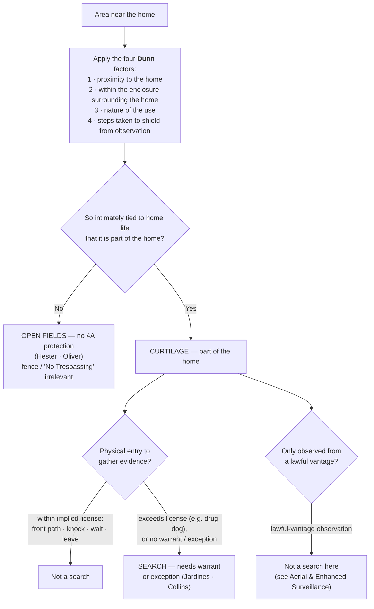
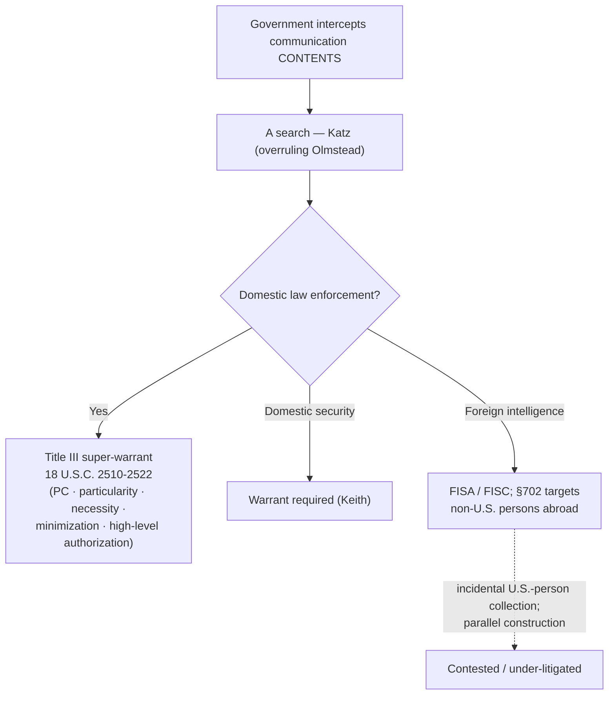

# S9 R1 panel-review — Opus model-diversity lane (prompt pack)

You are the **Claude/Opus** leg of the S9 three-lane adversarial panel (1 Claude + 2 Codex, R1). The two Codex lanes carry the A (support/quote-fidelity) and B (currency/treatment) attack lenses; **you carry model diversity and MUST vote on every paneled assertion across BOTH lenses' concerns.** You are refute-framed: try hard to break each assertion; **default to REFUTED on uncertainty**; never fabricate a cite, quote, or holding; use ONLY the evidence inlined below (no search, no outside knowledge). You are a SIGHTED reviewer — the FULL lake record (judgment fields included) is inlined.

You are a WRITER lane, not an adjudicator: you FIND and VOTE. You do not tally, adjudicate, or close any row — the orchestrator does.

For EACH group below, return one JSON object with the exact `reviewed[]` shape from the output contract (identical framing to the Codex lenses). Emit a finding object ONLY for a real defect (verdict refuted / stands-modified); a group you find wholly clean returns all-`stands` verdicts (the harness records a clean attestation). Concatenate the per-group JSON objects into a top-level `{"packs": [ ... ]}` array, one entry per group, each carrying its `group_id`.


OUTPUT CONTRACT — return ONE JSON object, nothing else:
{
  "lens": "A" | "B",
  "group_id": "<echo the group id>",
  "reviewed": [
    {
      "assertion_id": "<from group_inventory.jsonl>",
      "dimension": "existence|support|quote_fidelity|pincite|treatment|black_letter",
      "verdict": "stands" | "refuted" | "stands-modified",
      "verifiable_from_disclosed": true | false,
      "defect": null,   // null when verdict=="stands"; else an object:
      //  {"problem": "...", "severity": "high|medium|low", "proposed_fix": "...", "evidence_quote": "verbatim from disclosed evidence or null", "needs_cl": true|false, "locator_note": "..."}
      "reasons": ["short evidence-grounded reason", "..."],
      "breaks_true_positives": true | false,
      "residual_risks": ["..."],
      "suggested_tightening": "... or null"
    }
  ],
  "notes": ""
}
Rules: verdict=='stands' <=> defect==null (assertion survives your attack). verdict=='refuted' <=> a real defect (the assertion as framed is wrong). verdict=='stands-modified' <=> survives but needs a stated modification (a minor defect). Review EVERY assertion_id in group_inventory.jsonl exactly once. Output ONLY the JSON object.
---

## GROUP: content/searches/Curtilage.md  (`doctrine`, 12 assertions)

### content_page

```
---
weight: 20
title: "Curtilage"
aliases:
  - "Curtilage"
  - "3-what-is-a-search/Curtilage"
topic: Curtilage — the home's protected extension
type: doctrine
amendment: "U.S. Const. amend. IV"
jurisdiction: "Federal (U.S. Const. amend. IV); SCOTUS baseline"
status: draft
related:
  - "[[Open Fields]]"
  - "[[Two Definitions of Search]]"
  - "[[Knock and Talk]]"
  - "[[Aerial and Enhanced Surveillance]]"
  - "[[Plain View Doctrine]]"
  - "[[Tents]]"
  - "[[Arrest in the Home]]"
---

# Curtilage

*Is the patch of ground the officer is standing on part of the home's curtilage, or is it an open field the Fourth Amendment never reaches? Which side of that one line the ground falls on can decide whether a "search" happened at all.*

> [!rule] Black-letter rule
> **Curtilage** is "the area 'immediately surrounding and associated with the home,'" treated as "part of the home itself for Fourth Amendment purposes," so a physical intrusion onto curtilage to gather evidence is a **search**, presumptively unreasonable without a warrant or a recognized exception. *[[Florida v. Jardines#^pin-6|Jardines]]*, 569 U.S. 1, [6](https://www.courtlistener.com/opinion/856347/florida-v-jardines/) (2013) (quoting *[[Oliver v. United States#^pin-180|Oliver]]*, 466 U.S. 170, 180 (1984)). Everything beyond the curtilage is **open fields**, which get no Fourth Amendment protection ([[Open Fields]]). Whether a given spot is curtilage is "resolved with particular reference to four factors": **(1) proximity** to the home, **(2) enclosure** within an area surrounding the home, **(3) the nature of the use** to which the area is put, and **(4) the steps taken to shield** it from observation. *[[United States v. Dunn#^pin-301|Dunn]]*, 480 U.S. 294, [301](https://www.courtlistener.com/opinion/111833/united-states-v-dunn/) (1987). The factors are not a mechanical formula; they are "useful analytical tools only to the degree that ... they bear upon the centrally relevant consideration — whether the area in question is so intimately tied to the home itself that it should be placed under the home's 'umbrella' of Fourth Amendment protection." *[[United States v. Dunn#^pin-301a|Id.]]*
> ^rule-curtilage

## The Brief

**What curtilage is, and what it is not.** Curtilage is the home's protected extension: the ground close enough to the dwelling, and connected enough to the intimate activity of home life, that the law treats it as the home itself. *[[Florida v. Jardines#^pin-6|Jardines]]*, 569 U.S. at [6](https://www.courtlistener.com/opinion/856347/florida-v-jardines/). Because it is part of the home, entering it to gather evidence is a search, and the ordinary warrant preference applies. It is **not** a privacy-magnitude question and **not** a fence question; the whole exercise is drawing one line, curtilage on the protected side and open fields on the unprotected side ([[Open Fields]]). Get the line right and everything else follows.

**The test up front: the four *[[United States v. Dunn|Dunn]]* factors.** Whether a given spot is curtilage is "resolved with particular reference to four factors":

1. **Proximity** of the area claimed to be curtilage to the home;
2. **Enclosure** — whether the area sits within an enclosure surrounding the home;
3. **Nature of the use** to which the area is put; and
4. **Steps to shield** the area from observation by people passing by.

*[[United States v. Dunn#^pin-301|Dunn]]*, 480 U.S. at [301](https://www.courtlistener.com/opinion/111833/united-states-v-dunn/). No single factor is dispositive, and the four are "not [a] finely tuned formula" but "useful analytical tools" that all serve one question: is the area "so intimately tied to the home itself" that it belongs under the home's "'umbrella' of Fourth Amendment protection"? *[[United States v. Dunn#^pin-301a|Id.]]* In *[[United States v. Dunn|Dunn]]* itself, a barn roughly 50 yards beyond the fence around the ranch house (60 yards from the house), used to manufacture drugs and left largely unshielded, flunked all four factors and was **open fields**, not curtilage.

**What counts as curtilage: the paradigm spots.** Proximity plus the home-life connection, not the presence of a fence, is what makes ground curtilage. The **front porch** is "the classic exemplar" of curtilage. *[[Florida v. Jardines|Jardines]]*, 569 U.S. at [7](https://www.courtlistener.com/opinion/856347/florida-v-jardines/). So is a **driveway top or carport abutting the house**: *[[Collins v. Virginia|Collins]]* treated the partly enclosed driveway apron next to the dwelling as curtilage. The front path, the walk to the customary door, and the immediately adjacent yard travel with the home for the same reason.

**The implied license bounds entry onto curtilage.** An officer (like any visitor) may cross the curtilage to knock and ask, because a narrow implied social license lets a visitor "approach the home by the front path, knock promptly, wait briefly to be received, and then ... leave." That license is stated in full on [[Knock and Talk]] and is limited "to a particular area" and "to a specific purpose." Stay inside it and the approach is no search; exceed it, by bringing a drug dog onto the porch or lingering to snoop, and the same approach becomes a **trespassory search** of the curtilage. *[[Florida v. Jardines#^pin-9|Jardines]]*, 569 U.S. at [9](https://www.courtlistener.com/opinion/856347/florida-v-jardines/). The license is also bounded by time and manner in the circuits (see Lower-court developments).

**The automobile-exception limit.** Because curtilage is part of the home, an officer may not use a warrant **exception** for one thing (the car) to justify the separate trespass of entering protected ground. *[[Collins v. Virginia|Collins]]* held that the automobile exception does not authorize a warrantless entry of a home or its curtilage to reach and search a vehicle parked there. *[[Collins v. Virginia|Collins]]*, 584 U.S. 586 (2018). Lawful authority to search a vehicle is not lawful authority to walk into the curtilage to get to it.

**Observation from a lawful vantage is a different question.** Officers may *observe* curtilage from any place they are lawfully entitled to be, including public airspace and the street, without that observation being a search; but a lawful vantage authorizes looking, not physical **entry** (*[[Collins v. Virginia|Collins]]*), and it does not reach sense-enhancing technology that exposes the home's interior. The naked-eye aerial-overflight cases and the sense-enhancing-technology limit are developed on [[Aerial and Enhanced Surveillance]].

**Do businesses have curtilage? No, but that is not the same as "no privacy."** Curtilage is a *home* concept; commercial property has no analogous domestic curtilage, and the open, publicly exposed grounds of a business are treated more like open fields than like the curtilage of a house. But **no curtilage does not mean no Fourth Amendment privacy**: the private, non-public interior of a business keeps a [[Reasonable Expectation of Privacy|reasonable expectation of privacy]]. *[[G. M. Leasing Corp. v. United States|G. M. Leasing]]*, 429 U.S. 338, [351–59](https://www.courtlistener.com/opinion/109579/g-m-leasing-corp-v-united-states/) (1977) (warrantless entry into a corporation's private offices to seize assets was unreasonable, though seizing cars from open or public areas was not); *[[See v. City of Seattle|See]]*, 387 U.S. 541, [545–46](https://www.courtlistener.com/opinion/107474/see-v-city-of-seattle/) (1967) (the businessman may insist on a warrant against administrative entry). The operative rule for officers: the open grounds of a business are open-fields-like (lawful-vantage observation is generally fine), but entry into the private interior still needs a warrant or an exception, and the [[Knock and Talk|knock-and-talk]] license reaches only the public-facing approach. This commercial-privacy thread runs into the administrative-inspection regime ([[Special Needs and Administrative Searches]]).

**A tent has no curtilage.** The curtilage concept belongs to a fixed dwelling. A tent's home-like protection covers its **interior**, not the open ground around it: on a dispersed public-land campsite, "the area outside of the tent ... is not curtilage." *[[United States v. Basher|Basher]]*, 629 F.3d 1161, 1169 (9th Cir. 2011). See [[Tents]].

**Multi-unit dwellings do not map cleanly onto the single-family paradigm.** The *[[United States v. Dunn|Dunn]]* factors assume one house on its own ground; applied to apartments, shared yards, and common areas, the lower courts split over how far, if at all, the home's protection reaches into space a tenant cannot exclude others from. Those persuasive state and circuit lines are collected in Lower-court developments; the boundary, not the black-letter rule, is what moves.

**Burden, standard of review, and remedy.** The **defendant** (the proponent of suppression) bears the burden of establishing that the area was **curtilage** and that he had a legitimate expectation of privacy or possessory interest there, by a [[Common Legal Terms#preponderance-of-the-evidence|preponderance of the evidence]]. *[[Rakas v. Illinois|Rakas]]*, 439 U.S. 128, [130–31](https://www.courtlistener.com/opinion/109953/rakas-v-illinois/) n.1 (1978); *[[Rawlings v. Kentucky|Rawlings]]*, 448 U.S. 98, [104–05](https://www.courtlistener.com/opinion/110326/rawlings-v-kentucky/) (1980). On appeal the district court's factual findings on the *[[United States v. Dunn|Dunn]]* factors are reviewed for [[Common Legal Terms#clear-error|clear error]], while the ultimate curtilage determination is reviewed [[Common Legal Terms#de-novo|de novo]]. Cf. *[[Ornelas v. United States|Ornelas]]*, 517 U.S. 690, [699](https://www.courtlistener.com/opinion/118030/ornelas-v-united-states/) (1996). The remedy for an unjustified warrantless search of curtilage is suppression of the evidence and its fruits ([[The Exclusionary Rule]]).

**Apply it.**
1. **Fix the line first.** Before anything else, decide whether the ground is curtilage or open fields; run the four *[[United States v. Dunn|Dunn]]* factors against the actual layout, and remember no single factor controls.
2. **Treat porch, path, driveway top, and adjacent yard as the home.** Proximity plus the home-life connection, not a fence, makes them curtilage (*[[Florida v. Jardines|Jardines]]*; *[[Collins v. Virginia|Collins]]*).
3. **Stay inside the [[Knock and Talk|knock-and-talk]] license if you approach.** Front path, knock, brief wait, leave. A dog, a peer through a window, or lingering to snoop converts the approach into a search (*[[Florida v. Jardines|Jardines]]*; [[Knock and Talk]]).
4. **Do not borrow a car exception to enter curtilage.** Probable cause to search the vehicle is not authority to cross onto the curtilage to reach it (*[[Collins v. Virginia|Collins]]*).
5. **Look, do not enter, from a lawful vantage.** Observing curtilage from a place you may lawfully be is not a search; walking onto it, or aiming sense-enhancing gear at the interior, is a different question ([[Aerial and Enhanced Surveillance]]).

**Common pitfalls.**
- **Treating a driveway, porch, or attached carport as fair game.** Proximity plus the home-life connection, not the absence of a fence, controls (*[[Collins v. Virginia|Collins]]*; *[[Florida v. Jardines|Jardines]]*).
- **Reading "you may look from outside" as "you may enter."** A lawful vantage permits observation, never physical entry of the curtilage (*[[Collins v. Virginia|Collins]]*), and never sense-enhancing technology aimed at the interior ([[Aerial and Enhanced Surveillance]]).
- **Thinking a fence or "No Trespassing" sign creates protected space out of open fields.** It does not; the curtilage line, not signage, decides ([[Open Fields]]).
- **Forgetting the [[Knock and Talk|knock-and-talk]] license is scope-limited.** Overstaying, or bringing investigative tools onto the porch, turns a lawful approach into a search (*[[Florida v. Jardines|Jardines]]*).

## Lower-court developments

- ***[[United States v. Tuggle|Tuggle]]* (7th Cir. 2021)** — *pole camera, "no search" side.* Roughly 18 months of warrantless pole-camera surveillance of a home's exterior and curtilage was **not** a search, because the cameras captured only what was publicly visible; the court declined the mosaic theory under current doctrine while flagging the looming aggregation problem. "[T]he extensive pole camera surveillance in this case did not constitute a search under the current understanding of the Fourth Amendment," 4 F.4th 505, 512. **Binding in-circuit — 7th Cir.** [opinion](https://www.courtlistener.com/opinion/4899735/united-states-v-travis-tuggle/)
- ***[[United States v. Moore-Bush|Moore-Bush]]* (1st Cir. 2022) (en banc)** — *pole camera, illustrates the split.* The [[Reading and Citing Cases#en-banc|en banc]] First Circuit **unanimously reversed** the suppression order and [[Reading and Citing Cases#on-remand|remanded]] with instructions to **deny** suppression, so eight months of pole-camera evidence came in, even though the judges divided **3–3** on whether sustained warrantless pole-camera surveillance of a home's curtilage is a search (one bloc reading *[[Carpenter v. United States|Carpenter]]*'s mosaic theory to reach it, the other finding no search). All agreed the evidence was admissible under the [[The Good-Faith Exception|good-faith exception]], which required reversal regardless. 36 F.4th 320. **Binding in-circuit — 1st Cir.** [opinion](https://www.courtlistener.com/opinion/6476395/united-states-v-moore-bush/)
- ***[[United States v. May-Shaw|May-Shaw]]* (6th Cir. 2020)** — *pole camera + carport, "no search" side.* A communal covered carport the defendant had no right to exclude others from, easily viewable from a public street, was **not** within the curtilage of his apartment under the *[[United States v. Dunn|Dunn]]* factors, so a dog sniff of his car parked there was not a search; 23 days of pole-camera surveillance of the lot likewise violated no [[Reasonable Expectation of Privacy|reasonable expectation of privacy]]. 955 F.3d 563. **Binding in-circuit — 6th Cir.** [opinion](https://www.courtlistener.com/opinion/4743325/united-states-v-christopher-may-shaw/)
- ***[[United States v. Lundin|Lundin]]* (9th Cir. 2016)** — *implied license: time + purpose.* A **4 a.m.** [[Knock and Talk|knock-and-talk]] exceeded the implied license to enter the curtilage, both because of the hour and because the officers' purpose was to arrest rather than to ask questions, so the resulting evidence was suppressed. "[T]he officers knocked on Lundin's door around 4:00 a.m. without evidence that Lundin generally accepted visitors at that hour, and without a reason for knocking that a resident would ordinarily accept," 817 F.3d 1151, 1159. **Binding in-circuit — 9th Cir.** [opinion](https://www.courtlistener.com/opinion/3187682/united-states-v-eric-lundin/)
- ***[[State v. Karston|Karston]]* (La. Ct. App. 1991)** — *apartment common area.* A tenant held a [[Reasonable Expectation of Privacy|reasonable expectation of privacy]] in the fenced, gated common courtyard of a private apartment complex; an officer who opened the closed gate and entered without cause to set up surveillance conducted an unreasonable search. 588 So. 2d 165. **Persuasive — state, illustrative.** [opinion](https://www.courtlistener.com/opinion/1767998/state-v-karston/)
- ***[[State v. Larson|Larson]]* (Or. Ct. App. 1999)** — *apartment common area.* Rather than mechanically applying single-family curtilage factors, a court evaluates the layout and the residents' use of a shared area; officers who entered a partially enclosed strip behind an apartment building to smell marijuana from a window invaded a protected interest. 159 Or. App. 34. **Persuasive — state, illustrative.** [opinion](https://www.courtlistener.com/opinion/1187724/state-v-larson/)
- ***[[State v. Weaver|Weaver]]* (Tex. Crim. App. 2011)** — *commercial premises.* A drug-dog sniff of a vehicle on private, non-public business premises was unlawful once the owner's limited consent to be there had ended; the rule that a dog sniff is not itself a search presupposes the officer had a lawful right to be where the sniff occurred. 349 S.W.3d 521. **Persuasive — state, illustrative.** [opinion](https://www.courtlistener.com/opinion/2546485/state-v-weaver/)

The unresolved national question is the pole-camera one: whether *[[Carpenter v. United States|Carpenter]]*'s mosaic theory turns months of fixed, warrantless camera watching of a home's exterior into a search, or whether the publicly-visible / lawful-vantage rule still controls. The Supreme Court has not resolved it (cert. denied in *[[United States v. Tuggle|Tuggle]]* and *[[United States v. Moore-Bush|Moore-Bush]]*), and the circuits divide. ⚖ **Circuit split.**

## Key cases

| Case | Holding | Opinion |
|---|---|---|
| *[[United States v. Dunn]]*, 480 U.S. 294 (1987) | **Anchor.** Sets the four-factor curtilage test (proximity, enclosure, nature of use, steps taken to shield), all bearing on whether the area is so intimately tied to the home as to fall under its Fourth Amendment umbrella; a barn 50 yards beyond the fence flunked all four and was open fields. | [opinion](https://www.courtlistener.com/opinion/111833/united-states-v-dunn/) |
| *[[Florida v. Jardines]]*, 569 U.S. 1 (2013) | **Anchor.** The front porch is curtilage, "part of the home itself"; bringing a drug dog there to investigate exceeded the implied license to approach and knock, so it was a trespassory search. | [opinion](https://www.courtlistener.com/opinion/856347/florida-v-jardines/) |
| *[[Collins v. Virginia]]*, 584 U.S. 586 (2018) | The automobile exception does not reach into curtilage: no warrantless entry of a home or its curtilage to search a vehicle parked there. | [opinion](https://www.courtlistener.com/opinion/4501697/collins-v-virginia/) |
| *[[Hester v. United States]]*, 265 U.S. 57 (1924) | The open-field boundary: Fourth Amendment protection of "persons, houses, papers, and effects" does not extend to open fields; the origin of the doctrine that fixes where curtilage ends. Developed on [[Open Fields]]. | [opinion](https://www.courtlistener.com/opinion/100413/hester-v-united-states/) |
| *[[Oliver v. United States]]*, 466 U.S. 170 (1984) | Reaffirms that only the curtilage, not the neighboring open fields, carries the home's protection; even fenced, posted, secluded land is open fields. Developed on [[Open Fields]]. | [opinion](https://www.courtlistener.com/opinion/111146/oliver-v-united-states/) |
| *[[G. M. Leasing Corp. v. United States]]*, 429 U.S. 338 (1977) | Commercial premises have no domestic curtilage, and open or public business areas are open-fields-like; but a warrantless entry into a corporation's private offices to seize assets was unreasonable, so "no curtilage" is not "no privacy." | [opinion](https://www.courtlistener.com/opinion/109579/g-m-leasing-corp-v-united-states/) |

## Related cases across doctrines

These are treated in full on other doctrine pages but bear on the curtilage line, framed for it here.

| Case | Relevance here | Primary home | Opinion |
|---|---|---|---|
| *[[Kentucky v. King]]*, 563 U.S. 452 (2011) | ***Enters.*** Officers may approach and knock where any private citizen could; the implied-license entry onto curtilage (porch, path) is lawful, and police do not "create" an [[Exigent Circumstances and Hot Pursuit\|exigency]] merely by knocking within that license. | [[Exigent Circumstances and Hot Pursuit]] | [opinion](https://www.courtlistener.com/opinion/216733/kentucky-v-king/) |
| *[[French v. Merrill]]*, 15 F.4th 116 (1st Cir. 2021) | ***Exceeds.*** Officers who overstayed the implied social license (repeated returns capped by a nighttime intrusion) committed a *[[Florida v. Jardines\|Jardines]]* trespassory search of the curtilage. | [[Knock and Talk]] | [opinion](https://www.courtlistener.com/opinion/5273192/french-v-merrill/) |
| *[[United States v. Santana]]*, 427 U.S. 38 (1976) | ***Boundary.*** A suspect in her own open doorway is in a "public" place, the line where the home's curtilage protection gives way; she cannot retreat indoors to defeat a public-place arrest. *(Hot-pursuit reach limited by [[Lange v. California]].)* | [[Arrest in the Home]] | [opinion](https://www.courtlistener.com/opinion/109504/united-states-v-santana/) |
| *[[See v. City of Seattle]]*, 387 U.S. 541 (1967) | ***Commercial.*** Commercial premises have Fourth Amendment protection against warrantless administrative entry, so "no curtilage" does not mean "no privacy" for a business interior. | [[Special Needs and Administrative Searches]] | [opinion](https://www.courtlistener.com/opinion/107474/see-v-city-of-seattle/) |
| *[[United States v. Basher]]*, 629 F.3d 1161 (9th Cir. 2011) | ***Limits.*** A tent has no curtilage: its home-like protection covers the interior, not the open campsite ground around it. | [[Tents]] | [opinion](https://www.courtlistener.com/opinion/183144/united-states-v-basher/) |

## Visual



## Sources

- [*United States v. Dunn*, 480 U.S. 294 (1987)](https://www.courtlistener.com/opinion/111833/united-states-v-dunn/) (pinpoints: 301, 302)
- [*Florida v. Jardines*, 569 U.S. 1 (2013)](https://www.courtlistener.com/opinion/856347/florida-v-jardines/) (pinpoints: 6, 7, 9)
- [*Collins v. Virginia*, 584 U.S. 586 (2018)](https://www.courtlistener.com/opinion/4501697/collins-v-virginia/)
- [*Hester v. United States*, 265 U.S. 57 (1924)](https://www.courtlistener.com/opinion/100413/hester-v-united-states/) (pinpoint: 59)
- [*Oliver v. United States*, 466 U.S. 170 (1984)](https://www.courtlistener.com/opinion/111146/oliver-v-united-states/) (pinpoints: 179, 180)
- [*G. M. Leasing Corp. v. United States*, 429 U.S. 338 (1977)](https://www.courtlistener.com/opinion/109579/g-m-leasing-corp-v-united-states/) (pinpoints: 351–59)
- [*See v. City of Seattle*, 387 U.S. 541 (1967)](https://www.courtlistener.com/opinion/107474/see-v-city-of-seattle/) (pinpoint: 545–46)
- [*Kentucky v. King*, 563 U.S. 452 (2011)](https://www.courtlistener.com/opinion/216733/kentucky-v-king/)
- [*French v. Merrill*, 15 F.4th 116 (1st Cir. 2021)](https://www.courtlistener.com/opinion/5273192/french-v-merrill/)
- [*United States v. Santana*, 427 U.S. 38 (1976)](https://www.courtlistener.com/opinion/109504/united-states-v-santana/)
- [*United States v. Basher*, 629 F.3d 1161 (9th Cir. 2011)](https://www.courtlistener.com/opinion/183144/united-states-v-basher/)
- [*United States v. Tuggle*, 4 F.4th 505 (7th Cir. 2021)](https://www.courtlistener.com/opinion/4899735/united-states-v-travis-tuggle/)
- [*United States v. Moore-Bush*, 36 F.4th 320 (1st Cir. 2022) (en banc)](https://www.courtlistener.com/opinion/6476395/united-states-v-moore-bush/)
- [*United States v. May-Shaw*, 955 F.3d 563 (6th Cir. 2020)](https://www.courtlistener.com/opinion/4743325/united-states-v-christopher-may-shaw/)
- [*United States v. Lundin*, 817 F.3d 1151 (9th Cir. 2016)](https://www.courtlistener.com/opinion/3187682/united-states-v-eric-lundin/)
- [*State v. Karston*, 588 So. 2d 165 (La. Ct. App. 1991)](https://www.courtlistener.com/opinion/1767998/state-v-karston/)
- [*State v. Larson*, 159 Or. App. 34 (1999)](https://www.courtlistener.com/opinion/1187724/state-v-larson/)
- [*State v. Weaver*, 349 S.W.3d 521 (Tex. Crim. App. 2011)](https://www.courtlistener.com/opinion/2546485/state-v-weaver/)

```

### group_inventory (assertions under review)

```jsonl
{"assertion_id": "11760d066fc5d2a5", "dimension": "existence", "kind": "case_cite", "locator": {"case": "United States v. Dunn", "table_line": 68}, "payload": {"case": "United States v. Dunn", "cells": ["*[[United States v. Dunn]]*, 480 U.S. 294 (1987)", "**Anchor.** Sets the four-factor curtilage test (proximity, enclosure, nature of use, steps taken to shield), all bearing on whether the area is so intimately tied to the home as to fall under its Fourth Amendment umbrella; a barn 50 yards beyond the fence flunked all four and was open fields.", "[opinion](https://www.courtlistener.com/opinion/111833/united-states-v-dunn/)"], "header": ["Case", "Holding", "Opinion"]}}
{"assertion_id": "4edfe5310b7f924a", "dimension": "existence", "kind": "case_cite", "locator": {"case": "Florida v. Jardines", "table_line": 69}, "payload": {"case": "Florida v. Jardines", "cells": ["*[[Florida v. Jardines]]*, 569 U.S. 1 (2013)", "**Anchor.** The front porch is curtilage, \"part of the home itself\"; bringing a drug dog there to investigate exceeded the implied license to approach and knock, so it was a trespassory search.", "[opinion](https://www.courtlistener.com/opinion/856347/florida-v-jardines/)"], "header": ["Case", "Holding", "Opinion"]}}
{"assertion_id": "56ee215570d06a51", "dimension": "existence", "kind": "case_cite", "locator": {"case": "Collins v. Virginia", "table_line": 70}, "payload": {"case": "Collins v. Virginia", "cells": ["*[[Collins v. Virginia]]*, 584 U.S. 586 (2018)", "The automobile exception does not reach into curtilage: no warrantless entry of a home or its curtilage to search a vehicle parked there.", "[opinion](https://www.courtlistener.com/opinion/4501697/collins-v-virginia/)"], "header": ["Case", "Holding", "Opinion"]}}
{"assertion_id": "64133e2dfbb06f4e", "dimension": "existence", "kind": "case_cite", "locator": {"case": "French v. Merrill", "table_line": 82}, "payload": {"case": "French v. Merrill", "cells": ["*[[French v. Merrill]]*, 15 F.4th 116 (1st Cir. 2021)", "***Exceeds.*** Officers who overstayed the implied social license (repeated returns capped by a nighttime intrusion) committed a *[[Florida v. Jardines\\|Jardines]]* trespassory search of the curtilage.", "[[Knock and Talk]]", "[opinion](https://www.courtlistener.com/opinion/5273192/french-v-merrill/)"], "header": ["Case", "Relevance here", "Primary home", "Opinion"]}}
{"assertion_id": "6ad82f28072de73c", "dimension": "existence", "kind": "case_cite", "locator": {"case": "United States v. Santana", "table_line": 83}, "payload": {"case": "United States v. Santana", "cells": ["*[[United States v. Santana]]*, 427 U.S. 38 (1976)", "***Boundary.*** A suspect in her own open doorway is in a \"public\" place, the line where the home's curtilage protection gives way; she cannot retreat indoors to defeat a public-place arrest. *(Hot-pursuit reach limited by [[Lange v. California]].)*", "[[Arrest in the Home]]", "[opinion](https://www.courtlistener.com/opinion/109504/united-states-v-santana/)"], "header": ["Case", "Relevance here", "Primary home", "Opinion"]}}
{"assertion_id": "810a83c276837f5b", "dimension": "existence", "kind": "case_cite", "locator": {"case": "United States v. Basher", "table_line": 85}, "payload": {"case": "United States v. Basher", "cells": ["*[[United States v. Basher]]*, 629 F.3d 1161 (9th Cir. 2011)", "***Limits.*** A tent has no curtilage: its home-like protection covers the interior, not the open campsite ground around it.", "[[Tents]]", "[opinion](https://www.courtlistener.com/opinion/183144/united-states-v-basher/)"], "header": ["Case", "Relevance here", "Primary home", "Opinion"]}}
{"assertion_id": "a4c476293eed5996", "dimension": "existence", "kind": "case_cite", "locator": {"case": "See v. City of Seattle", "table_line": 84}, "payload": {"case": "See v. City of Seattle", "cells": ["*[[See v. City of Seattle]]*, 387 U.S. 541 (1967)", "***Commercial.*** Commercial premises have Fourth Amendment protection against warrantless administrative entry, so \"no curtilage\" does not mean \"no privacy\" for a business interior.", "[[Special Needs and Administrative Searches]]", "[opinion](https://www.courtlistener.com/opinion/107474/see-v-city-of-seattle/)"], "header": ["Case", "Relevance here", "Primary home", "Opinion"]}}
{"assertion_id": "caa911efa50eda4d", "dimension": "existence", "kind": "case_cite", "locator": {"case": "Kentucky v. King", "table_line": 81}, "payload": {"case": "Kentucky v. King", "cells": ["*[[Kentucky v. King]]*, 563 U.S. 452 (2011)", "***Enters.*** Officers may approach and knock where any private citizen could; the implied-license entry onto curtilage (porch, path) is lawful, and police do not \"create\" an [[Exigent Circumstances and Hot Pursuit\\|exigency]] merely by knocking within that license.", "[[Exigent Circumstances and Hot Pursuit]]", "[opinion](https://www.courtlistener.com/opinion/216733/kentucky-v-king/)"], "header": ["Case", "Relevance here", "Primary home", "Opinion"]}}
{"assertion_id": "dec328e854c4e76e", "dimension": "existence", "kind": "case_cite", "locator": {"case": "G. M. Leasing Corp. v. United States", "table_line": 73}, "payload": {"case": "G. M. Leasing Corp. v. United States", "cells": ["*[[G. M. Leasing Corp. v. United States]]*, 429 U.S. 338 (1977)", "Commercial premises have no domestic curtilage, and open or public business areas are open-fields-like; but a warrantless entry into a corporation's private offices to seize assets was unreasonable, so \"no curtilage\" is not \"no privacy.\"", "[opinion](https://www.courtlistener.com/opinion/109579/g-m-leasing-corp-v-united-states/)"], "header": ["Case", "Holding", "Opinion"]}}
{"assertion_id": "e62a1b967d205a9a", "dimension": "existence", "kind": "case_cite", "locator": {"case": "Oliver v. United States", "table_line": 72}, "payload": {"case": "Oliver v. United States", "cells": ["*[[Oliver v. United States]]*, 466 U.S. 170 (1984)", "Reaffirms that only the curtilage, not the neighboring open fields, carries the home's protection; even fenced, posted, secluded land is open fields. Developed on [[Open Fields]].", "[opinion](https://www.courtlistener.com/opinion/111146/oliver-v-united-states/)"], "header": ["Case", "Holding", "Opinion"]}}
{"assertion_id": "e92c4a83181308fa", "dimension": "existence", "kind": "case_cite", "locator": {"case": "Hester v. United States", "table_line": 71}, "payload": {"case": "Hester v. United States", "cells": ["*[[Hester v. United States]]*, 265 U.S. 57 (1924)", "The open-field boundary: Fourth Amendment protection of \"persons, houses, papers, and effects\" does not extend to open fields; the origin of the doctrine that fixes where curtilage ends. Developed on [[Open Fields]].", "[opinion](https://www.courtlistener.com/opinion/100413/hester-v-united-states/)"], "header": ["Case", "Holding", "Opinion"]}}
{"assertion_id": "3815a0fa0539d70f", "dimension": "support", "kind": "proposition", "locator": {"callout": "^rule-curtilage"}, "payload": {"anchor": "^rule-curtilage", "statement": "[!rule] Black-letter rule\n**Curtilage** is \"the area 'immediately surrounding and associated with the home,'\" treated as \"part of the home itself for Fourth Amendment purposes,\" so a physical intrusion onto curtilage to gather evidence is a **search**, presumptively unreasonable without a warrant or a recognized exception. *[[Florida v. Jardines#^pin-6|Jardines]]*, 569 U.S. 1, [6](https://www.courtlistener.com/opinion/856347/florida-v-jardines/) (2013) (quoting *[[Oliver v. United States#^pin-180|Oliver]]*, 466 U.S. 170, 180 (1984)). Everything beyond the curtilage is **open fields**, which get no Fourth Amendment protection ([[Open Fields]]). Whether a given spot is curtilage is \"resolved with particular reference to four factors\": **(1) proximity** to the home, **(2) enclosure** within an area surrounding the home, **(3) the nature of the use** to which the area is put, and **(4) the steps taken to shield** it from observation. *[[United States v. Dunn#^pin-301|Dunn]]*, 480 U.S. 294, [301](https://www.courtlistener.com/opinion/111833/united-states-v-dunn/) (1987). The factors are not a mechanical formula; they are \"useful analytical tools only to the degree that ... they bear upon the centrally relevant consideration — whether the area in question is so intimately tied to the home itself that it should be placed under the home's 'umbrella' of Fourth Amendment protection.\" *[[United States v. Dunn#^pin-301a|Id.]]*"}}
```

### lake record — Collins v. Virginia

```json
{
  "schema_version": "s2.v1",
  "record_id": "Collins v. Virginia",
  "stub": false,
  "status": "verified",
  "identity": {
    "case_name": "Collins v. Virginia",
    "case_name_short": "Collins",
    "case_name_full": "",
    "input_case_name": "Collins v. Virginia",
    "court": "U.S. Supreme Court",
    "court_id": "scotus",
    "court_level": "scotus",
    "circuit": null,
    "state": null,
    "date_decided": "2018-05-29",
    "year": 2018,
    "docket": "16-1027",
    "cluster_id": 4501697,
    "lead_opinion_id": 4278950,
    "sibling_ids": [
      4278950
    ],
    "absolute_url": "/opinion/4501697/collins-v-virginia/",
    "identity_method": "citation+party-text",
    "expected_citation_found": true,
    "party_name_in_text": true,
    "canonical_name_match": true,
    "alternates": [],
    "reason_code": null
  },
  "citations": {
    "official": {
      "cite": "584 U.S. 586",
      "volume": "584",
      "reporter": "U.S.",
      "page": "586",
      "type": 1,
      "selected_official": true,
      "source": "cluster.citations[]"
    },
    "parallel": [
      {
        "cite": "138 S. Ct. 1663",
        "volume": "138",
        "reporter": "S. Ct.",
        "page": "1663",
        "type": 1,
        "selected_official": false,
        "source": "cluster.citations[]"
      },
      {
        "cite": "201 L. Ed. 2d 9",
        "volume": "201",
        "reporter": "L. Ed. 2d",
        "page": "9",
        "type": 1,
        "selected_official": false,
        "source": "cluster.citations[]"
      }
    ],
    "vendor_neutral": [
      {
        "cite": "2018 U.S. LEXIS 3210",
        "volume": "2018",
        "reporter": "U.S. LEXIS",
        "page": "3210",
        "type": 6,
        "selected_official": false,
        "source": "cluster.citations[]"
      }
    ],
    "all": [
      {
        "cite": "584 U.S. 586",
        "volume": "584",
        "reporter": "U.S.",
        "page": "586",
        "type": 1,
        "selected_official": false,
        "source": "cluster.citations[]"
      },
      {
        "cite": "138 S. Ct. 1663",
        "volume": "138",
        "reporter": "S. Ct.",
        "page": "1663",
        "type": 1,
        "selected_official": false,
        "source": "cluster.citations[]"
      },
      {
        "cite": "201 L. Ed. 2d 9",
        "volume": "201",
        "reporter": "L. Ed. 2d",
        "page": "9",
        "type": 1,
        "selected_official": false,
        "source": "cluster.citations[]"
      },
      {
        "cite": "2018 U.S. LEXIS 3210",
        "volume": "2018",
        "reporter": "U.S. LEXIS",
        "page": "3210",
        "type": 6,
        "selected_official": false,
        "source": "cluster.citations[]"
      }
    ],
    "display": "584 U.S. 586",
    "official_selection": {
      "court_class": "scotus",
      "selected": "584 U.S. 586",
      "reason": "selected_rank_1"
    }
  },
  "pinpoints": [
    {
      "id": "pin-op14",
      "page": null,
      "quote": "--- # Collins v. Virginia *584 U.S. 586 (2018)* \u00b7 U.S. Supreme Court \u00b7 **Binding \u2014 SCOTUS** \u00b7 Treatment: **good** *(as of 2026-06-30)* <!-- header line; TreatmentBadge + weight render here, degrading to the text above --> ## Background An officer investigating a distinctive orange-and-black motorcycle suspected of eluding police walked up the driveway of Collins's house to a parking patio partly enclosed by the home, pulled back a tarp covering the motorcycle, ran the plates, and confirmed it was stolen \u2014 all without a warrant. Collins moved to suppress, and the Virginia Supreme Court upheld the search under the automobile exception. ## Issue Whether the automobile exception permits an officer, without a warrant, to enter the curtilage of a home to search a vehicle parked there. ## Rule No.",
      "star_marker": null,
      "quote_fidelity": "mismatch",
      "pinpoint_status": "slip-only",
      "position": null
    }
  ],
  "treatment": {
    "field_i_validity": "good_law",
    "as_of_content": "2018-05-29",
    "as_of_treatment": "2026-06-30",
    "composite_basis": "migration-seed",
    "composite_basis_ref": "Collins v. Virginia",
    "varies_by_point": false,
    "scope_note": "Old as_of seeds as_of_treatment; S2 derivation re-derives and may downgrade.",
    "point_overrides": [],
    "edges": [
      {
        "citing_case": {
          "name": "LaCour v. Marshalls of California",
          "cluster_id": 10765564,
          "cite": null,
          "field_ii": "overruled"
        },
        "field_ii": "overruled",
        "field_iii": "mentioned",
        "point": null,
        "proposed": true,
        "journal_ref": "Collins v. Virginia:lane1_negative"
      },
      {
        "citing_case": {
          "name": "Commonwealth v. Wittey",
          "cluster_id": 9404034,
          "cite": null,
          "field_ii": "superseded_by_statute"
        },
        "field_ii": "superseded_by_statute",
        "field_iii": "mentioned",
        "point": null,
        "proposed": true,
        "journal_ref": "Collins v. Virginia:lane1_negative"
      },
      {
        "citing_case": {
          "name": "Commonwealth v. Chesney",
          "cluster_id": 4536724,
          "cite": [
            "196 A.3d 253"
          ],
          "field_ii": "overruled"
        },
        "field_ii": "overruled",
        "field_iii": "mentioned",
        "point": null,
        "proposed": true,
        "journal_ref": "Collins v. Virginia:lane1_negative"
      },
      {
        "citing_case": {
          "name": "Garza v. Idaho",
          "cluster_id": 4594419,
          "cite": [
            "586 U.S. 232",
            "139 S. Ct. 738",
            "203 L. Ed. 2d 77",
            "2019 U.S. LEXIS 1596"
          ],
          "field_ii": "overruled"
        },
        "field_ii": "overruled",
        "field_iii": "mentioned",
        "point": null,
        "proposed": true,
        "journal_ref": "Collins v. Virginia:lane2_top_cited"
      },
      {
        "citing_case": {
          "name": "United States v. Anthony Caldwell",
          "cluster_id": 4904976,
          "cite": [
            "7 F.4th 191"
          ],
          "field_ii": "overruled"
        },
        "field_ii": "overruled",
        "field_iii": "mentioned",
        "point": null,
        "proposed": true,
        "journal_ref": "Collins v. Virginia:lane2_top_cited"
      },
      {
        "citing_case": {
          "name": "Pacheco v. State",
          "cluster_id": 10048657,
          "cite": [
            "465 Md. 311"
          ],
          "field_ii": "questioned"
        },
        "field_ii": "questioned",
        "field_iii": "mentioned",
        "point": null,
        "proposed": true,
        "journal_ref": "Collins v. Virginia:lane2_top_cited"
      },
      {
        "citing_case": {
          "name": "Commonwealth v. Alexis",
          "cluster_id": 4573870,
          "cite": [
            "112 N.E.3d 796",
            "481 Mass. 91"
          ],
          "field_ii": "abrogated"
        },
        "field_ii": "abrogated",
        "field_iii": "mentioned",
        "point": null,
        "proposed": true,
        "journal_ref": "Collins v. Virginia:lane2_top_cited"
      },
      {
        "citing_case": {
          "name": "Soukaneh v. Andrzejewski",
          "cluster_id": 10038252,
          "cite": [
            "112 F.4th 107"
          ],
          "field_ii": "questioned"
        },
        "field_ii": "questioned",
        "field_iii": "mentioned",
        "point": null,
        "proposed": true,
        "journal_ref": "Collins v. Virginia:lane2_top_cited"
      },
      {
        "citing_case": {
          "name": "United States v. Lewis",
          "cluster_id": 9385343,
          "cite": [
            "62 F.4th 733"
          ],
          "field_ii": "questioned"
        },
        "field_ii": "questioned",
        "field_iii": "mentioned",
        "point": null,
        "proposed": true,
        "journal_ref": "Collins v. Virginia:lane2_top_cited"
      },
      {
        "citing_case": {
          "name": "United States v. Raheim Trice",
          "cluster_id": 4769607,
          "cite": [
            "966 F.3d 506"
          ],
          "field_ii": "questioned"
        },
        "field_ii": "questioned",
        "field_iii": "mentioned",
        "point": null,
        "proposed": true,
        "journal_ref": "Collins v. Virginia:lane2_top_cited"
      },
      {
        "citing_case": {
          "name": "Alexander v. City of Syracuse",
          "cluster_id": 10356512,
          "cite": [
            "132 F.4th 129"
          ],
          "field_ii": "questioned"
        },
        "field_ii": "questioned",
        "field_iii": "mentioned",
        "point": null,
        "proposed": true,
        "journal_ref": "Collins v. Virginia:lane2_top_cited"
      },
      {
        "citing_case": {
          "name": "United States v. Suggs",
          "cluster_id": 4888422,
          "cite": [
            "998 F.3d 1125"
          ],
          "field_ii": "questioned"
        },
        "field_ii": "questioned",
        "field_iii": "mentioned",
        "point": null,
        "proposed": true,
        "journal_ref": "Collins v. Virginia:lane2_top_cited"
      },
      {
        "citing_case": {
          "name": "Lewis v. State",
          "cluster_id": 10020965,
          "cite": [
            "233 A.3d 86",
            "470 Md. 1"
          ],
          "field_ii": "questioned"
        },
        "field_ii": "questioned",
        "field_iii": "mentioned",
        "point": null,
        "proposed": true,
        "journal_ref": "Collins v. Virginia:lane2_top_cited"
      },
      {
        "citing_case": {
          "name": "State v. Long",
          "cluster_id": 4775413,
          "cite": [
            "157 N.E.3d 362",
            "2020 Ohio 4090"
          ],
          "field_ii": "questioned"
        },
        "field_ii": "questioned",
        "field_iii": "mentioned",
        "point": null,
        "proposed": true,
        "journal_ref": "Collins v. Virginia:lane2_top_cited"
      },
      {
        "citing_case": {
          "name": "State v. Maxim",
          "cluster_id": 4683972,
          "cite": [
            "454 P.3d 543",
            "165 Idaho 901"
          ],
          "field_ii": "questioned"
        },
        "field_ii": "questioned",
        "field_iii": "mentioned",
        "point": null,
        "proposed": true,
        "journal_ref": "Collins v. Virginia:lane2_top_cited"
      },
      {
        "citing_case": {
          "name": "State v. Noli",
          "cluster_id": 9399584,
          "cite": [
            "412 Mont. 170",
            "529 P.3d 813",
            "2023 MT 84"
          ],
          "field_ii": "questioned"
        },
        "field_ii": "questioned",
        "field_iii": "mentioned",
        "point": null,
        "proposed": true,
        "journal_ref": "Collins v. Virginia:lane2_top_cited"
      },
      {
        "citing_case": {
          "name": "United States v. Jones",
          "cluster_id": 7852694,
          "cite": [
            "43 F.4th 94"
          ],
          "field_ii": "questioned"
        },
        "field_ii": "questioned",
        "field_iii": "mentioned",
        "point": null,
        "proposed": true,
        "journal_ref": "Collins v. Virginia:lane2_top_cited"
      },
      {
        "citing_case": {
          "name": "People v. James",
          "cluster_id": 4869243,
          "cite": [
            "2021 IL App (1st) 180509"
          ],
          "field_ii": "questioned"
        },
        "field_ii": "questioned",
        "field_iii": "mentioned",
        "point": null,
        "proposed": true,
        "journal_ref": "Collins v. Virginia:lane2_top_cited"
      },
      {
        "citing_case": {
          "name": "United States v. Lamar Clancy",
          "cluster_id": 4805551,
          "cite": [
            "979 F.3d 1135"
          ],
          "field_ii": "questioned"
        },
        "field_ii": "questioned",
        "field_iii": "mentioned",
        "point": null,
        "proposed": true,
        "journal_ref": "Collins v. Virginia:lane2_top_cited"
      },
      {
        "citing_case": {
          "name": "State of Maine v. Bruce Akers",
          "cluster_id": 5093384,
          "cite": [
            "259 A.3d 127",
            "2021 ME 43"
          ],
          "field_ii": "questioned"
        },
        "field_ii": "questioned",
        "field_iii": "mentioned",
        "point": null,
        "proposed": true,
        "journal_ref": "Collins v. Virginia:lane2_top_cited"
      },
      {
        "citing_case": {
          "name": "United States v. Toddrey Willie Bruce",
          "cluster_id": 4794438,
          "cite": [
            "977 F.3d 1112"
          ],
          "field_ii": "questioned"
        },
        "field_ii": "questioned",
        "field_iii": "mentioned",
        "point": null,
        "proposed": true,
        "journal_ref": "Collins v. Virginia:lane2_top_cited"
      },
      {
        "citing_case": {
          "name": "United States v. Hernandez-Mieses",
          "cluster_id": 4644586,
          "cite": [
            "931 F.3d 134"
          ],
          "field_ii": "questioned"
        },
        "field_ii": "questioned",
        "field_iii": "mentioned",
        "point": null,
        "proposed": true,
        "journal_ref": "Collins v. Virginia:lane2_top_cited"
      },
      {
        "citing_case": {
          "name": "United States v. Dylan Ostrum",
          "cluster_id": 9496998,
          "cite": [
            "99 F.4th 999"
          ],
          "field_ii": "questioned"
        },
        "field_ii": "questioned",
        "field_iii": "mentioned",
        "point": null,
        "proposed": true,
        "journal_ref": "Collins v. Virginia:lane2_top_cited"
      },
      {
        "citing_case": {
          "name": "United States v. Jones",
          "cluster_id": 8439952,
          "cite": [
            "893 F.3d 66"
          ],
          "field_ii": "questioned"
        },
        "field_ii": "questioned",
        "field_iii": "mentioned",
        "point": null,
        "proposed": true,
        "journal_ref": "Collins v. Virginia:lane2_top_cited"
      },
      {
        "citing_case": {
          "name": "United States v. Prentiss Jackson",
          "cluster_id": 9510705,
          "cite": [
            "103 F.4th 483"
          ],
          "field_ii": "questioned"
        },
        "field_ii": "questioned",
        "field_iii": "mentioned",
        "point": null,
        "proposed": true,
        "journal_ref": "Collins v. Virginia:lane2_top_cited"
      },
      {
        "citing_case": {
          "name": "State v. Wright",
          "cluster_id": 9500300,
          "cite": [
            "243 N.E.3d 782",
            "2024 Ohio 1763"
          ],
          "field_ii": "overruled"
        },
        "field_ii": "overruled",
        "field_iii": "mentioned",
        "point": null,
        "proposed": true,
        "journal_ref": "Collins v. Virginia:lane2_top_cited"
      },
      {
        "citing_case": {
          "name": "United States v. Simpkins",
          "cluster_id": 4796830,
          "cite": [
            "978 F.3d 1"
          ],
          "field_ii": "superseded_by_statute"
        },
        "field_ii": "superseded_by_statute",
        "field_iii": "mentioned",
        "point": null,
        "proposed": true,
        "journal_ref": "Collins v. Virginia:lane2_top_cited"
      }
    ],
    "derivation": {
      "lane1_negative": {
        "query": "cites:(4278950) AND (overrul* OR abrogat* OR supersed* OR \"recede from\" OR \"no longer good law\" OR vacat* OR reversed) ",
        "reviewed": 111,
        "cap": 200,
        "cap_hit": false,
        "final_cursor": null,
        "audit_needed": false,
        "proposed_negative_events": 3,
        "audit_marker": null,
        "triage_mode": "snippet-first",
        "snippet_field": "results[].opinions[].snippet",
        "triage_journaled": 111,
        "triage_read": 3,
        "triage_snippet_classified": 108
      },
      "lane2_top_cited": {
        "query": "cites:(4278950)",
        "reviewed": 25,
        "cap": 25,
        "cap_hit": true,
        "final_cursor": "https://www.courtlistener.com/api/rest/v4/search/?cursor=cz00JnM9Nzg2MjEzMiZ0PW8mZD0yMDI2LTA3LTA0JnA9Mw%3D%3D&order_by=citeCount+desc&page_size=25&q=cites%3A%284278950%29&type=o",
        "audit_needed": true,
        "proposed_negative_events": 25,
        "audit_marker": "R15 treatment audit required"
      },
      "lane3_recency": {
        "query": "cites:(4278950)",
        "reviewed": 48,
        "cap": 200,
        "cap_hit": false,
        "final_cursor": null,
        "audit_needed": false,
        "proposed_negative_events": 1,
        "audit_marker": null,
        "triage_mode": "snippet-first",
        "snippet_field": "results[].opinions[].snippet",
        "triage_journaled": 48,
        "triage_read": 1,
        "triage_snippet_classified": 47
      }
    }
  },
  "progeny": {
    "complete_query": "cites:(4278950)",
    "indexed_citing_opinions": 142,
    "count_source": "search",
    "per_sibling": [
      {
        "opinion_id": 4278950,
        "count": 142,
        "count_source": "search"
      }
    ],
    "citation_count": 349,
    "cache_path": "/Users/johngalt/cssi-lake/cache/progeny/collins-v-virginia.jsonl",
    "enumeration": "bounded",
    "cursor": "https://www.courtlistener.com/api/rest/v4/search/?cursor=cz0xLjg5MzU0MyZzPTEwMDM4MjUyJnQ9byZkPTIwMjYtMDctMDQmcD0y&order_by=score+desc&page_size=100&q=cites%3A%284278950%29&type=o",
    "rows_cached": 20,
    "outbound_opinion_edges": [
      {
        "source_opinion_id": 4278950,
        "cited_id": 85412,
        "source": "search.opinions[].cites[]"
      },
      {
        "source_opinion_id": 4278950,
        "cited_id": 87010,
        "source": "search.opinions[].cites[]"
      },
      {
        "source_opinion_id": 4278950,
        "cited_id": 96405,
        "source": "search.opinions[].cites[]"
      },
      {
        "source_opinion_id": 4278950,
        "cited_id": 98094,
        "source": "search.opinions[].cites[]"
      },
      {
        "source_opinion_id": 4278950,
        "cited_id": 100567,
        "source": "search.opinions[].cites[]"
      },
      {
        "source_opinion_id": 4278950,
        "cited_id": 100711,
        "source": "search.opinions[].cites[]"
      },
      {
        "source_opinion_id": 4278950,
        "cited_id": 103012,
        "source": "search.opinions[].cites[]"
      },
      {
        "source_opinion_id": 4278950,
        "cited_id": 103013,
        "source": "search.opinions[].cites[]"
      },
      {
        "source_opinion_id": 4278950,
        "cited_id": 103100,
        "source": "search.opinions[].cites[]"
      },
      {
        "source_opinion_id": 4278950,
        "cited_id": 103794,
        "source": "search.opinions[].cites[]"
      },
      {
        "source_opinion_id": 4278950,
        "cited_id": 104709,
        "source": "search.opinions[].cites[]"
      },
      {
        "source_opinion_id": 4278950,
        "cited_id": 105511,
        "source": "search.opinions[].cites[]"
      },
      {
        "source_opinion_id": 4278950,
        "cited_id": 106187,
        "source": "search.opinions[].cites[]"
      },
      {
        "source_opinion_id": 4278950,
        "cited_id": 106285,
        "source": "search.opinions[].cites[]"
      },
      {
        "source_opinion_id": 4278950,
        "cited_id": 106628,
        "source": "search.opinions[].cites[]"
      },
      {
        "source_opinion_id": 4278950,
        "cited_id": 106775,
        "source": "search.opinions[].cites[]"
      },
      {
        "source_opinion_id": 4278950,
        "cited_id": 107252,
        "source": "search.opinions[].cites[]"
      },
      {
        "source_opinion_id": 4278950,
        "cited_id": 107360,
        "source": "search.opinions[].cites[]"
      },
      {
        "source_opinion_id": 4278950,
        "cited_id": 107875,
        "source": "search.opinions[].cites[]"
      },
      {
        "source_opinion_id": 4278950,
        "cited_id": 108184,
        "source": "search.opinions[].cites[]"
      },
      {
        "source_opinion_id": 4278950,
        "cited_id": 108377,
        "source": "search.opinions[].cites[]"
      },
      {
        "source_opinion_id": 4278950,
        "cited_id": 108850,
        "source": "search.opinions[].cites[]"
      },
      {
        "source_opinion_id": 4278950,
        "cited_id": 108898,
        "source": "search.opinions[].cites[]"
      },
      {
        "source_opinion_id": 4278950,
        "cited_id": 109537,
        "source": "search.opinions[].cites[]"
      },
      {
        "source_opinion_id": 4278950,
        "cited_id": 109539,
        "source": "search.opinions[].cites[]"
      },
      {
        "source_opinion_id": 4278950,
        "cited_id": 109540,
        "source": "search.opinions[].cites[]"
      },
      {
        "source_opinion_id": 4278950,
        "cited_id": 109579,
        "source": "search.opinions[].cites[]"
      },
      {
        "source_opinion_id": 4278950,
        "cited_id": 109675,
        "source": "search.opinions[].cites[]"
      },
      {
        "source_opinion_id": 4278950,
        "cited_id": 109905,
        "source": "search.opinions[].cites[]"
      },
      {
        "source_opinion_id": 4278950,
        "cited_id": 110235,
        "source": "search.opinions[].cites[]"
      },
      {
        "source_opinion_id": 4278950,
        "cited_id": 110484,
        "source": "search.opinions[].cites[]"
      },
      {
        "source_opinion_id": 4278950,
        "cited_id": 110645,
        "source": "search.opinions[].cites[]"
      },
      {
        "source_opinion_id": 4278950,
        "cited_id": 110719,
        "source": "search.opinions[].cites[]"
      },
      {
        "source_opinion_id": 4278950,
        "cited_id": 110973,
        "source": "search.opinions[].cites[]"
      },
      {
        "source_opinion_id": 4278950,
        "cited_id": 111146,
        "source": "search.opinions[].cites[]"
      },
      {
        "source_opinion_id": 4278950,
        "cited_id": 111262,
        "source": "search.opinions[].cites[]"
      },
      {
        "source_opinion_id": 4278950,
        "cited_id": 111263,
        "source": "search.opinions[].cites[]"
      },
      {
        "source_opinion_id": 4278950,
        "cited_id": 111423,
        "source": "search.opinions[].cites[]"
      },
      {
        "source_opinion_id": 4278950,
        "cited_id": 111666,
        "source": "search.opinions[].cites[]"
      },
      {
        "source_opinion_id": 4278950,
        "cited_id": 111833,
        "source": "search.opinions[].cites[]"
      },
      {
        "source_opinion_id": 4278950,
        "cited_id": 112416,
        "source": "search.opinions[].cites[]"
      },
      {
        "source_opinion_id": 4278950,
        "cited_id": 112448,
        "source": "search.opinions[].cites[]"
      },
      {
        "source_opinion_id": 4278950,
        "cited_id": 112795,
        "source": "search.opinions[].cites[]"
      },
      {
        "source_opinion_id": 4278950,
        "cited_id": 117905,
        "source": "search.opinions[].cites[]"
      },
      {
        "source_opinion_id": 4278950,
        "cited_id": 118063,
        "source": "search.opinions[].cites[]"
      },
      {
        "source_opinion_id": 4278950,
        "cited_id": 118235,
        "source": "search.opinions[].cites[]"
      },
      {
        "source_opinion_id": 4278950,
        "cited_id": 118277,
        "source": "search.opinions[].cites[]"
      },
      {
        "source_opinion_id": 4278950,
        "cited_id": 118363,
        "source": "search.opinions[].cites[]"
      },
      {
        "source_opinion_id": 4278950,
        "cited_id": 118380,
        "source": "search.opinions[].cites[]"
      },
      {
        "source_opinion_id": 4278950,
        "cited_id": 145646,
        "source": "search.opinions[].cites[]"
      },
      {
        "source_opinion_id": 4278950,
        "cited_id": 145654,
        "source": "search.opinions[].cites[]"
      },
      {
        "source_opinion_id": 4278950,
        "cited_id": 145887,
        "source": "search.opinions[].cites[]"
      },
      {
        "source_opinion_id": 4278950,
        "cited_id": 145902,
        "source": "search.opinions[].cites[]"
      },
      {
        "source_opinion_id": 4278950,
        "cited_id": 145922,
        "source": "search.opinions[].cites[]"
      },
      {
        "source_opinion_id": 4278950,
        "cited_id": 216733,
        "source": "search.opinions[].cites[]"
      },
      {
        "source_opinion_id": 4278950,
        "cited_id": 218926,
        "source": "search.opinions[].cites[]"
      },
      {
        "source_opinion_id": 4278950,
        "cited_id": 354014,
        "source": "search.opinions[].cites[]"
      },
      {
        "source_opinion_id": 4278950,
        "cited_id": 622304,
        "source": "search.opinions[].cites[]"
      },
      {
        "source_opinion_id": 4278950,
        "cited_id": 1501475,
        "source": "search.opinions[].cites[]"
      },
      {
        "source_opinion_id": 4278950,
        "cited_id": 2089408,
        "source": "search.opinions[].cites[]"
      },
      {
        "source_opinion_id": 4278950,
        "cited_id": 2621047,
        "source": "search.opinions[].cites[]"
      },
      {
        "source_opinion_id": 4278950,
        "cited_id": 3580565,
        "source": "search.opinions[].cites[]"
      }
    ]
  },
  "off_cl_links": [],
  "provenance": {
    "cl_source": "C",
    "cl_api": "https://www.courtlistener.com/api/rest/v4",
    "built_by": "S2-BUILDER-AUTHORING",
    "build_run": "s2-build-96d841cbb12e",
    "date_created": "2026-07-05T00:30:26Z",
    "date_modified": "2026-07-06T10:25:11Z",
    "warnings": [
      "legacy treatment migrated: good -> good_law"
    ],
    "field_provenance": {
      "identity": {
        "src": "CourtListener search + clusters + lead opinion text",
        "at": "2026-07-05T00:30:36Z",
        "verifier": "S2-BUILDER-AUTHORING"
      },
      "treatment.field_i_validity": {
        "src": "_treatment-migration.json + page frontmatter",
        "at": "2026-07-05T00:30:36Z",
        "verifier": "S2-BUILDER-AUTHORING"
      },
      "point_overrides": {
        "src": "S2 treatment derivation proposed only",
        "at": "2026-07-05T00:34:24Z",
        "verifier": "S2-BUILDER-AUTHORING"
      },
      "pinpoints": {
        "src": "content page quote harvest + lead opinion text",
        "at": "2026-07-05T00:30:36Z",
        "verifier": "S2-BUILDER-AUTHORING"
      }
    }
  }
}

```

### lake record — Florida v. Jardines

```json
{
  "schema_version": "s2.v1",
  "record_id": "Florida v. Jardines",
  "stub": false,
  "status": "verified",
  "identity": {
    "case_name": "Florida v. Jardines",
    "case_name_short": "Jardines",
    "case_name_full": "FLORIDA, Petitioner v. Joelis JARDINES.",
    "input_case_name": "Florida v. Jardines",
    "court": "U.S. Supreme Court",
    "court_id": "scotus",
    "court_level": "scotus",
    "circuit": null,
    "state": null,
    "date_decided": "2013-03-26",
    "year": 2013,
    "docket": null,
    "cluster_id": 856347,
    "lead_opinion_id": 856347,
    "sibling_ids": [
      856347
    ],
    "absolute_url": "/opinion/856347/florida-v-jardines/",
    "identity_method": "citation+party-text",
    "expected_citation_found": true,
    "party_name_in_text": true,
    "canonical_name_match": true,
    "alternates": [],
    "reason_code": null
  },
  "citations": {
    "official": null,
    "parallel": [
      {
        "cite": "133 S. Ct. 1409",
        "volume": "133",
        "reporter": "S. Ct.",
        "page": "1409",
        "type": 1,
        "selected_official": false,
        "source": "cluster.citations[]"
      },
      {
        "cite": "185 L. Ed. 2d 495",
        "volume": "185",
        "reporter": "L. Ed. 2d",
        "page": "495",
        "type": 1,
        "selected_official": false,
        "source": "cluster.citations[]"
      },
      {
        "cite": "569 U.S. 1",
        "volume": "569",
        "reporter": "U.S.",
        "page": "1",
        "type": 1,
        "selected_official": false,
        "source": "cluster.citations[]"
      },
      {
        "cite": "24 Fla. L. Weekly Fed. S 117",
        "volume": "24",
        "reporter": "Fla. L. Weekly Fed. S",
        "page": "117",
        "type": 1,
        "selected_official": false,
        "source": "cluster.citations[]"
      },
      {
        "cite": "81 U.S.L.W. 4209",
        "volume": "81",
        "reporter": "U.S.L.W.",
        "page": "4209",
        "type": 4,
        "selected_official": false,
        "source": "cluster.citations[]"
      }
    ],
    "vendor_neutral": [
      {
        "cite": "2013 U.S. LEXIS 2542",
        "volume": "2013",
        "reporter": "U.S. LEXIS",
        "page": "2542",
        "type": 6,
        "selected_official": false,
        "source": "cluster.citations[]"
      },
      {
        "cite": "2013 WL 1196577",
        "volume": "2013",
        "reporter": "WL",
        "page": "1196577",
        "type": 7,
        "selected_official": false,
        "source": "cluster.citations[]"
      }
    ],
    "all": [
      {
        "cite": "133 S. Ct. 1409",
        "volume": "133",
        "reporter": "S. Ct.",
        "page": "1409",
        "type": 1,
        "selected_official": false,
        "source": "cluster.citations[]"
      },
      {
        "cite": "185 L. Ed. 2d 495",
        "volume": "185",
        "reporter": "L. Ed. 2d",
        "page": "495",
        "type": 1,
        "selected_official": false,
        "source": "cluster.citations[]"
      },
      {
        "cite": "2013 U.S. LEXIS 2542",
        "volume": "2013",
        "reporter": "U.S. LEXIS",
        "page": "2542",
        "type": 6,
        "selected_official": false,
        "source": "cluster.citations[]"
      },
      {
        "cite": "569 U.S. 1",
        "volume": "569",
        "reporter": "U.S.",
        "page": "1",
        "type": 1,
        "selected_official": false,
        "source": "cluster.citations[]"
      },
      {
        "cite": "24 Fla. L. Weekly Fed. S 117",
        "volume": "24",
        "reporter": "Fla. L. Weekly Fed. S",
        "page": "117",
        "type": 1,
        "selected_official": false,
        "source": "cluster.citations[]"
      },
      {
        "cite": "81 U.S.L.W. 4209",
        "volume": "81",
        "reporter": "U.S.L.W.",
        "page": "4209",
        "type": 4,
        "selected_official": false,
        "source": "cluster.citations[]"
      },
      {
        "cite": "2013 WL 1196577",
        "volume": "2013",
        "reporter": "WL",
        "page": "1196577",
        "type": 7,
        "selected_official": false,
        "source": "cluster.citations[]"
      }
    ],
    "display": null,
    "official_selection": {
      "court_class": "scotus",
      "selected": null,
      "reason": "unlisted_reporter:Fla. L. Weekly Fed. S"
    }
  },
  "pinpoints": [
    {
      "id": "pin-6",
      "page": null,
      "quote": "within the meaning of the Fourth Amendment. ## Rule Yes. Bringing a drug dog onto the curtilage to gather evidence is a physical intrusion on a constitutionally protected area that exceeds any implied license, and so is a search.",
      "star_marker": null,
      "quote_fidelity": "mismatch",
      "pinpoint_status": "slip-only",
      "position": null
    },
    {
      "id": "pin-9",
      "page": null,
      "quote": "But introducing a trained police dog to explore the area around the home in hopes of discovering incriminating evidence is something else. There is no customary invitation to do that.",
      "star_marker": null,
      "quote_fidelity": "mismatch",
      "pinpoint_status": "slip-only",
      "position": null
    }
  ],
  "treatment": {
    "field_i_validity": "good_law",
    "as_of_content": "2013-03-26",
    "as_of_treatment": "2026-06-30",
    "composite_basis": "migration-seed",
    "composite_basis_ref": "Florida v. Jardines",
    "varies_by_point": false,
    "scope_note": "Old as_of seeds as_of_treatment; S2 derivation re-derives and may downgrade.",
    "point_overrides": [],
    "edges": [
      {
        "citing_case": {
          "name": "Poulson v. Commonwealth",
          "cluster_id": 10375911,
          "cite": null,
          "field_ii": "questioned"
        },
        "field_ii": "questioned",
        "field_iii": "mentioned",
        "point": null,
        "proposed": true,
        "journal_ref": "Florida v. Jardines:lane1_negative"
      },
      {
        "citing_case": {
          "name": "State v. Phillips",
          "cluster_id": 10125493,
          "cite": null,
          "field_ii": "abrogated"
        },
        "field_ii": "abrogated",
        "field_iii": "mentioned",
        "point": null,
        "proposed": true,
        "journal_ref": "Florida v. Jardines:lane1_negative"
      },
      {
        "citing_case": {
          "name": "State v. Phillips",
          "cluster_id": 10055410,
          "cite": null,
          "field_ii": "abrogated"
        },
        "field_ii": "abrogated",
        "field_iii": "mentioned",
        "point": null,
        "proposed": true,
        "journal_ref": "Florida v. Jardines:lane1_negative"
      },
      {
        "citing_case": {
          "name": "Birchfield v. N. Dakota. William Robert Bernard",
          "cluster_id": 3216497,
          "cite": [
            "579 U.S. 438",
            "195 L. Ed. 2d 560",
            "2016 U.S. LEXIS 4058",
            "136 S. Ct. 2160"
          ],
          "field_ii": "abrogated"
        },
        "field_ii": "abrogated",
        "field_iii": "mentioned",
        "point": null,
        "proposed": true,
        "journal_ref": "Florida v. Jardines:lane2_top_cited"
      },
      {
        "citing_case": {
          "name": "Maryland v. King",
          "cluster_id": 873669,
          "cite": [
            "186 L. Ed. 2d 1",
            "133 S. Ct. 1958",
            "2013 U.S. LEXIS 4165",
            "569 U.S. 435",
            "24 Fla. L. Weekly Fed. S 234",
            "81 U.S.L.W. 4343",
            "2013 WL 2371466"
          ],
          "field_ii": "questioned"
        },
        "field_ii": "questioned",
        "field_iii": "mentioned",
        "point": null,
        "proposed": true,
        "journal_ref": "Florida v. Jardines:lane2_top_cited"
      },
      {
        "citing_case": {
          "name": "Gonzalez v. City of Schenectady",
          "cluster_id": 1038554,
          "cite": [
            "728 F.3d 149",
            "2013 U.S. App. LEXIS 17943",
            "2013 WL 4528864"
          ],
          "field_ii": "questioned"
        },
        "field_ii": "questioned",
        "field_iii": "mentioned",
        "point": null,
        "proposed": true,
        "journal_ref": "Florida v. Jardines:lane2_top_cited"
      },
      {
        "citing_case": {
          "name": "Turrubiate v. State",
          "cluster_id": 2948365,
          "cite": [
            "399 S.W.3d 147",
            "2013 WL 1438172",
            "2013 Tex. Crim. App. LEXIS 635"
          ],
          "field_ii": "overruled"
        },
        "field_ii": "overruled",
        "field_iii": "mentioned",
        "point": null,
        "proposed": true,
        "journal_ref": "Florida v. Jardines:lane2_top_cited"
      },
      {
        "citing_case": {
          "name": "State v. Villarreal, David",
          "cluster_id": 2948963,
          "cite": [
            "475 S.W.3d 784",
            "2014 Tex. Crim. App. LEXIS 1898",
            "2014 WL 6734178"
          ],
          "field_ii": "overruled"
        },
        "field_ii": "overruled",
        "field_iii": "mentioned",
        "point": null,
        "proposed": true,
        "journal_ref": "Florida v. Jardines:lane2_top_cited"
      },
      {
        "citing_case": {
          "name": "Fernandez v. California",
          "cluster_id": 2654534,
          "cite": [
            "188 L. Ed. 2d 25",
            "134 S. Ct. 1126",
            "2014 U.S. LEXIS 1636",
            "82 U.S.L.W. 4102",
            "571 U.S. 292",
            "24 Fla. L. Weekly Fed. S 553",
            "2014 WL 700100"
          ],
          "field_ii": "questioned"
        },
        "field_ii": "questioned",
        "field_iii": "mentioned",
        "point": null,
        "proposed": true,
        "journal_ref": "Florida v. Jardines:lane2_top_cited"
      },
      {
        "citing_case": {
          "name": "Angelo Dahlia v. Omar Rodriguez",
          "cluster_id": 1038229,
          "cite": [
            "735 F.3d 1060",
            "36 I.E.R. Cas. (BNA) 613",
            "2013 WL 4437594",
            "2013 U.S. App. LEXIS 17489",
            "97 Empl. Prac. Dec. (CCH) 44,900"
          ],
          "field_ii": "overruled"
        },
        "field_ii": "overruled",
        "field_iii": "mentioned",
        "point": null,
        "proposed": true,
        "journal_ref": "Florida v. Jardines:lane2_top_cited"
      },
      {
        "citing_case": {
          "name": "Caniglia v. Strom",
          "cluster_id": 4883694,
          "cite": [
            "593 U.S. 194",
            "209 L. Ed. 2d 604",
            "141 S. Ct. 1596"
          ],
          "field_ii": "questioned"
        },
        "field_ii": "questioned",
        "field_iii": "mentioned",
        "point": null,
        "proposed": true,
        "journal_ref": "Florida v. Jardines:lane2_top_cited"
      },
      {
        "citing_case": {
          "name": "People v. Cregan",
          "cluster_id": 2681818,
          "cite": [
            "2014 IL 113600"
          ],
          "field_ii": "overruled"
        },
        "field_ii": "overruled",
        "field_iii": "mentioned",
        "point": null,
        "proposed": true,
        "journal_ref": "Florida v. Jardines:lane2_top_cited"
      },
      {
        "citing_case": {
          "name": "Sidney Arnold v. Steven Williams",
          "cluster_id": 4799821,
          "cite": [
            "979 F.3d 262"
          ],
          "field_ii": "questioned"
        },
        "field_ii": "questioned",
        "field_iii": "mentioned",
        "point": null,
        "proposed": true,
        "journal_ref": "Florida v. Jardines:lane2_top_cited"
      },
      {
        "citing_case": {
          "name": "State of Texas v. Granville, Anthony",
          "cluster_id": 2950015,
          "cite": [
            "423 S.W.3d 399",
            "2014 WL 714730",
            "2014 Tex. Crim. App. LEXIS 237"
          ],
          "field_ii": "overruled"
        },
        "field_ii": "overruled",
        "field_iii": "mentioned",
        "point": null,
        "proposed": true,
        "journal_ref": "Florida v. Jardines:lane2_top_cited"
      },
      {
        "citing_case": {
          "name": "State v. Talkington",
          "cluster_id": 2784485,
          "cite": [
            "301 Kan. 453",
            "345 P.3d 258",
            "2015 Kan. LEXIS 167",
            "2015 WL 968451"
          ],
          "field_ii": "questioned"
        },
        "field_ii": "questioned",
        "field_iii": "mentioned",
        "point": null,
        "proposed": true,
        "journal_ref": "Florida v. Jardines:lane2_top_cited"
      },
      {
        "citing_case": {
          "name": "Christopher Covey v. Assessor of Ohio County",
          "cluster_id": 2773276,
          "cite": [
            "777 F.3d 186",
            "2015 WL 309598",
            "2015 U.S. App. LEXIS 1113"
          ],
          "field_ii": "abrogated"
        },
        "field_ii": "abrogated",
        "field_iii": "mentioned",
        "point": null,
        "proposed": true,
        "journal_ref": "Florida v. Jardines:lane2_top_cited"
      },
      {
        "citing_case": {
          "name": "State of Texas v. Betts, Tony",
          "cluster_id": 2948317,
          "cite": [
            "397 S.W.3d 198",
            "2013 WL 1628963",
            "2013 Tex. Crim. App. LEXIS 705"
          ],
          "field_ii": "questioned"
        },
        "field_ii": "questioned",
        "field_iii": "mentioned",
        "point": null,
        "proposed": true,
        "journal_ref": "Florida v. Jardines:lane2_top_cited"
      },
      {
        "citing_case": {
          "name": "James Williams v. Brian Maurer",
          "cluster_id": 4958226,
          "cite": [
            "9 F.4th 416"
          ],
          "field_ii": "questioned"
        },
        "field_ii": "questioned",
        "field_iii": "mentioned",
        "point": null,
        "proposed": true,
        "journal_ref": "Florida v. Jardines:lane2_top_cited"
      },
      {
        "citing_case": {
          "name": "North American Butterfly Association v. Chad F. Wolf",
          "cluster_id": 4795622,
          "cite": [
            "977 F.3d 1244"
          ],
          "field_ii": "abrogated"
        },
        "field_ii": "abrogated",
        "field_iii": "mentioned",
        "point": null,
        "proposed": true,
        "journal_ref": "Florida v. Jardines:lane2_top_cited"
      },
      {
        "citing_case": {
          "name": "State v. Cuong Phu Le",
          "cluster_id": 2950561,
          "cite": [
            "463 S.W.3d 872",
            "2015 Tex. Crim. App. LEXIS 516",
            "2015 WL 1933960"
          ],
          "field_ii": "overruled"
        },
        "field_ii": "overruled",
        "field_iii": "mentioned",
        "point": null,
        "proposed": true,
        "journal_ref": "Florida v. Jardines:lane2_top_cited"
      },
      {
        "citing_case": {
          "name": "State v. Wiedeman",
          "cluster_id": 1033708,
          "cite": [
            "286 Neb. 193",
            "835 N.W.2d 698"
          ],
          "field_ii": "overruled"
        },
        "field_ii": "overruled",
        "field_iii": "mentioned",
        "point": null,
        "proposed": true,
        "journal_ref": "Florida v. Jardines:lane2_top_cited"
      },
      {
        "citing_case": {
          "name": "State v. Patterson",
          "cluster_id": 3196972,
          "cite": [
            "304 Kan. 272",
            "371 P.3d 893",
            "2016 WL 1612915",
            "2016 Kan. LEXIS 240"
          ],
          "field_ii": "questioned"
        },
        "field_ii": "questioned",
        "field_iii": "mentioned",
        "point": null,
        "proposed": true,
        "journal_ref": "Florida v. Jardines:lane2_top_cited"
      },
      {
        "citing_case": {
          "name": "Cary King v. Louisiana Tax Commission",
          "cluster_id": 3201479,
          "cite": [
            "821 F.3d 650",
            "2016 U.S. App. LEXIS 8462",
            "2016 WL 2621454"
          ],
          "field_ii": "questioned"
        },
        "field_ii": "questioned",
        "field_iii": "mentioned",
        "point": null,
        "proposed": true,
        "journal_ref": "Florida v. Jardines:lane2_top_cited"
      },
      {
        "citing_case": {
          "name": "Com. v. Prater, W.",
          "cluster_id": 10279435,
          "cite": [
            "2021 Pa. Super. 141",
            "256 A.3d 1274"
          ],
          "field_ii": "criticized"
        },
        "field_ii": "criticized",
        "field_iii": "mentioned",
        "point": null,
        "proposed": true,
        "journal_ref": "Florida v. Jardines:lane2_top_cited"
      },
      {
        "citing_case": {
          "name": "Morse v. Cloutier",
          "cluster_id": 4421636,
          "cite": [
            "869 F.3d 16"
          ],
          "field_ii": "questioned"
        },
        "field_ii": "questioned",
        "field_iii": "mentioned",
        "point": null,
        "proposed": true,
        "journal_ref": "Florida v. Jardines:lane2_top_cited"
      },
      {
        "citing_case": {
          "name": "Elvan Moore v. Kevin Pederson",
          "cluster_id": 3066706,
          "cite": [
            "806 F.3d 1036",
            "2015 U.S. App. LEXIS 17894",
            "2015 WL 5973304"
          ],
          "field_ii": "overruled"
        },
        "field_ii": "overruled",
        "field_iii": "mentioned",
        "point": null,
        "proposed": true,
        "journal_ref": "Florida v. Jardines:lane2_top_cited"
      },
      {
        "citing_case": {
          "name": "Baird v. State",
          "cluster_id": 2948278,
          "cite": [
            "398 S.W.3d 220",
            "2013 WL 1890722",
            "2013 Tex. Crim. App. LEXIS 736"
          ],
          "field_ii": "questioned"
        },
        "field_ii": "questioned",
        "field_iii": "mentioned",
        "point": null,
        "proposed": true,
        "journal_ref": "Florida v. Jardines:lane2_top_cited"
      }
    ],
    "derivation": {
      "lane1_negative": {
        "query": "cites:(856347) AND (overrul* OR abrogat* OR supersed* OR \"recede from\" OR \"no longer good law\" OR vacat* OR reversed) ",
        "reviewed": 200,
        "cap": 200,
        "cap_hit": true,
        "final_cursor": "https://www.courtlistener.com/api/rest/v4/search/?cursor=cz0xNjIxMjA5NjAwMDAwJnM9NDg4MzY5NCZ0PW8mZD0yMDI2LTA3LTA0JnA9MTE%3D&fields=absolute_url%2CcaseName%2CcaseNameFull%2Ccitation%2CciteCount%2Ccluster_id%2Ccourt%2Ccourt_citation_string%2Ccourt_id%2CdateFiled%2Copinions%2Csibling_ids%2Cstatus%2Csyllabus&order_by=dateFiled+desc&page_size=100&q=cites%3A%28856347%29+AND+%28overrul%2A+OR+abrogat%2A+OR+supersed%2A+OR+%22recede+from%22+OR+%22no+longer+good+law%22+OR+vacat%2A+OR+reversed%29+&stat_Published=on&type=o",
        "audit_needed": true,
        "proposed_negative_events": 3,
        "audit_marker": "R15 treatment audit required",
        "triage_mode": "snippet-first",
        "snippet_field": "results[].opinions[].snippet",
        "triage_journaled": 200,
        "triage_read": 3,
        "triage_snippet_classified": 197
      },
      "lane2_top_cited": {
        "query": "cites:(856347)",
        "reviewed": 25,
        "cap": 25,
        "cap_hit": true,
        "final_cursor": "https://www.courtlistener.com/api/rest/v4/search/?cursor=cz01OCZzPTI3NzI3MzAmdD1vJmQ9MjAyNi0wNy0wNCZwPTM%3D&order_by=citeCount+desc&page_size=25&q=cites%3A%28856347%29&type=o",
        "audit_needed": true,
        "proposed_negative_events": 24,
        "audit_marker": "R15 treatment audit required"
      },
      "lane3_recency": {
        "query": "cites:(856347)",
        "reviewed": 143,
        "cap": 200,
        "cap_hit": false,
        "final_cursor": null,
        "audit_needed": false,
        "proposed_negative_events": 3,
        "audit_marker": null,
        "triage_mode": "snippet-first",
        "snippet_field": "results[].opinions[].snippet",
        "triage_journaled": 143,
        "triage_read": 3,
        "triage_snippet_classified": 140
      }
    }
  },
  "progeny": {
    "complete_query": "cites:(856347)",
    "indexed_citing_opinions": 750,
    "count_source": "search",
    "per_sibling": [
      {
        "opinion_id": 856347,
        "count": 750,
        "count_source": "search"
      }
    ],
    "citation_count": 1623,
    "cache_path": "/Users/johngalt/cssi-lake/cache/progeny/florida-v-jardines.jsonl",
    "enumeration": "bounded",
    "cursor": "https://www.courtlistener.com/api/rest/v4/search/?cursor=cz0xLjk0ODc4ODYmcz0xMDY1MjM2OCZ0PW8mZD0yMDI2LTA3LTA0JnA9Mg%3D%3D&order_by=score+desc&page_size=100&q=cites%3A%28856347%29&type=o",
    "rows_cached": 20,
    "outbound_opinion_edges": [
      {
        "source_opinion_id": 856347,
        "cited_id": 91573,
        "source": "search.opinions[].cites[]"
      },
      {
        "source_opinion_id": 856347,
        "cited_id": 96405,
        "source": "search.opinions[].cites[]"
      },
      {
        "source_opinion_id": 856347,
        "cited_id": 100047,
        "source": "search.opinions[].cites[]"
      },
      {
        "source_opinion_id": 856347,
        "cited_id": 100413,
        "source": "search.opinions[].cites[]"
      },
      {
        "source_opinion_id": 856347,
        "cited_id": 104917,
        "source": "search.opinions[].cites[]"
      },
      {
        "source_opinion_id": 856347,
        "cited_id": 106187,
        "source": "search.opinions[].cites[]"
      },
      {
        "source_opinion_id": 856347,
        "cited_id": 106990,
        "source": "search.opinions[].cites[]"
      },
      {
        "source_opinion_id": 856347,
        "cited_id": 107564,
        "source": "search.opinions[].cites[]"
      },
      {
        "source_opinion_id": 856347,
        "cited_id": 109069,
        "source": "search.opinions[].cites[]"
      },
      {
        "source_opinion_id": 856347,
        "cited_id": 110882,
        "source": "search.opinions[].cites[]"
      },
      {
        "source_opinion_id": 856347,
        "cited_id": 110979,
        "source": "search.opinions[].cites[]"
      },
      {
        "source_opinion_id": 856347,
        "cited_id": 111143,
        "source": "search.opinions[].cites[]"
      },
      {
        "source_opinion_id": 856347,
        "cited_id": 111146,
        "source": "search.opinions[].cites[]"
      },
      {
        "source_opinion_id": 856347,
        "cited_id": 111305,
        "source": "search.opinions[].cites[]"
      },
      {
        "source_opinion_id": 856347,
        "cited_id": 111600,
        "source": "search.opinions[].cites[]"
      },
      {
        "source_opinion_id": 856347,
        "cited_id": 111666,
        "source": "search.opinions[].cites[]"
      },
      {
        "source_opinion_id": 856347,
        "cited_id": 112795,
        "source": "search.opinions[].cites[]"
      },
      {
        "source_opinion_id": 856347,
        "cited_id": 118036,
        "source": "search.opinions[].cites[]"
      },
      {
        "source_opinion_id": 856347,
        "cited_id": 118277,
        "source": "search.opinions[].cites[]"
      },
      {
        "source_opinion_id": 856347,
        "cited_id": 118443,
        "source": "search.opinions[].cites[]"
      },
      {
        "source_opinion_id": 856347,
        "cited_id": 137742,
        "source": "search.opinions[].cites[]"
      },
      {
        "source_opinion_id": 856347,
        "cited_id": 145654,
        "source": "search.opinions[].cites[]"
      },
      {
        "source_opinion_id": 856347,
        "cited_id": 145669,
        "source": "search.opinions[].cites[]"
      },
      {
        "source_opinion_id": 856347,
        "cited_id": 145887,
        "source": "search.opinions[].cites[]"
      },
      {
        "source_opinion_id": 856347,
        "cited_id": 222692,
        "source": "search.opinions[].cites[]"
      },
      {
        "source_opinion_id": 856347,
        "cited_id": 319379,
        "source": "search.opinions[].cites[]"
      },
      {
        "source_opinion_id": 856347,
        "cited_id": 686744,
        "source": "search.opinions[].cites[]"
      },
      {
        "source_opinion_id": 856347,
        "cited_id": 1443807,
        "source": "search.opinions[].cites[]"
      },
      {
        "source_opinion_id": 856347,
        "cited_id": 1647372,
        "source": "search.opinions[].cites[]"
      },
      {
        "source_opinion_id": 856347,
        "cited_id": 2134398,
        "source": "search.opinions[].cites[]"
      },
      {
        "source_opinion_id": 856347,
        "cited_id": 2459843,
        "source": "search.opinions[].cites[]"
      },
      {
        "source_opinion_id": 856347,
        "cited_id": 2484673,
        "source": "search.opinions[].cites[]"
      }
    ]
  },
  "off_cl_links": [],
  "provenance": {
    "cl_source": "CU",
    "cl_api": "https://www.courtlistener.com/api/rest/v4",
    "built_by": "S2-BUILDER-AUTHORING",
    "build_run": "s2-build-96d841cbb12e",
    "date_created": "2026-07-05T03:59:43Z",
    "date_modified": "2026-07-06T10:25:11Z",
    "warnings": [
      "official cite selection failed closed: unlisted_reporter:Fla. L. Weekly Fed. S",
      "legacy treatment migrated: good -> good_law"
    ],
    "field_provenance": {
      "identity": {
        "src": "CourtListener search + clusters + lead opinion text",
        "at": "2026-07-05T03:59:56Z",
        "verifier": "S2-BUILDER-AUTHORING"
      },
      "treatment.field_i_validity": {
        "src": "_treatment-migration.json + page frontmatter",
        "at": "2026-07-05T03:59:56Z",
        "verifier": "S2-BUILDER-AUTHORING"
      },
      "point_overrides": {
        "src": "S2 treatment derivation proposed only",
        "at": "2026-07-05T04:05:42Z",
        "verifier": "S2-BUILDER-AUTHORING"
      },
      "pinpoints": {
        "src": "content page quote harvest + lead opinion text",
        "at": "2026-07-05T03:59:56Z",
        "verifier": "S2-BUILDER-AUTHORING"
      }
    }
  }
}

```

### lake record — French v. Merrill

```json
{
  "schema_version": "s2.v1",
  "record_id": "French v. Merrill",
  "stub": false,
  "status": "verified",
  "identity": {
    "case_name": "French v. Merrill",
    "case_name_short": "French",
    "case_name_full": "",
    "input_case_name": "French v. Merrill",
    "court": "U.S. Court of Appeals, First Circuit",
    "court_id": "ca1",
    "court_level": "coa",
    "circuit": "1st",
    "state": null,
    "date_decided": "2021-10-01",
    "year": 2021,
    "docket": null,
    "cluster_id": 5273192,
    "lead_opinion_id": 5100775,
    "sibling_ids": [
      5100775
    ],
    "absolute_url": "/opinion/5273192/french-v-merrill/",
    "identity_method": "citation+party-text",
    "expected_citation_found": true,
    "party_name_in_text": true,
    "canonical_name_match": true,
    "alternates": [],
    "reason_code": null
  },
  "citations": {
    "official": {
      "cite": "15 F.4th 116",
      "volume": "15",
      "reporter": "F.4th",
      "page": "116",
      "type": 1,
      "selected_official": true,
      "source": "cluster.citations[]"
    },
    "parallel": [],
    "vendor_neutral": [],
    "all": [
      {
        "cite": "15 F.4th 116",
        "volume": "15",
        "reporter": "F.4th",
        "page": "116",
        "type": 1,
        "selected_official": false,
        "source": "cluster.citations[]"
      }
    ],
    "display": "15 F.4th 116",
    "official_selection": {
      "court_class": "coa",
      "selected": "15 F.4th 116",
      "reason": "selected_rank_1"
    }
  },
  "pinpoints": [
    {
      "id": "pin-op39",
      "page": null,
      "quote": "During a final visit around 5:00 a.m., officers went onto the property, knocked on the front door and then on French's bedroom window, peered through a drawn window covering, and shined a flashlight inside. French sued under \u00a7 1983, and the officers asserted qualified immunity, contending their conduct did not violate clearly established Fourth Amendment law. ## Issue Whether officers who repeatedly entered the curtilage of a home and engaged in intrusive, pre-dawn conduct in the course of attempted knock and talks exceeded the implied social license \u2014 and whether [[Florida v. Jardines]] clearly established the unlawfulness of that conduct. ## Rule The knock-and-talk exception is bounded by the implied social license, which is limited in both area and purpose. The court explained that the license's scope",
      "star_marker": null,
      "quote_fidelity": "mismatch",
      "pinpoint_status": "slip-only",
      "position": null
    },
    {
      "id": "pin-op39a",
      "page": null,
      "quote": "The officers in this case, like the officers in Jardines, in the absence of any license to do so, 'physically intrud[ed]' on a suspect's property repeatedly and engaged in intrusive conduct that no reasonable visitor could have understood as impliedly authorized by a resident.",
      "star_marker": null,
      "quote_fidelity": "mismatch",
      "pinpoint_status": "slip-only",
      "position": null
    }
  ],
  "treatment": {
    "field_i_validity": "good_law",
    "as_of_content": "2021-10-01",
    "as_of_treatment": "2026-06-30",
    "composite_basis": "migration-seed",
    "composite_basis_ref": "French v. Merrill",
    "varies_by_point": false,
    "scope_note": "Old as_of seeds as_of_treatment; S2 derivation re-derives and may downgrade.",
    "point_overrides": [],
    "edges": [
      {
        "citing_case": {
          "name": "Johnson v. City of Biddeford",
          "cluster_id": 9540774,
          "cite": [
            "92 F.4th 367"
          ],
          "field_ii": "questioned"
        },
        "field_ii": "questioned",
        "field_iii": "mentioned",
        "point": null,
        "proposed": true,
        "journal_ref": "French v. Merrill:lane2_top_cited"
      },
      {
        "citing_case": {
          "name": "Harson Chong v. United States",
          "cluster_id": 10040367,
          "cite": [
            "112 F.4th 848"
          ],
          "field_ii": "questioned"
        },
        "field_ii": "questioned",
        "field_iii": "mentioned",
        "point": null,
        "proposed": true,
        "journal_ref": "French v. Merrill:lane2_top_cited"
      },
      {
        "citing_case": {
          "name": "Morgan v. Garland",
          "cluster_id": 10265780,
          "cite": [
            "120 F.4th 913"
          ],
          "field_ii": "superseded_by_statute"
        },
        "field_ii": "superseded_by_statute",
        "field_iii": "mentioned",
        "point": null,
        "proposed": true,
        "journal_ref": "French v. Merrill:lane2_top_cited"
      },
      {
        "citing_case": {
          "name": "Malachi I. Yahtues v. Old Colony Correctional Center et al.",
          "cluster_id": 10699377,
          "cite": [
            "2024 DNH 031"
          ],
          "field_ii": "overruled"
        },
        "field_ii": "overruled",
        "field_iii": "mentioned",
        "point": null,
        "proposed": true,
        "journal_ref": "French v. Merrill:lane2_top_cited"
      },
      {
        "citing_case": {
          "name": "Shawn Murphy v. Strafford County et al.",
          "cluster_id": 10699233,
          "cite": [
            "2022 DNH 022"
          ],
          "field_ii": "questioned"
        },
        "field_ii": "questioned",
        "field_iii": "mentioned",
        "point": null,
        "proposed": true,
        "journal_ref": "French v. Merrill:lane2_top_cited"
      },
      {
        "citing_case": {
          "name": "Fernando Sanchez v. Warden, FCI Berlin",
          "cluster_id": 10695006,
          "cite": [
            "2023 DNH 051"
          ],
          "field_ii": "criticized"
        },
        "field_ii": "criticized",
        "field_iii": "mentioned",
        "point": null,
        "proposed": true,
        "journal_ref": "French v. Merrill:lane2_top_cited"
      },
      {
        "citing_case": {
          "name": "John Doe, et al. v. P Commissioner, New Hampshire Department of Health and Human Services",
          "cluster_id": 10694979,
          "cite": [
            "2023 DNH 020"
          ],
          "field_ii": "questioned"
        },
        "field_ii": "questioned",
        "field_iii": "mentioned",
        "point": null,
        "proposed": true,
        "journal_ref": "French v. Merrill:lane2_top_cited"
      },
      {
        "citing_case": {
          "name": "Richard Patten v. P Metropolitan Property and Casualty Insurance Company",
          "cluster_id": 10694051,
          "cite": [
            "2022 DNH 072"
          ],
          "field_ii": "questioned"
        },
        "field_ii": "questioned",
        "field_iii": "mentioned",
        "point": null,
        "proposed": true,
        "journal_ref": "French v. Merrill:lane2_top_cited"
      },
      {
        "citing_case": {
          "name": "United States of America v. Jos\u00e9 Luis Guerrero Nu\u00f1ez, et al.",
          "cluster_id": 10699378,
          "cite": [
            "2025 DNH 015"
          ],
          "field_ii": "questioned"
        },
        "field_ii": "questioned",
        "field_iii": "mentioned",
        "point": null,
        "proposed": true,
        "journal_ref": "French v. Merrill:lane2_top_cited"
      },
      {
        "citing_case": {
          "name": "Melody Costenbader v. Home Depot USA, Inc. and W/S North Hampton Properties BB c/o WS Asset Management, Inc.",
          "cluster_id": 10698848,
          "cite": [
            "2024 DNH 057"
          ],
          "field_ii": "questioned"
        },
        "field_ii": "questioned",
        "field_iii": "mentioned",
        "point": null,
        "proposed": true,
        "journal_ref": "French v. Merrill:lane2_top_cited"
      },
      {
        "citing_case": {
          "name": "Sevelitte v. The Guardian Life Insurance Company of America",
          "cluster_id": 10292452,
          "cite": null,
          "field_ii": "questioned"
        },
        "field_ii": "questioned",
        "field_iii": "mentioned",
        "point": null,
        "proposed": true,
        "journal_ref": "French v. Merrill:lane2_top_cited"
      },
      {
        "citing_case": {
          "name": "The People v. Devon T. Butler",
          "cluster_id": 9453233,
          "cite": null,
          "field_ii": "questioned"
        },
        "field_ii": "questioned",
        "field_iii": "mentioned",
        "point": null,
        "proposed": true,
        "journal_ref": "French v. Merrill:lane2_top_cited"
      }
    ],
    "derivation": {
      "lane1_negative": {
        "query": "cites:(5100775) AND (overrul* OR abrogat* OR supersed* OR \"recede from\" OR \"no longer good law\" OR vacat* OR reversed) AND court_id:(scotus OR ca1)",
        "reviewed": 3,
        "cap": 200,
        "cap_hit": false,
        "final_cursor": null,
        "audit_needed": false,
        "proposed_negative_events": 0,
        "audit_marker": null,
        "triage_mode": "snippet-first",
        "snippet_field": "results[].opinions[].snippet",
        "triage_journaled": 3,
        "triage_read": 0,
        "triage_snippet_classified": 3
      },
      "lane2_top_cited": {
        "query": "cites:(5100775)",
        "reviewed": 19,
        "cap": 25,
        "cap_hit": false,
        "final_cursor": null,
        "audit_needed": false,
        "proposed_negative_events": 12,
        "audit_marker": null
      },
      "lane3_recency": {
        "query": "cites:(5100775)",
        "reviewed": 10,
        "cap": 200,
        "cap_hit": false,
        "final_cursor": null,
        "audit_needed": false,
        "proposed_negative_events": 0,
        "audit_marker": null,
        "triage_mode": "snippet-first",
        "snippet_field": "results[].opinions[].snippet",
        "triage_journaled": 10,
        "triage_read": 0,
        "triage_snippet_classified": 10
      }
    }
  },
  "progeny": {
    "complete_query": "cites:(5100775)",
    "indexed_citing_opinions": 19,
    "count_source": "search",
    "per_sibling": [
      {
        "opinion_id": 5100775,
        "count": 19,
        "count_source": "search"
      }
    ],
    "citation_count": 57,
    "cache_path": "/Users/johngalt/cssi-lake/cache/progeny/french-v-merrill.jsonl",
    "enumeration": "bounded",
    "cursor": null,
    "rows_cached": 19,
    "outbound_opinion_edges": [
      {
        "source_opinion_id": 5100775,
        "cited_id": 77385,
        "source": "search.opinions[].cites[]"
      },
      {
        "source_opinion_id": 5100775,
        "cited_id": 100047,
        "source": "search.opinions[].cites[]"
      },
      {
        "source_opinion_id": 5100775,
        "cited_id": 118098,
        "source": "search.opinions[].cites[]"
      },
      {
        "source_opinion_id": 5100775,
        "cited_id": 137733,
        "source": "search.opinions[].cites[]"
      },
      {
        "source_opinion_id": 5100775,
        "cited_id": 145918,
        "source": "search.opinions[].cites[]"
      },
      {
        "source_opinion_id": 5100775,
        "cited_id": 148957,
        "source": "search.opinions[].cites[]"
      },
      {
        "source_opinion_id": 5100775,
        "cited_id": 195798,
        "source": "search.opinions[].cites[]"
      },
      {
        "source_opinion_id": 5100775,
        "cited_id": 198711,
        "source": "search.opinions[].cites[]"
      },
      {
        "source_opinion_id": 5100775,
        "cited_id": 198991,
        "source": "search.opinions[].cites[]"
      },
      {
        "source_opinion_id": 5100775,
        "cited_id": 199851,
        "source": "search.opinions[].cites[]"
      },
      {
        "source_opinion_id": 5100775,
        "cited_id": 200983,
        "source": "search.opinions[].cites[]"
      },
      {
        "source_opinion_id": 5100775,
        "cited_id": 201160,
        "source": "search.opinions[].cites[]"
      },
      {
        "source_opinion_id": 5100775,
        "cited_id": 201366,
        "source": "search.opinions[].cites[]"
      },
      {
        "source_opinion_id": 5100775,
        "cited_id": 201394,
        "source": "search.opinions[].cites[]"
      },
      {
        "source_opinion_id": 5100775,
        "cited_id": 201990,
        "source": "search.opinions[].cites[]"
      },
      {
        "source_opinion_id": 5100775,
        "cited_id": 204049,
        "source": "search.opinions[].cites[]"
      },
      {
        "source_opinion_id": 5100775,
        "cited_id": 345713,
        "source": "search.opinions[].cites[]"
      },
      {
        "source_opinion_id": 5100775,
        "cited_id": 536025,
        "source": "search.opinions[].cites[]"
      },
      {
        "source_opinion_id": 5100775,
        "cited_id": 716599,
        "source": "search.opinions[].cites[]"
      },
      {
        "source_opinion_id": 5100775,
        "cited_id": 729931,
        "source": "search.opinions[].cites[]"
      },
      {
        "source_opinion_id": 5100775,
        "cited_id": 856347,
        "source": "search.opinions[].cites[]"
      },
      {
        "source_opinion_id": 5100775,
        "cited_id": 1013984,
        "source": "search.opinions[].cites[]"
      },
      {
        "source_opinion_id": 5100775,
        "cited_id": 1448451,
        "source": "search.opinions[].cites[]"
      },
      {
        "source_opinion_id": 5100775,
        "cited_id": 2773276,
        "source": "search.opinions[].cites[]"
      },
      {
        "source_opinion_id": 5100775,
        "cited_id": 2844024,
        "source": "search.opinions[].cites[]"
      },
      {
        "source_opinion_id": 5100775,
        "cited_id": 3155905,
        "source": "search.opinions[].cites[]"
      },
      {
        "source_opinion_id": 5100775,
        "cited_id": 3187625,
        "source": "search.opinions[].cites[]"
      },
      {
        "source_opinion_id": 5100775,
        "cited_id": 3211696,
        "source": "search.opinions[].cites[]"
      },
      {
        "source_opinion_id": 5100775,
        "cited_id": 4168223,
        "source": "search.opinions[].cites[]"
      },
      {
        "source_opinion_id": 5100775,
        "cited_id": 4198889,
        "source": "search.opinions[].cites[]"
      },
      {
        "source_opinion_id": 5100775,
        "cited_id": 4209917,
        "source": "search.opinions[].cites[]"
      },
      {
        "source_opinion_id": 5100775,
        "cited_id": 4238107,
        "source": "search.opinions[].cites[]"
      },
      {
        "source_opinion_id": 5100775,
        "cited_id": 4269964,
        "source": "search.opinions[].cites[]"
      },
      {
        "source_opinion_id": 5100775,
        "cited_id": 4412394,
        "source": "search.opinions[].cites[]"
      },
      {
        "source_opinion_id": 5100775,
        "cited_id": 4582848,
        "source": "search.opinions[].cites[]"
      },
      {
        "source_opinion_id": 5100775,
        "cited_id": 4766420,
        "source": "search.opinions[].cites[]"
      },
      {
        "source_opinion_id": 5100775,
        "cited_id": 7234664,
        "source": "search.opinions[].cites[]"
      },
      {
        "source_opinion_id": 5100775,
        "cited_id": 9420616,
        "source": "search.opinions[].cites[]"
      },
      {
        "source_opinion_id": 5100775,
        "cited_id": 9427853,
        "source": "search.opinions[].cites[]"
      },
      {
        "source_opinion_id": 5100775,
        "cited_id": 9429232,
        "source": "search.opinions[].cites[]"
      },
      {
        "source_opinion_id": 5100775,
        "cited_id": 9429563,
        "source": "search.opinions[].cites[]"
      },
      {
        "source_opinion_id": 5100775,
        "cited_id": 9430379,
        "source": "search.opinions[].cites[]"
      },
      {
        "source_opinion_id": 5100775,
        "cited_id": 9431119,
        "source": "search.opinions[].cites[]"
      },
      {
        "source_opinion_id": 5100775,
        "cited_id": 9432240,
        "source": "search.opinions[].cites[]"
      },
      {
        "source_opinion_id": 5100775,
        "cited_id": 9434318,
        "source": "search.opinions[].cites[]"
      },
      {
        "source_opinion_id": 5100775,
        "cited_id": 9434540,
        "source": "search.opinions[].cites[]"
      },
      {
        "source_opinion_id": 5100775,
        "cited_id": 9434715,
        "source": "search.opinions[].cites[]"
      },
      {
        "source_opinion_id": 5100775,
        "cited_id": 9434949,
        "source": "search.opinions[].cites[]"
      },
      {
        "source_opinion_id": 5100775,
        "cited_id": 9441559,
        "source": "search.opinions[].cites[]"
      },
      {
        "source_opinion_id": 5100775,
        "cited_id": 9820073,
        "source": "search.opinions[].cites[]"
      },
      {
        "source_opinion_id": 5100775,
        "cited_id": 9822082,
        "source": "search.opinions[].cites[]"
      },
      {
        "source_opinion_id": 5100775,
        "cited_id": 9873344,
        "source": "search.opinions[].cites[]"
      }
    ]
  },
  "off_cl_links": [],
  "provenance": {
    "cl_source": "C",
    "cl_api": "https://www.courtlistener.com/api/rest/v4",
    "built_by": "S2-BUILDER-AUTHORING",
    "build_run": "s2-build-96d841cbb12e",
    "date_created": "2026-07-05T05:01:43Z",
    "date_modified": "2026-07-06T10:25:11Z",
    "warnings": [
      "legacy treatment migrated: good -> good_law"
    ],
    "field_provenance": {
      "identity": {
        "src": "CourtListener search + clusters + lead opinion text",
        "at": "2026-07-05T05:01:58Z",
        "verifier": "S2-BUILDER-AUTHORING"
      },
      "treatment.field_i_validity": {
        "src": "_treatment-migration.json + page frontmatter",
        "at": "2026-07-05T05:01:58Z",
        "verifier": "S2-BUILDER-AUTHORING"
      },
      "point_overrides": {
        "src": "S2 treatment derivation proposed only",
        "at": "2026-07-05T05:04:46Z",
        "verifier": "S2-BUILDER-AUTHORING"
      },
      "pinpoints": {
        "src": "content page quote harvest + lead opinion text",
        "at": "2026-07-05T05:01:58Z",
        "verifier": "S2-BUILDER-AUTHORING"
      }
    }
  }
}

```

### lake record — G. M. Leasing Corp. v. United States

```json
{
  "schema_version": "s2.v1",
  "record_id": "G. M. Leasing Corp. v. United States",
  "status": "under_review",
  "identity": {
    "case_name": "G. M. Leasing Corp. v. United States",
    "case_name_short": "GM Leasing",
    "case_name_full": "G. M. LEASING CORP. Et Al. v. UNITED STATES Et Al.",
    "input_case_name": "G. M. Leasing Corp. v. United States",
    "court": "U.S.",
    "court_id": null,
    "court_level": "scotus",
    "circuit": null,
    "state": null,
    "date_decided": "1977-01-12",
    "year": 1977,
    "docket": "75-235",
    "cluster_id": 109579,
    "lead_opinion_id": 9426638,
    "sibling_ids": [],
    "absolute_url": "/opinion/109579/g-m-leasing-corp-v-united-states/",
    "identity_method": "frontier-identity",
    "expected_citation_found": true,
    "party_name_in_text": false,
    "canonical_name_match": true,
    "alternates": [],
    "reason_code": null
  },
  "citations": {
    "official": {
      "cite": "429 U.S. 338",
      "volume": "429",
      "reporter": "U.S.",
      "page": "338",
      "type": 1,
      "selected_official": true,
      "source": "cluster.citations[]"
    },
    "parallel": [
      {
        "cite": "97 S. Ct. 619",
        "volume": "97",
        "reporter": "S. Ct.",
        "page": "619",
        "type": 1,
        "selected_official": false,
        "source": "cluster.citations[]"
      },
      {
        "cite": "50 L. Ed. 2d 530",
        "volume": "50",
        "reporter": "L. Ed. 2d",
        "page": "530",
        "type": 1,
        "selected_official": false,
        "source": "cluster.citations[]"
      },
      {
        "cite": "39 A.F.T.R.2d (RIA) 475",
        "volume": "39",
        "reporter": "A.F.T.R.2d (RIA)",
        "page": "475",
        "type": 4,
        "selected_official": false,
        "source": "cluster.citations[]"
      }
    ],
    "vendor_neutral": [
      {
        "cite": "1977 U.S. LEXIS 33",
        "volume": "1977",
        "reporter": "U.S. LEXIS",
        "page": "33",
        "type": 6,
        "selected_official": false,
        "source": "cluster.citations[]"
      }
    ],
    "all": [
      {
        "cite": "429 U.S. 338",
        "volume": "429",
        "reporter": "U.S.",
        "page": "338",
        "type": 1,
        "selected_official": false,
        "source": "cluster.citations[]"
      },
      {
        "cite": "97 S. Ct. 619",
        "volume": "97",
        "reporter": "S. Ct.",
        "page": "619",
        "type": 1,
        "selected_official": false,
        "source": "cluster.citations[]"
      },
      {
        "cite": "50 L. Ed. 2d 530",
        "volume": "50",
        "reporter": "L. Ed. 2d",
        "page": "530",
        "type": 1,
        "selected_official": false,
        "source": "cluster.citations[]"
      },
      {
        "cite": "1977 U.S. LEXIS 33",
        "volume": "1977",
        "reporter": "U.S. LEXIS",
        "page": "33",
        "type": 6,
        "selected_official": false,
        "source": "cluster.citations[]"
      },
      {
        "cite": "39 A.F.T.R.2d (RIA) 475",
        "volume": "39",
        "reporter": "A.F.T.R.2d (RIA)",
        "page": "475",
        "type": 4,
        "selected_official": false,
        "source": "cluster.citations[]"
      }
    ],
    "display": "429 U.S. 338",
    "official_selection": {
      "court_class": "scotus",
      "selected": "429 U.S. 338",
      "reason": "selected_rank_1"
    }
  },
  "pinpoints": [],
  "treatment": {
    "field_i_validity": "unverified",
    "as_of_content": null,
    "as_of_treatment": null,
    "composite_basis": "unverified",
    "composite_basis_ref": null,
    "varies_by_point": false,
    "scope_note": "Frontier stub: treatment/progeny intentionally not derived until S6 promotion.",
    "point_overrides": [],
    "edges": [],
    "derivation": {}
  },
  "progeny": {
    "complete_query": null,
    "indexed_citing_opinions": null,
    "count_source": null,
    "per_sibling": [],
    "citation_count": null,
    "cache_path": null,
    "enumeration": null,
    "cursor": null,
    "rows_cached": 0,
    "outbound_opinion_edges": []
  },
  "off_cl_links": [],
  "provenance": {
    "cl_source": null,
    "cl_api": "https://www.courtlistener.com/api/rest/v4",
    "built_by": "S2-BUILDER-AUTHORING",
    "build_run": "s2-build-96d841cbb12e",
    "date_created": "2026-07-07T13:25:41Z",
    "date_modified": "2026-07-10T20:54:54Z",
    "warnings": [],
    "field_provenance": {
      "identity": {
        "src": "CourtListener frontier identity search",
        "at": "2026-07-07T13:25:50Z",
        "verifier": "S2-BUILDER-AUTHORING"
      },
      "treatment.field_i_validity": {
        "src": "frontier stub, no treatment",
        "at": "2026-07-07T13:25:50Z",
        "verifier": "S2-BUILDER-AUTHORING"
      },
      "point_overrides": {
        "src": "frontier stub, no treatment",
        "at": "2026-07-07T13:25:50Z",
        "verifier": "S2-BUILDER-AUTHORING"
      },
      "pinpoints": {
        "src": "frontier stub, no pinpoints",
        "at": "2026-07-07T13:25:50Z",
        "verifier": "S2-BUILDER-AUTHORING"
      }
    },
    "s6_promotion": {
      "from_record_id": "g-m-leasing-corp-v-united-states--109579",
      "to_record_id": "G. M. Leasing Corp. v. United States",
      "as_of": "2026-07-07",
      "born_status": "under_review"
    }
  }
}

```

### lake record — Hester v. United States

```json
{
  "schema_version": "s2.v1",
  "record_id": "Hester v. United States",
  "stub": false,
  "status": "verified",
  "identity": {
    "case_name": "Hester v. United States",
    "case_name_short": "Hester",
    "case_name_full": "Hester v. United States",
    "input_case_name": "Hester v. United States",
    "court": "U.S. Supreme Court",
    "court_id": "scotus",
    "court_level": "scotus",
    "circuit": null,
    "state": null,
    "date_decided": "1924-05-05",
    "year": 1924,
    "docket": null,
    "cluster_id": 100413,
    "lead_opinion_id": 100413,
    "sibling_ids": [
      100413
    ],
    "absolute_url": "/opinion/100413/hester-v-united-states/",
    "identity_method": "citation+party-text",
    "expected_citation_found": true,
    "party_name_in_text": true,
    "canonical_name_match": true,
    "alternates": [],
    "reason_code": null
  },
  "citations": {
    "official": {
      "cite": "265 U.S. 57",
      "volume": "265",
      "reporter": "U.S.",
      "page": "57",
      "type": 1,
      "selected_official": true,
      "source": "cluster.citations[]"
    },
    "parallel": [
      {
        "cite": "44 S. Ct. 445",
        "volume": "44",
        "reporter": "S. Ct.",
        "page": "445",
        "type": 1,
        "selected_official": false,
        "source": "cluster.citations[]"
      },
      {
        "cite": "68 L. Ed. 898",
        "volume": "68",
        "reporter": "L. Ed.",
        "page": "898",
        "type": 1,
        "selected_official": false,
        "source": "cluster.citations[]"
      }
    ],
    "vendor_neutral": [
      {
        "cite": "1924 U.S. LEXIS 2577",
        "volume": "1924",
        "reporter": "U.S. LEXIS",
        "page": "2577",
        "type": 6,
        "selected_official": false,
        "source": "cluster.citations[]"
      }
    ],
    "all": [
      {
        "cite": "265 U.S. 57",
        "volume": "265",
        "reporter": "U.S.",
        "page": "57",
        "type": 1,
        "selected_official": false,
        "source": "cluster.citations[]"
      },
      {
        "cite": "44 S. Ct. 445",
        "volume": "44",
        "reporter": "S. Ct.",
        "page": "445",
        "type": 1,
        "selected_official": false,
        "source": "cluster.citations[]"
      },
      {
        "cite": "68 L. Ed. 898",
        "volume": "68",
        "reporter": "L. Ed.",
        "page": "898",
        "type": 1,
        "selected_official": false,
        "source": "cluster.citations[]"
      },
      {
        "cite": "1924 U.S. LEXIS 2577",
        "volume": "1924",
        "reporter": "U.S. LEXIS",
        "page": "2577",
        "type": 6,
        "selected_official": false,
        "source": "cluster.citations[]"
      }
    ],
    "display": "265 U.S. 57",
    "official_selection": {
      "court_class": "scotus",
      "selected": "265 U.S. 57",
      "reason": "selected_rank_1"
    }
  },
  "pinpoints": [
    {
      "id": "pin-58",
      "page": null,
      "quote": "--- # Hester v. United States *265 U.S. 57 (1924)* \u00b7 U.S. Supreme Court \u00b7 **Binding \u2014 SCOTUS** \u00b7 Treatment: **good** *(as of 2026-06-30)* <!-- header line; TreatmentBadge + weight render here, degrading to the text above --> ## Background Revenue officers, acting on information, went toward the house of Hester's father, where Hester lived, and concealed themselves fifty to one hundred yards away. They saw Hester hand a bottle to one Henderson; when an alarm was given, both men fled and dropped containers \u2014 a jug and a bottle \u2014 which broke but retained whiskey the officers recognized as illicitly distilled moonshine. A jar of whiskey was also found outside the house. The officers had no warrant, and Hester argued the examination occurred on his father's land. ## Issue Whether the warrantless observation and examination of containers a fleeing suspect discarded in a field outside the house violated the Fourth Amendment, where it was assumed the field belonged to the defendant's father. ## Rule No. A fleeing suspect who throws away containers abandons any Fourth Amendment interest in them:",
      "star_marker": null,
      "quote_fidelity": "mismatch",
      "pinpoint_status": "slip-only",
      "position": null
    },
    {
      "id": "pin-59",
      "page": null,
      "quote": "the special protection accorded by the Fourth Amendment to the people in their 'persons, houses, papers, and effects,' is not extended to the open fields. The distinction between the latter and the house is as old as the common law.",
      "star_marker": null,
      "quote_fidelity": "mismatch",
      "pinpoint_status": "slip-only",
      "position": null
    }
  ],
  "treatment": {
    "field_i_validity": "good_law",
    "as_of_content": "1924-05-05",
    "as_of_treatment": "2026-06-30",
    "composite_basis": "migration-seed",
    "composite_basis_ref": "Hester v. United States",
    "varies_by_point": false,
    "scope_note": "Old as_of seeds as_of_treatment; S2 derivation re-derives and may downgrade.",
    "point_overrides": [],
    "edges": [
      {
        "citing_case": {
          "name": "State of Missouri, Plaintiff/Respondent v. Timothy A. Pierce",
          "cluster_id": 4254135,
          "cite": [
            "504 S.W.3d 766",
            "2016 Mo. App. LEXIS 864"
          ],
          "field_ii": "questioned"
        },
        "field_ii": "questioned",
        "field_iii": "mentioned",
        "point": null,
        "proposed": true,
        "journal_ref": "Hester v. United States:lane1_negative"
      },
      {
        "citing_case": {
          "name": "State v. Milewski",
          "cluster_id": 3170756,
          "cite": [
            "194 So. 3d 376",
            "2016 Fla. App. LEXIS 701",
            "2016 WL 231314"
          ],
          "field_ii": "questioned"
        },
        "field_ii": "questioned",
        "field_iii": "mentioned",
        "point": null,
        "proposed": true,
        "journal_ref": "Hester v. United States:lane1_negative"
      },
      {
        "citing_case": {
          "name": "United States v. Piedad Barajas-Avalos, AKA Opinion Piedad Barajas-Avaslos",
          "cluster_id": 785295,
          "cite": [
            "359 F.3d 1204",
            "2004 U.S. App. LEXIS 4569",
            "2004 D.A.R. 3084"
          ],
          "field_ii": "questioned"
        },
        "field_ii": "questioned",
        "field_iii": "mentioned",
        "point": null,
        "proposed": true,
        "journal_ref": "Hester v. United States:lane1_negative"
      },
      {
        "citing_case": {
          "name": "State v. Paxton",
          "cluster_id": 4020585,
          "cite": [
            "615 N.E.2d 1086",
            "83 Ohio App. 3d 818",
            "1992 Ohio App. LEXIS 5867"
          ],
          "field_ii": "overruled"
        },
        "field_ii": "overruled",
        "field_iii": "mentioned",
        "point": null,
        "proposed": true,
        "journal_ref": "Hester v. United States:lane1_negative"
      },
      {
        "citing_case": {
          "name": "State v. Kirchoff",
          "cluster_id": 2202269,
          "cite": [
            "587 A.2d 988",
            "156 Vt. 1",
            "1991 Vt. LEXIS 8"
          ],
          "field_ii": "questioned"
        },
        "field_ii": "questioned",
        "field_iii": "mentioned",
        "point": null,
        "proposed": true,
        "journal_ref": "Hester v. United States:lane1_negative"
      },
      {
        "citing_case": {
          "name": "Smith v. Ohio",
          "cluster_id": 112392,
          "cite": [
            "108 L. Ed. 2d 464",
            "110 S. Ct. 1288",
            "494 U.S. 541",
            "1990 U.S. LEXIS 1198"
          ],
          "field_ii": "questioned"
        },
        "field_ii": "questioned",
        "field_iii": "mentioned",
        "point": null,
        "proposed": true,
        "journal_ref": "Hester v. United States:lane1_negative"
      },
      {
        "citing_case": {
          "name": "United States v. Ronald Fuesting",
          "cluster_id": 504906,
          "cite": [
            "845 F.2d 664",
            "25 Fed. R. Serv. 680",
            "1988 U.S. App. LEXIS 5392",
            "1988 WL 35946"
          ],
          "field_ii": "superseded_by_statute"
        },
        "field_ii": "superseded_by_statute",
        "field_iii": "mentioned",
        "point": null,
        "proposed": true,
        "journal_ref": "Hester v. United States:lane1_negative"
      },
      {
        "citing_case": {
          "name": "Leal v. State",
          "cluster_id": 5244283,
          "cite": [
            "736 S.W.2d 903"
          ],
          "field_ii": "overruled"
        },
        "field_ii": "overruled",
        "field_iii": "mentioned",
        "point": null,
        "proposed": true,
        "journal_ref": "Hester v. United States:lane1_negative"
      },
      {
        "citing_case": {
          "name": "Bivens v. Six Unknown Named Agents of Federal Bureau of Narcotics",
          "cluster_id": 108375,
          "cite": [
            "29 L. Ed. 2d 619",
            "91 S. Ct. 1999",
            "403 U.S. 388",
            "1971 U.S. LEXIS 23"
          ],
          "field_ii": "overruled"
        },
        "field_ii": "overruled",
        "field_iii": "mentioned",
        "point": null,
        "proposed": true,
        "journal_ref": "Hester v. United States:lane2_top_cited"
      },
      {
        "citing_case": {
          "name": "Katz v. United States",
          "cluster_id": 107564,
          "cite": [
            "19 L. Ed. 2d 576",
            "88 S. Ct. 507",
            "389 U.S. 347",
            "1967 U.S. LEXIS 2"
          ],
          "field_ii": "overruled"
        },
        "field_ii": "overruled",
        "field_iii": "mentioned",
        "point": null,
        "proposed": true,
        "journal_ref": "Hester v. United States:lane2_top_cited"
      },
      {
        "citing_case": {
          "name": "Coolidge v. New Hampshire",
          "cluster_id": 108377,
          "cite": [
            "29 L. Ed. 2d 564",
            "91 S. Ct. 2022",
            "403 U.S. 443",
            "1971 U.S. LEXIS 25"
          ],
          "field_ii": "overruled"
        },
        "field_ii": "overruled",
        "field_iii": "mentioned",
        "point": null,
        "proposed": true,
        "journal_ref": "Hester v. United States:lane2_top_cited"
      },
      {
        "citing_case": {
          "name": "Carroll v. United States",
          "cluster_id": 100567,
          "cite": [
            "267 U.S. 132",
            "45 S. Ct. 280",
            "69 L. Ed. 543",
            "1925 U.S. LEXIS 361"
          ],
          "field_ii": "abrogated"
        },
        "field_ii": "abrogated",
        "field_iii": "mentioned",
        "point": null,
        "proposed": true,
        "journal_ref": "Hester v. United States:lane2_top_cited"
      },
      {
        "citing_case": {
          "name": "Rakas v. Illinois",
          "cluster_id": 109953,
          "cite": [
            "58 L. Ed. 2d 387",
            "99 S. Ct. 421",
            "439 U.S. 128",
            "1978 U.S. LEXIS 2452"
          ],
          "field_ii": "overruled"
        },
        "field_ii": "overruled",
        "field_iii": "mentioned",
        "point": null,
        "proposed": true,
        "journal_ref": "Hester v. United States:lane2_top_cited"
      },
      {
        "citing_case": {
          "name": "California v. Hodari D.",
          "cluster_id": 112579,
          "cite": [
            "113 L. Ed. 2d 690",
            "111 S. Ct. 1547",
            "499 U.S. 621",
            "1991 U.S. LEXIS 2397",
            "91 Cal. Daily Op. Serv. 2893",
            "59 U.S.L.W. 4335",
            "91 Daily Journal DAR 4665"
          ],
          "field_ii": "criticized"
        },
        "field_ii": "criticized",
        "field_iii": "mentioned",
        "point": null,
        "proposed": true,
        "journal_ref": "Hester v. United States:lane2_top_cited"
      },
      {
        "citing_case": {
          "name": "Horton v. California",
          "cluster_id": 112448,
          "cite": [
            "110 L. Ed. 2d 112",
            "110 S. Ct. 2301",
            "496 U.S. 128",
            "1990 U.S. LEXIS 2937"
          ],
          "field_ii": "questioned"
        },
        "field_ii": "questioned",
        "field_iii": "mentioned",
        "point": null,
        "proposed": true,
        "journal_ref": "Hester v. United States:lane2_top_cited"
      },
      {
        "citing_case": {
          "name": "Cady v. Dombrowski",
          "cluster_id": 108850,
          "cite": [
            "37 L. Ed. 2d 706",
            "93 S. Ct. 2523",
            "413 U.S. 433",
            "1973 U.S. LEXIS 48"
          ],
          "field_ii": "overruled"
        },
        "field_ii": "overruled",
        "field_iii": "mentioned",
        "point": null,
        "proposed": true,
        "journal_ref": "Hester v. United States:lane2_top_cited"
      },
      {
        "citing_case": {
          "name": "Olmstead v. United States",
          "cluster_id": 101320,
          "cite": [
            "277 U.S. 438",
            "48 S. Ct. 564",
            "72 L. Ed. 944",
            "1928 U.S. LEXIS 694",
            "66 A.L.R. 376"
          ],
          "field_ii": "overruled"
        },
        "field_ii": "overruled",
        "field_iii": "mentioned",
        "point": null,
        "proposed": true,
        "journal_ref": "Hester v. United States:lane2_top_cited"
      },
      {
        "citing_case": {
          "name": "Oliver v. United States",
          "cluster_id": 111146,
          "cite": [
            "80 L. Ed. 2d 214",
            "104 S. Ct. 1735",
            "466 U.S. 170",
            "1984 U.S. LEXIS 55",
            "52 U.S.L.W. 4425"
          ],
          "field_ii": "overruled"
        },
        "field_ii": "overruled",
        "field_iii": "mentioned",
        "point": null,
        "proposed": true,
        "journal_ref": "Hester v. United States:lane2_top_cited"
      },
      {
        "citing_case": {
          "name": "Harris v. United States",
          "cluster_id": 107625,
          "cite": [
            "19 L. Ed. 2d 1067",
            "88 S. Ct. 992",
            "390 U.S. 234",
            "1968 U.S. LEXIS 2283"
          ],
          "field_ii": "questioned"
        },
        "field_ii": "questioned",
        "field_iii": "mentioned",
        "point": null,
        "proposed": true,
        "journal_ref": "Hester v. United States:lane2_top_cited"
      },
      {
        "citing_case": {
          "name": "Florida v. Jardines",
          "cluster_id": 856347,
          "cite": [
            "185 L. Ed. 2d 495",
            "133 S. Ct. 1409",
            "569 U.S. 1",
            "2013 U.S. LEXIS 2542",
            "24 Fla. L. Weekly Fed. S 117",
            "81 U.S.L.W. 4209",
            "2013 WL 1196577"
          ],
          "field_ii": "questioned"
        },
        "field_ii": "questioned",
        "field_iii": "mentioned",
        "point": null,
        "proposed": true,
        "journal_ref": "Hester v. United States:lane2_top_cited"
      },
      {
        "citing_case": {
          "name": "Abel v. United States",
          "cluster_id": 106021,
          "cite": [
            "4 L. Ed. 2d 668",
            "80 S. Ct. 683",
            "362 U.S. 217",
            "1960 U.S. LEXIS 1412"
          ],
          "field_ii": "overruled"
        },
        "field_ii": "overruled",
        "field_iii": "mentioned",
        "point": null,
        "proposed": true,
        "journal_ref": "Hester v. United States:lane2_top_cited"
      },
      {
        "citing_case": {
          "name": "Brower Ex Rel. Estate of Caldwell v. County of Inyo",
          "cluster_id": 112218,
          "cite": [
            "103 L. Ed. 2d 628",
            "109 S. Ct. 1378",
            "489 U.S. 593",
            "1989 U.S. LEXIS 1569",
            "57 U.S.L.W. 4321"
          ],
          "field_ii": "questioned"
        },
        "field_ii": "questioned",
        "field_iii": "mentioned",
        "point": null,
        "proposed": true,
        "journal_ref": "Hester v. United States:lane2_top_cited"
      },
      {
        "citing_case": {
          "name": "Michigan v. Tyler",
          "cluster_id": 109874,
          "cite": [
            "56 L. Ed. 2d 486",
            "98 S. Ct. 1942",
            "436 U.S. 499",
            "1978 U.S. LEXIS 97"
          ],
          "field_ii": "questioned"
        },
        "field_ii": "questioned",
        "field_iii": "mentioned",
        "point": null,
        "proposed": true,
        "journal_ref": "Hester v. United States:lane2_top_cited"
      },
      {
        "citing_case": {
          "name": "United States v. Santana",
          "cluster_id": 109504,
          "cite": [
            "49 L. Ed. 2d 300",
            "96 S. Ct. 2406",
            "427 U.S. 38",
            "1976 U.S. LEXIS 71"
          ],
          "field_ii": "questioned"
        },
        "field_ii": "questioned",
        "field_iii": "mentioned",
        "point": null,
        "proposed": true,
        "journal_ref": "Hester v. United States:lane2_top_cited"
      },
      {
        "citing_case": {
          "name": "United States v. Dunn",
          "cluster_id": 111833,
          "cite": [
            "94 L. Ed. 2d 326",
            "107 S. Ct. 1134",
            "480 U.S. 294",
            "1987 U.S. LEXIS 1057"
          ],
          "field_ii": "abrogated"
        },
        "field_ii": "abrogated",
        "field_iii": "mentioned",
        "point": null,
        "proposed": true,
        "journal_ref": "Hester v. United States:lane2_top_cited"
      },
      {
        "citing_case": {
          "name": "Silverman v. United States",
          "cluster_id": 106187,
          "cite": [
            "5 L. Ed. 2d 734",
            "81 S. Ct. 679",
            "365 U.S. 505",
            "1961 U.S. LEXIS 1605",
            "97 A.L.R. 2d 1277"
          ],
          "field_ii": "questioned"
        },
        "field_ii": "questioned",
        "field_iii": "mentioned",
        "point": null,
        "proposed": true,
        "journal_ref": "Hester v. United States:lane2_top_cited"
      },
      {
        "citing_case": {
          "name": "United States v. Jones",
          "cluster_id": 622304,
          "cite": [
            "181 L. Ed. 2d 911",
            "132 S. Ct. 945",
            "565 U.S. 400",
            "2012 U.S. LEXIS 1063"
          ],
          "field_ii": "overruled"
        },
        "field_ii": "overruled",
        "field_iii": "mentioned",
        "point": null,
        "proposed": true,
        "journal_ref": "Hester v. United States:lane2_top_cited"
      },
      {
        "citing_case": {
          "name": "Lopez v. United States",
          "cluster_id": 106622,
          "cite": [
            "10 L. Ed. 2d 462",
            "83 S. Ct. 1381",
            "373 U.S. 427",
            "1963 U.S. LEXIS 2618"
          ],
          "field_ii": "overruled"
        },
        "field_ii": "overruled",
        "field_iii": "mentioned",
        "point": null,
        "proposed": true,
        "journal_ref": "Hester v. United States:lane2_top_cited"
      },
      {
        "citing_case": {
          "name": "United States v. Knotts",
          "cluster_id": 110882,
          "cite": [
            "75 L. Ed. 2d 55",
            "103 S. Ct. 1081",
            "460 U.S. 276",
            "1983 U.S. LEXIS 135",
            "51 U.S.L.W. 4232"
          ],
          "field_ii": "overruled"
        },
        "field_ii": "overruled",
        "field_iii": "mentioned",
        "point": null,
        "proposed": true,
        "journal_ref": "Hester v. United States:lane2_top_cited"
      },
      {
        "citing_case": {
          "name": "Donovan v. Dewey",
          "cluster_id": 110530,
          "cite": [
            "69 L. Ed. 2d 262",
            "101 S. Ct. 2534",
            "452 U.S. 594",
            "1980 U.S. LEXIS 58"
          ],
          "field_ii": "overruled"
        },
        "field_ii": "overruled",
        "field_iii": "mentioned",
        "point": null,
        "proposed": true,
        "journal_ref": "Hester v. United States:lane2_top_cited"
      },
      {
        "citing_case": {
          "name": "G. M. Leasing Corp. v. United States",
          "cluster_id": 109579,
          "cite": [
            "50 L. Ed. 2d 530",
            "97 S. Ct. 619",
            "429 U.S. 338",
            "1977 U.S. LEXIS 33",
            "39 A.F.T.R.2d (RIA) 475"
          ],
          "field_ii": "questioned"
        },
        "field_ii": "questioned",
        "field_iii": "mentioned",
        "point": null,
        "proposed": true,
        "journal_ref": "Hester v. United States:lane2_top_cited"
      },
      {
        "citing_case": {
          "name": "On Lee v. United States",
          "cluster_id": 105021,
          "cite": [
            "96 L. Ed. 2d 1270",
            "72 S. Ct. 967",
            "343 U.S. 747",
            "1952 U.S. LEXIS 2794"
          ],
          "field_ii": "overruled"
        },
        "field_ii": "overruled",
        "field_iii": "mentioned",
        "point": null,
        "proposed": true,
        "journal_ref": "Hester v. United States:lane2_top_cited"
      },
      {
        "citing_case": {
          "name": "Rios v. United States",
          "cluster_id": 106108,
          "cite": [
            "4 L. Ed. 2d 1688",
            "80 S. Ct. 1431",
            "364 U.S. 253",
            "1960 U.S. LEXIS 766"
          ],
          "field_ii": "overruled"
        },
        "field_ii": "overruled",
        "field_iii": "mentioned",
        "point": null,
        "proposed": true,
        "journal_ref": "Hester v. United States:lane2_top_cited"
      }
    ],
    "derivation": {
      "lane1_negative": {
        "query": "cites:(100413) AND (overrul* OR abrogat* OR supersed* OR \"recede from\" OR \"no longer good law\" OR vacat* OR reversed) ",
        "reviewed": 200,
        "cap": 200,
        "cap_hit": true,
        "final_cursor": "https://www.courtlistener.com/api/rest/v4/search/?cursor=cz01MzM4NjU2MDAwMDAmcz00Nzk0MzMmdD1vJmQ9MjAyNi0wNy0wNSZwPTEx&fields=absolute_url%2CcaseName%2CcaseNameFull%2Ccitation%2CciteCount%2Ccluster_id%2Ccourt%2Ccourt_citation_string%2Ccourt_id%2CdateFiled%2Copinions%2Csibling_ids%2Cstatus%2Csyllabus&order_by=dateFiled+desc&page_size=100&q=cites%3A%28100413%29+AND+%28overrul%2A+OR+abrogat%2A+OR+supersed%2A+OR+%22recede+from%22+OR+%22no+longer+good+law%22+OR+vacat%2A+OR+reversed%29+&stat_Published=on&type=o",
        "audit_needed": true,
        "proposed_negative_events": 8,
        "audit_marker": "R15 treatment audit required",
        "triage_mode": "snippet-first",
        "snippet_field": "results[].opinions[].snippet",
        "triage_journaled": 200,
        "triage_read": 9,
        "triage_snippet_classified": 191
      },
      "lane2_top_cited": {
        "query": "cites:(100413)",
        "reviewed": 25,
        "cap": 25,
        "cap_hit": true,
        "final_cursor": "https://www.courtlistener.com/api/rest/v4/search/?cursor=cz0yMDcmcz0xMTIzOTImdD1vJmQ9MjAyNi0wNy0wNSZwPTM%3D&order_by=citeCount+desc&page_size=25&q=cites%3A%28100413%29&type=o",
        "audit_needed": true,
        "proposed_negative_events": 25,
        "audit_marker": "R15 treatment audit required"
      },
      "lane3_recency": {
        "query": "cites:(100413)",
        "reviewed": 14,
        "cap": 200,
        "cap_hit": false,
        "final_cursor": null,
        "audit_needed": false,
        "proposed_negative_events": 0,
        "audit_marker": null,
        "triage_mode": "snippet-first",
        "snippet_field": "results[].opinions[].snippet",
        "triage_journaled": 14,
        "triage_read": 0,
        "triage_snippet_classified": 14
      }
    }
  },
  "progeny": {
    "complete_query": "cites:(100413)",
    "indexed_citing_opinions": 799,
    "count_source": "search",
    "per_sibling": [
      {
        "opinion_id": 100413,
        "count": 799,
        "count_source": "search"
      }
    ],
    "citation_count": 1214,
    "cache_path": "/Users/johngalt/cssi-lake/cache/progeny/hester-v-united-states.jsonl",
    "enumeration": "bounded",
    "cursor": "https://www.courtlistener.com/api/rest/v4/search/?cursor=cz0xLjc1ODEyNzUmcz0xMDYyODg5NSZ0PW8mZD0yMDI2LTA3LTA1JnA9Mg%3D%3D&order_by=score+desc&page_size=100&q=cites%3A%28100413%29&type=o",
    "rows_cached": 20,
    "outbound_opinion_edges": []
  },
  "off_cl_links": [],
  "provenance": {
    "cl_source": "LRU",
    "cl_api": "https://www.courtlistener.com/api/rest/v4",
    "built_by": "S2-BUILDER-AUTHORING",
    "build_run": "s2-build-96d841cbb12e",
    "date_created": "2026-07-05T07:03:00Z",
    "date_modified": "2026-07-06T10:25:11Z",
    "warnings": [
      "legacy treatment migrated: good -> good_law"
    ],
    "field_provenance": {
      "identity": {
        "src": "CourtListener search + clusters + lead opinion text",
        "at": "2026-07-05T07:03:25Z",
        "verifier": "S2-BUILDER-AUTHORING"
      },
      "treatment.field_i_validity": {
        "src": "_treatment-migration.json + page frontmatter",
        "at": "2026-07-05T07:03:25Z",
        "verifier": "S2-BUILDER-AUTHORING"
      },
      "point_overrides": {
        "src": "S2 treatment derivation proposed only",
        "at": "2026-07-05T07:06:12Z",
        "verifier": "S2-BUILDER-AUTHORING"
      },
      "pinpoints": {
        "src": "content page quote harvest + lead opinion text",
        "at": "2026-07-05T07:03:25Z",
        "verifier": "S2-BUILDER-AUTHORING"
      }
    }
  }
}

```

### lake record — Kentucky v. King

```json
{
  "schema_version": "s2.v1",
  "record_id": "Kentucky v. King",
  "stub": false,
  "status": "verified",
  "identity": {
    "case_name": "Kentucky v. King",
    "case_name_short": "King",
    "case_name_full": "Kentucky v. King",
    "input_case_name": "Kentucky v. King",
    "court": "U.S. Supreme Court",
    "court_id": "scotus",
    "court_level": "scotus",
    "circuit": null,
    "state": null,
    "date_decided": "2011-05-16",
    "year": 2011,
    "docket": "09-1272",
    "cluster_id": 216733,
    "lead_opinion_id": 9441559,
    "sibling_ids": [
      216733,
      9441559,
      9441560
    ],
    "absolute_url": "/opinion/216733/kentucky-v-king/",
    "identity_method": "citation+party-text",
    "expected_citation_found": true,
    "party_name_in_text": true,
    "canonical_name_match": true,
    "alternates": [
      {
        "cluster_id": 7341385,
        "score": 20,
        "case_name": "Kentucky v. King"
      }
    ],
    "reason_code": null
  },
  "citations": {
    "official": {
      "cite": "563 U.S. 452",
      "volume": "563",
      "reporter": "U.S.",
      "page": "452",
      "type": 1,
      "selected_official": true,
      "source": "cluster.citations[]"
    },
    "parallel": [
      {
        "cite": "131 S. Ct. 1849",
        "volume": "131",
        "reporter": "S. Ct.",
        "page": "1849",
        "type": 1,
        "selected_official": false,
        "source": "cluster.citations[]"
      },
      {
        "cite": "179 L. Ed. 2d 865",
        "volume": "179",
        "reporter": "L. Ed. 2d",
        "page": "865",
        "type": 1,
        "selected_official": false,
        "source": "cluster.citations[]"
      }
    ],
    "vendor_neutral": [
      {
        "cite": "2011 U.S. LEXIS 3541",
        "volume": "2011",
        "reporter": "U.S. LEXIS",
        "page": "3541",
        "type": 6,
        "selected_official": false,
        "source": "cluster.citations[]"
      }
    ],
    "all": [
      {
        "cite": "131 S. Ct. 1849",
        "volume": "131",
        "reporter": "S. Ct.",
        "page": "1849",
        "type": 1,
        "selected_official": false,
        "source": "cluster.citations[]"
      },
      {
        "cite": "179 L. Ed. 2d 865",
        "volume": "179",
        "reporter": "L. Ed. 2d",
        "page": "865",
        "type": 1,
        "selected_official": false,
        "source": "cluster.citations[]"
      },
      {
        "cite": "563 U.S. 452",
        "volume": "563",
        "reporter": "U.S.",
        "page": "452",
        "type": 1,
        "selected_official": false,
        "source": "cluster.citations[]"
      },
      {
        "cite": "2011 U.S. LEXIS 3541",
        "volume": "2011",
        "reporter": "U.S. LEXIS",
        "page": "3541",
        "type": 6,
        "selected_official": false,
        "source": "cluster.citations[]"
      }
    ],
    "display": "563 U.S. 452",
    "official_selection": {
      "court_class": "scotus",
      "selected": "563 U.S. 452",
      "reason": "selected_rank_1"
    }
  },
  "pinpoints": [
    {
      "id": "pin-op8",
      "page": null,
      "quote": "doctrine when it is the officers' own knock-and-announce that prompts the occupants to begin destroying evidence. ## Rule The test keys on whether the police acted lawfully before the exigency arose:",
      "star_marker": null,
      "quote_fidelity": "mismatch",
      "pinpoint_status": "slip-only",
      "position": null
    }
  ],
  "treatment": {
    "field_i_validity": "good_law",
    "as_of_content": "2011-05-16",
    "as_of_treatment": "2026-06-30",
    "composite_basis": "migration-seed",
    "composite_basis_ref": "Kentucky v. King",
    "varies_by_point": false,
    "scope_note": "Old as_of seeds as_of_treatment; S2 derivation re-derives and may downgrade.",
    "point_overrides": [],
    "edges": [
      {
        "citing_case": {
          "name": "Martin v. State",
          "cluster_id": 10740496,
          "cite": null,
          "field_ii": "questioned"
        },
        "field_ii": "questioned",
        "field_iii": "mentioned",
        "point": null,
        "proposed": true,
        "journal_ref": "Kentucky v. King:lane1_negative"
      },
      {
        "citing_case": {
          "name": "State of Minnesota v. Raenard Romalle Douglas",
          "cluster_id": 10129058,
          "cite": null,
          "field_ii": "overruled"
        },
        "field_ii": "overruled",
        "field_iii": "mentioned",
        "point": null,
        "proposed": true,
        "journal_ref": "Kentucky v. King:lane1_negative"
      },
      {
        "citing_case": {
          "name": "Commonwealth v. Privette",
          "cluster_id": 9387170,
          "cite": null,
          "field_ii": "overruled"
        },
        "field_ii": "overruled",
        "field_iii": "mentioned",
        "point": null,
        "proposed": true,
        "journal_ref": "Kentucky v. King:lane1_negative"
      },
      {
        "citing_case": {
          "name": "State v. Portulano",
          "cluster_id": 10135231,
          "cite": [
            "320 Or. App. 335",
            "514 P.3d 93"
          ],
          "field_ii": "questioned"
        },
        "field_ii": "questioned",
        "field_iii": "mentioned",
        "point": null,
        "proposed": true,
        "journal_ref": "Kentucky v. King:lane1_negative"
      },
      {
        "citing_case": {
          "name": "Jerel Chinedu Igboji v. State",
          "cluster_id": 4789821,
          "cite": null,
          "field_ii": "questioned"
        },
        "field_ii": "questioned",
        "field_iii": "mentioned",
        "point": null,
        "proposed": true,
        "journal_ref": "Kentucky v. King:lane1_negative"
      },
      {
        "citing_case": {
          "name": "Jerel Chinedu Igboji v. State",
          "cluster_id": 4789820,
          "cite": null,
          "field_ii": "questioned"
        },
        "field_ii": "questioned",
        "field_iii": "mentioned",
        "point": null,
        "proposed": true,
        "journal_ref": "Kentucky v. King:lane1_negative"
      },
      {
        "citing_case": {
          "name": "Missouri v. McNeely",
          "cluster_id": 858288,
          "cite": [
            "185 L. Ed. 2d 696",
            "133 S. Ct. 1552",
            "569 U.S. 141",
            "2013 U.S. LEXIS 3160",
            "81 U.S.L.W. 4250",
            "24 Fla. L. Weekly Fed. S 150",
            "2013 WL 1628934"
          ],
          "field_ii": "questioned"
        },
        "field_ii": "questioned",
        "field_iii": "mentioned",
        "point": null,
        "proposed": true,
        "journal_ref": "Kentucky v. King:lane2_top_cited"
      },
      {
        "citing_case": {
          "name": "Birchfield v. N. Dakota. William Robert Bernard",
          "cluster_id": 3216497,
          "cite": [
            "579 U.S. 438",
            "195 L. Ed. 2d 560",
            "2016 U.S. LEXIS 4058",
            "136 S. Ct. 2160"
          ],
          "field_ii": "abrogated"
        },
        "field_ii": "abrogated",
        "field_iii": "mentioned",
        "point": null,
        "proposed": true,
        "journal_ref": "Kentucky v. King:lane2_top_cited"
      },
      {
        "citing_case": {
          "name": "Carpenter v. United States",
          "cluster_id": 4510032,
          "cite": [
            "585 U.S. 296",
            "138 S. Ct. 2206",
            "201 L. Ed. 2d 507",
            "2018 U.S. LEXIS 3844"
          ],
          "field_ii": "overruled"
        },
        "field_ii": "overruled",
        "field_iii": "mentioned",
        "point": null,
        "proposed": true,
        "journal_ref": "Kentucky v. King:lane2_top_cited"
      },
      {
        "citing_case": {
          "name": "Henry v. Purnell",
          "cluster_id": 220962,
          "cite": [
            "652 F.3d 524",
            "2011 U.S. App. LEXIS 14391",
            "2011 WL 2725816"
          ],
          "field_ii": "overruled"
        },
        "field_ii": "overruled",
        "field_iii": "mentioned",
        "point": null,
        "proposed": true,
        "journal_ref": "Kentucky v. King:lane2_top_cited"
      },
      {
        "citing_case": {
          "name": "v. Allen",
          "cluster_id": 4673511,
          "cite": [
            "2019 CO 88"
          ],
          "field_ii": "abrogated"
        },
        "field_ii": "abrogated",
        "field_iii": "mentioned",
        "point": null,
        "proposed": true,
        "journal_ref": "Kentucky v. King:lane2_top_cited"
      },
      {
        "citing_case": {
          "name": "Collins v. Virginia",
          "cluster_id": 4501697,
          "cite": [
            "584 U.S. 586",
            "138 S. Ct. 1663",
            "201 L. Ed. 2d 9",
            "2018 U.S. LEXIS 3210"
          ],
          "field_ii": "overruled"
        },
        "field_ii": "overruled",
        "field_iii": "mentioned",
        "point": null,
        "proposed": true,
        "journal_ref": "Kentucky v. King:lane2_top_cited"
      },
      {
        "citing_case": {
          "name": "Turrubiate v. State",
          "cluster_id": 2948365,
          "cite": [
            "399 S.W.3d 147",
            "2013 WL 1438172",
            "2013 Tex. Crim. App. LEXIS 635"
          ],
          "field_ii": "overruled"
        },
        "field_ii": "overruled",
        "field_iii": "mentioned",
        "point": null,
        "proposed": true,
        "journal_ref": "Kentucky v. King:lane2_top_cited"
      },
      {
        "citing_case": {
          "name": "Constance Westfall v. Jose Luna",
          "cluster_id": 4534975,
          "cite": [
            "903 F.3d 534"
          ],
          "field_ii": "overruled"
        },
        "field_ii": "overruled",
        "field_iii": "mentioned",
        "point": null,
        "proposed": true,
        "journal_ref": "Kentucky v. King:lane2_top_cited"
      },
      {
        "citing_case": {
          "name": "State v. Villarreal, David",
          "cluster_id": 2948963,
          "cite": [
            "475 S.W.3d 784",
            "2014 Tex. Crim. App. LEXIS 1898",
            "2014 WL 6734178"
          ],
          "field_ii": "overruled"
        },
        "field_ii": "overruled",
        "field_iii": "mentioned",
        "point": null,
        "proposed": true,
        "journal_ref": "Kentucky v. King:lane2_top_cited"
      },
      {
        "citing_case": {
          "name": "People v. McKnight",
          "cluster_id": 4621444,
          "cite": [
            "2019 CO 36",
            "446 P.3d 397"
          ],
          "field_ii": "overruled"
        },
        "field_ii": "overruled",
        "field_iii": "mentioned",
        "point": null,
        "proposed": true,
        "journal_ref": "Kentucky v. King:lane2_top_cited"
      },
      {
        "citing_case": {
          "name": "William Hawkins v. Rodney Mitchell",
          "cluster_id": 2708520,
          "cite": [
            "756 F.3d 983",
            "2014 WL 2808981",
            "2014 U.S. App. LEXIS 11906"
          ],
          "field_ii": "questioned"
        },
        "field_ii": "questioned",
        "field_iii": "mentioned",
        "point": null,
        "proposed": true,
        "journal_ref": "Kentucky v. King:lane2_top_cited"
      },
      {
        "citing_case": {
          "name": "People v. Swietlicki",
          "cluster_id": 3157591,
          "cite": [
            "2015 CO 67",
            "361 P.3d 411",
            "2015 WL 7423463"
          ],
          "field_ii": "questioned"
        },
        "field_ii": "questioned",
        "field_iii": "mentioned",
        "point": null,
        "proposed": true,
        "journal_ref": "Kentucky v. King:lane2_top_cited"
      },
      {
        "citing_case": {
          "name": "Tiffanie Hupp v. State Trooper Seth Cook",
          "cluster_id": 4642928,
          "cite": [
            "931 F.3d 307"
          ],
          "field_ii": "questioned"
        },
        "field_ii": "questioned",
        "field_iii": "mentioned",
        "point": null,
        "proposed": true,
        "journal_ref": "Kentucky v. King:lane2_top_cited"
      },
      {
        "citing_case": {
          "name": "Americans for Prosperity Foundation v. Bonta",
          "cluster_id": 4896549,
          "cite": [
            "594 U.S. 595",
            "210 L. Ed. 2d 716",
            "141 S. Ct. 2373"
          ],
          "field_ii": "criticized"
        },
        "field_ii": "criticized",
        "field_iii": "mentioned",
        "point": null,
        "proposed": true,
        "journal_ref": "Kentucky v. King:lane2_top_cited"
      },
      {
        "citing_case": {
          "name": "Caniglia v. Strom",
          "cluster_id": 4883694,
          "cite": [
            "593 U.S. 194",
            "209 L. Ed. 2d 604",
            "141 S. Ct. 1596"
          ],
          "field_ii": "questioned"
        },
        "field_ii": "questioned",
        "field_iii": "mentioned",
        "point": null,
        "proposed": true,
        "journal_ref": "Kentucky v. King:lane2_top_cited"
      },
      {
        "citing_case": {
          "name": "State v. Talkington",
          "cluster_id": 2784485,
          "cite": [
            "301 Kan. 453",
            "345 P.3d 258",
            "2015 Kan. LEXIS 167",
            "2015 WL 968451"
          ],
          "field_ii": "questioned"
        },
        "field_ii": "questioned",
        "field_iii": "mentioned",
        "point": null,
        "proposed": true,
        "journal_ref": "Kentucky v. King:lane2_top_cited"
      },
      {
        "citing_case": {
          "name": "United States v. Perea-Rey",
          "cluster_id": 801335,
          "cite": [
            "680 F.3d 1179",
            "2012 U.S. App. LEXIS 10941",
            "2012 WL 1948973"
          ],
          "field_ii": "overruled"
        },
        "field_ii": "overruled",
        "field_iii": "mentioned",
        "point": null,
        "proposed": true,
        "journal_ref": "Kentucky v. King:lane2_top_cited"
      },
      {
        "citing_case": {
          "name": "Norman Carpenter v. Deputy Harold Gage",
          "cluster_id": 805384,
          "cite": [
            "686 F.3d 644",
            "2012 WL 3052832",
            "2012 U.S. App. LEXIS 15534"
          ],
          "field_ii": "questioned"
        },
        "field_ii": "questioned",
        "field_iii": "mentioned",
        "point": null,
        "proposed": true,
        "journal_ref": "Kentucky v. King:lane2_top_cited"
      },
      {
        "citing_case": {
          "name": "Julie Peffer v. Mike Stephens",
          "cluster_id": 4459807,
          "cite": [
            "880 F.3d 256"
          ],
          "field_ii": "questioned"
        },
        "field_ii": "questioned",
        "field_iii": "mentioned",
        "point": null,
        "proposed": true,
        "journal_ref": "Kentucky v. King:lane2_top_cited"
      },
      {
        "citing_case": {
          "name": "United States v. Ulbricht",
          "cluster_id": 4395694,
          "cite": [
            "858 F.3d 71",
            "2017 WL 2346566"
          ],
          "field_ii": "overruled"
        },
        "field_ii": "overruled",
        "field_iii": "mentioned",
        "point": null,
        "proposed": true,
        "journal_ref": "Kentucky v. King:lane2_top_cited"
      },
      {
        "citing_case": {
          "name": "Christopher Covey v. Assessor of Ohio County",
          "cluster_id": 2773276,
          "cite": [
            "777 F.3d 186",
            "2015 WL 309598",
            "2015 U.S. App. LEXIS 1113"
          ],
          "field_ii": "abrogated"
        },
        "field_ii": "abrogated",
        "field_iii": "mentioned",
        "point": null,
        "proposed": true,
        "journal_ref": "Kentucky v. King:lane2_top_cited"
      },
      {
        "citing_case": {
          "name": "State of Tennessee v. Lemaricus Devall Davidson",
          "cluster_id": 4331383,
          "cite": [
            "509 S.W.3d 156",
            "2016 Tenn. LEXIS 913"
          ],
          "field_ii": "overruled"
        },
        "field_ii": "overruled",
        "field_iii": "mentioned",
        "point": null,
        "proposed": true,
        "journal_ref": "Kentucky v. King:lane2_top_cited"
      },
      {
        "citing_case": {
          "name": "Neil Morgan v. Fairfield Cty., Ohio",
          "cluster_id": 4532978,
          "cite": [
            "903 F.3d 553"
          ],
          "field_ii": "questioned"
        },
        "field_ii": "questioned",
        "field_iii": "mentioned",
        "point": null,
        "proposed": true,
        "journal_ref": "Kentucky v. King:lane2_top_cited"
      },
      {
        "citing_case": {
          "name": "Krysta Sutterfield v. City of Milwaukee",
          "cluster_id": 2708650,
          "cite": [
            "751 F.3d 542",
            "2014 WL 1853080",
            "2014 U.S. App. LEXIS 8774"
          ],
          "field_ii": "overruled"
        },
        "field_ii": "overruled",
        "field_iii": "mentioned",
        "point": null,
        "proposed": true,
        "journal_ref": "Kentucky v. King:lane2_top_cited"
      },
      {
        "citing_case": {
          "name": "United States v. Bershchansky",
          "cluster_id": 8442239,
          "cite": [
            "788 F.3d 102",
            "2015 U.S. App. LEXIS 9383",
            "2015 WL 3513759"
          ],
          "field_ii": "questioned"
        },
        "field_ii": "questioned",
        "field_iii": "mentioned",
        "point": null,
        "proposed": true,
        "journal_ref": "Kentucky v. King:lane2_top_cited"
      }
    ],
    "derivation": {
      "lane1_negative": {
        "query": "cites:(216733 OR 9441559 OR 9441560) AND (overrul* OR abrogat* OR supersed* OR \"recede from\" OR \"no longer good law\" OR vacat* OR reversed) ",
        "reviewed": 200,
        "cap": 200,
        "cap_hit": true,
        "final_cursor": "https://www.courtlistener.com/api/rest/v4/search/?cursor=cz0xNTcxOTYxNjAwMDAwJnM9NDY3MzA5NiZ0PW8mZD0yMDI2LTA3LTA1JnA9MTE%3D&fields=absolute_url%2CcaseName%2CcaseNameFull%2Ccitation%2CciteCount%2Ccluster_id%2Ccourt%2Ccourt_citation_string%2Ccourt_id%2CdateFiled%2Copinions%2Csibling_ids%2Cstatus%2Csyllabus&order_by=dateFiled+desc&page_size=100&q=cites%3A%28216733+OR+9441559+OR+9441560%29+AND+%28overrul%2A+OR+abrogat%2A+OR+supersed%2A+OR+%22recede+from%22+OR+%22no+longer+good+law%22+OR+vacat%2A+OR+reversed%29+&stat_Published=on&type=o",
        "audit_needed": true,
        "proposed_negative_events": 6,
        "audit_marker": "R15 treatment audit required",
        "triage_mode": "snippet-first",
        "snippet_field": "results[].opinions[].snippet",
        "triage_journaled": 200,
        "triage_read": 6,
        "triage_snippet_classified": 194
      },
      "lane2_top_cited": {
        "query": "cites:(216733 OR 9441559 OR 9441560)",
        "reviewed": 25,
        "cap": 25,
        "cap_hit": true,
        "final_cursor": "https://www.courtlistener.com/api/rest/v4/search/?cursor=cz04NiZzPTQ0NzEwMTcmdD1vJmQ9MjAyNi0wNy0wNSZwPTM%3D&order_by=citeCount+desc&page_size=25&q=cites%3A%28216733+OR+9441559+OR+9441560%29&type=o",
        "audit_needed": true,
        "proposed_negative_events": 25,
        "audit_marker": "R15 treatment audit required"
      },
      "lane3_recency": {
        "query": "cites:(216733 OR 9441559 OR 9441560)",
        "reviewed": 89,
        "cap": 200,
        "cap_hit": false,
        "final_cursor": null,
        "audit_needed": false,
        "proposed_negative_events": 2,
        "audit_marker": null,
        "triage_mode": "snippet-first",
        "snippet_field": "results[].opinions[].snippet",
        "triage_journaled": 89,
        "triage_read": 2,
        "triage_snippet_classified": 87
      }
    }
  },
  "progeny": {
    "complete_query": "cites:(216733 OR 9441559 OR 9441560)",
    "indexed_citing_opinions": 758,
    "count_source": "search",
    "per_sibling": [
      {
        "opinion_id": 216733,
        "count": 565,
        "count_source": "search"
      },
      {
        "opinion_id": 9441559,
        "count": 209,
        "count_source": "search"
      },
      {
        "opinion_id": 9441560,
        "count": 0,
        "count_source": "search"
      }
    ],
    "citation_count": 1458,
    "cache_path": "/Users/johngalt/cssi-lake/cache/progeny/kentucky-v-king.jsonl",
    "enumeration": "bounded",
    "cursor": "https://www.courtlistener.com/api/rest/v4/search/?cursor=cz0xLjkyOTc2OTImcz0xMDM3NTkyMCZ0PW8mZD0yMDI2LTA3LTA1JnA9Mg%3D%3D&order_by=score+desc&page_size=100&q=cites%3A%28216733+OR+9441559+OR+9441560%29&type=o",
    "rows_cached": 20,
    "outbound_opinion_edges": [
      {
        "source_opinion_id": 216733,
        "cited_id": 96405,
        "source": "search.opinions[].cites[]"
      },
      {
        "source_opinion_id": 216733,
        "cited_id": 104504,
        "source": "search.opinions[].cites[]"
      },
      {
        "source_opinion_id": 216733,
        "cited_id": 106187,
        "source": "search.opinions[].cites[]"
      },
      {
        "source_opinion_id": 216733,
        "cited_id": 106771,
        "source": "search.opinions[].cites[]"
      },
      {
        "source_opinion_id": 216733,
        "cited_id": 107262,
        "source": "search.opinions[].cites[]"
      },
      {
        "source_opinion_id": 216733,
        "cited_id": 107729,
        "source": "search.opinions[].cites[]"
      },
      {
        "source_opinion_id": 216733,
        "cited_id": 108581,
        "source": "search.opinions[].cites[]"
      },
      {
        "source_opinion_id": 216733,
        "cited_id": 108800,
        "source": "search.opinions[].cites[]"
      },
      {
        "source_opinion_id": 216733,
        "cited_id": 108854,
        "source": "search.opinions[].cites[]"
      },
      {
        "source_opinion_id": 216733,
        "cited_id": 109504,
        "source": "search.opinions[].cites[]"
      },
      {
        "source_opinion_id": 216733,
        "cited_id": 109905,
        "source": "search.opinions[].cites[]"
      },
      {
        "source_opinion_id": 216733,
        "cited_id": 110235,
        "source": "search.opinions[].cites[]"
      },
      {
        "source_opinion_id": 216733,
        "cited_id": 110890,
        "source": "search.opinions[].cites[]"
      },
      {
        "source_opinion_id": 216733,
        "cited_id": 111148,
        "source": "search.opinions[].cites[]"
      },
      {
        "source_opinion_id": 216733,
        "cited_id": 111173,
        "source": "search.opinions[].cites[]"
      },
      {
        "source_opinion_id": 216733,
        "cited_id": 112257,
        "source": "search.opinions[].cites[]"
      },
      {
        "source_opinion_id": 216733,
        "cited_id": 112416,
        "source": "search.opinions[].cites[]"
      },
      {
        "source_opinion_id": 216733,
        "cited_id": 112448,
        "source": "search.opinions[].cites[]"
      },
      {
        "source_opinion_id": 216733,
        "cited_id": 118036,
        "source": "search.opinions[].cites[]"
      },
      {
        "source_opinion_id": 216733,
        "cited_id": 118103,
        "source": "search.opinions[].cites[]"
      },
      {
        "source_opinion_id": 216733,
        "cited_id": 118443,
        "source": "search.opinions[].cites[]"
      },
      {
        "source_opinion_id": 216733,
        "cited_id": 121153,
        "source": "search.opinions[].cites[]"
      },
      {
        "source_opinion_id": 216733,
        "cited_id": 121167,
        "source": "search.opinions[].cites[]"
      },
      {
        "source_opinion_id": 216733,
        "cited_id": 131146,
        "source": "search.opinions[].cites[]"
      },
      {
        "source_opinion_id": 216733,
        "cited_id": 131161,
        "source": "search.opinions[].cites[]"
      },
      {
        "source_opinion_id": 216733,
        "cited_id": 145654,
        "source": "search.opinions[].cites[]"
      },
      {
        "source_opinion_id": 216733,
        "cited_id": 145669,
        "source": "search.opinions[].cites[]"
      },
      {
        "source_opinion_id": 216733,
        "cited_id": 506171,
        "source": "search.opinions[].cites[]"
      },
      {
        "source_opinion_id": 216733,
        "cited_id": 512577,
        "source": "search.opinions[].cites[]"
      },
      {
        "source_opinion_id": 216733,
        "cited_id": 543784,
        "source": "search.opinions[].cites[]"
      },
      {
        "source_opinion_id": 216733,
        "cited_id": 550088,
        "source": "search.opinions[].cites[]"
      },
      {
        "source_opinion_id": 216733,
        "cited_id": 785789,
        "source": "search.opinions[].cites[]"
      },
      {
        "source_opinion_id": 216733,
        "cited_id": 788970,
        "source": "search.opinions[].cites[]"
      },
      {
        "source_opinion_id": 216733,
        "cited_id": 793261,
        "source": "search.opinions[].cites[]"
      },
      {
        "source_opinion_id": 216733,
        "cited_id": 1024793,
        "source": "search.opinions[].cites[]"
      },
      {
        "source_opinion_id": 216733,
        "cited_id": 1603113,
        "source": "search.opinions[].cites[]"
      },
      {
        "source_opinion_id": 216733,
        "cited_id": 2342951,
        "source": "search.opinions[].cites[]"
      }
    ]
  },
  "off_cl_links": [],
  "provenance": {
    "cl_source": "CU",
    "cl_api": "https://www.courtlistener.com/api/rest/v4",
    "built_by": "S2-BUILDER-AUTHORING",
    "build_run": "s2-build-96d841cbb12e",
    "date_created": "2026-07-05T09:15:59Z",
    "date_modified": "2026-07-09T05:52:34Z",
    "warnings": [
      "legacy treatment migrated: good -> good_law"
    ],
    "field_provenance": {
      "identity": {
        "src": "CourtListener search + clusters + lead opinion text",
        "at": "2026-07-05T09:16:15Z",
        "verifier": "S2-BUILDER-AUTHORING"
      },
      "treatment.field_i_validity": {
        "src": "_treatment-migration.json + page frontmatter",
        "at": "2026-07-05T09:16:15Z",
        "verifier": "S2-BUILDER-AUTHORING"
      },
      "point_overrides": {
        "src": "S2 treatment derivation proposed only",
        "at": "2026-07-05T09:19:12Z",
        "verifier": "S2-BUILDER-AUTHORING"
      },
      "pinpoints": {
        "src": "content page quote harvest + lead opinion text",
        "at": "2026-07-05T09:16:15Z",
        "verifier": "S2-BUILDER-AUTHORING"
      }
    }
  }
}

```

### lake record — Oliver v. United States

```json
{
  "schema_version": "s2.v1",
  "record_id": "Oliver v. United States",
  "stub": false,
  "status": "verified",
  "identity": {
    "case_name": "Oliver v. United States",
    "case_name_short": "Oliver",
    "case_name_full": "Oliver v. United States",
    "input_case_name": "Oliver v. United States",
    "court": "U.S. Supreme Court",
    "court_id": "scotus",
    "court_level": "scotus",
    "circuit": null,
    "state": null,
    "date_decided": "1984-04-17",
    "year": 1984,
    "docket": null,
    "cluster_id": 111146,
    "lead_opinion_id": 9429563,
    "sibling_ids": [
      111146,
      9429563,
      9429564,
      9429565
    ],
    "absolute_url": "/opinion/111146/oliver-v-united-states/",
    "identity_method": "citation+party-text",
    "expected_citation_found": true,
    "party_name_in_text": true,
    "canonical_name_match": true,
    "alternates": [
      {
        "cluster_id": 9050194,
        "score": 20,
        "case_name": "Oliver v. United States"
      }
    ],
    "reason_code": null
  },
  "citations": {
    "official": {
      "cite": "466 U.S. 170",
      "volume": "466",
      "reporter": "U.S.",
      "page": "170",
      "type": 1,
      "selected_official": true,
      "source": "cluster.citations[]"
    },
    "parallel": [
      {
        "cite": "104 S. Ct. 1735",
        "volume": "104",
        "reporter": "S. Ct.",
        "page": "1735",
        "type": 1,
        "selected_official": false,
        "source": "cluster.citations[]"
      },
      {
        "cite": "80 L. Ed. 2d 214",
        "volume": "80",
        "reporter": "L. Ed. 2d",
        "page": "214",
        "type": 1,
        "selected_official": false,
        "source": "cluster.citations[]"
      },
      {
        "cite": "52 U.S.L.W. 4425",
        "volume": "52",
        "reporter": "U.S.L.W.",
        "page": "4425",
        "type": 4,
        "selected_official": false,
        "source": "cluster.citations[]"
      }
    ],
    "vendor_neutral": [
      {
        "cite": "1984 U.S. LEXIS 55",
        "volume": "1984",
        "reporter": "U.S. LEXIS",
        "page": "55",
        "type": 6,
        "selected_official": false,
        "source": "cluster.citations[]"
      }
    ],
    "all": [
      {
        "cite": "466 U.S. 170",
        "volume": "466",
        "reporter": "U.S.",
        "page": "170",
        "type": 1,
        "selected_official": false,
        "source": "cluster.citations[]"
      },
      {
        "cite": "104 S. Ct. 1735",
        "volume": "104",
        "reporter": "S. Ct.",
        "page": "1735",
        "type": 1,
        "selected_official": false,
        "source": "cluster.citations[]"
      },
      {
        "cite": "80 L. Ed. 2d 214",
        "volume": "80",
        "reporter": "L. Ed. 2d",
        "page": "214",
        "type": 1,
        "selected_official": false,
        "source": "cluster.citations[]"
      },
      {
        "cite": "1984 U.S. LEXIS 55",
        "volume": "1984",
        "reporter": "U.S. LEXIS",
        "page": "55",
        "type": 6,
        "selected_official": false,
        "source": "cluster.citations[]"
      },
      {
        "cite": "52 U.S.L.W. 4425",
        "volume": "52",
        "reporter": "U.S.L.W.",
        "page": "4425",
        "type": 4,
        "selected_official": false,
        "source": "cluster.citations[]"
      }
    ],
    "display": "466 U.S. 170",
    "official_selection": {
      "court_class": "scotus",
      "selected": "466 U.S. 170",
      "reason": "selected_rank_1"
    }
  },
  "pinpoints": [
    {
      "id": "pin-179",
      "page": null,
      "quote": "signs, and secluded. ## Rule Yes.",
      "star_marker": null,
      "quote_fidelity": "mismatch",
      "pinpoint_status": "slip-only",
      "position": null
    },
    {
      "id": "pin-179b",
      "page": null,
      "quote": "It is not generally true that fences or 'No Trespassing' signs effectively bar the public from viewing open fields.",
      "star_marker": null,
      "quote_fidelity": "mismatch",
      "pinpoint_status": "slip-only",
      "position": null
    },
    {
      "id": "pin-180",
      "page": null,
      "quote": "distinguished 'open fields' from the 'curtilage,' the land immediately surrounding and associated with the home,",
      "star_marker": null,
      "quote_fidelity": "mismatch",
      "pinpoint_status": "slip-only",
      "position": null
    }
  ],
  "treatment": {
    "field_i_validity": "good_law",
    "as_of_content": "1984-04-17",
    "as_of_treatment": "2026-06-30",
    "composite_basis": "migration-seed",
    "composite_basis_ref": "Oliver v. United States",
    "varies_by_point": false,
    "scope_note": "Reaffirms the open-fields doctrine and the curtilage distinction; good law.",
    "point_overrides": [],
    "edges": [
      {
        "citing_case": {
          "name": "Poulson v. Commonwealth",
          "cluster_id": 10375911,
          "cite": null,
          "field_ii": "questioned"
        },
        "field_ii": "questioned",
        "field_iii": "mentioned",
        "point": null,
        "proposed": true,
        "journal_ref": "Oliver v. United States:lane1_negative"
      },
      {
        "citing_case": {
          "name": "Commonwealth v. Sorenson",
          "cluster_id": 4806437,
          "cite": null,
          "field_ii": "abrogated"
        },
        "field_ii": "abrogated",
        "field_iii": "mentioned",
        "point": null,
        "proposed": true,
        "journal_ref": "Oliver v. United States:lane1_negative"
      },
      {
        "citing_case": {
          "name": "The People v. Sean Garvin",
          "cluster_id": 4436829,
          "cite": null,
          "field_ii": "overruled"
        },
        "field_ii": "overruled",
        "field_iii": "mentioned",
        "point": null,
        "proposed": true,
        "journal_ref": "Oliver v. United States:lane1_negative"
      },
      {
        "citing_case": {
          "name": "State of Missouri, Plaintiff/Respondent v. Timothy A. Pierce",
          "cluster_id": 4254135,
          "cite": [
            "504 S.W.3d 766",
            "2016 Mo. App. LEXIS 864"
          ],
          "field_ii": "questioned"
        },
        "field_ii": "questioned",
        "field_iii": "mentioned",
        "point": null,
        "proposed": true,
        "journal_ref": "Oliver v. United States:lane1_negative"
      },
      {
        "citing_case": {
          "name": "United States v. Rickey Beene",
          "cluster_id": 3183556,
          "cite": [
            "818 F.3d 157",
            "2016 U.S. App. LEXIS 4331",
            "2016 WL 890127"
          ],
          "field_ii": "abrogated"
        },
        "field_ii": "abrogated",
        "field_iii": "mentioned",
        "point": null,
        "proposed": true,
        "journal_ref": "Oliver v. United States:lane1_negative"
      },
      {
        "citing_case": {
          "name": "Rivas, Gerardo Tomas",
          "cluster_id": 4288590,
          "cite": null,
          "field_ii": "overruled"
        },
        "field_ii": "overruled",
        "field_iii": "mentioned",
        "point": null,
        "proposed": true,
        "journal_ref": "Oliver v. United States:lane1_negative"
      },
      {
        "citing_case": {
          "name": "Rivas, Gerardo Tomas",
          "cluster_id": 4287047,
          "cite": null,
          "field_ii": "overruled"
        },
        "field_ii": "overruled",
        "field_iii": "mentioned",
        "point": null,
        "proposed": true,
        "journal_ref": "Oliver v. United States:lane1_negative"
      },
      {
        "citing_case": {
          "name": "Rivas, Gerardo Tomas",
          "cluster_id": 4286131,
          "cite": null,
          "field_ii": "overruled"
        },
        "field_ii": "overruled",
        "field_iii": "mentioned",
        "point": null,
        "proposed": true,
        "journal_ref": "Oliver v. United States:lane1_negative"
      },
      {
        "citing_case": {
          "name": "Skinner v. Railway Labor Executives' Assn.",
          "cluster_id": 112219,
          "cite": [
            "103 L. Ed. 2d 639",
            "109 S. Ct. 1402",
            "489 U.S. 602",
            "1989 U.S. LEXIS 1568",
            "4 I.E.R. Cas. (BNA) 224",
            "1989 CCH OSHD 28,476",
            "57 U.S.L.W. 4324",
            "13 OSHC (BNA) 2065",
            "130 L.R.R.M. (BNA) 2857",
            "49 Empl. Prac. Dec. (CCH) 38,791"
          ],
          "field_ii": "abrogated"
        },
        "field_ii": "abrogated",
        "field_iii": "mentioned",
        "point": null,
        "proposed": true,
        "journal_ref": "Oliver v. United States:lane2_top_cited"
      },
      {
        "citing_case": {
          "name": "New Jersey v. T. L. O.",
          "cluster_id": 111301,
          "cite": [
            "83 L. Ed. 2d 720",
            "105 S. Ct. 733",
            "469 U.S. 325",
            "1985 U.S. LEXIS 41",
            "53 U.S.L.W. 4083"
          ],
          "field_ii": "questioned"
        },
        "field_ii": "questioned",
        "field_iii": "mentioned",
        "point": null,
        "proposed": true,
        "journal_ref": "Oliver v. United States:lane2_top_cited"
      },
      {
        "citing_case": {
          "name": "Kyllo v. United States",
          "cluster_id": 118443,
          "cite": [
            "150 L. Ed. 2d 94",
            "121 S. Ct. 2038",
            "533 U.S. 27",
            "2001 U.S. LEXIS 4487"
          ],
          "field_ii": "criticized"
        },
        "field_ii": "criticized",
        "field_iii": "mentioned",
        "point": null,
        "proposed": true,
        "journal_ref": "Oliver v. United States:lane2_top_cited"
      },
      {
        "citing_case": {
          "name": "Florida v. Jardines",
          "cluster_id": 856347,
          "cite": [
            "185 L. Ed. 2d 495",
            "133 S. Ct. 1409",
            "569 U.S. 1",
            "2013 U.S. LEXIS 2542",
            "24 Fla. L. Weekly Fed. S 117",
            "81 U.S.L.W. 4209",
            "2013 WL 1196577"
          ],
          "field_ii": "questioned"
        },
        "field_ii": "questioned",
        "field_iii": "mentioned",
        "point": null,
        "proposed": true,
        "journal_ref": "Oliver v. United States:lane2_top_cited"
      },
      {
        "citing_case": {
          "name": "Segura v. United States",
          "cluster_id": 111259,
          "cite": [
            "82 L. Ed. 2d 599",
            "104 S. Ct. 3380",
            "468 U.S. 796",
            "1984 U.S. LEXIS 150",
            "52 U.S.L.W. 5128"
          ],
          "field_ii": "superseded_by_statute"
        },
        "field_ii": "superseded_by_statute",
        "field_iii": "mentioned",
        "point": null,
        "proposed": true,
        "journal_ref": "Oliver v. United States:lane2_top_cited"
      },
      {
        "citing_case": {
          "name": "California v. Acevedo",
          "cluster_id": 112608,
          "cite": [
            "114 L. Ed. 2d 619",
            "111 S. Ct. 1982",
            "500 U.S. 565",
            "1991 U.S. LEXIS 3016"
          ],
          "field_ii": "overruled"
        },
        "field_ii": "overruled",
        "field_iii": "mentioned",
        "point": null,
        "proposed": true,
        "journal_ref": "Oliver v. United States:lane2_top_cited"
      },
      {
        "citing_case": {
          "name": "United States v. Dunn",
          "cluster_id": 111833,
          "cite": [
            "94 L. Ed. 2d 326",
            "107 S. Ct. 1134",
            "480 U.S. 294",
            "1987 U.S. LEXIS 1057"
          ],
          "field_ii": "abrogated"
        },
        "field_ii": "abrogated",
        "field_iii": "mentioned",
        "point": null,
        "proposed": true,
        "journal_ref": "Oliver v. United States:lane2_top_cited"
      },
      {
        "citing_case": {
          "name": "California v. Ciraolo",
          "cluster_id": 111666,
          "cite": [
            "90 L. Ed. 2d 210",
            "106 S. Ct. 1809",
            "476 U.S. 207",
            "1986 U.S. LEXIS 154"
          ],
          "field_ii": "questioned"
        },
        "field_ii": "questioned",
        "field_iii": "mentioned",
        "point": null,
        "proposed": true,
        "journal_ref": "Oliver v. United States:lane2_top_cited"
      },
      {
        "citing_case": {
          "name": "Villarreal v. State",
          "cluster_id": 2365320,
          "cite": [
            "935 S.W.2d 134",
            "1996 Tex. Crim. App. LEXIS 237",
            "1996 WL 668593"
          ],
          "field_ii": "overruled"
        },
        "field_ii": "overruled",
        "field_iii": "mentioned",
        "point": null,
        "proposed": true,
        "journal_ref": "Oliver v. United States:lane2_top_cited"
      },
      {
        "citing_case": {
          "name": "Carpenter v. United States",
          "cluster_id": 4510032,
          "cite": [
            "585 U.S. 296",
            "138 S. Ct. 2206",
            "201 L. Ed. 2d 507",
            "2018 U.S. LEXIS 3844"
          ],
          "field_ii": "overruled"
        },
        "field_ii": "overruled",
        "field_iii": "mentioned",
        "point": null,
        "proposed": true,
        "journal_ref": "Oliver v. United States:lane2_top_cited"
      },
      {
        "citing_case": {
          "name": "Soldal v. Cook County",
          "cluster_id": 112795,
          "cite": [
            "121 L. Ed. 2d 450",
            "113 S. Ct. 538",
            "506 U.S. 56",
            "1992 U.S. LEXIS 7835",
            "92 Daily Journal DAR 16378",
            "61 U.S.L.W. 4019",
            "6 Fla. L. Weekly Fed. S 769",
            "92 Cal. Daily Op. Serv. 9794"
          ],
          "field_ii": "questioned"
        },
        "field_ii": "questioned",
        "field_iii": "mentioned",
        "point": null,
        "proposed": true,
        "journal_ref": "Oliver v. United States:lane2_top_cited"
      },
      {
        "citing_case": {
          "name": "People v. Maury",
          "cluster_id": 2598797,
          "cite": [
            "68 P.3d 1",
            "133 Cal. Rptr. 2d 561",
            "30 Cal. 4th 342"
          ],
          "field_ii": "overruled"
        },
        "field_ii": "overruled",
        "field_iii": "mentioned",
        "point": null,
        "proposed": true,
        "journal_ref": "Oliver v. United States:lane2_top_cited"
      },
      {
        "citing_case": {
          "name": "United States v. Jones",
          "cluster_id": 622304,
          "cite": [
            "181 L. Ed. 2d 911",
            "132 S. Ct. 945",
            "565 U.S. 400",
            "2012 U.S. LEXIS 1063"
          ],
          "field_ii": "overruled"
        },
        "field_ii": "overruled",
        "field_iii": "mentioned",
        "point": null,
        "proposed": true,
        "journal_ref": "Oliver v. United States:lane2_top_cited"
      },
      {
        "citing_case": {
          "name": "O'CONNOR v. Ortega",
          "cluster_id": 111851,
          "cite": [
            "94 L. Ed. 2d 714",
            "107 S. Ct. 1492",
            "480 U.S. 709",
            "1987 U.S. LEXIS 1507",
            "1 I.E.R. Cas. (BNA) 1617",
            "55 U.S.L.W. 4405",
            "42 Empl. Prac. Dec. (CCH) 36,891"
          ],
          "field_ii": "abrogated"
        },
        "field_ii": "abrogated",
        "field_iii": "mentioned",
        "point": null,
        "proposed": true,
        "journal_ref": "Oliver v. United States:lane2_top_cited"
      },
      {
        "citing_case": {
          "name": "California v. Greenwood",
          "cluster_id": 112067,
          "cite": [
            "100 L. Ed. 2d 30",
            "108 S. Ct. 1625",
            "486 U.S. 35",
            "1988 U.S. LEXIS 2279",
            "56 U.S.L.W. 4409"
          ],
          "field_ii": "overruled"
        },
        "field_ii": "overruled",
        "field_iii": "mentioned",
        "point": null,
        "proposed": true,
        "journal_ref": "Oliver v. United States:lane2_top_cited"
      },
      {
        "citing_case": {
          "name": "Shirley Presley v. City of Charlottesville Rivanna Trails Foundation",
          "cluster_id": 795822,
          "cite": [
            "464 F.3d 480",
            "2006 U.S. App. LEXIS 24048",
            "2006 WL 2709208"
          ],
          "field_ii": "questioned"
        },
        "field_ii": "questioned",
        "field_iii": "mentioned",
        "point": null,
        "proposed": true,
        "journal_ref": "Oliver v. United States:lane2_top_cited"
      },
      {
        "citing_case": {
          "name": "United States v. Karo",
          "cluster_id": 111257,
          "cite": [
            "82 L. Ed. 2d 530",
            "104 S. Ct. 3296",
            "468 U.S. 705",
            "1984 U.S. LEXIS 148"
          ],
          "field_ii": "questioned"
        },
        "field_ii": "questioned",
        "field_iii": "mentioned",
        "point": null,
        "proposed": true,
        "journal_ref": "Oliver v. United States:lane2_top_cited"
      },
      {
        "citing_case": {
          "name": "Arizona v. Evans",
          "cluster_id": 117905,
          "cite": [
            "131 L. Ed. 2d 34",
            "115 S. Ct. 1185",
            "514 U.S. 1",
            "1995 U.S. LEXIS 1806"
          ],
          "field_ii": "overruled"
        },
        "field_ii": "overruled",
        "field_iii": "mentioned",
        "point": null,
        "proposed": true,
        "journal_ref": "Oliver v. United States:lane2_top_cited"
      },
      {
        "citing_case": {
          "name": "New York v. Class",
          "cluster_id": 111600,
          "cite": [
            "89 L. Ed. 2d 81",
            "106 S. Ct. 960",
            "475 U.S. 106",
            "1986 U.S. LEXIS 5",
            "54 U.S.L.W. 4178"
          ],
          "field_ii": "questioned"
        },
        "field_ii": "questioned",
        "field_iii": "mentioned",
        "point": null,
        "proposed": true,
        "journal_ref": "Oliver v. United States:lane2_top_cited"
      },
      {
        "citing_case": {
          "name": "State v. Ross",
          "cluster_id": 1060457,
          "cite": [
            "49 S.W.3d 833",
            "2001 Tenn. LEXIS 563",
            "2001 WL 760100"
          ],
          "field_ii": "questioned"
        },
        "field_ii": "questioned",
        "field_iii": "mentioned",
        "point": null,
        "proposed": true,
        "journal_ref": "Oliver v. United States:lane2_top_cited"
      },
      {
        "citing_case": {
          "name": "United States v. Michael Johnson",
          "cluster_id": 773999,
          "cite": [
            "256 F.3d 895",
            "2001 Daily Journal DAR 7479",
            "2001 Cal. Daily Op. Serv. 6099",
            "2001 U.S. App. LEXIS 16092",
            "2001 WL 817633"
          ],
          "field_ii": "overruled"
        },
        "field_ii": "overruled",
        "field_iii": "mentioned",
        "point": null,
        "proposed": true,
        "journal_ref": "Oliver v. United States:lane2_top_cited"
      },
      {
        "citing_case": {
          "name": "People v. Ramirez-Portoreal",
          "cluster_id": 2033638,
          "cite": [
            "666 N.E.2d 207",
            "88 N.Y.2d 99",
            "643 N.Y.S.2d 502"
          ],
          "field_ii": "questioned"
        },
        "field_ii": "questioned",
        "field_iii": "mentioned",
        "point": null,
        "proposed": true,
        "journal_ref": "Oliver v. United States:lane2_top_cited"
      },
      {
        "citing_case": {
          "name": "Collins v. Virginia",
          "cluster_id": 4501697,
          "cite": [
            "584 U.S. 586",
            "138 S. Ct. 1663",
            "201 L. Ed. 2d 9",
            "2018 U.S. LEXIS 3210"
          ],
          "field_ii": "overruled"
        },
        "field_ii": "overruled",
        "field_iii": "mentioned",
        "point": null,
        "proposed": true,
        "journal_ref": "Oliver v. United States:lane2_top_cited"
      },
      {
        "citing_case": {
          "name": "People v. Pitman",
          "cluster_id": 2234418,
          "cite": [
            "813 N.E.2d 93",
            "211 Ill. 2d 502",
            "286 Ill. Dec. 36",
            "2004 Ill. LEXIS 989"
          ],
          "field_ii": "overruled"
        },
        "field_ii": "overruled",
        "field_iii": "mentioned",
        "point": null,
        "proposed": true,
        "journal_ref": "Oliver v. United States:lane2_top_cited"
      },
      {
        "citing_case": {
          "name": "Florida v. Riley",
          "cluster_id": 112175,
          "cite": [
            "102 L. Ed. 2d 835",
            "109 S. Ct. 693",
            "488 U.S. 445",
            "1989 U.S. LEXIS 580"
          ],
          "field_ii": "overruled"
        },
        "field_ii": "overruled",
        "field_iii": "mentioned",
        "point": null,
        "proposed": true,
        "journal_ref": "Oliver v. United States:lane2_top_cited"
      }
    ],
    "derivation": {
      "lane1_negative": {
        "query": "cites:(111146 OR 9429563 OR 9429564 OR 9429565) AND (overrul* OR abrogat* OR supersed* OR \"recede from\" OR \"no longer good law\" OR vacat* OR reversed) ",
        "reviewed": 200,
        "cap": 200,
        "cap_hit": true,
        "final_cursor": "https://www.courtlistener.com/api/rest/v4/search/?cursor=cz0xNDMwMjY1NjAwMDAwJnM9Mjc5NzI3NSZ0PW8mZD0yMDI2LTA3LTA1JnA9MTE%3D&fields=absolute_url%2CcaseName%2CcaseNameFull%2Ccitation%2CciteCount%2Ccluster_id%2Ccourt%2Ccourt_citation_string%2Ccourt_id%2CdateFiled%2Copinions%2Csibling_ids%2Cstatus%2Csyllabus&order_by=dateFiled+desc&page_size=100&q=cites%3A%28111146+OR+9429563+OR+9429564+OR+9429565%29+AND+%28overrul%2A+OR+abrogat%2A+OR+supersed%2A+OR+%22recede+from%22+OR+%22no+longer+good+law%22+OR+vacat%2A+OR+reversed%29+&stat_Published=on&type=o",
        "audit_needed": true,
        "proposed_negative_events": 8,
        "audit_marker": "R15 treatment audit required",
        "triage_mode": "snippet-first",
        "snippet_field": "results[].opinions[].snippet",
        "triage_journaled": 200,
        "triage_read": 8,
        "triage_snippet_classified": 192
      },
      "lane2_top_cited": {
        "query": "cites:(111146 OR 9429563 OR 9429564 OR 9429565)",
        "reviewed": 25,
        "cap": 25,
        "cap_hit": true,
        "final_cursor": "https://www.courtlistener.com/api/rest/v4/search/?cursor=cz0yMTYmcz0xNDM1NDY5JnQ9byZkPTIwMjYtMDctMDUmcD0z&order_by=citeCount+desc&page_size=25&q=cites%3A%28111146+OR+9429563+OR+9429564+OR+9429565%29&type=o",
        "audit_needed": true,
        "proposed_negative_events": 25,
        "audit_marker": "R15 treatment audit required"
      },
      "lane3_recency": {
        "query": "cites:(111146 OR 9429563 OR 9429564 OR 9429565)",
        "reviewed": 40,
        "cap": 200,
        "cap_hit": false,
        "final_cursor": null,
        "audit_needed": false,
        "proposed_negative_events": 1,
        "audit_marker": null,
        "triage_mode": "snippet-first",
        "snippet_field": "results[].opinions[].snippet",
        "triage_journaled": 40,
        "triage_read": 1,
        "triage_snippet_classified": 39
      }
    }
  },
  "progeny": {
    "complete_query": "cites:(111146 OR 9429563 OR 9429564 OR 9429565)",
    "indexed_citing_opinions": 1195,
    "count_source": "search",
    "per_sibling": [
      {
        "opinion_id": 111146,
        "count": 1026,
        "count_source": "search"
      },
      {
        "opinion_id": 9429563,
        "count": 201,
        "count_source": "search"
      },
      {
        "opinion_id": 9429564,
        "count": 0,
        "count_source": "search"
      },
      {
        "opinion_id": 9429565,
        "count": 0,
        "count_source": "search"
      }
    ],
    "citation_count": 1924,
    "cache_path": "/Users/johngalt/cssi-lake/cache/progeny/oliver-v-united-states.jsonl",
    "enumeration": "bounded",
    "cursor": "https://www.courtlistener.com/api/rest/v4/search/?cursor=cz0xLjg5OTk3NzImcz0xMDEyNDc3OCZ0PW8mZD0yMDI2LTA3LTA1JnA9Mg%3D%3D&order_by=score+desc&page_size=100&q=cites%3A%28111146+OR+9429563+OR+9429564+OR+9429565%29&type=o",
    "rows_cached": 20,
    "outbound_opinion_edges": [
      {
        "source_opinion_id": 111146,
        "cited_id": 85272,
        "source": "search.opinions[].cites[]"
      },
      {
        "source_opinion_id": 111146,
        "cited_id": 85827,
        "source": "search.opinions[].cites[]"
      },
      {
        "source_opinion_id": 111146,
        "cited_id": 91573,
        "source": "search.opinions[].cites[]"
      },
      {
        "source_opinion_id": 111146,
        "cited_id": 100413,
        "source": "search.opinions[].cites[]"
      },
      {
        "source_opinion_id": 111146,
        "cited_id": 103355,
        "source": "search.opinions[].cites[]"
      },
      {
        "source_opinion_id": 111146,
        "cited_id": 104605,
        "source": "search.opinions[].cites[]"
      },
      {
        "source_opinion_id": 111146,
        "cited_id": 104709,
        "source": "search.opinions[].cites[]"
      },
      {
        "source_opinion_id": 111146,
        "cited_id": 106022,
        "source": "search.opinions[].cites[]"
      },
      {
        "source_opinion_id": 111146,
        "cited_id": 106187,
        "source": "search.opinions[].cites[]"
      },
      {
        "source_opinion_id": 111146,
        "cited_id": 106538,
        "source": "search.opinions[].cites[]"
      },
      {
        "source_opinion_id": 111146,
        "cited_id": 107465,
        "source": "search.opinions[].cites[]"
      },
      {
        "source_opinion_id": 111146,
        "cited_id": 107564,
        "source": "search.opinions[].cites[]"
      },
      {
        "source_opinion_id": 111146,
        "cited_id": 107872,
        "source": "search.opinions[].cites[]"
      },
      {
        "source_opinion_id": 111146,
        "cited_id": 108581,
        "source": "search.opinions[].cites[]"
      },
      {
        "source_opinion_id": 111146,
        "cited_id": 108893,
        "source": "search.opinions[].cites[]"
      },
      {
        "source_opinion_id": 111146,
        "cited_id": 108988,
        "source": "search.opinions[].cites[]"
      },
      {
        "source_opinion_id": 111146,
        "cited_id": 109032,
        "source": "search.opinions[].cites[]"
      },
      {
        "source_opinion_id": 111146,
        "cited_id": 109541,
        "source": "search.opinions[].cites[]"
      },
      {
        "source_opinion_id": 111146,
        "cited_id": 109579,
        "source": "search.opinions[].cites[]"
      },
      {
        "source_opinion_id": 111146,
        "cited_id": 109714,
        "source": "search.opinions[].cites[]"
      },
      {
        "source_opinion_id": 111146,
        "cited_id": 109866,
        "source": "search.opinions[].cites[]"
      },
      {
        "source_opinion_id": 111146,
        "cited_id": 110096,
        "source": "search.opinions[].cites[]"
      },
      {
        "source_opinion_id": 111146,
        "cited_id": 110118,
        "source": "search.opinions[].cites[]"
      },
      {
        "source_opinion_id": 111146,
        "cited_id": 110119,
        "source": "search.opinions[].cites[]"
      },
      {
        "source_opinion_id": 111146,
        "cited_id": 110235,
        "source": "search.opinions[].cites[]"
      },
      {
        "source_opinion_id": 111146,
        "cited_id": 110325,
        "source": "search.opinions[].cites[]"
      },
      {
        "source_opinion_id": 111146,
        "cited_id": 110326,
        "source": "search.opinions[].cites[]"
      },
      {
        "source_opinion_id": 111146,
        "cited_id": 110558,
        "source": "search.opinions[].cites[]"
      },
      {
        "source_opinion_id": 111146,
        "cited_id": 110559,
        "source": "search.opinions[].cites[]"
      },
      {
        "source_opinion_id": 111146,
        "cited_id": 110757,
        "source": "search.opinions[].cites[]"
      },
      {
        "source_opinion_id": 111146,
        "cited_id": 110882,
        "source": "search.opinions[].cites[]"
      },
      {
        "source_opinion_id": 111146,
        "cited_id": 110901,
        "source": "search.opinions[].cites[]"
      },
      {
        "source_opinion_id": 111146,
        "cited_id": 110979,
        "source": "search.opinions[].cites[]"
      },
      {
        "source_opinion_id": 111146,
        "cited_id": 111013,
        "source": "search.opinions[].cites[]"
      },
      {
        "source_opinion_id": 111146,
        "cited_id": 111020,
        "source": "search.opinions[].cites[]"
      },
      {
        "source_opinion_id": 111146,
        "cited_id": 111057,
        "source": "search.opinions[].cites[]"
      },
      {
        "source_opinion_id": 111146,
        "cited_id": 111112,
        "source": "search.opinions[].cites[]"
      },
      {
        "source_opinion_id": 111146,
        "cited_id": 238889,
        "source": "search.opinions[].cites[]"
      },
      {
        "source_opinion_id": 111146,
        "cited_id": 285923,
        "source": "search.opinions[].cites[]"
      },
      {
        "source_opinion_id": 111146,
        "cited_id": 304813,
        "source": "search.opinions[].cites[]"
      },
      {
        "source_opinion_id": 111146,
        "cited_id": 308561,
        "source": "search.opinions[].cites[]"
      },
      {
        "source_opinion_id": 111146,
        "cited_id": 340832,
        "source": "search.opinions[].cites[]"
      },
      {
        "source_opinion_id": 111146,
        "cited_id": 358699,
        "source": "search.opinions[].cites[]"
      },
      {
        "source_opinion_id": 111146,
        "cited_id": 388191,
        "source": "search.opinions[].cites[]"
      },
      {
        "source_opinion_id": 111146,
        "cited_id": 393323,
        "source": "search.opinions[].cites[]"
      },
      {
        "source_opinion_id": 111146,
        "cited_id": 398901,
        "source": "search.opinions[].cites[]"
      },
      {
        "source_opinion_id": 111146,
        "cited_id": 421926,
        "source": "search.opinions[].cites[]"
      },
      {
        "source_opinion_id": 111146,
        "cited_id": 1092690,
        "source": "search.opinions[].cites[]"
      },
      {
        "source_opinion_id": 111146,
        "cited_id": 1503690,
        "source": "search.opinions[].cites[]"
      },
      {
        "source_opinion_id": 111146,
        "cited_id": 1557741,
        "source": "search.opinions[].cites[]"
      },
      {
        "source_opinion_id": 111146,
        "cited_id": 1852754,
        "source": "search.opinions[].cites[]"
      },
      {
        "source_opinion_id": 111146,
        "cited_id": 1948051,
        "source": "search.opinions[].cites[]"
      }
    ]
  },
  "off_cl_links": [],
  "provenance": {
    "cl_source": "LRU",
    "cl_api": "https://www.courtlistener.com/api/rest/v4",
    "built_by": "S2-BUILDER-AUTHORING",
    "build_run": "s2-build-96d841cbb12e",
    "date_created": "2026-07-05T16:08:49Z",
    "date_modified": "2026-07-06T10:25:12Z",
    "warnings": [
      "legacy treatment migrated: good -> good_law"
    ],
    "field_provenance": {
      "identity": {
        "src": "CourtListener search + clusters + lead opinion text",
        "at": "2026-07-05T16:09:09Z",
        "verifier": "S2-BUILDER-AUTHORING"
      },
      "treatment.field_i_validity": {
        "src": "_treatment-migration.json + page frontmatter",
        "at": "2026-07-05T16:09:09Z",
        "verifier": "S2-BUILDER-AUTHORING"
      },
      "point_overrides": {
        "src": "S2 treatment derivation proposed only",
        "at": "2026-07-05T16:11:49Z",
        "verifier": "S2-BUILDER-AUTHORING"
      },
      "pinpoints": {
        "src": "content page quote harvest + lead opinion text",
        "at": "2026-07-05T16:09:09Z",
        "verifier": "S2-BUILDER-AUTHORING"
      }
    }
  }
}

```

### lake record — See v. City of Seattle

```json
{
  "schema_version": "s2.v1",
  "record_id": "See v. City of Seattle",
  "stub": false,
  "status": "verified",
  "identity": {
    "case_name": "See v. City of Seattle",
    "case_name_short": "See",
    "case_name_full": "See v. City of Seattle",
    "input_case_name": "See v. City of Seattle",
    "court": "U.S. Supreme Court",
    "court_id": "scotus",
    "court_level": "scotus",
    "circuit": null,
    "state": null,
    "date_decided": "1967-06-05",
    "year": 1967,
    "docket": "180",
    "cluster_id": 107474,
    "lead_opinion_id": 107474,
    "sibling_ids": [
      107474,
      9423449,
      9423450
    ],
    "absolute_url": "/opinion/107474/see-v-city-of-seattle/",
    "identity_method": "citation+party-text",
    "expected_citation_found": true,
    "party_name_in_text": true,
    "canonical_name_match": true,
    "alternates": [],
    "reason_code": null
  },
  "citations": {
    "official": {
      "cite": "387 U.S. 541",
      "volume": "387",
      "reporter": "U.S.",
      "page": "541",
      "type": 1,
      "selected_official": true,
      "source": "cluster.citations[]"
    },
    "parallel": [
      {
        "cite": "87 S. Ct. 1737",
        "volume": "87",
        "reporter": "S. Ct.",
        "page": "1737",
        "type": 1,
        "selected_official": false,
        "source": "cluster.citations[]"
      },
      {
        "cite": "18 L. Ed. 2d 943",
        "volume": "18",
        "reporter": "L. Ed. 2d",
        "page": "943",
        "type": 1,
        "selected_official": false,
        "source": "cluster.citations[]"
      }
    ],
    "vendor_neutral": [
      {
        "cite": "1967 U.S. LEXIS 1255",
        "volume": "1967",
        "reporter": "U.S. LEXIS",
        "page": "1255",
        "type": 6,
        "selected_official": false,
        "source": "cluster.citations[]"
      }
    ],
    "all": [
      {
        "cite": "387 U.S. 541",
        "volume": "387",
        "reporter": "U.S.",
        "page": "541",
        "type": 1,
        "selected_official": false,
        "source": "cluster.citations[]"
      },
      {
        "cite": "87 S. Ct. 1737",
        "volume": "87",
        "reporter": "S. Ct.",
        "page": "1737",
        "type": 1,
        "selected_official": false,
        "source": "cluster.citations[]"
      },
      {
        "cite": "18 L. Ed. 2d 943",
        "volume": "18",
        "reporter": "L. Ed. 2d",
        "page": "943",
        "type": 1,
        "selected_official": false,
        "source": "cluster.citations[]"
      },
      {
        "cite": "1967 U.S. LEXIS 1255",
        "volume": "1967",
        "reporter": "U.S. LEXIS",
        "page": "1255",
        "type": 6,
        "selected_official": false,
        "source": "cluster.citations[]"
      }
    ],
    "display": "387 U.S. 541",
    "official_selection": {
      "court_class": "scotus",
      "selected": "387 U.S. 541",
      "reason": "selected_rank_1"
    }
  },
  "pinpoints": [
    {
      "id": "pin-543",
      "page": null,
      "quote": "--- # See v. City of Seattle *387 U.S. 541 (1967)* \u00b7 U.S. Supreme Court \u00b7 **Binding \u2014 SCOTUS** \u00b7 Treatment: **good** *(as of 2026-06-30)* <!-- header line; TreatmentBadge + weight render here, degrading to the text above --> ## Background A Seattle fire inspector sought to enter See's locked commercial warehouse as part of a routine, area-wide fire-code inspection. See refused to permit the entry because the inspector had no warrant, and he was convicted of violating a city ordinance making it unlawful to refuse a lawful inspection. Decided the same day as *Camara v. Municipal Court* (residences), *See* extended the question to commercial premises. ## Issue Whether the Fourth Amendment permits a municipality to punish a businessman for refusing to consent to a warrantless administrative inspection of the nonpublic portions of his commercial premises. ## Rule No. Commercial premises receive Fourth Amendment protection against warrantless regulatory entry.",
      "star_marker": null,
      "quote_fidelity": "mismatch",
      "pinpoint_status": "slip-only",
      "position": null
    },
    {
      "id": "pin-545",
      "page": null,
      "quote": "We therefore conclude that administrative entry, without consent, upon the portions of commercial premises which are not open to the public may only be compelled through prosecution or physical force within the framework of a warrant procedure.",
      "star_marker": "545",
      "quote_fidelity": "matched",
      "pinpoint_status": "star-verified",
      "position": 9499,
      "fragment": "#:~:text=We%20therefore%20conclude%20that%20administrative",
      "fragment_validated_at": "2026-07-09T15:40:45Z"
    }
  ],
  "treatment": {
    "field_i_validity": "good_law",
    "as_of_content": "1967-06-05",
    "as_of_treatment": "2026-06-30",
    "composite_basis": "migration-seed",
    "composite_basis_ref": "See v. City of Seattle",
    "varies_by_point": false,
    "scope_note": "Good law; the commercial-premises companion to Camara. Later cases recognized the pervasively-regulated-industry exception (Barlow's, Donovan v. Dewey, Biswell, Burger) but did not disturb See's general warrant rule.",
    "point_overrides": [],
    "edges": [
      {
        "citing_case": {
          "name": "Opinion No.",
          "cluster_id": 3262306,
          "cite": null,
          "field_ii": "questioned"
        },
        "field_ii": "questioned",
        "field_iii": "mentioned",
        "point": null,
        "proposed": true,
        "journal_ref": "See v. City of Seattle:lane1_negative"
      },
      {
        "citing_case": {
          "name": "United States v. Perry G. Blocker",
          "cluster_id": 733272,
          "cite": [
            "104 F.3d 720",
            "1997 U.S. App. LEXIS 712",
            "1997 WL 14762"
          ],
          "field_ii": "questioned"
        },
        "field_ii": "questioned",
        "field_iii": "mentioned",
        "point": null,
        "proposed": true,
        "journal_ref": "See v. City of Seattle:lane1_negative"
      },
      {
        "citing_case": {
          "name": "United States v. Argent Chemical Laboratories, Inc.",
          "cluster_id": 7038653,
          "cite": [
            "93 F.3d 572",
            "96 Cal. Daily Op. Serv. 6117",
            "96 Daily Journal DAR 10005",
            "1996 U.S. App. LEXIS 20462",
            "1996 WL 465363"
          ],
          "field_ii": "questioned"
        },
        "field_ii": "questioned",
        "field_iii": "mentioned",
        "point": null,
        "proposed": true,
        "journal_ref": "See v. City of Seattle:lane1_negative"
      },
      {
        "citing_case": {
          "name": "State v. Paxton",
          "cluster_id": 4020585,
          "cite": [
            "615 N.E.2d 1086",
            "83 Ohio App. 3d 818",
            "1992 Ohio App. LEXIS 5867"
          ],
          "field_ii": "overruled"
        },
        "field_ii": "overruled",
        "field_iii": "mentioned",
        "point": null,
        "proposed": true,
        "journal_ref": "See v. City of Seattle:lane1_negative"
      },
      {
        "citing_case": {
          "name": "Higbie v. State",
          "cluster_id": 2412833,
          "cite": [
            "780 S.W.2d 228",
            "1989 Tex. Crim. App. LEXIS 182",
            "1989 WL 118822"
          ],
          "field_ii": "overruled"
        },
        "field_ii": "overruled",
        "field_iii": "mentioned",
        "point": null,
        "proposed": true,
        "journal_ref": "See v. City of Seattle:lane1_negative"
      },
      {
        "citing_case": {
          "name": "Ingersoll v. Palmer",
          "cluster_id": 2604190,
          "cite": [
            "743 P.2d 1299",
            "43 Cal. 3d 1321",
            "241 Cal. Rptr. 42",
            "1987 Cal. LEXIS 451"
          ],
          "field_ii": "overruled"
        },
        "field_ii": "overruled",
        "field_iii": "mentioned",
        "point": null,
        "proposed": true,
        "journal_ref": "See v. City of Seattle:lane1_negative"
      },
      {
        "citing_case": {
          "name": "United States v. Leon",
          "cluster_id": 111262,
          "cite": [
            "82 L. Ed. 2d 677",
            "104 S. Ct. 3405",
            "468 U.S. 897",
            "1984 U.S. LEXIS 153"
          ],
          "field_ii": "overruled"
        },
        "field_ii": "overruled",
        "field_iii": "mentioned",
        "point": null,
        "proposed": true,
        "journal_ref": "See v. City of Seattle:lane2_top_cited"
      },
      {
        "citing_case": {
          "name": "Coolidge v. New Hampshire",
          "cluster_id": 108377,
          "cite": [
            "29 L. Ed. 2d 564",
            "91 S. Ct. 2022",
            "403 U.S. 443",
            "1971 U.S. LEXIS 25"
          ],
          "field_ii": "overruled"
        },
        "field_ii": "overruled",
        "field_iii": "mentioned",
        "point": null,
        "proposed": true,
        "journal_ref": "See v. City of Seattle:lane2_top_cited"
      },
      {
        "citing_case": {
          "name": "Delaware v. Prouse",
          "cluster_id": 110045,
          "cite": [
            "59 L. Ed. 2d 660",
            "99 S. Ct. 1391",
            "440 U.S. 648",
            "1979 U.S. LEXIS 80"
          ],
          "field_ii": "questioned"
        },
        "field_ii": "questioned",
        "field_iii": "mentioned",
        "point": null,
        "proposed": true,
        "journal_ref": "See v. City of Seattle:lane2_top_cited"
      },
      {
        "citing_case": {
          "name": "South Dakota v. Opperman",
          "cluster_id": 109537,
          "cite": [
            "49 L. Ed. 2d 1000",
            "96 S. Ct. 3092",
            "428 U.S. 364",
            "1976 U.S. LEXIS 15"
          ],
          "field_ii": "questioned"
        },
        "field_ii": "questioned",
        "field_iii": "mentioned",
        "point": null,
        "proposed": true,
        "journal_ref": "See v. City of Seattle:lane2_top_cited"
      },
      {
        "citing_case": {
          "name": "Cady v. Dombrowski",
          "cluster_id": 108850,
          "cite": [
            "37 L. Ed. 2d 706",
            "93 S. Ct. 2523",
            "413 U.S. 433",
            "1973 U.S. LEXIS 48"
          ],
          "field_ii": "overruled"
        },
        "field_ii": "overruled",
        "field_iii": "mentioned",
        "point": null,
        "proposed": true,
        "journal_ref": "See v. City of Seattle:lane2_top_cited"
      },
      {
        "citing_case": {
          "name": "New Jersey v. T. L. O.",
          "cluster_id": 111301,
          "cite": [
            "83 L. Ed. 2d 720",
            "105 S. Ct. 733",
            "469 U.S. 325",
            "1985 U.S. LEXIS 41",
            "53 U.S.L.W. 4083"
          ],
          "field_ii": "questioned"
        },
        "field_ii": "questioned",
        "field_iii": "mentioned",
        "point": null,
        "proposed": true,
        "journal_ref": "See v. City of Seattle:lane2_top_cited"
      },
      {
        "citing_case": {
          "name": "Marshall v. Barlow's, Inc.",
          "cluster_id": 109866,
          "cite": [
            "56 L. Ed. 2d 305",
            "98 S. Ct. 1816",
            "436 U.S. 307",
            "1978 U.S. LEXIS 26",
            "8 Envtl. L. Rep. (Envtl. Law Inst.) 20434",
            "6 OSHC (BNA) 1571"
          ],
          "field_ii": "questioned"
        },
        "field_ii": "questioned",
        "field_iii": "mentioned",
        "point": null,
        "proposed": true,
        "journal_ref": "See v. City of Seattle:lane2_top_cited"
      },
      {
        "citing_case": {
          "name": "Michigan v. Tyler",
          "cluster_id": 109874,
          "cite": [
            "56 L. Ed. 2d 486",
            "98 S. Ct. 1942",
            "436 U.S. 499",
            "1978 U.S. LEXIS 97"
          ],
          "field_ii": "questioned"
        },
        "field_ii": "questioned",
        "field_iii": "mentioned",
        "point": null,
        "proposed": true,
        "journal_ref": "See v. City of Seattle:lane2_top_cited"
      },
      {
        "citing_case": {
          "name": "United States v. Dunn",
          "cluster_id": 111833,
          "cite": [
            "94 L. Ed. 2d 326",
            "107 S. Ct. 1134",
            "480 U.S. 294",
            "1987 U.S. LEXIS 1057"
          ],
          "field_ii": "abrogated"
        },
        "field_ii": "abrogated",
        "field_iii": "mentioned",
        "point": null,
        "proposed": true,
        "journal_ref": "See v. City of Seattle:lane2_top_cited"
      },
      {
        "citing_case": {
          "name": "Almeida-Sanchez v. United States",
          "cluster_id": 108845,
          "cite": [
            "37 L. Ed. 2d 596",
            "93 S. Ct. 2535",
            "413 U.S. 266",
            "1973 U.S. LEXIS 44"
          ],
          "field_ii": "abrogated"
        },
        "field_ii": "abrogated",
        "field_iii": "mentioned",
        "point": null,
        "proposed": true,
        "journal_ref": "See v. City of Seattle:lane2_top_cited"
      },
      {
        "citing_case": {
          "name": "Berger v. New York",
          "cluster_id": 107483,
          "cite": [
            "18 L. Ed. 2d 1040",
            "87 S. Ct. 1873",
            "388 U.S. 41",
            "1967 U.S. LEXIS 2964"
          ],
          "field_ii": "overruled"
        },
        "field_ii": "overruled",
        "field_iii": "mentioned",
        "point": null,
        "proposed": true,
        "journal_ref": "See v. City of Seattle:lane2_top_cited"
      },
      {
        "citing_case": {
          "name": "Carpenter v. United States",
          "cluster_id": 4510032,
          "cite": [
            "585 U.S. 296",
            "138 S. Ct. 2206",
            "201 L. Ed. 2d 507",
            "2018 U.S. LEXIS 3844"
          ],
          "field_ii": "overruled"
        },
        "field_ii": "overruled",
        "field_iii": "mentioned",
        "point": null,
        "proposed": true,
        "journal_ref": "See v. City of Seattle:lane2_top_cited"
      },
      {
        "citing_case": {
          "name": "New York v. Burger",
          "cluster_id": 111927,
          "cite": [
            "96 L. Ed. 2d 601",
            "107 S. Ct. 2636",
            "482 U.S. 691",
            "1987 U.S. LEXIS 2725",
            "55 U.S.L.W. 4890"
          ],
          "field_ii": "overruled"
        },
        "field_ii": "overruled",
        "field_iii": "mentioned",
        "point": null,
        "proposed": true,
        "journal_ref": "See v. City of Seattle:lane2_top_cited"
      },
      {
        "citing_case": {
          "name": "United States v. Montoya De Hernandez",
          "cluster_id": 111509,
          "cite": [
            "87 L. Ed. 2d 381",
            "105 S. Ct. 3304",
            "473 U.S. 531",
            "1985 U.S. LEXIS 120",
            "53 U.S.L.W. 5048"
          ],
          "field_ii": "questioned"
        },
        "field_ii": "questioned",
        "field_iii": "mentioned",
        "point": null,
        "proposed": true,
        "journal_ref": "See v. City of Seattle:lane2_top_cited"
      },
      {
        "citing_case": {
          "name": "United States v. Biswell",
          "cluster_id": 108533,
          "cite": [
            "32 L. Ed. 2d 87",
            "92 S. Ct. 1593",
            "406 U.S. 311",
            "1972 U.S. LEXIS 60"
          ],
          "field_ii": "questioned"
        },
        "field_ii": "questioned",
        "field_iii": "mentioned",
        "point": null,
        "proposed": true,
        "journal_ref": "See v. City of Seattle:lane2_top_cited"
      },
      {
        "citing_case": {
          "name": "Zurcher v. Stanford Daily",
          "cluster_id": 109876,
          "cite": [
            "56 L. Ed. 2d 525",
            "98 S. Ct. 1970",
            "436 U.S. 547",
            "1978 U.S. LEXIS 98"
          ],
          "field_ii": "questioned"
        },
        "field_ii": "questioned",
        "field_iii": "mentioned",
        "point": null,
        "proposed": true,
        "journal_ref": "See v. City of Seattle:lane2_top_cited"
      },
      {
        "citing_case": {
          "name": "Mancusi v. DeForte",
          "cluster_id": 107745,
          "cite": [
            "20 L. Ed. 2d 1154",
            "88 S. Ct. 2120",
            "392 U.S. 364",
            "1968 U.S. LEXIS 3075",
            "68 L.R.R.M. (BNA) 2449"
          ],
          "field_ii": "questioned"
        },
        "field_ii": "questioned",
        "field_iii": "mentioned",
        "point": null,
        "proposed": true,
        "journal_ref": "See v. City of Seattle:lane2_top_cited"
      },
      {
        "citing_case": {
          "name": "Colonnade Catering Corp. v. United States",
          "cluster_id": 108077,
          "cite": [
            "25 L. Ed. 2d 60",
            "90 S. Ct. 774",
            "397 U.S. 72",
            "1970 U.S. LEXIS 66"
          ],
          "field_ii": "overruled"
        },
        "field_ii": "overruled",
        "field_iii": "mentioned",
        "point": null,
        "proposed": true,
        "journal_ref": "See v. City of Seattle:lane2_top_cited"
      },
      {
        "citing_case": {
          "name": "Donovan v. Dewey",
          "cluster_id": 110530,
          "cite": [
            "69 L. Ed. 2d 262",
            "101 S. Ct. 2534",
            "452 U.S. 594",
            "1980 U.S. LEXIS 58"
          ],
          "field_ii": "overruled"
        },
        "field_ii": "overruled",
        "field_iii": "mentioned",
        "point": null,
        "proposed": true,
        "journal_ref": "See v. City of Seattle:lane2_top_cited"
      },
      {
        "citing_case": {
          "name": "Avery v. Midland County",
          "cluster_id": 107647,
          "cite": [
            "20 L. Ed. 2d 45",
            "88 S. Ct. 1114",
            "390 U.S. 474",
            "1968 U.S. LEXIS 2061"
          ],
          "field_ii": "questioned"
        },
        "field_ii": "questioned",
        "field_iii": "mentioned",
        "point": null,
        "proposed": true,
        "journal_ref": "See v. City of Seattle:lane2_top_cited"
      },
      {
        "citing_case": {
          "name": "G. M. Leasing Corp. v. United States",
          "cluster_id": 109579,
          "cite": [
            "50 L. Ed. 2d 530",
            "97 S. Ct. 619",
            "429 U.S. 338",
            "1977 U.S. LEXIS 33",
            "39 A.F.T.R.2d (RIA) 475"
          ],
          "field_ii": "questioned"
        },
        "field_ii": "questioned",
        "field_iii": "mentioned",
        "point": null,
        "proposed": true,
        "journal_ref": "See v. City of Seattle:lane2_top_cited"
      },
      {
        "citing_case": {
          "name": "California Bankers Assn. v. Shultz",
          "cluster_id": 109005,
          "cite": [
            "39 L. Ed. 2d 812",
            "94 S. Ct. 1494",
            "416 U.S. 21",
            "1974 U.S. LEXIS 34",
            "33 A.F.T.R.2d (RIA) 1041"
          ],
          "field_ii": "overruled"
        },
        "field_ii": "overruled",
        "field_iii": "mentioned",
        "point": null,
        "proposed": true,
        "journal_ref": "See v. City of Seattle:lane2_top_cited"
      },
      {
        "citing_case": {
          "name": "Wyman v. James",
          "cluster_id": 108223,
          "cite": [
            "27 L. Ed. 2d 408",
            "91 S. Ct. 381",
            "400 U.S. 309",
            "1971 U.S. LEXIS 106"
          ],
          "field_ii": "overruled"
        },
        "field_ii": "overruled",
        "field_iii": "mentioned",
        "point": null,
        "proposed": true,
        "journal_ref": "See v. City of Seattle:lane2_top_cited"
      },
      {
        "citing_case": {
          "name": "Michigan v. Clifford",
          "cluster_id": 111057,
          "cite": [
            "78 L. Ed. 2d 477",
            "104 S. Ct. 641",
            "464 U.S. 287",
            "1984 U.S. LEXIS 14",
            "52 U.S.L.W. 4056"
          ],
          "field_ii": "questioned"
        },
        "field_ii": "questioned",
        "field_iii": "mentioned",
        "point": null,
        "proposed": true,
        "journal_ref": "See v. City of Seattle:lane2_top_cited"
      },
      {
        "citing_case": {
          "name": "Dow Chemical Co. v. United States Ex Rel. Administrator",
          "cluster_id": 111667,
          "cite": [
            "90 L. Ed. 2d 226",
            "106 S. Ct. 1819",
            "476 U.S. 227",
            "1986 U.S. LEXIS 155",
            "16 Envtl. L. Rep. (Envtl. Law Inst.) 20679",
            "54 U.S.L.W. 4464",
            "24 ERC (BNA) 1385"
          ],
          "field_ii": "questioned"
        },
        "field_ii": "questioned",
        "field_iii": "mentioned",
        "point": null,
        "proposed": true,
        "journal_ref": "See v. City of Seattle:lane2_top_cited"
      }
    ],
    "derivation": {
      "lane1_negative": {
        "query": "cites:(107474 OR 9423449 OR 9423450) AND (overrul* OR abrogat* OR supersed* OR \"recede from\" OR \"no longer good law\" OR vacat* OR reversed) ",
        "reviewed": 200,
        "cap": 200,
        "cap_hit": true,
        "final_cursor": "https://www.courtlistener.com/api/rest/v4/search/?cursor=cz01NTU4OTc2MDAwMDAmcz0xNDY0ODkzJnQ9byZkPTIwMjYtMDctMDUmcD0xMQ%3D%3D&fields=absolute_url%2CcaseName%2CcaseNameFull%2Ccitation%2CciteCount%2Ccluster_id%2Ccourt%2Ccourt_citation_string%2Ccourt_id%2CdateFiled%2Copinions%2Csibling_ids%2Cstatus%2Csyllabus&order_by=dateFiled+desc&page_size=100&q=cites%3A%28107474+OR+9423449+OR+9423450%29+AND+%28overrul%2A+OR+abrogat%2A+OR+supersed%2A+OR+%22recede+from%22+OR+%22no+longer+good+law%22+OR+vacat%2A+OR+reversed%29+&stat_Published=on&type=o",
        "audit_needed": true,
        "proposed_negative_events": 6,
        "audit_marker": "R15 treatment audit required",
        "triage_mode": "snippet-first",
        "snippet_field": "results[].opinions[].snippet",
        "triage_journaled": 200,
        "triage_read": 8,
        "triage_snippet_classified": 192
      },
      "lane2_top_cited": {
        "query": "cites:(107474 OR 9423449 OR 9423450)",
        "reviewed": 25,
        "cap": 25,
        "cap_hit": true,
        "final_cursor": "https://www.courtlistener.com/api/rest/v4/search/?cursor=cz0xNTMmcz0yNTQ2NDg1JnQ9byZkPTIwMjYtMDctMDUmcD0z&order_by=citeCount+desc&page_size=25&q=cites%3A%28107474+OR+9423449+OR+9423450%29&type=o",
        "audit_needed": true,
        "proposed_negative_events": 25,
        "audit_marker": "R15 treatment audit required"
      },
      "lane3_recency": {
        "query": "cites:(107474 OR 9423449 OR 9423450)",
        "reviewed": 14,
        "cap": 200,
        "cap_hit": false,
        "final_cursor": null,
        "audit_needed": false,
        "proposed_negative_events": 0,
        "audit_marker": null,
        "triage_mode": "snippet-first",
        "snippet_field": "results[].opinions[].snippet",
        "triage_journaled": 14,
        "triage_read": 0,
        "triage_snippet_classified": 14
      }
    }
  },
  "progeny": {
    "complete_query": "cites:(107474 OR 9423449 OR 9423450)",
    "indexed_citing_opinions": 789,
    "count_source": "search",
    "per_sibling": [
      {
        "opinion_id": 107474,
        "count": 715,
        "count_source": "search"
      },
      {
        "opinion_id": 9423449,
        "count": 98,
        "count_source": "search"
      },
      {
        "opinion_id": 9423450,
        "count": 0,
        "count_source": "search"
      }
    ],
    "citation_count": 1228,
    "cache_path": "/Users/johngalt/cssi-lake/cache/progeny/see-v-city-of-seattle.jsonl",
    "enumeration": "bounded",
    "cursor": "https://www.courtlistener.com/api/rest/v4/search/?cursor=cz0xLjY0ODE1MjImcz00NjY3MTQ3JnQ9byZkPTIwMjYtMDctMDUmcD0y&order_by=score+desc&page_size=100&q=cites%3A%28107474+OR+9423449+OR+9423450%29&type=o",
    "rows_cached": 20,
    "outbound_opinion_edges": [
      {
        "source_opinion_id": 107474,
        "cited_id": 99506,
        "source": "search.opinions[].cites[]"
      },
      {
        "source_opinion_id": 107474,
        "cited_id": 99746,
        "source": "search.opinions[].cites[]"
      },
      {
        "source_opinion_id": 107474,
        "cited_id": 100375,
        "source": "search.opinions[].cites[]"
      },
      {
        "source_opinion_id": 107474,
        "cited_id": 101643,
        "source": "search.opinions[].cites[]"
      },
      {
        "source_opinion_id": 107474,
        "cited_id": 104239,
        "source": "search.opinions[].cites[]"
      },
      {
        "source_opinion_id": 107474,
        "cited_id": 104313,
        "source": "search.opinions[].cites[]"
      },
      {
        "source_opinion_id": 107474,
        "cited_id": 104758,
        "source": "search.opinions[].cites[]"
      },
      {
        "source_opinion_id": 107474,
        "cited_id": 104766,
        "source": "search.opinions[].cites[]"
      },
      {
        "source_opinion_id": 107474,
        "cited_id": 105052,
        "source": "search.opinions[].cites[]"
      },
      {
        "source_opinion_id": 107474,
        "cited_id": 105244,
        "source": "search.opinions[].cites[]"
      },
      {
        "source_opinion_id": 107474,
        "cited_id": 105880,
        "source": "search.opinions[].cites[]"
      },
      {
        "source_opinion_id": 107474,
        "cited_id": 106109,
        "source": "search.opinions[].cites[]"
      },
      {
        "source_opinion_id": 107474,
        "cited_id": 1329358,
        "source": "search.opinions[].cites[]"
      },
      {
        "source_opinion_id": 107474,
        "cited_id": 1421045,
        "source": "search.opinions[].cites[]"
      },
      {
        "source_opinion_id": 107474,
        "cited_id": 2008391,
        "source": "search.opinions[].cites[]"
      },
      {
        "source_opinion_id": 107474,
        "cited_id": 2435050,
        "source": "search.opinions[].cites[]"
      }
    ]
  },
  "off_cl_links": [],
  "provenance": {
    "cl_source": "LRU",
    "cl_api": "https://www.courtlistener.com/api/rest/v4",
    "built_by": "S2-BUILDER-AUTHORING",
    "build_run": "s2-build-96d841cbb12e",
    "date_created": "2026-07-05T18:57:20Z",
    "date_modified": "2026-07-09T15:47:29Z",
    "warnings": [
      "legacy treatment migrated: good -> good_law"
    ],
    "field_provenance": {
      "identity": {
        "src": "CourtListener search + clusters + lead opinion text",
        "at": "2026-07-05T18:57:56Z",
        "verifier": "S2-BUILDER-AUTHORING"
      },
      "treatment.field_i_validity": {
        "src": "_treatment-migration.json + page frontmatter",
        "at": "2026-07-05T18:57:56Z",
        "verifier": "S2-BUILDER-AUTHORING"
      },
      "point_overrides": {
        "src": "S2 treatment derivation proposed only",
        "at": "2026-07-05T19:12:03Z",
        "verifier": "S2-BUILDER-AUTHORING"
      },
      "pinpoints": {
        "src": "content page quote harvest + lead opinion text",
        "at": "2026-07-05T18:57:56Z",
        "verifier": "S2-BUILDER-AUTHORING"
      }
    }
  }
}

```

### lake record — United States v. Basher

```json
{
  "schema_version": "s2.v1",
  "record_id": "United States v. Basher",
  "stub": false,
  "status": "verified",
  "identity": {
    "case_name": "United States v. Basher",
    "case_name_short": "Basher",
    "case_name_full": "UNITED STATES of America, Plaintiff-Appellee, v. Michael Emery BASHER, Defendant-Appellant",
    "input_case_name": "United States v. Basher",
    "court": "U.S. Court of Appeals, 9th Circuit",
    "court_id": "ca9",
    "court_level": "coa",
    "circuit": "9th",
    "state": null,
    "date_decided": "2011-01-20",
    "year": 2011,
    "docket": null,
    "cluster_id": 183144,
    "lead_opinion_id": 183144,
    "sibling_ids": [
      183144
    ],
    "absolute_url": "/opinion/183144/united-states-v-basher/",
    "identity_method": "citation+party-text",
    "expected_citation_found": true,
    "party_name_in_text": true,
    "canonical_name_match": true,
    "alternates": [],
    "reason_code": null
  },
  "citations": {
    "official": {
      "cite": "629 F.3d 1161",
      "volume": "629",
      "reporter": "F.3d",
      "page": "1161",
      "type": 1,
      "selected_official": true,
      "source": "cluster.citations[]"
    },
    "parallel": [],
    "vendor_neutral": [
      {
        "cite": "2011 U.S. App. LEXIS 1064",
        "volume": "2011",
        "reporter": "U.S. App. LEXIS",
        "page": "1064",
        "type": 6,
        "selected_official": false,
        "source": "cluster.citations[]"
      },
      {
        "cite": "2011 WL 167045",
        "volume": "2011",
        "reporter": "WL",
        "page": "167045",
        "type": 7,
        "selected_official": false,
        "source": "cluster.citations[]"
      }
    ],
    "all": [
      {
        "cite": "629 F.3d 1161",
        "volume": "629",
        "reporter": "F.3d",
        "page": "1161",
        "type": 1,
        "selected_official": false,
        "source": "cluster.citations[]"
      },
      {
        "cite": "2011 U.S. App. LEXIS 1064",
        "volume": "2011",
        "reporter": "U.S. App. LEXIS",
        "page": "1064",
        "type": 6,
        "selected_official": false,
        "source": "cluster.citations[]"
      },
      {
        "cite": "2011 WL 167045",
        "volume": "2011",
        "reporter": "WL",
        "page": "167045",
        "type": 7,
        "selected_official": false,
        "source": "cluster.citations[]"
      }
    ],
    "display": "629 F.3d 1161",
    "official_selection": {
      "court_class": "coa",
      "selected": "629 F.3d 1161",
      "reason": "selected_rank_1"
    }
  },
  "pinpoints": [
    {
      "id": "pin-1169",
      "page": null,
      "quote": "--- # United States v. Basher *629 F.3d 1161 (9th Cir. 2011)* \u00b7 U.S. Court of Appeals, 9th Circuit \u00b7 **Binding in-circuit \u2014 9th Cir.** \u00b7 Treatment: **good** *(as of 2026-06-30)* <!-- header line; TreatmentBadge + weight render here, degrading to the text above --> ## Background Basher was camping in a dispersed, undeveloped area of public (National Forest) land when officers, responding to reports of illegal gunfire and an illegal campfire during a burn ban, approached his campsite and tent. His camp was visible from the developed area where officers had stayed. After questioning and observing shotgun shells in plain view, officers searched the area outside the tent and the tent. Basher moved to suppress, claiming a protected privacy interest in his campsite. ## Issue Whether a camper has a reasonable expectation of privacy in the area outside his tent at a dispersed public-land campsite \u2014 i.e., whether that surrounding area is curtilage. ## Rule A tent itself is a private space:",
      "star_marker": null,
      "quote_fidelity": "mismatch",
      "pinpoint_status": "slip-only",
      "position": null
    },
    {
      "id": "pin-1169a",
      "page": null,
      "quote": "there was no expectation of privacy in the campsite, and that the area outside of the tent in these circumstances is not curtilage.",
      "star_marker": null,
      "quote_fidelity": "mismatch",
      "pinpoint_status": "slip-only",
      "position": null
    }
  ],
  "treatment": {
    "field_i_validity": "good_law",
    "as_of_content": null,
    "as_of_treatment": "2026-06-30",
    "composite_basis": "migration-seed",
    "composite_basis_ref": "United States v. Basher",
    "varies_by_point": false,
    "scope_note": "Good law in-circuit; reaffirms tent privacy while holding the area outside a dispersed-campsite tent is not curtilage.",
    "point_overrides": [],
    "edges": [
      {
        "citing_case": {
          "name": "Johnson v. Bay Area Rapid Transit District",
          "cluster_id": 1035754,
          "cite": [
            "724 F.3d 1159"
          ],
          "field_ii": "overruled"
        },
        "field_ii": "overruled",
        "field_iii": "mentioned",
        "point": null,
        "proposed": true,
        "journal_ref": "United States v. Basher:lane2_top_cited"
      },
      {
        "citing_case": {
          "name": "United States v. Xzavione Taylor",
          "cluster_id": 9380817,
          "cite": [
            "60 F.4th 1233"
          ],
          "field_ii": "questioned"
        },
        "field_ii": "questioned",
        "field_iii": "mentioned",
        "point": null,
        "proposed": true,
        "journal_ref": "United States v. Basher:lane2_top_cited"
      },
      {
        "citing_case": {
          "name": "People v. Nishi",
          "cluster_id": 5811207,
          "cite": [
            "207 Cal. App. 4th 954",
            "143 Cal. Rptr. 3d 882",
            "2012 WL 2870591",
            "2012 Cal. App. LEXIS 806"
          ],
          "field_ii": "questioned"
        },
        "field_ii": "questioned",
        "field_iii": "mentioned",
        "point": null,
        "proposed": true,
        "journal_ref": "United States v. Basher:lane2_top_cited"
      },
      {
        "citing_case": {
          "name": "United States v. Joshua Lucas",
          "cluster_id": 4319190,
          "cite": [
            "841 F.3d 796",
            "2016 U.S. App. LEXIS 20141",
            "2016 WL 6595972"
          ],
          "field_ii": "overruled"
        },
        "field_ii": "overruled",
        "field_iii": "mentioned",
        "point": null,
        "proposed": true,
        "journal_ref": "United States v. Basher:lane2_top_cited"
      },
      {
        "citing_case": {
          "name": "State v. Daino",
          "cluster_id": 4832810,
          "cite": [
            "475 P.3d 354"
          ],
          "field_ii": "questioned"
        },
        "field_ii": "questioned",
        "field_iii": "mentioned",
        "point": null,
        "proposed": true,
        "journal_ref": "United States v. Basher:lane2_top_cited"
      },
      {
        "citing_case": {
          "name": "United States v. Markanthony Sapalasan",
          "cluster_id": 9489620,
          "cite": [
            "97 F.4th 657"
          ],
          "field_ii": "questioned"
        },
        "field_ii": "questioned",
        "field_iii": "mentioned",
        "point": null,
        "proposed": true,
        "journal_ref": "United States v. Basher:lane2_top_cited"
      },
      {
        "citing_case": {
          "name": "United States v. Escobar",
          "cluster_id": 7330094,
          "cite": [
            "309 F. Supp. 3d 778"
          ],
          "field_ii": "questioned"
        },
        "field_ii": "questioned",
        "field_iii": "mentioned",
        "point": null,
        "proposed": true,
        "journal_ref": "United States v. Basher:lane2_top_cited"
      },
      {
        "citing_case": {
          "name": "State v. Mitchell",
          "cluster_id": 10308415,
          "cite": null,
          "field_ii": "questioned"
        },
        "field_ii": "questioned",
        "field_iii": "mentioned",
        "point": null,
        "proposed": true,
        "journal_ref": "United States v. Basher:lane2_top_cited"
      },
      {
        "citing_case": {
          "name": "United States v. Xzavione Taylor",
          "cluster_id": 9380540,
          "cite": null,
          "field_ii": "questioned"
        },
        "field_ii": "questioned",
        "field_iii": "mentioned",
        "point": null,
        "proposed": true,
        "journal_ref": "United States v. Basher:lane2_top_cited"
      },
      {
        "citing_case": {
          "name": "Tekoh v. County of Los Angeles",
          "cluster_id": 7327016,
          "cite": [
            "270 F. Supp. 3d 1163"
          ],
          "field_ii": "overruled"
        },
        "field_ii": "overruled",
        "field_iii": "mentioned",
        "point": null,
        "proposed": true,
        "journal_ref": "United States v. Basher:lane2_top_cited"
      },
      {
        "citing_case": {
          "name": "State of Tennessee v. Brian Anthony Wiley",
          "cluster_id": 4714059,
          "cite": null,
          "field_ii": "questioned"
        },
        "field_ii": "questioned",
        "field_iii": "mentioned",
        "point": null,
        "proposed": true,
        "journal_ref": "United States v. Basher:lane2_top_cited"
      },
      {
        "citing_case": {
          "name": "State v. Richard L. Beck",
          "cluster_id": 3149271,
          "cite": [
            "157 Idaho 402",
            "336 P.3d 809",
            "2014 Ida. App. LEXIS 104"
          ],
          "field_ii": "questioned"
        },
        "field_ii": "questioned",
        "field_iii": "mentioned",
        "point": null,
        "proposed": true,
        "journal_ref": "United States v. Basher:lane2_top_cited"
      }
    ],
    "derivation": {
      "lane1_negative": {
        "query": "cites:(183144) AND (overrul* OR abrogat* OR supersed* OR \"recede from\" OR \"no longer good law\" OR vacat* OR reversed) AND court_id:(scotus OR ca9)",
        "reviewed": 2,
        "cap": 200,
        "cap_hit": false,
        "final_cursor": null,
        "audit_needed": false,
        "proposed_negative_events": 0,
        "audit_marker": null,
        "triage_mode": "snippet-first",
        "snippet_field": "results[].opinions[].snippet",
        "triage_journaled": 2,
        "triage_read": 0,
        "triage_snippet_classified": 2
      },
      "lane2_top_cited": {
        "query": "cites:(183144)",
        "reviewed": 13,
        "cap": 25,
        "cap_hit": false,
        "final_cursor": null,
        "audit_needed": false,
        "proposed_negative_events": 12,
        "audit_marker": null
      },
      "lane3_recency": {
        "query": "cites:(183144)",
        "reviewed": 2,
        "cap": 200,
        "cap_hit": false,
        "final_cursor": null,
        "audit_needed": false,
        "proposed_negative_events": 0,
        "audit_marker": null,
        "triage_mode": "snippet-first",
        "snippet_field": "results[].opinions[].snippet",
        "triage_journaled": 2,
        "triage_read": 0,
        "triage_snippet_classified": 2
      }
    }
  },
  "progeny": {
    "complete_query": "cites:(183144)",
    "indexed_citing_opinions": 13,
    "count_source": "search",
    "per_sibling": [
      {
        "opinion_id": 183144,
        "count": 13,
        "count_source": "search"
      }
    ],
    "citation_count": 154,
    "cache_path": "/Users/johngalt/cssi-lake/cache/progeny/united-states-v-basher.jsonl",
    "enumeration": "bounded",
    "cursor": null,
    "rows_cached": 13,
    "outbound_opinion_edges": [
      {
        "source_opinion_id": 183144,
        "cited_id": 91,
        "source": "search.opinions[].cites[]"
      },
      {
        "source_opinion_id": 183144,
        "cited_id": 107252,
        "source": "search.opinions[].cites[]"
      },
      {
        "source_opinion_id": 183144,
        "cited_id": 107729,
        "source": "search.opinions[].cites[]"
      },
      {
        "source_opinion_id": 183144,
        "cited_id": 111214,
        "source": "search.opinions[].cites[]"
      },
      {
        "source_opinion_id": 183144,
        "cited_id": 111833,
        "source": "search.opinions[].cites[]"
      },
      {
        "source_opinion_id": 183144,
        "cited_id": 112239,
        "source": "search.opinions[].cites[]"
      },
      {
        "source_opinion_id": 183144,
        "cited_id": 137742,
        "source": "search.opinions[].cites[]"
      },
      {
        "source_opinion_id": 183144,
        "cited_id": 142878,
        "source": "search.opinions[].cites[]"
      },
      {
        "source_opinion_id": 183144,
        "cited_id": 145496,
        "source": "search.opinions[].cites[]"
      },
      {
        "source_opinion_id": 183144,
        "cited_id": 171585,
        "source": "search.opinions[].cites[]"
      },
      {
        "source_opinion_id": 183144,
        "cited_id": 654273,
        "source": "search.opinions[].cites[]"
      },
      {
        "source_opinion_id": 183144,
        "cited_id": 746804,
        "source": "search.opinions[].cites[]"
      },
      {
        "source_opinion_id": 183144,
        "cited_id": 765204,
        "source": "search.opinions[].cites[]"
      },
      {
        "source_opinion_id": 183144,
        "cited_id": 770197,
        "source": "search.opinions[].cites[]"
      },
      {
        "source_opinion_id": 183144,
        "cited_id": 770456,
        "source": "search.opinions[].cites[]"
      },
      {
        "source_opinion_id": 183144,
        "cited_id": 779346,
        "source": "search.opinions[].cites[]"
      },
      {
        "source_opinion_id": 183144,
        "cited_id": 785454,
        "source": "search.opinions[].cites[]"
      },
      {
        "source_opinion_id": 183144,
        "cited_id": 796411,
        "source": "search.opinions[].cites[]"
      },
      {
        "source_opinion_id": 183144,
        "cited_id": 796826,
        "source": "search.opinions[].cites[]"
      },
      {
        "source_opinion_id": 183144,
        "cited_id": 1354603,
        "source": "search.opinions[].cites[]"
      },
      {
        "source_opinion_id": 183144,
        "cited_id": 1382743,
        "source": "search.opinions[].cites[]"
      },
      {
        "source_opinion_id": 183144,
        "cited_id": 1390224,
        "source": "search.opinions[].cites[]"
      },
      {
        "source_opinion_id": 183144,
        "cited_id": 1464333,
        "source": "search.opinions[].cites[]"
      },
      {
        "source_opinion_id": 183144,
        "cited_id": 1863711,
        "source": "search.opinions[].cites[]"
      },
      {
        "source_opinion_id": 183144,
        "cited_id": 2517633,
        "source": "search.opinions[].cites[]"
      }
    ]
  },
  "off_cl_links": [],
  "provenance": {
    "cl_source": "LCU",
    "cl_api": "https://www.courtlistener.com/api/rest/v4",
    "built_by": "S2-BUILDER-AUTHORING",
    "build_run": "s2-build-96d841cbb12e",
    "date_created": "2026-07-05T22:35:58Z",
    "date_modified": "2026-07-06T10:25:12Z",
    "warnings": [
      "legacy treatment migrated: good -> good_law"
    ],
    "field_provenance": {
      "identity": {
        "src": "CourtListener search + clusters + lead opinion text",
        "at": "2026-07-05T22:36:08Z",
        "verifier": "S2-BUILDER-AUTHORING"
      },
      "treatment.field_i_validity": {
        "src": "_treatment-migration.json + page frontmatter",
        "at": "2026-07-05T22:36:08Z",
        "verifier": "S2-BUILDER-AUTHORING"
      },
      "point_overrides": {
        "src": "S2 treatment derivation proposed only",
        "at": "2026-07-05T22:39:04Z",
        "verifier": "S2-BUILDER-AUTHORING"
      },
      "pinpoints": {
        "src": "content page quote harvest + lead opinion text",
        "at": "2026-07-05T22:36:08Z",
        "verifier": "S2-BUILDER-AUTHORING"
      }
    }
  }
}

```

### lake record — United States v. Dunn

```json
{
  "schema_version": "s2.v1",
  "record_id": "United States v. Dunn",
  "stub": false,
  "status": "verified",
  "identity": {
    "case_name": "United States v. Dunn",
    "case_name_short": "Dunn",
    "case_name_full": "United States v. Dunn",
    "input_case_name": "United States v. Dunn",
    "court": "U.S. Supreme Court",
    "court_id": "scotus",
    "court_level": "scotus",
    "circuit": null,
    "state": null,
    "date_decided": "1987-04-20",
    "year": 1987,
    "docket": "85-998",
    "cluster_id": 111833,
    "lead_opinion_id": 9430862,
    "sibling_ids": [
      111833,
      9430862,
      9430863,
      9430864
    ],
    "absolute_url": "/opinion/111833/united-states-v-dunn/",
    "identity_method": "citation+party-text",
    "expected_citation_found": true,
    "party_name_in_text": true,
    "canonical_name_match": true,
    "alternates": [],
    "reason_code": null
  },
  "citations": {
    "official": {
      "cite": "480 U.S. 294",
      "volume": "480",
      "reporter": "U.S.",
      "page": "294",
      "type": 1,
      "selected_official": true,
      "source": "cluster.citations[]"
    },
    "parallel": [
      {
        "cite": "107 S. Ct. 1134",
        "volume": "107",
        "reporter": "S. Ct.",
        "page": "1134",
        "type": 1,
        "selected_official": false,
        "source": "cluster.citations[]"
      },
      {
        "cite": "94 L. Ed. 2d 326",
        "volume": "94",
        "reporter": "L. Ed. 2d",
        "page": "326",
        "type": 1,
        "selected_official": false,
        "source": "cluster.citations[]"
      }
    ],
    "vendor_neutral": [
      {
        "cite": "1987 U.S. LEXIS 1057",
        "volume": "1987",
        "reporter": "U.S. LEXIS",
        "page": "1057",
        "type": 6,
        "selected_official": false,
        "source": "cluster.citations[]"
      }
    ],
    "all": [
      {
        "cite": "480 U.S. 294",
        "volume": "480",
        "reporter": "U.S.",
        "page": "294",
        "type": 1,
        "selected_official": false,
        "source": "cluster.citations[]"
      },
      {
        "cite": "107 S. Ct. 1134",
        "volume": "107",
        "reporter": "S. Ct.",
        "page": "1134",
        "type": 1,
        "selected_official": false,
        "source": "cluster.citations[]"
      },
      {
        "cite": "94 L. Ed. 2d 326",
        "volume": "94",
        "reporter": "L. Ed. 2d",
        "page": "326",
        "type": 1,
        "selected_official": false,
        "source": "cluster.citations[]"
      },
      {
        "cite": "1987 U.S. LEXIS 1057",
        "volume": "1987",
        "reporter": "U.S. LEXIS",
        "page": "1057",
        "type": 6,
        "selected_official": false,
        "source": "cluster.citations[]"
      }
    ],
    "display": "480 U.S. 294",
    "official_selection": {
      "court_class": "scotus",
      "selected": "480 U.S. 294",
      "reason": "selected_rank_1"
    }
  },
  "pinpoints": [
    {
      "id": "pin-301",
      "page": null,
      "quote": "--- # United States v. Dunn *480 U.S. 294 (1987)* \u00b7 U.S. Supreme Court \u00b7 **Binding \u2014 SCOTUS** \u00b7 Treatment: **good** *(as of 2026-06-30)* <!-- header line; TreatmentBadge + weight render here, degrading to the text above --> ## Background Federal agents, investigating a drug-manufacturing operation, crossed perimeter fences onto Dunn's ranch and approached a barn standing about 50 yards beyond the fence surrounding the ranch house. Without entering the barn, agents stood outside it, smelled chemicals associated with drug manufacture, and shined a flashlight inside to observe a suspected drug lab. That observation supported a warrant; Dunn moved to suppress, arguing the barn was within the home's curtilage and thus protected. ## Issue Whether the area near the barn \u2014 located approximately 50 yards from the fence surrounding the ranch house \u2014 was within the curtilage of the house for Fourth Amendment purposes, such that the agents' warrantless observation invaded a protected area. ## Rule Curtilage is determined by reference to four factors:",
      "star_marker": null,
      "quote_fidelity": "mismatch",
      "pinpoint_status": "slip-only",
      "position": null
    },
    {
      "id": "pin-301a",
      "page": null,
      "quote": "these factors are useful analytical tools only to the degree that, in any given case, they bear upon the centrally relevant consideration \u2014 whether the area in question is so intimately tied to the home itself that it should be placed under the home's 'umbrella' of Fourth Amendment protection.",
      "star_marker": null,
      "quote_fidelity": "mismatch",
      "pinpoint_status": "slip-only",
      "position": null
    }
  ],
  "treatment": {
    "field_i_validity": "good_law",
    "as_of_content": "1987-03-03",
    "as_of_treatment": "2026-06-30",
    "composite_basis": "migration-seed",
    "composite_basis_ref": "United States v. Dunn",
    "varies_by_point": false,
    "scope_note": "Good law; the four-factor Dunn test remains the governing framework for determining the extent of a home's curtilage (applied in Jardines and Collins v. Virginia).",
    "point_overrides": [],
    "edges": [
      {
        "citing_case": {
          "name": "Commonwealth v. Wittey",
          "cluster_id": 9404034,
          "cite": null,
          "field_ii": "superseded_by_statute"
        },
        "field_ii": "superseded_by_statute",
        "field_iii": "mentioned",
        "point": null,
        "proposed": true,
        "journal_ref": "United States v. Dunn:lane1_negative"
      },
      {
        "citing_case": {
          "name": "Commonwealth v. Sorenson",
          "cluster_id": 4806437,
          "cite": null,
          "field_ii": "abrogated"
        },
        "field_ii": "abrogated",
        "field_iii": "mentioned",
        "point": null,
        "proposed": true,
        "journal_ref": "United States v. Dunn:lane1_negative"
      },
      {
        "citing_case": {
          "name": "Commonwealth v. Fredericq",
          "cluster_id": 4613398,
          "cite": [
            "121 N.E.3d 166",
            "482 Mass. 70"
          ],
          "field_ii": "superseded_by_statute"
        },
        "field_ii": "superseded_by_statute",
        "field_iii": "mentioned",
        "point": null,
        "proposed": true,
        "journal_ref": "United States v. Dunn:lane1_negative"
      },
      {
        "citing_case": {
          "name": "Commonwealth v. Dobson",
          "cluster_id": 7174628,
          "cite": [
            "102 N.E.3d 1032",
            "92 Mass. App. Ct. 1128"
          ],
          "field_ii": "questioned"
        },
        "field_ii": "questioned",
        "field_iii": "mentioned",
        "point": null,
        "proposed": true,
        "journal_ref": "United States v. Dunn:lane1_negative"
      },
      {
        "citing_case": {
          "name": "State of Missouri, Plaintiff/Respondent v. Timothy A. Pierce",
          "cluster_id": 4254135,
          "cite": [
            "504 S.W.3d 766",
            "2016 Mo. App. LEXIS 864"
          ],
          "field_ii": "questioned"
        },
        "field_ii": "questioned",
        "field_iii": "mentioned",
        "point": null,
        "proposed": true,
        "journal_ref": "United States v. Dunn:lane1_negative"
      },
      {
        "citing_case": {
          "name": "United States v. Rickey Beene",
          "cluster_id": 3183556,
          "cite": [
            "818 F.3d 157",
            "2016 U.S. App. LEXIS 4331",
            "2016 WL 890127"
          ],
          "field_ii": "abrogated"
        },
        "field_ii": "abrogated",
        "field_iii": "mentioned",
        "point": null,
        "proposed": true,
        "journal_ref": "United States v. Dunn:lane1_negative"
      },
      {
        "citing_case": {
          "name": "State v. Grice",
          "cluster_id": 2792904,
          "cite": null,
          "field_ii": "overruled"
        },
        "field_ii": "overruled",
        "field_iii": "mentioned",
        "point": null,
        "proposed": true,
        "journal_ref": "United States v. Dunn:lane1_negative"
      },
      {
        "citing_case": {
          "name": "State v. Grice",
          "cluster_id": 2772730,
          "cite": [
            "367 N.C. 753",
            "767 S.E.2d 312",
            "2015 N.C. LEXIS 69"
          ],
          "field_ii": "overruled"
        },
        "field_ii": "overruled",
        "field_iii": "mentioned",
        "point": null,
        "proposed": true,
        "journal_ref": "United States v. Dunn:lane1_negative"
      },
      {
        "citing_case": {
          "name": "Brown v. State",
          "cluster_id": 2736404,
          "cite": [
            "152 So. 3d 619",
            "2014 Fla. App. LEXIS 14965",
            "2014 WL 4723562"
          ],
          "field_ii": "questioned"
        },
        "field_ii": "questioned",
        "field_iii": "mentioned",
        "point": null,
        "proposed": true,
        "journal_ref": "United States v. Dunn:lane1_negative"
      },
      {
        "citing_case": {
          "name": "STATE OF MISSOURI, Plaintiff-Respondent v. TENA D. CADY",
          "cluster_id": 2673768,
          "cite": [
            "425 S.W.3d 234",
            "2014 WL 1328278",
            "2014 Mo. App. LEXIS 372"
          ],
          "field_ii": "overruled"
        },
        "field_ii": "overruled",
        "field_iii": "mentioned",
        "point": null,
        "proposed": true,
        "journal_ref": "United States v. Dunn:lane1_negative"
      },
      {
        "citing_case": {
          "name": "California v. Acevedo",
          "cluster_id": 112608,
          "cite": [
            "114 L. Ed. 2d 619",
            "111 S. Ct. 1982",
            "500 U.S. 565",
            "1991 U.S. LEXIS 3016"
          ],
          "field_ii": "overruled"
        },
        "field_ii": "overruled",
        "field_iii": "mentioned",
        "point": null,
        "proposed": true,
        "journal_ref": "United States v. Dunn:lane2_top_cited"
      },
      {
        "citing_case": {
          "name": "United States v. Jones",
          "cluster_id": 622304,
          "cite": [
            "181 L. Ed. 2d 911",
            "132 S. Ct. 945",
            "565 U.S. 400",
            "2012 U.S. LEXIS 1063"
          ],
          "field_ii": "overruled"
        },
        "field_ii": "overruled",
        "field_iii": "mentioned",
        "point": null,
        "proposed": true,
        "journal_ref": "United States v. Dunn:lane2_top_cited"
      },
      {
        "citing_case": {
          "name": "California v. Greenwood",
          "cluster_id": 112067,
          "cite": [
            "100 L. Ed. 2d 30",
            "108 S. Ct. 1625",
            "486 U.S. 35",
            "1988 U.S. LEXIS 2279",
            "56 U.S.L.W. 4409"
          ],
          "field_ii": "overruled"
        },
        "field_ii": "overruled",
        "field_iii": "mentioned",
        "point": null,
        "proposed": true,
        "journal_ref": "United States v. Dunn:lane2_top_cited"
      },
      {
        "citing_case": {
          "name": "Shirley Presley v. City of Charlottesville Rivanna Trails Foundation",
          "cluster_id": 795822,
          "cite": [
            "464 F.3d 480",
            "2006 U.S. App. LEXIS 24048",
            "2006 WL 2709208"
          ],
          "field_ii": "questioned"
        },
        "field_ii": "questioned",
        "field_iii": "mentioned",
        "point": null,
        "proposed": true,
        "journal_ref": "United States v. Dunn:lane2_top_cited"
      },
      {
        "citing_case": {
          "name": "Bond v. United States",
          "cluster_id": 118354,
          "cite": [
            "146 L. Ed. 2d 365",
            "120 S. Ct. 1462",
            "529 U.S. 334",
            "2000 U.S. LEXIS 2520"
          ],
          "field_ii": "questioned"
        },
        "field_ii": "questioned",
        "field_iii": "mentioned",
        "point": null,
        "proposed": true,
        "journal_ref": "United States v. Dunn:lane2_top_cited"
      },
      {
        "citing_case": {
          "name": "United States v. Michael Johnson",
          "cluster_id": 773999,
          "cite": [
            "256 F.3d 895",
            "2001 Daily Journal DAR 7479",
            "2001 Cal. Daily Op. Serv. 6099",
            "2001 U.S. App. LEXIS 16092",
            "2001 WL 817633"
          ],
          "field_ii": "overruled"
        },
        "field_ii": "overruled",
        "field_iii": "mentioned",
        "point": null,
        "proposed": true,
        "journal_ref": "United States v. Dunn:lane2_top_cited"
      },
      {
        "citing_case": {
          "name": "Collins v. Virginia",
          "cluster_id": 4501697,
          "cite": [
            "584 U.S. 586",
            "138 S. Ct. 1663",
            "201 L. Ed. 2d 9",
            "2018 U.S. LEXIS 3210"
          ],
          "field_ii": "overruled"
        },
        "field_ii": "overruled",
        "field_iii": "mentioned",
        "point": null,
        "proposed": true,
        "journal_ref": "United States v. Dunn:lane2_top_cited"
      },
      {
        "citing_case": {
          "name": "People v. Pitman",
          "cluster_id": 2234418,
          "cite": [
            "813 N.E.2d 93",
            "211 Ill. 2d 502",
            "286 Ill. Dec. 36",
            "2004 Ill. LEXIS 989"
          ],
          "field_ii": "overruled"
        },
        "field_ii": "overruled",
        "field_iii": "mentioned",
        "point": null,
        "proposed": true,
        "journal_ref": "United States v. Dunn:lane2_top_cited"
      },
      {
        "citing_case": {
          "name": "Estate Robert Smith v. Marasco",
          "cluster_id": 3013435,
          "cite": [
            "318 F.3d 497"
          ],
          "field_ii": "questioned"
        },
        "field_ii": "questioned",
        "field_iii": "mentioned",
        "point": null,
        "proposed": true,
        "journal_ref": "United States v. Dunn:lane2_top_cited"
      },
      {
        "citing_case": {
          "name": "United States v. Albert Lee Purcell, Shon Purcell",
          "cluster_id": 771684,
          "cite": [
            "236 F.3d 1274"
          ],
          "field_ii": "questioned"
        },
        "field_ii": "questioned",
        "field_iii": "mentioned",
        "point": null,
        "proposed": true,
        "journal_ref": "United States v. Dunn:lane2_top_cited"
      },
      {
        "citing_case": {
          "name": "ESTATE OF",
          "cluster_id": 780724,
          "cite": [
            "318 F.3d 497",
            "2003 U.S. App. LEXIS 1432"
          ],
          "field_ii": "questioned"
        },
        "field_ii": "questioned",
        "field_iii": "mentioned",
        "point": null,
        "proposed": true,
        "journal_ref": "United States v. Dunn:lane2_top_cited"
      },
      {
        "citing_case": {
          "name": "John Coffin v. Stacy Brandau",
          "cluster_id": 3048939,
          "cite": [
            "642 F.3d 999",
            "2011 U.S. App. LEXIS 11353",
            "2011 WL 2162997"
          ],
          "field_ii": "overruled"
        },
        "field_ii": "overruled",
        "field_iii": "mentioned",
        "point": null,
        "proposed": true,
        "journal_ref": "United States v. Dunn:lane2_top_cited"
      },
      {
        "citing_case": {
          "name": "Jonathan Rogers v. M. L. Pendleton, Officer M. G. Vinyard, Officer",
          "cluster_id": 773125,
          "cite": [
            "249 F.3d 279",
            "2001 U.S. App. LEXIS 8157",
            "2001 WL 473736"
          ],
          "field_ii": "questioned"
        },
        "field_ii": "questioned",
        "field_iii": "mentioned",
        "point": null,
        "proposed": true,
        "journal_ref": "United States v. Dunn:lane2_top_cited"
      },
      {
        "citing_case": {
          "name": "United States v. Joseph Pace, Anthony Besase, Christ Savides, Donald Smith, John Cialoni, and Robert Wilson",
          "cluster_id": 538544,
          "cite": [
            "898 F.2d 1218",
            "1990 U.S. App. LEXIS 3831"
          ],
          "field_ii": "questioned"
        },
        "field_ii": "questioned",
        "field_iii": "mentioned",
        "point": null,
        "proposed": true,
        "journal_ref": "United States v. Dunn:lane2_top_cited"
      },
      {
        "citing_case": {
          "name": "United States v. Kevin C. Reilly",
          "cluster_id": 713016,
          "cite": [
            "76 F.3d 1271",
            "1996 U.S. App. LEXIS 2078",
            "1996 WL 56684"
          ],
          "field_ii": "criticized"
        },
        "field_ii": "criticized",
        "field_iii": "mentioned",
        "point": null,
        "proposed": true,
        "journal_ref": "United States v. Dunn:lane2_top_cited"
      },
      {
        "citing_case": {
          "name": "United States v. James Elkins Carol Elkins, United States of America v. Carol Elkins James Elkins",
          "cluster_id": 778775,
          "cite": [
            "300 F.3d 638"
          ],
          "field_ii": "superseded_by_statute"
        },
        "field_ii": "superseded_by_statute",
        "field_iii": "mentioned",
        "point": null,
        "proposed": true,
        "journal_ref": "United States v. Dunn:lane2_top_cited"
      },
      {
        "citing_case": {
          "name": "State v. Young",
          "cluster_id": 1275885,
          "cite": [
            "957 P.2d 681"
          ],
          "field_ii": "criticized"
        },
        "field_ii": "criticized",
        "field_iii": "mentioned",
        "point": null,
        "proposed": true,
        "journal_ref": "United States v. Dunn:lane2_top_cited"
      },
      {
        "citing_case": {
          "name": "State v. Mierz",
          "cluster_id": 1255546,
          "cite": [
            "901 P.2d 286",
            "127 Wash. 2d 460"
          ],
          "field_ii": "overruled"
        },
        "field_ii": "overruled",
        "field_iii": "mentioned",
        "point": null,
        "proposed": true,
        "journal_ref": "United States v. Dunn:lane2_top_cited"
      },
      {
        "citing_case": {
          "name": "Jordan v. State",
          "cluster_id": 1666213,
          "cite": [
            "728 So. 2d 1088",
            "1998 WL 800121"
          ],
          "field_ii": "questioned"
        },
        "field_ii": "questioned",
        "field_iii": "mentioned",
        "point": null,
        "proposed": true,
        "journal_ref": "United States v. Dunn:lane2_top_cited"
      },
      {
        "citing_case": {
          "name": "United States v. Basher",
          "cluster_id": 183144,
          "cite": [
            "629 F.3d 1161",
            "2011 U.S. App. LEXIS 1064",
            "2011 WL 167045"
          ],
          "field_ii": "questioned"
        },
        "field_ii": "questioned",
        "field_iii": "mentioned",
        "point": null,
        "proposed": true,
        "journal_ref": "United States v. Dunn:lane2_top_cited"
      },
      {
        "citing_case": {
          "name": "State v. Robinson",
          "cluster_id": 3152697,
          "cite": [
            "303 Kan. 11",
            "363 P.3d 875",
            "2015 Kan. LEXIS 929"
          ],
          "field_ii": "overruled"
        },
        "field_ii": "overruled",
        "field_iii": "mentioned",
        "point": null,
        "proposed": true,
        "journal_ref": "United States v. Dunn:lane2_top_cited"
      },
      {
        "citing_case": {
          "name": "State v. Talkington",
          "cluster_id": 2784485,
          "cite": [
            "301 Kan. 453",
            "345 P.3d 258",
            "2015 Kan. LEXIS 167",
            "2015 WL 968451"
          ],
          "field_ii": "questioned"
        },
        "field_ii": "questioned",
        "field_iii": "mentioned",
        "point": null,
        "proposed": true,
        "journal_ref": "United States v. Dunn:lane2_top_cited"
      },
      {
        "citing_case": {
          "name": "State v. Bullock",
          "cluster_id": 883585,
          "cite": [
            "901 P.2d 61",
            "272 Mont. 361",
            "52 State Rptr. 717",
            "1995 Mont. LEXIS 163"
          ],
          "field_ii": "overruled"
        },
        "field_ii": "overruled",
        "field_iii": "mentioned",
        "point": null,
        "proposed": true,
        "journal_ref": "United States v. Dunn:lane2_top_cited"
      },
      {
        "citing_case": {
          "name": "United States v. Perea-Rey",
          "cluster_id": 801335,
          "cite": [
            "680 F.3d 1179",
            "2012 U.S. App. LEXIS 10941",
            "2012 WL 1948973"
          ],
          "field_ii": "overruled"
        },
        "field_ii": "overruled",
        "field_iii": "mentioned",
        "point": null,
        "proposed": true,
        "journal_ref": "United States v. Dunn:lane2_top_cited"
      }
    ],
    "derivation": {
      "lane1_negative": {
        "query": "cites:(111833 OR 9430862 OR 9430863 OR 9430864) AND (overrul* OR abrogat* OR supersed* OR \"recede from\" OR \"no longer good law\" OR vacat* OR reversed) ",
        "reviewed": 200,
        "cap": 200,
        "cap_hit": true,
        "final_cursor": "https://www.courtlistener.com/api/rest/v4/search/?cursor=cz0xMzM0MTAyNDAwMDAwJnM9NjI3MTYyJnQ9byZkPTIwMjYtMDctMDUmcD0xMQ%3D%3D&fields=absolute_url%2CcaseName%2CcaseNameFull%2Ccitation%2CciteCount%2Ccluster_id%2Ccourt%2Ccourt_citation_string%2Ccourt_id%2CdateFiled%2Copinions%2Csibling_ids%2Cstatus%2Csyllabus&order_by=dateFiled+desc&page_size=100&q=cites%3A%28111833+OR+9430862+OR+9430863+OR+9430864%29+AND+%28overrul%2A+OR+abrogat%2A+OR+supersed%2A+OR+%22recede+from%22+OR+%22no+longer+good+law%22+OR+vacat%2A+OR+reversed%29+&stat_Published=on&type=o",
        "audit_needed": true,
        "proposed_negative_events": 10,
        "audit_marker": "R15 treatment audit required",
        "triage_mode": "snippet-first",
        "snippet_field": "results[].opinions[].snippet",
        "triage_journaled": 200,
        "triage_read": 10,
        "triage_snippet_classified": 190
      },
      "lane2_top_cited": {
        "query": "cites:(111833 OR 9430862 OR 9430863 OR 9430864)",
        "reviewed": 25,
        "cap": 25,
        "cap_hit": true,
        "final_cursor": "https://www.courtlistener.com/api/rest/v4/search/?cursor=cz0xMDImcz03NzM4NSZ0PW8mZD0yMDI2LTA3LTA1JnA9Mw%3D%3D&order_by=citeCount+desc&page_size=25&q=cites%3A%28111833+OR+9430862+OR+9430863+OR+9430864%29&type=o",
        "audit_needed": true,
        "proposed_negative_events": 24,
        "audit_marker": "R15 treatment audit required"
      },
      "lane3_recency": {
        "query": "cites:(111833 OR 9430862 OR 9430863 OR 9430864)",
        "reviewed": 40,
        "cap": 200,
        "cap_hit": false,
        "final_cursor": null,
        "audit_needed": false,
        "proposed_negative_events": 0,
        "audit_marker": null,
        "triage_mode": "snippet-first",
        "snippet_field": "results[].opinions[].snippet",
        "triage_journaled": 40,
        "triage_read": 0,
        "triage_snippet_classified": 40
      }
    }
  },
  "progeny": {
    "complete_query": "cites:(111833 OR 9430862 OR 9430863 OR 9430864)",
    "indexed_citing_opinions": 779,
    "count_source": "search",
    "per_sibling": [
      {
        "opinion_id": 111833,
        "count": 660,
        "count_source": "search"
      },
      {
        "opinion_id": 9430862,
        "count": 134,
        "count_source": "search"
      },
      {
        "opinion_id": 9430863,
        "count": 0,
        "count_source": "search"
      },
      {
        "opinion_id": 9430864,
        "count": 0,
        "count_source": "search"
      }
    ],
    "citation_count": 1338,
    "cache_path": "/Users/johngalt/cssi-lake/cache/progeny/united-states-v-dunn.jsonl",
    "enumeration": "bounded",
    "cursor": "https://www.courtlistener.com/api/rest/v4/search/?cursor=cz0xLjkxNTc5MTcmcz0xMDMxMDQ5NiZ0PW8mZD0yMDI2LTA3LTA1JnA9Mg%3D%3D&order_by=score+desc&page_size=100&q=cites%3A%28111833+OR+9430862+OR+9430863+OR+9430864%29&type=o",
    "rows_cached": 20,
    "outbound_opinion_edges": [
      {
        "source_opinion_id": 111833,
        "cited_id": 91573,
        "source": "search.opinions[].cites[]"
      },
      {
        "source_opinion_id": 111833,
        "cited_id": 100413,
        "source": "search.opinions[].cites[]"
      },
      {
        "source_opinion_id": 111833,
        "cited_id": 101118,
        "source": "search.opinions[].cites[]"
      },
      {
        "source_opinion_id": 111833,
        "cited_id": 101905,
        "source": "search.opinions[].cites[]"
      },
      {
        "source_opinion_id": 111833,
        "cited_id": 104490,
        "source": "search.opinions[].cites[]"
      },
      {
        "source_opinion_id": 111833,
        "cited_id": 107474,
        "source": "search.opinions[].cites[]"
      },
      {
        "source_opinion_id": 111833,
        "cited_id": 107564,
        "source": "search.opinions[].cites[]"
      },
      {
        "source_opinion_id": 111833,
        "cited_id": 109032,
        "source": "search.opinions[].cites[]"
      },
      {
        "source_opinion_id": 111833,
        "cited_id": 109866,
        "source": "search.opinions[].cites[]"
      },
      {
        "source_opinion_id": 111833,
        "cited_id": 110118,
        "source": "search.opinions[].cites[]"
      },
      {
        "source_opinion_id": 111833,
        "cited_id": 110901,
        "source": "search.opinions[].cites[]"
      },
      {
        "source_opinion_id": 111833,
        "cited_id": 111146,
        "source": "search.opinions[].cites[]"
      },
      {
        "source_opinion_id": 111833,
        "cited_id": 111666,
        "source": "search.opinions[].cites[]"
      },
      {
        "source_opinion_id": 111833,
        "cited_id": 111667,
        "source": "search.opinions[].cites[]"
      },
      {
        "source_opinion_id": 111833,
        "cited_id": 232365,
        "source": "search.opinions[].cites[]"
      },
      {
        "source_opinion_id": 111833,
        "cited_id": 237417,
        "source": "search.opinions[].cites[]"
      },
      {
        "source_opinion_id": 111833,
        "cited_id": 238889,
        "source": "search.opinions[].cites[]"
      },
      {
        "source_opinion_id": 111833,
        "cited_id": 263655,
        "source": "search.opinions[].cites[]"
      },
      {
        "source_opinion_id": 111833,
        "cited_id": 270626,
        "source": "search.opinions[].cites[]"
      },
      {
        "source_opinion_id": 111833,
        "cited_id": 358699,
        "source": "search.opinions[].cites[]"
      },
      {
        "source_opinion_id": 111833,
        "cited_id": 388191,
        "source": "search.opinions[].cites[]"
      },
      {
        "source_opinion_id": 111833,
        "cited_id": 402220,
        "source": "search.opinions[].cites[]"
      },
      {
        "source_opinion_id": 111833,
        "cited_id": 404175,
        "source": "search.opinions[].cites[]"
      },
      {
        "source_opinion_id": 111833,
        "cited_id": 421926,
        "source": "search.opinions[].cites[]"
      },
      {
        "source_opinion_id": 111833,
        "cited_id": 454693,
        "source": "search.opinions[].cites[]"
      },
      {
        "source_opinion_id": 111833,
        "cited_id": 463250,
        "source": "search.opinions[].cites[]"
      },
      {
        "source_opinion_id": 111833,
        "cited_id": 464634,
        "source": "search.opinions[].cites[]"
      },
      {
        "source_opinion_id": 111833,
        "cited_id": 1175600,
        "source": "search.opinions[].cites[]"
      },
      {
        "source_opinion_id": 111833,
        "cited_id": 1200960,
        "source": "search.opinions[].cites[]"
      },
      {
        "source_opinion_id": 111833,
        "cited_id": 1227951,
        "source": "search.opinions[].cites[]"
      },
      {
        "source_opinion_id": 111833,
        "cited_id": 1246385,
        "source": "search.opinions[].cites[]"
      },
      {
        "source_opinion_id": 111833,
        "cited_id": 1263323,
        "source": "search.opinions[].cites[]"
      },
      {
        "source_opinion_id": 111833,
        "cited_id": 1271682,
        "source": "search.opinions[].cites[]"
      },
      {
        "source_opinion_id": 111833,
        "cited_id": 1287214,
        "source": "search.opinions[].cites[]"
      },
      {
        "source_opinion_id": 111833,
        "cited_id": 1326786,
        "source": "search.opinions[].cites[]"
      },
      {
        "source_opinion_id": 111833,
        "cited_id": 1366121,
        "source": "search.opinions[].cites[]"
      },
      {
        "source_opinion_id": 111833,
        "cited_id": 1391288,
        "source": "search.opinions[].cites[]"
      },
      {
        "source_opinion_id": 111833,
        "cited_id": 1507253,
        "source": "search.opinions[].cites[]"
      },
      {
        "source_opinion_id": 111833,
        "cited_id": 1518631,
        "source": "search.opinions[].cites[]"
      },
      {
        "source_opinion_id": 111833,
        "cited_id": 1575755,
        "source": "search.opinions[].cites[]"
      },
      {
        "source_opinion_id": 111833,
        "cited_id": 1671337,
        "source": "search.opinions[].cites[]"
      },
      {
        "source_opinion_id": 111833,
        "cited_id": 1688103,
        "source": "search.opinions[].cites[]"
      },
      {
        "source_opinion_id": 111833,
        "cited_id": 2123323,
        "source": "search.opinions[].cites[]"
      },
      {
        "source_opinion_id": 111833,
        "cited_id": 2455959,
        "source": "search.opinions[].cites[]"
      },
      {
        "source_opinion_id": 111833,
        "cited_id": 3839556,
        "source": "search.opinions[].cites[]"
      }
    ]
  },
  "off_cl_links": [],
  "provenance": {
    "cl_source": "LRU",
    "cl_api": "https://www.courtlistener.com/api/rest/v4",
    "built_by": "S2-BUILDER-AUTHORING",
    "build_run": "s2-build-96d841cbb12e",
    "date_created": "2026-07-05T23:42:59Z",
    "date_modified": "2026-07-06T10:25:12Z",
    "warnings": [
      "legacy treatment migrated: good -> good_law"
    ],
    "field_provenance": {
      "identity": {
        "src": "CourtListener search + clusters + lead opinion text",
        "at": "2026-07-05T23:43:25Z",
        "verifier": "S2-BUILDER-AUTHORING"
      },
      "treatment.field_i_validity": {
        "src": "_treatment-migration.json + page frontmatter",
        "at": "2026-07-05T23:43:25Z",
        "verifier": "S2-BUILDER-AUTHORING"
      },
      "point_overrides": {
        "src": "S2 treatment derivation proposed only",
        "at": "2026-07-05T23:49:50Z",
        "verifier": "S2-BUILDER-AUTHORING"
      },
      "pinpoints": {
        "src": "content page quote harvest + lead opinion text",
        "at": "2026-07-05T23:43:25Z",
        "verifier": "S2-BUILDER-AUTHORING"
      }
    }
  }
}

```

### lake record — United States v. Santana

```json
{
  "schema_version": "s2.v1",
  "record_id": "United States v. Santana",
  "stub": false,
  "status": "verified",
  "identity": {
    "case_name": "United States v. Santana",
    "case_name_short": "Santana",
    "case_name_full": "UNITED STATES v. SANTANA Et Al.",
    "input_case_name": "United States v. Santana",
    "court": "U.S. Supreme Court",
    "court_id": "scotus",
    "court_level": "scotus",
    "circuit": null,
    "state": null,
    "date_decided": "1976-06-24",
    "year": 1976,
    "docket": "75-19",
    "cluster_id": 109504,
    "lead_opinion_id": 109504,
    "sibling_ids": [
      109504,
      9426490,
      9426491,
      9426492,
      9426493
    ],
    "absolute_url": "/opinion/109504/united-states-v-santana/",
    "identity_method": "citation+party-text",
    "expected_citation_found": true,
    "party_name_in_text": true,
    "canonical_name_match": true,
    "alternates": [],
    "reason_code": null
  },
  "citations": {
    "official": {
      "cite": "427 U.S. 38",
      "volume": "427",
      "reporter": "U.S.",
      "page": "38",
      "type": 1,
      "selected_official": true,
      "source": "cluster.citations[]"
    },
    "parallel": [
      {
        "cite": "96 S. Ct. 2406",
        "volume": "96",
        "reporter": "S. Ct.",
        "page": "2406",
        "type": 1,
        "selected_official": false,
        "source": "cluster.citations[]"
      },
      {
        "cite": "49 L. Ed. 2d 300",
        "volume": "49",
        "reporter": "L. Ed. 2d",
        "page": "300",
        "type": 1,
        "selected_official": false,
        "source": "cluster.citations[]"
      }
    ],
    "vendor_neutral": [
      {
        "cite": "1976 U.S. LEXIS 71",
        "volume": "1976",
        "reporter": "U.S. LEXIS",
        "page": "71",
        "type": 6,
        "selected_official": false,
        "source": "cluster.citations[]"
      }
    ],
    "all": [
      {
        "cite": "427 U.S. 38",
        "volume": "427",
        "reporter": "U.S.",
        "page": "38",
        "type": 1,
        "selected_official": false,
        "source": "cluster.citations[]"
      },
      {
        "cite": "96 S. Ct. 2406",
        "volume": "96",
        "reporter": "S. Ct.",
        "page": "2406",
        "type": 1,
        "selected_official": false,
        "source": "cluster.citations[]"
      },
      {
        "cite": "49 L. Ed. 2d 300",
        "volume": "49",
        "reporter": "L. Ed. 2d",
        "page": "300",
        "type": 1,
        "selected_official": false,
        "source": "cluster.citations[]"
      },
      {
        "cite": "1976 U.S. LEXIS 71",
        "volume": "1976",
        "reporter": "U.S. LEXIS",
        "page": "71",
        "type": 6,
        "selected_official": false,
        "source": "cluster.citations[]"
      }
    ],
    "display": "427 U.S. 38",
    "official_selection": {
      "court_class": "scotus",
      "selected": "427 U.S. 38",
      "reason": "selected_rank_1"
    }
  },
  "pinpoints": [
    {
      "id": "pin-42",
      "page": null,
      "quote": "and displayed identification. Santana retreated into the vestibule; the officers followed through the open door, caught her, and heroin packets fell from the bag. Marked money was found on her. The District Court suppressed the evidence; the Government appealed. ## Issue Whether police with probable cause may make a warrantless arrest of a suspect standing in her doorway, and whether they may follow her into the house when she retreats, on a hot-pursuit theory. ## Rule A suspect standing in her own doorway is in a",
      "star_marker": null,
      "quote_fidelity": "mismatch",
      "pinpoint_status": "slip-only",
      "position": null
    },
    {
      "id": "pin-43",
      "page": null,
      "quote": "We thus conclude that a suspect may not defeat an arrest which has been set in motion in a public place, and is therefore proper under *Watson*, by the expedient of escaping to a private place.",
      "star_marker": null,
      "quote_fidelity": "mismatch",
      "pinpoint_status": "slip-only",
      "position": null
    }
  ],
  "treatment": {
    "field_i_validity": "good_law",
    "as_of_content": "1976-06-24",
    "as_of_treatment": "2026-06-30",
    "composite_basis": "migration-seed",
    "composite_basis_ref": "United States v. Santana",
    "varies_by_point": false,
    "scope_note": "Hot-pursuit reading for misdemeanor pursuits limited by Lange v. California (2021) \u2014 no longer categorical; the threshold/public-place and felony hot-pursuit holdings are intact.",
    "point_overrides": [],
    "edges": [
      {
        "citing_case": {
          "name": "The People v. Sean Garvin",
          "cluster_id": 4436829,
          "cite": null,
          "field_ii": "overruled"
        },
        "field_ii": "overruled",
        "field_iii": "mentioned",
        "point": null,
        "proposed": true,
        "journal_ref": "United States v. Santana:lane1_negative"
      },
      {
        "citing_case": {
          "name": "Commonwealth v. Martin",
          "cluster_id": 4406527,
          "cite": null,
          "field_ii": "superseded_by_statute"
        },
        "field_ii": "superseded_by_statute",
        "field_iii": "mentioned",
        "point": null,
        "proposed": true,
        "journal_ref": "United States v. Santana:lane1_negative"
      },
      {
        "citing_case": {
          "name": "Paul Allen Decker v. State of Indiana",
          "cluster_id": 2745993,
          "cite": [
            "19 N.E.3d 368",
            "2014 Ind. App. LEXIS 515",
            "2014 WL 5461790"
          ],
          "field_ii": "questioned"
        },
        "field_ii": "questioned",
        "field_iii": "mentioned",
        "point": null,
        "proposed": true,
        "journal_ref": "United States v. Santana:lane1_negative"
      },
      {
        "citing_case": {
          "name": "People v. Lujano",
          "cluster_id": 2721019,
          "cite": [
            "229 Cal. App. 4th 175",
            "2014 D.A.R. 11",
            "176 Cal. Rptr. 3d 534",
            "2014 Cal. App. LEXIS 771"
          ],
          "field_ii": "abrogated"
        },
        "field_ii": "abrogated",
        "field_iii": "mentioned",
        "point": null,
        "proposed": true,
        "journal_ref": "United States v. Santana:lane1_negative"
      },
      {
        "citing_case": {
          "name": "United States v. Fadul",
          "cluster_id": 7306139,
          "cite": [
            "16 F. Supp. 3d 270",
            "2014 WL 1584044"
          ],
          "field_ii": "superseded_by_statute"
        },
        "field_ii": "superseded_by_statute",
        "field_iii": "mentioned",
        "point": null,
        "proposed": true,
        "journal_ref": "United States v. Santana:lane1_negative"
      },
      {
        "citing_case": {
          "name": "John Hogan v. City of Corpus Christi, Texas",
          "cluster_id": 1033766,
          "cite": [
            "722 F.3d 725"
          ],
          "field_ii": "questioned"
        },
        "field_ii": "questioned",
        "field_iii": "mentioned",
        "point": null,
        "proposed": true,
        "journal_ref": "United States v. Santana:lane1_negative"
      },
      {
        "citing_case": {
          "name": "United States v. Agbodjan",
          "cluster_id": 8716573,
          "cite": [
            "871 F. Supp. 2d 95",
            "2012 WL 2552140"
          ],
          "field_ii": "superseded_by_statute"
        },
        "field_ii": "superseded_by_statute",
        "field_iii": "mentioned",
        "point": null,
        "proposed": true,
        "journal_ref": "United States v. Santana:lane1_negative"
      },
      {
        "citing_case": {
          "name": "State v. Finnicum",
          "cluster_id": 890584,
          "cite": [
            "206 P.3d 501",
            "147 Idaho 137",
            "2009 Ida. App. LEXIS 35"
          ],
          "field_ii": "questioned"
        },
        "field_ii": "questioned",
        "field_iii": "mentioned",
        "point": null,
        "proposed": true,
        "journal_ref": "United States v. Santana:lane1_negative"
      },
      {
        "citing_case": {
          "name": "Delaware v. Prouse",
          "cluster_id": 110045,
          "cite": [
            "59 L. Ed. 2d 660",
            "99 S. Ct. 1391",
            "440 U.S. 648",
            "1979 U.S. LEXIS 80"
          ],
          "field_ii": "questioned"
        },
        "field_ii": "questioned",
        "field_iii": "mentioned",
        "point": null,
        "proposed": true,
        "journal_ref": "United States v. Santana:lane2_top_cited"
      },
      {
        "citing_case": {
          "name": "Brigham City v. Stuart",
          "cluster_id": 145654,
          "cite": [
            "164 L. Ed. 2d 650",
            "126 S. Ct. 1943",
            "547 U.S. 398",
            "2006 U.S. LEXIS 4155"
          ],
          "field_ii": "questioned"
        },
        "field_ii": "questioned",
        "field_iii": "mentioned",
        "point": null,
        "proposed": true,
        "journal_ref": "United States v. Santana:lane2_top_cited"
      },
      {
        "citing_case": {
          "name": "United States v. Martinez-Fuerte",
          "cluster_id": 109541,
          "cite": [
            "49 L. Ed. 2d 1116",
            "96 S. Ct. 3074",
            "428 U.S. 543",
            "1976 U.S. LEXIS 87"
          ],
          "field_ii": "questioned"
        },
        "field_ii": "questioned",
        "field_iii": "mentioned",
        "point": null,
        "proposed": true,
        "journal_ref": "United States v. Santana:lane2_top_cited"
      },
      {
        "citing_case": {
          "name": "Welsh v. Wisconsin",
          "cluster_id": 111173,
          "cite": [
            "80 L. Ed. 2d 732",
            "104 S. Ct. 2091",
            "466 U.S. 740",
            "1984 U.S. LEXIS 82",
            "52 U.S.L.W. 4581"
          ],
          "field_ii": "questioned"
        },
        "field_ii": "questioned",
        "field_iii": "mentioned",
        "point": null,
        "proposed": true,
        "journal_ref": "United States v. Santana:lane2_top_cited"
      },
      {
        "citing_case": {
          "name": "Steagald v. United States",
          "cluster_id": 110464,
          "cite": [
            "68 L. Ed. 2d 38",
            "101 S. Ct. 1642",
            "451 U.S. 204",
            "1981 U.S. LEXIS 89",
            "49 U.S.L.W. 4418"
          ],
          "field_ii": "overruled"
        },
        "field_ii": "overruled",
        "field_iii": "mentioned",
        "point": null,
        "proposed": true,
        "journal_ref": "United States v. Santana:lane2_top_cited"
      },
      {
        "citing_case": {
          "name": "Segura v. United States",
          "cluster_id": 111259,
          "cite": [
            "82 L. Ed. 2d 599",
            "104 S. Ct. 3380",
            "468 U.S. 796",
            "1984 U.S. LEXIS 150",
            "52 U.S.L.W. 5128"
          ],
          "field_ii": "superseded_by_statute"
        },
        "field_ii": "superseded_by_statute",
        "field_iii": "mentioned",
        "point": null,
        "proposed": true,
        "journal_ref": "United States v. Santana:lane2_top_cited"
      },
      {
        "citing_case": {
          "name": "Missouri v. McNeely",
          "cluster_id": 858288,
          "cite": [
            "185 L. Ed. 2d 696",
            "133 S. Ct. 1552",
            "569 U.S. 141",
            "2013 U.S. LEXIS 3160",
            "81 U.S.L.W. 4250",
            "24 Fla. L. Weekly Fed. S 150",
            "2013 WL 1628934"
          ],
          "field_ii": "questioned"
        },
        "field_ii": "questioned",
        "field_iii": "mentioned",
        "point": null,
        "proposed": true,
        "journal_ref": "United States v. Santana:lane2_top_cited"
      },
      {
        "citing_case": {
          "name": "Kentucky v. King",
          "cluster_id": 216733,
          "cite": [
            "179 L. Ed. 2d 865",
            "131 S. Ct. 1849",
            "563 U.S. 452",
            "2011 U.S. LEXIS 3541"
          ],
          "field_ii": "questioned"
        },
        "field_ii": "questioned",
        "field_iii": "mentioned",
        "point": null,
        "proposed": true,
        "journal_ref": "United States v. Santana:lane2_top_cited"
      },
      {
        "citing_case": {
          "name": "People v. Ledesma",
          "cluster_id": 1228080,
          "cite": [
            "729 P.2d 839",
            "43 Cal. 3d 171",
            "233 Cal. Rptr. 404",
            "1987 Cal. LEXIS 278"
          ],
          "field_ii": "questioned"
        },
        "field_ii": "questioned",
        "field_iii": "mentioned",
        "point": null,
        "proposed": true,
        "journal_ref": "United States v. Santana:lane2_top_cited"
      },
      {
        "citing_case": {
          "name": "Henry v. Purnell",
          "cluster_id": 220962,
          "cite": [
            "652 F.3d 524",
            "2011 U.S. App. LEXIS 14391",
            "2011 WL 2725816"
          ],
          "field_ii": "overruled"
        },
        "field_ii": "overruled",
        "field_iii": "mentioned",
        "point": null,
        "proposed": true,
        "journal_ref": "United States v. Santana:lane2_top_cited"
      },
      {
        "citing_case": {
          "name": "United States v. Marvin Berkowitz",
          "cluster_id": 557342,
          "cite": [
            "927 F.2d 1376",
            "1991 U.S. App. LEXIS 4135",
            "1991 WL 33079"
          ],
          "field_ii": "questioned"
        },
        "field_ii": "questioned",
        "field_iii": "mentioned",
        "point": null,
        "proposed": true,
        "journal_ref": "United States v. Santana:lane2_top_cited"
      },
      {
        "citing_case": {
          "name": "United States v. Ramsey",
          "cluster_id": 109675,
          "cite": [
            "52 L. Ed. 2d 617",
            "97 S. Ct. 1972",
            "431 U.S. 606",
            "1977 U.S. LEXIS 101"
          ],
          "field_ii": "questioned"
        },
        "field_ii": "questioned",
        "field_iii": "mentioned",
        "point": null,
        "proposed": true,
        "journal_ref": "United States v. Santana:lane2_top_cited"
      },
      {
        "citing_case": {
          "name": "Stanton v. Sims",
          "cluster_id": 2641101,
          "cite": [
            "187 L. Ed. 2d 341",
            "134 S. Ct. 3",
            "2013 U.S. LEXIS 7773",
            "82 U.S.L.W. 4003",
            "571 U.S. 3",
            "24 Fla. L. Weekly Fed. S 473",
            "2013 WL 5878007"
          ],
          "field_ii": "questioned"
        },
        "field_ii": "questioned",
        "field_iii": "mentioned",
        "point": null,
        "proposed": true,
        "journal_ref": "United States v. Santana:lane2_top_cited"
      },
      {
        "citing_case": {
          "name": "State v. Henning",
          "cluster_id": 1060855,
          "cite": [
            "975 S.W.2d 290",
            "1998 Tenn. LEXIS 370",
            "1998 WL 324318"
          ],
          "field_ii": "abrogated"
        },
        "field_ii": "abrogated",
        "field_iii": "mentioned",
        "point": null,
        "proposed": true,
        "journal_ref": "United States v. Santana:lane2_top_cited"
      },
      {
        "citing_case": {
          "name": "United States v. Michael Johnson",
          "cluster_id": 773999,
          "cite": [
            "256 F.3d 895",
            "2001 Daily Journal DAR 7479",
            "2001 Cal. Daily Op. Serv. 6099",
            "2001 U.S. App. LEXIS 16092",
            "2001 WL 817633"
          ],
          "field_ii": "overruled"
        },
        "field_ii": "overruled",
        "field_iii": "mentioned",
        "point": null,
        "proposed": true,
        "journal_ref": "United States v. Santana:lane2_top_cited"
      },
      {
        "citing_case": {
          "name": "Chew v. Gates",
          "cluster_id": 7029311,
          "cite": [
            "27 F.3d 1432",
            "94 Cal. Daily Op. Serv. 4853",
            "94 Daily Journal DAR 9043",
            "1994 U.S. App. LEXIS 16020",
            "1994 WL 280292"
          ],
          "field_ii": "questioned"
        },
        "field_ii": "questioned",
        "field_iii": "mentioned",
        "point": null,
        "proposed": true,
        "journal_ref": "United States v. Santana:lane2_top_cited"
      },
      {
        "citing_case": {
          "name": "James N. Gramenos v. Jewel Companies, Inc.",
          "cluster_id": 474259,
          "cite": [
            "797 F.2d 432"
          ],
          "field_ii": "overruled"
        },
        "field_ii": "overruled",
        "field_iii": "mentioned",
        "point": null,
        "proposed": true,
        "journal_ref": "United States v. Santana:lane2_top_cited"
      },
      {
        "citing_case": {
          "name": "John Louis Lalonde v. County of Riverside, Robert Moquin, and Jason Horton, Opinion",
          "cluster_id": 767803,
          "cite": [
            "204 F.3d 947",
            "2000 Daily Journal DAR 2031",
            "2000 Cal. Daily Op. Serv. 1433",
            "2000 U.S. App. LEXIS 2778",
            "2000 WL 217552"
          ],
          "field_ii": "overruled"
        },
        "field_ii": "overruled",
        "field_iii": "mentioned",
        "point": null,
        "proposed": true,
        "journal_ref": "United States v. Santana:lane2_top_cited"
      },
      {
        "citing_case": {
          "name": "People v. Frierson",
          "cluster_id": 1434797,
          "cite": [
            "599 P.2d 587",
            "25 Cal. 3d 142",
            "158 Cal. Rptr. 281",
            "1979 Cal. LEXIS 302"
          ],
          "field_ii": "questioned"
        },
        "field_ii": "questioned",
        "field_iii": "mentioned",
        "point": null,
        "proposed": true,
        "journal_ref": "United States v. Santana:lane2_top_cited"
      },
      {
        "citing_case": {
          "name": "United States v. Francisco Sangineto-Miranda, (87-5667) Luray Betts, (87-5668) Enrique Vargas, (87-5711) & Benjamin Nelson, (87-5712)",
          "cluster_id": 513263,
          "cite": [
            "859 F.2d 1501"
          ],
          "field_ii": "questioned"
        },
        "field_ii": "questioned",
        "field_iii": "mentioned",
        "point": null,
        "proposed": true,
        "journal_ref": "United States v. Santana:lane2_top_cited"
      },
      {
        "citing_case": {
          "name": "United States v. Kenneth Joe Whitten, John Elmer Gaiefsky, Jack Wayne Gish, Richard Lawrence Shimel",
          "cluster_id": 418069,
          "cite": [
            "706 F.2d 1000",
            "13 Fed. R. Serv. 384",
            "1983 U.S. App. LEXIS 27369"
          ],
          "field_ii": "questioned"
        },
        "field_ii": "questioned",
        "field_iii": "mentioned",
        "point": null,
        "proposed": true,
        "journal_ref": "United States v. Santana:lane2_top_cited"
      },
      {
        "citing_case": {
          "name": "State v. Davis",
          "cluster_id": 1142777,
          "cite": [
            "666 P.2d 802",
            "295 Or. 227",
            "1983 Ore. LEXIS 1342"
          ],
          "field_ii": "superseded_by_statute"
        },
        "field_ii": "superseded_by_statute",
        "field_iii": "mentioned",
        "point": null,
        "proposed": true,
        "journal_ref": "United States v. Santana:lane2_top_cited"
      },
      {
        "citing_case": {
          "name": "Troy Cooper v. C. J. Fitzharris",
          "cluster_id": 360922,
          "cite": [
            "586 F.2d 1325",
            "1978 U.S. App. LEXIS 7347"
          ],
          "field_ii": "overruled"
        },
        "field_ii": "overruled",
        "field_iii": "mentioned",
        "point": null,
        "proposed": true,
        "journal_ref": "United States v. Santana:lane2_top_cited"
      },
      {
        "citing_case": {
          "name": "Gutierrez v. Luna County",
          "cluster_id": 4321034,
          "cite": [
            "841 F.3d 895",
            "96 Fed. R. Serv. 3d 126",
            "2016 U.S. App. LEXIS 20466",
            "2016 WL 6694533"
          ],
          "field_ii": "overruled"
        },
        "field_ii": "overruled",
        "field_iii": "mentioned",
        "point": null,
        "proposed": true,
        "journal_ref": "United States v. Santana:lane2_top_cited"
      }
    ],
    "derivation": {
      "lane1_negative": {
        "query": "cites:(109504 OR 9426490 OR 9426491 OR 9426492 OR 9426493) AND (overrul* OR abrogat* OR supersed* OR \"recede from\" OR \"no longer good law\" OR vacat* OR reversed) ",
        "reviewed": 200,
        "cap": 200,
        "cap_hit": true,
        "final_cursor": "https://www.courtlistener.com/api/rest/v4/search/?cursor=cz0xMTgwMDUxMjAwMDAwJnM9Mjk3NTMzNyZ0PW8mZD0yMDI2LTA3LTA1JnA9MTE%3D&fields=absolute_url%2CcaseName%2CcaseNameFull%2Ccitation%2CciteCount%2Ccluster_id%2Ccourt%2Ccourt_citation_string%2Ccourt_id%2CdateFiled%2Copinions%2Csibling_ids%2Cstatus%2Csyllabus&order_by=dateFiled+desc&page_size=100&q=cites%3A%28109504+OR+9426490+OR+9426491+OR+9426492+OR+9426493%29+AND+%28overrul%2A+OR+abrogat%2A+OR+supersed%2A+OR+%22recede+from%22+OR+%22no+longer+good+law%22+OR+vacat%2A+OR+reversed%29+&stat_Published=on&type=o",
        "audit_needed": true,
        "proposed_negative_events": 8,
        "audit_marker": "R15 treatment audit required",
        "triage_mode": "snippet-first",
        "snippet_field": "results[].opinions[].snippet",
        "triage_journaled": 200,
        "triage_read": 9,
        "triage_snippet_classified": 191
      },
      "lane2_top_cited": {
        "query": "cites:(109504 OR 9426490 OR 9426491 OR 9426492 OR 9426493)",
        "reviewed": 25,
        "cap": 25,
        "cap_hit": true,
        "final_cursor": "https://www.courtlistener.com/api/rest/v4/search/?cursor=cz0xNzAmcz0xODgxNDk2JnQ9byZkPTIwMjYtMDctMDUmcD0z&order_by=citeCount+desc&page_size=25&q=cites%3A%28109504+OR+9426490+OR+9426491+OR+9426492+OR+9426493%29&type=o",
        "audit_needed": true,
        "proposed_negative_events": 24,
        "audit_marker": "R15 treatment audit required"
      },
      "lane3_recency": {
        "query": "cites:(109504 OR 9426490 OR 9426491 OR 9426492 OR 9426493)",
        "reviewed": 17,
        "cap": 200,
        "cap_hit": false,
        "final_cursor": null,
        "audit_needed": false,
        "proposed_negative_events": 0,
        "audit_marker": null,
        "triage_mode": "snippet-first",
        "snippet_field": "results[].opinions[].snippet",
        "triage_journaled": 17,
        "triage_read": 0,
        "triage_snippet_classified": 17
      }
    }
  },
  "progeny": {
    "complete_query": "cites:(109504 OR 9426490 OR 9426491 OR 9426492 OR 9426493)",
    "indexed_citing_opinions": 871,
    "count_source": "search",
    "per_sibling": [
      {
        "opinion_id": 109504,
        "count": 774,
        "count_source": "search"
      },
      {
        "opinion_id": 9426490,
        "count": 113,
        "count_source": "search"
      },
      {
        "opinion_id": 9426491,
        "count": 0,
        "count_source": "search"
      },
      {
        "opinion_id": 9426492,
        "count": 0,
        "count_source": "search"
      },
      {
        "opinion_id": 9426493,
        "count": 0,
        "count_source": "search"
      }
    ],
    "citation_count": 1384,
    "cache_path": "/Users/johngalt/cssi-lake/cache/progeny/united-states-v-santana.jsonl",
    "enumeration": "bounded",
    "cursor": "https://www.courtlistener.com/api/rest/v4/search/?cursor=cz0xLjgyNDA2NjYmcz05Mzk1NjYwJnQ9byZkPTIwMjYtMDctMDUmcD0y&order_by=score+desc&page_size=100&q=cites%3A%28109504+OR+9426490+OR+9426491+OR+9426492+OR+9426493%29&type=o",
    "rows_cached": 20,
    "outbound_opinion_edges": [
      {
        "source_opinion_id": 109504,
        "cited_id": 100413,
        "source": "search.opinions[].cites[]"
      },
      {
        "source_opinion_id": 109504,
        "cited_id": 101899,
        "source": "search.opinions[].cites[]"
      },
      {
        "source_opinion_id": 109504,
        "cited_id": 104504,
        "source": "search.opinions[].cites[]"
      },
      {
        "source_opinion_id": 109504,
        "cited_id": 104769,
        "source": "search.opinions[].cites[]"
      },
      {
        "source_opinion_id": 109504,
        "cited_id": 105749,
        "source": "search.opinions[].cites[]"
      },
      {
        "source_opinion_id": 109504,
        "cited_id": 106021,
        "source": "search.opinions[].cites[]"
      },
      {
        "source_opinion_id": 109504,
        "cited_id": 106850,
        "source": "search.opinions[].cites[]"
      },
      {
        "source_opinion_id": 109504,
        "cited_id": 107318,
        "source": "search.opinions[].cites[]"
      },
      {
        "source_opinion_id": 109504,
        "cited_id": 107465,
        "source": "search.opinions[].cites[]"
      },
      {
        "source_opinion_id": 109504,
        "cited_id": 107564,
        "source": "search.opinions[].cites[]"
      },
      {
        "source_opinion_id": 109504,
        "cited_id": 107979,
        "source": "search.opinions[].cites[]"
      },
      {
        "source_opinion_id": 109504,
        "cited_id": 108135,
        "source": "search.opinions[].cites[]"
      },
      {
        "source_opinion_id": 109504,
        "cited_id": 108183,
        "source": "search.opinions[].cites[]"
      },
      {
        "source_opinion_id": 109504,
        "cited_id": 108377,
        "source": "search.opinions[].cites[]"
      },
      {
        "source_opinion_id": 109504,
        "cited_id": 108605,
        "source": "search.opinions[].cites[]"
      },
      {
        "source_opinion_id": 109504,
        "cited_id": 108713,
        "source": "search.opinions[].cites[]"
      },
      {
        "source_opinion_id": 109504,
        "cited_id": 108845,
        "source": "search.opinions[].cites[]"
      },
      {
        "source_opinion_id": 109504,
        "cited_id": 108893,
        "source": "search.opinions[].cites[]"
      },
      {
        "source_opinion_id": 109504,
        "cited_id": 109186,
        "source": "search.opinions[].cites[]"
      }
    ]
  },
  "off_cl_links": [],
  "provenance": {
    "cl_source": "LRU",
    "cl_api": "https://www.courtlistener.com/api/rest/v4",
    "built_by": "S2-BUILDER-AUTHORING",
    "build_run": "s2-build-96d841cbb12e",
    "date_created": "2026-07-06T02:52:01Z",
    "date_modified": "2026-07-06T10:25:12Z",
    "warnings": [
      "legacy treatment migrated: good -> good_law"
    ],
    "field_provenance": {
      "identity": {
        "src": "CourtListener search + clusters + lead opinion text",
        "at": "2026-07-06T02:52:10Z",
        "verifier": "S2-BUILDER-AUTHORING"
      },
      "treatment.field_i_validity": {
        "src": "_treatment-migration.json + page frontmatter",
        "at": "2026-07-06T02:52:10Z",
        "verifier": "S2-BUILDER-AUTHORING"
      },
      "point_overrides": {
        "src": "S2 treatment derivation proposed only",
        "at": "2026-07-06T02:59:39Z",
        "verifier": "S2-BUILDER-AUTHORING"
      },
      "pinpoints": {
        "src": "content page quote harvest + lead opinion text",
        "at": "2026-07-06T02:52:10Z",
        "verifier": "S2-BUILDER-AUTHORING"
      }
    }
  }
}

```

---

## GROUP: content/searches/Electronic Surveillance and Title III.md  (`doctrine`, 7 assertions)

### content_page

```
---
title: "Electronic Surveillance & Title III"
weight: 60
aliases:
  - "Electronic Surveillance & Title III"
  - "Electronic Surveillance and Title III"
  - "Title III"
  - "Wiretap Act"
  - "Wiretapping"
topic: Electronic surveillance — the Title III statutory wiretap regime and its constitutional floor
type: doctrine
amendment: "U.S. Const. amend. IV"
jurisdiction: "Federal (U.S. Const. amend. IV; 18 U.S.C. §§ 2510–2522; FISA); SCOTUS baseline"
status: draft
related:
  - "[[Third-Party Doctrine & CSLI]]"
  - "[[Berger v. New York]]"
  - "[[Katz v. United States]]"
  - "[[Olmstead v. United States]]"
  - "[[The Warrant Requirement]]"
---

# Electronic Surveillance & Title III

*The government wants to intercept the contents of communications — a wiretap, a bug, stored messages. That is a search, so what does the Fourth Amendment demand, and how does the Title III "super-warrant" statute build on top of it?*

> [!rule] Black-letter rule
> Intercepting the **contents** of communications is a Fourth Amendment **search**: *[[Katz v. United States|Katz v. United States]]*, 389 U.S. 347 (1967), overruled *[[Olmstead v. United States|Olmstead]]*'s trespass-only view and made electronic eavesdropping that invades a justified expectation of privacy a search even without physical entry. Such surveillance must satisfy heightened **[[Particularity|particularity]] and safeguards**: *[[Berger v. New York#^pin-56|Berger v. New York]]*, 388 U.S. 41, [56](https://www.courtlistener.com/opinion/107483/berger-v-new-york/) (1967). Congress codified those commands in **Title III of the Omnibus Crime Control and Safe Streets Act of 1968** (18 U.S.C. §§ 2510–2522) — a statutory **"super-warrant"** regime requiring probable cause, [[Particularity|particularity]], **necessity** (other techniques tried or futile), **minimization**, high-level Justice Department authorization, and a suppression remedy. Domestic-security surveillance still requires a warrant (*[[United States v. United States District Court (Keith)|United States v. United States District Court (Keith)]]*, 407 U.S. 297 (1972)); foreign-intelligence surveillance runs under **FISA**.

## The Brief

**From trespass to privacy.** The starting point is *[[Olmstead v. United States|Olmstead]]*, which held in 1928 that wiretapping without physical entry was no search because "[t]here was no searching. There was no seizure." *[[Olmstead v. United States|Olmstead]]*, 277 U.S. at [464](https://www.courtlistener.com/opinion/101320/olmstead-v-united-states/). *[[Katz v. United States|Katz]]* buried that view: the Fourth Amendment "protects people, not places," so electronic interception of a conversation the speaker justifiably expected to keep private is a search, trespass or not. *[[Berger v. New York|Berger]]*, decided months before *[[Katz v. United States|Katz]]*, had already struck down New York's permissive eavesdropping statute for lack of [[Particularity|particularity]] — it "lays down no requirement for particularity in the warrant as to what specific crime has been or is being committed." *[[Berger v. New York#^pin-56|Berger]]*, 388 U.S. at [56](https://www.courtlistener.com/opinion/107483/berger-v-new-york/). Together *[[Berger v. New York|Berger]]* and *[[Katz v. United States|Katz]]* set the constitutional floor: content interception is a search, and any authorizing warrant must be exacting.

**Title III: a super-warrant by statute.** Congress answered *[[Berger v. New York|Berger]]* and *[[Katz v. United States|Katz]]* with Title III, the federal wiretap statute. It goes beyond an ordinary warrant. Interception requires probable cause, a **particular** description of the communications and facilities, a showing of **necessity** (that normal investigative techniques have been tried, are unlikely to succeed, or are too dangerous), ongoing **minimization** of non-pertinent interceptions, authorization by the **Attorney General or a specially designated Assistant Attorney General**, judicial supervision, post-surveillance **notice** to targets, and a statutory **suppression** remedy broader than the constitutional exclusionary rule. The Supreme Court has enforced these requirements against the government: *[[United States v. Giordano|Giordano]]* voided a wiretap authorized by the wrong official (§ 2516(1)); *[[United States v. Donovan|Donovan]]* construed the statute's identification and inventory duties (§ 2518(1)(b)(iv), (8)(d)); and *[[Scott v. United States|Scott]]* held that compliance with the minimization command is judged by the **objective reasonableness** of the interceptions, not the agents' subjective intent.

**Domestic security and the foreign-intelligence line.** In *Keith*, the Court held that the Fourth Amendment requires prior judicial approval before the government conducts electronic surveillance of **domestic** organizations for internal-security purposes — the President's national-security claim does not exempt domestic-security wiretaps from the warrant requirement. *Keith* expressly reserved **foreign** intelligence, and Congress filled that gap with the **Foreign Intelligence Surveillance Act (FISA, 1978)**, creating a specialized court and a separate authorization track for surveillance targeting foreign powers and their agents.

**GAP-03c — §702 and parallel construction.** FISA **§ 702** (added by the FISA Amendments Act of 2008) authorizes warrantless surveillance **targeting non-U.S. persons reasonably believed to be abroad**, from which communications of Americans are **incidentally collected**. The Fourth Amendment status of querying that incidentally collected U.S.-person data ("backdoor searches") is contested and largely litigated outside ordinary suppression channels. A related concern is **parallel construction**: building an independent, disclosable evidentiary trail for a lead that in fact originated in classified §702 (or other intelligence) collection, so the true source is never revealed to the defense or the court. Parallel construction defeats the notice and discovery a defendant would need to test the lawfulness of the original surveillance, and it is the practical reason §702's constitutionality is rarely adjudicated on the merits. *[[FBI v. Fazaga|FBI v. Fazaga]]*, 595 U.S. 344 (2022), illustrates the barrier from the other direction: FISA's § 1806(f) does **not** displace the **state-secrets privilege**, so even a FISA-based challenge can be blocked by the privilege. (The ordinary business-records side of digital surveillance is the [[Third-Party Doctrine & CSLI|third-party doctrine]]; this page governs interception of **contents**.)

**Apply it.**
1. **Classify the surveillance.** Interception of communication **contents** is a search under *[[Katz v. United States|Katz]]*; a request for non-content records is a third-party-doctrine problem, not Title III.
2. **Demand the super-warrant elements.** For a Title III wiretap, check probable cause, [[Particularity|particularity]], necessity, minimization, and proper high-level authorization; a defect in authorization or minimization is the litigable event.
3. **Separate domestic from foreign.** Domestic-security surveillance needs a warrant (*Keith*); foreign-intelligence surveillance runs under FISA, and §702 raises distinct incidental-collection questions.
4. **Watch for a concealed source.** If a lead's origin is obscured, consider whether parallel construction has hidden §702 or other intelligence collection from discovery.

**Common pitfalls.**
- **Thinking a warrant alone suffices for a wiretap.** Title III adds necessity, minimization, high-level authorization, notice, and a statutory suppression remedy beyond the ordinary warrant.
- **Citing *[[Olmstead v. United States|Olmstead]]* as good law.** Its trespass-only holding was overruled by *[[Katz v. United States|Katz]]*; content interception is a search.
- **Assuming §702 collection is freely usable and reviewable.** Incidental U.S.-person collection is contested, and parallel construction often keeps the true source out of the record.
- **Conflating contents with metadata.** Title III governs contents; dialing, addressing, and location metadata run through *[[Smith v. Maryland|Smith]]*/*[[Carpenter v. United States|Carpenter]]*, not this page.

## Lower-court developments

- **State-secrets bar on FISA challenges.** *[[FBI v. Fazaga]]* (2022) held that FISA § 1806(f) neither displaces nor substitutes for the state-secrets privilege, so surveillance-targets' civil and suppression challenges can be foreclosed by the privilege even where FISA supplies a review procedure — a structural reason electronic-surveillance legality is under-litigated.
- **Statutory-remedy calibration.** *[[United States v. Giordano]]*, *[[United States v. Donovan]]*, and *[[Scott v. United States]]* map how strictly Title III's authorization, identification, and minimization commands are enforced: an authorization defect voids the intercept (*[[United States v. Giordano|Giordano]]*), while identification and minimization defects are tested functionally, with suppression turning on the provision's role in the statutory scheme.

The synthesis: content interception is a search (*[[Katz v. United States|Katz]]*), it demands exacting [[Particularity|particularity]] (*[[Berger v. New York|Berger]]*), Title III supplies a statutory super-warrant enforced with varying strictness, and the foreign-intelligence and §702 side remains largely insulated from ordinary suppression review.

## Key cases

| Case | Holding | Opinion |
|---|---|---|
| *[[Berger v. New York]]*, 388 U.S. 41 (1967) | **Anchor.** A permissive eavesdropping statute is unconstitutional for lack of [[Particularity\|particularity]] and safeguards; sets the Fourth Amendment standards for electronic-surveillance warrants. | [opinion](https://www.courtlistener.com/opinion/107483/berger-v-new-york/) |
| *[[Katz v. United States]]*, 389 U.S. 347 (1967) | Electronic eavesdropping that invades a justified expectation of privacy is a search even with no trespass; overruled *[[Olmstead v. United States\|Olmstead]]*. *(Primary home [[Reasonable Expectation of Privacy]].)* | [opinion](https://www.courtlistener.com/opinion/107564/katz-v-united-states/) |
| *[[United States v. United States District Court (Keith)]]*, 407 U.S. 297 (1972) | Domestic-security electronic surveillance requires prior judicial approval; the President's national-security power does not exempt it. Foreign intelligence reserved. | [opinion](https://www.courtlistener.com/opinion/108581/united-states-v-united-states-district-court-for-the-eastern-district-of/) |
| *[[United States v. Giordano]]*, 416 U.S. 505 (1974) | Only the Attorney General or a specially designated Assistant Attorney General may authorize a Title III application; an authorization by the wrong official requires suppression. | [opinion](https://www.courtlistener.com/opinion/109020/united-states-v-giordano/) |
| *[[Scott v. United States]]*, 436 U.S. 128 (1978) | Title III minimization is judged by the objective reasonableness of the interceptions, not the agents' subjective intent. | [opinion](https://www.courtlistener.com/opinion/109860/scott-v-united-states/) |
| *[[Olmstead v. United States]]*, 277 U.S. 438 (1928) | **Overruled.** Wiretapping without physical entry was no search under a trespass-only theory; superseded by *[[Katz v. United States\|Katz]]*. *(Primary home [[Trespass]].)* | [opinion](https://www.courtlistener.com/opinion/101320/olmstead-v-united-states/) |

<!-- Owed home_rows discharged here (S6 ledger → Electronic Surveillance and Title III): FBI v. Fazaga (LCD), Scott v. United States (Key), United States v. Donovan (LCD), United States v. Giordano (Key), United States v. United States District Court (Keith) (Key). Berger/Olmstead primary moves executed via case-page homes[]. GAP-03c §702/parallel-construction authored as the signed brief section; one-line Third-Party cross-ref present. Statutory regime (18 U.S.C. §§ 2510–2522; FISA; §702/FISA Amendments Act 2008) cited to the U.S. Code, not to a party-v-party caption. -->

## Visual



## Sources

- [*Berger v. New York*, 388 U.S. 41 (1967)](https://www.courtlistener.com/opinion/107483/berger-v-new-york/) (pinpoints: 44, 56)
- [*Katz v. United States*, 389 U.S. 347 (1967)](https://www.courtlistener.com/opinion/107564/katz-v-united-states/) (pinpoints: 351, 361)
- [*Olmstead v. United States*, 277 U.S. 438 (1928)](https://www.courtlistener.com/opinion/101320/olmstead-v-united-states/) (pinpoint: 464)
- [*United States v. United States District Court (Keith)*, 407 U.S. 297 (1972)](https://www.courtlistener.com/opinion/108581/united-states-v-united-states-district-court-for-the-eastern-district-of/)
- [*United States v. Giordano*, 416 U.S. 505 (1974)](https://www.courtlistener.com/opinion/109020/united-states-v-giordano/)
- [*United States v. Donovan*, 429 U.S. 413 (1977)](https://www.courtlistener.com/opinion/109584/united-states-v-donovan/)
- [*Scott v. United States*, 436 U.S. 128 (1978)](https://www.courtlistener.com/opinion/109860/scott-v-united-states/)
- [*FBI v. Fazaga*, 595 U.S. 344 (2022)](https://www.courtlistener.com/opinion/6448059/fbi-v-fazaga/)
- Omnibus Crime Control and Safe Streets Act of 1968, Title III, 18 U.S.C. §§ 2510–2522; Foreign Intelligence Surveillance Act, 50 U.S.C. §§ 1801 et seq.; FISA Amendments Act of 2008 § 702, 50 U.S.C. § 1881a.

```

### group_inventory (assertions under review)

```jsonl
{"assertion_id": "1218fa419b36e979", "dimension": "existence", "kind": "case_cite", "locator": {"case": "Berger v. New York", "table_line": 42}, "payload": {"case": "Berger v. New York", "cells": ["*[[Berger v. New York]]*, 388 U.S. 41 (1967)", "**Anchor.** A permissive eavesdropping statute is unconstitutional for lack of [[Particularity\\|particularity]] and safeguards; sets the Fourth Amendment standards for electronic-surveillance warrants.", "[opinion](https://www.courtlistener.com/opinion/107483/berger-v-new-york/)"], "header": ["Case", "Holding", "Opinion"]}}
{"assertion_id": "1fc1513e7812a3c2", "dimension": "existence", "kind": "case_cite", "locator": {"case": "United States v. Giordano", "table_line": 45}, "payload": {"case": "United States v. Giordano", "cells": ["*[[United States v. Giordano]]*, 416 U.S. 505 (1974)", "Only the Attorney General or a specially designated Assistant Attorney General may authorize a Title III application; an authorization by the wrong official requires suppression.", "[opinion](https://www.courtlistener.com/opinion/109020/united-states-v-giordano/)"], "header": ["Case", "Holding", "Opinion"]}}
{"assertion_id": "2607991c6b5a0bdc", "dimension": "existence", "kind": "case_cite", "locator": {"case": "Katz v. United States", "table_line": 43}, "payload": {"case": "Katz v. United States", "cells": ["*[[Katz v. United States]]*, 389 U.S. 347 (1967)", "Electronic eavesdropping that invades a justified expectation of privacy is a search even with no trespass; overruled *[[Olmstead v. United States\\|Olmstead]]*. *(Primary home [[Reasonable Expectation of Privacy]].)*", "[opinion](https://www.courtlistener.com/opinion/107564/katz-v-united-states/)"], "header": ["Case", "Holding", "Opinion"]}}
{"assertion_id": "33c54baf437123e9", "dimension": "existence", "kind": "case_cite", "locator": {"case": "Scott v. United States", "table_line": 46}, "payload": {"case": "Scott v. United States", "cells": ["*[[Scott v. United States]]*, 436 U.S. 128 (1978)", "Title III minimization is judged by the objective reasonableness of the interceptions, not the agents' subjective intent.", "[opinion](https://www.courtlistener.com/opinion/109860/scott-v-united-states/)"], "header": ["Case", "Holding", "Opinion"]}}
{"assertion_id": "74c6ba1105e81096", "dimension": "existence", "kind": "case_cite", "locator": {"case": "Olmstead v. United States", "table_line": 47}, "payload": {"case": "Olmstead v. United States", "cells": ["*[[Olmstead v. United States]]*, 277 U.S. 438 (1928)", "**Overruled.** Wiretapping without physical entry was no search under a trespass-only theory; superseded by *[[Katz v. United States\\|Katz]]*. *(Primary home [[Trespass]].)*", "[opinion](https://www.courtlistener.com/opinion/101320/olmstead-v-united-states/)"], "header": ["Case", "Holding", "Opinion"]}}
{"assertion_id": "b51ce2301e2bed35", "dimension": "existence", "kind": "case_cite", "locator": {"case": "United States v. United States District Court (Keith)", "table_line": 44}, "payload": {"case": "United States v. United States District Court (Keith)", "cells": ["*[[United States v. United States District Court (Keith)]]*, 407 U.S. 297 (1972)", "Domestic-security electronic surveillance requires prior judicial approval; the President's national-security power does not exempt it. Foreign intelligence reserved.", "[opinion](https://www.courtlistener.com/opinion/108581/united-states-v-united-states-district-court-for-the-eastern-district-of/)"], "header": ["Case", "Holding", "Opinion"]}}
{"assertion_id": "cb14a9848d3b053d", "dimension": "support", "kind": "proposition", "locator": {"callout": "line-6"}, "payload": {"anchor": null, "statement": "[!rule] Black-letter rule\nIntercepting the **contents** of communications is a Fourth Amendment **search**: *[[Katz v. United States|Katz v. United States]]*, 389 U.S. 347 (1967), overruled *[[Olmstead v. United States|Olmstead]]*'s trespass-only view and made electronic eavesdropping that invades a justified expectation of privacy a search even without physical entry. Such surveillance must satisfy heightened **[[Particularity|particularity]] and safeguards**: *[[Berger v. New York#^pin-56|Berger v. New York]]*, 388 U.S. 41, [56](https://www.courtlistener.com/opinion/107483/berger-v-new-york/) (1967). Congress codified those commands in **Title III of the Omnibus Crime Control and Safe Streets Act of 1968** (18 U.S.C. §§ 2510–2522) — a statutory **\"super-warrant\"** regime requiring probable cause, [[Particularity|particularity]], **necessity** (other techniques tried or futile), **minimization**, high-level Justice Department authorization, and a suppression remedy. Domestic-security surveillance still requires a warrant (*[[United States v. United States District Court (Keith)|United States v. United States District Court (Keith)]]*, 407 U.S. 297 (1972)); foreign-intelligence surveillance runs under **FISA**."}}
```

### lake record — Berger v. New York

```json
{
  "schema_version": "s2.v1",
  "record_id": "Berger v. New York",
  "stub": false,
  "status": "verified",
  "identity": {
    "case_name": "Berger v. New York",
    "case_name_short": "Berger",
    "case_name_full": "Berger v. New York",
    "input_case_name": "Berger v. New York",
    "court": "U.S. Supreme Court",
    "court_id": "scotus",
    "court_level": "scotus",
    "circuit": null,
    "state": null,
    "date_decided": "1967-06-12",
    "year": 1967,
    "docket": "615",
    "cluster_id": 107483,
    "lead_opinion_id": 9423459,
    "sibling_ids": [
      107483,
      9423459,
      9423460,
      9423461,
      9423462,
      9423463,
      9423464
    ],
    "absolute_url": "/opinion/107483/berger-v-new-york/",
    "identity_method": "citation+party-text",
    "expected_citation_found": true,
    "party_name_in_text": true,
    "canonical_name_match": true,
    "alternates": [
      {
        "cluster_id": 8967447,
        "score": 10,
        "case_name": "Berger v. New York"
      },
      {
        "cluster_id": 8967390,
        "score": 10,
        "case_name": "Berger v. New York"
      }
    ],
    "reason_code": null
  },
  "citations": {
    "official": {
      "cite": "388 U.S. 41",
      "volume": "388",
      "reporter": "U.S.",
      "page": "41",
      "type": 1,
      "selected_official": true,
      "source": "cluster.citations[]"
    },
    "parallel": [
      {
        "cite": "87 S. Ct. 1873",
        "volume": "87",
        "reporter": "S. Ct.",
        "page": "1873",
        "type": 1,
        "selected_official": false,
        "source": "cluster.citations[]"
      },
      {
        "cite": "18 L. Ed. 2d 1040",
        "volume": "18",
        "reporter": "L. Ed. 2d",
        "page": "1040",
        "type": 1,
        "selected_official": false,
        "source": "cluster.citations[]"
      }
    ],
    "vendor_neutral": [
      {
        "cite": "1967 U.S. LEXIS 2964",
        "volume": "1967",
        "reporter": "U.S. LEXIS",
        "page": "2964",
        "type": 6,
        "selected_official": false,
        "source": "cluster.citations[]"
      }
    ],
    "all": [
      {
        "cite": "388 U.S. 41",
        "volume": "388",
        "reporter": "U.S.",
        "page": "41",
        "type": 1,
        "selected_official": false,
        "source": "cluster.citations[]"
      },
      {
        "cite": "87 S. Ct. 1873",
        "volume": "87",
        "reporter": "S. Ct.",
        "page": "1873",
        "type": 1,
        "selected_official": false,
        "source": "cluster.citations[]"
      },
      {
        "cite": "18 L. Ed. 2d 1040",
        "volume": "18",
        "reporter": "L. Ed. 2d",
        "page": "1040",
        "type": 1,
        "selected_official": false,
        "source": "cluster.citations[]"
      },
      {
        "cite": "1967 U.S. LEXIS 2964",
        "volume": "1967",
        "reporter": "U.S. LEXIS",
        "page": "2964",
        "type": 6,
        "selected_official": false,
        "source": "cluster.citations[]"
      }
    ],
    "display": "388 U.S. 41",
    "official_selection": {
      "court_class": "scotus",
      "selected": "388 U.S. 41",
      "reason": "selected_rank_1"
    }
  },
  "pinpoints": [
    {
      "id": "pin-44",
      "page": null,
      "quote": "might be obtained, authorizing 60-day installation of recording devices with possible extensions. Berger challenged the statute as authorizing general, exploratory electronic searches without Fourth Amendment particularity. ## Issue Whether New York's permissive eavesdropping statute satisfies the Fourth Amendment, or whether its breadth and lack of particularity render electronic surveillance under it unreasonable. ## Rule The statute was unconstitutional for overbreadth:",
      "star_marker": null,
      "quote_fidelity": "mismatch",
      "pinpoint_status": "slip-only",
      "position": null
    },
    {
      "id": "pin-56",
      "page": null,
      "quote": "New York's statute lacks this particularization. It merely says that a warrant may issue on reasonable ground to believe that evidence of crime may be obtained by the eavesdrop. It lays down no requirement for particularity in the warrant as to what specific crime has been or is being committed, nor 'the place to be searched,' or 'the persons or things to be seized' as specifically required by the Fourth Amendment.",
      "star_marker": null,
      "quote_fidelity": "mismatch",
      "pinpoint_status": "slip-only",
      "position": null
    }
  ],
  "treatment": {
    "field_i_validity": "good_law",
    "as_of_content": "1967-06-12",
    "as_of_treatment": "2026-06-30",
    "composite_basis": "migration-seed",
    "composite_basis_ref": "Berger v. New York",
    "varies_by_point": false,
    "scope_note": "Good law as the constitutional baseline for electronic-surveillance warrants. Together with Katz it prompted Congress to enact Title III of the Omnibus Crime Control Act of 1968, which codified conforming wiretap standards.",
    "point_overrides": [],
    "edges": [
      {
        "citing_case": {
          "name": "United States v. Johnny Vasquez-Algarin",
          "cluster_id": 3199633,
          "cite": [
            "821 F.3d 467",
            "2016 U.S. App. LEXIS 7889",
            "2016 WL 1730540"
          ],
          "field_ii": "overruled"
        },
        "field_ii": "overruled",
        "field_iii": "mentioned",
        "point": null,
        "proposed": true,
        "journal_ref": "Berger v. New York:lane1_negative"
      },
      {
        "citing_case": {
          "name": "State v. Hector Feliciano(074395)",
          "cluster_id": 3183943,
          "cite": [
            "224 N.J. 351",
            "132 A.3d 1245",
            "2016 N.J. LEXIS 229"
          ],
          "field_ii": "questioned"
        },
        "field_ii": "questioned",
        "field_iii": "mentioned",
        "point": null,
        "proposed": true,
        "journal_ref": "Berger v. New York:lane1_negative"
      },
      {
        "citing_case": {
          "name": "Wheeler v. State",
          "cluster_id": 3182294,
          "cite": [
            "135 A.3d 282",
            "2016 Del. LEXIS 121",
            "2016 WL 825395"
          ],
          "field_ii": "superseded_by_statute"
        },
        "field_ii": "superseded_by_statute",
        "field_iii": "mentioned",
        "point": null,
        "proposed": true,
        "journal_ref": "Berger v. New York:lane1_negative"
      },
      {
        "citing_case": {
          "name": "In re the United States",
          "cluster_id": 8441402,
          "cite": [
            "724 F.3d 600",
            "58 Communications Reg. (P&F) 1292",
            "2013 WL 3914484",
            "2013 U.S. App. LEXIS 15510"
          ],
          "field_ii": "overruled"
        },
        "field_ii": "overruled",
        "field_iii": "mentioned",
        "point": null,
        "proposed": true,
        "journal_ref": "Berger v. New York:lane1_negative"
      },
      {
        "citing_case": {
          "name": "People v. Rabb",
          "cluster_id": 5640827,
          "cite": [
            "16 N.Y.3d 145",
            "945 N.E.2d 447"
          ],
          "field_ii": "overruled"
        },
        "field_ii": "overruled",
        "field_iii": "mentioned",
        "point": null,
        "proposed": true,
        "journal_ref": "Berger v. New York:lane1_negative"
      },
      {
        "citing_case": {
          "name": "Whisenhunt v. State",
          "cluster_id": 1881110,
          "cite": [
            "122 S.W.3d 295",
            "2003 WL 22053696"
          ],
          "field_ii": "overruled"
        },
        "field_ii": "overruled",
        "field_iii": "mentioned",
        "point": null,
        "proposed": true,
        "journal_ref": "Berger v. New York:lane1_negative"
      },
      {
        "citing_case": {
          "name": "United States v. Triumph Capital Group, Inc.",
          "cluster_id": 8751433,
          "cite": [
            "211 F.R.D. 31",
            "2002 U.S. Dist. LEXIS 21615",
            "2002 WL 31487754"
          ],
          "field_ii": "superseded_by_statute"
        },
        "field_ii": "superseded_by_statute",
        "field_iii": "mentioned",
        "point": null,
        "proposed": true,
        "journal_ref": "Berger v. New York:lane1_negative"
      },
      {
        "citing_case": {
          "name": "Ashcraft v. State",
          "cluster_id": 1657870,
          "cite": [
            "934 S.W.2d 727",
            "1996 WL 474085"
          ],
          "field_ii": "overruled"
        },
        "field_ii": "overruled",
        "field_iii": "mentioned",
        "point": null,
        "proposed": true,
        "journal_ref": "Berger v. New York:lane1_negative"
      },
      {
        "citing_case": {
          "name": "UNITED STATES of America, Plaintiff-Appellee, v. Juan Ramon MATTA-BALLESTEROS, Defendant-Appellant",
          "cluster_id": 709239,
          "cite": [
            "71 F.3d 754",
            "95 Daily Journal DAR 15853",
            "95 Cal. Daily Op. Serv. 9042",
            "43 Fed. R. Serv. 338",
            "1995 U.S. App. LEXIS 33475",
            "1995 WL 704693"
          ],
          "field_ii": "overruled"
        },
        "field_ii": "overruled",
        "field_iii": "mentioned",
        "point": null,
        "proposed": true,
        "journal_ref": "Berger v. New York:lane1_negative"
      },
      {
        "citing_case": {
          "name": "Ashcraft v. State",
          "cluster_id": 1751133,
          "cite": [
            "900 S.W.2d 817",
            "1995 WL 257158"
          ],
          "field_ii": "overruled"
        },
        "field_ii": "overruled",
        "field_iii": "mentioned",
        "point": null,
        "proposed": true,
        "journal_ref": "Berger v. New York:lane1_negative"
      },
      {
        "citing_case": {
          "name": "United States v. Steven Ricciardelli",
          "cluster_id": 610895,
          "cite": [
            "998 F.2d 8",
            "1993 U.S. App. LEXIS 14891",
            "1993 WL 210540"
          ],
          "field_ii": "questioned"
        },
        "field_ii": "questioned",
        "field_iii": "mentioned",
        "point": null,
        "proposed": true,
        "journal_ref": "Berger v. New York:lane1_negative"
      },
      {
        "citing_case": {
          "name": "Terry v. Ohio",
          "cluster_id": 107729,
          "cite": [
            "20 L. Ed. 2d 889",
            "88 S. Ct. 1868",
            "392 U.S. 1",
            "1968 U.S. LEXIS 1345",
            "44 Ohio Op. 2d 383"
          ],
          "field_ii": "questioned"
        },
        "field_ii": "questioned",
        "field_iii": "mentioned",
        "point": null,
        "proposed": true,
        "journal_ref": "Berger v. New York:lane2_top_cited"
      },
      {
        "citing_case": {
          "name": "Bivens v. Six Unknown Named Agents of Federal Bureau of Narcotics",
          "cluster_id": 108375,
          "cite": [
            "29 L. Ed. 2d 619",
            "91 S. Ct. 1999",
            "403 U.S. 388",
            "1971 U.S. LEXIS 23"
          ],
          "field_ii": "overruled"
        },
        "field_ii": "overruled",
        "field_iii": "mentioned",
        "point": null,
        "proposed": true,
        "journal_ref": "Berger v. New York:lane2_top_cited"
      },
      {
        "citing_case": {
          "name": "Illinois v. Gates",
          "cluster_id": 110959,
          "cite": [
            "76 L. Ed. 2d 527",
            "103 S. Ct. 2317",
            "462 U.S. 213",
            "1983 U.S. LEXIS 54",
            "51 U.S.L.W. 4709"
          ],
          "field_ii": "overruled"
        },
        "field_ii": "overruled",
        "field_iii": "mentioned",
        "point": null,
        "proposed": true,
        "journal_ref": "Berger v. New York:lane2_top_cited"
      },
      {
        "citing_case": {
          "name": "Katz v. United States",
          "cluster_id": 107564,
          "cite": [
            "19 L. Ed. 2d 576",
            "88 S. Ct. 507",
            "389 U.S. 347",
            "1967 U.S. LEXIS 2"
          ],
          "field_ii": "overruled"
        },
        "field_ii": "overruled",
        "field_iii": "mentioned",
        "point": null,
        "proposed": true,
        "journal_ref": "Berger v. New York:lane2_top_cited"
      },
      {
        "citing_case": {
          "name": "United States v. Leon",
          "cluster_id": 111262,
          "cite": [
            "82 L. Ed. 2d 677",
            "104 S. Ct. 3405",
            "468 U.S. 897",
            "1984 U.S. LEXIS 153"
          ],
          "field_ii": "overruled"
        },
        "field_ii": "overruled",
        "field_iii": "mentioned",
        "point": null,
        "proposed": true,
        "journal_ref": "Berger v. New York:lane2_top_cited"
      },
      {
        "citing_case": {
          "name": "Coolidge v. New Hampshire",
          "cluster_id": 108377,
          "cite": [
            "29 L. Ed. 2d 564",
            "91 S. Ct. 2022",
            "403 U.S. 443",
            "1971 U.S. LEXIS 25"
          ],
          "field_ii": "overruled"
        },
        "field_ii": "overruled",
        "field_iii": "mentioned",
        "point": null,
        "proposed": true,
        "journal_ref": "Berger v. New York:lane2_top_cited"
      },
      {
        "citing_case": {
          "name": "Mitchell v. Forsyth",
          "cluster_id": 111481,
          "cite": [
            "86 L. Ed. 2d 411",
            "105 S. Ct. 2806",
            "472 U.S. 511",
            "1985 U.S. LEXIS 113",
            "53 U.S.L.W. 4798",
            "2 Fed. R. Serv. 3d 221"
          ],
          "field_ii": "questioned"
        },
        "field_ii": "questioned",
        "field_iii": "mentioned",
        "point": null,
        "proposed": true,
        "journal_ref": "Berger v. New York:lane2_top_cited"
      },
      {
        "citing_case": {
          "name": "Sibron v. New York",
          "cluster_id": 107730,
          "cite": [
            "20 L. Ed. 2d 917",
            "88 S. Ct. 1889",
            "392 U.S. 40",
            "1968 U.S. LEXIS 1346",
            "44 Ohio Op. 2d 402"
          ],
          "field_ii": "superseded_by_statute"
        },
        "field_ii": "superseded_by_statute",
        "field_iii": "mentioned",
        "point": null,
        "proposed": true,
        "journal_ref": "Berger v. New York:lane2_top_cited"
      },
      {
        "citing_case": {
          "name": "United States v. Jacobsen",
          "cluster_id": 111143,
          "cite": [
            "80 L. Ed. 2d 85",
            "104 S. Ct. 1652",
            "466 U.S. 109",
            "1984 U.S. LEXIS 53",
            "52 U.S.L.W. 4414"
          ],
          "field_ii": "overruled"
        },
        "field_ii": "overruled",
        "field_iii": "mentioned",
        "point": null,
        "proposed": true,
        "journal_ref": "Berger v. New York:lane2_top_cited"
      },
      {
        "citing_case": {
          "name": "Alderman v. United States",
          "cluster_id": 107872,
          "cite": [
            "22 L. Ed. 2d 176",
            "89 S. Ct. 961",
            "394 U.S. 165",
            "1969 U.S. LEXIS 3287"
          ],
          "field_ii": "overruled"
        },
        "field_ii": "overruled",
        "field_iii": "mentioned",
        "point": null,
        "proposed": true,
        "journal_ref": "Berger v. New York:lane2_top_cited"
      },
      {
        "citing_case": {
          "name": "United States v. Watson",
          "cluster_id": 109352,
          "cite": [
            "46 L. Ed. 2d 598",
            "96 S. Ct. 820",
            "423 U.S. 411",
            "1976 U.S. LEXIS 121"
          ],
          "field_ii": "overruled"
        },
        "field_ii": "overruled",
        "field_iii": "mentioned",
        "point": null,
        "proposed": true,
        "journal_ref": "Berger v. New York:lane2_top_cited"
      },
      {
        "citing_case": {
          "name": "Ybarra v. Illinois",
          "cluster_id": 110158,
          "cite": [
            "62 L. Ed. 2d 238",
            "100 S. Ct. 338",
            "444 U.S. 85",
            "1979 U.S. LEXIS 151"
          ],
          "field_ii": "questioned"
        },
        "field_ii": "questioned",
        "field_iii": "mentioned",
        "point": null,
        "proposed": true,
        "journal_ref": "Berger v. New York:lane2_top_cited"
      },
      {
        "citing_case": {
          "name": "Fisher v. United States",
          "cluster_id": 109432,
          "cite": [
            "48 L. Ed. 2d 39",
            "96 S. Ct. 1569",
            "425 U.S. 391",
            "1976 U.S. LEXIS 98",
            "37 A.F.T.R.2d (RIA) 1244"
          ],
          "field_ii": "questioned"
        },
        "field_ii": "questioned",
        "field_iii": "mentioned",
        "point": null,
        "proposed": true,
        "journal_ref": "Berger v. New York:lane2_top_cited"
      },
      {
        "citing_case": {
          "name": "United States v. Harris",
          "cluster_id": 108379,
          "cite": [
            "29 L. Ed. 2d 723",
            "91 S. Ct. 2075",
            "403 U.S. 573",
            "1971 U.S. LEXIS 18"
          ],
          "field_ii": "overruled"
        },
        "field_ii": "overruled",
        "field_iii": "mentioned",
        "point": null,
        "proposed": true,
        "journal_ref": "Berger v. New York:lane2_top_cited"
      },
      {
        "citing_case": {
          "name": "Williams v. Florida",
          "cluster_id": 108186,
          "cite": [
            "26 L. Ed. 2d 446",
            "90 S. Ct. 1893",
            "399 U.S. 78",
            "1970 U.S. LEXIS 98",
            "53 Ohio Op. 2d 55"
          ],
          "field_ii": "overruled"
        },
        "field_ii": "overruled",
        "field_iii": "mentioned",
        "point": null,
        "proposed": true,
        "journal_ref": "Berger v. New York:lane2_top_cited"
      },
      {
        "citing_case": {
          "name": "Michigan v. DeFillippo",
          "cluster_id": 110127,
          "cite": [
            "61 L. Ed. 2d 343",
            "99 S. Ct. 2627",
            "443 U.S. 31",
            "1979 U.S. LEXIS 135"
          ],
          "field_ii": "questioned"
        },
        "field_ii": "questioned",
        "field_iii": "mentioned",
        "point": null,
        "proposed": true,
        "journal_ref": "Berger v. New York:lane2_top_cited"
      },
      {
        "citing_case": {
          "name": "United States v. United States District Court for the Eastern District of Michigan",
          "cluster_id": 108581,
          "cite": [
            "32 L. Ed. 2d 752",
            "92 S. Ct. 2125",
            "407 U.S. 297",
            "1972 U.S. LEXIS 38"
          ],
          "field_ii": "questioned"
        },
        "field_ii": "questioned",
        "field_iii": "mentioned",
        "point": null,
        "proposed": true,
        "journal_ref": "Berger v. New York:lane2_top_cited"
      },
      {
        "citing_case": {
          "name": "Scott v. United States",
          "cluster_id": 109860,
          "cite": [
            "56 L. Ed. 2d 168",
            "98 S. Ct. 1717",
            "436 U.S. 128",
            "1978 U.S. LEXIS 89"
          ],
          "field_ii": "overruled"
        },
        "field_ii": "overruled",
        "field_iii": "mentioned",
        "point": null,
        "proposed": true,
        "journal_ref": "Berger v. New York:lane2_top_cited"
      },
      {
        "citing_case": {
          "name": "Nixon v. Administrator of General Services",
          "cluster_id": 109729,
          "cite": [
            "53 L. Ed. 2d 867",
            "97 S. Ct. 2777",
            "433 U.S. 425",
            "1977 U.S. LEXIS 24",
            "2 Media L. Rep. (BNA) 2025"
          ],
          "field_ii": "overruled"
        },
        "field_ii": "overruled",
        "field_iii": "mentioned",
        "point": null,
        "proposed": true,
        "journal_ref": "Berger v. New York:lane2_top_cited"
      },
      {
        "citing_case": {
          "name": "Andresen v. Maryland",
          "cluster_id": 109522,
          "cite": [
            "49 L. Ed. 2d 627",
            "96 S. Ct. 2737",
            "427 U.S. 463",
            "1976 U.S. LEXIS 78"
          ],
          "field_ii": "overruled"
        },
        "field_ii": "overruled",
        "field_iii": "mentioned",
        "point": null,
        "proposed": true,
        "journal_ref": "Berger v. New York:lane2_top_cited"
      },
      {
        "citing_case": {
          "name": "Desist v. United States",
          "cluster_id": 107875,
          "cite": [
            "22 L. Ed. 2d 248",
            "89 S. Ct. 1030",
            "394 U.S. 244",
            "1969 U.S. LEXIS 2159"
          ],
          "field_ii": "overruled"
        },
        "field_ii": "overruled",
        "field_iii": "mentioned",
        "point": null,
        "proposed": true,
        "journal_ref": "Berger v. New York:lane2_top_cited"
      },
      {
        "citing_case": {
          "name": "Carpenter v. United States",
          "cluster_id": 4510032,
          "cite": [
            "585 U.S. 296",
            "138 S. Ct. 2206",
            "201 L. Ed. 2d 507",
            "2018 U.S. LEXIS 3844"
          ],
          "field_ii": "overruled"
        },
        "field_ii": "overruled",
        "field_iii": "mentioned",
        "point": null,
        "proposed": true,
        "journal_ref": "Berger v. New York:lane2_top_cited"
      },
      {
        "citing_case": {
          "name": "Illinois v. Krull",
          "cluster_id": 111835,
          "cite": [
            "94 L. Ed. 2d 364",
            "107 S. Ct. 1160",
            "480 U.S. 340",
            "1987 U.S. LEXIS 1061",
            "55 U.S.L.W. 4291"
          ],
          "field_ii": "questioned"
        },
        "field_ii": "questioned",
        "field_iii": "mentioned",
        "point": null,
        "proposed": true,
        "journal_ref": "Berger v. New York:lane2_top_cited"
      },
      {
        "citing_case": {
          "name": "United States v. White",
          "cluster_id": 108304,
          "cite": [
            "28 L. Ed. 2d 453",
            "91 S. Ct. 1122",
            "401 U.S. 745",
            "1971 U.S. LEXIS 132"
          ],
          "field_ii": "overruled"
        },
        "field_ii": "overruled",
        "field_iii": "mentioned",
        "point": null,
        "proposed": true,
        "journal_ref": "Berger v. New York:lane2_top_cited"
      },
      {
        "citing_case": {
          "name": "United States v. Montoya De Hernandez",
          "cluster_id": 111509,
          "cite": [
            "87 L. Ed. 2d 381",
            "105 S. Ct. 3304",
            "473 U.S. 531",
            "1985 U.S. LEXIS 120",
            "53 U.S.L.W. 5048"
          ],
          "field_ii": "questioned"
        },
        "field_ii": "questioned",
        "field_iii": "mentioned",
        "point": null,
        "proposed": true,
        "journal_ref": "Berger v. New York:lane2_top_cited"
      }
    ],
    "derivation": {
      "lane1_negative": {
        "query": "cites:(107483 OR 9423459 OR 9423460 OR 9423461 OR 9423462 OR 9423463 OR 9423464) AND (overrul* OR abrogat* OR supersed* OR \"recede from\" OR \"no longer good law\" OR vacat* OR reversed) ",
        "reviewed": 200,
        "cap": 200,
        "cap_hit": true,
        "final_cursor": "https://www.courtlistener.com/api/rest/v4/search/?cursor=cz03Mjk4MjA4MDAwMDAmcz03ODk1MTM5JnQ9byZkPTIwMjYtMDctMDQmcD0xMQ%3D%3D&fields=absolute_url%2CcaseName%2CcaseNameFull%2Ccitation%2CciteCount%2Ccluster_id%2Ccourt%2Ccourt_citation_string%2Ccourt_id%2CdateFiled%2Copinions%2Csibling_ids%2Cstatus%2Csyllabus&order_by=dateFiled+desc&page_size=100&q=cites%3A%28107483+OR+9423459+OR+9423460+OR+9423461+OR+9423462+OR+9423463+OR+9423464%29+AND+%28overrul%2A+OR+abrogat%2A+OR+supersed%2A+OR+%22recede+from%22+OR+%22no+longer+good+law%22+OR+vacat%2A+OR+reversed%29+&stat_Published=on&type=o",
        "audit_needed": true,
        "proposed_negative_events": 11,
        "audit_marker": "R15 treatment audit required",
        "triage_mode": "snippet-first",
        "snippet_field": "results[].opinions[].snippet",
        "triage_journaled": 200,
        "triage_read": 11,
        "triage_snippet_classified": 189
      },
      "lane2_top_cited": {
        "query": "cites:(107483 OR 9423459 OR 9423460 OR 9423461 OR 9423462 OR 9423463 OR 9423464)",
        "reviewed": 25,
        "cap": 25,
        "cap_hit": true,
        "final_cursor": "https://www.courtlistener.com/api/rest/v4/search/?cursor=cz0yNzYmcz0yODE5MTImdD1vJmQ9MjAyNi0wNy0wNCZwPTM%3D&order_by=citeCount+desc&page_size=25&q=cites%3A%28107483+OR+9423459+OR+9423460+OR+9423461+OR+9423462+OR+9423463+OR+9423464%29&type=o",
        "audit_needed": true,
        "proposed_negative_events": 25,
        "audit_marker": "R15 treatment audit required"
      },
      "lane3_recency": {
        "query": "cites:(107483 OR 9423459 OR 9423460 OR 9423461 OR 9423462 OR 9423463 OR 9423464)",
        "reviewed": 5,
        "cap": 200,
        "cap_hit": false,
        "final_cursor": null,
        "audit_needed": false,
        "proposed_negative_events": 0,
        "audit_marker": null,
        "triage_mode": "snippet-first",
        "snippet_field": "results[].opinions[].snippet",
        "triage_journaled": 5,
        "triage_read": 0,
        "triage_snippet_classified": 5
      }
    }
  },
  "progeny": {
    "complete_query": "cites:(107483 OR 9423459 OR 9423460 OR 9423461 OR 9423462 OR 9423463 OR 9423464)",
    "indexed_citing_opinions": 866,
    "count_source": "search",
    "per_sibling": [
      {
        "opinion_id": 107483,
        "count": 793,
        "count_source": "search"
      },
      {
        "opinion_id": 9423459,
        "count": 98,
        "count_source": "search"
      },
      {
        "opinion_id": 9423460,
        "count": 0,
        "count_source": "search"
      },
      {
        "opinion_id": 9423461,
        "count": 0,
        "count_source": "search"
      },
      {
        "opinion_id": 9423462,
        "count": 0,
        "count_source": "search"
      },
      {
        "opinion_id": 9423463,
        "count": 0,
        "count_source": "search"
      },
      {
        "opinion_id": 9423464,
        "count": 0,
        "count_source": "search"
      }
    ],
    "citation_count": 1212,
    "cache_path": "/Users/johngalt/cssi-lake/cache/progeny/berger-v-new-york.jsonl",
    "enumeration": "bounded",
    "cursor": "https://www.courtlistener.com/api/rest/v4/search/?cursor=cz0xLjcwNTcxNDcmcz00ODQwNzk2JnQ9byZkPTIwMjYtMDctMDQmcD0y&order_by=score+desc&page_size=100&q=cites%3A%28107483+OR+9423459+OR+9423460+OR+9423461+OR+9423462+OR+9423463+OR+9423464%29&type=o",
    "rows_cached": 20,
    "outbound_opinion_edges": [
      {
        "source_opinion_id": 107483,
        "cited_id": 91573,
        "source": "search.opinions[].cites[]"
      },
      {
        "source_opinion_id": 107483,
        "cited_id": 96015,
        "source": "search.opinions[].cites[]"
      },
      {
        "source_opinion_id": 107483,
        "cited_id": 96746,
        "source": "search.opinions[].cites[]"
      },
      {
        "source_opinion_id": 107483,
        "cited_id": 98094,
        "source": "search.opinions[].cites[]"
      },
      {
        "source_opinion_id": 107483,
        "cited_id": 99506,
        "source": "search.opinions[].cites[]"
      },
      {
        "source_opinion_id": 107483,
        "cited_id": 99745,
        "source": "search.opinions[].cites[]"
      },
      {
        "source_opinion_id": 107483,
        "cited_id": 100567,
        "source": "search.opinions[].cites[]"
      },
      {
        "source_opinion_id": 107483,
        "cited_id": 100621,
        "source": "search.opinions[].cites[]"
      },
      {
        "source_opinion_id": 107483,
        "cited_id": 101164,
        "source": "search.opinions[].cites[]"
      },
      {
        "source_opinion_id": 107483,
        "cited_id": 101222,
        "source": "search.opinions[].cites[]"
      },
      {
        "source_opinion_id": 107483,
        "cited_id": 101643,
        "source": "search.opinions[].cites[]"
      },
      {
        "source_opinion_id": 107483,
        "cited_id": 101682,
        "source": "search.opinions[].cites[]"
      },
      {
        "source_opinion_id": 107483,
        "cited_id": 101970,
        "source": "search.opinions[].cites[]"
      },
      {
        "source_opinion_id": 107483,
        "cited_id": 102129,
        "source": "search.opinions[].cites[]"
      },
      {
        "source_opinion_id": 107483,
        "cited_id": 102883,
        "source": "search.opinions[].cites[]"
      },
      {
        "source_opinion_id": 107483,
        "cited_id": 103259,
        "source": "search.opinions[].cites[]"
      },
      {
        "source_opinion_id": 107483,
        "cited_id": 103347,
        "source": "search.opinions[].cites[]"
      },
      {
        "source_opinion_id": 107483,
        "cited_id": 103481,
        "source": "search.opinions[].cites[]"
      },
      {
        "source_opinion_id": 107483,
        "cited_id": 103791,
        "source": "search.opinions[].cites[]"
      },
      {
        "source_opinion_id": 107483,
        "cited_id": 104029,
        "source": "search.opinions[].cites[]"
      },
      {
        "source_opinion_id": 107483,
        "cited_id": 104239,
        "source": "search.opinions[].cites[]"
      },
      {
        "source_opinion_id": 107483,
        "cited_id": 104504,
        "source": "search.opinions[].cites[]"
      },
      {
        "source_opinion_id": 107483,
        "cited_id": 104532,
        "source": "search.opinions[].cites[]"
      },
      {
        "source_opinion_id": 107483,
        "cited_id": 104709,
        "source": "search.opinions[].cites[]"
      },
      {
        "source_opinion_id": 107483,
        "cited_id": 104716,
        "source": "search.opinions[].cites[]"
      },
      {
        "source_opinion_id": 107483,
        "cited_id": 104766,
        "source": "search.opinions[].cites[]"
      },
      {
        "source_opinion_id": 107483,
        "cited_id": 104787,
        "source": "search.opinions[].cites[]"
      },
      {
        "source_opinion_id": 107483,
        "cited_id": 104932,
        "source": "search.opinions[].cites[]"
      },
      {
        "source_opinion_id": 107483,
        "cited_id": 105021,
        "source": "search.opinions[].cites[]"
      },
      {
        "source_opinion_id": 107483,
        "cited_id": 105105,
        "source": "search.opinions[].cites[]"
      },
      {
        "source_opinion_id": 107483,
        "cited_id": 105117,
        "source": "search.opinions[].cites[]"
      },
      {
        "source_opinion_id": 107483,
        "cited_id": 105502,
        "source": "search.opinions[].cites[]"
      },
      {
        "source_opinion_id": 107483,
        "cited_id": 105504,
        "source": "search.opinions[].cites[]"
      },
      {
        "source_opinion_id": 107483,
        "cited_id": 105748,
        "source": "search.opinions[].cites[]"
      },
      {
        "source_opinion_id": 107483,
        "cited_id": 105820,
        "source": "search.opinions[].cites[]"
      },
      {
        "source_opinion_id": 107483,
        "cited_id": 105903,
        "source": "search.opinions[].cites[]"
      },
      {
        "source_opinion_id": 107483,
        "cited_id": 106022,
        "source": "search.opinions[].cites[]"
      },
      {
        "source_opinion_id": 107483,
        "cited_id": 106107,
        "source": "search.opinions[].cites[]"
      },
      {
        "source_opinion_id": 107483,
        "cited_id": 106187,
        "source": "search.opinions[].cites[]"
      },
      {
        "source_opinion_id": 107483,
        "cited_id": 106285,
        "source": "search.opinions[].cites[]"
      },
      {
        "source_opinion_id": 107483,
        "cited_id": 106287,
        "source": "search.opinions[].cites[]"
      },
      {
        "source_opinion_id": 107483,
        "cited_id": 106515,
        "source": "search.opinions[].cites[]"
      },
      {
        "source_opinion_id": 107483,
        "cited_id": 106527,
        "source": "search.opinions[].cites[]"
      },
      {
        "source_opinion_id": 107483,
        "cited_id": 106622,
        "source": "search.opinions[].cites[]"
      },
      {
        "source_opinion_id": 107483,
        "cited_id": 106641,
        "source": "search.opinions[].cites[]"
      },
      {
        "source_opinion_id": 107483,
        "cited_id": 106783,
        "source": "search.opinions[].cites[]"
      },
      {
        "source_opinion_id": 107483,
        "cited_id": 106837,
        "source": "search.opinions[].cites[]"
      },
      {
        "source_opinion_id": 107483,
        "cited_id": 106862,
        "source": "search.opinions[].cites[]"
      },
      {
        "source_opinion_id": 107483,
        "cited_id": 106864,
        "source": "search.opinions[].cites[]"
      },
      {
        "source_opinion_id": 107483,
        "cited_id": 106865,
        "source": "search.opinions[].cites[]"
      },
      {
        "source_opinion_id": 107483,
        "cited_id": 106884,
        "source": "search.opinions[].cites[]"
      },
      {
        "source_opinion_id": 107483,
        "cited_id": 106964,
        "source": "search.opinions[].cites[]"
      },
      {
        "source_opinion_id": 107483,
        "cited_id": 106990,
        "source": "search.opinions[].cites[]"
      },
      {
        "source_opinion_id": 107483,
        "cited_id": 107025,
        "source": "search.opinions[].cites[]"
      },
      {
        "source_opinion_id": 107483,
        "cited_id": 107252,
        "source": "search.opinions[].cites[]"
      },
      {
        "source_opinion_id": 107483,
        "cited_id": 107287,
        "source": "search.opinions[].cites[]"
      },
      {
        "source_opinion_id": 107483,
        "cited_id": 107318,
        "source": "search.opinions[].cites[]"
      },
      {
        "source_opinion_id": 107483,
        "cited_id": 107319,
        "source": "search.opinions[].cites[]"
      },
      {
        "source_opinion_id": 107483,
        "cited_id": 107360,
        "source": "search.opinions[].cites[]"
      },
      {
        "source_opinion_id": 107483,
        "cited_id": 107396,
        "source": "search.opinions[].cites[]"
      },
      {
        "source_opinion_id": 107483,
        "cited_id": 107456,
        "source": "search.opinions[].cites[]"
      },
      {
        "source_opinion_id": 107483,
        "cited_id": 107465,
        "source": "search.opinions[].cites[]"
      },
      {
        "source_opinion_id": 107483,
        "cited_id": 107473,
        "source": "search.opinions[].cites[]"
      },
      {
        "source_opinion_id": 107483,
        "cited_id": 107474,
        "source": "search.opinions[].cites[]"
      },
      {
        "source_opinion_id": 107483,
        "cited_id": 223783,
        "source": "search.opinions[].cites[]"
      },
      {
        "source_opinion_id": 107483,
        "cited_id": 227881,
        "source": "search.opinions[].cites[]"
      },
      {
        "source_opinion_id": 107483,
        "cited_id": 228400,
        "source": "search.opinions[].cites[]"
      },
      {
        "source_opinion_id": 107483,
        "cited_id": 1087658,
        "source": "search.opinions[].cites[]"
      },
      {
        "source_opinion_id": 107483,
        "cited_id": 1524136,
        "source": "search.opinions[].cites[]"
      },
      {
        "source_opinion_id": 107483,
        "cited_id": 1649610,
        "source": "search.opinions[].cites[]"
      },
      {
        "source_opinion_id": 107483,
        "cited_id": 2443377,
        "source": "search.opinions[].cites[]"
      }
    ]
  },
  "off_cl_links": [],
  "provenance": {
    "cl_source": "LRU",
    "cl_api": "https://www.courtlistener.com/api/rest/v4",
    "built_by": "S2-BUILDER-AUTHORING",
    "build_run": "s2-build-96d841cbb12e",
    "date_created": "2026-07-04T19:40:23Z",
    "date_modified": "2026-07-06T10:25:11Z",
    "warnings": [
      "legacy treatment migrated: good -> good_law"
    ],
    "field_provenance": {
      "identity": {
        "src": "CourtListener search + clusters + lead opinion text",
        "at": "2026-07-04T19:40:52Z",
        "verifier": "S2-BUILDER-AUTHORING"
      },
      "treatment.field_i_validity": {
        "src": "_treatment-migration.json + page frontmatter",
        "at": "2026-07-04T19:40:52Z",
        "verifier": "S2-BUILDER-AUTHORING"
      },
      "point_overrides": {
        "src": "S2 treatment derivation proposed only",
        "at": "2026-07-04T19:47:41Z",
        "verifier": "S2-BUILDER-AUTHORING"
      },
      "pinpoints": {
        "src": "content page quote harvest + lead opinion text",
        "at": "2026-07-04T19:40:52Z",
        "verifier": "S2-BUILDER-AUTHORING"
      }
    }
  }
}

```

### lake record — Katz v. United States

```json
{
  "schema_version": "s2.v1",
  "record_id": "Katz v. United States",
  "stub": false,
  "status": "verified",
  "identity": {
    "case_name": "Katz v. United States",
    "case_name_short": "Katz",
    "case_name_full": "Katz v. United States",
    "input_case_name": "Katz v. United States",
    "court": "U.S. Supreme Court",
    "court_id": "scotus",
    "court_level": "scotus",
    "circuit": null,
    "state": null,
    "date_decided": "1967-12-18",
    "year": 1967,
    "docket": null,
    "cluster_id": 107564,
    "lead_opinion_id": 9423552,
    "sibling_ids": [
      107564,
      9423552,
      9423553,
      9423554,
      9423555,
      9423556
    ],
    "absolute_url": "/opinion/107564/katz-v-united-states/",
    "identity_method": "citation+party-text",
    "expected_citation_found": true,
    "party_name_in_text": true,
    "canonical_name_match": true,
    "alternates": [
      {
        "cluster_id": 8968016,
        "score": 20,
        "case_name": "Katz v. United States"
      },
      {
        "cluster_id": 107431,
        "score": 20,
        "case_name": "Katz v. United States"
      }
    ],
    "reason_code": null
  },
  "citations": {
    "official": {
      "cite": "389 U.S. 347",
      "volume": "389",
      "reporter": "U.S.",
      "page": "347",
      "type": 1,
      "selected_official": true,
      "source": "cluster.citations[]"
    },
    "parallel": [
      {
        "cite": "88 S. Ct. 507",
        "volume": "88",
        "reporter": "S. Ct.",
        "page": "507",
        "type": 1,
        "selected_official": false,
        "source": "cluster.citations[]"
      },
      {
        "cite": "19 L. Ed. 2d 576",
        "volume": "19",
        "reporter": "L. Ed. 2d",
        "page": "576",
        "type": 1,
        "selected_official": false,
        "source": "cluster.citations[]"
      }
    ],
    "vendor_neutral": [
      {
        "cite": "1967 U.S. LEXIS 2",
        "volume": "1967",
        "reporter": "U.S. LEXIS",
        "page": "2",
        "type": 6,
        "selected_official": false,
        "source": "cluster.citations[]"
      }
    ],
    "all": [
      {
        "cite": "389 U.S. 347",
        "volume": "389",
        "reporter": "U.S.",
        "page": "347",
        "type": 1,
        "selected_official": false,
        "source": "cluster.citations[]"
      },
      {
        "cite": "88 S. Ct. 507",
        "volume": "88",
        "reporter": "S. Ct.",
        "page": "507",
        "type": 1,
        "selected_official": false,
        "source": "cluster.citations[]"
      },
      {
        "cite": "19 L. Ed. 2d 576",
        "volume": "19",
        "reporter": "L. Ed. 2d",
        "page": "576",
        "type": 1,
        "selected_official": false,
        "source": "cluster.citations[]"
      },
      {
        "cite": "1967 U.S. LEXIS 2",
        "volume": "1967",
        "reporter": "U.S. LEXIS",
        "page": "2",
        "type": 6,
        "selected_official": false,
        "source": "cluster.citations[]"
      }
    ],
    "display": "389 U.S. 347",
    "official_selection": {
      "court_class": "scotus",
      "selected": "389 U.S. 347",
      "reason": "selected_rank_1"
    }
  },
  "pinpoints": [
    {
      "id": "pin-351",
      "page": null,
      "quote": "and whether electronic eavesdropping on a conversation in a public phone booth, accomplished without any physical trespass, is a search and seizure subject to the Amendment. ## Rule The inquiry is personal, not spatial:",
      "star_marker": null,
      "quote_fidelity": "mismatch",
      "pinpoint_status": "slip-only",
      "position": null
    },
    {
      "id": "pin-361",
      "page": null,
      "quote": "a twofold requirement, first that a person have exhibited an actual (subjective) expectation of privacy and, second, that the expectation be one that society is prepared to recognize as 'reasonable.'",
      "star_marker": null,
      "quote_fidelity": "mismatch",
      "pinpoint_status": "slip-only",
      "position": null
    }
  ],
  "treatment": {
    "field_i_validity": "good_law",
    "as_of_content": "1967-12-18",
    "as_of_treatment": "2026-06-30",
    "composite_basis": "migration-seed",
    "composite_basis_ref": "Katz v. United States",
    "varies_by_point": false,
    "scope_note": "Katz's reasonable-expectation-of-privacy framework remains the governing search test; the trespass theory it displaced was later revived as an additional (not exclusive) basis in United States v. Jones (2012) and Carpenter (2018) without disturbing Katz.",
    "point_overrides": [],
    "edges": [
      {
        "citing_case": {
          "name": "People v. Dozier",
          "cluster_id": 10746140,
          "cite": null,
          "field_ii": "questioned"
        },
        "field_ii": "questioned",
        "field_iii": "mentioned",
        "point": null,
        "proposed": true,
        "journal_ref": "Katz v. United States:lane1_negative"
      },
      {
        "citing_case": {
          "name": "Martin v. State",
          "cluster_id": 10740496,
          "cite": null,
          "field_ii": "questioned"
        },
        "field_ii": "questioned",
        "field_iii": "mentioned",
        "point": null,
        "proposed": true,
        "journal_ref": "Katz v. United States:lane1_negative"
      },
      {
        "citing_case": {
          "name": "State v. Rogers",
          "cluster_id": 10705828,
          "cite": null,
          "field_ii": "overruled"
        },
        "field_ii": "overruled",
        "field_iii": "mentioned",
        "point": null,
        "proposed": true,
        "journal_ref": "Katz v. United States:lane1_negative"
      },
      {
        "citing_case": {
          "name": "State v. Wright",
          "cluster_id": 10658752,
          "cite": null,
          "field_ii": "questioned"
        },
        "field_ii": "questioned",
        "field_iii": "mentioned",
        "point": null,
        "proposed": true,
        "journal_ref": "Katz v. United States:lane1_negative"
      },
      {
        "citing_case": {
          "name": "Commonwealth v. Williams",
          "cluster_id": 10027459,
          "cite": null,
          "field_ii": "overruled"
        },
        "field_ii": "overruled",
        "field_iii": "mentioned",
        "point": null,
        "proposed": true,
        "journal_ref": "Katz v. United States:lane1_negative"
      },
      {
        "citing_case": {
          "name": "Commonwealth v. Lepage",
          "cluster_id": 9503197,
          "cite": null,
          "field_ii": "superseded_by_statute"
        },
        "field_ii": "superseded_by_statute",
        "field_iii": "mentioned",
        "point": null,
        "proposed": true,
        "journal_ref": "Katz v. United States:lane1_negative"
      },
      {
        "citing_case": {
          "name": "State v. Jordan",
          "cluster_id": 9487045,
          "cite": null,
          "field_ii": "questioned"
        },
        "field_ii": "questioned",
        "field_iii": "mentioned",
        "point": null,
        "proposed": true,
        "journal_ref": "Katz v. United States:lane1_negative"
      },
      {
        "citing_case": {
          "name": "Terry v. Ohio",
          "cluster_id": 107729,
          "cite": [
            "20 L. Ed. 2d 889",
            "88 S. Ct. 1868",
            "392 U.S. 1",
            "1968 U.S. LEXIS 1345",
            "44 Ohio Op. 2d 383"
          ],
          "field_ii": "questioned"
        },
        "field_ii": "questioned",
        "field_iii": "mentioned",
        "point": null,
        "proposed": true,
        "journal_ref": "Katz v. United States:lane2_top_cited"
      },
      {
        "citing_case": {
          "name": "Harlow v. Fitzgerald",
          "cluster_id": 110763,
          "cite": [
            "73 L. Ed. 2d 396",
            "102 S. Ct. 2727",
            "457 U.S. 800",
            "1982 U.S. LEXIS 139"
          ],
          "field_ii": "abrogated"
        },
        "field_ii": "abrogated",
        "field_iii": "mentioned",
        "point": null,
        "proposed": true,
        "journal_ref": "Katz v. United States:lane2_top_cited"
      },
      {
        "citing_case": {
          "name": "Bivens v. Six Unknown Named Agents of Federal Bureau of Narcotics",
          "cluster_id": 108375,
          "cite": [
            "29 L. Ed. 2d 619",
            "91 S. Ct. 1999",
            "403 U.S. 388",
            "1971 U.S. LEXIS 23"
          ],
          "field_ii": "overruled"
        },
        "field_ii": "overruled",
        "field_iii": "mentioned",
        "point": null,
        "proposed": true,
        "journal_ref": "Katz v. United States:lane2_top_cited"
      },
      {
        "citing_case": {
          "name": "Katz v. United States",
          "cluster_id": 107564,
          "cite": [
            "19 L. Ed. 2d 576",
            "88 S. Ct. 507",
            "389 U.S. 347",
            "1967 U.S. LEXIS 2"
          ],
          "field_ii": "overruled"
        },
        "field_ii": "overruled",
        "field_iii": "mentioned",
        "point": null,
        "proposed": true,
        "journal_ref": "Katz v. United States:lane2_top_cited"
      },
      {
        "citing_case": {
          "name": "Schneckloth v. Bustamonte",
          "cluster_id": 108800,
          "cite": [
            "36 L. Ed. 2d 854",
            "93 S. Ct. 2041",
            "412 U.S. 218",
            "1973 U.S. LEXIS 6"
          ],
          "field_ii": "questioned"
        },
        "field_ii": "questioned",
        "field_iii": "mentioned",
        "point": null,
        "proposed": true,
        "journal_ref": "Katz v. United States:lane2_top_cited"
      },
      {
        "citing_case": {
          "name": "Bell v. Wolfish",
          "cluster_id": 110075,
          "cite": [
            "60 L. Ed. 2d 447",
            "99 S. Ct. 1861",
            "441 U.S. 520",
            "1979 U.S. LEXIS 100"
          ],
          "field_ii": "questioned"
        },
        "field_ii": "questioned",
        "field_iii": "mentioned",
        "point": null,
        "proposed": true,
        "journal_ref": "Katz v. United States:lane2_top_cited"
      },
      {
        "citing_case": {
          "name": "United States v. Leon",
          "cluster_id": 111262,
          "cite": [
            "82 L. Ed. 2d 677",
            "104 S. Ct. 3405",
            "468 U.S. 897",
            "1984 U.S. LEXIS 153"
          ],
          "field_ii": "overruled"
        },
        "field_ii": "overruled",
        "field_iii": "mentioned",
        "point": null,
        "proposed": true,
        "journal_ref": "Katz v. United States:lane2_top_cited"
      },
      {
        "citing_case": {
          "name": "Coolidge v. New Hampshire",
          "cluster_id": 108377,
          "cite": [
            "29 L. Ed. 2d 564",
            "91 S. Ct. 2022",
            "403 U.S. 443",
            "1971 U.S. LEXIS 25"
          ],
          "field_ii": "overruled"
        },
        "field_ii": "overruled",
        "field_iii": "mentioned",
        "point": null,
        "proposed": true,
        "journal_ref": "Katz v. United States:lane2_top_cited"
      },
      {
        "citing_case": {
          "name": "Mitchell v. Forsyth",
          "cluster_id": 111481,
          "cite": [
            "86 L. Ed. 2d 411",
            "105 S. Ct. 2806",
            "472 U.S. 511",
            "1985 U.S. LEXIS 113",
            "53 U.S.L.W. 4798",
            "2 Fed. R. Serv. 3d 221"
          ],
          "field_ii": "questioned"
        },
        "field_ii": "questioned",
        "field_iii": "mentioned",
        "point": null,
        "proposed": true,
        "journal_ref": "Katz v. United States:lane2_top_cited"
      },
      {
        "citing_case": {
          "name": "Hudson v. Palmer",
          "cluster_id": 111252,
          "cite": [
            "82 L. Ed. 2d 393",
            "104 S. Ct. 3194",
            "468 U.S. 517",
            "1984 U.S. LEXIS 143",
            "52 U.S.L.W. 5052"
          ],
          "field_ii": "questioned"
        },
        "field_ii": "questioned",
        "field_iii": "mentioned",
        "point": null,
        "proposed": true,
        "journal_ref": "Katz v. United States:lane2_top_cited"
      },
      {
        "citing_case": {
          "name": "Payton v. New York",
          "cluster_id": 110235,
          "cite": [
            "63 L. Ed. 2d 639",
            "100 S. Ct. 1371",
            "445 U.S. 573",
            "1980 U.S. LEXIS 13"
          ],
          "field_ii": "questioned"
        },
        "field_ii": "questioned",
        "field_iii": "mentioned",
        "point": null,
        "proposed": true,
        "journal_ref": "Katz v. United States:lane2_top_cited"
      },
      {
        "citing_case": {
          "name": "Chimel v. California",
          "cluster_id": 107979,
          "cite": [
            "23 L. Ed. 2d 685",
            "89 S. Ct. 2034",
            "395 U.S. 752",
            "1969 U.S. LEXIS 1166"
          ],
          "field_ii": "questioned"
        },
        "field_ii": "questioned",
        "field_iii": "mentioned",
        "point": null,
        "proposed": true,
        "journal_ref": "Katz v. United States:lane2_top_cited"
      },
      {
        "citing_case": {
          "name": "United States v. Mendenhall",
          "cluster_id": 110264,
          "cite": [
            "64 L. Ed. 2d 497",
            "100 S. Ct. 1870",
            "446 U.S. 544",
            "1980 U.S. LEXIS 102"
          ],
          "field_ii": "questioned"
        },
        "field_ii": "questioned",
        "field_iii": "mentioned",
        "point": null,
        "proposed": true,
        "journal_ref": "Katz v. United States:lane2_top_cited"
      },
      {
        "citing_case": {
          "name": "Rakas v. Illinois",
          "cluster_id": 109953,
          "cite": [
            "58 L. Ed. 2d 387",
            "99 S. Ct. 421",
            "439 U.S. 128",
            "1978 U.S. LEXIS 2452"
          ],
          "field_ii": "overruled"
        },
        "field_ii": "overruled",
        "field_iii": "mentioned",
        "point": null,
        "proposed": true,
        "journal_ref": "Katz v. United States:lane2_top_cited"
      },
      {
        "citing_case": {
          "name": "Roe v. Wade",
          "cluster_id": 108713,
          "cite": [
            "35 L. Ed. 2d 147",
            "93 S. Ct. 705",
            "410 U.S. 113",
            "1973 U.S. LEXIS 159"
          ],
          "field_ii": "superseded_by_statute"
        },
        "field_ii": "superseded_by_statute",
        "field_iii": "mentioned",
        "point": null,
        "proposed": true,
        "journal_ref": "Katz v. United States:lane2_top_cited"
      },
      {
        "citing_case": {
          "name": "Paul v. Davis",
          "cluster_id": 109402,
          "cite": [
            "47 L. Ed. 2d 405",
            "96 S. Ct. 1155",
            "424 U.S. 693",
            "1976 U.S. LEXIS 112"
          ],
          "field_ii": "questioned"
        },
        "field_ii": "questioned",
        "field_iii": "mentioned",
        "point": null,
        "proposed": true,
        "journal_ref": "Katz v. United States:lane2_top_cited"
      },
      {
        "citing_case": {
          "name": "Chambers v. Maroney",
          "cluster_id": 108184,
          "cite": [
            "26 L. Ed. 2d 419",
            "90 S. Ct. 1975",
            "399 U.S. 42",
            "1970 U.S. LEXIS 19"
          ],
          "field_ii": "overruled"
        },
        "field_ii": "overruled",
        "field_iii": "mentioned",
        "point": null,
        "proposed": true,
        "journal_ref": "Katz v. United States:lane2_top_cited"
      },
      {
        "citing_case": {
          "name": "United States v. Ross",
          "cluster_id": 110719,
          "cite": [
            "72 L. Ed. 2d 572",
            "102 S. Ct. 2157",
            "456 U.S. 798",
            "1982 U.S. LEXIS 18",
            "50 U.S.L.W. 4580"
          ],
          "field_ii": "overruled"
        },
        "field_ii": "overruled",
        "field_iii": "mentioned",
        "point": null,
        "proposed": true,
        "journal_ref": "Katz v. United States:lane2_top_cited"
      },
      {
        "citing_case": {
          "name": "Mincey v. Arizona",
          "cluster_id": 109905,
          "cite": [
            "57 L. Ed. 2d 290",
            "98 S. Ct. 2408",
            "437 U.S. 385",
            "1978 U.S. LEXIS 115"
          ],
          "field_ii": "overruled"
        },
        "field_ii": "overruled",
        "field_iii": "mentioned",
        "point": null,
        "proposed": true,
        "journal_ref": "Katz v. United States:lane2_top_cited"
      },
      {
        "citing_case": {
          "name": "California v. Hodari D.",
          "cluster_id": 112579,
          "cite": [
            "113 L. Ed. 2d 690",
            "111 S. Ct. 1547",
            "499 U.S. 621",
            "1991 U.S. LEXIS 2397",
            "91 Cal. Daily Op. Serv. 2893",
            "59 U.S.L.W. 4335",
            "91 Daily Journal DAR 4665"
          ],
          "field_ii": "criticized"
        },
        "field_ii": "criticized",
        "field_iii": "mentioned",
        "point": null,
        "proposed": true,
        "journal_ref": "Katz v. United States:lane2_top_cited"
      },
      {
        "citing_case": {
          "name": "United States v. Robinson",
          "cluster_id": 108893,
          "cite": [
            "38 L. Ed. 2d 427",
            "94 S. Ct. 467",
            "414 U.S. 218",
            "1973 U.S. LEXIS 21",
            "66 Ohio Op. 2d 202"
          ],
          "field_ii": "overruled"
        },
        "field_ii": "overruled",
        "field_iii": "mentioned",
        "point": null,
        "proposed": true,
        "journal_ref": "Katz v. United States:lane2_top_cited"
      },
      {
        "citing_case": {
          "name": "Kimmelman v. Morrison",
          "cluster_id": 111724,
          "cite": [
            "91 L. Ed. 2d 305",
            "106 S. Ct. 2574",
            "477 U.S. 365",
            "1986 U.S. LEXIS 63",
            "54 U.S.L.W. 4789"
          ],
          "field_ii": "criticized"
        },
        "field_ii": "criticized",
        "field_iii": "mentioned",
        "point": null,
        "proposed": true,
        "journal_ref": "Katz v. United States:lane2_top_cited"
      },
      {
        "citing_case": {
          "name": "New York v. Belton",
          "cluster_id": 110559,
          "cite": [
            "69 L. Ed. 2d 768",
            "101 S. Ct. 2860",
            "453 U.S. 454",
            "1981 U.S. LEXIS 13"
          ],
          "field_ii": "overruled"
        },
        "field_ii": "overruled",
        "field_iii": "mentioned",
        "point": null,
        "proposed": true,
        "journal_ref": "Katz v. United States:lane2_top_cited"
      },
      {
        "citing_case": {
          "name": "South Dakota v. Opperman",
          "cluster_id": 109537,
          "cite": [
            "49 L. Ed. 2d 1000",
            "96 S. Ct. 3092",
            "428 U.S. 364",
            "1976 U.S. LEXIS 15"
          ],
          "field_ii": "questioned"
        },
        "field_ii": "questioned",
        "field_iii": "mentioned",
        "point": null,
        "proposed": true,
        "journal_ref": "Katz v. United States:lane2_top_cited"
      },
      {
        "citing_case": {
          "name": "United States v. Place",
          "cluster_id": 110979,
          "cite": [
            "77 L. Ed. 2d 110",
            "103 S. Ct. 2637",
            "462 U.S. 696",
            "1983 U.S. LEXIS 74",
            "51 U.S.L.W. 4844"
          ],
          "field_ii": "questioned"
        },
        "field_ii": "questioned",
        "field_iii": "mentioned",
        "point": null,
        "proposed": true,
        "journal_ref": "Katz v. United States:lane2_top_cited"
      },
      {
        "citing_case": {
          "name": "110OAG40",
          "cluster_id": 10638768,
          "cite": null,
          "field_ii": "abrogated"
        },
        "field_ii": "abrogated",
        "field_iii": "mentioned",
        "point": null,
        "proposed": true,
        "journal_ref": "Katz v. United States:lane3_recency"
      },
      {
        "citing_case": {
          "name": "Maryland Attorney General Opinion 110OAG40",
          "cluster_id": 10848272,
          "cite": null,
          "field_ii": "abrogated"
        },
        "field_ii": "abrogated",
        "field_iii": "mentioned",
        "point": null,
        "proposed": true,
        "journal_ref": "Katz v. United States:lane3_recency"
      }
    ],
    "derivation": {
      "lane1_negative": {
        "query": "cites:(107564 OR 9423552 OR 9423553 OR 9423554 OR 9423555 OR 9423556) AND (overrul* OR abrogat* OR supersed* OR \"recede from\" OR \"no longer good law\" OR vacat* OR reversed) ",
        "reviewed": 200,
        "cap": 200,
        "cap_hit": true,
        "final_cursor": "https://www.courtlistener.com/api/rest/v4/search/?cursor=cz0xNzAyNTk4NDAwMDAwJnM9OTQ1MjU5OCZ0PW8mZD0yMDI2LTA3LTA1JnA9MTE%3D&fields=absolute_url%2CcaseName%2CcaseNameFull%2Ccitation%2CciteCount%2Ccluster_id%2Ccourt%2Ccourt_citation_string%2Ccourt_id%2CdateFiled%2Copinions%2Csibling_ids%2Cstatus%2Csyllabus&order_by=dateFiled+desc&page_size=100&q=cites%3A%28107564+OR+9423552+OR+9423553+OR+9423554+OR+9423555+OR+9423556%29+AND+%28overrul%2A+OR+abrogat%2A+OR+supersed%2A+OR+%22recede+from%22+OR+%22no+longer+good+law%22+OR+vacat%2A+OR+reversed%29+&stat_Published=on&type=o",
        "audit_needed": true,
        "proposed_negative_events": 7,
        "audit_marker": "R15 treatment audit required",
        "triage_mode": "snippet-first",
        "snippet_field": "results[].opinions[].snippet",
        "triage_journaled": 200,
        "triage_read": 7,
        "triage_snippet_classified": 193
      },
      "lane2_top_cited": {
        "query": "cites:(107564 OR 9423552 OR 9423553 OR 9423554 OR 9423555 OR 9423556)",
        "reviewed": 25,
        "cap": 25,
        "cap_hit": true,
        "final_cursor": "https://www.courtlistener.com/api/rest/v4/search/?cursor=cz0yMzA2JnM9MTEwMTE4JnQ9byZkPTIwMjYtMDctMDUmcD0z&order_by=citeCount+desc&page_size=25&q=cites%3A%28107564+OR+9423552+OR+9423553+OR+9423554+OR+9423555+OR+9423556%29&type=o",
        "audit_needed": true,
        "proposed_negative_events": 25,
        "audit_marker": "R15 treatment audit required"
      },
      "lane3_recency": {
        "query": "cites:(107564 OR 9423552 OR 9423553 OR 9423554 OR 9423555 OR 9423556)",
        "reviewed": 200,
        "cap": 200,
        "cap_hit": true,
        "final_cursor": "https://www.courtlistener.com/api/rest/v4/search/?cursor=cz0xNzE0NjA4MDAwMDAwJnM9OTQ5ODg1OCZ0PW8mZD0yMDI2LTA3LTA2JnA9MTE%3D&fields=absolute_url%2CcaseName%2CcaseNameFull%2Ccitation%2CciteCount%2Ccluster_id%2Ccourt%2Ccourt_citation_string%2Ccourt_id%2CdateFiled%2Copinions%2Csibling_ids%2Cstatus%2Csyllabus&filed_after=2023-07-06&order_by=dateFiled+desc&page_size=100&q=cites%3A%28107564+OR+9423552+OR+9423553+OR+9423554+OR+9423555+OR+9423556%29&type=o",
        "audit_needed": true,
        "proposed_negative_events": 8,
        "audit_marker": "R15 treatment audit required",
        "triage_mode": "snippet-first",
        "snippet_field": "results[].opinions[].snippet",
        "triage_journaled": 200,
        "triage_read": 8,
        "triage_snippet_classified": 192
      }
    }
  },
  "progeny": {
    "complete_query": "cites:(107564 OR 9423552 OR 9423553 OR 9423554 OR 9423555 OR 9423556)",
    "indexed_citing_opinions": 8405,
    "count_source": "search",
    "per_sibling": [
      {
        "opinion_id": 107564,
        "count": 7414,
        "count_source": "search"
      },
      {
        "opinion_id": 9423552,
        "count": 1162,
        "count_source": "search"
      },
      {
        "opinion_id": 9423553,
        "count": 0,
        "count_source": "search"
      },
      {
        "opinion_id": 9423554,
        "count": 0,
        "count_source": "search"
      },
      {
        "opinion_id": 9423555,
        "count": 0,
        "count_source": "search"
      },
      {
        "opinion_id": 9423556,
        "count": 0,
        "count_source": "search"
      }
    ],
    "citation_count": 13311,
    "cache_path": "/Users/johngalt/cssi-lake/cache/progeny/katz-v-united-states.jsonl",
    "enumeration": "bounded",
    "cursor": "https://www.courtlistener.com/api/rest/v4/search/?cursor=cz0xLjk0ODYzNDQmcz0xMDY1MTUyOCZ0PW8mZD0yMDI2LTA3LTA1JnA9Mg%3D%3D&order_by=score+desc&page_size=100&q=cites%3A%28107564+OR+9423552+OR+9423553+OR+9423554+OR+9423555+OR+9423556%29&type=o",
    "rows_cached": 20,
    "outbound_opinion_edges": [
      {
        "source_opinion_id": 9423554,
        "cited_id": 98094,
        "source": "search.opinions[].cites[]"
      },
      {
        "source_opinion_id": 9423554,
        "cited_id": 100413,
        "source": "search.opinions[].cites[]"
      },
      {
        "source_opinion_id": 9423554,
        "cited_id": 101320,
        "source": "search.opinions[].cites[]"
      },
      {
        "source_opinion_id": 9423554,
        "cited_id": 103664,
        "source": "search.opinions[].cites[]"
      },
      {
        "source_opinion_id": 9423554,
        "cited_id": 106108,
        "source": "search.opinions[].cites[]"
      },
      {
        "source_opinion_id": 9423554,
        "cited_id": 106187,
        "source": "search.opinions[].cites[]"
      },
      {
        "source_opinion_id": 9423554,
        "cited_id": 106515,
        "source": "search.opinions[].cites[]"
      },
      {
        "source_opinion_id": 9423554,
        "cited_id": 107319,
        "source": "search.opinions[].cites[]"
      },
      {
        "source_opinion_id": 9423554,
        "cited_id": 107483,
        "source": "search.opinions[].cites[]"
      },
      {
        "source_opinion_id": 9423552,
        "cited_id": 89759,
        "source": "search.opinions[].cites[]"
      },
      {
        "source_opinion_id": 9423552,
        "cited_id": 93234,
        "source": "search.opinions[].cites[]"
      },
      {
        "source_opinion_id": 9423552,
        "cited_id": 98094,
        "source": "search.opinions[].cites[]"
      },
      {
        "source_opinion_id": 9423552,
        "cited_id": 99506,
        "source": "search.opinions[].cites[]"
      },
      {
        "source_opinion_id": 9423552,
        "cited_id": 100413,
        "source": "search.opinions[].cites[]"
      },
      {
        "source_opinion_id": 9423552,
        "cited_id": 100567,
        "source": "search.opinions[].cites[]"
      },
      {
        "source_opinion_id": 9423552,
        "cited_id": 100711,
        "source": "search.opinions[].cites[]"
      },
      {
        "source_opinion_id": 9423552,
        "cited_id": 101118,
        "source": "search.opinions[].cites[]"
      },
      {
        "source_opinion_id": 9423552,
        "cited_id": 101320,
        "source": "search.opinions[].cites[]"
      },
      {
        "source_opinion_id": 9423552,
        "cited_id": 103664,
        "source": "search.opinions[].cites[]"
      },
      {
        "source_opinion_id": 9423552,
        "cited_id": 104314,
        "source": "search.opinions[].cites[]"
      },
      {
        "source_opinion_id": 9423552,
        "cited_id": 104605,
        "source": "search.opinions[].cites[]"
      },
      {
        "source_opinion_id": 9423552,
        "cited_id": 104623,
        "source": "search.opinions[].cites[]"
      },
      {
        "source_opinion_id": 9423552,
        "cited_id": 104716,
        "source": "search.opinions[].cites[]"
      },
      {
        "source_opinion_id": 9423552,
        "cited_id": 104769,
        "source": "search.opinions[].cites[]"
      },
      {
        "source_opinion_id": 9423552,
        "cited_id": 104917,
        "source": "search.opinions[].cites[]"
      },
      {
        "source_opinion_id": 9423552,
        "cited_id": 104932,
        "source": "search.opinions[].cites[]"
      },
      {
        "source_opinion_id": 9423552,
        "cited_id": 105746,
        "source": "search.opinions[].cites[]"
      },
      {
        "source_opinion_id": 9423552,
        "cited_id": 105749,
        "source": "search.opinions[].cites[]"
      },
      {
        "source_opinion_id": 9423552,
        "cited_id": 105848,
        "source": "search.opinions[].cites[]"
      },
      {
        "source_opinion_id": 9423552,
        "cited_id": 106022,
        "source": "search.opinions[].cites[]"
      },
      {
        "source_opinion_id": 9423552,
        "cited_id": 106108,
        "source": "search.opinions[].cites[]"
      },
      {
        "source_opinion_id": 9423552,
        "cited_id": 106146,
        "source": "search.opinions[].cites[]"
      },
      {
        "source_opinion_id": 9423552,
        "cited_id": 106187,
        "source": "search.opinions[].cites[]"
      },
      {
        "source_opinion_id": 9423552,
        "cited_id": 106197,
        "source": "search.opinions[].cites[]"
      },
      {
        "source_opinion_id": 9423552,
        "cited_id": 106515,
        "source": "search.opinions[].cites[]"
      },
      {
        "source_opinion_id": 9423552,
        "cited_id": 106622,
        "source": "search.opinions[].cites[]"
      },
      {
        "source_opinion_id": 9423552,
        "cited_id": 106641,
        "source": "search.opinions[].cites[]"
      },
      {
        "source_opinion_id": 9423552,
        "cited_id": 106777,
        "source": "search.opinions[].cites[]"
      },
      {
        "source_opinion_id": 9423552,
        "cited_id": 106936,
        "source": "search.opinions[].cites[]"
      },
      {
        "source_opinion_id": 9423552,
        "cited_id": 107082,
        "source": "search.opinions[].cites[]"
      },
      {
        "source_opinion_id": 9423552,
        "cited_id": 107312,
        "source": "search.opinions[].cites[]"
      },
      {
        "source_opinion_id": 9423552,
        "cited_id": 107319,
        "source": "search.opinions[].cites[]"
      },
      {
        "source_opinion_id": 9423552,
        "cited_id": 107325,
        "source": "search.opinions[].cites[]"
      },
      {
        "source_opinion_id": 9423552,
        "cited_id": 107360,
        "source": "search.opinions[].cites[]"
      },
      {
        "source_opinion_id": 9423552,
        "cited_id": 107465,
        "source": "search.opinions[].cites[]"
      },
      {
        "source_opinion_id": 9423552,
        "cited_id": 107483,
        "source": "search.opinions[].cites[]"
      },
      {
        "source_opinion_id": 9423552,
        "cited_id": 268411,
        "source": "search.opinions[].cites[]"
      },
      {
        "source_opinion_id": 9423552,
        "cited_id": 273830,
        "source": "search.opinions[].cites[]"
      },
      {
        "source_opinion_id": 9423552,
        "cited_id": 1455097,
        "source": "search.opinions[].cites[]"
      },
      {
        "source_opinion_id": 9423552,
        "cited_id": 1497017,
        "source": "search.opinions[].cites[]"
      },
      {
        "source_opinion_id": 9423552,
        "cited_id": 1748896,
        "source": "search.opinions[].cites[]"
      },
      {
        "source_opinion_id": 107564,
        "cited_id": 89759,
        "source": "search.opinions[].cites[]"
      },
      {
        "source_opinion_id": 107564,
        "cited_id": 91573,
        "source": "search.opinions[].cites[]"
      },
      {
        "source_opinion_id": 107564,
        "cited_id": 93234,
        "source": "search.opinions[].cites[]"
      },
      {
        "source_opinion_id": 107564,
        "cited_id": 98094,
        "source": "search.opinions[].cites[]"
      },
      {
        "source_opinion_id": 107564,
        "cited_id": 99506,
        "source": "search.opinions[].cites[]"
      },
      {
        "source_opinion_id": 107564,
        "cited_id": 99745,
        "source": "search.opinions[].cites[]"
      },
      {
        "source_opinion_id": 107564,
        "cited_id": 100413,
        "source": "search.opinions[].cites[]"
      },
      {
        "source_opinion_id": 107564,
        "cited_id": 100567,
        "source": "search.opinions[].cites[]"
      },
      {
        "source_opinion_id": 107564,
        "cited_id": 100711,
        "source": "search.opinions[].cites[]"
      },
      {
        "source_opinion_id": 107564,
        "cited_id": 101118,
        "source": "search.opinions[].cites[]"
      },
      {
        "source_opinion_id": 107564,
        "cited_id": 101320,
        "source": "search.opinions[].cites[]"
      },
      {
        "source_opinion_id": 107564,
        "cited_id": 103664,
        "source": "search.opinions[].cites[]"
      },
      {
        "source_opinion_id": 107564,
        "cited_id": 104314,
        "source": "search.opinions[].cites[]"
      },
      {
        "source_opinion_id": 107564,
        "cited_id": 104605,
        "source": "search.opinions[].cites[]"
      },
      {
        "source_opinion_id": 107564,
        "cited_id": 104623,
        "source": "search.opinions[].cites[]"
      },
      {
        "source_opinion_id": 107564,
        "cited_id": 104709,
        "source": "search.opinions[].cites[]"
      },
      {
        "source_opinion_id": 107564,
        "cited_id": 104716,
        "source": "search.opinions[].cites[]"
      },
      {
        "source_opinion_id": 107564,
        "cited_id": 104769,
        "source": "search.opinions[].cites[]"
      },
      {
        "source_opinion_id": 107564,
        "cited_id": 104917,
        "source": "search.opinions[].cites[]"
      },
      {
        "source_opinion_id": 107564,
        "cited_id": 104932,
        "source": "search.opinions[].cites[]"
      },
      {
        "source_opinion_id": 107564,
        "cited_id": 105021,
        "source": "search.opinions[].cites[]"
      },
      {
        "source_opinion_id": 107564,
        "cited_id": 105746,
        "source": "search.opinions[].cites[]"
      },
      {
        "source_opinion_id": 107564,
        "cited_id": 105749,
        "source": "search.opinions[].cites[]"
      },
      {
        "source_opinion_id": 107564,
        "cited_id": 105848,
        "source": "search.opinions[].cites[]"
      },
      {
        "source_opinion_id": 107564,
        "cited_id": 106022,
        "source": "search.opinions[].cites[]"
      },
      {
        "source_opinion_id": 107564,
        "cited_id": 106108,
        "source": "search.opinions[].cites[]"
      },
      {
        "source_opinion_id": 107564,
        "cited_id": 106146,
        "source": "search.opinions[].cites[]"
      },
      {
        "source_opinion_id": 107564,
        "cited_id": 106187,
        "source": "search.opinions[].cites[]"
      },
      {
        "source_opinion_id": 107564,
        "cited_id": 106197,
        "source": "search.opinions[].cites[]"
      },
      {
        "source_opinion_id": 107564,
        "cited_id": 106285,
        "source": "search.opinions[].cites[]"
      },
      {
        "source_opinion_id": 107564,
        "cited_id": 106515,
        "source": "search.opinions[].cites[]"
      },
      {
        "source_opinion_id": 107564,
        "cited_id": 106622,
        "source": "search.opinions[].cites[]"
      },
      {
        "source_opinion_id": 107564,
        "cited_id": 106641,
        "source": "search.opinions[].cites[]"
      },
      {
        "source_opinion_id": 107564,
        "cited_id": 106777,
        "source": "search.opinions[].cites[]"
      },
      {
        "source_opinion_id": 107564,
        "cited_id": 106936,
        "source": "search.opinions[].cites[]"
      },
      {
        "source_opinion_id": 107564,
        "cited_id": 107082,
        "source": "search.opinions[].cites[]"
      },
      {
        "source_opinion_id": 107564,
        "cited_id": 107312,
        "source": "search.opinions[].cites[]"
      },
      {
        "source_opinion_id": 107564,
        "cited_id": 107318,
        "source": "search.opinions[].cites[]"
      },
      {
        "source_opinion_id": 107564,
        "cited_id": 107319,
        "source": "search.opinions[].cites[]"
      },
      {
        "source_opinion_id": 107564,
        "cited_id": 107325,
        "source": "search.opinions[].cites[]"
      },
      {
        "source_opinion_id": 107564,
        "cited_id": 107360,
        "source": "search.opinions[].cites[]"
      },
      {
        "source_opinion_id": 107564,
        "cited_id": 107465,
        "source": "search.opinions[].cites[]"
      },
      {
        "source_opinion_id": 107564,
        "cited_id": 107483,
        "source": "search.opinions[].cites[]"
      },
      {
        "source_opinion_id": 107564,
        "cited_id": 268411,
        "source": "search.opinions[].cites[]"
      },
      {
        "source_opinion_id": 107564,
        "cited_id": 273830,
        "source": "search.opinions[].cites[]"
      },
      {
        "source_opinion_id": 107564,
        "cited_id": 1455097,
        "source": "search.opinions[].cites[]"
      },
      {
        "source_opinion_id": 107564,
        "cited_id": 1497017,
        "source": "search.opinions[].cites[]"
      },
      {
        "source_opinion_id": 107564,
        "cited_id": 1748896,
        "source": "search.opinions[].cites[]"
      },
      {
        "source_opinion_id": 107564,
        "cited_id": 9423307,
        "source": "search.opinions[].cites[]"
      },
      {
        "source_opinion_id": 107564,
        "cited_id": 9423552,
        "source": "search.opinions[].cites[]"
      },
      {
        "source_opinion_id": 9423555,
        "cited_id": 105021,
        "source": "search.opinions[].cites[]"
      },
      {
        "source_opinion_id": 9423555,
        "cited_id": 106622,
        "source": "search.opinions[].cites[]"
      },
      {
        "source_opinion_id": 9423555,
        "cited_id": 107318,
        "source": "search.opinions[].cites[]"
      },
      {
        "source_opinion_id": 9423555,
        "cited_id": 107483,
        "source": "search.opinions[].cites[]"
      },
      {
        "source_opinion_id": 9423555,
        "cited_id": 9423307,
        "source": "search.opinions[].cites[]"
      },
      {
        "source_opinion_id": 9423556,
        "cited_id": 91573,
        "source": "search.opinions[].cites[]"
      },
      {
        "source_opinion_id": 9423556,
        "cited_id": 98094,
        "source": "search.opinions[].cites[]"
      },
      {
        "source_opinion_id": 9423556,
        "cited_id": 99745,
        "source": "search.opinions[].cites[]"
      },
      {
        "source_opinion_id": 9423556,
        "cited_id": 100413,
        "source": "search.opinions[].cites[]"
      },
      {
        "source_opinion_id": 9423556,
        "cited_id": 101320,
        "source": "search.opinions[].cites[]"
      },
      {
        "source_opinion_id": 9423556,
        "cited_id": 103664,
        "source": "search.opinions[].cites[]"
      },
      {
        "source_opinion_id": 9423556,
        "cited_id": 104709,
        "source": "search.opinions[].cites[]"
      },
      {
        "source_opinion_id": 9423556,
        "cited_id": 106187,
        "source": "search.opinions[].cites[]"
      },
      {
        "source_opinion_id": 9423556,
        "cited_id": 106285,
        "source": "search.opinions[].cites[]"
      },
      {
        "source_opinion_id": 9423556,
        "cited_id": 106622,
        "source": "search.opinions[].cites[]"
      },
      {
        "source_opinion_id": 9423556,
        "cited_id": 107082,
        "source": "search.opinions[].cites[]"
      },
      {
        "source_opinion_id": 9423556,
        "cited_id": 107465,
        "source": "search.opinions[].cites[]"
      },
      {
        "source_opinion_id": 9423556,
        "cited_id": 107483,
        "source": "search.opinions[].cites[]"
      },
      {
        "source_opinion_id": 9423556,
        "cited_id": 9420337,
        "source": "search.opinions[].cites[]"
      }
    ]
  },
  "off_cl_links": [],
  "provenance": {
    "cl_source": "LRU",
    "cl_api": "https://www.courtlistener.com/api/rest/v4",
    "built_by": "S2-BUILDER-AUTHORING",
    "build_run": "s2-build-96d841cbb12e",
    "date_created": "2026-07-05T09:08:01Z",
    "date_modified": "2026-07-06T10:25:11Z",
    "warnings": [
      "legacy treatment migrated: good -> good_law"
    ],
    "field_provenance": {
      "identity": {
        "src": "CourtListener search + clusters + lead opinion text",
        "at": "2026-07-05T09:08:37Z",
        "verifier": "S2-BUILDER-AUTHORING"
      },
      "treatment.field_i_validity": {
        "src": "_treatment-migration.json + page frontmatter",
        "at": "2026-07-05T09:08:37Z",
        "verifier": "S2-BUILDER-AUTHORING"
      },
      "point_overrides": {
        "src": "S2 treatment derivation proposed only",
        "at": "2026-07-05T09:12:05Z",
        "verifier": "S2-BUILDER-AUTHORING"
      },
      "pinpoints": {
        "src": "content page quote harvest + lead opinion text",
        "at": "2026-07-05T09:08:37Z",
        "verifier": "S2-BUILDER-AUTHORING"
      }
    }
  }
}

```

### lake record — Olmstead v. United States

```json
{
  "schema_version": "s2.v1",
  "record_id": "Olmstead v. United States",
  "stub": false,
  "status": "verified",
  "identity": {
    "case_name": "Olmstead v. United States",
    "case_name_short": "Olmstead",
    "case_name_full": "OLMSTEAD Et Al. v. UNITED STATES; GREEN Et Al. v. SAME; McINNIS v. SAME",
    "input_case_name": "Olmstead v. United States",
    "court": "U.S. Supreme Court",
    "court_id": "scotus",
    "court_level": "scotus",
    "circuit": null,
    "state": null,
    "date_decided": "1928-06-04",
    "year": 1928,
    "docket": null,
    "cluster_id": 101320,
    "lead_opinion_id": 101320,
    "sibling_ids": [
      101320,
      9418652,
      9418653,
      9418654,
      9418655,
      9418656
    ],
    "absolute_url": "/opinion/101320/olmstead-v-united-states/",
    "identity_method": "citation+party-text",
    "expected_citation_found": true,
    "party_name_in_text": true,
    "canonical_name_match": true,
    "alternates": [],
    "reason_code": null
  },
  "citations": {
    "official": {
      "cite": "277 U.S. 438",
      "volume": "277",
      "reporter": "U.S.",
      "page": "438",
      "type": 1,
      "selected_official": true,
      "source": "cluster.citations[]"
    },
    "parallel": [
      {
        "cite": "48 S. Ct. 564",
        "volume": "48",
        "reporter": "S. Ct.",
        "page": "564",
        "type": 1,
        "selected_official": false,
        "source": "cluster.citations[]"
      },
      {
        "cite": "72 L. Ed. 944",
        "volume": "72",
        "reporter": "L. Ed.",
        "page": "944",
        "type": 1,
        "selected_official": false,
        "source": "cluster.citations[]"
      },
      {
        "cite": "66 A.L.R. 376",
        "volume": "66",
        "reporter": "A.L.R.",
        "page": "376",
        "type": 4,
        "selected_official": false,
        "source": "cluster.citations[]"
      }
    ],
    "vendor_neutral": [
      {
        "cite": "1928 U.S. LEXIS 694",
        "volume": "1928",
        "reporter": "U.S. LEXIS",
        "page": "694",
        "type": 6,
        "selected_official": false,
        "source": "cluster.citations[]"
      }
    ],
    "all": [
      {
        "cite": "277 U.S. 438",
        "volume": "277",
        "reporter": "U.S.",
        "page": "438",
        "type": 1,
        "selected_official": false,
        "source": "cluster.citations[]"
      },
      {
        "cite": "48 S. Ct. 564",
        "volume": "48",
        "reporter": "S. Ct.",
        "page": "564",
        "type": 1,
        "selected_official": false,
        "source": "cluster.citations[]"
      },
      {
        "cite": "72 L. Ed. 944",
        "volume": "72",
        "reporter": "L. Ed.",
        "page": "944",
        "type": 1,
        "selected_official": false,
        "source": "cluster.citations[]"
      },
      {
        "cite": "1928 U.S. LEXIS 694",
        "volume": "1928",
        "reporter": "U.S. LEXIS",
        "page": "694",
        "type": 6,
        "selected_official": false,
        "source": "cluster.citations[]"
      },
      {
        "cite": "66 A.L.R. 376",
        "volume": "66",
        "reporter": "A.L.R.",
        "page": "376",
        "type": 4,
        "selected_official": false,
        "source": "cluster.citations[]"
      }
    ],
    "display": "277 U.S. 438",
    "official_selection": {
      "court_class": "scotus",
      "selected": "277 U.S. 438",
      "reason": "selected_rank_1"
    }
  },
  "pinpoints": [
    {
      "id": "pin-464",
      "page": null,
      "quote": "within the Fourth Amendment. ## Rule *(Historical \u2014 this holding has been overruled; see Treatment.)* The Court tied Fourth Amendment protection to physical trespass and tangible things:",
      "star_marker": null,
      "quote_fidelity": "mismatch",
      "pinpoint_status": "slip-only",
      "position": null
    },
    {
      "id": "pin-464b",
      "page": null,
      "quote": "There was no searching. There was no seizure. The evidence was secured by the use of the sense of hearing and that only.",
      "star_marker": "464",
      "quote_fidelity": "matched",
      "pinpoint_status": "star-verified",
      "position": 22716,
      "fragment": "#:~:text=There%20was%20no%20searching.%20There",
      "fragment_validated_at": "2026-07-09T15:40:45Z"
    }
  ],
  "treatment": {
    "field_i_validity": "superseded",
    "as_of_content": "1928-06-04",
    "as_of_treatment": "2026-06-30",
    "composite_basis": "migration-seed",
    "composite_basis_ref": "Olmstead v. United States",
    "varies_by_point": false,
    "scope_note": "Overruled on the privacy point by Katz v. United States (1967); survives only as history. The property-trespass approach was later revived as an alternative test in United States v. Jones (2012).",
    "point_overrides": [],
    "edges": [
      {
        "citing_case": {
          "name": "Katz v. United States",
          "cluster_id": 107564,
          "cite": "389 U.S. 347",
          "field_ii": "overruled"
        },
        "field_ii": "overruled",
        "field_iii": "mentioned",
        "point": null,
        "proposed": true,
        "journal_ref": "migration:overruled"
      },
      {
        "citing_case": {
          "name": "State v. Rogers",
          "cluster_id": 10705828,
          "cite": null,
          "field_ii": "overruled"
        },
        "field_ii": "overruled",
        "field_iii": "mentioned",
        "point": null,
        "proposed": true,
        "journal_ref": "Olmstead v. United States:lane1_negative"
      },
      {
        "citing_case": {
          "name": "Andrew Lennette, Individually and on behalf of C.L., O.L. and S.L., Minor Children v. State of Iowa, Melody Siver, Amy Howell, and Valerie Lovaglia",
          "cluster_id": 6476611,
          "cite": null,
          "field_ii": "overruled"
        },
        "field_ii": "overruled",
        "field_iii": "mentioned",
        "point": null,
        "proposed": true,
        "journal_ref": "Olmstead v. United States:lane1_negative"
      },
      {
        "citing_case": {
          "name": "State of Iowa v. Isaac Andrew Baldon III",
          "cluster_id": 4472245,
          "cite": [
            "829 N.W.2d 785",
            "2013 WL 1694553",
            "2013 Iowa Sup. LEXIS 42"
          ],
          "field_ii": "superseded_by_statute"
        },
        "field_ii": "superseded_by_statute",
        "field_iii": "mentioned",
        "point": null,
        "proposed": true,
        "journal_ref": "Olmstead v. United States:lane1_negative"
      },
      {
        "citing_case": {
          "name": "United States v. Henderson",
          "cluster_id": 8714803,
          "cite": [
            "857 F. Supp. 2d 191",
            "2012 WL 1432552",
            "2012 U.S. Dist. LEXIS 57729"
          ],
          "field_ii": "questioned"
        },
        "field_ii": "questioned",
        "field_iii": "mentioned",
        "point": null,
        "proposed": true,
        "journal_ref": "Olmstead v. United States:lane1_negative"
      },
      {
        "citing_case": {
          "name": "People v. Rabb",
          "cluster_id": 5640827,
          "cite": [
            "16 N.Y.3d 145",
            "945 N.E.2d 447"
          ],
          "field_ii": "overruled"
        },
        "field_ii": "overruled",
        "field_iii": "mentioned",
        "point": null,
        "proposed": true,
        "journal_ref": "Olmstead v. United States:lane1_negative"
      },
      {
        "citing_case": {
          "name": "Mason v. State",
          "cluster_id": 2167970,
          "cite": [
            "290 S.W.3d 498",
            "2009 WL 1563551"
          ],
          "field_ii": "overruled"
        },
        "field_ii": "overruled",
        "field_iii": "mentioned",
        "point": null,
        "proposed": true,
        "journal_ref": "Olmstead v. United States:lane1_negative"
      },
      {
        "citing_case": {
          "name": "Scattaretico v. Puglisi",
          "cluster_id": 6587685,
          "cite": [
            "60 Mass. App. Ct. 138",
            "799 N.E.2d 1258"
          ],
          "field_ii": "questioned"
        },
        "field_ii": "questioned",
        "field_iii": "mentioned",
        "point": null,
        "proposed": true,
        "journal_ref": "Olmstead v. United States:lane1_negative"
      },
      {
        "citing_case": {
          "name": "Hernandez v. State",
          "cluster_id": 1882057,
          "cite": [
            "60 S.W.3d 106",
            "2001 Tex. Crim. App. LEXIS 104",
            "2001 WL 1415274"
          ],
          "field_ii": "overruled"
        },
        "field_ii": "overruled",
        "field_iii": "mentioned",
        "point": null,
        "proposed": true,
        "journal_ref": "Olmstead v. United States:lane1_negative"
      },
      {
        "citing_case": {
          "name": "Miranda v. Arizona",
          "cluster_id": 107252,
          "cite": [
            "16 L. Ed. 2d 694",
            "86 S. Ct. 1602",
            "384 U.S. 436",
            "1966 U.S. LEXIS 2817",
            "10 Ohio Misc. 9",
            "36 Ohio Op. 2d 237",
            "10 A.L.R. 3d 974"
          ],
          "field_ii": "overruled"
        },
        "field_ii": "overruled",
        "field_iii": "mentioned",
        "point": null,
        "proposed": true,
        "journal_ref": "Olmstead v. United States:lane2_top_cited"
      },
      {
        "citing_case": {
          "name": "Katz v. United States",
          "cluster_id": 107564,
          "cite": [
            "19 L. Ed. 2d 576",
            "88 S. Ct. 507",
            "389 U.S. 347",
            "1967 U.S. LEXIS 2"
          ],
          "field_ii": "overruled"
        },
        "field_ii": "overruled",
        "field_iii": "mentioned",
        "point": null,
        "proposed": true,
        "journal_ref": "Olmstead v. United States:lane2_top_cited"
      },
      {
        "citing_case": {
          "name": "Mapp v. Ohio",
          "cluster_id": 106285,
          "cite": [
            "6 L. Ed. 2d 1081",
            "81 S. Ct. 1684",
            "367 U.S. 643",
            "1961 U.S. LEXIS 812"
          ],
          "field_ii": "overruled"
        },
        "field_ii": "overruled",
        "field_iii": "mentioned",
        "point": null,
        "proposed": true,
        "journal_ref": "Olmstead v. United States:lane2_top_cited"
      },
      {
        "citing_case": {
          "name": "Williams v. Florida",
          "cluster_id": 108186,
          "cite": [
            "26 L. Ed. 2d 446",
            "90 S. Ct. 1893",
            "399 U.S. 78",
            "1970 U.S. LEXIS 98",
            "53 Ohio Op. 2d 55"
          ],
          "field_ii": "overruled"
        },
        "field_ii": "overruled",
        "field_iii": "mentioned",
        "point": null,
        "proposed": true,
        "journal_ref": "Olmstead v. United States:lane2_top_cited"
      },
      {
        "citing_case": {
          "name": "Citizens United v. Federal Election Commission",
          "cluster_id": 1741,
          "cite": [
            "175 L. Ed. 2d 753",
            "130 S. Ct. 876",
            "558 U.S. 310",
            "2010 U.S. LEXIS 766",
            "22 Fla. L. Weekly Fed. S 73",
            "78 U.S.L.W. 4078",
            "187 L.R.R.M. (BNA) 2961",
            "159 Lab. Cas. (CCH) 10,166"
          ],
          "field_ii": "overruled"
        },
        "field_ii": "overruled",
        "field_iii": "mentioned",
        "point": null,
        "proposed": true,
        "journal_ref": "Olmstead v. United States:lane2_top_cited"
      },
      {
        "citing_case": {
          "name": "Herring v. United States",
          "cluster_id": 145922,
          "cite": [
            "172 L. Ed. 2d 496",
            "129 S. Ct. 695",
            "555 U.S. 135",
            "2009 U.S. LEXIS 581"
          ],
          "field_ii": "overruled"
        },
        "field_ii": "overruled",
        "field_iii": "mentioned",
        "point": null,
        "proposed": true,
        "journal_ref": "Olmstead v. United States:lane2_top_cited"
      },
      {
        "citing_case": {
          "name": "Devereaux v. Abbey",
          "cluster_id": 7099058,
          "cite": [
            "263 F.3d 1070",
            "2001 Daily Journal DAR 9669",
            "2001 Cal. Daily Op. Serv. 7797",
            "2001 U.S. App. LEXIS 19674",
            "2001 WL 1008128"
          ],
          "field_ii": "questioned"
        },
        "field_ii": "questioned",
        "field_iii": "mentioned",
        "point": null,
        "proposed": true,
        "journal_ref": "Olmstead v. United States:lane2_top_cited"
      },
      {
        "citing_case": {
          "name": "Commonwealth v. Edmunds",
          "cluster_id": 2316698,
          "cite": [
            "586 A.2d 887",
            "526 Pa. 374",
            "1991 Pa. LEXIS 28"
          ],
          "field_ii": "criticized"
        },
        "field_ii": "criticized",
        "field_iii": "mentioned",
        "point": null,
        "proposed": true,
        "journal_ref": "Olmstead v. United States:lane2_top_cited"
      },
      {
        "citing_case": {
          "name": "Doe v. Poritz",
          "cluster_id": 1473573,
          "cite": [
            "662 A.2d 367",
            "142 N.J. 1",
            "36 A.L.R. 5th 711",
            "1995 N.J. LEXIS 519"
          ],
          "field_ii": "overruled"
        },
        "field_ii": "overruled",
        "field_iii": "mentioned",
        "point": null,
        "proposed": true,
        "journal_ref": "Olmstead v. United States:lane2_top_cited"
      },
      {
        "citing_case": {
          "name": "State v. Retherford",
          "cluster_id": 4001886,
          "cite": [
            "639 N.E.2d 498",
            "93 Ohio App. 3d 586",
            "1994 Ohio App. LEXIS 1066"
          ],
          "field_ii": "overruled"
        },
        "field_ii": "overruled",
        "field_iii": "mentioned",
        "point": null,
        "proposed": true,
        "journal_ref": "Olmstead v. United States:lane2_top_cited"
      },
      {
        "citing_case": {
          "name": "People v. Howard",
          "cluster_id": 5684310,
          "cite": [
            "50 N.Y.2d 583",
            "408 N.E.2d 908",
            "430 N.Y.S.2d 578",
            "1980 N.Y. LEXIS 2454"
          ],
          "field_ii": "questioned"
        },
        "field_ii": "questioned",
        "field_iii": "mentioned",
        "point": null,
        "proposed": true,
        "journal_ref": "Olmstead v. United States:lane2_top_cited"
      },
      {
        "citing_case": {
          "name": "People v. Cahan",
          "cluster_id": 1237532,
          "cite": [
            "282 P.2d 905",
            "44 Cal. 2d 434",
            "50 A.L.R. 2d 513",
            "1955 Cal. LEXIS 243"
          ],
          "field_ii": "overruled"
        },
        "field_ii": "overruled",
        "field_iii": "mentioned",
        "point": null,
        "proposed": true,
        "journal_ref": "Olmstead v. United States:lane2_top_cited"
      },
      {
        "citing_case": {
          "name": "Davis v. United States",
          "cluster_id": 104313,
          "cite": [
            "328 U.S. 582",
            "66 S. Ct. 1256",
            "90 L. Ed. 1453",
            "1946 U.S. LEXIS 2180"
          ],
          "field_ii": "questioned"
        },
        "field_ii": "questioned",
        "field_iii": "mentioned",
        "point": null,
        "proposed": true,
        "journal_ref": "Olmstead v. United States:lane2_top_cited"
      },
      {
        "citing_case": {
          "name": "Hill v. National Collegiate Athletic Assn.",
          "cluster_id": 1235436,
          "cite": [
            "865 P.2d 633",
            "7 Cal. 4th 1",
            "26 Cal. Rptr. 2d 834",
            "94 Cal. Daily Op. Serv. 681",
            "94 Daily Journal DAR 1141",
            "9 I.E.R. Cas. (BNA) 716",
            "1994 Cal. LEXIS 9"
          ],
          "field_ii": "overruled"
        },
        "field_ii": "overruled",
        "field_iii": "mentioned",
        "point": null,
        "proposed": true,
        "journal_ref": "Olmstead v. United States:lane2_top_cited"
      },
      {
        "citing_case": {
          "name": "Johnson v. State",
          "cluster_id": 1676406,
          "cite": [
            "912 S.W.2d 227",
            "1995 Tex. Crim. App. LEXIS 115",
            "1995 WL 675559"
          ],
          "field_ii": "overruled"
        },
        "field_ii": "overruled",
        "field_iii": "mentioned",
        "point": null,
        "proposed": true,
        "journal_ref": "Olmstead v. United States:lane2_top_cited"
      },
      {
        "citing_case": {
          "name": "Fare v. Tony C.",
          "cluster_id": 1386533,
          "cite": [
            "582 P.2d 957",
            "21 Cal. 3d 888",
            "148 Cal. Rptr. 366",
            "1978 Cal. LEXIS 269"
          ],
          "field_ii": "overruled"
        },
        "field_ii": "overruled",
        "field_iii": "mentioned",
        "point": null,
        "proposed": true,
        "journal_ref": "Olmstead v. United States:lane2_top_cited"
      },
      {
        "citing_case": {
          "name": "McCambridge v. City of Little Rock",
          "cluster_id": 1495689,
          "cite": [
            "766 S.W.2d 909",
            "298 Ark. 219",
            "16 Media L. Rep. (BNA) 1593",
            "1989 Ark. LEXIS 112"
          ],
          "field_ii": "questioned"
        },
        "field_ii": "questioned",
        "field_iii": "mentioned",
        "point": null,
        "proposed": true,
        "journal_ref": "Olmstead v. United States:lane2_top_cited"
      },
      {
        "citing_case": {
          "name": "State v. Owens",
          "cluster_id": 1227976,
          "cite": [
            "729 P.2d 524",
            "302 Or. 196",
            "1986 Ore. LEXIS 1790"
          ],
          "field_ii": "questioned"
        },
        "field_ii": "questioned",
        "field_iii": "mentioned",
        "point": null,
        "proposed": true,
        "journal_ref": "Olmstead v. United States:lane2_top_cited"
      },
      {
        "citing_case": {
          "name": "People v. Riser",
          "cluster_id": 1148989,
          "cite": [
            "47 Cal. 2d 566",
            "305 P.2d 1",
            "1956 Cal. LEXIS 302"
          ],
          "field_ii": "overruled"
        },
        "field_ii": "overruled",
        "field_iii": "mentioned",
        "point": null,
        "proposed": true,
        "journal_ref": "Olmstead v. United States:lane2_top_cited"
      },
      {
        "citing_case": {
          "name": "People v. May",
          "cluster_id": 5691156,
          "cite": [
            "81 N.Y.2d 725",
            "609 N.E.2d 113",
            "593 N.Y.S.2d 760",
            "1992 N.Y. LEXIS 4219"
          ],
          "field_ii": "questioned"
        },
        "field_ii": "questioned",
        "field_iii": "mentioned",
        "point": null,
        "proposed": true,
        "journal_ref": "Olmstead v. United States:lane2_top_cited"
      },
      {
        "citing_case": {
          "name": "UNITED STATES of America v. WESTINGHOUSE ELECTRIC CORPORATION, Appellant",
          "cluster_id": 386024,
          "cite": [
            "638 F.2d 570",
            "8 BNA OSHC 2131",
            "8 OSHC (BNA) 2131",
            "1980 U.S. App. LEXIS 12983"
          ],
          "field_ii": "questioned"
        },
        "field_ii": "questioned",
        "field_iii": "mentioned",
        "point": null,
        "proposed": true,
        "journal_ref": "Olmstead v. United States:lane2_top_cited"
      },
      {
        "citing_case": {
          "name": "United States v. Dennis",
          "cluster_id": 225410,
          "cite": [
            "183 F.2d 201"
          ],
          "field_ii": "overruled"
        },
        "field_ii": "overruled",
        "field_iii": "mentioned",
        "point": null,
        "proposed": true,
        "journal_ref": "Olmstead v. United States:lane2_top_cited"
      },
      {
        "citing_case": {
          "name": "Ashish Patel, Anverali Satani, Nazira Momin, Minaz Chamadia, and Vijay Lakshmi Yogi v. Texas Department of Licensing and Regulation",
          "cluster_id": 2831518,
          "cite": [
            "469 S.W.3d 69",
            "58 Tex. Sup. Ct. J. 1298",
            "2015 Tex. LEXIS 617",
            "2015 WL 3982687"
          ],
          "field_ii": "overruled"
        },
        "field_ii": "overruled",
        "field_iii": "mentioned",
        "point": null,
        "proposed": true,
        "journal_ref": "Olmstead v. United States:lane2_top_cited"
      },
      {
        "citing_case": {
          "name": "McCORMICK v. CARRIER",
          "cluster_id": 830367,
          "cite": [
            "487 Mich. 180",
            "795 N.W.2d 517"
          ],
          "field_ii": "overruled"
        },
        "field_ii": "overruled",
        "field_iii": "mentioned",
        "point": null,
        "proposed": true,
        "journal_ref": "Olmstead v. United States:lane2_top_cited"
      },
      {
        "citing_case": {
          "name": "State v. White",
          "cluster_id": 1194272,
          "cite": [
            "640 P.2d 1061",
            "97 Wash. 2d 92",
            "1982 Wash. LEXIS 1262"
          ],
          "field_ii": "overruled"
        },
        "field_ii": "overruled",
        "field_iii": "mentioned",
        "point": null,
        "proposed": true,
        "journal_ref": "Olmstead v. United States:lane2_top_cited"
      }
    ],
    "derivation": {
      "lane1_negative": {
        "query": "cites:(101320 OR 9418652 OR 9418653 OR 9418654 OR 9418655 OR 9418656) AND (overrul* OR abrogat* OR supersed* OR \"recede from\" OR \"no longer good law\" OR vacat* OR reversed) ",
        "reviewed": 200,
        "cap": 200,
        "cap_hit": true,
        "final_cursor": "https://www.courtlistener.com/api/rest/v4/search/?cursor=cz05OTc5MjAwMDAwMDAmcz0yMzg2MzMxJnQ9byZkPTIwMjYtMDctMDUmcD0xMQ%3D%3D&fields=absolute_url%2CcaseName%2CcaseNameFull%2Ccitation%2CciteCount%2Ccluster_id%2Ccourt%2Ccourt_citation_string%2Ccourt_id%2CdateFiled%2Copinions%2Csibling_ids%2Cstatus%2Csyllabus&order_by=dateFiled+desc&page_size=100&q=cites%3A%28101320+OR+9418652+OR+9418653+OR+9418654+OR+9418655+OR+9418656%29+AND+%28overrul%2A+OR+abrogat%2A+OR+supersed%2A+OR+%22recede+from%22+OR+%22no+longer+good+law%22+OR+vacat%2A+OR+reversed%29+&stat_Published=on&type=o",
        "audit_needed": true,
        "proposed_negative_events": 8,
        "audit_marker": "R15 treatment audit required",
        "triage_mode": "snippet-first",
        "snippet_field": "results[].opinions[].snippet",
        "triage_journaled": 200,
        "triage_read": 8,
        "triage_snippet_classified": 192
      },
      "lane2_top_cited": {
        "query": "cites:(101320 OR 9418652 OR 9418653 OR 9418654 OR 9418655 OR 9418656)",
        "reviewed": 25,
        "cap": 25,
        "cap_hit": true,
        "final_cursor": "https://www.courtlistener.com/api/rest/v4/search/?cursor=cz0yMzgmcz0zNzQ3MTYmdD1vJmQ9MjAyNi0wNy0wNSZwPTM%3D&order_by=citeCount+desc&page_size=25&q=cites%3A%28101320+OR+9418652+OR+9418653+OR+9418654+OR+9418655+OR+9418656%29&type=o",
        "audit_needed": true,
        "proposed_negative_events": 25,
        "audit_marker": "R15 treatment audit required"
      },
      "lane3_recency": {
        "query": "cites:(101320 OR 9418652 OR 9418653 OR 9418654 OR 9418655 OR 9418656)",
        "reviewed": 19,
        "cap": 200,
        "cap_hit": false,
        "final_cursor": null,
        "audit_needed": false,
        "proposed_negative_events": 1,
        "audit_marker": null,
        "triage_mode": "snippet-first",
        "snippet_field": "results[].opinions[].snippet",
        "triage_journaled": 19,
        "triage_read": 1,
        "triage_snippet_classified": 18
      }
    }
  },
  "progeny": {
    "complete_query": "cites:(101320 OR 9418652 OR 9418653 OR 9418654 OR 9418655 OR 9418656)",
    "indexed_citing_opinions": 1206,
    "count_source": "search",
    "per_sibling": [
      {
        "opinion_id": 101320,
        "count": 1092,
        "count_source": "search"
      },
      {
        "opinion_id": 9418652,
        "count": 157,
        "count_source": "search"
      },
      {
        "opinion_id": 9418653,
        "count": 0,
        "count_source": "search"
      },
      {
        "opinion_id": 9418654,
        "count": 0,
        "count_source": "search"
      },
      {
        "opinion_id": 9418655,
        "count": 0,
        "count_source": "search"
      },
      {
        "opinion_id": 9418656,
        "count": 0,
        "count_source": "search"
      }
    ],
    "citation_count": 2291,
    "cache_path": "/Users/johngalt/cssi-lake/cache/progeny/olmstead-v-united-states.jsonl",
    "enumeration": "bounded",
    "cursor": "https://www.courtlistener.com/api/rest/v4/search/?cursor=cz0xLjc5MDA1NDImcz03ODYwNjEyJnQ9byZkPTIwMjYtMDctMDUmcD0y&order_by=score+desc&page_size=100&q=cites%3A%28101320+OR+9418652+OR+9418653+OR+9418654+OR+9418655+OR+9418656%29&type=o",
    "rows_cached": 20,
    "outbound_opinion_edges": [
      {
        "source_opinion_id": 101320,
        "cited_id": 84759,
        "source": "search.opinions[].cites[]"
      },
      {
        "source_opinion_id": 101320,
        "cited_id": 84810,
        "source": "search.opinions[].cites[]"
      },
      {
        "source_opinion_id": 101320,
        "cited_id": 87533,
        "source": "search.opinions[].cites[]"
      },
      {
        "source_opinion_id": 101320,
        "cited_id": 87601,
        "source": "search.opinions[].cites[]"
      },
      {
        "source_opinion_id": 101320,
        "cited_id": 87628,
        "source": "search.opinions[].cites[]"
      },
      {
        "source_opinion_id": 101320,
        "cited_id": 87951,
        "source": "search.opinions[].cites[]"
      },
      {
        "source_opinion_id": 101320,
        "cited_id": 88038,
        "source": "search.opinions[].cites[]"
      },
      {
        "source_opinion_id": 101320,
        "cited_id": 88341,
        "source": "search.opinions[].cites[]"
      },
      {
        "source_opinion_id": 101320,
        "cited_id": 88397,
        "source": "search.opinions[].cites[]"
      },
      {
        "source_opinion_id": 101320,
        "cited_id": 88700,
        "source": "search.opinions[].cites[]"
      },
      {
        "source_opinion_id": 101320,
        "cited_id": 89027,
        "source": "search.opinions[].cites[]"
      },
      {
        "source_opinion_id": 101320,
        "cited_id": 89664,
        "source": "search.opinions[].cites[]"
      },
      {
        "source_opinion_id": 101320,
        "cited_id": 89759,
        "source": "search.opinions[].cites[]"
      },
      {
        "source_opinion_id": 101320,
        "cited_id": 90098,
        "source": "search.opinions[].cites[]"
      },
      {
        "source_opinion_id": 101320,
        "cited_id": 90320,
        "source": "search.opinions[].cites[]"
      },
      {
        "source_opinion_id": 101320,
        "cited_id": 91053,
        "source": "search.opinions[].cites[]"
      },
      {
        "source_opinion_id": 101320,
        "cited_id": 91573,
        "source": "search.opinions[].cites[]"
      },
      {
        "source_opinion_id": 101320,
        "cited_id": 91577,
        "source": "search.opinions[].cites[]"
      },
      {
        "source_opinion_id": 101320,
        "cited_id": 92439,
        "source": "search.opinions[].cites[]"
      },
      {
        "source_opinion_id": 101320,
        "cited_id": 92483,
        "source": "search.opinions[].cites[]"
      },
      {
        "source_opinion_id": 101320,
        "cited_id": 92547,
        "source": "search.opinions[].cites[]"
      },
      {
        "source_opinion_id": 101320,
        "cited_id": 92567,
        "source": "search.opinions[].cites[]"
      },
      {
        "source_opinion_id": 101320,
        "cited_id": 92798,
        "source": "search.opinions[].cites[]"
      },
      {
        "source_opinion_id": 101320,
        "cited_id": 93234,
        "source": "search.opinions[].cites[]"
      },
      {
        "source_opinion_id": 101320,
        "cited_id": 93318,
        "source": "search.opinions[].cites[]"
      },
      {
        "source_opinion_id": 101320,
        "cited_id": 93322,
        "source": "search.opinions[].cites[]"
      },
      {
        "source_opinion_id": 101320,
        "cited_id": 93392,
        "source": "search.opinions[].cites[]"
      },
      {
        "source_opinion_id": 101320,
        "cited_id": 93951,
        "source": "search.opinions[].cites[]"
      },
      {
        "source_opinion_id": 101320,
        "cited_id": 95090,
        "source": "search.opinions[].cites[]"
      },
      {
        "source_opinion_id": 101320,
        "cited_id": 95218,
        "source": "search.opinions[].cites[]"
      },
      {
        "source_opinion_id": 101320,
        "cited_id": 95873,
        "source": "search.opinions[].cites[]"
      },
      {
        "source_opinion_id": 101320,
        "cited_id": 96015,
        "source": "search.opinions[].cites[]"
      },
      {
        "source_opinion_id": 101320,
        "cited_id": 96424,
        "source": "search.opinions[].cites[]"
      },
      {
        "source_opinion_id": 101320,
        "cited_id": 96460,
        "source": "search.opinions[].cites[]"
      },
      {
        "source_opinion_id": 101320,
        "cited_id": 96812,
        "source": "search.opinions[].cites[]"
      },
      {
        "source_opinion_id": 101320,
        "cited_id": 97242,
        "source": "search.opinions[].cites[]"
      },
      {
        "source_opinion_id": 101320,
        "cited_id": 98094,
        "source": "search.opinions[].cites[]"
      },
      {
        "source_opinion_id": 101320,
        "cited_id": 98638,
        "source": "search.opinions[].cites[]"
      },
      {
        "source_opinion_id": 101320,
        "cited_id": 99065,
        "source": "search.opinions[].cites[]"
      },
      {
        "source_opinion_id": 101320,
        "cited_id": 99248,
        "source": "search.opinions[].cites[]"
      },
      {
        "source_opinion_id": 101320,
        "cited_id": 99406,
        "source": "search.opinions[].cites[]"
      },
      {
        "source_opinion_id": 101320,
        "cited_id": 99408,
        "source": "search.opinions[].cites[]"
      },
      {
        "source_opinion_id": 101320,
        "cited_id": 99464,
        "source": "search.opinions[].cites[]"
      },
      {
        "source_opinion_id": 101320,
        "cited_id": 99506,
        "source": "search.opinions[].cites[]"
      },
      {
        "source_opinion_id": 101320,
        "cited_id": 99745,
        "source": "search.opinions[].cites[]"
      },
      {
        "source_opinion_id": 101320,
        "cited_id": 99746,
        "source": "search.opinions[].cites[]"
      },
      {
        "source_opinion_id": 101320,
        "cited_id": 99820,
        "source": "search.opinions[].cites[]"
      },
      {
        "source_opinion_id": 101320,
        "cited_id": 99914,
        "source": "search.opinions[].cites[]"
      },
      {
        "source_opinion_id": 101320,
        "cited_id": 100413,
        "source": "search.opinions[].cites[]"
      },
      {
        "source_opinion_id": 101320,
        "cited_id": 100474,
        "source": "search.opinions[].cites[]"
      },
      {
        "source_opinion_id": 101320,
        "cited_id": 100567,
        "source": "search.opinions[].cites[]"
      },
      {
        "source_opinion_id": 101320,
        "cited_id": 100610,
        "source": "search.opinions[].cites[]"
      },
      {
        "source_opinion_id": 101320,
        "cited_id": 100711,
        "source": "search.opinions[].cites[]"
      },
      {
        "source_opinion_id": 101320,
        "cited_id": 100776,
        "source": "search.opinions[].cites[]"
      },
      {
        "source_opinion_id": 101320,
        "cited_id": 100926,
        "source": "search.opinions[].cites[]"
      },
      {
        "source_opinion_id": 101320,
        "cited_id": 100934,
        "source": "search.opinions[].cites[]"
      },
      {
        "source_opinion_id": 101320,
        "cited_id": 100949,
        "source": "search.opinions[].cites[]"
      },
      {
        "source_opinion_id": 101320,
        "cited_id": 100980,
        "source": "search.opinions[].cites[]"
      },
      {
        "source_opinion_id": 101320,
        "cited_id": 101076,
        "source": "search.opinions[].cites[]"
      },
      {
        "source_opinion_id": 101320,
        "cited_id": 101118,
        "source": "search.opinions[].cites[]"
      },
      {
        "source_opinion_id": 101320,
        "cited_id": 101164,
        "source": "search.opinions[].cites[]"
      },
      {
        "source_opinion_id": 101320,
        "cited_id": 101177,
        "source": "search.opinions[].cites[]"
      },
      {
        "source_opinion_id": 101320,
        "cited_id": 101180,
        "source": "search.opinions[].cites[]"
      },
      {
        "source_opinion_id": 101320,
        "cited_id": 101214,
        "source": "search.opinions[].cites[]"
      },
      {
        "source_opinion_id": 101320,
        "cited_id": 3543071,
        "source": "search.opinions[].cites[]"
      },
      {
        "source_opinion_id": 101320,
        "cited_id": 4732864,
        "source": "search.opinions[].cites[]"
      }
    ]
  },
  "off_cl_links": [],
  "provenance": {
    "cl_source": "LRU",
    "cl_api": "https://www.courtlistener.com/api/rest/v4",
    "built_by": "S2-BUILDER-AUTHORING",
    "build_run": "s2-build-96d841cbb12e",
    "date_created": "2026-07-05T16:11:49Z",
    "date_modified": "2026-07-09T15:47:29Z",
    "warnings": [
      "legacy treatment migrated: overruled -> superseded",
      "F-S2-29 migration reference repair"
    ],
    "field_provenance": {
      "identity": {
        "src": "CourtListener search + clusters + lead opinion text",
        "at": "2026-07-05T16:11:59Z",
        "verifier": "S2-BUILDER-AUTHORING"
      },
      "treatment.field_i_validity": {
        "src": "_treatment-migration.json + page frontmatter",
        "at": "2026-07-05T16:11:59Z",
        "verifier": "S2-BUILDER-AUTHORING"
      },
      "point_overrides": {
        "src": "F-S2-29 migration reference repair",
        "at": "2026-07-06T07:11:32Z",
        "verifier": "orchestrator claude-fable-5"
      },
      "pinpoints": {
        "src": "content page quote harvest + lead opinion text",
        "at": "2026-07-05T16:11:59Z",
        "verifier": "S2-BUILDER-AUTHORING"
      }
    }
  }
}

```

### lake record — Scott v. United States

```json
{
  "schema_version": "s2.v1",
  "record_id": "Scott v. United States",
  "status": "under_review",
  "identity": {
    "case_name": "Scott v. United States",
    "case_name_short": "Scott",
    "case_name_full": "SCOTT Et Al. v. UNITED STATES",
    "input_case_name": "Scott v. United States",
    "court": "U.S.",
    "court_id": null,
    "court_level": "scotus",
    "circuit": null,
    "state": null,
    "date_decided": "1978-05-15",
    "year": 1978,
    "docket": "76-6767",
    "cluster_id": 109860,
    "lead_opinion_id": 9427183,
    "sibling_ids": [],
    "absolute_url": "/opinion/109860/scott-v-united-states/",
    "identity_method": "frontier-identity",
    "expected_citation_found": true,
    "party_name_in_text": false,
    "canonical_name_match": true,
    "alternates": [],
    "reason_code": null
  },
  "citations": {
    "official": {
      "cite": "436 U.S. 128",
      "volume": "436",
      "reporter": "U.S.",
      "page": "128",
      "type": 1,
      "selected_official": true,
      "source": "cluster.citations[]"
    },
    "parallel": [
      {
        "cite": "98 S. Ct. 1717",
        "volume": "98",
        "reporter": "S. Ct.",
        "page": "1717",
        "type": 1,
        "selected_official": false,
        "source": "cluster.citations[]"
      },
      {
        "cite": "56 L. Ed. 2d 168",
        "volume": "56",
        "reporter": "L. Ed. 2d",
        "page": "168",
        "type": 1,
        "selected_official": false,
        "source": "cluster.citations[]"
      }
    ],
    "vendor_neutral": [
      {
        "cite": "1978 U.S. LEXIS 89",
        "volume": "1978",
        "reporter": "U.S. LEXIS",
        "page": "89",
        "type": 6,
        "selected_official": false,
        "source": "cluster.citations[]"
      }
    ],
    "all": [
      {
        "cite": "436 U.S. 128",
        "volume": "436",
        "reporter": "U.S.",
        "page": "128",
        "type": 1,
        "selected_official": false,
        "source": "cluster.citations[]"
      },
      {
        "cite": "98 S. Ct. 1717",
        "volume": "98",
        "reporter": "S. Ct.",
        "page": "1717",
        "type": 1,
        "selected_official": false,
        "source": "cluster.citations[]"
      },
      {
        "cite": "56 L. Ed. 2d 168",
        "volume": "56",
        "reporter": "L. Ed. 2d",
        "page": "168",
        "type": 1,
        "selected_official": false,
        "source": "cluster.citations[]"
      },
      {
        "cite": "1978 U.S. LEXIS 89",
        "volume": "1978",
        "reporter": "U.S. LEXIS",
        "page": "89",
        "type": 6,
        "selected_official": false,
        "source": "cluster.citations[]"
      }
    ],
    "display": "436 U.S. 128",
    "official_selection": {
      "court_class": "scotus",
      "selected": "436 U.S. 128",
      "reason": "selected_rank_1"
    }
  },
  "pinpoints": [],
  "treatment": {
    "field_i_validity": "unverified",
    "as_of_content": null,
    "as_of_treatment": null,
    "composite_basis": "unverified",
    "composite_basis_ref": null,
    "varies_by_point": false,
    "scope_note": "Frontier stub: treatment/progeny intentionally not derived until S6 promotion.",
    "point_overrides": [],
    "edges": [],
    "derivation": {}
  },
  "progeny": {
    "complete_query": null,
    "indexed_citing_opinions": null,
    "count_source": null,
    "per_sibling": [],
    "citation_count": null,
    "cache_path": null,
    "enumeration": null,
    "cursor": null,
    "rows_cached": 0,
    "outbound_opinion_edges": []
  },
  "off_cl_links": [],
  "provenance": {
    "cl_source": null,
    "cl_api": "https://www.courtlistener.com/api/rest/v4",
    "built_by": "S2-BUILDER-AUTHORING",
    "build_run": "s2-build-96d841cbb12e",
    "date_created": "2026-07-07T13:24:56Z",
    "date_modified": "2026-07-10T20:54:54Z",
    "warnings": [],
    "field_provenance": {
      "identity": {
        "src": "CourtListener frontier identity search",
        "at": "2026-07-07T13:25:04Z",
        "verifier": "S2-BUILDER-AUTHORING"
      },
      "treatment.field_i_validity": {
        "src": "frontier stub, no treatment",
        "at": "2026-07-07T13:25:04Z",
        "verifier": "S2-BUILDER-AUTHORING"
      },
      "point_overrides": {
        "src": "frontier stub, no treatment",
        "at": "2026-07-07T13:25:04Z",
        "verifier": "S2-BUILDER-AUTHORING"
      },
      "pinpoints": {
        "src": "frontier stub, no pinpoints",
        "at": "2026-07-07T13:25:04Z",
        "verifier": "S2-BUILDER-AUTHORING"
      }
    },
    "s6_promotion": {
      "from_record_id": "scott-v-united-states--109860",
      "to_record_id": "Scott v. United States",
      "as_of": "2026-07-07",
      "born_status": "under_review"
    }
  }
}

```

### lake record — United States v. Giordano

```json
{
  "schema_version": "s2.v1",
  "record_id": "United States v. Giordano",
  "status": "under_review",
  "identity": {
    "case_name": "United States v. Giordano",
    "case_name_short": "Giordano",
    "case_name_full": "UNITED STATES v. GIORDANO Et Al.",
    "input_case_name": "United States v. Giordano",
    "court": "U.S.",
    "court_id": null,
    "court_level": "scotus",
    "circuit": null,
    "state": null,
    "date_decided": "1974-05-13",
    "year": 1974,
    "docket": "72-1057",
    "cluster_id": 109020,
    "lead_opinion_id": 9425702,
    "sibling_ids": [],
    "absolute_url": "/opinion/109020/united-states-v-giordano/",
    "identity_method": "frontier-identity",
    "expected_citation_found": true,
    "party_name_in_text": false,
    "canonical_name_match": true,
    "alternates": [],
    "reason_code": null
  },
  "citations": {
    "official": {
      "cite": "416 U.S. 505",
      "volume": "416",
      "reporter": "U.S.",
      "page": "505",
      "type": 1,
      "selected_official": true,
      "source": "cluster.citations[]"
    },
    "parallel": [
      {
        "cite": "94 S. Ct. 1820",
        "volume": "94",
        "reporter": "S. Ct.",
        "page": "1820",
        "type": 1,
        "selected_official": false,
        "source": "cluster.citations[]"
      },
      {
        "cite": "40 L. Ed. 2d 341",
        "volume": "40",
        "reporter": "L. Ed. 2d",
        "page": "341",
        "type": 1,
        "selected_official": false,
        "source": "cluster.citations[]"
      }
    ],
    "vendor_neutral": [
      {
        "cite": "1974 U.S. LEXIS 36",
        "volume": "1974",
        "reporter": "U.S. LEXIS",
        "page": "36",
        "type": 6,
        "selected_official": false,
        "source": "cluster.citations[]"
      }
    ],
    "all": [
      {
        "cite": "416 U.S. 505",
        "volume": "416",
        "reporter": "U.S.",
        "page": "505",
        "type": 1,
        "selected_official": false,
        "source": "cluster.citations[]"
      },
      {
        "cite": "94 S. Ct. 1820",
        "volume": "94",
        "reporter": "S. Ct.",
        "page": "1820",
        "type": 1,
        "selected_official": false,
        "source": "cluster.citations[]"
      },
      {
        "cite": "40 L. Ed. 2d 341",
        "volume": "40",
        "reporter": "L. Ed. 2d",
        "page": "341",
        "type": 1,
        "selected_official": false,
        "source": "cluster.citations[]"
      },
      {
        "cite": "1974 U.S. LEXIS 36",
        "volume": "1974",
        "reporter": "U.S. LEXIS",
        "page": "36",
        "type": 6,
        "selected_official": false,
        "source": "cluster.citations[]"
      }
    ],
    "display": "416 U.S. 505",
    "official_selection": {
      "court_class": "scotus",
      "selected": "416 U.S. 505",
      "reason": "selected_rank_1"
    }
  },
  "pinpoints": [],
  "treatment": {
    "field_i_validity": "unverified",
    "as_of_content": null,
    "as_of_treatment": null,
    "composite_basis": "unverified",
    "composite_basis_ref": null,
    "varies_by_point": false,
    "scope_note": "Frontier stub: treatment/progeny intentionally not derived until S6 promotion.",
    "point_overrides": [],
    "edges": [],
    "derivation": {}
  },
  "progeny": {
    "complete_query": null,
    "indexed_citing_opinions": null,
    "count_source": null,
    "per_sibling": [],
    "citation_count": null,
    "cache_path": null,
    "enumeration": null,
    "cursor": null,
    "rows_cached": 0,
    "outbound_opinion_edges": []
  },
  "off_cl_links": [],
  "provenance": {
    "cl_source": null,
    "cl_api": "https://www.courtlistener.com/api/rest/v4",
    "built_by": "S2-BUILDER-AUTHORING",
    "build_run": "s2-build-96d841cbb12e",
    "date_created": "2026-07-07T13:25:17Z",
    "date_modified": "2026-07-10T20:54:54Z",
    "warnings": [],
    "field_provenance": {
      "identity": {
        "src": "CourtListener frontier identity search",
        "at": "2026-07-07T13:25:24Z",
        "verifier": "S2-BUILDER-AUTHORING"
      },
      "treatment.field_i_validity": {
        "src": "frontier stub, no treatment",
        "at": "2026-07-07T13:25:24Z",
        "verifier": "S2-BUILDER-AUTHORING"
      },
      "point_overrides": {
        "src": "frontier stub, no treatment",
        "at": "2026-07-07T13:25:24Z",
        "verifier": "S2-BUILDER-AUTHORING"
      },
      "pinpoints": {
        "src": "frontier stub, no pinpoints",
        "at": "2026-07-07T13:25:24Z",
        "verifier": "S2-BUILDER-AUTHORING"
      }
    },
    "s6_promotion": {
      "from_record_id": "united-states-v-giordano--109020",
      "to_record_id": "United States v. Giordano",
      "as_of": "2026-07-07",
      "born_status": "under_review"
    }
  }
}

```

### lake record — United States v. United States District Court (Keith)

```json
{
  "schema_version": "s2.v1",
  "record_id": "United States v. United States District Court (Keith)",
  "status": "under_review",
  "identity": {
    "case_name": "United States v. United States District Court for the Eastern District of Michigan",
    "case_name_short": "",
    "case_name_full": "UNITED STATES v. UNITED STATES DISTRICT COURT FOR THE EASTERN DISTRICT OF MICHIGAN Et Al. (PLAMONDON Et Al., REAL PARTIES IN INTEREST)",
    "input_case_name": "United States v. United States District Court (Keith)",
    "court": "U.S. Supreme Court",
    "court_id": "scotus",
    "court_level": "scotus",
    "circuit": null,
    "state": null,
    "date_decided": "1972-06-19",
    "year": 1972,
    "docket": null,
    "cluster_id": 108581,
    "lead_opinion_id": 9424952,
    "sibling_ids": [],
    "absolute_url": "/opinion/108581/united-states-v-united-states-district-court-for-the-eastern-district-of/",
    "identity_method": "frontier-identity",
    "expected_citation_found": true,
    "party_name_in_text": false,
    "canonical_name_match": false,
    "alternates": [],
    "reason_code": "caption_mismatch_accepted_by_citation"
  },
  "citations": {
    "official": {
      "cite": "407 U.S. 297",
      "volume": "407",
      "reporter": "U.S.",
      "page": "297",
      "type": 1,
      "selected_official": true,
      "source": "cluster.citations[]"
    },
    "parallel": [
      {
        "cite": "92 S. Ct. 2125",
        "volume": "92",
        "reporter": "S. Ct.",
        "page": "2125",
        "type": 1,
        "selected_official": false,
        "source": "cluster.citations[]"
      },
      {
        "cite": "32 L. Ed. 2d 752",
        "volume": "32",
        "reporter": "L. Ed. 2d",
        "page": "752",
        "type": 1,
        "selected_official": false,
        "source": "cluster.citations[]"
      }
    ],
    "vendor_neutral": [
      {
        "cite": "1972 U.S. LEXIS 38",
        "volume": "1972",
        "reporter": "U.S. LEXIS",
        "page": "38",
        "type": 6,
        "selected_official": false,
        "source": "cluster.citations[]"
      }
    ],
    "all": [
      {
        "cite": "407 U.S. 297",
        "volume": "407",
        "reporter": "U.S.",
        "page": "297",
        "type": 1,
        "selected_official": false,
        "source": "cluster.citations[]"
      },
      {
        "cite": "92 S. Ct. 2125",
        "volume": "92",
        "reporter": "S. Ct.",
        "page": "2125",
        "type": 1,
        "selected_official": false,
        "source": "cluster.citations[]"
      },
      {
        "cite": "32 L. Ed. 2d 752",
        "volume": "32",
        "reporter": "L. Ed. 2d",
        "page": "752",
        "type": 1,
        "selected_official": false,
        "source": "cluster.citations[]"
      },
      {
        "cite": "1972 U.S. LEXIS 38",
        "volume": "1972",
        "reporter": "U.S. LEXIS",
        "page": "38",
        "type": 6,
        "selected_official": false,
        "source": "cluster.citations[]"
      }
    ],
    "display": "407 U.S. 297",
    "official_selection": {
      "court_class": "scotus",
      "selected": "407 U.S. 297",
      "reason": "selected_rank_1"
    }
  },
  "pinpoints": [],
  "treatment": {
    "field_i_validity": "unverified",
    "as_of_content": null,
    "as_of_treatment": null,
    "composite_basis": "unverified",
    "composite_basis_ref": null,
    "varies_by_point": false,
    "scope_note": "Frontier stub: treatment/progeny intentionally not derived until S6 promotion.",
    "point_overrides": [],
    "edges": [],
    "derivation": {}
  },
  "progeny": {
    "complete_query": null,
    "indexed_citing_opinions": null,
    "count_source": null,
    "per_sibling": [],
    "citation_count": null,
    "cache_path": null,
    "enumeration": null,
    "cursor": null,
    "rows_cached": 0,
    "outbound_opinion_edges": []
  },
  "off_cl_links": [],
  "provenance": {
    "cl_source": null,
    "cl_api": "https://www.courtlistener.com/api/rest/v4",
    "built_by": "S2-BUILDER-AUTHORING",
    "build_run": "s2-build-96d841cbb12e",
    "date_created": "2026-07-06T13:40:54Z",
    "date_modified": "2026-07-10T20:54:54Z",
    "warnings": [
      "input caption does not match CL canonical caption",
      "frontier identity accepted by citation rung despite caption mismatch"
    ],
    "field_provenance": {
      "identity": {
        "src": "CourtListener frontier identity search",
        "at": "2026-07-06T13:41:15Z",
        "verifier": "S2-BUILDER-AUTHORING"
      },
      "treatment.field_i_validity": {
        "src": "frontier stub, no treatment",
        "at": "2026-07-06T13:41:15Z",
        "verifier": "S2-BUILDER-AUTHORING"
      },
      "point_overrides": {
        "src": "frontier stub, no treatment",
        "at": "2026-07-06T13:41:15Z",
        "verifier": "S2-BUILDER-AUTHORING"
      },
      "pinpoints": {
        "src": "frontier stub, no pinpoints",
        "at": "2026-07-06T13:41:15Z",
        "verifier": "S2-BUILDER-AUTHORING"
      }
    },
    "s6_promotion": {
      "from_record_id": "united-states-v-united-states-district-court-keith--108581",
      "to_record_id": "United States v. United States District Court (Keith)",
      "as_of": "2026-07-07",
      "born_status": "under_review"
    }
  }
}

```

---
