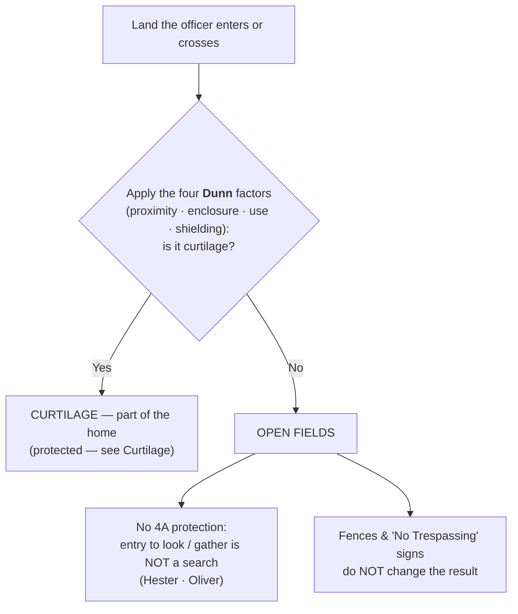
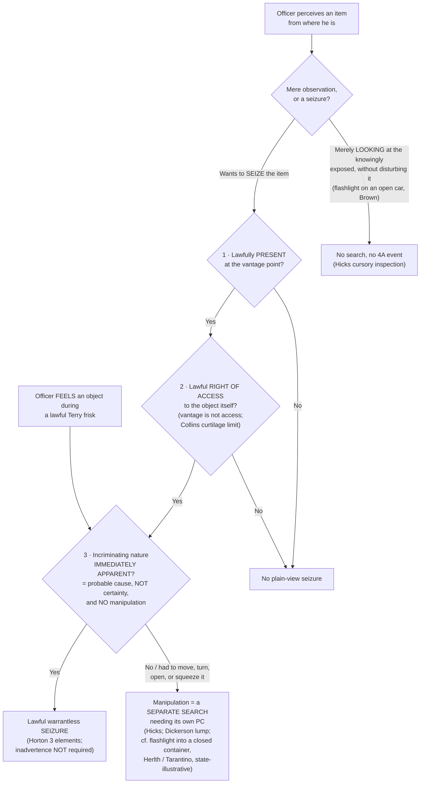

# S9 R1 panel-review — Opus model-diversity lane (prompt pack)

You are the **Claude/Opus** leg of the S9 three-lane adversarial panel (1 Claude + 2 Codex, R1). The two Codex lanes carry the A (support/quote-fidelity) and B (currency/treatment) attack lenses; **you carry model diversity and MUST vote on every paneled assertion across BOTH lenses' concerns.** You are refute-framed: try hard to break each assertion; **default to REFUTED on uncertainty**; never fabricate a cite, quote, or holding; use ONLY the evidence inlined below (no search, no outside knowledge). You are a SIGHTED reviewer — the FULL lake record (judgment fields included) is inlined.

You are a WRITER lane, not an adjudicator: you FIND and VOTE. You do not tally, adjudicate, or close any row — the orchestrator does.

For EACH group below, return one JSON object with the exact `reviewed[]` shape from the output contract (identical framing to the Codex lenses). Emit a finding object ONLY for a real defect (verdict refuted / stands-modified); a group you find wholly clean returns all-`stands` verdicts (the harness records a clean attestation). Concatenate the per-group JSON objects into a top-level `{"packs": [ ... ]}` array, one entry per group, each carrying its `group_id`.


OUTPUT CONTRACT — return ONE JSON object, nothing else:
{
  "lens": "A" | "B",
  "group_id": "<echo the group id>",
  "reviewed": [
    {
      "assertion_id": "<from group_inventory.jsonl>",
      "dimension": "existence|support|quote_fidelity|pincite|treatment|black_letter",
      "verdict": "stands" | "refuted" | "stands-modified",
      "verifiable_from_disclosed": true | false,
      "defect": null,   // null when verdict=="stands"; else an object:
      //  {"problem": "...", "severity": "high|medium|low", "proposed_fix": "...", "evidence_quote": "verbatim from disclosed evidence or null", "needs_cl": true|false, "locator_note": "..."}
      "reasons": ["short evidence-grounded reason", "..."],
      "breaks_true_positives": true | false,
      "residual_risks": ["..."],
      "suggested_tightening": "... or null"
    }
  ],
  "notes": ""
}
Rules: verdict=='stands' <=> defect==null (assertion survives your attack). verdict=='refuted' <=> a real defect (the assertion as framed is wrong). verdict=='stands-modified' <=> survives but needs a stated modification (a minor defect). Review EVERY assertion_id in group_inventory.jsonl exactly once. Output ONLY the JSON object.
---

## GROUP: content/searches/Open Fields.md  (`doctrine`, 4 assertions)

### content_page

```
---
weight: 30
title: "Open Fields"
aliases:
  - "Open Fields"
  - "3-what-is-a-search/Open Fields"
  - "Open-Fields Doctrine"
topic: Open fields — land beyond the curtilage
type: doctrine
amendment: "U.S. Const. amend. IV"
jurisdiction: "Federal (U.S. Const. amend. IV); SCOTUS baseline"
status: draft
related:
  - "[[Curtilage]]"
  - "[[Two Definitions of Search]]"
  - "[[Reasonable Expectation of Privacy]]"
  - "[[Abandonment]]"
  - "[[Aerial and Enhanced Surveillance]]"
---

# Open Fields

*Officers crossed a fence, walked past a "No Trespassing" sign, and found the contraband on secluded land beyond the home. Was that a search? For open fields, the Fourth Amendment answers no.*

> [!rule] Black-letter rule
> Land beyond the [[Curtilage|curtilage]] is **"open fields,"** and the Fourth Amendment's protection of "persons, houses, papers, and effects" **does not extend to open fields** — so a physical entry onto open fields to look for or gather evidence is **not a "search" at all**. *[[Hester v. United States#^pin-59|Hester]]*, 265 U.S. 57, [59](https://www.courtlistener.com/opinion/100413/hester-v-united-states/) (1924); *[[Oliver v. United States#^pin-180|Oliver]]*, 466 U.S. 170, [179](https://www.courtlistener.com/opinion/111146/oliver-v-united-states/) (1984). This turns on the character of the place, not on efforts to hide what is there: **neither fences nor "No Trespassing" signs** convert an open field into protected space. *[[Oliver v. United States#^pin-180|Id.]]* The dividing line is [[Curtilage|curtilage]]-versus-open-field, resolved by the four *[[United States v. Dunn|Dunn]]* factors ([[Curtilage]]).
> ^rule-open-fields

## The Brief

**What "open fields" means.** "Open fields" is a term of art, not a literal description. It covers any unoccupied or undeveloped land outside the [[Curtilage|curtilage]] (woods, pastures, vacant lots, waters), and the ground need be neither "open" nor a "field." *[[Oliver v. United States|Oliver]]*, 466 U.S. at [180](https://www.courtlistener.com/opinion/111146/oliver-v-united-states/) n.11. The label marks the constitutional category, not the terrain: everything past the home's [[Curtilage|curtilage]] line is open fields, and the Fourth Amendment's protection of houses and effects does not reach it. *[[Hester v. United States#^pin-59|Hester]]*, 265 U.S. at [59](https://www.courtlistener.com/opinion/100413/hester-v-united-states/).

**The rule and its origin.** *[[Hester v. United States|Hester]]* announced the doctrine in 1924: "the special protection accorded by the Fourth Amendment to the people in their 'persons, houses, papers, and effects,' is not extended to the open fields," a distinction as old as the common law itself. *[[Hester v. United States#^pin-59|Hester]]*, 265 U.S. at [59](https://www.courtlistener.com/opinion/100413/hester-v-united-states/). Sixty years later *[[Oliver v. United States|Oliver]]* reaffirmed it under modern privacy analysis: "open fields do not provide the setting for those intimate activities that the Amendment is intended to shelter from government interference or surveillance," and there is "no societal interest" in protecting activity, "such as the cultivation of crops, that occur[s] in open fields." *[[Oliver v. United States#^pin-180|Oliver]]*, 466 U.S. at [179](https://www.courtlistener.com/opinion/111146/oliver-v-united-states/). Two rationales converge: the constitutional **text** (open fields are not "houses" or "effects") and the absence of any **legitimate expectation of privacy** society will honor there.

**Fences and signs do not matter.** Because the doctrine turns on the character of the place, steps to conceal it do not create protection. In *[[Oliver v. United States|Oliver]]* the officers walked past a locked gate posted "No Trespassing," down a footpath, to a marijuana field "over a mile from" the house, and there was still no search: "It is not generally true that fences or 'No Trespassing' signs effectively bar the public from viewing open fields." *[[Oliver v. United States#^pin-180|Oliver]]*, 466 U.S. at [179](https://www.courtlistener.com/opinion/111146/oliver-v-united-states/). Erecting barriers and posting signs may keep the curious out, but it does not make the expectation of privacy one "society is prepared to recognize as reasonable."

**Both theories of "search" fail on open fields.** The result holds under either definition of a search ([[Two Definitions of Search]]). Under the **trespass** theory, entering open fields is not a physical intrusion on a "house" or "effect," so the property baseline is not triggered even though the entry may be a common-law trespass. Under the **privacy** theory, there is no [[Reasonable Expectation of Privacy|reasonable expectation of privacy]] to invade. That is why the open-fields entry in *[[Oliver v. United States|Oliver]]* was no search though the officers plainly trespassed: a trespass onto unprotected land is not a Fourth Amendment event.

**The line is drawn against the [[Curtilage|curtilage]].** Open fields is defined by what it is not: the ground that fails the [[Curtilage|curtilage]] test. The four *[[United States v. Dunn|Dunn]]* factors (proximity, enclosure, nature of the use, and steps to shield) decide which side of the line a given spot falls on. *[[United States v. Dunn|Dunn]]*, 480 U.S. 294, [301](https://www.courtlistener.com/opinion/111833/united-states-v-dunn/) (1987). In *[[United States v. Dunn|Dunn]]* itself, a barn roughly 50 yards beyond the fence surrounding the ranch house (60 yards from the house) was **open fields**, not [[Curtilage|curtilage]]. The full four-factor analysis, and the paradigm [[Curtilage|curtilage]] spots, live on [[Curtilage]].

**Commercial open grounds are open-fields-like.** The open, publicly exposed areas of a business are treated more like open fields than like the [[Curtilage|curtilage]] of a home, so lawful-vantage observation of them is generally not a search. But this reaches only the exposed grounds: the private, non-public interior of a business keeps Fourth Amendment protection. That commercial thread is developed on [[Curtilage]] and [[Special Needs and Administrative Searches]].

**What the doctrine does not do.** Open fields is a narrow rule about unprotected land. It does not authorize entering the [[Curtilage|curtilage]] or the home, and it does not license sense-enhancing surveillance of protected space. Observation of protected ground from the air or with equipment is its own inquiry ([[Aerial and Enhanced Surveillance]]), and giving up the privacy or possessory interest in an item is analyzed as [[Abandonment]].

**Burden, standard of review, and remedy.** Because an open-fields entry is not a search, there is nothing to justify and nothing to suppress on that theory. Litigation therefore runs the other way: the proponent of suppression must establish that the area was **[[Curtilage|curtilage]]** (protected), not open fields, and that he had standing there, by a [[Common Legal Terms#preponderance-of-the-evidence|preponderance of the evidence]]. *[[Rakas v. Illinois|Rakas]]*, 439 U.S. 128, [130–31](https://www.courtlistener.com/opinion/109953/rakas-v-illinois/) n.1 (1978). The underlying *[[United States v. Dunn|Dunn]]*-factor findings are reviewed for [[Common Legal Terms#clear-error|clear error]] and the ultimate [[Curtilage|curtilage]]-versus-open-field determination [[Common Legal Terms#de-novo|de novo]].

**Apply it.**
1. **Locate the [[Curtilage|curtilage]] line.** Run the four *[[United States v. Dunn|Dunn]]* factors; if the ground fails them, it is open fields and entering it to look is not a search ([[Curtilage]]).
2. **Ignore fences and signage in the analysis.** A locked gate or a "No Trespassing" sign does not turn open fields into protected space (*[[Oliver v. United States|Oliver]]*).
3. **Do not overread the rule.** It covers unprotected land only; it is not a warrant to step onto the [[Curtilage|curtilage]], enter the home, or aim sensors at either.

**Common pitfalls.**
- **Assuming a fence or "No Trespassing" sign creates protection.** It does not; only the [[Curtilage|curtilage]] line does (*[[Oliver v. United States|Oliver]]*).
- **Confusing open fields with plain view from a public place.** Open fields is about the *status of the land the officer enters*; plain view and lawful-vantage observation are separate doctrines ([[Plain View Doctrine]]; [[Aerial and Enhanced Surveillance]]).
- **Treating a barn, shed, or outbuilding as automatically open fields.** Some outbuildings fall inside the [[Curtilage|curtilage]]; the *[[United States v. Dunn|Dunn]]* factors, not the label, decide (*[[United States v. Dunn|Dunn]]*).
- **Forgetting that a trespass can still be no search.** Entering open fields may be a common-law trespass yet raise no Fourth Amendment problem (*[[Oliver v. United States|Oliver]]*).

## Key cases

| Case | Holding | Opinion |
|---|---|---|
| *[[Hester v. United States]]*, 265 U.S. 57 (1924) | **Anchor.** Origin of the open-fields doctrine: the Fourth Amendment's protection of "persons, houses, papers, and effects" does not extend to open fields, a distinction the Court called as old as the common law. | [opinion](https://www.courtlistener.com/opinion/100413/hester-v-united-states/) |
| *[[Oliver v. United States]]*, 466 U.S. 170 (1984) | **Anchor.** Reaffirms the doctrine under privacy analysis: no legitimate expectation of privacy in open fields, even fenced, posted, and secluded land more than a mile from the house; only the [[Curtilage\|curtilage]] carries the home's protection. | [opinion](https://www.courtlistener.com/opinion/111146/oliver-v-united-states/) |
| *[[United States v. Dunn]]*, 480 U.S. 294 (1987) | Applies the [[Curtilage\|curtilage]]/open-field line: a barn 50 yards beyond the fence, judged by the four-factor test, was open fields, not [[Curtilage\|curtilage]]; the leading worked example of where the line falls. | [opinion](https://www.courtlistener.com/opinion/111833/united-states-v-dunn/) |

## Visual



## Sources

- [*Hester v. United States*, 265 U.S. 57 (1924)](https://www.courtlistener.com/opinion/100413/hester-v-united-states/) (pinpoint: 59)
- [*Oliver v. United States*, 466 U.S. 170 (1984)](https://www.courtlistener.com/opinion/111146/oliver-v-united-states/) (pinpoints: 179, 180 & n.11)
- [*United States v. Dunn*, 480 U.S. 294 (1987)](https://www.courtlistener.com/opinion/111833/united-states-v-dunn/) (pinpoint: 301)

```

### group_inventory (assertions under review)

```jsonl
{"assertion_id": "1b5d8a2c75438ac2", "dimension": "existence", "kind": "case_cite", "locator": {"case": "Hester v. United States", "table_line": 43}, "payload": {"case": "Hester v. United States", "cells": ["*[[Hester v. United States]]*, 265 U.S. 57 (1924)", "**Anchor.** Origin of the open-fields doctrine: the Fourth Amendment's protection of \"persons, houses, papers, and effects\" does not extend to open fields, a distinction the Court called as old as the common law.", "[opinion](https://www.courtlistener.com/opinion/100413/hester-v-united-states/)"], "header": ["Case", "Holding", "Opinion"]}}
{"assertion_id": "24a562eb45fb7722", "dimension": "existence", "kind": "case_cite", "locator": {"case": "United States v. Dunn", "table_line": 45}, "payload": {"case": "United States v. Dunn", "cells": ["*[[United States v. Dunn]]*, 480 U.S. 294 (1987)", "Applies the [[Curtilage\\|curtilage]]/open-field line: a barn 50 yards beyond the fence, judged by the four-factor test, was open fields, not [[Curtilage\\|curtilage]]; the leading worked example of where the line falls.", "[opinion](https://www.courtlistener.com/opinion/111833/united-states-v-dunn/)"], "header": ["Case", "Holding", "Opinion"]}}
{"assertion_id": "dadaddddf15f8e96", "dimension": "existence", "kind": "case_cite", "locator": {"case": "Oliver v. United States", "table_line": 44}, "payload": {"case": "Oliver v. United States", "cells": ["*[[Oliver v. United States]]*, 466 U.S. 170 (1984)", "**Anchor.** Reaffirms the doctrine under privacy analysis: no legitimate expectation of privacy in open fields, even fenced, posted, and secluded land more than a mile from the house; only the [[Curtilage\\|curtilage]] carries the home's protection.", "[opinion](https://www.courtlistener.com/opinion/111146/oliver-v-united-states/)"], "header": ["Case", "Holding", "Opinion"]}}
{"assertion_id": "b617a474a877a239", "dimension": "support", "kind": "proposition", "locator": {"callout": "^rule-open-fields"}, "payload": {"anchor": "^rule-open-fields", "statement": "[!rule] Black-letter rule\nLand beyond the [[Curtilage|curtilage]] is **\"open fields,\"** and the Fourth Amendment's protection of \"persons, houses, papers, and effects\" **does not extend to open fields** — so a physical entry onto open fields to look for or gather evidence is **not a \"search\" at all**. *[[Hester v. United States#^pin-59|Hester]]*, 265 U.S. 57, [59](https://www.courtlistener.com/opinion/100413/hester-v-united-states/) (1924); *[[Oliver v. United States#^pin-180|Oliver]]*, 466 U.S. 170, [179](https://www.courtlistener.com/opinion/111146/oliver-v-united-states/) (1984). This turns on the character of the place, not on efforts to hide what is there: **neither fences nor \"No Trespassing\" signs** convert an open field into protected space. *[[Oliver v. United States#^pin-180|Id.]]* The dividing line is [[Curtilage|curtilage]]-versus-open-field, resolved by the four *[[United States v. Dunn|Dunn]]* factors ([[Curtilage]])."}}
```

### lake record — Hester v. United States

```json
{
  "schema_version": "s2.v1",
  "record_id": "Hester v. United States",
  "stub": false,
  "status": "verified",
  "identity": {
    "case_name": "Hester v. United States",
    "case_name_short": "Hester",
    "case_name_full": "Hester v. United States",
    "input_case_name": "Hester v. United States",
    "court": "U.S. Supreme Court",
    "court_id": "scotus",
    "court_level": "scotus",
    "circuit": null,
    "state": null,
    "date_decided": "1924-05-05",
    "year": 1924,
    "docket": null,
    "cluster_id": 100413,
    "lead_opinion_id": 100413,
    "sibling_ids": [
      100413
    ],
    "absolute_url": "/opinion/100413/hester-v-united-states/",
    "identity_method": "citation+party-text",
    "expected_citation_found": true,
    "party_name_in_text": true,
    "canonical_name_match": true,
    "alternates": [],
    "reason_code": null
  },
  "citations": {
    "official": {
      "cite": "265 U.S. 57",
      "volume": "265",
      "reporter": "U.S.",
      "page": "57",
      "type": 1,
      "selected_official": true,
      "source": "cluster.citations[]"
    },
    "parallel": [
      {
        "cite": "44 S. Ct. 445",
        "volume": "44",
        "reporter": "S. Ct.",
        "page": "445",
        "type": 1,
        "selected_official": false,
        "source": "cluster.citations[]"
      },
      {
        "cite": "68 L. Ed. 898",
        "volume": "68",
        "reporter": "L. Ed.",
        "page": "898",
        "type": 1,
        "selected_official": false,
        "source": "cluster.citations[]"
      }
    ],
    "vendor_neutral": [
      {
        "cite": "1924 U.S. LEXIS 2577",
        "volume": "1924",
        "reporter": "U.S. LEXIS",
        "page": "2577",
        "type": 6,
        "selected_official": false,
        "source": "cluster.citations[]"
      }
    ],
    "all": [
      {
        "cite": "265 U.S. 57",
        "volume": "265",
        "reporter": "U.S.",
        "page": "57",
        "type": 1,
        "selected_official": false,
        "source": "cluster.citations[]"
      },
      {
        "cite": "44 S. Ct. 445",
        "volume": "44",
        "reporter": "S. Ct.",
        "page": "445",
        "type": 1,
        "selected_official": false,
        "source": "cluster.citations[]"
      },
      {
        "cite": "68 L. Ed. 898",
        "volume": "68",
        "reporter": "L. Ed.",
        "page": "898",
        "type": 1,
        "selected_official": false,
        "source": "cluster.citations[]"
      },
      {
        "cite": "1924 U.S. LEXIS 2577",
        "volume": "1924",
        "reporter": "U.S. LEXIS",
        "page": "2577",
        "type": 6,
        "selected_official": false,
        "source": "cluster.citations[]"
      }
    ],
    "display": "265 U.S. 57",
    "official_selection": {
      "court_class": "scotus",
      "selected": "265 U.S. 57",
      "reason": "selected_rank_1"
    }
  },
  "pinpoints": [
    {
      "id": "pin-58",
      "page": null,
      "quote": "--- # Hester v. United States *265 U.S. 57 (1924)* \u00b7 U.S. Supreme Court \u00b7 **Binding \u2014 SCOTUS** \u00b7 Treatment: **good** *(as of 2026-06-30)* <!-- header line; TreatmentBadge + weight render here, degrading to the text above --> ## Background Revenue officers, acting on information, went toward the house of Hester's father, where Hester lived, and concealed themselves fifty to one hundred yards away. They saw Hester hand a bottle to one Henderson; when an alarm was given, both men fled and dropped containers \u2014 a jug and a bottle \u2014 which broke but retained whiskey the officers recognized as illicitly distilled moonshine. A jar of whiskey was also found outside the house. The officers had no warrant, and Hester argued the examination occurred on his father's land. ## Issue Whether the warrantless observation and examination of containers a fleeing suspect discarded in a field outside the house violated the Fourth Amendment, where it was assumed the field belonged to the defendant's father. ## Rule No. A fleeing suspect who throws away containers abandons any Fourth Amendment interest in them:",
      "star_marker": null,
      "quote_fidelity": "mismatch",
      "pinpoint_status": "slip-only",
      "position": null
    },
    {
      "id": "pin-59",
      "page": null,
      "quote": "the special protection accorded by the Fourth Amendment to the people in their 'persons, houses, papers, and effects,' is not extended to the open fields. The distinction between the latter and the house is as old as the common law.",
      "star_marker": null,
      "quote_fidelity": "mismatch",
      "pinpoint_status": "slip-only",
      "position": null
    }
  ],
  "treatment": {
    "field_i_validity": "good_law",
    "as_of_content": "1924-05-05",
    "as_of_treatment": "2026-06-30",
    "composite_basis": "migration-seed",
    "composite_basis_ref": "Hester v. United States",
    "varies_by_point": false,
    "scope_note": "Old as_of seeds as_of_treatment; S2 derivation re-derives and may downgrade.",
    "point_overrides": [],
    "edges": [
      {
        "citing_case": {
          "name": "State of Missouri, Plaintiff/Respondent v. Timothy A. Pierce",
          "cluster_id": 4254135,
          "cite": [
            "504 S.W.3d 766",
            "2016 Mo. App. LEXIS 864"
          ],
          "field_ii": "questioned"
        },
        "field_ii": "questioned",
        "field_iii": "mentioned",
        "point": null,
        "proposed": true,
        "journal_ref": "Hester v. United States:lane1_negative"
      },
      {
        "citing_case": {
          "name": "State v. Milewski",
          "cluster_id": 3170756,
          "cite": [
            "194 So. 3d 376",
            "2016 Fla. App. LEXIS 701",
            "2016 WL 231314"
          ],
          "field_ii": "questioned"
        },
        "field_ii": "questioned",
        "field_iii": "mentioned",
        "point": null,
        "proposed": true,
        "journal_ref": "Hester v. United States:lane1_negative"
      },
      {
        "citing_case": {
          "name": "United States v. Piedad Barajas-Avalos, AKA Opinion Piedad Barajas-Avaslos",
          "cluster_id": 785295,
          "cite": [
            "359 F.3d 1204",
            "2004 U.S. App. LEXIS 4569",
            "2004 D.A.R. 3084"
          ],
          "field_ii": "questioned"
        },
        "field_ii": "questioned",
        "field_iii": "mentioned",
        "point": null,
        "proposed": true,
        "journal_ref": "Hester v. United States:lane1_negative"
      },
      {
        "citing_case": {
          "name": "State v. Paxton",
          "cluster_id": 4020585,
          "cite": [
            "615 N.E.2d 1086",
            "83 Ohio App. 3d 818",
            "1992 Ohio App. LEXIS 5867"
          ],
          "field_ii": "overruled"
        },
        "field_ii": "overruled",
        "field_iii": "mentioned",
        "point": null,
        "proposed": true,
        "journal_ref": "Hester v. United States:lane1_negative"
      },
      {
        "citing_case": {
          "name": "State v. Kirchoff",
          "cluster_id": 2202269,
          "cite": [
            "587 A.2d 988",
            "156 Vt. 1",
            "1991 Vt. LEXIS 8"
          ],
          "field_ii": "questioned"
        },
        "field_ii": "questioned",
        "field_iii": "mentioned",
        "point": null,
        "proposed": true,
        "journal_ref": "Hester v. United States:lane1_negative"
      },
      {
        "citing_case": {
          "name": "Smith v. Ohio",
          "cluster_id": 112392,
          "cite": [
            "108 L. Ed. 2d 464",
            "110 S. Ct. 1288",
            "494 U.S. 541",
            "1990 U.S. LEXIS 1198"
          ],
          "field_ii": "questioned"
        },
        "field_ii": "questioned",
        "field_iii": "mentioned",
        "point": null,
        "proposed": true,
        "journal_ref": "Hester v. United States:lane1_negative"
      },
      {
        "citing_case": {
          "name": "United States v. Ronald Fuesting",
          "cluster_id": 504906,
          "cite": [
            "845 F.2d 664",
            "25 Fed. R. Serv. 680",
            "1988 U.S. App. LEXIS 5392",
            "1988 WL 35946"
          ],
          "field_ii": "superseded_by_statute"
        },
        "field_ii": "superseded_by_statute",
        "field_iii": "mentioned",
        "point": null,
        "proposed": true,
        "journal_ref": "Hester v. United States:lane1_negative"
      },
      {
        "citing_case": {
          "name": "Leal v. State",
          "cluster_id": 5244283,
          "cite": [
            "736 S.W.2d 903"
          ],
          "field_ii": "overruled"
        },
        "field_ii": "overruled",
        "field_iii": "mentioned",
        "point": null,
        "proposed": true,
        "journal_ref": "Hester v. United States:lane1_negative"
      },
      {
        "citing_case": {
          "name": "Bivens v. Six Unknown Named Agents of Federal Bureau of Narcotics",
          "cluster_id": 108375,
          "cite": [
            "29 L. Ed. 2d 619",
            "91 S. Ct. 1999",
            "403 U.S. 388",
            "1971 U.S. LEXIS 23"
          ],
          "field_ii": "overruled"
        },
        "field_ii": "overruled",
        "field_iii": "mentioned",
        "point": null,
        "proposed": true,
        "journal_ref": "Hester v. United States:lane2_top_cited"
      },
      {
        "citing_case": {
          "name": "Katz v. United States",
          "cluster_id": 107564,
          "cite": [
            "19 L. Ed. 2d 576",
            "88 S. Ct. 507",
            "389 U.S. 347",
            "1967 U.S. LEXIS 2"
          ],
          "field_ii": "overruled"
        },
        "field_ii": "overruled",
        "field_iii": "mentioned",
        "point": null,
        "proposed": true,
        "journal_ref": "Hester v. United States:lane2_top_cited"
      },
      {
        "citing_case": {
          "name": "Coolidge v. New Hampshire",
          "cluster_id": 108377,
          "cite": [
            "29 L. Ed. 2d 564",
            "91 S. Ct. 2022",
            "403 U.S. 443",
            "1971 U.S. LEXIS 25"
          ],
          "field_ii": "overruled"
        },
        "field_ii": "overruled",
        "field_iii": "mentioned",
        "point": null,
        "proposed": true,
        "journal_ref": "Hester v. United States:lane2_top_cited"
      },
      {
        "citing_case": {
          "name": "Carroll v. United States",
          "cluster_id": 100567,
          "cite": [
            "267 U.S. 132",
            "45 S. Ct. 280",
            "69 L. Ed. 543",
            "1925 U.S. LEXIS 361"
          ],
          "field_ii": "abrogated"
        },
        "field_ii": "abrogated",
        "field_iii": "mentioned",
        "point": null,
        "proposed": true,
        "journal_ref": "Hester v. United States:lane2_top_cited"
      },
      {
        "citing_case": {
          "name": "Rakas v. Illinois",
          "cluster_id": 109953,
          "cite": [
            "58 L. Ed. 2d 387",
            "99 S. Ct. 421",
            "439 U.S. 128",
            "1978 U.S. LEXIS 2452"
          ],
          "field_ii": "overruled"
        },
        "field_ii": "overruled",
        "field_iii": "mentioned",
        "point": null,
        "proposed": true,
        "journal_ref": "Hester v. United States:lane2_top_cited"
      },
      {
        "citing_case": {
          "name": "California v. Hodari D.",
          "cluster_id": 112579,
          "cite": [
            "113 L. Ed. 2d 690",
            "111 S. Ct. 1547",
            "499 U.S. 621",
            "1991 U.S. LEXIS 2397",
            "91 Cal. Daily Op. Serv. 2893",
            "59 U.S.L.W. 4335",
            "91 Daily Journal DAR 4665"
          ],
          "field_ii": "criticized"
        },
        "field_ii": "criticized",
        "field_iii": "mentioned",
        "point": null,
        "proposed": true,
        "journal_ref": "Hester v. United States:lane2_top_cited"
      },
      {
        "citing_case": {
          "name": "Horton v. California",
          "cluster_id": 112448,
          "cite": [
            "110 L. Ed. 2d 112",
            "110 S. Ct. 2301",
            "496 U.S. 128",
            "1990 U.S. LEXIS 2937"
          ],
          "field_ii": "questioned"
        },
        "field_ii": "questioned",
        "field_iii": "mentioned",
        "point": null,
        "proposed": true,
        "journal_ref": "Hester v. United States:lane2_top_cited"
      },
      {
        "citing_case": {
          "name": "Cady v. Dombrowski",
          "cluster_id": 108850,
          "cite": [
            "37 L. Ed. 2d 706",
            "93 S. Ct. 2523",
            "413 U.S. 433",
            "1973 U.S. LEXIS 48"
          ],
          "field_ii": "overruled"
        },
        "field_ii": "overruled",
        "field_iii": "mentioned",
        "point": null,
        "proposed": true,
        "journal_ref": "Hester v. United States:lane2_top_cited"
      },
      {
        "citing_case": {
          "name": "Olmstead v. United States",
          "cluster_id": 101320,
          "cite": [
            "277 U.S. 438",
            "48 S. Ct. 564",
            "72 L. Ed. 944",
            "1928 U.S. LEXIS 694",
            "66 A.L.R. 376"
          ],
          "field_ii": "overruled"
        },
        "field_ii": "overruled",
        "field_iii": "mentioned",
        "point": null,
        "proposed": true,
        "journal_ref": "Hester v. United States:lane2_top_cited"
      },
      {
        "citing_case": {
          "name": "Oliver v. United States",
          "cluster_id": 111146,
          "cite": [
            "80 L. Ed. 2d 214",
            "104 S. Ct. 1735",
            "466 U.S. 170",
            "1984 U.S. LEXIS 55",
            "52 U.S.L.W. 4425"
          ],
          "field_ii": "overruled"
        },
        "field_ii": "overruled",
        "field_iii": "mentioned",
        "point": null,
        "proposed": true,
        "journal_ref": "Hester v. United States:lane2_top_cited"
      },
      {
        "citing_case": {
          "name": "Harris v. United States",
          "cluster_id": 107625,
          "cite": [
            "19 L. Ed. 2d 1067",
            "88 S. Ct. 992",
            "390 U.S. 234",
            "1968 U.S. LEXIS 2283"
          ],
          "field_ii": "questioned"
        },
        "field_ii": "questioned",
        "field_iii": "mentioned",
        "point": null,
        "proposed": true,
        "journal_ref": "Hester v. United States:lane2_top_cited"
      },
      {
        "citing_case": {
          "name": "Florida v. Jardines",
          "cluster_id": 856347,
          "cite": [
            "185 L. Ed. 2d 495",
            "133 S. Ct. 1409",
            "569 U.S. 1",
            "2013 U.S. LEXIS 2542",
            "24 Fla. L. Weekly Fed. S 117",
            "81 U.S.L.W. 4209",
            "2013 WL 1196577"
          ],
          "field_ii": "questioned"
        },
        "field_ii": "questioned",
        "field_iii": "mentioned",
        "point": null,
        "proposed": true,
        "journal_ref": "Hester v. United States:lane2_top_cited"
      },
      {
        "citing_case": {
          "name": "Abel v. United States",
          "cluster_id": 106021,
          "cite": [
            "4 L. Ed. 2d 668",
            "80 S. Ct. 683",
            "362 U.S. 217",
            "1960 U.S. LEXIS 1412"
          ],
          "field_ii": "overruled"
        },
        "field_ii": "overruled",
        "field_iii": "mentioned",
        "point": null,
        "proposed": true,
        "journal_ref": "Hester v. United States:lane2_top_cited"
      },
      {
        "citing_case": {
          "name": "Brower Ex Rel. Estate of Caldwell v. County of Inyo",
          "cluster_id": 112218,
          "cite": [
            "103 L. Ed. 2d 628",
            "109 S. Ct. 1378",
            "489 U.S. 593",
            "1989 U.S. LEXIS 1569",
            "57 U.S.L.W. 4321"
          ],
          "field_ii": "questioned"
        },
        "field_ii": "questioned",
        "field_iii": "mentioned",
        "point": null,
        "proposed": true,
        "journal_ref": "Hester v. United States:lane2_top_cited"
      },
      {
        "citing_case": {
          "name": "Michigan v. Tyler",
          "cluster_id": 109874,
          "cite": [
            "56 L. Ed. 2d 486",
            "98 S. Ct. 1942",
            "436 U.S. 499",
            "1978 U.S. LEXIS 97"
          ],
          "field_ii": "questioned"
        },
        "field_ii": "questioned",
        "field_iii": "mentioned",
        "point": null,
        "proposed": true,
        "journal_ref": "Hester v. United States:lane2_top_cited"
      },
      {
        "citing_case": {
          "name": "United States v. Santana",
          "cluster_id": 109504,
          "cite": [
            "49 L. Ed. 2d 300",
            "96 S. Ct. 2406",
            "427 U.S. 38",
            "1976 U.S. LEXIS 71"
          ],
          "field_ii": "questioned"
        },
        "field_ii": "questioned",
        "field_iii": "mentioned",
        "point": null,
        "proposed": true,
        "journal_ref": "Hester v. United States:lane2_top_cited"
      },
      {
        "citing_case": {
          "name": "United States v. Dunn",
          "cluster_id": 111833,
          "cite": [
            "94 L. Ed. 2d 326",
            "107 S. Ct. 1134",
            "480 U.S. 294",
            "1987 U.S. LEXIS 1057"
          ],
          "field_ii": "abrogated"
        },
        "field_ii": "abrogated",
        "field_iii": "mentioned",
        "point": null,
        "proposed": true,
        "journal_ref": "Hester v. United States:lane2_top_cited"
      },
      {
        "citing_case": {
          "name": "Silverman v. United States",
          "cluster_id": 106187,
          "cite": [
            "5 L. Ed. 2d 734",
            "81 S. Ct. 679",
            "365 U.S. 505",
            "1961 U.S. LEXIS 1605",
            "97 A.L.R. 2d 1277"
          ],
          "field_ii": "questioned"
        },
        "field_ii": "questioned",
        "field_iii": "mentioned",
        "point": null,
        "proposed": true,
        "journal_ref": "Hester v. United States:lane2_top_cited"
      },
      {
        "citing_case": {
          "name": "United States v. Jones",
          "cluster_id": 622304,
          "cite": [
            "181 L. Ed. 2d 911",
            "132 S. Ct. 945",
            "565 U.S. 400",
            "2012 U.S. LEXIS 1063"
          ],
          "field_ii": "overruled"
        },
        "field_ii": "overruled",
        "field_iii": "mentioned",
        "point": null,
        "proposed": true,
        "journal_ref": "Hester v. United States:lane2_top_cited"
      },
      {
        "citing_case": {
          "name": "Lopez v. United States",
          "cluster_id": 106622,
          "cite": [
            "10 L. Ed. 2d 462",
            "83 S. Ct. 1381",
            "373 U.S. 427",
            "1963 U.S. LEXIS 2618"
          ],
          "field_ii": "overruled"
        },
        "field_ii": "overruled",
        "field_iii": "mentioned",
        "point": null,
        "proposed": true,
        "journal_ref": "Hester v. United States:lane2_top_cited"
      },
      {
        "citing_case": {
          "name": "United States v. Knotts",
          "cluster_id": 110882,
          "cite": [
            "75 L. Ed. 2d 55",
            "103 S. Ct. 1081",
            "460 U.S. 276",
            "1983 U.S. LEXIS 135",
            "51 U.S.L.W. 4232"
          ],
          "field_ii": "overruled"
        },
        "field_ii": "overruled",
        "field_iii": "mentioned",
        "point": null,
        "proposed": true,
        "journal_ref": "Hester v. United States:lane2_top_cited"
      },
      {
        "citing_case": {
          "name": "Donovan v. Dewey",
          "cluster_id": 110530,
          "cite": [
            "69 L. Ed. 2d 262",
            "101 S. Ct. 2534",
            "452 U.S. 594",
            "1980 U.S. LEXIS 58"
          ],
          "field_ii": "overruled"
        },
        "field_ii": "overruled",
        "field_iii": "mentioned",
        "point": null,
        "proposed": true,
        "journal_ref": "Hester v. United States:lane2_top_cited"
      },
      {
        "citing_case": {
          "name": "G. M. Leasing Corp. v. United States",
          "cluster_id": 109579,
          "cite": [
            "50 L. Ed. 2d 530",
            "97 S. Ct. 619",
            "429 U.S. 338",
            "1977 U.S. LEXIS 33",
            "39 A.F.T.R.2d (RIA) 475"
          ],
          "field_ii": "questioned"
        },
        "field_ii": "questioned",
        "field_iii": "mentioned",
        "point": null,
        "proposed": true,
        "journal_ref": "Hester v. United States:lane2_top_cited"
      },
      {
        "citing_case": {
          "name": "On Lee v. United States",
          "cluster_id": 105021,
          "cite": [
            "96 L. Ed. 2d 1270",
            "72 S. Ct. 967",
            "343 U.S. 747",
            "1952 U.S. LEXIS 2794"
          ],
          "field_ii": "overruled"
        },
        "field_ii": "overruled",
        "field_iii": "mentioned",
        "point": null,
        "proposed": true,
        "journal_ref": "Hester v. United States:lane2_top_cited"
      },
      {
        "citing_case": {
          "name": "Rios v. United States",
          "cluster_id": 106108,
          "cite": [
            "4 L. Ed. 2d 1688",
            "80 S. Ct. 1431",
            "364 U.S. 253",
            "1960 U.S. LEXIS 766"
          ],
          "field_ii": "overruled"
        },
        "field_ii": "overruled",
        "field_iii": "mentioned",
        "point": null,
        "proposed": true,
        "journal_ref": "Hester v. United States:lane2_top_cited"
      }
    ],
    "derivation": {
      "lane1_negative": {
        "query": "cites:(100413) AND (overrul* OR abrogat* OR supersed* OR \"recede from\" OR \"no longer good law\" OR vacat* OR reversed) ",
        "reviewed": 200,
        "cap": 200,
        "cap_hit": true,
        "final_cursor": "https://www.courtlistener.com/api/rest/v4/search/?cursor=cz01MzM4NjU2MDAwMDAmcz00Nzk0MzMmdD1vJmQ9MjAyNi0wNy0wNSZwPTEx&fields=absolute_url%2CcaseName%2CcaseNameFull%2Ccitation%2CciteCount%2Ccluster_id%2Ccourt%2Ccourt_citation_string%2Ccourt_id%2CdateFiled%2Copinions%2Csibling_ids%2Cstatus%2Csyllabus&order_by=dateFiled+desc&page_size=100&q=cites%3A%28100413%29+AND+%28overrul%2A+OR+abrogat%2A+OR+supersed%2A+OR+%22recede+from%22+OR+%22no+longer+good+law%22+OR+vacat%2A+OR+reversed%29+&stat_Published=on&type=o",
        "audit_needed": true,
        "proposed_negative_events": 8,
        "audit_marker": "R15 treatment audit required",
        "triage_mode": "snippet-first",
        "snippet_field": "results[].opinions[].snippet",
        "triage_journaled": 200,
        "triage_read": 9,
        "triage_snippet_classified": 191
      },
      "lane2_top_cited": {
        "query": "cites:(100413)",
        "reviewed": 25,
        "cap": 25,
        "cap_hit": true,
        "final_cursor": "https://www.courtlistener.com/api/rest/v4/search/?cursor=cz0yMDcmcz0xMTIzOTImdD1vJmQ9MjAyNi0wNy0wNSZwPTM%3D&order_by=citeCount+desc&page_size=25&q=cites%3A%28100413%29&type=o",
        "audit_needed": true,
        "proposed_negative_events": 25,
        "audit_marker": "R15 treatment audit required"
      },
      "lane3_recency": {
        "query": "cites:(100413)",
        "reviewed": 14,
        "cap": 200,
        "cap_hit": false,
        "final_cursor": null,
        "audit_needed": false,
        "proposed_negative_events": 0,
        "audit_marker": null,
        "triage_mode": "snippet-first",
        "snippet_field": "results[].opinions[].snippet",
        "triage_journaled": 14,
        "triage_read": 0,
        "triage_snippet_classified": 14
      }
    }
  },
  "progeny": {
    "complete_query": "cites:(100413)",
    "indexed_citing_opinions": 799,
    "count_source": "search",
    "per_sibling": [
      {
        "opinion_id": 100413,
        "count": 799,
        "count_source": "search"
      }
    ],
    "citation_count": 1214,
    "cache_path": "/Users/johngalt/cssi-lake/cache/progeny/hester-v-united-states.jsonl",
    "enumeration": "bounded",
    "cursor": "https://www.courtlistener.com/api/rest/v4/search/?cursor=cz0xLjc1ODEyNzUmcz0xMDYyODg5NSZ0PW8mZD0yMDI2LTA3LTA1JnA9Mg%3D%3D&order_by=score+desc&page_size=100&q=cites%3A%28100413%29&type=o",
    "rows_cached": 20,
    "outbound_opinion_edges": []
  },
  "off_cl_links": [],
  "provenance": {
    "cl_source": "LRU",
    "cl_api": "https://www.courtlistener.com/api/rest/v4",
    "built_by": "S2-BUILDER-AUTHORING",
    "build_run": "s2-build-96d841cbb12e",
    "date_created": "2026-07-05T07:03:00Z",
    "date_modified": "2026-07-06T10:25:11Z",
    "warnings": [
      "legacy treatment migrated: good -> good_law"
    ],
    "field_provenance": {
      "identity": {
        "src": "CourtListener search + clusters + lead opinion text",
        "at": "2026-07-05T07:03:25Z",
        "verifier": "S2-BUILDER-AUTHORING"
      },
      "treatment.field_i_validity": {
        "src": "_treatment-migration.json + page frontmatter",
        "at": "2026-07-05T07:03:25Z",
        "verifier": "S2-BUILDER-AUTHORING"
      },
      "point_overrides": {
        "src": "S2 treatment derivation proposed only",
        "at": "2026-07-05T07:06:12Z",
        "verifier": "S2-BUILDER-AUTHORING"
      },
      "pinpoints": {
        "src": "content page quote harvest + lead opinion text",
        "at": "2026-07-05T07:03:25Z",
        "verifier": "S2-BUILDER-AUTHORING"
      }
    }
  }
}

```

### lake record — Oliver v. United States

```json
{
  "schema_version": "s2.v1",
  "record_id": "Oliver v. United States",
  "stub": false,
  "status": "verified",
  "identity": {
    "case_name": "Oliver v. United States",
    "case_name_short": "Oliver",
    "case_name_full": "Oliver v. United States",
    "input_case_name": "Oliver v. United States",
    "court": "U.S. Supreme Court",
    "court_id": "scotus",
    "court_level": "scotus",
    "circuit": null,
    "state": null,
    "date_decided": "1984-04-17",
    "year": 1984,
    "docket": null,
    "cluster_id": 111146,
    "lead_opinion_id": 9429563,
    "sibling_ids": [
      111146,
      9429563,
      9429564,
      9429565
    ],
    "absolute_url": "/opinion/111146/oliver-v-united-states/",
    "identity_method": "citation+party-text",
    "expected_citation_found": true,
    "party_name_in_text": true,
    "canonical_name_match": true,
    "alternates": [
      {
        "cluster_id": 9050194,
        "score": 20,
        "case_name": "Oliver v. United States"
      }
    ],
    "reason_code": null
  },
  "citations": {
    "official": {
      "cite": "466 U.S. 170",
      "volume": "466",
      "reporter": "U.S.",
      "page": "170",
      "type": 1,
      "selected_official": true,
      "source": "cluster.citations[]"
    },
    "parallel": [
      {
        "cite": "104 S. Ct. 1735",
        "volume": "104",
        "reporter": "S. Ct.",
        "page": "1735",
        "type": 1,
        "selected_official": false,
        "source": "cluster.citations[]"
      },
      {
        "cite": "80 L. Ed. 2d 214",
        "volume": "80",
        "reporter": "L. Ed. 2d",
        "page": "214",
        "type": 1,
        "selected_official": false,
        "source": "cluster.citations[]"
      },
      {
        "cite": "52 U.S.L.W. 4425",
        "volume": "52",
        "reporter": "U.S.L.W.",
        "page": "4425",
        "type": 4,
        "selected_official": false,
        "source": "cluster.citations[]"
      }
    ],
    "vendor_neutral": [
      {
        "cite": "1984 U.S. LEXIS 55",
        "volume": "1984",
        "reporter": "U.S. LEXIS",
        "page": "55",
        "type": 6,
        "selected_official": false,
        "source": "cluster.citations[]"
      }
    ],
    "all": [
      {
        "cite": "466 U.S. 170",
        "volume": "466",
        "reporter": "U.S.",
        "page": "170",
        "type": 1,
        "selected_official": false,
        "source": "cluster.citations[]"
      },
      {
        "cite": "104 S. Ct. 1735",
        "volume": "104",
        "reporter": "S. Ct.",
        "page": "1735",
        "type": 1,
        "selected_official": false,
        "source": "cluster.citations[]"
      },
      {
        "cite": "80 L. Ed. 2d 214",
        "volume": "80",
        "reporter": "L. Ed. 2d",
        "page": "214",
        "type": 1,
        "selected_official": false,
        "source": "cluster.citations[]"
      },
      {
        "cite": "1984 U.S. LEXIS 55",
        "volume": "1984",
        "reporter": "U.S. LEXIS",
        "page": "55",
        "type": 6,
        "selected_official": false,
        "source": "cluster.citations[]"
      },
      {
        "cite": "52 U.S.L.W. 4425",
        "volume": "52",
        "reporter": "U.S.L.W.",
        "page": "4425",
        "type": 4,
        "selected_official": false,
        "source": "cluster.citations[]"
      }
    ],
    "display": "466 U.S. 170",
    "official_selection": {
      "court_class": "scotus",
      "selected": "466 U.S. 170",
      "reason": "selected_rank_1"
    }
  },
  "pinpoints": [
    {
      "id": "pin-179",
      "page": null,
      "quote": "signs, and secluded. ## Rule Yes.",
      "star_marker": null,
      "quote_fidelity": "mismatch",
      "pinpoint_status": "slip-only",
      "position": null
    },
    {
      "id": "pin-179b",
      "page": null,
      "quote": "It is not generally true that fences or 'No Trespassing' signs effectively bar the public from viewing open fields.",
      "star_marker": null,
      "quote_fidelity": "mismatch",
      "pinpoint_status": "slip-only",
      "position": null
    },
    {
      "id": "pin-180",
      "page": null,
      "quote": "distinguished 'open fields' from the 'curtilage,' the land immediately surrounding and associated with the home,",
      "star_marker": null,
      "quote_fidelity": "mismatch",
      "pinpoint_status": "slip-only",
      "position": null
    }
  ],
  "treatment": {
    "field_i_validity": "good_law",
    "as_of_content": "1984-04-17",
    "as_of_treatment": "2026-06-30",
    "composite_basis": "migration-seed",
    "composite_basis_ref": "Oliver v. United States",
    "varies_by_point": false,
    "scope_note": "Reaffirms the open-fields doctrine and the curtilage distinction; good law.",
    "point_overrides": [],
    "edges": [
      {
        "citing_case": {
          "name": "Poulson v. Commonwealth",
          "cluster_id": 10375911,
          "cite": null,
          "field_ii": "questioned"
        },
        "field_ii": "questioned",
        "field_iii": "mentioned",
        "point": null,
        "proposed": true,
        "journal_ref": "Oliver v. United States:lane1_negative"
      },
      {
        "citing_case": {
          "name": "Commonwealth v. Sorenson",
          "cluster_id": 4806437,
          "cite": null,
          "field_ii": "abrogated"
        },
        "field_ii": "abrogated",
        "field_iii": "mentioned",
        "point": null,
        "proposed": true,
        "journal_ref": "Oliver v. United States:lane1_negative"
      },
      {
        "citing_case": {
          "name": "The People v. Sean Garvin",
          "cluster_id": 4436829,
          "cite": null,
          "field_ii": "overruled"
        },
        "field_ii": "overruled",
        "field_iii": "mentioned",
        "point": null,
        "proposed": true,
        "journal_ref": "Oliver v. United States:lane1_negative"
      },
      {
        "citing_case": {
          "name": "State of Missouri, Plaintiff/Respondent v. Timothy A. Pierce",
          "cluster_id": 4254135,
          "cite": [
            "504 S.W.3d 766",
            "2016 Mo. App. LEXIS 864"
          ],
          "field_ii": "questioned"
        },
        "field_ii": "questioned",
        "field_iii": "mentioned",
        "point": null,
        "proposed": true,
        "journal_ref": "Oliver v. United States:lane1_negative"
      },
      {
        "citing_case": {
          "name": "United States v. Rickey Beene",
          "cluster_id": 3183556,
          "cite": [
            "818 F.3d 157",
            "2016 U.S. App. LEXIS 4331",
            "2016 WL 890127"
          ],
          "field_ii": "abrogated"
        },
        "field_ii": "abrogated",
        "field_iii": "mentioned",
        "point": null,
        "proposed": true,
        "journal_ref": "Oliver v. United States:lane1_negative"
      },
      {
        "citing_case": {
          "name": "Rivas, Gerardo Tomas",
          "cluster_id": 4288590,
          "cite": null,
          "field_ii": "overruled"
        },
        "field_ii": "overruled",
        "field_iii": "mentioned",
        "point": null,
        "proposed": true,
        "journal_ref": "Oliver v. United States:lane1_negative"
      },
      {
        "citing_case": {
          "name": "Rivas, Gerardo Tomas",
          "cluster_id": 4287047,
          "cite": null,
          "field_ii": "overruled"
        },
        "field_ii": "overruled",
        "field_iii": "mentioned",
        "point": null,
        "proposed": true,
        "journal_ref": "Oliver v. United States:lane1_negative"
      },
      {
        "citing_case": {
          "name": "Rivas, Gerardo Tomas",
          "cluster_id": 4286131,
          "cite": null,
          "field_ii": "overruled"
        },
        "field_ii": "overruled",
        "field_iii": "mentioned",
        "point": null,
        "proposed": true,
        "journal_ref": "Oliver v. United States:lane1_negative"
      },
      {
        "citing_case": {
          "name": "Skinner v. Railway Labor Executives' Assn.",
          "cluster_id": 112219,
          "cite": [
            "103 L. Ed. 2d 639",
            "109 S. Ct. 1402",
            "489 U.S. 602",
            "1989 U.S. LEXIS 1568",
            "4 I.E.R. Cas. (BNA) 224",
            "1989 CCH OSHD 28,476",
            "57 U.S.L.W. 4324",
            "13 OSHC (BNA) 2065",
            "130 L.R.R.M. (BNA) 2857",
            "49 Empl. Prac. Dec. (CCH) 38,791"
          ],
          "field_ii": "abrogated"
        },
        "field_ii": "abrogated",
        "field_iii": "mentioned",
        "point": null,
        "proposed": true,
        "journal_ref": "Oliver v. United States:lane2_top_cited"
      },
      {
        "citing_case": {
          "name": "New Jersey v. T. L. O.",
          "cluster_id": 111301,
          "cite": [
            "83 L. Ed. 2d 720",
            "105 S. Ct. 733",
            "469 U.S. 325",
            "1985 U.S. LEXIS 41",
            "53 U.S.L.W. 4083"
          ],
          "field_ii": "questioned"
        },
        "field_ii": "questioned",
        "field_iii": "mentioned",
        "point": null,
        "proposed": true,
        "journal_ref": "Oliver v. United States:lane2_top_cited"
      },
      {
        "citing_case": {
          "name": "Kyllo v. United States",
          "cluster_id": 118443,
          "cite": [
            "150 L. Ed. 2d 94",
            "121 S. Ct. 2038",
            "533 U.S. 27",
            "2001 U.S. LEXIS 4487"
          ],
          "field_ii": "criticized"
        },
        "field_ii": "criticized",
        "field_iii": "mentioned",
        "point": null,
        "proposed": true,
        "journal_ref": "Oliver v. United States:lane2_top_cited"
      },
      {
        "citing_case": {
          "name": "Florida v. Jardines",
          "cluster_id": 856347,
          "cite": [
            "185 L. Ed. 2d 495",
            "133 S. Ct. 1409",
            "569 U.S. 1",
            "2013 U.S. LEXIS 2542",
            "24 Fla. L. Weekly Fed. S 117",
            "81 U.S.L.W. 4209",
            "2013 WL 1196577"
          ],
          "field_ii": "questioned"
        },
        "field_ii": "questioned",
        "field_iii": "mentioned",
        "point": null,
        "proposed": true,
        "journal_ref": "Oliver v. United States:lane2_top_cited"
      },
      {
        "citing_case": {
          "name": "Segura v. United States",
          "cluster_id": 111259,
          "cite": [
            "82 L. Ed. 2d 599",
            "104 S. Ct. 3380",
            "468 U.S. 796",
            "1984 U.S. LEXIS 150",
            "52 U.S.L.W. 5128"
          ],
          "field_ii": "superseded_by_statute"
        },
        "field_ii": "superseded_by_statute",
        "field_iii": "mentioned",
        "point": null,
        "proposed": true,
        "journal_ref": "Oliver v. United States:lane2_top_cited"
      },
      {
        "citing_case": {
          "name": "California v. Acevedo",
          "cluster_id": 112608,
          "cite": [
            "114 L. Ed. 2d 619",
            "111 S. Ct. 1982",
            "500 U.S. 565",
            "1991 U.S. LEXIS 3016"
          ],
          "field_ii": "overruled"
        },
        "field_ii": "overruled",
        "field_iii": "mentioned",
        "point": null,
        "proposed": true,
        "journal_ref": "Oliver v. United States:lane2_top_cited"
      },
      {
        "citing_case": {
          "name": "United States v. Dunn",
          "cluster_id": 111833,
          "cite": [
            "94 L. Ed. 2d 326",
            "107 S. Ct. 1134",
            "480 U.S. 294",
            "1987 U.S. LEXIS 1057"
          ],
          "field_ii": "abrogated"
        },
        "field_ii": "abrogated",
        "field_iii": "mentioned",
        "point": null,
        "proposed": true,
        "journal_ref": "Oliver v. United States:lane2_top_cited"
      },
      {
        "citing_case": {
          "name": "California v. Ciraolo",
          "cluster_id": 111666,
          "cite": [
            "90 L. Ed. 2d 210",
            "106 S. Ct. 1809",
            "476 U.S. 207",
            "1986 U.S. LEXIS 154"
          ],
          "field_ii": "questioned"
        },
        "field_ii": "questioned",
        "field_iii": "mentioned",
        "point": null,
        "proposed": true,
        "journal_ref": "Oliver v. United States:lane2_top_cited"
      },
      {
        "citing_case": {
          "name": "Villarreal v. State",
          "cluster_id": 2365320,
          "cite": [
            "935 S.W.2d 134",
            "1996 Tex. Crim. App. LEXIS 237",
            "1996 WL 668593"
          ],
          "field_ii": "overruled"
        },
        "field_ii": "overruled",
        "field_iii": "mentioned",
        "point": null,
        "proposed": true,
        "journal_ref": "Oliver v. United States:lane2_top_cited"
      },
      {
        "citing_case": {
          "name": "Carpenter v. United States",
          "cluster_id": 4510032,
          "cite": [
            "585 U.S. 296",
            "138 S. Ct. 2206",
            "201 L. Ed. 2d 507",
            "2018 U.S. LEXIS 3844"
          ],
          "field_ii": "overruled"
        },
        "field_ii": "overruled",
        "field_iii": "mentioned",
        "point": null,
        "proposed": true,
        "journal_ref": "Oliver v. United States:lane2_top_cited"
      },
      {
        "citing_case": {
          "name": "Soldal v. Cook County",
          "cluster_id": 112795,
          "cite": [
            "121 L. Ed. 2d 450",
            "113 S. Ct. 538",
            "506 U.S. 56",
            "1992 U.S. LEXIS 7835",
            "92 Daily Journal DAR 16378",
            "61 U.S.L.W. 4019",
            "6 Fla. L. Weekly Fed. S 769",
            "92 Cal. Daily Op. Serv. 9794"
          ],
          "field_ii": "questioned"
        },
        "field_ii": "questioned",
        "field_iii": "mentioned",
        "point": null,
        "proposed": true,
        "journal_ref": "Oliver v. United States:lane2_top_cited"
      },
      {
        "citing_case": {
          "name": "People v. Maury",
          "cluster_id": 2598797,
          "cite": [
            "68 P.3d 1",
            "133 Cal. Rptr. 2d 561",
            "30 Cal. 4th 342"
          ],
          "field_ii": "overruled"
        },
        "field_ii": "overruled",
        "field_iii": "mentioned",
        "point": null,
        "proposed": true,
        "journal_ref": "Oliver v. United States:lane2_top_cited"
      },
      {
        "citing_case": {
          "name": "United States v. Jones",
          "cluster_id": 622304,
          "cite": [
            "181 L. Ed. 2d 911",
            "132 S. Ct. 945",
            "565 U.S. 400",
            "2012 U.S. LEXIS 1063"
          ],
          "field_ii": "overruled"
        },
        "field_ii": "overruled",
        "field_iii": "mentioned",
        "point": null,
        "proposed": true,
        "journal_ref": "Oliver v. United States:lane2_top_cited"
      },
      {
        "citing_case": {
          "name": "O'CONNOR v. Ortega",
          "cluster_id": 111851,
          "cite": [
            "94 L. Ed. 2d 714",
            "107 S. Ct. 1492",
            "480 U.S. 709",
            "1987 U.S. LEXIS 1507",
            "1 I.E.R. Cas. (BNA) 1617",
            "55 U.S.L.W. 4405",
            "42 Empl. Prac. Dec. (CCH) 36,891"
          ],
          "field_ii": "abrogated"
        },
        "field_ii": "abrogated",
        "field_iii": "mentioned",
        "point": null,
        "proposed": true,
        "journal_ref": "Oliver v. United States:lane2_top_cited"
      },
      {
        "citing_case": {
          "name": "California v. Greenwood",
          "cluster_id": 112067,
          "cite": [
            "100 L. Ed. 2d 30",
            "108 S. Ct. 1625",
            "486 U.S. 35",
            "1988 U.S. LEXIS 2279",
            "56 U.S.L.W. 4409"
          ],
          "field_ii": "overruled"
        },
        "field_ii": "overruled",
        "field_iii": "mentioned",
        "point": null,
        "proposed": true,
        "journal_ref": "Oliver v. United States:lane2_top_cited"
      },
      {
        "citing_case": {
          "name": "Shirley Presley v. City of Charlottesville Rivanna Trails Foundation",
          "cluster_id": 795822,
          "cite": [
            "464 F.3d 480",
            "2006 U.S. App. LEXIS 24048",
            "2006 WL 2709208"
          ],
          "field_ii": "questioned"
        },
        "field_ii": "questioned",
        "field_iii": "mentioned",
        "point": null,
        "proposed": true,
        "journal_ref": "Oliver v. United States:lane2_top_cited"
      },
      {
        "citing_case": {
          "name": "United States v. Karo",
          "cluster_id": 111257,
          "cite": [
            "82 L. Ed. 2d 530",
            "104 S. Ct. 3296",
            "468 U.S. 705",
            "1984 U.S. LEXIS 148"
          ],
          "field_ii": "questioned"
        },
        "field_ii": "questioned",
        "field_iii": "mentioned",
        "point": null,
        "proposed": true,
        "journal_ref": "Oliver v. United States:lane2_top_cited"
      },
      {
        "citing_case": {
          "name": "Arizona v. Evans",
          "cluster_id": 117905,
          "cite": [
            "131 L. Ed. 2d 34",
            "115 S. Ct. 1185",
            "514 U.S. 1",
            "1995 U.S. LEXIS 1806"
          ],
          "field_ii": "overruled"
        },
        "field_ii": "overruled",
        "field_iii": "mentioned",
        "point": null,
        "proposed": true,
        "journal_ref": "Oliver v. United States:lane2_top_cited"
      },
      {
        "citing_case": {
          "name": "New York v. Class",
          "cluster_id": 111600,
          "cite": [
            "89 L. Ed. 2d 81",
            "106 S. Ct. 960",
            "475 U.S. 106",
            "1986 U.S. LEXIS 5",
            "54 U.S.L.W. 4178"
          ],
          "field_ii": "questioned"
        },
        "field_ii": "questioned",
        "field_iii": "mentioned",
        "point": null,
        "proposed": true,
        "journal_ref": "Oliver v. United States:lane2_top_cited"
      },
      {
        "citing_case": {
          "name": "State v. Ross",
          "cluster_id": 1060457,
          "cite": [
            "49 S.W.3d 833",
            "2001 Tenn. LEXIS 563",
            "2001 WL 760100"
          ],
          "field_ii": "questioned"
        },
        "field_ii": "questioned",
        "field_iii": "mentioned",
        "point": null,
        "proposed": true,
        "journal_ref": "Oliver v. United States:lane2_top_cited"
      },
      {
        "citing_case": {
          "name": "United States v. Michael Johnson",
          "cluster_id": 773999,
          "cite": [
            "256 F.3d 895",
            "2001 Daily Journal DAR 7479",
            "2001 Cal. Daily Op. Serv. 6099",
            "2001 U.S. App. LEXIS 16092",
            "2001 WL 817633"
          ],
          "field_ii": "overruled"
        },
        "field_ii": "overruled",
        "field_iii": "mentioned",
        "point": null,
        "proposed": true,
        "journal_ref": "Oliver v. United States:lane2_top_cited"
      },
      {
        "citing_case": {
          "name": "People v. Ramirez-Portoreal",
          "cluster_id": 2033638,
          "cite": [
            "666 N.E.2d 207",
            "88 N.Y.2d 99",
            "643 N.Y.S.2d 502"
          ],
          "field_ii": "questioned"
        },
        "field_ii": "questioned",
        "field_iii": "mentioned",
        "point": null,
        "proposed": true,
        "journal_ref": "Oliver v. United States:lane2_top_cited"
      },
      {
        "citing_case": {
          "name": "Collins v. Virginia",
          "cluster_id": 4501697,
          "cite": [
            "584 U.S. 586",
            "138 S. Ct. 1663",
            "201 L. Ed. 2d 9",
            "2018 U.S. LEXIS 3210"
          ],
          "field_ii": "overruled"
        },
        "field_ii": "overruled",
        "field_iii": "mentioned",
        "point": null,
        "proposed": true,
        "journal_ref": "Oliver v. United States:lane2_top_cited"
      },
      {
        "citing_case": {
          "name": "People v. Pitman",
          "cluster_id": 2234418,
          "cite": [
            "813 N.E.2d 93",
            "211 Ill. 2d 502",
            "286 Ill. Dec. 36",
            "2004 Ill. LEXIS 989"
          ],
          "field_ii": "overruled"
        },
        "field_ii": "overruled",
        "field_iii": "mentioned",
        "point": null,
        "proposed": true,
        "journal_ref": "Oliver v. United States:lane2_top_cited"
      },
      {
        "citing_case": {
          "name": "Florida v. Riley",
          "cluster_id": 112175,
          "cite": [
            "102 L. Ed. 2d 835",
            "109 S. Ct. 693",
            "488 U.S. 445",
            "1989 U.S. LEXIS 580"
          ],
          "field_ii": "overruled"
        },
        "field_ii": "overruled",
        "field_iii": "mentioned",
        "point": null,
        "proposed": true,
        "journal_ref": "Oliver v. United States:lane2_top_cited"
      }
    ],
    "derivation": {
      "lane1_negative": {
        "query": "cites:(111146 OR 9429563 OR 9429564 OR 9429565) AND (overrul* OR abrogat* OR supersed* OR \"recede from\" OR \"no longer good law\" OR vacat* OR reversed) ",
        "reviewed": 200,
        "cap": 200,
        "cap_hit": true,
        "final_cursor": "https://www.courtlistener.com/api/rest/v4/search/?cursor=cz0xNDMwMjY1NjAwMDAwJnM9Mjc5NzI3NSZ0PW8mZD0yMDI2LTA3LTA1JnA9MTE%3D&fields=absolute_url%2CcaseName%2CcaseNameFull%2Ccitation%2CciteCount%2Ccluster_id%2Ccourt%2Ccourt_citation_string%2Ccourt_id%2CdateFiled%2Copinions%2Csibling_ids%2Cstatus%2Csyllabus&order_by=dateFiled+desc&page_size=100&q=cites%3A%28111146+OR+9429563+OR+9429564+OR+9429565%29+AND+%28overrul%2A+OR+abrogat%2A+OR+supersed%2A+OR+%22recede+from%22+OR+%22no+longer+good+law%22+OR+vacat%2A+OR+reversed%29+&stat_Published=on&type=o",
        "audit_needed": true,
        "proposed_negative_events": 8,
        "audit_marker": "R15 treatment audit required",
        "triage_mode": "snippet-first",
        "snippet_field": "results[].opinions[].snippet",
        "triage_journaled": 200,
        "triage_read": 8,
        "triage_snippet_classified": 192
      },
      "lane2_top_cited": {
        "query": "cites:(111146 OR 9429563 OR 9429564 OR 9429565)",
        "reviewed": 25,
        "cap": 25,
        "cap_hit": true,
        "final_cursor": "https://www.courtlistener.com/api/rest/v4/search/?cursor=cz0yMTYmcz0xNDM1NDY5JnQ9byZkPTIwMjYtMDctMDUmcD0z&order_by=citeCount+desc&page_size=25&q=cites%3A%28111146+OR+9429563+OR+9429564+OR+9429565%29&type=o",
        "audit_needed": true,
        "proposed_negative_events": 25,
        "audit_marker": "R15 treatment audit required"
      },
      "lane3_recency": {
        "query": "cites:(111146 OR 9429563 OR 9429564 OR 9429565)",
        "reviewed": 40,
        "cap": 200,
        "cap_hit": false,
        "final_cursor": null,
        "audit_needed": false,
        "proposed_negative_events": 1,
        "audit_marker": null,
        "triage_mode": "snippet-first",
        "snippet_field": "results[].opinions[].snippet",
        "triage_journaled": 40,
        "triage_read": 1,
        "triage_snippet_classified": 39
      }
    }
  },
  "progeny": {
    "complete_query": "cites:(111146 OR 9429563 OR 9429564 OR 9429565)",
    "indexed_citing_opinions": 1195,
    "count_source": "search",
    "per_sibling": [
      {
        "opinion_id": 111146,
        "count": 1026,
        "count_source": "search"
      },
      {
        "opinion_id": 9429563,
        "count": 201,
        "count_source": "search"
      },
      {
        "opinion_id": 9429564,
        "count": 0,
        "count_source": "search"
      },
      {
        "opinion_id": 9429565,
        "count": 0,
        "count_source": "search"
      }
    ],
    "citation_count": 1924,
    "cache_path": "/Users/johngalt/cssi-lake/cache/progeny/oliver-v-united-states.jsonl",
    "enumeration": "bounded",
    "cursor": "https://www.courtlistener.com/api/rest/v4/search/?cursor=cz0xLjg5OTk3NzImcz0xMDEyNDc3OCZ0PW8mZD0yMDI2LTA3LTA1JnA9Mg%3D%3D&order_by=score+desc&page_size=100&q=cites%3A%28111146+OR+9429563+OR+9429564+OR+9429565%29&type=o",
    "rows_cached": 20,
    "outbound_opinion_edges": [
      {
        "source_opinion_id": 111146,
        "cited_id": 85272,
        "source": "search.opinions[].cites[]"
      },
      {
        "source_opinion_id": 111146,
        "cited_id": 85827,
        "source": "search.opinions[].cites[]"
      },
      {
        "source_opinion_id": 111146,
        "cited_id": 91573,
        "source": "search.opinions[].cites[]"
      },
      {
        "source_opinion_id": 111146,
        "cited_id": 100413,
        "source": "search.opinions[].cites[]"
      },
      {
        "source_opinion_id": 111146,
        "cited_id": 103355,
        "source": "search.opinions[].cites[]"
      },
      {
        "source_opinion_id": 111146,
        "cited_id": 104605,
        "source": "search.opinions[].cites[]"
      },
      {
        "source_opinion_id": 111146,
        "cited_id": 104709,
        "source": "search.opinions[].cites[]"
      },
      {
        "source_opinion_id": 111146,
        "cited_id": 106022,
        "source": "search.opinions[].cites[]"
      },
      {
        "source_opinion_id": 111146,
        "cited_id": 106187,
        "source": "search.opinions[].cites[]"
      },
      {
        "source_opinion_id": 111146,
        "cited_id": 106538,
        "source": "search.opinions[].cites[]"
      },
      {
        "source_opinion_id": 111146,
        "cited_id": 107465,
        "source": "search.opinions[].cites[]"
      },
      {
        "source_opinion_id": 111146,
        "cited_id": 107564,
        "source": "search.opinions[].cites[]"
      },
      {
        "source_opinion_id": 111146,
        "cited_id": 107872,
        "source": "search.opinions[].cites[]"
      },
      {
        "source_opinion_id": 111146,
        "cited_id": 108581,
        "source": "search.opinions[].cites[]"
      },
      {
        "source_opinion_id": 111146,
        "cited_id": 108893,
        "source": "search.opinions[].cites[]"
      },
      {
        "source_opinion_id": 111146,
        "cited_id": 108988,
        "source": "search.opinions[].cites[]"
      },
      {
        "source_opinion_id": 111146,
        "cited_id": 109032,
        "source": "search.opinions[].cites[]"
      },
      {
        "source_opinion_id": 111146,
        "cited_id": 109541,
        "source": "search.opinions[].cites[]"
      },
      {
        "source_opinion_id": 111146,
        "cited_id": 109579,
        "source": "search.opinions[].cites[]"
      },
      {
        "source_opinion_id": 111146,
        "cited_id": 109714,
        "source": "search.opinions[].cites[]"
      },
      {
        "source_opinion_id": 111146,
        "cited_id": 109866,
        "source": "search.opinions[].cites[]"
      },
      {
        "source_opinion_id": 111146,
        "cited_id": 110096,
        "source": "search.opinions[].cites[]"
      },
      {
        "source_opinion_id": 111146,
        "cited_id": 110118,
        "source": "search.opinions[].cites[]"
      },
      {
        "source_opinion_id": 111146,
        "cited_id": 110119,
        "source": "search.opinions[].cites[]"
      },
      {
        "source_opinion_id": 111146,
        "cited_id": 110235,
        "source": "search.opinions[].cites[]"
      },
      {
        "source_opinion_id": 111146,
        "cited_id": 110325,
        "source": "search.opinions[].cites[]"
      },
      {
        "source_opinion_id": 111146,
        "cited_id": 110326,
        "source": "search.opinions[].cites[]"
      },
      {
        "source_opinion_id": 111146,
        "cited_id": 110558,
        "source": "search.opinions[].cites[]"
      },
      {
        "source_opinion_id": 111146,
        "cited_id": 110559,
        "source": "search.opinions[].cites[]"
      },
      {
        "source_opinion_id": 111146,
        "cited_id": 110757,
        "source": "search.opinions[].cites[]"
      },
      {
        "source_opinion_id": 111146,
        "cited_id": 110882,
        "source": "search.opinions[].cites[]"
      },
      {
        "source_opinion_id": 111146,
        "cited_id": 110901,
        "source": "search.opinions[].cites[]"
      },
      {
        "source_opinion_id": 111146,
        "cited_id": 110979,
        "source": "search.opinions[].cites[]"
      },
      {
        "source_opinion_id": 111146,
        "cited_id": 111013,
        "source": "search.opinions[].cites[]"
      },
      {
        "source_opinion_id": 111146,
        "cited_id": 111020,
        "source": "search.opinions[].cites[]"
      },
      {
        "source_opinion_id": 111146,
        "cited_id": 111057,
        "source": "search.opinions[].cites[]"
      },
      {
        "source_opinion_id": 111146,
        "cited_id": 111112,
        "source": "search.opinions[].cites[]"
      },
      {
        "source_opinion_id": 111146,
        "cited_id": 238889,
        "source": "search.opinions[].cites[]"
      },
      {
        "source_opinion_id": 111146,
        "cited_id": 285923,
        "source": "search.opinions[].cites[]"
      },
      {
        "source_opinion_id": 111146,
        "cited_id": 304813,
        "source": "search.opinions[].cites[]"
      },
      {
        "source_opinion_id": 111146,
        "cited_id": 308561,
        "source": "search.opinions[].cites[]"
      },
      {
        "source_opinion_id": 111146,
        "cited_id": 340832,
        "source": "search.opinions[].cites[]"
      },
      {
        "source_opinion_id": 111146,
        "cited_id": 358699,
        "source": "search.opinions[].cites[]"
      },
      {
        "source_opinion_id": 111146,
        "cited_id": 388191,
        "source": "search.opinions[].cites[]"
      },
      {
        "source_opinion_id": 111146,
        "cited_id": 393323,
        "source": "search.opinions[].cites[]"
      },
      {
        "source_opinion_id": 111146,
        "cited_id": 398901,
        "source": "search.opinions[].cites[]"
      },
      {
        "source_opinion_id": 111146,
        "cited_id": 421926,
        "source": "search.opinions[].cites[]"
      },
      {
        "source_opinion_id": 111146,
        "cited_id": 1092690,
        "source": "search.opinions[].cites[]"
      },
      {
        "source_opinion_id": 111146,
        "cited_id": 1503690,
        "source": "search.opinions[].cites[]"
      },
      {
        "source_opinion_id": 111146,
        "cited_id": 1557741,
        "source": "search.opinions[].cites[]"
      },
      {
        "source_opinion_id": 111146,
        "cited_id": 1852754,
        "source": "search.opinions[].cites[]"
      },
      {
        "source_opinion_id": 111146,
        "cited_id": 1948051,
        "source": "search.opinions[].cites[]"
      }
    ]
  },
  "off_cl_links": [],
  "provenance": {
    "cl_source": "LRU",
    "cl_api": "https://www.courtlistener.com/api/rest/v4",
    "built_by": "S2-BUILDER-AUTHORING",
    "build_run": "s2-build-96d841cbb12e",
    "date_created": "2026-07-05T16:08:49Z",
    "date_modified": "2026-07-06T10:25:12Z",
    "warnings": [
      "legacy treatment migrated: good -> good_law"
    ],
    "field_provenance": {
      "identity": {
        "src": "CourtListener search + clusters + lead opinion text",
        "at": "2026-07-05T16:09:09Z",
        "verifier": "S2-BUILDER-AUTHORING"
      },
      "treatment.field_i_validity": {
        "src": "_treatment-migration.json + page frontmatter",
        "at": "2026-07-05T16:09:09Z",
        "verifier": "S2-BUILDER-AUTHORING"
      },
      "point_overrides": {
        "src": "S2 treatment derivation proposed only",
        "at": "2026-07-05T16:11:49Z",
        "verifier": "S2-BUILDER-AUTHORING"
      },
      "pinpoints": {
        "src": "content page quote harvest + lead opinion text",
        "at": "2026-07-05T16:09:09Z",
        "verifier": "S2-BUILDER-AUTHORING"
      }
    }
  }
}

```

### lake record — United States v. Dunn

```json
{
  "schema_version": "s2.v1",
  "record_id": "United States v. Dunn",
  "stub": false,
  "status": "verified",
  "identity": {
    "case_name": "United States v. Dunn",
    "case_name_short": "Dunn",
    "case_name_full": "United States v. Dunn",
    "input_case_name": "United States v. Dunn",
    "court": "U.S. Supreme Court",
    "court_id": "scotus",
    "court_level": "scotus",
    "circuit": null,
    "state": null,
    "date_decided": "1987-04-20",
    "year": 1987,
    "docket": "85-998",
    "cluster_id": 111833,
    "lead_opinion_id": 9430862,
    "sibling_ids": [
      111833,
      9430862,
      9430863,
      9430864
    ],
    "absolute_url": "/opinion/111833/united-states-v-dunn/",
    "identity_method": "citation+party-text",
    "expected_citation_found": true,
    "party_name_in_text": true,
    "canonical_name_match": true,
    "alternates": [],
    "reason_code": null
  },
  "citations": {
    "official": {
      "cite": "480 U.S. 294",
      "volume": "480",
      "reporter": "U.S.",
      "page": "294",
      "type": 1,
      "selected_official": true,
      "source": "cluster.citations[]"
    },
    "parallel": [
      {
        "cite": "107 S. Ct. 1134",
        "volume": "107",
        "reporter": "S. Ct.",
        "page": "1134",
        "type": 1,
        "selected_official": false,
        "source": "cluster.citations[]"
      },
      {
        "cite": "94 L. Ed. 2d 326",
        "volume": "94",
        "reporter": "L. Ed. 2d",
        "page": "326",
        "type": 1,
        "selected_official": false,
        "source": "cluster.citations[]"
      }
    ],
    "vendor_neutral": [
      {
        "cite": "1987 U.S. LEXIS 1057",
        "volume": "1987",
        "reporter": "U.S. LEXIS",
        "page": "1057",
        "type": 6,
        "selected_official": false,
        "source": "cluster.citations[]"
      }
    ],
    "all": [
      {
        "cite": "480 U.S. 294",
        "volume": "480",
        "reporter": "U.S.",
        "page": "294",
        "type": 1,
        "selected_official": false,
        "source": "cluster.citations[]"
      },
      {
        "cite": "107 S. Ct. 1134",
        "volume": "107",
        "reporter": "S. Ct.",
        "page": "1134",
        "type": 1,
        "selected_official": false,
        "source": "cluster.citations[]"
      },
      {
        "cite": "94 L. Ed. 2d 326",
        "volume": "94",
        "reporter": "L. Ed. 2d",
        "page": "326",
        "type": 1,
        "selected_official": false,
        "source": "cluster.citations[]"
      },
      {
        "cite": "1987 U.S. LEXIS 1057",
        "volume": "1987",
        "reporter": "U.S. LEXIS",
        "page": "1057",
        "type": 6,
        "selected_official": false,
        "source": "cluster.citations[]"
      }
    ],
    "display": "480 U.S. 294",
    "official_selection": {
      "court_class": "scotus",
      "selected": "480 U.S. 294",
      "reason": "selected_rank_1"
    }
  },
  "pinpoints": [
    {
      "id": "pin-301",
      "page": null,
      "quote": "--- # United States v. Dunn *480 U.S. 294 (1987)* \u00b7 U.S. Supreme Court \u00b7 **Binding \u2014 SCOTUS** \u00b7 Treatment: **good** *(as of 2026-06-30)* <!-- header line; TreatmentBadge + weight render here, degrading to the text above --> ## Background Federal agents, investigating a drug-manufacturing operation, crossed perimeter fences onto Dunn's ranch and approached a barn standing about 50 yards beyond the fence surrounding the ranch house. Without entering the barn, agents stood outside it, smelled chemicals associated with drug manufacture, and shined a flashlight inside to observe a suspected drug lab. That observation supported a warrant; Dunn moved to suppress, arguing the barn was within the home's curtilage and thus protected. ## Issue Whether the area near the barn \u2014 located approximately 50 yards from the fence surrounding the ranch house \u2014 was within the curtilage of the house for Fourth Amendment purposes, such that the agents' warrantless observation invaded a protected area. ## Rule Curtilage is determined by reference to four factors:",
      "star_marker": null,
      "quote_fidelity": "mismatch",
      "pinpoint_status": "slip-only",
      "position": null
    },
    {
      "id": "pin-301a",
      "page": null,
      "quote": "these factors are useful analytical tools only to the degree that, in any given case, they bear upon the centrally relevant consideration \u2014 whether the area in question is so intimately tied to the home itself that it should be placed under the home's 'umbrella' of Fourth Amendment protection.",
      "star_marker": null,
      "quote_fidelity": "mismatch",
      "pinpoint_status": "slip-only",
      "position": null
    }
  ],
  "treatment": {
    "field_i_validity": "good_law",
    "as_of_content": "1987-03-03",
    "as_of_treatment": "2026-06-30",
    "composite_basis": "migration-seed",
    "composite_basis_ref": "United States v. Dunn",
    "varies_by_point": false,
    "scope_note": "Good law; the four-factor Dunn test remains the governing framework for determining the extent of a home's curtilage (applied in Jardines and Collins v. Virginia).",
    "point_overrides": [],
    "edges": [
      {
        "citing_case": {
          "name": "Commonwealth v. Wittey",
          "cluster_id": 9404034,
          "cite": null,
          "field_ii": "superseded_by_statute"
        },
        "field_ii": "superseded_by_statute",
        "field_iii": "mentioned",
        "point": null,
        "proposed": true,
        "journal_ref": "United States v. Dunn:lane1_negative"
      },
      {
        "citing_case": {
          "name": "Commonwealth v. Sorenson",
          "cluster_id": 4806437,
          "cite": null,
          "field_ii": "abrogated"
        },
        "field_ii": "abrogated",
        "field_iii": "mentioned",
        "point": null,
        "proposed": true,
        "journal_ref": "United States v. Dunn:lane1_negative"
      },
      {
        "citing_case": {
          "name": "Commonwealth v. Fredericq",
          "cluster_id": 4613398,
          "cite": [
            "121 N.E.3d 166",
            "482 Mass. 70"
          ],
          "field_ii": "superseded_by_statute"
        },
        "field_ii": "superseded_by_statute",
        "field_iii": "mentioned",
        "point": null,
        "proposed": true,
        "journal_ref": "United States v. Dunn:lane1_negative"
      },
      {
        "citing_case": {
          "name": "Commonwealth v. Dobson",
          "cluster_id": 7174628,
          "cite": [
            "102 N.E.3d 1032",
            "92 Mass. App. Ct. 1128"
          ],
          "field_ii": "questioned"
        },
        "field_ii": "questioned",
        "field_iii": "mentioned",
        "point": null,
        "proposed": true,
        "journal_ref": "United States v. Dunn:lane1_negative"
      },
      {
        "citing_case": {
          "name": "State of Missouri, Plaintiff/Respondent v. Timothy A. Pierce",
          "cluster_id": 4254135,
          "cite": [
            "504 S.W.3d 766",
            "2016 Mo. App. LEXIS 864"
          ],
          "field_ii": "questioned"
        },
        "field_ii": "questioned",
        "field_iii": "mentioned",
        "point": null,
        "proposed": true,
        "journal_ref": "United States v. Dunn:lane1_negative"
      },
      {
        "citing_case": {
          "name": "United States v. Rickey Beene",
          "cluster_id": 3183556,
          "cite": [
            "818 F.3d 157",
            "2016 U.S. App. LEXIS 4331",
            "2016 WL 890127"
          ],
          "field_ii": "abrogated"
        },
        "field_ii": "abrogated",
        "field_iii": "mentioned",
        "point": null,
        "proposed": true,
        "journal_ref": "United States v. Dunn:lane1_negative"
      },
      {
        "citing_case": {
          "name": "State v. Grice",
          "cluster_id": 2792904,
          "cite": null,
          "field_ii": "overruled"
        },
        "field_ii": "overruled",
        "field_iii": "mentioned",
        "point": null,
        "proposed": true,
        "journal_ref": "United States v. Dunn:lane1_negative"
      },
      {
        "citing_case": {
          "name": "State v. Grice",
          "cluster_id": 2772730,
          "cite": [
            "367 N.C. 753",
            "767 S.E.2d 312",
            "2015 N.C. LEXIS 69"
          ],
          "field_ii": "overruled"
        },
        "field_ii": "overruled",
        "field_iii": "mentioned",
        "point": null,
        "proposed": true,
        "journal_ref": "United States v. Dunn:lane1_negative"
      },
      {
        "citing_case": {
          "name": "Brown v. State",
          "cluster_id": 2736404,
          "cite": [
            "152 So. 3d 619",
            "2014 Fla. App. LEXIS 14965",
            "2014 WL 4723562"
          ],
          "field_ii": "questioned"
        },
        "field_ii": "questioned",
        "field_iii": "mentioned",
        "point": null,
        "proposed": true,
        "journal_ref": "United States v. Dunn:lane1_negative"
      },
      {
        "citing_case": {
          "name": "STATE OF MISSOURI, Plaintiff-Respondent v. TENA D. CADY",
          "cluster_id": 2673768,
          "cite": [
            "425 S.W.3d 234",
            "2014 WL 1328278",
            "2014 Mo. App. LEXIS 372"
          ],
          "field_ii": "overruled"
        },
        "field_ii": "overruled",
        "field_iii": "mentioned",
        "point": null,
        "proposed": true,
        "journal_ref": "United States v. Dunn:lane1_negative"
      },
      {
        "citing_case": {
          "name": "California v. Acevedo",
          "cluster_id": 112608,
          "cite": [
            "114 L. Ed. 2d 619",
            "111 S. Ct. 1982",
            "500 U.S. 565",
            "1991 U.S. LEXIS 3016"
          ],
          "field_ii": "overruled"
        },
        "field_ii": "overruled",
        "field_iii": "mentioned",
        "point": null,
        "proposed": true,
        "journal_ref": "United States v. Dunn:lane2_top_cited"
      },
      {
        "citing_case": {
          "name": "United States v. Jones",
          "cluster_id": 622304,
          "cite": [
            "181 L. Ed. 2d 911",
            "132 S. Ct. 945",
            "565 U.S. 400",
            "2012 U.S. LEXIS 1063"
          ],
          "field_ii": "overruled"
        },
        "field_ii": "overruled",
        "field_iii": "mentioned",
        "point": null,
        "proposed": true,
        "journal_ref": "United States v. Dunn:lane2_top_cited"
      },
      {
        "citing_case": {
          "name": "California v. Greenwood",
          "cluster_id": 112067,
          "cite": [
            "100 L. Ed. 2d 30",
            "108 S. Ct. 1625",
            "486 U.S. 35",
            "1988 U.S. LEXIS 2279",
            "56 U.S.L.W. 4409"
          ],
          "field_ii": "overruled"
        },
        "field_ii": "overruled",
        "field_iii": "mentioned",
        "point": null,
        "proposed": true,
        "journal_ref": "United States v. Dunn:lane2_top_cited"
      },
      {
        "citing_case": {
          "name": "Shirley Presley v. City of Charlottesville Rivanna Trails Foundation",
          "cluster_id": 795822,
          "cite": [
            "464 F.3d 480",
            "2006 U.S. App. LEXIS 24048",
            "2006 WL 2709208"
          ],
          "field_ii": "questioned"
        },
        "field_ii": "questioned",
        "field_iii": "mentioned",
        "point": null,
        "proposed": true,
        "journal_ref": "United States v. Dunn:lane2_top_cited"
      },
      {
        "citing_case": {
          "name": "Bond v. United States",
          "cluster_id": 118354,
          "cite": [
            "146 L. Ed. 2d 365",
            "120 S. Ct. 1462",
            "529 U.S. 334",
            "2000 U.S. LEXIS 2520"
          ],
          "field_ii": "questioned"
        },
        "field_ii": "questioned",
        "field_iii": "mentioned",
        "point": null,
        "proposed": true,
        "journal_ref": "United States v. Dunn:lane2_top_cited"
      },
      {
        "citing_case": {
          "name": "United States v. Michael Johnson",
          "cluster_id": 773999,
          "cite": [
            "256 F.3d 895",
            "2001 Daily Journal DAR 7479",
            "2001 Cal. Daily Op. Serv. 6099",
            "2001 U.S. App. LEXIS 16092",
            "2001 WL 817633"
          ],
          "field_ii": "overruled"
        },
        "field_ii": "overruled",
        "field_iii": "mentioned",
        "point": null,
        "proposed": true,
        "journal_ref": "United States v. Dunn:lane2_top_cited"
      },
      {
        "citing_case": {
          "name": "Collins v. Virginia",
          "cluster_id": 4501697,
          "cite": [
            "584 U.S. 586",
            "138 S. Ct. 1663",
            "201 L. Ed. 2d 9",
            "2018 U.S. LEXIS 3210"
          ],
          "field_ii": "overruled"
        },
        "field_ii": "overruled",
        "field_iii": "mentioned",
        "point": null,
        "proposed": true,
        "journal_ref": "United States v. Dunn:lane2_top_cited"
      },
      {
        "citing_case": {
          "name": "People v. Pitman",
          "cluster_id": 2234418,
          "cite": [
            "813 N.E.2d 93",
            "211 Ill. 2d 502",
            "286 Ill. Dec. 36",
            "2004 Ill. LEXIS 989"
          ],
          "field_ii": "overruled"
        },
        "field_ii": "overruled",
        "field_iii": "mentioned",
        "point": null,
        "proposed": true,
        "journal_ref": "United States v. Dunn:lane2_top_cited"
      },
      {
        "citing_case": {
          "name": "Estate Robert Smith v. Marasco",
          "cluster_id": 3013435,
          "cite": [
            "318 F.3d 497"
          ],
          "field_ii": "questioned"
        },
        "field_ii": "questioned",
        "field_iii": "mentioned",
        "point": null,
        "proposed": true,
        "journal_ref": "United States v. Dunn:lane2_top_cited"
      },
      {
        "citing_case": {
          "name": "United States v. Albert Lee Purcell, Shon Purcell",
          "cluster_id": 771684,
          "cite": [
            "236 F.3d 1274"
          ],
          "field_ii": "questioned"
        },
        "field_ii": "questioned",
        "field_iii": "mentioned",
        "point": null,
        "proposed": true,
        "journal_ref": "United States v. Dunn:lane2_top_cited"
      },
      {
        "citing_case": {
          "name": "ESTATE OF",
          "cluster_id": 780724,
          "cite": [
            "318 F.3d 497",
            "2003 U.S. App. LEXIS 1432"
          ],
          "field_ii": "questioned"
        },
        "field_ii": "questioned",
        "field_iii": "mentioned",
        "point": null,
        "proposed": true,
        "journal_ref": "United States v. Dunn:lane2_top_cited"
      },
      {
        "citing_case": {
          "name": "John Coffin v. Stacy Brandau",
          "cluster_id": 3048939,
          "cite": [
            "642 F.3d 999",
            "2011 U.S. App. LEXIS 11353",
            "2011 WL 2162997"
          ],
          "field_ii": "overruled"
        },
        "field_ii": "overruled",
        "field_iii": "mentioned",
        "point": null,
        "proposed": true,
        "journal_ref": "United States v. Dunn:lane2_top_cited"
      },
      {
        "citing_case": {
          "name": "Jonathan Rogers v. M. L. Pendleton, Officer M. G. Vinyard, Officer",
          "cluster_id": 773125,
          "cite": [
            "249 F.3d 279",
            "2001 U.S. App. LEXIS 8157",
            "2001 WL 473736"
          ],
          "field_ii": "questioned"
        },
        "field_ii": "questioned",
        "field_iii": "mentioned",
        "point": null,
        "proposed": true,
        "journal_ref": "United States v. Dunn:lane2_top_cited"
      },
      {
        "citing_case": {
          "name": "United States v. Joseph Pace, Anthony Besase, Christ Savides, Donald Smith, John Cialoni, and Robert Wilson",
          "cluster_id": 538544,
          "cite": [
            "898 F.2d 1218",
            "1990 U.S. App. LEXIS 3831"
          ],
          "field_ii": "questioned"
        },
        "field_ii": "questioned",
        "field_iii": "mentioned",
        "point": null,
        "proposed": true,
        "journal_ref": "United States v. Dunn:lane2_top_cited"
      },
      {
        "citing_case": {
          "name": "United States v. Kevin C. Reilly",
          "cluster_id": 713016,
          "cite": [
            "76 F.3d 1271",
            "1996 U.S. App. LEXIS 2078",
            "1996 WL 56684"
          ],
          "field_ii": "criticized"
        },
        "field_ii": "criticized",
        "field_iii": "mentioned",
        "point": null,
        "proposed": true,
        "journal_ref": "United States v. Dunn:lane2_top_cited"
      },
      {
        "citing_case": {
          "name": "United States v. James Elkins Carol Elkins, United States of America v. Carol Elkins James Elkins",
          "cluster_id": 778775,
          "cite": [
            "300 F.3d 638"
          ],
          "field_ii": "superseded_by_statute"
        },
        "field_ii": "superseded_by_statute",
        "field_iii": "mentioned",
        "point": null,
        "proposed": true,
        "journal_ref": "United States v. Dunn:lane2_top_cited"
      },
      {
        "citing_case": {
          "name": "State v. Young",
          "cluster_id": 1275885,
          "cite": [
            "957 P.2d 681"
          ],
          "field_ii": "criticized"
        },
        "field_ii": "criticized",
        "field_iii": "mentioned",
        "point": null,
        "proposed": true,
        "journal_ref": "United States v. Dunn:lane2_top_cited"
      },
      {
        "citing_case": {
          "name": "State v. Mierz",
          "cluster_id": 1255546,
          "cite": [
            "901 P.2d 286",
            "127 Wash. 2d 460"
          ],
          "field_ii": "overruled"
        },
        "field_ii": "overruled",
        "field_iii": "mentioned",
        "point": null,
        "proposed": true,
        "journal_ref": "United States v. Dunn:lane2_top_cited"
      },
      {
        "citing_case": {
          "name": "Jordan v. State",
          "cluster_id": 1666213,
          "cite": [
            "728 So. 2d 1088",
            "1998 WL 800121"
          ],
          "field_ii": "questioned"
        },
        "field_ii": "questioned",
        "field_iii": "mentioned",
        "point": null,
        "proposed": true,
        "journal_ref": "United States v. Dunn:lane2_top_cited"
      },
      {
        "citing_case": {
          "name": "United States v. Basher",
          "cluster_id": 183144,
          "cite": [
            "629 F.3d 1161",
            "2011 U.S. App. LEXIS 1064",
            "2011 WL 167045"
          ],
          "field_ii": "questioned"
        },
        "field_ii": "questioned",
        "field_iii": "mentioned",
        "point": null,
        "proposed": true,
        "journal_ref": "United States v. Dunn:lane2_top_cited"
      },
      {
        "citing_case": {
          "name": "State v. Robinson",
          "cluster_id": 3152697,
          "cite": [
            "303 Kan. 11",
            "363 P.3d 875",
            "2015 Kan. LEXIS 929"
          ],
          "field_ii": "overruled"
        },
        "field_ii": "overruled",
        "field_iii": "mentioned",
        "point": null,
        "proposed": true,
        "journal_ref": "United States v. Dunn:lane2_top_cited"
      },
      {
        "citing_case": {
          "name": "State v. Talkington",
          "cluster_id": 2784485,
          "cite": [
            "301 Kan. 453",
            "345 P.3d 258",
            "2015 Kan. LEXIS 167",
            "2015 WL 968451"
          ],
          "field_ii": "questioned"
        },
        "field_ii": "questioned",
        "field_iii": "mentioned",
        "point": null,
        "proposed": true,
        "journal_ref": "United States v. Dunn:lane2_top_cited"
      },
      {
        "citing_case": {
          "name": "State v. Bullock",
          "cluster_id": 883585,
          "cite": [
            "901 P.2d 61",
            "272 Mont. 361",
            "52 State Rptr. 717",
            "1995 Mont. LEXIS 163"
          ],
          "field_ii": "overruled"
        },
        "field_ii": "overruled",
        "field_iii": "mentioned",
        "point": null,
        "proposed": true,
        "journal_ref": "United States v. Dunn:lane2_top_cited"
      },
      {
        "citing_case": {
          "name": "United States v. Perea-Rey",
          "cluster_id": 801335,
          "cite": [
            "680 F.3d 1179",
            "2012 U.S. App. LEXIS 10941",
            "2012 WL 1948973"
          ],
          "field_ii": "overruled"
        },
        "field_ii": "overruled",
        "field_iii": "mentioned",
        "point": null,
        "proposed": true,
        "journal_ref": "United States v. Dunn:lane2_top_cited"
      }
    ],
    "derivation": {
      "lane1_negative": {
        "query": "cites:(111833 OR 9430862 OR 9430863 OR 9430864) AND (overrul* OR abrogat* OR supersed* OR \"recede from\" OR \"no longer good law\" OR vacat* OR reversed) ",
        "reviewed": 200,
        "cap": 200,
        "cap_hit": true,
        "final_cursor": "https://www.courtlistener.com/api/rest/v4/search/?cursor=cz0xMzM0MTAyNDAwMDAwJnM9NjI3MTYyJnQ9byZkPTIwMjYtMDctMDUmcD0xMQ%3D%3D&fields=absolute_url%2CcaseName%2CcaseNameFull%2Ccitation%2CciteCount%2Ccluster_id%2Ccourt%2Ccourt_citation_string%2Ccourt_id%2CdateFiled%2Copinions%2Csibling_ids%2Cstatus%2Csyllabus&order_by=dateFiled+desc&page_size=100&q=cites%3A%28111833+OR+9430862+OR+9430863+OR+9430864%29+AND+%28overrul%2A+OR+abrogat%2A+OR+supersed%2A+OR+%22recede+from%22+OR+%22no+longer+good+law%22+OR+vacat%2A+OR+reversed%29+&stat_Published=on&type=o",
        "audit_needed": true,
        "proposed_negative_events": 10,
        "audit_marker": "R15 treatment audit required",
        "triage_mode": "snippet-first",
        "snippet_field": "results[].opinions[].snippet",
        "triage_journaled": 200,
        "triage_read": 10,
        "triage_snippet_classified": 190
      },
      "lane2_top_cited": {
        "query": "cites:(111833 OR 9430862 OR 9430863 OR 9430864)",
        "reviewed": 25,
        "cap": 25,
        "cap_hit": true,
        "final_cursor": "https://www.courtlistener.com/api/rest/v4/search/?cursor=cz0xMDImcz03NzM4NSZ0PW8mZD0yMDI2LTA3LTA1JnA9Mw%3D%3D&order_by=citeCount+desc&page_size=25&q=cites%3A%28111833+OR+9430862+OR+9430863+OR+9430864%29&type=o",
        "audit_needed": true,
        "proposed_negative_events": 24,
        "audit_marker": "R15 treatment audit required"
      },
      "lane3_recency": {
        "query": "cites:(111833 OR 9430862 OR 9430863 OR 9430864)",
        "reviewed": 40,
        "cap": 200,
        "cap_hit": false,
        "final_cursor": null,
        "audit_needed": false,
        "proposed_negative_events": 0,
        "audit_marker": null,
        "triage_mode": "snippet-first",
        "snippet_field": "results[].opinions[].snippet",
        "triage_journaled": 40,
        "triage_read": 0,
        "triage_snippet_classified": 40
      }
    }
  },
  "progeny": {
    "complete_query": "cites:(111833 OR 9430862 OR 9430863 OR 9430864)",
    "indexed_citing_opinions": 779,
    "count_source": "search",
    "per_sibling": [
      {
        "opinion_id": 111833,
        "count": 660,
        "count_source": "search"
      },
      {
        "opinion_id": 9430862,
        "count": 134,
        "count_source": "search"
      },
      {
        "opinion_id": 9430863,
        "count": 0,
        "count_source": "search"
      },
      {
        "opinion_id": 9430864,
        "count": 0,
        "count_source": "search"
      }
    ],
    "citation_count": 1338,
    "cache_path": "/Users/johngalt/cssi-lake/cache/progeny/united-states-v-dunn.jsonl",
    "enumeration": "bounded",
    "cursor": "https://www.courtlistener.com/api/rest/v4/search/?cursor=cz0xLjkxNTc5MTcmcz0xMDMxMDQ5NiZ0PW8mZD0yMDI2LTA3LTA1JnA9Mg%3D%3D&order_by=score+desc&page_size=100&q=cites%3A%28111833+OR+9430862+OR+9430863+OR+9430864%29&type=o",
    "rows_cached": 20,
    "outbound_opinion_edges": [
      {
        "source_opinion_id": 111833,
        "cited_id": 91573,
        "source": "search.opinions[].cites[]"
      },
      {
        "source_opinion_id": 111833,
        "cited_id": 100413,
        "source": "search.opinions[].cites[]"
      },
      {
        "source_opinion_id": 111833,
        "cited_id": 101118,
        "source": "search.opinions[].cites[]"
      },
      {
        "source_opinion_id": 111833,
        "cited_id": 101905,
        "source": "search.opinions[].cites[]"
      },
      {
        "source_opinion_id": 111833,
        "cited_id": 104490,
        "source": "search.opinions[].cites[]"
      },
      {
        "source_opinion_id": 111833,
        "cited_id": 107474,
        "source": "search.opinions[].cites[]"
      },
      {
        "source_opinion_id": 111833,
        "cited_id": 107564,
        "source": "search.opinions[].cites[]"
      },
      {
        "source_opinion_id": 111833,
        "cited_id": 109032,
        "source": "search.opinions[].cites[]"
      },
      {
        "source_opinion_id": 111833,
        "cited_id": 109866,
        "source": "search.opinions[].cites[]"
      },
      {
        "source_opinion_id": 111833,
        "cited_id": 110118,
        "source": "search.opinions[].cites[]"
      },
      {
        "source_opinion_id": 111833,
        "cited_id": 110901,
        "source": "search.opinions[].cites[]"
      },
      {
        "source_opinion_id": 111833,
        "cited_id": 111146,
        "source": "search.opinions[].cites[]"
      },
      {
        "source_opinion_id": 111833,
        "cited_id": 111666,
        "source": "search.opinions[].cites[]"
      },
      {
        "source_opinion_id": 111833,
        "cited_id": 111667,
        "source": "search.opinions[].cites[]"
      },
      {
        "source_opinion_id": 111833,
        "cited_id": 232365,
        "source": "search.opinions[].cites[]"
      },
      {
        "source_opinion_id": 111833,
        "cited_id": 237417,
        "source": "search.opinions[].cites[]"
      },
      {
        "source_opinion_id": 111833,
        "cited_id": 238889,
        "source": "search.opinions[].cites[]"
      },
      {
        "source_opinion_id": 111833,
        "cited_id": 263655,
        "source": "search.opinions[].cites[]"
      },
      {
        "source_opinion_id": 111833,
        "cited_id": 270626,
        "source": "search.opinions[].cites[]"
      },
      {
        "source_opinion_id": 111833,
        "cited_id": 358699,
        "source": "search.opinions[].cites[]"
      },
      {
        "source_opinion_id": 111833,
        "cited_id": 388191,
        "source": "search.opinions[].cites[]"
      },
      {
        "source_opinion_id": 111833,
        "cited_id": 402220,
        "source": "search.opinions[].cites[]"
      },
      {
        "source_opinion_id": 111833,
        "cited_id": 404175,
        "source": "search.opinions[].cites[]"
      },
      {
        "source_opinion_id": 111833,
        "cited_id": 421926,
        "source": "search.opinions[].cites[]"
      },
      {
        "source_opinion_id": 111833,
        "cited_id": 454693,
        "source": "search.opinions[].cites[]"
      },
      {
        "source_opinion_id": 111833,
        "cited_id": 463250,
        "source": "search.opinions[].cites[]"
      },
      {
        "source_opinion_id": 111833,
        "cited_id": 464634,
        "source": "search.opinions[].cites[]"
      },
      {
        "source_opinion_id": 111833,
        "cited_id": 1175600,
        "source": "search.opinions[].cites[]"
      },
      {
        "source_opinion_id": 111833,
        "cited_id": 1200960,
        "source": "search.opinions[].cites[]"
      },
      {
        "source_opinion_id": 111833,
        "cited_id": 1227951,
        "source": "search.opinions[].cites[]"
      },
      {
        "source_opinion_id": 111833,
        "cited_id": 1246385,
        "source": "search.opinions[].cites[]"
      },
      {
        "source_opinion_id": 111833,
        "cited_id": 1263323,
        "source": "search.opinions[].cites[]"
      },
      {
        "source_opinion_id": 111833,
        "cited_id": 1271682,
        "source": "search.opinions[].cites[]"
      },
      {
        "source_opinion_id": 111833,
        "cited_id": 1287214,
        "source": "search.opinions[].cites[]"
      },
      {
        "source_opinion_id": 111833,
        "cited_id": 1326786,
        "source": "search.opinions[].cites[]"
      },
      {
        "source_opinion_id": 111833,
        "cited_id": 1366121,
        "source": "search.opinions[].cites[]"
      },
      {
        "source_opinion_id": 111833,
        "cited_id": 1391288,
        "source": "search.opinions[].cites[]"
      },
      {
        "source_opinion_id": 111833,
        "cited_id": 1507253,
        "source": "search.opinions[].cites[]"
      },
      {
        "source_opinion_id": 111833,
        "cited_id": 1518631,
        "source": "search.opinions[].cites[]"
      },
      {
        "source_opinion_id": 111833,
        "cited_id": 1575755,
        "source": "search.opinions[].cites[]"
      },
      {
        "source_opinion_id": 111833,
        "cited_id": 1671337,
        "source": "search.opinions[].cites[]"
      },
      {
        "source_opinion_id": 111833,
        "cited_id": 1688103,
        "source": "search.opinions[].cites[]"
      },
      {
        "source_opinion_id": 111833,
        "cited_id": 2123323,
        "source": "search.opinions[].cites[]"
      },
      {
        "source_opinion_id": 111833,
        "cited_id": 2455959,
        "source": "search.opinions[].cites[]"
      },
      {
        "source_opinion_id": 111833,
        "cited_id": 3839556,
        "source": "search.opinions[].cites[]"
      }
    ]
  },
  "off_cl_links": [],
  "provenance": {
    "cl_source": "LRU",
    "cl_api": "https://www.courtlistener.com/api/rest/v4",
    "built_by": "S2-BUILDER-AUTHORING",
    "build_run": "s2-build-96d841cbb12e",
    "date_created": "2026-07-05T23:42:59Z",
    "date_modified": "2026-07-06T10:25:12Z",
    "warnings": [
      "legacy treatment migrated: good -> good_law"
    ],
    "field_provenance": {
      "identity": {
        "src": "CourtListener search + clusters + lead opinion text",
        "at": "2026-07-05T23:43:25Z",
        "verifier": "S2-BUILDER-AUTHORING"
      },
      "treatment.field_i_validity": {
        "src": "_treatment-migration.json + page frontmatter",
        "at": "2026-07-05T23:43:25Z",
        "verifier": "S2-BUILDER-AUTHORING"
      },
      "point_overrides": {
        "src": "S2 treatment derivation proposed only",
        "at": "2026-07-05T23:49:50Z",
        "verifier": "S2-BUILDER-AUTHORING"
      },
      "pinpoints": {
        "src": "content page quote harvest + lead opinion text",
        "at": "2026-07-05T23:43:25Z",
        "verifier": "S2-BUILDER-AUTHORING"
      }
    }
  }
}

```

---

## GROUP: content/searches/Plain View Doctrine.md  (`doctrine`, 11 assertions)

### content_page

```
---
weight: 100
title: "Plain View & Plain Feel"
aliases:
  - "Plain View Doctrine"
  - "Plain View & Plain Feel"
  - "Plain View and Plain Feel"
  - "Plain Feel"
  - "Plain Feel Doctrine"
  - "7-exceptions-warrant/7a-pc-needed/Plain-View-Doctrine"
topic: Plain view & plain feel — a seizure justification at the search threshold
type: doctrine
amendment: "U.S. Const. amend. IV"
jurisdiction: "Federal (U.S. Const. amend. IV); SCOTUS baseline"
status: draft
related:
  - "[[Two Definitions of Search]]"
  - "[[Curtilage]]"
  - "[[Knock and Talk]]"
  - "[[Terry Stops and Reasonable Suspicion]]"
  - "[[Aerial and Enhanced Surveillance]]"
  - "[[Automobile Exception]]"
  - "[[Search Incident to Arrest]]"
---

# Plain View & Plain Feel

*May an officer seize the item he can see, or feel, right now, without a warrant? Plain view and plain feel answer that question, and both turn on a single discipline: the incriminating character of the thing must be apparent without the officer manipulating it.*

> [!rule] Black-letter rule
> **Plain view is a seizure justification, not a search.** Merely looking at what is already exposed to view is no Fourth Amendment event; the doctrine authorizes the warrantless **seizure** of an item an officer lawfully comes across. To seize an item in plain view without a warrant, **all three** *[[Horton v. California|Horton]]* elements must be met: **(1) lawful vantage**, meaning the officer "did not violate the Fourth Amendment in arriving at the place from which the evidence could be plainly viewed"; **(2) lawful right of physical access** to the object itself, not merely a lawful vantage from which to see it; and **(3) incriminating character "immediately apparent,"** which means **probable cause**, formed **without manipulating** the item. *[[Horton v. California|Horton]]*, 496 U.S. 128, [136–37](https://www.courtlistener.com/opinion/112448/horton-v-california/) (1990). **Inadvertent discovery is not required.** *[[Horton v. California#^pin-130|Horton]]*, 496 U.S. at [130](https://www.courtlistener.com/opinion/112448/horton-v-california/). The same rule governs touch (**plain feel**): contraband whose identity is **immediately apparent by feel** during a lawful *[[Terry Stops and Reasonable Suspicion|Terry]]* frisk may be seized, but not where the officer manipulates it to identify it. *[[Minnesota v. Dickerson#^pin-375|Dickerson]]*, 508 U.S. 366, [375–76](https://www.courtlistener.com/opinion/112873/minnesota-v-dickerson/) (1993).
> ^rule-plain-view

## The Brief

**Keep the observation and the doctrine apart.** These are two different things, and conflating them is the cardinal error on this page. **Observation** of what is exposed is not a Fourth Amendment event at all: "a truly cursory inspection ... that involves merely looking at what is already exposed to view, without disturbing it ... is not a 'search.'" *[[Arizona v. Hicks|Hicks]]*, 480 U.S. 321, [328](https://www.courtlistener.com/opinion/111834/arizona-v-hicks/) (1987). **The plain-view *doctrine*** is the separate rule that lets an officer make a warrantless **seizure** of an incriminating item he lawfully comes across. Seeing the exposed is free; seizing it needs the three *[[Horton v. California|Horton]]* elements.

**Element one, lawful vantage.** "[A]n essential predicate to any valid warrantless seizure of incriminating evidence" is "that the officer did not violate the Fourth Amendment in arriving at the place from which the evidence could be plainly viewed." *[[Horton v. California#^pin-136|Horton]]*, 496 U.S. at [136](https://www.courtlistener.com/opinion/112448/horton-v-california/#:~:text=It%20is%2C%20of%20course%2C%20an). The vantage can come from a warrant, an exception, or simply a place any citizen may be. The classic older articulation is *[[Harris v. United States (1968)|Harris]]*: "objects falling in the plain view of an officer who has a right to be in the position to have that view are subject to seizure and may be introduced in evidence." *[[Harris v. United States (1968)#^pin-236a|Harris]]*, 390 U.S. 234, 236 (1968) ([[Common Legal Terms#per-curiam|per curiam]]).

**Element two, lawful right of access, is not the same as vantage.** "[N]ot only must the officer be lawfully located in a place from which the object can be plainly seen, but he or she must also have a lawful right of access to the object itself." *[[Horton v. California#^pin-137|Horton]]*, 496 U.S. at [137](https://www.courtlistener.com/opinion/112448/horton-v-california/#:~:text=Second%2C%20not%20only%20must%20the). An officer may see contraband through a window from the sidewalk and still lack authority to enter and seize it; the sight does not create a right to reach the thing.

**Where a lawful vantage comes from.** A vantage usually arises from another lawful action already underway. A [[Securing the Scene|protective sweep]] during an in-home arrest places officers where they may seize what they see, *[[Maryland v. Buie|Buie]]*, 494 U.S. 325 (1990), and a *[[Terry v. Ohio|Terry]]* [[Securing the Scene|protective sweep]] of a vehicle's passenger compartment does the same on a traffic stop, *[[Michigan v. Long|Long]]*, 463 U.S. 1032 (1983). In each, the sweep supplies the vantage, but the *[[Arizona v. Hicks|Hicks]]* no-manipulation limit still caps how far the officer may go.

**Element three, incriminating character "immediately apparent," means probable cause, not certainty.** *[[Arizona v. Hicks|Hicks]]* settled the standard: "We now hold that probable cause is required. To say otherwise would be to cut the 'plain view' doctrine loose from its theoretical and practical moorings." *[[Arizona v. Hicks#^pin-326|Hicks]]*, 480 U.S. at [326](https://www.courtlistener.com/opinion/111834/arizona-v-hicks/). Probable cause is the floor, not near-certainty. The *[[Texas v. Brown|Brown]]* plurality warned that "immediately apparent" "was very likely an unhappy choice of words, since it can be taken to imply that an unduly high degree of certainty ... is necessary," when in fact a "'practical, nontechnical' probability that incriminating evidence is involved is all that is required." *[[Texas v. Brown|Texas v. Brown]]*, 460 U.S. 730, [741–42](https://www.courtlistener.com/opinion/110901/texas-v-brown/) (1983) (plurality). A hunch will not do; certainty is not demanded.

**No manipulation: move it to develop probable cause, and you have searched.** The incriminating character must be apparent as the officer already lawfully stands, without turning, lifting, or opening. *[[Arizona v. Hicks|Hicks]]* held that an officer's moving of stereo equipment to read its serial number "did constitute a 'search' separate and apart from" the lawful entry: "[a] search is a search, even if it happens to disclose nothing but the bottom of a turntable." *[[Arizona v. Hicks#^pin-325|Hicks]]*, 480 U.S. at [324–25](https://www.courtlistener.com/opinion/111834/arizona-v-hicks/#:~:text=A%20search%20is%20a%20search%2C). The line is about exposing a *protected* interest. *[[New York v. Class|New York v. Class]]* marks the other side of it: reaching in to move papers obscuring a Vehicle Identification Number was permissible, because there is "no reasonable expectation of privacy in the VIN" (which the law requires be visible) and the intrusion was minimal. *[[New York v. Class#^pin-114|Class]]*, 475 U.S. 106, [114](https://www.courtlistener.com/opinion/111600/new-york-v-class/), 119 (1986). Moving an object to expose something private is a search; incidental contact that exposes nothing protected is not.

**Inadvertence is dead: *[[Coolidge v. New Hampshire|Coolidge]]* limited by *[[Horton v. California|Horton]]*.** The doctrine originates in the *[[Coolidge v. New Hampshire|Coolidge]]* plurality, which required that the discovery be **inadvertent** and that plain view "may not be used to extend a general exploratory search from one object to another until something incriminating at last emerges." *[[Coolidge v. New Hampshire#^pin-466a|Coolidge]]*, 403 U.S. 443, [466–67](https://www.courtlistener.com/opinion/108377/coolidge-v-new-hampshire/) (1971). *[[Horton v. California|Horton]]* abandoned the inadvertence prong: "even though inadvertence is a characteristic of most legitimate 'plain-view' seizures, it is not a necessary condition." *[[Horton v. California#^pin-130|Horton]]*, 496 U.S. at [130](https://www.courtlistener.com/opinion/112448/horton-v-california/). An officer who fully expects to find an item and finds it in plain view with the three elements satisfied may seize it. *[[Coolidge v. New Hampshire|Coolidge]]*'s surviving contributions, the prior-justification requirement and the anti-general-search principle, remain good law.

**Lawful vantage is bounded by the home and its [[Curtilage|curtilage]].** Because the access prong is independent, an exception that authorizes reaching *one* thing does not license the separate trespass of entering protected ground to get there. *[[Collins v. Virginia|Collins]]* held that the automobile exception does not authorize a warrantless entry of a home or its [[Curtilage|curtilage]] to reach and search a vehicle parked there. *[[Collins v. Virginia|Collins]]*, 584 U.S. 586 (2018). The same limit caps the [[Knock and Talk|knock-and-talk]] approach: from the lawful front-door vantage an officer may use what is in plain view, but the approach authorizes no entry into [[Curtilage|curtilage]] and no seizure.

**Controlled deliveries: a privacy interest lawfully extinguished is not revived.** Plain-view reasoning extends to resealed containers. "No protected privacy interest remains in contraband in a container once government officers lawfully have opened that container and identified its contents as illegal"; resealing it to enable a controlled delivery "does not operate to revive or restore the lawfully invaded privacy rights." *[[Illinois v. Andreas#^pin-771|Illinois v. Andreas]]*, 463 U.S. 765, [771](https://www.courtlistener.com/opinion/111013/illinois-v-andreas/) (1983). The test is "whether there is a substantial likelihood that the contents of the container have been changed during the gap in surveillance"; absent that likelihood, reopening works no new search. *[[Illinois v. Andreas#^pin-773|Id.]]* at 773.

**Enhanced or probing observation can itself become a search (state, illustrative).** The federal line runs through *exposure*. A flashlight on what is *already exposed* (an open car interior) is no search: the officer's action in shining a flashlight to illuminate the interior "trenched upon no right secured ... by the Fourth Amendment." *[[Texas v. Brown#^pin-739|Brown]]*, 460 U.S. at [739–40](https://www.courtlistener.com/opinion/110901/texas-v-brown/). But a light used to *probe into the concealed* is a different matter. Two state cases illustrate the line and do not bind: *[[State v. Tarantino|Tarantino]]* (N.C.) held that tiny cracks do not surrender privacy, so an officer who must bend and peer with a light to see inside conducts a search; *[[Commonwealth v. Herlth|Herlth]]* (Pa. Super., [[Reading and Citing Cases#en-banc|en banc]]) held that shining a light through a one-inch hole into a closed shoebox inside a home was a search that plain view did not justify. The instructor's tidy version captures the same open-view-versus-enhanced-observation line: tip-toeing to look over a fence is fine, but bending to peer under a cracked garage door is not (see [[Curtilage]]).

**The digital frontier is where plain view is most unsettled.** The premise is *[[Riley v. California|Riley]]*: digital **is** different, so physical-world categorical exceptions do not transfer automatically to a phone. "[O]ur answer ... is accordingly simple: get a warrant." *[[Riley v. California|Riley]]*, 573 U.S. 373, [403](https://www.courtlistener.com/opinion/2680439/riley-v-cal-united-states/) (2014). *[[Carpenter v. United States|Carpenter]]* reinforces that premise but is CSLI and third-party law, not plain-view authority, and the geofence search-threshold question was resolved in *[[Chatrie v. United States|Chatrie]]*, 609 U.S. ___ (2026) (acquiring Google Location History is a search). The mechanical problem is that responsive data can hide anywhere on a device, so a broad search may be practically necessary, which threatens to turn a particular warrant into a roving license. That is the **digital general-warrant danger**, and *[[Coolidge v. New Hampshire|Coolidge]]*'s anti-exploratory-search principle is the guardrail. The Supreme Court has not resolved it, and the lower courts have spread across an approach spectrum rather than a clean circuit conflict. The [[Particularity|particularity]] pole is well stated by *[[People v. Hughes|Hughes]]* (Mich. 2020), which declined "a rule that it is always reasonable for an officer to review the entirety of the digital data seized" because such a [[Common Legal Terms#per-se|per se]] rule "would effectively nullify the particularity requirement." *[[People v. Hughes|Hughes]]*, 958 N.W.2d 98, 117 (Mich. 2020). The full spread is collected under **Lower-court developments**.

**Burden, standard of review, and remedy.** As with every warrant exception, the **government bears the burden** of establishing that a warrantless plain-view seizure was justified. On appeal, the suppression court's historical findings of fact are reviewed for [[Common Legal Terms#clear-error|clear error]] and the ultimate reasonableness and probable-cause determination [[Common Legal Terms#de-novo|de novo]]. The **remedy** for an unjustified plain-view seizure is suppression of the item and its fruits under the exclusionary rule ([[The Exclusionary Rule]]).

**Apply it.**
1. **Name the vantage.** Identify the warrant, exception, or public place that put the officer lawfully where the item could be seen (*[[Horton v. California|Horton]]* element 1). No lawful vantage, no plain view.
2. **Check the right of access separately.** A lawful vantage is not a lawful reach. Confirm the officer may lawfully get to the object, not merely see it (*[[Horton v. California|Horton]]* element 2; *[[Collins v. Virginia|Collins]]* [[Curtilage|curtilage]] limit).
3. **Test for probable cause on the face of the thing.** Was the incriminating character apparent without moving, turning, or opening it? That is probable cause, not a hunch and not certainty (*[[Arizona v. Hicks|Hicks]]*; *[[Texas v. Brown|Brown]]*).
4. **Do not manipulate to build the case.** Moving an item to expose something private is a separate search needing its own probable cause (*[[Arizona v. Hicks|Hicks]]*); incidental contact exposing nothing protected is not (*[[New York v. Class|Class]]*).
5. **On a device, get a narrower or second warrant.** When responsive data forces a broad look and something new surfaces, treat the roving-license risk as real and return to the magistrate.

**Common pitfalls.**
- **Conflating the observation with the doctrine.** Seeing the exposed is free; *seizing* needs all three *[[Horton v. California|Horton]]* elements.
- **Seizing on a hunch.** "Immediately apparent" means **probable cause** (*[[Arizona v. Hicks|Hicks]]*); reasonable suspicion is not enough.
- **Over-reading "immediately apparent" as certainty.** It demands probable cause, not near-certainty; the phrase was "an unhappy choice of words" (*[[Texas v. Brown|Brown]]*).
- **Manipulating to create plain view.** Moving, turning, or opening an item to develop its incriminating character is a search (*[[Arizona v. Hicks|Hicks]]*), as is using a light to peer into a closed container (*[[Commonwealth v. Herlth|Herlth]]* / *[[State v. Tarantino|Tarantino]]*, illustrative).
- **Thinking inadvertence still matters.** *[[Horton v. California|Horton]]* dropped it.
- **Treating a phone warrant as a license to roam.** That is the digital general-warrant trap; when unsure, narrow the warrant or get a second one.
- **Citing the state exposure cases as the federal rule.** *[[Commonwealth v. Herlth|Herlth]]* / *[[State v. Tarantino|Tarantino]]* are **state, illustrative**; always pair them with *[[Arizona v. Hicks|Hicks]]* / *[[Horton v. California|Horton]]* / *[[Texas v. Brown|Brown]]*.

## Plain feel (Minnesota v. Dickerson)

Plain feel is the tactile twin of plain view: the same logic that lets an officer seize what he lawfully *sees* lets him seize what he lawfully *feels*. It arises during a lawful *[[Terry Stops and Reasonable Suspicion|Terry]]* frisk, and it carries the same no-manipulation limit.

**The rule.** "If a police officer lawfully pats down a suspect's outer clothing and feels an object whose contour or mass makes its identity immediately apparent," its warrantless seizure "would be justified by the same practical considerations that inhere in the plain-view context." *[[Minnesota v. Dickerson#^pin-375|Minnesota v. Dickerson]]*, 508 U.S. 366, [375–76](https://www.courtlistener.com/opinion/112873/minnesota-v-dickerson/) (1993). The officer must already be lawfully conducting the weapons frisk, and the contraband's identity must be apparent from the frisk itself.

**The limit, and why the seizure failed in *[[Minnesota v. Dickerson|Dickerson]]* itself.** The identity must be immediately apparent by feel, without further probing. In *[[Minnesota v. Dickerson|Dickerson]]* the officer determined the lump was contraband only after "squeezing, sliding and otherwise manipulating the contents of the defendant's pocket," a pocket he already knew held no weapon. *[[Minnesota v. Dickerson|Dickerson]]*, 508 U.S. at [378](https://www.courtlistener.com/opinion/112873/minnesota-v-dickerson/). That manipulation exceeded the weapons frisk and was the direct touch-analog of *[[Arizona v. Hicks|Hicks]]*: develop probable cause by manipulating, and you have searched. A lawful frisk that reveals an obvious gun or an obvious brick of narcotics by feel supports seizure; a frisk that becomes a squeeze-and-sort to figure out what a lump is does not.

## Lower-court developments

The lower courts have stress-tested *[[Horton v. California|Horton]]* on two fronts: the "immediately apparent" prong in ordinary physical and vehicle searches, and the unsettled digital frontier where plain view collides with computer-warrant scope and bulk data.

**Line A: "immediately apparent" applied strictly in physical and vehicle searches (faithful modern *[[Arizona v. Hicks|Hicks]]*).**

- ***[[United States v. Loines|Loines]]* (6th Cir. 2023)** — *narrowing application.* A Black & Mild cigar wrapper and a folded lottery ticket visible from outside the car were lawful, innocuous items, not intrinsically incriminating; because the officer had to enter the car and closely examine the center console to perceive contraband, plain view failed and that inspection was a separate search unsupported by probable cause. 56 F.4th 1099. **Binding in-circuit — 6th Cir.** [opinion](https://www.courtlistener.com/opinion/9357039/united-states-v-aaron-loines/)

**Line B: the digital frontier (computer-warrant scope and plain view of non-responsive data).** An approach spectrum, not a clean circuit conflict; the Supreme Court has not resolved it. ⚖ **Unsettled / circuit divergence.**

- **Search-latitude pole** — relevant data may be anywhere, so broad review is permissible, but the seizure must stay tethered. ***[[United States v. Burgess|Burgess]]* (10th Cir. 2009)**: "It is unrealistic to expect a warrant to prospectively restrict the scope of a search by directory, filename or extension ... that process must remain dynamic," 576 F.3d 1078, 1093–94, though "that is not to say methodology is irrelevant," *id.* at 1094. **Binding in-circuit — 10th Cir.** [opinion](https://www.courtlistener.com/opinion/172511/united-states-v-burgess/) The state echo is ***[[State v. Volle|Volle]]* (Kan. 2025)**: relevant data "may be stored anywhere," yet "the warrant must still include a meaningful limiting principle tying the authorized seizure to evidence of a specified offense," 580 P.3d 1223, 1233. **Persuasive — state, illustrative.** [opinion](https://www.courtlistener.com/opinion/10811858/state-v-volle/)
- **[[Particularity]] pole** — reject any rule that whole-device review is always reasonable. ***[[People v. Hughes|Hughes]]* (Mich. 2020)**: a [[Common Legal Terms#per-se|per se]] whole-device rule "would effectively nullify the particularity requirement ... in the context of cell-phone data," 958 N.W.2d at 117. **Persuasive — state, illustrative.** [opinion](https://www.courtlistener.com/opinion/4843477/people-of-michigan-v-kristopher-allen-hughes/)
- **Use-restriction pole** — limit or decline plain view for non-responsive data, or bar its *use*. ***[[State v. Mansor|Mansor]]* (Or. 2018)**: "the state should not be permitted to use information obtained in a computer search if the warrant did not authorize the search for that information," 421 P.3d 323, 363 (decided under the **Oregon Constitution**). **Persuasive — state, illustrative.** [opinion](https://www.courtlistener.com/opinion/6656738/state-v-mansor/)
- **Over-retention axis** — what happens to retained mirror copies over time. ***[[United States v. Ganias|Ganias]]* (2d Cir. 2016) (en banc)** confronted years-long retention of forensic mirror images of non-responsive data but resolved on the [[The Good-Faith Exception|good-faith exception]], leaving the constitutional question open: "we do not reach the specific Fourth Amendment question posed to us today," 824 F.3d 199, 225 (the 2014 panel had found a violation). **Binding in-circuit — 2d Cir.** [opinion](https://www.courtlistener.com/opinion/3207604/united-states-v-ganias/)
- **General-warrant flag** — ***[[United States v. Morton|Morton]]* (5th Cir. 2022) (en banc)** (resolving on good-faith grounds) mused in [[Common Legal Terms#concurring-opinion|concurrence]] that "it would be unsurprising if the Court ... recognized an exception to another longstanding Fourth Amendment doctrine, this time plain view," 46 F.4th 331, 341 (raised, not decided). **Binding in-circuit — 5th Cir.** [opinion](https://www.courtlistener.com/opinion/7859188/united-states-v-morton/) And ***[[United States v. Loera|Loera]]* (10th Cir. 2019)** governs plain-view discovery of incriminating non-responsive data by reasonableness, articulating a four-factor test (time on non-responsive material, segregation, manner of discovery, breadth of method): agents could keep searching for the warrant-specified evidence after stumbling on child pornography so long as the forensic steps stayed directed at the authorized target, but a later search navigating exclusively toward such files was unreasonable. 923 F.3d 907. **Binding in-circuit — 10th Cir.** [opinion](https://www.courtlistener.com/opinion/4619076/united-states-v-loera/)
- **Geofence sub-line** — the geofence search-threshold question is now settled at the Supreme Court (see the digital-frontier paragraph in The Brief), which superseded the divided circuit rationales below. Before that, ***[[United States v. Smith (2024)|United States v. Smith]]* (5th Cir. 2024)** had held geofence warrants "modern-day general warrants ... unconstitutional under the Fourth Amendment," though *[[United States v. Leon|Leon]]* good faith saved the evidence given the technology's novelty. 110 F.4th 817, 838. **Binding in-circuit — 5th Cir.** [opinion](https://www.courtlistener.com/opinion/10036119/united-states-v-smith/)
- **Pole-camera / mosaic axis** — ***[[United States v. Tuggle|Tuggle]]* (7th Cir. 2021)**: roughly 18 months of warrantless pole-camera surveillance of a home's exterior was not a search "under the current understanding of the Fourth Amendment," 4 F.4th 505, 512, while warning that "it might soon be time to revisit the Fourth Amendment test established in *Katz*," *id.* at 527 (see [[Curtilage]] for the pole-camera split). **Binding in-circuit — 7th Cir.** [opinion](https://www.courtlistener.com/opinion/4899735/united-states-v-travis-tuggle/)

The throughline of Line B is one idea: keep digital warrants from becoming general warrants.

## Key cases

| Case | Holding | Opinion |
|---|---|---|
| *[[Horton v. California]]*, 496 U.S. 128 (1990) | **Anchor.** The modern plain-view *seizure* test: lawful vantage, lawful right of access, and incriminating character immediately apparent (probable cause, no manipulation). Inadvertent discovery is NOT required. | [opinion](https://www.courtlistener.com/opinion/112448/horton-v-california/) |
| *[[Arizona v. Hicks]]*, 480 U.S. 321 (1987) | **Anchor.** Moving a stereo to read its serial number was a separate search; "immediately apparent" requires probable cause, not mere suspicion; pure observation of the exposed is not a search. | [opinion](https://www.courtlistener.com/opinion/111834/arizona-v-hicks/) |
| *[[Coolidge v. New Hampshire]]*, 403 U.S. 443 (1971) (plurality) | Origin of the modern doctrine; plain view cannot be used to extend a general exploratory search from one object to another. Originally required inadvertent discovery, a prong later abandoned by *[[Horton v. California\|Horton]]*. | [opinion](https://www.courtlistener.com/opinion/108377/coolidge-v-new-hampshire/) |
| *[[Texas v. Brown]]*, 460 U.S. 730 (1983) (plurality) | "Immediately apparent" means probable cause, not certainty ("an unhappy choice of words"); shining a flashlight into a car interior is not a search. | [opinion](https://www.courtlistener.com/opinion/110901/texas-v-brown/) |
| *[[Minnesota v. Dickerson]]*, 508 U.S. 366 (1993) | **Plain-feel corollary.** Contraband whose identity is immediately apparent by touch during a lawful *[[Terry v. Ohio\|Terry]]* frisk may be seized, but not where the officer "squeez[ed], slid[] and otherwise manipulat[ed]" it to identify it. | [opinion](https://www.courtlistener.com/opinion/112873/minnesota-v-dickerson/) |
| *[[Harris v. United States (1968)]]*, 390 U.S. 234 (1968) (per curiam) | The classic articulation that objects in the plain view of an officer who has a right to be in that position are subject to seizure; the registration card was seen while lawfully securing an impounded car. | [opinion](https://www.courtlistener.com/opinion/107625/harris-v-united-states/) |
| *[[State v. Tarantino]]*, 322 N.C. 386, 368 S.E.2d 588 (1988) | Tiny cracks do not surrender a [[Reasonable Expectation of Privacy\|reasonable expectation of privacy]]; an officer who must bend and peer with a light through them to see inside conducts a search. | [opinion](https://www.courtlistener.com/opinion/1294594/state-v-tarantino/) |
| *[[Commonwealth v. Herlth]]*, 2026 PA Super 114 (en banc) | A closed shoebox with a one-inch hole, inside a home, retains a [[Reasonable Expectation of Privacy\|reasonable expectation of privacy]]; shining a light through the hole was a search that plain view did not justify. | [opinion](https://www.courtlistener.com/opinion/10870804/com-v-herlth-j/) |

## Related cases across doctrines

These are treated in full on their own case pages, but they bear directly on the plain-view doctrine and are framed for it here.

| Case | Relevance here | Primary home | Opinion |
|---|---|---|---|
| *[[New York v. Class]]*, 475 U.S. 106 (1986) | ***Access line.*** Reaching in to move papers obscuring a VIN was permissible because there is no [[Reasonable Expectation of Privacy\|reasonable expectation of privacy]] in the VIN and the intrusion was minimal, the permissive mirror of the *[[Arizona v. Hicks\|Hicks]]* no-manipulation rule. | [[Traffic Stops]] | [opinion](https://www.courtlistener.com/opinion/111600/new-york-v-class/) |
| *[[Riley v. California]]*, 573 U.S. 373 (2014) | ***Digital premise.*** Digital is different; physical-world exceptions do not transfer automatically to cell-phone data, so to search a phone, "get a warrant." The premise the digital-plain-view frontier builds on. | [[Search Incident to Arrest]] | [opinion](https://www.courtlistener.com/opinion/2680439/riley-v-cal-united-states/) |

## Visual



## Sources

- [*Coolidge v. New Hampshire*, 403 U.S. 443 (1971) (plurality)](https://www.courtlistener.com/opinion/108377/coolidge-v-new-hampshire/) (pinpoints: 466–67; inadvertence prong abandoned by *Horton*)
- [*Harris v. United States*, 390 U.S. 234 (1968) (per curiam)](https://www.courtlistener.com/opinion/107625/harris-v-united-states/) (pinpoint: 236)
- [*Texas v. Brown*, 460 U.S. 730 (1983) (plurality)](https://www.courtlistener.com/opinion/110901/texas-v-brown/) (pinpoints: 739–40, 741, 742)
- [*Illinois v. Andreas*, 463 U.S. 765 (1983)](https://www.courtlistener.com/opinion/111013/illinois-v-andreas/) (pinpoints: 771, 773)
- [*Michigan v. Long*, 463 U.S. 1032 (1983)](https://www.courtlistener.com/opinion/111020/michigan-v-long/) (lawful vantage and right of access via a *Terry* vehicle sweep; home = [[Traffic Stops]])
- [*New York v. Class*, 475 U.S. 106 (1986)](https://www.courtlistener.com/opinion/111600/new-york-v-class/) (pinpoints: 114, 119; the permissive side of the *Hicks* access line; home = [[Traffic Stops]])
- [*Arizona v. Hicks*, 480 U.S. 321 (1987)](https://www.courtlistener.com/opinion/111834/arizona-v-hicks/) (pinpoints: 324–25, 326, 328)
- [*Maryland v. Buie*, 494 U.S. 325 (1990)](https://www.courtlistener.com/opinion/112384/maryland-v-buie/) (lawful-vantage prong via a protective sweep; home = [[Securing the Scene]])
- [*Horton v. California*, 496 U.S. 128 (1990)](https://www.courtlistener.com/opinion/112448/horton-v-california/) (pinpoints: 130, 136, 137)
- [*Minnesota v. Dickerson*, 508 U.S. 366 (1993)](https://www.courtlistener.com/opinion/112873/minnesota-v-dickerson/) (pinpoints: 375–76, 378)
- [*Riley v. California*, 573 U.S. 373 (2014)](https://www.courtlistener.com/opinion/2680439/riley-v-cal-united-states/) (digital is not physical; home = [[Search Incident to Arrest]])
- [*Carpenter v. United States*, 585 U.S. 296 (2018)](https://www.courtlistener.com/opinion/4510032/carpenter-v-united-states/) (digital context only, not plain-view authority; home = [[Two Definitions of Search]])
- [*Collins v. Virginia*, 584 U.S. 586 (2018)](https://www.courtlistener.com/opinion/4501697/collins-v-virginia/) (curtilage limit on lawful access; home = [[Automobile Exception]])
- [*Chatrie v. United States*, 609 U.S. ___ (2026) (No. 25-112)](https://www.courtlistener.com/opinion/10881683/chatrie-v-united-states/) (geofence Location History is a search; PC and particularity remanded; see [[Chatrie v. United States]])
- [*State v. Tarantino*, 322 N.C. 386, 368 S.E.2d 588 (1988)](https://www.courtlistener.com/opinion/1294594/state-v-tarantino/) (persuasive, state, illustrative)
- [*Commonwealth v. Herlth*, 2026 PA Super 114 (en banc)](https://www.courtlistener.com/opinion/10870804/com-v-herlth-j/) (persuasive, state, illustrative)
- [*People v. Hughes*, 506 Mich. 512, 958 N.W.2d 98 (2020)](https://www.courtlistener.com/opinion/4843477/people-of-michigan-v-kristopher-allen-hughes/) (persuasive, state, illustrative)
- [*State v. Volle*, 580 P.3d 1223 (Kan. 2025)](https://www.courtlistener.com/opinion/10811858/state-v-volle/) (persuasive, state, illustrative)
- [*State v. Mansor*, 363 Or. 185, 421 P.3d 323 (2018)](https://www.courtlistener.com/opinion/6656738/state-v-mansor/) (persuasive, state, illustrative; Oregon Constitution)
- [*United States v. Morton*, 46 F.4th 331 (5th Cir. 2022) (en banc)](https://www.courtlistener.com/opinion/7859188/united-states-v-morton/) (Binding in-circuit, 5th Cir.)
- [*United States v. Tuggle*, 4 F.4th 505 (7th Cir. 2021)](https://www.courtlistener.com/opinion/4899735/united-states-v-travis-tuggle/) (Binding in-circuit, 7th Cir.)
- [*United States v. Burgess*, 576 F.3d 1078 (10th Cir. 2009)](https://www.courtlistener.com/opinion/172511/united-states-v-burgess/) (Binding in-circuit, 10th Cir.)
- [*United States v. Ganias*, 824 F.3d 199 (2d Cir. 2016) (en banc)](https://www.courtlistener.com/opinion/3207604/united-states-v-ganias/) (Binding in-circuit, 2d Cir.)
- [*United States v. Loera*, 923 F.3d 907 (10th Cir. 2019)](https://www.courtlistener.com/opinion/4619076/united-states-v-loera/) (Binding in-circuit, 10th Cir.)
- [*United States v. Loines*, 56 F.4th 1099 (6th Cir. 2023)](https://www.courtlistener.com/opinion/9357039/united-states-v-aaron-loines/) (Binding in-circuit, 6th Cir.)
- [*United States v. Smith*, 110 F.4th 817 (5th Cir. 2024)](https://www.courtlistener.com/opinion/10036119/united-states-v-smith/) (Binding in-circuit, 5th Cir.)

```

### group_inventory (assertions under review)

```jsonl
{"assertion_id": "060a2ca534dc45ad", "dimension": "existence", "kind": "case_cite", "locator": {"case": "Texas v. Brown", "table_line": 87}, "payload": {"case": "Texas v. Brown", "cells": ["*[[Texas v. Brown]]*, 460 U.S. 730 (1983) (plurality)", "\"Immediately apparent\" means probable cause, not certainty (\"an unhappy choice of words\"); shining a flashlight into a car interior is not a search.", "[opinion](https://www.courtlistener.com/opinion/110901/texas-v-brown/)"], "header": ["Case", "Holding", "Opinion"]}}
{"assertion_id": "0f10fd15fafe0f32", "dimension": "existence", "kind": "case_cite", "locator": {"case": "Commonwealth v. Herlth", "table_line": 91}, "payload": {"case": "Commonwealth v. Herlth", "cells": ["*[[Commonwealth v. Herlth]]*, 2026 PA Super 114 (en banc)", "A closed shoebox with a one-inch hole, inside a home, retains a [[Reasonable Expectation of Privacy\\|reasonable expectation of privacy]]; shining a light through the hole was a search that plain view did not justify.", "[opinion](https://www.courtlistener.com/opinion/10870804/com-v-herlth-j/)"], "header": ["Case", "Holding", "Opinion"]}}
{"assertion_id": "49c442cd004abfdd", "dimension": "existence", "kind": "case_cite", "locator": {"case": "State v. Tarantino", "table_line": 90}, "payload": {"case": "State v. Tarantino", "cells": ["*[[State v. Tarantino]]*, 322 N.C. 386, 368 S.E.2d 588 (1988)", "Tiny cracks do not surrender a [[Reasonable Expectation of Privacy\\|reasonable expectation of privacy]]; an officer who must bend and peer with a light through them to see inside conducts a search.", "[opinion](https://www.courtlistener.com/opinion/1294594/state-v-tarantino/)"], "header": ["Case", "Holding", "Opinion"]}}
{"assertion_id": "5955ebe97bb8c5b6", "dimension": "existence", "kind": "case_cite", "locator": {"case": "Riley v. California", "table_line": 100}, "payload": {"case": "Riley v. California", "cells": ["*[[Riley v. California]]*, 573 U.S. 373 (2014)", "***Digital premise.*** Digital is different; physical-world exceptions do not transfer automatically to cell-phone data, so to search a phone, \"get a warrant.\" The premise the digital-plain-view frontier builds on.", "[[Search Incident to Arrest]]", "[opinion](https://www.courtlistener.com/opinion/2680439/riley-v-cal-united-states/)"], "header": ["Case", "Relevance here", "Primary home", "Opinion"]}}
{"assertion_id": "7ac70ba0747ba7bb", "dimension": "existence", "kind": "case_cite", "locator": {"case": "Harris v. United States (1968)", "table_line": 89}, "payload": {"case": "Harris v. United States (1968)", "cells": ["*[[Harris v. United States (1968)]]*, 390 U.S. 234 (1968) (per curiam)", "The classic articulation that objects in the plain view of an officer who has a right to be in that position are subject to seizure; the registration card was seen while lawfully securing an impounded car.", "[opinion](https://www.courtlistener.com/opinion/107625/harris-v-united-states/)"], "header": ["Case", "Holding", "Opinion"]}}
{"assertion_id": "818d8d143690f917", "dimension": "existence", "kind": "case_cite", "locator": {"case": "Coolidge v. New Hampshire", "table_line": 86}, "payload": {"case": "Coolidge v. New Hampshire", "cells": ["*[[Coolidge v. New Hampshire]]*, 403 U.S. 443 (1971) (plurality)", "Origin of the modern doctrine; plain view cannot be used to extend a general exploratory search from one object to another. Originally required inadvertent discovery, a prong later abandoned by *[[Horton v. California\\|Horton]]*.", "[opinion](https://www.courtlistener.com/opinion/108377/coolidge-v-new-hampshire/)"], "header": ["Case", "Holding", "Opinion"]}}
{"assertion_id": "8d5dde1c3e171023", "dimension": "existence", "kind": "case_cite", "locator": {"case": "Arizona v. Hicks", "table_line": 85}, "payload": {"case": "Arizona v. Hicks", "cells": ["*[[Arizona v. Hicks]]*, 480 U.S. 321 (1987)", "**Anchor.** Moving a stereo to read its serial number was a separate search; \"immediately apparent\" requires probable cause, not mere suspicion; pure observation of the exposed is not a search.", "[opinion](https://www.courtlistener.com/opinion/111834/arizona-v-hicks/)"], "header": ["Case", "Holding", "Opinion"]}}
{"assertion_id": "b0b4358a5cccb555", "dimension": "existence", "kind": "case_cite", "locator": {"case": "Horton v. California", "table_line": 84}, "payload": {"case": "Horton v. California", "cells": ["*[[Horton v. California]]*, 496 U.S. 128 (1990)", "**Anchor.** The modern plain-view *seizure* test: lawful vantage, lawful right of access, and incriminating character immediately apparent (probable cause, no manipulation). Inadvertent discovery is NOT required.", "[opinion](https://www.courtlistener.com/opinion/112448/horton-v-california/)"], "header": ["Case", "Holding", "Opinion"]}}
{"assertion_id": "ccfe03708ab79448", "dimension": "existence", "kind": "case_cite", "locator": {"case": "Minnesota v. Dickerson", "table_line": 88}, "payload": {"case": "Minnesota v. Dickerson", "cells": ["*[[Minnesota v. Dickerson]]*, 508 U.S. 366 (1993)", "**Plain-feel corollary.** Contraband whose identity is immediately apparent by touch during a lawful *[[Terry v. Ohio\\|Terry]]* frisk may be seized, but not where the officer \"squeez[ed], slid[] and otherwise manipulat[ed]\" it to identify it.", "[opinion](https://www.courtlistener.com/opinion/112873/minnesota-v-dickerson/)"], "header": ["Case", "Holding", "Opinion"]}}
{"assertion_id": "e64affc3b3edf4c5", "dimension": "existence", "kind": "case_cite", "locator": {"case": "New York v. Class", "table_line": 99}, "payload": {"case": "New York v. Class", "cells": ["*[[New York v. Class]]*, 475 U.S. 106 (1986)", "***Access line.*** Reaching in to move papers obscuring a VIN was permissible because there is no [[Reasonable Expectation of Privacy\\|reasonable expectation of privacy]] in the VIN and the intrusion was minimal, the permissive mirror of the *[[Arizona v. Hicks\\|Hicks]]* no-manipulation rule.", "[[Traffic Stops]]", "[opinion](https://www.courtlistener.com/opinion/111600/new-york-v-class/)"], "header": ["Case", "Relevance here", "Primary home", "Opinion"]}}
{"assertion_id": "555ee30da5d7f6dc", "dimension": "support", "kind": "proposition", "locator": {"callout": "^rule-plain-view"}, "payload": {"anchor": "^rule-plain-view", "statement": "[!rule] Black-letter rule\n**Plain view is a seizure justification, not a search.** Merely looking at what is already exposed to view is no Fourth Amendment event; the doctrine authorizes the warrantless **seizure** of an item an officer lawfully comes across. To seize an item in plain view without a warrant, **all three** *[[Horton v. California|Horton]]* elements must be met: **(1) lawful vantage**, meaning the officer \"did not violate the Fourth Amendment in arriving at the place from which the evidence could be plainly viewed\"; **(2) lawful right of physical access** to the object itself, not merely a lawful vantage from which to see it; and **(3) incriminating character \"immediately apparent,\"** which means **probable cause**, formed **without manipulating** the item. *[[Horton v. California|Horton]]*, 496 U.S. 128, [136–37](https://www.courtlistener.com/opinion/112448/horton-v-california/) (1990). **Inadvertent discovery is not required.** *[[Horton v. California#^pin-130|Horton]]*, 496 U.S. at [130](https://www.courtlistener.com/opinion/112448/horton-v-california/). The same rule governs touch (**plain feel**): contraband whose identity is **immediately apparent by feel** during a lawful *[[Terry Stops and Reasonable Suspicion|Terry]]* frisk may be seized, but not where the officer manipulates it to identify it. *[[Minnesota v. Dickerson#^pin-375|Dickerson]]*, 508 U.S. 366, [375–76](https://www.courtlistener.com/opinion/112873/minnesota-v-dickerson/) (1993)."}}
```

### lake record — Arizona v. Hicks

```json
{
  "schema_version": "s2.v1",
  "record_id": "Arizona v. Hicks",
  "stub": false,
  "status": "verified",
  "identity": {
    "case_name": "Arizona v. Hicks",
    "case_name_short": "Hicks",
    "case_name_full": "Arizona v. Hicks",
    "input_case_name": "Arizona v. Hicks",
    "court": "U.S. Supreme Court",
    "court_id": "scotus",
    "court_level": "scotus",
    "circuit": null,
    "state": null,
    "date_decided": "1987-03-03",
    "year": 1987,
    "docket": null,
    "cluster_id": 111834,
    "lead_opinion_id": 9430865,
    "sibling_ids": [
      111834,
      9430865,
      9430866,
      9430867,
      9430868,
      9430869,
      9430870
    ],
    "absolute_url": "/opinion/111834/arizona-v-hicks/",
    "identity_method": "citation+party-text",
    "expected_citation_found": true,
    "party_name_in_text": true,
    "canonical_name_match": true,
    "alternates": [],
    "reason_code": null
  },
  "citations": {
    "official": {
      "cite": "480 U.S. 321",
      "volume": "480",
      "reporter": "U.S.",
      "page": "321",
      "type": 1,
      "selected_official": true,
      "source": "cluster.citations[]"
    },
    "parallel": [
      {
        "cite": "107 S. Ct. 1149",
        "volume": "107",
        "reporter": "S. Ct.",
        "page": "1149",
        "type": 1,
        "selected_official": false,
        "source": "cluster.citations[]"
      },
      {
        "cite": "94 L. Ed. 2d 347",
        "volume": "94",
        "reporter": "L. Ed. 2d",
        "page": "347",
        "type": 1,
        "selected_official": false,
        "source": "cluster.citations[]"
      },
      {
        "cite": "55 U.S.L.W. 4258",
        "volume": "55",
        "reporter": "U.S.L.W.",
        "page": "4258",
        "type": 4,
        "selected_official": false,
        "source": "cluster.citations[]"
      }
    ],
    "vendor_neutral": [
      {
        "cite": "1987 U.S. LEXIS 1056",
        "volume": "1987",
        "reporter": "U.S. LEXIS",
        "page": "1056",
        "type": 6,
        "selected_official": false,
        "source": "cluster.citations[]"
      }
    ],
    "all": [
      {
        "cite": "480 U.S. 321",
        "volume": "480",
        "reporter": "U.S.",
        "page": "321",
        "type": 1,
        "selected_official": false,
        "source": "cluster.citations[]"
      },
      {
        "cite": "107 S. Ct. 1149",
        "volume": "107",
        "reporter": "S. Ct.",
        "page": "1149",
        "type": 1,
        "selected_official": false,
        "source": "cluster.citations[]"
      },
      {
        "cite": "94 L. Ed. 2d 347",
        "volume": "94",
        "reporter": "L. Ed. 2d",
        "page": "347",
        "type": 1,
        "selected_official": false,
        "source": "cluster.citations[]"
      },
      {
        "cite": "1987 U.S. LEXIS 1056",
        "volume": "1987",
        "reporter": "U.S. LEXIS",
        "page": "1056",
        "type": 6,
        "selected_official": false,
        "source": "cluster.citations[]"
      },
      {
        "cite": "55 U.S.L.W. 4258",
        "volume": "55",
        "reporter": "U.S.L.W.",
        "page": "4258",
        "type": 4,
        "selected_official": false,
        "source": "cluster.citations[]"
      }
    ],
    "display": "480 U.S. 321",
    "official_selection": {
      "court_class": "scotus",
      "selected": "480 U.S. 321",
      "reason": "selected_rank_1"
    }
  },
  "pinpoints": [
    {
      "id": "pin-324",
      "page": null,
      "quote": "and if so whether the plain-view doctrine required probable cause rather than mere reasonable suspicion. ## Rule Moving the equipment to expose hidden information was a new search beyond the entry's justification: the moving of the components",
      "star_marker": null,
      "quote_fidelity": "mismatch",
      "pinpoint_status": "slip-only",
      "position": null
    },
    {
      "id": "pin-325",
      "page": null,
      "quote": "A search is a search, even if it happens to disclose nothing but the bottom of a turntable.",
      "star_marker": "325",
      "quote_fidelity": "matched",
      "pinpoint_status": "star-verified",
      "position": 7220,
      "fragment": "#:~:text=A%20search%20is%20a%20search%2C",
      "fragment_validated_at": "2026-07-09T15:40:45Z"
    },
    {
      "id": "pin-326",
      "page": null,
      "quote": "We now hold that probable cause is required. To say otherwise would be to cut the 'plain view' doctrine loose from its theoretical and practical moorings.",
      "star_marker": null,
      "quote_fidelity": "mismatch",
      "pinpoint_status": "slip-only",
      "position": null
    }
  ],
  "treatment": {
    "field_i_validity": "good_law",
    "as_of_content": "1987-03-03",
    "as_of_treatment": "2026-06-30",
    "composite_basis": "migration-seed",
    "composite_basis_ref": "Arizona v. Hicks",
    "varies_by_point": false,
    "scope_note": "Old as_of seeds as_of_treatment; S2 derivation re-derives and may downgrade.",
    "point_overrides": [],
    "edges": [
      {
        "citing_case": {
          "name": "Martin v. State",
          "cluster_id": 10740496,
          "cite": null,
          "field_ii": "questioned"
        },
        "field_ii": "questioned",
        "field_iii": "mentioned",
        "point": null,
        "proposed": true,
        "journal_ref": "Arizona v. Hicks:lane1_negative"
      },
      {
        "citing_case": {
          "name": "State v. Bock (A169480)",
          "cluster_id": 10134134,
          "cite": [
            "310 Or. App. 329",
            "485 P.3d 931"
          ],
          "field_ii": "overruled"
        },
        "field_ii": "overruled",
        "field_iii": "mentioned",
        "point": null,
        "proposed": true,
        "journal_ref": "Arizona v. Hicks:lane1_negative"
      },
      {
        "citing_case": {
          "name": "Commonwealth v. Arias",
          "cluster_id": 4600764,
          "cite": [
            "119 N.E.3d 257",
            "481 Mass. 604"
          ],
          "field_ii": "superseded_by_statute"
        },
        "field_ii": "superseded_by_statute",
        "field_iii": "mentioned",
        "point": null,
        "proposed": true,
        "journal_ref": "Arizona v. Hicks:lane1_negative"
      },
      {
        "citing_case": {
          "name": "Nathan Ray Foreman v. State",
          "cluster_id": 4532255,
          "cite": null,
          "field_ii": "questioned"
        },
        "field_ii": "questioned",
        "field_iii": "mentioned",
        "point": null,
        "proposed": true,
        "journal_ref": "Arizona v. Hicks:lane1_negative"
      },
      {
        "citing_case": {
          "name": "Nathan Ray Foreman v. State",
          "cluster_id": 4532252,
          "cite": null,
          "field_ii": "questioned"
        },
        "field_ii": "questioned",
        "field_iii": "mentioned",
        "point": null,
        "proposed": true,
        "journal_ref": "Arizona v. Hicks:lane1_negative"
      },
      {
        "citing_case": {
          "name": "Barry Trynell Davis, Jr. v. State of Florida",
          "cluster_id": 4390534,
          "cite": [
            "217 So. 3d 1006",
            "42 Fla. L. Weekly Supp. 558",
            "2017 WL 1954979",
            "2017 Fla. LEXIS 1055"
          ],
          "field_ii": "overruled"
        },
        "field_ii": "overruled",
        "field_iii": "mentioned",
        "point": null,
        "proposed": true,
        "journal_ref": "Arizona v. Hicks:lane1_negative"
      },
      {
        "citing_case": {
          "name": "Commonwealth v. Kaeppeler",
          "cluster_id": 3166351,
          "cite": [
            "473 Mass. 396",
            "42 N.E.3d 1090"
          ],
          "field_ii": "superseded_by_statute"
        },
        "field_ii": "superseded_by_statute",
        "field_iii": "mentioned",
        "point": null,
        "proposed": true,
        "journal_ref": "Arizona v. Hicks:lane1_negative"
      },
      {
        "citing_case": {
          "name": "United States v. Gamache",
          "cluster_id": 2814721,
          "cite": [
            "792 F.3d 194",
            "2015 U.S. App. LEXIS 11586",
            "2015 WL 4071911"
          ],
          "field_ii": "overruled"
        },
        "field_ii": "overruled",
        "field_iii": "mentioned",
        "point": null,
        "proposed": true,
        "journal_ref": "Arizona v. Hicks:lane1_negative"
      },
      {
        "citing_case": {
          "name": "State v. Telshaw",
          "cluster_id": 2701202,
          "cite": [
            "2011 Ohio 3373",
            "195 Ohio App. 3d 596",
            "961 N.E.2d 223"
          ],
          "field_ii": "overruled"
        },
        "field_ii": "overruled",
        "field_iii": "mentioned",
        "point": null,
        "proposed": true,
        "journal_ref": "Arizona v. Hicks:lane1_negative"
      },
      {
        "citing_case": {
          "name": "Horton v. California",
          "cluster_id": 112448,
          "cite": [
            "110 L. Ed. 2d 112",
            "110 S. Ct. 2301",
            "496 U.S. 128",
            "1990 U.S. LEXIS 2937"
          ],
          "field_ii": "questioned"
        },
        "field_ii": "questioned",
        "field_iii": "mentioned",
        "point": null,
        "proposed": true,
        "journal_ref": "Arizona v. Hicks:lane2_top_cited"
      },
      {
        "citing_case": {
          "name": "Wilson v. Layne",
          "cluster_id": 118289,
          "cite": [
            "143 L. Ed. 2d 818",
            "119 S. Ct. 1692",
            "526 U.S. 603",
            "1999 U.S. LEXIS 3633"
          ],
          "field_ii": "superseded_by_statute"
        },
        "field_ii": "superseded_by_statute",
        "field_iii": "mentioned",
        "point": null,
        "proposed": true,
        "journal_ref": "Arizona v. Hicks:lane2_top_cited"
      },
      {
        "citing_case": {
          "name": "Minnesota v. Dickerson",
          "cluster_id": 112873,
          "cite": [
            "124 L. Ed. 2d 334",
            "113 S. Ct. 2130",
            "508 U.S. 366",
            "1993 U.S. LEXIS 4018"
          ],
          "field_ii": "questioned"
        },
        "field_ii": "questioned",
        "field_iii": "mentioned",
        "point": null,
        "proposed": true,
        "journal_ref": "Arizona v. Hicks:lane2_top_cited"
      },
      {
        "citing_case": {
          "name": "Skinner v. Railway Labor Executives' Assn.",
          "cluster_id": 112219,
          "cite": [
            "103 L. Ed. 2d 639",
            "109 S. Ct. 1402",
            "489 U.S. 602",
            "1989 U.S. LEXIS 1568",
            "4 I.E.R. Cas. (BNA) 224",
            "1989 CCH OSHD 28,476",
            "57 U.S.L.W. 4324",
            "13 OSHC (BNA) 2065",
            "130 L.R.R.M. (BNA) 2857",
            "49 Empl. Prac. Dec. (CCH) 38,791"
          ],
          "field_ii": "abrogated"
        },
        "field_ii": "abrogated",
        "field_iii": "mentioned",
        "point": null,
        "proposed": true,
        "journal_ref": "Arizona v. Hicks:lane2_top_cited"
      },
      {
        "citing_case": {
          "name": "Maryland v. Buie",
          "cluster_id": 112384,
          "cite": [
            "108 L. Ed. 2d 276",
            "110 S. Ct. 1093",
            "494 U.S. 325",
            "1990 U.S. LEXIS 1176"
          ],
          "field_ii": "questioned"
        },
        "field_ii": "questioned",
        "field_iii": "mentioned",
        "point": null,
        "proposed": true,
        "journal_ref": "Arizona v. Hicks:lane2_top_cited"
      },
      {
        "citing_case": {
          "name": "Kyllo v. United States",
          "cluster_id": 118443,
          "cite": [
            "150 L. Ed. 2d 94",
            "121 S. Ct. 2038",
            "533 U.S. 27",
            "2001 U.S. LEXIS 4487"
          ],
          "field_ii": "criticized"
        },
        "field_ii": "criticized",
        "field_iii": "mentioned",
        "point": null,
        "proposed": true,
        "journal_ref": "Arizona v. Hicks:lane2_top_cited"
      },
      {
        "citing_case": {
          "name": "Vernonia School District 47J v. Acton",
          "cluster_id": 117964,
          "cite": [
            "132 L. Ed. 2d 564",
            "115 S. Ct. 2386",
            "515 U.S. 646",
            "1995 U.S. LEXIS 4275"
          ],
          "field_ii": "questioned"
        },
        "field_ii": "questioned",
        "field_iii": "mentioned",
        "point": null,
        "proposed": true,
        "journal_ref": "Arizona v. Hicks:lane2_top_cited"
      },
      {
        "citing_case": {
          "name": "Hudson v. Michigan",
          "cluster_id": 145646,
          "cite": [
            "165 L. Ed. 2d 56",
            "126 S. Ct. 2159",
            "547 U.S. 586",
            "2006 U.S. LEXIS 4677"
          ],
          "field_ii": "overruled"
        },
        "field_ii": "overruled",
        "field_iii": "mentioned",
        "point": null,
        "proposed": true,
        "journal_ref": "Arizona v. Hicks:lane2_top_cited"
      },
      {
        "citing_case": {
          "name": "Soldal v. Cook County",
          "cluster_id": 112795,
          "cite": [
            "121 L. Ed. 2d 450",
            "113 S. Ct. 538",
            "506 U.S. 56",
            "1992 U.S. LEXIS 7835",
            "92 Daily Journal DAR 16378",
            "61 U.S.L.W. 4019",
            "6 Fla. L. Weekly Fed. S 769",
            "92 Cal. Daily Op. Serv. 9794"
          ],
          "field_ii": "questioned"
        },
        "field_ii": "questioned",
        "field_iii": "mentioned",
        "point": null,
        "proposed": true,
        "journal_ref": "Arizona v. Hicks:lane2_top_cited"
      },
      {
        "citing_case": {
          "name": "People v. Bradford",
          "cluster_id": 1239150,
          "cite": [
            "15 Cal. 4th 1229",
            "939 P.2d 259",
            "97 Daily Journal DAR 9003",
            "97 Cal. Daily Op. Serv. 5537",
            "65 Cal. Rptr. 2d 145",
            "1997 Cal. LEXIS 3699"
          ],
          "field_ii": "overruled"
        },
        "field_ii": "overruled",
        "field_iii": "mentioned",
        "point": null,
        "proposed": true,
        "journal_ref": "Arizona v. Hicks:lane2_top_cited"
      },
      {
        "citing_case": {
          "name": "United States v. Marvin Berkowitz",
          "cluster_id": 557342,
          "cite": [
            "927 F.2d 1376",
            "1991 U.S. App. LEXIS 4135",
            "1991 WL 33079"
          ],
          "field_ii": "questioned"
        },
        "field_ii": "questioned",
        "field_iii": "mentioned",
        "point": null,
        "proposed": true,
        "journal_ref": "Arizona v. Hicks:lane2_top_cited"
      },
      {
        "citing_case": {
          "name": "Commonwealth v. Grimstead",
          "cluster_id": 1376491,
          "cite": [
            "407 S.E.2d 47",
            "12 Va. App. 1066",
            "8 Va. Law Rep. 449",
            "1991 Va. App. LEXIS 205"
          ],
          "field_ii": "questioned"
        },
        "field_ii": "questioned",
        "field_iii": "mentioned",
        "point": null,
        "proposed": true,
        "journal_ref": "Arizona v. Hicks:lane2_top_cited"
      },
      {
        "citing_case": {
          "name": "United States v. Jose Luis Guzman and Sonia Cruz-Lazo",
          "cluster_id": 516479,
          "cite": [
            "864 F.2d 1512",
            "1988 U.S. App. LEXIS 17681",
            "1988 WL 138644"
          ],
          "field_ii": "questioned"
        },
        "field_ii": "questioned",
        "field_iii": "mentioned",
        "point": null,
        "proposed": true,
        "journal_ref": "Arizona v. Hicks:lane2_top_cited"
      },
      {
        "citing_case": {
          "name": "Zarnow v. CITY OF WICHITA FALLS, TEX.",
          "cluster_id": 152551,
          "cite": [
            "614 F.3d 161",
            "2010 U.S. App. LEXIS 16445",
            "2010 WL 3093443"
          ],
          "field_ii": "abrogated"
        },
        "field_ii": "abrogated",
        "field_iii": "mentioned",
        "point": null,
        "proposed": true,
        "journal_ref": "Arizona v. Hicks:lane2_top_cited"
      },
      {
        "citing_case": {
          "name": "People v. Bostic",
          "cluster_id": 2542685,
          "cite": [
            "148 P.3d 250",
            "2006 Colo. App. LEXIS 622",
            "2006 WL 1171864"
          ],
          "field_ii": "questioned"
        },
        "field_ii": "questioned",
        "field_iii": "mentioned",
        "point": null,
        "proposed": true,
        "journal_ref": "Arizona v. Hicks:lane2_top_cited"
      },
      {
        "citing_case": {
          "name": "People v. Clark",
          "cluster_id": 1121458,
          "cite": [
            "857 P.2d 1099",
            "5 Cal. 4th 950",
            "22 Cal. Rptr. 2d 689",
            "93 Daily Journal DAR 11122",
            "93 Cal. Daily Op. Serv. 6528",
            "1993 Cal. LEXIS 4179"
          ],
          "field_ii": "overruled"
        },
        "field_ii": "overruled",
        "field_iii": "mentioned",
        "point": null,
        "proposed": true,
        "journal_ref": "Arizona v. Hicks:lane2_top_cited"
      },
      {
        "citing_case": {
          "name": "United States v. Ronald Tobin, Clifford Roger Ackerson, United States of America v. Ronald Tobin",
          "cluster_id": 554960,
          "cite": [
            "923 F.2d 1506",
            "1991 U.S. App. LEXIS 2683"
          ],
          "field_ii": "questioned"
        },
        "field_ii": "questioned",
        "field_iii": "mentioned",
        "point": null,
        "proposed": true,
        "journal_ref": "Arizona v. Hicks:lane2_top_cited"
      },
      {
        "citing_case": {
          "name": "People v. Jones",
          "cluster_id": 2058953,
          "cite": [
            "830 N.E.2d 541",
            "215 Ill. 2d 261",
            "294 Ill. Dec. 129",
            "2005 Ill. LEXIS 632"
          ],
          "field_ii": "overruled"
        },
        "field_ii": "overruled",
        "field_iii": "mentioned",
        "point": null,
        "proposed": true,
        "journal_ref": "Arizona v. Hicks:lane2_top_cited"
      },
      {
        "citing_case": {
          "name": "People v. Champion",
          "cluster_id": 2032324,
          "cite": [
            "549 N.W.2d 849",
            "452 Mich. 92"
          ],
          "field_ii": "criticized"
        },
        "field_ii": "criticized",
        "field_iii": "mentioned",
        "point": null,
        "proposed": true,
        "journal_ref": "Arizona v. Hicks:lane2_top_cited"
      },
      {
        "citing_case": {
          "name": "People v. Woods",
          "cluster_id": 5607944,
          "cite": [
            "21 Cal. 4th 668",
            "99 Cal. Daily Op. Serv. 6990",
            "99 Daily Journal DAR 8867",
            "981 P.2d 1019",
            "88 Cal. Rptr. 2d 88",
            "1999 Cal. LEXIS 5534"
          ],
          "field_ii": "overruled"
        },
        "field_ii": "overruled",
        "field_iii": "mentioned",
        "point": null,
        "proposed": true,
        "journal_ref": "Arizona v. Hicks:lane2_top_cited"
      },
      {
        "citing_case": {
          "name": "State v. Bridges",
          "cluster_id": 1060919,
          "cite": [
            "963 S.W.2d 487",
            "1997 Tenn. LEXIS 642",
            "1997 WL 804620"
          ],
          "field_ii": "questioned"
        },
        "field_ii": "questioned",
        "field_iii": "mentioned",
        "point": null,
        "proposed": true,
        "journal_ref": "Arizona v. Hicks:lane2_top_cited"
      },
      {
        "citing_case": {
          "name": "Flamer v. State",
          "cluster_id": 1486303,
          "cite": [
            "585 A.2d 736",
            "1990 Del. LEXIS 408"
          ],
          "field_ii": "questioned"
        },
        "field_ii": "questioned",
        "field_iii": "mentioned",
        "point": null,
        "proposed": true,
        "journal_ref": "Arizona v. Hicks:lane2_top_cited"
      },
      {
        "citing_case": {
          "name": "People v. McKnight",
          "cluster_id": 4621444,
          "cite": [
            "2019 CO 36",
            "446 P.3d 397"
          ],
          "field_ii": "overruled"
        },
        "field_ii": "overruled",
        "field_iii": "mentioned",
        "point": null,
        "proposed": true,
        "journal_ref": "Arizona v. Hicks:lane2_top_cited"
      },
      {
        "citing_case": {
          "name": "Jones v. State",
          "cluster_id": 853051,
          "cite": [
            "783 N.E.2d 1132",
            "2003 WL 734194"
          ],
          "field_ii": "questioned"
        },
        "field_ii": "questioned",
        "field_iii": "mentioned",
        "point": null,
        "proposed": true,
        "journal_ref": "Arizona v. Hicks:lane2_top_cited"
      }
    ],
    "derivation": {
      "lane1_negative": {
        "query": "cites:(111834 OR 9430865 OR 9430866 OR 9430867 OR 9430868 OR 9430869 OR 9430870) AND (overrul* OR abrogat* OR supersed* OR \"recede from\" OR \"no longer good law\" OR vacat* OR reversed) ",
        "reviewed": 200,
        "cap": 200,
        "cap_hit": true,
        "final_cursor": "https://www.courtlistener.com/api/rest/v4/search/?cursor=cz0xMjQ4MTM0NDAwMDAwJnM9MjAxMDQ2MCZ0PW8mZD0yMDI2LTA3LTA0JnA9MTE%3D&fields=absolute_url%2CcaseName%2CcaseNameFull%2Ccitation%2CciteCount%2Ccluster_id%2Ccourt%2Ccourt_citation_string%2Ccourt_id%2CdateFiled%2Copinions%2Csibling_ids%2Cstatus%2Csyllabus&order_by=dateFiled+desc&page_size=100&q=cites%3A%28111834+OR+9430865+OR+9430866+OR+9430867+OR+9430868+OR+9430869+OR+9430870%29+AND+%28overrul%2A+OR+abrogat%2A+OR+supersed%2A+OR+%22recede+from%22+OR+%22no+longer+good+law%22+OR+vacat%2A+OR+reversed%29+&stat_Published=on&type=o",
        "audit_needed": true,
        "proposed_negative_events": 9,
        "audit_marker": "R15 treatment audit required",
        "triage_mode": "snippet-first",
        "snippet_field": "results[].opinions[].snippet",
        "triage_journaled": 200,
        "triage_read": 9,
        "triage_snippet_classified": 191
      },
      "lane2_top_cited": {
        "query": "cites:(111834 OR 9430865 OR 9430866 OR 9430867 OR 9430868 OR 9430869 OR 9430870)",
        "reviewed": 25,
        "cap": 25,
        "cap_hit": true,
        "final_cursor": "https://www.courtlistener.com/api/rest/v4/search/?cursor=cz0xNjgmcz02MDc4ODkmdD1vJmQ9MjAyNi0wNy0wNCZwPTM%3D&order_by=citeCount+desc&page_size=25&q=cites%3A%28111834+OR+9430865+OR+9430866+OR+9430867+OR+9430868+OR+9430869+OR+9430870%29&type=o",
        "audit_needed": true,
        "proposed_negative_events": 24,
        "audit_marker": "R15 treatment audit required"
      },
      "lane3_recency": {
        "query": "cites:(111834 OR 9430865 OR 9430866 OR 9430867 OR 9430868 OR 9430869 OR 9430870)",
        "reviewed": 37,
        "cap": 200,
        "cap_hit": false,
        "final_cursor": null,
        "audit_needed": false,
        "proposed_negative_events": 1,
        "audit_marker": null,
        "triage_mode": "snippet-first",
        "snippet_field": "results[].opinions[].snippet",
        "triage_journaled": 37,
        "triage_read": 1,
        "triage_snippet_classified": 36
      }
    }
  },
  "progeny": {
    "complete_query": "cites:(111834 OR 9430865 OR 9430866 OR 9430867 OR 9430868 OR 9430869 OR 9430870)",
    "indexed_citing_opinions": 951,
    "count_source": "search",
    "per_sibling": [
      {
        "opinion_id": 111834,
        "count": 821,
        "count_source": "search"
      },
      {
        "opinion_id": 9430865,
        "count": 148,
        "count_source": "search"
      },
      {
        "opinion_id": 9430866,
        "count": 0,
        "count_source": "search"
      },
      {
        "opinion_id": 9430867,
        "count": 0,
        "count_source": "search"
      },
      {
        "opinion_id": 9430868,
        "count": 0,
        "count_source": "search"
      },
      {
        "opinion_id": 9430869,
        "count": 0,
        "count_source": "search"
      },
      {
        "opinion_id": 9430870,
        "count": 0,
        "count_source": "search"
      }
    ],
    "citation_count": 1525,
    "cache_path": "/Users/johngalt/cssi-lake/cache/progeny/arizona-v-hicks.jsonl",
    "enumeration": "bounded",
    "cursor": "https://www.courtlistener.com/api/rest/v4/search/?cursor=cz0xLjg5MjQ5Nzkmcz0xMDAzMjc0NSZ0PW8mZD0yMDI2LTA3LTA0JnA9Mg%3D%3D&order_by=score+desc&page_size=100&q=cites%3A%28111834+OR+9430865+OR+9430866+OR+9430867+OR+9430868+OR+9430869+OR+9430870%29&type=o",
    "rows_cached": 20,
    "outbound_opinion_edges": [
      {
        "source_opinion_id": 111834,
        "cited_id": 100567,
        "source": "search.opinions[].cites[]"
      },
      {
        "source_opinion_id": 111834,
        "cited_id": 107729,
        "source": "search.opinions[].cites[]"
      },
      {
        "source_opinion_id": 111834,
        "cited_id": 107898,
        "source": "search.opinions[].cites[]"
      },
      {
        "source_opinion_id": 111834,
        "cited_id": 108377,
        "source": "search.opinions[].cites[]"
      },
      {
        "source_opinion_id": 111834,
        "cited_id": 109311,
        "source": "search.opinions[].cites[]"
      },
      {
        "source_opinion_id": 111834,
        "cited_id": 109905,
        "source": "search.opinions[].cites[]"
      },
      {
        "source_opinion_id": 111834,
        "cited_id": 110045,
        "source": "search.opinions[].cites[]"
      },
      {
        "source_opinion_id": 111834,
        "cited_id": 110235,
        "source": "search.opinions[].cites[]"
      },
      {
        "source_opinion_id": 111834,
        "cited_id": 110377,
        "source": "search.opinions[].cites[]"
      },
      {
        "source_opinion_id": 111834,
        "cited_id": 110901,
        "source": "search.opinions[].cites[]"
      },
      {
        "source_opinion_id": 111834,
        "cited_id": 110979,
        "source": "search.opinions[].cites[]"
      },
      {
        "source_opinion_id": 111834,
        "cited_id": 111013,
        "source": "search.opinions[].cites[]"
      },
      {
        "source_opinion_id": 111834,
        "cited_id": 111301,
        "source": "search.opinions[].cites[]"
      },
      {
        "source_opinion_id": 111834,
        "cited_id": 111477,
        "source": "search.opinions[].cites[]"
      },
      {
        "source_opinion_id": 111834,
        "cited_id": 111600,
        "source": "search.opinions[].cites[]"
      },
      {
        "source_opinion_id": 111834,
        "cited_id": 365436,
        "source": "search.opinions[].cites[]"
      },
      {
        "source_opinion_id": 111834,
        "cited_id": 377016,
        "source": "search.opinions[].cites[]"
      },
      {
        "source_opinion_id": 111834,
        "cited_id": 403710,
        "source": "search.opinions[].cites[]"
      },
      {
        "source_opinion_id": 111834,
        "cited_id": 434694,
        "source": "search.opinions[].cites[]"
      },
      {
        "source_opinion_id": 111834,
        "cited_id": 1172524,
        "source": "search.opinions[].cites[]"
      },
      {
        "source_opinion_id": 111834,
        "cited_id": 1268637,
        "source": "search.opinions[].cites[]"
      },
      {
        "source_opinion_id": 111834,
        "cited_id": 1286575,
        "source": "search.opinions[].cites[]"
      },
      {
        "source_opinion_id": 111834,
        "cited_id": 1939307,
        "source": "search.opinions[].cites[]"
      },
      {
        "source_opinion_id": 111834,
        "cited_id": 1978640,
        "source": "search.opinions[].cites[]"
      },
      {
        "source_opinion_id": 111834,
        "cited_id": 1998068,
        "source": "search.opinions[].cites[]"
      },
      {
        "source_opinion_id": 111834,
        "cited_id": 2056305,
        "source": "search.opinions[].cites[]"
      }
    ]
  },
  "off_cl_links": [],
  "provenance": {
    "cl_source": "LRU",
    "cl_api": "https://www.courtlistener.com/api/rest/v4",
    "built_by": "S2-BUILDER-AUTHORING",
    "build_run": "s2-build-96d841cbb12e",
    "date_created": "2026-07-04T18:25:14Z",
    "date_modified": "2026-07-09T15:47:29Z",
    "warnings": [
      "legacy treatment migrated: good -> good_law"
    ],
    "field_provenance": {
      "identity": {
        "src": "CourtListener search + clusters + lead opinion text",
        "at": "2026-07-04T18:25:29Z",
        "verifier": "S2-BUILDER-AUTHORING"
      },
      "treatment.field_i_validity": {
        "src": "_treatment-migration.json + page frontmatter",
        "at": "2026-07-04T18:25:29Z",
        "verifier": "S2-BUILDER-AUTHORING"
      },
      "point_overrides": {
        "src": "S2 treatment derivation proposed only",
        "at": "2026-07-04T18:30:31Z",
        "verifier": "S2-BUILDER-AUTHORING"
      },
      "pinpoints": {
        "src": "content page quote harvest + lead opinion text",
        "at": "2026-07-04T18:25:29Z",
        "verifier": "S2-BUILDER-AUTHORING"
      }
    }
  }
}

```

### lake record — Commonwealth v. Herlth

```json
{
  "schema_version": "s2.v1",
  "record_id": "Commonwealth v. Herlth",
  "stub": false,
  "status": "verified",
  "identity": {
    "case_name": "Com. v. Herlth, J.",
    "case_name_short": "",
    "case_name_full": "",
    "input_case_name": "Commonwealth v. Herlth",
    "court": "Pennsylvania Superior Court",
    "court_id": "pasuperct",
    "court_level": "state",
    "circuit": null,
    "state": null,
    "date_decided": "2026-06-05",
    "year": 2026,
    "docket": "183 MDA 2024",
    "cluster_id": 10870804,
    "lead_opinion_id": 11338267,
    "sibling_ids": [
      11338267,
      11338268
    ],
    "absolute_url": "/opinion/10870804/com-v-herlth-j/",
    "identity_method": "citation+party-text",
    "expected_citation_found": true,
    "party_name_in_text": true,
    "canonical_name_match": true,
    "alternates": [],
    "reason_code": null
  },
  "citations": {
    "official": {
      "cite": "2026 Pa. Super. 114",
      "volume": "2026",
      "reporter": "Pa. Super.",
      "page": "114",
      "type": 8,
      "selected_official": true,
      "source": "cluster.citations[]"
    },
    "parallel": [],
    "vendor_neutral": [
      {
        "cite": "2026 Pa. Super. 114",
        "volume": "2026",
        "reporter": "Pa. Super.",
        "page": "114",
        "type": 8,
        "selected_official": false,
        "source": "cluster.citations[]"
      }
    ],
    "all": [
      {
        "cite": "2026 Pa. Super. 114",
        "volume": "2026",
        "reporter": "Pa. Super.",
        "page": "114",
        "type": 8,
        "selected_official": false,
        "source": "cluster.citations[]"
      }
    ],
    "display": "2026 Pa. Super. 114",
    "official_selection": {
      "court_class": "state",
      "selected": "2026 Pa. Super. 114",
      "reason": "selected_rank_3"
    }
  },
  "pinpoints": [
    {
      "id": "pin-26",
      "page": null,
      "quote": "\u2014 which became the basis for charges. Herlth moved to suppress; the trial court denied the motion and Herlth appealed. ## Issue Whether the plain-view doctrine permitted the trooper to illuminate and view the interior of a closed, opaque container through a small hole, where the container's contents were not visible from a lawful vantage point. ## Rule No. The en banc court restated the three-part plain-view test:",
      "star_marker": null,
      "quote_fidelity": "mismatch",
      "pinpoint_status": "slip-only",
      "position": null
    },
    {
      "id": "pin-29",
      "page": null,
      "quote": "Trooper Adams failed to satisfy the second prong of the plain view test, because the object of the search, the closed shoebox, was not immediately incriminating in appearance. To the contrary, this container, a mere shoebox, appeared completely innocuous, so there was no reason to search inside it. In other words, Trooper Adams lacked probable cause to search the shoebox.",
      "star_marker": null,
      "quote_fidelity": "matched",
      "pinpoint_status": "slip-only",
      "position": 49513,
      "fragment": "#:~:text=Trooper%20Adams%20failed%20to%20satisfy",
      "fragment_validated_at": "2026-07-09T15:40:45Z"
    },
    {
      "id": "pin-31",
      "page": null,
      "quote": "tiniest crack",
      "star_marker": null,
      "quote_fidelity": "matched",
      "pinpoint_status": "slip-only",
      "position": 52854,
      "fragment": "#:~:text=tiniest%20crack",
      "fragment_validated_at": "2026-07-09T15:40:45Z"
    }
  ],
  "treatment": {
    "field_i_validity": "good_law",
    "as_of_content": "2026-06-05",
    "as_of_treatment": "2026-06-30",
    "composite_basis": "migration-seed",
    "composite_basis_ref": "Commonwealth v. Herlth",
    "varies_by_point": false,
    "scope_note": "Old as_of seeds as_of_treatment; S2 derivation re-derives and may downgrade.",
    "point_overrides": [],
    "edges": [],
    "derivation": {
      "lane1_negative": {
        "query": "cites:(11338267 OR 11338268) AND (overrul* OR abrogat* OR supersed* OR \"recede from\" OR \"no longer good law\" OR vacat* OR reversed) AND court_id:(scotus OR pa OR pasuperct OR pacommwct)",
        "reviewed": 0,
        "cap": 200,
        "cap_hit": false,
        "final_cursor": null,
        "audit_needed": false,
        "proposed_negative_events": 0,
        "audit_marker": null,
        "triage_mode": "snippet-first",
        "snippet_field": "results[].opinions[].snippet",
        "triage_journaled": 0,
        "triage_read": 0,
        "triage_snippet_classified": 0
      },
      "lane2_top_cited": {
        "query": "cites:(11338267 OR 11338268)",
        "reviewed": 0,
        "cap": 25,
        "cap_hit": false,
        "final_cursor": null,
        "audit_needed": false,
        "proposed_negative_events": 0,
        "audit_marker": null
      },
      "lane3_recency": {
        "query": "cites:(11338267 OR 11338268)",
        "reviewed": 0,
        "cap": 200,
        "cap_hit": false,
        "final_cursor": null,
        "audit_needed": false,
        "proposed_negative_events": 0,
        "audit_marker": null,
        "triage_mode": "snippet-first",
        "snippet_field": "results[].opinions[].snippet",
        "triage_journaled": 0,
        "triage_read": 0,
        "triage_snippet_classified": 0
      }
    }
  },
  "progeny": {
    "complete_query": "cites:(11338267 OR 11338268)",
    "indexed_citing_opinions": 0,
    "count_source": "search",
    "per_sibling": [
      {
        "opinion_id": 11338267,
        "count": 0,
        "count_source": "search"
      },
      {
        "opinion_id": 11338268,
        "count": 0,
        "count_source": "search"
      }
    ],
    "citation_count": 0,
    "cache_path": "/Users/johngalt/cssi-lake/cache/progeny/commonwealth-v-herlth.jsonl",
    "enumeration": "bounded",
    "cursor": null,
    "rows_cached": 0,
    "outbound_opinion_edges": [
      {
        "source_opinion_id": 11338268,
        "cited_id": 148417,
        "source": "search.opinions[].cites[]"
      },
      {
        "source_opinion_id": 11338268,
        "cited_id": 1508320,
        "source": "search.opinions[].cites[]"
      },
      {
        "source_opinion_id": 11338268,
        "cited_id": 2104711,
        "source": "search.opinions[].cites[]"
      },
      {
        "source_opinion_id": 11338268,
        "cited_id": 9423752,
        "source": "search.opinions[].cites[]"
      },
      {
        "source_opinion_id": 11338268,
        "cited_id": 9429131,
        "source": "search.opinions[].cites[]"
      },
      {
        "source_opinion_id": 11338268,
        "cited_id": 9432041,
        "source": "search.opinions[].cites[]"
      },
      {
        "source_opinion_id": 11338268,
        "cited_id": 9534347,
        "source": "search.opinions[].cites[]"
      },
      {
        "source_opinion_id": 11338268,
        "cited_id": 9692042,
        "source": "search.opinions[].cites[]"
      },
      {
        "source_opinion_id": 11338268,
        "cited_id": 9759249,
        "source": "search.opinions[].cites[]"
      },
      {
        "source_opinion_id": 11338268,
        "cited_id": 9854442,
        "source": "search.opinions[].cites[]"
      },
      {
        "source_opinion_id": 11338268,
        "cited_id": 9888627,
        "source": "search.opinions[].cites[]"
      },
      {
        "source_opinion_id": 11338267,
        "cited_id": 101118,
        "source": "search.opinions[].cites[]"
      },
      {
        "source_opinion_id": 11338267,
        "cited_id": 148417,
        "source": "search.opinions[].cites[]"
      },
      {
        "source_opinion_id": 11338267,
        "cited_id": 856347,
        "source": "search.opinions[].cites[]"
      },
      {
        "source_opinion_id": 11338267,
        "cited_id": 1169275,
        "source": "search.opinions[].cites[]"
      },
      {
        "source_opinion_id": 11338267,
        "cited_id": 1183387,
        "source": "search.opinions[].cites[]"
      },
      {
        "source_opinion_id": 11338267,
        "cited_id": 1206533,
        "source": "search.opinions[].cites[]"
      },
      {
        "source_opinion_id": 11338267,
        "cited_id": 1354211,
        "source": "search.opinions[].cites[]"
      },
      {
        "source_opinion_id": 11338267,
        "cited_id": 1460504,
        "source": "search.opinions[].cites[]"
      },
      {
        "source_opinion_id": 11338267,
        "cited_id": 1494964,
        "source": "search.opinions[].cites[]"
      },
      {
        "source_opinion_id": 11338267,
        "cited_id": 1508320,
        "source": "search.opinions[].cites[]"
      },
      {
        "source_opinion_id": 11338267,
        "cited_id": 1521287,
        "source": "search.opinions[].cites[]"
      },
      {
        "source_opinion_id": 11338267,
        "cited_id": 1993436,
        "source": "search.opinions[].cites[]"
      },
      {
        "source_opinion_id": 11338267,
        "cited_id": 2107943,
        "source": "search.opinions[].cites[]"
      },
      {
        "source_opinion_id": 11338267,
        "cited_id": 2149587,
        "source": "search.opinions[].cites[]"
      },
      {
        "source_opinion_id": 11338267,
        "cited_id": 2367721,
        "source": "search.opinions[].cites[]"
      },
      {
        "source_opinion_id": 11338267,
        "cited_id": 2981297,
        "source": "search.opinions[].cites[]"
      },
      {
        "source_opinion_id": 11338267,
        "cited_id": 4710946,
        "source": "search.opinions[].cites[]"
      },
      {
        "source_opinion_id": 11338267,
        "cited_id": 4968781,
        "source": "search.opinions[].cites[]"
      },
      {
        "source_opinion_id": 11338267,
        "cited_id": 4969273,
        "source": "search.opinions[].cites[]"
      },
      {
        "source_opinion_id": 11338267,
        "cited_id": 5128806,
        "source": "search.opinions[].cites[]"
      },
      {
        "source_opinion_id": 11338267,
        "cited_id": 5132906,
        "source": "search.opinions[].cites[]"
      },
      {
        "source_opinion_id": 11338267,
        "cited_id": 8410300,
        "source": "search.opinions[].cites[]"
      },
      {
        "source_opinion_id": 11338267,
        "cited_id": 9423552,
        "source": "search.opinions[].cites[]"
      },
      {
        "source_opinion_id": 11338267,
        "cited_id": 9423752,
        "source": "search.opinions[].cites[]"
      },
      {
        "source_opinion_id": 11338267,
        "cited_id": 9427853,
        "source": "search.opinions[].cites[]"
      },
      {
        "source_opinion_id": 11338267,
        "cited_id": 9429131,
        "source": "search.opinions[].cites[]"
      },
      {
        "source_opinion_id": 11338267,
        "cited_id": 9429812,
        "source": "search.opinions[].cites[]"
      },
      {
        "source_opinion_id": 11338267,
        "cited_id": 9430502,
        "source": "search.opinions[].cites[]"
      },
      {
        "source_opinion_id": 11338267,
        "cited_id": 9430862,
        "source": "search.opinions[].cites[]"
      },
      {
        "source_opinion_id": 11338267,
        "cited_id": 9430865,
        "source": "search.opinions[].cites[]"
      },
      {
        "source_opinion_id": 11338267,
        "cited_id": 9432041,
        "source": "search.opinions[].cites[]"
      },
      {
        "source_opinion_id": 11338267,
        "cited_id": 9432823,
        "source": "search.opinions[].cites[]"
      },
      {
        "source_opinion_id": 11338267,
        "cited_id": 9460223,
        "source": "search.opinions[].cites[]"
      },
      {
        "source_opinion_id": 11338267,
        "cited_id": 9534347,
        "source": "search.opinions[].cites[]"
      },
      {
        "source_opinion_id": 11338267,
        "cited_id": 9554002,
        "source": "search.opinions[].cites[]"
      },
      {
        "source_opinion_id": 11338267,
        "cited_id": 9629612,
        "source": "search.opinions[].cites[]"
      },
      {
        "source_opinion_id": 11338267,
        "cited_id": 9634816,
        "source": "search.opinions[].cites[]"
      },
      {
        "source_opinion_id": 11338267,
        "cited_id": 9635383,
        "source": "search.opinions[].cites[]"
      },
      {
        "source_opinion_id": 11338267,
        "cited_id": 9702263,
        "source": "search.opinions[].cites[]"
      },
      {
        "source_opinion_id": 11338267,
        "cited_id": 9759249,
        "source": "search.opinions[].cites[]"
      },
      {
        "source_opinion_id": 11338267,
        "cited_id": 9805406,
        "source": "search.opinions[].cites[]"
      },
      {
        "source_opinion_id": 11338267,
        "cited_id": 9854442,
        "source": "search.opinions[].cites[]"
      },
      {
        "source_opinion_id": 11338267,
        "cited_id": 9887288,
        "source": "search.opinions[].cites[]"
      },
      {
        "source_opinion_id": 11338267,
        "cited_id": 9888754,
        "source": "search.opinions[].cites[]"
      },
      {
        "source_opinion_id": 11338267,
        "cited_id": 10746023,
        "source": "search.opinions[].cites[]"
      },
      {
        "source_opinion_id": 11338267,
        "cited_id": 10794952,
        "source": "search.opinions[].cites[]"
      },
      {
        "source_opinion_id": 11338267,
        "cited_id": 10802947,
        "source": "search.opinions[].cites[]"
      }
    ]
  },
  "off_cl_links": [],
  "provenance": {
    "cl_source": "C",
    "cl_api": "https://www.courtlistener.com/api/rest/v4",
    "built_by": "S2-BUILDER-AUTHORING",
    "build_run": "s2-build-96d841cbb12e",
    "date_created": "2026-07-05T01:42:17Z",
    "date_modified": "2026-07-09T15:47:29Z",
    "warnings": [
      "legacy treatment migrated: good -> good_law"
    ],
    "field_provenance": {
      "identity": {
        "src": "CourtListener search + clusters + lead opinion text",
        "at": "2026-07-05T01:42:23Z",
        "verifier": "S2-BUILDER-AUTHORING"
      },
      "treatment.field_i_validity": {
        "src": "_treatment-migration.json + page frontmatter",
        "at": "2026-07-05T01:42:23Z",
        "verifier": "S2-BUILDER-AUTHORING"
      },
      "point_overrides": {
        "src": "S2 treatment derivation proposed only",
        "at": "2026-07-05T01:42:37Z",
        "verifier": "S2-BUILDER-AUTHORING"
      },
      "pinpoints": {
        "src": "content page quote harvest + lead opinion text",
        "at": "2026-07-05T01:42:23Z",
        "verifier": "S2-BUILDER-AUTHORING"
      }
    }
  }
}

```

### lake record — Coolidge v. New Hampshire

```json
{
  "schema_version": "s2.v1",
  "record_id": "Coolidge v. New Hampshire",
  "stub": false,
  "status": "verified",
  "identity": {
    "case_name": "Coolidge v. New Hampshire",
    "case_name_short": "Coolidge",
    "case_name_full": "Coolidge v. New Hampshire",
    "input_case_name": "Coolidge v. New Hampshire",
    "court": "U.S. Supreme Court",
    "court_id": "scotus",
    "court_level": "scotus",
    "circuit": null,
    "state": null,
    "date_decided": "1971-06-21",
    "year": 1971,
    "docket": null,
    "cluster_id": 108377,
    "lead_opinion_id": 108377,
    "sibling_ids": [
      108377,
      9424643,
      9424644,
      9424645,
      9424646,
      9424647
    ],
    "absolute_url": "/opinion/108377/coolidge-v-new-hampshire/",
    "identity_method": "citation+party-text",
    "expected_citation_found": true,
    "party_name_in_text": true,
    "canonical_name_match": true,
    "alternates": [],
    "reason_code": null
  },
  "citations": {
    "official": {
      "cite": "403 U.S. 443",
      "volume": "403",
      "reporter": "U.S.",
      "page": "443",
      "type": 1,
      "selected_official": true,
      "source": "cluster.citations[]"
    },
    "parallel": [
      {
        "cite": "91 S. Ct. 2022",
        "volume": "91",
        "reporter": "S. Ct.",
        "page": "2022",
        "type": 1,
        "selected_official": false,
        "source": "cluster.citations[]"
      },
      {
        "cite": "29 L. Ed. 2d 564",
        "volume": "29",
        "reporter": "L. Ed. 2d",
        "page": "564",
        "type": 1,
        "selected_official": false,
        "source": "cluster.citations[]"
      }
    ],
    "vendor_neutral": [
      {
        "cite": "1971 U.S. LEXIS 25",
        "volume": "1971",
        "reporter": "U.S. LEXIS",
        "page": "25",
        "type": 6,
        "selected_official": false,
        "source": "cluster.citations[]"
      }
    ],
    "all": [
      {
        "cite": "403 U.S. 443",
        "volume": "403",
        "reporter": "U.S.",
        "page": "443",
        "type": 1,
        "selected_official": false,
        "source": "cluster.citations[]"
      },
      {
        "cite": "91 S. Ct. 2022",
        "volume": "91",
        "reporter": "S. Ct.",
        "page": "2022",
        "type": 1,
        "selected_official": false,
        "source": "cluster.citations[]"
      },
      {
        "cite": "29 L. Ed. 2d 564",
        "volume": "29",
        "reporter": "L. Ed. 2d",
        "page": "564",
        "type": 1,
        "selected_official": false,
        "source": "cluster.citations[]"
      },
      {
        "cite": "1971 U.S. LEXIS 25",
        "volume": "1971",
        "reporter": "U.S. LEXIS",
        "page": "25",
        "type": 6,
        "selected_official": false,
        "source": "cluster.citations[]"
      }
    ],
    "display": "403 U.S. 443",
    "official_selection": {
      "court_class": "scotus",
      "selected": "403 U.S. 443",
      "reason": "selected_rank_1"
    }
  },
  "pinpoints": [
    {
      "id": "pin-466",
      "page": null,
      "quote": "doctrine. ## Rule Plain view supplements a prior justified intrusion; it does not authorize a planned warrantless seizure on its own.",
      "star_marker": null,
      "quote_fidelity": "mismatch",
      "pinpoint_status": "slip-only",
      "position": null
    },
    {
      "id": "pin-466a",
      "page": null,
      "quote": "[T]he extension of the original justification is legitimate only where it is immediately apparent to the police that they have evidence before them; the 'plain view' doctrine may not be used to extend a general exploratory search from one object to another until something incriminating at last emerges.",
      "star_marker": null,
      "quote_fidelity": "mismatch",
      "pinpoint_status": "slip-only",
      "position": null
    }
  ],
  "treatment": {
    "field_i_validity": "caution",
    "as_of_content": "1971-06-21",
    "as_of_treatment": "2026-06-30",
    "composite_basis": "migration-seed",
    "composite_basis_ref": "Coolidge v. New Hampshire",
    "varies_by_point": true,
    "scope_note": "Horton v. California (1990) abandoned the inadvertence requirement of the Coolidge plurality's plain-view formulation; the prior-justification and immediately-apparent requirements survive.",
    "point_overrides": [
      {
        "point": "legacy-limited-coolidge-v-new-hampshire",
        "point_label": "Legacy limited treatment point",
        "field_i_validity": "caution",
        "as_of_treatment": "2026-06-30",
        "s3_binding_status": "provisional",
        "by": [
          {
            "name": "Horton v. California",
            "cluster_id": 112448,
            "cite": "496 U.S. 128",
            "field_ii": "limited"
          }
        ],
        "scope_note": "Horton v. California (1990) abandoned the inadvertence requirement of the Coolidge plurality's plain-view formulation; the prior-justification and immediately-apparent requirements survive."
      }
    ],
    "edges": [
      {
        "citing_case": {
          "name": "Horton v. California",
          "cluster_id": 112448,
          "cite": "496 U.S. 128",
          "field_ii": "limited"
        },
        "field_ii": "limited",
        "field_iii": "mentioned",
        "point": null,
        "proposed": true,
        "journal_ref": "migration:limited"
      },
      {
        "citing_case": {
          "name": "Martin v. State",
          "cluster_id": 10740496,
          "cite": null,
          "field_ii": "questioned"
        },
        "field_ii": "questioned",
        "field_iii": "mentioned",
        "point": null,
        "proposed": true,
        "journal_ref": "Coolidge v. New Hampshire:lane1_negative"
      },
      {
        "citing_case": {
          "name": "State of Louisiana v. K.B.",
          "cluster_id": 10581696,
          "cite": null,
          "field_ii": "questioned"
        },
        "field_ii": "questioned",
        "field_iii": "mentioned",
        "point": null,
        "proposed": true,
        "journal_ref": "Coolidge v. New Hampshire:lane1_negative"
      },
      {
        "citing_case": {
          "name": "State v. Bock (A169480)",
          "cluster_id": 10134134,
          "cite": [
            "310 Or. App. 329",
            "485 P.3d 931"
          ],
          "field_ii": "overruled"
        },
        "field_ii": "overruled",
        "field_iii": "mentioned",
        "point": null,
        "proposed": true,
        "journal_ref": "Coolidge v. New Hampshire:lane1_negative"
      },
      {
        "citing_case": {
          "name": "Illinois v. Gates",
          "cluster_id": 110959,
          "cite": [
            "76 L. Ed. 2d 527",
            "103 S. Ct. 2317",
            "462 U.S. 213",
            "1983 U.S. LEXIS 54",
            "51 U.S.L.W. 4709"
          ],
          "field_ii": "overruled"
        },
        "field_ii": "overruled",
        "field_iii": "mentioned",
        "point": null,
        "proposed": true,
        "journal_ref": "Coolidge v. New Hampshire:lane2_top_cited"
      },
      {
        "citing_case": {
          "name": "Schneckloth v. Bustamonte",
          "cluster_id": 108800,
          "cite": [
            "36 L. Ed. 2d 854",
            "93 S. Ct. 2041",
            "412 U.S. 218",
            "1973 U.S. LEXIS 6"
          ],
          "field_ii": "questioned"
        },
        "field_ii": "questioned",
        "field_iii": "mentioned",
        "point": null,
        "proposed": true,
        "journal_ref": "Coolidge v. New Hampshire:lane2_top_cited"
      },
      {
        "citing_case": {
          "name": "United States v. Leon",
          "cluster_id": 111262,
          "cite": [
            "82 L. Ed. 2d 677",
            "104 S. Ct. 3405",
            "468 U.S. 897",
            "1984 U.S. LEXIS 153"
          ],
          "field_ii": "overruled"
        },
        "field_ii": "overruled",
        "field_iii": "mentioned",
        "point": null,
        "proposed": true,
        "journal_ref": "Coolidge v. New Hampshire:lane2_top_cited"
      },
      {
        "citing_case": {
          "name": "Payton v. New York",
          "cluster_id": 110235,
          "cite": [
            "63 L. Ed. 2d 639",
            "100 S. Ct. 1371",
            "445 U.S. 573",
            "1980 U.S. LEXIS 13"
          ],
          "field_ii": "questioned"
        },
        "field_ii": "questioned",
        "field_iii": "mentioned",
        "point": null,
        "proposed": true,
        "journal_ref": "Coolidge v. New Hampshire:lane2_top_cited"
      },
      {
        "citing_case": {
          "name": "Florida v. Royer",
          "cluster_id": 110890,
          "cite": [
            "75 L. Ed. 2d 229",
            "103 S. Ct. 1319",
            "460 U.S. 491",
            "1983 U.S. LEXIS 151",
            "51 U.S.L.W. 4293"
          ],
          "field_ii": "questioned"
        },
        "field_ii": "questioned",
        "field_iii": "mentioned",
        "point": null,
        "proposed": true,
        "journal_ref": "Coolidge v. New Hampshire:lane2_top_cited"
      },
      {
        "citing_case": {
          "name": "Rakas v. Illinois",
          "cluster_id": 109953,
          "cite": [
            "58 L. Ed. 2d 387",
            "99 S. Ct. 421",
            "439 U.S. 128",
            "1978 U.S. LEXIS 2452"
          ],
          "field_ii": "overruled"
        },
        "field_ii": "overruled",
        "field_iii": "mentioned",
        "point": null,
        "proposed": true,
        "journal_ref": "Coolidge v. New Hampshire:lane2_top_cited"
      },
      {
        "citing_case": {
          "name": "Adams v. Williams",
          "cluster_id": 108571,
          "cite": [
            "32 L. Ed. 2d 612",
            "92 S. Ct. 1921",
            "407 U.S. 143",
            "1972 U.S. LEXIS 2206"
          ],
          "field_ii": "questioned"
        },
        "field_ii": "questioned",
        "field_iii": "mentioned",
        "point": null,
        "proposed": true,
        "journal_ref": "Coolidge v. New Hampshire:lane2_top_cited"
      },
      {
        "citing_case": {
          "name": "Brown v. Illinois",
          "cluster_id": 109304,
          "cite": [
            "45 L. Ed. 2d 416",
            "95 S. Ct. 2254",
            "422 U.S. 590",
            "1975 U.S. LEXIS 82"
          ],
          "field_ii": "overruled"
        },
        "field_ii": "overruled",
        "field_iii": "mentioned",
        "point": null,
        "proposed": true,
        "journal_ref": "Coolidge v. New Hampshire:lane2_top_cited"
      },
      {
        "citing_case": {
          "name": "Gerstein v. Pugh",
          "cluster_id": 109186,
          "cite": [
            "43 L. Ed. 2d 54",
            "95 S. Ct. 854",
            "420 U.S. 103",
            "1975 U.S. LEXIS 29",
            "19 Fed. R. Serv. 2d 1499"
          ],
          "field_ii": "overruled"
        },
        "field_ii": "overruled",
        "field_iii": "mentioned",
        "point": null,
        "proposed": true,
        "journal_ref": "Coolidge v. New Hampshire:lane2_top_cited"
      },
      {
        "citing_case": {
          "name": "Colorado v. Connelly",
          "cluster_id": 111779,
          "cite": [
            "93 L. Ed. 2d 473",
            "107 S. Ct. 515",
            "479 U.S. 157",
            "1986 U.S. LEXIS 23",
            "55 U.S.L.W. 4043"
          ],
          "field_ii": "criticized"
        },
        "field_ii": "criticized",
        "field_iii": "mentioned",
        "point": null,
        "proposed": true,
        "journal_ref": "Coolidge v. New Hampshire:lane2_top_cited"
      },
      {
        "citing_case": {
          "name": "United States v. Ross",
          "cluster_id": 110719,
          "cite": [
            "72 L. Ed. 2d 572",
            "102 S. Ct. 2157",
            "456 U.S. 798",
            "1982 U.S. LEXIS 18",
            "50 U.S.L.W. 4580"
          ],
          "field_ii": "overruled"
        },
        "field_ii": "overruled",
        "field_iii": "mentioned",
        "point": null,
        "proposed": true,
        "journal_ref": "Coolidge v. New Hampshire:lane2_top_cited"
      },
      {
        "citing_case": {
          "name": "Mincey v. Arizona",
          "cluster_id": 109905,
          "cite": [
            "57 L. Ed. 2d 290",
            "98 S. Ct. 2408",
            "437 U.S. 385",
            "1978 U.S. LEXIS 115"
          ],
          "field_ii": "overruled"
        },
        "field_ii": "overruled",
        "field_iii": "mentioned",
        "point": null,
        "proposed": true,
        "journal_ref": "Coolidge v. New Hampshire:lane2_top_cited"
      },
      {
        "citing_case": {
          "name": "Michigan v. Long",
          "cluster_id": 111020,
          "cite": [
            "77 L. Ed. 2d 1201",
            "103 S. Ct. 3469",
            "463 U.S. 1032",
            "1983 U.S. LEXIS 7",
            "51 U.S.L.W. 5231"
          ],
          "field_ii": "questioned"
        },
        "field_ii": "questioned",
        "field_iii": "mentioned",
        "point": null,
        "proposed": true,
        "journal_ref": "Coolidge v. New Hampshire:lane2_top_cited"
      },
      {
        "citing_case": {
          "name": "United States v. Matlock",
          "cluster_id": 108967,
          "cite": [
            "39 L. Ed. 2d 242",
            "94 S. Ct. 988",
            "415 U.S. 164",
            "1974 U.S. LEXIS 8"
          ],
          "field_ii": "questioned"
        },
        "field_ii": "questioned",
        "field_iii": "mentioned",
        "point": null,
        "proposed": true,
        "journal_ref": "Coolidge v. New Hampshire:lane2_top_cited"
      },
      {
        "citing_case": {
          "name": "United States v. Robinson",
          "cluster_id": 108893,
          "cite": [
            "38 L. Ed. 2d 427",
            "94 S. Ct. 467",
            "414 U.S. 218",
            "1973 U.S. LEXIS 21",
            "66 Ohio Op. 2d 202"
          ],
          "field_ii": "overruled"
        },
        "field_ii": "overruled",
        "field_iii": "mentioned",
        "point": null,
        "proposed": true,
        "journal_ref": "Coolidge v. New Hampshire:lane2_top_cited"
      },
      {
        "citing_case": {
          "name": "New York v. Belton",
          "cluster_id": 110559,
          "cite": [
            "69 L. Ed. 2d 768",
            "101 S. Ct. 2860",
            "453 U.S. 454",
            "1981 U.S. LEXIS 13"
          ],
          "field_ii": "overruled"
        },
        "field_ii": "overruled",
        "field_iii": "mentioned",
        "point": null,
        "proposed": true,
        "journal_ref": "Coolidge v. New Hampshire:lane2_top_cited"
      },
      {
        "citing_case": {
          "name": "South Dakota v. Opperman",
          "cluster_id": 109537,
          "cite": [
            "49 L. Ed. 2d 1000",
            "96 S. Ct. 3092",
            "428 U.S. 364",
            "1976 U.S. LEXIS 15"
          ],
          "field_ii": "questioned"
        },
        "field_ii": "questioned",
        "field_iii": "mentioned",
        "point": null,
        "proposed": true,
        "journal_ref": "Coolidge v. New Hampshire:lane2_top_cited"
      },
      {
        "citing_case": {
          "name": "United States v. Place",
          "cluster_id": 110979,
          "cite": [
            "77 L. Ed. 2d 110",
            "103 S. Ct. 2637",
            "462 U.S. 696",
            "1983 U.S. LEXIS 74",
            "51 U.S.L.W. 4844"
          ],
          "field_ii": "questioned"
        },
        "field_ii": "questioned",
        "field_iii": "mentioned",
        "point": null,
        "proposed": true,
        "journal_ref": "Coolidge v. New Hampshire:lane2_top_cited"
      },
      {
        "citing_case": {
          "name": "United States v. Jacobsen",
          "cluster_id": 111143,
          "cite": [
            "80 L. Ed. 2d 85",
            "104 S. Ct. 1652",
            "466 U.S. 109",
            "1984 U.S. LEXIS 53",
            "52 U.S.L.W. 4414"
          ],
          "field_ii": "overruled"
        },
        "field_ii": "overruled",
        "field_iii": "mentioned",
        "point": null,
        "proposed": true,
        "journal_ref": "Coolidge v. New Hampshire:lane2_top_cited"
      },
      {
        "citing_case": {
          "name": "Texas v. Brown",
          "cluster_id": 110901,
          "cite": [
            "75 L. Ed. 2d 502",
            "103 S. Ct. 1535",
            "460 U.S. 730",
            "1983 U.S. LEXIS 143",
            "51 U.S.L.W. 4361"
          ],
          "field_ii": "criticized"
        },
        "field_ii": "criticized",
        "field_iii": "mentioned",
        "point": null,
        "proposed": true,
        "journal_ref": "Coolidge v. New Hampshire:lane2_top_cited"
      },
      {
        "citing_case": {
          "name": "Horton v. California",
          "cluster_id": 112448,
          "cite": [
            "110 L. Ed. 2d 112",
            "110 S. Ct. 2301",
            "496 U.S. 128",
            "1990 U.S. LEXIS 2937"
          ],
          "field_ii": "questioned"
        },
        "field_ii": "questioned",
        "field_iii": "mentioned",
        "point": null,
        "proposed": true,
        "journal_ref": "Coolidge v. New Hampshire:lane2_top_cited"
      },
      {
        "citing_case": {
          "name": "Minnesota v. Dickerson",
          "cluster_id": 112873,
          "cite": [
            "124 L. Ed. 2d 334",
            "113 S. Ct. 2130",
            "508 U.S. 366",
            "1993 U.S. LEXIS 4018"
          ],
          "field_ii": "questioned"
        },
        "field_ii": "questioned",
        "field_iii": "mentioned",
        "point": null,
        "proposed": true,
        "journal_ref": "Coolidge v. New Hampshire:lane2_top_cited"
      },
      {
        "citing_case": {
          "name": "Illinois v. Rodriguez",
          "cluster_id": 112475,
          "cite": [
            "111 L. Ed. 2d 148",
            "110 S. Ct. 2793",
            "497 U.S. 177",
            "1990 U.S. LEXIS 3295",
            "58 U.S.L.W. 4892"
          ],
          "field_ii": "questioned"
        },
        "field_ii": "questioned",
        "field_iii": "mentioned",
        "point": null,
        "proposed": true,
        "journal_ref": "Coolidge v. New Hampshire:lane2_top_cited"
      },
      {
        "citing_case": {
          "name": "Skinner v. Railway Labor Executives' Assn.",
          "cluster_id": 112219,
          "cite": [
            "103 L. Ed. 2d 639",
            "109 S. Ct. 1402",
            "489 U.S. 602",
            "1989 U.S. LEXIS 1568",
            "4 I.E.R. Cas. (BNA) 224",
            "1989 CCH OSHD 28,476",
            "57 U.S.L.W. 4324",
            "13 OSHC (BNA) 2065",
            "130 L.R.R.M. (BNA) 2857",
            "49 Empl. Prac. Dec. (CCH) 38,791"
          ],
          "field_ii": "abrogated"
        },
        "field_ii": "abrogated",
        "field_iii": "mentioned",
        "point": null,
        "proposed": true,
        "journal_ref": "Coolidge v. New Hampshire:lane2_top_cited"
      },
      {
        "citing_case": {
          "name": "United States v. Chadwick",
          "cluster_id": 109714,
          "cite": [
            "53 L. Ed. 2d 538",
            "97 S. Ct. 2476",
            "433 U.S. 1",
            "1977 U.S. LEXIS 133"
          ],
          "field_ii": "questioned"
        },
        "field_ii": "questioned",
        "field_iii": "mentioned",
        "point": null,
        "proposed": true,
        "journal_ref": "Coolidge v. New Hampshire:lane2_top_cited"
      }
    ],
    "derivation": {
      "lane1_negative": {
        "query": "cites:(108377 OR 9424643 OR 9424644 OR 9424645 OR 9424646 OR 9424647) AND (overrul* OR abrogat* OR supersed* OR \"recede from\" OR \"no longer good law\" OR vacat* OR reversed) ",
        "reviewed": 200,
        "cap": 200,
        "cap_hit": true,
        "final_cursor": "https://www.courtlistener.com/api/rest/v4/search/?cursor=cz0xNTY3MTIzMjAwMDAwJnM9NDY1ODI3NyZ0PW8mZD0yMDI2LTA3LTA0JnA9MTE%3D&fields=absolute_url%2CcaseName%2CcaseNameFull%2Ccitation%2CciteCount%2Ccluster_id%2Ccourt%2Ccourt_citation_string%2Ccourt_id%2CdateFiled%2Copinions%2Csibling_ids%2Cstatus%2Csyllabus&order_by=dateFiled+desc&page_size=100&q=cites%3A%28108377+OR+9424643+OR+9424644+OR+9424645+OR+9424646+OR+9424647%29+AND+%28overrul%2A+OR+abrogat%2A+OR+supersed%2A+OR+%22recede+from%22+OR+%22no+longer+good+law%22+OR+vacat%2A+OR+reversed%29+&stat_Published=on&type=o",
        "audit_needed": true,
        "proposed_negative_events": 3,
        "audit_marker": "R15 treatment audit required",
        "triage_mode": "snippet-first",
        "snippet_field": "results[].opinions[].snippet",
        "triage_journaled": 200,
        "triage_read": 3,
        "triage_snippet_classified": 197
      },
      "lane2_top_cited": {
        "query": "cites:(108377 OR 9424643 OR 9424644 OR 9424645 OR 9424646 OR 9424647)",
        "reviewed": 25,
        "cap": 25,
        "cap_hit": true,
        "final_cursor": "https://www.courtlistener.com/api/rest/v4/search/?cursor=cz0xMzgzJnM9MTA5NTA0JnQ9byZkPTIwMjYtMDctMDQmcD0z&order_by=citeCount+desc&page_size=25&q=cites%3A%28108377+OR+9424643+OR+9424644+OR+9424645+OR+9424646+OR+9424647%29&type=o",
        "audit_needed": true,
        "proposed_negative_events": 25,
        "audit_marker": "R15 treatment audit required"
      },
      "lane3_recency": {
        "query": "cites:(108377 OR 9424643 OR 9424644 OR 9424645 OR 9424646 OR 9424647)",
        "reviewed": 99,
        "cap": 200,
        "cap_hit": false,
        "final_cursor": null,
        "audit_needed": false,
        "proposed_negative_events": 2,
        "audit_marker": null,
        "triage_mode": "snippet-first",
        "snippet_field": "results[].opinions[].snippet",
        "triage_journaled": 99,
        "triage_read": 2,
        "triage_snippet_classified": 97
      }
    }
  },
  "progeny": {
    "complete_query": "cites:(108377 OR 9424643 OR 9424644 OR 9424645 OR 9424646 OR 9424647)",
    "indexed_citing_opinions": 5998,
    "count_source": "search",
    "per_sibling": [
      {
        "opinion_id": 108377,
        "count": 5499,
        "count_source": "search"
      },
      {
        "opinion_id": 9424643,
        "count": 661,
        "count_source": "search"
      },
      {
        "opinion_id": 9424644,
        "count": 0,
        "count_source": "search"
      },
      {
        "opinion_id": 9424645,
        "count": 0,
        "count_source": "search"
      },
      {
        "opinion_id": 9424646,
        "count": 0,
        "count_source": "search"
      },
      {
        "opinion_id": 9424647,
        "count": 0,
        "count_source": "search"
      }
    ],
    "citation_count": 9038,
    "cache_path": "/Users/johngalt/cssi-lake/cache/progeny/coolidge-v-new-hampshire.jsonl",
    "enumeration": "bounded",
    "cursor": "https://www.courtlistener.com/api/rest/v4/search/?cursor=cz0xLjkzNDA0NTgmcz0xMDU1NjA2MyZ0PW8mZD0yMDI2LTA3LTA0JnA9Mg%3D%3D&order_by=score+desc&page_size=100&q=cites%3A%28108377+OR+9424643+OR+9424644+OR+9424645+OR+9424646+OR+9424647%29&type=o",
    "rows_cached": 20,
    "outbound_opinion_edges": [
      {
        "source_opinion_id": 108377,
        "cited_id": 91573,
        "source": "search.opinions[].cites[]"
      },
      {
        "source_opinion_id": 108377,
        "cited_id": 98094,
        "source": "search.opinions[].cites[]"
      },
      {
        "source_opinion_id": 108377,
        "cited_id": 99506,
        "source": "search.opinions[].cites[]"
      },
      {
        "source_opinion_id": 108377,
        "cited_id": 99745,
        "source": "search.opinions[].cites[]"
      },
      {
        "source_opinion_id": 108377,
        "cited_id": 99820,
        "source": "search.opinions[].cites[]"
      },
      {
        "source_opinion_id": 108377,
        "cited_id": 100413,
        "source": "search.opinions[].cites[]"
      },
      {
        "source_opinion_id": 108377,
        "cited_id": 100567,
        "source": "search.opinions[].cites[]"
      },
      {
        "source_opinion_id": 108377,
        "cited_id": 100621,
        "source": "search.opinions[].cites[]"
      },
      {
        "source_opinion_id": 108377,
        "cited_id": 100711,
        "source": "search.opinions[].cites[]"
      },
      {
        "source_opinion_id": 108377,
        "cited_id": 100980,
        "source": "search.opinions[].cites[]"
      },
      {
        "source_opinion_id": 108377,
        "cited_id": 101118,
        "source": "search.opinions[].cites[]"
      },
      {
        "source_opinion_id": 108377,
        "cited_id": 101164,
        "source": "search.opinions[].cites[]"
      },
      {
        "source_opinion_id": 108377,
        "cited_id": 101180,
        "source": "search.opinions[].cites[]"
      },
      {
        "source_opinion_id": 108377,
        "cited_id": 101643,
        "source": "search.opinions[].cites[]"
      },
      {
        "source_opinion_id": 108377,
        "cited_id": 101682,
        "source": "search.opinions[].cites[]"
      },
      {
        "source_opinion_id": 108377,
        "cited_id": 101899,
        "source": "search.opinions[].cites[]"
      },
      {
        "source_opinion_id": 108377,
        "cited_id": 101905,
        "source": "search.opinions[].cites[]"
      },
      {
        "source_opinion_id": 108377,
        "cited_id": 103100,
        "source": "search.opinions[].cites[]"
      },
      {
        "source_opinion_id": 108377,
        "cited_id": 103791,
        "source": "search.opinions[].cites[]"
      },
      {
        "source_opinion_id": 108377,
        "cited_id": 104313,
        "source": "search.opinions[].cites[]"
      },
      {
        "source_opinion_id": 108377,
        "cited_id": 104314,
        "source": "search.opinions[].cites[]"
      },
      {
        "source_opinion_id": 108377,
        "cited_id": 104422,
        "source": "search.opinions[].cites[]"
      },
      {
        "source_opinion_id": 108377,
        "cited_id": 104490,
        "source": "search.opinions[].cites[]"
      },
      {
        "source_opinion_id": 108377,
        "cited_id": 104504,
        "source": "search.opinions[].cites[]"
      },
      {
        "source_opinion_id": 108377,
        "cited_id": 104576,
        "source": "search.opinions[].cites[]"
      },
      {
        "source_opinion_id": 108377,
        "cited_id": 104605,
        "source": "search.opinions[].cites[]"
      },
      {
        "source_opinion_id": 108377,
        "cited_id": 104709,
        "source": "search.opinions[].cites[]"
      },
      {
        "source_opinion_id": 108377,
        "cited_id": 104716,
        "source": "search.opinions[].cites[]"
      },
      {
        "source_opinion_id": 108377,
        "cited_id": 104769,
        "source": "search.opinions[].cites[]"
      },
      {
        "source_opinion_id": 108377,
        "cited_id": 104943,
        "source": "search.opinions[].cites[]"
      },
      {
        "source_opinion_id": 108377,
        "cited_id": 105194,
        "source": "search.opinions[].cites[]"
      },
      {
        "source_opinion_id": 108377,
        "cited_id": 105731,
        "source": "search.opinions[].cites[]"
      },
      {
        "source_opinion_id": 108377,
        "cited_id": 105748,
        "source": "search.opinions[].cites[]"
      },
      {
        "source_opinion_id": 108377,
        "cited_id": 105749,
        "source": "search.opinions[].cites[]"
      },
      {
        "source_opinion_id": 108377,
        "cited_id": 106107,
        "source": "search.opinions[].cites[]"
      },
      {
        "source_opinion_id": 108377,
        "cited_id": 106197,
        "source": "search.opinions[].cites[]"
      },
      {
        "source_opinion_id": 108377,
        "cited_id": 106285,
        "source": "search.opinions[].cites[]"
      },
      {
        "source_opinion_id": 108377,
        "cited_id": 106515,
        "source": "search.opinions[].cites[]"
      },
      {
        "source_opinion_id": 108377,
        "cited_id": 106641,
        "source": "search.opinions[].cites[]"
      },
      {
        "source_opinion_id": 108377,
        "cited_id": 106771,
        "source": "search.opinions[].cites[]"
      },
      {
        "source_opinion_id": 108377,
        "cited_id": 106777,
        "source": "search.opinions[].cites[]"
      },
      {
        "source_opinion_id": 108377,
        "cited_id": 106865,
        "source": "search.opinions[].cites[]"
      },
      {
        "source_opinion_id": 108377,
        "cited_id": 106964,
        "source": "search.opinions[].cites[]"
      },
      {
        "source_opinion_id": 108377,
        "cited_id": 107082,
        "source": "search.opinions[].cites[]"
      },
      {
        "source_opinion_id": 108377,
        "cited_id": 107102,
        "source": "search.opinions[].cites[]"
      },
      {
        "source_opinion_id": 108377,
        "cited_id": 107262,
        "source": "search.opinions[].cites[]"
      },
      {
        "source_opinion_id": 108377,
        "cited_id": 107312,
        "source": "search.opinions[].cites[]"
      },
      {
        "source_opinion_id": 108377,
        "cited_id": 107359,
        "source": "search.opinions[].cites[]"
      },
      {
        "source_opinion_id": 108377,
        "cited_id": 107360,
        "source": "search.opinions[].cites[]"
      },
      {
        "source_opinion_id": 108377,
        "cited_id": 107465,
        "source": "search.opinions[].cites[]"
      },
      {
        "source_opinion_id": 108377,
        "cited_id": 107473,
        "source": "search.opinions[].cites[]"
      },
      {
        "source_opinion_id": 108377,
        "cited_id": 107474,
        "source": "search.opinions[].cites[]"
      },
      {
        "source_opinion_id": 108377,
        "cited_id": 107483,
        "source": "search.opinions[].cites[]"
      },
      {
        "source_opinion_id": 108377,
        "cited_id": 107564,
        "source": "search.opinions[].cites[]"
      },
      {
        "source_opinion_id": 108377,
        "cited_id": 107625,
        "source": "search.opinions[].cites[]"
      },
      {
        "source_opinion_id": 108377,
        "cited_id": 107687,
        "source": "search.opinions[].cites[]"
      },
      {
        "source_opinion_id": 108377,
        "cited_id": 107718,
        "source": "search.opinions[].cites[]"
      },
      {
        "source_opinion_id": 108377,
        "cited_id": 107729,
        "source": "search.opinions[].cites[]"
      },
      {
        "source_opinion_id": 108377,
        "cited_id": 107730,
        "source": "search.opinions[].cites[]"
      },
      {
        "source_opinion_id": 108377,
        "cited_id": 107745,
        "source": "search.opinions[].cites[]"
      },
      {
        "source_opinion_id": 108377,
        "cited_id": 107831,
        "source": "search.opinions[].cites[]"
      },
      {
        "source_opinion_id": 108377,
        "cited_id": 107898,
        "source": "search.opinions[].cites[]"
      },
      {
        "source_opinion_id": 108377,
        "cited_id": 107912,
        "source": "search.opinions[].cites[]"
      },
      {
        "source_opinion_id": 108377,
        "cited_id": 107913,
        "source": "search.opinions[].cites[]"
      },
      {
        "source_opinion_id": 108377,
        "cited_id": 107952,
        "source": "search.opinions[].cites[]"
      },
      {
        "source_opinion_id": 108377,
        "cited_id": 107979,
        "source": "search.opinions[].cites[]"
      },
      {
        "source_opinion_id": 108377,
        "cited_id": 107982,
        "source": "search.opinions[].cites[]"
      },
      {
        "source_opinion_id": 108377,
        "cited_id": 108183,
        "source": "search.opinions[].cites[]"
      },
      {
        "source_opinion_id": 108377,
        "cited_id": 108184,
        "source": "search.opinions[].cites[]"
      },
      {
        "source_opinion_id": 108377,
        "cited_id": 108186,
        "source": "search.opinions[].cites[]"
      },
      {
        "source_opinion_id": 108377,
        "cited_id": 108297,
        "source": "search.opinions[].cites[]"
      },
      {
        "source_opinion_id": 108377,
        "cited_id": 108301,
        "source": "search.opinions[].cites[]"
      },
      {
        "source_opinion_id": 108377,
        "cited_id": 108302,
        "source": "search.opinions[].cites[]"
      },
      {
        "source_opinion_id": 108377,
        "cited_id": 108335,
        "source": "search.opinions[].cites[]"
      },
      {
        "source_opinion_id": 108377,
        "cited_id": 263859,
        "source": "search.opinions[].cites[]"
      },
      {
        "source_opinion_id": 108377,
        "cited_id": 291194,
        "source": "search.opinions[].cites[]"
      },
      {
        "source_opinion_id": 108377,
        "cited_id": 293653,
        "source": "search.opinions[].cites[]"
      },
      {
        "source_opinion_id": 108377,
        "cited_id": 1139971,
        "source": "search.opinions[].cites[]"
      },
      {
        "source_opinion_id": 108377,
        "cited_id": 1501475,
        "source": "search.opinions[].cites[]"
      }
    ]
  },
  "off_cl_links": [],
  "provenance": {
    "cl_source": "LRU",
    "cl_api": "https://www.courtlistener.com/api/rest/v4",
    "built_by": "S2-BUILDER-AUTHORING",
    "build_run": "s2-build-96d841cbb12e",
    "date_created": "2026-07-05T01:09:56Z",
    "date_modified": "2026-07-06T10:25:11Z",
    "warnings": [
      "legacy treatment migrated: limited -> caution",
      "F-S2-29 migration reference repair"
    ],
    "field_provenance": {
      "identity": {
        "src": "CourtListener search + clusters + lead opinion text",
        "at": "2026-07-05T01:10:24Z",
        "verifier": "S2-BUILDER-AUTHORING"
      },
      "treatment.field_i_validity": {
        "src": "_treatment-migration.json + page frontmatter",
        "at": "2026-07-05T01:10:24Z",
        "verifier": "S2-BUILDER-AUTHORING"
      },
      "point_overrides": {
        "src": "F-S2-29 migration reference repair",
        "at": "2026-07-06T07:11:31Z",
        "verifier": "orchestrator claude-fable-5"
      },
      "pinpoints": {
        "src": "content page quote harvest + lead opinion text",
        "at": "2026-07-05T01:10:24Z",
        "verifier": "S2-BUILDER-AUTHORING"
      }
    }
  }
}

```

### lake record — Harris v. United States (1968)

```json
{
  "schema_version": "s2.v1",
  "record_id": "Harris v. United States (1968)",
  "stub": false,
  "status": "verified",
  "identity": {
    "case_name": "Harris v. United States",
    "case_name_short": "Harris",
    "case_name_full": "Harris v. United States",
    "input_case_name": "Harris v. United States (1968)",
    "court": "U.S. Supreme Court",
    "court_id": "scotus",
    "court_level": "scotus",
    "circuit": null,
    "state": null,
    "date_decided": "1968-03-05",
    "year": 1968,
    "docket": "92",
    "cluster_id": 107625,
    "lead_opinion_id": 107625,
    "sibling_ids": [
      107625,
      9423622,
      9423623
    ],
    "absolute_url": "/opinion/107625/harris-v-united-states/",
    "identity_method": "citation+party-text",
    "expected_citation_found": true,
    "party_name_in_text": true,
    "canonical_name_match": true,
    "alternates": [
      {
        "cluster_id": 107608,
        "score": 20,
        "case_name": "Haynes v. United States"
      },
      {
        "cluster_id": 107623,
        "score": 20,
        "case_name": "United States v. Habig"
      }
    ],
    "reason_code": null
  },
  "citations": {
    "official": {
      "cite": "390 U.S. 234",
      "volume": "390",
      "reporter": "U.S.",
      "page": "234",
      "type": 1,
      "selected_official": true,
      "source": "cluster.citations[]"
    },
    "parallel": [
      {
        "cite": "88 S. Ct. 992",
        "volume": "88",
        "reporter": "S. Ct.",
        "page": "992",
        "type": 1,
        "selected_official": false,
        "source": "cluster.citations[]"
      },
      {
        "cite": "19 L. Ed. 2d 1067",
        "volume": "19",
        "reporter": "L. Ed. 2d",
        "page": "1067",
        "type": 1,
        "selected_official": false,
        "source": "cluster.citations[]"
      }
    ],
    "vendor_neutral": [
      {
        "cite": "1968 U.S. LEXIS 2283",
        "volume": "1968",
        "reporter": "U.S. LEXIS",
        "page": "2283",
        "type": 6,
        "selected_official": false,
        "source": "cluster.citations[]"
      }
    ],
    "all": [
      {
        "cite": "390 U.S. 234",
        "volume": "390",
        "reporter": "U.S.",
        "page": "234",
        "type": 1,
        "selected_official": false,
        "source": "cluster.citations[]"
      },
      {
        "cite": "88 S. Ct. 992",
        "volume": "88",
        "reporter": "S. Ct.",
        "page": "992",
        "type": 1,
        "selected_official": false,
        "source": "cluster.citations[]"
      },
      {
        "cite": "19 L. Ed. 2d 1067",
        "volume": "19",
        "reporter": "L. Ed. 2d",
        "page": "1067",
        "type": 1,
        "selected_official": false,
        "source": "cluster.citations[]"
      },
      {
        "cite": "1968 U.S. LEXIS 2283",
        "volume": "1968",
        "reporter": "U.S. LEXIS",
        "page": "2283",
        "type": 6,
        "selected_official": false,
        "source": "cluster.citations[]"
      }
    ],
    "display": "390 U.S. 234",
    "official_selection": {
      "court_class": "scotus",
      "selected": "390 U.S. 234",
      "reason": "selected_rank_1"
    }
  },
  "pinpoints": [
    {
      "id": "pin-236",
      "page": null,
      "quote": "--- # Harris v. United States (1968) *390 U.S. 234 (1968)* \u00b7 U.S. Supreme Court \u00b7 **Binding \u2014 SCOTUS** \u00b7 Treatment: **good** *(as of 2026-06-30)* <!-- header line; TreatmentBadge + weight render here, degrading to the text above --> > **Identity / disambiguation:** this is the 1968 per curiam (plain-view seizure from a lawfully impounded car). It is a **different case** from *Harris v. United States*, 331 U.S. 145 (1947) (a sweeping search-incident-to-arrest holding **overruled** by [[Chimel v. California]]), and from *United States v. Harris*, 401 U.S. 1027 (1971) (reversed party). The year-suffix filename and bare-name `alias` keep the links from colliding. ## Background Harris's car was seen leaving a robbery; it was traced and he was arrested entering it near his home. Police impounded the car as evidence and towed it to the precinct lot. Because it had begun to rain and the windows were open and a door unlocked, the arresting officer \u2014 following a department regulation to secure impounded vehicles \u2014 went to the lot to tag the car, roll up the windows, and lock the doors. Opening the passenger door to secure that window, he saw the robbery victim's automobile registration card lying face up on the door sill in plain view, and later seized it. The card was admitted at trial. ## Issue Whether the officer discovered the registration card by means of an illegal search when he saw it in plain view while securing a lawfully impounded car. ## Rule No. A measure taken to protect an impounded car is not a search:",
      "star_marker": null,
      "quote_fidelity": "mismatch",
      "pinpoint_status": "slip-only",
      "position": null
    },
    {
      "id": "pin-236a",
      "page": null,
      "quote": "It has long been settled that objects falling in the plain view of an officer who has a right to be in the position to have that view are subject to seizure and may be introduced in evidence.",
      "star_marker": "236",
      "quote_fidelity": "matched",
      "pinpoint_status": "star-verified",
      "position": 4774,
      "fragment": "#:~:text=It%20has%20long%20been%20settled",
      "fragment_validated_at": "2026-07-09T15:40:45Z"
    }
  ],
  "treatment": {
    "field_i_validity": "good_law",
    "as_of_content": "1968-03-05",
    "as_of_treatment": "2026-06-30",
    "composite_basis": "migration-seed",
    "composite_basis_ref": "Harris v. United States (1968)",
    "varies_by_point": false,
    "scope_note": "Per curiam. The plain-view-seizure formulation remains settled law; it was later structured (no-inadvertence requirement) by Horton v. California. Distinct case from the 1947 Harris v. United States (search incident to arrest), which Chimel v. California overruled.",
    "point_overrides": [],
    "edges": [
      {
        "citing_case": {
          "name": "Martin v. State",
          "cluster_id": 10740496,
          "cite": null,
          "field_ii": "questioned"
        },
        "field_ii": "questioned",
        "field_iii": "mentioned",
        "point": null,
        "proposed": true,
        "journal_ref": "Harris v. United States (1968):lane1_negative"
      },
      {
        "citing_case": {
          "name": "State of Louisiana v. K.B.",
          "cluster_id": 10581696,
          "cite": null,
          "field_ii": "questioned"
        },
        "field_ii": "questioned",
        "field_iii": "mentioned",
        "point": null,
        "proposed": true,
        "journal_ref": "Harris v. United States (1968):lane1_negative"
      },
      {
        "citing_case": {
          "name": "State of Florida v. Clarence E. Johnson",
          "cluster_id": 4343883,
          "cite": [
            "208 So. 3d 843",
            "2017 Fla. App. LEXIS 995"
          ],
          "field_ii": "questioned"
        },
        "field_ii": "questioned",
        "field_iii": "mentioned",
        "point": null,
        "proposed": true,
        "journal_ref": "Harris v. United States (1968):lane1_negative"
      },
      {
        "citing_case": {
          "name": "Jesus Rodriguez v. State",
          "cluster_id": 2920356,
          "cite": null,
          "field_ii": "overruled"
        },
        "field_ii": "overruled",
        "field_iii": "mentioned",
        "point": null,
        "proposed": true,
        "journal_ref": "Harris v. United States (1968):lane1_negative"
      },
      {
        "citing_case": {
          "name": "United States v. Lang",
          "cluster_id": 6109,
          "cite": [
            "8 F.3d 268",
            "38 Fed. R. Serv. 579",
            "1993 U.S. App. LEXIS 30076",
            "1993 WL 478488"
          ],
          "field_ii": "questioned"
        },
        "field_ii": "questioned",
        "field_iii": "mentioned",
        "point": null,
        "proposed": true,
        "journal_ref": "Harris v. United States (1968):lane1_negative"
      },
      {
        "citing_case": {
          "name": "United States v. $10,000 in United States Currency",
          "cluster_id": 8946555,
          "cite": [
            "780 F.2d 213",
            "1986 U.S. App. LEXIS 21660"
          ],
          "field_ii": "overruled"
        },
        "field_ii": "overruled",
        "field_iii": "mentioned",
        "point": null,
        "proposed": true,
        "journal_ref": "Harris v. United States (1968):lane1_negative"
      },
      {
        "citing_case": {
          "name": "United States v. Jerome F. Blakeney",
          "cluster_id": 446901,
          "cite": [
            "753 F.2d 152",
            "243 U.S. App. D.C. 334",
            "1985 U.S. App. LEXIS 27774"
          ],
          "field_ii": "superseded_by_statute"
        },
        "field_ii": "superseded_by_statute",
        "field_iii": "mentioned",
        "point": null,
        "proposed": true,
        "journal_ref": "Harris v. United States (1968):lane1_negative"
      },
      {
        "citing_case": {
          "name": "Stewart v. State",
          "cluster_id": 1531281,
          "cite": [
            "681 S.W.2d 774",
            "1984 Tex. App. LEXIS 6422"
          ],
          "field_ii": "overruled"
        },
        "field_ii": "overruled",
        "field_iii": "mentioned",
        "point": null,
        "proposed": true,
        "journal_ref": "Harris v. United States (1968):lane1_negative"
      },
      {
        "citing_case": {
          "name": "United States v. Clement Kolodziej",
          "cluster_id": 418003,
          "cite": [
            "706 F.2d 590",
            "1983 U.S. App. LEXIS 27009"
          ],
          "field_ii": "questioned"
        },
        "field_ii": "questioned",
        "field_iii": "mentioned",
        "point": null,
        "proposed": true,
        "journal_ref": "Harris v. United States (1968):lane1_negative"
      },
      {
        "citing_case": {
          "name": "United States v. Milan Bagaric, Mile Markich, Ante Ljubas, Vinko Logarusic, Ranko Primorac, and Drago Sudar",
          "cluster_id": 417774,
          "cite": [
            "706 F.2d 42",
            "1983 U.S. App. LEXIS 28806"
          ],
          "field_ii": "overruled"
        },
        "field_ii": "overruled",
        "field_iii": "mentioned",
        "point": null,
        "proposed": true,
        "journal_ref": "Harris v. United States (1968):lane1_negative"
      },
      {
        "citing_case": {
          "name": "State v. Dees",
          "cluster_id": 1518524,
          "cite": [
            "639 S.W.2d 149",
            "1982 Mo. App. LEXIS 3679"
          ],
          "field_ii": "overruled"
        },
        "field_ii": "overruled",
        "field_iii": "mentioned",
        "point": null,
        "proposed": true,
        "journal_ref": "Harris v. United States (1968):lane1_negative"
      },
      {
        "citing_case": {
          "name": "State v. Sims",
          "cluster_id": 1518614,
          "cite": [
            "639 S.W.2d 105",
            "1982 Mo. App. LEXIS 3686"
          ],
          "field_ii": "overruled"
        },
        "field_ii": "overruled",
        "field_iii": "mentioned",
        "point": null,
        "proposed": true,
        "journal_ref": "Harris v. United States (1968):lane1_negative"
      },
      {
        "citing_case": {
          "name": "Coolidge v. New Hampshire",
          "cluster_id": 108377,
          "cite": [
            "29 L. Ed. 2d 564",
            "91 S. Ct. 2022",
            "403 U.S. 443",
            "1971 U.S. LEXIS 25"
          ],
          "field_ii": "overruled"
        },
        "field_ii": "overruled",
        "field_iii": "mentioned",
        "point": null,
        "proposed": true,
        "journal_ref": "Harris v. United States (1968):lane2_top_cited"
      },
      {
        "citing_case": {
          "name": "South Dakota v. Opperman",
          "cluster_id": 109537,
          "cite": [
            "49 L. Ed. 2d 1000",
            "96 S. Ct. 3092",
            "428 U.S. 364",
            "1976 U.S. LEXIS 15"
          ],
          "field_ii": "questioned"
        },
        "field_ii": "questioned",
        "field_iii": "mentioned",
        "point": null,
        "proposed": true,
        "journal_ref": "Harris v. United States (1968):lane2_top_cited"
      },
      {
        "citing_case": {
          "name": "United States v. Jacobsen",
          "cluster_id": 111143,
          "cite": [
            "80 L. Ed. 2d 85",
            "104 S. Ct. 1652",
            "466 U.S. 109",
            "1984 U.S. LEXIS 53",
            "52 U.S.L.W. 4414"
          ],
          "field_ii": "overruled"
        },
        "field_ii": "overruled",
        "field_iii": "mentioned",
        "point": null,
        "proposed": true,
        "journal_ref": "Harris v. United States (1968):lane2_top_cited"
      },
      {
        "citing_case": {
          "name": "Texas v. Brown",
          "cluster_id": 110901,
          "cite": [
            "75 L. Ed. 2d 502",
            "103 S. Ct. 1535",
            "460 U.S. 730",
            "1983 U.S. LEXIS 143",
            "51 U.S.L.W. 4361"
          ],
          "field_ii": "criticized"
        },
        "field_ii": "criticized",
        "field_iii": "mentioned",
        "point": null,
        "proposed": true,
        "journal_ref": "Harris v. United States (1968):lane2_top_cited"
      },
      {
        "citing_case": {
          "name": "Horton v. California",
          "cluster_id": 112448,
          "cite": [
            "110 L. Ed. 2d 112",
            "110 S. Ct. 2301",
            "496 U.S. 128",
            "1990 U.S. LEXIS 2937"
          ],
          "field_ii": "questioned"
        },
        "field_ii": "questioned",
        "field_iii": "mentioned",
        "point": null,
        "proposed": true,
        "journal_ref": "Harris v. United States (1968):lane2_top_cited"
      },
      {
        "citing_case": {
          "name": "Cady v. Dombrowski",
          "cluster_id": 108850,
          "cite": [
            "37 L. Ed. 2d 706",
            "93 S. Ct. 2523",
            "413 U.S. 433",
            "1973 U.S. LEXIS 48"
          ],
          "field_ii": "overruled"
        },
        "field_ii": "overruled",
        "field_iii": "mentioned",
        "point": null,
        "proposed": true,
        "journal_ref": "Harris v. United States (1968):lane2_top_cited"
      },
      {
        "citing_case": {
          "name": "Colorado v. Bertine",
          "cluster_id": 111788,
          "cite": [
            "93 L. Ed. 2d 739",
            "107 S. Ct. 738",
            "479 U.S. 367",
            "1987 U.S. LEXIS 286",
            "55 U.S.L.W. 4105"
          ],
          "field_ii": "questioned"
        },
        "field_ii": "questioned",
        "field_iii": "mentioned",
        "point": null,
        "proposed": true,
        "journal_ref": "Harris v. United States (1968):lane2_top_cited"
      },
      {
        "citing_case": {
          "name": "Arkansas v. Sanders",
          "cluster_id": 110119,
          "cite": [
            "61 L. Ed. 2d 235",
            "99 S. Ct. 2586",
            "442 U.S. 753",
            "1979 U.S. LEXIS 6"
          ],
          "field_ii": "questioned"
        },
        "field_ii": "questioned",
        "field_iii": "mentioned",
        "point": null,
        "proposed": true,
        "journal_ref": "Harris v. United States (1968):lane2_top_cited"
      },
      {
        "citing_case": {
          "name": "Frazier v. Cupp",
          "cluster_id": 107913,
          "cite": [
            "22 L. Ed. 2d 684",
            "89 S. Ct. 1420",
            "394 U.S. 731",
            "1969 U.S. LEXIS 1870"
          ],
          "field_ii": "questioned"
        },
        "field_ii": "questioned",
        "field_iii": "mentioned",
        "point": null,
        "proposed": true,
        "journal_ref": "Harris v. United States (1968):lane2_top_cited"
      },
      {
        "citing_case": {
          "name": "Cardwell v. Lewis",
          "cluster_id": 109069,
          "cite": [
            "41 L. Ed. 2d 325",
            "94 S. Ct. 2464",
            "417 U.S. 583",
            "1974 U.S. LEXIS 75",
            "69 Ohio Op. 2d 69"
          ],
          "field_ii": "questioned"
        },
        "field_ii": "questioned",
        "field_iii": "mentioned",
        "point": null,
        "proposed": true,
        "journal_ref": "Harris v. United States (1968):lane2_top_cited"
      },
      {
        "citing_case": {
          "name": "Stoker v. State",
          "cluster_id": 2464243,
          "cite": [
            "788 S.W.2d 1",
            "1989 Tex. Crim. App. LEXIS 167",
            "1989 WL 107536"
          ],
          "field_ii": "overruled"
        },
        "field_ii": "overruled",
        "field_iii": "mentioned",
        "point": null,
        "proposed": true,
        "journal_ref": "Harris v. United States (1968):lane2_top_cited"
      },
      {
        "citing_case": {
          "name": "Robbins v. California",
          "cluster_id": 110558,
          "cite": [
            "69 L. Ed. 2d 744",
            "101 S. Ct. 2841",
            "453 U.S. 420",
            "1981 U.S. LEXIS 132"
          ],
          "field_ii": "overruled"
        },
        "field_ii": "overruled",
        "field_iii": "mentioned",
        "point": null,
        "proposed": true,
        "journal_ref": "Harris v. United States (1968):lane2_top_cited"
      },
      {
        "citing_case": {
          "name": "Harold B. Dorman v. United States",
          "cluster_id": 293653,
          "cite": [
            "435 F.2d 385",
            "140 U.S. App. D.C. 313",
            "1970 U.S. App. LEXIS 9785"
          ],
          "field_ii": "overruled"
        },
        "field_ii": "overruled",
        "field_iii": "mentioned",
        "point": null,
        "proposed": true,
        "journal_ref": "Harris v. United States (1968):lane2_top_cited"
      },
      {
        "citing_case": {
          "name": "Sharon Olabisiomotosho v. City of Houston City of Houston P. J. Bartlett K. L. Richards Rene Bertrand",
          "cluster_id": 765388,
          "cite": [
            "185 F.3d 521"
          ],
          "field_ii": "questioned"
        },
        "field_ii": "questioned",
        "field_iii": "mentioned",
        "point": null,
        "proposed": true,
        "journal_ref": "Harris v. United States (1968):lane2_top_cited"
      },
      {
        "citing_case": {
          "name": "United States v. Carmine Tramunti",
          "cluster_id": 326798,
          "cite": [
            "513 F.2d 1087"
          ],
          "field_ii": "superseded_by_statute"
        },
        "field_ii": "superseded_by_statute",
        "field_iii": "mentioned",
        "point": null,
        "proposed": true,
        "journal_ref": "Harris v. United States (1968):lane2_top_cited"
      },
      {
        "citing_case": {
          "name": "People v. Reisman",
          "cluster_id": 5678745,
          "cite": [
            "29 N.Y.2d 278",
            "277 N.E.2d 396",
            "327 N.Y.S.2d 342",
            "1971 N.Y. LEXIS 943"
          ],
          "field_ii": "questioned"
        },
        "field_ii": "questioned",
        "field_iii": "mentioned",
        "point": null,
        "proposed": true,
        "journal_ref": "Harris v. United States (1968):lane2_top_cited"
      },
      {
        "citing_case": {
          "name": "People v. Superior Court",
          "cluster_id": 1435013,
          "cite": [
            "478 P.2d 449",
            "3 Cal. 3d 807",
            "91 Cal. Rptr. 729",
            "45 A.L.R. 3d 559",
            "1970 Cal. LEXIS 249"
          ],
          "field_ii": "questioned"
        },
        "field_ii": "questioned",
        "field_iii": "mentioned",
        "point": null,
        "proposed": true,
        "journal_ref": "Harris v. United States (1968):lane2_top_cited"
      },
      {
        "citing_case": {
          "name": "Smith v. State",
          "cluster_id": 1914341,
          "cite": [
            "419 So. 2d 563"
          ],
          "field_ii": "overruled"
        },
        "field_ii": "overruled",
        "field_iii": "mentioned",
        "point": null,
        "proposed": true,
        "journal_ref": "Harris v. United States (1968):lane2_top_cited"
      },
      {
        "citing_case": {
          "name": "Commonwealth v. Bowden",
          "cluster_id": 2123427,
          "cite": [
            "399 N.E.2d 482",
            "379 Mass. 472",
            "1980 Mass. LEXIS 944"
          ],
          "field_ii": "questioned"
        },
        "field_ii": "questioned",
        "field_iii": "mentioned",
        "point": null,
        "proposed": true,
        "journal_ref": "Harris v. United States (1968):lane2_top_cited"
      },
      {
        "citing_case": {
          "name": "Commonwealth v. Silva",
          "cluster_id": 2120427,
          "cite": [
            "318 N.E.2d 895",
            "366 Mass. 402",
            "1974 Mass. LEXIS 732"
          ],
          "field_ii": "questioned"
        },
        "field_ii": "questioned",
        "field_iii": "mentioned",
        "point": null,
        "proposed": true,
        "journal_ref": "Harris v. United States (1968):lane2_top_cited"
      },
      {
        "citing_case": {
          "name": "Servis v. Commonwealth",
          "cluster_id": 1349258,
          "cite": [
            "371 S.E.2d 156",
            "6 Va. App. 507",
            "5 Va. Law Rep. 37",
            "1988 Va. App. LEXIS 66"
          ],
          "field_ii": "overruled"
        },
        "field_ii": "overruled",
        "field_iii": "mentioned",
        "point": null,
        "proposed": true,
        "journal_ref": "Harris v. United States (1968):lane2_top_cited"
      },
      {
        "citing_case": {
          "name": "State v. Seagull",
          "cluster_id": 1157235,
          "cite": [
            "632 P.2d 44",
            "95 Wash. 2d 898",
            "1981 Wash. LEXIS 1130"
          ],
          "field_ii": "questioned"
        },
        "field_ii": "questioned",
        "field_iii": "mentioned",
        "point": null,
        "proposed": true,
        "journal_ref": "Harris v. United States (1968):lane2_top_cited"
      },
      {
        "citing_case": {
          "name": "United States v. Frank Diecidue, Larry Neil Miller, Frank Boni, Jr., A/K/A \"Mustache Frankie,\" Manuel Gispert, Anthony Antone, and Homer Rex Davis",
          "cluster_id": 368882,
          "cite": [
            "603 F.2d 535",
            "4 Fed. R. Serv. 1294",
            "1979 U.S. App. LEXIS 11494"
          ],
          "field_ii": "questioned"
        },
        "field_ii": "questioned",
        "field_iii": "mentioned",
        "point": null,
        "proposed": true,
        "journal_ref": "Harris v. United States (1968):lane2_top_cited"
      }
    ],
    "derivation": {
      "lane1_negative": {
        "query": "cites:(107625 OR 9423622 OR 9423623) AND (overrul* OR abrogat* OR supersed* OR \"recede from\" OR \"no longer good law\" OR vacat* OR reversed) ",
        "reviewed": 200,
        "cap": 200,
        "cap_hit": true,
        "final_cursor": "https://www.courtlistener.com/api/rest/v4/search/?cursor=cz0zODU2ODk2MDAwMDAmcz0xMTg3MTY3JnQ9byZkPTIwMjYtMDctMDQmcD0xMQ%3D%3D&fields=absolute_url%2CcaseName%2CcaseNameFull%2Ccitation%2CciteCount%2Ccluster_id%2Ccourt%2Ccourt_citation_string%2Ccourt_id%2CdateFiled%2Copinions%2Csibling_ids%2Cstatus%2Csyllabus&order_by=dateFiled+desc&page_size=100&q=cites%3A%28107625+OR+9423622+OR+9423623%29+AND+%28overrul%2A+OR+abrogat%2A+OR+supersed%2A+OR+%22recede+from%22+OR+%22no+longer+good+law%22+OR+vacat%2A+OR+reversed%29+&stat_Published=on&type=o",
        "audit_needed": true,
        "proposed_negative_events": 12,
        "audit_marker": "R15 treatment audit required",
        "triage_mode": "snippet-first",
        "snippet_field": "results[].opinions[].snippet",
        "triage_journaled": 200,
        "triage_read": 12,
        "triage_snippet_classified": 188
      },
      "lane2_top_cited": {
        "query": "cites:(107625 OR 9423622 OR 9423623)",
        "reviewed": 25,
        "cap": 25,
        "cap_hit": true,
        "final_cursor": "https://www.courtlistener.com/api/rest/v4/search/?cursor=cz0xNjYmcz0xMzA3NjAyJnQ9byZkPTIwMjYtMDctMDQmcD0z&order_by=citeCount+desc&page_size=25&q=cites%3A%28107625+OR+9423622+OR+9423623%29&type=o",
        "audit_needed": true,
        "proposed_negative_events": 24,
        "audit_marker": "R15 treatment audit required"
      },
      "lane3_recency": {
        "query": "cites:(107625 OR 9423622 OR 9423623)",
        "reviewed": 10,
        "cap": 200,
        "cap_hit": false,
        "final_cursor": null,
        "audit_needed": false,
        "proposed_negative_events": 2,
        "audit_marker": null,
        "triage_mode": "snippet-first",
        "snippet_field": "results[].opinions[].snippet",
        "triage_journaled": 10,
        "triage_read": 2,
        "triage_snippet_classified": 8
      }
    }
  },
  "progeny": {
    "complete_query": "cites:(107625 OR 9423622 OR 9423623)",
    "indexed_citing_opinions": 1248,
    "count_source": "search",
    "per_sibling": [
      {
        "opinion_id": 107625,
        "count": 1158,
        "count_source": "search"
      },
      {
        "opinion_id": 9423622,
        "count": 111,
        "count_source": "search"
      },
      {
        "opinion_id": 9423623,
        "count": 0,
        "count_source": "search"
      }
    ],
    "citation_count": 1768,
    "cache_path": "/Users/johngalt/cssi-lake/cache/progeny/harris-v-united-states-1968.jsonl",
    "enumeration": "bounded",
    "cursor": "https://www.courtlistener.com/api/rest/v4/search/?cursor=cz0xLjU2NDQ2MzQmcz00NDQ2MzkxJnQ9byZkPTIwMjYtMDctMDQmcD0y&order_by=score+desc&page_size=100&q=cites%3A%28107625+OR+9423622+OR+9423623%29&type=o",
    "rows_cached": 20,
    "outbound_opinion_edges": [
      {
        "source_opinion_id": 107625,
        "cited_id": 100413,
        "source": "search.opinions[].cites[]"
      },
      {
        "source_opinion_id": 107625,
        "cited_id": 101118,
        "source": "search.opinions[].cites[]"
      },
      {
        "source_opinion_id": 107625,
        "cited_id": 106641,
        "source": "search.opinions[].cites[]"
      },
      {
        "source_opinion_id": 107625,
        "cited_id": 106771,
        "source": "search.opinions[].cites[]"
      }
    ]
  },
  "off_cl_links": [],
  "provenance": {
    "cl_source": "LRU",
    "cl_api": "https://www.courtlistener.com/api/rest/v4",
    "built_by": "S2-BUILDER-AUTHORING",
    "build_run": "s2-build-96d841cbb12e",
    "date_created": "2026-07-05T06:27:40Z",
    "date_modified": "2026-07-09T15:47:29Z",
    "warnings": [
      "legacy treatment migrated: good -> good_law"
    ],
    "field_provenance": {
      "identity": {
        "src": "CourtListener search + clusters + lead opinion text",
        "at": "2026-07-05T06:28:12Z",
        "verifier": "S2-BUILDER-AUTHORING"
      },
      "treatment.field_i_validity": {
        "src": "_treatment-migration.json + page frontmatter",
        "at": "2026-07-05T06:28:12Z",
        "verifier": "S2-BUILDER-AUTHORING"
      },
      "point_overrides": {
        "src": "S2 treatment derivation proposed only",
        "at": "2026-07-05T06:34:42Z",
        "verifier": "S2-BUILDER-AUTHORING"
      },
      "pinpoints": {
        "src": "content page quote harvest + lead opinion text",
        "at": "2026-07-05T06:28:12Z",
        "verifier": "S2-BUILDER-AUTHORING"
      }
    }
  }
}

```

### lake record — Horton v. California

```json
{
  "schema_version": "s2.v1",
  "record_id": "Horton v. California",
  "stub": false,
  "status": "under_review",
  "identity": {
    "case_name": "Horton v. California",
    "case_name_short": "Horton",
    "case_name_full": "Horton v. California",
    "input_case_name": "Horton v. California",
    "court": "U.S. Supreme Court",
    "court_id": "scotus",
    "court_level": "scotus",
    "circuit": null,
    "state": null,
    "date_decided": "1990-06-04",
    "year": 1990,
    "docket": null,
    "cluster_id": 112448,
    "lead_opinion_id": 9432041,
    "sibling_ids": [
      112448,
      9432041,
      9432042
    ],
    "absolute_url": "/opinion/112448/horton-v-california/",
    "identity_method": "pending",
    "expected_citation_found": true,
    "party_name_in_text": false,
    "canonical_name_match": true,
    "alternates": [],
    "reason_code": "two_key_not_satisfied"
  },
  "citations": {
    "official": {
      "cite": "496 U.S. 128",
      "volume": "496",
      "reporter": "U.S.",
      "page": "128",
      "type": 1,
      "selected_official": true,
      "source": "cluster.citations[]"
    },
    "parallel": [
      {
        "cite": "110 S. Ct. 2301",
        "volume": "110",
        "reporter": "S. Ct.",
        "page": "2301",
        "type": 1,
        "selected_official": false,
        "source": "cluster.citations[]"
      },
      {
        "cite": "110 L. Ed. 2d 112",
        "volume": "110",
        "reporter": "L. Ed. 2d",
        "page": "112",
        "type": 1,
        "selected_official": false,
        "source": "cluster.citations[]"
      }
    ],
    "vendor_neutral": [
      {
        "cite": "1990 U.S. LEXIS 2937",
        "volume": "1990",
        "reporter": "U.S. LEXIS",
        "page": "2937",
        "type": 6,
        "selected_official": false,
        "source": "cluster.citations[]"
      }
    ],
    "all": [
      {
        "cite": "496 U.S. 128",
        "volume": "496",
        "reporter": "U.S.",
        "page": "128",
        "type": 1,
        "selected_official": false,
        "source": "cluster.citations[]"
      },
      {
        "cite": "110 S. Ct. 2301",
        "volume": "110",
        "reporter": "S. Ct.",
        "page": "2301",
        "type": 1,
        "selected_official": false,
        "source": "cluster.citations[]"
      },
      {
        "cite": "110 L. Ed. 2d 112",
        "volume": "110",
        "reporter": "L. Ed. 2d",
        "page": "112",
        "type": 1,
        "selected_official": false,
        "source": "cluster.citations[]"
      },
      {
        "cite": "1990 U.S. LEXIS 2937",
        "volume": "1990",
        "reporter": "U.S. LEXIS",
        "page": "2937",
        "type": 6,
        "selected_official": false,
        "source": "cluster.citations[]"
      }
    ],
    "display": "496 U.S. 128",
    "official_selection": {
      "court_class": "scotus",
      "selected": "496 U.S. 128",
      "reason": "selected_rank_1"
    }
  },
  "pinpoints": [
    {
      "id": "pin-130",
      "page": null,
      "quote": "--- # Horton v. California *496 U.S. 128 (1990)* \u00b7 U.S. Supreme Court \u00b7 **Binding \u2014 SCOTUS** \u00b7 Treatment: **good** *(as of 2026-06-30)* <!-- header line; TreatmentBadge + weight render here, degrading to the text above --> ## Background A police officer had probable cause to search Horton's home for both the proceeds of an armed robbery and the weapons used in it, but the warrant he obtained described only the proceeds. Executing the warrant, the officer did not find the proceeds but did find the weapons (including a stun gun) in plain view and seized them. The officer admitted he had expected to find the weapons, so their discovery was not inadvertent. ## Issue Whether the warrantless seizure of evidence in plain view is barred by the Fourth Amendment when the officer's discovery of that evidence was not inadvertent. ## Rule No. The Court rejected inadvertence as a requirement:",
      "star_marker": null,
      "quote_fidelity": "mismatch",
      "pinpoint_status": "slip-only",
      "position": null
    },
    {
      "id": "pin-136",
      "page": null,
      "quote": "It is, of course, an essential predicate to any valid warrantless seizure of incriminating evidence that the officer did not violate the Fourth Amendment in arriving at the place from which the evidence could be plainly viewed.",
      "star_marker": "136",
      "quote_fidelity": "matched",
      "pinpoint_status": "star-verified",
      "position": 14955,
      "fragment": "#:~:text=It%20is%2C%20of%20course%2C%20an",
      "fragment_validated_at": "2026-07-09T15:40:45Z"
    },
    {
      "id": "pin-136a",
      "page": null,
      "quote": "First, not only must the item be in plain view; its incriminating character must also be 'immediately apparent.'",
      "star_marker": null,
      "quote_fidelity": "mismatch",
      "pinpoint_status": "slip-only",
      "position": null
    },
    {
      "id": "pin-137",
      "page": null,
      "quote": "Second, not only must the officer be lawfully located in a place from which the object can be plainly seen, but he or she must also have a lawful right of access to the object itself.",
      "star_marker": "137",
      "quote_fidelity": "matched",
      "pinpoint_status": "star-verified",
      "position": 16227,
      "fragment": "#:~:text=Second%2C%20not%20only%20must%20the",
      "fragment_validated_at": "2026-07-09T15:40:45Z"
    }
  ],
  "treatment": {
    "field_i_validity": "good_law",
    "as_of_content": "1990-06-04",
    "as_of_treatment": "2026-06-30",
    "composite_basis": "migration-seed",
    "composite_basis_ref": "Horton v. California",
    "varies_by_point": false,
    "scope_note": "Old as_of seeds as_of_treatment; S2 derivation re-derives and may downgrade.",
    "point_overrides": [],
    "edges": [
      {
        "citing_case": {
          "name": "State v. Tripp",
          "cluster_id": 9352593,
          "cite": null,
          "field_ii": "abrogated"
        },
        "field_ii": "abrogated",
        "field_iii": "mentioned",
        "point": null,
        "proposed": true,
        "journal_ref": "Horton v. California:lane1_negative"
      },
      {
        "citing_case": {
          "name": "State v. Tripp",
          "cluster_id": 6620965,
          "cite": null,
          "field_ii": "abrogated"
        },
        "field_ii": "abrogated",
        "field_iii": "mentioned",
        "point": null,
        "proposed": true,
        "journal_ref": "Horton v. California:lane1_negative"
      },
      {
        "citing_case": {
          "name": "State v. Tripp",
          "cluster_id": 6478743,
          "cite": null,
          "field_ii": "abrogated"
        },
        "field_ii": "abrogated",
        "field_iii": "mentioned",
        "point": null,
        "proposed": true,
        "journal_ref": "Horton v. California:lane1_negative"
      },
      {
        "citing_case": {
          "name": "State v. Bock (A169480)",
          "cluster_id": 10134134,
          "cite": [
            "310 Or. App. 329",
            "485 P.3d 931"
          ],
          "field_ii": "overruled"
        },
        "field_ii": "overruled",
        "field_iii": "mentioned",
        "point": null,
        "proposed": true,
        "journal_ref": "Horton v. California:lane1_negative"
      },
      {
        "citing_case": {
          "name": "State v. Garrett",
          "cluster_id": 4552162,
          "cite": [
            "2018 Ohio 4530",
            "123 N.E.3d 327"
          ],
          "field_ii": "overruled"
        },
        "field_ii": "overruled",
        "field_iii": "mentioned",
        "point": null,
        "proposed": true,
        "journal_ref": "Horton v. California:lane1_negative"
      },
      {
        "citing_case": {
          "name": "Kennebrew v. State",
          "cluster_id": 10366687,
          "cite": [
            "304 Ga. 406"
          ],
          "field_ii": "overruled"
        },
        "field_ii": "overruled",
        "field_iii": "mentioned",
        "point": null,
        "proposed": true,
        "journal_ref": "Horton v. California:lane1_negative"
      },
      {
        "citing_case": {
          "name": "Wilson v. Layne",
          "cluster_id": 118289,
          "cite": [
            "143 L. Ed. 2d 818",
            "119 S. Ct. 1692",
            "526 U.S. 603",
            "1999 U.S. LEXIS 3633"
          ],
          "field_ii": "superseded_by_statute"
        },
        "field_ii": "superseded_by_statute",
        "field_iii": "mentioned",
        "point": null,
        "proposed": true,
        "journal_ref": "Horton v. California:lane2_top_cited"
      },
      {
        "citing_case": {
          "name": "Minnesota v. Dickerson",
          "cluster_id": 112873,
          "cite": [
            "124 L. Ed. 2d 334",
            "113 S. Ct. 2130",
            "508 U.S. 366",
            "1993 U.S. LEXIS 4018"
          ],
          "field_ii": "questioned"
        },
        "field_ii": "questioned",
        "field_iii": "mentioned",
        "point": null,
        "proposed": true,
        "journal_ref": "Horton v. California:lane2_top_cited"
      },
      {
        "citing_case": {
          "name": "Devenpeck v. Alford",
          "cluster_id": 137733,
          "cite": [
            "160 L. Ed. 2d 537",
            "125 S. Ct. 588",
            "543 U.S. 146",
            "2004 U.S. LEXIS 8272"
          ],
          "field_ii": "questioned"
        },
        "field_ii": "questioned",
        "field_iii": "mentioned",
        "point": null,
        "proposed": true,
        "journal_ref": "Horton v. California:lane2_top_cited"
      },
      {
        "citing_case": {
          "name": "Kentucky v. King",
          "cluster_id": 216733,
          "cite": [
            "179 L. Ed. 2d 865",
            "131 S. Ct. 1849",
            "563 U.S. 452",
            "2011 U.S. LEXIS 3541"
          ],
          "field_ii": "questioned"
        },
        "field_ii": "questioned",
        "field_iii": "mentioned",
        "point": null,
        "proposed": true,
        "journal_ref": "Horton v. California:lane2_top_cited"
      },
      {
        "citing_case": {
          "name": "Carpenter v. United States",
          "cluster_id": 4510032,
          "cite": [
            "585 U.S. 296",
            "138 S. Ct. 2206",
            "201 L. Ed. 2d 507",
            "2018 U.S. LEXIS 3844"
          ],
          "field_ii": "overruled"
        },
        "field_ii": "overruled",
        "field_iii": "mentioned",
        "point": null,
        "proposed": true,
        "journal_ref": "Horton v. California:lane2_top_cited"
      },
      {
        "citing_case": {
          "name": "Soldal v. Cook County",
          "cluster_id": 112795,
          "cite": [
            "121 L. Ed. 2d 450",
            "113 S. Ct. 538",
            "506 U.S. 56",
            "1992 U.S. LEXIS 7835",
            "92 Daily Journal DAR 16378",
            "61 U.S.L.W. 4019",
            "6 Fla. L. Weekly Fed. S 769",
            "92 Cal. Daily Op. Serv. 9794"
          ],
          "field_ii": "questioned"
        },
        "field_ii": "questioned",
        "field_iii": "mentioned",
        "point": null,
        "proposed": true,
        "journal_ref": "Horton v. California:lane2_top_cited"
      },
      {
        "citing_case": {
          "name": "People v. Kraft",
          "cluster_id": 2590211,
          "cite": [
            "5 P.3d 68",
            "99 Cal. Rptr. 2d 1",
            "23 Cal. 4th 978",
            "2000 Daily Journal DAR 8825",
            "2000 Cal. Daily Op. Serv. 6660",
            "2000 Cal. LEXIS 5822"
          ],
          "field_ii": "overruled"
        },
        "field_ii": "overruled",
        "field_iii": "mentioned",
        "point": null,
        "proposed": true,
        "journal_ref": "Horton v. California:lane2_top_cited"
      },
      {
        "citing_case": {
          "name": "People v. Bradford",
          "cluster_id": 1239150,
          "cite": [
            "15 Cal. 4th 1229",
            "939 P.2d 259",
            "97 Daily Journal DAR 9003",
            "97 Cal. Daily Op. Serv. 5537",
            "65 Cal. Rptr. 2d 145",
            "1997 Cal. LEXIS 3699"
          ],
          "field_ii": "overruled"
        },
        "field_ii": "overruled",
        "field_iii": "mentioned",
        "point": null,
        "proposed": true,
        "journal_ref": "Horton v. California:lane2_top_cited"
      },
      {
        "citing_case": {
          "name": "United States v. David Lee Rusher, United States of America v. Sarah Jean Shoemaker Rusher, A/K/A Sarah Anne Rusher, United States of America v. James Joseph Flannery, A/K/A James Joseph Fleming, A/K/A Richard J. Mutschler",
          "cluster_id": 584528,
          "cite": [
            "966 F.2d 868",
            "1992 U.S. App. LEXIS 12338"
          ],
          "field_ii": "questioned"
        },
        "field_ii": "questioned",
        "field_iii": "mentioned",
        "point": null,
        "proposed": true,
        "journal_ref": "Horton v. California:lane2_top_cited"
      },
      {
        "citing_case": {
          "name": "United States v. Marvin Berkowitz",
          "cluster_id": 557342,
          "cite": [
            "927 F.2d 1376",
            "1991 U.S. App. LEXIS 4135",
            "1991 WL 33079"
          ],
          "field_ii": "questioned"
        },
        "field_ii": "questioned",
        "field_iii": "mentioned",
        "point": null,
        "proposed": true,
        "journal_ref": "Horton v. California:lane2_top_cited"
      },
      {
        "citing_case": {
          "name": "Pagan v. State",
          "cluster_id": 1110208,
          "cite": [
            "830 So. 2d 792",
            "2002 WL 500315"
          ],
          "field_ii": "overruled"
        },
        "field_ii": "overruled",
        "field_iii": "mentioned",
        "point": null,
        "proposed": true,
        "journal_ref": "Horton v. California:lane2_top_cited"
      },
      {
        "citing_case": {
          "name": "Walter v. State",
          "cluster_id": 1755500,
          "cite": [
            "28 S.W.3d 538",
            "2000 Tex. Crim. App. LEXIS 84",
            "2000 WL 1348504"
          ],
          "field_ii": "questioned"
        },
        "field_ii": "questioned",
        "field_iii": "mentioned",
        "point": null,
        "proposed": true,
        "journal_ref": "Horton v. California:lane2_top_cited"
      },
      {
        "citing_case": {
          "name": "People v. Carpenter",
          "cluster_id": 5607872,
          "cite": [
            "15 Cal. 4th 312",
            "935 P.2d 708",
            "63 Cal. Rptr. 2d 1",
            "97 Cal. Daily Op. Serv. 3058",
            "97 Daily Journal DAR 5375",
            "1997 Cal. LEXIS 1948"
          ],
          "field_ii": "overruled"
        },
        "field_ii": "overruled",
        "field_iii": "mentioned",
        "point": null,
        "proposed": true,
        "journal_ref": "Horton v. California:lane2_top_cited"
      },
      {
        "citing_case": {
          "name": "United States v. John Ray Bonds (91-3610) Mark Verdi (91-3609) and Steven Wayne Yee (91-3608)",
          "cluster_id": 659341,
          "cite": [
            "12 F.3d 540"
          ],
          "field_ii": "overruled"
        },
        "field_ii": "overruled",
        "field_iii": "mentioned",
        "point": null,
        "proposed": true,
        "journal_ref": "Horton v. California:lane2_top_cited"
      },
      {
        "citing_case": {
          "name": "Kutzner v. State",
          "cluster_id": 2454806,
          "cite": [
            "994 S.W.2d 180",
            "1999 Tex. Crim. App. LEXIS 71",
            "1999 WL 371396"
          ],
          "field_ii": "overruled"
        },
        "field_ii": "overruled",
        "field_iii": "mentioned",
        "point": null,
        "proposed": true,
        "journal_ref": "Horton v. California:lane2_top_cited"
      },
      {
        "citing_case": {
          "name": "State v. Dunn",
          "cluster_id": 1131042,
          "cite": [
            "850 P.2d 1201",
            "208 Utah Adv. Rep. 100",
            "1993 Utah LEXIS 54",
            "1993 WL 79651"
          ],
          "field_ii": "overruled"
        },
        "field_ii": "overruled",
        "field_iii": "mentioned",
        "point": null,
        "proposed": true,
        "journal_ref": "Horton v. California:lane2_top_cited"
      },
      {
        "citing_case": {
          "name": "Commonwealth v. Jones",
          "cluster_id": 1546066,
          "cite": [
            "988 A.2d 649",
            "605 Pa. 188",
            "2010 Pa. LEXIS 157"
          ],
          "field_ii": "criticized"
        },
        "field_ii": "criticized",
        "field_iii": "mentioned",
        "point": null,
        "proposed": true,
        "journal_ref": "Horton v. California:lane2_top_cited"
      },
      {
        "citing_case": {
          "name": "United States v. Michael Johnson",
          "cluster_id": 773999,
          "cite": [
            "256 F.3d 895",
            "2001 Daily Journal DAR 7479",
            "2001 Cal. Daily Op. Serv. 6099",
            "2001 U.S. App. LEXIS 16092",
            "2001 WL 817633"
          ],
          "field_ii": "overruled"
        },
        "field_ii": "overruled",
        "field_iii": "mentioned",
        "point": null,
        "proposed": true,
        "journal_ref": "Horton v. California:lane2_top_cited"
      },
      {
        "citing_case": {
          "name": "State v. Leger",
          "cluster_id": 1592017,
          "cite": [
            "936 So. 2d 108",
            "2006 WL 1883421"
          ],
          "field_ii": "questioned"
        },
        "field_ii": "questioned",
        "field_iii": "mentioned",
        "point": null,
        "proposed": true,
        "journal_ref": "Horton v. California:lane2_top_cited"
      },
      {
        "citing_case": {
          "name": "Safford Unified School District 1 v. Redding",
          "cluster_id": 145852,
          "cite": [
            "174 L. Ed. 2d 354",
            "129 S. Ct. 2633",
            "557 U.S. 364",
            "2009 U.S. LEXIS 4735",
            "21 Fla. L. Weekly Fed. S 1011",
            "77 U.S.L.W. 4591"
          ],
          "field_ii": "questioned"
        },
        "field_ii": "questioned",
        "field_iii": "mentioned",
        "point": null,
        "proposed": true,
        "journal_ref": "Horton v. California:lane2_top_cited"
      },
      {
        "citing_case": {
          "name": "Ramos v. State",
          "cluster_id": 1657807,
          "cite": [
            "934 S.W.2d 358",
            "1996 Tex. Crim. App. LEXIS 91",
            "1996 WL 347976"
          ],
          "field_ii": "overruled"
        },
        "field_ii": "overruled",
        "field_iii": "mentioned",
        "point": null,
        "proposed": true,
        "journal_ref": "Horton v. California:lane2_top_cited"
      },
      {
        "citing_case": {
          "name": "James G. Jackson v. City of Columbus, Gregory Lashutka, Thomas W. Rice, Sr.",
          "cluster_id": 766509,
          "cite": [
            "194 F.3d 737"
          ],
          "field_ii": "overruled"
        },
        "field_ii": "overruled",
        "field_iii": "mentioned",
        "point": null,
        "proposed": true,
        "journal_ref": "Horton v. California:lane2_top_cited"
      },
      {
        "citing_case": {
          "name": "Collins v. Virginia",
          "cluster_id": 4501697,
          "cite": [
            "584 U.S. 586",
            "138 S. Ct. 1663",
            "201 L. Ed. 2d 9",
            "2018 U.S. LEXIS 3210"
          ],
          "field_ii": "overruled"
        },
        "field_ii": "overruled",
        "field_iii": "mentioned",
        "point": null,
        "proposed": true,
        "journal_ref": "Horton v. California:lane2_top_cited"
      },
      {
        "citing_case": {
          "name": "Commonwealth v. Wright",
          "cluster_id": 1915693,
          "cite": [
            "961 A.2d 119",
            "599 Pa. 270",
            "2008 Pa. LEXIS 2316"
          ],
          "field_ii": "overruled"
        },
        "field_ii": "overruled",
        "field_iii": "mentioned",
        "point": null,
        "proposed": true,
        "journal_ref": "Horton v. California:lane2_top_cited"
      },
      {
        "citing_case": {
          "name": "Hector Vega-Rodriguez v. Puerto Rico Telephone Company",
          "cluster_id": 739069,
          "cite": [
            "110 F.3d 174",
            "12 I.E.R. Cas. (BNA) 1253",
            "1997 U.S. App. LEXIS 6517",
            "1997 WL 154362"
          ],
          "field_ii": "questioned"
        },
        "field_ii": "questioned",
        "field_iii": "mentioned",
        "point": null,
        "proposed": true,
        "journal_ref": "Horton v. California:lane2_top_cited"
      }
    ],
    "derivation": {
      "lane1_negative": {
        "query": "cites:(112448 OR 9432041 OR 9432042) AND (overrul* OR abrogat* OR supersed* OR \"recede from\" OR \"no longer good law\" OR vacat* OR reversed) ",
        "reviewed": 200,
        "cap": 200,
        "cap_hit": true,
        "final_cursor": "https://www.courtlistener.com/api/rest/v4/search/?cursor=cz0xNTI5NTM5MjAwMDAwJnM9NDUwOTQxMSZ0PW8mZD0yMDI2LTA3LTA1JnA9MTE%3D&fields=absolute_url%2CcaseName%2CcaseNameFull%2Ccitation%2CciteCount%2Ccluster_id%2Ccourt%2Ccourt_citation_string%2Ccourt_id%2CdateFiled%2Copinions%2Csibling_ids%2Cstatus%2Csyllabus&order_by=dateFiled+desc&page_size=100&q=cites%3A%28112448+OR+9432041+OR+9432042%29+AND+%28overrul%2A+OR+abrogat%2A+OR+supersed%2A+OR+%22recede+from%22+OR+%22no+longer+good+law%22+OR+vacat%2A+OR+reversed%29+&stat_Published=on&type=o",
        "audit_needed": true,
        "proposed_negative_events": 6,
        "audit_marker": "R15 treatment audit required",
        "triage_mode": "snippet-first",
        "snippet_field": "results[].opinions[].snippet",
        "triage_journaled": 200,
        "triage_read": 6,
        "triage_snippet_classified": 194
      },
      "lane2_top_cited": {
        "query": "cites:(112448 OR 9432041 OR 9432042)",
        "reviewed": 25,
        "cap": 25,
        "cap_hit": true,
        "final_cursor": "https://www.courtlistener.com/api/rest/v4/search/?cursor=cz0xOTUmcz01Njg1MDYmdD1vJmQ9MjAyNi0wNy0wNSZwPTM%3D&order_by=citeCount+desc&page_size=25&q=cites%3A%28112448+OR+9432041+OR+9432042%29&type=o",
        "audit_needed": true,
        "proposed_negative_events": 25,
        "audit_marker": "R15 treatment audit required"
      },
      "lane3_recency": {
        "query": "cites:(112448 OR 9432041 OR 9432042)",
        "reviewed": 83,
        "cap": 200,
        "cap_hit": false,
        "final_cursor": null,
        "audit_needed": false,
        "proposed_negative_events": 0,
        "audit_marker": null,
        "triage_mode": "snippet-first",
        "snippet_field": "results[].opinions[].snippet",
        "triage_journaled": 83,
        "triage_read": 0,
        "triage_snippet_classified": 83
      }
    }
  },
  "progeny": {
    "complete_query": "cites:(112448 OR 9432041 OR 9432042)",
    "indexed_citing_opinions": 1881,
    "count_source": "search",
    "per_sibling": [
      {
        "opinion_id": 112448,
        "count": 1627,
        "count_source": "search"
      },
      {
        "opinion_id": 9432041,
        "count": 276,
        "count_source": "search"
      },
      {
        "opinion_id": 9432042,
        "count": 0,
        "count_source": "search"
      }
    ],
    "citation_count": 2924,
    "cache_path": "/Users/johngalt/cssi-lake/cache/progeny/horton-v-california.jsonl",
    "enumeration": "bounded",
    "cursor": "https://www.courtlistener.com/api/rest/v4/search/?cursor=cz0xLjkzNDA0NTgmcz0xMDU4MDE3NSZ0PW8mZD0yMDI2LTA3LTA1JnA9Mg%3D%3D&order_by=score+desc&page_size=100&q=cites%3A%28112448+OR+9432041+OR+9432042%29&type=o",
    "rows_cached": 20,
    "outbound_opinion_edges": [
      {
        "source_opinion_id": 112448,
        "cited_id": 89759,
        "source": "search.opinions[].cites[]"
      },
      {
        "source_opinion_id": 112448,
        "cited_id": 100413,
        "source": "search.opinions[].cites[]"
      },
      {
        "source_opinion_id": 112448,
        "cited_id": 100621,
        "source": "search.opinions[].cites[]"
      },
      {
        "source_opinion_id": 112448,
        "cited_id": 101164,
        "source": "search.opinions[].cites[]"
      },
      {
        "source_opinion_id": 112448,
        "cited_id": 101643,
        "source": "search.opinions[].cites[]"
      },
      {
        "source_opinion_id": 112448,
        "cited_id": 101899,
        "source": "search.opinions[].cites[]"
      },
      {
        "source_opinion_id": 112448,
        "cited_id": 101905,
        "source": "search.opinions[].cites[]"
      },
      {
        "source_opinion_id": 112448,
        "cited_id": 104504,
        "source": "search.opinions[].cites[]"
      },
      {
        "source_opinion_id": 112448,
        "cited_id": 104576,
        "source": "search.opinions[].cites[]"
      },
      {
        "source_opinion_id": 112448,
        "cited_id": 104605,
        "source": "search.opinions[].cites[]"
      },
      {
        "source_opinion_id": 112448,
        "cited_id": 105749,
        "source": "search.opinions[].cites[]"
      },
      {
        "source_opinion_id": 112448,
        "cited_id": 106197,
        "source": "search.opinions[].cites[]"
      },
      {
        "source_opinion_id": 112448,
        "cited_id": 107465,
        "source": "search.opinions[].cites[]"
      },
      {
        "source_opinion_id": 112448,
        "cited_id": 107564,
        "source": "search.opinions[].cites[]"
      },
      {
        "source_opinion_id": 112448,
        "cited_id": 107625,
        "source": "search.opinions[].cites[]"
      },
      {
        "source_opinion_id": 112448,
        "cited_id": 107898,
        "source": "search.opinions[].cites[]"
      },
      {
        "source_opinion_id": 112448,
        "cited_id": 107913,
        "source": "search.opinions[].cites[]"
      },
      {
        "source_opinion_id": 112448,
        "cited_id": 108099,
        "source": "search.opinions[].cites[]"
      },
      {
        "source_opinion_id": 112448,
        "cited_id": 108377,
        "source": "search.opinions[].cites[]"
      },
      {
        "source_opinion_id": 112448,
        "cited_id": 108581,
        "source": "search.opinions[].cites[]"
      },
      {
        "source_opinion_id": 112448,
        "cited_id": 109714,
        "source": "search.opinions[].cites[]"
      },
      {
        "source_opinion_id": 112448,
        "cited_id": 109905,
        "source": "search.opinions[].cites[]"
      },
      {
        "source_opinion_id": 112448,
        "cited_id": 110119,
        "source": "search.opinions[].cites[]"
      },
      {
        "source_opinion_id": 112448,
        "cited_id": 110235,
        "source": "search.opinions[].cites[]"
      },
      {
        "source_opinion_id": 112448,
        "cited_id": 110719,
        "source": "search.opinions[].cites[]"
      },
      {
        "source_opinion_id": 112448,
        "cited_id": 110901,
        "source": "search.opinions[].cites[]"
      },
      {
        "source_opinion_id": 112448,
        "cited_id": 110979,
        "source": "search.opinions[].cites[]"
      },
      {
        "source_opinion_id": 112448,
        "cited_id": 111013,
        "source": "search.opinions[].cites[]"
      },
      {
        "source_opinion_id": 112448,
        "cited_id": 111143,
        "source": "search.opinions[].cites[]"
      },
      {
        "source_opinion_id": 112448,
        "cited_id": 111477,
        "source": "search.opinions[].cites[]"
      },
      {
        "source_opinion_id": 112448,
        "cited_id": 111788,
        "source": "search.opinions[].cites[]"
      },
      {
        "source_opinion_id": 112448,
        "cited_id": 111823,
        "source": "search.opinions[].cites[]"
      },
      {
        "source_opinion_id": 112448,
        "cited_id": 111834,
        "source": "search.opinions[].cites[]"
      },
      {
        "source_opinion_id": 112448,
        "cited_id": 112384,
        "source": "search.opinions[].cites[]"
      },
      {
        "source_opinion_id": 112448,
        "cited_id": 112392,
        "source": "search.opinions[].cites[]"
      },
      {
        "source_opinion_id": 112448,
        "cited_id": 112416,
        "source": "search.opinions[].cites[]"
      },
      {
        "source_opinion_id": 112448,
        "cited_id": 374770,
        "source": "search.opinions[].cites[]"
      },
      {
        "source_opinion_id": 112448,
        "cited_id": 398193,
        "source": "search.opinions[].cites[]"
      },
      {
        "source_opinion_id": 112448,
        "cited_id": 459879,
        "source": "search.opinions[].cites[]"
      },
      {
        "source_opinion_id": 112448,
        "cited_id": 486419,
        "source": "search.opinions[].cites[]"
      },
      {
        "source_opinion_id": 112448,
        "cited_id": 492384,
        "source": "search.opinions[].cites[]"
      },
      {
        "source_opinion_id": 112448,
        "cited_id": 492749,
        "source": "search.opinions[].cites[]"
      },
      {
        "source_opinion_id": 112448,
        "cited_id": 493624,
        "source": "search.opinions[].cites[]"
      },
      {
        "source_opinion_id": 112448,
        "cited_id": 518459,
        "source": "search.opinions[].cites[]"
      },
      {
        "source_opinion_id": 112448,
        "cited_id": 521027,
        "source": "search.opinions[].cites[]"
      },
      {
        "source_opinion_id": 112448,
        "cited_id": 521039,
        "source": "search.opinions[].cites[]"
      },
      {
        "source_opinion_id": 112448,
        "cited_id": 528813,
        "source": "search.opinions[].cites[]"
      },
      {
        "source_opinion_id": 112448,
        "cited_id": 536215,
        "source": "search.opinions[].cites[]"
      },
      {
        "source_opinion_id": 112448,
        "cited_id": 538794,
        "source": "search.opinions[].cites[]"
      },
      {
        "source_opinion_id": 112448,
        "cited_id": 880574,
        "source": "search.opinions[].cites[]"
      },
      {
        "source_opinion_id": 112448,
        "cited_id": 1097946,
        "source": "search.opinions[].cites[]"
      },
      {
        "source_opinion_id": 112448,
        "cited_id": 1124643,
        "source": "search.opinions[].cites[]"
      },
      {
        "source_opinion_id": 112448,
        "cited_id": 1128971,
        "source": "search.opinions[].cites[]"
      },
      {
        "source_opinion_id": 112448,
        "cited_id": 1156968,
        "source": "search.opinions[].cites[]"
      },
      {
        "source_opinion_id": 112448,
        "cited_id": 1165264,
        "source": "search.opinions[].cites[]"
      },
      {
        "source_opinion_id": 112448,
        "cited_id": 1167087,
        "source": "search.opinions[].cites[]"
      },
      {
        "source_opinion_id": 112448,
        "cited_id": 1168589,
        "source": "search.opinions[].cites[]"
      },
      {
        "source_opinion_id": 112448,
        "cited_id": 1176479,
        "source": "search.opinions[].cites[]"
      },
      {
        "source_opinion_id": 112448,
        "cited_id": 1179588,
        "source": "search.opinions[].cites[]"
      },
      {
        "source_opinion_id": 112448,
        "cited_id": 1191605,
        "source": "search.opinions[].cites[]"
      },
      {
        "source_opinion_id": 112448,
        "cited_id": 1196703,
        "source": "search.opinions[].cites[]"
      },
      {
        "source_opinion_id": 112448,
        "cited_id": 1211385,
        "source": "search.opinions[].cites[]"
      },
      {
        "source_opinion_id": 112448,
        "cited_id": 1215622,
        "source": "search.opinions[].cites[]"
      },
      {
        "source_opinion_id": 112448,
        "cited_id": 1239224,
        "source": "search.opinions[].cites[]"
      },
      {
        "source_opinion_id": 112448,
        "cited_id": 1250315,
        "source": "search.opinions[].cites[]"
      },
      {
        "source_opinion_id": 112448,
        "cited_id": 1261110,
        "source": "search.opinions[].cites[]"
      },
      {
        "source_opinion_id": 112448,
        "cited_id": 1286575,
        "source": "search.opinions[].cites[]"
      },
      {
        "source_opinion_id": 112448,
        "cited_id": 1289643,
        "source": "search.opinions[].cites[]"
      },
      {
        "source_opinion_id": 112448,
        "cited_id": 1293789,
        "source": "search.opinions[].cites[]"
      },
      {
        "source_opinion_id": 112448,
        "cited_id": 1331807,
        "source": "search.opinions[].cites[]"
      },
      {
        "source_opinion_id": 112448,
        "cited_id": 1339821,
        "source": "search.opinions[].cites[]"
      },
      {
        "source_opinion_id": 112448,
        "cited_id": 1358902,
        "source": "search.opinions[].cites[]"
      },
      {
        "source_opinion_id": 112448,
        "cited_id": 1431923,
        "source": "search.opinions[].cites[]"
      },
      {
        "source_opinion_id": 112448,
        "cited_id": 1433513,
        "source": "search.opinions[].cites[]"
      },
      {
        "source_opinion_id": 112448,
        "cited_id": 1566239,
        "source": "search.opinions[].cites[]"
      },
      {
        "source_opinion_id": 112448,
        "cited_id": 1596133,
        "source": "search.opinions[].cites[]"
      },
      {
        "source_opinion_id": 112448,
        "cited_id": 1720400,
        "source": "search.opinions[].cites[]"
      },
      {
        "source_opinion_id": 112448,
        "cited_id": 1894142,
        "source": "search.opinions[].cites[]"
      },
      {
        "source_opinion_id": 112448,
        "cited_id": 1958941,
        "source": "search.opinions[].cites[]"
      },
      {
        "source_opinion_id": 112448,
        "cited_id": 1976203,
        "source": "search.opinions[].cites[]"
      },
      {
        "source_opinion_id": 112448,
        "cited_id": 1976585,
        "source": "search.opinions[].cites[]"
      },
      {
        "source_opinion_id": 112448,
        "cited_id": 2002688,
        "source": "search.opinions[].cites[]"
      },
      {
        "source_opinion_id": 112448,
        "cited_id": 2069851,
        "source": "search.opinions[].cites[]"
      },
      {
        "source_opinion_id": 112448,
        "cited_id": 2076566,
        "source": "search.opinions[].cites[]"
      },
      {
        "source_opinion_id": 112448,
        "cited_id": 2080643,
        "source": "search.opinions[].cites[]"
      },
      {
        "source_opinion_id": 112448,
        "cited_id": 2089205,
        "source": "search.opinions[].cites[]"
      },
      {
        "source_opinion_id": 112448,
        "cited_id": 2101701,
        "source": "search.opinions[].cites[]"
      },
      {
        "source_opinion_id": 112448,
        "cited_id": 2126375,
        "source": "search.opinions[].cites[]"
      },
      {
        "source_opinion_id": 112448,
        "cited_id": 2173154,
        "source": "search.opinions[].cites[]"
      },
      {
        "source_opinion_id": 112448,
        "cited_id": 2180899,
        "source": "search.opinions[].cites[]"
      },
      {
        "source_opinion_id": 112448,
        "cited_id": 2361656,
        "source": "search.opinions[].cites[]"
      },
      {
        "source_opinion_id": 112448,
        "cited_id": 2372230,
        "source": "search.opinions[].cites[]"
      },
      {
        "source_opinion_id": 112448,
        "cited_id": 2404406,
        "source": "search.opinions[].cites[]"
      },
      {
        "source_opinion_id": 112448,
        "cited_id": 2409928,
        "source": "search.opinions[].cites[]"
      },
      {
        "source_opinion_id": 112448,
        "cited_id": 2434018,
        "source": "search.opinions[].cites[]"
      },
      {
        "source_opinion_id": 112448,
        "cited_id": 2464243,
        "source": "search.opinions[].cites[]"
      }
    ]
  },
  "off_cl_links": [],
  "provenance": {
    "cl_source": "LRU",
    "cl_api": "https://www.courtlistener.com/api/rest/v4",
    "built_by": "S2-BUILDER-AUTHORING",
    "build_run": "s2-build-96d841cbb12e",
    "date_created": "2026-07-05T07:26:53Z",
    "date_modified": "2026-07-09T15:47:29Z",
    "warnings": [
      "two-key identity check did not fully satisfy citation plus party text",
      "legacy treatment migrated: good -> good_law"
    ],
    "field_provenance": {
      "identity": {
        "src": "CourtListener search + clusters + lead opinion text",
        "at": "2026-07-05T07:27:13Z",
        "verifier": "S2-BUILDER-AUTHORING"
      },
      "treatment.field_i_validity": {
        "src": "_treatment-migration.json + page frontmatter",
        "at": "2026-07-05T07:27:13Z",
        "verifier": "S2-BUILDER-AUTHORING"
      },
      "point_overrides": {
        "src": "S2 treatment derivation proposed only",
        "at": "2026-07-05T07:30:59Z",
        "verifier": "S2-BUILDER-AUTHORING"
      },
      "pinpoints": {
        "src": "content page quote harvest + lead opinion text",
        "at": "2026-07-05T07:27:13Z",
        "verifier": "S2-BUILDER-AUTHORING"
      }
    }
  }
}

```

### lake record — Minnesota v. Dickerson

```json
{
  "schema_version": "s2.v1",
  "record_id": "Minnesota v. Dickerson",
  "stub": false,
  "status": "verified",
  "identity": {
    "case_name": "Minnesota v. Dickerson",
    "case_name_short": "Dickerson",
    "case_name_full": "Minnesota v. Dickerson",
    "input_case_name": "Minnesota v. Dickerson",
    "court": "U.S. Supreme Court",
    "court_id": "scotus",
    "court_level": "scotus",
    "circuit": null,
    "state": null,
    "date_decided": "1993-06-07",
    "year": 1993,
    "docket": null,
    "cluster_id": 112873,
    "lead_opinion_id": 9432823,
    "sibling_ids": [
      112873,
      9432823,
      9432824,
      9432825
    ],
    "absolute_url": "/opinion/112873/minnesota-v-dickerson/",
    "identity_method": "citation+party-text",
    "expected_citation_found": true,
    "party_name_in_text": true,
    "canonical_name_match": true,
    "alternates": [],
    "reason_code": null
  },
  "citations": {
    "official": {
      "cite": "508 U.S. 366",
      "volume": "508",
      "reporter": "U.S.",
      "page": "366",
      "type": 1,
      "selected_official": true,
      "source": "cluster.citations[]"
    },
    "parallel": [
      {
        "cite": "113 S. Ct. 2130",
        "volume": "113",
        "reporter": "S. Ct.",
        "page": "2130",
        "type": 1,
        "selected_official": false,
        "source": "cluster.citations[]"
      },
      {
        "cite": "124 L. Ed. 2d 334",
        "volume": "124",
        "reporter": "L. Ed. 2d",
        "page": "334",
        "type": 1,
        "selected_official": false,
        "source": "cluster.citations[]"
      }
    ],
    "vendor_neutral": [
      {
        "cite": "1993 U.S. LEXIS 4018",
        "volume": "1993",
        "reporter": "U.S. LEXIS",
        "page": "4018",
        "type": 6,
        "selected_official": false,
        "source": "cluster.citations[]"
      }
    ],
    "all": [
      {
        "cite": "508 U.S. 366",
        "volume": "508",
        "reporter": "U.S.",
        "page": "366",
        "type": 1,
        "selected_official": false,
        "source": "cluster.citations[]"
      },
      {
        "cite": "113 S. Ct. 2130",
        "volume": "113",
        "reporter": "S. Ct.",
        "page": "2130",
        "type": 1,
        "selected_official": false,
        "source": "cluster.citations[]"
      },
      {
        "cite": "124 L. Ed. 2d 334",
        "volume": "124",
        "reporter": "L. Ed. 2d",
        "page": "334",
        "type": 1,
        "selected_official": false,
        "source": "cluster.citations[]"
      },
      {
        "cite": "1993 U.S. LEXIS 4018",
        "volume": "1993",
        "reporter": "U.S. LEXIS",
        "page": "4018",
        "type": 6,
        "selected_official": false,
        "source": "cluster.citations[]"
      }
    ],
    "display": "508 U.S. 366",
    "official_selection": {
      "court_class": "scotus",
      "selected": "508 U.S. 366",
      "reason": "selected_rank_1"
    }
  },
  "pinpoints": [
    {
      "id": "pin-375",
      "page": null,
      "quote": "--- # Minnesota v. Dickerson *508 U.S. 366 (1993)* \u00b7 U.S. Supreme Court \u00b7 **Binding \u2014 SCOTUS** \u00b7 Treatment: **good** *(as of 2026-06-30)* <!-- header line; TreatmentBadge + weight render here, degrading to the text above --> ## Background Officers conducting a *Terry* stop frisked Dickerson. The officer felt a small lump in his jacket pocket and, after squeezing, sliding, and otherwise manipulating it, concluded it was crack cocaine and seized it. He had already satisfied himself that the object was not a weapon before manipulating it. ## Issue Whether contraband detected through the sense of touch during a lawful *Terry* frisk may be seized without a warrant. ## Rule Yes, within limits \u2014 a",
      "star_marker": null,
      "quote_fidelity": "mismatch",
      "pinpoint_status": "slip-only",
      "position": null
    }
  ],
  "treatment": {
    "field_i_validity": "good_law",
    "as_of_content": "1993-06-07",
    "as_of_treatment": "2026-06-30",
    "composite_basis": "migration-seed",
    "composite_basis_ref": "Minnesota v. Dickerson",
    "varies_by_point": false,
    "scope_note": "Old as_of seeds as_of_treatment; S2 derivation re-derives and may downgrade.",
    "point_overrides": [],
    "edges": [
      {
        "citing_case": {
          "name": "Commonwealth v. Ivarson",
          "cluster_id": 10780539,
          "cite": null,
          "field_ii": "superseded_by_statute"
        },
        "field_ii": "superseded_by_statute",
        "field_iii": "mentioned",
        "point": null,
        "proposed": true,
        "journal_ref": "Minnesota v. Dickerson:lane1_negative"
      },
      {
        "citing_case": {
          "name": "State of Louisiana v. K.B.",
          "cluster_id": 10581696,
          "cite": null,
          "field_ii": "questioned"
        },
        "field_ii": "questioned",
        "field_iii": "mentioned",
        "point": null,
        "proposed": true,
        "journal_ref": "Minnesota v. Dickerson:lane1_negative"
      },
      {
        "citing_case": {
          "name": "Commonwealth v. Torres",
          "cluster_id": 9381469,
          "cite": null,
          "field_ii": "superseded_by_statute"
        },
        "field_ii": "superseded_by_statute",
        "field_iii": "mentioned",
        "point": null,
        "proposed": true,
        "journal_ref": "Minnesota v. Dickerson:lane1_negative"
      },
      {
        "citing_case": {
          "name": "State v. Tripp",
          "cluster_id": 9352593,
          "cite": null,
          "field_ii": "abrogated"
        },
        "field_ii": "abrogated",
        "field_iii": "mentioned",
        "point": null,
        "proposed": true,
        "journal_ref": "Minnesota v. Dickerson:lane1_negative"
      },
      {
        "citing_case": {
          "name": "State v. Tripp",
          "cluster_id": 6620965,
          "cite": null,
          "field_ii": "abrogated"
        },
        "field_ii": "abrogated",
        "field_iii": "mentioned",
        "point": null,
        "proposed": true,
        "journal_ref": "Minnesota v. Dickerson:lane1_negative"
      },
      {
        "citing_case": {
          "name": "State v. Tripp",
          "cluster_id": 6478743,
          "cite": null,
          "field_ii": "abrogated"
        },
        "field_ii": "abrogated",
        "field_iii": "mentioned",
        "point": null,
        "proposed": true,
        "journal_ref": "Minnesota v. Dickerson:lane1_negative"
      },
      {
        "citing_case": {
          "name": "State v. Bock (A169480)",
          "cluster_id": 10134134,
          "cite": [
            "310 Or. App. 329",
            "485 P.3d 931"
          ],
          "field_ii": "overruled"
        },
        "field_ii": "overruled",
        "field_iii": "mentioned",
        "point": null,
        "proposed": true,
        "journal_ref": "Minnesota v. Dickerson:lane1_negative"
      },
      {
        "citing_case": {
          "name": "State v. Garrett",
          "cluster_id": 4552162,
          "cite": [
            "2018 Ohio 4530",
            "123 N.E.3d 327"
          ],
          "field_ii": "overruled"
        },
        "field_ii": "overruled",
        "field_iii": "mentioned",
        "point": null,
        "proposed": true,
        "journal_ref": "Minnesota v. Dickerson:lane1_negative"
      },
      {
        "citing_case": {
          "name": "Spencer v. Kemna",
          "cluster_id": 118176,
          "cite": [
            "140 L. Ed. 2d 43",
            "118 S. Ct. 978",
            "523 U.S. 1",
            "1998 U.S. LEXIS 1597"
          ],
          "field_ii": "questioned"
        },
        "field_ii": "questioned",
        "field_iii": "mentioned",
        "point": null,
        "proposed": true,
        "journal_ref": "Minnesota v. Dickerson:lane2_top_cited"
      },
      {
        "citing_case": {
          "name": "Carmouche v. State",
          "cluster_id": 1463452,
          "cite": [
            "10 S.W.3d 323",
            "2000 Tex. Crim. App. LEXIS 8",
            "2000 WL 60020"
          ],
          "field_ii": "overruled"
        },
        "field_ii": "overruled",
        "field_iii": "mentioned",
        "point": null,
        "proposed": true,
        "journal_ref": "Minnesota v. Dickerson:lane2_top_cited"
      },
      {
        "citing_case": {
          "name": "Jackson v. State",
          "cluster_id": 2466562,
          "cite": [
            "973 S.W.2d 954",
            "1998 Tex. Crim. App. LEXIS 87",
            "1998 WL 375422"
          ],
          "field_ii": "overruled"
        },
        "field_ii": "overruled",
        "field_iii": "mentioned",
        "point": null,
        "proposed": true,
        "journal_ref": "Minnesota v. Dickerson:lane2_top_cited"
      },
      {
        "citing_case": {
          "name": "Estrada v. State",
          "cluster_id": 1397881,
          "cite": [
            "154 S.W.3d 604",
            "2005 Tex. Crim. App. LEXIS 112",
            "2005 WL 156830"
          ],
          "field_ii": "questioned"
        },
        "field_ii": "questioned",
        "field_iii": "mentioned",
        "point": null,
        "proposed": true,
        "journal_ref": "Minnesota v. Dickerson:lane2_top_cited"
      },
      {
        "citing_case": {
          "name": "Richards v. Wisconsin",
          "cluster_id": 118103,
          "cite": [
            "137 L. Ed. 2d 615",
            "117 S. Ct. 1416",
            "520 U.S. 385",
            "1997 U.S. LEXIS 2794"
          ],
          "field_ii": "abrogated"
        },
        "field_ii": "abrogated",
        "field_iii": "mentioned",
        "point": null,
        "proposed": true,
        "journal_ref": "Minnesota v. Dickerson:lane2_top_cited"
      },
      {
        "citing_case": {
          "name": "Neal v. State",
          "cluster_id": 2347917,
          "cite": [
            "256 S.W.3d 264",
            "2008 Tex. Crim. App. LEXIS 754",
            "2008 WL 2437667"
          ],
          "field_ii": "overruled"
        },
        "field_ii": "overruled",
        "field_iii": "mentioned",
        "point": null,
        "proposed": true,
        "journal_ref": "Minnesota v. Dickerson:lane2_top_cited"
      },
      {
        "citing_case": {
          "name": "State v. Yeargan",
          "cluster_id": 1060948,
          "cite": [
            "958 S.W.2d 626",
            "1997 Tenn. LEXIS 574",
            "1997 WL 724993"
          ],
          "field_ii": "questioned"
        },
        "field_ii": "questioned",
        "field_iii": "mentioned",
        "point": null,
        "proposed": true,
        "journal_ref": "Minnesota v. Dickerson:lane2_top_cited"
      },
      {
        "citing_case": {
          "name": "People v. Bradford",
          "cluster_id": 1239150,
          "cite": [
            "15 Cal. 4th 1229",
            "939 P.2d 259",
            "97 Daily Journal DAR 9003",
            "97 Cal. Daily Op. Serv. 5537",
            "65 Cal. Rptr. 2d 145",
            "1997 Cal. LEXIS 3699"
          ],
          "field_ii": "overruled"
        },
        "field_ii": "overruled",
        "field_iii": "mentioned",
        "point": null,
        "proposed": true,
        "journal_ref": "Minnesota v. Dickerson:lane2_top_cited"
      },
      {
        "citing_case": {
          "name": "State v. Ehly",
          "cluster_id": 1448102,
          "cite": [
            "854 P.2d 421",
            "317 Or. 66",
            "1993 Ore. LEXIS 91"
          ],
          "field_ii": "questioned"
        },
        "field_ii": "questioned",
        "field_iii": "mentioned",
        "point": null,
        "proposed": true,
        "journal_ref": "Minnesota v. Dickerson:lane2_top_cited"
      },
      {
        "citing_case": {
          "name": "Torres v. State",
          "cluster_id": 1796535,
          "cite": [
            "182 S.W.3d 899",
            "2005 Tex. Crim. App. LEXIS 2038",
            "2005 WL 3310462"
          ],
          "field_ii": "overruled"
        },
        "field_ii": "overruled",
        "field_iii": "mentioned",
        "point": null,
        "proposed": true,
        "journal_ref": "Minnesota v. Dickerson:lane2_top_cited"
      },
      {
        "citing_case": {
          "name": "Walter v. State",
          "cluster_id": 1755500,
          "cite": [
            "28 S.W.3d 538",
            "2000 Tex. Crim. App. LEXIS 84",
            "2000 WL 1348504"
          ],
          "field_ii": "questioned"
        },
        "field_ii": "questioned",
        "field_iii": "mentioned",
        "point": null,
        "proposed": true,
        "journal_ref": "Minnesota v. Dickerson:lane2_top_cited"
      },
      {
        "citing_case": {
          "name": "United States v. John Windell Clay",
          "cluster_id": 77667,
          "cite": [
            "483 F.3d 739",
            "2007 U.S. App. LEXIS 7616",
            "2007 WL 968837"
          ],
          "field_ii": "questioned"
        },
        "field_ii": "questioned",
        "field_iii": "mentioned",
        "point": null,
        "proposed": true,
        "journal_ref": "Minnesota v. Dickerson:lane2_top_cited"
      },
      {
        "citing_case": {
          "name": "Petitioner: Wesley Richard DePriest v. Respondent: The People of the State of Colorado.",
          "cluster_id": 10018912,
          "cite": [
            "2021 CO 40"
          ],
          "field_ii": "superseded_by_statute"
        },
        "field_ii": "superseded_by_statute",
        "field_iii": "mentioned",
        "point": null,
        "proposed": true,
        "journal_ref": "Minnesota v. Dickerson:lane2_top_cited"
      },
      {
        "citing_case": {
          "name": "McGee v. State",
          "cluster_id": 1960022,
          "cite": [
            "105 S.W.3d 609",
            "2003 Tex. Crim. App. LEXIS 75",
            "2003 WL 1918091"
          ],
          "field_ii": "questioned"
        },
        "field_ii": "questioned",
        "field_iii": "mentioned",
        "point": null,
        "proposed": true,
        "journal_ref": "Minnesota v. Dickerson:lane2_top_cited"
      },
      {
        "citing_case": {
          "name": "State v. Ross",
          "cluster_id": 1060457,
          "cite": [
            "49 S.W.3d 833",
            "2001 Tenn. LEXIS 563",
            "2001 WL 760100"
          ],
          "field_ii": "questioned"
        },
        "field_ii": "questioned",
        "field_iii": "mentioned",
        "point": null,
        "proposed": true,
        "journal_ref": "Minnesota v. Dickerson:lane2_top_cited"
      },
      {
        "citing_case": {
          "name": "People v. Sorenson",
          "cluster_id": 2167114,
          "cite": [
            "752 N.E.2d 1078",
            "196 Ill. 2d 425",
            "256 Ill. Dec. 836",
            "2001 Ill. LEXIS 776"
          ],
          "field_ii": "questioned"
        },
        "field_ii": "questioned",
        "field_iii": "mentioned",
        "point": null,
        "proposed": true,
        "journal_ref": "Minnesota v. Dickerson:lane2_top_cited"
      },
      {
        "citing_case": {
          "name": "Walczyk v. Rio",
          "cluster_id": 2704,
          "cite": [
            "496 F.3d 139",
            "2007 WL 2199005"
          ],
          "field_ii": "overruled"
        },
        "field_ii": "overruled",
        "field_iii": "mentioned",
        "point": null,
        "proposed": true,
        "journal_ref": "Minnesota v. Dickerson:lane2_top_cited"
      },
      {
        "citing_case": {
          "name": "Cady, Davy v. Sheahan, Michael",
          "cluster_id": 2999846,
          "cite": [
            "467 F.3d 1057",
            "2006 WL 3113670"
          ],
          "field_ii": "questioned"
        },
        "field_ii": "questioned",
        "field_iii": "mentioned",
        "point": null,
        "proposed": true,
        "journal_ref": "Minnesota v. Dickerson:lane2_top_cited"
      },
      {
        "citing_case": {
          "name": "United States v. Martin Gonzalez Munoz",
          "cluster_id": 756462,
          "cite": [
            "150 F.3d 401"
          ],
          "field_ii": "overruled"
        },
        "field_ii": "overruled",
        "field_iii": "mentioned",
        "point": null,
        "proposed": true,
        "journal_ref": "Minnesota v. Dickerson:lane2_top_cited"
      },
      {
        "citing_case": {
          "name": "Baker v. Monroe Township",
          "cluster_id": 692283,
          "cite": [
            "50 F.3d 1186",
            "1995 U.S. App. LEXIS 10075"
          ],
          "field_ii": "questioned"
        },
        "field_ii": "questioned",
        "field_iii": "mentioned",
        "point": null,
        "proposed": true,
        "journal_ref": "Minnesota v. Dickerson:lane2_top_cited"
      },
      {
        "citing_case": {
          "name": "Prost v. Anderson",
          "cluster_id": 205239,
          "cite": [
            "636 F.3d 578",
            "2011 U.S. App. LEXIS 3461",
            "2011 WL 590334"
          ],
          "field_ii": "criticized"
        },
        "field_ii": "criticized",
        "field_iii": "mentioned",
        "point": null,
        "proposed": true,
        "journal_ref": "Minnesota v. Dickerson:lane2_top_cited"
      },
      {
        "citing_case": {
          "name": "El Bey v. Roop",
          "cluster_id": 1189624,
          "cite": [
            "530 F.3d 407",
            "2008 U.S. App. LEXIS 13776",
            "2008 WL 2572935"
          ],
          "field_ii": "questioned"
        },
        "field_ii": "questioned",
        "field_iii": "mentioned",
        "point": null,
        "proposed": true,
        "journal_ref": "Minnesota v. Dickerson:lane2_top_cited"
      },
      {
        "citing_case": {
          "name": "People v. Caballes",
          "cluster_id": 2192166,
          "cite": [
            "851 N.E.2d 26",
            "221 Ill. 2d 282",
            "303 Ill. Dec. 128",
            "2006 Ill. LEXIS 625"
          ],
          "field_ii": "overruled"
        },
        "field_ii": "overruled",
        "field_iii": "mentioned",
        "point": null,
        "proposed": true,
        "journal_ref": "Minnesota v. Dickerson:lane2_top_cited"
      },
      {
        "citing_case": {
          "name": "State v. Garvin",
          "cluster_id": 2592928,
          "cite": [
            "207 P.3d 1266"
          ],
          "field_ii": "abrogated"
        },
        "field_ii": "abrogated",
        "field_iii": "mentioned",
        "point": null,
        "proposed": true,
        "journal_ref": "Minnesota v. Dickerson:lane2_top_cited"
      },
      {
        "citing_case": {
          "name": "People v. Jones",
          "cluster_id": 2058953,
          "cite": [
            "830 N.E.2d 541",
            "215 Ill. 2d 261",
            "294 Ill. Dec. 129",
            "2005 Ill. LEXIS 632"
          ],
          "field_ii": "overruled"
        },
        "field_ii": "overruled",
        "field_iii": "mentioned",
        "point": null,
        "proposed": true,
        "journal_ref": "Minnesota v. Dickerson:lane2_top_cited"
      }
    ],
    "derivation": {
      "lane1_negative": {
        "query": "cites:(112873 OR 9432823 OR 9432824 OR 9432825) AND (overrul* OR abrogat* OR supersed* OR \"recede from\" OR \"no longer good law\" OR vacat* OR reversed) ",
        "reviewed": 200,
        "cap": 200,
        "cap_hit": true,
        "final_cursor": "https://www.courtlistener.com/api/rest/v4/search/?cursor=cz0xNTAzMjczNjAwMDAwJnM9NDQyMDMyNyZ0PW8mZD0yMDI2LTA3LTA1JnA9MTE%3D&fields=absolute_url%2CcaseName%2CcaseNameFull%2Ccitation%2CciteCount%2Ccluster_id%2Ccourt%2Ccourt_citation_string%2Ccourt_id%2CdateFiled%2Copinions%2Csibling_ids%2Cstatus%2Csyllabus&order_by=dateFiled+desc&page_size=100&q=cites%3A%28112873+OR+9432823+OR+9432824+OR+9432825%29+AND+%28overrul%2A+OR+abrogat%2A+OR+supersed%2A+OR+%22recede+from%22+OR+%22no+longer+good+law%22+OR+vacat%2A+OR+reversed%29+&stat_Published=on&type=o",
        "audit_needed": true,
        "proposed_negative_events": 8,
        "audit_marker": "R15 treatment audit required",
        "triage_mode": "snippet-first",
        "snippet_field": "results[].opinions[].snippet",
        "triage_journaled": 200,
        "triage_read": 8,
        "triage_snippet_classified": 192
      },
      "lane2_top_cited": {
        "query": "cites:(112873 OR 9432823 OR 9432824 OR 9432825)",
        "reviewed": 25,
        "cap": 25,
        "cap_hit": true,
        "final_cursor": "https://www.courtlistener.com/api/rest/v4/search/?cursor=cz0xOTEmcz03NzY5MDEmdD1vJmQ9MjAyNi0wNy0wNSZwPTM%3D&order_by=citeCount+desc&page_size=25&q=cites%3A%28112873+OR+9432823+OR+9432824+OR+9432825%29&type=o",
        "audit_needed": true,
        "proposed_negative_events": 25,
        "audit_marker": "R15 treatment audit required"
      },
      "lane3_recency": {
        "query": "cites:(112873 OR 9432823 OR 9432824 OR 9432825)",
        "reviewed": 61,
        "cap": 200,
        "cap_hit": false,
        "final_cursor": null,
        "audit_needed": false,
        "proposed_negative_events": 2,
        "audit_marker": null,
        "triage_mode": "snippet-first",
        "snippet_field": "results[].opinions[].snippet",
        "triage_journaled": 61,
        "triage_read": 2,
        "triage_snippet_classified": 59
      }
    }
  },
  "progeny": {
    "complete_query": "cites:(112873 OR 9432823 OR 9432824 OR 9432825)",
    "indexed_citing_opinions": 1630,
    "count_source": "search",
    "per_sibling": [
      {
        "opinion_id": 112873,
        "count": 1432,
        "count_source": "search"
      },
      {
        "opinion_id": 9432823,
        "count": 224,
        "count_source": "search"
      },
      {
        "opinion_id": 9432824,
        "count": 0,
        "count_source": "search"
      },
      {
        "opinion_id": 9432825,
        "count": 0,
        "count_source": "search"
      }
    ],
    "citation_count": 2670,
    "cache_path": "/Users/johngalt/cssi-lake/cache/progeny/minnesota-v-dickerson.jsonl",
    "enumeration": "bounded",
    "cursor": "https://www.courtlistener.com/api/rest/v4/search/?cursor=cz0xLjg4MzU2NiZzPTk1MTQwMzcmdD1vJmQ9MjAyNi0wNy0wNSZwPTI%3D&order_by=score+desc&page_size=100&q=cites%3A%28112873+OR+9432823+OR+9432824+OR+9432825%29&type=o",
    "rows_cached": 20,
    "outbound_opinion_edges": [
      {
        "source_opinion_id": 112873,
        "cited_id": 100567,
        "source": "search.opinions[].cites[]"
      },
      {
        "source_opinion_id": 112873,
        "cited_id": 106285,
        "source": "search.opinions[].cites[]"
      },
      {
        "source_opinion_id": 112873,
        "cited_id": 107564,
        "source": "search.opinions[].cites[]"
      },
      {
        "source_opinion_id": 112873,
        "cited_id": 107729,
        "source": "search.opinions[].cites[]"
      },
      {
        "source_opinion_id": 112873,
        "cited_id": 107730,
        "source": "search.opinions[].cites[]"
      },
      {
        "source_opinion_id": 112873,
        "cited_id": 108377,
        "source": "search.opinions[].cites[]"
      },
      {
        "source_opinion_id": 112873,
        "cited_id": 108571,
        "source": "search.opinions[].cites[]"
      },
      {
        "source_opinion_id": 112873,
        "cited_id": 109751,
        "source": "search.opinions[].cites[]"
      },
      {
        "source_opinion_id": 112873,
        "cited_id": 109905,
        "source": "search.opinions[].cites[]"
      },
      {
        "source_opinion_id": 112873,
        "cited_id": 110901,
        "source": "search.opinions[].cites[]"
      },
      {
        "source_opinion_id": 112873,
        "cited_id": 110979,
        "source": "search.opinions[].cites[]"
      },
      {
        "source_opinion_id": 112873,
        "cited_id": 111013,
        "source": "search.opinions[].cites[]"
      },
      {
        "source_opinion_id": 112873,
        "cited_id": 111020,
        "source": "search.opinions[].cites[]"
      },
      {
        "source_opinion_id": 112873,
        "cited_id": 111143,
        "source": "search.opinions[].cites[]"
      },
      {
        "source_opinion_id": 112873,
        "cited_id": 111294,
        "source": "search.opinions[].cites[]"
      },
      {
        "source_opinion_id": 112873,
        "cited_id": 111302,
        "source": "search.opinions[].cites[]"
      },
      {
        "source_opinion_id": 112873,
        "cited_id": 111834,
        "source": "search.opinions[].cites[]"
      },
      {
        "source_opinion_id": 112873,
        "cited_id": 112448,
        "source": "search.opinions[].cites[]"
      },
      {
        "source_opinion_id": 112873,
        "cited_id": 112608,
        "source": "search.opinions[].cites[]"
      },
      {
        "source_opinion_id": 112873,
        "cited_id": 112795,
        "source": "search.opinions[].cites[]"
      },
      {
        "source_opinion_id": 112873,
        "cited_id": 112814,
        "source": "search.opinions[].cites[]"
      },
      {
        "source_opinion_id": 112873,
        "cited_id": 490903,
        "source": "search.opinions[].cites[]"
      },
      {
        "source_opinion_id": 112873,
        "cited_id": 525639,
        "source": "search.opinions[].cites[]"
      },
      {
        "source_opinion_id": 112873,
        "cited_id": 560550,
        "source": "search.opinions[].cites[]"
      },
      {
        "source_opinion_id": 112873,
        "cited_id": 568550,
        "source": "search.opinions[].cites[]"
      },
      {
        "source_opinion_id": 112873,
        "cited_id": 586858,
        "source": "search.opinions[].cites[]"
      },
      {
        "source_opinion_id": 112873,
        "cited_id": 1173996,
        "source": "search.opinions[].cites[]"
      },
      {
        "source_opinion_id": 112873,
        "cited_id": 1251064,
        "source": "search.opinions[].cites[]"
      },
      {
        "source_opinion_id": 112873,
        "cited_id": 1281913,
        "source": "search.opinions[].cites[]"
      },
      {
        "source_opinion_id": 112873,
        "cited_id": 1293458,
        "source": "search.opinions[].cites[]"
      },
      {
        "source_opinion_id": 112873,
        "cited_id": 1350157,
        "source": "search.opinions[].cites[]"
      },
      {
        "source_opinion_id": 112873,
        "cited_id": 1369743,
        "source": "search.opinions[].cites[]"
      },
      {
        "source_opinion_id": 112873,
        "cited_id": 1527482,
        "source": "search.opinions[].cites[]"
      },
      {
        "source_opinion_id": 112873,
        "cited_id": 1865816,
        "source": "search.opinions[].cites[]"
      },
      {
        "source_opinion_id": 112873,
        "cited_id": 2001156,
        "source": "search.opinions[].cites[]"
      }
    ]
  },
  "off_cl_links": [],
  "provenance": {
    "cl_source": "LRU",
    "cl_api": "https://www.courtlistener.com/api/rest/v4",
    "built_by": "S2-BUILDER-AUTHORING",
    "build_run": "s2-build-96d841cbb12e",
    "date_created": "2026-07-05T13:58:41Z",
    "date_modified": "2026-07-06T10:25:12Z",
    "warnings": [
      "legacy treatment migrated: good -> good_law"
    ],
    "field_provenance": {
      "identity": {
        "src": "CourtListener search + clusters + lead opinion text",
        "at": "2026-07-05T13:58:57Z",
        "verifier": "S2-BUILDER-AUTHORING"
      },
      "treatment.field_i_validity": {
        "src": "_treatment-migration.json + page frontmatter",
        "at": "2026-07-05T13:58:57Z",
        "verifier": "S2-BUILDER-AUTHORING"
      },
      "point_overrides": {
        "src": "S2 treatment derivation proposed only",
        "at": "2026-07-05T14:02:15Z",
        "verifier": "S2-BUILDER-AUTHORING"
      },
      "pinpoints": {
        "src": "content page quote harvest + lead opinion text",
        "at": "2026-07-05T13:58:57Z",
        "verifier": "S2-BUILDER-AUTHORING"
      }
    }
  }
}

```

### lake record — New York v. Class

```json
{
  "schema_version": "s2.v1",
  "record_id": "New York v. Class",
  "stub": false,
  "status": "verified",
  "identity": {
    "case_name": "New York v. Class",
    "case_name_short": "Class",
    "case_name_full": "New York v. Class",
    "input_case_name": "New York v. Class",
    "court": "U.S. Supreme Court",
    "court_id": "scotus",
    "court_level": "scotus",
    "circuit": null,
    "state": null,
    "date_decided": "1986-02-25",
    "year": 1986,
    "docket": null,
    "cluster_id": 111600,
    "lead_opinion_id": 9430353,
    "sibling_ids": [
      111600,
      9430353,
      9430354,
      9430355,
      9430356
    ],
    "absolute_url": "/opinion/111600/new-york-v-class/",
    "identity_method": "citation+party-text",
    "expected_citation_found": true,
    "party_name_in_text": true,
    "canonical_name_match": true,
    "alternates": [],
    "reason_code": null
  },
  "citations": {
    "official": {
      "cite": "475 U.S. 106",
      "volume": "475",
      "reporter": "U.S.",
      "page": "106",
      "type": 1,
      "selected_official": true,
      "source": "cluster.citations[]"
    },
    "parallel": [
      {
        "cite": "106 S. Ct. 960",
        "volume": "106",
        "reporter": "S. Ct.",
        "page": "960",
        "type": 1,
        "selected_official": false,
        "source": "cluster.citations[]"
      },
      {
        "cite": "89 L. Ed. 2d 81",
        "volume": "89",
        "reporter": "L. Ed. 2d",
        "page": "81",
        "type": 1,
        "selected_official": false,
        "source": "cluster.citations[]"
      },
      {
        "cite": "54 U.S.L.W. 4178",
        "volume": "54",
        "reporter": "U.S.L.W.",
        "page": "4178",
        "type": 4,
        "selected_official": false,
        "source": "cluster.citations[]"
      }
    ],
    "vendor_neutral": [
      {
        "cite": "1986 U.S. LEXIS 5",
        "volume": "1986",
        "reporter": "U.S. LEXIS",
        "page": "5",
        "type": 6,
        "selected_official": false,
        "source": "cluster.citations[]"
      }
    ],
    "all": [
      {
        "cite": "475 U.S. 106",
        "volume": "475",
        "reporter": "U.S.",
        "page": "106",
        "type": 1,
        "selected_official": false,
        "source": "cluster.citations[]"
      },
      {
        "cite": "106 S. Ct. 960",
        "volume": "106",
        "reporter": "S. Ct.",
        "page": "960",
        "type": 1,
        "selected_official": false,
        "source": "cluster.citations[]"
      },
      {
        "cite": "89 L. Ed. 2d 81",
        "volume": "89",
        "reporter": "L. Ed. 2d",
        "page": "81",
        "type": 1,
        "selected_official": false,
        "source": "cluster.citations[]"
      },
      {
        "cite": "1986 U.S. LEXIS 5",
        "volume": "1986",
        "reporter": "U.S. LEXIS",
        "page": "5",
        "type": 6,
        "selected_official": false,
        "source": "cluster.citations[]"
      },
      {
        "cite": "54 U.S.L.W. 4178",
        "volume": "54",
        "reporter": "U.S.L.W.",
        "page": "4178",
        "type": 4,
        "selected_official": false,
        "source": "cluster.citations[]"
      }
    ],
    "display": "475 U.S. 106",
    "official_selection": {
      "court_class": "scotus",
      "selected": "475 U.S. 106",
      "reason": "selected_rank_1"
    }
  },
  "pinpoints": [
    {
      "id": "pin-114",
      "page": null,
      "quote": "--- # New York v. Class *475 U.S. 106 (1986)* \u00b7 U.S. Supreme Court \u00b7 **Binding \u2014 SCOTUS** \u00b7 Treatment: **good** *(as of 2026-06-30)* <!-- header line; TreatmentBadge + weight render here, degrading to the text above --> ## Background Officers stopped Class for two traffic violations. When Class exited the car, an officer reached into the passenger compartment to move papers on the dashboard that obscured the Vehicle Identification Number (VIN). In doing so he saw the handle of a gun protruding from under the seat. Class moved to suppress the gun, arguing the reach-in was an unconstitutional search. ## Issue Whether an officer's entry into the passenger compartment of a lawfully stopped car to move papers obscuring the VIN \u2014 a number required by law to be visible \u2014 violates the Fourth Amendment. ## Rule There is no reasonable expectation of privacy in the VIN itself:",
      "star_marker": null,
      "quote_fidelity": "mismatch",
      "pinpoint_status": "slip-only",
      "position": null
    },
    {
      "id": "pin-119",
      "page": null,
      "quote": "We hold that this search was sufficiently unintrusive to be constitutionally permissible in light of the lack of a reasonable expectation of privacy in the VIN and the fact that the officers observed respondent commit two traffic violations.",
      "star_marker": "119",
      "quote_fidelity": "matched",
      "pinpoint_status": "star-verified",
      "position": 33755,
      "fragment": "#:~:text=We%20hold%20that%20this%20search",
      "fragment_validated_at": "2026-07-09T15:40:45Z"
    }
  ],
  "treatment": {
    "field_i_validity": "good_law",
    "as_of_content": "1986-02-25",
    "as_of_treatment": "2026-06-30",
    "composite_basis": "migration-seed",
    "composite_basis_ref": "New York v. Class",
    "varies_by_point": false,
    "scope_note": "Good law; no reasonable expectation of privacy in a VIN required by law to be visible, and a minimal intrusion to read it during a lawful traffic stop is reasonable.",
    "point_overrides": [],
    "edges": [
      {
        "citing_case": {
          "name": "Commonwealth v. McCarthy",
          "cluster_id": 4746120,
          "cite": null,
          "field_ii": "superseded_by_statute"
        },
        "field_ii": "superseded_by_statute",
        "field_iii": "mentioned",
        "point": null,
        "proposed": true,
        "journal_ref": "New York v. Class:lane1_negative"
      },
      {
        "citing_case": {
          "name": "United States v. Tosh Toussaint",
          "cluster_id": 4259133,
          "cite": [
            "838 F.3d 503",
            "2016 U.S. App. LEXIS 17357",
            "2016 WL 5314862"
          ],
          "field_ii": "questioned"
        },
        "field_ii": "questioned",
        "field_iii": "mentioned",
        "point": null,
        "proposed": true,
        "journal_ref": "New York v. Class:lane1_negative"
      },
      {
        "citing_case": {
          "name": "United States v. Jonathan Thomas",
          "cluster_id": 1036878,
          "cite": [
            "726 F.3d 1086",
            "2013 U.S. App. LEXIS 16413",
            "2013 WL 4017239"
          ],
          "field_ii": "overruled"
        },
        "field_ii": "overruled",
        "field_iii": "mentioned",
        "point": null,
        "proposed": true,
        "journal_ref": "New York v. Class:lane1_negative"
      },
      {
        "citing_case": {
          "name": "United States v. Werra",
          "cluster_id": 212993,
          "cite": [
            "638 F.3d 326",
            "2011 U.S. App. LEXIS 5741",
            "2011 WL 982384"
          ],
          "field_ii": "questioned"
        },
        "field_ii": "questioned",
        "field_iii": "mentioned",
        "point": null,
        "proposed": true,
        "journal_ref": "New York v. Class:lane1_negative"
      },
      {
        "citing_case": {
          "name": "Friedman v. Boucher",
          "cluster_id": 3064806,
          "cite": [
            "580 F.3d 847",
            "2009 WL 2857199"
          ],
          "field_ii": "overruled"
        },
        "field_ii": "overruled",
        "field_iii": "mentioned",
        "point": null,
        "proposed": true,
        "journal_ref": "New York v. Class:lane1_negative"
      },
      {
        "citing_case": {
          "name": "Friedman v. Boucher",
          "cluster_id": 1459727,
          "cite": [
            "568 F.3d 1119",
            "2009 U.S. App. LEXIS 13440",
            "2009 WL 1758366"
          ],
          "field_ii": "overruled"
        },
        "field_ii": "overruled",
        "field_iii": "mentioned",
        "point": null,
        "proposed": true,
        "journal_ref": "New York v. Class:lane1_negative"
      },
      {
        "citing_case": {
          "name": "State v. Reed, 23221 (6-27-2007)",
          "cluster_id": 4002592,
          "cite": [
            "2007 Ohio 3243"
          ],
          "field_ii": "questioned"
        },
        "field_ii": "questioned",
        "field_iii": "mentioned",
        "point": null,
        "proposed": true,
        "journal_ref": "New York v. Class:lane1_negative"
      },
      {
        "citing_case": {
          "name": "People v. Anderson",
          "cluster_id": 5828324,
          "cite": [
            "17 A.D.3d 166",
            "793 N.Y.S.2d 353",
            "2005 N.Y. App. Div. LEXIS 3731"
          ],
          "field_ii": "questioned"
        },
        "field_ii": "questioned",
        "field_iii": "mentioned",
        "point": null,
        "proposed": true,
        "journal_ref": "New York v. Class:lane1_negative"
      },
      {
        "citing_case": {
          "name": "People v. Alvarez",
          "cluster_id": 6231565,
          "cite": [
            "308 A.D.2d 184",
            "764 N.Y.S.2d 42",
            "2003 N.Y. App. Div. LEXIS 9160"
          ],
          "field_ii": "questioned"
        },
        "field_ii": "questioned",
        "field_iii": "mentioned",
        "point": null,
        "proposed": true,
        "journal_ref": "New York v. Class:lane1_negative"
      },
      {
        "citing_case": {
          "name": "Condon v. Reno",
          "cluster_id": 2967145,
          "cite": null,
          "field_ii": "overruled"
        },
        "field_ii": "overruled",
        "field_iii": "mentioned",
        "point": null,
        "proposed": true,
        "journal_ref": "New York v. Class:lane1_negative"
      },
      {
        "citing_case": {
          "name": "People v. DeLaCruz",
          "cluster_id": 6151173,
          "cite": [
            "242 A.D.2d 410",
            "662 N.Y.S.2d 300",
            "1997 N.Y. App. Div. LEXIS 8505"
          ],
          "field_ii": "questioned"
        },
        "field_ii": "questioned",
        "field_iii": "mentioned",
        "point": null,
        "proposed": true,
        "journal_ref": "New York v. Class:lane1_negative"
      },
      {
        "citing_case": {
          "name": "UNITED STATES of America, Plaintiff-Appellee, v. Jeffrey Howard VAN POYCK, Defendant-Appellant",
          "cluster_id": 713090,
          "cite": [
            "77 F.3d 285",
            "96 Cal. Daily Op. Serv. 1091",
            "96 Daily Journal DAR 1850",
            "1996 U.S. App. LEXIS 2518",
            "1996 WL 69841"
          ],
          "field_ii": "superseded_by_statute"
        },
        "field_ii": "superseded_by_statute",
        "field_iii": "mentioned",
        "point": null,
        "proposed": true,
        "journal_ref": "New York v. Class:lane1_negative"
      },
      {
        "citing_case": {
          "name": "Morgan v. State",
          "cluster_id": 1713874,
          "cite": [
            "906 S.W.2d 620",
            "1995 WL 515837"
          ],
          "field_ii": "overruled"
        },
        "field_ii": "overruled",
        "field_iii": "mentioned",
        "point": null,
        "proposed": true,
        "journal_ref": "New York v. Class:lane1_negative"
      },
      {
        "citing_case": {
          "name": "Harris v. Reed",
          "cluster_id": 112205,
          "cite": [
            "103 L. Ed. 2d 308",
            "109 S. Ct. 1038",
            "489 U.S. 255",
            "1989 U.S. LEXIS 1044",
            "57 U.S.L.W. 4224"
          ],
          "field_ii": "overruled"
        },
        "field_ii": "overruled",
        "field_iii": "mentioned",
        "point": null,
        "proposed": true,
        "journal_ref": "New York v. Class:lane2_top_cited"
      },
      {
        "citing_case": {
          "name": "Arizona v. Gant",
          "cluster_id": 145887,
          "cite": [
            "173 L. Ed. 2d 485",
            "129 S. Ct. 1710",
            "556 U.S. 332",
            "2009 U.S. LEXIS 3120"
          ],
          "field_ii": "overruled"
        },
        "field_ii": "overruled",
        "field_iii": "mentioned",
        "point": null,
        "proposed": true,
        "journal_ref": "New York v. Class:lane2_top_cited"
      },
      {
        "citing_case": {
          "name": "Maryland v. Buie",
          "cluster_id": 112384,
          "cite": [
            "108 L. Ed. 2d 276",
            "110 S. Ct. 1093",
            "494 U.S. 325",
            "1990 U.S. LEXIS 1176"
          ],
          "field_ii": "questioned"
        },
        "field_ii": "questioned",
        "field_iii": "mentioned",
        "point": null,
        "proposed": true,
        "journal_ref": "New York v. Class:lane2_top_cited"
      },
      {
        "citing_case": {
          "name": "Florida v. Jardines",
          "cluster_id": 856347,
          "cite": [
            "185 L. Ed. 2d 495",
            "133 S. Ct. 1409",
            "569 U.S. 1",
            "2013 U.S. LEXIS 2542",
            "24 Fla. L. Weekly Fed. S 117",
            "81 U.S.L.W. 4209",
            "2013 WL 1196577"
          ],
          "field_ii": "questioned"
        },
        "field_ii": "questioned",
        "field_iii": "mentioned",
        "point": null,
        "proposed": true,
        "journal_ref": "New York v. Class:lane2_top_cited"
      },
      {
        "citing_case": {
          "name": "Maryland v. Wilson",
          "cluster_id": 118086,
          "cite": [
            "137 L. Ed. 2d 41",
            "117 S. Ct. 882",
            "519 U.S. 408",
            "1997 U.S. LEXIS 1271"
          ],
          "field_ii": "criticized"
        },
        "field_ii": "criticized",
        "field_iii": "mentioned",
        "point": null,
        "proposed": true,
        "journal_ref": "New York v. Class:lane2_top_cited"
      },
      {
        "citing_case": {
          "name": "Arizona v. Hicks",
          "cluster_id": 111834,
          "cite": [
            "94 L. Ed. 2d 347",
            "107 S. Ct. 1149",
            "480 U.S. 321",
            "1987 U.S. LEXIS 1056",
            "55 U.S.L.W. 4258"
          ],
          "field_ii": "overruled"
        },
        "field_ii": "overruled",
        "field_iii": "mentioned",
        "point": null,
        "proposed": true,
        "journal_ref": "New York v. Class:lane2_top_cited"
      },
      {
        "citing_case": {
          "name": "City of Indianapolis v. Edmond",
          "cluster_id": 118391,
          "cite": [
            "148 L. Ed. 2d 333",
            "121 S. Ct. 447",
            "531 U.S. 32",
            "2000 U.S. LEXIS 8084",
            "69 U.S.L.W. 4009",
            "14 Fla. L. Weekly Fed. S 9",
            "2000 Colo. J. C.A.R. 6401",
            "2000 Cal. Daily Op. Serv. 9549"
          ],
          "field_ii": "overruled"
        },
        "field_ii": "overruled",
        "field_iii": "mentioned",
        "point": null,
        "proposed": true,
        "journal_ref": "New York v. Class:lane2_top_cited"
      },
      {
        "citing_case": {
          "name": "United States v. Jones",
          "cluster_id": 622304,
          "cite": [
            "181 L. Ed. 2d 911",
            "132 S. Ct. 945",
            "565 U.S. 400",
            "2012 U.S. LEXIS 1063"
          ],
          "field_ii": "overruled"
        },
        "field_ii": "overruled",
        "field_iii": "mentioned",
        "point": null,
        "proposed": true,
        "journal_ref": "New York v. Class:lane2_top_cited"
      },
      {
        "citing_case": {
          "name": "Walter v. State",
          "cluster_id": 1755500,
          "cite": [
            "28 S.W.3d 538",
            "2000 Tex. Crim. App. LEXIS 84",
            "2000 WL 1348504"
          ],
          "field_ii": "questioned"
        },
        "field_ii": "questioned",
        "field_iii": "mentioned",
        "point": null,
        "proposed": true,
        "journal_ref": "New York v. Class:lane2_top_cited"
      },
      {
        "citing_case": {
          "name": "Illinois v. Lidster",
          "cluster_id": 131154,
          "cite": [
            "157 L. Ed. 2d 843",
            "124 S. Ct. 885",
            "540 U.S. 419",
            "2004 U.S. LEXIS 656"
          ],
          "field_ii": "questioned"
        },
        "field_ii": "questioned",
        "field_iii": "mentioned",
        "point": null,
        "proposed": true,
        "journal_ref": "New York v. Class:lane2_top_cited"
      },
      {
        "citing_case": {
          "name": "Bailey v. United States",
          "cluster_id": 820749,
          "cite": [
            "185 L. Ed. 2d 19",
            "133 S. Ct. 1031",
            "568 U.S. 186",
            "2013 U.S. LEXIS 1075"
          ],
          "field_ii": "questioned"
        },
        "field_ii": "questioned",
        "field_iii": "mentioned",
        "point": null,
        "proposed": true,
        "journal_ref": "New York v. Class:lane2_top_cited"
      },
      {
        "citing_case": {
          "name": "State v. Venham",
          "cluster_id": 3973805,
          "cite": [
            "645 N.E.2d 831",
            "96 Ohio App. 3d 649",
            "1994 Ohio App. LEXIS 4118"
          ],
          "field_ii": "overruled"
        },
        "field_ii": "overruled",
        "field_iii": "mentioned",
        "point": null,
        "proposed": true,
        "journal_ref": "New York v. Class:lane2_top_cited"
      },
      {
        "citing_case": {
          "name": "United States v. Dennis Dayton Holt",
          "cluster_id": 774866,
          "cite": [
            "264 F.3d 1215",
            "2001 Colo. J. C.A.R. 4452",
            "2001 U.S. App. LEXIS 19759",
            "2001 WL 1013251"
          ],
          "field_ii": "overruled"
        },
        "field_ii": "overruled",
        "field_iii": "mentioned",
        "point": null,
        "proposed": true,
        "journal_ref": "New York v. Class:lane2_top_cited"
      },
      {
        "citing_case": {
          "name": "United States v. Terry King and Valerie Jean Burdex",
          "cluster_id": 604813,
          "cite": [
            "990 F.2d 1552",
            "1993 U.S. App. LEXIS 6056"
          ],
          "field_ii": "questioned"
        },
        "field_ii": "questioned",
        "field_iii": "mentioned",
        "point": null,
        "proposed": true,
        "journal_ref": "New York v. Class:lane2_top_cited"
      },
      {
        "citing_case": {
          "name": "People v. McKnight",
          "cluster_id": 4621444,
          "cite": [
            "2019 CO 36",
            "446 P.3d 397"
          ],
          "field_ii": "overruled"
        },
        "field_ii": "overruled",
        "field_iii": "mentioned",
        "point": null,
        "proposed": true,
        "journal_ref": "New York v. Class:lane2_top_cited"
      },
      {
        "citing_case": {
          "name": "Commonwealth v. Jacoby, T., Aplt.",
          "cluster_id": 4429713,
          "cite": [
            "170 A.3d 1065"
          ],
          "field_ii": "questioned"
        },
        "field_ii": "questioned",
        "field_iii": "mentioned",
        "point": null,
        "proposed": true,
        "journal_ref": "New York v. Class:lane2_top_cited"
      },
      {
        "citing_case": {
          "name": "Nicholas v. Goord",
          "cluster_id": 8439101,
          "cite": [
            "430 F.3d 652",
            "2005 WL 3150611"
          ],
          "field_ii": "overruled"
        },
        "field_ii": "overruled",
        "field_iii": "mentioned",
        "point": null,
        "proposed": true,
        "journal_ref": "New York v. Class:lane2_top_cited"
      },
      {
        "citing_case": {
          "name": "United States v. Spencer Ray Tilmon",
          "cluster_id": 666028,
          "cite": [
            "19 F.3d 1221",
            "1994 U.S. App. LEXIS 5598",
            "1994 WL 93939"
          ],
          "field_ii": "questioned"
        },
        "field_ii": "questioned",
        "field_iii": "mentioned",
        "point": null,
        "proposed": true,
        "journal_ref": "New York v. Class:lane2_top_cited"
      },
      {
        "citing_case": {
          "name": "People v. Torres",
          "cluster_id": 5689682,
          "cite": [
            "74 N.Y.2d 224",
            "544 N.Y.S.2d 796",
            "543 N.E.2d 61",
            "1989 N.Y. LEXIS 886"
          ],
          "field_ii": "questioned"
        },
        "field_ii": "questioned",
        "field_iii": "mentioned",
        "point": null,
        "proposed": true,
        "journal_ref": "New York v. Class:lane2_top_cited"
      },
      {
        "citing_case": {
          "name": "State v. MacOn",
          "cluster_id": 1681383,
          "cite": [
            "957 So. 2d 1280",
            "2007 WL 1575004"
          ],
          "field_ii": "questioned"
        },
        "field_ii": "questioned",
        "field_iii": "mentioned",
        "point": null,
        "proposed": true,
        "journal_ref": "New York v. Class:lane2_top_cited"
      },
      {
        "citing_case": {
          "name": "People v. Robinson",
          "cluster_id": 5689813,
          "cite": [
            "74 N.Y.2d 773",
            "545 N.Y.S.2d 90",
            "543 N.E.2d 733",
            "1989 N.Y. LEXIS 882"
          ],
          "field_ii": "questioned"
        },
        "field_ii": "questioned",
        "field_iii": "mentioned",
        "point": null,
        "proposed": true,
        "journal_ref": "New York v. Class:lane2_top_cited"
      },
      {
        "citing_case": {
          "name": "Ohio Civil Service Employees Association v. Richard P. Seiter",
          "cluster_id": 512622,
          "cite": [
            "858 F.2d 1171",
            "3 I.E.R. Cas. (BNA) 1623",
            "1988 U.S. App. LEXIS 13585",
            "1988 WL 100808"
          ],
          "field_ii": "overruled"
        },
        "field_ii": "overruled",
        "field_iii": "mentioned",
        "point": null,
        "proposed": true,
        "journal_ref": "New York v. Class:lane2_top_cited"
      },
      {
        "citing_case": {
          "name": "State v. Brown",
          "cluster_id": 1175765,
          "cite": [
            "721 P.2d 1357",
            "301 Or. 268",
            "1986 Ore. LEXIS 1453"
          ],
          "field_ii": "overruled"
        },
        "field_ii": "overruled",
        "field_iii": "mentioned",
        "point": null,
        "proposed": true,
        "journal_ref": "New York v. Class:lane2_top_cited"
      },
      {
        "citing_case": {
          "name": "State v. Stroud",
          "cluster_id": 1390081,
          "cite": [
            "720 P.2d 436",
            "106 Wash. 2d 144",
            "1986 Wash. LEXIS 1204"
          ],
          "field_ii": "overruled"
        },
        "field_ii": "overruled",
        "field_iii": "mentioned",
        "point": null,
        "proposed": true,
        "journal_ref": "New York v. Class:lane2_top_cited"
      }
    ],
    "derivation": {
      "lane1_negative": {
        "query": "cites:(111600 OR 9430353 OR 9430354 OR 9430355 OR 9430356) AND (overrul* OR abrogat* OR supersed* OR \"recede from\" OR \"no longer good law\" OR vacat* OR reversed) ",
        "reviewed": 200,
        "cap": 200,
        "cap_hit": true,
        "final_cursor": "https://www.courtlistener.com/api/rest/v4/search/?cursor=cz03OTIzNzQ0MDAwMDAmcz02ODcyMjEmdD1vJmQ9MjAyNi0wNy0wNSZwPTEx&fields=absolute_url%2CcaseName%2CcaseNameFull%2Ccitation%2CciteCount%2Ccluster_id%2Ccourt%2Ccourt_citation_string%2Ccourt_id%2CdateFiled%2Copinions%2Csibling_ids%2Cstatus%2Csyllabus&order_by=dateFiled+desc&page_size=100&q=cites%3A%28111600+OR+9430353+OR+9430354+OR+9430355+OR+9430356%29+AND+%28overrul%2A+OR+abrogat%2A+OR+supersed%2A+OR+%22recede+from%22+OR+%22no+longer+good+law%22+OR+vacat%2A+OR+reversed%29+&stat_Published=on&type=o",
        "audit_needed": true,
        "proposed_negative_events": 13,
        "audit_marker": "R15 treatment audit required",
        "triage_mode": "snippet-first",
        "snippet_field": "results[].opinions[].snippet",
        "triage_journaled": 200,
        "triage_read": 13,
        "triage_snippet_classified": 187
      },
      "lane2_top_cited": {
        "query": "cites:(111600 OR 9430353 OR 9430354 OR 9430355 OR 9430356)",
        "reviewed": 25,
        "cap": 25,
        "cap_hit": true,
        "final_cursor": "https://www.courtlistener.com/api/rest/v4/search/?cursor=cz0xMjAmcz0yOTY4Nzg4JnQ9byZkPTIwMjYtMDctMDUmcD0z&order_by=citeCount+desc&page_size=25&q=cites%3A%28111600+OR+9430353+OR+9430354+OR+9430355+OR+9430356%29&type=o",
        "audit_needed": true,
        "proposed_negative_events": 25,
        "audit_marker": "R15 treatment audit required"
      },
      "lane3_recency": {
        "query": "cites:(111600 OR 9430353 OR 9430354 OR 9430355 OR 9430356)",
        "reviewed": 10,
        "cap": 200,
        "cap_hit": false,
        "final_cursor": null,
        "audit_needed": false,
        "proposed_negative_events": 0,
        "audit_marker": null,
        "triage_mode": "snippet-first",
        "snippet_field": "results[].opinions[].snippet",
        "triage_journaled": 10,
        "triage_read": 0,
        "triage_snippet_classified": 10
      }
    }
  },
  "progeny": {
    "complete_query": "cites:(111600 OR 9430353 OR 9430354 OR 9430355 OR 9430356)",
    "indexed_citing_opinions": 433,
    "count_source": "search",
    "per_sibling": [
      {
        "opinion_id": 111600,
        "count": 374,
        "count_source": "search"
      },
      {
        "opinion_id": 9430353,
        "count": 71,
        "count_source": "search"
      },
      {
        "opinion_id": 9430354,
        "count": 0,
        "count_source": "search"
      },
      {
        "opinion_id": 9430355,
        "count": 0,
        "count_source": "search"
      },
      {
        "opinion_id": 9430356,
        "count": 0,
        "count_source": "search"
      }
    ],
    "citation_count": 729,
    "cache_path": "/Users/johngalt/cssi-lake/cache/progeny/new-york-v-class.jsonl",
    "enumeration": "bounded",
    "cursor": "https://www.courtlistener.com/api/rest/v4/search/?cursor=cz0xLjcyNTc2NSZzPTQ4ODQwNDgmdD1vJmQ9MjAyNi0wNy0wNSZwPTI%3D&order_by=score+desc&page_size=100&q=cites%3A%28111600+OR+9430353+OR+9430354+OR+9430355+OR+9430356%29&type=o",
    "rows_cached": 20,
    "outbound_opinion_edges": [
      {
        "source_opinion_id": 111600,
        "cited_id": 100567,
        "source": "search.opinions[].cites[]"
      },
      {
        "source_opinion_id": 111600,
        "cited_id": 102605,
        "source": "search.opinions[].cites[]"
      },
      {
        "source_opinion_id": 111600,
        "cited_id": 104716,
        "source": "search.opinions[].cites[]"
      },
      {
        "source_opinion_id": 111600,
        "cited_id": 106990,
        "source": "search.opinions[].cites[]"
      },
      {
        "source_opinion_id": 111600,
        "cited_id": 107473,
        "source": "search.opinions[].cites[]"
      },
      {
        "source_opinion_id": 111600,
        "cited_id": 107564,
        "source": "search.opinions[].cites[]"
      },
      {
        "source_opinion_id": 111600,
        "cited_id": 107729,
        "source": "search.opinions[].cites[]"
      },
      {
        "source_opinion_id": 111600,
        "cited_id": 108571,
        "source": "search.opinions[].cites[]"
      },
      {
        "source_opinion_id": 111600,
        "cited_id": 108845,
        "source": "search.opinions[].cites[]"
      },
      {
        "source_opinion_id": 111600,
        "cited_id": 108850,
        "source": "search.opinions[].cites[]"
      },
      {
        "source_opinion_id": 111600,
        "cited_id": 109069,
        "source": "search.opinions[].cites[]"
      },
      {
        "source_opinion_id": 111600,
        "cited_id": 109311,
        "source": "search.opinions[].cites[]"
      },
      {
        "source_opinion_id": 111600,
        "cited_id": 109537,
        "source": "search.opinions[].cites[]"
      },
      {
        "source_opinion_id": 111600,
        "cited_id": 109751,
        "source": "search.opinions[].cites[]"
      },
      {
        "source_opinion_id": 111600,
        "cited_id": 110045,
        "source": "search.opinions[].cites[]"
      },
      {
        "source_opinion_id": 111600,
        "cited_id": 110096,
        "source": "search.opinions[].cites[]"
      },
      {
        "source_opinion_id": 111600,
        "cited_id": 110534,
        "source": "search.opinions[].cites[]"
      },
      {
        "source_opinion_id": 111600,
        "cited_id": 110559,
        "source": "search.opinions[].cites[]"
      },
      {
        "source_opinion_id": 111600,
        "cited_id": 110719,
        "source": "search.opinions[].cites[]"
      },
      {
        "source_opinion_id": 111600,
        "cited_id": 110890,
        "source": "search.opinions[].cites[]"
      },
      {
        "source_opinion_id": 111600,
        "cited_id": 110926,
        "source": "search.opinions[].cites[]"
      },
      {
        "source_opinion_id": 111600,
        "cited_id": 110979,
        "source": "search.opinions[].cites[]"
      },
      {
        "source_opinion_id": 111600,
        "cited_id": 111020,
        "source": "search.opinions[].cites[]"
      },
      {
        "source_opinion_id": 111600,
        "cited_id": 111146,
        "source": "search.opinions[].cites[]"
      },
      {
        "source_opinion_id": 111600,
        "cited_id": 111204,
        "source": "search.opinions[].cites[]"
      },
      {
        "source_opinion_id": 111600,
        "cited_id": 111257,
        "source": "search.opinions[].cites[]"
      },
      {
        "source_opinion_id": 111600,
        "cited_id": 111423,
        "source": "search.opinions[].cites[]"
      },
      {
        "source_opinion_id": 111600,
        "cited_id": 111477,
        "source": "search.opinions[].cites[]"
      },
      {
        "source_opinion_id": 111600,
        "cited_id": 2566781,
        "source": "search.opinions[].cites[]"
      }
    ]
  },
  "off_cl_links": [],
  "provenance": {
    "cl_source": "LRU",
    "cl_api": "https://www.courtlistener.com/api/rest/v4",
    "built_by": "S2-BUILDER-AUTHORING",
    "build_run": "s2-build-96d841cbb12e",
    "date_created": "2026-07-05T15:38:49Z",
    "date_modified": "2026-07-09T15:47:29Z",
    "warnings": [
      "legacy treatment migrated: good -> good_law"
    ],
    "field_provenance": {
      "identity": {
        "src": "CourtListener search + clusters + lead opinion text",
        "at": "2026-07-05T15:39:05Z",
        "verifier": "S2-BUILDER-AUTHORING"
      },
      "treatment.field_i_validity": {
        "src": "_treatment-migration.json + page frontmatter",
        "at": "2026-07-05T15:39:05Z",
        "verifier": "S2-BUILDER-AUTHORING"
      },
      "point_overrides": {
        "src": "S2 treatment derivation proposed only",
        "at": "2026-07-05T15:43:13Z",
        "verifier": "S2-BUILDER-AUTHORING"
      },
      "pinpoints": {
        "src": "content page quote harvest + lead opinion text",
        "at": "2026-07-05T15:39:05Z",
        "verifier": "S2-BUILDER-AUTHORING"
      }
    }
  }
}

```

### lake record — Riley v. California

```json
{
  "schema_version": "s2.v1",
  "record_id": "Riley v. California",
  "stub": false,
  "status": "under_review",
  "identity": {
    "case_name": "Riley v. California",
    "case_name_short": "Riley",
    "case_name_full": "David Leon RILEY v. CALIFORNIA.",
    "input_case_name": "Riley v. California",
    "court": "U.S. Supreme Court",
    "court_id": "scotus",
    "court_level": "scotus",
    "circuit": null,
    "state": null,
    "date_decided": "2014-06-25",
    "year": 2014,
    "docket": "13-132",
    "cluster_id": 2680439,
    "lead_opinion_id": 2680439,
    "sibling_ids": [
      2680439
    ],
    "absolute_url": "/opinion/2680439/riley-v-cal-united-states/",
    "identity_method": "panel-cluster-rekey",
    "expected_citation_found": true,
    "party_name_in_text": false,
    "canonical_name_match": true,
    "alternates": [
      {
        "cluster_id": 8414700,
        "score": 20,
        "case_name": "Riley v. California"
      }
    ],
    "reason_code": "recent_or_no_official_cite"
  },
  "citations": {
    "official": {
      "cite": "134 S. Ct. 2473",
      "volume": "134",
      "reporter": "S. Ct.",
      "page": "2473",
      "type": 1,
      "selected_official": true,
      "source": "cluster.citations[]"
    },
    "parallel": [
      {
        "cite": "189 L. Ed. 2d 430",
        "volume": "189",
        "reporter": "L. Ed. 2d",
        "page": "430",
        "type": 1,
        "selected_official": false,
        "source": "cluster.citations[]"
      },
      {
        "cite": "82 U.S.L.W. 4558",
        "volume": "82",
        "reporter": "U.S.L.W.",
        "page": "4558",
        "type": 4,
        "selected_official": false,
        "source": "cluster.citations[]"
      }
    ],
    "vendor_neutral": [
      {
        "cite": "2014 U.S. LEXIS 4497",
        "volume": "2014",
        "reporter": "U.S. LEXIS",
        "page": "4497",
        "type": 6,
        "selected_official": false,
        "source": "cluster.citations[]"
      }
    ],
    "all": [
      {
        "cite": "134 S. Ct. 2473",
        "volume": "134",
        "reporter": "S. Ct.",
        "page": "2473",
        "type": 1,
        "selected_official": false,
        "source": "cluster.citations[]"
      },
      {
        "cite": "189 L. Ed. 2d 430",
        "volume": "189",
        "reporter": "L. Ed. 2d",
        "page": "430",
        "type": 1,
        "selected_official": false,
        "source": "cluster.citations[]"
      },
      {
        "cite": "2014 U.S. LEXIS 4497",
        "volume": "2014",
        "reporter": "U.S. LEXIS",
        "page": "4497",
        "type": 6,
        "selected_official": false,
        "source": "cluster.citations[]"
      },
      {
        "cite": "82 U.S.L.W. 4558",
        "volume": "82",
        "reporter": "U.S.L.W.",
        "page": "4558",
        "type": 4,
        "selected_official": false,
        "source": "cluster.citations[]"
      }
    ],
    "display": "134 S. Ct. 2473",
    "official_selection": {
      "court_class": "scotus",
      "selected": "134 S. Ct. 2473",
      "reason": "selected_rank_2"
    }
  },
  "pinpoints": [
    {
      "id": "pin-403",
      "page": null,
      "quote": "--- # Riley v. California *573 U.S. 373 (2014)* \u00b7 U.S. Supreme Court \u00b7 **Binding \u2014 SCOTUS** \u00b7 Treatment: **good** *(as of 2026-06-30)* <!-- header line; TreatmentBadge + weight render here, degrading to the text above --> ## Background In two consolidated cases, police searched the digital contents of arrestees' cell phones without a warrant, as searches incident to arrest. After arresting Riley on weapons charges, an officer searched his smart phone and found photos, videos, and contacts linking him to a gang shooting. In the companion *Wurie* case, officers searched a flip phone's call log. ## Issue Whether police may, without a warrant, search the digital contents of a cell phone seized from an individual incident to arrest. ## Rule A warrant is generally required.",
      "star_marker": null,
      "quote_fidelity": "mismatch",
      "pinpoint_status": "slip-only",
      "position": null
    }
  ],
  "treatment": {
    "field_i_validity": "good_law",
    "as_of_content": "2014-06-25",
    "as_of_treatment": "2026-06-30",
    "composite_basis": "migration-seed",
    "composite_basis_ref": "Riley v. California",
    "varies_by_point": false,
    "scope_note": "Old as_of seeds as_of_treatment; S2 derivation re-derives and may downgrade.",
    "point_overrides": [],
    "edges": [],
    "derivation": {
      "lane1_negative": {
        "query": "cites:(8386852) AND (overrul* OR abrogat* OR supersed* OR \"recede from\" OR \"no longer good law\" OR vacat* OR reversed) ",
        "reviewed": 0,
        "cap": 200,
        "cap_hit": false,
        "final_cursor": null,
        "audit_needed": false,
        "proposed_negative_events": 0,
        "audit_marker": null,
        "triage_mode": "snippet-first",
        "snippet_field": "results[].opinions[].snippet",
        "triage_journaled": 0,
        "triage_read": 0,
        "triage_snippet_classified": 0
      },
      "lane2_top_cited": {
        "query": "cites:(8386852)",
        "reviewed": 0,
        "cap": 25,
        "cap_hit": false,
        "final_cursor": null,
        "audit_needed": false,
        "proposed_negative_events": 0,
        "audit_marker": null
      },
      "lane3_recency": {
        "query": "cites:(8386852)",
        "reviewed": 0,
        "cap": 200,
        "cap_hit": false,
        "final_cursor": null,
        "audit_needed": false,
        "proposed_negative_events": 0,
        "audit_marker": null,
        "triage_mode": "snippet-first",
        "snippet_field": "results[].opinions[].snippet",
        "triage_journaled": 0,
        "triage_read": 0,
        "triage_snippet_classified": 0
      }
    }
  },
  "progeny": {
    "complete_query": "cites:(8386852)",
    "indexed_citing_opinions": 0,
    "count_source": "search",
    "per_sibling": [
      {
        "opinion_id": 8386852,
        "count": 0,
        "count_source": "search"
      }
    ],
    "citation_count": 0,
    "cache_path": "/Users/johngalt/cssi-lake/cache/progeny/riley-v-california.jsonl",
    "enumeration": "bounded",
    "cursor": null,
    "rows_cached": 0,
    "outbound_opinion_edges": []
  },
  "off_cl_links": [],
  "provenance": {
    "cl_source": "U",
    "cl_api": "https://www.courtlistener.com/api/rest/v4",
    "built_by": "S2-BUILDER-AUTHORING",
    "build_run": "s2-build-96d841cbb12e",
    "date_created": "2026-07-05T17:33:55Z",
    "date_modified": "2026-07-09T05:52:51Z",
    "warnings": [
      "legacy treatment migrated: good -> good_law",
      "panel cluster re-key -> cluster 2680439 (evidence: batch-11 catch #5; phase-a cache verification (merits cluster 2680439 vs SG-order 8416508))"
    ],
    "field_provenance": {
      "identity": {
        "src": "CourtListener search + clusters + lead opinion text",
        "at": "2026-07-05T17:35:05Z",
        "verifier": "S2-BUILDER-AUTHORING"
      },
      "treatment.field_i_validity": {
        "src": "_treatment-migration.json + page frontmatter",
        "at": "2026-07-05T17:35:05Z",
        "verifier": "S2-BUILDER-AUTHORING"
      },
      "point_overrides": {
        "src": "S2 treatment derivation proposed only",
        "at": "2026-07-05T17:35:44Z",
        "verifier": "S2-BUILDER-AUTHORING"
      },
      "pinpoints": {
        "src": "content page quote harvest + lead opinion text",
        "at": "2026-07-05T17:35:05Z",
        "verifier": "S2-BUILDER-AUTHORING"
      }
    }
  }
}

```

### lake record — State v. Tarantino

```json
{
  "schema_version": "s2.v1",
  "record_id": "State v. Tarantino",
  "stub": false,
  "status": "verified",
  "identity": {
    "case_name": "State v. Tarantino",
    "case_name_short": "Tarantino",
    "case_name_full": "State of North Carolina v. Joseph Mario Tarantino",
    "input_case_name": "State v. Tarantino",
    "court": "North Carolina Supreme Court",
    "court_id": "nc",
    "court_level": "state",
    "circuit": null,
    "state": null,
    "date_decided": "1988-06-02",
    "year": 1988,
    "docket": "678PA87",
    "cluster_id": 1294594,
    "lead_opinion_id": 9854442,
    "sibling_ids": [
      1294594,
      9854442,
      9854443
    ],
    "absolute_url": "/opinion/1294594/state-v-tarantino/",
    "identity_method": "citation+party-text",
    "expected_citation_found": true,
    "party_name_in_text": true,
    "canonical_name_match": true,
    "alternates": [],
    "reason_code": null
  },
  "citations": {
    "official": null,
    "parallel": [
      {
        "cite": "368 S.E.2d 588",
        "volume": "368",
        "reporter": "S.E.2d",
        "page": "588",
        "type": 3,
        "selected_official": false,
        "source": "cluster.citations[]"
      },
      {
        "cite": "322 N.C. 386",
        "volume": "322",
        "reporter": "N.C.",
        "page": "386",
        "type": 2,
        "selected_official": false,
        "source": "cluster.citations[]"
      },
      {
        "cite": "1988 N.C. LEXIS 373",
        "volume": "1988",
        "reporter": "N.C. LEXIS",
        "page": "373",
        "type": 2,
        "selected_official": false,
        "source": "cluster.citations[]"
      }
    ],
    "vendor_neutral": [],
    "all": [
      {
        "cite": "368 S.E.2d 588",
        "volume": "368",
        "reporter": "S.E.2d",
        "page": "588",
        "type": 3,
        "selected_official": false,
        "source": "cluster.citations[]"
      },
      {
        "cite": "322 N.C. 386",
        "volume": "322",
        "reporter": "N.C.",
        "page": "386",
        "type": 2,
        "selected_official": false,
        "source": "cluster.citations[]"
      },
      {
        "cite": "1988 N.C. LEXIS 373",
        "volume": "1988",
        "reporter": "N.C. LEXIS",
        "page": "373",
        "type": 2,
        "selected_official": false,
        "source": "cluster.citations[]"
      }
    ],
    "display": null,
    "official_selection": {
      "court_class": "state",
      "selected": null,
      "reason": "same_rank_tie"
    }
  },
  "pinpoints": [
    {
      "id": "pin-591",
      "page": null,
      "quote": "--- # State v. Tarantino *322 N.C. 386, 368 S.E.2d 588 (1988)* \u00b7 North Carolina Supreme Court \u00b7 **Persuasive \u2014 state, illustrative** \u00b7 Treatment: **good** *(as of 2026-06-30)* <!-- header line; TreatmentBadge + weight render here, degrading to the text above --> ## Background Acting on a tip, Detective Baker went at night to a closed, sealed building on Tarantino's property; by maneuvering his body and shining a flashlight through quarter-inch cracks near the floor in the back wall, he saw marijuana plants inside, then obtained a warrant and seized them. Tarantino moved to suppress the initial observation as a warrantless search. ## Issue Whether a person retains a reasonable expectation of privacy in a sealed building's interior despite small cracks in its wall, such that an officer's probing observation through them is a search. ## Rule Small gaps do not by themselves defeat a reasonable expectation of privacy.",
      "star_marker": null,
      "quote_fidelity": "mismatch",
      "pinpoint_status": "slip-only",
      "position": null
    },
    {
      "id": "pin-591a",
      "page": null,
      "quote": "Nothing in the Supreme Court's *Dunn* decision suggests that an expectation of privacy is eliminated by quarter-inch cracks in the back wall of an otherwise sealed building.",
      "star_marker": null,
      "quote_fidelity": "mismatch",
      "pinpoint_status": "slip-only",
      "position": null
    },
    {
      "id": "pin-592",
      "page": null,
      "quote": "the cracks near the porch floor required him to make a probing examination in order to see inside[,] ... defendant's reasonable expectation of privacy remained intact.",
      "star_marker": null,
      "quote_fidelity": "mismatch",
      "pinpoint_status": "slip-only",
      "position": null
    }
  ],
  "treatment": {
    "field_i_validity": "good_law",
    "as_of_content": "1988-06-02",
    "as_of_treatment": "2026-06-30",
    "composite_basis": "migration-seed",
    "composite_basis_ref": "State v. Tarantino",
    "varies_by_point": false,
    "scope_note": "Old as_of seeds as_of_treatment; S2 derivation re-derives and may downgrade.",
    "point_overrides": [],
    "edges": [
      {
        "citing_case": {
          "name": "State v. Rose",
          "cluster_id": 1251000,
          "cite": [
            "909 P.2d 280"
          ],
          "field_ii": "questioned"
        },
        "field_ii": "questioned",
        "field_iii": "mentioned",
        "point": null,
        "proposed": true,
        "journal_ref": "State v. Tarantino:lane2_top_cited"
      },
      {
        "citing_case": {
          "name": "People v. Glick",
          "cluster_id": 2453691,
          "cite": [
            "250 P.3d 578",
            "2011 WL 1566710"
          ],
          "field_ii": "questioned"
        },
        "field_ii": "questioned",
        "field_iii": "mentioned",
        "point": null,
        "proposed": true,
        "journal_ref": "State v. Tarantino:lane2_top_cited"
      },
      {
        "citing_case": {
          "name": "People v. Hagestedt",
          "cluster_id": 10328364,
          "cite": [
            "2025 IL 130286"
          ],
          "field_ii": "overruled"
        },
        "field_ii": "overruled",
        "field_iii": "mentioned",
        "point": null,
        "proposed": true,
        "journal_ref": "State v. Tarantino:lane2_top_cited"
      },
      {
        "citing_case": {
          "name": "State v. Nance",
          "cluster_id": 1296688,
          "cite": [
            "562 S.E.2d 557",
            "149 N.C. App. 734",
            "2002 N.C. App. LEXIS 315"
          ],
          "field_ii": "questioned"
        },
        "field_ii": "questioned",
        "field_iii": "mentioned",
        "point": null,
        "proposed": true,
        "journal_ref": "State v. Tarantino:lane2_top_cited"
      },
      {
        "citing_case": {
          "name": "State v. Rose",
          "cluster_id": 1258968,
          "cite": [
            "876 P.2d 925",
            "75 Wash. App. 28",
            "1994 Wash. App. LEXIS 312"
          ],
          "field_ii": "questioned"
        },
        "field_ii": "questioned",
        "field_iii": "mentioned",
        "point": null,
        "proposed": true,
        "journal_ref": "State v. Tarantino:lane2_top_cited"
      },
      {
        "citing_case": {
          "name": "State v. Barnes",
          "cluster_id": 1284972,
          "cite": [
            "582 S.E.2d 313",
            "158 N.C. App. 606",
            "2003 N.C. App. LEXIS 1232"
          ],
          "field_ii": "questioned"
        },
        "field_ii": "questioned",
        "field_iii": "mentioned",
        "point": null,
        "proposed": true,
        "journal_ref": "State v. Tarantino:lane2_top_cited"
      },
      {
        "citing_case": {
          "name": "Com. v. Herlth, J.",
          "cluster_id": 10870804,
          "cite": [
            "2026 Pa. Super. 114"
          ],
          "field_ii": "questioned"
        },
        "field_ii": "questioned",
        "field_iii": "mentioned",
        "point": null,
        "proposed": true,
        "journal_ref": "State v. Tarantino:lane2_top_cited"
      }
    ],
    "derivation": {
      "lane1_negative": {
        "query": "cites:(1294594 OR 9854442 OR 9854443) AND (overrul* OR abrogat* OR supersed* OR \"recede from\" OR \"no longer good law\" OR vacat* OR reversed) AND court_id:(scotus OR nc OR ncctapp)",
        "reviewed": 3,
        "cap": 200,
        "cap_hit": false,
        "final_cursor": null,
        "audit_needed": false,
        "proposed_negative_events": 0,
        "audit_marker": null,
        "triage_mode": "snippet-first",
        "snippet_field": "results[].opinions[].snippet",
        "triage_journaled": 3,
        "triage_read": 0,
        "triage_snippet_classified": 3
      },
      "lane2_top_cited": {
        "query": "cites:(1294594 OR 9854442 OR 9854443)",
        "reviewed": 9,
        "cap": 25,
        "cap_hit": false,
        "final_cursor": null,
        "audit_needed": false,
        "proposed_negative_events": 7,
        "audit_marker": null
      },
      "lane3_recency": {
        "query": "cites:(1294594 OR 9854442 OR 9854443)",
        "reviewed": 2,
        "cap": 200,
        "cap_hit": false,
        "final_cursor": null,
        "audit_needed": false,
        "proposed_negative_events": 0,
        "audit_marker": null,
        "triage_mode": "snippet-first",
        "snippet_field": "results[].opinions[].snippet",
        "triage_journaled": 2,
        "triage_read": 0,
        "triage_snippet_classified": 2
      }
    }
  },
  "progeny": {
    "complete_query": "cites:(1294594 OR 9854442 OR 9854443)",
    "indexed_citing_opinions": 9,
    "count_source": "search",
    "per_sibling": [
      {
        "opinion_id": 1294594,
        "count": 7,
        "count_source": "search"
      },
      {
        "opinion_id": 9854442,
        "count": 2,
        "count_source": "search"
      },
      {
        "opinion_id": 9854443,
        "count": 0,
        "count_source": "search"
      }
    ],
    "citation_count": 17,
    "cache_path": "/Users/johngalt/cssi-lake/cache/progeny/state-v-tarantino.jsonl",
    "enumeration": "bounded",
    "cursor": null,
    "rows_cached": 9,
    "outbound_opinion_edges": [
      {
        "source_opinion_id": 1294594,
        "cited_id": 107564,
        "source": "search.opinions[].cites[]"
      },
      {
        "source_opinion_id": 1294594,
        "cited_id": 109866,
        "source": "search.opinions[].cites[]"
      },
      {
        "source_opinion_id": 1294594,
        "cited_id": 110118,
        "source": "search.opinions[].cites[]"
      },
      {
        "source_opinion_id": 1294594,
        "cited_id": 111666,
        "source": "search.opinions[].cites[]"
      },
      {
        "source_opinion_id": 1294594,
        "cited_id": 111833,
        "source": "search.opinions[].cites[]"
      },
      {
        "source_opinion_id": 1294594,
        "cited_id": 111851,
        "source": "search.opinions[].cites[]"
      },
      {
        "source_opinion_id": 1294594,
        "cited_id": 454693,
        "source": "search.opinions[].cites[]"
      },
      {
        "source_opinion_id": 1294594,
        "cited_id": 1169275,
        "source": "search.opinions[].cites[]"
      },
      {
        "source_opinion_id": 1294594,
        "cited_id": 1183387,
        "source": "search.opinions[].cites[]"
      },
      {
        "source_opinion_id": 1294594,
        "cited_id": 1200960,
        "source": "search.opinions[].cites[]"
      },
      {
        "source_opinion_id": 1294594,
        "cited_id": 1206533,
        "source": "search.opinions[].cites[]"
      },
      {
        "source_opinion_id": 1294594,
        "cited_id": 1287214,
        "source": "search.opinions[].cites[]"
      },
      {
        "source_opinion_id": 1294594,
        "cited_id": 1340838,
        "source": "search.opinions[].cites[]"
      },
      {
        "source_opinion_id": 1294594,
        "cited_id": 1354211,
        "source": "search.opinions[].cites[]"
      },
      {
        "source_opinion_id": 1294594,
        "cited_id": 2149587,
        "source": "search.opinions[].cites[]"
      }
    ]
  },
  "off_cl_links": [],
  "provenance": {
    "cl_source": "LU",
    "cl_api": "https://www.courtlistener.com/api/rest/v4",
    "built_by": "S2-BUILDER-AUTHORING",
    "build_run": "s2-build-96d841cbb12e",
    "date_created": "2026-07-05T20:32:22Z",
    "date_modified": "2026-07-06T10:25:12Z",
    "warnings": [
      "official cite selection failed closed: same_rank_tie",
      "legacy treatment migrated: good -> good_law"
    ],
    "field_provenance": {
      "identity": {
        "src": "CourtListener search + clusters + lead opinion text",
        "at": "2026-07-05T20:32:38Z",
        "verifier": "S2-BUILDER-AUTHORING"
      },
      "treatment.field_i_validity": {
        "src": "_treatment-migration.json + page frontmatter",
        "at": "2026-07-05T20:32:38Z",
        "verifier": "S2-BUILDER-AUTHORING"
      },
      "point_overrides": {
        "src": "S2 treatment derivation proposed only",
        "at": "2026-07-05T20:34:10Z",
        "verifier": "S2-BUILDER-AUTHORING"
      },
      "pinpoints": {
        "src": "content page quote harvest + lead opinion text",
        "at": "2026-07-05T20:32:38Z",
        "verifier": "S2-BUILDER-AUTHORING"
      }
    }
  }
}

```

### lake record — Texas v. Brown

```json
{
  "schema_version": "s2.v1",
  "record_id": "Texas v. Brown",
  "stub": false,
  "status": "under_review",
  "identity": {
    "case_name": "Texas v. Brown",
    "case_name_short": "Brown",
    "case_name_full": "Texas v. Brown",
    "input_case_name": "Texas v. Brown",
    "court": "U.S. Supreme Court",
    "court_id": "scotus",
    "court_level": "scotus",
    "circuit": null,
    "state": null,
    "date_decided": "1983-04-19",
    "year": 1983,
    "docket": null,
    "cluster_id": 110901,
    "lead_opinion_id": 9429131,
    "sibling_ids": [
      110901,
      9429131,
      9429132,
      9429133,
      9429134
    ],
    "absolute_url": "/opinion/110901/texas-v-brown/",
    "identity_method": "pending",
    "expected_citation_found": false,
    "party_name_in_text": true,
    "canonical_name_match": true,
    "alternates": [],
    "reason_code": "two_key_not_satisfied"
  },
  "citations": {
    "official": {
      "cite": "460 U.S. 730",
      "volume": "460",
      "reporter": "U.S.",
      "page": "730",
      "type": 1,
      "selected_official": true,
      "source": "cluster.citations[]"
    },
    "parallel": [
      {
        "cite": "103 S. Ct. 1535",
        "volume": "103",
        "reporter": "S. Ct.",
        "page": "1535",
        "type": 1,
        "selected_official": false,
        "source": "cluster.citations[]"
      },
      {
        "cite": "75 L. Ed. 2d 502",
        "volume": "75",
        "reporter": "L. Ed. 2d",
        "page": "502",
        "type": 1,
        "selected_official": false,
        "source": "cluster.citations[]"
      },
      {
        "cite": "51 U.S.L.W. 4361",
        "volume": "51",
        "reporter": "U.S.L.W.",
        "page": "4361",
        "type": 4,
        "selected_official": false,
        "source": "cluster.citations[]"
      }
    ],
    "vendor_neutral": [
      {
        "cite": "1983 U.S. LEXIS 143",
        "volume": "1983",
        "reporter": "U.S. LEXIS",
        "page": "143",
        "type": 6,
        "selected_official": false,
        "source": "cluster.citations[]"
      }
    ],
    "all": [
      {
        "cite": "460 U.S. 730",
        "volume": "460",
        "reporter": "U.S.",
        "page": "730",
        "type": 1,
        "selected_official": false,
        "source": "cluster.citations[]"
      },
      {
        "cite": "103 S. Ct. 1535",
        "volume": "103",
        "reporter": "S. Ct.",
        "page": "1535",
        "type": 1,
        "selected_official": false,
        "source": "cluster.citations[]"
      },
      {
        "cite": "75 L. Ed. 2d 502",
        "volume": "75",
        "reporter": "L. Ed. 2d",
        "page": "502",
        "type": 1,
        "selected_official": false,
        "source": "cluster.citations[]"
      },
      {
        "cite": "1983 U.S. LEXIS 143",
        "volume": "1983",
        "reporter": "U.S. LEXIS",
        "page": "143",
        "type": 6,
        "selected_official": false,
        "source": "cluster.citations[]"
      },
      {
        "cite": "51 U.S.L.W. 4361",
        "volume": "51",
        "reporter": "U.S.L.W.",
        "page": "4361",
        "type": 4,
        "selected_official": false,
        "source": "cluster.citations[]"
      }
    ],
    "display": "460 U.S. 730",
    "official_selection": {
      "court_class": "scotus",
      "selected": "460 U.S. 730",
      "reason": "selected_rank_1"
    }
  },
  "pinpoints": [
    {
      "id": "pin-739",
      "page": null,
      "quote": "requires \u2014 and whether using a flashlight to look into the car's interior was itself a search. ## Rule Illuminating a car's interior is not a search: the officer's",
      "star_marker": null,
      "quote_fidelity": "mismatch",
      "pinpoint_status": "slip-only",
      "position": null
    },
    {
      "id": "pin-741",
      "page": null,
      "quote": "Immediately apparent",
      "star_marker": null,
      "quote_fidelity": "mismatch",
      "pinpoint_status": "slip-only",
      "position": null
    },
    {
      "id": "pin-742",
      "page": null,
      "quote": "does not demand any showing that such a belief be correct or more likely true than false. A 'practical, nontechnical' probability that incriminating evidence is involved is all that is required.",
      "star_marker": null,
      "quote_fidelity": "mismatch",
      "pinpoint_status": "slip-only",
      "position": null
    }
  ],
  "treatment": {
    "field_i_validity": "good_law",
    "as_of_content": "1983-04-19",
    "as_of_treatment": "2026-06-30",
    "composite_basis": "migration-seed",
    "composite_basis_ref": "Texas v. Brown",
    "varies_by_point": false,
    "scope_note": "Plurality opinion; its 'immediately apparent = probable cause' reading is settled and was confirmed for plain view in Arizona v. Hicks and Horton v. California.",
    "point_overrides": [],
    "edges": [
      {
        "citing_case": {
          "name": "Martin v. State",
          "cluster_id": 10740496,
          "cite": null,
          "field_ii": "questioned"
        },
        "field_ii": "questioned",
        "field_iii": "mentioned",
        "point": null,
        "proposed": true,
        "journal_ref": "Texas v. Brown:lane1_negative"
      },
      {
        "citing_case": {
          "name": "The State of Texas v. Christian Bruce Gonzales",
          "cluster_id": 9433471,
          "cite": null,
          "field_ii": "abrogated"
        },
        "field_ii": "abrogated",
        "field_iii": "mentioned",
        "point": null,
        "proposed": true,
        "journal_ref": "Texas v. Brown:lane1_negative"
      },
      {
        "citing_case": {
          "name": "United States v. Tanguay",
          "cluster_id": 4598184,
          "cite": [
            "918 F.3d 1"
          ],
          "field_ii": "criticized"
        },
        "field_ii": "criticized",
        "field_iii": "mentioned",
        "point": null,
        "proposed": true,
        "journal_ref": "Texas v. Brown:lane1_negative"
      },
      {
        "citing_case": {
          "name": "State v. Garrett",
          "cluster_id": 4552162,
          "cite": [
            "2018 Ohio 4530",
            "123 N.E.3d 327"
          ],
          "field_ii": "overruled"
        },
        "field_ii": "overruled",
        "field_iii": "mentioned",
        "point": null,
        "proposed": true,
        "journal_ref": "Texas v. Brown:lane1_negative"
      },
      {
        "citing_case": {
          "name": "Nathan Ray Foreman v. State",
          "cluster_id": 4532255,
          "cite": null,
          "field_ii": "questioned"
        },
        "field_ii": "questioned",
        "field_iii": "mentioned",
        "point": null,
        "proposed": true,
        "journal_ref": "Texas v. Brown:lane1_negative"
      },
      {
        "citing_case": {
          "name": "Nathan Ray Foreman v. State",
          "cluster_id": 4532252,
          "cite": null,
          "field_ii": "questioned"
        },
        "field_ii": "questioned",
        "field_iii": "mentioned",
        "point": null,
        "proposed": true,
        "journal_ref": "Texas v. Brown:lane1_negative"
      },
      {
        "citing_case": {
          "name": "People v. McKnight",
          "cluster_id": 4409778,
          "cite": [
            "2017 COA 93"
          ],
          "field_ii": "overruled"
        },
        "field_ii": "overruled",
        "field_iii": "mentioned",
        "point": null,
        "proposed": true,
        "journal_ref": "Texas v. Brown:lane1_negative"
      },
      {
        "citing_case": {
          "name": "Hudson v. Palmer",
          "cluster_id": 111252,
          "cite": [
            "82 L. Ed. 2d 393",
            "104 S. Ct. 3194",
            "468 U.S. 517",
            "1984 U.S. LEXIS 143",
            "52 U.S.L.W. 5052"
          ],
          "field_ii": "questioned"
        },
        "field_ii": "questioned",
        "field_iii": "mentioned",
        "point": null,
        "proposed": true,
        "journal_ref": "Texas v. Brown:lane2_top_cited"
      },
      {
        "citing_case": {
          "name": "Michigan v. Long",
          "cluster_id": 111020,
          "cite": [
            "77 L. Ed. 2d 1201",
            "103 S. Ct. 3469",
            "463 U.S. 1032",
            "1983 U.S. LEXIS 7",
            "51 U.S.L.W. 5231"
          ],
          "field_ii": "questioned"
        },
        "field_ii": "questioned",
        "field_iii": "mentioned",
        "point": null,
        "proposed": true,
        "journal_ref": "Texas v. Brown:lane2_top_cited"
      },
      {
        "citing_case": {
          "name": "California v. Hodari D.",
          "cluster_id": 112579,
          "cite": [
            "113 L. Ed. 2d 690",
            "111 S. Ct. 1547",
            "499 U.S. 621",
            "1991 U.S. LEXIS 2397",
            "91 Cal. Daily Op. Serv. 2893",
            "59 U.S.L.W. 4335",
            "91 Daily Journal DAR 4665"
          ],
          "field_ii": "criticized"
        },
        "field_ii": "criticized",
        "field_iii": "mentioned",
        "point": null,
        "proposed": true,
        "journal_ref": "Texas v. Brown:lane2_top_cited"
      },
      {
        "citing_case": {
          "name": "United States v. Place",
          "cluster_id": 110979,
          "cite": [
            "77 L. Ed. 2d 110",
            "103 S. Ct. 2637",
            "462 U.S. 696",
            "1983 U.S. LEXIS 74",
            "51 U.S.L.W. 4844"
          ],
          "field_ii": "questioned"
        },
        "field_ii": "questioned",
        "field_iii": "mentioned",
        "point": null,
        "proposed": true,
        "journal_ref": "Texas v. Brown:lane2_top_cited"
      },
      {
        "citing_case": {
          "name": "United States v. Jacobsen",
          "cluster_id": 111143,
          "cite": [
            "80 L. Ed. 2d 85",
            "104 S. Ct. 1652",
            "466 U.S. 109",
            "1984 U.S. LEXIS 53",
            "52 U.S.L.W. 4414"
          ],
          "field_ii": "overruled"
        },
        "field_ii": "overruled",
        "field_iii": "mentioned",
        "point": null,
        "proposed": true,
        "journal_ref": "Texas v. Brown:lane2_top_cited"
      },
      {
        "citing_case": {
          "name": "Horton v. California",
          "cluster_id": 112448,
          "cite": [
            "110 L. Ed. 2d 112",
            "110 S. Ct. 2301",
            "496 U.S. 128",
            "1990 U.S. LEXIS 2937"
          ],
          "field_ii": "questioned"
        },
        "field_ii": "questioned",
        "field_iii": "mentioned",
        "point": null,
        "proposed": true,
        "journal_ref": "Texas v. Brown:lane2_top_cited"
      },
      {
        "citing_case": {
          "name": "Minnesota v. Dickerson",
          "cluster_id": 112873,
          "cite": [
            "124 L. Ed. 2d 334",
            "113 S. Ct. 2130",
            "508 U.S. 366",
            "1993 U.S. LEXIS 4018"
          ],
          "field_ii": "questioned"
        },
        "field_ii": "questioned",
        "field_iii": "mentioned",
        "point": null,
        "proposed": true,
        "journal_ref": "Texas v. Brown:lane2_top_cited"
      },
      {
        "citing_case": {
          "name": "New Jersey v. T. L. O.",
          "cluster_id": 111301,
          "cite": [
            "83 L. Ed. 2d 720",
            "105 S. Ct. 733",
            "469 U.S. 325",
            "1985 U.S. LEXIS 41",
            "53 U.S.L.W. 4083"
          ],
          "field_ii": "questioned"
        },
        "field_ii": "questioned",
        "field_iii": "mentioned",
        "point": null,
        "proposed": true,
        "journal_ref": "Texas v. Brown:lane2_top_cited"
      },
      {
        "citing_case": {
          "name": "United States v. Hensley",
          "cluster_id": 111294,
          "cite": [
            "83 L. Ed. 2d 604",
            "105 S. Ct. 675",
            "469 U.S. 221",
            "1985 U.S. LEXIS 34",
            "53 U.S.L.W. 4053"
          ],
          "field_ii": "questioned"
        },
        "field_ii": "questioned",
        "field_iii": "mentioned",
        "point": null,
        "proposed": true,
        "journal_ref": "Texas v. Brown:lane2_top_cited"
      },
      {
        "citing_case": {
          "name": "Oliver v. United States",
          "cluster_id": 111146,
          "cite": [
            "80 L. Ed. 2d 214",
            "104 S. Ct. 1735",
            "466 U.S. 170",
            "1984 U.S. LEXIS 55",
            "52 U.S.L.W. 4425"
          ],
          "field_ii": "overruled"
        },
        "field_ii": "overruled",
        "field_iii": "mentioned",
        "point": null,
        "proposed": true,
        "journal_ref": "Texas v. Brown:lane2_top_cited"
      },
      {
        "citing_case": {
          "name": "Segura v. United States",
          "cluster_id": 111259,
          "cite": [
            "82 L. Ed. 2d 599",
            "104 S. Ct. 3380",
            "468 U.S. 796",
            "1984 U.S. LEXIS 150",
            "52 U.S.L.W. 5128"
          ],
          "field_ii": "superseded_by_statute"
        },
        "field_ii": "superseded_by_statute",
        "field_iii": "mentioned",
        "point": null,
        "proposed": true,
        "journal_ref": "Texas v. Brown:lane2_top_cited"
      },
      {
        "citing_case": {
          "name": "Arizona v. Hicks",
          "cluster_id": 111834,
          "cite": [
            "94 L. Ed. 2d 347",
            "107 S. Ct. 1149",
            "480 U.S. 321",
            "1987 U.S. LEXIS 1056",
            "55 U.S.L.W. 4258"
          ],
          "field_ii": "overruled"
        },
        "field_ii": "overruled",
        "field_iii": "mentioned",
        "point": null,
        "proposed": true,
        "journal_ref": "Texas v. Brown:lane2_top_cited"
      },
      {
        "citing_case": {
          "name": "California v. Acevedo",
          "cluster_id": 112608,
          "cite": [
            "114 L. Ed. 2d 619",
            "111 S. Ct. 1982",
            "500 U.S. 565",
            "1991 U.S. LEXIS 3016"
          ],
          "field_ii": "overruled"
        },
        "field_ii": "overruled",
        "field_iii": "mentioned",
        "point": null,
        "proposed": true,
        "journal_ref": "Texas v. Brown:lane2_top_cited"
      },
      {
        "citing_case": {
          "name": "Wiede v. State",
          "cluster_id": 1404049,
          "cite": [
            "214 S.W.3d 17",
            "2007 Tex. Crim. App. LEXIS 100",
            "2007 WL 257624"
          ],
          "field_ii": "questioned"
        },
        "field_ii": "questioned",
        "field_iii": "mentioned",
        "point": null,
        "proposed": true,
        "journal_ref": "Texas v. Brown:lane2_top_cited"
      },
      {
        "citing_case": {
          "name": "United States v. Dunn",
          "cluster_id": 111833,
          "cite": [
            "94 L. Ed. 2d 326",
            "107 S. Ct. 1134",
            "480 U.S. 294",
            "1987 U.S. LEXIS 1057"
          ],
          "field_ii": "abrogated"
        },
        "field_ii": "abrogated",
        "field_iii": "mentioned",
        "point": null,
        "proposed": true,
        "journal_ref": "Texas v. Brown:lane2_top_cited"
      },
      {
        "citing_case": {
          "name": "Georgia v. Randolph",
          "cluster_id": 145669,
          "cite": [
            "164 L. Ed. 2d 208",
            "126 S. Ct. 1515",
            "547 U.S. 103",
            "2006 U.S. LEXIS 2498"
          ],
          "field_ii": "questioned"
        },
        "field_ii": "questioned",
        "field_iii": "mentioned",
        "point": null,
        "proposed": true,
        "journal_ref": "Texas v. Brown:lane2_top_cited"
      },
      {
        "citing_case": {
          "name": "Soldal v. Cook County",
          "cluster_id": 112795,
          "cite": [
            "121 L. Ed. 2d 450",
            "113 S. Ct. 538",
            "506 U.S. 56",
            "1992 U.S. LEXIS 7835",
            "92 Daily Journal DAR 16378",
            "61 U.S.L.W. 4019",
            "6 Fla. L. Weekly Fed. S 769",
            "92 Cal. Daily Op. Serv. 9794"
          ],
          "field_ii": "questioned"
        },
        "field_ii": "questioned",
        "field_iii": "mentioned",
        "point": null,
        "proposed": true,
        "journal_ref": "Texas v. Brown:lane2_top_cited"
      },
      {
        "citing_case": {
          "name": "Saldano v. State",
          "cluster_id": 1591817,
          "cite": [
            "70 S.W.3d 873",
            "2002 Tex. Crim. App. LEXIS 49",
            "2002 WL 385848"
          ],
          "field_ii": "overruled"
        },
        "field_ii": "overruled",
        "field_iii": "mentioned",
        "point": null,
        "proposed": true,
        "journal_ref": "Texas v. Brown:lane2_top_cited"
      },
      {
        "citing_case": {
          "name": "Florida v. Harris",
          "cluster_id": 820744,
          "cite": [
            "185 L. Ed. 2d 61",
            "133 S. Ct. 1050",
            "568 U.S. 237",
            "2013 U.S. LEXIS 1121"
          ],
          "field_ii": "criticized"
        },
        "field_ii": "criticized",
        "field_iii": "mentioned",
        "point": null,
        "proposed": true,
        "journal_ref": "Texas v. Brown:lane2_top_cited"
      },
      {
        "citing_case": {
          "name": "People v. Bradford",
          "cluster_id": 1239150,
          "cite": [
            "15 Cal. 4th 1229",
            "939 P.2d 259",
            "97 Daily Journal DAR 9003",
            "97 Cal. Daily Op. Serv. 5537",
            "65 Cal. Rptr. 2d 145",
            "1997 Cal. LEXIS 3699"
          ],
          "field_ii": "overruled"
        },
        "field_ii": "overruled",
        "field_iii": "mentioned",
        "point": null,
        "proposed": true,
        "journal_ref": "Texas v. Brown:lane2_top_cited"
      },
      {
        "citing_case": {
          "name": "State v. Square",
          "cluster_id": 1827528,
          "cite": [
            "433 So. 2d 104"
          ],
          "field_ii": "overruled"
        },
        "field_ii": "overruled",
        "field_iii": "mentioned",
        "point": null,
        "proposed": true,
        "journal_ref": "Texas v. Brown:lane2_top_cited"
      },
      {
        "citing_case": {
          "name": "Altria Group, Inc. v. Good",
          "cluster_id": 145925,
          "cite": [
            "172 L. Ed. 2d 398",
            "129 S. Ct. 538",
            "555 U.S. 70",
            "2008 U.S. LEXIS 9127",
            "77 U.S.L.W. 4021"
          ],
          "field_ii": "overruled"
        },
        "field_ii": "overruled",
        "field_iii": "mentioned",
        "point": null,
        "proposed": true,
        "journal_ref": "Texas v. Brown:lane2_top_cited"
      },
      {
        "citing_case": {
          "name": "Chaplaincy of Full Gospel Churches v. England",
          "cluster_id": 186744,
          "cite": [
            "454 F.3d 290",
            "372 U.S. App. D.C. 94",
            "65 Fed. R. Serv. 3d 808",
            "2006 U.S. App. LEXIS 16952",
            "103 Fair Empl. Prac. Cas. (BNA) 171"
          ],
          "field_ii": "questioned"
        },
        "field_ii": "questioned",
        "field_iii": "mentioned",
        "point": null,
        "proposed": true,
        "journal_ref": "Texas v. Brown:lane2_top_cited"
      },
      {
        "citing_case": {
          "name": "Illinois v. Andreas",
          "cluster_id": 111013,
          "cite": [
            "77 L. Ed. 2d 1003",
            "103 S. Ct. 3319",
            "463 U.S. 765",
            "1983 U.S. LEXIS 106",
            "51 U.S.L.W. 5157"
          ],
          "field_ii": "questioned"
        },
        "field_ii": "questioned",
        "field_iii": "mentioned",
        "point": null,
        "proposed": true,
        "journal_ref": "Texas v. Brown:lane2_top_cited"
      }
    ],
    "derivation": {
      "lane1_negative": {
        "query": "cites:(110901 OR 9429131 OR 9429132 OR 9429133 OR 9429134) AND (overrul* OR abrogat* OR supersed* OR \"recede from\" OR \"no longer good law\" OR vacat* OR reversed) ",
        "reviewed": 200,
        "cap": 200,
        "cap_hit": true,
        "final_cursor": "https://www.courtlistener.com/api/rest/v4/search/?cursor=cz0xNDY5NTc3NjAwMDAwJnM9NDI0MTkyNSZ0PW8mZD0yMDI2LTA3LTA1JnA9MTE%3D&fields=absolute_url%2CcaseName%2CcaseNameFull%2Ccitation%2CciteCount%2Ccluster_id%2Ccourt%2Ccourt_citation_string%2Ccourt_id%2CdateFiled%2Copinions%2Csibling_ids%2Cstatus%2Csyllabus&order_by=dateFiled+desc&page_size=100&q=cites%3A%28110901+OR+9429131+OR+9429132+OR+9429133+OR+9429134%29+AND+%28overrul%2A+OR+abrogat%2A+OR+supersed%2A+OR+%22recede+from%22+OR+%22no+longer+good+law%22+OR+vacat%2A+OR+reversed%29+&stat_Published=on&type=o",
        "audit_needed": true,
        "proposed_negative_events": 7,
        "audit_marker": "R15 treatment audit required",
        "triage_mode": "snippet-first",
        "snippet_field": "results[].opinions[].snippet",
        "triage_journaled": 200,
        "triage_read": 7,
        "triage_snippet_classified": 193
      },
      "lane2_top_cited": {
        "query": "cites:(110901 OR 9429131 OR 9429132 OR 9429133 OR 9429134)",
        "reviewed": 25,
        "cap": 25,
        "cap_hit": true,
        "final_cursor": "https://www.courtlistener.com/api/rest/v4/search/?cursor=cz0zNTEmcz01NjcyMTImdD1vJmQ9MjAyNi0wNy0wNSZwPTM%3D&order_by=citeCount+desc&page_size=25&q=cites%3A%28110901+OR+9429131+OR+9429132+OR+9429133+OR+9429134%29&type=o",
        "audit_needed": true,
        "proposed_negative_events": 24,
        "audit_marker": "R15 treatment audit required"
      },
      "lane3_recency": {
        "query": "cites:(110901 OR 9429131 OR 9429132 OR 9429133 OR 9429134)",
        "reviewed": 83,
        "cap": 200,
        "cap_hit": false,
        "final_cursor": null,
        "audit_needed": false,
        "proposed_negative_events": 2,
        "audit_marker": null,
        "triage_mode": "snippet-first",
        "snippet_field": "results[].opinions[].snippet",
        "triage_journaled": 83,
        "triage_read": 2,
        "triage_snippet_classified": 81
      }
    }
  },
  "progeny": {
    "complete_query": "cites:(110901 OR 9429131 OR 9429132 OR 9429133 OR 9429134)",
    "indexed_citing_opinions": 1905,
    "count_source": "search",
    "per_sibling": [
      {
        "opinion_id": 110901,
        "count": 1645,
        "count_source": "search"
      },
      {
        "opinion_id": 9429131,
        "count": 303,
        "count_source": "search"
      },
      {
        "opinion_id": 9429132,
        "count": 0,
        "count_source": "search"
      },
      {
        "opinion_id": 9429133,
        "count": 0,
        "count_source": "search"
      },
      {
        "opinion_id": 9429134,
        "count": 0,
        "count_source": "search"
      }
    ],
    "citation_count": 3147,
    "cache_path": "/Users/johngalt/cssi-lake/cache/progeny/texas-v-brown.jsonl",
    "enumeration": "bounded",
    "cursor": "https://www.courtlistener.com/api/rest/v4/search/?cursor=cz0xLjkyNzE3Nzkmcz0xMDM2MjY3NCZ0PW8mZD0yMDI2LTA3LTA1JnA9Mg%3D%3D&order_by=score+desc&page_size=100&q=cites%3A%28110901+OR+9429131+OR+9429132+OR+9429133+OR+9429134%29&type=o",
    "rows_cached": 20,
    "outbound_opinion_edges": [
      {
        "source_opinion_id": 110901,
        "cited_id": 100567,
        "source": "search.opinions[].cites[]"
      },
      {
        "source_opinion_id": 110901,
        "cited_id": 101118,
        "source": "search.opinions[].cites[]"
      },
      {
        "source_opinion_id": 110901,
        "cited_id": 101164,
        "source": "search.opinions[].cites[]"
      },
      {
        "source_opinion_id": 110901,
        "cited_id": 101643,
        "source": "search.opinions[].cites[]"
      },
      {
        "source_opinion_id": 110901,
        "cited_id": 101899,
        "source": "search.opinions[].cites[]"
      },
      {
        "source_opinion_id": 110901,
        "cited_id": 101905,
        "source": "search.opinions[].cites[]"
      },
      {
        "source_opinion_id": 110901,
        "cited_id": 102505,
        "source": "search.opinions[].cites[]"
      },
      {
        "source_opinion_id": 110901,
        "cited_id": 104314,
        "source": "search.opinions[].cites[]"
      },
      {
        "source_opinion_id": 110901,
        "cited_id": 104504,
        "source": "search.opinions[].cites[]"
      },
      {
        "source_opinion_id": 110901,
        "cited_id": 104605,
        "source": "search.opinions[].cites[]"
      },
      {
        "source_opinion_id": 110901,
        "cited_id": 104716,
        "source": "search.opinions[].cites[]"
      },
      {
        "source_opinion_id": 110901,
        "cited_id": 104769,
        "source": "search.opinions[].cites[]"
      },
      {
        "source_opinion_id": 110901,
        "cited_id": 104932,
        "source": "search.opinions[].cites[]"
      },
      {
        "source_opinion_id": 110901,
        "cited_id": 105749,
        "source": "search.opinions[].cites[]"
      },
      {
        "source_opinion_id": 110901,
        "cited_id": 106021,
        "source": "search.opinions[].cites[]"
      },
      {
        "source_opinion_id": 110901,
        "cited_id": 107465,
        "source": "search.opinions[].cites[]"
      },
      {
        "source_opinion_id": 110901,
        "cited_id": 107473,
        "source": "search.opinions[].cites[]"
      },
      {
        "source_opinion_id": 110901,
        "cited_id": 107564,
        "source": "search.opinions[].cites[]"
      },
      {
        "source_opinion_id": 110901,
        "cited_id": 107625,
        "source": "search.opinions[].cites[]"
      },
      {
        "source_opinion_id": 110901,
        "cited_id": 107729,
        "source": "search.opinions[].cites[]"
      },
      {
        "source_opinion_id": 110901,
        "cited_id": 107913,
        "source": "search.opinions[].cites[]"
      },
      {
        "source_opinion_id": 110901,
        "cited_id": 107979,
        "source": "search.opinions[].cites[]"
      },
      {
        "source_opinion_id": 110901,
        "cited_id": 108183,
        "source": "search.opinions[].cites[]"
      },
      {
        "source_opinion_id": 110901,
        "cited_id": 108377,
        "source": "search.opinions[].cites[]"
      },
      {
        "source_opinion_id": 110901,
        "cited_id": 108581,
        "source": "search.opinions[].cites[]"
      },
      {
        "source_opinion_id": 110901,
        "cited_id": 108845,
        "source": "search.opinions[].cites[]"
      },
      {
        "source_opinion_id": 110901,
        "cited_id": 108893,
        "source": "search.opinions[].cites[]"
      },
      {
        "source_opinion_id": 110901,
        "cited_id": 109311,
        "source": "search.opinions[].cites[]"
      },
      {
        "source_opinion_id": 110901,
        "cited_id": 109541,
        "source": "search.opinions[].cites[]"
      },
      {
        "source_opinion_id": 110901,
        "cited_id": 109579,
        "source": "search.opinions[].cites[]"
      },
      {
        "source_opinion_id": 110901,
        "cited_id": 109714,
        "source": "search.opinions[].cites[]"
      },
      {
        "source_opinion_id": 110901,
        "cited_id": 109905,
        "source": "search.opinions[].cites[]"
      },
      {
        "source_opinion_id": 110901,
        "cited_id": 110045,
        "source": "search.opinions[].cites[]"
      },
      {
        "source_opinion_id": 110901,
        "cited_id": 110118,
        "source": "search.opinions[].cites[]"
      },
      {
        "source_opinion_id": 110901,
        "cited_id": 110119,
        "source": "search.opinions[].cites[]"
      },
      {
        "source_opinion_id": 110901,
        "cited_id": 110235,
        "source": "search.opinions[].cites[]"
      },
      {
        "source_opinion_id": 110901,
        "cited_id": 110351,
        "source": "search.opinions[].cites[]"
      },
      {
        "source_opinion_id": 110901,
        "cited_id": 110377,
        "source": "search.opinions[].cites[]"
      },
      {
        "source_opinion_id": 110901,
        "cited_id": 110559,
        "source": "search.opinions[].cites[]"
      },
      {
        "source_opinion_id": 110901,
        "cited_id": 110719,
        "source": "search.opinions[].cites[]"
      },
      {
        "source_opinion_id": 110901,
        "cited_id": 296598,
        "source": "search.opinions[].cites[]"
      },
      {
        "source_opinion_id": 110901,
        "cited_id": 303966,
        "source": "search.opinions[].cites[]"
      },
      {
        "source_opinion_id": 110901,
        "cited_id": 313647,
        "source": "search.opinions[].cites[]"
      },
      {
        "source_opinion_id": 110901,
        "cited_id": 316481,
        "source": "search.opinions[].cites[]"
      },
      {
        "source_opinion_id": 110901,
        "cited_id": 328010,
        "source": "search.opinions[].cites[]"
      },
      {
        "source_opinion_id": 110901,
        "cited_id": 329736,
        "source": "search.opinions[].cites[]"
      },
      {
        "source_opinion_id": 110901,
        "cited_id": 329973,
        "source": "search.opinions[].cites[]"
      },
      {
        "source_opinion_id": 110901,
        "cited_id": 330213,
        "source": "search.opinions[].cites[]"
      },
      {
        "source_opinion_id": 110901,
        "cited_id": 338727,
        "source": "search.opinions[].cites[]"
      },
      {
        "source_opinion_id": 110901,
        "cited_id": 359737,
        "source": "search.opinions[].cites[]"
      },
      {
        "source_opinion_id": 110901,
        "cited_id": 374770,
        "source": "search.opinions[].cites[]"
      },
      {
        "source_opinion_id": 110901,
        "cited_id": 391014,
        "source": "search.opinions[].cites[]"
      },
      {
        "source_opinion_id": 110901,
        "cited_id": 399010,
        "source": "search.opinions[].cites[]"
      },
      {
        "source_opinion_id": 110901,
        "cited_id": 401019,
        "source": "search.opinions[].cites[]"
      },
      {
        "source_opinion_id": 110901,
        "cited_id": 403902,
        "source": "search.opinions[].cites[]"
      },
      {
        "source_opinion_id": 110901,
        "cited_id": 1193476,
        "source": "search.opinions[].cites[]"
      },
      {
        "source_opinion_id": 110901,
        "cited_id": 1208933,
        "source": "search.opinions[].cites[]"
      },
      {
        "source_opinion_id": 110901,
        "cited_id": 1239224,
        "source": "search.opinions[].cites[]"
      },
      {
        "source_opinion_id": 110901,
        "cited_id": 1362880,
        "source": "search.opinions[].cites[]"
      },
      {
        "source_opinion_id": 110901,
        "cited_id": 1526891,
        "source": "search.opinions[].cites[]"
      },
      {
        "source_opinion_id": 110901,
        "cited_id": 1631203,
        "source": "search.opinions[].cites[]"
      },
      {
        "source_opinion_id": 110901,
        "cited_id": 1687759,
        "source": "search.opinions[].cites[]"
      },
      {
        "source_opinion_id": 110901,
        "cited_id": 1710492,
        "source": "search.opinions[].cites[]"
      },
      {
        "source_opinion_id": 110901,
        "cited_id": 1739285,
        "source": "search.opinions[].cites[]"
      },
      {
        "source_opinion_id": 110901,
        "cited_id": 1774097,
        "source": "search.opinions[].cites[]"
      },
      {
        "source_opinion_id": 110901,
        "cited_id": 2222769,
        "source": "search.opinions[].cites[]"
      },
      {
        "source_opinion_id": 110901,
        "cited_id": 2418802,
        "source": "search.opinions[].cites[]"
      },
      {
        "source_opinion_id": 110901,
        "cited_id": 2448737,
        "source": "search.opinions[].cites[]"
      }
    ]
  },
  "off_cl_links": [],
  "provenance": {
    "cl_source": "LRU",
    "cl_api": "https://www.courtlistener.com/api/rest/v4",
    "built_by": "S2-BUILDER-AUTHORING",
    "build_run": "s2-build-96d841cbb12e",
    "date_created": "2026-07-05T21:24:55Z",
    "date_modified": "2026-07-06T08:56:23Z",
    "warnings": [
      "two-key identity check did not fully satisfy citation plus party text",
      "legacy treatment migrated: good -> good_law"
    ],
    "field_provenance": {
      "identity": {
        "src": "CourtListener search + clusters + lead opinion text",
        "at": "2026-07-05T21:25:44Z",
        "verifier": "S2-BUILDER-AUTHORING"
      },
      "treatment.field_i_validity": {
        "src": "_treatment-migration.json + page frontmatter",
        "at": "2026-07-05T21:25:44Z",
        "verifier": "S2-BUILDER-AUTHORING"
      },
      "point_overrides": {
        "src": "S2 treatment derivation proposed only",
        "at": "2026-07-05T21:28:38Z",
        "verifier": "S2-BUILDER-AUTHORING"
      },
      "pinpoints": {
        "src": "content page quote harvest + lead opinion text",
        "at": "2026-07-05T21:25:44Z",
        "verifier": "S2-BUILDER-AUTHORING"
      }
    }
  }
}

```

---
