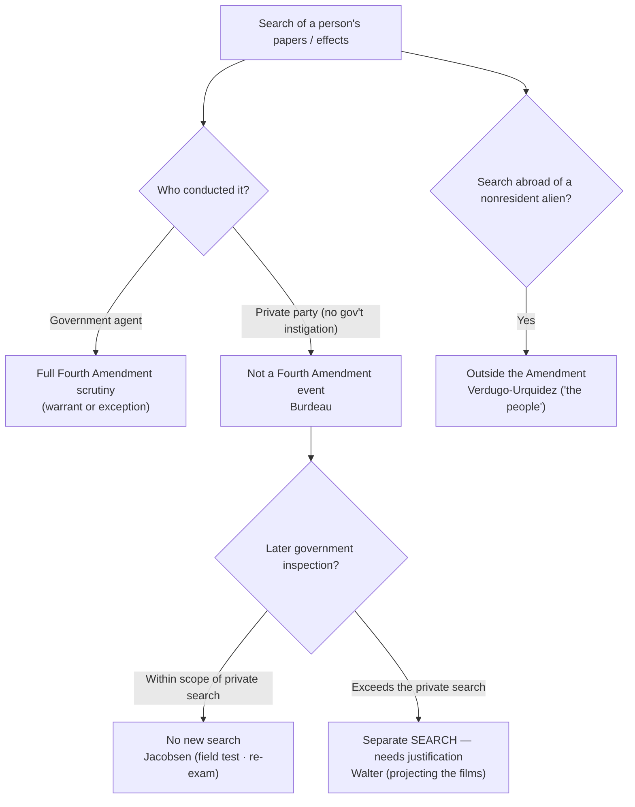
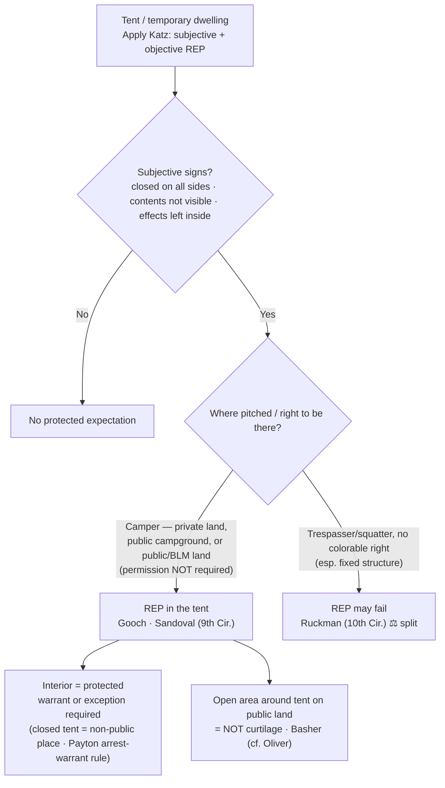

# S9 R1 panel-review — Opus model-diversity lane (prompt pack)

You are the **Claude/Opus** leg of the S9 three-lane adversarial panel (1 Claude + 2 Codex, R1). The two Codex lanes carry the A (support/quote-fidelity) and B (currency/treatment) attack lenses; **you carry model diversity and MUST vote on every paneled assertion across BOTH lenses' concerns.** You are refute-framed: try hard to break each assertion; **default to REFUTED on uncertainty**; never fabricate a cite, quote, or holding; use ONLY the evidence inlined below (no search, no outside knowledge). You are a SIGHTED reviewer — the FULL lake record (judgment fields included) is inlined.

You are a WRITER lane, not an adjudicator: you FIND and VOTE. You do not tally, adjudicate, or close any row — the orchestrator does.

For EACH group below, return one JSON object with the exact `reviewed[]` shape from the output contract (identical framing to the Codex lenses). Emit a finding object ONLY for a real defect (verdict refuted / stands-modified); a group you find wholly clean returns all-`stands` verdicts (the harness records a clean attestation). Concatenate the per-group JSON objects into a top-level `{"packs": [ ... ]}` array, one entry per group, each carrying its `group_id`.


OUTPUT CONTRACT — return ONE JSON object, nothing else:
{
  "lens": "A" | "B",
  "group_id": "<echo the group id>",
  "reviewed": [
    {
      "assertion_id": "<from group_inventory.jsonl>",
      "dimension": "existence|support|quote_fidelity|pincite|treatment|black_letter",
      "verdict": "stands" | "refuted" | "stands-modified",
      "verifiable_from_disclosed": true | false,
      "defect": null,   // null when verdict=="stands"; else an object:
      //  {"problem": "...", "severity": "high|medium|low", "proposed_fix": "...", "evidence_quote": "verbatim from disclosed evidence or null", "needs_cl": true|false, "locator_note": "..."}
      "reasons": ["short evidence-grounded reason", "..."],
      "breaks_true_positives": true | false,
      "residual_risks": ["..."],
      "suggested_tightening": "... or null"
    }
  ],
  "notes": ""
}
Rules: verdict=='stands' <=> defect==null (assertion survives your attack). verdict=='refuted' <=> a real defect (the assertion as framed is wrong). verdict=='stands-modified' <=> survives but needs a stated modification (a minor defect). Review EVERY assertion_id in group_inventory.jsonl exactly once. Output ONLY the JSON object.
---

## GROUP: content/searches/Private and Foreign Searches.md  (`doctrine`, 7 assertions)

### content_page

```
---
weight: 70
title: "Private & Foreign Searches"
aliases:
  - "Private & Foreign Searches"
  - "Private and Foreign Searches"
  - "Private Search Doctrine"
  - "Private-Search Doctrine"
  - "Foreign Searches"
  - "Extraterritorial Searches"
topic: The government-action limit — private searches and searches abroad
type: doctrine
amendment: "U.S. Const. amend. IV"
jurisdiction: "Federal (U.S. Const. amend. IV); SCOTUS baseline"
status: draft
related:
  - "[[Fourth Amendment Framework]]"
  - "[[Reasonable Expectation of Privacy]]"
  - "[[Two Definitions of Search]]"
  - "[[Border Searches]]"
  - "[[Standing to Challenge a Search]]"
  - "[[The Exclusionary Rule]]"
---

# Private & Foreign Searches

*A shipping company opens a damaged package and finds white powder; a private employer drills open a safe and hands the papers to prosecutors; U.S. agents search a home in Mexico. Each turns on the same threshold: the Fourth Amendment restrains the government, and only the government, acting within the national community.*

> [!rule] Black-letter rule
> The Fourth Amendment "was intended as a restraint upon the activities of sovereign authority, and was not intended to be a limitation upon other than governmental agencies." *[[Burdeau v. McDowell#^pin-475|Burdeau]]*, 256 U.S. 465, [475](https://www.courtlistener.com/opinion/99820/burdeau-v-mcdowell/) (1921). So a search by a **private party** not acting as a government agent is not a Fourth Amendment event, and a later government inspection that stays **within the scope** of the private search "must be tested by the degree to which [it] exceeded the scope of the private search." *[[United States v. Jacobsen#^pin-115|Jacobsen]]*, 466 U.S. 109, [115](https://www.courtlistener.com/opinion/111143/united-states-v-jacobsen/#:~:text=The%20additional%20invasions%20of%20respondents%27) (1984). Exceeding that scope is a **separate search** needing independent justification. *[[Walter v. United States#^pin-657|Walter]]*, 447 U.S. 649, [657](https://www.courtlistener.com/opinion/110314/walter-v-united-states/) (1980). And the Amendment does not reach a search of a **nonresident alien's property abroad**, because "the people" it protects are "persons who are part of a national community or who have otherwise developed sufficient connection with this country." *[[United States v. Verdugo-Urquidez#^pin-265|Verdugo-Urquidez]]*, 494 U.S. 259, [265](https://www.courtlistener.com/opinion/112382/united-states-v-verdugo-urquidez/) (1990).
> ^rule-private-foreign

## The Brief

**The Amendment reaches only government action.** The oldest limit on the Fourth Amendment is that it binds the sovereign, not private conduct. In *[[Burdeau v. McDowell|Burdeau]]* private parties broke into an office, drilled open the safes, and took the owner's papers, then handed them to federal prosecutors; because "no official of the federal government had anything to do with" the taking, there was no governmental search to challenge, and the government could keep and use the papers. *[[Burdeau v. McDowell#^pin-475|Burdeau]]*, 256 U.S. at [475](https://www.courtlistener.com/opinion/99820/burdeau-v-mcdowell/). The Amendment "is wholly inapplicable 'to a search or seizure, even an unreasonable one, effected by a private individual not acting as an agent of the Government.'" *[[United States v. Jacobsen|Jacobsen]]*, 466 U.S. at [113](https://www.courtlistener.com/opinion/111143/united-states-v-jacobsen/).

**Once a private party has looked, the government may stand in its shoes, and no further.** The controlling refinement is *[[United States v. Jacobsen|Jacobsen]]*. FedEx employees opened a damaged package, saw plastic bags of white powder, and called the DEA; the agent who then re-examined the package and field-tested the powder conducted no search beyond what the private party had already exposed. The rule is a scope rule: "[t]he additional invasions of respondents' privacy by the Government agent must be tested by the degree to which they exceeded the scope of the private search." *[[United States v. Jacobsen#^pin-115|Jacobsen]]*, 466 U.S. at [115](https://www.courtlistener.com/opinion/111143/united-states-v-jacobsen/#:~:text=The%20additional%20invasions%20of%20respondents%27). Re-examination that stays within the private search discloses nothing the owner still kept private, and a field test that "merely discloses whether or not a particular substance is cocaine does not compromise any legitimate interest in privacy." *[[United States v. Jacobsen#^pin-123|Id.]]* at 123. Reopening beyond what the private party revealed is permissible only where there is a "virtual certainty" that nothing of significance beyond the private search will be exposed. *[[United States v. Jacobsen|Id.]]*, 466 U.S. at [119](https://www.courtlistener.com/opinion/111143/united-states-v-jacobsen/).

**Exceeding the private search is a fresh search.** *[[Walter v. United States|Walter]]* is the trap. Private parties received misdelivered boxes of film, saw the suggestive labels, but never actually viewed the films; when the FBI projected them without a warrant, that "was a significant expansion of the search that had been conducted previously by a private party and therefore must be characterized as a separate search." *[[Walter v. United States#^pin-657|Walter]]*, 447 U.S. at [657](https://www.courtlistener.com/opinion/110314/walter-v-united-states/). "The Government may not exceed the scope of the private search unless it has the right to make an independent search." *[[Walter v. United States|Id.]]* The officer inherits the private party's vantage, not a license to go further.

**When a private actor becomes a government agent.** The doctrine turns on the **absence** of government participation. A nominally private search becomes state action, and the Amendment applies, when officials **instigate, direct, or join** it, or when the private party acts to assist law enforcement rather than for independent private reasons. The line is drawn on all the circumstances, including the government's knowledge and encouragement of the search and the private actor's purpose. Where officials cross it, the private-search safe harbor is gone and the search must satisfy the warrant requirement or an exception ([[Fourth Amendment Framework]]).

**Searches abroad and "the people."** The parallel limit is territorial and personal. *[[United States v. Verdugo-Urquidez|Verdugo-Urquidez]]* held that the Fourth Amendment does not apply to the search by U.S. agents of a nonresident alien's residence in Mexico, construing the Amendment's reference to "the people" to mean "a class of persons who are part of a national community or who have otherwise developed sufficient connection with this country to be considered part of that community." *[[United States v. Verdugo-Urquidez#^pin-265|Verdugo-Urquidez]]*, 494 U.S. at [265](https://www.courtlistener.com/opinion/112382/united-states-v-verdugo-urquidez/). The holding is narrow: it addresses a nonresident alien with no voluntary connection to the United States, searched abroad. It is distinct from the **border-search** doctrine, which governs searches of persons and effects crossing into the country and is developed separately ([[Border Searches]]).

**Apply it.**
1. **Ask who searched.** If a genuinely private party searched with no government instigation, direction, or participation, there is no Fourth Amendment event to suppress (*[[Burdeau v. McDowell|Burdeau]]*).
2. **Measure the government's conduct against the private search.** A later government inspection is lawful only to the extent it does not exceed what the private party already exposed (*[[United States v. Jacobsen|Jacobsen]]*); going further is a separate search needing a warrant or exception (*[[Walter v. United States|Walter]]*).
3. **Check for agency.** Instigation, direction, encouragement, or a law-enforcement purpose can convert a "private" search into state action, restoring full Fourth Amendment scrutiny.
4. **For searches abroad, ask about the person and the place.** A nonresident alien's property searched abroad is outside the Amendment (*[[United States v. Verdugo-Urquidez|Verdugo-Urquidez]]*); border crossings are their own doctrine ([[Border Searches]]).

**Common pitfalls.**
- **Treating the officer's re-examination as automatically fine.** It is lawful only within the scope of the private search; the field test in *[[United States v. Jacobsen|Jacobsen]]* was upheld because it revealed only contraband-or-not, and the film screening in *[[Walter v. United States|Walter]]* was suppressed because it went further.
- **Overlooking agency.** A "private" citizen acting at police direction, or to help build a case, is a government agent; the safe harbor disappears.
- **Assuming the government can always reopen a container.** Reopening beyond the private search needs "virtual certainty" that nothing new will be revealed (*[[United States v. Jacobsen|Jacobsen]]*, 466 U.S. at [119](https://www.courtlistener.com/opinion/111143/united-states-v-jacobsen/)).
- **Confusing the foreign-search rule with the border-search doctrine.** *[[United States v. Verdugo-Urquidez|Verdugo-Urquidez]]* is about who "the people" are; border searches govern the routine authority to search at the international boundary ([[Border Searches]]).

## Lower-court developments

*The digital private-search frontier is automated hash-matching, and the circuits are split.* Providers scan uploaded files against databases of hash values (digital fingerprints) of known contraband and report matches to NCMEC and law enforcement. The question is whether an officer's later opening of a flagged file is a fresh search or merely re-does the private "search."

- **Ninth Circuit, the strict reading.** *[[United States v. Wilson|United States v. Wilson]]*, 13 F.4th 961 (9th Cir. 2021), held that where Google flagged email attachments by hash match but **no human had ever viewed** the images, the officer's warrantless viewing exceeded the scope of any antecedent private search and was itself a government search under *[[United States v. Jacobsen|Jacobsen]]* and *[[Walter v. United States|Walter]]*. *Binding in-circuit (9th Cir.); persuasive elsewhere.*
- **Fifth and Sixth Circuits, the permissive reading.** *[[United States v. Reddick|United States v. Reddick]]*, 900 F.3d 636 (5th Cir. 2018), and *[[United States v. Miller]]*, 982 F.3d 412 (6th Cir. 2020), held that a hash match creates a "virtual certainty" the flagged files are the known contraband already viewed by a private actor, so opening them discloses nothing the defendant's privacy had not already lost, and is not a search. As the Sixth Circuit put it, the hash match "created a 'virtual certainty' that the files . . . were the known child-pornography files that a Google employee had viewed," meeting "*Jacobsen*'s required level of certainty." *[[United States v. Miller]]*, 982 F.3d 412, 416 (6th Cir. 2020). *Binding in their respective circuits; persuasive elsewhere.*

The split is squarely about *[[United States v. Jacobsen|Jacobsen]]*'s "virtual certainty" test applied to an algorithm: the Ninth Circuit demands that a human actually have viewed the specific file, while the Fifth and Sixth treat a reliable hash match as the functional equivalent. The Supreme Court has not resolved it.

## Key cases

| Case | Holding | Opinion |
|---|---|---|
| *[[Burdeau v. McDowell]]*, 256 U.S. 465 (1921) | **Anchor.** The Fourth Amendment restrains only governmental action; papers wrongfully taken by private parties, with no government involvement, and turned over to prosecutors may be retained and used. | [opinion](https://www.courtlistener.com/opinion/99820/burdeau-v-mcdowell/) |
| *[[United States v. Jacobsen]]*, 466 U.S. 109 (1984) | **Anchor.** A government inspection following a private search is tested by whether it exceeded the private search's scope; a re-examination within that scope, and a field test revealing only contraband-or-not, invade no remaining privacy. | [opinion](https://www.courtlistener.com/opinion/111143/united-states-v-jacobsen/) |
| *[[Walter v. United States]]*, 447 U.S. 649 (1980) | **The scope limit.** The government may not exceed the scope of the private search; the FBI's warrantless projection of films a private party had received but never viewed was a separate, unlawful search. | [opinion](https://www.courtlistener.com/opinion/110314/walter-v-united-states/) |
| *[[United States v. Verdugo-Urquidez]]*, 494 U.S. 259 (1990) | **Anchor (foreign search).** The Fourth Amendment does not reach the search of a nonresident alien's property abroad; "the people" it protects are those with a sufficient connection to the national community. | [opinion](https://www.courtlistener.com/opinion/112382/united-states-v-verdugo-urquidez/) |

## Related cases across doctrines

| Case | Relevance here | Primary home | Opinion |
|---|---|---|---|
| *[[Coolidge v. New Hampshire]]*, 403 U.S. 443 (1971) | Evidence produced by a genuinely private search does not implicate the Amendment; state action turns on all the circumstances, including police instigation and purpose. | [[Fourth Amendment Framework]] | [opinion](https://www.courtlistener.com/opinion/108377/coolidge-v-new-hampshire/) |
| *[[Katz v. United States]]*, 389 U.S. 347 (1967) | Supplies the privacy baseline the private-search cases measure against: a search invades a [[Reasonable Expectation of Privacy\|reasonable expectation of privacy]], and a private party can frustrate that expectation before any officer arrives. | [[Reasonable Expectation of Privacy]] | [opinion](https://www.courtlistener.com/opinion/107564/katz-v-united-states/) |

<!-- Burdeau v. McDowell (256 U.S. 465): lake status under_review (treatment-derivation pending; holding + pincite 475 verified on the case page); S9 promotes. Registry home search.private-foreign Anchor. -->
<!-- United States v. Verdugo-Urquidez (494 U.S. 259): lake status under_review (treatment-derivation pending; pincite 265 verified on the case page). -->
<!-- United States v. Wilson (13 F.4th 961, 9th Cir. 2021) and United States v. Reddick (900 F.3d 636, 5th Cir. 2018): lake status under_review; holdings verified on their case pages and in FA Framework's authored LCD. Co-homed here + Fourth Amendment Framework (rule A: FA Framework's private-search bullets are its own batch's to re-point). -->
<!-- United States v. Miller (982 F.3d 412, 6th Cir. 2020) = the hash-match Sixth Circuit case; DISTINCT from the paged United States v. Miller (425 U.S. 435, 1976) third-party bank-records case. Cited here as a plain-italic brief-mention terminal (no wikilink), pincite 416 string-matched via FA Framework's verified LCD. LINT-17: no page-less wikilink. -->

## Visual



## Sources

- [*Burdeau v. McDowell*, 256 U.S. 465 (1921)](https://www.courtlistener.com/opinion/99820/burdeau-v-mcdowell/) (pinpoint: 475)
- [*United States v. Jacobsen*, 466 U.S. 109 (1984)](https://www.courtlistener.com/opinion/111143/united-states-v-jacobsen/) (pinpoints: 113, 115, 119, 123)
- [*Walter v. United States*, 447 U.S. 649 (1980)](https://www.courtlistener.com/opinion/110314/walter-v-united-states/) (pinpoints: 654, 657)
- [*United States v. Verdugo-Urquidez*, 494 U.S. 259 (1990)](https://www.courtlistener.com/opinion/112382/united-states-v-verdugo-urquidez/) (pinpoint: 265)
- [*United States v. Wilson*, 13 F.4th 961 (9th Cir. 2021)](https://www.courtlistener.com/opinion/5296785/united-states-v-luke-wilson/)
- [*United States v. Reddick*, 900 F.3d 636 (5th Cir. 2018)](https://www.courtlistener.com/opinion/4527853/united-states-v-henry-reddick/)
- *United States v. Miller*, 982 F.3d 412 (6th Cir. 2020) (pinpoint: 416) — hash-match circuit split; brief-mention terminal, no standalone page (distinct from the 1976 third-party *United States v. Miller*).
- [*Coolidge v. New Hampshire*, 403 U.S. 443 (1971)](https://www.courtlistener.com/opinion/108377/coolidge-v-new-hampshire/) *(primary home [[Fourth Amendment Framework]])*
- [*Katz v. United States*, 389 U.S. 347 (1967)](https://www.courtlistener.com/opinion/107564/katz-v-united-states/) *(primary home [[Reasonable Expectation of Privacy]])*

```

### group_inventory (assertions under review)

```jsonl
{"assertion_id": "528a15e573624b7d", "dimension": "existence", "kind": "case_cite", "locator": {"case": "Coolidge v. New Hampshire", "table_line": 56}, "payload": {"case": "Coolidge v. New Hampshire", "cells": ["*[[Coolidge v. New Hampshire]]*, 403 U.S. 443 (1971)", "Evidence produced by a genuinely private search does not implicate the Amendment; state action turns on all the circumstances, including police instigation and purpose.", "[[Fourth Amendment Framework]]", "[opinion](https://www.courtlistener.com/opinion/108377/coolidge-v-new-hampshire/)"], "header": ["Case", "Relevance here", "Primary home", "Opinion"]}}
{"assertion_id": "57827b96b4593e3c", "dimension": "existence", "kind": "case_cite", "locator": {"case": "Katz v. United States", "table_line": 57}, "payload": {"case": "Katz v. United States", "cells": ["*[[Katz v. United States]]*, 389 U.S. 347 (1967)", "Supplies the privacy baseline the private-search cases measure against: a search invades a [[Reasonable Expectation of Privacy\\|reasonable expectation of privacy]], and a private party can frustrate that expectation before any officer arrives.", "[[Reasonable Expectation of Privacy]]", "[opinion](https://www.courtlistener.com/opinion/107564/katz-v-united-states/)"], "header": ["Case", "Relevance here", "Primary home", "Opinion"]}}
{"assertion_id": "7bc7cd8714595d46", "dimension": "existence", "kind": "case_cite", "locator": {"case": "United States v. Jacobsen", "table_line": 48}, "payload": {"case": "United States v. Jacobsen", "cells": ["*[[United States v. Jacobsen]]*, 466 U.S. 109 (1984)", "**Anchor.** A government inspection following a private search is tested by whether it exceeded the private search's scope; a re-examination within that scope, and a field test revealing only contraband-or-not, invade no remaining privacy.", "[opinion](https://www.courtlistener.com/opinion/111143/united-states-v-jacobsen/)"], "header": ["Case", "Holding", "Opinion"]}}
{"assertion_id": "81fcb781fcf341e4", "dimension": "existence", "kind": "case_cite", "locator": {"case": "Walter v. United States", "table_line": 49}, "payload": {"case": "Walter v. United States", "cells": ["*[[Walter v. United States]]*, 447 U.S. 649 (1980)", "**The scope limit.** The government may not exceed the scope of the private search; the FBI's warrantless projection of films a private party had received but never viewed was a separate, unlawful search.", "[opinion](https://www.courtlistener.com/opinion/110314/walter-v-united-states/)"], "header": ["Case", "Holding", "Opinion"]}}
{"assertion_id": "8971653d369bd16b", "dimension": "existence", "kind": "case_cite", "locator": {"case": "Burdeau v. McDowell", "table_line": 47}, "payload": {"case": "Burdeau v. McDowell", "cells": ["*[[Burdeau v. McDowell]]*, 256 U.S. 465 (1921)", "**Anchor.** The Fourth Amendment restrains only governmental action; papers wrongfully taken by private parties, with no government involvement, and turned over to prosecutors may be retained and used.", "[opinion](https://www.courtlistener.com/opinion/99820/burdeau-v-mcdowell/)"], "header": ["Case", "Holding", "Opinion"]}}
{"assertion_id": "b01591239d37f790", "dimension": "existence", "kind": "case_cite", "locator": {"case": "United States v. Verdugo-Urquidez", "table_line": 50}, "payload": {"case": "United States v. Verdugo-Urquidez", "cells": ["*[[United States v. Verdugo-Urquidez]]*, 494 U.S. 259 (1990)", "**Anchor (foreign search).** The Fourth Amendment does not reach the search of a nonresident alien's property abroad; \"the people\" it protects are those with a sufficient connection to the national community.", "[opinion](https://www.courtlistener.com/opinion/112382/united-states-v-verdugo-urquidez/)"], "header": ["Case", "Holding", "Opinion"]}}
{"assertion_id": "d2f88e08eda996fc", "dimension": "support", "kind": "proposition", "locator": {"callout": "^rule-private-foreign"}, "payload": {"anchor": "^rule-private-foreign", "statement": "[!rule] Black-letter rule\nThe Fourth Amendment \"was intended as a restraint upon the activities of sovereign authority, and was not intended to be a limitation upon other than governmental agencies.\" *[[Burdeau v. McDowell#^pin-475|Burdeau]]*, 256 U.S. 465, [475](https://www.courtlistener.com/opinion/99820/burdeau-v-mcdowell/) (1921). So a search by a **private party** not acting as a government agent is not a Fourth Amendment event, and a later government inspection that stays **within the scope** of the private search \"must be tested by the degree to which [it] exceeded the scope of the private search.\" *[[United States v. Jacobsen#^pin-115|Jacobsen]]*, 466 U.S. 109, [115](https://www.courtlistener.com/opinion/111143/united-states-v-jacobsen/#:~:text=The%20additional%20invasions%20of%20respondents%27) (1984). Exceeding that scope is a **separate search** needing independent justification. *[[Walter v. United States#^pin-657|Walter]]*, 447 U.S. 649, [657](https://www.courtlistener.com/opinion/110314/walter-v-united-states/) (1980). And the Amendment does not reach a search of a **nonresident alien's property abroad**, because \"the people\" it protects are \"persons who are part of a national community or who have otherwise developed sufficient connection with this country.\" *[[United States v. Verdugo-Urquidez#^pin-265|Verdugo-Urquidez]]*, 494 U.S. 259, [265](https://www.courtlistener.com/opinion/112382/united-states-v-verdugo-urquidez/) (1990)."}}
```

### lake record — Burdeau v. McDowell

```json
{
  "schema_version": "s2.v1",
  "record_id": "Burdeau v. McDowell",
  "status": "under_review",
  "identity": {
    "case_name": "Burdeau v. McDowell",
    "case_name_short": "Burdeau",
    "case_name_full": "BURDEAU v. McDOWELL",
    "input_case_name": "Burdeau v. McDowell",
    "court": "U.S. Supreme Court",
    "court_id": "scotus",
    "court_level": "scotus",
    "circuit": null,
    "state": null,
    "date_decided": "1921-06-01",
    "year": 1921,
    "docket": null,
    "cluster_id": 99820,
    "lead_opinion_id": 99820,
    "sibling_ids": [],
    "absolute_url": "/opinion/99820/burdeau-v-mcdowell/",
    "identity_method": "frontier-identity",
    "expected_citation_found": true,
    "party_name_in_text": false,
    "canonical_name_match": true,
    "alternates": [],
    "reason_code": null
  },
  "citations": {
    "official": {
      "cite": "256 U.S. 465",
      "volume": "256",
      "reporter": "U.S.",
      "page": "465",
      "type": 1,
      "selected_official": true,
      "source": "cluster.citations[]"
    },
    "parallel": [
      {
        "cite": "41 S. Ct. 574",
        "volume": "41",
        "reporter": "S. Ct.",
        "page": "574",
        "type": 1,
        "selected_official": false,
        "source": "cluster.citations[]"
      },
      {
        "cite": "65 L. Ed. 1048",
        "volume": "65",
        "reporter": "L. Ed.",
        "page": "1048",
        "type": 1,
        "selected_official": false,
        "source": "cluster.citations[]"
      },
      {
        "cite": "13 A.L.R. 1159",
        "volume": "13",
        "reporter": "A.L.R.",
        "page": "1159",
        "type": 4,
        "selected_official": false,
        "source": "cluster.citations[]"
      }
    ],
    "vendor_neutral": [
      {
        "cite": "1921 U.S. LEXIS 1576",
        "volume": "1921",
        "reporter": "U.S. LEXIS",
        "page": "1576",
        "type": 6,
        "selected_official": false,
        "source": "cluster.citations[]"
      }
    ],
    "all": [
      {
        "cite": "256 U.S. 465",
        "volume": "256",
        "reporter": "U.S.",
        "page": "465",
        "type": 1,
        "selected_official": false,
        "source": "cluster.citations[]"
      },
      {
        "cite": "41 S. Ct. 574",
        "volume": "41",
        "reporter": "S. Ct.",
        "page": "574",
        "type": 1,
        "selected_official": false,
        "source": "cluster.citations[]"
      },
      {
        "cite": "65 L. Ed. 1048",
        "volume": "65",
        "reporter": "L. Ed.",
        "page": "1048",
        "type": 1,
        "selected_official": false,
        "source": "cluster.citations[]"
      },
      {
        "cite": "1921 U.S. LEXIS 1576",
        "volume": "1921",
        "reporter": "U.S. LEXIS",
        "page": "1576",
        "type": 6,
        "selected_official": false,
        "source": "cluster.citations[]"
      },
      {
        "cite": "13 A.L.R. 1159",
        "volume": "13",
        "reporter": "A.L.R.",
        "page": "1159",
        "type": 4,
        "selected_official": false,
        "source": "cluster.citations[]"
      }
    ],
    "display": "256 U.S. 465",
    "official_selection": {
      "court_class": "scotus",
      "selected": "256 U.S. 465",
      "reason": "selected_rank_1"
    }
  },
  "pinpoints": [],
  "treatment": {
    "field_i_validity": "unverified",
    "as_of_content": null,
    "as_of_treatment": null,
    "composite_basis": "unverified",
    "composite_basis_ref": null,
    "varies_by_point": false,
    "scope_note": "Frontier stub: treatment/progeny intentionally not derived until S6 promotion.",
    "point_overrides": [],
    "edges": [],
    "derivation": {}
  },
  "progeny": {
    "complete_query": null,
    "indexed_citing_opinions": null,
    "count_source": null,
    "per_sibling": [],
    "citation_count": null,
    "cache_path": null,
    "enumeration": null,
    "cursor": null,
    "rows_cached": 0,
    "outbound_opinion_edges": []
  },
  "off_cl_links": [],
  "provenance": {
    "cl_source": null,
    "cl_api": "https://www.courtlistener.com/api/rest/v4",
    "built_by": "S2-BUILDER-AUTHORING",
    "build_run": "s2-build-96d841cbb12e",
    "date_created": "2026-07-06T13:10:19Z",
    "date_modified": "2026-07-10T20:54:54Z",
    "warnings": [],
    "field_provenance": {
      "identity": {
        "src": "CourtListener frontier identity search",
        "at": "2026-07-06T13:10:27Z",
        "verifier": "S2-BUILDER-AUTHORING"
      },
      "treatment.field_i_validity": {
        "src": "frontier stub, no treatment",
        "at": "2026-07-06T13:10:27Z",
        "verifier": "S2-BUILDER-AUTHORING"
      },
      "point_overrides": {
        "src": "frontier stub, no treatment",
        "at": "2026-07-06T13:10:27Z",
        "verifier": "S2-BUILDER-AUTHORING"
      },
      "pinpoints": {
        "src": "frontier stub, no pinpoints",
        "at": "2026-07-06T13:10:27Z",
        "verifier": "S2-BUILDER-AUTHORING"
      }
    },
    "s6_promotion": {
      "from_record_id": "burdeau-v-mcdowell--99820",
      "to_record_id": "Burdeau v. McDowell",
      "as_of": "2026-07-07",
      "born_status": "under_review"
    }
  }
}

```

### lake record — Coolidge v. New Hampshire

```json
{
  "schema_version": "s2.v1",
  "record_id": "Coolidge v. New Hampshire",
  "stub": false,
  "status": "verified",
  "identity": {
    "case_name": "Coolidge v. New Hampshire",
    "case_name_short": "Coolidge",
    "case_name_full": "Coolidge v. New Hampshire",
    "input_case_name": "Coolidge v. New Hampshire",
    "court": "U.S. Supreme Court",
    "court_id": "scotus",
    "court_level": "scotus",
    "circuit": null,
    "state": null,
    "date_decided": "1971-06-21",
    "year": 1971,
    "docket": null,
    "cluster_id": 108377,
    "lead_opinion_id": 108377,
    "sibling_ids": [
      108377,
      9424643,
      9424644,
      9424645,
      9424646,
      9424647
    ],
    "absolute_url": "/opinion/108377/coolidge-v-new-hampshire/",
    "identity_method": "citation+party-text",
    "expected_citation_found": true,
    "party_name_in_text": true,
    "canonical_name_match": true,
    "alternates": [],
    "reason_code": null
  },
  "citations": {
    "official": {
      "cite": "403 U.S. 443",
      "volume": "403",
      "reporter": "U.S.",
      "page": "443",
      "type": 1,
      "selected_official": true,
      "source": "cluster.citations[]"
    },
    "parallel": [
      {
        "cite": "91 S. Ct. 2022",
        "volume": "91",
        "reporter": "S. Ct.",
        "page": "2022",
        "type": 1,
        "selected_official": false,
        "source": "cluster.citations[]"
      },
      {
        "cite": "29 L. Ed. 2d 564",
        "volume": "29",
        "reporter": "L. Ed. 2d",
        "page": "564",
        "type": 1,
        "selected_official": false,
        "source": "cluster.citations[]"
      }
    ],
    "vendor_neutral": [
      {
        "cite": "1971 U.S. LEXIS 25",
        "volume": "1971",
        "reporter": "U.S. LEXIS",
        "page": "25",
        "type": 6,
        "selected_official": false,
        "source": "cluster.citations[]"
      }
    ],
    "all": [
      {
        "cite": "403 U.S. 443",
        "volume": "403",
        "reporter": "U.S.",
        "page": "443",
        "type": 1,
        "selected_official": false,
        "source": "cluster.citations[]"
      },
      {
        "cite": "91 S. Ct. 2022",
        "volume": "91",
        "reporter": "S. Ct.",
        "page": "2022",
        "type": 1,
        "selected_official": false,
        "source": "cluster.citations[]"
      },
      {
        "cite": "29 L. Ed. 2d 564",
        "volume": "29",
        "reporter": "L. Ed. 2d",
        "page": "564",
        "type": 1,
        "selected_official": false,
        "source": "cluster.citations[]"
      },
      {
        "cite": "1971 U.S. LEXIS 25",
        "volume": "1971",
        "reporter": "U.S. LEXIS",
        "page": "25",
        "type": 6,
        "selected_official": false,
        "source": "cluster.citations[]"
      }
    ],
    "display": "403 U.S. 443",
    "official_selection": {
      "court_class": "scotus",
      "selected": "403 U.S. 443",
      "reason": "selected_rank_1"
    }
  },
  "pinpoints": [
    {
      "id": "pin-466",
      "page": null,
      "quote": "doctrine. ## Rule Plain view supplements a prior justified intrusion; it does not authorize a planned warrantless seizure on its own.",
      "star_marker": null,
      "quote_fidelity": "mismatch",
      "pinpoint_status": "slip-only",
      "position": null
    },
    {
      "id": "pin-466a",
      "page": null,
      "quote": "[T]he extension of the original justification is legitimate only where it is immediately apparent to the police that they have evidence before them; the 'plain view' doctrine may not be used to extend a general exploratory search from one object to another until something incriminating at last emerges.",
      "star_marker": null,
      "quote_fidelity": "mismatch",
      "pinpoint_status": "slip-only",
      "position": null
    }
  ],
  "treatment": {
    "field_i_validity": "caution",
    "as_of_content": "1971-06-21",
    "as_of_treatment": "2026-06-30",
    "composite_basis": "migration-seed",
    "composite_basis_ref": "Coolidge v. New Hampshire",
    "varies_by_point": true,
    "scope_note": "Horton v. California (1990) abandoned the inadvertence requirement of the Coolidge plurality's plain-view formulation; the prior-justification and immediately-apparent requirements survive.",
    "point_overrides": [
      {
        "point": "legacy-limited-coolidge-v-new-hampshire",
        "point_label": "Legacy limited treatment point",
        "field_i_validity": "caution",
        "as_of_treatment": "2026-06-30",
        "s3_binding_status": "provisional",
        "by": [
          {
            "name": "Horton v. California",
            "cluster_id": 112448,
            "cite": "496 U.S. 128",
            "field_ii": "limited"
          }
        ],
        "scope_note": "Horton v. California (1990) abandoned the inadvertence requirement of the Coolidge plurality's plain-view formulation; the prior-justification and immediately-apparent requirements survive."
      }
    ],
    "edges": [
      {
        "citing_case": {
          "name": "Horton v. California",
          "cluster_id": 112448,
          "cite": "496 U.S. 128",
          "field_ii": "limited"
        },
        "field_ii": "limited",
        "field_iii": "mentioned",
        "point": null,
        "proposed": true,
        "journal_ref": "migration:limited"
      },
      {
        "citing_case": {
          "name": "Martin v. State",
          "cluster_id": 10740496,
          "cite": null,
          "field_ii": "questioned"
        },
        "field_ii": "questioned",
        "field_iii": "mentioned",
        "point": null,
        "proposed": true,
        "journal_ref": "Coolidge v. New Hampshire:lane1_negative"
      },
      {
        "citing_case": {
          "name": "State of Louisiana v. K.B.",
          "cluster_id": 10581696,
          "cite": null,
          "field_ii": "questioned"
        },
        "field_ii": "questioned",
        "field_iii": "mentioned",
        "point": null,
        "proposed": true,
        "journal_ref": "Coolidge v. New Hampshire:lane1_negative"
      },
      {
        "citing_case": {
          "name": "State v. Bock (A169480)",
          "cluster_id": 10134134,
          "cite": [
            "310 Or. App. 329",
            "485 P.3d 931"
          ],
          "field_ii": "overruled"
        },
        "field_ii": "overruled",
        "field_iii": "mentioned",
        "point": null,
        "proposed": true,
        "journal_ref": "Coolidge v. New Hampshire:lane1_negative"
      },
      {
        "citing_case": {
          "name": "Illinois v. Gates",
          "cluster_id": 110959,
          "cite": [
            "76 L. Ed. 2d 527",
            "103 S. Ct. 2317",
            "462 U.S. 213",
            "1983 U.S. LEXIS 54",
            "51 U.S.L.W. 4709"
          ],
          "field_ii": "overruled"
        },
        "field_ii": "overruled",
        "field_iii": "mentioned",
        "point": null,
        "proposed": true,
        "journal_ref": "Coolidge v. New Hampshire:lane2_top_cited"
      },
      {
        "citing_case": {
          "name": "Schneckloth v. Bustamonte",
          "cluster_id": 108800,
          "cite": [
            "36 L. Ed. 2d 854",
            "93 S. Ct. 2041",
            "412 U.S. 218",
            "1973 U.S. LEXIS 6"
          ],
          "field_ii": "questioned"
        },
        "field_ii": "questioned",
        "field_iii": "mentioned",
        "point": null,
        "proposed": true,
        "journal_ref": "Coolidge v. New Hampshire:lane2_top_cited"
      },
      {
        "citing_case": {
          "name": "United States v. Leon",
          "cluster_id": 111262,
          "cite": [
            "82 L. Ed. 2d 677",
            "104 S. Ct. 3405",
            "468 U.S. 897",
            "1984 U.S. LEXIS 153"
          ],
          "field_ii": "overruled"
        },
        "field_ii": "overruled",
        "field_iii": "mentioned",
        "point": null,
        "proposed": true,
        "journal_ref": "Coolidge v. New Hampshire:lane2_top_cited"
      },
      {
        "citing_case": {
          "name": "Payton v. New York",
          "cluster_id": 110235,
          "cite": [
            "63 L. Ed. 2d 639",
            "100 S. Ct. 1371",
            "445 U.S. 573",
            "1980 U.S. LEXIS 13"
          ],
          "field_ii": "questioned"
        },
        "field_ii": "questioned",
        "field_iii": "mentioned",
        "point": null,
        "proposed": true,
        "journal_ref": "Coolidge v. New Hampshire:lane2_top_cited"
      },
      {
        "citing_case": {
          "name": "Florida v. Royer",
          "cluster_id": 110890,
          "cite": [
            "75 L. Ed. 2d 229",
            "103 S. Ct. 1319",
            "460 U.S. 491",
            "1983 U.S. LEXIS 151",
            "51 U.S.L.W. 4293"
          ],
          "field_ii": "questioned"
        },
        "field_ii": "questioned",
        "field_iii": "mentioned",
        "point": null,
        "proposed": true,
        "journal_ref": "Coolidge v. New Hampshire:lane2_top_cited"
      },
      {
        "citing_case": {
          "name": "Rakas v. Illinois",
          "cluster_id": 109953,
          "cite": [
            "58 L. Ed. 2d 387",
            "99 S. Ct. 421",
            "439 U.S. 128",
            "1978 U.S. LEXIS 2452"
          ],
          "field_ii": "overruled"
        },
        "field_ii": "overruled",
        "field_iii": "mentioned",
        "point": null,
        "proposed": true,
        "journal_ref": "Coolidge v. New Hampshire:lane2_top_cited"
      },
      {
        "citing_case": {
          "name": "Adams v. Williams",
          "cluster_id": 108571,
          "cite": [
            "32 L. Ed. 2d 612",
            "92 S. Ct. 1921",
            "407 U.S. 143",
            "1972 U.S. LEXIS 2206"
          ],
          "field_ii": "questioned"
        },
        "field_ii": "questioned",
        "field_iii": "mentioned",
        "point": null,
        "proposed": true,
        "journal_ref": "Coolidge v. New Hampshire:lane2_top_cited"
      },
      {
        "citing_case": {
          "name": "Brown v. Illinois",
          "cluster_id": 109304,
          "cite": [
            "45 L. Ed. 2d 416",
            "95 S. Ct. 2254",
            "422 U.S. 590",
            "1975 U.S. LEXIS 82"
          ],
          "field_ii": "overruled"
        },
        "field_ii": "overruled",
        "field_iii": "mentioned",
        "point": null,
        "proposed": true,
        "journal_ref": "Coolidge v. New Hampshire:lane2_top_cited"
      },
      {
        "citing_case": {
          "name": "Gerstein v. Pugh",
          "cluster_id": 109186,
          "cite": [
            "43 L. Ed. 2d 54",
            "95 S. Ct. 854",
            "420 U.S. 103",
            "1975 U.S. LEXIS 29",
            "19 Fed. R. Serv. 2d 1499"
          ],
          "field_ii": "overruled"
        },
        "field_ii": "overruled",
        "field_iii": "mentioned",
        "point": null,
        "proposed": true,
        "journal_ref": "Coolidge v. New Hampshire:lane2_top_cited"
      },
      {
        "citing_case": {
          "name": "Colorado v. Connelly",
          "cluster_id": 111779,
          "cite": [
            "93 L. Ed. 2d 473",
            "107 S. Ct. 515",
            "479 U.S. 157",
            "1986 U.S. LEXIS 23",
            "55 U.S.L.W. 4043"
          ],
          "field_ii": "criticized"
        },
        "field_ii": "criticized",
        "field_iii": "mentioned",
        "point": null,
        "proposed": true,
        "journal_ref": "Coolidge v. New Hampshire:lane2_top_cited"
      },
      {
        "citing_case": {
          "name": "United States v. Ross",
          "cluster_id": 110719,
          "cite": [
            "72 L. Ed. 2d 572",
            "102 S. Ct. 2157",
            "456 U.S. 798",
            "1982 U.S. LEXIS 18",
            "50 U.S.L.W. 4580"
          ],
          "field_ii": "overruled"
        },
        "field_ii": "overruled",
        "field_iii": "mentioned",
        "point": null,
        "proposed": true,
        "journal_ref": "Coolidge v. New Hampshire:lane2_top_cited"
      },
      {
        "citing_case": {
          "name": "Mincey v. Arizona",
          "cluster_id": 109905,
          "cite": [
            "57 L. Ed. 2d 290",
            "98 S. Ct. 2408",
            "437 U.S. 385",
            "1978 U.S. LEXIS 115"
          ],
          "field_ii": "overruled"
        },
        "field_ii": "overruled",
        "field_iii": "mentioned",
        "point": null,
        "proposed": true,
        "journal_ref": "Coolidge v. New Hampshire:lane2_top_cited"
      },
      {
        "citing_case": {
          "name": "Michigan v. Long",
          "cluster_id": 111020,
          "cite": [
            "77 L. Ed. 2d 1201",
            "103 S. Ct. 3469",
            "463 U.S. 1032",
            "1983 U.S. LEXIS 7",
            "51 U.S.L.W. 5231"
          ],
          "field_ii": "questioned"
        },
        "field_ii": "questioned",
        "field_iii": "mentioned",
        "point": null,
        "proposed": true,
        "journal_ref": "Coolidge v. New Hampshire:lane2_top_cited"
      },
      {
        "citing_case": {
          "name": "United States v. Matlock",
          "cluster_id": 108967,
          "cite": [
            "39 L. Ed. 2d 242",
            "94 S. Ct. 988",
            "415 U.S. 164",
            "1974 U.S. LEXIS 8"
          ],
          "field_ii": "questioned"
        },
        "field_ii": "questioned",
        "field_iii": "mentioned",
        "point": null,
        "proposed": true,
        "journal_ref": "Coolidge v. New Hampshire:lane2_top_cited"
      },
      {
        "citing_case": {
          "name": "United States v. Robinson",
          "cluster_id": 108893,
          "cite": [
            "38 L. Ed. 2d 427",
            "94 S. Ct. 467",
            "414 U.S. 218",
            "1973 U.S. LEXIS 21",
            "66 Ohio Op. 2d 202"
          ],
          "field_ii": "overruled"
        },
        "field_ii": "overruled",
        "field_iii": "mentioned",
        "point": null,
        "proposed": true,
        "journal_ref": "Coolidge v. New Hampshire:lane2_top_cited"
      },
      {
        "citing_case": {
          "name": "New York v. Belton",
          "cluster_id": 110559,
          "cite": [
            "69 L. Ed. 2d 768",
            "101 S. Ct. 2860",
            "453 U.S. 454",
            "1981 U.S. LEXIS 13"
          ],
          "field_ii": "overruled"
        },
        "field_ii": "overruled",
        "field_iii": "mentioned",
        "point": null,
        "proposed": true,
        "journal_ref": "Coolidge v. New Hampshire:lane2_top_cited"
      },
      {
        "citing_case": {
          "name": "South Dakota v. Opperman",
          "cluster_id": 109537,
          "cite": [
            "49 L. Ed. 2d 1000",
            "96 S. Ct. 3092",
            "428 U.S. 364",
            "1976 U.S. LEXIS 15"
          ],
          "field_ii": "questioned"
        },
        "field_ii": "questioned",
        "field_iii": "mentioned",
        "point": null,
        "proposed": true,
        "journal_ref": "Coolidge v. New Hampshire:lane2_top_cited"
      },
      {
        "citing_case": {
          "name": "United States v. Place",
          "cluster_id": 110979,
          "cite": [
            "77 L. Ed. 2d 110",
            "103 S. Ct. 2637",
            "462 U.S. 696",
            "1983 U.S. LEXIS 74",
            "51 U.S.L.W. 4844"
          ],
          "field_ii": "questioned"
        },
        "field_ii": "questioned",
        "field_iii": "mentioned",
        "point": null,
        "proposed": true,
        "journal_ref": "Coolidge v. New Hampshire:lane2_top_cited"
      },
      {
        "citing_case": {
          "name": "United States v. Jacobsen",
          "cluster_id": 111143,
          "cite": [
            "80 L. Ed. 2d 85",
            "104 S. Ct. 1652",
            "466 U.S. 109",
            "1984 U.S. LEXIS 53",
            "52 U.S.L.W. 4414"
          ],
          "field_ii": "overruled"
        },
        "field_ii": "overruled",
        "field_iii": "mentioned",
        "point": null,
        "proposed": true,
        "journal_ref": "Coolidge v. New Hampshire:lane2_top_cited"
      },
      {
        "citing_case": {
          "name": "Texas v. Brown",
          "cluster_id": 110901,
          "cite": [
            "75 L. Ed. 2d 502",
            "103 S. Ct. 1535",
            "460 U.S. 730",
            "1983 U.S. LEXIS 143",
            "51 U.S.L.W. 4361"
          ],
          "field_ii": "criticized"
        },
        "field_ii": "criticized",
        "field_iii": "mentioned",
        "point": null,
        "proposed": true,
        "journal_ref": "Coolidge v. New Hampshire:lane2_top_cited"
      },
      {
        "citing_case": {
          "name": "Horton v. California",
          "cluster_id": 112448,
          "cite": [
            "110 L. Ed. 2d 112",
            "110 S. Ct. 2301",
            "496 U.S. 128",
            "1990 U.S. LEXIS 2937"
          ],
          "field_ii": "questioned"
        },
        "field_ii": "questioned",
        "field_iii": "mentioned",
        "point": null,
        "proposed": true,
        "journal_ref": "Coolidge v. New Hampshire:lane2_top_cited"
      },
      {
        "citing_case": {
          "name": "Minnesota v. Dickerson",
          "cluster_id": 112873,
          "cite": [
            "124 L. Ed. 2d 334",
            "113 S. Ct. 2130",
            "508 U.S. 366",
            "1993 U.S. LEXIS 4018"
          ],
          "field_ii": "questioned"
        },
        "field_ii": "questioned",
        "field_iii": "mentioned",
        "point": null,
        "proposed": true,
        "journal_ref": "Coolidge v. New Hampshire:lane2_top_cited"
      },
      {
        "citing_case": {
          "name": "Illinois v. Rodriguez",
          "cluster_id": 112475,
          "cite": [
            "111 L. Ed. 2d 148",
            "110 S. Ct. 2793",
            "497 U.S. 177",
            "1990 U.S. LEXIS 3295",
            "58 U.S.L.W. 4892"
          ],
          "field_ii": "questioned"
        },
        "field_ii": "questioned",
        "field_iii": "mentioned",
        "point": null,
        "proposed": true,
        "journal_ref": "Coolidge v. New Hampshire:lane2_top_cited"
      },
      {
        "citing_case": {
          "name": "Skinner v. Railway Labor Executives' Assn.",
          "cluster_id": 112219,
          "cite": [
            "103 L. Ed. 2d 639",
            "109 S. Ct. 1402",
            "489 U.S. 602",
            "1989 U.S. LEXIS 1568",
            "4 I.E.R. Cas. (BNA) 224",
            "1989 CCH OSHD 28,476",
            "57 U.S.L.W. 4324",
            "13 OSHC (BNA) 2065",
            "130 L.R.R.M. (BNA) 2857",
            "49 Empl. Prac. Dec. (CCH) 38,791"
          ],
          "field_ii": "abrogated"
        },
        "field_ii": "abrogated",
        "field_iii": "mentioned",
        "point": null,
        "proposed": true,
        "journal_ref": "Coolidge v. New Hampshire:lane2_top_cited"
      },
      {
        "citing_case": {
          "name": "United States v. Chadwick",
          "cluster_id": 109714,
          "cite": [
            "53 L. Ed. 2d 538",
            "97 S. Ct. 2476",
            "433 U.S. 1",
            "1977 U.S. LEXIS 133"
          ],
          "field_ii": "questioned"
        },
        "field_ii": "questioned",
        "field_iii": "mentioned",
        "point": null,
        "proposed": true,
        "journal_ref": "Coolidge v. New Hampshire:lane2_top_cited"
      }
    ],
    "derivation": {
      "lane1_negative": {
        "query": "cites:(108377 OR 9424643 OR 9424644 OR 9424645 OR 9424646 OR 9424647) AND (overrul* OR abrogat* OR supersed* OR \"recede from\" OR \"no longer good law\" OR vacat* OR reversed) ",
        "reviewed": 200,
        "cap": 200,
        "cap_hit": true,
        "final_cursor": "https://www.courtlistener.com/api/rest/v4/search/?cursor=cz0xNTY3MTIzMjAwMDAwJnM9NDY1ODI3NyZ0PW8mZD0yMDI2LTA3LTA0JnA9MTE%3D&fields=absolute_url%2CcaseName%2CcaseNameFull%2Ccitation%2CciteCount%2Ccluster_id%2Ccourt%2Ccourt_citation_string%2Ccourt_id%2CdateFiled%2Copinions%2Csibling_ids%2Cstatus%2Csyllabus&order_by=dateFiled+desc&page_size=100&q=cites%3A%28108377+OR+9424643+OR+9424644+OR+9424645+OR+9424646+OR+9424647%29+AND+%28overrul%2A+OR+abrogat%2A+OR+supersed%2A+OR+%22recede+from%22+OR+%22no+longer+good+law%22+OR+vacat%2A+OR+reversed%29+&stat_Published=on&type=o",
        "audit_needed": true,
        "proposed_negative_events": 3,
        "audit_marker": "R15 treatment audit required",
        "triage_mode": "snippet-first",
        "snippet_field": "results[].opinions[].snippet",
        "triage_journaled": 200,
        "triage_read": 3,
        "triage_snippet_classified": 197
      },
      "lane2_top_cited": {
        "query": "cites:(108377 OR 9424643 OR 9424644 OR 9424645 OR 9424646 OR 9424647)",
        "reviewed": 25,
        "cap": 25,
        "cap_hit": true,
        "final_cursor": "https://www.courtlistener.com/api/rest/v4/search/?cursor=cz0xMzgzJnM9MTA5NTA0JnQ9byZkPTIwMjYtMDctMDQmcD0z&order_by=citeCount+desc&page_size=25&q=cites%3A%28108377+OR+9424643+OR+9424644+OR+9424645+OR+9424646+OR+9424647%29&type=o",
        "audit_needed": true,
        "proposed_negative_events": 25,
        "audit_marker": "R15 treatment audit required"
      },
      "lane3_recency": {
        "query": "cites:(108377 OR 9424643 OR 9424644 OR 9424645 OR 9424646 OR 9424647)",
        "reviewed": 99,
        "cap": 200,
        "cap_hit": false,
        "final_cursor": null,
        "audit_needed": false,
        "proposed_negative_events": 2,
        "audit_marker": null,
        "triage_mode": "snippet-first",
        "snippet_field": "results[].opinions[].snippet",
        "triage_journaled": 99,
        "triage_read": 2,
        "triage_snippet_classified": 97
      }
    }
  },
  "progeny": {
    "complete_query": "cites:(108377 OR 9424643 OR 9424644 OR 9424645 OR 9424646 OR 9424647)",
    "indexed_citing_opinions": 5998,
    "count_source": "search",
    "per_sibling": [
      {
        "opinion_id": 108377,
        "count": 5499,
        "count_source": "search"
      },
      {
        "opinion_id": 9424643,
        "count": 661,
        "count_source": "search"
      },
      {
        "opinion_id": 9424644,
        "count": 0,
        "count_source": "search"
      },
      {
        "opinion_id": 9424645,
        "count": 0,
        "count_source": "search"
      },
      {
        "opinion_id": 9424646,
        "count": 0,
        "count_source": "search"
      },
      {
        "opinion_id": 9424647,
        "count": 0,
        "count_source": "search"
      }
    ],
    "citation_count": 9038,
    "cache_path": "/Users/johngalt/cssi-lake/cache/progeny/coolidge-v-new-hampshire.jsonl",
    "enumeration": "bounded",
    "cursor": "https://www.courtlistener.com/api/rest/v4/search/?cursor=cz0xLjkzNDA0NTgmcz0xMDU1NjA2MyZ0PW8mZD0yMDI2LTA3LTA0JnA9Mg%3D%3D&order_by=score+desc&page_size=100&q=cites%3A%28108377+OR+9424643+OR+9424644+OR+9424645+OR+9424646+OR+9424647%29&type=o",
    "rows_cached": 20,
    "outbound_opinion_edges": [
      {
        "source_opinion_id": 108377,
        "cited_id": 91573,
        "source": "search.opinions[].cites[]"
      },
      {
        "source_opinion_id": 108377,
        "cited_id": 98094,
        "source": "search.opinions[].cites[]"
      },
      {
        "source_opinion_id": 108377,
        "cited_id": 99506,
        "source": "search.opinions[].cites[]"
      },
      {
        "source_opinion_id": 108377,
        "cited_id": 99745,
        "source": "search.opinions[].cites[]"
      },
      {
        "source_opinion_id": 108377,
        "cited_id": 99820,
        "source": "search.opinions[].cites[]"
      },
      {
        "source_opinion_id": 108377,
        "cited_id": 100413,
        "source": "search.opinions[].cites[]"
      },
      {
        "source_opinion_id": 108377,
        "cited_id": 100567,
        "source": "search.opinions[].cites[]"
      },
      {
        "source_opinion_id": 108377,
        "cited_id": 100621,
        "source": "search.opinions[].cites[]"
      },
      {
        "source_opinion_id": 108377,
        "cited_id": 100711,
        "source": "search.opinions[].cites[]"
      },
      {
        "source_opinion_id": 108377,
        "cited_id": 100980,
        "source": "search.opinions[].cites[]"
      },
      {
        "source_opinion_id": 108377,
        "cited_id": 101118,
        "source": "search.opinions[].cites[]"
      },
      {
        "source_opinion_id": 108377,
        "cited_id": 101164,
        "source": "search.opinions[].cites[]"
      },
      {
        "source_opinion_id": 108377,
        "cited_id": 101180,
        "source": "search.opinions[].cites[]"
      },
      {
        "source_opinion_id": 108377,
        "cited_id": 101643,
        "source": "search.opinions[].cites[]"
      },
      {
        "source_opinion_id": 108377,
        "cited_id": 101682,
        "source": "search.opinions[].cites[]"
      },
      {
        "source_opinion_id": 108377,
        "cited_id": 101899,
        "source": "search.opinions[].cites[]"
      },
      {
        "source_opinion_id": 108377,
        "cited_id": 101905,
        "source": "search.opinions[].cites[]"
      },
      {
        "source_opinion_id": 108377,
        "cited_id": 103100,
        "source": "search.opinions[].cites[]"
      },
      {
        "source_opinion_id": 108377,
        "cited_id": 103791,
        "source": "search.opinions[].cites[]"
      },
      {
        "source_opinion_id": 108377,
        "cited_id": 104313,
        "source": "search.opinions[].cites[]"
      },
      {
        "source_opinion_id": 108377,
        "cited_id": 104314,
        "source": "search.opinions[].cites[]"
      },
      {
        "source_opinion_id": 108377,
        "cited_id": 104422,
        "source": "search.opinions[].cites[]"
      },
      {
        "source_opinion_id": 108377,
        "cited_id": 104490,
        "source": "search.opinions[].cites[]"
      },
      {
        "source_opinion_id": 108377,
        "cited_id": 104504,
        "source": "search.opinions[].cites[]"
      },
      {
        "source_opinion_id": 108377,
        "cited_id": 104576,
        "source": "search.opinions[].cites[]"
      },
      {
        "source_opinion_id": 108377,
        "cited_id": 104605,
        "source": "search.opinions[].cites[]"
      },
      {
        "source_opinion_id": 108377,
        "cited_id": 104709,
        "source": "search.opinions[].cites[]"
      },
      {
        "source_opinion_id": 108377,
        "cited_id": 104716,
        "source": "search.opinions[].cites[]"
      },
      {
        "source_opinion_id": 108377,
        "cited_id": 104769,
        "source": "search.opinions[].cites[]"
      },
      {
        "source_opinion_id": 108377,
        "cited_id": 104943,
        "source": "search.opinions[].cites[]"
      },
      {
        "source_opinion_id": 108377,
        "cited_id": 105194,
        "source": "search.opinions[].cites[]"
      },
      {
        "source_opinion_id": 108377,
        "cited_id": 105731,
        "source": "search.opinions[].cites[]"
      },
      {
        "source_opinion_id": 108377,
        "cited_id": 105748,
        "source": "search.opinions[].cites[]"
      },
      {
        "source_opinion_id": 108377,
        "cited_id": 105749,
        "source": "search.opinions[].cites[]"
      },
      {
        "source_opinion_id": 108377,
        "cited_id": 106107,
        "source": "search.opinions[].cites[]"
      },
      {
        "source_opinion_id": 108377,
        "cited_id": 106197,
        "source": "search.opinions[].cites[]"
      },
      {
        "source_opinion_id": 108377,
        "cited_id": 106285,
        "source": "search.opinions[].cites[]"
      },
      {
        "source_opinion_id": 108377,
        "cited_id": 106515,
        "source": "search.opinions[].cites[]"
      },
      {
        "source_opinion_id": 108377,
        "cited_id": 106641,
        "source": "search.opinions[].cites[]"
      },
      {
        "source_opinion_id": 108377,
        "cited_id": 106771,
        "source": "search.opinions[].cites[]"
      },
      {
        "source_opinion_id": 108377,
        "cited_id": 106777,
        "source": "search.opinions[].cites[]"
      },
      {
        "source_opinion_id": 108377,
        "cited_id": 106865,
        "source": "search.opinions[].cites[]"
      },
      {
        "source_opinion_id": 108377,
        "cited_id": 106964,
        "source": "search.opinions[].cites[]"
      },
      {
        "source_opinion_id": 108377,
        "cited_id": 107082,
        "source": "search.opinions[].cites[]"
      },
      {
        "source_opinion_id": 108377,
        "cited_id": 107102,
        "source": "search.opinions[].cites[]"
      },
      {
        "source_opinion_id": 108377,
        "cited_id": 107262,
        "source": "search.opinions[].cites[]"
      },
      {
        "source_opinion_id": 108377,
        "cited_id": 107312,
        "source": "search.opinions[].cites[]"
      },
      {
        "source_opinion_id": 108377,
        "cited_id": 107359,
        "source": "search.opinions[].cites[]"
      },
      {
        "source_opinion_id": 108377,
        "cited_id": 107360,
        "source": "search.opinions[].cites[]"
      },
      {
        "source_opinion_id": 108377,
        "cited_id": 107465,
        "source": "search.opinions[].cites[]"
      },
      {
        "source_opinion_id": 108377,
        "cited_id": 107473,
        "source": "search.opinions[].cites[]"
      },
      {
        "source_opinion_id": 108377,
        "cited_id": 107474,
        "source": "search.opinions[].cites[]"
      },
      {
        "source_opinion_id": 108377,
        "cited_id": 107483,
        "source": "search.opinions[].cites[]"
      },
      {
        "source_opinion_id": 108377,
        "cited_id": 107564,
        "source": "search.opinions[].cites[]"
      },
      {
        "source_opinion_id": 108377,
        "cited_id": 107625,
        "source": "search.opinions[].cites[]"
      },
      {
        "source_opinion_id": 108377,
        "cited_id": 107687,
        "source": "search.opinions[].cites[]"
      },
      {
        "source_opinion_id": 108377,
        "cited_id": 107718,
        "source": "search.opinions[].cites[]"
      },
      {
        "source_opinion_id": 108377,
        "cited_id": 107729,
        "source": "search.opinions[].cites[]"
      },
      {
        "source_opinion_id": 108377,
        "cited_id": 107730,
        "source": "search.opinions[].cites[]"
      },
      {
        "source_opinion_id": 108377,
        "cited_id": 107745,
        "source": "search.opinions[].cites[]"
      },
      {
        "source_opinion_id": 108377,
        "cited_id": 107831,
        "source": "search.opinions[].cites[]"
      },
      {
        "source_opinion_id": 108377,
        "cited_id": 107898,
        "source": "search.opinions[].cites[]"
      },
      {
        "source_opinion_id": 108377,
        "cited_id": 107912,
        "source": "search.opinions[].cites[]"
      },
      {
        "source_opinion_id": 108377,
        "cited_id": 107913,
        "source": "search.opinions[].cites[]"
      },
      {
        "source_opinion_id": 108377,
        "cited_id": 107952,
        "source": "search.opinions[].cites[]"
      },
      {
        "source_opinion_id": 108377,
        "cited_id": 107979,
        "source": "search.opinions[].cites[]"
      },
      {
        "source_opinion_id": 108377,
        "cited_id": 107982,
        "source": "search.opinions[].cites[]"
      },
      {
        "source_opinion_id": 108377,
        "cited_id": 108183,
        "source": "search.opinions[].cites[]"
      },
      {
        "source_opinion_id": 108377,
        "cited_id": 108184,
        "source": "search.opinions[].cites[]"
      },
      {
        "source_opinion_id": 108377,
        "cited_id": 108186,
        "source": "search.opinions[].cites[]"
      },
      {
        "source_opinion_id": 108377,
        "cited_id": 108297,
        "source": "search.opinions[].cites[]"
      },
      {
        "source_opinion_id": 108377,
        "cited_id": 108301,
        "source": "search.opinions[].cites[]"
      },
      {
        "source_opinion_id": 108377,
        "cited_id": 108302,
        "source": "search.opinions[].cites[]"
      },
      {
        "source_opinion_id": 108377,
        "cited_id": 108335,
        "source": "search.opinions[].cites[]"
      },
      {
        "source_opinion_id": 108377,
        "cited_id": 263859,
        "source": "search.opinions[].cites[]"
      },
      {
        "source_opinion_id": 108377,
        "cited_id": 291194,
        "source": "search.opinions[].cites[]"
      },
      {
        "source_opinion_id": 108377,
        "cited_id": 293653,
        "source": "search.opinions[].cites[]"
      },
      {
        "source_opinion_id": 108377,
        "cited_id": 1139971,
        "source": "search.opinions[].cites[]"
      },
      {
        "source_opinion_id": 108377,
        "cited_id": 1501475,
        "source": "search.opinions[].cites[]"
      }
    ]
  },
  "off_cl_links": [],
  "provenance": {
    "cl_source": "LRU",
    "cl_api": "https://www.courtlistener.com/api/rest/v4",
    "built_by": "S2-BUILDER-AUTHORING",
    "build_run": "s2-build-96d841cbb12e",
    "date_created": "2026-07-05T01:09:56Z",
    "date_modified": "2026-07-06T10:25:11Z",
    "warnings": [
      "legacy treatment migrated: limited -> caution",
      "F-S2-29 migration reference repair"
    ],
    "field_provenance": {
      "identity": {
        "src": "CourtListener search + clusters + lead opinion text",
        "at": "2026-07-05T01:10:24Z",
        "verifier": "S2-BUILDER-AUTHORING"
      },
      "treatment.field_i_validity": {
        "src": "_treatment-migration.json + page frontmatter",
        "at": "2026-07-05T01:10:24Z",
        "verifier": "S2-BUILDER-AUTHORING"
      },
      "point_overrides": {
        "src": "F-S2-29 migration reference repair",
        "at": "2026-07-06T07:11:31Z",
        "verifier": "orchestrator claude-fable-5"
      },
      "pinpoints": {
        "src": "content page quote harvest + lead opinion text",
        "at": "2026-07-05T01:10:24Z",
        "verifier": "S2-BUILDER-AUTHORING"
      }
    }
  }
}

```

### lake record — Katz v. United States

```json
{
  "schema_version": "s2.v1",
  "record_id": "Katz v. United States",
  "stub": false,
  "status": "verified",
  "identity": {
    "case_name": "Katz v. United States",
    "case_name_short": "Katz",
    "case_name_full": "Katz v. United States",
    "input_case_name": "Katz v. United States",
    "court": "U.S. Supreme Court",
    "court_id": "scotus",
    "court_level": "scotus",
    "circuit": null,
    "state": null,
    "date_decided": "1967-12-18",
    "year": 1967,
    "docket": null,
    "cluster_id": 107564,
    "lead_opinion_id": 9423552,
    "sibling_ids": [
      107564,
      9423552,
      9423553,
      9423554,
      9423555,
      9423556
    ],
    "absolute_url": "/opinion/107564/katz-v-united-states/",
    "identity_method": "citation+party-text",
    "expected_citation_found": true,
    "party_name_in_text": true,
    "canonical_name_match": true,
    "alternates": [
      {
        "cluster_id": 8968016,
        "score": 20,
        "case_name": "Katz v. United States"
      },
      {
        "cluster_id": 107431,
        "score": 20,
        "case_name": "Katz v. United States"
      }
    ],
    "reason_code": null
  },
  "citations": {
    "official": {
      "cite": "389 U.S. 347",
      "volume": "389",
      "reporter": "U.S.",
      "page": "347",
      "type": 1,
      "selected_official": true,
      "source": "cluster.citations[]"
    },
    "parallel": [
      {
        "cite": "88 S. Ct. 507",
        "volume": "88",
        "reporter": "S. Ct.",
        "page": "507",
        "type": 1,
        "selected_official": false,
        "source": "cluster.citations[]"
      },
      {
        "cite": "19 L. Ed. 2d 576",
        "volume": "19",
        "reporter": "L. Ed. 2d",
        "page": "576",
        "type": 1,
        "selected_official": false,
        "source": "cluster.citations[]"
      }
    ],
    "vendor_neutral": [
      {
        "cite": "1967 U.S. LEXIS 2",
        "volume": "1967",
        "reporter": "U.S. LEXIS",
        "page": "2",
        "type": 6,
        "selected_official": false,
        "source": "cluster.citations[]"
      }
    ],
    "all": [
      {
        "cite": "389 U.S. 347",
        "volume": "389",
        "reporter": "U.S.",
        "page": "347",
        "type": 1,
        "selected_official": false,
        "source": "cluster.citations[]"
      },
      {
        "cite": "88 S. Ct. 507",
        "volume": "88",
        "reporter": "S. Ct.",
        "page": "507",
        "type": 1,
        "selected_official": false,
        "source": "cluster.citations[]"
      },
      {
        "cite": "19 L. Ed. 2d 576",
        "volume": "19",
        "reporter": "L. Ed. 2d",
        "page": "576",
        "type": 1,
        "selected_official": false,
        "source": "cluster.citations[]"
      },
      {
        "cite": "1967 U.S. LEXIS 2",
        "volume": "1967",
        "reporter": "U.S. LEXIS",
        "page": "2",
        "type": 6,
        "selected_official": false,
        "source": "cluster.citations[]"
      }
    ],
    "display": "389 U.S. 347",
    "official_selection": {
      "court_class": "scotus",
      "selected": "389 U.S. 347",
      "reason": "selected_rank_1"
    }
  },
  "pinpoints": [
    {
      "id": "pin-351",
      "page": null,
      "quote": "and whether electronic eavesdropping on a conversation in a public phone booth, accomplished without any physical trespass, is a search and seizure subject to the Amendment. ## Rule The inquiry is personal, not spatial:",
      "star_marker": null,
      "quote_fidelity": "mismatch",
      "pinpoint_status": "slip-only",
      "position": null
    },
    {
      "id": "pin-361",
      "page": null,
      "quote": "a twofold requirement, first that a person have exhibited an actual (subjective) expectation of privacy and, second, that the expectation be one that society is prepared to recognize as 'reasonable.'",
      "star_marker": null,
      "quote_fidelity": "mismatch",
      "pinpoint_status": "slip-only",
      "position": null
    }
  ],
  "treatment": {
    "field_i_validity": "good_law",
    "as_of_content": "1967-12-18",
    "as_of_treatment": "2026-06-30",
    "composite_basis": "migration-seed",
    "composite_basis_ref": "Katz v. United States",
    "varies_by_point": false,
    "scope_note": "Katz's reasonable-expectation-of-privacy framework remains the governing search test; the trespass theory it displaced was later revived as an additional (not exclusive) basis in United States v. Jones (2012) and Carpenter (2018) without disturbing Katz.",
    "point_overrides": [],
    "edges": [
      {
        "citing_case": {
          "name": "People v. Dozier",
          "cluster_id": 10746140,
          "cite": null,
          "field_ii": "questioned"
        },
        "field_ii": "questioned",
        "field_iii": "mentioned",
        "point": null,
        "proposed": true,
        "journal_ref": "Katz v. United States:lane1_negative"
      },
      {
        "citing_case": {
          "name": "Martin v. State",
          "cluster_id": 10740496,
          "cite": null,
          "field_ii": "questioned"
        },
        "field_ii": "questioned",
        "field_iii": "mentioned",
        "point": null,
        "proposed": true,
        "journal_ref": "Katz v. United States:lane1_negative"
      },
      {
        "citing_case": {
          "name": "State v. Rogers",
          "cluster_id": 10705828,
          "cite": null,
          "field_ii": "overruled"
        },
        "field_ii": "overruled",
        "field_iii": "mentioned",
        "point": null,
        "proposed": true,
        "journal_ref": "Katz v. United States:lane1_negative"
      },
      {
        "citing_case": {
          "name": "State v. Wright",
          "cluster_id": 10658752,
          "cite": null,
          "field_ii": "questioned"
        },
        "field_ii": "questioned",
        "field_iii": "mentioned",
        "point": null,
        "proposed": true,
        "journal_ref": "Katz v. United States:lane1_negative"
      },
      {
        "citing_case": {
          "name": "Commonwealth v. Williams",
          "cluster_id": 10027459,
          "cite": null,
          "field_ii": "overruled"
        },
        "field_ii": "overruled",
        "field_iii": "mentioned",
        "point": null,
        "proposed": true,
        "journal_ref": "Katz v. United States:lane1_negative"
      },
      {
        "citing_case": {
          "name": "Commonwealth v. Lepage",
          "cluster_id": 9503197,
          "cite": null,
          "field_ii": "superseded_by_statute"
        },
        "field_ii": "superseded_by_statute",
        "field_iii": "mentioned",
        "point": null,
        "proposed": true,
        "journal_ref": "Katz v. United States:lane1_negative"
      },
      {
        "citing_case": {
          "name": "State v. Jordan",
          "cluster_id": 9487045,
          "cite": null,
          "field_ii": "questioned"
        },
        "field_ii": "questioned",
        "field_iii": "mentioned",
        "point": null,
        "proposed": true,
        "journal_ref": "Katz v. United States:lane1_negative"
      },
      {
        "citing_case": {
          "name": "Terry v. Ohio",
          "cluster_id": 107729,
          "cite": [
            "20 L. Ed. 2d 889",
            "88 S. Ct. 1868",
            "392 U.S. 1",
            "1968 U.S. LEXIS 1345",
            "44 Ohio Op. 2d 383"
          ],
          "field_ii": "questioned"
        },
        "field_ii": "questioned",
        "field_iii": "mentioned",
        "point": null,
        "proposed": true,
        "journal_ref": "Katz v. United States:lane2_top_cited"
      },
      {
        "citing_case": {
          "name": "Harlow v. Fitzgerald",
          "cluster_id": 110763,
          "cite": [
            "73 L. Ed. 2d 396",
            "102 S. Ct. 2727",
            "457 U.S. 800",
            "1982 U.S. LEXIS 139"
          ],
          "field_ii": "abrogated"
        },
        "field_ii": "abrogated",
        "field_iii": "mentioned",
        "point": null,
        "proposed": true,
        "journal_ref": "Katz v. United States:lane2_top_cited"
      },
      {
        "citing_case": {
          "name": "Bivens v. Six Unknown Named Agents of Federal Bureau of Narcotics",
          "cluster_id": 108375,
          "cite": [
            "29 L. Ed. 2d 619",
            "91 S. Ct. 1999",
            "403 U.S. 388",
            "1971 U.S. LEXIS 23"
          ],
          "field_ii": "overruled"
        },
        "field_ii": "overruled",
        "field_iii": "mentioned",
        "point": null,
        "proposed": true,
        "journal_ref": "Katz v. United States:lane2_top_cited"
      },
      {
        "citing_case": {
          "name": "Katz v. United States",
          "cluster_id": 107564,
          "cite": [
            "19 L. Ed. 2d 576",
            "88 S. Ct. 507",
            "389 U.S. 347",
            "1967 U.S. LEXIS 2"
          ],
          "field_ii": "overruled"
        },
        "field_ii": "overruled",
        "field_iii": "mentioned",
        "point": null,
        "proposed": true,
        "journal_ref": "Katz v. United States:lane2_top_cited"
      },
      {
        "citing_case": {
          "name": "Schneckloth v. Bustamonte",
          "cluster_id": 108800,
          "cite": [
            "36 L. Ed. 2d 854",
            "93 S. Ct. 2041",
            "412 U.S. 218",
            "1973 U.S. LEXIS 6"
          ],
          "field_ii": "questioned"
        },
        "field_ii": "questioned",
        "field_iii": "mentioned",
        "point": null,
        "proposed": true,
        "journal_ref": "Katz v. United States:lane2_top_cited"
      },
      {
        "citing_case": {
          "name": "Bell v. Wolfish",
          "cluster_id": 110075,
          "cite": [
            "60 L. Ed. 2d 447",
            "99 S. Ct. 1861",
            "441 U.S. 520",
            "1979 U.S. LEXIS 100"
          ],
          "field_ii": "questioned"
        },
        "field_ii": "questioned",
        "field_iii": "mentioned",
        "point": null,
        "proposed": true,
        "journal_ref": "Katz v. United States:lane2_top_cited"
      },
      {
        "citing_case": {
          "name": "United States v. Leon",
          "cluster_id": 111262,
          "cite": [
            "82 L. Ed. 2d 677",
            "104 S. Ct. 3405",
            "468 U.S. 897",
            "1984 U.S. LEXIS 153"
          ],
          "field_ii": "overruled"
        },
        "field_ii": "overruled",
        "field_iii": "mentioned",
        "point": null,
        "proposed": true,
        "journal_ref": "Katz v. United States:lane2_top_cited"
      },
      {
        "citing_case": {
          "name": "Coolidge v. New Hampshire",
          "cluster_id": 108377,
          "cite": [
            "29 L. Ed. 2d 564",
            "91 S. Ct. 2022",
            "403 U.S. 443",
            "1971 U.S. LEXIS 25"
          ],
          "field_ii": "overruled"
        },
        "field_ii": "overruled",
        "field_iii": "mentioned",
        "point": null,
        "proposed": true,
        "journal_ref": "Katz v. United States:lane2_top_cited"
      },
      {
        "citing_case": {
          "name": "Mitchell v. Forsyth",
          "cluster_id": 111481,
          "cite": [
            "86 L. Ed. 2d 411",
            "105 S. Ct. 2806",
            "472 U.S. 511",
            "1985 U.S. LEXIS 113",
            "53 U.S.L.W. 4798",
            "2 Fed. R. Serv. 3d 221"
          ],
          "field_ii": "questioned"
        },
        "field_ii": "questioned",
        "field_iii": "mentioned",
        "point": null,
        "proposed": true,
        "journal_ref": "Katz v. United States:lane2_top_cited"
      },
      {
        "citing_case": {
          "name": "Hudson v. Palmer",
          "cluster_id": 111252,
          "cite": [
            "82 L. Ed. 2d 393",
            "104 S. Ct. 3194",
            "468 U.S. 517",
            "1984 U.S. LEXIS 143",
            "52 U.S.L.W. 5052"
          ],
          "field_ii": "questioned"
        },
        "field_ii": "questioned",
        "field_iii": "mentioned",
        "point": null,
        "proposed": true,
        "journal_ref": "Katz v. United States:lane2_top_cited"
      },
      {
        "citing_case": {
          "name": "Payton v. New York",
          "cluster_id": 110235,
          "cite": [
            "63 L. Ed. 2d 639",
            "100 S. Ct. 1371",
            "445 U.S. 573",
            "1980 U.S. LEXIS 13"
          ],
          "field_ii": "questioned"
        },
        "field_ii": "questioned",
        "field_iii": "mentioned",
        "point": null,
        "proposed": true,
        "journal_ref": "Katz v. United States:lane2_top_cited"
      },
      {
        "citing_case": {
          "name": "Chimel v. California",
          "cluster_id": 107979,
          "cite": [
            "23 L. Ed. 2d 685",
            "89 S. Ct. 2034",
            "395 U.S. 752",
            "1969 U.S. LEXIS 1166"
          ],
          "field_ii": "questioned"
        },
        "field_ii": "questioned",
        "field_iii": "mentioned",
        "point": null,
        "proposed": true,
        "journal_ref": "Katz v. United States:lane2_top_cited"
      },
      {
        "citing_case": {
          "name": "United States v. Mendenhall",
          "cluster_id": 110264,
          "cite": [
            "64 L. Ed. 2d 497",
            "100 S. Ct. 1870",
            "446 U.S. 544",
            "1980 U.S. LEXIS 102"
          ],
          "field_ii": "questioned"
        },
        "field_ii": "questioned",
        "field_iii": "mentioned",
        "point": null,
        "proposed": true,
        "journal_ref": "Katz v. United States:lane2_top_cited"
      },
      {
        "citing_case": {
          "name": "Rakas v. Illinois",
          "cluster_id": 109953,
          "cite": [
            "58 L. Ed. 2d 387",
            "99 S. Ct. 421",
            "439 U.S. 128",
            "1978 U.S. LEXIS 2452"
          ],
          "field_ii": "overruled"
        },
        "field_ii": "overruled",
        "field_iii": "mentioned",
        "point": null,
        "proposed": true,
        "journal_ref": "Katz v. United States:lane2_top_cited"
      },
      {
        "citing_case": {
          "name": "Roe v. Wade",
          "cluster_id": 108713,
          "cite": [
            "35 L. Ed. 2d 147",
            "93 S. Ct. 705",
            "410 U.S. 113",
            "1973 U.S. LEXIS 159"
          ],
          "field_ii": "superseded_by_statute"
        },
        "field_ii": "superseded_by_statute",
        "field_iii": "mentioned",
        "point": null,
        "proposed": true,
        "journal_ref": "Katz v. United States:lane2_top_cited"
      },
      {
        "citing_case": {
          "name": "Paul v. Davis",
          "cluster_id": 109402,
          "cite": [
            "47 L. Ed. 2d 405",
            "96 S. Ct. 1155",
            "424 U.S. 693",
            "1976 U.S. LEXIS 112"
          ],
          "field_ii": "questioned"
        },
        "field_ii": "questioned",
        "field_iii": "mentioned",
        "point": null,
        "proposed": true,
        "journal_ref": "Katz v. United States:lane2_top_cited"
      },
      {
        "citing_case": {
          "name": "Chambers v. Maroney",
          "cluster_id": 108184,
          "cite": [
            "26 L. Ed. 2d 419",
            "90 S. Ct. 1975",
            "399 U.S. 42",
            "1970 U.S. LEXIS 19"
          ],
          "field_ii": "overruled"
        },
        "field_ii": "overruled",
        "field_iii": "mentioned",
        "point": null,
        "proposed": true,
        "journal_ref": "Katz v. United States:lane2_top_cited"
      },
      {
        "citing_case": {
          "name": "United States v. Ross",
          "cluster_id": 110719,
          "cite": [
            "72 L. Ed. 2d 572",
            "102 S. Ct. 2157",
            "456 U.S. 798",
            "1982 U.S. LEXIS 18",
            "50 U.S.L.W. 4580"
          ],
          "field_ii": "overruled"
        },
        "field_ii": "overruled",
        "field_iii": "mentioned",
        "point": null,
        "proposed": true,
        "journal_ref": "Katz v. United States:lane2_top_cited"
      },
      {
        "citing_case": {
          "name": "Mincey v. Arizona",
          "cluster_id": 109905,
          "cite": [
            "57 L. Ed. 2d 290",
            "98 S. Ct. 2408",
            "437 U.S. 385",
            "1978 U.S. LEXIS 115"
          ],
          "field_ii": "overruled"
        },
        "field_ii": "overruled",
        "field_iii": "mentioned",
        "point": null,
        "proposed": true,
        "journal_ref": "Katz v. United States:lane2_top_cited"
      },
      {
        "citing_case": {
          "name": "California v. Hodari D.",
          "cluster_id": 112579,
          "cite": [
            "113 L. Ed. 2d 690",
            "111 S. Ct. 1547",
            "499 U.S. 621",
            "1991 U.S. LEXIS 2397",
            "91 Cal. Daily Op. Serv. 2893",
            "59 U.S.L.W. 4335",
            "91 Daily Journal DAR 4665"
          ],
          "field_ii": "criticized"
        },
        "field_ii": "criticized",
        "field_iii": "mentioned",
        "point": null,
        "proposed": true,
        "journal_ref": "Katz v. United States:lane2_top_cited"
      },
      {
        "citing_case": {
          "name": "United States v. Robinson",
          "cluster_id": 108893,
          "cite": [
            "38 L. Ed. 2d 427",
            "94 S. Ct. 467",
            "414 U.S. 218",
            "1973 U.S. LEXIS 21",
            "66 Ohio Op. 2d 202"
          ],
          "field_ii": "overruled"
        },
        "field_ii": "overruled",
        "field_iii": "mentioned",
        "point": null,
        "proposed": true,
        "journal_ref": "Katz v. United States:lane2_top_cited"
      },
      {
        "citing_case": {
          "name": "Kimmelman v. Morrison",
          "cluster_id": 111724,
          "cite": [
            "91 L. Ed. 2d 305",
            "106 S. Ct. 2574",
            "477 U.S. 365",
            "1986 U.S. LEXIS 63",
            "54 U.S.L.W. 4789"
          ],
          "field_ii": "criticized"
        },
        "field_ii": "criticized",
        "field_iii": "mentioned",
        "point": null,
        "proposed": true,
        "journal_ref": "Katz v. United States:lane2_top_cited"
      },
      {
        "citing_case": {
          "name": "New York v. Belton",
          "cluster_id": 110559,
          "cite": [
            "69 L. Ed. 2d 768",
            "101 S. Ct. 2860",
            "453 U.S. 454",
            "1981 U.S. LEXIS 13"
          ],
          "field_ii": "overruled"
        },
        "field_ii": "overruled",
        "field_iii": "mentioned",
        "point": null,
        "proposed": true,
        "journal_ref": "Katz v. United States:lane2_top_cited"
      },
      {
        "citing_case": {
          "name": "South Dakota v. Opperman",
          "cluster_id": 109537,
          "cite": [
            "49 L. Ed. 2d 1000",
            "96 S. Ct. 3092",
            "428 U.S. 364",
            "1976 U.S. LEXIS 15"
          ],
          "field_ii": "questioned"
        },
        "field_ii": "questioned",
        "field_iii": "mentioned",
        "point": null,
        "proposed": true,
        "journal_ref": "Katz v. United States:lane2_top_cited"
      },
      {
        "citing_case": {
          "name": "United States v. Place",
          "cluster_id": 110979,
          "cite": [
            "77 L. Ed. 2d 110",
            "103 S. Ct. 2637",
            "462 U.S. 696",
            "1983 U.S. LEXIS 74",
            "51 U.S.L.W. 4844"
          ],
          "field_ii": "questioned"
        },
        "field_ii": "questioned",
        "field_iii": "mentioned",
        "point": null,
        "proposed": true,
        "journal_ref": "Katz v. United States:lane2_top_cited"
      },
      {
        "citing_case": {
          "name": "110OAG40",
          "cluster_id": 10638768,
          "cite": null,
          "field_ii": "abrogated"
        },
        "field_ii": "abrogated",
        "field_iii": "mentioned",
        "point": null,
        "proposed": true,
        "journal_ref": "Katz v. United States:lane3_recency"
      },
      {
        "citing_case": {
          "name": "Maryland Attorney General Opinion 110OAG40",
          "cluster_id": 10848272,
          "cite": null,
          "field_ii": "abrogated"
        },
        "field_ii": "abrogated",
        "field_iii": "mentioned",
        "point": null,
        "proposed": true,
        "journal_ref": "Katz v. United States:lane3_recency"
      }
    ],
    "derivation": {
      "lane1_negative": {
        "query": "cites:(107564 OR 9423552 OR 9423553 OR 9423554 OR 9423555 OR 9423556) AND (overrul* OR abrogat* OR supersed* OR \"recede from\" OR \"no longer good law\" OR vacat* OR reversed) ",
        "reviewed": 200,
        "cap": 200,
        "cap_hit": true,
        "final_cursor": "https://www.courtlistener.com/api/rest/v4/search/?cursor=cz0xNzAyNTk4NDAwMDAwJnM9OTQ1MjU5OCZ0PW8mZD0yMDI2LTA3LTA1JnA9MTE%3D&fields=absolute_url%2CcaseName%2CcaseNameFull%2Ccitation%2CciteCount%2Ccluster_id%2Ccourt%2Ccourt_citation_string%2Ccourt_id%2CdateFiled%2Copinions%2Csibling_ids%2Cstatus%2Csyllabus&order_by=dateFiled+desc&page_size=100&q=cites%3A%28107564+OR+9423552+OR+9423553+OR+9423554+OR+9423555+OR+9423556%29+AND+%28overrul%2A+OR+abrogat%2A+OR+supersed%2A+OR+%22recede+from%22+OR+%22no+longer+good+law%22+OR+vacat%2A+OR+reversed%29+&stat_Published=on&type=o",
        "audit_needed": true,
        "proposed_negative_events": 7,
        "audit_marker": "R15 treatment audit required",
        "triage_mode": "snippet-first",
        "snippet_field": "results[].opinions[].snippet",
        "triage_journaled": 200,
        "triage_read": 7,
        "triage_snippet_classified": 193
      },
      "lane2_top_cited": {
        "query": "cites:(107564 OR 9423552 OR 9423553 OR 9423554 OR 9423555 OR 9423556)",
        "reviewed": 25,
        "cap": 25,
        "cap_hit": true,
        "final_cursor": "https://www.courtlistener.com/api/rest/v4/search/?cursor=cz0yMzA2JnM9MTEwMTE4JnQ9byZkPTIwMjYtMDctMDUmcD0z&order_by=citeCount+desc&page_size=25&q=cites%3A%28107564+OR+9423552+OR+9423553+OR+9423554+OR+9423555+OR+9423556%29&type=o",
        "audit_needed": true,
        "proposed_negative_events": 25,
        "audit_marker": "R15 treatment audit required"
      },
      "lane3_recency": {
        "query": "cites:(107564 OR 9423552 OR 9423553 OR 9423554 OR 9423555 OR 9423556)",
        "reviewed": 200,
        "cap": 200,
        "cap_hit": true,
        "final_cursor": "https://www.courtlistener.com/api/rest/v4/search/?cursor=cz0xNzE0NjA4MDAwMDAwJnM9OTQ5ODg1OCZ0PW8mZD0yMDI2LTA3LTA2JnA9MTE%3D&fields=absolute_url%2CcaseName%2CcaseNameFull%2Ccitation%2CciteCount%2Ccluster_id%2Ccourt%2Ccourt_citation_string%2Ccourt_id%2CdateFiled%2Copinions%2Csibling_ids%2Cstatus%2Csyllabus&filed_after=2023-07-06&order_by=dateFiled+desc&page_size=100&q=cites%3A%28107564+OR+9423552+OR+9423553+OR+9423554+OR+9423555+OR+9423556%29&type=o",
        "audit_needed": true,
        "proposed_negative_events": 8,
        "audit_marker": "R15 treatment audit required",
        "triage_mode": "snippet-first",
        "snippet_field": "results[].opinions[].snippet",
        "triage_journaled": 200,
        "triage_read": 8,
        "triage_snippet_classified": 192
      }
    }
  },
  "progeny": {
    "complete_query": "cites:(107564 OR 9423552 OR 9423553 OR 9423554 OR 9423555 OR 9423556)",
    "indexed_citing_opinions": 8405,
    "count_source": "search",
    "per_sibling": [
      {
        "opinion_id": 107564,
        "count": 7414,
        "count_source": "search"
      },
      {
        "opinion_id": 9423552,
        "count": 1162,
        "count_source": "search"
      },
      {
        "opinion_id": 9423553,
        "count": 0,
        "count_source": "search"
      },
      {
        "opinion_id": 9423554,
        "count": 0,
        "count_source": "search"
      },
      {
        "opinion_id": 9423555,
        "count": 0,
        "count_source": "search"
      },
      {
        "opinion_id": 9423556,
        "count": 0,
        "count_source": "search"
      }
    ],
    "citation_count": 13311,
    "cache_path": "/Users/johngalt/cssi-lake/cache/progeny/katz-v-united-states.jsonl",
    "enumeration": "bounded",
    "cursor": "https://www.courtlistener.com/api/rest/v4/search/?cursor=cz0xLjk0ODYzNDQmcz0xMDY1MTUyOCZ0PW8mZD0yMDI2LTA3LTA1JnA9Mg%3D%3D&order_by=score+desc&page_size=100&q=cites%3A%28107564+OR+9423552+OR+9423553+OR+9423554+OR+9423555+OR+9423556%29&type=o",
    "rows_cached": 20,
    "outbound_opinion_edges": [
      {
        "source_opinion_id": 9423554,
        "cited_id": 98094,
        "source": "search.opinions[].cites[]"
      },
      {
        "source_opinion_id": 9423554,
        "cited_id": 100413,
        "source": "search.opinions[].cites[]"
      },
      {
        "source_opinion_id": 9423554,
        "cited_id": 101320,
        "source": "search.opinions[].cites[]"
      },
      {
        "source_opinion_id": 9423554,
        "cited_id": 103664,
        "source": "search.opinions[].cites[]"
      },
      {
        "source_opinion_id": 9423554,
        "cited_id": 106108,
        "source": "search.opinions[].cites[]"
      },
      {
        "source_opinion_id": 9423554,
        "cited_id": 106187,
        "source": "search.opinions[].cites[]"
      },
      {
        "source_opinion_id": 9423554,
        "cited_id": 106515,
        "source": "search.opinions[].cites[]"
      },
      {
        "source_opinion_id": 9423554,
        "cited_id": 107319,
        "source": "search.opinions[].cites[]"
      },
      {
        "source_opinion_id": 9423554,
        "cited_id": 107483,
        "source": "search.opinions[].cites[]"
      },
      {
        "source_opinion_id": 9423552,
        "cited_id": 89759,
        "source": "search.opinions[].cites[]"
      },
      {
        "source_opinion_id": 9423552,
        "cited_id": 93234,
        "source": "search.opinions[].cites[]"
      },
      {
        "source_opinion_id": 9423552,
        "cited_id": 98094,
        "source": "search.opinions[].cites[]"
      },
      {
        "source_opinion_id": 9423552,
        "cited_id": 99506,
        "source": "search.opinions[].cites[]"
      },
      {
        "source_opinion_id": 9423552,
        "cited_id": 100413,
        "source": "search.opinions[].cites[]"
      },
      {
        "source_opinion_id": 9423552,
        "cited_id": 100567,
        "source": "search.opinions[].cites[]"
      },
      {
        "source_opinion_id": 9423552,
        "cited_id": 100711,
        "source": "search.opinions[].cites[]"
      },
      {
        "source_opinion_id": 9423552,
        "cited_id": 101118,
        "source": "search.opinions[].cites[]"
      },
      {
        "source_opinion_id": 9423552,
        "cited_id": 101320,
        "source": "search.opinions[].cites[]"
      },
      {
        "source_opinion_id": 9423552,
        "cited_id": 103664,
        "source": "search.opinions[].cites[]"
      },
      {
        "source_opinion_id": 9423552,
        "cited_id": 104314,
        "source": "search.opinions[].cites[]"
      },
      {
        "source_opinion_id": 9423552,
        "cited_id": 104605,
        "source": "search.opinions[].cites[]"
      },
      {
        "source_opinion_id": 9423552,
        "cited_id": 104623,
        "source": "search.opinions[].cites[]"
      },
      {
        "source_opinion_id": 9423552,
        "cited_id": 104716,
        "source": "search.opinions[].cites[]"
      },
      {
        "source_opinion_id": 9423552,
        "cited_id": 104769,
        "source": "search.opinions[].cites[]"
      },
      {
        "source_opinion_id": 9423552,
        "cited_id": 104917,
        "source": "search.opinions[].cites[]"
      },
      {
        "source_opinion_id": 9423552,
        "cited_id": 104932,
        "source": "search.opinions[].cites[]"
      },
      {
        "source_opinion_id": 9423552,
        "cited_id": 105746,
        "source": "search.opinions[].cites[]"
      },
      {
        "source_opinion_id": 9423552,
        "cited_id": 105749,
        "source": "search.opinions[].cites[]"
      },
      {
        "source_opinion_id": 9423552,
        "cited_id": 105848,
        "source": "search.opinions[].cites[]"
      },
      {
        "source_opinion_id": 9423552,
        "cited_id": 106022,
        "source": "search.opinions[].cites[]"
      },
      {
        "source_opinion_id": 9423552,
        "cited_id": 106108,
        "source": "search.opinions[].cites[]"
      },
      {
        "source_opinion_id": 9423552,
        "cited_id": 106146,
        "source": "search.opinions[].cites[]"
      },
      {
        "source_opinion_id": 9423552,
        "cited_id": 106187,
        "source": "search.opinions[].cites[]"
      },
      {
        "source_opinion_id": 9423552,
        "cited_id": 106197,
        "source": "search.opinions[].cites[]"
      },
      {
        "source_opinion_id": 9423552,
        "cited_id": 106515,
        "source": "search.opinions[].cites[]"
      },
      {
        "source_opinion_id": 9423552,
        "cited_id": 106622,
        "source": "search.opinions[].cites[]"
      },
      {
        "source_opinion_id": 9423552,
        "cited_id": 106641,
        "source": "search.opinions[].cites[]"
      },
      {
        "source_opinion_id": 9423552,
        "cited_id": 106777,
        "source": "search.opinions[].cites[]"
      },
      {
        "source_opinion_id": 9423552,
        "cited_id": 106936,
        "source": "search.opinions[].cites[]"
      },
      {
        "source_opinion_id": 9423552,
        "cited_id": 107082,
        "source": "search.opinions[].cites[]"
      },
      {
        "source_opinion_id": 9423552,
        "cited_id": 107312,
        "source": "search.opinions[].cites[]"
      },
      {
        "source_opinion_id": 9423552,
        "cited_id": 107319,
        "source": "search.opinions[].cites[]"
      },
      {
        "source_opinion_id": 9423552,
        "cited_id": 107325,
        "source": "search.opinions[].cites[]"
      },
      {
        "source_opinion_id": 9423552,
        "cited_id": 107360,
        "source": "search.opinions[].cites[]"
      },
      {
        "source_opinion_id": 9423552,
        "cited_id": 107465,
        "source": "search.opinions[].cites[]"
      },
      {
        "source_opinion_id": 9423552,
        "cited_id": 107483,
        "source": "search.opinions[].cites[]"
      },
      {
        "source_opinion_id": 9423552,
        "cited_id": 268411,
        "source": "search.opinions[].cites[]"
      },
      {
        "source_opinion_id": 9423552,
        "cited_id": 273830,
        "source": "search.opinions[].cites[]"
      },
      {
        "source_opinion_id": 9423552,
        "cited_id": 1455097,
        "source": "search.opinions[].cites[]"
      },
      {
        "source_opinion_id": 9423552,
        "cited_id": 1497017,
        "source": "search.opinions[].cites[]"
      },
      {
        "source_opinion_id": 9423552,
        "cited_id": 1748896,
        "source": "search.opinions[].cites[]"
      },
      {
        "source_opinion_id": 107564,
        "cited_id": 89759,
        "source": "search.opinions[].cites[]"
      },
      {
        "source_opinion_id": 107564,
        "cited_id": 91573,
        "source": "search.opinions[].cites[]"
      },
      {
        "source_opinion_id": 107564,
        "cited_id": 93234,
        "source": "search.opinions[].cites[]"
      },
      {
        "source_opinion_id": 107564,
        "cited_id": 98094,
        "source": "search.opinions[].cites[]"
      },
      {
        "source_opinion_id": 107564,
        "cited_id": 99506,
        "source": "search.opinions[].cites[]"
      },
      {
        "source_opinion_id": 107564,
        "cited_id": 99745,
        "source": "search.opinions[].cites[]"
      },
      {
        "source_opinion_id": 107564,
        "cited_id": 100413,
        "source": "search.opinions[].cites[]"
      },
      {
        "source_opinion_id": 107564,
        "cited_id": 100567,
        "source": "search.opinions[].cites[]"
      },
      {
        "source_opinion_id": 107564,
        "cited_id": 100711,
        "source": "search.opinions[].cites[]"
      },
      {
        "source_opinion_id": 107564,
        "cited_id": 101118,
        "source": "search.opinions[].cites[]"
      },
      {
        "source_opinion_id": 107564,
        "cited_id": 101320,
        "source": "search.opinions[].cites[]"
      },
      {
        "source_opinion_id": 107564,
        "cited_id": 103664,
        "source": "search.opinions[].cites[]"
      },
      {
        "source_opinion_id": 107564,
        "cited_id": 104314,
        "source": "search.opinions[].cites[]"
      },
      {
        "source_opinion_id": 107564,
        "cited_id": 104605,
        "source": "search.opinions[].cites[]"
      },
      {
        "source_opinion_id": 107564,
        "cited_id": 104623,
        "source": "search.opinions[].cites[]"
      },
      {
        "source_opinion_id": 107564,
        "cited_id": 104709,
        "source": "search.opinions[].cites[]"
      },
      {
        "source_opinion_id": 107564,
        "cited_id": 104716,
        "source": "search.opinions[].cites[]"
      },
      {
        "source_opinion_id": 107564,
        "cited_id": 104769,
        "source": "search.opinions[].cites[]"
      },
      {
        "source_opinion_id": 107564,
        "cited_id": 104917,
        "source": "search.opinions[].cites[]"
      },
      {
        "source_opinion_id": 107564,
        "cited_id": 104932,
        "source": "search.opinions[].cites[]"
      },
      {
        "source_opinion_id": 107564,
        "cited_id": 105021,
        "source": "search.opinions[].cites[]"
      },
      {
        "source_opinion_id": 107564,
        "cited_id": 105746,
        "source": "search.opinions[].cites[]"
      },
      {
        "source_opinion_id": 107564,
        "cited_id": 105749,
        "source": "search.opinions[].cites[]"
      },
      {
        "source_opinion_id": 107564,
        "cited_id": 105848,
        "source": "search.opinions[].cites[]"
      },
      {
        "source_opinion_id": 107564,
        "cited_id": 106022,
        "source": "search.opinions[].cites[]"
      },
      {
        "source_opinion_id": 107564,
        "cited_id": 106108,
        "source": "search.opinions[].cites[]"
      },
      {
        "source_opinion_id": 107564,
        "cited_id": 106146,
        "source": "search.opinions[].cites[]"
      },
      {
        "source_opinion_id": 107564,
        "cited_id": 106187,
        "source": "search.opinions[].cites[]"
      },
      {
        "source_opinion_id": 107564,
        "cited_id": 106197,
        "source": "search.opinions[].cites[]"
      },
      {
        "source_opinion_id": 107564,
        "cited_id": 106285,
        "source": "search.opinions[].cites[]"
      },
      {
        "source_opinion_id": 107564,
        "cited_id": 106515,
        "source": "search.opinions[].cites[]"
      },
      {
        "source_opinion_id": 107564,
        "cited_id": 106622,
        "source": "search.opinions[].cites[]"
      },
      {
        "source_opinion_id": 107564,
        "cited_id": 106641,
        "source": "search.opinions[].cites[]"
      },
      {
        "source_opinion_id": 107564,
        "cited_id": 106777,
        "source": "search.opinions[].cites[]"
      },
      {
        "source_opinion_id": 107564,
        "cited_id": 106936,
        "source": "search.opinions[].cites[]"
      },
      {
        "source_opinion_id": 107564,
        "cited_id": 107082,
        "source": "search.opinions[].cites[]"
      },
      {
        "source_opinion_id": 107564,
        "cited_id": 107312,
        "source": "search.opinions[].cites[]"
      },
      {
        "source_opinion_id": 107564,
        "cited_id": 107318,
        "source": "search.opinions[].cites[]"
      },
      {
        "source_opinion_id": 107564,
        "cited_id": 107319,
        "source": "search.opinions[].cites[]"
      },
      {
        "source_opinion_id": 107564,
        "cited_id": 107325,
        "source": "search.opinions[].cites[]"
      },
      {
        "source_opinion_id": 107564,
        "cited_id": 107360,
        "source": "search.opinions[].cites[]"
      },
      {
        "source_opinion_id": 107564,
        "cited_id": 107465,
        "source": "search.opinions[].cites[]"
      },
      {
        "source_opinion_id": 107564,
        "cited_id": 107483,
        "source": "search.opinions[].cites[]"
      },
      {
        "source_opinion_id": 107564,
        "cited_id": 268411,
        "source": "search.opinions[].cites[]"
      },
      {
        "source_opinion_id": 107564,
        "cited_id": 273830,
        "source": "search.opinions[].cites[]"
      },
      {
        "source_opinion_id": 107564,
        "cited_id": 1455097,
        "source": "search.opinions[].cites[]"
      },
      {
        "source_opinion_id": 107564,
        "cited_id": 1497017,
        "source": "search.opinions[].cites[]"
      },
      {
        "source_opinion_id": 107564,
        "cited_id": 1748896,
        "source": "search.opinions[].cites[]"
      },
      {
        "source_opinion_id": 107564,
        "cited_id": 9423307,
        "source": "search.opinions[].cites[]"
      },
      {
        "source_opinion_id": 107564,
        "cited_id": 9423552,
        "source": "search.opinions[].cites[]"
      },
      {
        "source_opinion_id": 9423555,
        "cited_id": 105021,
        "source": "search.opinions[].cites[]"
      },
      {
        "source_opinion_id": 9423555,
        "cited_id": 106622,
        "source": "search.opinions[].cites[]"
      },
      {
        "source_opinion_id": 9423555,
        "cited_id": 107318,
        "source": "search.opinions[].cites[]"
      },
      {
        "source_opinion_id": 9423555,
        "cited_id": 107483,
        "source": "search.opinions[].cites[]"
      },
      {
        "source_opinion_id": 9423555,
        "cited_id": 9423307,
        "source": "search.opinions[].cites[]"
      },
      {
        "source_opinion_id": 9423556,
        "cited_id": 91573,
        "source": "search.opinions[].cites[]"
      },
      {
        "source_opinion_id": 9423556,
        "cited_id": 98094,
        "source": "search.opinions[].cites[]"
      },
      {
        "source_opinion_id": 9423556,
        "cited_id": 99745,
        "source": "search.opinions[].cites[]"
      },
      {
        "source_opinion_id": 9423556,
        "cited_id": 100413,
        "source": "search.opinions[].cites[]"
      },
      {
        "source_opinion_id": 9423556,
        "cited_id": 101320,
        "source": "search.opinions[].cites[]"
      },
      {
        "source_opinion_id": 9423556,
        "cited_id": 103664,
        "source": "search.opinions[].cites[]"
      },
      {
        "source_opinion_id": 9423556,
        "cited_id": 104709,
        "source": "search.opinions[].cites[]"
      },
      {
        "source_opinion_id": 9423556,
        "cited_id": 106187,
        "source": "search.opinions[].cites[]"
      },
      {
        "source_opinion_id": 9423556,
        "cited_id": 106285,
        "source": "search.opinions[].cites[]"
      },
      {
        "source_opinion_id": 9423556,
        "cited_id": 106622,
        "source": "search.opinions[].cites[]"
      },
      {
        "source_opinion_id": 9423556,
        "cited_id": 107082,
        "source": "search.opinions[].cites[]"
      },
      {
        "source_opinion_id": 9423556,
        "cited_id": 107465,
        "source": "search.opinions[].cites[]"
      },
      {
        "source_opinion_id": 9423556,
        "cited_id": 107483,
        "source": "search.opinions[].cites[]"
      },
      {
        "source_opinion_id": 9423556,
        "cited_id": 9420337,
        "source": "search.opinions[].cites[]"
      }
    ]
  },
  "off_cl_links": [],
  "provenance": {
    "cl_source": "LRU",
    "cl_api": "https://www.courtlistener.com/api/rest/v4",
    "built_by": "S2-BUILDER-AUTHORING",
    "build_run": "s2-build-96d841cbb12e",
    "date_created": "2026-07-05T09:08:01Z",
    "date_modified": "2026-07-06T10:25:11Z",
    "warnings": [
      "legacy treatment migrated: good -> good_law"
    ],
    "field_provenance": {
      "identity": {
        "src": "CourtListener search + clusters + lead opinion text",
        "at": "2026-07-05T09:08:37Z",
        "verifier": "S2-BUILDER-AUTHORING"
      },
      "treatment.field_i_validity": {
        "src": "_treatment-migration.json + page frontmatter",
        "at": "2026-07-05T09:08:37Z",
        "verifier": "S2-BUILDER-AUTHORING"
      },
      "point_overrides": {
        "src": "S2 treatment derivation proposed only",
        "at": "2026-07-05T09:12:05Z",
        "verifier": "S2-BUILDER-AUTHORING"
      },
      "pinpoints": {
        "src": "content page quote harvest + lead opinion text",
        "at": "2026-07-05T09:08:37Z",
        "verifier": "S2-BUILDER-AUTHORING"
      }
    }
  }
}

```

### lake record — United States v. Jacobsen

```json
{
  "schema_version": "s2.v1",
  "record_id": "United States v. Jacobsen",
  "stub": false,
  "status": "verified",
  "identity": {
    "case_name": "United States v. Jacobsen",
    "case_name_short": "Jacobsen",
    "case_name_full": "UNITED STATES v. JACOBSEN Et Al.",
    "input_case_name": "United States v. Jacobsen",
    "court": "U.S. Supreme Court",
    "court_id": "scotus",
    "court_level": "scotus",
    "circuit": null,
    "state": null,
    "date_decided": "1984-04-02",
    "year": 1984,
    "docket": "82-1167",
    "cluster_id": 111143,
    "lead_opinion_id": 111143,
    "sibling_ids": [
      111143,
      9429558,
      9429559,
      9429560
    ],
    "absolute_url": "/opinion/111143/united-states-v-jacobsen/",
    "identity_method": "citation+party-text",
    "expected_citation_found": true,
    "party_name_in_text": true,
    "canonical_name_match": true,
    "alternates": [],
    "reason_code": null
  },
  "citations": {
    "official": {
      "cite": "466 U.S. 109",
      "volume": "466",
      "reporter": "U.S.",
      "page": "109",
      "type": 1,
      "selected_official": true,
      "source": "cluster.citations[]"
    },
    "parallel": [
      {
        "cite": "104 S. Ct. 1652",
        "volume": "104",
        "reporter": "S. Ct.",
        "page": "1652",
        "type": 1,
        "selected_official": false,
        "source": "cluster.citations[]"
      },
      {
        "cite": "80 L. Ed. 2d 85",
        "volume": "80",
        "reporter": "L. Ed. 2d",
        "page": "85",
        "type": 1,
        "selected_official": false,
        "source": "cluster.citations[]"
      },
      {
        "cite": "52 U.S.L.W. 4414",
        "volume": "52",
        "reporter": "U.S.L.W.",
        "page": "4414",
        "type": 4,
        "selected_official": false,
        "source": "cluster.citations[]"
      }
    ],
    "vendor_neutral": [
      {
        "cite": "1984 U.S. LEXIS 53",
        "volume": "1984",
        "reporter": "U.S. LEXIS",
        "page": "53",
        "type": 6,
        "selected_official": false,
        "source": "cluster.citations[]"
      }
    ],
    "all": [
      {
        "cite": "466 U.S. 109",
        "volume": "466",
        "reporter": "U.S.",
        "page": "109",
        "type": 1,
        "selected_official": false,
        "source": "cluster.citations[]"
      },
      {
        "cite": "104 S. Ct. 1652",
        "volume": "104",
        "reporter": "S. Ct.",
        "page": "1652",
        "type": 1,
        "selected_official": false,
        "source": "cluster.citations[]"
      },
      {
        "cite": "80 L. Ed. 2d 85",
        "volume": "80",
        "reporter": "L. Ed. 2d",
        "page": "85",
        "type": 1,
        "selected_official": false,
        "source": "cluster.citations[]"
      },
      {
        "cite": "1984 U.S. LEXIS 53",
        "volume": "1984",
        "reporter": "U.S. LEXIS",
        "page": "53",
        "type": 6,
        "selected_official": false,
        "source": "cluster.citations[]"
      },
      {
        "cite": "52 U.S.L.W. 4414",
        "volume": "52",
        "reporter": "U.S.L.W.",
        "page": "4414",
        "type": 4,
        "selected_official": false,
        "source": "cluster.citations[]"
      }
    ],
    "display": "466 U.S. 109",
    "official_selection": {
      "court_class": "scotus",
      "selected": "466 U.S. 109",
      "reason": "selected_rank_1"
    }
  },
  "pinpoints": [
    {
      "id": "pin-113",
      "page": null,
      "quote": "within the meaning of the Fourth Amendment. ## Rule The Fourth Amendment",
      "star_marker": null,
      "quote_fidelity": "mismatch",
      "pinpoint_status": "slip-only",
      "position": null
    },
    {
      "id": "pin-113a",
      "page": null,
      "quote": "wholly inapplicable 'to a search or seizure, even an unreasonable one, effected by a private individual not acting as an agent of the Government.'",
      "star_marker": null,
      "quote_fidelity": "mismatch",
      "pinpoint_status": "slip-only",
      "position": null
    },
    {
      "id": "pin-115",
      "page": null,
      "quote": "The additional invasions of respondents' privacy by the Government agent must be tested by the degree to which they exceeded the scope of the private search.",
      "star_marker": "115",
      "quote_fidelity": "matched",
      "pinpoint_status": "star-verified",
      "position": 8004,
      "fragment": "#:~:text=The%20additional%20invasions%20of%20respondents%27",
      "fragment_validated_at": "2026-07-09T15:40:45Z"
    },
    {
      "id": "pin-123",
      "page": null,
      "quote": "A chemical test that merely discloses whether or not a particular substance is cocaine does not compromise any legitimate interest in privacy.",
      "star_marker": "123",
      "quote_fidelity": "matched",
      "pinpoint_status": "star-verified",
      "position": 19669,
      "fragment": "#:~:text=A%20chemical%20test%20that%20merely",
      "fragment_validated_at": "2026-07-09T15:40:45Z"
    }
  ],
  "treatment": {
    "field_i_validity": "good_law",
    "as_of_content": "1984-04-02",
    "as_of_treatment": "2026-06-30",
    "composite_basis": "migration-seed",
    "composite_basis_ref": "United States v. Jacobsen",
    "varies_by_point": false,
    "scope_note": "Old as_of seeds as_of_treatment; S2 derivation re-derives and may downgrade.",
    "point_overrides": [],
    "edges": [
      {
        "citing_case": {
          "name": "Martin v. State",
          "cluster_id": 10740496,
          "cite": null,
          "field_ii": "questioned"
        },
        "field_ii": "questioned",
        "field_iii": "mentioned",
        "point": null,
        "proposed": true,
        "journal_ref": "United States v. Jacobsen:lane1_negative"
      },
      {
        "citing_case": {
          "name": "Marlon Juan Lall v. the State of Texas",
          "cluster_id": 10046849,
          "cite": null,
          "field_ii": "overruled"
        },
        "field_ii": "overruled",
        "field_iii": "mentioned",
        "point": null,
        "proposed": true,
        "journal_ref": "United States v. Jacobsen:lane1_negative"
      },
      {
        "citing_case": {
          "name": "Hudson v. Palmer",
          "cluster_id": 111252,
          "cite": [
            "82 L. Ed. 2d 393",
            "104 S. Ct. 3194",
            "468 U.S. 517",
            "1984 U.S. LEXIS 143",
            "52 U.S.L.W. 5052"
          ],
          "field_ii": "questioned"
        },
        "field_ii": "questioned",
        "field_iii": "mentioned",
        "point": null,
        "proposed": true,
        "journal_ref": "United States v. Jacobsen:lane2_top_cited"
      },
      {
        "citing_case": {
          "name": "California v. Hodari D.",
          "cluster_id": 112579,
          "cite": [
            "113 L. Ed. 2d 690",
            "111 S. Ct. 1547",
            "499 U.S. 621",
            "1991 U.S. LEXIS 2397",
            "91 Cal. Daily Op. Serv. 2893",
            "59 U.S.L.W. 4335",
            "91 Daily Journal DAR 4665"
          ],
          "field_ii": "criticized"
        },
        "field_ii": "criticized",
        "field_iii": "mentioned",
        "point": null,
        "proposed": true,
        "journal_ref": "United States v. Jacobsen:lane2_top_cited"
      },
      {
        "citing_case": {
          "name": "Horton v. California",
          "cluster_id": 112448,
          "cite": [
            "110 L. Ed. 2d 112",
            "110 S. Ct. 2301",
            "496 U.S. 128",
            "1990 U.S. LEXIS 2937"
          ],
          "field_ii": "questioned"
        },
        "field_ii": "questioned",
        "field_iii": "mentioned",
        "point": null,
        "proposed": true,
        "journal_ref": "United States v. Jacobsen:lane2_top_cited"
      },
      {
        "citing_case": {
          "name": "Minnesota v. Dickerson",
          "cluster_id": 112873,
          "cite": [
            "124 L. Ed. 2d 334",
            "113 S. Ct. 2130",
            "508 U.S. 366",
            "1993 U.S. LEXIS 4018"
          ],
          "field_ii": "questioned"
        },
        "field_ii": "questioned",
        "field_iii": "mentioned",
        "point": null,
        "proposed": true,
        "journal_ref": "United States v. Jacobsen:lane2_top_cited"
      },
      {
        "citing_case": {
          "name": "Skinner v. Railway Labor Executives' Assn.",
          "cluster_id": 112219,
          "cite": [
            "103 L. Ed. 2d 639",
            "109 S. Ct. 1402",
            "489 U.S. 602",
            "1989 U.S. LEXIS 1568",
            "4 I.E.R. Cas. (BNA) 224",
            "1989 CCH OSHD 28,476",
            "57 U.S.L.W. 4324",
            "13 OSHC (BNA) 2065",
            "130 L.R.R.M. (BNA) 2857",
            "49 Empl. Prac. Dec. (CCH) 38,791"
          ],
          "field_ii": "abrogated"
        },
        "field_ii": "abrogated",
        "field_iii": "mentioned",
        "point": null,
        "proposed": true,
        "journal_ref": "United States v. Jacobsen:lane2_top_cited"
      },
      {
        "citing_case": {
          "name": "New Jersey v. T. L. O.",
          "cluster_id": 111301,
          "cite": [
            "83 L. Ed. 2d 720",
            "105 S. Ct. 733",
            "469 U.S. 325",
            "1985 U.S. LEXIS 41",
            "53 U.S.L.W. 4083"
          ],
          "field_ii": "questioned"
        },
        "field_ii": "questioned",
        "field_iii": "mentioned",
        "point": null,
        "proposed": true,
        "journal_ref": "United States v. Jacobsen:lane2_top_cited"
      },
      {
        "citing_case": {
          "name": "Illinois v. Caballes",
          "cluster_id": 137742,
          "cite": [
            "160 L. Ed. 2d 842",
            "125 S. Ct. 834",
            "543 U.S. 405",
            "2005 U.S. LEXIS 769"
          ],
          "field_ii": "questioned"
        },
        "field_ii": "questioned",
        "field_iii": "mentioned",
        "point": null,
        "proposed": true,
        "journal_ref": "United States v. Jacobsen:lane2_top_cited"
      },
      {
        "citing_case": {
          "name": "Kyllo v. United States",
          "cluster_id": 118443,
          "cite": [
            "150 L. Ed. 2d 94",
            "121 S. Ct. 2038",
            "533 U.S. 27",
            "2001 U.S. LEXIS 4487"
          ],
          "field_ii": "criticized"
        },
        "field_ii": "criticized",
        "field_iii": "mentioned",
        "point": null,
        "proposed": true,
        "journal_ref": "United States v. Jacobsen:lane2_top_cited"
      },
      {
        "citing_case": {
          "name": "Florida v. Jardines",
          "cluster_id": 856347,
          "cite": [
            "185 L. Ed. 2d 495",
            "133 S. Ct. 1409",
            "569 U.S. 1",
            "2013 U.S. LEXIS 2542",
            "24 Fla. L. Weekly Fed. S 117",
            "81 U.S.L.W. 4209",
            "2013 WL 1196577"
          ],
          "field_ii": "questioned"
        },
        "field_ii": "questioned",
        "field_iii": "mentioned",
        "point": null,
        "proposed": true,
        "journal_ref": "United States v. Jacobsen:lane2_top_cited"
      },
      {
        "citing_case": {
          "name": "Segura v. United States",
          "cluster_id": 111259,
          "cite": [
            "82 L. Ed. 2d 599",
            "104 S. Ct. 3380",
            "468 U.S. 796",
            "1984 U.S. LEXIS 150",
            "52 U.S.L.W. 5128"
          ],
          "field_ii": "superseded_by_statute"
        },
        "field_ii": "superseded_by_statute",
        "field_iii": "mentioned",
        "point": null,
        "proposed": true,
        "journal_ref": "United States v. Jacobsen:lane2_top_cited"
      },
      {
        "citing_case": {
          "name": "California v. Acevedo",
          "cluster_id": 112608,
          "cite": [
            "114 L. Ed. 2d 619",
            "111 S. Ct. 1982",
            "500 U.S. 565",
            "1991 U.S. LEXIS 3016"
          ],
          "field_ii": "overruled"
        },
        "field_ii": "overruled",
        "field_iii": "mentioned",
        "point": null,
        "proposed": true,
        "journal_ref": "United States v. Jacobsen:lane2_top_cited"
      },
      {
        "citing_case": {
          "name": "Georgia v. Randolph",
          "cluster_id": 145669,
          "cite": [
            "164 L. Ed. 2d 208",
            "126 S. Ct. 1515",
            "547 U.S. 103",
            "2006 U.S. LEXIS 2498"
          ],
          "field_ii": "questioned"
        },
        "field_ii": "questioned",
        "field_iii": "mentioned",
        "point": null,
        "proposed": true,
        "journal_ref": "United States v. Jacobsen:lane2_top_cited"
      },
      {
        "citing_case": {
          "name": "Soldal v. Cook County",
          "cluster_id": 112795,
          "cite": [
            "121 L. Ed. 2d 450",
            "113 S. Ct. 538",
            "506 U.S. 56",
            "1992 U.S. LEXIS 7835",
            "92 Daily Journal DAR 16378",
            "61 U.S.L.W. 4019",
            "6 Fla. L. Weekly Fed. S 769",
            "92 Cal. Daily Op. Serv. 9794"
          ],
          "field_ii": "questioned"
        },
        "field_ii": "questioned",
        "field_iii": "mentioned",
        "point": null,
        "proposed": true,
        "journal_ref": "United States v. Jacobsen:lane2_top_cited"
      },
      {
        "citing_case": {
          "name": "United States v. Jones",
          "cluster_id": 622304,
          "cite": [
            "181 L. Ed. 2d 911",
            "132 S. Ct. 945",
            "565 U.S. 400",
            "2012 U.S. LEXIS 1063"
          ],
          "field_ii": "overruled"
        },
        "field_ii": "overruled",
        "field_iii": "mentioned",
        "point": null,
        "proposed": true,
        "journal_ref": "United States v. Jacobsen:lane2_top_cited"
      },
      {
        "citing_case": {
          "name": "Maryland v. Garrison",
          "cluster_id": 111823,
          "cite": [
            "94 L. Ed. 2d 72",
            "107 S. Ct. 1013",
            "480 U.S. 79",
            "1987 U.S. LEXIS 559",
            "55 U.S.L.W. 4190"
          ],
          "field_ii": "questioned"
        },
        "field_ii": "questioned",
        "field_iii": "mentioned",
        "point": null,
        "proposed": true,
        "journal_ref": "United States v. Jacobsen:lane2_top_cited"
      },
      {
        "citing_case": {
          "name": "O'CONNOR v. Ortega",
          "cluster_id": 111851,
          "cite": [
            "94 L. Ed. 2d 714",
            "107 S. Ct. 1492",
            "480 U.S. 709",
            "1987 U.S. LEXIS 1507",
            "1 I.E.R. Cas. (BNA) 1617",
            "55 U.S.L.W. 4405",
            "42 Empl. Prac. Dec. (CCH) 36,891"
          ],
          "field_ii": "abrogated"
        },
        "field_ii": "abrogated",
        "field_iii": "mentioned",
        "point": null,
        "proposed": true,
        "journal_ref": "United States v. Jacobsen:lane2_top_cited"
      },
      {
        "citing_case": {
          "name": "California v. Greenwood",
          "cluster_id": 112067,
          "cite": [
            "100 L. Ed. 2d 30",
            "108 S. Ct. 1625",
            "486 U.S. 35",
            "1988 U.S. LEXIS 2279",
            "56 U.S.L.W. 4409"
          ],
          "field_ii": "overruled"
        },
        "field_ii": "overruled",
        "field_iii": "mentioned",
        "point": null,
        "proposed": true,
        "journal_ref": "United States v. Jacobsen:lane2_top_cited"
      },
      {
        "citing_case": {
          "name": "Shirley Presley v. City of Charlottesville Rivanna Trails Foundation",
          "cluster_id": 795822,
          "cite": [
            "464 F.3d 480",
            "2006 U.S. App. LEXIS 24048",
            "2006 WL 2709208"
          ],
          "field_ii": "questioned"
        },
        "field_ii": "questioned",
        "field_iii": "mentioned",
        "point": null,
        "proposed": true,
        "journal_ref": "United States v. Jacobsen:lane2_top_cited"
      },
      {
        "citing_case": {
          "name": "United States v. Karo",
          "cluster_id": 111257,
          "cite": [
            "82 L. Ed. 2d 530",
            "104 S. Ct. 3296",
            "468 U.S. 705",
            "1984 U.S. LEXIS 148"
          ],
          "field_ii": "questioned"
        },
        "field_ii": "questioned",
        "field_iii": "mentioned",
        "point": null,
        "proposed": true,
        "journal_ref": "United States v. Jacobsen:lane2_top_cited"
      },
      {
        "citing_case": {
          "name": "Messerschmidt v. Millender",
          "cluster_id": 623242,
          "cite": [
            "182 L. Ed. 2d 47",
            "132 S. Ct. 1235",
            "565 U.S. 535",
            "2012 U.S. LEXIS 1687"
          ],
          "field_ii": "questioned"
        },
        "field_ii": "questioned",
        "field_iii": "mentioned",
        "point": null,
        "proposed": true,
        "journal_ref": "United States v. Jacobsen:lane2_top_cited"
      },
      {
        "citing_case": {
          "name": "Oles v. State",
          "cluster_id": 1762668,
          "cite": [
            "993 S.W.2d 103",
            "1999 Tex. Crim. App. LEXIS 53",
            "1999 WL 330266"
          ],
          "field_ii": "questioned"
        },
        "field_ii": "questioned",
        "field_iii": "mentioned",
        "point": null,
        "proposed": true,
        "journal_ref": "United States v. Jacobsen:lane2_top_cited"
      },
      {
        "citing_case": {
          "name": "Maryland v. MacOn",
          "cluster_id": 111477,
          "cite": [
            "86 L. Ed. 2d 370",
            "105 S. Ct. 2778",
            "472 U.S. 463",
            "1985 U.S. LEXIS 110",
            "53 U.S.L.W. 4783"
          ],
          "field_ii": "questioned"
        },
        "field_ii": "questioned",
        "field_iii": "mentioned",
        "point": null,
        "proposed": true,
        "journal_ref": "United States v. Jacobsen:lane2_top_cited"
      },
      {
        "citing_case": {
          "name": "Amores v. State",
          "cluster_id": 1670855,
          "cite": [
            "816 S.W.2d 407",
            "1991 Tex. Crim. App. LEXIS 183",
            "1991 WL 183121"
          ],
          "field_ii": "overruled"
        },
        "field_ii": "overruled",
        "field_iii": "mentioned",
        "point": null,
        "proposed": true,
        "journal_ref": "United States v. Jacobsen:lane2_top_cited"
      },
      {
        "citing_case": {
          "name": "Chandler v. Miller",
          "cluster_id": 118100,
          "cite": [
            "137 L. Ed. 2d 513",
            "117 S. Ct. 1295",
            "520 U.S. 305",
            "1997 U.S. LEXIS 2505"
          ],
          "field_ii": "questioned"
        },
        "field_ii": "questioned",
        "field_iii": "mentioned",
        "point": null,
        "proposed": true,
        "journal_ref": "United States v. Jacobsen:lane2_top_cited"
      }
    ],
    "derivation": {
      "lane1_negative": {
        "query": "cites:(111143 OR 9429558 OR 9429559 OR 9429560) AND (overrul* OR abrogat* OR supersed* OR \"recede from\" OR \"no longer good law\" OR vacat* OR reversed) ",
        "reviewed": 200,
        "cap": 200,
        "cap_hit": true,
        "final_cursor": "https://www.courtlistener.com/api/rest/v4/search/?cursor=cz0xNTI5MDIwODAwMDAwJnM9NDUwNzU5MyZ0PW8mZD0yMDI2LTA3LTA1JnA9MTE%3D&fields=absolute_url%2CcaseName%2CcaseNameFull%2Ccitation%2CciteCount%2Ccluster_id%2Ccourt%2Ccourt_citation_string%2Ccourt_id%2CdateFiled%2Copinions%2Csibling_ids%2Cstatus%2Csyllabus&order_by=dateFiled+desc&page_size=100&q=cites%3A%28111143+OR+9429558+OR+9429559+OR+9429560%29+AND+%28overrul%2A+OR+abrogat%2A+OR+supersed%2A+OR+%22recede+from%22+OR+%22no+longer+good+law%22+OR+vacat%2A+OR+reversed%29+&stat_Published=on&type=o",
        "audit_needed": true,
        "proposed_negative_events": 2,
        "audit_marker": "R15 treatment audit required",
        "triage_mode": "snippet-first",
        "snippet_field": "results[].opinions[].snippet",
        "triage_journaled": 200,
        "triage_read": 3,
        "triage_snippet_classified": 197
      },
      "lane2_top_cited": {
        "query": "cites:(111143 OR 9429558 OR 9429559 OR 9429560)",
        "reviewed": 25,
        "cap": 25,
        "cap_hit": true,
        "final_cursor": "https://www.courtlistener.com/api/rest/v4/search/?cursor=cz0yOTkmcz0xMDYwNTkzJnQ9byZkPTIwMjYtMDctMDUmcD0z&order_by=citeCount+desc&page_size=25&q=cites%3A%28111143+OR+9429558+OR+9429559+OR+9429560%29&type=o",
        "audit_needed": true,
        "proposed_negative_events": 24,
        "audit_marker": "R15 treatment audit required"
      },
      "lane3_recency": {
        "query": "cites:(111143 OR 9429558 OR 9429559 OR 9429560)",
        "reviewed": 80,
        "cap": 200,
        "cap_hit": false,
        "final_cursor": null,
        "audit_needed": false,
        "proposed_negative_events": 2,
        "audit_marker": null,
        "triage_mode": "snippet-first",
        "snippet_field": "results[].opinions[].snippet",
        "triage_journaled": 80,
        "triage_read": 2,
        "triage_snippet_classified": 78
      }
    }
  },
  "progeny": {
    "complete_query": "cites:(111143 OR 9429558 OR 9429559 OR 9429560)",
    "indexed_citing_opinions": 1716,
    "count_source": "search",
    "per_sibling": [
      {
        "opinion_id": 111143,
        "count": 1456,
        "count_source": "search"
      },
      {
        "opinion_id": 9429558,
        "count": 288,
        "count_source": "search"
      },
      {
        "opinion_id": 9429559,
        "count": 0,
        "count_source": "search"
      },
      {
        "opinion_id": 9429560,
        "count": 0,
        "count_source": "search"
      }
    ],
    "citation_count": 3226,
    "cache_path": "/Users/johngalt/cssi-lake/cache/progeny/united-states-v-jacobsen.jsonl",
    "enumeration": "bounded",
    "cursor": "https://www.courtlistener.com/api/rest/v4/search/?cursor=cz0xLjkzODAyNjMmcz0xMDU5NzM3MSZ0PW8mZD0yMDI2LTA3LTA1JnA9Mg%3D%3D&order_by=score+desc&page_size=100&q=cites%3A%28111143+OR+9429558+OR+9429559+OR+9429560%29&type=o",
    "rows_cached": 20,
    "outbound_opinion_edges": [
      {
        "source_opinion_id": 111143,
        "cited_id": 89759,
        "source": "search.opinions[].cites[]"
      },
      {
        "source_opinion_id": 111143,
        "cited_id": 96424,
        "source": "search.opinions[].cites[]"
      },
      {
        "source_opinion_id": 111143,
        "cited_id": 99820,
        "source": "search.opinions[].cites[]"
      },
      {
        "source_opinion_id": 111143,
        "cited_id": 100980,
        "source": "search.opinions[].cites[]"
      },
      {
        "source_opinion_id": 111143,
        "cited_id": 104490,
        "source": "search.opinions[].cites[]"
      },
      {
        "source_opinion_id": 111143,
        "cited_id": 105021,
        "source": "search.opinions[].cites[]"
      },
      {
        "source_opinion_id": 111143,
        "cited_id": 105731,
        "source": "search.opinions[].cites[]"
      },
      {
        "source_opinion_id": 111143,
        "cited_id": 105963,
        "source": "search.opinions[].cites[]"
      },
      {
        "source_opinion_id": 111143,
        "cited_id": 106022,
        "source": "search.opinions[].cites[]"
      },
      {
        "source_opinion_id": 111143,
        "cited_id": 106108,
        "source": "search.opinions[].cites[]"
      },
      {
        "source_opinion_id": 111143,
        "cited_id": 106187,
        "source": "search.opinions[].cites[]"
      },
      {
        "source_opinion_id": 111143,
        "cited_id": 106515,
        "source": "search.opinions[].cites[]"
      },
      {
        "source_opinion_id": 111143,
        "cited_id": 106622,
        "source": "search.opinions[].cites[]"
      },
      {
        "source_opinion_id": 111143,
        "cited_id": 106865,
        "source": "search.opinions[].cites[]"
      },
      {
        "source_opinion_id": 111143,
        "cited_id": 107318,
        "source": "search.opinions[].cites[]"
      },
      {
        "source_opinion_id": 111143,
        "cited_id": 107473,
        "source": "search.opinions[].cites[]"
      },
      {
        "source_opinion_id": 111143,
        "cited_id": 107483,
        "source": "search.opinions[].cites[]"
      },
      {
        "source_opinion_id": 111143,
        "cited_id": 107564,
        "source": "search.opinions[].cites[]"
      },
      {
        "source_opinion_id": 111143,
        "cited_id": 107625,
        "source": "search.opinions[].cites[]"
      },
      {
        "source_opinion_id": 111143,
        "cited_id": 107729,
        "source": "search.opinions[].cites[]"
      },
      {
        "source_opinion_id": 111143,
        "cited_id": 107831,
        "source": "search.opinions[].cites[]"
      },
      {
        "source_opinion_id": 111143,
        "cited_id": 107898,
        "source": "search.opinions[].cites[]"
      },
      {
        "source_opinion_id": 111143,
        "cited_id": 107912,
        "source": "search.opinions[].cites[]"
      },
      {
        "source_opinion_id": 111143,
        "cited_id": 108099,
        "source": "search.opinions[].cites[]"
      },
      {
        "source_opinion_id": 111143,
        "cited_id": 108297,
        "source": "search.opinions[].cites[]"
      },
      {
        "source_opinion_id": 111143,
        "cited_id": 108304,
        "source": "search.opinions[].cites[]"
      },
      {
        "source_opinion_id": 111143,
        "cited_id": 108377,
        "source": "search.opinions[].cites[]"
      },
      {
        "source_opinion_id": 111143,
        "cited_id": 108801,
        "source": "search.opinions[].cites[]"
      },
      {
        "source_opinion_id": 111143,
        "cited_id": 109069,
        "source": "search.opinions[].cites[]"
      },
      {
        "source_opinion_id": 111143,
        "cited_id": 109311,
        "source": "search.opinions[].cites[]"
      },
      {
        "source_opinion_id": 111143,
        "cited_id": 109433,
        "source": "search.opinions[].cites[]"
      },
      {
        "source_opinion_id": 111143,
        "cited_id": 109539,
        "source": "search.opinions[].cites[]"
      },
      {
        "source_opinion_id": 111143,
        "cited_id": 109579,
        "source": "search.opinions[].cites[]"
      },
      {
        "source_opinion_id": 111143,
        "cited_id": 109714,
        "source": "search.opinions[].cites[]"
      },
      {
        "source_opinion_id": 111143,
        "cited_id": 110045,
        "source": "search.opinions[].cites[]"
      },
      {
        "source_opinion_id": 111143,
        "cited_id": 110049,
        "source": "search.opinions[].cites[]"
      },
      {
        "source_opinion_id": 111143,
        "cited_id": 110096,
        "source": "search.opinions[].cites[]"
      },
      {
        "source_opinion_id": 111143,
        "cited_id": 110118,
        "source": "search.opinions[].cites[]"
      },
      {
        "source_opinion_id": 111143,
        "cited_id": 110119,
        "source": "search.opinions[].cites[]"
      },
      {
        "source_opinion_id": 111143,
        "cited_id": 110128,
        "source": "search.opinions[].cites[]"
      },
      {
        "source_opinion_id": 111143,
        "cited_id": 110235,
        "source": "search.opinions[].cites[]"
      },
      {
        "source_opinion_id": 111143,
        "cited_id": 110264,
        "source": "search.opinions[].cites[]"
      },
      {
        "source_opinion_id": 111143,
        "cited_id": 110300,
        "source": "search.opinions[].cites[]"
      },
      {
        "source_opinion_id": 111143,
        "cited_id": 110314,
        "source": "search.opinions[].cites[]"
      },
      {
        "source_opinion_id": 111143,
        "cited_id": 110336,
        "source": "search.opinions[].cites[]"
      },
      {
        "source_opinion_id": 111143,
        "cited_id": 110464,
        "source": "search.opinions[].cites[]"
      },
      {
        "source_opinion_id": 111143,
        "cited_id": 110534,
        "source": "search.opinions[].cites[]"
      },
      {
        "source_opinion_id": 111143,
        "cited_id": 110558,
        "source": "search.opinions[].cites[]"
      },
      {
        "source_opinion_id": 111143,
        "cited_id": 110719,
        "source": "search.opinions[].cites[]"
      },
      {
        "source_opinion_id": 111143,
        "cited_id": 110882,
        "source": "search.opinions[].cites[]"
      },
      {
        "source_opinion_id": 111143,
        "cited_id": 110901,
        "source": "search.opinions[].cites[]"
      },
      {
        "source_opinion_id": 111143,
        "cited_id": 110959,
        "source": "search.opinions[].cites[]"
      },
      {
        "source_opinion_id": 111143,
        "cited_id": 110979,
        "source": "search.opinions[].cites[]"
      },
      {
        "source_opinion_id": 111143,
        "cited_id": 111013,
        "source": "search.opinions[].cites[]"
      },
      {
        "source_opinion_id": 111143,
        "cited_id": 111020,
        "source": "search.opinions[].cites[]"
      },
      {
        "source_opinion_id": 111143,
        "cited_id": 376747,
        "source": "search.opinions[].cites[]"
      },
      {
        "source_opinion_id": 111143,
        "cited_id": 401057,
        "source": "search.opinions[].cites[]"
      },
      {
        "source_opinion_id": 111143,
        "cited_id": 406270,
        "source": "search.opinions[].cites[]"
      },
      {
        "source_opinion_id": 111143,
        "cited_id": 2114544,
        "source": "search.opinions[].cites[]"
      },
      {
        "source_opinion_id": 111143,
        "cited_id": 2443377,
        "source": "search.opinions[].cites[]"
      }
    ]
  },
  "off_cl_links": [],
  "provenance": {
    "cl_source": "LRU",
    "cl_api": "https://www.courtlistener.com/api/rest/v4",
    "built_by": "S2-BUILDER-AUTHORING",
    "build_run": "s2-build-96d841cbb12e",
    "date_created": "2026-07-06T00:44:30Z",
    "date_modified": "2026-07-09T15:47:29Z",
    "warnings": [
      "legacy treatment migrated: good -> good_law"
    ],
    "field_provenance": {
      "identity": {
        "src": "CourtListener search + clusters + lead opinion text",
        "at": "2026-07-06T00:44:48Z",
        "verifier": "S2-BUILDER-AUTHORING"
      },
      "treatment.field_i_validity": {
        "src": "_treatment-migration.json + page frontmatter",
        "at": "2026-07-06T00:44:48Z",
        "verifier": "S2-BUILDER-AUTHORING"
      },
      "point_overrides": {
        "src": "S2 treatment derivation proposed only",
        "at": "2026-07-06T00:47:24Z",
        "verifier": "S2-BUILDER-AUTHORING"
      },
      "pinpoints": {
        "src": "content page quote harvest + lead opinion text",
        "at": "2026-07-06T00:44:48Z",
        "verifier": "S2-BUILDER-AUTHORING"
      }
    }
  }
}

```

### lake record — United States v. Verdugo-Urquidez

```json
{
  "schema_version": "s2.v1",
  "record_id": "United States v. Verdugo-Urquidez",
  "status": "under_review",
  "identity": {
    "case_name": "United States v. Verdugo-Urquidez",
    "case_name_short": "Verdugo-Urquidez",
    "case_name_full": "United States v. Verdugo-Urquidez",
    "input_case_name": "United States v. Verdugo-Urquidez",
    "court": "U.S.",
    "court_id": null,
    "court_level": "scotus",
    "circuit": null,
    "state": null,
    "date_decided": "1990-02-28",
    "year": 1990,
    "docket": "88-1353",
    "cluster_id": 112382,
    "lead_opinion_id": 9431925,
    "sibling_ids": [],
    "absolute_url": "/opinion/112382/united-states-v-verdugo-urquidez/",
    "identity_method": "frontier-identity",
    "expected_citation_found": true,
    "party_name_in_text": false,
    "canonical_name_match": true,
    "alternates": [],
    "reason_code": null
  },
  "citations": {
    "official": {
      "cite": "494 U.S. 259",
      "volume": "494",
      "reporter": "U.S.",
      "page": "259",
      "type": 1,
      "selected_official": true,
      "source": "cluster.citations[]"
    },
    "parallel": [
      {
        "cite": "110 S. Ct. 1056",
        "volume": "110",
        "reporter": "S. Ct.",
        "page": "1056",
        "type": 1,
        "selected_official": false,
        "source": "cluster.citations[]"
      },
      {
        "cite": "108 L. Ed. 2d 222",
        "volume": "108",
        "reporter": "L. Ed. 2d",
        "page": "222",
        "type": 1,
        "selected_official": false,
        "source": "cluster.citations[]"
      }
    ],
    "vendor_neutral": [
      {
        "cite": "1990 U.S. LEXIS 1175",
        "volume": "1990",
        "reporter": "U.S. LEXIS",
        "page": "1175",
        "type": 6,
        "selected_official": false,
        "source": "cluster.citations[]"
      },
      {
        "cite": "1990 WL 16772",
        "volume": "1990",
        "reporter": "WL",
        "page": "16772",
        "type": 7,
        "selected_official": false,
        "source": "cluster.citations[]"
      }
    ],
    "all": [
      {
        "cite": "494 U.S. 259",
        "volume": "494",
        "reporter": "U.S.",
        "page": "259",
        "type": 1,
        "selected_official": false,
        "source": "cluster.citations[]"
      },
      {
        "cite": "110 S. Ct. 1056",
        "volume": "110",
        "reporter": "S. Ct.",
        "page": "1056",
        "type": 1,
        "selected_official": false,
        "source": "cluster.citations[]"
      },
      {
        "cite": "108 L. Ed. 2d 222",
        "volume": "108",
        "reporter": "L. Ed. 2d",
        "page": "222",
        "type": 1,
        "selected_official": false,
        "source": "cluster.citations[]"
      },
      {
        "cite": "1990 U.S. LEXIS 1175",
        "volume": "1990",
        "reporter": "U.S. LEXIS",
        "page": "1175",
        "type": 6,
        "selected_official": false,
        "source": "cluster.citations[]"
      },
      {
        "cite": "1990 WL 16772",
        "volume": "1990",
        "reporter": "WL",
        "page": "16772",
        "type": 7,
        "selected_official": false,
        "source": "cluster.citations[]"
      }
    ],
    "display": "494 U.S. 259",
    "official_selection": {
      "court_class": "scotus",
      "selected": "494 U.S. 259",
      "reason": "selected_rank_1"
    }
  },
  "pinpoints": [],
  "treatment": {
    "field_i_validity": "unverified",
    "as_of_content": null,
    "as_of_treatment": null,
    "composite_basis": "unverified",
    "composite_basis_ref": null,
    "varies_by_point": false,
    "scope_note": "Frontier stub: treatment/progeny intentionally not derived until S6 promotion.",
    "point_overrides": [],
    "edges": [],
    "derivation": {}
  },
  "progeny": {
    "complete_query": null,
    "indexed_citing_opinions": null,
    "count_source": null,
    "per_sibling": [],
    "citation_count": null,
    "cache_path": null,
    "enumeration": null,
    "cursor": null,
    "rows_cached": 0,
    "outbound_opinion_edges": []
  },
  "off_cl_links": [],
  "provenance": {
    "cl_source": null,
    "cl_api": "https://www.courtlistener.com/api/rest/v4",
    "built_by": "S2-BUILDER-AUTHORING",
    "build_run": "s2-build-96d841cbb12e",
    "date_created": "2026-07-07T01:40:48Z",
    "date_modified": "2026-07-10T20:54:54Z",
    "warnings": [],
    "field_provenance": {
      "identity": {
        "src": "CourtListener frontier identity search",
        "at": "2026-07-07T01:41:03Z",
        "verifier": "S2-BUILDER-AUTHORING"
      },
      "treatment.field_i_validity": {
        "src": "frontier stub, no treatment",
        "at": "2026-07-07T01:41:03Z",
        "verifier": "S2-BUILDER-AUTHORING"
      },
      "point_overrides": {
        "src": "frontier stub, no treatment",
        "at": "2026-07-07T01:41:03Z",
        "verifier": "S2-BUILDER-AUTHORING"
      },
      "pinpoints": {
        "src": "frontier stub, no pinpoints",
        "at": "2026-07-07T01:41:03Z",
        "verifier": "S2-BUILDER-AUTHORING"
      }
    },
    "s6_promotion": {
      "from_record_id": "united-states-v-verdugo-urquidez--112382",
      "to_record_id": "United States v. Verdugo-Urquidez",
      "as_of": "2026-07-07",
      "born_status": "under_review"
    }
  }
}

```

### lake record — Walter v. United States

```json
{
  "schema_version": "s2.v1",
  "record_id": "Walter v. United States",
  "stub": false,
  "status": "verified",
  "identity": {
    "case_name": "Walter v. United States",
    "case_name_short": "Walter",
    "case_name_full": "Walter v. United States",
    "input_case_name": "Walter v. United States",
    "court": "U.S. Supreme Court",
    "court_id": "scotus",
    "court_level": "scotus",
    "circuit": null,
    "state": null,
    "date_decided": "1980-06-20",
    "year": 1980,
    "docket": "79-67",
    "cluster_id": 110314,
    "lead_opinion_id": 9428007,
    "sibling_ids": [
      110314,
      9428007,
      9428008,
      9428009
    ],
    "absolute_url": "/opinion/110314/walter-v-united-states/",
    "identity_method": "citation+party-text",
    "expected_citation_found": true,
    "party_name_in_text": true,
    "canonical_name_match": true,
    "alternates": [],
    "reason_code": null
  },
  "citations": {
    "official": {
      "cite": "447 U.S. 649",
      "volume": "447",
      "reporter": "U.S.",
      "page": "649",
      "type": 1,
      "selected_official": true,
      "source": "cluster.citations[]"
    },
    "parallel": [
      {
        "cite": "100 S. Ct. 2395",
        "volume": "100",
        "reporter": "S. Ct.",
        "page": "2395",
        "type": 1,
        "selected_official": false,
        "source": "cluster.citations[]"
      },
      {
        "cite": "65 L. Ed. 2d 410",
        "volume": "65",
        "reporter": "L. Ed. 2d",
        "page": "410",
        "type": 1,
        "selected_official": false,
        "source": "cluster.citations[]"
      }
    ],
    "vendor_neutral": [
      {
        "cite": "1980 U.S. LEXIS 135",
        "volume": "1980",
        "reporter": "U.S. LEXIS",
        "page": "135",
        "type": 6,
        "selected_official": false,
        "source": "cluster.citations[]"
      }
    ],
    "all": [
      {
        "cite": "447 U.S. 649",
        "volume": "447",
        "reporter": "U.S.",
        "page": "649",
        "type": 1,
        "selected_official": false,
        "source": "cluster.citations[]"
      },
      {
        "cite": "100 S. Ct. 2395",
        "volume": "100",
        "reporter": "S. Ct.",
        "page": "2395",
        "type": 1,
        "selected_official": false,
        "source": "cluster.citations[]"
      },
      {
        "cite": "65 L. Ed. 2d 410",
        "volume": "65",
        "reporter": "L. Ed. 2d",
        "page": "410",
        "type": 1,
        "selected_official": false,
        "source": "cluster.citations[]"
      },
      {
        "cite": "1980 U.S. LEXIS 135",
        "volume": "1980",
        "reporter": "U.S. LEXIS",
        "page": "135",
        "type": 6,
        "selected_official": false,
        "source": "cluster.citations[]"
      }
    ],
    "display": "447 U.S. 649",
    "official_selection": {
      "court_class": "scotus",
      "selected": "447 U.S. 649",
      "reason": "selected_rank_1"
    }
  },
  "pinpoints": [
    {
      "id": "pin-657",
      "page": null,
      "quote": "--- # Walter v. United States *447 U.S. 649 (1980)* \u00b7 U.S. Supreme Court \u00b7 **Binding \u2014 SCOTUS** \u00b7 Treatment: **good** *(as of 2026-06-30)* <!-- header line; TreatmentBadge + weight render here, degrading to the text above --> ## Background Twelve sealed packages of 8-millimeter films were shipped by private carrier but misdelivered to L'Eggs Products, Inc. Employees opened the packages and found individual film boxes bearing suggestive drawings and explicit written descriptions of the contents; one employee opened a box and tried, without success, to view the film by holding it to the light. The employees turned the shipment over to the FBI, which \u2014 without a warrant \u2014 projected the films and used them to obtain obscenity convictions. The defendants moved to suppress. ## Issue Whether the FBI's warrantless screening of films that a private party had received and inspected (but had not actually viewed) was a search requiring a warrant, or was instead authorized by the prior private search. ## Rule The Government's later examination is measured against the scope of the prior private search:",
      "star_marker": null,
      "quote_fidelity": "mismatch",
      "pinpoint_status": "slip-only",
      "position": null
    },
    {
      "id": "pin-654",
      "page": null,
      "quote": "The projection of the films was a significant expansion of the search that had been conducted previously by a private party and therefore must be characterized as a separate search.",
      "star_marker": "657",
      "quote_fidelity": "matched",
      "pinpoint_status": "star-verified",
      "position": 11610,
      "fragment": "#:~:text=The%20projection%20of%20the%20films",
      "fragment_validated_at": "2026-07-09T15:40:45Z"
    }
  ],
  "treatment": {
    "field_i_validity": "good_law",
    "as_of_content": "1980-06-20",
    "as_of_treatment": "2026-06-30",
    "composite_basis": "migration-seed",
    "composite_basis_ref": "Walter v. United States",
    "varies_by_point": false,
    "scope_note": "Plurality (Stevens, J., announcing the judgment); private-search principle later adopted and refined in United States v. Jacobsen (1984); good law.",
    "point_overrides": [],
    "edges": [
      {
        "citing_case": {
          "name": "United States v. Tyrone Davis",
          "cluster_id": 3212685,
          "cite": [
            "825 F.3d 1014",
            "2016 U.S. App. LEXIS 10661",
            "2016 WL 3245043"
          ],
          "field_ii": "overruled"
        },
        "field_ii": "overruled",
        "field_iii": "mentioned",
        "point": null,
        "proposed": true,
        "journal_ref": "Walter v. United States:lane1_negative"
      },
      {
        "citing_case": {
          "name": "State v. Bruce",
          "cluster_id": 2803531,
          "cite": [
            "412 S.C. 504",
            "772 S.E.2d 753",
            "2015 S.C. LEXIS 194"
          ],
          "field_ii": "questioned"
        },
        "field_ii": "questioned",
        "field_iii": "mentioned",
        "point": null,
        "proposed": true,
        "journal_ref": "Walter v. United States:lane1_negative"
      },
      {
        "citing_case": {
          "name": "Jenschke v. State",
          "cluster_id": 1795866,
          "cite": [
            "116 S.W.3d 173",
            "2003 WL 21696528"
          ],
          "field_ii": "overruled"
        },
        "field_ii": "overruled",
        "field_iii": "mentioned",
        "point": null,
        "proposed": true,
        "journal_ref": "Walter v. United States:lane1_negative"
      },
      {
        "citing_case": {
          "name": "United States v. William Adderson Jarrett",
          "cluster_id": 782958,
          "cite": [
            "338 F.3d 339",
            "61 Fed. R. Serv. 1530",
            "2003 U.S. App. LEXIS 15017",
            "2003 WL 21744122"
          ],
          "field_ii": "questioned"
        },
        "field_ii": "questioned",
        "field_iii": "mentioned",
        "point": null,
        "proposed": true,
        "journal_ref": "Walter v. United States:lane1_negative"
      },
      {
        "citing_case": {
          "name": "Dawson v. State",
          "cluster_id": 1635091,
          "cite": [
            "106 S.W.3d 388",
            "2003 WL 21027168"
          ],
          "field_ii": "overruled"
        },
        "field_ii": "overruled",
        "field_iii": "mentioned",
        "point": null,
        "proposed": true,
        "journal_ref": "Walter v. United States:lane1_negative"
      },
      {
        "citing_case": {
          "name": "Colorado v. Connelly",
          "cluster_id": 111779,
          "cite": [
            "93 L. Ed. 2d 473",
            "107 S. Ct. 515",
            "479 U.S. 157",
            "1986 U.S. LEXIS 23",
            "55 U.S.L.W. 4043"
          ],
          "field_ii": "criticized"
        },
        "field_ii": "criticized",
        "field_iii": "mentioned",
        "point": null,
        "proposed": true,
        "journal_ref": "Walter v. United States:lane2_top_cited"
      },
      {
        "citing_case": {
          "name": "United States v. Jacobsen",
          "cluster_id": 111143,
          "cite": [
            "80 L. Ed. 2d 85",
            "104 S. Ct. 1652",
            "466 U.S. 109",
            "1984 U.S. LEXIS 53",
            "52 U.S.L.W. 4414"
          ],
          "field_ii": "overruled"
        },
        "field_ii": "overruled",
        "field_iii": "mentioned",
        "point": null,
        "proposed": true,
        "journal_ref": "Walter v. United States:lane2_top_cited"
      },
      {
        "citing_case": {
          "name": "Georgia v. Randolph",
          "cluster_id": 145669,
          "cite": [
            "164 L. Ed. 2d 208",
            "126 S. Ct. 1515",
            "547 U.S. 103",
            "2006 U.S. LEXIS 2498"
          ],
          "field_ii": "questioned"
        },
        "field_ii": "questioned",
        "field_iii": "mentioned",
        "point": null,
        "proposed": true,
        "journal_ref": "Walter v. United States:lane2_top_cited"
      },
      {
        "citing_case": {
          "name": "People v. Kraft",
          "cluster_id": 2590211,
          "cite": [
            "5 P.3d 68",
            "99 Cal. Rptr. 2d 1",
            "23 Cal. 4th 978",
            "2000 Daily Journal DAR 8825",
            "2000 Cal. Daily Op. Serv. 6660",
            "2000 Cal. LEXIS 5822"
          ],
          "field_ii": "overruled"
        },
        "field_ii": "overruled",
        "field_iii": "mentioned",
        "point": null,
        "proposed": true,
        "journal_ref": "Walter v. United States:lane2_top_cited"
      },
      {
        "citing_case": {
          "name": "People v. Bradford",
          "cluster_id": 1239150,
          "cite": [
            "15 Cal. 4th 1229",
            "939 P.2d 259",
            "97 Daily Journal DAR 9003",
            "97 Cal. Daily Op. Serv. 5537",
            "65 Cal. Rptr. 2d 145",
            "1997 Cal. LEXIS 3699"
          ],
          "field_ii": "overruled"
        },
        "field_ii": "overruled",
        "field_iii": "mentioned",
        "point": null,
        "proposed": true,
        "journal_ref": "Walter v. United States:lane2_top_cited"
      },
      {
        "citing_case": {
          "name": "Illinois v. Andreas",
          "cluster_id": 111013,
          "cite": [
            "77 L. Ed. 2d 1003",
            "103 S. Ct. 3319",
            "463 U.S. 765",
            "1983 U.S. LEXIS 106",
            "51 U.S.L.W. 5157"
          ],
          "field_ii": "questioned"
        },
        "field_ii": "questioned",
        "field_iii": "mentioned",
        "point": null,
        "proposed": true,
        "journal_ref": "Walter v. United States:lane2_top_cited"
      },
      {
        "citing_case": {
          "name": "Stoker v. State",
          "cluster_id": 2464243,
          "cite": [
            "788 S.W.2d 1",
            "1989 Tex. Crim. App. LEXIS 167",
            "1989 WL 107536"
          ],
          "field_ii": "overruled"
        },
        "field_ii": "overruled",
        "field_iii": "mentioned",
        "point": null,
        "proposed": true,
        "journal_ref": "Walter v. United States:lane2_top_cited"
      },
      {
        "citing_case": {
          "name": "Brimage v. State",
          "cluster_id": 2417512,
          "cite": [
            "918 S.W.2d 466",
            "1996 Tex. Crim. App. LEXIS 5",
            "1994 WL 511395"
          ],
          "field_ii": "overruled"
        },
        "field_ii": "overruled",
        "field_iii": "mentioned",
        "point": null,
        "proposed": true,
        "journal_ref": "Walter v. United States:lane2_top_cited"
      },
      {
        "citing_case": {
          "name": "Reedy v. Evanson",
          "cluster_id": 152023,
          "cite": [
            "615 F.3d 197",
            "2010 U.S. App. LEXIS 15974",
            "2010 WL 2991378"
          ],
          "field_ii": "overruled"
        },
        "field_ii": "overruled",
        "field_iii": "mentioned",
        "point": null,
        "proposed": true,
        "journal_ref": "Walter v. United States:lane2_top_cited"
      },
      {
        "citing_case": {
          "name": "People v. Belton",
          "cluster_id": 5685394,
          "cite": [
            "55 N.Y.2d 49",
            "432 N.E.2d 745",
            "447 N.Y.S.2d 873",
            "1982 N.Y. LEXIS 3067"
          ],
          "field_ii": "questioned"
        },
        "field_ii": "questioned",
        "field_iii": "mentioned",
        "point": null,
        "proposed": true,
        "journal_ref": "Walter v. United States:lane2_top_cited"
      },
      {
        "citing_case": {
          "name": "United States v. Kenneth Joe Whitten, John Elmer Gaiefsky, Jack Wayne Gish, Richard Lawrence Shimel",
          "cluster_id": 418069,
          "cite": [
            "706 F.2d 1000",
            "13 Fed. R. Serv. 384",
            "1983 U.S. App. LEXIS 27369"
          ],
          "field_ii": "questioned"
        },
        "field_ii": "questioned",
        "field_iii": "mentioned",
        "point": null,
        "proposed": true,
        "journal_ref": "Walter v. United States:lane2_top_cited"
      },
      {
        "citing_case": {
          "name": "United States v. George Wuagneux",
          "cluster_id": 406519,
          "cite": [
            "683 F.2d 1343",
            "1982 U.S. App. LEXIS 16435",
            "11 Fed. R. Serv. 334"
          ],
          "field_ii": "criticized"
        },
        "field_ii": "criticized",
        "field_iii": "mentioned",
        "point": null,
        "proposed": true,
        "journal_ref": "Walter v. United States:lane2_top_cited"
      },
      {
        "citing_case": {
          "name": "People v. Bittaker",
          "cluster_id": 1179588,
          "cite": [
            "774 P.2d 659",
            "48 Cal. 3d 1046",
            "259 Cal. Rptr. 630",
            "1989 Cal. LEXIS 1462"
          ],
          "field_ii": "overruled"
        },
        "field_ii": "overruled",
        "field_iii": "mentioned",
        "point": null,
        "proposed": true,
        "journal_ref": "Walter v. United States:lane2_top_cited"
      },
      {
        "citing_case": {
          "name": "United States v. Amador Rodriguez Chaidez, A/K/A Rodriguez Amador Chaidez and Amador Rodriguez",
          "cluster_id": 543654,
          "cite": [
            "906 F.2d 377",
            "1990 U.S. App. LEXIS 11006",
            "1990 WL 88172"
          ],
          "field_ii": "questioned"
        },
        "field_ii": "questioned",
        "field_iii": "mentioned",
        "point": null,
        "proposed": true,
        "journal_ref": "Walter v. United States:lane2_top_cited"
      },
      {
        "citing_case": {
          "name": "United States v. Karyn Rene Walther, United States of America v. Graciela Barba-Barba",
          "cluster_id": 391946,
          "cite": [
            "652 F.2d 788",
            "1981 U.S. App. LEXIS 20059"
          ],
          "field_ii": "questioned"
        },
        "field_ii": "questioned",
        "field_iii": "mentioned",
        "point": null,
        "proposed": true,
        "journal_ref": "Walter v. United States:lane2_top_cited"
      },
      {
        "citing_case": {
          "name": "Commonwealth v. Reid",
          "cluster_id": 2348536,
          "cite": [
            "811 A.2d 530",
            "571 Pa. 1"
          ],
          "field_ii": "questioned"
        },
        "field_ii": "questioned",
        "field_iii": "mentioned",
        "point": null,
        "proposed": true,
        "journal_ref": "Walter v. United States:lane2_top_cited"
      },
      {
        "citing_case": {
          "name": "United States v. James Elkins Carol Elkins, United States of America v. Carol Elkins James Elkins",
          "cluster_id": 778775,
          "cite": [
            "300 F.3d 638"
          ],
          "field_ii": "superseded_by_statute"
        },
        "field_ii": "superseded_by_statute",
        "field_iii": "mentioned",
        "point": null,
        "proposed": true,
        "journal_ref": "Walter v. United States:lane2_top_cited"
      },
      {
        "citing_case": {
          "name": "United States v. Howard Christine, Perry Grabosky",
          "cluster_id": 408050,
          "cite": [
            "687 F.2d 749"
          ],
          "field_ii": "overruled"
        },
        "field_ii": "overruled",
        "field_iii": "mentioned",
        "point": null,
        "proposed": true,
        "journal_ref": "Walter v. United States:lane2_top_cited"
      },
      {
        "citing_case": {
          "name": "United States v. Russell B. Allen",
          "cluster_id": 735355,
          "cite": [
            "106 F.3d 695",
            "1997 U.S. App. LEXIS 2129",
            "1997 WL 49827"
          ],
          "field_ii": "overruled"
        },
        "field_ii": "overruled",
        "field_iii": "mentioned",
        "point": null,
        "proposed": true,
        "journal_ref": "Walter v. United States:lane2_top_cited"
      },
      {
        "citing_case": {
          "name": "Miles v. State",
          "cluster_id": 1872653,
          "cite": [
            "241 S.W.3d 28",
            "2007 Tex. Crim. App. LEXIS 1456",
            "2007 WL 3010420"
          ],
          "field_ii": "overruled"
        },
        "field_ii": "overruled",
        "field_iii": "mentioned",
        "point": null,
        "proposed": true,
        "journal_ref": "Walter v. United States:lane2_top_cited"
      },
      {
        "citing_case": {
          "name": "United States v. Finley",
          "cluster_id": 47945,
          "cite": [
            "477 F.3d 250",
            "72 Fed. R. Serv. 377",
            "2007 U.S. App. LEXIS 1806",
            "2007 WL 196531"
          ],
          "field_ii": "overruled"
        },
        "field_ii": "overruled",
        "field_iii": "mentioned",
        "point": null,
        "proposed": true,
        "journal_ref": "Walter v. United States:lane2_top_cited"
      },
      {
        "citing_case": {
          "name": "United States v. Yong Hyon Kim",
          "cluster_id": 672873,
          "cite": [
            "27 F.3d 947",
            "1994 U.S. App. LEXIS 16298",
            "1994 WL 287235"
          ],
          "field_ii": "overruled"
        },
        "field_ii": "overruled",
        "field_iii": "mentioned",
        "point": null,
        "proposed": true,
        "journal_ref": "Walter v. United States:lane2_top_cited"
      },
      {
        "citing_case": {
          "name": "Conley v. State",
          "cluster_id": 1849099,
          "cite": [
            "790 So. 2d 773",
            "2001 WL 393827"
          ],
          "field_ii": "overruled"
        },
        "field_ii": "overruled",
        "field_iii": "mentioned",
        "point": null,
        "proposed": true,
        "journal_ref": "Walter v. United States:lane2_top_cited"
      },
      {
        "citing_case": {
          "name": "State of Texas v. Granville, Anthony",
          "cluster_id": 2950015,
          "cite": [
            "423 S.W.3d 399",
            "2014 WL 714730",
            "2014 Tex. Crim. App. LEXIS 237"
          ],
          "field_ii": "overruled"
        },
        "field_ii": "overruled",
        "field_iii": "mentioned",
        "point": null,
        "proposed": true,
        "journal_ref": "Walter v. United States:lane2_top_cited"
      }
    ],
    "derivation": {
      "lane1_negative": {
        "query": "cites:(110314 OR 9428007 OR 9428008 OR 9428009) AND (overrul* OR abrogat* OR supersed* OR \"recede from\" OR \"no longer good law\" OR vacat* OR reversed) ",
        "reviewed": 200,
        "cap": 200,
        "cap_hit": true,
        "final_cursor": "https://www.courtlistener.com/api/rest/v4/search/?cursor=cz0xMDE1MzcyODAwMDAwJnM9MjMwNTQ4NSZ0PW8mZD0yMDI2LTA3LTA1JnA9MTE%3D&fields=absolute_url%2CcaseName%2CcaseNameFull%2Ccitation%2CciteCount%2Ccluster_id%2Ccourt%2Ccourt_citation_string%2Ccourt_id%2CdateFiled%2Copinions%2Csibling_ids%2Cstatus%2Csyllabus&order_by=dateFiled+desc&page_size=100&q=cites%3A%28110314+OR+9428007+OR+9428008+OR+9428009%29+AND+%28overrul%2A+OR+abrogat%2A+OR+supersed%2A+OR+%22recede+from%22+OR+%22no+longer+good+law%22+OR+vacat%2A+OR+reversed%29+&stat_Published=on&type=o",
        "audit_needed": true,
        "proposed_negative_events": 5,
        "audit_marker": "R15 treatment audit required",
        "triage_mode": "snippet-first",
        "snippet_field": "results[].opinions[].snippet",
        "triage_journaled": 200,
        "triage_read": 7,
        "triage_snippet_classified": 193
      },
      "lane2_top_cited": {
        "query": "cites:(110314 OR 9428007 OR 9428008 OR 9428009)",
        "reviewed": 25,
        "cap": 25,
        "cap_hit": true,
        "final_cursor": "https://www.courtlistener.com/api/rest/v4/search/?cursor=cz0xMTkmcz02NjE4MDYmdD1vJmQ9MjAyNi0wNy0wNSZwPTM%3D&order_by=citeCount+desc&page_size=25&q=cites%3A%28110314+OR+9428007+OR+9428008+OR+9428009%29&type=o",
        "audit_needed": true,
        "proposed_negative_events": 24,
        "audit_marker": "R15 treatment audit required"
      },
      "lane3_recency": {
        "query": "cites:(110314 OR 9428007 OR 9428008 OR 9428009)",
        "reviewed": 25,
        "cap": 200,
        "cap_hit": false,
        "final_cursor": null,
        "audit_needed": false,
        "proposed_negative_events": 0,
        "audit_marker": null,
        "triage_mode": "snippet-first",
        "snippet_field": "results[].opinions[].snippet",
        "triage_journaled": 25,
        "triage_read": 0,
        "triage_snippet_classified": 25
      }
    }
  },
  "progeny": {
    "complete_query": "cites:(110314 OR 9428007 OR 9428008 OR 9428009)",
    "indexed_citing_opinions": 532,
    "count_source": "search",
    "per_sibling": [
      {
        "opinion_id": 110314,
        "count": 447,
        "count_source": "search"
      },
      {
        "opinion_id": 9428007,
        "count": 95,
        "count_source": "search"
      },
      {
        "opinion_id": 9428008,
        "count": 0,
        "count_source": "search"
      },
      {
        "opinion_id": 9428009,
        "count": 0,
        "count_source": "search"
      }
    ],
    "citation_count": 793,
    "cache_path": "/Users/johngalt/cssi-lake/cache/progeny/walter-v-united-states.jsonl",
    "enumeration": "bounded",
    "cursor": "https://www.courtlistener.com/api/rest/v4/search/?cursor=cz0xLjg0MTA1NTMmcz05NDIxNzEzJnQ9byZkPTIwMjYtMDctMDUmcD0y&order_by=score+desc&page_size=100&q=cites%3A%28110314+OR+9428007+OR+9428008+OR+9428009%29&type=o",
    "rows_cached": 20,
    "outbound_opinion_edges": [
      {
        "source_opinion_id": 110314,
        "cited_id": 89759,
        "source": "search.opinions[].cites[]"
      },
      {
        "source_opinion_id": 110314,
        "cited_id": 99820,
        "source": "search.opinions[].cites[]"
      },
      {
        "source_opinion_id": 110314,
        "cited_id": 101164,
        "source": "search.opinions[].cites[]"
      },
      {
        "source_opinion_id": 110314,
        "cited_id": 104769,
        "source": "search.opinions[].cites[]"
      },
      {
        "source_opinion_id": 110314,
        "cited_id": 105880,
        "source": "search.opinions[].cites[]"
      },
      {
        "source_opinion_id": 110314,
        "cited_id": 106287,
        "source": "search.opinions[].cites[]"
      },
      {
        "source_opinion_id": 110314,
        "cited_id": 106964,
        "source": "search.opinions[].cites[]"
      },
      {
        "source_opinion_id": 110314,
        "cited_id": 107898,
        "source": "search.opinions[].cites[]"
      },
      {
        "source_opinion_id": 110314,
        "cited_id": 107979,
        "source": "search.opinions[].cites[]"
      },
      {
        "source_opinion_id": 110314,
        "cited_id": 108377,
        "source": "search.opinions[].cites[]"
      },
      {
        "source_opinion_id": 110314,
        "cited_id": 108854,
        "source": "search.opinions[].cites[]"
      },
      {
        "source_opinion_id": 110314,
        "cited_id": 109714,
        "source": "search.opinions[].cites[]"
      },
      {
        "source_opinion_id": 110314,
        "cited_id": 110119,
        "source": "search.opinions[].cites[]"
      },
      {
        "source_opinion_id": 110314,
        "cited_id": 110235,
        "source": "search.opinions[].cites[]"
      },
      {
        "source_opinion_id": 110314,
        "cited_id": 344085,
        "source": "search.opinions[].cites[]"
      },
      {
        "source_opinion_id": 110314,
        "cited_id": 363614,
        "source": "search.opinions[].cites[]"
      },
      {
        "source_opinion_id": 110314,
        "cited_id": 365664,
        "source": "search.opinions[].cites[]"
      },
      {
        "source_opinion_id": 110314,
        "cited_id": 1484849,
        "source": "search.opinions[].cites[]"
      }
    ]
  },
  "off_cl_links": [],
  "provenance": {
    "cl_source": "LRU",
    "cl_api": "https://www.courtlistener.com/api/rest/v4",
    "built_by": "S2-BUILDER-AUTHORING",
    "build_run": "s2-build-96d841cbb12e",
    "date_created": "2026-07-06T03:59:28Z",
    "date_modified": "2026-07-09T15:47:29Z",
    "warnings": [
      "legacy treatment migrated: good -> good_law"
    ],
    "field_provenance": {
      "identity": {
        "src": "CourtListener search + clusters + lead opinion text",
        "at": "2026-07-06T03:59:43Z",
        "verifier": "S2-BUILDER-AUTHORING"
      },
      "treatment.field_i_validity": {
        "src": "_treatment-migration.json + page frontmatter",
        "at": "2026-07-06T03:59:43Z",
        "verifier": "S2-BUILDER-AUTHORING"
      },
      "point_overrides": {
        "src": "S2 treatment derivation proposed only",
        "at": "2026-07-06T04:05:02Z",
        "verifier": "S2-BUILDER-AUTHORING"
      },
      "pinpoints": {
        "src": "content page quote harvest + lead opinion text",
        "at": "2026-07-06T03:59:43Z",
        "verifier": "S2-BUILDER-AUTHORING"
      }
    }
  }
}

```

---

## GROUP: content/searches/Tents.md  (`doctrine`, 10 assertions)

### content_page

```
---
weight: 90
title: "Tents & Temporary Dwellings"
topic: Tents and temporary dwellings — reasonable expectation of privacy
aliases: ["Tent", "Camping", "Campsite privacy", "Tents", "3-what-is-a-search/Tents", "Tents & Temporary Dwellings", "Temporary Dwellings"]
type: doctrine
amendment: "U.S. Const. amend. IV"
jurisdiction: "Federal (U.S. Const. amend. IV); SCOTUS baseline + circuit"
status: draft
related: ["[[Standing to Challenge a Search]]", "[[Two Definitions of Search]]", "[[Curtilage]]", "[[The Warrant Requirement]]", "[[Fourth Amendment Framework]]", "[[Arrest in the Home]]"]
---

# Tents & Temporary Dwellings

*A closed tent on public land is not a house, but for the person sleeping inside it is close enough. Where it is pitched, and what the occupant did to keep it private, decides whether a warrantless look inside is a search.*

> [!rule] Black-letter rule
> A tent used as a temporary dwelling is analyzed more like a **home** than like a car: its occupant can hold a **[[Reasonable Expectation of Privacy|reasonable expectation of privacy]]** in the tent's interior, so a warrantless search of the inside is presumptively unreasonable. There is **no Supreme Court decision on tents directly**; the controlling test is the two-part *[[Katz v. United States|Katz]]* inquiry, and the doctrine has been built in the **federal courts of appeals**, most heavily the **Ninth Circuit**. *[[United States v. Gooch|Gooch]]*, 6 F.3d 673, 677 (9th Cir. 1993) ("a tent is more like a house than a car").
> ^rule-tents

## The Brief

**A tent as a dwelling is treated like a house, not a car.** The occupant of a tent used to sleep and live can hold a [[Reasonable Expectation of Privacy|reasonable expectation of privacy]] in its interior, and the automobile exception's reduced-privacy logic does not transfer. *[[United States v. Gooch|Gooch]]* squarely rejected the government's motor-home analogy: "a tent is more like a house than a car," and "the warrantless search of his tent violated the Fourth Amendment." *[[United States v. Gooch#^pin-677b|Gooch]]*, 6 F.3d at 677. *[[United States v. Basher|Basher]]* puts it the same way: a tent "is comparable to a house, apartment, or hotel room because it is a private area where people sleep and change clothing." *[[United States v. Basher|Basher]]*, 629 F.3d 1161, 1169 (9th Cir. 2011).

**State the test up front: the two-part *[[Katz v. United States|Katz]]* inquiry.** Whether a [[Reasonable Expectation of Privacy|reasonable expectation of privacy]] exists turns on (1) a **subjective** expectation of privacy the occupant actually exhibited, and (2) one that **society is prepared to recognize as reasonable**. *[[Katz v. United States#^pin-361|Katz]]*, 389 U.S. 347, [361](https://www.courtlistener.com/opinion/107564/katz-v-united-states/) (1967) (Harlan, J., concurring). The Ninth Circuit applies exactly that two-part requirement to tents: occupancy requires "both a subjective and an objectively reasonable expectation of privacy in the tent." *[[United States v. Gooch|Gooch]]*, 6 F.3d at 677.

**The subjective prong: what the occupant exhibited.** Articulate the outward signs the occupant treated the tent as private: it was **closed on all sides**, its contents were **not visible from outside**, and the occupant left **personal effects inside**. *[[United States v. Sandoval#^pin-661|Sandoval]]*, 200 F.3d 659, 661 (9th Cir. 2000). Conversely, a flap left wide open, or contents in plain view from a lawful vantage, cut against a subjective expectation.

**The objective prong: location and the right to be there.** The expectation can be objectively reasonable on **private property**, in a **public campground**, and even on **undeveloped public (BLM) land**, and it does **not** turn on whether the camper had permission to be there. *[[United States v. Gooch#^pin-677a|Gooch]]*, 6 F.3d at 677; *[[United States v. Sandoval#^pin-661|Sandoval]]*, 200 F.3d at 661. The Ninth Circuit's lineage runs from *[[LaDuke v. Nelson|LaDuke v. Nelson]]*, 762 F.2d 1318 (9th Cir. 1985) (tent on private property), through *[[United States v. Gooch|Gooch]]* (public campground), to *[[United States v. Sandoval|Sandoval]]* (BLM land). As *[[United States v. Sandoval|Sandoval]]* reasoned, the rule cannot "turn on whether he had permission to camp," because then "a camper who overstayed his permit in a public campground would lose his Fourth Amendment rights, while his neighbor, whose permit had not expired, would retain those rights." *[[United States v. Sandoval#^pin-661|Sandoval]]*, 200 F.3d at 661. Illegality of the camping does not by itself defeat the expectation.

**The protection is the tent's interior, not a [[Curtilage|curtilage]] around it.** A tent has no [[Curtilage|curtilage]] the way a house does. On a dispersed, undeveloped public-land campsite (the camp was visible from a developed campground), "there was no expectation of privacy in the campsite, and . . . the area outside of the tent in these circumstances is not curtilage." *[[United States v. Basher#^pin-1169a|Basher]]*, 629 F.3d at 1169. This tracks the open-fields/[[Curtilage|curtilage]] line of *[[Oliver v. United States#^pin-180|Oliver]]*, 466 U.S. 170, [180](https://www.courtlistener.com/opinion/111146/oliver-v-united-states/) (1984): only the [[Curtilage|curtilage]] carries the home's protection; exposed open land does not.

**The trespasser/squatter limit, and the live ⚖ split.** Where the occupant has **no colorable right to occupy**, especially a permanent or semi-permanent structure, courts have found no [[Reasonable Expectation of Privacy|reasonable expectation of privacy]]. *[[United States v. Ruckman|Ruckman]]*, 806 F.2d 1471 (10th Cir. 1986), treated a man living in a **cave** on federal land as a trespasser with no legal right to occupy, so no expectation arose. The circuits are not aligned: *[[United States v. Ruckman|Ruckman]]* (10th Cir.) tied the expectation to a legal right to occupy, while *[[United States v. Sandoval|Sandoval]]* (9th Cir.) held a public-land camper's expectation does **not** turn on permission.

**A closed tent is a "non-public" place for arrest-warrant purposes.** *[[United States v. Gooch|Gooch]]* held that a **closed** tent is a "non-public" place, so officers needed an **arrest warrant** (or **[[Exigent Circumstances and Hot Pursuit|exigent circumstances]]**) to enter and arrest the occupant inside. The *[[Payton v. New York|Payton]]* firm line "at the entrance to the house" can therefore reach a tent, not just a house. *[[Payton v. New York#^pin-590|Payton]]*, 445 U.S. 573, [590](https://www.courtlistener.com/opinion/110235/payton-v-new-york/#:~:text=In%20terms%20that%20apply%20equally) (1980).

**Overnight guests in tents.** A person staying **overnight** in another's tent can claim the same expectation an overnight houseguest has under *[[Minnesota v. Olson|Olson]]*, 495 U.S. 91, [98](https://www.courtlistener.com/opinion/112416/minnesota-v-olson/) (1990) ("a houseguest has a legitimate expectation of privacy in his host's home"); privacy turns on the expectation, not on holding title to the tent. That standing is bounded by *[[Minnesota v. Carter|Carter]]*, 525 U.S. 83, [90](https://www.courtlistener.com/opinion/118249/minnesota-v-carter/) (1998): one "merely present with the consent of the householder" for a short, purely commercial visit may not claim the protection.

**Apply it.**
1. **Ask whether the tent is a dwelling.** If it is used to sleep and live, analyze it like a home, not a vehicle (*[[United States v. Gooch|Gooch]]*); the automobile exception does not transfer.
2. **Run the two-part *[[Katz v. United States|Katz]]* test.** Identify the subjective signs (closed sides, contents not visible, effects left inside) (*[[United States v. Sandoval|Sandoval]]*) and confirm the expectation is objectively reasonable given where it is pitched (*[[United States v. Gooch|Gooch]]*).
3. **Do not condition the right on a permit.** On public land the expectation does not turn on permission to camp (*[[United States v. Sandoval|Sandoval]]*); watch the contrary *[[United States v. Ruckman|Ruckman]]* line for a fixed structure occupied with no colorable right.
4. **Separate the interior from the ground around it.** The interior is protected; the exposed area outside a dispersed public-land tent is not [[Curtilage|curtilage]] (*[[United States v. Basher|Basher]]*; cf. *[[Oliver v. United States|Oliver]]*).
5. **Get an arrest warrant for a closed tent.** Entering a closed tent to arrest needs a warrant or true [[Exigent Circumstances and Hot Pursuit|exigency]] (*[[United States v. Gooch|Gooch]]*; *[[Payton v. New York|Payton]]*).

**Common pitfalls.**
- **Treating the whole campsite as protected.** Items left outside the tent, and plain-view observations from a lawful vantage, are a different question from a search of the interior (*[[United States v. Basher|Basher]]*).
- **Overreading *[[United States v. Ruckman|Ruckman]]*.** It turned on a long-term cave occupant with no right to be there; it does not license treating every unpermitted overnight camper as a rightless trespasser.
- **Assuming you can reach into a closed tent to arrest without a warrant or true [[Exigent Circumstances and Hot Pursuit|exigency]].** *[[United States v. Gooch|Gooch]]* applies the *[[Payton v. New York|Payton]]* rule to a closed tent.
- **Reading overnight-guest standing too broadly.** A short, purely commercial visit is not enough (*[[Minnesota v. Carter|Carter]]*).

## Lower-court developments

*Role: circuit split / unresolved frontier (no SCOTUS).* The Supreme Court has never addressed tents directly, so the doctrine remains circuit-built, developed most fully in the Ninth Circuit (*[[LaDuke v. Nelson|LaDuke]]* to *[[United States v. Gooch|Gooch]]* to *[[United States v. Sandoval|Sandoval]]* to *[[United States v. Basher|Basher]]*). The live frontier is the ⚖ split on whether a **legal right to occupy** matters to the expectation of privacy: the Ninth Circuit (*[[United States v. Sandoval|Sandoval]]*) holds it does **not** for a closed tent on public land, while the Tenth Circuit (*[[United States v. Ruckman|Ruckman]]*) tied the expectation to a right to occupy and found none for a long-term cave dweller on federal land. The related open question, how far the home-like protection extends beyond the tent's interior on undeveloped public land, is answered in-circuit by *[[United States v. Basher|Basher]]* (no [[Curtilage|curtilage]] around a dispersed campsite) but is otherwise unsettled nationwide. No post-decision SCOTUS authority has resolved the split.

## Key cases

| Case | Holding | Opinion |
|---|---|---|
| *[[Katz v. United States]]*, 389 U.S. 347 (1967) | Supplies the controlling test: a search invades a **subjective** expectation of privacy that society recognizes as **objectively reasonable**; "the Fourth Amendment protects people, not places." *(Primary home [[Reasonable Expectation of Privacy]].)* | [opinion](https://www.courtlistener.com/opinion/107564/katz-v-united-states/) |
| *[[United States v. Gooch]]*, 6 F.3d 673 (9th Cir. 1993) | **Anchor.** An occupant has a [[Reasonable Expectation of Privacy\|reasonable expectation of privacy]] in a tent in a public campground; "a tent is more like a house than a car," so its warrantless search violated the Fourth Amendment; a **closed** tent is a "non-public" place requiring an arrest warrant to enter. *Binding in-circuit (9th Cir.).* | [opinion](https://www.courtlistener.com/opinion/654273/united-states-v-kenneth-d-gooch/) |
| *[[United States v. Sandoval]]*, 200 F.3d 659 (9th Cir. 2000) | **Anchor.** The [[Reasonable Expectation of Privacy\|reasonable expectation of privacy]] in a closed tent on public (BLM) land does **not** turn on whether the camper had permission to be there; denial of suppression reversed. *Binding in-circuit (9th Cir.).* | [opinion](https://www.courtlistener.com/opinion/767260/united-states-v-rodrigo-sandoval/) |
| *[[United States v. Basher]]*, 629 F.3d 1161 (9th Cir. 2011) | Reaffirms privacy **inside** a tent ("comparable to a house, apartment, or hotel room"), but the area **outside** the tent at a dispersed public-land campsite is **not [[Curtilage\|curtilage]]**, so no expectation of privacy there. *Binding in-circuit (9th Cir.).* | [opinion](https://www.courtlistener.com/opinion/183144/united-states-v-basher/) |
| *[[United States v. Ruckman]]*, 806 F.2d 1471 (10th Cir. 1986) | **Contrary view (⚖ split).** A man living in a **cave** on federal land was a trespasser with no legal right to occupy, so no [[Reasonable Expectation of Privacy\|reasonable expectation of privacy]] arose; the structure was treated as open land, not a house. *Binding in-circuit (10th Cir.).* | [opinion](https://www.courtlistener.com/opinion/480405/united-states-v-frank-william-ruckman/) |

## Related cases across doctrines

| Case | Relevance here | Primary home | Opinion |
|---|---|---|---|
| *[[Minnesota v. Olson]]*, 495 U.S. 91 (1990) | An **overnight guest** has a [[Reasonable Expectation of Privacy\|reasonable expectation of privacy]] in the place he is staying, the logic that lets a guest sleeping over in another's tent challenge a warrantless entry. | [[Standing to Challenge a Search]] | [opinion](https://www.courtlistener.com/opinion/112416/minnesota-v-olson/) |
| *[[Minnesota v. Carter]]*, 525 U.S. 83 (1998) | The **boundary** of the guest rule: one "merely present with the consent of the householder" for a short, purely commercial visit has no expectation of privacy. | [[Standing to Challenge a Search]] | [opinion](https://www.courtlistener.com/opinion/118249/minnesota-v-carter/) |
| *[[Oliver v. United States]]*, 466 U.S. 170 (1984) | The open-fields / [[Curtilage\|curtilage]] boundary: only the [[Curtilage\|curtilage]] carries the home's protection, the doctrinal basis for *[[United States v. Basher\|Basher]]*'s holding that the ground outside a public-land tent is not protected. | [[Curtilage]] | [opinion](https://www.courtlistener.com/opinion/111146/oliver-v-united-states/) |
| *[[Payton v. New York]]*, 445 U.S. 573 (1980) | A warrant is generally required to cross the "firm line at the entrance to the house" to arrest; *[[United States v. Gooch\|Gooch]]* applied it to hold a **closed tent** a non-public place needing an arrest warrant (absent [[Exigent Circumstances and Hot Pursuit\|exigency]]). | [[Arrest in the Home]] | [opinion](https://www.courtlistener.com/opinion/110235/payton-v-new-york/) |

## Visual



## Sources
- [*Katz v. United States*, 389 U.S. 347 (1967)](https://www.courtlistener.com/opinion/107564/katz-v-united-states/) (pinpoints: 351, 361 (Harlan, J., concurring))
- [*United States v. Gooch*, 6 F.3d 673 (9th Cir. 1993)](https://www.courtlistener.com/opinion/654273/united-states-v-kenneth-d-gooch/) (pinpoints: 677, 678)
- [*United States v. Sandoval*, 200 F.3d 659 (9th Cir. 2000)](https://www.courtlistener.com/opinion/767260/united-states-v-rodrigo-sandoval/) (pinpoint: 661)
- [*United States v. Basher*, 629 F.3d 1161 (9th Cir. 2011)](https://www.courtlistener.com/opinion/183144/united-states-v-basher/) (pinpoint: 1169)
- [*United States v. Ruckman*, 806 F.2d 1471 (10th Cir. 1986)](https://www.courtlistener.com/opinion/480405/united-states-v-frank-william-ruckman/) (contrast/split authority)
- [*Minnesota v. Olson*, 495 U.S. 91 (1990)](https://www.courtlistener.com/opinion/112416/minnesota-v-olson/) (pinpoint: 98)
- [*Minnesota v. Carter*, 525 U.S. 83 (1998)](https://www.courtlistener.com/opinion/118249/minnesota-v-carter/) (pinpoint: 90)
- [*Oliver v. United States*, 466 U.S. 170 (1984)](https://www.courtlistener.com/opinion/111146/oliver-v-united-states/) (pinpoints: 179, 180)
- [*Payton v. New York*, 445 U.S. 573 (1980)](https://www.courtlistener.com/opinion/110235/payton-v-new-york/) (pinpoints: 576, 590)
- [*LaDuke v. Nelson*, 762 F.2d 1318 (9th Cir. 1985)](https://www.courtlistener.com/opinion/452994/charles-laduke-v-alan-c-nelson-etc/) (Ninth Circuit origin of the tent rule; lineage of *Gooch* / *Sandoval*)

```

### group_inventory (assertions under review)

```jsonl
{"assertion_id": "31d52667e1fe7336", "dimension": "existence", "kind": "case_cite", "locator": {"case": "Minnesota v. Carter", "table_line": 60}, "payload": {"case": "Minnesota v. Carter", "cells": ["*[[Minnesota v. Carter]]*, 525 U.S. 83 (1998)", "The **boundary** of the guest rule: one \"merely present with the consent of the householder\" for a short, purely commercial visit has no expectation of privacy.", "[[Standing to Challenge a Search]]", "[opinion](https://www.courtlistener.com/opinion/118249/minnesota-v-carter/)"], "header": ["Case", "Relevance here", "Primary home", "Opinion"]}}
{"assertion_id": "499484f6e5d4c510", "dimension": "existence", "kind": "case_cite", "locator": {"case": "United States v. Sandoval", "table_line": 51}, "payload": {"case": "United States v. Sandoval", "cells": ["*[[United States v. Sandoval]]*, 200 F.3d 659 (9th Cir. 2000)", "**Anchor.** The [[Reasonable Expectation of Privacy\\|reasonable expectation of privacy]] in a closed tent on public (BLM) land does **not** turn on whether the camper had permission to be there; denial of suppression reversed. *Binding in-circuit (9th Cir.).*", "[opinion](https://www.courtlistener.com/opinion/767260/united-states-v-rodrigo-sandoval/)"], "header": ["Case", "Holding", "Opinion"]}}
{"assertion_id": "59c98a876ee60429", "dimension": "existence", "kind": "case_cite", "locator": {"case": "United States v. Ruckman", "table_line": 53}, "payload": {"case": "United States v. Ruckman", "cells": ["*[[United States v. Ruckman]]*, 806 F.2d 1471 (10th Cir. 1986)", "**Contrary view (⚖ split).** A man living in a **cave** on federal land was a trespasser with no legal right to occupy, so no [[Reasonable Expectation of Privacy\\|reasonable expectation of privacy]] arose; the structure was treated as open land, not a house. *Binding in-circuit (10th Cir.).*", "[opinion](https://www.courtlistener.com/opinion/480405/united-states-v-frank-william-ruckman/)"], "header": ["Case", "Holding", "Opinion"]}}
{"assertion_id": "7fc50855ca8601af", "dimension": "existence", "kind": "case_cite", "locator": {"case": "United States v. Gooch", "table_line": 50}, "payload": {"case": "United States v. Gooch", "cells": ["*[[United States v. Gooch]]*, 6 F.3d 673 (9th Cir. 1993)", "**Anchor.** An occupant has a [[Reasonable Expectation of Privacy\\|reasonable expectation of privacy]] in a tent in a public campground; \"a tent is more like a house than a car,\" so its warrantless search violated the Fourth Amendment; a **closed** tent is a \"non-public\" place requiring an arrest warrant to enter. *Binding in-circuit (9th Cir.).*", "[opinion](https://www.courtlistener.com/opinion/654273/united-states-v-kenneth-d-gooch/)"], "header": ["Case", "Holding", "Opinion"]}}
{"assertion_id": "8d90d8c1f89301d1", "dimension": "existence", "kind": "case_cite", "locator": {"case": "Katz v. United States", "table_line": 49}, "payload": {"case": "Katz v. United States", "cells": ["*[[Katz v. United States]]*, 389 U.S. 347 (1967)", "Supplies the controlling test: a search invades a **subjective** expectation of privacy that society recognizes as **objectively reasonable**; \"the Fourth Amendment protects people, not places.\" *(Primary home [[Reasonable Expectation of Privacy]].)*", "[opinion](https://www.courtlistener.com/opinion/107564/katz-v-united-states/)"], "header": ["Case", "Holding", "Opinion"]}}
{"assertion_id": "c7f40b272ba51c13", "dimension": "existence", "kind": "case_cite", "locator": {"case": "Minnesota v. Olson", "table_line": 59}, "payload": {"case": "Minnesota v. Olson", "cells": ["*[[Minnesota v. Olson]]*, 495 U.S. 91 (1990)", "An **overnight guest** has a [[Reasonable Expectation of Privacy\\|reasonable expectation of privacy]] in the place he is staying, the logic that lets a guest sleeping over in another's tent challenge a warrantless entry.", "[[Standing to Challenge a Search]]", "[opinion](https://www.courtlistener.com/opinion/112416/minnesota-v-olson/)"], "header": ["Case", "Relevance here", "Primary home", "Opinion"]}}
{"assertion_id": "ce1937c46c42be5e", "dimension": "existence", "kind": "case_cite", "locator": {"case": "Payton v. New York", "table_line": 62}, "payload": {"case": "Payton v. New York", "cells": ["*[[Payton v. New York]]*, 445 U.S. 573 (1980)", "A warrant is generally required to cross the \"firm line at the entrance to the house\" to arrest; *[[United States v. Gooch\\|Gooch]]* applied it to hold a **closed tent** a non-public place needing an arrest warrant (absent [[Exigent Circumstances and Hot Pursuit\\|exigency]]).", "[[Arrest in the Home]]", "[opinion](https://www.courtlistener.com/opinion/110235/payton-v-new-york/)"], "header": ["Case", "Relevance here", "Primary home", "Opinion"]}}
{"assertion_id": "e187444cb701a72a", "dimension": "existence", "kind": "case_cite", "locator": {"case": "Oliver v. United States", "table_line": 61}, "payload": {"case": "Oliver v. United States", "cells": ["*[[Oliver v. United States]]*, 466 U.S. 170 (1984)", "The open-fields / [[Curtilage\\|curtilage]] boundary: only the [[Curtilage\\|curtilage]] carries the home's protection, the doctrinal basis for *[[United States v. Basher\\|Basher]]*'s holding that the ground outside a public-land tent is not protected.", "[[Curtilage]]", "[opinion](https://www.courtlistener.com/opinion/111146/oliver-v-united-states/)"], "header": ["Case", "Relevance here", "Primary home", "Opinion"]}}
{"assertion_id": "e679020c35eb3df6", "dimension": "existence", "kind": "case_cite", "locator": {"case": "United States v. Basher", "table_line": 52}, "payload": {"case": "United States v. Basher", "cells": ["*[[United States v. Basher]]*, 629 F.3d 1161 (9th Cir. 2011)", "Reaffirms privacy **inside** a tent (\"comparable to a house, apartment, or hotel room\"), but the area **outside** the tent at a dispersed public-land campsite is **not [[Curtilage\\|curtilage]]**, so no expectation of privacy there. *Binding in-circuit (9th Cir.).*", "[opinion](https://www.courtlistener.com/opinion/183144/united-states-v-basher/)"], "header": ["Case", "Holding", "Opinion"]}}
{"assertion_id": "fd905e5d08c463d7", "dimension": "support", "kind": "proposition", "locator": {"callout": "^rule-tents"}, "payload": {"anchor": "^rule-tents", "statement": "[!rule] Black-letter rule\nA tent used as a temporary dwelling is analyzed more like a **home** than like a car: its occupant can hold a **[[Reasonable Expectation of Privacy|reasonable expectation of privacy]]** in the tent's interior, so a warrantless search of the inside is presumptively unreasonable. There is **no Supreme Court decision on tents directly**; the controlling test is the two-part *[[Katz v. United States|Katz]]* inquiry, and the doctrine has been built in the **federal courts of appeals**, most heavily the **Ninth Circuit**. *[[United States v. Gooch|Gooch]]*, 6 F.3d 673, 677 (9th Cir. 1993) (\"a tent is more like a house than a car\")."}}
```

### lake record — Katz v. United States

```json
{
  "schema_version": "s2.v1",
  "record_id": "Katz v. United States",
  "stub": false,
  "status": "verified",
  "identity": {
    "case_name": "Katz v. United States",
    "case_name_short": "Katz",
    "case_name_full": "Katz v. United States",
    "input_case_name": "Katz v. United States",
    "court": "U.S. Supreme Court",
    "court_id": "scotus",
    "court_level": "scotus",
    "circuit": null,
    "state": null,
    "date_decided": "1967-12-18",
    "year": 1967,
    "docket": null,
    "cluster_id": 107564,
    "lead_opinion_id": 9423552,
    "sibling_ids": [
      107564,
      9423552,
      9423553,
      9423554,
      9423555,
      9423556
    ],
    "absolute_url": "/opinion/107564/katz-v-united-states/",
    "identity_method": "citation+party-text",
    "expected_citation_found": true,
    "party_name_in_text": true,
    "canonical_name_match": true,
    "alternates": [
      {
        "cluster_id": 8968016,
        "score": 20,
        "case_name": "Katz v. United States"
      },
      {
        "cluster_id": 107431,
        "score": 20,
        "case_name": "Katz v. United States"
      }
    ],
    "reason_code": null
  },
  "citations": {
    "official": {
      "cite": "389 U.S. 347",
      "volume": "389",
      "reporter": "U.S.",
      "page": "347",
      "type": 1,
      "selected_official": true,
      "source": "cluster.citations[]"
    },
    "parallel": [
      {
        "cite": "88 S. Ct. 507",
        "volume": "88",
        "reporter": "S. Ct.",
        "page": "507",
        "type": 1,
        "selected_official": false,
        "source": "cluster.citations[]"
      },
      {
        "cite": "19 L. Ed. 2d 576",
        "volume": "19",
        "reporter": "L. Ed. 2d",
        "page": "576",
        "type": 1,
        "selected_official": false,
        "source": "cluster.citations[]"
      }
    ],
    "vendor_neutral": [
      {
        "cite": "1967 U.S. LEXIS 2",
        "volume": "1967",
        "reporter": "U.S. LEXIS",
        "page": "2",
        "type": 6,
        "selected_official": false,
        "source": "cluster.citations[]"
      }
    ],
    "all": [
      {
        "cite": "389 U.S. 347",
        "volume": "389",
        "reporter": "U.S.",
        "page": "347",
        "type": 1,
        "selected_official": false,
        "source": "cluster.citations[]"
      },
      {
        "cite": "88 S. Ct. 507",
        "volume": "88",
        "reporter": "S. Ct.",
        "page": "507",
        "type": 1,
        "selected_official": false,
        "source": "cluster.citations[]"
      },
      {
        "cite": "19 L. Ed. 2d 576",
        "volume": "19",
        "reporter": "L. Ed. 2d",
        "page": "576",
        "type": 1,
        "selected_official": false,
        "source": "cluster.citations[]"
      },
      {
        "cite": "1967 U.S. LEXIS 2",
        "volume": "1967",
        "reporter": "U.S. LEXIS",
        "page": "2",
        "type": 6,
        "selected_official": false,
        "source": "cluster.citations[]"
      }
    ],
    "display": "389 U.S. 347",
    "official_selection": {
      "court_class": "scotus",
      "selected": "389 U.S. 347",
      "reason": "selected_rank_1"
    }
  },
  "pinpoints": [
    {
      "id": "pin-351",
      "page": null,
      "quote": "and whether electronic eavesdropping on a conversation in a public phone booth, accomplished without any physical trespass, is a search and seizure subject to the Amendment. ## Rule The inquiry is personal, not spatial:",
      "star_marker": null,
      "quote_fidelity": "mismatch",
      "pinpoint_status": "slip-only",
      "position": null
    },
    {
      "id": "pin-361",
      "page": null,
      "quote": "a twofold requirement, first that a person have exhibited an actual (subjective) expectation of privacy and, second, that the expectation be one that society is prepared to recognize as 'reasonable.'",
      "star_marker": null,
      "quote_fidelity": "mismatch",
      "pinpoint_status": "slip-only",
      "position": null
    }
  ],
  "treatment": {
    "field_i_validity": "good_law",
    "as_of_content": "1967-12-18",
    "as_of_treatment": "2026-06-30",
    "composite_basis": "migration-seed",
    "composite_basis_ref": "Katz v. United States",
    "varies_by_point": false,
    "scope_note": "Katz's reasonable-expectation-of-privacy framework remains the governing search test; the trespass theory it displaced was later revived as an additional (not exclusive) basis in United States v. Jones (2012) and Carpenter (2018) without disturbing Katz.",
    "point_overrides": [],
    "edges": [
      {
        "citing_case": {
          "name": "People v. Dozier",
          "cluster_id": 10746140,
          "cite": null,
          "field_ii": "questioned"
        },
        "field_ii": "questioned",
        "field_iii": "mentioned",
        "point": null,
        "proposed": true,
        "journal_ref": "Katz v. United States:lane1_negative"
      },
      {
        "citing_case": {
          "name": "Martin v. State",
          "cluster_id": 10740496,
          "cite": null,
          "field_ii": "questioned"
        },
        "field_ii": "questioned",
        "field_iii": "mentioned",
        "point": null,
        "proposed": true,
        "journal_ref": "Katz v. United States:lane1_negative"
      },
      {
        "citing_case": {
          "name": "State v. Rogers",
          "cluster_id": 10705828,
          "cite": null,
          "field_ii": "overruled"
        },
        "field_ii": "overruled",
        "field_iii": "mentioned",
        "point": null,
        "proposed": true,
        "journal_ref": "Katz v. United States:lane1_negative"
      },
      {
        "citing_case": {
          "name": "State v. Wright",
          "cluster_id": 10658752,
          "cite": null,
          "field_ii": "questioned"
        },
        "field_ii": "questioned",
        "field_iii": "mentioned",
        "point": null,
        "proposed": true,
        "journal_ref": "Katz v. United States:lane1_negative"
      },
      {
        "citing_case": {
          "name": "Commonwealth v. Williams",
          "cluster_id": 10027459,
          "cite": null,
          "field_ii": "overruled"
        },
        "field_ii": "overruled",
        "field_iii": "mentioned",
        "point": null,
        "proposed": true,
        "journal_ref": "Katz v. United States:lane1_negative"
      },
      {
        "citing_case": {
          "name": "Commonwealth v. Lepage",
          "cluster_id": 9503197,
          "cite": null,
          "field_ii": "superseded_by_statute"
        },
        "field_ii": "superseded_by_statute",
        "field_iii": "mentioned",
        "point": null,
        "proposed": true,
        "journal_ref": "Katz v. United States:lane1_negative"
      },
      {
        "citing_case": {
          "name": "State v. Jordan",
          "cluster_id": 9487045,
          "cite": null,
          "field_ii": "questioned"
        },
        "field_ii": "questioned",
        "field_iii": "mentioned",
        "point": null,
        "proposed": true,
        "journal_ref": "Katz v. United States:lane1_negative"
      },
      {
        "citing_case": {
          "name": "Terry v. Ohio",
          "cluster_id": 107729,
          "cite": [
            "20 L. Ed. 2d 889",
            "88 S. Ct. 1868",
            "392 U.S. 1",
            "1968 U.S. LEXIS 1345",
            "44 Ohio Op. 2d 383"
          ],
          "field_ii": "questioned"
        },
        "field_ii": "questioned",
        "field_iii": "mentioned",
        "point": null,
        "proposed": true,
        "journal_ref": "Katz v. United States:lane2_top_cited"
      },
      {
        "citing_case": {
          "name": "Harlow v. Fitzgerald",
          "cluster_id": 110763,
          "cite": [
            "73 L. Ed. 2d 396",
            "102 S. Ct. 2727",
            "457 U.S. 800",
            "1982 U.S. LEXIS 139"
          ],
          "field_ii": "abrogated"
        },
        "field_ii": "abrogated",
        "field_iii": "mentioned",
        "point": null,
        "proposed": true,
        "journal_ref": "Katz v. United States:lane2_top_cited"
      },
      {
        "citing_case": {
          "name": "Bivens v. Six Unknown Named Agents of Federal Bureau of Narcotics",
          "cluster_id": 108375,
          "cite": [
            "29 L. Ed. 2d 619",
            "91 S. Ct. 1999",
            "403 U.S. 388",
            "1971 U.S. LEXIS 23"
          ],
          "field_ii": "overruled"
        },
        "field_ii": "overruled",
        "field_iii": "mentioned",
        "point": null,
        "proposed": true,
        "journal_ref": "Katz v. United States:lane2_top_cited"
      },
      {
        "citing_case": {
          "name": "Katz v. United States",
          "cluster_id": 107564,
          "cite": [
            "19 L. Ed. 2d 576",
            "88 S. Ct. 507",
            "389 U.S. 347",
            "1967 U.S. LEXIS 2"
          ],
          "field_ii": "overruled"
        },
        "field_ii": "overruled",
        "field_iii": "mentioned",
        "point": null,
        "proposed": true,
        "journal_ref": "Katz v. United States:lane2_top_cited"
      },
      {
        "citing_case": {
          "name": "Schneckloth v. Bustamonte",
          "cluster_id": 108800,
          "cite": [
            "36 L. Ed. 2d 854",
            "93 S. Ct. 2041",
            "412 U.S. 218",
            "1973 U.S. LEXIS 6"
          ],
          "field_ii": "questioned"
        },
        "field_ii": "questioned",
        "field_iii": "mentioned",
        "point": null,
        "proposed": true,
        "journal_ref": "Katz v. United States:lane2_top_cited"
      },
      {
        "citing_case": {
          "name": "Bell v. Wolfish",
          "cluster_id": 110075,
          "cite": [
            "60 L. Ed. 2d 447",
            "99 S. Ct. 1861",
            "441 U.S. 520",
            "1979 U.S. LEXIS 100"
          ],
          "field_ii": "questioned"
        },
        "field_ii": "questioned",
        "field_iii": "mentioned",
        "point": null,
        "proposed": true,
        "journal_ref": "Katz v. United States:lane2_top_cited"
      },
      {
        "citing_case": {
          "name": "United States v. Leon",
          "cluster_id": 111262,
          "cite": [
            "82 L. Ed. 2d 677",
            "104 S. Ct. 3405",
            "468 U.S. 897",
            "1984 U.S. LEXIS 153"
          ],
          "field_ii": "overruled"
        },
        "field_ii": "overruled",
        "field_iii": "mentioned",
        "point": null,
        "proposed": true,
        "journal_ref": "Katz v. United States:lane2_top_cited"
      },
      {
        "citing_case": {
          "name": "Coolidge v. New Hampshire",
          "cluster_id": 108377,
          "cite": [
            "29 L. Ed. 2d 564",
            "91 S. Ct. 2022",
            "403 U.S. 443",
            "1971 U.S. LEXIS 25"
          ],
          "field_ii": "overruled"
        },
        "field_ii": "overruled",
        "field_iii": "mentioned",
        "point": null,
        "proposed": true,
        "journal_ref": "Katz v. United States:lane2_top_cited"
      },
      {
        "citing_case": {
          "name": "Mitchell v. Forsyth",
          "cluster_id": 111481,
          "cite": [
            "86 L. Ed. 2d 411",
            "105 S. Ct. 2806",
            "472 U.S. 511",
            "1985 U.S. LEXIS 113",
            "53 U.S.L.W. 4798",
            "2 Fed. R. Serv. 3d 221"
          ],
          "field_ii": "questioned"
        },
        "field_ii": "questioned",
        "field_iii": "mentioned",
        "point": null,
        "proposed": true,
        "journal_ref": "Katz v. United States:lane2_top_cited"
      },
      {
        "citing_case": {
          "name": "Hudson v. Palmer",
          "cluster_id": 111252,
          "cite": [
            "82 L. Ed. 2d 393",
            "104 S. Ct. 3194",
            "468 U.S. 517",
            "1984 U.S. LEXIS 143",
            "52 U.S.L.W. 5052"
          ],
          "field_ii": "questioned"
        },
        "field_ii": "questioned",
        "field_iii": "mentioned",
        "point": null,
        "proposed": true,
        "journal_ref": "Katz v. United States:lane2_top_cited"
      },
      {
        "citing_case": {
          "name": "Payton v. New York",
          "cluster_id": 110235,
          "cite": [
            "63 L. Ed. 2d 639",
            "100 S. Ct. 1371",
            "445 U.S. 573",
            "1980 U.S. LEXIS 13"
          ],
          "field_ii": "questioned"
        },
        "field_ii": "questioned",
        "field_iii": "mentioned",
        "point": null,
        "proposed": true,
        "journal_ref": "Katz v. United States:lane2_top_cited"
      },
      {
        "citing_case": {
          "name": "Chimel v. California",
          "cluster_id": 107979,
          "cite": [
            "23 L. Ed. 2d 685",
            "89 S. Ct. 2034",
            "395 U.S. 752",
            "1969 U.S. LEXIS 1166"
          ],
          "field_ii": "questioned"
        },
        "field_ii": "questioned",
        "field_iii": "mentioned",
        "point": null,
        "proposed": true,
        "journal_ref": "Katz v. United States:lane2_top_cited"
      },
      {
        "citing_case": {
          "name": "United States v. Mendenhall",
          "cluster_id": 110264,
          "cite": [
            "64 L. Ed. 2d 497",
            "100 S. Ct. 1870",
            "446 U.S. 544",
            "1980 U.S. LEXIS 102"
          ],
          "field_ii": "questioned"
        },
        "field_ii": "questioned",
        "field_iii": "mentioned",
        "point": null,
        "proposed": true,
        "journal_ref": "Katz v. United States:lane2_top_cited"
      },
      {
        "citing_case": {
          "name": "Rakas v. Illinois",
          "cluster_id": 109953,
          "cite": [
            "58 L. Ed. 2d 387",
            "99 S. Ct. 421",
            "439 U.S. 128",
            "1978 U.S. LEXIS 2452"
          ],
          "field_ii": "overruled"
        },
        "field_ii": "overruled",
        "field_iii": "mentioned",
        "point": null,
        "proposed": true,
        "journal_ref": "Katz v. United States:lane2_top_cited"
      },
      {
        "citing_case": {
          "name": "Roe v. Wade",
          "cluster_id": 108713,
          "cite": [
            "35 L. Ed. 2d 147",
            "93 S. Ct. 705",
            "410 U.S. 113",
            "1973 U.S. LEXIS 159"
          ],
          "field_ii": "superseded_by_statute"
        },
        "field_ii": "superseded_by_statute",
        "field_iii": "mentioned",
        "point": null,
        "proposed": true,
        "journal_ref": "Katz v. United States:lane2_top_cited"
      },
      {
        "citing_case": {
          "name": "Paul v. Davis",
          "cluster_id": 109402,
          "cite": [
            "47 L. Ed. 2d 405",
            "96 S. Ct. 1155",
            "424 U.S. 693",
            "1976 U.S. LEXIS 112"
          ],
          "field_ii": "questioned"
        },
        "field_ii": "questioned",
        "field_iii": "mentioned",
        "point": null,
        "proposed": true,
        "journal_ref": "Katz v. United States:lane2_top_cited"
      },
      {
        "citing_case": {
          "name": "Chambers v. Maroney",
          "cluster_id": 108184,
          "cite": [
            "26 L. Ed. 2d 419",
            "90 S. Ct. 1975",
            "399 U.S. 42",
            "1970 U.S. LEXIS 19"
          ],
          "field_ii": "overruled"
        },
        "field_ii": "overruled",
        "field_iii": "mentioned",
        "point": null,
        "proposed": true,
        "journal_ref": "Katz v. United States:lane2_top_cited"
      },
      {
        "citing_case": {
          "name": "United States v. Ross",
          "cluster_id": 110719,
          "cite": [
            "72 L. Ed. 2d 572",
            "102 S. Ct. 2157",
            "456 U.S. 798",
            "1982 U.S. LEXIS 18",
            "50 U.S.L.W. 4580"
          ],
          "field_ii": "overruled"
        },
        "field_ii": "overruled",
        "field_iii": "mentioned",
        "point": null,
        "proposed": true,
        "journal_ref": "Katz v. United States:lane2_top_cited"
      },
      {
        "citing_case": {
          "name": "Mincey v. Arizona",
          "cluster_id": 109905,
          "cite": [
            "57 L. Ed. 2d 290",
            "98 S. Ct. 2408",
            "437 U.S. 385",
            "1978 U.S. LEXIS 115"
          ],
          "field_ii": "overruled"
        },
        "field_ii": "overruled",
        "field_iii": "mentioned",
        "point": null,
        "proposed": true,
        "journal_ref": "Katz v. United States:lane2_top_cited"
      },
      {
        "citing_case": {
          "name": "California v. Hodari D.",
          "cluster_id": 112579,
          "cite": [
            "113 L. Ed. 2d 690",
            "111 S. Ct. 1547",
            "499 U.S. 621",
            "1991 U.S. LEXIS 2397",
            "91 Cal. Daily Op. Serv. 2893",
            "59 U.S.L.W. 4335",
            "91 Daily Journal DAR 4665"
          ],
          "field_ii": "criticized"
        },
        "field_ii": "criticized",
        "field_iii": "mentioned",
        "point": null,
        "proposed": true,
        "journal_ref": "Katz v. United States:lane2_top_cited"
      },
      {
        "citing_case": {
          "name": "United States v. Robinson",
          "cluster_id": 108893,
          "cite": [
            "38 L. Ed. 2d 427",
            "94 S. Ct. 467",
            "414 U.S. 218",
            "1973 U.S. LEXIS 21",
            "66 Ohio Op. 2d 202"
          ],
          "field_ii": "overruled"
        },
        "field_ii": "overruled",
        "field_iii": "mentioned",
        "point": null,
        "proposed": true,
        "journal_ref": "Katz v. United States:lane2_top_cited"
      },
      {
        "citing_case": {
          "name": "Kimmelman v. Morrison",
          "cluster_id": 111724,
          "cite": [
            "91 L. Ed. 2d 305",
            "106 S. Ct. 2574",
            "477 U.S. 365",
            "1986 U.S. LEXIS 63",
            "54 U.S.L.W. 4789"
          ],
          "field_ii": "criticized"
        },
        "field_ii": "criticized",
        "field_iii": "mentioned",
        "point": null,
        "proposed": true,
        "journal_ref": "Katz v. United States:lane2_top_cited"
      },
      {
        "citing_case": {
          "name": "New York v. Belton",
          "cluster_id": 110559,
          "cite": [
            "69 L. Ed. 2d 768",
            "101 S. Ct. 2860",
            "453 U.S. 454",
            "1981 U.S. LEXIS 13"
          ],
          "field_ii": "overruled"
        },
        "field_ii": "overruled",
        "field_iii": "mentioned",
        "point": null,
        "proposed": true,
        "journal_ref": "Katz v. United States:lane2_top_cited"
      },
      {
        "citing_case": {
          "name": "South Dakota v. Opperman",
          "cluster_id": 109537,
          "cite": [
            "49 L. Ed. 2d 1000",
            "96 S. Ct. 3092",
            "428 U.S. 364",
            "1976 U.S. LEXIS 15"
          ],
          "field_ii": "questioned"
        },
        "field_ii": "questioned",
        "field_iii": "mentioned",
        "point": null,
        "proposed": true,
        "journal_ref": "Katz v. United States:lane2_top_cited"
      },
      {
        "citing_case": {
          "name": "United States v. Place",
          "cluster_id": 110979,
          "cite": [
            "77 L. Ed. 2d 110",
            "103 S. Ct. 2637",
            "462 U.S. 696",
            "1983 U.S. LEXIS 74",
            "51 U.S.L.W. 4844"
          ],
          "field_ii": "questioned"
        },
        "field_ii": "questioned",
        "field_iii": "mentioned",
        "point": null,
        "proposed": true,
        "journal_ref": "Katz v. United States:lane2_top_cited"
      },
      {
        "citing_case": {
          "name": "110OAG40",
          "cluster_id": 10638768,
          "cite": null,
          "field_ii": "abrogated"
        },
        "field_ii": "abrogated",
        "field_iii": "mentioned",
        "point": null,
        "proposed": true,
        "journal_ref": "Katz v. United States:lane3_recency"
      },
      {
        "citing_case": {
          "name": "Maryland Attorney General Opinion 110OAG40",
          "cluster_id": 10848272,
          "cite": null,
          "field_ii": "abrogated"
        },
        "field_ii": "abrogated",
        "field_iii": "mentioned",
        "point": null,
        "proposed": true,
        "journal_ref": "Katz v. United States:lane3_recency"
      }
    ],
    "derivation": {
      "lane1_negative": {
        "query": "cites:(107564 OR 9423552 OR 9423553 OR 9423554 OR 9423555 OR 9423556) AND (overrul* OR abrogat* OR supersed* OR \"recede from\" OR \"no longer good law\" OR vacat* OR reversed) ",
        "reviewed": 200,
        "cap": 200,
        "cap_hit": true,
        "final_cursor": "https://www.courtlistener.com/api/rest/v4/search/?cursor=cz0xNzAyNTk4NDAwMDAwJnM9OTQ1MjU5OCZ0PW8mZD0yMDI2LTA3LTA1JnA9MTE%3D&fields=absolute_url%2CcaseName%2CcaseNameFull%2Ccitation%2CciteCount%2Ccluster_id%2Ccourt%2Ccourt_citation_string%2Ccourt_id%2CdateFiled%2Copinions%2Csibling_ids%2Cstatus%2Csyllabus&order_by=dateFiled+desc&page_size=100&q=cites%3A%28107564+OR+9423552+OR+9423553+OR+9423554+OR+9423555+OR+9423556%29+AND+%28overrul%2A+OR+abrogat%2A+OR+supersed%2A+OR+%22recede+from%22+OR+%22no+longer+good+law%22+OR+vacat%2A+OR+reversed%29+&stat_Published=on&type=o",
        "audit_needed": true,
        "proposed_negative_events": 7,
        "audit_marker": "R15 treatment audit required",
        "triage_mode": "snippet-first",
        "snippet_field": "results[].opinions[].snippet",
        "triage_journaled": 200,
        "triage_read": 7,
        "triage_snippet_classified": 193
      },
      "lane2_top_cited": {
        "query": "cites:(107564 OR 9423552 OR 9423553 OR 9423554 OR 9423555 OR 9423556)",
        "reviewed": 25,
        "cap": 25,
        "cap_hit": true,
        "final_cursor": "https://www.courtlistener.com/api/rest/v4/search/?cursor=cz0yMzA2JnM9MTEwMTE4JnQ9byZkPTIwMjYtMDctMDUmcD0z&order_by=citeCount+desc&page_size=25&q=cites%3A%28107564+OR+9423552+OR+9423553+OR+9423554+OR+9423555+OR+9423556%29&type=o",
        "audit_needed": true,
        "proposed_negative_events": 25,
        "audit_marker": "R15 treatment audit required"
      },
      "lane3_recency": {
        "query": "cites:(107564 OR 9423552 OR 9423553 OR 9423554 OR 9423555 OR 9423556)",
        "reviewed": 200,
        "cap": 200,
        "cap_hit": true,
        "final_cursor": "https://www.courtlistener.com/api/rest/v4/search/?cursor=cz0xNzE0NjA4MDAwMDAwJnM9OTQ5ODg1OCZ0PW8mZD0yMDI2LTA3LTA2JnA9MTE%3D&fields=absolute_url%2CcaseName%2CcaseNameFull%2Ccitation%2CciteCount%2Ccluster_id%2Ccourt%2Ccourt_citation_string%2Ccourt_id%2CdateFiled%2Copinions%2Csibling_ids%2Cstatus%2Csyllabus&filed_after=2023-07-06&order_by=dateFiled+desc&page_size=100&q=cites%3A%28107564+OR+9423552+OR+9423553+OR+9423554+OR+9423555+OR+9423556%29&type=o",
        "audit_needed": true,
        "proposed_negative_events": 8,
        "audit_marker": "R15 treatment audit required",
        "triage_mode": "snippet-first",
        "snippet_field": "results[].opinions[].snippet",
        "triage_journaled": 200,
        "triage_read": 8,
        "triage_snippet_classified": 192
      }
    }
  },
  "progeny": {
    "complete_query": "cites:(107564 OR 9423552 OR 9423553 OR 9423554 OR 9423555 OR 9423556)",
    "indexed_citing_opinions": 8405,
    "count_source": "search",
    "per_sibling": [
      {
        "opinion_id": 107564,
        "count": 7414,
        "count_source": "search"
      },
      {
        "opinion_id": 9423552,
        "count": 1162,
        "count_source": "search"
      },
      {
        "opinion_id": 9423553,
        "count": 0,
        "count_source": "search"
      },
      {
        "opinion_id": 9423554,
        "count": 0,
        "count_source": "search"
      },
      {
        "opinion_id": 9423555,
        "count": 0,
        "count_source": "search"
      },
      {
        "opinion_id": 9423556,
        "count": 0,
        "count_source": "search"
      }
    ],
    "citation_count": 13311,
    "cache_path": "/Users/johngalt/cssi-lake/cache/progeny/katz-v-united-states.jsonl",
    "enumeration": "bounded",
    "cursor": "https://www.courtlistener.com/api/rest/v4/search/?cursor=cz0xLjk0ODYzNDQmcz0xMDY1MTUyOCZ0PW8mZD0yMDI2LTA3LTA1JnA9Mg%3D%3D&order_by=score+desc&page_size=100&q=cites%3A%28107564+OR+9423552+OR+9423553+OR+9423554+OR+9423555+OR+9423556%29&type=o",
    "rows_cached": 20,
    "outbound_opinion_edges": [
      {
        "source_opinion_id": 9423554,
        "cited_id": 98094,
        "source": "search.opinions[].cites[]"
      },
      {
        "source_opinion_id": 9423554,
        "cited_id": 100413,
        "source": "search.opinions[].cites[]"
      },
      {
        "source_opinion_id": 9423554,
        "cited_id": 101320,
        "source": "search.opinions[].cites[]"
      },
      {
        "source_opinion_id": 9423554,
        "cited_id": 103664,
        "source": "search.opinions[].cites[]"
      },
      {
        "source_opinion_id": 9423554,
        "cited_id": 106108,
        "source": "search.opinions[].cites[]"
      },
      {
        "source_opinion_id": 9423554,
        "cited_id": 106187,
        "source": "search.opinions[].cites[]"
      },
      {
        "source_opinion_id": 9423554,
        "cited_id": 106515,
        "source": "search.opinions[].cites[]"
      },
      {
        "source_opinion_id": 9423554,
        "cited_id": 107319,
        "source": "search.opinions[].cites[]"
      },
      {
        "source_opinion_id": 9423554,
        "cited_id": 107483,
        "source": "search.opinions[].cites[]"
      },
      {
        "source_opinion_id": 9423552,
        "cited_id": 89759,
        "source": "search.opinions[].cites[]"
      },
      {
        "source_opinion_id": 9423552,
        "cited_id": 93234,
        "source": "search.opinions[].cites[]"
      },
      {
        "source_opinion_id": 9423552,
        "cited_id": 98094,
        "source": "search.opinions[].cites[]"
      },
      {
        "source_opinion_id": 9423552,
        "cited_id": 99506,
        "source": "search.opinions[].cites[]"
      },
      {
        "source_opinion_id": 9423552,
        "cited_id": 100413,
        "source": "search.opinions[].cites[]"
      },
      {
        "source_opinion_id": 9423552,
        "cited_id": 100567,
        "source": "search.opinions[].cites[]"
      },
      {
        "source_opinion_id": 9423552,
        "cited_id": 100711,
        "source": "search.opinions[].cites[]"
      },
      {
        "source_opinion_id": 9423552,
        "cited_id": 101118,
        "source": "search.opinions[].cites[]"
      },
      {
        "source_opinion_id": 9423552,
        "cited_id": 101320,
        "source": "search.opinions[].cites[]"
      },
      {
        "source_opinion_id": 9423552,
        "cited_id": 103664,
        "source": "search.opinions[].cites[]"
      },
      {
        "source_opinion_id": 9423552,
        "cited_id": 104314,
        "source": "search.opinions[].cites[]"
      },
      {
        "source_opinion_id": 9423552,
        "cited_id": 104605,
        "source": "search.opinions[].cites[]"
      },
      {
        "source_opinion_id": 9423552,
        "cited_id": 104623,
        "source": "search.opinions[].cites[]"
      },
      {
        "source_opinion_id": 9423552,
        "cited_id": 104716,
        "source": "search.opinions[].cites[]"
      },
      {
        "source_opinion_id": 9423552,
        "cited_id": 104769,
        "source": "search.opinions[].cites[]"
      },
      {
        "source_opinion_id": 9423552,
        "cited_id": 104917,
        "source": "search.opinions[].cites[]"
      },
      {
        "source_opinion_id": 9423552,
        "cited_id": 104932,
        "source": "search.opinions[].cites[]"
      },
      {
        "source_opinion_id": 9423552,
        "cited_id": 105746,
        "source": "search.opinions[].cites[]"
      },
      {
        "source_opinion_id": 9423552,
        "cited_id": 105749,
        "source": "search.opinions[].cites[]"
      },
      {
        "source_opinion_id": 9423552,
        "cited_id": 105848,
        "source": "search.opinions[].cites[]"
      },
      {
        "source_opinion_id": 9423552,
        "cited_id": 106022,
        "source": "search.opinions[].cites[]"
      },
      {
        "source_opinion_id": 9423552,
        "cited_id": 106108,
        "source": "search.opinions[].cites[]"
      },
      {
        "source_opinion_id": 9423552,
        "cited_id": 106146,
        "source": "search.opinions[].cites[]"
      },
      {
        "source_opinion_id": 9423552,
        "cited_id": 106187,
        "source": "search.opinions[].cites[]"
      },
      {
        "source_opinion_id": 9423552,
        "cited_id": 106197,
        "source": "search.opinions[].cites[]"
      },
      {
        "source_opinion_id": 9423552,
        "cited_id": 106515,
        "source": "search.opinions[].cites[]"
      },
      {
        "source_opinion_id": 9423552,
        "cited_id": 106622,
        "source": "search.opinions[].cites[]"
      },
      {
        "source_opinion_id": 9423552,
        "cited_id": 106641,
        "source": "search.opinions[].cites[]"
      },
      {
        "source_opinion_id": 9423552,
        "cited_id": 106777,
        "source": "search.opinions[].cites[]"
      },
      {
        "source_opinion_id": 9423552,
        "cited_id": 106936,
        "source": "search.opinions[].cites[]"
      },
      {
        "source_opinion_id": 9423552,
        "cited_id": 107082,
        "source": "search.opinions[].cites[]"
      },
      {
        "source_opinion_id": 9423552,
        "cited_id": 107312,
        "source": "search.opinions[].cites[]"
      },
      {
        "source_opinion_id": 9423552,
        "cited_id": 107319,
        "source": "search.opinions[].cites[]"
      },
      {
        "source_opinion_id": 9423552,
        "cited_id": 107325,
        "source": "search.opinions[].cites[]"
      },
      {
        "source_opinion_id": 9423552,
        "cited_id": 107360,
        "source": "search.opinions[].cites[]"
      },
      {
        "source_opinion_id": 9423552,
        "cited_id": 107465,
        "source": "search.opinions[].cites[]"
      },
      {
        "source_opinion_id": 9423552,
        "cited_id": 107483,
        "source": "search.opinions[].cites[]"
      },
      {
        "source_opinion_id": 9423552,
        "cited_id": 268411,
        "source": "search.opinions[].cites[]"
      },
      {
        "source_opinion_id": 9423552,
        "cited_id": 273830,
        "source": "search.opinions[].cites[]"
      },
      {
        "source_opinion_id": 9423552,
        "cited_id": 1455097,
        "source": "search.opinions[].cites[]"
      },
      {
        "source_opinion_id": 9423552,
        "cited_id": 1497017,
        "source": "search.opinions[].cites[]"
      },
      {
        "source_opinion_id": 9423552,
        "cited_id": 1748896,
        "source": "search.opinions[].cites[]"
      },
      {
        "source_opinion_id": 107564,
        "cited_id": 89759,
        "source": "search.opinions[].cites[]"
      },
      {
        "source_opinion_id": 107564,
        "cited_id": 91573,
        "source": "search.opinions[].cites[]"
      },
      {
        "source_opinion_id": 107564,
        "cited_id": 93234,
        "source": "search.opinions[].cites[]"
      },
      {
        "source_opinion_id": 107564,
        "cited_id": 98094,
        "source": "search.opinions[].cites[]"
      },
      {
        "source_opinion_id": 107564,
        "cited_id": 99506,
        "source": "search.opinions[].cites[]"
      },
      {
        "source_opinion_id": 107564,
        "cited_id": 99745,
        "source": "search.opinions[].cites[]"
      },
      {
        "source_opinion_id": 107564,
        "cited_id": 100413,
        "source": "search.opinions[].cites[]"
      },
      {
        "source_opinion_id": 107564,
        "cited_id": 100567,
        "source": "search.opinions[].cites[]"
      },
      {
        "source_opinion_id": 107564,
        "cited_id": 100711,
        "source": "search.opinions[].cites[]"
      },
      {
        "source_opinion_id": 107564,
        "cited_id": 101118,
        "source": "search.opinions[].cites[]"
      },
      {
        "source_opinion_id": 107564,
        "cited_id": 101320,
        "source": "search.opinions[].cites[]"
      },
      {
        "source_opinion_id": 107564,
        "cited_id": 103664,
        "source": "search.opinions[].cites[]"
      },
      {
        "source_opinion_id": 107564,
        "cited_id": 104314,
        "source": "search.opinions[].cites[]"
      },
      {
        "source_opinion_id": 107564,
        "cited_id": 104605,
        "source": "search.opinions[].cites[]"
      },
      {
        "source_opinion_id": 107564,
        "cited_id": 104623,
        "source": "search.opinions[].cites[]"
      },
      {
        "source_opinion_id": 107564,
        "cited_id": 104709,
        "source": "search.opinions[].cites[]"
      },
      {
        "source_opinion_id": 107564,
        "cited_id": 104716,
        "source": "search.opinions[].cites[]"
      },
      {
        "source_opinion_id": 107564,
        "cited_id": 104769,
        "source": "search.opinions[].cites[]"
      },
      {
        "source_opinion_id": 107564,
        "cited_id": 104917,
        "source": "search.opinions[].cites[]"
      },
      {
        "source_opinion_id": 107564,
        "cited_id": 104932,
        "source": "search.opinions[].cites[]"
      },
      {
        "source_opinion_id": 107564,
        "cited_id": 105021,
        "source": "search.opinions[].cites[]"
      },
      {
        "source_opinion_id": 107564,
        "cited_id": 105746,
        "source": "search.opinions[].cites[]"
      },
      {
        "source_opinion_id": 107564,
        "cited_id": 105749,
        "source": "search.opinions[].cites[]"
      },
      {
        "source_opinion_id": 107564,
        "cited_id": 105848,
        "source": "search.opinions[].cites[]"
      },
      {
        "source_opinion_id": 107564,
        "cited_id": 106022,
        "source": "search.opinions[].cites[]"
      },
      {
        "source_opinion_id": 107564,
        "cited_id": 106108,
        "source": "search.opinions[].cites[]"
      },
      {
        "source_opinion_id": 107564,
        "cited_id": 106146,
        "source": "search.opinions[].cites[]"
      },
      {
        "source_opinion_id": 107564,
        "cited_id": 106187,
        "source": "search.opinions[].cites[]"
      },
      {
        "source_opinion_id": 107564,
        "cited_id": 106197,
        "source": "search.opinions[].cites[]"
      },
      {
        "source_opinion_id": 107564,
        "cited_id": 106285,
        "source": "search.opinions[].cites[]"
      },
      {
        "source_opinion_id": 107564,
        "cited_id": 106515,
        "source": "search.opinions[].cites[]"
      },
      {
        "source_opinion_id": 107564,
        "cited_id": 106622,
        "source": "search.opinions[].cites[]"
      },
      {
        "source_opinion_id": 107564,
        "cited_id": 106641,
        "source": "search.opinions[].cites[]"
      },
      {
        "source_opinion_id": 107564,
        "cited_id": 106777,
        "source": "search.opinions[].cites[]"
      },
      {
        "source_opinion_id": 107564,
        "cited_id": 106936,
        "source": "search.opinions[].cites[]"
      },
      {
        "source_opinion_id": 107564,
        "cited_id": 107082,
        "source": "search.opinions[].cites[]"
      },
      {
        "source_opinion_id": 107564,
        "cited_id": 107312,
        "source": "search.opinions[].cites[]"
      },
      {
        "source_opinion_id": 107564,
        "cited_id": 107318,
        "source": "search.opinions[].cites[]"
      },
      {
        "source_opinion_id": 107564,
        "cited_id": 107319,
        "source": "search.opinions[].cites[]"
      },
      {
        "source_opinion_id": 107564,
        "cited_id": 107325,
        "source": "search.opinions[].cites[]"
      },
      {
        "source_opinion_id": 107564,
        "cited_id": 107360,
        "source": "search.opinions[].cites[]"
      },
      {
        "source_opinion_id": 107564,
        "cited_id": 107465,
        "source": "search.opinions[].cites[]"
      },
      {
        "source_opinion_id": 107564,
        "cited_id": 107483,
        "source": "search.opinions[].cites[]"
      },
      {
        "source_opinion_id": 107564,
        "cited_id": 268411,
        "source": "search.opinions[].cites[]"
      },
      {
        "source_opinion_id": 107564,
        "cited_id": 273830,
        "source": "search.opinions[].cites[]"
      },
      {
        "source_opinion_id": 107564,
        "cited_id": 1455097,
        "source": "search.opinions[].cites[]"
      },
      {
        "source_opinion_id": 107564,
        "cited_id": 1497017,
        "source": "search.opinions[].cites[]"
      },
      {
        "source_opinion_id": 107564,
        "cited_id": 1748896,
        "source": "search.opinions[].cites[]"
      },
      {
        "source_opinion_id": 107564,
        "cited_id": 9423307,
        "source": "search.opinions[].cites[]"
      },
      {
        "source_opinion_id": 107564,
        "cited_id": 9423552,
        "source": "search.opinions[].cites[]"
      },
      {
        "source_opinion_id": 9423555,
        "cited_id": 105021,
        "source": "search.opinions[].cites[]"
      },
      {
        "source_opinion_id": 9423555,
        "cited_id": 106622,
        "source": "search.opinions[].cites[]"
      },
      {
        "source_opinion_id": 9423555,
        "cited_id": 107318,
        "source": "search.opinions[].cites[]"
      },
      {
        "source_opinion_id": 9423555,
        "cited_id": 107483,
        "source": "search.opinions[].cites[]"
      },
      {
        "source_opinion_id": 9423555,
        "cited_id": 9423307,
        "source": "search.opinions[].cites[]"
      },
      {
        "source_opinion_id": 9423556,
        "cited_id": 91573,
        "source": "search.opinions[].cites[]"
      },
      {
        "source_opinion_id": 9423556,
        "cited_id": 98094,
        "source": "search.opinions[].cites[]"
      },
      {
        "source_opinion_id": 9423556,
        "cited_id": 99745,
        "source": "search.opinions[].cites[]"
      },
      {
        "source_opinion_id": 9423556,
        "cited_id": 100413,
        "source": "search.opinions[].cites[]"
      },
      {
        "source_opinion_id": 9423556,
        "cited_id": 101320,
        "source": "search.opinions[].cites[]"
      },
      {
        "source_opinion_id": 9423556,
        "cited_id": 103664,
        "source": "search.opinions[].cites[]"
      },
      {
        "source_opinion_id": 9423556,
        "cited_id": 104709,
        "source": "search.opinions[].cites[]"
      },
      {
        "source_opinion_id": 9423556,
        "cited_id": 106187,
        "source": "search.opinions[].cites[]"
      },
      {
        "source_opinion_id": 9423556,
        "cited_id": 106285,
        "source": "search.opinions[].cites[]"
      },
      {
        "source_opinion_id": 9423556,
        "cited_id": 106622,
        "source": "search.opinions[].cites[]"
      },
      {
        "source_opinion_id": 9423556,
        "cited_id": 107082,
        "source": "search.opinions[].cites[]"
      },
      {
        "source_opinion_id": 9423556,
        "cited_id": 107465,
        "source": "search.opinions[].cites[]"
      },
      {
        "source_opinion_id": 9423556,
        "cited_id": 107483,
        "source": "search.opinions[].cites[]"
      },
      {
        "source_opinion_id": 9423556,
        "cited_id": 9420337,
        "source": "search.opinions[].cites[]"
      }
    ]
  },
  "off_cl_links": [],
  "provenance": {
    "cl_source": "LRU",
    "cl_api": "https://www.courtlistener.com/api/rest/v4",
    "built_by": "S2-BUILDER-AUTHORING",
    "build_run": "s2-build-96d841cbb12e",
    "date_created": "2026-07-05T09:08:01Z",
    "date_modified": "2026-07-06T10:25:11Z",
    "warnings": [
      "legacy treatment migrated: good -> good_law"
    ],
    "field_provenance": {
      "identity": {
        "src": "CourtListener search + clusters + lead opinion text",
        "at": "2026-07-05T09:08:37Z",
        "verifier": "S2-BUILDER-AUTHORING"
      },
      "treatment.field_i_validity": {
        "src": "_treatment-migration.json + page frontmatter",
        "at": "2026-07-05T09:08:37Z",
        "verifier": "S2-BUILDER-AUTHORING"
      },
      "point_overrides": {
        "src": "S2 treatment derivation proposed only",
        "at": "2026-07-05T09:12:05Z",
        "verifier": "S2-BUILDER-AUTHORING"
      },
      "pinpoints": {
        "src": "content page quote harvest + lead opinion text",
        "at": "2026-07-05T09:08:37Z",
        "verifier": "S2-BUILDER-AUTHORING"
      }
    }
  }
}

```

### lake record — Minnesota v. Carter

```json
{
  "schema_version": "s2.v1",
  "record_id": "Minnesota v. Carter",
  "stub": false,
  "status": "verified",
  "identity": {
    "case_name": "Minnesota v. Carter",
    "case_name_short": "Carter",
    "case_name_full": "Minnesota v. Carter",
    "input_case_name": "Minnesota v. Carter",
    "court": "U.S. Supreme Court",
    "court_id": "scotus",
    "court_level": "scotus",
    "circuit": null,
    "state": null,
    "date_decided": "1998-12-01",
    "year": 1998,
    "docket": null,
    "cluster_id": 118249,
    "lead_opinion_id": 118249,
    "sibling_ids": [
      118249,
      9433723,
      9433724,
      9433725,
      9433726,
      9433727
    ],
    "absolute_url": "/opinion/118249/minnesota-v-carter/",
    "identity_method": "citation+party-text",
    "expected_citation_found": true,
    "party_name_in_text": true,
    "canonical_name_match": true,
    "alternates": [
      {
        "cluster_id": 8171879,
        "score": 10,
        "case_name": "Roberson v. Minnesota"
      },
      {
        "cluster_id": 9183639,
        "score": 10,
        "case_name": "Johnson v. Gillis"
      }
    ],
    "reason_code": null
  },
  "citations": {
    "official": {
      "cite": "525 U.S. 83",
      "volume": "525",
      "reporter": "U.S.",
      "page": "83",
      "type": 1,
      "selected_official": true,
      "source": "cluster.citations[]"
    },
    "parallel": [
      {
        "cite": "119 S. Ct. 469",
        "volume": "119",
        "reporter": "S. Ct.",
        "page": "469",
        "type": 1,
        "selected_official": false,
        "source": "cluster.citations[]"
      },
      {
        "cite": "142 L. Ed. 2d 373",
        "volume": "142",
        "reporter": "L. Ed. 2d",
        "page": "373",
        "type": 1,
        "selected_official": false,
        "source": "cluster.citations[]"
      }
    ],
    "vendor_neutral": [
      {
        "cite": "1998 U.S. LEXIS 7844",
        "volume": "1998",
        "reporter": "U.S. LEXIS",
        "page": "7844",
        "type": 6,
        "selected_official": false,
        "source": "cluster.citations[]"
      }
    ],
    "all": [
      {
        "cite": "525 U.S. 83",
        "volume": "525",
        "reporter": "U.S.",
        "page": "83",
        "type": 1,
        "selected_official": false,
        "source": "cluster.citations[]"
      },
      {
        "cite": "119 S. Ct. 469",
        "volume": "119",
        "reporter": "S. Ct.",
        "page": "469",
        "type": 1,
        "selected_official": false,
        "source": "cluster.citations[]"
      },
      {
        "cite": "142 L. Ed. 2d 373",
        "volume": "142",
        "reporter": "L. Ed. 2d",
        "page": "373",
        "type": 1,
        "selected_official": false,
        "source": "cluster.citations[]"
      },
      {
        "cite": "1998 U.S. LEXIS 7844",
        "volume": "1998",
        "reporter": "U.S. LEXIS",
        "page": "7844",
        "type": 6,
        "selected_official": false,
        "source": "cluster.citations[]"
      }
    ],
    "display": "525 U.S. 83",
    "official_selection": {
      "court_class": "scotus",
      "selected": "525 U.S. 83",
      "reason": "selected_rank_1"
    }
  },
  "pinpoints": [
    {
      "id": "pin-90",
      "page": null,
      "quote": "--- # Minnesota v. Carter *525 U.S. 83 (1998)* \u00b7 U.S. Supreme Court \u00b7 **Binding \u2014 SCOTUS** \u00b7 Treatment: **good** *(as of 2026-06-30)* <!-- header line; TreatmentBadge + weight render here, degrading to the text above --> ## Background Acting on a tip, an officer looked through a gap in a closed apartment-window blind and saw Carter and a companion bagging cocaine. The two did not live in the apartment; they had come from another city and were present only a few hours, packaging drugs in exchange for some of the cocaine. They moved to suppress the officer's observations. ## Issue Whether a temporary visitor present in another's home for a commercial transaction has a reasonable expectation of privacy entitling him to challenge a search of that home. ## Rule No.",
      "star_marker": null,
      "quote_fidelity": "mismatch",
      "pinpoint_status": "slip-only",
      "position": null
    }
  ],
  "treatment": {
    "field_i_validity": "good_law",
    "as_of_content": "1998-12-01",
    "as_of_treatment": "2026-06-30",
    "composite_basis": "migration-seed",
    "composite_basis_ref": "Minnesota v. Carter",
    "varies_by_point": false,
    "scope_note": "Old as_of seeds as_of_treatment; S2 derivation re-derives and may downgrade.",
    "point_overrides": [],
    "edges": [
      {
        "citing_case": {
          "name": "Andrew Lennette, Individually and on behalf of C.L., O.L. and S.L., Minor Children v. State of Iowa, Melody Siver, Amy Howell, and Valerie Lovaglia",
          "cluster_id": 6476611,
          "cite": null,
          "field_ii": "overruled"
        },
        "field_ii": "overruled",
        "field_iii": "mentioned",
        "point": null,
        "proposed": true,
        "journal_ref": "Minnesota v. Carter:lane1_negative"
      },
      {
        "citing_case": {
          "name": "United States v. Aiken",
          "cluster_id": 8619549,
          "cite": [
            "877 F.3d 451"
          ],
          "field_ii": "questioned"
        },
        "field_ii": "questioned",
        "field_iii": "mentioned",
        "point": null,
        "proposed": true,
        "journal_ref": "Minnesota v. Carter:lane1_negative"
      },
      {
        "citing_case": {
          "name": "Brock v. Dunning",
          "cluster_id": 2722122,
          "cite": [
            "288 Neb. 909"
          ],
          "field_ii": "overruled"
        },
        "field_ii": "overruled",
        "field_iii": "mentioned",
        "point": null,
        "proposed": true,
        "journal_ref": "Minnesota v. Carter:lane1_negative"
      },
      {
        "citing_case": {
          "name": "State v. Howard",
          "cluster_id": 2698731,
          "cite": [
            "2013 Ohio 2884"
          ],
          "field_ii": "overruled"
        },
        "field_ii": "overruled",
        "field_iii": "mentioned",
        "point": null,
        "proposed": true,
        "journal_ref": "Minnesota v. Carter:lane1_negative"
      },
      {
        "citing_case": {
          "name": "State v. Howard",
          "cluster_id": 2698874,
          "cite": [
            "2013 Ohio 1972"
          ],
          "field_ii": "overruled"
        },
        "field_ii": "overruled",
        "field_iii": "mentioned",
        "point": null,
        "proposed": true,
        "journal_ref": "Minnesota v. Carter:lane1_negative"
      },
      {
        "citing_case": {
          "name": "United States v. Ortiz",
          "cluster_id": 8477550,
          "cite": [
            "507 F. App'x 339"
          ],
          "field_ii": "questioned"
        },
        "field_ii": "questioned",
        "field_iii": "mentioned",
        "point": null,
        "proposed": true,
        "journal_ref": "Minnesota v. Carter:lane1_negative"
      },
      {
        "citing_case": {
          "name": "Tony Lavan v. City of Los Angeles",
          "cluster_id": 807915,
          "cite": [
            "693 F.3d 1022",
            "2012 WL 3834659",
            "2012 U.S. App. LEXIS 18639"
          ],
          "field_ii": "questioned"
        },
        "field_ii": "questioned",
        "field_iii": "mentioned",
        "point": null,
        "proposed": true,
        "journal_ref": "Minnesota v. Carter:lane1_negative"
      },
      {
        "citing_case": {
          "name": "State v. Keith, 08ap-28 (11-25-2008)",
          "cluster_id": 4000684,
          "cite": [
            "2008 Ohio 6122"
          ],
          "field_ii": "overruled"
        },
        "field_ii": "overruled",
        "field_iii": "mentioned",
        "point": null,
        "proposed": true,
        "journal_ref": "Minnesota v. Carter:lane1_negative"
      },
      {
        "citing_case": {
          "name": "State v. Funk",
          "cluster_id": 4002857,
          "cite": [
            "896 N.E.2d 203",
            "177 Ohio App. 3d 814",
            "2008 Ohio 4086"
          ],
          "field_ii": "overruled"
        },
        "field_ii": "overruled",
        "field_iii": "mentioned",
        "point": null,
        "proposed": true,
        "journal_ref": "Minnesota v. Carter:lane1_negative"
      },
      {
        "citing_case": {
          "name": "City of Akron v. Callaway",
          "cluster_id": 3971187,
          "cite": [
            "826 N.E.2d 879",
            "160 Ohio App. 3d 229",
            "2005 Ohio 1471"
          ],
          "field_ii": "overruled"
        },
        "field_ii": "overruled",
        "field_iii": "mentioned",
        "point": null,
        "proposed": true,
        "journal_ref": "Minnesota v. Carter:lane1_negative"
      },
      {
        "citing_case": {
          "name": "United States v. Damen Anthony Davis",
          "cluster_id": 782371,
          "cite": [
            "332 F.3d 1163",
            "2003 Daily Journal DAR 6324",
            "2003 Cal. Daily Op. Serv. 4998",
            "2003 U.S. App. LEXIS 11556",
            "2003 WL 21349353"
          ],
          "field_ii": "questioned"
        },
        "field_ii": "questioned",
        "field_iii": "mentioned",
        "point": null,
        "proposed": true,
        "journal_ref": "Minnesota v. Carter:lane1_negative"
      },
      {
        "citing_case": {
          "name": "Walter v. State",
          "cluster_id": 1755500,
          "cite": [
            "28 S.W.3d 538",
            "2000 Tex. Crim. App. LEXIS 84",
            "2000 WL 1348504"
          ],
          "field_ii": "questioned"
        },
        "field_ii": "questioned",
        "field_iii": "mentioned",
        "point": null,
        "proposed": true,
        "journal_ref": "Minnesota v. Carter:lane2_top_cited"
      },
      {
        "citing_case": {
          "name": "United States v. Linette Perez, United States of America v. Juancho Alcantera, United States of America v. Edmundo Batoon",
          "cluster_id": 776532,
          "cite": [
            "280 F.3d 318",
            "2002 WL 171241"
          ],
          "field_ii": "overruled"
        },
        "field_ii": "overruled",
        "field_iii": "mentioned",
        "point": null,
        "proposed": true,
        "journal_ref": "Minnesota v. Carter:lane2_top_cited"
      },
      {
        "citing_case": {
          "name": "People v. Ayala",
          "cluster_id": 2551468,
          "cite": [
            "1 P.3d 3",
            "96 Cal. Rptr. 2d 682",
            "23 Cal. 4th 225",
            "2000 Cal. Daily Op. Serv. 4490",
            "2000 Daily Journal DAR 6037",
            "2000 Cal. LEXIS 4545"
          ],
          "field_ii": "overruled"
        },
        "field_ii": "overruled",
        "field_iii": "mentioned",
        "point": null,
        "proposed": true,
        "journal_ref": "Minnesota v. Carter:lane2_top_cited"
      },
      {
        "citing_case": {
          "name": "Figueroa v. Mazza",
          "cluster_id": 3209159,
          "cite": [
            "825 F.3d 89",
            "2016 U.S. App. LEXIS 10152",
            "2016 WL 3126772"
          ],
          "field_ii": "questioned"
        },
        "field_ii": "questioned",
        "field_iii": "mentioned",
        "point": null,
        "proposed": true,
        "journal_ref": "Minnesota v. Carter:lane2_top_cited"
      },
      {
        "citing_case": {
          "name": "United States of America, State of California, Intervenor v. Raphyal Crawford, AKA Aarmyl Crawford",
          "cluster_id": 786677,
          "cite": [
            "372 F.3d 1048",
            "2004 U.S. App. LEXIS 12116",
            "2004 WL 1375521"
          ],
          "field_ii": "overruled"
        },
        "field_ii": "overruled",
        "field_iii": "mentioned",
        "point": null,
        "proposed": true,
        "journal_ref": "Minnesota v. Carter:lane2_top_cited"
      },
      {
        "citing_case": {
          "name": "O'HARA v. State",
          "cluster_id": 2275765,
          "cite": [
            "27 S.W.3d 548",
            "2000 Tex. Crim. App. LEXIS 83",
            "2000 WL 1347932"
          ],
          "field_ii": "overruled"
        },
        "field_ii": "overruled",
        "field_iii": "mentioned",
        "point": null,
        "proposed": true,
        "journal_ref": "Minnesota v. Carter:lane2_top_cited"
      },
      {
        "citing_case": {
          "name": "Beeman v. State",
          "cluster_id": 2351958,
          "cite": [
            "86 S.W.3d 613",
            "2002 Tex. Crim. App. LEXIS 198",
            "2002 WL 31255414"
          ],
          "field_ii": "overruled"
        },
        "field_ii": "overruled",
        "field_iii": "mentioned",
        "point": null,
        "proposed": true,
        "journal_ref": "Minnesota v. Carter:lane2_top_cited"
      },
      {
        "citing_case": {
          "name": "Espinosa v. City and County of San Francisco",
          "cluster_id": 1224431,
          "cite": [
            "598 F.3d 528",
            "2010 U.S. App. LEXIS 4905",
            "2010 WL 775891"
          ],
          "field_ii": "overruled"
        },
        "field_ii": "overruled",
        "field_iii": "mentioned",
        "point": null,
        "proposed": true,
        "journal_ref": "Minnesota v. Carter:lane2_top_cited"
      },
      {
        "citing_case": {
          "name": "People v. Robles",
          "cluster_id": 5607956,
          "cite": [
            "23 Cal. 4th 789",
            "3 P.3d 311",
            "2000 Daily Journal DAR 7789",
            "97 Cal. Rptr. 2d 914",
            "2000 Cal. Daily Op. Serv. 5894",
            "2000 Cal. LEXIS 5217"
          ],
          "field_ii": "questioned"
        },
        "field_ii": "questioned",
        "field_iii": "mentioned",
        "point": null,
        "proposed": true,
        "journal_ref": "Minnesota v. Carter:lane2_top_cited"
      },
      {
        "citing_case": {
          "name": "Loria v. Gorman",
          "cluster_id": 7108550,
          "cite": [
            "306 F.3d 1271"
          ],
          "field_ii": "questioned"
        },
        "field_ii": "questioned",
        "field_iii": "mentioned",
        "point": null,
        "proposed": true,
        "journal_ref": "Minnesota v. Carter:lane2_top_cited"
      },
      {
        "citing_case": {
          "name": "United States v. Sarkisian",
          "cluster_id": 7079538,
          "cite": [
            "197 F.3d 966",
            "1999 WL 1083966"
          ],
          "field_ii": "overruled"
        },
        "field_ii": "overruled",
        "field_iii": "mentioned",
        "point": null,
        "proposed": true,
        "journal_ref": "Minnesota v. Carter:lane2_top_cited"
      },
      {
        "citing_case": {
          "name": "People v. Robles",
          "cluster_id": 2545158,
          "cite": [
            "3 P.3d 311",
            "97 Cal. Rptr. 2d 914",
            "23 Cal. 4th 789"
          ],
          "field_ii": "questioned"
        },
        "field_ii": "questioned",
        "field_iii": "mentioned",
        "point": null,
        "proposed": true,
        "journal_ref": "Minnesota v. Carter:lane2_top_cited"
      },
      {
        "citing_case": {
          "name": "State of Texas v. Granville, Anthony",
          "cluster_id": 2950015,
          "cite": [
            "423 S.W.3d 399",
            "2014 WL 714730",
            "2014 Tex. Crim. App. LEXIS 237"
          ],
          "field_ii": "overruled"
        },
        "field_ii": "overruled",
        "field_iii": "mentioned",
        "point": null,
        "proposed": true,
        "journal_ref": "Minnesota v. Carter:lane2_top_cited"
      },
      {
        "citing_case": {
          "name": "People v. Sanders",
          "cluster_id": 2545822,
          "cite": [
            "73 P.3d 496",
            "2 Cal. Rptr. 3d 630",
            "31 Cal. 4th 318"
          ],
          "field_ii": "questioned"
        },
        "field_ii": "questioned",
        "field_iii": "mentioned",
        "point": null,
        "proposed": true,
        "journal_ref": "Minnesota v. Carter:lane2_top_cited"
      },
      {
        "citing_case": {
          "name": "United States v. Poe",
          "cluster_id": 171851,
          "cite": [
            "556 F.3d 1113",
            "2009 U.S. App. LEXIS 5237",
            "2009 WL 514069"
          ],
          "field_ii": "questioned"
        },
        "field_ii": "questioned",
        "field_iii": "mentioned",
        "point": null,
        "proposed": true,
        "journal_ref": "Minnesota v. Carter:lane2_top_cited"
      },
      {
        "citing_case": {
          "name": "Moreno v. Baca",
          "cluster_id": 792690,
          "cite": [
            "431 F.3d 633",
            "2005 WL 3338300"
          ],
          "field_ii": "questioned"
        },
        "field_ii": "questioned",
        "field_iii": "mentioned",
        "point": null,
        "proposed": true,
        "journal_ref": "Minnesota v. Carter:lane2_top_cited"
      },
      {
        "citing_case": {
          "name": "United States v. Juan Rodrigo Gamez-Orduno, Jose Martinez-Carra, Jesus Martinez-Villa",
          "cluster_id": 771497,
          "cite": [
            "235 F.3d 453",
            "2000 Daily Journal DAR 13260",
            "2000 Cal. Daily Op. Serv. 9936",
            "2000 U.S. App. LEXIS 31826"
          ],
          "field_ii": "superseded_by_statute"
        },
        "field_ii": "superseded_by_statute",
        "field_iii": "mentioned",
        "point": null,
        "proposed": true,
        "journal_ref": "Minnesota v. Carter:lane2_top_cited"
      },
      {
        "citing_case": {
          "name": "People v. Schmitz",
          "cluster_id": 821521,
          "cite": [
            "55 Cal. 4th 909",
            "288 P.3d 1259",
            "149 Cal. Rptr. 3d 640",
            "2012 WL 5990981",
            "2012 Cal. LEXIS 11006"
          ],
          "field_ii": "criticized"
        },
        "field_ii": "criticized",
        "field_iii": "mentioned",
        "point": null,
        "proposed": true,
        "journal_ref": "Minnesota v. Carter:lane2_top_cited"
      },
      {
        "citing_case": {
          "name": "Welch v. State",
          "cluster_id": 1891607,
          "cite": [
            "93 S.W.3d 50",
            "2002 Tex. Crim. App. LEXIS 167",
            "2002 WL 31080716"
          ],
          "field_ii": "criticized"
        },
        "field_ii": "criticized",
        "field_iii": "mentioned",
        "point": null,
        "proposed": true,
        "journal_ref": "Minnesota v. Carter:lane2_top_cited"
      },
      {
        "citing_case": {
          "name": "United States v. Frederick Alonzo Waller",
          "cluster_id": 792220,
          "cite": [
            "426 F.3d 838",
            "2005 U.S. App. LEXIS 22941",
            "2005 WL 2708784"
          ],
          "field_ii": "questioned"
        },
        "field_ii": "questioned",
        "field_iii": "mentioned",
        "point": null,
        "proposed": true,
        "journal_ref": "Minnesota v. Carter:lane2_top_cited"
      },
      {
        "citing_case": {
          "name": "Theodore E. Loria v. Charles Gorman, Individually and in His Capacity as a Police Officer for the City of Rochester, Robert Nitchman, Individually and in His Capacity as a Police Officer for the City of Rochester, City of Rochester, Mark Wiater, George Markert, Individually and in His Capacity as a Police Officer for the City of Rochester, Vasquez, Individually and in His Capacity as a Police Officer for the City of Rochester, Debra Stritzel, Individually and in Her Capacity as an Employee of the City of Rochester, Theodore E. Loria v. Dale Feor, Individually and in His Capacity as a Police Officer for the City of Rochester, City of Rochester",
          "cluster_id": 779429,
          "cite": [
            "306 F.3d 1271",
            "2002 U.S. App. LEXIS 20458"
          ],
          "field_ii": "questioned"
        },
        "field_ii": "questioned",
        "field_iii": "mentioned",
        "point": null,
        "proposed": true,
        "journal_ref": "Minnesota v. Carter:lane2_top_cited"
      },
      {
        "citing_case": {
          "name": "United States v. Rhiger",
          "cluster_id": 162945,
          "cite": [
            "315 F.3d 1283",
            "115 A.L.R. 5th 797",
            "2003 U.S. App. LEXIS 519",
            "2003 WL 116128"
          ],
          "field_ii": "questioned"
        },
        "field_ii": "questioned",
        "field_iii": "mentioned",
        "point": null,
        "proposed": true,
        "journal_ref": "Minnesota v. Carter:lane2_top_cited"
      },
      {
        "citing_case": {
          "name": "Morse v. Cloutier",
          "cluster_id": 4421636,
          "cite": [
            "869 F.3d 16"
          ],
          "field_ii": "questioned"
        },
        "field_ii": "questioned",
        "field_iii": "mentioned",
        "point": null,
        "proposed": true,
        "journal_ref": "Minnesota v. Carter:lane2_top_cited"
      },
      {
        "citing_case": {
          "name": "State v. Martin (Slip Opinion)",
          "cluster_id": 4425665,
          "cite": [
            "2017 Ohio 7556"
          ],
          "field_ii": "overruled"
        },
        "field_ii": "overruled",
        "field_iii": "mentioned",
        "point": null,
        "proposed": true,
        "journal_ref": "Minnesota v. Carter:lane2_top_cited"
      }
    ],
    "derivation": {
      "lane1_negative": {
        "query": "cites:(118249 OR 9433723 OR 9433724 OR 9433725 OR 9433726 OR 9433727) AND (overrul* OR abrogat* OR supersed* OR \"recede from\" OR \"no longer good law\" OR vacat* OR reversed) ",
        "reviewed": 179,
        "cap": 200,
        "cap_hit": false,
        "final_cursor": null,
        "audit_needed": false,
        "proposed_negative_events": 11,
        "audit_marker": null,
        "triage_mode": "snippet-first",
        "snippet_field": "results[].opinions[].snippet",
        "triage_journaled": 179,
        "triage_read": 12,
        "triage_snippet_classified": 167
      },
      "lane2_top_cited": {
        "query": "cites:(118249 OR 9433723 OR 9433724 OR 9433725 OR 9433726 OR 9433727)",
        "reviewed": 25,
        "cap": 25,
        "cap_hit": true,
        "final_cursor": "https://www.courtlistener.com/api/rest/v4/search/?cursor=cz01NCZzPTc5ODE1NyZ0PW8mZD0yMDI2LTA3LTA1JnA9Mw%3D%3D&order_by=citeCount+desc&page_size=25&q=cites%3A%28118249+OR+9433723+OR+9433724+OR+9433725+OR+9433726+OR+9433727%29&type=o",
        "audit_needed": true,
        "proposed_negative_events": 25,
        "audit_marker": "R15 treatment audit required"
      },
      "lane3_recency": {
        "query": "cites:(118249 OR 9433723 OR 9433724 OR 9433725 OR 9433726 OR 9433727)",
        "reviewed": 24,
        "cap": 200,
        "cap_hit": false,
        "final_cursor": null,
        "audit_needed": false,
        "proposed_negative_events": 0,
        "audit_marker": null,
        "triage_mode": "snippet-first",
        "snippet_field": "results[].opinions[].snippet",
        "triage_journaled": 24,
        "triage_read": 0,
        "triage_snippet_classified": 24
      }
    }
  },
  "progeny": {
    "complete_query": "cites:(118249 OR 9433723 OR 9433724 OR 9433725 OR 9433726 OR 9433727)",
    "indexed_citing_opinions": 268,
    "count_source": "search",
    "per_sibling": [
      {
        "opinion_id": 118249,
        "count": 115,
        "count_source": "search"
      },
      {
        "opinion_id": 9433723,
        "count": 166,
        "count_source": "search"
      },
      {
        "opinion_id": 9433724,
        "count": 0,
        "count_source": "search"
      },
      {
        "opinion_id": 9433725,
        "count": 0,
        "count_source": "search"
      },
      {
        "opinion_id": 9433726,
        "count": 0,
        "count_source": "search"
      },
      {
        "opinion_id": 9433727,
        "count": 0,
        "count_source": "search"
      }
    ],
    "citation_count": 1223,
    "cache_path": "/Users/johngalt/cssi-lake/cache/progeny/minnesota-v-carter.jsonl",
    "enumeration": "bounded",
    "cursor": "https://www.courtlistener.com/api/rest/v4/search/?cursor=cz0xLjg5OTA3OCZzPTEwMTIxNjg4JnQ9byZkPTIwMjYtMDctMDUmcD0y&order_by=score+desc&page_size=100&q=cites%3A%28118249+OR+9433723+OR+9433724+OR+9433725+OR+9433726+OR+9433727%29&type=o",
    "rows_cached": 20,
    "outbound_opinion_edges": [
      {
        "source_opinion_id": 118249,
        "cited_id": 105194,
        "source": "search.opinions[].cites[]"
      },
      {
        "source_opinion_id": 118249,
        "cited_id": 105731,
        "source": "search.opinions[].cites[]"
      },
      {
        "source_opinion_id": 118249,
        "cited_id": 106022,
        "source": "search.opinions[].cites[]"
      },
      {
        "source_opinion_id": 118249,
        "cited_id": 106187,
        "source": "search.opinions[].cites[]"
      },
      {
        "source_opinion_id": 118249,
        "cited_id": 106197,
        "source": "search.opinions[].cites[]"
      },
      {
        "source_opinion_id": 118249,
        "cited_id": 106282,
        "source": "search.opinions[].cites[]"
      },
      {
        "source_opinion_id": 118249,
        "cited_id": 107564,
        "source": "search.opinions[].cites[]"
      },
      {
        "source_opinion_id": 118249,
        "cited_id": 107716,
        "source": "search.opinions[].cites[]"
      },
      {
        "source_opinion_id": 118249,
        "cited_id": 108770,
        "source": "search.opinions[].cites[]"
      },
      {
        "source_opinion_id": 118249,
        "cited_id": 110118,
        "source": "search.opinions[].cites[]"
      },
      {
        "source_opinion_id": 118249,
        "cited_id": 110235,
        "source": "search.opinions[].cites[]"
      },
      {
        "source_opinion_id": 118249,
        "cited_id": 110325,
        "source": "search.opinions[].cites[]"
      },
      {
        "source_opinion_id": 118249,
        "cited_id": 110326,
        "source": "search.opinions[].cites[]"
      },
      {
        "source_opinion_id": 118249,
        "cited_id": 110464,
        "source": "search.opinions[].cites[]"
      },
      {
        "source_opinion_id": 118249,
        "cited_id": 111257,
        "source": "search.opinions[].cites[]"
      },
      {
        "source_opinion_id": 118249,
        "cited_id": 111504,
        "source": "search.opinions[].cites[]"
      },
      {
        "source_opinion_id": 118249,
        "cited_id": 111666,
        "source": "search.opinions[].cites[]"
      },
      {
        "source_opinion_id": 118249,
        "cited_id": 111851,
        "source": "search.opinions[].cites[]"
      },
      {
        "source_opinion_id": 118249,
        "cited_id": 111927,
        "source": "search.opinions[].cites[]"
      },
      {
        "source_opinion_id": 118249,
        "cited_id": 112175,
        "source": "search.opinions[].cites[]"
      },
      {
        "source_opinion_id": 118249,
        "cited_id": 112416,
        "source": "search.opinions[].cites[]"
      },
      {
        "source_opinion_id": 118249,
        "cited_id": 1691283,
        "source": "search.opinions[].cites[]"
      },
      {
        "source_opinion_id": 118249,
        "cited_id": 1833260,
        "source": "search.opinions[].cites[]"
      },
      {
        "source_opinion_id": 118249,
        "cited_id": 1833688,
        "source": "search.opinions[].cites[]"
      }
    ]
  },
  "off_cl_links": [],
  "provenance": {
    "cl_source": "LRU",
    "cl_api": "https://www.courtlistener.com/api/rest/v4",
    "built_by": "S2-BUILDER-AUTHORING",
    "build_run": "s2-build-96d841cbb12e",
    "date_created": "2026-07-05T13:53:43Z",
    "date_modified": "2026-07-10T00:12:42Z",
    "warnings": [
      "legacy treatment migrated: good -> good_law"
    ],
    "field_provenance": {
      "identity": {
        "src": "CourtListener search + clusters + lead opinion text",
        "at": "2026-07-05T13:54:41Z",
        "verifier": "S2-BUILDER-AUTHORING"
      },
      "treatment.field_i_validity": {
        "src": "_treatment-migration.json + page frontmatter",
        "at": "2026-07-05T13:54:41Z",
        "verifier": "S2-BUILDER-AUTHORING"
      },
      "point_overrides": {
        "src": "S2 treatment derivation proposed only",
        "at": "2026-07-05T13:58:41Z",
        "verifier": "S2-BUILDER-AUTHORING"
      },
      "pinpoints": {
        "src": "content page quote harvest + lead opinion text",
        "at": "2026-07-05T13:54:41Z",
        "verifier": "S2-BUILDER-AUTHORING"
      }
    }
  }
}

```

### lake record — Minnesota v. Olson

```json
{
  "schema_version": "s2.v1",
  "record_id": "Minnesota v. Olson",
  "stub": false,
  "status": "verified",
  "identity": {
    "case_name": "Minnesota v. Olson",
    "case_name_short": "Olson",
    "case_name_full": "Minnesota v. Olson",
    "input_case_name": "Minnesota v. Olson",
    "court": "U.S. Supreme Court",
    "court_id": "scotus",
    "court_level": "scotus",
    "circuit": null,
    "state": null,
    "date_decided": "1990-04-18",
    "year": 1990,
    "docket": null,
    "cluster_id": 112416,
    "lead_opinion_id": 112416,
    "sibling_ids": [
      112416,
      9431979,
      9431980,
      9431981
    ],
    "absolute_url": "/opinion/112416/minnesota-v-olson/",
    "identity_method": "citation+party-text",
    "expected_citation_found": true,
    "party_name_in_text": true,
    "canonical_name_match": true,
    "alternates": [
      {
        "cluster_id": 9097985,
        "score": 20,
        "case_name": "Minnesota v. Olson"
      },
      {
        "cluster_id": 9097984,
        "score": 20,
        "case_name": "Minnesota v. Olson"
      },
      {
        "cluster_id": 9093477,
        "score": 20,
        "case_name": "Minnesota v. Olson"
      },
      {
        "cluster_id": 9093476,
        "score": 20,
        "case_name": "Minnesota v. Olson"
      }
    ],
    "reason_code": null
  },
  "citations": {
    "official": {
      "cite": "495 U.S. 91",
      "volume": "495",
      "reporter": "U.S.",
      "page": "91",
      "type": 1,
      "selected_official": true,
      "source": "cluster.citations[]"
    },
    "parallel": [
      {
        "cite": "110 S. Ct. 1684",
        "volume": "110",
        "reporter": "S. Ct.",
        "page": "1684",
        "type": 1,
        "selected_official": false,
        "source": "cluster.citations[]"
      },
      {
        "cite": "109 L. Ed. 2d 85",
        "volume": "109",
        "reporter": "L. Ed. 2d",
        "page": "85",
        "type": 1,
        "selected_official": false,
        "source": "cluster.citations[]"
      },
      {
        "cite": "58 U.S.L.W. 4464",
        "volume": "58",
        "reporter": "U.S.L.W.",
        "page": "4464",
        "type": 4,
        "selected_official": false,
        "source": "cluster.citations[]"
      }
    ],
    "vendor_neutral": [
      {
        "cite": "1990 U.S. LEXIS 2038",
        "volume": "1990",
        "reporter": "U.S. LEXIS",
        "page": "2038",
        "type": 6,
        "selected_official": false,
        "source": "cluster.citations[]"
      }
    ],
    "all": [
      {
        "cite": "495 U.S. 91",
        "volume": "495",
        "reporter": "U.S.",
        "page": "91",
        "type": 1,
        "selected_official": false,
        "source": "cluster.citations[]"
      },
      {
        "cite": "110 S. Ct. 1684",
        "volume": "110",
        "reporter": "S. Ct.",
        "page": "1684",
        "type": 1,
        "selected_official": false,
        "source": "cluster.citations[]"
      },
      {
        "cite": "109 L. Ed. 2d 85",
        "volume": "109",
        "reporter": "L. Ed. 2d",
        "page": "85",
        "type": 1,
        "selected_official": false,
        "source": "cluster.citations[]"
      },
      {
        "cite": "1990 U.S. LEXIS 2038",
        "volume": "1990",
        "reporter": "U.S. LEXIS",
        "page": "2038",
        "type": 6,
        "selected_official": false,
        "source": "cluster.citations[]"
      },
      {
        "cite": "58 U.S.L.W. 4464",
        "volume": "58",
        "reporter": "U.S.L.W.",
        "page": "4464",
        "type": 4,
        "selected_official": false,
        "source": "cluster.citations[]"
      }
    ],
    "display": "495 U.S. 91",
    "official_selection": {
      "court_class": "scotus",
      "selected": "495 U.S. 91",
      "reason": "selected_rank_1"
    }
  },
  "pinpoints": [
    {
      "id": "pin-98",
      "page": null,
      "quote": "--- # Minnesota v. Olson *495 U.S. 91 (1990)* \u00b7 U.S. Supreme Court \u00b7 **Binding \u2014 SCOTUS** \u00b7 Treatment: **good** *(as of 2026-06-30)* <!-- header line; TreatmentBadge + weight render here, degrading to the text above --> ## Background Police suspected Olson of being the getaway driver in a robbery-murder and believed he was staying as an overnight guest in the home of two women. Without a warrant, they entered the home and arrested him. He sought to suppress a statement as the fruit of an unlawful warrantless entry. ## Issue Whether an overnight guest has a reasonable expectation of privacy in his host's home sufficient to challenge a warrantless entry. ## Rule Yes.",
      "star_marker": null,
      "quote_fidelity": "mismatch",
      "pinpoint_status": "slip-only",
      "position": null
    }
  ],
  "treatment": {
    "field_i_validity": "good_law",
    "as_of_content": "1990-04-18",
    "as_of_treatment": "2026-06-30",
    "composite_basis": "migration-seed",
    "composite_basis_ref": "Minnesota v. Olson",
    "varies_by_point": false,
    "scope_note": "Old as_of seeds as_of_treatment; S2 derivation re-derives and may downgrade.",
    "point_overrides": [],
    "edges": [
      {
        "citing_case": {
          "name": "State v. Jordan",
          "cluster_id": 9487045,
          "cite": null,
          "field_ii": "questioned"
        },
        "field_ii": "questioned",
        "field_iii": "mentioned",
        "point": null,
        "proposed": true,
        "journal_ref": "Minnesota v. Olson:lane1_negative"
      },
      {
        "citing_case": {
          "name": "State v. Garrett",
          "cluster_id": 4552162,
          "cite": [
            "2018 Ohio 4530",
            "123 N.E.3d 327"
          ],
          "field_ii": "overruled"
        },
        "field_ii": "overruled",
        "field_iii": "mentioned",
        "point": null,
        "proposed": true,
        "journal_ref": "Minnesota v. Olson:lane1_negative"
      },
      {
        "citing_case": {
          "name": "State v. Stanley",
          "cluster_id": 4497878,
          "cite": [
            "817 S.E.2d 107",
            "259 N.C. App. 708"
          ],
          "field_ii": "questioned"
        },
        "field_ii": "questioned",
        "field_iii": "mentioned",
        "point": null,
        "proposed": true,
        "journal_ref": "Minnesota v. Olson:lane1_negative"
      },
      {
        "citing_case": {
          "name": "United States v. Aiken",
          "cluster_id": 8619549,
          "cite": [
            "877 F.3d 451"
          ],
          "field_ii": "questioned"
        },
        "field_ii": "questioned",
        "field_iii": "mentioned",
        "point": null,
        "proposed": true,
        "journal_ref": "Minnesota v. Olson:lane1_negative"
      },
      {
        "citing_case": {
          "name": "State v. Turpin",
          "cluster_id": 4423584,
          "cite": [
            "2017 Ohio 7435",
            "96 N.E.3d 1171"
          ],
          "field_ii": "overruled"
        },
        "field_ii": "overruled",
        "field_iii": "mentioned",
        "point": null,
        "proposed": true,
        "journal_ref": "Minnesota v. Olson:lane1_negative"
      },
      {
        "citing_case": {
          "name": "United States v. Bodie Witzlib",
          "cluster_id": 2825238,
          "cite": [
            "796 F.3d 799",
            "2015 U.S. App. LEXIS 13811",
            "2015 WL 4664340"
          ],
          "field_ii": "questioned"
        },
        "field_ii": "questioned",
        "field_iii": "mentioned",
        "point": null,
        "proposed": true,
        "journal_ref": "Minnesota v. Olson:lane1_negative"
      },
      {
        "citing_case": {
          "name": "State of Iowa v. Hillary Lee Tyler",
          "cluster_id": 2820149,
          "cite": null,
          "field_ii": "overruled"
        },
        "field_ii": "overruled",
        "field_iii": "mentioned",
        "point": null,
        "proposed": true,
        "journal_ref": "Minnesota v. Olson:lane1_negative"
      },
      {
        "citing_case": {
          "name": "State of Iowa v. Hillary Lee Tyler",
          "cluster_id": 2812907,
          "cite": [
            "867 N.W.2d 136",
            "2015 Iowa Sup. LEXIS 79"
          ],
          "field_ii": "overruled"
        },
        "field_ii": "overruled",
        "field_iii": "mentioned",
        "point": null,
        "proposed": true,
        "journal_ref": "Minnesota v. Olson:lane1_negative"
      },
      {
        "citing_case": {
          "name": "Commonwealth v. Haynes",
          "cluster_id": 2795871,
          "cite": [
            "116 A.3d 640",
            "2015 Pa. Super. 94",
            "2015 Pa. Super. LEXIS 207",
            "2015 WL 1814017"
          ],
          "field_ii": "overruled"
        },
        "field_ii": "overruled",
        "field_iii": "mentioned",
        "point": null,
        "proposed": true,
        "journal_ref": "Minnesota v. Olson:lane1_negative"
      },
      {
        "citing_case": {
          "name": "Horton v. California",
          "cluster_id": 112448,
          "cite": [
            "110 L. Ed. 2d 112",
            "110 S. Ct. 2301",
            "496 U.S. 128",
            "1990 U.S. LEXIS 2937"
          ],
          "field_ii": "questioned"
        },
        "field_ii": "questioned",
        "field_iii": "mentioned",
        "point": null,
        "proposed": true,
        "journal_ref": "Minnesota v. Olson:lane2_top_cited"
      },
      {
        "citing_case": {
          "name": "Kentucky v. King",
          "cluster_id": 216733,
          "cite": [
            "179 L. Ed. 2d 865",
            "131 S. Ct. 1849",
            "563 U.S. 452",
            "2011 U.S. LEXIS 3541"
          ],
          "field_ii": "questioned"
        },
        "field_ii": "questioned",
        "field_iii": "mentioned",
        "point": null,
        "proposed": true,
        "journal_ref": "Minnesota v. Olson:lane2_top_cited"
      },
      {
        "citing_case": {
          "name": "Villarreal v. State",
          "cluster_id": 2365320,
          "cite": [
            "935 S.W.2d 134",
            "1996 Tex. Crim. App. LEXIS 237",
            "1996 WL 668593"
          ],
          "field_ii": "overruled"
        },
        "field_ii": "overruled",
        "field_iii": "mentioned",
        "point": null,
        "proposed": true,
        "journal_ref": "Minnesota v. Olson:lane2_top_cited"
      },
      {
        "citing_case": {
          "name": "Hudson v. Michigan",
          "cluster_id": 145646,
          "cite": [
            "165 L. Ed. 2d 56",
            "126 S. Ct. 2159",
            "547 U.S. 586",
            "2006 U.S. LEXIS 4677"
          ],
          "field_ii": "overruled"
        },
        "field_ii": "overruled",
        "field_iii": "mentioned",
        "point": null,
        "proposed": true,
        "journal_ref": "Minnesota v. Olson:lane2_top_cited"
      },
      {
        "citing_case": {
          "name": "Minnesota v. Carter",
          "cluster_id": 118249,
          "cite": [
            "142 L. Ed. 2d 373",
            "119 S. Ct. 469",
            "525 U.S. 83",
            "1998 U.S. LEXIS 7844"
          ],
          "field_ii": "overruled"
        },
        "field_ii": "overruled",
        "field_iii": "mentioned",
        "point": null,
        "proposed": true,
        "journal_ref": "Minnesota v. Olson:lane2_top_cited"
      },
      {
        "citing_case": {
          "name": "Carpenter v. United States",
          "cluster_id": 4510032,
          "cite": [
            "585 U.S. 296",
            "138 S. Ct. 2206",
            "201 L. Ed. 2d 507",
            "2018 U.S. LEXIS 3844"
          ],
          "field_ii": "overruled"
        },
        "field_ii": "overruled",
        "field_iii": "mentioned",
        "point": null,
        "proposed": true,
        "journal_ref": "Minnesota v. Olson:lane2_top_cited"
      },
      {
        "citing_case": {
          "name": "Georgia v. Randolph",
          "cluster_id": 145669,
          "cite": [
            "164 L. Ed. 2d 208",
            "126 S. Ct. 1515",
            "547 U.S. 103",
            "2006 U.S. LEXIS 2498"
          ],
          "field_ii": "questioned"
        },
        "field_ii": "questioned",
        "field_iii": "mentioned",
        "point": null,
        "proposed": true,
        "journal_ref": "Minnesota v. Olson:lane2_top_cited"
      },
      {
        "citing_case": {
          "name": "People v. Bryant, Smith and Wheeler",
          "cluster_id": 2720490,
          "cite": [
            "60 Cal. 4th 335",
            "178 Cal. Rptr. 3d 185",
            "334 P.3d 573",
            "2014 Cal. LEXIS 6110"
          ],
          "field_ii": "overruled"
        },
        "field_ii": "overruled",
        "field_iii": "mentioned",
        "point": null,
        "proposed": true,
        "journal_ref": "Minnesota v. Olson:lane2_top_cited"
      },
      {
        "citing_case": {
          "name": "United States v. Marvin Berkowitz",
          "cluster_id": 557342,
          "cite": [
            "927 F.2d 1376",
            "1991 U.S. App. LEXIS 4135",
            "1991 WL 33079"
          ],
          "field_ii": "questioned"
        },
        "field_ii": "questioned",
        "field_iii": "mentioned",
        "point": null,
        "proposed": true,
        "journal_ref": "Minnesota v. Olson:lane2_top_cited"
      },
      {
        "citing_case": {
          "name": "People v. Welch",
          "cluster_id": 1277687,
          "cite": [
            "976 P.2d 754",
            "85 Cal. Rptr. 2d 203",
            "20 Cal. 4th 701",
            "99 Daily Journal DAR 5242",
            "99 Cal. Daily Op. Serv. 4127",
            "1999 Cal. LEXIS 2976",
            "1999 WL 344511"
          ],
          "field_ii": "overruled"
        },
        "field_ii": "overruled",
        "field_iii": "mentioned",
        "point": null,
        "proposed": true,
        "journal_ref": "Minnesota v. Olson:lane2_top_cited"
      },
      {
        "citing_case": {
          "name": "United States v. Linette Perez, United States of America v. Juancho Alcantera, United States of America v. Edmundo Batoon",
          "cluster_id": 776532,
          "cite": [
            "280 F.3d 318",
            "2002 WL 171241"
          ],
          "field_ii": "overruled"
        },
        "field_ii": "overruled",
        "field_iii": "mentioned",
        "point": null,
        "proposed": true,
        "journal_ref": "Minnesota v. Olson:lane2_top_cited"
      },
      {
        "citing_case": {
          "name": "People v. Givens",
          "cluster_id": 2482051,
          "cite": [
            "934 N.E.2d 470",
            "237 Ill. 2d 311"
          ],
          "field_ii": "overruled"
        },
        "field_ii": "overruled",
        "field_iii": "mentioned",
        "point": null,
        "proposed": true,
        "journal_ref": "Minnesota v. Olson:lane2_top_cited"
      },
      {
        "citing_case": {
          "name": "Granados v. State",
          "cluster_id": 1588783,
          "cite": [
            "85 S.W.3d 217",
            "2002 Tex. Crim. App. LEXIS 99",
            "2002 WL 922901"
          ],
          "field_ii": "overruled"
        },
        "field_ii": "overruled",
        "field_iii": "mentioned",
        "point": null,
        "proposed": true,
        "journal_ref": "Minnesota v. Olson:lane2_top_cited"
      },
      {
        "citing_case": {
          "name": "Figueroa v. Mazza",
          "cluster_id": 3209159,
          "cite": [
            "825 F.3d 89",
            "2016 U.S. App. LEXIS 10152",
            "2016 WL 3126772"
          ],
          "field_ii": "questioned"
        },
        "field_ii": "questioned",
        "field_iii": "mentioned",
        "point": null,
        "proposed": true,
        "journal_ref": "Minnesota v. Olson:lane2_top_cited"
      },
      {
        "citing_case": {
          "name": "John Louis Lalonde v. County of Riverside, Robert Moquin, and Jason Horton, Opinion",
          "cluster_id": 767803,
          "cite": [
            "204 F.3d 947",
            "2000 Daily Journal DAR 2031",
            "2000 Cal. Daily Op. Serv. 1433",
            "2000 U.S. App. LEXIS 2778",
            "2000 WL 217552"
          ],
          "field_ii": "overruled"
        },
        "field_ii": "overruled",
        "field_iii": "mentioned",
        "point": null,
        "proposed": true,
        "journal_ref": "Minnesota v. Olson:lane2_top_cited"
      },
      {
        "citing_case": {
          "name": "Sharrar v. Felsing",
          "cluster_id": 747743,
          "cite": [
            "128 F.3d 810",
            "1997 U.S. App. LEXIS 29129"
          ],
          "field_ii": "overruled"
        },
        "field_ii": "overruled",
        "field_iii": "mentioned",
        "point": null,
        "proposed": true,
        "journal_ref": "Minnesota v. Olson:lane2_top_cited"
      },
      {
        "citing_case": {
          "name": "Collins v. Virginia",
          "cluster_id": 4501697,
          "cite": [
            "584 U.S. 586",
            "138 S. Ct. 1663",
            "201 L. Ed. 2d 9",
            "2018 U.S. LEXIS 3210"
          ],
          "field_ii": "overruled"
        },
        "field_ii": "overruled",
        "field_iii": "mentioned",
        "point": null,
        "proposed": true,
        "journal_ref": "Minnesota v. Olson:lane2_top_cited"
      },
      {
        "citing_case": {
          "name": "Byrd v. United States",
          "cluster_id": 4497658,
          "cite": [
            "584 U.S. 395",
            "138 S. Ct. 1518",
            "200 L. Ed. 2d 805",
            "2018 U.S. LEXIS 2803"
          ],
          "field_ii": "questioned"
        },
        "field_ii": "questioned",
        "field_iii": "mentioned",
        "point": null,
        "proposed": true,
        "journal_ref": "Minnesota v. Olson:lane2_top_cited"
      },
      {
        "citing_case": {
          "name": "People v. McPeters",
          "cluster_id": 1182062,
          "cite": [
            "832 P.2d 146",
            "2 Cal. 4th 1148",
            "9 Cal. Rptr. 2d 834",
            "92 Cal. Daily Op. Serv. 6202",
            "92 Daily Journal DAR 9757",
            "1992 Cal. LEXIS 3177"
          ],
          "field_ii": "overruled"
        },
        "field_ii": "overruled",
        "field_iii": "mentioned",
        "point": null,
        "proposed": true,
        "journal_ref": "Minnesota v. Olson:lane2_top_cited"
      },
      {
        "citing_case": {
          "name": "Luna v. State",
          "cluster_id": 1488102,
          "cite": [
            "268 S.W.3d 594",
            "2008 Tex. Crim. App. LEXIS 1672",
            "2008 WL 4724087"
          ],
          "field_ii": "overruled"
        },
        "field_ii": "overruled",
        "field_iii": "mentioned",
        "point": null,
        "proposed": true,
        "journal_ref": "Minnesota v. Olson:lane2_top_cited"
      },
      {
        "citing_case": {
          "name": "United States v. Ronald Tobin, Clifford Roger Ackerson, United States of America v. Ronald Tobin",
          "cluster_id": 554960,
          "cite": [
            "923 F.2d 1506",
            "1991 U.S. App. LEXIS 2683"
          ],
          "field_ii": "questioned"
        },
        "field_ii": "questioned",
        "field_iii": "mentioned",
        "point": null,
        "proposed": true,
        "journal_ref": "Minnesota v. Olson:lane2_top_cited"
      },
      {
        "citing_case": {
          "name": "State v. Attaway",
          "cluster_id": 1349754,
          "cite": [
            "870 P.2d 103",
            "117 N.M. 141"
          ],
          "field_ii": "overruled"
        },
        "field_ii": "overruled",
        "field_iii": "mentioned",
        "point": null,
        "proposed": true,
        "journal_ref": "Minnesota v. Olson:lane2_top_cited"
      },
      {
        "citing_case": {
          "name": "Maureen Tierney, for Herself and as Mother of Philip T. Newton, Patrick J. Newton v. Joel R. Davidson Thomas E. Williams, State of Vermont",
          "cluster_id": 750084,
          "cite": [
            "133 F.3d 189",
            "1998 U.S. App. LEXIS 111"
          ],
          "field_ii": "questioned"
        },
        "field_ii": "questioned",
        "field_iii": "mentioned",
        "point": null,
        "proposed": true,
        "journal_ref": "Minnesota v. Olson:lane2_top_cited"
      },
      {
        "citing_case": {
          "name": "United States v. Vernon Snype, Marisa Hicks",
          "cluster_id": 793658,
          "cite": [
            "441 F.3d 119",
            "69 Fed. R. Serv. 817",
            "2006 U.S. App. LEXIS 6909"
          ],
          "field_ii": "criticized"
        },
        "field_ii": "criticized",
        "field_iii": "mentioned",
        "point": null,
        "proposed": true,
        "journal_ref": "Minnesota v. Olson:lane2_top_cited"
      },
      {
        "citing_case": {
          "name": "John Coffin v. Stacy Brandau",
          "cluster_id": 3048939,
          "cite": [
            "642 F.3d 999",
            "2011 U.S. App. LEXIS 11353",
            "2011 WL 2162997"
          ],
          "field_ii": "overruled"
        },
        "field_ii": "overruled",
        "field_iii": "mentioned",
        "point": null,
        "proposed": true,
        "journal_ref": "Minnesota v. Olson:lane2_top_cited"
      }
    ],
    "derivation": {
      "lane1_negative": {
        "query": "cites:(112416 OR 9431979 OR 9431980 OR 9431981) AND (overrul* OR abrogat* OR supersed* OR \"recede from\" OR \"no longer good law\" OR vacat* OR reversed) ",
        "reviewed": 200,
        "cap": 200,
        "cap_hit": true,
        "final_cursor": "https://www.courtlistener.com/api/rest/v4/search/?cursor=cz0xMzY2MTU2ODAwMDAwJnM9Mjk0ODMxNyZ0PW8mZD0yMDI2LTA3LTA1JnA9MTE%3D&fields=absolute_url%2CcaseName%2CcaseNameFull%2Ccitation%2CciteCount%2Ccluster_id%2Ccourt%2Ccourt_citation_string%2Ccourt_id%2CdateFiled%2Copinions%2Csibling_ids%2Cstatus%2Csyllabus&order_by=dateFiled+desc&page_size=100&q=cites%3A%28112416+OR+9431979+OR+9431980+OR+9431981%29+AND+%28overrul%2A+OR+abrogat%2A+OR+supersed%2A+OR+%22recede+from%22+OR+%22no+longer+good+law%22+OR+vacat%2A+OR+reversed%29+&stat_Published=on&type=o",
        "audit_needed": true,
        "proposed_negative_events": 9,
        "audit_marker": "R15 treatment audit required",
        "triage_mode": "snippet-first",
        "snippet_field": "results[].opinions[].snippet",
        "triage_journaled": 200,
        "triage_read": 9,
        "triage_snippet_classified": 191
      },
      "lane2_top_cited": {
        "query": "cites:(112416 OR 9431979 OR 9431980 OR 9431981)",
        "reviewed": 25,
        "cap": 25,
        "cap_hit": true,
        "final_cursor": "https://www.courtlistener.com/api/rest/v4/search/?cursor=cz0xNzYmcz0xMDU3NzI3JnQ9byZkPTIwMjYtMDctMDUmcD0z&order_by=citeCount+desc&page_size=25&q=cites%3A%28112416+OR+9431979+OR+9431980+OR+9431981%29&type=o",
        "audit_needed": true,
        "proposed_negative_events": 25,
        "audit_marker": "R15 treatment audit required"
      },
      "lane3_recency": {
        "query": "cites:(112416 OR 9431979 OR 9431980 OR 9431981)",
        "reviewed": 37,
        "cap": 200,
        "cap_hit": false,
        "final_cursor": null,
        "audit_needed": false,
        "proposed_negative_events": 1,
        "audit_marker": null,
        "triage_mode": "snippet-first",
        "snippet_field": "results[].opinions[].snippet",
        "triage_journaled": 37,
        "triage_read": 1,
        "triage_snippet_classified": 36
      }
    }
  },
  "progeny": {
    "complete_query": "cites:(112416 OR 9431979 OR 9431980 OR 9431981)",
    "indexed_citing_opinions": 1069,
    "count_source": "search",
    "per_sibling": [
      {
        "opinion_id": 112416,
        "count": 919,
        "count_source": "search"
      },
      {
        "opinion_id": 9431979,
        "count": 166,
        "count_source": "search"
      },
      {
        "opinion_id": 9431980,
        "count": 0,
        "count_source": "search"
      },
      {
        "opinion_id": 9431981,
        "count": 0,
        "count_source": "search"
      }
    ],
    "citation_count": 1716,
    "cache_path": "/Users/johngalt/cssi-lake/cache/progeny/minnesota-v-olson.jsonl",
    "enumeration": "bounded",
    "cursor": "https://www.courtlistener.com/api/rest/v4/search/?cursor=cz0xLjg4MTQ4ODcmcz05NTA3MDQ0JnQ9byZkPTIwMjYtMDctMDUmcD0y&order_by=score+desc&page_size=100&q=cites%3A%28112416+OR+9431979+OR+9431980+OR+9431981%29&type=o",
    "rows_cached": 20,
    "outbound_opinion_edges": [
      {
        "source_opinion_id": 112416,
        "cited_id": 106022,
        "source": "search.opinions[].cites[]"
      },
      {
        "source_opinion_id": 112416,
        "cited_id": 107564,
        "source": "search.opinions[].cites[]"
      },
      {
        "source_opinion_id": 112416,
        "cited_id": 110235,
        "source": "search.opinions[].cites[]"
      },
      {
        "source_opinion_id": 112416,
        "cited_id": 111020,
        "source": "search.opinions[].cites[]"
      },
      {
        "source_opinion_id": 112416,
        "cited_id": 111173,
        "source": "search.opinions[].cites[]"
      },
      {
        "source_opinion_id": 112416,
        "cited_id": 111226,
        "source": "search.opinions[].cites[]"
      },
      {
        "source_opinion_id": 112416,
        "cited_id": 111625,
        "source": "search.opinions[].cites[]"
      },
      {
        "source_opinion_id": 112416,
        "cited_id": 1678447,
        "source": "search.opinions[].cites[]"
      }
    ]
  },
  "off_cl_links": [],
  "provenance": {
    "cl_source": "LRU",
    "cl_api": "https://www.courtlistener.com/api/rest/v4",
    "built_by": "S2-BUILDER-AUTHORING",
    "build_run": "s2-build-96d841cbb12e",
    "date_created": "2026-07-05T14:02:15Z",
    "date_modified": "2026-07-06T10:25:12Z",
    "warnings": [
      "legacy treatment migrated: good -> good_law"
    ],
    "field_provenance": {
      "identity": {
        "src": "CourtListener search + clusters + lead opinion text",
        "at": "2026-07-05T14:02:50Z",
        "verifier": "S2-BUILDER-AUTHORING"
      },
      "treatment.field_i_validity": {
        "src": "_treatment-migration.json + page frontmatter",
        "at": "2026-07-05T14:02:50Z",
        "verifier": "S2-BUILDER-AUTHORING"
      },
      "point_overrides": {
        "src": "S2 treatment derivation proposed only",
        "at": "2026-07-05T14:06:13Z",
        "verifier": "S2-BUILDER-AUTHORING"
      },
      "pinpoints": {
        "src": "content page quote harvest + lead opinion text",
        "at": "2026-07-05T14:02:50Z",
        "verifier": "S2-BUILDER-AUTHORING"
      }
    }
  }
}

```

### lake record — Oliver v. United States

```json
{
  "schema_version": "s2.v1",
  "record_id": "Oliver v. United States",
  "stub": false,
  "status": "verified",
  "identity": {
    "case_name": "Oliver v. United States",
    "case_name_short": "Oliver",
    "case_name_full": "Oliver v. United States",
    "input_case_name": "Oliver v. United States",
    "court": "U.S. Supreme Court",
    "court_id": "scotus",
    "court_level": "scotus",
    "circuit": null,
    "state": null,
    "date_decided": "1984-04-17",
    "year": 1984,
    "docket": null,
    "cluster_id": 111146,
    "lead_opinion_id": 9429563,
    "sibling_ids": [
      111146,
      9429563,
      9429564,
      9429565
    ],
    "absolute_url": "/opinion/111146/oliver-v-united-states/",
    "identity_method": "citation+party-text",
    "expected_citation_found": true,
    "party_name_in_text": true,
    "canonical_name_match": true,
    "alternates": [
      {
        "cluster_id": 9050194,
        "score": 20,
        "case_name": "Oliver v. United States"
      }
    ],
    "reason_code": null
  },
  "citations": {
    "official": {
      "cite": "466 U.S. 170",
      "volume": "466",
      "reporter": "U.S.",
      "page": "170",
      "type": 1,
      "selected_official": true,
      "source": "cluster.citations[]"
    },
    "parallel": [
      {
        "cite": "104 S. Ct. 1735",
        "volume": "104",
        "reporter": "S. Ct.",
        "page": "1735",
        "type": 1,
        "selected_official": false,
        "source": "cluster.citations[]"
      },
      {
        "cite": "80 L. Ed. 2d 214",
        "volume": "80",
        "reporter": "L. Ed. 2d",
        "page": "214",
        "type": 1,
        "selected_official": false,
        "source": "cluster.citations[]"
      },
      {
        "cite": "52 U.S.L.W. 4425",
        "volume": "52",
        "reporter": "U.S.L.W.",
        "page": "4425",
        "type": 4,
        "selected_official": false,
        "source": "cluster.citations[]"
      }
    ],
    "vendor_neutral": [
      {
        "cite": "1984 U.S. LEXIS 55",
        "volume": "1984",
        "reporter": "U.S. LEXIS",
        "page": "55",
        "type": 6,
        "selected_official": false,
        "source": "cluster.citations[]"
      }
    ],
    "all": [
      {
        "cite": "466 U.S. 170",
        "volume": "466",
        "reporter": "U.S.",
        "page": "170",
        "type": 1,
        "selected_official": false,
        "source": "cluster.citations[]"
      },
      {
        "cite": "104 S. Ct. 1735",
        "volume": "104",
        "reporter": "S. Ct.",
        "page": "1735",
        "type": 1,
        "selected_official": false,
        "source": "cluster.citations[]"
      },
      {
        "cite": "80 L. Ed. 2d 214",
        "volume": "80",
        "reporter": "L. Ed. 2d",
        "page": "214",
        "type": 1,
        "selected_official": false,
        "source": "cluster.citations[]"
      },
      {
        "cite": "1984 U.S. LEXIS 55",
        "volume": "1984",
        "reporter": "U.S. LEXIS",
        "page": "55",
        "type": 6,
        "selected_official": false,
        "source": "cluster.citations[]"
      },
      {
        "cite": "52 U.S.L.W. 4425",
        "volume": "52",
        "reporter": "U.S.L.W.",
        "page": "4425",
        "type": 4,
        "selected_official": false,
        "source": "cluster.citations[]"
      }
    ],
    "display": "466 U.S. 170",
    "official_selection": {
      "court_class": "scotus",
      "selected": "466 U.S. 170",
      "reason": "selected_rank_1"
    }
  },
  "pinpoints": [
    {
      "id": "pin-179",
      "page": null,
      "quote": "signs, and secluded. ## Rule Yes.",
      "star_marker": null,
      "quote_fidelity": "mismatch",
      "pinpoint_status": "slip-only",
      "position": null
    },
    {
      "id": "pin-179b",
      "page": null,
      "quote": "It is not generally true that fences or 'No Trespassing' signs effectively bar the public from viewing open fields.",
      "star_marker": null,
      "quote_fidelity": "mismatch",
      "pinpoint_status": "slip-only",
      "position": null
    },
    {
      "id": "pin-180",
      "page": null,
      "quote": "distinguished 'open fields' from the 'curtilage,' the land immediately surrounding and associated with the home,",
      "star_marker": null,
      "quote_fidelity": "mismatch",
      "pinpoint_status": "slip-only",
      "position": null
    }
  ],
  "treatment": {
    "field_i_validity": "good_law",
    "as_of_content": "1984-04-17",
    "as_of_treatment": "2026-06-30",
    "composite_basis": "migration-seed",
    "composite_basis_ref": "Oliver v. United States",
    "varies_by_point": false,
    "scope_note": "Reaffirms the open-fields doctrine and the curtilage distinction; good law.",
    "point_overrides": [],
    "edges": [
      {
        "citing_case": {
          "name": "Poulson v. Commonwealth",
          "cluster_id": 10375911,
          "cite": null,
          "field_ii": "questioned"
        },
        "field_ii": "questioned",
        "field_iii": "mentioned",
        "point": null,
        "proposed": true,
        "journal_ref": "Oliver v. United States:lane1_negative"
      },
      {
        "citing_case": {
          "name": "Commonwealth v. Sorenson",
          "cluster_id": 4806437,
          "cite": null,
          "field_ii": "abrogated"
        },
        "field_ii": "abrogated",
        "field_iii": "mentioned",
        "point": null,
        "proposed": true,
        "journal_ref": "Oliver v. United States:lane1_negative"
      },
      {
        "citing_case": {
          "name": "The People v. Sean Garvin",
          "cluster_id": 4436829,
          "cite": null,
          "field_ii": "overruled"
        },
        "field_ii": "overruled",
        "field_iii": "mentioned",
        "point": null,
        "proposed": true,
        "journal_ref": "Oliver v. United States:lane1_negative"
      },
      {
        "citing_case": {
          "name": "State of Missouri, Plaintiff/Respondent v. Timothy A. Pierce",
          "cluster_id": 4254135,
          "cite": [
            "504 S.W.3d 766",
            "2016 Mo. App. LEXIS 864"
          ],
          "field_ii": "questioned"
        },
        "field_ii": "questioned",
        "field_iii": "mentioned",
        "point": null,
        "proposed": true,
        "journal_ref": "Oliver v. United States:lane1_negative"
      },
      {
        "citing_case": {
          "name": "United States v. Rickey Beene",
          "cluster_id": 3183556,
          "cite": [
            "818 F.3d 157",
            "2016 U.S. App. LEXIS 4331",
            "2016 WL 890127"
          ],
          "field_ii": "abrogated"
        },
        "field_ii": "abrogated",
        "field_iii": "mentioned",
        "point": null,
        "proposed": true,
        "journal_ref": "Oliver v. United States:lane1_negative"
      },
      {
        "citing_case": {
          "name": "Rivas, Gerardo Tomas",
          "cluster_id": 4288590,
          "cite": null,
          "field_ii": "overruled"
        },
        "field_ii": "overruled",
        "field_iii": "mentioned",
        "point": null,
        "proposed": true,
        "journal_ref": "Oliver v. United States:lane1_negative"
      },
      {
        "citing_case": {
          "name": "Rivas, Gerardo Tomas",
          "cluster_id": 4287047,
          "cite": null,
          "field_ii": "overruled"
        },
        "field_ii": "overruled",
        "field_iii": "mentioned",
        "point": null,
        "proposed": true,
        "journal_ref": "Oliver v. United States:lane1_negative"
      },
      {
        "citing_case": {
          "name": "Rivas, Gerardo Tomas",
          "cluster_id": 4286131,
          "cite": null,
          "field_ii": "overruled"
        },
        "field_ii": "overruled",
        "field_iii": "mentioned",
        "point": null,
        "proposed": true,
        "journal_ref": "Oliver v. United States:lane1_negative"
      },
      {
        "citing_case": {
          "name": "Skinner v. Railway Labor Executives' Assn.",
          "cluster_id": 112219,
          "cite": [
            "103 L. Ed. 2d 639",
            "109 S. Ct. 1402",
            "489 U.S. 602",
            "1989 U.S. LEXIS 1568",
            "4 I.E.R. Cas. (BNA) 224",
            "1989 CCH OSHD 28,476",
            "57 U.S.L.W. 4324",
            "13 OSHC (BNA) 2065",
            "130 L.R.R.M. (BNA) 2857",
            "49 Empl. Prac. Dec. (CCH) 38,791"
          ],
          "field_ii": "abrogated"
        },
        "field_ii": "abrogated",
        "field_iii": "mentioned",
        "point": null,
        "proposed": true,
        "journal_ref": "Oliver v. United States:lane2_top_cited"
      },
      {
        "citing_case": {
          "name": "New Jersey v. T. L. O.",
          "cluster_id": 111301,
          "cite": [
            "83 L. Ed. 2d 720",
            "105 S. Ct. 733",
            "469 U.S. 325",
            "1985 U.S. LEXIS 41",
            "53 U.S.L.W. 4083"
          ],
          "field_ii": "questioned"
        },
        "field_ii": "questioned",
        "field_iii": "mentioned",
        "point": null,
        "proposed": true,
        "journal_ref": "Oliver v. United States:lane2_top_cited"
      },
      {
        "citing_case": {
          "name": "Kyllo v. United States",
          "cluster_id": 118443,
          "cite": [
            "150 L. Ed. 2d 94",
            "121 S. Ct. 2038",
            "533 U.S. 27",
            "2001 U.S. LEXIS 4487"
          ],
          "field_ii": "criticized"
        },
        "field_ii": "criticized",
        "field_iii": "mentioned",
        "point": null,
        "proposed": true,
        "journal_ref": "Oliver v. United States:lane2_top_cited"
      },
      {
        "citing_case": {
          "name": "Florida v. Jardines",
          "cluster_id": 856347,
          "cite": [
            "185 L. Ed. 2d 495",
            "133 S. Ct. 1409",
            "569 U.S. 1",
            "2013 U.S. LEXIS 2542",
            "24 Fla. L. Weekly Fed. S 117",
            "81 U.S.L.W. 4209",
            "2013 WL 1196577"
          ],
          "field_ii": "questioned"
        },
        "field_ii": "questioned",
        "field_iii": "mentioned",
        "point": null,
        "proposed": true,
        "journal_ref": "Oliver v. United States:lane2_top_cited"
      },
      {
        "citing_case": {
          "name": "Segura v. United States",
          "cluster_id": 111259,
          "cite": [
            "82 L. Ed. 2d 599",
            "104 S. Ct. 3380",
            "468 U.S. 796",
            "1984 U.S. LEXIS 150",
            "52 U.S.L.W. 5128"
          ],
          "field_ii": "superseded_by_statute"
        },
        "field_ii": "superseded_by_statute",
        "field_iii": "mentioned",
        "point": null,
        "proposed": true,
        "journal_ref": "Oliver v. United States:lane2_top_cited"
      },
      {
        "citing_case": {
          "name": "California v. Acevedo",
          "cluster_id": 112608,
          "cite": [
            "114 L. Ed. 2d 619",
            "111 S. Ct. 1982",
            "500 U.S. 565",
            "1991 U.S. LEXIS 3016"
          ],
          "field_ii": "overruled"
        },
        "field_ii": "overruled",
        "field_iii": "mentioned",
        "point": null,
        "proposed": true,
        "journal_ref": "Oliver v. United States:lane2_top_cited"
      },
      {
        "citing_case": {
          "name": "United States v. Dunn",
          "cluster_id": 111833,
          "cite": [
            "94 L. Ed. 2d 326",
            "107 S. Ct. 1134",
            "480 U.S. 294",
            "1987 U.S. LEXIS 1057"
          ],
          "field_ii": "abrogated"
        },
        "field_ii": "abrogated",
        "field_iii": "mentioned",
        "point": null,
        "proposed": true,
        "journal_ref": "Oliver v. United States:lane2_top_cited"
      },
      {
        "citing_case": {
          "name": "California v. Ciraolo",
          "cluster_id": 111666,
          "cite": [
            "90 L. Ed. 2d 210",
            "106 S. Ct. 1809",
            "476 U.S. 207",
            "1986 U.S. LEXIS 154"
          ],
          "field_ii": "questioned"
        },
        "field_ii": "questioned",
        "field_iii": "mentioned",
        "point": null,
        "proposed": true,
        "journal_ref": "Oliver v. United States:lane2_top_cited"
      },
      {
        "citing_case": {
          "name": "Villarreal v. State",
          "cluster_id": 2365320,
          "cite": [
            "935 S.W.2d 134",
            "1996 Tex. Crim. App. LEXIS 237",
            "1996 WL 668593"
          ],
          "field_ii": "overruled"
        },
        "field_ii": "overruled",
        "field_iii": "mentioned",
        "point": null,
        "proposed": true,
        "journal_ref": "Oliver v. United States:lane2_top_cited"
      },
      {
        "citing_case": {
          "name": "Carpenter v. United States",
          "cluster_id": 4510032,
          "cite": [
            "585 U.S. 296",
            "138 S. Ct. 2206",
            "201 L. Ed. 2d 507",
            "2018 U.S. LEXIS 3844"
          ],
          "field_ii": "overruled"
        },
        "field_ii": "overruled",
        "field_iii": "mentioned",
        "point": null,
        "proposed": true,
        "journal_ref": "Oliver v. United States:lane2_top_cited"
      },
      {
        "citing_case": {
          "name": "Soldal v. Cook County",
          "cluster_id": 112795,
          "cite": [
            "121 L. Ed. 2d 450",
            "113 S. Ct. 538",
            "506 U.S. 56",
            "1992 U.S. LEXIS 7835",
            "92 Daily Journal DAR 16378",
            "61 U.S.L.W. 4019",
            "6 Fla. L. Weekly Fed. S 769",
            "92 Cal. Daily Op. Serv. 9794"
          ],
          "field_ii": "questioned"
        },
        "field_ii": "questioned",
        "field_iii": "mentioned",
        "point": null,
        "proposed": true,
        "journal_ref": "Oliver v. United States:lane2_top_cited"
      },
      {
        "citing_case": {
          "name": "People v. Maury",
          "cluster_id": 2598797,
          "cite": [
            "68 P.3d 1",
            "133 Cal. Rptr. 2d 561",
            "30 Cal. 4th 342"
          ],
          "field_ii": "overruled"
        },
        "field_ii": "overruled",
        "field_iii": "mentioned",
        "point": null,
        "proposed": true,
        "journal_ref": "Oliver v. United States:lane2_top_cited"
      },
      {
        "citing_case": {
          "name": "United States v. Jones",
          "cluster_id": 622304,
          "cite": [
            "181 L. Ed. 2d 911",
            "132 S. Ct. 945",
            "565 U.S. 400",
            "2012 U.S. LEXIS 1063"
          ],
          "field_ii": "overruled"
        },
        "field_ii": "overruled",
        "field_iii": "mentioned",
        "point": null,
        "proposed": true,
        "journal_ref": "Oliver v. United States:lane2_top_cited"
      },
      {
        "citing_case": {
          "name": "O'CONNOR v. Ortega",
          "cluster_id": 111851,
          "cite": [
            "94 L. Ed. 2d 714",
            "107 S. Ct. 1492",
            "480 U.S. 709",
            "1987 U.S. LEXIS 1507",
            "1 I.E.R. Cas. (BNA) 1617",
            "55 U.S.L.W. 4405",
            "42 Empl. Prac. Dec. (CCH) 36,891"
          ],
          "field_ii": "abrogated"
        },
        "field_ii": "abrogated",
        "field_iii": "mentioned",
        "point": null,
        "proposed": true,
        "journal_ref": "Oliver v. United States:lane2_top_cited"
      },
      {
        "citing_case": {
          "name": "California v. Greenwood",
          "cluster_id": 112067,
          "cite": [
            "100 L. Ed. 2d 30",
            "108 S. Ct. 1625",
            "486 U.S. 35",
            "1988 U.S. LEXIS 2279",
            "56 U.S.L.W. 4409"
          ],
          "field_ii": "overruled"
        },
        "field_ii": "overruled",
        "field_iii": "mentioned",
        "point": null,
        "proposed": true,
        "journal_ref": "Oliver v. United States:lane2_top_cited"
      },
      {
        "citing_case": {
          "name": "Shirley Presley v. City of Charlottesville Rivanna Trails Foundation",
          "cluster_id": 795822,
          "cite": [
            "464 F.3d 480",
            "2006 U.S. App. LEXIS 24048",
            "2006 WL 2709208"
          ],
          "field_ii": "questioned"
        },
        "field_ii": "questioned",
        "field_iii": "mentioned",
        "point": null,
        "proposed": true,
        "journal_ref": "Oliver v. United States:lane2_top_cited"
      },
      {
        "citing_case": {
          "name": "United States v. Karo",
          "cluster_id": 111257,
          "cite": [
            "82 L. Ed. 2d 530",
            "104 S. Ct. 3296",
            "468 U.S. 705",
            "1984 U.S. LEXIS 148"
          ],
          "field_ii": "questioned"
        },
        "field_ii": "questioned",
        "field_iii": "mentioned",
        "point": null,
        "proposed": true,
        "journal_ref": "Oliver v. United States:lane2_top_cited"
      },
      {
        "citing_case": {
          "name": "Arizona v. Evans",
          "cluster_id": 117905,
          "cite": [
            "131 L. Ed. 2d 34",
            "115 S. Ct. 1185",
            "514 U.S. 1",
            "1995 U.S. LEXIS 1806"
          ],
          "field_ii": "overruled"
        },
        "field_ii": "overruled",
        "field_iii": "mentioned",
        "point": null,
        "proposed": true,
        "journal_ref": "Oliver v. United States:lane2_top_cited"
      },
      {
        "citing_case": {
          "name": "New York v. Class",
          "cluster_id": 111600,
          "cite": [
            "89 L. Ed. 2d 81",
            "106 S. Ct. 960",
            "475 U.S. 106",
            "1986 U.S. LEXIS 5",
            "54 U.S.L.W. 4178"
          ],
          "field_ii": "questioned"
        },
        "field_ii": "questioned",
        "field_iii": "mentioned",
        "point": null,
        "proposed": true,
        "journal_ref": "Oliver v. United States:lane2_top_cited"
      },
      {
        "citing_case": {
          "name": "State v. Ross",
          "cluster_id": 1060457,
          "cite": [
            "49 S.W.3d 833",
            "2001 Tenn. LEXIS 563",
            "2001 WL 760100"
          ],
          "field_ii": "questioned"
        },
        "field_ii": "questioned",
        "field_iii": "mentioned",
        "point": null,
        "proposed": true,
        "journal_ref": "Oliver v. United States:lane2_top_cited"
      },
      {
        "citing_case": {
          "name": "United States v. Michael Johnson",
          "cluster_id": 773999,
          "cite": [
            "256 F.3d 895",
            "2001 Daily Journal DAR 7479",
            "2001 Cal. Daily Op. Serv. 6099",
            "2001 U.S. App. LEXIS 16092",
            "2001 WL 817633"
          ],
          "field_ii": "overruled"
        },
        "field_ii": "overruled",
        "field_iii": "mentioned",
        "point": null,
        "proposed": true,
        "journal_ref": "Oliver v. United States:lane2_top_cited"
      },
      {
        "citing_case": {
          "name": "People v. Ramirez-Portoreal",
          "cluster_id": 2033638,
          "cite": [
            "666 N.E.2d 207",
            "88 N.Y.2d 99",
            "643 N.Y.S.2d 502"
          ],
          "field_ii": "questioned"
        },
        "field_ii": "questioned",
        "field_iii": "mentioned",
        "point": null,
        "proposed": true,
        "journal_ref": "Oliver v. United States:lane2_top_cited"
      },
      {
        "citing_case": {
          "name": "Collins v. Virginia",
          "cluster_id": 4501697,
          "cite": [
            "584 U.S. 586",
            "138 S. Ct. 1663",
            "201 L. Ed. 2d 9",
            "2018 U.S. LEXIS 3210"
          ],
          "field_ii": "overruled"
        },
        "field_ii": "overruled",
        "field_iii": "mentioned",
        "point": null,
        "proposed": true,
        "journal_ref": "Oliver v. United States:lane2_top_cited"
      },
      {
        "citing_case": {
          "name": "People v. Pitman",
          "cluster_id": 2234418,
          "cite": [
            "813 N.E.2d 93",
            "211 Ill. 2d 502",
            "286 Ill. Dec. 36",
            "2004 Ill. LEXIS 989"
          ],
          "field_ii": "overruled"
        },
        "field_ii": "overruled",
        "field_iii": "mentioned",
        "point": null,
        "proposed": true,
        "journal_ref": "Oliver v. United States:lane2_top_cited"
      },
      {
        "citing_case": {
          "name": "Florida v. Riley",
          "cluster_id": 112175,
          "cite": [
            "102 L. Ed. 2d 835",
            "109 S. Ct. 693",
            "488 U.S. 445",
            "1989 U.S. LEXIS 580"
          ],
          "field_ii": "overruled"
        },
        "field_ii": "overruled",
        "field_iii": "mentioned",
        "point": null,
        "proposed": true,
        "journal_ref": "Oliver v. United States:lane2_top_cited"
      }
    ],
    "derivation": {
      "lane1_negative": {
        "query": "cites:(111146 OR 9429563 OR 9429564 OR 9429565) AND (overrul* OR abrogat* OR supersed* OR \"recede from\" OR \"no longer good law\" OR vacat* OR reversed) ",
        "reviewed": 200,
        "cap": 200,
        "cap_hit": true,
        "final_cursor": "https://www.courtlistener.com/api/rest/v4/search/?cursor=cz0xNDMwMjY1NjAwMDAwJnM9Mjc5NzI3NSZ0PW8mZD0yMDI2LTA3LTA1JnA9MTE%3D&fields=absolute_url%2CcaseName%2CcaseNameFull%2Ccitation%2CciteCount%2Ccluster_id%2Ccourt%2Ccourt_citation_string%2Ccourt_id%2CdateFiled%2Copinions%2Csibling_ids%2Cstatus%2Csyllabus&order_by=dateFiled+desc&page_size=100&q=cites%3A%28111146+OR+9429563+OR+9429564+OR+9429565%29+AND+%28overrul%2A+OR+abrogat%2A+OR+supersed%2A+OR+%22recede+from%22+OR+%22no+longer+good+law%22+OR+vacat%2A+OR+reversed%29+&stat_Published=on&type=o",
        "audit_needed": true,
        "proposed_negative_events": 8,
        "audit_marker": "R15 treatment audit required",
        "triage_mode": "snippet-first",
        "snippet_field": "results[].opinions[].snippet",
        "triage_journaled": 200,
        "triage_read": 8,
        "triage_snippet_classified": 192
      },
      "lane2_top_cited": {
        "query": "cites:(111146 OR 9429563 OR 9429564 OR 9429565)",
        "reviewed": 25,
        "cap": 25,
        "cap_hit": true,
        "final_cursor": "https://www.courtlistener.com/api/rest/v4/search/?cursor=cz0yMTYmcz0xNDM1NDY5JnQ9byZkPTIwMjYtMDctMDUmcD0z&order_by=citeCount+desc&page_size=25&q=cites%3A%28111146+OR+9429563+OR+9429564+OR+9429565%29&type=o",
        "audit_needed": true,
        "proposed_negative_events": 25,
        "audit_marker": "R15 treatment audit required"
      },
      "lane3_recency": {
        "query": "cites:(111146 OR 9429563 OR 9429564 OR 9429565)",
        "reviewed": 40,
        "cap": 200,
        "cap_hit": false,
        "final_cursor": null,
        "audit_needed": false,
        "proposed_negative_events": 1,
        "audit_marker": null,
        "triage_mode": "snippet-first",
        "snippet_field": "results[].opinions[].snippet",
        "triage_journaled": 40,
        "triage_read": 1,
        "triage_snippet_classified": 39
      }
    }
  },
  "progeny": {
    "complete_query": "cites:(111146 OR 9429563 OR 9429564 OR 9429565)",
    "indexed_citing_opinions": 1195,
    "count_source": "search",
    "per_sibling": [
      {
        "opinion_id": 111146,
        "count": 1026,
        "count_source": "search"
      },
      {
        "opinion_id": 9429563,
        "count": 201,
        "count_source": "search"
      },
      {
        "opinion_id": 9429564,
        "count": 0,
        "count_source": "search"
      },
      {
        "opinion_id": 9429565,
        "count": 0,
        "count_source": "search"
      }
    ],
    "citation_count": 1924,
    "cache_path": "/Users/johngalt/cssi-lake/cache/progeny/oliver-v-united-states.jsonl",
    "enumeration": "bounded",
    "cursor": "https://www.courtlistener.com/api/rest/v4/search/?cursor=cz0xLjg5OTk3NzImcz0xMDEyNDc3OCZ0PW8mZD0yMDI2LTA3LTA1JnA9Mg%3D%3D&order_by=score+desc&page_size=100&q=cites%3A%28111146+OR+9429563+OR+9429564+OR+9429565%29&type=o",
    "rows_cached": 20,
    "outbound_opinion_edges": [
      {
        "source_opinion_id": 111146,
        "cited_id": 85272,
        "source": "search.opinions[].cites[]"
      },
      {
        "source_opinion_id": 111146,
        "cited_id": 85827,
        "source": "search.opinions[].cites[]"
      },
      {
        "source_opinion_id": 111146,
        "cited_id": 91573,
        "source": "search.opinions[].cites[]"
      },
      {
        "source_opinion_id": 111146,
        "cited_id": 100413,
        "source": "search.opinions[].cites[]"
      },
      {
        "source_opinion_id": 111146,
        "cited_id": 103355,
        "source": "search.opinions[].cites[]"
      },
      {
        "source_opinion_id": 111146,
        "cited_id": 104605,
        "source": "search.opinions[].cites[]"
      },
      {
        "source_opinion_id": 111146,
        "cited_id": 104709,
        "source": "search.opinions[].cites[]"
      },
      {
        "source_opinion_id": 111146,
        "cited_id": 106022,
        "source": "search.opinions[].cites[]"
      },
      {
        "source_opinion_id": 111146,
        "cited_id": 106187,
        "source": "search.opinions[].cites[]"
      },
      {
        "source_opinion_id": 111146,
        "cited_id": 106538,
        "source": "search.opinions[].cites[]"
      },
      {
        "source_opinion_id": 111146,
        "cited_id": 107465,
        "source": "search.opinions[].cites[]"
      },
      {
        "source_opinion_id": 111146,
        "cited_id": 107564,
        "source": "search.opinions[].cites[]"
      },
      {
        "source_opinion_id": 111146,
        "cited_id": 107872,
        "source": "search.opinions[].cites[]"
      },
      {
        "source_opinion_id": 111146,
        "cited_id": 108581,
        "source": "search.opinions[].cites[]"
      },
      {
        "source_opinion_id": 111146,
        "cited_id": 108893,
        "source": "search.opinions[].cites[]"
      },
      {
        "source_opinion_id": 111146,
        "cited_id": 108988,
        "source": "search.opinions[].cites[]"
      },
      {
        "source_opinion_id": 111146,
        "cited_id": 109032,
        "source": "search.opinions[].cites[]"
      },
      {
        "source_opinion_id": 111146,
        "cited_id": 109541,
        "source": "search.opinions[].cites[]"
      },
      {
        "source_opinion_id": 111146,
        "cited_id": 109579,
        "source": "search.opinions[].cites[]"
      },
      {
        "source_opinion_id": 111146,
        "cited_id": 109714,
        "source": "search.opinions[].cites[]"
      },
      {
        "source_opinion_id": 111146,
        "cited_id": 109866,
        "source": "search.opinions[].cites[]"
      },
      {
        "source_opinion_id": 111146,
        "cited_id": 110096,
        "source": "search.opinions[].cites[]"
      },
      {
        "source_opinion_id": 111146,
        "cited_id": 110118,
        "source": "search.opinions[].cites[]"
      },
      {
        "source_opinion_id": 111146,
        "cited_id": 110119,
        "source": "search.opinions[].cites[]"
      },
      {
        "source_opinion_id": 111146,
        "cited_id": 110235,
        "source": "search.opinions[].cites[]"
      },
      {
        "source_opinion_id": 111146,
        "cited_id": 110325,
        "source": "search.opinions[].cites[]"
      },
      {
        "source_opinion_id": 111146,
        "cited_id": 110326,
        "source": "search.opinions[].cites[]"
      },
      {
        "source_opinion_id": 111146,
        "cited_id": 110558,
        "source": "search.opinions[].cites[]"
      },
      {
        "source_opinion_id": 111146,
        "cited_id": 110559,
        "source": "search.opinions[].cites[]"
      },
      {
        "source_opinion_id": 111146,
        "cited_id": 110757,
        "source": "search.opinions[].cites[]"
      },
      {
        "source_opinion_id": 111146,
        "cited_id": 110882,
        "source": "search.opinions[].cites[]"
      },
      {
        "source_opinion_id": 111146,
        "cited_id": 110901,
        "source": "search.opinions[].cites[]"
      },
      {
        "source_opinion_id": 111146,
        "cited_id": 110979,
        "source": "search.opinions[].cites[]"
      },
      {
        "source_opinion_id": 111146,
        "cited_id": 111013,
        "source": "search.opinions[].cites[]"
      },
      {
        "source_opinion_id": 111146,
        "cited_id": 111020,
        "source": "search.opinions[].cites[]"
      },
      {
        "source_opinion_id": 111146,
        "cited_id": 111057,
        "source": "search.opinions[].cites[]"
      },
      {
        "source_opinion_id": 111146,
        "cited_id": 111112,
        "source": "search.opinions[].cites[]"
      },
      {
        "source_opinion_id": 111146,
        "cited_id": 238889,
        "source": "search.opinions[].cites[]"
      },
      {
        "source_opinion_id": 111146,
        "cited_id": 285923,
        "source": "search.opinions[].cites[]"
      },
      {
        "source_opinion_id": 111146,
        "cited_id": 304813,
        "source": "search.opinions[].cites[]"
      },
      {
        "source_opinion_id": 111146,
        "cited_id": 308561,
        "source": "search.opinions[].cites[]"
      },
      {
        "source_opinion_id": 111146,
        "cited_id": 340832,
        "source": "search.opinions[].cites[]"
      },
      {
        "source_opinion_id": 111146,
        "cited_id": 358699,
        "source": "search.opinions[].cites[]"
      },
      {
        "source_opinion_id": 111146,
        "cited_id": 388191,
        "source": "search.opinions[].cites[]"
      },
      {
        "source_opinion_id": 111146,
        "cited_id": 393323,
        "source": "search.opinions[].cites[]"
      },
      {
        "source_opinion_id": 111146,
        "cited_id": 398901,
        "source": "search.opinions[].cites[]"
      },
      {
        "source_opinion_id": 111146,
        "cited_id": 421926,
        "source": "search.opinions[].cites[]"
      },
      {
        "source_opinion_id": 111146,
        "cited_id": 1092690,
        "source": "search.opinions[].cites[]"
      },
      {
        "source_opinion_id": 111146,
        "cited_id": 1503690,
        "source": "search.opinions[].cites[]"
      },
      {
        "source_opinion_id": 111146,
        "cited_id": 1557741,
        "source": "search.opinions[].cites[]"
      },
      {
        "source_opinion_id": 111146,
        "cited_id": 1852754,
        "source": "search.opinions[].cites[]"
      },
      {
        "source_opinion_id": 111146,
        "cited_id": 1948051,
        "source": "search.opinions[].cites[]"
      }
    ]
  },
  "off_cl_links": [],
  "provenance": {
    "cl_source": "LRU",
    "cl_api": "https://www.courtlistener.com/api/rest/v4",
    "built_by": "S2-BUILDER-AUTHORING",
    "build_run": "s2-build-96d841cbb12e",
    "date_created": "2026-07-05T16:08:49Z",
    "date_modified": "2026-07-06T10:25:12Z",
    "warnings": [
      "legacy treatment migrated: good -> good_law"
    ],
    "field_provenance": {
      "identity": {
        "src": "CourtListener search + clusters + lead opinion text",
        "at": "2026-07-05T16:09:09Z",
        "verifier": "S2-BUILDER-AUTHORING"
      },
      "treatment.field_i_validity": {
        "src": "_treatment-migration.json + page frontmatter",
        "at": "2026-07-05T16:09:09Z",
        "verifier": "S2-BUILDER-AUTHORING"
      },
      "point_overrides": {
        "src": "S2 treatment derivation proposed only",
        "at": "2026-07-05T16:11:49Z",
        "verifier": "S2-BUILDER-AUTHORING"
      },
      "pinpoints": {
        "src": "content page quote harvest + lead opinion text",
        "at": "2026-07-05T16:09:09Z",
        "verifier": "S2-BUILDER-AUTHORING"
      }
    }
  }
}

```

### lake record — Payton v. New York

```json
{
  "schema_version": "s2.v1",
  "record_id": "Payton v. New York",
  "stub": false,
  "status": "verified",
  "identity": {
    "case_name": "Payton v. New York",
    "case_name_short": "Payton",
    "case_name_full": "Payton v. New York",
    "input_case_name": "Payton v. New York",
    "court": "U.S. Supreme Court",
    "court_id": "scotus",
    "court_level": "scotus",
    "circuit": null,
    "state": null,
    "date_decided": "1980-04-15",
    "year": 1980,
    "docket": "78-5420",
    "cluster_id": 110235,
    "lead_opinion_id": 110235,
    "sibling_ids": [
      110235,
      9427853,
      9427854,
      9427855,
      9427856,
      9427857
    ],
    "absolute_url": "/opinion/110235/payton-v-new-york/",
    "identity_method": "citation+party-text",
    "expected_citation_found": true,
    "party_name_in_text": true,
    "canonical_name_match": true,
    "alternates": [],
    "reason_code": null
  },
  "citations": {
    "official": {
      "cite": "445 U.S. 573",
      "volume": "445",
      "reporter": "U.S.",
      "page": "573",
      "type": 1,
      "selected_official": true,
      "source": "cluster.citations[]"
    },
    "parallel": [
      {
        "cite": "100 S. Ct. 1371",
        "volume": "100",
        "reporter": "S. Ct.",
        "page": "1371",
        "type": 1,
        "selected_official": false,
        "source": "cluster.citations[]"
      },
      {
        "cite": "63 L. Ed. 2d 639",
        "volume": "63",
        "reporter": "L. Ed. 2d",
        "page": "639",
        "type": 1,
        "selected_official": false,
        "source": "cluster.citations[]"
      }
    ],
    "vendor_neutral": [
      {
        "cite": "1980 U.S. LEXIS 13",
        "volume": "1980",
        "reporter": "U.S. LEXIS",
        "page": "13",
        "type": 6,
        "selected_official": false,
        "source": "cluster.citations[]"
      }
    ],
    "all": [
      {
        "cite": "445 U.S. 573",
        "volume": "445",
        "reporter": "U.S.",
        "page": "573",
        "type": 1,
        "selected_official": false,
        "source": "cluster.citations[]"
      },
      {
        "cite": "100 S. Ct. 1371",
        "volume": "100",
        "reporter": "S. Ct.",
        "page": "1371",
        "type": 1,
        "selected_official": false,
        "source": "cluster.citations[]"
      },
      {
        "cite": "63 L. Ed. 2d 639",
        "volume": "63",
        "reporter": "L. Ed. 2d",
        "page": "639",
        "type": 1,
        "selected_official": false,
        "source": "cluster.citations[]"
      },
      {
        "cite": "1980 U.S. LEXIS 13",
        "volume": "1980",
        "reporter": "U.S. LEXIS",
        "page": "13",
        "type": 6,
        "selected_official": false,
        "source": "cluster.citations[]"
      }
    ],
    "display": "445 U.S. 573",
    "official_selection": {
      "court_class": "scotus",
      "selected": "445 U.S. 573",
      "reason": "selected_rank_1"
    }
  },
  "pinpoints": [
    {
      "id": "pin-576",
      "page": null,
      "quote": "--- # Payton v. New York *445 U.S. 573 (1980)* \u00b7 U.S. Supreme Court \u00b7 **Binding \u2014 SCOTUS** \u00b7 Treatment: **good** *(as of 2026-06-30)* <!-- header line; TreatmentBadge + weight render here, degrading to the text above --> ## Background New York statutes authorized police to enter a private residence without a warrant, by force if necessary, to make a routine felony arrest. In Payton's case, detectives had probable cause that Theodore Payton murdered a gas-station manager; at 7:30 a.m. six officers went to his Bronx apartment without a warrant, got no answer, broke open the door, and seized a shell casing in plain view. (The consolidated *Riddick* case involved a similar warrantless home arrest.) ## Issue Whether the Fourth Amendment permits police to make a warrantless and nonconsensual entry into a suspect's own home in order to make a routine felony arrest. ## Rule No. The Fourth Amendment",
      "star_marker": null,
      "quote_fidelity": "mismatch",
      "pinpoint_status": "slip-only",
      "position": null
    },
    {
      "id": "pin-590",
      "page": null,
      "quote": "In terms that apply equally to seizures of property and to seizures of persons, the Fourth Amendment has drawn a firm line at the entrance to the house. Absent exigent circumstances, that threshold may not reasonably be crossed without a warrant.",
      "star_marker": "590",
      "quote_fidelity": "matched",
      "pinpoint_status": "star-verified",
      "position": 22362,
      "fragment": "#:~:text=In%20terms%20that%20apply%20equally",
      "fragment_validated_at": "2026-07-09T15:40:45Z"
    }
  ],
  "treatment": {
    "field_i_validity": "good_law",
    "as_of_content": "1980-04-15",
    "as_of_treatment": "2026-06-30",
    "composite_basis": "migration-seed",
    "composite_basis_ref": "Payton v. New York",
    "varies_by_point": false,
    "scope_note": "Old as_of seeds as_of_treatment; S2 derivation re-derives and may downgrade.",
    "point_overrides": [],
    "edges": [
      {
        "citing_case": {
          "name": "Poulson v. Commonwealth",
          "cluster_id": 10375911,
          "cite": null,
          "field_ii": "questioned"
        },
        "field_ii": "questioned",
        "field_iii": "mentioned",
        "point": null,
        "proposed": true,
        "journal_ref": "Payton v. New York:lane1_negative"
      },
      {
        "citing_case": {
          "name": "Jamin Kidron Stocker v. the State of Texas",
          "cluster_id": 9329108,
          "cite": null,
          "field_ii": "overruled"
        },
        "field_ii": "overruled",
        "field_iii": "mentioned",
        "point": null,
        "proposed": true,
        "journal_ref": "Payton v. New York:lane1_negative"
      },
      {
        "citing_case": {
          "name": "Illinois v. Gates",
          "cluster_id": 110959,
          "cite": [
            "76 L. Ed. 2d 527",
            "103 S. Ct. 2317",
            "462 U.S. 213",
            "1983 U.S. LEXIS 54",
            "51 U.S.L.W. 4709"
          ],
          "field_ii": "overruled"
        },
        "field_ii": "overruled",
        "field_iii": "mentioned",
        "point": null,
        "proposed": true,
        "journal_ref": "Payton v. New York:lane2_top_cited"
      },
      {
        "citing_case": {
          "name": "Anderson v. Creighton",
          "cluster_id": 111953,
          "cite": [
            "97 L. Ed. 2d 523",
            "107 S. Ct. 3034",
            "483 U.S. 635",
            "1987 U.S. LEXIS 2894",
            "55 U.S.L.W. 5092"
          ],
          "field_ii": "overruled"
        },
        "field_ii": "overruled",
        "field_iii": "mentioned",
        "point": null,
        "proposed": true,
        "journal_ref": "Payton v. New York:lane2_top_cited"
      },
      {
        "citing_case": {
          "name": "United States v. Leon",
          "cluster_id": 111262,
          "cite": [
            "82 L. Ed. 2d 677",
            "104 S. Ct. 3405",
            "468 U.S. 897",
            "1984 U.S. LEXIS 153"
          ],
          "field_ii": "overruled"
        },
        "field_ii": "overruled",
        "field_iii": "mentioned",
        "point": null,
        "proposed": true,
        "journal_ref": "Payton v. New York:lane2_top_cited"
      },
      {
        "citing_case": {
          "name": "Pembaur v. City of Cincinnati",
          "cluster_id": 111615,
          "cite": [
            "89 L. Ed. 2d 452",
            "106 S. Ct. 1292",
            "475 U.S. 469",
            "1986 U.S. LEXIS 33",
            "54 U.S.L.W. 4289"
          ],
          "field_ii": "overruled"
        },
        "field_ii": "overruled",
        "field_iii": "mentioned",
        "point": null,
        "proposed": true,
        "journal_ref": "Payton v. New York:lane2_top_cited"
      },
      {
        "citing_case": {
          "name": "Tennessee v. Garner",
          "cluster_id": 111397,
          "cite": [
            "85 L. Ed. 2d 1",
            "105 S. Ct. 1694",
            "471 U.S. 1",
            "1985 U.S. LEXIS 195",
            "53 U.S.L.W. 4410"
          ],
          "field_ii": "questioned"
        },
        "field_ii": "questioned",
        "field_iii": "mentioned",
        "point": null,
        "proposed": true,
        "journal_ref": "Payton v. New York:lane2_top_cited"
      },
      {
        "citing_case": {
          "name": "United States v. Ross",
          "cluster_id": 110719,
          "cite": [
            "72 L. Ed. 2d 572",
            "102 S. Ct. 2157",
            "456 U.S. 798",
            "1982 U.S. LEXIS 18",
            "50 U.S.L.W. 4580"
          ],
          "field_ii": "overruled"
        },
        "field_ii": "overruled",
        "field_iii": "mentioned",
        "point": null,
        "proposed": true,
        "journal_ref": "Payton v. New York:lane2_top_cited"
      },
      {
        "citing_case": {
          "name": "Griffith v. Kentucky",
          "cluster_id": 111785,
          "cite": [
            "93 L. Ed. 2d 649",
            "107 S. Ct. 708",
            "479 U.S. 314",
            "1987 U.S. LEXIS 283",
            "55 U.S.L.W. 4089"
          ],
          "field_ii": "overruled"
        },
        "field_ii": "overruled",
        "field_iii": "mentioned",
        "point": null,
        "proposed": true,
        "journal_ref": "Payton v. New York:lane2_top_cited"
      },
      {
        "citing_case": {
          "name": "United States v. Place",
          "cluster_id": 110979,
          "cite": [
            "77 L. Ed. 2d 110",
            "103 S. Ct. 2637",
            "462 U.S. 696",
            "1983 U.S. LEXIS 74",
            "51 U.S.L.W. 4844"
          ],
          "field_ii": "questioned"
        },
        "field_ii": "questioned",
        "field_iii": "mentioned",
        "point": null,
        "proposed": true,
        "journal_ref": "Payton v. New York:lane2_top_cited"
      },
      {
        "citing_case": {
          "name": "United States v. Jacobsen",
          "cluster_id": 111143,
          "cite": [
            "80 L. Ed. 2d 85",
            "104 S. Ct. 1652",
            "466 U.S. 109",
            "1984 U.S. LEXIS 53",
            "52 U.S.L.W. 4414"
          ],
          "field_ii": "overruled"
        },
        "field_ii": "overruled",
        "field_iii": "mentioned",
        "point": null,
        "proposed": true,
        "journal_ref": "Payton v. New York:lane2_top_cited"
      },
      {
        "citing_case": {
          "name": "Texas v. Brown",
          "cluster_id": 110901,
          "cite": [
            "75 L. Ed. 2d 502",
            "103 S. Ct. 1535",
            "460 U.S. 730",
            "1983 U.S. LEXIS 143",
            "51 U.S.L.W. 4361"
          ],
          "field_ii": "criticized"
        },
        "field_ii": "criticized",
        "field_iii": "mentioned",
        "point": null,
        "proposed": true,
        "journal_ref": "Payton v. New York:lane2_top_cited"
      },
      {
        "citing_case": {
          "name": "Horton v. California",
          "cluster_id": 112448,
          "cite": [
            "110 L. Ed. 2d 112",
            "110 S. Ct. 2301",
            "496 U.S. 128",
            "1990 U.S. LEXIS 2937"
          ],
          "field_ii": "questioned"
        },
        "field_ii": "questioned",
        "field_iii": "mentioned",
        "point": null,
        "proposed": true,
        "journal_ref": "Payton v. New York:lane2_top_cited"
      },
      {
        "citing_case": {
          "name": "Wilson v. Layne",
          "cluster_id": 118289,
          "cite": [
            "143 L. Ed. 2d 818",
            "119 S. Ct. 1692",
            "526 U.S. 603",
            "1999 U.S. LEXIS 3633"
          ],
          "field_ii": "superseded_by_statute"
        },
        "field_ii": "superseded_by_statute",
        "field_iii": "mentioned",
        "point": null,
        "proposed": true,
        "journal_ref": "Payton v. New York:lane2_top_cited"
      },
      {
        "citing_case": {
          "name": "Illinois v. Rodriguez",
          "cluster_id": 112475,
          "cite": [
            "111 L. Ed. 2d 148",
            "110 S. Ct. 2793",
            "497 U.S. 177",
            "1990 U.S. LEXIS 3295",
            "58 U.S.L.W. 4892"
          ],
          "field_ii": "questioned"
        },
        "field_ii": "questioned",
        "field_iii": "mentioned",
        "point": null,
        "proposed": true,
        "journal_ref": "Payton v. New York:lane2_top_cited"
      },
      {
        "citing_case": {
          "name": "Skinner v. Railway Labor Executives' Assn.",
          "cluster_id": 112219,
          "cite": [
            "103 L. Ed. 2d 639",
            "109 S. Ct. 1402",
            "489 U.S. 602",
            "1989 U.S. LEXIS 1568",
            "4 I.E.R. Cas. (BNA) 224",
            "1989 CCH OSHD 28,476",
            "57 U.S.L.W. 4324",
            "13 OSHC (BNA) 2065",
            "130 L.R.R.M. (BNA) 2857",
            "49 Empl. Prac. Dec. (CCH) 38,791"
          ],
          "field_ii": "abrogated"
        },
        "field_ii": "abrogated",
        "field_iii": "mentioned",
        "point": null,
        "proposed": true,
        "journal_ref": "Payton v. New York:lane2_top_cited"
      },
      {
        "citing_case": {
          "name": "District of Columbia v. Wesby",
          "cluster_id": 4460854,
          "cite": [
            "583 U.S. 48",
            "138 S. Ct. 577",
            "199 L. Ed. 2d 453",
            "2018 U.S. LEXIS 760"
          ],
          "field_ii": "criticized"
        },
        "field_ii": "criticized",
        "field_iii": "mentioned",
        "point": null,
        "proposed": true,
        "journal_ref": "Payton v. New York:lane2_top_cited"
      },
      {
        "citing_case": {
          "name": "New Jersey v. T. L. O.",
          "cluster_id": 111301,
          "cite": [
            "83 L. Ed. 2d 720",
            "105 S. Ct. 733",
            "469 U.S. 325",
            "1985 U.S. LEXIS 41",
            "53 U.S.L.W. 4083"
          ],
          "field_ii": "questioned"
        },
        "field_ii": "questioned",
        "field_iii": "mentioned",
        "point": null,
        "proposed": true,
        "journal_ref": "Payton v. New York:lane2_top_cited"
      },
      {
        "citing_case": {
          "name": "Brigham City v. Stuart",
          "cluster_id": 145654,
          "cite": [
            "164 L. Ed. 2d 650",
            "126 S. Ct. 1943",
            "547 U.S. 398",
            "2006 U.S. LEXIS 4155"
          ],
          "field_ii": "questioned"
        },
        "field_ii": "questioned",
        "field_iii": "mentioned",
        "point": null,
        "proposed": true,
        "journal_ref": "Payton v. New York:lane2_top_cited"
      },
      {
        "citing_case": {
          "name": "Griffin v. Wisconsin",
          "cluster_id": 111959,
          "cite": [
            "97 L. Ed. 2d 709",
            "107 S. Ct. 3164",
            "483 U.S. 868",
            "1987 U.S. LEXIS 2897",
            "55 U.S.L.W. 5156"
          ],
          "field_ii": "questioned"
        },
        "field_ii": "questioned",
        "field_iii": "mentioned",
        "point": null,
        "proposed": true,
        "journal_ref": "Payton v. New York:lane2_top_cited"
      },
      {
        "citing_case": {
          "name": "Maryland v. Buie",
          "cluster_id": 112384,
          "cite": [
            "108 L. Ed. 2d 276",
            "110 S. Ct. 1093",
            "494 U.S. 325",
            "1990 U.S. LEXIS 1176"
          ],
          "field_ii": "questioned"
        },
        "field_ii": "questioned",
        "field_iii": "mentioned",
        "point": null,
        "proposed": true,
        "journal_ref": "Payton v. New York:lane2_top_cited"
      },
      {
        "citing_case": {
          "name": "Michigan v. Summers",
          "cluster_id": 110534,
          "cite": [
            "69 L. Ed. 2d 340",
            "101 S. Ct. 2587",
            "452 U.S. 692",
            "1981 U.S. LEXIS 118",
            "49 U.S.L.W. 4776"
          ],
          "field_ii": "questioned"
        },
        "field_ii": "questioned",
        "field_iii": "mentioned",
        "point": null,
        "proposed": true,
        "journal_ref": "Payton v. New York:lane2_top_cited"
      },
      {
        "citing_case": {
          "name": "McDonald v. City of Chicago",
          "cluster_id": 149702,
          "cite": [
            "177 L. Ed. 2d 894",
            "130 S. Ct. 3020",
            "561 U.S. 742",
            "2010 U.S. LEXIS 5523",
            "22 Fla. L. Weekly Fed. S 619",
            "78 U.S.L.W. 4844"
          ],
          "field_ii": "overruled"
        },
        "field_ii": "overruled",
        "field_iii": "mentioned",
        "point": null,
        "proposed": true,
        "journal_ref": "Payton v. New York:lane2_top_cited"
      },
      {
        "citing_case": {
          "name": "Oliver v. United States",
          "cluster_id": 111146,
          "cite": [
            "80 L. Ed. 2d 214",
            "104 S. Ct. 1735",
            "466 U.S. 170",
            "1984 U.S. LEXIS 55",
            "52 U.S.L.W. 4425"
          ],
          "field_ii": "overruled"
        },
        "field_ii": "overruled",
        "field_iii": "mentioned",
        "point": null,
        "proposed": true,
        "journal_ref": "Payton v. New York:lane2_top_cited"
      },
      {
        "citing_case": {
          "name": "Welsh v. Wisconsin",
          "cluster_id": 111173,
          "cite": [
            "80 L. Ed. 2d 732",
            "104 S. Ct. 2091",
            "466 U.S. 740",
            "1984 U.S. LEXIS 82",
            "52 U.S.L.W. 4581"
          ],
          "field_ii": "questioned"
        },
        "field_ii": "questioned",
        "field_iii": "mentioned",
        "point": null,
        "proposed": true,
        "journal_ref": "Payton v. New York:lane2_top_cited"
      },
      {
        "citing_case": {
          "name": "Kyllo v. United States",
          "cluster_id": 118443,
          "cite": [
            "150 L. Ed. 2d 94",
            "121 S. Ct. 2038",
            "533 U.S. 27",
            "2001 U.S. LEXIS 4487"
          ],
          "field_ii": "criticized"
        },
        "field_ii": "criticized",
        "field_iii": "mentioned",
        "point": null,
        "proposed": true,
        "journal_ref": "Payton v. New York:lane2_top_cited"
      },
      {
        "citing_case": {
          "name": "Minnesota v. Olson",
          "cluster_id": 112416,
          "cite": [
            "109 L. Ed. 2d 85",
            "110 S. Ct. 1684",
            "495 U.S. 91",
            "1990 U.S. LEXIS 2038",
            "58 U.S.L.W. 4464"
          ],
          "field_ii": "questioned"
        },
        "field_ii": "questioned",
        "field_iii": "mentioned",
        "point": null,
        "proposed": true,
        "journal_ref": "Payton v. New York:lane2_top_cited"
      }
    ],
    "derivation": {
      "lane1_negative": {
        "query": "cites:(110235 OR 9427853 OR 9427854 OR 9427855 OR 9427856 OR 9427857) AND (overrul* OR abrogat* OR supersed* OR \"recede from\" OR \"no longer good law\" OR vacat* OR reversed) ",
        "reviewed": 200,
        "cap": 200,
        "cap_hit": true,
        "final_cursor": "https://www.courtlistener.com/api/rest/v4/search/?cursor=cz0xNTk5Njk2MDAwMDAwJnM9NDc4NDA1OCZ0PW8mZD0yMDI2LTA3LTA1JnA9MTE%3D&fields=absolute_url%2CcaseName%2CcaseNameFull%2Ccitation%2CciteCount%2Ccluster_id%2Ccourt%2Ccourt_citation_string%2Ccourt_id%2CdateFiled%2Copinions%2Csibling_ids%2Cstatus%2Csyllabus&order_by=dateFiled+desc&page_size=100&q=cites%3A%28110235+OR+9427853+OR+9427854+OR+9427855+OR+9427856+OR+9427857%29+AND+%28overrul%2A+OR+abrogat%2A+OR+supersed%2A+OR+%22recede+from%22+OR+%22no+longer+good+law%22+OR+vacat%2A+OR+reversed%29+&stat_Published=on&type=o",
        "audit_needed": true,
        "proposed_negative_events": 2,
        "audit_marker": "R15 treatment audit required",
        "triage_mode": "snippet-first",
        "snippet_field": "results[].opinions[].snippet",
        "triage_journaled": 200,
        "triage_read": 2,
        "triage_snippet_classified": 198
      },
      "lane2_top_cited": {
        "query": "cites:(110235 OR 9427853 OR 9427854 OR 9427855 OR 9427856 OR 9427857)",
        "reviewed": 25,
        "cap": 25,
        "cap_hit": true,
        "final_cursor": "https://www.courtlistener.com/api/rest/v4/search/?cursor=cz0xMTU4JnM9MTEyNzk1JnQ9byZkPTIwMjYtMDctMDUmcD0z&order_by=citeCount+desc&page_size=25&q=cites%3A%28110235+OR+9427853+OR+9427854+OR+9427855+OR+9427856+OR+9427857%29&type=o",
        "audit_needed": true,
        "proposed_negative_events": 25,
        "audit_marker": "R15 treatment audit required"
      },
      "lane3_recency": {
        "query": "cites:(110235 OR 9427853 OR 9427854 OR 9427855 OR 9427856 OR 9427857)",
        "reviewed": 117,
        "cap": 200,
        "cap_hit": false,
        "final_cursor": null,
        "audit_needed": false,
        "proposed_negative_events": 1,
        "audit_marker": null,
        "triage_mode": "snippet-first",
        "snippet_field": "results[].opinions[].snippet",
        "triage_journaled": 117,
        "triage_read": 1,
        "triage_snippet_classified": 116
      }
    }
  },
  "progeny": {
    "complete_query": "cites:(110235 OR 9427853 OR 9427854 OR 9427855 OR 9427856 OR 9427857)",
    "indexed_citing_opinions": 4710,
    "count_source": "search",
    "per_sibling": [
      {
        "opinion_id": 110235,
        "count": 4214,
        "count_source": "search"
      },
      {
        "opinion_id": 9427853,
        "count": 568,
        "count_source": "search"
      },
      {
        "opinion_id": 9427854,
        "count": 0,
        "count_source": "search"
      },
      {
        "opinion_id": 9427855,
        "count": 0,
        "count_source": "search"
      },
      {
        "opinion_id": 9427856,
        "count": 0,
        "count_source": "search"
      },
      {
        "opinion_id": 9427857,
        "count": 0,
        "count_source": "search"
      }
    ],
    "citation_count": 7628,
    "cache_path": "/Users/johngalt/cssi-lake/cache/progeny/payton-v-new-york.jsonl",
    "enumeration": "bounded",
    "cursor": "https://www.courtlistener.com/api/rest/v4/search/?cursor=cz0xLjk1NDM0OTUmcz0xMDY3MzE4MiZ0PW8mZD0yMDI2LTA3LTA1JnA9Mg%3D%3D&order_by=score+desc&page_size=100&q=cites%3A%28110235+OR+9427853+OR+9427854+OR+9427855+OR+9427856+OR+9427857%29&type=o",
    "rows_cached": 20,
    "outbound_opinion_edges": [
      {
        "source_opinion_id": 110235,
        "cited_id": 91470,
        "source": "search.opinions[].cites[]"
      },
      {
        "source_opinion_id": 110235,
        "cited_id": 91573,
        "source": "search.opinions[].cites[]"
      },
      {
        "source_opinion_id": 110235,
        "cited_id": 93880,
        "source": "search.opinions[].cites[]"
      },
      {
        "source_opinion_id": 110235,
        "cited_id": 95265,
        "source": "search.opinions[].cites[]"
      },
      {
        "source_opinion_id": 110235,
        "cited_id": 98094,
        "source": "search.opinions[].cites[]"
      },
      {
        "source_opinion_id": 110235,
        "cited_id": 99745,
        "source": "search.opinions[].cites[]"
      },
      {
        "source_opinion_id": 110235,
        "cited_id": 100567,
        "source": "search.opinions[].cites[]"
      },
      {
        "source_opinion_id": 110235,
        "cited_id": 100711,
        "source": "search.opinions[].cites[]"
      },
      {
        "source_opinion_id": 110235,
        "cited_id": 101905,
        "source": "search.opinions[].cites[]"
      },
      {
        "source_opinion_id": 110235,
        "cited_id": 104504,
        "source": "search.opinions[].cites[]"
      },
      {
        "source_opinion_id": 110235,
        "cited_id": 104605,
        "source": "search.opinions[].cites[]"
      },
      {
        "source_opinion_id": 110235,
        "cited_id": 104709,
        "source": "search.opinions[].cites[]"
      },
      {
        "source_opinion_id": 110235,
        "cited_id": 105731,
        "source": "search.opinions[].cites[]"
      },
      {
        "source_opinion_id": 110235,
        "cited_id": 105748,
        "source": "search.opinions[].cites[]"
      },
      {
        "source_opinion_id": 110235,
        "cited_id": 105749,
        "source": "search.opinions[].cites[]"
      },
      {
        "source_opinion_id": 110235,
        "cited_id": 105925,
        "source": "search.opinions[].cites[]"
      },
      {
        "source_opinion_id": 110235,
        "cited_id": 106187,
        "source": "search.opinions[].cites[]"
      },
      {
        "source_opinion_id": 110235,
        "cited_id": 106285,
        "source": "search.opinions[].cites[]"
      },
      {
        "source_opinion_id": 110235,
        "cited_id": 106641,
        "source": "search.opinions[].cites[]"
      },
      {
        "source_opinion_id": 110235,
        "cited_id": 106936,
        "source": "search.opinions[].cites[]"
      },
      {
        "source_opinion_id": 110235,
        "cited_id": 107465,
        "source": "search.opinions[].cites[]"
      },
      {
        "source_opinion_id": 110235,
        "cited_id": 107473,
        "source": "search.opinions[].cites[]"
      },
      {
        "source_opinion_id": 110235,
        "cited_id": 107564,
        "source": "search.opinions[].cites[]"
      },
      {
        "source_opinion_id": 110235,
        "cited_id": 107718,
        "source": "search.opinions[].cites[]"
      },
      {
        "source_opinion_id": 110235,
        "cited_id": 107979,
        "source": "search.opinions[].cites[]"
      },
      {
        "source_opinion_id": 110235,
        "cited_id": 108377,
        "source": "search.opinions[].cites[]"
      },
      {
        "source_opinion_id": 110235,
        "cited_id": 108581,
        "source": "search.opinions[].cites[]"
      },
      {
        "source_opinion_id": 110235,
        "cited_id": 109186,
        "source": "search.opinions[].cites[]"
      },
      {
        "source_opinion_id": 110235,
        "cited_id": 109352,
        "source": "search.opinions[].cites[]"
      },
      {
        "source_opinion_id": 110235,
        "cited_id": 109579,
        "source": "search.opinions[].cites[]"
      },
      {
        "source_opinion_id": 110235,
        "cited_id": 109714,
        "source": "search.opinions[].cites[]"
      },
      {
        "source_opinion_id": 110235,
        "cited_id": 109866,
        "source": "search.opinions[].cites[]"
      },
      {
        "source_opinion_id": 110235,
        "cited_id": 110045,
        "source": "search.opinions[].cites[]"
      },
      {
        "source_opinion_id": 110235,
        "cited_id": 224194,
        "source": "search.opinions[].cites[]"
      },
      {
        "source_opinion_id": 110235,
        "cited_id": 292572,
        "source": "search.opinions[].cites[]"
      },
      {
        "source_opinion_id": 110235,
        "cited_id": 292629,
        "source": "search.opinions[].cites[]"
      },
      {
        "source_opinion_id": 110235,
        "cited_id": 293653,
        "source": "search.opinions[].cites[]"
      },
      {
        "source_opinion_id": 110235,
        "cited_id": 301708,
        "source": "search.opinions[].cites[]"
      },
      {
        "source_opinion_id": 110235,
        "cited_id": 303979,
        "source": "search.opinions[].cites[]"
      },
      {
        "source_opinion_id": 110235,
        "cited_id": 317251,
        "source": "search.opinions[].cites[]"
      },
      {
        "source_opinion_id": 110235,
        "cited_id": 348416,
        "source": "search.opinions[].cites[]"
      },
      {
        "source_opinion_id": 110235,
        "cited_id": 354014,
        "source": "search.opinions[].cites[]"
      },
      {
        "source_opinion_id": 110235,
        "cited_id": 354259,
        "source": "search.opinions[].cites[]"
      },
      {
        "source_opinion_id": 110235,
        "cited_id": 358848,
        "source": "search.opinions[].cites[]"
      },
      {
        "source_opinion_id": 110235,
        "cited_id": 369038,
        "source": "search.opinions[].cites[]"
      },
      {
        "source_opinion_id": 110235,
        "cited_id": 1185860,
        "source": "search.opinions[].cites[]"
      },
      {
        "source_opinion_id": 110235,
        "cited_id": 1218237,
        "source": "search.opinions[].cites[]"
      },
      {
        "source_opinion_id": 110235,
        "cited_id": 1369726,
        "source": "search.opinions[].cites[]"
      },
      {
        "source_opinion_id": 110235,
        "cited_id": 1396585,
        "source": "search.opinions[].cites[]"
      },
      {
        "source_opinion_id": 110235,
        "cited_id": 1435637,
        "source": "search.opinions[].cites[]"
      },
      {
        "source_opinion_id": 110235,
        "cited_id": 1442643,
        "source": "search.opinions[].cites[]"
      },
      {
        "source_opinion_id": 110235,
        "cited_id": 1527202,
        "source": "search.opinions[].cites[]"
      },
      {
        "source_opinion_id": 110235,
        "cited_id": 1723936,
        "source": "search.opinions[].cites[]"
      },
      {
        "source_opinion_id": 110235,
        "cited_id": 1775149,
        "source": "search.opinions[].cites[]"
      },
      {
        "source_opinion_id": 110235,
        "cited_id": 1806892,
        "source": "search.opinions[].cites[]"
      },
      {
        "source_opinion_id": 110235,
        "cited_id": 1836490,
        "source": "search.opinions[].cites[]"
      },
      {
        "source_opinion_id": 110235,
        "cited_id": 1860990,
        "source": "search.opinions[].cites[]"
      },
      {
        "source_opinion_id": 110235,
        "cited_id": 1927633,
        "source": "search.opinions[].cites[]"
      },
      {
        "source_opinion_id": 110235,
        "cited_id": 1948493,
        "source": "search.opinions[].cites[]"
      },
      {
        "source_opinion_id": 110235,
        "cited_id": 2017555,
        "source": "search.opinions[].cites[]"
      },
      {
        "source_opinion_id": 110235,
        "cited_id": 2064787,
        "source": "search.opinions[].cites[]"
      },
      {
        "source_opinion_id": 110235,
        "cited_id": 2106646,
        "source": "search.opinions[].cites[]"
      },
      {
        "source_opinion_id": 110235,
        "cited_id": 2226234,
        "source": "search.opinions[].cites[]"
      },
      {
        "source_opinion_id": 110235,
        "cited_id": 2233048,
        "source": "search.opinions[].cites[]"
      },
      {
        "source_opinion_id": 110235,
        "cited_id": 2295125,
        "source": "search.opinions[].cites[]"
      },
      {
        "source_opinion_id": 110235,
        "cited_id": 2583592,
        "source": "search.opinions[].cites[]"
      },
      {
        "source_opinion_id": 110235,
        "cited_id": 2616403,
        "source": "search.opinions[].cites[]"
      },
      {
        "source_opinion_id": 110235,
        "cited_id": 3953469,
        "source": "search.opinions[].cites[]"
      }
    ]
  },
  "off_cl_links": [],
  "provenance": {
    "cl_source": "LRU",
    "cl_api": "https://www.courtlistener.com/api/rest/v4",
    "built_by": "S2-BUILDER-AUTHORING",
    "build_run": "s2-build-96d841cbb12e",
    "date_created": "2026-07-05T16:36:39Z",
    "date_modified": "2026-07-09T15:47:29Z",
    "warnings": [
      "legacy treatment migrated: good -> good_law"
    ],
    "field_provenance": {
      "identity": {
        "src": "CourtListener search + clusters + lead opinion text",
        "at": "2026-07-05T16:36:50Z",
        "verifier": "S2-BUILDER-AUTHORING"
      },
      "treatment.field_i_validity": {
        "src": "_treatment-migration.json + page frontmatter",
        "at": "2026-07-05T16:36:50Z",
        "verifier": "S2-BUILDER-AUTHORING"
      },
      "point_overrides": {
        "src": "S2 treatment derivation proposed only",
        "at": "2026-07-05T16:40:00Z",
        "verifier": "S2-BUILDER-AUTHORING"
      },
      "pinpoints": {
        "src": "content page quote harvest + lead opinion text",
        "at": "2026-07-05T16:36:50Z",
        "verifier": "S2-BUILDER-AUTHORING"
      }
    }
  }
}

```

### lake record — United States v. Basher

```json
{
  "schema_version": "s2.v1",
  "record_id": "United States v. Basher",
  "stub": false,
  "status": "verified",
  "identity": {
    "case_name": "United States v. Basher",
    "case_name_short": "Basher",
    "case_name_full": "UNITED STATES of America, Plaintiff-Appellee, v. Michael Emery BASHER, Defendant-Appellant",
    "input_case_name": "United States v. Basher",
    "court": "U.S. Court of Appeals, 9th Circuit",
    "court_id": "ca9",
    "court_level": "coa",
    "circuit": "9th",
    "state": null,
    "date_decided": "2011-01-20",
    "year": 2011,
    "docket": null,
    "cluster_id": 183144,
    "lead_opinion_id": 183144,
    "sibling_ids": [
      183144
    ],
    "absolute_url": "/opinion/183144/united-states-v-basher/",
    "identity_method": "citation+party-text",
    "expected_citation_found": true,
    "party_name_in_text": true,
    "canonical_name_match": true,
    "alternates": [],
    "reason_code": null
  },
  "citations": {
    "official": {
      "cite": "629 F.3d 1161",
      "volume": "629",
      "reporter": "F.3d",
      "page": "1161",
      "type": 1,
      "selected_official": true,
      "source": "cluster.citations[]"
    },
    "parallel": [],
    "vendor_neutral": [
      {
        "cite": "2011 U.S. App. LEXIS 1064",
        "volume": "2011",
        "reporter": "U.S. App. LEXIS",
        "page": "1064",
        "type": 6,
        "selected_official": false,
        "source": "cluster.citations[]"
      },
      {
        "cite": "2011 WL 167045",
        "volume": "2011",
        "reporter": "WL",
        "page": "167045",
        "type": 7,
        "selected_official": false,
        "source": "cluster.citations[]"
      }
    ],
    "all": [
      {
        "cite": "629 F.3d 1161",
        "volume": "629",
        "reporter": "F.3d",
        "page": "1161",
        "type": 1,
        "selected_official": false,
        "source": "cluster.citations[]"
      },
      {
        "cite": "2011 U.S. App. LEXIS 1064",
        "volume": "2011",
        "reporter": "U.S. App. LEXIS",
        "page": "1064",
        "type": 6,
        "selected_official": false,
        "source": "cluster.citations[]"
      },
      {
        "cite": "2011 WL 167045",
        "volume": "2011",
        "reporter": "WL",
        "page": "167045",
        "type": 7,
        "selected_official": false,
        "source": "cluster.citations[]"
      }
    ],
    "display": "629 F.3d 1161",
    "official_selection": {
      "court_class": "coa",
      "selected": "629 F.3d 1161",
      "reason": "selected_rank_1"
    }
  },
  "pinpoints": [
    {
      "id": "pin-1169",
      "page": null,
      "quote": "--- # United States v. Basher *629 F.3d 1161 (9th Cir. 2011)* \u00b7 U.S. Court of Appeals, 9th Circuit \u00b7 **Binding in-circuit \u2014 9th Cir.** \u00b7 Treatment: **good** *(as of 2026-06-30)* <!-- header line; TreatmentBadge + weight render here, degrading to the text above --> ## Background Basher was camping in a dispersed, undeveloped area of public (National Forest) land when officers, responding to reports of illegal gunfire and an illegal campfire during a burn ban, approached his campsite and tent. His camp was visible from the developed area where officers had stayed. After questioning and observing shotgun shells in plain view, officers searched the area outside the tent and the tent. Basher moved to suppress, claiming a protected privacy interest in his campsite. ## Issue Whether a camper has a reasonable expectation of privacy in the area outside his tent at a dispersed public-land campsite \u2014 i.e., whether that surrounding area is curtilage. ## Rule A tent itself is a private space:",
      "star_marker": null,
      "quote_fidelity": "mismatch",
      "pinpoint_status": "slip-only",
      "position": null
    },
    {
      "id": "pin-1169a",
      "page": null,
      "quote": "there was no expectation of privacy in the campsite, and that the area outside of the tent in these circumstances is not curtilage.",
      "star_marker": null,
      "quote_fidelity": "mismatch",
      "pinpoint_status": "slip-only",
      "position": null
    }
  ],
  "treatment": {
    "field_i_validity": "good_law",
    "as_of_content": null,
    "as_of_treatment": "2026-06-30",
    "composite_basis": "migration-seed",
    "composite_basis_ref": "United States v. Basher",
    "varies_by_point": false,
    "scope_note": "Good law in-circuit; reaffirms tent privacy while holding the area outside a dispersed-campsite tent is not curtilage.",
    "point_overrides": [],
    "edges": [
      {
        "citing_case": {
          "name": "Johnson v. Bay Area Rapid Transit District",
          "cluster_id": 1035754,
          "cite": [
            "724 F.3d 1159"
          ],
          "field_ii": "overruled"
        },
        "field_ii": "overruled",
        "field_iii": "mentioned",
        "point": null,
        "proposed": true,
        "journal_ref": "United States v. Basher:lane2_top_cited"
      },
      {
        "citing_case": {
          "name": "United States v. Xzavione Taylor",
          "cluster_id": 9380817,
          "cite": [
            "60 F.4th 1233"
          ],
          "field_ii": "questioned"
        },
        "field_ii": "questioned",
        "field_iii": "mentioned",
        "point": null,
        "proposed": true,
        "journal_ref": "United States v. Basher:lane2_top_cited"
      },
      {
        "citing_case": {
          "name": "People v. Nishi",
          "cluster_id": 5811207,
          "cite": [
            "207 Cal. App. 4th 954",
            "143 Cal. Rptr. 3d 882",
            "2012 WL 2870591",
            "2012 Cal. App. LEXIS 806"
          ],
          "field_ii": "questioned"
        },
        "field_ii": "questioned",
        "field_iii": "mentioned",
        "point": null,
        "proposed": true,
        "journal_ref": "United States v. Basher:lane2_top_cited"
      },
      {
        "citing_case": {
          "name": "United States v. Joshua Lucas",
          "cluster_id": 4319190,
          "cite": [
            "841 F.3d 796",
            "2016 U.S. App. LEXIS 20141",
            "2016 WL 6595972"
          ],
          "field_ii": "overruled"
        },
        "field_ii": "overruled",
        "field_iii": "mentioned",
        "point": null,
        "proposed": true,
        "journal_ref": "United States v. Basher:lane2_top_cited"
      },
      {
        "citing_case": {
          "name": "State v. Daino",
          "cluster_id": 4832810,
          "cite": [
            "475 P.3d 354"
          ],
          "field_ii": "questioned"
        },
        "field_ii": "questioned",
        "field_iii": "mentioned",
        "point": null,
        "proposed": true,
        "journal_ref": "United States v. Basher:lane2_top_cited"
      },
      {
        "citing_case": {
          "name": "United States v. Markanthony Sapalasan",
          "cluster_id": 9489620,
          "cite": [
            "97 F.4th 657"
          ],
          "field_ii": "questioned"
        },
        "field_ii": "questioned",
        "field_iii": "mentioned",
        "point": null,
        "proposed": true,
        "journal_ref": "United States v. Basher:lane2_top_cited"
      },
      {
        "citing_case": {
          "name": "United States v. Escobar",
          "cluster_id": 7330094,
          "cite": [
            "309 F. Supp. 3d 778"
          ],
          "field_ii": "questioned"
        },
        "field_ii": "questioned",
        "field_iii": "mentioned",
        "point": null,
        "proposed": true,
        "journal_ref": "United States v. Basher:lane2_top_cited"
      },
      {
        "citing_case": {
          "name": "State v. Mitchell",
          "cluster_id": 10308415,
          "cite": null,
          "field_ii": "questioned"
        },
        "field_ii": "questioned",
        "field_iii": "mentioned",
        "point": null,
        "proposed": true,
        "journal_ref": "United States v. Basher:lane2_top_cited"
      },
      {
        "citing_case": {
          "name": "United States v. Xzavione Taylor",
          "cluster_id": 9380540,
          "cite": null,
          "field_ii": "questioned"
        },
        "field_ii": "questioned",
        "field_iii": "mentioned",
        "point": null,
        "proposed": true,
        "journal_ref": "United States v. Basher:lane2_top_cited"
      },
      {
        "citing_case": {
          "name": "Tekoh v. County of Los Angeles",
          "cluster_id": 7327016,
          "cite": [
            "270 F. Supp. 3d 1163"
          ],
          "field_ii": "overruled"
        },
        "field_ii": "overruled",
        "field_iii": "mentioned",
        "point": null,
        "proposed": true,
        "journal_ref": "United States v. Basher:lane2_top_cited"
      },
      {
        "citing_case": {
          "name": "State of Tennessee v. Brian Anthony Wiley",
          "cluster_id": 4714059,
          "cite": null,
          "field_ii": "questioned"
        },
        "field_ii": "questioned",
        "field_iii": "mentioned",
        "point": null,
        "proposed": true,
        "journal_ref": "United States v. Basher:lane2_top_cited"
      },
      {
        "citing_case": {
          "name": "State v. Richard L. Beck",
          "cluster_id": 3149271,
          "cite": [
            "157 Idaho 402",
            "336 P.3d 809",
            "2014 Ida. App. LEXIS 104"
          ],
          "field_ii": "questioned"
        },
        "field_ii": "questioned",
        "field_iii": "mentioned",
        "point": null,
        "proposed": true,
        "journal_ref": "United States v. Basher:lane2_top_cited"
      }
    ],
    "derivation": {
      "lane1_negative": {
        "query": "cites:(183144) AND (overrul* OR abrogat* OR supersed* OR \"recede from\" OR \"no longer good law\" OR vacat* OR reversed) AND court_id:(scotus OR ca9)",
        "reviewed": 2,
        "cap": 200,
        "cap_hit": false,
        "final_cursor": null,
        "audit_needed": false,
        "proposed_negative_events": 0,
        "audit_marker": null,
        "triage_mode": "snippet-first",
        "snippet_field": "results[].opinions[].snippet",
        "triage_journaled": 2,
        "triage_read": 0,
        "triage_snippet_classified": 2
      },
      "lane2_top_cited": {
        "query": "cites:(183144)",
        "reviewed": 13,
        "cap": 25,
        "cap_hit": false,
        "final_cursor": null,
        "audit_needed": false,
        "proposed_negative_events": 12,
        "audit_marker": null
      },
      "lane3_recency": {
        "query": "cites:(183144)",
        "reviewed": 2,
        "cap": 200,
        "cap_hit": false,
        "final_cursor": null,
        "audit_needed": false,
        "proposed_negative_events": 0,
        "audit_marker": null,
        "triage_mode": "snippet-first",
        "snippet_field": "results[].opinions[].snippet",
        "triage_journaled": 2,
        "triage_read": 0,
        "triage_snippet_classified": 2
      }
    }
  },
  "progeny": {
    "complete_query": "cites:(183144)",
    "indexed_citing_opinions": 13,
    "count_source": "search",
    "per_sibling": [
      {
        "opinion_id": 183144,
        "count": 13,
        "count_source": "search"
      }
    ],
    "citation_count": 154,
    "cache_path": "/Users/johngalt/cssi-lake/cache/progeny/united-states-v-basher.jsonl",
    "enumeration": "bounded",
    "cursor": null,
    "rows_cached": 13,
    "outbound_opinion_edges": [
      {
        "source_opinion_id": 183144,
        "cited_id": 91,
        "source": "search.opinions[].cites[]"
      },
      {
        "source_opinion_id": 183144,
        "cited_id": 107252,
        "source": "search.opinions[].cites[]"
      },
      {
        "source_opinion_id": 183144,
        "cited_id": 107729,
        "source": "search.opinions[].cites[]"
      },
      {
        "source_opinion_id": 183144,
        "cited_id": 111214,
        "source": "search.opinions[].cites[]"
      },
      {
        "source_opinion_id": 183144,
        "cited_id": 111833,
        "source": "search.opinions[].cites[]"
      },
      {
        "source_opinion_id": 183144,
        "cited_id": 112239,
        "source": "search.opinions[].cites[]"
      },
      {
        "source_opinion_id": 183144,
        "cited_id": 137742,
        "source": "search.opinions[].cites[]"
      },
      {
        "source_opinion_id": 183144,
        "cited_id": 142878,
        "source": "search.opinions[].cites[]"
      },
      {
        "source_opinion_id": 183144,
        "cited_id": 145496,
        "source": "search.opinions[].cites[]"
      },
      {
        "source_opinion_id": 183144,
        "cited_id": 171585,
        "source": "search.opinions[].cites[]"
      },
      {
        "source_opinion_id": 183144,
        "cited_id": 654273,
        "source": "search.opinions[].cites[]"
      },
      {
        "source_opinion_id": 183144,
        "cited_id": 746804,
        "source": "search.opinions[].cites[]"
      },
      {
        "source_opinion_id": 183144,
        "cited_id": 765204,
        "source": "search.opinions[].cites[]"
      },
      {
        "source_opinion_id": 183144,
        "cited_id": 770197,
        "source": "search.opinions[].cites[]"
      },
      {
        "source_opinion_id": 183144,
        "cited_id": 770456,
        "source": "search.opinions[].cites[]"
      },
      {
        "source_opinion_id": 183144,
        "cited_id": 779346,
        "source": "search.opinions[].cites[]"
      },
      {
        "source_opinion_id": 183144,
        "cited_id": 785454,
        "source": "search.opinions[].cites[]"
      },
      {
        "source_opinion_id": 183144,
        "cited_id": 796411,
        "source": "search.opinions[].cites[]"
      },
      {
        "source_opinion_id": 183144,
        "cited_id": 796826,
        "source": "search.opinions[].cites[]"
      },
      {
        "source_opinion_id": 183144,
        "cited_id": 1354603,
        "source": "search.opinions[].cites[]"
      },
      {
        "source_opinion_id": 183144,
        "cited_id": 1382743,
        "source": "search.opinions[].cites[]"
      },
      {
        "source_opinion_id": 183144,
        "cited_id": 1390224,
        "source": "search.opinions[].cites[]"
      },
      {
        "source_opinion_id": 183144,
        "cited_id": 1464333,
        "source": "search.opinions[].cites[]"
      },
      {
        "source_opinion_id": 183144,
        "cited_id": 1863711,
        "source": "search.opinions[].cites[]"
      },
      {
        "source_opinion_id": 183144,
        "cited_id": 2517633,
        "source": "search.opinions[].cites[]"
      }
    ]
  },
  "off_cl_links": [],
  "provenance": {
    "cl_source": "LCU",
    "cl_api": "https://www.courtlistener.com/api/rest/v4",
    "built_by": "S2-BUILDER-AUTHORING",
    "build_run": "s2-build-96d841cbb12e",
    "date_created": "2026-07-05T22:35:58Z",
    "date_modified": "2026-07-06T10:25:12Z",
    "warnings": [
      "legacy treatment migrated: good -> good_law"
    ],
    "field_provenance": {
      "identity": {
        "src": "CourtListener search + clusters + lead opinion text",
        "at": "2026-07-05T22:36:08Z",
        "verifier": "S2-BUILDER-AUTHORING"
      },
      "treatment.field_i_validity": {
        "src": "_treatment-migration.json + page frontmatter",
        "at": "2026-07-05T22:36:08Z",
        "verifier": "S2-BUILDER-AUTHORING"
      },
      "point_overrides": {
        "src": "S2 treatment derivation proposed only",
        "at": "2026-07-05T22:39:04Z",
        "verifier": "S2-BUILDER-AUTHORING"
      },
      "pinpoints": {
        "src": "content page quote harvest + lead opinion text",
        "at": "2026-07-05T22:36:08Z",
        "verifier": "S2-BUILDER-AUTHORING"
      }
    }
  }
}

```

### lake record — United States v. Gooch

```json
{
  "schema_version": "s2.v1",
  "record_id": "United States v. Gooch",
  "stub": false,
  "status": "verified",
  "identity": {
    "case_name": "United States v. Kenneth D. Gooch",
    "case_name_short": "",
    "case_name_full": "UNITED STATES of America, Plaintiff-Appellant, v. Kenneth D. GOOCH, Defendant-Appellee",
    "input_case_name": "United States v. Gooch",
    "court": "U.S. Court of Appeals, Ninth Circuit",
    "court_id": "ca9",
    "court_level": "coa",
    "circuit": "9th",
    "state": null,
    "date_decided": "1993-10-06",
    "year": 1993,
    "docket": "92-30358",
    "cluster_id": 654273,
    "lead_opinion_id": 654273,
    "sibling_ids": [
      654273,
      9485948,
      9485949
    ],
    "absolute_url": "/opinion/654273/united-states-v-kenneth-d-gooch/",
    "identity_method": "citation+party-text",
    "expected_citation_found": true,
    "party_name_in_text": true,
    "canonical_name_match": true,
    "alternates": [],
    "reason_code": null
  },
  "citations": {
    "official": {
      "cite": "6 F.3d 673",
      "volume": "6",
      "reporter": "F.3d",
      "page": "673",
      "type": 1,
      "selected_official": true,
      "source": "cluster.citations[]"
    },
    "parallel": [
      {
        "cite": "93 Daily Journal DAR 12716",
        "volume": "93",
        "reporter": "Daily Journal DAR",
        "page": "12716",
        "type": 2,
        "selected_official": false,
        "source": "cluster.citations[]"
      }
    ],
    "vendor_neutral": [
      {
        "cite": "93 Cal. Daily Op. Serv. 7462",
        "volume": "93",
        "reporter": "Cal. Daily Op. Serv.",
        "page": "7462",
        "type": 6,
        "selected_official": false,
        "source": "cluster.citations[]"
      },
      {
        "cite": "1993 U.S. App. LEXIS 25518",
        "volume": "1993",
        "reporter": "U.S. App. LEXIS",
        "page": "25518",
        "type": 6,
        "selected_official": false,
        "source": "cluster.citations[]"
      },
      {
        "cite": "1993 WL 390206",
        "volume": "1993",
        "reporter": "WL",
        "page": "390206",
        "type": 7,
        "selected_official": false,
        "source": "cluster.citations[]"
      }
    ],
    "all": [
      {
        "cite": "6 F.3d 673",
        "volume": "6",
        "reporter": "F.3d",
        "page": "673",
        "type": 1,
        "selected_official": false,
        "source": "cluster.citations[]"
      },
      {
        "cite": "93 Daily Journal DAR 12716",
        "volume": "93",
        "reporter": "Daily Journal DAR",
        "page": "12716",
        "type": 2,
        "selected_official": false,
        "source": "cluster.citations[]"
      },
      {
        "cite": "93 Cal. Daily Op. Serv. 7462",
        "volume": "93",
        "reporter": "Cal. Daily Op. Serv.",
        "page": "7462",
        "type": 6,
        "selected_official": false,
        "source": "cluster.citations[]"
      },
      {
        "cite": "1993 U.S. App. LEXIS 25518",
        "volume": "1993",
        "reporter": "U.S. App. LEXIS",
        "page": "25518",
        "type": 6,
        "selected_official": false,
        "source": "cluster.citations[]"
      },
      {
        "cite": "1993 WL 390206",
        "volume": "1993",
        "reporter": "WL",
        "page": "390206",
        "type": 7,
        "selected_official": false,
        "source": "cluster.citations[]"
      }
    ],
    "display": "6 F.3d 673",
    "official_selection": {
      "court_class": "coa",
      "selected": "6 F.3d 673",
      "reason": "selected_rank_1"
    }
  },
  "pinpoints": [
    {
      "id": "pin-677",
      "page": null,
      "quote": "--- # United States v. Gooch *6 F.3d 673 (9th Cir. 1993)* \u00b7 U.S. Court of Appeals, Ninth Circuit \u00b7 **Binding in-circuit \u2014 9th Cir.** \u00b7 Treatment: **good** *(as of 2026-06-30)* <!-- header line; TreatmentBadge + weight render here, degrading to the text above --> ## Background Responding to a 3:50 a.m. report that a man had fired a shot at a state campground, Stevens County officers located Kenneth Gooch \u2014 who had been living in a closed tent there for several days with no other residence \u2014 asleep in his tent. Without an arrest warrant, they ordered him out, arrested and handcuffed him, locked him in a patrol car 20 yards away, removed the other occupant, and then, still without a warrant, searched the tent and found a loaded handgun under his air mattress. A post-trial suppression hearing held the firearm should have been suppressed; the government appealed. ## Issue Whether a person has a Fourth Amendment reasonable expectation of privacy in a closed tent pitched on a public campground, such that a warrantless search of the tent violates the Fourth Amendment. ## Rule Yes. A tent is treated as a dwelling for Fourth Amendment purposes, not as a vehicle. Occupancy of a tent requires",
      "star_marker": null,
      "quote_fidelity": "mismatch",
      "pinpoint_status": "slip-only",
      "position": null
    },
    {
      "id": "pin-677a",
      "page": null,
      "quote": "This reasonable expectation is not destroyed when a person's tent is pitched instead on a public campground where one is legally permitted to camp.",
      "star_marker": null,
      "quote_fidelity": "matched",
      "pinpoint_status": "slip-only",
      "position": 7730,
      "fragment": "#:~:text=This%20reasonable%20expectation%20is%20not",
      "fragment_validated_at": "2026-07-09T15:40:45Z"
    },
    {
      "id": "pin-677b",
      "page": null,
      "quote": "The district court did not err in concluding a tent is more like a house than a car. We hold that Gooch had a reasonable expectation of privacy such that the warrantless search of his tent violated the Fourth Amendment.",
      "star_marker": null,
      "quote_fidelity": "matched",
      "pinpoint_status": "slip-only",
      "position": 16441,
      "fragment": "#:~:text=The%20district%20court%20did%20not%20err%20in%20concluding%20a",
      "fragment_validated_at": "2026-07-09T15:40:45Z"
    }
  ],
  "treatment": {
    "field_i_validity": "good_law",
    "as_of_content": "1993-09-23",
    "as_of_treatment": "2026-06-30",
    "composite_basis": "migration-seed",
    "composite_basis_ref": "United States v. Gooch",
    "varies_by_point": false,
    "scope_note": "Old as_of seeds as_of_treatment; S2 derivation re-derives and may downgrade.",
    "point_overrides": [],
    "edges": [
      {
        "citing_case": {
          "name": "United States v. Piedad Barajas-Avalos, AKA Opinion Piedad Barajas-Avaslos",
          "cluster_id": 785295,
          "cite": [
            "359 F.3d 1204",
            "2004 U.S. App. LEXIS 4569",
            "2004 D.A.R. 3084"
          ],
          "field_ii": "questioned"
        },
        "field_ii": "questioned",
        "field_iii": "mentioned",
        "point": null,
        "proposed": true,
        "journal_ref": "United States v. Gooch:lane1_negative"
      },
      {
        "citing_case": {
          "name": "United States v. Rodrigo Sandoval",
          "cluster_id": 767260,
          "cite": [
            "200 F.3d 659",
            "2000 Cal. Daily Op. Serv. 581",
            "2000 Daily Journal DAR 907",
            "2000 U.S. App. LEXIS 805",
            "2000 WL 48991"
          ],
          "field_ii": "questioned"
        },
        "field_ii": "questioned",
        "field_iii": "mentioned",
        "point": null,
        "proposed": true,
        "journal_ref": "United States v. Gooch:lane1_negative"
      },
      {
        "citing_case": {
          "name": "United States v. Yong Hyon Kim",
          "cluster_id": 672873,
          "cite": [
            "27 F.3d 947",
            "1994 U.S. App. LEXIS 16298",
            "1994 WL 287235"
          ],
          "field_ii": "overruled"
        },
        "field_ii": "overruled",
        "field_iii": "mentioned",
        "point": null,
        "proposed": true,
        "journal_ref": "United States v. Gooch:lane2_top_cited"
      },
      {
        "citing_case": {
          "name": "United States v. Basher",
          "cluster_id": 183144,
          "cite": [
            "629 F.3d 1161",
            "2011 U.S. App. LEXIS 1064",
            "2011 WL 167045"
          ],
          "field_ii": "questioned"
        },
        "field_ii": "questioned",
        "field_iii": "mentioned",
        "point": null,
        "proposed": true,
        "journal_ref": "United States v. Gooch:lane2_top_cited"
      },
      {
        "citing_case": {
          "name": "United States v. Tibolt",
          "cluster_id": 196502,
          "cite": [
            "72 F.3d 965",
            "1995 U.S. App. LEXIS 37154",
            "1995 WL 757848"
          ],
          "field_ii": "questioned"
        },
        "field_ii": "questioned",
        "field_iii": "mentioned",
        "point": null,
        "proposed": true,
        "journal_ref": "United States v. Gooch:lane2_top_cited"
      },
      {
        "citing_case": {
          "name": "Gardner v. Loomis Armored Inc.",
          "cluster_id": 1179712,
          "cite": [
            "913 P.2d 377"
          ],
          "field_ii": "criticized"
        },
        "field_ii": "criticized",
        "field_iii": "mentioned",
        "point": null,
        "proposed": true,
        "journal_ref": "United States v. Gooch:lane2_top_cited"
      },
      {
        "citing_case": {
          "name": "United States v. Christopher McIver United States of America v. Brian Eberle",
          "cluster_id": 765594,
          "cite": [
            "186 F.3d 1119",
            "99 Cal. Daily Op. Serv. 6304",
            "99 Daily Journal DAR 8052",
            "1999 U.S. App. LEXIS 18290",
            "1999 WL 587573"
          ],
          "field_ii": "overruled"
        },
        "field_ii": "overruled",
        "field_iii": "mentioned",
        "point": null,
        "proposed": true,
        "journal_ref": "United States v. Gooch:lane2_top_cited"
      },
      {
        "citing_case": {
          "name": "Robin Lynn Bailey v. Anthony Newland, Warden",
          "cluster_id": 774778,
          "cite": [
            "263 F.3d 1022",
            "2001 Cal. Daily Op. Serv. 7675",
            "2001 Daily Journal DAR 9513",
            "2001 U.S. App. LEXIS 19398",
            "2001 WL 994913"
          ],
          "field_ii": "questioned"
        },
        "field_ii": "questioned",
        "field_iii": "mentioned",
        "point": null,
        "proposed": true,
        "journal_ref": "United States v. Gooch:lane2_top_cited"
      },
      {
        "citing_case": {
          "name": "United States v. Lawrence Ezekiel Reid, United States of America v. Wayne Blake",
          "cluster_id": 770456,
          "cite": [
            "226 F.3d 1020",
            "2000 Cal. Daily Op. Serv. 7702",
            "2000 Daily Journal DAR 10217",
            "2000 U.S. App. LEXIS 23203",
            "2000 WL 1290375"
          ],
          "field_ii": "questioned"
        },
        "field_ii": "questioned",
        "field_iii": "mentioned",
        "point": null,
        "proposed": true,
        "journal_ref": "United States v. Gooch:lane2_top_cited"
      },
      {
        "citing_case": {
          "name": "United States v. Ray Lewis Bowman, A.K.A. Charles Clark",
          "cluster_id": 769118,
          "cite": [
            "215 F.3d 951",
            "55 Fed. R. Serv. 105",
            "2000 Cal. Daily Op. Serv. 4635",
            "2000 U.S. App. LEXIS 13013",
            "2000 WL 744083"
          ],
          "field_ii": "overruled"
        },
        "field_ii": "overruled",
        "field_iii": "mentioned",
        "point": null,
        "proposed": true,
        "journal_ref": "United States v. Gooch:lane2_top_cited"
      },
      {
        "citing_case": {
          "name": "United States v. Harold McRae",
          "cluster_id": 758065,
          "cite": [
            "156 F.3d 708",
            "1998 U.S. App. LEXIS 24526",
            "1998 WL 673216"
          ],
          "field_ii": "overruled"
        },
        "field_ii": "overruled",
        "field_iii": "mentioned",
        "point": null,
        "proposed": true,
        "journal_ref": "United States v. Gooch:lane2_top_cited"
      },
      {
        "citing_case": {
          "name": "United States v. Salemme",
          "cluster_id": 2510809,
          "cite": [
            "91 F. Supp. 2d 141"
          ],
          "field_ii": "overruled"
        },
        "field_ii": "overruled",
        "field_iii": "mentioned",
        "point": null,
        "proposed": true,
        "journal_ref": "United States v. Gooch:lane2_top_cited"
      },
      {
        "citing_case": {
          "name": "Fisher v. City of San Jose",
          "cluster_id": 1355654,
          "cite": [
            "558 F.3d 1069",
            "2009 U.S. App. LEXIS 5567",
            "2009 WL 606132"
          ],
          "field_ii": "questioned"
        },
        "field_ii": "questioned",
        "field_iii": "mentioned",
        "point": null,
        "proposed": true,
        "journal_ref": "United States v. Gooch:lane2_top_cited"
      },
      {
        "citing_case": {
          "name": "United States v. Collazo-Aponte",
          "cluster_id": 8619338,
          "cite": [
            "216 F.3d 163",
            "54 Fed. R. Serv. 3d 1311",
            "2000 U.S. App. LEXIS 14658"
          ],
          "field_ii": "superseded_by_statute"
        },
        "field_ii": "superseded_by_statute",
        "field_iii": "mentioned",
        "point": null,
        "proposed": true,
        "journal_ref": "United States v. Gooch:lane2_top_cited"
      },
      {
        "citing_case": {
          "name": "Jose Ortiz-Sandoval v. Linda Clarke, Warden",
          "cluster_id": 781363,
          "cite": [
            "323 F.3d 1165",
            "2003 Cal. Daily Op. Serv. 2602",
            "2003 U.S. App. LEXIS 5697",
            "2003 WL 1480565"
          ],
          "field_ii": "questioned"
        },
        "field_ii": "questioned",
        "field_iii": "mentioned",
        "point": null,
        "proposed": true,
        "journal_ref": "United States v. Gooch:lane2_top_cited"
      },
      {
        "citing_case": {
          "name": "State v. Brett W. Dumstrey",
          "cluster_id": 3169926,
          "cite": [
            "366 Wis. 2d 64",
            "2016 WI 3",
            "873 N.W.2d 502",
            "2016 Wisc. LEXIS 2"
          ],
          "field_ii": "abrogated"
        },
        "field_ii": "abrogated",
        "field_iii": "mentioned",
        "point": null,
        "proposed": true,
        "journal_ref": "United States v. Gooch:lane2_top_cited"
      },
      {
        "citing_case": {
          "name": "United States v. Piedad Barajas-Avalos, AKA Piedad Barajas-Avaslos",
          "cluster_id": 787179,
          "cite": [
            "377 F.3d 1040",
            "2004 U.S. App. LEXIS 15362",
            "2004 WL 1656517"
          ],
          "field_ii": "questioned"
        },
        "field_ii": "questioned",
        "field_iii": "mentioned",
        "point": null,
        "proposed": true,
        "journal_ref": "United States v. Gooch:lane2_top_cited"
      },
      {
        "citing_case": {
          "name": "Whiting v. State",
          "cluster_id": 1479286,
          "cite": [
            "885 A.2d 785",
            "389 Md. 334",
            "2005 Md. LEXIS 643"
          ],
          "field_ii": "questioned"
        },
        "field_ii": "questioned",
        "field_iii": "mentioned",
        "point": null,
        "proposed": true,
        "journal_ref": "United States v. Gooch:lane2_top_cited"
      },
      {
        "citing_case": {
          "name": "United States v. Johnny Casel Nora",
          "cluster_id": 2722177,
          "cite": [
            "765 F.3d 1049",
            "2014 U.S. App. LEXIS 16677",
            "2014 WL 4235955"
          ],
          "field_ii": "questioned"
        },
        "field_ii": "questioned",
        "field_iii": "mentioned",
        "point": null,
        "proposed": true,
        "journal_ref": "United States v. Gooch:lane2_top_cited"
      },
      {
        "citing_case": {
          "name": "People v. Hughston",
          "cluster_id": 2285590,
          "cite": [
            "168 Cal. App. 4th 1062",
            "85 Cal. Rptr. 3d 890",
            "2008 Cal. App. LEXIS 2361"
          ],
          "field_ii": "overruled"
        },
        "field_ii": "overruled",
        "field_iii": "mentioned",
        "point": null,
        "proposed": true,
        "journal_ref": "United States v. Gooch:lane2_top_cited"
      },
      {
        "citing_case": {
          "name": "United States v. Rivera-Melendez",
          "cluster_id": 198984,
          "cite": [
            "216 F.3d 163"
          ],
          "field_ii": "superseded_by_statute"
        },
        "field_ii": "superseded_by_statute",
        "field_iii": "mentioned",
        "point": null,
        "proposed": true,
        "journal_ref": "United States v. Gooch:lane2_top_cited"
      },
      {
        "citing_case": {
          "name": "People v. Nishi",
          "cluster_id": 5811207,
          "cite": [
            "207 Cal. App. 4th 954",
            "143 Cal. Rptr. 3d 882",
            "2012 WL 2870591",
            "2012 Cal. App. LEXIS 806"
          ],
          "field_ii": "questioned"
        },
        "field_ii": "questioned",
        "field_iii": "mentioned",
        "point": null,
        "proposed": true,
        "journal_ref": "United States v. Gooch:lane2_top_cited"
      },
      {
        "citing_case": {
          "name": "State v. Wakeford",
          "cluster_id": 884811,
          "cite": [
            "1998 MT 16",
            "953 P.2d 1065",
            "287 Mont. 220",
            "55 State Rptr. 56",
            "1998 Mont. LEXIS 13"
          ],
          "field_ii": "questioned"
        },
        "field_ii": "questioned",
        "field_iii": "mentioned",
        "point": null,
        "proposed": true,
        "journal_ref": "United States v. Gooch:lane2_top_cited"
      },
      {
        "citing_case": {
          "name": "United States v. Jose Luis Arellano-Ochoa, United States of America v. Jose Luis Arellano-Ochoa",
          "cluster_id": 795590,
          "cite": [
            "461 F.3d 1142",
            "2006 U.S. App. LEXIS 22466",
            "2006 WL 2506395"
          ],
          "field_ii": "abrogated"
        },
        "field_ii": "abrogated",
        "field_iii": "mentioned",
        "point": null,
        "proposed": true,
        "journal_ref": "United States v. Gooch:lane2_top_cited"
      },
      {
        "citing_case": {
          "name": "Alward v. State",
          "cluster_id": 1119018,
          "cite": [
            "912 P.2d 243",
            "112 Nev. 141",
            "66 A.L.R. 5th 763",
            "1996 Nev. LEXIS 24"
          ],
          "field_ii": "questioned"
        },
        "field_ii": "questioned",
        "field_iii": "mentioned",
        "point": null,
        "proposed": true,
        "journal_ref": "United States v. Gooch:lane2_top_cited"
      }
    ],
    "derivation": {
      "lane1_negative": {
        "query": "cites:(654273 OR 9485948 OR 9485949) AND (overrul* OR abrogat* OR supersed* OR \"recede from\" OR \"no longer good law\" OR vacat* OR reversed) AND court_id:(scotus OR ca9)",
        "reviewed": 13,
        "cap": 200,
        "cap_hit": false,
        "final_cursor": null,
        "audit_needed": false,
        "proposed_negative_events": 2,
        "audit_marker": null,
        "triage_mode": "snippet-first",
        "snippet_field": "results[].opinions[].snippet",
        "triage_journaled": 13,
        "triage_read": 2,
        "triage_snippet_classified": 11
      },
      "lane2_top_cited": {
        "query": "cites:(654273 OR 9485948 OR 9485949)",
        "reviewed": 25,
        "cap": 25,
        "cap_hit": true,
        "final_cursor": "https://www.courtlistener.com/api/rest/v4/search/?cursor=cz0yJnM9MjQwMDYzOCZ0PW8mZD0yMDI2LTA3LTA1JnA9Mw%3D%3D&order_by=citeCount+desc&page_size=25&q=cites%3A%28654273+OR+9485948+OR+9485949%29&type=o",
        "audit_needed": true,
        "proposed_negative_events": 24,
        "audit_marker": "R15 treatment audit required"
      },
      "lane3_recency": {
        "query": "cites:(654273 OR 9485948 OR 9485949)",
        "reviewed": 0,
        "cap": 200,
        "cap_hit": false,
        "final_cursor": null,
        "audit_needed": false,
        "proposed_negative_events": 0,
        "audit_marker": null,
        "triage_mode": "snippet-first",
        "snippet_field": "results[].opinions[].snippet",
        "triage_journaled": 0,
        "triage_read": 0,
        "triage_snippet_classified": 0
      }
    }
  },
  "progeny": {
    "complete_query": "cites:(654273 OR 9485948 OR 9485949)",
    "indexed_citing_opinions": 61,
    "count_source": "search",
    "per_sibling": [
      {
        "opinion_id": 654273,
        "count": 54,
        "count_source": "search"
      },
      {
        "opinion_id": 9485948,
        "count": 7,
        "count_source": "search"
      },
      {
        "opinion_id": 9485949,
        "count": 0,
        "count_source": "search"
      }
    ],
    "citation_count": 119,
    "cache_path": "/Users/johngalt/cssi-lake/cache/progeny/united-states-v-gooch.jsonl",
    "enumeration": "bounded",
    "cursor": "https://www.courtlistener.com/api/rest/v4/search/?cursor=cz0xLjE1NzYwOTYmcz0yMzE5MzE2JnQ9byZkPTIwMjYtMDctMDUmcD0y&order_by=score+desc&page_size=100&q=cites%3A%28654273+OR+9485948+OR+9485949%29&type=o",
    "rows_cached": 20,
    "outbound_opinion_edges": [
      {
        "source_opinion_id": 654273,
        "cited_id": 106777,
        "source": "search.opinions[].cites[]"
      },
      {
        "source_opinion_id": 654273,
        "cited_id": 107564,
        "source": "search.opinions[].cites[]"
      },
      {
        "source_opinion_id": 654273,
        "cited_id": 107979,
        "source": "search.opinions[].cites[]"
      },
      {
        "source_opinion_id": 654273,
        "cited_id": 109537,
        "source": "search.opinions[].cites[]"
      },
      {
        "source_opinion_id": 654273,
        "cited_id": 109714,
        "source": "search.opinions[].cites[]"
      },
      {
        "source_opinion_id": 654273,
        "cited_id": 110719,
        "source": "search.opinions[].cites[]"
      },
      {
        "source_opinion_id": 654273,
        "cited_id": 111186,
        "source": "search.opinions[].cites[]"
      },
      {
        "source_opinion_id": 654273,
        "cited_id": 111423,
        "source": "search.opinions[].cites[]"
      },
      {
        "source_opinion_id": 654273,
        "cited_id": 112136,
        "source": "search.opinions[].cites[]"
      },
      {
        "source_opinion_id": 654273,
        "cited_id": 112416,
        "source": "search.opinions[].cites[]"
      },
      {
        "source_opinion_id": 654273,
        "cited_id": 603575,
        "source": "search.opinions[].cites[]"
      },
      {
        "source_opinion_id": 654273,
        "cited_id": 1245135,
        "source": "search.opinions[].cites[]"
      },
      {
        "source_opinion_id": 654273,
        "cited_id": 1500109,
        "source": "search.opinions[].cites[]"
      },
      {
        "source_opinion_id": 9485949,
        "cited_id": 111186,
        "source": "search.opinions[].cites[]"
      },
      {
        "source_opinion_id": 9485949,
        "cited_id": 112136,
        "source": "search.opinions[].cites[]"
      },
      {
        "source_opinion_id": 9485949,
        "cited_id": 546167,
        "source": "search.opinions[].cites[]"
      },
      {
        "source_opinion_id": 9485949,
        "cited_id": 566881,
        "source": "search.opinions[].cites[]"
      },
      {
        "source_opinion_id": 9485949,
        "cited_id": 9430502,
        "source": "search.opinions[].cites[]"
      },
      {
        "source_opinion_id": 9485948,
        "cited_id": 106777,
        "source": "search.opinions[].cites[]"
      },
      {
        "source_opinion_id": 9485948,
        "cited_id": 107564,
        "source": "search.opinions[].cites[]"
      },
      {
        "source_opinion_id": 9485948,
        "cited_id": 107979,
        "source": "search.opinions[].cites[]"
      },
      {
        "source_opinion_id": 9485948,
        "cited_id": 109537,
        "source": "search.opinions[].cites[]"
      },
      {
        "source_opinion_id": 9485948,
        "cited_id": 109714,
        "source": "search.opinions[].cites[]"
      },
      {
        "source_opinion_id": 9485948,
        "cited_id": 110719,
        "source": "search.opinions[].cites[]"
      },
      {
        "source_opinion_id": 9485948,
        "cited_id": 111423,
        "source": "search.opinions[].cites[]"
      },
      {
        "source_opinion_id": 9485948,
        "cited_id": 112416,
        "source": "search.opinions[].cites[]"
      },
      {
        "source_opinion_id": 9485948,
        "cited_id": 251769,
        "source": "search.opinions[].cites[]"
      },
      {
        "source_opinion_id": 9485948,
        "cited_id": 431931,
        "source": "search.opinions[].cites[]"
      },
      {
        "source_opinion_id": 9485948,
        "cited_id": 441786,
        "source": "search.opinions[].cites[]"
      },
      {
        "source_opinion_id": 9485948,
        "cited_id": 452994,
        "source": "search.opinions[].cites[]"
      },
      {
        "source_opinion_id": 9485948,
        "cited_id": 460378,
        "source": "search.opinions[].cites[]"
      },
      {
        "source_opinion_id": 9485948,
        "cited_id": 465254,
        "source": "search.opinions[].cites[]"
      },
      {
        "source_opinion_id": 9485948,
        "cited_id": 475484,
        "source": "search.opinions[].cites[]"
      },
      {
        "source_opinion_id": 9485948,
        "cited_id": 480405,
        "source": "search.opinions[].cites[]"
      },
      {
        "source_opinion_id": 9485948,
        "cited_id": 506240,
        "source": "search.opinions[].cites[]"
      },
      {
        "source_opinion_id": 9485948,
        "cited_id": 522259,
        "source": "search.opinions[].cites[]"
      },
      {
        "source_opinion_id": 9485948,
        "cited_id": 566881,
        "source": "search.opinions[].cites[]"
      },
      {
        "source_opinion_id": 9485948,
        "cited_id": 567665,
        "source": "search.opinions[].cites[]"
      },
      {
        "source_opinion_id": 9485948,
        "cited_id": 603575,
        "source": "search.opinions[].cites[]"
      },
      {
        "source_opinion_id": 9485948,
        "cited_id": 1245135,
        "source": "search.opinions[].cites[]"
      },
      {
        "source_opinion_id": 9485948,
        "cited_id": 1420587,
        "source": "search.opinions[].cites[]"
      },
      {
        "source_opinion_id": 9485948,
        "cited_id": 1500109,
        "source": "search.opinions[].cites[]"
      },
      {
        "source_opinion_id": 9485948,
        "cited_id": 7841712,
        "source": "search.opinions[].cites[]"
      },
      {
        "source_opinion_id": 9485948,
        "cited_id": 8693761,
        "source": "search.opinions[].cites[]"
      },
      {
        "source_opinion_id": 9485948,
        "cited_id": 8947287,
        "source": "search.opinions[].cites[]"
      },
      {
        "source_opinion_id": 9485948,
        "cited_id": 9049052,
        "source": "search.opinions[].cites[]"
      },
      {
        "source_opinion_id": 9485948,
        "cited_id": 9108589,
        "source": "search.opinions[].cites[]"
      },
      {
        "source_opinion_id": 9485948,
        "cited_id": 9426247,
        "source": "search.opinions[].cites[]"
      },
      {
        "source_opinion_id": 9485948,
        "cited_id": 9427384,
        "source": "search.opinions[].cites[]"
      }
    ]
  },
  "off_cl_links": [],
  "provenance": {
    "cl_source": "RU",
    "cl_api": "https://www.courtlistener.com/api/rest/v4",
    "built_by": "S2-BUILDER-AUTHORING",
    "build_run": "s2-build-96d841cbb12e",
    "date_created": "2026-07-06T00:07:12Z",
    "date_modified": "2026-07-09T15:47:29Z",
    "warnings": [
      "legacy treatment migrated: good -> good_law"
    ],
    "field_provenance": {
      "identity": {
        "src": "CourtListener search + clusters + lead opinion text",
        "at": "2026-07-06T00:07:32Z",
        "verifier": "S2-BUILDER-AUTHORING"
      },
      "treatment.field_i_validity": {
        "src": "_treatment-migration.json + page frontmatter",
        "at": "2026-07-06T00:07:32Z",
        "verifier": "S2-BUILDER-AUTHORING"
      },
      "point_overrides": {
        "src": "S2 treatment derivation proposed only",
        "at": "2026-07-06T00:11:44Z",
        "verifier": "S2-BUILDER-AUTHORING"
      },
      "pinpoints": {
        "src": "content page quote harvest + lead opinion text",
        "at": "2026-07-06T00:07:32Z",
        "verifier": "S2-BUILDER-AUTHORING"
      }
    }
  }
}

```

### lake record — United States v. Ruckman

```json
{
  "schema_version": "s2.v1",
  "record_id": "United States v. Ruckman",
  "status": "under_review",
  "identity": {
    "case_name": "United States v. Frank William Ruckman",
    "case_name_short": "",
    "case_name_full": "UNITED STATES of America, Plaintiff-Appellee, v. Frank William RUCKMAN, Defendant-Appellant",
    "input_case_name": "United States v. Ruckman",
    "court": "10th Cir.",
    "court_id": null,
    "court_level": "coa",
    "circuit": "ca10",
    "state": null,
    "date_decided": "1986-12-18",
    "year": 1986,
    "docket": "85-2801",
    "cluster_id": 480405,
    "lead_opinion_id": 9475634,
    "sibling_ids": [],
    "absolute_url": "/opinion/480405/united-states-v-frank-william-ruckman/",
    "identity_method": "frontier-identity",
    "expected_citation_found": true,
    "party_name_in_text": false,
    "canonical_name_match": true,
    "alternates": [],
    "reason_code": null
  },
  "citations": {
    "official": {
      "cite": "806 F.2d 1471",
      "volume": "806",
      "reporter": "F.2d",
      "page": "1471",
      "type": 1,
      "selected_official": true,
      "source": "cluster.citations[]"
    },
    "parallel": [
      {
        "cite": "55 U.S.L.W. 2398",
        "volume": "55",
        "reporter": "U.S.L.W.",
        "page": "2398",
        "type": 4,
        "selected_official": false,
        "source": "cluster.citations[]"
      }
    ],
    "vendor_neutral": [
      {
        "cite": "1986 U.S. App. LEXIS 34802",
        "volume": "1986",
        "reporter": "U.S. App. LEXIS",
        "page": "34802",
        "type": 6,
        "selected_official": false,
        "source": "cluster.citations[]"
      }
    ],
    "all": [
      {
        "cite": "806 F.2d 1471",
        "volume": "806",
        "reporter": "F.2d",
        "page": "1471",
        "type": 1,
        "selected_official": false,
        "source": "cluster.citations[]"
      },
      {
        "cite": "1986 U.S. App. LEXIS 34802",
        "volume": "1986",
        "reporter": "U.S. App. LEXIS",
        "page": "34802",
        "type": 6,
        "selected_official": false,
        "source": "cluster.citations[]"
      },
      {
        "cite": "55 U.S.L.W. 2398",
        "volume": "55",
        "reporter": "U.S.L.W.",
        "page": "2398",
        "type": 4,
        "selected_official": false,
        "source": "cluster.citations[]"
      }
    ],
    "display": "806 F.2d 1471",
    "official_selection": {
      "court_class": "coa",
      "selected": "806 F.2d 1471",
      "reason": "selected_rank_1"
    }
  },
  "pinpoints": [],
  "treatment": {
    "field_i_validity": "unverified",
    "as_of_content": null,
    "as_of_treatment": null,
    "composite_basis": "unverified",
    "composite_basis_ref": null,
    "varies_by_point": false,
    "scope_note": "Frontier stub: treatment/progeny intentionally not derived until S6 promotion.",
    "point_overrides": [],
    "edges": [],
    "derivation": {}
  },
  "progeny": {
    "complete_query": null,
    "indexed_citing_opinions": null,
    "count_source": null,
    "per_sibling": [],
    "citation_count": null,
    "cache_path": null,
    "enumeration": null,
    "cursor": null,
    "rows_cached": 0,
    "outbound_opinion_edges": []
  },
  "off_cl_links": [],
  "provenance": {
    "cl_source": null,
    "cl_api": "https://www.courtlistener.com/api/rest/v4",
    "built_by": "S2-BUILDER-AUTHORING",
    "build_run": "s2-build-96d841cbb12e",
    "date_created": "2026-07-07T18:19:00Z",
    "date_modified": "2026-07-10T20:54:54Z",
    "warnings": [],
    "field_provenance": {
      "identity": {
        "src": "CourtListener frontier identity search",
        "at": "2026-07-07T18:19:08Z",
        "verifier": "S2-BUILDER-AUTHORING"
      },
      "treatment.field_i_validity": {
        "src": "frontier stub, no treatment",
        "at": "2026-07-07T18:19:08Z",
        "verifier": "S2-BUILDER-AUTHORING"
      },
      "point_overrides": {
        "src": "frontier stub, no treatment",
        "at": "2026-07-07T18:19:08Z",
        "verifier": "S2-BUILDER-AUTHORING"
      },
      "pinpoints": {
        "src": "frontier stub, no pinpoints",
        "at": "2026-07-07T18:19:08Z",
        "verifier": "S2-BUILDER-AUTHORING"
      }
    },
    "s6_promotion": {
      "from_record_id": "united-states-v-ruckman--480405",
      "to_record_id": "United States v. Ruckman",
      "as_of": "2026-07-07",
      "born_status": "under_review"
    }
  }
}

```

### lake record — United States v. Sandoval

```json
{
  "schema_version": "s2.v1",
  "record_id": "United States v. Sandoval",
  "stub": false,
  "status": "verified",
  "identity": {
    "case_name": "United States v. Rodrigo Sandoval",
    "case_name_short": "",
    "case_name_full": "UNITED STATES of America, Plaintiff-Appellee, v. Rodrigo SANDOVAL, Defendant-Appellant",
    "input_case_name": "United States v. Sandoval",
    "court": "U.S. Court of Appeals, Ninth Circuit",
    "court_id": "ca9",
    "court_level": "coa",
    "circuit": "9th",
    "state": null,
    "date_decided": "2000-01-24",
    "year": 2000,
    "docket": null,
    "cluster_id": 767260,
    "lead_opinion_id": 767260,
    "sibling_ids": [
      767260
    ],
    "absolute_url": "/opinion/767260/united-states-v-rodrigo-sandoval/",
    "identity_method": "citation+party-text",
    "expected_citation_found": true,
    "party_name_in_text": true,
    "canonical_name_match": true,
    "alternates": [],
    "reason_code": null
  },
  "citations": {
    "official": {
      "cite": "200 F.3d 659",
      "volume": "200",
      "reporter": "F.3d",
      "page": "659",
      "type": 1,
      "selected_official": true,
      "source": "cluster.citations[]"
    },
    "parallel": [
      {
        "cite": "2000 Daily Journal DAR 907",
        "volume": "2000",
        "reporter": "Daily Journal DAR",
        "page": "907",
        "type": 2,
        "selected_official": false,
        "source": "cluster.citations[]"
      }
    ],
    "vendor_neutral": [
      {
        "cite": "2000 Cal. Daily Op. Serv. 581",
        "volume": "2000",
        "reporter": "Cal. Daily Op. Serv.",
        "page": "581",
        "type": 6,
        "selected_official": false,
        "source": "cluster.citations[]"
      },
      {
        "cite": "2000 U.S. App. LEXIS 805",
        "volume": "2000",
        "reporter": "U.S. App. LEXIS",
        "page": "805",
        "type": 6,
        "selected_official": false,
        "source": "cluster.citations[]"
      },
      {
        "cite": "2000 WL 48991",
        "volume": "2000",
        "reporter": "WL",
        "page": "48991",
        "type": 7,
        "selected_official": false,
        "source": "cluster.citations[]"
      }
    ],
    "all": [
      {
        "cite": "200 F.3d 659",
        "volume": "200",
        "reporter": "F.3d",
        "page": "659",
        "type": 1,
        "selected_official": false,
        "source": "cluster.citations[]"
      },
      {
        "cite": "2000 Cal. Daily Op. Serv. 581",
        "volume": "2000",
        "reporter": "Cal. Daily Op. Serv.",
        "page": "581",
        "type": 6,
        "selected_official": false,
        "source": "cluster.citations[]"
      },
      {
        "cite": "2000 Daily Journal DAR 907",
        "volume": "2000",
        "reporter": "Daily Journal DAR",
        "page": "907",
        "type": 2,
        "selected_official": false,
        "source": "cluster.citations[]"
      },
      {
        "cite": "2000 U.S. App. LEXIS 805",
        "volume": "2000",
        "reporter": "U.S. App. LEXIS",
        "page": "805",
        "type": 6,
        "selected_official": false,
        "source": "cluster.citations[]"
      },
      {
        "cite": "2000 WL 48991",
        "volume": "2000",
        "reporter": "WL",
        "page": "48991",
        "type": 7,
        "selected_official": false,
        "source": "cluster.citations[]"
      }
    ],
    "display": "200 F.3d 659",
    "official_selection": {
      "court_class": "coa",
      "selected": "200 F.3d 659",
      "reason": "selected_rank_1"
    }
  },
  "pinpoints": [
    {
      "id": "pin-661",
      "page": null,
      "quote": "--- # United States v. Sandoval *200 F.3d 659 (9th Cir. 2000)* \u00b7 U.S. Court of Appeals, Ninth Circuit \u00b7 **Binding in-circuit \u2014 9th Cir.** \u00b7 Treatment: **good** *(as of 2026-06-30)* <!-- header line; TreatmentBadge + weight render here, degrading to the text above --> ## Background During a multi-site marijuana-grow investigation in Idaho, federal agents searching a grow on Bureau of Land Management (BLM) land entered a makeshift tent and found a medicine bottle bearing Sandoval's name. The tent was closed on all four sides and sat in heavy vegetation; the bottle could not be seen from outside. Sandoval moved to suppress, arguing the agents entered without a warrant. The district court denied the motion, holding that because the tent was on BLM land, Sandoval had no reasonable expectation of privacy. ## Issue Whether a camper has a reasonable expectation of privacy in a closed tent on public (BLM) land, and whether that expectation depends on whether he had permission to be there. ## Rule A camper has a reasonable expectation of privacy in a closed tent, and that expectation does not turn on whether he had permission to be on the public land. Applying the two-part *Katz* test (subjective expectation society recognizes as reasonable), the court held:",
      "star_marker": null,
      "quote_fidelity": "mismatch",
      "pinpoint_status": "slip-only",
      "position": null
    }
  ],
  "treatment": {
    "field_i_validity": "good_law",
    "as_of_content": "2000-01-24",
    "as_of_treatment": "2026-06-30",
    "composite_basis": "migration-seed",
    "composite_basis_ref": "United States v. Sandoval",
    "varies_by_point": false,
    "scope_note": "Circuit split: the 10th Cir. reached a different conclusion in United States v. Ruckman, 806 F.2d 1471.",
    "point_overrides": [],
    "edges": [
      {
        "citing_case": {
          "name": "United States v. Piedad Barajas-Avalos, AKA Opinion Piedad Barajas-Avaslos",
          "cluster_id": 785295,
          "cite": [
            "359 F.3d 1204",
            "2004 U.S. App. LEXIS 4569",
            "2004 D.A.R. 3084"
          ],
          "field_ii": "questioned"
        },
        "field_ii": "questioned",
        "field_iii": "mentioned",
        "point": null,
        "proposed": true,
        "journal_ref": "United States v. Sandoval:lane1_negative"
      },
      {
        "citing_case": {
          "name": "United States of America, State of California, Intervenor v. Raphyal Crawford, AKA Aarmyl Crawford",
          "cluster_id": 786677,
          "cite": [
            "372 F.3d 1048",
            "2004 U.S. App. LEXIS 12116",
            "2004 WL 1375521"
          ],
          "field_ii": "overruled"
        },
        "field_ii": "overruled",
        "field_iii": "mentioned",
        "point": null,
        "proposed": true,
        "journal_ref": "United States v. Sandoval:lane2_top_cited"
      },
      {
        "citing_case": {
          "name": "United States v. Piedad Barajas-Avalos, AKA Piedad Barajas-Avaslos",
          "cluster_id": 787179,
          "cite": [
            "377 F.3d 1040",
            "2004 U.S. App. LEXIS 15362",
            "2004 WL 1656517"
          ],
          "field_ii": "questioned"
        },
        "field_ii": "questioned",
        "field_iii": "mentioned",
        "point": null,
        "proposed": true,
        "journal_ref": "United States v. Sandoval:lane2_top_cited"
      },
      {
        "citing_case": {
          "name": "Whiting v. State",
          "cluster_id": 1479286,
          "cite": [
            "885 A.2d 785",
            "389 Md. 334",
            "2005 Md. LEXIS 643"
          ],
          "field_ii": "questioned"
        },
        "field_ii": "questioned",
        "field_iii": "mentioned",
        "point": null,
        "proposed": true,
        "journal_ref": "United States v. Sandoval:lane2_top_cited"
      },
      {
        "citing_case": {
          "name": "United States v. Raphyal Crawford",
          "cluster_id": 781330,
          "cite": [
            "323 F.3d 700",
            "2003 WL 735531"
          ],
          "field_ii": "overruled"
        },
        "field_ii": "overruled",
        "field_iii": "mentioned",
        "point": null,
        "proposed": true,
        "journal_ref": "United States v. Sandoval:lane2_top_cited"
      },
      {
        "citing_case": {
          "name": "People v. Hughston",
          "cluster_id": 2285590,
          "cite": [
            "168 Cal. App. 4th 1062",
            "85 Cal. Rptr. 3d 890",
            "2008 Cal. App. LEXIS 2361"
          ],
          "field_ii": "overruled"
        },
        "field_ii": "overruled",
        "field_iii": "mentioned",
        "point": null,
        "proposed": true,
        "journal_ref": "United States v. Sandoval:lane2_top_cited"
      },
      {
        "citing_case": {
          "name": "People v. Nishi",
          "cluster_id": 5811207,
          "cite": [
            "207 Cal. App. 4th 954",
            "143 Cal. Rptr. 3d 882",
            "2012 WL 2870591",
            "2012 Cal. App. LEXIS 806"
          ],
          "field_ii": "questioned"
        },
        "field_ii": "questioned",
        "field_iii": "mentioned",
        "point": null,
        "proposed": true,
        "journal_ref": "United States v. Sandoval:lane2_top_cited"
      },
      {
        "citing_case": {
          "name": "State v. Linton",
          "cluster_id": 2209670,
          "cite": [
            "812 A.2d 382",
            "356 N.J. Super. 255"
          ],
          "field_ii": "questioned"
        },
        "field_ii": "questioned",
        "field_iii": "mentioned",
        "point": null,
        "proposed": true,
        "journal_ref": "United States v. Sandoval:lane2_top_cited"
      },
      {
        "citing_case": {
          "name": "Leora Price v. Frank Vance Turner El Dorado County",
          "cluster_id": 774483,
          "cite": [
            "260 F.3d 1144",
            "2001 Cal. Daily Op. Serv. 7031",
            "2001 Daily Journal DAR 8607",
            "2001 U.S. App. LEXIS 18314",
            "2001 WL 909299"
          ],
          "field_ii": "questioned"
        },
        "field_ii": "questioned",
        "field_iii": "mentioned",
        "point": null,
        "proposed": true,
        "journal_ref": "United States v. Sandoval:lane2_top_cited"
      },
      {
        "citing_case": {
          "name": "Naranjibhai Patel v. City of Los Angeles",
          "cluster_id": 2647586,
          "cite": [
            "738 F.3d 1058",
            "2013 WL 6768090",
            "2013 U.S. App. LEXIS 25609"
          ],
          "field_ii": "questioned"
        },
        "field_ii": "questioned",
        "field_iii": "mentioned",
        "point": null,
        "proposed": true,
        "journal_ref": "United States v. Sandoval:lane2_top_cited"
      },
      {
        "citing_case": {
          "name": "United States v. Dellas",
          "cluster_id": 2453315,
          "cite": [
            "355 F. Supp. 2d 1095",
            "2005 U.S. Dist. LEXIS 1882",
            "2005 WL 310398"
          ],
          "field_ii": "questioned"
        },
        "field_ii": "questioned",
        "field_iii": "mentioned",
        "point": null,
        "proposed": true,
        "journal_ref": "United States v. Sandoval:lane2_top_cited"
      },
      {
        "citing_case": {
          "name": "People v. Slavin",
          "cluster_id": 3145304,
          "cite": [
            "2011 IL App (2d) 100764"
          ],
          "field_ii": "overruled"
        },
        "field_ii": "overruled",
        "field_iii": "mentioned",
        "point": null,
        "proposed": true,
        "journal_ref": "United States v. Sandoval:lane2_top_cited"
      },
      {
        "citing_case": {
          "name": "State Of Washington v. William R. Pippin",
          "cluster_id": 4433202,
          "cite": null,
          "field_ii": "questioned"
        },
        "field_ii": "questioned",
        "field_iii": "mentioned",
        "point": null,
        "proposed": true,
        "journal_ref": "United States v. Sandoval:lane2_top_cited"
      },
      {
        "citing_case": {
          "name": "People v. Slavin",
          "cluster_id": 2437214,
          "cite": [
            "964 N.E.2d 150",
            "357 Ill. Dec. 787"
          ],
          "field_ii": "overruled"
        },
        "field_ii": "overruled",
        "field_iii": "mentioned",
        "point": null,
        "proposed": true,
        "journal_ref": "United States v. Sandoval:lane2_top_cited"
      }
    ],
    "derivation": {
      "lane1_negative": {
        "query": "cites:(767260) AND (overrul* OR abrogat* OR supersed* OR \"recede from\" OR \"no longer good law\" OR vacat* OR reversed) AND court_id:(scotus OR ca9)",
        "reviewed": 5,
        "cap": 200,
        "cap_hit": false,
        "final_cursor": null,
        "audit_needed": false,
        "proposed_negative_events": 1,
        "audit_marker": null,
        "triage_mode": "snippet-first",
        "snippet_field": "results[].opinions[].snippet",
        "triage_journaled": 5,
        "triage_read": 1,
        "triage_snippet_classified": 4
      },
      "lane2_top_cited": {
        "query": "cites:(767260)",
        "reviewed": 15,
        "cap": 25,
        "cap_hit": false,
        "final_cursor": null,
        "audit_needed": false,
        "proposed_negative_events": 14,
        "audit_marker": null
      },
      "lane3_recency": {
        "query": "cites:(767260)",
        "reviewed": 0,
        "cap": 200,
        "cap_hit": false,
        "final_cursor": null,
        "audit_needed": false,
        "proposed_negative_events": 0,
        "audit_marker": null,
        "triage_mode": "snippet-first",
        "snippet_field": "results[].opinions[].snippet",
        "triage_journaled": 0,
        "triage_read": 0,
        "triage_snippet_classified": 0
      }
    }
  },
  "progeny": {
    "complete_query": "cites:(767260)",
    "indexed_citing_opinions": 15,
    "count_source": "search",
    "per_sibling": [
      {
        "opinion_id": 767260,
        "count": 15,
        "count_source": "search"
      }
    ],
    "citation_count": 27,
    "cache_path": "/Users/johngalt/cssi-lake/cache/progeny/united-states-v-sandoval.jsonl",
    "enumeration": "bounded",
    "cursor": null,
    "rows_cached": 15,
    "outbound_opinion_edges": [
      {
        "source_opinion_id": 767260,
        "cited_id": 107564,
        "source": "search.opinions[].cites[]"
      },
      {
        "source_opinion_id": 767260,
        "cited_id": 111666,
        "source": "search.opinions[].cites[]"
      },
      {
        "source_opinion_id": 767260,
        "cited_id": 452994,
        "source": "search.opinions[].cites[]"
      },
      {
        "source_opinion_id": 767260,
        "cited_id": 480405,
        "source": "search.opinions[].cites[]"
      },
      {
        "source_opinion_id": 767260,
        "cited_id": 654273,
        "source": "search.opinions[].cites[]"
      },
      {
        "source_opinion_id": 767260,
        "cited_id": 744560,
        "source": "search.opinions[].cites[]"
      }
    ]
  },
  "off_cl_links": [],
  "provenance": {
    "cl_source": "RU",
    "cl_api": "https://www.courtlistener.com/api/rest/v4",
    "built_by": "S2-BUILDER-AUTHORING",
    "build_run": "s2-build-96d841cbb12e",
    "date_created": "2026-07-06T02:48:44Z",
    "date_modified": "2026-07-06T10:25:12Z",
    "warnings": [
      "legacy treatment migrated: good -> good_law"
    ],
    "field_provenance": {
      "identity": {
        "src": "CourtListener search + clusters + lead opinion text",
        "at": "2026-07-06T02:50:02Z",
        "verifier": "S2-BUILDER-AUTHORING"
      },
      "treatment.field_i_validity": {
        "src": "_treatment-migration.json + page frontmatter",
        "at": "2026-07-06T02:50:02Z",
        "verifier": "S2-BUILDER-AUTHORING"
      },
      "point_overrides": {
        "src": "S2 treatment derivation proposed only",
        "at": "2026-07-06T02:52:00Z",
        "verifier": "S2-BUILDER-AUTHORING"
      },
      "pinpoints": {
        "src": "content page quote harvest + lead opinion text",
        "at": "2026-07-06T02:50:02Z",
        "verifier": "S2-BUILDER-AUTHORING"
      }
    }
  }
}

```

---
