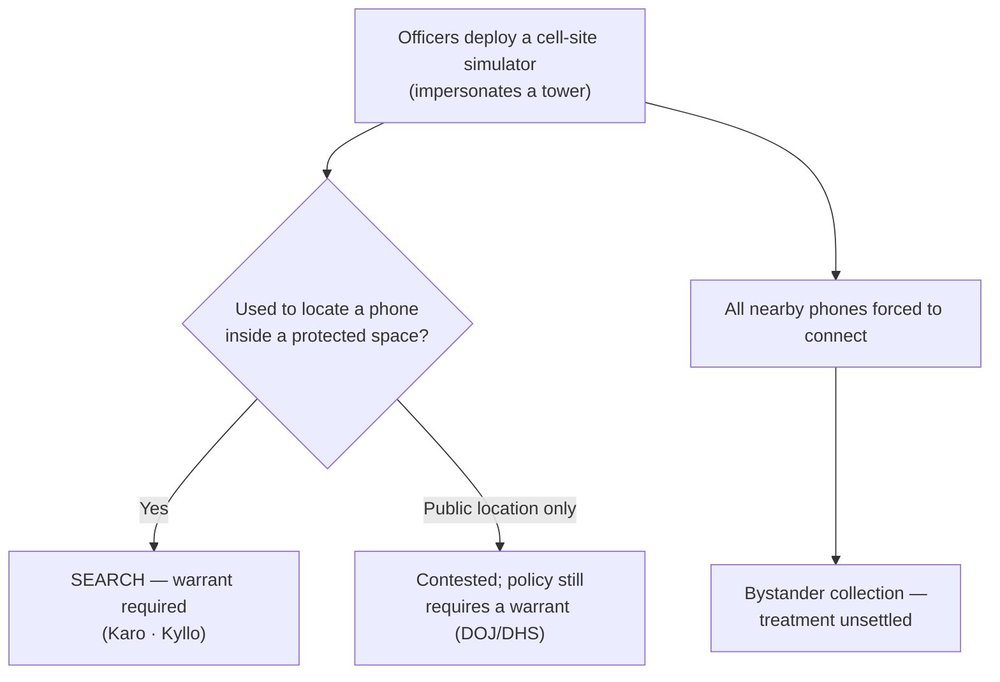
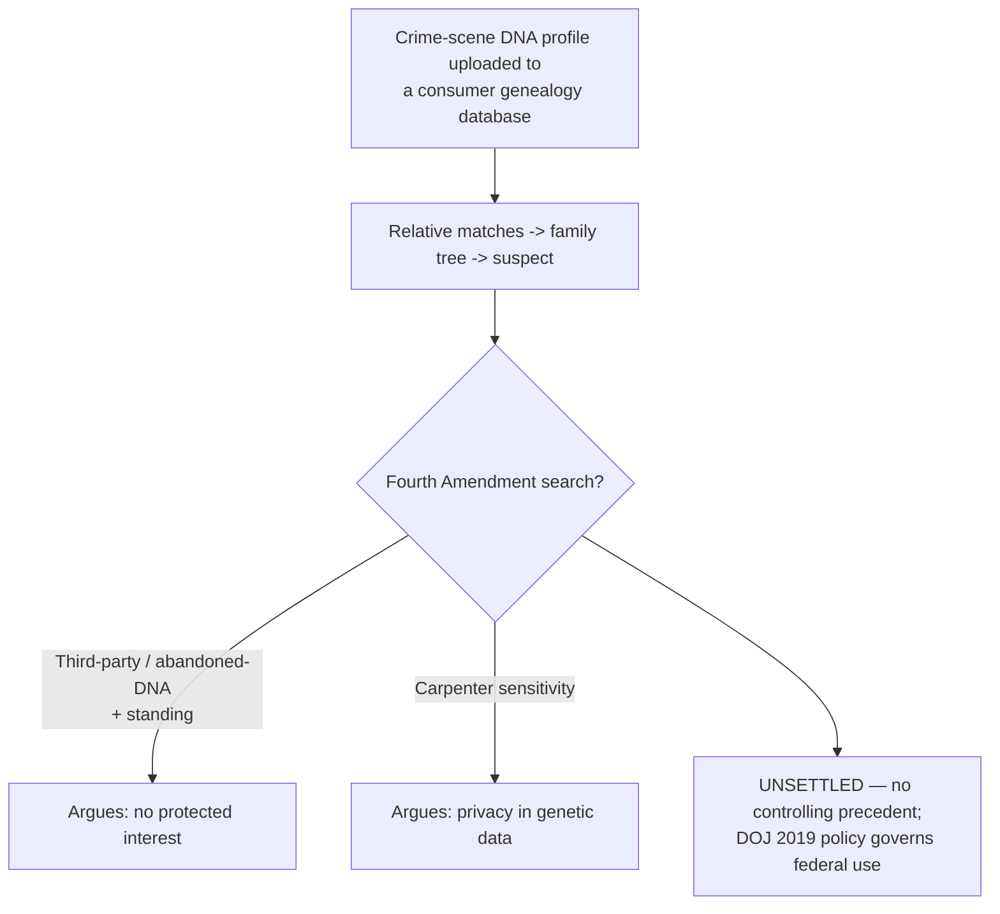

# S9 R1 panel-review — Opus model-diversity lane (prompt pack)

You are the **Claude/Opus** leg of the S9 three-lane adversarial panel (1 Claude + 2 Codex, R1). The two Codex lanes carry the A (support/quote-fidelity) and B (currency/treatment) attack lenses; **you carry model diversity and MUST vote on every paneled assertion across BOTH lenses' concerns.** You are refute-framed: try hard to break each assertion; **default to REFUTED on uncertainty**; never fabricate a cite, quote, or holding; use ONLY the evidence inlined below (no search, no outside knowledge). You are a SIGHTED reviewer — the FULL lake record (judgment fields included) is inlined.

You are a WRITER lane, not an adjudicator: you FIND and VOTE. You do not tally, adjudicate, or close any row — the orchestrator does.

For EACH group below, return one JSON object with the exact `reviewed[]` shape from the output contract (identical framing to the Codex lenses). Emit a finding object ONLY for a real defect (verdict refuted / stands-modified); a group you find wholly clean returns all-`stands` verdicts (the harness records a clean attestation). Concatenate the per-group JSON objects into a top-level `{"packs": [ ... ]}` array, one entry per group, each carrying its `group_id`.


OUTPUT CONTRACT — return ONE JSON object, nothing else:
{
  "lens": "A" | "B",
  "group_id": "<echo the group id>",
  "reviewed": [
    {
      "assertion_id": "<from group_inventory.jsonl>",
      "dimension": "existence|support|quote_fidelity|pincite|treatment|black_letter",
      "verdict": "stands" | "refuted" | "stands-modified",
      "verifiable_from_disclosed": true | false,
      "defect": null,   // null when verdict=="stands"; else an object:
      //  {"problem": "...", "severity": "high|medium|low", "proposed_fix": "...", "evidence_quote": "verbatim from disclosed evidence or null", "needs_cl": true|false, "locator_note": "..."}
      "reasons": ["short evidence-grounded reason", "..."],
      "breaks_true_positives": true | false,
      "residual_risks": ["..."],
      "suggested_tightening": "... or null"
    }
  ],
  "notes": ""
}
Rules: verdict=='stands' <=> defect==null (assertion survives your attack). verdict=='refuted' <=> a real defect (the assertion as framed is wrong). verdict=='stands-modified' <=> survives but needs a stated modification (a minor defect). Review EVERY assertion_id in group_inventory.jsonl exactly once. Output ONLY the JSON object.
---

## GROUP: content/searches/the-third-party-doctrine-and-digital-surveillance/Cell-Site Simulators.md  (`doctrine`, 4 assertions)

### content_page

```
---
title: "Cell-Site Simulators"
weight: 20
aliases:
  - "Cell-Site Simulators"
  - "Cell-Site Simulator"
  - "StingRay"
  - "IMSI Catcher"
topic: Cell-site simulators (StingRay / IMSI catchers)
type: doctrine
amendment: "U.S. Const. amend. IV"
jurisdiction: "Federal (U.S. Const. amend. IV); no controlling SCOTUS — circuit/state + DOJ policy"
status: draft
related:
  - "[[Third-Party Doctrine & CSLI]]"
  - "[[United States v. Karo]]"
  - "[[Kyllo v. United States]]"
  - "[[Carpenter v. United States]]"
  - "[[The Warrant Requirement]]"
---

# Cell-Site Simulators

*The officers are not asking a carrier for records — they are running a device that impersonates a cell tower to make the target's phone reveal itself and its location, including inside a home. Does that require a warrant?*

> [!rule] Black-letter rule
> A **cell-site simulator** (a "StingRay" or IMSI catcher) mimics a cellular tower, forcing nearby phones to connect and disclose their identifiers and precise location. There is **no controlling Supreme Court decision**, but the governing analogies point one way: using the device to locate a phone **inside a home or other protected space** reveals "a critical fact about the interior" and is a search (*[[United States v. Karo#^pin-715|United States v. Karo]]*, 468 U.S. at [715](https://www.courtlistener.com/opinion/111257/united-states-v-karo/)), as is aiming sense-enhancing technology "not in general public use" at a home (*[[Kyllo v. United States|Kyllo v. United States]]*, 533 U.S. 27, [34](https://www.courtlistener.com/opinion/118443/kyllo-v-united-states/) (2001)); and locating a specific phone tracks the comprehensive-location concern of *[[Carpenter v. United States|Carpenter]]*. Federal policy (DOJ and DHS, 2015) requires a **search warrant** for cell-site-simulator use absent [[Exigent Circumstances and Hot Pursuit|exigency]], and the leading state decision agrees. Treat cell-site-simulator deployment as **warrant-requiring**, and the precise constitutional rule as **unsettled**.

## The Brief

**What the device does, and why it is different.** A cell-site simulator broadcasts a signal stronger than the surrounding towers, so every phone in range connects to it instead. That lets officers identify a target phone's unique subscriber number and pinpoint its location in real time, often to a specific unit in an apartment building, and in doing so it sweeps in every other phone nearby. Unlike a request to a carrier, this is direct government interception of signals the phone emits, deployed by officers in the field.

**No SCOTUS holding; the rule is built from analogy.** No Supreme Court case addresses cell-site simulators. The doctrine is assembled from three anchors. *[[United States v. Karo|Karo]]* supplies the decisive move for the common use — locating a phone **inside a residence**: a technique that reveals an interior fact "the Government could not have otherwise obtained without a warrant" is a search. *[[United States v. Karo#^pin-715|Karo]]*, 468 U.S. at [715](https://www.courtlistener.com/opinion/111257/united-states-v-karo/). *[[Kyllo v. United States|Kyllo]]* adds that using a device "not in general public use" to learn what is happening inside a home is a search, whatever the device. And *[[Carpenter v. United States|Carpenter]]*'s concern with pinpoint location over time reinforces that real-time location of a person's phone is constitutionally weighty. Together they make cell-site-simulator use to find a phone in a protected space a search requiring a warrant.

**Policy has run ahead of case law.** Since 2015, Department of Justice and Department of Homeland Security policy has required a **search warrant** based on probable cause before federal agents deploy a cell-site simulator, except in genuine [[Exigent Circumstances and Hot Pursuit|exigencies]], and requires deletion of incidentally collected third-party data. Several states have enacted equivalent statutory warrant requirements. These policies are not constitutional holdings, but they are the operative rule in practice and reflect the consensus that the device's power demands a warrant.

**The dragnet problem is unresolved.** Because the simulator forces *all* nearby phones to connect, its use is a mass, if momentary, interception. Courts have not settled how the Fourth Amendment treats the bystander phones swept in, and suppression litigation has often turned on good faith or on the government's reluctance to disclose the technique at all. Present the bystander-collection question as open.

**Apply it.**
1. **Identify the technique.** If officers used a device that impersonates a tower to locate a phone (not a records request to a carrier), this is the cell-site-simulator rule, not ordinary CSLI.
2. **Locate the phone.** If the device was used to find the phone inside a home or other protected space, *[[United States v. Karo|Karo]]* and *[[Kyllo v. United States|Kyllo]]* make it a search requiring a warrant.
3. **Check for a warrant and policy compliance.** Absent [[Exigent Circumstances and Hot Pursuit|exigency]], DOJ/DHS policy and the leading state authority require a probable-cause warrant; a warrantless deployment is the litigable event.
4. **Flag the bystander sweep.** Note that the device collected data from other phones; the treatment of that incidental collection is unsettled.

**Common pitfalls.**
- **Treating cell-site-simulator use as ordinary third-party CSLI.** It is direct government interception in the field, not a request for a carrier's business records; *[[Smith v. Maryland|Smith]]*/*[[United States v. Miller|Miller]]* do not govern it.
- **Assuming there is a Supreme Court rule.** There is none; the rule is built from *[[United States v. Karo|Karo]]*, *[[Kyllo v. United States|Kyllo]]*, and *[[Carpenter v. United States|Carpenter]]* plus policy and lower-court law.
- **Overlooking the interior move.** The strongest warrant argument is *[[United States v. Karo|Karo]]*'s: the device revealed the phone's location inside a protected space.

## Lower-court developments

- **Leading state decision — warrant required.** *State v. Andrews* (Md. Ct. Spec. App. 2016) held that real-time use of a cell-site simulator to locate a suspect's phone was a Fourth Amendment search requiring a warrant, and that the State's failure to disclose the technique to the issuing court could not be cured. It remains the most-cited judicial statement that cell-site-simulator deployment needs a warrant.
- **Federal and state policy.** DOJ (Sept. 2015) and DHS (Oct. 2015) policies require a probable-cause search warrant for cell-site-simulator use absent [[Exigent Circumstances and Hot Pursuit|exigent circumstances]], plus prompt deletion of non-target data; a number of states have codified parallel warrant requirements. These are the operative constraints most agencies work under.

The picture: no Supreme Court rule, a strong analogical case for a warrant (*[[United States v. Karo|Karo]]*/*[[Kyllo v. United States|Kyllo]]*), executive policy that already requires one, and an unresolved question about the bystander phones the device sweeps in.

## Key cases

| Case | Holding | Opinion |
|---|---|---|
| *[[United States v. Karo]]*, 468 U.S. 705 (1984) | **Governing analogy.** Using a tracking device to reveal that an item is inside a private residence is a search: it discloses a critical interior fact unobtainable from outside. The core argument for a cell-site-simulator warrant. | [opinion](https://www.courtlistener.com/opinion/111257/united-states-v-karo/) |
| *[[Kyllo v. United States]]*, 533 U.S. 27 (2001) | Using sense-enhancing technology "not in general public use" to learn a home's interior is a search, reinforcing that a device revealing what is inside a home requires a warrant. | [opinion](https://www.courtlistener.com/opinion/118443/kyllo-v-united-states/) |
| *[[Carpenter v. United States]]*, 585 U.S. 296 (2018) | Pinpoint location of a person's phone is constitutionally weighty; the comprehensive-location concern that reinforces the warrant requirement here. *(Primary home [[Reasonable Expectation of Privacy]].)* | [opinion](https://www.courtlistener.com/opinion/4510032/carpenter-v-united-states/) |

<!-- No controlling SCOTUS on cell-site simulators (GAP-03b "StingRay H"). Rule built by analogy from Karo (interior), Kyllo (sense-enhancing tech into home), Carpenter (location). State v. Andrews (Md. 2016): coverage-ledger terminal = brief-mention (S6 R11), named plainly in LCD, NO wikilink (no standalone page). DOJ (2015)/DHS (2015) cell-site-simulator warrant policies cited as policy, not holdings. -->

## Visual



## Sources

- [*United States v. Karo*, 468 U.S. 705 (1984)](https://www.courtlistener.com/opinion/111257/united-states-v-karo/) (pinpoints: 714, 715)
- [*Kyllo v. United States*, 533 U.S. 27 (2001)](https://www.courtlistener.com/opinion/118443/kyllo-v-united-states/) (pinpoints: 34, 40)
- [*Carpenter v. United States*, 585 U.S. 296 (2018)](https://www.courtlistener.com/opinion/4510032/carpenter-v-united-states/) (case-level cite: R5 T3)
- *State v. Andrews* (Md. Ct. Spec. App. 2016) — cell-site-simulator warrant requirement; coverage-ledger brief-mention (no standalone page).
- U.S. Dep't of Justice, Policy Guidance: Use of Cell-Site Simulator Technology (Sept. 3, 2015); U.S. Dep't of Homeland Security, Policy Directive 047-02 (Oct. 19, 2015).

```

### group_inventory (assertions under review)

```jsonl
{"assertion_id": "222a77709759d0d1", "dimension": "existence", "kind": "case_cite", "locator": {"case": "Kyllo v. United States", "table_line": 42}, "payload": {"case": "Kyllo v. United States", "cells": ["*[[Kyllo v. United States]]*, 533 U.S. 27 (2001)", "Using sense-enhancing technology \"not in general public use\" to learn a home's interior is a search, reinforcing that a device revealing what is inside a home requires a warrant.", "[opinion](https://www.courtlistener.com/opinion/118443/kyllo-v-united-states/)"], "header": ["Case", "Holding", "Opinion"]}}
{"assertion_id": "43b659419c03bcb9", "dimension": "existence", "kind": "case_cite", "locator": {"case": "United States v. Karo", "table_line": 41}, "payload": {"case": "United States v. Karo", "cells": ["*[[United States v. Karo]]*, 468 U.S. 705 (1984)", "**Governing analogy.** Using a tracking device to reveal that an item is inside a private residence is a search: it discloses a critical interior fact unobtainable from outside. The core argument for a cell-site-simulator warrant.", "[opinion](https://www.courtlistener.com/opinion/111257/united-states-v-karo/)"], "header": ["Case", "Holding", "Opinion"]}}
{"assertion_id": "98cd5c9c50066ccb", "dimension": "existence", "kind": "case_cite", "locator": {"case": "Carpenter v. United States", "table_line": 43}, "payload": {"case": "Carpenter v. United States", "cells": ["*[[Carpenter v. United States]]*, 585 U.S. 296 (2018)", "Pinpoint location of a person's phone is constitutionally weighty; the comprehensive-location concern that reinforces the warrant requirement here. *(Primary home [[Reasonable Expectation of Privacy]].)*", "[opinion](https://www.courtlistener.com/opinion/4510032/carpenter-v-united-states/)"], "header": ["Case", "Holding", "Opinion"]}}
{"assertion_id": "c6f8cd2c1a401d46", "dimension": "support", "kind": "proposition", "locator": {"callout": "line-6"}, "payload": {"anchor": null, "statement": "[!rule] Black-letter rule\nA **cell-site simulator** (a \"StingRay\" or IMSI catcher) mimics a cellular tower, forcing nearby phones to connect and disclose their identifiers and precise location. There is **no controlling Supreme Court decision**, but the governing analogies point one way: using the device to locate a phone **inside a home or other protected space** reveals \"a critical fact about the interior\" and is a search (*[[United States v. Karo#^pin-715|United States v. Karo]]*, 468 U.S. at [715](https://www.courtlistener.com/opinion/111257/united-states-v-karo/)), as is aiming sense-enhancing technology \"not in general public use\" at a home (*[[Kyllo v. United States|Kyllo v. United States]]*, 533 U.S. 27, [34](https://www.courtlistener.com/opinion/118443/kyllo-v-united-states/) (2001)); and locating a specific phone tracks the comprehensive-location concern of *[[Carpenter v. United States|Carpenter]]*. Federal policy (DOJ and DHS, 2015) requires a **search warrant** for cell-site-simulator use absent [[Exigent Circumstances and Hot Pursuit|exigency]], and the leading state decision agrees. Treat cell-site-simulator deployment as **warrant-requiring**, and the precise constitutional rule as **unsettled**."}}
```

### lake record — Carpenter v. United States

```json
{
  "schema_version": "s2.v1",
  "record_id": "Carpenter v. United States",
  "stub": false,
  "status": "verified",
  "identity": {
    "case_name": "Carpenter v. United States",
    "case_name_short": "Carpenter",
    "case_name_full": "",
    "input_case_name": "Carpenter v. United States",
    "court": "U.S. Supreme Court",
    "court_id": "scotus",
    "court_level": "scotus",
    "circuit": null,
    "state": null,
    "date_decided": "2018-06-22",
    "year": 2018,
    "docket": "16-402",
    "cluster_id": 4510032,
    "lead_opinion_id": 4287285,
    "sibling_ids": [
      4287285
    ],
    "absolute_url": "/opinion/4510032/carpenter-v-united-states/",
    "identity_method": "citation+party-text",
    "expected_citation_found": true,
    "party_name_in_text": true,
    "canonical_name_match": true,
    "alternates": [
      {
        "cluster_id": 4512666,
        "score": 20,
        "case_name": "Carpenter v. United States"
      }
    ],
    "reason_code": null
  },
  "citations": {
    "official": {
      "cite": "585 U.S. 296",
      "volume": "585",
      "reporter": "U.S.",
      "page": "296",
      "type": 1,
      "selected_official": true,
      "source": "cluster.citations[]"
    },
    "parallel": [
      {
        "cite": "138 S. Ct. 2206",
        "volume": "138",
        "reporter": "S. Ct.",
        "page": "2206",
        "type": 1,
        "selected_official": false,
        "source": "cluster.citations[]"
      },
      {
        "cite": "201 L. Ed. 2d 507",
        "volume": "201",
        "reporter": "L. Ed. 2d",
        "page": "507",
        "type": 1,
        "selected_official": false,
        "source": "cluster.citations[]"
      }
    ],
    "vendor_neutral": [
      {
        "cite": "2018 U.S. LEXIS 3844",
        "volume": "2018",
        "reporter": "U.S. LEXIS",
        "page": "3844",
        "type": 6,
        "selected_official": false,
        "source": "cluster.citations[]"
      }
    ],
    "all": [
      {
        "cite": "585 U.S. 296",
        "volume": "585",
        "reporter": "U.S.",
        "page": "296",
        "type": 1,
        "selected_official": false,
        "source": "cluster.citations[]"
      },
      {
        "cite": "138 S. Ct. 2206",
        "volume": "138",
        "reporter": "S. Ct.",
        "page": "2206",
        "type": 1,
        "selected_official": false,
        "source": "cluster.citations[]"
      },
      {
        "cite": "201 L. Ed. 2d 507",
        "volume": "201",
        "reporter": "L. Ed. 2d",
        "page": "507",
        "type": 1,
        "selected_official": false,
        "source": "cluster.citations[]"
      },
      {
        "cite": "2018 U.S. LEXIS 3844",
        "volume": "2018",
        "reporter": "U.S. LEXIS",
        "page": "3844",
        "type": 6,
        "selected_official": false,
        "source": "cluster.citations[]"
      }
    ],
    "display": "585 U.S. 296",
    "official_selection": {
      "court_class": "scotus",
      "selected": "585 U.S. 296",
      "reason": "selected_rank_1"
    }
  },
  "pinpoints": [
    {
      "id": "pin-op11",
      "page": null,
      "quote": "\u2014 a showing short of probable cause \u2014 rather than a warrant. The records (nearly 12,900 location points) placed his phone near the robbery sites. He moved to suppress the CSLI as the product of a warrantless search. ## Issue Whether the Government's acquisition of historical cell-site records that chronicle a person's past movements is a search under the Fourth Amendment. ## Rule Yes.",
      "star_marker": null,
      "quote_fidelity": "mismatch",
      "pinpoint_status": "slip-only",
      "position": null
    }
  ],
  "treatment": {
    "field_i_validity": "good_law",
    "as_of_content": "2018-06-22",
    "as_of_treatment": "2026-06-30",
    "composite_basis": "migration-seed",
    "composite_basis_ref": "Carpenter v. United States",
    "varies_by_point": false,
    "scope_note": "Carpenter itself narrows the third-party doctrine for digital-age location data; it is good law.",
    "point_overrides": [],
    "edges": [
      {
        "citing_case": {
          "name": "State v. Rogers",
          "cluster_id": 10705828,
          "cite": null,
          "field_ii": "overruled"
        },
        "field_ii": "overruled",
        "field_iii": "mentioned",
        "point": null,
        "proposed": true,
        "journal_ref": "Carpenter v. United States:lane1_negative"
      },
      {
        "citing_case": {
          "name": "State v. Von Harris",
          "cluster_id": 10324088,
          "cite": [
            "2025 Ohio 279"
          ],
          "field_ii": "overruled"
        },
        "field_ii": "overruled",
        "field_iii": "mentioned",
        "point": null,
        "proposed": true,
        "journal_ref": "Carpenter v. United States:lane1_negative"
      },
      {
        "citing_case": {
          "name": "State v. Devin J. Johnson",
          "cluster_id": 10132115,
          "cite": null,
          "field_ii": "questioned"
        },
        "field_ii": "questioned",
        "field_iii": "mentioned",
        "point": null,
        "proposed": true,
        "journal_ref": "Carpenter v. United States:lane1_negative"
      },
      {
        "citing_case": {
          "name": "Thomas v. State",
          "cluster_id": 10680321,
          "cite": [
            "902 S.E.2d 566",
            "319 Ga. 123"
          ],
          "field_ii": "overruled"
        },
        "field_ii": "overruled",
        "field_iii": "mentioned",
        "point": null,
        "proposed": true,
        "journal_ref": "Carpenter v. United States:lane1_negative"
      },
      {
        "citing_case": {
          "name": "State v. Singleton",
          "cluster_id": 9506618,
          "cite": null,
          "field_ii": "overruled"
        },
        "field_ii": "overruled",
        "field_iii": "mentioned",
        "point": null,
        "proposed": true,
        "journal_ref": "Carpenter v. United States:lane1_negative"
      },
      {
        "citing_case": {
          "name": "Commonwealth v. Janvier",
          "cluster_id": 9494606,
          "cite": null,
          "field_ii": "superseded_by_statute"
        },
        "field_ii": "superseded_by_statute",
        "field_iii": "mentioned",
        "point": null,
        "proposed": true,
        "journal_ref": "Carpenter v. United States:lane1_negative"
      },
      {
        "citing_case": {
          "name": "Jamin Kidron Stocker v. the State of Texas",
          "cluster_id": 9329108,
          "cite": null,
          "field_ii": "overruled"
        },
        "field_ii": "overruled",
        "field_iii": "mentioned",
        "point": null,
        "proposed": true,
        "journal_ref": "Carpenter v. United States:lane1_negative"
      },
      {
        "citing_case": {
          "name": "State v. Hoffman",
          "cluster_id": 10135310,
          "cite": [
            "321 Or. App. 330",
            "515 P.3d 912"
          ],
          "field_ii": "questioned"
        },
        "field_ii": "questioned",
        "field_iii": "mentioned",
        "point": null,
        "proposed": true,
        "journal_ref": "Carpenter v. United States:lane1_negative"
      },
      {
        "citing_case": {
          "name": "Andrew Lennette, Individually and on behalf of C.L., O.L. and S.L., Minor Children v. State of Iowa, Melody Siver, Amy Howell, and Valerie Lovaglia",
          "cluster_id": 6476611,
          "cite": null,
          "field_ii": "overruled"
        },
        "field_ii": "overruled",
        "field_iii": "mentioned",
        "point": null,
        "proposed": true,
        "journal_ref": "Carpenter v. United States:lane1_negative"
      },
      {
        "citing_case": {
          "name": "v. Thompson",
          "cluster_id": 4858089,
          "cite": [
            "2021 CO 15"
          ],
          "field_ii": "superseded_by_statute"
        },
        "field_ii": "superseded_by_statute",
        "field_iii": "mentioned",
        "point": null,
        "proposed": true,
        "journal_ref": "Carpenter v. United States:lane2_top_cited"
      },
      {
        "citing_case": {
          "name": "Perrin Davis v. Facebook, Inc.",
          "cluster_id": 4743751,
          "cite": [
            "956 F.3d 589"
          ],
          "field_ii": "questioned"
        },
        "field_ii": "questioned",
        "field_iii": "mentioned",
        "point": null,
        "proposed": true,
        "journal_ref": "Carpenter v. United States:lane2_top_cited"
      },
      {
        "citing_case": {
          "name": "People v. Caro",
          "cluster_id": 4629272,
          "cite": [
            "248 Cal. Rptr. 3d 96",
            "7 Cal. 5th 463",
            "442 P.3d 316"
          ],
          "field_ii": "overruled"
        },
        "field_ii": "overruled",
        "field_iii": "mentioned",
        "point": null,
        "proposed": true,
        "journal_ref": "Carpenter v. United States:lane2_top_cited"
      },
      {
        "citing_case": {
          "name": "United States v. Matthew Jones",
          "cluster_id": 4757714,
          "cite": [
            "960 F.3d 949"
          ],
          "field_ii": "overruled"
        },
        "field_ii": "overruled",
        "field_iii": "mentioned",
        "point": null,
        "proposed": true,
        "journal_ref": "Carpenter v. United States:lane2_top_cited"
      },
      {
        "citing_case": {
          "name": "North American Butterfly Association v. Chad F. Wolf",
          "cluster_id": 4795622,
          "cite": [
            "977 F.3d 1244"
          ],
          "field_ii": "abrogated"
        },
        "field_ii": "abrogated",
        "field_iii": "mentioned",
        "point": null,
        "proposed": true,
        "journal_ref": "Carpenter v. United States:lane2_top_cited"
      },
      {
        "citing_case": {
          "name": "United States v. Eaglin",
          "cluster_id": 8443840,
          "cite": [
            "913 F.3d 88"
          ],
          "field_ii": "questioned"
        },
        "field_ii": "questioned",
        "field_iii": "mentioned",
        "point": null,
        "proposed": true,
        "journal_ref": "Carpenter v. United States:lane2_top_cited"
      },
      {
        "citing_case": {
          "name": "State v. Martinez",
          "cluster_id": 6243814,
          "cite": [
            "570 S.W.3d 278"
          ],
          "field_ii": "questioned"
        },
        "field_ii": "questioned",
        "field_iii": "mentioned",
        "point": null,
        "proposed": true,
        "journal_ref": "Carpenter v. United States:lane2_top_cited"
      },
      {
        "citing_case": {
          "name": "Com. v. Kurtz, J.",
          "cluster_id": 10317095,
          "cite": [
            "294 A.3d 509",
            "2023 Pa. Super. 72"
          ],
          "field_ii": "abrogated"
        },
        "field_ii": "abrogated",
        "field_iii": "mentioned",
        "point": null,
        "proposed": true,
        "journal_ref": "Carpenter v. United States:lane2_top_cited"
      },
      {
        "citing_case": {
          "name": "State v. Grady",
          "cluster_id": 4649078,
          "cite": [
            "831 S.E.2d 542",
            "372 N.C. 509"
          ],
          "field_ii": "questioned"
        },
        "field_ii": "questioned",
        "field_iii": "mentioned",
        "point": null,
        "proposed": true,
        "journal_ref": "Carpenter v. United States:lane2_top_cited"
      },
      {
        "citing_case": {
          "name": "Leaders of Beautiful Struggle v. Baltimore Police Department",
          "cluster_id": 4894627,
          "cite": [
            "2 F.4th 330"
          ],
          "field_ii": "questioned"
        },
        "field_ii": "questioned",
        "field_iii": "mentioned",
        "point": null,
        "proposed": true,
        "journal_ref": "Carpenter v. United States:lane2_top_cited"
      },
      {
        "citing_case": {
          "name": "Troester v. Starbucks Corporation",
          "cluster_id": 4520879,
          "cite": [
            "235 Cal. Rptr. 3d 820",
            "5 Cal. 5th 829",
            "421 P.3d 1114"
          ],
          "field_ii": "questioned"
        },
        "field_ii": "questioned",
        "field_iii": "mentioned",
        "point": null,
        "proposed": true,
        "journal_ref": "Carpenter v. United States:lane2_top_cited"
      },
      {
        "citing_case": {
          "name": "In the Matter of the Application of Jason Leopold to Unseal Certain Electronic Surveillance Applications and Orders",
          "cluster_id": 4766181,
          "cite": [
            "964 F.3d 1121"
          ],
          "field_ii": "questioned"
        },
        "field_ii": "questioned",
        "field_iii": "mentioned",
        "point": null,
        "proposed": true,
        "journal_ref": "Carpenter v. United States:lane2_top_cited"
      },
      {
        "citing_case": {
          "name": "United States v. William Miller",
          "cluster_id": 4835528,
          "cite": [
            "982 F.3d 412"
          ],
          "field_ii": "overruled"
        },
        "field_ii": "overruled",
        "field_iii": "mentioned",
        "point": null,
        "proposed": true,
        "journal_ref": "Carpenter v. United States:lane2_top_cited"
      },
      {
        "citing_case": {
          "name": "State v. Kaufhold",
          "cluster_id": 4770908,
          "cite": [
            "2020 Ohio 3835"
          ],
          "field_ii": "overruled"
        },
        "field_ii": "overruled",
        "field_iii": "mentioned",
        "point": null,
        "proposed": true,
        "journal_ref": "Carpenter v. United States:lane2_top_cited"
      },
      {
        "citing_case": {
          "name": "Trump v. Mazars USA, LLP",
          "cluster_id": 4766665,
          "cite": [
            "140 S. Ct. 2019",
            "207 L. Ed. 2d 951"
          ],
          "field_ii": "criticized"
        },
        "field_ii": "criticized",
        "field_iii": "mentioned",
        "point": null,
        "proposed": true,
        "journal_ref": "Carpenter v. United States:lane2_top_cited"
      },
      {
        "citing_case": {
          "name": "United States v. Charlie L. Green",
          "cluster_id": 4833880,
          "cite": [
            "981 F.3d 945"
          ],
          "field_ii": "overruled"
        },
        "field_ii": "overruled",
        "field_iii": "mentioned",
        "point": null,
        "proposed": true,
        "journal_ref": "Carpenter v. United States:lane2_top_cited"
      },
      {
        "citing_case": {
          "name": "Hill v. State",
          "cluster_id": 10367330,
          "cite": [
            "850 S.E.2d 110",
            "310 Ga. 180"
          ],
          "field_ii": "overruled"
        },
        "field_ii": "overruled",
        "field_iii": "mentioned",
        "point": null,
        "proposed": true,
        "journal_ref": "Carpenter v. United States:lane2_top_cited"
      },
      {
        "citing_case": {
          "name": "Kelsey Rose Juliana v. United States",
          "cluster_id": 4707560,
          "cite": [
            "947 F.3d 1159"
          ],
          "field_ii": "abrogated"
        },
        "field_ii": "abrogated",
        "field_iii": "mentioned",
        "point": null,
        "proposed": true,
        "journal_ref": "Carpenter v. United States:lane2_top_cited"
      },
      {
        "citing_case": {
          "name": "Com. v. Dunkins, A.",
          "cluster_id": 10315445,
          "cite": [
            "229 A.3d 622",
            "2020 Pa. Super. 38"
          ],
          "field_ii": "questioned"
        },
        "field_ii": "questioned",
        "field_iii": "mentioned",
        "point": null,
        "proposed": true,
        "journal_ref": "Carpenter v. United States:lane2_top_cited"
      },
      {
        "citing_case": {
          "name": "United States v. Dwayne Sheckles",
          "cluster_id": 4879211,
          "cite": [
            "996 F.3d 330"
          ],
          "field_ii": "abrogated"
        },
        "field_ii": "abrogated",
        "field_iii": "mentioned",
        "point": null,
        "proposed": true,
        "journal_ref": "Carpenter v. United States:lane2_top_cited"
      },
      {
        "citing_case": {
          "name": "United States v. Kunz",
          "cluster_id": 9400913,
          "cite": [
            "68 F.4th 748"
          ],
          "field_ii": "overruled"
        },
        "field_ii": "overruled",
        "field_iii": "mentioned",
        "point": null,
        "proposed": true,
        "journal_ref": "Carpenter v. United States:lane2_top_cited"
      },
      {
        "citing_case": {
          "name": "United States v. Marcus Walker",
          "cluster_id": 4861532,
          "cite": [
            "990 F.3d 316"
          ],
          "field_ii": "abrogated"
        },
        "field_ii": "abrogated",
        "field_iii": "mentioned",
        "point": null,
        "proposed": true,
        "journal_ref": "Carpenter v. United States:lane2_top_cited"
      },
      {
        "citing_case": {
          "name": "United States v. Rex Hammond",
          "cluster_id": 4877368,
          "cite": [
            "996 F.3d 374"
          ],
          "field_ii": "superseded_by_statute"
        },
        "field_ii": "superseded_by_statute",
        "field_iii": "mentioned",
        "point": null,
        "proposed": true,
        "journal_ref": "Carpenter v. United States:lane2_top_cited"
      },
      {
        "citing_case": {
          "name": "George Young, Jr. v. State of Hawaii",
          "cluster_id": 4867182,
          "cite": [
            "992 F.3d 765"
          ],
          "field_ii": "overruled"
        },
        "field_ii": "overruled",
        "field_iii": "mentioned",
        "point": null,
        "proposed": true,
        "journal_ref": "Carpenter v. United States:lane2_top_cited"
      },
      {
        "citing_case": {
          "name": "Eric K. Brooks v. D Miller",
          "cluster_id": 9421763,
          "cite": [
            "78 F.4th 1267"
          ],
          "field_ii": "overruled"
        },
        "field_ii": "overruled",
        "field_iii": "mentioned",
        "point": null,
        "proposed": true,
        "journal_ref": "Carpenter v. United States:lane2_top_cited"
      }
    ],
    "derivation": {
      "lane1_negative": {
        "query": "cites:(4287285) AND (overrul* OR abrogat* OR supersed* OR \"recede from\" OR \"no longer good law\" OR vacat* OR reversed) ",
        "reviewed": 200,
        "cap": 200,
        "cap_hit": true,
        "final_cursor": "https://www.courtlistener.com/api/rest/v4/search/?cursor=cz0xNjQzNjczNjAwMDAwJnM9NjI0NzMxNCZ0PW8mZD0yMDI2LTA3LTA0JnA9MTE%3D&fields=absolute_url%2CcaseName%2CcaseNameFull%2Ccitation%2CciteCount%2Ccluster_id%2Ccourt%2Ccourt_citation_string%2Ccourt_id%2CdateFiled%2Copinions%2Csibling_ids%2Cstatus%2Csyllabus&order_by=dateFiled+desc&page_size=100&q=cites%3A%284287285%29+AND+%28overrul%2A+OR+abrogat%2A+OR+supersed%2A+OR+%22recede+from%22+OR+%22no+longer+good+law%22+OR+vacat%2A+OR+reversed%29+&stat_Published=on&type=o",
        "audit_needed": true,
        "proposed_negative_events": 9,
        "audit_marker": "R15 treatment audit required",
        "triage_mode": "snippet-first",
        "snippet_field": "results[].opinions[].snippet",
        "triage_journaled": 200,
        "triage_read": 9,
        "triage_snippet_classified": 191
      },
      "lane2_top_cited": {
        "query": "cites:(4287285)",
        "reviewed": 25,
        "cap": 25,
        "cap_hit": true,
        "final_cursor": "https://www.courtlistener.com/api/rest/v4/search/?cursor=cz0zMiZzPTEwMzgyNzc1JnQ9byZkPTIwMjYtMDctMDQmcD0z&order_by=citeCount+desc&page_size=25&q=cites%3A%284287285%29&type=o",
        "audit_needed": true,
        "proposed_negative_events": 25,
        "audit_marker": "R15 treatment audit required"
      },
      "lane3_recency": {
        "query": "cites:(4287285)",
        "reviewed": 178,
        "cap": 200,
        "cap_hit": false,
        "final_cursor": null,
        "audit_needed": false,
        "proposed_negative_events": 6,
        "audit_marker": null,
        "triage_mode": "snippet-first",
        "snippet_field": "results[].opinions[].snippet",
        "triage_journaled": 178,
        "triage_read": 6,
        "triage_snippet_classified": 172
      }
    }
  },
  "progeny": {
    "complete_query": "cites:(4287285)",
    "indexed_citing_opinions": 525,
    "count_source": "search",
    "per_sibling": [
      {
        "opinion_id": 4287285,
        "count": 525,
        "count_source": "search"
      }
    ],
    "citation_count": 1207,
    "cache_path": "/Users/johngalt/cssi-lake/cache/progeny/carpenter-v-united-states.jsonl",
    "enumeration": "bounded",
    "cursor": "https://www.courtlistener.com/api/rest/v4/search/?cursor=cz0xLjkzNDgxMDUmcz0xMDU4MTk5OSZ0PW8mZD0yMDI2LTA3LTA0JnA9Mg%3D%3D&order_by=score+desc&page_size=100&q=cites%3A%284287285%29&type=o",
    "rows_cached": 20,
    "outbound_opinion_edges": [
      {
        "source_opinion_id": 4287285,
        "cited_id": 89759,
        "source": "search.opinions[].cites[]"
      },
      {
        "source_opinion_id": 4287285,
        "cited_id": 91573,
        "source": "search.opinions[].cites[]"
      },
      {
        "source_opinion_id": 4287285,
        "cited_id": 96405,
        "source": "search.opinions[].cites[]"
      },
      {
        "source_opinion_id": 4287285,
        "cited_id": 96424,
        "source": "search.opinions[].cites[]"
      },
      {
        "source_opinion_id": 4287285,
        "cited_id": 99422,
        "source": "search.opinions[].cites[]"
      },
      {
        "source_opinion_id": 4287285,
        "cited_id": 100047,
        "source": "search.opinions[].cites[]"
      },
      {
        "source_opinion_id": 4287285,
        "cited_id": 100567,
        "source": "search.opinions[].cites[]"
      },
      {
        "source_opinion_id": 4287285,
        "cited_id": 103990,
        "source": "search.opinions[].cites[]"
      },
      {
        "source_opinion_id": 4287285,
        "cited_id": 104239,
        "source": "search.opinions[].cites[]"
      },
      {
        "source_opinion_id": 4287285,
        "cited_id": 104490,
        "source": "search.opinions[].cites[]"
      },
      {
        "source_opinion_id": 4287285,
        "cited_id": 104758,
        "source": "search.opinions[].cites[]"
      },
      {
        "source_opinion_id": 4287285,
        "cited_id": 105021,
        "source": "search.opinions[].cites[]"
      },
      {
        "source_opinion_id": 4287285,
        "cited_id": 106130,
        "source": "search.opinions[].cites[]"
      },
      {
        "source_opinion_id": 4287285,
        "cited_id": 106187,
        "source": "search.opinions[].cites[]"
      },
      {
        "source_opinion_id": 4287285,
        "cited_id": 106197,
        "source": "search.opinions[].cites[]"
      },
      {
        "source_opinion_id": 4287285,
        "cited_id": 106515,
        "source": "search.opinions[].cites[]"
      },
      {
        "source_opinion_id": 4287285,
        "cited_id": 106777,
        "source": "search.opinions[].cites[]"
      },
      {
        "source_opinion_id": 4287285,
        "cited_id": 106933,
        "source": "search.opinions[].cites[]"
      },
      {
        "source_opinion_id": 4287285,
        "cited_id": 106964,
        "source": "search.opinions[].cites[]"
      },
      {
        "source_opinion_id": 4287285,
        "cited_id": 107082,
        "source": "search.opinions[].cites[]"
      },
      {
        "source_opinion_id": 4287285,
        "cited_id": 107318,
        "source": "search.opinions[].cites[]"
      },
      {
        "source_opinion_id": 4287285,
        "cited_id": 107473,
        "source": "search.opinions[].cites[]"
      },
      {
        "source_opinion_id": 4287285,
        "cited_id": 107474,
        "source": "search.opinions[].cites[]"
      },
      {
        "source_opinion_id": 4287285,
        "cited_id": 107483,
        "source": "search.opinions[].cites[]"
      },
      {
        "source_opinion_id": 4287285,
        "cited_id": 107564,
        "source": "search.opinions[].cites[]"
      },
      {
        "source_opinion_id": 4287285,
        "cited_id": 107716,
        "source": "search.opinions[].cites[]"
      },
      {
        "source_opinion_id": 4287285,
        "cited_id": 107729,
        "source": "search.opinions[].cites[]"
      },
      {
        "source_opinion_id": 4287285,
        "cited_id": 108304,
        "source": "search.opinions[].cites[]"
      },
      {
        "source_opinion_id": 4287285,
        "cited_id": 108709,
        "source": "search.opinions[].cites[]"
      },
      {
        "source_opinion_id": 4287285,
        "cited_id": 108713,
        "source": "search.opinions[].cites[]"
      },
      {
        "source_opinion_id": 4287285,
        "cited_id": 108898,
        "source": "search.opinions[].cites[]"
      },
      {
        "source_opinion_id": 4287285,
        "cited_id": 109005,
        "source": "search.opinions[].cites[]"
      },
      {
        "source_opinion_id": 4287285,
        "cited_id": 109069,
        "source": "search.opinions[].cites[]"
      },
      {
        "source_opinion_id": 4287285,
        "cited_id": 109101,
        "source": "search.opinions[].cites[]"
      },
      {
        "source_opinion_id": 4287285,
        "cited_id": 109432,
        "source": "search.opinions[].cites[]"
      },
      {
        "source_opinion_id": 4287285,
        "cited_id": 109433,
        "source": "search.opinions[].cites[]"
      },
      {
        "source_opinion_id": 4287285,
        "cited_id": 109522,
        "source": "search.opinions[].cites[]"
      },
      {
        "source_opinion_id": 4287285,
        "cited_id": 109541,
        "source": "search.opinions[].cites[]"
      },
      {
        "source_opinion_id": 4287285,
        "cited_id": 109905,
        "source": "search.opinions[].cites[]"
      },
      {
        "source_opinion_id": 4287285,
        "cited_id": 110061,
        "source": "search.opinions[].cites[]"
      },
      {
        "source_opinion_id": 4287285,
        "cited_id": 110118,
        "source": "search.opinions[].cites[]"
      },
      {
        "source_opinion_id": 4287285,
        "cited_id": 110325,
        "source": "search.opinions[].cites[]"
      },
      {
        "source_opinion_id": 4287285,
        "cited_id": 110326,
        "source": "search.opinions[].cites[]"
      },
      {
        "source_opinion_id": 4287285,
        "cited_id": 110719,
        "source": "search.opinions[].cites[]"
      },
      {
        "source_opinion_id": 4287285,
        "cited_id": 110882,
        "source": "search.opinions[].cites[]"
      },
      {
        "source_opinion_id": 4287285,
        "cited_id": 111061,
        "source": "search.opinions[].cites[]"
      },
      {
        "source_opinion_id": 4287285,
        "cited_id": 111102,
        "source": "search.opinions[].cites[]"
      },
      {
        "source_opinion_id": 4287285,
        "cited_id": 111146,
        "source": "search.opinions[].cites[]"
      },
      {
        "source_opinion_id": 4287285,
        "cited_id": 111217,
        "source": "search.opinions[].cites[]"
      },
      {
        "source_opinion_id": 4287285,
        "cited_id": 111227,
        "source": "search.opinions[].cites[]"
      },
      {
        "source_opinion_id": 4287285,
        "cited_id": 111851,
        "source": "search.opinions[].cites[]"
      },
      {
        "source_opinion_id": 4287285,
        "cited_id": 112067,
        "source": "search.opinions[].cites[]"
      },
      {
        "source_opinion_id": 4287285,
        "cited_id": 112175,
        "source": "search.opinions[].cites[]"
      },
      {
        "source_opinion_id": 4287285,
        "cited_id": 112382,
        "source": "search.opinions[].cites[]"
      },
      {
        "source_opinion_id": 4287285,
        "cited_id": 112416,
        "source": "search.opinions[].cites[]"
      },
      {
        "source_opinion_id": 4287285,
        "cited_id": 112448,
        "source": "search.opinions[].cites[]"
      },
      {
        "source_opinion_id": 4287285,
        "cited_id": 112608,
        "source": "search.opinions[].cites[]"
      },
      {
        "source_opinion_id": 4287285,
        "cited_id": 112795,
        "source": "search.opinions[].cites[]"
      },
      {
        "source_opinion_id": 4287285,
        "cited_id": 117936,
        "source": "search.opinions[].cites[]"
      },
      {
        "source_opinion_id": 4287285,
        "cited_id": 117964,
        "source": "search.opinions[].cites[]"
      },
      {
        "source_opinion_id": 4287285,
        "cited_id": 118148,
        "source": "search.opinions[].cites[]"
      },
      {
        "source_opinion_id": 4287285,
        "cited_id": 118180,
        "source": "search.opinions[].cites[]"
      },
      {
        "source_opinion_id": 4287285,
        "cited_id": 118443,
        "source": "search.opinions[].cites[]"
      },
      {
        "source_opinion_id": 4287285,
        "cited_id": 137006,
        "source": "search.opinions[].cites[]"
      },
      {
        "source_opinion_id": 4287285,
        "cited_id": 145633,
        "source": "search.opinions[].cites[]"
      },
      {
        "source_opinion_id": 4287285,
        "cited_id": 145777,
        "source": "search.opinions[].cites[]"
      },
      {
        "source_opinion_id": 4287285,
        "cited_id": 148797,
        "source": "search.opinions[].cites[]"
      },
      {
        "source_opinion_id": 4287285,
        "cited_id": 149703,
        "source": "search.opinions[].cites[]"
      },
      {
        "source_opinion_id": 4287285,
        "cited_id": 158478,
        "source": "search.opinions[].cites[]"
      },
      {
        "source_opinion_id": 4287285,
        "cited_id": 181032,
        "source": "search.opinions[].cites[]"
      },
      {
        "source_opinion_id": 4287285,
        "cited_id": 216733,
        "source": "search.opinions[].cites[]"
      },
      {
        "source_opinion_id": 4287285,
        "cited_id": 612140,
        "source": "search.opinions[].cites[]"
      },
      {
        "source_opinion_id": 4287285,
        "cited_id": 622304,
        "source": "search.opinions[].cites[]"
      },
      {
        "source_opinion_id": 4287285,
        "cited_id": 746807,
        "source": "search.opinions[].cites[]"
      },
      {
        "source_opinion_id": 4287285,
        "cited_id": 779290,
        "source": "search.opinions[].cites[]"
      },
      {
        "source_opinion_id": 4287285,
        "cited_id": 1087666,
        "source": "search.opinions[].cites[]"
      },
      {
        "source_opinion_id": 4287285,
        "cited_id": 1215380,
        "source": "search.opinions[].cites[]"
      },
      {
        "source_opinion_id": 4287285,
        "cited_id": 1440458,
        "source": "search.opinions[].cites[]"
      },
      {
        "source_opinion_id": 4287285,
        "cited_id": 2443377,
        "source": "search.opinions[].cites[]"
      },
      {
        "source_opinion_id": 4287285,
        "cited_id": 2513954,
        "source": "search.opinions[].cites[]"
      },
      {
        "source_opinion_id": 4287285,
        "cited_id": 2680439,
        "source": "search.opinions[].cites[]"
      },
      {
        "source_opinion_id": 4287285,
        "cited_id": 2789928,
        "source": "search.opinions[].cites[]"
      },
      {
        "source_opinion_id": 4287285,
        "cited_id": 2812209,
        "source": "search.opinions[].cites[]"
      },
      {
        "source_opinion_id": 4287285,
        "cited_id": 3235330,
        "source": "search.opinions[].cites[]"
      },
      {
        "source_opinion_id": 4287285,
        "cited_id": 4181058,
        "source": "search.opinions[].cites[]"
      },
      {
        "source_opinion_id": 4287285,
        "cited_id": 4274911,
        "source": "search.opinions[].cites[]"
      }
    ]
  },
  "off_cl_links": [],
  "provenance": {
    "cl_source": "C",
    "cl_api": "https://www.courtlistener.com/api/rest/v4",
    "built_by": "S2-BUILDER-AUTHORING",
    "build_run": "s2-build-96d841cbb12e",
    "date_created": "2026-07-04T23:36:05Z",
    "date_modified": "2026-07-06T10:25:11Z",
    "warnings": [
      "legacy treatment migrated: good -> good_law"
    ],
    "field_provenance": {
      "identity": {
        "src": "CourtListener search + clusters + lead opinion text",
        "at": "2026-07-04T23:36:21Z",
        "verifier": "S2-BUILDER-AUTHORING"
      },
      "treatment.field_i_validity": {
        "src": "_treatment-migration.json + page frontmatter",
        "at": "2026-07-04T23:36:21Z",
        "verifier": "S2-BUILDER-AUTHORING"
      },
      "point_overrides": {
        "src": "S2 treatment derivation proposed only",
        "at": "2026-07-04T23:40:51Z",
        "verifier": "S2-BUILDER-AUTHORING"
      },
      "pinpoints": {
        "src": "content page quote harvest + lead opinion text",
        "at": "2026-07-04T23:36:21Z",
        "verifier": "S2-BUILDER-AUTHORING"
      }
    }
  }
}

```

### lake record — Kyllo v. United States

```json
{
  "schema_version": "s2.v1",
  "record_id": "Kyllo v. United States",
  "stub": false,
  "status": "verified",
  "identity": {
    "case_name": "Kyllo v. United States",
    "case_name_short": "Kyllo",
    "case_name_full": "Kyllo v. United States",
    "input_case_name": "Kyllo v. United States",
    "court": "U.S. Supreme Court",
    "court_id": "scotus",
    "court_level": "scotus",
    "circuit": null,
    "state": null,
    "date_decided": "2001-06-11",
    "year": 2001,
    "docket": "99-8508",
    "cluster_id": 118443,
    "lead_opinion_id": 118443,
    "sibling_ids": [
      118443,
      9434104,
      9434105
    ],
    "absolute_url": "/opinion/118443/kyllo-v-united-states/",
    "identity_method": "citation+party-text",
    "expected_citation_found": true,
    "party_name_in_text": true,
    "canonical_name_match": true,
    "alternates": [],
    "reason_code": null
  },
  "citations": {
    "official": {
      "cite": "533 U.S. 27",
      "volume": "533",
      "reporter": "U.S.",
      "page": "27",
      "type": 1,
      "selected_official": true,
      "source": "cluster.citations[]"
    },
    "parallel": [
      {
        "cite": "121 S. Ct. 2038",
        "volume": "121",
        "reporter": "S. Ct.",
        "page": "2038",
        "type": 1,
        "selected_official": false,
        "source": "cluster.citations[]"
      },
      {
        "cite": "150 L. Ed. 2d 94",
        "volume": "150",
        "reporter": "L. Ed. 2d",
        "page": "94",
        "type": 1,
        "selected_official": false,
        "source": "cluster.citations[]"
      }
    ],
    "vendor_neutral": [
      {
        "cite": "2001 U.S. LEXIS 4487",
        "volume": "2001",
        "reporter": "U.S. LEXIS",
        "page": "4487",
        "type": 6,
        "selected_official": false,
        "source": "cluster.citations[]"
      }
    ],
    "all": [
      {
        "cite": "533 U.S. 27",
        "volume": "533",
        "reporter": "U.S.",
        "page": "27",
        "type": 1,
        "selected_official": false,
        "source": "cluster.citations[]"
      },
      {
        "cite": "121 S. Ct. 2038",
        "volume": "121",
        "reporter": "S. Ct.",
        "page": "2038",
        "type": 1,
        "selected_official": false,
        "source": "cluster.citations[]"
      },
      {
        "cite": "150 L. Ed. 2d 94",
        "volume": "150",
        "reporter": "L. Ed. 2d",
        "page": "94",
        "type": 1,
        "selected_official": false,
        "source": "cluster.citations[]"
      },
      {
        "cite": "2001 U.S. LEXIS 4487",
        "volume": "2001",
        "reporter": "U.S. LEXIS",
        "page": "4487",
        "type": 6,
        "selected_official": false,
        "source": "cluster.citations[]"
      }
    ],
    "display": "533 U.S. 27",
    "official_selection": {
      "court_class": "scotus",
      "selected": "533 U.S. 27",
      "reason": "selected_rank_1"
    }
  },
  "pinpoints": [
    {
      "id": "pin-34",
      "page": null,
      "quote": "within the meaning of the Fourth Amendment. ## Rule Yes.",
      "star_marker": null,
      "quote_fidelity": "mismatch",
      "pinpoint_status": "slip-only",
      "position": null
    },
    {
      "id": "pin-37",
      "page": null,
      "quote": "details, because",
      "star_marker": "37",
      "quote_fidelity": "matched",
      "pinpoint_status": "star-verified",
      "position": 21798,
      "fragment": "#:~:text=details%2C%20because",
      "fragment_validated_at": "2026-07-09T15:40:45Z"
    },
    {
      "id": "pin-40",
      "page": null,
      "quote": "Where, as here, the Government uses a device that is not in general public use, to explore details of the home that would previously have been unknowable without physical intrusion, the surveillance is a 'search' and is presumptively unreasonable without a warrant.",
      "star_marker": null,
      "quote_fidelity": "mismatch",
      "pinpoint_status": "slip-only",
      "position": null
    }
  ],
  "treatment": {
    "field_i_validity": "good_law",
    "as_of_content": "2001-06-11",
    "as_of_treatment": "2026-06-30",
    "composite_basis": "migration-seed",
    "composite_basis_ref": "Kyllo v. United States",
    "varies_by_point": false,
    "scope_note": "Good law; a cornerstone of the modern search-definition line, reinforced by Jones (2012), Jardines (2013), and Carpenter (2018).",
    "point_overrides": [],
    "edges": [
      {
        "citing_case": {
          "name": "Commonwealth v. Pond",
          "cluster_id": 9416983,
          "cite": null,
          "field_ii": "superseded_by_statute"
        },
        "field_ii": "superseded_by_statute",
        "field_iii": "mentioned",
        "point": null,
        "proposed": true,
        "journal_ref": "Kyllo v. United States:lane1_negative"
      },
      {
        "citing_case": {
          "name": "State v. Hoffman",
          "cluster_id": 10135310,
          "cite": [
            "321 Or. App. 330",
            "515 P.3d 912"
          ],
          "field_ii": "questioned"
        },
        "field_ii": "questioned",
        "field_iii": "mentioned",
        "point": null,
        "proposed": true,
        "journal_ref": "Kyllo v. United States:lane1_negative"
      },
      {
        "citing_case": {
          "name": "State v. Goldberg",
          "cluster_id": 10134107,
          "cite": [
            "309 Or. App. 660",
            "483 P.3d 671"
          ],
          "field_ii": "questioned"
        },
        "field_ii": "questioned",
        "field_iii": "mentioned",
        "point": null,
        "proposed": true,
        "journal_ref": "Kyllo v. United States:lane1_negative"
      },
      {
        "citing_case": {
          "name": "Commonwealth v. McCarthy",
          "cluster_id": 4746120,
          "cite": null,
          "field_ii": "superseded_by_statute"
        },
        "field_ii": "superseded_by_statute",
        "field_iii": "mentioned",
        "point": null,
        "proposed": true,
        "journal_ref": "Kyllo v. United States:lane1_negative"
      },
      {
        "citing_case": {
          "name": "Commonwealth v. Johnson",
          "cluster_id": 4603999,
          "cite": [
            "119 N.E.3d 669",
            "481 Mass. 710"
          ],
          "field_ii": "abrogated"
        },
        "field_ii": "abrogated",
        "field_iii": "mentioned",
        "point": null,
        "proposed": true,
        "journal_ref": "Kyllo v. United States:lane1_negative"
      },
      {
        "citing_case": {
          "name": "Davis v. Washington",
          "cluster_id": 145641,
          "cite": [
            "165 L. Ed. 2d 224",
            "126 S. Ct. 2266",
            "547 U.S. 813",
            "2006 U.S. LEXIS 4886"
          ],
          "field_ii": "overruled"
        },
        "field_ii": "overruled",
        "field_iii": "mentioned",
        "point": null,
        "proposed": true,
        "journal_ref": "Kyllo v. United States:lane2_top_cited"
      },
      {
        "citing_case": {
          "name": "District of Columbia v. Heller",
          "cluster_id": 145777,
          "cite": [
            "171 L. Ed. 2d 637",
            "128 S. Ct. 2783",
            "554 U.S. 570",
            "2008 U.S. LEXIS 5268"
          ],
          "field_ii": "overruled"
        },
        "field_ii": "overruled",
        "field_iii": "mentioned",
        "point": null,
        "proposed": true,
        "journal_ref": "Kyllo v. United States:lane2_top_cited"
      },
      {
        "citing_case": {
          "name": "Illinois v. Caballes",
          "cluster_id": 137742,
          "cite": [
            "160 L. Ed. 2d 842",
            "125 S. Ct. 834",
            "543 U.S. 405",
            "2005 U.S. LEXIS 769"
          ],
          "field_ii": "questioned"
        },
        "field_ii": "questioned",
        "field_iii": "mentioned",
        "point": null,
        "proposed": true,
        "journal_ref": "Kyllo v. United States:lane2_top_cited"
      },
      {
        "citing_case": {
          "name": "Florida v. Jardines",
          "cluster_id": 856347,
          "cite": [
            "185 L. Ed. 2d 495",
            "133 S. Ct. 1409",
            "569 U.S. 1",
            "2013 U.S. LEXIS 2542",
            "24 Fla. L. Weekly Fed. S 117",
            "81 U.S.L.W. 4209",
            "2013 WL 1196577"
          ],
          "field_ii": "questioned"
        },
        "field_ii": "questioned",
        "field_iii": "mentioned",
        "point": null,
        "proposed": true,
        "journal_ref": "Kyllo v. United States:lane2_top_cited"
      },
      {
        "citing_case": {
          "name": "Kentucky v. King",
          "cluster_id": 216733,
          "cite": [
            "179 L. Ed. 2d 865",
            "131 S. Ct. 1849",
            "563 U.S. 452",
            "2011 U.S. LEXIS 3541"
          ],
          "field_ii": "questioned"
        },
        "field_ii": "questioned",
        "field_iii": "mentioned",
        "point": null,
        "proposed": true,
        "journal_ref": "Kyllo v. United States:lane2_top_cited"
      },
      {
        "citing_case": {
          "name": "Groh v. Ramirez",
          "cluster_id": 131161,
          "cite": [
            "157 L. Ed. 2d 1068",
            "124 S. Ct. 1284",
            "540 U.S. 551",
            "2004 U.S. LEXIS 1624",
            "2004 WL 330057"
          ],
          "field_ii": "abrogated"
        },
        "field_ii": "abrogated",
        "field_iii": "mentioned",
        "point": null,
        "proposed": true,
        "journal_ref": "Kyllo v. United States:lane2_top_cited"
      },
      {
        "citing_case": {
          "name": "Hudson v. Michigan",
          "cluster_id": 145646,
          "cite": [
            "165 L. Ed. 2d 56",
            "126 S. Ct. 2159",
            "547 U.S. 586",
            "2006 U.S. LEXIS 4677"
          ],
          "field_ii": "overruled"
        },
        "field_ii": "overruled",
        "field_iii": "mentioned",
        "point": null,
        "proposed": true,
        "journal_ref": "Kyllo v. United States:lane2_top_cited"
      },
      {
        "citing_case": {
          "name": "Carpenter v. United States",
          "cluster_id": 4510032,
          "cite": [
            "585 U.S. 296",
            "138 S. Ct. 2206",
            "201 L. Ed. 2d 507",
            "2018 U.S. LEXIS 3844"
          ],
          "field_ii": "overruled"
        },
        "field_ii": "overruled",
        "field_iii": "mentioned",
        "point": null,
        "proposed": true,
        "journal_ref": "Kyllo v. United States:lane2_top_cited"
      },
      {
        "citing_case": {
          "name": "Georgia v. Randolph",
          "cluster_id": 145669,
          "cite": [
            "164 L. Ed. 2d 208",
            "126 S. Ct. 1515",
            "547 U.S. 103",
            "2006 U.S. LEXIS 2498"
          ],
          "field_ii": "questioned"
        },
        "field_ii": "questioned",
        "field_iii": "mentioned",
        "point": null,
        "proposed": true,
        "journal_ref": "Kyllo v. United States:lane2_top_cited"
      },
      {
        "citing_case": {
          "name": "United States v. Jones",
          "cluster_id": 622304,
          "cite": [
            "181 L. Ed. 2d 911",
            "132 S. Ct. 945",
            "565 U.S. 400",
            "2012 U.S. LEXIS 1063"
          ],
          "field_ii": "overruled"
        },
        "field_ii": "overruled",
        "field_iii": "mentioned",
        "point": null,
        "proposed": true,
        "journal_ref": "Kyllo v. United States:lane2_top_cited"
      },
      {
        "citing_case": {
          "name": "Henry v. Purnell",
          "cluster_id": 220962,
          "cite": [
            "652 F.3d 524",
            "2011 U.S. App. LEXIS 14391",
            "2011 WL 2725816"
          ],
          "field_ii": "overruled"
        },
        "field_ii": "overruled",
        "field_iii": "mentioned",
        "point": null,
        "proposed": true,
        "journal_ref": "Kyllo v. United States:lane2_top_cited"
      },
      {
        "citing_case": {
          "name": "Torres v. Madrid",
          "cluster_id": 4867542,
          "cite": [
            "592 U.S. 306",
            "141 S. Ct. 989",
            "209 L. Ed. 2d 190"
          ],
          "field_ii": "criticized"
        },
        "field_ii": "criticized",
        "field_iii": "mentioned",
        "point": null,
        "proposed": true,
        "journal_ref": "Kyllo v. United States:lane2_top_cited"
      },
      {
        "citing_case": {
          "name": "State v. Steelman",
          "cluster_id": 1891638,
          "cite": [
            "93 S.W.3d 102",
            "2002 Tex. Crim. App. LEXIS 206",
            "2002 WL 31398545"
          ],
          "field_ii": "questioned"
        },
        "field_ii": "questioned",
        "field_iii": "mentioned",
        "point": null,
        "proposed": true,
        "journal_ref": "Kyllo v. United States:lane2_top_cited"
      },
      {
        "citing_case": {
          "name": "United States v. Warshak",
          "cluster_id": 181032,
          "cite": [
            "631 F.3d 266",
            "2010 U.S. App. LEXIS 25415",
            "2010 WL 5071766"
          ],
          "field_ii": "overruled"
        },
        "field_ii": "overruled",
        "field_iii": "mentioned",
        "point": null,
        "proposed": true,
        "journal_ref": "Kyllo v. United States:lane2_top_cited"
      },
      {
        "citing_case": {
          "name": "Mark Atkinson v. City of Mountain View",
          "cluster_id": 819982,
          "cite": [
            "709 F.3d 1201",
            "2013 WL 462381",
            "2013 U.S. App. LEXIS 2703"
          ],
          "field_ii": "questioned"
        },
        "field_ii": "questioned",
        "field_iii": "mentioned",
        "point": null,
        "proposed": true,
        "journal_ref": "Kyllo v. United States:lane2_top_cited"
      },
      {
        "citing_case": {
          "name": "United States v. Sewn Newton",
          "cluster_id": 786350,
          "cite": [
            "369 F.3d 659",
            "2004 U.S. App. LEXIS 10343",
            "2004 WL 1161747"
          ],
          "field_ii": "questioned"
        },
        "field_ii": "questioned",
        "field_iii": "mentioned",
        "point": null,
        "proposed": true,
        "journal_ref": "Kyllo v. United States:lane2_top_cited"
      },
      {
        "citing_case": {
          "name": "Reedy v. Evanson",
          "cluster_id": 152023,
          "cite": [
            "615 F.3d 197",
            "2010 U.S. App. LEXIS 15974",
            "2010 WL 2991378"
          ],
          "field_ii": "overruled"
        },
        "field_ii": "overruled",
        "field_iii": "mentioned",
        "point": null,
        "proposed": true,
        "journal_ref": "Kyllo v. United States:lane2_top_cited"
      },
      {
        "citing_case": {
          "name": "Heller v. District of Columbia",
          "cluster_id": 614652,
          "cite": [
            "670 F.3d 1244",
            "399 U.S. App. D.C. 314",
            "2011 U.S. App. LEXIS 20130",
            "2011 WL 4551558"
          ],
          "field_ii": "superseded_by_statute"
        },
        "field_ii": "superseded_by_statute",
        "field_iii": "mentioned",
        "point": null,
        "proposed": true,
        "journal_ref": "Kyllo v. United States:lane2_top_cited"
      },
      {
        "citing_case": {
          "name": "People v. Caballes",
          "cluster_id": 2192166,
          "cite": [
            "851 N.E.2d 26",
            "221 Ill. 2d 282",
            "303 Ill. Dec. 128",
            "2006 Ill. LEXIS 625"
          ],
          "field_ii": "overruled"
        },
        "field_ii": "overruled",
        "field_iii": "mentioned",
        "point": null,
        "proposed": true,
        "journal_ref": "Kyllo v. United States:lane2_top_cited"
      },
      {
        "citing_case": {
          "name": "State Ex Rel. Rosenthal v. Poe",
          "cluster_id": 1794984,
          "cite": [
            "98 S.W.3d 194",
            "2003 Tex. Crim. App. LEXIS 37",
            "2003 WL 291926"
          ],
          "field_ii": "overruled"
        },
        "field_ii": "overruled",
        "field_iii": "mentioned",
        "point": null,
        "proposed": true,
        "journal_ref": "Kyllo v. United States:lane2_top_cited"
      },
      {
        "citing_case": {
          "name": "Anthony v. City of New York",
          "cluster_id": 8437661,
          "cite": [
            "339 F.3d 129",
            "2003 U.S. App. LEXIS 16279",
            "2003 WL 21864087"
          ],
          "field_ii": "questioned"
        },
        "field_ii": "questioned",
        "field_iii": "mentioned",
        "point": null,
        "proposed": true,
        "journal_ref": "Kyllo v. United States:lane2_top_cited"
      },
      {
        "citing_case": {
          "name": "People v. McKnight",
          "cluster_id": 4621444,
          "cite": [
            "2019 CO 36",
            "446 P.3d 397"
          ],
          "field_ii": "overruled"
        },
        "field_ii": "overruled",
        "field_iii": "mentioned",
        "point": null,
        "proposed": true,
        "journal_ref": "Kyllo v. United States:lane2_top_cited"
      },
      {
        "citing_case": {
          "name": "United States of America, State of California, Intervenor v. Raphyal Crawford, AKA Aarmyl Crawford",
          "cluster_id": 786677,
          "cite": [
            "372 F.3d 1048",
            "2004 U.S. App. LEXIS 12116",
            "2004 WL 1375521"
          ],
          "field_ii": "overruled"
        },
        "field_ii": "overruled",
        "field_iii": "mentioned",
        "point": null,
        "proposed": true,
        "journal_ref": "Kyllo v. United States:lane2_top_cited"
      },
      {
        "citing_case": {
          "name": "Commonwealth v. Jacoby, T., Aplt.",
          "cluster_id": 4429713,
          "cite": [
            "170 A.3d 1065"
          ],
          "field_ii": "questioned"
        },
        "field_ii": "questioned",
        "field_iii": "mentioned",
        "point": null,
        "proposed": true,
        "journal_ref": "Kyllo v. United States:lane2_top_cited"
      },
      {
        "citing_case": {
          "name": "Fernandez v. California",
          "cluster_id": 2654534,
          "cite": [
            "188 L. Ed. 2d 25",
            "134 S. Ct. 1126",
            "2014 U.S. LEXIS 1636",
            "82 U.S.L.W. 4102",
            "571 U.S. 292",
            "24 Fla. L. Weekly Fed. S 553",
            "2014 WL 700100"
          ],
          "field_ii": "questioned"
        },
        "field_ii": "questioned",
        "field_iii": "mentioned",
        "point": null,
        "proposed": true,
        "journal_ref": "Kyllo v. United States:lane2_top_cited"
      }
    ],
    "derivation": {
      "lane1_negative": {
        "query": "cites:(118443 OR 9434104 OR 9434105) AND (overrul* OR abrogat* OR supersed* OR \"recede from\" OR \"no longer good law\" OR vacat* OR reversed) ",
        "reviewed": 200,
        "cap": 200,
        "cap_hit": true,
        "final_cursor": "https://www.courtlistener.com/api/rest/v4/search/?cursor=cz0xNTE0OTM3NjAwMDAwJnM9NDQ1Njc4OCZ0PW8mZD0yMDI2LTA3LTA1JnA9MTE%3D&fields=absolute_url%2CcaseName%2CcaseNameFull%2Ccitation%2CciteCount%2Ccluster_id%2Ccourt%2Ccourt_citation_string%2Ccourt_id%2CdateFiled%2Copinions%2Csibling_ids%2Cstatus%2Csyllabus&order_by=dateFiled+desc&page_size=100&q=cites%3A%28118443+OR+9434104+OR+9434105%29+AND+%28overrul%2A+OR+abrogat%2A+OR+supersed%2A+OR+%22recede+from%22+OR+%22no+longer+good+law%22+OR+vacat%2A+OR+reversed%29+&stat_Published=on&type=o",
        "audit_needed": true,
        "proposed_negative_events": 5,
        "audit_marker": "R15 treatment audit required",
        "triage_mode": "snippet-first",
        "snippet_field": "results[].opinions[].snippet",
        "triage_journaled": 200,
        "triage_read": 5,
        "triage_snippet_classified": 195
      },
      "lane2_top_cited": {
        "query": "cites:(118443 OR 9434104 OR 9434105)",
        "reviewed": 25,
        "cap": 25,
        "cap_hit": true,
        "final_cursor": "https://www.courtlistener.com/api/rest/v4/search/?cursor=cz0xNTgmcz03ODkwNzImdD1vJmQ9MjAyNi0wNy0wNSZwPTM%3D&order_by=citeCount+desc&page_size=25&q=cites%3A%28118443+OR+9434104+OR+9434105%29&type=o",
        "audit_needed": true,
        "proposed_negative_events": 25,
        "audit_marker": "R15 treatment audit required"
      },
      "lane3_recency": {
        "query": "cites:(118443 OR 9434104 OR 9434105)",
        "reviewed": 78,
        "cap": 200,
        "cap_hit": false,
        "final_cursor": null,
        "audit_needed": false,
        "proposed_negative_events": 1,
        "audit_marker": null,
        "triage_mode": "snippet-first",
        "snippet_field": "results[].opinions[].snippet",
        "triage_journaled": 78,
        "triage_read": 1,
        "triage_snippet_classified": 77
      }
    }
  },
  "progeny": {
    "complete_query": "cites:(118443 OR 9434104 OR 9434105)",
    "indexed_citing_opinions": 990,
    "count_source": "search",
    "per_sibling": [
      {
        "opinion_id": 118443,
        "count": 796,
        "count_source": "search"
      },
      {
        "opinion_id": 9434104,
        "count": 211,
        "count_source": "search"
      },
      {
        "opinion_id": 9434105,
        "count": 0,
        "count_source": "search"
      }
    ],
    "citation_count": 1843,
    "cache_path": "/Users/johngalt/cssi-lake/cache/progeny/kyllo-v-united-states.jsonl",
    "enumeration": "bounded",
    "cursor": "https://www.courtlistener.com/api/rest/v4/search/?cursor=cz0xLjk0MTA5NDUmcz0xMDYxNTMxNSZ0PW8mZD0yMDI2LTA3LTA1JnA9Mg%3D%3D&order_by=score+desc&page_size=100&q=cites%3A%28118443+OR+9434104+OR+9434105%29&type=o",
    "rows_cached": 20,
    "outbound_opinion_edges": [
      {
        "source_opinion_id": 118443,
        "cited_id": 91573,
        "source": "search.opinions[].cites[]"
      },
      {
        "source_opinion_id": 118443,
        "cited_id": 100567,
        "source": "search.opinions[].cites[]"
      },
      {
        "source_opinion_id": 118443,
        "cited_id": 106187,
        "source": "search.opinions[].cites[]"
      },
      {
        "source_opinion_id": 118443,
        "cited_id": 107564,
        "source": "search.opinions[].cites[]"
      },
      {
        "source_opinion_id": 118443,
        "cited_id": 108581,
        "source": "search.opinions[].cites[]"
      },
      {
        "source_opinion_id": 118443,
        "cited_id": 109032,
        "source": "search.opinions[].cites[]"
      },
      {
        "source_opinion_id": 118443,
        "cited_id": 110118,
        "source": "search.opinions[].cites[]"
      },
      {
        "source_opinion_id": 118443,
        "cited_id": 110235,
        "source": "search.opinions[].cites[]"
      },
      {
        "source_opinion_id": 118443,
        "cited_id": 110979,
        "source": "search.opinions[].cites[]"
      },
      {
        "source_opinion_id": 118443,
        "cited_id": 111143,
        "source": "search.opinions[].cites[]"
      },
      {
        "source_opinion_id": 118443,
        "cited_id": 111146,
        "source": "search.opinions[].cites[]"
      },
      {
        "source_opinion_id": 118443,
        "cited_id": 111257,
        "source": "search.opinions[].cites[]"
      },
      {
        "source_opinion_id": 118443,
        "cited_id": 111666,
        "source": "search.opinions[].cites[]"
      },
      {
        "source_opinion_id": 118443,
        "cited_id": 111667,
        "source": "search.opinions[].cites[]"
      },
      {
        "source_opinion_id": 118443,
        "cited_id": 111834,
        "source": "search.opinions[].cites[]"
      },
      {
        "source_opinion_id": 118443,
        "cited_id": 112067,
        "source": "search.opinions[].cites[]"
      },
      {
        "source_opinion_id": 118443,
        "cited_id": 112175,
        "source": "search.opinions[].cites[]"
      },
      {
        "source_opinion_id": 118443,
        "cited_id": 112475,
        "source": "search.opinions[].cites[]"
      },
      {
        "source_opinion_id": 118443,
        "cited_id": 670592,
        "source": "search.opinions[].cites[]"
      },
      {
        "source_opinion_id": 118443,
        "cited_id": 687649,
        "source": "search.opinions[].cites[]"
      },
      {
        "source_opinion_id": 118443,
        "cited_id": 690298,
        "source": "search.opinions[].cites[]"
      },
      {
        "source_opinion_id": 118443,
        "cited_id": 701846,
        "source": "search.opinions[].cites[]"
      },
      {
        "source_opinion_id": 118443,
        "cited_id": 706029,
        "source": "search.opinions[].cites[]"
      },
      {
        "source_opinion_id": 118443,
        "cited_id": 718297,
        "source": "search.opinions[].cites[]"
      },
      {
        "source_opinion_id": 118443,
        "cited_id": 766078,
        "source": "search.opinions[].cites[]"
      },
      {
        "source_opinion_id": 118443,
        "cited_id": 2443377,
        "source": "search.opinions[].cites[]"
      }
    ]
  },
  "off_cl_links": [],
  "provenance": {
    "cl_source": "LRU",
    "cl_api": "https://www.courtlistener.com/api/rest/v4",
    "built_by": "S2-BUILDER-AUTHORING",
    "build_run": "s2-build-96d841cbb12e",
    "date_created": "2026-07-05T10:39:42Z",
    "date_modified": "2026-07-09T15:47:29Z",
    "warnings": [
      "legacy treatment migrated: good -> good_law"
    ],
    "field_provenance": {
      "identity": {
        "src": "CourtListener search + clusters + lead opinion text",
        "at": "2026-07-05T10:39:52Z",
        "verifier": "S2-BUILDER-AUTHORING"
      },
      "treatment.field_i_validity": {
        "src": "_treatment-migration.json + page frontmatter",
        "at": "2026-07-05T10:39:52Z",
        "verifier": "S2-BUILDER-AUTHORING"
      },
      "point_overrides": {
        "src": "S2 treatment derivation proposed only",
        "at": "2026-07-05T10:42:02Z",
        "verifier": "S2-BUILDER-AUTHORING"
      },
      "pinpoints": {
        "src": "content page quote harvest + lead opinion text",
        "at": "2026-07-05T10:39:52Z",
        "verifier": "S2-BUILDER-AUTHORING"
      }
    }
  }
}

```

### lake record — United States v. Karo

```json
{
  "schema_version": "s2.v1",
  "record_id": "United States v. Karo",
  "stub": false,
  "status": "verified",
  "identity": {
    "case_name": "United States v. Karo",
    "case_name_short": "Karo",
    "case_name_full": "UNITED STATES v. KARO Et Al.",
    "input_case_name": "United States v. Karo",
    "court": "U.S. Supreme Court",
    "court_id": "scotus",
    "court_level": "scotus",
    "circuit": null,
    "state": null,
    "date_decided": "1984-09-18",
    "year": 1984,
    "docket": null,
    "cluster_id": 111257,
    "lead_opinion_id": 9429751,
    "sibling_ids": [
      111257,
      9429751,
      9429752,
      9429753
    ],
    "absolute_url": "/opinion/111257/united-states-v-karo/",
    "identity_method": "citation+party-text",
    "expected_citation_found": true,
    "party_name_in_text": true,
    "canonical_name_match": true,
    "alternates": [],
    "reason_code": null
  },
  "citations": {
    "official": {
      "cite": "468 U.S. 705",
      "volume": "468",
      "reporter": "U.S.",
      "page": "705",
      "type": 1,
      "selected_official": true,
      "source": "cluster.citations[]"
    },
    "parallel": [
      {
        "cite": "104 S. Ct. 3296",
        "volume": "104",
        "reporter": "S. Ct.",
        "page": "3296",
        "type": 1,
        "selected_official": false,
        "source": "cluster.citations[]"
      },
      {
        "cite": "82 L. Ed. 2d 530",
        "volume": "82",
        "reporter": "L. Ed. 2d",
        "page": "530",
        "type": 1,
        "selected_official": false,
        "source": "cluster.citations[]"
      }
    ],
    "vendor_neutral": [
      {
        "cite": "1984 U.S. LEXIS 148",
        "volume": "1984",
        "reporter": "U.S. LEXIS",
        "page": "148",
        "type": 6,
        "selected_official": false,
        "source": "cluster.citations[]"
      }
    ],
    "all": [
      {
        "cite": "468 U.S. 705",
        "volume": "468",
        "reporter": "U.S.",
        "page": "705",
        "type": 1,
        "selected_official": false,
        "source": "cluster.citations[]"
      },
      {
        "cite": "104 S. Ct. 3296",
        "volume": "104",
        "reporter": "S. Ct.",
        "page": "3296",
        "type": 1,
        "selected_official": false,
        "source": "cluster.citations[]"
      },
      {
        "cite": "82 L. Ed. 2d 530",
        "volume": "82",
        "reporter": "L. Ed. 2d",
        "page": "530",
        "type": 1,
        "selected_official": false,
        "source": "cluster.citations[]"
      },
      {
        "cite": "1984 U.S. LEXIS 148",
        "volume": "1984",
        "reporter": "U.S. LEXIS",
        "page": "148",
        "type": 6,
        "selected_official": false,
        "source": "cluster.citations[]"
      }
    ],
    "display": "468 U.S. 705",
    "official_selection": {
      "court_class": "scotus",
      "selected": "468 U.S. 705",
      "reason": "selected_rank_1"
    }
  },
  "pinpoints": [
    {
      "id": "pin-714",
      "page": null,
      "quote": "--- # United States v. Karo *468 U.S. 705 (1984)* \u00b7 U.S. Supreme Court \u00b7 **Binding \u2014 SCOTUS** \u00b7 Treatment: **good** *(as of 2026-06-30)* <!-- header line; TreatmentBadge + weight render here, degrading to the text above --> ## Background With the informant-seller's consent, agents placed a beeper in a can of ether that Karo and others bought to extract cocaine. Agents monitored the beeper as the ether moved among vehicles and houses, including while it was inside a private residence, and used the in-house signal to confirm the ether's location and obtain a search warrant. Karo challenged the warrantless monitoring of the beeper while it was inside the home. ## Issue Whether the warrantless monitoring of a beeper inside a private residence \u2014 a location not open to visual surveillance \u2014 violates the Fourth Amendment rights of those with a justifiable privacy interest in the residence. ## Rule Yes.",
      "star_marker": null,
      "quote_fidelity": "mismatch",
      "pinpoint_status": "slip-only",
      "position": null
    },
    {
      "id": "pin-715",
      "page": null,
      "quote": "does reveal a critical fact about the interior of the premises that the Government is extremely interested in knowing and that it could not have otherwise obtained without a warrant. The case is thus not like *Knotts*, for there the beeper told the authorities nothing about the interior of Knotts' cabin.",
      "star_marker": null,
      "quote_fidelity": "mismatch",
      "pinpoint_status": "slip-only",
      "position": null
    }
  ],
  "treatment": {
    "field_i_validity": "good_law",
    "as_of_content": null,
    "as_of_treatment": "2026-06-30",
    "composite_basis": "migration-seed",
    "composite_basis_ref": "United States v. Karo",
    "varies_by_point": false,
    "scope_note": "Good law; the rule that monitoring a tracking device inside a private residence is a search requiring a warrant remains controlling and was reinforced by the trespass/aggregation analyses of United States v. Jones and Carpenter.",
    "point_overrides": [],
    "edges": [
      {
        "citing_case": {
          "name": "Commonwealth v. McCarthy",
          "cluster_id": 4746120,
          "cite": null,
          "field_ii": "superseded_by_statute"
        },
        "field_ii": "superseded_by_statute",
        "field_iii": "mentioned",
        "point": null,
        "proposed": true,
        "journal_ref": "United States v. Karo:lane1_negative"
      },
      {
        "citing_case": {
          "name": "State v. Grady",
          "cluster_id": 4649078,
          "cite": [
            "831 S.E.2d 542",
            "372 N.C. 509"
          ],
          "field_ii": "questioned"
        },
        "field_ii": "questioned",
        "field_iii": "mentioned",
        "point": null,
        "proposed": true,
        "journal_ref": "United States v. Karo:lane1_negative"
      },
      {
        "citing_case": {
          "name": "Commonwealth v. Johnson",
          "cluster_id": 4603999,
          "cite": [
            "119 N.E.3d 669",
            "481 Mass. 710"
          ],
          "field_ii": "abrogated"
        },
        "field_ii": "abrogated",
        "field_iii": "mentioned",
        "point": null,
        "proposed": true,
        "journal_ref": "United States v. Karo:lane1_negative"
      },
      {
        "citing_case": {
          "name": "Rivas, Gerardo Tomas",
          "cluster_id": 4288590,
          "cite": null,
          "field_ii": "overruled"
        },
        "field_ii": "overruled",
        "field_iii": "mentioned",
        "point": null,
        "proposed": true,
        "journal_ref": "United States v. Karo:lane1_negative"
      },
      {
        "citing_case": {
          "name": "Rivas, Gerardo Tomas",
          "cluster_id": 4287047,
          "cite": null,
          "field_ii": "overruled"
        },
        "field_ii": "overruled",
        "field_iii": "mentioned",
        "point": null,
        "proposed": true,
        "journal_ref": "United States v. Karo:lane1_negative"
      },
      {
        "citing_case": {
          "name": "Rivas, Gerardo Tomas",
          "cluster_id": 4286131,
          "cite": null,
          "field_ii": "overruled"
        },
        "field_ii": "overruled",
        "field_iii": "mentioned",
        "point": null,
        "proposed": true,
        "journal_ref": "United States v. Karo:lane1_negative"
      },
      {
        "citing_case": {
          "name": "United States v. Robert Hill",
          "cluster_id": 2769569,
          "cite": [
            "776 F.3d 243"
          ],
          "field_ii": "overruled"
        },
        "field_ii": "overruled",
        "field_iii": "mentioned",
        "point": null,
        "proposed": true,
        "journal_ref": "United States v. Karo:lane1_negative"
      },
      {
        "citing_case": {
          "name": "Commonwealth v. Augustine",
          "cluster_id": 6580805,
          "cite": [
            "467 Mass. 230",
            "4 N.E.3d 846",
            "2014 WL 901649",
            "2014 Mass. LEXIS 30"
          ],
          "field_ii": "questioned"
        },
        "field_ii": "questioned",
        "field_iii": "mentioned",
        "point": null,
        "proposed": true,
        "journal_ref": "United States v. Karo:lane1_negative"
      },
      {
        "citing_case": {
          "name": "New Jersey v. T. L. O.",
          "cluster_id": 111301,
          "cite": [
            "83 L. Ed. 2d 720",
            "105 S. Ct. 733",
            "469 U.S. 325",
            "1985 U.S. LEXIS 41",
            "53 U.S.L.W. 4083"
          ],
          "field_ii": "questioned"
        },
        "field_ii": "questioned",
        "field_iii": "mentioned",
        "point": null,
        "proposed": true,
        "journal_ref": "United States v. Karo:lane2_top_cited"
      },
      {
        "citing_case": {
          "name": "Griffin v. Wisconsin",
          "cluster_id": 111959,
          "cite": [
            "97 L. Ed. 2d 709",
            "107 S. Ct. 3164",
            "483 U.S. 868",
            "1987 U.S. LEXIS 2897",
            "55 U.S.L.W. 5156"
          ],
          "field_ii": "questioned"
        },
        "field_ii": "questioned",
        "field_iii": "mentioned",
        "point": null,
        "proposed": true,
        "journal_ref": "United States v. Karo:lane2_top_cited"
      },
      {
        "citing_case": {
          "name": "Illinois v. Caballes",
          "cluster_id": 137742,
          "cite": [
            "160 L. Ed. 2d 842",
            "125 S. Ct. 834",
            "543 U.S. 405",
            "2005 U.S. LEXIS 769"
          ],
          "field_ii": "questioned"
        },
        "field_ii": "questioned",
        "field_iii": "mentioned",
        "point": null,
        "proposed": true,
        "journal_ref": "United States v. Karo:lane2_top_cited"
      },
      {
        "citing_case": {
          "name": "Kyllo v. United States",
          "cluster_id": 118443,
          "cite": [
            "150 L. Ed. 2d 94",
            "121 S. Ct. 2038",
            "533 U.S. 27",
            "2001 U.S. LEXIS 4487"
          ],
          "field_ii": "criticized"
        },
        "field_ii": "criticized",
        "field_iii": "mentioned",
        "point": null,
        "proposed": true,
        "journal_ref": "United States v. Karo:lane2_top_cited"
      },
      {
        "citing_case": {
          "name": "California v. Acevedo",
          "cluster_id": 112608,
          "cite": [
            "114 L. Ed. 2d 619",
            "111 S. Ct. 1982",
            "500 U.S. 565",
            "1991 U.S. LEXIS 3016"
          ],
          "field_ii": "overruled"
        },
        "field_ii": "overruled",
        "field_iii": "mentioned",
        "point": null,
        "proposed": true,
        "journal_ref": "United States v. Karo:lane2_top_cited"
      },
      {
        "citing_case": {
          "name": "California v. Carney",
          "cluster_id": 111423,
          "cite": [
            "85 L. Ed. 2d 406",
            "105 S. Ct. 2066",
            "471 U.S. 386",
            "1985 U.S. LEXIS 8",
            "53 U.S.L.W. 4521"
          ],
          "field_ii": "questioned"
        },
        "field_ii": "questioned",
        "field_iii": "mentioned",
        "point": null,
        "proposed": true,
        "journal_ref": "United States v. Karo:lane2_top_cited"
      },
      {
        "citing_case": {
          "name": "California v. Ciraolo",
          "cluster_id": 111666,
          "cite": [
            "90 L. Ed. 2d 210",
            "106 S. Ct. 1809",
            "476 U.S. 207",
            "1986 U.S. LEXIS 154"
          ],
          "field_ii": "questioned"
        },
        "field_ii": "questioned",
        "field_iii": "mentioned",
        "point": null,
        "proposed": true,
        "journal_ref": "United States v. Karo:lane2_top_cited"
      },
      {
        "citing_case": {
          "name": "Minnesota v. Carter",
          "cluster_id": 118249,
          "cite": [
            "142 L. Ed. 2d 373",
            "119 S. Ct. 469",
            "525 U.S. 83",
            "1998 U.S. LEXIS 7844"
          ],
          "field_ii": "overruled"
        },
        "field_ii": "overruled",
        "field_iii": "mentioned",
        "point": null,
        "proposed": true,
        "journal_ref": "United States v. Karo:lane2_top_cited"
      },
      {
        "citing_case": {
          "name": "Georgia v. Randolph",
          "cluster_id": 145669,
          "cite": [
            "164 L. Ed. 2d 208",
            "126 S. Ct. 1515",
            "547 U.S. 103",
            "2006 U.S. LEXIS 2498"
          ],
          "field_ii": "questioned"
        },
        "field_ii": "questioned",
        "field_iii": "mentioned",
        "point": null,
        "proposed": true,
        "journal_ref": "United States v. Karo:lane2_top_cited"
      },
      {
        "citing_case": {
          "name": "National Treasury Employees Union v. Von Raab",
          "cluster_id": 112220,
          "cite": [
            "103 L. Ed. 2d 685",
            "109 S. Ct. 1384",
            "489 U.S. 656",
            "1989 U.S. LEXIS 6033",
            "1989 CCH OSHD 28,589",
            "4 I.E.R. Cas. (BNA) 246",
            "57 U.S.L.W. 4338",
            "49 Empl. Prac. Dec. (CCH) 38,792"
          ],
          "field_ii": "questioned"
        },
        "field_ii": "questioned",
        "field_iii": "mentioned",
        "point": null,
        "proposed": true,
        "journal_ref": "United States v. Karo:lane2_top_cited"
      },
      {
        "citing_case": {
          "name": "United States v. James Daniel Good Real Property",
          "cluster_id": 112914,
          "cite": [
            "126 L. Ed. 2d 490",
            "114 S. Ct. 492",
            "510 U.S. 43",
            "1993 U.S. LEXIS 7941",
            "7 Fla. L. Weekly Fed. S 665",
            "93 Daily Journal DAR 15706",
            "93 Cal. Daily Op. Serv. 9143",
            "62 U.S.L.W. 4013",
            "1993 WL 505539"
          ],
          "field_ii": "superseded_by_statute"
        },
        "field_ii": "superseded_by_statute",
        "field_iii": "mentioned",
        "point": null,
        "proposed": true,
        "journal_ref": "United States v. Karo:lane2_top_cited"
      },
      {
        "citing_case": {
          "name": "United States v. Jones",
          "cluster_id": 622304,
          "cite": [
            "181 L. Ed. 2d 911",
            "132 S. Ct. 945",
            "565 U.S. 400",
            "2012 U.S. LEXIS 1063"
          ],
          "field_ii": "overruled"
        },
        "field_ii": "overruled",
        "field_iii": "mentioned",
        "point": null,
        "proposed": true,
        "journal_ref": "United States v. Karo:lane2_top_cited"
      },
      {
        "citing_case": {
          "name": "Maryland v. Garrison",
          "cluster_id": 111823,
          "cite": [
            "94 L. Ed. 2d 72",
            "107 S. Ct. 1013",
            "480 U.S. 79",
            "1987 U.S. LEXIS 559",
            "55 U.S.L.W. 4190"
          ],
          "field_ii": "questioned"
        },
        "field_ii": "questioned",
        "field_iii": "mentioned",
        "point": null,
        "proposed": true,
        "journal_ref": "United States v. Karo:lane2_top_cited"
      },
      {
        "citing_case": {
          "name": "Bowers v. Hardwick",
          "cluster_id": 111738,
          "cite": [
            "92 L. Ed. 2d 140",
            "106 S. Ct. 2841",
            "478 U.S. 186",
            "1986 U.S. LEXIS 123"
          ],
          "field_ii": "questioned"
        },
        "field_ii": "questioned",
        "field_iii": "mentioned",
        "point": null,
        "proposed": true,
        "journal_ref": "United States v. Karo:lane2_top_cited"
      },
      {
        "citing_case": {
          "name": "People v. Jenkins",
          "cluster_id": 1195356,
          "cite": [
            "997 P.2d 1044",
            "95 Cal. Rptr. 2d 377",
            "22 Cal. 4th 900"
          ],
          "field_ii": "overruled"
        },
        "field_ii": "overruled",
        "field_iii": "mentioned",
        "point": null,
        "proposed": true,
        "journal_ref": "United States v. Karo:lane2_top_cited"
      },
      {
        "citing_case": {
          "name": "New York v. Class",
          "cluster_id": 111600,
          "cite": [
            "89 L. Ed. 2d 81",
            "106 S. Ct. 960",
            "475 U.S. 106",
            "1986 U.S. LEXIS 5",
            "54 U.S.L.W. 4178"
          ],
          "field_ii": "questioned"
        },
        "field_ii": "questioned",
        "field_iii": "mentioned",
        "point": null,
        "proposed": true,
        "journal_ref": "United States v. Karo:lane2_top_cited"
      },
      {
        "citing_case": {
          "name": "Tenenbaum v. Williams",
          "cluster_id": 7079141,
          "cite": [
            "193 F.3d 581",
            "1999 WL 822538"
          ],
          "field_ii": "questioned"
        },
        "field_ii": "questioned",
        "field_iii": "mentioned",
        "point": null,
        "proposed": true,
        "journal_ref": "United States v. Karo:lane2_top_cited"
      },
      {
        "citing_case": {
          "name": "People v. Bull",
          "cluster_id": 1998703,
          "cite": [
            "705 N.E.2d 824",
            "185 Ill. 2d 179",
            "235 Ill. Dec. 641",
            "1998 Ill. LEXIS 1578"
          ],
          "field_ii": "criticized"
        },
        "field_ii": "criticized",
        "field_iii": "mentioned",
        "point": null,
        "proposed": true,
        "journal_ref": "United States v. Karo:lane2_top_cited"
      },
      {
        "citing_case": {
          "name": "Dow Chemical Co. v. United States Ex Rel. Administrator",
          "cluster_id": 111667,
          "cite": [
            "90 L. Ed. 2d 226",
            "106 S. Ct. 1819",
            "476 U.S. 227",
            "1986 U.S. LEXIS 155",
            "16 Envtl. L. Rep. (Envtl. Law Inst.) 20679",
            "54 U.S.L.W. 4464",
            "24 ERC (BNA) 1385"
          ],
          "field_ii": "questioned"
        },
        "field_ii": "questioned",
        "field_iii": "mentioned",
        "point": null,
        "proposed": true,
        "journal_ref": "United States v. Karo:lane2_top_cited"
      },
      {
        "citing_case": {
          "name": "Hector Vega-Rodriguez v. Puerto Rico Telephone Company",
          "cluster_id": 739069,
          "cite": [
            "110 F.3d 174",
            "12 I.E.R. Cas. (BNA) 1253",
            "1997 U.S. App. LEXIS 6517",
            "1997 WL 154362"
          ],
          "field_ii": "questioned"
        },
        "field_ii": "questioned",
        "field_iii": "mentioned",
        "point": null,
        "proposed": true,
        "journal_ref": "United States v. Karo:lane2_top_cited"
      },
      {
        "citing_case": {
          "name": "State v. Young",
          "cluster_id": 1196592,
          "cite": [
            "867 P.2d 593",
            "123 Wash. 2d 173",
            "1994 Wash. LEXIS 122"
          ],
          "field_ii": "questioned"
        },
        "field_ii": "questioned",
        "field_iii": "mentioned",
        "point": null,
        "proposed": true,
        "journal_ref": "United States v. Karo:lane2_top_cited"
      },
      {
        "citing_case": {
          "name": "United States v. 4492 South Livonia Road",
          "cluster_id": 8983256,
          "cite": [
            "889 F.2d 1258",
            "1989 U.S. App. LEXIS 17524"
          ],
          "field_ii": "questioned"
        },
        "field_ii": "questioned",
        "field_iii": "mentioned",
        "point": null,
        "proposed": true,
        "journal_ref": "United States v. Karo:lane2_top_cited"
      },
      {
        "citing_case": {
          "name": "United States v. John Henry Morgan",
          "cluster_id": 441786,
          "cite": [
            "743 F.2d 1158",
            "1984 U.S. App. LEXIS 18632"
          ],
          "field_ii": "questioned"
        },
        "field_ii": "questioned",
        "field_iii": "mentioned",
        "point": null,
        "proposed": true,
        "journal_ref": "United States v. Karo:lane2_top_cited"
      },
      {
        "citing_case": {
          "name": "United States v. Jimmy Dewitt Webster, Sr., Candido Daniel Santiago, Barry Weinreich, Joe Buhajla, Arthur Byron Murphy, and Clarence Royalston",
          "cluster_id": 445460,
          "cite": [
            "750 F.2d 307"
          ],
          "field_ii": "overruled"
        },
        "field_ii": "overruled",
        "field_iii": "mentioned",
        "point": null,
        "proposed": true,
        "journal_ref": "United States v. Karo:lane2_top_cited"
      },
      {
        "citing_case": {
          "name": "People v. McKnight",
          "cluster_id": 4621444,
          "cite": [
            "2019 CO 36",
            "446 P.3d 397"
          ],
          "field_ii": "overruled"
        },
        "field_ii": "overruled",
        "field_iii": "mentioned",
        "point": null,
        "proposed": true,
        "journal_ref": "United States v. Karo:lane2_top_cited"
      }
    ],
    "derivation": {
      "lane1_negative": {
        "query": "cites:(111257 OR 9429751 OR 9429752 OR 9429753) AND (overrul* OR abrogat* OR supersed* OR \"recede from\" OR \"no longer good law\" OR vacat* OR reversed) ",
        "reviewed": 200,
        "cap": 200,
        "cap_hit": true,
        "final_cursor": "https://www.courtlistener.com/api/rest/v4/search/?cursor=cz0xMjEwODA5NjAwMDAwJnM9MjkyNTU3MCZ0PW8mZD0yMDI2LTA3LTA1JnA9MTE%3D&fields=absolute_url%2CcaseName%2CcaseNameFull%2Ccitation%2CciteCount%2Ccluster_id%2Ccourt%2Ccourt_citation_string%2Ccourt_id%2CdateFiled%2Copinions%2Csibling_ids%2Cstatus%2Csyllabus&order_by=dateFiled+desc&page_size=100&q=cites%3A%28111257+OR+9429751+OR+9429752+OR+9429753%29+AND+%28overrul%2A+OR+abrogat%2A+OR+supersed%2A+OR+%22recede+from%22+OR+%22no+longer+good+law%22+OR+vacat%2A+OR+reversed%29+&stat_Published=on&type=o",
        "audit_needed": true,
        "proposed_negative_events": 8,
        "audit_marker": "R15 treatment audit required",
        "triage_mode": "snippet-first",
        "snippet_field": "results[].opinions[].snippet",
        "triage_journaled": 200,
        "triage_read": 9,
        "triage_snippet_classified": 191
      },
      "lane2_top_cited": {
        "query": "cites:(111257 OR 9429751 OR 9429752 OR 9429753)",
        "reviewed": 25,
        "cap": 25,
        "cap_hit": true,
        "final_cursor": "https://www.courtlistener.com/api/rest/v4/search/?cursor=cz0xNDEmcz01ODAwMjgmdD1vJmQ9MjAyNi0wNy0wNSZwPTM%3D&order_by=citeCount+desc&page_size=25&q=cites%3A%28111257+OR+9429751+OR+9429752+OR+9429753%29&type=o",
        "audit_needed": true,
        "proposed_negative_events": 25,
        "audit_marker": "R15 treatment audit required"
      },
      "lane3_recency": {
        "query": "cites:(111257 OR 9429751 OR 9429752 OR 9429753)",
        "reviewed": 20,
        "cap": 200,
        "cap_hit": false,
        "final_cursor": null,
        "audit_needed": false,
        "proposed_negative_events": 0,
        "audit_marker": null,
        "triage_mode": "snippet-first",
        "snippet_field": "results[].opinions[].snippet",
        "triage_journaled": 20,
        "triage_read": 0,
        "triage_snippet_classified": 20
      }
    }
  },
  "progeny": {
    "complete_query": "cites:(111257 OR 9429751 OR 9429752 OR 9429753)",
    "indexed_citing_opinions": 567,
    "count_source": "search",
    "per_sibling": [
      {
        "opinion_id": 111257,
        "count": 497,
        "count_source": "search"
      },
      {
        "opinion_id": 9429751,
        "count": 82,
        "count_source": "search"
      },
      {
        "opinion_id": 9429752,
        "count": 0,
        "count_source": "search"
      },
      {
        "opinion_id": 9429753,
        "count": 0,
        "count_source": "search"
      }
    ],
    "citation_count": 895,
    "cache_path": "/Users/johngalt/cssi-lake/cache/progeny/united-states-v-karo.jsonl",
    "enumeration": "bounded",
    "cursor": "https://www.courtlistener.com/api/rest/v4/search/?cursor=cz0xLjg1ODM2Nzkmcz0xMDYzMTUxNCZ0PW8mZD0yMDI2LTA3LTA1JnA9Mg%3D%3D&order_by=score+desc&page_size=100&q=cites%3A%28111257+OR+9429751+OR+9429752+OR+9429753%29&type=o",
    "rows_cached": 20,
    "outbound_opinion_edges": [
      {
        "source_opinion_id": 111257,
        "cited_id": 104504,
        "source": "search.opinions[].cites[]"
      },
      {
        "source_opinion_id": 111257,
        "cited_id": 106187,
        "source": "search.opinions[].cites[]"
      },
      {
        "source_opinion_id": 111257,
        "cited_id": 106622,
        "source": "search.opinions[].cites[]"
      },
      {
        "source_opinion_id": 111257,
        "cited_id": 107465,
        "source": "search.opinions[].cites[]"
      },
      {
        "source_opinion_id": 111257,
        "cited_id": 107564,
        "source": "search.opinions[].cites[]"
      },
      {
        "source_opinion_id": 111257,
        "cited_id": 107872,
        "source": "search.opinions[].cites[]"
      },
      {
        "source_opinion_id": 111257,
        "cited_id": 107913,
        "source": "search.opinions[].cites[]"
      },
      {
        "source_opinion_id": 111257,
        "cited_id": 108304,
        "source": "search.opinions[].cites[]"
      },
      {
        "source_opinion_id": 111257,
        "cited_id": 108709,
        "source": "search.opinions[].cites[]"
      },
      {
        "source_opinion_id": 111257,
        "cited_id": 108800,
        "source": "search.opinions[].cites[]"
      },
      {
        "source_opinion_id": 111257,
        "cited_id": 108967,
        "source": "search.opinions[].cites[]"
      },
      {
        "source_opinion_id": 111257,
        "cited_id": 109433,
        "source": "search.opinions[].cites[]"
      },
      {
        "source_opinion_id": 111257,
        "cited_id": 109714,
        "source": "search.opinions[].cites[]"
      },
      {
        "source_opinion_id": 111257,
        "cited_id": 109925,
        "source": "search.opinions[].cites[]"
      },
      {
        "source_opinion_id": 111257,
        "cited_id": 110118,
        "source": "search.opinions[].cites[]"
      },
      {
        "source_opinion_id": 111257,
        "cited_id": 110119,
        "source": "search.opinions[].cites[]"
      },
      {
        "source_opinion_id": 111257,
        "cited_id": 110235,
        "source": "search.opinions[].cites[]"
      },
      {
        "source_opinion_id": 111257,
        "cited_id": 110325,
        "source": "search.opinions[].cites[]"
      },
      {
        "source_opinion_id": 111257,
        "cited_id": 110326,
        "source": "search.opinions[].cites[]"
      },
      {
        "source_opinion_id": 111257,
        "cited_id": 110464,
        "source": "search.opinions[].cites[]"
      },
      {
        "source_opinion_id": 111257,
        "cited_id": 110558,
        "source": "search.opinions[].cites[]"
      },
      {
        "source_opinion_id": 111257,
        "cited_id": 110719,
        "source": "search.opinions[].cites[]"
      },
      {
        "source_opinion_id": 111257,
        "cited_id": 110882,
        "source": "search.opinions[].cites[]"
      },
      {
        "source_opinion_id": 111257,
        "cited_id": 111013,
        "source": "search.opinions[].cites[]"
      },
      {
        "source_opinion_id": 111257,
        "cited_id": 111143,
        "source": "search.opinions[].cites[]"
      },
      {
        "source_opinion_id": 111257,
        "cited_id": 111146,
        "source": "search.opinions[].cites[]"
      },
      {
        "source_opinion_id": 111257,
        "cited_id": 111173,
        "source": "search.opinions[].cites[]"
      },
      {
        "source_opinion_id": 111257,
        "cited_id": 420988,
        "source": "search.opinions[].cites[]"
      }
    ]
  },
  "off_cl_links": [],
  "provenance": {
    "cl_source": "LRU",
    "cl_api": "https://www.courtlistener.com/api/rest/v4",
    "built_by": "S2-BUILDER-AUTHORING",
    "build_run": "s2-build-96d841cbb12e",
    "date_created": "2026-07-06T01:01:16Z",
    "date_modified": "2026-07-06T10:25:12Z",
    "warnings": [
      "legacy treatment migrated: good -> good_law"
    ],
    "field_provenance": {
      "identity": {
        "src": "CourtListener search + clusters + lead opinion text",
        "at": "2026-07-06T01:01:51Z",
        "verifier": "S2-BUILDER-AUTHORING"
      },
      "treatment.field_i_validity": {
        "src": "_treatment-migration.json + page frontmatter",
        "at": "2026-07-06T01:01:51Z",
        "verifier": "S2-BUILDER-AUTHORING"
      },
      "point_overrides": {
        "src": "S2 treatment derivation proposed only",
        "at": "2026-07-06T01:06:02Z",
        "verifier": "S2-BUILDER-AUTHORING"
      },
      "pinpoints": {
        "src": "content page quote harvest + lead opinion text",
        "at": "2026-07-06T01:01:51Z",
        "verifier": "S2-BUILDER-AUTHORING"
      }
    }
  }
}

```

---

## GROUP: content/searches/the-third-party-doctrine-and-digital-surveillance/Investigative Genetic Genealogy.md  (`doctrine`, 4 assertions)

### content_page

```
---
title: "Investigative Genetic Genealogy"
weight: 50
aliases:
  - "Investigative Genetic Genealogy"
  - "IGG"
  - "Forensic Genetic Genealogy"
  - "Genetic Genealogy"
topic: Investigative genetic genealogy — forensic DNA database matching
type: doctrine
amendment: "U.S. Const. amend. IV"
jurisdiction: "Federal (U.S. Const. amend. IV); no controlling SCOTUS — emerging"
status: draft
related:
  - "[[Third-Party Doctrine & CSLI]]"
  - "[[Maryland v. King]]"
  - "[[Carpenter v. United States]]"
  - "[[Standing to Challenge a Search]]"
---

# Investigative Genetic Genealogy

*Police upload a crime-scene DNA profile to a consumer ancestry database, find distant relatives of the unknown contributor, and build a family tree back to a suspect. Whose Fourth Amendment rights, if anyone's, does that implicate — and is there any settled answer yet?*

> [!rule] Black-letter rule
> **Investigative genetic genealogy (IGG)** identifies an unknown DNA contributor by matching a crime-scene profile against **consumer genealogy databases** (such as GEDmatch or FamilyTreeDNA) to find relatives, then reverse-engineering a family tree to the suspect. There is **no controlling Supreme Court or federal appellate decision** on whether IGG is a Fourth Amendment search, and the question is genuinely **unsettled**. The competing frames are the **third-party doctrine** (the relatives voluntarily uploaded their own DNA, arguably defeating any expectation of privacy in the shared segments), **standing** (a suspect ordinarily cannot challenge a search of someone else's uploaded profile), and *[[Maryland v. King|Maryland v. King]]*, 569 U.S. 435 (2013) (DNA identification as a reasonable law-enforcement practice) — cut against the sensitivity concerns of *[[Carpenter v. United States|Carpenter]]*. Federal use runs under **DOJ interim policy (2019)**, not a constitutional holding.

## The Brief

**What IGG is.** IGG is not database matching against government DNA banks (CODIS); it is the use of **private, consumer-facing** genealogy databases, into which millions of people have uploaded their own genetic data to find relatives. Investigators upload a profile derived from crime-scene evidence, receive a list of partial matches (relatives who share DNA), and then use conventional genealogy (public records, family trees) to work inward to a single suspect, whose identity is confirmed by a fresh, directly obtained DNA sample. The 2018 Golden State Killer investigation, which identified a long-sought suspect through GEDmatch, was the breakthrough that brought the technique into wide use.

**Why the Fourth Amendment answer is unsettled.** No Supreme Court or circuit decision squarely holds whether IGG is a search, and the doctrine could break several ways. The **third-party doctrine** suggests the relatives who uploaded their DNA assumed the risk of disclosure, so the matching invades no protected interest; but the person ultimately identified never uploaded anything, and it is his genetic information, exposed through relatives, that the technique exploits. **Standing** narrows the field further: under ordinary [[Standing to Challenge a Search|Fourth Amendment standing]], a suspect cannot vicariously challenge a search of a relative's account, which may leave the database search effectively unreviewable at his instance. And *[[Carpenter v. United States|Carpenter]]*'s reasoning (that comprehensive, revealing digital data can carry a privacy interest even in a third party's hands) pushes the other way, since few data types are more intimate than a genetic profile.

**The DNA anchor that does exist.** The closest Supreme Court authority is *[[Maryland v. King]]*, which upheld taking a buccal DNA swab from a felony arrestee as a reasonable booking procedure, treating DNA identification as a legitimate, limited law-enforcement tool. *[[Maryland v. King|King]]* is not an IGG case (it concerns compelled collection from an arrestee, not matching against consumer databases), but it frames DNA identification as constitutionally tolerable in principle, and both sides cite it. The **abandoned-DNA** line (that a person retains no expectation of privacy in genetic material shed on a discarded item) is the other analogy invoked to defeat a privacy claim.

**Policy fills the constitutional vacuum.** Because the law is unresolved, the operative constraints are policy and provider terms. The Department of Justice's 2019 interim policy limits federal IGG to violent crimes and unidentified remains, requires that the profile be worked only in databases whose terms permit law-enforcement use, and bars covert uploads to services that forbid them. GEDmatch and other providers have changed their terms to require user opt-in for law-enforcement matching. These are not Fourth Amendment holdings, but they are the rules agencies actually follow.

**Apply it.**
1. **Distinguish IGG from CODIS matching.** IGG uses **private consumer** databases and relative-matching; it is not a hit against a government DNA bank.
2. **Spot the whose-rights problem.** The person identified did not upload his DNA; analyze both the uploading relatives' interests and the suspect's, and expect a standing obstacle to the suspect's challenge.
3. **Run the competing analogies.** Third-party doctrine and abandoned-DNA cut against a privacy claim; *[[Carpenter v. United States|Carpenter]]*'s sensitivity reasoning cuts for one. There is no controlling answer.
4. **Check policy and terms of service.** Federal IGG must comply with the 2019 DOJ interim policy and the database's law-enforcement terms; a violation of those is often the most concrete objection available.

**Common pitfalls.**
- **Stating that IGG is (or is not) a search as settled law.** It is unresolved; no Supreme Court or circuit decision controls.
- **Confusing IGG with CODIS or arrestee-swab law.** *[[Maryland v. King]]* governs compelled arrestee collection, not consumer-database matching.
- **Assuming the suspect can suppress the database search.** Standing usually blocks a challenge to a relative's uploaded profile; the objection more often runs to policy or to the later, directly obtained sample.

## Key cases

| Case | Holding | Opinion |
|---|---|---|
| *[[Maryland v. King]]*, 569 U.S. 435 (2013) | **Nearest anchor.** Taking a buccal DNA swab from a felony arrestee is a reasonable booking procedure; frames DNA identification as a constitutionally tolerable law-enforcement tool, though it is not an IGG case. *(Primary home [[Special Needs and Administrative Searches]].)* | [opinion](https://www.courtlistener.com/opinion/873669/maryland-v-king/) |
| *[[Carpenter v. United States]]*, 585 U.S. 296 (2018) | The sensitivity/aggregation reasoning invoked for a privacy interest in genetic data held by a third party; the counterweight to the third-party and abandoned-DNA analogies. *(Primary home [[Reasonable Expectation of Privacy]].)* | [opinion](https://www.courtlistener.com/opinion/4510032/carpenter-v-united-states/) |
| *[[Smith v. Maryland]]*, 442 U.S. 735 (1979) | The third-party/assumption-of-risk baseline invoked to argue that relatives' voluntary uploads defeat any protected interest. *(Primary home [[Third-Party Doctrine & CSLI]].)* | [opinion](https://www.courtlistener.com/opinion/110118/smith-v-maryland/) |

<!-- No controlling SCOTUS or federal appellate authority on IGG (GAP-03b "IGG M"); taught honestly as unsettled. Golden State Killer investigation (2018) described factually, not as a party-v-party caption (no page/ledger terminal needed). Maryland v. King is the paged DNA anchor; primary home Special Needs. DOJ interim policy (2019) cited as policy, not a holding. No page-needing bare captions minted here. -->

## Visual



## Sources

- [*Maryland v. King*, 569 U.S. 435 (2013)](https://www.courtlistener.com/opinion/873669/maryland-v-king/)
- [*Carpenter v. United States*, 585 U.S. 296 (2018)](https://www.courtlistener.com/opinion/4510032/carpenter-v-united-states/) (case-level cite: R5 T3)
- [*Smith v. Maryland*, 442 U.S. 735 (1979)](https://www.courtlistener.com/opinion/110118/smith-v-maryland/)
- U.S. Dep't of Justice, Interim Policy: Forensic Genetic Genealogical DNA Analysis and Searching (Nov. 1, 2019).

```

### group_inventory (assertions under review)

```jsonl
{"assertion_id": "0384384f7500fb4b", "dimension": "existence", "kind": "case_cite", "locator": {"case": "Carpenter v. United States", "table_line": 35}, "payload": {"case": "Carpenter v. United States", "cells": ["*[[Carpenter v. United States]]*, 585 U.S. 296 (2018)", "The sensitivity/aggregation reasoning invoked for a privacy interest in genetic data held by a third party; the counterweight to the third-party and abandoned-DNA analogies. *(Primary home [[Reasonable Expectation of Privacy]].)*", "[opinion](https://www.courtlistener.com/opinion/4510032/carpenter-v-united-states/)"], "header": ["Case", "Holding", "Opinion"]}}
{"assertion_id": "eae8ab91ac259eb8", "dimension": "existence", "kind": "case_cite", "locator": {"case": "Smith v. Maryland", "table_line": 36}, "payload": {"case": "Smith v. Maryland", "cells": ["*[[Smith v. Maryland]]*, 442 U.S. 735 (1979)", "The third-party/assumption-of-risk baseline invoked to argue that relatives' voluntary uploads defeat any protected interest. *(Primary home [[Third-Party Doctrine & CSLI]].)*", "[opinion](https://www.courtlistener.com/opinion/110118/smith-v-maryland/)"], "header": ["Case", "Holding", "Opinion"]}}
{"assertion_id": "ee8471cd29f0828e", "dimension": "existence", "kind": "case_cite", "locator": {"case": "Maryland v. King", "table_line": 34}, "payload": {"case": "Maryland v. King", "cells": ["*[[Maryland v. King]]*, 569 U.S. 435 (2013)", "**Nearest anchor.** Taking a buccal DNA swab from a felony arrestee is a reasonable booking procedure; frames DNA identification as a constitutionally tolerable law-enforcement tool, though it is not an IGG case. *(Primary home [[Special Needs and Administrative Searches]].)*", "[opinion](https://www.courtlistener.com/opinion/873669/maryland-v-king/)"], "header": ["Case", "Holding", "Opinion"]}}
{"assertion_id": "657a8da5b3d6ec3c", "dimension": "support", "kind": "proposition", "locator": {"callout": "line-6"}, "payload": {"anchor": null, "statement": "[!rule] Black-letter rule\n**Investigative genetic genealogy (IGG)** identifies an unknown DNA contributor by matching a crime-scene profile against **consumer genealogy databases** (such as GEDmatch or FamilyTreeDNA) to find relatives, then reverse-engineering a family tree to the suspect. There is **no controlling Supreme Court or federal appellate decision** on whether IGG is a Fourth Amendment search, and the question is genuinely **unsettled**. The competing frames are the **third-party doctrine** (the relatives voluntarily uploaded their own DNA, arguably defeating any expectation of privacy in the shared segments), **standing** (a suspect ordinarily cannot challenge a search of someone else's uploaded profile), and *[[Maryland v. King|Maryland v. King]]*, 569 U.S. 435 (2013) (DNA identification as a reasonable law-enforcement practice) — cut against the sensitivity concerns of *[[Carpenter v. United States|Carpenter]]*. Federal use runs under **DOJ interim policy (2019)**, not a constitutional holding."}}
```

### lake record — Carpenter v. United States

```json
{
  "schema_version": "s2.v1",
  "record_id": "Carpenter v. United States",
  "stub": false,
  "status": "verified",
  "identity": {
    "case_name": "Carpenter v. United States",
    "case_name_short": "Carpenter",
    "case_name_full": "",
    "input_case_name": "Carpenter v. United States",
    "court": "U.S. Supreme Court",
    "court_id": "scotus",
    "court_level": "scotus",
    "circuit": null,
    "state": null,
    "date_decided": "2018-06-22",
    "year": 2018,
    "docket": "16-402",
    "cluster_id": 4510032,
    "lead_opinion_id": 4287285,
    "sibling_ids": [
      4287285
    ],
    "absolute_url": "/opinion/4510032/carpenter-v-united-states/",
    "identity_method": "citation+party-text",
    "expected_citation_found": true,
    "party_name_in_text": true,
    "canonical_name_match": true,
    "alternates": [
      {
        "cluster_id": 4512666,
        "score": 20,
        "case_name": "Carpenter v. United States"
      }
    ],
    "reason_code": null
  },
  "citations": {
    "official": {
      "cite": "585 U.S. 296",
      "volume": "585",
      "reporter": "U.S.",
      "page": "296",
      "type": 1,
      "selected_official": true,
      "source": "cluster.citations[]"
    },
    "parallel": [
      {
        "cite": "138 S. Ct. 2206",
        "volume": "138",
        "reporter": "S. Ct.",
        "page": "2206",
        "type": 1,
        "selected_official": false,
        "source": "cluster.citations[]"
      },
      {
        "cite": "201 L. Ed. 2d 507",
        "volume": "201",
        "reporter": "L. Ed. 2d",
        "page": "507",
        "type": 1,
        "selected_official": false,
        "source": "cluster.citations[]"
      }
    ],
    "vendor_neutral": [
      {
        "cite": "2018 U.S. LEXIS 3844",
        "volume": "2018",
        "reporter": "U.S. LEXIS",
        "page": "3844",
        "type": 6,
        "selected_official": false,
        "source": "cluster.citations[]"
      }
    ],
    "all": [
      {
        "cite": "585 U.S. 296",
        "volume": "585",
        "reporter": "U.S.",
        "page": "296",
        "type": 1,
        "selected_official": false,
        "source": "cluster.citations[]"
      },
      {
        "cite": "138 S. Ct. 2206",
        "volume": "138",
        "reporter": "S. Ct.",
        "page": "2206",
        "type": 1,
        "selected_official": false,
        "source": "cluster.citations[]"
      },
      {
        "cite": "201 L. Ed. 2d 507",
        "volume": "201",
        "reporter": "L. Ed. 2d",
        "page": "507",
        "type": 1,
        "selected_official": false,
        "source": "cluster.citations[]"
      },
      {
        "cite": "2018 U.S. LEXIS 3844",
        "volume": "2018",
        "reporter": "U.S. LEXIS",
        "page": "3844",
        "type": 6,
        "selected_official": false,
        "source": "cluster.citations[]"
      }
    ],
    "display": "585 U.S. 296",
    "official_selection": {
      "court_class": "scotus",
      "selected": "585 U.S. 296",
      "reason": "selected_rank_1"
    }
  },
  "pinpoints": [
    {
      "id": "pin-op11",
      "page": null,
      "quote": "\u2014 a showing short of probable cause \u2014 rather than a warrant. The records (nearly 12,900 location points) placed his phone near the robbery sites. He moved to suppress the CSLI as the product of a warrantless search. ## Issue Whether the Government's acquisition of historical cell-site records that chronicle a person's past movements is a search under the Fourth Amendment. ## Rule Yes.",
      "star_marker": null,
      "quote_fidelity": "mismatch",
      "pinpoint_status": "slip-only",
      "position": null
    }
  ],
  "treatment": {
    "field_i_validity": "good_law",
    "as_of_content": "2018-06-22",
    "as_of_treatment": "2026-06-30",
    "composite_basis": "migration-seed",
    "composite_basis_ref": "Carpenter v. United States",
    "varies_by_point": false,
    "scope_note": "Carpenter itself narrows the third-party doctrine for digital-age location data; it is good law.",
    "point_overrides": [],
    "edges": [
      {
        "citing_case": {
          "name": "State v. Rogers",
          "cluster_id": 10705828,
          "cite": null,
          "field_ii": "overruled"
        },
        "field_ii": "overruled",
        "field_iii": "mentioned",
        "point": null,
        "proposed": true,
        "journal_ref": "Carpenter v. United States:lane1_negative"
      },
      {
        "citing_case": {
          "name": "State v. Von Harris",
          "cluster_id": 10324088,
          "cite": [
            "2025 Ohio 279"
          ],
          "field_ii": "overruled"
        },
        "field_ii": "overruled",
        "field_iii": "mentioned",
        "point": null,
        "proposed": true,
        "journal_ref": "Carpenter v. United States:lane1_negative"
      },
      {
        "citing_case": {
          "name": "State v. Devin J. Johnson",
          "cluster_id": 10132115,
          "cite": null,
          "field_ii": "questioned"
        },
        "field_ii": "questioned",
        "field_iii": "mentioned",
        "point": null,
        "proposed": true,
        "journal_ref": "Carpenter v. United States:lane1_negative"
      },
      {
        "citing_case": {
          "name": "Thomas v. State",
          "cluster_id": 10680321,
          "cite": [
            "902 S.E.2d 566",
            "319 Ga. 123"
          ],
          "field_ii": "overruled"
        },
        "field_ii": "overruled",
        "field_iii": "mentioned",
        "point": null,
        "proposed": true,
        "journal_ref": "Carpenter v. United States:lane1_negative"
      },
      {
        "citing_case": {
          "name": "State v. Singleton",
          "cluster_id": 9506618,
          "cite": null,
          "field_ii": "overruled"
        },
        "field_ii": "overruled",
        "field_iii": "mentioned",
        "point": null,
        "proposed": true,
        "journal_ref": "Carpenter v. United States:lane1_negative"
      },
      {
        "citing_case": {
          "name": "Commonwealth v. Janvier",
          "cluster_id": 9494606,
          "cite": null,
          "field_ii": "superseded_by_statute"
        },
        "field_ii": "superseded_by_statute",
        "field_iii": "mentioned",
        "point": null,
        "proposed": true,
        "journal_ref": "Carpenter v. United States:lane1_negative"
      },
      {
        "citing_case": {
          "name": "Jamin Kidron Stocker v. the State of Texas",
          "cluster_id": 9329108,
          "cite": null,
          "field_ii": "overruled"
        },
        "field_ii": "overruled",
        "field_iii": "mentioned",
        "point": null,
        "proposed": true,
        "journal_ref": "Carpenter v. United States:lane1_negative"
      },
      {
        "citing_case": {
          "name": "State v. Hoffman",
          "cluster_id": 10135310,
          "cite": [
            "321 Or. App. 330",
            "515 P.3d 912"
          ],
          "field_ii": "questioned"
        },
        "field_ii": "questioned",
        "field_iii": "mentioned",
        "point": null,
        "proposed": true,
        "journal_ref": "Carpenter v. United States:lane1_negative"
      },
      {
        "citing_case": {
          "name": "Andrew Lennette, Individually and on behalf of C.L., O.L. and S.L., Minor Children v. State of Iowa, Melody Siver, Amy Howell, and Valerie Lovaglia",
          "cluster_id": 6476611,
          "cite": null,
          "field_ii": "overruled"
        },
        "field_ii": "overruled",
        "field_iii": "mentioned",
        "point": null,
        "proposed": true,
        "journal_ref": "Carpenter v. United States:lane1_negative"
      },
      {
        "citing_case": {
          "name": "v. Thompson",
          "cluster_id": 4858089,
          "cite": [
            "2021 CO 15"
          ],
          "field_ii": "superseded_by_statute"
        },
        "field_ii": "superseded_by_statute",
        "field_iii": "mentioned",
        "point": null,
        "proposed": true,
        "journal_ref": "Carpenter v. United States:lane2_top_cited"
      },
      {
        "citing_case": {
          "name": "Perrin Davis v. Facebook, Inc.",
          "cluster_id": 4743751,
          "cite": [
            "956 F.3d 589"
          ],
          "field_ii": "questioned"
        },
        "field_ii": "questioned",
        "field_iii": "mentioned",
        "point": null,
        "proposed": true,
        "journal_ref": "Carpenter v. United States:lane2_top_cited"
      },
      {
        "citing_case": {
          "name": "People v. Caro",
          "cluster_id": 4629272,
          "cite": [
            "248 Cal. Rptr. 3d 96",
            "7 Cal. 5th 463",
            "442 P.3d 316"
          ],
          "field_ii": "overruled"
        },
        "field_ii": "overruled",
        "field_iii": "mentioned",
        "point": null,
        "proposed": true,
        "journal_ref": "Carpenter v. United States:lane2_top_cited"
      },
      {
        "citing_case": {
          "name": "United States v. Matthew Jones",
          "cluster_id": 4757714,
          "cite": [
            "960 F.3d 949"
          ],
          "field_ii": "overruled"
        },
        "field_ii": "overruled",
        "field_iii": "mentioned",
        "point": null,
        "proposed": true,
        "journal_ref": "Carpenter v. United States:lane2_top_cited"
      },
      {
        "citing_case": {
          "name": "North American Butterfly Association v. Chad F. Wolf",
          "cluster_id": 4795622,
          "cite": [
            "977 F.3d 1244"
          ],
          "field_ii": "abrogated"
        },
        "field_ii": "abrogated",
        "field_iii": "mentioned",
        "point": null,
        "proposed": true,
        "journal_ref": "Carpenter v. United States:lane2_top_cited"
      },
      {
        "citing_case": {
          "name": "United States v. Eaglin",
          "cluster_id": 8443840,
          "cite": [
            "913 F.3d 88"
          ],
          "field_ii": "questioned"
        },
        "field_ii": "questioned",
        "field_iii": "mentioned",
        "point": null,
        "proposed": true,
        "journal_ref": "Carpenter v. United States:lane2_top_cited"
      },
      {
        "citing_case": {
          "name": "State v. Martinez",
          "cluster_id": 6243814,
          "cite": [
            "570 S.W.3d 278"
          ],
          "field_ii": "questioned"
        },
        "field_ii": "questioned",
        "field_iii": "mentioned",
        "point": null,
        "proposed": true,
        "journal_ref": "Carpenter v. United States:lane2_top_cited"
      },
      {
        "citing_case": {
          "name": "Com. v. Kurtz, J.",
          "cluster_id": 10317095,
          "cite": [
            "294 A.3d 509",
            "2023 Pa. Super. 72"
          ],
          "field_ii": "abrogated"
        },
        "field_ii": "abrogated",
        "field_iii": "mentioned",
        "point": null,
        "proposed": true,
        "journal_ref": "Carpenter v. United States:lane2_top_cited"
      },
      {
        "citing_case": {
          "name": "State v. Grady",
          "cluster_id": 4649078,
          "cite": [
            "831 S.E.2d 542",
            "372 N.C. 509"
          ],
          "field_ii": "questioned"
        },
        "field_ii": "questioned",
        "field_iii": "mentioned",
        "point": null,
        "proposed": true,
        "journal_ref": "Carpenter v. United States:lane2_top_cited"
      },
      {
        "citing_case": {
          "name": "Leaders of Beautiful Struggle v. Baltimore Police Department",
          "cluster_id": 4894627,
          "cite": [
            "2 F.4th 330"
          ],
          "field_ii": "questioned"
        },
        "field_ii": "questioned",
        "field_iii": "mentioned",
        "point": null,
        "proposed": true,
        "journal_ref": "Carpenter v. United States:lane2_top_cited"
      },
      {
        "citing_case": {
          "name": "Troester v. Starbucks Corporation",
          "cluster_id": 4520879,
          "cite": [
            "235 Cal. Rptr. 3d 820",
            "5 Cal. 5th 829",
            "421 P.3d 1114"
          ],
          "field_ii": "questioned"
        },
        "field_ii": "questioned",
        "field_iii": "mentioned",
        "point": null,
        "proposed": true,
        "journal_ref": "Carpenter v. United States:lane2_top_cited"
      },
      {
        "citing_case": {
          "name": "In the Matter of the Application of Jason Leopold to Unseal Certain Electronic Surveillance Applications and Orders",
          "cluster_id": 4766181,
          "cite": [
            "964 F.3d 1121"
          ],
          "field_ii": "questioned"
        },
        "field_ii": "questioned",
        "field_iii": "mentioned",
        "point": null,
        "proposed": true,
        "journal_ref": "Carpenter v. United States:lane2_top_cited"
      },
      {
        "citing_case": {
          "name": "United States v. William Miller",
          "cluster_id": 4835528,
          "cite": [
            "982 F.3d 412"
          ],
          "field_ii": "overruled"
        },
        "field_ii": "overruled",
        "field_iii": "mentioned",
        "point": null,
        "proposed": true,
        "journal_ref": "Carpenter v. United States:lane2_top_cited"
      },
      {
        "citing_case": {
          "name": "State v. Kaufhold",
          "cluster_id": 4770908,
          "cite": [
            "2020 Ohio 3835"
          ],
          "field_ii": "overruled"
        },
        "field_ii": "overruled",
        "field_iii": "mentioned",
        "point": null,
        "proposed": true,
        "journal_ref": "Carpenter v. United States:lane2_top_cited"
      },
      {
        "citing_case": {
          "name": "Trump v. Mazars USA, LLP",
          "cluster_id": 4766665,
          "cite": [
            "140 S. Ct. 2019",
            "207 L. Ed. 2d 951"
          ],
          "field_ii": "criticized"
        },
        "field_ii": "criticized",
        "field_iii": "mentioned",
        "point": null,
        "proposed": true,
        "journal_ref": "Carpenter v. United States:lane2_top_cited"
      },
      {
        "citing_case": {
          "name": "United States v. Charlie L. Green",
          "cluster_id": 4833880,
          "cite": [
            "981 F.3d 945"
          ],
          "field_ii": "overruled"
        },
        "field_ii": "overruled",
        "field_iii": "mentioned",
        "point": null,
        "proposed": true,
        "journal_ref": "Carpenter v. United States:lane2_top_cited"
      },
      {
        "citing_case": {
          "name": "Hill v. State",
          "cluster_id": 10367330,
          "cite": [
            "850 S.E.2d 110",
            "310 Ga. 180"
          ],
          "field_ii": "overruled"
        },
        "field_ii": "overruled",
        "field_iii": "mentioned",
        "point": null,
        "proposed": true,
        "journal_ref": "Carpenter v. United States:lane2_top_cited"
      },
      {
        "citing_case": {
          "name": "Kelsey Rose Juliana v. United States",
          "cluster_id": 4707560,
          "cite": [
            "947 F.3d 1159"
          ],
          "field_ii": "abrogated"
        },
        "field_ii": "abrogated",
        "field_iii": "mentioned",
        "point": null,
        "proposed": true,
        "journal_ref": "Carpenter v. United States:lane2_top_cited"
      },
      {
        "citing_case": {
          "name": "Com. v. Dunkins, A.",
          "cluster_id": 10315445,
          "cite": [
            "229 A.3d 622",
            "2020 Pa. Super. 38"
          ],
          "field_ii": "questioned"
        },
        "field_ii": "questioned",
        "field_iii": "mentioned",
        "point": null,
        "proposed": true,
        "journal_ref": "Carpenter v. United States:lane2_top_cited"
      },
      {
        "citing_case": {
          "name": "United States v. Dwayne Sheckles",
          "cluster_id": 4879211,
          "cite": [
            "996 F.3d 330"
          ],
          "field_ii": "abrogated"
        },
        "field_ii": "abrogated",
        "field_iii": "mentioned",
        "point": null,
        "proposed": true,
        "journal_ref": "Carpenter v. United States:lane2_top_cited"
      },
      {
        "citing_case": {
          "name": "United States v. Kunz",
          "cluster_id": 9400913,
          "cite": [
            "68 F.4th 748"
          ],
          "field_ii": "overruled"
        },
        "field_ii": "overruled",
        "field_iii": "mentioned",
        "point": null,
        "proposed": true,
        "journal_ref": "Carpenter v. United States:lane2_top_cited"
      },
      {
        "citing_case": {
          "name": "United States v. Marcus Walker",
          "cluster_id": 4861532,
          "cite": [
            "990 F.3d 316"
          ],
          "field_ii": "abrogated"
        },
        "field_ii": "abrogated",
        "field_iii": "mentioned",
        "point": null,
        "proposed": true,
        "journal_ref": "Carpenter v. United States:lane2_top_cited"
      },
      {
        "citing_case": {
          "name": "United States v. Rex Hammond",
          "cluster_id": 4877368,
          "cite": [
            "996 F.3d 374"
          ],
          "field_ii": "superseded_by_statute"
        },
        "field_ii": "superseded_by_statute",
        "field_iii": "mentioned",
        "point": null,
        "proposed": true,
        "journal_ref": "Carpenter v. United States:lane2_top_cited"
      },
      {
        "citing_case": {
          "name": "George Young, Jr. v. State of Hawaii",
          "cluster_id": 4867182,
          "cite": [
            "992 F.3d 765"
          ],
          "field_ii": "overruled"
        },
        "field_ii": "overruled",
        "field_iii": "mentioned",
        "point": null,
        "proposed": true,
        "journal_ref": "Carpenter v. United States:lane2_top_cited"
      },
      {
        "citing_case": {
          "name": "Eric K. Brooks v. D Miller",
          "cluster_id": 9421763,
          "cite": [
            "78 F.4th 1267"
          ],
          "field_ii": "overruled"
        },
        "field_ii": "overruled",
        "field_iii": "mentioned",
        "point": null,
        "proposed": true,
        "journal_ref": "Carpenter v. United States:lane2_top_cited"
      }
    ],
    "derivation": {
      "lane1_negative": {
        "query": "cites:(4287285) AND (overrul* OR abrogat* OR supersed* OR \"recede from\" OR \"no longer good law\" OR vacat* OR reversed) ",
        "reviewed": 200,
        "cap": 200,
        "cap_hit": true,
        "final_cursor": "https://www.courtlistener.com/api/rest/v4/search/?cursor=cz0xNjQzNjczNjAwMDAwJnM9NjI0NzMxNCZ0PW8mZD0yMDI2LTA3LTA0JnA9MTE%3D&fields=absolute_url%2CcaseName%2CcaseNameFull%2Ccitation%2CciteCount%2Ccluster_id%2Ccourt%2Ccourt_citation_string%2Ccourt_id%2CdateFiled%2Copinions%2Csibling_ids%2Cstatus%2Csyllabus&order_by=dateFiled+desc&page_size=100&q=cites%3A%284287285%29+AND+%28overrul%2A+OR+abrogat%2A+OR+supersed%2A+OR+%22recede+from%22+OR+%22no+longer+good+law%22+OR+vacat%2A+OR+reversed%29+&stat_Published=on&type=o",
        "audit_needed": true,
        "proposed_negative_events": 9,
        "audit_marker": "R15 treatment audit required",
        "triage_mode": "snippet-first",
        "snippet_field": "results[].opinions[].snippet",
        "triage_journaled": 200,
        "triage_read": 9,
        "triage_snippet_classified": 191
      },
      "lane2_top_cited": {
        "query": "cites:(4287285)",
        "reviewed": 25,
        "cap": 25,
        "cap_hit": true,
        "final_cursor": "https://www.courtlistener.com/api/rest/v4/search/?cursor=cz0zMiZzPTEwMzgyNzc1JnQ9byZkPTIwMjYtMDctMDQmcD0z&order_by=citeCount+desc&page_size=25&q=cites%3A%284287285%29&type=o",
        "audit_needed": true,
        "proposed_negative_events": 25,
        "audit_marker": "R15 treatment audit required"
      },
      "lane3_recency": {
        "query": "cites:(4287285)",
        "reviewed": 178,
        "cap": 200,
        "cap_hit": false,
        "final_cursor": null,
        "audit_needed": false,
        "proposed_negative_events": 6,
        "audit_marker": null,
        "triage_mode": "snippet-first",
        "snippet_field": "results[].opinions[].snippet",
        "triage_journaled": 178,
        "triage_read": 6,
        "triage_snippet_classified": 172
      }
    }
  },
  "progeny": {
    "complete_query": "cites:(4287285)",
    "indexed_citing_opinions": 525,
    "count_source": "search",
    "per_sibling": [
      {
        "opinion_id": 4287285,
        "count": 525,
        "count_source": "search"
      }
    ],
    "citation_count": 1207,
    "cache_path": "/Users/johngalt/cssi-lake/cache/progeny/carpenter-v-united-states.jsonl",
    "enumeration": "bounded",
    "cursor": "https://www.courtlistener.com/api/rest/v4/search/?cursor=cz0xLjkzNDgxMDUmcz0xMDU4MTk5OSZ0PW8mZD0yMDI2LTA3LTA0JnA9Mg%3D%3D&order_by=score+desc&page_size=100&q=cites%3A%284287285%29&type=o",
    "rows_cached": 20,
    "outbound_opinion_edges": [
      {
        "source_opinion_id": 4287285,
        "cited_id": 89759,
        "source": "search.opinions[].cites[]"
      },
      {
        "source_opinion_id": 4287285,
        "cited_id": 91573,
        "source": "search.opinions[].cites[]"
      },
      {
        "source_opinion_id": 4287285,
        "cited_id": 96405,
        "source": "search.opinions[].cites[]"
      },
      {
        "source_opinion_id": 4287285,
        "cited_id": 96424,
        "source": "search.opinions[].cites[]"
      },
      {
        "source_opinion_id": 4287285,
        "cited_id": 99422,
        "source": "search.opinions[].cites[]"
      },
      {
        "source_opinion_id": 4287285,
        "cited_id": 100047,
        "source": "search.opinions[].cites[]"
      },
      {
        "source_opinion_id": 4287285,
        "cited_id": 100567,
        "source": "search.opinions[].cites[]"
      },
      {
        "source_opinion_id": 4287285,
        "cited_id": 103990,
        "source": "search.opinions[].cites[]"
      },
      {
        "source_opinion_id": 4287285,
        "cited_id": 104239,
        "source": "search.opinions[].cites[]"
      },
      {
        "source_opinion_id": 4287285,
        "cited_id": 104490,
        "source": "search.opinions[].cites[]"
      },
      {
        "source_opinion_id": 4287285,
        "cited_id": 104758,
        "source": "search.opinions[].cites[]"
      },
      {
        "source_opinion_id": 4287285,
        "cited_id": 105021,
        "source": "search.opinions[].cites[]"
      },
      {
        "source_opinion_id": 4287285,
        "cited_id": 106130,
        "source": "search.opinions[].cites[]"
      },
      {
        "source_opinion_id": 4287285,
        "cited_id": 106187,
        "source": "search.opinions[].cites[]"
      },
      {
        "source_opinion_id": 4287285,
        "cited_id": 106197,
        "source": "search.opinions[].cites[]"
      },
      {
        "source_opinion_id": 4287285,
        "cited_id": 106515,
        "source": "search.opinions[].cites[]"
      },
      {
        "source_opinion_id": 4287285,
        "cited_id": 106777,
        "source": "search.opinions[].cites[]"
      },
      {
        "source_opinion_id": 4287285,
        "cited_id": 106933,
        "source": "search.opinions[].cites[]"
      },
      {
        "source_opinion_id": 4287285,
        "cited_id": 106964,
        "source": "search.opinions[].cites[]"
      },
      {
        "source_opinion_id": 4287285,
        "cited_id": 107082,
        "source": "search.opinions[].cites[]"
      },
      {
        "source_opinion_id": 4287285,
        "cited_id": 107318,
        "source": "search.opinions[].cites[]"
      },
      {
        "source_opinion_id": 4287285,
        "cited_id": 107473,
        "source": "search.opinions[].cites[]"
      },
      {
        "source_opinion_id": 4287285,
        "cited_id": 107474,
        "source": "search.opinions[].cites[]"
      },
      {
        "source_opinion_id": 4287285,
        "cited_id": 107483,
        "source": "search.opinions[].cites[]"
      },
      {
        "source_opinion_id": 4287285,
        "cited_id": 107564,
        "source": "search.opinions[].cites[]"
      },
      {
        "source_opinion_id": 4287285,
        "cited_id": 107716,
        "source": "search.opinions[].cites[]"
      },
      {
        "source_opinion_id": 4287285,
        "cited_id": 107729,
        "source": "search.opinions[].cites[]"
      },
      {
        "source_opinion_id": 4287285,
        "cited_id": 108304,
        "source": "search.opinions[].cites[]"
      },
      {
        "source_opinion_id": 4287285,
        "cited_id": 108709,
        "source": "search.opinions[].cites[]"
      },
      {
        "source_opinion_id": 4287285,
        "cited_id": 108713,
        "source": "search.opinions[].cites[]"
      },
      {
        "source_opinion_id": 4287285,
        "cited_id": 108898,
        "source": "search.opinions[].cites[]"
      },
      {
        "source_opinion_id": 4287285,
        "cited_id": 109005,
        "source": "search.opinions[].cites[]"
      },
      {
        "source_opinion_id": 4287285,
        "cited_id": 109069,
        "source": "search.opinions[].cites[]"
      },
      {
        "source_opinion_id": 4287285,
        "cited_id": 109101,
        "source": "search.opinions[].cites[]"
      },
      {
        "source_opinion_id": 4287285,
        "cited_id": 109432,
        "source": "search.opinions[].cites[]"
      },
      {
        "source_opinion_id": 4287285,
        "cited_id": 109433,
        "source": "search.opinions[].cites[]"
      },
      {
        "source_opinion_id": 4287285,
        "cited_id": 109522,
        "source": "search.opinions[].cites[]"
      },
      {
        "source_opinion_id": 4287285,
        "cited_id": 109541,
        "source": "search.opinions[].cites[]"
      },
      {
        "source_opinion_id": 4287285,
        "cited_id": 109905,
        "source": "search.opinions[].cites[]"
      },
      {
        "source_opinion_id": 4287285,
        "cited_id": 110061,
        "source": "search.opinions[].cites[]"
      },
      {
        "source_opinion_id": 4287285,
        "cited_id": 110118,
        "source": "search.opinions[].cites[]"
      },
      {
        "source_opinion_id": 4287285,
        "cited_id": 110325,
        "source": "search.opinions[].cites[]"
      },
      {
        "source_opinion_id": 4287285,
        "cited_id": 110326,
        "source": "search.opinions[].cites[]"
      },
      {
        "source_opinion_id": 4287285,
        "cited_id": 110719,
        "source": "search.opinions[].cites[]"
      },
      {
        "source_opinion_id": 4287285,
        "cited_id": 110882,
        "source": "search.opinions[].cites[]"
      },
      {
        "source_opinion_id": 4287285,
        "cited_id": 111061,
        "source": "search.opinions[].cites[]"
      },
      {
        "source_opinion_id": 4287285,
        "cited_id": 111102,
        "source": "search.opinions[].cites[]"
      },
      {
        "source_opinion_id": 4287285,
        "cited_id": 111146,
        "source": "search.opinions[].cites[]"
      },
      {
        "source_opinion_id": 4287285,
        "cited_id": 111217,
        "source": "search.opinions[].cites[]"
      },
      {
        "source_opinion_id": 4287285,
        "cited_id": 111227,
        "source": "search.opinions[].cites[]"
      },
      {
        "source_opinion_id": 4287285,
        "cited_id": 111851,
        "source": "search.opinions[].cites[]"
      },
      {
        "source_opinion_id": 4287285,
        "cited_id": 112067,
        "source": "search.opinions[].cites[]"
      },
      {
        "source_opinion_id": 4287285,
        "cited_id": 112175,
        "source": "search.opinions[].cites[]"
      },
      {
        "source_opinion_id": 4287285,
        "cited_id": 112382,
        "source": "search.opinions[].cites[]"
      },
      {
        "source_opinion_id": 4287285,
        "cited_id": 112416,
        "source": "search.opinions[].cites[]"
      },
      {
        "source_opinion_id": 4287285,
        "cited_id": 112448,
        "source": "search.opinions[].cites[]"
      },
      {
        "source_opinion_id": 4287285,
        "cited_id": 112608,
        "source": "search.opinions[].cites[]"
      },
      {
        "source_opinion_id": 4287285,
        "cited_id": 112795,
        "source": "search.opinions[].cites[]"
      },
      {
        "source_opinion_id": 4287285,
        "cited_id": 117936,
        "source": "search.opinions[].cites[]"
      },
      {
        "source_opinion_id": 4287285,
        "cited_id": 117964,
        "source": "search.opinions[].cites[]"
      },
      {
        "source_opinion_id": 4287285,
        "cited_id": 118148,
        "source": "search.opinions[].cites[]"
      },
      {
        "source_opinion_id": 4287285,
        "cited_id": 118180,
        "source": "search.opinions[].cites[]"
      },
      {
        "source_opinion_id": 4287285,
        "cited_id": 118443,
        "source": "search.opinions[].cites[]"
      },
      {
        "source_opinion_id": 4287285,
        "cited_id": 137006,
        "source": "search.opinions[].cites[]"
      },
      {
        "source_opinion_id": 4287285,
        "cited_id": 145633,
        "source": "search.opinions[].cites[]"
      },
      {
        "source_opinion_id": 4287285,
        "cited_id": 145777,
        "source": "search.opinions[].cites[]"
      },
      {
        "source_opinion_id": 4287285,
        "cited_id": 148797,
        "source": "search.opinions[].cites[]"
      },
      {
        "source_opinion_id": 4287285,
        "cited_id": 149703,
        "source": "search.opinions[].cites[]"
      },
      {
        "source_opinion_id": 4287285,
        "cited_id": 158478,
        "source": "search.opinions[].cites[]"
      },
      {
        "source_opinion_id": 4287285,
        "cited_id": 181032,
        "source": "search.opinions[].cites[]"
      },
      {
        "source_opinion_id": 4287285,
        "cited_id": 216733,
        "source": "search.opinions[].cites[]"
      },
      {
        "source_opinion_id": 4287285,
        "cited_id": 612140,
        "source": "search.opinions[].cites[]"
      },
      {
        "source_opinion_id": 4287285,
        "cited_id": 622304,
        "source": "search.opinions[].cites[]"
      },
      {
        "source_opinion_id": 4287285,
        "cited_id": 746807,
        "source": "search.opinions[].cites[]"
      },
      {
        "source_opinion_id": 4287285,
        "cited_id": 779290,
        "source": "search.opinions[].cites[]"
      },
      {
        "source_opinion_id": 4287285,
        "cited_id": 1087666,
        "source": "search.opinions[].cites[]"
      },
      {
        "source_opinion_id": 4287285,
        "cited_id": 1215380,
        "source": "search.opinions[].cites[]"
      },
      {
        "source_opinion_id": 4287285,
        "cited_id": 1440458,
        "source": "search.opinions[].cites[]"
      },
      {
        "source_opinion_id": 4287285,
        "cited_id": 2443377,
        "source": "search.opinions[].cites[]"
      },
      {
        "source_opinion_id": 4287285,
        "cited_id": 2513954,
        "source": "search.opinions[].cites[]"
      },
      {
        "source_opinion_id": 4287285,
        "cited_id": 2680439,
        "source": "search.opinions[].cites[]"
      },
      {
        "source_opinion_id": 4287285,
        "cited_id": 2789928,
        "source": "search.opinions[].cites[]"
      },
      {
        "source_opinion_id": 4287285,
        "cited_id": 2812209,
        "source": "search.opinions[].cites[]"
      },
      {
        "source_opinion_id": 4287285,
        "cited_id": 3235330,
        "source": "search.opinions[].cites[]"
      },
      {
        "source_opinion_id": 4287285,
        "cited_id": 4181058,
        "source": "search.opinions[].cites[]"
      },
      {
        "source_opinion_id": 4287285,
        "cited_id": 4274911,
        "source": "search.opinions[].cites[]"
      }
    ]
  },
  "off_cl_links": [],
  "provenance": {
    "cl_source": "C",
    "cl_api": "https://www.courtlistener.com/api/rest/v4",
    "built_by": "S2-BUILDER-AUTHORING",
    "build_run": "s2-build-96d841cbb12e",
    "date_created": "2026-07-04T23:36:05Z",
    "date_modified": "2026-07-06T10:25:11Z",
    "warnings": [
      "legacy treatment migrated: good -> good_law"
    ],
    "field_provenance": {
      "identity": {
        "src": "CourtListener search + clusters + lead opinion text",
        "at": "2026-07-04T23:36:21Z",
        "verifier": "S2-BUILDER-AUTHORING"
      },
      "treatment.field_i_validity": {
        "src": "_treatment-migration.json + page frontmatter",
        "at": "2026-07-04T23:36:21Z",
        "verifier": "S2-BUILDER-AUTHORING"
      },
      "point_overrides": {
        "src": "S2 treatment derivation proposed only",
        "at": "2026-07-04T23:40:51Z",
        "verifier": "S2-BUILDER-AUTHORING"
      },
      "pinpoints": {
        "src": "content page quote harvest + lead opinion text",
        "at": "2026-07-04T23:36:21Z",
        "verifier": "S2-BUILDER-AUTHORING"
      }
    }
  }
}

```

### lake record — Maryland v. King

```json
{
  "schema_version": "s2.v1",
  "record_id": "Maryland v. King",
  "stub": false,
  "status": "verified",
  "identity": {
    "case_name": "Maryland v. King",
    "case_name_short": "King",
    "case_name_full": "MARYLAND, Petitioner v. Alonzo Jay KING, Jr.",
    "input_case_name": "Maryland v. King",
    "court": "U.S. Supreme Court",
    "court_id": "scotus",
    "court_level": "scotus",
    "circuit": null,
    "state": null,
    "date_decided": "2013-06-03",
    "year": 2013,
    "docket": null,
    "cluster_id": 873669,
    "lead_opinion_id": 873669,
    "sibling_ids": [
      873669
    ],
    "absolute_url": "/opinion/873669/maryland-v-king/",
    "identity_method": "citation+party-text",
    "expected_citation_found": true,
    "party_name_in_text": true,
    "canonical_name_match": true,
    "alternates": [
      {
        "cluster_id": 9240852,
        "score": 20,
        "case_name": "Maryland v. King"
      }
    ],
    "reason_code": null
  },
  "citations": {
    "official": null,
    "parallel": [
      {
        "cite": "133 S. Ct. 1958",
        "volume": "133",
        "reporter": "S. Ct.",
        "page": "1958",
        "type": 1,
        "selected_official": false,
        "source": "cluster.citations[]"
      },
      {
        "cite": "186 L. Ed. 2d 1",
        "volume": "186",
        "reporter": "L. Ed. 2d",
        "page": "1",
        "type": 1,
        "selected_official": false,
        "source": "cluster.citations[]"
      },
      {
        "cite": "569 U.S. 435",
        "volume": "569",
        "reporter": "U.S.",
        "page": "435",
        "type": 1,
        "selected_official": false,
        "source": "cluster.citations[]"
      },
      {
        "cite": "24 Fla. L. Weekly Fed. S 234",
        "volume": "24",
        "reporter": "Fla. L. Weekly Fed. S",
        "page": "234",
        "type": 1,
        "selected_official": false,
        "source": "cluster.citations[]"
      },
      {
        "cite": "81 U.S.L.W. 4343",
        "volume": "81",
        "reporter": "U.S.L.W.",
        "page": "4343",
        "type": 4,
        "selected_official": false,
        "source": "cluster.citations[]"
      }
    ],
    "vendor_neutral": [
      {
        "cite": "2013 U.S. LEXIS 4165",
        "volume": "2013",
        "reporter": "U.S. LEXIS",
        "page": "4165",
        "type": 6,
        "selected_official": false,
        "source": "cluster.citations[]"
      },
      {
        "cite": "2013 WL 2371466",
        "volume": "2013",
        "reporter": "WL",
        "page": "2371466",
        "type": 7,
        "selected_official": false,
        "source": "cluster.citations[]"
      }
    ],
    "all": [
      {
        "cite": "133 S. Ct. 1958",
        "volume": "133",
        "reporter": "S. Ct.",
        "page": "1958",
        "type": 1,
        "selected_official": false,
        "source": "cluster.citations[]"
      },
      {
        "cite": "186 L. Ed. 2d 1",
        "volume": "186",
        "reporter": "L. Ed. 2d",
        "page": "1",
        "type": 1,
        "selected_official": false,
        "source": "cluster.citations[]"
      },
      {
        "cite": "2013 U.S. LEXIS 4165",
        "volume": "2013",
        "reporter": "U.S. LEXIS",
        "page": "4165",
        "type": 6,
        "selected_official": false,
        "source": "cluster.citations[]"
      },
      {
        "cite": "569 U.S. 435",
        "volume": "569",
        "reporter": "U.S.",
        "page": "435",
        "type": 1,
        "selected_official": false,
        "source": "cluster.citations[]"
      },
      {
        "cite": "24 Fla. L. Weekly Fed. S 234",
        "volume": "24",
        "reporter": "Fla. L. Weekly Fed. S",
        "page": "234",
        "type": 1,
        "selected_official": false,
        "source": "cluster.citations[]"
      },
      {
        "cite": "81 U.S.L.W. 4343",
        "volume": "81",
        "reporter": "U.S.L.W.",
        "page": "4343",
        "type": 4,
        "selected_official": false,
        "source": "cluster.citations[]"
      },
      {
        "cite": "2013 WL 2371466",
        "volume": "2013",
        "reporter": "WL",
        "page": "2371466",
        "type": 7,
        "selected_official": false,
        "source": "cluster.citations[]"
      }
    ],
    "display": null,
    "official_selection": {
      "court_class": "scotus",
      "selected": null,
      "reason": "unlisted_reporter:Fla. L. Weekly Fed. S"
    }
  },
  "pinpoints": [
    {
      "id": "pin-465",
      "page": null,
      "quote": "--- # Maryland v. King *569 U.S. 435 (2013)* \u00b7 U.S. Supreme Court \u00b7 **Binding \u2014 SCOTUS** \u00b7 Treatment: **good** *(as of 2026-06-30)* <!-- header line; TreatmentBadge + weight render here, degrading to the text above --> ## Background King was arrested in Maryland on assault charges and, under the Maryland DNA Collection Act, a buccal (cheek) swab was taken from him during booking. The DNA profile matched evidence from an unsolved rape, and King was convicted of that crime. He argued that taking his DNA without a warrant or individualized suspicion violated the Fourth Amendment. ## Issue Whether, under the Fourth Amendment, police may take and analyze a cheek swab of the DNA of a person arrested for a serious offense as part of routine booking. ## Rule Yes.",
      "star_marker": null,
      "quote_fidelity": "mismatch",
      "pinpoint_status": "slip-only",
      "position": null
    }
  ],
  "treatment": {
    "field_i_validity": "good_law",
    "as_of_content": "2013-06-03",
    "as_of_treatment": "2026-06-30",
    "composite_basis": "migration-seed",
    "composite_basis_ref": "Maryland v. King",
    "varies_by_point": false,
    "scope_note": "Old as_of seeds as_of_treatment; S2 derivation re-derives and may downgrade.",
    "point_overrides": [],
    "edges": [
      {
        "citing_case": {
          "name": "State of Minnesota v. Seneca Warrior Steeprock",
          "cluster_id": 10102625,
          "cite": null,
          "field_ii": "overruled"
        },
        "field_ii": "overruled",
        "field_iii": "mentioned",
        "point": null,
        "proposed": true,
        "journal_ref": "Maryland v. King:lane1_negative"
      },
      {
        "citing_case": {
          "name": "Alan William Null v. the State of Texas",
          "cluster_id": 6445822,
          "cite": null,
          "field_ii": "overruled"
        },
        "field_ii": "overruled",
        "field_iii": "mentioned",
        "point": null,
        "proposed": true,
        "journal_ref": "Maryland v. King:lane1_negative"
      },
      {
        "citing_case": {
          "name": "State v. Strudwick",
          "cluster_id": 10018712,
          "cite": null,
          "field_ii": "superseded_by_statute"
        },
        "field_ii": "superseded_by_statute",
        "field_iii": "mentioned",
        "point": null,
        "proposed": true,
        "journal_ref": "Maryland v. King:lane1_negative"
      },
      {
        "citing_case": {
          "name": "State v. Strudwick",
          "cluster_id": 5293509,
          "cite": null,
          "field_ii": "superseded_by_statute"
        },
        "field_ii": "superseded_by_statute",
        "field_iii": "mentioned",
        "point": null,
        "proposed": true,
        "journal_ref": "Maryland v. King:lane1_negative"
      },
      {
        "citing_case": {
          "name": "State v. Grady",
          "cluster_id": 4649078,
          "cite": [
            "831 S.E.2d 542",
            "372 N.C. 509"
          ],
          "field_ii": "questioned"
        },
        "field_ii": "questioned",
        "field_iii": "mentioned",
        "point": null,
        "proposed": true,
        "journal_ref": "Maryland v. King:lane1_negative"
      },
      {
        "citing_case": {
          "name": "United States v. Alfonzo Williams",
          "cluster_id": 4327223,
          "cite": [
            "842 F.3d 1143",
            "2016 U.S. App. LEXIS 21621",
            "2016 WL 7046754"
          ],
          "field_ii": "superseded_by_statute"
        },
        "field_ii": "superseded_by_statute",
        "field_iii": "mentioned",
        "point": null,
        "proposed": true,
        "journal_ref": "Maryland v. King:lane1_negative"
      },
      {
        "citing_case": {
          "name": "State of Minnesota v. Ryan Mark Thompson",
          "cluster_id": 4311783,
          "cite": [
            "886 N.W.2d 224",
            "2016 Minn. LEXIS 656"
          ],
          "field_ii": "questioned"
        },
        "field_ii": "questioned",
        "field_iii": "mentioned",
        "point": null,
        "proposed": true,
        "journal_ref": "Maryland v. King:lane1_negative"
      },
      {
        "citing_case": {
          "name": "People v. Washington",
          "cluster_id": 6317368,
          "cite": [
            "53 Misc. 3d 572",
            "37 N.Y.S.3d 867"
          ],
          "field_ii": "questioned"
        },
        "field_ii": "questioned",
        "field_iii": "mentioned",
        "point": null,
        "proposed": true,
        "journal_ref": "Maryland v. King:lane1_negative"
      },
      {
        "citing_case": {
          "name": "Olushola Akinmboni v. United States",
          "cluster_id": 3155941,
          "cite": [
            "126 A.3d 694",
            "2015 D.C. App. LEXIS 530",
            "2015 WL 7289524"
          ],
          "field_ii": "questioned"
        },
        "field_ii": "questioned",
        "field_iii": "mentioned",
        "point": null,
        "proposed": true,
        "journal_ref": "Maryland v. King:lane1_negative"
      },
      {
        "citing_case": {
          "name": "Commonwealth v. Lunden",
          "cluster_id": 2824187,
          "cite": [
            "87 Mass. App. Ct. 823"
          ],
          "field_ii": "superseded_by_statute"
        },
        "field_ii": "superseded_by_statute",
        "field_iii": "mentioned",
        "point": null,
        "proposed": true,
        "journal_ref": "Maryland v. King:lane1_negative"
      },
      {
        "citing_case": {
          "name": "State v. Norton",
          "cluster_id": 2815787,
          "cite": [
            "443 Md. 517",
            "117 A.3d 1055",
            "2015 Md. LEXIS 482"
          ],
          "field_ii": "overruled"
        },
        "field_ii": "overruled",
        "field_iii": "mentioned",
        "point": null,
        "proposed": true,
        "journal_ref": "Maryland v. King:lane1_negative"
      },
      {
        "citing_case": {
          "name": "People v. Valdez",
          "cluster_id": 4382347,
          "cite": [
            "2017 COA 41",
            "405 P.3d 413",
            "2017 WL 1279747",
            "2017 Colo. App. LEXIS 394"
          ],
          "field_ii": "overruled"
        },
        "field_ii": "overruled",
        "field_iii": "mentioned",
        "point": null,
        "proposed": true,
        "journal_ref": "Maryland v. King:lane2_top_cited"
      },
      {
        "citing_case": {
          "name": "Jenkins v. State",
          "cluster_id": 5447023,
          "cite": [
            "493 S.W.3d 583",
            "2016 Tex. Crim. App. LEXIS 108",
            "2016 WL 3563879"
          ],
          "field_ii": "overruled"
        },
        "field_ii": "overruled",
        "field_iii": "mentioned",
        "point": null,
        "proposed": true,
        "journal_ref": "Maryland v. King:lane2_top_cited"
      },
      {
        "citing_case": {
          "name": "State v. Villarreal, David",
          "cluster_id": 2948963,
          "cite": [
            "475 S.W.3d 784",
            "2014 Tex. Crim. App. LEXIS 1898",
            "2014 WL 6734178"
          ],
          "field_ii": "overruled"
        },
        "field_ii": "overruled",
        "field_iii": "mentioned",
        "point": null,
        "proposed": true,
        "journal_ref": "Maryland v. King:lane2_top_cited"
      },
      {
        "citing_case": {
          "name": "People v. Cregan",
          "cluster_id": 2681818,
          "cite": [
            "2014 IL 113600"
          ],
          "field_ii": "overruled"
        },
        "field_ii": "overruled",
        "field_iii": "mentioned",
        "point": null,
        "proposed": true,
        "journal_ref": "Maryland v. King:lane2_top_cited"
      },
      {
        "citing_case": {
          "name": "United States v. Quartavious Davis",
          "cluster_id": 2798570,
          "cite": [
            "785 F.3d 498",
            "2015 WL 2058977"
          ],
          "field_ii": "overruled"
        },
        "field_ii": "overruled",
        "field_iii": "mentioned",
        "point": null,
        "proposed": true,
        "journal_ref": "Maryland v. King:lane2_top_cited"
      },
      {
        "citing_case": {
          "name": "State of Minnesota v. William Robert Bernard, Jr.",
          "cluster_id": 2778772,
          "cite": [
            "859 N.W.2d 762",
            "2015 Minn. LEXIS 46",
            "2015 WL 543160"
          ],
          "field_ii": "overruled"
        },
        "field_ii": "overruled",
        "field_iii": "mentioned",
        "point": null,
        "proposed": true,
        "journal_ref": "Maryland v. King:lane2_top_cited"
      },
      {
        "citing_case": {
          "name": "Hinkle v. Beckham County Board of County",
          "cluster_id": 4762695,
          "cite": [
            "962 F.3d 1204"
          ],
          "field_ii": "overruled"
        },
        "field_ii": "overruled",
        "field_iii": "mentioned",
        "point": null,
        "proposed": true,
        "journal_ref": "Maryland v. King:lane2_top_cited"
      },
      {
        "citing_case": {
          "name": "United States v. Bailey",
          "cluster_id": 2654019,
          "cite": [
            "743 F.3d 322",
            "2014 WL 657932"
          ],
          "field_ii": "overruled"
        },
        "field_ii": "overruled",
        "field_iii": "mentioned",
        "point": null,
        "proposed": true,
        "journal_ref": "Maryland v. King:lane2_top_cited"
      },
      {
        "citing_case": {
          "name": "Salmon v. Blesser",
          "cluster_id": 8442397,
          "cite": [
            "802 F.3d 249",
            "2015 WL 5254851"
          ],
          "field_ii": "questioned"
        },
        "field_ii": "questioned",
        "field_iii": "mentioned",
        "point": null,
        "proposed": true,
        "journal_ref": "Maryland v. King:lane2_top_cited"
      },
      {
        "citing_case": {
          "name": "State v. Martinez",
          "cluster_id": 6243814,
          "cite": [
            "570 S.W.3d 278"
          ],
          "field_ii": "questioned"
        },
        "field_ii": "questioned",
        "field_iii": "mentioned",
        "point": null,
        "proposed": true,
        "journal_ref": "Maryland v. King:lane2_top_cited"
      },
      {
        "citing_case": {
          "name": "State v. Tench",
          "cluster_id": 7178800,
          "cite": [
            "123 N.E.3d 955",
            "156 Ohio St. 3d 85",
            "2018 Ohio 5205"
          ],
          "field_ii": "overruled"
        },
        "field_ii": "overruled",
        "field_iii": "mentioned",
        "point": null,
        "proposed": true,
        "journal_ref": "Maryland v. King:lane2_top_cited"
      },
      {
        "citing_case": {
          "name": "United States v. Paulo Lara",
          "cluster_id": 3182466,
          "cite": [
            "815 F.3d 605",
            "2016 U.S. App. LEXIS 3995",
            "2016 WL 828100"
          ],
          "field_ii": "overruled"
        },
        "field_ii": "overruled",
        "field_iii": "mentioned",
        "point": null,
        "proposed": true,
        "journal_ref": "Maryland v. King:lane2_top_cited"
      },
      {
        "citing_case": {
          "name": "United States v. Ganias",
          "cluster_id": 3207604,
          "cite": [
            "824 F.3d 199",
            "117 A.F.T.R.2d (RIA) 1841",
            "2016 U.S. App. LEXIS 9706",
            "2016 WL 3031285"
          ],
          "field_ii": "criticized"
        },
        "field_ii": "criticized",
        "field_iii": "mentioned",
        "point": null,
        "proposed": true,
        "journal_ref": "Maryland v. King:lane2_top_cited"
      },
      {
        "citing_case": {
          "name": "Anne Marie Gennusa v. Brian Canova",
          "cluster_id": 2669144,
          "cite": [
            "748 F.3d 1103",
            "2014 WL 1363541"
          ],
          "field_ii": "questioned"
        },
        "field_ii": "questioned",
        "field_iii": "mentioned",
        "point": null,
        "proposed": true,
        "journal_ref": "Maryland v. King:lane2_top_cited"
      },
      {
        "citing_case": {
          "name": "Leaders of Beautiful Struggle v. Baltimore Police Department",
          "cluster_id": 4894627,
          "cite": [
            "2 F.4th 330"
          ],
          "field_ii": "questioned"
        },
        "field_ii": "questioned",
        "field_iii": "mentioned",
        "point": null,
        "proposed": true,
        "journal_ref": "Maryland v. King:lane2_top_cited"
      },
      {
        "citing_case": {
          "name": "Commonwealth v. Simonson",
          "cluster_id": 4255842,
          "cite": [
            "148 A.3d 792",
            "2016 Pa. Super. 207",
            "2016 Pa. Super. LEXIS 527",
            "2016 WL 4743498"
          ],
          "field_ii": "questioned"
        },
        "field_ii": "questioned",
        "field_iii": "mentioned",
        "point": null,
        "proposed": true,
        "journal_ref": "Maryland v. King:lane2_top_cited"
      },
      {
        "citing_case": {
          "name": "Reynaldo Castillo v. United States",
          "cluster_id": 3185536,
          "cite": [
            "816 F.3d 1300",
            "2016 U.S. App. LEXIS 4684",
            "2016 WL 1014220"
          ],
          "field_ii": "questioned"
        },
        "field_ii": "questioned",
        "field_iii": "mentioned",
        "point": null,
        "proposed": true,
        "journal_ref": "Maryland v. King:lane2_top_cited"
      },
      {
        "citing_case": {
          "name": "United States v. Ganias",
          "cluster_id": 2678675,
          "cite": [
            "755 F.3d 125",
            "2014 WL 2722618",
            "115 A.F.T.R.2d (RIA) 1500",
            "2014 U.S. App. LEXIS 11222"
          ],
          "field_ii": "overruled"
        },
        "field_ii": "overruled",
        "field_iii": "mentioned",
        "point": null,
        "proposed": true,
        "journal_ref": "Maryland v. King:lane2_top_cited"
      },
      {
        "citing_case": {
          "name": "United States v. Williams",
          "cluster_id": 4637553,
          "cite": [
            "930 F.3d 44"
          ],
          "field_ii": "overruled"
        },
        "field_ii": "overruled",
        "field_iii": "mentioned",
        "point": null,
        "proposed": true,
        "journal_ref": "Maryland v. King:lane2_top_cited"
      },
      {
        "citing_case": {
          "name": "United States v. Bain",
          "cluster_id": 4434458,
          "cite": [
            "874 F.3d 1",
            "2017 WL 4563821",
            "2017 U.S. App. LEXIS 20032"
          ],
          "field_ii": "questioned"
        },
        "field_ii": "questioned",
        "field_iii": "mentioned",
        "point": null,
        "proposed": true,
        "journal_ref": "Maryland v. King:lane2_top_cited"
      },
      {
        "citing_case": {
          "name": "State v. Banks",
          "cluster_id": 3217553,
          "cite": [
            "146 A.3d 1",
            "321 Conn. 821",
            "2016 Conn. LEXIS 184"
          ],
          "field_ii": "questioned"
        },
        "field_ii": "questioned",
        "field_iii": "mentioned",
        "point": null,
        "proposed": true,
        "journal_ref": "Maryland v. King:lane2_top_cited"
      },
      {
        "citing_case": {
          "name": "State v. Yong Shik Won",
          "cluster_id": 3158283,
          "cite": [
            "137 Haw. 330",
            "372 P.3d 1065",
            "2015 Haw. LEXIS 352"
          ],
          "field_ii": "overruled"
        },
        "field_ii": "overruled",
        "field_iii": "mentioned",
        "point": null,
        "proposed": true,
        "journal_ref": "Maryland v. King:lane2_top_cited"
      }
    ],
    "derivation": {
      "lane1_negative": {
        "query": "cites:(873669) AND (overrul* OR abrogat* OR supersed* OR \"recede from\" OR \"no longer good law\" OR vacat* OR reversed) ",
        "reviewed": 200,
        "cap": 200,
        "cap_hit": true,
        "final_cursor": "https://www.courtlistener.com/api/rest/v4/search/?cursor=cz0xNDI0MTMxMjAwMDAwJnM9NDI2MzMyMyZ0PW8mZD0yMDI2LTA3LTA1JnA9MTE%3D&fields=absolute_url%2CcaseName%2CcaseNameFull%2Ccitation%2CciteCount%2Ccluster_id%2Ccourt%2Ccourt_citation_string%2Ccourt_id%2CdateFiled%2Copinions%2Csibling_ids%2Cstatus%2Csyllabus&order_by=dateFiled+desc&page_size=100&q=cites%3A%28873669%29+AND+%28overrul%2A+OR+abrogat%2A+OR+supersed%2A+OR+%22recede+from%22+OR+%22no+longer+good+law%22+OR+vacat%2A+OR+reversed%29+&stat_Published=on&type=o",
        "audit_needed": true,
        "proposed_negative_events": 11,
        "audit_marker": "R15 treatment audit required",
        "triage_mode": "snippet-first",
        "snippet_field": "results[].opinions[].snippet",
        "triage_journaled": 200,
        "triage_read": 11,
        "triage_snippet_classified": 189
      },
      "lane2_top_cited": {
        "query": "cites:(873669)",
        "reviewed": 25,
        "cap": 25,
        "cap_hit": true,
        "final_cursor": "https://www.courtlistener.com/api/rest/v4/search/?cursor=cz0zMSZzPTQyNDkxMjcmdD1vJmQ9MjAyNi0wNy0wNSZwPTM%3D&order_by=citeCount+desc&page_size=25&q=cites%3A%28873669%29&type=o",
        "audit_needed": true,
        "proposed_negative_events": 24,
        "audit_marker": "R15 treatment audit required"
      },
      "lane3_recency": {
        "query": "cites:(873669)",
        "reviewed": 45,
        "cap": 200,
        "cap_hit": false,
        "final_cursor": null,
        "audit_needed": false,
        "proposed_negative_events": 1,
        "audit_marker": null,
        "triage_mode": "snippet-first",
        "snippet_field": "results[].opinions[].snippet",
        "triage_journaled": 45,
        "triage_read": 1,
        "triage_snippet_classified": 44
      }
    }
  },
  "progeny": {
    "complete_query": "cites:(873669)",
    "indexed_citing_opinions": 301,
    "count_source": "search",
    "per_sibling": [
      {
        "opinion_id": 873669,
        "count": 301,
        "count_source": "search"
      }
    ],
    "citation_count": 675,
    "cache_path": "/Users/johngalt/cssi-lake/cache/progeny/maryland-v-king.jsonl",
    "enumeration": "bounded",
    "cursor": "https://www.courtlistener.com/api/rest/v4/search/?cursor=cz0xLjg3MTE0MDUmcz05NTQwODAwJnQ9byZkPTIwMjYtMDctMDUmcD0y&order_by=score+desc&page_size=100&q=cites%3A%28873669%29&type=o",
    "rows_cached": 20,
    "outbound_opinion_edges": [
      {
        "source_opinion_id": 873669,
        "cited_id": 96405,
        "source": "search.opinions[].cites[]"
      },
      {
        "source_opinion_id": 873669,
        "cited_id": 98094,
        "source": "search.opinions[].cites[]"
      },
      {
        "source_opinion_id": 873669,
        "cited_id": 104504,
        "source": "search.opinions[].cites[]"
      },
      {
        "source_opinion_id": 873669,
        "cited_id": 104709,
        "source": "search.opinions[].cites[]"
      },
      {
        "source_opinion_id": 873669,
        "cited_id": 106285,
        "source": "search.opinions[].cites[]"
      },
      {
        "source_opinion_id": 873669,
        "cited_id": 107252,
        "source": "search.opinions[].cites[]"
      },
      {
        "source_opinion_id": 873669,
        "cited_id": 107262,
        "source": "search.opinions[].cites[]"
      },
      {
        "source_opinion_id": 873669,
        "cited_id": 107564,
        "source": "search.opinions[].cites[]"
      },
      {
        "source_opinion_id": 873669,
        "cited_id": 107729,
        "source": "search.opinions[].cites[]"
      },
      {
        "source_opinion_id": 873669,
        "cited_id": 107979,
        "source": "search.opinions[].cites[]"
      },
      {
        "source_opinion_id": 873669,
        "cited_id": 108801,
        "source": "search.opinions[].cites[]"
      },
      {
        "source_opinion_id": 873669,
        "cited_id": 108893,
        "source": "search.opinions[].cites[]"
      },
      {
        "source_opinion_id": 873669,
        "cited_id": 109186,
        "source": "search.opinions[].cites[]"
      },
      {
        "source_opinion_id": 873669,
        "cited_id": 109541,
        "source": "search.opinions[].cites[]"
      },
      {
        "source_opinion_id": 873669,
        "cited_id": 109592,
        "source": "search.opinions[].cites[]"
      },
      {
        "source_opinion_id": 873669,
        "cited_id": 110075,
        "source": "search.opinions[].cites[]"
      },
      {
        "source_opinion_id": 873669,
        "cited_id": 110127,
        "source": "search.opinions[].cites[]"
      },
      {
        "source_opinion_id": 873669,
        "cited_id": 110559,
        "source": "search.opinions[].cites[]"
      },
      {
        "source_opinion_id": 873669,
        "cited_id": 110959,
        "source": "search.opinions[].cites[]"
      },
      {
        "source_opinion_id": 873669,
        "cited_id": 110976,
        "source": "search.opinions[].cites[]"
      },
      {
        "source_opinion_id": 873669,
        "cited_id": 111301,
        "source": "search.opinions[].cites[]"
      },
      {
        "source_opinion_id": 873669,
        "cited_id": 111380,
        "source": "search.opinions[].cites[]"
      },
      {
        "source_opinion_id": 873669,
        "cited_id": 111891,
        "source": "search.opinions[].cites[]"
      },
      {
        "source_opinion_id": 873669,
        "cited_id": 112219,
        "source": "search.opinions[].cites[]"
      },
      {
        "source_opinion_id": 873669,
        "cited_id": 112220,
        "source": "search.opinions[].cites[]"
      },
      {
        "source_opinion_id": 873669,
        "cited_id": 112384,
        "source": "search.opinions[].cites[]"
      },
      {
        "source_opinion_id": 873669,
        "cited_id": 112464,
        "source": "search.opinions[].cites[]"
      },
      {
        "source_opinion_id": 873669,
        "cited_id": 112585,
        "source": "search.opinions[].cites[]"
      },
      {
        "source_opinion_id": 873669,
        "cited_id": 117964,
        "source": "search.opinions[].cites[]"
      },
      {
        "source_opinion_id": 873669,
        "cited_id": 118100,
        "source": "search.opinions[].cites[]"
      },
      {
        "source_opinion_id": 873669,
        "cited_id": 118277,
        "source": "search.opinions[].cites[]"
      },
      {
        "source_opinion_id": 873669,
        "cited_id": 118391,
        "source": "search.opinions[].cites[]"
      },
      {
        "source_opinion_id": 873669,
        "cited_id": 118405,
        "source": "search.opinions[].cites[]"
      },
      {
        "source_opinion_id": 873669,
        "cited_id": 134746,
        "source": "search.opinions[].cites[]"
      },
      {
        "source_opinion_id": 873669,
        "cited_id": 136990,
        "source": "search.opinions[].cites[]"
      },
      {
        "source_opinion_id": 873669,
        "cited_id": 145640,
        "source": "search.opinions[].cites[]"
      },
      {
        "source_opinion_id": 873669,
        "cited_id": 145860,
        "source": "search.opinions[].cites[]"
      },
      {
        "source_opinion_id": 873669,
        "cited_id": 145887,
        "source": "search.opinions[].cites[]"
      },
      {
        "source_opinion_id": 873669,
        "cited_id": 262430,
        "source": "search.opinions[].cites[]"
      },
      {
        "source_opinion_id": 873669,
        "cited_id": 582564,
        "source": "search.opinions[].cites[]"
      },
      {
        "source_opinion_id": 873669,
        "cited_id": 787362,
        "source": "search.opinions[].cites[]"
      },
      {
        "source_opinion_id": 873669,
        "cited_id": 856347,
        "source": "search.opinions[].cites[]"
      },
      {
        "source_opinion_id": 873669,
        "cited_id": 1564887,
        "source": "search.opinions[].cites[]"
      },
      {
        "source_opinion_id": 873669,
        "cited_id": 2303018,
        "source": "search.opinions[].cites[]"
      },
      {
        "source_opinion_id": 873669,
        "cited_id": 2342928,
        "source": "search.opinions[].cites[]"
      },
      {
        "source_opinion_id": 873669,
        "cited_id": 3579530,
        "source": "search.opinions[].cites[]"
      },
      {
        "source_opinion_id": 873669,
        "cited_id": 4734292,
        "source": "search.opinions[].cites[]"
      }
    ]
  },
  "off_cl_links": [],
  "provenance": {
    "cl_source": "CU",
    "cl_api": "https://www.courtlistener.com/api/rest/v4",
    "built_by": "S2-BUILDER-AUTHORING",
    "build_run": "s2-build-96d841cbb12e",
    "date_created": "2026-07-05T11:59:34Z",
    "date_modified": "2026-07-06T10:25:11Z",
    "warnings": [
      "official cite selection failed closed: unlisted_reporter:Fla. L. Weekly Fed. S",
      "legacy treatment migrated: good -> good_law"
    ],
    "field_provenance": {
      "identity": {
        "src": "CourtListener search + clusters + lead opinion text",
        "at": "2026-07-05T11:59:54Z",
        "verifier": "S2-BUILDER-AUTHORING"
      },
      "treatment.field_i_validity": {
        "src": "_treatment-migration.json + page frontmatter",
        "at": "2026-07-05T11:59:54Z",
        "verifier": "S2-BUILDER-AUTHORING"
      },
      "point_overrides": {
        "src": "S2 treatment derivation proposed only",
        "at": "2026-07-05T12:04:37Z",
        "verifier": "S2-BUILDER-AUTHORING"
      },
      "pinpoints": {
        "src": "content page quote harvest + lead opinion text",
        "at": "2026-07-05T11:59:54Z",
        "verifier": "S2-BUILDER-AUTHORING"
      }
    }
  }
}

```

### lake record — Smith v. Maryland

```json
{
  "schema_version": "s2.v1",
  "record_id": "Smith v. Maryland",
  "stub": false,
  "status": "verified",
  "identity": {
    "case_name": "Smith v. Maryland",
    "case_name_short": "",
    "case_name_full": "Smith v. Maryland",
    "input_case_name": "Smith v. Maryland",
    "court": "U.S. Supreme Court",
    "court_id": "scotus",
    "court_level": "scotus",
    "circuit": null,
    "state": null,
    "date_decided": "1979-06-20",
    "year": 1979,
    "docket": "78-5374",
    "cluster_id": 110118,
    "lead_opinion_id": 110118,
    "sibling_ids": [
      110118,
      9427638,
      9427639,
      9427640
    ],
    "absolute_url": "/opinion/110118/smith-v-maryland/",
    "identity_method": "citation+party-text",
    "expected_citation_found": true,
    "party_name_in_text": true,
    "canonical_name_match": true,
    "alternates": [],
    "reason_code": null
  },
  "citations": {
    "official": {
      "cite": "442 U.S. 735",
      "volume": "442",
      "reporter": "U.S.",
      "page": "735",
      "type": 1,
      "selected_official": true,
      "source": "cluster.citations[]"
    },
    "parallel": [
      {
        "cite": "99 S. Ct. 2577",
        "volume": "99",
        "reporter": "S. Ct.",
        "page": "2577",
        "type": 1,
        "selected_official": false,
        "source": "cluster.citations[]"
      },
      {
        "cite": "61 L. Ed. 2d 220",
        "volume": "61",
        "reporter": "L. Ed. 2d",
        "page": "220",
        "type": 1,
        "selected_official": false,
        "source": "cluster.citations[]"
      }
    ],
    "vendor_neutral": [
      {
        "cite": "1979 U.S. LEXIS 134",
        "volume": "1979",
        "reporter": "U.S. LEXIS",
        "page": "134",
        "type": 6,
        "selected_official": false,
        "source": "cluster.citations[]"
      }
    ],
    "all": [
      {
        "cite": "442 U.S. 735",
        "volume": "442",
        "reporter": "U.S.",
        "page": "735",
        "type": 1,
        "selected_official": false,
        "source": "cluster.citations[]"
      },
      {
        "cite": "99 S. Ct. 2577",
        "volume": "99",
        "reporter": "S. Ct.",
        "page": "2577",
        "type": 1,
        "selected_official": false,
        "source": "cluster.citations[]"
      },
      {
        "cite": "61 L. Ed. 2d 220",
        "volume": "61",
        "reporter": "L. Ed. 2d",
        "page": "220",
        "type": 1,
        "selected_official": false,
        "source": "cluster.citations[]"
      },
      {
        "cite": "1979 U.S. LEXIS 134",
        "volume": "1979",
        "reporter": "U.S. LEXIS",
        "page": "134",
        "type": 6,
        "selected_official": false,
        "source": "cluster.citations[]"
      }
    ],
    "display": "442 U.S. 735",
    "official_selection": {
      "court_class": "scotus",
      "selected": "442 U.S. 735",
      "reason": "selected_rank_1"
    }
  },
  "pinpoints": [
    {
      "id": "pin-743",
      "page": null,
      "quote": "within the meaning of the Fourth Amendment. ## Rule No. A caller has no legitimate expectation of privacy in the numbers he dials, because he voluntarily conveys them to the phone company.",
      "star_marker": null,
      "quote_fidelity": "mismatch",
      "pinpoint_status": "slip-only",
      "position": null
    },
    {
      "id": "pin-744",
      "page": null,
      "quote": "When he used his phone, petitioner voluntarily conveyed numerical information to the telephone company and 'exposed' that information to its equipment in the ordinary course of business. In so doing, petitioner assumed the risk that the company would reveal to police the numbers he dialed.",
      "star_marker": null,
      "quote_fidelity": "mismatch",
      "pinpoint_status": "slip-only",
      "position": null
    }
  ],
  "treatment": {
    "field_i_validity": "good_law",
    "as_of_content": "1979-06-20",
    "as_of_treatment": "2026-06-30",
    "composite_basis": "migration-seed",
    "composite_basis_ref": "Smith v. Maryland",
    "varies_by_point": false,
    "scope_note": "Foundational third-party-doctrine case; remains good law. Carpenter v. United States (2018) declined to extend the third-party doctrine to cell-site location information but expressly did not overrule Smith.",
    "point_overrides": [],
    "edges": [
      {
        "citing_case": {
          "name": "State v. Von Harris",
          "cluster_id": 10324088,
          "cite": [
            "2025 Ohio 279"
          ],
          "field_ii": "overruled"
        },
        "field_ii": "overruled",
        "field_iii": "mentioned",
        "point": null,
        "proposed": true,
        "journal_ref": "Smith v. Maryland:lane1_negative"
      },
      {
        "citing_case": {
          "name": "Commonwealth v. Lepage",
          "cluster_id": 9503197,
          "cite": null,
          "field_ii": "superseded_by_statute"
        },
        "field_ii": "superseded_by_statute",
        "field_iii": "mentioned",
        "point": null,
        "proposed": true,
        "journal_ref": "Smith v. Maryland:lane1_negative"
      },
      {
        "citing_case": {
          "name": "State v. Hoffman",
          "cluster_id": 10135310,
          "cite": [
            "321 Or. App. 330",
            "515 P.3d 912"
          ],
          "field_ii": "questioned"
        },
        "field_ii": "questioned",
        "field_iii": "mentioned",
        "point": null,
        "proposed": true,
        "journal_ref": "Smith v. Maryland:lane1_negative"
      },
      {
        "citing_case": {
          "name": "Commonwealth v. Johnson",
          "cluster_id": 4603999,
          "cite": [
            "119 N.E.3d 669",
            "481 Mass. 710"
          ],
          "field_ii": "abrogated"
        },
        "field_ii": "abrogated",
        "field_iii": "mentioned",
        "point": null,
        "proposed": true,
        "journal_ref": "Smith v. Maryland:lane1_negative"
      },
      {
        "citing_case": {
          "name": "Ajemian v. Yahoo!, Inc.",
          "cluster_id": 4434746,
          "cite": null,
          "field_ii": "superseded_by_statute"
        },
        "field_ii": "superseded_by_statute",
        "field_iii": "mentioned",
        "point": null,
        "proposed": true,
        "journal_ref": "Smith v. Maryland:lane1_negative"
      },
      {
        "citing_case": {
          "name": "Hudson v. Palmer",
          "cluster_id": 111252,
          "cite": [
            "82 L. Ed. 2d 393",
            "104 S. Ct. 3194",
            "468 U.S. 517",
            "1984 U.S. LEXIS 143",
            "52 U.S.L.W. 5052"
          ],
          "field_ii": "questioned"
        },
        "field_ii": "questioned",
        "field_iii": "mentioned",
        "point": null,
        "proposed": true,
        "journal_ref": "Smith v. Maryland:lane2_top_cited"
      },
      {
        "citing_case": {
          "name": "United States v. Jacobsen",
          "cluster_id": 111143,
          "cite": [
            "80 L. Ed. 2d 85",
            "104 S. Ct. 1652",
            "466 U.S. 109",
            "1984 U.S. LEXIS 53",
            "52 U.S.L.W. 4414"
          ],
          "field_ii": "overruled"
        },
        "field_ii": "overruled",
        "field_iii": "mentioned",
        "point": null,
        "proposed": true,
        "journal_ref": "Smith v. Maryland:lane2_top_cited"
      },
      {
        "citing_case": {
          "name": "Texas v. Brown",
          "cluster_id": 110901,
          "cite": [
            "75 L. Ed. 2d 502",
            "103 S. Ct. 1535",
            "460 U.S. 730",
            "1983 U.S. LEXIS 143",
            "51 U.S.L.W. 4361"
          ],
          "field_ii": "criticized"
        },
        "field_ii": "criticized",
        "field_iii": "mentioned",
        "point": null,
        "proposed": true,
        "journal_ref": "Smith v. Maryland:lane2_top_cited"
      },
      {
        "citing_case": {
          "name": "Oliver v. United States",
          "cluster_id": 111146,
          "cite": [
            "80 L. Ed. 2d 214",
            "104 S. Ct. 1735",
            "466 U.S. 170",
            "1984 U.S. LEXIS 55",
            "52 U.S.L.W. 4425"
          ],
          "field_ii": "overruled"
        },
        "field_ii": "overruled",
        "field_iii": "mentioned",
        "point": null,
        "proposed": true,
        "journal_ref": "Smith v. Maryland:lane2_top_cited"
      },
      {
        "citing_case": {
          "name": "Adrian King, Jr. v. Jim Rubenstein",
          "cluster_id": 3210222,
          "cite": [
            "825 F.3d 206",
            "2016 U.S. App. LEXIS 10276",
            "2016 WL 3165598"
          ],
          "field_ii": "abrogated"
        },
        "field_ii": "abrogated",
        "field_iii": "mentioned",
        "point": null,
        "proposed": true,
        "journal_ref": "Smith v. Maryland:lane2_top_cited"
      },
      {
        "citing_case": {
          "name": "Kyllo v. United States",
          "cluster_id": 118443,
          "cite": [
            "150 L. Ed. 2d 94",
            "121 S. Ct. 2038",
            "533 U.S. 27",
            "2001 U.S. LEXIS 4487"
          ],
          "field_ii": "criticized"
        },
        "field_ii": "criticized",
        "field_iii": "mentioned",
        "point": null,
        "proposed": true,
        "journal_ref": "Smith v. Maryland:lane2_top_cited"
      },
      {
        "citing_case": {
          "name": "Immigration & Naturalization Service v. Chadha",
          "cluster_id": 110985,
          "cite": [
            "77 L. Ed. 2d 317",
            "103 S. Ct. 2764",
            "462 U.S. 919",
            "1983 U.S. LEXIS 80",
            "51 U.S.L.W. 4907",
            "13 Envtl. L. Rep. (Envtl. Law Inst.) 20663"
          ],
          "field_ii": "overruled"
        },
        "field_ii": "overruled",
        "field_iii": "mentioned",
        "point": null,
        "proposed": true,
        "journal_ref": "Smith v. Maryland:lane2_top_cited"
      },
      {
        "citing_case": {
          "name": "Segura v. United States",
          "cluster_id": 111259,
          "cite": [
            "82 L. Ed. 2d 599",
            "104 S. Ct. 3380",
            "468 U.S. 796",
            "1984 U.S. LEXIS 150",
            "52 U.S.L.W. 5128"
          ],
          "field_ii": "superseded_by_statute"
        },
        "field_ii": "superseded_by_statute",
        "field_iii": "mentioned",
        "point": null,
        "proposed": true,
        "journal_ref": "Smith v. Maryland:lane2_top_cited"
      },
      {
        "citing_case": {
          "name": "United States v. Dunn",
          "cluster_id": 111833,
          "cite": [
            "94 L. Ed. 2d 326",
            "107 S. Ct. 1134",
            "480 U.S. 294",
            "1987 U.S. LEXIS 1057"
          ],
          "field_ii": "abrogated"
        },
        "field_ii": "abrogated",
        "field_iii": "mentioned",
        "point": null,
        "proposed": true,
        "journal_ref": "Smith v. Maryland:lane2_top_cited"
      },
      {
        "citing_case": {
          "name": "Riley v. Cal. United States",
          "cluster_id": 2680439,
          "cite": [
            "189 L. Ed. 2d 430",
            "134 S. Ct. 2473",
            "2014 U.S. LEXIS 4497",
            "82 U.S.L.W. 4558"
          ],
          "field_ii": "overruled"
        },
        "field_ii": "overruled",
        "field_iii": "mentioned",
        "point": null,
        "proposed": true,
        "journal_ref": "Smith v. Maryland:lane2_top_cited"
      },
      {
        "citing_case": {
          "name": "California v. Ciraolo",
          "cluster_id": 111666,
          "cite": [
            "90 L. Ed. 2d 210",
            "106 S. Ct. 1809",
            "476 U.S. 207",
            "1986 U.S. LEXIS 154"
          ],
          "field_ii": "questioned"
        },
        "field_ii": "questioned",
        "field_iii": "mentioned",
        "point": null,
        "proposed": true,
        "journal_ref": "Smith v. Maryland:lane2_top_cited"
      },
      {
        "citing_case": {
          "name": "Villarreal v. State",
          "cluster_id": 2365320,
          "cite": [
            "935 S.W.2d 134",
            "1996 Tex. Crim. App. LEXIS 237",
            "1996 WL 668593"
          ],
          "field_ii": "overruled"
        },
        "field_ii": "overruled",
        "field_iii": "mentioned",
        "point": null,
        "proposed": true,
        "journal_ref": "Smith v. Maryland:lane2_top_cited"
      },
      {
        "citing_case": {
          "name": "Minnesota v. Carter",
          "cluster_id": 118249,
          "cite": [
            "142 L. Ed. 2d 373",
            "119 S. Ct. 469",
            "525 U.S. 83",
            "1998 U.S. LEXIS 7844"
          ],
          "field_ii": "overruled"
        },
        "field_ii": "overruled",
        "field_iii": "mentioned",
        "point": null,
        "proposed": true,
        "journal_ref": "Smith v. Maryland:lane2_top_cited"
      },
      {
        "citing_case": {
          "name": "Carpenter v. United States",
          "cluster_id": 4510032,
          "cite": [
            "585 U.S. 296",
            "138 S. Ct. 2206",
            "201 L. Ed. 2d 507",
            "2018 U.S. LEXIS 3844"
          ],
          "field_ii": "overruled"
        },
        "field_ii": "overruled",
        "field_iii": "mentioned",
        "point": null,
        "proposed": true,
        "journal_ref": "Smith v. Maryland:lane2_top_cited"
      },
      {
        "citing_case": {
          "name": "United States v. Jones",
          "cluster_id": 622304,
          "cite": [
            "181 L. Ed. 2d 911",
            "132 S. Ct. 945",
            "565 U.S. 400",
            "2012 U.S. LEXIS 1063"
          ],
          "field_ii": "overruled"
        },
        "field_ii": "overruled",
        "field_iii": "mentioned",
        "point": null,
        "proposed": true,
        "journal_ref": "Smith v. Maryland:lane2_top_cited"
      },
      {
        "citing_case": {
          "name": "California v. Greenwood",
          "cluster_id": 112067,
          "cite": [
            "100 L. Ed. 2d 30",
            "108 S. Ct. 1625",
            "486 U.S. 35",
            "1988 U.S. LEXIS 2279",
            "56 U.S.L.W. 4409"
          ],
          "field_ii": "overruled"
        },
        "field_ii": "overruled",
        "field_iii": "mentioned",
        "point": null,
        "proposed": true,
        "journal_ref": "Smith v. Maryland:lane2_top_cited"
      },
      {
        "citing_case": {
          "name": "State v. Gunwall",
          "cluster_id": 1390131,
          "cite": [
            "720 P.2d 808",
            "106 Wash. 2d 54"
          ],
          "field_ii": "overruled"
        },
        "field_ii": "overruled",
        "field_iii": "mentioned",
        "point": null,
        "proposed": true,
        "journal_ref": "Smith v. Maryland:lane2_top_cited"
      },
      {
        "citing_case": {
          "name": "Samson v. California",
          "cluster_id": 145640,
          "cite": [
            "165 L. Ed. 2d 250",
            "126 S. Ct. 2193",
            "547 U.S. 843",
            "2006 U.S. LEXIS 4885"
          ],
          "field_ii": "questioned"
        },
        "field_ii": "questioned",
        "field_iii": "mentioned",
        "point": null,
        "proposed": true,
        "journal_ref": "Smith v. Maryland:lane2_top_cited"
      },
      {
        "citing_case": {
          "name": "United States v. Karo",
          "cluster_id": 111257,
          "cite": [
            "82 L. Ed. 2d 530",
            "104 S. Ct. 3296",
            "468 U.S. 705",
            "1984 U.S. LEXIS 148"
          ],
          "field_ii": "questioned"
        },
        "field_ii": "questioned",
        "field_iii": "mentioned",
        "point": null,
        "proposed": true,
        "journal_ref": "Smith v. Maryland:lane2_top_cited"
      },
      {
        "citing_case": {
          "name": "Commonwealth v. Edmunds",
          "cluster_id": 2316698,
          "cite": [
            "586 A.2d 887",
            "526 Pa. 374",
            "1991 Pa. LEXIS 28"
          ],
          "field_ii": "criticized"
        },
        "field_ii": "criticized",
        "field_iii": "mentioned",
        "point": null,
        "proposed": true,
        "journal_ref": "Smith v. Maryland:lane2_top_cited"
      },
      {
        "citing_case": {
          "name": "United States v. Knotts",
          "cluster_id": 110882,
          "cite": [
            "75 L. Ed. 2d 55",
            "103 S. Ct. 1081",
            "460 U.S. 276",
            "1983 U.S. LEXIS 135",
            "51 U.S.L.W. 4232"
          ],
          "field_ii": "overruled"
        },
        "field_ii": "overruled",
        "field_iii": "mentioned",
        "point": null,
        "proposed": true,
        "journal_ref": "Smith v. Maryland:lane2_top_cited"
      },
      {
        "citing_case": {
          "name": "Oles v. State",
          "cluster_id": 1762668,
          "cite": [
            "993 S.W.2d 103",
            "1999 Tex. Crim. App. LEXIS 53",
            "1999 WL 330266"
          ],
          "field_ii": "questioned"
        },
        "field_ii": "questioned",
        "field_iii": "mentioned",
        "point": null,
        "proposed": true,
        "journal_ref": "Smith v. Maryland:lane2_top_cited"
      },
      {
        "citing_case": {
          "name": "People v. Campbell",
          "cluster_id": 4463634,
          "cite": [
            "2018 COA 5",
            "425 P.3d 1163"
          ],
          "field_ii": "questioned"
        },
        "field_ii": "questioned",
        "field_iii": "mentioned",
        "point": null,
        "proposed": true,
        "journal_ref": "Smith v. Maryland:lane2_top_cited"
      },
      {
        "citing_case": {
          "name": "Hill v. National Collegiate Athletic Assn.",
          "cluster_id": 1235436,
          "cite": [
            "865 P.2d 633",
            "7 Cal. 4th 1",
            "26 Cal. Rptr. 2d 834",
            "94 Cal. Daily Op. Serv. 681",
            "94 Daily Journal DAR 1141",
            "9 I.E.R. Cas. (BNA) 716",
            "1994 Cal. LEXIS 9"
          ],
          "field_ii": "overruled"
        },
        "field_ii": "overruled",
        "field_iii": "mentioned",
        "point": null,
        "proposed": true,
        "journal_ref": "Smith v. Maryland:lane2_top_cited"
      },
      {
        "citing_case": {
          "name": "State v. Ross",
          "cluster_id": 1060457,
          "cite": [
            "49 S.W.3d 833",
            "2001 Tenn. LEXIS 563",
            "2001 WL 760100"
          ],
          "field_ii": "questioned"
        },
        "field_ii": "questioned",
        "field_iii": "mentioned",
        "point": null,
        "proposed": true,
        "journal_ref": "Smith v. Maryland:lane2_top_cited"
      }
    ],
    "derivation": {
      "lane1_negative": {
        "query": "cites:(110118 OR 9427638 OR 9427639 OR 9427640) AND (overrul* OR abrogat* OR supersed* OR \"recede from\" OR \"no longer good law\" OR vacat* OR reversed) ",
        "reviewed": 200,
        "cap": 200,
        "cap_hit": true,
        "final_cursor": "https://www.courtlistener.com/api/rest/v4/search/?cursor=cz0xNTA1ODY1NjAwMDAwJnM9NDQyNzcyNSZ0PW8mZD0yMDI2LTA3LTA1JnA9MTE%3D&fields=absolute_url%2CcaseName%2CcaseNameFull%2Ccitation%2CciteCount%2Ccluster_id%2Ccourt%2Ccourt_citation_string%2Ccourt_id%2CdateFiled%2Copinions%2Csibling_ids%2Cstatus%2Csyllabus&order_by=dateFiled+desc&page_size=100&q=cites%3A%28110118+OR+9427638+OR+9427639+OR+9427640%29+AND+%28overrul%2A+OR+abrogat%2A+OR+supersed%2A+OR+%22recede+from%22+OR+%22no+longer+good+law%22+OR+vacat%2A+OR+reversed%29+&stat_Published=on&type=o",
        "audit_needed": true,
        "proposed_negative_events": 5,
        "audit_marker": "R15 treatment audit required",
        "triage_mode": "snippet-first",
        "snippet_field": "results[].opinions[].snippet",
        "triage_journaled": 200,
        "triage_read": 5,
        "triage_snippet_classified": 195
      },
      "lane2_top_cited": {
        "query": "cites:(110118 OR 9427638 OR 9427639 OR 9427640)",
        "reviewed": 25,
        "cap": 25,
        "cap_hit": true,
        "final_cursor": "https://www.courtlistener.com/api/rest/v4/search/?cursor=cz0zMTAmcz0xNjI1MDY5JnQ9byZkPTIwMjYtMDctMDUmcD0z&order_by=citeCount+desc&page_size=25&q=cites%3A%28110118+OR+9427638+OR+9427639+OR+9427640%29&type=o",
        "audit_needed": true,
        "proposed_negative_events": 25,
        "audit_marker": "R15 treatment audit required"
      },
      "lane3_recency": {
        "query": "cites:(110118 OR 9427638 OR 9427639 OR 9427640)",
        "reviewed": 69,
        "cap": 200,
        "cap_hit": false,
        "final_cursor": null,
        "audit_needed": false,
        "proposed_negative_events": 2,
        "audit_marker": null,
        "triage_mode": "snippet-first",
        "snippet_field": "results[].opinions[].snippet",
        "triage_journaled": 69,
        "triage_read": 2,
        "triage_snippet_classified": 67
      }
    }
  },
  "progeny": {
    "complete_query": "cites:(110118 OR 9427638 OR 9427639 OR 9427640)",
    "indexed_citing_opinions": 1450,
    "count_source": "search",
    "per_sibling": [
      {
        "opinion_id": 110118,
        "count": 1224,
        "count_source": "search"
      },
      {
        "opinion_id": 9427638,
        "count": 267,
        "count_source": "search"
      },
      {
        "opinion_id": 9427639,
        "count": 0,
        "count_source": "search"
      },
      {
        "opinion_id": 9427640,
        "count": 0,
        "count_source": "search"
      }
    ],
    "citation_count": 2307,
    "cache_path": "/Users/johngalt/cssi-lake/cache/progeny/smith-v-maryland.jsonl",
    "enumeration": "bounded",
    "cursor": "https://www.courtlistener.com/api/rest/v4/search/?cursor=cz0xLjkyODU0OTMmcz0xMDM3MzQ1NiZ0PW8mZD0yMDI2LTA3LTA1JnA9Mg%3D%3D&order_by=score+desc&page_size=100&q=cites%3A%28110118+OR+9427638+OR+9427639+OR+9427640%29&type=o",
    "rows_cached": 20,
    "outbound_opinion_edges": [
      {
        "source_opinion_id": 110118,
        "cited_id": 105746,
        "source": "search.opinions[].cites[]"
      },
      {
        "source_opinion_id": 110118,
        "cited_id": 106285,
        "source": "search.opinions[].cites[]"
      },
      {
        "source_opinion_id": 110118,
        "cited_id": 106622,
        "source": "search.opinions[].cites[]"
      },
      {
        "source_opinion_id": 110118,
        "cited_id": 107318,
        "source": "search.opinions[].cites[]"
      },
      {
        "source_opinion_id": 110118,
        "cited_id": 107564,
        "source": "search.opinions[].cites[]"
      },
      {
        "source_opinion_id": 110118,
        "cited_id": 107729,
        "source": "search.opinions[].cites[]"
      },
      {
        "source_opinion_id": 110118,
        "cited_id": 107745,
        "source": "search.opinions[].cites[]"
      },
      {
        "source_opinion_id": 110118,
        "cited_id": 108304,
        "source": "search.opinions[].cites[]"
      },
      {
        "source_opinion_id": 110118,
        "cited_id": 108581,
        "source": "search.opinions[].cites[]"
      },
      {
        "source_opinion_id": 110118,
        "cited_id": 108611,
        "source": "search.opinions[].cites[]"
      },
      {
        "source_opinion_id": 110118,
        "cited_id": 108650,
        "source": "search.opinions[].cites[]"
      },
      {
        "source_opinion_id": 110118,
        "cited_id": 108709,
        "source": "search.opinions[].cites[]"
      },
      {
        "source_opinion_id": 110118,
        "cited_id": 109005,
        "source": "search.opinions[].cites[]"
      },
      {
        "source_opinion_id": 110118,
        "cited_id": 109020,
        "source": "search.opinions[].cites[]"
      },
      {
        "source_opinion_id": 110118,
        "cited_id": 109433,
        "source": "search.opinions[].cites[]"
      },
      {
        "source_opinion_id": 110118,
        "cited_id": 109714,
        "source": "search.opinions[].cites[]"
      },
      {
        "source_opinion_id": 110118,
        "cited_id": 109755,
        "source": "search.opinions[].cites[]"
      },
      {
        "source_opinion_id": 110118,
        "cited_id": 109953,
        "source": "search.opinions[].cites[]"
      },
      {
        "source_opinion_id": 110118,
        "cited_id": 324659,
        "source": "search.opinions[].cites[]"
      },
      {
        "source_opinion_id": 110118,
        "cited_id": 337714,
        "source": "search.opinions[].cites[]"
      },
      {
        "source_opinion_id": 110118,
        "cited_id": 345476,
        "source": "search.opinions[].cites[]"
      },
      {
        "source_opinion_id": 110118,
        "cited_id": 1416762,
        "source": "search.opinions[].cites[]"
      },
      {
        "source_opinion_id": 110118,
        "cited_id": 2073770,
        "source": "search.opinions[].cites[]"
      },
      {
        "source_opinion_id": 110118,
        "cited_id": 2140967,
        "source": "search.opinions[].cites[]"
      }
    ]
  },
  "off_cl_links": [],
  "provenance": {
    "cl_source": "LRU",
    "cl_api": "https://www.courtlistener.com/api/rest/v4",
    "built_by": "S2-BUILDER-AUTHORING",
    "build_run": "s2-build-96d841cbb12e",
    "date_created": "2026-07-05T19:59:02Z",
    "date_modified": "2026-07-06T10:25:12Z",
    "warnings": [
      "legacy treatment migrated: good -> good_law"
    ],
    "field_provenance": {
      "identity": {
        "src": "CourtListener search + clusters + lead opinion text",
        "at": "2026-07-05T19:59:13Z",
        "verifier": "S2-BUILDER-AUTHORING"
      },
      "treatment.field_i_validity": {
        "src": "_treatment-migration.json + page frontmatter",
        "at": "2026-07-05T19:59:13Z",
        "verifier": "S2-BUILDER-AUTHORING"
      },
      "point_overrides": {
        "src": "S2 treatment derivation proposed only",
        "at": "2026-07-05T20:02:17Z",
        "verifier": "S2-BUILDER-AUTHORING"
      },
      "pinpoints": {
        "src": "content page quote harvest + lead opinion text",
        "at": "2026-07-05T19:59:13Z",
        "verifier": "S2-BUILDER-AUTHORING"
      }
    }
  }
}

```

---
