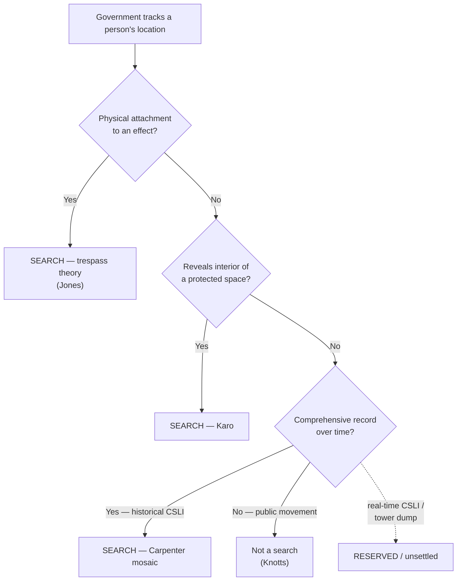
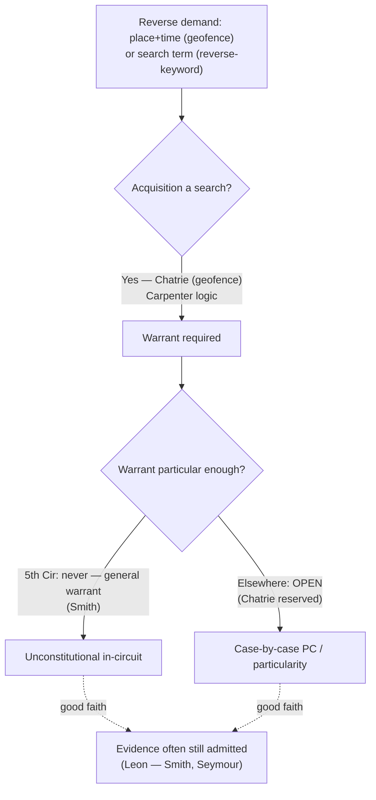

# S9 R1 panel-review — Opus model-diversity lane (prompt pack)

You are the **Claude/Opus** leg of the S9 three-lane adversarial panel (1 Claude + 2 Codex, R1). The two Codex lanes carry the A (support/quote-fidelity) and B (currency/treatment) attack lenses; **you carry model diversity and MUST vote on every paneled assertion across BOTH lenses' concerns.** You are refute-framed: try hard to break each assertion; **default to REFUTED on uncertainty**; never fabricate a cite, quote, or holding; use ONLY the evidence inlined below (no search, no outside knowledge). You are a SIGHTED reviewer — the FULL lake record (judgment fields included) is inlined.

You are a WRITER lane, not an adjudicator: you FIND and VOTE. You do not tally, adjudicate, or close any row — the orchestrator does.

For EACH group below, return one JSON object with the exact `reviewed[]` shape from the output contract (identical framing to the Codex lenses). Emit a finding object ONLY for a real defect (verdict refuted / stands-modified); a group you find wholly clean returns all-`stands` verdicts (the harness records a clean attestation). Concatenate the per-group JSON objects into a top-level `{"packs": [ ... ]}` array, one entry per group, each carrying its `group_id`.


OUTPUT CONTRACT — return ONE JSON object, nothing else:
{
  "lens": "A" | "B",
  "group_id": "<echo the group id>",
  "reviewed": [
    {
      "assertion_id": "<from group_inventory.jsonl>",
      "dimension": "existence|support|quote_fidelity|pincite|treatment|black_letter",
      "verdict": "stands" | "refuted" | "stands-modified",
      "verifiable_from_disclosed": true | false,
      "defect": null,   // null when verdict=="stands"; else an object:
      //  {"problem": "...", "severity": "high|medium|low", "proposed_fix": "...", "evidence_quote": "verbatim from disclosed evidence or null", "needs_cl": true|false, "locator_note": "..."}
      "reasons": ["short evidence-grounded reason", "..."],
      "breaks_true_positives": true | false,
      "residual_risks": ["..."],
      "suggested_tightening": "... or null"
    }
  ],
  "notes": ""
}
Rules: verdict=='stands' <=> defect==null (assertion survives your attack). verdict=='refuted' <=> a real defect (the assertion as framed is wrong). verdict=='stands-modified' <=> survives but needs a stated modification (a minor defect). Review EVERY assertion_id in group_inventory.jsonl exactly once. Output ONLY the JSON object.
---

## GROUP: content/searches/the-third-party-doctrine-and-digital-surveillance/Real-Time Tracking.md  (`doctrine`, 5 assertions)

### content_page

```
---
title: "Real-Time Tracking"
weight: 40
aliases:
  - "Real-Time Tracking"
  - "Real-Time Location Tracking"
  - "GPS Tracking"
  - "Beeper Tracking"
topic: Real-time location tracking — beepers, GPS, and real-time CSLI
type: doctrine
amendment: "U.S. Const. amend. IV"
jurisdiction: "Federal (U.S. Const. amend. IV); SCOTUS baseline"
status: draft
related:
  - "[[Third-Party Doctrine & CSLI]]"
  - "[[Carpenter v. United States]]"
  - "[[United States v. Jones]]"
  - "[[Trespass]]"
  - "[[Reasonable Expectation of Privacy]]"
---

# Real-Time Tracking

*Is the government watching this person move in real time by a means the Fourth Amendment counts as a search — because it attached something to his property, because it reached inside a protected space, or because it aggregated a comprehensive record of his movements?*

> [!rule] Black-letter rule
> Tracking a suspect's location is a Fourth Amendment search when it does any of three things: **(1)** the government **physically attaches** a device to a constitutionally protected effect to monitor it (*[[United States v. Jones|United States v. Jones]]*, 565 U.S. 400, [404](https://www.courtlistener.com/opinion/622304/united-states-v-jones/) (2012) — GPS on a car); **(2)** the tracking **reveals a fact about the interior of a protected space** not observable from outside (*[[United States v. Karo#^pin-714|United States v. Karo]]*, 468 U.S. 705, [714](https://www.courtlistener.com/opinion/111257/united-states-v-karo/) (1984) — beeper inside a residence); or **(3)** it assembles a **comprehensive record of movements over time** (*[[Carpenter v. United States|Carpenter]]* — historical CSLI). Merely following **public movements** by a tracking aid, without a trespass, is **not** a search: *[[United States v. Knotts#^pin-281|United States v. Knotts]]*, 460 U.S. 276, [281](https://www.courtlistener.com/opinion/110882/united-states-v-knotts/) (1983) — "no reasonable expectation of privacy in his movements from one place to another."
> ^rule-real-time

## The Brief

**The public-movements baseline.** The floor is *[[United States v. Knotts|Knotts]]*: a beeper used to track a car over public roads adds nothing the Fourth Amendment protects, because "[a] person traveling in an automobile on public thoroughfares has no reasonable expectation of privacy in his movements from one place to another." *[[United States v. Knotts#^pin-281|Knotts]]*, 460 U.S. at [281](https://www.courtlistener.com/opinion/110882/united-states-v-knotts/). Short-term following of public travel is not a search, whether by eye, by beeper, or by GPS signal alone.

**Two classic escape hatches from the baseline.** The baseline breaks in two situations. First, when the tracking **reveals the interior**: monitoring a beeper to learn that an item is *inside a private residence* is a search, because it discloses "a critical fact about the interior of the premises" the government could not otherwise obtain. *[[United States v. Karo#^pin-715|Karo]]*, 468 U.S. at [715](https://www.courtlistener.com/opinion/111257/united-states-v-karo/). Second, when the government **physically intrudes** to install the tracker: attaching a GPS unit to a vehicle and monitoring it "constitutes a 'search'" under the revived trespass theory, independent of any privacy analysis. *[[United States v. Jones|Jones]]*, 565 U.S. at [404](https://www.courtlistener.com/opinion/622304/united-states-v-jones/). *[[United States v. Jones|Jones]]* is primarily a [[Trespass|trespass]] case; its importance here is that the manner of installation can make tracking a search even on public roads.

**The mosaic and the modern turn.** The *[[United States v. Jones|Jones]]* [[Common Legal Terms#concurring-opinion|concurrences]] supplied the idea *[[Carpenter v. United States|Carpenter]]* later adopted: five Justices signaled that long-term, comprehensive location tracking can invade a [[Reasonable Expectation of Privacy|reasonable expectation of privacy]] even without a trespass. *[[Carpenter v. United States|Carpenter]]* made that a holding for **historical CSLI** — the aggregation of location over time is the search, not any single data point. Real-time tracking sits between *[[United States v. Knotts|Knotts]]* (short public following, no search) and *[[Carpenter v. United States|Carpenter]]* (comprehensive aggregation, search); the more sustained and total the surveillance, the more it pulls toward *[[Carpenter v. United States|Carpenter]]*.

**Real-time CSLI and tower dumps are expressly reserved.** *[[Carpenter v. United States|Carpenter]]* pointedly **did not decide** real-time CSLI or "tower dumps," and it disclaimed any effect on conventional surveillance techniques. Lower courts are working out whether pinging a phone's real-time location, or short-term real-time CSLI, is governed by *[[United States v. Knotts|Knotts]]* or *[[Carpenter v. United States|Carpenter]]*; the answer is unsettled and jurisdiction-dependent. Do not state a national rule for real-time CSLI.

**Apply it.**
1. **Check for a physical attachment.** If officers placed a device on the person's vehicle or effects to track it, that installation is a search under *[[United States v. Jones|Jones]]* regardless of where the tracking led.
2. **Ask what the tracking revealed.** If it disclosed a fact about the inside of a home or other protected space, *[[United States v. Karo|Karo]]* makes it a search; if it showed only public movement, *[[United States v. Knotts|Knotts]]* says it did not.
3. **Weigh the aggregation.** The longer and more comprehensive the tracking, the closer to *[[Carpenter v. United States|Carpenter]]*'s mosaic line; brief public following stays on the *[[United States v. Knotts|Knotts]]* side.
4. **Flag real-time CSLI as open.** *[[Carpenter v. United States|Carpenter]]* reserved it; treat the governing rule as unsettled and cite the controlling authority in your own jurisdiction.

**Common pitfalls.**
- **Treating *[[United States v. Knotts|Knotts]]* as blanket permission to track.** It covers **public** movement without a trespass; *[[United States v. Karo|Karo]]* (interior) and *[[United States v. Jones|Jones]]* (attachment) each pull the other way.
- **Assuming *[[Carpenter v. United States|Carpenter]]* covers real-time CSLI.** It governs **historical** CSLI and expressly **reserved** real-time CSLI and tower dumps.
- **Skipping the trespass question.** Even public-road tracking is a search if the government trespassed to install the device (*[[United States v. Jones|Jones]]*).

## Key cases

| Case | Holding | Opinion |
|---|---|---|
| *[[United States v. Knotts]]*, 460 U.S. 276 (1983) | **Baseline.** Beeper-aided tracking of a vehicle over public roads is not a search: no [[Reasonable Expectation of Privacy\|reasonable expectation of privacy]] in public movements. | [opinion](https://www.courtlistener.com/opinion/110882/united-states-v-knotts/) |
| *[[United States v. Karo]]*, 468 U.S. 705 (1984) | Monitoring a beeper inside a private residence is a search: it reveals a critical fact about the interior the government could not otherwise obtain. | [opinion](https://www.courtlistener.com/opinion/111257/united-states-v-karo/) |
| *[[United States v. Jones]]*, 565 U.S. 400 (2012) | Attaching a GPS device to a vehicle and monitoring it is a search under the trespass theory; the [[Common Legal Terms#concurring-opinion\|concurrences]]' mosaic reasoning seeded *[[Carpenter v. United States\|Carpenter]]*. *(Primary home [[Trespass]].)* | [opinion](https://www.courtlistener.com/opinion/7350871/united-states-v-jones/) |
| *[[Carpenter v. United States]]*, 585 U.S. 296 (2018) | Comprehensive historical CSLI is a search; real-time CSLI and tower dumps expressly reserved. *(Primary home [[Reasonable Expectation of Privacy]].)* | [opinion](https://www.courtlistener.com/opinion/4510032/carpenter-v-united-states/) |

<!-- Carpenter v. United States, 585 U.S. 296 (2018): case-level cite; the historical/real-time reservation is paraphrased (R5 T3, CL text slip-paginated). Primary home Reasonable Expectation of Privacy; Key-on here (real-time frontier). Real-time CSLI circuit line (GAP-03b "M") taught as reserved/unsettled — no page-needing bare captions minted here. -->

## Visual



## Sources

- [*United States v. Knotts*, 460 U.S. 276 (1983)](https://www.courtlistener.com/opinion/110882/united-states-v-knotts/) (pinpoints: 281, 282)
- [*United States v. Karo*, 468 U.S. 705 (1984)](https://www.courtlistener.com/opinion/111257/united-states-v-karo/) (pinpoints: 714, 715)
- [*United States v. Jones*, 565 U.S. 400 (2012)](https://www.courtlistener.com/opinion/7350871/united-states-v-jones/) (pinpoints: 404, 409)
- [*Carpenter v. United States*, 585 U.S. 296 (2018)](https://www.courtlistener.com/opinion/4510032/carpenter-v-united-states/) (case-level cite; real-time CSLI/tower-dump reservation paraphrased: R5 T3)

```

### group_inventory (assertions under review)

```jsonl
{"assertion_id": "aaf8fb3e609f7e94", "dimension": "existence", "kind": "case_cite", "locator": {"case": "Carpenter v. United States", "table_line": 38}, "payload": {"case": "Carpenter v. United States", "cells": ["*[[Carpenter v. United States]]*, 585 U.S. 296 (2018)", "Comprehensive historical CSLI is a search; real-time CSLI and tower dumps expressly reserved. *(Primary home [[Reasonable Expectation of Privacy]].)*", "[opinion](https://www.courtlistener.com/opinion/4510032/carpenter-v-united-states/)"], "header": ["Case", "Holding", "Opinion"]}}
{"assertion_id": "adb5b79a8ca858b0", "dimension": "existence", "kind": "case_cite", "locator": {"case": "United States v. Knotts", "table_line": 35}, "payload": {"case": "United States v. Knotts", "cells": ["*[[United States v. Knotts]]*, 460 U.S. 276 (1983)", "**Baseline.** Beeper-aided tracking of a vehicle over public roads is not a search: no [[Reasonable Expectation of Privacy\\|reasonable expectation of privacy]] in public movements.", "[opinion](https://www.courtlistener.com/opinion/110882/united-states-v-knotts/)"], "header": ["Case", "Holding", "Opinion"]}}
{"assertion_id": "d86942734e632590", "dimension": "existence", "kind": "case_cite", "locator": {"case": "United States v. Karo", "table_line": 36}, "payload": {"case": "United States v. Karo", "cells": ["*[[United States v. Karo]]*, 468 U.S. 705 (1984)", "Monitoring a beeper inside a private residence is a search: it reveals a critical fact about the interior the government could not otherwise obtain.", "[opinion](https://www.courtlistener.com/opinion/111257/united-states-v-karo/)"], "header": ["Case", "Holding", "Opinion"]}}
{"assertion_id": "f9f2609e7550861b", "dimension": "existence", "kind": "case_cite", "locator": {"case": "United States v. Jones", "table_line": 37}, "payload": {"case": "United States v. Jones", "cells": ["*[[United States v. Jones]]*, 565 U.S. 400 (2012)", "Attaching a GPS device to a vehicle and monitoring it is a search under the trespass theory; the [[Common Legal Terms#concurring-opinion\\|concurrences]]' mosaic reasoning seeded *[[Carpenter v. United States\\|Carpenter]]*. *(Primary home [[Trespass]].)*", "[opinion](https://www.courtlistener.com/opinion/7350871/united-states-v-jones/)"], "header": ["Case", "Holding", "Opinion"]}}
{"assertion_id": "6cc7b13efc263809", "dimension": "support", "kind": "proposition", "locator": {"callout": "^rule-real-time"}, "payload": {"anchor": "^rule-real-time", "statement": "[!rule] Black-letter rule\nTracking a suspect's location is a Fourth Amendment search when it does any of three things: **(1)** the government **physically attaches** a device to a constitutionally protected effect to monitor it (*[[United States v. Jones|United States v. Jones]]*, 565 U.S. 400, [404](https://www.courtlistener.com/opinion/622304/united-states-v-jones/) (2012) — GPS on a car); **(2)** the tracking **reveals a fact about the interior of a protected space** not observable from outside (*[[United States v. Karo#^pin-714|United States v. Karo]]*, 468 U.S. 705, [714](https://www.courtlistener.com/opinion/111257/united-states-v-karo/) (1984) — beeper inside a residence); or **(3)** it assembles a **comprehensive record of movements over time** (*[[Carpenter v. United States|Carpenter]]* — historical CSLI). Merely following **public movements** by a tracking aid, without a trespass, is **not** a search: *[[United States v. Knotts#^pin-281|United States v. Knotts]]*, 460 U.S. 276, [281](https://www.courtlistener.com/opinion/110882/united-states-v-knotts/) (1983) — \"no reasonable expectation of privacy in his movements from one place to another.\""}}
```

### lake record — Carpenter v. United States

```json
{
  "schema_version": "s2.v1",
  "record_id": "Carpenter v. United States",
  "stub": false,
  "status": "verified",
  "identity": {
    "case_name": "Carpenter v. United States",
    "case_name_short": "Carpenter",
    "case_name_full": "",
    "input_case_name": "Carpenter v. United States",
    "court": "U.S. Supreme Court",
    "court_id": "scotus",
    "court_level": "scotus",
    "circuit": null,
    "state": null,
    "date_decided": "2018-06-22",
    "year": 2018,
    "docket": "16-402",
    "cluster_id": 4510032,
    "lead_opinion_id": 4287285,
    "sibling_ids": [
      4287285
    ],
    "absolute_url": "/opinion/4510032/carpenter-v-united-states/",
    "identity_method": "citation+party-text",
    "expected_citation_found": true,
    "party_name_in_text": true,
    "canonical_name_match": true,
    "alternates": [
      {
        "cluster_id": 4512666,
        "score": 20,
        "case_name": "Carpenter v. United States"
      }
    ],
    "reason_code": null
  },
  "citations": {
    "official": {
      "cite": "585 U.S. 296",
      "volume": "585",
      "reporter": "U.S.",
      "page": "296",
      "type": 1,
      "selected_official": true,
      "source": "cluster.citations[]"
    },
    "parallel": [
      {
        "cite": "138 S. Ct. 2206",
        "volume": "138",
        "reporter": "S. Ct.",
        "page": "2206",
        "type": 1,
        "selected_official": false,
        "source": "cluster.citations[]"
      },
      {
        "cite": "201 L. Ed. 2d 507",
        "volume": "201",
        "reporter": "L. Ed. 2d",
        "page": "507",
        "type": 1,
        "selected_official": false,
        "source": "cluster.citations[]"
      }
    ],
    "vendor_neutral": [
      {
        "cite": "2018 U.S. LEXIS 3844",
        "volume": "2018",
        "reporter": "U.S. LEXIS",
        "page": "3844",
        "type": 6,
        "selected_official": false,
        "source": "cluster.citations[]"
      }
    ],
    "all": [
      {
        "cite": "585 U.S. 296",
        "volume": "585",
        "reporter": "U.S.",
        "page": "296",
        "type": 1,
        "selected_official": false,
        "source": "cluster.citations[]"
      },
      {
        "cite": "138 S. Ct. 2206",
        "volume": "138",
        "reporter": "S. Ct.",
        "page": "2206",
        "type": 1,
        "selected_official": false,
        "source": "cluster.citations[]"
      },
      {
        "cite": "201 L. Ed. 2d 507",
        "volume": "201",
        "reporter": "L. Ed. 2d",
        "page": "507",
        "type": 1,
        "selected_official": false,
        "source": "cluster.citations[]"
      },
      {
        "cite": "2018 U.S. LEXIS 3844",
        "volume": "2018",
        "reporter": "U.S. LEXIS",
        "page": "3844",
        "type": 6,
        "selected_official": false,
        "source": "cluster.citations[]"
      }
    ],
    "display": "585 U.S. 296",
    "official_selection": {
      "court_class": "scotus",
      "selected": "585 U.S. 296",
      "reason": "selected_rank_1"
    }
  },
  "pinpoints": [
    {
      "id": "pin-op11",
      "page": null,
      "quote": "\u2014 a showing short of probable cause \u2014 rather than a warrant. The records (nearly 12,900 location points) placed his phone near the robbery sites. He moved to suppress the CSLI as the product of a warrantless search. ## Issue Whether the Government's acquisition of historical cell-site records that chronicle a person's past movements is a search under the Fourth Amendment. ## Rule Yes.",
      "star_marker": null,
      "quote_fidelity": "mismatch",
      "pinpoint_status": "slip-only",
      "position": null
    }
  ],
  "treatment": {
    "field_i_validity": "good_law",
    "as_of_content": "2018-06-22",
    "as_of_treatment": "2026-06-30",
    "composite_basis": "migration-seed",
    "composite_basis_ref": "Carpenter v. United States",
    "varies_by_point": false,
    "scope_note": "Carpenter itself narrows the third-party doctrine for digital-age location data; it is good law.",
    "point_overrides": [],
    "edges": [
      {
        "citing_case": {
          "name": "State v. Rogers",
          "cluster_id": 10705828,
          "cite": null,
          "field_ii": "overruled"
        },
        "field_ii": "overruled",
        "field_iii": "mentioned",
        "point": null,
        "proposed": true,
        "journal_ref": "Carpenter v. United States:lane1_negative"
      },
      {
        "citing_case": {
          "name": "State v. Von Harris",
          "cluster_id": 10324088,
          "cite": [
            "2025 Ohio 279"
          ],
          "field_ii": "overruled"
        },
        "field_ii": "overruled",
        "field_iii": "mentioned",
        "point": null,
        "proposed": true,
        "journal_ref": "Carpenter v. United States:lane1_negative"
      },
      {
        "citing_case": {
          "name": "State v. Devin J. Johnson",
          "cluster_id": 10132115,
          "cite": null,
          "field_ii": "questioned"
        },
        "field_ii": "questioned",
        "field_iii": "mentioned",
        "point": null,
        "proposed": true,
        "journal_ref": "Carpenter v. United States:lane1_negative"
      },
      {
        "citing_case": {
          "name": "Thomas v. State",
          "cluster_id": 10680321,
          "cite": [
            "902 S.E.2d 566",
            "319 Ga. 123"
          ],
          "field_ii": "overruled"
        },
        "field_ii": "overruled",
        "field_iii": "mentioned",
        "point": null,
        "proposed": true,
        "journal_ref": "Carpenter v. United States:lane1_negative"
      },
      {
        "citing_case": {
          "name": "State v. Singleton",
          "cluster_id": 9506618,
          "cite": null,
          "field_ii": "overruled"
        },
        "field_ii": "overruled",
        "field_iii": "mentioned",
        "point": null,
        "proposed": true,
        "journal_ref": "Carpenter v. United States:lane1_negative"
      },
      {
        "citing_case": {
          "name": "Commonwealth v. Janvier",
          "cluster_id": 9494606,
          "cite": null,
          "field_ii": "superseded_by_statute"
        },
        "field_ii": "superseded_by_statute",
        "field_iii": "mentioned",
        "point": null,
        "proposed": true,
        "journal_ref": "Carpenter v. United States:lane1_negative"
      },
      {
        "citing_case": {
          "name": "Jamin Kidron Stocker v. the State of Texas",
          "cluster_id": 9329108,
          "cite": null,
          "field_ii": "overruled"
        },
        "field_ii": "overruled",
        "field_iii": "mentioned",
        "point": null,
        "proposed": true,
        "journal_ref": "Carpenter v. United States:lane1_negative"
      },
      {
        "citing_case": {
          "name": "State v. Hoffman",
          "cluster_id": 10135310,
          "cite": [
            "321 Or. App. 330",
            "515 P.3d 912"
          ],
          "field_ii": "questioned"
        },
        "field_ii": "questioned",
        "field_iii": "mentioned",
        "point": null,
        "proposed": true,
        "journal_ref": "Carpenter v. United States:lane1_negative"
      },
      {
        "citing_case": {
          "name": "Andrew Lennette, Individually and on behalf of C.L., O.L. and S.L., Minor Children v. State of Iowa, Melody Siver, Amy Howell, and Valerie Lovaglia",
          "cluster_id": 6476611,
          "cite": null,
          "field_ii": "overruled"
        },
        "field_ii": "overruled",
        "field_iii": "mentioned",
        "point": null,
        "proposed": true,
        "journal_ref": "Carpenter v. United States:lane1_negative"
      },
      {
        "citing_case": {
          "name": "v. Thompson",
          "cluster_id": 4858089,
          "cite": [
            "2021 CO 15"
          ],
          "field_ii": "superseded_by_statute"
        },
        "field_ii": "superseded_by_statute",
        "field_iii": "mentioned",
        "point": null,
        "proposed": true,
        "journal_ref": "Carpenter v. United States:lane2_top_cited"
      },
      {
        "citing_case": {
          "name": "Perrin Davis v. Facebook, Inc.",
          "cluster_id": 4743751,
          "cite": [
            "956 F.3d 589"
          ],
          "field_ii": "questioned"
        },
        "field_ii": "questioned",
        "field_iii": "mentioned",
        "point": null,
        "proposed": true,
        "journal_ref": "Carpenter v. United States:lane2_top_cited"
      },
      {
        "citing_case": {
          "name": "People v. Caro",
          "cluster_id": 4629272,
          "cite": [
            "248 Cal. Rptr. 3d 96",
            "7 Cal. 5th 463",
            "442 P.3d 316"
          ],
          "field_ii": "overruled"
        },
        "field_ii": "overruled",
        "field_iii": "mentioned",
        "point": null,
        "proposed": true,
        "journal_ref": "Carpenter v. United States:lane2_top_cited"
      },
      {
        "citing_case": {
          "name": "United States v. Matthew Jones",
          "cluster_id": 4757714,
          "cite": [
            "960 F.3d 949"
          ],
          "field_ii": "overruled"
        },
        "field_ii": "overruled",
        "field_iii": "mentioned",
        "point": null,
        "proposed": true,
        "journal_ref": "Carpenter v. United States:lane2_top_cited"
      },
      {
        "citing_case": {
          "name": "North American Butterfly Association v. Chad F. Wolf",
          "cluster_id": 4795622,
          "cite": [
            "977 F.3d 1244"
          ],
          "field_ii": "abrogated"
        },
        "field_ii": "abrogated",
        "field_iii": "mentioned",
        "point": null,
        "proposed": true,
        "journal_ref": "Carpenter v. United States:lane2_top_cited"
      },
      {
        "citing_case": {
          "name": "United States v. Eaglin",
          "cluster_id": 8443840,
          "cite": [
            "913 F.3d 88"
          ],
          "field_ii": "questioned"
        },
        "field_ii": "questioned",
        "field_iii": "mentioned",
        "point": null,
        "proposed": true,
        "journal_ref": "Carpenter v. United States:lane2_top_cited"
      },
      {
        "citing_case": {
          "name": "State v. Martinez",
          "cluster_id": 6243814,
          "cite": [
            "570 S.W.3d 278"
          ],
          "field_ii": "questioned"
        },
        "field_ii": "questioned",
        "field_iii": "mentioned",
        "point": null,
        "proposed": true,
        "journal_ref": "Carpenter v. United States:lane2_top_cited"
      },
      {
        "citing_case": {
          "name": "Com. v. Kurtz, J.",
          "cluster_id": 10317095,
          "cite": [
            "294 A.3d 509",
            "2023 Pa. Super. 72"
          ],
          "field_ii": "abrogated"
        },
        "field_ii": "abrogated",
        "field_iii": "mentioned",
        "point": null,
        "proposed": true,
        "journal_ref": "Carpenter v. United States:lane2_top_cited"
      },
      {
        "citing_case": {
          "name": "State v. Grady",
          "cluster_id": 4649078,
          "cite": [
            "831 S.E.2d 542",
            "372 N.C. 509"
          ],
          "field_ii": "questioned"
        },
        "field_ii": "questioned",
        "field_iii": "mentioned",
        "point": null,
        "proposed": true,
        "journal_ref": "Carpenter v. United States:lane2_top_cited"
      },
      {
        "citing_case": {
          "name": "Leaders of Beautiful Struggle v. Baltimore Police Department",
          "cluster_id": 4894627,
          "cite": [
            "2 F.4th 330"
          ],
          "field_ii": "questioned"
        },
        "field_ii": "questioned",
        "field_iii": "mentioned",
        "point": null,
        "proposed": true,
        "journal_ref": "Carpenter v. United States:lane2_top_cited"
      },
      {
        "citing_case": {
          "name": "Troester v. Starbucks Corporation",
          "cluster_id": 4520879,
          "cite": [
            "235 Cal. Rptr. 3d 820",
            "5 Cal. 5th 829",
            "421 P.3d 1114"
          ],
          "field_ii": "questioned"
        },
        "field_ii": "questioned",
        "field_iii": "mentioned",
        "point": null,
        "proposed": true,
        "journal_ref": "Carpenter v. United States:lane2_top_cited"
      },
      {
        "citing_case": {
          "name": "In the Matter of the Application of Jason Leopold to Unseal Certain Electronic Surveillance Applications and Orders",
          "cluster_id": 4766181,
          "cite": [
            "964 F.3d 1121"
          ],
          "field_ii": "questioned"
        },
        "field_ii": "questioned",
        "field_iii": "mentioned",
        "point": null,
        "proposed": true,
        "journal_ref": "Carpenter v. United States:lane2_top_cited"
      },
      {
        "citing_case": {
          "name": "United States v. William Miller",
          "cluster_id": 4835528,
          "cite": [
            "982 F.3d 412"
          ],
          "field_ii": "overruled"
        },
        "field_ii": "overruled",
        "field_iii": "mentioned",
        "point": null,
        "proposed": true,
        "journal_ref": "Carpenter v. United States:lane2_top_cited"
      },
      {
        "citing_case": {
          "name": "State v. Kaufhold",
          "cluster_id": 4770908,
          "cite": [
            "2020 Ohio 3835"
          ],
          "field_ii": "overruled"
        },
        "field_ii": "overruled",
        "field_iii": "mentioned",
        "point": null,
        "proposed": true,
        "journal_ref": "Carpenter v. United States:lane2_top_cited"
      },
      {
        "citing_case": {
          "name": "Trump v. Mazars USA, LLP",
          "cluster_id": 4766665,
          "cite": [
            "140 S. Ct. 2019",
            "207 L. Ed. 2d 951"
          ],
          "field_ii": "criticized"
        },
        "field_ii": "criticized",
        "field_iii": "mentioned",
        "point": null,
        "proposed": true,
        "journal_ref": "Carpenter v. United States:lane2_top_cited"
      },
      {
        "citing_case": {
          "name": "United States v. Charlie L. Green",
          "cluster_id": 4833880,
          "cite": [
            "981 F.3d 945"
          ],
          "field_ii": "overruled"
        },
        "field_ii": "overruled",
        "field_iii": "mentioned",
        "point": null,
        "proposed": true,
        "journal_ref": "Carpenter v. United States:lane2_top_cited"
      },
      {
        "citing_case": {
          "name": "Hill v. State",
          "cluster_id": 10367330,
          "cite": [
            "850 S.E.2d 110",
            "310 Ga. 180"
          ],
          "field_ii": "overruled"
        },
        "field_ii": "overruled",
        "field_iii": "mentioned",
        "point": null,
        "proposed": true,
        "journal_ref": "Carpenter v. United States:lane2_top_cited"
      },
      {
        "citing_case": {
          "name": "Kelsey Rose Juliana v. United States",
          "cluster_id": 4707560,
          "cite": [
            "947 F.3d 1159"
          ],
          "field_ii": "abrogated"
        },
        "field_ii": "abrogated",
        "field_iii": "mentioned",
        "point": null,
        "proposed": true,
        "journal_ref": "Carpenter v. United States:lane2_top_cited"
      },
      {
        "citing_case": {
          "name": "Com. v. Dunkins, A.",
          "cluster_id": 10315445,
          "cite": [
            "229 A.3d 622",
            "2020 Pa. Super. 38"
          ],
          "field_ii": "questioned"
        },
        "field_ii": "questioned",
        "field_iii": "mentioned",
        "point": null,
        "proposed": true,
        "journal_ref": "Carpenter v. United States:lane2_top_cited"
      },
      {
        "citing_case": {
          "name": "United States v. Dwayne Sheckles",
          "cluster_id": 4879211,
          "cite": [
            "996 F.3d 330"
          ],
          "field_ii": "abrogated"
        },
        "field_ii": "abrogated",
        "field_iii": "mentioned",
        "point": null,
        "proposed": true,
        "journal_ref": "Carpenter v. United States:lane2_top_cited"
      },
      {
        "citing_case": {
          "name": "United States v. Kunz",
          "cluster_id": 9400913,
          "cite": [
            "68 F.4th 748"
          ],
          "field_ii": "overruled"
        },
        "field_ii": "overruled",
        "field_iii": "mentioned",
        "point": null,
        "proposed": true,
        "journal_ref": "Carpenter v. United States:lane2_top_cited"
      },
      {
        "citing_case": {
          "name": "United States v. Marcus Walker",
          "cluster_id": 4861532,
          "cite": [
            "990 F.3d 316"
          ],
          "field_ii": "abrogated"
        },
        "field_ii": "abrogated",
        "field_iii": "mentioned",
        "point": null,
        "proposed": true,
        "journal_ref": "Carpenter v. United States:lane2_top_cited"
      },
      {
        "citing_case": {
          "name": "United States v. Rex Hammond",
          "cluster_id": 4877368,
          "cite": [
            "996 F.3d 374"
          ],
          "field_ii": "superseded_by_statute"
        },
        "field_ii": "superseded_by_statute",
        "field_iii": "mentioned",
        "point": null,
        "proposed": true,
        "journal_ref": "Carpenter v. United States:lane2_top_cited"
      },
      {
        "citing_case": {
          "name": "George Young, Jr. v. State of Hawaii",
          "cluster_id": 4867182,
          "cite": [
            "992 F.3d 765"
          ],
          "field_ii": "overruled"
        },
        "field_ii": "overruled",
        "field_iii": "mentioned",
        "point": null,
        "proposed": true,
        "journal_ref": "Carpenter v. United States:lane2_top_cited"
      },
      {
        "citing_case": {
          "name": "Eric K. Brooks v. D Miller",
          "cluster_id": 9421763,
          "cite": [
            "78 F.4th 1267"
          ],
          "field_ii": "overruled"
        },
        "field_ii": "overruled",
        "field_iii": "mentioned",
        "point": null,
        "proposed": true,
        "journal_ref": "Carpenter v. United States:lane2_top_cited"
      }
    ],
    "derivation": {
      "lane1_negative": {
        "query": "cites:(4287285) AND (overrul* OR abrogat* OR supersed* OR \"recede from\" OR \"no longer good law\" OR vacat* OR reversed) ",
        "reviewed": 200,
        "cap": 200,
        "cap_hit": true,
        "final_cursor": "https://www.courtlistener.com/api/rest/v4/search/?cursor=cz0xNjQzNjczNjAwMDAwJnM9NjI0NzMxNCZ0PW8mZD0yMDI2LTA3LTA0JnA9MTE%3D&fields=absolute_url%2CcaseName%2CcaseNameFull%2Ccitation%2CciteCount%2Ccluster_id%2Ccourt%2Ccourt_citation_string%2Ccourt_id%2CdateFiled%2Copinions%2Csibling_ids%2Cstatus%2Csyllabus&order_by=dateFiled+desc&page_size=100&q=cites%3A%284287285%29+AND+%28overrul%2A+OR+abrogat%2A+OR+supersed%2A+OR+%22recede+from%22+OR+%22no+longer+good+law%22+OR+vacat%2A+OR+reversed%29+&stat_Published=on&type=o",
        "audit_needed": true,
        "proposed_negative_events": 9,
        "audit_marker": "R15 treatment audit required",
        "triage_mode": "snippet-first",
        "snippet_field": "results[].opinions[].snippet",
        "triage_journaled": 200,
        "triage_read": 9,
        "triage_snippet_classified": 191
      },
      "lane2_top_cited": {
        "query": "cites:(4287285)",
        "reviewed": 25,
        "cap": 25,
        "cap_hit": true,
        "final_cursor": "https://www.courtlistener.com/api/rest/v4/search/?cursor=cz0zMiZzPTEwMzgyNzc1JnQ9byZkPTIwMjYtMDctMDQmcD0z&order_by=citeCount+desc&page_size=25&q=cites%3A%284287285%29&type=o",
        "audit_needed": true,
        "proposed_negative_events": 25,
        "audit_marker": "R15 treatment audit required"
      },
      "lane3_recency": {
        "query": "cites:(4287285)",
        "reviewed": 178,
        "cap": 200,
        "cap_hit": false,
        "final_cursor": null,
        "audit_needed": false,
        "proposed_negative_events": 6,
        "audit_marker": null,
        "triage_mode": "snippet-first",
        "snippet_field": "results[].opinions[].snippet",
        "triage_journaled": 178,
        "triage_read": 6,
        "triage_snippet_classified": 172
      }
    }
  },
  "progeny": {
    "complete_query": "cites:(4287285)",
    "indexed_citing_opinions": 525,
    "count_source": "search",
    "per_sibling": [
      {
        "opinion_id": 4287285,
        "count": 525,
        "count_source": "search"
      }
    ],
    "citation_count": 1207,
    "cache_path": "/Users/johngalt/cssi-lake/cache/progeny/carpenter-v-united-states.jsonl",
    "enumeration": "bounded",
    "cursor": "https://www.courtlistener.com/api/rest/v4/search/?cursor=cz0xLjkzNDgxMDUmcz0xMDU4MTk5OSZ0PW8mZD0yMDI2LTA3LTA0JnA9Mg%3D%3D&order_by=score+desc&page_size=100&q=cites%3A%284287285%29&type=o",
    "rows_cached": 20,
    "outbound_opinion_edges": [
      {
        "source_opinion_id": 4287285,
        "cited_id": 89759,
        "source": "search.opinions[].cites[]"
      },
      {
        "source_opinion_id": 4287285,
        "cited_id": 91573,
        "source": "search.opinions[].cites[]"
      },
      {
        "source_opinion_id": 4287285,
        "cited_id": 96405,
        "source": "search.opinions[].cites[]"
      },
      {
        "source_opinion_id": 4287285,
        "cited_id": 96424,
        "source": "search.opinions[].cites[]"
      },
      {
        "source_opinion_id": 4287285,
        "cited_id": 99422,
        "source": "search.opinions[].cites[]"
      },
      {
        "source_opinion_id": 4287285,
        "cited_id": 100047,
        "source": "search.opinions[].cites[]"
      },
      {
        "source_opinion_id": 4287285,
        "cited_id": 100567,
        "source": "search.opinions[].cites[]"
      },
      {
        "source_opinion_id": 4287285,
        "cited_id": 103990,
        "source": "search.opinions[].cites[]"
      },
      {
        "source_opinion_id": 4287285,
        "cited_id": 104239,
        "source": "search.opinions[].cites[]"
      },
      {
        "source_opinion_id": 4287285,
        "cited_id": 104490,
        "source": "search.opinions[].cites[]"
      },
      {
        "source_opinion_id": 4287285,
        "cited_id": 104758,
        "source": "search.opinions[].cites[]"
      },
      {
        "source_opinion_id": 4287285,
        "cited_id": 105021,
        "source": "search.opinions[].cites[]"
      },
      {
        "source_opinion_id": 4287285,
        "cited_id": 106130,
        "source": "search.opinions[].cites[]"
      },
      {
        "source_opinion_id": 4287285,
        "cited_id": 106187,
        "source": "search.opinions[].cites[]"
      },
      {
        "source_opinion_id": 4287285,
        "cited_id": 106197,
        "source": "search.opinions[].cites[]"
      },
      {
        "source_opinion_id": 4287285,
        "cited_id": 106515,
        "source": "search.opinions[].cites[]"
      },
      {
        "source_opinion_id": 4287285,
        "cited_id": 106777,
        "source": "search.opinions[].cites[]"
      },
      {
        "source_opinion_id": 4287285,
        "cited_id": 106933,
        "source": "search.opinions[].cites[]"
      },
      {
        "source_opinion_id": 4287285,
        "cited_id": 106964,
        "source": "search.opinions[].cites[]"
      },
      {
        "source_opinion_id": 4287285,
        "cited_id": 107082,
        "source": "search.opinions[].cites[]"
      },
      {
        "source_opinion_id": 4287285,
        "cited_id": 107318,
        "source": "search.opinions[].cites[]"
      },
      {
        "source_opinion_id": 4287285,
        "cited_id": 107473,
        "source": "search.opinions[].cites[]"
      },
      {
        "source_opinion_id": 4287285,
        "cited_id": 107474,
        "source": "search.opinions[].cites[]"
      },
      {
        "source_opinion_id": 4287285,
        "cited_id": 107483,
        "source": "search.opinions[].cites[]"
      },
      {
        "source_opinion_id": 4287285,
        "cited_id": 107564,
        "source": "search.opinions[].cites[]"
      },
      {
        "source_opinion_id": 4287285,
        "cited_id": 107716,
        "source": "search.opinions[].cites[]"
      },
      {
        "source_opinion_id": 4287285,
        "cited_id": 107729,
        "source": "search.opinions[].cites[]"
      },
      {
        "source_opinion_id": 4287285,
        "cited_id": 108304,
        "source": "search.opinions[].cites[]"
      },
      {
        "source_opinion_id": 4287285,
        "cited_id": 108709,
        "source": "search.opinions[].cites[]"
      },
      {
        "source_opinion_id": 4287285,
        "cited_id": 108713,
        "source": "search.opinions[].cites[]"
      },
      {
        "source_opinion_id": 4287285,
        "cited_id": 108898,
        "source": "search.opinions[].cites[]"
      },
      {
        "source_opinion_id": 4287285,
        "cited_id": 109005,
        "source": "search.opinions[].cites[]"
      },
      {
        "source_opinion_id": 4287285,
        "cited_id": 109069,
        "source": "search.opinions[].cites[]"
      },
      {
        "source_opinion_id": 4287285,
        "cited_id": 109101,
        "source": "search.opinions[].cites[]"
      },
      {
        "source_opinion_id": 4287285,
        "cited_id": 109432,
        "source": "search.opinions[].cites[]"
      },
      {
        "source_opinion_id": 4287285,
        "cited_id": 109433,
        "source": "search.opinions[].cites[]"
      },
      {
        "source_opinion_id": 4287285,
        "cited_id": 109522,
        "source": "search.opinions[].cites[]"
      },
      {
        "source_opinion_id": 4287285,
        "cited_id": 109541,
        "source": "search.opinions[].cites[]"
      },
      {
        "source_opinion_id": 4287285,
        "cited_id": 109905,
        "source": "search.opinions[].cites[]"
      },
      {
        "source_opinion_id": 4287285,
        "cited_id": 110061,
        "source": "search.opinions[].cites[]"
      },
      {
        "source_opinion_id": 4287285,
        "cited_id": 110118,
        "source": "search.opinions[].cites[]"
      },
      {
        "source_opinion_id": 4287285,
        "cited_id": 110325,
        "source": "search.opinions[].cites[]"
      },
      {
        "source_opinion_id": 4287285,
        "cited_id": 110326,
        "source": "search.opinions[].cites[]"
      },
      {
        "source_opinion_id": 4287285,
        "cited_id": 110719,
        "source": "search.opinions[].cites[]"
      },
      {
        "source_opinion_id": 4287285,
        "cited_id": 110882,
        "source": "search.opinions[].cites[]"
      },
      {
        "source_opinion_id": 4287285,
        "cited_id": 111061,
        "source": "search.opinions[].cites[]"
      },
      {
        "source_opinion_id": 4287285,
        "cited_id": 111102,
        "source": "search.opinions[].cites[]"
      },
      {
        "source_opinion_id": 4287285,
        "cited_id": 111146,
        "source": "search.opinions[].cites[]"
      },
      {
        "source_opinion_id": 4287285,
        "cited_id": 111217,
        "source": "search.opinions[].cites[]"
      },
      {
        "source_opinion_id": 4287285,
        "cited_id": 111227,
        "source": "search.opinions[].cites[]"
      },
      {
        "source_opinion_id": 4287285,
        "cited_id": 111851,
        "source": "search.opinions[].cites[]"
      },
      {
        "source_opinion_id": 4287285,
        "cited_id": 112067,
        "source": "search.opinions[].cites[]"
      },
      {
        "source_opinion_id": 4287285,
        "cited_id": 112175,
        "source": "search.opinions[].cites[]"
      },
      {
        "source_opinion_id": 4287285,
        "cited_id": 112382,
        "source": "search.opinions[].cites[]"
      },
      {
        "source_opinion_id": 4287285,
        "cited_id": 112416,
        "source": "search.opinions[].cites[]"
      },
      {
        "source_opinion_id": 4287285,
        "cited_id": 112448,
        "source": "search.opinions[].cites[]"
      },
      {
        "source_opinion_id": 4287285,
        "cited_id": 112608,
        "source": "search.opinions[].cites[]"
      },
      {
        "source_opinion_id": 4287285,
        "cited_id": 112795,
        "source": "search.opinions[].cites[]"
      },
      {
        "source_opinion_id": 4287285,
        "cited_id": 117936,
        "source": "search.opinions[].cites[]"
      },
      {
        "source_opinion_id": 4287285,
        "cited_id": 117964,
        "source": "search.opinions[].cites[]"
      },
      {
        "source_opinion_id": 4287285,
        "cited_id": 118148,
        "source": "search.opinions[].cites[]"
      },
      {
        "source_opinion_id": 4287285,
        "cited_id": 118180,
        "source": "search.opinions[].cites[]"
      },
      {
        "source_opinion_id": 4287285,
        "cited_id": 118443,
        "source": "search.opinions[].cites[]"
      },
      {
        "source_opinion_id": 4287285,
        "cited_id": 137006,
        "source": "search.opinions[].cites[]"
      },
      {
        "source_opinion_id": 4287285,
        "cited_id": 145633,
        "source": "search.opinions[].cites[]"
      },
      {
        "source_opinion_id": 4287285,
        "cited_id": 145777,
        "source": "search.opinions[].cites[]"
      },
      {
        "source_opinion_id": 4287285,
        "cited_id": 148797,
        "source": "search.opinions[].cites[]"
      },
      {
        "source_opinion_id": 4287285,
        "cited_id": 149703,
        "source": "search.opinions[].cites[]"
      },
      {
        "source_opinion_id": 4287285,
        "cited_id": 158478,
        "source": "search.opinions[].cites[]"
      },
      {
        "source_opinion_id": 4287285,
        "cited_id": 181032,
        "source": "search.opinions[].cites[]"
      },
      {
        "source_opinion_id": 4287285,
        "cited_id": 216733,
        "source": "search.opinions[].cites[]"
      },
      {
        "source_opinion_id": 4287285,
        "cited_id": 612140,
        "source": "search.opinions[].cites[]"
      },
      {
        "source_opinion_id": 4287285,
        "cited_id": 622304,
        "source": "search.opinions[].cites[]"
      },
      {
        "source_opinion_id": 4287285,
        "cited_id": 746807,
        "source": "search.opinions[].cites[]"
      },
      {
        "source_opinion_id": 4287285,
        "cited_id": 779290,
        "source": "search.opinions[].cites[]"
      },
      {
        "source_opinion_id": 4287285,
        "cited_id": 1087666,
        "source": "search.opinions[].cites[]"
      },
      {
        "source_opinion_id": 4287285,
        "cited_id": 1215380,
        "source": "search.opinions[].cites[]"
      },
      {
        "source_opinion_id": 4287285,
        "cited_id": 1440458,
        "source": "search.opinions[].cites[]"
      },
      {
        "source_opinion_id": 4287285,
        "cited_id": 2443377,
        "source": "search.opinions[].cites[]"
      },
      {
        "source_opinion_id": 4287285,
        "cited_id": 2513954,
        "source": "search.opinions[].cites[]"
      },
      {
        "source_opinion_id": 4287285,
        "cited_id": 2680439,
        "source": "search.opinions[].cites[]"
      },
      {
        "source_opinion_id": 4287285,
        "cited_id": 2789928,
        "source": "search.opinions[].cites[]"
      },
      {
        "source_opinion_id": 4287285,
        "cited_id": 2812209,
        "source": "search.opinions[].cites[]"
      },
      {
        "source_opinion_id": 4287285,
        "cited_id": 3235330,
        "source": "search.opinions[].cites[]"
      },
      {
        "source_opinion_id": 4287285,
        "cited_id": 4181058,
        "source": "search.opinions[].cites[]"
      },
      {
        "source_opinion_id": 4287285,
        "cited_id": 4274911,
        "source": "search.opinions[].cites[]"
      }
    ]
  },
  "off_cl_links": [],
  "provenance": {
    "cl_source": "C",
    "cl_api": "https://www.courtlistener.com/api/rest/v4",
    "built_by": "S2-BUILDER-AUTHORING",
    "build_run": "s2-build-96d841cbb12e",
    "date_created": "2026-07-04T23:36:05Z",
    "date_modified": "2026-07-06T10:25:11Z",
    "warnings": [
      "legacy treatment migrated: good -> good_law"
    ],
    "field_provenance": {
      "identity": {
        "src": "CourtListener search + clusters + lead opinion text",
        "at": "2026-07-04T23:36:21Z",
        "verifier": "S2-BUILDER-AUTHORING"
      },
      "treatment.field_i_validity": {
        "src": "_treatment-migration.json + page frontmatter",
        "at": "2026-07-04T23:36:21Z",
        "verifier": "S2-BUILDER-AUTHORING"
      },
      "point_overrides": {
        "src": "S2 treatment derivation proposed only",
        "at": "2026-07-04T23:40:51Z",
        "verifier": "S2-BUILDER-AUTHORING"
      },
      "pinpoints": {
        "src": "content page quote harvest + lead opinion text",
        "at": "2026-07-04T23:36:21Z",
        "verifier": "S2-BUILDER-AUTHORING"
      }
    }
  }
}

```

### lake record — United States v. Jones

```json
{
  "schema_version": "s2.v1",
  "record_id": "United States v. Jones",
  "stub": false,
  "status": "verified",
  "identity": {
    "case_name": "United States v. Jones",
    "case_name_short": "Jones",
    "case_name_full": "United States v. Jones",
    "input_case_name": "United States v. Jones",
    "court": "U.S. Supreme Court",
    "court_id": "scotus",
    "court_level": "scotus",
    "circuit": null,
    "state": null,
    "date_decided": "2012-01-23",
    "year": 2012,
    "docket": "10-1259",
    "cluster_id": 622304,
    "lead_opinion_id": 9485324,
    "sibling_ids": [
      622304,
      9485324,
      9485325,
      9485326
    ],
    "absolute_url": "/opinion/622304/united-states-v-jones/",
    "identity_method": "citation+party-text",
    "expected_citation_found": true,
    "party_name_in_text": true,
    "canonical_name_match": true,
    "alternates": [
      {
        "cluster_id": 7350871,
        "score": 120,
        "case_name": "United States v. Jones"
      }
    ],
    "reason_code": null
  },
  "citations": {
    "official": {
      "cite": "565 U.S. 400",
      "volume": "565",
      "reporter": "U.S.",
      "page": "400",
      "type": 1,
      "selected_official": true,
      "source": "cluster.citations[]"
    },
    "parallel": [
      {
        "cite": "132 S. Ct. 945",
        "volume": "132",
        "reporter": "S. Ct.",
        "page": "945",
        "type": 1,
        "selected_official": false,
        "source": "cluster.citations[]"
      },
      {
        "cite": "181 L. Ed. 2d 911",
        "volume": "181",
        "reporter": "L. Ed. 2d",
        "page": "911",
        "type": 1,
        "selected_official": false,
        "source": "cluster.citations[]"
      }
    ],
    "vendor_neutral": [
      {
        "cite": "2012 U.S. LEXIS 1063",
        "volume": "2012",
        "reporter": "U.S. LEXIS",
        "page": "1063",
        "type": 6,
        "selected_official": false,
        "source": "cluster.citations[]"
      }
    ],
    "all": [
      {
        "cite": "132 S. Ct. 945",
        "volume": "132",
        "reporter": "S. Ct.",
        "page": "945",
        "type": 1,
        "selected_official": false,
        "source": "cluster.citations[]"
      },
      {
        "cite": "181 L. Ed. 2d 911",
        "volume": "181",
        "reporter": "L. Ed. 2d",
        "page": "911",
        "type": 1,
        "selected_official": false,
        "source": "cluster.citations[]"
      },
      {
        "cite": "565 U.S. 400",
        "volume": "565",
        "reporter": "U.S.",
        "page": "400",
        "type": 1,
        "selected_official": false,
        "source": "cluster.citations[]"
      },
      {
        "cite": "2012 U.S. LEXIS 1063",
        "volume": "2012",
        "reporter": "U.S. LEXIS",
        "page": "1063",
        "type": 6,
        "selected_official": false,
        "source": "cluster.citations[]"
      }
    ],
    "display": "565 U.S. 400",
    "official_selection": {
      "court_class": "scotus",
      "selected": "565 U.S. 400",
      "reason": "selected_rank_1"
    }
  },
  "pinpoints": [
    {
      "id": "pin-404",
      "page": null,
      "quote": "within the meaning of the Fourth Amendment. ## Rule Yes \u2014 under a trespass-based theory of the Fourth Amendment.",
      "star_marker": null,
      "quote_fidelity": "mismatch",
      "pinpoint_status": "slip-only",
      "position": null
    },
    {
      "id": "pin-404a",
      "page": null,
      "quote": "The Government physically occupied private property for the purpose of obtaining information. We have no doubt that such a physical intrusion would have been considered a 'search' within the meaning of the Fourth Amendment when it was adopted.",
      "star_marker": null,
      "quote_fidelity": "mismatch",
      "pinpoint_status": "slip-only",
      "position": null
    },
    {
      "id": "pin-409",
      "page": null,
      "quote": "the *Katz* reasonable-expectation-of-privacy test has been *added to*, not *substituted for*, the common-law trespassory test.",
      "star_marker": null,
      "quote_fidelity": "mismatch",
      "pinpoint_status": "slip-only",
      "position": null
    }
  ],
  "treatment": {
    "field_i_validity": "good_law",
    "as_of_content": "2012-01-23",
    "as_of_treatment": "2026-06-30",
    "composite_basis": "migration-seed",
    "composite_basis_ref": "United States v. Jones",
    "varies_by_point": false,
    "scope_note": "Old as_of seeds as_of_treatment; S2 derivation re-derives and may downgrade.",
    "point_overrides": [],
    "edges": [
      {
        "citing_case": {
          "name": "Jerel Chinedu Igboji v. State",
          "cluster_id": 4789820,
          "cite": null,
          "field_ii": "questioned"
        },
        "field_ii": "questioned",
        "field_iii": "mentioned",
        "point": null,
        "proposed": true,
        "journal_ref": "United States v. Jones:lane1_negative"
      },
      {
        "citing_case": {
          "name": "Commonwealth v. McCarthy",
          "cluster_id": 4746120,
          "cite": null,
          "field_ii": "superseded_by_statute"
        },
        "field_ii": "superseded_by_statute",
        "field_iii": "mentioned",
        "point": null,
        "proposed": true,
        "journal_ref": "United States v. Jones:lane1_negative"
      },
      {
        "citing_case": {
          "name": "State v. Grady",
          "cluster_id": 4649078,
          "cite": [
            "831 S.E.2d 542",
            "372 N.C. 509"
          ],
          "field_ii": "questioned"
        },
        "field_ii": "questioned",
        "field_iii": "mentioned",
        "point": null,
        "proposed": true,
        "journal_ref": "United States v. Jones:lane1_negative"
      },
      {
        "citing_case": {
          "name": "Commonwealth v. Fredericq",
          "cluster_id": 4613398,
          "cite": [
            "121 N.E.3d 166",
            "482 Mass. 70"
          ],
          "field_ii": "superseded_by_statute"
        },
        "field_ii": "superseded_by_statute",
        "field_iii": "mentioned",
        "point": null,
        "proposed": true,
        "journal_ref": "United States v. Jones:lane1_negative"
      },
      {
        "citing_case": {
          "name": "Commonwealth v. Johnson",
          "cluster_id": 4603999,
          "cite": [
            "119 N.E.3d 669",
            "481 Mass. 710"
          ],
          "field_ii": "abrogated"
        },
        "field_ii": "abrogated",
        "field_iii": "mentioned",
        "point": null,
        "proposed": true,
        "journal_ref": "United States v. Jones:lane1_negative"
      },
      {
        "citing_case": {
          "name": "Nathan Ray Foreman v. State",
          "cluster_id": 4532255,
          "cite": null,
          "field_ii": "questioned"
        },
        "field_ii": "questioned",
        "field_iii": "mentioned",
        "point": null,
        "proposed": true,
        "journal_ref": "United States v. Jones:lane1_negative"
      },
      {
        "citing_case": {
          "name": "Nathan Ray Foreman v. State",
          "cluster_id": 4532252,
          "cite": null,
          "field_ii": "questioned"
        },
        "field_ii": "questioned",
        "field_iii": "mentioned",
        "point": null,
        "proposed": true,
        "journal_ref": "United States v. Jones:lane1_negative"
      },
      {
        "citing_case": {
          "name": "John Turner v. United States",
          "cluster_id": 4480399,
          "cite": [
            "885 F.3d 949"
          ],
          "field_ii": "overruled"
        },
        "field_ii": "overruled",
        "field_iii": "mentioned",
        "point": null,
        "proposed": true,
        "journal_ref": "United States v. Jones:lane1_negative"
      },
      {
        "citing_case": {
          "name": "Commonwealth v. Johnson",
          "cluster_id": 4381539,
          "cite": null,
          "field_ii": "superseded_by_statute"
        },
        "field_ii": "superseded_by_statute",
        "field_iii": "mentioned",
        "point": null,
        "proposed": true,
        "journal_ref": "United States v. Jones:lane1_negative"
      },
      {
        "citing_case": {
          "name": "Carpenter v. United States",
          "cluster_id": 4510032,
          "cite": [
            "585 U.S. 296",
            "138 S. Ct. 2206",
            "201 L. Ed. 2d 507",
            "2018 U.S. LEXIS 3844"
          ],
          "field_ii": "overruled"
        },
        "field_ii": "overruled",
        "field_iii": "mentioned",
        "point": null,
        "proposed": true,
        "journal_ref": "United States v. Jones:lane2_top_cited"
      },
      {
        "citing_case": {
          "name": "People v. Campbell",
          "cluster_id": 4463634,
          "cite": [
            "2018 COA 5",
            "425 P.3d 1163"
          ],
          "field_ii": "questioned"
        },
        "field_ii": "questioned",
        "field_iii": "mentioned",
        "point": null,
        "proposed": true,
        "journal_ref": "United States v. Jones:lane2_top_cited"
      },
      {
        "citing_case": {
          "name": "Torres v. Madrid",
          "cluster_id": 4867542,
          "cite": [
            "592 U.S. 306",
            "141 S. Ct. 989",
            "209 L. Ed. 2d 190"
          ],
          "field_ii": "criticized"
        },
        "field_ii": "criticized",
        "field_iii": "mentioned",
        "point": null,
        "proposed": true,
        "journal_ref": "United States v. Jones:lane2_top_cited"
      },
      {
        "citing_case": {
          "name": "Mark Atkinson v. City of Mountain View",
          "cluster_id": 819982,
          "cite": [
            "709 F.3d 1201",
            "2013 WL 462381",
            "2013 U.S. App. LEXIS 2703"
          ],
          "field_ii": "questioned"
        },
        "field_ii": "questioned",
        "field_iii": "mentioned",
        "point": null,
        "proposed": true,
        "journal_ref": "United States v. Jones:lane2_top_cited"
      },
      {
        "citing_case": {
          "name": "Collins v. Virginia",
          "cluster_id": 4501697,
          "cite": [
            "584 U.S. 586",
            "138 S. Ct. 1663",
            "201 L. Ed. 2d 9",
            "2018 U.S. LEXIS 3210"
          ],
          "field_ii": "overruled"
        },
        "field_ii": "overruled",
        "field_iii": "mentioned",
        "point": null,
        "proposed": true,
        "journal_ref": "United States v. Jones:lane2_top_cited"
      },
      {
        "citing_case": {
          "name": "American Civil Liberties Union of Ill. v. Alvarez",
          "cluster_id": 799453,
          "cite": [
            "679 F.3d 583",
            "40 Media L. Rep. (BNA) 1721",
            "2012 WL 1592618",
            "2012 U.S. App. LEXIS 9303"
          ],
          "field_ii": "questioned"
        },
        "field_ii": "questioned",
        "field_iii": "mentioned",
        "point": null,
        "proposed": true,
        "journal_ref": "United States v. Jones:lane2_top_cited"
      },
      {
        "citing_case": {
          "name": "Thompson, Ex Parte Ronald",
          "cluster_id": 2949202,
          "cite": [
            "442 S.W.3d 325",
            "2014 Tex. Crim. App. LEXIS 969",
            "2014 WL 4627231"
          ],
          "field_ii": "questioned"
        },
        "field_ii": "questioned",
        "field_iii": "mentioned",
        "point": null,
        "proposed": true,
        "journal_ref": "United States v. Jones:lane2_top_cited"
      },
      {
        "citing_case": {
          "name": "Matthews, Cornelious L.",
          "cluster_id": 2949477,
          "cite": [
            "431 S.W.3d 596",
            "2014 WL 3029070",
            "2014 Tex. Crim. App. LEXIS 820"
          ],
          "field_ii": "questioned"
        },
        "field_ii": "questioned",
        "field_iii": "mentioned",
        "point": null,
        "proposed": true,
        "journal_ref": "United States v. Jones:lane2_top_cited"
      },
      {
        "citing_case": {
          "name": "People v. Cregan",
          "cluster_id": 2681818,
          "cite": [
            "2014 IL 113600"
          ],
          "field_ii": "overruled"
        },
        "field_ii": "overruled",
        "field_iii": "mentioned",
        "point": null,
        "proposed": true,
        "journal_ref": "United States v. Jones:lane2_top_cited"
      },
      {
        "citing_case": {
          "name": "State v. Robinson",
          "cluster_id": 3152697,
          "cite": [
            "303 Kan. 11",
            "363 P.3d 875",
            "2015 Kan. LEXIS 929"
          ],
          "field_ii": "overruled"
        },
        "field_ii": "overruled",
        "field_iii": "mentioned",
        "point": null,
        "proposed": true,
        "journal_ref": "United States v. Jones:lane2_top_cited"
      },
      {
        "citing_case": {
          "name": "State of Texas v. Granville, Anthony",
          "cluster_id": 2950015,
          "cite": [
            "423 S.W.3d 399",
            "2014 WL 714730",
            "2014 Tex. Crim. App. LEXIS 237"
          ],
          "field_ii": "overruled"
        },
        "field_ii": "overruled",
        "field_iii": "mentioned",
        "point": null,
        "proposed": true,
        "journal_ref": "United States v. Jones:lane2_top_cited"
      },
      {
        "citing_case": {
          "name": "Free Speech Coalition, Inc. v. Attorney General of the United States",
          "cluster_id": 676451,
          "cite": [
            "677 F.3d 519",
            "2012 WL 1255056",
            "2012 U.S. App. LEXIS 7543"
          ],
          "field_ii": "superseded_by_statute"
        },
        "field_ii": "superseded_by_statute",
        "field_iii": "mentioned",
        "point": null,
        "proposed": true,
        "journal_ref": "United States v. Jones:lane2_top_cited"
      },
      {
        "citing_case": {
          "name": "State v. Talkington",
          "cluster_id": 2784485,
          "cite": [
            "301 Kan. 453",
            "345 P.3d 258",
            "2015 Kan. LEXIS 167",
            "2015 WL 968451"
          ],
          "field_ii": "questioned"
        },
        "field_ii": "questioned",
        "field_iii": "mentioned",
        "point": null,
        "proposed": true,
        "journal_ref": "United States v. Jones:lane2_top_cited"
      },
      {
        "citing_case": {
          "name": "United States v. Perea-Rey",
          "cluster_id": 801335,
          "cite": [
            "680 F.3d 1179",
            "2012 U.S. App. LEXIS 10941",
            "2012 WL 1948973"
          ],
          "field_ii": "overruled"
        },
        "field_ii": "overruled",
        "field_iii": "mentioned",
        "point": null,
        "proposed": true,
        "journal_ref": "United States v. Jones:lane2_top_cited"
      },
      {
        "citing_case": {
          "name": "Drake v. Filko",
          "cluster_id": 1035893,
          "cite": [
            "724 F.3d 426",
            "2013 WL 3927735",
            "2013 U.S. App. LEXIS 15635"
          ],
          "field_ii": "abrogated"
        },
        "field_ii": "abrogated",
        "field_iii": "mentioned",
        "point": null,
        "proposed": true,
        "journal_ref": "United States v. Jones:lane2_top_cited"
      },
      {
        "citing_case": {
          "name": "United States v. Ulbricht",
          "cluster_id": 4395694,
          "cite": [
            "858 F.3d 71",
            "2017 WL 2346566"
          ],
          "field_ii": "overruled"
        },
        "field_ii": "overruled",
        "field_iii": "mentioned",
        "point": null,
        "proposed": true,
        "journal_ref": "United States v. Jones:lane2_top_cited"
      },
      {
        "citing_case": {
          "name": "United States v. Aaron Graham",
          "cluster_id": 3208153,
          "cite": [
            "824 F.3d 421",
            "2016 WL 3068018"
          ],
          "field_ii": "questioned"
        },
        "field_ii": "questioned",
        "field_iii": "mentioned",
        "point": null,
        "proposed": true,
        "journal_ref": "United States v. Jones:lane2_top_cited"
      },
      {
        "citing_case": {
          "name": "United States v. Quartavious Davis",
          "cluster_id": 2798570,
          "cite": [
            "785 F.3d 498",
            "2015 WL 2058977"
          ],
          "field_ii": "overruled"
        },
        "field_ii": "overruled",
        "field_iii": "mentioned",
        "point": null,
        "proposed": true,
        "journal_ref": "United States v. Jones:lane2_top_cited"
      },
      {
        "citing_case": {
          "name": "Commonwealth v. Fulton, I., Aplt.",
          "cluster_id": 4469590,
          "cite": [
            "179 A.3d 475"
          ],
          "field_ii": "questioned"
        },
        "field_ii": "questioned",
        "field_iii": "mentioned",
        "point": null,
        "proposed": true,
        "journal_ref": "United States v. Jones:lane2_top_cited"
      },
      {
        "citing_case": {
          "name": "Neil Morgan v. Fairfield Cty., Ohio",
          "cluster_id": 4532978,
          "cite": [
            "903 F.3d 553"
          ],
          "field_ii": "questioned"
        },
        "field_ii": "questioned",
        "field_iii": "mentioned",
        "point": null,
        "proposed": true,
        "journal_ref": "United States v. Jones:lane2_top_cited"
      },
      {
        "citing_case": {
          "name": "Electronic Privacy Information Center v. United States Department of Homeland Security",
          "cluster_id": 2778134,
          "cite": [
            "414 U.S. App. D.C. 151",
            "777 F.3d 518",
            "2015 U.S. App. LEXIS 2043",
            "2015 WL 525183"
          ],
          "field_ii": "questioned"
        },
        "field_ii": "questioned",
        "field_iii": "mentioned",
        "point": null,
        "proposed": true,
        "journal_ref": "United States v. Jones:lane2_top_cited"
      },
      {
        "citing_case": {
          "name": "American Civil Liberties Union v. Clapper",
          "cluster_id": 8442192,
          "cite": [
            "785 F.3d 787",
            "43 Media L. Rep. (BNA) 1649",
            "62 Communications Reg. (P&F) 945",
            "2015 U.S. App. LEXIS 7531",
            "2015 WL 2097814"
          ],
          "field_ii": "questioned"
        },
        "field_ii": "questioned",
        "field_iii": "mentioned",
        "point": null,
        "proposed": true,
        "journal_ref": "United States v. Jones:lane2_top_cited"
      },
      {
        "citing_case": {
          "name": "United States v. Earl Davis",
          "cluster_id": 2968788,
          "cite": [
            "690 F.3d 226",
            "2012 WL 3518479",
            "2012 U.S. App. LEXIS 17217"
          ],
          "field_ii": "overruled"
        },
        "field_ii": "overruled",
        "field_iii": "mentioned",
        "point": null,
        "proposed": true,
        "journal_ref": "United States v. Jones:lane2_top_cited"
      },
      {
        "citing_case": {
          "name": "United States v. Nathaniel Holt, Jr.",
          "cluster_id": 2775033,
          "cite": [
            "777 F.3d 1234",
            "96 Fed. R. Serv. 747",
            "2015 WL 399128",
            "2015 U.S. App. LEXIS 1473"
          ],
          "field_ii": "overruled"
        },
        "field_ii": "overruled",
        "field_iii": "mentioned",
        "point": null,
        "proposed": true,
        "journal_ref": "United States v. Jones:lane2_top_cited"
      },
      {
        "citing_case": {
          "name": "Nimesh Patel v. Facebook, Inc.",
          "cluster_id": 4646691,
          "cite": [
            "932 F.3d 1264"
          ],
          "field_ii": "questioned"
        },
        "field_ii": "questioned",
        "field_iii": "mentioned",
        "point": null,
        "proposed": true,
        "journal_ref": "United States v. Jones:lane2_top_cited"
      }
    ],
    "derivation": {
      "lane1_negative": {
        "query": "cites:(622304 OR 9485324 OR 9485325 OR 9485326) AND (overrul* OR abrogat* OR supersed* OR \"recede from\" OR \"no longer good law\" OR vacat* OR reversed) ",
        "reviewed": 200,
        "cap": 200,
        "cap_hit": true,
        "final_cursor": "https://www.courtlistener.com/api/rest/v4/search/?cursor=cz0xNDgwMzc3NjAwMDAwJnM9NDMyNTQ5NyZ0PW8mZD0yMDI2LTA3LTA1JnA9MTE%3D&fields=absolute_url%2CcaseName%2CcaseNameFull%2Ccitation%2CciteCount%2Ccluster_id%2Ccourt%2Ccourt_citation_string%2Ccourt_id%2CdateFiled%2Copinions%2Csibling_ids%2Cstatus%2Csyllabus&order_by=dateFiled+desc&page_size=100&q=cites%3A%28622304+OR+9485324+OR+9485325+OR+9485326%29+AND+%28overrul%2A+OR+abrogat%2A+OR+supersed%2A+OR+%22recede+from%22+OR+%22no+longer+good+law%22+OR+vacat%2A+OR+reversed%29+&stat_Published=on&type=o",
        "audit_needed": true,
        "proposed_negative_events": 9,
        "audit_marker": "R15 treatment audit required",
        "triage_mode": "snippet-first",
        "snippet_field": "results[].opinions[].snippet",
        "triage_journaled": 200,
        "triage_read": 10,
        "triage_snippet_classified": 190
      },
      "lane2_top_cited": {
        "query": "cites:(622304 OR 9485324 OR 9485325 OR 9485326)",
        "reviewed": 25,
        "cap": 25,
        "cap_hit": true,
        "final_cursor": "https://www.courtlistener.com/api/rest/v4/search/?cursor=cz04NSZzPTQ0MDUyODImdD1vJmQ9MjAyNi0wNy0wNSZwPTM%3D&order_by=citeCount+desc&page_size=25&q=cites%3A%28622304+OR+9485324+OR+9485325+OR+9485326%29&type=o",
        "audit_needed": true,
        "proposed_negative_events": 25,
        "audit_marker": "R15 treatment audit required"
      },
      "lane3_recency": {
        "query": "cites:(622304 OR 9485324 OR 9485325 OR 9485326)",
        "reviewed": 13,
        "cap": 200,
        "cap_hit": false,
        "final_cursor": null,
        "audit_needed": false,
        "proposed_negative_events": 0,
        "audit_marker": null,
        "triage_mode": "snippet-first",
        "snippet_field": "results[].opinions[].snippet",
        "triage_journaled": 13,
        "triage_read": 0,
        "triage_snippet_classified": 13
      }
    }
  },
  "progeny": {
    "complete_query": "cites:(622304 OR 9485324 OR 9485325 OR 9485326)",
    "indexed_citing_opinions": 584,
    "count_source": "search",
    "per_sibling": [
      {
        "opinion_id": 622304,
        "count": 584,
        "count_source": "search"
      },
      {
        "opinion_id": 9485324,
        "count": 0,
        "count_source": "search"
      },
      {
        "opinion_id": 9485325,
        "count": 0,
        "count_source": "search"
      },
      {
        "opinion_id": 9485326,
        "count": 0,
        "count_source": "search"
      }
    ],
    "citation_count": 8,
    "cache_path": "/Users/johngalt/cssi-lake/cache/progeny/united-states-v-jones.jsonl",
    "enumeration": "bounded",
    "cursor": "https://www.courtlistener.com/api/rest/v4/search/?cursor=cz0xLjc1MzE4ODYmcz01MzAzNDYyJnQ9byZkPTIwMjYtMDctMDUmcD0y&order_by=score+desc&page_size=100&q=cites%3A%28622304+OR+9485324+OR+9485325+OR+9485326%29&type=o",
    "rows_cached": 20,
    "outbound_opinion_edges": [
      {
        "source_opinion_id": 622304,
        "cited_id": 91573,
        "source": "search.opinions[].cites[]"
      },
      {
        "source_opinion_id": 622304,
        "cited_id": 96405,
        "source": "search.opinions[].cites[]"
      },
      {
        "source_opinion_id": 622304,
        "cited_id": 100413,
        "source": "search.opinions[].cites[]"
      },
      {
        "source_opinion_id": 622304,
        "cited_id": 104490,
        "source": "search.opinions[].cites[]"
      },
      {
        "source_opinion_id": 622304,
        "cited_id": 105021,
        "source": "search.opinions[].cites[]"
      },
      {
        "source_opinion_id": 622304,
        "cited_id": 106187,
        "source": "search.opinions[].cites[]"
      },
      {
        "source_opinion_id": 622304,
        "cited_id": 107465,
        "source": "search.opinions[].cites[]"
      },
      {
        "source_opinion_id": 622304,
        "cited_id": 107564,
        "source": "search.opinions[].cites[]"
      },
      {
        "source_opinion_id": 622304,
        "cited_id": 107872,
        "source": "search.opinions[].cites[]"
      },
      {
        "source_opinion_id": 622304,
        "cited_id": 109069,
        "source": "search.opinions[].cites[]"
      },
      {
        "source_opinion_id": 622304,
        "cited_id": 109433,
        "source": "search.opinions[].cites[]"
      },
      {
        "source_opinion_id": 622304,
        "cited_id": 109714,
        "source": "search.opinions[].cites[]"
      },
      {
        "source_opinion_id": 622304,
        "cited_id": 110118,
        "source": "search.opinions[].cites[]"
      },
      {
        "source_opinion_id": 622304,
        "cited_id": 110882,
        "source": "search.opinions[].cites[]"
      },
      {
        "source_opinion_id": 622304,
        "cited_id": 111143,
        "source": "search.opinions[].cites[]"
      },
      {
        "source_opinion_id": 622304,
        "cited_id": 111146,
        "source": "search.opinions[].cites[]"
      },
      {
        "source_opinion_id": 622304,
        "cited_id": 111257,
        "source": "search.opinions[].cites[]"
      },
      {
        "source_opinion_id": 622304,
        "cited_id": 111600,
        "source": "search.opinions[].cites[]"
      },
      {
        "source_opinion_id": 622304,
        "cited_id": 111666,
        "source": "search.opinions[].cites[]"
      },
      {
        "source_opinion_id": 622304,
        "cited_id": 111833,
        "source": "search.opinions[].cites[]"
      },
      {
        "source_opinion_id": 622304,
        "cited_id": 112218,
        "source": "search.opinions[].cites[]"
      },
      {
        "source_opinion_id": 622304,
        "cited_id": 112795,
        "source": "search.opinions[].cites[]"
      },
      {
        "source_opinion_id": 622304,
        "cited_id": 118354,
        "source": "search.opinions[].cites[]"
      },
      {
        "source_opinion_id": 622304,
        "cited_id": 118443,
        "source": "search.opinions[].cites[]"
      },
      {
        "source_opinion_id": 622304,
        "cited_id": 122246,
        "source": "search.opinions[].cites[]"
      },
      {
        "source_opinion_id": 622304,
        "cited_id": 131154,
        "source": "search.opinions[].cites[]"
      },
      {
        "source_opinion_id": 622304,
        "cited_id": 152441,
        "source": "search.opinions[].cites[]"
      },
      {
        "source_opinion_id": 622304,
        "cited_id": 152929,
        "source": "search.opinions[].cites[]"
      },
      {
        "source_opinion_id": 622304,
        "cited_id": 179601,
        "source": "search.opinions[].cites[]"
      },
      {
        "source_opinion_id": 622304,
        "cited_id": 215613,
        "source": "search.opinions[].cites[]"
      },
      {
        "source_opinion_id": 622304,
        "cited_id": 328036,
        "source": "search.opinions[].cites[]"
      },
      {
        "source_opinion_id": 622304,
        "cited_id": 608150,
        "source": "search.opinions[].cites[]"
      },
      {
        "source_opinion_id": 622304,
        "cited_id": 2311429,
        "source": "search.opinions[].cites[]"
      },
      {
        "source_opinion_id": 622304,
        "cited_id": 2443377,
        "source": "search.opinions[].cites[]"
      },
      {
        "source_opinion_id": 622304,
        "cited_id": 2574690,
        "source": "search.opinions[].cites[]"
      }
    ]
  },
  "off_cl_links": [],
  "provenance": {
    "cl_source": "CU",
    "cl_api": "https://www.courtlistener.com/api/rest/v4",
    "built_by": "S2-BUILDER-AUTHORING",
    "build_run": "s2-build-96d841cbb12e",
    "date_created": "2026-07-06T00:55:27Z",
    "date_modified": "2026-07-06T10:25:12Z",
    "warnings": [
      "legacy treatment migrated: good -> good_law"
    ],
    "field_provenance": {
      "identity": {
        "src": "CourtListener search + clusters + lead opinion text",
        "at": "2026-07-06T00:56:53Z",
        "verifier": "S2-BUILDER-AUTHORING"
      },
      "treatment.field_i_validity": {
        "src": "_treatment-migration.json + page frontmatter",
        "at": "2026-07-06T00:56:53Z",
        "verifier": "S2-BUILDER-AUTHORING"
      },
      "point_overrides": {
        "src": "S2 treatment derivation proposed only",
        "at": "2026-07-06T01:01:16Z",
        "verifier": "S2-BUILDER-AUTHORING"
      },
      "pinpoints": {
        "src": "content page quote harvest + lead opinion text",
        "at": "2026-07-06T00:56:53Z",
        "verifier": "S2-BUILDER-AUTHORING"
      }
    }
  }
}

```

### lake record — United States v. Karo

```json
{
  "schema_version": "s2.v1",
  "record_id": "United States v. Karo",
  "stub": false,
  "status": "verified",
  "identity": {
    "case_name": "United States v. Karo",
    "case_name_short": "Karo",
    "case_name_full": "UNITED STATES v. KARO Et Al.",
    "input_case_name": "United States v. Karo",
    "court": "U.S. Supreme Court",
    "court_id": "scotus",
    "court_level": "scotus",
    "circuit": null,
    "state": null,
    "date_decided": "1984-09-18",
    "year": 1984,
    "docket": null,
    "cluster_id": 111257,
    "lead_opinion_id": 9429751,
    "sibling_ids": [
      111257,
      9429751,
      9429752,
      9429753
    ],
    "absolute_url": "/opinion/111257/united-states-v-karo/",
    "identity_method": "citation+party-text",
    "expected_citation_found": true,
    "party_name_in_text": true,
    "canonical_name_match": true,
    "alternates": [],
    "reason_code": null
  },
  "citations": {
    "official": {
      "cite": "468 U.S. 705",
      "volume": "468",
      "reporter": "U.S.",
      "page": "705",
      "type": 1,
      "selected_official": true,
      "source": "cluster.citations[]"
    },
    "parallel": [
      {
        "cite": "104 S. Ct. 3296",
        "volume": "104",
        "reporter": "S. Ct.",
        "page": "3296",
        "type": 1,
        "selected_official": false,
        "source": "cluster.citations[]"
      },
      {
        "cite": "82 L. Ed. 2d 530",
        "volume": "82",
        "reporter": "L. Ed. 2d",
        "page": "530",
        "type": 1,
        "selected_official": false,
        "source": "cluster.citations[]"
      }
    ],
    "vendor_neutral": [
      {
        "cite": "1984 U.S. LEXIS 148",
        "volume": "1984",
        "reporter": "U.S. LEXIS",
        "page": "148",
        "type": 6,
        "selected_official": false,
        "source": "cluster.citations[]"
      }
    ],
    "all": [
      {
        "cite": "468 U.S. 705",
        "volume": "468",
        "reporter": "U.S.",
        "page": "705",
        "type": 1,
        "selected_official": false,
        "source": "cluster.citations[]"
      },
      {
        "cite": "104 S. Ct. 3296",
        "volume": "104",
        "reporter": "S. Ct.",
        "page": "3296",
        "type": 1,
        "selected_official": false,
        "source": "cluster.citations[]"
      },
      {
        "cite": "82 L. Ed. 2d 530",
        "volume": "82",
        "reporter": "L. Ed. 2d",
        "page": "530",
        "type": 1,
        "selected_official": false,
        "source": "cluster.citations[]"
      },
      {
        "cite": "1984 U.S. LEXIS 148",
        "volume": "1984",
        "reporter": "U.S. LEXIS",
        "page": "148",
        "type": 6,
        "selected_official": false,
        "source": "cluster.citations[]"
      }
    ],
    "display": "468 U.S. 705",
    "official_selection": {
      "court_class": "scotus",
      "selected": "468 U.S. 705",
      "reason": "selected_rank_1"
    }
  },
  "pinpoints": [
    {
      "id": "pin-714",
      "page": null,
      "quote": "--- # United States v. Karo *468 U.S. 705 (1984)* \u00b7 U.S. Supreme Court \u00b7 **Binding \u2014 SCOTUS** \u00b7 Treatment: **good** *(as of 2026-06-30)* <!-- header line; TreatmentBadge + weight render here, degrading to the text above --> ## Background With the informant-seller's consent, agents placed a beeper in a can of ether that Karo and others bought to extract cocaine. Agents monitored the beeper as the ether moved among vehicles and houses, including while it was inside a private residence, and used the in-house signal to confirm the ether's location and obtain a search warrant. Karo challenged the warrantless monitoring of the beeper while it was inside the home. ## Issue Whether the warrantless monitoring of a beeper inside a private residence \u2014 a location not open to visual surveillance \u2014 violates the Fourth Amendment rights of those with a justifiable privacy interest in the residence. ## Rule Yes.",
      "star_marker": null,
      "quote_fidelity": "mismatch",
      "pinpoint_status": "slip-only",
      "position": null
    },
    {
      "id": "pin-715",
      "page": null,
      "quote": "does reveal a critical fact about the interior of the premises that the Government is extremely interested in knowing and that it could not have otherwise obtained without a warrant. The case is thus not like *Knotts*, for there the beeper told the authorities nothing about the interior of Knotts' cabin.",
      "star_marker": null,
      "quote_fidelity": "mismatch",
      "pinpoint_status": "slip-only",
      "position": null
    }
  ],
  "treatment": {
    "field_i_validity": "good_law",
    "as_of_content": null,
    "as_of_treatment": "2026-06-30",
    "composite_basis": "migration-seed",
    "composite_basis_ref": "United States v. Karo",
    "varies_by_point": false,
    "scope_note": "Good law; the rule that monitoring a tracking device inside a private residence is a search requiring a warrant remains controlling and was reinforced by the trespass/aggregation analyses of United States v. Jones and Carpenter.",
    "point_overrides": [],
    "edges": [
      {
        "citing_case": {
          "name": "Commonwealth v. McCarthy",
          "cluster_id": 4746120,
          "cite": null,
          "field_ii": "superseded_by_statute"
        },
        "field_ii": "superseded_by_statute",
        "field_iii": "mentioned",
        "point": null,
        "proposed": true,
        "journal_ref": "United States v. Karo:lane1_negative"
      },
      {
        "citing_case": {
          "name": "State v. Grady",
          "cluster_id": 4649078,
          "cite": [
            "831 S.E.2d 542",
            "372 N.C. 509"
          ],
          "field_ii": "questioned"
        },
        "field_ii": "questioned",
        "field_iii": "mentioned",
        "point": null,
        "proposed": true,
        "journal_ref": "United States v. Karo:lane1_negative"
      },
      {
        "citing_case": {
          "name": "Commonwealth v. Johnson",
          "cluster_id": 4603999,
          "cite": [
            "119 N.E.3d 669",
            "481 Mass. 710"
          ],
          "field_ii": "abrogated"
        },
        "field_ii": "abrogated",
        "field_iii": "mentioned",
        "point": null,
        "proposed": true,
        "journal_ref": "United States v. Karo:lane1_negative"
      },
      {
        "citing_case": {
          "name": "Rivas, Gerardo Tomas",
          "cluster_id": 4288590,
          "cite": null,
          "field_ii": "overruled"
        },
        "field_ii": "overruled",
        "field_iii": "mentioned",
        "point": null,
        "proposed": true,
        "journal_ref": "United States v. Karo:lane1_negative"
      },
      {
        "citing_case": {
          "name": "Rivas, Gerardo Tomas",
          "cluster_id": 4287047,
          "cite": null,
          "field_ii": "overruled"
        },
        "field_ii": "overruled",
        "field_iii": "mentioned",
        "point": null,
        "proposed": true,
        "journal_ref": "United States v. Karo:lane1_negative"
      },
      {
        "citing_case": {
          "name": "Rivas, Gerardo Tomas",
          "cluster_id": 4286131,
          "cite": null,
          "field_ii": "overruled"
        },
        "field_ii": "overruled",
        "field_iii": "mentioned",
        "point": null,
        "proposed": true,
        "journal_ref": "United States v. Karo:lane1_negative"
      },
      {
        "citing_case": {
          "name": "United States v. Robert Hill",
          "cluster_id": 2769569,
          "cite": [
            "776 F.3d 243"
          ],
          "field_ii": "overruled"
        },
        "field_ii": "overruled",
        "field_iii": "mentioned",
        "point": null,
        "proposed": true,
        "journal_ref": "United States v. Karo:lane1_negative"
      },
      {
        "citing_case": {
          "name": "Commonwealth v. Augustine",
          "cluster_id": 6580805,
          "cite": [
            "467 Mass. 230",
            "4 N.E.3d 846",
            "2014 WL 901649",
            "2014 Mass. LEXIS 30"
          ],
          "field_ii": "questioned"
        },
        "field_ii": "questioned",
        "field_iii": "mentioned",
        "point": null,
        "proposed": true,
        "journal_ref": "United States v. Karo:lane1_negative"
      },
      {
        "citing_case": {
          "name": "New Jersey v. T. L. O.",
          "cluster_id": 111301,
          "cite": [
            "83 L. Ed. 2d 720",
            "105 S. Ct. 733",
            "469 U.S. 325",
            "1985 U.S. LEXIS 41",
            "53 U.S.L.W. 4083"
          ],
          "field_ii": "questioned"
        },
        "field_ii": "questioned",
        "field_iii": "mentioned",
        "point": null,
        "proposed": true,
        "journal_ref": "United States v. Karo:lane2_top_cited"
      },
      {
        "citing_case": {
          "name": "Griffin v. Wisconsin",
          "cluster_id": 111959,
          "cite": [
            "97 L. Ed. 2d 709",
            "107 S. Ct. 3164",
            "483 U.S. 868",
            "1987 U.S. LEXIS 2897",
            "55 U.S.L.W. 5156"
          ],
          "field_ii": "questioned"
        },
        "field_ii": "questioned",
        "field_iii": "mentioned",
        "point": null,
        "proposed": true,
        "journal_ref": "United States v. Karo:lane2_top_cited"
      },
      {
        "citing_case": {
          "name": "Illinois v. Caballes",
          "cluster_id": 137742,
          "cite": [
            "160 L. Ed. 2d 842",
            "125 S. Ct. 834",
            "543 U.S. 405",
            "2005 U.S. LEXIS 769"
          ],
          "field_ii": "questioned"
        },
        "field_ii": "questioned",
        "field_iii": "mentioned",
        "point": null,
        "proposed": true,
        "journal_ref": "United States v. Karo:lane2_top_cited"
      },
      {
        "citing_case": {
          "name": "Kyllo v. United States",
          "cluster_id": 118443,
          "cite": [
            "150 L. Ed. 2d 94",
            "121 S. Ct. 2038",
            "533 U.S. 27",
            "2001 U.S. LEXIS 4487"
          ],
          "field_ii": "criticized"
        },
        "field_ii": "criticized",
        "field_iii": "mentioned",
        "point": null,
        "proposed": true,
        "journal_ref": "United States v. Karo:lane2_top_cited"
      },
      {
        "citing_case": {
          "name": "California v. Acevedo",
          "cluster_id": 112608,
          "cite": [
            "114 L. Ed. 2d 619",
            "111 S. Ct. 1982",
            "500 U.S. 565",
            "1991 U.S. LEXIS 3016"
          ],
          "field_ii": "overruled"
        },
        "field_ii": "overruled",
        "field_iii": "mentioned",
        "point": null,
        "proposed": true,
        "journal_ref": "United States v. Karo:lane2_top_cited"
      },
      {
        "citing_case": {
          "name": "California v. Carney",
          "cluster_id": 111423,
          "cite": [
            "85 L. Ed. 2d 406",
            "105 S. Ct. 2066",
            "471 U.S. 386",
            "1985 U.S. LEXIS 8",
            "53 U.S.L.W. 4521"
          ],
          "field_ii": "questioned"
        },
        "field_ii": "questioned",
        "field_iii": "mentioned",
        "point": null,
        "proposed": true,
        "journal_ref": "United States v. Karo:lane2_top_cited"
      },
      {
        "citing_case": {
          "name": "California v. Ciraolo",
          "cluster_id": 111666,
          "cite": [
            "90 L. Ed. 2d 210",
            "106 S. Ct. 1809",
            "476 U.S. 207",
            "1986 U.S. LEXIS 154"
          ],
          "field_ii": "questioned"
        },
        "field_ii": "questioned",
        "field_iii": "mentioned",
        "point": null,
        "proposed": true,
        "journal_ref": "United States v. Karo:lane2_top_cited"
      },
      {
        "citing_case": {
          "name": "Minnesota v. Carter",
          "cluster_id": 118249,
          "cite": [
            "142 L. Ed. 2d 373",
            "119 S. Ct. 469",
            "525 U.S. 83",
            "1998 U.S. LEXIS 7844"
          ],
          "field_ii": "overruled"
        },
        "field_ii": "overruled",
        "field_iii": "mentioned",
        "point": null,
        "proposed": true,
        "journal_ref": "United States v. Karo:lane2_top_cited"
      },
      {
        "citing_case": {
          "name": "Georgia v. Randolph",
          "cluster_id": 145669,
          "cite": [
            "164 L. Ed. 2d 208",
            "126 S. Ct. 1515",
            "547 U.S. 103",
            "2006 U.S. LEXIS 2498"
          ],
          "field_ii": "questioned"
        },
        "field_ii": "questioned",
        "field_iii": "mentioned",
        "point": null,
        "proposed": true,
        "journal_ref": "United States v. Karo:lane2_top_cited"
      },
      {
        "citing_case": {
          "name": "National Treasury Employees Union v. Von Raab",
          "cluster_id": 112220,
          "cite": [
            "103 L. Ed. 2d 685",
            "109 S. Ct. 1384",
            "489 U.S. 656",
            "1989 U.S. LEXIS 6033",
            "1989 CCH OSHD 28,589",
            "4 I.E.R. Cas. (BNA) 246",
            "57 U.S.L.W. 4338",
            "49 Empl. Prac. Dec. (CCH) 38,792"
          ],
          "field_ii": "questioned"
        },
        "field_ii": "questioned",
        "field_iii": "mentioned",
        "point": null,
        "proposed": true,
        "journal_ref": "United States v. Karo:lane2_top_cited"
      },
      {
        "citing_case": {
          "name": "United States v. James Daniel Good Real Property",
          "cluster_id": 112914,
          "cite": [
            "126 L. Ed. 2d 490",
            "114 S. Ct. 492",
            "510 U.S. 43",
            "1993 U.S. LEXIS 7941",
            "7 Fla. L. Weekly Fed. S 665",
            "93 Daily Journal DAR 15706",
            "93 Cal. Daily Op. Serv. 9143",
            "62 U.S.L.W. 4013",
            "1993 WL 505539"
          ],
          "field_ii": "superseded_by_statute"
        },
        "field_ii": "superseded_by_statute",
        "field_iii": "mentioned",
        "point": null,
        "proposed": true,
        "journal_ref": "United States v. Karo:lane2_top_cited"
      },
      {
        "citing_case": {
          "name": "United States v. Jones",
          "cluster_id": 622304,
          "cite": [
            "181 L. Ed. 2d 911",
            "132 S. Ct. 945",
            "565 U.S. 400",
            "2012 U.S. LEXIS 1063"
          ],
          "field_ii": "overruled"
        },
        "field_ii": "overruled",
        "field_iii": "mentioned",
        "point": null,
        "proposed": true,
        "journal_ref": "United States v. Karo:lane2_top_cited"
      },
      {
        "citing_case": {
          "name": "Maryland v. Garrison",
          "cluster_id": 111823,
          "cite": [
            "94 L. Ed. 2d 72",
            "107 S. Ct. 1013",
            "480 U.S. 79",
            "1987 U.S. LEXIS 559",
            "55 U.S.L.W. 4190"
          ],
          "field_ii": "questioned"
        },
        "field_ii": "questioned",
        "field_iii": "mentioned",
        "point": null,
        "proposed": true,
        "journal_ref": "United States v. Karo:lane2_top_cited"
      },
      {
        "citing_case": {
          "name": "Bowers v. Hardwick",
          "cluster_id": 111738,
          "cite": [
            "92 L. Ed. 2d 140",
            "106 S. Ct. 2841",
            "478 U.S. 186",
            "1986 U.S. LEXIS 123"
          ],
          "field_ii": "questioned"
        },
        "field_ii": "questioned",
        "field_iii": "mentioned",
        "point": null,
        "proposed": true,
        "journal_ref": "United States v. Karo:lane2_top_cited"
      },
      {
        "citing_case": {
          "name": "People v. Jenkins",
          "cluster_id": 1195356,
          "cite": [
            "997 P.2d 1044",
            "95 Cal. Rptr. 2d 377",
            "22 Cal. 4th 900"
          ],
          "field_ii": "overruled"
        },
        "field_ii": "overruled",
        "field_iii": "mentioned",
        "point": null,
        "proposed": true,
        "journal_ref": "United States v. Karo:lane2_top_cited"
      },
      {
        "citing_case": {
          "name": "New York v. Class",
          "cluster_id": 111600,
          "cite": [
            "89 L. Ed. 2d 81",
            "106 S. Ct. 960",
            "475 U.S. 106",
            "1986 U.S. LEXIS 5",
            "54 U.S.L.W. 4178"
          ],
          "field_ii": "questioned"
        },
        "field_ii": "questioned",
        "field_iii": "mentioned",
        "point": null,
        "proposed": true,
        "journal_ref": "United States v. Karo:lane2_top_cited"
      },
      {
        "citing_case": {
          "name": "Tenenbaum v. Williams",
          "cluster_id": 7079141,
          "cite": [
            "193 F.3d 581",
            "1999 WL 822538"
          ],
          "field_ii": "questioned"
        },
        "field_ii": "questioned",
        "field_iii": "mentioned",
        "point": null,
        "proposed": true,
        "journal_ref": "United States v. Karo:lane2_top_cited"
      },
      {
        "citing_case": {
          "name": "People v. Bull",
          "cluster_id": 1998703,
          "cite": [
            "705 N.E.2d 824",
            "185 Ill. 2d 179",
            "235 Ill. Dec. 641",
            "1998 Ill. LEXIS 1578"
          ],
          "field_ii": "criticized"
        },
        "field_ii": "criticized",
        "field_iii": "mentioned",
        "point": null,
        "proposed": true,
        "journal_ref": "United States v. Karo:lane2_top_cited"
      },
      {
        "citing_case": {
          "name": "Dow Chemical Co. v. United States Ex Rel. Administrator",
          "cluster_id": 111667,
          "cite": [
            "90 L. Ed. 2d 226",
            "106 S. Ct. 1819",
            "476 U.S. 227",
            "1986 U.S. LEXIS 155",
            "16 Envtl. L. Rep. (Envtl. Law Inst.) 20679",
            "54 U.S.L.W. 4464",
            "24 ERC (BNA) 1385"
          ],
          "field_ii": "questioned"
        },
        "field_ii": "questioned",
        "field_iii": "mentioned",
        "point": null,
        "proposed": true,
        "journal_ref": "United States v. Karo:lane2_top_cited"
      },
      {
        "citing_case": {
          "name": "Hector Vega-Rodriguez v. Puerto Rico Telephone Company",
          "cluster_id": 739069,
          "cite": [
            "110 F.3d 174",
            "12 I.E.R. Cas. (BNA) 1253",
            "1997 U.S. App. LEXIS 6517",
            "1997 WL 154362"
          ],
          "field_ii": "questioned"
        },
        "field_ii": "questioned",
        "field_iii": "mentioned",
        "point": null,
        "proposed": true,
        "journal_ref": "United States v. Karo:lane2_top_cited"
      },
      {
        "citing_case": {
          "name": "State v. Young",
          "cluster_id": 1196592,
          "cite": [
            "867 P.2d 593",
            "123 Wash. 2d 173",
            "1994 Wash. LEXIS 122"
          ],
          "field_ii": "questioned"
        },
        "field_ii": "questioned",
        "field_iii": "mentioned",
        "point": null,
        "proposed": true,
        "journal_ref": "United States v. Karo:lane2_top_cited"
      },
      {
        "citing_case": {
          "name": "United States v. 4492 South Livonia Road",
          "cluster_id": 8983256,
          "cite": [
            "889 F.2d 1258",
            "1989 U.S. App. LEXIS 17524"
          ],
          "field_ii": "questioned"
        },
        "field_ii": "questioned",
        "field_iii": "mentioned",
        "point": null,
        "proposed": true,
        "journal_ref": "United States v. Karo:lane2_top_cited"
      },
      {
        "citing_case": {
          "name": "United States v. John Henry Morgan",
          "cluster_id": 441786,
          "cite": [
            "743 F.2d 1158",
            "1984 U.S. App. LEXIS 18632"
          ],
          "field_ii": "questioned"
        },
        "field_ii": "questioned",
        "field_iii": "mentioned",
        "point": null,
        "proposed": true,
        "journal_ref": "United States v. Karo:lane2_top_cited"
      },
      {
        "citing_case": {
          "name": "United States v. Jimmy Dewitt Webster, Sr., Candido Daniel Santiago, Barry Weinreich, Joe Buhajla, Arthur Byron Murphy, and Clarence Royalston",
          "cluster_id": 445460,
          "cite": [
            "750 F.2d 307"
          ],
          "field_ii": "overruled"
        },
        "field_ii": "overruled",
        "field_iii": "mentioned",
        "point": null,
        "proposed": true,
        "journal_ref": "United States v. Karo:lane2_top_cited"
      },
      {
        "citing_case": {
          "name": "People v. McKnight",
          "cluster_id": 4621444,
          "cite": [
            "2019 CO 36",
            "446 P.3d 397"
          ],
          "field_ii": "overruled"
        },
        "field_ii": "overruled",
        "field_iii": "mentioned",
        "point": null,
        "proposed": true,
        "journal_ref": "United States v. Karo:lane2_top_cited"
      }
    ],
    "derivation": {
      "lane1_negative": {
        "query": "cites:(111257 OR 9429751 OR 9429752 OR 9429753) AND (overrul* OR abrogat* OR supersed* OR \"recede from\" OR \"no longer good law\" OR vacat* OR reversed) ",
        "reviewed": 200,
        "cap": 200,
        "cap_hit": true,
        "final_cursor": "https://www.courtlistener.com/api/rest/v4/search/?cursor=cz0xMjEwODA5NjAwMDAwJnM9MjkyNTU3MCZ0PW8mZD0yMDI2LTA3LTA1JnA9MTE%3D&fields=absolute_url%2CcaseName%2CcaseNameFull%2Ccitation%2CciteCount%2Ccluster_id%2Ccourt%2Ccourt_citation_string%2Ccourt_id%2CdateFiled%2Copinions%2Csibling_ids%2Cstatus%2Csyllabus&order_by=dateFiled+desc&page_size=100&q=cites%3A%28111257+OR+9429751+OR+9429752+OR+9429753%29+AND+%28overrul%2A+OR+abrogat%2A+OR+supersed%2A+OR+%22recede+from%22+OR+%22no+longer+good+law%22+OR+vacat%2A+OR+reversed%29+&stat_Published=on&type=o",
        "audit_needed": true,
        "proposed_negative_events": 8,
        "audit_marker": "R15 treatment audit required",
        "triage_mode": "snippet-first",
        "snippet_field": "results[].opinions[].snippet",
        "triage_journaled": 200,
        "triage_read": 9,
        "triage_snippet_classified": 191
      },
      "lane2_top_cited": {
        "query": "cites:(111257 OR 9429751 OR 9429752 OR 9429753)",
        "reviewed": 25,
        "cap": 25,
        "cap_hit": true,
        "final_cursor": "https://www.courtlistener.com/api/rest/v4/search/?cursor=cz0xNDEmcz01ODAwMjgmdD1vJmQ9MjAyNi0wNy0wNSZwPTM%3D&order_by=citeCount+desc&page_size=25&q=cites%3A%28111257+OR+9429751+OR+9429752+OR+9429753%29&type=o",
        "audit_needed": true,
        "proposed_negative_events": 25,
        "audit_marker": "R15 treatment audit required"
      },
      "lane3_recency": {
        "query": "cites:(111257 OR 9429751 OR 9429752 OR 9429753)",
        "reviewed": 20,
        "cap": 200,
        "cap_hit": false,
        "final_cursor": null,
        "audit_needed": false,
        "proposed_negative_events": 0,
        "audit_marker": null,
        "triage_mode": "snippet-first",
        "snippet_field": "results[].opinions[].snippet",
        "triage_journaled": 20,
        "triage_read": 0,
        "triage_snippet_classified": 20
      }
    }
  },
  "progeny": {
    "complete_query": "cites:(111257 OR 9429751 OR 9429752 OR 9429753)",
    "indexed_citing_opinions": 567,
    "count_source": "search",
    "per_sibling": [
      {
        "opinion_id": 111257,
        "count": 497,
        "count_source": "search"
      },
      {
        "opinion_id": 9429751,
        "count": 82,
        "count_source": "search"
      },
      {
        "opinion_id": 9429752,
        "count": 0,
        "count_source": "search"
      },
      {
        "opinion_id": 9429753,
        "count": 0,
        "count_source": "search"
      }
    ],
    "citation_count": 895,
    "cache_path": "/Users/johngalt/cssi-lake/cache/progeny/united-states-v-karo.jsonl",
    "enumeration": "bounded",
    "cursor": "https://www.courtlistener.com/api/rest/v4/search/?cursor=cz0xLjg1ODM2Nzkmcz0xMDYzMTUxNCZ0PW8mZD0yMDI2LTA3LTA1JnA9Mg%3D%3D&order_by=score+desc&page_size=100&q=cites%3A%28111257+OR+9429751+OR+9429752+OR+9429753%29&type=o",
    "rows_cached": 20,
    "outbound_opinion_edges": [
      {
        "source_opinion_id": 111257,
        "cited_id": 104504,
        "source": "search.opinions[].cites[]"
      },
      {
        "source_opinion_id": 111257,
        "cited_id": 106187,
        "source": "search.opinions[].cites[]"
      },
      {
        "source_opinion_id": 111257,
        "cited_id": 106622,
        "source": "search.opinions[].cites[]"
      },
      {
        "source_opinion_id": 111257,
        "cited_id": 107465,
        "source": "search.opinions[].cites[]"
      },
      {
        "source_opinion_id": 111257,
        "cited_id": 107564,
        "source": "search.opinions[].cites[]"
      },
      {
        "source_opinion_id": 111257,
        "cited_id": 107872,
        "source": "search.opinions[].cites[]"
      },
      {
        "source_opinion_id": 111257,
        "cited_id": 107913,
        "source": "search.opinions[].cites[]"
      },
      {
        "source_opinion_id": 111257,
        "cited_id": 108304,
        "source": "search.opinions[].cites[]"
      },
      {
        "source_opinion_id": 111257,
        "cited_id": 108709,
        "source": "search.opinions[].cites[]"
      },
      {
        "source_opinion_id": 111257,
        "cited_id": 108800,
        "source": "search.opinions[].cites[]"
      },
      {
        "source_opinion_id": 111257,
        "cited_id": 108967,
        "source": "search.opinions[].cites[]"
      },
      {
        "source_opinion_id": 111257,
        "cited_id": 109433,
        "source": "search.opinions[].cites[]"
      },
      {
        "source_opinion_id": 111257,
        "cited_id": 109714,
        "source": "search.opinions[].cites[]"
      },
      {
        "source_opinion_id": 111257,
        "cited_id": 109925,
        "source": "search.opinions[].cites[]"
      },
      {
        "source_opinion_id": 111257,
        "cited_id": 110118,
        "source": "search.opinions[].cites[]"
      },
      {
        "source_opinion_id": 111257,
        "cited_id": 110119,
        "source": "search.opinions[].cites[]"
      },
      {
        "source_opinion_id": 111257,
        "cited_id": 110235,
        "source": "search.opinions[].cites[]"
      },
      {
        "source_opinion_id": 111257,
        "cited_id": 110325,
        "source": "search.opinions[].cites[]"
      },
      {
        "source_opinion_id": 111257,
        "cited_id": 110326,
        "source": "search.opinions[].cites[]"
      },
      {
        "source_opinion_id": 111257,
        "cited_id": 110464,
        "source": "search.opinions[].cites[]"
      },
      {
        "source_opinion_id": 111257,
        "cited_id": 110558,
        "source": "search.opinions[].cites[]"
      },
      {
        "source_opinion_id": 111257,
        "cited_id": 110719,
        "source": "search.opinions[].cites[]"
      },
      {
        "source_opinion_id": 111257,
        "cited_id": 110882,
        "source": "search.opinions[].cites[]"
      },
      {
        "source_opinion_id": 111257,
        "cited_id": 111013,
        "source": "search.opinions[].cites[]"
      },
      {
        "source_opinion_id": 111257,
        "cited_id": 111143,
        "source": "search.opinions[].cites[]"
      },
      {
        "source_opinion_id": 111257,
        "cited_id": 111146,
        "source": "search.opinions[].cites[]"
      },
      {
        "source_opinion_id": 111257,
        "cited_id": 111173,
        "source": "search.opinions[].cites[]"
      },
      {
        "source_opinion_id": 111257,
        "cited_id": 420988,
        "source": "search.opinions[].cites[]"
      }
    ]
  },
  "off_cl_links": [],
  "provenance": {
    "cl_source": "LRU",
    "cl_api": "https://www.courtlistener.com/api/rest/v4",
    "built_by": "S2-BUILDER-AUTHORING",
    "build_run": "s2-build-96d841cbb12e",
    "date_created": "2026-07-06T01:01:16Z",
    "date_modified": "2026-07-06T10:25:12Z",
    "warnings": [
      "legacy treatment migrated: good -> good_law"
    ],
    "field_provenance": {
      "identity": {
        "src": "CourtListener search + clusters + lead opinion text",
        "at": "2026-07-06T01:01:51Z",
        "verifier": "S2-BUILDER-AUTHORING"
      },
      "treatment.field_i_validity": {
        "src": "_treatment-migration.json + page frontmatter",
        "at": "2026-07-06T01:01:51Z",
        "verifier": "S2-BUILDER-AUTHORING"
      },
      "point_overrides": {
        "src": "S2 treatment derivation proposed only",
        "at": "2026-07-06T01:06:02Z",
        "verifier": "S2-BUILDER-AUTHORING"
      },
      "pinpoints": {
        "src": "content page quote harvest + lead opinion text",
        "at": "2026-07-06T01:01:51Z",
        "verifier": "S2-BUILDER-AUTHORING"
      }
    }
  }
}

```

### lake record — United States v. Knotts

```json
{
  "schema_version": "s2.v1",
  "record_id": "United States v. Knotts",
  "stub": false,
  "status": "verified",
  "identity": {
    "case_name": "United States v. Knotts",
    "case_name_short": "Knotts",
    "case_name_full": "United States v. Knotts",
    "input_case_name": "United States v. Knotts",
    "court": "U.S. Supreme Court",
    "court_id": "scotus",
    "court_level": "scotus",
    "circuit": null,
    "state": null,
    "date_decided": "1983-03-02",
    "year": 1983,
    "docket": null,
    "cluster_id": 110882,
    "lead_opinion_id": 9429102,
    "sibling_ids": [
      110882,
      9429102,
      9429103,
      9429104
    ],
    "absolute_url": "/opinion/110882/united-states-v-knotts/",
    "identity_method": "citation+party-text",
    "expected_citation_found": true,
    "party_name_in_text": true,
    "canonical_name_match": true,
    "alternates": [],
    "reason_code": null
  },
  "citations": {
    "official": {
      "cite": "460 U.S. 276",
      "volume": "460",
      "reporter": "U.S.",
      "page": "276",
      "type": 1,
      "selected_official": true,
      "source": "cluster.citations[]"
    },
    "parallel": [
      {
        "cite": "103 S. Ct. 1081",
        "volume": "103",
        "reporter": "S. Ct.",
        "page": "1081",
        "type": 1,
        "selected_official": false,
        "source": "cluster.citations[]"
      },
      {
        "cite": "75 L. Ed. 2d 55",
        "volume": "75",
        "reporter": "L. Ed. 2d",
        "page": "55",
        "type": 1,
        "selected_official": false,
        "source": "cluster.citations[]"
      },
      {
        "cite": "51 U.S.L.W. 4232",
        "volume": "51",
        "reporter": "U.S.L.W.",
        "page": "4232",
        "type": 4,
        "selected_official": false,
        "source": "cluster.citations[]"
      }
    ],
    "vendor_neutral": [
      {
        "cite": "1983 U.S. LEXIS 135",
        "volume": "1983",
        "reporter": "U.S. LEXIS",
        "page": "135",
        "type": 6,
        "selected_official": false,
        "source": "cluster.citations[]"
      }
    ],
    "all": [
      {
        "cite": "460 U.S. 276",
        "volume": "460",
        "reporter": "U.S.",
        "page": "276",
        "type": 1,
        "selected_official": false,
        "source": "cluster.citations[]"
      },
      {
        "cite": "103 S. Ct. 1081",
        "volume": "103",
        "reporter": "S. Ct.",
        "page": "1081",
        "type": 1,
        "selected_official": false,
        "source": "cluster.citations[]"
      },
      {
        "cite": "75 L. Ed. 2d 55",
        "volume": "75",
        "reporter": "L. Ed. 2d",
        "page": "55",
        "type": 1,
        "selected_official": false,
        "source": "cluster.citations[]"
      },
      {
        "cite": "1983 U.S. LEXIS 135",
        "volume": "1983",
        "reporter": "U.S. LEXIS",
        "page": "135",
        "type": 6,
        "selected_official": false,
        "source": "cluster.citations[]"
      },
      {
        "cite": "51 U.S.L.W. 4232",
        "volume": "51",
        "reporter": "U.S.L.W.",
        "page": "4232",
        "type": 4,
        "selected_official": false,
        "source": "cluster.citations[]"
      }
    ],
    "display": "460 U.S. 276",
    "official_selection": {
      "court_class": "scotus",
      "selected": "460 U.S. 276",
      "reason": "selected_rank_1"
    }
  },
  "pinpoints": [
    {
      "id": "pin-281",
      "page": null,
      "quote": "--- # United States v. Knotts *460 U.S. 276 (1983)* \u00b7 U.S. Supreme Court \u00b7 **Binding \u2014 SCOTUS** \u00b7 Treatment: **good** *(as of 2026-06-30)* <!-- header line; TreatmentBadge + weight render here, degrading to the text above --> ## Background With the seller's consent, officers placed a beeper in a drum of chloroform purchased by a co-conspirator. Using visual surveillance aided by the beeper, agents tracked the drum as it was driven over public roads to a secluded cabin. The tracking, combined with other facts, supported a search warrant for the cabin. Knotts argued the beeper-aided tracking was a warrantless search. ## Issue Whether monitoring a beeper's signals to track a vehicle's movements over public roads invades a reasonable expectation of privacy and thus constitutes a Fourth Amendment search. ## Rule No.",
      "star_marker": null,
      "quote_fidelity": "mismatch",
      "pinpoint_status": "slip-only",
      "position": null
    },
    {
      "id": "pin-282",
      "page": null,
      "quote": "Nothing in the Fourth Amendment prohibited the police from augmenting the sensory faculties bestowed upon them at birth with such enhancement as science and technology afforded them in this case.",
      "star_marker": "282",
      "quote_fidelity": "matched",
      "pinpoint_status": "star-verified",
      "position": 15056,
      "fragment": "#:~:text=Nothing%20in%20the%20Fourth%20Amendment",
      "fragment_validated_at": "2026-07-09T15:40:45Z"
    }
  ],
  "treatment": {
    "field_i_validity": "good_law",
    "as_of_content": "1983-03-02",
    "as_of_treatment": "2026-06-30",
    "composite_basis": "migration-seed",
    "composite_basis_ref": "United States v. Knotts",
    "varies_by_point": false,
    "scope_note": "Good law for short-term tracking of public movements. United States v. Jones (2012) decided GPS installation on trespass grounds without disturbing Knotts, and Carpenter (2018) distinguished short-term public tracking from long-term aggregation; neither overruled Knotts.",
    "point_overrides": [],
    "edges": [
      {
        "citing_case": {
          "name": "Commonwealth v. McCarthy",
          "cluster_id": 4746120,
          "cite": null,
          "field_ii": "superseded_by_statute"
        },
        "field_ii": "superseded_by_statute",
        "field_iii": "mentioned",
        "point": null,
        "proposed": true,
        "journal_ref": "United States v. Knotts:lane1_negative"
      },
      {
        "citing_case": {
          "name": "State v. Grady",
          "cluster_id": 4649078,
          "cite": [
            "831 S.E.2d 542",
            "372 N.C. 509"
          ],
          "field_ii": "questioned"
        },
        "field_ii": "questioned",
        "field_iii": "mentioned",
        "point": null,
        "proposed": true,
        "journal_ref": "United States v. Knotts:lane1_negative"
      },
      {
        "citing_case": {
          "name": "Commonwealth v. Johnson",
          "cluster_id": 4381539,
          "cite": null,
          "field_ii": "superseded_by_statute"
        },
        "field_ii": "superseded_by_statute",
        "field_iii": "mentioned",
        "point": null,
        "proposed": true,
        "journal_ref": "United States v. Knotts:lane1_negative"
      },
      {
        "citing_case": {
          "name": "Rivas, Gerardo Tomas",
          "cluster_id": 4288590,
          "cite": null,
          "field_ii": "overruled"
        },
        "field_ii": "overruled",
        "field_iii": "mentioned",
        "point": null,
        "proposed": true,
        "journal_ref": "United States v. Knotts:lane1_negative"
      },
      {
        "citing_case": {
          "name": "Rivas, Gerardo Tomas",
          "cluster_id": 4287047,
          "cite": null,
          "field_ii": "overruled"
        },
        "field_ii": "overruled",
        "field_iii": "mentioned",
        "point": null,
        "proposed": true,
        "journal_ref": "United States v. Knotts:lane1_negative"
      },
      {
        "citing_case": {
          "name": "Rivas, Gerardo Tomas",
          "cluster_id": 4286131,
          "cite": null,
          "field_ii": "overruled"
        },
        "field_ii": "overruled",
        "field_iii": "mentioned",
        "point": null,
        "proposed": true,
        "journal_ref": "United States v. Knotts:lane1_negative"
      },
      {
        "citing_case": {
          "name": "Commonwealth v. Augustine",
          "cluster_id": 6580805,
          "cite": [
            "467 Mass. 230",
            "4 N.E.3d 846",
            "2014 WL 901649",
            "2014 Mass. LEXIS 30"
          ],
          "field_ii": "questioned"
        },
        "field_ii": "questioned",
        "field_iii": "mentioned",
        "point": null,
        "proposed": true,
        "journal_ref": "United States v. Knotts:lane1_negative"
      },
      {
        "citing_case": {
          "name": "United States v. Jonathan Thomas",
          "cluster_id": 1036878,
          "cite": [
            "726 F.3d 1086",
            "2013 U.S. App. LEXIS 16413",
            "2013 WL 4017239"
          ],
          "field_ii": "overruled"
        },
        "field_ii": "overruled",
        "field_iii": "mentioned",
        "point": null,
        "proposed": true,
        "journal_ref": "United States v. Knotts:lane1_negative"
      },
      {
        "citing_case": {
          "name": "United States v. Place",
          "cluster_id": 110979,
          "cite": [
            "77 L. Ed. 2d 110",
            "103 S. Ct. 2637",
            "462 U.S. 696",
            "1983 U.S. LEXIS 74",
            "51 U.S.L.W. 4844"
          ],
          "field_ii": "questioned"
        },
        "field_ii": "questioned",
        "field_iii": "mentioned",
        "point": null,
        "proposed": true,
        "journal_ref": "United States v. Knotts:lane2_top_cited"
      },
      {
        "citing_case": {
          "name": "United States v. Jacobsen",
          "cluster_id": 111143,
          "cite": [
            "80 L. Ed. 2d 85",
            "104 S. Ct. 1652",
            "466 U.S. 109",
            "1984 U.S. LEXIS 53",
            "52 U.S.L.W. 4414"
          ],
          "field_ii": "overruled"
        },
        "field_ii": "overruled",
        "field_iii": "mentioned",
        "point": null,
        "proposed": true,
        "journal_ref": "United States v. Knotts:lane2_top_cited"
      },
      {
        "citing_case": {
          "name": "New Jersey v. T. L. O.",
          "cluster_id": 111301,
          "cite": [
            "83 L. Ed. 2d 720",
            "105 S. Ct. 733",
            "469 U.S. 325",
            "1985 U.S. LEXIS 41",
            "53 U.S.L.W. 4083"
          ],
          "field_ii": "questioned"
        },
        "field_ii": "questioned",
        "field_iii": "mentioned",
        "point": null,
        "proposed": true,
        "journal_ref": "United States v. Knotts:lane2_top_cited"
      },
      {
        "citing_case": {
          "name": "Oliver v. United States",
          "cluster_id": 111146,
          "cite": [
            "80 L. Ed. 2d 214",
            "104 S. Ct. 1735",
            "466 U.S. 170",
            "1984 U.S. LEXIS 55",
            "52 U.S.L.W. 4425"
          ],
          "field_ii": "overruled"
        },
        "field_ii": "overruled",
        "field_iii": "mentioned",
        "point": null,
        "proposed": true,
        "journal_ref": "United States v. Knotts:lane2_top_cited"
      },
      {
        "citing_case": {
          "name": "Florida v. Jardines",
          "cluster_id": 856347,
          "cite": [
            "185 L. Ed. 2d 495",
            "133 S. Ct. 1409",
            "569 U.S. 1",
            "2013 U.S. LEXIS 2542",
            "24 Fla. L. Weekly Fed. S 117",
            "81 U.S.L.W. 4209",
            "2013 WL 1196577"
          ],
          "field_ii": "questioned"
        },
        "field_ii": "questioned",
        "field_iii": "mentioned",
        "point": null,
        "proposed": true,
        "journal_ref": "United States v. Knotts:lane2_top_cited"
      },
      {
        "citing_case": {
          "name": "Segura v. United States",
          "cluster_id": 111259,
          "cite": [
            "82 L. Ed. 2d 599",
            "104 S. Ct. 3380",
            "468 U.S. 796",
            "1984 U.S. LEXIS 150",
            "52 U.S.L.W. 5128"
          ],
          "field_ii": "superseded_by_statute"
        },
        "field_ii": "superseded_by_statute",
        "field_iii": "mentioned",
        "point": null,
        "proposed": true,
        "journal_ref": "United States v. Knotts:lane2_top_cited"
      },
      {
        "citing_case": {
          "name": "Michigan v. Chesternut",
          "cluster_id": 112095,
          "cite": [
            "100 L. Ed. 2d 565",
            "108 S. Ct. 1975",
            "486 U.S. 567",
            "1988 U.S. LEXIS 2582",
            "56 U.S.L.W. 4558"
          ],
          "field_ii": "questioned"
        },
        "field_ii": "questioned",
        "field_iii": "mentioned",
        "point": null,
        "proposed": true,
        "journal_ref": "United States v. Knotts:lane2_top_cited"
      },
      {
        "citing_case": {
          "name": "California v. Acevedo",
          "cluster_id": 112608,
          "cite": [
            "114 L. Ed. 2d 619",
            "111 S. Ct. 1982",
            "500 U.S. 565",
            "1991 U.S. LEXIS 3016"
          ],
          "field_ii": "overruled"
        },
        "field_ii": "overruled",
        "field_iii": "mentioned",
        "point": null,
        "proposed": true,
        "journal_ref": "United States v. Knotts:lane2_top_cited"
      },
      {
        "citing_case": {
          "name": "California v. Ciraolo",
          "cluster_id": 111666,
          "cite": [
            "90 L. Ed. 2d 210",
            "106 S. Ct. 1809",
            "476 U.S. 207",
            "1986 U.S. LEXIS 154"
          ],
          "field_ii": "questioned"
        },
        "field_ii": "questioned",
        "field_iii": "mentioned",
        "point": null,
        "proposed": true,
        "journal_ref": "United States v. Knotts:lane2_top_cited"
      },
      {
        "citing_case": {
          "name": "Carpenter v. United States",
          "cluster_id": 4510032,
          "cite": [
            "585 U.S. 296",
            "138 S. Ct. 2206",
            "201 L. Ed. 2d 507",
            "2018 U.S. LEXIS 3844"
          ],
          "field_ii": "overruled"
        },
        "field_ii": "overruled",
        "field_iii": "mentioned",
        "point": null,
        "proposed": true,
        "journal_ref": "United States v. Knotts:lane2_top_cited"
      },
      {
        "citing_case": {
          "name": "United States v. Jones",
          "cluster_id": 622304,
          "cite": [
            "181 L. Ed. 2d 911",
            "132 S. Ct. 945",
            "565 U.S. 400",
            "2012 U.S. LEXIS 1063"
          ],
          "field_ii": "overruled"
        },
        "field_ii": "overruled",
        "field_iii": "mentioned",
        "point": null,
        "proposed": true,
        "journal_ref": "United States v. Knotts:lane2_top_cited"
      },
      {
        "citing_case": {
          "name": "United States v. Karo",
          "cluster_id": 111257,
          "cite": [
            "82 L. Ed. 2d 530",
            "104 S. Ct. 3296",
            "468 U.S. 705",
            "1984 U.S. LEXIS 148"
          ],
          "field_ii": "questioned"
        },
        "field_ii": "questioned",
        "field_iii": "mentioned",
        "point": null,
        "proposed": true,
        "journal_ref": "United States v. Knotts:lane2_top_cited"
      },
      {
        "citing_case": {
          "name": "Illinois v. Andreas",
          "cluster_id": 111013,
          "cite": [
            "77 L. Ed. 2d 1003",
            "103 S. Ct. 3319",
            "463 U.S. 765",
            "1983 U.S. LEXIS 106",
            "51 U.S.L.W. 5157"
          ],
          "field_ii": "questioned"
        },
        "field_ii": "questioned",
        "field_iii": "mentioned",
        "point": null,
        "proposed": true,
        "journal_ref": "United States v. Knotts:lane2_top_cited"
      },
      {
        "citing_case": {
          "name": "Maryland v. MacOn",
          "cluster_id": 111477,
          "cite": [
            "86 L. Ed. 2d 370",
            "105 S. Ct. 2778",
            "472 U.S. 463",
            "1985 U.S. LEXIS 110",
            "53 U.S.L.W. 4783"
          ],
          "field_ii": "questioned"
        },
        "field_ii": "questioned",
        "field_iii": "mentioned",
        "point": null,
        "proposed": true,
        "journal_ref": "United States v. Knotts:lane2_top_cited"
      },
      {
        "citing_case": {
          "name": "Douglas Emmons v. Robert McLaughlin Donald Ratliff, Gary Dewalt, City of Norwalk, Reese Wineman",
          "cluster_id": 522917,
          "cite": [
            "874 F.2d 351"
          ],
          "field_ii": "questioned"
        },
        "field_ii": "questioned",
        "field_iii": "mentioned",
        "point": null,
        "proposed": true,
        "journal_ref": "United States v. Knotts:lane2_top_cited"
      },
      {
        "citing_case": {
          "name": "Florida v. Riley",
          "cluster_id": 112175,
          "cite": [
            "102 L. Ed. 2d 835",
            "109 S. Ct. 693",
            "488 U.S. 445",
            "1989 U.S. LEXIS 580"
          ],
          "field_ii": "overruled"
        },
        "field_ii": "overruled",
        "field_iii": "mentioned",
        "point": null,
        "proposed": true,
        "journal_ref": "United States v. Knotts:lane2_top_cited"
      },
      {
        "citing_case": {
          "name": "State v. Young",
          "cluster_id": 1196592,
          "cite": [
            "867 P.2d 593",
            "123 Wash. 2d 173",
            "1994 Wash. LEXIS 122"
          ],
          "field_ii": "questioned"
        },
        "field_ii": "questioned",
        "field_iii": "mentioned",
        "point": null,
        "proposed": true,
        "journal_ref": "United States v. Knotts:lane2_top_cited"
      },
      {
        "citing_case": {
          "name": "Anita Christensen and Robert Alty v. County of Boone, Illinois, and Edward Krieger",
          "cluster_id": 797469,
          "cite": [
            "483 F.3d 454"
          ],
          "field_ii": "abrogated"
        },
        "field_ii": "abrogated",
        "field_iii": "mentioned",
        "point": null,
        "proposed": true,
        "journal_ref": "United States v. Knotts:lane2_top_cited"
      },
      {
        "citing_case": {
          "name": "United States v. Thomas",
          "cluster_id": 8939436,
          "cite": [
            "757 F.2d 1359"
          ],
          "field_ii": "questioned"
        },
        "field_ii": "questioned",
        "field_iii": "mentioned",
        "point": null,
        "proposed": true,
        "journal_ref": "United States v. Knotts:lane2_top_cited"
      },
      {
        "citing_case": {
          "name": "United States v. Jimmy Dewitt Webster, Sr., Candido Daniel Santiago, Barry Weinreich, Joe Buhajla, Arthur Byron Murphy, and Clarence Royalston",
          "cluster_id": 445460,
          "cite": [
            "750 F.2d 307"
          ],
          "field_ii": "overruled"
        },
        "field_ii": "overruled",
        "field_iii": "mentioned",
        "point": null,
        "proposed": true,
        "journal_ref": "United States v. Knotts:lane2_top_cited"
      },
      {
        "citing_case": {
          "name": "People v. McKnight",
          "cluster_id": 4621444,
          "cite": [
            "2019 CO 36",
            "446 P.3d 397"
          ],
          "field_ii": "overruled"
        },
        "field_ii": "overruled",
        "field_iii": "mentioned",
        "point": null,
        "proposed": true,
        "journal_ref": "United States v. Knotts:lane2_top_cited"
      },
      {
        "citing_case": {
          "name": "United States v. Maynard",
          "cluster_id": 152441,
          "cite": [
            "615 F.3d 544",
            "392 U.S. App. D.C. 291",
            "2010 U.S. App. LEXIS 16417",
            "2010 WL 3063788"
          ],
          "field_ii": "superseded_by_statute"
        },
        "field_ii": "superseded_by_statute",
        "field_iii": "mentioned",
        "point": null,
        "proposed": true,
        "journal_ref": "United States v. Knotts:lane2_top_cited"
      },
      {
        "citing_case": {
          "name": "United States v. Thomas",
          "cluster_id": 449643,
          "cite": [
            "757 F.2d 1359",
            "1985 U.S. App. LEXIS 29735"
          ],
          "field_ii": "questioned"
        },
        "field_ii": "questioned",
        "field_iii": "mentioned",
        "point": null,
        "proposed": true,
        "journal_ref": "United States v. Knotts:lane2_top_cited"
      },
      {
        "citing_case": {
          "name": "State v. Campbell",
          "cluster_id": 1215380,
          "cite": [
            "759 P.2d 1040",
            "306 Or. 157",
            "1988 Ore. LEXIS 400"
          ],
          "field_ii": "criticized"
        },
        "field_ii": "criticized",
        "field_iii": "mentioned",
        "point": null,
        "proposed": true,
        "journal_ref": "United States v. Knotts:lane2_top_cited"
      },
      {
        "citing_case": {
          "name": "United States v. Donald Wesley Taylor, United States of America v. Steven Wayne Pressler, and Donald Wesley Taylor",
          "cluster_id": 424125,
          "cite": [
            "716 F.2d 701",
            "14 Fed. R. Serv. 218",
            "1983 U.S. App. LEXIS 16622"
          ],
          "field_ii": "questioned"
        },
        "field_ii": "questioned",
        "field_iii": "mentioned",
        "point": null,
        "proposed": true,
        "journal_ref": "United States v. Knotts:lane2_top_cited"
      }
    ],
    "derivation": {
      "lane1_negative": {
        "query": "cites:(110882 OR 9429102 OR 9429103 OR 9429104) AND (overrul* OR abrogat* OR supersed* OR \"recede from\" OR \"no longer good law\" OR vacat* OR reversed) ",
        "reviewed": 200,
        "cap": 200,
        "cap_hit": true,
        "final_cursor": "https://www.courtlistener.com/api/rest/v4/search/?cursor=cz0xMjY0OTgyNDAwMDAwJnM9MTMyNDYzNyZ0PW8mZD0yMDI2LTA3LTA1JnA9MTE%3D&fields=absolute_url%2CcaseName%2CcaseNameFull%2Ccitation%2CciteCount%2Ccluster_id%2Ccourt%2Ccourt_citation_string%2Ccourt_id%2CdateFiled%2Copinions%2Csibling_ids%2Cstatus%2Csyllabus&order_by=dateFiled+desc&page_size=100&q=cites%3A%28110882+OR+9429102+OR+9429103+OR+9429104%29+AND+%28overrul%2A+OR+abrogat%2A+OR+supersed%2A+OR+%22recede+from%22+OR+%22no+longer+good+law%22+OR+vacat%2A+OR+reversed%29+&stat_Published=on&type=o",
        "audit_needed": true,
        "proposed_negative_events": 8,
        "audit_marker": "R15 treatment audit required",
        "triage_mode": "snippet-first",
        "snippet_field": "results[].opinions[].snippet",
        "triage_journaled": 200,
        "triage_read": 8,
        "triage_snippet_classified": 192
      },
      "lane2_top_cited": {
        "query": "cites:(110882 OR 9429102 OR 9429103 OR 9429104)",
        "reviewed": 25,
        "cap": 25,
        "cap_hit": true,
        "final_cursor": "https://www.courtlistener.com/api/rest/v4/search/?cursor=cz0xMDMmcz00Mzg2NzcmdD1vJmQ9MjAyNi0wNy0wNSZwPTM%3D&order_by=citeCount+desc&page_size=25&q=cites%3A%28110882+OR+9429102+OR+9429103+OR+9429104%29&type=o",
        "audit_needed": true,
        "proposed_negative_events": 25,
        "audit_marker": "R15 treatment audit required"
      },
      "lane3_recency": {
        "query": "cites:(110882 OR 9429102 OR 9429103 OR 9429104)",
        "reviewed": 27,
        "cap": 200,
        "cap_hit": false,
        "final_cursor": null,
        "audit_needed": false,
        "proposed_negative_events": 0,
        "audit_marker": null,
        "triage_mode": "snippet-first",
        "snippet_field": "results[].opinions[].snippet",
        "triage_journaled": 27,
        "triage_read": 0,
        "triage_snippet_classified": 27
      }
    }
  },
  "progeny": {
    "complete_query": "cites:(110882 OR 9429102 OR 9429103 OR 9429104)",
    "indexed_citing_opinions": 454,
    "count_source": "search",
    "per_sibling": [
      {
        "opinion_id": 110882,
        "count": 368,
        "count_source": "search"
      },
      {
        "opinion_id": 9429102,
        "count": 96,
        "count_source": "search"
      },
      {
        "opinion_id": 9429103,
        "count": 0,
        "count_source": "search"
      },
      {
        "opinion_id": 9429104,
        "count": 0,
        "count_source": "search"
      }
    ],
    "citation_count": 751,
    "cache_path": "/Users/johngalt/cssi-lake/cache/progeny/united-states-v-knotts.jsonl",
    "enumeration": "bounded",
    "cursor": "https://www.courtlistener.com/api/rest/v4/search/?cursor=cz0xLjg4NjY4Njgmcz05OTg2MTg3JnQ9byZkPTIwMjYtMDctMDUmcD0y&order_by=score+desc&page_size=100&q=cites%3A%28110882+OR+9429102+OR+9429103+OR+9429104%29&type=o",
    "rows_cached": 20,
    "outbound_opinion_edges": [
      {
        "source_opinion_id": 110882,
        "cited_id": 99745,
        "source": "search.opinions[].cites[]"
      },
      {
        "source_opinion_id": 110882,
        "cited_id": 100413,
        "source": "search.opinions[].cites[]"
      },
      {
        "source_opinion_id": 110882,
        "cited_id": 101118,
        "source": "search.opinions[].cites[]"
      },
      {
        "source_opinion_id": 110882,
        "cited_id": 104504,
        "source": "search.opinions[].cites[]"
      },
      {
        "source_opinion_id": 110882,
        "cited_id": 106187,
        "source": "search.opinions[].cites[]"
      },
      {
        "source_opinion_id": 110882,
        "cited_id": 107564,
        "source": "search.opinions[].cites[]"
      },
      {
        "source_opinion_id": 110882,
        "cited_id": 109069,
        "source": "search.opinions[].cites[]"
      },
      {
        "source_opinion_id": 110882,
        "cited_id": 109537,
        "source": "search.opinions[].cites[]"
      },
      {
        "source_opinion_id": 110882,
        "cited_id": 109876,
        "source": "search.opinions[].cites[]"
      },
      {
        "source_opinion_id": 110882,
        "cited_id": 110118,
        "source": "search.opinions[].cites[]"
      },
      {
        "source_opinion_id": 110882,
        "cited_id": 110235,
        "source": "search.opinions[].cites[]"
      },
      {
        "source_opinion_id": 110882,
        "cited_id": 110326,
        "source": "search.opinions[].cites[]"
      },
      {
        "source_opinion_id": 110882,
        "cited_id": 337810,
        "source": "search.opinions[].cites[]"
      },
      {
        "source_opinion_id": 110882,
        "cited_id": 342454,
        "source": "search.opinions[].cites[]"
      },
      {
        "source_opinion_id": 110882,
        "cited_id": 349387,
        "source": "search.opinions[].cites[]"
      },
      {
        "source_opinion_id": 110882,
        "cited_id": 352591,
        "source": "search.opinions[].cites[]"
      },
      {
        "source_opinion_id": 110882,
        "cited_id": 356186,
        "source": "search.opinions[].cites[]"
      },
      {
        "source_opinion_id": 110882,
        "cited_id": 364698,
        "source": "search.opinions[].cites[]"
      },
      {
        "source_opinion_id": 110882,
        "cited_id": 378215,
        "source": "search.opinions[].cites[]"
      },
      {
        "source_opinion_id": 110882,
        "cited_id": 380205,
        "source": "search.opinions[].cites[]"
      },
      {
        "source_opinion_id": 110882,
        "cited_id": 396251,
        "source": "search.opinions[].cites[]"
      },
      {
        "source_opinion_id": 110882,
        "cited_id": 402220,
        "source": "search.opinions[].cites[]"
      },
      {
        "source_opinion_id": 110882,
        "cited_id": 1092690,
        "source": "search.opinions[].cites[]"
      }
    ]
  },
  "off_cl_links": [],
  "provenance": {
    "cl_source": "LRU",
    "cl_api": "https://www.courtlistener.com/api/rest/v4",
    "built_by": "S2-BUILDER-AUTHORING",
    "build_run": "s2-build-96d841cbb12e",
    "date_created": "2026-07-06T01:11:45Z",
    "date_modified": "2026-07-09T15:47:29Z",
    "warnings": [
      "legacy treatment migrated: good -> good_law"
    ],
    "field_provenance": {
      "identity": {
        "src": "CourtListener search + clusters + lead opinion text",
        "at": "2026-07-06T01:12:11Z",
        "verifier": "S2-BUILDER-AUTHORING"
      },
      "treatment.field_i_validity": {
        "src": "_treatment-migration.json + page frontmatter",
        "at": "2026-07-06T01:12:11Z",
        "verifier": "S2-BUILDER-AUTHORING"
      },
      "point_overrides": {
        "src": "S2 treatment derivation proposed only",
        "at": "2026-07-06T01:16:56Z",
        "verifier": "S2-BUILDER-AUTHORING"
      },
      "pinpoints": {
        "src": "content page quote harvest + lead opinion text",
        "at": "2026-07-06T01:12:11Z",
        "verifier": "S2-BUILDER-AUTHORING"
      }
    }
  }
}

```

---

## GROUP: content/searches/the-third-party-doctrine-and-digital-surveillance/Reverse-Keyword and Geofence Warrants.md  (`doctrine`, 6 assertions)

### content_page

```
---
title: "Reverse-Keyword & Geofence Warrants"
weight: 30
aliases:
  - "Reverse-Keyword & Geofence Warrants"
  - "Reverse-Keyword and Geofence Warrants"
  - "Geofence Warrants"
  - "Reverse-Keyword Warrants"
  - "Reverse Location Search"
topic: Geofence and reverse-keyword warrants — the reverse-search frontier
type: doctrine
amendment: "U.S. Const. amend. IV"
jurisdiction: "Federal (U.S. Const. amend. IV); SCOTUS baseline + circuit/state"
status: draft
related:
  - "[[Third-Party Doctrine & CSLI]]"
  - "[[Carpenter v. United States]]"
  - "[[Chatrie v. United States]]"
  - "[[United States v. Smith (2024)]]"
  - "[[The Warrant Requirement]]"
  - "[[The Good-Faith Exception]]"
---

# Reverse-Keyword & Geofence Warrants

*The government does not have a suspect — it has a place and a time, or a search term, and it wants the platform to tell it who was there or who typed it. Is that reverse process a Fourth Amendment search, and can any warrant for it be particular enough?*

> [!rule] Black-letter rule
> A **geofence** (reverse-location) demand asks a provider — almost always Google — to identify every device inside a geographic box during a time window; a **reverse-keyword** demand asks a provider to identify everyone who searched a given term. Acquiring geofence **Location History is a Fourth Amendment search**: *[[Chatrie v. United States|Chatrie v. United States]]*, 609 U.S. ___ (2026), applying and extending *[[Carpenter v. United States|Carpenter]]* and rejecting the "voluntarily shared / opt-in" rationale — a person "has a reasonable expectation of privacy in records about his cell phone's location . . . even though for only a limited time, and from a third-party tech company." Whether a geofence **warrant** can ever satisfy probable cause and [[Particularity|particularity]] is **unsettled**: the Fifth Circuit held such warrants are "modern-day general warrants" and categorically unconstitutional (*[[United States v. Smith (2024)|United States v. Smith]]*, 110 F.4th 817 (5th Cir. 2024)), but *[[Chatrie v. United States|Chatrie]]* **expressly declined** to adopt that categorical rule, leaving probable-cause/[[Particularity|particularity]] the live question [[Reading and Citing Cases#on-remand|on remand]].
> ^rule-geofence

## The Brief

**What these tools are.** A geofence warrant runs the investigation backwards. Instead of naming a suspect and asking what he did, it names a place and a moment and asks the provider to disclose every device that was there — a "reverse-location" search that returns a list of anonymized accounts, which the government then narrows and de-anonymizes. A reverse-keyword warrant does the same in the search-term dimension: it asks Google to reveal every account that searched a specified string (an address, a victim's name) in a window. Both invert the usual particularized-suspect structure, and both are near-exclusively answered by one company's stored data.

**The threshold is settled: acquisition is a search.** After years of division in the lower courts, the Supreme Court resolved the geofence search-threshold question in *[[Chatrie v. United States|Chatrie]]*: compelling Google to produce a user's Location History **is** a search under *[[Carpenter v. United States|Carpenter]]*, because it invades a [[Reasonable Expectation of Privacy|reasonable expectation of privacy]] in the comprehensive, automatically generated record of a phone's location — and the fact that Location History is off by default and "opt-in" does not make it "voluntarily shared" out of Fourth Amendment protection. *[[Chatrie v. United States|Chatrie]]*, 609 U.S. ___ (2026). That confirms the search-threshold result the Fifth Circuit had reached in *[[Smith v. Maryland|Smith]]* and supersedes the contrary rationale of the [[Reading and Citing Cases#en-banc|en banc]] Fourth Circuit below.

**What remains open: whether the warrant can be particular.** *[[Chatrie v. United States|Chatrie]]* stopped at the threshold. It **[[Reading and Citing Cases#vacated|vacated]] and [[Reading and Citing Cases#on-remand|remanded]]** without deciding whether *this* geofence warrant, or any, satisfies probable cause and [[Particularity|particularity]], so the hard question has simply moved one step down the analysis. The Fifth Circuit's *[[Smith v. Maryland|Smith]]* gives the strong answer: because a geofence warrant "identif[ies] everyone in an area rather than a particularized suspect," it is a modern general warrant and cannot be cured, "unconstitutional under the Fourth Amendment." *[[United States v. Smith (2024)|Smith]]*, 110 F.4th at 838. But *[[Chatrie v. United States|Chatrie]]* declined to adopt that categorical rule, so *[[Smith v. Maryland|Smith]]*'s general-warrant holding is now the **persuasive minority position** binding only in the Fifth Circuit, and the probable-cause/[[Particularity|particularity]] of geofence warrants is the frontier every other court is working out case by case.

**Good faith keeps saving the evidence.** In both leading cases the defendant won the constitutional point and lost the suppression motion. *[[Smith v. Maryland|Smith]]* held the geofence warrant unconstitutional but upheld admission under the *[[United States v. Leon|Leon]]* [[The Good-Faith Exception|good-faith exception]], given the technology's novelty and the officers' reasonable, prosecutor-vetted conduct. That pattern, a *[[Carpenter v. United States|Carpenter]]*-style merits win neutralized by [[The Good-Faith Exception|good-faith reliance]] on then-uncharted law, is the practical state of play; suppression will bite only once the warrant rules are clear enough that reliance is no longer reasonable.

**Reverse-keyword is the same problem, one dimension over.** The reverse-keyword cases track the geofence analysis: a demand for everyone who searched a term implicates a [[Reasonable Expectation of Privacy|reasonable expectation of privacy]] in search queries, and courts have so far leaned on good faith rather than resolve the [[Particularity|particularity]] question. *People v. Seymour* (Colo. 2023), the leading reverse-keyword-warrant decision, held that a reverse-keyword warrant for Google users who searched a specific address implicated a constitutionally protected privacy interest, yet admitted the evidence on good-faith grounds. Treat reverse-keyword warrants as governed by the same unsettled [[Particularity|particularity]] frontier as geofence.

**Apply it.**
1. **Identify the direction of the query.** A reverse search that starts from a place, time, or term rather than a named suspect is the geofence/reverse-keyword family — the acquisition is a search under *[[Chatrie v. United States|Chatrie]]*.
2. **Concede the threshold; fight over the warrant.** After *[[Chatrie v. United States|Chatrie]]*, do not argue that acquisition is no search. The contest is probable cause and [[Particularity|particularity]] of the warrant that authorized it.
3. **Check the circuit.** In the Fifth Circuit, *[[Smith v. Maryland|Smith]]* makes geofence warrants categorically invalid; elsewhere the categorical rule is only persuasive, and the [[Particularity|particularity]] question is open.
4. **Expect a good-faith fight.** Even a winning constitutional argument will meet *[[United States v. Leon|Leon]]*; suppression turns on whether reliance on the warrant was objectively reasonable given how settled the law was at the time.

**Common pitfalls.**
- **Saying geofence warrants are settled — either way.** Only the **search threshold** is settled (*[[Chatrie v. United States|Chatrie]]*: yes, it is a search). Warrant validity is **open**; *[[Chatrie v. United States|Chatrie]]* pointedly did not adopt the Fifth Circuit's categorical ban.
- **Reading the third-party/opt-in defense as still live.** *[[Chatrie v. United States|Chatrie]]* rejected the argument that opt-in Location History is "voluntarily shared" and thus unprotected.
- **Confusing the two holdings of *[[Smith v. Maryland|Smith]]*.** Its search-threshold holding is now nationally confirmed; its general-warrant holding is Fifth-Circuit-only and persuasive elsewhere.
- **Assuming a constitutional violation means suppression.** Both *[[Smith v. Maryland|Smith]]* and *Seymour* found the conduct constitutionally problematic yet admitted the evidence under good faith.

## Lower-court developments

- **Fifth Circuit — categorical general-warrant rule (binding in-circuit).** *[[United States v. Smith (2024)|United States v. Smith]]*, 110 F.4th 817 (5th Cir. 2024), held geofence acquisition a search and geofence warrants unconstitutional general warrants, but denied suppression under *[[United States v. Leon|Leon]]*. Its threshold holding is now confirmed by *[[Chatrie v. United States|Chatrie]]*; its categorical holding is the minority answer to *[[Chatrie v. United States|Chatrie]]*'s reserved question.
- **Fourth Circuit — superseded rationale.** The [[Reading and Citing Cases#en-banc|en banc]] Fourth Circuit in *[[Chatrie v. United States|Chatrie]]* (below) split 7–7 on whether acquiring Location History was a search and affirmed the denial of suppression; the Supreme Court's 2026 reversal on the threshold displaces that reasoning while the remand takes up the warrant question.
- **State reverse-keyword (Colorado).** *People v. Seymour* (Colo. 2023) sustained a reverse-keyword warrant on good-faith grounds while recognizing the privacy interest in search queries — the closest analog for how courts will treat the [[Particularity|particularity]] of reverse-search warrants.

The synthesis: acquisition is a search (*[[Chatrie v. United States|Chatrie]]*), warrant validity is contested (*[[Smith v. Maryland|Smith]]* categorical vs. *[[Chatrie v. United States|Chatrie]]*'s reservation), and good faith is admitting the evidence in the meantime. The next frontier is a probable-cause/[[Particularity|particularity]] standard for reverse-search warrants — the question *[[Chatrie v. United States|Chatrie]]* left for remand.

## Key cases

| Case | Holding | Opinion |
|---|---|---|
| *[[Chatrie v. United States]]*, 609 U.S. ___ (2026) | **Anchor.** Acquiring a phone's Google Location History (geofence) is a Fourth Amendment search: a [[Reasonable Expectation of Privacy\|reasonable expectation of privacy]] in the record of one's location even briefly and even in a third party's hands; **applies and extends *Carpenter***, rejecting the opt-in/third-party rationale. Probable-cause/[[Particularity\|particularity]] of geofence warrants left open [[Reading and Citing Cases#on-remand\|on remand]] (6–3). | [opinion](https://www.courtlistener.com/opinion/10881683/chatrie-v-united-states/) |
| *[[United States v. Smith (2024)]]*, 110 F.4th 817 (5th Cir. 2024) | **Circuit anchor.** Geofence acquisition is a search under *[[Carpenter v. United States\|Carpenter]]*, and geofence warrants are "modern-day general warrants," categorically unconstitutional; suppression nonetheless denied under the *[[United States v. Leon\|Leon]]* [[The Good-Faith Exception\|good-faith exception]] given the technology's novelty. | [opinion](https://www.courtlistener.com/opinion/10036119/united-states-v-smith/) |
| *[[Carpenter v. United States]]*, 585 U.S. 296 (2018) | The parent rule: acquiring the comprehensive, auto-generated record of a person's movements is a search the third-party doctrine does not reach. Geofence is its reverse-location application. *(Primary home [[Reasonable Expectation of Privacy]].)* | [opinion](https://www.courtlistener.com/opinion/4510032/carpenter-v-united-states/) |

## Related cases across doctrines

| Case | Relevance here | Primary home | Opinion |
|---|---|---|---|
| *[[Smith v. Maryland]]*, 442 U.S. 735 (1979) | The third-party/assumption-of-risk baseline *[[Chatrie v. United States\|Chatrie]]* declined to apply to Location History. | [[Third-Party Doctrine & CSLI]] | [opinion](https://www.courtlistener.com/opinion/110118/smith-v-maryland/) |
| *[[United States v. Leon]]*, 468 U.S. 897 (1984) | The [[The Good-Faith Exception\|good-faith exception]] both *[[Smith v. Maryland\|Smith]]* and *Seymour* used to admit the evidence despite the constitutional defect. | [[The Good-Faith Exception]] | [opinion](https://www.courtlistener.com/opinion/111262/united-states-v-leon/) |

<!-- Chatrie v. United States, 609 U.S. ___ (2026) (No. 25-112, decided June 29, 2026): current-Term SCOTUS, slip-op sourced (R5 T4 — S1 R14). Rule quote ("reasonable expectation of privacy in records about his cell phone's location ... even though for only a limited time, and from a third-party tech company") matched against the corpus-verified case record; NO CL cluster fetch (cluster 10881683 handled per lake note). This page is the full-exposition home for Chatrie per S7 D6/TEACH-01 (discharges the batch-2 journaled obligation). -->
<!-- United States v. Smith, 110 F.4th 817 (5th Cir. 2024): pinpoint 838 (general-warrant holding + good-faith disposition), string-matched against the CL opinion text per the case record; page stem "United States v. Smith (2024)". Registry load-bearing nodes homed here: search.digital.geofence-threshold, search.digital.geofence-warrant. -->
<!-- People v. Seymour (Colo. 2023): reverse-keyword warrant; coverage-ledger terminal = brief-mention (S6 R11), named plainly, no standalone page. -->

## Visual



## Sources

- [*Chatrie v. United States*, 609 U.S. ___ (2026) (No. 25-112)](https://www.courtlistener.com/opinion/10881683/chatrie-v-united-states/) (slip op.; primary slip at supremecourt.gov/opinions/25pdf/25-112_0am4.pdf)
- [*United States v. Smith*, 110 F.4th 817 (5th Cir. 2024)](https://www.courtlistener.com/opinion/10036119/united-states-v-smith/) (pinpoint: 838)
- [*Carpenter v. United States*, 585 U.S. 296 (2018)](https://www.courtlistener.com/opinion/4510032/carpenter-v-united-states/)
- [*Smith v. Maryland*, 442 U.S. 735 (1979)](https://www.courtlistener.com/opinion/110118/smith-v-maryland/)
- [*United States v. Leon*, 468 U.S. 897 (1984)](https://www.courtlistener.com/opinion/111262/united-states-v-leon/)
- *People v. Seymour* (Colo. 2023) — reverse-keyword warrant; coverage-ledger brief-mention (no standalone page).

```

### group_inventory (assertions under review)

```jsonl
{"assertion_id": "0d5d6f96b64f8166", "dimension": "existence", "kind": "case_cite", "locator": {"case": "Carpenter v. United States", "table_line": 48}, "payload": {"case": "Carpenter v. United States", "cells": ["*[[Carpenter v. United States]]*, 585 U.S. 296 (2018)", "The parent rule: acquiring the comprehensive, auto-generated record of a person's movements is a search the third-party doctrine does not reach. Geofence is its reverse-location application. *(Primary home [[Reasonable Expectation of Privacy]].)*", "[opinion](https://www.courtlistener.com/opinion/4510032/carpenter-v-united-states/)"], "header": ["Case", "Holding", "Opinion"]}}
{"assertion_id": "567dc6bc35b79244", "dimension": "existence", "kind": "case_cite", "locator": {"case": "Chatrie v. United States", "table_line": 46}, "payload": {"case": "Chatrie v. United States", "cells": ["*[[Chatrie v. United States]]*, 609 U.S. ___ (2026)", "**Anchor.** Acquiring a phone's Google Location History (geofence) is a Fourth Amendment search: a [[Reasonable Expectation of Privacy\\|reasonable expectation of privacy]] in the record of one's location even briefly and even in a third party's hands; **applies and extends *Carpenter***, rejecting the opt-in/third-party rationale. Probable-cause/[[Particularity\\|particularity]] of geofence warrants left open [[Reading and Citing Cases#on-remand\\|on remand]] (6–3).", "[opinion](https://www.courtlistener.com/opinion/10881683/chatrie-v-united-states/)"], "header": ["Case", "Holding", "Opinion"]}}
{"assertion_id": "607d78ec391f75af", "dimension": "existence", "kind": "case_cite", "locator": {"case": "Smith v. Maryland", "table_line": 54}, "payload": {"case": "Smith v. Maryland", "cells": ["*[[Smith v. Maryland]]*, 442 U.S. 735 (1979)", "The third-party/assumption-of-risk baseline *[[Chatrie v. United States\\|Chatrie]]* declined to apply to Location History.", "[[Third-Party Doctrine & CSLI]]", "[opinion](https://www.courtlistener.com/opinion/110118/smith-v-maryland/)"], "header": ["Case", "Relevance here", "Primary home", "Opinion"]}}
{"assertion_id": "6e0f0802ba361480", "dimension": "existence", "kind": "case_cite", "locator": {"case": "United States v. Leon", "table_line": 55}, "payload": {"case": "United States v. Leon", "cells": ["*[[United States v. Leon]]*, 468 U.S. 897 (1984)", "The [[The Good-Faith Exception\\|good-faith exception]] both *[[Smith v. Maryland\\|Smith]]* and *Seymour* used to admit the evidence despite the constitutional defect.", "[[The Good-Faith Exception]]", "[opinion](https://www.courtlistener.com/opinion/111262/united-states-v-leon/)"], "header": ["Case", "Relevance here", "Primary home", "Opinion"]}}
{"assertion_id": "ebfcaeaa00218582", "dimension": "existence", "kind": "case_cite", "locator": {"case": "United States v. Smith (2024)", "table_line": 47}, "payload": {"case": "United States v. Smith (2024)", "cells": ["*[[United States v. Smith (2024)]]*, 110 F.4th 817 (5th Cir. 2024)", "**Circuit anchor.** Geofence acquisition is a search under *[[Carpenter v. United States\\|Carpenter]]*, and geofence warrants are \"modern-day general warrants,\" categorically unconstitutional; suppression nonetheless denied under the *[[United States v. Leon\\|Leon]]* [[The Good-Faith Exception\\|good-faith exception]] given the technology's novelty.", "[opinion](https://www.courtlistener.com/opinion/10036119/united-states-v-smith/)"], "header": ["Case", "Holding", "Opinion"]}}
{"assertion_id": "bb2c45ee999387e5", "dimension": "support", "kind": "proposition", "locator": {"callout": "^rule-geofence"}, "payload": {"anchor": "^rule-geofence", "statement": "[!rule] Black-letter rule\nA **geofence** (reverse-location) demand asks a provider — almost always Google — to identify every device inside a geographic box during a time window; a **reverse-keyword** demand asks a provider to identify everyone who searched a given term. Acquiring geofence **Location History is a Fourth Amendment search**: *[[Chatrie v. United States|Chatrie v. United States]]*, 609 U.S. ___ (2026), applying and extending *[[Carpenter v. United States|Carpenter]]* and rejecting the \"voluntarily shared / opt-in\" rationale — a person \"has a reasonable expectation of privacy in records about his cell phone's location . . . even though for only a limited time, and from a third-party tech company.\" Whether a geofence **warrant** can ever satisfy probable cause and [[Particularity|particularity]] is **unsettled**: the Fifth Circuit held such warrants are \"modern-day general warrants\" and categorically unconstitutional (*[[United States v. Smith (2024)|United States v. Smith]]*, 110 F.4th 817 (5th Cir. 2024)), but *[[Chatrie v. United States|Chatrie]]* **expressly declined** to adopt that categorical rule, leaving probable-cause/[[Particularity|particularity]] the live question [[Reading and Citing Cases#on-remand|on remand]]."}}
```

### lake record — Carpenter v. United States

```json
{
  "schema_version": "s2.v1",
  "record_id": "Carpenter v. United States",
  "stub": false,
  "status": "verified",
  "identity": {
    "case_name": "Carpenter v. United States",
    "case_name_short": "Carpenter",
    "case_name_full": "",
    "input_case_name": "Carpenter v. United States",
    "court": "U.S. Supreme Court",
    "court_id": "scotus",
    "court_level": "scotus",
    "circuit": null,
    "state": null,
    "date_decided": "2018-06-22",
    "year": 2018,
    "docket": "16-402",
    "cluster_id": 4510032,
    "lead_opinion_id": 4287285,
    "sibling_ids": [
      4287285
    ],
    "absolute_url": "/opinion/4510032/carpenter-v-united-states/",
    "identity_method": "citation+party-text",
    "expected_citation_found": true,
    "party_name_in_text": true,
    "canonical_name_match": true,
    "alternates": [
      {
        "cluster_id": 4512666,
        "score": 20,
        "case_name": "Carpenter v. United States"
      }
    ],
    "reason_code": null
  },
  "citations": {
    "official": {
      "cite": "585 U.S. 296",
      "volume": "585",
      "reporter": "U.S.",
      "page": "296",
      "type": 1,
      "selected_official": true,
      "source": "cluster.citations[]"
    },
    "parallel": [
      {
        "cite": "138 S. Ct. 2206",
        "volume": "138",
        "reporter": "S. Ct.",
        "page": "2206",
        "type": 1,
        "selected_official": false,
        "source": "cluster.citations[]"
      },
      {
        "cite": "201 L. Ed. 2d 507",
        "volume": "201",
        "reporter": "L. Ed. 2d",
        "page": "507",
        "type": 1,
        "selected_official": false,
        "source": "cluster.citations[]"
      }
    ],
    "vendor_neutral": [
      {
        "cite": "2018 U.S. LEXIS 3844",
        "volume": "2018",
        "reporter": "U.S. LEXIS",
        "page": "3844",
        "type": 6,
        "selected_official": false,
        "source": "cluster.citations[]"
      }
    ],
    "all": [
      {
        "cite": "585 U.S. 296",
        "volume": "585",
        "reporter": "U.S.",
        "page": "296",
        "type": 1,
        "selected_official": false,
        "source": "cluster.citations[]"
      },
      {
        "cite": "138 S. Ct. 2206",
        "volume": "138",
        "reporter": "S. Ct.",
        "page": "2206",
        "type": 1,
        "selected_official": false,
        "source": "cluster.citations[]"
      },
      {
        "cite": "201 L. Ed. 2d 507",
        "volume": "201",
        "reporter": "L. Ed. 2d",
        "page": "507",
        "type": 1,
        "selected_official": false,
        "source": "cluster.citations[]"
      },
      {
        "cite": "2018 U.S. LEXIS 3844",
        "volume": "2018",
        "reporter": "U.S. LEXIS",
        "page": "3844",
        "type": 6,
        "selected_official": false,
        "source": "cluster.citations[]"
      }
    ],
    "display": "585 U.S. 296",
    "official_selection": {
      "court_class": "scotus",
      "selected": "585 U.S. 296",
      "reason": "selected_rank_1"
    }
  },
  "pinpoints": [
    {
      "id": "pin-op11",
      "page": null,
      "quote": "\u2014 a showing short of probable cause \u2014 rather than a warrant. The records (nearly 12,900 location points) placed his phone near the robbery sites. He moved to suppress the CSLI as the product of a warrantless search. ## Issue Whether the Government's acquisition of historical cell-site records that chronicle a person's past movements is a search under the Fourth Amendment. ## Rule Yes.",
      "star_marker": null,
      "quote_fidelity": "mismatch",
      "pinpoint_status": "slip-only",
      "position": null
    }
  ],
  "treatment": {
    "field_i_validity": "good_law",
    "as_of_content": "2018-06-22",
    "as_of_treatment": "2026-06-30",
    "composite_basis": "migration-seed",
    "composite_basis_ref": "Carpenter v. United States",
    "varies_by_point": false,
    "scope_note": "Carpenter itself narrows the third-party doctrine for digital-age location data; it is good law.",
    "point_overrides": [],
    "edges": [
      {
        "citing_case": {
          "name": "State v. Rogers",
          "cluster_id": 10705828,
          "cite": null,
          "field_ii": "overruled"
        },
        "field_ii": "overruled",
        "field_iii": "mentioned",
        "point": null,
        "proposed": true,
        "journal_ref": "Carpenter v. United States:lane1_negative"
      },
      {
        "citing_case": {
          "name": "State v. Von Harris",
          "cluster_id": 10324088,
          "cite": [
            "2025 Ohio 279"
          ],
          "field_ii": "overruled"
        },
        "field_ii": "overruled",
        "field_iii": "mentioned",
        "point": null,
        "proposed": true,
        "journal_ref": "Carpenter v. United States:lane1_negative"
      },
      {
        "citing_case": {
          "name": "State v. Devin J. Johnson",
          "cluster_id": 10132115,
          "cite": null,
          "field_ii": "questioned"
        },
        "field_ii": "questioned",
        "field_iii": "mentioned",
        "point": null,
        "proposed": true,
        "journal_ref": "Carpenter v. United States:lane1_negative"
      },
      {
        "citing_case": {
          "name": "Thomas v. State",
          "cluster_id": 10680321,
          "cite": [
            "902 S.E.2d 566",
            "319 Ga. 123"
          ],
          "field_ii": "overruled"
        },
        "field_ii": "overruled",
        "field_iii": "mentioned",
        "point": null,
        "proposed": true,
        "journal_ref": "Carpenter v. United States:lane1_negative"
      },
      {
        "citing_case": {
          "name": "State v. Singleton",
          "cluster_id": 9506618,
          "cite": null,
          "field_ii": "overruled"
        },
        "field_ii": "overruled",
        "field_iii": "mentioned",
        "point": null,
        "proposed": true,
        "journal_ref": "Carpenter v. United States:lane1_negative"
      },
      {
        "citing_case": {
          "name": "Commonwealth v. Janvier",
          "cluster_id": 9494606,
          "cite": null,
          "field_ii": "superseded_by_statute"
        },
        "field_ii": "superseded_by_statute",
        "field_iii": "mentioned",
        "point": null,
        "proposed": true,
        "journal_ref": "Carpenter v. United States:lane1_negative"
      },
      {
        "citing_case": {
          "name": "Jamin Kidron Stocker v. the State of Texas",
          "cluster_id": 9329108,
          "cite": null,
          "field_ii": "overruled"
        },
        "field_ii": "overruled",
        "field_iii": "mentioned",
        "point": null,
        "proposed": true,
        "journal_ref": "Carpenter v. United States:lane1_negative"
      },
      {
        "citing_case": {
          "name": "State v. Hoffman",
          "cluster_id": 10135310,
          "cite": [
            "321 Or. App. 330",
            "515 P.3d 912"
          ],
          "field_ii": "questioned"
        },
        "field_ii": "questioned",
        "field_iii": "mentioned",
        "point": null,
        "proposed": true,
        "journal_ref": "Carpenter v. United States:lane1_negative"
      },
      {
        "citing_case": {
          "name": "Andrew Lennette, Individually and on behalf of C.L., O.L. and S.L., Minor Children v. State of Iowa, Melody Siver, Amy Howell, and Valerie Lovaglia",
          "cluster_id": 6476611,
          "cite": null,
          "field_ii": "overruled"
        },
        "field_ii": "overruled",
        "field_iii": "mentioned",
        "point": null,
        "proposed": true,
        "journal_ref": "Carpenter v. United States:lane1_negative"
      },
      {
        "citing_case": {
          "name": "v. Thompson",
          "cluster_id": 4858089,
          "cite": [
            "2021 CO 15"
          ],
          "field_ii": "superseded_by_statute"
        },
        "field_ii": "superseded_by_statute",
        "field_iii": "mentioned",
        "point": null,
        "proposed": true,
        "journal_ref": "Carpenter v. United States:lane2_top_cited"
      },
      {
        "citing_case": {
          "name": "Perrin Davis v. Facebook, Inc.",
          "cluster_id": 4743751,
          "cite": [
            "956 F.3d 589"
          ],
          "field_ii": "questioned"
        },
        "field_ii": "questioned",
        "field_iii": "mentioned",
        "point": null,
        "proposed": true,
        "journal_ref": "Carpenter v. United States:lane2_top_cited"
      },
      {
        "citing_case": {
          "name": "People v. Caro",
          "cluster_id": 4629272,
          "cite": [
            "248 Cal. Rptr. 3d 96",
            "7 Cal. 5th 463",
            "442 P.3d 316"
          ],
          "field_ii": "overruled"
        },
        "field_ii": "overruled",
        "field_iii": "mentioned",
        "point": null,
        "proposed": true,
        "journal_ref": "Carpenter v. United States:lane2_top_cited"
      },
      {
        "citing_case": {
          "name": "United States v. Matthew Jones",
          "cluster_id": 4757714,
          "cite": [
            "960 F.3d 949"
          ],
          "field_ii": "overruled"
        },
        "field_ii": "overruled",
        "field_iii": "mentioned",
        "point": null,
        "proposed": true,
        "journal_ref": "Carpenter v. United States:lane2_top_cited"
      },
      {
        "citing_case": {
          "name": "North American Butterfly Association v. Chad F. Wolf",
          "cluster_id": 4795622,
          "cite": [
            "977 F.3d 1244"
          ],
          "field_ii": "abrogated"
        },
        "field_ii": "abrogated",
        "field_iii": "mentioned",
        "point": null,
        "proposed": true,
        "journal_ref": "Carpenter v. United States:lane2_top_cited"
      },
      {
        "citing_case": {
          "name": "United States v. Eaglin",
          "cluster_id": 8443840,
          "cite": [
            "913 F.3d 88"
          ],
          "field_ii": "questioned"
        },
        "field_ii": "questioned",
        "field_iii": "mentioned",
        "point": null,
        "proposed": true,
        "journal_ref": "Carpenter v. United States:lane2_top_cited"
      },
      {
        "citing_case": {
          "name": "State v. Martinez",
          "cluster_id": 6243814,
          "cite": [
            "570 S.W.3d 278"
          ],
          "field_ii": "questioned"
        },
        "field_ii": "questioned",
        "field_iii": "mentioned",
        "point": null,
        "proposed": true,
        "journal_ref": "Carpenter v. United States:lane2_top_cited"
      },
      {
        "citing_case": {
          "name": "Com. v. Kurtz, J.",
          "cluster_id": 10317095,
          "cite": [
            "294 A.3d 509",
            "2023 Pa. Super. 72"
          ],
          "field_ii": "abrogated"
        },
        "field_ii": "abrogated",
        "field_iii": "mentioned",
        "point": null,
        "proposed": true,
        "journal_ref": "Carpenter v. United States:lane2_top_cited"
      },
      {
        "citing_case": {
          "name": "State v. Grady",
          "cluster_id": 4649078,
          "cite": [
            "831 S.E.2d 542",
            "372 N.C. 509"
          ],
          "field_ii": "questioned"
        },
        "field_ii": "questioned",
        "field_iii": "mentioned",
        "point": null,
        "proposed": true,
        "journal_ref": "Carpenter v. United States:lane2_top_cited"
      },
      {
        "citing_case": {
          "name": "Leaders of Beautiful Struggle v. Baltimore Police Department",
          "cluster_id": 4894627,
          "cite": [
            "2 F.4th 330"
          ],
          "field_ii": "questioned"
        },
        "field_ii": "questioned",
        "field_iii": "mentioned",
        "point": null,
        "proposed": true,
        "journal_ref": "Carpenter v. United States:lane2_top_cited"
      },
      {
        "citing_case": {
          "name": "Troester v. Starbucks Corporation",
          "cluster_id": 4520879,
          "cite": [
            "235 Cal. Rptr. 3d 820",
            "5 Cal. 5th 829",
            "421 P.3d 1114"
          ],
          "field_ii": "questioned"
        },
        "field_ii": "questioned",
        "field_iii": "mentioned",
        "point": null,
        "proposed": true,
        "journal_ref": "Carpenter v. United States:lane2_top_cited"
      },
      {
        "citing_case": {
          "name": "In the Matter of the Application of Jason Leopold to Unseal Certain Electronic Surveillance Applications and Orders",
          "cluster_id": 4766181,
          "cite": [
            "964 F.3d 1121"
          ],
          "field_ii": "questioned"
        },
        "field_ii": "questioned",
        "field_iii": "mentioned",
        "point": null,
        "proposed": true,
        "journal_ref": "Carpenter v. United States:lane2_top_cited"
      },
      {
        "citing_case": {
          "name": "United States v. William Miller",
          "cluster_id": 4835528,
          "cite": [
            "982 F.3d 412"
          ],
          "field_ii": "overruled"
        },
        "field_ii": "overruled",
        "field_iii": "mentioned",
        "point": null,
        "proposed": true,
        "journal_ref": "Carpenter v. United States:lane2_top_cited"
      },
      {
        "citing_case": {
          "name": "State v. Kaufhold",
          "cluster_id": 4770908,
          "cite": [
            "2020 Ohio 3835"
          ],
          "field_ii": "overruled"
        },
        "field_ii": "overruled",
        "field_iii": "mentioned",
        "point": null,
        "proposed": true,
        "journal_ref": "Carpenter v. United States:lane2_top_cited"
      },
      {
        "citing_case": {
          "name": "Trump v. Mazars USA, LLP",
          "cluster_id": 4766665,
          "cite": [
            "140 S. Ct. 2019",
            "207 L. Ed. 2d 951"
          ],
          "field_ii": "criticized"
        },
        "field_ii": "criticized",
        "field_iii": "mentioned",
        "point": null,
        "proposed": true,
        "journal_ref": "Carpenter v. United States:lane2_top_cited"
      },
      {
        "citing_case": {
          "name": "United States v. Charlie L. Green",
          "cluster_id": 4833880,
          "cite": [
            "981 F.3d 945"
          ],
          "field_ii": "overruled"
        },
        "field_ii": "overruled",
        "field_iii": "mentioned",
        "point": null,
        "proposed": true,
        "journal_ref": "Carpenter v. United States:lane2_top_cited"
      },
      {
        "citing_case": {
          "name": "Hill v. State",
          "cluster_id": 10367330,
          "cite": [
            "850 S.E.2d 110",
            "310 Ga. 180"
          ],
          "field_ii": "overruled"
        },
        "field_ii": "overruled",
        "field_iii": "mentioned",
        "point": null,
        "proposed": true,
        "journal_ref": "Carpenter v. United States:lane2_top_cited"
      },
      {
        "citing_case": {
          "name": "Kelsey Rose Juliana v. United States",
          "cluster_id": 4707560,
          "cite": [
            "947 F.3d 1159"
          ],
          "field_ii": "abrogated"
        },
        "field_ii": "abrogated",
        "field_iii": "mentioned",
        "point": null,
        "proposed": true,
        "journal_ref": "Carpenter v. United States:lane2_top_cited"
      },
      {
        "citing_case": {
          "name": "Com. v. Dunkins, A.",
          "cluster_id": 10315445,
          "cite": [
            "229 A.3d 622",
            "2020 Pa. Super. 38"
          ],
          "field_ii": "questioned"
        },
        "field_ii": "questioned",
        "field_iii": "mentioned",
        "point": null,
        "proposed": true,
        "journal_ref": "Carpenter v. United States:lane2_top_cited"
      },
      {
        "citing_case": {
          "name": "United States v. Dwayne Sheckles",
          "cluster_id": 4879211,
          "cite": [
            "996 F.3d 330"
          ],
          "field_ii": "abrogated"
        },
        "field_ii": "abrogated",
        "field_iii": "mentioned",
        "point": null,
        "proposed": true,
        "journal_ref": "Carpenter v. United States:lane2_top_cited"
      },
      {
        "citing_case": {
          "name": "United States v. Kunz",
          "cluster_id": 9400913,
          "cite": [
            "68 F.4th 748"
          ],
          "field_ii": "overruled"
        },
        "field_ii": "overruled",
        "field_iii": "mentioned",
        "point": null,
        "proposed": true,
        "journal_ref": "Carpenter v. United States:lane2_top_cited"
      },
      {
        "citing_case": {
          "name": "United States v. Marcus Walker",
          "cluster_id": 4861532,
          "cite": [
            "990 F.3d 316"
          ],
          "field_ii": "abrogated"
        },
        "field_ii": "abrogated",
        "field_iii": "mentioned",
        "point": null,
        "proposed": true,
        "journal_ref": "Carpenter v. United States:lane2_top_cited"
      },
      {
        "citing_case": {
          "name": "United States v. Rex Hammond",
          "cluster_id": 4877368,
          "cite": [
            "996 F.3d 374"
          ],
          "field_ii": "superseded_by_statute"
        },
        "field_ii": "superseded_by_statute",
        "field_iii": "mentioned",
        "point": null,
        "proposed": true,
        "journal_ref": "Carpenter v. United States:lane2_top_cited"
      },
      {
        "citing_case": {
          "name": "George Young, Jr. v. State of Hawaii",
          "cluster_id": 4867182,
          "cite": [
            "992 F.3d 765"
          ],
          "field_ii": "overruled"
        },
        "field_ii": "overruled",
        "field_iii": "mentioned",
        "point": null,
        "proposed": true,
        "journal_ref": "Carpenter v. United States:lane2_top_cited"
      },
      {
        "citing_case": {
          "name": "Eric K. Brooks v. D Miller",
          "cluster_id": 9421763,
          "cite": [
            "78 F.4th 1267"
          ],
          "field_ii": "overruled"
        },
        "field_ii": "overruled",
        "field_iii": "mentioned",
        "point": null,
        "proposed": true,
        "journal_ref": "Carpenter v. United States:lane2_top_cited"
      }
    ],
    "derivation": {
      "lane1_negative": {
        "query": "cites:(4287285) AND (overrul* OR abrogat* OR supersed* OR \"recede from\" OR \"no longer good law\" OR vacat* OR reversed) ",
        "reviewed": 200,
        "cap": 200,
        "cap_hit": true,
        "final_cursor": "https://www.courtlistener.com/api/rest/v4/search/?cursor=cz0xNjQzNjczNjAwMDAwJnM9NjI0NzMxNCZ0PW8mZD0yMDI2LTA3LTA0JnA9MTE%3D&fields=absolute_url%2CcaseName%2CcaseNameFull%2Ccitation%2CciteCount%2Ccluster_id%2Ccourt%2Ccourt_citation_string%2Ccourt_id%2CdateFiled%2Copinions%2Csibling_ids%2Cstatus%2Csyllabus&order_by=dateFiled+desc&page_size=100&q=cites%3A%284287285%29+AND+%28overrul%2A+OR+abrogat%2A+OR+supersed%2A+OR+%22recede+from%22+OR+%22no+longer+good+law%22+OR+vacat%2A+OR+reversed%29+&stat_Published=on&type=o",
        "audit_needed": true,
        "proposed_negative_events": 9,
        "audit_marker": "R15 treatment audit required",
        "triage_mode": "snippet-first",
        "snippet_field": "results[].opinions[].snippet",
        "triage_journaled": 200,
        "triage_read": 9,
        "triage_snippet_classified": 191
      },
      "lane2_top_cited": {
        "query": "cites:(4287285)",
        "reviewed": 25,
        "cap": 25,
        "cap_hit": true,
        "final_cursor": "https://www.courtlistener.com/api/rest/v4/search/?cursor=cz0zMiZzPTEwMzgyNzc1JnQ9byZkPTIwMjYtMDctMDQmcD0z&order_by=citeCount+desc&page_size=25&q=cites%3A%284287285%29&type=o",
        "audit_needed": true,
        "proposed_negative_events": 25,
        "audit_marker": "R15 treatment audit required"
      },
      "lane3_recency": {
        "query": "cites:(4287285)",
        "reviewed": 178,
        "cap": 200,
        "cap_hit": false,
        "final_cursor": null,
        "audit_needed": false,
        "proposed_negative_events": 6,
        "audit_marker": null,
        "triage_mode": "snippet-first",
        "snippet_field": "results[].opinions[].snippet",
        "triage_journaled": 178,
        "triage_read": 6,
        "triage_snippet_classified": 172
      }
    }
  },
  "progeny": {
    "complete_query": "cites:(4287285)",
    "indexed_citing_opinions": 525,
    "count_source": "search",
    "per_sibling": [
      {
        "opinion_id": 4287285,
        "count": 525,
        "count_source": "search"
      }
    ],
    "citation_count": 1207,
    "cache_path": "/Users/johngalt/cssi-lake/cache/progeny/carpenter-v-united-states.jsonl",
    "enumeration": "bounded",
    "cursor": "https://www.courtlistener.com/api/rest/v4/search/?cursor=cz0xLjkzNDgxMDUmcz0xMDU4MTk5OSZ0PW8mZD0yMDI2LTA3LTA0JnA9Mg%3D%3D&order_by=score+desc&page_size=100&q=cites%3A%284287285%29&type=o",
    "rows_cached": 20,
    "outbound_opinion_edges": [
      {
        "source_opinion_id": 4287285,
        "cited_id": 89759,
        "source": "search.opinions[].cites[]"
      },
      {
        "source_opinion_id": 4287285,
        "cited_id": 91573,
        "source": "search.opinions[].cites[]"
      },
      {
        "source_opinion_id": 4287285,
        "cited_id": 96405,
        "source": "search.opinions[].cites[]"
      },
      {
        "source_opinion_id": 4287285,
        "cited_id": 96424,
        "source": "search.opinions[].cites[]"
      },
      {
        "source_opinion_id": 4287285,
        "cited_id": 99422,
        "source": "search.opinions[].cites[]"
      },
      {
        "source_opinion_id": 4287285,
        "cited_id": 100047,
        "source": "search.opinions[].cites[]"
      },
      {
        "source_opinion_id": 4287285,
        "cited_id": 100567,
        "source": "search.opinions[].cites[]"
      },
      {
        "source_opinion_id": 4287285,
        "cited_id": 103990,
        "source": "search.opinions[].cites[]"
      },
      {
        "source_opinion_id": 4287285,
        "cited_id": 104239,
        "source": "search.opinions[].cites[]"
      },
      {
        "source_opinion_id": 4287285,
        "cited_id": 104490,
        "source": "search.opinions[].cites[]"
      },
      {
        "source_opinion_id": 4287285,
        "cited_id": 104758,
        "source": "search.opinions[].cites[]"
      },
      {
        "source_opinion_id": 4287285,
        "cited_id": 105021,
        "source": "search.opinions[].cites[]"
      },
      {
        "source_opinion_id": 4287285,
        "cited_id": 106130,
        "source": "search.opinions[].cites[]"
      },
      {
        "source_opinion_id": 4287285,
        "cited_id": 106187,
        "source": "search.opinions[].cites[]"
      },
      {
        "source_opinion_id": 4287285,
        "cited_id": 106197,
        "source": "search.opinions[].cites[]"
      },
      {
        "source_opinion_id": 4287285,
        "cited_id": 106515,
        "source": "search.opinions[].cites[]"
      },
      {
        "source_opinion_id": 4287285,
        "cited_id": 106777,
        "source": "search.opinions[].cites[]"
      },
      {
        "source_opinion_id": 4287285,
        "cited_id": 106933,
        "source": "search.opinions[].cites[]"
      },
      {
        "source_opinion_id": 4287285,
        "cited_id": 106964,
        "source": "search.opinions[].cites[]"
      },
      {
        "source_opinion_id": 4287285,
        "cited_id": 107082,
        "source": "search.opinions[].cites[]"
      },
      {
        "source_opinion_id": 4287285,
        "cited_id": 107318,
        "source": "search.opinions[].cites[]"
      },
      {
        "source_opinion_id": 4287285,
        "cited_id": 107473,
        "source": "search.opinions[].cites[]"
      },
      {
        "source_opinion_id": 4287285,
        "cited_id": 107474,
        "source": "search.opinions[].cites[]"
      },
      {
        "source_opinion_id": 4287285,
        "cited_id": 107483,
        "source": "search.opinions[].cites[]"
      },
      {
        "source_opinion_id": 4287285,
        "cited_id": 107564,
        "source": "search.opinions[].cites[]"
      },
      {
        "source_opinion_id": 4287285,
        "cited_id": 107716,
        "source": "search.opinions[].cites[]"
      },
      {
        "source_opinion_id": 4287285,
        "cited_id": 107729,
        "source": "search.opinions[].cites[]"
      },
      {
        "source_opinion_id": 4287285,
        "cited_id": 108304,
        "source": "search.opinions[].cites[]"
      },
      {
        "source_opinion_id": 4287285,
        "cited_id": 108709,
        "source": "search.opinions[].cites[]"
      },
      {
        "source_opinion_id": 4287285,
        "cited_id": 108713,
        "source": "search.opinions[].cites[]"
      },
      {
        "source_opinion_id": 4287285,
        "cited_id": 108898,
        "source": "search.opinions[].cites[]"
      },
      {
        "source_opinion_id": 4287285,
        "cited_id": 109005,
        "source": "search.opinions[].cites[]"
      },
      {
        "source_opinion_id": 4287285,
        "cited_id": 109069,
        "source": "search.opinions[].cites[]"
      },
      {
        "source_opinion_id": 4287285,
        "cited_id": 109101,
        "source": "search.opinions[].cites[]"
      },
      {
        "source_opinion_id": 4287285,
        "cited_id": 109432,
        "source": "search.opinions[].cites[]"
      },
      {
        "source_opinion_id": 4287285,
        "cited_id": 109433,
        "source": "search.opinions[].cites[]"
      },
      {
        "source_opinion_id": 4287285,
        "cited_id": 109522,
        "source": "search.opinions[].cites[]"
      },
      {
        "source_opinion_id": 4287285,
        "cited_id": 109541,
        "source": "search.opinions[].cites[]"
      },
      {
        "source_opinion_id": 4287285,
        "cited_id": 109905,
        "source": "search.opinions[].cites[]"
      },
      {
        "source_opinion_id": 4287285,
        "cited_id": 110061,
        "source": "search.opinions[].cites[]"
      },
      {
        "source_opinion_id": 4287285,
        "cited_id": 110118,
        "source": "search.opinions[].cites[]"
      },
      {
        "source_opinion_id": 4287285,
        "cited_id": 110325,
        "source": "search.opinions[].cites[]"
      },
      {
        "source_opinion_id": 4287285,
        "cited_id": 110326,
        "source": "search.opinions[].cites[]"
      },
      {
        "source_opinion_id": 4287285,
        "cited_id": 110719,
        "source": "search.opinions[].cites[]"
      },
      {
        "source_opinion_id": 4287285,
        "cited_id": 110882,
        "source": "search.opinions[].cites[]"
      },
      {
        "source_opinion_id": 4287285,
        "cited_id": 111061,
        "source": "search.opinions[].cites[]"
      },
      {
        "source_opinion_id": 4287285,
        "cited_id": 111102,
        "source": "search.opinions[].cites[]"
      },
      {
        "source_opinion_id": 4287285,
        "cited_id": 111146,
        "source": "search.opinions[].cites[]"
      },
      {
        "source_opinion_id": 4287285,
        "cited_id": 111217,
        "source": "search.opinions[].cites[]"
      },
      {
        "source_opinion_id": 4287285,
        "cited_id": 111227,
        "source": "search.opinions[].cites[]"
      },
      {
        "source_opinion_id": 4287285,
        "cited_id": 111851,
        "source": "search.opinions[].cites[]"
      },
      {
        "source_opinion_id": 4287285,
        "cited_id": 112067,
        "source": "search.opinions[].cites[]"
      },
      {
        "source_opinion_id": 4287285,
        "cited_id": 112175,
        "source": "search.opinions[].cites[]"
      },
      {
        "source_opinion_id": 4287285,
        "cited_id": 112382,
        "source": "search.opinions[].cites[]"
      },
      {
        "source_opinion_id": 4287285,
        "cited_id": 112416,
        "source": "search.opinions[].cites[]"
      },
      {
        "source_opinion_id": 4287285,
        "cited_id": 112448,
        "source": "search.opinions[].cites[]"
      },
      {
        "source_opinion_id": 4287285,
        "cited_id": 112608,
        "source": "search.opinions[].cites[]"
      },
      {
        "source_opinion_id": 4287285,
        "cited_id": 112795,
        "source": "search.opinions[].cites[]"
      },
      {
        "source_opinion_id": 4287285,
        "cited_id": 117936,
        "source": "search.opinions[].cites[]"
      },
      {
        "source_opinion_id": 4287285,
        "cited_id": 117964,
        "source": "search.opinions[].cites[]"
      },
      {
        "source_opinion_id": 4287285,
        "cited_id": 118148,
        "source": "search.opinions[].cites[]"
      },
      {
        "source_opinion_id": 4287285,
        "cited_id": 118180,
        "source": "search.opinions[].cites[]"
      },
      {
        "source_opinion_id": 4287285,
        "cited_id": 118443,
        "source": "search.opinions[].cites[]"
      },
      {
        "source_opinion_id": 4287285,
        "cited_id": 137006,
        "source": "search.opinions[].cites[]"
      },
      {
        "source_opinion_id": 4287285,
        "cited_id": 145633,
        "source": "search.opinions[].cites[]"
      },
      {
        "source_opinion_id": 4287285,
        "cited_id": 145777,
        "source": "search.opinions[].cites[]"
      },
      {
        "source_opinion_id": 4287285,
        "cited_id": 148797,
        "source": "search.opinions[].cites[]"
      },
      {
        "source_opinion_id": 4287285,
        "cited_id": 149703,
        "source": "search.opinions[].cites[]"
      },
      {
        "source_opinion_id": 4287285,
        "cited_id": 158478,
        "source": "search.opinions[].cites[]"
      },
      {
        "source_opinion_id": 4287285,
        "cited_id": 181032,
        "source": "search.opinions[].cites[]"
      },
      {
        "source_opinion_id": 4287285,
        "cited_id": 216733,
        "source": "search.opinions[].cites[]"
      },
      {
        "source_opinion_id": 4287285,
        "cited_id": 612140,
        "source": "search.opinions[].cites[]"
      },
      {
        "source_opinion_id": 4287285,
        "cited_id": 622304,
        "source": "search.opinions[].cites[]"
      },
      {
        "source_opinion_id": 4287285,
        "cited_id": 746807,
        "source": "search.opinions[].cites[]"
      },
      {
        "source_opinion_id": 4287285,
        "cited_id": 779290,
        "source": "search.opinions[].cites[]"
      },
      {
        "source_opinion_id": 4287285,
        "cited_id": 1087666,
        "source": "search.opinions[].cites[]"
      },
      {
        "source_opinion_id": 4287285,
        "cited_id": 1215380,
        "source": "search.opinions[].cites[]"
      },
      {
        "source_opinion_id": 4287285,
        "cited_id": 1440458,
        "source": "search.opinions[].cites[]"
      },
      {
        "source_opinion_id": 4287285,
        "cited_id": 2443377,
        "source": "search.opinions[].cites[]"
      },
      {
        "source_opinion_id": 4287285,
        "cited_id": 2513954,
        "source": "search.opinions[].cites[]"
      },
      {
        "source_opinion_id": 4287285,
        "cited_id": 2680439,
        "source": "search.opinions[].cites[]"
      },
      {
        "source_opinion_id": 4287285,
        "cited_id": 2789928,
        "source": "search.opinions[].cites[]"
      },
      {
        "source_opinion_id": 4287285,
        "cited_id": 2812209,
        "source": "search.opinions[].cites[]"
      },
      {
        "source_opinion_id": 4287285,
        "cited_id": 3235330,
        "source": "search.opinions[].cites[]"
      },
      {
        "source_opinion_id": 4287285,
        "cited_id": 4181058,
        "source": "search.opinions[].cites[]"
      },
      {
        "source_opinion_id": 4287285,
        "cited_id": 4274911,
        "source": "search.opinions[].cites[]"
      }
    ]
  },
  "off_cl_links": [],
  "provenance": {
    "cl_source": "C",
    "cl_api": "https://www.courtlistener.com/api/rest/v4",
    "built_by": "S2-BUILDER-AUTHORING",
    "build_run": "s2-build-96d841cbb12e",
    "date_created": "2026-07-04T23:36:05Z",
    "date_modified": "2026-07-06T10:25:11Z",
    "warnings": [
      "legacy treatment migrated: good -> good_law"
    ],
    "field_provenance": {
      "identity": {
        "src": "CourtListener search + clusters + lead opinion text",
        "at": "2026-07-04T23:36:21Z",
        "verifier": "S2-BUILDER-AUTHORING"
      },
      "treatment.field_i_validity": {
        "src": "_treatment-migration.json + page frontmatter",
        "at": "2026-07-04T23:36:21Z",
        "verifier": "S2-BUILDER-AUTHORING"
      },
      "point_overrides": {
        "src": "S2 treatment derivation proposed only",
        "at": "2026-07-04T23:40:51Z",
        "verifier": "S2-BUILDER-AUTHORING"
      },
      "pinpoints": {
        "src": "content page quote harvest + lead opinion text",
        "at": "2026-07-04T23:36:21Z",
        "verifier": "S2-BUILDER-AUTHORING"
      }
    }
  }
}

```

### lake record — Chatrie v. United States

```json
{
  "schema_version": "s2.v1",
  "record_id": "Chatrie v. United States",
  "stub": false,
  "status": "under_review",
  "identity": {
    "case_name": "Chatrie v. United States",
    "case_name_short": "Chatrie",
    "case_name_full": "",
    "input_case_name": "Chatrie v. United States",
    "court": "U.S. Supreme Court",
    "court_id": "scotus",
    "court_level": "scotus",
    "circuit": null,
    "state": null,
    "date_decided": "2026-06-29",
    "year": 2026,
    "docket": "25-112",
    "cluster_id": 10881683,
    "lead_opinion_id": 11349205,
    "sibling_ids": [
      11349205
    ],
    "absolute_url": "/opinion/10881683/chatrie-v-united-states/",
    "identity_method": "name+docket",
    "expected_citation_found": false,
    "party_name_in_text": true,
    "canonical_name_match": true,
    "alternates": [],
    "reason_code": "recent_or_no_official_cite"
  },
  "citations": {
    "official": null,
    "parallel": [],
    "vendor_neutral": [],
    "all": [],
    "display": null,
    "official_selection": {
      "court_class": "scotus",
      "selected": null,
      "reason": "no_official_class_citation"
    }
  },
  "pinpoints": [
    {
      "id": "pin-op",
      "page": null,
      "quote": "when it acquires a person's Google Location History (geofence) data \u2014 records of a cell phone's location \u2014 held by a third-party provider. ## Rule Yes. Acquiring a cell-phone user's **Google Location History is a Fourth Amendment search**. In the Court's words:",
      "star_marker": null,
      "quote_fidelity": "mismatch",
      "pinpoint_status": "slip-only",
      "position": null
    }
  ],
  "treatment": {
    "field_i_validity": "good_law",
    "as_of_content": "2026-06-29",
    "as_of_treatment": "2026-06-30",
    "composite_basis": "migration-seed",
    "composite_basis_ref": "Chatrie v. United States",
    "varies_by_point": false,
    "scope_note": "New Binding \u2014 SCOTUS anchor (decided 2026-06-29, post-capture). Geofence/Google Location History acquisition IS a Fourth Amendment search; the probable-cause/particularity of geofence warrants was left open on remand. Slip-op sourced; CL-verified 2026-07-02 (cluster 10881683 \u2192 lead opinion 11349205).",
    "point_overrides": [],
    "edges": [],
    "derivation": {
      "lane1_negative": {
        "query": "cites:(11349205) AND (overrul* OR abrogat* OR supersed* OR \"recede from\" OR \"no longer good law\" OR vacat* OR reversed) ",
        "reviewed": 0,
        "cap": 200,
        "cap_hit": false,
        "final_cursor": null,
        "audit_needed": false,
        "audit_marker": null,
        "proposed_negative_events": 0
      },
      "lane2_top_cited": {
        "query": "cites:(11349205)",
        "reviewed": 0,
        "cap": 25,
        "cap_hit": false,
        "final_cursor": null,
        "audit_needed": false,
        "audit_marker": null,
        "proposed_negative_events": 0
      },
      "lane3_recency": {
        "query": "cites:(11349205)",
        "reviewed": 0,
        "cap": 200,
        "cap_hit": false,
        "final_cursor": null,
        "audit_needed": false,
        "proposed_negative_events": 0,
        "audit_marker": null,
        "triage_mode": "snippet-first",
        "snippet_field": "results[].opinions[].snippet",
        "triage_journaled": 0,
        "triage_read": 0,
        "triage_snippet_classified": 0
      }
    }
  },
  "progeny": {
    "complete_query": "cites:(11349205)",
    "indexed_citing_opinions": 0,
    "count_source": "search",
    "per_sibling": [
      {
        "opinion_id": 11349205,
        "count": 0,
        "count_source": "search"
      }
    ],
    "citation_count": 0,
    "cache_path": "/private/tmp/cssi-lake-s2-live-smoke-20260704/progeny/chatrie-v-united-states.jsonl"
  },
  "off_cl_links": [],
  "provenance": {
    "cl_source": "C",
    "cl_api": "https://www.courtlistener.com/api/rest/v4",
    "built_by": "S2-BUILDER-AUTHORING",
    "build_run": "s2-build-96d841cbb12e",
    "date_created": "2026-07-04T14:23:50Z",
    "date_modified": "2026-07-06T13:36:12Z",
    "warnings": [
      "official cite selection failed closed: no_official_class_citation",
      "legacy treatment migrated: good -> good_law",
      "official cite selection failed closed: no_official_class_citation",
      "official cite selection failed closed: no_official_class_citation",
      "official cite selection failed closed: no_official_class_citation",
      "official cite selection failed closed: no_official_class_citation",
      "official cite selection failed closed: no_official_class_citation",
      "official cite selection failed closed: no_official_class_citation",
      "official cite selection failed closed: no_official_class_citation",
      "official cite selection failed closed: no_official_class_citation",
      "official cite selection failed closed: no_official_class_citation",
      "official cite selection failed closed: no_official_class_citation",
      "official cite selection failed closed: no_official_class_citation",
      "official cite selection failed closed: no_official_class_citation"
    ],
    "field_provenance": {
      "identity": {
        "src": "CourtListener search + clusters + lead opinion text",
        "at": "2026-07-04T14:24:00Z",
        "verifier": "S2-BUILDER-AUTHORING"
      },
      "treatment.field_i_validity": {
        "src": "_treatment-migration.json + page frontmatter",
        "at": "2026-07-04T14:24:00Z",
        "verifier": "S2-BUILDER-AUTHORING"
      },
      "point_overrides": {
        "src": "S2 treatment derivation proposed only",
        "at": "2026-07-06T13:36:12Z",
        "verifier": "S2-BUILDER-AUTHORING"
      },
      "pinpoints": {
        "src": "content page quote harvest + lead opinion text",
        "at": "2026-07-04T14:24:00Z",
        "verifier": "S2-BUILDER-AUTHORING"
      }
    }
  }
}

```

### lake record — Smith v. Maryland

```json
{
  "schema_version": "s2.v1",
  "record_id": "Smith v. Maryland",
  "stub": false,
  "status": "verified",
  "identity": {
    "case_name": "Smith v. Maryland",
    "case_name_short": "",
    "case_name_full": "Smith v. Maryland",
    "input_case_name": "Smith v. Maryland",
    "court": "U.S. Supreme Court",
    "court_id": "scotus",
    "court_level": "scotus",
    "circuit": null,
    "state": null,
    "date_decided": "1979-06-20",
    "year": 1979,
    "docket": "78-5374",
    "cluster_id": 110118,
    "lead_opinion_id": 110118,
    "sibling_ids": [
      110118,
      9427638,
      9427639,
      9427640
    ],
    "absolute_url": "/opinion/110118/smith-v-maryland/",
    "identity_method": "citation+party-text",
    "expected_citation_found": true,
    "party_name_in_text": true,
    "canonical_name_match": true,
    "alternates": [],
    "reason_code": null
  },
  "citations": {
    "official": {
      "cite": "442 U.S. 735",
      "volume": "442",
      "reporter": "U.S.",
      "page": "735",
      "type": 1,
      "selected_official": true,
      "source": "cluster.citations[]"
    },
    "parallel": [
      {
        "cite": "99 S. Ct. 2577",
        "volume": "99",
        "reporter": "S. Ct.",
        "page": "2577",
        "type": 1,
        "selected_official": false,
        "source": "cluster.citations[]"
      },
      {
        "cite": "61 L. Ed. 2d 220",
        "volume": "61",
        "reporter": "L. Ed. 2d",
        "page": "220",
        "type": 1,
        "selected_official": false,
        "source": "cluster.citations[]"
      }
    ],
    "vendor_neutral": [
      {
        "cite": "1979 U.S. LEXIS 134",
        "volume": "1979",
        "reporter": "U.S. LEXIS",
        "page": "134",
        "type": 6,
        "selected_official": false,
        "source": "cluster.citations[]"
      }
    ],
    "all": [
      {
        "cite": "442 U.S. 735",
        "volume": "442",
        "reporter": "U.S.",
        "page": "735",
        "type": 1,
        "selected_official": false,
        "source": "cluster.citations[]"
      },
      {
        "cite": "99 S. Ct. 2577",
        "volume": "99",
        "reporter": "S. Ct.",
        "page": "2577",
        "type": 1,
        "selected_official": false,
        "source": "cluster.citations[]"
      },
      {
        "cite": "61 L. Ed. 2d 220",
        "volume": "61",
        "reporter": "L. Ed. 2d",
        "page": "220",
        "type": 1,
        "selected_official": false,
        "source": "cluster.citations[]"
      },
      {
        "cite": "1979 U.S. LEXIS 134",
        "volume": "1979",
        "reporter": "U.S. LEXIS",
        "page": "134",
        "type": 6,
        "selected_official": false,
        "source": "cluster.citations[]"
      }
    ],
    "display": "442 U.S. 735",
    "official_selection": {
      "court_class": "scotus",
      "selected": "442 U.S. 735",
      "reason": "selected_rank_1"
    }
  },
  "pinpoints": [
    {
      "id": "pin-743",
      "page": null,
      "quote": "within the meaning of the Fourth Amendment. ## Rule No. A caller has no legitimate expectation of privacy in the numbers he dials, because he voluntarily conveys them to the phone company.",
      "star_marker": null,
      "quote_fidelity": "mismatch",
      "pinpoint_status": "slip-only",
      "position": null
    },
    {
      "id": "pin-744",
      "page": null,
      "quote": "When he used his phone, petitioner voluntarily conveyed numerical information to the telephone company and 'exposed' that information to its equipment in the ordinary course of business. In so doing, petitioner assumed the risk that the company would reveal to police the numbers he dialed.",
      "star_marker": null,
      "quote_fidelity": "mismatch",
      "pinpoint_status": "slip-only",
      "position": null
    }
  ],
  "treatment": {
    "field_i_validity": "good_law",
    "as_of_content": "1979-06-20",
    "as_of_treatment": "2026-06-30",
    "composite_basis": "migration-seed",
    "composite_basis_ref": "Smith v. Maryland",
    "varies_by_point": false,
    "scope_note": "Foundational third-party-doctrine case; remains good law. Carpenter v. United States (2018) declined to extend the third-party doctrine to cell-site location information but expressly did not overrule Smith.",
    "point_overrides": [],
    "edges": [
      {
        "citing_case": {
          "name": "State v. Von Harris",
          "cluster_id": 10324088,
          "cite": [
            "2025 Ohio 279"
          ],
          "field_ii": "overruled"
        },
        "field_ii": "overruled",
        "field_iii": "mentioned",
        "point": null,
        "proposed": true,
        "journal_ref": "Smith v. Maryland:lane1_negative"
      },
      {
        "citing_case": {
          "name": "Commonwealth v. Lepage",
          "cluster_id": 9503197,
          "cite": null,
          "field_ii": "superseded_by_statute"
        },
        "field_ii": "superseded_by_statute",
        "field_iii": "mentioned",
        "point": null,
        "proposed": true,
        "journal_ref": "Smith v. Maryland:lane1_negative"
      },
      {
        "citing_case": {
          "name": "State v. Hoffman",
          "cluster_id": 10135310,
          "cite": [
            "321 Or. App. 330",
            "515 P.3d 912"
          ],
          "field_ii": "questioned"
        },
        "field_ii": "questioned",
        "field_iii": "mentioned",
        "point": null,
        "proposed": true,
        "journal_ref": "Smith v. Maryland:lane1_negative"
      },
      {
        "citing_case": {
          "name": "Commonwealth v. Johnson",
          "cluster_id": 4603999,
          "cite": [
            "119 N.E.3d 669",
            "481 Mass. 710"
          ],
          "field_ii": "abrogated"
        },
        "field_ii": "abrogated",
        "field_iii": "mentioned",
        "point": null,
        "proposed": true,
        "journal_ref": "Smith v. Maryland:lane1_negative"
      },
      {
        "citing_case": {
          "name": "Ajemian v. Yahoo!, Inc.",
          "cluster_id": 4434746,
          "cite": null,
          "field_ii": "superseded_by_statute"
        },
        "field_ii": "superseded_by_statute",
        "field_iii": "mentioned",
        "point": null,
        "proposed": true,
        "journal_ref": "Smith v. Maryland:lane1_negative"
      },
      {
        "citing_case": {
          "name": "Hudson v. Palmer",
          "cluster_id": 111252,
          "cite": [
            "82 L. Ed. 2d 393",
            "104 S. Ct. 3194",
            "468 U.S. 517",
            "1984 U.S. LEXIS 143",
            "52 U.S.L.W. 5052"
          ],
          "field_ii": "questioned"
        },
        "field_ii": "questioned",
        "field_iii": "mentioned",
        "point": null,
        "proposed": true,
        "journal_ref": "Smith v. Maryland:lane2_top_cited"
      },
      {
        "citing_case": {
          "name": "United States v. Jacobsen",
          "cluster_id": 111143,
          "cite": [
            "80 L. Ed. 2d 85",
            "104 S. Ct. 1652",
            "466 U.S. 109",
            "1984 U.S. LEXIS 53",
            "52 U.S.L.W. 4414"
          ],
          "field_ii": "overruled"
        },
        "field_ii": "overruled",
        "field_iii": "mentioned",
        "point": null,
        "proposed": true,
        "journal_ref": "Smith v. Maryland:lane2_top_cited"
      },
      {
        "citing_case": {
          "name": "Texas v. Brown",
          "cluster_id": 110901,
          "cite": [
            "75 L. Ed. 2d 502",
            "103 S. Ct. 1535",
            "460 U.S. 730",
            "1983 U.S. LEXIS 143",
            "51 U.S.L.W. 4361"
          ],
          "field_ii": "criticized"
        },
        "field_ii": "criticized",
        "field_iii": "mentioned",
        "point": null,
        "proposed": true,
        "journal_ref": "Smith v. Maryland:lane2_top_cited"
      },
      {
        "citing_case": {
          "name": "Oliver v. United States",
          "cluster_id": 111146,
          "cite": [
            "80 L. Ed. 2d 214",
            "104 S. Ct. 1735",
            "466 U.S. 170",
            "1984 U.S. LEXIS 55",
            "52 U.S.L.W. 4425"
          ],
          "field_ii": "overruled"
        },
        "field_ii": "overruled",
        "field_iii": "mentioned",
        "point": null,
        "proposed": true,
        "journal_ref": "Smith v. Maryland:lane2_top_cited"
      },
      {
        "citing_case": {
          "name": "Adrian King, Jr. v. Jim Rubenstein",
          "cluster_id": 3210222,
          "cite": [
            "825 F.3d 206",
            "2016 U.S. App. LEXIS 10276",
            "2016 WL 3165598"
          ],
          "field_ii": "abrogated"
        },
        "field_ii": "abrogated",
        "field_iii": "mentioned",
        "point": null,
        "proposed": true,
        "journal_ref": "Smith v. Maryland:lane2_top_cited"
      },
      {
        "citing_case": {
          "name": "Kyllo v. United States",
          "cluster_id": 118443,
          "cite": [
            "150 L. Ed. 2d 94",
            "121 S. Ct. 2038",
            "533 U.S. 27",
            "2001 U.S. LEXIS 4487"
          ],
          "field_ii": "criticized"
        },
        "field_ii": "criticized",
        "field_iii": "mentioned",
        "point": null,
        "proposed": true,
        "journal_ref": "Smith v. Maryland:lane2_top_cited"
      },
      {
        "citing_case": {
          "name": "Immigration & Naturalization Service v. Chadha",
          "cluster_id": 110985,
          "cite": [
            "77 L. Ed. 2d 317",
            "103 S. Ct. 2764",
            "462 U.S. 919",
            "1983 U.S. LEXIS 80",
            "51 U.S.L.W. 4907",
            "13 Envtl. L. Rep. (Envtl. Law Inst.) 20663"
          ],
          "field_ii": "overruled"
        },
        "field_ii": "overruled",
        "field_iii": "mentioned",
        "point": null,
        "proposed": true,
        "journal_ref": "Smith v. Maryland:lane2_top_cited"
      },
      {
        "citing_case": {
          "name": "Segura v. United States",
          "cluster_id": 111259,
          "cite": [
            "82 L. Ed. 2d 599",
            "104 S. Ct. 3380",
            "468 U.S. 796",
            "1984 U.S. LEXIS 150",
            "52 U.S.L.W. 5128"
          ],
          "field_ii": "superseded_by_statute"
        },
        "field_ii": "superseded_by_statute",
        "field_iii": "mentioned",
        "point": null,
        "proposed": true,
        "journal_ref": "Smith v. Maryland:lane2_top_cited"
      },
      {
        "citing_case": {
          "name": "United States v. Dunn",
          "cluster_id": 111833,
          "cite": [
            "94 L. Ed. 2d 326",
            "107 S. Ct. 1134",
            "480 U.S. 294",
            "1987 U.S. LEXIS 1057"
          ],
          "field_ii": "abrogated"
        },
        "field_ii": "abrogated",
        "field_iii": "mentioned",
        "point": null,
        "proposed": true,
        "journal_ref": "Smith v. Maryland:lane2_top_cited"
      },
      {
        "citing_case": {
          "name": "Riley v. Cal. United States",
          "cluster_id": 2680439,
          "cite": [
            "189 L. Ed. 2d 430",
            "134 S. Ct. 2473",
            "2014 U.S. LEXIS 4497",
            "82 U.S.L.W. 4558"
          ],
          "field_ii": "overruled"
        },
        "field_ii": "overruled",
        "field_iii": "mentioned",
        "point": null,
        "proposed": true,
        "journal_ref": "Smith v. Maryland:lane2_top_cited"
      },
      {
        "citing_case": {
          "name": "California v. Ciraolo",
          "cluster_id": 111666,
          "cite": [
            "90 L. Ed. 2d 210",
            "106 S. Ct. 1809",
            "476 U.S. 207",
            "1986 U.S. LEXIS 154"
          ],
          "field_ii": "questioned"
        },
        "field_ii": "questioned",
        "field_iii": "mentioned",
        "point": null,
        "proposed": true,
        "journal_ref": "Smith v. Maryland:lane2_top_cited"
      },
      {
        "citing_case": {
          "name": "Villarreal v. State",
          "cluster_id": 2365320,
          "cite": [
            "935 S.W.2d 134",
            "1996 Tex. Crim. App. LEXIS 237",
            "1996 WL 668593"
          ],
          "field_ii": "overruled"
        },
        "field_ii": "overruled",
        "field_iii": "mentioned",
        "point": null,
        "proposed": true,
        "journal_ref": "Smith v. Maryland:lane2_top_cited"
      },
      {
        "citing_case": {
          "name": "Minnesota v. Carter",
          "cluster_id": 118249,
          "cite": [
            "142 L. Ed. 2d 373",
            "119 S. Ct. 469",
            "525 U.S. 83",
            "1998 U.S. LEXIS 7844"
          ],
          "field_ii": "overruled"
        },
        "field_ii": "overruled",
        "field_iii": "mentioned",
        "point": null,
        "proposed": true,
        "journal_ref": "Smith v. Maryland:lane2_top_cited"
      },
      {
        "citing_case": {
          "name": "Carpenter v. United States",
          "cluster_id": 4510032,
          "cite": [
            "585 U.S. 296",
            "138 S. Ct. 2206",
            "201 L. Ed. 2d 507",
            "2018 U.S. LEXIS 3844"
          ],
          "field_ii": "overruled"
        },
        "field_ii": "overruled",
        "field_iii": "mentioned",
        "point": null,
        "proposed": true,
        "journal_ref": "Smith v. Maryland:lane2_top_cited"
      },
      {
        "citing_case": {
          "name": "United States v. Jones",
          "cluster_id": 622304,
          "cite": [
            "181 L. Ed. 2d 911",
            "132 S. Ct. 945",
            "565 U.S. 400",
            "2012 U.S. LEXIS 1063"
          ],
          "field_ii": "overruled"
        },
        "field_ii": "overruled",
        "field_iii": "mentioned",
        "point": null,
        "proposed": true,
        "journal_ref": "Smith v. Maryland:lane2_top_cited"
      },
      {
        "citing_case": {
          "name": "California v. Greenwood",
          "cluster_id": 112067,
          "cite": [
            "100 L. Ed. 2d 30",
            "108 S. Ct. 1625",
            "486 U.S. 35",
            "1988 U.S. LEXIS 2279",
            "56 U.S.L.W. 4409"
          ],
          "field_ii": "overruled"
        },
        "field_ii": "overruled",
        "field_iii": "mentioned",
        "point": null,
        "proposed": true,
        "journal_ref": "Smith v. Maryland:lane2_top_cited"
      },
      {
        "citing_case": {
          "name": "State v. Gunwall",
          "cluster_id": 1390131,
          "cite": [
            "720 P.2d 808",
            "106 Wash. 2d 54"
          ],
          "field_ii": "overruled"
        },
        "field_ii": "overruled",
        "field_iii": "mentioned",
        "point": null,
        "proposed": true,
        "journal_ref": "Smith v. Maryland:lane2_top_cited"
      },
      {
        "citing_case": {
          "name": "Samson v. California",
          "cluster_id": 145640,
          "cite": [
            "165 L. Ed. 2d 250",
            "126 S. Ct. 2193",
            "547 U.S. 843",
            "2006 U.S. LEXIS 4885"
          ],
          "field_ii": "questioned"
        },
        "field_ii": "questioned",
        "field_iii": "mentioned",
        "point": null,
        "proposed": true,
        "journal_ref": "Smith v. Maryland:lane2_top_cited"
      },
      {
        "citing_case": {
          "name": "United States v. Karo",
          "cluster_id": 111257,
          "cite": [
            "82 L. Ed. 2d 530",
            "104 S. Ct. 3296",
            "468 U.S. 705",
            "1984 U.S. LEXIS 148"
          ],
          "field_ii": "questioned"
        },
        "field_ii": "questioned",
        "field_iii": "mentioned",
        "point": null,
        "proposed": true,
        "journal_ref": "Smith v. Maryland:lane2_top_cited"
      },
      {
        "citing_case": {
          "name": "Commonwealth v. Edmunds",
          "cluster_id": 2316698,
          "cite": [
            "586 A.2d 887",
            "526 Pa. 374",
            "1991 Pa. LEXIS 28"
          ],
          "field_ii": "criticized"
        },
        "field_ii": "criticized",
        "field_iii": "mentioned",
        "point": null,
        "proposed": true,
        "journal_ref": "Smith v. Maryland:lane2_top_cited"
      },
      {
        "citing_case": {
          "name": "United States v. Knotts",
          "cluster_id": 110882,
          "cite": [
            "75 L. Ed. 2d 55",
            "103 S. Ct. 1081",
            "460 U.S. 276",
            "1983 U.S. LEXIS 135",
            "51 U.S.L.W. 4232"
          ],
          "field_ii": "overruled"
        },
        "field_ii": "overruled",
        "field_iii": "mentioned",
        "point": null,
        "proposed": true,
        "journal_ref": "Smith v. Maryland:lane2_top_cited"
      },
      {
        "citing_case": {
          "name": "Oles v. State",
          "cluster_id": 1762668,
          "cite": [
            "993 S.W.2d 103",
            "1999 Tex. Crim. App. LEXIS 53",
            "1999 WL 330266"
          ],
          "field_ii": "questioned"
        },
        "field_ii": "questioned",
        "field_iii": "mentioned",
        "point": null,
        "proposed": true,
        "journal_ref": "Smith v. Maryland:lane2_top_cited"
      },
      {
        "citing_case": {
          "name": "People v. Campbell",
          "cluster_id": 4463634,
          "cite": [
            "2018 COA 5",
            "425 P.3d 1163"
          ],
          "field_ii": "questioned"
        },
        "field_ii": "questioned",
        "field_iii": "mentioned",
        "point": null,
        "proposed": true,
        "journal_ref": "Smith v. Maryland:lane2_top_cited"
      },
      {
        "citing_case": {
          "name": "Hill v. National Collegiate Athletic Assn.",
          "cluster_id": 1235436,
          "cite": [
            "865 P.2d 633",
            "7 Cal. 4th 1",
            "26 Cal. Rptr. 2d 834",
            "94 Cal. Daily Op. Serv. 681",
            "94 Daily Journal DAR 1141",
            "9 I.E.R. Cas. (BNA) 716",
            "1994 Cal. LEXIS 9"
          ],
          "field_ii": "overruled"
        },
        "field_ii": "overruled",
        "field_iii": "mentioned",
        "point": null,
        "proposed": true,
        "journal_ref": "Smith v. Maryland:lane2_top_cited"
      },
      {
        "citing_case": {
          "name": "State v. Ross",
          "cluster_id": 1060457,
          "cite": [
            "49 S.W.3d 833",
            "2001 Tenn. LEXIS 563",
            "2001 WL 760100"
          ],
          "field_ii": "questioned"
        },
        "field_ii": "questioned",
        "field_iii": "mentioned",
        "point": null,
        "proposed": true,
        "journal_ref": "Smith v. Maryland:lane2_top_cited"
      }
    ],
    "derivation": {
      "lane1_negative": {
        "query": "cites:(110118 OR 9427638 OR 9427639 OR 9427640) AND (overrul* OR abrogat* OR supersed* OR \"recede from\" OR \"no longer good law\" OR vacat* OR reversed) ",
        "reviewed": 200,
        "cap": 200,
        "cap_hit": true,
        "final_cursor": "https://www.courtlistener.com/api/rest/v4/search/?cursor=cz0xNTA1ODY1NjAwMDAwJnM9NDQyNzcyNSZ0PW8mZD0yMDI2LTA3LTA1JnA9MTE%3D&fields=absolute_url%2CcaseName%2CcaseNameFull%2Ccitation%2CciteCount%2Ccluster_id%2Ccourt%2Ccourt_citation_string%2Ccourt_id%2CdateFiled%2Copinions%2Csibling_ids%2Cstatus%2Csyllabus&order_by=dateFiled+desc&page_size=100&q=cites%3A%28110118+OR+9427638+OR+9427639+OR+9427640%29+AND+%28overrul%2A+OR+abrogat%2A+OR+supersed%2A+OR+%22recede+from%22+OR+%22no+longer+good+law%22+OR+vacat%2A+OR+reversed%29+&stat_Published=on&type=o",
        "audit_needed": true,
        "proposed_negative_events": 5,
        "audit_marker": "R15 treatment audit required",
        "triage_mode": "snippet-first",
        "snippet_field": "results[].opinions[].snippet",
        "triage_journaled": 200,
        "triage_read": 5,
        "triage_snippet_classified": 195
      },
      "lane2_top_cited": {
        "query": "cites:(110118 OR 9427638 OR 9427639 OR 9427640)",
        "reviewed": 25,
        "cap": 25,
        "cap_hit": true,
        "final_cursor": "https://www.courtlistener.com/api/rest/v4/search/?cursor=cz0zMTAmcz0xNjI1MDY5JnQ9byZkPTIwMjYtMDctMDUmcD0z&order_by=citeCount+desc&page_size=25&q=cites%3A%28110118+OR+9427638+OR+9427639+OR+9427640%29&type=o",
        "audit_needed": true,
        "proposed_negative_events": 25,
        "audit_marker": "R15 treatment audit required"
      },
      "lane3_recency": {
        "query": "cites:(110118 OR 9427638 OR 9427639 OR 9427640)",
        "reviewed": 69,
        "cap": 200,
        "cap_hit": false,
        "final_cursor": null,
        "audit_needed": false,
        "proposed_negative_events": 2,
        "audit_marker": null,
        "triage_mode": "snippet-first",
        "snippet_field": "results[].opinions[].snippet",
        "triage_journaled": 69,
        "triage_read": 2,
        "triage_snippet_classified": 67
      }
    }
  },
  "progeny": {
    "complete_query": "cites:(110118 OR 9427638 OR 9427639 OR 9427640)",
    "indexed_citing_opinions": 1450,
    "count_source": "search",
    "per_sibling": [
      {
        "opinion_id": 110118,
        "count": 1224,
        "count_source": "search"
      },
      {
        "opinion_id": 9427638,
        "count": 267,
        "count_source": "search"
      },
      {
        "opinion_id": 9427639,
        "count": 0,
        "count_source": "search"
      },
      {
        "opinion_id": 9427640,
        "count": 0,
        "count_source": "search"
      }
    ],
    "citation_count": 2307,
    "cache_path": "/Users/johngalt/cssi-lake/cache/progeny/smith-v-maryland.jsonl",
    "enumeration": "bounded",
    "cursor": "https://www.courtlistener.com/api/rest/v4/search/?cursor=cz0xLjkyODU0OTMmcz0xMDM3MzQ1NiZ0PW8mZD0yMDI2LTA3LTA1JnA9Mg%3D%3D&order_by=score+desc&page_size=100&q=cites%3A%28110118+OR+9427638+OR+9427639+OR+9427640%29&type=o",
    "rows_cached": 20,
    "outbound_opinion_edges": [
      {
        "source_opinion_id": 110118,
        "cited_id": 105746,
        "source": "search.opinions[].cites[]"
      },
      {
        "source_opinion_id": 110118,
        "cited_id": 106285,
        "source": "search.opinions[].cites[]"
      },
      {
        "source_opinion_id": 110118,
        "cited_id": 106622,
        "source": "search.opinions[].cites[]"
      },
      {
        "source_opinion_id": 110118,
        "cited_id": 107318,
        "source": "search.opinions[].cites[]"
      },
      {
        "source_opinion_id": 110118,
        "cited_id": 107564,
        "source": "search.opinions[].cites[]"
      },
      {
        "source_opinion_id": 110118,
        "cited_id": 107729,
        "source": "search.opinions[].cites[]"
      },
      {
        "source_opinion_id": 110118,
        "cited_id": 107745,
        "source": "search.opinions[].cites[]"
      },
      {
        "source_opinion_id": 110118,
        "cited_id": 108304,
        "source": "search.opinions[].cites[]"
      },
      {
        "source_opinion_id": 110118,
        "cited_id": 108581,
        "source": "search.opinions[].cites[]"
      },
      {
        "source_opinion_id": 110118,
        "cited_id": 108611,
        "source": "search.opinions[].cites[]"
      },
      {
        "source_opinion_id": 110118,
        "cited_id": 108650,
        "source": "search.opinions[].cites[]"
      },
      {
        "source_opinion_id": 110118,
        "cited_id": 108709,
        "source": "search.opinions[].cites[]"
      },
      {
        "source_opinion_id": 110118,
        "cited_id": 109005,
        "source": "search.opinions[].cites[]"
      },
      {
        "source_opinion_id": 110118,
        "cited_id": 109020,
        "source": "search.opinions[].cites[]"
      },
      {
        "source_opinion_id": 110118,
        "cited_id": 109433,
        "source": "search.opinions[].cites[]"
      },
      {
        "source_opinion_id": 110118,
        "cited_id": 109714,
        "source": "search.opinions[].cites[]"
      },
      {
        "source_opinion_id": 110118,
        "cited_id": 109755,
        "source": "search.opinions[].cites[]"
      },
      {
        "source_opinion_id": 110118,
        "cited_id": 109953,
        "source": "search.opinions[].cites[]"
      },
      {
        "source_opinion_id": 110118,
        "cited_id": 324659,
        "source": "search.opinions[].cites[]"
      },
      {
        "source_opinion_id": 110118,
        "cited_id": 337714,
        "source": "search.opinions[].cites[]"
      },
      {
        "source_opinion_id": 110118,
        "cited_id": 345476,
        "source": "search.opinions[].cites[]"
      },
      {
        "source_opinion_id": 110118,
        "cited_id": 1416762,
        "source": "search.opinions[].cites[]"
      },
      {
        "source_opinion_id": 110118,
        "cited_id": 2073770,
        "source": "search.opinions[].cites[]"
      },
      {
        "source_opinion_id": 110118,
        "cited_id": 2140967,
        "source": "search.opinions[].cites[]"
      }
    ]
  },
  "off_cl_links": [],
  "provenance": {
    "cl_source": "LRU",
    "cl_api": "https://www.courtlistener.com/api/rest/v4",
    "built_by": "S2-BUILDER-AUTHORING",
    "build_run": "s2-build-96d841cbb12e",
    "date_created": "2026-07-05T19:59:02Z",
    "date_modified": "2026-07-06T10:25:12Z",
    "warnings": [
      "legacy treatment migrated: good -> good_law"
    ],
    "field_provenance": {
      "identity": {
        "src": "CourtListener search + clusters + lead opinion text",
        "at": "2026-07-05T19:59:13Z",
        "verifier": "S2-BUILDER-AUTHORING"
      },
      "treatment.field_i_validity": {
        "src": "_treatment-migration.json + page frontmatter",
        "at": "2026-07-05T19:59:13Z",
        "verifier": "S2-BUILDER-AUTHORING"
      },
      "point_overrides": {
        "src": "S2 treatment derivation proposed only",
        "at": "2026-07-05T20:02:17Z",
        "verifier": "S2-BUILDER-AUTHORING"
      },
      "pinpoints": {
        "src": "content page quote harvest + lead opinion text",
        "at": "2026-07-05T19:59:13Z",
        "verifier": "S2-BUILDER-AUTHORING"
      }
    }
  }
}

```

### lake record — United States v. Leon

```json
{
  "schema_version": "s2.v1",
  "record_id": "United States v. Leon",
  "stub": false,
  "status": "verified",
  "identity": {
    "case_name": "United States v. Leon",
    "case_name_short": "Leon",
    "case_name_full": "UNITED STATES v. LEON Et Al.",
    "input_case_name": "United States v. Leon",
    "court": "U.S. Supreme Court",
    "court_id": "scotus",
    "court_level": "scotus",
    "circuit": null,
    "state": null,
    "date_decided": "1984-09-18",
    "year": 1984,
    "docket": "82-1771",
    "cluster_id": 111262,
    "lead_opinion_id": 9429766,
    "sibling_ids": [
      111262,
      9429766,
      9429767,
      9429768,
      9429769
    ],
    "absolute_url": "/opinion/111262/united-states-v-leon/",
    "identity_method": "citation+party-text",
    "expected_citation_found": true,
    "party_name_in_text": true,
    "canonical_name_match": true,
    "alternates": [],
    "reason_code": null
  },
  "citations": {
    "official": {
      "cite": "468 U.S. 897",
      "volume": "468",
      "reporter": "U.S.",
      "page": "897",
      "type": 1,
      "selected_official": true,
      "source": "cluster.citations[]"
    },
    "parallel": [
      {
        "cite": "104 S. Ct. 3405",
        "volume": "104",
        "reporter": "S. Ct.",
        "page": "3405",
        "type": 1,
        "selected_official": false,
        "source": "cluster.citations[]"
      },
      {
        "cite": "82 L. Ed. 2d 677",
        "volume": "82",
        "reporter": "L. Ed. 2d",
        "page": "677",
        "type": 1,
        "selected_official": false,
        "source": "cluster.citations[]"
      }
    ],
    "vendor_neutral": [
      {
        "cite": "1984 U.S. LEXIS 153",
        "volume": "1984",
        "reporter": "U.S. LEXIS",
        "page": "153",
        "type": 6,
        "selected_official": false,
        "source": "cluster.citations[]"
      }
    ],
    "all": [
      {
        "cite": "468 U.S. 897",
        "volume": "468",
        "reporter": "U.S.",
        "page": "897",
        "type": 1,
        "selected_official": false,
        "source": "cluster.citations[]"
      },
      {
        "cite": "104 S. Ct. 3405",
        "volume": "104",
        "reporter": "S. Ct.",
        "page": "3405",
        "type": 1,
        "selected_official": false,
        "source": "cluster.citations[]"
      },
      {
        "cite": "82 L. Ed. 2d 677",
        "volume": "82",
        "reporter": "L. Ed. 2d",
        "page": "677",
        "type": 1,
        "selected_official": false,
        "source": "cluster.citations[]"
      },
      {
        "cite": "1984 U.S. LEXIS 153",
        "volume": "1984",
        "reporter": "U.S. LEXIS",
        "page": "153",
        "type": 6,
        "selected_official": false,
        "source": "cluster.citations[]"
      }
    ],
    "display": "468 U.S. 897",
    "official_selection": {
      "court_class": "scotus",
      "selected": "468 U.S. 897",
      "reason": "selected_rank_1"
    }
  },
  "pinpoints": [
    {
      "id": "pin-922",
      "page": null,
      "quote": "--- # United States v. Leon *468 U.S. 897 (1984)* \u00b7 U.S. Supreme Court \u00b7 **Binding \u2014 SCOTUS** \u00b7 Treatment: **good** *(as of 2026-06-30)* <!-- header line; TreatmentBadge + weight render here, degrading to the text above --> ## Background Acting on a confidential informant's tip of unproven reliability, Burbank police conducted surveillance and investigation, then obtained a facially valid search warrant from a state judge; the searches produced large quantities of drugs. The District Court held the affidavit insufficient to establish probable cause but recognized that the officers had acted in good faith, and granted suppression; the Ninth Circuit affirmed. ## Issue Whether the Fourth Amendment exclusionary rule should be modified so as not to bar the prosecution's use, in its case-in-chief, of evidence obtained by officers acting in objectively reasonable reliance on a search warrant issued by a detached and neutral magistrate but ultimately found to be unsupported by probable cause. ## Rule The exclusionary rule does not bar such evidence. Because the rule's purpose is to deter police misconduct, and suppressing evidence obtained on a warrant deters the magistrate's error rather than the officer's, the Court held:",
      "star_marker": null,
      "quote_fidelity": "mismatch",
      "pinpoint_status": "slip-only",
      "position": null
    },
    {
      "id": "pin-923",
      "page": null,
      "quote": "the magistrate or judge in issuing a warrant was misled by information in an affidavit that the affiant knew was false or would have known was false except for his reckless disregard of the truth",
      "star_marker": "923",
      "quote_fidelity": "matched",
      "pinpoint_status": "star-verified",
      "position": 48236,
      "fragment": "#:~:text=the%20magistrate%20or%20judge%20in",
      "fragment_validated_at": "2026-07-09T15:40:45Z"
    }
  ],
  "treatment": {
    "field_i_validity": "good_law",
    "as_of_content": "1984-07-05",
    "as_of_treatment": "2026-06-30",
    "composite_basis": "migration-seed",
    "composite_basis_ref": "United States v. Leon",
    "varies_by_point": false,
    "scope_note": "Old as_of seeds as_of_treatment; S2 derivation re-derives and may downgrade.",
    "point_overrides": [],
    "edges": [
      {
        "citing_case": {
          "name": "State v. Rogers",
          "cluster_id": 10705828,
          "cite": null,
          "field_ii": "overruled"
        },
        "field_ii": "overruled",
        "field_iii": "mentioned",
        "point": null,
        "proposed": true,
        "journal_ref": "United States v. Leon:lane1_negative"
      },
      {
        "citing_case": {
          "name": "State of Minnesota v. Raenard Romalle Douglas",
          "cluster_id": 10129058,
          "cite": null,
          "field_ii": "overruled"
        },
        "field_ii": "overruled",
        "field_iii": "mentioned",
        "point": null,
        "proposed": true,
        "journal_ref": "United States v. Leon:lane1_negative"
      },
      {
        "citing_case": {
          "name": "Batson v. Kentucky",
          "cluster_id": 111662,
          "cite": [
            "90 L. Ed. 2d 69",
            "106 S. Ct. 1712",
            "476 U.S. 79",
            "1986 U.S. LEXIS 150",
            "54 U.S.L.W. 4425"
          ],
          "field_ii": "overruled"
        },
        "field_ii": "overruled",
        "field_iii": "mentioned",
        "point": null,
        "proposed": true,
        "journal_ref": "United States v. Leon:lane2_top_cited"
      },
      {
        "citing_case": {
          "name": "Pearson v. Callahan",
          "cluster_id": 145918,
          "cite": [
            "172 L. Ed. 2d 565",
            "129 S. Ct. 808",
            "555 U.S. 223",
            "2009 U.S. LEXIS 591"
          ],
          "field_ii": "overruled"
        },
        "field_ii": "overruled",
        "field_iii": "mentioned",
        "point": null,
        "proposed": true,
        "journal_ref": "United States v. Leon:lane2_top_cited"
      },
      {
        "citing_case": {
          "name": "Anderson v. Creighton",
          "cluster_id": 111953,
          "cite": [
            "97 L. Ed. 2d 523",
            "107 S. Ct. 3034",
            "483 U.S. 635",
            "1987 U.S. LEXIS 2894",
            "55 U.S.L.W. 5092"
          ],
          "field_ii": "overruled"
        },
        "field_ii": "overruled",
        "field_iii": "mentioned",
        "point": null,
        "proposed": true,
        "journal_ref": "United States v. Leon:lane2_top_cited"
      },
      {
        "citing_case": {
          "name": "Murray v. Carrier",
          "cluster_id": 111727,
          "cite": [
            "91 L. Ed. 2d 397",
            "106 S. Ct. 2639",
            "477 U.S. 478",
            "1986 U.S. LEXIS 66",
            "54 U.S.L.W. 4820"
          ],
          "field_ii": "questioned"
        },
        "field_ii": "questioned",
        "field_iii": "mentioned",
        "point": null,
        "proposed": true,
        "journal_ref": "United States v. Leon:lane2_top_cited"
      },
      {
        "citing_case": {
          "name": "Ornelas v. United States",
          "cluster_id": 118030,
          "cite": [
            "134 L. Ed. 2d 911",
            "116 S. Ct. 1657",
            "517 U.S. 690",
            "1996 U.S. LEXIS 3391"
          ],
          "field_ii": "questioned"
        },
        "field_ii": "questioned",
        "field_iii": "mentioned",
        "point": null,
        "proposed": true,
        "journal_ref": "United States v. Leon:lane2_top_cited"
      },
      {
        "citing_case": {
          "name": "Malley v. Briggs",
          "cluster_id": 111611,
          "cite": [
            "89 L. Ed. 2d 271",
            "106 S. Ct. 1092",
            "475 U.S. 335",
            "1986 U.S. LEXIS 29",
            "54 U.S.L.W. 4243"
          ],
          "field_ii": "questioned"
        },
        "field_ii": "questioned",
        "field_iii": "mentioned",
        "point": null,
        "proposed": true,
        "journal_ref": "United States v. Leon:lane2_top_cited"
      },
      {
        "citing_case": {
          "name": "Kyles v. Whitley",
          "cluster_id": 117923,
          "cite": [
            "131 L. Ed. 2d 490",
            "115 S. Ct. 1555",
            "514 U.S. 419",
            "1995 U.S. LEXIS 2845"
          ],
          "field_ii": "questioned"
        },
        "field_ii": "questioned",
        "field_iii": "mentioned",
        "point": null,
        "proposed": true,
        "journal_ref": "United States v. Leon:lane2_top_cited"
      },
      {
        "citing_case": {
          "name": "Colorado v. Connelly",
          "cluster_id": 111779,
          "cite": [
            "93 L. Ed. 2d 473",
            "107 S. Ct. 515",
            "479 U.S. 157",
            "1986 U.S. LEXIS 23",
            "55 U.S.L.W. 4043"
          ],
          "field_ii": "criticized"
        },
        "field_ii": "criticized",
        "field_iii": "mentioned",
        "point": null,
        "proposed": true,
        "journal_ref": "United States v. Leon:lane2_top_cited"
      },
      {
        "citing_case": {
          "name": "Wainwright v. Witt",
          "cluster_id": 111303,
          "cite": [
            "83 L. Ed. 2d 841",
            "105 S. Ct. 844",
            "469 U.S. 412",
            "1985 U.S. LEXIS 43",
            "53 U.S.L.W. 4108"
          ],
          "field_ii": "criticized"
        },
        "field_ii": "criticized",
        "field_iii": "mentioned",
        "point": null,
        "proposed": true,
        "journal_ref": "United States v. Leon:lane2_top_cited"
      },
      {
        "citing_case": {
          "name": "Kimmelman v. Morrison",
          "cluster_id": 111724,
          "cite": [
            "91 L. Ed. 2d 305",
            "106 S. Ct. 2574",
            "477 U.S. 365",
            "1986 U.S. LEXIS 63",
            "54 U.S.L.W. 4789"
          ],
          "field_ii": "criticized"
        },
        "field_ii": "criticized",
        "field_iii": "mentioned",
        "point": null,
        "proposed": true,
        "journal_ref": "United States v. Leon:lane2_top_cited"
      },
      {
        "citing_case": {
          "name": "United States v. Sharpe",
          "cluster_id": 111378,
          "cite": [
            "84 L. Ed. 2d 605",
            "105 S. Ct. 1568",
            "470 U.S. 675",
            "1985 U.S. LEXIS 74",
            "53 U.S.L.W. 4346"
          ],
          "field_ii": "overruled"
        },
        "field_ii": "overruled",
        "field_iii": "mentioned",
        "point": null,
        "proposed": true,
        "journal_ref": "United States v. Leon:lane2_top_cited"
      },
      {
        "citing_case": {
          "name": "Oregon v. Elstad",
          "cluster_id": 111364,
          "cite": [
            "84 L. Ed. 2d 222",
            "105 S. Ct. 1285",
            "470 U.S. 298",
            "1985 U.S. LEXIS 60",
            "53 U.S.L.W. 4244"
          ],
          "field_ii": "criticized"
        },
        "field_ii": "criticized",
        "field_iii": "mentioned",
        "point": null,
        "proposed": true,
        "journal_ref": "United States v. Leon:lane2_top_cited"
      },
      {
        "citing_case": {
          "name": "Davis v. United States",
          "cluster_id": 117863,
          "cite": [
            "129 L. Ed. 2d 362",
            "114 S. Ct. 2350",
            "512 U.S. 452",
            "1994 U.S. LEXIS 4827"
          ],
          "field_ii": "questioned"
        },
        "field_ii": "questioned",
        "field_iii": "mentioned",
        "point": null,
        "proposed": true,
        "journal_ref": "United States v. Leon:lane2_top_cited"
      },
      {
        "citing_case": {
          "name": "New Jersey v. T. L. O.",
          "cluster_id": 111301,
          "cite": [
            "83 L. Ed. 2d 720",
            "105 S. Ct. 733",
            "469 U.S. 325",
            "1985 U.S. LEXIS 41",
            "53 U.S.L.W. 4083"
          ],
          "field_ii": "questioned"
        },
        "field_ii": "questioned",
        "field_iii": "mentioned",
        "point": null,
        "proposed": true,
        "journal_ref": "United States v. Leon:lane2_top_cited"
      },
      {
        "citing_case": {
          "name": "Jett v. Dallas Independent School District",
          "cluster_id": 112313,
          "cite": [
            "105 L. Ed. 2d 598",
            "109 S. Ct. 2702",
            "491 U.S. 701",
            "1989 U.S. LEXIS 3130",
            "57 U.S.L.W. 4858",
            "50 Fair Empl. Prac. Cas. (BNA) 27",
            "50 Empl. Prac. Dec. (CCH) 39,070"
          ],
          "field_ii": "superseded_by_statute"
        },
        "field_ii": "superseded_by_statute",
        "field_iii": "mentioned",
        "point": null,
        "proposed": true,
        "journal_ref": "United States v. Leon:lane2_top_cited"
      },
      {
        "citing_case": {
          "name": "McDonald v. City of Chicago",
          "cluster_id": 149702,
          "cite": [
            "177 L. Ed. 2d 894",
            "130 S. Ct. 3020",
            "561 U.S. 742",
            "2010 U.S. LEXIS 5523",
            "22 Fla. L. Weekly Fed. S 619",
            "78 U.S.L.W. 4844"
          ],
          "field_ii": "overruled"
        },
        "field_ii": "overruled",
        "field_iii": "mentioned",
        "point": null,
        "proposed": true,
        "journal_ref": "United States v. Leon:lane2_top_cited"
      },
      {
        "citing_case": {
          "name": "Davidson v. Cannon",
          "cluster_id": 111556,
          "cite": [
            "88 L. Ed. 2d 677",
            "106 S. Ct. 668",
            "474 U.S. 344",
            "1986 U.S. LEXIS 44",
            "54 U.S.L.W. 4095"
          ],
          "field_ii": "overruled"
        },
        "field_ii": "overruled",
        "field_iii": "mentioned",
        "point": null,
        "proposed": true,
        "journal_ref": "United States v. Leon:lane2_top_cited"
      },
      {
        "citing_case": {
          "name": "Vasquez v. Hillery",
          "cluster_id": 111552,
          "cite": [
            "88 L. Ed. 2d 598",
            "106 S. Ct. 617",
            "474 U.S. 254",
            "1986 U.S. LEXIS 40",
            "54 U.S.L.W. 4068"
          ],
          "field_ii": "overruled"
        },
        "field_ii": "overruled",
        "field_iii": "mentioned",
        "point": null,
        "proposed": true,
        "journal_ref": "United States v. Leon:lane2_top_cited"
      },
      {
        "citing_case": {
          "name": "Wright v. West",
          "cluster_id": 112771,
          "cite": [
            "120 L. Ed. 2d 225",
            "112 S. Ct. 2482",
            "505 U.S. 277",
            "1992 U.S. LEXIS 3689"
          ],
          "field_ii": "overruled"
        },
        "field_ii": "overruled",
        "field_iii": "mentioned",
        "point": null,
        "proposed": true,
        "journal_ref": "United States v. Leon:lane2_top_cited"
      },
      {
        "citing_case": {
          "name": "Herring v. United States",
          "cluster_id": 145922,
          "cite": [
            "172 L. Ed. 2d 496",
            "129 S. Ct. 695",
            "555 U.S. 135",
            "2009 U.S. LEXIS 581"
          ],
          "field_ii": "overruled"
        },
        "field_ii": "overruled",
        "field_iii": "mentioned",
        "point": null,
        "proposed": true,
        "journal_ref": "United States v. Leon:lane2_top_cited"
      },
      {
        "citing_case": {
          "name": "Missouri v. Seibert",
          "cluster_id": 137002,
          "cite": [
            "159 L. Ed. 2d 643",
            "124 S. Ct. 2601",
            "542 U.S. 600",
            "2004 U.S. LEXIS 4578"
          ],
          "field_ii": "overruled"
        },
        "field_ii": "overruled",
        "field_iii": "mentioned",
        "point": null,
        "proposed": true,
        "journal_ref": "United States v. Leon:lane2_top_cited"
      },
      {
        "citing_case": {
          "name": "Davis v. United States",
          "cluster_id": 218926,
          "cite": [
            "180 L. Ed. 2d 285",
            "131 S. Ct. 2419",
            "564 U.S. 229",
            "2011 U.S. LEXIS 4560"
          ],
          "field_ii": "overruled"
        },
        "field_ii": "overruled",
        "field_iii": "mentioned",
        "point": null,
        "proposed": true,
        "journal_ref": "United States v. Leon:lane2_top_cited"
      },
      {
        "citing_case": {
          "name": "Brower Ex Rel. Estate of Caldwell v. County of Inyo",
          "cluster_id": 112218,
          "cite": [
            "103 L. Ed. 2d 628",
            "109 S. Ct. 1378",
            "489 U.S. 593",
            "1989 U.S. LEXIS 1569",
            "57 U.S.L.W. 4321"
          ],
          "field_ii": "questioned"
        },
        "field_ii": "questioned",
        "field_iii": "mentioned",
        "point": null,
        "proposed": true,
        "journal_ref": "United States v. Leon:lane2_top_cited"
      },
      {
        "citing_case": {
          "name": "Mickens v. Taylor",
          "cluster_id": 118492,
          "cite": [
            "152 L. Ed. 2d 291",
            "122 S. Ct. 1237",
            "535 U.S. 162",
            "2002 U.S. LEXIS 2146"
          ],
          "field_ii": "questioned"
        },
        "field_ii": "questioned",
        "field_iii": "mentioned",
        "point": null,
        "proposed": true,
        "journal_ref": "United States v. Leon:lane2_top_cited"
      },
      {
        "citing_case": {
          "name": "Murray v. United States",
          "cluster_id": 112136,
          "cite": [
            "101 L. Ed. 2d 472",
            "108 S. Ct. 2529",
            "487 U.S. 533",
            "1988 U.S. LEXIS 2881",
            "56 U.S.L.W. 4801"
          ],
          "field_ii": "questioned"
        },
        "field_ii": "questioned",
        "field_iii": "mentioned",
        "point": null,
        "proposed": true,
        "journal_ref": "United States v. Leon:lane2_top_cited"
      }
    ],
    "derivation": {
      "lane1_negative": {
        "query": "cites:(111262 OR 9429766 OR 9429767 OR 9429768 OR 9429769) AND (overrul* OR abrogat* OR supersed* OR \"recede from\" OR \"no longer good law\" OR vacat* OR reversed) ",
        "reviewed": 200,
        "cap": 200,
        "cap_hit": true,
        "final_cursor": "https://www.courtlistener.com/api/rest/v4/search/?cursor=cz0xNjgwMjIwODAwMDAwJnM9OTM4ODM0MSZ0PW8mZD0yMDI2LTA3LTA1JnA9MTE%3D&fields=absolute_url%2CcaseName%2CcaseNameFull%2Ccitation%2CciteCount%2Ccluster_id%2Ccourt%2Ccourt_citation_string%2Ccourt_id%2CdateFiled%2Copinions%2Csibling_ids%2Cstatus%2Csyllabus&order_by=dateFiled+desc&page_size=100&q=cites%3A%28111262+OR+9429766+OR+9429767+OR+9429768+OR+9429769%29+AND+%28overrul%2A+OR+abrogat%2A+OR+supersed%2A+OR+%22recede+from%22+OR+%22no+longer+good+law%22+OR+vacat%2A+OR+reversed%29+&stat_Published=on&type=o",
        "audit_needed": true,
        "proposed_negative_events": 2,
        "audit_marker": "R15 treatment audit required",
        "triage_mode": "snippet-first",
        "snippet_field": "results[].opinions[].snippet",
        "triage_journaled": 200,
        "triage_read": 2,
        "triage_snippet_classified": 198
      },
      "lane2_top_cited": {
        "query": "cites:(111262 OR 9429766 OR 9429767 OR 9429768 OR 9429769)",
        "reviewed": 25,
        "cap": 25,
        "cap_hit": true,
        "final_cursor": "https://www.courtlistener.com/api/rest/v4/search/?cursor=cz03NzYmcz0yMzE2Njk4JnQ9byZkPTIwMjYtMDctMDUmcD0z&order_by=citeCount+desc&page_size=25&q=cites%3A%28111262+OR+9429766+OR+9429767+OR+9429768+OR+9429769%29&type=o",
        "audit_needed": true,
        "proposed_negative_events": 25,
        "audit_marker": "R15 treatment audit required"
      },
      "lane3_recency": {
        "query": "cites:(111262 OR 9429766 OR 9429767 OR 9429768 OR 9429769)",
        "reviewed": 200,
        "cap": 200,
        "cap_hit": true,
        "final_cursor": "https://www.courtlistener.com/api/rest/v4/search/?cursor=cz0xNzAzNzIxNjAwMDAwJnM9OTQ1NTgxNiZ0PW8mZD0yMDI2LTA3LTA2JnA9MTE%3D&fields=absolute_url%2CcaseName%2CcaseNameFull%2Ccitation%2CciteCount%2Ccluster_id%2Ccourt%2Ccourt_citation_string%2Ccourt_id%2CdateFiled%2Copinions%2Csibling_ids%2Cstatus%2Csyllabus&filed_after=2023-07-06&order_by=dateFiled+desc&page_size=100&q=cites%3A%28111262+OR+9429766+OR+9429767+OR+9429768+OR+9429769%29&type=o",
        "audit_needed": true,
        "proposed_negative_events": 2,
        "audit_marker": "R15 treatment audit required",
        "triage_mode": "snippet-first",
        "snippet_field": "results[].opinions[].snippet",
        "triage_journaled": 200,
        "triage_read": 2,
        "triage_snippet_classified": 198
      }
    }
  },
  "progeny": {
    "complete_query": "cites:(111262 OR 9429766 OR 9429767 OR 9429768 OR 9429769)",
    "indexed_citing_opinions": 5262,
    "count_source": "search",
    "per_sibling": [
      {
        "opinion_id": 111262,
        "count": 4543,
        "count_source": "search"
      },
      {
        "opinion_id": 9429766,
        "count": 808,
        "count_source": "search"
      },
      {
        "opinion_id": 9429767,
        "count": 0,
        "count_source": "search"
      },
      {
        "opinion_id": 9429768,
        "count": 0,
        "count_source": "search"
      },
      {
        "opinion_id": 9429769,
        "count": 0,
        "count_source": "search"
      }
    ],
    "citation_count": 9241,
    "cache_path": "/Users/johngalt/cssi-lake/cache/progeny/united-states-v-leon.jsonl",
    "enumeration": "bounded",
    "cursor": "https://www.courtlistener.com/api/rest/v4/search/?cursor=cz0xLjk1MTI1OCZzPTEwNjYyNTI5JnQ9byZkPTIwMjYtMDctMDUmcD0y&order_by=score+desc&page_size=100&q=cites%3A%28111262+OR+9429766+OR+9429767+OR+9429768+OR+9429769%29&type=o",
    "rows_cached": 20,
    "outbound_opinion_edges": [
      {
        "source_opinion_id": 111262,
        "cited_id": 85272,
        "source": "search.opinions[].cites[]"
      },
      {
        "source_opinion_id": 111262,
        "cited_id": 91573,
        "source": "search.opinions[].cites[]"
      },
      {
        "source_opinion_id": 111262,
        "cited_id": 98094,
        "source": "search.opinions[].cites[]"
      },
      {
        "source_opinion_id": 111262,
        "cited_id": 99506,
        "source": "search.opinions[].cites[]"
      },
      {
        "source_opinion_id": 111262,
        "cited_id": 100621,
        "source": "search.opinions[].cites[]"
      },
      {
        "source_opinion_id": 111262,
        "cited_id": 100711,
        "source": "search.opinions[].cites[]"
      },
      {
        "source_opinion_id": 111262,
        "cited_id": 100949,
        "source": "search.opinions[].cites[]"
      },
      {
        "source_opinion_id": 111262,
        "cited_id": 100980,
        "source": "search.opinions[].cites[]"
      },
      {
        "source_opinion_id": 111262,
        "cited_id": 101164,
        "source": "search.opinions[].cites[]"
      },
      {
        "source_opinion_id": 111262,
        "cited_id": 101643,
        "source": "search.opinions[].cites[]"
      },
      {
        "source_opinion_id": 111262,
        "cited_id": 102129,
        "source": "search.opinions[].cites[]"
      },
      {
        "source_opinion_id": 111262,
        "cited_id": 102879,
        "source": "search.opinions[].cites[]"
      },
      {
        "source_opinion_id": 111262,
        "cited_id": 104422,
        "source": "search.opinions[].cites[]"
      },
      {
        "source_opinion_id": 111262,
        "cited_id": 104490,
        "source": "search.opinions[].cites[]"
      },
      {
        "source_opinion_id": 111262,
        "cited_id": 104504,
        "source": "search.opinions[].cites[]"
      },
      {
        "source_opinion_id": 111262,
        "cited_id": 104709,
        "source": "search.opinions[].cites[]"
      },
      {
        "source_opinion_id": 111262,
        "cited_id": 104716,
        "source": "search.opinions[].cites[]"
      },
      {
        "source_opinion_id": 111262,
        "cited_id": 104769,
        "source": "search.opinions[].cites[]"
      },
      {
        "source_opinion_id": 111262,
        "cited_id": 105188,
        "source": "search.opinions[].cites[]"
      },
      {
        "source_opinion_id": 111262,
        "cited_id": 105242,
        "source": "search.opinions[].cites[]"
      },
      {
        "source_opinion_id": 111262,
        "cited_id": 105748,
        "source": "search.opinions[].cites[]"
      },
      {
        "source_opinion_id": 111262,
        "cited_id": 105880,
        "source": "search.opinions[].cites[]"
      },
      {
        "source_opinion_id": 111262,
        "cited_id": 105963,
        "source": "search.opinions[].cites[]"
      },
      {
        "source_opinion_id": 111262,
        "cited_id": 106022,
        "source": "search.opinions[].cites[]"
      },
      {
        "source_opinion_id": 111262,
        "cited_id": 106107,
        "source": "search.opinions[].cites[]"
      },
      {
        "source_opinion_id": 111262,
        "cited_id": 106285,
        "source": "search.opinions[].cites[]"
      },
      {
        "source_opinion_id": 111262,
        "cited_id": 106287,
        "source": "search.opinions[].cites[]"
      },
      {
        "source_opinion_id": 111262,
        "cited_id": 106515,
        "source": "search.opinions[].cites[]"
      },
      {
        "source_opinion_id": 111262,
        "cited_id": 106865,
        "source": "search.opinions[].cites[]"
      },
      {
        "source_opinion_id": 111262,
        "cited_id": 106936,
        "source": "search.opinions[].cites[]"
      },
      {
        "source_opinion_id": 111262,
        "cited_id": 106964,
        "source": "search.opinions[].cites[]"
      },
      {
        "source_opinion_id": 111262,
        "cited_id": 106990,
        "source": "search.opinions[].cites[]"
      },
      {
        "source_opinion_id": 111262,
        "cited_id": 107084,
        "source": "search.opinions[].cites[]"
      },
      {
        "source_opinion_id": 111262,
        "cited_id": 107411,
        "source": "search.opinions[].cites[]"
      },
      {
        "source_opinion_id": 111262,
        "cited_id": 107473,
        "source": "search.opinions[].cites[]"
      },
      {
        "source_opinion_id": 111262,
        "cited_id": 107474,
        "source": "search.opinions[].cites[]"
      },
      {
        "source_opinion_id": 111262,
        "cited_id": 107483,
        "source": "search.opinions[].cites[]"
      },
      {
        "source_opinion_id": 111262,
        "cited_id": 107488,
        "source": "search.opinions[].cites[]"
      },
      {
        "source_opinion_id": 111262,
        "cited_id": 107564,
        "source": "search.opinions[].cites[]"
      },
      {
        "source_opinion_id": 111262,
        "cited_id": 107577,
        "source": "search.opinions[].cites[]"
      },
      {
        "source_opinion_id": 111262,
        "cited_id": 107729,
        "source": "search.opinions[].cites[]"
      },
      {
        "source_opinion_id": 111262,
        "cited_id": 107730,
        "source": "search.opinions[].cites[]"
      },
      {
        "source_opinion_id": 111262,
        "cited_id": 107746,
        "source": "search.opinions[].cites[]"
      },
      {
        "source_opinion_id": 111262,
        "cited_id": 107831,
        "source": "search.opinions[].cites[]"
      },
      {
        "source_opinion_id": 111262,
        "cited_id": 107872,
        "source": "search.opinions[].cites[]"
      },
      {
        "source_opinion_id": 111262,
        "cited_id": 107875,
        "source": "search.opinions[].cites[]"
      },
      {
        "source_opinion_id": 111262,
        "cited_id": 107898,
        "source": "search.opinions[].cites[]"
      },
      {
        "source_opinion_id": 111262,
        "cited_id": 107979,
        "source": "search.opinions[].cites[]"
      },
      {
        "source_opinion_id": 111262,
        "cited_id": 108182,
        "source": "search.opinions[].cites[]"
      },
      {
        "source_opinion_id": 111262,
        "cited_id": 108183,
        "source": "search.opinions[].cites[]"
      },
      {
        "source_opinion_id": 111262,
        "cited_id": 108272,
        "source": "search.opinions[].cites[]"
      },
      {
        "source_opinion_id": 111262,
        "cited_id": 108297,
        "source": "search.opinions[].cites[]"
      },
      {
        "source_opinion_id": 111262,
        "cited_id": 108375,
        "source": "search.opinions[].cites[]"
      },
      {
        "source_opinion_id": 111262,
        "cited_id": 108377,
        "source": "search.opinions[].cites[]"
      },
      {
        "source_opinion_id": 111262,
        "cited_id": 108379,
        "source": "search.opinions[].cites[]"
      },
      {
        "source_opinion_id": 111262,
        "cited_id": 108430,
        "source": "search.opinions[].cites[]"
      },
      {
        "source_opinion_id": 111262,
        "cited_id": 108581,
        "source": "search.opinions[].cites[]"
      },
      {
        "source_opinion_id": 111262,
        "cited_id": 108585,
        "source": "search.opinions[].cites[]"
      },
      {
        "source_opinion_id": 111262,
        "cited_id": 108760,
        "source": "search.opinions[].cites[]"
      },
      {
        "source_opinion_id": 111262,
        "cited_id": 108800,
        "source": "search.opinions[].cites[]"
      },
      {
        "source_opinion_id": 111262,
        "cited_id": 108845,
        "source": "search.opinions[].cites[]"
      },
      {
        "source_opinion_id": 111262,
        "cited_id": 108898,
        "source": "search.opinions[].cites[]"
      },
      {
        "source_opinion_id": 111262,
        "cited_id": 109063,
        "source": "search.opinions[].cites[]"
      },
      {
        "source_opinion_id": 111262,
        "cited_id": 109221,
        "source": "search.opinions[].cites[]"
      },
      {
        "source_opinion_id": 111262,
        "cited_id": 109302,
        "source": "search.opinions[].cites[]"
      },
      {
        "source_opinion_id": 111262,
        "cited_id": 109303,
        "source": "search.opinions[].cites[]"
      },
      {
        "source_opinion_id": 111262,
        "cited_id": 109304,
        "source": "search.opinions[].cites[]"
      },
      {
        "source_opinion_id": 111262,
        "cited_id": 109309,
        "source": "search.opinions[].cites[]"
      },
      {
        "source_opinion_id": 111262,
        "cited_id": 109313,
        "source": "search.opinions[].cites[]"
      },
      {
        "source_opinion_id": 111262,
        "cited_id": 109522,
        "source": "search.opinions[].cites[]"
      },
      {
        "source_opinion_id": 111262,
        "cited_id": 109539,
        "source": "search.opinions[].cites[]"
      },
      {
        "source_opinion_id": 111262,
        "cited_id": 109540,
        "source": "search.opinions[].cites[]"
      },
      {
        "source_opinion_id": 111262,
        "cited_id": 109714,
        "source": "search.opinions[].cites[]"
      },
      {
        "source_opinion_id": 111262,
        "cited_id": 109776,
        "source": "search.opinions[].cites[]"
      },
      {
        "source_opinion_id": 111262,
        "cited_id": 109816,
        "source": "search.opinions[].cites[]"
      },
      {
        "source_opinion_id": 111262,
        "cited_id": 109860,
        "source": "search.opinions[].cites[]"
      },
      {
        "source_opinion_id": 111262,
        "cited_id": 109866,
        "source": "search.opinions[].cites[]"
      },
      {
        "source_opinion_id": 111262,
        "cited_id": 109874,
        "source": "search.opinions[].cites[]"
      },
      {
        "source_opinion_id": 111262,
        "cited_id": 109876,
        "source": "search.opinions[].cites[]"
      },
      {
        "source_opinion_id": 111262,
        "cited_id": 109925,
        "source": "search.opinions[].cites[]"
      },
      {
        "source_opinion_id": 111262,
        "cited_id": 110096,
        "source": "search.opinions[].cites[]"
      },
      {
        "source_opinion_id": 111262,
        "cited_id": 110100,
        "source": "search.opinions[].cites[]"
      },
      {
        "source_opinion_id": 111262,
        "cited_id": 110127,
        "source": "search.opinions[].cites[]"
      },
      {
        "source_opinion_id": 111262,
        "cited_id": 110143,
        "source": "search.opinions[].cites[]"
      },
      {
        "source_opinion_id": 111262,
        "cited_id": 110150,
        "source": "search.opinions[].cites[]"
      },
      {
        "source_opinion_id": 111262,
        "cited_id": 110235,
        "source": "search.opinions[].cites[]"
      },
      {
        "source_opinion_id": 111262,
        "cited_id": 110267,
        "source": "search.opinions[].cites[]"
      },
      {
        "source_opinion_id": 111262,
        "cited_id": 110317,
        "source": "search.opinions[].cites[]"
      },
      {
        "source_opinion_id": 111262,
        "cited_id": 110326,
        "source": "search.opinions[].cites[]"
      },
      {
        "source_opinion_id": 111262,
        "cited_id": 110464,
        "source": "search.opinions[].cites[]"
      },
      {
        "source_opinion_id": 111262,
        "cited_id": 110530,
        "source": "search.opinions[].cites[]"
      },
      {
        "source_opinion_id": 111262,
        "cited_id": 110719,
        "source": "search.opinions[].cites[]"
      },
      {
        "source_opinion_id": 111262,
        "cited_id": 110754,
        "source": "search.opinions[].cites[]"
      },
      {
        "source_opinion_id": 111262,
        "cited_id": 110763,
        "source": "search.opinions[].cites[]"
      },
      {
        "source_opinion_id": 111262,
        "cited_id": 110959,
        "source": "search.opinions[].cites[]"
      },
      {
        "source_opinion_id": 111262,
        "cited_id": 111057,
        "source": "search.opinions[].cites[]"
      },
      {
        "source_opinion_id": 111262,
        "cited_id": 111112,
        "source": "search.opinions[].cites[]"
      },
      {
        "source_opinion_id": 111262,
        "cited_id": 111172,
        "source": "search.opinions[].cites[]"
      },
      {
        "source_opinion_id": 111262,
        "cited_id": 294030,
        "source": "search.opinions[].cites[]"
      },
      {
        "source_opinion_id": 111262,
        "cited_id": 296213,
        "source": "search.opinions[].cites[]"
      },
      {
        "source_opinion_id": 111262,
        "cited_id": 333763,
        "source": "search.opinions[].cites[]"
      },
      {
        "source_opinion_id": 111262,
        "cited_id": 339292,
        "source": "search.opinions[].cites[]"
      },
      {
        "source_opinion_id": 111262,
        "cited_id": 378896,
        "source": "search.opinions[].cites[]"
      },
      {
        "source_opinion_id": 111262,
        "cited_id": 1237532,
        "source": "search.opinions[].cites[]"
      },
      {
        "source_opinion_id": 111262,
        "cited_id": 2058560,
        "source": "search.opinions[].cites[]"
      },
      {
        "source_opinion_id": 111262,
        "cited_id": 2620876,
        "source": "search.opinions[].cites[]"
      },
      {
        "source_opinion_id": 111262,
        "cited_id": 3580565,
        "source": "search.opinions[].cites[]"
      }
    ]
  },
  "off_cl_links": [],
  "provenance": {
    "cl_source": "LRU",
    "cl_api": "https://www.courtlistener.com/api/rest/v4",
    "built_by": "S2-BUILDER-AUTHORING",
    "build_run": "s2-build-96d841cbb12e",
    "date_created": "2026-07-06T01:20:53Z",
    "date_modified": "2026-07-09T15:47:29Z",
    "warnings": [
      "legacy treatment migrated: good -> good_law"
    ],
    "field_provenance": {
      "identity": {
        "src": "CourtListener search + clusters + lead opinion text",
        "at": "2026-07-06T01:21:07Z",
        "verifier": "S2-BUILDER-AUTHORING"
      },
      "treatment.field_i_validity": {
        "src": "_treatment-migration.json + page frontmatter",
        "at": "2026-07-06T01:21:07Z",
        "verifier": "S2-BUILDER-AUTHORING"
      },
      "point_overrides": {
        "src": "S2 treatment derivation proposed only",
        "at": "2026-07-06T01:24:14Z",
        "verifier": "S2-BUILDER-AUTHORING"
      },
      "pinpoints": {
        "src": "content page quote harvest + lead opinion text",
        "at": "2026-07-06T01:21:07Z",
        "verifier": "S2-BUILDER-AUTHORING"
      }
    }
  }
}

```

### lake record — United States v. Smith (2024)

```json
{
  "schema_version": "s2.v1",
  "record_id": "United States v. Smith (2024)",
  "stub": false,
  "status": "verified",
  "identity": {
    "case_name": "United States v. Smith",
    "case_name_short": "",
    "case_name_full": "",
    "input_case_name": "United States v. Smith (2024)",
    "court": "U.S. Court of Appeals for the Fifth Circuit",
    "court_id": "ca5",
    "court_level": "coa",
    "circuit": "5th",
    "state": null,
    "date_decided": "2024-08-09",
    "year": 2024,
    "docket": "23-60321",
    "cluster_id": 10036119,
    "lead_opinion_id": 10502720,
    "sibling_ids": [
      10502720
    ],
    "absolute_url": "/opinion/10036119/united-states-v-smith/",
    "identity_method": "citation+party-text",
    "expected_citation_found": true,
    "party_name_in_text": true,
    "canonical_name_match": true,
    "alternates": [],
    "reason_code": null
  },
  "citations": {
    "official": {
      "cite": "110 F.4th 817",
      "volume": "110",
      "reporter": "F.4th",
      "page": "817",
      "type": 1,
      "selected_official": true,
      "source": "cluster.citations[]"
    },
    "parallel": [],
    "vendor_neutral": [],
    "all": [
      {
        "cite": "110 F.4th 817",
        "volume": "110",
        "reporter": "F.4th",
        "page": "817",
        "type": 1,
        "selected_official": false,
        "source": "cluster.citations[]"
      }
    ],
    "display": "110 F.4th 817",
    "official_selection": {
      "court_class": "coa",
      "selected": "110 F.4th 817",
      "reason": "selected_rank_1"
    }
  },
  "pinpoints": [
    {
      "id": "pin-838",
      "page": null,
      "quote": "--- # United States v. Smith (2024) *110 F.4th 817 (5th Cir. 2024)* (No. 23-60321) \u00b7 U.S. Court of Appeals for the Fifth Circuit \u00b7 **Binding in-circuit \u2014 5th Cir.** \u00b7 Treatment: **Good law \u2014 varies by point** <!-- header line; TreatmentBadge + weight render here, degrading to the text above. CL-verified 2026-07-03: cluster 10036119 \u2192 opinion 10502720 \u2014 see frontmatter/Sources. --> ## Background On February 5, 2018, three men robbed Sylvester Cobbs, a contract route driver for the U.S. Postal Service, of registered mail bags containing over $60,000 as he arrived at the Lake Cormorant, Mississippi post office. Surveillance video showed the assailant apparently using a cell phone before and after the robbery, but nine months of investigation produced no suspect. Postal inspectors then obtained a **geofence warrant** directing Google to disclose Location History for every device within a roughly 98,000-square-meter box around the post office during the robbery window. The returns led to Jamarr Smith and Gilbert McThunel, and follow-up investigation identified Thomas Iroko Ayodele. A jury convicted all three of robbery and conspiracy; they appealed the denial of their motion to suppress the geofence-derived evidence. ## Issue Whether obtaining Google Location History through a geofence warrant is a Fourth Amendment search, and whether a warrant that identifies everyone within a geographic area \u2014 rather than a particularized suspect \u2014 satisfies the Fourth Amendment. ## Rule Acquiring geofence Location History is a **search** under *[[Carpenter v. United States|Carpenter]]* \u2014 the comprehensive, automatically generated record of a phone's movements invades a reasonable expectation of privacy even though Google holds the data. And because a geofence warrant works backwards \u2014 identifying every person in an area on the chance one is the suspect, rather than searching a particularized target \u2014 the panel held it fails the Fourth Amendment at the threshold:",
      "star_marker": null,
      "quote_fidelity": "mismatch",
      "pinpoint_status": "slip-only",
      "position": null
    }
  ],
  "treatment": {
    "field_i_validity": "good_law",
    "as_of_content": "2026-07-03",
    "as_of_treatment": "2026-07-03",
    "composite_basis": "principal-holding",
    "composite_basis_ref": "search.digital.geofence-threshold",
    "varies_by_point": true,
    "scope_note": "Composite reflects the search-threshold holding (geofence acquisition IS a search), confirmed by Chatrie v. United States (2026). The categorical general-warrant holding is the point that varies \u2014 binding in the Fifth Circuit, not adopted by SCOTUS.",
    "point_overrides": [
      {
        "point": "search.warrant.geofence-general-warrant",
        "point_label": "Geofence warrants are categorically unconstitutional general warrants",
        "field_i_validity": "caution",
        "as_of_treatment": "2026-07-03",
        "s3_binding_status": "bound",
        "by": [
          {
            "name": "Chatrie v. United States",
            "cluster_id": 10881683,
            "cite": "609 U.S. ___ (2026)",
            "field_ii": "limited"
          }
        ],
        "scope_note": "Binding in the Fifth Circuit; SCOTUS in Chatrie expressly declined to adopt the categorical rule \u2014 the probable-cause/particularity of geofence warrants is the live question on Chatrie's remand."
      }
    ],
    "edges": [
      {
        "citing_case": {
          "name": "State of Minnesota v. Ivan Contreras-Sanchez",
          "cluster_id": 10851595,
          "cite": null,
          "field_ii": "questioned"
        },
        "field_ii": "questioned",
        "field_iii": "mentioned",
        "point": null,
        "proposed": true,
        "journal_ref": "United States v. Smith (2024):lane2_top_cited"
      },
      {
        "citing_case": {
          "name": "State v. Pennington",
          "cluster_id": 10812356,
          "cite": null,
          "field_ii": "overruled"
        },
        "field_ii": "overruled",
        "field_iii": "mentioned",
        "point": null,
        "proposed": true,
        "journal_ref": "United States v. Smith (2024):lane2_top_cited"
      },
      {
        "citing_case": {
          "name": "United States v. Porter",
          "cluster_id": 10810059,
          "cite": null,
          "field_ii": "overruled"
        },
        "field_ii": "overruled",
        "field_iii": "mentioned",
        "point": null,
        "proposed": true,
        "journal_ref": "United States v. Smith (2024):lane2_top_cited"
      },
      {
        "citing_case": {
          "name": "Com. v. Walker, J.",
          "cluster_id": 10750016,
          "cite": [
            "2025 Pa. Super. 271"
          ],
          "field_ii": "questioned"
        },
        "field_ii": "questioned",
        "field_iii": "mentioned",
        "point": null,
        "proposed": true,
        "journal_ref": "United States v. Smith (2024):lane2_top_cited"
      },
      {
        "citing_case": {
          "name": "Jones v. State",
          "cluster_id": 10680498,
          "cite": [
            "321 Ga. 137"
          ],
          "field_ii": "overruled"
        },
        "field_ii": "overruled",
        "field_iii": "mentioned",
        "point": null,
        "proposed": true,
        "journal_ref": "United States v. Smith (2024):lane2_top_cited"
      },
      {
        "citing_case": {
          "name": "Com. v. Choice, K.",
          "cluster_id": 10673715,
          "cite": [
            "2025 Pa. Super. 209"
          ],
          "field_ii": "questioned"
        },
        "field_ii": "questioned",
        "field_iii": "mentioned",
        "point": null,
        "proposed": true,
        "journal_ref": "United States v. Smith (2024):lane2_top_cited"
      },
      {
        "citing_case": {
          "name": "Joseph Angel Alvarez v. the State of Texas",
          "cluster_id": 10653315,
          "cite": null,
          "field_ii": "overruled"
        },
        "field_ii": "overruled",
        "field_iii": "mentioned",
        "point": null,
        "proposed": true,
        "journal_ref": "United States v. Smith (2024):lane2_top_cited"
      },
      {
        "citing_case": {
          "name": "WELLS, AARON RAYSHAN v. the State of Texas",
          "cluster_id": 10373456,
          "cite": null,
          "field_ii": "abrogated"
        },
        "field_ii": "abrogated",
        "field_iii": "mentioned",
        "point": null,
        "proposed": true,
        "journal_ref": "United States v. Smith (2024):lane2_top_cited"
      },
      {
        "citing_case": {
          "name": "Joseph Angel Alvarez v. the State of Texas",
          "cluster_id": 10266245,
          "cite": null,
          "field_ii": "overruled"
        },
        "field_ii": "overruled",
        "field_iii": "mentioned",
        "point": null,
        "proposed": true,
        "journal_ref": "United States v. Smith (2024):lane2_top_cited"
      }
    ],
    "derivation": {
      "lane1_negative": {
        "query": "cites:(10502720) AND (overrul* OR abrogat* OR supersed* OR \"recede from\" OR \"no longer good law\" OR vacat* OR reversed) AND court_id:(scotus OR ca5)",
        "reviewed": 1,
        "cap": 200,
        "cap_hit": false,
        "final_cursor": null,
        "audit_needed": false,
        "proposed_negative_events": 0,
        "audit_marker": null,
        "triage_mode": "snippet-first",
        "snippet_field": "results[].opinions[].snippet",
        "triage_journaled": 1,
        "triage_read": 0,
        "triage_snippet_classified": 1
      },
      "lane2_top_cited": {
        "query": "cites:(10502720)",
        "reviewed": 9,
        "cap": 25,
        "cap_hit": false,
        "final_cursor": null,
        "audit_needed": false,
        "proposed_negative_events": 9,
        "audit_marker": null
      },
      "lane3_recency": {
        "query": "cites:(10502720)",
        "reviewed": 9,
        "cap": 200,
        "cap_hit": false,
        "final_cursor": null,
        "audit_needed": false,
        "proposed_negative_events": 0,
        "audit_marker": null,
        "triage_mode": "snippet-first",
        "snippet_field": "results[].opinions[].snippet",
        "triage_journaled": 9,
        "triage_read": 0,
        "triage_snippet_classified": 9
      }
    }
  },
  "progeny": {
    "complete_query": "cites:(10502720)",
    "indexed_citing_opinions": 9,
    "count_source": "search",
    "per_sibling": [
      {
        "opinion_id": 10502720,
        "count": 9,
        "count_source": "search"
      }
    ],
    "citation_count": 11,
    "cache_path": "/Users/johngalt/cssi-lake/cache/progeny/united-states-v-smith-2024.jsonl",
    "enumeration": "bounded",
    "cursor": null,
    "rows_cached": 9,
    "outbound_opinion_edges": [
      {
        "source_opinion_id": 10502720,
        "cited_id": 12977,
        "source": "search.opinions[].cites[]"
      },
      {
        "source_opinion_id": 10502720,
        "cited_id": 49000,
        "source": "search.opinions[].cites[]"
      },
      {
        "source_opinion_id": 10502720,
        "cited_id": 106964,
        "source": "search.opinions[].cites[]"
      },
      {
        "source_opinion_id": 10502720,
        "cited_id": 107473,
        "source": "search.opinions[].cites[]"
      },
      {
        "source_opinion_id": 10502720,
        "cited_id": 612472,
        "source": "search.opinions[].cites[]"
      },
      {
        "source_opinion_id": 10502720,
        "cited_id": 821120,
        "source": "search.opinions[].cites[]"
      },
      {
        "source_opinion_id": 10502720,
        "cited_id": 4089523,
        "source": "search.opinions[].cites[]"
      },
      {
        "source_opinion_id": 10502720,
        "cited_id": 4239377,
        "source": "search.opinions[].cites[]"
      },
      {
        "source_opinion_id": 10502720,
        "cited_id": 4256321,
        "source": "search.opinions[].cites[]"
      },
      {
        "source_opinion_id": 10502720,
        "cited_id": 4274911,
        "source": "search.opinions[].cites[]"
      },
      {
        "source_opinion_id": 10502720,
        "cited_id": 4287285,
        "source": "search.opinions[].cites[]"
      },
      {
        "source_opinion_id": 10502720,
        "cited_id": 6943812,
        "source": "search.opinions[].cites[]"
      },
      {
        "source_opinion_id": 10502720,
        "cited_id": 7268856,
        "source": "search.opinions[].cites[]"
      },
      {
        "source_opinion_id": 10502720,
        "cited_id": 8408910,
        "source": "search.opinions[].cites[]"
      },
      {
        "source_opinion_id": 10502720,
        "cited_id": 9409113,
        "source": "search.opinions[].cites[]"
      },
      {
        "source_opinion_id": 10502720,
        "cited_id": 9423459,
        "source": "search.opinions[].cites[]"
      },
      {
        "source_opinion_id": 10502720,
        "cited_id": 9423552,
        "source": "search.opinions[].cites[]"
      },
      {
        "source_opinion_id": 10502720,
        "cited_id": 9424643,
        "source": "search.opinions[].cites[]"
      },
      {
        "source_opinion_id": 10502720,
        "cited_id": 9427321,
        "source": "search.opinions[].cites[]"
      },
      {
        "source_opinion_id": 10502720,
        "cited_id": 9427638,
        "source": "search.opinions[].cites[]"
      },
      {
        "source_opinion_id": 10502720,
        "cited_id": 9428299,
        "source": "search.opinions[].cites[]"
      },
      {
        "source_opinion_id": 10502720,
        "cited_id": 9429558,
        "source": "search.opinions[].cites[]"
      },
      {
        "source_opinion_id": 10502720,
        "cited_id": 9429766,
        "source": "search.opinions[].cites[]"
      },
      {
        "source_opinion_id": 10502720,
        "cited_id": 9432890,
        "source": "search.opinions[].cites[]"
      },
      {
        "source_opinion_id": 10502720,
        "cited_id": 9434540,
        "source": "search.opinions[].cites[]"
      },
      {
        "source_opinion_id": 10502720,
        "cited_id": 9434934,
        "source": "search.opinions[].cites[]"
      },
      {
        "source_opinion_id": 10502720,
        "cited_id": 9436658,
        "source": "search.opinions[].cites[]"
      },
      {
        "source_opinion_id": 10502720,
        "cited_id": 9895717,
        "source": "search.opinions[].cites[]"
      }
    ]
  },
  "off_cl_links": [],
  "provenance": {
    "cl_source": "C",
    "cl_api": "https://www.courtlistener.com/api/rest/v4",
    "built_by": "S2-BUILDER-AUTHORING",
    "build_run": "s2-build-96d841cbb12e",
    "date_created": "2026-07-06T03:04:09Z",
    "date_modified": "2026-07-06T10:25:12Z",
    "warnings": [
      "pre-seeded new-schema treatment (planning-time projection); R6 derivation to confirm",
      "controlling case has no official cite in lake; cite omitted",
      "F-S2-29 migration reference repair"
    ],
    "field_provenance": {
      "identity": {
        "src": "CourtListener search + clusters + lead opinion text",
        "at": "2026-07-06T03:04:24Z",
        "verifier": "S2-BUILDER-AUTHORING"
      },
      "treatment.field_i_validity": {
        "src": "pre-seeded new-schema treatment (planning-time projection); R6 derivation to confirm",
        "at": "2026-07-06T03:04:24Z",
        "verifier": "S2-BUILDER-AUTHORING"
      },
      "point_overrides": {
        "src": "F-S2-29 migration reference repair",
        "at": "2026-07-06T07:11:32Z",
        "verifier": "orchestrator claude-fable-5"
      },
      "pinpoints": {
        "src": "content page quote harvest + lead opinion text",
        "at": "2026-07-06T03:04:24Z",
        "verifier": "S2-BUILDER-AUTHORING"
      }
    }
  }
}

```

---
