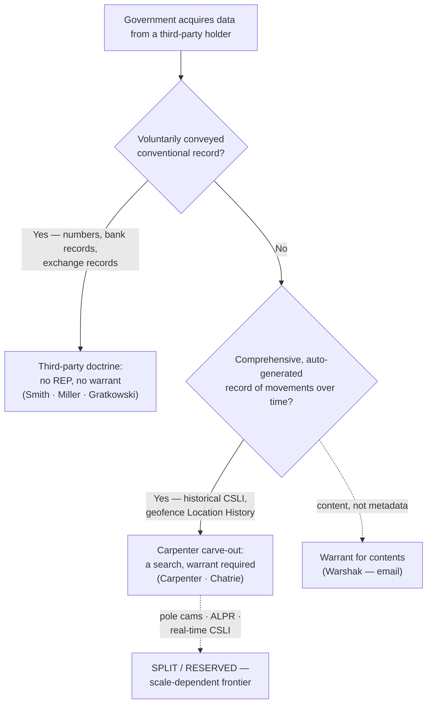

# S9 R1 panel-review — Opus model-diversity lane (prompt pack)

You are the **Claude/Opus** leg of the S9 three-lane adversarial panel (1 Claude + 2 Codex, R1). The two Codex lanes carry the A (support/quote-fidelity) and B (currency/treatment) attack lenses; **you carry model diversity and MUST vote on every paneled assertion across BOTH lenses' concerns.** You are refute-framed: try hard to break each assertion; **default to REFUTED on uncertainty**; never fabricate a cite, quote, or holding; use ONLY the evidence inlined below (no search, no outside knowledge). You are a SIGHTED reviewer — the FULL lake record (judgment fields included) is inlined.

You are a WRITER lane, not an adjudicator: you FIND and VOTE. You do not tally, adjudicate, or close any row — the orchestrator does.

For EACH group below, return one JSON object with the exact `reviewed[]` shape from the output contract (identical framing to the Codex lenses). Emit a finding object ONLY for a real defect (verdict refuted / stands-modified); a group you find wholly clean returns all-`stands` verdicts (the harness records a clean attestation). Concatenate the per-group JSON objects into a top-level `{"packs": [ ... ]}` array, one entry per group, each carrying its `group_id`.


OUTPUT CONTRACT — return ONE JSON object, nothing else:
{
  "lens": "A" | "B",
  "group_id": "<echo the group id>",
  "reviewed": [
    {
      "assertion_id": "<from group_inventory.jsonl>",
      "dimension": "existence|support|quote_fidelity|pincite|treatment|black_letter",
      "verdict": "stands" | "refuted" | "stands-modified",
      "verifiable_from_disclosed": true | false,
      "defect": null,   // null when verdict=="stands"; else an object:
      //  {"problem": "...", "severity": "high|medium|low", "proposed_fix": "...", "evidence_quote": "verbatim from disclosed evidence or null", "needs_cl": true|false, "locator_note": "..."}
      "reasons": ["short evidence-grounded reason", "..."],
      "breaks_true_positives": true | false,
      "residual_risks": ["..."],
      "suggested_tightening": "... or null"
    }
  ],
  "notes": ""
}
Rules: verdict=='stands' <=> defect==null (assertion survives your attack). verdict=='refuted' <=> a real defect (the assertion as framed is wrong). verdict=='stands-modified' <=> survives but needs a stated modification (a minor defect). Review EVERY assertion_id in group_inventory.jsonl exactly once. Output ONLY the JSON object.
---

## GROUP: content/searches/the-third-party-doctrine-and-digital-surveillance/Third-Party Doctrine and CSLI.md  (`doctrine`, 10 assertions)

### content_page

```
---
weight: 10
title: "Third-Party Doctrine & CSLI"
aliases:
  - "Third-Party Doctrine & CSLI"
  - "Third-Party Doctrine and CSLI"
  - "Third-Party Doctrine"
  - "CSLI"
topic: Third-party doctrine & the Carpenter CSLI limit
type: doctrine
amendment: "U.S. Const. amend. IV"
jurisdiction: "Federal (U.S. Const. amend. IV); SCOTUS baseline"
status: draft
related:
  - "[[The Third-Party Doctrine and Digital Surveillance]]"
  - "[[Reasonable Expectation of Privacy]]"
  - "[[Reverse-Keyword and Geofence Warrants]]"
  - "[[Real-Time Tracking]]"
  - "[[Electronic Surveillance and Title III]]"
  - "[[Carpenter v. United States]]"
---

# Third-Party Doctrine & CSLI

*Did the suspect voluntarily hand this information to a third party, so there is no privacy left to protect — or is it the comprehensive, automatically generated digital record of his movements that* Carpenter *pulls back inside the Fourth Amendment?*

> [!rule] Black-letter rule
> Under the **third-party doctrine**, a person has **no legitimate expectation of privacy in information he voluntarily turns over to a third party**, so the government may acquire it without a warrant: *[[Smith v. Maryland#^pin-743|Smith v. Maryland]]*, 442 U.S. 735, [743–44](https://www.courtlistener.com/opinion/110118/smith-v-maryland/) (1979) (dialed numbers, captured by a pen register); *[[United States v. Miller#^pin-442|United States v. Miller]]*, 425 U.S. 435, [442–43](https://www.courtlistener.com/opinion/109433/united-states-v-miller/) (1976) (bank records). The animating theory is **assumption of risk**. *[[Carpenter v. United States|Carpenter v. United States]]*, 585 U.S. 296 (2018), carved a **narrow digital limit**: acquiring **historical cell-site location information (CSLI)** is a search that generally requires a **warrant**, because the third-party doctrine does not reach the comprehensive, auto-generated record of a person's physical movements. *[[Carpenter v. United States|Carpenter]]* did **not** overrule *[[Smith v. Maryland|Smith]]* or *[[United States v. Miller|Miller]]*; the doctrine now runs on **two tracks**, and the field call is deciding which track the data sits on.
> ^rule-third-party

## The Brief

**What the doctrine is, and what this page anchors.** The third-party doctrine is the rule that information you expose to an intermediary (a phone company, a bank, an internet provider) generally loses Fourth Amendment protection, because you assumed the risk that the recipient would hand it to the government. This page anchors that rule and its modern dividing line, the *[[Carpenter v. United States|Carpenter]]* CSLI limit. It is the doctrinal core of the **digital-surveillance family**: the technology-specific applications branch to [[Cell-Site Simulators]], [[Reverse-Keyword and Geofence Warrants]], [[Real-Time Tracking]], and [[Investigative Genetic Genealogy]], the statutory wiretap regime sits alongside on [[Electronic Surveillance and Title III]], and the [[The Third-Party Doctrine and Digital Surveillance|family overview]] maps the whole set. Start here for the rule; branch out for the tool.

**The test, up front.** Ask two questions in order. **(1) Was the information voluntarily conveyed to a third party?** If yes, the default is no [[Reasonable Expectation of Privacy|reasonable expectation of privacy]] and no warrant (*[[Smith v. Maryland|Smith]]*/*[[United States v. Miller|Miller]]*). **(2) Is it instead a comprehensive, automatically generated digital record of the person's movements over time** — the kind of "all-encompassing record" that offers "an intimate window into a person's life"? If yes, *[[Carpenter v. United States|Carpenter]]* treats the acquisition as a search requiring a warrant. Everything in this family of pages is a variation on which track a new form of data falls into.

**The origin: numbers and bank records.** *[[Smith v. Maryland|Smith]]* held that installing a pen register to record the numbers a caller dials is not a search: "a person has no legitimate expectation of privacy in information he voluntarily turns over to third parties." *[[Smith v. Maryland#^pin-743|Smith]]*, 442 U.S. at [743–44](https://www.courtlistener.com/opinion/110118/smith-v-maryland/). The caller "assumed the risk that the company would reveal to police the numbers he dialed." *[[Smith v. Maryland#^pin-744|Id.]]* at 744. *[[United States v. Miller|Miller]]* had already applied the same logic to bank records: a depositor "takes the risk, in revealing his affairs to another, that the information will be conveyed by that person to the Government." *[[United States v. Miller#^pin-443|Miller]]*, 425 U.S. at [443](https://www.courtlistener.com/opinion/109433/united-states-v-miller/#:~:text=The%20depositor%20takes%20the%20risk%2C). The theory is voluntary exposure, not secrecy of the underlying facts.

**The *[[Carpenter v. United States|Carpenter]]* carve-out: comprehensive digital location data.** *[[Carpenter v. United States|Carpenter]]* held that acquiring seven days of historical CSLI is a Fourth Amendment search that generally requires a warrant. The Court reasoned that a person keeps a [[Reasonable Expectation of Privacy|reasonable expectation of privacy]] in the sum of his movements over time, and that the records sit with a wireless carrier does not automatically defeat it: location data is generated automatically, not through any meaningful voluntary act, and its depth and breadth make it "qualitatively different" from the numbers in *[[Smith v. Maryland|Smith]]* or the checks in *[[United States v. Miller|Miller]]*. *[[Carpenter v. United States|Carpenter]]*, 585 U.S. 296. Two disciplines keep this narrow. First, *[[Carpenter v. United States|Carpenter]]* **did not overrule** *[[Smith v. Maryland|Smith]]* or *[[United States v. Miller|Miller]]*; it left conventional business records and ordinary surveillance untouched. Second, it declined to decide real-time CSLI, tower dumps, or shorter periods — the carve-out is a scalpel, not a repeal.

**The modern extension: geofence.** The Supreme Court has since applied *[[Carpenter v. United States|Carpenter]]*'s logic to bulk reverse-location data. In *[[Chatrie v. United States|Chatrie v. United States]]*, 609 U.S. ___ (2026), the Court held that compelling Google to produce a user's Location History **is** a search — a [[Reasonable Expectation of Privacy|reasonable expectation of privacy]] in the record of one's phone's location, "even though for only a limited time, and from a third-party tech company," rejecting the argument that opt-in Location History is "voluntarily shared." *[[Chatrie v. United States|Chatrie]]* is developed in full on [[Reverse-Keyword and Geofence Warrants]]; treat it here as the confirmation that *[[Carpenter v. United States|Carpenter]]*, not *[[Smith v. Maryland|Smith]]*, governs comprehensive digital movement data.

**Backstops and interfaces.** The third-party doctrine is one threshold rule among several. The privacy theory it sits inside is developed on [[Reasonable Expectation of Privacy]]; the physical-intrusion alternative on [[Trespass]]. Where the data is a real-time or GPS track rather than a stored business record, the [[Real-Time Tracking|beeper/GPS line]] (*[[United States v. Knotts|Knotts]]*, *[[United States v. Karo|Karo]]*, *[[United States v. Jones|Jones]]*) supplies the home/public distinction. Where the surveillance is a wiretap of contents rather than metadata, the statutory floor is [[Electronic Surveillance and Title III|Title III]] and its constitutional baseline, *[[Berger v. New York|Berger]]*. And when the *[[Carpenter v. United States|Carpenter]]* line is crossed without a warrant, the remedy is the ordinary one, suppression, subject to [[The Good-Faith Exception|good faith]] — the escape hatch lower courts have leaned on in the geofence and pole-camera cases.

**Burden, standard of review, and remedy.** A defendant moving to suppress bears the burden of establishing that a search occurred — a legitimate expectation of privacy in the thing acquired; if the acquisition is not a search (third-party doctrine), there is nothing to suppress. The threshold "was there a search?" question is reviewed [[Common Legal Terms#de-novo|de novo]], subsidiary historical facts for [[Common Legal Terms#clear-error|clear error]]. When *[[Carpenter v. United States|Carpenter]]*'s line is crossed without a warrant, the evidence and its fruits are subject to exclusion (see [[The Exclusionary Rule]]), unless the [[The Good-Faith Exception|good-faith exception]] or another recognized exception saves it.

**Apply it.**
1. **Name the data and the holder.** Identify exactly what the government acquired and from whom — dialed numbers from a carrier, bank records from a bank, location history from Google.
2. **Run the voluntary-conveyance question first.** If the record is conventional information the person exposed to an intermediary in the ordinary course of business, *[[Smith v. Maryland|Smith]]*/*[[United States v. Miller|Miller]]* control: no search, no warrant.
3. **Test for the *[[Carpenter v. United States|Carpenter]]* track.** Ask whether it is instead a comprehensive, automatically generated record of movement over time. If so, acquisition is a search requiring a warrant (*[[Carpenter v. United States|Carpenter]]*; geofence via *[[Chatrie v. United States|Chatrie]]*).
4. **Route to the specific tool.** Cell-site simulator, geofence/reverse-keyword, real-time GPS or CSLI, and genetic-genealogy problems each carry their own frontier — branch to the child page for the current state of that line.

**Common pitfalls.**
- **Reading *[[Carpenter v. United States|Carpenter]]* as a repeal of the third-party doctrine.** It is a **narrow** carve-out for comprehensive digital location data; *[[Smith v. Maryland|Smith]]* and *[[United States v. Miller|Miller]]* remain good law and govern conventional records.
- **Reciting the "*Carpenter* prongs" as a holding.** The widely taught three factors (a new category of digital-age information, generated without meaningful voluntary choice, revealing "the privacies of life") are **instructor framing**. The Court never enumerated a three-part test; only "the privacies of life" is its own phrase. Label the gloss as a gloss.
- **Assuming "held by a third party" ends the analysis.** After *[[Carpenter v. United States|Carpenter]]* and *[[Chatrie v. United States|Chatrie]]*, third-party custody no longer automatically defeats a privacy claim in comprehensive digital movement data.
- **Stating pole-camera, ALPR, or real-time CSLI law as a settled federal rule.** Each is split or expressly reserved; present it as one court's position, not a national rule (see Lower-court developments).

## Lower-court developments

- **Third-party doctrine still governs conventional records; content is the exception.** *[[United States v. Warshak]]* (6th Cir. 2010) held that a subscriber keeps a [[Reasonable Expectation of Privacy|reasonable expectation of privacy]] in the **contents** of emails stored with a commercial ISP, so the government must get a warrant — the content/metadata line that survives *[[Smith v. Maryland|Smith]]*. By contrast, *United States v. Gratkowski* (5th Cir. 2020) applied *[[Smith v. Maryland|Smith]]*/*[[United States v. Miller|Miller]]* straight to **cryptocurrency-exchange records**: a Coinbase user has no [[Reasonable Expectation of Privacy|reasonable expectation of privacy]] in the transaction records he shared with the exchange, and *[[Carpenter v. United States|Carpenter]]* did not extend to them.
- **Pole cameras — split, no SCOTUS resolution.** *[[United States v. Hay]]* (10th Cir. 2024) held that roughly sixty-eight days of pole-camera surveillance capturing only a home's public-facing exterior was not a search, and *[[Carpenter v. United States|Carpenter]]* did not abrogate circuit precedent. The [[Reading and Citing Cases#en-banc|en banc]] First Circuit in *[[United States v. Moore-Bush]]* (2022) fractured 3–3 on whether sustained pole-camera surveillance is a search after *[[Carpenter v. United States|Carpenter]]*, producing no controlling rationale but unanimously reversing suppression under the *[[Davis v. United States (2011)|Davis]]* [[The Good-Faith Exception|good-faith exception]]. The split remains open.
- **Automatic license-plate readers — courts so far decline to extend *[[Carpenter v. United States|Carpenter]]*.** *[[United States v. Porter]]* (5th Cir. 2026) held that a fixed license-plate reader capturing a vehicle's passage is not a search, and the hit supplied reasonable suspicion for the stop; *[[Robinson v. Commonwealth]]* (Va. Ct. App. 2026) reached the same result for a Flock ALPR network on the record before it, reasoning that the system captured only public movements, not the "near-perfect surveillance" *[[Carpenter v. United States|Carpenter]]* condemned. Present ALPR as unsettled and jurisdiction-dependent.

The through-line: courts read *[[Carpenter v. United States|Carpenter]]* narrowly, extending it only where the surveillance approaches a comprehensive, persistent record of a specific person's movements, and otherwise leaving the *[[Smith v. Maryland|Smith]]*/*[[United States v. Knotts|Knotts]]* baseline in place. The scale-and-mosaic question (how much aggregated public-facing data becomes a search) is the live frontier across every technology in this family.

## Key cases

| Case | Holding | Opinion |
|---|---|---|
| *[[Smith v. Maryland]]*, 442 U.S. 735 (1979) | **Anchor.** No legitimate expectation of privacy in the numbers a caller dials, voluntarily conveyed to the phone company; a pen register is not a search. The origin of the third-party doctrine and its assumption-of-risk theory. | [opinion](https://www.courtlistener.com/opinion/110118/smith-v-maryland/) |
| *[[United States v. Miller]]*, 425 U.S. 435 (1976) | **Anchor.** No legitimate expectation of privacy in bank records exposed to the bank; the depositor assumes the risk of disclosure to the government. | [opinion](https://www.courtlistener.com/opinion/109433/united-states-v-miller/) |
| *[[Carpenter v. United States]]*, 585 U.S. 296 (2018) | **The digital limit.** Acquiring historical CSLI is a search requiring a warrant; the third-party doctrine does not reach the comprehensive, auto-generated record of a person's movements. **Narrow**: does not overrule *[[Smith v. Maryland\|Smith]]*/*[[United States v. Miller\|Miller]]*. *(Primary home [[Reasonable Expectation of Privacy]]; anchored here as the CSLI dividing line.)* | [opinion](https://www.courtlistener.com/opinion/4510032/carpenter-v-united-states/) |
| *[[Chatrie v. United States]]*, 609 U.S. ___ (2026) | Acquiring a phone's Google Location History (geofence) is a search: a [[Reasonable Expectation of Privacy\|reasonable expectation of privacy]] in the record of one's location, even briefly and even in a third party's hands; **applies and extends *Carpenter***. Warrant probable-cause/[[Particularity\|particularity]] left open [[Reading and Citing Cases#on-remand\|on remand]]. *(Full treatment on [[Reverse-Keyword and Geofence Warrants]].)* | [opinion](https://www.courtlistener.com/opinion/10881683/chatrie-v-united-states/) |

## Related cases across doctrines

These are developed in full elsewhere but set the boundaries of the third-party/CSLI line.

| Case | Relevance here | Primary home | Opinion |
|---|---|---|---|
| *[[United States v. Knotts]]*, 460 U.S. 276 (1983) | Beeper tracking over public roads is not a search: no [[Reasonable Expectation of Privacy\|reasonable expectation of privacy]] in public movements. The *[[Smith v. Maryland\|Smith]]*-side baseline for location. | [[Real-Time Tracking]] | [opinion](https://www.courtlistener.com/opinion/110882/united-states-v-knotts/) |
| *[[United States v. Karo]]*, 468 U.S. 705 (1984) | Monitoring a beeper inside a private residence is a search: it reveals a fact about the home's interior. The context-flip that limits *[[United States v. Knotts\|Knotts]]*. | [[Real-Time Tracking]] | [opinion](https://www.courtlistener.com/opinion/111257/united-states-v-karo/) |
| *[[United States v. Jones]]*, 565 U.S. 400 (2012) | Attaching a GPS tracker and monitoring it is a search on trespass grounds; the [[Common Legal Terms#concurring-opinion\|concurrences]]' mosaic theory seeded *[[Carpenter v. United States\|Carpenter]]*. | [[Trespass]] | [opinion](https://www.courtlistener.com/opinion/7350871/united-states-v-jones/) |
| *[[Kyllo v. United States]]*, 533 U.S. 27 (2001) | Sense-enhancing technology "not in general public use" aimed at a home's interior is a search: the counterweight to surveillance capturing only public exposure. | [[Reasonable Expectation of Privacy]] | [opinion](https://www.courtlistener.com/opinion/118443/kyllo-v-united-states/) |
| *[[Berger v. New York]]*, 388 U.S. 41 (1967) | The [[Particularity\|particularity]] and safeguard baseline for electronic-surveillance warrants; the constitutional floor beneath the Title III wiretap regime. | [[Electronic Surveillance and Title III]] | [opinion](https://www.courtlistener.com/opinion/107483/berger-v-new-york/) |

<!-- Carpenter v. United States, 585 U.S. 296 (2018): CL html_with_citations carries slip-opinion pagination only (no U.S. Reports star page); the "whole of one's physical movements" / "intimate window" language is paraphrased with a case-level cite (R5 T3). Primary home is Reasonable Expectation of Privacy (Katz privacy theory); co-homed here as Key — the CSLI dividing line — per S3 A6 (Key-on without re-homing). -->
<!-- Chatrie v. United States, 609 U.S. ___ (2026) (No. 25-112, decided June 29, 2026): current-Term SCOTUS, slip-op sourced (R5 T4 — S1 R14). Full geofence exposition owned by Reverse-Keyword and Geofence Warrants per S7 D6/TEACH-01; this page carries the extension point + cross-ref. -->
<!-- Owed home_rows (S6 ledger → the-third-party-doctrine-and-digital-surveillance/index.md) discharged on this substantive child after the LINT-19 severance (index.md is now the lean overview; case tables live here): Warshak, Hay, Porter, Robinson (LCD), Moore-Bush (Related-LCD); Smith v. Maryland + Miller Key; Carpenter co-home Key (A6). Zero-drop per rule H — every owed case is page-present in the family. -->

## Visual



## Sources

- [*Smith v. Maryland*, 442 U.S. 735 (1979)](https://www.courtlistener.com/opinion/110118/smith-v-maryland/) (pinpoints: 743–44)
- [*United States v. Miller*, 425 U.S. 435 (1976)](https://www.courtlistener.com/opinion/109433/united-states-v-miller/) (pinpoints: 442, 443)
- [*Carpenter v. United States*, 585 U.S. 296 (2018)](https://www.courtlistener.com/opinion/4510032/carpenter-v-united-states/) (case-level cite; the "whole of one's physical movements" and "intimate window" language is paraphrased — the CL opinion text carries slip-opinion pagination only: R5 T3)
- [*Chatrie v. United States*, 609 U.S. ___ (2026) (No. 25-112)](https://www.courtlistener.com/opinion/10881683/chatrie-v-united-states/) (slip op.; full treatment on [[Reverse-Keyword and Geofence Warrants]])
- [*United States v. Knotts*, 460 U.S. 276 (1983)](https://www.courtlistener.com/opinion/110882/united-states-v-knotts/) (pinpoints: 281, 282)
- [*United States v. Karo*, 468 U.S. 705 (1984)](https://www.courtlistener.com/opinion/111257/united-states-v-karo/) (pinpoints: 714, 715)
- [*United States v. Jones*, 565 U.S. 400 (2012)](https://www.courtlistener.com/opinion/7350871/united-states-v-jones/) (pinpoint: 409)
- [*Kyllo v. United States*, 533 U.S. 27 (2001)](https://www.courtlistener.com/opinion/118443/kyllo-v-united-states/)
- [*Berger v. New York*, 388 U.S. 41 (1967)](https://www.courtlistener.com/opinion/107483/berger-v-new-york/) (pinpoints: 44, 56)
- [*United States v. Warshak*, 631 F.3d 266 (6th Cir. 2010)](https://www.courtlistener.com/opinion/181032/united-states-v-warshak/)
- [*United States v. Gratkowski*, 964 F.3d 307 (5th Cir. 2020)](https://www.courtlistener.com/opinion/4772500/united-states-v-gratkowski/)
- [*United States v. Hay*, 95 F.4th 1304 (10th Cir. 2024)](https://www.courtlistener.com/opinion/9485331/united-states-v-hay/)
- [*United States v. Moore-Bush*, 36 F.4th 320 (1st Cir. 2022) (en banc)](https://www.courtlistener.com/opinion/6476395/united-states-v-moore-bush/)
- [*United States v. Porter*, No. 25-60163 (5th Cir. 2026)](https://www.courtlistener.com/opinion/10810059/united-states-v-porter/)
- [*Robinson v. Commonwealth* (Va. Ct. App. 2026)](https://www.courtlistener.com/opinion/10838748/eddie-eugene-robinson-v-commonwealth-of-virginia/)

```

### group_inventory (assertions under review)

```jsonl
{"assertion_id": "628a7a6aba379b21", "dimension": "existence", "kind": "case_cite", "locator": {"case": "Berger v. New York", "table_line": 65}, "payload": {"case": "Berger v. New York", "cells": ["*[[Berger v. New York]]*, 388 U.S. 41 (1967)", "The [[Particularity\\|particularity]] and safeguard baseline for electronic-surveillance warrants; the constitutional floor beneath the Title III wiretap regime.", "[[Electronic Surveillance and Title III]]", "[opinion](https://www.courtlistener.com/opinion/107483/berger-v-new-york/)"], "header": ["Case", "Relevance here", "Primary home", "Opinion"]}}
{"assertion_id": "76c2f3a905ec5721", "dimension": "existence", "kind": "case_cite", "locator": {"case": "Carpenter v. United States", "table_line": 52}, "payload": {"case": "Carpenter v. United States", "cells": ["*[[Carpenter v. United States]]*, 585 U.S. 296 (2018)", "**The digital limit.** Acquiring historical CSLI is a search requiring a warrant; the third-party doctrine does not reach the comprehensive, auto-generated record of a person's movements. **Narrow**: does not overrule *[[Smith v. Maryland\\|Smith]]*/*[[United States v. Miller\\|Miller]]*. *(Primary home [[Reasonable Expectation of Privacy]]; anchored here as the CSLI dividing line.)*", "[opinion](https://www.courtlistener.com/opinion/4510032/carpenter-v-united-states/)"], "header": ["Case", "Holding", "Opinion"]}}
{"assertion_id": "7a4674f50533d084", "dimension": "existence", "kind": "case_cite", "locator": {"case": "United States v. Karo", "table_line": 62}, "payload": {"case": "United States v. Karo", "cells": ["*[[United States v. Karo]]*, 468 U.S. 705 (1984)", "Monitoring a beeper inside a private residence is a search: it reveals a fact about the home's interior. The context-flip that limits *[[United States v. Knotts\\|Knotts]]*.", "[[Real-Time Tracking]]", "[opinion](https://www.courtlistener.com/opinion/111257/united-states-v-karo/)"], "header": ["Case", "Relevance here", "Primary home", "Opinion"]}}
{"assertion_id": "9dc1b78e98f0fc0b", "dimension": "existence", "kind": "case_cite", "locator": {"case": "Chatrie v. United States", "table_line": 53}, "payload": {"case": "Chatrie v. United States", "cells": ["*[[Chatrie v. United States]]*, 609 U.S. ___ (2026)", "Acquiring a phone's Google Location History (geofence) is a search: a [[Reasonable Expectation of Privacy\\|reasonable expectation of privacy]] in the record of one's location, even briefly and even in a third party's hands; **applies and extends *Carpenter***. Warrant probable-cause/[[Particularity\\|particularity]] left open [[Reading and Citing Cases#on-remand\\|on remand]]. *(Full treatment on [[Reverse-Keyword and Geofence Warrants]].)*", "[opinion](https://www.courtlistener.com/opinion/10881683/chatrie-v-united-states/)"], "header": ["Case", "Holding", "Opinion"]}}
{"assertion_id": "bcab3de8d241219a", "dimension": "existence", "kind": "case_cite", "locator": {"case": "United States v. Jones", "table_line": 63}, "payload": {"case": "United States v. Jones", "cells": ["*[[United States v. Jones]]*, 565 U.S. 400 (2012)", "Attaching a GPS tracker and monitoring it is a search on trespass grounds; the [[Common Legal Terms#concurring-opinion\\|concurrences]]' mosaic theory seeded *[[Carpenter v. United States\\|Carpenter]]*.", "[[Trespass]]", "[opinion](https://www.courtlistener.com/opinion/7350871/united-states-v-jones/)"], "header": ["Case", "Relevance here", "Primary home", "Opinion"]}}
{"assertion_id": "c6cde7247a5159bc", "dimension": "existence", "kind": "case_cite", "locator": {"case": "Kyllo v. United States", "table_line": 64}, "payload": {"case": "Kyllo v. United States", "cells": ["*[[Kyllo v. United States]]*, 533 U.S. 27 (2001)", "Sense-enhancing technology \"not in general public use\" aimed at a home's interior is a search: the counterweight to surveillance capturing only public exposure.", "[[Reasonable Expectation of Privacy]]", "[opinion](https://www.courtlistener.com/opinion/118443/kyllo-v-united-states/)"], "header": ["Case", "Relevance here", "Primary home", "Opinion"]}}
{"assertion_id": "d3b928cea2c9c4d7", "dimension": "existence", "kind": "case_cite", "locator": {"case": "United States v. Miller", "table_line": 51}, "payload": {"case": "United States v. Miller", "cells": ["*[[United States v. Miller]]*, 425 U.S. 435 (1976)", "**Anchor.** No legitimate expectation of privacy in bank records exposed to the bank; the depositor assumes the risk of disclosure to the government.", "[opinion](https://www.courtlistener.com/opinion/109433/united-states-v-miller/)"], "header": ["Case", "Holding", "Opinion"]}}
{"assertion_id": "e39d3d65bb592b20", "dimension": "existence", "kind": "case_cite", "locator": {"case": "Smith v. Maryland", "table_line": 50}, "payload": {"case": "Smith v. Maryland", "cells": ["*[[Smith v. Maryland]]*, 442 U.S. 735 (1979)", "**Anchor.** No legitimate expectation of privacy in the numbers a caller dials, voluntarily conveyed to the phone company; a pen register is not a search. The origin of the third-party doctrine and its assumption-of-risk theory.", "[opinion](https://www.courtlistener.com/opinion/110118/smith-v-maryland/)"], "header": ["Case", "Holding", "Opinion"]}}
{"assertion_id": "fb4e06456a2bc843", "dimension": "existence", "kind": "case_cite", "locator": {"case": "United States v. Knotts", "table_line": 61}, "payload": {"case": "United States v. Knotts", "cells": ["*[[United States v. Knotts]]*, 460 U.S. 276 (1983)", "Beeper tracking over public roads is not a search: no [[Reasonable Expectation of Privacy\\|reasonable expectation of privacy]] in public movements. The *[[Smith v. Maryland\\|Smith]]*-side baseline for location.", "[[Real-Time Tracking]]", "[opinion](https://www.courtlistener.com/opinion/110882/united-states-v-knotts/)"], "header": ["Case", "Relevance here", "Primary home", "Opinion"]}}
{"assertion_id": "31656df35917bc36", "dimension": "support", "kind": "proposition", "locator": {"callout": "^rule-third-party"}, "payload": {"anchor": "^rule-third-party", "statement": "[!rule] Black-letter rule\nUnder the **third-party doctrine**, a person has **no legitimate expectation of privacy in information he voluntarily turns over to a third party**, so the government may acquire it without a warrant: *[[Smith v. Maryland#^pin-743|Smith v. Maryland]]*, 442 U.S. 735, [743–44](https://www.courtlistener.com/opinion/110118/smith-v-maryland/) (1979) (dialed numbers, captured by a pen register); *[[United States v. Miller#^pin-442|United States v. Miller]]*, 425 U.S. 435, [442–43](https://www.courtlistener.com/opinion/109433/united-states-v-miller/) (1976) (bank records). The animating theory is **assumption of risk**. *[[Carpenter v. United States|Carpenter v. United States]]*, 585 U.S. 296 (2018), carved a **narrow digital limit**: acquiring **historical cell-site location information (CSLI)** is a search that generally requires a **warrant**, because the third-party doctrine does not reach the comprehensive, auto-generated record of a person's physical movements. *[[Carpenter v. United States|Carpenter]]* did **not** overrule *[[Smith v. Maryland|Smith]]* or *[[United States v. Miller|Miller]]*; the doctrine now runs on **two tracks**, and the field call is deciding which track the data sits on."}}
```

### lake record — Berger v. New York

```json
{
  "schema_version": "s2.v1",
  "record_id": "Berger v. New York",
  "stub": false,
  "status": "verified",
  "identity": {
    "case_name": "Berger v. New York",
    "case_name_short": "Berger",
    "case_name_full": "Berger v. New York",
    "input_case_name": "Berger v. New York",
    "court": "U.S. Supreme Court",
    "court_id": "scotus",
    "court_level": "scotus",
    "circuit": null,
    "state": null,
    "date_decided": "1967-06-12",
    "year": 1967,
    "docket": "615",
    "cluster_id": 107483,
    "lead_opinion_id": 9423459,
    "sibling_ids": [
      107483,
      9423459,
      9423460,
      9423461,
      9423462,
      9423463,
      9423464
    ],
    "absolute_url": "/opinion/107483/berger-v-new-york/",
    "identity_method": "citation+party-text",
    "expected_citation_found": true,
    "party_name_in_text": true,
    "canonical_name_match": true,
    "alternates": [
      {
        "cluster_id": 8967447,
        "score": 10,
        "case_name": "Berger v. New York"
      },
      {
        "cluster_id": 8967390,
        "score": 10,
        "case_name": "Berger v. New York"
      }
    ],
    "reason_code": null
  },
  "citations": {
    "official": {
      "cite": "388 U.S. 41",
      "volume": "388",
      "reporter": "U.S.",
      "page": "41",
      "type": 1,
      "selected_official": true,
      "source": "cluster.citations[]"
    },
    "parallel": [
      {
        "cite": "87 S. Ct. 1873",
        "volume": "87",
        "reporter": "S. Ct.",
        "page": "1873",
        "type": 1,
        "selected_official": false,
        "source": "cluster.citations[]"
      },
      {
        "cite": "18 L. Ed. 2d 1040",
        "volume": "18",
        "reporter": "L. Ed. 2d",
        "page": "1040",
        "type": 1,
        "selected_official": false,
        "source": "cluster.citations[]"
      }
    ],
    "vendor_neutral": [
      {
        "cite": "1967 U.S. LEXIS 2964",
        "volume": "1967",
        "reporter": "U.S. LEXIS",
        "page": "2964",
        "type": 6,
        "selected_official": false,
        "source": "cluster.citations[]"
      }
    ],
    "all": [
      {
        "cite": "388 U.S. 41",
        "volume": "388",
        "reporter": "U.S.",
        "page": "41",
        "type": 1,
        "selected_official": false,
        "source": "cluster.citations[]"
      },
      {
        "cite": "87 S. Ct. 1873",
        "volume": "87",
        "reporter": "S. Ct.",
        "page": "1873",
        "type": 1,
        "selected_official": false,
        "source": "cluster.citations[]"
      },
      {
        "cite": "18 L. Ed. 2d 1040",
        "volume": "18",
        "reporter": "L. Ed. 2d",
        "page": "1040",
        "type": 1,
        "selected_official": false,
        "source": "cluster.citations[]"
      },
      {
        "cite": "1967 U.S. LEXIS 2964",
        "volume": "1967",
        "reporter": "U.S. LEXIS",
        "page": "2964",
        "type": 6,
        "selected_official": false,
        "source": "cluster.citations[]"
      }
    ],
    "display": "388 U.S. 41",
    "official_selection": {
      "court_class": "scotus",
      "selected": "388 U.S. 41",
      "reason": "selected_rank_1"
    }
  },
  "pinpoints": [
    {
      "id": "pin-44",
      "page": null,
      "quote": "might be obtained, authorizing 60-day installation of recording devices with possible extensions. Berger challenged the statute as authorizing general, exploratory electronic searches without Fourth Amendment particularity. ## Issue Whether New York's permissive eavesdropping statute satisfies the Fourth Amendment, or whether its breadth and lack of particularity render electronic surveillance under it unreasonable. ## Rule The statute was unconstitutional for overbreadth:",
      "star_marker": null,
      "quote_fidelity": "mismatch",
      "pinpoint_status": "slip-only",
      "position": null
    },
    {
      "id": "pin-56",
      "page": null,
      "quote": "New York's statute lacks this particularization. It merely says that a warrant may issue on reasonable ground to believe that evidence of crime may be obtained by the eavesdrop. It lays down no requirement for particularity in the warrant as to what specific crime has been or is being committed, nor 'the place to be searched,' or 'the persons or things to be seized' as specifically required by the Fourth Amendment.",
      "star_marker": null,
      "quote_fidelity": "mismatch",
      "pinpoint_status": "slip-only",
      "position": null
    }
  ],
  "treatment": {
    "field_i_validity": "good_law",
    "as_of_content": "1967-06-12",
    "as_of_treatment": "2026-06-30",
    "composite_basis": "migration-seed",
    "composite_basis_ref": "Berger v. New York",
    "varies_by_point": false,
    "scope_note": "Good law as the constitutional baseline for electronic-surveillance warrants. Together with Katz it prompted Congress to enact Title III of the Omnibus Crime Control Act of 1968, which codified conforming wiretap standards.",
    "point_overrides": [],
    "edges": [
      {
        "citing_case": {
          "name": "United States v. Johnny Vasquez-Algarin",
          "cluster_id": 3199633,
          "cite": [
            "821 F.3d 467",
            "2016 U.S. App. LEXIS 7889",
            "2016 WL 1730540"
          ],
          "field_ii": "overruled"
        },
        "field_ii": "overruled",
        "field_iii": "mentioned",
        "point": null,
        "proposed": true,
        "journal_ref": "Berger v. New York:lane1_negative"
      },
      {
        "citing_case": {
          "name": "State v. Hector Feliciano(074395)",
          "cluster_id": 3183943,
          "cite": [
            "224 N.J. 351",
            "132 A.3d 1245",
            "2016 N.J. LEXIS 229"
          ],
          "field_ii": "questioned"
        },
        "field_ii": "questioned",
        "field_iii": "mentioned",
        "point": null,
        "proposed": true,
        "journal_ref": "Berger v. New York:lane1_negative"
      },
      {
        "citing_case": {
          "name": "Wheeler v. State",
          "cluster_id": 3182294,
          "cite": [
            "135 A.3d 282",
            "2016 Del. LEXIS 121",
            "2016 WL 825395"
          ],
          "field_ii": "superseded_by_statute"
        },
        "field_ii": "superseded_by_statute",
        "field_iii": "mentioned",
        "point": null,
        "proposed": true,
        "journal_ref": "Berger v. New York:lane1_negative"
      },
      {
        "citing_case": {
          "name": "In re the United States",
          "cluster_id": 8441402,
          "cite": [
            "724 F.3d 600",
            "58 Communications Reg. (P&F) 1292",
            "2013 WL 3914484",
            "2013 U.S. App. LEXIS 15510"
          ],
          "field_ii": "overruled"
        },
        "field_ii": "overruled",
        "field_iii": "mentioned",
        "point": null,
        "proposed": true,
        "journal_ref": "Berger v. New York:lane1_negative"
      },
      {
        "citing_case": {
          "name": "People v. Rabb",
          "cluster_id": 5640827,
          "cite": [
            "16 N.Y.3d 145",
            "945 N.E.2d 447"
          ],
          "field_ii": "overruled"
        },
        "field_ii": "overruled",
        "field_iii": "mentioned",
        "point": null,
        "proposed": true,
        "journal_ref": "Berger v. New York:lane1_negative"
      },
      {
        "citing_case": {
          "name": "Whisenhunt v. State",
          "cluster_id": 1881110,
          "cite": [
            "122 S.W.3d 295",
            "2003 WL 22053696"
          ],
          "field_ii": "overruled"
        },
        "field_ii": "overruled",
        "field_iii": "mentioned",
        "point": null,
        "proposed": true,
        "journal_ref": "Berger v. New York:lane1_negative"
      },
      {
        "citing_case": {
          "name": "United States v. Triumph Capital Group, Inc.",
          "cluster_id": 8751433,
          "cite": [
            "211 F.R.D. 31",
            "2002 U.S. Dist. LEXIS 21615",
            "2002 WL 31487754"
          ],
          "field_ii": "superseded_by_statute"
        },
        "field_ii": "superseded_by_statute",
        "field_iii": "mentioned",
        "point": null,
        "proposed": true,
        "journal_ref": "Berger v. New York:lane1_negative"
      },
      {
        "citing_case": {
          "name": "Ashcraft v. State",
          "cluster_id": 1657870,
          "cite": [
            "934 S.W.2d 727",
            "1996 WL 474085"
          ],
          "field_ii": "overruled"
        },
        "field_ii": "overruled",
        "field_iii": "mentioned",
        "point": null,
        "proposed": true,
        "journal_ref": "Berger v. New York:lane1_negative"
      },
      {
        "citing_case": {
          "name": "UNITED STATES of America, Plaintiff-Appellee, v. Juan Ramon MATTA-BALLESTEROS, Defendant-Appellant",
          "cluster_id": 709239,
          "cite": [
            "71 F.3d 754",
            "95 Daily Journal DAR 15853",
            "95 Cal. Daily Op. Serv. 9042",
            "43 Fed. R. Serv. 338",
            "1995 U.S. App. LEXIS 33475",
            "1995 WL 704693"
          ],
          "field_ii": "overruled"
        },
        "field_ii": "overruled",
        "field_iii": "mentioned",
        "point": null,
        "proposed": true,
        "journal_ref": "Berger v. New York:lane1_negative"
      },
      {
        "citing_case": {
          "name": "Ashcraft v. State",
          "cluster_id": 1751133,
          "cite": [
            "900 S.W.2d 817",
            "1995 WL 257158"
          ],
          "field_ii": "overruled"
        },
        "field_ii": "overruled",
        "field_iii": "mentioned",
        "point": null,
        "proposed": true,
        "journal_ref": "Berger v. New York:lane1_negative"
      },
      {
        "citing_case": {
          "name": "United States v. Steven Ricciardelli",
          "cluster_id": 610895,
          "cite": [
            "998 F.2d 8",
            "1993 U.S. App. LEXIS 14891",
            "1993 WL 210540"
          ],
          "field_ii": "questioned"
        },
        "field_ii": "questioned",
        "field_iii": "mentioned",
        "point": null,
        "proposed": true,
        "journal_ref": "Berger v. New York:lane1_negative"
      },
      {
        "citing_case": {
          "name": "Terry v. Ohio",
          "cluster_id": 107729,
          "cite": [
            "20 L. Ed. 2d 889",
            "88 S. Ct. 1868",
            "392 U.S. 1",
            "1968 U.S. LEXIS 1345",
            "44 Ohio Op. 2d 383"
          ],
          "field_ii": "questioned"
        },
        "field_ii": "questioned",
        "field_iii": "mentioned",
        "point": null,
        "proposed": true,
        "journal_ref": "Berger v. New York:lane2_top_cited"
      },
      {
        "citing_case": {
          "name": "Bivens v. Six Unknown Named Agents of Federal Bureau of Narcotics",
          "cluster_id": 108375,
          "cite": [
            "29 L. Ed. 2d 619",
            "91 S. Ct. 1999",
            "403 U.S. 388",
            "1971 U.S. LEXIS 23"
          ],
          "field_ii": "overruled"
        },
        "field_ii": "overruled",
        "field_iii": "mentioned",
        "point": null,
        "proposed": true,
        "journal_ref": "Berger v. New York:lane2_top_cited"
      },
      {
        "citing_case": {
          "name": "Illinois v. Gates",
          "cluster_id": 110959,
          "cite": [
            "76 L. Ed. 2d 527",
            "103 S. Ct. 2317",
            "462 U.S. 213",
            "1983 U.S. LEXIS 54",
            "51 U.S.L.W. 4709"
          ],
          "field_ii": "overruled"
        },
        "field_ii": "overruled",
        "field_iii": "mentioned",
        "point": null,
        "proposed": true,
        "journal_ref": "Berger v. New York:lane2_top_cited"
      },
      {
        "citing_case": {
          "name": "Katz v. United States",
          "cluster_id": 107564,
          "cite": [
            "19 L. Ed. 2d 576",
            "88 S. Ct. 507",
            "389 U.S. 347",
            "1967 U.S. LEXIS 2"
          ],
          "field_ii": "overruled"
        },
        "field_ii": "overruled",
        "field_iii": "mentioned",
        "point": null,
        "proposed": true,
        "journal_ref": "Berger v. New York:lane2_top_cited"
      },
      {
        "citing_case": {
          "name": "United States v. Leon",
          "cluster_id": 111262,
          "cite": [
            "82 L. Ed. 2d 677",
            "104 S. Ct. 3405",
            "468 U.S. 897",
            "1984 U.S. LEXIS 153"
          ],
          "field_ii": "overruled"
        },
        "field_ii": "overruled",
        "field_iii": "mentioned",
        "point": null,
        "proposed": true,
        "journal_ref": "Berger v. New York:lane2_top_cited"
      },
      {
        "citing_case": {
          "name": "Coolidge v. New Hampshire",
          "cluster_id": 108377,
          "cite": [
            "29 L. Ed. 2d 564",
            "91 S. Ct. 2022",
            "403 U.S. 443",
            "1971 U.S. LEXIS 25"
          ],
          "field_ii": "overruled"
        },
        "field_ii": "overruled",
        "field_iii": "mentioned",
        "point": null,
        "proposed": true,
        "journal_ref": "Berger v. New York:lane2_top_cited"
      },
      {
        "citing_case": {
          "name": "Mitchell v. Forsyth",
          "cluster_id": 111481,
          "cite": [
            "86 L. Ed. 2d 411",
            "105 S. Ct. 2806",
            "472 U.S. 511",
            "1985 U.S. LEXIS 113",
            "53 U.S.L.W. 4798",
            "2 Fed. R. Serv. 3d 221"
          ],
          "field_ii": "questioned"
        },
        "field_ii": "questioned",
        "field_iii": "mentioned",
        "point": null,
        "proposed": true,
        "journal_ref": "Berger v. New York:lane2_top_cited"
      },
      {
        "citing_case": {
          "name": "Sibron v. New York",
          "cluster_id": 107730,
          "cite": [
            "20 L. Ed. 2d 917",
            "88 S. Ct. 1889",
            "392 U.S. 40",
            "1968 U.S. LEXIS 1346",
            "44 Ohio Op. 2d 402"
          ],
          "field_ii": "superseded_by_statute"
        },
        "field_ii": "superseded_by_statute",
        "field_iii": "mentioned",
        "point": null,
        "proposed": true,
        "journal_ref": "Berger v. New York:lane2_top_cited"
      },
      {
        "citing_case": {
          "name": "United States v. Jacobsen",
          "cluster_id": 111143,
          "cite": [
            "80 L. Ed. 2d 85",
            "104 S. Ct. 1652",
            "466 U.S. 109",
            "1984 U.S. LEXIS 53",
            "52 U.S.L.W. 4414"
          ],
          "field_ii": "overruled"
        },
        "field_ii": "overruled",
        "field_iii": "mentioned",
        "point": null,
        "proposed": true,
        "journal_ref": "Berger v. New York:lane2_top_cited"
      },
      {
        "citing_case": {
          "name": "Alderman v. United States",
          "cluster_id": 107872,
          "cite": [
            "22 L. Ed. 2d 176",
            "89 S. Ct. 961",
            "394 U.S. 165",
            "1969 U.S. LEXIS 3287"
          ],
          "field_ii": "overruled"
        },
        "field_ii": "overruled",
        "field_iii": "mentioned",
        "point": null,
        "proposed": true,
        "journal_ref": "Berger v. New York:lane2_top_cited"
      },
      {
        "citing_case": {
          "name": "United States v. Watson",
          "cluster_id": 109352,
          "cite": [
            "46 L. Ed. 2d 598",
            "96 S. Ct. 820",
            "423 U.S. 411",
            "1976 U.S. LEXIS 121"
          ],
          "field_ii": "overruled"
        },
        "field_ii": "overruled",
        "field_iii": "mentioned",
        "point": null,
        "proposed": true,
        "journal_ref": "Berger v. New York:lane2_top_cited"
      },
      {
        "citing_case": {
          "name": "Ybarra v. Illinois",
          "cluster_id": 110158,
          "cite": [
            "62 L. Ed. 2d 238",
            "100 S. Ct. 338",
            "444 U.S. 85",
            "1979 U.S. LEXIS 151"
          ],
          "field_ii": "questioned"
        },
        "field_ii": "questioned",
        "field_iii": "mentioned",
        "point": null,
        "proposed": true,
        "journal_ref": "Berger v. New York:lane2_top_cited"
      },
      {
        "citing_case": {
          "name": "Fisher v. United States",
          "cluster_id": 109432,
          "cite": [
            "48 L. Ed. 2d 39",
            "96 S. Ct. 1569",
            "425 U.S. 391",
            "1976 U.S. LEXIS 98",
            "37 A.F.T.R.2d (RIA) 1244"
          ],
          "field_ii": "questioned"
        },
        "field_ii": "questioned",
        "field_iii": "mentioned",
        "point": null,
        "proposed": true,
        "journal_ref": "Berger v. New York:lane2_top_cited"
      },
      {
        "citing_case": {
          "name": "United States v. Harris",
          "cluster_id": 108379,
          "cite": [
            "29 L. Ed. 2d 723",
            "91 S. Ct. 2075",
            "403 U.S. 573",
            "1971 U.S. LEXIS 18"
          ],
          "field_ii": "overruled"
        },
        "field_ii": "overruled",
        "field_iii": "mentioned",
        "point": null,
        "proposed": true,
        "journal_ref": "Berger v. New York:lane2_top_cited"
      },
      {
        "citing_case": {
          "name": "Williams v. Florida",
          "cluster_id": 108186,
          "cite": [
            "26 L. Ed. 2d 446",
            "90 S. Ct. 1893",
            "399 U.S. 78",
            "1970 U.S. LEXIS 98",
            "53 Ohio Op. 2d 55"
          ],
          "field_ii": "overruled"
        },
        "field_ii": "overruled",
        "field_iii": "mentioned",
        "point": null,
        "proposed": true,
        "journal_ref": "Berger v. New York:lane2_top_cited"
      },
      {
        "citing_case": {
          "name": "Michigan v. DeFillippo",
          "cluster_id": 110127,
          "cite": [
            "61 L. Ed. 2d 343",
            "99 S. Ct. 2627",
            "443 U.S. 31",
            "1979 U.S. LEXIS 135"
          ],
          "field_ii": "questioned"
        },
        "field_ii": "questioned",
        "field_iii": "mentioned",
        "point": null,
        "proposed": true,
        "journal_ref": "Berger v. New York:lane2_top_cited"
      },
      {
        "citing_case": {
          "name": "United States v. United States District Court for the Eastern District of Michigan",
          "cluster_id": 108581,
          "cite": [
            "32 L. Ed. 2d 752",
            "92 S. Ct. 2125",
            "407 U.S. 297",
            "1972 U.S. LEXIS 38"
          ],
          "field_ii": "questioned"
        },
        "field_ii": "questioned",
        "field_iii": "mentioned",
        "point": null,
        "proposed": true,
        "journal_ref": "Berger v. New York:lane2_top_cited"
      },
      {
        "citing_case": {
          "name": "Scott v. United States",
          "cluster_id": 109860,
          "cite": [
            "56 L. Ed. 2d 168",
            "98 S. Ct. 1717",
            "436 U.S. 128",
            "1978 U.S. LEXIS 89"
          ],
          "field_ii": "overruled"
        },
        "field_ii": "overruled",
        "field_iii": "mentioned",
        "point": null,
        "proposed": true,
        "journal_ref": "Berger v. New York:lane2_top_cited"
      },
      {
        "citing_case": {
          "name": "Nixon v. Administrator of General Services",
          "cluster_id": 109729,
          "cite": [
            "53 L. Ed. 2d 867",
            "97 S. Ct. 2777",
            "433 U.S. 425",
            "1977 U.S. LEXIS 24",
            "2 Media L. Rep. (BNA) 2025"
          ],
          "field_ii": "overruled"
        },
        "field_ii": "overruled",
        "field_iii": "mentioned",
        "point": null,
        "proposed": true,
        "journal_ref": "Berger v. New York:lane2_top_cited"
      },
      {
        "citing_case": {
          "name": "Andresen v. Maryland",
          "cluster_id": 109522,
          "cite": [
            "49 L. Ed. 2d 627",
            "96 S. Ct. 2737",
            "427 U.S. 463",
            "1976 U.S. LEXIS 78"
          ],
          "field_ii": "overruled"
        },
        "field_ii": "overruled",
        "field_iii": "mentioned",
        "point": null,
        "proposed": true,
        "journal_ref": "Berger v. New York:lane2_top_cited"
      },
      {
        "citing_case": {
          "name": "Desist v. United States",
          "cluster_id": 107875,
          "cite": [
            "22 L. Ed. 2d 248",
            "89 S. Ct. 1030",
            "394 U.S. 244",
            "1969 U.S. LEXIS 2159"
          ],
          "field_ii": "overruled"
        },
        "field_ii": "overruled",
        "field_iii": "mentioned",
        "point": null,
        "proposed": true,
        "journal_ref": "Berger v. New York:lane2_top_cited"
      },
      {
        "citing_case": {
          "name": "Carpenter v. United States",
          "cluster_id": 4510032,
          "cite": [
            "585 U.S. 296",
            "138 S. Ct. 2206",
            "201 L. Ed. 2d 507",
            "2018 U.S. LEXIS 3844"
          ],
          "field_ii": "overruled"
        },
        "field_ii": "overruled",
        "field_iii": "mentioned",
        "point": null,
        "proposed": true,
        "journal_ref": "Berger v. New York:lane2_top_cited"
      },
      {
        "citing_case": {
          "name": "Illinois v. Krull",
          "cluster_id": 111835,
          "cite": [
            "94 L. Ed. 2d 364",
            "107 S. Ct. 1160",
            "480 U.S. 340",
            "1987 U.S. LEXIS 1061",
            "55 U.S.L.W. 4291"
          ],
          "field_ii": "questioned"
        },
        "field_ii": "questioned",
        "field_iii": "mentioned",
        "point": null,
        "proposed": true,
        "journal_ref": "Berger v. New York:lane2_top_cited"
      },
      {
        "citing_case": {
          "name": "United States v. White",
          "cluster_id": 108304,
          "cite": [
            "28 L. Ed. 2d 453",
            "91 S. Ct. 1122",
            "401 U.S. 745",
            "1971 U.S. LEXIS 132"
          ],
          "field_ii": "overruled"
        },
        "field_ii": "overruled",
        "field_iii": "mentioned",
        "point": null,
        "proposed": true,
        "journal_ref": "Berger v. New York:lane2_top_cited"
      },
      {
        "citing_case": {
          "name": "United States v. Montoya De Hernandez",
          "cluster_id": 111509,
          "cite": [
            "87 L. Ed. 2d 381",
            "105 S. Ct. 3304",
            "473 U.S. 531",
            "1985 U.S. LEXIS 120",
            "53 U.S.L.W. 5048"
          ],
          "field_ii": "questioned"
        },
        "field_ii": "questioned",
        "field_iii": "mentioned",
        "point": null,
        "proposed": true,
        "journal_ref": "Berger v. New York:lane2_top_cited"
      }
    ],
    "derivation": {
      "lane1_negative": {
        "query": "cites:(107483 OR 9423459 OR 9423460 OR 9423461 OR 9423462 OR 9423463 OR 9423464) AND (overrul* OR abrogat* OR supersed* OR \"recede from\" OR \"no longer good law\" OR vacat* OR reversed) ",
        "reviewed": 200,
        "cap": 200,
        "cap_hit": true,
        "final_cursor": "https://www.courtlistener.com/api/rest/v4/search/?cursor=cz03Mjk4MjA4MDAwMDAmcz03ODk1MTM5JnQ9byZkPTIwMjYtMDctMDQmcD0xMQ%3D%3D&fields=absolute_url%2CcaseName%2CcaseNameFull%2Ccitation%2CciteCount%2Ccluster_id%2Ccourt%2Ccourt_citation_string%2Ccourt_id%2CdateFiled%2Copinions%2Csibling_ids%2Cstatus%2Csyllabus&order_by=dateFiled+desc&page_size=100&q=cites%3A%28107483+OR+9423459+OR+9423460+OR+9423461+OR+9423462+OR+9423463+OR+9423464%29+AND+%28overrul%2A+OR+abrogat%2A+OR+supersed%2A+OR+%22recede+from%22+OR+%22no+longer+good+law%22+OR+vacat%2A+OR+reversed%29+&stat_Published=on&type=o",
        "audit_needed": true,
        "proposed_negative_events": 11,
        "audit_marker": "R15 treatment audit required",
        "triage_mode": "snippet-first",
        "snippet_field": "results[].opinions[].snippet",
        "triage_journaled": 200,
        "triage_read": 11,
        "triage_snippet_classified": 189
      },
      "lane2_top_cited": {
        "query": "cites:(107483 OR 9423459 OR 9423460 OR 9423461 OR 9423462 OR 9423463 OR 9423464)",
        "reviewed": 25,
        "cap": 25,
        "cap_hit": true,
        "final_cursor": "https://www.courtlistener.com/api/rest/v4/search/?cursor=cz0yNzYmcz0yODE5MTImdD1vJmQ9MjAyNi0wNy0wNCZwPTM%3D&order_by=citeCount+desc&page_size=25&q=cites%3A%28107483+OR+9423459+OR+9423460+OR+9423461+OR+9423462+OR+9423463+OR+9423464%29&type=o",
        "audit_needed": true,
        "proposed_negative_events": 25,
        "audit_marker": "R15 treatment audit required"
      },
      "lane3_recency": {
        "query": "cites:(107483 OR 9423459 OR 9423460 OR 9423461 OR 9423462 OR 9423463 OR 9423464)",
        "reviewed": 5,
        "cap": 200,
        "cap_hit": false,
        "final_cursor": null,
        "audit_needed": false,
        "proposed_negative_events": 0,
        "audit_marker": null,
        "triage_mode": "snippet-first",
        "snippet_field": "results[].opinions[].snippet",
        "triage_journaled": 5,
        "triage_read": 0,
        "triage_snippet_classified": 5
      }
    }
  },
  "progeny": {
    "complete_query": "cites:(107483 OR 9423459 OR 9423460 OR 9423461 OR 9423462 OR 9423463 OR 9423464)",
    "indexed_citing_opinions": 866,
    "count_source": "search",
    "per_sibling": [
      {
        "opinion_id": 107483,
        "count": 793,
        "count_source": "search"
      },
      {
        "opinion_id": 9423459,
        "count": 98,
        "count_source": "search"
      },
      {
        "opinion_id": 9423460,
        "count": 0,
        "count_source": "search"
      },
      {
        "opinion_id": 9423461,
        "count": 0,
        "count_source": "search"
      },
      {
        "opinion_id": 9423462,
        "count": 0,
        "count_source": "search"
      },
      {
        "opinion_id": 9423463,
        "count": 0,
        "count_source": "search"
      },
      {
        "opinion_id": 9423464,
        "count": 0,
        "count_source": "search"
      }
    ],
    "citation_count": 1212,
    "cache_path": "/Users/johngalt/cssi-lake/cache/progeny/berger-v-new-york.jsonl",
    "enumeration": "bounded",
    "cursor": "https://www.courtlistener.com/api/rest/v4/search/?cursor=cz0xLjcwNTcxNDcmcz00ODQwNzk2JnQ9byZkPTIwMjYtMDctMDQmcD0y&order_by=score+desc&page_size=100&q=cites%3A%28107483+OR+9423459+OR+9423460+OR+9423461+OR+9423462+OR+9423463+OR+9423464%29&type=o",
    "rows_cached": 20,
    "outbound_opinion_edges": [
      {
        "source_opinion_id": 107483,
        "cited_id": 91573,
        "source": "search.opinions[].cites[]"
      },
      {
        "source_opinion_id": 107483,
        "cited_id": 96015,
        "source": "search.opinions[].cites[]"
      },
      {
        "source_opinion_id": 107483,
        "cited_id": 96746,
        "source": "search.opinions[].cites[]"
      },
      {
        "source_opinion_id": 107483,
        "cited_id": 98094,
        "source": "search.opinions[].cites[]"
      },
      {
        "source_opinion_id": 107483,
        "cited_id": 99506,
        "source": "search.opinions[].cites[]"
      },
      {
        "source_opinion_id": 107483,
        "cited_id": 99745,
        "source": "search.opinions[].cites[]"
      },
      {
        "source_opinion_id": 107483,
        "cited_id": 100567,
        "source": "search.opinions[].cites[]"
      },
      {
        "source_opinion_id": 107483,
        "cited_id": 100621,
        "source": "search.opinions[].cites[]"
      },
      {
        "source_opinion_id": 107483,
        "cited_id": 101164,
        "source": "search.opinions[].cites[]"
      },
      {
        "source_opinion_id": 107483,
        "cited_id": 101222,
        "source": "search.opinions[].cites[]"
      },
      {
        "source_opinion_id": 107483,
        "cited_id": 101643,
        "source": "search.opinions[].cites[]"
      },
      {
        "source_opinion_id": 107483,
        "cited_id": 101682,
        "source": "search.opinions[].cites[]"
      },
      {
        "source_opinion_id": 107483,
        "cited_id": 101970,
        "source": "search.opinions[].cites[]"
      },
      {
        "source_opinion_id": 107483,
        "cited_id": 102129,
        "source": "search.opinions[].cites[]"
      },
      {
        "source_opinion_id": 107483,
        "cited_id": 102883,
        "source": "search.opinions[].cites[]"
      },
      {
        "source_opinion_id": 107483,
        "cited_id": 103259,
        "source": "search.opinions[].cites[]"
      },
      {
        "source_opinion_id": 107483,
        "cited_id": 103347,
        "source": "search.opinions[].cites[]"
      },
      {
        "source_opinion_id": 107483,
        "cited_id": 103481,
        "source": "search.opinions[].cites[]"
      },
      {
        "source_opinion_id": 107483,
        "cited_id": 103791,
        "source": "search.opinions[].cites[]"
      },
      {
        "source_opinion_id": 107483,
        "cited_id": 104029,
        "source": "search.opinions[].cites[]"
      },
      {
        "source_opinion_id": 107483,
        "cited_id": 104239,
        "source": "search.opinions[].cites[]"
      },
      {
        "source_opinion_id": 107483,
        "cited_id": 104504,
        "source": "search.opinions[].cites[]"
      },
      {
        "source_opinion_id": 107483,
        "cited_id": 104532,
        "source": "search.opinions[].cites[]"
      },
      {
        "source_opinion_id": 107483,
        "cited_id": 104709,
        "source": "search.opinions[].cites[]"
      },
      {
        "source_opinion_id": 107483,
        "cited_id": 104716,
        "source": "search.opinions[].cites[]"
      },
      {
        "source_opinion_id": 107483,
        "cited_id": 104766,
        "source": "search.opinions[].cites[]"
      },
      {
        "source_opinion_id": 107483,
        "cited_id": 104787,
        "source": "search.opinions[].cites[]"
      },
      {
        "source_opinion_id": 107483,
        "cited_id": 104932,
        "source": "search.opinions[].cites[]"
      },
      {
        "source_opinion_id": 107483,
        "cited_id": 105021,
        "source": "search.opinions[].cites[]"
      },
      {
        "source_opinion_id": 107483,
        "cited_id": 105105,
        "source": "search.opinions[].cites[]"
      },
      {
        "source_opinion_id": 107483,
        "cited_id": 105117,
        "source": "search.opinions[].cites[]"
      },
      {
        "source_opinion_id": 107483,
        "cited_id": 105502,
        "source": "search.opinions[].cites[]"
      },
      {
        "source_opinion_id": 107483,
        "cited_id": 105504,
        "source": "search.opinions[].cites[]"
      },
      {
        "source_opinion_id": 107483,
        "cited_id": 105748,
        "source": "search.opinions[].cites[]"
      },
      {
        "source_opinion_id": 107483,
        "cited_id": 105820,
        "source": "search.opinions[].cites[]"
      },
      {
        "source_opinion_id": 107483,
        "cited_id": 105903,
        "source": "search.opinions[].cites[]"
      },
      {
        "source_opinion_id": 107483,
        "cited_id": 106022,
        "source": "search.opinions[].cites[]"
      },
      {
        "source_opinion_id": 107483,
        "cited_id": 106107,
        "source": "search.opinions[].cites[]"
      },
      {
        "source_opinion_id": 107483,
        "cited_id": 106187,
        "source": "search.opinions[].cites[]"
      },
      {
        "source_opinion_id": 107483,
        "cited_id": 106285,
        "source": "search.opinions[].cites[]"
      },
      {
        "source_opinion_id": 107483,
        "cited_id": 106287,
        "source": "search.opinions[].cites[]"
      },
      {
        "source_opinion_id": 107483,
        "cited_id": 106515,
        "source": "search.opinions[].cites[]"
      },
      {
        "source_opinion_id": 107483,
        "cited_id": 106527,
        "source": "search.opinions[].cites[]"
      },
      {
        "source_opinion_id": 107483,
        "cited_id": 106622,
        "source": "search.opinions[].cites[]"
      },
      {
        "source_opinion_id": 107483,
        "cited_id": 106641,
        "source": "search.opinions[].cites[]"
      },
      {
        "source_opinion_id": 107483,
        "cited_id": 106783,
        "source": "search.opinions[].cites[]"
      },
      {
        "source_opinion_id": 107483,
        "cited_id": 106837,
        "source": "search.opinions[].cites[]"
      },
      {
        "source_opinion_id": 107483,
        "cited_id": 106862,
        "source": "search.opinions[].cites[]"
      },
      {
        "source_opinion_id": 107483,
        "cited_id": 106864,
        "source": "search.opinions[].cites[]"
      },
      {
        "source_opinion_id": 107483,
        "cited_id": 106865,
        "source": "search.opinions[].cites[]"
      },
      {
        "source_opinion_id": 107483,
        "cited_id": 106884,
        "source": "search.opinions[].cites[]"
      },
      {
        "source_opinion_id": 107483,
        "cited_id": 106964,
        "source": "search.opinions[].cites[]"
      },
      {
        "source_opinion_id": 107483,
        "cited_id": 106990,
        "source": "search.opinions[].cites[]"
      },
      {
        "source_opinion_id": 107483,
        "cited_id": 107025,
        "source": "search.opinions[].cites[]"
      },
      {
        "source_opinion_id": 107483,
        "cited_id": 107252,
        "source": "search.opinions[].cites[]"
      },
      {
        "source_opinion_id": 107483,
        "cited_id": 107287,
        "source": "search.opinions[].cites[]"
      },
      {
        "source_opinion_id": 107483,
        "cited_id": 107318,
        "source": "search.opinions[].cites[]"
      },
      {
        "source_opinion_id": 107483,
        "cited_id": 107319,
        "source": "search.opinions[].cites[]"
      },
      {
        "source_opinion_id": 107483,
        "cited_id": 107360,
        "source": "search.opinions[].cites[]"
      },
      {
        "source_opinion_id": 107483,
        "cited_id": 107396,
        "source": "search.opinions[].cites[]"
      },
      {
        "source_opinion_id": 107483,
        "cited_id": 107456,
        "source": "search.opinions[].cites[]"
      },
      {
        "source_opinion_id": 107483,
        "cited_id": 107465,
        "source": "search.opinions[].cites[]"
      },
      {
        "source_opinion_id": 107483,
        "cited_id": 107473,
        "source": "search.opinions[].cites[]"
      },
      {
        "source_opinion_id": 107483,
        "cited_id": 107474,
        "source": "search.opinions[].cites[]"
      },
      {
        "source_opinion_id": 107483,
        "cited_id": 223783,
        "source": "search.opinions[].cites[]"
      },
      {
        "source_opinion_id": 107483,
        "cited_id": 227881,
        "source": "search.opinions[].cites[]"
      },
      {
        "source_opinion_id": 107483,
        "cited_id": 228400,
        "source": "search.opinions[].cites[]"
      },
      {
        "source_opinion_id": 107483,
        "cited_id": 1087658,
        "source": "search.opinions[].cites[]"
      },
      {
        "source_opinion_id": 107483,
        "cited_id": 1524136,
        "source": "search.opinions[].cites[]"
      },
      {
        "source_opinion_id": 107483,
        "cited_id": 1649610,
        "source": "search.opinions[].cites[]"
      },
      {
        "source_opinion_id": 107483,
        "cited_id": 2443377,
        "source": "search.opinions[].cites[]"
      }
    ]
  },
  "off_cl_links": [],
  "provenance": {
    "cl_source": "LRU",
    "cl_api": "https://www.courtlistener.com/api/rest/v4",
    "built_by": "S2-BUILDER-AUTHORING",
    "build_run": "s2-build-96d841cbb12e",
    "date_created": "2026-07-04T19:40:23Z",
    "date_modified": "2026-07-06T10:25:11Z",
    "warnings": [
      "legacy treatment migrated: good -> good_law"
    ],
    "field_provenance": {
      "identity": {
        "src": "CourtListener search + clusters + lead opinion text",
        "at": "2026-07-04T19:40:52Z",
        "verifier": "S2-BUILDER-AUTHORING"
      },
      "treatment.field_i_validity": {
        "src": "_treatment-migration.json + page frontmatter",
        "at": "2026-07-04T19:40:52Z",
        "verifier": "S2-BUILDER-AUTHORING"
      },
      "point_overrides": {
        "src": "S2 treatment derivation proposed only",
        "at": "2026-07-04T19:47:41Z",
        "verifier": "S2-BUILDER-AUTHORING"
      },
      "pinpoints": {
        "src": "content page quote harvest + lead opinion text",
        "at": "2026-07-04T19:40:52Z",
        "verifier": "S2-BUILDER-AUTHORING"
      }
    }
  }
}

```

### lake record — Carpenter v. United States

```json
{
  "schema_version": "s2.v1",
  "record_id": "Carpenter v. United States",
  "stub": false,
  "status": "verified",
  "identity": {
    "case_name": "Carpenter v. United States",
    "case_name_short": "Carpenter",
    "case_name_full": "",
    "input_case_name": "Carpenter v. United States",
    "court": "U.S. Supreme Court",
    "court_id": "scotus",
    "court_level": "scotus",
    "circuit": null,
    "state": null,
    "date_decided": "2018-06-22",
    "year": 2018,
    "docket": "16-402",
    "cluster_id": 4510032,
    "lead_opinion_id": 4287285,
    "sibling_ids": [
      4287285
    ],
    "absolute_url": "/opinion/4510032/carpenter-v-united-states/",
    "identity_method": "citation+party-text",
    "expected_citation_found": true,
    "party_name_in_text": true,
    "canonical_name_match": true,
    "alternates": [
      {
        "cluster_id": 4512666,
        "score": 20,
        "case_name": "Carpenter v. United States"
      }
    ],
    "reason_code": null
  },
  "citations": {
    "official": {
      "cite": "585 U.S. 296",
      "volume": "585",
      "reporter": "U.S.",
      "page": "296",
      "type": 1,
      "selected_official": true,
      "source": "cluster.citations[]"
    },
    "parallel": [
      {
        "cite": "138 S. Ct. 2206",
        "volume": "138",
        "reporter": "S. Ct.",
        "page": "2206",
        "type": 1,
        "selected_official": false,
        "source": "cluster.citations[]"
      },
      {
        "cite": "201 L. Ed. 2d 507",
        "volume": "201",
        "reporter": "L. Ed. 2d",
        "page": "507",
        "type": 1,
        "selected_official": false,
        "source": "cluster.citations[]"
      }
    ],
    "vendor_neutral": [
      {
        "cite": "2018 U.S. LEXIS 3844",
        "volume": "2018",
        "reporter": "U.S. LEXIS",
        "page": "3844",
        "type": 6,
        "selected_official": false,
        "source": "cluster.citations[]"
      }
    ],
    "all": [
      {
        "cite": "585 U.S. 296",
        "volume": "585",
        "reporter": "U.S.",
        "page": "296",
        "type": 1,
        "selected_official": false,
        "source": "cluster.citations[]"
      },
      {
        "cite": "138 S. Ct. 2206",
        "volume": "138",
        "reporter": "S. Ct.",
        "page": "2206",
        "type": 1,
        "selected_official": false,
        "source": "cluster.citations[]"
      },
      {
        "cite": "201 L. Ed. 2d 507",
        "volume": "201",
        "reporter": "L. Ed. 2d",
        "page": "507",
        "type": 1,
        "selected_official": false,
        "source": "cluster.citations[]"
      },
      {
        "cite": "2018 U.S. LEXIS 3844",
        "volume": "2018",
        "reporter": "U.S. LEXIS",
        "page": "3844",
        "type": 6,
        "selected_official": false,
        "source": "cluster.citations[]"
      }
    ],
    "display": "585 U.S. 296",
    "official_selection": {
      "court_class": "scotus",
      "selected": "585 U.S. 296",
      "reason": "selected_rank_1"
    }
  },
  "pinpoints": [
    {
      "id": "pin-op11",
      "page": null,
      "quote": "\u2014 a showing short of probable cause \u2014 rather than a warrant. The records (nearly 12,900 location points) placed his phone near the robbery sites. He moved to suppress the CSLI as the product of a warrantless search. ## Issue Whether the Government's acquisition of historical cell-site records that chronicle a person's past movements is a search under the Fourth Amendment. ## Rule Yes.",
      "star_marker": null,
      "quote_fidelity": "mismatch",
      "pinpoint_status": "slip-only",
      "position": null
    }
  ],
  "treatment": {
    "field_i_validity": "good_law",
    "as_of_content": "2018-06-22",
    "as_of_treatment": "2026-06-30",
    "composite_basis": "migration-seed",
    "composite_basis_ref": "Carpenter v. United States",
    "varies_by_point": false,
    "scope_note": "Carpenter itself narrows the third-party doctrine for digital-age location data; it is good law.",
    "point_overrides": [],
    "edges": [
      {
        "citing_case": {
          "name": "State v. Rogers",
          "cluster_id": 10705828,
          "cite": null,
          "field_ii": "overruled"
        },
        "field_ii": "overruled",
        "field_iii": "mentioned",
        "point": null,
        "proposed": true,
        "journal_ref": "Carpenter v. United States:lane1_negative"
      },
      {
        "citing_case": {
          "name": "State v. Von Harris",
          "cluster_id": 10324088,
          "cite": [
            "2025 Ohio 279"
          ],
          "field_ii": "overruled"
        },
        "field_ii": "overruled",
        "field_iii": "mentioned",
        "point": null,
        "proposed": true,
        "journal_ref": "Carpenter v. United States:lane1_negative"
      },
      {
        "citing_case": {
          "name": "State v. Devin J. Johnson",
          "cluster_id": 10132115,
          "cite": null,
          "field_ii": "questioned"
        },
        "field_ii": "questioned",
        "field_iii": "mentioned",
        "point": null,
        "proposed": true,
        "journal_ref": "Carpenter v. United States:lane1_negative"
      },
      {
        "citing_case": {
          "name": "Thomas v. State",
          "cluster_id": 10680321,
          "cite": [
            "902 S.E.2d 566",
            "319 Ga. 123"
          ],
          "field_ii": "overruled"
        },
        "field_ii": "overruled",
        "field_iii": "mentioned",
        "point": null,
        "proposed": true,
        "journal_ref": "Carpenter v. United States:lane1_negative"
      },
      {
        "citing_case": {
          "name": "State v. Singleton",
          "cluster_id": 9506618,
          "cite": null,
          "field_ii": "overruled"
        },
        "field_ii": "overruled",
        "field_iii": "mentioned",
        "point": null,
        "proposed": true,
        "journal_ref": "Carpenter v. United States:lane1_negative"
      },
      {
        "citing_case": {
          "name": "Commonwealth v. Janvier",
          "cluster_id": 9494606,
          "cite": null,
          "field_ii": "superseded_by_statute"
        },
        "field_ii": "superseded_by_statute",
        "field_iii": "mentioned",
        "point": null,
        "proposed": true,
        "journal_ref": "Carpenter v. United States:lane1_negative"
      },
      {
        "citing_case": {
          "name": "Jamin Kidron Stocker v. the State of Texas",
          "cluster_id": 9329108,
          "cite": null,
          "field_ii": "overruled"
        },
        "field_ii": "overruled",
        "field_iii": "mentioned",
        "point": null,
        "proposed": true,
        "journal_ref": "Carpenter v. United States:lane1_negative"
      },
      {
        "citing_case": {
          "name": "State v. Hoffman",
          "cluster_id": 10135310,
          "cite": [
            "321 Or. App. 330",
            "515 P.3d 912"
          ],
          "field_ii": "questioned"
        },
        "field_ii": "questioned",
        "field_iii": "mentioned",
        "point": null,
        "proposed": true,
        "journal_ref": "Carpenter v. United States:lane1_negative"
      },
      {
        "citing_case": {
          "name": "Andrew Lennette, Individually and on behalf of C.L., O.L. and S.L., Minor Children v. State of Iowa, Melody Siver, Amy Howell, and Valerie Lovaglia",
          "cluster_id": 6476611,
          "cite": null,
          "field_ii": "overruled"
        },
        "field_ii": "overruled",
        "field_iii": "mentioned",
        "point": null,
        "proposed": true,
        "journal_ref": "Carpenter v. United States:lane1_negative"
      },
      {
        "citing_case": {
          "name": "v. Thompson",
          "cluster_id": 4858089,
          "cite": [
            "2021 CO 15"
          ],
          "field_ii": "superseded_by_statute"
        },
        "field_ii": "superseded_by_statute",
        "field_iii": "mentioned",
        "point": null,
        "proposed": true,
        "journal_ref": "Carpenter v. United States:lane2_top_cited"
      },
      {
        "citing_case": {
          "name": "Perrin Davis v. Facebook, Inc.",
          "cluster_id": 4743751,
          "cite": [
            "956 F.3d 589"
          ],
          "field_ii": "questioned"
        },
        "field_ii": "questioned",
        "field_iii": "mentioned",
        "point": null,
        "proposed": true,
        "journal_ref": "Carpenter v. United States:lane2_top_cited"
      },
      {
        "citing_case": {
          "name": "People v. Caro",
          "cluster_id": 4629272,
          "cite": [
            "248 Cal. Rptr. 3d 96",
            "7 Cal. 5th 463",
            "442 P.3d 316"
          ],
          "field_ii": "overruled"
        },
        "field_ii": "overruled",
        "field_iii": "mentioned",
        "point": null,
        "proposed": true,
        "journal_ref": "Carpenter v. United States:lane2_top_cited"
      },
      {
        "citing_case": {
          "name": "United States v. Matthew Jones",
          "cluster_id": 4757714,
          "cite": [
            "960 F.3d 949"
          ],
          "field_ii": "overruled"
        },
        "field_ii": "overruled",
        "field_iii": "mentioned",
        "point": null,
        "proposed": true,
        "journal_ref": "Carpenter v. United States:lane2_top_cited"
      },
      {
        "citing_case": {
          "name": "North American Butterfly Association v. Chad F. Wolf",
          "cluster_id": 4795622,
          "cite": [
            "977 F.3d 1244"
          ],
          "field_ii": "abrogated"
        },
        "field_ii": "abrogated",
        "field_iii": "mentioned",
        "point": null,
        "proposed": true,
        "journal_ref": "Carpenter v. United States:lane2_top_cited"
      },
      {
        "citing_case": {
          "name": "United States v. Eaglin",
          "cluster_id": 8443840,
          "cite": [
            "913 F.3d 88"
          ],
          "field_ii": "questioned"
        },
        "field_ii": "questioned",
        "field_iii": "mentioned",
        "point": null,
        "proposed": true,
        "journal_ref": "Carpenter v. United States:lane2_top_cited"
      },
      {
        "citing_case": {
          "name": "State v. Martinez",
          "cluster_id": 6243814,
          "cite": [
            "570 S.W.3d 278"
          ],
          "field_ii": "questioned"
        },
        "field_ii": "questioned",
        "field_iii": "mentioned",
        "point": null,
        "proposed": true,
        "journal_ref": "Carpenter v. United States:lane2_top_cited"
      },
      {
        "citing_case": {
          "name": "Com. v. Kurtz, J.",
          "cluster_id": 10317095,
          "cite": [
            "294 A.3d 509",
            "2023 Pa. Super. 72"
          ],
          "field_ii": "abrogated"
        },
        "field_ii": "abrogated",
        "field_iii": "mentioned",
        "point": null,
        "proposed": true,
        "journal_ref": "Carpenter v. United States:lane2_top_cited"
      },
      {
        "citing_case": {
          "name": "State v. Grady",
          "cluster_id": 4649078,
          "cite": [
            "831 S.E.2d 542",
            "372 N.C. 509"
          ],
          "field_ii": "questioned"
        },
        "field_ii": "questioned",
        "field_iii": "mentioned",
        "point": null,
        "proposed": true,
        "journal_ref": "Carpenter v. United States:lane2_top_cited"
      },
      {
        "citing_case": {
          "name": "Leaders of Beautiful Struggle v. Baltimore Police Department",
          "cluster_id": 4894627,
          "cite": [
            "2 F.4th 330"
          ],
          "field_ii": "questioned"
        },
        "field_ii": "questioned",
        "field_iii": "mentioned",
        "point": null,
        "proposed": true,
        "journal_ref": "Carpenter v. United States:lane2_top_cited"
      },
      {
        "citing_case": {
          "name": "Troester v. Starbucks Corporation",
          "cluster_id": 4520879,
          "cite": [
            "235 Cal. Rptr. 3d 820",
            "5 Cal. 5th 829",
            "421 P.3d 1114"
          ],
          "field_ii": "questioned"
        },
        "field_ii": "questioned",
        "field_iii": "mentioned",
        "point": null,
        "proposed": true,
        "journal_ref": "Carpenter v. United States:lane2_top_cited"
      },
      {
        "citing_case": {
          "name": "In the Matter of the Application of Jason Leopold to Unseal Certain Electronic Surveillance Applications and Orders",
          "cluster_id": 4766181,
          "cite": [
            "964 F.3d 1121"
          ],
          "field_ii": "questioned"
        },
        "field_ii": "questioned",
        "field_iii": "mentioned",
        "point": null,
        "proposed": true,
        "journal_ref": "Carpenter v. United States:lane2_top_cited"
      },
      {
        "citing_case": {
          "name": "United States v. William Miller",
          "cluster_id": 4835528,
          "cite": [
            "982 F.3d 412"
          ],
          "field_ii": "overruled"
        },
        "field_ii": "overruled",
        "field_iii": "mentioned",
        "point": null,
        "proposed": true,
        "journal_ref": "Carpenter v. United States:lane2_top_cited"
      },
      {
        "citing_case": {
          "name": "State v. Kaufhold",
          "cluster_id": 4770908,
          "cite": [
            "2020 Ohio 3835"
          ],
          "field_ii": "overruled"
        },
        "field_ii": "overruled",
        "field_iii": "mentioned",
        "point": null,
        "proposed": true,
        "journal_ref": "Carpenter v. United States:lane2_top_cited"
      },
      {
        "citing_case": {
          "name": "Trump v. Mazars USA, LLP",
          "cluster_id": 4766665,
          "cite": [
            "140 S. Ct. 2019",
            "207 L. Ed. 2d 951"
          ],
          "field_ii": "criticized"
        },
        "field_ii": "criticized",
        "field_iii": "mentioned",
        "point": null,
        "proposed": true,
        "journal_ref": "Carpenter v. United States:lane2_top_cited"
      },
      {
        "citing_case": {
          "name": "United States v. Charlie L. Green",
          "cluster_id": 4833880,
          "cite": [
            "981 F.3d 945"
          ],
          "field_ii": "overruled"
        },
        "field_ii": "overruled",
        "field_iii": "mentioned",
        "point": null,
        "proposed": true,
        "journal_ref": "Carpenter v. United States:lane2_top_cited"
      },
      {
        "citing_case": {
          "name": "Hill v. State",
          "cluster_id": 10367330,
          "cite": [
            "850 S.E.2d 110",
            "310 Ga. 180"
          ],
          "field_ii": "overruled"
        },
        "field_ii": "overruled",
        "field_iii": "mentioned",
        "point": null,
        "proposed": true,
        "journal_ref": "Carpenter v. United States:lane2_top_cited"
      },
      {
        "citing_case": {
          "name": "Kelsey Rose Juliana v. United States",
          "cluster_id": 4707560,
          "cite": [
            "947 F.3d 1159"
          ],
          "field_ii": "abrogated"
        },
        "field_ii": "abrogated",
        "field_iii": "mentioned",
        "point": null,
        "proposed": true,
        "journal_ref": "Carpenter v. United States:lane2_top_cited"
      },
      {
        "citing_case": {
          "name": "Com. v. Dunkins, A.",
          "cluster_id": 10315445,
          "cite": [
            "229 A.3d 622",
            "2020 Pa. Super. 38"
          ],
          "field_ii": "questioned"
        },
        "field_ii": "questioned",
        "field_iii": "mentioned",
        "point": null,
        "proposed": true,
        "journal_ref": "Carpenter v. United States:lane2_top_cited"
      },
      {
        "citing_case": {
          "name": "United States v. Dwayne Sheckles",
          "cluster_id": 4879211,
          "cite": [
            "996 F.3d 330"
          ],
          "field_ii": "abrogated"
        },
        "field_ii": "abrogated",
        "field_iii": "mentioned",
        "point": null,
        "proposed": true,
        "journal_ref": "Carpenter v. United States:lane2_top_cited"
      },
      {
        "citing_case": {
          "name": "United States v. Kunz",
          "cluster_id": 9400913,
          "cite": [
            "68 F.4th 748"
          ],
          "field_ii": "overruled"
        },
        "field_ii": "overruled",
        "field_iii": "mentioned",
        "point": null,
        "proposed": true,
        "journal_ref": "Carpenter v. United States:lane2_top_cited"
      },
      {
        "citing_case": {
          "name": "United States v. Marcus Walker",
          "cluster_id": 4861532,
          "cite": [
            "990 F.3d 316"
          ],
          "field_ii": "abrogated"
        },
        "field_ii": "abrogated",
        "field_iii": "mentioned",
        "point": null,
        "proposed": true,
        "journal_ref": "Carpenter v. United States:lane2_top_cited"
      },
      {
        "citing_case": {
          "name": "United States v. Rex Hammond",
          "cluster_id": 4877368,
          "cite": [
            "996 F.3d 374"
          ],
          "field_ii": "superseded_by_statute"
        },
        "field_ii": "superseded_by_statute",
        "field_iii": "mentioned",
        "point": null,
        "proposed": true,
        "journal_ref": "Carpenter v. United States:lane2_top_cited"
      },
      {
        "citing_case": {
          "name": "George Young, Jr. v. State of Hawaii",
          "cluster_id": 4867182,
          "cite": [
            "992 F.3d 765"
          ],
          "field_ii": "overruled"
        },
        "field_ii": "overruled",
        "field_iii": "mentioned",
        "point": null,
        "proposed": true,
        "journal_ref": "Carpenter v. United States:lane2_top_cited"
      },
      {
        "citing_case": {
          "name": "Eric K. Brooks v. D Miller",
          "cluster_id": 9421763,
          "cite": [
            "78 F.4th 1267"
          ],
          "field_ii": "overruled"
        },
        "field_ii": "overruled",
        "field_iii": "mentioned",
        "point": null,
        "proposed": true,
        "journal_ref": "Carpenter v. United States:lane2_top_cited"
      }
    ],
    "derivation": {
      "lane1_negative": {
        "query": "cites:(4287285) AND (overrul* OR abrogat* OR supersed* OR \"recede from\" OR \"no longer good law\" OR vacat* OR reversed) ",
        "reviewed": 200,
        "cap": 200,
        "cap_hit": true,
        "final_cursor": "https://www.courtlistener.com/api/rest/v4/search/?cursor=cz0xNjQzNjczNjAwMDAwJnM9NjI0NzMxNCZ0PW8mZD0yMDI2LTA3LTA0JnA9MTE%3D&fields=absolute_url%2CcaseName%2CcaseNameFull%2Ccitation%2CciteCount%2Ccluster_id%2Ccourt%2Ccourt_citation_string%2Ccourt_id%2CdateFiled%2Copinions%2Csibling_ids%2Cstatus%2Csyllabus&order_by=dateFiled+desc&page_size=100&q=cites%3A%284287285%29+AND+%28overrul%2A+OR+abrogat%2A+OR+supersed%2A+OR+%22recede+from%22+OR+%22no+longer+good+law%22+OR+vacat%2A+OR+reversed%29+&stat_Published=on&type=o",
        "audit_needed": true,
        "proposed_negative_events": 9,
        "audit_marker": "R15 treatment audit required",
        "triage_mode": "snippet-first",
        "snippet_field": "results[].opinions[].snippet",
        "triage_journaled": 200,
        "triage_read": 9,
        "triage_snippet_classified": 191
      },
      "lane2_top_cited": {
        "query": "cites:(4287285)",
        "reviewed": 25,
        "cap": 25,
        "cap_hit": true,
        "final_cursor": "https://www.courtlistener.com/api/rest/v4/search/?cursor=cz0zMiZzPTEwMzgyNzc1JnQ9byZkPTIwMjYtMDctMDQmcD0z&order_by=citeCount+desc&page_size=25&q=cites%3A%284287285%29&type=o",
        "audit_needed": true,
        "proposed_negative_events": 25,
        "audit_marker": "R15 treatment audit required"
      },
      "lane3_recency": {
        "query": "cites:(4287285)",
        "reviewed": 178,
        "cap": 200,
        "cap_hit": false,
        "final_cursor": null,
        "audit_needed": false,
        "proposed_negative_events": 6,
        "audit_marker": null,
        "triage_mode": "snippet-first",
        "snippet_field": "results[].opinions[].snippet",
        "triage_journaled": 178,
        "triage_read": 6,
        "triage_snippet_classified": 172
      }
    }
  },
  "progeny": {
    "complete_query": "cites:(4287285)",
    "indexed_citing_opinions": 525,
    "count_source": "search",
    "per_sibling": [
      {
        "opinion_id": 4287285,
        "count": 525,
        "count_source": "search"
      }
    ],
    "citation_count": 1207,
    "cache_path": "/Users/johngalt/cssi-lake/cache/progeny/carpenter-v-united-states.jsonl",
    "enumeration": "bounded",
    "cursor": "https://www.courtlistener.com/api/rest/v4/search/?cursor=cz0xLjkzNDgxMDUmcz0xMDU4MTk5OSZ0PW8mZD0yMDI2LTA3LTA0JnA9Mg%3D%3D&order_by=score+desc&page_size=100&q=cites%3A%284287285%29&type=o",
    "rows_cached": 20,
    "outbound_opinion_edges": [
      {
        "source_opinion_id": 4287285,
        "cited_id": 89759,
        "source": "search.opinions[].cites[]"
      },
      {
        "source_opinion_id": 4287285,
        "cited_id": 91573,
        "source": "search.opinions[].cites[]"
      },
      {
        "source_opinion_id": 4287285,
        "cited_id": 96405,
        "source": "search.opinions[].cites[]"
      },
      {
        "source_opinion_id": 4287285,
        "cited_id": 96424,
        "source": "search.opinions[].cites[]"
      },
      {
        "source_opinion_id": 4287285,
        "cited_id": 99422,
        "source": "search.opinions[].cites[]"
      },
      {
        "source_opinion_id": 4287285,
        "cited_id": 100047,
        "source": "search.opinions[].cites[]"
      },
      {
        "source_opinion_id": 4287285,
        "cited_id": 100567,
        "source": "search.opinions[].cites[]"
      },
      {
        "source_opinion_id": 4287285,
        "cited_id": 103990,
        "source": "search.opinions[].cites[]"
      },
      {
        "source_opinion_id": 4287285,
        "cited_id": 104239,
        "source": "search.opinions[].cites[]"
      },
      {
        "source_opinion_id": 4287285,
        "cited_id": 104490,
        "source": "search.opinions[].cites[]"
      },
      {
        "source_opinion_id": 4287285,
        "cited_id": 104758,
        "source": "search.opinions[].cites[]"
      },
      {
        "source_opinion_id": 4287285,
        "cited_id": 105021,
        "source": "search.opinions[].cites[]"
      },
      {
        "source_opinion_id": 4287285,
        "cited_id": 106130,
        "source": "search.opinions[].cites[]"
      },
      {
        "source_opinion_id": 4287285,
        "cited_id": 106187,
        "source": "search.opinions[].cites[]"
      },
      {
        "source_opinion_id": 4287285,
        "cited_id": 106197,
        "source": "search.opinions[].cites[]"
      },
      {
        "source_opinion_id": 4287285,
        "cited_id": 106515,
        "source": "search.opinions[].cites[]"
      },
      {
        "source_opinion_id": 4287285,
        "cited_id": 106777,
        "source": "search.opinions[].cites[]"
      },
      {
        "source_opinion_id": 4287285,
        "cited_id": 106933,
        "source": "search.opinions[].cites[]"
      },
      {
        "source_opinion_id": 4287285,
        "cited_id": 106964,
        "source": "search.opinions[].cites[]"
      },
      {
        "source_opinion_id": 4287285,
        "cited_id": 107082,
        "source": "search.opinions[].cites[]"
      },
      {
        "source_opinion_id": 4287285,
        "cited_id": 107318,
        "source": "search.opinions[].cites[]"
      },
      {
        "source_opinion_id": 4287285,
        "cited_id": 107473,
        "source": "search.opinions[].cites[]"
      },
      {
        "source_opinion_id": 4287285,
        "cited_id": 107474,
        "source": "search.opinions[].cites[]"
      },
      {
        "source_opinion_id": 4287285,
        "cited_id": 107483,
        "source": "search.opinions[].cites[]"
      },
      {
        "source_opinion_id": 4287285,
        "cited_id": 107564,
        "source": "search.opinions[].cites[]"
      },
      {
        "source_opinion_id": 4287285,
        "cited_id": 107716,
        "source": "search.opinions[].cites[]"
      },
      {
        "source_opinion_id": 4287285,
        "cited_id": 107729,
        "source": "search.opinions[].cites[]"
      },
      {
        "source_opinion_id": 4287285,
        "cited_id": 108304,
        "source": "search.opinions[].cites[]"
      },
      {
        "source_opinion_id": 4287285,
        "cited_id": 108709,
        "source": "search.opinions[].cites[]"
      },
      {
        "source_opinion_id": 4287285,
        "cited_id": 108713,
        "source": "search.opinions[].cites[]"
      },
      {
        "source_opinion_id": 4287285,
        "cited_id": 108898,
        "source": "search.opinions[].cites[]"
      },
      {
        "source_opinion_id": 4287285,
        "cited_id": 109005,
        "source": "search.opinions[].cites[]"
      },
      {
        "source_opinion_id": 4287285,
        "cited_id": 109069,
        "source": "search.opinions[].cites[]"
      },
      {
        "source_opinion_id": 4287285,
        "cited_id": 109101,
        "source": "search.opinions[].cites[]"
      },
      {
        "source_opinion_id": 4287285,
        "cited_id": 109432,
        "source": "search.opinions[].cites[]"
      },
      {
        "source_opinion_id": 4287285,
        "cited_id": 109433,
        "source": "search.opinions[].cites[]"
      },
      {
        "source_opinion_id": 4287285,
        "cited_id": 109522,
        "source": "search.opinions[].cites[]"
      },
      {
        "source_opinion_id": 4287285,
        "cited_id": 109541,
        "source": "search.opinions[].cites[]"
      },
      {
        "source_opinion_id": 4287285,
        "cited_id": 109905,
        "source": "search.opinions[].cites[]"
      },
      {
        "source_opinion_id": 4287285,
        "cited_id": 110061,
        "source": "search.opinions[].cites[]"
      },
      {
        "source_opinion_id": 4287285,
        "cited_id": 110118,
        "source": "search.opinions[].cites[]"
      },
      {
        "source_opinion_id": 4287285,
        "cited_id": 110325,
        "source": "search.opinions[].cites[]"
      },
      {
        "source_opinion_id": 4287285,
        "cited_id": 110326,
        "source": "search.opinions[].cites[]"
      },
      {
        "source_opinion_id": 4287285,
        "cited_id": 110719,
        "source": "search.opinions[].cites[]"
      },
      {
        "source_opinion_id": 4287285,
        "cited_id": 110882,
        "source": "search.opinions[].cites[]"
      },
      {
        "source_opinion_id": 4287285,
        "cited_id": 111061,
        "source": "search.opinions[].cites[]"
      },
      {
        "source_opinion_id": 4287285,
        "cited_id": 111102,
        "source": "search.opinions[].cites[]"
      },
      {
        "source_opinion_id": 4287285,
        "cited_id": 111146,
        "source": "search.opinions[].cites[]"
      },
      {
        "source_opinion_id": 4287285,
        "cited_id": 111217,
        "source": "search.opinions[].cites[]"
      },
      {
        "source_opinion_id": 4287285,
        "cited_id": 111227,
        "source": "search.opinions[].cites[]"
      },
      {
        "source_opinion_id": 4287285,
        "cited_id": 111851,
        "source": "search.opinions[].cites[]"
      },
      {
        "source_opinion_id": 4287285,
        "cited_id": 112067,
        "source": "search.opinions[].cites[]"
      },
      {
        "source_opinion_id": 4287285,
        "cited_id": 112175,
        "source": "search.opinions[].cites[]"
      },
      {
        "source_opinion_id": 4287285,
        "cited_id": 112382,
        "source": "search.opinions[].cites[]"
      },
      {
        "source_opinion_id": 4287285,
        "cited_id": 112416,
        "source": "search.opinions[].cites[]"
      },
      {
        "source_opinion_id": 4287285,
        "cited_id": 112448,
        "source": "search.opinions[].cites[]"
      },
      {
        "source_opinion_id": 4287285,
        "cited_id": 112608,
        "source": "search.opinions[].cites[]"
      },
      {
        "source_opinion_id": 4287285,
        "cited_id": 112795,
        "source": "search.opinions[].cites[]"
      },
      {
        "source_opinion_id": 4287285,
        "cited_id": 117936,
        "source": "search.opinions[].cites[]"
      },
      {
        "source_opinion_id": 4287285,
        "cited_id": 117964,
        "source": "search.opinions[].cites[]"
      },
      {
        "source_opinion_id": 4287285,
        "cited_id": 118148,
        "source": "search.opinions[].cites[]"
      },
      {
        "source_opinion_id": 4287285,
        "cited_id": 118180,
        "source": "search.opinions[].cites[]"
      },
      {
        "source_opinion_id": 4287285,
        "cited_id": 118443,
        "source": "search.opinions[].cites[]"
      },
      {
        "source_opinion_id": 4287285,
        "cited_id": 137006,
        "source": "search.opinions[].cites[]"
      },
      {
        "source_opinion_id": 4287285,
        "cited_id": 145633,
        "source": "search.opinions[].cites[]"
      },
      {
        "source_opinion_id": 4287285,
        "cited_id": 145777,
        "source": "search.opinions[].cites[]"
      },
      {
        "source_opinion_id": 4287285,
        "cited_id": 148797,
        "source": "search.opinions[].cites[]"
      },
      {
        "source_opinion_id": 4287285,
        "cited_id": 149703,
        "source": "search.opinions[].cites[]"
      },
      {
        "source_opinion_id": 4287285,
        "cited_id": 158478,
        "source": "search.opinions[].cites[]"
      },
      {
        "source_opinion_id": 4287285,
        "cited_id": 181032,
        "source": "search.opinions[].cites[]"
      },
      {
        "source_opinion_id": 4287285,
        "cited_id": 216733,
        "source": "search.opinions[].cites[]"
      },
      {
        "source_opinion_id": 4287285,
        "cited_id": 612140,
        "source": "search.opinions[].cites[]"
      },
      {
        "source_opinion_id": 4287285,
        "cited_id": 622304,
        "source": "search.opinions[].cites[]"
      },
      {
        "source_opinion_id": 4287285,
        "cited_id": 746807,
        "source": "search.opinions[].cites[]"
      },
      {
        "source_opinion_id": 4287285,
        "cited_id": 779290,
        "source": "search.opinions[].cites[]"
      },
      {
        "source_opinion_id": 4287285,
        "cited_id": 1087666,
        "source": "search.opinions[].cites[]"
      },
      {
        "source_opinion_id": 4287285,
        "cited_id": 1215380,
        "source": "search.opinions[].cites[]"
      },
      {
        "source_opinion_id": 4287285,
        "cited_id": 1440458,
        "source": "search.opinions[].cites[]"
      },
      {
        "source_opinion_id": 4287285,
        "cited_id": 2443377,
        "source": "search.opinions[].cites[]"
      },
      {
        "source_opinion_id": 4287285,
        "cited_id": 2513954,
        "source": "search.opinions[].cites[]"
      },
      {
        "source_opinion_id": 4287285,
        "cited_id": 2680439,
        "source": "search.opinions[].cites[]"
      },
      {
        "source_opinion_id": 4287285,
        "cited_id": 2789928,
        "source": "search.opinions[].cites[]"
      },
      {
        "source_opinion_id": 4287285,
        "cited_id": 2812209,
        "source": "search.opinions[].cites[]"
      },
      {
        "source_opinion_id": 4287285,
        "cited_id": 3235330,
        "source": "search.opinions[].cites[]"
      },
      {
        "source_opinion_id": 4287285,
        "cited_id": 4181058,
        "source": "search.opinions[].cites[]"
      },
      {
        "source_opinion_id": 4287285,
        "cited_id": 4274911,
        "source": "search.opinions[].cites[]"
      }
    ]
  },
  "off_cl_links": [],
  "provenance": {
    "cl_source": "C",
    "cl_api": "https://www.courtlistener.com/api/rest/v4",
    "built_by": "S2-BUILDER-AUTHORING",
    "build_run": "s2-build-96d841cbb12e",
    "date_created": "2026-07-04T23:36:05Z",
    "date_modified": "2026-07-06T10:25:11Z",
    "warnings": [
      "legacy treatment migrated: good -> good_law"
    ],
    "field_provenance": {
      "identity": {
        "src": "CourtListener search + clusters + lead opinion text",
        "at": "2026-07-04T23:36:21Z",
        "verifier": "S2-BUILDER-AUTHORING"
      },
      "treatment.field_i_validity": {
        "src": "_treatment-migration.json + page frontmatter",
        "at": "2026-07-04T23:36:21Z",
        "verifier": "S2-BUILDER-AUTHORING"
      },
      "point_overrides": {
        "src": "S2 treatment derivation proposed only",
        "at": "2026-07-04T23:40:51Z",
        "verifier": "S2-BUILDER-AUTHORING"
      },
      "pinpoints": {
        "src": "content page quote harvest + lead opinion text",
        "at": "2026-07-04T23:36:21Z",
        "verifier": "S2-BUILDER-AUTHORING"
      }
    }
  }
}

```

### lake record — Chatrie v. United States

```json
{
  "schema_version": "s2.v1",
  "record_id": "Chatrie v. United States",
  "stub": false,
  "status": "under_review",
  "identity": {
    "case_name": "Chatrie v. United States",
    "case_name_short": "Chatrie",
    "case_name_full": "",
    "input_case_name": "Chatrie v. United States",
    "court": "U.S. Supreme Court",
    "court_id": "scotus",
    "court_level": "scotus",
    "circuit": null,
    "state": null,
    "date_decided": "2026-06-29",
    "year": 2026,
    "docket": "25-112",
    "cluster_id": 10881683,
    "lead_opinion_id": 11349205,
    "sibling_ids": [
      11349205
    ],
    "absolute_url": "/opinion/10881683/chatrie-v-united-states/",
    "identity_method": "name+docket",
    "expected_citation_found": false,
    "party_name_in_text": true,
    "canonical_name_match": true,
    "alternates": [],
    "reason_code": "recent_or_no_official_cite"
  },
  "citations": {
    "official": null,
    "parallel": [],
    "vendor_neutral": [],
    "all": [],
    "display": null,
    "official_selection": {
      "court_class": "scotus",
      "selected": null,
      "reason": "no_official_class_citation"
    }
  },
  "pinpoints": [
    {
      "id": "pin-op",
      "page": null,
      "quote": "when it acquires a person's Google Location History (geofence) data \u2014 records of a cell phone's location \u2014 held by a third-party provider. ## Rule Yes. Acquiring a cell-phone user's **Google Location History is a Fourth Amendment search**. In the Court's words:",
      "star_marker": null,
      "quote_fidelity": "mismatch",
      "pinpoint_status": "slip-only",
      "position": null
    }
  ],
  "treatment": {
    "field_i_validity": "good_law",
    "as_of_content": "2026-06-29",
    "as_of_treatment": "2026-06-30",
    "composite_basis": "migration-seed",
    "composite_basis_ref": "Chatrie v. United States",
    "varies_by_point": false,
    "scope_note": "New Binding \u2014 SCOTUS anchor (decided 2026-06-29, post-capture). Geofence/Google Location History acquisition IS a Fourth Amendment search; the probable-cause/particularity of geofence warrants was left open on remand. Slip-op sourced; CL-verified 2026-07-02 (cluster 10881683 \u2192 lead opinion 11349205).",
    "point_overrides": [],
    "edges": [],
    "derivation": {
      "lane1_negative": {
        "query": "cites:(11349205) AND (overrul* OR abrogat* OR supersed* OR \"recede from\" OR \"no longer good law\" OR vacat* OR reversed) ",
        "reviewed": 0,
        "cap": 200,
        "cap_hit": false,
        "final_cursor": null,
        "audit_needed": false,
        "audit_marker": null,
        "proposed_negative_events": 0
      },
      "lane2_top_cited": {
        "query": "cites:(11349205)",
        "reviewed": 0,
        "cap": 25,
        "cap_hit": false,
        "final_cursor": null,
        "audit_needed": false,
        "audit_marker": null,
        "proposed_negative_events": 0
      },
      "lane3_recency": {
        "query": "cites:(11349205)",
        "reviewed": 0,
        "cap": 200,
        "cap_hit": false,
        "final_cursor": null,
        "audit_needed": false,
        "proposed_negative_events": 0,
        "audit_marker": null,
        "triage_mode": "snippet-first",
        "snippet_field": "results[].opinions[].snippet",
        "triage_journaled": 0,
        "triage_read": 0,
        "triage_snippet_classified": 0
      }
    }
  },
  "progeny": {
    "complete_query": "cites:(11349205)",
    "indexed_citing_opinions": 0,
    "count_source": "search",
    "per_sibling": [
      {
        "opinion_id": 11349205,
        "count": 0,
        "count_source": "search"
      }
    ],
    "citation_count": 0,
    "cache_path": "/private/tmp/cssi-lake-s2-live-smoke-20260704/progeny/chatrie-v-united-states.jsonl"
  },
  "off_cl_links": [],
  "provenance": {
    "cl_source": "C",
    "cl_api": "https://www.courtlistener.com/api/rest/v4",
    "built_by": "S2-BUILDER-AUTHORING",
    "build_run": "s2-build-96d841cbb12e",
    "date_created": "2026-07-04T14:23:50Z",
    "date_modified": "2026-07-06T13:36:12Z",
    "warnings": [
      "official cite selection failed closed: no_official_class_citation",
      "legacy treatment migrated: good -> good_law",
      "official cite selection failed closed: no_official_class_citation",
      "official cite selection failed closed: no_official_class_citation",
      "official cite selection failed closed: no_official_class_citation",
      "official cite selection failed closed: no_official_class_citation",
      "official cite selection failed closed: no_official_class_citation",
      "official cite selection failed closed: no_official_class_citation",
      "official cite selection failed closed: no_official_class_citation",
      "official cite selection failed closed: no_official_class_citation",
      "official cite selection failed closed: no_official_class_citation",
      "official cite selection failed closed: no_official_class_citation",
      "official cite selection failed closed: no_official_class_citation",
      "official cite selection failed closed: no_official_class_citation"
    ],
    "field_provenance": {
      "identity": {
        "src": "CourtListener search + clusters + lead opinion text",
        "at": "2026-07-04T14:24:00Z",
        "verifier": "S2-BUILDER-AUTHORING"
      },
      "treatment.field_i_validity": {
        "src": "_treatment-migration.json + page frontmatter",
        "at": "2026-07-04T14:24:00Z",
        "verifier": "S2-BUILDER-AUTHORING"
      },
      "point_overrides": {
        "src": "S2 treatment derivation proposed only",
        "at": "2026-07-06T13:36:12Z",
        "verifier": "S2-BUILDER-AUTHORING"
      },
      "pinpoints": {
        "src": "content page quote harvest + lead opinion text",
        "at": "2026-07-04T14:24:00Z",
        "verifier": "S2-BUILDER-AUTHORING"
      }
    }
  }
}

```

### lake record — Kyllo v. United States

```json
{
  "schema_version": "s2.v1",
  "record_id": "Kyllo v. United States",
  "stub": false,
  "status": "verified",
  "identity": {
    "case_name": "Kyllo v. United States",
    "case_name_short": "Kyllo",
    "case_name_full": "Kyllo v. United States",
    "input_case_name": "Kyllo v. United States",
    "court": "U.S. Supreme Court",
    "court_id": "scotus",
    "court_level": "scotus",
    "circuit": null,
    "state": null,
    "date_decided": "2001-06-11",
    "year": 2001,
    "docket": "99-8508",
    "cluster_id": 118443,
    "lead_opinion_id": 118443,
    "sibling_ids": [
      118443,
      9434104,
      9434105
    ],
    "absolute_url": "/opinion/118443/kyllo-v-united-states/",
    "identity_method": "citation+party-text",
    "expected_citation_found": true,
    "party_name_in_text": true,
    "canonical_name_match": true,
    "alternates": [],
    "reason_code": null
  },
  "citations": {
    "official": {
      "cite": "533 U.S. 27",
      "volume": "533",
      "reporter": "U.S.",
      "page": "27",
      "type": 1,
      "selected_official": true,
      "source": "cluster.citations[]"
    },
    "parallel": [
      {
        "cite": "121 S. Ct. 2038",
        "volume": "121",
        "reporter": "S. Ct.",
        "page": "2038",
        "type": 1,
        "selected_official": false,
        "source": "cluster.citations[]"
      },
      {
        "cite": "150 L. Ed. 2d 94",
        "volume": "150",
        "reporter": "L. Ed. 2d",
        "page": "94",
        "type": 1,
        "selected_official": false,
        "source": "cluster.citations[]"
      }
    ],
    "vendor_neutral": [
      {
        "cite": "2001 U.S. LEXIS 4487",
        "volume": "2001",
        "reporter": "U.S. LEXIS",
        "page": "4487",
        "type": 6,
        "selected_official": false,
        "source": "cluster.citations[]"
      }
    ],
    "all": [
      {
        "cite": "533 U.S. 27",
        "volume": "533",
        "reporter": "U.S.",
        "page": "27",
        "type": 1,
        "selected_official": false,
        "source": "cluster.citations[]"
      },
      {
        "cite": "121 S. Ct. 2038",
        "volume": "121",
        "reporter": "S. Ct.",
        "page": "2038",
        "type": 1,
        "selected_official": false,
        "source": "cluster.citations[]"
      },
      {
        "cite": "150 L. Ed. 2d 94",
        "volume": "150",
        "reporter": "L. Ed. 2d",
        "page": "94",
        "type": 1,
        "selected_official": false,
        "source": "cluster.citations[]"
      },
      {
        "cite": "2001 U.S. LEXIS 4487",
        "volume": "2001",
        "reporter": "U.S. LEXIS",
        "page": "4487",
        "type": 6,
        "selected_official": false,
        "source": "cluster.citations[]"
      }
    ],
    "display": "533 U.S. 27",
    "official_selection": {
      "court_class": "scotus",
      "selected": "533 U.S. 27",
      "reason": "selected_rank_1"
    }
  },
  "pinpoints": [
    {
      "id": "pin-34",
      "page": null,
      "quote": "within the meaning of the Fourth Amendment. ## Rule Yes.",
      "star_marker": null,
      "quote_fidelity": "mismatch",
      "pinpoint_status": "slip-only",
      "position": null
    },
    {
      "id": "pin-37",
      "page": null,
      "quote": "details, because",
      "star_marker": "37",
      "quote_fidelity": "matched",
      "pinpoint_status": "star-verified",
      "position": 21798,
      "fragment": "#:~:text=details%2C%20because",
      "fragment_validated_at": "2026-07-09T15:40:45Z"
    },
    {
      "id": "pin-40",
      "page": null,
      "quote": "Where, as here, the Government uses a device that is not in general public use, to explore details of the home that would previously have been unknowable without physical intrusion, the surveillance is a 'search' and is presumptively unreasonable without a warrant.",
      "star_marker": null,
      "quote_fidelity": "mismatch",
      "pinpoint_status": "slip-only",
      "position": null
    }
  ],
  "treatment": {
    "field_i_validity": "good_law",
    "as_of_content": "2001-06-11",
    "as_of_treatment": "2026-06-30",
    "composite_basis": "migration-seed",
    "composite_basis_ref": "Kyllo v. United States",
    "varies_by_point": false,
    "scope_note": "Good law; a cornerstone of the modern search-definition line, reinforced by Jones (2012), Jardines (2013), and Carpenter (2018).",
    "point_overrides": [],
    "edges": [
      {
        "citing_case": {
          "name": "Commonwealth v. Pond",
          "cluster_id": 9416983,
          "cite": null,
          "field_ii": "superseded_by_statute"
        },
        "field_ii": "superseded_by_statute",
        "field_iii": "mentioned",
        "point": null,
        "proposed": true,
        "journal_ref": "Kyllo v. United States:lane1_negative"
      },
      {
        "citing_case": {
          "name": "State v. Hoffman",
          "cluster_id": 10135310,
          "cite": [
            "321 Or. App. 330",
            "515 P.3d 912"
          ],
          "field_ii": "questioned"
        },
        "field_ii": "questioned",
        "field_iii": "mentioned",
        "point": null,
        "proposed": true,
        "journal_ref": "Kyllo v. United States:lane1_negative"
      },
      {
        "citing_case": {
          "name": "State v. Goldberg",
          "cluster_id": 10134107,
          "cite": [
            "309 Or. App. 660",
            "483 P.3d 671"
          ],
          "field_ii": "questioned"
        },
        "field_ii": "questioned",
        "field_iii": "mentioned",
        "point": null,
        "proposed": true,
        "journal_ref": "Kyllo v. United States:lane1_negative"
      },
      {
        "citing_case": {
          "name": "Commonwealth v. McCarthy",
          "cluster_id": 4746120,
          "cite": null,
          "field_ii": "superseded_by_statute"
        },
        "field_ii": "superseded_by_statute",
        "field_iii": "mentioned",
        "point": null,
        "proposed": true,
        "journal_ref": "Kyllo v. United States:lane1_negative"
      },
      {
        "citing_case": {
          "name": "Commonwealth v. Johnson",
          "cluster_id": 4603999,
          "cite": [
            "119 N.E.3d 669",
            "481 Mass. 710"
          ],
          "field_ii": "abrogated"
        },
        "field_ii": "abrogated",
        "field_iii": "mentioned",
        "point": null,
        "proposed": true,
        "journal_ref": "Kyllo v. United States:lane1_negative"
      },
      {
        "citing_case": {
          "name": "Davis v. Washington",
          "cluster_id": 145641,
          "cite": [
            "165 L. Ed. 2d 224",
            "126 S. Ct. 2266",
            "547 U.S. 813",
            "2006 U.S. LEXIS 4886"
          ],
          "field_ii": "overruled"
        },
        "field_ii": "overruled",
        "field_iii": "mentioned",
        "point": null,
        "proposed": true,
        "journal_ref": "Kyllo v. United States:lane2_top_cited"
      },
      {
        "citing_case": {
          "name": "District of Columbia v. Heller",
          "cluster_id": 145777,
          "cite": [
            "171 L. Ed. 2d 637",
            "128 S. Ct. 2783",
            "554 U.S. 570",
            "2008 U.S. LEXIS 5268"
          ],
          "field_ii": "overruled"
        },
        "field_ii": "overruled",
        "field_iii": "mentioned",
        "point": null,
        "proposed": true,
        "journal_ref": "Kyllo v. United States:lane2_top_cited"
      },
      {
        "citing_case": {
          "name": "Illinois v. Caballes",
          "cluster_id": 137742,
          "cite": [
            "160 L. Ed. 2d 842",
            "125 S. Ct. 834",
            "543 U.S. 405",
            "2005 U.S. LEXIS 769"
          ],
          "field_ii": "questioned"
        },
        "field_ii": "questioned",
        "field_iii": "mentioned",
        "point": null,
        "proposed": true,
        "journal_ref": "Kyllo v. United States:lane2_top_cited"
      },
      {
        "citing_case": {
          "name": "Florida v. Jardines",
          "cluster_id": 856347,
          "cite": [
            "185 L. Ed. 2d 495",
            "133 S. Ct. 1409",
            "569 U.S. 1",
            "2013 U.S. LEXIS 2542",
            "24 Fla. L. Weekly Fed. S 117",
            "81 U.S.L.W. 4209",
            "2013 WL 1196577"
          ],
          "field_ii": "questioned"
        },
        "field_ii": "questioned",
        "field_iii": "mentioned",
        "point": null,
        "proposed": true,
        "journal_ref": "Kyllo v. United States:lane2_top_cited"
      },
      {
        "citing_case": {
          "name": "Kentucky v. King",
          "cluster_id": 216733,
          "cite": [
            "179 L. Ed. 2d 865",
            "131 S. Ct. 1849",
            "563 U.S. 452",
            "2011 U.S. LEXIS 3541"
          ],
          "field_ii": "questioned"
        },
        "field_ii": "questioned",
        "field_iii": "mentioned",
        "point": null,
        "proposed": true,
        "journal_ref": "Kyllo v. United States:lane2_top_cited"
      },
      {
        "citing_case": {
          "name": "Groh v. Ramirez",
          "cluster_id": 131161,
          "cite": [
            "157 L. Ed. 2d 1068",
            "124 S. Ct. 1284",
            "540 U.S. 551",
            "2004 U.S. LEXIS 1624",
            "2004 WL 330057"
          ],
          "field_ii": "abrogated"
        },
        "field_ii": "abrogated",
        "field_iii": "mentioned",
        "point": null,
        "proposed": true,
        "journal_ref": "Kyllo v. United States:lane2_top_cited"
      },
      {
        "citing_case": {
          "name": "Hudson v. Michigan",
          "cluster_id": 145646,
          "cite": [
            "165 L. Ed. 2d 56",
            "126 S. Ct. 2159",
            "547 U.S. 586",
            "2006 U.S. LEXIS 4677"
          ],
          "field_ii": "overruled"
        },
        "field_ii": "overruled",
        "field_iii": "mentioned",
        "point": null,
        "proposed": true,
        "journal_ref": "Kyllo v. United States:lane2_top_cited"
      },
      {
        "citing_case": {
          "name": "Carpenter v. United States",
          "cluster_id": 4510032,
          "cite": [
            "585 U.S. 296",
            "138 S. Ct. 2206",
            "201 L. Ed. 2d 507",
            "2018 U.S. LEXIS 3844"
          ],
          "field_ii": "overruled"
        },
        "field_ii": "overruled",
        "field_iii": "mentioned",
        "point": null,
        "proposed": true,
        "journal_ref": "Kyllo v. United States:lane2_top_cited"
      },
      {
        "citing_case": {
          "name": "Georgia v. Randolph",
          "cluster_id": 145669,
          "cite": [
            "164 L. Ed. 2d 208",
            "126 S. Ct. 1515",
            "547 U.S. 103",
            "2006 U.S. LEXIS 2498"
          ],
          "field_ii": "questioned"
        },
        "field_ii": "questioned",
        "field_iii": "mentioned",
        "point": null,
        "proposed": true,
        "journal_ref": "Kyllo v. United States:lane2_top_cited"
      },
      {
        "citing_case": {
          "name": "United States v. Jones",
          "cluster_id": 622304,
          "cite": [
            "181 L. Ed. 2d 911",
            "132 S. Ct. 945",
            "565 U.S. 400",
            "2012 U.S. LEXIS 1063"
          ],
          "field_ii": "overruled"
        },
        "field_ii": "overruled",
        "field_iii": "mentioned",
        "point": null,
        "proposed": true,
        "journal_ref": "Kyllo v. United States:lane2_top_cited"
      },
      {
        "citing_case": {
          "name": "Henry v. Purnell",
          "cluster_id": 220962,
          "cite": [
            "652 F.3d 524",
            "2011 U.S. App. LEXIS 14391",
            "2011 WL 2725816"
          ],
          "field_ii": "overruled"
        },
        "field_ii": "overruled",
        "field_iii": "mentioned",
        "point": null,
        "proposed": true,
        "journal_ref": "Kyllo v. United States:lane2_top_cited"
      },
      {
        "citing_case": {
          "name": "Torres v. Madrid",
          "cluster_id": 4867542,
          "cite": [
            "592 U.S. 306",
            "141 S. Ct. 989",
            "209 L. Ed. 2d 190"
          ],
          "field_ii": "criticized"
        },
        "field_ii": "criticized",
        "field_iii": "mentioned",
        "point": null,
        "proposed": true,
        "journal_ref": "Kyllo v. United States:lane2_top_cited"
      },
      {
        "citing_case": {
          "name": "State v. Steelman",
          "cluster_id": 1891638,
          "cite": [
            "93 S.W.3d 102",
            "2002 Tex. Crim. App. LEXIS 206",
            "2002 WL 31398545"
          ],
          "field_ii": "questioned"
        },
        "field_ii": "questioned",
        "field_iii": "mentioned",
        "point": null,
        "proposed": true,
        "journal_ref": "Kyllo v. United States:lane2_top_cited"
      },
      {
        "citing_case": {
          "name": "United States v. Warshak",
          "cluster_id": 181032,
          "cite": [
            "631 F.3d 266",
            "2010 U.S. App. LEXIS 25415",
            "2010 WL 5071766"
          ],
          "field_ii": "overruled"
        },
        "field_ii": "overruled",
        "field_iii": "mentioned",
        "point": null,
        "proposed": true,
        "journal_ref": "Kyllo v. United States:lane2_top_cited"
      },
      {
        "citing_case": {
          "name": "Mark Atkinson v. City of Mountain View",
          "cluster_id": 819982,
          "cite": [
            "709 F.3d 1201",
            "2013 WL 462381",
            "2013 U.S. App. LEXIS 2703"
          ],
          "field_ii": "questioned"
        },
        "field_ii": "questioned",
        "field_iii": "mentioned",
        "point": null,
        "proposed": true,
        "journal_ref": "Kyllo v. United States:lane2_top_cited"
      },
      {
        "citing_case": {
          "name": "United States v. Sewn Newton",
          "cluster_id": 786350,
          "cite": [
            "369 F.3d 659",
            "2004 U.S. App. LEXIS 10343",
            "2004 WL 1161747"
          ],
          "field_ii": "questioned"
        },
        "field_ii": "questioned",
        "field_iii": "mentioned",
        "point": null,
        "proposed": true,
        "journal_ref": "Kyllo v. United States:lane2_top_cited"
      },
      {
        "citing_case": {
          "name": "Reedy v. Evanson",
          "cluster_id": 152023,
          "cite": [
            "615 F.3d 197",
            "2010 U.S. App. LEXIS 15974",
            "2010 WL 2991378"
          ],
          "field_ii": "overruled"
        },
        "field_ii": "overruled",
        "field_iii": "mentioned",
        "point": null,
        "proposed": true,
        "journal_ref": "Kyllo v. United States:lane2_top_cited"
      },
      {
        "citing_case": {
          "name": "Heller v. District of Columbia",
          "cluster_id": 614652,
          "cite": [
            "670 F.3d 1244",
            "399 U.S. App. D.C. 314",
            "2011 U.S. App. LEXIS 20130",
            "2011 WL 4551558"
          ],
          "field_ii": "superseded_by_statute"
        },
        "field_ii": "superseded_by_statute",
        "field_iii": "mentioned",
        "point": null,
        "proposed": true,
        "journal_ref": "Kyllo v. United States:lane2_top_cited"
      },
      {
        "citing_case": {
          "name": "People v. Caballes",
          "cluster_id": 2192166,
          "cite": [
            "851 N.E.2d 26",
            "221 Ill. 2d 282",
            "303 Ill. Dec. 128",
            "2006 Ill. LEXIS 625"
          ],
          "field_ii": "overruled"
        },
        "field_ii": "overruled",
        "field_iii": "mentioned",
        "point": null,
        "proposed": true,
        "journal_ref": "Kyllo v. United States:lane2_top_cited"
      },
      {
        "citing_case": {
          "name": "State Ex Rel. Rosenthal v. Poe",
          "cluster_id": 1794984,
          "cite": [
            "98 S.W.3d 194",
            "2003 Tex. Crim. App. LEXIS 37",
            "2003 WL 291926"
          ],
          "field_ii": "overruled"
        },
        "field_ii": "overruled",
        "field_iii": "mentioned",
        "point": null,
        "proposed": true,
        "journal_ref": "Kyllo v. United States:lane2_top_cited"
      },
      {
        "citing_case": {
          "name": "Anthony v. City of New York",
          "cluster_id": 8437661,
          "cite": [
            "339 F.3d 129",
            "2003 U.S. App. LEXIS 16279",
            "2003 WL 21864087"
          ],
          "field_ii": "questioned"
        },
        "field_ii": "questioned",
        "field_iii": "mentioned",
        "point": null,
        "proposed": true,
        "journal_ref": "Kyllo v. United States:lane2_top_cited"
      },
      {
        "citing_case": {
          "name": "People v. McKnight",
          "cluster_id": 4621444,
          "cite": [
            "2019 CO 36",
            "446 P.3d 397"
          ],
          "field_ii": "overruled"
        },
        "field_ii": "overruled",
        "field_iii": "mentioned",
        "point": null,
        "proposed": true,
        "journal_ref": "Kyllo v. United States:lane2_top_cited"
      },
      {
        "citing_case": {
          "name": "United States of America, State of California, Intervenor v. Raphyal Crawford, AKA Aarmyl Crawford",
          "cluster_id": 786677,
          "cite": [
            "372 F.3d 1048",
            "2004 U.S. App. LEXIS 12116",
            "2004 WL 1375521"
          ],
          "field_ii": "overruled"
        },
        "field_ii": "overruled",
        "field_iii": "mentioned",
        "point": null,
        "proposed": true,
        "journal_ref": "Kyllo v. United States:lane2_top_cited"
      },
      {
        "citing_case": {
          "name": "Commonwealth v. Jacoby, T., Aplt.",
          "cluster_id": 4429713,
          "cite": [
            "170 A.3d 1065"
          ],
          "field_ii": "questioned"
        },
        "field_ii": "questioned",
        "field_iii": "mentioned",
        "point": null,
        "proposed": true,
        "journal_ref": "Kyllo v. United States:lane2_top_cited"
      },
      {
        "citing_case": {
          "name": "Fernandez v. California",
          "cluster_id": 2654534,
          "cite": [
            "188 L. Ed. 2d 25",
            "134 S. Ct. 1126",
            "2014 U.S. LEXIS 1636",
            "82 U.S.L.W. 4102",
            "571 U.S. 292",
            "24 Fla. L. Weekly Fed. S 553",
            "2014 WL 700100"
          ],
          "field_ii": "questioned"
        },
        "field_ii": "questioned",
        "field_iii": "mentioned",
        "point": null,
        "proposed": true,
        "journal_ref": "Kyllo v. United States:lane2_top_cited"
      }
    ],
    "derivation": {
      "lane1_negative": {
        "query": "cites:(118443 OR 9434104 OR 9434105) AND (overrul* OR abrogat* OR supersed* OR \"recede from\" OR \"no longer good law\" OR vacat* OR reversed) ",
        "reviewed": 200,
        "cap": 200,
        "cap_hit": true,
        "final_cursor": "https://www.courtlistener.com/api/rest/v4/search/?cursor=cz0xNTE0OTM3NjAwMDAwJnM9NDQ1Njc4OCZ0PW8mZD0yMDI2LTA3LTA1JnA9MTE%3D&fields=absolute_url%2CcaseName%2CcaseNameFull%2Ccitation%2CciteCount%2Ccluster_id%2Ccourt%2Ccourt_citation_string%2Ccourt_id%2CdateFiled%2Copinions%2Csibling_ids%2Cstatus%2Csyllabus&order_by=dateFiled+desc&page_size=100&q=cites%3A%28118443+OR+9434104+OR+9434105%29+AND+%28overrul%2A+OR+abrogat%2A+OR+supersed%2A+OR+%22recede+from%22+OR+%22no+longer+good+law%22+OR+vacat%2A+OR+reversed%29+&stat_Published=on&type=o",
        "audit_needed": true,
        "proposed_negative_events": 5,
        "audit_marker": "R15 treatment audit required",
        "triage_mode": "snippet-first",
        "snippet_field": "results[].opinions[].snippet",
        "triage_journaled": 200,
        "triage_read": 5,
        "triage_snippet_classified": 195
      },
      "lane2_top_cited": {
        "query": "cites:(118443 OR 9434104 OR 9434105)",
        "reviewed": 25,
        "cap": 25,
        "cap_hit": true,
        "final_cursor": "https://www.courtlistener.com/api/rest/v4/search/?cursor=cz0xNTgmcz03ODkwNzImdD1vJmQ9MjAyNi0wNy0wNSZwPTM%3D&order_by=citeCount+desc&page_size=25&q=cites%3A%28118443+OR+9434104+OR+9434105%29&type=o",
        "audit_needed": true,
        "proposed_negative_events": 25,
        "audit_marker": "R15 treatment audit required"
      },
      "lane3_recency": {
        "query": "cites:(118443 OR 9434104 OR 9434105)",
        "reviewed": 78,
        "cap": 200,
        "cap_hit": false,
        "final_cursor": null,
        "audit_needed": false,
        "proposed_negative_events": 1,
        "audit_marker": null,
        "triage_mode": "snippet-first",
        "snippet_field": "results[].opinions[].snippet",
        "triage_journaled": 78,
        "triage_read": 1,
        "triage_snippet_classified": 77
      }
    }
  },
  "progeny": {
    "complete_query": "cites:(118443 OR 9434104 OR 9434105)",
    "indexed_citing_opinions": 990,
    "count_source": "search",
    "per_sibling": [
      {
        "opinion_id": 118443,
        "count": 796,
        "count_source": "search"
      },
      {
        "opinion_id": 9434104,
        "count": 211,
        "count_source": "search"
      },
      {
        "opinion_id": 9434105,
        "count": 0,
        "count_source": "search"
      }
    ],
    "citation_count": 1843,
    "cache_path": "/Users/johngalt/cssi-lake/cache/progeny/kyllo-v-united-states.jsonl",
    "enumeration": "bounded",
    "cursor": "https://www.courtlistener.com/api/rest/v4/search/?cursor=cz0xLjk0MTA5NDUmcz0xMDYxNTMxNSZ0PW8mZD0yMDI2LTA3LTA1JnA9Mg%3D%3D&order_by=score+desc&page_size=100&q=cites%3A%28118443+OR+9434104+OR+9434105%29&type=o",
    "rows_cached": 20,
    "outbound_opinion_edges": [
      {
        "source_opinion_id": 118443,
        "cited_id": 91573,
        "source": "search.opinions[].cites[]"
      },
      {
        "source_opinion_id": 118443,
        "cited_id": 100567,
        "source": "search.opinions[].cites[]"
      },
      {
        "source_opinion_id": 118443,
        "cited_id": 106187,
        "source": "search.opinions[].cites[]"
      },
      {
        "source_opinion_id": 118443,
        "cited_id": 107564,
        "source": "search.opinions[].cites[]"
      },
      {
        "source_opinion_id": 118443,
        "cited_id": 108581,
        "source": "search.opinions[].cites[]"
      },
      {
        "source_opinion_id": 118443,
        "cited_id": 109032,
        "source": "search.opinions[].cites[]"
      },
      {
        "source_opinion_id": 118443,
        "cited_id": 110118,
        "source": "search.opinions[].cites[]"
      },
      {
        "source_opinion_id": 118443,
        "cited_id": 110235,
        "source": "search.opinions[].cites[]"
      },
      {
        "source_opinion_id": 118443,
        "cited_id": 110979,
        "source": "search.opinions[].cites[]"
      },
      {
        "source_opinion_id": 118443,
        "cited_id": 111143,
        "source": "search.opinions[].cites[]"
      },
      {
        "source_opinion_id": 118443,
        "cited_id": 111146,
        "source": "search.opinions[].cites[]"
      },
      {
        "source_opinion_id": 118443,
        "cited_id": 111257,
        "source": "search.opinions[].cites[]"
      },
      {
        "source_opinion_id": 118443,
        "cited_id": 111666,
        "source": "search.opinions[].cites[]"
      },
      {
        "source_opinion_id": 118443,
        "cited_id": 111667,
        "source": "search.opinions[].cites[]"
      },
      {
        "source_opinion_id": 118443,
        "cited_id": 111834,
        "source": "search.opinions[].cites[]"
      },
      {
        "source_opinion_id": 118443,
        "cited_id": 112067,
        "source": "search.opinions[].cites[]"
      },
      {
        "source_opinion_id": 118443,
        "cited_id": 112175,
        "source": "search.opinions[].cites[]"
      },
      {
        "source_opinion_id": 118443,
        "cited_id": 112475,
        "source": "search.opinions[].cites[]"
      },
      {
        "source_opinion_id": 118443,
        "cited_id": 670592,
        "source": "search.opinions[].cites[]"
      },
      {
        "source_opinion_id": 118443,
        "cited_id": 687649,
        "source": "search.opinions[].cites[]"
      },
      {
        "source_opinion_id": 118443,
        "cited_id": 690298,
        "source": "search.opinions[].cites[]"
      },
      {
        "source_opinion_id": 118443,
        "cited_id": 701846,
        "source": "search.opinions[].cites[]"
      },
      {
        "source_opinion_id": 118443,
        "cited_id": 706029,
        "source": "search.opinions[].cites[]"
      },
      {
        "source_opinion_id": 118443,
        "cited_id": 718297,
        "source": "search.opinions[].cites[]"
      },
      {
        "source_opinion_id": 118443,
        "cited_id": 766078,
        "source": "search.opinions[].cites[]"
      },
      {
        "source_opinion_id": 118443,
        "cited_id": 2443377,
        "source": "search.opinions[].cites[]"
      }
    ]
  },
  "off_cl_links": [],
  "provenance": {
    "cl_source": "LRU",
    "cl_api": "https://www.courtlistener.com/api/rest/v4",
    "built_by": "S2-BUILDER-AUTHORING",
    "build_run": "s2-build-96d841cbb12e",
    "date_created": "2026-07-05T10:39:42Z",
    "date_modified": "2026-07-09T15:47:29Z",
    "warnings": [
      "legacy treatment migrated: good -> good_law"
    ],
    "field_provenance": {
      "identity": {
        "src": "CourtListener search + clusters + lead opinion text",
        "at": "2026-07-05T10:39:52Z",
        "verifier": "S2-BUILDER-AUTHORING"
      },
      "treatment.field_i_validity": {
        "src": "_treatment-migration.json + page frontmatter",
        "at": "2026-07-05T10:39:52Z",
        "verifier": "S2-BUILDER-AUTHORING"
      },
      "point_overrides": {
        "src": "S2 treatment derivation proposed only",
        "at": "2026-07-05T10:42:02Z",
        "verifier": "S2-BUILDER-AUTHORING"
      },
      "pinpoints": {
        "src": "content page quote harvest + lead opinion text",
        "at": "2026-07-05T10:39:52Z",
        "verifier": "S2-BUILDER-AUTHORING"
      }
    }
  }
}

```

### lake record — Smith v. Maryland

```json
{
  "schema_version": "s2.v1",
  "record_id": "Smith v. Maryland",
  "stub": false,
  "status": "verified",
  "identity": {
    "case_name": "Smith v. Maryland",
    "case_name_short": "",
    "case_name_full": "Smith v. Maryland",
    "input_case_name": "Smith v. Maryland",
    "court": "U.S. Supreme Court",
    "court_id": "scotus",
    "court_level": "scotus",
    "circuit": null,
    "state": null,
    "date_decided": "1979-06-20",
    "year": 1979,
    "docket": "78-5374",
    "cluster_id": 110118,
    "lead_opinion_id": 110118,
    "sibling_ids": [
      110118,
      9427638,
      9427639,
      9427640
    ],
    "absolute_url": "/opinion/110118/smith-v-maryland/",
    "identity_method": "citation+party-text",
    "expected_citation_found": true,
    "party_name_in_text": true,
    "canonical_name_match": true,
    "alternates": [],
    "reason_code": null
  },
  "citations": {
    "official": {
      "cite": "442 U.S. 735",
      "volume": "442",
      "reporter": "U.S.",
      "page": "735",
      "type": 1,
      "selected_official": true,
      "source": "cluster.citations[]"
    },
    "parallel": [
      {
        "cite": "99 S. Ct. 2577",
        "volume": "99",
        "reporter": "S. Ct.",
        "page": "2577",
        "type": 1,
        "selected_official": false,
        "source": "cluster.citations[]"
      },
      {
        "cite": "61 L. Ed. 2d 220",
        "volume": "61",
        "reporter": "L. Ed. 2d",
        "page": "220",
        "type": 1,
        "selected_official": false,
        "source": "cluster.citations[]"
      }
    ],
    "vendor_neutral": [
      {
        "cite": "1979 U.S. LEXIS 134",
        "volume": "1979",
        "reporter": "U.S. LEXIS",
        "page": "134",
        "type": 6,
        "selected_official": false,
        "source": "cluster.citations[]"
      }
    ],
    "all": [
      {
        "cite": "442 U.S. 735",
        "volume": "442",
        "reporter": "U.S.",
        "page": "735",
        "type": 1,
        "selected_official": false,
        "source": "cluster.citations[]"
      },
      {
        "cite": "99 S. Ct. 2577",
        "volume": "99",
        "reporter": "S. Ct.",
        "page": "2577",
        "type": 1,
        "selected_official": false,
        "source": "cluster.citations[]"
      },
      {
        "cite": "61 L. Ed. 2d 220",
        "volume": "61",
        "reporter": "L. Ed. 2d",
        "page": "220",
        "type": 1,
        "selected_official": false,
        "source": "cluster.citations[]"
      },
      {
        "cite": "1979 U.S. LEXIS 134",
        "volume": "1979",
        "reporter": "U.S. LEXIS",
        "page": "134",
        "type": 6,
        "selected_official": false,
        "source": "cluster.citations[]"
      }
    ],
    "display": "442 U.S. 735",
    "official_selection": {
      "court_class": "scotus",
      "selected": "442 U.S. 735",
      "reason": "selected_rank_1"
    }
  },
  "pinpoints": [
    {
      "id": "pin-743",
      "page": null,
      "quote": "within the meaning of the Fourth Amendment. ## Rule No. A caller has no legitimate expectation of privacy in the numbers he dials, because he voluntarily conveys them to the phone company.",
      "star_marker": null,
      "quote_fidelity": "mismatch",
      "pinpoint_status": "slip-only",
      "position": null
    },
    {
      "id": "pin-744",
      "page": null,
      "quote": "When he used his phone, petitioner voluntarily conveyed numerical information to the telephone company and 'exposed' that information to its equipment in the ordinary course of business. In so doing, petitioner assumed the risk that the company would reveal to police the numbers he dialed.",
      "star_marker": null,
      "quote_fidelity": "mismatch",
      "pinpoint_status": "slip-only",
      "position": null
    }
  ],
  "treatment": {
    "field_i_validity": "good_law",
    "as_of_content": "1979-06-20",
    "as_of_treatment": "2026-06-30",
    "composite_basis": "migration-seed",
    "composite_basis_ref": "Smith v. Maryland",
    "varies_by_point": false,
    "scope_note": "Foundational third-party-doctrine case; remains good law. Carpenter v. United States (2018) declined to extend the third-party doctrine to cell-site location information but expressly did not overrule Smith.",
    "point_overrides": [],
    "edges": [
      {
        "citing_case": {
          "name": "State v. Von Harris",
          "cluster_id": 10324088,
          "cite": [
            "2025 Ohio 279"
          ],
          "field_ii": "overruled"
        },
        "field_ii": "overruled",
        "field_iii": "mentioned",
        "point": null,
        "proposed": true,
        "journal_ref": "Smith v. Maryland:lane1_negative"
      },
      {
        "citing_case": {
          "name": "Commonwealth v. Lepage",
          "cluster_id": 9503197,
          "cite": null,
          "field_ii": "superseded_by_statute"
        },
        "field_ii": "superseded_by_statute",
        "field_iii": "mentioned",
        "point": null,
        "proposed": true,
        "journal_ref": "Smith v. Maryland:lane1_negative"
      },
      {
        "citing_case": {
          "name": "State v. Hoffman",
          "cluster_id": 10135310,
          "cite": [
            "321 Or. App. 330",
            "515 P.3d 912"
          ],
          "field_ii": "questioned"
        },
        "field_ii": "questioned",
        "field_iii": "mentioned",
        "point": null,
        "proposed": true,
        "journal_ref": "Smith v. Maryland:lane1_negative"
      },
      {
        "citing_case": {
          "name": "Commonwealth v. Johnson",
          "cluster_id": 4603999,
          "cite": [
            "119 N.E.3d 669",
            "481 Mass. 710"
          ],
          "field_ii": "abrogated"
        },
        "field_ii": "abrogated",
        "field_iii": "mentioned",
        "point": null,
        "proposed": true,
        "journal_ref": "Smith v. Maryland:lane1_negative"
      },
      {
        "citing_case": {
          "name": "Ajemian v. Yahoo!, Inc.",
          "cluster_id": 4434746,
          "cite": null,
          "field_ii": "superseded_by_statute"
        },
        "field_ii": "superseded_by_statute",
        "field_iii": "mentioned",
        "point": null,
        "proposed": true,
        "journal_ref": "Smith v. Maryland:lane1_negative"
      },
      {
        "citing_case": {
          "name": "Hudson v. Palmer",
          "cluster_id": 111252,
          "cite": [
            "82 L. Ed. 2d 393",
            "104 S. Ct. 3194",
            "468 U.S. 517",
            "1984 U.S. LEXIS 143",
            "52 U.S.L.W. 5052"
          ],
          "field_ii": "questioned"
        },
        "field_ii": "questioned",
        "field_iii": "mentioned",
        "point": null,
        "proposed": true,
        "journal_ref": "Smith v. Maryland:lane2_top_cited"
      },
      {
        "citing_case": {
          "name": "United States v. Jacobsen",
          "cluster_id": 111143,
          "cite": [
            "80 L. Ed. 2d 85",
            "104 S. Ct. 1652",
            "466 U.S. 109",
            "1984 U.S. LEXIS 53",
            "52 U.S.L.W. 4414"
          ],
          "field_ii": "overruled"
        },
        "field_ii": "overruled",
        "field_iii": "mentioned",
        "point": null,
        "proposed": true,
        "journal_ref": "Smith v. Maryland:lane2_top_cited"
      },
      {
        "citing_case": {
          "name": "Texas v. Brown",
          "cluster_id": 110901,
          "cite": [
            "75 L. Ed. 2d 502",
            "103 S. Ct. 1535",
            "460 U.S. 730",
            "1983 U.S. LEXIS 143",
            "51 U.S.L.W. 4361"
          ],
          "field_ii": "criticized"
        },
        "field_ii": "criticized",
        "field_iii": "mentioned",
        "point": null,
        "proposed": true,
        "journal_ref": "Smith v. Maryland:lane2_top_cited"
      },
      {
        "citing_case": {
          "name": "Oliver v. United States",
          "cluster_id": 111146,
          "cite": [
            "80 L. Ed. 2d 214",
            "104 S. Ct. 1735",
            "466 U.S. 170",
            "1984 U.S. LEXIS 55",
            "52 U.S.L.W. 4425"
          ],
          "field_ii": "overruled"
        },
        "field_ii": "overruled",
        "field_iii": "mentioned",
        "point": null,
        "proposed": true,
        "journal_ref": "Smith v. Maryland:lane2_top_cited"
      },
      {
        "citing_case": {
          "name": "Adrian King, Jr. v. Jim Rubenstein",
          "cluster_id": 3210222,
          "cite": [
            "825 F.3d 206",
            "2016 U.S. App. LEXIS 10276",
            "2016 WL 3165598"
          ],
          "field_ii": "abrogated"
        },
        "field_ii": "abrogated",
        "field_iii": "mentioned",
        "point": null,
        "proposed": true,
        "journal_ref": "Smith v. Maryland:lane2_top_cited"
      },
      {
        "citing_case": {
          "name": "Kyllo v. United States",
          "cluster_id": 118443,
          "cite": [
            "150 L. Ed. 2d 94",
            "121 S. Ct. 2038",
            "533 U.S. 27",
            "2001 U.S. LEXIS 4487"
          ],
          "field_ii": "criticized"
        },
        "field_ii": "criticized",
        "field_iii": "mentioned",
        "point": null,
        "proposed": true,
        "journal_ref": "Smith v. Maryland:lane2_top_cited"
      },
      {
        "citing_case": {
          "name": "Immigration & Naturalization Service v. Chadha",
          "cluster_id": 110985,
          "cite": [
            "77 L. Ed. 2d 317",
            "103 S. Ct. 2764",
            "462 U.S. 919",
            "1983 U.S. LEXIS 80",
            "51 U.S.L.W. 4907",
            "13 Envtl. L. Rep. (Envtl. Law Inst.) 20663"
          ],
          "field_ii": "overruled"
        },
        "field_ii": "overruled",
        "field_iii": "mentioned",
        "point": null,
        "proposed": true,
        "journal_ref": "Smith v. Maryland:lane2_top_cited"
      },
      {
        "citing_case": {
          "name": "Segura v. United States",
          "cluster_id": 111259,
          "cite": [
            "82 L. Ed. 2d 599",
            "104 S. Ct. 3380",
            "468 U.S. 796",
            "1984 U.S. LEXIS 150",
            "52 U.S.L.W. 5128"
          ],
          "field_ii": "superseded_by_statute"
        },
        "field_ii": "superseded_by_statute",
        "field_iii": "mentioned",
        "point": null,
        "proposed": true,
        "journal_ref": "Smith v. Maryland:lane2_top_cited"
      },
      {
        "citing_case": {
          "name": "United States v. Dunn",
          "cluster_id": 111833,
          "cite": [
            "94 L. Ed. 2d 326",
            "107 S. Ct. 1134",
            "480 U.S. 294",
            "1987 U.S. LEXIS 1057"
          ],
          "field_ii": "abrogated"
        },
        "field_ii": "abrogated",
        "field_iii": "mentioned",
        "point": null,
        "proposed": true,
        "journal_ref": "Smith v. Maryland:lane2_top_cited"
      },
      {
        "citing_case": {
          "name": "Riley v. Cal. United States",
          "cluster_id": 2680439,
          "cite": [
            "189 L. Ed. 2d 430",
            "134 S. Ct. 2473",
            "2014 U.S. LEXIS 4497",
            "82 U.S.L.W. 4558"
          ],
          "field_ii": "overruled"
        },
        "field_ii": "overruled",
        "field_iii": "mentioned",
        "point": null,
        "proposed": true,
        "journal_ref": "Smith v. Maryland:lane2_top_cited"
      },
      {
        "citing_case": {
          "name": "California v. Ciraolo",
          "cluster_id": 111666,
          "cite": [
            "90 L. Ed. 2d 210",
            "106 S. Ct. 1809",
            "476 U.S. 207",
            "1986 U.S. LEXIS 154"
          ],
          "field_ii": "questioned"
        },
        "field_ii": "questioned",
        "field_iii": "mentioned",
        "point": null,
        "proposed": true,
        "journal_ref": "Smith v. Maryland:lane2_top_cited"
      },
      {
        "citing_case": {
          "name": "Villarreal v. State",
          "cluster_id": 2365320,
          "cite": [
            "935 S.W.2d 134",
            "1996 Tex. Crim. App. LEXIS 237",
            "1996 WL 668593"
          ],
          "field_ii": "overruled"
        },
        "field_ii": "overruled",
        "field_iii": "mentioned",
        "point": null,
        "proposed": true,
        "journal_ref": "Smith v. Maryland:lane2_top_cited"
      },
      {
        "citing_case": {
          "name": "Minnesota v. Carter",
          "cluster_id": 118249,
          "cite": [
            "142 L. Ed. 2d 373",
            "119 S. Ct. 469",
            "525 U.S. 83",
            "1998 U.S. LEXIS 7844"
          ],
          "field_ii": "overruled"
        },
        "field_ii": "overruled",
        "field_iii": "mentioned",
        "point": null,
        "proposed": true,
        "journal_ref": "Smith v. Maryland:lane2_top_cited"
      },
      {
        "citing_case": {
          "name": "Carpenter v. United States",
          "cluster_id": 4510032,
          "cite": [
            "585 U.S. 296",
            "138 S. Ct. 2206",
            "201 L. Ed. 2d 507",
            "2018 U.S. LEXIS 3844"
          ],
          "field_ii": "overruled"
        },
        "field_ii": "overruled",
        "field_iii": "mentioned",
        "point": null,
        "proposed": true,
        "journal_ref": "Smith v. Maryland:lane2_top_cited"
      },
      {
        "citing_case": {
          "name": "United States v. Jones",
          "cluster_id": 622304,
          "cite": [
            "181 L. Ed. 2d 911",
            "132 S. Ct. 945",
            "565 U.S. 400",
            "2012 U.S. LEXIS 1063"
          ],
          "field_ii": "overruled"
        },
        "field_ii": "overruled",
        "field_iii": "mentioned",
        "point": null,
        "proposed": true,
        "journal_ref": "Smith v. Maryland:lane2_top_cited"
      },
      {
        "citing_case": {
          "name": "California v. Greenwood",
          "cluster_id": 112067,
          "cite": [
            "100 L. Ed. 2d 30",
            "108 S. Ct. 1625",
            "486 U.S. 35",
            "1988 U.S. LEXIS 2279",
            "56 U.S.L.W. 4409"
          ],
          "field_ii": "overruled"
        },
        "field_ii": "overruled",
        "field_iii": "mentioned",
        "point": null,
        "proposed": true,
        "journal_ref": "Smith v. Maryland:lane2_top_cited"
      },
      {
        "citing_case": {
          "name": "State v. Gunwall",
          "cluster_id": 1390131,
          "cite": [
            "720 P.2d 808",
            "106 Wash. 2d 54"
          ],
          "field_ii": "overruled"
        },
        "field_ii": "overruled",
        "field_iii": "mentioned",
        "point": null,
        "proposed": true,
        "journal_ref": "Smith v. Maryland:lane2_top_cited"
      },
      {
        "citing_case": {
          "name": "Samson v. California",
          "cluster_id": 145640,
          "cite": [
            "165 L. Ed. 2d 250",
            "126 S. Ct. 2193",
            "547 U.S. 843",
            "2006 U.S. LEXIS 4885"
          ],
          "field_ii": "questioned"
        },
        "field_ii": "questioned",
        "field_iii": "mentioned",
        "point": null,
        "proposed": true,
        "journal_ref": "Smith v. Maryland:lane2_top_cited"
      },
      {
        "citing_case": {
          "name": "United States v. Karo",
          "cluster_id": 111257,
          "cite": [
            "82 L. Ed. 2d 530",
            "104 S. Ct. 3296",
            "468 U.S. 705",
            "1984 U.S. LEXIS 148"
          ],
          "field_ii": "questioned"
        },
        "field_ii": "questioned",
        "field_iii": "mentioned",
        "point": null,
        "proposed": true,
        "journal_ref": "Smith v. Maryland:lane2_top_cited"
      },
      {
        "citing_case": {
          "name": "Commonwealth v. Edmunds",
          "cluster_id": 2316698,
          "cite": [
            "586 A.2d 887",
            "526 Pa. 374",
            "1991 Pa. LEXIS 28"
          ],
          "field_ii": "criticized"
        },
        "field_ii": "criticized",
        "field_iii": "mentioned",
        "point": null,
        "proposed": true,
        "journal_ref": "Smith v. Maryland:lane2_top_cited"
      },
      {
        "citing_case": {
          "name": "United States v. Knotts",
          "cluster_id": 110882,
          "cite": [
            "75 L. Ed. 2d 55",
            "103 S. Ct. 1081",
            "460 U.S. 276",
            "1983 U.S. LEXIS 135",
            "51 U.S.L.W. 4232"
          ],
          "field_ii": "overruled"
        },
        "field_ii": "overruled",
        "field_iii": "mentioned",
        "point": null,
        "proposed": true,
        "journal_ref": "Smith v. Maryland:lane2_top_cited"
      },
      {
        "citing_case": {
          "name": "Oles v. State",
          "cluster_id": 1762668,
          "cite": [
            "993 S.W.2d 103",
            "1999 Tex. Crim. App. LEXIS 53",
            "1999 WL 330266"
          ],
          "field_ii": "questioned"
        },
        "field_ii": "questioned",
        "field_iii": "mentioned",
        "point": null,
        "proposed": true,
        "journal_ref": "Smith v. Maryland:lane2_top_cited"
      },
      {
        "citing_case": {
          "name": "People v. Campbell",
          "cluster_id": 4463634,
          "cite": [
            "2018 COA 5",
            "425 P.3d 1163"
          ],
          "field_ii": "questioned"
        },
        "field_ii": "questioned",
        "field_iii": "mentioned",
        "point": null,
        "proposed": true,
        "journal_ref": "Smith v. Maryland:lane2_top_cited"
      },
      {
        "citing_case": {
          "name": "Hill v. National Collegiate Athletic Assn.",
          "cluster_id": 1235436,
          "cite": [
            "865 P.2d 633",
            "7 Cal. 4th 1",
            "26 Cal. Rptr. 2d 834",
            "94 Cal. Daily Op. Serv. 681",
            "94 Daily Journal DAR 1141",
            "9 I.E.R. Cas. (BNA) 716",
            "1994 Cal. LEXIS 9"
          ],
          "field_ii": "overruled"
        },
        "field_ii": "overruled",
        "field_iii": "mentioned",
        "point": null,
        "proposed": true,
        "journal_ref": "Smith v. Maryland:lane2_top_cited"
      },
      {
        "citing_case": {
          "name": "State v. Ross",
          "cluster_id": 1060457,
          "cite": [
            "49 S.W.3d 833",
            "2001 Tenn. LEXIS 563",
            "2001 WL 760100"
          ],
          "field_ii": "questioned"
        },
        "field_ii": "questioned",
        "field_iii": "mentioned",
        "point": null,
        "proposed": true,
        "journal_ref": "Smith v. Maryland:lane2_top_cited"
      }
    ],
    "derivation": {
      "lane1_negative": {
        "query": "cites:(110118 OR 9427638 OR 9427639 OR 9427640) AND (overrul* OR abrogat* OR supersed* OR \"recede from\" OR \"no longer good law\" OR vacat* OR reversed) ",
        "reviewed": 200,
        "cap": 200,
        "cap_hit": true,
        "final_cursor": "https://www.courtlistener.com/api/rest/v4/search/?cursor=cz0xNTA1ODY1NjAwMDAwJnM9NDQyNzcyNSZ0PW8mZD0yMDI2LTA3LTA1JnA9MTE%3D&fields=absolute_url%2CcaseName%2CcaseNameFull%2Ccitation%2CciteCount%2Ccluster_id%2Ccourt%2Ccourt_citation_string%2Ccourt_id%2CdateFiled%2Copinions%2Csibling_ids%2Cstatus%2Csyllabus&order_by=dateFiled+desc&page_size=100&q=cites%3A%28110118+OR+9427638+OR+9427639+OR+9427640%29+AND+%28overrul%2A+OR+abrogat%2A+OR+supersed%2A+OR+%22recede+from%22+OR+%22no+longer+good+law%22+OR+vacat%2A+OR+reversed%29+&stat_Published=on&type=o",
        "audit_needed": true,
        "proposed_negative_events": 5,
        "audit_marker": "R15 treatment audit required",
        "triage_mode": "snippet-first",
        "snippet_field": "results[].opinions[].snippet",
        "triage_journaled": 200,
        "triage_read": 5,
        "triage_snippet_classified": 195
      },
      "lane2_top_cited": {
        "query": "cites:(110118 OR 9427638 OR 9427639 OR 9427640)",
        "reviewed": 25,
        "cap": 25,
        "cap_hit": true,
        "final_cursor": "https://www.courtlistener.com/api/rest/v4/search/?cursor=cz0zMTAmcz0xNjI1MDY5JnQ9byZkPTIwMjYtMDctMDUmcD0z&order_by=citeCount+desc&page_size=25&q=cites%3A%28110118+OR+9427638+OR+9427639+OR+9427640%29&type=o",
        "audit_needed": true,
        "proposed_negative_events": 25,
        "audit_marker": "R15 treatment audit required"
      },
      "lane3_recency": {
        "query": "cites:(110118 OR 9427638 OR 9427639 OR 9427640)",
        "reviewed": 69,
        "cap": 200,
        "cap_hit": false,
        "final_cursor": null,
        "audit_needed": false,
        "proposed_negative_events": 2,
        "audit_marker": null,
        "triage_mode": "snippet-first",
        "snippet_field": "results[].opinions[].snippet",
        "triage_journaled": 69,
        "triage_read": 2,
        "triage_snippet_classified": 67
      }
    }
  },
  "progeny": {
    "complete_query": "cites:(110118 OR 9427638 OR 9427639 OR 9427640)",
    "indexed_citing_opinions": 1450,
    "count_source": "search",
    "per_sibling": [
      {
        "opinion_id": 110118,
        "count": 1224,
        "count_source": "search"
      },
      {
        "opinion_id": 9427638,
        "count": 267,
        "count_source": "search"
      },
      {
        "opinion_id": 9427639,
        "count": 0,
        "count_source": "search"
      },
      {
        "opinion_id": 9427640,
        "count": 0,
        "count_source": "search"
      }
    ],
    "citation_count": 2307,
    "cache_path": "/Users/johngalt/cssi-lake/cache/progeny/smith-v-maryland.jsonl",
    "enumeration": "bounded",
    "cursor": "https://www.courtlistener.com/api/rest/v4/search/?cursor=cz0xLjkyODU0OTMmcz0xMDM3MzQ1NiZ0PW8mZD0yMDI2LTA3LTA1JnA9Mg%3D%3D&order_by=score+desc&page_size=100&q=cites%3A%28110118+OR+9427638+OR+9427639+OR+9427640%29&type=o",
    "rows_cached": 20,
    "outbound_opinion_edges": [
      {
        "source_opinion_id": 110118,
        "cited_id": 105746,
        "source": "search.opinions[].cites[]"
      },
      {
        "source_opinion_id": 110118,
        "cited_id": 106285,
        "source": "search.opinions[].cites[]"
      },
      {
        "source_opinion_id": 110118,
        "cited_id": 106622,
        "source": "search.opinions[].cites[]"
      },
      {
        "source_opinion_id": 110118,
        "cited_id": 107318,
        "source": "search.opinions[].cites[]"
      },
      {
        "source_opinion_id": 110118,
        "cited_id": 107564,
        "source": "search.opinions[].cites[]"
      },
      {
        "source_opinion_id": 110118,
        "cited_id": 107729,
        "source": "search.opinions[].cites[]"
      },
      {
        "source_opinion_id": 110118,
        "cited_id": 107745,
        "source": "search.opinions[].cites[]"
      },
      {
        "source_opinion_id": 110118,
        "cited_id": 108304,
        "source": "search.opinions[].cites[]"
      },
      {
        "source_opinion_id": 110118,
        "cited_id": 108581,
        "source": "search.opinions[].cites[]"
      },
      {
        "source_opinion_id": 110118,
        "cited_id": 108611,
        "source": "search.opinions[].cites[]"
      },
      {
        "source_opinion_id": 110118,
        "cited_id": 108650,
        "source": "search.opinions[].cites[]"
      },
      {
        "source_opinion_id": 110118,
        "cited_id": 108709,
        "source": "search.opinions[].cites[]"
      },
      {
        "source_opinion_id": 110118,
        "cited_id": 109005,
        "source": "search.opinions[].cites[]"
      },
      {
        "source_opinion_id": 110118,
        "cited_id": 109020,
        "source": "search.opinions[].cites[]"
      },
      {
        "source_opinion_id": 110118,
        "cited_id": 109433,
        "source": "search.opinions[].cites[]"
      },
      {
        "source_opinion_id": 110118,
        "cited_id": 109714,
        "source": "search.opinions[].cites[]"
      },
      {
        "source_opinion_id": 110118,
        "cited_id": 109755,
        "source": "search.opinions[].cites[]"
      },
      {
        "source_opinion_id": 110118,
        "cited_id": 109953,
        "source": "search.opinions[].cites[]"
      },
      {
        "source_opinion_id": 110118,
        "cited_id": 324659,
        "source": "search.opinions[].cites[]"
      },
      {
        "source_opinion_id": 110118,
        "cited_id": 337714,
        "source": "search.opinions[].cites[]"
      },
      {
        "source_opinion_id": 110118,
        "cited_id": 345476,
        "source": "search.opinions[].cites[]"
      },
      {
        "source_opinion_id": 110118,
        "cited_id": 1416762,
        "source": "search.opinions[].cites[]"
      },
      {
        "source_opinion_id": 110118,
        "cited_id": 2073770,
        "source": "search.opinions[].cites[]"
      },
      {
        "source_opinion_id": 110118,
        "cited_id": 2140967,
        "source": "search.opinions[].cites[]"
      }
    ]
  },
  "off_cl_links": [],
  "provenance": {
    "cl_source": "LRU",
    "cl_api": "https://www.courtlistener.com/api/rest/v4",
    "built_by": "S2-BUILDER-AUTHORING",
    "build_run": "s2-build-96d841cbb12e",
    "date_created": "2026-07-05T19:59:02Z",
    "date_modified": "2026-07-06T10:25:12Z",
    "warnings": [
      "legacy treatment migrated: good -> good_law"
    ],
    "field_provenance": {
      "identity": {
        "src": "CourtListener search + clusters + lead opinion text",
        "at": "2026-07-05T19:59:13Z",
        "verifier": "S2-BUILDER-AUTHORING"
      },
      "treatment.field_i_validity": {
        "src": "_treatment-migration.json + page frontmatter",
        "at": "2026-07-05T19:59:13Z",
        "verifier": "S2-BUILDER-AUTHORING"
      },
      "point_overrides": {
        "src": "S2 treatment derivation proposed only",
        "at": "2026-07-05T20:02:17Z",
        "verifier": "S2-BUILDER-AUTHORING"
      },
      "pinpoints": {
        "src": "content page quote harvest + lead opinion text",
        "at": "2026-07-05T19:59:13Z",
        "verifier": "S2-BUILDER-AUTHORING"
      }
    }
  }
}

```

### lake record — United States v. Jones

```json
{
  "schema_version": "s2.v1",
  "record_id": "United States v. Jones",
  "stub": false,
  "status": "verified",
  "identity": {
    "case_name": "United States v. Jones",
    "case_name_short": "Jones",
    "case_name_full": "United States v. Jones",
    "input_case_name": "United States v. Jones",
    "court": "U.S. Supreme Court",
    "court_id": "scotus",
    "court_level": "scotus",
    "circuit": null,
    "state": null,
    "date_decided": "2012-01-23",
    "year": 2012,
    "docket": "10-1259",
    "cluster_id": 622304,
    "lead_opinion_id": 9485324,
    "sibling_ids": [
      622304,
      9485324,
      9485325,
      9485326
    ],
    "absolute_url": "/opinion/622304/united-states-v-jones/",
    "identity_method": "citation+party-text",
    "expected_citation_found": true,
    "party_name_in_text": true,
    "canonical_name_match": true,
    "alternates": [
      {
        "cluster_id": 7350871,
        "score": 120,
        "case_name": "United States v. Jones"
      }
    ],
    "reason_code": null
  },
  "citations": {
    "official": {
      "cite": "565 U.S. 400",
      "volume": "565",
      "reporter": "U.S.",
      "page": "400",
      "type": 1,
      "selected_official": true,
      "source": "cluster.citations[]"
    },
    "parallel": [
      {
        "cite": "132 S. Ct. 945",
        "volume": "132",
        "reporter": "S. Ct.",
        "page": "945",
        "type": 1,
        "selected_official": false,
        "source": "cluster.citations[]"
      },
      {
        "cite": "181 L. Ed. 2d 911",
        "volume": "181",
        "reporter": "L. Ed. 2d",
        "page": "911",
        "type": 1,
        "selected_official": false,
        "source": "cluster.citations[]"
      }
    ],
    "vendor_neutral": [
      {
        "cite": "2012 U.S. LEXIS 1063",
        "volume": "2012",
        "reporter": "U.S. LEXIS",
        "page": "1063",
        "type": 6,
        "selected_official": false,
        "source": "cluster.citations[]"
      }
    ],
    "all": [
      {
        "cite": "132 S. Ct. 945",
        "volume": "132",
        "reporter": "S. Ct.",
        "page": "945",
        "type": 1,
        "selected_official": false,
        "source": "cluster.citations[]"
      },
      {
        "cite": "181 L. Ed. 2d 911",
        "volume": "181",
        "reporter": "L. Ed. 2d",
        "page": "911",
        "type": 1,
        "selected_official": false,
        "source": "cluster.citations[]"
      },
      {
        "cite": "565 U.S. 400",
        "volume": "565",
        "reporter": "U.S.",
        "page": "400",
        "type": 1,
        "selected_official": false,
        "source": "cluster.citations[]"
      },
      {
        "cite": "2012 U.S. LEXIS 1063",
        "volume": "2012",
        "reporter": "U.S. LEXIS",
        "page": "1063",
        "type": 6,
        "selected_official": false,
        "source": "cluster.citations[]"
      }
    ],
    "display": "565 U.S. 400",
    "official_selection": {
      "court_class": "scotus",
      "selected": "565 U.S. 400",
      "reason": "selected_rank_1"
    }
  },
  "pinpoints": [
    {
      "id": "pin-404",
      "page": null,
      "quote": "within the meaning of the Fourth Amendment. ## Rule Yes \u2014 under a trespass-based theory of the Fourth Amendment.",
      "star_marker": null,
      "quote_fidelity": "mismatch",
      "pinpoint_status": "slip-only",
      "position": null
    },
    {
      "id": "pin-404a",
      "page": null,
      "quote": "The Government physically occupied private property for the purpose of obtaining information. We have no doubt that such a physical intrusion would have been considered a 'search' within the meaning of the Fourth Amendment when it was adopted.",
      "star_marker": null,
      "quote_fidelity": "mismatch",
      "pinpoint_status": "slip-only",
      "position": null
    },
    {
      "id": "pin-409",
      "page": null,
      "quote": "the *Katz* reasonable-expectation-of-privacy test has been *added to*, not *substituted for*, the common-law trespassory test.",
      "star_marker": null,
      "quote_fidelity": "mismatch",
      "pinpoint_status": "slip-only",
      "position": null
    }
  ],
  "treatment": {
    "field_i_validity": "good_law",
    "as_of_content": "2012-01-23",
    "as_of_treatment": "2026-06-30",
    "composite_basis": "migration-seed",
    "composite_basis_ref": "United States v. Jones",
    "varies_by_point": false,
    "scope_note": "Old as_of seeds as_of_treatment; S2 derivation re-derives and may downgrade.",
    "point_overrides": [],
    "edges": [
      {
        "citing_case": {
          "name": "Jerel Chinedu Igboji v. State",
          "cluster_id": 4789820,
          "cite": null,
          "field_ii": "questioned"
        },
        "field_ii": "questioned",
        "field_iii": "mentioned",
        "point": null,
        "proposed": true,
        "journal_ref": "United States v. Jones:lane1_negative"
      },
      {
        "citing_case": {
          "name": "Commonwealth v. McCarthy",
          "cluster_id": 4746120,
          "cite": null,
          "field_ii": "superseded_by_statute"
        },
        "field_ii": "superseded_by_statute",
        "field_iii": "mentioned",
        "point": null,
        "proposed": true,
        "journal_ref": "United States v. Jones:lane1_negative"
      },
      {
        "citing_case": {
          "name": "State v. Grady",
          "cluster_id": 4649078,
          "cite": [
            "831 S.E.2d 542",
            "372 N.C. 509"
          ],
          "field_ii": "questioned"
        },
        "field_ii": "questioned",
        "field_iii": "mentioned",
        "point": null,
        "proposed": true,
        "journal_ref": "United States v. Jones:lane1_negative"
      },
      {
        "citing_case": {
          "name": "Commonwealth v. Fredericq",
          "cluster_id": 4613398,
          "cite": [
            "121 N.E.3d 166",
            "482 Mass. 70"
          ],
          "field_ii": "superseded_by_statute"
        },
        "field_ii": "superseded_by_statute",
        "field_iii": "mentioned",
        "point": null,
        "proposed": true,
        "journal_ref": "United States v. Jones:lane1_negative"
      },
      {
        "citing_case": {
          "name": "Commonwealth v. Johnson",
          "cluster_id": 4603999,
          "cite": [
            "119 N.E.3d 669",
            "481 Mass. 710"
          ],
          "field_ii": "abrogated"
        },
        "field_ii": "abrogated",
        "field_iii": "mentioned",
        "point": null,
        "proposed": true,
        "journal_ref": "United States v. Jones:lane1_negative"
      },
      {
        "citing_case": {
          "name": "Nathan Ray Foreman v. State",
          "cluster_id": 4532255,
          "cite": null,
          "field_ii": "questioned"
        },
        "field_ii": "questioned",
        "field_iii": "mentioned",
        "point": null,
        "proposed": true,
        "journal_ref": "United States v. Jones:lane1_negative"
      },
      {
        "citing_case": {
          "name": "Nathan Ray Foreman v. State",
          "cluster_id": 4532252,
          "cite": null,
          "field_ii": "questioned"
        },
        "field_ii": "questioned",
        "field_iii": "mentioned",
        "point": null,
        "proposed": true,
        "journal_ref": "United States v. Jones:lane1_negative"
      },
      {
        "citing_case": {
          "name": "John Turner v. United States",
          "cluster_id": 4480399,
          "cite": [
            "885 F.3d 949"
          ],
          "field_ii": "overruled"
        },
        "field_ii": "overruled",
        "field_iii": "mentioned",
        "point": null,
        "proposed": true,
        "journal_ref": "United States v. Jones:lane1_negative"
      },
      {
        "citing_case": {
          "name": "Commonwealth v. Johnson",
          "cluster_id": 4381539,
          "cite": null,
          "field_ii": "superseded_by_statute"
        },
        "field_ii": "superseded_by_statute",
        "field_iii": "mentioned",
        "point": null,
        "proposed": true,
        "journal_ref": "United States v. Jones:lane1_negative"
      },
      {
        "citing_case": {
          "name": "Carpenter v. United States",
          "cluster_id": 4510032,
          "cite": [
            "585 U.S. 296",
            "138 S. Ct. 2206",
            "201 L. Ed. 2d 507",
            "2018 U.S. LEXIS 3844"
          ],
          "field_ii": "overruled"
        },
        "field_ii": "overruled",
        "field_iii": "mentioned",
        "point": null,
        "proposed": true,
        "journal_ref": "United States v. Jones:lane2_top_cited"
      },
      {
        "citing_case": {
          "name": "People v. Campbell",
          "cluster_id": 4463634,
          "cite": [
            "2018 COA 5",
            "425 P.3d 1163"
          ],
          "field_ii": "questioned"
        },
        "field_ii": "questioned",
        "field_iii": "mentioned",
        "point": null,
        "proposed": true,
        "journal_ref": "United States v. Jones:lane2_top_cited"
      },
      {
        "citing_case": {
          "name": "Torres v. Madrid",
          "cluster_id": 4867542,
          "cite": [
            "592 U.S. 306",
            "141 S. Ct. 989",
            "209 L. Ed. 2d 190"
          ],
          "field_ii": "criticized"
        },
        "field_ii": "criticized",
        "field_iii": "mentioned",
        "point": null,
        "proposed": true,
        "journal_ref": "United States v. Jones:lane2_top_cited"
      },
      {
        "citing_case": {
          "name": "Mark Atkinson v. City of Mountain View",
          "cluster_id": 819982,
          "cite": [
            "709 F.3d 1201",
            "2013 WL 462381",
            "2013 U.S. App. LEXIS 2703"
          ],
          "field_ii": "questioned"
        },
        "field_ii": "questioned",
        "field_iii": "mentioned",
        "point": null,
        "proposed": true,
        "journal_ref": "United States v. Jones:lane2_top_cited"
      },
      {
        "citing_case": {
          "name": "Collins v. Virginia",
          "cluster_id": 4501697,
          "cite": [
            "584 U.S. 586",
            "138 S. Ct. 1663",
            "201 L. Ed. 2d 9",
            "2018 U.S. LEXIS 3210"
          ],
          "field_ii": "overruled"
        },
        "field_ii": "overruled",
        "field_iii": "mentioned",
        "point": null,
        "proposed": true,
        "journal_ref": "United States v. Jones:lane2_top_cited"
      },
      {
        "citing_case": {
          "name": "American Civil Liberties Union of Ill. v. Alvarez",
          "cluster_id": 799453,
          "cite": [
            "679 F.3d 583",
            "40 Media L. Rep. (BNA) 1721",
            "2012 WL 1592618",
            "2012 U.S. App. LEXIS 9303"
          ],
          "field_ii": "questioned"
        },
        "field_ii": "questioned",
        "field_iii": "mentioned",
        "point": null,
        "proposed": true,
        "journal_ref": "United States v. Jones:lane2_top_cited"
      },
      {
        "citing_case": {
          "name": "Thompson, Ex Parte Ronald",
          "cluster_id": 2949202,
          "cite": [
            "442 S.W.3d 325",
            "2014 Tex. Crim. App. LEXIS 969",
            "2014 WL 4627231"
          ],
          "field_ii": "questioned"
        },
        "field_ii": "questioned",
        "field_iii": "mentioned",
        "point": null,
        "proposed": true,
        "journal_ref": "United States v. Jones:lane2_top_cited"
      },
      {
        "citing_case": {
          "name": "Matthews, Cornelious L.",
          "cluster_id": 2949477,
          "cite": [
            "431 S.W.3d 596",
            "2014 WL 3029070",
            "2014 Tex. Crim. App. LEXIS 820"
          ],
          "field_ii": "questioned"
        },
        "field_ii": "questioned",
        "field_iii": "mentioned",
        "point": null,
        "proposed": true,
        "journal_ref": "United States v. Jones:lane2_top_cited"
      },
      {
        "citing_case": {
          "name": "People v. Cregan",
          "cluster_id": 2681818,
          "cite": [
            "2014 IL 113600"
          ],
          "field_ii": "overruled"
        },
        "field_ii": "overruled",
        "field_iii": "mentioned",
        "point": null,
        "proposed": true,
        "journal_ref": "United States v. Jones:lane2_top_cited"
      },
      {
        "citing_case": {
          "name": "State v. Robinson",
          "cluster_id": 3152697,
          "cite": [
            "303 Kan. 11",
            "363 P.3d 875",
            "2015 Kan. LEXIS 929"
          ],
          "field_ii": "overruled"
        },
        "field_ii": "overruled",
        "field_iii": "mentioned",
        "point": null,
        "proposed": true,
        "journal_ref": "United States v. Jones:lane2_top_cited"
      },
      {
        "citing_case": {
          "name": "State of Texas v. Granville, Anthony",
          "cluster_id": 2950015,
          "cite": [
            "423 S.W.3d 399",
            "2014 WL 714730",
            "2014 Tex. Crim. App. LEXIS 237"
          ],
          "field_ii": "overruled"
        },
        "field_ii": "overruled",
        "field_iii": "mentioned",
        "point": null,
        "proposed": true,
        "journal_ref": "United States v. Jones:lane2_top_cited"
      },
      {
        "citing_case": {
          "name": "Free Speech Coalition, Inc. v. Attorney General of the United States",
          "cluster_id": 676451,
          "cite": [
            "677 F.3d 519",
            "2012 WL 1255056",
            "2012 U.S. App. LEXIS 7543"
          ],
          "field_ii": "superseded_by_statute"
        },
        "field_ii": "superseded_by_statute",
        "field_iii": "mentioned",
        "point": null,
        "proposed": true,
        "journal_ref": "United States v. Jones:lane2_top_cited"
      },
      {
        "citing_case": {
          "name": "State v. Talkington",
          "cluster_id": 2784485,
          "cite": [
            "301 Kan. 453",
            "345 P.3d 258",
            "2015 Kan. LEXIS 167",
            "2015 WL 968451"
          ],
          "field_ii": "questioned"
        },
        "field_ii": "questioned",
        "field_iii": "mentioned",
        "point": null,
        "proposed": true,
        "journal_ref": "United States v. Jones:lane2_top_cited"
      },
      {
        "citing_case": {
          "name": "United States v. Perea-Rey",
          "cluster_id": 801335,
          "cite": [
            "680 F.3d 1179",
            "2012 U.S. App. LEXIS 10941",
            "2012 WL 1948973"
          ],
          "field_ii": "overruled"
        },
        "field_ii": "overruled",
        "field_iii": "mentioned",
        "point": null,
        "proposed": true,
        "journal_ref": "United States v. Jones:lane2_top_cited"
      },
      {
        "citing_case": {
          "name": "Drake v. Filko",
          "cluster_id": 1035893,
          "cite": [
            "724 F.3d 426",
            "2013 WL 3927735",
            "2013 U.S. App. LEXIS 15635"
          ],
          "field_ii": "abrogated"
        },
        "field_ii": "abrogated",
        "field_iii": "mentioned",
        "point": null,
        "proposed": true,
        "journal_ref": "United States v. Jones:lane2_top_cited"
      },
      {
        "citing_case": {
          "name": "United States v. Ulbricht",
          "cluster_id": 4395694,
          "cite": [
            "858 F.3d 71",
            "2017 WL 2346566"
          ],
          "field_ii": "overruled"
        },
        "field_ii": "overruled",
        "field_iii": "mentioned",
        "point": null,
        "proposed": true,
        "journal_ref": "United States v. Jones:lane2_top_cited"
      },
      {
        "citing_case": {
          "name": "United States v. Aaron Graham",
          "cluster_id": 3208153,
          "cite": [
            "824 F.3d 421",
            "2016 WL 3068018"
          ],
          "field_ii": "questioned"
        },
        "field_ii": "questioned",
        "field_iii": "mentioned",
        "point": null,
        "proposed": true,
        "journal_ref": "United States v. Jones:lane2_top_cited"
      },
      {
        "citing_case": {
          "name": "United States v. Quartavious Davis",
          "cluster_id": 2798570,
          "cite": [
            "785 F.3d 498",
            "2015 WL 2058977"
          ],
          "field_ii": "overruled"
        },
        "field_ii": "overruled",
        "field_iii": "mentioned",
        "point": null,
        "proposed": true,
        "journal_ref": "United States v. Jones:lane2_top_cited"
      },
      {
        "citing_case": {
          "name": "Commonwealth v. Fulton, I., Aplt.",
          "cluster_id": 4469590,
          "cite": [
            "179 A.3d 475"
          ],
          "field_ii": "questioned"
        },
        "field_ii": "questioned",
        "field_iii": "mentioned",
        "point": null,
        "proposed": true,
        "journal_ref": "United States v. Jones:lane2_top_cited"
      },
      {
        "citing_case": {
          "name": "Neil Morgan v. Fairfield Cty., Ohio",
          "cluster_id": 4532978,
          "cite": [
            "903 F.3d 553"
          ],
          "field_ii": "questioned"
        },
        "field_ii": "questioned",
        "field_iii": "mentioned",
        "point": null,
        "proposed": true,
        "journal_ref": "United States v. Jones:lane2_top_cited"
      },
      {
        "citing_case": {
          "name": "Electronic Privacy Information Center v. United States Department of Homeland Security",
          "cluster_id": 2778134,
          "cite": [
            "414 U.S. App. D.C. 151",
            "777 F.3d 518",
            "2015 U.S. App. LEXIS 2043",
            "2015 WL 525183"
          ],
          "field_ii": "questioned"
        },
        "field_ii": "questioned",
        "field_iii": "mentioned",
        "point": null,
        "proposed": true,
        "journal_ref": "United States v. Jones:lane2_top_cited"
      },
      {
        "citing_case": {
          "name": "American Civil Liberties Union v. Clapper",
          "cluster_id": 8442192,
          "cite": [
            "785 F.3d 787",
            "43 Media L. Rep. (BNA) 1649",
            "62 Communications Reg. (P&F) 945",
            "2015 U.S. App. LEXIS 7531",
            "2015 WL 2097814"
          ],
          "field_ii": "questioned"
        },
        "field_ii": "questioned",
        "field_iii": "mentioned",
        "point": null,
        "proposed": true,
        "journal_ref": "United States v. Jones:lane2_top_cited"
      },
      {
        "citing_case": {
          "name": "United States v. Earl Davis",
          "cluster_id": 2968788,
          "cite": [
            "690 F.3d 226",
            "2012 WL 3518479",
            "2012 U.S. App. LEXIS 17217"
          ],
          "field_ii": "overruled"
        },
        "field_ii": "overruled",
        "field_iii": "mentioned",
        "point": null,
        "proposed": true,
        "journal_ref": "United States v. Jones:lane2_top_cited"
      },
      {
        "citing_case": {
          "name": "United States v. Nathaniel Holt, Jr.",
          "cluster_id": 2775033,
          "cite": [
            "777 F.3d 1234",
            "96 Fed. R. Serv. 747",
            "2015 WL 399128",
            "2015 U.S. App. LEXIS 1473"
          ],
          "field_ii": "overruled"
        },
        "field_ii": "overruled",
        "field_iii": "mentioned",
        "point": null,
        "proposed": true,
        "journal_ref": "United States v. Jones:lane2_top_cited"
      },
      {
        "citing_case": {
          "name": "Nimesh Patel v. Facebook, Inc.",
          "cluster_id": 4646691,
          "cite": [
            "932 F.3d 1264"
          ],
          "field_ii": "questioned"
        },
        "field_ii": "questioned",
        "field_iii": "mentioned",
        "point": null,
        "proposed": true,
        "journal_ref": "United States v. Jones:lane2_top_cited"
      }
    ],
    "derivation": {
      "lane1_negative": {
        "query": "cites:(622304 OR 9485324 OR 9485325 OR 9485326) AND (overrul* OR abrogat* OR supersed* OR \"recede from\" OR \"no longer good law\" OR vacat* OR reversed) ",
        "reviewed": 200,
        "cap": 200,
        "cap_hit": true,
        "final_cursor": "https://www.courtlistener.com/api/rest/v4/search/?cursor=cz0xNDgwMzc3NjAwMDAwJnM9NDMyNTQ5NyZ0PW8mZD0yMDI2LTA3LTA1JnA9MTE%3D&fields=absolute_url%2CcaseName%2CcaseNameFull%2Ccitation%2CciteCount%2Ccluster_id%2Ccourt%2Ccourt_citation_string%2Ccourt_id%2CdateFiled%2Copinions%2Csibling_ids%2Cstatus%2Csyllabus&order_by=dateFiled+desc&page_size=100&q=cites%3A%28622304+OR+9485324+OR+9485325+OR+9485326%29+AND+%28overrul%2A+OR+abrogat%2A+OR+supersed%2A+OR+%22recede+from%22+OR+%22no+longer+good+law%22+OR+vacat%2A+OR+reversed%29+&stat_Published=on&type=o",
        "audit_needed": true,
        "proposed_negative_events": 9,
        "audit_marker": "R15 treatment audit required",
        "triage_mode": "snippet-first",
        "snippet_field": "results[].opinions[].snippet",
        "triage_journaled": 200,
        "triage_read": 10,
        "triage_snippet_classified": 190
      },
      "lane2_top_cited": {
        "query": "cites:(622304 OR 9485324 OR 9485325 OR 9485326)",
        "reviewed": 25,
        "cap": 25,
        "cap_hit": true,
        "final_cursor": "https://www.courtlistener.com/api/rest/v4/search/?cursor=cz04NSZzPTQ0MDUyODImdD1vJmQ9MjAyNi0wNy0wNSZwPTM%3D&order_by=citeCount+desc&page_size=25&q=cites%3A%28622304+OR+9485324+OR+9485325+OR+9485326%29&type=o",
        "audit_needed": true,
        "proposed_negative_events": 25,
        "audit_marker": "R15 treatment audit required"
      },
      "lane3_recency": {
        "query": "cites:(622304 OR 9485324 OR 9485325 OR 9485326)",
        "reviewed": 13,
        "cap": 200,
        "cap_hit": false,
        "final_cursor": null,
        "audit_needed": false,
        "proposed_negative_events": 0,
        "audit_marker": null,
        "triage_mode": "snippet-first",
        "snippet_field": "results[].opinions[].snippet",
        "triage_journaled": 13,
        "triage_read": 0,
        "triage_snippet_classified": 13
      }
    }
  },
  "progeny": {
    "complete_query": "cites:(622304 OR 9485324 OR 9485325 OR 9485326)",
    "indexed_citing_opinions": 584,
    "count_source": "search",
    "per_sibling": [
      {
        "opinion_id": 622304,
        "count": 584,
        "count_source": "search"
      },
      {
        "opinion_id": 9485324,
        "count": 0,
        "count_source": "search"
      },
      {
        "opinion_id": 9485325,
        "count": 0,
        "count_source": "search"
      },
      {
        "opinion_id": 9485326,
        "count": 0,
        "count_source": "search"
      }
    ],
    "citation_count": 8,
    "cache_path": "/Users/johngalt/cssi-lake/cache/progeny/united-states-v-jones.jsonl",
    "enumeration": "bounded",
    "cursor": "https://www.courtlistener.com/api/rest/v4/search/?cursor=cz0xLjc1MzE4ODYmcz01MzAzNDYyJnQ9byZkPTIwMjYtMDctMDUmcD0y&order_by=score+desc&page_size=100&q=cites%3A%28622304+OR+9485324+OR+9485325+OR+9485326%29&type=o",
    "rows_cached": 20,
    "outbound_opinion_edges": [
      {
        "source_opinion_id": 622304,
        "cited_id": 91573,
        "source": "search.opinions[].cites[]"
      },
      {
        "source_opinion_id": 622304,
        "cited_id": 96405,
        "source": "search.opinions[].cites[]"
      },
      {
        "source_opinion_id": 622304,
        "cited_id": 100413,
        "source": "search.opinions[].cites[]"
      },
      {
        "source_opinion_id": 622304,
        "cited_id": 104490,
        "source": "search.opinions[].cites[]"
      },
      {
        "source_opinion_id": 622304,
        "cited_id": 105021,
        "source": "search.opinions[].cites[]"
      },
      {
        "source_opinion_id": 622304,
        "cited_id": 106187,
        "source": "search.opinions[].cites[]"
      },
      {
        "source_opinion_id": 622304,
        "cited_id": 107465,
        "source": "search.opinions[].cites[]"
      },
      {
        "source_opinion_id": 622304,
        "cited_id": 107564,
        "source": "search.opinions[].cites[]"
      },
      {
        "source_opinion_id": 622304,
        "cited_id": 107872,
        "source": "search.opinions[].cites[]"
      },
      {
        "source_opinion_id": 622304,
        "cited_id": 109069,
        "source": "search.opinions[].cites[]"
      },
      {
        "source_opinion_id": 622304,
        "cited_id": 109433,
        "source": "search.opinions[].cites[]"
      },
      {
        "source_opinion_id": 622304,
        "cited_id": 109714,
        "source": "search.opinions[].cites[]"
      },
      {
        "source_opinion_id": 622304,
        "cited_id": 110118,
        "source": "search.opinions[].cites[]"
      },
      {
        "source_opinion_id": 622304,
        "cited_id": 110882,
        "source": "search.opinions[].cites[]"
      },
      {
        "source_opinion_id": 622304,
        "cited_id": 111143,
        "source": "search.opinions[].cites[]"
      },
      {
        "source_opinion_id": 622304,
        "cited_id": 111146,
        "source": "search.opinions[].cites[]"
      },
      {
        "source_opinion_id": 622304,
        "cited_id": 111257,
        "source": "search.opinions[].cites[]"
      },
      {
        "source_opinion_id": 622304,
        "cited_id": 111600,
        "source": "search.opinions[].cites[]"
      },
      {
        "source_opinion_id": 622304,
        "cited_id": 111666,
        "source": "search.opinions[].cites[]"
      },
      {
        "source_opinion_id": 622304,
        "cited_id": 111833,
        "source": "search.opinions[].cites[]"
      },
      {
        "source_opinion_id": 622304,
        "cited_id": 112218,
        "source": "search.opinions[].cites[]"
      },
      {
        "source_opinion_id": 622304,
        "cited_id": 112795,
        "source": "search.opinions[].cites[]"
      },
      {
        "source_opinion_id": 622304,
        "cited_id": 118354,
        "source": "search.opinions[].cites[]"
      },
      {
        "source_opinion_id": 622304,
        "cited_id": 118443,
        "source": "search.opinions[].cites[]"
      },
      {
        "source_opinion_id": 622304,
        "cited_id": 122246,
        "source": "search.opinions[].cites[]"
      },
      {
        "source_opinion_id": 622304,
        "cited_id": 131154,
        "source": "search.opinions[].cites[]"
      },
      {
        "source_opinion_id": 622304,
        "cited_id": 152441,
        "source": "search.opinions[].cites[]"
      },
      {
        "source_opinion_id": 622304,
        "cited_id": 152929,
        "source": "search.opinions[].cites[]"
      },
      {
        "source_opinion_id": 622304,
        "cited_id": 179601,
        "source": "search.opinions[].cites[]"
      },
      {
        "source_opinion_id": 622304,
        "cited_id": 215613,
        "source": "search.opinions[].cites[]"
      },
      {
        "source_opinion_id": 622304,
        "cited_id": 328036,
        "source": "search.opinions[].cites[]"
      },
      {
        "source_opinion_id": 622304,
        "cited_id": 608150,
        "source": "search.opinions[].cites[]"
      },
      {
        "source_opinion_id": 622304,
        "cited_id": 2311429,
        "source": "search.opinions[].cites[]"
      },
      {
        "source_opinion_id": 622304,
        "cited_id": 2443377,
        "source": "search.opinions[].cites[]"
      },
      {
        "source_opinion_id": 622304,
        "cited_id": 2574690,
        "source": "search.opinions[].cites[]"
      }
    ]
  },
  "off_cl_links": [],
  "provenance": {
    "cl_source": "CU",
    "cl_api": "https://www.courtlistener.com/api/rest/v4",
    "built_by": "S2-BUILDER-AUTHORING",
    "build_run": "s2-build-96d841cbb12e",
    "date_created": "2026-07-06T00:55:27Z",
    "date_modified": "2026-07-06T10:25:12Z",
    "warnings": [
      "legacy treatment migrated: good -> good_law"
    ],
    "field_provenance": {
      "identity": {
        "src": "CourtListener search + clusters + lead opinion text",
        "at": "2026-07-06T00:56:53Z",
        "verifier": "S2-BUILDER-AUTHORING"
      },
      "treatment.field_i_validity": {
        "src": "_treatment-migration.json + page frontmatter",
        "at": "2026-07-06T00:56:53Z",
        "verifier": "S2-BUILDER-AUTHORING"
      },
      "point_overrides": {
        "src": "S2 treatment derivation proposed only",
        "at": "2026-07-06T01:01:16Z",
        "verifier": "S2-BUILDER-AUTHORING"
      },
      "pinpoints": {
        "src": "content page quote harvest + lead opinion text",
        "at": "2026-07-06T00:56:53Z",
        "verifier": "S2-BUILDER-AUTHORING"
      }
    }
  }
}

```

### lake record — United States v. Karo

```json
{
  "schema_version": "s2.v1",
  "record_id": "United States v. Karo",
  "stub": false,
  "status": "verified",
  "identity": {
    "case_name": "United States v. Karo",
    "case_name_short": "Karo",
    "case_name_full": "UNITED STATES v. KARO Et Al.",
    "input_case_name": "United States v. Karo",
    "court": "U.S. Supreme Court",
    "court_id": "scotus",
    "court_level": "scotus",
    "circuit": null,
    "state": null,
    "date_decided": "1984-09-18",
    "year": 1984,
    "docket": null,
    "cluster_id": 111257,
    "lead_opinion_id": 9429751,
    "sibling_ids": [
      111257,
      9429751,
      9429752,
      9429753
    ],
    "absolute_url": "/opinion/111257/united-states-v-karo/",
    "identity_method": "citation+party-text",
    "expected_citation_found": true,
    "party_name_in_text": true,
    "canonical_name_match": true,
    "alternates": [],
    "reason_code": null
  },
  "citations": {
    "official": {
      "cite": "468 U.S. 705",
      "volume": "468",
      "reporter": "U.S.",
      "page": "705",
      "type": 1,
      "selected_official": true,
      "source": "cluster.citations[]"
    },
    "parallel": [
      {
        "cite": "104 S. Ct. 3296",
        "volume": "104",
        "reporter": "S. Ct.",
        "page": "3296",
        "type": 1,
        "selected_official": false,
        "source": "cluster.citations[]"
      },
      {
        "cite": "82 L. Ed. 2d 530",
        "volume": "82",
        "reporter": "L. Ed. 2d",
        "page": "530",
        "type": 1,
        "selected_official": false,
        "source": "cluster.citations[]"
      }
    ],
    "vendor_neutral": [
      {
        "cite": "1984 U.S. LEXIS 148",
        "volume": "1984",
        "reporter": "U.S. LEXIS",
        "page": "148",
        "type": 6,
        "selected_official": false,
        "source": "cluster.citations[]"
      }
    ],
    "all": [
      {
        "cite": "468 U.S. 705",
        "volume": "468",
        "reporter": "U.S.",
        "page": "705",
        "type": 1,
        "selected_official": false,
        "source": "cluster.citations[]"
      },
      {
        "cite": "104 S. Ct. 3296",
        "volume": "104",
        "reporter": "S. Ct.",
        "page": "3296",
        "type": 1,
        "selected_official": false,
        "source": "cluster.citations[]"
      },
      {
        "cite": "82 L. Ed. 2d 530",
        "volume": "82",
        "reporter": "L. Ed. 2d",
        "page": "530",
        "type": 1,
        "selected_official": false,
        "source": "cluster.citations[]"
      },
      {
        "cite": "1984 U.S. LEXIS 148",
        "volume": "1984",
        "reporter": "U.S. LEXIS",
        "page": "148",
        "type": 6,
        "selected_official": false,
        "source": "cluster.citations[]"
      }
    ],
    "display": "468 U.S. 705",
    "official_selection": {
      "court_class": "scotus",
      "selected": "468 U.S. 705",
      "reason": "selected_rank_1"
    }
  },
  "pinpoints": [
    {
      "id": "pin-714",
      "page": null,
      "quote": "--- # United States v. Karo *468 U.S. 705 (1984)* \u00b7 U.S. Supreme Court \u00b7 **Binding \u2014 SCOTUS** \u00b7 Treatment: **good** *(as of 2026-06-30)* <!-- header line; TreatmentBadge + weight render here, degrading to the text above --> ## Background With the informant-seller's consent, agents placed a beeper in a can of ether that Karo and others bought to extract cocaine. Agents monitored the beeper as the ether moved among vehicles and houses, including while it was inside a private residence, and used the in-house signal to confirm the ether's location and obtain a search warrant. Karo challenged the warrantless monitoring of the beeper while it was inside the home. ## Issue Whether the warrantless monitoring of a beeper inside a private residence \u2014 a location not open to visual surveillance \u2014 violates the Fourth Amendment rights of those with a justifiable privacy interest in the residence. ## Rule Yes.",
      "star_marker": null,
      "quote_fidelity": "mismatch",
      "pinpoint_status": "slip-only",
      "position": null
    },
    {
      "id": "pin-715",
      "page": null,
      "quote": "does reveal a critical fact about the interior of the premises that the Government is extremely interested in knowing and that it could not have otherwise obtained without a warrant. The case is thus not like *Knotts*, for there the beeper told the authorities nothing about the interior of Knotts' cabin.",
      "star_marker": null,
      "quote_fidelity": "mismatch",
      "pinpoint_status": "slip-only",
      "position": null
    }
  ],
  "treatment": {
    "field_i_validity": "good_law",
    "as_of_content": null,
    "as_of_treatment": "2026-06-30",
    "composite_basis": "migration-seed",
    "composite_basis_ref": "United States v. Karo",
    "varies_by_point": false,
    "scope_note": "Good law; the rule that monitoring a tracking device inside a private residence is a search requiring a warrant remains controlling and was reinforced by the trespass/aggregation analyses of United States v. Jones and Carpenter.",
    "point_overrides": [],
    "edges": [
      {
        "citing_case": {
          "name": "Commonwealth v. McCarthy",
          "cluster_id": 4746120,
          "cite": null,
          "field_ii": "superseded_by_statute"
        },
        "field_ii": "superseded_by_statute",
        "field_iii": "mentioned",
        "point": null,
        "proposed": true,
        "journal_ref": "United States v. Karo:lane1_negative"
      },
      {
        "citing_case": {
          "name": "State v. Grady",
          "cluster_id": 4649078,
          "cite": [
            "831 S.E.2d 542",
            "372 N.C. 509"
          ],
          "field_ii": "questioned"
        },
        "field_ii": "questioned",
        "field_iii": "mentioned",
        "point": null,
        "proposed": true,
        "journal_ref": "United States v. Karo:lane1_negative"
      },
      {
        "citing_case": {
          "name": "Commonwealth v. Johnson",
          "cluster_id": 4603999,
          "cite": [
            "119 N.E.3d 669",
            "481 Mass. 710"
          ],
          "field_ii": "abrogated"
        },
        "field_ii": "abrogated",
        "field_iii": "mentioned",
        "point": null,
        "proposed": true,
        "journal_ref": "United States v. Karo:lane1_negative"
      },
      {
        "citing_case": {
          "name": "Rivas, Gerardo Tomas",
          "cluster_id": 4288590,
          "cite": null,
          "field_ii": "overruled"
        },
        "field_ii": "overruled",
        "field_iii": "mentioned",
        "point": null,
        "proposed": true,
        "journal_ref": "United States v. Karo:lane1_negative"
      },
      {
        "citing_case": {
          "name": "Rivas, Gerardo Tomas",
          "cluster_id": 4287047,
          "cite": null,
          "field_ii": "overruled"
        },
        "field_ii": "overruled",
        "field_iii": "mentioned",
        "point": null,
        "proposed": true,
        "journal_ref": "United States v. Karo:lane1_negative"
      },
      {
        "citing_case": {
          "name": "Rivas, Gerardo Tomas",
          "cluster_id": 4286131,
          "cite": null,
          "field_ii": "overruled"
        },
        "field_ii": "overruled",
        "field_iii": "mentioned",
        "point": null,
        "proposed": true,
        "journal_ref": "United States v. Karo:lane1_negative"
      },
      {
        "citing_case": {
          "name": "United States v. Robert Hill",
          "cluster_id": 2769569,
          "cite": [
            "776 F.3d 243"
          ],
          "field_ii": "overruled"
        },
        "field_ii": "overruled",
        "field_iii": "mentioned",
        "point": null,
        "proposed": true,
        "journal_ref": "United States v. Karo:lane1_negative"
      },
      {
        "citing_case": {
          "name": "Commonwealth v. Augustine",
          "cluster_id": 6580805,
          "cite": [
            "467 Mass. 230",
            "4 N.E.3d 846",
            "2014 WL 901649",
            "2014 Mass. LEXIS 30"
          ],
          "field_ii": "questioned"
        },
        "field_ii": "questioned",
        "field_iii": "mentioned",
        "point": null,
        "proposed": true,
        "journal_ref": "United States v. Karo:lane1_negative"
      },
      {
        "citing_case": {
          "name": "New Jersey v. T. L. O.",
          "cluster_id": 111301,
          "cite": [
            "83 L. Ed. 2d 720",
            "105 S. Ct. 733",
            "469 U.S. 325",
            "1985 U.S. LEXIS 41",
            "53 U.S.L.W. 4083"
          ],
          "field_ii": "questioned"
        },
        "field_ii": "questioned",
        "field_iii": "mentioned",
        "point": null,
        "proposed": true,
        "journal_ref": "United States v. Karo:lane2_top_cited"
      },
      {
        "citing_case": {
          "name": "Griffin v. Wisconsin",
          "cluster_id": 111959,
          "cite": [
            "97 L. Ed. 2d 709",
            "107 S. Ct. 3164",
            "483 U.S. 868",
            "1987 U.S. LEXIS 2897",
            "55 U.S.L.W. 5156"
          ],
          "field_ii": "questioned"
        },
        "field_ii": "questioned",
        "field_iii": "mentioned",
        "point": null,
        "proposed": true,
        "journal_ref": "United States v. Karo:lane2_top_cited"
      },
      {
        "citing_case": {
          "name": "Illinois v. Caballes",
          "cluster_id": 137742,
          "cite": [
            "160 L. Ed. 2d 842",
            "125 S. Ct. 834",
            "543 U.S. 405",
            "2005 U.S. LEXIS 769"
          ],
          "field_ii": "questioned"
        },
        "field_ii": "questioned",
        "field_iii": "mentioned",
        "point": null,
        "proposed": true,
        "journal_ref": "United States v. Karo:lane2_top_cited"
      },
      {
        "citing_case": {
          "name": "Kyllo v. United States",
          "cluster_id": 118443,
          "cite": [
            "150 L. Ed. 2d 94",
            "121 S. Ct. 2038",
            "533 U.S. 27",
            "2001 U.S. LEXIS 4487"
          ],
          "field_ii": "criticized"
        },
        "field_ii": "criticized",
        "field_iii": "mentioned",
        "point": null,
        "proposed": true,
        "journal_ref": "United States v. Karo:lane2_top_cited"
      },
      {
        "citing_case": {
          "name": "California v. Acevedo",
          "cluster_id": 112608,
          "cite": [
            "114 L. Ed. 2d 619",
            "111 S. Ct. 1982",
            "500 U.S. 565",
            "1991 U.S. LEXIS 3016"
          ],
          "field_ii": "overruled"
        },
        "field_ii": "overruled",
        "field_iii": "mentioned",
        "point": null,
        "proposed": true,
        "journal_ref": "United States v. Karo:lane2_top_cited"
      },
      {
        "citing_case": {
          "name": "California v. Carney",
          "cluster_id": 111423,
          "cite": [
            "85 L. Ed. 2d 406",
            "105 S. Ct. 2066",
            "471 U.S. 386",
            "1985 U.S. LEXIS 8",
            "53 U.S.L.W. 4521"
          ],
          "field_ii": "questioned"
        },
        "field_ii": "questioned",
        "field_iii": "mentioned",
        "point": null,
        "proposed": true,
        "journal_ref": "United States v. Karo:lane2_top_cited"
      },
      {
        "citing_case": {
          "name": "California v. Ciraolo",
          "cluster_id": 111666,
          "cite": [
            "90 L. Ed. 2d 210",
            "106 S. Ct. 1809",
            "476 U.S. 207",
            "1986 U.S. LEXIS 154"
          ],
          "field_ii": "questioned"
        },
        "field_ii": "questioned",
        "field_iii": "mentioned",
        "point": null,
        "proposed": true,
        "journal_ref": "United States v. Karo:lane2_top_cited"
      },
      {
        "citing_case": {
          "name": "Minnesota v. Carter",
          "cluster_id": 118249,
          "cite": [
            "142 L. Ed. 2d 373",
            "119 S. Ct. 469",
            "525 U.S. 83",
            "1998 U.S. LEXIS 7844"
          ],
          "field_ii": "overruled"
        },
        "field_ii": "overruled",
        "field_iii": "mentioned",
        "point": null,
        "proposed": true,
        "journal_ref": "United States v. Karo:lane2_top_cited"
      },
      {
        "citing_case": {
          "name": "Georgia v. Randolph",
          "cluster_id": 145669,
          "cite": [
            "164 L. Ed. 2d 208",
            "126 S. Ct. 1515",
            "547 U.S. 103",
            "2006 U.S. LEXIS 2498"
          ],
          "field_ii": "questioned"
        },
        "field_ii": "questioned",
        "field_iii": "mentioned",
        "point": null,
        "proposed": true,
        "journal_ref": "United States v. Karo:lane2_top_cited"
      },
      {
        "citing_case": {
          "name": "National Treasury Employees Union v. Von Raab",
          "cluster_id": 112220,
          "cite": [
            "103 L. Ed. 2d 685",
            "109 S. Ct. 1384",
            "489 U.S. 656",
            "1989 U.S. LEXIS 6033",
            "1989 CCH OSHD 28,589",
            "4 I.E.R. Cas. (BNA) 246",
            "57 U.S.L.W. 4338",
            "49 Empl. Prac. Dec. (CCH) 38,792"
          ],
          "field_ii": "questioned"
        },
        "field_ii": "questioned",
        "field_iii": "mentioned",
        "point": null,
        "proposed": true,
        "journal_ref": "United States v. Karo:lane2_top_cited"
      },
      {
        "citing_case": {
          "name": "United States v. James Daniel Good Real Property",
          "cluster_id": 112914,
          "cite": [
            "126 L. Ed. 2d 490",
            "114 S. Ct. 492",
            "510 U.S. 43",
            "1993 U.S. LEXIS 7941",
            "7 Fla. L. Weekly Fed. S 665",
            "93 Daily Journal DAR 15706",
            "93 Cal. Daily Op. Serv. 9143",
            "62 U.S.L.W. 4013",
            "1993 WL 505539"
          ],
          "field_ii": "superseded_by_statute"
        },
        "field_ii": "superseded_by_statute",
        "field_iii": "mentioned",
        "point": null,
        "proposed": true,
        "journal_ref": "United States v. Karo:lane2_top_cited"
      },
      {
        "citing_case": {
          "name": "United States v. Jones",
          "cluster_id": 622304,
          "cite": [
            "181 L. Ed. 2d 911",
            "132 S. Ct. 945",
            "565 U.S. 400",
            "2012 U.S. LEXIS 1063"
          ],
          "field_ii": "overruled"
        },
        "field_ii": "overruled",
        "field_iii": "mentioned",
        "point": null,
        "proposed": true,
        "journal_ref": "United States v. Karo:lane2_top_cited"
      },
      {
        "citing_case": {
          "name": "Maryland v. Garrison",
          "cluster_id": 111823,
          "cite": [
            "94 L. Ed. 2d 72",
            "107 S. Ct. 1013",
            "480 U.S. 79",
            "1987 U.S. LEXIS 559",
            "55 U.S.L.W. 4190"
          ],
          "field_ii": "questioned"
        },
        "field_ii": "questioned",
        "field_iii": "mentioned",
        "point": null,
        "proposed": true,
        "journal_ref": "United States v. Karo:lane2_top_cited"
      },
      {
        "citing_case": {
          "name": "Bowers v. Hardwick",
          "cluster_id": 111738,
          "cite": [
            "92 L. Ed. 2d 140",
            "106 S. Ct. 2841",
            "478 U.S. 186",
            "1986 U.S. LEXIS 123"
          ],
          "field_ii": "questioned"
        },
        "field_ii": "questioned",
        "field_iii": "mentioned",
        "point": null,
        "proposed": true,
        "journal_ref": "United States v. Karo:lane2_top_cited"
      },
      {
        "citing_case": {
          "name": "People v. Jenkins",
          "cluster_id": 1195356,
          "cite": [
            "997 P.2d 1044",
            "95 Cal. Rptr. 2d 377",
            "22 Cal. 4th 900"
          ],
          "field_ii": "overruled"
        },
        "field_ii": "overruled",
        "field_iii": "mentioned",
        "point": null,
        "proposed": true,
        "journal_ref": "United States v. Karo:lane2_top_cited"
      },
      {
        "citing_case": {
          "name": "New York v. Class",
          "cluster_id": 111600,
          "cite": [
            "89 L. Ed. 2d 81",
            "106 S. Ct. 960",
            "475 U.S. 106",
            "1986 U.S. LEXIS 5",
            "54 U.S.L.W. 4178"
          ],
          "field_ii": "questioned"
        },
        "field_ii": "questioned",
        "field_iii": "mentioned",
        "point": null,
        "proposed": true,
        "journal_ref": "United States v. Karo:lane2_top_cited"
      },
      {
        "citing_case": {
          "name": "Tenenbaum v. Williams",
          "cluster_id": 7079141,
          "cite": [
            "193 F.3d 581",
            "1999 WL 822538"
          ],
          "field_ii": "questioned"
        },
        "field_ii": "questioned",
        "field_iii": "mentioned",
        "point": null,
        "proposed": true,
        "journal_ref": "United States v. Karo:lane2_top_cited"
      },
      {
        "citing_case": {
          "name": "People v. Bull",
          "cluster_id": 1998703,
          "cite": [
            "705 N.E.2d 824",
            "185 Ill. 2d 179",
            "235 Ill. Dec. 641",
            "1998 Ill. LEXIS 1578"
          ],
          "field_ii": "criticized"
        },
        "field_ii": "criticized",
        "field_iii": "mentioned",
        "point": null,
        "proposed": true,
        "journal_ref": "United States v. Karo:lane2_top_cited"
      },
      {
        "citing_case": {
          "name": "Dow Chemical Co. v. United States Ex Rel. Administrator",
          "cluster_id": 111667,
          "cite": [
            "90 L. Ed. 2d 226",
            "106 S. Ct. 1819",
            "476 U.S. 227",
            "1986 U.S. LEXIS 155",
            "16 Envtl. L. Rep. (Envtl. Law Inst.) 20679",
            "54 U.S.L.W. 4464",
            "24 ERC (BNA) 1385"
          ],
          "field_ii": "questioned"
        },
        "field_ii": "questioned",
        "field_iii": "mentioned",
        "point": null,
        "proposed": true,
        "journal_ref": "United States v. Karo:lane2_top_cited"
      },
      {
        "citing_case": {
          "name": "Hector Vega-Rodriguez v. Puerto Rico Telephone Company",
          "cluster_id": 739069,
          "cite": [
            "110 F.3d 174",
            "12 I.E.R. Cas. (BNA) 1253",
            "1997 U.S. App. LEXIS 6517",
            "1997 WL 154362"
          ],
          "field_ii": "questioned"
        },
        "field_ii": "questioned",
        "field_iii": "mentioned",
        "point": null,
        "proposed": true,
        "journal_ref": "United States v. Karo:lane2_top_cited"
      },
      {
        "citing_case": {
          "name": "State v. Young",
          "cluster_id": 1196592,
          "cite": [
            "867 P.2d 593",
            "123 Wash. 2d 173",
            "1994 Wash. LEXIS 122"
          ],
          "field_ii": "questioned"
        },
        "field_ii": "questioned",
        "field_iii": "mentioned",
        "point": null,
        "proposed": true,
        "journal_ref": "United States v. Karo:lane2_top_cited"
      },
      {
        "citing_case": {
          "name": "United States v. 4492 South Livonia Road",
          "cluster_id": 8983256,
          "cite": [
            "889 F.2d 1258",
            "1989 U.S. App. LEXIS 17524"
          ],
          "field_ii": "questioned"
        },
        "field_ii": "questioned",
        "field_iii": "mentioned",
        "point": null,
        "proposed": true,
        "journal_ref": "United States v. Karo:lane2_top_cited"
      },
      {
        "citing_case": {
          "name": "United States v. John Henry Morgan",
          "cluster_id": 441786,
          "cite": [
            "743 F.2d 1158",
            "1984 U.S. App. LEXIS 18632"
          ],
          "field_ii": "questioned"
        },
        "field_ii": "questioned",
        "field_iii": "mentioned",
        "point": null,
        "proposed": true,
        "journal_ref": "United States v. Karo:lane2_top_cited"
      },
      {
        "citing_case": {
          "name": "United States v. Jimmy Dewitt Webster, Sr., Candido Daniel Santiago, Barry Weinreich, Joe Buhajla, Arthur Byron Murphy, and Clarence Royalston",
          "cluster_id": 445460,
          "cite": [
            "750 F.2d 307"
          ],
          "field_ii": "overruled"
        },
        "field_ii": "overruled",
        "field_iii": "mentioned",
        "point": null,
        "proposed": true,
        "journal_ref": "United States v. Karo:lane2_top_cited"
      },
      {
        "citing_case": {
          "name": "People v. McKnight",
          "cluster_id": 4621444,
          "cite": [
            "2019 CO 36",
            "446 P.3d 397"
          ],
          "field_ii": "overruled"
        },
        "field_ii": "overruled",
        "field_iii": "mentioned",
        "point": null,
        "proposed": true,
        "journal_ref": "United States v. Karo:lane2_top_cited"
      }
    ],
    "derivation": {
      "lane1_negative": {
        "query": "cites:(111257 OR 9429751 OR 9429752 OR 9429753) AND (overrul* OR abrogat* OR supersed* OR \"recede from\" OR \"no longer good law\" OR vacat* OR reversed) ",
        "reviewed": 200,
        "cap": 200,
        "cap_hit": true,
        "final_cursor": "https://www.courtlistener.com/api/rest/v4/search/?cursor=cz0xMjEwODA5NjAwMDAwJnM9MjkyNTU3MCZ0PW8mZD0yMDI2LTA3LTA1JnA9MTE%3D&fields=absolute_url%2CcaseName%2CcaseNameFull%2Ccitation%2CciteCount%2Ccluster_id%2Ccourt%2Ccourt_citation_string%2Ccourt_id%2CdateFiled%2Copinions%2Csibling_ids%2Cstatus%2Csyllabus&order_by=dateFiled+desc&page_size=100&q=cites%3A%28111257+OR+9429751+OR+9429752+OR+9429753%29+AND+%28overrul%2A+OR+abrogat%2A+OR+supersed%2A+OR+%22recede+from%22+OR+%22no+longer+good+law%22+OR+vacat%2A+OR+reversed%29+&stat_Published=on&type=o",
        "audit_needed": true,
        "proposed_negative_events": 8,
        "audit_marker": "R15 treatment audit required",
        "triage_mode": "snippet-first",
        "snippet_field": "results[].opinions[].snippet",
        "triage_journaled": 200,
        "triage_read": 9,
        "triage_snippet_classified": 191
      },
      "lane2_top_cited": {
        "query": "cites:(111257 OR 9429751 OR 9429752 OR 9429753)",
        "reviewed": 25,
        "cap": 25,
        "cap_hit": true,
        "final_cursor": "https://www.courtlistener.com/api/rest/v4/search/?cursor=cz0xNDEmcz01ODAwMjgmdD1vJmQ9MjAyNi0wNy0wNSZwPTM%3D&order_by=citeCount+desc&page_size=25&q=cites%3A%28111257+OR+9429751+OR+9429752+OR+9429753%29&type=o",
        "audit_needed": true,
        "proposed_negative_events": 25,
        "audit_marker": "R15 treatment audit required"
      },
      "lane3_recency": {
        "query": "cites:(111257 OR 9429751 OR 9429752 OR 9429753)",
        "reviewed": 20,
        "cap": 200,
        "cap_hit": false,
        "final_cursor": null,
        "audit_needed": false,
        "proposed_negative_events": 0,
        "audit_marker": null,
        "triage_mode": "snippet-first",
        "snippet_field": "results[].opinions[].snippet",
        "triage_journaled": 20,
        "triage_read": 0,
        "triage_snippet_classified": 20
      }
    }
  },
  "progeny": {
    "complete_query": "cites:(111257 OR 9429751 OR 9429752 OR 9429753)",
    "indexed_citing_opinions": 567,
    "count_source": "search",
    "per_sibling": [
      {
        "opinion_id": 111257,
        "count": 497,
        "count_source": "search"
      },
      {
        "opinion_id": 9429751,
        "count": 82,
        "count_source": "search"
      },
      {
        "opinion_id": 9429752,
        "count": 0,
        "count_source": "search"
      },
      {
        "opinion_id": 9429753,
        "count": 0,
        "count_source": "search"
      }
    ],
    "citation_count": 895,
    "cache_path": "/Users/johngalt/cssi-lake/cache/progeny/united-states-v-karo.jsonl",
    "enumeration": "bounded",
    "cursor": "https://www.courtlistener.com/api/rest/v4/search/?cursor=cz0xLjg1ODM2Nzkmcz0xMDYzMTUxNCZ0PW8mZD0yMDI2LTA3LTA1JnA9Mg%3D%3D&order_by=score+desc&page_size=100&q=cites%3A%28111257+OR+9429751+OR+9429752+OR+9429753%29&type=o",
    "rows_cached": 20,
    "outbound_opinion_edges": [
      {
        "source_opinion_id": 111257,
        "cited_id": 104504,
        "source": "search.opinions[].cites[]"
      },
      {
        "source_opinion_id": 111257,
        "cited_id": 106187,
        "source": "search.opinions[].cites[]"
      },
      {
        "source_opinion_id": 111257,
        "cited_id": 106622,
        "source": "search.opinions[].cites[]"
      },
      {
        "source_opinion_id": 111257,
        "cited_id": 107465,
        "source": "search.opinions[].cites[]"
      },
      {
        "source_opinion_id": 111257,
        "cited_id": 107564,
        "source": "search.opinions[].cites[]"
      },
      {
        "source_opinion_id": 111257,
        "cited_id": 107872,
        "source": "search.opinions[].cites[]"
      },
      {
        "source_opinion_id": 111257,
        "cited_id": 107913,
        "source": "search.opinions[].cites[]"
      },
      {
        "source_opinion_id": 111257,
        "cited_id": 108304,
        "source": "search.opinions[].cites[]"
      },
      {
        "source_opinion_id": 111257,
        "cited_id": 108709,
        "source": "search.opinions[].cites[]"
      },
      {
        "source_opinion_id": 111257,
        "cited_id": 108800,
        "source": "search.opinions[].cites[]"
      },
      {
        "source_opinion_id": 111257,
        "cited_id": 108967,
        "source": "search.opinions[].cites[]"
      },
      {
        "source_opinion_id": 111257,
        "cited_id": 109433,
        "source": "search.opinions[].cites[]"
      },
      {
        "source_opinion_id": 111257,
        "cited_id": 109714,
        "source": "search.opinions[].cites[]"
      },
      {
        "source_opinion_id": 111257,
        "cited_id": 109925,
        "source": "search.opinions[].cites[]"
      },
      {
        "source_opinion_id": 111257,
        "cited_id": 110118,
        "source": "search.opinions[].cites[]"
      },
      {
        "source_opinion_id": 111257,
        "cited_id": 110119,
        "source": "search.opinions[].cites[]"
      },
      {
        "source_opinion_id": 111257,
        "cited_id": 110235,
        "source": "search.opinions[].cites[]"
      },
      {
        "source_opinion_id": 111257,
        "cited_id": 110325,
        "source": "search.opinions[].cites[]"
      },
      {
        "source_opinion_id": 111257,
        "cited_id": 110326,
        "source": "search.opinions[].cites[]"
      },
      {
        "source_opinion_id": 111257,
        "cited_id": 110464,
        "source": "search.opinions[].cites[]"
      },
      {
        "source_opinion_id": 111257,
        "cited_id": 110558,
        "source": "search.opinions[].cites[]"
      },
      {
        "source_opinion_id": 111257,
        "cited_id": 110719,
        "source": "search.opinions[].cites[]"
      },
      {
        "source_opinion_id": 111257,
        "cited_id": 110882,
        "source": "search.opinions[].cites[]"
      },
      {
        "source_opinion_id": 111257,
        "cited_id": 111013,
        "source": "search.opinions[].cites[]"
      },
      {
        "source_opinion_id": 111257,
        "cited_id": 111143,
        "source": "search.opinions[].cites[]"
      },
      {
        "source_opinion_id": 111257,
        "cited_id": 111146,
        "source": "search.opinions[].cites[]"
      },
      {
        "source_opinion_id": 111257,
        "cited_id": 111173,
        "source": "search.opinions[].cites[]"
      },
      {
        "source_opinion_id": 111257,
        "cited_id": 420988,
        "source": "search.opinions[].cites[]"
      }
    ]
  },
  "off_cl_links": [],
  "provenance": {
    "cl_source": "LRU",
    "cl_api": "https://www.courtlistener.com/api/rest/v4",
    "built_by": "S2-BUILDER-AUTHORING",
    "build_run": "s2-build-96d841cbb12e",
    "date_created": "2026-07-06T01:01:16Z",
    "date_modified": "2026-07-06T10:25:12Z",
    "warnings": [
      "legacy treatment migrated: good -> good_law"
    ],
    "field_provenance": {
      "identity": {
        "src": "CourtListener search + clusters + lead opinion text",
        "at": "2026-07-06T01:01:51Z",
        "verifier": "S2-BUILDER-AUTHORING"
      },
      "treatment.field_i_validity": {
        "src": "_treatment-migration.json + page frontmatter",
        "at": "2026-07-06T01:01:51Z",
        "verifier": "S2-BUILDER-AUTHORING"
      },
      "point_overrides": {
        "src": "S2 treatment derivation proposed only",
        "at": "2026-07-06T01:06:02Z",
        "verifier": "S2-BUILDER-AUTHORING"
      },
      "pinpoints": {
        "src": "content page quote harvest + lead opinion text",
        "at": "2026-07-06T01:01:51Z",
        "verifier": "S2-BUILDER-AUTHORING"
      }
    }
  }
}

```

### lake record — United States v. Knotts

```json
{
  "schema_version": "s2.v1",
  "record_id": "United States v. Knotts",
  "stub": false,
  "status": "verified",
  "identity": {
    "case_name": "United States v. Knotts",
    "case_name_short": "Knotts",
    "case_name_full": "United States v. Knotts",
    "input_case_name": "United States v. Knotts",
    "court": "U.S. Supreme Court",
    "court_id": "scotus",
    "court_level": "scotus",
    "circuit": null,
    "state": null,
    "date_decided": "1983-03-02",
    "year": 1983,
    "docket": null,
    "cluster_id": 110882,
    "lead_opinion_id": 9429102,
    "sibling_ids": [
      110882,
      9429102,
      9429103,
      9429104
    ],
    "absolute_url": "/opinion/110882/united-states-v-knotts/",
    "identity_method": "citation+party-text",
    "expected_citation_found": true,
    "party_name_in_text": true,
    "canonical_name_match": true,
    "alternates": [],
    "reason_code": null
  },
  "citations": {
    "official": {
      "cite": "460 U.S. 276",
      "volume": "460",
      "reporter": "U.S.",
      "page": "276",
      "type": 1,
      "selected_official": true,
      "source": "cluster.citations[]"
    },
    "parallel": [
      {
        "cite": "103 S. Ct. 1081",
        "volume": "103",
        "reporter": "S. Ct.",
        "page": "1081",
        "type": 1,
        "selected_official": false,
        "source": "cluster.citations[]"
      },
      {
        "cite": "75 L. Ed. 2d 55",
        "volume": "75",
        "reporter": "L. Ed. 2d",
        "page": "55",
        "type": 1,
        "selected_official": false,
        "source": "cluster.citations[]"
      },
      {
        "cite": "51 U.S.L.W. 4232",
        "volume": "51",
        "reporter": "U.S.L.W.",
        "page": "4232",
        "type": 4,
        "selected_official": false,
        "source": "cluster.citations[]"
      }
    ],
    "vendor_neutral": [
      {
        "cite": "1983 U.S. LEXIS 135",
        "volume": "1983",
        "reporter": "U.S. LEXIS",
        "page": "135",
        "type": 6,
        "selected_official": false,
        "source": "cluster.citations[]"
      }
    ],
    "all": [
      {
        "cite": "460 U.S. 276",
        "volume": "460",
        "reporter": "U.S.",
        "page": "276",
        "type": 1,
        "selected_official": false,
        "source": "cluster.citations[]"
      },
      {
        "cite": "103 S. Ct. 1081",
        "volume": "103",
        "reporter": "S. Ct.",
        "page": "1081",
        "type": 1,
        "selected_official": false,
        "source": "cluster.citations[]"
      },
      {
        "cite": "75 L. Ed. 2d 55",
        "volume": "75",
        "reporter": "L. Ed. 2d",
        "page": "55",
        "type": 1,
        "selected_official": false,
        "source": "cluster.citations[]"
      },
      {
        "cite": "1983 U.S. LEXIS 135",
        "volume": "1983",
        "reporter": "U.S. LEXIS",
        "page": "135",
        "type": 6,
        "selected_official": false,
        "source": "cluster.citations[]"
      },
      {
        "cite": "51 U.S.L.W. 4232",
        "volume": "51",
        "reporter": "U.S.L.W.",
        "page": "4232",
        "type": 4,
        "selected_official": false,
        "source": "cluster.citations[]"
      }
    ],
    "display": "460 U.S. 276",
    "official_selection": {
      "court_class": "scotus",
      "selected": "460 U.S. 276",
      "reason": "selected_rank_1"
    }
  },
  "pinpoints": [
    {
      "id": "pin-281",
      "page": null,
      "quote": "--- # United States v. Knotts *460 U.S. 276 (1983)* \u00b7 U.S. Supreme Court \u00b7 **Binding \u2014 SCOTUS** \u00b7 Treatment: **good** *(as of 2026-06-30)* <!-- header line; TreatmentBadge + weight render here, degrading to the text above --> ## Background With the seller's consent, officers placed a beeper in a drum of chloroform purchased by a co-conspirator. Using visual surveillance aided by the beeper, agents tracked the drum as it was driven over public roads to a secluded cabin. The tracking, combined with other facts, supported a search warrant for the cabin. Knotts argued the beeper-aided tracking was a warrantless search. ## Issue Whether monitoring a beeper's signals to track a vehicle's movements over public roads invades a reasonable expectation of privacy and thus constitutes a Fourth Amendment search. ## Rule No.",
      "star_marker": null,
      "quote_fidelity": "mismatch",
      "pinpoint_status": "slip-only",
      "position": null
    },
    {
      "id": "pin-282",
      "page": null,
      "quote": "Nothing in the Fourth Amendment prohibited the police from augmenting the sensory faculties bestowed upon them at birth with such enhancement as science and technology afforded them in this case.",
      "star_marker": "282",
      "quote_fidelity": "matched",
      "pinpoint_status": "star-verified",
      "position": 15056,
      "fragment": "#:~:text=Nothing%20in%20the%20Fourth%20Amendment",
      "fragment_validated_at": "2026-07-09T15:40:45Z"
    }
  ],
  "treatment": {
    "field_i_validity": "good_law",
    "as_of_content": "1983-03-02",
    "as_of_treatment": "2026-06-30",
    "composite_basis": "migration-seed",
    "composite_basis_ref": "United States v. Knotts",
    "varies_by_point": false,
    "scope_note": "Good law for short-term tracking of public movements. United States v. Jones (2012) decided GPS installation on trespass grounds without disturbing Knotts, and Carpenter (2018) distinguished short-term public tracking from long-term aggregation; neither overruled Knotts.",
    "point_overrides": [],
    "edges": [
      {
        "citing_case": {
          "name": "Commonwealth v. McCarthy",
          "cluster_id": 4746120,
          "cite": null,
          "field_ii": "superseded_by_statute"
        },
        "field_ii": "superseded_by_statute",
        "field_iii": "mentioned",
        "point": null,
        "proposed": true,
        "journal_ref": "United States v. Knotts:lane1_negative"
      },
      {
        "citing_case": {
          "name": "State v. Grady",
          "cluster_id": 4649078,
          "cite": [
            "831 S.E.2d 542",
            "372 N.C. 509"
          ],
          "field_ii": "questioned"
        },
        "field_ii": "questioned",
        "field_iii": "mentioned",
        "point": null,
        "proposed": true,
        "journal_ref": "United States v. Knotts:lane1_negative"
      },
      {
        "citing_case": {
          "name": "Commonwealth v. Johnson",
          "cluster_id": 4381539,
          "cite": null,
          "field_ii": "superseded_by_statute"
        },
        "field_ii": "superseded_by_statute",
        "field_iii": "mentioned",
        "point": null,
        "proposed": true,
        "journal_ref": "United States v. Knotts:lane1_negative"
      },
      {
        "citing_case": {
          "name": "Rivas, Gerardo Tomas",
          "cluster_id": 4288590,
          "cite": null,
          "field_ii": "overruled"
        },
        "field_ii": "overruled",
        "field_iii": "mentioned",
        "point": null,
        "proposed": true,
        "journal_ref": "United States v. Knotts:lane1_negative"
      },
      {
        "citing_case": {
          "name": "Rivas, Gerardo Tomas",
          "cluster_id": 4287047,
          "cite": null,
          "field_ii": "overruled"
        },
        "field_ii": "overruled",
        "field_iii": "mentioned",
        "point": null,
        "proposed": true,
        "journal_ref": "United States v. Knotts:lane1_negative"
      },
      {
        "citing_case": {
          "name": "Rivas, Gerardo Tomas",
          "cluster_id": 4286131,
          "cite": null,
          "field_ii": "overruled"
        },
        "field_ii": "overruled",
        "field_iii": "mentioned",
        "point": null,
        "proposed": true,
        "journal_ref": "United States v. Knotts:lane1_negative"
      },
      {
        "citing_case": {
          "name": "Commonwealth v. Augustine",
          "cluster_id": 6580805,
          "cite": [
            "467 Mass. 230",
            "4 N.E.3d 846",
            "2014 WL 901649",
            "2014 Mass. LEXIS 30"
          ],
          "field_ii": "questioned"
        },
        "field_ii": "questioned",
        "field_iii": "mentioned",
        "point": null,
        "proposed": true,
        "journal_ref": "United States v. Knotts:lane1_negative"
      },
      {
        "citing_case": {
          "name": "United States v. Jonathan Thomas",
          "cluster_id": 1036878,
          "cite": [
            "726 F.3d 1086",
            "2013 U.S. App. LEXIS 16413",
            "2013 WL 4017239"
          ],
          "field_ii": "overruled"
        },
        "field_ii": "overruled",
        "field_iii": "mentioned",
        "point": null,
        "proposed": true,
        "journal_ref": "United States v. Knotts:lane1_negative"
      },
      {
        "citing_case": {
          "name": "United States v. Place",
          "cluster_id": 110979,
          "cite": [
            "77 L. Ed. 2d 110",
            "103 S. Ct. 2637",
            "462 U.S. 696",
            "1983 U.S. LEXIS 74",
            "51 U.S.L.W. 4844"
          ],
          "field_ii": "questioned"
        },
        "field_ii": "questioned",
        "field_iii": "mentioned",
        "point": null,
        "proposed": true,
        "journal_ref": "United States v. Knotts:lane2_top_cited"
      },
      {
        "citing_case": {
          "name": "United States v. Jacobsen",
          "cluster_id": 111143,
          "cite": [
            "80 L. Ed. 2d 85",
            "104 S. Ct. 1652",
            "466 U.S. 109",
            "1984 U.S. LEXIS 53",
            "52 U.S.L.W. 4414"
          ],
          "field_ii": "overruled"
        },
        "field_ii": "overruled",
        "field_iii": "mentioned",
        "point": null,
        "proposed": true,
        "journal_ref": "United States v. Knotts:lane2_top_cited"
      },
      {
        "citing_case": {
          "name": "New Jersey v. T. L. O.",
          "cluster_id": 111301,
          "cite": [
            "83 L. Ed. 2d 720",
            "105 S. Ct. 733",
            "469 U.S. 325",
            "1985 U.S. LEXIS 41",
            "53 U.S.L.W. 4083"
          ],
          "field_ii": "questioned"
        },
        "field_ii": "questioned",
        "field_iii": "mentioned",
        "point": null,
        "proposed": true,
        "journal_ref": "United States v. Knotts:lane2_top_cited"
      },
      {
        "citing_case": {
          "name": "Oliver v. United States",
          "cluster_id": 111146,
          "cite": [
            "80 L. Ed. 2d 214",
            "104 S. Ct. 1735",
            "466 U.S. 170",
            "1984 U.S. LEXIS 55",
            "52 U.S.L.W. 4425"
          ],
          "field_ii": "overruled"
        },
        "field_ii": "overruled",
        "field_iii": "mentioned",
        "point": null,
        "proposed": true,
        "journal_ref": "United States v. Knotts:lane2_top_cited"
      },
      {
        "citing_case": {
          "name": "Florida v. Jardines",
          "cluster_id": 856347,
          "cite": [
            "185 L. Ed. 2d 495",
            "133 S. Ct. 1409",
            "569 U.S. 1",
            "2013 U.S. LEXIS 2542",
            "24 Fla. L. Weekly Fed. S 117",
            "81 U.S.L.W. 4209",
            "2013 WL 1196577"
          ],
          "field_ii": "questioned"
        },
        "field_ii": "questioned",
        "field_iii": "mentioned",
        "point": null,
        "proposed": true,
        "journal_ref": "United States v. Knotts:lane2_top_cited"
      },
      {
        "citing_case": {
          "name": "Segura v. United States",
          "cluster_id": 111259,
          "cite": [
            "82 L. Ed. 2d 599",
            "104 S. Ct. 3380",
            "468 U.S. 796",
            "1984 U.S. LEXIS 150",
            "52 U.S.L.W. 5128"
          ],
          "field_ii": "superseded_by_statute"
        },
        "field_ii": "superseded_by_statute",
        "field_iii": "mentioned",
        "point": null,
        "proposed": true,
        "journal_ref": "United States v. Knotts:lane2_top_cited"
      },
      {
        "citing_case": {
          "name": "Michigan v. Chesternut",
          "cluster_id": 112095,
          "cite": [
            "100 L. Ed. 2d 565",
            "108 S. Ct. 1975",
            "486 U.S. 567",
            "1988 U.S. LEXIS 2582",
            "56 U.S.L.W. 4558"
          ],
          "field_ii": "questioned"
        },
        "field_ii": "questioned",
        "field_iii": "mentioned",
        "point": null,
        "proposed": true,
        "journal_ref": "United States v. Knotts:lane2_top_cited"
      },
      {
        "citing_case": {
          "name": "California v. Acevedo",
          "cluster_id": 112608,
          "cite": [
            "114 L. Ed. 2d 619",
            "111 S. Ct. 1982",
            "500 U.S. 565",
            "1991 U.S. LEXIS 3016"
          ],
          "field_ii": "overruled"
        },
        "field_ii": "overruled",
        "field_iii": "mentioned",
        "point": null,
        "proposed": true,
        "journal_ref": "United States v. Knotts:lane2_top_cited"
      },
      {
        "citing_case": {
          "name": "California v. Ciraolo",
          "cluster_id": 111666,
          "cite": [
            "90 L. Ed. 2d 210",
            "106 S. Ct. 1809",
            "476 U.S. 207",
            "1986 U.S. LEXIS 154"
          ],
          "field_ii": "questioned"
        },
        "field_ii": "questioned",
        "field_iii": "mentioned",
        "point": null,
        "proposed": true,
        "journal_ref": "United States v. Knotts:lane2_top_cited"
      },
      {
        "citing_case": {
          "name": "Carpenter v. United States",
          "cluster_id": 4510032,
          "cite": [
            "585 U.S. 296",
            "138 S. Ct. 2206",
            "201 L. Ed. 2d 507",
            "2018 U.S. LEXIS 3844"
          ],
          "field_ii": "overruled"
        },
        "field_ii": "overruled",
        "field_iii": "mentioned",
        "point": null,
        "proposed": true,
        "journal_ref": "United States v. Knotts:lane2_top_cited"
      },
      {
        "citing_case": {
          "name": "United States v. Jones",
          "cluster_id": 622304,
          "cite": [
            "181 L. Ed. 2d 911",
            "132 S. Ct. 945",
            "565 U.S. 400",
            "2012 U.S. LEXIS 1063"
          ],
          "field_ii": "overruled"
        },
        "field_ii": "overruled",
        "field_iii": "mentioned",
        "point": null,
        "proposed": true,
        "journal_ref": "United States v. Knotts:lane2_top_cited"
      },
      {
        "citing_case": {
          "name": "United States v. Karo",
          "cluster_id": 111257,
          "cite": [
            "82 L. Ed. 2d 530",
            "104 S. Ct. 3296",
            "468 U.S. 705",
            "1984 U.S. LEXIS 148"
          ],
          "field_ii": "questioned"
        },
        "field_ii": "questioned",
        "field_iii": "mentioned",
        "point": null,
        "proposed": true,
        "journal_ref": "United States v. Knotts:lane2_top_cited"
      },
      {
        "citing_case": {
          "name": "Illinois v. Andreas",
          "cluster_id": 111013,
          "cite": [
            "77 L. Ed. 2d 1003",
            "103 S. Ct. 3319",
            "463 U.S. 765",
            "1983 U.S. LEXIS 106",
            "51 U.S.L.W. 5157"
          ],
          "field_ii": "questioned"
        },
        "field_ii": "questioned",
        "field_iii": "mentioned",
        "point": null,
        "proposed": true,
        "journal_ref": "United States v. Knotts:lane2_top_cited"
      },
      {
        "citing_case": {
          "name": "Maryland v. MacOn",
          "cluster_id": 111477,
          "cite": [
            "86 L. Ed. 2d 370",
            "105 S. Ct. 2778",
            "472 U.S. 463",
            "1985 U.S. LEXIS 110",
            "53 U.S.L.W. 4783"
          ],
          "field_ii": "questioned"
        },
        "field_ii": "questioned",
        "field_iii": "mentioned",
        "point": null,
        "proposed": true,
        "journal_ref": "United States v. Knotts:lane2_top_cited"
      },
      {
        "citing_case": {
          "name": "Douglas Emmons v. Robert McLaughlin Donald Ratliff, Gary Dewalt, City of Norwalk, Reese Wineman",
          "cluster_id": 522917,
          "cite": [
            "874 F.2d 351"
          ],
          "field_ii": "questioned"
        },
        "field_ii": "questioned",
        "field_iii": "mentioned",
        "point": null,
        "proposed": true,
        "journal_ref": "United States v. Knotts:lane2_top_cited"
      },
      {
        "citing_case": {
          "name": "Florida v. Riley",
          "cluster_id": 112175,
          "cite": [
            "102 L. Ed. 2d 835",
            "109 S. Ct. 693",
            "488 U.S. 445",
            "1989 U.S. LEXIS 580"
          ],
          "field_ii": "overruled"
        },
        "field_ii": "overruled",
        "field_iii": "mentioned",
        "point": null,
        "proposed": true,
        "journal_ref": "United States v. Knotts:lane2_top_cited"
      },
      {
        "citing_case": {
          "name": "State v. Young",
          "cluster_id": 1196592,
          "cite": [
            "867 P.2d 593",
            "123 Wash. 2d 173",
            "1994 Wash. LEXIS 122"
          ],
          "field_ii": "questioned"
        },
        "field_ii": "questioned",
        "field_iii": "mentioned",
        "point": null,
        "proposed": true,
        "journal_ref": "United States v. Knotts:lane2_top_cited"
      },
      {
        "citing_case": {
          "name": "Anita Christensen and Robert Alty v. County of Boone, Illinois, and Edward Krieger",
          "cluster_id": 797469,
          "cite": [
            "483 F.3d 454"
          ],
          "field_ii": "abrogated"
        },
        "field_ii": "abrogated",
        "field_iii": "mentioned",
        "point": null,
        "proposed": true,
        "journal_ref": "United States v. Knotts:lane2_top_cited"
      },
      {
        "citing_case": {
          "name": "United States v. Thomas",
          "cluster_id": 8939436,
          "cite": [
            "757 F.2d 1359"
          ],
          "field_ii": "questioned"
        },
        "field_ii": "questioned",
        "field_iii": "mentioned",
        "point": null,
        "proposed": true,
        "journal_ref": "United States v. Knotts:lane2_top_cited"
      },
      {
        "citing_case": {
          "name": "United States v. Jimmy Dewitt Webster, Sr., Candido Daniel Santiago, Barry Weinreich, Joe Buhajla, Arthur Byron Murphy, and Clarence Royalston",
          "cluster_id": 445460,
          "cite": [
            "750 F.2d 307"
          ],
          "field_ii": "overruled"
        },
        "field_ii": "overruled",
        "field_iii": "mentioned",
        "point": null,
        "proposed": true,
        "journal_ref": "United States v. Knotts:lane2_top_cited"
      },
      {
        "citing_case": {
          "name": "People v. McKnight",
          "cluster_id": 4621444,
          "cite": [
            "2019 CO 36",
            "446 P.3d 397"
          ],
          "field_ii": "overruled"
        },
        "field_ii": "overruled",
        "field_iii": "mentioned",
        "point": null,
        "proposed": true,
        "journal_ref": "United States v. Knotts:lane2_top_cited"
      },
      {
        "citing_case": {
          "name": "United States v. Maynard",
          "cluster_id": 152441,
          "cite": [
            "615 F.3d 544",
            "392 U.S. App. D.C. 291",
            "2010 U.S. App. LEXIS 16417",
            "2010 WL 3063788"
          ],
          "field_ii": "superseded_by_statute"
        },
        "field_ii": "superseded_by_statute",
        "field_iii": "mentioned",
        "point": null,
        "proposed": true,
        "journal_ref": "United States v. Knotts:lane2_top_cited"
      },
      {
        "citing_case": {
          "name": "United States v. Thomas",
          "cluster_id": 449643,
          "cite": [
            "757 F.2d 1359",
            "1985 U.S. App. LEXIS 29735"
          ],
          "field_ii": "questioned"
        },
        "field_ii": "questioned",
        "field_iii": "mentioned",
        "point": null,
        "proposed": true,
        "journal_ref": "United States v. Knotts:lane2_top_cited"
      },
      {
        "citing_case": {
          "name": "State v. Campbell",
          "cluster_id": 1215380,
          "cite": [
            "759 P.2d 1040",
            "306 Or. 157",
            "1988 Ore. LEXIS 400"
          ],
          "field_ii": "criticized"
        },
        "field_ii": "criticized",
        "field_iii": "mentioned",
        "point": null,
        "proposed": true,
        "journal_ref": "United States v. Knotts:lane2_top_cited"
      },
      {
        "citing_case": {
          "name": "United States v. Donald Wesley Taylor, United States of America v. Steven Wayne Pressler, and Donald Wesley Taylor",
          "cluster_id": 424125,
          "cite": [
            "716 F.2d 701",
            "14 Fed. R. Serv. 218",
            "1983 U.S. App. LEXIS 16622"
          ],
          "field_ii": "questioned"
        },
        "field_ii": "questioned",
        "field_iii": "mentioned",
        "point": null,
        "proposed": true,
        "journal_ref": "United States v. Knotts:lane2_top_cited"
      }
    ],
    "derivation": {
      "lane1_negative": {
        "query": "cites:(110882 OR 9429102 OR 9429103 OR 9429104) AND (overrul* OR abrogat* OR supersed* OR \"recede from\" OR \"no longer good law\" OR vacat* OR reversed) ",
        "reviewed": 200,
        "cap": 200,
        "cap_hit": true,
        "final_cursor": "https://www.courtlistener.com/api/rest/v4/search/?cursor=cz0xMjY0OTgyNDAwMDAwJnM9MTMyNDYzNyZ0PW8mZD0yMDI2LTA3LTA1JnA9MTE%3D&fields=absolute_url%2CcaseName%2CcaseNameFull%2Ccitation%2CciteCount%2Ccluster_id%2Ccourt%2Ccourt_citation_string%2Ccourt_id%2CdateFiled%2Copinions%2Csibling_ids%2Cstatus%2Csyllabus&order_by=dateFiled+desc&page_size=100&q=cites%3A%28110882+OR+9429102+OR+9429103+OR+9429104%29+AND+%28overrul%2A+OR+abrogat%2A+OR+supersed%2A+OR+%22recede+from%22+OR+%22no+longer+good+law%22+OR+vacat%2A+OR+reversed%29+&stat_Published=on&type=o",
        "audit_needed": true,
        "proposed_negative_events": 8,
        "audit_marker": "R15 treatment audit required",
        "triage_mode": "snippet-first",
        "snippet_field": "results[].opinions[].snippet",
        "triage_journaled": 200,
        "triage_read": 8,
        "triage_snippet_classified": 192
      },
      "lane2_top_cited": {
        "query": "cites:(110882 OR 9429102 OR 9429103 OR 9429104)",
        "reviewed": 25,
        "cap": 25,
        "cap_hit": true,
        "final_cursor": "https://www.courtlistener.com/api/rest/v4/search/?cursor=cz0xMDMmcz00Mzg2NzcmdD1vJmQ9MjAyNi0wNy0wNSZwPTM%3D&order_by=citeCount+desc&page_size=25&q=cites%3A%28110882+OR+9429102+OR+9429103+OR+9429104%29&type=o",
        "audit_needed": true,
        "proposed_negative_events": 25,
        "audit_marker": "R15 treatment audit required"
      },
      "lane3_recency": {
        "query": "cites:(110882 OR 9429102 OR 9429103 OR 9429104)",
        "reviewed": 27,
        "cap": 200,
        "cap_hit": false,
        "final_cursor": null,
        "audit_needed": false,
        "proposed_negative_events": 0,
        "audit_marker": null,
        "triage_mode": "snippet-first",
        "snippet_field": "results[].opinions[].snippet",
        "triage_journaled": 27,
        "triage_read": 0,
        "triage_snippet_classified": 27
      }
    }
  },
  "progeny": {
    "complete_query": "cites:(110882 OR 9429102 OR 9429103 OR 9429104)",
    "indexed_citing_opinions": 454,
    "count_source": "search",
    "per_sibling": [
      {
        "opinion_id": 110882,
        "count": 368,
        "count_source": "search"
      },
      {
        "opinion_id": 9429102,
        "count": 96,
        "count_source": "search"
      },
      {
        "opinion_id": 9429103,
        "count": 0,
        "count_source": "search"
      },
      {
        "opinion_id": 9429104,
        "count": 0,
        "count_source": "search"
      }
    ],
    "citation_count": 751,
    "cache_path": "/Users/johngalt/cssi-lake/cache/progeny/united-states-v-knotts.jsonl",
    "enumeration": "bounded",
    "cursor": "https://www.courtlistener.com/api/rest/v4/search/?cursor=cz0xLjg4NjY4Njgmcz05OTg2MTg3JnQ9byZkPTIwMjYtMDctMDUmcD0y&order_by=score+desc&page_size=100&q=cites%3A%28110882+OR+9429102+OR+9429103+OR+9429104%29&type=o",
    "rows_cached": 20,
    "outbound_opinion_edges": [
      {
        "source_opinion_id": 110882,
        "cited_id": 99745,
        "source": "search.opinions[].cites[]"
      },
      {
        "source_opinion_id": 110882,
        "cited_id": 100413,
        "source": "search.opinions[].cites[]"
      },
      {
        "source_opinion_id": 110882,
        "cited_id": 101118,
        "source": "search.opinions[].cites[]"
      },
      {
        "source_opinion_id": 110882,
        "cited_id": 104504,
        "source": "search.opinions[].cites[]"
      },
      {
        "source_opinion_id": 110882,
        "cited_id": 106187,
        "source": "search.opinions[].cites[]"
      },
      {
        "source_opinion_id": 110882,
        "cited_id": 107564,
        "source": "search.opinions[].cites[]"
      },
      {
        "source_opinion_id": 110882,
        "cited_id": 109069,
        "source": "search.opinions[].cites[]"
      },
      {
        "source_opinion_id": 110882,
        "cited_id": 109537,
        "source": "search.opinions[].cites[]"
      },
      {
        "source_opinion_id": 110882,
        "cited_id": 109876,
        "source": "search.opinions[].cites[]"
      },
      {
        "source_opinion_id": 110882,
        "cited_id": 110118,
        "source": "search.opinions[].cites[]"
      },
      {
        "source_opinion_id": 110882,
        "cited_id": 110235,
        "source": "search.opinions[].cites[]"
      },
      {
        "source_opinion_id": 110882,
        "cited_id": 110326,
        "source": "search.opinions[].cites[]"
      },
      {
        "source_opinion_id": 110882,
        "cited_id": 337810,
        "source": "search.opinions[].cites[]"
      },
      {
        "source_opinion_id": 110882,
        "cited_id": 342454,
        "source": "search.opinions[].cites[]"
      },
      {
        "source_opinion_id": 110882,
        "cited_id": 349387,
        "source": "search.opinions[].cites[]"
      },
      {
        "source_opinion_id": 110882,
        "cited_id": 352591,
        "source": "search.opinions[].cites[]"
      },
      {
        "source_opinion_id": 110882,
        "cited_id": 356186,
        "source": "search.opinions[].cites[]"
      },
      {
        "source_opinion_id": 110882,
        "cited_id": 364698,
        "source": "search.opinions[].cites[]"
      },
      {
        "source_opinion_id": 110882,
        "cited_id": 378215,
        "source": "search.opinions[].cites[]"
      },
      {
        "source_opinion_id": 110882,
        "cited_id": 380205,
        "source": "search.opinions[].cites[]"
      },
      {
        "source_opinion_id": 110882,
        "cited_id": 396251,
        "source": "search.opinions[].cites[]"
      },
      {
        "source_opinion_id": 110882,
        "cited_id": 402220,
        "source": "search.opinions[].cites[]"
      },
      {
        "source_opinion_id": 110882,
        "cited_id": 1092690,
        "source": "search.opinions[].cites[]"
      }
    ]
  },
  "off_cl_links": [],
  "provenance": {
    "cl_source": "LRU",
    "cl_api": "https://www.courtlistener.com/api/rest/v4",
    "built_by": "S2-BUILDER-AUTHORING",
    "build_run": "s2-build-96d841cbb12e",
    "date_created": "2026-07-06T01:11:45Z",
    "date_modified": "2026-07-09T15:47:29Z",
    "warnings": [
      "legacy treatment migrated: good -> good_law"
    ],
    "field_provenance": {
      "identity": {
        "src": "CourtListener search + clusters + lead opinion text",
        "at": "2026-07-06T01:12:11Z",
        "verifier": "S2-BUILDER-AUTHORING"
      },
      "treatment.field_i_validity": {
        "src": "_treatment-migration.json + page frontmatter",
        "at": "2026-07-06T01:12:11Z",
        "verifier": "S2-BUILDER-AUTHORING"
      },
      "point_overrides": {
        "src": "S2 treatment derivation proposed only",
        "at": "2026-07-06T01:16:56Z",
        "verifier": "S2-BUILDER-AUTHORING"
      },
      "pinpoints": {
        "src": "content page quote harvest + lead opinion text",
        "at": "2026-07-06T01:12:11Z",
        "verifier": "S2-BUILDER-AUTHORING"
      }
    }
  }
}

```

### lake record — United States v. Miller

```json
{
  "schema_version": "s2.v1",
  "record_id": "United States v. Miller",
  "stub": false,
  "status": "verified",
  "identity": {
    "case_name": "United States v. Miller",
    "case_name_short": "",
    "case_name_full": "United States v. Miller",
    "input_case_name": "United States v. Miller",
    "court": "U.S. Supreme Court",
    "court_id": "scotus",
    "court_level": "scotus",
    "circuit": null,
    "state": null,
    "date_decided": "1976-04-21",
    "year": 1976,
    "docket": "74-1179",
    "cluster_id": 109433,
    "lead_opinion_id": 9426375,
    "sibling_ids": [
      109433,
      9426375,
      9426376,
      9426377
    ],
    "absolute_url": "/opinion/109433/united-states-v-miller/",
    "identity_method": "citation+party-text",
    "expected_citation_found": true,
    "party_name_in_text": true,
    "canonical_name_match": true,
    "alternates": [],
    "reason_code": null
  },
  "citations": {
    "official": {
      "cite": "425 U.S. 435",
      "volume": "425",
      "reporter": "U.S.",
      "page": "435",
      "type": 1,
      "selected_official": true,
      "source": "cluster.citations[]"
    },
    "parallel": [
      {
        "cite": "96 S. Ct. 1619",
        "volume": "96",
        "reporter": "S. Ct.",
        "page": "1619",
        "type": 1,
        "selected_official": false,
        "source": "cluster.citations[]"
      },
      {
        "cite": "48 L. Ed. 2d 71",
        "volume": "48",
        "reporter": "L. Ed. 2d",
        "page": "71",
        "type": 1,
        "selected_official": false,
        "source": "cluster.citations[]"
      },
      {
        "cite": "37 A.F.T.R.2d (RIA) 1261",
        "volume": "37",
        "reporter": "A.F.T.R.2d (RIA)",
        "page": "1261",
        "type": 4,
        "selected_official": false,
        "source": "cluster.citations[]"
      }
    ],
    "vendor_neutral": [
      {
        "cite": "1976 U.S. LEXIS 148",
        "volume": "1976",
        "reporter": "U.S. LEXIS",
        "page": "148",
        "type": 6,
        "selected_official": false,
        "source": "cluster.citations[]"
      }
    ],
    "all": [
      {
        "cite": "425 U.S. 435",
        "volume": "425",
        "reporter": "U.S.",
        "page": "435",
        "type": 1,
        "selected_official": false,
        "source": "cluster.citations[]"
      },
      {
        "cite": "96 S. Ct. 1619",
        "volume": "96",
        "reporter": "S. Ct.",
        "page": "1619",
        "type": 1,
        "selected_official": false,
        "source": "cluster.citations[]"
      },
      {
        "cite": "48 L. Ed. 2d 71",
        "volume": "48",
        "reporter": "L. Ed. 2d",
        "page": "71",
        "type": 1,
        "selected_official": false,
        "source": "cluster.citations[]"
      },
      {
        "cite": "1976 U.S. LEXIS 148",
        "volume": "1976",
        "reporter": "U.S. LEXIS",
        "page": "148",
        "type": 6,
        "selected_official": false,
        "source": "cluster.citations[]"
      },
      {
        "cite": "37 A.F.T.R.2d (RIA) 1261",
        "volume": "37",
        "reporter": "A.F.T.R.2d (RIA)",
        "page": "1261",
        "type": 4,
        "selected_official": false,
        "source": "cluster.citations[]"
      }
    ],
    "display": "425 U.S. 435",
    "official_selection": {
      "court_class": "scotus",
      "selected": "425 U.S. 435",
      "reason": "selected_rank_1"
    }
  },
  "pinpoints": [
    {
      "id": "pin-442",
      "page": null,
      "quote": "--- # United States v. Miller *425 U.S. 435 (1976)* \u00b7 U.S. Supreme Court \u00b7 **Binding \u2014 SCOTUS** \u00b7 Treatment: **good** *(as of 2026-06-30)* <!-- header line; TreatmentBadge + weight render here, degrading to the text above --> ## Background During an investigation into untaxed-whiskey offenses, federal agents obtained Miller's bank records \u2014 microfilmed checks, deposit slips, and financial statements \u2014 from two banks through grand-jury subpoenas. Miller moved to suppress the records, arguing the government's acquisition of his financial records from the banks was an unreasonable search and seizure of materials in which he had a Fourth Amendment interest. ## Issue Whether a bank depositor has a Fourth Amendment-protected expectation of privacy in financial records (cancelled checks, deposit slips, and statements) maintained by his bank, so that the government's acquisition of them constitutes a search or seizure as to the depositor. ## Rule No. The records are the bank's business records, and the depositor has no legitimate expectation of privacy in information he conveys to the bank.",
      "star_marker": null,
      "quote_fidelity": "mismatch",
      "pinpoint_status": "slip-only",
      "position": null
    },
    {
      "id": "pin-443",
      "page": null,
      "quote": "The depositor takes the risk, in revealing his affairs to another, that the information will be conveyed by that person to the Government.",
      "star_marker": "443",
      "quote_fidelity": "matched",
      "pinpoint_status": "star-verified",
      "position": 15418,
      "fragment": "#:~:text=The%20depositor%20takes%20the%20risk%2C",
      "fragment_validated_at": "2026-07-09T15:40:45Z"
    }
  ],
  "treatment": {
    "field_i_validity": "good_law",
    "as_of_content": "1976-04-21",
    "as_of_treatment": "2026-06-30",
    "composite_basis": "migration-seed",
    "composite_basis_ref": "United States v. Miller",
    "varies_by_point": false,
    "scope_note": "Foundational third-party-doctrine case (bank records); remains good law. Carpenter v. United States (2018) declined to extend the third-party doctrine to cell-site location information but expressly did not overrule Miller.",
    "point_overrides": [],
    "edges": [
      {
        "citing_case": {
          "name": "Commonwealth v. Lepage",
          "cluster_id": 9503197,
          "cite": null,
          "field_ii": "superseded_by_statute"
        },
        "field_ii": "superseded_by_statute",
        "field_iii": "mentioned",
        "point": null,
        "proposed": true,
        "journal_ref": "United States v. Miller:lane1_negative"
      },
      {
        "citing_case": {
          "name": "State v. Hoffman",
          "cluster_id": 10135310,
          "cite": [
            "321 Or. App. 330",
            "515 P.3d 912"
          ],
          "field_ii": "questioned"
        },
        "field_ii": "questioned",
        "field_iii": "mentioned",
        "point": null,
        "proposed": true,
        "journal_ref": "United States v. Miller:lane1_negative"
      },
      {
        "citing_case": {
          "name": "Ajemian v. Yahoo!, Inc.",
          "cluster_id": 4434746,
          "cite": null,
          "field_ii": "superseded_by_statute"
        },
        "field_ii": "superseded_by_statute",
        "field_iii": "mentioned",
        "point": null,
        "proposed": true,
        "journal_ref": "United States v. Miller:lane1_negative"
      },
      {
        "citing_case": {
          "name": "Commonwealth v. Fulgiam",
          "cluster_id": 4389223,
          "cite": [
            "477 Mass. 20",
            "73 N.E.3d 798"
          ],
          "field_ii": "overruled"
        },
        "field_ii": "overruled",
        "field_iii": "mentioned",
        "point": null,
        "proposed": true,
        "journal_ref": "United States v. Miller:lane1_negative"
      },
      {
        "citing_case": {
          "name": "United States v. Zodhiates",
          "cluster_id": 7318729,
          "cite": [
            "166 F. Supp. 3d 328",
            "2016 U.S. Dist. LEXIS 55748",
            "2016 WL 1594558"
          ],
          "field_ii": "superseded_by_statute"
        },
        "field_ii": "superseded_by_statute",
        "field_iii": "mentioned",
        "point": null,
        "proposed": true,
        "journal_ref": "United States v. Miller:lane1_negative"
      },
      {
        "citing_case": {
          "name": "State of Missouri v. Sandra G. Plunkett",
          "cluster_id": 2827918,
          "cite": [
            "473 S.W.3d 166",
            "2015 Mo. App. LEXIS 827"
          ],
          "field_ii": "overruled"
        },
        "field_ii": "overruled",
        "field_iii": "mentioned",
        "point": null,
        "proposed": true,
        "journal_ref": "United States v. Miller:lane1_negative"
      },
      {
        "citing_case": {
          "name": "Jon Thomas Ford v. State",
          "cluster_id": 2719207,
          "cite": [
            "444 S.W.3d 171",
            "2014 Tex. App. LEXIS 9159",
            "2014 WL 4099731"
          ],
          "field_ii": "overruled"
        },
        "field_ii": "overruled",
        "field_iii": "mentioned",
        "point": null,
        "proposed": true,
        "journal_ref": "United States v. Miller:lane1_negative"
      },
      {
        "citing_case": {
          "name": "Commonwealth v. Augustine",
          "cluster_id": 6580805,
          "cite": [
            "467 Mass. 230",
            "4 N.E.3d 846",
            "2014 WL 901649",
            "2014 Mass. LEXIS 30"
          ],
          "field_ii": "questioned"
        },
        "field_ii": "questioned",
        "field_iii": "mentioned",
        "point": null,
        "proposed": true,
        "journal_ref": "United States v. Miller:lane1_negative"
      },
      {
        "citing_case": {
          "name": "State v. Leotis B. Branigh, III",
          "cluster_id": 1034108,
          "cite": [
            "155 Idaho 404",
            "313 P.3d 732",
            "2013 WL 3718751",
            "2013 Ida. App. LEXIS 63"
          ],
          "field_ii": "overruled"
        },
        "field_ii": "overruled",
        "field_iii": "mentioned",
        "point": null,
        "proposed": true,
        "journal_ref": "United States v. Miller:lane1_negative"
      },
      {
        "citing_case": {
          "name": "Rakas v. Illinois",
          "cluster_id": 109953,
          "cite": [
            "58 L. Ed. 2d 387",
            "99 S. Ct. 421",
            "439 U.S. 128",
            "1978 U.S. LEXIS 2452"
          ],
          "field_ii": "overruled"
        },
        "field_ii": "overruled",
        "field_iii": "mentioned",
        "point": null,
        "proposed": true,
        "journal_ref": "United States v. Miller:lane2_top_cited"
      },
      {
        "citing_case": {
          "name": "United States v. Jacobsen",
          "cluster_id": 111143,
          "cite": [
            "80 L. Ed. 2d 85",
            "104 S. Ct. 1652",
            "466 U.S. 109",
            "1984 U.S. LEXIS 53",
            "52 U.S.L.W. 4414"
          ],
          "field_ii": "overruled"
        },
        "field_ii": "overruled",
        "field_iii": "mentioned",
        "point": null,
        "proposed": true,
        "journal_ref": "United States v. Miller:lane2_top_cited"
      },
      {
        "citing_case": {
          "name": "Smith v. Maryland",
          "cluster_id": 110118,
          "cite": [
            "61 L. Ed. 2d 220",
            "99 S. Ct. 2577",
            "442 U.S. 735",
            "1979 U.S. LEXIS 134"
          ],
          "field_ii": "abrogated"
        },
        "field_ii": "abrogated",
        "field_iii": "mentioned",
        "point": null,
        "proposed": true,
        "journal_ref": "United States v. Miller:lane2_top_cited"
      },
      {
        "citing_case": {
          "name": "United States v. Martinez-Fuerte",
          "cluster_id": 109541,
          "cite": [
            "49 L. Ed. 2d 1116",
            "96 S. Ct. 3074",
            "428 U.S. 543",
            "1976 U.S. LEXIS 87"
          ],
          "field_ii": "questioned"
        },
        "field_ii": "questioned",
        "field_iii": "mentioned",
        "point": null,
        "proposed": true,
        "journal_ref": "United States v. Miller:lane2_top_cited"
      },
      {
        "citing_case": {
          "name": "Nixon v. Administrator of General Services",
          "cluster_id": 109729,
          "cite": [
            "53 L. Ed. 2d 867",
            "97 S. Ct. 2777",
            "433 U.S. 425",
            "1977 U.S. LEXIS 24",
            "2 Media L. Rep. (BNA) 2025"
          ],
          "field_ii": "overruled"
        },
        "field_ii": "overruled",
        "field_iii": "mentioned",
        "point": null,
        "proposed": true,
        "journal_ref": "United States v. Miller:lane2_top_cited"
      },
      {
        "citing_case": {
          "name": "Andresen v. Maryland",
          "cluster_id": 109522,
          "cite": [
            "49 L. Ed. 2d 627",
            "96 S. Ct. 2737",
            "427 U.S. 463",
            "1976 U.S. LEXIS 78"
          ],
          "field_ii": "overruled"
        },
        "field_ii": "overruled",
        "field_iii": "mentioned",
        "point": null,
        "proposed": true,
        "journal_ref": "United States v. Miller:lane2_top_cited"
      },
      {
        "citing_case": {
          "name": "California v. Ciraolo",
          "cluster_id": 111666,
          "cite": [
            "90 L. Ed. 2d 210",
            "106 S. Ct. 1809",
            "476 U.S. 207",
            "1986 U.S. LEXIS 154"
          ],
          "field_ii": "questioned"
        },
        "field_ii": "questioned",
        "field_iii": "mentioned",
        "point": null,
        "proposed": true,
        "journal_ref": "United States v. Miller:lane2_top_cited"
      },
      {
        "citing_case": {
          "name": "Carpenter v. United States",
          "cluster_id": 4510032,
          "cite": [
            "585 U.S. 296",
            "138 S. Ct. 2206",
            "201 L. Ed. 2d 507",
            "2018 U.S. LEXIS 3844"
          ],
          "field_ii": "overruled"
        },
        "field_ii": "overruled",
        "field_iii": "mentioned",
        "point": null,
        "proposed": true,
        "journal_ref": "United States v. Miller:lane2_top_cited"
      },
      {
        "citing_case": {
          "name": "Georgia v. Randolph",
          "cluster_id": 145669,
          "cite": [
            "164 L. Ed. 2d 208",
            "126 S. Ct. 1515",
            "547 U.S. 103",
            "2006 U.S. LEXIS 2498"
          ],
          "field_ii": "questioned"
        },
        "field_ii": "questioned",
        "field_iii": "mentioned",
        "point": null,
        "proposed": true,
        "journal_ref": "United States v. Miller:lane2_top_cited"
      },
      {
        "citing_case": {
          "name": "United States v. Jones",
          "cluster_id": 622304,
          "cite": [
            "181 L. Ed. 2d 911",
            "132 S. Ct. 945",
            "565 U.S. 400",
            "2012 U.S. LEXIS 1063"
          ],
          "field_ii": "overruled"
        },
        "field_ii": "overruled",
        "field_iii": "mentioned",
        "point": null,
        "proposed": true,
        "journal_ref": "United States v. Miller:lane2_top_cited"
      },
      {
        "citing_case": {
          "name": "United States v. Karo",
          "cluster_id": 111257,
          "cite": [
            "82 L. Ed. 2d 530",
            "104 S. Ct. 3296",
            "468 U.S. 705",
            "1984 U.S. LEXIS 148"
          ],
          "field_ii": "questioned"
        },
        "field_ii": "questioned",
        "field_iii": "mentioned",
        "point": null,
        "proposed": true,
        "journal_ref": "United States v. Miller:lane2_top_cited"
      },
      {
        "citing_case": {
          "name": "United States v. Payner",
          "cluster_id": 110317,
          "cite": [
            "65 L. Ed. 2d 468",
            "100 S. Ct. 2439",
            "447 U.S. 727",
            "1980 U.S. LEXIS 136"
          ],
          "field_ii": "questioned"
        },
        "field_ii": "questioned",
        "field_iii": "mentioned",
        "point": null,
        "proposed": true,
        "journal_ref": "United States v. Miller:lane2_top_cited"
      },
      {
        "citing_case": {
          "name": "Commonwealth v. Edmunds",
          "cluster_id": 2316698,
          "cite": [
            "586 A.2d 887",
            "526 Pa. 374",
            "1991 Pa. LEXIS 28"
          ],
          "field_ii": "criticized"
        },
        "field_ii": "criticized",
        "field_iii": "mentioned",
        "point": null,
        "proposed": true,
        "journal_ref": "United States v. Miller:lane2_top_cited"
      },
      {
        "citing_case": {
          "name": "People v. Campbell",
          "cluster_id": 4463634,
          "cite": [
            "2018 COA 5",
            "425 P.3d 1163"
          ],
          "field_ii": "questioned"
        },
        "field_ii": "questioned",
        "field_iii": "mentioned",
        "point": null,
        "proposed": true,
        "journal_ref": "United States v. Miller:lane2_top_cited"
      },
      {
        "citing_case": {
          "name": "Ferguson v. City of Charleston",
          "cluster_id": 118414,
          "cite": [
            "149 L. Ed. 2d 205",
            "121 S. Ct. 1281",
            "532 U.S. 67",
            "2001 U.S. LEXIS 2460",
            "2001 Daily Journal DAR 2839",
            "2001 Colo. J. C.A.R. 1427",
            "14 Fla. L. Weekly Fed. S 152",
            "69 U.S.L.W. 4184"
          ],
          "field_ii": "questioned"
        },
        "field_ii": "questioned",
        "field_iii": "mentioned",
        "point": null,
        "proposed": true,
        "journal_ref": "United States v. Miller:lane2_top_cited"
      },
      {
        "citing_case": {
          "name": "State v. Kennedy",
          "cluster_id": 1142841,
          "cite": [
            "666 P.2d 1316",
            "295 Or. 260",
            "1983 Ore. LEXIS 1311"
          ],
          "field_ii": "questioned"
        },
        "field_ii": "questioned",
        "field_iii": "mentioned",
        "point": null,
        "proposed": true,
        "journal_ref": "United States v. Miller:lane2_top_cited"
      },
      {
        "citing_case": {
          "name": "United States v. Warshak",
          "cluster_id": 181032,
          "cite": [
            "631 F.3d 266",
            "2010 U.S. App. LEXIS 25415",
            "2010 WL 5071766"
          ],
          "field_ii": "overruled"
        },
        "field_ii": "overruled",
        "field_iii": "mentioned",
        "point": null,
        "proposed": true,
        "journal_ref": "United States v. Miller:lane2_top_cited"
      },
      {
        "citing_case": {
          "name": "State v. Moore",
          "cluster_id": 1147295,
          "cite": [
            "782 P.2d 91",
            "109 N.M. 119"
          ],
          "field_ii": "overruled"
        },
        "field_ii": "overruled",
        "field_iii": "mentioned",
        "point": null,
        "proposed": true,
        "journal_ref": "United States v. Miller:lane2_top_cited"
      },
      {
        "citing_case": {
          "name": "State v. Hunt",
          "cluster_id": 2285004,
          "cite": [
            "450 A.2d 952",
            "91 N.J. 338",
            "1982 N.J. LEXIS 2189"
          ],
          "field_ii": "overruled"
        },
        "field_ii": "overruled",
        "field_iii": "mentioned",
        "point": null,
        "proposed": true,
        "journal_ref": "United States v. Miller:lane2_top_cited"
      },
      {
        "citing_case": {
          "name": "State v. Hardy",
          "cluster_id": 1494781,
          "cite": [
            "963 S.W.2d 516",
            "1997 WL 716775"
          ],
          "field_ii": "abrogated"
        },
        "field_ii": "abrogated",
        "field_iii": "mentioned",
        "point": null,
        "proposed": true,
        "journal_ref": "United States v. Miller:lane2_top_cited"
      },
      {
        "citing_case": {
          "name": "Commonwealth v. Sell",
          "cluster_id": 1462347,
          "cite": [
            "470 A.2d 457",
            "504 Pa. 46",
            "1983 Pa. LEXIS 792"
          ],
          "field_ii": "overruled"
        },
        "field_ii": "overruled",
        "field_iii": "mentioned",
        "point": null,
        "proposed": true,
        "journal_ref": "United States v. Miller:lane2_top_cited"
      },
      {
        "citing_case": {
          "name": "People v. McKnight",
          "cluster_id": 4621444,
          "cite": [
            "2019 CO 36",
            "446 P.3d 397"
          ],
          "field_ii": "overruled"
        },
        "field_ii": "overruled",
        "field_iii": "mentioned",
        "point": null,
        "proposed": true,
        "journal_ref": "United States v. Miller:lane2_top_cited"
      },
      {
        "citing_case": {
          "name": "United States v. Cecil Dwayne Evans, Arnold Gene Tate, and Charles Edward Gent, Jr.",
          "cluster_id": 354019,
          "cite": [
            "572 F.2d 455"
          ],
          "field_ii": "overruled"
        },
        "field_ii": "overruled",
        "field_iii": "mentioned",
        "point": null,
        "proposed": true,
        "journal_ref": "United States v. Miller:lane2_top_cited"
      },
      {
        "citing_case": {
          "name": "State v. Hempele",
          "cluster_id": 1435469,
          "cite": [
            "576 A.2d 793",
            "120 N.J. 182",
            "1990 N.J. LEXIS 92"
          ],
          "field_ii": "overruled"
        },
        "field_ii": "overruled",
        "field_iii": "mentioned",
        "point": null,
        "proposed": true,
        "journal_ref": "United States v. Miller:lane2_top_cited"
      },
      {
        "citing_case": {
          "name": "Commonwealth v. DeJohn",
          "cluster_id": 2055341,
          "cite": [
            "403 A.2d 1283",
            "486 Pa. 32",
            "1979 Pa. LEXIS 572"
          ],
          "field_ii": "overruled"
        },
        "field_ii": "overruled",
        "field_iii": "mentioned",
        "point": null,
        "proposed": true,
        "journal_ref": "United States v. Miller:lane2_top_cited"
      }
    ],
    "derivation": {
      "lane1_negative": {
        "query": "cites:(109433 OR 9426375 OR 9426376 OR 9426377) AND (overrul* OR abrogat* OR supersed* OR \"recede from\" OR \"no longer good law\" OR vacat* OR reversed) ",
        "reviewed": 200,
        "cap": 200,
        "cap_hit": true,
        "final_cursor": "https://www.courtlistener.com/api/rest/v4/search/?cursor=cz0xMjc5MjM4NDAwMDAwJnM9MTUwODEyJnQ9byZkPTIwMjYtMDctMDUmcD0xMQ%3D%3D&fields=absolute_url%2CcaseName%2CcaseNameFull%2Ccitation%2CciteCount%2Ccluster_id%2Ccourt%2Ccourt_citation_string%2Ccourt_id%2CdateFiled%2Copinions%2Csibling_ids%2Cstatus%2Csyllabus&order_by=dateFiled+desc&page_size=100&q=cites%3A%28109433+OR+9426375+OR+9426376+OR+9426377%29+AND+%28overrul%2A+OR+abrogat%2A+OR+supersed%2A+OR+%22recede+from%22+OR+%22no+longer+good+law%22+OR+vacat%2A+OR+reversed%29+&stat_Published=on&type=o",
        "audit_needed": true,
        "proposed_negative_events": 9,
        "audit_marker": "R15 treatment audit required",
        "triage_mode": "snippet-first",
        "snippet_field": "results[].opinions[].snippet",
        "triage_journaled": 200,
        "triage_read": 12,
        "triage_snippet_classified": 188
      },
      "lane2_top_cited": {
        "query": "cites:(109433 OR 9426375 OR 9426376 OR 9426377)",
        "reviewed": 25,
        "cap": 25,
        "cap_hit": true,
        "final_cursor": "https://www.courtlistener.com/api/rest/v4/search/?cursor=cz0xNTQmcz0yNDQ2ODgyJnQ9byZkPTIwMjYtMDctMDUmcD0z&order_by=citeCount+desc&page_size=25&q=cites%3A%28109433+OR+9426375+OR+9426376+OR+9426377%29&type=o",
        "audit_needed": true,
        "proposed_negative_events": 25,
        "audit_marker": "R15 treatment audit required"
      },
      "lane3_recency": {
        "query": "cites:(109433 OR 9426375 OR 9426376 OR 9426377)",
        "reviewed": 29,
        "cap": 200,
        "cap_hit": false,
        "final_cursor": null,
        "audit_needed": false,
        "proposed_negative_events": 1,
        "audit_marker": null,
        "triage_mode": "snippet-first",
        "snippet_field": "results[].opinions[].snippet",
        "triage_journaled": 29,
        "triage_read": 1,
        "triage_snippet_classified": 28
      }
    }
  },
  "progeny": {
    "complete_query": "cites:(109433 OR 9426375 OR 9426376 OR 9426377)",
    "indexed_citing_opinions": 766,
    "count_source": "search",
    "per_sibling": [
      {
        "opinion_id": 109433,
        "count": 639,
        "count_source": "search"
      },
      {
        "opinion_id": 9426375,
        "count": 148,
        "count_source": "search"
      },
      {
        "opinion_id": 9426376,
        "count": 0,
        "count_source": "search"
      },
      {
        "opinion_id": 9426377,
        "count": 0,
        "count_source": "search"
      }
    ],
    "citation_count": 1198,
    "cache_path": "/Users/johngalt/cssi-lake/cache/progeny/united-states-v-miller.jsonl",
    "enumeration": "bounded",
    "cursor": "https://www.courtlistener.com/api/rest/v4/search/?cursor=cz0xLjg5OTgyNzQmcz0xMDEyNDY0MCZ0PW8mZD0yMDI2LTA3LTA1JnA9Mg%3D%3D&order_by=score+desc&page_size=100&q=cites%3A%28109433+OR+9426375+OR+9426376+OR+9426377%29&type=o",
    "rows_cached": 20,
    "outbound_opinion_edges": [
      {
        "source_opinion_id": 109433,
        "cited_id": 91573,
        "source": "search.opinions[].cites[]"
      },
      {
        "source_opinion_id": 109433,
        "cited_id": 104239,
        "source": "search.opinions[].cites[]"
      },
      {
        "source_opinion_id": 109433,
        "cited_id": 106622,
        "source": "search.opinions[].cites[]"
      },
      {
        "source_opinion_id": 109433,
        "cited_id": 107318,
        "source": "search.opinions[].cites[]"
      },
      {
        "source_opinion_id": 109433,
        "cited_id": 107465,
        "source": "search.opinions[].cites[]"
      },
      {
        "source_opinion_id": 109433,
        "cited_id": 107564,
        "source": "search.opinions[].cites[]"
      },
      {
        "source_opinion_id": 109433,
        "cited_id": 107872,
        "source": "search.opinions[].cites[]"
      },
      {
        "source_opinion_id": 109433,
        "cited_id": 108236,
        "source": "search.opinions[].cites[]"
      },
      {
        "source_opinion_id": 109433,
        "cited_id": 108304,
        "source": "search.opinions[].cites[]"
      },
      {
        "source_opinion_id": 109433,
        "cited_id": 108581,
        "source": "search.opinions[].cites[]"
      },
      {
        "source_opinion_id": 109433,
        "cited_id": 108650,
        "source": "search.opinions[].cites[]"
      },
      {
        "source_opinion_id": 109433,
        "cited_id": 108709,
        "source": "search.opinions[].cites[]"
      },
      {
        "source_opinion_id": 109433,
        "cited_id": 109005,
        "source": "search.opinions[].cites[]"
      },
      {
        "source_opinion_id": 109433,
        "cited_id": 109257,
        "source": "search.opinions[].cites[]"
      },
      {
        "source_opinion_id": 109433,
        "cited_id": 109336,
        "source": "search.opinions[].cites[]"
      },
      {
        "source_opinion_id": 109433,
        "cited_id": 109380,
        "source": "search.opinions[].cites[]"
      },
      {
        "source_opinion_id": 109433,
        "cited_id": 109402,
        "source": "search.opinions[].cites[]"
      },
      {
        "source_opinion_id": 109433,
        "cited_id": 320663,
        "source": "search.opinions[].cites[]"
      },
      {
        "source_opinion_id": 109433,
        "cited_id": 1172381,
        "source": "search.opinions[].cites[]"
      },
      {
        "source_opinion_id": 109433,
        "cited_id": 2301022,
        "source": "search.opinions[].cites[]"
      }
    ]
  },
  "off_cl_links": [],
  "provenance": {
    "cl_source": "LRU",
    "cl_api": "https://www.courtlistener.com/api/rest/v4",
    "built_by": "S2-BUILDER-AUTHORING",
    "build_run": "s2-build-96d841cbb12e",
    "date_created": "2026-07-06T01:42:56Z",
    "date_modified": "2026-07-09T15:47:29Z",
    "warnings": [
      "legacy treatment migrated: good -> good_law"
    ],
    "field_provenance": {
      "identity": {
        "src": "CourtListener search + clusters + lead opinion text",
        "at": "2026-07-06T01:43:24Z",
        "verifier": "S2-BUILDER-AUTHORING"
      },
      "treatment.field_i_validity": {
        "src": "_treatment-migration.json + page frontmatter",
        "at": "2026-07-06T01:43:24Z",
        "verifier": "S2-BUILDER-AUTHORING"
      },
      "point_overrides": {
        "src": "S2 treatment derivation proposed only",
        "at": "2026-07-06T01:47:03Z",
        "verifier": "S2-BUILDER-AUTHORING"
      },
      "pinpoints": {
        "src": "content page quote harvest + lead opinion text",
        "at": "2026-07-06T01:43:24Z",
        "verifier": "S2-BUILDER-AUTHORING"
      }
    }
  }
}

```

---
