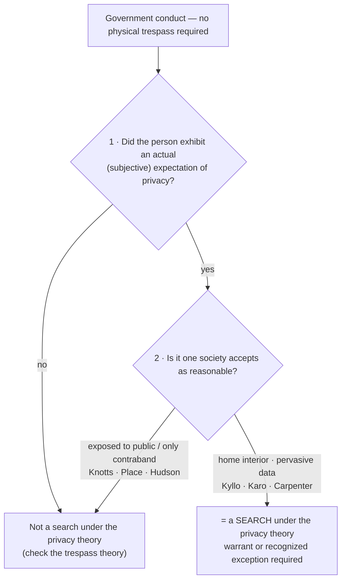

# S9 R1 panel-review — Opus model-diversity lane (prompt pack)

You are the **Claude/Opus** leg of the S9 three-lane adversarial panel (1 Claude + 2 Codex, R1). The two Codex lanes carry the A (support/quote-fidelity) and B (currency/treatment) attack lenses; **you carry model diversity and MUST vote on every paneled assertion across BOTH lenses' concerns.** You are refute-framed: try hard to break each assertion; **default to REFUTED on uncertainty**; never fabricate a cite, quote, or holding; use ONLY the evidence inlined below (no search, no outside knowledge). You are a SIGHTED reviewer — the FULL lake record (judgment fields included) is inlined.

You are a WRITER lane, not an adjudicator: you FIND and VOTE. You do not tally, adjudicate, or close any row — the orchestrator does.

For EACH group below, return one JSON object with the exact `reviewed[]` shape from the output contract (identical framing to the Codex lenses). Emit a finding object ONLY for a real defect (verdict refuted / stands-modified); a group you find wholly clean returns all-`stands` verdicts (the harness records a clean attestation). Concatenate the per-group JSON objects into a top-level `{"packs": [ ... ]}` array, one entry per group, each carrying its `group_id`.


OUTPUT CONTRACT — return ONE JSON object, nothing else:
{
  "lens": "A" | "B",
  "group_id": "<echo the group id>",
  "reviewed": [
    {
      "assertion_id": "<from group_inventory.jsonl>",
      "dimension": "existence|support|quote_fidelity|pincite|treatment|black_letter",
      "verdict": "stands" | "refuted" | "stands-modified",
      "verifiable_from_disclosed": true | false,
      "defect": null,   // null when verdict=="stands"; else an object:
      //  {"problem": "...", "severity": "high|medium|low", "proposed_fix": "...", "evidence_quote": "verbatim from disclosed evidence or null", "needs_cl": true|false, "locator_note": "..."}
      "reasons": ["short evidence-grounded reason", "..."],
      "breaks_true_positives": true | false,
      "residual_risks": ["..."],
      "suggested_tightening": "... or null"
    }
  ],
  "notes": ""
}
Rules: verdict=='stands' <=> defect==null (assertion survives your attack). verdict=='refuted' <=> a real defect (the assertion as framed is wrong). verdict=='stands-modified' <=> survives but needs a stated modification (a minor defect). Review EVERY assertion_id in group_inventory.jsonl exactly once. Output ONLY the JSON object.
---

## GROUP: content/searches/two-definitions-of-search/Reasonable Expectation of Privacy.md  (`doctrine`, 20 assertions)

### content_page

```
---
weight: 30
title: "Reasonable Expectation of Privacy"
aliases:
  - "Reasonable Expectation of Privacy"
  - "REP"
  - "Katz Test"
  - "Privacy Theory of Search"
topic: Reasonable expectation of privacy — the Katz theory of search
type: doctrine
amendment: "U.S. Const. amend. IV"
jurisdiction: "Federal (U.S. Const. amend. IV); SCOTUS baseline"
status: draft
related:
  - "[[Trespass]]"
  - "[[Two Definitions of Search]]"
  - "[[Standing to Challenge a Search]]"
  - "[[The Third-Party Doctrine and Digital Surveillance]]"
  - "[[Curtilage]]"
  - "[[Kyllo v. United States]]"
---

# Reasonable Expectation of Privacy

*Set trespass aside: did the government invade something this person kept private that society agrees was reasonable to keep private? If so, it is a search even with no physical entry at all.*

> [!rule] Black-letter rule
> Under the **privacy theory**, government conduct is a Fourth Amendment **search** when it invades a **reasonable expectation of privacy**: one the person **actually exhibited** (the subjective prong) and one **"society is prepared to recognize as 'reasonable'"** (the objective prong). *[[Katz v. United States#^pin-361|Katz]]*, 389 U.S. 347, [361](https://www.courtlistener.com/opinion/107564/katz-v-united-states/) (1967) (Harlan, J., [[Common Legal Terms#concurring-opinion|concurring]]). The Amendment "protects people, not places," so "what [a person] seeks to preserve as private, even in an area accessible to the public, may be constitutionally protected." *[[Katz v. United States#^pin-351|Id.]]* at 351. The privacy test runs **in parallel** with the [[Trespass|trespass theory]]; satisfying either one independently makes the conduct a search.
> ^rule-rep

## The Brief

**What the privacy theory is, and what it is not.** The privacy theory is the modern half of the [[Two Definitions of Search|two definitions of a search]]. It asks whether the government invaded an expectation of privacy the law is willing to honor, without regard to whether officers physically touched anything. It is **not** a test of property or trespass, and it is **not** satisfied merely because the defendant subjectively wished to be left alone: the expectation must be one society accepts as reasonable. This page owns the *[[Katz v. United States|Katz]]* privacy test; its property counterpart lives on [[Trespass]], and the standing question of *whose* expectation was invaded lives on [[Standing to Challenge a Search]].

**The test comes from Harlan's [[Common Legal Terms#concurring-opinion|concurrence]], not the majority.** The two-prong formulation that courts apply is Justice Harlan's: "a twofold requirement, first that a person have exhibited an actual (subjective) expectation of privacy and, second, that the expectation be one that society is prepared to recognize as 'reasonable.'" *[[Katz v. United States#^pin-361|Katz]]*, 389 U.S. at [361](https://www.courtlistener.com/opinion/107564/katz-v-united-states/) (Harlan, J., concurring). The majority supplied the animating principle rather than the test: "the Fourth Amendment protects people, not places," so "what [a person] seeks to preserve as private, even in an area accessible to the public, may be constitutionally protected." *[[Katz v. United States#^pin-351|Id.]]* at 351. Attribute the two prongs to Harlan, and the "people, not places" principle to the Court.

**It runs in parallel with trespass, not in sequence.** *[[Katz v. United States|Katz]]* did not replace the property baseline; the two theories are independent. As *[[United States v. Jones|Jones]]* put it, the privacy test "has been *added to*, not *substituted for*, the common-law trespassory test." *[[United States v. Jones#^pin-409|Jones]]*, 565 U.S. 400, [409](https://www.courtlistener.com/opinion/622304/united-states-v-jones/) (2012). A privacy invasion is a search even with no physical entry, which is exactly what *[[Katz v. United States|Katz]]* held for the electronic bug on the outside of a public phone booth.

**The home is the core, and technology recalibrates the line.** The privacy interest is strongest in the home, and the theory adjusts as surveillance tools change. Aiming **sense-enhancing technology "not in general public use"** at a home to learn its interior is a search, because "[i]n the home . . . all details are intimate details." *[[Kyllo v. United States|Kyllo]]*, 533 U.S. 27, [37](https://www.courtlistener.com/opinion/118443/kyllo-v-united-states/) (2001). The point is not the sophistication of the device but that it exposes what the walls otherwise keep private.

**The digital frontier: pervasive data can carry privacy even in a third party's hands.** The privacy theory reaches modern data that the old rules would have treated as exposed. Acquiring extended historical **cell-site location information** is a search: a person keeps a reasonable expectation of privacy in the sum of his movements over time, and that the records sit with a wireless carrier does not automatically defeat it. *[[Carpenter v. United States|Carpenter]]*, 585 U.S. 296 (2018). *[[Carpenter v. United States|Carpenter]]* **narrows**, but does not abolish, the **third-party doctrine** (the rule that information voluntarily shared with a third party generally loses Fourth Amendment protection); the digital-age contours of that doctrine are developed on [[The Third-Party Doctrine and Digital Surveillance]], and the geofence application on [[Reverse-Keyword and Geofence Warrants]].

**The boundary: no search where only the public or the contraband is exposed.** Conduct that reveals only what is already public, or reveals only the presence of contraband, invades no reasonable expectation of privacy. Tracking a car's movements over public roads by beeper is not a search, because a traveler "has no reasonable expectation of privacy in his movements from one place to another." *[[United States v. Knotts|Knotts]]*, 460 U.S. 276 (1983). A canine sniff that discloses only contraband is not a search, whether of luggage in public (*[[United States v. Place|Place]]*) or during a lawful, un-prolonged traffic stop (*[[Illinois v. Caballes|Caballes]]*). Neither is examining a car's exterior or a legally required VIN (*[[Cardwell v. Lewis|Cardwell]]*; *[[New York v. Class|Class]]*), an undercover purchase of goods a store exposes to the public (*[[Maryland v. Macon|Macon]]*), aerial photography of an industrial complex's open areas (*[[Dow Chemical Co. v. United States|Dow Chemical]]*), or a search of a prisoner's cell, in which there is **no** reasonable expectation of privacy at all (*[[Hudson v. Palmer|Hudson]]*).

**But context flips the same technique.** The identical tool can cross the line when it exposes the inside of a protected space. Monitoring a beeper to learn that an item is **inside a private residence** *is* a search, because it reveals a fact about the home's interior not open to visual surveillance. *[[United States v. Karo|Karo]]*, 468 U.S. 705 (1984). And an exploratory **tactile** inspection of a bus passenger's bag is a search, because "[p]hysically invasive inspection is simply more intrusive than purely visual inspection." *[[Bond v. United States|Bond]]*, 529 U.S. 334, [337](https://www.courtlistener.com/opinion/118354/bond-v-united-states/) (2000). The home marks the theory's core; the same beeper is innocuous on the highway and a search indoors.

**Burden, standard of review, and remedy.** The threshold "did a search occur?" question is one of law, reviewed [[Common Legal Terms#de-novo|de novo]] (subsidiary historical facts for [[Common Legal Terms#clear-error|clear error]]), and the movant raises it: the party seeking suppression must show both that the conduct was a search and that **he personally** held the invaded expectation of privacy. That personal-interest requirement is the merits question [[Standing to Challenge a Search|standing]] analyzes, measured by this same *[[Katz v. United States|Katz]]* test. Only once a **warrantless** search is established does the burden shift to the government to justify it under the warrant requirement or a recognized exception; unreasonable searches yield exclusion of the evidence and its fruits (see [[The Exclusionary Rule]]).

**Apply it.**
1. **Run both prongs.** Ask whether the person actually treated the thing as private, and whether society would accept that expectation as reasonable; a subjective wish alone is not enough (*[[Katz v. United States|Katz]]*).
2. **Locate the space.** The closer to the home's interior, the stronger the interest; the more it is exposed to the public, the weaker it is (*[[Kyllo v. United States|Kyllo]]*; *[[United States v. Knotts|Knotts]]*).
3. **Watch for context flips.** The same surveillance can be no search outdoors and a search when it reveals the inside of a protected space (*[[United States v. Karo|Karo]]*).
4. **For digital data, do not stop at "voluntarily shared."** Pervasive, comprehensive location data can carry a reasonable expectation of privacy even in a third party's hands (*[[Carpenter v. United States|Carpenter]]*; see [[The Third-Party Doctrine and Digital Surveillance]]).

**Common pitfalls.**
- **Attributing the two-prong test to the *[[Katz v. United States|Katz]]* majority.** It is **Harlan's [[Common Legal Terms#concurring-opinion|concurrence]]**; the majority gave the "people, not places" principle (*[[Katz v. United States|Katz]]*).
- **Treating a subjective wish as enough.** Both prongs must hold; the expectation must be one society is prepared to recognize as reasonable.
- **Reading *[[Carpenter v. United States|Carpenter]]* as abolishing the third-party doctrine.** It **narrows** the doctrine for pervasive digital location data; it does not erase it (*[[Carpenter v. United States|Carpenter]]*).
- **Assuming "no privacy invasion means no search."** Forgetting the parallel [[Trespass|trespass theory]]: *[[United States v. Jones|Jones]]* and *[[Florida v. Jardines|Jardines]]* find a search on trespass grounds even where a pure privacy analysis would be contested.

## Lower-court developments

- **First-impression / split-flag — pole-camera aggregation.** *[[United States v. Tuggle]]* (7th Cir. 2021) held that 18 months of warrantless pole-camera surveillance of a home's exterior was **not** a search under existing doctrine, while openly flagging *[[Carpenter v. United States|Carpenter]]*'s mosaic logic and the unsettled question whether aggregated long-term surveillance of public-facing activity becomes a search. *(Tuggle is primarily homed on [[Plain View Doctrine]].)*
- **Split (3-3 on rationale) — pole cameras.** *[[United States v. Moore-Bush]]* (1st Cir. 2022, [[Reading and Citing Cases#en-banc|en banc]]) admitted eight months of pole-camera evidence, the six judges dividing 3-3 only on whether the surveillance was a search (*[[Carpenter v. United States|Carpenter]]* aggregation vs. no search at all); good-faith reliance on circuit precedent saved it either way.
- **Split (private-search doctrine) — hash-matching.** *[[United States v. Wilson]]* (9th Cir. 2021) held that the government's warrantless viewing of email attachments flagged by automated hash-matching but never actually viewed by a person exceeded the antecedent private search, diverging from Fifth and Sixth Circuit decisions upholding similar hash-flag viewings.
- **The geofence and cell-site strand is developed elsewhere.** The Supreme Court's resolution of the geofence search-threshold question, and the reverse-keyword and real-time-tracking frontier, are treated on [[Reverse-Keyword and Geofence Warrants]] and [[The Third-Party Doctrine and Digital Surveillance]]; this page states only the underlying *[[Katz v. United States|Katz]]*/*[[Carpenter v. United States|Carpenter]]* privacy rule they apply.

## Key cases

| Case | Holding | Opinion |
|---|---|---|
| *[[Katz v. United States]]*, 389 U.S. 347 (1967) | **Anchor.** "The Fourth Amendment protects people, not places"; an electronic bug on a public phone booth was a search though there was no trespass. Harlan's [[Common Legal Terms#concurring-opinion\|concurrence]] supplies the two-prong reasonable-expectation-of-privacy test. | [opinion](https://www.courtlistener.com/opinion/107564/katz-v-united-states/) |
| *[[Kyllo v. United States]]*, 533 U.S. 27 (2001) | Using **sense-enhancing technology not in general public use** to learn a home's interior details is a search, presumptively unreasonable without a warrant: "all details are intimate details." | [opinion](https://www.courtlistener.com/opinion/118443/kyllo-v-united-states/) |
| *[[Carpenter v. United States]]*, 585 U.S. 296 (2018) | Acquiring extended historical **cell-site location information** is a search: a reasonable expectation of privacy in the sum of one's movements over time; **narrows** the third-party doctrine for digital-age data. *(Digital application developed on [[The Third-Party Doctrine and Digital Surveillance]].)* | [opinion](https://www.courtlistener.com/opinion/4510032/carpenter-v-united-states/) |
| *[[Bond v. United States]]*, 529 U.S. 334 (2000) | An officer's exploratory **tactile** squeezing of a bus passenger's soft luggage is a search: "physically invasive inspection is . . . more intrusive than purely visual inspection." | [opinion](https://www.courtlistener.com/opinion/118354/bond-v-united-states/) |
| *[[United States v. Place]]*, 462 U.S. 696 (1983) | A canine sniff of luggage in a public place is **sui generis** and **not** a search: it reveals only the presence or absence of contraband, the outer boundary of the privacy theory. | [opinion](https://www.courtlistener.com/opinion/110979/united-states-v-place/) |
| *[[Hudson v. Palmer]]*, 468 U.S. 517 (1984) | A prisoner has **no** reasonable expectation of privacy in his cell: the outer edge of the privacy definition, homed here as a boundary marker. | [opinion](https://www.courtlistener.com/opinion/111252/hudson-v-palmer/) |
| *[[Chatrie v. United States]]*, 609 U.S. ___ (2026) | Acquiring a phone's **Google Location History (geofence)** is a search: a reasonable expectation of privacy in the record of one's location, even briefly and even when held by a third party; **applies *Carpenter***. Warrant PC/[[Particularity\|particularity]] left open [[Reading and Citing Cases#on-remand\|on remand]]; geofence treatment developed on [[Reverse-Keyword and Geofence Warrants]]. | [opinion](https://www.supremecourt.gov/opinions/25pdf/25-112_0am4.pdf) |

## Related cases across doctrines

These are treated in full on other doctrine pages but bear on the privacy theory, framed for it here.

| Case | Relevance here | Primary home | Opinion |
|---|---|---|---|
| *[[United States v. Knotts]]*, 460 U.S. 276 (1983) | Beeper-aided tracking of a vehicle over public roads is **not** a search: no reasonable expectation of privacy in movements over public thoroughfares. | [[The Third-Party Doctrine and Digital Surveillance]] | [opinion](https://www.courtlistener.com/opinion/110882/united-states-v-knotts/) |
| *[[United States v. Karo]]*, 468 U.S. 705 (1984) | Monitoring a beeper **inside a private residence** IS a search: it reveals a fact about the home's interior not open to visual surveillance. | [[The Third-Party Doctrine and Digital Surveillance]] | [opinion](https://www.courtlistener.com/opinion/111257/united-states-v-karo/) |
| *[[Illinois v. Caballes]]*, 543 U.S. 405 (2005) | A dog sniff during a lawful traffic stop that does not prolong it is **not** a search: it reveals only contraband, implicating no legitimate privacy interest. | [[Traffic Stops]] | [opinion](https://www.courtlistener.com/opinion/137742/illinois-v-caballes/) |
| *[[Cardwell v. Lewis]]*, 417 U.S. 583 (1974) | Examining a car's exterior on probable cause in a public lot invades **no** protected privacy interest: a reduced expectation of privacy in a vehicle's exterior. | [[Automobile Exception]] | [opinion](https://www.courtlistener.com/opinion/109069/cardwell-v-lewis/) |
| *[[New York v. Class]]*, 475 U.S. 106 (1986) | **No** reasonable expectation of privacy in a VIN the law requires to be visible; reaching in to move papers obscuring it was a minimal but reasonable search. | [[Traffic Stops]] | [opinion](https://www.courtlistener.com/opinion/111600/new-york-v-class/) |
| *[[United States v. Van Leeuwen]]*, 397 U.S. 249 (1970) | Brief detention of mailed packages on reasonable suspicion invades **no** privacy interest; that interest is implicated only when a package is opened under a warrant. | [[Terry Stops and Reasonable Suspicion]] | [opinion](https://www.courtlistener.com/opinion/108099/united-states-v-van-leeuwen/) |
| *[[Maryland v. Macon]]*, 472 U.S. 463 (1985) | An undercover officer's purchase of magazines from a public store is **neither** a search (no privacy in wares exposed to the public) **nor** a seizure. | [[Consent Searches]] | [opinion](https://www.courtlistener.com/opinion/111477/maryland-v-macon/) |
| *[[Lewis v. United States (1966)]]*, 385 U.S. 206 (1966) | An undercover agent invited in to transact illegal business works **no** search, though he may not exceed the invitation to conduct a general search. | [[Consent Searches]] | [opinion](https://www.courtlistener.com/opinion/107312/lewis-v-united-states/) |
| *[[Dow Chemical Co. v. United States]]*, 476 U.S. 227 (1986) | Precision aerial photography of an industrial complex's open areas from navigable airspace is **not** a search: such areas are more like open fields than [[Curtilage\|curtilage]]. | [[Curtilage]] | [opinion](https://www.courtlistener.com/opinion/111667/dow-chemical-co-v-united-states-ex-rel-administrator/) |
| *[[Berger v. New York]]*, 388 U.S. 41 (1967) | Set [[Particularity\|particularity]] and safeguard standards for electronic-eavesdropping warrants: a companion to the *[[Katz v. United States\|Katz]]* turn away from trespass-only doctrine. | [[The Third-Party Doctrine and Digital Surveillance]] | [opinion](https://www.courtlistener.com/opinion/107483/berger-v-new-york/) |
| *[[United States v. Moore-Bush]]*, (1st Cir. 2022) (en banc) | Pole-camera aggregation: whether *[[Carpenter v. United States\|Carpenter]]*'s mosaic logic makes long-term public-facing surveillance a search, the [[Reading and Citing Cases#en-banc\|en banc]] court dividing 3-3 on the question. | [[Fourth Amendment Framework]] | [opinion](https://www.courtlistener.com/opinion/6476395/united-states-v-moore-bush/) |
| *[[United States v. Wilson]]*, (9th Cir. 2021) | Automated hash-matching: viewing attachments a person never saw exceeded the antecedent private search, a privacy-frontier split with the 5th and 6th Circuits. | [[Fourth Amendment Framework]] | [opinion](https://www.courtlistener.com/opinion/5296785/united-states-v-luke-wilson/) |

<!-- Chatrie v. United States, 609 U.S. ___ (2026) (No. 25-112, decided June 29, 2026): current-Term SCOTUS, slip-op sourced (R5 T4 — S1 R14). CL cluster object 10881683 is corrupted; do not ingest. Full geofence treatment is owned by the digital sub-umbrella (Reverse-Keyword and Geofence Warrants) per S7 D6/TEACH-01; this page carries the Katz/REP rule and a cross-referenced Key mention only. -->

## Visual



## Sources

- [*Katz v. United States*, 389 U.S. 347 (1967)](https://www.courtlistener.com/opinion/107564/katz-v-united-states/) (pinpoints: 351, 361 (Harlan, J., concurring))
- [*Kyllo v. United States*, 533 U.S. 27 (2001)](https://www.courtlistener.com/opinion/118443/kyllo-v-united-states/) (pinpoints: 34, 37, 40)
- [*Carpenter v. United States*, 585 U.S. 296 (2018)](https://www.courtlistener.com/opinion/4510032/carpenter-v-united-states/) (case-level cite; the "whole of one's physical movements" language is paraphrased — the CL opinion text carries slip-opinion pagination only, no U.S. Reports star page: R5 T3)
- [*Bond v. United States*, 529 U.S. 334 (2000)](https://www.courtlistener.com/opinion/118354/bond-v-united-states/) (pinpoint: 337)
- [*United States v. Place*, 462 U.S. 696 (1983)](https://www.courtlistener.com/opinion/110979/united-states-v-place/) (pinpoint: 707)
- [*Hudson v. Palmer*, 468 U.S. 517 (1984)](https://www.courtlistener.com/opinion/111252/hudson-v-palmer/)
- [*United States v. Knotts*, 460 U.S. 276 (1983)](https://www.courtlistener.com/opinion/110882/united-states-v-knotts/)
- [*United States v. Karo*, 468 U.S. 705 (1984)](https://www.courtlistener.com/opinion/111257/united-states-v-karo/)
- [*Illinois v. Caballes*, 543 U.S. 405 (2005)](https://www.courtlistener.com/opinion/137742/illinois-v-caballes/)
- [*Cardwell v. Lewis*, 417 U.S. 583 (1974)](https://www.courtlistener.com/opinion/109069/cardwell-v-lewis/)
- [*New York v. Class*, 475 U.S. 106 (1986)](https://www.courtlistener.com/opinion/111600/new-york-v-class/)
- [*United States v. Van Leeuwen*, 397 U.S. 249 (1970)](https://www.courtlistener.com/opinion/108099/united-states-v-van-leeuwen/)
- [*Maryland v. Macon*, 472 U.S. 463 (1985)](https://www.courtlistener.com/opinion/111477/maryland-v-macon/)
- [*Lewis v. United States*, 385 U.S. 206 (1966)](https://www.courtlistener.com/opinion/107312/lewis-v-united-states/)
- [*Dow Chemical Co. v. United States*, 476 U.S. 227 (1986)](https://www.courtlistener.com/opinion/111667/dow-chemical-co-v-united-states-ex-rel-administrator/)
- [*Berger v. New York*, 388 U.S. 41 (1967)](https://www.courtlistener.com/opinion/107483/berger-v-new-york/)
- [*Chatrie v. United States*, 609 U.S. ___ (2026) (No. 25-112)](https://www.supremecourt.gov/opinions/25pdf/25-112_0am4.pdf) (slip op.; geofence treatment on [[Reverse-Keyword and Geofence Warrants]])
- [*United States v. Moore-Bush* (1st Cir. 2022) (en banc)](https://www.courtlistener.com/opinion/6476395/united-states-v-moore-bush/)
- [*United States v. Wilson* (9th Cir. 2021)](https://www.courtlistener.com/opinion/5296785/united-states-v-luke-wilson/)

```

### group_inventory (assertions under review)

```jsonl
{"assertion_id": "01fd92a4e9405fe5", "dimension": "existence", "kind": "case_cite", "locator": {"case": "New York v. Class", "table_line": 69}, "payload": {"case": "New York v. Class", "cells": ["*[[New York v. Class]]*, 475 U.S. 106 (1986)", "**No** reasonable expectation of privacy in a VIN the law requires to be visible; reaching in to move papers obscuring it was a minimal but reasonable search.", "[[Traffic Stops]]", "[opinion](https://www.courtlistener.com/opinion/111600/new-york-v-class/)"], "header": ["Case", "Relevance here", "Primary home", "Opinion"]}}
{"assertion_id": "0a837fbff7c9a5dc", "dimension": "existence", "kind": "case_cite", "locator": {"case": "United States v. Knotts", "table_line": 65}, "payload": {"case": "United States v. Knotts", "cells": ["*[[United States v. Knotts]]*, 460 U.S. 276 (1983)", "Beeper-aided tracking of a vehicle over public roads is **not** a search: no reasonable expectation of privacy in movements over public thoroughfares.", "[[The Third-Party Doctrine and Digital Surveillance]]", "[opinion](https://www.courtlistener.com/opinion/110882/united-states-v-knotts/)"], "header": ["Case", "Relevance here", "Primary home", "Opinion"]}}
{"assertion_id": "3264e61bcbe71143", "dimension": "existence", "kind": "case_cite", "locator": {"case": "Kyllo v. United States", "table_line": 52}, "payload": {"case": "Kyllo v. United States", "cells": ["*[[Kyllo v. United States]]*, 533 U.S. 27 (2001)", "Using **sense-enhancing technology not in general public use** to learn a home's interior details is a search, presumptively unreasonable without a warrant: \"all details are intimate details.\"", "[opinion](https://www.courtlistener.com/opinion/118443/kyllo-v-united-states/)"], "header": ["Case", "Holding", "Opinion"]}}
{"assertion_id": "403651094e239ef6", "dimension": "existence", "kind": "case_cite", "locator": {"case": "Dow Chemical Co. v. United States", "table_line": 73}, "payload": {"case": "Dow Chemical Co. v. United States", "cells": ["*[[Dow Chemical Co. v. United States]]*, 476 U.S. 227 (1986)", "Precision aerial photography of an industrial complex's open areas from navigable airspace is **not** a search: such areas are more like open fields than [[Curtilage\\|curtilage]].", "[[Curtilage]]", "[opinion](https://www.courtlistener.com/opinion/111667/dow-chemical-co-v-united-states-ex-rel-administrator/)"], "header": ["Case", "Relevance here", "Primary home", "Opinion"]}}
{"assertion_id": "417aeb592792e494", "dimension": "existence", "kind": "case_cite", "locator": {"case": "Bond v. United States", "table_line": 54}, "payload": {"case": "Bond v. United States", "cells": ["*[[Bond v. United States]]*, 529 U.S. 334 (2000)", "An officer's exploratory **tactile** squeezing of a bus passenger's soft luggage is a search: \"physically invasive inspection is . . . more intrusive than purely visual inspection.\"", "[opinion](https://www.courtlistener.com/opinion/118354/bond-v-united-states/)"], "header": ["Case", "Holding", "Opinion"]}}
{"assertion_id": "497280da90427f96", "dimension": "existence", "kind": "case_cite", "locator": {"case": "Chatrie v. United States", "table_line": 57}, "payload": {"case": "Chatrie v. United States", "cells": ["*[[Chatrie v. United States]]*, 609 U.S. ___ (2026)", "Acquiring a phone's **Google Location History (geofence)** is a search: a reasonable expectation of privacy in the record of one's location, even briefly and even when held by a third party; **applies *Carpenter***. Warrant PC/[[Particularity\\|particularity]] left open [[Reading and Citing Cases#on-remand\\|on remand]]; geofence treatment developed on [[Reverse-Keyword and Geofence Warrants]].", "[opinion](https://www.supremecourt.gov/opinions/25pdf/25-112_0am4.pdf)"], "header": ["Case", "Holding", "Opinion"]}}
{"assertion_id": "50ae9a045ec566fd", "dimension": "existence", "kind": "case_cite", "locator": {"case": "Katz v. United States", "table_line": 51}, "payload": {"case": "Katz v. United States", "cells": ["*[[Katz v. United States]]*, 389 U.S. 347 (1967)", "**Anchor.** \"The Fourth Amendment protects people, not places\"; an electronic bug on a public phone booth was a search though there was no trespass. Harlan's [[Common Legal Terms#concurring-opinion\\|concurrence]] supplies the two-prong reasonable-expectation-of-privacy test.", "[opinion](https://www.courtlistener.com/opinion/107564/katz-v-united-states/)"], "header": ["Case", "Holding", "Opinion"]}}
{"assertion_id": "7745349927f6d03b", "dimension": "existence", "kind": "case_cite", "locator": {"case": "Hudson v. Palmer", "table_line": 56}, "payload": {"case": "Hudson v. Palmer", "cells": ["*[[Hudson v. Palmer]]*, 468 U.S. 517 (1984)", "A prisoner has **no** reasonable expectation of privacy in his cell: the outer edge of the privacy definition, homed here as a boundary marker.", "[opinion](https://www.courtlistener.com/opinion/111252/hudson-v-palmer/)"], "header": ["Case", "Holding", "Opinion"]}}
{"assertion_id": "84eedc01e8fbf65f", "dimension": "existence", "kind": "case_cite", "locator": {"case": "United States v. Wilson", "table_line": 76}, "payload": {"case": "United States v. Wilson", "cells": ["*[[United States v. Wilson]]*, (9th Cir. 2021)", "Automated hash-matching: viewing attachments a person never saw exceeded the antecedent private search, a privacy-frontier split with the 5th and 6th Circuits.", "[[Fourth Amendment Framework]]", "[opinion](https://www.courtlistener.com/opinion/5296785/united-states-v-luke-wilson/)"], "header": ["Case", "Relevance here", "Primary home", "Opinion"]}}
{"assertion_id": "8a80296953882da6", "dimension": "existence", "kind": "case_cite", "locator": {"case": "Carpenter v. United States", "table_line": 53}, "payload": {"case": "Carpenter v. United States", "cells": ["*[[Carpenter v. United States]]*, 585 U.S. 296 (2018)", "Acquiring extended historical **cell-site location information** is a search: a reasonable expectation of privacy in the sum of one's movements over time; **narrows** the third-party doctrine for digital-age data. *(Digital application developed on [[The Third-Party Doctrine and Digital Surveillance]].)*", "[opinion](https://www.courtlistener.com/opinion/4510032/carpenter-v-united-states/)"], "header": ["Case", "Holding", "Opinion"]}}
{"assertion_id": "96db0381691d27da", "dimension": "existence", "kind": "case_cite", "locator": {"case": "Cardwell v. Lewis", "table_line": 68}, "payload": {"case": "Cardwell v. Lewis", "cells": ["*[[Cardwell v. Lewis]]*, 417 U.S. 583 (1974)", "Examining a car's exterior on probable cause in a public lot invades **no** protected privacy interest: a reduced expectation of privacy in a vehicle's exterior.", "[[Automobile Exception]]", "[opinion](https://www.courtlistener.com/opinion/109069/cardwell-v-lewis/)"], "header": ["Case", "Relevance here", "Primary home", "Opinion"]}}
{"assertion_id": "9f10136b40ebd64e", "dimension": "existence", "kind": "case_cite", "locator": {"case": "United States v. Moore-Bush", "table_line": 75}, "payload": {"case": "United States v. Moore-Bush", "cells": ["*[[United States v. Moore-Bush]]*, (1st Cir. 2022) (en banc)", "Pole-camera aggregation: whether *[[Carpenter v. United States\\|Carpenter]]*'s mosaic logic makes long-term public-facing surveillance a search, the [[Reading and Citing Cases#en-banc\\|en banc]] court dividing 3-3 on the question.", "[[Fourth Amendment Framework]]", "[opinion](https://www.courtlistener.com/opinion/6476395/united-states-v-moore-bush/)"], "header": ["Case", "Relevance here", "Primary home", "Opinion"]}}
{"assertion_id": "ae27be6f749b0f93", "dimension": "existence", "kind": "case_cite", "locator": {"case": "Lewis v. United States (1966)", "table_line": 72}, "payload": {"case": "Lewis v. United States (1966)", "cells": ["*[[Lewis v. United States (1966)]]*, 385 U.S. 206 (1966)", "An undercover agent invited in to transact illegal business works **no** search, though he may not exceed the invitation to conduct a general search.", "[[Consent Searches]]", "[opinion](https://www.courtlistener.com/opinion/107312/lewis-v-united-states/)"], "header": ["Case", "Relevance here", "Primary home", "Opinion"]}}
{"assertion_id": "b9e8cb4305a2599a", "dimension": "existence", "kind": "case_cite", "locator": {"case": "United States v. Karo", "table_line": 66}, "payload": {"case": "United States v. Karo", "cells": ["*[[United States v. Karo]]*, 468 U.S. 705 (1984)", "Monitoring a beeper **inside a private residence** IS a search: it reveals a fact about the home's interior not open to visual surveillance.", "[[The Third-Party Doctrine and Digital Surveillance]]", "[opinion](https://www.courtlistener.com/opinion/111257/united-states-v-karo/)"], "header": ["Case", "Relevance here", "Primary home", "Opinion"]}}
{"assertion_id": "d139f32ad340946d", "dimension": "existence", "kind": "case_cite", "locator": {"case": "United States v. Place", "table_line": 55}, "payload": {"case": "United States v. Place", "cells": ["*[[United States v. Place]]*, 462 U.S. 696 (1983)", "A canine sniff of luggage in a public place is **sui generis** and **not** a search: it reveals only the presence or absence of contraband, the outer boundary of the privacy theory.", "[opinion](https://www.courtlistener.com/opinion/110979/united-states-v-place/)"], "header": ["Case", "Holding", "Opinion"]}}
{"assertion_id": "d52760ce3c600a61", "dimension": "existence", "kind": "case_cite", "locator": {"case": "Maryland v. Macon", "table_line": 71}, "payload": {"case": "Maryland v. Macon", "cells": ["*[[Maryland v. Macon]]*, 472 U.S. 463 (1985)", "An undercover officer's purchase of magazines from a public store is **neither** a search (no privacy in wares exposed to the public) **nor** a seizure.", "[[Consent Searches]]", "[opinion](https://www.courtlistener.com/opinion/111477/maryland-v-macon/)"], "header": ["Case", "Relevance here", "Primary home", "Opinion"]}}
{"assertion_id": "d5b87ccf3ad38c22", "dimension": "existence", "kind": "case_cite", "locator": {"case": "Illinois v. Caballes", "table_line": 67}, "payload": {"case": "Illinois v. Caballes", "cells": ["*[[Illinois v. Caballes]]*, 543 U.S. 405 (2005)", "A dog sniff during a lawful traffic stop that does not prolong it is **not** a search: it reveals only contraband, implicating no legitimate privacy interest.", "[[Traffic Stops]]", "[opinion](https://www.courtlistener.com/opinion/137742/illinois-v-caballes/)"], "header": ["Case", "Relevance here", "Primary home", "Opinion"]}}
{"assertion_id": "f6a3c661ad5ab70d", "dimension": "existence", "kind": "case_cite", "locator": {"case": "Berger v. New York", "table_line": 74}, "payload": {"case": "Berger v. New York", "cells": ["*[[Berger v. New York]]*, 388 U.S. 41 (1967)", "Set [[Particularity\\|particularity]] and safeguard standards for electronic-eavesdropping warrants: a companion to the *[[Katz v. United States\\|Katz]]* turn away from trespass-only doctrine.", "[[The Third-Party Doctrine and Digital Surveillance]]", "[opinion](https://www.courtlistener.com/opinion/107483/berger-v-new-york/)"], "header": ["Case", "Relevance here", "Primary home", "Opinion"]}}
{"assertion_id": "fd4d8e6aa41936a7", "dimension": "existence", "kind": "case_cite", "locator": {"case": "United States v. Van Leeuwen", "table_line": 70}, "payload": {"case": "United States v. Van Leeuwen", "cells": ["*[[United States v. Van Leeuwen]]*, 397 U.S. 249 (1970)", "Brief detention of mailed packages on reasonable suspicion invades **no** privacy interest; that interest is implicated only when a package is opened under a warrant.", "[[Terry Stops and Reasonable Suspicion]]", "[opinion](https://www.courtlistener.com/opinion/108099/united-states-v-van-leeuwen/)"], "header": ["Case", "Relevance here", "Primary home", "Opinion"]}}
{"assertion_id": "23e3fb463b106794", "dimension": "support", "kind": "proposition", "locator": {"callout": "^rule-rep"}, "payload": {"anchor": "^rule-rep", "statement": "[!rule] Black-letter rule\nUnder the **privacy theory**, government conduct is a Fourth Amendment **search** when it invades a **reasonable expectation of privacy**: one the person **actually exhibited** (the subjective prong) and one **\"society is prepared to recognize as 'reasonable'\"** (the objective prong). *[[Katz v. United States#^pin-361|Katz]]*, 389 U.S. 347, [361](https://www.courtlistener.com/opinion/107564/katz-v-united-states/) (1967) (Harlan, J., [[Common Legal Terms#concurring-opinion|concurring]]). The Amendment \"protects people, not places,\" so \"what [a person] seeks to preserve as private, even in an area accessible to the public, may be constitutionally protected.\" *[[Katz v. United States#^pin-351|Id.]]* at 351. The privacy test runs **in parallel** with the [[Trespass|trespass theory]]; satisfying either one independently makes the conduct a search."}}
```

### lake record — Berger v. New York

```json
{
  "schema_version": "s2.v1",
  "record_id": "Berger v. New York",
  "stub": false,
  "status": "verified",
  "identity": {
    "case_name": "Berger v. New York",
    "case_name_short": "Berger",
    "case_name_full": "Berger v. New York",
    "input_case_name": "Berger v. New York",
    "court": "U.S. Supreme Court",
    "court_id": "scotus",
    "court_level": "scotus",
    "circuit": null,
    "state": null,
    "date_decided": "1967-06-12",
    "year": 1967,
    "docket": "615",
    "cluster_id": 107483,
    "lead_opinion_id": 9423459,
    "sibling_ids": [
      107483,
      9423459,
      9423460,
      9423461,
      9423462,
      9423463,
      9423464
    ],
    "absolute_url": "/opinion/107483/berger-v-new-york/",
    "identity_method": "citation+party-text",
    "expected_citation_found": true,
    "party_name_in_text": true,
    "canonical_name_match": true,
    "alternates": [
      {
        "cluster_id": 8967447,
        "score": 10,
        "case_name": "Berger v. New York"
      },
      {
        "cluster_id": 8967390,
        "score": 10,
        "case_name": "Berger v. New York"
      }
    ],
    "reason_code": null
  },
  "citations": {
    "official": {
      "cite": "388 U.S. 41",
      "volume": "388",
      "reporter": "U.S.",
      "page": "41",
      "type": 1,
      "selected_official": true,
      "source": "cluster.citations[]"
    },
    "parallel": [
      {
        "cite": "87 S. Ct. 1873",
        "volume": "87",
        "reporter": "S. Ct.",
        "page": "1873",
        "type": 1,
        "selected_official": false,
        "source": "cluster.citations[]"
      },
      {
        "cite": "18 L. Ed. 2d 1040",
        "volume": "18",
        "reporter": "L. Ed. 2d",
        "page": "1040",
        "type": 1,
        "selected_official": false,
        "source": "cluster.citations[]"
      }
    ],
    "vendor_neutral": [
      {
        "cite": "1967 U.S. LEXIS 2964",
        "volume": "1967",
        "reporter": "U.S. LEXIS",
        "page": "2964",
        "type": 6,
        "selected_official": false,
        "source": "cluster.citations[]"
      }
    ],
    "all": [
      {
        "cite": "388 U.S. 41",
        "volume": "388",
        "reporter": "U.S.",
        "page": "41",
        "type": 1,
        "selected_official": false,
        "source": "cluster.citations[]"
      },
      {
        "cite": "87 S. Ct. 1873",
        "volume": "87",
        "reporter": "S. Ct.",
        "page": "1873",
        "type": 1,
        "selected_official": false,
        "source": "cluster.citations[]"
      },
      {
        "cite": "18 L. Ed. 2d 1040",
        "volume": "18",
        "reporter": "L. Ed. 2d",
        "page": "1040",
        "type": 1,
        "selected_official": false,
        "source": "cluster.citations[]"
      },
      {
        "cite": "1967 U.S. LEXIS 2964",
        "volume": "1967",
        "reporter": "U.S. LEXIS",
        "page": "2964",
        "type": 6,
        "selected_official": false,
        "source": "cluster.citations[]"
      }
    ],
    "display": "388 U.S. 41",
    "official_selection": {
      "court_class": "scotus",
      "selected": "388 U.S. 41",
      "reason": "selected_rank_1"
    }
  },
  "pinpoints": [
    {
      "id": "pin-44",
      "page": null,
      "quote": "might be obtained, authorizing 60-day installation of recording devices with possible extensions. Berger challenged the statute as authorizing general, exploratory electronic searches without Fourth Amendment particularity. ## Issue Whether New York's permissive eavesdropping statute satisfies the Fourth Amendment, or whether its breadth and lack of particularity render electronic surveillance under it unreasonable. ## Rule The statute was unconstitutional for overbreadth:",
      "star_marker": null,
      "quote_fidelity": "mismatch",
      "pinpoint_status": "slip-only",
      "position": null
    },
    {
      "id": "pin-56",
      "page": null,
      "quote": "New York's statute lacks this particularization. It merely says that a warrant may issue on reasonable ground to believe that evidence of crime may be obtained by the eavesdrop. It lays down no requirement for particularity in the warrant as to what specific crime has been or is being committed, nor 'the place to be searched,' or 'the persons or things to be seized' as specifically required by the Fourth Amendment.",
      "star_marker": null,
      "quote_fidelity": "mismatch",
      "pinpoint_status": "slip-only",
      "position": null
    }
  ],
  "treatment": {
    "field_i_validity": "good_law",
    "as_of_content": "1967-06-12",
    "as_of_treatment": "2026-06-30",
    "composite_basis": "migration-seed",
    "composite_basis_ref": "Berger v. New York",
    "varies_by_point": false,
    "scope_note": "Good law as the constitutional baseline for electronic-surveillance warrants. Together with Katz it prompted Congress to enact Title III of the Omnibus Crime Control Act of 1968, which codified conforming wiretap standards.",
    "point_overrides": [],
    "edges": [
      {
        "citing_case": {
          "name": "United States v. Johnny Vasquez-Algarin",
          "cluster_id": 3199633,
          "cite": [
            "821 F.3d 467",
            "2016 U.S. App. LEXIS 7889",
            "2016 WL 1730540"
          ],
          "field_ii": "overruled"
        },
        "field_ii": "overruled",
        "field_iii": "mentioned",
        "point": null,
        "proposed": true,
        "journal_ref": "Berger v. New York:lane1_negative"
      },
      {
        "citing_case": {
          "name": "State v. Hector Feliciano(074395)",
          "cluster_id": 3183943,
          "cite": [
            "224 N.J. 351",
            "132 A.3d 1245",
            "2016 N.J. LEXIS 229"
          ],
          "field_ii": "questioned"
        },
        "field_ii": "questioned",
        "field_iii": "mentioned",
        "point": null,
        "proposed": true,
        "journal_ref": "Berger v. New York:lane1_negative"
      },
      {
        "citing_case": {
          "name": "Wheeler v. State",
          "cluster_id": 3182294,
          "cite": [
            "135 A.3d 282",
            "2016 Del. LEXIS 121",
            "2016 WL 825395"
          ],
          "field_ii": "superseded_by_statute"
        },
        "field_ii": "superseded_by_statute",
        "field_iii": "mentioned",
        "point": null,
        "proposed": true,
        "journal_ref": "Berger v. New York:lane1_negative"
      },
      {
        "citing_case": {
          "name": "In re the United States",
          "cluster_id": 8441402,
          "cite": [
            "724 F.3d 600",
            "58 Communications Reg. (P&F) 1292",
            "2013 WL 3914484",
            "2013 U.S. App. LEXIS 15510"
          ],
          "field_ii": "overruled"
        },
        "field_ii": "overruled",
        "field_iii": "mentioned",
        "point": null,
        "proposed": true,
        "journal_ref": "Berger v. New York:lane1_negative"
      },
      {
        "citing_case": {
          "name": "People v. Rabb",
          "cluster_id": 5640827,
          "cite": [
            "16 N.Y.3d 145",
            "945 N.E.2d 447"
          ],
          "field_ii": "overruled"
        },
        "field_ii": "overruled",
        "field_iii": "mentioned",
        "point": null,
        "proposed": true,
        "journal_ref": "Berger v. New York:lane1_negative"
      },
      {
        "citing_case": {
          "name": "Whisenhunt v. State",
          "cluster_id": 1881110,
          "cite": [
            "122 S.W.3d 295",
            "2003 WL 22053696"
          ],
          "field_ii": "overruled"
        },
        "field_ii": "overruled",
        "field_iii": "mentioned",
        "point": null,
        "proposed": true,
        "journal_ref": "Berger v. New York:lane1_negative"
      },
      {
        "citing_case": {
          "name": "United States v. Triumph Capital Group, Inc.",
          "cluster_id": 8751433,
          "cite": [
            "211 F.R.D. 31",
            "2002 U.S. Dist. LEXIS 21615",
            "2002 WL 31487754"
          ],
          "field_ii": "superseded_by_statute"
        },
        "field_ii": "superseded_by_statute",
        "field_iii": "mentioned",
        "point": null,
        "proposed": true,
        "journal_ref": "Berger v. New York:lane1_negative"
      },
      {
        "citing_case": {
          "name": "Ashcraft v. State",
          "cluster_id": 1657870,
          "cite": [
            "934 S.W.2d 727",
            "1996 WL 474085"
          ],
          "field_ii": "overruled"
        },
        "field_ii": "overruled",
        "field_iii": "mentioned",
        "point": null,
        "proposed": true,
        "journal_ref": "Berger v. New York:lane1_negative"
      },
      {
        "citing_case": {
          "name": "UNITED STATES of America, Plaintiff-Appellee, v. Juan Ramon MATTA-BALLESTEROS, Defendant-Appellant",
          "cluster_id": 709239,
          "cite": [
            "71 F.3d 754",
            "95 Daily Journal DAR 15853",
            "95 Cal. Daily Op. Serv. 9042",
            "43 Fed. R. Serv. 338",
            "1995 U.S. App. LEXIS 33475",
            "1995 WL 704693"
          ],
          "field_ii": "overruled"
        },
        "field_ii": "overruled",
        "field_iii": "mentioned",
        "point": null,
        "proposed": true,
        "journal_ref": "Berger v. New York:lane1_negative"
      },
      {
        "citing_case": {
          "name": "Ashcraft v. State",
          "cluster_id": 1751133,
          "cite": [
            "900 S.W.2d 817",
            "1995 WL 257158"
          ],
          "field_ii": "overruled"
        },
        "field_ii": "overruled",
        "field_iii": "mentioned",
        "point": null,
        "proposed": true,
        "journal_ref": "Berger v. New York:lane1_negative"
      },
      {
        "citing_case": {
          "name": "United States v. Steven Ricciardelli",
          "cluster_id": 610895,
          "cite": [
            "998 F.2d 8",
            "1993 U.S. App. LEXIS 14891",
            "1993 WL 210540"
          ],
          "field_ii": "questioned"
        },
        "field_ii": "questioned",
        "field_iii": "mentioned",
        "point": null,
        "proposed": true,
        "journal_ref": "Berger v. New York:lane1_negative"
      },
      {
        "citing_case": {
          "name": "Terry v. Ohio",
          "cluster_id": 107729,
          "cite": [
            "20 L. Ed. 2d 889",
            "88 S. Ct. 1868",
            "392 U.S. 1",
            "1968 U.S. LEXIS 1345",
            "44 Ohio Op. 2d 383"
          ],
          "field_ii": "questioned"
        },
        "field_ii": "questioned",
        "field_iii": "mentioned",
        "point": null,
        "proposed": true,
        "journal_ref": "Berger v. New York:lane2_top_cited"
      },
      {
        "citing_case": {
          "name": "Bivens v. Six Unknown Named Agents of Federal Bureau of Narcotics",
          "cluster_id": 108375,
          "cite": [
            "29 L. Ed. 2d 619",
            "91 S. Ct. 1999",
            "403 U.S. 388",
            "1971 U.S. LEXIS 23"
          ],
          "field_ii": "overruled"
        },
        "field_ii": "overruled",
        "field_iii": "mentioned",
        "point": null,
        "proposed": true,
        "journal_ref": "Berger v. New York:lane2_top_cited"
      },
      {
        "citing_case": {
          "name": "Illinois v. Gates",
          "cluster_id": 110959,
          "cite": [
            "76 L. Ed. 2d 527",
            "103 S. Ct. 2317",
            "462 U.S. 213",
            "1983 U.S. LEXIS 54",
            "51 U.S.L.W. 4709"
          ],
          "field_ii": "overruled"
        },
        "field_ii": "overruled",
        "field_iii": "mentioned",
        "point": null,
        "proposed": true,
        "journal_ref": "Berger v. New York:lane2_top_cited"
      },
      {
        "citing_case": {
          "name": "Katz v. United States",
          "cluster_id": 107564,
          "cite": [
            "19 L. Ed. 2d 576",
            "88 S. Ct. 507",
            "389 U.S. 347",
            "1967 U.S. LEXIS 2"
          ],
          "field_ii": "overruled"
        },
        "field_ii": "overruled",
        "field_iii": "mentioned",
        "point": null,
        "proposed": true,
        "journal_ref": "Berger v. New York:lane2_top_cited"
      },
      {
        "citing_case": {
          "name": "United States v. Leon",
          "cluster_id": 111262,
          "cite": [
            "82 L. Ed. 2d 677",
            "104 S. Ct. 3405",
            "468 U.S. 897",
            "1984 U.S. LEXIS 153"
          ],
          "field_ii": "overruled"
        },
        "field_ii": "overruled",
        "field_iii": "mentioned",
        "point": null,
        "proposed": true,
        "journal_ref": "Berger v. New York:lane2_top_cited"
      },
      {
        "citing_case": {
          "name": "Coolidge v. New Hampshire",
          "cluster_id": 108377,
          "cite": [
            "29 L. Ed. 2d 564",
            "91 S. Ct. 2022",
            "403 U.S. 443",
            "1971 U.S. LEXIS 25"
          ],
          "field_ii": "overruled"
        },
        "field_ii": "overruled",
        "field_iii": "mentioned",
        "point": null,
        "proposed": true,
        "journal_ref": "Berger v. New York:lane2_top_cited"
      },
      {
        "citing_case": {
          "name": "Mitchell v. Forsyth",
          "cluster_id": 111481,
          "cite": [
            "86 L. Ed. 2d 411",
            "105 S. Ct. 2806",
            "472 U.S. 511",
            "1985 U.S. LEXIS 113",
            "53 U.S.L.W. 4798",
            "2 Fed. R. Serv. 3d 221"
          ],
          "field_ii": "questioned"
        },
        "field_ii": "questioned",
        "field_iii": "mentioned",
        "point": null,
        "proposed": true,
        "journal_ref": "Berger v. New York:lane2_top_cited"
      },
      {
        "citing_case": {
          "name": "Sibron v. New York",
          "cluster_id": 107730,
          "cite": [
            "20 L. Ed. 2d 917",
            "88 S. Ct. 1889",
            "392 U.S. 40",
            "1968 U.S. LEXIS 1346",
            "44 Ohio Op. 2d 402"
          ],
          "field_ii": "superseded_by_statute"
        },
        "field_ii": "superseded_by_statute",
        "field_iii": "mentioned",
        "point": null,
        "proposed": true,
        "journal_ref": "Berger v. New York:lane2_top_cited"
      },
      {
        "citing_case": {
          "name": "United States v. Jacobsen",
          "cluster_id": 111143,
          "cite": [
            "80 L. Ed. 2d 85",
            "104 S. Ct. 1652",
            "466 U.S. 109",
            "1984 U.S. LEXIS 53",
            "52 U.S.L.W. 4414"
          ],
          "field_ii": "overruled"
        },
        "field_ii": "overruled",
        "field_iii": "mentioned",
        "point": null,
        "proposed": true,
        "journal_ref": "Berger v. New York:lane2_top_cited"
      },
      {
        "citing_case": {
          "name": "Alderman v. United States",
          "cluster_id": 107872,
          "cite": [
            "22 L. Ed. 2d 176",
            "89 S. Ct. 961",
            "394 U.S. 165",
            "1969 U.S. LEXIS 3287"
          ],
          "field_ii": "overruled"
        },
        "field_ii": "overruled",
        "field_iii": "mentioned",
        "point": null,
        "proposed": true,
        "journal_ref": "Berger v. New York:lane2_top_cited"
      },
      {
        "citing_case": {
          "name": "United States v. Watson",
          "cluster_id": 109352,
          "cite": [
            "46 L. Ed. 2d 598",
            "96 S. Ct. 820",
            "423 U.S. 411",
            "1976 U.S. LEXIS 121"
          ],
          "field_ii": "overruled"
        },
        "field_ii": "overruled",
        "field_iii": "mentioned",
        "point": null,
        "proposed": true,
        "journal_ref": "Berger v. New York:lane2_top_cited"
      },
      {
        "citing_case": {
          "name": "Ybarra v. Illinois",
          "cluster_id": 110158,
          "cite": [
            "62 L. Ed. 2d 238",
            "100 S. Ct. 338",
            "444 U.S. 85",
            "1979 U.S. LEXIS 151"
          ],
          "field_ii": "questioned"
        },
        "field_ii": "questioned",
        "field_iii": "mentioned",
        "point": null,
        "proposed": true,
        "journal_ref": "Berger v. New York:lane2_top_cited"
      },
      {
        "citing_case": {
          "name": "Fisher v. United States",
          "cluster_id": 109432,
          "cite": [
            "48 L. Ed. 2d 39",
            "96 S. Ct. 1569",
            "425 U.S. 391",
            "1976 U.S. LEXIS 98",
            "37 A.F.T.R.2d (RIA) 1244"
          ],
          "field_ii": "questioned"
        },
        "field_ii": "questioned",
        "field_iii": "mentioned",
        "point": null,
        "proposed": true,
        "journal_ref": "Berger v. New York:lane2_top_cited"
      },
      {
        "citing_case": {
          "name": "United States v. Harris",
          "cluster_id": 108379,
          "cite": [
            "29 L. Ed. 2d 723",
            "91 S. Ct. 2075",
            "403 U.S. 573",
            "1971 U.S. LEXIS 18"
          ],
          "field_ii": "overruled"
        },
        "field_ii": "overruled",
        "field_iii": "mentioned",
        "point": null,
        "proposed": true,
        "journal_ref": "Berger v. New York:lane2_top_cited"
      },
      {
        "citing_case": {
          "name": "Williams v. Florida",
          "cluster_id": 108186,
          "cite": [
            "26 L. Ed. 2d 446",
            "90 S. Ct. 1893",
            "399 U.S. 78",
            "1970 U.S. LEXIS 98",
            "53 Ohio Op. 2d 55"
          ],
          "field_ii": "overruled"
        },
        "field_ii": "overruled",
        "field_iii": "mentioned",
        "point": null,
        "proposed": true,
        "journal_ref": "Berger v. New York:lane2_top_cited"
      },
      {
        "citing_case": {
          "name": "Michigan v. DeFillippo",
          "cluster_id": 110127,
          "cite": [
            "61 L. Ed. 2d 343",
            "99 S. Ct. 2627",
            "443 U.S. 31",
            "1979 U.S. LEXIS 135"
          ],
          "field_ii": "questioned"
        },
        "field_ii": "questioned",
        "field_iii": "mentioned",
        "point": null,
        "proposed": true,
        "journal_ref": "Berger v. New York:lane2_top_cited"
      },
      {
        "citing_case": {
          "name": "United States v. United States District Court for the Eastern District of Michigan",
          "cluster_id": 108581,
          "cite": [
            "32 L. Ed. 2d 752",
            "92 S. Ct. 2125",
            "407 U.S. 297",
            "1972 U.S. LEXIS 38"
          ],
          "field_ii": "questioned"
        },
        "field_ii": "questioned",
        "field_iii": "mentioned",
        "point": null,
        "proposed": true,
        "journal_ref": "Berger v. New York:lane2_top_cited"
      },
      {
        "citing_case": {
          "name": "Scott v. United States",
          "cluster_id": 109860,
          "cite": [
            "56 L. Ed. 2d 168",
            "98 S. Ct. 1717",
            "436 U.S. 128",
            "1978 U.S. LEXIS 89"
          ],
          "field_ii": "overruled"
        },
        "field_ii": "overruled",
        "field_iii": "mentioned",
        "point": null,
        "proposed": true,
        "journal_ref": "Berger v. New York:lane2_top_cited"
      },
      {
        "citing_case": {
          "name": "Nixon v. Administrator of General Services",
          "cluster_id": 109729,
          "cite": [
            "53 L. Ed. 2d 867",
            "97 S. Ct. 2777",
            "433 U.S. 425",
            "1977 U.S. LEXIS 24",
            "2 Media L. Rep. (BNA) 2025"
          ],
          "field_ii": "overruled"
        },
        "field_ii": "overruled",
        "field_iii": "mentioned",
        "point": null,
        "proposed": true,
        "journal_ref": "Berger v. New York:lane2_top_cited"
      },
      {
        "citing_case": {
          "name": "Andresen v. Maryland",
          "cluster_id": 109522,
          "cite": [
            "49 L. Ed. 2d 627",
            "96 S. Ct. 2737",
            "427 U.S. 463",
            "1976 U.S. LEXIS 78"
          ],
          "field_ii": "overruled"
        },
        "field_ii": "overruled",
        "field_iii": "mentioned",
        "point": null,
        "proposed": true,
        "journal_ref": "Berger v. New York:lane2_top_cited"
      },
      {
        "citing_case": {
          "name": "Desist v. United States",
          "cluster_id": 107875,
          "cite": [
            "22 L. Ed. 2d 248",
            "89 S. Ct. 1030",
            "394 U.S. 244",
            "1969 U.S. LEXIS 2159"
          ],
          "field_ii": "overruled"
        },
        "field_ii": "overruled",
        "field_iii": "mentioned",
        "point": null,
        "proposed": true,
        "journal_ref": "Berger v. New York:lane2_top_cited"
      },
      {
        "citing_case": {
          "name": "Carpenter v. United States",
          "cluster_id": 4510032,
          "cite": [
            "585 U.S. 296",
            "138 S. Ct. 2206",
            "201 L. Ed. 2d 507",
            "2018 U.S. LEXIS 3844"
          ],
          "field_ii": "overruled"
        },
        "field_ii": "overruled",
        "field_iii": "mentioned",
        "point": null,
        "proposed": true,
        "journal_ref": "Berger v. New York:lane2_top_cited"
      },
      {
        "citing_case": {
          "name": "Illinois v. Krull",
          "cluster_id": 111835,
          "cite": [
            "94 L. Ed. 2d 364",
            "107 S. Ct. 1160",
            "480 U.S. 340",
            "1987 U.S. LEXIS 1061",
            "55 U.S.L.W. 4291"
          ],
          "field_ii": "questioned"
        },
        "field_ii": "questioned",
        "field_iii": "mentioned",
        "point": null,
        "proposed": true,
        "journal_ref": "Berger v. New York:lane2_top_cited"
      },
      {
        "citing_case": {
          "name": "United States v. White",
          "cluster_id": 108304,
          "cite": [
            "28 L. Ed. 2d 453",
            "91 S. Ct. 1122",
            "401 U.S. 745",
            "1971 U.S. LEXIS 132"
          ],
          "field_ii": "overruled"
        },
        "field_ii": "overruled",
        "field_iii": "mentioned",
        "point": null,
        "proposed": true,
        "journal_ref": "Berger v. New York:lane2_top_cited"
      },
      {
        "citing_case": {
          "name": "United States v. Montoya De Hernandez",
          "cluster_id": 111509,
          "cite": [
            "87 L. Ed. 2d 381",
            "105 S. Ct. 3304",
            "473 U.S. 531",
            "1985 U.S. LEXIS 120",
            "53 U.S.L.W. 5048"
          ],
          "field_ii": "questioned"
        },
        "field_ii": "questioned",
        "field_iii": "mentioned",
        "point": null,
        "proposed": true,
        "journal_ref": "Berger v. New York:lane2_top_cited"
      }
    ],
    "derivation": {
      "lane1_negative": {
        "query": "cites:(107483 OR 9423459 OR 9423460 OR 9423461 OR 9423462 OR 9423463 OR 9423464) AND (overrul* OR abrogat* OR supersed* OR \"recede from\" OR \"no longer good law\" OR vacat* OR reversed) ",
        "reviewed": 200,
        "cap": 200,
        "cap_hit": true,
        "final_cursor": "https://www.courtlistener.com/api/rest/v4/search/?cursor=cz03Mjk4MjA4MDAwMDAmcz03ODk1MTM5JnQ9byZkPTIwMjYtMDctMDQmcD0xMQ%3D%3D&fields=absolute_url%2CcaseName%2CcaseNameFull%2Ccitation%2CciteCount%2Ccluster_id%2Ccourt%2Ccourt_citation_string%2Ccourt_id%2CdateFiled%2Copinions%2Csibling_ids%2Cstatus%2Csyllabus&order_by=dateFiled+desc&page_size=100&q=cites%3A%28107483+OR+9423459+OR+9423460+OR+9423461+OR+9423462+OR+9423463+OR+9423464%29+AND+%28overrul%2A+OR+abrogat%2A+OR+supersed%2A+OR+%22recede+from%22+OR+%22no+longer+good+law%22+OR+vacat%2A+OR+reversed%29+&stat_Published=on&type=o",
        "audit_needed": true,
        "proposed_negative_events": 11,
        "audit_marker": "R15 treatment audit required",
        "triage_mode": "snippet-first",
        "snippet_field": "results[].opinions[].snippet",
        "triage_journaled": 200,
        "triage_read": 11,
        "triage_snippet_classified": 189
      },
      "lane2_top_cited": {
        "query": "cites:(107483 OR 9423459 OR 9423460 OR 9423461 OR 9423462 OR 9423463 OR 9423464)",
        "reviewed": 25,
        "cap": 25,
        "cap_hit": true,
        "final_cursor": "https://www.courtlistener.com/api/rest/v4/search/?cursor=cz0yNzYmcz0yODE5MTImdD1vJmQ9MjAyNi0wNy0wNCZwPTM%3D&order_by=citeCount+desc&page_size=25&q=cites%3A%28107483+OR+9423459+OR+9423460+OR+9423461+OR+9423462+OR+9423463+OR+9423464%29&type=o",
        "audit_needed": true,
        "proposed_negative_events": 25,
        "audit_marker": "R15 treatment audit required"
      },
      "lane3_recency": {
        "query": "cites:(107483 OR 9423459 OR 9423460 OR 9423461 OR 9423462 OR 9423463 OR 9423464)",
        "reviewed": 5,
        "cap": 200,
        "cap_hit": false,
        "final_cursor": null,
        "audit_needed": false,
        "proposed_negative_events": 0,
        "audit_marker": null,
        "triage_mode": "snippet-first",
        "snippet_field": "results[].opinions[].snippet",
        "triage_journaled": 5,
        "triage_read": 0,
        "triage_snippet_classified": 5
      }
    }
  },
  "progeny": {
    "complete_query": "cites:(107483 OR 9423459 OR 9423460 OR 9423461 OR 9423462 OR 9423463 OR 9423464)",
    "indexed_citing_opinions": 866,
    "count_source": "search",
    "per_sibling": [
      {
        "opinion_id": 107483,
        "count": 793,
        "count_source": "search"
      },
      {
        "opinion_id": 9423459,
        "count": 98,
        "count_source": "search"
      },
      {
        "opinion_id": 9423460,
        "count": 0,
        "count_source": "search"
      },
      {
        "opinion_id": 9423461,
        "count": 0,
        "count_source": "search"
      },
      {
        "opinion_id": 9423462,
        "count": 0,
        "count_source": "search"
      },
      {
        "opinion_id": 9423463,
        "count": 0,
        "count_source": "search"
      },
      {
        "opinion_id": 9423464,
        "count": 0,
        "count_source": "search"
      }
    ],
    "citation_count": 1212,
    "cache_path": "/Users/johngalt/cssi-lake/cache/progeny/berger-v-new-york.jsonl",
    "enumeration": "bounded",
    "cursor": "https://www.courtlistener.com/api/rest/v4/search/?cursor=cz0xLjcwNTcxNDcmcz00ODQwNzk2JnQ9byZkPTIwMjYtMDctMDQmcD0y&order_by=score+desc&page_size=100&q=cites%3A%28107483+OR+9423459+OR+9423460+OR+9423461+OR+9423462+OR+9423463+OR+9423464%29&type=o",
    "rows_cached": 20,
    "outbound_opinion_edges": [
      {
        "source_opinion_id": 107483,
        "cited_id": 91573,
        "source": "search.opinions[].cites[]"
      },
      {
        "source_opinion_id": 107483,
        "cited_id": 96015,
        "source": "search.opinions[].cites[]"
      },
      {
        "source_opinion_id": 107483,
        "cited_id": 96746,
        "source": "search.opinions[].cites[]"
      },
      {
        "source_opinion_id": 107483,
        "cited_id": 98094,
        "source": "search.opinions[].cites[]"
      },
      {
        "source_opinion_id": 107483,
        "cited_id": 99506,
        "source": "search.opinions[].cites[]"
      },
      {
        "source_opinion_id": 107483,
        "cited_id": 99745,
        "source": "search.opinions[].cites[]"
      },
      {
        "source_opinion_id": 107483,
        "cited_id": 100567,
        "source": "search.opinions[].cites[]"
      },
      {
        "source_opinion_id": 107483,
        "cited_id": 100621,
        "source": "search.opinions[].cites[]"
      },
      {
        "source_opinion_id": 107483,
        "cited_id": 101164,
        "source": "search.opinions[].cites[]"
      },
      {
        "source_opinion_id": 107483,
        "cited_id": 101222,
        "source": "search.opinions[].cites[]"
      },
      {
        "source_opinion_id": 107483,
        "cited_id": 101643,
        "source": "search.opinions[].cites[]"
      },
      {
        "source_opinion_id": 107483,
        "cited_id": 101682,
        "source": "search.opinions[].cites[]"
      },
      {
        "source_opinion_id": 107483,
        "cited_id": 101970,
        "source": "search.opinions[].cites[]"
      },
      {
        "source_opinion_id": 107483,
        "cited_id": 102129,
        "source": "search.opinions[].cites[]"
      },
      {
        "source_opinion_id": 107483,
        "cited_id": 102883,
        "source": "search.opinions[].cites[]"
      },
      {
        "source_opinion_id": 107483,
        "cited_id": 103259,
        "source": "search.opinions[].cites[]"
      },
      {
        "source_opinion_id": 107483,
        "cited_id": 103347,
        "source": "search.opinions[].cites[]"
      },
      {
        "source_opinion_id": 107483,
        "cited_id": 103481,
        "source": "search.opinions[].cites[]"
      },
      {
        "source_opinion_id": 107483,
        "cited_id": 103791,
        "source": "search.opinions[].cites[]"
      },
      {
        "source_opinion_id": 107483,
        "cited_id": 104029,
        "source": "search.opinions[].cites[]"
      },
      {
        "source_opinion_id": 107483,
        "cited_id": 104239,
        "source": "search.opinions[].cites[]"
      },
      {
        "source_opinion_id": 107483,
        "cited_id": 104504,
        "source": "search.opinions[].cites[]"
      },
      {
        "source_opinion_id": 107483,
        "cited_id": 104532,
        "source": "search.opinions[].cites[]"
      },
      {
        "source_opinion_id": 107483,
        "cited_id": 104709,
        "source": "search.opinions[].cites[]"
      },
      {
        "source_opinion_id": 107483,
        "cited_id": 104716,
        "source": "search.opinions[].cites[]"
      },
      {
        "source_opinion_id": 107483,
        "cited_id": 104766,
        "source": "search.opinions[].cites[]"
      },
      {
        "source_opinion_id": 107483,
        "cited_id": 104787,
        "source": "search.opinions[].cites[]"
      },
      {
        "source_opinion_id": 107483,
        "cited_id": 104932,
        "source": "search.opinions[].cites[]"
      },
      {
        "source_opinion_id": 107483,
        "cited_id": 105021,
        "source": "search.opinions[].cites[]"
      },
      {
        "source_opinion_id": 107483,
        "cited_id": 105105,
        "source": "search.opinions[].cites[]"
      },
      {
        "source_opinion_id": 107483,
        "cited_id": 105117,
        "source": "search.opinions[].cites[]"
      },
      {
        "source_opinion_id": 107483,
        "cited_id": 105502,
        "source": "search.opinions[].cites[]"
      },
      {
        "source_opinion_id": 107483,
        "cited_id": 105504,
        "source": "search.opinions[].cites[]"
      },
      {
        "source_opinion_id": 107483,
        "cited_id": 105748,
        "source": "search.opinions[].cites[]"
      },
      {
        "source_opinion_id": 107483,
        "cited_id": 105820,
        "source": "search.opinions[].cites[]"
      },
      {
        "source_opinion_id": 107483,
        "cited_id": 105903,
        "source": "search.opinions[].cites[]"
      },
      {
        "source_opinion_id": 107483,
        "cited_id": 106022,
        "source": "search.opinions[].cites[]"
      },
      {
        "source_opinion_id": 107483,
        "cited_id": 106107,
        "source": "search.opinions[].cites[]"
      },
      {
        "source_opinion_id": 107483,
        "cited_id": 106187,
        "source": "search.opinions[].cites[]"
      },
      {
        "source_opinion_id": 107483,
        "cited_id": 106285,
        "source": "search.opinions[].cites[]"
      },
      {
        "source_opinion_id": 107483,
        "cited_id": 106287,
        "source": "search.opinions[].cites[]"
      },
      {
        "source_opinion_id": 107483,
        "cited_id": 106515,
        "source": "search.opinions[].cites[]"
      },
      {
        "source_opinion_id": 107483,
        "cited_id": 106527,
        "source": "search.opinions[].cites[]"
      },
      {
        "source_opinion_id": 107483,
        "cited_id": 106622,
        "source": "search.opinions[].cites[]"
      },
      {
        "source_opinion_id": 107483,
        "cited_id": 106641,
        "source": "search.opinions[].cites[]"
      },
      {
        "source_opinion_id": 107483,
        "cited_id": 106783,
        "source": "search.opinions[].cites[]"
      },
      {
        "source_opinion_id": 107483,
        "cited_id": 106837,
        "source": "search.opinions[].cites[]"
      },
      {
        "source_opinion_id": 107483,
        "cited_id": 106862,
        "source": "search.opinions[].cites[]"
      },
      {
        "source_opinion_id": 107483,
        "cited_id": 106864,
        "source": "search.opinions[].cites[]"
      },
      {
        "source_opinion_id": 107483,
        "cited_id": 106865,
        "source": "search.opinions[].cites[]"
      },
      {
        "source_opinion_id": 107483,
        "cited_id": 106884,
        "source": "search.opinions[].cites[]"
      },
      {
        "source_opinion_id": 107483,
        "cited_id": 106964,
        "source": "search.opinions[].cites[]"
      },
      {
        "source_opinion_id": 107483,
        "cited_id": 106990,
        "source": "search.opinions[].cites[]"
      },
      {
        "source_opinion_id": 107483,
        "cited_id": 107025,
        "source": "search.opinions[].cites[]"
      },
      {
        "source_opinion_id": 107483,
        "cited_id": 107252,
        "source": "search.opinions[].cites[]"
      },
      {
        "source_opinion_id": 107483,
        "cited_id": 107287,
        "source": "search.opinions[].cites[]"
      },
      {
        "source_opinion_id": 107483,
        "cited_id": 107318,
        "source": "search.opinions[].cites[]"
      },
      {
        "source_opinion_id": 107483,
        "cited_id": 107319,
        "source": "search.opinions[].cites[]"
      },
      {
        "source_opinion_id": 107483,
        "cited_id": 107360,
        "source": "search.opinions[].cites[]"
      },
      {
        "source_opinion_id": 107483,
        "cited_id": 107396,
        "source": "search.opinions[].cites[]"
      },
      {
        "source_opinion_id": 107483,
        "cited_id": 107456,
        "source": "search.opinions[].cites[]"
      },
      {
        "source_opinion_id": 107483,
        "cited_id": 107465,
        "source": "search.opinions[].cites[]"
      },
      {
        "source_opinion_id": 107483,
        "cited_id": 107473,
        "source": "search.opinions[].cites[]"
      },
      {
        "source_opinion_id": 107483,
        "cited_id": 107474,
        "source": "search.opinions[].cites[]"
      },
      {
        "source_opinion_id": 107483,
        "cited_id": 223783,
        "source": "search.opinions[].cites[]"
      },
      {
        "source_opinion_id": 107483,
        "cited_id": 227881,
        "source": "search.opinions[].cites[]"
      },
      {
        "source_opinion_id": 107483,
        "cited_id": 228400,
        "source": "search.opinions[].cites[]"
      },
      {
        "source_opinion_id": 107483,
        "cited_id": 1087658,
        "source": "search.opinions[].cites[]"
      },
      {
        "source_opinion_id": 107483,
        "cited_id": 1524136,
        "source": "search.opinions[].cites[]"
      },
      {
        "source_opinion_id": 107483,
        "cited_id": 1649610,
        "source": "search.opinions[].cites[]"
      },
      {
        "source_opinion_id": 107483,
        "cited_id": 2443377,
        "source": "search.opinions[].cites[]"
      }
    ]
  },
  "off_cl_links": [],
  "provenance": {
    "cl_source": "LRU",
    "cl_api": "https://www.courtlistener.com/api/rest/v4",
    "built_by": "S2-BUILDER-AUTHORING",
    "build_run": "s2-build-96d841cbb12e",
    "date_created": "2026-07-04T19:40:23Z",
    "date_modified": "2026-07-06T10:25:11Z",
    "warnings": [
      "legacy treatment migrated: good -> good_law"
    ],
    "field_provenance": {
      "identity": {
        "src": "CourtListener search + clusters + lead opinion text",
        "at": "2026-07-04T19:40:52Z",
        "verifier": "S2-BUILDER-AUTHORING"
      },
      "treatment.field_i_validity": {
        "src": "_treatment-migration.json + page frontmatter",
        "at": "2026-07-04T19:40:52Z",
        "verifier": "S2-BUILDER-AUTHORING"
      },
      "point_overrides": {
        "src": "S2 treatment derivation proposed only",
        "at": "2026-07-04T19:47:41Z",
        "verifier": "S2-BUILDER-AUTHORING"
      },
      "pinpoints": {
        "src": "content page quote harvest + lead opinion text",
        "at": "2026-07-04T19:40:52Z",
        "verifier": "S2-BUILDER-AUTHORING"
      }
    }
  }
}

```

### lake record — Bond v. United States

```json
{
  "schema_version": "s2.v1",
  "record_id": "Bond v. United States",
  "stub": false,
  "status": "verified",
  "identity": {
    "case_name": "Bond v. United States",
    "case_name_short": "Bond",
    "case_name_full": "Bond v. United States",
    "input_case_name": "Bond v. United States",
    "court": "U.S. Supreme Court",
    "court_id": "scotus",
    "court_level": "scotus",
    "circuit": null,
    "state": null,
    "date_decided": "2000-04-17",
    "year": 2000,
    "docket": "98-9349",
    "cluster_id": 118354,
    "lead_opinion_id": 9433930,
    "sibling_ids": [
      118354,
      9433930,
      9433931
    ],
    "absolute_url": "/opinion/118354/bond-v-united-states/",
    "identity_method": "citation+party-text",
    "expected_citation_found": true,
    "party_name_in_text": true,
    "canonical_name_match": true,
    "alternates": [],
    "reason_code": null
  },
  "citations": {
    "official": {
      "cite": "529 U.S. 334",
      "volume": "529",
      "reporter": "U.S.",
      "page": "334",
      "type": 1,
      "selected_official": true,
      "source": "cluster.citations[]"
    },
    "parallel": [
      {
        "cite": "120 S. Ct. 1462",
        "volume": "120",
        "reporter": "S. Ct.",
        "page": "1462",
        "type": 1,
        "selected_official": false,
        "source": "cluster.citations[]"
      },
      {
        "cite": "146 L. Ed. 2d 365",
        "volume": "146",
        "reporter": "L. Ed. 2d",
        "page": "365",
        "type": 1,
        "selected_official": false,
        "source": "cluster.citations[]"
      }
    ],
    "vendor_neutral": [
      {
        "cite": "2000 U.S. LEXIS 2520",
        "volume": "2000",
        "reporter": "U.S. LEXIS",
        "page": "2520",
        "type": 6,
        "selected_official": false,
        "source": "cluster.citations[]"
      }
    ],
    "all": [
      {
        "cite": "529 U.S. 334",
        "volume": "529",
        "reporter": "U.S.",
        "page": "334",
        "type": 1,
        "selected_official": false,
        "source": "cluster.citations[]"
      },
      {
        "cite": "120 S. Ct. 1462",
        "volume": "120",
        "reporter": "S. Ct.",
        "page": "1462",
        "type": 1,
        "selected_official": false,
        "source": "cluster.citations[]"
      },
      {
        "cite": "146 L. Ed. 2d 365",
        "volume": "146",
        "reporter": "L. Ed. 2d",
        "page": "365",
        "type": 1,
        "selected_official": false,
        "source": "cluster.citations[]"
      },
      {
        "cite": "2000 U.S. LEXIS 2520",
        "volume": "2000",
        "reporter": "U.S. LEXIS",
        "page": "2520",
        "type": 6,
        "selected_official": false,
        "source": "cluster.citations[]"
      }
    ],
    "display": "529 U.S. 334",
    "official_selection": {
      "court_class": "scotus",
      "selected": "529 U.S. 334",
      "reason": "selected_rank_1"
    }
  },
  "pinpoints": [
    {
      "id": "pin-337",
      "page": null,
      "quote": "within the meaning of the Fourth Amendment. ## Rule Yes. Tactile examination is more invasive than visual observation: distinguishing the aerial-observation cases, the Court explained that",
      "star_marker": null,
      "quote_fidelity": "mismatch",
      "pinpoint_status": "slip-only",
      "position": null
    },
    {
      "id": "pin-338",
      "page": null,
      "quote": "a bus passenger clearly expects that his bag may be handled. He does not expect that other passengers or bus employees will, as a matter of course, feel the bag in an exploratory manner. But this is exactly what the agent did here. We therefore hold that the agent's physical manipulation of petitioner's bag violated the Fourth Amendment.",
      "star_marker": null,
      "quote_fidelity": "mismatch",
      "pinpoint_status": "slip-only",
      "position": null
    }
  ],
  "treatment": {
    "field_i_validity": "good_law",
    "as_of_content": "2000-04-17",
    "as_of_treatment": "2026-06-30",
    "composite_basis": "migration-seed",
    "composite_basis_ref": "Bond v. United States",
    "varies_by_point": false,
    "scope_note": "Good law; the rule that exploratory tactile manipulation of a traveler's bag is a search remains controlling.",
    "point_overrides": [],
    "edges": [
      {
        "citing_case": {
          "name": "Commonwealth v. Privette",
          "cluster_id": 9387170,
          "cite": null,
          "field_ii": "overruled"
        },
        "field_ii": "overruled",
        "field_iii": "mentioned",
        "point": null,
        "proposed": true,
        "journal_ref": "Bond v. United States:lane1_negative"
      },
      {
        "citing_case": {
          "name": "United States v. Morris Wise",
          "cluster_id": 4448990,
          "cite": [
            "877 F.3d 209"
          ],
          "field_ii": "questioned"
        },
        "field_ii": "questioned",
        "field_iii": "mentioned",
        "point": null,
        "proposed": true,
        "journal_ref": "Bond v. United States:lane1_negative"
      },
      {
        "citing_case": {
          "name": "United States v. Rickey Beene",
          "cluster_id": 3183556,
          "cite": [
            "818 F.3d 157",
            "2016 U.S. App. LEXIS 4331",
            "2016 WL 890127"
          ],
          "field_ii": "abrogated"
        },
        "field_ii": "abrogated",
        "field_iii": "mentioned",
        "point": null,
        "proposed": true,
        "journal_ref": "Bond v. United States:lane1_negative"
      },
      {
        "citing_case": {
          "name": "State v. Peterson",
          "cluster_id": 3961890,
          "cite": [
            "879 N.E.2d 806",
            "173 Ohio App. 3d 575",
            "2007 Ohio 5667"
          ],
          "field_ii": "overruled"
        },
        "field_ii": "overruled",
        "field_iii": "mentioned",
        "point": null,
        "proposed": true,
        "journal_ref": "Bond v. United States:lane1_negative"
      },
      {
        "citing_case": {
          "name": "Poteet v. Sullivan",
          "cluster_id": 2332316,
          "cite": [
            "218 S.W.3d 780",
            "2007 WL 289871"
          ],
          "field_ii": "overruled"
        },
        "field_ii": "overruled",
        "field_iii": "mentioned",
        "point": null,
        "proposed": true,
        "journal_ref": "Bond v. United States:lane1_negative"
      },
      {
        "citing_case": {
          "name": "People v. Camacho",
          "cluster_id": 2546036,
          "cite": [
            "3 P.3d 878",
            "98 Cal. Rptr. 2d 232",
            "23 Cal. 4th 824",
            "2000 Cal. Daily Op. Serv. 6235",
            "2000 Daily Journal DAR 8273",
            "2000 Cal. LEXIS 5605"
          ],
          "field_ii": "abrogated"
        },
        "field_ii": "abrogated",
        "field_iii": "mentioned",
        "point": null,
        "proposed": true,
        "journal_ref": "Bond v. United States:lane1_negative"
      },
      {
        "citing_case": {
          "name": "Ashcroft v. al-Kidd",
          "cluster_id": 217703,
          "cite": [
            "179 L. Ed. 2d 1149",
            "131 S. Ct. 2074",
            "563 U.S. 731",
            "2011 U.S. LEXIS 4021"
          ],
          "field_ii": "questioned"
        },
        "field_ii": "questioned",
        "field_iii": "mentioned",
        "point": null,
        "proposed": true,
        "journal_ref": "Bond v. United States:lane2_top_cited"
      },
      {
        "citing_case": {
          "name": "Brigham City v. Stuart",
          "cluster_id": 145654,
          "cite": [
            "164 L. Ed. 2d 650",
            "126 S. Ct. 1943",
            "547 U.S. 398",
            "2006 U.S. LEXIS 4155"
          ],
          "field_ii": "questioned"
        },
        "field_ii": "questioned",
        "field_iii": "mentioned",
        "point": null,
        "proposed": true,
        "journal_ref": "Bond v. United States:lane2_top_cited"
      },
      {
        "citing_case": {
          "name": "Illinois v. Caballes",
          "cluster_id": 137742,
          "cite": [
            "160 L. Ed. 2d 842",
            "125 S. Ct. 834",
            "543 U.S. 405",
            "2005 U.S. LEXIS 769"
          ],
          "field_ii": "questioned"
        },
        "field_ii": "questioned",
        "field_iii": "mentioned",
        "point": null,
        "proposed": true,
        "journal_ref": "Bond v. United States:lane2_top_cited"
      },
      {
        "citing_case": {
          "name": "City of Indianapolis v. Edmond",
          "cluster_id": 118391,
          "cite": [
            "148 L. Ed. 2d 333",
            "121 S. Ct. 447",
            "531 U.S. 32",
            "2000 U.S. LEXIS 8084",
            "69 U.S.L.W. 4009",
            "14 Fla. L. Weekly Fed. S 9",
            "2000 Colo. J. C.A.R. 6401",
            "2000 Cal. Daily Op. Serv. 9549"
          ],
          "field_ii": "overruled"
        },
        "field_ii": "overruled",
        "field_iii": "mentioned",
        "point": null,
        "proposed": true,
        "journal_ref": "Bond v. United States:lane2_top_cited"
      },
      {
        "citing_case": {
          "name": "United States v. Jones",
          "cluster_id": 622304,
          "cite": [
            "181 L. Ed. 2d 911",
            "132 S. Ct. 945",
            "565 U.S. 400",
            "2012 U.S. LEXIS 1063"
          ],
          "field_ii": "overruled"
        },
        "field_ii": "overruled",
        "field_iii": "mentioned",
        "point": null,
        "proposed": true,
        "journal_ref": "Bond v. United States:lane2_top_cited"
      },
      {
        "citing_case": {
          "name": "People v. Robinson",
          "cluster_id": 2140668,
          "cite": [
            "767 N.E.2d 638",
            "97 N.Y.2d 341",
            "741 N.Y.S.2d 147"
          ],
          "field_ii": "overruled"
        },
        "field_ii": "overruled",
        "field_iii": "mentioned",
        "point": null,
        "proposed": true,
        "journal_ref": "Bond v. United States:lane2_top_cited"
      },
      {
        "citing_case": {
          "name": "State v. Ross",
          "cluster_id": 1060457,
          "cite": [
            "49 S.W.3d 833",
            "2001 Tenn. LEXIS 563",
            "2001 WL 760100"
          ],
          "field_ii": "questioned"
        },
        "field_ii": "questioned",
        "field_iii": "mentioned",
        "point": null,
        "proposed": true,
        "journal_ref": "Bond v. United States:lane2_top_cited"
      },
      {
        "citing_case": {
          "name": "Club Retro, L.L.C. v. Hilton",
          "cluster_id": 1459439,
          "cite": [
            "568 F.3d 181",
            "2009 U.S. App. LEXIS 9864",
            "2006 WL 6245546"
          ],
          "field_ii": "questioned"
        },
        "field_ii": "questioned",
        "field_iii": "mentioned",
        "point": null,
        "proposed": true,
        "journal_ref": "Bond v. United States:lane2_top_cited"
      },
      {
        "citing_case": {
          "name": "Turrubiate v. State",
          "cluster_id": 2948365,
          "cite": [
            "399 S.W.3d 147",
            "2013 WL 1438172",
            "2013 Tex. Crim. App. LEXIS 635"
          ],
          "field_ii": "overruled"
        },
        "field_ii": "overruled",
        "field_iii": "mentioned",
        "point": null,
        "proposed": true,
        "journal_ref": "Bond v. United States:lane2_top_cited"
      },
      {
        "citing_case": {
          "name": "United States of America, State of California, Intervenor v. Raphyal Crawford, AKA Aarmyl Crawford",
          "cluster_id": 786677,
          "cite": [
            "372 F.3d 1048",
            "2004 U.S. App. LEXIS 12116",
            "2004 WL 1375521"
          ],
          "field_ii": "overruled"
        },
        "field_ii": "overruled",
        "field_iii": "mentioned",
        "point": null,
        "proposed": true,
        "journal_ref": "Bond v. United States:lane2_top_cited"
      },
      {
        "citing_case": {
          "name": "United States v. Maynard",
          "cluster_id": 152441,
          "cite": [
            "615 F.3d 544",
            "392 U.S. App. D.C. 291",
            "2010 U.S. App. LEXIS 16417",
            "2010 WL 3063788"
          ],
          "field_ii": "superseded_by_statute"
        },
        "field_ii": "superseded_by_statute",
        "field_iii": "mentioned",
        "point": null,
        "proposed": true,
        "journal_ref": "Bond v. United States:lane2_top_cited"
      },
      {
        "citing_case": {
          "name": "People v. Robles",
          "cluster_id": 5607956,
          "cite": [
            "23 Cal. 4th 789",
            "3 P.3d 311",
            "2000 Daily Journal DAR 7789",
            "97 Cal. Rptr. 2d 914",
            "2000 Cal. Daily Op. Serv. 5894",
            "2000 Cal. LEXIS 5217"
          ],
          "field_ii": "questioned"
        },
        "field_ii": "questioned",
        "field_iii": "mentioned",
        "point": null,
        "proposed": true,
        "journal_ref": "Bond v. United States:lane2_top_cited"
      },
      {
        "citing_case": {
          "name": "Lisa Amaechi v. Matthew West, and Bernard R. Pfluger Town of Dumfries",
          "cluster_id": 771726,
          "cite": [
            "237 F.3d 356",
            "2001 U.S. App. LEXIS 267",
            "2001 WL 20530"
          ],
          "field_ii": "questioned"
        },
        "field_ii": "questioned",
        "field_iii": "mentioned",
        "point": null,
        "proposed": true,
        "journal_ref": "Bond v. United States:lane2_top_cited"
      },
      {
        "citing_case": {
          "name": "People v. Robles",
          "cluster_id": 2545158,
          "cite": [
            "3 P.3d 311",
            "97 Cal. Rptr. 2d 914",
            "23 Cal. 4th 789"
          ],
          "field_ii": "questioned"
        },
        "field_ii": "questioned",
        "field_iii": "mentioned",
        "point": null,
        "proposed": true,
        "journal_ref": "Bond v. United States:lane2_top_cited"
      },
      {
        "citing_case": {
          "name": "Darlie Kee Darin Routier v. City of Rowlett Texas Jimmy Ray Patterson Chris Frosch Greg Davis, Assistant District Attorney for Dallas County",
          "cluster_id": 772922,
          "cite": [
            "247 F.3d 206"
          ],
          "field_ii": "questioned"
        },
        "field_ii": "questioned",
        "field_iii": "mentioned",
        "point": null,
        "proposed": true,
        "journal_ref": "Bond v. United States:lane2_top_cited"
      },
      {
        "citing_case": {
          "name": "People v. Cregan",
          "cluster_id": 2681818,
          "cite": [
            "2014 IL 113600"
          ],
          "field_ii": "overruled"
        },
        "field_ii": "overruled",
        "field_iii": "mentioned",
        "point": null,
        "proposed": true,
        "journal_ref": "Bond v. United States:lane2_top_cited"
      },
      {
        "citing_case": {
          "name": "United States v. Reyes Fabian Olivera-Mendez",
          "cluster_id": 797553,
          "cite": [
            "484 F.3d 505",
            "2007 U.S. App. LEXIS 10492",
            "2007 WL 1296781"
          ],
          "field_ii": "questioned"
        },
        "field_ii": "questioned",
        "field_iii": "mentioned",
        "point": null,
        "proposed": true,
        "journal_ref": "Bond v. United States:lane2_top_cited"
      },
      {
        "citing_case": {
          "name": "State of Texas v. Granville, Anthony",
          "cluster_id": 2950015,
          "cite": [
            "423 S.W.3d 399",
            "2014 WL 714730",
            "2014 Tex. Crim. App. LEXIS 237"
          ],
          "field_ii": "overruled"
        },
        "field_ii": "overruled",
        "field_iii": "mentioned",
        "point": null,
        "proposed": true,
        "journal_ref": "Bond v. United States:lane2_top_cited"
      },
      {
        "citing_case": {
          "name": "United States v. Perea-Rey",
          "cluster_id": 801335,
          "cite": [
            "680 F.3d 1179",
            "2012 U.S. App. LEXIS 10941",
            "2012 WL 1948973"
          ],
          "field_ii": "overruled"
        },
        "field_ii": "overruled",
        "field_iii": "mentioned",
        "point": null,
        "proposed": true,
        "journal_ref": "Bond v. United States:lane2_top_cited"
      },
      {
        "citing_case": {
          "name": "United States v. Quartavious Davis",
          "cluster_id": 2798570,
          "cite": [
            "785 F.3d 498",
            "2015 WL 2058977"
          ],
          "field_ii": "overruled"
        },
        "field_ii": "overruled",
        "field_iii": "mentioned",
        "point": null,
        "proposed": true,
        "journal_ref": "Bond v. United States:lane2_top_cited"
      },
      {
        "citing_case": {
          "name": "People v. Weaver",
          "cluster_id": 5639938,
          "cite": [
            "12 N.Y.3d 433",
            "909 N.E.2d 1195"
          ],
          "field_ii": "overruled"
        },
        "field_ii": "overruled",
        "field_iii": "mentioned",
        "point": null,
        "proposed": true,
        "journal_ref": "Bond v. United States:lane2_top_cited"
      },
      {
        "citing_case": {
          "name": "Krise v. State",
          "cluster_id": 853398,
          "cite": [
            "746 N.E.2d 957",
            "2001 Ind. LEXIS 394",
            "2001 WL 493444"
          ],
          "field_ii": "questioned"
        },
        "field_ii": "questioned",
        "field_iii": "mentioned",
        "point": null,
        "proposed": true,
        "journal_ref": "Bond v. United States:lane2_top_cited"
      },
      {
        "citing_case": {
          "name": "United States v. Frederick Alonzo Waller",
          "cluster_id": 792220,
          "cite": [
            "426 F.3d 838",
            "2005 U.S. App. LEXIS 22941",
            "2005 WL 2708784"
          ],
          "field_ii": "questioned"
        },
        "field_ii": "questioned",
        "field_iii": "mentioned",
        "point": null,
        "proposed": true,
        "journal_ref": "Bond v. United States:lane2_top_cited"
      },
      {
        "citing_case": {
          "name": "United States v. Kenneth King",
          "cluster_id": 770537,
          "cite": [
            "227 F.3d 732",
            "2000 WL 1209277"
          ],
          "field_ii": "questioned"
        },
        "field_ii": "questioned",
        "field_iii": "mentioned",
        "point": null,
        "proposed": true,
        "journal_ref": "Bond v. United States:lane2_top_cited"
      }
    ],
    "derivation": {
      "lane1_negative": {
        "query": "cites:(118354 OR 9433930 OR 9433931) AND (overrul* OR abrogat* OR supersed* OR \"recede from\" OR \"no longer good law\" OR vacat* OR reversed) ",
        "reviewed": 177,
        "cap": 200,
        "cap_hit": false,
        "final_cursor": null,
        "audit_needed": false,
        "proposed_negative_events": 6,
        "audit_marker": null,
        "triage_mode": "snippet-first",
        "snippet_field": "results[].opinions[].snippet",
        "triage_journaled": 177,
        "triage_read": 6,
        "triage_snippet_classified": 171
      },
      "lane2_top_cited": {
        "query": "cites:(118354 OR 9433930 OR 9433931)",
        "reviewed": 25,
        "cap": 25,
        "cap_hit": true,
        "final_cursor": "https://www.courtlistener.com/api/rest/v4/search/?cursor=cz02OCZzPTEyNDg0NTkmdD1vJmQ9MjAyNi0wNy0wNCZwPTM%3D&order_by=citeCount+desc&page_size=25&q=cites%3A%28118354+OR+9433930+OR+9433931%29&type=o",
        "audit_needed": true,
        "proposed_negative_events": 25,
        "audit_marker": "R15 treatment audit required"
      },
      "lane3_recency": {
        "query": "cites:(118354 OR 9433930 OR 9433931)",
        "reviewed": 13,
        "cap": 200,
        "cap_hit": false,
        "final_cursor": null,
        "audit_needed": false,
        "proposed_negative_events": 0,
        "audit_marker": null,
        "triage_mode": "snippet-first",
        "snippet_field": "results[].opinions[].snippet",
        "triage_journaled": 13,
        "triage_read": 0,
        "triage_snippet_classified": 13
      }
    }
  },
  "progeny": {
    "complete_query": "cites:(118354 OR 9433930 OR 9433931)",
    "indexed_citing_opinions": 238,
    "count_source": "search",
    "per_sibling": [
      {
        "opinion_id": 118354,
        "count": 202,
        "count_source": "search"
      },
      {
        "opinion_id": 9433930,
        "count": 41,
        "count_source": "search"
      },
      {
        "opinion_id": 9433931,
        "count": 0,
        "count_source": "search"
      }
    ],
    "citation_count": 413,
    "cache_path": "/Users/johngalt/cssi-lake/cache/progeny/bond-v-united-states.jsonl",
    "enumeration": "bounded",
    "cursor": "https://www.courtlistener.com/api/rest/v4/search/?cursor=cz0xLjc3NjY0OTUmcz02NDcxNTEyJnQ9byZkPTIwMjYtMDctMDQmcD0y&order_by=score+desc&page_size=100&q=cites%3A%28118354+OR+9433930+OR+9433931%29&type=o",
    "rows_cached": 20,
    "outbound_opinion_edges": [
      {
        "source_opinion_id": 118354,
        "cited_id": 107564,
        "source": "search.opinions[].cites[]"
      },
      {
        "source_opinion_id": 118354,
        "cited_id": 107729,
        "source": "search.opinions[].cites[]"
      },
      {
        "source_opinion_id": 118354,
        "cited_id": 110118,
        "source": "search.opinions[].cites[]"
      },
      {
        "source_opinion_id": 118354,
        "cited_id": 110901,
        "source": "search.opinions[].cites[]"
      },
      {
        "source_opinion_id": 118354,
        "cited_id": 110979,
        "source": "search.opinions[].cites[]"
      },
      {
        "source_opinion_id": 118354,
        "cited_id": 111666,
        "source": "search.opinions[].cites[]"
      },
      {
        "source_opinion_id": 118354,
        "cited_id": 111833,
        "source": "search.opinions[].cites[]"
      },
      {
        "source_opinion_id": 118354,
        "cited_id": 112067,
        "source": "search.opinions[].cites[]"
      },
      {
        "source_opinion_id": 118354,
        "cited_id": 112175,
        "source": "search.opinions[].cites[]"
      },
      {
        "source_opinion_id": 118354,
        "cited_id": 118036,
        "source": "search.opinions[].cites[]"
      },
      {
        "source_opinion_id": 118354,
        "cited_id": 729772,
        "source": "search.opinions[].cites[]"
      }
    ]
  },
  "off_cl_links": [],
  "provenance": {
    "cl_source": "LRU",
    "cl_api": "https://www.courtlistener.com/api/rest/v4",
    "built_by": "S2-BUILDER-AUTHORING",
    "build_run": "s2-build-96d841cbb12e",
    "date_created": "2026-07-04T20:07:56Z",
    "date_modified": "2026-07-06T10:25:11Z",
    "warnings": [
      "legacy treatment migrated: good -> good_law"
    ],
    "field_provenance": {
      "identity": {
        "src": "CourtListener search + clusters + lead opinion text",
        "at": "2026-07-04T20:08:18Z",
        "verifier": "S2-BUILDER-AUTHORING"
      },
      "treatment.field_i_validity": {
        "src": "_treatment-migration.json + page frontmatter",
        "at": "2026-07-04T20:08:18Z",
        "verifier": "S2-BUILDER-AUTHORING"
      },
      "point_overrides": {
        "src": "S2 treatment derivation proposed only",
        "at": "2026-07-04T20:12:41Z",
        "verifier": "S2-BUILDER-AUTHORING"
      },
      "pinpoints": {
        "src": "content page quote harvest + lead opinion text",
        "at": "2026-07-04T20:08:18Z",
        "verifier": "S2-BUILDER-AUTHORING"
      }
    }
  }
}

```

### lake record — Cardwell v. Lewis

```json
{
  "schema_version": "s2.v1",
  "record_id": "Cardwell v. Lewis",
  "stub": false,
  "status": "verified",
  "identity": {
    "case_name": "Cardwell v. Lewis",
    "case_name_short": "Cardwell",
    "case_name_full": "Cardwell, Warden v. Lewis",
    "input_case_name": "Cardwell v. Lewis",
    "court": "U.S. Supreme Court",
    "court_id": "scotus",
    "court_level": "scotus",
    "circuit": null,
    "state": null,
    "date_decided": "1974-06-17",
    "year": 1974,
    "docket": "72-1603",
    "cluster_id": 109069,
    "lead_opinion_id": 109069,
    "sibling_ids": [
      109069,
      9425767,
      9425768,
      9425769
    ],
    "absolute_url": "/opinion/109069/cardwell-v-lewis/",
    "identity_method": "citation+party-text",
    "expected_citation_found": true,
    "party_name_in_text": true,
    "canonical_name_match": true,
    "alternates": [
      {
        "cluster_id": 8997104,
        "score": 20,
        "case_name": "Cardwell v. Lewis"
      },
      {
        "cluster_id": 8996372,
        "score": 20,
        "case_name": "Cardwell v. Lewis"
      }
    ],
    "reason_code": null
  },
  "citations": {
    "official": {
      "cite": "417 U.S. 583",
      "volume": "417",
      "reporter": "U.S.",
      "page": "583",
      "type": 1,
      "selected_official": true,
      "source": "cluster.citations[]"
    },
    "parallel": [
      {
        "cite": "94 S. Ct. 2464",
        "volume": "94",
        "reporter": "S. Ct.",
        "page": "2464",
        "type": 1,
        "selected_official": false,
        "source": "cluster.citations[]"
      },
      {
        "cite": "41 L. Ed. 2d 325",
        "volume": "41",
        "reporter": "L. Ed. 2d",
        "page": "325",
        "type": 1,
        "selected_official": false,
        "source": "cluster.citations[]"
      },
      {
        "cite": "69 Ohio Op. 2d 69",
        "volume": "69",
        "reporter": "Ohio Op. 2d",
        "page": "69",
        "type": 2,
        "selected_official": false,
        "source": "cluster.citations[]"
      }
    ],
    "vendor_neutral": [
      {
        "cite": "1974 U.S. LEXIS 75",
        "volume": "1974",
        "reporter": "U.S. LEXIS",
        "page": "75",
        "type": 6,
        "selected_official": false,
        "source": "cluster.citations[]"
      }
    ],
    "all": [
      {
        "cite": "417 U.S. 583",
        "volume": "417",
        "reporter": "U.S.",
        "page": "583",
        "type": 1,
        "selected_official": false,
        "source": "cluster.citations[]"
      },
      {
        "cite": "94 S. Ct. 2464",
        "volume": "94",
        "reporter": "S. Ct.",
        "page": "2464",
        "type": 1,
        "selected_official": false,
        "source": "cluster.citations[]"
      },
      {
        "cite": "41 L. Ed. 2d 325",
        "volume": "41",
        "reporter": "L. Ed. 2d",
        "page": "325",
        "type": 1,
        "selected_official": false,
        "source": "cluster.citations[]"
      },
      {
        "cite": "1974 U.S. LEXIS 75",
        "volume": "1974",
        "reporter": "U.S. LEXIS",
        "page": "75",
        "type": 6,
        "selected_official": false,
        "source": "cluster.citations[]"
      },
      {
        "cite": "69 Ohio Op. 2d 69",
        "volume": "69",
        "reporter": "Ohio Op. 2d",
        "page": "69",
        "type": 2,
        "selected_official": false,
        "source": "cluster.citations[]"
      }
    ],
    "display": "417 U.S. 583",
    "official_selection": {
      "court_class": "scotus",
      "selected": "417 U.S. 583",
      "reason": "selected_rank_1"
    }
  },
  "pinpoints": [
    {
      "id": "pin-590",
      "page": null,
      "quote": "--- # Cardwell v. Lewis *417 U.S. 583 (1974)* \u00b7 U.S. Supreme Court \u00b7 **Binding \u2014 SCOTUS** \u00b7 Treatment: **good** *(as of 2026-06-30)* <!-- header line; TreatmentBadge + weight render here, degrading to the text above --> ## Background Police investigating a murder had probable cause to believe the respondent's car had been used in the crime. After the respondent came to the station and was arrested, police impounded his car from a public commercial lot, towed it to an impound area, and there took paint scrapings from the exterior and made a cast of a tire tread. That exterior evidence was introduced at his murder trial. ## Issue Whether the warrantless examination of an automobile's exterior \u2014 paint scrapings and tire tread \u2014 on probable cause, after the car was impounded from a public lot, is a search that violates the Fourth Amendment. ## Rule No. A vehicle, and especially its exterior, carries a reduced expectation of privacy:",
      "star_marker": null,
      "quote_fidelity": "mismatch",
      "pinpoint_status": "slip-only",
      "position": null
    },
    {
      "id": "pin-591",
      "page": null,
      "quote": "With the 'search' limited to the examination of the tire on the wheel and the taking of paint scrapings from the exterior of the vehicle left in the public parking lot, we fail to comprehend what expectation of privacy was infringed.",
      "star_marker": null,
      "quote_fidelity": "mismatch",
      "pinpoint_status": "slip-only",
      "position": null
    },
    {
      "id": "pin-592",
      "page": null,
      "quote": "where probable cause exists, a warrantless examination of the exterior of a car is not unreasonable under the Fourth and Fourteenth Amendments.",
      "star_marker": "592",
      "quote_fidelity": "matched",
      "pinpoint_status": "star-verified",
      "position": 16006,
      "fragment": "#:~:text=where%20probable%20cause%20exists%2C%20a",
      "fragment_validated_at": "2026-07-09T15:40:45Z"
    }
  ],
  "treatment": {
    "field_i_validity": "good_law",
    "as_of_content": "1974-06-17",
    "as_of_treatment": "2026-06-30",
    "composite_basis": "migration-seed",
    "composite_basis_ref": "Cardwell v. Lewis",
    "varies_by_point": false,
    "scope_note": "Plurality opinion (Blackmun, J., joined by Burger, White, Rehnquist; Powell, J., concurring in the result). The reduced-expectation-of-privacy-in-a-vehicle's-exterior rationale is settled and routinely cited (e.g., quoted in United States v. Chadwick).",
    "point_overrides": [],
    "edges": [
      {
        "citing_case": {
          "name": "Commonwealth v. Long",
          "cluster_id": 4786330,
          "cite": null,
          "field_ii": "overruled"
        },
        "field_ii": "overruled",
        "field_iii": "mentioned",
        "point": null,
        "proposed": true,
        "journal_ref": "Cardwell v. Lewis:lane1_negative"
      },
      {
        "citing_case": {
          "name": "United States v. Johnny Vasquez-Algarin",
          "cluster_id": 3199633,
          "cite": [
            "821 F.3d 467",
            "2016 U.S. App. LEXIS 7889",
            "2016 WL 1730540"
          ],
          "field_ii": "overruled"
        },
        "field_ii": "overruled",
        "field_iii": "mentioned",
        "point": null,
        "proposed": true,
        "journal_ref": "Cardwell v. Lewis:lane1_negative"
      },
      {
        "citing_case": {
          "name": "Morgan v. State",
          "cluster_id": 1713874,
          "cite": [
            "906 S.W.2d 620",
            "1995 WL 515837"
          ],
          "field_ii": "overruled"
        },
        "field_ii": "overruled",
        "field_iii": "mentioned",
        "point": null,
        "proposed": true,
        "journal_ref": "Cardwell v. Lewis:lane1_negative"
      },
      {
        "citing_case": {
          "name": "State v. Savva",
          "cluster_id": 2277827,
          "cite": [
            "616 A.2d 774",
            "159 Vt. 75",
            "1992 Vt. LEXIS 116"
          ],
          "field_ii": "overruled"
        },
        "field_ii": "overruled",
        "field_iii": "mentioned",
        "point": null,
        "proposed": true,
        "journal_ref": "Cardwell v. Lewis:lane1_negative"
      },
      {
        "citing_case": {
          "name": "United States v. Cyrus Jonathan George",
          "cluster_id": 588130,
          "cite": [
            "971 F.2d 1113"
          ],
          "field_ii": "criticized"
        },
        "field_ii": "criticized",
        "field_iii": "mentioned",
        "point": null,
        "proposed": true,
        "journal_ref": "Cardwell v. Lewis:lane1_negative"
      },
      {
        "citing_case": {
          "name": "State v. Sanchez",
          "cluster_id": 2383586,
          "cite": [
            "800 S.W.2d 292",
            "1990 WL 178626"
          ],
          "field_ii": "overruled"
        },
        "field_ii": "overruled",
        "field_iii": "mentioned",
        "point": null,
        "proposed": true,
        "journal_ref": "Cardwell v. Lewis:lane1_negative"
      },
      {
        "citing_case": {
          "name": "United States v. Francisco Paulino",
          "cluster_id": 508162,
          "cite": [
            "850 F.2d 93",
            "1988 U.S. App. LEXIS 8724",
            "1988 WL 64524"
          ],
          "field_ii": "questioned"
        },
        "field_ii": "questioned",
        "field_iii": "mentioned",
        "point": null,
        "proposed": true,
        "journal_ref": "Cardwell v. Lewis:lane1_negative"
      },
      {
        "citing_case": {
          "name": "Rakas v. Illinois",
          "cluster_id": 109953,
          "cite": [
            "58 L. Ed. 2d 387",
            "99 S. Ct. 421",
            "439 U.S. 128",
            "1978 U.S. LEXIS 2452"
          ],
          "field_ii": "overruled"
        },
        "field_ii": "overruled",
        "field_iii": "mentioned",
        "point": null,
        "proposed": true,
        "journal_ref": "Cardwell v. Lewis:lane2_top_cited"
      },
      {
        "citing_case": {
          "name": "Stone v. Powell",
          "cluster_id": 109540,
          "cite": [
            "49 L. Ed. 2d 1067",
            "96 S. Ct. 3037",
            "428 U.S. 465",
            "1976 U.S. LEXIS 86"
          ],
          "field_ii": "overruled"
        },
        "field_ii": "overruled",
        "field_iii": "mentioned",
        "point": null,
        "proposed": true,
        "journal_ref": "Cardwell v. Lewis:lane2_top_cited"
      },
      {
        "citing_case": {
          "name": "South Dakota v. Opperman",
          "cluster_id": 109537,
          "cite": [
            "49 L. Ed. 2d 1000",
            "96 S. Ct. 3092",
            "428 U.S. 364",
            "1976 U.S. LEXIS 15"
          ],
          "field_ii": "questioned"
        },
        "field_ii": "questioned",
        "field_iii": "mentioned",
        "point": null,
        "proposed": true,
        "journal_ref": "Cardwell v. Lewis:lane2_top_cited"
      },
      {
        "citing_case": {
          "name": "United States v. Jacobsen",
          "cluster_id": 111143,
          "cite": [
            "80 L. Ed. 2d 85",
            "104 S. Ct. 1652",
            "466 U.S. 109",
            "1984 U.S. LEXIS 53",
            "52 U.S.L.W. 4414"
          ],
          "field_ii": "overruled"
        },
        "field_ii": "overruled",
        "field_iii": "mentioned",
        "point": null,
        "proposed": true,
        "journal_ref": "Cardwell v. Lewis:lane2_top_cited"
      },
      {
        "citing_case": {
          "name": "United States v. Chadwick",
          "cluster_id": 109714,
          "cite": [
            "53 L. Ed. 2d 538",
            "97 S. Ct. 2476",
            "433 U.S. 1",
            "1977 U.S. LEXIS 133"
          ],
          "field_ii": "questioned"
        },
        "field_ii": "questioned",
        "field_iii": "mentioned",
        "point": null,
        "proposed": true,
        "journal_ref": "Cardwell v. Lewis:lane2_top_cited"
      },
      {
        "citing_case": {
          "name": "Florida v. Jimeno",
          "cluster_id": 112595,
          "cite": [
            "114 L. Ed. 2d 297",
            "111 S. Ct. 1801",
            "500 U.S. 248",
            "1991 U.S. LEXIS 2910"
          ],
          "field_ii": "questioned"
        },
        "field_ii": "questioned",
        "field_iii": "mentioned",
        "point": null,
        "proposed": true,
        "journal_ref": "Cardwell v. Lewis:lane2_top_cited"
      },
      {
        "citing_case": {
          "name": "United States v. Martinez-Fuerte",
          "cluster_id": 109541,
          "cite": [
            "49 L. Ed. 2d 1116",
            "96 S. Ct. 3074",
            "428 U.S. 543",
            "1976 U.S. LEXIS 87"
          ],
          "field_ii": "questioned"
        },
        "field_ii": "questioned",
        "field_iii": "mentioned",
        "point": null,
        "proposed": true,
        "journal_ref": "Cardwell v. Lewis:lane2_top_cited"
      },
      {
        "citing_case": {
          "name": "Florida v. Jardines",
          "cluster_id": 856347,
          "cite": [
            "185 L. Ed. 2d 495",
            "133 S. Ct. 1409",
            "569 U.S. 1",
            "2013 U.S. LEXIS 2542",
            "24 Fla. L. Weekly Fed. S 117",
            "81 U.S.L.W. 4209",
            "2013 WL 1196577"
          ],
          "field_ii": "questioned"
        },
        "field_ii": "questioned",
        "field_iii": "mentioned",
        "point": null,
        "proposed": true,
        "journal_ref": "Cardwell v. Lewis:lane2_top_cited"
      },
      {
        "citing_case": {
          "name": "Arkansas v. Sanders",
          "cluster_id": 110119,
          "cite": [
            "61 L. Ed. 2d 235",
            "99 S. Ct. 2586",
            "442 U.S. 753",
            "1979 U.S. LEXIS 6"
          ],
          "field_ii": "questioned"
        },
        "field_ii": "questioned",
        "field_iii": "mentioned",
        "point": null,
        "proposed": true,
        "journal_ref": "Cardwell v. Lewis:lane2_top_cited"
      },
      {
        "citing_case": {
          "name": "California v. Carney",
          "cluster_id": 111423,
          "cite": [
            "85 L. Ed. 2d 406",
            "105 S. Ct. 2066",
            "471 U.S. 386",
            "1985 U.S. LEXIS 8",
            "53 U.S.L.W. 4521"
          ],
          "field_ii": "questioned"
        },
        "field_ii": "questioned",
        "field_iii": "mentioned",
        "point": null,
        "proposed": true,
        "journal_ref": "Cardwell v. Lewis:lane2_top_cited"
      },
      {
        "citing_case": {
          "name": "Carpenter v. United States",
          "cluster_id": 4510032,
          "cite": [
            "585 U.S. 296",
            "138 S. Ct. 2206",
            "201 L. Ed. 2d 507",
            "2018 U.S. LEXIS 3844"
          ],
          "field_ii": "overruled"
        },
        "field_ii": "overruled",
        "field_iii": "mentioned",
        "point": null,
        "proposed": true,
        "journal_ref": "Cardwell v. Lewis:lane2_top_cited"
      },
      {
        "citing_case": {
          "name": "City of Indianapolis v. Edmond",
          "cluster_id": 118391,
          "cite": [
            "148 L. Ed. 2d 333",
            "121 S. Ct. 447",
            "531 U.S. 32",
            "2000 U.S. LEXIS 8084",
            "69 U.S.L.W. 4009",
            "14 Fla. L. Weekly Fed. S 9",
            "2000 Colo. J. C.A.R. 6401",
            "2000 Cal. Daily Op. Serv. 9549"
          ],
          "field_ii": "overruled"
        },
        "field_ii": "overruled",
        "field_iii": "mentioned",
        "point": null,
        "proposed": true,
        "journal_ref": "Cardwell v. Lewis:lane2_top_cited"
      },
      {
        "citing_case": {
          "name": "Soldal v. Cook County",
          "cluster_id": 112795,
          "cite": [
            "121 L. Ed. 2d 450",
            "113 S. Ct. 538",
            "506 U.S. 56",
            "1992 U.S. LEXIS 7835",
            "92 Daily Journal DAR 16378",
            "61 U.S.L.W. 4019",
            "6 Fla. L. Weekly Fed. S 769",
            "92 Cal. Daily Op. Serv. 9794"
          ],
          "field_ii": "questioned"
        },
        "field_ii": "questioned",
        "field_iii": "mentioned",
        "point": null,
        "proposed": true,
        "journal_ref": "Cardwell v. Lewis:lane2_top_cited"
      },
      {
        "citing_case": {
          "name": "United States v. Jones",
          "cluster_id": 622304,
          "cite": [
            "181 L. Ed. 2d 911",
            "132 S. Ct. 945",
            "565 U.S. 400",
            "2012 U.S. LEXIS 1063"
          ],
          "field_ii": "overruled"
        },
        "field_ii": "overruled",
        "field_iii": "mentioned",
        "point": null,
        "proposed": true,
        "journal_ref": "Cardwell v. Lewis:lane2_top_cited"
      },
      {
        "citing_case": {
          "name": "Wyoming v. Houghton",
          "cluster_id": 118277,
          "cite": [
            "143 L. Ed. 2d 408",
            "119 S. Ct. 1297",
            "526 U.S. 295",
            "1999 U.S. LEXIS 2347"
          ],
          "field_ii": "questioned"
        },
        "field_ii": "questioned",
        "field_iii": "mentioned",
        "point": null,
        "proposed": true,
        "journal_ref": "Cardwell v. Lewis:lane2_top_cited"
      },
      {
        "citing_case": {
          "name": "United States v. Knotts",
          "cluster_id": 110882,
          "cite": [
            "75 L. Ed. 2d 55",
            "103 S. Ct. 1081",
            "460 U.S. 276",
            "1983 U.S. LEXIS 135",
            "51 U.S.L.W. 4232"
          ],
          "field_ii": "overruled"
        },
        "field_ii": "overruled",
        "field_iii": "mentioned",
        "point": null,
        "proposed": true,
        "journal_ref": "Cardwell v. Lewis:lane2_top_cited"
      },
      {
        "citing_case": {
          "name": "New York v. Class",
          "cluster_id": 111600,
          "cite": [
            "89 L. Ed. 2d 81",
            "106 S. Ct. 960",
            "475 U.S. 106",
            "1986 U.S. LEXIS 5",
            "54 U.S.L.W. 4178"
          ],
          "field_ii": "questioned"
        },
        "field_ii": "questioned",
        "field_iii": "mentioned",
        "point": null,
        "proposed": true,
        "journal_ref": "Cardwell v. Lewis:lane2_top_cited"
      },
      {
        "citing_case": {
          "name": "United States v. Johns",
          "cluster_id": 111305,
          "cite": [
            "83 L. Ed. 2d 890",
            "105 S. Ct. 881",
            "469 U.S. 478",
            "1985 U.S. LEXIS 45",
            "53 U.S.L.W. 4126"
          ],
          "field_ii": "questioned"
        },
        "field_ii": "questioned",
        "field_iii": "mentioned",
        "point": null,
        "proposed": true,
        "journal_ref": "Cardwell v. Lewis:lane2_top_cited"
      },
      {
        "citing_case": {
          "name": "State v. Rocha",
          "cluster_id": 4345763,
          "cite": [
            "295 Neb. 716",
            "890 N.W.2d 178"
          ],
          "field_ii": "overruled"
        },
        "field_ii": "overruled",
        "field_iii": "mentioned",
        "point": null,
        "proposed": true,
        "journal_ref": "Cardwell v. Lewis:lane2_top_cited"
      },
      {
        "citing_case": {
          "name": "United States v. Carmine Tramunti",
          "cluster_id": 326798,
          "cite": [
            "513 F.2d 1087"
          ],
          "field_ii": "superseded_by_statute"
        },
        "field_ii": "superseded_by_statute",
        "field_iii": "mentioned",
        "point": null,
        "proposed": true,
        "journal_ref": "Cardwell v. Lewis:lane2_top_cited"
      },
      {
        "citing_case": {
          "name": "State v. Young",
          "cluster_id": 1196592,
          "cite": [
            "867 P.2d 593",
            "123 Wash. 2d 173",
            "1994 Wash. LEXIS 122"
          ],
          "field_ii": "questioned"
        },
        "field_ii": "questioned",
        "field_iii": "mentioned",
        "point": null,
        "proposed": true,
        "journal_ref": "Cardwell v. Lewis:lane2_top_cited"
      },
      {
        "citing_case": {
          "name": "People v. Belton",
          "cluster_id": 5685394,
          "cite": [
            "55 N.Y.2d 49",
            "432 N.E.2d 745",
            "447 N.Y.S.2d 873",
            "1982 N.Y. LEXIS 3067"
          ],
          "field_ii": "questioned"
        },
        "field_ii": "questioned",
        "field_iii": "mentioned",
        "point": null,
        "proposed": true,
        "journal_ref": "Cardwell v. Lewis:lane2_top_cited"
      },
      {
        "citing_case": {
          "name": "State v. Davis",
          "cluster_id": 1142777,
          "cite": [
            "666 P.2d 802",
            "295 Or. 227",
            "1983 Ore. LEXIS 1342"
          ],
          "field_ii": "superseded_by_statute"
        },
        "field_ii": "superseded_by_statute",
        "field_iii": "mentioned",
        "point": null,
        "proposed": true,
        "journal_ref": "Cardwell v. Lewis:lane2_top_cited"
      },
      {
        "citing_case": {
          "name": "State v. Alston",
          "cluster_id": 2283490,
          "cite": [
            "440 A.2d 1311",
            "88 N.J. 211",
            "1981 N.J. LEXIS 1677"
          ],
          "field_ii": "overruled"
        },
        "field_ii": "overruled",
        "field_iii": "mentioned",
        "point": null,
        "proposed": true,
        "journal_ref": "Cardwell v. Lewis:lane2_top_cited"
      },
      {
        "citing_case": {
          "name": "United States v. Carlo Scott Bagley",
          "cluster_id": 457913,
          "cite": [
            "772 F.2d 482",
            "19 Fed. R. Serv. 222",
            "1985 U.S. App. LEXIS 23309"
          ],
          "field_ii": "questioned"
        },
        "field_ii": "questioned",
        "field_iii": "mentioned",
        "point": null,
        "proposed": true,
        "journal_ref": "Cardwell v. Lewis:lane2_top_cited"
      }
    ],
    "derivation": {
      "lane1_negative": {
        "query": "cites:(109069 OR 9425767 OR 9425768 OR 9425769) AND (overrul* OR abrogat* OR supersed* OR \"recede from\" OR \"no longer good law\" OR vacat* OR reversed) ",
        "reviewed": 200,
        "cap": 200,
        "cap_hit": true,
        "final_cursor": "https://www.courtlistener.com/api/rest/v4/search/?cursor=cz01NTgzMTY4MDAwMDAmcz0xNjM4MjczJnQ9byZkPTIwMjYtMDctMDQmcD0xMQ%3D%3D&fields=absolute_url%2CcaseName%2CcaseNameFull%2Ccitation%2CciteCount%2Ccluster_id%2Ccourt%2Ccourt_citation_string%2Ccourt_id%2CdateFiled%2Copinions%2Csibling_ids%2Cstatus%2Csyllabus&order_by=dateFiled+desc&page_size=100&q=cites%3A%28109069+OR+9425767+OR+9425768+OR+9425769%29+AND+%28overrul%2A+OR+abrogat%2A+OR+supersed%2A+OR+%22recede+from%22+OR+%22no+longer+good+law%22+OR+vacat%2A+OR+reversed%29+&stat_Published=on&type=o",
        "audit_needed": true,
        "proposed_negative_events": 7,
        "audit_marker": "R15 treatment audit required",
        "triage_mode": "snippet-first",
        "snippet_field": "results[].opinions[].snippet",
        "triage_journaled": 200,
        "triage_read": 8,
        "triage_snippet_classified": 192
      },
      "lane2_top_cited": {
        "query": "cites:(109069 OR 9425767 OR 9425768 OR 9425769)",
        "reviewed": 25,
        "cap": 25,
        "cap_hit": true,
        "final_cursor": "https://www.courtlistener.com/api/rest/v4/search/?cursor=cz0xNzcmcz0yMDY2MDk3JnQ9byZkPTIwMjYtMDctMDQmcD0z&order_by=citeCount+desc&page_size=25&q=cites%3A%28109069+OR+9425767+OR+9425768+OR+9425769%29&type=o",
        "audit_needed": true,
        "proposed_negative_events": 25,
        "audit_marker": "R15 treatment audit required"
      },
      "lane3_recency": {
        "query": "cites:(109069 OR 9425767 OR 9425768 OR 9425769)",
        "reviewed": 9,
        "cap": 200,
        "cap_hit": false,
        "final_cursor": null,
        "audit_needed": false,
        "proposed_negative_events": 0,
        "audit_marker": null,
        "triage_mode": "snippet-first",
        "snippet_field": "results[].opinions[].snippet",
        "triage_journaled": 9,
        "triage_read": 0,
        "triage_snippet_classified": 9
      }
    }
  },
  "progeny": {
    "complete_query": "cites:(109069 OR 9425767 OR 9425768 OR 9425769)",
    "indexed_citing_opinions": 662,
    "count_source": "search",
    "per_sibling": [
      {
        "opinion_id": 109069,
        "count": 589,
        "count_source": "search"
      },
      {
        "opinion_id": 9425767,
        "count": 102,
        "count_source": "search"
      },
      {
        "opinion_id": 9425768,
        "count": 0,
        "count_source": "search"
      },
      {
        "opinion_id": 9425769,
        "count": 0,
        "count_source": "search"
      }
    ],
    "citation_count": 1012,
    "cache_path": "/Users/johngalt/cssi-lake/cache/progeny/cardwell-v-lewis.jsonl",
    "enumeration": "bounded",
    "cursor": "https://www.courtlistener.com/api/rest/v4/search/?cursor=cz0xLjY3MDU0NTEmcz00NzM5MTkzJnQ9byZkPTIwMjYtMDctMDQmcD0y&order_by=score+desc&page_size=100&q=cites%3A%28109069+OR+9425767+OR+9425768+OR+9425769%29&type=o",
    "rows_cached": 20,
    "outbound_opinion_edges": [
      {
        "source_opinion_id": 109069,
        "cited_id": 99745,
        "source": "search.opinions[].cites[]"
      },
      {
        "source_opinion_id": 109069,
        "cited_id": 100567,
        "source": "search.opinions[].cites[]"
      },
      {
        "source_opinion_id": 109069,
        "cited_id": 101682,
        "source": "search.opinions[].cites[]"
      },
      {
        "source_opinion_id": 109069,
        "cited_id": 103100,
        "source": "search.opinions[].cites[]"
      },
      {
        "source_opinion_id": 109069,
        "cited_id": 104716,
        "source": "search.opinions[].cites[]"
      },
      {
        "source_opinion_id": 109069,
        "cited_id": 105749,
        "source": "search.opinions[].cites[]"
      },
      {
        "source_opinion_id": 109069,
        "cited_id": 106771,
        "source": "search.opinions[].cites[]"
      },
      {
        "source_opinion_id": 109069,
        "cited_id": 107262,
        "source": "search.opinions[].cites[]"
      },
      {
        "source_opinion_id": 109069,
        "cited_id": 107360,
        "source": "search.opinions[].cites[]"
      },
      {
        "source_opinion_id": 109069,
        "cited_id": 107465,
        "source": "search.opinions[].cites[]"
      },
      {
        "source_opinion_id": 109069,
        "cited_id": 107473,
        "source": "search.opinions[].cites[]"
      },
      {
        "source_opinion_id": 109069,
        "cited_id": 107564,
        "source": "search.opinions[].cites[]"
      },
      {
        "source_opinion_id": 109069,
        "cited_id": 107625,
        "source": "search.opinions[].cites[]"
      },
      {
        "source_opinion_id": 109069,
        "cited_id": 107687,
        "source": "search.opinions[].cites[]"
      },
      {
        "source_opinion_id": 109069,
        "cited_id": 108184,
        "source": "search.opinions[].cites[]"
      },
      {
        "source_opinion_id": 109069,
        "cited_id": 108377,
        "source": "search.opinions[].cites[]"
      },
      {
        "source_opinion_id": 109069,
        "cited_id": 108709,
        "source": "search.opinions[].cites[]"
      },
      {
        "source_opinion_id": 109069,
        "cited_id": 108800,
        "source": "search.opinions[].cites[]"
      },
      {
        "source_opinion_id": 109069,
        "cited_id": 108845,
        "source": "search.opinions[].cites[]"
      },
      {
        "source_opinion_id": 109069,
        "cited_id": 108850,
        "source": "search.opinions[].cites[]"
      },
      {
        "source_opinion_id": 109069,
        "cited_id": 109032,
        "source": "search.opinions[].cites[]"
      },
      {
        "source_opinion_id": 109069,
        "cited_id": 310138,
        "source": "search.opinions[].cites[]"
      },
      {
        "source_opinion_id": 109069,
        "cited_id": 1380337,
        "source": "search.opinions[].cites[]"
      }
    ]
  },
  "off_cl_links": [],
  "provenance": {
    "cl_source": "LRU",
    "cl_api": "https://www.courtlistener.com/api/rest/v4",
    "built_by": "S2-BUILDER-AUTHORING",
    "build_run": "s2-build-96d841cbb12e",
    "date_created": "2026-07-04T23:32:02Z",
    "date_modified": "2026-07-09T15:47:29Z",
    "warnings": [
      "legacy treatment migrated: good -> good_law"
    ],
    "field_provenance": {
      "identity": {
        "src": "CourtListener search + clusters + lead opinion text",
        "at": "2026-07-04T23:32:24Z",
        "verifier": "S2-BUILDER-AUTHORING"
      },
      "treatment.field_i_validity": {
        "src": "_treatment-migration.json + page frontmatter",
        "at": "2026-07-04T23:32:24Z",
        "verifier": "S2-BUILDER-AUTHORING"
      },
      "point_overrides": {
        "src": "S2 treatment derivation proposed only",
        "at": "2026-07-04T23:36:05Z",
        "verifier": "S2-BUILDER-AUTHORING"
      },
      "pinpoints": {
        "src": "content page quote harvest + lead opinion text",
        "at": "2026-07-04T23:32:24Z",
        "verifier": "S2-BUILDER-AUTHORING"
      }
    }
  }
}

```

### lake record — Carpenter v. United States

```json
{
  "schema_version": "s2.v1",
  "record_id": "Carpenter v. United States",
  "stub": false,
  "status": "verified",
  "identity": {
    "case_name": "Carpenter v. United States",
    "case_name_short": "Carpenter",
    "case_name_full": "",
    "input_case_name": "Carpenter v. United States",
    "court": "U.S. Supreme Court",
    "court_id": "scotus",
    "court_level": "scotus",
    "circuit": null,
    "state": null,
    "date_decided": "2018-06-22",
    "year": 2018,
    "docket": "16-402",
    "cluster_id": 4510032,
    "lead_opinion_id": 4287285,
    "sibling_ids": [
      4287285
    ],
    "absolute_url": "/opinion/4510032/carpenter-v-united-states/",
    "identity_method": "citation+party-text",
    "expected_citation_found": true,
    "party_name_in_text": true,
    "canonical_name_match": true,
    "alternates": [
      {
        "cluster_id": 4512666,
        "score": 20,
        "case_name": "Carpenter v. United States"
      }
    ],
    "reason_code": null
  },
  "citations": {
    "official": {
      "cite": "585 U.S. 296",
      "volume": "585",
      "reporter": "U.S.",
      "page": "296",
      "type": 1,
      "selected_official": true,
      "source": "cluster.citations[]"
    },
    "parallel": [
      {
        "cite": "138 S. Ct. 2206",
        "volume": "138",
        "reporter": "S. Ct.",
        "page": "2206",
        "type": 1,
        "selected_official": false,
        "source": "cluster.citations[]"
      },
      {
        "cite": "201 L. Ed. 2d 507",
        "volume": "201",
        "reporter": "L. Ed. 2d",
        "page": "507",
        "type": 1,
        "selected_official": false,
        "source": "cluster.citations[]"
      }
    ],
    "vendor_neutral": [
      {
        "cite": "2018 U.S. LEXIS 3844",
        "volume": "2018",
        "reporter": "U.S. LEXIS",
        "page": "3844",
        "type": 6,
        "selected_official": false,
        "source": "cluster.citations[]"
      }
    ],
    "all": [
      {
        "cite": "585 U.S. 296",
        "volume": "585",
        "reporter": "U.S.",
        "page": "296",
        "type": 1,
        "selected_official": false,
        "source": "cluster.citations[]"
      },
      {
        "cite": "138 S. Ct. 2206",
        "volume": "138",
        "reporter": "S. Ct.",
        "page": "2206",
        "type": 1,
        "selected_official": false,
        "source": "cluster.citations[]"
      },
      {
        "cite": "201 L. Ed. 2d 507",
        "volume": "201",
        "reporter": "L. Ed. 2d",
        "page": "507",
        "type": 1,
        "selected_official": false,
        "source": "cluster.citations[]"
      },
      {
        "cite": "2018 U.S. LEXIS 3844",
        "volume": "2018",
        "reporter": "U.S. LEXIS",
        "page": "3844",
        "type": 6,
        "selected_official": false,
        "source": "cluster.citations[]"
      }
    ],
    "display": "585 U.S. 296",
    "official_selection": {
      "court_class": "scotus",
      "selected": "585 U.S. 296",
      "reason": "selected_rank_1"
    }
  },
  "pinpoints": [
    {
      "id": "pin-op11",
      "page": null,
      "quote": "\u2014 a showing short of probable cause \u2014 rather than a warrant. The records (nearly 12,900 location points) placed his phone near the robbery sites. He moved to suppress the CSLI as the product of a warrantless search. ## Issue Whether the Government's acquisition of historical cell-site records that chronicle a person's past movements is a search under the Fourth Amendment. ## Rule Yes.",
      "star_marker": null,
      "quote_fidelity": "mismatch",
      "pinpoint_status": "slip-only",
      "position": null
    }
  ],
  "treatment": {
    "field_i_validity": "good_law",
    "as_of_content": "2018-06-22",
    "as_of_treatment": "2026-06-30",
    "composite_basis": "migration-seed",
    "composite_basis_ref": "Carpenter v. United States",
    "varies_by_point": false,
    "scope_note": "Carpenter itself narrows the third-party doctrine for digital-age location data; it is good law.",
    "point_overrides": [],
    "edges": [
      {
        "citing_case": {
          "name": "State v. Rogers",
          "cluster_id": 10705828,
          "cite": null,
          "field_ii": "overruled"
        },
        "field_ii": "overruled",
        "field_iii": "mentioned",
        "point": null,
        "proposed": true,
        "journal_ref": "Carpenter v. United States:lane1_negative"
      },
      {
        "citing_case": {
          "name": "State v. Von Harris",
          "cluster_id": 10324088,
          "cite": [
            "2025 Ohio 279"
          ],
          "field_ii": "overruled"
        },
        "field_ii": "overruled",
        "field_iii": "mentioned",
        "point": null,
        "proposed": true,
        "journal_ref": "Carpenter v. United States:lane1_negative"
      },
      {
        "citing_case": {
          "name": "State v. Devin J. Johnson",
          "cluster_id": 10132115,
          "cite": null,
          "field_ii": "questioned"
        },
        "field_ii": "questioned",
        "field_iii": "mentioned",
        "point": null,
        "proposed": true,
        "journal_ref": "Carpenter v. United States:lane1_negative"
      },
      {
        "citing_case": {
          "name": "Thomas v. State",
          "cluster_id": 10680321,
          "cite": [
            "902 S.E.2d 566",
            "319 Ga. 123"
          ],
          "field_ii": "overruled"
        },
        "field_ii": "overruled",
        "field_iii": "mentioned",
        "point": null,
        "proposed": true,
        "journal_ref": "Carpenter v. United States:lane1_negative"
      },
      {
        "citing_case": {
          "name": "State v. Singleton",
          "cluster_id": 9506618,
          "cite": null,
          "field_ii": "overruled"
        },
        "field_ii": "overruled",
        "field_iii": "mentioned",
        "point": null,
        "proposed": true,
        "journal_ref": "Carpenter v. United States:lane1_negative"
      },
      {
        "citing_case": {
          "name": "Commonwealth v. Janvier",
          "cluster_id": 9494606,
          "cite": null,
          "field_ii": "superseded_by_statute"
        },
        "field_ii": "superseded_by_statute",
        "field_iii": "mentioned",
        "point": null,
        "proposed": true,
        "journal_ref": "Carpenter v. United States:lane1_negative"
      },
      {
        "citing_case": {
          "name": "Jamin Kidron Stocker v. the State of Texas",
          "cluster_id": 9329108,
          "cite": null,
          "field_ii": "overruled"
        },
        "field_ii": "overruled",
        "field_iii": "mentioned",
        "point": null,
        "proposed": true,
        "journal_ref": "Carpenter v. United States:lane1_negative"
      },
      {
        "citing_case": {
          "name": "State v. Hoffman",
          "cluster_id": 10135310,
          "cite": [
            "321 Or. App. 330",
            "515 P.3d 912"
          ],
          "field_ii": "questioned"
        },
        "field_ii": "questioned",
        "field_iii": "mentioned",
        "point": null,
        "proposed": true,
        "journal_ref": "Carpenter v. United States:lane1_negative"
      },
      {
        "citing_case": {
          "name": "Andrew Lennette, Individually and on behalf of C.L., O.L. and S.L., Minor Children v. State of Iowa, Melody Siver, Amy Howell, and Valerie Lovaglia",
          "cluster_id": 6476611,
          "cite": null,
          "field_ii": "overruled"
        },
        "field_ii": "overruled",
        "field_iii": "mentioned",
        "point": null,
        "proposed": true,
        "journal_ref": "Carpenter v. United States:lane1_negative"
      },
      {
        "citing_case": {
          "name": "v. Thompson",
          "cluster_id": 4858089,
          "cite": [
            "2021 CO 15"
          ],
          "field_ii": "superseded_by_statute"
        },
        "field_ii": "superseded_by_statute",
        "field_iii": "mentioned",
        "point": null,
        "proposed": true,
        "journal_ref": "Carpenter v. United States:lane2_top_cited"
      },
      {
        "citing_case": {
          "name": "Perrin Davis v. Facebook, Inc.",
          "cluster_id": 4743751,
          "cite": [
            "956 F.3d 589"
          ],
          "field_ii": "questioned"
        },
        "field_ii": "questioned",
        "field_iii": "mentioned",
        "point": null,
        "proposed": true,
        "journal_ref": "Carpenter v. United States:lane2_top_cited"
      },
      {
        "citing_case": {
          "name": "People v. Caro",
          "cluster_id": 4629272,
          "cite": [
            "248 Cal. Rptr. 3d 96",
            "7 Cal. 5th 463",
            "442 P.3d 316"
          ],
          "field_ii": "overruled"
        },
        "field_ii": "overruled",
        "field_iii": "mentioned",
        "point": null,
        "proposed": true,
        "journal_ref": "Carpenter v. United States:lane2_top_cited"
      },
      {
        "citing_case": {
          "name": "United States v. Matthew Jones",
          "cluster_id": 4757714,
          "cite": [
            "960 F.3d 949"
          ],
          "field_ii": "overruled"
        },
        "field_ii": "overruled",
        "field_iii": "mentioned",
        "point": null,
        "proposed": true,
        "journal_ref": "Carpenter v. United States:lane2_top_cited"
      },
      {
        "citing_case": {
          "name": "North American Butterfly Association v. Chad F. Wolf",
          "cluster_id": 4795622,
          "cite": [
            "977 F.3d 1244"
          ],
          "field_ii": "abrogated"
        },
        "field_ii": "abrogated",
        "field_iii": "mentioned",
        "point": null,
        "proposed": true,
        "journal_ref": "Carpenter v. United States:lane2_top_cited"
      },
      {
        "citing_case": {
          "name": "United States v. Eaglin",
          "cluster_id": 8443840,
          "cite": [
            "913 F.3d 88"
          ],
          "field_ii": "questioned"
        },
        "field_ii": "questioned",
        "field_iii": "mentioned",
        "point": null,
        "proposed": true,
        "journal_ref": "Carpenter v. United States:lane2_top_cited"
      },
      {
        "citing_case": {
          "name": "State v. Martinez",
          "cluster_id": 6243814,
          "cite": [
            "570 S.W.3d 278"
          ],
          "field_ii": "questioned"
        },
        "field_ii": "questioned",
        "field_iii": "mentioned",
        "point": null,
        "proposed": true,
        "journal_ref": "Carpenter v. United States:lane2_top_cited"
      },
      {
        "citing_case": {
          "name": "Com. v. Kurtz, J.",
          "cluster_id": 10317095,
          "cite": [
            "294 A.3d 509",
            "2023 Pa. Super. 72"
          ],
          "field_ii": "abrogated"
        },
        "field_ii": "abrogated",
        "field_iii": "mentioned",
        "point": null,
        "proposed": true,
        "journal_ref": "Carpenter v. United States:lane2_top_cited"
      },
      {
        "citing_case": {
          "name": "State v. Grady",
          "cluster_id": 4649078,
          "cite": [
            "831 S.E.2d 542",
            "372 N.C. 509"
          ],
          "field_ii": "questioned"
        },
        "field_ii": "questioned",
        "field_iii": "mentioned",
        "point": null,
        "proposed": true,
        "journal_ref": "Carpenter v. United States:lane2_top_cited"
      },
      {
        "citing_case": {
          "name": "Leaders of Beautiful Struggle v. Baltimore Police Department",
          "cluster_id": 4894627,
          "cite": [
            "2 F.4th 330"
          ],
          "field_ii": "questioned"
        },
        "field_ii": "questioned",
        "field_iii": "mentioned",
        "point": null,
        "proposed": true,
        "journal_ref": "Carpenter v. United States:lane2_top_cited"
      },
      {
        "citing_case": {
          "name": "Troester v. Starbucks Corporation",
          "cluster_id": 4520879,
          "cite": [
            "235 Cal. Rptr. 3d 820",
            "5 Cal. 5th 829",
            "421 P.3d 1114"
          ],
          "field_ii": "questioned"
        },
        "field_ii": "questioned",
        "field_iii": "mentioned",
        "point": null,
        "proposed": true,
        "journal_ref": "Carpenter v. United States:lane2_top_cited"
      },
      {
        "citing_case": {
          "name": "In the Matter of the Application of Jason Leopold to Unseal Certain Electronic Surveillance Applications and Orders",
          "cluster_id": 4766181,
          "cite": [
            "964 F.3d 1121"
          ],
          "field_ii": "questioned"
        },
        "field_ii": "questioned",
        "field_iii": "mentioned",
        "point": null,
        "proposed": true,
        "journal_ref": "Carpenter v. United States:lane2_top_cited"
      },
      {
        "citing_case": {
          "name": "United States v. William Miller",
          "cluster_id": 4835528,
          "cite": [
            "982 F.3d 412"
          ],
          "field_ii": "overruled"
        },
        "field_ii": "overruled",
        "field_iii": "mentioned",
        "point": null,
        "proposed": true,
        "journal_ref": "Carpenter v. United States:lane2_top_cited"
      },
      {
        "citing_case": {
          "name": "State v. Kaufhold",
          "cluster_id": 4770908,
          "cite": [
            "2020 Ohio 3835"
          ],
          "field_ii": "overruled"
        },
        "field_ii": "overruled",
        "field_iii": "mentioned",
        "point": null,
        "proposed": true,
        "journal_ref": "Carpenter v. United States:lane2_top_cited"
      },
      {
        "citing_case": {
          "name": "Trump v. Mazars USA, LLP",
          "cluster_id": 4766665,
          "cite": [
            "140 S. Ct. 2019",
            "207 L. Ed. 2d 951"
          ],
          "field_ii": "criticized"
        },
        "field_ii": "criticized",
        "field_iii": "mentioned",
        "point": null,
        "proposed": true,
        "journal_ref": "Carpenter v. United States:lane2_top_cited"
      },
      {
        "citing_case": {
          "name": "United States v. Charlie L. Green",
          "cluster_id": 4833880,
          "cite": [
            "981 F.3d 945"
          ],
          "field_ii": "overruled"
        },
        "field_ii": "overruled",
        "field_iii": "mentioned",
        "point": null,
        "proposed": true,
        "journal_ref": "Carpenter v. United States:lane2_top_cited"
      },
      {
        "citing_case": {
          "name": "Hill v. State",
          "cluster_id": 10367330,
          "cite": [
            "850 S.E.2d 110",
            "310 Ga. 180"
          ],
          "field_ii": "overruled"
        },
        "field_ii": "overruled",
        "field_iii": "mentioned",
        "point": null,
        "proposed": true,
        "journal_ref": "Carpenter v. United States:lane2_top_cited"
      },
      {
        "citing_case": {
          "name": "Kelsey Rose Juliana v. United States",
          "cluster_id": 4707560,
          "cite": [
            "947 F.3d 1159"
          ],
          "field_ii": "abrogated"
        },
        "field_ii": "abrogated",
        "field_iii": "mentioned",
        "point": null,
        "proposed": true,
        "journal_ref": "Carpenter v. United States:lane2_top_cited"
      },
      {
        "citing_case": {
          "name": "Com. v. Dunkins, A.",
          "cluster_id": 10315445,
          "cite": [
            "229 A.3d 622",
            "2020 Pa. Super. 38"
          ],
          "field_ii": "questioned"
        },
        "field_ii": "questioned",
        "field_iii": "mentioned",
        "point": null,
        "proposed": true,
        "journal_ref": "Carpenter v. United States:lane2_top_cited"
      },
      {
        "citing_case": {
          "name": "United States v. Dwayne Sheckles",
          "cluster_id": 4879211,
          "cite": [
            "996 F.3d 330"
          ],
          "field_ii": "abrogated"
        },
        "field_ii": "abrogated",
        "field_iii": "mentioned",
        "point": null,
        "proposed": true,
        "journal_ref": "Carpenter v. United States:lane2_top_cited"
      },
      {
        "citing_case": {
          "name": "United States v. Kunz",
          "cluster_id": 9400913,
          "cite": [
            "68 F.4th 748"
          ],
          "field_ii": "overruled"
        },
        "field_ii": "overruled",
        "field_iii": "mentioned",
        "point": null,
        "proposed": true,
        "journal_ref": "Carpenter v. United States:lane2_top_cited"
      },
      {
        "citing_case": {
          "name": "United States v. Marcus Walker",
          "cluster_id": 4861532,
          "cite": [
            "990 F.3d 316"
          ],
          "field_ii": "abrogated"
        },
        "field_ii": "abrogated",
        "field_iii": "mentioned",
        "point": null,
        "proposed": true,
        "journal_ref": "Carpenter v. United States:lane2_top_cited"
      },
      {
        "citing_case": {
          "name": "United States v. Rex Hammond",
          "cluster_id": 4877368,
          "cite": [
            "996 F.3d 374"
          ],
          "field_ii": "superseded_by_statute"
        },
        "field_ii": "superseded_by_statute",
        "field_iii": "mentioned",
        "point": null,
        "proposed": true,
        "journal_ref": "Carpenter v. United States:lane2_top_cited"
      },
      {
        "citing_case": {
          "name": "George Young, Jr. v. State of Hawaii",
          "cluster_id": 4867182,
          "cite": [
            "992 F.3d 765"
          ],
          "field_ii": "overruled"
        },
        "field_ii": "overruled",
        "field_iii": "mentioned",
        "point": null,
        "proposed": true,
        "journal_ref": "Carpenter v. United States:lane2_top_cited"
      },
      {
        "citing_case": {
          "name": "Eric K. Brooks v. D Miller",
          "cluster_id": 9421763,
          "cite": [
            "78 F.4th 1267"
          ],
          "field_ii": "overruled"
        },
        "field_ii": "overruled",
        "field_iii": "mentioned",
        "point": null,
        "proposed": true,
        "journal_ref": "Carpenter v. United States:lane2_top_cited"
      }
    ],
    "derivation": {
      "lane1_negative": {
        "query": "cites:(4287285) AND (overrul* OR abrogat* OR supersed* OR \"recede from\" OR \"no longer good law\" OR vacat* OR reversed) ",
        "reviewed": 200,
        "cap": 200,
        "cap_hit": true,
        "final_cursor": "https://www.courtlistener.com/api/rest/v4/search/?cursor=cz0xNjQzNjczNjAwMDAwJnM9NjI0NzMxNCZ0PW8mZD0yMDI2LTA3LTA0JnA9MTE%3D&fields=absolute_url%2CcaseName%2CcaseNameFull%2Ccitation%2CciteCount%2Ccluster_id%2Ccourt%2Ccourt_citation_string%2Ccourt_id%2CdateFiled%2Copinions%2Csibling_ids%2Cstatus%2Csyllabus&order_by=dateFiled+desc&page_size=100&q=cites%3A%284287285%29+AND+%28overrul%2A+OR+abrogat%2A+OR+supersed%2A+OR+%22recede+from%22+OR+%22no+longer+good+law%22+OR+vacat%2A+OR+reversed%29+&stat_Published=on&type=o",
        "audit_needed": true,
        "proposed_negative_events": 9,
        "audit_marker": "R15 treatment audit required",
        "triage_mode": "snippet-first",
        "snippet_field": "results[].opinions[].snippet",
        "triage_journaled": 200,
        "triage_read": 9,
        "triage_snippet_classified": 191
      },
      "lane2_top_cited": {
        "query": "cites:(4287285)",
        "reviewed": 25,
        "cap": 25,
        "cap_hit": true,
        "final_cursor": "https://www.courtlistener.com/api/rest/v4/search/?cursor=cz0zMiZzPTEwMzgyNzc1JnQ9byZkPTIwMjYtMDctMDQmcD0z&order_by=citeCount+desc&page_size=25&q=cites%3A%284287285%29&type=o",
        "audit_needed": true,
        "proposed_negative_events": 25,
        "audit_marker": "R15 treatment audit required"
      },
      "lane3_recency": {
        "query": "cites:(4287285)",
        "reviewed": 178,
        "cap": 200,
        "cap_hit": false,
        "final_cursor": null,
        "audit_needed": false,
        "proposed_negative_events": 6,
        "audit_marker": null,
        "triage_mode": "snippet-first",
        "snippet_field": "results[].opinions[].snippet",
        "triage_journaled": 178,
        "triage_read": 6,
        "triage_snippet_classified": 172
      }
    }
  },
  "progeny": {
    "complete_query": "cites:(4287285)",
    "indexed_citing_opinions": 525,
    "count_source": "search",
    "per_sibling": [
      {
        "opinion_id": 4287285,
        "count": 525,
        "count_source": "search"
      }
    ],
    "citation_count": 1207,
    "cache_path": "/Users/johngalt/cssi-lake/cache/progeny/carpenter-v-united-states.jsonl",
    "enumeration": "bounded",
    "cursor": "https://www.courtlistener.com/api/rest/v4/search/?cursor=cz0xLjkzNDgxMDUmcz0xMDU4MTk5OSZ0PW8mZD0yMDI2LTA3LTA0JnA9Mg%3D%3D&order_by=score+desc&page_size=100&q=cites%3A%284287285%29&type=o",
    "rows_cached": 20,
    "outbound_opinion_edges": [
      {
        "source_opinion_id": 4287285,
        "cited_id": 89759,
        "source": "search.opinions[].cites[]"
      },
      {
        "source_opinion_id": 4287285,
        "cited_id": 91573,
        "source": "search.opinions[].cites[]"
      },
      {
        "source_opinion_id": 4287285,
        "cited_id": 96405,
        "source": "search.opinions[].cites[]"
      },
      {
        "source_opinion_id": 4287285,
        "cited_id": 96424,
        "source": "search.opinions[].cites[]"
      },
      {
        "source_opinion_id": 4287285,
        "cited_id": 99422,
        "source": "search.opinions[].cites[]"
      },
      {
        "source_opinion_id": 4287285,
        "cited_id": 100047,
        "source": "search.opinions[].cites[]"
      },
      {
        "source_opinion_id": 4287285,
        "cited_id": 100567,
        "source": "search.opinions[].cites[]"
      },
      {
        "source_opinion_id": 4287285,
        "cited_id": 103990,
        "source": "search.opinions[].cites[]"
      },
      {
        "source_opinion_id": 4287285,
        "cited_id": 104239,
        "source": "search.opinions[].cites[]"
      },
      {
        "source_opinion_id": 4287285,
        "cited_id": 104490,
        "source": "search.opinions[].cites[]"
      },
      {
        "source_opinion_id": 4287285,
        "cited_id": 104758,
        "source": "search.opinions[].cites[]"
      },
      {
        "source_opinion_id": 4287285,
        "cited_id": 105021,
        "source": "search.opinions[].cites[]"
      },
      {
        "source_opinion_id": 4287285,
        "cited_id": 106130,
        "source": "search.opinions[].cites[]"
      },
      {
        "source_opinion_id": 4287285,
        "cited_id": 106187,
        "source": "search.opinions[].cites[]"
      },
      {
        "source_opinion_id": 4287285,
        "cited_id": 106197,
        "source": "search.opinions[].cites[]"
      },
      {
        "source_opinion_id": 4287285,
        "cited_id": 106515,
        "source": "search.opinions[].cites[]"
      },
      {
        "source_opinion_id": 4287285,
        "cited_id": 106777,
        "source": "search.opinions[].cites[]"
      },
      {
        "source_opinion_id": 4287285,
        "cited_id": 106933,
        "source": "search.opinions[].cites[]"
      },
      {
        "source_opinion_id": 4287285,
        "cited_id": 106964,
        "source": "search.opinions[].cites[]"
      },
      {
        "source_opinion_id": 4287285,
        "cited_id": 107082,
        "source": "search.opinions[].cites[]"
      },
      {
        "source_opinion_id": 4287285,
        "cited_id": 107318,
        "source": "search.opinions[].cites[]"
      },
      {
        "source_opinion_id": 4287285,
        "cited_id": 107473,
        "source": "search.opinions[].cites[]"
      },
      {
        "source_opinion_id": 4287285,
        "cited_id": 107474,
        "source": "search.opinions[].cites[]"
      },
      {
        "source_opinion_id": 4287285,
        "cited_id": 107483,
        "source": "search.opinions[].cites[]"
      },
      {
        "source_opinion_id": 4287285,
        "cited_id": 107564,
        "source": "search.opinions[].cites[]"
      },
      {
        "source_opinion_id": 4287285,
        "cited_id": 107716,
        "source": "search.opinions[].cites[]"
      },
      {
        "source_opinion_id": 4287285,
        "cited_id": 107729,
        "source": "search.opinions[].cites[]"
      },
      {
        "source_opinion_id": 4287285,
        "cited_id": 108304,
        "source": "search.opinions[].cites[]"
      },
      {
        "source_opinion_id": 4287285,
        "cited_id": 108709,
        "source": "search.opinions[].cites[]"
      },
      {
        "source_opinion_id": 4287285,
        "cited_id": 108713,
        "source": "search.opinions[].cites[]"
      },
      {
        "source_opinion_id": 4287285,
        "cited_id": 108898,
        "source": "search.opinions[].cites[]"
      },
      {
        "source_opinion_id": 4287285,
        "cited_id": 109005,
        "source": "search.opinions[].cites[]"
      },
      {
        "source_opinion_id": 4287285,
        "cited_id": 109069,
        "source": "search.opinions[].cites[]"
      },
      {
        "source_opinion_id": 4287285,
        "cited_id": 109101,
        "source": "search.opinions[].cites[]"
      },
      {
        "source_opinion_id": 4287285,
        "cited_id": 109432,
        "source": "search.opinions[].cites[]"
      },
      {
        "source_opinion_id": 4287285,
        "cited_id": 109433,
        "source": "search.opinions[].cites[]"
      },
      {
        "source_opinion_id": 4287285,
        "cited_id": 109522,
        "source": "search.opinions[].cites[]"
      },
      {
        "source_opinion_id": 4287285,
        "cited_id": 109541,
        "source": "search.opinions[].cites[]"
      },
      {
        "source_opinion_id": 4287285,
        "cited_id": 109905,
        "source": "search.opinions[].cites[]"
      },
      {
        "source_opinion_id": 4287285,
        "cited_id": 110061,
        "source": "search.opinions[].cites[]"
      },
      {
        "source_opinion_id": 4287285,
        "cited_id": 110118,
        "source": "search.opinions[].cites[]"
      },
      {
        "source_opinion_id": 4287285,
        "cited_id": 110325,
        "source": "search.opinions[].cites[]"
      },
      {
        "source_opinion_id": 4287285,
        "cited_id": 110326,
        "source": "search.opinions[].cites[]"
      },
      {
        "source_opinion_id": 4287285,
        "cited_id": 110719,
        "source": "search.opinions[].cites[]"
      },
      {
        "source_opinion_id": 4287285,
        "cited_id": 110882,
        "source": "search.opinions[].cites[]"
      },
      {
        "source_opinion_id": 4287285,
        "cited_id": 111061,
        "source": "search.opinions[].cites[]"
      },
      {
        "source_opinion_id": 4287285,
        "cited_id": 111102,
        "source": "search.opinions[].cites[]"
      },
      {
        "source_opinion_id": 4287285,
        "cited_id": 111146,
        "source": "search.opinions[].cites[]"
      },
      {
        "source_opinion_id": 4287285,
        "cited_id": 111217,
        "source": "search.opinions[].cites[]"
      },
      {
        "source_opinion_id": 4287285,
        "cited_id": 111227,
        "source": "search.opinions[].cites[]"
      },
      {
        "source_opinion_id": 4287285,
        "cited_id": 111851,
        "source": "search.opinions[].cites[]"
      },
      {
        "source_opinion_id": 4287285,
        "cited_id": 112067,
        "source": "search.opinions[].cites[]"
      },
      {
        "source_opinion_id": 4287285,
        "cited_id": 112175,
        "source": "search.opinions[].cites[]"
      },
      {
        "source_opinion_id": 4287285,
        "cited_id": 112382,
        "source": "search.opinions[].cites[]"
      },
      {
        "source_opinion_id": 4287285,
        "cited_id": 112416,
        "source": "search.opinions[].cites[]"
      },
      {
        "source_opinion_id": 4287285,
        "cited_id": 112448,
        "source": "search.opinions[].cites[]"
      },
      {
        "source_opinion_id": 4287285,
        "cited_id": 112608,
        "source": "search.opinions[].cites[]"
      },
      {
        "source_opinion_id": 4287285,
        "cited_id": 112795,
        "source": "search.opinions[].cites[]"
      },
      {
        "source_opinion_id": 4287285,
        "cited_id": 117936,
        "source": "search.opinions[].cites[]"
      },
      {
        "source_opinion_id": 4287285,
        "cited_id": 117964,
        "source": "search.opinions[].cites[]"
      },
      {
        "source_opinion_id": 4287285,
        "cited_id": 118148,
        "source": "search.opinions[].cites[]"
      },
      {
        "source_opinion_id": 4287285,
        "cited_id": 118180,
        "source": "search.opinions[].cites[]"
      },
      {
        "source_opinion_id": 4287285,
        "cited_id": 118443,
        "source": "search.opinions[].cites[]"
      },
      {
        "source_opinion_id": 4287285,
        "cited_id": 137006,
        "source": "search.opinions[].cites[]"
      },
      {
        "source_opinion_id": 4287285,
        "cited_id": 145633,
        "source": "search.opinions[].cites[]"
      },
      {
        "source_opinion_id": 4287285,
        "cited_id": 145777,
        "source": "search.opinions[].cites[]"
      },
      {
        "source_opinion_id": 4287285,
        "cited_id": 148797,
        "source": "search.opinions[].cites[]"
      },
      {
        "source_opinion_id": 4287285,
        "cited_id": 149703,
        "source": "search.opinions[].cites[]"
      },
      {
        "source_opinion_id": 4287285,
        "cited_id": 158478,
        "source": "search.opinions[].cites[]"
      },
      {
        "source_opinion_id": 4287285,
        "cited_id": 181032,
        "source": "search.opinions[].cites[]"
      },
      {
        "source_opinion_id": 4287285,
        "cited_id": 216733,
        "source": "search.opinions[].cites[]"
      },
      {
        "source_opinion_id": 4287285,
        "cited_id": 612140,
        "source": "search.opinions[].cites[]"
      },
      {
        "source_opinion_id": 4287285,
        "cited_id": 622304,
        "source": "search.opinions[].cites[]"
      },
      {
        "source_opinion_id": 4287285,
        "cited_id": 746807,
        "source": "search.opinions[].cites[]"
      },
      {
        "source_opinion_id": 4287285,
        "cited_id": 779290,
        "source": "search.opinions[].cites[]"
      },
      {
        "source_opinion_id": 4287285,
        "cited_id": 1087666,
        "source": "search.opinions[].cites[]"
      },
      {
        "source_opinion_id": 4287285,
        "cited_id": 1215380,
        "source": "search.opinions[].cites[]"
      },
      {
        "source_opinion_id": 4287285,
        "cited_id": 1440458,
        "source": "search.opinions[].cites[]"
      },
      {
        "source_opinion_id": 4287285,
        "cited_id": 2443377,
        "source": "search.opinions[].cites[]"
      },
      {
        "source_opinion_id": 4287285,
        "cited_id": 2513954,
        "source": "search.opinions[].cites[]"
      },
      {
        "source_opinion_id": 4287285,
        "cited_id": 2680439,
        "source": "search.opinions[].cites[]"
      },
      {
        "source_opinion_id": 4287285,
        "cited_id": 2789928,
        "source": "search.opinions[].cites[]"
      },
      {
        "source_opinion_id": 4287285,
        "cited_id": 2812209,
        "source": "search.opinions[].cites[]"
      },
      {
        "source_opinion_id": 4287285,
        "cited_id": 3235330,
        "source": "search.opinions[].cites[]"
      },
      {
        "source_opinion_id": 4287285,
        "cited_id": 4181058,
        "source": "search.opinions[].cites[]"
      },
      {
        "source_opinion_id": 4287285,
        "cited_id": 4274911,
        "source": "search.opinions[].cites[]"
      }
    ]
  },
  "off_cl_links": [],
  "provenance": {
    "cl_source": "C",
    "cl_api": "https://www.courtlistener.com/api/rest/v4",
    "built_by": "S2-BUILDER-AUTHORING",
    "build_run": "s2-build-96d841cbb12e",
    "date_created": "2026-07-04T23:36:05Z",
    "date_modified": "2026-07-06T10:25:11Z",
    "warnings": [
      "legacy treatment migrated: good -> good_law"
    ],
    "field_provenance": {
      "identity": {
        "src": "CourtListener search + clusters + lead opinion text",
        "at": "2026-07-04T23:36:21Z",
        "verifier": "S2-BUILDER-AUTHORING"
      },
      "treatment.field_i_validity": {
        "src": "_treatment-migration.json + page frontmatter",
        "at": "2026-07-04T23:36:21Z",
        "verifier": "S2-BUILDER-AUTHORING"
      },
      "point_overrides": {
        "src": "S2 treatment derivation proposed only",
        "at": "2026-07-04T23:40:51Z",
        "verifier": "S2-BUILDER-AUTHORING"
      },
      "pinpoints": {
        "src": "content page quote harvest + lead opinion text",
        "at": "2026-07-04T23:36:21Z",
        "verifier": "S2-BUILDER-AUTHORING"
      }
    }
  }
}

```

### lake record — Chatrie v. United States

```json
{
  "schema_version": "s2.v1",
  "record_id": "Chatrie v. United States",
  "stub": false,
  "status": "under_review",
  "identity": {
    "case_name": "Chatrie v. United States",
    "case_name_short": "Chatrie",
    "case_name_full": "",
    "input_case_name": "Chatrie v. United States",
    "court": "U.S. Supreme Court",
    "court_id": "scotus",
    "court_level": "scotus",
    "circuit": null,
    "state": null,
    "date_decided": "2026-06-29",
    "year": 2026,
    "docket": "25-112",
    "cluster_id": 10881683,
    "lead_opinion_id": 11349205,
    "sibling_ids": [
      11349205
    ],
    "absolute_url": "/opinion/10881683/chatrie-v-united-states/",
    "identity_method": "name+docket",
    "expected_citation_found": false,
    "party_name_in_text": true,
    "canonical_name_match": true,
    "alternates": [],
    "reason_code": "recent_or_no_official_cite"
  },
  "citations": {
    "official": null,
    "parallel": [],
    "vendor_neutral": [],
    "all": [],
    "display": null,
    "official_selection": {
      "court_class": "scotus",
      "selected": null,
      "reason": "no_official_class_citation"
    }
  },
  "pinpoints": [
    {
      "id": "pin-op",
      "page": null,
      "quote": "when it acquires a person's Google Location History (geofence) data \u2014 records of a cell phone's location \u2014 held by a third-party provider. ## Rule Yes. Acquiring a cell-phone user's **Google Location History is a Fourth Amendment search**. In the Court's words:",
      "star_marker": null,
      "quote_fidelity": "mismatch",
      "pinpoint_status": "slip-only",
      "position": null
    }
  ],
  "treatment": {
    "field_i_validity": "good_law",
    "as_of_content": "2026-06-29",
    "as_of_treatment": "2026-06-30",
    "composite_basis": "migration-seed",
    "composite_basis_ref": "Chatrie v. United States",
    "varies_by_point": false,
    "scope_note": "New Binding \u2014 SCOTUS anchor (decided 2026-06-29, post-capture). Geofence/Google Location History acquisition IS a Fourth Amendment search; the probable-cause/particularity of geofence warrants was left open on remand. Slip-op sourced; CL-verified 2026-07-02 (cluster 10881683 \u2192 lead opinion 11349205).",
    "point_overrides": [],
    "edges": [],
    "derivation": {
      "lane1_negative": {
        "query": "cites:(11349205) AND (overrul* OR abrogat* OR supersed* OR \"recede from\" OR \"no longer good law\" OR vacat* OR reversed) ",
        "reviewed": 0,
        "cap": 200,
        "cap_hit": false,
        "final_cursor": null,
        "audit_needed": false,
        "audit_marker": null,
        "proposed_negative_events": 0
      },
      "lane2_top_cited": {
        "query": "cites:(11349205)",
        "reviewed": 0,
        "cap": 25,
        "cap_hit": false,
        "final_cursor": null,
        "audit_needed": false,
        "audit_marker": null,
        "proposed_negative_events": 0
      },
      "lane3_recency": {
        "query": "cites:(11349205)",
        "reviewed": 0,
        "cap": 200,
        "cap_hit": false,
        "final_cursor": null,
        "audit_needed": false,
        "proposed_negative_events": 0,
        "audit_marker": null,
        "triage_mode": "snippet-first",
        "snippet_field": "results[].opinions[].snippet",
        "triage_journaled": 0,
        "triage_read": 0,
        "triage_snippet_classified": 0
      }
    }
  },
  "progeny": {
    "complete_query": "cites:(11349205)",
    "indexed_citing_opinions": 0,
    "count_source": "search",
    "per_sibling": [
      {
        "opinion_id": 11349205,
        "count": 0,
        "count_source": "search"
      }
    ],
    "citation_count": 0,
    "cache_path": "/private/tmp/cssi-lake-s2-live-smoke-20260704/progeny/chatrie-v-united-states.jsonl"
  },
  "off_cl_links": [],
  "provenance": {
    "cl_source": "C",
    "cl_api": "https://www.courtlistener.com/api/rest/v4",
    "built_by": "S2-BUILDER-AUTHORING",
    "build_run": "s2-build-96d841cbb12e",
    "date_created": "2026-07-04T14:23:50Z",
    "date_modified": "2026-07-06T13:36:12Z",
    "warnings": [
      "official cite selection failed closed: no_official_class_citation",
      "legacy treatment migrated: good -> good_law",
      "official cite selection failed closed: no_official_class_citation",
      "official cite selection failed closed: no_official_class_citation",
      "official cite selection failed closed: no_official_class_citation",
      "official cite selection failed closed: no_official_class_citation",
      "official cite selection failed closed: no_official_class_citation",
      "official cite selection failed closed: no_official_class_citation",
      "official cite selection failed closed: no_official_class_citation",
      "official cite selection failed closed: no_official_class_citation",
      "official cite selection failed closed: no_official_class_citation",
      "official cite selection failed closed: no_official_class_citation",
      "official cite selection failed closed: no_official_class_citation",
      "official cite selection failed closed: no_official_class_citation"
    ],
    "field_provenance": {
      "identity": {
        "src": "CourtListener search + clusters + lead opinion text",
        "at": "2026-07-04T14:24:00Z",
        "verifier": "S2-BUILDER-AUTHORING"
      },
      "treatment.field_i_validity": {
        "src": "_treatment-migration.json + page frontmatter",
        "at": "2026-07-04T14:24:00Z",
        "verifier": "S2-BUILDER-AUTHORING"
      },
      "point_overrides": {
        "src": "S2 treatment derivation proposed only",
        "at": "2026-07-06T13:36:12Z",
        "verifier": "S2-BUILDER-AUTHORING"
      },
      "pinpoints": {
        "src": "content page quote harvest + lead opinion text",
        "at": "2026-07-04T14:24:00Z",
        "verifier": "S2-BUILDER-AUTHORING"
      }
    }
  }
}

```

### lake record — Dow Chemical Co. v. United States

```json
{
  "schema_version": "s2.v1",
  "record_id": "Dow Chemical Co. v. United States",
  "stub": false,
  "status": "verified",
  "identity": {
    "case_name": "Dow Chemical Co. v. United States Ex Rel. Administrator",
    "case_name_short": "",
    "case_name_full": "DOW CHEMICAL CO. v. UNITED STATES, by and Through ADMINISTRATOR, ENVIRONMENTAL PROTECTION AGENCY",
    "input_case_name": "Dow Chemical Co. v. United States",
    "court": "U.S. Supreme Court",
    "court_id": "scotus",
    "court_level": "scotus",
    "circuit": null,
    "state": null,
    "date_decided": "1986-05-19",
    "year": 1986,
    "docket": null,
    "cluster_id": 111667,
    "lead_opinion_id": 9430504,
    "sibling_ids": [
      111667,
      9430504,
      9430505
    ],
    "absolute_url": "/opinion/111667/dow-chemical-co-v-united-states-ex-rel-administrator/",
    "identity_method": "citation+party-text",
    "expected_citation_found": true,
    "party_name_in_text": true,
    "canonical_name_match": true,
    "alternates": [],
    "reason_code": null
  },
  "citations": {
    "official": {
      "cite": "476 U.S. 227",
      "volume": "476",
      "reporter": "U.S.",
      "page": "227",
      "type": 1,
      "selected_official": true,
      "source": "cluster.citations[]"
    },
    "parallel": [
      {
        "cite": "106 S. Ct. 1819",
        "volume": "106",
        "reporter": "S. Ct.",
        "page": "1819",
        "type": 1,
        "selected_official": false,
        "source": "cluster.citations[]"
      },
      {
        "cite": "90 L. Ed. 2d 226",
        "volume": "90",
        "reporter": "L. Ed. 2d",
        "page": "226",
        "type": 1,
        "selected_official": false,
        "source": "cluster.citations[]"
      },
      {
        "cite": "16 Envtl. L. Rep. (Envtl. Law Inst.) 20679",
        "volume": "16",
        "reporter": "Envtl. L. Rep. (Envtl. Law Inst.)",
        "page": "20679",
        "type": 4,
        "selected_official": false,
        "source": "cluster.citations[]"
      },
      {
        "cite": "54 U.S.L.W. 4464",
        "volume": "54",
        "reporter": "U.S.L.W.",
        "page": "4464",
        "type": 4,
        "selected_official": false,
        "source": "cluster.citations[]"
      },
      {
        "cite": "24 ERC (BNA) 1385",
        "volume": "24",
        "reporter": "ERC (BNA)",
        "page": "1385",
        "type": 4,
        "selected_official": false,
        "source": "cluster.citations[]"
      }
    ],
    "vendor_neutral": [
      {
        "cite": "1986 U.S. LEXIS 155",
        "volume": "1986",
        "reporter": "U.S. LEXIS",
        "page": "155",
        "type": 6,
        "selected_official": false,
        "source": "cluster.citations[]"
      }
    ],
    "all": [
      {
        "cite": "476 U.S. 227",
        "volume": "476",
        "reporter": "U.S.",
        "page": "227",
        "type": 1,
        "selected_official": false,
        "source": "cluster.citations[]"
      },
      {
        "cite": "106 S. Ct. 1819",
        "volume": "106",
        "reporter": "S. Ct.",
        "page": "1819",
        "type": 1,
        "selected_official": false,
        "source": "cluster.citations[]"
      },
      {
        "cite": "90 L. Ed. 2d 226",
        "volume": "90",
        "reporter": "L. Ed. 2d",
        "page": "226",
        "type": 1,
        "selected_official": false,
        "source": "cluster.citations[]"
      },
      {
        "cite": "1986 U.S. LEXIS 155",
        "volume": "1986",
        "reporter": "U.S. LEXIS",
        "page": "155",
        "type": 6,
        "selected_official": false,
        "source": "cluster.citations[]"
      },
      {
        "cite": "16 Envtl. L. Rep. (Envtl. Law Inst.) 20679",
        "volume": "16",
        "reporter": "Envtl. L. Rep. (Envtl. Law Inst.)",
        "page": "20679",
        "type": 4,
        "selected_official": false,
        "source": "cluster.citations[]"
      },
      {
        "cite": "54 U.S.L.W. 4464",
        "volume": "54",
        "reporter": "U.S.L.W.",
        "page": "4464",
        "type": 4,
        "selected_official": false,
        "source": "cluster.citations[]"
      },
      {
        "cite": "24 ERC (BNA) 1385",
        "volume": "24",
        "reporter": "ERC (BNA)",
        "page": "1385",
        "type": 4,
        "selected_official": false,
        "source": "cluster.citations[]"
      }
    ],
    "display": "476 U.S. 227",
    "official_selection": {
      "court_class": "scotus",
      "selected": "476 U.S. 227",
      "reason": "selected_rank_1"
    }
  },
  "pinpoints": [
    {
      "id": "pin-239",
      "page": null,
      "quote": "under the Fourth Amendment. ## Rule No. The open areas of a large industrial complex are not the constitutional equivalent of the curtilage of a home;",
      "star_marker": null,
      "quote_fidelity": "mismatch",
      "pinpoint_status": "slip-only",
      "position": null
    },
    {
      "id": "pin-239a",
      "page": null,
      "quote": "the taking of aerial photographs of an industrial plant complex from navigable airspace is not a search prohibited by the Fourth Amendment.",
      "star_marker": "239",
      "quote_fidelity": "matched",
      "pinpoint_status": "star-verified",
      "position": 26872,
      "fragment": "#:~:text=the%20taking%20of%20aerial%20photographs",
      "fragment_validated_at": "2026-07-09T15:40:45Z"
    }
  ],
  "treatment": {
    "field_i_validity": "good_law",
    "as_of_content": "1986-05-19",
    "as_of_treatment": "2026-06-30",
    "composite_basis": "migration-seed",
    "composite_basis_ref": "Dow Chemical Co. v. United States",
    "varies_by_point": false,
    "scope_note": "Good law; the open-areas-as-open-fields/navigable-airspace holding remains the governing rule for aerial observation of commercial and industrial premises.",
    "point_overrides": [],
    "edges": [
      {
        "citing_case": {
          "name": "Commonwealth v. McCarthy",
          "cluster_id": 4746120,
          "cite": null,
          "field_ii": "superseded_by_statute"
        },
        "field_ii": "superseded_by_statute",
        "field_iii": "mentioned",
        "point": null,
        "proposed": true,
        "journal_ref": "Dow Chemical Co. v. United States:lane1_negative"
      },
      {
        "citing_case": {
          "name": "State v. Martin",
          "cluster_id": 1978636,
          "cite": [
            "2008 VT 53",
            "955 A.2d 1144",
            "184 Vt. 23",
            "2008 Vt. LEXIS 56"
          ],
          "field_ii": "criticized"
        },
        "field_ii": "criticized",
        "field_iii": "mentioned",
        "point": null,
        "proposed": true,
        "journal_ref": "Dow Chemical Co. v. United States:lane1_negative"
      },
      {
        "citing_case": {
          "name": "United States v. Piedad Barajas-Avalos, AKA Opinion Piedad Barajas-Avaslos",
          "cluster_id": 785295,
          "cite": [
            "359 F.3d 1204",
            "2004 U.S. App. LEXIS 4569",
            "2004 D.A.R. 3084"
          ],
          "field_ii": "questioned"
        },
        "field_ii": "questioned",
        "field_iii": "mentioned",
        "point": null,
        "proposed": true,
        "journal_ref": "Dow Chemical Co. v. United States:lane1_negative"
      },
      {
        "citing_case": {
          "name": "United States v. Terry James Pierre and Otis Harris, III",
          "cluster_id": 560501,
          "cite": [
            "932 F.2d 377",
            "1991 U.S. App. LEXIS 10296",
            "1991 WL 82423"
          ],
          "field_ii": "questioned"
        },
        "field_ii": "questioned",
        "field_iii": "mentioned",
        "point": null,
        "proposed": true,
        "journal_ref": "Dow Chemical Co. v. United States:lane1_negative"
      },
      {
        "citing_case": {
          "name": "Illinois v. Caballes",
          "cluster_id": 137742,
          "cite": [
            "160 L. Ed. 2d 842",
            "125 S. Ct. 834",
            "543 U.S. 405",
            "2005 U.S. LEXIS 769"
          ],
          "field_ii": "questioned"
        },
        "field_ii": "questioned",
        "field_iii": "mentioned",
        "point": null,
        "proposed": true,
        "journal_ref": "Dow Chemical Co. v. United States:lane2_top_cited"
      },
      {
        "citing_case": {
          "name": "Kyllo v. United States",
          "cluster_id": 118443,
          "cite": [
            "150 L. Ed. 2d 94",
            "121 S. Ct. 2038",
            "533 U.S. 27",
            "2001 U.S. LEXIS 4487"
          ],
          "field_ii": "criticized"
        },
        "field_ii": "criticized",
        "field_iii": "mentioned",
        "point": null,
        "proposed": true,
        "journal_ref": "Dow Chemical Co. v. United States:lane2_top_cited"
      },
      {
        "citing_case": {
          "name": "United States v. Dunn",
          "cluster_id": 111833,
          "cite": [
            "94 L. Ed. 2d 326",
            "107 S. Ct. 1134",
            "480 U.S. 294",
            "1987 U.S. LEXIS 1057"
          ],
          "field_ii": "abrogated"
        },
        "field_ii": "abrogated",
        "field_iii": "mentioned",
        "point": null,
        "proposed": true,
        "journal_ref": "Dow Chemical Co. v. United States:lane2_top_cited"
      },
      {
        "citing_case": {
          "name": "California v. Greenwood",
          "cluster_id": 112067,
          "cite": [
            "100 L. Ed. 2d 30",
            "108 S. Ct. 1625",
            "486 U.S. 35",
            "1988 U.S. LEXIS 2279",
            "56 U.S.L.W. 4409"
          ],
          "field_ii": "overruled"
        },
        "field_ii": "overruled",
        "field_iii": "mentioned",
        "point": null,
        "proposed": true,
        "journal_ref": "Dow Chemical Co. v. United States:lane2_top_cited"
      },
      {
        "citing_case": {
          "name": "Oles v. State",
          "cluster_id": 1762668,
          "cite": [
            "993 S.W.2d 103",
            "1999 Tex. Crim. App. LEXIS 53",
            "1999 WL 330266"
          ],
          "field_ii": "questioned"
        },
        "field_ii": "questioned",
        "field_iii": "mentioned",
        "point": null,
        "proposed": true,
        "journal_ref": "Dow Chemical Co. v. United States:lane2_top_cited"
      },
      {
        "citing_case": {
          "name": "Henry v. Purnell",
          "cluster_id": 220962,
          "cite": [
            "652 F.3d 524",
            "2011 U.S. App. LEXIS 14391",
            "2011 WL 2725816"
          ],
          "field_ii": "overruled"
        },
        "field_ii": "overruled",
        "field_iii": "mentioned",
        "point": null,
        "proposed": true,
        "journal_ref": "Dow Chemical Co. v. United States:lane2_top_cited"
      },
      {
        "citing_case": {
          "name": "Florida v. Riley",
          "cluster_id": 112175,
          "cite": [
            "102 L. Ed. 2d 835",
            "109 S. Ct. 693",
            "488 U.S. 445",
            "1989 U.S. LEXIS 580"
          ],
          "field_ii": "overruled"
        },
        "field_ii": "overruled",
        "field_iii": "mentioned",
        "point": null,
        "proposed": true,
        "journal_ref": "Dow Chemical Co. v. United States:lane2_top_cited"
      },
      {
        "citing_case": {
          "name": "Hector Vega-Rodriguez v. Puerto Rico Telephone Company",
          "cluster_id": 739069,
          "cite": [
            "110 F.3d 174",
            "12 I.E.R. Cas. (BNA) 1253",
            "1997 U.S. App. LEXIS 6517",
            "1997 WL 154362"
          ],
          "field_ii": "questioned"
        },
        "field_ii": "questioned",
        "field_iii": "mentioned",
        "point": null,
        "proposed": true,
        "journal_ref": "Dow Chemical Co. v. United States:lane2_top_cited"
      },
      {
        "citing_case": {
          "name": "People v. McKnight",
          "cluster_id": 4621444,
          "cite": [
            "2019 CO 36",
            "446 P.3d 397"
          ],
          "field_ii": "overruled"
        },
        "field_ii": "overruled",
        "field_iii": "mentioned",
        "point": null,
        "proposed": true,
        "journal_ref": "Dow Chemical Co. v. United States:lane2_top_cited"
      },
      {
        "citing_case": {
          "name": "United States v. Maynard",
          "cluster_id": 152441,
          "cite": [
            "615 F.3d 544",
            "392 U.S. App. D.C. 291",
            "2010 U.S. App. LEXIS 16417",
            "2010 WL 3063788"
          ],
          "field_ii": "superseded_by_statute"
        },
        "field_ii": "superseded_by_statute",
        "field_iii": "mentioned",
        "point": null,
        "proposed": true,
        "journal_ref": "Dow Chemical Co. v. United States:lane2_top_cited"
      },
      {
        "citing_case": {
          "name": "Ohio Civil Service Employees Association v. Richard P. Seiter",
          "cluster_id": 512622,
          "cite": [
            "858 F.2d 1171",
            "3 I.E.R. Cas. (BNA) 1623",
            "1988 U.S. App. LEXIS 13585",
            "1988 WL 100808"
          ],
          "field_ii": "overruled"
        },
        "field_ii": "overruled",
        "field_iii": "mentioned",
        "point": null,
        "proposed": true,
        "journal_ref": "Dow Chemical Co. v. United States:lane2_top_cited"
      },
      {
        "citing_case": {
          "name": "United States v. Hector Hernan Hoyos",
          "cluster_id": 534551,
          "cite": [
            "892 F.2d 1387"
          ],
          "field_ii": "questioned"
        },
        "field_ii": "questioned",
        "field_iii": "mentioned",
        "point": null,
        "proposed": true,
        "journal_ref": "Dow Chemical Co. v. United States:lane2_top_cited"
      },
      {
        "citing_case": {
          "name": "United States v. James Elkins Carol Elkins, United States of America v. Carol Elkins James Elkins",
          "cluster_id": 778775,
          "cite": [
            "300 F.3d 638"
          ],
          "field_ii": "superseded_by_statute"
        },
        "field_ii": "superseded_by_statute",
        "field_iii": "mentioned",
        "point": null,
        "proposed": true,
        "journal_ref": "Dow Chemical Co. v. United States:lane2_top_cited"
      },
      {
        "citing_case": {
          "name": "Darlie Kee Darin Routier v. City of Rowlett Texas Jimmy Ray Patterson Chris Frosch Greg Davis, Assistant District Attorney for Dallas County",
          "cluster_id": 772922,
          "cite": [
            "247 F.3d 206"
          ],
          "field_ii": "questioned"
        },
        "field_ii": "questioned",
        "field_iii": "mentioned",
        "point": null,
        "proposed": true,
        "journal_ref": "Dow Chemical Co. v. United States:lane2_top_cited"
      },
      {
        "citing_case": {
          "name": "Vaughn Neita v. City of Chicago",
          "cluster_id": 4239934,
          "cite": [
            "830 F.3d 494",
            "2016 U.S. App. LEXIS 13191",
            "2016 WL 3905604"
          ],
          "field_ii": "questioned"
        },
        "field_ii": "questioned",
        "field_iii": "mentioned",
        "point": null,
        "proposed": true,
        "journal_ref": "Dow Chemical Co. v. United States:lane2_top_cited"
      },
      {
        "citing_case": {
          "name": "State of Texas v. Betts, Tony",
          "cluster_id": 2948317,
          "cite": [
            "397 S.W.3d 198",
            "2013 WL 1628963",
            "2013 Tex. Crim. App. LEXIS 705"
          ],
          "field_ii": "questioned"
        },
        "field_ii": "questioned",
        "field_iii": "mentioned",
        "point": null,
        "proposed": true,
        "journal_ref": "Dow Chemical Co. v. United States:lane2_top_cited"
      },
      {
        "citing_case": {
          "name": "Paul Palmieri v. Pamela Lynch, AKA Pam Lynch, John Doe 1",
          "cluster_id": 788624,
          "cite": [
            "392 F.3d 73",
            "2004 U.S. App. LEXIS 25468",
            "2004 WL 2827676"
          ],
          "field_ii": "questioned"
        },
        "field_ii": "questioned",
        "field_iii": "mentioned",
        "point": null,
        "proposed": true,
        "journal_ref": "Dow Chemical Co. v. United States:lane2_top_cited"
      },
      {
        "citing_case": {
          "name": "United States v. Tom Wilkinson Eastland, and Cullen Reed Harris",
          "cluster_id": 603530,
          "cite": [
            "989 F.2d 760",
            "1993 U.S. App. LEXIS 7723",
            "1993 WL 112732"
          ],
          "field_ii": "overruled"
        },
        "field_ii": "overruled",
        "field_iii": "mentioned",
        "point": null,
        "proposed": true,
        "journal_ref": "Dow Chemical Co. v. United States:lane2_top_cited"
      },
      {
        "citing_case": {
          "name": "Wabun-Inini, AKA Vernon Bellecourt v. William Sessions, Director, Federal Bureau of Investigation, Washington, D.C. Jeffrey J. Jamar, Agent-In-Charge, Minneapolis Office of the Fbi, Minneapolis, Minnesota Peter Cunningham, Special Agent, Minneapolis Office of the Fbi, Minneapolis, Minnesota William Clifford, Special Agent, Minneapolis Office of the Fbi, Minneapolis, Minnesota John Doe Jane Doe, and Other Presently Unknown Officials of the United States Government, Wabun-Inini, AKA Vernon Bellecourt v. William Sessions, Director, Federal Bureau of Investigation, Washington, D.C. Jeffrey J. Jamar, Agent-In-Charge, Minneapolis Office of the Fbi, Minneapolis, Minnesota Peter Cunningham, Special Agent, Minneapolis Office of the Fbi, Minneapolis, Minnesota William Clifford, Special Agent, Minneapolis Office of the Fbi, Minneapolis, Minnesota John Doe Jane Doe, and Other Presently Unknown Officials of the United States Government",
          "cluster_id": 539907,
          "cite": [
            "900 F.2d 1234"
          ],
          "field_ii": "questioned"
        },
        "field_ii": "questioned",
        "field_iii": "mentioned",
        "point": null,
        "proposed": true,
        "journal_ref": "Dow Chemical Co. v. United States:lane2_top_cited"
      },
      {
        "citing_case": {
          "name": "Commonwealth v. Connolly",
          "cluster_id": 6580040,
          "cite": [
            "454 Mass. 808",
            "913 N.E.2d 356",
            "2009 Mass. LEXIS 642"
          ],
          "field_ii": "abrogated"
        },
        "field_ii": "abrogated",
        "field_iii": "mentioned",
        "point": null,
        "proposed": true,
        "journal_ref": "Dow Chemical Co. v. United States:lane2_top_cited"
      },
      {
        "citing_case": {
          "name": "State v. Norris",
          "cluster_id": 1079931,
          "cite": [
            "47 S.W.3d 457",
            "2000 Tenn. Crim. App. LEXIS 437",
            "2000 WL 710506"
          ],
          "field_ii": "overruled"
        },
        "field_ii": "overruled",
        "field_iii": "mentioned",
        "point": null,
        "proposed": true,
        "journal_ref": "Dow Chemical Co. v. United States:lane2_top_cited"
      },
      {
        "citing_case": {
          "name": "State v. Wacker",
          "cluster_id": 1364515,
          "cite": [
            "856 P.2d 1029",
            "317 Or. 419",
            "1993 Ore. LEXIS 130"
          ],
          "field_ii": "questioned"
        },
        "field_ii": "questioned",
        "field_iii": "mentioned",
        "point": null,
        "proposed": true,
        "journal_ref": "Dow Chemical Co. v. United States:lane2_top_cited"
      },
      {
        "citing_case": {
          "name": "United States v. Noel C. Jenkins (96-5338) Linda L. Jenkins (96-5346)",
          "cluster_id": 746252,
          "cite": [
            "124 F.3d 768"
          ],
          "field_ii": "superseded_by_statute"
        },
        "field_ii": "superseded_by_statute",
        "field_iii": "mentioned",
        "point": null,
        "proposed": true,
        "journal_ref": "Dow Chemical Co. v. United States:lane2_top_cited"
      },
      {
        "citing_case": {
          "name": "State v. Ainsworth",
          "cluster_id": 1442371,
          "cite": [
            "801 P.2d 749",
            "310 Or. 613",
            "1990 Ore. LEXIS 361"
          ],
          "field_ii": "questioned"
        },
        "field_ii": "questioned",
        "field_iii": "mentioned",
        "point": null,
        "proposed": true,
        "journal_ref": "Dow Chemical Co. v. United States:lane2_top_cited"
      },
      {
        "citing_case": {
          "name": "Johnson, Lamar v. Quander, Paul A.",
          "cluster_id": 186640,
          "cite": [
            "440 F.3d 489",
            "370 U.S. App. D.C. 167",
            "2006 U.S. App. LEXIS 6601",
            "2006 WL 662748"
          ],
          "field_ii": "questioned"
        },
        "field_ii": "questioned",
        "field_iii": "mentioned",
        "point": null,
        "proposed": true,
        "journal_ref": "Dow Chemical Co. v. United States:lane2_top_cited"
      }
    ],
    "derivation": {
      "lane1_negative": {
        "query": "cites:(111667 OR 9430504 OR 9430505) AND (overrul* OR abrogat* OR supersed* OR \"recede from\" OR \"no longer good law\" OR vacat* OR reversed) ",
        "reviewed": 145,
        "cap": 200,
        "cap_hit": false,
        "final_cursor": null,
        "audit_needed": false,
        "proposed_negative_events": 4,
        "audit_marker": null,
        "triage_mode": "snippet-first",
        "snippet_field": "results[].opinions[].snippet",
        "triage_journaled": 145,
        "triage_read": 4,
        "triage_snippet_classified": 141
      },
      "lane2_top_cited": {
        "query": "cites:(111667 OR 9430504 OR 9430505)",
        "reviewed": 25,
        "cap": 25,
        "cap_hit": true,
        "final_cursor": "https://www.courtlistener.com/api/rest/v4/search/?cursor=cz01MyZzPTc1MjM1OSZ0PW8mZD0yMDI2LTA3LTA0JnA9Mw%3D%3D&order_by=citeCount+desc&page_size=25&q=cites%3A%28111667+OR+9430504+OR+9430505%29&type=o",
        "audit_needed": true,
        "proposed_negative_events": 25,
        "audit_marker": "R15 treatment audit required"
      },
      "lane3_recency": {
        "query": "cites:(111667 OR 9430504 OR 9430505)",
        "reviewed": 10,
        "cap": 200,
        "cap_hit": false,
        "final_cursor": null,
        "audit_needed": false,
        "proposed_negative_events": 0,
        "audit_marker": null,
        "triage_mode": "snippet-first",
        "snippet_field": "results[].opinions[].snippet",
        "triage_journaled": 10,
        "triage_read": 0,
        "triage_snippet_classified": 10
      }
    }
  },
  "progeny": {
    "complete_query": "cites:(111667 OR 9430504 OR 9430505)",
    "indexed_citing_opinions": 210,
    "count_source": "search",
    "per_sibling": [
      {
        "opinion_id": 111667,
        "count": 180,
        "count_source": "search"
      },
      {
        "opinion_id": 9430504,
        "count": 39,
        "count_source": "search"
      },
      {
        "opinion_id": 9430505,
        "count": 0,
        "count_source": "search"
      }
    ],
    "citation_count": 342,
    "cache_path": "/Users/johngalt/cssi-lake/cache/progeny/dow-chemical-co-v-united-states.jsonl",
    "enumeration": "bounded",
    "cursor": "https://www.courtlistener.com/api/rest/v4/search/?cursor=cz0xLjY3MzQwMSZzPTQ3NDYxMjAmdD1vJmQ9MjAyNi0wNy0wNCZwPTI%3D&order_by=score+desc&page_size=100&q=cites%3A%28111667+OR+9430504+OR+9430505%29&type=o",
    "rows_cached": 20,
    "outbound_opinion_edges": [
      {
        "source_opinion_id": 111667,
        "cited_id": 91573,
        "source": "search.opinions[].cites[]"
      },
      {
        "source_opinion_id": 111667,
        "cited_id": 100413,
        "source": "search.opinions[].cites[]"
      },
      {
        "source_opinion_id": 111667,
        "cited_id": 107473,
        "source": "search.opinions[].cites[]"
      },
      {
        "source_opinion_id": 111667,
        "cited_id": 107474,
        "source": "search.opinions[].cites[]"
      },
      {
        "source_opinion_id": 111667,
        "cited_id": 107564,
        "source": "search.opinions[].cites[]"
      },
      {
        "source_opinion_id": 111667,
        "cited_id": 108077,
        "source": "search.opinions[].cites[]"
      },
      {
        "source_opinion_id": 111667,
        "cited_id": 108533,
        "source": "search.opinions[].cites[]"
      },
      {
        "source_opinion_id": 111667,
        "cited_id": 108581,
        "source": "search.opinions[].cites[]"
      },
      {
        "source_opinion_id": 111667,
        "cited_id": 109579,
        "source": "search.opinions[].cites[]"
      },
      {
        "source_opinion_id": 111667,
        "cited_id": 109866,
        "source": "search.opinions[].cites[]"
      },
      {
        "source_opinion_id": 111667,
        "cited_id": 110062,
        "source": "search.opinions[].cites[]"
      },
      {
        "source_opinion_id": 111667,
        "cited_id": 110118,
        "source": "search.opinions[].cites[]"
      },
      {
        "source_opinion_id": 111667,
        "cited_id": 110530,
        "source": "search.opinions[].cites[]"
      },
      {
        "source_opinion_id": 111667,
        "cited_id": 111146,
        "source": "search.opinions[].cites[]"
      },
      {
        "source_opinion_id": 111667,
        "cited_id": 111257,
        "source": "search.opinions[].cites[]"
      },
      {
        "source_opinion_id": 111667,
        "cited_id": 404175,
        "source": "search.opinions[].cites[]"
      },
      {
        "source_opinion_id": 111667,
        "cited_id": 445066,
        "source": "search.opinions[].cites[]"
      },
      {
        "source_opinion_id": 111667,
        "cited_id": 2009668,
        "source": "search.opinions[].cites[]"
      }
    ]
  },
  "off_cl_links": [],
  "provenance": {
    "cl_source": "LRU",
    "cl_api": "https://www.courtlistener.com/api/rest/v4",
    "built_by": "S2-BUILDER-AUTHORING",
    "build_run": "s2-build-96d841cbb12e",
    "date_created": "2026-07-05T02:44:19Z",
    "date_modified": "2026-07-09T15:47:29Z",
    "warnings": [
      "legacy treatment migrated: good -> good_law"
    ],
    "field_provenance": {
      "identity": {
        "src": "CourtListener search + clusters + lead opinion text",
        "at": "2026-07-05T02:44:33Z",
        "verifier": "S2-BUILDER-AUTHORING"
      },
      "treatment.field_i_validity": {
        "src": "_treatment-migration.json + page frontmatter",
        "at": "2026-07-05T02:44:33Z",
        "verifier": "S2-BUILDER-AUTHORING"
      },
      "point_overrides": {
        "src": "S2 treatment derivation proposed only",
        "at": "2026-07-05T02:48:28Z",
        "verifier": "S2-BUILDER-AUTHORING"
      },
      "pinpoints": {
        "src": "content page quote harvest + lead opinion text",
        "at": "2026-07-05T02:44:33Z",
        "verifier": "S2-BUILDER-AUTHORING"
      }
    }
  }
}

```

### lake record — Hudson v. Palmer

```json
{
  "schema_version": "s2.v1",
  "record_id": "Hudson v. Palmer",
  "stub": false,
  "status": "verified",
  "identity": {
    "case_name": "Hudson v. Palmer",
    "case_name_short": "Hudson",
    "case_name_full": "Hudson v. Palmer",
    "input_case_name": "Hudson v. Palmer",
    "court": "U.S. Supreme Court",
    "court_id": "scotus",
    "court_level": "scotus",
    "circuit": null,
    "state": null,
    "date_decided": "1984-07-03",
    "year": 1984,
    "docket": null,
    "cluster_id": 111252,
    "lead_opinion_id": 9429735,
    "sibling_ids": [
      111252,
      9429735,
      9429736,
      9429737
    ],
    "absolute_url": "/opinion/111252/hudson-v-palmer/",
    "identity_method": "citation+party-text",
    "expected_citation_found": true,
    "party_name_in_text": true,
    "canonical_name_match": true,
    "alternates": [],
    "reason_code": null
  },
  "citations": {
    "official": {
      "cite": "468 U.S. 517",
      "volume": "468",
      "reporter": "U.S.",
      "page": "517",
      "type": 1,
      "selected_official": true,
      "source": "cluster.citations[]"
    },
    "parallel": [
      {
        "cite": "104 S. Ct. 3194",
        "volume": "104",
        "reporter": "S. Ct.",
        "page": "3194",
        "type": 1,
        "selected_official": false,
        "source": "cluster.citations[]"
      },
      {
        "cite": "82 L. Ed. 2d 393",
        "volume": "82",
        "reporter": "L. Ed. 2d",
        "page": "393",
        "type": 1,
        "selected_official": false,
        "source": "cluster.citations[]"
      },
      {
        "cite": "52 U.S.L.W. 5052",
        "volume": "52",
        "reporter": "U.S.L.W.",
        "page": "5052",
        "type": 4,
        "selected_official": false,
        "source": "cluster.citations[]"
      }
    ],
    "vendor_neutral": [
      {
        "cite": "1984 U.S. LEXIS 143",
        "volume": "1984",
        "reporter": "U.S. LEXIS",
        "page": "143",
        "type": 6,
        "selected_official": false,
        "source": "cluster.citations[]"
      }
    ],
    "all": [
      {
        "cite": "468 U.S. 517",
        "volume": "468",
        "reporter": "U.S.",
        "page": "517",
        "type": 1,
        "selected_official": false,
        "source": "cluster.citations[]"
      },
      {
        "cite": "104 S. Ct. 3194",
        "volume": "104",
        "reporter": "S. Ct.",
        "page": "3194",
        "type": 1,
        "selected_official": false,
        "source": "cluster.citations[]"
      },
      {
        "cite": "82 L. Ed. 2d 393",
        "volume": "82",
        "reporter": "L. Ed. 2d",
        "page": "393",
        "type": 1,
        "selected_official": false,
        "source": "cluster.citations[]"
      },
      {
        "cite": "1984 U.S. LEXIS 143",
        "volume": "1984",
        "reporter": "U.S. LEXIS",
        "page": "143",
        "type": 6,
        "selected_official": false,
        "source": "cluster.citations[]"
      },
      {
        "cite": "52 U.S.L.W. 5052",
        "volume": "52",
        "reporter": "U.S.L.W.",
        "page": "5052",
        "type": 4,
        "selected_official": false,
        "source": "cluster.citations[]"
      }
    ],
    "display": "468 U.S. 517",
    "official_selection": {
      "court_class": "scotus",
      "selected": "468 U.S. 517",
      "reason": "selected_rank_1"
    }
  },
  "pinpoints": [
    {
      "id": "pin-526",
      "page": null,
      "quote": "search of inmate Palmer's cell and locker and, Palmer alleged, destroyed some of his noncontraband personal property. Palmer sued under \u00a7 1983, claiming the search violated his Fourth Amendment privacy rights and the property destruction violated due process. ## Issue Whether a prisoner has a reasonable expectation of privacy in his prison cell entitling him to Fourth Amendment protection against searches of the cell. ## Rule No.",
      "star_marker": null,
      "quote_fidelity": "mismatch",
      "pinpoint_status": "slip-only",
      "position": null
    }
  ],
  "treatment": {
    "field_i_validity": "good_law",
    "as_of_content": "1984-07-03",
    "as_of_treatment": "2026-06-30",
    "composite_basis": "migration-seed",
    "composite_basis_ref": "Hudson v. Palmer",
    "varies_by_point": false,
    "scope_note": "Good law; a prisoner has no Fourth Amendment reasonable expectation of privacy in his cell. (The companion holding on intentional property deprivations and adequate post-deprivation remedies \u2014 the Parratt-Hudson doctrine \u2014 is a Fourteenth Amendment due-process matter outside this Fourth Amendment home.)",
    "point_overrides": [],
    "edges": [
      {
        "citing_case": {
          "name": "Commonwealth v. Johnson",
          "cluster_id": 4603999,
          "cite": [
            "119 N.E.3d 669",
            "481 Mass. 710"
          ],
          "field_ii": "abrogated"
        },
        "field_ii": "abrogated",
        "field_iii": "mentioned",
        "point": null,
        "proposed": true,
        "journal_ref": "Hudson v. Palmer:lane1_negative"
      },
      {
        "citing_case": {
          "name": "in the Interest of L.N.C & K.N.M., Children",
          "cluster_id": 4586474,
          "cite": [
            "573 S.W.3d 309"
          ],
          "field_ii": "overruled"
        },
        "field_ii": "overruled",
        "field_iii": "mentioned",
        "point": null,
        "proposed": true,
        "journal_ref": "Hudson v. Palmer:lane1_negative"
      },
      {
        "citing_case": {
          "name": "State of Louisiana v. Keith C. Kisack",
          "cluster_id": 4435443,
          "cite": [
            "236 So. 3d 1201"
          ],
          "field_ii": "overruled"
        },
        "field_ii": "overruled",
        "field_iii": "mentioned",
        "point": null,
        "proposed": true,
        "journal_ref": "Hudson v. Palmer:lane1_negative"
      },
      {
        "citing_case": {
          "name": "Adrian King, Jr. v. Jim Rubenstein",
          "cluster_id": 3210222,
          "cite": [
            "825 F.3d 206",
            "2016 U.S. App. LEXIS 10276",
            "2016 WL 3165598"
          ],
          "field_ii": "abrogated"
        },
        "field_ii": "abrogated",
        "field_iii": "mentioned",
        "point": null,
        "proposed": true,
        "journal_ref": "Hudson v. Palmer:lane1_negative"
      },
      {
        "citing_case": {
          "name": "Farmer v. Brennan",
          "cluster_id": 1087956,
          "cite": [
            "128 L. Ed. 2d 811",
            "114 S. Ct. 1970",
            "511 U.S. 825",
            "1994 U.S. LEXIS 4274"
          ],
          "field_ii": "overruled"
        },
        "field_ii": "overruled",
        "field_iii": "mentioned",
        "point": null,
        "proposed": true,
        "journal_ref": "Hudson v. Palmer:lane2_top_cited"
      },
      {
        "citing_case": {
          "name": "Hudson v. McMillian",
          "cluster_id": 112693,
          "cite": [
            "117 L. Ed. 2d 156",
            "112 S. Ct. 995",
            "503 U.S. 1",
            "1992 U.S. LEXIS 1372"
          ],
          "field_ii": "questioned"
        },
        "field_ii": "questioned",
        "field_iii": "mentioned",
        "point": null,
        "proposed": true,
        "journal_ref": "Hudson v. Palmer:lane2_top_cited"
      },
      {
        "citing_case": {
          "name": "Daniels v. Williams",
          "cluster_id": 111555,
          "cite": [
            "88 L. Ed. 2d 662",
            "106 S. Ct. 662",
            "474 U.S. 327",
            "1986 U.S. LEXIS 43",
            "54 U.S.L.W. 4090"
          ],
          "field_ii": "overruled"
        },
        "field_ii": "overruled",
        "field_iii": "mentioned",
        "point": null,
        "proposed": true,
        "journal_ref": "Hudson v. Palmer:lane2_top_cited"
      },
      {
        "citing_case": {
          "name": "Albright v. Oliver",
          "cluster_id": 112924,
          "cite": [
            "127 L. Ed. 2d 114",
            "114 S. Ct. 807",
            "510 U.S. 266",
            "1994 U.S. LEXIS 1319"
          ],
          "field_ii": "overruled"
        },
        "field_ii": "overruled",
        "field_iii": "mentioned",
        "point": null,
        "proposed": true,
        "journal_ref": "Hudson v. Palmer:lane2_top_cited"
      },
      {
        "citing_case": {
          "name": "Whitley v. Albers",
          "cluster_id": 111610,
          "cite": [
            "89 L. Ed. 2d 251",
            "106 S. Ct. 1078",
            "475 U.S. 312",
            "1986 U.S. LEXIS 28",
            "54 U.S.L.W. 4236"
          ],
          "field_ii": "questioned"
        },
        "field_ii": "questioned",
        "field_iii": "mentioned",
        "point": null,
        "proposed": true,
        "journal_ref": "Hudson v. Palmer:lane2_top_cited"
      },
      {
        "citing_case": {
          "name": "Zinermon v. Burch",
          "cluster_id": 2620710,
          "cite": [
            "108 L. Ed. 2d 100",
            "110 S. Ct. 975",
            "494 U.S. 113",
            "1990 U.S. LEXIS 1171"
          ],
          "field_ii": "overruled"
        },
        "field_ii": "overruled",
        "field_iii": "mentioned",
        "point": null,
        "proposed": true,
        "journal_ref": "Hudson v. Palmer:lane2_top_cited"
      },
      {
        "citing_case": {
          "name": "Collins v. City of Harker Heights",
          "cluster_id": 112699,
          "cite": [
            "117 L. Ed. 2d 261",
            "112 S. Ct. 1061",
            "503 U.S. 115",
            "1992 U.S. LEXIS 1376"
          ],
          "field_ii": "questioned"
        },
        "field_ii": "questioned",
        "field_iii": "mentioned",
        "point": null,
        "proposed": true,
        "journal_ref": "Hudson v. Palmer:lane2_top_cited"
      },
      {
        "citing_case": {
          "name": "Williamson County Regional Planning Commission v. Hamilton Bank of Johnson City",
          "cluster_id": 111501,
          "cite": [
            "87 L. Ed. 2d 126",
            "105 S. Ct. 3108",
            "473 U.S. 172",
            "1985 U.S. LEXIS 87",
            "53 U.S.L.W. 4969"
          ],
          "field_ii": "questioned"
        },
        "field_ii": "questioned",
        "field_iii": "mentioned",
        "point": null,
        "proposed": true,
        "journal_ref": "Hudson v. Palmer:lane2_top_cited"
      },
      {
        "citing_case": {
          "name": "New Jersey v. T. L. O.",
          "cluster_id": 111301,
          "cite": [
            "83 L. Ed. 2d 720",
            "105 S. Ct. 733",
            "469 U.S. 325",
            "1985 U.S. LEXIS 41",
            "53 U.S.L.W. 4083"
          ],
          "field_ii": "questioned"
        },
        "field_ii": "questioned",
        "field_iii": "mentioned",
        "point": null,
        "proposed": true,
        "journal_ref": "Hudson v. Palmer:lane2_top_cited"
      },
      {
        "citing_case": {
          "name": "Alden v. Maine",
          "cluster_id": 118318,
          "cite": [
            "144 L. Ed. 2d 636",
            "119 S. Ct. 2240",
            "527 U.S. 706",
            "1999 U.S. LEXIS 4374"
          ],
          "field_ii": "overruled"
        },
        "field_ii": "overruled",
        "field_iii": "mentioned",
        "point": null,
        "proposed": true,
        "journal_ref": "Hudson v. Palmer:lane2_top_cited"
      },
      {
        "citing_case": {
          "name": "Davidson v. Cannon",
          "cluster_id": 111556,
          "cite": [
            "88 L. Ed. 2d 677",
            "106 S. Ct. 668",
            "474 U.S. 344",
            "1986 U.S. LEXIS 44",
            "54 U.S.L.W. 4095"
          ],
          "field_ii": "overruled"
        },
        "field_ii": "overruled",
        "field_iii": "mentioned",
        "point": null,
        "proposed": true,
        "journal_ref": "Hudson v. Palmer:lane2_top_cited"
      },
      {
        "citing_case": {
          "name": "Washington v. Harper",
          "cluster_id": 112381,
          "cite": [
            "108 L. Ed. 2d 178",
            "110 S. Ct. 1028",
            "494 U.S. 210",
            "1990 U.S. LEXIS 1174"
          ],
          "field_ii": "overruled"
        },
        "field_ii": "overruled",
        "field_iii": "mentioned",
        "point": null,
        "proposed": true,
        "journal_ref": "Hudson v. Palmer:lane2_top_cited"
      },
      {
        "citing_case": {
          "name": "Pennsylvania Department of Corrections v. Yeskey",
          "cluster_id": 118228,
          "cite": [
            "141 L. Ed. 2d 215",
            "118 S. Ct. 1952",
            "524 U.S. 206",
            "1998 U.S. LEXIS 3888"
          ],
          "field_ii": "overruled"
        },
        "field_ii": "overruled",
        "field_iii": "mentioned",
        "point": null,
        "proposed": true,
        "journal_ref": "Hudson v. Palmer:lane2_top_cited"
      },
      {
        "citing_case": {
          "name": "Michigan Department of State Police v. Sitz",
          "cluster_id": 112459,
          "cite": [
            "110 L. Ed. 2d 412",
            "110 S. Ct. 2481",
            "496 U.S. 444",
            "1990 U.S. LEXIS 3144",
            "58 U.S.L.W. 4781"
          ],
          "field_ii": "questioned"
        },
        "field_ii": "questioned",
        "field_iii": "mentioned",
        "point": null,
        "proposed": true,
        "journal_ref": "Hudson v. Palmer:lane2_top_cited"
      },
      {
        "citing_case": {
          "name": "Villarreal v. State",
          "cluster_id": 2365320,
          "cite": [
            "935 S.W.2d 134",
            "1996 Tex. Crim. App. LEXIS 237",
            "1996 WL 668593"
          ],
          "field_ii": "overruled"
        },
        "field_ii": "overruled",
        "field_iii": "mentioned",
        "point": null,
        "proposed": true,
        "journal_ref": "Hudson v. Palmer:lane2_top_cited"
      },
      {
        "citing_case": {
          "name": "Clarence Erwin Copeland v. Mark MacHulis James Stephens",
          "cluster_id": 697696,
          "cite": [
            "57 F.3d 476",
            "1995 U.S. App. LEXIS 14483",
            "1995 WL 351078"
          ],
          "field_ii": "overruled"
        },
        "field_ii": "overruled",
        "field_iii": "mentioned",
        "point": null,
        "proposed": true,
        "journal_ref": "Hudson v. Palmer:lane2_top_cited"
      },
      {
        "citing_case": {
          "name": "Soldal v. Cook County",
          "cluster_id": 112795,
          "cite": [
            "121 L. Ed. 2d 450",
            "113 S. Ct. 538",
            "506 U.S. 56",
            "1992 U.S. LEXIS 7835",
            "92 Daily Journal DAR 16378",
            "61 U.S.L.W. 4019",
            "6 Fla. L. Weekly Fed. S 769",
            "92 Cal. Daily Op. Serv. 9794"
          ],
          "field_ii": "questioned"
        },
        "field_ii": "questioned",
        "field_iii": "mentioned",
        "point": null,
        "proposed": true,
        "journal_ref": "Hudson v. Palmer:lane2_top_cited"
      },
      {
        "citing_case": {
          "name": "Cleavinger v. Saxner",
          "cluster_id": 111547,
          "cite": [
            "88 L. Ed. 2d 507",
            "106 S. Ct. 496",
            "474 U.S. 193",
            "1985 U.S. LEXIS 148",
            "54 U.S.L.W. 4048"
          ],
          "field_ii": "questioned"
        },
        "field_ii": "questioned",
        "field_iii": "mentioned",
        "point": null,
        "proposed": true,
        "journal_ref": "Hudson v. Palmer:lane2_top_cited"
      },
      {
        "citing_case": {
          "name": "Gee v. Pacheco",
          "cluster_id": 178001,
          "cite": [
            "627 F.3d 1178",
            "2010 WL 4909644"
          ],
          "field_ii": "criticized"
        },
        "field_ii": "criticized",
        "field_iii": "mentioned",
        "point": null,
        "proposed": true,
        "journal_ref": "Hudson v. Palmer:lane2_top_cited"
      },
      {
        "citing_case": {
          "name": "Overton v. Bazzetta",
          "cluster_id": 130150,
          "cite": [
            "156 L. Ed. 2d 162",
            "123 S. Ct. 2162",
            "539 U.S. 126",
            "2003 U.S. LEXIS 4781"
          ],
          "field_ii": "questioned"
        },
        "field_ii": "questioned",
        "field_iii": "mentioned",
        "point": null,
        "proposed": true,
        "journal_ref": "Hudson v. Palmer:lane2_top_cited"
      },
      {
        "citing_case": {
          "name": "James Edward Hoefling, Jr. v. City of Miami",
          "cluster_id": 3171918,
          "cite": [
            "811 F.3d 1271",
            "93 Fed. R. Serv. 3d 1022",
            "2016 U.S. App. LEXIS 1177",
            "2016 WL 285358"
          ],
          "field_ii": "overruled"
        },
        "field_ii": "overruled",
        "field_iii": "mentioned",
        "point": null,
        "proposed": true,
        "journal_ref": "Hudson v. Palmer:lane2_top_cited"
      },
      {
        "citing_case": {
          "name": "Samson v. California",
          "cluster_id": 145640,
          "cite": [
            "165 L. Ed. 2d 250",
            "126 S. Ct. 2193",
            "547 U.S. 843",
            "2006 U.S. LEXIS 4885"
          ],
          "field_ii": "questioned"
        },
        "field_ii": "questioned",
        "field_iii": "mentioned",
        "point": null,
        "proposed": true,
        "journal_ref": "Hudson v. Palmer:lane2_top_cited"
      },
      {
        "citing_case": {
          "name": "L.R. Bretz v. Zollie Kelman, Jack R. Lande, Eugene R. Welborn",
          "cluster_id": 458756,
          "cite": [
            "773 F.2d 1026",
            "1985 U.S. App. LEXIS 23482"
          ],
          "field_ii": "questioned"
        },
        "field_ii": "questioned",
        "field_iii": "mentioned",
        "point": null,
        "proposed": true,
        "journal_ref": "Hudson v. Palmer:lane2_top_cited"
      }
    ],
    "derivation": {
      "lane1_negative": {
        "query": "cites:(111252 OR 9429735 OR 9429736 OR 9429737) AND (overrul* OR abrogat* OR supersed* OR \"recede from\" OR \"no longer good law\" OR vacat* OR reversed) ",
        "reviewed": 200,
        "cap": 200,
        "cap_hit": true,
        "final_cursor": "https://www.courtlistener.com/api/rest/v4/search/?cursor=cz0xNDQ1Mjk5MjAwMDAwJnM9MzEzMjc0MSZ0PW8mZD0yMDI2LTA3LTA1JnA9MTE%3D&fields=absolute_url%2CcaseName%2CcaseNameFull%2Ccitation%2CciteCount%2Ccluster_id%2Ccourt%2Ccourt_citation_string%2Ccourt_id%2CdateFiled%2Copinions%2Csibling_ids%2Cstatus%2Csyllabus&order_by=dateFiled+desc&page_size=100&q=cites%3A%28111252+OR+9429735+OR+9429736+OR+9429737%29+AND+%28overrul%2A+OR+abrogat%2A+OR+supersed%2A+OR+%22recede+from%22+OR+%22no+longer+good+law%22+OR+vacat%2A+OR+reversed%29+&stat_Published=on&type=o",
        "audit_needed": true,
        "proposed_negative_events": 4,
        "audit_marker": "R15 treatment audit required",
        "triage_mode": "snippet-first",
        "snippet_field": "results[].opinions[].snippet",
        "triage_journaled": 200,
        "triage_read": 4,
        "triage_snippet_classified": 196
      },
      "lane2_top_cited": {
        "query": "cites:(111252 OR 9429735 OR 9429736 OR 9429737)",
        "reviewed": 25,
        "cap": 25,
        "cap_hit": true,
        "final_cursor": "https://www.courtlistener.com/api/rest/v4/search/?cursor=cz02MDEmcz02NjE3MzQmdD1vJmQ9MjAyNi0wNy0wNSZwPTM%3D&order_by=citeCount+desc&page_size=25&q=cites%3A%28111252+OR+9429735+OR+9429736+OR+9429737%29&type=o",
        "audit_needed": true,
        "proposed_negative_events": 24,
        "audit_marker": "R15 treatment audit required"
      },
      "lane3_recency": {
        "query": "cites:(111252 OR 9429735 OR 9429736 OR 9429737)",
        "reviewed": 37,
        "cap": 200,
        "cap_hit": false,
        "final_cursor": null,
        "audit_needed": false,
        "proposed_negative_events": 0,
        "audit_marker": null,
        "triage_mode": "snippet-first",
        "snippet_field": "results[].opinions[].snippet",
        "triage_journaled": 37,
        "triage_read": 0,
        "triage_snippet_classified": 37
      }
    }
  },
  "progeny": {
    "complete_query": "cites:(111252 OR 9429735 OR 9429736 OR 9429737)",
    "indexed_citing_opinions": 2514,
    "count_source": "search",
    "per_sibling": [
      {
        "opinion_id": 111252,
        "count": 2245,
        "count_source": "search"
      },
      {
        "opinion_id": 9429735,
        "count": 301,
        "count_source": "search"
      },
      {
        "opinion_id": 9429736,
        "count": 0,
        "count_source": "search"
      },
      {
        "opinion_id": 9429737,
        "count": 0,
        "count_source": "search"
      }
    ],
    "citation_count": 8082,
    "cache_path": "/Users/johngalt/cssi-lake/cache/progeny/hudson-v-palmer.jsonl",
    "enumeration": "bounded",
    "cursor": "https://www.courtlistener.com/api/rest/v4/search/?cursor=cz0xLjg5MTQ1MzQmcz0xMDAyNDc3NCZ0PW8mZD0yMDI2LTA3LTA1JnA9Mg%3D%3D&order_by=score+desc&page_size=100&q=cites%3A%28111252+OR+9429735+OR+9429736+OR+9429737%29&type=o",
    "rows_cached": 20,
    "outbound_opinion_edges": [
      {
        "source_opinion_id": 111252,
        "cited_id": 99464,
        "source": "search.opinions[].cites[]"
      },
      {
        "source_opinion_id": 111252,
        "cited_id": 103017,
        "source": "search.opinions[].cites[]"
      },
      {
        "source_opinion_id": 111252,
        "cited_id": 103870,
        "source": "search.opinions[].cites[]"
      },
      {
        "source_opinion_id": 111252,
        "cited_id": 104557,
        "source": "search.opinions[].cites[]"
      },
      {
        "source_opinion_id": 111252,
        "cited_id": 106170,
        "source": "search.opinions[].cites[]"
      },
      {
        "source_opinion_id": 111252,
        "cited_id": 106425,
        "source": "search.opinions[].cites[]"
      },
      {
        "source_opinion_id": 111252,
        "cited_id": 106629,
        "source": "search.opinions[].cites[]"
      },
      {
        "source_opinion_id": 111252,
        "cited_id": 106889,
        "source": "search.opinions[].cites[]"
      },
      {
        "source_opinion_id": 111252,
        "cited_id": 107122,
        "source": "search.opinions[].cites[]"
      },
      {
        "source_opinion_id": 111252,
        "cited_id": 107564,
        "source": "search.opinions[].cites[]"
      },
      {
        "source_opinion_id": 111252,
        "cited_id": 107630,
        "source": "search.opinions[].cites[]"
      },
      {
        "source_opinion_id": 111252,
        "cited_id": 107729,
        "source": "search.opinions[].cites[]"
      },
      {
        "source_opinion_id": 111252,
        "cited_id": 107840,
        "source": "search.opinions[].cites[]"
      },
      {
        "source_opinion_id": 111252,
        "cited_id": 108221,
        "source": "search.opinions[].cites[]"
      },
      {
        "source_opinion_id": 111252,
        "cited_id": 108304,
        "source": "search.opinions[].cites[]"
      },
      {
        "source_opinion_id": 111252,
        "cited_id": 108373,
        "source": "search.opinions[].cites[]"
      },
      {
        "source_opinion_id": 111252,
        "cited_id": 108414,
        "source": "search.opinions[].cites[]"
      },
      {
        "source_opinion_id": 111252,
        "cited_id": 108431,
        "source": "search.opinions[].cites[]"
      },
      {
        "source_opinion_id": 111252,
        "cited_id": 108432,
        "source": "search.opinions[].cites[]"
      },
      {
        "source_opinion_id": 111252,
        "cited_id": 108484,
        "source": "search.opinions[].cites[]"
      },
      {
        "source_opinion_id": 111252,
        "cited_id": 108608,
        "source": "search.opinions[].cites[]"
      },
      {
        "source_opinion_id": 111252,
        "cited_id": 108893,
        "source": "search.opinions[].cites[]"
      },
      {
        "source_opinion_id": 111252,
        "cited_id": 108995,
        "source": "search.opinions[].cites[]"
      },
      {
        "source_opinion_id": 111252,
        "cited_id": 109008,
        "source": "search.opinions[].cites[]"
      },
      {
        "source_opinion_id": 111252,
        "cited_id": 109016,
        "source": "search.opinions[].cites[]"
      },
      {
        "source_opinion_id": 111252,
        "cited_id": 109079,
        "source": "search.opinions[].cites[]"
      },
      {
        "source_opinion_id": 111252,
        "cited_id": 109080,
        "source": "search.opinions[].cites[]"
      },
      {
        "source_opinion_id": 111252,
        "cited_id": 109097,
        "source": "search.opinions[].cites[]"
      },
      {
        "source_opinion_id": 111252,
        "cited_id": 109402,
        "source": "search.opinions[].cites[]"
      },
      {
        "source_opinion_id": 111252,
        "cited_id": 109464,
        "source": "search.opinions[].cites[]"
      },
      {
        "source_opinion_id": 111252,
        "cited_id": 109476,
        "source": "search.opinions[].cites[]"
      },
      {
        "source_opinion_id": 111252,
        "cited_id": 109515,
        "source": "search.opinions[].cites[]"
      },
      {
        "source_opinion_id": 111252,
        "cited_id": 109561,
        "source": "search.opinions[].cites[]"
      },
      {
        "source_opinion_id": 111252,
        "cited_id": 109635,
        "source": "search.opinions[].cites[]"
      },
      {
        "source_opinion_id": 111252,
        "cited_id": 109643,
        "source": "search.opinions[].cites[]"
      },
      {
        "source_opinion_id": 111252,
        "cited_id": 109718,
        "source": "search.opinions[].cites[]"
      },
      {
        "source_opinion_id": 111252,
        "cited_id": 109921,
        "source": "search.opinions[].cites[]"
      },
      {
        "source_opinion_id": 111252,
        "cited_id": 109969,
        "source": "search.opinions[].cites[]"
      },
      {
        "source_opinion_id": 111252,
        "cited_id": 110075,
        "source": "search.opinions[].cites[]"
      },
      {
        "source_opinion_id": 111252,
        "cited_id": 110085,
        "source": "search.opinions[].cites[]"
      },
      {
        "source_opinion_id": 111252,
        "cited_id": 110118,
        "source": "search.opinions[].cites[]"
      },
      {
        "source_opinion_id": 111252,
        "cited_id": 110175,
        "source": "search.opinions[].cites[]"
      },
      {
        "source_opinion_id": 111252,
        "cited_id": 110319,
        "source": "search.opinions[].cites[]"
      },
      {
        "source_opinion_id": 111252,
        "cited_id": 110352,
        "source": "search.opinions[].cites[]"
      },
      {
        "source_opinion_id": 111252,
        "cited_id": 110360,
        "source": "search.opinions[].cites[]"
      },
      {
        "source_opinion_id": 111252,
        "cited_id": 110362,
        "source": "search.opinions[].cites[]"
      },
      {
        "source_opinion_id": 111252,
        "cited_id": 110478,
        "source": "search.opinions[].cites[]"
      },
      {
        "source_opinion_id": 111252,
        "cited_id": 110518,
        "source": "search.opinions[].cites[]"
      },
      {
        "source_opinion_id": 111252,
        "cited_id": 110581,
        "source": "search.opinions[].cites[]"
      },
      {
        "source_opinion_id": 111252,
        "cited_id": 110593,
        "source": "search.opinions[].cites[]"
      },
      {
        "source_opinion_id": 111252,
        "cited_id": 110602,
        "source": "search.opinions[].cites[]"
      },
      {
        "source_opinion_id": 111252,
        "cited_id": 110657,
        "source": "search.opinions[].cites[]"
      },
      {
        "source_opinion_id": 111252,
        "cited_id": 110753,
        "source": "search.opinions[].cites[]"
      },
      {
        "source_opinion_id": 111252,
        "cited_id": 110770,
        "source": "search.opinions[].cites[]"
      },
      {
        "source_opinion_id": 111252,
        "cited_id": 110829,
        "source": "search.opinions[].cites[]"
      },
      {
        "source_opinion_id": 111252,
        "cited_id": 110900,
        "source": "search.opinions[].cites[]"
      },
      {
        "source_opinion_id": 111252,
        "cited_id": 110901,
        "source": "search.opinions[].cites[]"
      },
      {
        "source_opinion_id": 111252,
        "cited_id": 110976,
        "source": "search.opinions[].cites[]"
      },
      {
        "source_opinion_id": 111252,
        "cited_id": 110979,
        "source": "search.opinions[].cites[]"
      },
      {
        "source_opinion_id": 111252,
        "cited_id": 111020,
        "source": "search.opinions[].cites[]"
      },
      {
        "source_opinion_id": 111252,
        "cited_id": 111121,
        "source": "search.opinions[].cites[]"
      },
      {
        "source_opinion_id": 111252,
        "cited_id": 111143,
        "source": "search.opinions[].cites[]"
      },
      {
        "source_opinion_id": 111252,
        "cited_id": 111167,
        "source": "search.opinions[].cites[]"
      },
      {
        "source_opinion_id": 111252,
        "cited_id": 111195,
        "source": "search.opinions[].cites[]"
      },
      {
        "source_opinion_id": 111252,
        "cited_id": 111224,
        "source": "search.opinions[].cites[]"
      },
      {
        "source_opinion_id": 111252,
        "cited_id": 111227,
        "source": "search.opinions[].cites[]"
      },
      {
        "source_opinion_id": 111252,
        "cited_id": 306226,
        "source": "search.opinions[].cites[]"
      },
      {
        "source_opinion_id": 111252,
        "cited_id": 310105,
        "source": "search.opinions[].cites[]"
      },
      {
        "source_opinion_id": 111252,
        "cited_id": 311474,
        "source": "search.opinions[].cites[]"
      },
      {
        "source_opinion_id": 111252,
        "cited_id": 312857,
        "source": "search.opinions[].cites[]"
      },
      {
        "source_opinion_id": 111252,
        "cited_id": 321294,
        "source": "search.opinions[].cites[]"
      },
      {
        "source_opinion_id": 111252,
        "cited_id": 327723,
        "source": "search.opinions[].cites[]"
      },
      {
        "source_opinion_id": 111252,
        "cited_id": 328221,
        "source": "search.opinions[].cites[]"
      },
      {
        "source_opinion_id": 111252,
        "cited_id": 328865,
        "source": "search.opinions[].cites[]"
      },
      {
        "source_opinion_id": 111252,
        "cited_id": 340703,
        "source": "search.opinions[].cites[]"
      },
      {
        "source_opinion_id": 111252,
        "cited_id": 343130,
        "source": "search.opinions[].cites[]"
      },
      {
        "source_opinion_id": 111252,
        "cited_id": 355329,
        "source": "search.opinions[].cites[]"
      },
      {
        "source_opinion_id": 111252,
        "cited_id": 356030,
        "source": "search.opinions[].cites[]"
      },
      {
        "source_opinion_id": 111252,
        "cited_id": 392146,
        "source": "search.opinions[].cites[]"
      },
      {
        "source_opinion_id": 111252,
        "cited_id": 393729,
        "source": "search.opinions[].cites[]"
      },
      {
        "source_opinion_id": 111252,
        "cited_id": 395225,
        "source": "search.opinions[].cites[]"
      },
      {
        "source_opinion_id": 111252,
        "cited_id": 400069,
        "source": "search.opinions[].cites[]"
      },
      {
        "source_opinion_id": 111252,
        "cited_id": 403393,
        "source": "search.opinions[].cites[]"
      },
      {
        "source_opinion_id": 111252,
        "cited_id": 403670,
        "source": "search.opinions[].cites[]"
      },
      {
        "source_opinion_id": 111252,
        "cited_id": 407932,
        "source": "search.opinions[].cites[]"
      },
      {
        "source_opinion_id": 111252,
        "cited_id": 410403,
        "source": "search.opinions[].cites[]"
      },
      {
        "source_opinion_id": 111252,
        "cited_id": 413271,
        "source": "search.opinions[].cites[]"
      },
      {
        "source_opinion_id": 111252,
        "cited_id": 413393,
        "source": "search.opinions[].cites[]"
      },
      {
        "source_opinion_id": 111252,
        "cited_id": 414190,
        "source": "search.opinions[].cites[]"
      },
      {
        "source_opinion_id": 111252,
        "cited_id": 416902,
        "source": "search.opinions[].cites[]"
      },
      {
        "source_opinion_id": 111252,
        "cited_id": 421697,
        "source": "search.opinions[].cites[]"
      },
      {
        "source_opinion_id": 111252,
        "cited_id": 431085,
        "source": "search.opinions[].cites[]"
      },
      {
        "source_opinion_id": 111252,
        "cited_id": 1302147,
        "source": "search.opinions[].cites[]"
      },
      {
        "source_opinion_id": 111252,
        "cited_id": 1304356,
        "source": "search.opinions[].cites[]"
      },
      {
        "source_opinion_id": 111252,
        "cited_id": 1384033,
        "source": "search.opinions[].cites[]"
      },
      {
        "source_opinion_id": 111252,
        "cited_id": 1443669,
        "source": "search.opinions[].cites[]"
      },
      {
        "source_opinion_id": 111252,
        "cited_id": 1460980,
        "source": "search.opinions[].cites[]"
      },
      {
        "source_opinion_id": 111252,
        "cited_id": 1686657,
        "source": "search.opinions[].cites[]"
      },
      {
        "source_opinion_id": 111252,
        "cited_id": 1870743,
        "source": "search.opinions[].cites[]"
      },
      {
        "source_opinion_id": 111252,
        "cited_id": 1905445,
        "source": "search.opinions[].cites[]"
      }
    ]
  },
  "off_cl_links": [],
  "provenance": {
    "cl_source": "LRU",
    "cl_api": "https://www.courtlistener.com/api/rest/v4",
    "built_by": "S2-BUILDER-AUTHORING",
    "build_run": "s2-build-96d841cbb12e",
    "date_created": "2026-07-05T07:43:25Z",
    "date_modified": "2026-07-06T10:25:11Z",
    "warnings": [
      "legacy treatment migrated: good -> good_law"
    ],
    "field_provenance": {
      "identity": {
        "src": "CourtListener search + clusters + lead opinion text",
        "at": "2026-07-05T07:43:44Z",
        "verifier": "S2-BUILDER-AUTHORING"
      },
      "treatment.field_i_validity": {
        "src": "_treatment-migration.json + page frontmatter",
        "at": "2026-07-05T07:43:44Z",
        "verifier": "S2-BUILDER-AUTHORING"
      },
      "point_overrides": {
        "src": "S2 treatment derivation proposed only",
        "at": "2026-07-05T07:47:43Z",
        "verifier": "S2-BUILDER-AUTHORING"
      },
      "pinpoints": {
        "src": "content page quote harvest + lead opinion text",
        "at": "2026-07-05T07:43:44Z",
        "verifier": "S2-BUILDER-AUTHORING"
      }
    }
  }
}

```

### lake record — Illinois v. Caballes

```json
{
  "schema_version": "s2.v1",
  "record_id": "Illinois v. Caballes",
  "stub": false,
  "status": "verified",
  "identity": {
    "case_name": "Illinois v. Caballes",
    "case_name_short": "Caballes",
    "case_name_full": "Illinois v. Caballes",
    "input_case_name": "Illinois v. Caballes",
    "court": "U.S. Supreme Court",
    "court_id": "scotus",
    "court_level": "scotus",
    "circuit": null,
    "state": null,
    "date_decided": "2005-01-24",
    "year": 2005,
    "docket": null,
    "cluster_id": 137742,
    "lead_opinion_id": 137742,
    "sibling_ids": [
      137742,
      9434728,
      9434729,
      9434730
    ],
    "absolute_url": "/opinion/137742/illinois-v-caballes/",
    "identity_method": "citation+party-text",
    "expected_citation_found": true,
    "party_name_in_text": true,
    "canonical_name_match": true,
    "alternates": [],
    "reason_code": null
  },
  "citations": {
    "official": {
      "cite": "543 U.S. 405",
      "volume": "543",
      "reporter": "U.S.",
      "page": "405",
      "type": 1,
      "selected_official": true,
      "source": "cluster.citations[]"
    },
    "parallel": [
      {
        "cite": "125 S. Ct. 834",
        "volume": "125",
        "reporter": "S. Ct.",
        "page": "834",
        "type": 1,
        "selected_official": false,
        "source": "cluster.citations[]"
      },
      {
        "cite": "160 L. Ed. 2d 842",
        "volume": "160",
        "reporter": "L. Ed. 2d",
        "page": "842",
        "type": 1,
        "selected_official": false,
        "source": "cluster.citations[]"
      }
    ],
    "vendor_neutral": [
      {
        "cite": "2005 U.S. LEXIS 769",
        "volume": "2005",
        "reporter": "U.S. LEXIS",
        "page": "769",
        "type": 6,
        "selected_official": false,
        "source": "cluster.citations[]"
      }
    ],
    "all": [
      {
        "cite": "543 U.S. 405",
        "volume": "543",
        "reporter": "U.S.",
        "page": "405",
        "type": 1,
        "selected_official": false,
        "source": "cluster.citations[]"
      },
      {
        "cite": "125 S. Ct. 834",
        "volume": "125",
        "reporter": "S. Ct.",
        "page": "834",
        "type": 1,
        "selected_official": false,
        "source": "cluster.citations[]"
      },
      {
        "cite": "160 L. Ed. 2d 842",
        "volume": "160",
        "reporter": "L. Ed. 2d",
        "page": "842",
        "type": 1,
        "selected_official": false,
        "source": "cluster.citations[]"
      },
      {
        "cite": "2005 U.S. LEXIS 769",
        "volume": "2005",
        "reporter": "U.S. LEXIS",
        "page": "769",
        "type": 6,
        "selected_official": false,
        "source": "cluster.citations[]"
      }
    ],
    "display": "543 U.S. 405",
    "official_selection": {
      "court_class": "scotus",
      "selected": "543 U.S. 405",
      "reason": "selected_rank_1"
    }
  },
  "pinpoints": [
    {
      "id": "pin-407",
      "page": null,
      "quote": "--- # Illinois v. Caballes *543 U.S. 405 (2005)* \u00b7 U.S. Supreme Court \u00b7 **Binding \u2014 SCOTUS** \u00b7 Treatment: **good** *(as of 2026-06-30)* <!-- header line; TreatmentBadge + weight render here, degrading to the text above --> ## Background An Illinois trooper stopped Caballes for speeding. While the trooper wrote a warning ticket, a second trooper arrived and walked a drug-detection dog around the car. The dog alerted at the trunk; a search revealed marijuana. The entire stop lasted under ten minutes and was not prolonged by the sniff. Caballes argued the dog sniff converted a routine traffic stop into an unjustified drug investigation. ## Issue Whether the Fourth Amendment requires reasonable, articulable suspicion to justify a dog sniff of a vehicle's exterior conducted during an otherwise lawful traffic stop. ## Rule A lawful stop must not be prolonged for the sniff:",
      "star_marker": null,
      "quote_fidelity": "mismatch",
      "pinpoint_status": "slip-only",
      "position": null
    },
    {
      "id": "pin-409",
      "page": null,
      "quote": "the use of a well-trained narcotics-detection dog \u2014 one that 'does not expose noncontraband items that otherwise would remain hidden from public view,' *Place*, 462 U.S., at 707 \u2014 during a lawful traffic stop, generally does not implicate legitimate privacy interests.",
      "star_marker": null,
      "quote_fidelity": "mismatch",
      "pinpoint_status": "slip-only",
      "position": null
    },
    {
      "id": "pin-410",
      "page": null,
      "quote": "A dog sniff conducted during a concededly lawful traffic stop that reveals no information other than the location of a substance that no individual has any right to possess does not violate the Fourth Amendment.",
      "star_marker": "410",
      "quote_fidelity": "matched",
      "pinpoint_status": "star-verified",
      "position": 11448,
      "fragment": "#:~:text=A%20dog%20sniff%20conducted%20during",
      "fragment_validated_at": "2026-07-09T15:40:45Z"
    }
  ],
  "treatment": {
    "field_i_validity": "good_law",
    "as_of_content": "2005-01-24",
    "as_of_treatment": "2026-06-30",
    "composite_basis": "migration-seed",
    "composite_basis_ref": "Illinois v. Caballes",
    "varies_by_point": false,
    "scope_note": "Good law. Rodriguez v. United States (2015) applied the no-prolongation principle (a stop may not be extended even briefly for a dog sniff absent reasonable suspicion). Florida v. Jardines (2013) held a dog sniff at a home's curtilage is a search \u2014 a context boundary, not an overruling of the vehicle holding.",
    "point_overrides": [],
    "edges": [
      {
        "citing_case": {
          "name": "Marlon Juan Lall v. the State of Texas",
          "cluster_id": 10046849,
          "cite": null,
          "field_ii": "overruled"
        },
        "field_ii": "overruled",
        "field_iii": "mentioned",
        "point": null,
        "proposed": true,
        "journal_ref": "Illinois v. Caballes:lane1_negative"
      },
      {
        "citing_case": {
          "name": "Rodriguez v. United States",
          "cluster_id": 2795278,
          "cite": [
            "575 U.S. 348",
            "135 S. Ct. 1609",
            "191 L. Ed. 2d 492",
            "2015 U.S. LEXIS 2807",
            "83 U.S.L.W. 4241",
            "25 Fla. L. Weekly Fed. S 191"
          ],
          "field_ii": "abrogated"
        },
        "field_ii": "abrogated",
        "field_iii": "mentioned",
        "point": null,
        "proposed": true,
        "journal_ref": "Illinois v. Caballes:lane2_top_cited"
      },
      {
        "citing_case": {
          "name": "Florida v. Jardines",
          "cluster_id": 856347,
          "cite": [
            "185 L. Ed. 2d 495",
            "133 S. Ct. 1409",
            "569 U.S. 1",
            "2013 U.S. LEXIS 2542",
            "24 Fla. L. Weekly Fed. S 117",
            "81 U.S.L.W. 4209",
            "2013 WL 1196577"
          ],
          "field_ii": "questioned"
        },
        "field_ii": "questioned",
        "field_iii": "mentioned",
        "point": null,
        "proposed": true,
        "journal_ref": "Illinois v. Caballes:lane2_top_cited"
      },
      {
        "citing_case": {
          "name": "Arizona v. United States",
          "cluster_id": 803270,
          "cite": [
            "183 L. Ed. 2d 351",
            "132 S. Ct. 2492",
            "567 U.S. 387",
            "2012 U.S. LEXIS 4872",
            "80 U.S.L.W. 4539",
            "23 Fla. L. Weekly Fed. S 437",
            "2012 WL 2368661",
            "95 Empl. Prac. Dec. (CCH) 44,539",
            "115 Fair Empl. Prac. Cas. (BNA) 353"
          ],
          "field_ii": "overruled"
        },
        "field_ii": "overruled",
        "field_iii": "mentioned",
        "point": null,
        "proposed": true,
        "journal_ref": "Illinois v. Caballes:lane2_top_cited"
      },
      {
        "citing_case": {
          "name": "Muehler v. Mena",
          "cluster_id": 142878,
          "cite": [
            "161 L. Ed. 2d 299",
            "125 S. Ct. 1465",
            "544 U.S. 93",
            "2005 U.S. LEXIS 2755"
          ],
          "field_ii": "questioned"
        },
        "field_ii": "questioned",
        "field_iii": "mentioned",
        "point": null,
        "proposed": true,
        "journal_ref": "Illinois v. Caballes:lane2_top_cited"
      },
      {
        "citing_case": {
          "name": "People v. Chavez-Barragan",
          "cluster_id": 4260741,
          "cite": [
            "2016 CO 66",
            "379 P.3d 330",
            "2016 WL 5375502"
          ],
          "field_ii": "questioned"
        },
        "field_ii": "questioned",
        "field_iii": "mentioned",
        "point": null,
        "proposed": true,
        "journal_ref": "Illinois v. Caballes:lane2_top_cited"
      },
      {
        "citing_case": {
          "name": "United States v. Erickson Meko Campbell",
          "cluster_id": 6357475,
          "cite": [
            "26 F.4th 860"
          ],
          "field_ii": "overruled"
        },
        "field_ii": "overruled",
        "field_iii": "mentioned",
        "point": null,
        "proposed": true,
        "journal_ref": "Illinois v. Caballes:lane2_top_cited"
      },
      {
        "citing_case": {
          "name": "People v. Henderson",
          "cluster_id": 1057155,
          "cite": [
            "2013 IL 114040"
          ],
          "field_ii": "overruled"
        },
        "field_ii": "overruled",
        "field_iii": "mentioned",
        "point": null,
        "proposed": true,
        "journal_ref": "Illinois v. Caballes:lane2_top_cited"
      },
      {
        "citing_case": {
          "name": "United States v. Branch",
          "cluster_id": 1026476,
          "cite": [
            "537 F.3d 328",
            "2008 U.S. App. LEXIS 17710",
            "2008 WL 3854500"
          ],
          "field_ii": "questioned"
        },
        "field_ii": "questioned",
        "field_iii": "mentioned",
        "point": null,
        "proposed": true,
        "journal_ref": "Illinois v. Caballes:lane2_top_cited"
      },
      {
        "citing_case": {
          "name": "Felders v. Malcom",
          "cluster_id": 2679716,
          "cite": [
            "755 F.3d 870",
            "2014 WL 2782368",
            "2014 U.S. App. LEXIS 11627"
          ],
          "field_ii": "questioned"
        },
        "field_ii": "questioned",
        "field_iii": "mentioned",
        "point": null,
        "proposed": true,
        "journal_ref": "Illinois v. Caballes:lane2_top_cited"
      },
      {
        "citing_case": {
          "name": "Kevin M. Clark v. State of Indiana",
          "cluster_id": 1041668,
          "cite": [
            "994 N.E.2d 252",
            "2013 WL 5228498",
            "2013 Ind. LEXIS 700"
          ],
          "field_ii": "overruled"
        },
        "field_ii": "overruled",
        "field_iii": "mentioned",
        "point": null,
        "proposed": true,
        "journal_ref": "Illinois v. Caballes:lane2_top_cited"
      },
      {
        "citing_case": {
          "name": "People v. Caballes",
          "cluster_id": 2192166,
          "cite": [
            "851 N.E.2d 26",
            "221 Ill. 2d 282",
            "303 Ill. Dec. 128",
            "2006 Ill. LEXIS 625"
          ],
          "field_ii": "overruled"
        },
        "field_ii": "overruled",
        "field_iii": "mentioned",
        "point": null,
        "proposed": true,
        "journal_ref": "Illinois v. Caballes:lane2_top_cited"
      },
      {
        "citing_case": {
          "name": "State v. Elias",
          "cluster_id": 2539936,
          "cite": [
            "339 S.W.3d 667",
            "2011 Tex. Crim. App. LEXIS 448",
            "2011 WL 1267248"
          ],
          "field_ii": "questioned"
        },
        "field_ii": "questioned",
        "field_iii": "mentioned",
        "point": null,
        "proposed": true,
        "journal_ref": "Illinois v. Caballes:lane2_top_cited"
      },
      {
        "citing_case": {
          "name": "State of Iowa v. Randall Lee Pals",
          "cluster_id": 4472392,
          "cite": [
            "805 N.W.2d 767",
            "2011 Iowa Sup. LEXIS 87"
          ],
          "field_ii": "overruled"
        },
        "field_ii": "overruled",
        "field_iii": "mentioned",
        "point": null,
        "proposed": true,
        "journal_ref": "Illinois v. Caballes:lane2_top_cited"
      },
      {
        "citing_case": {
          "name": "People v. McKnight",
          "cluster_id": 4621444,
          "cite": [
            "2019 CO 36",
            "446 P.3d 397"
          ],
          "field_ii": "overruled"
        },
        "field_ii": "overruled",
        "field_iii": "mentioned",
        "point": null,
        "proposed": true,
        "journal_ref": "Illinois v. Caballes:lane2_top_cited"
      },
      {
        "citing_case": {
          "name": "United States v. Kevin Davis (03-1451) and Keith Presley (03-1621)",
          "cluster_id": 792556,
          "cite": [
            "430 F.3d 345",
            "2005 U.S. App. LEXIS 25124",
            "2005 WL 3108503"
          ],
          "field_ii": "questioned"
        },
        "field_ii": "questioned",
        "field_iii": "mentioned",
        "point": null,
        "proposed": true,
        "journal_ref": "Illinois v. Caballes:lane2_top_cited"
      },
      {
        "citing_case": {
          "name": "People v. Bew",
          "cluster_id": 2231907,
          "cite": [
            "886 N.E.2d 1002",
            "228 Ill. 2d 122",
            "319 Ill. Dec. 878",
            "2008 Ill. LEXIS 291"
          ],
          "field_ii": "overruled"
        },
        "field_ii": "overruled",
        "field_iii": "mentioned",
        "point": null,
        "proposed": true,
        "journal_ref": "Illinois v. Caballes:lane2_top_cited"
      },
      {
        "citing_case": {
          "name": "United States v. Maynard",
          "cluster_id": 152441,
          "cite": [
            "615 F.3d 544",
            "392 U.S. App. D.C. 291",
            "2010 U.S. App. LEXIS 16417",
            "2010 WL 3063788"
          ],
          "field_ii": "superseded_by_statute"
        },
        "field_ii": "superseded_by_statute",
        "field_iii": "mentioned",
        "point": null,
        "proposed": true,
        "journal_ref": "Illinois v. Caballes:lane2_top_cited"
      },
      {
        "citing_case": {
          "name": "Lerma v. State",
          "cluster_id": 6241263,
          "cite": [
            "543 S.W.3d 184"
          ],
          "field_ii": "questioned"
        },
        "field_ii": "questioned",
        "field_iii": "mentioned",
        "point": null,
        "proposed": true,
        "journal_ref": "Illinois v. Caballes:lane2_top_cited"
      },
      {
        "citing_case": {
          "name": "Hernandez v. United States",
          "cluster_id": 4661436,
          "cite": [
            "939 F.3d 191"
          ],
          "field_ii": "abrogated"
        },
        "field_ii": "abrogated",
        "field_iii": "mentioned",
        "point": null,
        "proposed": true,
        "journal_ref": "Illinois v. Caballes:lane2_top_cited"
      },
      {
        "citing_case": {
          "name": "People v. Cosby",
          "cluster_id": 2105166,
          "cite": [
            "898 N.E.2d 603",
            "231 Ill. 2d 262",
            "325 Ill. Dec. 556",
            "2008 Ill. LEXIS 890"
          ],
          "field_ii": "overruled"
        },
        "field_ii": "overruled",
        "field_iii": "mentioned",
        "point": null,
        "proposed": true,
        "journal_ref": "Illinois v. Caballes:lane2_top_cited"
      },
      {
        "citing_case": {
          "name": "State v. Thompson",
          "cluster_id": 2623710,
          "cite": [
            "166 P.3d 1015",
            "284 Kan. 763",
            "2007 Kan. LEXIS 487"
          ],
          "field_ii": "criticized"
        },
        "field_ii": "criticized",
        "field_iii": "mentioned",
        "point": null,
        "proposed": true,
        "journal_ref": "Illinois v. Caballes:lane2_top_cited"
      },
      {
        "citing_case": {
          "name": "State v. Leyva",
          "cluster_id": 891705,
          "cite": [
            "2011 NMSC 9",
            "250 P.3d 861",
            "149 N.M. 435",
            "2011 NMSC 009"
          ],
          "field_ii": "overruled"
        },
        "field_ii": "overruled",
        "field_iii": "mentioned",
        "point": null,
        "proposed": true,
        "journal_ref": "Illinois v. Caballes:lane2_top_cited"
      },
      {
        "citing_case": {
          "name": "United States v. Farrior",
          "cluster_id": 1026364,
          "cite": [
            "535 F.3d 210",
            "2008 U.S. App. LEXIS 16575",
            "2008 WL 2971779"
          ],
          "field_ii": "questioned"
        },
        "field_ii": "questioned",
        "field_iii": "mentioned",
        "point": null,
        "proposed": true,
        "journal_ref": "Illinois v. Caballes:lane2_top_cited"
      },
      {
        "citing_case": {
          "name": "William Windham v. Harris County, Texas",
          "cluster_id": 4442638,
          "cite": [
            "875 F.3d 229"
          ],
          "field_ii": "abrogated"
        },
        "field_ii": "abrogated",
        "field_iii": "mentioned",
        "point": null,
        "proposed": true,
        "journal_ref": "Illinois v. Caballes:lane2_top_cited"
      },
      {
        "citing_case": {
          "name": "State v. Weaver",
          "cluster_id": 2546485,
          "cite": [
            "349 S.W.3d 521",
            "2011 Tex. Crim. App. LEXIS 1320",
            "2011 WL 4715178"
          ],
          "field_ii": "questioned"
        },
        "field_ii": "questioned",
        "field_iii": "mentioned",
        "point": null,
        "proposed": true,
        "journal_ref": "Illinois v. Caballes:lane2_top_cited"
      }
    ],
    "derivation": {
      "lane1_negative": {
        "query": "cites:(137742 OR 9434728 OR 9434729 OR 9434730) AND (overrul* OR abrogat* OR supersed* OR \"recede from\" OR \"no longer good law\" OR vacat* OR reversed) ",
        "reviewed": 200,
        "cap": 200,
        "cap_hit": true,
        "final_cursor": "https://www.courtlistener.com/api/rest/v4/search/?cursor=cz0xNTkzOTkzNjAwMDAwJnM9NDgzMjU4NiZ0PW8mZD0yMDI2LTA3LTA1JnA9MTE%3D&fields=absolute_url%2CcaseName%2CcaseNameFull%2Ccitation%2CciteCount%2Ccluster_id%2Ccourt%2Ccourt_citation_string%2Ccourt_id%2CdateFiled%2Copinions%2Csibling_ids%2Cstatus%2Csyllabus&order_by=dateFiled+desc&page_size=100&q=cites%3A%28137742+OR+9434728+OR+9434729+OR+9434730%29+AND+%28overrul%2A+OR+abrogat%2A+OR+supersed%2A+OR+%22recede+from%22+OR+%22no+longer+good+law%22+OR+vacat%2A+OR+reversed%29+&stat_Published=on&type=o",
        "audit_needed": true,
        "proposed_negative_events": 1,
        "audit_marker": "R15 treatment audit required",
        "triage_mode": "snippet-first",
        "snippet_field": "results[].opinions[].snippet",
        "triage_journaled": 200,
        "triage_read": 1,
        "triage_snippet_classified": 199
      },
      "lane2_top_cited": {
        "query": "cites:(137742 OR 9434728 OR 9434729 OR 9434730)",
        "reviewed": 25,
        "cap": 25,
        "cap_hit": true,
        "final_cursor": "https://www.courtlistener.com/api/rest/v4/search/?cursor=cz0xMjImcz0yNjMxMTA5JnQ9byZkPTIwMjYtMDctMDUmcD0z&order_by=citeCount+desc&page_size=25&q=cites%3A%28137742+OR+9434728+OR+9434729+OR+9434730%29&type=o",
        "audit_needed": true,
        "proposed_negative_events": 25,
        "audit_marker": "R15 treatment audit required"
      },
      "lane3_recency": {
        "query": "cites:(137742 OR 9434728 OR 9434729 OR 9434730)",
        "reviewed": 121,
        "cap": 200,
        "cap_hit": false,
        "final_cursor": null,
        "audit_needed": false,
        "proposed_negative_events": 1,
        "audit_marker": null,
        "triage_mode": "snippet-first",
        "snippet_field": "results[].opinions[].snippet",
        "triage_journaled": 121,
        "triage_read": 1,
        "triage_snippet_classified": 120
      }
    }
  },
  "progeny": {
    "complete_query": "cites:(137742 OR 9434728 OR 9434729 OR 9434730)",
    "indexed_citing_opinions": 1117,
    "count_source": "search",
    "per_sibling": [
      {
        "opinion_id": 137742,
        "count": 818,
        "count_source": "search"
      },
      {
        "opinion_id": 9434728,
        "count": 312,
        "count_source": "search"
      },
      {
        "opinion_id": 9434729,
        "count": 0,
        "count_source": "search"
      },
      {
        "opinion_id": 9434730,
        "count": 0,
        "count_source": "search"
      }
    ],
    "citation_count": 2012,
    "cache_path": "/Users/johngalt/cssi-lake/cache/progeny/illinois-v-caballes.jsonl",
    "enumeration": "bounded",
    "cursor": "https://www.courtlistener.com/api/rest/v4/search/?cursor=cz0xLjkyOTYxNjcmcz0xMDM3NTI0OSZ0PW8mZD0yMDI2LTA3LTA1JnA9Mg%3D%3D&order_by=score+desc&page_size=100&q=cites%3A%28137742+OR+9434728+OR+9434729+OR+9434730%29&type=o",
    "rows_cached": 20,
    "outbound_opinion_edges": [
      {
        "source_opinion_id": 137742,
        "cited_id": 76430,
        "source": "search.opinions[].cites[]"
      },
      {
        "source_opinion_id": 137742,
        "cited_id": 107564,
        "source": "search.opinions[].cites[]"
      },
      {
        "source_opinion_id": 137742,
        "cited_id": 107729,
        "source": "search.opinions[].cites[]"
      },
      {
        "source_opinion_id": 137742,
        "cited_id": 109751,
        "source": "search.opinions[].cites[]"
      },
      {
        "source_opinion_id": 137742,
        "cited_id": 110559,
        "source": "search.opinions[].cites[]"
      },
      {
        "source_opinion_id": 137742,
        "cited_id": 110890,
        "source": "search.opinions[].cites[]"
      },
      {
        "source_opinion_id": 137742,
        "cited_id": 110979,
        "source": "search.opinions[].cites[]"
      },
      {
        "source_opinion_id": 137742,
        "cited_id": 111143,
        "source": "search.opinions[].cites[]"
      },
      {
        "source_opinion_id": 137742,
        "cited_id": 111249,
        "source": "search.opinions[].cites[]"
      },
      {
        "source_opinion_id": 137742,
        "cited_id": 111257,
        "source": "search.opinions[].cites[]"
      },
      {
        "source_opinion_id": 137742,
        "cited_id": 111294,
        "source": "search.opinions[].cites[]"
      },
      {
        "source_opinion_id": 137742,
        "cited_id": 111301,
        "source": "search.opinions[].cites[]"
      },
      {
        "source_opinion_id": 137742,
        "cited_id": 111667,
        "source": "search.opinions[].cites[]"
      },
      {
        "source_opinion_id": 137742,
        "cited_id": 111959,
        "source": "search.opinions[].cites[]"
      },
      {
        "source_opinion_id": 137742,
        "cited_id": 112459,
        "source": "search.opinions[].cites[]"
      },
      {
        "source_opinion_id": 137742,
        "cited_id": 112631,
        "source": "search.opinions[].cites[]"
      },
      {
        "source_opinion_id": 137742,
        "cited_id": 118250,
        "source": "search.opinions[].cites[]"
      },
      {
        "source_opinion_id": 137742,
        "cited_id": 118354,
        "source": "search.opinions[].cites[]"
      },
      {
        "source_opinion_id": 137742,
        "cited_id": 118391,
        "source": "search.opinions[].cites[]"
      },
      {
        "source_opinion_id": 137742,
        "cited_id": 118443,
        "source": "search.opinions[].cites[]"
      },
      {
        "source_opinion_id": 137742,
        "cited_id": 136990,
        "source": "search.opinions[].cites[]"
      },
      {
        "source_opinion_id": 137742,
        "cited_id": 155490,
        "source": "search.opinions[].cites[]"
      },
      {
        "source_opinion_id": 137742,
        "cited_id": 164282,
        "source": "search.opinions[].cites[]"
      },
      {
        "source_opinion_id": 137742,
        "cited_id": 485654,
        "source": "search.opinions[].cites[]"
      },
      {
        "source_opinion_id": 137742,
        "cited_id": 671474,
        "source": "search.opinions[].cites[]"
      },
      {
        "source_opinion_id": 137742,
        "cited_id": 749428,
        "source": "search.opinions[].cites[]"
      },
      {
        "source_opinion_id": 137742,
        "cited_id": 775355,
        "source": "search.opinions[].cites[]"
      },
      {
        "source_opinion_id": 137742,
        "cited_id": 1882050,
        "source": "search.opinions[].cites[]"
      },
      {
        "source_opinion_id": 137742,
        "cited_id": 2038990,
        "source": "search.opinions[].cites[]"
      },
      {
        "source_opinion_id": 137742,
        "cited_id": 2106553,
        "source": "search.opinions[].cites[]"
      },
      {
        "source_opinion_id": 137742,
        "cited_id": 2207633,
        "source": "search.opinions[].cites[]"
      }
    ]
  },
  "off_cl_links": [],
  "provenance": {
    "cl_source": "LRU",
    "cl_api": "https://www.courtlistener.com/api/rest/v4",
    "built_by": "S2-BUILDER-AUTHORING",
    "build_run": "s2-build-96d841cbb12e",
    "date_created": "2026-07-05T07:51:31Z",
    "date_modified": "2026-07-09T15:47:29Z",
    "warnings": [
      "legacy treatment migrated: good -> good_law"
    ],
    "field_provenance": {
      "identity": {
        "src": "CourtListener search + clusters + lead opinion text",
        "at": "2026-07-05T07:51:42Z",
        "verifier": "S2-BUILDER-AUTHORING"
      },
      "treatment.field_i_validity": {
        "src": "_treatment-migration.json + page frontmatter",
        "at": "2026-07-05T07:51:42Z",
        "verifier": "S2-BUILDER-AUTHORING"
      },
      "point_overrides": {
        "src": "S2 treatment derivation proposed only",
        "at": "2026-07-05T07:54:35Z",
        "verifier": "S2-BUILDER-AUTHORING"
      },
      "pinpoints": {
        "src": "content page quote harvest + lead opinion text",
        "at": "2026-07-05T07:51:42Z",
        "verifier": "S2-BUILDER-AUTHORING"
      }
    }
  }
}

```

### lake record — Katz v. United States

```json
{
  "schema_version": "s2.v1",
  "record_id": "Katz v. United States",
  "stub": false,
  "status": "verified",
  "identity": {
    "case_name": "Katz v. United States",
    "case_name_short": "Katz",
    "case_name_full": "Katz v. United States",
    "input_case_name": "Katz v. United States",
    "court": "U.S. Supreme Court",
    "court_id": "scotus",
    "court_level": "scotus",
    "circuit": null,
    "state": null,
    "date_decided": "1967-12-18",
    "year": 1967,
    "docket": null,
    "cluster_id": 107564,
    "lead_opinion_id": 9423552,
    "sibling_ids": [
      107564,
      9423552,
      9423553,
      9423554,
      9423555,
      9423556
    ],
    "absolute_url": "/opinion/107564/katz-v-united-states/",
    "identity_method": "citation+party-text",
    "expected_citation_found": true,
    "party_name_in_text": true,
    "canonical_name_match": true,
    "alternates": [
      {
        "cluster_id": 8968016,
        "score": 20,
        "case_name": "Katz v. United States"
      },
      {
        "cluster_id": 107431,
        "score": 20,
        "case_name": "Katz v. United States"
      }
    ],
    "reason_code": null
  },
  "citations": {
    "official": {
      "cite": "389 U.S. 347",
      "volume": "389",
      "reporter": "U.S.",
      "page": "347",
      "type": 1,
      "selected_official": true,
      "source": "cluster.citations[]"
    },
    "parallel": [
      {
        "cite": "88 S. Ct. 507",
        "volume": "88",
        "reporter": "S. Ct.",
        "page": "507",
        "type": 1,
        "selected_official": false,
        "source": "cluster.citations[]"
      },
      {
        "cite": "19 L. Ed. 2d 576",
        "volume": "19",
        "reporter": "L. Ed. 2d",
        "page": "576",
        "type": 1,
        "selected_official": false,
        "source": "cluster.citations[]"
      }
    ],
    "vendor_neutral": [
      {
        "cite": "1967 U.S. LEXIS 2",
        "volume": "1967",
        "reporter": "U.S. LEXIS",
        "page": "2",
        "type": 6,
        "selected_official": false,
        "source": "cluster.citations[]"
      }
    ],
    "all": [
      {
        "cite": "389 U.S. 347",
        "volume": "389",
        "reporter": "U.S.",
        "page": "347",
        "type": 1,
        "selected_official": false,
        "source": "cluster.citations[]"
      },
      {
        "cite": "88 S. Ct. 507",
        "volume": "88",
        "reporter": "S. Ct.",
        "page": "507",
        "type": 1,
        "selected_official": false,
        "source": "cluster.citations[]"
      },
      {
        "cite": "19 L. Ed. 2d 576",
        "volume": "19",
        "reporter": "L. Ed. 2d",
        "page": "576",
        "type": 1,
        "selected_official": false,
        "source": "cluster.citations[]"
      },
      {
        "cite": "1967 U.S. LEXIS 2",
        "volume": "1967",
        "reporter": "U.S. LEXIS",
        "page": "2",
        "type": 6,
        "selected_official": false,
        "source": "cluster.citations[]"
      }
    ],
    "display": "389 U.S. 347",
    "official_selection": {
      "court_class": "scotus",
      "selected": "389 U.S. 347",
      "reason": "selected_rank_1"
    }
  },
  "pinpoints": [
    {
      "id": "pin-351",
      "page": null,
      "quote": "and whether electronic eavesdropping on a conversation in a public phone booth, accomplished without any physical trespass, is a search and seizure subject to the Amendment. ## Rule The inquiry is personal, not spatial:",
      "star_marker": null,
      "quote_fidelity": "mismatch",
      "pinpoint_status": "slip-only",
      "position": null
    },
    {
      "id": "pin-361",
      "page": null,
      "quote": "a twofold requirement, first that a person have exhibited an actual (subjective) expectation of privacy and, second, that the expectation be one that society is prepared to recognize as 'reasonable.'",
      "star_marker": null,
      "quote_fidelity": "mismatch",
      "pinpoint_status": "slip-only",
      "position": null
    }
  ],
  "treatment": {
    "field_i_validity": "good_law",
    "as_of_content": "1967-12-18",
    "as_of_treatment": "2026-06-30",
    "composite_basis": "migration-seed",
    "composite_basis_ref": "Katz v. United States",
    "varies_by_point": false,
    "scope_note": "Katz's reasonable-expectation-of-privacy framework remains the governing search test; the trespass theory it displaced was later revived as an additional (not exclusive) basis in United States v. Jones (2012) and Carpenter (2018) without disturbing Katz.",
    "point_overrides": [],
    "edges": [
      {
        "citing_case": {
          "name": "People v. Dozier",
          "cluster_id": 10746140,
          "cite": null,
          "field_ii": "questioned"
        },
        "field_ii": "questioned",
        "field_iii": "mentioned",
        "point": null,
        "proposed": true,
        "journal_ref": "Katz v. United States:lane1_negative"
      },
      {
        "citing_case": {
          "name": "Martin v. State",
          "cluster_id": 10740496,
          "cite": null,
          "field_ii": "questioned"
        },
        "field_ii": "questioned",
        "field_iii": "mentioned",
        "point": null,
        "proposed": true,
        "journal_ref": "Katz v. United States:lane1_negative"
      },
      {
        "citing_case": {
          "name": "State v. Rogers",
          "cluster_id": 10705828,
          "cite": null,
          "field_ii": "overruled"
        },
        "field_ii": "overruled",
        "field_iii": "mentioned",
        "point": null,
        "proposed": true,
        "journal_ref": "Katz v. United States:lane1_negative"
      },
      {
        "citing_case": {
          "name": "State v. Wright",
          "cluster_id": 10658752,
          "cite": null,
          "field_ii": "questioned"
        },
        "field_ii": "questioned",
        "field_iii": "mentioned",
        "point": null,
        "proposed": true,
        "journal_ref": "Katz v. United States:lane1_negative"
      },
      {
        "citing_case": {
          "name": "Commonwealth v. Williams",
          "cluster_id": 10027459,
          "cite": null,
          "field_ii": "overruled"
        },
        "field_ii": "overruled",
        "field_iii": "mentioned",
        "point": null,
        "proposed": true,
        "journal_ref": "Katz v. United States:lane1_negative"
      },
      {
        "citing_case": {
          "name": "Commonwealth v. Lepage",
          "cluster_id": 9503197,
          "cite": null,
          "field_ii": "superseded_by_statute"
        },
        "field_ii": "superseded_by_statute",
        "field_iii": "mentioned",
        "point": null,
        "proposed": true,
        "journal_ref": "Katz v. United States:lane1_negative"
      },
      {
        "citing_case": {
          "name": "State v. Jordan",
          "cluster_id": 9487045,
          "cite": null,
          "field_ii": "questioned"
        },
        "field_ii": "questioned",
        "field_iii": "mentioned",
        "point": null,
        "proposed": true,
        "journal_ref": "Katz v. United States:lane1_negative"
      },
      {
        "citing_case": {
          "name": "Terry v. Ohio",
          "cluster_id": 107729,
          "cite": [
            "20 L. Ed. 2d 889",
            "88 S. Ct. 1868",
            "392 U.S. 1",
            "1968 U.S. LEXIS 1345",
            "44 Ohio Op. 2d 383"
          ],
          "field_ii": "questioned"
        },
        "field_ii": "questioned",
        "field_iii": "mentioned",
        "point": null,
        "proposed": true,
        "journal_ref": "Katz v. United States:lane2_top_cited"
      },
      {
        "citing_case": {
          "name": "Harlow v. Fitzgerald",
          "cluster_id": 110763,
          "cite": [
            "73 L. Ed. 2d 396",
            "102 S. Ct. 2727",
            "457 U.S. 800",
            "1982 U.S. LEXIS 139"
          ],
          "field_ii": "abrogated"
        },
        "field_ii": "abrogated",
        "field_iii": "mentioned",
        "point": null,
        "proposed": true,
        "journal_ref": "Katz v. United States:lane2_top_cited"
      },
      {
        "citing_case": {
          "name": "Bivens v. Six Unknown Named Agents of Federal Bureau of Narcotics",
          "cluster_id": 108375,
          "cite": [
            "29 L. Ed. 2d 619",
            "91 S. Ct. 1999",
            "403 U.S. 388",
            "1971 U.S. LEXIS 23"
          ],
          "field_ii": "overruled"
        },
        "field_ii": "overruled",
        "field_iii": "mentioned",
        "point": null,
        "proposed": true,
        "journal_ref": "Katz v. United States:lane2_top_cited"
      },
      {
        "citing_case": {
          "name": "Katz v. United States",
          "cluster_id": 107564,
          "cite": [
            "19 L. Ed. 2d 576",
            "88 S. Ct. 507",
            "389 U.S. 347",
            "1967 U.S. LEXIS 2"
          ],
          "field_ii": "overruled"
        },
        "field_ii": "overruled",
        "field_iii": "mentioned",
        "point": null,
        "proposed": true,
        "journal_ref": "Katz v. United States:lane2_top_cited"
      },
      {
        "citing_case": {
          "name": "Schneckloth v. Bustamonte",
          "cluster_id": 108800,
          "cite": [
            "36 L. Ed. 2d 854",
            "93 S. Ct. 2041",
            "412 U.S. 218",
            "1973 U.S. LEXIS 6"
          ],
          "field_ii": "questioned"
        },
        "field_ii": "questioned",
        "field_iii": "mentioned",
        "point": null,
        "proposed": true,
        "journal_ref": "Katz v. United States:lane2_top_cited"
      },
      {
        "citing_case": {
          "name": "Bell v. Wolfish",
          "cluster_id": 110075,
          "cite": [
            "60 L. Ed. 2d 447",
            "99 S. Ct. 1861",
            "441 U.S. 520",
            "1979 U.S. LEXIS 100"
          ],
          "field_ii": "questioned"
        },
        "field_ii": "questioned",
        "field_iii": "mentioned",
        "point": null,
        "proposed": true,
        "journal_ref": "Katz v. United States:lane2_top_cited"
      },
      {
        "citing_case": {
          "name": "United States v. Leon",
          "cluster_id": 111262,
          "cite": [
            "82 L. Ed. 2d 677",
            "104 S. Ct. 3405",
            "468 U.S. 897",
            "1984 U.S. LEXIS 153"
          ],
          "field_ii": "overruled"
        },
        "field_ii": "overruled",
        "field_iii": "mentioned",
        "point": null,
        "proposed": true,
        "journal_ref": "Katz v. United States:lane2_top_cited"
      },
      {
        "citing_case": {
          "name": "Coolidge v. New Hampshire",
          "cluster_id": 108377,
          "cite": [
            "29 L. Ed. 2d 564",
            "91 S. Ct. 2022",
            "403 U.S. 443",
            "1971 U.S. LEXIS 25"
          ],
          "field_ii": "overruled"
        },
        "field_ii": "overruled",
        "field_iii": "mentioned",
        "point": null,
        "proposed": true,
        "journal_ref": "Katz v. United States:lane2_top_cited"
      },
      {
        "citing_case": {
          "name": "Mitchell v. Forsyth",
          "cluster_id": 111481,
          "cite": [
            "86 L. Ed. 2d 411",
            "105 S. Ct. 2806",
            "472 U.S. 511",
            "1985 U.S. LEXIS 113",
            "53 U.S.L.W. 4798",
            "2 Fed. R. Serv. 3d 221"
          ],
          "field_ii": "questioned"
        },
        "field_ii": "questioned",
        "field_iii": "mentioned",
        "point": null,
        "proposed": true,
        "journal_ref": "Katz v. United States:lane2_top_cited"
      },
      {
        "citing_case": {
          "name": "Hudson v. Palmer",
          "cluster_id": 111252,
          "cite": [
            "82 L. Ed. 2d 393",
            "104 S. Ct. 3194",
            "468 U.S. 517",
            "1984 U.S. LEXIS 143",
            "52 U.S.L.W. 5052"
          ],
          "field_ii": "questioned"
        },
        "field_ii": "questioned",
        "field_iii": "mentioned",
        "point": null,
        "proposed": true,
        "journal_ref": "Katz v. United States:lane2_top_cited"
      },
      {
        "citing_case": {
          "name": "Payton v. New York",
          "cluster_id": 110235,
          "cite": [
            "63 L. Ed. 2d 639",
            "100 S. Ct. 1371",
            "445 U.S. 573",
            "1980 U.S. LEXIS 13"
          ],
          "field_ii": "questioned"
        },
        "field_ii": "questioned",
        "field_iii": "mentioned",
        "point": null,
        "proposed": true,
        "journal_ref": "Katz v. United States:lane2_top_cited"
      },
      {
        "citing_case": {
          "name": "Chimel v. California",
          "cluster_id": 107979,
          "cite": [
            "23 L. Ed. 2d 685",
            "89 S. Ct. 2034",
            "395 U.S. 752",
            "1969 U.S. LEXIS 1166"
          ],
          "field_ii": "questioned"
        },
        "field_ii": "questioned",
        "field_iii": "mentioned",
        "point": null,
        "proposed": true,
        "journal_ref": "Katz v. United States:lane2_top_cited"
      },
      {
        "citing_case": {
          "name": "United States v. Mendenhall",
          "cluster_id": 110264,
          "cite": [
            "64 L. Ed. 2d 497",
            "100 S. Ct. 1870",
            "446 U.S. 544",
            "1980 U.S. LEXIS 102"
          ],
          "field_ii": "questioned"
        },
        "field_ii": "questioned",
        "field_iii": "mentioned",
        "point": null,
        "proposed": true,
        "journal_ref": "Katz v. United States:lane2_top_cited"
      },
      {
        "citing_case": {
          "name": "Rakas v. Illinois",
          "cluster_id": 109953,
          "cite": [
            "58 L. Ed. 2d 387",
            "99 S. Ct. 421",
            "439 U.S. 128",
            "1978 U.S. LEXIS 2452"
          ],
          "field_ii": "overruled"
        },
        "field_ii": "overruled",
        "field_iii": "mentioned",
        "point": null,
        "proposed": true,
        "journal_ref": "Katz v. United States:lane2_top_cited"
      },
      {
        "citing_case": {
          "name": "Roe v. Wade",
          "cluster_id": 108713,
          "cite": [
            "35 L. Ed. 2d 147",
            "93 S. Ct. 705",
            "410 U.S. 113",
            "1973 U.S. LEXIS 159"
          ],
          "field_ii": "superseded_by_statute"
        },
        "field_ii": "superseded_by_statute",
        "field_iii": "mentioned",
        "point": null,
        "proposed": true,
        "journal_ref": "Katz v. United States:lane2_top_cited"
      },
      {
        "citing_case": {
          "name": "Paul v. Davis",
          "cluster_id": 109402,
          "cite": [
            "47 L. Ed. 2d 405",
            "96 S. Ct. 1155",
            "424 U.S. 693",
            "1976 U.S. LEXIS 112"
          ],
          "field_ii": "questioned"
        },
        "field_ii": "questioned",
        "field_iii": "mentioned",
        "point": null,
        "proposed": true,
        "journal_ref": "Katz v. United States:lane2_top_cited"
      },
      {
        "citing_case": {
          "name": "Chambers v. Maroney",
          "cluster_id": 108184,
          "cite": [
            "26 L. Ed. 2d 419",
            "90 S. Ct. 1975",
            "399 U.S. 42",
            "1970 U.S. LEXIS 19"
          ],
          "field_ii": "overruled"
        },
        "field_ii": "overruled",
        "field_iii": "mentioned",
        "point": null,
        "proposed": true,
        "journal_ref": "Katz v. United States:lane2_top_cited"
      },
      {
        "citing_case": {
          "name": "United States v. Ross",
          "cluster_id": 110719,
          "cite": [
            "72 L. Ed. 2d 572",
            "102 S. Ct. 2157",
            "456 U.S. 798",
            "1982 U.S. LEXIS 18",
            "50 U.S.L.W. 4580"
          ],
          "field_ii": "overruled"
        },
        "field_ii": "overruled",
        "field_iii": "mentioned",
        "point": null,
        "proposed": true,
        "journal_ref": "Katz v. United States:lane2_top_cited"
      },
      {
        "citing_case": {
          "name": "Mincey v. Arizona",
          "cluster_id": 109905,
          "cite": [
            "57 L. Ed. 2d 290",
            "98 S. Ct. 2408",
            "437 U.S. 385",
            "1978 U.S. LEXIS 115"
          ],
          "field_ii": "overruled"
        },
        "field_ii": "overruled",
        "field_iii": "mentioned",
        "point": null,
        "proposed": true,
        "journal_ref": "Katz v. United States:lane2_top_cited"
      },
      {
        "citing_case": {
          "name": "California v. Hodari D.",
          "cluster_id": 112579,
          "cite": [
            "113 L. Ed. 2d 690",
            "111 S. Ct. 1547",
            "499 U.S. 621",
            "1991 U.S. LEXIS 2397",
            "91 Cal. Daily Op. Serv. 2893",
            "59 U.S.L.W. 4335",
            "91 Daily Journal DAR 4665"
          ],
          "field_ii": "criticized"
        },
        "field_ii": "criticized",
        "field_iii": "mentioned",
        "point": null,
        "proposed": true,
        "journal_ref": "Katz v. United States:lane2_top_cited"
      },
      {
        "citing_case": {
          "name": "United States v. Robinson",
          "cluster_id": 108893,
          "cite": [
            "38 L. Ed. 2d 427",
            "94 S. Ct. 467",
            "414 U.S. 218",
            "1973 U.S. LEXIS 21",
            "66 Ohio Op. 2d 202"
          ],
          "field_ii": "overruled"
        },
        "field_ii": "overruled",
        "field_iii": "mentioned",
        "point": null,
        "proposed": true,
        "journal_ref": "Katz v. United States:lane2_top_cited"
      },
      {
        "citing_case": {
          "name": "Kimmelman v. Morrison",
          "cluster_id": 111724,
          "cite": [
            "91 L. Ed. 2d 305",
            "106 S. Ct. 2574",
            "477 U.S. 365",
            "1986 U.S. LEXIS 63",
            "54 U.S.L.W. 4789"
          ],
          "field_ii": "criticized"
        },
        "field_ii": "criticized",
        "field_iii": "mentioned",
        "point": null,
        "proposed": true,
        "journal_ref": "Katz v. United States:lane2_top_cited"
      },
      {
        "citing_case": {
          "name": "New York v. Belton",
          "cluster_id": 110559,
          "cite": [
            "69 L. Ed. 2d 768",
            "101 S. Ct. 2860",
            "453 U.S. 454",
            "1981 U.S. LEXIS 13"
          ],
          "field_ii": "overruled"
        },
        "field_ii": "overruled",
        "field_iii": "mentioned",
        "point": null,
        "proposed": true,
        "journal_ref": "Katz v. United States:lane2_top_cited"
      },
      {
        "citing_case": {
          "name": "South Dakota v. Opperman",
          "cluster_id": 109537,
          "cite": [
            "49 L. Ed. 2d 1000",
            "96 S. Ct. 3092",
            "428 U.S. 364",
            "1976 U.S. LEXIS 15"
          ],
          "field_ii": "questioned"
        },
        "field_ii": "questioned",
        "field_iii": "mentioned",
        "point": null,
        "proposed": true,
        "journal_ref": "Katz v. United States:lane2_top_cited"
      },
      {
        "citing_case": {
          "name": "United States v. Place",
          "cluster_id": 110979,
          "cite": [
            "77 L. Ed. 2d 110",
            "103 S. Ct. 2637",
            "462 U.S. 696",
            "1983 U.S. LEXIS 74",
            "51 U.S.L.W. 4844"
          ],
          "field_ii": "questioned"
        },
        "field_ii": "questioned",
        "field_iii": "mentioned",
        "point": null,
        "proposed": true,
        "journal_ref": "Katz v. United States:lane2_top_cited"
      },
      {
        "citing_case": {
          "name": "110OAG40",
          "cluster_id": 10638768,
          "cite": null,
          "field_ii": "abrogated"
        },
        "field_ii": "abrogated",
        "field_iii": "mentioned",
        "point": null,
        "proposed": true,
        "journal_ref": "Katz v. United States:lane3_recency"
      },
      {
        "citing_case": {
          "name": "Maryland Attorney General Opinion 110OAG40",
          "cluster_id": 10848272,
          "cite": null,
          "field_ii": "abrogated"
        },
        "field_ii": "abrogated",
        "field_iii": "mentioned",
        "point": null,
        "proposed": true,
        "journal_ref": "Katz v. United States:lane3_recency"
      }
    ],
    "derivation": {
      "lane1_negative": {
        "query": "cites:(107564 OR 9423552 OR 9423553 OR 9423554 OR 9423555 OR 9423556) AND (overrul* OR abrogat* OR supersed* OR \"recede from\" OR \"no longer good law\" OR vacat* OR reversed) ",
        "reviewed": 200,
        "cap": 200,
        "cap_hit": true,
        "final_cursor": "https://www.courtlistener.com/api/rest/v4/search/?cursor=cz0xNzAyNTk4NDAwMDAwJnM9OTQ1MjU5OCZ0PW8mZD0yMDI2LTA3LTA1JnA9MTE%3D&fields=absolute_url%2CcaseName%2CcaseNameFull%2Ccitation%2CciteCount%2Ccluster_id%2Ccourt%2Ccourt_citation_string%2Ccourt_id%2CdateFiled%2Copinions%2Csibling_ids%2Cstatus%2Csyllabus&order_by=dateFiled+desc&page_size=100&q=cites%3A%28107564+OR+9423552+OR+9423553+OR+9423554+OR+9423555+OR+9423556%29+AND+%28overrul%2A+OR+abrogat%2A+OR+supersed%2A+OR+%22recede+from%22+OR+%22no+longer+good+law%22+OR+vacat%2A+OR+reversed%29+&stat_Published=on&type=o",
        "audit_needed": true,
        "proposed_negative_events": 7,
        "audit_marker": "R15 treatment audit required",
        "triage_mode": "snippet-first",
        "snippet_field": "results[].opinions[].snippet",
        "triage_journaled": 200,
        "triage_read": 7,
        "triage_snippet_classified": 193
      },
      "lane2_top_cited": {
        "query": "cites:(107564 OR 9423552 OR 9423553 OR 9423554 OR 9423555 OR 9423556)",
        "reviewed": 25,
        "cap": 25,
        "cap_hit": true,
        "final_cursor": "https://www.courtlistener.com/api/rest/v4/search/?cursor=cz0yMzA2JnM9MTEwMTE4JnQ9byZkPTIwMjYtMDctMDUmcD0z&order_by=citeCount+desc&page_size=25&q=cites%3A%28107564+OR+9423552+OR+9423553+OR+9423554+OR+9423555+OR+9423556%29&type=o",
        "audit_needed": true,
        "proposed_negative_events": 25,
        "audit_marker": "R15 treatment audit required"
      },
      "lane3_recency": {
        "query": "cites:(107564 OR 9423552 OR 9423553 OR 9423554 OR 9423555 OR 9423556)",
        "reviewed": 200,
        "cap": 200,
        "cap_hit": true,
        "final_cursor": "https://www.courtlistener.com/api/rest/v4/search/?cursor=cz0xNzE0NjA4MDAwMDAwJnM9OTQ5ODg1OCZ0PW8mZD0yMDI2LTA3LTA2JnA9MTE%3D&fields=absolute_url%2CcaseName%2CcaseNameFull%2Ccitation%2CciteCount%2Ccluster_id%2Ccourt%2Ccourt_citation_string%2Ccourt_id%2CdateFiled%2Copinions%2Csibling_ids%2Cstatus%2Csyllabus&filed_after=2023-07-06&order_by=dateFiled+desc&page_size=100&q=cites%3A%28107564+OR+9423552+OR+9423553+OR+9423554+OR+9423555+OR+9423556%29&type=o",
        "audit_needed": true,
        "proposed_negative_events": 8,
        "audit_marker": "R15 treatment audit required",
        "triage_mode": "snippet-first",
        "snippet_field": "results[].opinions[].snippet",
        "triage_journaled": 200,
        "triage_read": 8,
        "triage_snippet_classified": 192
      }
    }
  },
  "progeny": {
    "complete_query": "cites:(107564 OR 9423552 OR 9423553 OR 9423554 OR 9423555 OR 9423556)",
    "indexed_citing_opinions": 8405,
    "count_source": "search",
    "per_sibling": [
      {
        "opinion_id": 107564,
        "count": 7414,
        "count_source": "search"
      },
      {
        "opinion_id": 9423552,
        "count": 1162,
        "count_source": "search"
      },
      {
        "opinion_id": 9423553,
        "count": 0,
        "count_source": "search"
      },
      {
        "opinion_id": 9423554,
        "count": 0,
        "count_source": "search"
      },
      {
        "opinion_id": 9423555,
        "count": 0,
        "count_source": "search"
      },
      {
        "opinion_id": 9423556,
        "count": 0,
        "count_source": "search"
      }
    ],
    "citation_count": 13311,
    "cache_path": "/Users/johngalt/cssi-lake/cache/progeny/katz-v-united-states.jsonl",
    "enumeration": "bounded",
    "cursor": "https://www.courtlistener.com/api/rest/v4/search/?cursor=cz0xLjk0ODYzNDQmcz0xMDY1MTUyOCZ0PW8mZD0yMDI2LTA3LTA1JnA9Mg%3D%3D&order_by=score+desc&page_size=100&q=cites%3A%28107564+OR+9423552+OR+9423553+OR+9423554+OR+9423555+OR+9423556%29&type=o",
    "rows_cached": 20,
    "outbound_opinion_edges": [
      {
        "source_opinion_id": 9423554,
        "cited_id": 98094,
        "source": "search.opinions[].cites[]"
      },
      {
        "source_opinion_id": 9423554,
        "cited_id": 100413,
        "source": "search.opinions[].cites[]"
      },
      {
        "source_opinion_id": 9423554,
        "cited_id": 101320,
        "source": "search.opinions[].cites[]"
      },
      {
        "source_opinion_id": 9423554,
        "cited_id": 103664,
        "source": "search.opinions[].cites[]"
      },
      {
        "source_opinion_id": 9423554,
        "cited_id": 106108,
        "source": "search.opinions[].cites[]"
      },
      {
        "source_opinion_id": 9423554,
        "cited_id": 106187,
        "source": "search.opinions[].cites[]"
      },
      {
        "source_opinion_id": 9423554,
        "cited_id": 106515,
        "source": "search.opinions[].cites[]"
      },
      {
        "source_opinion_id": 9423554,
        "cited_id": 107319,
        "source": "search.opinions[].cites[]"
      },
      {
        "source_opinion_id": 9423554,
        "cited_id": 107483,
        "source": "search.opinions[].cites[]"
      },
      {
        "source_opinion_id": 9423552,
        "cited_id": 89759,
        "source": "search.opinions[].cites[]"
      },
      {
        "source_opinion_id": 9423552,
        "cited_id": 93234,
        "source": "search.opinions[].cites[]"
      },
      {
        "source_opinion_id": 9423552,
        "cited_id": 98094,
        "source": "search.opinions[].cites[]"
      },
      {
        "source_opinion_id": 9423552,
        "cited_id": 99506,
        "source": "search.opinions[].cites[]"
      },
      {
        "source_opinion_id": 9423552,
        "cited_id": 100413,
        "source": "search.opinions[].cites[]"
      },
      {
        "source_opinion_id": 9423552,
        "cited_id": 100567,
        "source": "search.opinions[].cites[]"
      },
      {
        "source_opinion_id": 9423552,
        "cited_id": 100711,
        "source": "search.opinions[].cites[]"
      },
      {
        "source_opinion_id": 9423552,
        "cited_id": 101118,
        "source": "search.opinions[].cites[]"
      },
      {
        "source_opinion_id": 9423552,
        "cited_id": 101320,
        "source": "search.opinions[].cites[]"
      },
      {
        "source_opinion_id": 9423552,
        "cited_id": 103664,
        "source": "search.opinions[].cites[]"
      },
      {
        "source_opinion_id": 9423552,
        "cited_id": 104314,
        "source": "search.opinions[].cites[]"
      },
      {
        "source_opinion_id": 9423552,
        "cited_id": 104605,
        "source": "search.opinions[].cites[]"
      },
      {
        "source_opinion_id": 9423552,
        "cited_id": 104623,
        "source": "search.opinions[].cites[]"
      },
      {
        "source_opinion_id": 9423552,
        "cited_id": 104716,
        "source": "search.opinions[].cites[]"
      },
      {
        "source_opinion_id": 9423552,
        "cited_id": 104769,
        "source": "search.opinions[].cites[]"
      },
      {
        "source_opinion_id": 9423552,
        "cited_id": 104917,
        "source": "search.opinions[].cites[]"
      },
      {
        "source_opinion_id": 9423552,
        "cited_id": 104932,
        "source": "search.opinions[].cites[]"
      },
      {
        "source_opinion_id": 9423552,
        "cited_id": 105746,
        "source": "search.opinions[].cites[]"
      },
      {
        "source_opinion_id": 9423552,
        "cited_id": 105749,
        "source": "search.opinions[].cites[]"
      },
      {
        "source_opinion_id": 9423552,
        "cited_id": 105848,
        "source": "search.opinions[].cites[]"
      },
      {
        "source_opinion_id": 9423552,
        "cited_id": 106022,
        "source": "search.opinions[].cites[]"
      },
      {
        "source_opinion_id": 9423552,
        "cited_id": 106108,
        "source": "search.opinions[].cites[]"
      },
      {
        "source_opinion_id": 9423552,
        "cited_id": 106146,
        "source": "search.opinions[].cites[]"
      },
      {
        "source_opinion_id": 9423552,
        "cited_id": 106187,
        "source": "search.opinions[].cites[]"
      },
      {
        "source_opinion_id": 9423552,
        "cited_id": 106197,
        "source": "search.opinions[].cites[]"
      },
      {
        "source_opinion_id": 9423552,
        "cited_id": 106515,
        "source": "search.opinions[].cites[]"
      },
      {
        "source_opinion_id": 9423552,
        "cited_id": 106622,
        "source": "search.opinions[].cites[]"
      },
      {
        "source_opinion_id": 9423552,
        "cited_id": 106641,
        "source": "search.opinions[].cites[]"
      },
      {
        "source_opinion_id": 9423552,
        "cited_id": 106777,
        "source": "search.opinions[].cites[]"
      },
      {
        "source_opinion_id": 9423552,
        "cited_id": 106936,
        "source": "search.opinions[].cites[]"
      },
      {
        "source_opinion_id": 9423552,
        "cited_id": 107082,
        "source": "search.opinions[].cites[]"
      },
      {
        "source_opinion_id": 9423552,
        "cited_id": 107312,
        "source": "search.opinions[].cites[]"
      },
      {
        "source_opinion_id": 9423552,
        "cited_id": 107319,
        "source": "search.opinions[].cites[]"
      },
      {
        "source_opinion_id": 9423552,
        "cited_id": 107325,
        "source": "search.opinions[].cites[]"
      },
      {
        "source_opinion_id": 9423552,
        "cited_id": 107360,
        "source": "search.opinions[].cites[]"
      },
      {
        "source_opinion_id": 9423552,
        "cited_id": 107465,
        "source": "search.opinions[].cites[]"
      },
      {
        "source_opinion_id": 9423552,
        "cited_id": 107483,
        "source": "search.opinions[].cites[]"
      },
      {
        "source_opinion_id": 9423552,
        "cited_id": 268411,
        "source": "search.opinions[].cites[]"
      },
      {
        "source_opinion_id": 9423552,
        "cited_id": 273830,
        "source": "search.opinions[].cites[]"
      },
      {
        "source_opinion_id": 9423552,
        "cited_id": 1455097,
        "source": "search.opinions[].cites[]"
      },
      {
        "source_opinion_id": 9423552,
        "cited_id": 1497017,
        "source": "search.opinions[].cites[]"
      },
      {
        "source_opinion_id": 9423552,
        "cited_id": 1748896,
        "source": "search.opinions[].cites[]"
      },
      {
        "source_opinion_id": 107564,
        "cited_id": 89759,
        "source": "search.opinions[].cites[]"
      },
      {
        "source_opinion_id": 107564,
        "cited_id": 91573,
        "source": "search.opinions[].cites[]"
      },
      {
        "source_opinion_id": 107564,
        "cited_id": 93234,
        "source": "search.opinions[].cites[]"
      },
      {
        "source_opinion_id": 107564,
        "cited_id": 98094,
        "source": "search.opinions[].cites[]"
      },
      {
        "source_opinion_id": 107564,
        "cited_id": 99506,
        "source": "search.opinions[].cites[]"
      },
      {
        "source_opinion_id": 107564,
        "cited_id": 99745,
        "source": "search.opinions[].cites[]"
      },
      {
        "source_opinion_id": 107564,
        "cited_id": 100413,
        "source": "search.opinions[].cites[]"
      },
      {
        "source_opinion_id": 107564,
        "cited_id": 100567,
        "source": "search.opinions[].cites[]"
      },
      {
        "source_opinion_id": 107564,
        "cited_id": 100711,
        "source": "search.opinions[].cites[]"
      },
      {
        "source_opinion_id": 107564,
        "cited_id": 101118,
        "source": "search.opinions[].cites[]"
      },
      {
        "source_opinion_id": 107564,
        "cited_id": 101320,
        "source": "search.opinions[].cites[]"
      },
      {
        "source_opinion_id": 107564,
        "cited_id": 103664,
        "source": "search.opinions[].cites[]"
      },
      {
        "source_opinion_id": 107564,
        "cited_id": 104314,
        "source": "search.opinions[].cites[]"
      },
      {
        "source_opinion_id": 107564,
        "cited_id": 104605,
        "source": "search.opinions[].cites[]"
      },
      {
        "source_opinion_id": 107564,
        "cited_id": 104623,
        "source": "search.opinions[].cites[]"
      },
      {
        "source_opinion_id": 107564,
        "cited_id": 104709,
        "source": "search.opinions[].cites[]"
      },
      {
        "source_opinion_id": 107564,
        "cited_id": 104716,
        "source": "search.opinions[].cites[]"
      },
      {
        "source_opinion_id": 107564,
        "cited_id": 104769,
        "source": "search.opinions[].cites[]"
      },
      {
        "source_opinion_id": 107564,
        "cited_id": 104917,
        "source": "search.opinions[].cites[]"
      },
      {
        "source_opinion_id": 107564,
        "cited_id": 104932,
        "source": "search.opinions[].cites[]"
      },
      {
        "source_opinion_id": 107564,
        "cited_id": 105021,
        "source": "search.opinions[].cites[]"
      },
      {
        "source_opinion_id": 107564,
        "cited_id": 105746,
        "source": "search.opinions[].cites[]"
      },
      {
        "source_opinion_id": 107564,
        "cited_id": 105749,
        "source": "search.opinions[].cites[]"
      },
      {
        "source_opinion_id": 107564,
        "cited_id": 105848,
        "source": "search.opinions[].cites[]"
      },
      {
        "source_opinion_id": 107564,
        "cited_id": 106022,
        "source": "search.opinions[].cites[]"
      },
      {
        "source_opinion_id": 107564,
        "cited_id": 106108,
        "source": "search.opinions[].cites[]"
      },
      {
        "source_opinion_id": 107564,
        "cited_id": 106146,
        "source": "search.opinions[].cites[]"
      },
      {
        "source_opinion_id": 107564,
        "cited_id": 106187,
        "source": "search.opinions[].cites[]"
      },
      {
        "source_opinion_id": 107564,
        "cited_id": 106197,
        "source": "search.opinions[].cites[]"
      },
      {
        "source_opinion_id": 107564,
        "cited_id": 106285,
        "source": "search.opinions[].cites[]"
      },
      {
        "source_opinion_id": 107564,
        "cited_id": 106515,
        "source": "search.opinions[].cites[]"
      },
      {
        "source_opinion_id": 107564,
        "cited_id": 106622,
        "source": "search.opinions[].cites[]"
      },
      {
        "source_opinion_id": 107564,
        "cited_id": 106641,
        "source": "search.opinions[].cites[]"
      },
      {
        "source_opinion_id": 107564,
        "cited_id": 106777,
        "source": "search.opinions[].cites[]"
      },
      {
        "source_opinion_id": 107564,
        "cited_id": 106936,
        "source": "search.opinions[].cites[]"
      },
      {
        "source_opinion_id": 107564,
        "cited_id": 107082,
        "source": "search.opinions[].cites[]"
      },
      {
        "source_opinion_id": 107564,
        "cited_id": 107312,
        "source": "search.opinions[].cites[]"
      },
      {
        "source_opinion_id": 107564,
        "cited_id": 107318,
        "source": "search.opinions[].cites[]"
      },
      {
        "source_opinion_id": 107564,
        "cited_id": 107319,
        "source": "search.opinions[].cites[]"
      },
      {
        "source_opinion_id": 107564,
        "cited_id": 107325,
        "source": "search.opinions[].cites[]"
      },
      {
        "source_opinion_id": 107564,
        "cited_id": 107360,
        "source": "search.opinions[].cites[]"
      },
      {
        "source_opinion_id": 107564,
        "cited_id": 107465,
        "source": "search.opinions[].cites[]"
      },
      {
        "source_opinion_id": 107564,
        "cited_id": 107483,
        "source": "search.opinions[].cites[]"
      },
      {
        "source_opinion_id": 107564,
        "cited_id": 268411,
        "source": "search.opinions[].cites[]"
      },
      {
        "source_opinion_id": 107564,
        "cited_id": 273830,
        "source": "search.opinions[].cites[]"
      },
      {
        "source_opinion_id": 107564,
        "cited_id": 1455097,
        "source": "search.opinions[].cites[]"
      },
      {
        "source_opinion_id": 107564,
        "cited_id": 1497017,
        "source": "search.opinions[].cites[]"
      },
      {
        "source_opinion_id": 107564,
        "cited_id": 1748896,
        "source": "search.opinions[].cites[]"
      },
      {
        "source_opinion_id": 107564,
        "cited_id": 9423307,
        "source": "search.opinions[].cites[]"
      },
      {
        "source_opinion_id": 107564,
        "cited_id": 9423552,
        "source": "search.opinions[].cites[]"
      },
      {
        "source_opinion_id": 9423555,
        "cited_id": 105021,
        "source": "search.opinions[].cites[]"
      },
      {
        "source_opinion_id": 9423555,
        "cited_id": 106622,
        "source": "search.opinions[].cites[]"
      },
      {
        "source_opinion_id": 9423555,
        "cited_id": 107318,
        "source": "search.opinions[].cites[]"
      },
      {
        "source_opinion_id": 9423555,
        "cited_id": 107483,
        "source": "search.opinions[].cites[]"
      },
      {
        "source_opinion_id": 9423555,
        "cited_id": 9423307,
        "source": "search.opinions[].cites[]"
      },
      {
        "source_opinion_id": 9423556,
        "cited_id": 91573,
        "source": "search.opinions[].cites[]"
      },
      {
        "source_opinion_id": 9423556,
        "cited_id": 98094,
        "source": "search.opinions[].cites[]"
      },
      {
        "source_opinion_id": 9423556,
        "cited_id": 99745,
        "source": "search.opinions[].cites[]"
      },
      {
        "source_opinion_id": 9423556,
        "cited_id": 100413,
        "source": "search.opinions[].cites[]"
      },
      {
        "source_opinion_id": 9423556,
        "cited_id": 101320,
        "source": "search.opinions[].cites[]"
      },
      {
        "source_opinion_id": 9423556,
        "cited_id": 103664,
        "source": "search.opinions[].cites[]"
      },
      {
        "source_opinion_id": 9423556,
        "cited_id": 104709,
        "source": "search.opinions[].cites[]"
      },
      {
        "source_opinion_id": 9423556,
        "cited_id": 106187,
        "source": "search.opinions[].cites[]"
      },
      {
        "source_opinion_id": 9423556,
        "cited_id": 106285,
        "source": "search.opinions[].cites[]"
      },
      {
        "source_opinion_id": 9423556,
        "cited_id": 106622,
        "source": "search.opinions[].cites[]"
      },
      {
        "source_opinion_id": 9423556,
        "cited_id": 107082,
        "source": "search.opinions[].cites[]"
      },
      {
        "source_opinion_id": 9423556,
        "cited_id": 107465,
        "source": "search.opinions[].cites[]"
      },
      {
        "source_opinion_id": 9423556,
        "cited_id": 107483,
        "source": "search.opinions[].cites[]"
      },
      {
        "source_opinion_id": 9423556,
        "cited_id": 9420337,
        "source": "search.opinions[].cites[]"
      }
    ]
  },
  "off_cl_links": [],
  "provenance": {
    "cl_source": "LRU",
    "cl_api": "https://www.courtlistener.com/api/rest/v4",
    "built_by": "S2-BUILDER-AUTHORING",
    "build_run": "s2-build-96d841cbb12e",
    "date_created": "2026-07-05T09:08:01Z",
    "date_modified": "2026-07-06T10:25:11Z",
    "warnings": [
      "legacy treatment migrated: good -> good_law"
    ],
    "field_provenance": {
      "identity": {
        "src": "CourtListener search + clusters + lead opinion text",
        "at": "2026-07-05T09:08:37Z",
        "verifier": "S2-BUILDER-AUTHORING"
      },
      "treatment.field_i_validity": {
        "src": "_treatment-migration.json + page frontmatter",
        "at": "2026-07-05T09:08:37Z",
        "verifier": "S2-BUILDER-AUTHORING"
      },
      "point_overrides": {
        "src": "S2 treatment derivation proposed only",
        "at": "2026-07-05T09:12:05Z",
        "verifier": "S2-BUILDER-AUTHORING"
      },
      "pinpoints": {
        "src": "content page quote harvest + lead opinion text",
        "at": "2026-07-05T09:08:37Z",
        "verifier": "S2-BUILDER-AUTHORING"
      }
    }
  }
}

```

### lake record — Kyllo v. United States

```json
{
  "schema_version": "s2.v1",
  "record_id": "Kyllo v. United States",
  "stub": false,
  "status": "verified",
  "identity": {
    "case_name": "Kyllo v. United States",
    "case_name_short": "Kyllo",
    "case_name_full": "Kyllo v. United States",
    "input_case_name": "Kyllo v. United States",
    "court": "U.S. Supreme Court",
    "court_id": "scotus",
    "court_level": "scotus",
    "circuit": null,
    "state": null,
    "date_decided": "2001-06-11",
    "year": 2001,
    "docket": "99-8508",
    "cluster_id": 118443,
    "lead_opinion_id": 118443,
    "sibling_ids": [
      118443,
      9434104,
      9434105
    ],
    "absolute_url": "/opinion/118443/kyllo-v-united-states/",
    "identity_method": "citation+party-text",
    "expected_citation_found": true,
    "party_name_in_text": true,
    "canonical_name_match": true,
    "alternates": [],
    "reason_code": null
  },
  "citations": {
    "official": {
      "cite": "533 U.S. 27",
      "volume": "533",
      "reporter": "U.S.",
      "page": "27",
      "type": 1,
      "selected_official": true,
      "source": "cluster.citations[]"
    },
    "parallel": [
      {
        "cite": "121 S. Ct. 2038",
        "volume": "121",
        "reporter": "S. Ct.",
        "page": "2038",
        "type": 1,
        "selected_official": false,
        "source": "cluster.citations[]"
      },
      {
        "cite": "150 L. Ed. 2d 94",
        "volume": "150",
        "reporter": "L. Ed. 2d",
        "page": "94",
        "type": 1,
        "selected_official": false,
        "source": "cluster.citations[]"
      }
    ],
    "vendor_neutral": [
      {
        "cite": "2001 U.S. LEXIS 4487",
        "volume": "2001",
        "reporter": "U.S. LEXIS",
        "page": "4487",
        "type": 6,
        "selected_official": false,
        "source": "cluster.citations[]"
      }
    ],
    "all": [
      {
        "cite": "533 U.S. 27",
        "volume": "533",
        "reporter": "U.S.",
        "page": "27",
        "type": 1,
        "selected_official": false,
        "source": "cluster.citations[]"
      },
      {
        "cite": "121 S. Ct. 2038",
        "volume": "121",
        "reporter": "S. Ct.",
        "page": "2038",
        "type": 1,
        "selected_official": false,
        "source": "cluster.citations[]"
      },
      {
        "cite": "150 L. Ed. 2d 94",
        "volume": "150",
        "reporter": "L. Ed. 2d",
        "page": "94",
        "type": 1,
        "selected_official": false,
        "source": "cluster.citations[]"
      },
      {
        "cite": "2001 U.S. LEXIS 4487",
        "volume": "2001",
        "reporter": "U.S. LEXIS",
        "page": "4487",
        "type": 6,
        "selected_official": false,
        "source": "cluster.citations[]"
      }
    ],
    "display": "533 U.S. 27",
    "official_selection": {
      "court_class": "scotus",
      "selected": "533 U.S. 27",
      "reason": "selected_rank_1"
    }
  },
  "pinpoints": [
    {
      "id": "pin-34",
      "page": null,
      "quote": "within the meaning of the Fourth Amendment. ## Rule Yes.",
      "star_marker": null,
      "quote_fidelity": "mismatch",
      "pinpoint_status": "slip-only",
      "position": null
    },
    {
      "id": "pin-37",
      "page": null,
      "quote": "details, because",
      "star_marker": "37",
      "quote_fidelity": "matched",
      "pinpoint_status": "star-verified",
      "position": 21798,
      "fragment": "#:~:text=details%2C%20because",
      "fragment_validated_at": "2026-07-09T15:40:45Z"
    },
    {
      "id": "pin-40",
      "page": null,
      "quote": "Where, as here, the Government uses a device that is not in general public use, to explore details of the home that would previously have been unknowable without physical intrusion, the surveillance is a 'search' and is presumptively unreasonable without a warrant.",
      "star_marker": null,
      "quote_fidelity": "mismatch",
      "pinpoint_status": "slip-only",
      "position": null
    }
  ],
  "treatment": {
    "field_i_validity": "good_law",
    "as_of_content": "2001-06-11",
    "as_of_treatment": "2026-06-30",
    "composite_basis": "migration-seed",
    "composite_basis_ref": "Kyllo v. United States",
    "varies_by_point": false,
    "scope_note": "Good law; a cornerstone of the modern search-definition line, reinforced by Jones (2012), Jardines (2013), and Carpenter (2018).",
    "point_overrides": [],
    "edges": [
      {
        "citing_case": {
          "name": "Commonwealth v. Pond",
          "cluster_id": 9416983,
          "cite": null,
          "field_ii": "superseded_by_statute"
        },
        "field_ii": "superseded_by_statute",
        "field_iii": "mentioned",
        "point": null,
        "proposed": true,
        "journal_ref": "Kyllo v. United States:lane1_negative"
      },
      {
        "citing_case": {
          "name": "State v. Hoffman",
          "cluster_id": 10135310,
          "cite": [
            "321 Or. App. 330",
            "515 P.3d 912"
          ],
          "field_ii": "questioned"
        },
        "field_ii": "questioned",
        "field_iii": "mentioned",
        "point": null,
        "proposed": true,
        "journal_ref": "Kyllo v. United States:lane1_negative"
      },
      {
        "citing_case": {
          "name": "State v. Goldberg",
          "cluster_id": 10134107,
          "cite": [
            "309 Or. App. 660",
            "483 P.3d 671"
          ],
          "field_ii": "questioned"
        },
        "field_ii": "questioned",
        "field_iii": "mentioned",
        "point": null,
        "proposed": true,
        "journal_ref": "Kyllo v. United States:lane1_negative"
      },
      {
        "citing_case": {
          "name": "Commonwealth v. McCarthy",
          "cluster_id": 4746120,
          "cite": null,
          "field_ii": "superseded_by_statute"
        },
        "field_ii": "superseded_by_statute",
        "field_iii": "mentioned",
        "point": null,
        "proposed": true,
        "journal_ref": "Kyllo v. United States:lane1_negative"
      },
      {
        "citing_case": {
          "name": "Commonwealth v. Johnson",
          "cluster_id": 4603999,
          "cite": [
            "119 N.E.3d 669",
            "481 Mass. 710"
          ],
          "field_ii": "abrogated"
        },
        "field_ii": "abrogated",
        "field_iii": "mentioned",
        "point": null,
        "proposed": true,
        "journal_ref": "Kyllo v. United States:lane1_negative"
      },
      {
        "citing_case": {
          "name": "Davis v. Washington",
          "cluster_id": 145641,
          "cite": [
            "165 L. Ed. 2d 224",
            "126 S. Ct. 2266",
            "547 U.S. 813",
            "2006 U.S. LEXIS 4886"
          ],
          "field_ii": "overruled"
        },
        "field_ii": "overruled",
        "field_iii": "mentioned",
        "point": null,
        "proposed": true,
        "journal_ref": "Kyllo v. United States:lane2_top_cited"
      },
      {
        "citing_case": {
          "name": "District of Columbia v. Heller",
          "cluster_id": 145777,
          "cite": [
            "171 L. Ed. 2d 637",
            "128 S. Ct. 2783",
            "554 U.S. 570",
            "2008 U.S. LEXIS 5268"
          ],
          "field_ii": "overruled"
        },
        "field_ii": "overruled",
        "field_iii": "mentioned",
        "point": null,
        "proposed": true,
        "journal_ref": "Kyllo v. United States:lane2_top_cited"
      },
      {
        "citing_case": {
          "name": "Illinois v. Caballes",
          "cluster_id": 137742,
          "cite": [
            "160 L. Ed. 2d 842",
            "125 S. Ct. 834",
            "543 U.S. 405",
            "2005 U.S. LEXIS 769"
          ],
          "field_ii": "questioned"
        },
        "field_ii": "questioned",
        "field_iii": "mentioned",
        "point": null,
        "proposed": true,
        "journal_ref": "Kyllo v. United States:lane2_top_cited"
      },
      {
        "citing_case": {
          "name": "Florida v. Jardines",
          "cluster_id": 856347,
          "cite": [
            "185 L. Ed. 2d 495",
            "133 S. Ct. 1409",
            "569 U.S. 1",
            "2013 U.S. LEXIS 2542",
            "24 Fla. L. Weekly Fed. S 117",
            "81 U.S.L.W. 4209",
            "2013 WL 1196577"
          ],
          "field_ii": "questioned"
        },
        "field_ii": "questioned",
        "field_iii": "mentioned",
        "point": null,
        "proposed": true,
        "journal_ref": "Kyllo v. United States:lane2_top_cited"
      },
      {
        "citing_case": {
          "name": "Kentucky v. King",
          "cluster_id": 216733,
          "cite": [
            "179 L. Ed. 2d 865",
            "131 S. Ct. 1849",
            "563 U.S. 452",
            "2011 U.S. LEXIS 3541"
          ],
          "field_ii": "questioned"
        },
        "field_ii": "questioned",
        "field_iii": "mentioned",
        "point": null,
        "proposed": true,
        "journal_ref": "Kyllo v. United States:lane2_top_cited"
      },
      {
        "citing_case": {
          "name": "Groh v. Ramirez",
          "cluster_id": 131161,
          "cite": [
            "157 L. Ed. 2d 1068",
            "124 S. Ct. 1284",
            "540 U.S. 551",
            "2004 U.S. LEXIS 1624",
            "2004 WL 330057"
          ],
          "field_ii": "abrogated"
        },
        "field_ii": "abrogated",
        "field_iii": "mentioned",
        "point": null,
        "proposed": true,
        "journal_ref": "Kyllo v. United States:lane2_top_cited"
      },
      {
        "citing_case": {
          "name": "Hudson v. Michigan",
          "cluster_id": 145646,
          "cite": [
            "165 L. Ed. 2d 56",
            "126 S. Ct. 2159",
            "547 U.S. 586",
            "2006 U.S. LEXIS 4677"
          ],
          "field_ii": "overruled"
        },
        "field_ii": "overruled",
        "field_iii": "mentioned",
        "point": null,
        "proposed": true,
        "journal_ref": "Kyllo v. United States:lane2_top_cited"
      },
      {
        "citing_case": {
          "name": "Carpenter v. United States",
          "cluster_id": 4510032,
          "cite": [
            "585 U.S. 296",
            "138 S. Ct. 2206",
            "201 L. Ed. 2d 507",
            "2018 U.S. LEXIS 3844"
          ],
          "field_ii": "overruled"
        },
        "field_ii": "overruled",
        "field_iii": "mentioned",
        "point": null,
        "proposed": true,
        "journal_ref": "Kyllo v. United States:lane2_top_cited"
      },
      {
        "citing_case": {
          "name": "Georgia v. Randolph",
          "cluster_id": 145669,
          "cite": [
            "164 L. Ed. 2d 208",
            "126 S. Ct. 1515",
            "547 U.S. 103",
            "2006 U.S. LEXIS 2498"
          ],
          "field_ii": "questioned"
        },
        "field_ii": "questioned",
        "field_iii": "mentioned",
        "point": null,
        "proposed": true,
        "journal_ref": "Kyllo v. United States:lane2_top_cited"
      },
      {
        "citing_case": {
          "name": "United States v. Jones",
          "cluster_id": 622304,
          "cite": [
            "181 L. Ed. 2d 911",
            "132 S. Ct. 945",
            "565 U.S. 400",
            "2012 U.S. LEXIS 1063"
          ],
          "field_ii": "overruled"
        },
        "field_ii": "overruled",
        "field_iii": "mentioned",
        "point": null,
        "proposed": true,
        "journal_ref": "Kyllo v. United States:lane2_top_cited"
      },
      {
        "citing_case": {
          "name": "Henry v. Purnell",
          "cluster_id": 220962,
          "cite": [
            "652 F.3d 524",
            "2011 U.S. App. LEXIS 14391",
            "2011 WL 2725816"
          ],
          "field_ii": "overruled"
        },
        "field_ii": "overruled",
        "field_iii": "mentioned",
        "point": null,
        "proposed": true,
        "journal_ref": "Kyllo v. United States:lane2_top_cited"
      },
      {
        "citing_case": {
          "name": "Torres v. Madrid",
          "cluster_id": 4867542,
          "cite": [
            "592 U.S. 306",
            "141 S. Ct. 989",
            "209 L. Ed. 2d 190"
          ],
          "field_ii": "criticized"
        },
        "field_ii": "criticized",
        "field_iii": "mentioned",
        "point": null,
        "proposed": true,
        "journal_ref": "Kyllo v. United States:lane2_top_cited"
      },
      {
        "citing_case": {
          "name": "State v. Steelman",
          "cluster_id": 1891638,
          "cite": [
            "93 S.W.3d 102",
            "2002 Tex. Crim. App. LEXIS 206",
            "2002 WL 31398545"
          ],
          "field_ii": "questioned"
        },
        "field_ii": "questioned",
        "field_iii": "mentioned",
        "point": null,
        "proposed": true,
        "journal_ref": "Kyllo v. United States:lane2_top_cited"
      },
      {
        "citing_case": {
          "name": "United States v. Warshak",
          "cluster_id": 181032,
          "cite": [
            "631 F.3d 266",
            "2010 U.S. App. LEXIS 25415",
            "2010 WL 5071766"
          ],
          "field_ii": "overruled"
        },
        "field_ii": "overruled",
        "field_iii": "mentioned",
        "point": null,
        "proposed": true,
        "journal_ref": "Kyllo v. United States:lane2_top_cited"
      },
      {
        "citing_case": {
          "name": "Mark Atkinson v. City of Mountain View",
          "cluster_id": 819982,
          "cite": [
            "709 F.3d 1201",
            "2013 WL 462381",
            "2013 U.S. App. LEXIS 2703"
          ],
          "field_ii": "questioned"
        },
        "field_ii": "questioned",
        "field_iii": "mentioned",
        "point": null,
        "proposed": true,
        "journal_ref": "Kyllo v. United States:lane2_top_cited"
      },
      {
        "citing_case": {
          "name": "United States v. Sewn Newton",
          "cluster_id": 786350,
          "cite": [
            "369 F.3d 659",
            "2004 U.S. App. LEXIS 10343",
            "2004 WL 1161747"
          ],
          "field_ii": "questioned"
        },
        "field_ii": "questioned",
        "field_iii": "mentioned",
        "point": null,
        "proposed": true,
        "journal_ref": "Kyllo v. United States:lane2_top_cited"
      },
      {
        "citing_case": {
          "name": "Reedy v. Evanson",
          "cluster_id": 152023,
          "cite": [
            "615 F.3d 197",
            "2010 U.S. App. LEXIS 15974",
            "2010 WL 2991378"
          ],
          "field_ii": "overruled"
        },
        "field_ii": "overruled",
        "field_iii": "mentioned",
        "point": null,
        "proposed": true,
        "journal_ref": "Kyllo v. United States:lane2_top_cited"
      },
      {
        "citing_case": {
          "name": "Heller v. District of Columbia",
          "cluster_id": 614652,
          "cite": [
            "670 F.3d 1244",
            "399 U.S. App. D.C. 314",
            "2011 U.S. App. LEXIS 20130",
            "2011 WL 4551558"
          ],
          "field_ii": "superseded_by_statute"
        },
        "field_ii": "superseded_by_statute",
        "field_iii": "mentioned",
        "point": null,
        "proposed": true,
        "journal_ref": "Kyllo v. United States:lane2_top_cited"
      },
      {
        "citing_case": {
          "name": "People v. Caballes",
          "cluster_id": 2192166,
          "cite": [
            "851 N.E.2d 26",
            "221 Ill. 2d 282",
            "303 Ill. Dec. 128",
            "2006 Ill. LEXIS 625"
          ],
          "field_ii": "overruled"
        },
        "field_ii": "overruled",
        "field_iii": "mentioned",
        "point": null,
        "proposed": true,
        "journal_ref": "Kyllo v. United States:lane2_top_cited"
      },
      {
        "citing_case": {
          "name": "State Ex Rel. Rosenthal v. Poe",
          "cluster_id": 1794984,
          "cite": [
            "98 S.W.3d 194",
            "2003 Tex. Crim. App. LEXIS 37",
            "2003 WL 291926"
          ],
          "field_ii": "overruled"
        },
        "field_ii": "overruled",
        "field_iii": "mentioned",
        "point": null,
        "proposed": true,
        "journal_ref": "Kyllo v. United States:lane2_top_cited"
      },
      {
        "citing_case": {
          "name": "Anthony v. City of New York",
          "cluster_id": 8437661,
          "cite": [
            "339 F.3d 129",
            "2003 U.S. App. LEXIS 16279",
            "2003 WL 21864087"
          ],
          "field_ii": "questioned"
        },
        "field_ii": "questioned",
        "field_iii": "mentioned",
        "point": null,
        "proposed": true,
        "journal_ref": "Kyllo v. United States:lane2_top_cited"
      },
      {
        "citing_case": {
          "name": "People v. McKnight",
          "cluster_id": 4621444,
          "cite": [
            "2019 CO 36",
            "446 P.3d 397"
          ],
          "field_ii": "overruled"
        },
        "field_ii": "overruled",
        "field_iii": "mentioned",
        "point": null,
        "proposed": true,
        "journal_ref": "Kyllo v. United States:lane2_top_cited"
      },
      {
        "citing_case": {
          "name": "United States of America, State of California, Intervenor v. Raphyal Crawford, AKA Aarmyl Crawford",
          "cluster_id": 786677,
          "cite": [
            "372 F.3d 1048",
            "2004 U.S. App. LEXIS 12116",
            "2004 WL 1375521"
          ],
          "field_ii": "overruled"
        },
        "field_ii": "overruled",
        "field_iii": "mentioned",
        "point": null,
        "proposed": true,
        "journal_ref": "Kyllo v. United States:lane2_top_cited"
      },
      {
        "citing_case": {
          "name": "Commonwealth v. Jacoby, T., Aplt.",
          "cluster_id": 4429713,
          "cite": [
            "170 A.3d 1065"
          ],
          "field_ii": "questioned"
        },
        "field_ii": "questioned",
        "field_iii": "mentioned",
        "point": null,
        "proposed": true,
        "journal_ref": "Kyllo v. United States:lane2_top_cited"
      },
      {
        "citing_case": {
          "name": "Fernandez v. California",
          "cluster_id": 2654534,
          "cite": [
            "188 L. Ed. 2d 25",
            "134 S. Ct. 1126",
            "2014 U.S. LEXIS 1636",
            "82 U.S.L.W. 4102",
            "571 U.S. 292",
            "24 Fla. L. Weekly Fed. S 553",
            "2014 WL 700100"
          ],
          "field_ii": "questioned"
        },
        "field_ii": "questioned",
        "field_iii": "mentioned",
        "point": null,
        "proposed": true,
        "journal_ref": "Kyllo v. United States:lane2_top_cited"
      }
    ],
    "derivation": {
      "lane1_negative": {
        "query": "cites:(118443 OR 9434104 OR 9434105) AND (overrul* OR abrogat* OR supersed* OR \"recede from\" OR \"no longer good law\" OR vacat* OR reversed) ",
        "reviewed": 200,
        "cap": 200,
        "cap_hit": true,
        "final_cursor": "https://www.courtlistener.com/api/rest/v4/search/?cursor=cz0xNTE0OTM3NjAwMDAwJnM9NDQ1Njc4OCZ0PW8mZD0yMDI2LTA3LTA1JnA9MTE%3D&fields=absolute_url%2CcaseName%2CcaseNameFull%2Ccitation%2CciteCount%2Ccluster_id%2Ccourt%2Ccourt_citation_string%2Ccourt_id%2CdateFiled%2Copinions%2Csibling_ids%2Cstatus%2Csyllabus&order_by=dateFiled+desc&page_size=100&q=cites%3A%28118443+OR+9434104+OR+9434105%29+AND+%28overrul%2A+OR+abrogat%2A+OR+supersed%2A+OR+%22recede+from%22+OR+%22no+longer+good+law%22+OR+vacat%2A+OR+reversed%29+&stat_Published=on&type=o",
        "audit_needed": true,
        "proposed_negative_events": 5,
        "audit_marker": "R15 treatment audit required",
        "triage_mode": "snippet-first",
        "snippet_field": "results[].opinions[].snippet",
        "triage_journaled": 200,
        "triage_read": 5,
        "triage_snippet_classified": 195
      },
      "lane2_top_cited": {
        "query": "cites:(118443 OR 9434104 OR 9434105)",
        "reviewed": 25,
        "cap": 25,
        "cap_hit": true,
        "final_cursor": "https://www.courtlistener.com/api/rest/v4/search/?cursor=cz0xNTgmcz03ODkwNzImdD1vJmQ9MjAyNi0wNy0wNSZwPTM%3D&order_by=citeCount+desc&page_size=25&q=cites%3A%28118443+OR+9434104+OR+9434105%29&type=o",
        "audit_needed": true,
        "proposed_negative_events": 25,
        "audit_marker": "R15 treatment audit required"
      },
      "lane3_recency": {
        "query": "cites:(118443 OR 9434104 OR 9434105)",
        "reviewed": 78,
        "cap": 200,
        "cap_hit": false,
        "final_cursor": null,
        "audit_needed": false,
        "proposed_negative_events": 1,
        "audit_marker": null,
        "triage_mode": "snippet-first",
        "snippet_field": "results[].opinions[].snippet",
        "triage_journaled": 78,
        "triage_read": 1,
        "triage_snippet_classified": 77
      }
    }
  },
  "progeny": {
    "complete_query": "cites:(118443 OR 9434104 OR 9434105)",
    "indexed_citing_opinions": 990,
    "count_source": "search",
    "per_sibling": [
      {
        "opinion_id": 118443,
        "count": 796,
        "count_source": "search"
      },
      {
        "opinion_id": 9434104,
        "count": 211,
        "count_source": "search"
      },
      {
        "opinion_id": 9434105,
        "count": 0,
        "count_source": "search"
      }
    ],
    "citation_count": 1843,
    "cache_path": "/Users/johngalt/cssi-lake/cache/progeny/kyllo-v-united-states.jsonl",
    "enumeration": "bounded",
    "cursor": "https://www.courtlistener.com/api/rest/v4/search/?cursor=cz0xLjk0MTA5NDUmcz0xMDYxNTMxNSZ0PW8mZD0yMDI2LTA3LTA1JnA9Mg%3D%3D&order_by=score+desc&page_size=100&q=cites%3A%28118443+OR+9434104+OR+9434105%29&type=o",
    "rows_cached": 20,
    "outbound_opinion_edges": [
      {
        "source_opinion_id": 118443,
        "cited_id": 91573,
        "source": "search.opinions[].cites[]"
      },
      {
        "source_opinion_id": 118443,
        "cited_id": 100567,
        "source": "search.opinions[].cites[]"
      },
      {
        "source_opinion_id": 118443,
        "cited_id": 106187,
        "source": "search.opinions[].cites[]"
      },
      {
        "source_opinion_id": 118443,
        "cited_id": 107564,
        "source": "search.opinions[].cites[]"
      },
      {
        "source_opinion_id": 118443,
        "cited_id": 108581,
        "source": "search.opinions[].cites[]"
      },
      {
        "source_opinion_id": 118443,
        "cited_id": 109032,
        "source": "search.opinions[].cites[]"
      },
      {
        "source_opinion_id": 118443,
        "cited_id": 110118,
        "source": "search.opinions[].cites[]"
      },
      {
        "source_opinion_id": 118443,
        "cited_id": 110235,
        "source": "search.opinions[].cites[]"
      },
      {
        "source_opinion_id": 118443,
        "cited_id": 110979,
        "source": "search.opinions[].cites[]"
      },
      {
        "source_opinion_id": 118443,
        "cited_id": 111143,
        "source": "search.opinions[].cites[]"
      },
      {
        "source_opinion_id": 118443,
        "cited_id": 111146,
        "source": "search.opinions[].cites[]"
      },
      {
        "source_opinion_id": 118443,
        "cited_id": 111257,
        "source": "search.opinions[].cites[]"
      },
      {
        "source_opinion_id": 118443,
        "cited_id": 111666,
        "source": "search.opinions[].cites[]"
      },
      {
        "source_opinion_id": 118443,
        "cited_id": 111667,
        "source": "search.opinions[].cites[]"
      },
      {
        "source_opinion_id": 118443,
        "cited_id": 111834,
        "source": "search.opinions[].cites[]"
      },
      {
        "source_opinion_id": 118443,
        "cited_id": 112067,
        "source": "search.opinions[].cites[]"
      },
      {
        "source_opinion_id": 118443,
        "cited_id": 112175,
        "source": "search.opinions[].cites[]"
      },
      {
        "source_opinion_id": 118443,
        "cited_id": 112475,
        "source": "search.opinions[].cites[]"
      },
      {
        "source_opinion_id": 118443,
        "cited_id": 670592,
        "source": "search.opinions[].cites[]"
      },
      {
        "source_opinion_id": 118443,
        "cited_id": 687649,
        "source": "search.opinions[].cites[]"
      },
      {
        "source_opinion_id": 118443,
        "cited_id": 690298,
        "source": "search.opinions[].cites[]"
      },
      {
        "source_opinion_id": 118443,
        "cited_id": 701846,
        "source": "search.opinions[].cites[]"
      },
      {
        "source_opinion_id": 118443,
        "cited_id": 706029,
        "source": "search.opinions[].cites[]"
      },
      {
        "source_opinion_id": 118443,
        "cited_id": 718297,
        "source": "search.opinions[].cites[]"
      },
      {
        "source_opinion_id": 118443,
        "cited_id": 766078,
        "source": "search.opinions[].cites[]"
      },
      {
        "source_opinion_id": 118443,
        "cited_id": 2443377,
        "source": "search.opinions[].cites[]"
      }
    ]
  },
  "off_cl_links": [],
  "provenance": {
    "cl_source": "LRU",
    "cl_api": "https://www.courtlistener.com/api/rest/v4",
    "built_by": "S2-BUILDER-AUTHORING",
    "build_run": "s2-build-96d841cbb12e",
    "date_created": "2026-07-05T10:39:42Z",
    "date_modified": "2026-07-09T15:47:29Z",
    "warnings": [
      "legacy treatment migrated: good -> good_law"
    ],
    "field_provenance": {
      "identity": {
        "src": "CourtListener search + clusters + lead opinion text",
        "at": "2026-07-05T10:39:52Z",
        "verifier": "S2-BUILDER-AUTHORING"
      },
      "treatment.field_i_validity": {
        "src": "_treatment-migration.json + page frontmatter",
        "at": "2026-07-05T10:39:52Z",
        "verifier": "S2-BUILDER-AUTHORING"
      },
      "point_overrides": {
        "src": "S2 treatment derivation proposed only",
        "at": "2026-07-05T10:42:02Z",
        "verifier": "S2-BUILDER-AUTHORING"
      },
      "pinpoints": {
        "src": "content page quote harvest + lead opinion text",
        "at": "2026-07-05T10:39:52Z",
        "verifier": "S2-BUILDER-AUTHORING"
      }
    }
  }
}

```

### lake record — Lewis v. United States (1966)

```json
{
  "schema_version": "s2.v1",
  "record_id": "Lewis v. United States (1966)",
  "stub": false,
  "status": "verified",
  "identity": {
    "case_name": "Lewis v. United States",
    "case_name_short": "Lewis",
    "case_name_full": "Lewis v. United States",
    "input_case_name": "Lewis v. United States (1966)",
    "court": "U.S. Supreme Court",
    "court_id": "scotus",
    "court_level": "scotus",
    "circuit": null,
    "state": null,
    "date_decided": "1966-12-12",
    "year": 1966,
    "docket": "36",
    "cluster_id": 107312,
    "lead_opinion_id": 9423294,
    "sibling_ids": [
      107312,
      9423294,
      9423295
    ],
    "absolute_url": "/opinion/107312/lewis-v-united-states/",
    "identity_method": "citation+party-text",
    "expected_citation_found": true,
    "party_name_in_text": true,
    "canonical_name_match": true,
    "alternates": [
      {
        "cluster_id": 8965963,
        "score": 20,
        "case_name": "Marine National Exchanges Bank v. Government of the Virgin Islands"
      },
      {
        "cluster_id": 8965961,
        "score": 20,
        "case_name": "McFaddin Express, Inc. v. Adley Corp."
      }
    ],
    "reason_code": null
  },
  "citations": {
    "official": {
      "cite": "385 U.S. 206",
      "volume": "385",
      "reporter": "U.S.",
      "page": "206",
      "type": 1,
      "selected_official": true,
      "source": "cluster.citations[]"
    },
    "parallel": [
      {
        "cite": "87 S. Ct. 424",
        "volume": "87",
        "reporter": "S. Ct.",
        "page": "424",
        "type": 1,
        "selected_official": false,
        "source": "cluster.citations[]"
      },
      {
        "cite": "17 L. Ed. 2d 312",
        "volume": "17",
        "reporter": "L. Ed. 2d",
        "page": "312",
        "type": 1,
        "selected_official": false,
        "source": "cluster.citations[]"
      }
    ],
    "vendor_neutral": [
      {
        "cite": "1966 U.S. LEXIS 3",
        "volume": "1966",
        "reporter": "U.S. LEXIS",
        "page": "3",
        "type": 6,
        "selected_official": false,
        "source": "cluster.citations[]"
      }
    ],
    "all": [
      {
        "cite": "385 U.S. 206",
        "volume": "385",
        "reporter": "U.S.",
        "page": "206",
        "type": 1,
        "selected_official": false,
        "source": "cluster.citations[]"
      },
      {
        "cite": "87 S. Ct. 424",
        "volume": "87",
        "reporter": "S. Ct.",
        "page": "424",
        "type": 1,
        "selected_official": false,
        "source": "cluster.citations[]"
      },
      {
        "cite": "17 L. Ed. 2d 312",
        "volume": "17",
        "reporter": "L. Ed. 2d",
        "page": "312",
        "type": 1,
        "selected_official": false,
        "source": "cluster.citations[]"
      },
      {
        "cite": "1966 U.S. LEXIS 3",
        "volume": "1966",
        "reporter": "U.S. LEXIS",
        "page": "3",
        "type": 6,
        "selected_official": false,
        "source": "cluster.citations[]"
      }
    ],
    "display": "385 U.S. 206",
    "official_selection": {
      "court_class": "scotus",
      "selected": "385 U.S. 206",
      "reason": "selected_rank_1"
    }
  },
  "pinpoints": [
    {
      "id": "pin-211",
      "page": null,
      "quote": "The agent saw, heard, and took nothing beyond what Lewis exposed and handed over as part of the drug sale. Lewis moved to suppress, arguing the agent's deception-procured entry into his home was an unconstitutional search. ## Issue Whether a government agent's entry into a home by the occupant's invitation, achieved by concealing his identity, to buy contraband as part of the occupant's illegal business constitutes a Fourth Amendment search. ## Rule No search occurs.",
      "star_marker": null,
      "quote_fidelity": "mismatch",
      "pinpoint_status": "slip-only",
      "position": null
    },
    {
      "id": "pin-211b",
      "page": null,
      "quote": "does not mean that, whenever entry is obtained by invitation and the locus is characterized as a place of business, an agent is authorized to conduct a general search for incriminating materials",
      "star_marker": "211",
      "quote_fidelity": "matched",
      "pinpoint_status": "star-verified",
      "position": 8982,
      "fragment": "#:~:text=does%20not%20mean%20that%2C%20whenever",
      "fragment_validated_at": "2026-07-09T15:40:45Z"
    },
    {
      "id": "pin-210",
      "page": null,
      "quote": "During neither of his visits to petitioner's home did the agent see, hear, or take anything that was not contemplated, and in fact intended, by petitioner as a necessary part of his illegal business.",
      "star_marker": null,
      "quote_fidelity": "mismatch",
      "pinpoint_status": "slip-only",
      "position": null
    }
  ],
  "treatment": {
    "field_i_validity": "good_law",
    "as_of_content": "1966-12-12",
    "as_of_treatment": "2026-06-30",
    "composite_basis": "migration-seed",
    "composite_basis_ref": "Lewis v. United States (1966)",
    "varies_by_point": false,
    "scope_note": "Good law; part of the settled misplaced-trust / false-friend line (Hoffa, Lopez, On Lee, later United States v. White) holding that undercover dealing with a willing party is no Fourth Amendment search.",
    "point_overrides": [],
    "edges": [
      {
        "citing_case": {
          "name": "United States v. Perry G. Blocker",
          "cluster_id": 733272,
          "cite": [
            "104 F.3d 720",
            "1997 U.S. App. LEXIS 712",
            "1997 WL 14762"
          ],
          "field_ii": "questioned"
        },
        "field_ii": "questioned",
        "field_iii": "mentioned",
        "point": null,
        "proposed": true,
        "journal_ref": "Lewis v. United States (1966):lane1_negative"
      },
      {
        "citing_case": {
          "name": "United States v. Tidswell",
          "cluster_id": 8707842,
          "cite": [
            "753 F. Supp. 1001",
            "1990 U.S. Dist. LEXIS 17789",
            "1990 WL 251821"
          ],
          "field_ii": "superseded_by_statute"
        },
        "field_ii": "superseded_by_statute",
        "field_iii": "mentioned",
        "point": null,
        "proposed": true,
        "journal_ref": "Lewis v. United States (1966):lane1_negative"
      },
      {
        "citing_case": {
          "name": "Jones v. Berry",
          "cluster_id": 8928076,
          "cite": [
            "722 F.2d 443"
          ],
          "field_ii": "questioned"
        },
        "field_ii": "questioned",
        "field_iii": "mentioned",
        "point": null,
        "proposed": true,
        "journal_ref": "Lewis v. United States (1966):lane1_negative"
      },
      {
        "citing_case": {
          "name": "People v. Auletta",
          "cluster_id": 5994618,
          "cite": [
            "88 A.D.2d 867",
            "452 N.Y.S.2d 32",
            "1982 N.Y. App. Div. LEXIS 17187"
          ],
          "field_ii": "questioned"
        },
        "field_ii": "questioned",
        "field_iii": "mentioned",
        "point": null,
        "proposed": true,
        "journal_ref": "Lewis v. United States (1966):lane1_negative"
      },
      {
        "citing_case": {
          "name": "United States v. Barry Dean Michael, A/K/A Mike Thompson, A/K/A Mike Johnson, Defendant",
          "cluster_id": 389127,
          "cite": [
            "645 F.2d 252",
            "1981 U.S. App. LEXIS 13417"
          ],
          "field_ii": "questioned"
        },
        "field_ii": "questioned",
        "field_iii": "mentioned",
        "point": null,
        "proposed": true,
        "journal_ref": "Lewis v. United States (1966):lane1_negative"
      },
      {
        "citing_case": {
          "name": "Rovinsky v. State",
          "cluster_id": 1501764,
          "cite": [
            "605 S.W.2d 578",
            "1980 Tex. Crim. App. LEXIS 1335"
          ],
          "field_ii": "overruled"
        },
        "field_ii": "overruled",
        "field_iii": "mentioned",
        "point": null,
        "proposed": true,
        "journal_ref": "Lewis v. United States (1966):lane1_negative"
      },
      {
        "citing_case": {
          "name": "Pedro Amezquita v. Rafael Hernandez Colon",
          "cluster_id": 328469,
          "cite": [
            "518 F.2d 8",
            "1975 U.S. App. LEXIS 5616"
          ],
          "field_ii": "superseded_by_statute"
        },
        "field_ii": "superseded_by_statute",
        "field_iii": "mentioned",
        "point": null,
        "proposed": true,
        "journal_ref": "Lewis v. United States (1966):lane1_negative"
      },
      {
        "citing_case": {
          "name": "Patterson v. State",
          "cluster_id": 1371382,
          "cite": [
            "212 S.E.2d 858",
            "133 Ga. App. 742",
            "1975 Ga. App. LEXIS 2268"
          ],
          "field_ii": "overruled"
        },
        "field_ii": "overruled",
        "field_iii": "mentioned",
        "point": null,
        "proposed": true,
        "journal_ref": "Lewis v. United States (1966):lane1_negative"
      },
      {
        "citing_case": {
          "name": "W. Thomas Holmes v. Waldon v. Burr, Sheriff of Pima County, Arizona",
          "cluster_id": 314071,
          "cite": [
            "486 F.2d 55"
          ],
          "field_ii": "overruled"
        },
        "field_ii": "overruled",
        "field_iii": "mentioned",
        "point": null,
        "proposed": true,
        "journal_ref": "Lewis v. United States (1966):lane1_negative"
      },
      {
        "citing_case": {
          "name": "Piazzola v. Watkins",
          "cluster_id": 8898665,
          "cite": [
            "442 F.2d 284"
          ],
          "field_ii": "questioned"
        },
        "field_ii": "questioned",
        "field_iii": "mentioned",
        "point": null,
        "proposed": true,
        "journal_ref": "Lewis v. United States (1966):lane1_negative"
      },
      {
        "citing_case": {
          "name": "Grady Monroe Holsen v. United States",
          "cluster_id": 292305,
          "cite": [
            "432 F.2d 47",
            "1970 U.S. App. LEXIS 7135"
          ],
          "field_ii": "questioned"
        },
        "field_ii": "questioned",
        "field_iii": "mentioned",
        "point": null,
        "proposed": true,
        "journal_ref": "Lewis v. United States (1966):lane1_negative"
      },
      {
        "citing_case": {
          "name": "United States v. Garland William Boggus",
          "cluster_id": 284907,
          "cite": [
            "411 F.2d 110"
          ],
          "field_ii": "overruled"
        },
        "field_ii": "overruled",
        "field_iii": "mentioned",
        "point": null,
        "proposed": true,
        "journal_ref": "Lewis v. United States (1966):lane1_negative"
      },
      {
        "citing_case": {
          "name": "Katz v. United States",
          "cluster_id": 107564,
          "cite": [
            "19 L. Ed. 2d 576",
            "88 S. Ct. 507",
            "389 U.S. 347",
            "1967 U.S. LEXIS 2"
          ],
          "field_ii": "overruled"
        },
        "field_ii": "overruled",
        "field_iii": "mentioned",
        "point": null,
        "proposed": true,
        "journal_ref": "Lewis v. United States (1966):lane2_top_cited"
      },
      {
        "citing_case": {
          "name": "Coolidge v. New Hampshire",
          "cluster_id": 108377,
          "cite": [
            "29 L. Ed. 2d 564",
            "91 S. Ct. 2022",
            "403 U.S. 443",
            "1971 U.S. LEXIS 25"
          ],
          "field_ii": "overruled"
        },
        "field_ii": "overruled",
        "field_iii": "mentioned",
        "point": null,
        "proposed": true,
        "journal_ref": "Lewis v. United States (1966):lane2_top_cited"
      },
      {
        "citing_case": {
          "name": "McCray v. Illinois",
          "cluster_id": 107394,
          "cite": [
            "18 L. Ed. 2d 62",
            "87 S. Ct. 1056",
            "386 U.S. 300",
            "1967 U.S. LEXIS 1983"
          ],
          "field_ii": "questioned"
        },
        "field_ii": "questioned",
        "field_iii": "mentioned",
        "point": null,
        "proposed": true,
        "journal_ref": "Lewis v. United States (1966):lane2_top_cited"
      },
      {
        "citing_case": {
          "name": "Club Retro, L.L.C. v. Hilton",
          "cluster_id": 1459439,
          "cite": [
            "568 F.3d 181",
            "2009 U.S. App. LEXIS 9864",
            "2006 WL 6245546"
          ],
          "field_ii": "questioned"
        },
        "field_ii": "questioned",
        "field_iii": "mentioned",
        "point": null,
        "proposed": true,
        "journal_ref": "Lewis v. United States (1966):lane2_top_cited"
      },
      {
        "citing_case": {
          "name": "White v. Davis",
          "cluster_id": 1235711,
          "cite": [
            "533 P.2d 222",
            "13 Cal. 3d 757",
            "120 Cal. Rptr. 94",
            "1975 Cal. LEXIS 208"
          ],
          "field_ii": "overruled"
        },
        "field_ii": "overruled",
        "field_iii": "mentioned",
        "point": null,
        "proposed": true,
        "journal_ref": "Lewis v. United States (1966):lane2_top_cited"
      },
      {
        "citing_case": {
          "name": "United States v. Vincent Martino, John Torrioni, Policardo Despaigne, A/K/A \"Paulie,\" Odell Miller, A/K/A \"Pluggy,\" John Radice, and John Perry",
          "cluster_id": 397139,
          "cite": [
            "664 F.2d 860",
            "1981 U.S. App. LEXIS 16278"
          ],
          "field_ii": "overruled"
        },
        "field_ii": "overruled",
        "field_iii": "mentioned",
        "point": null,
        "proposed": true,
        "journal_ref": "Lewis v. United States (1966):lane2_top_cited"
      },
      {
        "citing_case": {
          "name": "United States v. Aguilar",
          "cluster_id": 8980450,
          "cite": [
            "883 F.2d 662"
          ],
          "field_ii": "criticized"
        },
        "field_ii": "criticized",
        "field_iii": "mentioned",
        "point": null,
        "proposed": true,
        "journal_ref": "Lewis v. United States (1966):lane2_top_cited"
      },
      {
        "citing_case": {
          "name": "United States v. Turner",
          "cluster_id": 8910590,
          "cite": [
            "528 F.2d 143"
          ],
          "field_ii": "questioned"
        },
        "field_ii": "questioned",
        "field_iii": "mentioned",
        "point": null,
        "proposed": true,
        "journal_ref": "Lewis v. United States (1966):lane2_top_cited"
      },
      {
        "citing_case": {
          "name": "United States v. Larry Knohl",
          "cluster_id": 276382,
          "cite": [
            "379 F.2d 427",
            "1967 U.S. App. LEXIS 5888"
          ],
          "field_ii": "overruled"
        },
        "field_ii": "overruled",
        "field_iii": "mentioned",
        "point": null,
        "proposed": true,
        "journal_ref": "Lewis v. United States (1966):lane2_top_cited"
      },
      {
        "citing_case": {
          "name": "United States v. Hardin",
          "cluster_id": 1427400,
          "cite": [
            "539 F.3d 404",
            "2008 U.S. App. LEXIS 18135",
            "2008 WL 3891265"
          ],
          "field_ii": "overruled"
        },
        "field_ii": "overruled",
        "field_iii": "mentioned",
        "point": null,
        "proposed": true,
        "journal_ref": "Lewis v. United States (1966):lane2_top_cited"
      },
      {
        "citing_case": {
          "name": "State v. Texeira",
          "cluster_id": 1409339,
          "cite": [
            "433 P.2d 593",
            "50 Haw. 138",
            "1967 Haw. LEXIS 75"
          ],
          "field_ii": "questioned"
        },
        "field_ii": "questioned",
        "field_iii": "mentioned",
        "point": null,
        "proposed": true,
        "journal_ref": "Lewis v. United States (1966):lane2_top_cited"
      },
      {
        "citing_case": {
          "name": "Bosley v. State",
          "cluster_id": 2411414,
          "cite": [
            "414 S.W.2d 468",
            "1967 Tex. Crim. App. LEXIS 1072"
          ],
          "field_ii": "questioned"
        },
        "field_ii": "questioned",
        "field_iii": "mentioned",
        "point": null,
        "proposed": true,
        "journal_ref": "Lewis v. United States (1966):lane2_top_cited"
      },
      {
        "citing_case": {
          "name": "A. A. Dietemann v. Time, Inc., a New York Corporation",
          "cluster_id": 299367,
          "cite": [
            "449 F.2d 245",
            "1 Media L. Rep. (BNA) 2417",
            "1971 U.S. App. LEXIS 8409"
          ],
          "field_ii": "questioned"
        },
        "field_ii": "questioned",
        "field_iii": "mentioned",
        "point": null,
        "proposed": true,
        "journal_ref": "Lewis v. United States (1966):lane2_top_cited"
      },
      {
        "citing_case": {
          "name": "United States v. David T. Lace, Roger R. Ducharme, Gary D. Butts, Patricia Eckman, and Glenn Pollack",
          "cluster_id": 398901,
          "cite": [
            "669 F.2d 46",
            "1982 U.S. App. LEXIS 22855"
          ],
          "field_ii": "questioned"
        },
        "field_ii": "questioned",
        "field_iii": "mentioned",
        "point": null,
        "proposed": true,
        "journal_ref": "Lewis v. United States (1966):lane2_top_cited"
      },
      {
        "citing_case": {
          "name": "United States v. Dennis Roy Choate",
          "cluster_id": 355886,
          "cite": [
            "576 F.2d 165"
          ],
          "field_ii": "overruled"
        },
        "field_ii": "overruled",
        "field_iii": "mentioned",
        "point": null,
        "proposed": true,
        "journal_ref": "Lewis v. United States (1966):lane2_top_cited"
      },
      {
        "citing_case": {
          "name": "Theofel v. Farey-Jones",
          "cluster_id": 8438109,
          "cite": [
            "359 F.3d 1066"
          ],
          "field_ii": "questioned"
        },
        "field_ii": "questioned",
        "field_iii": "mentioned",
        "point": null,
        "proposed": true,
        "journal_ref": "Lewis v. United States (1966):lane2_top_cited"
      },
      {
        "citing_case": {
          "name": "State v. Wyatt",
          "cluster_id": 1389377,
          "cite": [
            "687 P.2d 544",
            "67 Haw. 293",
            "1984 Haw. LEXIS 120"
          ],
          "field_ii": "questioned"
        },
        "field_ii": "questioned",
        "field_iii": "mentioned",
        "point": null,
        "proposed": true,
        "journal_ref": "Lewis v. United States (1966):lane2_top_cited"
      },
      {
        "citing_case": {
          "name": "United States v. Carmine G. Desapio",
          "cluster_id": 293630,
          "cite": [
            "435 F.2d 272",
            "1970 U.S. App. LEXIS 6389"
          ],
          "field_ii": "criticized"
        },
        "field_ii": "criticized",
        "field_iii": "mentioned",
        "point": null,
        "proposed": true,
        "journal_ref": "Lewis v. United States (1966):lane2_top_cited"
      },
      {
        "citing_case": {
          "name": "United States v. William Ross Phillips",
          "cluster_id": 319783,
          "cite": [
            "497 F.2d 1131"
          ],
          "field_ii": "questioned"
        },
        "field_ii": "questioned",
        "field_iii": "mentioned",
        "point": null,
        "proposed": true,
        "journal_ref": "Lewis v. United States (1966):lane2_top_cited"
      },
      {
        "citing_case": {
          "name": "United States v. James A. White",
          "cluster_id": 283034,
          "cite": [
            "405 F.2d 838"
          ],
          "field_ii": "overruled"
        },
        "field_ii": "overruled",
        "field_iii": "mentioned",
        "point": null,
        "proposed": true,
        "journal_ref": "Lewis v. United States (1966):lane2_top_cited"
      },
      {
        "citing_case": {
          "name": "United States v. Arthur Fera",
          "cluster_id": 375495,
          "cite": [
            "616 F.2d 590",
            "1980 U.S. App. LEXIS 20064"
          ],
          "field_ii": "questioned"
        },
        "field_ii": "questioned",
        "field_iii": "mentioned",
        "point": null,
        "proposed": true,
        "journal_ref": "Lewis v. United States (1966):lane2_top_cited"
      },
      {
        "citing_case": {
          "name": "United States v. Charles B. Bradley, Jr.",
          "cluster_id": 301708,
          "cite": [
            "455 F.2d 1181"
          ],
          "field_ii": "questioned"
        },
        "field_ii": "questioned",
        "field_iii": "mentioned",
        "point": null,
        "proposed": true,
        "journal_ref": "Lewis v. United States (1966):lane2_top_cited"
      },
      {
        "citing_case": {
          "name": "United States v. Curtis Keith Glassel",
          "cluster_id": 315375,
          "cite": [
            "488 F.2d 143",
            "1973 U.S. App. LEXIS 6619"
          ],
          "field_ii": "questioned"
        },
        "field_ii": "questioned",
        "field_iii": "mentioned",
        "point": null,
        "proposed": true,
        "journal_ref": "Lewis v. United States (1966):lane2_top_cited"
      }
    ],
    "derivation": {
      "lane1_negative": {
        "query": "cites:(107312 OR 9423294 OR 9423295) AND (overrul* OR abrogat* OR supersed* OR \"recede from\" OR \"no longer good law\" OR vacat* OR reversed) ",
        "reviewed": 167,
        "cap": 200,
        "cap_hit": false,
        "final_cursor": null,
        "audit_needed": false,
        "proposed_negative_events": 12,
        "audit_marker": null,
        "triage_mode": "snippet-first",
        "snippet_field": "results[].opinions[].snippet",
        "triage_journaled": 167,
        "triage_read": 15,
        "triage_snippet_classified": 152
      },
      "lane2_top_cited": {
        "query": "cites:(107312 OR 9423294 OR 9423295)",
        "reviewed": 25,
        "cap": 25,
        "cap_hit": true,
        "final_cursor": "https://www.courtlistener.com/api/rest/v4/search/?cursor=cz00NyZzPTEwOTE0NiZ0PW8mZD0yMDI2LTA3LTA1JnA9Mw%3D%3D&order_by=citeCount+desc&page_size=25&q=cites%3A%28107312+OR+9423294+OR+9423295%29&type=o",
        "audit_needed": true,
        "proposed_negative_events": 24,
        "audit_marker": "R15 treatment audit required"
      },
      "lane3_recency": {
        "query": "cites:(107312 OR 9423294 OR 9423295)",
        "reviewed": 6,
        "cap": 200,
        "cap_hit": false,
        "final_cursor": null,
        "audit_needed": false,
        "proposed_negative_events": 0,
        "audit_marker": null,
        "triage_mode": "snippet-first",
        "snippet_field": "results[].opinions[].snippet",
        "triage_journaled": 6,
        "triage_read": 0,
        "triage_snippet_classified": 6
      }
    }
  },
  "progeny": {
    "complete_query": "cites:(107312 OR 9423294 OR 9423295)",
    "indexed_citing_opinions": 236,
    "count_source": "search",
    "per_sibling": [
      {
        "opinion_id": 107312,
        "count": 145,
        "count_source": "search"
      },
      {
        "opinion_id": 9423294,
        "count": 100,
        "count_source": "search"
      },
      {
        "opinion_id": 9423295,
        "count": 0,
        "count_source": "search"
      }
    ],
    "citation_count": 885,
    "cache_path": "/Users/johngalt/cssi-lake/cache/progeny/lewis-v-united-states-1966.jsonl",
    "enumeration": "bounded",
    "cursor": "https://www.courtlistener.com/api/rest/v4/search/?cursor=cz0xLjI0OTIyMTEmcz0yNTI1NzQ5JnQ9byZkPTIwMjYtMDctMDUmcD0y&order_by=score+desc&page_size=100&q=cites%3A%28107312+OR+9423294+OR+9423295%29&type=o",
    "rows_cached": 20,
    "outbound_opinion_edges": [
      {
        "source_opinion_id": 107312,
        "cited_id": 91573,
        "source": "search.opinions[].cites[]"
      },
      {
        "source_opinion_id": 107312,
        "cited_id": 94127,
        "source": "search.opinions[].cites[]"
      },
      {
        "source_opinion_id": 107312,
        "cited_id": 94440,
        "source": "search.opinions[].cites[]"
      },
      {
        "source_opinion_id": 107312,
        "cited_id": 99745,
        "source": "search.opinions[].cites[]"
      },
      {
        "source_opinion_id": 107312,
        "cited_id": 99746,
        "source": "search.opinions[].cites[]"
      },
      {
        "source_opinion_id": 107312,
        "cited_id": 101997,
        "source": "search.opinions[].cites[]"
      },
      {
        "source_opinion_id": 107312,
        "cited_id": 104422,
        "source": "search.opinions[].cites[]"
      },
      {
        "source_opinion_id": 107312,
        "cited_id": 104504,
        "source": "search.opinions[].cites[]"
      },
      {
        "source_opinion_id": 107312,
        "cited_id": 104576,
        "source": "search.opinions[].cites[]"
      },
      {
        "source_opinion_id": 107312,
        "cited_id": 104605,
        "source": "search.opinions[].cites[]"
      },
      {
        "source_opinion_id": 107312,
        "cited_id": 105681,
        "source": "search.opinions[].cites[]"
      },
      {
        "source_opinion_id": 107312,
        "cited_id": 106022,
        "source": "search.opinions[].cites[]"
      },
      {
        "source_opinion_id": 107312,
        "cited_id": 106108,
        "source": "search.opinions[].cites[]"
      },
      {
        "source_opinion_id": 107312,
        "cited_id": 106187,
        "source": "search.opinions[].cites[]"
      },
      {
        "source_opinion_id": 107312,
        "cited_id": 106515,
        "source": "search.opinions[].cites[]"
      },
      {
        "source_opinion_id": 107312,
        "cited_id": 106822,
        "source": "search.opinions[].cites[]"
      },
      {
        "source_opinion_id": 107312,
        "cited_id": 269666,
        "source": "search.opinions[].cites[]"
      }
    ]
  },
  "off_cl_links": [],
  "provenance": {
    "cl_source": "LRU",
    "cl_api": "https://www.courtlistener.com/api/rest/v4",
    "built_by": "S2-BUILDER-AUTHORING",
    "build_run": "s2-build-96d841cbb12e",
    "date_created": "2026-07-05T12:44:19Z",
    "date_modified": "2026-07-10T00:12:42Z",
    "warnings": [
      "legacy treatment migrated: good -> good_law"
    ],
    "field_provenance": {
      "identity": {
        "src": "CourtListener search + clusters + lead opinion text",
        "at": "2026-07-05T12:45:40Z",
        "verifier": "S2-BUILDER-AUTHORING"
      },
      "treatment.field_i_validity": {
        "src": "_treatment-migration.json + page frontmatter",
        "at": "2026-07-05T12:45:40Z",
        "verifier": "S2-BUILDER-AUTHORING"
      },
      "point_overrides": {
        "src": "S2 treatment derivation proposed only",
        "at": "2026-07-05T12:50:50Z",
        "verifier": "S2-BUILDER-AUTHORING"
      },
      "pinpoints": {
        "src": "content page quote harvest + lead opinion text",
        "at": "2026-07-05T12:45:40Z",
        "verifier": "S2-BUILDER-AUTHORING"
      }
    }
  }
}

```

### lake record — Maryland v. Macon

```json
{
  "schema_version": "s2.v1",
  "record_id": "Maryland v. Macon",
  "stub": false,
  "status": "verified",
  "identity": {
    "case_name": "Maryland v. MacOn",
    "case_name_short": "MacOn",
    "case_name_full": "Maryland v. MacOn",
    "input_case_name": "Maryland v. Macon",
    "court": "U.S. Supreme Court",
    "court_id": "scotus",
    "court_level": "scotus",
    "circuit": null,
    "state": null,
    "date_decided": "1985-06-17",
    "year": 1985,
    "docket": null,
    "cluster_id": 111477,
    "lead_opinion_id": 9430099,
    "sibling_ids": [
      111477,
      9430099,
      9430100
    ],
    "absolute_url": "/opinion/111477/maryland-v-macon/",
    "identity_method": "citation+party-text",
    "expected_citation_found": true,
    "party_name_in_text": true,
    "canonical_name_match": true,
    "alternates": [
      {
        "cluster_id": 9051928,
        "score": 20,
        "case_name": "Maryland v. Macon"
      }
    ],
    "reason_code": null
  },
  "citations": {
    "official": {
      "cite": "472 U.S. 463",
      "volume": "472",
      "reporter": "U.S.",
      "page": "463",
      "type": 1,
      "selected_official": true,
      "source": "cluster.citations[]"
    },
    "parallel": [
      {
        "cite": "105 S. Ct. 2778",
        "volume": "105",
        "reporter": "S. Ct.",
        "page": "2778",
        "type": 1,
        "selected_official": false,
        "source": "cluster.citations[]"
      },
      {
        "cite": "86 L. Ed. 2d 370",
        "volume": "86",
        "reporter": "L. Ed. 2d",
        "page": "370",
        "type": 1,
        "selected_official": false,
        "source": "cluster.citations[]"
      },
      {
        "cite": "53 U.S.L.W. 4783",
        "volume": "53",
        "reporter": "U.S.L.W.",
        "page": "4783",
        "type": 4,
        "selected_official": false,
        "source": "cluster.citations[]"
      }
    ],
    "vendor_neutral": [
      {
        "cite": "1985 U.S. LEXIS 110",
        "volume": "1985",
        "reporter": "U.S. LEXIS",
        "page": "110",
        "type": 6,
        "selected_official": false,
        "source": "cluster.citations[]"
      }
    ],
    "all": [
      {
        "cite": "472 U.S. 463",
        "volume": "472",
        "reporter": "U.S.",
        "page": "463",
        "type": 1,
        "selected_official": false,
        "source": "cluster.citations[]"
      },
      {
        "cite": "105 S. Ct. 2778",
        "volume": "105",
        "reporter": "S. Ct.",
        "page": "2778",
        "type": 1,
        "selected_official": false,
        "source": "cluster.citations[]"
      },
      {
        "cite": "86 L. Ed. 2d 370",
        "volume": "86",
        "reporter": "L. Ed. 2d",
        "page": "370",
        "type": 1,
        "selected_official": false,
        "source": "cluster.citations[]"
      },
      {
        "cite": "1985 U.S. LEXIS 110",
        "volume": "1985",
        "reporter": "U.S. LEXIS",
        "page": "110",
        "type": 6,
        "selected_official": false,
        "source": "cluster.citations[]"
      },
      {
        "cite": "53 U.S.L.W. 4783",
        "volume": "53",
        "reporter": "U.S.L.W.",
        "page": "4783",
        "type": 4,
        "selected_official": false,
        "source": "cluster.citations[]"
      }
    ],
    "display": "472 U.S. 463",
    "official_selection": {
      "court_class": "scotus",
      "selected": "472 U.S. 463",
      "reason": "selected_rank_1"
    }
  },
  "pinpoints": [
    {
      "id": "pin-469",
      "page": null,
      "quote": "--- # Maryland v. Macon *472 U.S. 463 (1985)* \u00b7 U.S. Supreme Court \u00b7 **Binding \u2014 SCOTUS** \u00b7 Treatment: **good** *(as of 2026-06-30)* <!-- header line; TreatmentBadge + weight render here, degrading to the text above --> ## Background Plain-clothes detectives entered an adult bookstore open to the public, browsed, and one bought two magazines from a clerk with a marked $50 bill. After determining the magazines were obscene, the detectives returned, arrested the clerk (Macon), and retrieved the marked bill from the register. Macon argued the warrantless purchase amounted to an unconstitutional search and seizure of presumptively protected First Amendment materials. ## Issue Whether an undercover officer's entry into a store open to the public and purchase of allegedly obscene magazines exposed for sale constitutes a Fourth Amendment search or seizure. ## Rule **No search.**",
      "star_marker": null,
      "quote_fidelity": "mismatch",
      "pinpoint_status": "slip-only",
      "position": null
    },
    {
      "id": "pin-469a",
      "page": null,
      "quote": "Nor was the subsequent purchase a seizure within the meaning of the Fourth Amendment. . . . Here, respondent voluntarily transferred any possessory interest he may have had in the magazines to the purchaser upon the receipt of the funds.",
      "star_marker": null,
      "quote_fidelity": "mismatch",
      "pinpoint_status": "slip-only",
      "position": null
    }
  ],
  "treatment": {
    "field_i_validity": "good_law",
    "as_of_content": "1985-06-17",
    "as_of_treatment": "2026-06-30",
    "composite_basis": "migration-seed",
    "composite_basis_ref": "Maryland v. Macon",
    "varies_by_point": false,
    "scope_note": "Good law; an undercover over-the-counter purchase of materials exposed for public sale is neither a search nor a seizure.",
    "point_overrides": [],
    "edges": [
      {
        "citing_case": {
          "name": "Commonwealth v. Johnson",
          "cluster_id": 4578601,
          "cite": [
            "202 A.3d 125"
          ],
          "field_ii": "questioned"
        },
        "field_ii": "questioned",
        "field_iii": "mentioned",
        "point": null,
        "proposed": true,
        "journal_ref": "Maryland v. Macon:lane1_negative"
      },
      {
        "citing_case": {
          "name": "State of Missouri v. Nicholas Carr",
          "cluster_id": 2731166,
          "cite": [
            "441 S.W.3d 166",
            "2014 Mo. App. LEXIS 997",
            "2014 WL 4411614"
          ],
          "field_ii": "questioned"
        },
        "field_ii": "questioned",
        "field_iii": "mentioned",
        "point": null,
        "proposed": true,
        "journal_ref": "Maryland v. Macon:lane1_negative"
      },
      {
        "citing_case": {
          "name": "Al-Kidd v. Ashcroft",
          "cluster_id": 1204118,
          "cite": [
            "580 F.3d 949",
            "2009 U.S. App. LEXIS 20000",
            "2009 WL 2836448"
          ],
          "field_ii": "overruled"
        },
        "field_ii": "overruled",
        "field_iii": "mentioned",
        "point": null,
        "proposed": true,
        "journal_ref": "Maryland v. Macon:lane1_negative"
      },
      {
        "citing_case": {
          "name": "State Of Iowa Vs. Christopher Leon Christopher",
          "cluster_id": 4472742,
          "cite": null,
          "field_ii": "overruled"
        },
        "field_ii": "overruled",
        "field_iii": "mentioned",
        "point": null,
        "proposed": true,
        "journal_ref": "Maryland v. Macon:lane1_negative"
      },
      {
        "citing_case": {
          "name": "Eric Perez v. State",
          "cluster_id": 2922355,
          "cite": null,
          "field_ii": "overruled"
        },
        "field_ii": "overruled",
        "field_iii": "mentioned",
        "point": null,
        "proposed": true,
        "journal_ref": "Maryland v. Macon:lane1_negative"
      },
      {
        "citing_case": {
          "name": "United States v. Harsimrat Singh Randhir Singh Khangura",
          "cluster_id": 785673,
          "cite": [
            "363 F.3d 347",
            "2004 U.S. App. LEXIS 6332",
            "2004 WL 691524"
          ],
          "field_ii": "questioned"
        },
        "field_ii": "questioned",
        "field_iii": "mentioned",
        "point": null,
        "proposed": true,
        "journal_ref": "Maryland v. Macon:lane1_negative"
      },
      {
        "citing_case": {
          "name": "Horton v. California",
          "cluster_id": 112448,
          "cite": [
            "110 L. Ed. 2d 112",
            "110 S. Ct. 2301",
            "496 U.S. 128",
            "1990 U.S. LEXIS 2937"
          ],
          "field_ii": "questioned"
        },
        "field_ii": "questioned",
        "field_iii": "mentioned",
        "point": null,
        "proposed": true,
        "journal_ref": "Maryland v. Macon:lane2_top_cited"
      },
      {
        "citing_case": {
          "name": "Arizona v. Hicks",
          "cluster_id": 111834,
          "cite": [
            "94 L. Ed. 2d 347",
            "107 S. Ct. 1149",
            "480 U.S. 321",
            "1987 U.S. LEXIS 1056",
            "55 U.S.L.W. 4258"
          ],
          "field_ii": "overruled"
        },
        "field_ii": "overruled",
        "field_iii": "mentioned",
        "point": null,
        "proposed": true,
        "journal_ref": "Maryland v. Macon:lane2_top_cited"
      },
      {
        "citing_case": {
          "name": "Soldal v. Cook County",
          "cluster_id": 112795,
          "cite": [
            "121 L. Ed. 2d 450",
            "113 S. Ct. 538",
            "506 U.S. 56",
            "1992 U.S. LEXIS 7835",
            "92 Daily Journal DAR 16378",
            "61 U.S.L.W. 4019",
            "6 Fla. L. Weekly Fed. S 769",
            "92 Cal. Daily Op. Serv. 9794"
          ],
          "field_ii": "questioned"
        },
        "field_ii": "questioned",
        "field_iii": "mentioned",
        "point": null,
        "proposed": true,
        "journal_ref": "Maryland v. Macon:lane2_top_cited"
      },
      {
        "citing_case": {
          "name": "United States v. David Lee Rusher, United States of America v. Sarah Jean Shoemaker Rusher, A/K/A Sarah Anne Rusher, United States of America v. James Joseph Flannery, A/K/A James Joseph Fleming, A/K/A Richard J. Mutschler",
          "cluster_id": 584528,
          "cite": [
            "966 F.2d 868",
            "1992 U.S. App. LEXIS 12338"
          ],
          "field_ii": "questioned"
        },
        "field_ii": "questioned",
        "field_iii": "mentioned",
        "point": null,
        "proposed": true,
        "journal_ref": "Maryland v. Macon:lane2_top_cited"
      },
      {
        "citing_case": {
          "name": "New York v. Class",
          "cluster_id": 111600,
          "cite": [
            "89 L. Ed. 2d 81",
            "106 S. Ct. 960",
            "475 U.S. 106",
            "1986 U.S. LEXIS 5",
            "54 U.S.L.W. 4178"
          ],
          "field_ii": "questioned"
        },
        "field_ii": "questioned",
        "field_iii": "mentioned",
        "point": null,
        "proposed": true,
        "journal_ref": "Maryland v. Macon:lane2_top_cited"
      },
      {
        "citing_case": {
          "name": "Alexander v. United States",
          "cluster_id": 112902,
          "cite": [
            "125 L. Ed. 2d 441",
            "113 S. Ct. 2766",
            "509 U.S. 544",
            "1993 U.S. LEXIS 4409"
          ],
          "field_ii": "questioned"
        },
        "field_ii": "questioned",
        "field_iii": "mentioned",
        "point": null,
        "proposed": true,
        "journal_ref": "Maryland v. Macon:lane2_top_cited"
      },
      {
        "citing_case": {
          "name": "United States v. Murad Nersesian",
          "cluster_id": 492031,
          "cite": [
            "824 F.2d 1294",
            "23 Fed. R. Serv. 487",
            "1987 U.S. App. LEXIS 8418"
          ],
          "field_ii": "overruled"
        },
        "field_ii": "overruled",
        "field_iii": "mentioned",
        "point": null,
        "proposed": true,
        "journal_ref": "Maryland v. Macon:lane2_top_cited"
      },
      {
        "citing_case": {
          "name": "Garcia v. State",
          "cluster_id": 2428168,
          "cite": [
            "827 S.W.2d 937",
            "1992 Tex. Crim. App. LEXIS 83",
            "1992 WL 61756"
          ],
          "field_ii": "overruled"
        },
        "field_ii": "overruled",
        "field_iii": "mentioned",
        "point": null,
        "proposed": true,
        "journal_ref": "Maryland v. Macon:lane2_top_cited"
      },
      {
        "citing_case": {
          "name": "United States v. Carlos Botero-Ospina",
          "cluster_id": 709242,
          "cite": [
            "71 F.3d 783",
            "1995 U.S. App. LEXIS 34347",
            "1995 WL 723102"
          ],
          "field_ii": "overruled"
        },
        "field_ii": "overruled",
        "field_iii": "mentioned",
        "point": null,
        "proposed": true,
        "journal_ref": "Maryland v. Macon:lane2_top_cited"
      },
      {
        "citing_case": {
          "name": "United States v. Jose Luis Guzman and Sonia Cruz-Lazo",
          "cluster_id": 516479,
          "cite": [
            "864 F.2d 1512",
            "1988 U.S. App. LEXIS 17681",
            "1988 WL 138644"
          ],
          "field_ii": "questioned"
        },
        "field_ii": "questioned",
        "field_iii": "mentioned",
        "point": null,
        "proposed": true,
        "journal_ref": "Maryland v. Macon:lane2_top_cited"
      },
      {
        "citing_case": {
          "name": "United States v. Cecil Ferguson",
          "cluster_id": 656143,
          "cite": [
            "8 F.3d 385",
            "1993 U.S. App. LEXIS 28306",
            "1993 WL 437691"
          ],
          "field_ii": "overruled"
        },
        "field_ii": "overruled",
        "field_iii": "mentioned",
        "point": null,
        "proposed": true,
        "journal_ref": "Maryland v. Macon:lane2_top_cited"
      },
      {
        "citing_case": {
          "name": "Albert Woods v. City of Chicago, Officer Makowski, Chicago Police Officer 16971, Officer Alanis, Chicago Police Officer 5001",
          "cluster_id": 771403,
          "cite": [
            "234 F.3d 979",
            "55 Fed. R. Serv. 912",
            "2000 U.S. App. LEXIS 31315",
            "2000 WL 1801038"
          ],
          "field_ii": "abrogated"
        },
        "field_ii": "abrogated",
        "field_iii": "mentioned",
        "point": null,
        "proposed": true,
        "journal_ref": "Maryland v. Macon:lane2_top_cited"
      },
      {
        "citing_case": {
          "name": "Olsen v. Layton Hills Mall",
          "cluster_id": 162822,
          "cite": [
            "312 F.3d 1304",
            "2002 U.S. App. LEXIS 25446",
            "2002 WL 31768455"
          ],
          "field_ii": "criticized"
        },
        "field_ii": "criticized",
        "field_iii": "mentioned",
        "point": null,
        "proposed": true,
        "journal_ref": "Maryland v. Macon:lane2_top_cited"
      },
      {
        "citing_case": {
          "name": "Harris v. Miller",
          "cluster_id": 8442644,
          "cite": [
            "818 F.3d 49",
            "2016 U.S. App. LEXIS 4701",
            "2016 WL 963904"
          ],
          "field_ii": "questioned"
        },
        "field_ii": "questioned",
        "field_iii": "mentioned",
        "point": null,
        "proposed": true,
        "journal_ref": "Maryland v. Macon:lane2_top_cited"
      },
      {
        "citing_case": {
          "name": "United States v. Branch",
          "cluster_id": 1026476,
          "cite": [
            "537 F.3d 328",
            "2008 U.S. App. LEXIS 17710",
            "2008 WL 3854500"
          ],
          "field_ii": "questioned"
        },
        "field_ii": "questioned",
        "field_iii": "mentioned",
        "point": null,
        "proposed": true,
        "journal_ref": "Maryland v. Macon:lane2_top_cited"
      },
      {
        "citing_case": {
          "name": "United States v. Edelmiro Augustin Fernandez",
          "cluster_id": 664754,
          "cite": [
            "18 F.3d 874",
            "1994 U.S. App. LEXIS 4377",
            "1994 WL 74413"
          ],
          "field_ii": "criticized"
        },
        "field_ii": "criticized",
        "field_iii": "mentioned",
        "point": null,
        "proposed": true,
        "journal_ref": "Maryland v. Macon:lane2_top_cited"
      },
      {
        "citing_case": {
          "name": "United States v. James Hassan El",
          "cluster_id": 653635,
          "cite": [
            "5 F.3d 726",
            "1993 U.S. App. LEXIS 23376",
            "1993 WL 345368"
          ],
          "field_ii": "questioned"
        },
        "field_ii": "questioned",
        "field_iii": "mentioned",
        "point": null,
        "proposed": true,
        "journal_ref": "Maryland v. Macon:lane2_top_cited"
      },
      {
        "citing_case": {
          "name": "United States v. Gregory Lynn Cummins, United States of America v. Timothy Akins, A/K/A Michael Mayfield",
          "cluster_id": 552404,
          "cite": [
            "920 F.2d 498"
          ],
          "field_ii": "questioned"
        },
        "field_ii": "questioned",
        "field_iii": "mentioned",
        "point": null,
        "proposed": true,
        "journal_ref": "Maryland v. Macon:lane2_top_cited"
      },
      {
        "citing_case": {
          "name": "United States v. Timothy Andrew Smith, Stephen Lawrence Swindell",
          "cluster_id": 475352,
          "cite": [
            "799 F.2d 704",
            "1986 U.S. App. LEXIS 30726",
            "55 U.S.L.W. 2202"
          ],
          "field_ii": "questioned"
        },
        "field_ii": "questioned",
        "field_iii": "mentioned",
        "point": null,
        "proposed": true,
        "journal_ref": "Maryland v. Macon:lane2_top_cited"
      },
      {
        "citing_case": {
          "name": "O'HARA v. State",
          "cluster_id": 2275765,
          "cite": [
            "27 S.W.3d 548",
            "2000 Tex. Crim. App. LEXIS 83",
            "2000 WL 1347932"
          ],
          "field_ii": "overruled"
        },
        "field_ii": "overruled",
        "field_iii": "mentioned",
        "point": null,
        "proposed": true,
        "journal_ref": "Maryland v. Macon:lane2_top_cited"
      },
      {
        "citing_case": {
          "name": "Meekins v. State",
          "cluster_id": 2544137,
          "cite": [
            "340 S.W.3d 454",
            "2011 Tex. Crim. App. LEXIS 592",
            "2011 WL 1663151"
          ],
          "field_ii": "overruled"
        },
        "field_ii": "overruled",
        "field_iii": "mentioned",
        "point": null,
        "proposed": true,
        "journal_ref": "Maryland v. Macon:lane2_top_cited"
      },
      {
        "citing_case": {
          "name": "United States v. Reginald James Causey",
          "cluster_id": 498394,
          "cite": [
            "834 F.2d 1179",
            "1987 U.S. App. LEXIS 17041",
            "1987 WL 23392"
          ],
          "field_ii": "overruled"
        },
        "field_ii": "overruled",
        "field_iii": "mentioned",
        "point": null,
        "proposed": true,
        "journal_ref": "Maryland v. Macon:lane2_top_cited"
      },
      {
        "citing_case": {
          "name": "Alexis v. McDonald's Restaurants of Massachusetts, Inc.",
          "cluster_id": 196337,
          "cite": [
            "67 F.3d 341",
            "43 Fed. R. Serv. 315",
            "1995 U.S. App. LEXIS 28046",
            "1995 WL 584187"
          ],
          "field_ii": "overruled"
        },
        "field_ii": "overruled",
        "field_iii": "mentioned",
        "point": null,
        "proposed": true,
        "journal_ref": "Maryland v. Macon:lane2_top_cited"
      },
      {
        "citing_case": {
          "name": "United States v. Aguilar",
          "cluster_id": 8980450,
          "cite": [
            "883 F.2d 662"
          ],
          "field_ii": "criticized"
        },
        "field_ii": "criticized",
        "field_iii": "mentioned",
        "point": null,
        "proposed": true,
        "journal_ref": "Maryland v. Macon:lane2_top_cited"
      },
      {
        "citing_case": {
          "name": "New York v. P. J. Video, Inc.",
          "cluster_id": 111635,
          "cite": [
            "89 L. Ed. 2d 871",
            "106 S. Ct. 1610",
            "475 U.S. 868",
            "1986 U.S. LEXIS 104",
            "54 U.S.L.W. 4396"
          ],
          "field_ii": "overruled"
        },
        "field_ii": "overruled",
        "field_iii": "mentioned",
        "point": null,
        "proposed": true,
        "journal_ref": "Maryland v. Macon:lane2_top_cited"
      }
    ],
    "derivation": {
      "lane1_negative": {
        "query": "cites:(111477 OR 9430099 OR 9430100) AND (overrul* OR abrogat* OR supersed* OR \"recede from\" OR \"no longer good law\" OR vacat* OR reversed) ",
        "reviewed": 200,
        "cap": 200,
        "cap_hit": true,
        "final_cursor": "https://www.courtlistener.com/api/rest/v4/search/?cursor=cz03NjcyMzIwMDAwMDAmcz0xMjA5OTQwJnQ9byZkPTIwMjYtMDctMDUmcD0xMQ%3D%3D&fields=absolute_url%2CcaseName%2CcaseNameFull%2Ccitation%2CciteCount%2Ccluster_id%2Ccourt%2Ccourt_citation_string%2Ccourt_id%2CdateFiled%2Copinions%2Csibling_ids%2Cstatus%2Csyllabus&order_by=dateFiled+desc&page_size=100&q=cites%3A%28111477+OR+9430099+OR+9430100%29+AND+%28overrul%2A+OR+abrogat%2A+OR+supersed%2A+OR+%22recede+from%22+OR+%22no+longer+good+law%22+OR+vacat%2A+OR+reversed%29+&stat_Published=on&type=o",
        "audit_needed": true,
        "proposed_negative_events": 6,
        "audit_marker": "R15 treatment audit required",
        "triage_mode": "snippet-first",
        "snippet_field": "results[].opinions[].snippet",
        "triage_journaled": 200,
        "triage_read": 6,
        "triage_snippet_classified": 194
      },
      "lane2_top_cited": {
        "query": "cites:(111477 OR 9430099 OR 9430100)",
        "reviewed": 25,
        "cap": 25,
        "cap_hit": true,
        "final_cursor": "https://www.courtlistener.com/api/rest/v4/search/?cursor=cz0xMzYmcz00ODI4NzAmdD1vJmQ9MjAyNi0wNy0wNSZwPTM%3D&order_by=citeCount+desc&page_size=25&q=cites%3A%28111477+OR+9430099+OR+9430100%29&type=o",
        "audit_needed": true,
        "proposed_negative_events": 25,
        "audit_marker": "R15 treatment audit required"
      },
      "lane3_recency": {
        "query": "cites:(111477 OR 9430099 OR 9430100)",
        "reviewed": 3,
        "cap": 200,
        "cap_hit": false,
        "final_cursor": null,
        "audit_needed": false,
        "proposed_negative_events": 0,
        "audit_marker": null,
        "triage_mode": "snippet-first",
        "snippet_field": "results[].opinions[].snippet",
        "triage_journaled": 3,
        "triage_read": 0,
        "triage_snippet_classified": 3
      }
    }
  },
  "progeny": {
    "complete_query": "cites:(111477 OR 9430099 OR 9430100)",
    "indexed_citing_opinions": 403,
    "count_source": "search",
    "per_sibling": [
      {
        "opinion_id": 111477,
        "count": 372,
        "count_source": "search"
      },
      {
        "opinion_id": 9430099,
        "count": 40,
        "count_source": "search"
      },
      {
        "opinion_id": 9430100,
        "count": 0,
        "count_source": "search"
      }
    ],
    "citation_count": 626,
    "cache_path": "/Users/johngalt/cssi-lake/cache/progeny/maryland-v-macon.jsonl",
    "enumeration": "bounded",
    "cursor": "https://www.courtlistener.com/api/rest/v4/search/?cursor=cz0xLjUzOTQyNjcmcz00Mzg4MDkwJnQ9byZkPTIwMjYtMDctMDUmcD0y&order_by=score+desc&page_size=100&q=cites%3A%28111477+OR+9430099+OR+9430100%29&type=o",
    "rows_cached": 20,
    "outbound_opinion_edges": [
      {
        "source_opinion_id": 111477,
        "cited_id": 91573,
        "source": "search.opinions[].cites[]"
      },
      {
        "source_opinion_id": 111477,
        "cited_id": 104504,
        "source": "search.opinions[].cites[]"
      },
      {
        "source_opinion_id": 111477,
        "cited_id": 104716,
        "source": "search.opinions[].cites[]"
      },
      {
        "source_opinion_id": 111477,
        "cited_id": 104977,
        "source": "search.opinions[].cites[]"
      },
      {
        "source_opinion_id": 111477,
        "cited_id": 106287,
        "source": "search.opinions[].cites[]"
      },
      {
        "source_opinion_id": 111477,
        "cited_id": 106530,
        "source": "search.opinions[].cites[]"
      },
      {
        "source_opinion_id": 111477,
        "cited_id": 106964,
        "source": "search.opinions[].cites[]"
      },
      {
        "source_opinion_id": 111477,
        "cited_id": 107238,
        "source": "search.opinions[].cites[]"
      },
      {
        "source_opinion_id": 111477,
        "cited_id": 107564,
        "source": "search.opinions[].cites[]"
      },
      {
        "source_opinion_id": 111477,
        "cited_id": 107755,
        "source": "search.opinions[].cites[]"
      },
      {
        "source_opinion_id": 111477,
        "cited_id": 108838,
        "source": "search.opinions[].cites[]"
      },
      {
        "source_opinion_id": 111477,
        "cited_id": 108839,
        "source": "search.opinions[].cites[]"
      },
      {
        "source_opinion_id": 111477,
        "cited_id": 108853,
        "source": "search.opinions[].cites[]"
      },
      {
        "source_opinion_id": 111477,
        "cited_id": 108854,
        "source": "search.opinions[].cites[]"
      },
      {
        "source_opinion_id": 111477,
        "cited_id": 109860,
        "source": "search.opinions[].cites[]"
      },
      {
        "source_opinion_id": 111477,
        "cited_id": 110100,
        "source": "search.opinions[].cites[]"
      },
      {
        "source_opinion_id": 111477,
        "cited_id": 110230,
        "source": "search.opinions[].cites[]"
      },
      {
        "source_opinion_id": 111477,
        "cited_id": 110882,
        "source": "search.opinions[].cites[]"
      },
      {
        "source_opinion_id": 111477,
        "cited_id": 111143,
        "source": "search.opinions[].cites[]"
      },
      {
        "source_opinion_id": 111477,
        "cited_id": 111262,
        "source": "search.opinions[].cites[]"
      },
      {
        "source_opinion_id": 111477,
        "cited_id": 111301,
        "source": "search.opinions[].cites[]"
      },
      {
        "source_opinion_id": 111477,
        "cited_id": 372546,
        "source": "search.opinions[].cites[]"
      },
      {
        "source_opinion_id": 111477,
        "cited_id": 1168654,
        "source": "search.opinions[].cites[]"
      },
      {
        "source_opinion_id": 111477,
        "cited_id": 1235659,
        "source": "search.opinions[].cites[]"
      },
      {
        "source_opinion_id": 111477,
        "cited_id": 1270714,
        "source": "search.opinions[].cites[]"
      },
      {
        "source_opinion_id": 111477,
        "cited_id": 1355149,
        "source": "search.opinions[].cites[]"
      },
      {
        "source_opinion_id": 111477,
        "cited_id": 2133248,
        "source": "search.opinions[].cites[]"
      },
      {
        "source_opinion_id": 111477,
        "cited_id": 2272875,
        "source": "search.opinions[].cites[]"
      }
    ]
  },
  "off_cl_links": [],
  "provenance": {
    "cl_source": "LRU",
    "cl_api": "https://www.courtlistener.com/api/rest/v4",
    "built_by": "S2-BUILDER-AUTHORING",
    "build_run": "s2-build-96d841cbb12e",
    "date_created": "2026-07-05T12:04:37Z",
    "date_modified": "2026-07-06T10:25:11Z",
    "warnings": [
      "legacy treatment migrated: good -> good_law"
    ],
    "field_provenance": {
      "identity": {
        "src": "CourtListener search + clusters + lead opinion text",
        "at": "2026-07-05T12:04:58Z",
        "verifier": "S2-BUILDER-AUTHORING"
      },
      "treatment.field_i_validity": {
        "src": "_treatment-migration.json + page frontmatter",
        "at": "2026-07-05T12:04:58Z",
        "verifier": "S2-BUILDER-AUTHORING"
      },
      "point_overrides": {
        "src": "S2 treatment derivation proposed only",
        "at": "2026-07-05T12:09:02Z",
        "verifier": "S2-BUILDER-AUTHORING"
      },
      "pinpoints": {
        "src": "content page quote harvest + lead opinion text",
        "at": "2026-07-05T12:04:58Z",
        "verifier": "S2-BUILDER-AUTHORING"
      }
    }
  }
}

```

### lake record — New York v. Class

```json
{
  "schema_version": "s2.v1",
  "record_id": "New York v. Class",
  "stub": false,
  "status": "verified",
  "identity": {
    "case_name": "New York v. Class",
    "case_name_short": "Class",
    "case_name_full": "New York v. Class",
    "input_case_name": "New York v. Class",
    "court": "U.S. Supreme Court",
    "court_id": "scotus",
    "court_level": "scotus",
    "circuit": null,
    "state": null,
    "date_decided": "1986-02-25",
    "year": 1986,
    "docket": null,
    "cluster_id": 111600,
    "lead_opinion_id": 9430353,
    "sibling_ids": [
      111600,
      9430353,
      9430354,
      9430355,
      9430356
    ],
    "absolute_url": "/opinion/111600/new-york-v-class/",
    "identity_method": "citation+party-text",
    "expected_citation_found": true,
    "party_name_in_text": true,
    "canonical_name_match": true,
    "alternates": [],
    "reason_code": null
  },
  "citations": {
    "official": {
      "cite": "475 U.S. 106",
      "volume": "475",
      "reporter": "U.S.",
      "page": "106",
      "type": 1,
      "selected_official": true,
      "source": "cluster.citations[]"
    },
    "parallel": [
      {
        "cite": "106 S. Ct. 960",
        "volume": "106",
        "reporter": "S. Ct.",
        "page": "960",
        "type": 1,
        "selected_official": false,
        "source": "cluster.citations[]"
      },
      {
        "cite": "89 L. Ed. 2d 81",
        "volume": "89",
        "reporter": "L. Ed. 2d",
        "page": "81",
        "type": 1,
        "selected_official": false,
        "source": "cluster.citations[]"
      },
      {
        "cite": "54 U.S.L.W. 4178",
        "volume": "54",
        "reporter": "U.S.L.W.",
        "page": "4178",
        "type": 4,
        "selected_official": false,
        "source": "cluster.citations[]"
      }
    ],
    "vendor_neutral": [
      {
        "cite": "1986 U.S. LEXIS 5",
        "volume": "1986",
        "reporter": "U.S. LEXIS",
        "page": "5",
        "type": 6,
        "selected_official": false,
        "source": "cluster.citations[]"
      }
    ],
    "all": [
      {
        "cite": "475 U.S. 106",
        "volume": "475",
        "reporter": "U.S.",
        "page": "106",
        "type": 1,
        "selected_official": false,
        "source": "cluster.citations[]"
      },
      {
        "cite": "106 S. Ct. 960",
        "volume": "106",
        "reporter": "S. Ct.",
        "page": "960",
        "type": 1,
        "selected_official": false,
        "source": "cluster.citations[]"
      },
      {
        "cite": "89 L. Ed. 2d 81",
        "volume": "89",
        "reporter": "L. Ed. 2d",
        "page": "81",
        "type": 1,
        "selected_official": false,
        "source": "cluster.citations[]"
      },
      {
        "cite": "1986 U.S. LEXIS 5",
        "volume": "1986",
        "reporter": "U.S. LEXIS",
        "page": "5",
        "type": 6,
        "selected_official": false,
        "source": "cluster.citations[]"
      },
      {
        "cite": "54 U.S.L.W. 4178",
        "volume": "54",
        "reporter": "U.S.L.W.",
        "page": "4178",
        "type": 4,
        "selected_official": false,
        "source": "cluster.citations[]"
      }
    ],
    "display": "475 U.S. 106",
    "official_selection": {
      "court_class": "scotus",
      "selected": "475 U.S. 106",
      "reason": "selected_rank_1"
    }
  },
  "pinpoints": [
    {
      "id": "pin-114",
      "page": null,
      "quote": "--- # New York v. Class *475 U.S. 106 (1986)* \u00b7 U.S. Supreme Court \u00b7 **Binding \u2014 SCOTUS** \u00b7 Treatment: **good** *(as of 2026-06-30)* <!-- header line; TreatmentBadge + weight render here, degrading to the text above --> ## Background Officers stopped Class for two traffic violations. When Class exited the car, an officer reached into the passenger compartment to move papers on the dashboard that obscured the Vehicle Identification Number (VIN). In doing so he saw the handle of a gun protruding from under the seat. Class moved to suppress the gun, arguing the reach-in was an unconstitutional search. ## Issue Whether an officer's entry into the passenger compartment of a lawfully stopped car to move papers obscuring the VIN \u2014 a number required by law to be visible \u2014 violates the Fourth Amendment. ## Rule There is no reasonable expectation of privacy in the VIN itself:",
      "star_marker": null,
      "quote_fidelity": "mismatch",
      "pinpoint_status": "slip-only",
      "position": null
    },
    {
      "id": "pin-119",
      "page": null,
      "quote": "We hold that this search was sufficiently unintrusive to be constitutionally permissible in light of the lack of a reasonable expectation of privacy in the VIN and the fact that the officers observed respondent commit two traffic violations.",
      "star_marker": "119",
      "quote_fidelity": "matched",
      "pinpoint_status": "star-verified",
      "position": 33755,
      "fragment": "#:~:text=We%20hold%20that%20this%20search",
      "fragment_validated_at": "2026-07-09T15:40:45Z"
    }
  ],
  "treatment": {
    "field_i_validity": "good_law",
    "as_of_content": "1986-02-25",
    "as_of_treatment": "2026-06-30",
    "composite_basis": "migration-seed",
    "composite_basis_ref": "New York v. Class",
    "varies_by_point": false,
    "scope_note": "Good law; no reasonable expectation of privacy in a VIN required by law to be visible, and a minimal intrusion to read it during a lawful traffic stop is reasonable.",
    "point_overrides": [],
    "edges": [
      {
        "citing_case": {
          "name": "Commonwealth v. McCarthy",
          "cluster_id": 4746120,
          "cite": null,
          "field_ii": "superseded_by_statute"
        },
        "field_ii": "superseded_by_statute",
        "field_iii": "mentioned",
        "point": null,
        "proposed": true,
        "journal_ref": "New York v. Class:lane1_negative"
      },
      {
        "citing_case": {
          "name": "United States v. Tosh Toussaint",
          "cluster_id": 4259133,
          "cite": [
            "838 F.3d 503",
            "2016 U.S. App. LEXIS 17357",
            "2016 WL 5314862"
          ],
          "field_ii": "questioned"
        },
        "field_ii": "questioned",
        "field_iii": "mentioned",
        "point": null,
        "proposed": true,
        "journal_ref": "New York v. Class:lane1_negative"
      },
      {
        "citing_case": {
          "name": "United States v. Jonathan Thomas",
          "cluster_id": 1036878,
          "cite": [
            "726 F.3d 1086",
            "2013 U.S. App. LEXIS 16413",
            "2013 WL 4017239"
          ],
          "field_ii": "overruled"
        },
        "field_ii": "overruled",
        "field_iii": "mentioned",
        "point": null,
        "proposed": true,
        "journal_ref": "New York v. Class:lane1_negative"
      },
      {
        "citing_case": {
          "name": "United States v. Werra",
          "cluster_id": 212993,
          "cite": [
            "638 F.3d 326",
            "2011 U.S. App. LEXIS 5741",
            "2011 WL 982384"
          ],
          "field_ii": "questioned"
        },
        "field_ii": "questioned",
        "field_iii": "mentioned",
        "point": null,
        "proposed": true,
        "journal_ref": "New York v. Class:lane1_negative"
      },
      {
        "citing_case": {
          "name": "Friedman v. Boucher",
          "cluster_id": 3064806,
          "cite": [
            "580 F.3d 847",
            "2009 WL 2857199"
          ],
          "field_ii": "overruled"
        },
        "field_ii": "overruled",
        "field_iii": "mentioned",
        "point": null,
        "proposed": true,
        "journal_ref": "New York v. Class:lane1_negative"
      },
      {
        "citing_case": {
          "name": "Friedman v. Boucher",
          "cluster_id": 1459727,
          "cite": [
            "568 F.3d 1119",
            "2009 U.S. App. LEXIS 13440",
            "2009 WL 1758366"
          ],
          "field_ii": "overruled"
        },
        "field_ii": "overruled",
        "field_iii": "mentioned",
        "point": null,
        "proposed": true,
        "journal_ref": "New York v. Class:lane1_negative"
      },
      {
        "citing_case": {
          "name": "State v. Reed, 23221 (6-27-2007)",
          "cluster_id": 4002592,
          "cite": [
            "2007 Ohio 3243"
          ],
          "field_ii": "questioned"
        },
        "field_ii": "questioned",
        "field_iii": "mentioned",
        "point": null,
        "proposed": true,
        "journal_ref": "New York v. Class:lane1_negative"
      },
      {
        "citing_case": {
          "name": "People v. Anderson",
          "cluster_id": 5828324,
          "cite": [
            "17 A.D.3d 166",
            "793 N.Y.S.2d 353",
            "2005 N.Y. App. Div. LEXIS 3731"
          ],
          "field_ii": "questioned"
        },
        "field_ii": "questioned",
        "field_iii": "mentioned",
        "point": null,
        "proposed": true,
        "journal_ref": "New York v. Class:lane1_negative"
      },
      {
        "citing_case": {
          "name": "People v. Alvarez",
          "cluster_id": 6231565,
          "cite": [
            "308 A.D.2d 184",
            "764 N.Y.S.2d 42",
            "2003 N.Y. App. Div. LEXIS 9160"
          ],
          "field_ii": "questioned"
        },
        "field_ii": "questioned",
        "field_iii": "mentioned",
        "point": null,
        "proposed": true,
        "journal_ref": "New York v. Class:lane1_negative"
      },
      {
        "citing_case": {
          "name": "Condon v. Reno",
          "cluster_id": 2967145,
          "cite": null,
          "field_ii": "overruled"
        },
        "field_ii": "overruled",
        "field_iii": "mentioned",
        "point": null,
        "proposed": true,
        "journal_ref": "New York v. Class:lane1_negative"
      },
      {
        "citing_case": {
          "name": "People v. DeLaCruz",
          "cluster_id": 6151173,
          "cite": [
            "242 A.D.2d 410",
            "662 N.Y.S.2d 300",
            "1997 N.Y. App. Div. LEXIS 8505"
          ],
          "field_ii": "questioned"
        },
        "field_ii": "questioned",
        "field_iii": "mentioned",
        "point": null,
        "proposed": true,
        "journal_ref": "New York v. Class:lane1_negative"
      },
      {
        "citing_case": {
          "name": "UNITED STATES of America, Plaintiff-Appellee, v. Jeffrey Howard VAN POYCK, Defendant-Appellant",
          "cluster_id": 713090,
          "cite": [
            "77 F.3d 285",
            "96 Cal. Daily Op. Serv. 1091",
            "96 Daily Journal DAR 1850",
            "1996 U.S. App. LEXIS 2518",
            "1996 WL 69841"
          ],
          "field_ii": "superseded_by_statute"
        },
        "field_ii": "superseded_by_statute",
        "field_iii": "mentioned",
        "point": null,
        "proposed": true,
        "journal_ref": "New York v. Class:lane1_negative"
      },
      {
        "citing_case": {
          "name": "Morgan v. State",
          "cluster_id": 1713874,
          "cite": [
            "906 S.W.2d 620",
            "1995 WL 515837"
          ],
          "field_ii": "overruled"
        },
        "field_ii": "overruled",
        "field_iii": "mentioned",
        "point": null,
        "proposed": true,
        "journal_ref": "New York v. Class:lane1_negative"
      },
      {
        "citing_case": {
          "name": "Harris v. Reed",
          "cluster_id": 112205,
          "cite": [
            "103 L. Ed. 2d 308",
            "109 S. Ct. 1038",
            "489 U.S. 255",
            "1989 U.S. LEXIS 1044",
            "57 U.S.L.W. 4224"
          ],
          "field_ii": "overruled"
        },
        "field_ii": "overruled",
        "field_iii": "mentioned",
        "point": null,
        "proposed": true,
        "journal_ref": "New York v. Class:lane2_top_cited"
      },
      {
        "citing_case": {
          "name": "Arizona v. Gant",
          "cluster_id": 145887,
          "cite": [
            "173 L. Ed. 2d 485",
            "129 S. Ct. 1710",
            "556 U.S. 332",
            "2009 U.S. LEXIS 3120"
          ],
          "field_ii": "overruled"
        },
        "field_ii": "overruled",
        "field_iii": "mentioned",
        "point": null,
        "proposed": true,
        "journal_ref": "New York v. Class:lane2_top_cited"
      },
      {
        "citing_case": {
          "name": "Maryland v. Buie",
          "cluster_id": 112384,
          "cite": [
            "108 L. Ed. 2d 276",
            "110 S. Ct. 1093",
            "494 U.S. 325",
            "1990 U.S. LEXIS 1176"
          ],
          "field_ii": "questioned"
        },
        "field_ii": "questioned",
        "field_iii": "mentioned",
        "point": null,
        "proposed": true,
        "journal_ref": "New York v. Class:lane2_top_cited"
      },
      {
        "citing_case": {
          "name": "Florida v. Jardines",
          "cluster_id": 856347,
          "cite": [
            "185 L. Ed. 2d 495",
            "133 S. Ct. 1409",
            "569 U.S. 1",
            "2013 U.S. LEXIS 2542",
            "24 Fla. L. Weekly Fed. S 117",
            "81 U.S.L.W. 4209",
            "2013 WL 1196577"
          ],
          "field_ii": "questioned"
        },
        "field_ii": "questioned",
        "field_iii": "mentioned",
        "point": null,
        "proposed": true,
        "journal_ref": "New York v. Class:lane2_top_cited"
      },
      {
        "citing_case": {
          "name": "Maryland v. Wilson",
          "cluster_id": 118086,
          "cite": [
            "137 L. Ed. 2d 41",
            "117 S. Ct. 882",
            "519 U.S. 408",
            "1997 U.S. LEXIS 1271"
          ],
          "field_ii": "criticized"
        },
        "field_ii": "criticized",
        "field_iii": "mentioned",
        "point": null,
        "proposed": true,
        "journal_ref": "New York v. Class:lane2_top_cited"
      },
      {
        "citing_case": {
          "name": "Arizona v. Hicks",
          "cluster_id": 111834,
          "cite": [
            "94 L. Ed. 2d 347",
            "107 S. Ct. 1149",
            "480 U.S. 321",
            "1987 U.S. LEXIS 1056",
            "55 U.S.L.W. 4258"
          ],
          "field_ii": "overruled"
        },
        "field_ii": "overruled",
        "field_iii": "mentioned",
        "point": null,
        "proposed": true,
        "journal_ref": "New York v. Class:lane2_top_cited"
      },
      {
        "citing_case": {
          "name": "City of Indianapolis v. Edmond",
          "cluster_id": 118391,
          "cite": [
            "148 L. Ed. 2d 333",
            "121 S. Ct. 447",
            "531 U.S. 32",
            "2000 U.S. LEXIS 8084",
            "69 U.S.L.W. 4009",
            "14 Fla. L. Weekly Fed. S 9",
            "2000 Colo. J. C.A.R. 6401",
            "2000 Cal. Daily Op. Serv. 9549"
          ],
          "field_ii": "overruled"
        },
        "field_ii": "overruled",
        "field_iii": "mentioned",
        "point": null,
        "proposed": true,
        "journal_ref": "New York v. Class:lane2_top_cited"
      },
      {
        "citing_case": {
          "name": "United States v. Jones",
          "cluster_id": 622304,
          "cite": [
            "181 L. Ed. 2d 911",
            "132 S. Ct. 945",
            "565 U.S. 400",
            "2012 U.S. LEXIS 1063"
          ],
          "field_ii": "overruled"
        },
        "field_ii": "overruled",
        "field_iii": "mentioned",
        "point": null,
        "proposed": true,
        "journal_ref": "New York v. Class:lane2_top_cited"
      },
      {
        "citing_case": {
          "name": "Walter v. State",
          "cluster_id": 1755500,
          "cite": [
            "28 S.W.3d 538",
            "2000 Tex. Crim. App. LEXIS 84",
            "2000 WL 1348504"
          ],
          "field_ii": "questioned"
        },
        "field_ii": "questioned",
        "field_iii": "mentioned",
        "point": null,
        "proposed": true,
        "journal_ref": "New York v. Class:lane2_top_cited"
      },
      {
        "citing_case": {
          "name": "Illinois v. Lidster",
          "cluster_id": 131154,
          "cite": [
            "157 L. Ed. 2d 843",
            "124 S. Ct. 885",
            "540 U.S. 419",
            "2004 U.S. LEXIS 656"
          ],
          "field_ii": "questioned"
        },
        "field_ii": "questioned",
        "field_iii": "mentioned",
        "point": null,
        "proposed": true,
        "journal_ref": "New York v. Class:lane2_top_cited"
      },
      {
        "citing_case": {
          "name": "Bailey v. United States",
          "cluster_id": 820749,
          "cite": [
            "185 L. Ed. 2d 19",
            "133 S. Ct. 1031",
            "568 U.S. 186",
            "2013 U.S. LEXIS 1075"
          ],
          "field_ii": "questioned"
        },
        "field_ii": "questioned",
        "field_iii": "mentioned",
        "point": null,
        "proposed": true,
        "journal_ref": "New York v. Class:lane2_top_cited"
      },
      {
        "citing_case": {
          "name": "State v. Venham",
          "cluster_id": 3973805,
          "cite": [
            "645 N.E.2d 831",
            "96 Ohio App. 3d 649",
            "1994 Ohio App. LEXIS 4118"
          ],
          "field_ii": "overruled"
        },
        "field_ii": "overruled",
        "field_iii": "mentioned",
        "point": null,
        "proposed": true,
        "journal_ref": "New York v. Class:lane2_top_cited"
      },
      {
        "citing_case": {
          "name": "United States v. Dennis Dayton Holt",
          "cluster_id": 774866,
          "cite": [
            "264 F.3d 1215",
            "2001 Colo. J. C.A.R. 4452",
            "2001 U.S. App. LEXIS 19759",
            "2001 WL 1013251"
          ],
          "field_ii": "overruled"
        },
        "field_ii": "overruled",
        "field_iii": "mentioned",
        "point": null,
        "proposed": true,
        "journal_ref": "New York v. Class:lane2_top_cited"
      },
      {
        "citing_case": {
          "name": "United States v. Terry King and Valerie Jean Burdex",
          "cluster_id": 604813,
          "cite": [
            "990 F.2d 1552",
            "1993 U.S. App. LEXIS 6056"
          ],
          "field_ii": "questioned"
        },
        "field_ii": "questioned",
        "field_iii": "mentioned",
        "point": null,
        "proposed": true,
        "journal_ref": "New York v. Class:lane2_top_cited"
      },
      {
        "citing_case": {
          "name": "People v. McKnight",
          "cluster_id": 4621444,
          "cite": [
            "2019 CO 36",
            "446 P.3d 397"
          ],
          "field_ii": "overruled"
        },
        "field_ii": "overruled",
        "field_iii": "mentioned",
        "point": null,
        "proposed": true,
        "journal_ref": "New York v. Class:lane2_top_cited"
      },
      {
        "citing_case": {
          "name": "Commonwealth v. Jacoby, T., Aplt.",
          "cluster_id": 4429713,
          "cite": [
            "170 A.3d 1065"
          ],
          "field_ii": "questioned"
        },
        "field_ii": "questioned",
        "field_iii": "mentioned",
        "point": null,
        "proposed": true,
        "journal_ref": "New York v. Class:lane2_top_cited"
      },
      {
        "citing_case": {
          "name": "Nicholas v. Goord",
          "cluster_id": 8439101,
          "cite": [
            "430 F.3d 652",
            "2005 WL 3150611"
          ],
          "field_ii": "overruled"
        },
        "field_ii": "overruled",
        "field_iii": "mentioned",
        "point": null,
        "proposed": true,
        "journal_ref": "New York v. Class:lane2_top_cited"
      },
      {
        "citing_case": {
          "name": "United States v. Spencer Ray Tilmon",
          "cluster_id": 666028,
          "cite": [
            "19 F.3d 1221",
            "1994 U.S. App. LEXIS 5598",
            "1994 WL 93939"
          ],
          "field_ii": "questioned"
        },
        "field_ii": "questioned",
        "field_iii": "mentioned",
        "point": null,
        "proposed": true,
        "journal_ref": "New York v. Class:lane2_top_cited"
      },
      {
        "citing_case": {
          "name": "People v. Torres",
          "cluster_id": 5689682,
          "cite": [
            "74 N.Y.2d 224",
            "544 N.Y.S.2d 796",
            "543 N.E.2d 61",
            "1989 N.Y. LEXIS 886"
          ],
          "field_ii": "questioned"
        },
        "field_ii": "questioned",
        "field_iii": "mentioned",
        "point": null,
        "proposed": true,
        "journal_ref": "New York v. Class:lane2_top_cited"
      },
      {
        "citing_case": {
          "name": "State v. MacOn",
          "cluster_id": 1681383,
          "cite": [
            "957 So. 2d 1280",
            "2007 WL 1575004"
          ],
          "field_ii": "questioned"
        },
        "field_ii": "questioned",
        "field_iii": "mentioned",
        "point": null,
        "proposed": true,
        "journal_ref": "New York v. Class:lane2_top_cited"
      },
      {
        "citing_case": {
          "name": "People v. Robinson",
          "cluster_id": 5689813,
          "cite": [
            "74 N.Y.2d 773",
            "545 N.Y.S.2d 90",
            "543 N.E.2d 733",
            "1989 N.Y. LEXIS 882"
          ],
          "field_ii": "questioned"
        },
        "field_ii": "questioned",
        "field_iii": "mentioned",
        "point": null,
        "proposed": true,
        "journal_ref": "New York v. Class:lane2_top_cited"
      },
      {
        "citing_case": {
          "name": "Ohio Civil Service Employees Association v. Richard P. Seiter",
          "cluster_id": 512622,
          "cite": [
            "858 F.2d 1171",
            "3 I.E.R. Cas. (BNA) 1623",
            "1988 U.S. App. LEXIS 13585",
            "1988 WL 100808"
          ],
          "field_ii": "overruled"
        },
        "field_ii": "overruled",
        "field_iii": "mentioned",
        "point": null,
        "proposed": true,
        "journal_ref": "New York v. Class:lane2_top_cited"
      },
      {
        "citing_case": {
          "name": "State v. Brown",
          "cluster_id": 1175765,
          "cite": [
            "721 P.2d 1357",
            "301 Or. 268",
            "1986 Ore. LEXIS 1453"
          ],
          "field_ii": "overruled"
        },
        "field_ii": "overruled",
        "field_iii": "mentioned",
        "point": null,
        "proposed": true,
        "journal_ref": "New York v. Class:lane2_top_cited"
      },
      {
        "citing_case": {
          "name": "State v. Stroud",
          "cluster_id": 1390081,
          "cite": [
            "720 P.2d 436",
            "106 Wash. 2d 144",
            "1986 Wash. LEXIS 1204"
          ],
          "field_ii": "overruled"
        },
        "field_ii": "overruled",
        "field_iii": "mentioned",
        "point": null,
        "proposed": true,
        "journal_ref": "New York v. Class:lane2_top_cited"
      }
    ],
    "derivation": {
      "lane1_negative": {
        "query": "cites:(111600 OR 9430353 OR 9430354 OR 9430355 OR 9430356) AND (overrul* OR abrogat* OR supersed* OR \"recede from\" OR \"no longer good law\" OR vacat* OR reversed) ",
        "reviewed": 200,
        "cap": 200,
        "cap_hit": true,
        "final_cursor": "https://www.courtlistener.com/api/rest/v4/search/?cursor=cz03OTIzNzQ0MDAwMDAmcz02ODcyMjEmdD1vJmQ9MjAyNi0wNy0wNSZwPTEx&fields=absolute_url%2CcaseName%2CcaseNameFull%2Ccitation%2CciteCount%2Ccluster_id%2Ccourt%2Ccourt_citation_string%2Ccourt_id%2CdateFiled%2Copinions%2Csibling_ids%2Cstatus%2Csyllabus&order_by=dateFiled+desc&page_size=100&q=cites%3A%28111600+OR+9430353+OR+9430354+OR+9430355+OR+9430356%29+AND+%28overrul%2A+OR+abrogat%2A+OR+supersed%2A+OR+%22recede+from%22+OR+%22no+longer+good+law%22+OR+vacat%2A+OR+reversed%29+&stat_Published=on&type=o",
        "audit_needed": true,
        "proposed_negative_events": 13,
        "audit_marker": "R15 treatment audit required",
        "triage_mode": "snippet-first",
        "snippet_field": "results[].opinions[].snippet",
        "triage_journaled": 200,
        "triage_read": 13,
        "triage_snippet_classified": 187
      },
      "lane2_top_cited": {
        "query": "cites:(111600 OR 9430353 OR 9430354 OR 9430355 OR 9430356)",
        "reviewed": 25,
        "cap": 25,
        "cap_hit": true,
        "final_cursor": "https://www.courtlistener.com/api/rest/v4/search/?cursor=cz0xMjAmcz0yOTY4Nzg4JnQ9byZkPTIwMjYtMDctMDUmcD0z&order_by=citeCount+desc&page_size=25&q=cites%3A%28111600+OR+9430353+OR+9430354+OR+9430355+OR+9430356%29&type=o",
        "audit_needed": true,
        "proposed_negative_events": 25,
        "audit_marker": "R15 treatment audit required"
      },
      "lane3_recency": {
        "query": "cites:(111600 OR 9430353 OR 9430354 OR 9430355 OR 9430356)",
        "reviewed": 10,
        "cap": 200,
        "cap_hit": false,
        "final_cursor": null,
        "audit_needed": false,
        "proposed_negative_events": 0,
        "audit_marker": null,
        "triage_mode": "snippet-first",
        "snippet_field": "results[].opinions[].snippet",
        "triage_journaled": 10,
        "triage_read": 0,
        "triage_snippet_classified": 10
      }
    }
  },
  "progeny": {
    "complete_query": "cites:(111600 OR 9430353 OR 9430354 OR 9430355 OR 9430356)",
    "indexed_citing_opinions": 433,
    "count_source": "search",
    "per_sibling": [
      {
        "opinion_id": 111600,
        "count": 374,
        "count_source": "search"
      },
      {
        "opinion_id": 9430353,
        "count": 71,
        "count_source": "search"
      },
      {
        "opinion_id": 9430354,
        "count": 0,
        "count_source": "search"
      },
      {
        "opinion_id": 9430355,
        "count": 0,
        "count_source": "search"
      },
      {
        "opinion_id": 9430356,
        "count": 0,
        "count_source": "search"
      }
    ],
    "citation_count": 729,
    "cache_path": "/Users/johngalt/cssi-lake/cache/progeny/new-york-v-class.jsonl",
    "enumeration": "bounded",
    "cursor": "https://www.courtlistener.com/api/rest/v4/search/?cursor=cz0xLjcyNTc2NSZzPTQ4ODQwNDgmdD1vJmQ9MjAyNi0wNy0wNSZwPTI%3D&order_by=score+desc&page_size=100&q=cites%3A%28111600+OR+9430353+OR+9430354+OR+9430355+OR+9430356%29&type=o",
    "rows_cached": 20,
    "outbound_opinion_edges": [
      {
        "source_opinion_id": 111600,
        "cited_id": 100567,
        "source": "search.opinions[].cites[]"
      },
      {
        "source_opinion_id": 111600,
        "cited_id": 102605,
        "source": "search.opinions[].cites[]"
      },
      {
        "source_opinion_id": 111600,
        "cited_id": 104716,
        "source": "search.opinions[].cites[]"
      },
      {
        "source_opinion_id": 111600,
        "cited_id": 106990,
        "source": "search.opinions[].cites[]"
      },
      {
        "source_opinion_id": 111600,
        "cited_id": 107473,
        "source": "search.opinions[].cites[]"
      },
      {
        "source_opinion_id": 111600,
        "cited_id": 107564,
        "source": "search.opinions[].cites[]"
      },
      {
        "source_opinion_id": 111600,
        "cited_id": 107729,
        "source": "search.opinions[].cites[]"
      },
      {
        "source_opinion_id": 111600,
        "cited_id": 108571,
        "source": "search.opinions[].cites[]"
      },
      {
        "source_opinion_id": 111600,
        "cited_id": 108845,
        "source": "search.opinions[].cites[]"
      },
      {
        "source_opinion_id": 111600,
        "cited_id": 108850,
        "source": "search.opinions[].cites[]"
      },
      {
        "source_opinion_id": 111600,
        "cited_id": 109069,
        "source": "search.opinions[].cites[]"
      },
      {
        "source_opinion_id": 111600,
        "cited_id": 109311,
        "source": "search.opinions[].cites[]"
      },
      {
        "source_opinion_id": 111600,
        "cited_id": 109537,
        "source": "search.opinions[].cites[]"
      },
      {
        "source_opinion_id": 111600,
        "cited_id": 109751,
        "source": "search.opinions[].cites[]"
      },
      {
        "source_opinion_id": 111600,
        "cited_id": 110045,
        "source": "search.opinions[].cites[]"
      },
      {
        "source_opinion_id": 111600,
        "cited_id": 110096,
        "source": "search.opinions[].cites[]"
      },
      {
        "source_opinion_id": 111600,
        "cited_id": 110534,
        "source": "search.opinions[].cites[]"
      },
      {
        "source_opinion_id": 111600,
        "cited_id": 110559,
        "source": "search.opinions[].cites[]"
      },
      {
        "source_opinion_id": 111600,
        "cited_id": 110719,
        "source": "search.opinions[].cites[]"
      },
      {
        "source_opinion_id": 111600,
        "cited_id": 110890,
        "source": "search.opinions[].cites[]"
      },
      {
        "source_opinion_id": 111600,
        "cited_id": 110926,
        "source": "search.opinions[].cites[]"
      },
      {
        "source_opinion_id": 111600,
        "cited_id": 110979,
        "source": "search.opinions[].cites[]"
      },
      {
        "source_opinion_id": 111600,
        "cited_id": 111020,
        "source": "search.opinions[].cites[]"
      },
      {
        "source_opinion_id": 111600,
        "cited_id": 111146,
        "source": "search.opinions[].cites[]"
      },
      {
        "source_opinion_id": 111600,
        "cited_id": 111204,
        "source": "search.opinions[].cites[]"
      },
      {
        "source_opinion_id": 111600,
        "cited_id": 111257,
        "source": "search.opinions[].cites[]"
      },
      {
        "source_opinion_id": 111600,
        "cited_id": 111423,
        "source": "search.opinions[].cites[]"
      },
      {
        "source_opinion_id": 111600,
        "cited_id": 111477,
        "source": "search.opinions[].cites[]"
      },
      {
        "source_opinion_id": 111600,
        "cited_id": 2566781,
        "source": "search.opinions[].cites[]"
      }
    ]
  },
  "off_cl_links": [],
  "provenance": {
    "cl_source": "LRU",
    "cl_api": "https://www.courtlistener.com/api/rest/v4",
    "built_by": "S2-BUILDER-AUTHORING",
    "build_run": "s2-build-96d841cbb12e",
    "date_created": "2026-07-05T15:38:49Z",
    "date_modified": "2026-07-09T15:47:29Z",
    "warnings": [
      "legacy treatment migrated: good -> good_law"
    ],
    "field_provenance": {
      "identity": {
        "src": "CourtListener search + clusters + lead opinion text",
        "at": "2026-07-05T15:39:05Z",
        "verifier": "S2-BUILDER-AUTHORING"
      },
      "treatment.field_i_validity": {
        "src": "_treatment-migration.json + page frontmatter",
        "at": "2026-07-05T15:39:05Z",
        "verifier": "S2-BUILDER-AUTHORING"
      },
      "point_overrides": {
        "src": "S2 treatment derivation proposed only",
        "at": "2026-07-05T15:43:13Z",
        "verifier": "S2-BUILDER-AUTHORING"
      },
      "pinpoints": {
        "src": "content page quote harvest + lead opinion text",
        "at": "2026-07-05T15:39:05Z",
        "verifier": "S2-BUILDER-AUTHORING"
      }
    }
  }
}

```

### lake record — United States v. Karo

```json
{
  "schema_version": "s2.v1",
  "record_id": "United States v. Karo",
  "stub": false,
  "status": "verified",
  "identity": {
    "case_name": "United States v. Karo",
    "case_name_short": "Karo",
    "case_name_full": "UNITED STATES v. KARO Et Al.",
    "input_case_name": "United States v. Karo",
    "court": "U.S. Supreme Court",
    "court_id": "scotus",
    "court_level": "scotus",
    "circuit": null,
    "state": null,
    "date_decided": "1984-09-18",
    "year": 1984,
    "docket": null,
    "cluster_id": 111257,
    "lead_opinion_id": 9429751,
    "sibling_ids": [
      111257,
      9429751,
      9429752,
      9429753
    ],
    "absolute_url": "/opinion/111257/united-states-v-karo/",
    "identity_method": "citation+party-text",
    "expected_citation_found": true,
    "party_name_in_text": true,
    "canonical_name_match": true,
    "alternates": [],
    "reason_code": null
  },
  "citations": {
    "official": {
      "cite": "468 U.S. 705",
      "volume": "468",
      "reporter": "U.S.",
      "page": "705",
      "type": 1,
      "selected_official": true,
      "source": "cluster.citations[]"
    },
    "parallel": [
      {
        "cite": "104 S. Ct. 3296",
        "volume": "104",
        "reporter": "S. Ct.",
        "page": "3296",
        "type": 1,
        "selected_official": false,
        "source": "cluster.citations[]"
      },
      {
        "cite": "82 L. Ed. 2d 530",
        "volume": "82",
        "reporter": "L. Ed. 2d",
        "page": "530",
        "type": 1,
        "selected_official": false,
        "source": "cluster.citations[]"
      }
    ],
    "vendor_neutral": [
      {
        "cite": "1984 U.S. LEXIS 148",
        "volume": "1984",
        "reporter": "U.S. LEXIS",
        "page": "148",
        "type": 6,
        "selected_official": false,
        "source": "cluster.citations[]"
      }
    ],
    "all": [
      {
        "cite": "468 U.S. 705",
        "volume": "468",
        "reporter": "U.S.",
        "page": "705",
        "type": 1,
        "selected_official": false,
        "source": "cluster.citations[]"
      },
      {
        "cite": "104 S. Ct. 3296",
        "volume": "104",
        "reporter": "S. Ct.",
        "page": "3296",
        "type": 1,
        "selected_official": false,
        "source": "cluster.citations[]"
      },
      {
        "cite": "82 L. Ed. 2d 530",
        "volume": "82",
        "reporter": "L. Ed. 2d",
        "page": "530",
        "type": 1,
        "selected_official": false,
        "source": "cluster.citations[]"
      },
      {
        "cite": "1984 U.S. LEXIS 148",
        "volume": "1984",
        "reporter": "U.S. LEXIS",
        "page": "148",
        "type": 6,
        "selected_official": false,
        "source": "cluster.citations[]"
      }
    ],
    "display": "468 U.S. 705",
    "official_selection": {
      "court_class": "scotus",
      "selected": "468 U.S. 705",
      "reason": "selected_rank_1"
    }
  },
  "pinpoints": [
    {
      "id": "pin-714",
      "page": null,
      "quote": "--- # United States v. Karo *468 U.S. 705 (1984)* \u00b7 U.S. Supreme Court \u00b7 **Binding \u2014 SCOTUS** \u00b7 Treatment: **good** *(as of 2026-06-30)* <!-- header line; TreatmentBadge + weight render here, degrading to the text above --> ## Background With the informant-seller's consent, agents placed a beeper in a can of ether that Karo and others bought to extract cocaine. Agents monitored the beeper as the ether moved among vehicles and houses, including while it was inside a private residence, and used the in-house signal to confirm the ether's location and obtain a search warrant. Karo challenged the warrantless monitoring of the beeper while it was inside the home. ## Issue Whether the warrantless monitoring of a beeper inside a private residence \u2014 a location not open to visual surveillance \u2014 violates the Fourth Amendment rights of those with a justifiable privacy interest in the residence. ## Rule Yes.",
      "star_marker": null,
      "quote_fidelity": "mismatch",
      "pinpoint_status": "slip-only",
      "position": null
    },
    {
      "id": "pin-715",
      "page": null,
      "quote": "does reveal a critical fact about the interior of the premises that the Government is extremely interested in knowing and that it could not have otherwise obtained without a warrant. The case is thus not like *Knotts*, for there the beeper told the authorities nothing about the interior of Knotts' cabin.",
      "star_marker": null,
      "quote_fidelity": "mismatch",
      "pinpoint_status": "slip-only",
      "position": null
    }
  ],
  "treatment": {
    "field_i_validity": "good_law",
    "as_of_content": null,
    "as_of_treatment": "2026-06-30",
    "composite_basis": "migration-seed",
    "composite_basis_ref": "United States v. Karo",
    "varies_by_point": false,
    "scope_note": "Good law; the rule that monitoring a tracking device inside a private residence is a search requiring a warrant remains controlling and was reinforced by the trespass/aggregation analyses of United States v. Jones and Carpenter.",
    "point_overrides": [],
    "edges": [
      {
        "citing_case": {
          "name": "Commonwealth v. McCarthy",
          "cluster_id": 4746120,
          "cite": null,
          "field_ii": "superseded_by_statute"
        },
        "field_ii": "superseded_by_statute",
        "field_iii": "mentioned",
        "point": null,
        "proposed": true,
        "journal_ref": "United States v. Karo:lane1_negative"
      },
      {
        "citing_case": {
          "name": "State v. Grady",
          "cluster_id": 4649078,
          "cite": [
            "831 S.E.2d 542",
            "372 N.C. 509"
          ],
          "field_ii": "questioned"
        },
        "field_ii": "questioned",
        "field_iii": "mentioned",
        "point": null,
        "proposed": true,
        "journal_ref": "United States v. Karo:lane1_negative"
      },
      {
        "citing_case": {
          "name": "Commonwealth v. Johnson",
          "cluster_id": 4603999,
          "cite": [
            "119 N.E.3d 669",
            "481 Mass. 710"
          ],
          "field_ii": "abrogated"
        },
        "field_ii": "abrogated",
        "field_iii": "mentioned",
        "point": null,
        "proposed": true,
        "journal_ref": "United States v. Karo:lane1_negative"
      },
      {
        "citing_case": {
          "name": "Rivas, Gerardo Tomas",
          "cluster_id": 4288590,
          "cite": null,
          "field_ii": "overruled"
        },
        "field_ii": "overruled",
        "field_iii": "mentioned",
        "point": null,
        "proposed": true,
        "journal_ref": "United States v. Karo:lane1_negative"
      },
      {
        "citing_case": {
          "name": "Rivas, Gerardo Tomas",
          "cluster_id": 4287047,
          "cite": null,
          "field_ii": "overruled"
        },
        "field_ii": "overruled",
        "field_iii": "mentioned",
        "point": null,
        "proposed": true,
        "journal_ref": "United States v. Karo:lane1_negative"
      },
      {
        "citing_case": {
          "name": "Rivas, Gerardo Tomas",
          "cluster_id": 4286131,
          "cite": null,
          "field_ii": "overruled"
        },
        "field_ii": "overruled",
        "field_iii": "mentioned",
        "point": null,
        "proposed": true,
        "journal_ref": "United States v. Karo:lane1_negative"
      },
      {
        "citing_case": {
          "name": "United States v. Robert Hill",
          "cluster_id": 2769569,
          "cite": [
            "776 F.3d 243"
          ],
          "field_ii": "overruled"
        },
        "field_ii": "overruled",
        "field_iii": "mentioned",
        "point": null,
        "proposed": true,
        "journal_ref": "United States v. Karo:lane1_negative"
      },
      {
        "citing_case": {
          "name": "Commonwealth v. Augustine",
          "cluster_id": 6580805,
          "cite": [
            "467 Mass. 230",
            "4 N.E.3d 846",
            "2014 WL 901649",
            "2014 Mass. LEXIS 30"
          ],
          "field_ii": "questioned"
        },
        "field_ii": "questioned",
        "field_iii": "mentioned",
        "point": null,
        "proposed": true,
        "journal_ref": "United States v. Karo:lane1_negative"
      },
      {
        "citing_case": {
          "name": "New Jersey v. T. L. O.",
          "cluster_id": 111301,
          "cite": [
            "83 L. Ed. 2d 720",
            "105 S. Ct. 733",
            "469 U.S. 325",
            "1985 U.S. LEXIS 41",
            "53 U.S.L.W. 4083"
          ],
          "field_ii": "questioned"
        },
        "field_ii": "questioned",
        "field_iii": "mentioned",
        "point": null,
        "proposed": true,
        "journal_ref": "United States v. Karo:lane2_top_cited"
      },
      {
        "citing_case": {
          "name": "Griffin v. Wisconsin",
          "cluster_id": 111959,
          "cite": [
            "97 L. Ed. 2d 709",
            "107 S. Ct. 3164",
            "483 U.S. 868",
            "1987 U.S. LEXIS 2897",
            "55 U.S.L.W. 5156"
          ],
          "field_ii": "questioned"
        },
        "field_ii": "questioned",
        "field_iii": "mentioned",
        "point": null,
        "proposed": true,
        "journal_ref": "United States v. Karo:lane2_top_cited"
      },
      {
        "citing_case": {
          "name": "Illinois v. Caballes",
          "cluster_id": 137742,
          "cite": [
            "160 L. Ed. 2d 842",
            "125 S. Ct. 834",
            "543 U.S. 405",
            "2005 U.S. LEXIS 769"
          ],
          "field_ii": "questioned"
        },
        "field_ii": "questioned",
        "field_iii": "mentioned",
        "point": null,
        "proposed": true,
        "journal_ref": "United States v. Karo:lane2_top_cited"
      },
      {
        "citing_case": {
          "name": "Kyllo v. United States",
          "cluster_id": 118443,
          "cite": [
            "150 L. Ed. 2d 94",
            "121 S. Ct. 2038",
            "533 U.S. 27",
            "2001 U.S. LEXIS 4487"
          ],
          "field_ii": "criticized"
        },
        "field_ii": "criticized",
        "field_iii": "mentioned",
        "point": null,
        "proposed": true,
        "journal_ref": "United States v. Karo:lane2_top_cited"
      },
      {
        "citing_case": {
          "name": "California v. Acevedo",
          "cluster_id": 112608,
          "cite": [
            "114 L. Ed. 2d 619",
            "111 S. Ct. 1982",
            "500 U.S. 565",
            "1991 U.S. LEXIS 3016"
          ],
          "field_ii": "overruled"
        },
        "field_ii": "overruled",
        "field_iii": "mentioned",
        "point": null,
        "proposed": true,
        "journal_ref": "United States v. Karo:lane2_top_cited"
      },
      {
        "citing_case": {
          "name": "California v. Carney",
          "cluster_id": 111423,
          "cite": [
            "85 L. Ed. 2d 406",
            "105 S. Ct. 2066",
            "471 U.S. 386",
            "1985 U.S. LEXIS 8",
            "53 U.S.L.W. 4521"
          ],
          "field_ii": "questioned"
        },
        "field_ii": "questioned",
        "field_iii": "mentioned",
        "point": null,
        "proposed": true,
        "journal_ref": "United States v. Karo:lane2_top_cited"
      },
      {
        "citing_case": {
          "name": "California v. Ciraolo",
          "cluster_id": 111666,
          "cite": [
            "90 L. Ed. 2d 210",
            "106 S. Ct. 1809",
            "476 U.S. 207",
            "1986 U.S. LEXIS 154"
          ],
          "field_ii": "questioned"
        },
        "field_ii": "questioned",
        "field_iii": "mentioned",
        "point": null,
        "proposed": true,
        "journal_ref": "United States v. Karo:lane2_top_cited"
      },
      {
        "citing_case": {
          "name": "Minnesota v. Carter",
          "cluster_id": 118249,
          "cite": [
            "142 L. Ed. 2d 373",
            "119 S. Ct. 469",
            "525 U.S. 83",
            "1998 U.S. LEXIS 7844"
          ],
          "field_ii": "overruled"
        },
        "field_ii": "overruled",
        "field_iii": "mentioned",
        "point": null,
        "proposed": true,
        "journal_ref": "United States v. Karo:lane2_top_cited"
      },
      {
        "citing_case": {
          "name": "Georgia v. Randolph",
          "cluster_id": 145669,
          "cite": [
            "164 L. Ed. 2d 208",
            "126 S. Ct. 1515",
            "547 U.S. 103",
            "2006 U.S. LEXIS 2498"
          ],
          "field_ii": "questioned"
        },
        "field_ii": "questioned",
        "field_iii": "mentioned",
        "point": null,
        "proposed": true,
        "journal_ref": "United States v. Karo:lane2_top_cited"
      },
      {
        "citing_case": {
          "name": "National Treasury Employees Union v. Von Raab",
          "cluster_id": 112220,
          "cite": [
            "103 L. Ed. 2d 685",
            "109 S. Ct. 1384",
            "489 U.S. 656",
            "1989 U.S. LEXIS 6033",
            "1989 CCH OSHD 28,589",
            "4 I.E.R. Cas. (BNA) 246",
            "57 U.S.L.W. 4338",
            "49 Empl. Prac. Dec. (CCH) 38,792"
          ],
          "field_ii": "questioned"
        },
        "field_ii": "questioned",
        "field_iii": "mentioned",
        "point": null,
        "proposed": true,
        "journal_ref": "United States v. Karo:lane2_top_cited"
      },
      {
        "citing_case": {
          "name": "United States v. James Daniel Good Real Property",
          "cluster_id": 112914,
          "cite": [
            "126 L. Ed. 2d 490",
            "114 S. Ct. 492",
            "510 U.S. 43",
            "1993 U.S. LEXIS 7941",
            "7 Fla. L. Weekly Fed. S 665",
            "93 Daily Journal DAR 15706",
            "93 Cal. Daily Op. Serv. 9143",
            "62 U.S.L.W. 4013",
            "1993 WL 505539"
          ],
          "field_ii": "superseded_by_statute"
        },
        "field_ii": "superseded_by_statute",
        "field_iii": "mentioned",
        "point": null,
        "proposed": true,
        "journal_ref": "United States v. Karo:lane2_top_cited"
      },
      {
        "citing_case": {
          "name": "United States v. Jones",
          "cluster_id": 622304,
          "cite": [
            "181 L. Ed. 2d 911",
            "132 S. Ct. 945",
            "565 U.S. 400",
            "2012 U.S. LEXIS 1063"
          ],
          "field_ii": "overruled"
        },
        "field_ii": "overruled",
        "field_iii": "mentioned",
        "point": null,
        "proposed": true,
        "journal_ref": "United States v. Karo:lane2_top_cited"
      },
      {
        "citing_case": {
          "name": "Maryland v. Garrison",
          "cluster_id": 111823,
          "cite": [
            "94 L. Ed. 2d 72",
            "107 S. Ct. 1013",
            "480 U.S. 79",
            "1987 U.S. LEXIS 559",
            "55 U.S.L.W. 4190"
          ],
          "field_ii": "questioned"
        },
        "field_ii": "questioned",
        "field_iii": "mentioned",
        "point": null,
        "proposed": true,
        "journal_ref": "United States v. Karo:lane2_top_cited"
      },
      {
        "citing_case": {
          "name": "Bowers v. Hardwick",
          "cluster_id": 111738,
          "cite": [
            "92 L. Ed. 2d 140",
            "106 S. Ct. 2841",
            "478 U.S. 186",
            "1986 U.S. LEXIS 123"
          ],
          "field_ii": "questioned"
        },
        "field_ii": "questioned",
        "field_iii": "mentioned",
        "point": null,
        "proposed": true,
        "journal_ref": "United States v. Karo:lane2_top_cited"
      },
      {
        "citing_case": {
          "name": "People v. Jenkins",
          "cluster_id": 1195356,
          "cite": [
            "997 P.2d 1044",
            "95 Cal. Rptr. 2d 377",
            "22 Cal. 4th 900"
          ],
          "field_ii": "overruled"
        },
        "field_ii": "overruled",
        "field_iii": "mentioned",
        "point": null,
        "proposed": true,
        "journal_ref": "United States v. Karo:lane2_top_cited"
      },
      {
        "citing_case": {
          "name": "New York v. Class",
          "cluster_id": 111600,
          "cite": [
            "89 L. Ed. 2d 81",
            "106 S. Ct. 960",
            "475 U.S. 106",
            "1986 U.S. LEXIS 5",
            "54 U.S.L.W. 4178"
          ],
          "field_ii": "questioned"
        },
        "field_ii": "questioned",
        "field_iii": "mentioned",
        "point": null,
        "proposed": true,
        "journal_ref": "United States v. Karo:lane2_top_cited"
      },
      {
        "citing_case": {
          "name": "Tenenbaum v. Williams",
          "cluster_id": 7079141,
          "cite": [
            "193 F.3d 581",
            "1999 WL 822538"
          ],
          "field_ii": "questioned"
        },
        "field_ii": "questioned",
        "field_iii": "mentioned",
        "point": null,
        "proposed": true,
        "journal_ref": "United States v. Karo:lane2_top_cited"
      },
      {
        "citing_case": {
          "name": "People v. Bull",
          "cluster_id": 1998703,
          "cite": [
            "705 N.E.2d 824",
            "185 Ill. 2d 179",
            "235 Ill. Dec. 641",
            "1998 Ill. LEXIS 1578"
          ],
          "field_ii": "criticized"
        },
        "field_ii": "criticized",
        "field_iii": "mentioned",
        "point": null,
        "proposed": true,
        "journal_ref": "United States v. Karo:lane2_top_cited"
      },
      {
        "citing_case": {
          "name": "Dow Chemical Co. v. United States Ex Rel. Administrator",
          "cluster_id": 111667,
          "cite": [
            "90 L. Ed. 2d 226",
            "106 S. Ct. 1819",
            "476 U.S. 227",
            "1986 U.S. LEXIS 155",
            "16 Envtl. L. Rep. (Envtl. Law Inst.) 20679",
            "54 U.S.L.W. 4464",
            "24 ERC (BNA) 1385"
          ],
          "field_ii": "questioned"
        },
        "field_ii": "questioned",
        "field_iii": "mentioned",
        "point": null,
        "proposed": true,
        "journal_ref": "United States v. Karo:lane2_top_cited"
      },
      {
        "citing_case": {
          "name": "Hector Vega-Rodriguez v. Puerto Rico Telephone Company",
          "cluster_id": 739069,
          "cite": [
            "110 F.3d 174",
            "12 I.E.R. Cas. (BNA) 1253",
            "1997 U.S. App. LEXIS 6517",
            "1997 WL 154362"
          ],
          "field_ii": "questioned"
        },
        "field_ii": "questioned",
        "field_iii": "mentioned",
        "point": null,
        "proposed": true,
        "journal_ref": "United States v. Karo:lane2_top_cited"
      },
      {
        "citing_case": {
          "name": "State v. Young",
          "cluster_id": 1196592,
          "cite": [
            "867 P.2d 593",
            "123 Wash. 2d 173",
            "1994 Wash. LEXIS 122"
          ],
          "field_ii": "questioned"
        },
        "field_ii": "questioned",
        "field_iii": "mentioned",
        "point": null,
        "proposed": true,
        "journal_ref": "United States v. Karo:lane2_top_cited"
      },
      {
        "citing_case": {
          "name": "United States v. 4492 South Livonia Road",
          "cluster_id": 8983256,
          "cite": [
            "889 F.2d 1258",
            "1989 U.S. App. LEXIS 17524"
          ],
          "field_ii": "questioned"
        },
        "field_ii": "questioned",
        "field_iii": "mentioned",
        "point": null,
        "proposed": true,
        "journal_ref": "United States v. Karo:lane2_top_cited"
      },
      {
        "citing_case": {
          "name": "United States v. John Henry Morgan",
          "cluster_id": 441786,
          "cite": [
            "743 F.2d 1158",
            "1984 U.S. App. LEXIS 18632"
          ],
          "field_ii": "questioned"
        },
        "field_ii": "questioned",
        "field_iii": "mentioned",
        "point": null,
        "proposed": true,
        "journal_ref": "United States v. Karo:lane2_top_cited"
      },
      {
        "citing_case": {
          "name": "United States v. Jimmy Dewitt Webster, Sr., Candido Daniel Santiago, Barry Weinreich, Joe Buhajla, Arthur Byron Murphy, and Clarence Royalston",
          "cluster_id": 445460,
          "cite": [
            "750 F.2d 307"
          ],
          "field_ii": "overruled"
        },
        "field_ii": "overruled",
        "field_iii": "mentioned",
        "point": null,
        "proposed": true,
        "journal_ref": "United States v. Karo:lane2_top_cited"
      },
      {
        "citing_case": {
          "name": "People v. McKnight",
          "cluster_id": 4621444,
          "cite": [
            "2019 CO 36",
            "446 P.3d 397"
          ],
          "field_ii": "overruled"
        },
        "field_ii": "overruled",
        "field_iii": "mentioned",
        "point": null,
        "proposed": true,
        "journal_ref": "United States v. Karo:lane2_top_cited"
      }
    ],
    "derivation": {
      "lane1_negative": {
        "query": "cites:(111257 OR 9429751 OR 9429752 OR 9429753) AND (overrul* OR abrogat* OR supersed* OR \"recede from\" OR \"no longer good law\" OR vacat* OR reversed) ",
        "reviewed": 200,
        "cap": 200,
        "cap_hit": true,
        "final_cursor": "https://www.courtlistener.com/api/rest/v4/search/?cursor=cz0xMjEwODA5NjAwMDAwJnM9MjkyNTU3MCZ0PW8mZD0yMDI2LTA3LTA1JnA9MTE%3D&fields=absolute_url%2CcaseName%2CcaseNameFull%2Ccitation%2CciteCount%2Ccluster_id%2Ccourt%2Ccourt_citation_string%2Ccourt_id%2CdateFiled%2Copinions%2Csibling_ids%2Cstatus%2Csyllabus&order_by=dateFiled+desc&page_size=100&q=cites%3A%28111257+OR+9429751+OR+9429752+OR+9429753%29+AND+%28overrul%2A+OR+abrogat%2A+OR+supersed%2A+OR+%22recede+from%22+OR+%22no+longer+good+law%22+OR+vacat%2A+OR+reversed%29+&stat_Published=on&type=o",
        "audit_needed": true,
        "proposed_negative_events": 8,
        "audit_marker": "R15 treatment audit required",
        "triage_mode": "snippet-first",
        "snippet_field": "results[].opinions[].snippet",
        "triage_journaled": 200,
        "triage_read": 9,
        "triage_snippet_classified": 191
      },
      "lane2_top_cited": {
        "query": "cites:(111257 OR 9429751 OR 9429752 OR 9429753)",
        "reviewed": 25,
        "cap": 25,
        "cap_hit": true,
        "final_cursor": "https://www.courtlistener.com/api/rest/v4/search/?cursor=cz0xNDEmcz01ODAwMjgmdD1vJmQ9MjAyNi0wNy0wNSZwPTM%3D&order_by=citeCount+desc&page_size=25&q=cites%3A%28111257+OR+9429751+OR+9429752+OR+9429753%29&type=o",
        "audit_needed": true,
        "proposed_negative_events": 25,
        "audit_marker": "R15 treatment audit required"
      },
      "lane3_recency": {
        "query": "cites:(111257 OR 9429751 OR 9429752 OR 9429753)",
        "reviewed": 20,
        "cap": 200,
        "cap_hit": false,
        "final_cursor": null,
        "audit_needed": false,
        "proposed_negative_events": 0,
        "audit_marker": null,
        "triage_mode": "snippet-first",
        "snippet_field": "results[].opinions[].snippet",
        "triage_journaled": 20,
        "triage_read": 0,
        "triage_snippet_classified": 20
      }
    }
  },
  "progeny": {
    "complete_query": "cites:(111257 OR 9429751 OR 9429752 OR 9429753)",
    "indexed_citing_opinions": 567,
    "count_source": "search",
    "per_sibling": [
      {
        "opinion_id": 111257,
        "count": 497,
        "count_source": "search"
      },
      {
        "opinion_id": 9429751,
        "count": 82,
        "count_source": "search"
      },
      {
        "opinion_id": 9429752,
        "count": 0,
        "count_source": "search"
      },
      {
        "opinion_id": 9429753,
        "count": 0,
        "count_source": "search"
      }
    ],
    "citation_count": 895,
    "cache_path": "/Users/johngalt/cssi-lake/cache/progeny/united-states-v-karo.jsonl",
    "enumeration": "bounded",
    "cursor": "https://www.courtlistener.com/api/rest/v4/search/?cursor=cz0xLjg1ODM2Nzkmcz0xMDYzMTUxNCZ0PW8mZD0yMDI2LTA3LTA1JnA9Mg%3D%3D&order_by=score+desc&page_size=100&q=cites%3A%28111257+OR+9429751+OR+9429752+OR+9429753%29&type=o",
    "rows_cached": 20,
    "outbound_opinion_edges": [
      {
        "source_opinion_id": 111257,
        "cited_id": 104504,
        "source": "search.opinions[].cites[]"
      },
      {
        "source_opinion_id": 111257,
        "cited_id": 106187,
        "source": "search.opinions[].cites[]"
      },
      {
        "source_opinion_id": 111257,
        "cited_id": 106622,
        "source": "search.opinions[].cites[]"
      },
      {
        "source_opinion_id": 111257,
        "cited_id": 107465,
        "source": "search.opinions[].cites[]"
      },
      {
        "source_opinion_id": 111257,
        "cited_id": 107564,
        "source": "search.opinions[].cites[]"
      },
      {
        "source_opinion_id": 111257,
        "cited_id": 107872,
        "source": "search.opinions[].cites[]"
      },
      {
        "source_opinion_id": 111257,
        "cited_id": 107913,
        "source": "search.opinions[].cites[]"
      },
      {
        "source_opinion_id": 111257,
        "cited_id": 108304,
        "source": "search.opinions[].cites[]"
      },
      {
        "source_opinion_id": 111257,
        "cited_id": 108709,
        "source": "search.opinions[].cites[]"
      },
      {
        "source_opinion_id": 111257,
        "cited_id": 108800,
        "source": "search.opinions[].cites[]"
      },
      {
        "source_opinion_id": 111257,
        "cited_id": 108967,
        "source": "search.opinions[].cites[]"
      },
      {
        "source_opinion_id": 111257,
        "cited_id": 109433,
        "source": "search.opinions[].cites[]"
      },
      {
        "source_opinion_id": 111257,
        "cited_id": 109714,
        "source": "search.opinions[].cites[]"
      },
      {
        "source_opinion_id": 111257,
        "cited_id": 109925,
        "source": "search.opinions[].cites[]"
      },
      {
        "source_opinion_id": 111257,
        "cited_id": 110118,
        "source": "search.opinions[].cites[]"
      },
      {
        "source_opinion_id": 111257,
        "cited_id": 110119,
        "source": "search.opinions[].cites[]"
      },
      {
        "source_opinion_id": 111257,
        "cited_id": 110235,
        "source": "search.opinions[].cites[]"
      },
      {
        "source_opinion_id": 111257,
        "cited_id": 110325,
        "source": "search.opinions[].cites[]"
      },
      {
        "source_opinion_id": 111257,
        "cited_id": 110326,
        "source": "search.opinions[].cites[]"
      },
      {
        "source_opinion_id": 111257,
        "cited_id": 110464,
        "source": "search.opinions[].cites[]"
      },
      {
        "source_opinion_id": 111257,
        "cited_id": 110558,
        "source": "search.opinions[].cites[]"
      },
      {
        "source_opinion_id": 111257,
        "cited_id": 110719,
        "source": "search.opinions[].cites[]"
      },
      {
        "source_opinion_id": 111257,
        "cited_id": 110882,
        "source": "search.opinions[].cites[]"
      },
      {
        "source_opinion_id": 111257,
        "cited_id": 111013,
        "source": "search.opinions[].cites[]"
      },
      {
        "source_opinion_id": 111257,
        "cited_id": 111143,
        "source": "search.opinions[].cites[]"
      },
      {
        "source_opinion_id": 111257,
        "cited_id": 111146,
        "source": "search.opinions[].cites[]"
      },
      {
        "source_opinion_id": 111257,
        "cited_id": 111173,
        "source": "search.opinions[].cites[]"
      },
      {
        "source_opinion_id": 111257,
        "cited_id": 420988,
        "source": "search.opinions[].cites[]"
      }
    ]
  },
  "off_cl_links": [],
  "provenance": {
    "cl_source": "LRU",
    "cl_api": "https://www.courtlistener.com/api/rest/v4",
    "built_by": "S2-BUILDER-AUTHORING",
    "build_run": "s2-build-96d841cbb12e",
    "date_created": "2026-07-06T01:01:16Z",
    "date_modified": "2026-07-06T10:25:12Z",
    "warnings": [
      "legacy treatment migrated: good -> good_law"
    ],
    "field_provenance": {
      "identity": {
        "src": "CourtListener search + clusters + lead opinion text",
        "at": "2026-07-06T01:01:51Z",
        "verifier": "S2-BUILDER-AUTHORING"
      },
      "treatment.field_i_validity": {
        "src": "_treatment-migration.json + page frontmatter",
        "at": "2026-07-06T01:01:51Z",
        "verifier": "S2-BUILDER-AUTHORING"
      },
      "point_overrides": {
        "src": "S2 treatment derivation proposed only",
        "at": "2026-07-06T01:06:02Z",
        "verifier": "S2-BUILDER-AUTHORING"
      },
      "pinpoints": {
        "src": "content page quote harvest + lead opinion text",
        "at": "2026-07-06T01:01:51Z",
        "verifier": "S2-BUILDER-AUTHORING"
      }
    }
  }
}

```

### lake record — United States v. Knotts

```json
{
  "schema_version": "s2.v1",
  "record_id": "United States v. Knotts",
  "stub": false,
  "status": "verified",
  "identity": {
    "case_name": "United States v. Knotts",
    "case_name_short": "Knotts",
    "case_name_full": "United States v. Knotts",
    "input_case_name": "United States v. Knotts",
    "court": "U.S. Supreme Court",
    "court_id": "scotus",
    "court_level": "scotus",
    "circuit": null,
    "state": null,
    "date_decided": "1983-03-02",
    "year": 1983,
    "docket": null,
    "cluster_id": 110882,
    "lead_opinion_id": 9429102,
    "sibling_ids": [
      110882,
      9429102,
      9429103,
      9429104
    ],
    "absolute_url": "/opinion/110882/united-states-v-knotts/",
    "identity_method": "citation+party-text",
    "expected_citation_found": true,
    "party_name_in_text": true,
    "canonical_name_match": true,
    "alternates": [],
    "reason_code": null
  },
  "citations": {
    "official": {
      "cite": "460 U.S. 276",
      "volume": "460",
      "reporter": "U.S.",
      "page": "276",
      "type": 1,
      "selected_official": true,
      "source": "cluster.citations[]"
    },
    "parallel": [
      {
        "cite": "103 S. Ct. 1081",
        "volume": "103",
        "reporter": "S. Ct.",
        "page": "1081",
        "type": 1,
        "selected_official": false,
        "source": "cluster.citations[]"
      },
      {
        "cite": "75 L. Ed. 2d 55",
        "volume": "75",
        "reporter": "L. Ed. 2d",
        "page": "55",
        "type": 1,
        "selected_official": false,
        "source": "cluster.citations[]"
      },
      {
        "cite": "51 U.S.L.W. 4232",
        "volume": "51",
        "reporter": "U.S.L.W.",
        "page": "4232",
        "type": 4,
        "selected_official": false,
        "source": "cluster.citations[]"
      }
    ],
    "vendor_neutral": [
      {
        "cite": "1983 U.S. LEXIS 135",
        "volume": "1983",
        "reporter": "U.S. LEXIS",
        "page": "135",
        "type": 6,
        "selected_official": false,
        "source": "cluster.citations[]"
      }
    ],
    "all": [
      {
        "cite": "460 U.S. 276",
        "volume": "460",
        "reporter": "U.S.",
        "page": "276",
        "type": 1,
        "selected_official": false,
        "source": "cluster.citations[]"
      },
      {
        "cite": "103 S. Ct. 1081",
        "volume": "103",
        "reporter": "S. Ct.",
        "page": "1081",
        "type": 1,
        "selected_official": false,
        "source": "cluster.citations[]"
      },
      {
        "cite": "75 L. Ed. 2d 55",
        "volume": "75",
        "reporter": "L. Ed. 2d",
        "page": "55",
        "type": 1,
        "selected_official": false,
        "source": "cluster.citations[]"
      },
      {
        "cite": "1983 U.S. LEXIS 135",
        "volume": "1983",
        "reporter": "U.S. LEXIS",
        "page": "135",
        "type": 6,
        "selected_official": false,
        "source": "cluster.citations[]"
      },
      {
        "cite": "51 U.S.L.W. 4232",
        "volume": "51",
        "reporter": "U.S.L.W.",
        "page": "4232",
        "type": 4,
        "selected_official": false,
        "source": "cluster.citations[]"
      }
    ],
    "display": "460 U.S. 276",
    "official_selection": {
      "court_class": "scotus",
      "selected": "460 U.S. 276",
      "reason": "selected_rank_1"
    }
  },
  "pinpoints": [
    {
      "id": "pin-281",
      "page": null,
      "quote": "--- # United States v. Knotts *460 U.S. 276 (1983)* \u00b7 U.S. Supreme Court \u00b7 **Binding \u2014 SCOTUS** \u00b7 Treatment: **good** *(as of 2026-06-30)* <!-- header line; TreatmentBadge + weight render here, degrading to the text above --> ## Background With the seller's consent, officers placed a beeper in a drum of chloroform purchased by a co-conspirator. Using visual surveillance aided by the beeper, agents tracked the drum as it was driven over public roads to a secluded cabin. The tracking, combined with other facts, supported a search warrant for the cabin. Knotts argued the beeper-aided tracking was a warrantless search. ## Issue Whether monitoring a beeper's signals to track a vehicle's movements over public roads invades a reasonable expectation of privacy and thus constitutes a Fourth Amendment search. ## Rule No.",
      "star_marker": null,
      "quote_fidelity": "mismatch",
      "pinpoint_status": "slip-only",
      "position": null
    },
    {
      "id": "pin-282",
      "page": null,
      "quote": "Nothing in the Fourth Amendment prohibited the police from augmenting the sensory faculties bestowed upon them at birth with such enhancement as science and technology afforded them in this case.",
      "star_marker": "282",
      "quote_fidelity": "matched",
      "pinpoint_status": "star-verified",
      "position": 15056,
      "fragment": "#:~:text=Nothing%20in%20the%20Fourth%20Amendment",
      "fragment_validated_at": "2026-07-09T15:40:45Z"
    }
  ],
  "treatment": {
    "field_i_validity": "good_law",
    "as_of_content": "1983-03-02",
    "as_of_treatment": "2026-06-30",
    "composite_basis": "migration-seed",
    "composite_basis_ref": "United States v. Knotts",
    "varies_by_point": false,
    "scope_note": "Good law for short-term tracking of public movements. United States v. Jones (2012) decided GPS installation on trespass grounds without disturbing Knotts, and Carpenter (2018) distinguished short-term public tracking from long-term aggregation; neither overruled Knotts.",
    "point_overrides": [],
    "edges": [
      {
        "citing_case": {
          "name": "Commonwealth v. McCarthy",
          "cluster_id": 4746120,
          "cite": null,
          "field_ii": "superseded_by_statute"
        },
        "field_ii": "superseded_by_statute",
        "field_iii": "mentioned",
        "point": null,
        "proposed": true,
        "journal_ref": "United States v. Knotts:lane1_negative"
      },
      {
        "citing_case": {
          "name": "State v. Grady",
          "cluster_id": 4649078,
          "cite": [
            "831 S.E.2d 542",
            "372 N.C. 509"
          ],
          "field_ii": "questioned"
        },
        "field_ii": "questioned",
        "field_iii": "mentioned",
        "point": null,
        "proposed": true,
        "journal_ref": "United States v. Knotts:lane1_negative"
      },
      {
        "citing_case": {
          "name": "Commonwealth v. Johnson",
          "cluster_id": 4381539,
          "cite": null,
          "field_ii": "superseded_by_statute"
        },
        "field_ii": "superseded_by_statute",
        "field_iii": "mentioned",
        "point": null,
        "proposed": true,
        "journal_ref": "United States v. Knotts:lane1_negative"
      },
      {
        "citing_case": {
          "name": "Rivas, Gerardo Tomas",
          "cluster_id": 4288590,
          "cite": null,
          "field_ii": "overruled"
        },
        "field_ii": "overruled",
        "field_iii": "mentioned",
        "point": null,
        "proposed": true,
        "journal_ref": "United States v. Knotts:lane1_negative"
      },
      {
        "citing_case": {
          "name": "Rivas, Gerardo Tomas",
          "cluster_id": 4287047,
          "cite": null,
          "field_ii": "overruled"
        },
        "field_ii": "overruled",
        "field_iii": "mentioned",
        "point": null,
        "proposed": true,
        "journal_ref": "United States v. Knotts:lane1_negative"
      },
      {
        "citing_case": {
          "name": "Rivas, Gerardo Tomas",
          "cluster_id": 4286131,
          "cite": null,
          "field_ii": "overruled"
        },
        "field_ii": "overruled",
        "field_iii": "mentioned",
        "point": null,
        "proposed": true,
        "journal_ref": "United States v. Knotts:lane1_negative"
      },
      {
        "citing_case": {
          "name": "Commonwealth v. Augustine",
          "cluster_id": 6580805,
          "cite": [
            "467 Mass. 230",
            "4 N.E.3d 846",
            "2014 WL 901649",
            "2014 Mass. LEXIS 30"
          ],
          "field_ii": "questioned"
        },
        "field_ii": "questioned",
        "field_iii": "mentioned",
        "point": null,
        "proposed": true,
        "journal_ref": "United States v. Knotts:lane1_negative"
      },
      {
        "citing_case": {
          "name": "United States v. Jonathan Thomas",
          "cluster_id": 1036878,
          "cite": [
            "726 F.3d 1086",
            "2013 U.S. App. LEXIS 16413",
            "2013 WL 4017239"
          ],
          "field_ii": "overruled"
        },
        "field_ii": "overruled",
        "field_iii": "mentioned",
        "point": null,
        "proposed": true,
        "journal_ref": "United States v. Knotts:lane1_negative"
      },
      {
        "citing_case": {
          "name": "United States v. Place",
          "cluster_id": 110979,
          "cite": [
            "77 L. Ed. 2d 110",
            "103 S. Ct. 2637",
            "462 U.S. 696",
            "1983 U.S. LEXIS 74",
            "51 U.S.L.W. 4844"
          ],
          "field_ii": "questioned"
        },
        "field_ii": "questioned",
        "field_iii": "mentioned",
        "point": null,
        "proposed": true,
        "journal_ref": "United States v. Knotts:lane2_top_cited"
      },
      {
        "citing_case": {
          "name": "United States v. Jacobsen",
          "cluster_id": 111143,
          "cite": [
            "80 L. Ed. 2d 85",
            "104 S. Ct. 1652",
            "466 U.S. 109",
            "1984 U.S. LEXIS 53",
            "52 U.S.L.W. 4414"
          ],
          "field_ii": "overruled"
        },
        "field_ii": "overruled",
        "field_iii": "mentioned",
        "point": null,
        "proposed": true,
        "journal_ref": "United States v. Knotts:lane2_top_cited"
      },
      {
        "citing_case": {
          "name": "New Jersey v. T. L. O.",
          "cluster_id": 111301,
          "cite": [
            "83 L. Ed. 2d 720",
            "105 S. Ct. 733",
            "469 U.S. 325",
            "1985 U.S. LEXIS 41",
            "53 U.S.L.W. 4083"
          ],
          "field_ii": "questioned"
        },
        "field_ii": "questioned",
        "field_iii": "mentioned",
        "point": null,
        "proposed": true,
        "journal_ref": "United States v. Knotts:lane2_top_cited"
      },
      {
        "citing_case": {
          "name": "Oliver v. United States",
          "cluster_id": 111146,
          "cite": [
            "80 L. Ed. 2d 214",
            "104 S. Ct. 1735",
            "466 U.S. 170",
            "1984 U.S. LEXIS 55",
            "52 U.S.L.W. 4425"
          ],
          "field_ii": "overruled"
        },
        "field_ii": "overruled",
        "field_iii": "mentioned",
        "point": null,
        "proposed": true,
        "journal_ref": "United States v. Knotts:lane2_top_cited"
      },
      {
        "citing_case": {
          "name": "Florida v. Jardines",
          "cluster_id": 856347,
          "cite": [
            "185 L. Ed. 2d 495",
            "133 S. Ct. 1409",
            "569 U.S. 1",
            "2013 U.S. LEXIS 2542",
            "24 Fla. L. Weekly Fed. S 117",
            "81 U.S.L.W. 4209",
            "2013 WL 1196577"
          ],
          "field_ii": "questioned"
        },
        "field_ii": "questioned",
        "field_iii": "mentioned",
        "point": null,
        "proposed": true,
        "journal_ref": "United States v. Knotts:lane2_top_cited"
      },
      {
        "citing_case": {
          "name": "Segura v. United States",
          "cluster_id": 111259,
          "cite": [
            "82 L. Ed. 2d 599",
            "104 S. Ct. 3380",
            "468 U.S. 796",
            "1984 U.S. LEXIS 150",
            "52 U.S.L.W. 5128"
          ],
          "field_ii": "superseded_by_statute"
        },
        "field_ii": "superseded_by_statute",
        "field_iii": "mentioned",
        "point": null,
        "proposed": true,
        "journal_ref": "United States v. Knotts:lane2_top_cited"
      },
      {
        "citing_case": {
          "name": "Michigan v. Chesternut",
          "cluster_id": 112095,
          "cite": [
            "100 L. Ed. 2d 565",
            "108 S. Ct. 1975",
            "486 U.S. 567",
            "1988 U.S. LEXIS 2582",
            "56 U.S.L.W. 4558"
          ],
          "field_ii": "questioned"
        },
        "field_ii": "questioned",
        "field_iii": "mentioned",
        "point": null,
        "proposed": true,
        "journal_ref": "United States v. Knotts:lane2_top_cited"
      },
      {
        "citing_case": {
          "name": "California v. Acevedo",
          "cluster_id": 112608,
          "cite": [
            "114 L. Ed. 2d 619",
            "111 S. Ct. 1982",
            "500 U.S. 565",
            "1991 U.S. LEXIS 3016"
          ],
          "field_ii": "overruled"
        },
        "field_ii": "overruled",
        "field_iii": "mentioned",
        "point": null,
        "proposed": true,
        "journal_ref": "United States v. Knotts:lane2_top_cited"
      },
      {
        "citing_case": {
          "name": "California v. Ciraolo",
          "cluster_id": 111666,
          "cite": [
            "90 L. Ed. 2d 210",
            "106 S. Ct. 1809",
            "476 U.S. 207",
            "1986 U.S. LEXIS 154"
          ],
          "field_ii": "questioned"
        },
        "field_ii": "questioned",
        "field_iii": "mentioned",
        "point": null,
        "proposed": true,
        "journal_ref": "United States v. Knotts:lane2_top_cited"
      },
      {
        "citing_case": {
          "name": "Carpenter v. United States",
          "cluster_id": 4510032,
          "cite": [
            "585 U.S. 296",
            "138 S. Ct. 2206",
            "201 L. Ed. 2d 507",
            "2018 U.S. LEXIS 3844"
          ],
          "field_ii": "overruled"
        },
        "field_ii": "overruled",
        "field_iii": "mentioned",
        "point": null,
        "proposed": true,
        "journal_ref": "United States v. Knotts:lane2_top_cited"
      },
      {
        "citing_case": {
          "name": "United States v. Jones",
          "cluster_id": 622304,
          "cite": [
            "181 L. Ed. 2d 911",
            "132 S. Ct. 945",
            "565 U.S. 400",
            "2012 U.S. LEXIS 1063"
          ],
          "field_ii": "overruled"
        },
        "field_ii": "overruled",
        "field_iii": "mentioned",
        "point": null,
        "proposed": true,
        "journal_ref": "United States v. Knotts:lane2_top_cited"
      },
      {
        "citing_case": {
          "name": "United States v. Karo",
          "cluster_id": 111257,
          "cite": [
            "82 L. Ed. 2d 530",
            "104 S. Ct. 3296",
            "468 U.S. 705",
            "1984 U.S. LEXIS 148"
          ],
          "field_ii": "questioned"
        },
        "field_ii": "questioned",
        "field_iii": "mentioned",
        "point": null,
        "proposed": true,
        "journal_ref": "United States v. Knotts:lane2_top_cited"
      },
      {
        "citing_case": {
          "name": "Illinois v. Andreas",
          "cluster_id": 111013,
          "cite": [
            "77 L. Ed. 2d 1003",
            "103 S. Ct. 3319",
            "463 U.S. 765",
            "1983 U.S. LEXIS 106",
            "51 U.S.L.W. 5157"
          ],
          "field_ii": "questioned"
        },
        "field_ii": "questioned",
        "field_iii": "mentioned",
        "point": null,
        "proposed": true,
        "journal_ref": "United States v. Knotts:lane2_top_cited"
      },
      {
        "citing_case": {
          "name": "Maryland v. MacOn",
          "cluster_id": 111477,
          "cite": [
            "86 L. Ed. 2d 370",
            "105 S. Ct. 2778",
            "472 U.S. 463",
            "1985 U.S. LEXIS 110",
            "53 U.S.L.W. 4783"
          ],
          "field_ii": "questioned"
        },
        "field_ii": "questioned",
        "field_iii": "mentioned",
        "point": null,
        "proposed": true,
        "journal_ref": "United States v. Knotts:lane2_top_cited"
      },
      {
        "citing_case": {
          "name": "Douglas Emmons v. Robert McLaughlin Donald Ratliff, Gary Dewalt, City of Norwalk, Reese Wineman",
          "cluster_id": 522917,
          "cite": [
            "874 F.2d 351"
          ],
          "field_ii": "questioned"
        },
        "field_ii": "questioned",
        "field_iii": "mentioned",
        "point": null,
        "proposed": true,
        "journal_ref": "United States v. Knotts:lane2_top_cited"
      },
      {
        "citing_case": {
          "name": "Florida v. Riley",
          "cluster_id": 112175,
          "cite": [
            "102 L. Ed. 2d 835",
            "109 S. Ct. 693",
            "488 U.S. 445",
            "1989 U.S. LEXIS 580"
          ],
          "field_ii": "overruled"
        },
        "field_ii": "overruled",
        "field_iii": "mentioned",
        "point": null,
        "proposed": true,
        "journal_ref": "United States v. Knotts:lane2_top_cited"
      },
      {
        "citing_case": {
          "name": "State v. Young",
          "cluster_id": 1196592,
          "cite": [
            "867 P.2d 593",
            "123 Wash. 2d 173",
            "1994 Wash. LEXIS 122"
          ],
          "field_ii": "questioned"
        },
        "field_ii": "questioned",
        "field_iii": "mentioned",
        "point": null,
        "proposed": true,
        "journal_ref": "United States v. Knotts:lane2_top_cited"
      },
      {
        "citing_case": {
          "name": "Anita Christensen and Robert Alty v. County of Boone, Illinois, and Edward Krieger",
          "cluster_id": 797469,
          "cite": [
            "483 F.3d 454"
          ],
          "field_ii": "abrogated"
        },
        "field_ii": "abrogated",
        "field_iii": "mentioned",
        "point": null,
        "proposed": true,
        "journal_ref": "United States v. Knotts:lane2_top_cited"
      },
      {
        "citing_case": {
          "name": "United States v. Thomas",
          "cluster_id": 8939436,
          "cite": [
            "757 F.2d 1359"
          ],
          "field_ii": "questioned"
        },
        "field_ii": "questioned",
        "field_iii": "mentioned",
        "point": null,
        "proposed": true,
        "journal_ref": "United States v. Knotts:lane2_top_cited"
      },
      {
        "citing_case": {
          "name": "United States v. Jimmy Dewitt Webster, Sr., Candido Daniel Santiago, Barry Weinreich, Joe Buhajla, Arthur Byron Murphy, and Clarence Royalston",
          "cluster_id": 445460,
          "cite": [
            "750 F.2d 307"
          ],
          "field_ii": "overruled"
        },
        "field_ii": "overruled",
        "field_iii": "mentioned",
        "point": null,
        "proposed": true,
        "journal_ref": "United States v. Knotts:lane2_top_cited"
      },
      {
        "citing_case": {
          "name": "People v. McKnight",
          "cluster_id": 4621444,
          "cite": [
            "2019 CO 36",
            "446 P.3d 397"
          ],
          "field_ii": "overruled"
        },
        "field_ii": "overruled",
        "field_iii": "mentioned",
        "point": null,
        "proposed": true,
        "journal_ref": "United States v. Knotts:lane2_top_cited"
      },
      {
        "citing_case": {
          "name": "United States v. Maynard",
          "cluster_id": 152441,
          "cite": [
            "615 F.3d 544",
            "392 U.S. App. D.C. 291",
            "2010 U.S. App. LEXIS 16417",
            "2010 WL 3063788"
          ],
          "field_ii": "superseded_by_statute"
        },
        "field_ii": "superseded_by_statute",
        "field_iii": "mentioned",
        "point": null,
        "proposed": true,
        "journal_ref": "United States v. Knotts:lane2_top_cited"
      },
      {
        "citing_case": {
          "name": "United States v. Thomas",
          "cluster_id": 449643,
          "cite": [
            "757 F.2d 1359",
            "1985 U.S. App. LEXIS 29735"
          ],
          "field_ii": "questioned"
        },
        "field_ii": "questioned",
        "field_iii": "mentioned",
        "point": null,
        "proposed": true,
        "journal_ref": "United States v. Knotts:lane2_top_cited"
      },
      {
        "citing_case": {
          "name": "State v. Campbell",
          "cluster_id": 1215380,
          "cite": [
            "759 P.2d 1040",
            "306 Or. 157",
            "1988 Ore. LEXIS 400"
          ],
          "field_ii": "criticized"
        },
        "field_ii": "criticized",
        "field_iii": "mentioned",
        "point": null,
        "proposed": true,
        "journal_ref": "United States v. Knotts:lane2_top_cited"
      },
      {
        "citing_case": {
          "name": "United States v. Donald Wesley Taylor, United States of America v. Steven Wayne Pressler, and Donald Wesley Taylor",
          "cluster_id": 424125,
          "cite": [
            "716 F.2d 701",
            "14 Fed. R. Serv. 218",
            "1983 U.S. App. LEXIS 16622"
          ],
          "field_ii": "questioned"
        },
        "field_ii": "questioned",
        "field_iii": "mentioned",
        "point": null,
        "proposed": true,
        "journal_ref": "United States v. Knotts:lane2_top_cited"
      }
    ],
    "derivation": {
      "lane1_negative": {
        "query": "cites:(110882 OR 9429102 OR 9429103 OR 9429104) AND (overrul* OR abrogat* OR supersed* OR \"recede from\" OR \"no longer good law\" OR vacat* OR reversed) ",
        "reviewed": 200,
        "cap": 200,
        "cap_hit": true,
        "final_cursor": "https://www.courtlistener.com/api/rest/v4/search/?cursor=cz0xMjY0OTgyNDAwMDAwJnM9MTMyNDYzNyZ0PW8mZD0yMDI2LTA3LTA1JnA9MTE%3D&fields=absolute_url%2CcaseName%2CcaseNameFull%2Ccitation%2CciteCount%2Ccluster_id%2Ccourt%2Ccourt_citation_string%2Ccourt_id%2CdateFiled%2Copinions%2Csibling_ids%2Cstatus%2Csyllabus&order_by=dateFiled+desc&page_size=100&q=cites%3A%28110882+OR+9429102+OR+9429103+OR+9429104%29+AND+%28overrul%2A+OR+abrogat%2A+OR+supersed%2A+OR+%22recede+from%22+OR+%22no+longer+good+law%22+OR+vacat%2A+OR+reversed%29+&stat_Published=on&type=o",
        "audit_needed": true,
        "proposed_negative_events": 8,
        "audit_marker": "R15 treatment audit required",
        "triage_mode": "snippet-first",
        "snippet_field": "results[].opinions[].snippet",
        "triage_journaled": 200,
        "triage_read": 8,
        "triage_snippet_classified": 192
      },
      "lane2_top_cited": {
        "query": "cites:(110882 OR 9429102 OR 9429103 OR 9429104)",
        "reviewed": 25,
        "cap": 25,
        "cap_hit": true,
        "final_cursor": "https://www.courtlistener.com/api/rest/v4/search/?cursor=cz0xMDMmcz00Mzg2NzcmdD1vJmQ9MjAyNi0wNy0wNSZwPTM%3D&order_by=citeCount+desc&page_size=25&q=cites%3A%28110882+OR+9429102+OR+9429103+OR+9429104%29&type=o",
        "audit_needed": true,
        "proposed_negative_events": 25,
        "audit_marker": "R15 treatment audit required"
      },
      "lane3_recency": {
        "query": "cites:(110882 OR 9429102 OR 9429103 OR 9429104)",
        "reviewed": 27,
        "cap": 200,
        "cap_hit": false,
        "final_cursor": null,
        "audit_needed": false,
        "proposed_negative_events": 0,
        "audit_marker": null,
        "triage_mode": "snippet-first",
        "snippet_field": "results[].opinions[].snippet",
        "triage_journaled": 27,
        "triage_read": 0,
        "triage_snippet_classified": 27
      }
    }
  },
  "progeny": {
    "complete_query": "cites:(110882 OR 9429102 OR 9429103 OR 9429104)",
    "indexed_citing_opinions": 454,
    "count_source": "search",
    "per_sibling": [
      {
        "opinion_id": 110882,
        "count": 368,
        "count_source": "search"
      },
      {
        "opinion_id": 9429102,
        "count": 96,
        "count_source": "search"
      },
      {
        "opinion_id": 9429103,
        "count": 0,
        "count_source": "search"
      },
      {
        "opinion_id": 9429104,
        "count": 0,
        "count_source": "search"
      }
    ],
    "citation_count": 751,
    "cache_path": "/Users/johngalt/cssi-lake/cache/progeny/united-states-v-knotts.jsonl",
    "enumeration": "bounded",
    "cursor": "https://www.courtlistener.com/api/rest/v4/search/?cursor=cz0xLjg4NjY4Njgmcz05OTg2MTg3JnQ9byZkPTIwMjYtMDctMDUmcD0y&order_by=score+desc&page_size=100&q=cites%3A%28110882+OR+9429102+OR+9429103+OR+9429104%29&type=o",
    "rows_cached": 20,
    "outbound_opinion_edges": [
      {
        "source_opinion_id": 110882,
        "cited_id": 99745,
        "source": "search.opinions[].cites[]"
      },
      {
        "source_opinion_id": 110882,
        "cited_id": 100413,
        "source": "search.opinions[].cites[]"
      },
      {
        "source_opinion_id": 110882,
        "cited_id": 101118,
        "source": "search.opinions[].cites[]"
      },
      {
        "source_opinion_id": 110882,
        "cited_id": 104504,
        "source": "search.opinions[].cites[]"
      },
      {
        "source_opinion_id": 110882,
        "cited_id": 106187,
        "source": "search.opinions[].cites[]"
      },
      {
        "source_opinion_id": 110882,
        "cited_id": 107564,
        "source": "search.opinions[].cites[]"
      },
      {
        "source_opinion_id": 110882,
        "cited_id": 109069,
        "source": "search.opinions[].cites[]"
      },
      {
        "source_opinion_id": 110882,
        "cited_id": 109537,
        "source": "search.opinions[].cites[]"
      },
      {
        "source_opinion_id": 110882,
        "cited_id": 109876,
        "source": "search.opinions[].cites[]"
      },
      {
        "source_opinion_id": 110882,
        "cited_id": 110118,
        "source": "search.opinions[].cites[]"
      },
      {
        "source_opinion_id": 110882,
        "cited_id": 110235,
        "source": "search.opinions[].cites[]"
      },
      {
        "source_opinion_id": 110882,
        "cited_id": 110326,
        "source": "search.opinions[].cites[]"
      },
      {
        "source_opinion_id": 110882,
        "cited_id": 337810,
        "source": "search.opinions[].cites[]"
      },
      {
        "source_opinion_id": 110882,
        "cited_id": 342454,
        "source": "search.opinions[].cites[]"
      },
      {
        "source_opinion_id": 110882,
        "cited_id": 349387,
        "source": "search.opinions[].cites[]"
      },
      {
        "source_opinion_id": 110882,
        "cited_id": 352591,
        "source": "search.opinions[].cites[]"
      },
      {
        "source_opinion_id": 110882,
        "cited_id": 356186,
        "source": "search.opinions[].cites[]"
      },
      {
        "source_opinion_id": 110882,
        "cited_id": 364698,
        "source": "search.opinions[].cites[]"
      },
      {
        "source_opinion_id": 110882,
        "cited_id": 378215,
        "source": "search.opinions[].cites[]"
      },
      {
        "source_opinion_id": 110882,
        "cited_id": 380205,
        "source": "search.opinions[].cites[]"
      },
      {
        "source_opinion_id": 110882,
        "cited_id": 396251,
        "source": "search.opinions[].cites[]"
      },
      {
        "source_opinion_id": 110882,
        "cited_id": 402220,
        "source": "search.opinions[].cites[]"
      },
      {
        "source_opinion_id": 110882,
        "cited_id": 1092690,
        "source": "search.opinions[].cites[]"
      }
    ]
  },
  "off_cl_links": [],
  "provenance": {
    "cl_source": "LRU",
    "cl_api": "https://www.courtlistener.com/api/rest/v4",
    "built_by": "S2-BUILDER-AUTHORING",
    "build_run": "s2-build-96d841cbb12e",
    "date_created": "2026-07-06T01:11:45Z",
    "date_modified": "2026-07-09T15:47:29Z",
    "warnings": [
      "legacy treatment migrated: good -> good_law"
    ],
    "field_provenance": {
      "identity": {
        "src": "CourtListener search + clusters + lead opinion text",
        "at": "2026-07-06T01:12:11Z",
        "verifier": "S2-BUILDER-AUTHORING"
      },
      "treatment.field_i_validity": {
        "src": "_treatment-migration.json + page frontmatter",
        "at": "2026-07-06T01:12:11Z",
        "verifier": "S2-BUILDER-AUTHORING"
      },
      "point_overrides": {
        "src": "S2 treatment derivation proposed only",
        "at": "2026-07-06T01:16:56Z",
        "verifier": "S2-BUILDER-AUTHORING"
      },
      "pinpoints": {
        "src": "content page quote harvest + lead opinion text",
        "at": "2026-07-06T01:12:11Z",
        "verifier": "S2-BUILDER-AUTHORING"
      }
    }
  }
}

```

### lake record — United States v. Moore-Bush

```json
{
  "schema_version": "s2.v1",
  "record_id": "United States v. Moore-Bush",
  "status": "under_review",
  "identity": {
    "case_name": "United States v. Moore-Bush",
    "case_name_short": "Moore-Bush",
    "case_name_full": "",
    "input_case_name": "United States v. Moore-Bush",
    "court": "1st Cir.",
    "court_id": null,
    "court_level": "coa",
    "circuit": "ca1",
    "state": null,
    "date_decided": "2022-06-09",
    "year": 2022,
    "docket": "19-1582",
    "cluster_id": 6476395,
    "lead_opinion_id": 6348506,
    "sibling_ids": [],
    "absolute_url": "/opinion/6476395/united-states-v-moore-bush/",
    "identity_method": "frontier-identity",
    "expected_citation_found": true,
    "party_name_in_text": false,
    "canonical_name_match": true,
    "alternates": [],
    "reason_code": null
  },
  "citations": {
    "official": {
      "cite": "36 F.4th 320",
      "volume": "36",
      "reporter": "F.4th",
      "page": "320",
      "type": 1,
      "selected_official": true,
      "source": "cluster.citations[]"
    },
    "parallel": [],
    "vendor_neutral": [],
    "all": [
      {
        "cite": "36 F.4th 320",
        "volume": "36",
        "reporter": "F.4th",
        "page": "320",
        "type": 1,
        "selected_official": false,
        "source": "cluster.citations[]"
      }
    ],
    "display": "36 F.4th 320",
    "official_selection": {
      "court_class": "coa",
      "selected": "36 F.4th 320",
      "reason": "selected_rank_1"
    }
  },
  "pinpoints": [],
  "treatment": {
    "field_i_validity": "unverified",
    "as_of_content": null,
    "as_of_treatment": null,
    "composite_basis": "unverified",
    "composite_basis_ref": null,
    "varies_by_point": false,
    "scope_note": "Frontier stub: treatment/progeny intentionally not derived until S6 promotion.",
    "point_overrides": [],
    "edges": [],
    "derivation": {}
  },
  "progeny": {
    "complete_query": null,
    "indexed_citing_opinions": null,
    "count_source": null,
    "per_sibling": [],
    "citation_count": null,
    "cache_path": null,
    "enumeration": null,
    "cursor": null,
    "rows_cached": 0,
    "outbound_opinion_edges": []
  },
  "off_cl_links": [],
  "provenance": {
    "cl_source": null,
    "cl_api": "https://www.courtlistener.com/api/rest/v4",
    "built_by": "S2-BUILDER-AUTHORING",
    "build_run": "s2-build-96d841cbb12e",
    "date_created": "2026-07-07T18:20:05Z",
    "date_modified": "2026-07-10T20:54:54Z",
    "warnings": [],
    "field_provenance": {
      "identity": {
        "src": "CourtListener frontier identity search",
        "at": "2026-07-07T18:20:17Z",
        "verifier": "S2-BUILDER-AUTHORING"
      },
      "treatment.field_i_validity": {
        "src": "frontier stub, no treatment",
        "at": "2026-07-07T18:20:17Z",
        "verifier": "S2-BUILDER-AUTHORING"
      },
      "point_overrides": {
        "src": "frontier stub, no treatment",
        "at": "2026-07-07T18:20:17Z",
        "verifier": "S2-BUILDER-AUTHORING"
      },
      "pinpoints": {
        "src": "frontier stub, no pinpoints",
        "at": "2026-07-07T18:20:17Z",
        "verifier": "S2-BUILDER-AUTHORING"
      }
    },
    "s6_promotion": {
      "from_record_id": "united-states-v-moore-bush--6476395",
      "to_record_id": "United States v. Moore-Bush",
      "as_of": "2026-07-07",
      "born_status": "under_review"
    }
  }
}

```

### lake record — United States v. Place

```json
{
  "schema_version": "s2.v1",
  "record_id": "United States v. Place",
  "stub": false,
  "status": "verified",
  "identity": {
    "case_name": "United States v. Place",
    "case_name_short": "Place",
    "case_name_full": "United States v. Place",
    "input_case_name": "United States v. Place",
    "court": "U.S. Supreme Court",
    "court_id": "scotus",
    "court_level": "scotus",
    "circuit": null,
    "state": null,
    "date_decided": "1983-06-20",
    "year": 1983,
    "docket": null,
    "cluster_id": 110979,
    "lead_opinion_id": 9429264,
    "sibling_ids": [
      110979,
      9429264,
      9429265,
      9429266
    ],
    "absolute_url": "/opinion/110979/united-states-v-place/",
    "identity_method": "citation+party-text",
    "expected_citation_found": true,
    "party_name_in_text": true,
    "canonical_name_match": true,
    "alternates": [],
    "reason_code": null
  },
  "citations": {
    "official": {
      "cite": "462 U.S. 696",
      "volume": "462",
      "reporter": "U.S.",
      "page": "696",
      "type": 1,
      "selected_official": true,
      "source": "cluster.citations[]"
    },
    "parallel": [
      {
        "cite": "103 S. Ct. 2637",
        "volume": "103",
        "reporter": "S. Ct.",
        "page": "2637",
        "type": 1,
        "selected_official": false,
        "source": "cluster.citations[]"
      },
      {
        "cite": "77 L. Ed. 2d 110",
        "volume": "77",
        "reporter": "L. Ed. 2d",
        "page": "110",
        "type": 1,
        "selected_official": false,
        "source": "cluster.citations[]"
      },
      {
        "cite": "51 U.S.L.W. 4844",
        "volume": "51",
        "reporter": "U.S.L.W.",
        "page": "4844",
        "type": 4,
        "selected_official": false,
        "source": "cluster.citations[]"
      }
    ],
    "vendor_neutral": [
      {
        "cite": "1983 U.S. LEXIS 74",
        "volume": "1983",
        "reporter": "U.S. LEXIS",
        "page": "74",
        "type": 6,
        "selected_official": false,
        "source": "cluster.citations[]"
      }
    ],
    "all": [
      {
        "cite": "462 U.S. 696",
        "volume": "462",
        "reporter": "U.S.",
        "page": "696",
        "type": 1,
        "selected_official": false,
        "source": "cluster.citations[]"
      },
      {
        "cite": "103 S. Ct. 2637",
        "volume": "103",
        "reporter": "S. Ct.",
        "page": "2637",
        "type": 1,
        "selected_official": false,
        "source": "cluster.citations[]"
      },
      {
        "cite": "77 L. Ed. 2d 110",
        "volume": "77",
        "reporter": "L. Ed. 2d",
        "page": "110",
        "type": 1,
        "selected_official": false,
        "source": "cluster.citations[]"
      },
      {
        "cite": "1983 U.S. LEXIS 74",
        "volume": "1983",
        "reporter": "U.S. LEXIS",
        "page": "74",
        "type": 6,
        "selected_official": false,
        "source": "cluster.citations[]"
      },
      {
        "cite": "51 U.S.L.W. 4844",
        "volume": "51",
        "reporter": "U.S.L.W.",
        "page": "4844",
        "type": 4,
        "selected_official": false,
        "source": "cluster.citations[]"
      }
    ],
    "display": "462 U.S. 696",
    "official_selection": {
      "court_class": "scotus",
      "selected": "462 U.S. 696",
      "reason": "selected_rank_1"
    }
  },
  "pinpoints": [
    {
      "id": "pin-707",
      "page": null,
      "quote": "(2) Whether the 90-minute seizure of the luggage on reasonable suspicion was a permissible *Terry*-type investigative detention. ## Rule **Dog sniff.** A canine sniff of luggage is unique and not a search:",
      "star_marker": null,
      "quote_fidelity": "mismatch",
      "pinpoint_status": "slip-only",
      "position": null
    },
    {
      "id": "pin-709",
      "page": null,
      "quote": "Under this standard, it is clear that the police conduct here exceeded the permissible limits of a *Terry*-type investigative stop. The length of the detention of respondent's luggage alone precludes the conclusion that the seizure was reasonable in the absence of probable cause.",
      "star_marker": null,
      "quote_fidelity": "mismatch",
      "pinpoint_status": "slip-only",
      "position": null
    }
  ],
  "treatment": {
    "field_i_validity": "good_law",
    "as_of_content": "1983-06-20",
    "as_of_treatment": "2026-06-30",
    "composite_basis": "migration-seed",
    "composite_basis_ref": "United States v. Place",
    "varies_by_point": false,
    "scope_note": "Good law. The luggage dog-sniff-is-not-a-search holding was applied in Illinois v. Caballes (2005); Florida v. Jardines (2013) held a dog sniff at a home's curtilage IS a search (trespass), a boundary on context, not an overruling. The duration holding is developed by United States v. Sharpe (no rigid time limit) and Rodriguez v. United States (no prolongation).",
    "point_overrides": [],
    "edges": [
      {
        "citing_case": {
          "name": "Marlon Juan Lall v. the State of Texas",
          "cluster_id": 10046849,
          "cite": null,
          "field_ii": "overruled"
        },
        "field_ii": "overruled",
        "field_iii": "mentioned",
        "point": null,
        "proposed": true,
        "journal_ref": "United States v. Place:lane1_negative"
      },
      {
        "citing_case": {
          "name": "Jerel Chinedu Igboji v. State",
          "cluster_id": 4789820,
          "cite": null,
          "field_ii": "questioned"
        },
        "field_ii": "questioned",
        "field_iii": "mentioned",
        "point": null,
        "proposed": true,
        "journal_ref": "United States v. Place:lane1_negative"
      },
      {
        "citing_case": {
          "name": "State v. Grady",
          "cluster_id": 4649078,
          "cite": [
            "831 S.E.2d 542",
            "372 N.C. 509"
          ],
          "field_ii": "questioned"
        },
        "field_ii": "questioned",
        "field_iii": "mentioned",
        "point": null,
        "proposed": true,
        "journal_ref": "United States v. Place:lane1_negative"
      },
      {
        "citing_case": {
          "name": "United States v. Darrell Mark Babcock",
          "cluster_id": 4623035,
          "cite": [
            "924 F.3d 1180"
          ],
          "field_ii": "questioned"
        },
        "field_ii": "questioned",
        "field_iii": "mentioned",
        "point": null,
        "proposed": true,
        "journal_ref": "United States v. Place:lane1_negative"
      },
      {
        "citing_case": {
          "name": "Graham v. Connor",
          "cluster_id": 112257,
          "cite": [
            "104 L. Ed. 2d 443",
            "109 S. Ct. 1865",
            "490 U.S. 386",
            "1989 U.S. LEXIS 2467",
            "57 U.S.L.W. 4513"
          ],
          "field_ii": "questioned"
        },
        "field_ii": "questioned",
        "field_iii": "mentioned",
        "point": null,
        "proposed": true,
        "journal_ref": "United States v. Place:lane2_top_cited"
      },
      {
        "citing_case": {
          "name": "Scott v. Harris",
          "cluster_id": 145738,
          "cite": [
            "167 L. Ed. 2d 686",
            "127 S. Ct. 1769",
            "550 U.S. 372",
            "2007 U.S. LEXIS 4748"
          ],
          "field_ii": "overruled"
        },
        "field_ii": "overruled",
        "field_iii": "mentioned",
        "point": null,
        "proposed": true,
        "journal_ref": "United States v. Place:lane2_top_cited"
      },
      {
        "citing_case": {
          "name": "Hudson v. Palmer",
          "cluster_id": 111252,
          "cite": [
            "82 L. Ed. 2d 393",
            "104 S. Ct. 3194",
            "468 U.S. 517",
            "1984 U.S. LEXIS 143",
            "52 U.S.L.W. 5052"
          ],
          "field_ii": "questioned"
        },
        "field_ii": "questioned",
        "field_iii": "mentioned",
        "point": null,
        "proposed": true,
        "journal_ref": "United States v. Place:lane2_top_cited"
      },
      {
        "citing_case": {
          "name": "Tennessee v. Garner",
          "cluster_id": 111397,
          "cite": [
            "85 L. Ed. 2d 1",
            "105 S. Ct. 1694",
            "471 U.S. 1",
            "1985 U.S. LEXIS 195",
            "53 U.S.L.W. 4410"
          ],
          "field_ii": "questioned"
        },
        "field_ii": "questioned",
        "field_iii": "mentioned",
        "point": null,
        "proposed": true,
        "journal_ref": "United States v. Place:lane2_top_cited"
      },
      {
        "citing_case": {
          "name": "Michigan v. Long",
          "cluster_id": 111020,
          "cite": [
            "77 L. Ed. 2d 1201",
            "103 S. Ct. 3469",
            "463 U.S. 1032",
            "1983 U.S. LEXIS 7",
            "51 U.S.L.W. 5231"
          ],
          "field_ii": "questioned"
        },
        "field_ii": "questioned",
        "field_iii": "mentioned",
        "point": null,
        "proposed": true,
        "journal_ref": "United States v. Place:lane2_top_cited"
      },
      {
        "citing_case": {
          "name": "California v. Hodari D.",
          "cluster_id": 112579,
          "cite": [
            "113 L. Ed. 2d 690",
            "111 S. Ct. 1547",
            "499 U.S. 621",
            "1991 U.S. LEXIS 2397",
            "91 Cal. Daily Op. Serv. 2893",
            "59 U.S.L.W. 4335",
            "91 Daily Journal DAR 4665"
          ],
          "field_ii": "criticized"
        },
        "field_ii": "criticized",
        "field_iii": "mentioned",
        "point": null,
        "proposed": true,
        "journal_ref": "United States v. Place:lane2_top_cited"
      },
      {
        "citing_case": {
          "name": "Mullenix v. Luna",
          "cluster_id": 3153112,
          "cite": [
            "577 U.S. 7",
            "136 S. Ct. 305",
            "193 L. Ed. 2d 255",
            "2015 U.S. LEXIS 7160",
            "84 U.S.L.W. 4003",
            "25 Fla. L. Weekly Fed. S 555"
          ],
          "field_ii": "questioned"
        },
        "field_ii": "questioned",
        "field_iii": "mentioned",
        "point": null,
        "proposed": true,
        "journal_ref": "United States v. Place:lane2_top_cited"
      },
      {
        "citing_case": {
          "name": "United States v. Jacobsen",
          "cluster_id": 111143,
          "cite": [
            "80 L. Ed. 2d 85",
            "104 S. Ct. 1652",
            "466 U.S. 109",
            "1984 U.S. LEXIS 53",
            "52 U.S.L.W. 4414"
          ],
          "field_ii": "overruled"
        },
        "field_ii": "overruled",
        "field_iii": "mentioned",
        "point": null,
        "proposed": true,
        "journal_ref": "United States v. Place:lane2_top_cited"
      },
      {
        "citing_case": {
          "name": "United States v. Sharpe",
          "cluster_id": 111378,
          "cite": [
            "84 L. Ed. 2d 605",
            "105 S. Ct. 1568",
            "470 U.S. 675",
            "1985 U.S. LEXIS 74",
            "53 U.S.L.W. 4346"
          ],
          "field_ii": "overruled"
        },
        "field_ii": "overruled",
        "field_iii": "mentioned",
        "point": null,
        "proposed": true,
        "journal_ref": "United States v. Place:lane2_top_cited"
      },
      {
        "citing_case": {
          "name": "Horton v. California",
          "cluster_id": 112448,
          "cite": [
            "110 L. Ed. 2d 112",
            "110 S. Ct. 2301",
            "496 U.S. 128",
            "1990 U.S. LEXIS 2937"
          ],
          "field_ii": "questioned"
        },
        "field_ii": "questioned",
        "field_iii": "mentioned",
        "point": null,
        "proposed": true,
        "journal_ref": "United States v. Place:lane2_top_cited"
      },
      {
        "citing_case": {
          "name": "Minnesota v. Dickerson",
          "cluster_id": 112873,
          "cite": [
            "124 L. Ed. 2d 334",
            "113 S. Ct. 2130",
            "508 U.S. 366",
            "1993 U.S. LEXIS 4018"
          ],
          "field_ii": "questioned"
        },
        "field_ii": "questioned",
        "field_iii": "mentioned",
        "point": null,
        "proposed": true,
        "journal_ref": "United States v. Place:lane2_top_cited"
      },
      {
        "citing_case": {
          "name": "Skinner v. Railway Labor Executives' Assn.",
          "cluster_id": 112219,
          "cite": [
            "103 L. Ed. 2d 639",
            "109 S. Ct. 1402",
            "489 U.S. 602",
            "1989 U.S. LEXIS 1568",
            "4 I.E.R. Cas. (BNA) 224",
            "1989 CCH OSHD 28,476",
            "57 U.S.L.W. 4324",
            "13 OSHC (BNA) 2065",
            "130 L.R.R.M. (BNA) 2857",
            "49 Empl. Prac. Dec. (CCH) 38,791"
          ],
          "field_ii": "abrogated"
        },
        "field_ii": "abrogated",
        "field_iii": "mentioned",
        "point": null,
        "proposed": true,
        "journal_ref": "United States v. Place:lane2_top_cited"
      },
      {
        "citing_case": {
          "name": "New Jersey v. T. L. O.",
          "cluster_id": 111301,
          "cite": [
            "83 L. Ed. 2d 720",
            "105 S. Ct. 733",
            "469 U.S. 325",
            "1985 U.S. LEXIS 41",
            "53 U.S.L.W. 4083"
          ],
          "field_ii": "questioned"
        },
        "field_ii": "questioned",
        "field_iii": "mentioned",
        "point": null,
        "proposed": true,
        "journal_ref": "United States v. Place:lane2_top_cited"
      },
      {
        "citing_case": {
          "name": "United States v. Hensley",
          "cluster_id": 111294,
          "cite": [
            "83 L. Ed. 2d 604",
            "105 S. Ct. 675",
            "469 U.S. 221",
            "1985 U.S. LEXIS 34",
            "53 U.S.L.W. 4053"
          ],
          "field_ii": "questioned"
        },
        "field_ii": "questioned",
        "field_iii": "mentioned",
        "point": null,
        "proposed": true,
        "journal_ref": "United States v. Place:lane2_top_cited"
      },
      {
        "citing_case": {
          "name": "Maryland v. Buie",
          "cluster_id": 112384,
          "cite": [
            "108 L. Ed. 2d 276",
            "110 S. Ct. 1093",
            "494 U.S. 325",
            "1990 U.S. LEXIS 1176"
          ],
          "field_ii": "questioned"
        },
        "field_ii": "questioned",
        "field_iii": "mentioned",
        "point": null,
        "proposed": true,
        "journal_ref": "United States v. Place:lane2_top_cited"
      },
      {
        "citing_case": {
          "name": "Illinois v. Caballes",
          "cluster_id": 137742,
          "cite": [
            "160 L. Ed. 2d 842",
            "125 S. Ct. 834",
            "543 U.S. 405",
            "2005 U.S. LEXIS 769"
          ],
          "field_ii": "questioned"
        },
        "field_ii": "questioned",
        "field_iii": "mentioned",
        "point": null,
        "proposed": true,
        "journal_ref": "United States v. Place:lane2_top_cited"
      },
      {
        "citing_case": {
          "name": "Oliver v. United States",
          "cluster_id": 111146,
          "cite": [
            "80 L. Ed. 2d 214",
            "104 S. Ct. 1735",
            "466 U.S. 170",
            "1984 U.S. LEXIS 55",
            "52 U.S.L.W. 4425"
          ],
          "field_ii": "overruled"
        },
        "field_ii": "overruled",
        "field_iii": "mentioned",
        "point": null,
        "proposed": true,
        "journal_ref": "United States v. Place:lane2_top_cited"
      },
      {
        "citing_case": {
          "name": "Kyllo v. United States",
          "cluster_id": 118443,
          "cite": [
            "150 L. Ed. 2d 94",
            "121 S. Ct. 2038",
            "533 U.S. 27",
            "2001 U.S. LEXIS 4487"
          ],
          "field_ii": "criticized"
        },
        "field_ii": "criticized",
        "field_iii": "mentioned",
        "point": null,
        "proposed": true,
        "journal_ref": "United States v. Place:lane2_top_cited"
      },
      {
        "citing_case": {
          "name": "Florida v. Jardines",
          "cluster_id": 856347,
          "cite": [
            "185 L. Ed. 2d 495",
            "133 S. Ct. 1409",
            "569 U.S. 1",
            "2013 U.S. LEXIS 2542",
            "24 Fla. L. Weekly Fed. S 117",
            "81 U.S.L.W. 4209",
            "2013 WL 1196577"
          ],
          "field_ii": "questioned"
        },
        "field_ii": "questioned",
        "field_iii": "mentioned",
        "point": null,
        "proposed": true,
        "journal_ref": "United States v. Place:lane2_top_cited"
      },
      {
        "citing_case": {
          "name": "Segura v. United States",
          "cluster_id": 111259,
          "cite": [
            "82 L. Ed. 2d 599",
            "104 S. Ct. 3380",
            "468 U.S. 796",
            "1984 U.S. LEXIS 150",
            "52 U.S.L.W. 5128"
          ],
          "field_ii": "superseded_by_statute"
        },
        "field_ii": "superseded_by_statute",
        "field_iii": "mentioned",
        "point": null,
        "proposed": true,
        "journal_ref": "United States v. Place:lane2_top_cited"
      },
      {
        "citing_case": {
          "name": "Arizona v. Hicks",
          "cluster_id": 111834,
          "cite": [
            "94 L. Ed. 2d 347",
            "107 S. Ct. 1149",
            "480 U.S. 321",
            "1987 U.S. LEXIS 1056",
            "55 U.S.L.W. 4258"
          ],
          "field_ii": "overruled"
        },
        "field_ii": "overruled",
        "field_iii": "mentioned",
        "point": null,
        "proposed": true,
        "journal_ref": "United States v. Place:lane2_top_cited"
      },
      {
        "citing_case": {
          "name": "California v. Acevedo",
          "cluster_id": 112608,
          "cite": [
            "114 L. Ed. 2d 619",
            "111 S. Ct. 1982",
            "500 U.S. 565",
            "1991 U.S. LEXIS 3016"
          ],
          "field_ii": "overruled"
        },
        "field_ii": "overruled",
        "field_iii": "mentioned",
        "point": null,
        "proposed": true,
        "journal_ref": "United States v. Place:lane2_top_cited"
      },
      {
        "citing_case": {
          "name": "Davis v. State",
          "cluster_id": 2419717,
          "cite": [
            "947 S.W.2d 240",
            "1997 Tex. Crim. App. LEXIS 43",
            "1997 WL 292676"
          ],
          "field_ii": "overruled"
        },
        "field_ii": "overruled",
        "field_iii": "mentioned",
        "point": null,
        "proposed": true,
        "journal_ref": "United States v. Place:lane2_top_cited"
      },
      {
        "citing_case": {
          "name": "City of Indianapolis v. Edmond",
          "cluster_id": 118391,
          "cite": [
            "148 L. Ed. 2d 333",
            "121 S. Ct. 447",
            "531 U.S. 32",
            "2000 U.S. LEXIS 8084",
            "69 U.S.L.W. 4009",
            "14 Fla. L. Weekly Fed. S 9",
            "2000 Colo. J. C.A.R. 6401",
            "2000 Cal. Daily Op. Serv. 9549"
          ],
          "field_ii": "overruled"
        },
        "field_ii": "overruled",
        "field_iii": "mentioned",
        "point": null,
        "proposed": true,
        "journal_ref": "United States v. Place:lane2_top_cited"
      },
      {
        "citing_case": {
          "name": "Soldal v. Cook County",
          "cluster_id": 112795,
          "cite": [
            "121 L. Ed. 2d 450",
            "113 S. Ct. 538",
            "506 U.S. 56",
            "1992 U.S. LEXIS 7835",
            "92 Daily Journal DAR 16378",
            "61 U.S.L.W. 4019",
            "6 Fla. L. Weekly Fed. S 769",
            "92 Cal. Daily Op. Serv. 9794"
          ],
          "field_ii": "questioned"
        },
        "field_ii": "questioned",
        "field_iii": "mentioned",
        "point": null,
        "proposed": true,
        "journal_ref": "United States v. Place:lane2_top_cited"
      }
    ],
    "derivation": {
      "lane1_negative": {
        "query": "cites:(110979 OR 9429264 OR 9429265 OR 9429266) AND (overrul* OR abrogat* OR supersed* OR \"recede from\" OR \"no longer good law\" OR vacat* OR reversed) ",
        "reviewed": 200,
        "cap": 200,
        "cap_hit": true,
        "final_cursor": "https://www.courtlistener.com/api/rest/v4/search/?cursor=cz0xNTI2NTE1MjAwMDAwJnM9NDQ5OTAxOSZ0PW8mZD0yMDI2LTA3LTA1JnA9MTE%3D&fields=absolute_url%2CcaseName%2CcaseNameFull%2Ccitation%2CciteCount%2Ccluster_id%2Ccourt%2Ccourt_citation_string%2Ccourt_id%2CdateFiled%2Copinions%2Csibling_ids%2Cstatus%2Csyllabus&order_by=dateFiled+desc&page_size=100&q=cites%3A%28110979+OR+9429264+OR+9429265+OR+9429266%29+AND+%28overrul%2A+OR+abrogat%2A+OR+supersed%2A+OR+%22recede+from%22+OR+%22no+longer+good+law%22+OR+vacat%2A+OR+reversed%29+&stat_Published=on&type=o",
        "audit_needed": true,
        "proposed_negative_events": 4,
        "audit_marker": "R15 treatment audit required",
        "triage_mode": "snippet-first",
        "snippet_field": "results[].opinions[].snippet",
        "triage_journaled": 200,
        "triage_read": 4,
        "triage_snippet_classified": 196
      },
      "lane2_top_cited": {
        "query": "cites:(110979 OR 9429264 OR 9429265 OR 9429266)",
        "reviewed": 25,
        "cap": 25,
        "cap_hit": true,
        "final_cursor": "https://www.courtlistener.com/api/rest/v4/search/?cursor=cz00NDUmcz0yMzE2NjU4JnQ9byZkPTIwMjYtMDctMDUmcD0z&order_by=citeCount+desc&page_size=25&q=cites%3A%28110979+OR+9429264+OR+9429265+OR+9429266%29&type=o",
        "audit_needed": true,
        "proposed_negative_events": 25,
        "audit_marker": "R15 treatment audit required"
      },
      "lane3_recency": {
        "query": "cites:(110979 OR 9429264 OR 9429265 OR 9429266)",
        "reviewed": 74,
        "cap": 200,
        "cap_hit": false,
        "final_cursor": null,
        "audit_needed": false,
        "proposed_negative_events": 1,
        "audit_marker": null,
        "triage_mode": "snippet-first",
        "snippet_field": "results[].opinions[].snippet",
        "triage_journaled": 74,
        "triage_read": 1,
        "triage_snippet_classified": 73
      }
    }
  },
  "progeny": {
    "complete_query": "cites:(110979 OR 9429264 OR 9429265 OR 9429266)",
    "indexed_citing_opinions": 2066,
    "count_source": "search",
    "per_sibling": [
      {
        "opinion_id": 110979,
        "count": 1822,
        "count_source": "search"
      },
      {
        "opinion_id": 9429264,
        "count": 275,
        "count_source": "search"
      },
      {
        "opinion_id": 9429265,
        "count": 0,
        "count_source": "search"
      },
      {
        "opinion_id": 9429266,
        "count": 0,
        "count_source": "search"
      }
    ],
    "citation_count": 3379,
    "cache_path": "/Users/johngalt/cssi-lake/cache/progeny/united-states-v-place.jsonl",
    "enumeration": "bounded",
    "cursor": "https://www.courtlistener.com/api/rest/v4/search/?cursor=cz0xLjkyNDI4NjImcz0xMDM1MDM5NyZ0PW8mZD0yMDI2LTA3LTA1JnA9Mg%3D%3D&order_by=score+desc&page_size=100&q=cites%3A%28110979+OR+9429264+OR+9429265+OR+9429266%29&type=o",
    "rows_cached": 20,
    "outbound_opinion_edges": [
      {
        "source_opinion_id": 110979,
        "cited_id": 101164,
        "source": "search.opinions[].cites[]"
      },
      {
        "source_opinion_id": 110979,
        "cited_id": 104504,
        "source": "search.opinions[].cites[]"
      },
      {
        "source_opinion_id": 110979,
        "cited_id": 104769,
        "source": "search.opinions[].cites[]"
      },
      {
        "source_opinion_id": 110979,
        "cited_id": 107465,
        "source": "search.opinions[].cites[]"
      },
      {
        "source_opinion_id": 110979,
        "cited_id": 107473,
        "source": "search.opinions[].cites[]"
      },
      {
        "source_opinion_id": 110979,
        "cited_id": 107564,
        "source": "search.opinions[].cites[]"
      },
      {
        "source_opinion_id": 110979,
        "cited_id": 107729,
        "source": "search.opinions[].cites[]"
      },
      {
        "source_opinion_id": 110979,
        "cited_id": 107900,
        "source": "search.opinions[].cites[]"
      },
      {
        "source_opinion_id": 110979,
        "cited_id": 108099,
        "source": "search.opinions[].cites[]"
      },
      {
        "source_opinion_id": 110979,
        "cited_id": 108184,
        "source": "search.opinions[].cites[]"
      },
      {
        "source_opinion_id": 110979,
        "cited_id": 108377,
        "source": "search.opinions[].cites[]"
      },
      {
        "source_opinion_id": 110979,
        "cited_id": 108571,
        "source": "search.opinions[].cites[]"
      },
      {
        "source_opinion_id": 110979,
        "cited_id": 109311,
        "source": "search.opinions[].cites[]"
      },
      {
        "source_opinion_id": 110979,
        "cited_id": 109579,
        "source": "search.opinions[].cites[]"
      },
      {
        "source_opinion_id": 110979,
        "cited_id": 109714,
        "source": "search.opinions[].cites[]"
      },
      {
        "source_opinion_id": 110979,
        "cited_id": 109751,
        "source": "search.opinions[].cites[]"
      },
      {
        "source_opinion_id": 110979,
        "cited_id": 110096,
        "source": "search.opinions[].cites[]"
      },
      {
        "source_opinion_id": 110979,
        "cited_id": 110119,
        "source": "search.opinions[].cites[]"
      },
      {
        "source_opinion_id": 110979,
        "cited_id": 110235,
        "source": "search.opinions[].cites[]"
      },
      {
        "source_opinion_id": 110979,
        "cited_id": 110264,
        "source": "search.opinions[].cites[]"
      },
      {
        "source_opinion_id": 110979,
        "cited_id": 110351,
        "source": "search.opinions[].cites[]"
      },
      {
        "source_opinion_id": 110979,
        "cited_id": 110377,
        "source": "search.opinions[].cites[]"
      },
      {
        "source_opinion_id": 110979,
        "cited_id": 110501,
        "source": "search.opinions[].cites[]"
      },
      {
        "source_opinion_id": 110979,
        "cited_id": 110534,
        "source": "search.opinions[].cites[]"
      },
      {
        "source_opinion_id": 110979,
        "cited_id": 110719,
        "source": "search.opinions[].cites[]"
      },
      {
        "source_opinion_id": 110979,
        "cited_id": 110882,
        "source": "search.opinions[].cites[]"
      },
      {
        "source_opinion_id": 110979,
        "cited_id": 110890,
        "source": "search.opinions[].cites[]"
      },
      {
        "source_opinion_id": 110979,
        "cited_id": 110901,
        "source": "search.opinions[].cites[]"
      },
      {
        "source_opinion_id": 110979,
        "cited_id": 110926,
        "source": "search.opinions[].cites[]"
      },
      {
        "source_opinion_id": 110979,
        "cited_id": 394856,
        "source": "search.opinions[].cites[]"
      },
      {
        "source_opinion_id": 110979,
        "cited_id": 1652001,
        "source": "search.opinions[].cites[]"
      }
    ]
  },
  "off_cl_links": [],
  "provenance": {
    "cl_source": "LRU",
    "cl_api": "https://www.courtlistener.com/api/rest/v4",
    "built_by": "S2-BUILDER-AUTHORING",
    "build_run": "s2-build-96d841cbb12e",
    "date_created": "2026-07-06T02:17:45Z",
    "date_modified": "2026-07-06T10:25:12Z",
    "warnings": [
      "legacy treatment migrated: good -> good_law"
    ],
    "field_provenance": {
      "identity": {
        "src": "CourtListener search + clusters + lead opinion text",
        "at": "2026-07-06T02:18:00Z",
        "verifier": "S2-BUILDER-AUTHORING"
      },
      "treatment.field_i_validity": {
        "src": "_treatment-migration.json + page frontmatter",
        "at": "2026-07-06T02:18:00Z",
        "verifier": "S2-BUILDER-AUTHORING"
      },
      "point_overrides": {
        "src": "S2 treatment derivation proposed only",
        "at": "2026-07-06T02:21:26Z",
        "verifier": "S2-BUILDER-AUTHORING"
      },
      "pinpoints": {
        "src": "content page quote harvest + lead opinion text",
        "at": "2026-07-06T02:18:00Z",
        "verifier": "S2-BUILDER-AUTHORING"
      }
    }
  }
}

```

### lake record — United States v. Van Leeuwen

```json
{
  "schema_version": "s2.v1",
  "record_id": "United States v. Van Leeuwen",
  "stub": false,
  "status": "verified",
  "identity": {
    "case_name": "United States v. Van Leeuwen",
    "case_name_short": "",
    "case_name_full": "United States v. Van Leeuwen",
    "input_case_name": "United States v. Van Leeuwen",
    "court": "U.S. Supreme Court",
    "court_id": "scotus",
    "court_level": "scotus",
    "circuit": null,
    "state": null,
    "date_decided": "1970-04-27",
    "year": 1970,
    "docket": "403",
    "cluster_id": 108099,
    "lead_opinion_id": 108099,
    "sibling_ids": [
      108099
    ],
    "absolute_url": "/opinion/108099/united-states-v-van-leeuwen/",
    "identity_method": "citation+party-text",
    "expected_citation_found": true,
    "party_name_in_text": true,
    "canonical_name_match": true,
    "alternates": [],
    "reason_code": null
  },
  "citations": {
    "official": {
      "cite": "397 U.S. 249",
      "volume": "397",
      "reporter": "U.S.",
      "page": "249",
      "type": 1,
      "selected_official": true,
      "source": "cluster.citations[]"
    },
    "parallel": [
      {
        "cite": "90 S. Ct. 1029",
        "volume": "90",
        "reporter": "S. Ct.",
        "page": "1029",
        "type": 1,
        "selected_official": false,
        "source": "cluster.citations[]"
      },
      {
        "cite": "25 L. Ed. 2d 282",
        "volume": "25",
        "reporter": "L. Ed. 2d",
        "page": "282",
        "type": 1,
        "selected_official": false,
        "source": "cluster.citations[]"
      }
    ],
    "vendor_neutral": [
      {
        "cite": "1970 U.S. LEXIS 57",
        "volume": "1970",
        "reporter": "U.S. LEXIS",
        "page": "57",
        "type": 6,
        "selected_official": false,
        "source": "cluster.citations[]"
      }
    ],
    "all": [
      {
        "cite": "397 U.S. 249",
        "volume": "397",
        "reporter": "U.S.",
        "page": "249",
        "type": 1,
        "selected_official": false,
        "source": "cluster.citations[]"
      },
      {
        "cite": "90 S. Ct. 1029",
        "volume": "90",
        "reporter": "S. Ct.",
        "page": "1029",
        "type": 1,
        "selected_official": false,
        "source": "cluster.citations[]"
      },
      {
        "cite": "25 L. Ed. 2d 282",
        "volume": "25",
        "reporter": "L. Ed. 2d",
        "page": "282",
        "type": 1,
        "selected_official": false,
        "source": "cluster.citations[]"
      },
      {
        "cite": "1970 U.S. LEXIS 57",
        "volume": "1970",
        "reporter": "U.S. LEXIS",
        "page": "57",
        "type": 6,
        "selected_official": false,
        "source": "cluster.citations[]"
      }
    ],
    "display": "397 U.S. 249",
    "official_selection": {
      "court_class": "scotus",
      "selected": "397 U.S. 249",
      "reason": "selected_rank_1"
    }
  },
  "pinpoints": [
    {
      "id": "pin-252",
      "page": null,
      "quote": "--- # United States v. Van Leeuwen *397 U.S. 249 (1970)* \u00b7 U.S. Supreme Court \u00b7 **Binding \u2014 SCOTUS** \u00b7 Treatment: **good** *(as of 2026-06-30)* <!-- header line; TreatmentBadge + weight render here, degrading to the text above --> ## Background Van Leeuwen mailed two 12-pound insured first-class packages \u2014 declared to contain coins \u2014 at a Washington post office near the Canadian border, addressed to post-office boxes in California and Tennessee. A suspicious postal clerk alerted an officer, who noticed the return address was a vacant area of a nearby junior college and that Van Leeuwen's car bore British Columbia plates. Investigation revealed that both addressees were under investigation for trafficking in illegal coins. The packages were detained while a warrant was sought; because of a time difference in reaching Tennessee, the warrant did not issue and reach the post office until about 29 hours after mailing. The packages were then opened (revealing illegally imported gold coins), resealed, and promptly sent on. The Ninth Circuit reversed Van Leeuwen's conviction for want of a timely warrant. ## Issue Did the warrantless detention of first-class mail packages \u2014 on reasonable suspicion, while officers diligently pursued a search warrant \u2014 violate the Fourth Amendment? ## Rule No. While first-class mail may be opened only under a warrant, the suspicious circumstances",
      "star_marker": null,
      "quote_fidelity": "mismatch",
      "pinpoint_status": "slip-only",
      "position": null
    },
    {
      "id": "pin-253",
      "page": null,
      "quote": "No interest protected by the Fourth Amendment was invaded by forwarding the packages the following day rather than the day when they were deposited. The significant Fourth Amendment interest was in the privacy of this first-class mail; and that privacy was not disturbed or invaded until the approval of the magistrate was obtained.",
      "star_marker": "253",
      "quote_fidelity": "matched",
      "pinpoint_status": "star-verified",
      "position": 8102,
      "fragment": "#:~:text=No%20interest%20protected%20by%20the",
      "fragment_validated_at": "2026-07-09T15:40:45Z"
    },
    {
      "id": "pin-253b",
      "page": null,
      "quote": "is not that first-class mail can be detained 29 hours . . . to obtain the search warrant",
      "star_marker": null,
      "quote_fidelity": "mismatch",
      "pinpoint_status": "slip-only",
      "position": null
    }
  ],
  "treatment": {
    "field_i_validity": "good_law",
    "as_of_content": "1970-04-27",
    "as_of_treatment": "2026-06-30",
    "composite_basis": "migration-seed",
    "composite_basis_ref": "United States v. Van Leeuwen",
    "varies_by_point": false,
    "scope_note": "Controlling: a brief detention of mailed packages on reasonable suspicion, while a warrant is diligently sought, is reasonable; mere detention invades no privacy interest until the package is opened under a warrant. A precursor to the property-detention analysis of United States v. Place.",
    "point_overrides": [],
    "edges": [
      {
        "citing_case": {
          "name": "United States v. Edward Sullivan",
          "cluster_id": 2821420,
          "cite": [
            "797 F.3d 623",
            "2015 U.S. App. LEXIS 13702",
            "2015 WL 4547498"
          ],
          "field_ii": "overruled"
        },
        "field_ii": "overruled",
        "field_iii": "mentioned",
        "point": null,
        "proposed": true,
        "journal_ref": "United States v. Van Leeuwen:lane1_negative"
      },
      {
        "citing_case": {
          "name": "State of Minnesota v. Corey Joel Eichers",
          "cluster_id": 2731770,
          "cite": [
            "853 N.W.2d 114",
            "2014 Minn. LEXIS 456"
          ],
          "field_ii": "overruled"
        },
        "field_ii": "overruled",
        "field_iii": "mentioned",
        "point": null,
        "proposed": true,
        "journal_ref": "United States v. Van Leeuwen:lane1_negative"
      },
      {
        "citing_case": {
          "name": "United States v. Noel Lee Decker, Barbara K. Decker",
          "cluster_id": 577733,
          "cite": [
            "956 F.2d 773",
            "1992 U.S. App. LEXIS 1519",
            "1992 WL 19476"
          ],
          "field_ii": "questioned"
        },
        "field_ii": "questioned",
        "field_iii": "mentioned",
        "point": null,
        "proposed": true,
        "journal_ref": "United States v. Van Leeuwen:lane1_negative"
      },
      {
        "citing_case": {
          "name": "California v. Acevedo",
          "cluster_id": 112608,
          "cite": [
            "114 L. Ed. 2d 619",
            "111 S. Ct. 1982",
            "500 U.S. 565",
            "1991 U.S. LEXIS 3016"
          ],
          "field_ii": "overruled"
        },
        "field_ii": "overruled",
        "field_iii": "mentioned",
        "point": null,
        "proposed": true,
        "journal_ref": "United States v. Van Leeuwen:lane1_negative"
      },
      {
        "citing_case": {
          "name": "United States v. Neem Shiva Dass and Ma Surina Dasi, Marvin Neer, Gerald Terpak",
          "cluster_id": 507432,
          "cite": [
            "849 F.2d 414",
            "1988 U.S. App. LEXIS 8007"
          ],
          "field_ii": "questioned"
        },
        "field_ii": "questioned",
        "field_iii": "mentioned",
        "point": null,
        "proposed": true,
        "journal_ref": "United States v. Van Leeuwen:lane1_negative"
      },
      {
        "citing_case": {
          "name": "United States v. John Christopher Beale",
          "cluster_id": 437319,
          "cite": [
            "736 F.2d 1289"
          ],
          "field_ii": "criticized"
        },
        "field_ii": "criticized",
        "field_iii": "mentioned",
        "point": null,
        "proposed": true,
        "journal_ref": "United States v. Van Leeuwen:lane1_negative"
      },
      {
        "citing_case": {
          "name": "United States v. Reedo Eric Corbitt",
          "cluster_id": 402364,
          "cite": [
            "675 F.2d 626",
            "1982 U.S. App. LEXIS 20065"
          ],
          "field_ii": "superseded_by_statute"
        },
        "field_ii": "superseded_by_statute",
        "field_iii": "mentioned",
        "point": null,
        "proposed": true,
        "journal_ref": "United States v. Van Leeuwen:lane1_negative"
      },
      {
        "citing_case": {
          "name": "United States v. Raymond J. Place",
          "cluster_id": 394856,
          "cite": [
            "660 F.2d 44"
          ],
          "field_ii": "questioned"
        },
        "field_ii": "questioned",
        "field_iii": "mentioned",
        "point": null,
        "proposed": true,
        "journal_ref": "United States v. Van Leeuwen:lane1_negative"
      },
      {
        "citing_case": {
          "name": "United States v. Vito Giacalone",
          "cluster_id": 361931,
          "cite": [
            "588 F.2d 1158",
            "1978 U.S. App. LEXIS 6938"
          ],
          "field_ii": "questioned"
        },
        "field_ii": "questioned",
        "field_iii": "mentioned",
        "point": null,
        "proposed": true,
        "journal_ref": "United States v. Van Leeuwen:lane1_negative"
      },
      {
        "citing_case": {
          "name": "United States v. Ross",
          "cluster_id": 110719,
          "cite": [
            "72 L. Ed. 2d 572",
            "102 S. Ct. 2157",
            "456 U.S. 798",
            "1982 U.S. LEXIS 18",
            "50 U.S.L.W. 4580"
          ],
          "field_ii": "overruled"
        },
        "field_ii": "overruled",
        "field_iii": "mentioned",
        "point": null,
        "proposed": true,
        "journal_ref": "United States v. Van Leeuwen:lane2_top_cited"
      },
      {
        "citing_case": {
          "name": "United States v. Place",
          "cluster_id": 110979,
          "cite": [
            "77 L. Ed. 2d 110",
            "103 S. Ct. 2637",
            "462 U.S. 696",
            "1983 U.S. LEXIS 74",
            "51 U.S.L.W. 4844"
          ],
          "field_ii": "questioned"
        },
        "field_ii": "questioned",
        "field_iii": "mentioned",
        "point": null,
        "proposed": true,
        "journal_ref": "United States v. Van Leeuwen:lane2_top_cited"
      },
      {
        "citing_case": {
          "name": "United States v. Jacobsen",
          "cluster_id": 111143,
          "cite": [
            "80 L. Ed. 2d 85",
            "104 S. Ct. 1652",
            "466 U.S. 109",
            "1984 U.S. LEXIS 53",
            "52 U.S.L.W. 4414"
          ],
          "field_ii": "overruled"
        },
        "field_ii": "overruled",
        "field_iii": "mentioned",
        "point": null,
        "proposed": true,
        "journal_ref": "United States v. Van Leeuwen:lane2_top_cited"
      },
      {
        "citing_case": {
          "name": "Horton v. California",
          "cluster_id": 112448,
          "cite": [
            "110 L. Ed. 2d 112",
            "110 S. Ct. 2301",
            "496 U.S. 128",
            "1990 U.S. LEXIS 2937"
          ],
          "field_ii": "questioned"
        },
        "field_ii": "questioned",
        "field_iii": "mentioned",
        "point": null,
        "proposed": true,
        "journal_ref": "United States v. Van Leeuwen:lane2_top_cited"
      },
      {
        "citing_case": {
          "name": "United States v. Chadwick",
          "cluster_id": 109714,
          "cite": [
            "53 L. Ed. 2d 538",
            "97 S. Ct. 2476",
            "433 U.S. 1",
            "1977 U.S. LEXIS 133"
          ],
          "field_ii": "questioned"
        },
        "field_ii": "questioned",
        "field_iii": "mentioned",
        "point": null,
        "proposed": true,
        "journal_ref": "United States v. Van Leeuwen:lane2_top_cited"
      },
      {
        "citing_case": {
          "name": "Segura v. United States",
          "cluster_id": 111259,
          "cite": [
            "82 L. Ed. 2d 599",
            "104 S. Ct. 3380",
            "468 U.S. 796",
            "1984 U.S. LEXIS 150",
            "52 U.S.L.W. 5128"
          ],
          "field_ii": "superseded_by_statute"
        },
        "field_ii": "superseded_by_statute",
        "field_iii": "mentioned",
        "point": null,
        "proposed": true,
        "journal_ref": "United States v. Van Leeuwen:lane2_top_cited"
      },
      {
        "citing_case": {
          "name": "Doe v. Bolton",
          "cluster_id": 108714,
          "cite": [
            "35 L. Ed. 2d 201",
            "93 S. Ct. 739",
            "410 U.S. 179",
            "1973 U.S. LEXIS 112"
          ],
          "field_ii": "questioned"
        },
        "field_ii": "questioned",
        "field_iii": "mentioned",
        "point": null,
        "proposed": true,
        "journal_ref": "United States v. Van Leeuwen:lane2_top_cited"
      },
      {
        "citing_case": {
          "name": "California v. Greenwood",
          "cluster_id": 112067,
          "cite": [
            "100 L. Ed. 2d 30",
            "108 S. Ct. 1625",
            "486 U.S. 35",
            "1988 U.S. LEXIS 2279",
            "56 U.S.L.W. 4409"
          ],
          "field_ii": "overruled"
        },
        "field_ii": "overruled",
        "field_iii": "mentioned",
        "point": null,
        "proposed": true,
        "journal_ref": "United States v. Van Leeuwen:lane2_top_cited"
      },
      {
        "citing_case": {
          "name": "Robbins v. California",
          "cluster_id": 110558,
          "cite": [
            "69 L. Ed. 2d 744",
            "101 S. Ct. 2841",
            "453 U.S. 420",
            "1981 U.S. LEXIS 132"
          ],
          "field_ii": "overruled"
        },
        "field_ii": "overruled",
        "field_iii": "mentioned",
        "point": null,
        "proposed": true,
        "journal_ref": "United States v. Van Leeuwen:lane2_top_cited"
      },
      {
        "citing_case": {
          "name": "State v. Marshall",
          "cluster_id": 2316658,
          "cite": [
            "586 A.2d 85",
            "123 N.J. 1",
            "1991 N.J. LEXIS 17"
          ],
          "field_ii": "overruled"
        },
        "field_ii": "overruled",
        "field_iii": "mentioned",
        "point": null,
        "proposed": true,
        "journal_ref": "United States v. Van Leeuwen:lane2_top_cited"
      },
      {
        "citing_case": {
          "name": "State v. Hempele",
          "cluster_id": 1435469,
          "cite": [
            "576 A.2d 793",
            "120 N.J. 182",
            "1990 N.J. LEXIS 92"
          ],
          "field_ii": "overruled"
        },
        "field_ii": "overruled",
        "field_iii": "mentioned",
        "point": null,
        "proposed": true,
        "journal_ref": "United States v. Van Leeuwen:lane2_top_cited"
      },
      {
        "citing_case": {
          "name": "State v. Athan",
          "cluster_id": 2622136,
          "cite": [
            "158 P.3d 27"
          ],
          "field_ii": "overruled"
        },
        "field_ii": "overruled",
        "field_iii": "mentioned",
        "point": null,
        "proposed": true,
        "journal_ref": "United States v. Van Leeuwen:lane2_top_cited"
      },
      {
        "citing_case": {
          "name": "State v. Mooney",
          "cluster_id": 7894385,
          "cite": [
            "218 Conn. 85",
            "588 A.2d 145",
            "1991 Conn. LEXIS 80"
          ],
          "field_ii": "questioned"
        },
        "field_ii": "questioned",
        "field_iii": "mentioned",
        "point": null,
        "proposed": true,
        "journal_ref": "United States v. Van Leeuwen:lane2_top_cited"
      },
      {
        "citing_case": {
          "name": "United States v. Michael Francis Lafrance",
          "cluster_id": 526045,
          "cite": [
            "879 F.2d 1",
            "1989 U.S. App. LEXIS 10185",
            "1989 WL 77159"
          ],
          "field_ii": "questioned"
        },
        "field_ii": "questioned",
        "field_iii": "mentioned",
        "point": null,
        "proposed": true,
        "journal_ref": "United States v. Van Leeuwen:lane2_top_cited"
      },
      {
        "citing_case": {
          "name": "Wabun-Inini, AKA Vernon Bellecourt v. William Sessions, Director, Federal Bureau of Investigation, Washington, D.C. Jeffrey J. Jamar, Agent-In-Charge, Minneapolis Office of the Fbi, Minneapolis, Minnesota Peter Cunningham, Special Agent, Minneapolis Office of the Fbi, Minneapolis, Minnesota William Clifford, Special Agent, Minneapolis Office of the Fbi, Minneapolis, Minnesota John Doe Jane Doe, and Other Presently Unknown Officials of the United States Government, Wabun-Inini, AKA Vernon Bellecourt v. William Sessions, Director, Federal Bureau of Investigation, Washington, D.C. Jeffrey J. Jamar, Agent-In-Charge, Minneapolis Office of the Fbi, Minneapolis, Minnesota Peter Cunningham, Special Agent, Minneapolis Office of the Fbi, Minneapolis, Minnesota William Clifford, Special Agent, Minneapolis Office of the Fbi, Minneapolis, Minnesota John Doe Jane Doe, and Other Presently Unknown Officials of the United States Government",
          "cluster_id": 539907,
          "cite": [
            "900 F.2d 1234"
          ],
          "field_ii": "questioned"
        },
        "field_ii": "questioned",
        "field_iii": "mentioned",
        "point": null,
        "proposed": true,
        "journal_ref": "United States v. Van Leeuwen:lane2_top_cited"
      },
      {
        "citing_case": {
          "name": "People v. McKinnon",
          "cluster_id": 2616887,
          "cite": [
            "500 P.2d 1097",
            "7 Cal. 3d 899",
            "103 Cal. Rptr. 897",
            "1972 Cal. LEXIS 233"
          ],
          "field_ii": "overruled"
        },
        "field_ii": "overruled",
        "field_iii": "mentioned",
        "point": null,
        "proposed": true,
        "journal_ref": "United States v. Van Leeuwen:lane2_top_cited"
      },
      {
        "citing_case": {
          "name": "State v. Jackson",
          "cluster_id": 1192493,
          "cite": [
            "918 P.2d 945",
            "82 Wash. App. 594"
          ],
          "field_ii": "overruled"
        },
        "field_ii": "overruled",
        "field_iii": "mentioned",
        "point": null,
        "proposed": true,
        "journal_ref": "United States v. Van Leeuwen:lane2_top_cited"
      },
      {
        "citing_case": {
          "name": "United States v. Thomas J. Licata",
          "cluster_id": 451773,
          "cite": [
            "761 F.2d 537"
          ],
          "field_ii": "questioned"
        },
        "field_ii": "questioned",
        "field_iii": "mentioned",
        "point": null,
        "proposed": true,
        "journal_ref": "United States v. Van Leeuwen:lane2_top_cited"
      },
      {
        "citing_case": {
          "name": "United States v. John Irving Hillison, United States of America v. Murray David Jacobson, United States of America v. Jeffrey Ketchum Mansfield",
          "cluster_id": 435104,
          "cite": [
            "733 F.2d 692"
          ],
          "field_ii": "questioned"
        },
        "field_ii": "questioned",
        "field_iii": "mentioned",
        "point": null,
        "proposed": true,
        "journal_ref": "United States v. Van Leeuwen:lane2_top_cited"
      },
      {
        "citing_case": {
          "name": "United States v. Raymond Richards",
          "cluster_id": 386047,
          "cite": [
            "638 F.2d 765"
          ],
          "field_ii": "criticized"
        },
        "field_ii": "criticized",
        "field_iii": "mentioned",
        "point": null,
        "proposed": true,
        "journal_ref": "United States v. Van Leeuwen:lane2_top_cited"
      },
      {
        "citing_case": {
          "name": "United States v. Darrell Jay Glover, United States of America v. Susan Noreen Kozak",
          "cluster_id": 733387,
          "cite": [
            "104 F.3d 1570",
            "1997 U.S. App. LEXIS 1060",
            "1997 WL 25529"
          ],
          "field_ii": "questioned"
        },
        "field_ii": "questioned",
        "field_iii": "mentioned",
        "point": null,
        "proposed": true,
        "journal_ref": "United States v. Van Leeuwen:lane2_top_cited"
      }
    ],
    "derivation": {
      "lane1_negative": {
        "query": "cites:(108099) AND (overrul* OR abrogat* OR supersed* OR \"recede from\" OR \"no longer good law\" OR vacat* OR reversed) ",
        "reviewed": 172,
        "cap": 200,
        "cap_hit": false,
        "final_cursor": null,
        "audit_needed": false,
        "proposed_negative_events": 9,
        "audit_marker": null,
        "triage_mode": "snippet-first",
        "snippet_field": "results[].opinions[].snippet",
        "triage_journaled": 172,
        "triage_read": 11,
        "triage_snippet_classified": 161
      },
      "lane2_top_cited": {
        "query": "cites:(108099)",
        "reviewed": 25,
        "cap": 25,
        "cap_hit": true,
        "final_cursor": "https://www.courtlistener.com/api/rest/v4/search/?cursor=cz02NSZzPTU5NzE1NiZ0PW8mZD0yMDI2LTA3LTA1JnA9Mw%3D%3D&order_by=citeCount+desc&page_size=25&q=cites%3A%28108099%29&type=o",
        "audit_needed": true,
        "proposed_negative_events": 23,
        "audit_marker": "R15 treatment audit required"
      },
      "lane3_recency": {
        "query": "cites:(108099)",
        "reviewed": 2,
        "cap": 200,
        "cap_hit": false,
        "final_cursor": null,
        "audit_needed": false,
        "proposed_negative_events": 0,
        "audit_marker": null,
        "triage_mode": "snippet-first",
        "snippet_field": "results[].opinions[].snippet",
        "triage_journaled": 2,
        "triage_read": 0,
        "triage_snippet_classified": 2
      }
    }
  },
  "progeny": {
    "complete_query": "cites:(108099)",
    "indexed_citing_opinions": 259,
    "count_source": "search",
    "per_sibling": [
      {
        "opinion_id": 108099,
        "count": 259,
        "count_source": "search"
      }
    ],
    "citation_count": 399,
    "cache_path": "/Users/johngalt/cssi-lake/cache/progeny/united-states-v-van-leeuwen.jsonl",
    "enumeration": "bounded",
    "cursor": "https://www.courtlistener.com/api/rest/v4/search/?cursor=cz0xLjUyMjA1ODImcz00MzM3MzA4JnQ9byZkPTIwMjYtMDctMDUmcD0y&order_by=score+desc&page_size=100&q=cites%3A%28108099%29&type=o",
    "rows_cached": 20,
    "outbound_opinion_edges": [
      {
        "source_opinion_id": 108099,
        "cited_id": 89759,
        "source": "search.opinions[].cites[]"
      },
      {
        "source_opinion_id": 108099,
        "cited_id": 99756,
        "source": "search.opinions[].cites[]"
      },
      {
        "source_opinion_id": 108099,
        "cited_id": 104235,
        "source": "search.opinions[].cites[]"
      },
      {
        "source_opinion_id": 108099,
        "cited_id": 107064,
        "source": "search.opinions[].cites[]"
      },
      {
        "source_opinion_id": 108099,
        "cited_id": 107729,
        "source": "search.opinions[].cites[]"
      },
      {
        "source_opinion_id": 108099,
        "cited_id": 286052,
        "source": "search.opinions[].cites[]"
      }
    ]
  },
  "off_cl_links": [],
  "provenance": {
    "cl_source": "LRU",
    "cl_api": "https://www.courtlistener.com/api/rest/v4",
    "built_by": "S2-BUILDER-AUTHORING",
    "build_run": "s2-build-96d841cbb12e",
    "date_created": "2026-07-06T03:15:56Z",
    "date_modified": "2026-07-09T15:47:29Z",
    "warnings": [
      "legacy treatment migrated: good -> good_law"
    ],
    "field_provenance": {
      "identity": {
        "src": "CourtListener search + clusters + lead opinion text",
        "at": "2026-07-06T03:16:11Z",
        "verifier": "S2-BUILDER-AUTHORING"
      },
      "treatment.field_i_validity": {
        "src": "_treatment-migration.json + page frontmatter",
        "at": "2026-07-06T03:16:11Z",
        "verifier": "S2-BUILDER-AUTHORING"
      },
      "point_overrides": {
        "src": "S2 treatment derivation proposed only",
        "at": "2026-07-06T03:19:51Z",
        "verifier": "S2-BUILDER-AUTHORING"
      },
      "pinpoints": {
        "src": "content page quote harvest + lead opinion text",
        "at": "2026-07-06T03:16:11Z",
        "verifier": "S2-BUILDER-AUTHORING"
      }
    }
  }
}

```

### lake record — United States v. Wilson

```json
{
  "schema_version": "s2.v1",
  "record_id": "United States v. Wilson",
  "status": "under_review",
  "identity": {
    "case_name": "United States v. Luke Wilson",
    "case_name_short": "",
    "case_name_full": "",
    "input_case_name": "United States v. Wilson",
    "court": "9th Cir.",
    "court_id": null,
    "court_level": "coa",
    "circuit": "ca9",
    "state": null,
    "date_decided": "2021-09-21",
    "year": 2021,
    "docket": "18-50440",
    "cluster_id": 5296785,
    "lead_opinion_id": 5125347,
    "sibling_ids": [],
    "absolute_url": "/opinion/5296785/united-states-v-luke-wilson/",
    "identity_method": "frontier-identity",
    "expected_citation_found": true,
    "party_name_in_text": false,
    "canonical_name_match": true,
    "alternates": [],
    "reason_code": null
  },
  "citations": {
    "official": {
      "cite": "13 F.4th 961",
      "volume": "13",
      "reporter": "F.4th",
      "page": "961",
      "type": 1,
      "selected_official": true,
      "source": "cluster.citations[]"
    },
    "parallel": [],
    "vendor_neutral": [],
    "all": [
      {
        "cite": "13 F.4th 961",
        "volume": "13",
        "reporter": "F.4th",
        "page": "961",
        "type": 1,
        "selected_official": false,
        "source": "cluster.citations[]"
      }
    ],
    "display": "13 F.4th 961",
    "official_selection": {
      "court_class": "coa",
      "selected": "13 F.4th 961",
      "reason": "selected_rank_1"
    }
  },
  "pinpoints": [],
  "treatment": {
    "field_i_validity": "unverified",
    "as_of_content": null,
    "as_of_treatment": null,
    "composite_basis": "unverified",
    "composite_basis_ref": null,
    "varies_by_point": false,
    "scope_note": "Frontier stub: treatment/progeny intentionally not derived until S6 promotion.",
    "point_overrides": [],
    "edges": [],
    "derivation": {}
  },
  "progeny": {
    "complete_query": null,
    "indexed_citing_opinions": null,
    "count_source": null,
    "per_sibling": [],
    "citation_count": null,
    "cache_path": null,
    "enumeration": null,
    "cursor": null,
    "rows_cached": 0,
    "outbound_opinion_edges": []
  },
  "off_cl_links": [],
  "provenance": {
    "cl_source": null,
    "cl_api": "https://www.courtlistener.com/api/rest/v4",
    "built_by": "S2-BUILDER-AUTHORING",
    "build_run": "s2-build-96d841cbb12e",
    "date_created": "2026-07-07T18:19:50Z",
    "date_modified": "2026-07-10T20:54:54Z",
    "warnings": [],
    "field_provenance": {
      "identity": {
        "src": "CourtListener frontier identity search",
        "at": "2026-07-07T18:19:56Z",
        "verifier": "S2-BUILDER-AUTHORING"
      },
      "treatment.field_i_validity": {
        "src": "frontier stub, no treatment",
        "at": "2026-07-07T18:19:56Z",
        "verifier": "S2-BUILDER-AUTHORING"
      },
      "point_overrides": {
        "src": "frontier stub, no treatment",
        "at": "2026-07-07T18:19:56Z",
        "verifier": "S2-BUILDER-AUTHORING"
      },
      "pinpoints": {
        "src": "frontier stub, no pinpoints",
        "at": "2026-07-07T18:19:56Z",
        "verifier": "S2-BUILDER-AUTHORING"
      }
    },
    "s6_promotion": {
      "from_record_id": "united-states-v-wilson--5296785",
      "to_record_id": "United States v. Wilson",
      "as_of": "2026-07-07",
      "born_status": "under_review"
    }
  }
}

```

---
