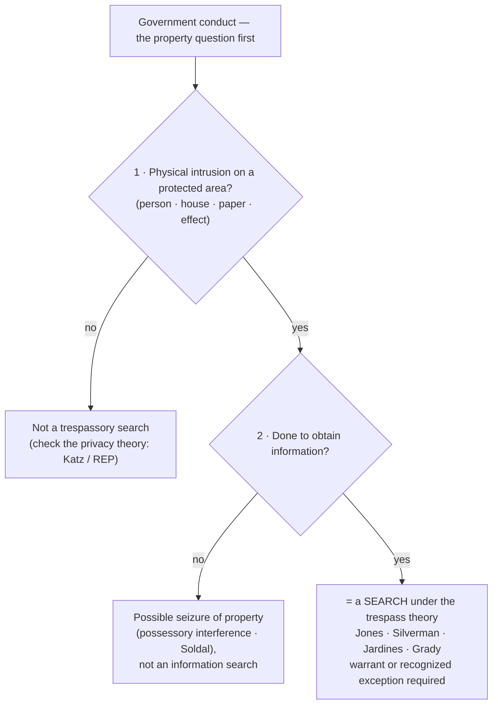
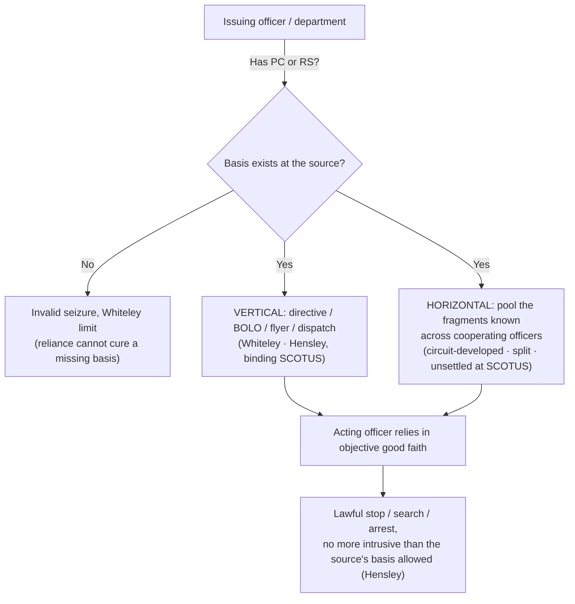

# S9 R1 panel-review — Opus model-diversity lane (prompt pack)

You are the **Claude/Opus** leg of the S9 three-lane adversarial panel (1 Claude + 2 Codex, R1). The two Codex lanes carry the A (support/quote-fidelity) and B (currency/treatment) attack lenses; **you carry model diversity and MUST vote on every paneled assertion across BOTH lenses' concerns.** You are refute-framed: try hard to break each assertion; **default to REFUTED on uncertainty**; never fabricate a cite, quote, or holding; use ONLY the evidence inlined below (no search, no outside knowledge). You are a SIGHTED reviewer — the FULL lake record (judgment fields included) is inlined.

You are a WRITER lane, not an adjudicator: you FIND and VOTE. You do not tally, adjudicate, or close any row — the orchestrator does.

For EACH group below, return one JSON object with the exact `reviewed[]` shape from the output contract (identical framing to the Codex lenses). Emit a finding object ONLY for a real defect (verdict refuted / stands-modified); a group you find wholly clean returns all-`stands` verdicts (the harness records a clean attestation). Concatenate the per-group JSON objects into a top-level `{"packs": [ ... ]}` array, one entry per group, each carrying its `group_id`.


OUTPUT CONTRACT — return ONE JSON object, nothing else:
{
  "lens": "A" | "B",
  "group_id": "<echo the group id>",
  "reviewed": [
    {
      "assertion_id": "<from group_inventory.jsonl>",
      "dimension": "existence|support|quote_fidelity|pincite|treatment|black_letter",
      "verdict": "stands" | "refuted" | "stands-modified",
      "verifiable_from_disclosed": true | false,
      "defect": null,   // null when verdict=="stands"; else an object:
      //  {"problem": "...", "severity": "high|medium|low", "proposed_fix": "...", "evidence_quote": "verbatim from disclosed evidence or null", "needs_cl": true|false, "locator_note": "..."}
      "reasons": ["short evidence-grounded reason", "..."],
      "breaks_true_positives": true | false,
      "residual_risks": ["..."],
      "suggested_tightening": "... or null"
    }
  ],
  "notes": ""
}
Rules: verdict=='stands' <=> defect==null (assertion survives your attack). verdict=='refuted' <=> a real defect (the assertion as framed is wrong). verdict=='stands-modified' <=> survives but needs a stated modification (a minor defect). Review EVERY assertion_id in group_inventory.jsonl exactly once. Output ONLY the JSON object.
---

## GROUP: content/searches/two-definitions-of-search/Trespass.md  (`doctrine`, 9 assertions)

### content_page

```
---
weight: 20
title: "Trespass"
aliases:
  - "Trespass Theory of Search"
  - "Physical-Intrusion Theory"
  - "Trespass Test (Jones)"
topic: Trespass — the physical-intrusion theory of search
type: doctrine
amendment: "U.S. Const. amend. IV"
jurisdiction: "Federal (U.S. Const. amend. IV); SCOTUS baseline"
status: draft
related:
  - "[[Reasonable Expectation of Privacy]]"
  - "[[Two Definitions of Search]]"
  - "[[Curtilage]]"
  - "[[Open Fields]]"
  - "[[Plain View Doctrine]]"
  - "[[Standing to Challenge a Search]]"
---

# Trespass

*Before* Katz *even enters the picture: did officers physically intrude on a constitutionally protected area (a person, house, paper, or effect) to gather information? If so, it is a search, whatever a privacy analysis would say.*

> [!rule] Black-letter rule
> Under the **trespass theory**, government conduct is a Fourth Amendment **search** when officers **(1)** physically intrude on a constitutionally protected area (the textual **"persons, houses, papers, and effects"**) and **(2)** do so **to obtain information**. *[[United States v. Jones|Jones]]*, 565 U.S. 400, [404–05](https://www.courtlistener.com/opinion/622304/united-states-v-jones/) (2012). This common-law test is an **independent** basis for a search: the *[[Katz v. United States|Katz]]* privacy test "has been *added to*, not *substituted for*, the common-law trespassory test." *[[United States v. Jones#^pin-409|Id.]]* at 409. A trespass to gather information is a search even where a pure privacy analysis would be contested, and the intrusion need not be a "trespass" under state property law. *[[Silverman v. United States|Silverman]]*, 365 U.S. 505 (1961).
> ^rule-trespass

## The Brief

**What the trespass theory is, and what it is not.** The trespass theory is the *older* of the [[Two Definitions of Search|two definitions of a search]], and after decades of dormancy it is again live law. It asks a property question, not a privacy one: did the government physically occupy or intrude upon a protected place or thing to learn something? It is **not** a test of how much the intrusion offended anyone's expectations, and it is **not** defeated by the fact that what the officer observed was already exposed to public view. Where it applies, it resolves the threshold question on its own, without any *[[Katz v. United States|Katz]]* inquiry. This page owns the trespass test itself; its privacy counterpart lives on [[Reasonable Expectation of Privacy]], and the [[Two Definitions of Search|overview]] shows how the two fit together.

**The test: two elements, both required.** A trespassory search has two parts. **First**, a **physical intrusion** onto, or occupation of, a constitutionally protected area, meaning one of the textual categories the Amendment names: persons, houses, papers, and effects. **Second**, that the intrusion was done **to obtain information**. *[[United States v. Jones|Jones]]* states both together: "The Government physically occupied private property for the purpose of obtaining information," and "such a physical intrusion would have been considered a 'search' . . . when [the Amendment] was adopted." *[[United States v. Jones#^pin-404a|Jones]]*, 565 U.S. at [404–05](https://www.courtlistener.com/opinion/622304/united-states-v-jones/). Trespass alone is not enough; the intrusion must be joined with an attempt to gather information.

**The revival: *[[Katz v. United States|Katz]]* did not repeal the property baseline.** For most of the twentieth century the trespass test was thought to have been supplanted by privacy analysis. *[[United States v. Jones|Jones]]* corrected that: the *[[Katz v. United States|Katz]]* reasonable-expectation-of-privacy test "has been *added to*, not *substituted for*, the common-law trespassory test." *[[United States v. Jones#^pin-409|Id.]]* at 409. *[[United States v. Jones|Jones]]* itself decided the case on trespass grounds without reaching *[[Katz v. United States|Katz]]*, so the property baseline was revived rather than replaced. The Amendment "protects property as well as privacy." *[[Soldal v. Cook County#^pin-62|Soldal]]*, 506 U.S. at [62](https://www.courtlistener.com/opinion/112795/soldal-v-cook-county/#:~:text=our%20cases%20unmistakably%20hold%20that). The practical payoff: a trespass to gather information is independently a search even where a pure privacy analysis would be contested, as it would be for a car's location on public roads.

**Not measured by state property law.** The "trespass" that matters is a federal Fourth Amendment concept, not a technical violation of local property rules. A "spike mike" driven through a party wall into a house was a search because officers made "an unauthorized physical penetration into the premises," and the Court declined to rest the outcome "upon the technicality of a trespass upon a party wall as a matter of local law." *[[Silverman v. United States|Silverman]]*, 365 U.S. 505 (1961). The question is federal and functional: did the government physically invade a protected space to obtain information?

**[[Curtilage]] and the implied license.** The protected "house" extends to its **[[Curtilage|curtilage]]**, the area immediately surrounding and associated with the home. Officers may approach a home the way an ordinary visitor would, but bringing a drug dog onto the front porch to hunt for evidence exceeds the "implied license" that lets a visitor knock, so it is a trespassory search. *[[Florida v. Jardines|Jardines]]*, 569 U.S. 1 (2013). The scope of that protected ground, and where it ends, is developed on [[Curtilage]] and [[Open Fields]].

**Property and possession: the seizure branch.** The property line also captures a distinct wrong: a **seizure of property**, which occurs on any "meaningful interference with an individual's possessory interests in that property," independent of any privacy or liberty interest. *[[Soldal v. Cook County|Soldal]]*, 506 U.S. 56, [61–62](https://www.courtlistener.com/opinion/112795/soldal-v-cook-county/) (1992). Dragging a family's mobile home off its lot was a seizure even though nothing private was inspected. Keep the branches straight: a trespassory *search* gathers information, while a *seizure* interferes with possession, and one can happen without the other.

**Bodies are protected too.** The protected "person" is literal. A State conducts a search when it attaches a satellite-based monitoring device to a person's body, without consent, to track his movements; the civil label on the monitoring program does not remove the conduct from the Fourth Amendment. *[[Grady v. North Carolina|Grady]]*, 575 U.S. 306 (2015). *[[Grady v. North Carolina|Grady]]* is *[[United States v. Jones|Jones]]* applied to the body rather than the car: a physical attachment to an "effect" or a person, made to obtain locational information, is a search whose reasonableness is then decided separately.

**Even a slight movement counts.** Because the theory turns on physical intrusion rather than the magnitude of the privacy loss, even a minimal manipulation crosses the line when it is done to expose hidden information. Moving stereo components a few inches to read concealed serial numbers "did produce a new invasion of respondent's privacy unjustified by the exigent circumstance," and "[a] search is a search, even if it happens to disclose nothing but the bottom of a turntable." *[[Arizona v. Hicks|Hicks]]*, 480 U.S. 321, [325](https://www.courtlistener.com/opinion/111834/arizona-v-hicks/) (1987).

**Burden, standard of review, and remedy.** The threshold "did a search occur?" question is one of law, reviewed [[Common Legal Terms#de-novo|de novo]] (its subsidiary historical facts for [[Common Legal Terms#clear-error|clear error]]), and the movant raises it: the party seeking suppression must show both that the conduct was a Fourth Amendment search and that **he personally** held the invaded property or possessory interest (see [[Standing to Challenge a Search]]). Only once a **warrantless** search is established does the burden shift to the government to justify it under the warrant requirement or a recognized exception. If the search was unreasonable, the evidence and its fruits are subject to exclusion (see [[The Exclusionary Rule]]).

**Apply it.**
1. **Ask the property question first.** Did officers physically enter or occupy a person, house, paper, or effect? If yes, you may have a search without ever reaching privacy (*[[United States v. Jones|Jones]]*).
2. **Tie the intrusion to information-gathering.** The physical contact must be aimed at learning something; a trespass with no investigative purpose is not this kind of search (*[[United States v. Jones|Jones]]*).
3. **Check the [[Curtilage|curtilage]] license.** An approach a visitor could make is permitted; exceeding it, as by deploying a dog to investigate the porch, is trespassory (*[[Florida v. Jardines|Jardines]]*).
4. **Separate search from seizure.** If the conduct interfered with possession rather than gathered information, analyze it as a seizure of property (*[[Soldal v. Cook County|Soldal]]*).

**Common pitfalls.**
- **"No trespass, no search."** That was *[[Olmstead v. United States|Olmstead]]*, and *[[Katz v. United States|Katz]]* overruled it. A wiretap, a thermal scan, or long-term cell-site data can be a search with zero physical entry; the trespass theory is a floor, not a ceiling (see [[Reasonable Expectation of Privacy]]).
- **Treating *[[Olmstead v. United States|Olmstead]]* as a dead letter.** It is overruled on the privacy point, but its property instinct was **revived** by *[[United States v. Jones|Jones]]*; the property baseline is live law again.
- **Requiring a state-law trespass.** The federal search question does not turn on local property technicalities (*[[Silverman v. United States|Silverman]]*).
- **Forgetting that trespass needs an information purpose.** A physical touch not aimed at obtaining information is not a trespassory search; the two elements are conjunctive (*[[United States v. Jones|Jones]]*).

## Key cases

| Case | Holding | Opinion |
|---|---|---|
| *[[United States v. Jones]]*, 565 U.S. 400 (2012) | **Anchor.** Installing a GPS tracker on a vehicle and monitoring it is a search under the revived trespass theory: a physical intrusion on an "effect" to obtain information; the *[[Katz v. United States\|Katz]]* test is "added to, not substituted for" the trespassory test. | [opinion](https://www.courtlistener.com/opinion/7350871/united-states-v-jones/) |
| *[[Silverman v. United States]]*, 365 U.S. 505 (1961) | A "spike mike" physically penetrating the wall into the house is a search: an unauthorized physical intrusion into a protected area, not gauged by local-law "technical trespass" niceties. | [opinion](https://www.courtlistener.com/opinion/106187/silverman-v-united-states/) |
| *[[Florida v. Jardines]]*, 569 U.S. 1 (2013) | Bringing a drug dog onto the home's **[[Curtilage\|curtilage]]** (the front porch) to investigate exceeded the visitor's implied license: a trespassory search. | [opinion](https://www.courtlistener.com/opinion/856347/florida-v-jardines/) |
| *[[Grady v. North Carolina]]*, 575 U.S. 306 (2015) | **Anchor.** Attaching a satellite-monitoring device to a person's body to track his movements is a search; the civil character of the program does not remove it from the Fourth Amendment. Reasonableness left for remand. | [opinion](https://www.courtlistener.com/opinion/2789928/grady-v-north-carolina/) |
| *[[Olmstead v. United States]]*, 277 U.S. 438 (1928) | The origin point: wiretapping with **no physical entry** was **not** a search under a property-only framing. Overruled on privacy by *[[Katz v. United States\|Katz]]*; the property instinct was later revived by *[[United States v. Jones\|Jones]]*. | [opinion](https://www.courtlistener.com/opinion/101320/olmstead-v-united-states/) |
| *[[Gouled v. United States]]*, 255 U.S. 298 (1921) | Entry obtained by **stealth, ruse, or social pretext** can still render the ensuing search a Fourth Amendment violation. (Its separate "mere-evidence" rule was overruled by *[[Warden v. Hayden]]*; the ruse-entry holding survives.) | [opinion](https://www.courtlistener.com/opinion/99745/gouled-v-united-states/) |

## Related cases across doctrines

These are treated in full on other doctrine pages but bear on the trespass theory, framed for it here.

| Case | Relevance here | Primary home | Opinion |
|---|---|---|---|
| *[[Arizona v. Hicks]]*, 480 U.S. 321 (1987) | Moving stereo equipment a few inches to read concealed serial numbers was a **separate search**: even minimal physical manipulation to obtain hidden information crosses the line. | [[Plain View Doctrine]] | [opinion](https://www.courtlistener.com/opinion/111834/arizona-v-hicks/) |
| *[[Soldal v. Cook County]]*, 506 U.S. 56 (1992) | The property baseline's **seizure branch**: "meaningful interference with . . . possessory interests" is a seizure independent of privacy; keeps the trespass-search and property-seizure branches straight. | [[Seizure of Property]] | [opinion](https://www.courtlistener.com/opinion/112795/soldal-v-cook-county/) |

## Visual



## Sources

- [*United States v. Jones*, 565 U.S. 400 (2012)](https://www.courtlistener.com/opinion/7350871/united-states-v-jones/) (pinpoints: 404–05, 409)
- [*Silverman v. United States*, 365 U.S. 505 (1961)](https://www.courtlistener.com/opinion/106187/silverman-v-united-states/) (pinpoints: 509, 511)
- [*Florida v. Jardines*, 569 U.S. 1 (2013)](https://www.courtlistener.com/opinion/856347/florida-v-jardines/) (pinpoints: 6, 9)
- [*Soldal v. Cook County*, 506 U.S. 56 (1992)](https://www.courtlistener.com/opinion/112795/soldal-v-cook-county/) (pinpoints: 61, 62)
- [*Grady v. North Carolina*, 575 U.S. 306 (2015)](https://www.courtlistener.com/opinion/2789928/grady-v-north-carolina/)
- [*Olmstead v. United States*, 277 U.S. 438 (1928)](https://www.courtlistener.com/opinion/101320/olmstead-v-united-states/) (pinpoint: 464)
- [*Gouled v. United States*, 255 U.S. 298 (1921)](https://www.courtlistener.com/opinion/99745/gouled-v-united-states/) (pinpoint: 306)
- [*Arizona v. Hicks*, 480 U.S. 321 (1987)](https://www.courtlistener.com/opinion/111834/arizona-v-hicks/) (pinpoint: 325)

```

### group_inventory (assertions under review)

```jsonl
{"assertion_id": "0299c81afb0ab7de", "dimension": "existence", "kind": "case_cite", "locator": {"case": "Gouled v. United States", "table_line": 51}, "payload": {"case": "Gouled v. United States", "cells": ["*[[Gouled v. United States]]*, 255 U.S. 298 (1921)", "Entry obtained by **stealth, ruse, or social pretext** can still render the ensuing search a Fourth Amendment violation. (Its separate \"mere-evidence\" rule was overruled by *[[Warden v. Hayden]]*; the ruse-entry holding survives.)", "[opinion](https://www.courtlistener.com/opinion/99745/gouled-v-united-states/)"], "header": ["Case", "Holding", "Opinion"]}}
{"assertion_id": "1730bfd5affedc79", "dimension": "existence", "kind": "case_cite", "locator": {"case": "Soldal v. Cook County", "table_line": 60}, "payload": {"case": "Soldal v. Cook County", "cells": ["*[[Soldal v. Cook County]]*, 506 U.S. 56 (1992)", "The property baseline's **seizure branch**: \"meaningful interference with . . . possessory interests\" is a seizure independent of privacy; keeps the trespass-search and property-seizure branches straight.", "[[Seizure of Property]]", "[opinion](https://www.courtlistener.com/opinion/112795/soldal-v-cook-county/)"], "header": ["Case", "Relevance here", "Primary home", "Opinion"]}}
{"assertion_id": "2d7def96e5aa3693", "dimension": "existence", "kind": "case_cite", "locator": {"case": "Olmstead v. United States", "table_line": 50}, "payload": {"case": "Olmstead v. United States", "cells": ["*[[Olmstead v. United States]]*, 277 U.S. 438 (1928)", "The origin point: wiretapping with **no physical entry** was **not** a search under a property-only framing. Overruled on privacy by *[[Katz v. United States\\|Katz]]*; the property instinct was later revived by *[[United States v. Jones\\|Jones]]*.", "[opinion](https://www.courtlistener.com/opinion/101320/olmstead-v-united-states/)"], "header": ["Case", "Holding", "Opinion"]}}
{"assertion_id": "57b41986e5818e86", "dimension": "existence", "kind": "case_cite", "locator": {"case": "Grady v. North Carolina", "table_line": 49}, "payload": {"case": "Grady v. North Carolina", "cells": ["*[[Grady v. North Carolina]]*, 575 U.S. 306 (2015)", "**Anchor.** Attaching a satellite-monitoring device to a person's body to track his movements is a search; the civil character of the program does not remove it from the Fourth Amendment. Reasonableness left for remand.", "[opinion](https://www.courtlistener.com/opinion/2789928/grady-v-north-carolina/)"], "header": ["Case", "Holding", "Opinion"]}}
{"assertion_id": "7531fb65f8ddec88", "dimension": "existence", "kind": "case_cite", "locator": {"case": "Silverman v. United States", "table_line": 47}, "payload": {"case": "Silverman v. United States", "cells": ["*[[Silverman v. United States]]*, 365 U.S. 505 (1961)", "A \"spike mike\" physically penetrating the wall into the house is a search: an unauthorized physical intrusion into a protected area, not gauged by local-law \"technical trespass\" niceties.", "[opinion](https://www.courtlistener.com/opinion/106187/silverman-v-united-states/)"], "header": ["Case", "Holding", "Opinion"]}}
{"assertion_id": "8ae43d42706e68c1", "dimension": "existence", "kind": "case_cite", "locator": {"case": "United States v. Jones", "table_line": 46}, "payload": {"case": "United States v. Jones", "cells": ["*[[United States v. Jones]]*, 565 U.S. 400 (2012)", "**Anchor.** Installing a GPS tracker on a vehicle and monitoring it is a search under the revived trespass theory: a physical intrusion on an \"effect\" to obtain information; the *[[Katz v. United States\\|Katz]]* test is \"added to, not substituted for\" the trespassory test.", "[opinion](https://www.courtlistener.com/opinion/7350871/united-states-v-jones/)"], "header": ["Case", "Holding", "Opinion"]}}
{"assertion_id": "ce6002fcb188f675", "dimension": "existence", "kind": "case_cite", "locator": {"case": "Arizona v. Hicks", "table_line": 59}, "payload": {"case": "Arizona v. Hicks", "cells": ["*[[Arizona v. Hicks]]*, 480 U.S. 321 (1987)", "Moving stereo equipment a few inches to read concealed serial numbers was a **separate search**: even minimal physical manipulation to obtain hidden information crosses the line.", "[[Plain View Doctrine]]", "[opinion](https://www.courtlistener.com/opinion/111834/arizona-v-hicks/)"], "header": ["Case", "Relevance here", "Primary home", "Opinion"]}}
{"assertion_id": "f702990b7b1bcd60", "dimension": "existence", "kind": "case_cite", "locator": {"case": "Florida v. Jardines", "table_line": 48}, "payload": {"case": "Florida v. Jardines", "cells": ["*[[Florida v. Jardines]]*, 569 U.S. 1 (2013)", "Bringing a drug dog onto the home's **[[Curtilage\\|curtilage]]** (the front porch) to investigate exceeded the visitor's implied license: a trespassory search.", "[opinion](https://www.courtlistener.com/opinion/856347/florida-v-jardines/)"], "header": ["Case", "Holding", "Opinion"]}}
{"assertion_id": "0e2fa65051105bcd", "dimension": "support", "kind": "proposition", "locator": {"callout": "^rule-trespass"}, "payload": {"anchor": "^rule-trespass", "statement": "[!rule] Black-letter rule\nUnder the **trespass theory**, government conduct is a Fourth Amendment **search** when officers **(1)** physically intrude on a constitutionally protected area (the textual **\"persons, houses, papers, and effects\"**) and **(2)** do so **to obtain information**. *[[United States v. Jones|Jones]]*, 565 U.S. 400, [404–05](https://www.courtlistener.com/opinion/622304/united-states-v-jones/) (2012). This common-law test is an **independent** basis for a search: the *[[Katz v. United States|Katz]]* privacy test \"has been *added to*, not *substituted for*, the common-law trespassory test.\" *[[United States v. Jones#^pin-409|Id.]]* at 409. A trespass to gather information is a search even where a pure privacy analysis would be contested, and the intrusion need not be a \"trespass\" under state property law. *[[Silverman v. United States|Silverman]]*, 365 U.S. 505 (1961)."}}
```

### lake record — Arizona v. Hicks

```json
{
  "schema_version": "s2.v1",
  "record_id": "Arizona v. Hicks",
  "stub": false,
  "status": "verified",
  "identity": {
    "case_name": "Arizona v. Hicks",
    "case_name_short": "Hicks",
    "case_name_full": "Arizona v. Hicks",
    "input_case_name": "Arizona v. Hicks",
    "court": "U.S. Supreme Court",
    "court_id": "scotus",
    "court_level": "scotus",
    "circuit": null,
    "state": null,
    "date_decided": "1987-03-03",
    "year": 1987,
    "docket": null,
    "cluster_id": 111834,
    "lead_opinion_id": 9430865,
    "sibling_ids": [
      111834,
      9430865,
      9430866,
      9430867,
      9430868,
      9430869,
      9430870
    ],
    "absolute_url": "/opinion/111834/arizona-v-hicks/",
    "identity_method": "citation+party-text",
    "expected_citation_found": true,
    "party_name_in_text": true,
    "canonical_name_match": true,
    "alternates": [],
    "reason_code": null
  },
  "citations": {
    "official": {
      "cite": "480 U.S. 321",
      "volume": "480",
      "reporter": "U.S.",
      "page": "321",
      "type": 1,
      "selected_official": true,
      "source": "cluster.citations[]"
    },
    "parallel": [
      {
        "cite": "107 S. Ct. 1149",
        "volume": "107",
        "reporter": "S. Ct.",
        "page": "1149",
        "type": 1,
        "selected_official": false,
        "source": "cluster.citations[]"
      },
      {
        "cite": "94 L. Ed. 2d 347",
        "volume": "94",
        "reporter": "L. Ed. 2d",
        "page": "347",
        "type": 1,
        "selected_official": false,
        "source": "cluster.citations[]"
      },
      {
        "cite": "55 U.S.L.W. 4258",
        "volume": "55",
        "reporter": "U.S.L.W.",
        "page": "4258",
        "type": 4,
        "selected_official": false,
        "source": "cluster.citations[]"
      }
    ],
    "vendor_neutral": [
      {
        "cite": "1987 U.S. LEXIS 1056",
        "volume": "1987",
        "reporter": "U.S. LEXIS",
        "page": "1056",
        "type": 6,
        "selected_official": false,
        "source": "cluster.citations[]"
      }
    ],
    "all": [
      {
        "cite": "480 U.S. 321",
        "volume": "480",
        "reporter": "U.S.",
        "page": "321",
        "type": 1,
        "selected_official": false,
        "source": "cluster.citations[]"
      },
      {
        "cite": "107 S. Ct. 1149",
        "volume": "107",
        "reporter": "S. Ct.",
        "page": "1149",
        "type": 1,
        "selected_official": false,
        "source": "cluster.citations[]"
      },
      {
        "cite": "94 L. Ed. 2d 347",
        "volume": "94",
        "reporter": "L. Ed. 2d",
        "page": "347",
        "type": 1,
        "selected_official": false,
        "source": "cluster.citations[]"
      },
      {
        "cite": "1987 U.S. LEXIS 1056",
        "volume": "1987",
        "reporter": "U.S. LEXIS",
        "page": "1056",
        "type": 6,
        "selected_official": false,
        "source": "cluster.citations[]"
      },
      {
        "cite": "55 U.S.L.W. 4258",
        "volume": "55",
        "reporter": "U.S.L.W.",
        "page": "4258",
        "type": 4,
        "selected_official": false,
        "source": "cluster.citations[]"
      }
    ],
    "display": "480 U.S. 321",
    "official_selection": {
      "court_class": "scotus",
      "selected": "480 U.S. 321",
      "reason": "selected_rank_1"
    }
  },
  "pinpoints": [
    {
      "id": "pin-324",
      "page": null,
      "quote": "and if so whether the plain-view doctrine required probable cause rather than mere reasonable suspicion. ## Rule Moving the equipment to expose hidden information was a new search beyond the entry's justification: the moving of the components",
      "star_marker": null,
      "quote_fidelity": "mismatch",
      "pinpoint_status": "slip-only",
      "position": null
    },
    {
      "id": "pin-325",
      "page": null,
      "quote": "A search is a search, even if it happens to disclose nothing but the bottom of a turntable.",
      "star_marker": "325",
      "quote_fidelity": "matched",
      "pinpoint_status": "star-verified",
      "position": 7220,
      "fragment": "#:~:text=A%20search%20is%20a%20search%2C",
      "fragment_validated_at": "2026-07-09T15:40:45Z"
    },
    {
      "id": "pin-326",
      "page": null,
      "quote": "We now hold that probable cause is required. To say otherwise would be to cut the 'plain view' doctrine loose from its theoretical and practical moorings.",
      "star_marker": null,
      "quote_fidelity": "mismatch",
      "pinpoint_status": "slip-only",
      "position": null
    }
  ],
  "treatment": {
    "field_i_validity": "good_law",
    "as_of_content": "1987-03-03",
    "as_of_treatment": "2026-06-30",
    "composite_basis": "migration-seed",
    "composite_basis_ref": "Arizona v. Hicks",
    "varies_by_point": false,
    "scope_note": "Old as_of seeds as_of_treatment; S2 derivation re-derives and may downgrade.",
    "point_overrides": [],
    "edges": [
      {
        "citing_case": {
          "name": "Martin v. State",
          "cluster_id": 10740496,
          "cite": null,
          "field_ii": "questioned"
        },
        "field_ii": "questioned",
        "field_iii": "mentioned",
        "point": null,
        "proposed": true,
        "journal_ref": "Arizona v. Hicks:lane1_negative"
      },
      {
        "citing_case": {
          "name": "State v. Bock (A169480)",
          "cluster_id": 10134134,
          "cite": [
            "310 Or. App. 329",
            "485 P.3d 931"
          ],
          "field_ii": "overruled"
        },
        "field_ii": "overruled",
        "field_iii": "mentioned",
        "point": null,
        "proposed": true,
        "journal_ref": "Arizona v. Hicks:lane1_negative"
      },
      {
        "citing_case": {
          "name": "Commonwealth v. Arias",
          "cluster_id": 4600764,
          "cite": [
            "119 N.E.3d 257",
            "481 Mass. 604"
          ],
          "field_ii": "superseded_by_statute"
        },
        "field_ii": "superseded_by_statute",
        "field_iii": "mentioned",
        "point": null,
        "proposed": true,
        "journal_ref": "Arizona v. Hicks:lane1_negative"
      },
      {
        "citing_case": {
          "name": "Nathan Ray Foreman v. State",
          "cluster_id": 4532255,
          "cite": null,
          "field_ii": "questioned"
        },
        "field_ii": "questioned",
        "field_iii": "mentioned",
        "point": null,
        "proposed": true,
        "journal_ref": "Arizona v. Hicks:lane1_negative"
      },
      {
        "citing_case": {
          "name": "Nathan Ray Foreman v. State",
          "cluster_id": 4532252,
          "cite": null,
          "field_ii": "questioned"
        },
        "field_ii": "questioned",
        "field_iii": "mentioned",
        "point": null,
        "proposed": true,
        "journal_ref": "Arizona v. Hicks:lane1_negative"
      },
      {
        "citing_case": {
          "name": "Barry Trynell Davis, Jr. v. State of Florida",
          "cluster_id": 4390534,
          "cite": [
            "217 So. 3d 1006",
            "42 Fla. L. Weekly Supp. 558",
            "2017 WL 1954979",
            "2017 Fla. LEXIS 1055"
          ],
          "field_ii": "overruled"
        },
        "field_ii": "overruled",
        "field_iii": "mentioned",
        "point": null,
        "proposed": true,
        "journal_ref": "Arizona v. Hicks:lane1_negative"
      },
      {
        "citing_case": {
          "name": "Commonwealth v. Kaeppeler",
          "cluster_id": 3166351,
          "cite": [
            "473 Mass. 396",
            "42 N.E.3d 1090"
          ],
          "field_ii": "superseded_by_statute"
        },
        "field_ii": "superseded_by_statute",
        "field_iii": "mentioned",
        "point": null,
        "proposed": true,
        "journal_ref": "Arizona v. Hicks:lane1_negative"
      },
      {
        "citing_case": {
          "name": "United States v. Gamache",
          "cluster_id": 2814721,
          "cite": [
            "792 F.3d 194",
            "2015 U.S. App. LEXIS 11586",
            "2015 WL 4071911"
          ],
          "field_ii": "overruled"
        },
        "field_ii": "overruled",
        "field_iii": "mentioned",
        "point": null,
        "proposed": true,
        "journal_ref": "Arizona v. Hicks:lane1_negative"
      },
      {
        "citing_case": {
          "name": "State v. Telshaw",
          "cluster_id": 2701202,
          "cite": [
            "2011 Ohio 3373",
            "195 Ohio App. 3d 596",
            "961 N.E.2d 223"
          ],
          "field_ii": "overruled"
        },
        "field_ii": "overruled",
        "field_iii": "mentioned",
        "point": null,
        "proposed": true,
        "journal_ref": "Arizona v. Hicks:lane1_negative"
      },
      {
        "citing_case": {
          "name": "Horton v. California",
          "cluster_id": 112448,
          "cite": [
            "110 L. Ed. 2d 112",
            "110 S. Ct. 2301",
            "496 U.S. 128",
            "1990 U.S. LEXIS 2937"
          ],
          "field_ii": "questioned"
        },
        "field_ii": "questioned",
        "field_iii": "mentioned",
        "point": null,
        "proposed": true,
        "journal_ref": "Arizona v. Hicks:lane2_top_cited"
      },
      {
        "citing_case": {
          "name": "Wilson v. Layne",
          "cluster_id": 118289,
          "cite": [
            "143 L. Ed. 2d 818",
            "119 S. Ct. 1692",
            "526 U.S. 603",
            "1999 U.S. LEXIS 3633"
          ],
          "field_ii": "superseded_by_statute"
        },
        "field_ii": "superseded_by_statute",
        "field_iii": "mentioned",
        "point": null,
        "proposed": true,
        "journal_ref": "Arizona v. Hicks:lane2_top_cited"
      },
      {
        "citing_case": {
          "name": "Minnesota v. Dickerson",
          "cluster_id": 112873,
          "cite": [
            "124 L. Ed. 2d 334",
            "113 S. Ct. 2130",
            "508 U.S. 366",
            "1993 U.S. LEXIS 4018"
          ],
          "field_ii": "questioned"
        },
        "field_ii": "questioned",
        "field_iii": "mentioned",
        "point": null,
        "proposed": true,
        "journal_ref": "Arizona v. Hicks:lane2_top_cited"
      },
      {
        "citing_case": {
          "name": "Skinner v. Railway Labor Executives' Assn.",
          "cluster_id": 112219,
          "cite": [
            "103 L. Ed. 2d 639",
            "109 S. Ct. 1402",
            "489 U.S. 602",
            "1989 U.S. LEXIS 1568",
            "4 I.E.R. Cas. (BNA) 224",
            "1989 CCH OSHD 28,476",
            "57 U.S.L.W. 4324",
            "13 OSHC (BNA) 2065",
            "130 L.R.R.M. (BNA) 2857",
            "49 Empl. Prac. Dec. (CCH) 38,791"
          ],
          "field_ii": "abrogated"
        },
        "field_ii": "abrogated",
        "field_iii": "mentioned",
        "point": null,
        "proposed": true,
        "journal_ref": "Arizona v. Hicks:lane2_top_cited"
      },
      {
        "citing_case": {
          "name": "Maryland v. Buie",
          "cluster_id": 112384,
          "cite": [
            "108 L. Ed. 2d 276",
            "110 S. Ct. 1093",
            "494 U.S. 325",
            "1990 U.S. LEXIS 1176"
          ],
          "field_ii": "questioned"
        },
        "field_ii": "questioned",
        "field_iii": "mentioned",
        "point": null,
        "proposed": true,
        "journal_ref": "Arizona v. Hicks:lane2_top_cited"
      },
      {
        "citing_case": {
          "name": "Kyllo v. United States",
          "cluster_id": 118443,
          "cite": [
            "150 L. Ed. 2d 94",
            "121 S. Ct. 2038",
            "533 U.S. 27",
            "2001 U.S. LEXIS 4487"
          ],
          "field_ii": "criticized"
        },
        "field_ii": "criticized",
        "field_iii": "mentioned",
        "point": null,
        "proposed": true,
        "journal_ref": "Arizona v. Hicks:lane2_top_cited"
      },
      {
        "citing_case": {
          "name": "Vernonia School District 47J v. Acton",
          "cluster_id": 117964,
          "cite": [
            "132 L. Ed. 2d 564",
            "115 S. Ct. 2386",
            "515 U.S. 646",
            "1995 U.S. LEXIS 4275"
          ],
          "field_ii": "questioned"
        },
        "field_ii": "questioned",
        "field_iii": "mentioned",
        "point": null,
        "proposed": true,
        "journal_ref": "Arizona v. Hicks:lane2_top_cited"
      },
      {
        "citing_case": {
          "name": "Hudson v. Michigan",
          "cluster_id": 145646,
          "cite": [
            "165 L. Ed. 2d 56",
            "126 S. Ct. 2159",
            "547 U.S. 586",
            "2006 U.S. LEXIS 4677"
          ],
          "field_ii": "overruled"
        },
        "field_ii": "overruled",
        "field_iii": "mentioned",
        "point": null,
        "proposed": true,
        "journal_ref": "Arizona v. Hicks:lane2_top_cited"
      },
      {
        "citing_case": {
          "name": "Soldal v. Cook County",
          "cluster_id": 112795,
          "cite": [
            "121 L. Ed. 2d 450",
            "113 S. Ct. 538",
            "506 U.S. 56",
            "1992 U.S. LEXIS 7835",
            "92 Daily Journal DAR 16378",
            "61 U.S.L.W. 4019",
            "6 Fla. L. Weekly Fed. S 769",
            "92 Cal. Daily Op. Serv. 9794"
          ],
          "field_ii": "questioned"
        },
        "field_ii": "questioned",
        "field_iii": "mentioned",
        "point": null,
        "proposed": true,
        "journal_ref": "Arizona v. Hicks:lane2_top_cited"
      },
      {
        "citing_case": {
          "name": "People v. Bradford",
          "cluster_id": 1239150,
          "cite": [
            "15 Cal. 4th 1229",
            "939 P.2d 259",
            "97 Daily Journal DAR 9003",
            "97 Cal. Daily Op. Serv. 5537",
            "65 Cal. Rptr. 2d 145",
            "1997 Cal. LEXIS 3699"
          ],
          "field_ii": "overruled"
        },
        "field_ii": "overruled",
        "field_iii": "mentioned",
        "point": null,
        "proposed": true,
        "journal_ref": "Arizona v. Hicks:lane2_top_cited"
      },
      {
        "citing_case": {
          "name": "United States v. Marvin Berkowitz",
          "cluster_id": 557342,
          "cite": [
            "927 F.2d 1376",
            "1991 U.S. App. LEXIS 4135",
            "1991 WL 33079"
          ],
          "field_ii": "questioned"
        },
        "field_ii": "questioned",
        "field_iii": "mentioned",
        "point": null,
        "proposed": true,
        "journal_ref": "Arizona v. Hicks:lane2_top_cited"
      },
      {
        "citing_case": {
          "name": "Commonwealth v. Grimstead",
          "cluster_id": 1376491,
          "cite": [
            "407 S.E.2d 47",
            "12 Va. App. 1066",
            "8 Va. Law Rep. 449",
            "1991 Va. App. LEXIS 205"
          ],
          "field_ii": "questioned"
        },
        "field_ii": "questioned",
        "field_iii": "mentioned",
        "point": null,
        "proposed": true,
        "journal_ref": "Arizona v. Hicks:lane2_top_cited"
      },
      {
        "citing_case": {
          "name": "United States v. Jose Luis Guzman and Sonia Cruz-Lazo",
          "cluster_id": 516479,
          "cite": [
            "864 F.2d 1512",
            "1988 U.S. App. LEXIS 17681",
            "1988 WL 138644"
          ],
          "field_ii": "questioned"
        },
        "field_ii": "questioned",
        "field_iii": "mentioned",
        "point": null,
        "proposed": true,
        "journal_ref": "Arizona v. Hicks:lane2_top_cited"
      },
      {
        "citing_case": {
          "name": "Zarnow v. CITY OF WICHITA FALLS, TEX.",
          "cluster_id": 152551,
          "cite": [
            "614 F.3d 161",
            "2010 U.S. App. LEXIS 16445",
            "2010 WL 3093443"
          ],
          "field_ii": "abrogated"
        },
        "field_ii": "abrogated",
        "field_iii": "mentioned",
        "point": null,
        "proposed": true,
        "journal_ref": "Arizona v. Hicks:lane2_top_cited"
      },
      {
        "citing_case": {
          "name": "People v. Bostic",
          "cluster_id": 2542685,
          "cite": [
            "148 P.3d 250",
            "2006 Colo. App. LEXIS 622",
            "2006 WL 1171864"
          ],
          "field_ii": "questioned"
        },
        "field_ii": "questioned",
        "field_iii": "mentioned",
        "point": null,
        "proposed": true,
        "journal_ref": "Arizona v. Hicks:lane2_top_cited"
      },
      {
        "citing_case": {
          "name": "People v. Clark",
          "cluster_id": 1121458,
          "cite": [
            "857 P.2d 1099",
            "5 Cal. 4th 950",
            "22 Cal. Rptr. 2d 689",
            "93 Daily Journal DAR 11122",
            "93 Cal. Daily Op. Serv. 6528",
            "1993 Cal. LEXIS 4179"
          ],
          "field_ii": "overruled"
        },
        "field_ii": "overruled",
        "field_iii": "mentioned",
        "point": null,
        "proposed": true,
        "journal_ref": "Arizona v. Hicks:lane2_top_cited"
      },
      {
        "citing_case": {
          "name": "United States v. Ronald Tobin, Clifford Roger Ackerson, United States of America v. Ronald Tobin",
          "cluster_id": 554960,
          "cite": [
            "923 F.2d 1506",
            "1991 U.S. App. LEXIS 2683"
          ],
          "field_ii": "questioned"
        },
        "field_ii": "questioned",
        "field_iii": "mentioned",
        "point": null,
        "proposed": true,
        "journal_ref": "Arizona v. Hicks:lane2_top_cited"
      },
      {
        "citing_case": {
          "name": "People v. Jones",
          "cluster_id": 2058953,
          "cite": [
            "830 N.E.2d 541",
            "215 Ill. 2d 261",
            "294 Ill. Dec. 129",
            "2005 Ill. LEXIS 632"
          ],
          "field_ii": "overruled"
        },
        "field_ii": "overruled",
        "field_iii": "mentioned",
        "point": null,
        "proposed": true,
        "journal_ref": "Arizona v. Hicks:lane2_top_cited"
      },
      {
        "citing_case": {
          "name": "People v. Champion",
          "cluster_id": 2032324,
          "cite": [
            "549 N.W.2d 849",
            "452 Mich. 92"
          ],
          "field_ii": "criticized"
        },
        "field_ii": "criticized",
        "field_iii": "mentioned",
        "point": null,
        "proposed": true,
        "journal_ref": "Arizona v. Hicks:lane2_top_cited"
      },
      {
        "citing_case": {
          "name": "People v. Woods",
          "cluster_id": 5607944,
          "cite": [
            "21 Cal. 4th 668",
            "99 Cal. Daily Op. Serv. 6990",
            "99 Daily Journal DAR 8867",
            "981 P.2d 1019",
            "88 Cal. Rptr. 2d 88",
            "1999 Cal. LEXIS 5534"
          ],
          "field_ii": "overruled"
        },
        "field_ii": "overruled",
        "field_iii": "mentioned",
        "point": null,
        "proposed": true,
        "journal_ref": "Arizona v. Hicks:lane2_top_cited"
      },
      {
        "citing_case": {
          "name": "State v. Bridges",
          "cluster_id": 1060919,
          "cite": [
            "963 S.W.2d 487",
            "1997 Tenn. LEXIS 642",
            "1997 WL 804620"
          ],
          "field_ii": "questioned"
        },
        "field_ii": "questioned",
        "field_iii": "mentioned",
        "point": null,
        "proposed": true,
        "journal_ref": "Arizona v. Hicks:lane2_top_cited"
      },
      {
        "citing_case": {
          "name": "Flamer v. State",
          "cluster_id": 1486303,
          "cite": [
            "585 A.2d 736",
            "1990 Del. LEXIS 408"
          ],
          "field_ii": "questioned"
        },
        "field_ii": "questioned",
        "field_iii": "mentioned",
        "point": null,
        "proposed": true,
        "journal_ref": "Arizona v. Hicks:lane2_top_cited"
      },
      {
        "citing_case": {
          "name": "People v. McKnight",
          "cluster_id": 4621444,
          "cite": [
            "2019 CO 36",
            "446 P.3d 397"
          ],
          "field_ii": "overruled"
        },
        "field_ii": "overruled",
        "field_iii": "mentioned",
        "point": null,
        "proposed": true,
        "journal_ref": "Arizona v. Hicks:lane2_top_cited"
      },
      {
        "citing_case": {
          "name": "Jones v. State",
          "cluster_id": 853051,
          "cite": [
            "783 N.E.2d 1132",
            "2003 WL 734194"
          ],
          "field_ii": "questioned"
        },
        "field_ii": "questioned",
        "field_iii": "mentioned",
        "point": null,
        "proposed": true,
        "journal_ref": "Arizona v. Hicks:lane2_top_cited"
      }
    ],
    "derivation": {
      "lane1_negative": {
        "query": "cites:(111834 OR 9430865 OR 9430866 OR 9430867 OR 9430868 OR 9430869 OR 9430870) AND (overrul* OR abrogat* OR supersed* OR \"recede from\" OR \"no longer good law\" OR vacat* OR reversed) ",
        "reviewed": 200,
        "cap": 200,
        "cap_hit": true,
        "final_cursor": "https://www.courtlistener.com/api/rest/v4/search/?cursor=cz0xMjQ4MTM0NDAwMDAwJnM9MjAxMDQ2MCZ0PW8mZD0yMDI2LTA3LTA0JnA9MTE%3D&fields=absolute_url%2CcaseName%2CcaseNameFull%2Ccitation%2CciteCount%2Ccluster_id%2Ccourt%2Ccourt_citation_string%2Ccourt_id%2CdateFiled%2Copinions%2Csibling_ids%2Cstatus%2Csyllabus&order_by=dateFiled+desc&page_size=100&q=cites%3A%28111834+OR+9430865+OR+9430866+OR+9430867+OR+9430868+OR+9430869+OR+9430870%29+AND+%28overrul%2A+OR+abrogat%2A+OR+supersed%2A+OR+%22recede+from%22+OR+%22no+longer+good+law%22+OR+vacat%2A+OR+reversed%29+&stat_Published=on&type=o",
        "audit_needed": true,
        "proposed_negative_events": 9,
        "audit_marker": "R15 treatment audit required",
        "triage_mode": "snippet-first",
        "snippet_field": "results[].opinions[].snippet",
        "triage_journaled": 200,
        "triage_read": 9,
        "triage_snippet_classified": 191
      },
      "lane2_top_cited": {
        "query": "cites:(111834 OR 9430865 OR 9430866 OR 9430867 OR 9430868 OR 9430869 OR 9430870)",
        "reviewed": 25,
        "cap": 25,
        "cap_hit": true,
        "final_cursor": "https://www.courtlistener.com/api/rest/v4/search/?cursor=cz0xNjgmcz02MDc4ODkmdD1vJmQ9MjAyNi0wNy0wNCZwPTM%3D&order_by=citeCount+desc&page_size=25&q=cites%3A%28111834+OR+9430865+OR+9430866+OR+9430867+OR+9430868+OR+9430869+OR+9430870%29&type=o",
        "audit_needed": true,
        "proposed_negative_events": 24,
        "audit_marker": "R15 treatment audit required"
      },
      "lane3_recency": {
        "query": "cites:(111834 OR 9430865 OR 9430866 OR 9430867 OR 9430868 OR 9430869 OR 9430870)",
        "reviewed": 37,
        "cap": 200,
        "cap_hit": false,
        "final_cursor": null,
        "audit_needed": false,
        "proposed_negative_events": 1,
        "audit_marker": null,
        "triage_mode": "snippet-first",
        "snippet_field": "results[].opinions[].snippet",
        "triage_journaled": 37,
        "triage_read": 1,
        "triage_snippet_classified": 36
      }
    }
  },
  "progeny": {
    "complete_query": "cites:(111834 OR 9430865 OR 9430866 OR 9430867 OR 9430868 OR 9430869 OR 9430870)",
    "indexed_citing_opinions": 951,
    "count_source": "search",
    "per_sibling": [
      {
        "opinion_id": 111834,
        "count": 821,
        "count_source": "search"
      },
      {
        "opinion_id": 9430865,
        "count": 148,
        "count_source": "search"
      },
      {
        "opinion_id": 9430866,
        "count": 0,
        "count_source": "search"
      },
      {
        "opinion_id": 9430867,
        "count": 0,
        "count_source": "search"
      },
      {
        "opinion_id": 9430868,
        "count": 0,
        "count_source": "search"
      },
      {
        "opinion_id": 9430869,
        "count": 0,
        "count_source": "search"
      },
      {
        "opinion_id": 9430870,
        "count": 0,
        "count_source": "search"
      }
    ],
    "citation_count": 1525,
    "cache_path": "/Users/johngalt/cssi-lake/cache/progeny/arizona-v-hicks.jsonl",
    "enumeration": "bounded",
    "cursor": "https://www.courtlistener.com/api/rest/v4/search/?cursor=cz0xLjg5MjQ5Nzkmcz0xMDAzMjc0NSZ0PW8mZD0yMDI2LTA3LTA0JnA9Mg%3D%3D&order_by=score+desc&page_size=100&q=cites%3A%28111834+OR+9430865+OR+9430866+OR+9430867+OR+9430868+OR+9430869+OR+9430870%29&type=o",
    "rows_cached": 20,
    "outbound_opinion_edges": [
      {
        "source_opinion_id": 111834,
        "cited_id": 100567,
        "source": "search.opinions[].cites[]"
      },
      {
        "source_opinion_id": 111834,
        "cited_id": 107729,
        "source": "search.opinions[].cites[]"
      },
      {
        "source_opinion_id": 111834,
        "cited_id": 107898,
        "source": "search.opinions[].cites[]"
      },
      {
        "source_opinion_id": 111834,
        "cited_id": 108377,
        "source": "search.opinions[].cites[]"
      },
      {
        "source_opinion_id": 111834,
        "cited_id": 109311,
        "source": "search.opinions[].cites[]"
      },
      {
        "source_opinion_id": 111834,
        "cited_id": 109905,
        "source": "search.opinions[].cites[]"
      },
      {
        "source_opinion_id": 111834,
        "cited_id": 110045,
        "source": "search.opinions[].cites[]"
      },
      {
        "source_opinion_id": 111834,
        "cited_id": 110235,
        "source": "search.opinions[].cites[]"
      },
      {
        "source_opinion_id": 111834,
        "cited_id": 110377,
        "source": "search.opinions[].cites[]"
      },
      {
        "source_opinion_id": 111834,
        "cited_id": 110901,
        "source": "search.opinions[].cites[]"
      },
      {
        "source_opinion_id": 111834,
        "cited_id": 110979,
        "source": "search.opinions[].cites[]"
      },
      {
        "source_opinion_id": 111834,
        "cited_id": 111013,
        "source": "search.opinions[].cites[]"
      },
      {
        "source_opinion_id": 111834,
        "cited_id": 111301,
        "source": "search.opinions[].cites[]"
      },
      {
        "source_opinion_id": 111834,
        "cited_id": 111477,
        "source": "search.opinions[].cites[]"
      },
      {
        "source_opinion_id": 111834,
        "cited_id": 111600,
        "source": "search.opinions[].cites[]"
      },
      {
        "source_opinion_id": 111834,
        "cited_id": 365436,
        "source": "search.opinions[].cites[]"
      },
      {
        "source_opinion_id": 111834,
        "cited_id": 377016,
        "source": "search.opinions[].cites[]"
      },
      {
        "source_opinion_id": 111834,
        "cited_id": 403710,
        "source": "search.opinions[].cites[]"
      },
      {
        "source_opinion_id": 111834,
        "cited_id": 434694,
        "source": "search.opinions[].cites[]"
      },
      {
        "source_opinion_id": 111834,
        "cited_id": 1172524,
        "source": "search.opinions[].cites[]"
      },
      {
        "source_opinion_id": 111834,
        "cited_id": 1268637,
        "source": "search.opinions[].cites[]"
      },
      {
        "source_opinion_id": 111834,
        "cited_id": 1286575,
        "source": "search.opinions[].cites[]"
      },
      {
        "source_opinion_id": 111834,
        "cited_id": 1939307,
        "source": "search.opinions[].cites[]"
      },
      {
        "source_opinion_id": 111834,
        "cited_id": 1978640,
        "source": "search.opinions[].cites[]"
      },
      {
        "source_opinion_id": 111834,
        "cited_id": 1998068,
        "source": "search.opinions[].cites[]"
      },
      {
        "source_opinion_id": 111834,
        "cited_id": 2056305,
        "source": "search.opinions[].cites[]"
      }
    ]
  },
  "off_cl_links": [],
  "provenance": {
    "cl_source": "LRU",
    "cl_api": "https://www.courtlistener.com/api/rest/v4",
    "built_by": "S2-BUILDER-AUTHORING",
    "build_run": "s2-build-96d841cbb12e",
    "date_created": "2026-07-04T18:25:14Z",
    "date_modified": "2026-07-09T15:47:29Z",
    "warnings": [
      "legacy treatment migrated: good -> good_law"
    ],
    "field_provenance": {
      "identity": {
        "src": "CourtListener search + clusters + lead opinion text",
        "at": "2026-07-04T18:25:29Z",
        "verifier": "S2-BUILDER-AUTHORING"
      },
      "treatment.field_i_validity": {
        "src": "_treatment-migration.json + page frontmatter",
        "at": "2026-07-04T18:25:29Z",
        "verifier": "S2-BUILDER-AUTHORING"
      },
      "point_overrides": {
        "src": "S2 treatment derivation proposed only",
        "at": "2026-07-04T18:30:31Z",
        "verifier": "S2-BUILDER-AUTHORING"
      },
      "pinpoints": {
        "src": "content page quote harvest + lead opinion text",
        "at": "2026-07-04T18:25:29Z",
        "verifier": "S2-BUILDER-AUTHORING"
      }
    }
  }
}

```

### lake record — Florida v. Jardines

```json
{
  "schema_version": "s2.v1",
  "record_id": "Florida v. Jardines",
  "stub": false,
  "status": "verified",
  "identity": {
    "case_name": "Florida v. Jardines",
    "case_name_short": "Jardines",
    "case_name_full": "FLORIDA, Petitioner v. Joelis JARDINES.",
    "input_case_name": "Florida v. Jardines",
    "court": "U.S. Supreme Court",
    "court_id": "scotus",
    "court_level": "scotus",
    "circuit": null,
    "state": null,
    "date_decided": "2013-03-26",
    "year": 2013,
    "docket": null,
    "cluster_id": 856347,
    "lead_opinion_id": 856347,
    "sibling_ids": [
      856347
    ],
    "absolute_url": "/opinion/856347/florida-v-jardines/",
    "identity_method": "citation+party-text",
    "expected_citation_found": true,
    "party_name_in_text": true,
    "canonical_name_match": true,
    "alternates": [],
    "reason_code": null
  },
  "citations": {
    "official": null,
    "parallel": [
      {
        "cite": "133 S. Ct. 1409",
        "volume": "133",
        "reporter": "S. Ct.",
        "page": "1409",
        "type": 1,
        "selected_official": false,
        "source": "cluster.citations[]"
      },
      {
        "cite": "185 L. Ed. 2d 495",
        "volume": "185",
        "reporter": "L. Ed. 2d",
        "page": "495",
        "type": 1,
        "selected_official": false,
        "source": "cluster.citations[]"
      },
      {
        "cite": "569 U.S. 1",
        "volume": "569",
        "reporter": "U.S.",
        "page": "1",
        "type": 1,
        "selected_official": false,
        "source": "cluster.citations[]"
      },
      {
        "cite": "24 Fla. L. Weekly Fed. S 117",
        "volume": "24",
        "reporter": "Fla. L. Weekly Fed. S",
        "page": "117",
        "type": 1,
        "selected_official": false,
        "source": "cluster.citations[]"
      },
      {
        "cite": "81 U.S.L.W. 4209",
        "volume": "81",
        "reporter": "U.S.L.W.",
        "page": "4209",
        "type": 4,
        "selected_official": false,
        "source": "cluster.citations[]"
      }
    ],
    "vendor_neutral": [
      {
        "cite": "2013 U.S. LEXIS 2542",
        "volume": "2013",
        "reporter": "U.S. LEXIS",
        "page": "2542",
        "type": 6,
        "selected_official": false,
        "source": "cluster.citations[]"
      },
      {
        "cite": "2013 WL 1196577",
        "volume": "2013",
        "reporter": "WL",
        "page": "1196577",
        "type": 7,
        "selected_official": false,
        "source": "cluster.citations[]"
      }
    ],
    "all": [
      {
        "cite": "133 S. Ct. 1409",
        "volume": "133",
        "reporter": "S. Ct.",
        "page": "1409",
        "type": 1,
        "selected_official": false,
        "source": "cluster.citations[]"
      },
      {
        "cite": "185 L. Ed. 2d 495",
        "volume": "185",
        "reporter": "L. Ed. 2d",
        "page": "495",
        "type": 1,
        "selected_official": false,
        "source": "cluster.citations[]"
      },
      {
        "cite": "2013 U.S. LEXIS 2542",
        "volume": "2013",
        "reporter": "U.S. LEXIS",
        "page": "2542",
        "type": 6,
        "selected_official": false,
        "source": "cluster.citations[]"
      },
      {
        "cite": "569 U.S. 1",
        "volume": "569",
        "reporter": "U.S.",
        "page": "1",
        "type": 1,
        "selected_official": false,
        "source": "cluster.citations[]"
      },
      {
        "cite": "24 Fla. L. Weekly Fed. S 117",
        "volume": "24",
        "reporter": "Fla. L. Weekly Fed. S",
        "page": "117",
        "type": 1,
        "selected_official": false,
        "source": "cluster.citations[]"
      },
      {
        "cite": "81 U.S.L.W. 4209",
        "volume": "81",
        "reporter": "U.S.L.W.",
        "page": "4209",
        "type": 4,
        "selected_official": false,
        "source": "cluster.citations[]"
      },
      {
        "cite": "2013 WL 1196577",
        "volume": "2013",
        "reporter": "WL",
        "page": "1196577",
        "type": 7,
        "selected_official": false,
        "source": "cluster.citations[]"
      }
    ],
    "display": null,
    "official_selection": {
      "court_class": "scotus",
      "selected": null,
      "reason": "unlisted_reporter:Fla. L. Weekly Fed. S"
    }
  },
  "pinpoints": [
    {
      "id": "pin-6",
      "page": null,
      "quote": "within the meaning of the Fourth Amendment. ## Rule Yes. Bringing a drug dog onto the curtilage to gather evidence is a physical intrusion on a constitutionally protected area that exceeds any implied license, and so is a search.",
      "star_marker": null,
      "quote_fidelity": "mismatch",
      "pinpoint_status": "slip-only",
      "position": null
    },
    {
      "id": "pin-9",
      "page": null,
      "quote": "But introducing a trained police dog to explore the area around the home in hopes of discovering incriminating evidence is something else. There is no customary invitation to do that.",
      "star_marker": null,
      "quote_fidelity": "mismatch",
      "pinpoint_status": "slip-only",
      "position": null
    }
  ],
  "treatment": {
    "field_i_validity": "good_law",
    "as_of_content": "2013-03-26",
    "as_of_treatment": "2026-06-30",
    "composite_basis": "migration-seed",
    "composite_basis_ref": "Florida v. Jardines",
    "varies_by_point": false,
    "scope_note": "Old as_of seeds as_of_treatment; S2 derivation re-derives and may downgrade.",
    "point_overrides": [],
    "edges": [
      {
        "citing_case": {
          "name": "Poulson v. Commonwealth",
          "cluster_id": 10375911,
          "cite": null,
          "field_ii": "questioned"
        },
        "field_ii": "questioned",
        "field_iii": "mentioned",
        "point": null,
        "proposed": true,
        "journal_ref": "Florida v. Jardines:lane1_negative"
      },
      {
        "citing_case": {
          "name": "State v. Phillips",
          "cluster_id": 10125493,
          "cite": null,
          "field_ii": "abrogated"
        },
        "field_ii": "abrogated",
        "field_iii": "mentioned",
        "point": null,
        "proposed": true,
        "journal_ref": "Florida v. Jardines:lane1_negative"
      },
      {
        "citing_case": {
          "name": "State v. Phillips",
          "cluster_id": 10055410,
          "cite": null,
          "field_ii": "abrogated"
        },
        "field_ii": "abrogated",
        "field_iii": "mentioned",
        "point": null,
        "proposed": true,
        "journal_ref": "Florida v. Jardines:lane1_negative"
      },
      {
        "citing_case": {
          "name": "Birchfield v. N. Dakota. William Robert Bernard",
          "cluster_id": 3216497,
          "cite": [
            "579 U.S. 438",
            "195 L. Ed. 2d 560",
            "2016 U.S. LEXIS 4058",
            "136 S. Ct. 2160"
          ],
          "field_ii": "abrogated"
        },
        "field_ii": "abrogated",
        "field_iii": "mentioned",
        "point": null,
        "proposed": true,
        "journal_ref": "Florida v. Jardines:lane2_top_cited"
      },
      {
        "citing_case": {
          "name": "Maryland v. King",
          "cluster_id": 873669,
          "cite": [
            "186 L. Ed. 2d 1",
            "133 S. Ct. 1958",
            "2013 U.S. LEXIS 4165",
            "569 U.S. 435",
            "24 Fla. L. Weekly Fed. S 234",
            "81 U.S.L.W. 4343",
            "2013 WL 2371466"
          ],
          "field_ii": "questioned"
        },
        "field_ii": "questioned",
        "field_iii": "mentioned",
        "point": null,
        "proposed": true,
        "journal_ref": "Florida v. Jardines:lane2_top_cited"
      },
      {
        "citing_case": {
          "name": "Gonzalez v. City of Schenectady",
          "cluster_id": 1038554,
          "cite": [
            "728 F.3d 149",
            "2013 U.S. App. LEXIS 17943",
            "2013 WL 4528864"
          ],
          "field_ii": "questioned"
        },
        "field_ii": "questioned",
        "field_iii": "mentioned",
        "point": null,
        "proposed": true,
        "journal_ref": "Florida v. Jardines:lane2_top_cited"
      },
      {
        "citing_case": {
          "name": "Turrubiate v. State",
          "cluster_id": 2948365,
          "cite": [
            "399 S.W.3d 147",
            "2013 WL 1438172",
            "2013 Tex. Crim. App. LEXIS 635"
          ],
          "field_ii": "overruled"
        },
        "field_ii": "overruled",
        "field_iii": "mentioned",
        "point": null,
        "proposed": true,
        "journal_ref": "Florida v. Jardines:lane2_top_cited"
      },
      {
        "citing_case": {
          "name": "State v. Villarreal, David",
          "cluster_id": 2948963,
          "cite": [
            "475 S.W.3d 784",
            "2014 Tex. Crim. App. LEXIS 1898",
            "2014 WL 6734178"
          ],
          "field_ii": "overruled"
        },
        "field_ii": "overruled",
        "field_iii": "mentioned",
        "point": null,
        "proposed": true,
        "journal_ref": "Florida v. Jardines:lane2_top_cited"
      },
      {
        "citing_case": {
          "name": "Fernandez v. California",
          "cluster_id": 2654534,
          "cite": [
            "188 L. Ed. 2d 25",
            "134 S. Ct. 1126",
            "2014 U.S. LEXIS 1636",
            "82 U.S.L.W. 4102",
            "571 U.S. 292",
            "24 Fla. L. Weekly Fed. S 553",
            "2014 WL 700100"
          ],
          "field_ii": "questioned"
        },
        "field_ii": "questioned",
        "field_iii": "mentioned",
        "point": null,
        "proposed": true,
        "journal_ref": "Florida v. Jardines:lane2_top_cited"
      },
      {
        "citing_case": {
          "name": "Angelo Dahlia v. Omar Rodriguez",
          "cluster_id": 1038229,
          "cite": [
            "735 F.3d 1060",
            "36 I.E.R. Cas. (BNA) 613",
            "2013 WL 4437594",
            "2013 U.S. App. LEXIS 17489",
            "97 Empl. Prac. Dec. (CCH) 44,900"
          ],
          "field_ii": "overruled"
        },
        "field_ii": "overruled",
        "field_iii": "mentioned",
        "point": null,
        "proposed": true,
        "journal_ref": "Florida v. Jardines:lane2_top_cited"
      },
      {
        "citing_case": {
          "name": "Caniglia v. Strom",
          "cluster_id": 4883694,
          "cite": [
            "593 U.S. 194",
            "209 L. Ed. 2d 604",
            "141 S. Ct. 1596"
          ],
          "field_ii": "questioned"
        },
        "field_ii": "questioned",
        "field_iii": "mentioned",
        "point": null,
        "proposed": true,
        "journal_ref": "Florida v. Jardines:lane2_top_cited"
      },
      {
        "citing_case": {
          "name": "People v. Cregan",
          "cluster_id": 2681818,
          "cite": [
            "2014 IL 113600"
          ],
          "field_ii": "overruled"
        },
        "field_ii": "overruled",
        "field_iii": "mentioned",
        "point": null,
        "proposed": true,
        "journal_ref": "Florida v. Jardines:lane2_top_cited"
      },
      {
        "citing_case": {
          "name": "Sidney Arnold v. Steven Williams",
          "cluster_id": 4799821,
          "cite": [
            "979 F.3d 262"
          ],
          "field_ii": "questioned"
        },
        "field_ii": "questioned",
        "field_iii": "mentioned",
        "point": null,
        "proposed": true,
        "journal_ref": "Florida v. Jardines:lane2_top_cited"
      },
      {
        "citing_case": {
          "name": "State of Texas v. Granville, Anthony",
          "cluster_id": 2950015,
          "cite": [
            "423 S.W.3d 399",
            "2014 WL 714730",
            "2014 Tex. Crim. App. LEXIS 237"
          ],
          "field_ii": "overruled"
        },
        "field_ii": "overruled",
        "field_iii": "mentioned",
        "point": null,
        "proposed": true,
        "journal_ref": "Florida v. Jardines:lane2_top_cited"
      },
      {
        "citing_case": {
          "name": "State v. Talkington",
          "cluster_id": 2784485,
          "cite": [
            "301 Kan. 453",
            "345 P.3d 258",
            "2015 Kan. LEXIS 167",
            "2015 WL 968451"
          ],
          "field_ii": "questioned"
        },
        "field_ii": "questioned",
        "field_iii": "mentioned",
        "point": null,
        "proposed": true,
        "journal_ref": "Florida v. Jardines:lane2_top_cited"
      },
      {
        "citing_case": {
          "name": "Christopher Covey v. Assessor of Ohio County",
          "cluster_id": 2773276,
          "cite": [
            "777 F.3d 186",
            "2015 WL 309598",
            "2015 U.S. App. LEXIS 1113"
          ],
          "field_ii": "abrogated"
        },
        "field_ii": "abrogated",
        "field_iii": "mentioned",
        "point": null,
        "proposed": true,
        "journal_ref": "Florida v. Jardines:lane2_top_cited"
      },
      {
        "citing_case": {
          "name": "State of Texas v. Betts, Tony",
          "cluster_id": 2948317,
          "cite": [
            "397 S.W.3d 198",
            "2013 WL 1628963",
            "2013 Tex. Crim. App. LEXIS 705"
          ],
          "field_ii": "questioned"
        },
        "field_ii": "questioned",
        "field_iii": "mentioned",
        "point": null,
        "proposed": true,
        "journal_ref": "Florida v. Jardines:lane2_top_cited"
      },
      {
        "citing_case": {
          "name": "James Williams v. Brian Maurer",
          "cluster_id": 4958226,
          "cite": [
            "9 F.4th 416"
          ],
          "field_ii": "questioned"
        },
        "field_ii": "questioned",
        "field_iii": "mentioned",
        "point": null,
        "proposed": true,
        "journal_ref": "Florida v. Jardines:lane2_top_cited"
      },
      {
        "citing_case": {
          "name": "North American Butterfly Association v. Chad F. Wolf",
          "cluster_id": 4795622,
          "cite": [
            "977 F.3d 1244"
          ],
          "field_ii": "abrogated"
        },
        "field_ii": "abrogated",
        "field_iii": "mentioned",
        "point": null,
        "proposed": true,
        "journal_ref": "Florida v. Jardines:lane2_top_cited"
      },
      {
        "citing_case": {
          "name": "State v. Cuong Phu Le",
          "cluster_id": 2950561,
          "cite": [
            "463 S.W.3d 872",
            "2015 Tex. Crim. App. LEXIS 516",
            "2015 WL 1933960"
          ],
          "field_ii": "overruled"
        },
        "field_ii": "overruled",
        "field_iii": "mentioned",
        "point": null,
        "proposed": true,
        "journal_ref": "Florida v. Jardines:lane2_top_cited"
      },
      {
        "citing_case": {
          "name": "State v. Wiedeman",
          "cluster_id": 1033708,
          "cite": [
            "286 Neb. 193",
            "835 N.W.2d 698"
          ],
          "field_ii": "overruled"
        },
        "field_ii": "overruled",
        "field_iii": "mentioned",
        "point": null,
        "proposed": true,
        "journal_ref": "Florida v. Jardines:lane2_top_cited"
      },
      {
        "citing_case": {
          "name": "State v. Patterson",
          "cluster_id": 3196972,
          "cite": [
            "304 Kan. 272",
            "371 P.3d 893",
            "2016 WL 1612915",
            "2016 Kan. LEXIS 240"
          ],
          "field_ii": "questioned"
        },
        "field_ii": "questioned",
        "field_iii": "mentioned",
        "point": null,
        "proposed": true,
        "journal_ref": "Florida v. Jardines:lane2_top_cited"
      },
      {
        "citing_case": {
          "name": "Cary King v. Louisiana Tax Commission",
          "cluster_id": 3201479,
          "cite": [
            "821 F.3d 650",
            "2016 U.S. App. LEXIS 8462",
            "2016 WL 2621454"
          ],
          "field_ii": "questioned"
        },
        "field_ii": "questioned",
        "field_iii": "mentioned",
        "point": null,
        "proposed": true,
        "journal_ref": "Florida v. Jardines:lane2_top_cited"
      },
      {
        "citing_case": {
          "name": "Com. v. Prater, W.",
          "cluster_id": 10279435,
          "cite": [
            "2021 Pa. Super. 141",
            "256 A.3d 1274"
          ],
          "field_ii": "criticized"
        },
        "field_ii": "criticized",
        "field_iii": "mentioned",
        "point": null,
        "proposed": true,
        "journal_ref": "Florida v. Jardines:lane2_top_cited"
      },
      {
        "citing_case": {
          "name": "Morse v. Cloutier",
          "cluster_id": 4421636,
          "cite": [
            "869 F.3d 16"
          ],
          "field_ii": "questioned"
        },
        "field_ii": "questioned",
        "field_iii": "mentioned",
        "point": null,
        "proposed": true,
        "journal_ref": "Florida v. Jardines:lane2_top_cited"
      },
      {
        "citing_case": {
          "name": "Elvan Moore v. Kevin Pederson",
          "cluster_id": 3066706,
          "cite": [
            "806 F.3d 1036",
            "2015 U.S. App. LEXIS 17894",
            "2015 WL 5973304"
          ],
          "field_ii": "overruled"
        },
        "field_ii": "overruled",
        "field_iii": "mentioned",
        "point": null,
        "proposed": true,
        "journal_ref": "Florida v. Jardines:lane2_top_cited"
      },
      {
        "citing_case": {
          "name": "Baird v. State",
          "cluster_id": 2948278,
          "cite": [
            "398 S.W.3d 220",
            "2013 WL 1890722",
            "2013 Tex. Crim. App. LEXIS 736"
          ],
          "field_ii": "questioned"
        },
        "field_ii": "questioned",
        "field_iii": "mentioned",
        "point": null,
        "proposed": true,
        "journal_ref": "Florida v. Jardines:lane2_top_cited"
      }
    ],
    "derivation": {
      "lane1_negative": {
        "query": "cites:(856347) AND (overrul* OR abrogat* OR supersed* OR \"recede from\" OR \"no longer good law\" OR vacat* OR reversed) ",
        "reviewed": 200,
        "cap": 200,
        "cap_hit": true,
        "final_cursor": "https://www.courtlistener.com/api/rest/v4/search/?cursor=cz0xNjIxMjA5NjAwMDAwJnM9NDg4MzY5NCZ0PW8mZD0yMDI2LTA3LTA0JnA9MTE%3D&fields=absolute_url%2CcaseName%2CcaseNameFull%2Ccitation%2CciteCount%2Ccluster_id%2Ccourt%2Ccourt_citation_string%2Ccourt_id%2CdateFiled%2Copinions%2Csibling_ids%2Cstatus%2Csyllabus&order_by=dateFiled+desc&page_size=100&q=cites%3A%28856347%29+AND+%28overrul%2A+OR+abrogat%2A+OR+supersed%2A+OR+%22recede+from%22+OR+%22no+longer+good+law%22+OR+vacat%2A+OR+reversed%29+&stat_Published=on&type=o",
        "audit_needed": true,
        "proposed_negative_events": 3,
        "audit_marker": "R15 treatment audit required",
        "triage_mode": "snippet-first",
        "snippet_field": "results[].opinions[].snippet",
        "triage_journaled": 200,
        "triage_read": 3,
        "triage_snippet_classified": 197
      },
      "lane2_top_cited": {
        "query": "cites:(856347)",
        "reviewed": 25,
        "cap": 25,
        "cap_hit": true,
        "final_cursor": "https://www.courtlistener.com/api/rest/v4/search/?cursor=cz01OCZzPTI3NzI3MzAmdD1vJmQ9MjAyNi0wNy0wNCZwPTM%3D&order_by=citeCount+desc&page_size=25&q=cites%3A%28856347%29&type=o",
        "audit_needed": true,
        "proposed_negative_events": 24,
        "audit_marker": "R15 treatment audit required"
      },
      "lane3_recency": {
        "query": "cites:(856347)",
        "reviewed": 143,
        "cap": 200,
        "cap_hit": false,
        "final_cursor": null,
        "audit_needed": false,
        "proposed_negative_events": 3,
        "audit_marker": null,
        "triage_mode": "snippet-first",
        "snippet_field": "results[].opinions[].snippet",
        "triage_journaled": 143,
        "triage_read": 3,
        "triage_snippet_classified": 140
      }
    }
  },
  "progeny": {
    "complete_query": "cites:(856347)",
    "indexed_citing_opinions": 750,
    "count_source": "search",
    "per_sibling": [
      {
        "opinion_id": 856347,
        "count": 750,
        "count_source": "search"
      }
    ],
    "citation_count": 1623,
    "cache_path": "/Users/johngalt/cssi-lake/cache/progeny/florida-v-jardines.jsonl",
    "enumeration": "bounded",
    "cursor": "https://www.courtlistener.com/api/rest/v4/search/?cursor=cz0xLjk0ODc4ODYmcz0xMDY1MjM2OCZ0PW8mZD0yMDI2LTA3LTA0JnA9Mg%3D%3D&order_by=score+desc&page_size=100&q=cites%3A%28856347%29&type=o",
    "rows_cached": 20,
    "outbound_opinion_edges": [
      {
        "source_opinion_id": 856347,
        "cited_id": 91573,
        "source": "search.opinions[].cites[]"
      },
      {
        "source_opinion_id": 856347,
        "cited_id": 96405,
        "source": "search.opinions[].cites[]"
      },
      {
        "source_opinion_id": 856347,
        "cited_id": 100047,
        "source": "search.opinions[].cites[]"
      },
      {
        "source_opinion_id": 856347,
        "cited_id": 100413,
        "source": "search.opinions[].cites[]"
      },
      {
        "source_opinion_id": 856347,
        "cited_id": 104917,
        "source": "search.opinions[].cites[]"
      },
      {
        "source_opinion_id": 856347,
        "cited_id": 106187,
        "source": "search.opinions[].cites[]"
      },
      {
        "source_opinion_id": 856347,
        "cited_id": 106990,
        "source": "search.opinions[].cites[]"
      },
      {
        "source_opinion_id": 856347,
        "cited_id": 107564,
        "source": "search.opinions[].cites[]"
      },
      {
        "source_opinion_id": 856347,
        "cited_id": 109069,
        "source": "search.opinions[].cites[]"
      },
      {
        "source_opinion_id": 856347,
        "cited_id": 110882,
        "source": "search.opinions[].cites[]"
      },
      {
        "source_opinion_id": 856347,
        "cited_id": 110979,
        "source": "search.opinions[].cites[]"
      },
      {
        "source_opinion_id": 856347,
        "cited_id": 111143,
        "source": "search.opinions[].cites[]"
      },
      {
        "source_opinion_id": 856347,
        "cited_id": 111146,
        "source": "search.opinions[].cites[]"
      },
      {
        "source_opinion_id": 856347,
        "cited_id": 111305,
        "source": "search.opinions[].cites[]"
      },
      {
        "source_opinion_id": 856347,
        "cited_id": 111600,
        "source": "search.opinions[].cites[]"
      },
      {
        "source_opinion_id": 856347,
        "cited_id": 111666,
        "source": "search.opinions[].cites[]"
      },
      {
        "source_opinion_id": 856347,
        "cited_id": 112795,
        "source": "search.opinions[].cites[]"
      },
      {
        "source_opinion_id": 856347,
        "cited_id": 118036,
        "source": "search.opinions[].cites[]"
      },
      {
        "source_opinion_id": 856347,
        "cited_id": 118277,
        "source": "search.opinions[].cites[]"
      },
      {
        "source_opinion_id": 856347,
        "cited_id": 118443,
        "source": "search.opinions[].cites[]"
      },
      {
        "source_opinion_id": 856347,
        "cited_id": 137742,
        "source": "search.opinions[].cites[]"
      },
      {
        "source_opinion_id": 856347,
        "cited_id": 145654,
        "source": "search.opinions[].cites[]"
      },
      {
        "source_opinion_id": 856347,
        "cited_id": 145669,
        "source": "search.opinions[].cites[]"
      },
      {
        "source_opinion_id": 856347,
        "cited_id": 145887,
        "source": "search.opinions[].cites[]"
      },
      {
        "source_opinion_id": 856347,
        "cited_id": 222692,
        "source": "search.opinions[].cites[]"
      },
      {
        "source_opinion_id": 856347,
        "cited_id": 319379,
        "source": "search.opinions[].cites[]"
      },
      {
        "source_opinion_id": 856347,
        "cited_id": 686744,
        "source": "search.opinions[].cites[]"
      },
      {
        "source_opinion_id": 856347,
        "cited_id": 1443807,
        "source": "search.opinions[].cites[]"
      },
      {
        "source_opinion_id": 856347,
        "cited_id": 1647372,
        "source": "search.opinions[].cites[]"
      },
      {
        "source_opinion_id": 856347,
        "cited_id": 2134398,
        "source": "search.opinions[].cites[]"
      },
      {
        "source_opinion_id": 856347,
        "cited_id": 2459843,
        "source": "search.opinions[].cites[]"
      },
      {
        "source_opinion_id": 856347,
        "cited_id": 2484673,
        "source": "search.opinions[].cites[]"
      }
    ]
  },
  "off_cl_links": [],
  "provenance": {
    "cl_source": "CU",
    "cl_api": "https://www.courtlistener.com/api/rest/v4",
    "built_by": "S2-BUILDER-AUTHORING",
    "build_run": "s2-build-96d841cbb12e",
    "date_created": "2026-07-05T03:59:43Z",
    "date_modified": "2026-07-06T10:25:11Z",
    "warnings": [
      "official cite selection failed closed: unlisted_reporter:Fla. L. Weekly Fed. S",
      "legacy treatment migrated: good -> good_law"
    ],
    "field_provenance": {
      "identity": {
        "src": "CourtListener search + clusters + lead opinion text",
        "at": "2026-07-05T03:59:56Z",
        "verifier": "S2-BUILDER-AUTHORING"
      },
      "treatment.field_i_validity": {
        "src": "_treatment-migration.json + page frontmatter",
        "at": "2026-07-05T03:59:56Z",
        "verifier": "S2-BUILDER-AUTHORING"
      },
      "point_overrides": {
        "src": "S2 treatment derivation proposed only",
        "at": "2026-07-05T04:05:42Z",
        "verifier": "S2-BUILDER-AUTHORING"
      },
      "pinpoints": {
        "src": "content page quote harvest + lead opinion text",
        "at": "2026-07-05T03:59:56Z",
        "verifier": "S2-BUILDER-AUTHORING"
      }
    }
  }
}

```

### lake record — Gouled v. United States

```json
{
  "schema_version": "s2.v1",
  "record_id": "Gouled v. United States",
  "stub": false,
  "status": "verified",
  "identity": {
    "case_name": "Gouled v. United States",
    "case_name_short": "Gouled",
    "case_name_full": "Gouled v. United States",
    "input_case_name": "Gouled v. United States",
    "court": "U.S. Supreme Court",
    "court_id": "scotus",
    "court_level": "scotus",
    "circuit": null,
    "state": null,
    "date_decided": "1921-02-28",
    "year": 1921,
    "docket": null,
    "cluster_id": 99745,
    "lead_opinion_id": 99745,
    "sibling_ids": [
      99745
    ],
    "absolute_url": "/opinion/99745/gouled-v-united-states/",
    "identity_method": "citation+party-text",
    "expected_citation_found": true,
    "party_name_in_text": true,
    "canonical_name_match": true,
    "alternates": [],
    "reason_code": null
  },
  "citations": {
    "official": {
      "cite": "255 U.S. 298",
      "volume": "255",
      "reporter": "U.S.",
      "page": "298",
      "type": 1,
      "selected_official": true,
      "source": "cluster.citations[]"
    },
    "parallel": [
      {
        "cite": "41 S. Ct. 261",
        "volume": "41",
        "reporter": "S. Ct.",
        "page": "261",
        "type": 1,
        "selected_official": false,
        "source": "cluster.citations[]"
      },
      {
        "cite": "65 L. Ed. 647",
        "volume": "65",
        "reporter": "L. Ed.",
        "page": "647",
        "type": 1,
        "selected_official": false,
        "source": "cluster.citations[]"
      }
    ],
    "vendor_neutral": [
      {
        "cite": "1921 U.S. LEXIS 1826",
        "volume": "1921",
        "reporter": "U.S. LEXIS",
        "page": "1826",
        "type": 6,
        "selected_official": false,
        "source": "cluster.citations[]"
      }
    ],
    "all": [
      {
        "cite": "255 U.S. 298",
        "volume": "255",
        "reporter": "U.S.",
        "page": "298",
        "type": 1,
        "selected_official": false,
        "source": "cluster.citations[]"
      },
      {
        "cite": "41 S. Ct. 261",
        "volume": "41",
        "reporter": "S. Ct.",
        "page": "261",
        "type": 1,
        "selected_official": false,
        "source": "cluster.citations[]"
      },
      {
        "cite": "65 L. Ed. 647",
        "volume": "65",
        "reporter": "L. Ed.",
        "page": "647",
        "type": 1,
        "selected_official": false,
        "source": "cluster.citations[]"
      },
      {
        "cite": "1921 U.S. LEXIS 1826",
        "volume": "1921",
        "reporter": "U.S. LEXIS",
        "page": "1826",
        "type": 6,
        "selected_official": false,
        "source": "cluster.citations[]"
      }
    ],
    "display": "255 U.S. 298",
    "official_selection": {
      "court_class": "scotus",
      "selected": "255 U.S. 298",
      "reason": "selected_rank_1"
    }
  },
  "pinpoints": [
    {
      "id": "pin-306",
      "page": null,
      "quote": "--- # Gouled v. United States *255 U.S. 298 (1921)* \u00b7 U.S. Supreme Court \u00b7 **Historical** \u00b7 Treatment: **overruled** *(as of 2026-06-30)* <!-- header line; TreatmentBadge + weight render here, degrading to the text above --> ## Background Gouled was suspected of conspiracy to defraud the United States in connection with war contracts. A business acquaintance, acting for federal officers, gained admission to Gouled's office under the pretense of a social/business visit and, in Gouled's absence, took a paper from the office. Later, papers were also seized from the office under search warrants issued on a Department of Justice agent's affidavit. The papers were admitted against Gouled at trial over Fourth and Fifth Amendment objections. ## Issue (1) Is a search and seizure accomplished by an officer who obtains entry to an office by stealth or social/business pretext, rather than by force, within the Fourth Amendment's prohibition? (2) May a search warrant be used to seize a person's private papers that are of solely evidentiary value? ## Rule **Entry by stealth or ruse.** A surreptitious taking is no less a Fourth Amendment violation than one by force. The Court held that",
      "star_marker": null,
      "quote_fidelity": "mismatch",
      "pinpoint_status": "slip-only",
      "position": null
    },
    {
      "id": "pin-309",
      "page": null,
      "quote": "may not be used as a means of gaining access to a man's house or office and papers solely for the purpose of making search to secure evidence to be used against him in a criminal or penal proceeding, but . . . they may be resorted to only when a primary right to such search and seizure may be found in the interest which the public or the complainant may have in the property to be seized, or in the right to the possession of it.",
      "star_marker": null,
      "quote_fidelity": "mismatch",
      "pinpoint_status": "slip-only",
      "position": null
    }
  ],
  "treatment": {
    "field_i_validity": "superseded",
    "as_of_content": "1921-02-28",
    "as_of_treatment": "2026-06-30",
    "composite_basis": "migration-seed",
    "composite_basis_ref": "Gouled v. United States",
    "varies_by_point": false,
    "scope_note": "The mere-evidence rule was overruled/abandoned by Warden v. Hayden (1967), which held the Fourth Amendment does not bar the seizure of items of solely evidentiary value. The separate Gouled holding \u2014 that entry obtained by stealth, ruse, or social pretext can render a subsequent search unreasonable \u2014 retains vitality.",
    "point_overrides": [],
    "edges": [
      {
        "citing_case": {
          "name": "Warden v. Hayden",
          "cluster_id": 107465,
          "cite": "387 U.S. 294",
          "field_ii": "overruled"
        },
        "field_ii": "overruled",
        "field_iii": "mentioned",
        "point": null,
        "proposed": true,
        "journal_ref": "migration:overruled"
      },
      {
        "citing_case": {
          "name": "Riley v. Cal. United States",
          "cluster_id": 2680439,
          "cite": [
            "189 L. Ed. 2d 430",
            "134 S. Ct. 2473",
            "2014 U.S. LEXIS 4497",
            "82 U.S.L.W. 4558"
          ],
          "field_ii": "overruled"
        },
        "field_ii": "overruled",
        "field_iii": "mentioned",
        "point": null,
        "proposed": true,
        "journal_ref": "Gouled v. United States:lane1_negative"
      },
      {
        "citing_case": {
          "name": "Hernandez v. State",
          "cluster_id": 1882057,
          "cite": [
            "60 S.W.3d 106",
            "2001 Tex. Crim. App. LEXIS 104",
            "2001 WL 1415274"
          ],
          "field_ii": "overruled"
        },
        "field_ii": "overruled",
        "field_iii": "mentioned",
        "point": null,
        "proposed": true,
        "journal_ref": "Gouled v. United States:lane1_negative"
      },
      {
        "citing_case": {
          "name": "Hernandez v. State",
          "cluster_id": 2104545,
          "cite": [
            "13 S.W.3d 492",
            "2000 WL 246424"
          ],
          "field_ii": "overruled"
        },
        "field_ii": "overruled",
        "field_iii": "mentioned",
        "point": null,
        "proposed": true,
        "journal_ref": "Gouled v. United States:lane1_negative"
      },
      {
        "citing_case": {
          "name": "United States v. Henry Jerome Hicks",
          "cluster_id": 593876,
          "cite": [
            "978 F.2d 722",
            "298 U.S. App. D.C. 225"
          ],
          "field_ii": "questioned"
        },
        "field_ii": "questioned",
        "field_iii": "mentioned",
        "point": null,
        "proposed": true,
        "journal_ref": "Gouled v. United States:lane1_negative"
      },
      {
        "citing_case": {
          "name": "United States v. Andrew Eschweiler",
          "cluster_id": 442818,
          "cite": [
            "745 F.2d 435"
          ],
          "field_ii": "overruled"
        },
        "field_ii": "overruled",
        "field_iii": "mentioned",
        "point": null,
        "proposed": true,
        "journal_ref": "Gouled v. United States:lane1_negative"
      },
      {
        "citing_case": {
          "name": "Jones v. Berry",
          "cluster_id": 8928076,
          "cite": [
            "722 F.2d 443"
          ],
          "field_ii": "questioned"
        },
        "field_ii": "questioned",
        "field_iii": "mentioned",
        "point": null,
        "proposed": true,
        "journal_ref": "Gouled v. United States:lane1_negative"
      },
      {
        "citing_case": {
          "name": "Brown v. State",
          "cluster_id": 1753238,
          "cite": [
            "657 S.W.2d 797",
            "1983 Tex. Crim. App. LEXIS 1136"
          ],
          "field_ii": "overruled"
        },
        "field_ii": "overruled",
        "field_iii": "mentioned",
        "point": null,
        "proposed": true,
        "journal_ref": "Gouled v. United States:lane1_negative"
      },
      {
        "citing_case": {
          "name": "United States v. Rubio",
          "cluster_id": 8929383,
          "cite": [
            "727 F.2d 786",
            "13 Fed. R. Serv. 365"
          ],
          "field_ii": "superseded_by_statute"
        },
        "field_ii": "superseded_by_statute",
        "field_iii": "mentioned",
        "point": null,
        "proposed": true,
        "journal_ref": "Gouled v. United States:lane1_negative"
      },
      {
        "citing_case": {
          "name": "United States v. Anthony Scherer, Jr.",
          "cluster_id": 400981,
          "cite": [
            "673 F.2d 176"
          ],
          "field_ii": "overruled"
        },
        "field_ii": "overruled",
        "field_iii": "mentioned",
        "point": null,
        "proposed": true,
        "journal_ref": "Gouled v. United States:lane1_negative"
      },
      {
        "citing_case": {
          "name": "United States v. Nelson Bunker Hunt and W. Herbert Hunt",
          "cluster_id": 322924,
          "cite": [
            "505 F.2d 931",
            "1974 U.S. App. LEXIS 5521"
          ],
          "field_ii": "questioned"
        },
        "field_ii": "questioned",
        "field_iii": "mentioned",
        "point": null,
        "proposed": true,
        "journal_ref": "Gouled v. United States:lane1_negative"
      },
      {
        "citing_case": {
          "name": "Katz v. United States",
          "cluster_id": 107564,
          "cite": [
            "19 L. Ed. 2d 576",
            "88 S. Ct. 507",
            "389 U.S. 347",
            "1967 U.S. LEXIS 2"
          ],
          "field_ii": "overruled"
        },
        "field_ii": "overruled",
        "field_iii": "mentioned",
        "point": null,
        "proposed": true,
        "journal_ref": "Gouled v. United States:lane2_top_cited"
      },
      {
        "citing_case": {
          "name": "Wong Sun v. United States",
          "cluster_id": 106515,
          "cite": [
            "9 L. Ed. 2d 441",
            "83 S. Ct. 407",
            "371 U.S. 471",
            "1963 U.S. LEXIS 2431"
          ],
          "field_ii": "overruled"
        },
        "field_ii": "overruled",
        "field_iii": "mentioned",
        "point": null,
        "proposed": true,
        "journal_ref": "Gouled v. United States:lane2_top_cited"
      },
      {
        "citing_case": {
          "name": "Coolidge v. New Hampshire",
          "cluster_id": 108377,
          "cite": [
            "29 L. Ed. 2d 564",
            "91 S. Ct. 2022",
            "403 U.S. 443",
            "1971 U.S. LEXIS 25"
          ],
          "field_ii": "overruled"
        },
        "field_ii": "overruled",
        "field_iii": "mentioned",
        "point": null,
        "proposed": true,
        "journal_ref": "Gouled v. United States:lane2_top_cited"
      },
      {
        "citing_case": {
          "name": "Payton v. New York",
          "cluster_id": 110235,
          "cite": [
            "63 L. Ed. 2d 639",
            "100 S. Ct. 1371",
            "445 U.S. 573",
            "1980 U.S. LEXIS 13"
          ],
          "field_ii": "questioned"
        },
        "field_ii": "questioned",
        "field_iii": "mentioned",
        "point": null,
        "proposed": true,
        "journal_ref": "Gouled v. United States:lane2_top_cited"
      },
      {
        "citing_case": {
          "name": "Carroll v. United States",
          "cluster_id": 100567,
          "cite": [
            "267 U.S. 132",
            "45 S. Ct. 280",
            "69 L. Ed. 543",
            "1925 U.S. LEXIS 361"
          ],
          "field_ii": "abrogated"
        },
        "field_ii": "abrogated",
        "field_iii": "mentioned",
        "point": null,
        "proposed": true,
        "journal_ref": "Gouled v. United States:lane2_top_cited"
      },
      {
        "citing_case": {
          "name": "Simmons v. United States",
          "cluster_id": 107636,
          "cite": [
            "19 L. Ed. 2d 1247",
            "88 S. Ct. 967",
            "390 U.S. 377",
            "1968 U.S. LEXIS 2167"
          ],
          "field_ii": "questioned"
        },
        "field_ii": "questioned",
        "field_iii": "mentioned",
        "point": null,
        "proposed": true,
        "journal_ref": "Gouled v. United States:lane2_top_cited"
      },
      {
        "citing_case": {
          "name": "Rakas v. Illinois",
          "cluster_id": 109953,
          "cite": [
            "58 L. Ed. 2d 387",
            "99 S. Ct. 421",
            "439 U.S. 128",
            "1978 U.S. LEXIS 2452"
          ],
          "field_ii": "overruled"
        },
        "field_ii": "overruled",
        "field_iii": "mentioned",
        "point": null,
        "proposed": true,
        "journal_ref": "Gouled v. United States:lane2_top_cited"
      },
      {
        "citing_case": {
          "name": "Stone v. Powell",
          "cluster_id": 109540,
          "cite": [
            "49 L. Ed. 2d 1067",
            "96 S. Ct. 3037",
            "428 U.S. 465",
            "1976 U.S. LEXIS 86"
          ],
          "field_ii": "overruled"
        },
        "field_ii": "overruled",
        "field_iii": "mentioned",
        "point": null,
        "proposed": true,
        "journal_ref": "Gouled v. United States:lane2_top_cited"
      },
      {
        "citing_case": {
          "name": "Johnson v. United States",
          "cluster_id": 104504,
          "cite": [
            "92 L. Ed. 2d 436",
            "68 S. Ct. 367",
            "333 U.S. 10",
            "1948 U.S. LEXIS 2583",
            "92 L. Ed. 436"
          ],
          "field_ii": "questioned"
        },
        "field_ii": "questioned",
        "field_iii": "mentioned",
        "point": null,
        "proposed": true,
        "journal_ref": "Gouled v. United States:lane2_top_cited"
      },
      {
        "citing_case": {
          "name": "United States v. Raddatz",
          "cluster_id": 110315,
          "cite": [
            "65 L. Ed. 2d 424",
            "100 S. Ct. 2406",
            "447 U.S. 667",
            "1980 U.S. LEXIS 49"
          ],
          "field_ii": "overruled"
        },
        "field_ii": "overruled",
        "field_iii": "mentioned",
        "point": null,
        "proposed": true,
        "journal_ref": "Gouled v. United States:lane2_top_cited"
      },
      {
        "citing_case": {
          "name": "Warden, Maryland Penitentiary v. Hayden",
          "cluster_id": 107465,
          "cite": [
            "18 L. Ed. 2d 782",
            "87 S. Ct. 1642",
            "387 U.S. 294",
            "1967 U.S. LEXIS 2753"
          ],
          "field_ii": "criticized"
        },
        "field_ii": "criticized",
        "field_iii": "mentioned",
        "point": null,
        "proposed": true,
        "journal_ref": "Gouled v. United States:lane2_top_cited"
      },
      {
        "citing_case": {
          "name": "Ker v. California",
          "cluster_id": 106641,
          "cite": [
            "10 L. Ed. 2d 726",
            "83 S. Ct. 1623",
            "374 U.S. 23",
            "1963 U.S. LEXIS 2473",
            "24 Ohio Op. 2d 201"
          ],
          "field_ii": "questioned"
        },
        "field_ii": "questioned",
        "field_iii": "mentioned",
        "point": null,
        "proposed": true,
        "journal_ref": "Gouled v. United States:lane2_top_cited"
      },
      {
        "citing_case": {
          "name": "Elkins v. United States",
          "cluster_id": 106107,
          "cite": [
            "4 L. Ed. 2d 1669",
            "80 S. Ct. 1437",
            "364 U.S. 206",
            "1960 U.S. LEXIS 1989"
          ],
          "field_ii": "overruled"
        },
        "field_ii": "overruled",
        "field_iii": "mentioned",
        "point": null,
        "proposed": true,
        "journal_ref": "Gouled v. United States:lane2_top_cited"
      },
      {
        "citing_case": {
          "name": "Olmstead v. United States",
          "cluster_id": 101320,
          "cite": [
            "277 U.S. 438",
            "48 S. Ct. 564",
            "72 L. Ed. 944",
            "1928 U.S. LEXIS 694",
            "66 A.L.R. 376"
          ],
          "field_ii": "overruled"
        },
        "field_ii": "overruled",
        "field_iii": "mentioned",
        "point": null,
        "proposed": true,
        "journal_ref": "Gouled v. United States:lane2_top_cited"
      },
      {
        "citing_case": {
          "name": "Hoffa v. United States",
          "cluster_id": 107318,
          "cite": [
            "17 L. Ed. 2d 374",
            "87 S. Ct. 408",
            "385 U.S. 293",
            "1966 U.S. LEXIS 2778"
          ],
          "field_ii": "criticized"
        },
        "field_ii": "criticized",
        "field_iii": "mentioned",
        "point": null,
        "proposed": true,
        "journal_ref": "Gouled v. United States:lane2_top_cited"
      },
      {
        "citing_case": {
          "name": "United States v. Rabinowitz",
          "cluster_id": 104769,
          "cite": [
            "94 L. Ed. 2d 653",
            "70 S. Ct. 430",
            "339 U.S. 56",
            "1950 U.S. LEXIS 2298",
            "94 L. Ed. 653"
          ],
          "field_ii": "overruled"
        },
        "field_ii": "overruled",
        "field_iii": "mentioned",
        "point": null,
        "proposed": true,
        "journal_ref": "Gouled v. United States:lane2_top_cited"
      },
      {
        "citing_case": {
          "name": "Fisher v. United States",
          "cluster_id": 109432,
          "cite": [
            "48 L. Ed. 2d 39",
            "96 S. Ct. 1569",
            "425 U.S. 391",
            "1976 U.S. LEXIS 98",
            "37 A.F.T.R.2d (RIA) 1244"
          ],
          "field_ii": "questioned"
        },
        "field_ii": "questioned",
        "field_iii": "mentioned",
        "point": null,
        "proposed": true,
        "journal_ref": "Gouled v. United States:lane2_top_cited"
      },
      {
        "citing_case": {
          "name": "McNabb v. United States",
          "cluster_id": 103791,
          "cite": [
            "318 U.S. 332",
            "63 S. Ct. 608",
            "87 L. Ed. 819",
            "1943 U.S. LEXIS 1280"
          ],
          "field_ii": "questioned"
        },
        "field_ii": "questioned",
        "field_iii": "mentioned",
        "point": null,
        "proposed": true,
        "journal_ref": "Gouled v. United States:lane2_top_cited"
      },
      {
        "citing_case": {
          "name": "Screws v. United States",
          "cluster_id": 104135,
          "cite": [
            "325 U.S. 91",
            "65 S. Ct. 1031",
            "89 L. Ed. 1495",
            "1945 U.S. LEXIS 2096",
            "162 A.L.R. 1330"
          ],
          "field_ii": "overruled"
        },
        "field_ii": "overruled",
        "field_iii": "mentioned",
        "point": null,
        "proposed": true,
        "journal_ref": "Gouled v. United States:lane2_top_cited"
      },
      {
        "citing_case": {
          "name": "Nardone v. United States",
          "cluster_id": 103259,
          "cite": [
            "308 U.S. 338",
            "60 S. Ct. 266",
            "84 L. Ed. 307",
            "1939 U.S. LEXIS 1132"
          ],
          "field_ii": "questioned"
        },
        "field_ii": "questioned",
        "field_iii": "mentioned",
        "point": null,
        "proposed": true,
        "journal_ref": "Gouled v. United States:lane2_top_cited"
      },
      {
        "citing_case": {
          "name": "Hoffman v. United States",
          "cluster_id": 104912,
          "cite": [
            "95 L. Ed. 2d 1118",
            "71 S. Ct. 814",
            "341 U.S. 479",
            "1951 U.S. LEXIS 1802",
            "95 L. Ed. 1118"
          ],
          "field_ii": "questioned"
        },
        "field_ii": "questioned",
        "field_iii": "mentioned",
        "point": null,
        "proposed": true,
        "journal_ref": "Gouled v. United States:lane2_top_cited"
      },
      {
        "citing_case": {
          "name": "Agnello v. United States",
          "cluster_id": 100711,
          "cite": [
            "269 U.S. 20",
            "46 S. Ct. 4",
            "70 L. Ed. 145",
            "1925 U.S. LEXIS 2",
            "51 A.L.R. 409"
          ],
          "field_ii": "questioned"
        },
        "field_ii": "questioned",
        "field_iii": "mentioned",
        "point": null,
        "proposed": true,
        "journal_ref": "Gouled v. United States:lane2_top_cited"
      },
      {
        "citing_case": {
          "name": "Abel v. United States",
          "cluster_id": 106021,
          "cite": [
            "4 L. Ed. 2d 668",
            "80 S. Ct. 683",
            "362 U.S. 217",
            "1960 U.S. LEXIS 1412"
          ],
          "field_ii": "overruled"
        },
        "field_ii": "overruled",
        "field_iii": "mentioned",
        "point": null,
        "proposed": true,
        "journal_ref": "Gouled v. United States:lane2_top_cited"
      },
      {
        "citing_case": {
          "name": "Harris v. United States",
          "cluster_id": 104422,
          "cite": [
            "67 S. Ct. 1098",
            "331 U.S. 145",
            "91 L. Ed. 1399",
            "1947 U.S. LEXIS 2936"
          ],
          "field_ii": "overruled"
        },
        "field_ii": "overruled",
        "field_iii": "mentioned",
        "point": null,
        "proposed": true,
        "journal_ref": "Gouled v. United States:lane2_top_cited"
      },
      {
        "citing_case": {
          "name": "McNally v. United States",
          "cluster_id": 111945,
          "cite": [
            "97 L. Ed. 2d 292",
            "107 S. Ct. 2875",
            "483 U.S. 350",
            "1987 U.S. LEXIS 2878",
            "55 U.S.L.W. 5011"
          ],
          "field_ii": "overruled"
        },
        "field_ii": "overruled",
        "field_iii": "mentioned",
        "point": null,
        "proposed": true,
        "journal_ref": "Gouled v. United States:lane2_top_cited"
      }
    ],
    "derivation": {
      "lane1_negative": {
        "query": "cites:(99745) AND (overrul* OR abrogat* OR supersed* OR \"recede from\" OR \"no longer good law\" OR vacat* OR reversed) ",
        "reviewed": 200,
        "cap": 200,
        "cap_hit": true,
        "final_cursor": "https://www.courtlistener.com/api/rest/v4/search/?cursor=cz01OTk2MTYwMDAwMCZzPTE0MzcyMjgmdD1vJmQ9MjAyNi0wNy0wNCZwPTEx&fields=absolute_url%2CcaseName%2CcaseNameFull%2Ccitation%2CciteCount%2Ccluster_id%2Ccourt%2Ccourt_citation_string%2Ccourt_id%2CdateFiled%2Copinions%2Csibling_ids%2Cstatus%2Csyllabus&order_by=dateFiled+desc&page_size=100&q=cites%3A%2899745%29+AND+%28overrul%2A+OR+abrogat%2A+OR+supersed%2A+OR+%22recede+from%22+OR+%22no+longer+good+law%22+OR+vacat%2A+OR+reversed%29+&stat_Published=on&type=o",
        "audit_needed": true,
        "proposed_negative_events": 10,
        "audit_marker": "R15 treatment audit required",
        "triage_mode": "snippet-first",
        "snippet_field": "results[].opinions[].snippet",
        "triage_journaled": 200,
        "triage_read": 10,
        "triage_snippet_classified": 190
      },
      "lane2_top_cited": {
        "query": "cites:(99745)",
        "reviewed": 25,
        "cap": 25,
        "cap_hit": true,
        "final_cursor": "https://www.courtlistener.com/api/rest/v4/search/?cursor=cz03NTEmcz0xMTA4ODImdD1vJmQ9MjAyNi0wNy0wNCZwPTM%3D&order_by=citeCount+desc&page_size=25&q=cites%3A%2899745%29&type=o",
        "audit_needed": true,
        "proposed_negative_events": 25,
        "audit_marker": "R15 treatment audit required"
      },
      "lane3_recency": {
        "query": "cites:(99745)",
        "reviewed": 4,
        "cap": 200,
        "cap_hit": false,
        "final_cursor": null,
        "audit_needed": false,
        "proposed_negative_events": 0,
        "audit_marker": null,
        "triage_mode": "snippet-first",
        "snippet_field": "results[].opinions[].snippet",
        "triage_journaled": 4,
        "triage_read": 0,
        "triage_snippet_classified": 4
      }
    }
  },
  "progeny": {
    "complete_query": "cites:(99745)",
    "indexed_citing_opinions": 766,
    "count_source": "search",
    "per_sibling": [
      {
        "opinion_id": 99745,
        "count": 766,
        "count_source": "search"
      }
    ],
    "citation_count": 1256,
    "cache_path": "/Users/johngalt/cssi-lake/cache/progeny/gouled-v-united-states.jsonl",
    "enumeration": "bounded",
    "cursor": "https://www.courtlistener.com/api/rest/v4/search/?cursor=cz0xLjI3MjUxNTcmcz0yMTEyMDY5JnQ9byZkPTIwMjYtMDctMDQmcD0y&order_by=score+desc&page_size=100&q=cites%3A%2899745%29&type=o",
    "rows_cached": 20,
    "outbound_opinion_edges": [
      {
        "source_opinion_id": 99745,
        "cited_id": 91573,
        "source": "search.opinions[].cites[]"
      },
      {
        "source_opinion_id": 99745,
        "cited_id": 98094,
        "source": "search.opinions[].cites[]"
      },
      {
        "source_opinion_id": 99745,
        "cited_id": 99506,
        "source": "search.opinions[].cites[]"
      }
    ]
  },
  "off_cl_links": [],
  "provenance": {
    "cl_source": "LRU",
    "cl_api": "https://www.courtlistener.com/api/rest/v4",
    "built_by": "S2-BUILDER-AUTHORING",
    "build_run": "s2-build-96d841cbb12e",
    "date_created": "2026-07-05T05:45:51Z",
    "date_modified": "2026-07-06T10:25:11Z",
    "warnings": [
      "legacy treatment migrated: overruled -> superseded",
      "F-S2-29 migration reference repair"
    ],
    "field_provenance": {
      "identity": {
        "src": "CourtListener search + clusters + lead opinion text",
        "at": "2026-07-05T05:46:06Z",
        "verifier": "S2-BUILDER-AUTHORING"
      },
      "treatment.field_i_validity": {
        "src": "_treatment-migration.json + page frontmatter",
        "at": "2026-07-05T05:46:06Z",
        "verifier": "S2-BUILDER-AUTHORING"
      },
      "point_overrides": {
        "src": "F-S2-29 migration reference repair",
        "at": "2026-07-06T07:11:31Z",
        "verifier": "orchestrator claude-fable-5"
      },
      "pinpoints": {
        "src": "content page quote harvest + lead opinion text",
        "at": "2026-07-05T05:46:06Z",
        "verifier": "S2-BUILDER-AUTHORING"
      }
    }
  }
}

```

### lake record — Grady v. North Carolina

```json
{
  "schema_version": "s2.v1",
  "record_id": "Grady v. North Carolina",
  "status": "under_review",
  "identity": {
    "case_name": "Grady v. North Carolina",
    "case_name_short": "Grady",
    "case_name_full": "Torrey Dale GRADY v. NORTH CAROLINA.",
    "input_case_name": "Grady v. North Carolina",
    "court": "U.S. Supreme Court",
    "court_id": "scotus",
    "court_level": "scotus",
    "circuit": null,
    "state": null,
    "date_decided": "2015-03-30",
    "year": 2015,
    "docket": "No. 14-593",
    "cluster_id": 2789928,
    "lead_opinion_id": 2789928,
    "sibling_ids": [],
    "absolute_url": "/opinion/2789928/grady-v-north-carolina/",
    "identity_method": "frontier-identity",
    "expected_citation_found": true,
    "party_name_in_text": false,
    "canonical_name_match": true,
    "alternates": [],
    "reason_code": null
  },
  "citations": {
    "official": {
      "cite": "575 U.S. 306",
      "volume": "575",
      "reporter": "U.S.",
      "page": "306",
      "type": 1,
      "selected_official": true,
      "source": "cluster.citations[]"
    },
    "parallel": [
      {
        "cite": "135 S. Ct. 1368",
        "volume": "135",
        "reporter": "S. Ct.",
        "page": "1368",
        "type": 1,
        "selected_official": false,
        "source": "cluster.citations[]"
      },
      {
        "cite": "191 L. Ed. 2d 459",
        "volume": "191",
        "reporter": "L. Ed. 2d",
        "page": "459",
        "type": 1,
        "selected_official": false,
        "source": "cluster.citations[]"
      },
      {
        "cite": "83 U.S.L.W. 4226",
        "volume": "83",
        "reporter": "U.S.L.W.",
        "page": "4226",
        "type": 4,
        "selected_official": false,
        "source": "cluster.citations[]"
      },
      {
        "cite": "25 Fla. L. Weekly Fed. S 181",
        "volume": "25",
        "reporter": "Fla. L. Weekly Fed. S",
        "page": "181",
        "type": 1,
        "selected_official": false,
        "source": "cluster.citations[]"
      }
    ],
    "vendor_neutral": [
      {
        "cite": "2015 U.S. LEXIS 2124",
        "volume": "2015",
        "reporter": "U.S. LEXIS",
        "page": "2124",
        "type": 6,
        "selected_official": false,
        "source": "cluster.citations[]"
      }
    ],
    "all": [
      {
        "cite": "575 U.S. 306",
        "volume": "575",
        "reporter": "U.S.",
        "page": "306",
        "type": 1,
        "selected_official": false,
        "source": "cluster.citations[]"
      },
      {
        "cite": "135 S. Ct. 1368",
        "volume": "135",
        "reporter": "S. Ct.",
        "page": "1368",
        "type": 1,
        "selected_official": false,
        "source": "cluster.citations[]"
      },
      {
        "cite": "191 L. Ed. 2d 459",
        "volume": "191",
        "reporter": "L. Ed. 2d",
        "page": "459",
        "type": 1,
        "selected_official": false,
        "source": "cluster.citations[]"
      },
      {
        "cite": "2015 U.S. LEXIS 2124",
        "volume": "2015",
        "reporter": "U.S. LEXIS",
        "page": "2124",
        "type": 6,
        "selected_official": false,
        "source": "cluster.citations[]"
      },
      {
        "cite": "83 U.S.L.W. 4226",
        "volume": "83",
        "reporter": "U.S.L.W.",
        "page": "4226",
        "type": 4,
        "selected_official": false,
        "source": "cluster.citations[]"
      },
      {
        "cite": "25 Fla. L. Weekly Fed. S 181",
        "volume": "25",
        "reporter": "Fla. L. Weekly Fed. S",
        "page": "181",
        "type": 1,
        "selected_official": false,
        "source": "cluster.citations[]"
      }
    ],
    "display": "575 U.S. 306",
    "official_selection": {
      "court_class": "scotus",
      "selected": "575 U.S. 306",
      "reason": "selected_rank_1"
    }
  },
  "pinpoints": [],
  "treatment": {
    "field_i_validity": "unverified",
    "as_of_content": null,
    "as_of_treatment": null,
    "composite_basis": "unverified",
    "composite_basis_ref": null,
    "varies_by_point": false,
    "scope_note": "Frontier stub: treatment/progeny intentionally not derived until S6 promotion.",
    "point_overrides": [],
    "edges": [],
    "derivation": {}
  },
  "progeny": {
    "complete_query": null,
    "indexed_citing_opinions": null,
    "count_source": null,
    "per_sibling": [],
    "citation_count": null,
    "cache_path": null,
    "enumeration": null,
    "cursor": null,
    "rows_cached": 0,
    "outbound_opinion_edges": []
  },
  "off_cl_links": [],
  "provenance": {
    "cl_source": null,
    "cl_api": "https://www.courtlistener.com/api/rest/v4",
    "built_by": "S2-BUILDER-AUTHORING",
    "build_run": "s2-build-96d841cbb12e",
    "date_created": "2026-07-06T13:11:25Z",
    "date_modified": "2026-07-10T20:54:54Z",
    "warnings": [],
    "field_provenance": {
      "identity": {
        "src": "CourtListener frontier identity search",
        "at": "2026-07-06T13:11:35Z",
        "verifier": "S2-BUILDER-AUTHORING"
      },
      "treatment.field_i_validity": {
        "src": "frontier stub, no treatment",
        "at": "2026-07-06T13:11:35Z",
        "verifier": "S2-BUILDER-AUTHORING"
      },
      "point_overrides": {
        "src": "frontier stub, no treatment",
        "at": "2026-07-06T13:11:35Z",
        "verifier": "S2-BUILDER-AUTHORING"
      },
      "pinpoints": {
        "src": "frontier stub, no pinpoints",
        "at": "2026-07-06T13:11:35Z",
        "verifier": "S2-BUILDER-AUTHORING"
      }
    },
    "s6_promotion": {
      "from_record_id": "grady-v-north-carolina--2789928",
      "to_record_id": "Grady v. North Carolina",
      "as_of": "2026-07-07",
      "born_status": "under_review"
    }
  }
}

```

### lake record — Olmstead v. United States

```json
{
  "schema_version": "s2.v1",
  "record_id": "Olmstead v. United States",
  "stub": false,
  "status": "verified",
  "identity": {
    "case_name": "Olmstead v. United States",
    "case_name_short": "Olmstead",
    "case_name_full": "OLMSTEAD Et Al. v. UNITED STATES; GREEN Et Al. v. SAME; McINNIS v. SAME",
    "input_case_name": "Olmstead v. United States",
    "court": "U.S. Supreme Court",
    "court_id": "scotus",
    "court_level": "scotus",
    "circuit": null,
    "state": null,
    "date_decided": "1928-06-04",
    "year": 1928,
    "docket": null,
    "cluster_id": 101320,
    "lead_opinion_id": 101320,
    "sibling_ids": [
      101320,
      9418652,
      9418653,
      9418654,
      9418655,
      9418656
    ],
    "absolute_url": "/opinion/101320/olmstead-v-united-states/",
    "identity_method": "citation+party-text",
    "expected_citation_found": true,
    "party_name_in_text": true,
    "canonical_name_match": true,
    "alternates": [],
    "reason_code": null
  },
  "citations": {
    "official": {
      "cite": "277 U.S. 438",
      "volume": "277",
      "reporter": "U.S.",
      "page": "438",
      "type": 1,
      "selected_official": true,
      "source": "cluster.citations[]"
    },
    "parallel": [
      {
        "cite": "48 S. Ct. 564",
        "volume": "48",
        "reporter": "S. Ct.",
        "page": "564",
        "type": 1,
        "selected_official": false,
        "source": "cluster.citations[]"
      },
      {
        "cite": "72 L. Ed. 944",
        "volume": "72",
        "reporter": "L. Ed.",
        "page": "944",
        "type": 1,
        "selected_official": false,
        "source": "cluster.citations[]"
      },
      {
        "cite": "66 A.L.R. 376",
        "volume": "66",
        "reporter": "A.L.R.",
        "page": "376",
        "type": 4,
        "selected_official": false,
        "source": "cluster.citations[]"
      }
    ],
    "vendor_neutral": [
      {
        "cite": "1928 U.S. LEXIS 694",
        "volume": "1928",
        "reporter": "U.S. LEXIS",
        "page": "694",
        "type": 6,
        "selected_official": false,
        "source": "cluster.citations[]"
      }
    ],
    "all": [
      {
        "cite": "277 U.S. 438",
        "volume": "277",
        "reporter": "U.S.",
        "page": "438",
        "type": 1,
        "selected_official": false,
        "source": "cluster.citations[]"
      },
      {
        "cite": "48 S. Ct. 564",
        "volume": "48",
        "reporter": "S. Ct.",
        "page": "564",
        "type": 1,
        "selected_official": false,
        "source": "cluster.citations[]"
      },
      {
        "cite": "72 L. Ed. 944",
        "volume": "72",
        "reporter": "L. Ed.",
        "page": "944",
        "type": 1,
        "selected_official": false,
        "source": "cluster.citations[]"
      },
      {
        "cite": "1928 U.S. LEXIS 694",
        "volume": "1928",
        "reporter": "U.S. LEXIS",
        "page": "694",
        "type": 6,
        "selected_official": false,
        "source": "cluster.citations[]"
      },
      {
        "cite": "66 A.L.R. 376",
        "volume": "66",
        "reporter": "A.L.R.",
        "page": "376",
        "type": 4,
        "selected_official": false,
        "source": "cluster.citations[]"
      }
    ],
    "display": "277 U.S. 438",
    "official_selection": {
      "court_class": "scotus",
      "selected": "277 U.S. 438",
      "reason": "selected_rank_1"
    }
  },
  "pinpoints": [
    {
      "id": "pin-464",
      "page": null,
      "quote": "within the Fourth Amendment. ## Rule *(Historical \u2014 this holding has been overruled; see Treatment.)* The Court tied Fourth Amendment protection to physical trespass and tangible things:",
      "star_marker": null,
      "quote_fidelity": "mismatch",
      "pinpoint_status": "slip-only",
      "position": null
    },
    {
      "id": "pin-464b",
      "page": null,
      "quote": "There was no searching. There was no seizure. The evidence was secured by the use of the sense of hearing and that only.",
      "star_marker": "464",
      "quote_fidelity": "matched",
      "pinpoint_status": "star-verified",
      "position": 22716,
      "fragment": "#:~:text=There%20was%20no%20searching.%20There",
      "fragment_validated_at": "2026-07-09T15:40:45Z"
    }
  ],
  "treatment": {
    "field_i_validity": "superseded",
    "as_of_content": "1928-06-04",
    "as_of_treatment": "2026-06-30",
    "composite_basis": "migration-seed",
    "composite_basis_ref": "Olmstead v. United States",
    "varies_by_point": false,
    "scope_note": "Overruled on the privacy point by Katz v. United States (1967); survives only as history. The property-trespass approach was later revived as an alternative test in United States v. Jones (2012).",
    "point_overrides": [],
    "edges": [
      {
        "citing_case": {
          "name": "Katz v. United States",
          "cluster_id": 107564,
          "cite": "389 U.S. 347",
          "field_ii": "overruled"
        },
        "field_ii": "overruled",
        "field_iii": "mentioned",
        "point": null,
        "proposed": true,
        "journal_ref": "migration:overruled"
      },
      {
        "citing_case": {
          "name": "State v. Rogers",
          "cluster_id": 10705828,
          "cite": null,
          "field_ii": "overruled"
        },
        "field_ii": "overruled",
        "field_iii": "mentioned",
        "point": null,
        "proposed": true,
        "journal_ref": "Olmstead v. United States:lane1_negative"
      },
      {
        "citing_case": {
          "name": "Andrew Lennette, Individually and on behalf of C.L., O.L. and S.L., Minor Children v. State of Iowa, Melody Siver, Amy Howell, and Valerie Lovaglia",
          "cluster_id": 6476611,
          "cite": null,
          "field_ii": "overruled"
        },
        "field_ii": "overruled",
        "field_iii": "mentioned",
        "point": null,
        "proposed": true,
        "journal_ref": "Olmstead v. United States:lane1_negative"
      },
      {
        "citing_case": {
          "name": "State of Iowa v. Isaac Andrew Baldon III",
          "cluster_id": 4472245,
          "cite": [
            "829 N.W.2d 785",
            "2013 WL 1694553",
            "2013 Iowa Sup. LEXIS 42"
          ],
          "field_ii": "superseded_by_statute"
        },
        "field_ii": "superseded_by_statute",
        "field_iii": "mentioned",
        "point": null,
        "proposed": true,
        "journal_ref": "Olmstead v. United States:lane1_negative"
      },
      {
        "citing_case": {
          "name": "United States v. Henderson",
          "cluster_id": 8714803,
          "cite": [
            "857 F. Supp. 2d 191",
            "2012 WL 1432552",
            "2012 U.S. Dist. LEXIS 57729"
          ],
          "field_ii": "questioned"
        },
        "field_ii": "questioned",
        "field_iii": "mentioned",
        "point": null,
        "proposed": true,
        "journal_ref": "Olmstead v. United States:lane1_negative"
      },
      {
        "citing_case": {
          "name": "People v. Rabb",
          "cluster_id": 5640827,
          "cite": [
            "16 N.Y.3d 145",
            "945 N.E.2d 447"
          ],
          "field_ii": "overruled"
        },
        "field_ii": "overruled",
        "field_iii": "mentioned",
        "point": null,
        "proposed": true,
        "journal_ref": "Olmstead v. United States:lane1_negative"
      },
      {
        "citing_case": {
          "name": "Mason v. State",
          "cluster_id": 2167970,
          "cite": [
            "290 S.W.3d 498",
            "2009 WL 1563551"
          ],
          "field_ii": "overruled"
        },
        "field_ii": "overruled",
        "field_iii": "mentioned",
        "point": null,
        "proposed": true,
        "journal_ref": "Olmstead v. United States:lane1_negative"
      },
      {
        "citing_case": {
          "name": "Scattaretico v. Puglisi",
          "cluster_id": 6587685,
          "cite": [
            "60 Mass. App. Ct. 138",
            "799 N.E.2d 1258"
          ],
          "field_ii": "questioned"
        },
        "field_ii": "questioned",
        "field_iii": "mentioned",
        "point": null,
        "proposed": true,
        "journal_ref": "Olmstead v. United States:lane1_negative"
      },
      {
        "citing_case": {
          "name": "Hernandez v. State",
          "cluster_id": 1882057,
          "cite": [
            "60 S.W.3d 106",
            "2001 Tex. Crim. App. LEXIS 104",
            "2001 WL 1415274"
          ],
          "field_ii": "overruled"
        },
        "field_ii": "overruled",
        "field_iii": "mentioned",
        "point": null,
        "proposed": true,
        "journal_ref": "Olmstead v. United States:lane1_negative"
      },
      {
        "citing_case": {
          "name": "Miranda v. Arizona",
          "cluster_id": 107252,
          "cite": [
            "16 L. Ed. 2d 694",
            "86 S. Ct. 1602",
            "384 U.S. 436",
            "1966 U.S. LEXIS 2817",
            "10 Ohio Misc. 9",
            "36 Ohio Op. 2d 237",
            "10 A.L.R. 3d 974"
          ],
          "field_ii": "overruled"
        },
        "field_ii": "overruled",
        "field_iii": "mentioned",
        "point": null,
        "proposed": true,
        "journal_ref": "Olmstead v. United States:lane2_top_cited"
      },
      {
        "citing_case": {
          "name": "Katz v. United States",
          "cluster_id": 107564,
          "cite": [
            "19 L. Ed. 2d 576",
            "88 S. Ct. 507",
            "389 U.S. 347",
            "1967 U.S. LEXIS 2"
          ],
          "field_ii": "overruled"
        },
        "field_ii": "overruled",
        "field_iii": "mentioned",
        "point": null,
        "proposed": true,
        "journal_ref": "Olmstead v. United States:lane2_top_cited"
      },
      {
        "citing_case": {
          "name": "Mapp v. Ohio",
          "cluster_id": 106285,
          "cite": [
            "6 L. Ed. 2d 1081",
            "81 S. Ct. 1684",
            "367 U.S. 643",
            "1961 U.S. LEXIS 812"
          ],
          "field_ii": "overruled"
        },
        "field_ii": "overruled",
        "field_iii": "mentioned",
        "point": null,
        "proposed": true,
        "journal_ref": "Olmstead v. United States:lane2_top_cited"
      },
      {
        "citing_case": {
          "name": "Williams v. Florida",
          "cluster_id": 108186,
          "cite": [
            "26 L. Ed. 2d 446",
            "90 S. Ct. 1893",
            "399 U.S. 78",
            "1970 U.S. LEXIS 98",
            "53 Ohio Op. 2d 55"
          ],
          "field_ii": "overruled"
        },
        "field_ii": "overruled",
        "field_iii": "mentioned",
        "point": null,
        "proposed": true,
        "journal_ref": "Olmstead v. United States:lane2_top_cited"
      },
      {
        "citing_case": {
          "name": "Citizens United v. Federal Election Commission",
          "cluster_id": 1741,
          "cite": [
            "175 L. Ed. 2d 753",
            "130 S. Ct. 876",
            "558 U.S. 310",
            "2010 U.S. LEXIS 766",
            "22 Fla. L. Weekly Fed. S 73",
            "78 U.S.L.W. 4078",
            "187 L.R.R.M. (BNA) 2961",
            "159 Lab. Cas. (CCH) 10,166"
          ],
          "field_ii": "overruled"
        },
        "field_ii": "overruled",
        "field_iii": "mentioned",
        "point": null,
        "proposed": true,
        "journal_ref": "Olmstead v. United States:lane2_top_cited"
      },
      {
        "citing_case": {
          "name": "Herring v. United States",
          "cluster_id": 145922,
          "cite": [
            "172 L. Ed. 2d 496",
            "129 S. Ct. 695",
            "555 U.S. 135",
            "2009 U.S. LEXIS 581"
          ],
          "field_ii": "overruled"
        },
        "field_ii": "overruled",
        "field_iii": "mentioned",
        "point": null,
        "proposed": true,
        "journal_ref": "Olmstead v. United States:lane2_top_cited"
      },
      {
        "citing_case": {
          "name": "Devereaux v. Abbey",
          "cluster_id": 7099058,
          "cite": [
            "263 F.3d 1070",
            "2001 Daily Journal DAR 9669",
            "2001 Cal. Daily Op. Serv. 7797",
            "2001 U.S. App. LEXIS 19674",
            "2001 WL 1008128"
          ],
          "field_ii": "questioned"
        },
        "field_ii": "questioned",
        "field_iii": "mentioned",
        "point": null,
        "proposed": true,
        "journal_ref": "Olmstead v. United States:lane2_top_cited"
      },
      {
        "citing_case": {
          "name": "Commonwealth v. Edmunds",
          "cluster_id": 2316698,
          "cite": [
            "586 A.2d 887",
            "526 Pa. 374",
            "1991 Pa. LEXIS 28"
          ],
          "field_ii": "criticized"
        },
        "field_ii": "criticized",
        "field_iii": "mentioned",
        "point": null,
        "proposed": true,
        "journal_ref": "Olmstead v. United States:lane2_top_cited"
      },
      {
        "citing_case": {
          "name": "Doe v. Poritz",
          "cluster_id": 1473573,
          "cite": [
            "662 A.2d 367",
            "142 N.J. 1",
            "36 A.L.R. 5th 711",
            "1995 N.J. LEXIS 519"
          ],
          "field_ii": "overruled"
        },
        "field_ii": "overruled",
        "field_iii": "mentioned",
        "point": null,
        "proposed": true,
        "journal_ref": "Olmstead v. United States:lane2_top_cited"
      },
      {
        "citing_case": {
          "name": "State v. Retherford",
          "cluster_id": 4001886,
          "cite": [
            "639 N.E.2d 498",
            "93 Ohio App. 3d 586",
            "1994 Ohio App. LEXIS 1066"
          ],
          "field_ii": "overruled"
        },
        "field_ii": "overruled",
        "field_iii": "mentioned",
        "point": null,
        "proposed": true,
        "journal_ref": "Olmstead v. United States:lane2_top_cited"
      },
      {
        "citing_case": {
          "name": "People v. Howard",
          "cluster_id": 5684310,
          "cite": [
            "50 N.Y.2d 583",
            "408 N.E.2d 908",
            "430 N.Y.S.2d 578",
            "1980 N.Y. LEXIS 2454"
          ],
          "field_ii": "questioned"
        },
        "field_ii": "questioned",
        "field_iii": "mentioned",
        "point": null,
        "proposed": true,
        "journal_ref": "Olmstead v. United States:lane2_top_cited"
      },
      {
        "citing_case": {
          "name": "People v. Cahan",
          "cluster_id": 1237532,
          "cite": [
            "282 P.2d 905",
            "44 Cal. 2d 434",
            "50 A.L.R. 2d 513",
            "1955 Cal. LEXIS 243"
          ],
          "field_ii": "overruled"
        },
        "field_ii": "overruled",
        "field_iii": "mentioned",
        "point": null,
        "proposed": true,
        "journal_ref": "Olmstead v. United States:lane2_top_cited"
      },
      {
        "citing_case": {
          "name": "Davis v. United States",
          "cluster_id": 104313,
          "cite": [
            "328 U.S. 582",
            "66 S. Ct. 1256",
            "90 L. Ed. 1453",
            "1946 U.S. LEXIS 2180"
          ],
          "field_ii": "questioned"
        },
        "field_ii": "questioned",
        "field_iii": "mentioned",
        "point": null,
        "proposed": true,
        "journal_ref": "Olmstead v. United States:lane2_top_cited"
      },
      {
        "citing_case": {
          "name": "Hill v. National Collegiate Athletic Assn.",
          "cluster_id": 1235436,
          "cite": [
            "865 P.2d 633",
            "7 Cal. 4th 1",
            "26 Cal. Rptr. 2d 834",
            "94 Cal. Daily Op. Serv. 681",
            "94 Daily Journal DAR 1141",
            "9 I.E.R. Cas. (BNA) 716",
            "1994 Cal. LEXIS 9"
          ],
          "field_ii": "overruled"
        },
        "field_ii": "overruled",
        "field_iii": "mentioned",
        "point": null,
        "proposed": true,
        "journal_ref": "Olmstead v. United States:lane2_top_cited"
      },
      {
        "citing_case": {
          "name": "Johnson v. State",
          "cluster_id": 1676406,
          "cite": [
            "912 S.W.2d 227",
            "1995 Tex. Crim. App. LEXIS 115",
            "1995 WL 675559"
          ],
          "field_ii": "overruled"
        },
        "field_ii": "overruled",
        "field_iii": "mentioned",
        "point": null,
        "proposed": true,
        "journal_ref": "Olmstead v. United States:lane2_top_cited"
      },
      {
        "citing_case": {
          "name": "Fare v. Tony C.",
          "cluster_id": 1386533,
          "cite": [
            "582 P.2d 957",
            "21 Cal. 3d 888",
            "148 Cal. Rptr. 366",
            "1978 Cal. LEXIS 269"
          ],
          "field_ii": "overruled"
        },
        "field_ii": "overruled",
        "field_iii": "mentioned",
        "point": null,
        "proposed": true,
        "journal_ref": "Olmstead v. United States:lane2_top_cited"
      },
      {
        "citing_case": {
          "name": "McCambridge v. City of Little Rock",
          "cluster_id": 1495689,
          "cite": [
            "766 S.W.2d 909",
            "298 Ark. 219",
            "16 Media L. Rep. (BNA) 1593",
            "1989 Ark. LEXIS 112"
          ],
          "field_ii": "questioned"
        },
        "field_ii": "questioned",
        "field_iii": "mentioned",
        "point": null,
        "proposed": true,
        "journal_ref": "Olmstead v. United States:lane2_top_cited"
      },
      {
        "citing_case": {
          "name": "State v. Owens",
          "cluster_id": 1227976,
          "cite": [
            "729 P.2d 524",
            "302 Or. 196",
            "1986 Ore. LEXIS 1790"
          ],
          "field_ii": "questioned"
        },
        "field_ii": "questioned",
        "field_iii": "mentioned",
        "point": null,
        "proposed": true,
        "journal_ref": "Olmstead v. United States:lane2_top_cited"
      },
      {
        "citing_case": {
          "name": "People v. Riser",
          "cluster_id": 1148989,
          "cite": [
            "47 Cal. 2d 566",
            "305 P.2d 1",
            "1956 Cal. LEXIS 302"
          ],
          "field_ii": "overruled"
        },
        "field_ii": "overruled",
        "field_iii": "mentioned",
        "point": null,
        "proposed": true,
        "journal_ref": "Olmstead v. United States:lane2_top_cited"
      },
      {
        "citing_case": {
          "name": "People v. May",
          "cluster_id": 5691156,
          "cite": [
            "81 N.Y.2d 725",
            "609 N.E.2d 113",
            "593 N.Y.S.2d 760",
            "1992 N.Y. LEXIS 4219"
          ],
          "field_ii": "questioned"
        },
        "field_ii": "questioned",
        "field_iii": "mentioned",
        "point": null,
        "proposed": true,
        "journal_ref": "Olmstead v. United States:lane2_top_cited"
      },
      {
        "citing_case": {
          "name": "UNITED STATES of America v. WESTINGHOUSE ELECTRIC CORPORATION, Appellant",
          "cluster_id": 386024,
          "cite": [
            "638 F.2d 570",
            "8 BNA OSHC 2131",
            "8 OSHC (BNA) 2131",
            "1980 U.S. App. LEXIS 12983"
          ],
          "field_ii": "questioned"
        },
        "field_ii": "questioned",
        "field_iii": "mentioned",
        "point": null,
        "proposed": true,
        "journal_ref": "Olmstead v. United States:lane2_top_cited"
      },
      {
        "citing_case": {
          "name": "United States v. Dennis",
          "cluster_id": 225410,
          "cite": [
            "183 F.2d 201"
          ],
          "field_ii": "overruled"
        },
        "field_ii": "overruled",
        "field_iii": "mentioned",
        "point": null,
        "proposed": true,
        "journal_ref": "Olmstead v. United States:lane2_top_cited"
      },
      {
        "citing_case": {
          "name": "Ashish Patel, Anverali Satani, Nazira Momin, Minaz Chamadia, and Vijay Lakshmi Yogi v. Texas Department of Licensing and Regulation",
          "cluster_id": 2831518,
          "cite": [
            "469 S.W.3d 69",
            "58 Tex. Sup. Ct. J. 1298",
            "2015 Tex. LEXIS 617",
            "2015 WL 3982687"
          ],
          "field_ii": "overruled"
        },
        "field_ii": "overruled",
        "field_iii": "mentioned",
        "point": null,
        "proposed": true,
        "journal_ref": "Olmstead v. United States:lane2_top_cited"
      },
      {
        "citing_case": {
          "name": "McCORMICK v. CARRIER",
          "cluster_id": 830367,
          "cite": [
            "487 Mich. 180",
            "795 N.W.2d 517"
          ],
          "field_ii": "overruled"
        },
        "field_ii": "overruled",
        "field_iii": "mentioned",
        "point": null,
        "proposed": true,
        "journal_ref": "Olmstead v. United States:lane2_top_cited"
      },
      {
        "citing_case": {
          "name": "State v. White",
          "cluster_id": 1194272,
          "cite": [
            "640 P.2d 1061",
            "97 Wash. 2d 92",
            "1982 Wash. LEXIS 1262"
          ],
          "field_ii": "overruled"
        },
        "field_ii": "overruled",
        "field_iii": "mentioned",
        "point": null,
        "proposed": true,
        "journal_ref": "Olmstead v. United States:lane2_top_cited"
      }
    ],
    "derivation": {
      "lane1_negative": {
        "query": "cites:(101320 OR 9418652 OR 9418653 OR 9418654 OR 9418655 OR 9418656) AND (overrul* OR abrogat* OR supersed* OR \"recede from\" OR \"no longer good law\" OR vacat* OR reversed) ",
        "reviewed": 200,
        "cap": 200,
        "cap_hit": true,
        "final_cursor": "https://www.courtlistener.com/api/rest/v4/search/?cursor=cz05OTc5MjAwMDAwMDAmcz0yMzg2MzMxJnQ9byZkPTIwMjYtMDctMDUmcD0xMQ%3D%3D&fields=absolute_url%2CcaseName%2CcaseNameFull%2Ccitation%2CciteCount%2Ccluster_id%2Ccourt%2Ccourt_citation_string%2Ccourt_id%2CdateFiled%2Copinions%2Csibling_ids%2Cstatus%2Csyllabus&order_by=dateFiled+desc&page_size=100&q=cites%3A%28101320+OR+9418652+OR+9418653+OR+9418654+OR+9418655+OR+9418656%29+AND+%28overrul%2A+OR+abrogat%2A+OR+supersed%2A+OR+%22recede+from%22+OR+%22no+longer+good+law%22+OR+vacat%2A+OR+reversed%29+&stat_Published=on&type=o",
        "audit_needed": true,
        "proposed_negative_events": 8,
        "audit_marker": "R15 treatment audit required",
        "triage_mode": "snippet-first",
        "snippet_field": "results[].opinions[].snippet",
        "triage_journaled": 200,
        "triage_read": 8,
        "triage_snippet_classified": 192
      },
      "lane2_top_cited": {
        "query": "cites:(101320 OR 9418652 OR 9418653 OR 9418654 OR 9418655 OR 9418656)",
        "reviewed": 25,
        "cap": 25,
        "cap_hit": true,
        "final_cursor": "https://www.courtlistener.com/api/rest/v4/search/?cursor=cz0yMzgmcz0zNzQ3MTYmdD1vJmQ9MjAyNi0wNy0wNSZwPTM%3D&order_by=citeCount+desc&page_size=25&q=cites%3A%28101320+OR+9418652+OR+9418653+OR+9418654+OR+9418655+OR+9418656%29&type=o",
        "audit_needed": true,
        "proposed_negative_events": 25,
        "audit_marker": "R15 treatment audit required"
      },
      "lane3_recency": {
        "query": "cites:(101320 OR 9418652 OR 9418653 OR 9418654 OR 9418655 OR 9418656)",
        "reviewed": 19,
        "cap": 200,
        "cap_hit": false,
        "final_cursor": null,
        "audit_needed": false,
        "proposed_negative_events": 1,
        "audit_marker": null,
        "triage_mode": "snippet-first",
        "snippet_field": "results[].opinions[].snippet",
        "triage_journaled": 19,
        "triage_read": 1,
        "triage_snippet_classified": 18
      }
    }
  },
  "progeny": {
    "complete_query": "cites:(101320 OR 9418652 OR 9418653 OR 9418654 OR 9418655 OR 9418656)",
    "indexed_citing_opinions": 1206,
    "count_source": "search",
    "per_sibling": [
      {
        "opinion_id": 101320,
        "count": 1092,
        "count_source": "search"
      },
      {
        "opinion_id": 9418652,
        "count": 157,
        "count_source": "search"
      },
      {
        "opinion_id": 9418653,
        "count": 0,
        "count_source": "search"
      },
      {
        "opinion_id": 9418654,
        "count": 0,
        "count_source": "search"
      },
      {
        "opinion_id": 9418655,
        "count": 0,
        "count_source": "search"
      },
      {
        "opinion_id": 9418656,
        "count": 0,
        "count_source": "search"
      }
    ],
    "citation_count": 2291,
    "cache_path": "/Users/johngalt/cssi-lake/cache/progeny/olmstead-v-united-states.jsonl",
    "enumeration": "bounded",
    "cursor": "https://www.courtlistener.com/api/rest/v4/search/?cursor=cz0xLjc5MDA1NDImcz03ODYwNjEyJnQ9byZkPTIwMjYtMDctMDUmcD0y&order_by=score+desc&page_size=100&q=cites%3A%28101320+OR+9418652+OR+9418653+OR+9418654+OR+9418655+OR+9418656%29&type=o",
    "rows_cached": 20,
    "outbound_opinion_edges": [
      {
        "source_opinion_id": 101320,
        "cited_id": 84759,
        "source": "search.opinions[].cites[]"
      },
      {
        "source_opinion_id": 101320,
        "cited_id": 84810,
        "source": "search.opinions[].cites[]"
      },
      {
        "source_opinion_id": 101320,
        "cited_id": 87533,
        "source": "search.opinions[].cites[]"
      },
      {
        "source_opinion_id": 101320,
        "cited_id": 87601,
        "source": "search.opinions[].cites[]"
      },
      {
        "source_opinion_id": 101320,
        "cited_id": 87628,
        "source": "search.opinions[].cites[]"
      },
      {
        "source_opinion_id": 101320,
        "cited_id": 87951,
        "source": "search.opinions[].cites[]"
      },
      {
        "source_opinion_id": 101320,
        "cited_id": 88038,
        "source": "search.opinions[].cites[]"
      },
      {
        "source_opinion_id": 101320,
        "cited_id": 88341,
        "source": "search.opinions[].cites[]"
      },
      {
        "source_opinion_id": 101320,
        "cited_id": 88397,
        "source": "search.opinions[].cites[]"
      },
      {
        "source_opinion_id": 101320,
        "cited_id": 88700,
        "source": "search.opinions[].cites[]"
      },
      {
        "source_opinion_id": 101320,
        "cited_id": 89027,
        "source": "search.opinions[].cites[]"
      },
      {
        "source_opinion_id": 101320,
        "cited_id": 89664,
        "source": "search.opinions[].cites[]"
      },
      {
        "source_opinion_id": 101320,
        "cited_id": 89759,
        "source": "search.opinions[].cites[]"
      },
      {
        "source_opinion_id": 101320,
        "cited_id": 90098,
        "source": "search.opinions[].cites[]"
      },
      {
        "source_opinion_id": 101320,
        "cited_id": 90320,
        "source": "search.opinions[].cites[]"
      },
      {
        "source_opinion_id": 101320,
        "cited_id": 91053,
        "source": "search.opinions[].cites[]"
      },
      {
        "source_opinion_id": 101320,
        "cited_id": 91573,
        "source": "search.opinions[].cites[]"
      },
      {
        "source_opinion_id": 101320,
        "cited_id": 91577,
        "source": "search.opinions[].cites[]"
      },
      {
        "source_opinion_id": 101320,
        "cited_id": 92439,
        "source": "search.opinions[].cites[]"
      },
      {
        "source_opinion_id": 101320,
        "cited_id": 92483,
        "source": "search.opinions[].cites[]"
      },
      {
        "source_opinion_id": 101320,
        "cited_id": 92547,
        "source": "search.opinions[].cites[]"
      },
      {
        "source_opinion_id": 101320,
        "cited_id": 92567,
        "source": "search.opinions[].cites[]"
      },
      {
        "source_opinion_id": 101320,
        "cited_id": 92798,
        "source": "search.opinions[].cites[]"
      },
      {
        "source_opinion_id": 101320,
        "cited_id": 93234,
        "source": "search.opinions[].cites[]"
      },
      {
        "source_opinion_id": 101320,
        "cited_id": 93318,
        "source": "search.opinions[].cites[]"
      },
      {
        "source_opinion_id": 101320,
        "cited_id": 93322,
        "source": "search.opinions[].cites[]"
      },
      {
        "source_opinion_id": 101320,
        "cited_id": 93392,
        "source": "search.opinions[].cites[]"
      },
      {
        "source_opinion_id": 101320,
        "cited_id": 93951,
        "source": "search.opinions[].cites[]"
      },
      {
        "source_opinion_id": 101320,
        "cited_id": 95090,
        "source": "search.opinions[].cites[]"
      },
      {
        "source_opinion_id": 101320,
        "cited_id": 95218,
        "source": "search.opinions[].cites[]"
      },
      {
        "source_opinion_id": 101320,
        "cited_id": 95873,
        "source": "search.opinions[].cites[]"
      },
      {
        "source_opinion_id": 101320,
        "cited_id": 96015,
        "source": "search.opinions[].cites[]"
      },
      {
        "source_opinion_id": 101320,
        "cited_id": 96424,
        "source": "search.opinions[].cites[]"
      },
      {
        "source_opinion_id": 101320,
        "cited_id": 96460,
        "source": "search.opinions[].cites[]"
      },
      {
        "source_opinion_id": 101320,
        "cited_id": 96812,
        "source": "search.opinions[].cites[]"
      },
      {
        "source_opinion_id": 101320,
        "cited_id": 97242,
        "source": "search.opinions[].cites[]"
      },
      {
        "source_opinion_id": 101320,
        "cited_id": 98094,
        "source": "search.opinions[].cites[]"
      },
      {
        "source_opinion_id": 101320,
        "cited_id": 98638,
        "source": "search.opinions[].cites[]"
      },
      {
        "source_opinion_id": 101320,
        "cited_id": 99065,
        "source": "search.opinions[].cites[]"
      },
      {
        "source_opinion_id": 101320,
        "cited_id": 99248,
        "source": "search.opinions[].cites[]"
      },
      {
        "source_opinion_id": 101320,
        "cited_id": 99406,
        "source": "search.opinions[].cites[]"
      },
      {
        "source_opinion_id": 101320,
        "cited_id": 99408,
        "source": "search.opinions[].cites[]"
      },
      {
        "source_opinion_id": 101320,
        "cited_id": 99464,
        "source": "search.opinions[].cites[]"
      },
      {
        "source_opinion_id": 101320,
        "cited_id": 99506,
        "source": "search.opinions[].cites[]"
      },
      {
        "source_opinion_id": 101320,
        "cited_id": 99745,
        "source": "search.opinions[].cites[]"
      },
      {
        "source_opinion_id": 101320,
        "cited_id": 99746,
        "source": "search.opinions[].cites[]"
      },
      {
        "source_opinion_id": 101320,
        "cited_id": 99820,
        "source": "search.opinions[].cites[]"
      },
      {
        "source_opinion_id": 101320,
        "cited_id": 99914,
        "source": "search.opinions[].cites[]"
      },
      {
        "source_opinion_id": 101320,
        "cited_id": 100413,
        "source": "search.opinions[].cites[]"
      },
      {
        "source_opinion_id": 101320,
        "cited_id": 100474,
        "source": "search.opinions[].cites[]"
      },
      {
        "source_opinion_id": 101320,
        "cited_id": 100567,
        "source": "search.opinions[].cites[]"
      },
      {
        "source_opinion_id": 101320,
        "cited_id": 100610,
        "source": "search.opinions[].cites[]"
      },
      {
        "source_opinion_id": 101320,
        "cited_id": 100711,
        "source": "search.opinions[].cites[]"
      },
      {
        "source_opinion_id": 101320,
        "cited_id": 100776,
        "source": "search.opinions[].cites[]"
      },
      {
        "source_opinion_id": 101320,
        "cited_id": 100926,
        "source": "search.opinions[].cites[]"
      },
      {
        "source_opinion_id": 101320,
        "cited_id": 100934,
        "source": "search.opinions[].cites[]"
      },
      {
        "source_opinion_id": 101320,
        "cited_id": 100949,
        "source": "search.opinions[].cites[]"
      },
      {
        "source_opinion_id": 101320,
        "cited_id": 100980,
        "source": "search.opinions[].cites[]"
      },
      {
        "source_opinion_id": 101320,
        "cited_id": 101076,
        "source": "search.opinions[].cites[]"
      },
      {
        "source_opinion_id": 101320,
        "cited_id": 101118,
        "source": "search.opinions[].cites[]"
      },
      {
        "source_opinion_id": 101320,
        "cited_id": 101164,
        "source": "search.opinions[].cites[]"
      },
      {
        "source_opinion_id": 101320,
        "cited_id": 101177,
        "source": "search.opinions[].cites[]"
      },
      {
        "source_opinion_id": 101320,
        "cited_id": 101180,
        "source": "search.opinions[].cites[]"
      },
      {
        "source_opinion_id": 101320,
        "cited_id": 101214,
        "source": "search.opinions[].cites[]"
      },
      {
        "source_opinion_id": 101320,
        "cited_id": 3543071,
        "source": "search.opinions[].cites[]"
      },
      {
        "source_opinion_id": 101320,
        "cited_id": 4732864,
        "source": "search.opinions[].cites[]"
      }
    ]
  },
  "off_cl_links": [],
  "provenance": {
    "cl_source": "LRU",
    "cl_api": "https://www.courtlistener.com/api/rest/v4",
    "built_by": "S2-BUILDER-AUTHORING",
    "build_run": "s2-build-96d841cbb12e",
    "date_created": "2026-07-05T16:11:49Z",
    "date_modified": "2026-07-09T15:47:29Z",
    "warnings": [
      "legacy treatment migrated: overruled -> superseded",
      "F-S2-29 migration reference repair"
    ],
    "field_provenance": {
      "identity": {
        "src": "CourtListener search + clusters + lead opinion text",
        "at": "2026-07-05T16:11:59Z",
        "verifier": "S2-BUILDER-AUTHORING"
      },
      "treatment.field_i_validity": {
        "src": "_treatment-migration.json + page frontmatter",
        "at": "2026-07-05T16:11:59Z",
        "verifier": "S2-BUILDER-AUTHORING"
      },
      "point_overrides": {
        "src": "F-S2-29 migration reference repair",
        "at": "2026-07-06T07:11:32Z",
        "verifier": "orchestrator claude-fable-5"
      },
      "pinpoints": {
        "src": "content page quote harvest + lead opinion text",
        "at": "2026-07-05T16:11:59Z",
        "verifier": "S2-BUILDER-AUTHORING"
      }
    }
  }
}

```

### lake record — Silverman v. United States

```json
{
  "schema_version": "s2.v1",
  "record_id": "Silverman v. United States",
  "stub": false,
  "status": "verified",
  "identity": {
    "case_name": "Silverman v. United States",
    "case_name_short": "Silverman",
    "case_name_full": "SILVERMAN Et Al. v. UNITED STATES",
    "input_case_name": "Silverman v. United States",
    "court": "U.S. Supreme Court",
    "court_id": "scotus",
    "court_level": "scotus",
    "circuit": null,
    "state": null,
    "date_decided": "1961-03-06",
    "year": 1961,
    "docket": "66",
    "cluster_id": 106187,
    "lead_opinion_id": 106187,
    "sibling_ids": [
      106187,
      9422144,
      9422145,
      9422146
    ],
    "absolute_url": "/opinion/106187/silverman-v-united-states/",
    "identity_method": "citation+party-text",
    "expected_citation_found": true,
    "party_name_in_text": true,
    "canonical_name_match": true,
    "alternates": [],
    "reason_code": null
  },
  "citations": {
    "official": {
      "cite": "365 U.S. 505",
      "volume": "365",
      "reporter": "U.S.",
      "page": "505",
      "type": 1,
      "selected_official": true,
      "source": "cluster.citations[]"
    },
    "parallel": [
      {
        "cite": "81 S. Ct. 679",
        "volume": "81",
        "reporter": "S. Ct.",
        "page": "679",
        "type": 1,
        "selected_official": false,
        "source": "cluster.citations[]"
      },
      {
        "cite": "5 L. Ed. 2d 734",
        "volume": "5",
        "reporter": "L. Ed. 2d",
        "page": "734",
        "type": 1,
        "selected_official": false,
        "source": "cluster.citations[]"
      },
      {
        "cite": "97 A.L.R. 2d 1277",
        "volume": "97",
        "reporter": "A.L.R. 2d",
        "page": "1277",
        "type": 4,
        "selected_official": false,
        "source": "cluster.citations[]"
      }
    ],
    "vendor_neutral": [
      {
        "cite": "1961 U.S. LEXIS 1605",
        "volume": "1961",
        "reporter": "U.S. LEXIS",
        "page": "1605",
        "type": 6,
        "selected_official": false,
        "source": "cluster.citations[]"
      }
    ],
    "all": [
      {
        "cite": "365 U.S. 505",
        "volume": "365",
        "reporter": "U.S.",
        "page": "505",
        "type": 1,
        "selected_official": false,
        "source": "cluster.citations[]"
      },
      {
        "cite": "81 S. Ct. 679",
        "volume": "81",
        "reporter": "S. Ct.",
        "page": "679",
        "type": 1,
        "selected_official": false,
        "source": "cluster.citations[]"
      },
      {
        "cite": "5 L. Ed. 2d 734",
        "volume": "5",
        "reporter": "L. Ed. 2d",
        "page": "734",
        "type": 1,
        "selected_official": false,
        "source": "cluster.citations[]"
      },
      {
        "cite": "1961 U.S. LEXIS 1605",
        "volume": "1961",
        "reporter": "U.S. LEXIS",
        "page": "1605",
        "type": 6,
        "selected_official": false,
        "source": "cluster.citations[]"
      },
      {
        "cite": "97 A.L.R. 2d 1277",
        "volume": "97",
        "reporter": "A.L.R. 2d",
        "page": "1277",
        "type": 4,
        "selected_official": false,
        "source": "cluster.citations[]"
      }
    ],
    "display": "365 U.S. 505",
    "official_selection": {
      "court_class": "scotus",
      "selected": "365 U.S. 505",
      "reason": "selected_rank_1"
    }
  },
  "pinpoints": [
    {
      "id": "pin-509",
      "page": null,
      "quote": "through a party wall until it contacted a heating duct, turning the home's duct system into a giant microphone. The overheard conversations were used against the petitioners at trial. ## Issue Whether using a spike mike that physically penetrates a wall to listen to conversations inside a home is a Fourth Amendment search. ## Rule A physical intrusion into the home to eavesdrop is a search.",
      "star_marker": null,
      "quote_fidelity": "mismatch",
      "pinpoint_status": "slip-only",
      "position": null
    },
    {
      "id": "pin-510",
      "page": null,
      "quote": "had not been accomplished by means of an unauthorized physical encroachment within a constitutionally protected area.",
      "star_marker": "510",
      "quote_fidelity": "matched",
      "pinpoint_status": "star-verified",
      "position": 11264,
      "fragment": "#:~:text=had%20not%20been%20accomplished%20by",
      "fragment_validated_at": "2026-07-09T15:40:45Z"
    },
    {
      "id": "pin-511",
      "page": null,
      "quote": "In these circumstances we need not pause to consider whether or not there was a technical trespass under the local property law .... Inherent Fourth Amendment rights are not inevitably measurable in terms of ancient niceties of tort or real property law.",
      "star_marker": null,
      "quote_fidelity": "mismatch",
      "pinpoint_status": "slip-only",
      "position": null
    }
  ],
  "treatment": {
    "field_i_validity": "good_law",
    "as_of_content": "1961-03-06",
    "as_of_treatment": "2026-06-30",
    "composite_basis": "migration-seed",
    "composite_basis_ref": "Silverman v. United States",
    "varies_by_point": false,
    "scope_note": "Pre-Katz trespass-based holding; the property-intrusion test was reaffirmed as an independent approach in United States v. Jones.",
    "point_overrides": [],
    "edges": [
      {
        "citing_case": {
          "name": "Poulson v. Commonwealth",
          "cluster_id": 10375911,
          "cite": null,
          "field_ii": "questioned"
        },
        "field_ii": "questioned",
        "field_iii": "mentioned",
        "point": null,
        "proposed": true,
        "journal_ref": "Silverman v. United States:lane1_negative"
      },
      {
        "citing_case": {
          "name": "State v. Grady",
          "cluster_id": 4649078,
          "cite": [
            "831 S.E.2d 542",
            "372 N.C. 509"
          ],
          "field_ii": "questioned"
        },
        "field_ii": "questioned",
        "field_iii": "mentioned",
        "point": null,
        "proposed": true,
        "journal_ref": "Silverman v. United States:lane1_negative"
      },
      {
        "citing_case": {
          "name": "United States v. Pirk",
          "cluster_id": 7327733,
          "cite": [
            "282 F. Supp. 3d 585"
          ],
          "field_ii": "superseded_by_statute"
        },
        "field_ii": "superseded_by_statute",
        "field_iii": "mentioned",
        "point": null,
        "proposed": true,
        "journal_ref": "Silverman v. United States:lane1_negative"
      },
      {
        "citing_case": {
          "name": "State v. Turpin",
          "cluster_id": 4423584,
          "cite": [
            "2017 Ohio 7435",
            "96 N.E.3d 1171"
          ],
          "field_ii": "overruled"
        },
        "field_ii": "overruled",
        "field_iii": "mentioned",
        "point": null,
        "proposed": true,
        "journal_ref": "Silverman v. United States:lane1_negative"
      },
      {
        "citing_case": {
          "name": "Harte v. Board Comm'rs Cnty of Johnson",
          "cluster_id": 4411980,
          "cite": [
            "864 F.3d 1154",
            "2017 WL 3138494"
          ],
          "field_ii": "overruled"
        },
        "field_ii": "overruled",
        "field_iii": "mentioned",
        "point": null,
        "proposed": true,
        "journal_ref": "Silverman v. United States:lane1_negative"
      },
      {
        "citing_case": {
          "name": "People v. McKnight",
          "cluster_id": 4409778,
          "cite": [
            "2017 COA 93"
          ],
          "field_ii": "overruled"
        },
        "field_ii": "overruled",
        "field_iii": "mentioned",
        "point": null,
        "proposed": true,
        "journal_ref": "Silverman v. United States:lane1_negative"
      },
      {
        "citing_case": {
          "name": "United States v. Johnny Vasquez-Algarin",
          "cluster_id": 3199633,
          "cite": [
            "821 F.3d 467",
            "2016 U.S. App. LEXIS 7889",
            "2016 WL 1730540"
          ],
          "field_ii": "overruled"
        },
        "field_ii": "overruled",
        "field_iii": "mentioned",
        "point": null,
        "proposed": true,
        "journal_ref": "Silverman v. United States:lane1_negative"
      },
      {
        "citing_case": {
          "name": "Glenda Smith v. City of Wyoming",
          "cluster_id": 3194781,
          "cite": [
            "821 F.3d 697",
            "2016 FED App. 0094P",
            "2016 U.S. App. LEXIS 6833",
            "2016 WL 1533998"
          ],
          "field_ii": "questioned"
        },
        "field_ii": "questioned",
        "field_iii": "mentioned",
        "point": null,
        "proposed": true,
        "journal_ref": "Silverman v. United States:lane1_negative"
      },
      {
        "citing_case": {
          "name": "State v. Yee",
          "cluster_id": 3062319,
          "cite": [
            "177 So. 3d 72",
            "2015 Fla. App. LEXIS 15198",
            "2015 WL 5965213"
          ],
          "field_ii": "criticized"
        },
        "field_ii": "criticized",
        "field_iii": "mentioned",
        "point": null,
        "proposed": true,
        "journal_ref": "Silverman v. United States:lane1_negative"
      },
      {
        "citing_case": {
          "name": "Rivas, Gerardo Tomas",
          "cluster_id": 4288590,
          "cite": null,
          "field_ii": "overruled"
        },
        "field_ii": "overruled",
        "field_iii": "mentioned",
        "point": null,
        "proposed": true,
        "journal_ref": "Silverman v. United States:lane1_negative"
      },
      {
        "citing_case": {
          "name": "Rivas, Gerardo Tomas",
          "cluster_id": 4287047,
          "cite": null,
          "field_ii": "overruled"
        },
        "field_ii": "overruled",
        "field_iii": "mentioned",
        "point": null,
        "proposed": true,
        "journal_ref": "Silverman v. United States:lane1_negative"
      },
      {
        "citing_case": {
          "name": "Rivas, Gerardo Tomas",
          "cluster_id": 4286131,
          "cite": null,
          "field_ii": "overruled"
        },
        "field_ii": "overruled",
        "field_iii": "mentioned",
        "point": null,
        "proposed": true,
        "journal_ref": "Silverman v. United States:lane1_negative"
      },
      {
        "citing_case": {
          "name": "United States v. Edgar Parral-Dominguez",
          "cluster_id": 2819835,
          "cite": [
            "794 F.3d 440",
            "2015 U.S. App. LEXIS 12697",
            "2015 WL 4479530"
          ],
          "field_ii": "overruled"
        },
        "field_ii": "overruled",
        "field_iii": "mentioned",
        "point": null,
        "proposed": true,
        "journal_ref": "Silverman v. United States:lane1_negative"
      },
      {
        "citing_case": {
          "name": "Brown v. State",
          "cluster_id": 2736404,
          "cite": [
            "152 So. 3d 619",
            "2014 Fla. App. LEXIS 14965",
            "2014 WL 4723562"
          ],
          "field_ii": "questioned"
        },
        "field_ii": "questioned",
        "field_iii": "mentioned",
        "point": null,
        "proposed": true,
        "journal_ref": "Silverman v. United States:lane1_negative"
      },
      {
        "citing_case": {
          "name": "United States v. Jonathan Thomas",
          "cluster_id": 1036878,
          "cite": [
            "726 F.3d 1086",
            "2013 U.S. App. LEXIS 16413",
            "2013 WL 4017239"
          ],
          "field_ii": "overruled"
        },
        "field_ii": "overruled",
        "field_iii": "mentioned",
        "point": null,
        "proposed": true,
        "journal_ref": "Silverman v. United States:lane1_negative"
      },
      {
        "citing_case": {
          "name": "Bivens v. Six Unknown Named Agents of Federal Bureau of Narcotics",
          "cluster_id": 108375,
          "cite": [
            "29 L. Ed. 2d 619",
            "91 S. Ct. 1999",
            "403 U.S. 388",
            "1971 U.S. LEXIS 23"
          ],
          "field_ii": "overruled"
        },
        "field_ii": "overruled",
        "field_iii": "mentioned",
        "point": null,
        "proposed": true,
        "journal_ref": "Silverman v. United States:lane2_top_cited"
      },
      {
        "citing_case": {
          "name": "Katz v. United States",
          "cluster_id": 107564,
          "cite": [
            "19 L. Ed. 2d 576",
            "88 S. Ct. 507",
            "389 U.S. 347",
            "1967 U.S. LEXIS 2"
          ],
          "field_ii": "overruled"
        },
        "field_ii": "overruled",
        "field_iii": "mentioned",
        "point": null,
        "proposed": true,
        "journal_ref": "Silverman v. United States:lane2_top_cited"
      },
      {
        "citing_case": {
          "name": "Wong Sun v. United States",
          "cluster_id": 106515,
          "cite": [
            "9 L. Ed. 2d 441",
            "83 S. Ct. 407",
            "371 U.S. 471",
            "1963 U.S. LEXIS 2431"
          ],
          "field_ii": "overruled"
        },
        "field_ii": "overruled",
        "field_iii": "mentioned",
        "point": null,
        "proposed": true,
        "journal_ref": "Silverman v. United States:lane2_top_cited"
      },
      {
        "citing_case": {
          "name": "Anderson v. Creighton",
          "cluster_id": 111953,
          "cite": [
            "97 L. Ed. 2d 523",
            "107 S. Ct. 3034",
            "483 U.S. 635",
            "1987 U.S. LEXIS 2894",
            "55 U.S.L.W. 5092"
          ],
          "field_ii": "overruled"
        },
        "field_ii": "overruled",
        "field_iii": "mentioned",
        "point": null,
        "proposed": true,
        "journal_ref": "Silverman v. United States:lane2_top_cited"
      },
      {
        "citing_case": {
          "name": "Mitchell v. Forsyth",
          "cluster_id": 111481,
          "cite": [
            "86 L. Ed. 2d 411",
            "105 S. Ct. 2806",
            "472 U.S. 511",
            "1985 U.S. LEXIS 113",
            "53 U.S.L.W. 4798",
            "2 Fed. R. Serv. 3d 221"
          ],
          "field_ii": "questioned"
        },
        "field_ii": "questioned",
        "field_iii": "mentioned",
        "point": null,
        "proposed": true,
        "journal_ref": "Silverman v. United States:lane2_top_cited"
      },
      {
        "citing_case": {
          "name": "Payton v. New York",
          "cluster_id": 110235,
          "cite": [
            "63 L. Ed. 2d 639",
            "100 S. Ct. 1371",
            "445 U.S. 573",
            "1980 U.S. LEXIS 13"
          ],
          "field_ii": "questioned"
        },
        "field_ii": "questioned",
        "field_iii": "mentioned",
        "point": null,
        "proposed": true,
        "journal_ref": "Silverman v. United States:lane2_top_cited"
      },
      {
        "citing_case": {
          "name": "Rakas v. Illinois",
          "cluster_id": 109953,
          "cite": [
            "58 L. Ed. 2d 387",
            "99 S. Ct. 421",
            "439 U.S. 128",
            "1978 U.S. LEXIS 2452"
          ],
          "field_ii": "overruled"
        },
        "field_ii": "overruled",
        "field_iii": "mentioned",
        "point": null,
        "proposed": true,
        "journal_ref": "Silverman v. United States:lane2_top_cited"
      },
      {
        "citing_case": {
          "name": "Schmerber v. California",
          "cluster_id": 107262,
          "cite": [
            "16 L. Ed. 2d 908",
            "86 S. Ct. 1826",
            "384 U.S. 757",
            "1966 U.S. LEXIS 1129"
          ],
          "field_ii": "overruled"
        },
        "field_ii": "overruled",
        "field_iii": "mentioned",
        "point": null,
        "proposed": true,
        "journal_ref": "Silverman v. United States:lane2_top_cited"
      },
      {
        "citing_case": {
          "name": "California v. Hodari D.",
          "cluster_id": 112579,
          "cite": [
            "113 L. Ed. 2d 690",
            "111 S. Ct. 1547",
            "499 U.S. 621",
            "1991 U.S. LEXIS 2397",
            "91 Cal. Daily Op. Serv. 2893",
            "59 U.S.L.W. 4335",
            "91 Daily Journal DAR 4665"
          ],
          "field_ii": "criticized"
        },
        "field_ii": "criticized",
        "field_iii": "mentioned",
        "point": null,
        "proposed": true,
        "journal_ref": "Silverman v. United States:lane2_top_cited"
      },
      {
        "citing_case": {
          "name": "United States v. Jacobsen",
          "cluster_id": 111143,
          "cite": [
            "80 L. Ed. 2d 85",
            "104 S. Ct. 1652",
            "466 U.S. 109",
            "1984 U.S. LEXIS 53",
            "52 U.S.L.W. 4414"
          ],
          "field_ii": "overruled"
        },
        "field_ii": "overruled",
        "field_iii": "mentioned",
        "point": null,
        "proposed": true,
        "journal_ref": "Silverman v. United States:lane2_top_cited"
      },
      {
        "citing_case": {
          "name": "Warden, Maryland Penitentiary v. Hayden",
          "cluster_id": 107465,
          "cite": [
            "18 L. Ed. 2d 782",
            "87 S. Ct. 1642",
            "387 U.S. 294",
            "1967 U.S. LEXIS 2753"
          ],
          "field_ii": "criticized"
        },
        "field_ii": "criticized",
        "field_iii": "mentioned",
        "point": null,
        "proposed": true,
        "journal_ref": "Silverman v. United States:lane2_top_cited"
      },
      {
        "citing_case": {
          "name": "Illinois v. Rodriguez",
          "cluster_id": 112475,
          "cite": [
            "111 L. Ed. 2d 148",
            "110 S. Ct. 2793",
            "497 U.S. 177",
            "1990 U.S. LEXIS 3295",
            "58 U.S.L.W. 4892"
          ],
          "field_ii": "questioned"
        },
        "field_ii": "questioned",
        "field_iii": "mentioned",
        "point": null,
        "proposed": true,
        "journal_ref": "Silverman v. United States:lane2_top_cited"
      },
      {
        "citing_case": {
          "name": "Alderman v. United States",
          "cluster_id": 107872,
          "cite": [
            "22 L. Ed. 2d 176",
            "89 S. Ct. 961",
            "394 U.S. 165",
            "1969 U.S. LEXIS 3287"
          ],
          "field_ii": "overruled"
        },
        "field_ii": "overruled",
        "field_iii": "mentioned",
        "point": null,
        "proposed": true,
        "journal_ref": "Silverman v. United States:lane2_top_cited"
      },
      {
        "citing_case": {
          "name": "Griffin v. Wisconsin",
          "cluster_id": 111959,
          "cite": [
            "97 L. Ed. 2d 709",
            "107 S. Ct. 3164",
            "483 U.S. 868",
            "1987 U.S. LEXIS 2897",
            "55 U.S.L.W. 5156"
          ],
          "field_ii": "questioned"
        },
        "field_ii": "questioned",
        "field_iii": "mentioned",
        "point": null,
        "proposed": true,
        "journal_ref": "Silverman v. United States:lane2_top_cited"
      },
      {
        "citing_case": {
          "name": "Hoffa v. United States",
          "cluster_id": 107318,
          "cite": [
            "17 L. Ed. 2d 374",
            "87 S. Ct. 408",
            "385 U.S. 293",
            "1966 U.S. LEXIS 2778"
          ],
          "field_ii": "criticized"
        },
        "field_ii": "criticized",
        "field_iii": "mentioned",
        "point": null,
        "proposed": true,
        "journal_ref": "Silverman v. United States:lane2_top_cited"
      },
      {
        "citing_case": {
          "name": "Oliver v. United States",
          "cluster_id": 111146,
          "cite": [
            "80 L. Ed. 2d 214",
            "104 S. Ct. 1735",
            "466 U.S. 170",
            "1984 U.S. LEXIS 55",
            "52 U.S.L.W. 4425"
          ],
          "field_ii": "overruled"
        },
        "field_ii": "overruled",
        "field_iii": "mentioned",
        "point": null,
        "proposed": true,
        "journal_ref": "Silverman v. United States:lane2_top_cited"
      },
      {
        "citing_case": {
          "name": "Kyllo v. United States",
          "cluster_id": 118443,
          "cite": [
            "150 L. Ed. 2d 94",
            "121 S. Ct. 2038",
            "533 U.S. 27",
            "2001 U.S. LEXIS 4487"
          ],
          "field_ii": "criticized"
        },
        "field_ii": "criticized",
        "field_iii": "mentioned",
        "point": null,
        "proposed": true,
        "journal_ref": "Silverman v. United States:lane2_top_cited"
      },
      {
        "citing_case": {
          "name": "Weatherford v. Bursey",
          "cluster_id": 109590,
          "cite": [
            "51 L. Ed. 2d 30",
            "97 S. Ct. 837",
            "429 U.S. 545",
            "1977 U.S. LEXIS 40"
          ],
          "field_ii": "questioned"
        },
        "field_ii": "questioned",
        "field_iii": "mentioned",
        "point": null,
        "proposed": true,
        "journal_ref": "Silverman v. United States:lane2_top_cited"
      },
      {
        "citing_case": {
          "name": "Estes v. Texas",
          "cluster_id": 107083,
          "cite": [
            "14 L. Ed. 2d 543",
            "85 S. Ct. 1628",
            "381 U.S. 532",
            "1965 U.S. LEXIS 2339",
            "1 Media L. Rep. (BNA) 1187",
            "6 Rad. Reg. 2d (P & F) 2104"
          ],
          "field_ii": "criticized"
        },
        "field_ii": "criticized",
        "field_iii": "mentioned",
        "point": null,
        "proposed": true,
        "journal_ref": "Silverman v. United States:lane2_top_cited"
      },
      {
        "citing_case": {
          "name": "United States v. United States District Court for the Eastern District of Michigan",
          "cluster_id": 108581,
          "cite": [
            "32 L. Ed. 2d 752",
            "92 S. Ct. 2125",
            "407 U.S. 297",
            "1972 U.S. LEXIS 38"
          ],
          "field_ii": "questioned"
        },
        "field_ii": "questioned",
        "field_iii": "mentioned",
        "point": null,
        "proposed": true,
        "journal_ref": "Silverman v. United States:lane2_top_cited"
      },
      {
        "citing_case": {
          "name": "Florida v. Jardines",
          "cluster_id": 856347,
          "cite": [
            "185 L. Ed. 2d 495",
            "133 S. Ct. 1409",
            "569 U.S. 1",
            "2013 U.S. LEXIS 2542",
            "24 Fla. L. Weekly Fed. S 117",
            "81 U.S.L.W. 4209",
            "2013 WL 1196577"
          ],
          "field_ii": "questioned"
        },
        "field_ii": "questioned",
        "field_iii": "mentioned",
        "point": null,
        "proposed": true,
        "journal_ref": "Silverman v. United States:lane2_top_cited"
      },
      {
        "citing_case": {
          "name": "Kentucky v. King",
          "cluster_id": 216733,
          "cite": [
            "179 L. Ed. 2d 865",
            "131 S. Ct. 1849",
            "563 U.S. 452",
            "2011 U.S. LEXIS 3541"
          ],
          "field_ii": "questioned"
        },
        "field_ii": "questioned",
        "field_iii": "mentioned",
        "point": null,
        "proposed": true,
        "journal_ref": "Silverman v. United States:lane2_top_cited"
      },
      {
        "citing_case": {
          "name": "Murray v. United States",
          "cluster_id": 112136,
          "cite": [
            "101 L. Ed. 2d 472",
            "108 S. Ct. 2529",
            "487 U.S. 533",
            "1988 U.S. LEXIS 2881",
            "56 U.S.L.W. 4801"
          ],
          "field_ii": "questioned"
        },
        "field_ii": "questioned",
        "field_iii": "mentioned",
        "point": null,
        "proposed": true,
        "journal_ref": "Silverman v. United States:lane2_top_cited"
      },
      {
        "citing_case": {
          "name": "Groh v. Ramirez",
          "cluster_id": 131161,
          "cite": [
            "157 L. Ed. 2d 1068",
            "124 S. Ct. 1284",
            "540 U.S. 551",
            "2004 U.S. LEXIS 1624",
            "2004 WL 330057"
          ],
          "field_ii": "abrogated"
        },
        "field_ii": "abrogated",
        "field_iii": "mentioned",
        "point": null,
        "proposed": true,
        "journal_ref": "Silverman v. United States:lane2_top_cited"
      },
      {
        "citing_case": {
          "name": "California v. Ciraolo",
          "cluster_id": 111666,
          "cite": [
            "90 L. Ed. 2d 210",
            "106 S. Ct. 1809",
            "476 U.S. 207",
            "1986 U.S. LEXIS 154"
          ],
          "field_ii": "questioned"
        },
        "field_ii": "questioned",
        "field_iii": "mentioned",
        "point": null,
        "proposed": true,
        "journal_ref": "Silverman v. United States:lane2_top_cited"
      }
    ],
    "derivation": {
      "lane1_negative": {
        "query": "cites:(106187 OR 9422144 OR 9422145 OR 9422146) AND (overrul* OR abrogat* OR supersed* OR \"recede from\" OR \"no longer good law\" OR vacat* OR reversed) ",
        "reviewed": 200,
        "cap": 200,
        "cap_hit": true,
        "final_cursor": "https://www.courtlistener.com/api/rest/v4/search/?cursor=cz0xMzI5OTU1MjAwMDAwJnM9MjY5OTY1NCZ0PW8mZD0yMDI2LTA3LTA1JnA9MTE%3D&fields=absolute_url%2CcaseName%2CcaseNameFull%2Ccitation%2CciteCount%2Ccluster_id%2Ccourt%2Ccourt_citation_string%2Ccourt_id%2CdateFiled%2Copinions%2Csibling_ids%2Cstatus%2Csyllabus&order_by=dateFiled+desc&page_size=100&q=cites%3A%28106187+OR+9422144+OR+9422145+OR+9422146%29+AND+%28overrul%2A+OR+abrogat%2A+OR+supersed%2A+OR+%22recede+from%22+OR+%22no+longer+good+law%22+OR+vacat%2A+OR+reversed%29+&stat_Published=on&type=o",
        "audit_needed": true,
        "proposed_negative_events": 15,
        "audit_marker": "R15 treatment audit required",
        "triage_mode": "snippet-first",
        "snippet_field": "results[].opinions[].snippet",
        "triage_journaled": 200,
        "triage_read": 15,
        "triage_snippet_classified": 185
      },
      "lane2_top_cited": {
        "query": "cites:(106187 OR 9422144 OR 9422145 OR 9422146)",
        "reviewed": 25,
        "cap": 25,
        "cap_hit": true,
        "final_cursor": "https://www.courtlistener.com/api/rest/v4/search/?cursor=cz03NTEmcz0xMTA4ODImdD1vJmQ9MjAyNi0wNy0wNSZwPTM%3D&order_by=citeCount+desc&page_size=25&q=cites%3A%28106187+OR+9422144+OR+9422145+OR+9422146%29&type=o",
        "audit_needed": true,
        "proposed_negative_events": 25,
        "audit_marker": "R15 treatment audit required"
      },
      "lane3_recency": {
        "query": "cites:(106187 OR 9422144 OR 9422145 OR 9422146)",
        "reviewed": 33,
        "cap": 200,
        "cap_hit": false,
        "final_cursor": null,
        "audit_needed": false,
        "proposed_negative_events": 1,
        "audit_marker": null,
        "triage_mode": "snippet-first",
        "snippet_field": "results[].opinions[].snippet",
        "triage_journaled": 33,
        "triage_read": 1,
        "triage_snippet_classified": 32
      }
    }
  },
  "progeny": {
    "complete_query": "cites:(106187 OR 9422144 OR 9422145 OR 9422146)",
    "indexed_citing_opinions": 819,
    "count_source": "search",
    "per_sibling": [
      {
        "opinion_id": 106187,
        "count": 741,
        "count_source": "search"
      },
      {
        "opinion_id": 9422144,
        "count": 94,
        "count_source": "search"
      },
      {
        "opinion_id": 9422145,
        "count": 0,
        "count_source": "search"
      },
      {
        "opinion_id": 9422146,
        "count": 0,
        "count_source": "search"
      }
    ],
    "citation_count": 1326,
    "cache_path": "/Users/johngalt/cssi-lake/cache/progeny/silverman-v-united-states.jsonl",
    "enumeration": "bounded",
    "cursor": "https://www.courtlistener.com/api/rest/v4/search/?cursor=cz0xLjg1NzM0NDUmcz05NDUxMzU5JnQ9byZkPTIwMjYtMDctMDUmcD0y&order_by=score+desc&page_size=100&q=cites%3A%28106187+OR+9422144+OR+9422145+OR+9422146%29&type=o",
    "rows_cached": 20,
    "outbound_opinion_edges": [
      {
        "source_opinion_id": 106187,
        "cited_id": 91573,
        "source": "search.opinions[].cites[]"
      },
      {
        "source_opinion_id": 106187,
        "cited_id": 98094,
        "source": "search.opinions[].cites[]"
      },
      {
        "source_opinion_id": 106187,
        "cited_id": 100413,
        "source": "search.opinions[].cites[]"
      },
      {
        "source_opinion_id": 106187,
        "cited_id": 102883,
        "source": "search.opinions[].cites[]"
      },
      {
        "source_opinion_id": 106187,
        "cited_id": 104605,
        "source": "search.opinions[].cites[]"
      },
      {
        "source_opinion_id": 106187,
        "cited_id": 104932,
        "source": "search.opinions[].cites[]"
      },
      {
        "source_opinion_id": 106187,
        "cited_id": 105021,
        "source": "search.opinions[].cites[]"
      },
      {
        "source_opinion_id": 106187,
        "cited_id": 105194,
        "source": "search.opinions[].cites[]"
      },
      {
        "source_opinion_id": 106187,
        "cited_id": 106022,
        "source": "search.opinions[].cites[]"
      },
      {
        "source_opinion_id": 106187,
        "cited_id": 228400,
        "source": "search.opinions[].cites[]"
      },
      {
        "source_opinion_id": 106187,
        "cited_id": 250199,
        "source": "search.opinions[].cites[]"
      },
      {
        "source_opinion_id": 106187,
        "cited_id": 2443377,
        "source": "search.opinions[].cites[]"
      }
    ]
  },
  "off_cl_links": [],
  "provenance": {
    "cl_source": "LRU",
    "cl_api": "https://www.courtlistener.com/api/rest/v4",
    "built_by": "S2-BUILDER-AUTHORING",
    "build_run": "s2-build-96d841cbb12e",
    "date_created": "2026-07-05T19:36:36Z",
    "date_modified": "2026-07-09T15:47:29Z",
    "warnings": [
      "legacy treatment migrated: good -> good_law"
    ],
    "field_provenance": {
      "identity": {
        "src": "CourtListener search + clusters + lead opinion text",
        "at": "2026-07-05T19:36:45Z",
        "verifier": "S2-BUILDER-AUTHORING"
      },
      "treatment.field_i_validity": {
        "src": "_treatment-migration.json + page frontmatter",
        "at": "2026-07-05T19:36:45Z",
        "verifier": "S2-BUILDER-AUTHORING"
      },
      "point_overrides": {
        "src": "S2 treatment derivation proposed only",
        "at": "2026-07-05T19:43:15Z",
        "verifier": "S2-BUILDER-AUTHORING"
      },
      "pinpoints": {
        "src": "content page quote harvest + lead opinion text",
        "at": "2026-07-05T19:36:45Z",
        "verifier": "S2-BUILDER-AUTHORING"
      }
    }
  }
}

```

### lake record — Soldal v. Cook County

```json
{
  "schema_version": "s2.v1",
  "record_id": "Soldal v. Cook County",
  "stub": false,
  "status": "verified",
  "identity": {
    "case_name": "Soldal v. Cook County",
    "case_name_short": "Soldal",
    "case_name_full": "SOLDAL Et Ux. v. COOK COUNTY, ILLINOIS, Et Al.",
    "input_case_name": "Soldal v. Cook County",
    "court": "U.S. Supreme Court",
    "court_id": "scotus",
    "court_level": "scotus",
    "circuit": null,
    "state": null,
    "date_decided": "1992-12-08",
    "year": 1992,
    "docket": null,
    "cluster_id": 112795,
    "lead_opinion_id": 112795,
    "sibling_ids": [
      112795
    ],
    "absolute_url": "/opinion/112795/soldal-v-cook-county/",
    "identity_method": "citation+party-text",
    "expected_citation_found": true,
    "party_name_in_text": true,
    "canonical_name_match": true,
    "alternates": [],
    "reason_code": null
  },
  "citations": {
    "official": null,
    "parallel": [
      {
        "cite": "506 U.S. 56",
        "volume": "506",
        "reporter": "U.S.",
        "page": "56",
        "type": 1,
        "selected_official": false,
        "source": "cluster.citations[]"
      },
      {
        "cite": "113 S. Ct. 538",
        "volume": "113",
        "reporter": "S. Ct.",
        "page": "538",
        "type": 1,
        "selected_official": false,
        "source": "cluster.citations[]"
      },
      {
        "cite": "121 L. Ed. 2d 450",
        "volume": "121",
        "reporter": "L. Ed. 2d",
        "page": "450",
        "type": 1,
        "selected_official": false,
        "source": "cluster.citations[]"
      },
      {
        "cite": "92 Daily Journal DAR 16378",
        "volume": "92",
        "reporter": "Daily Journal DAR",
        "page": "16378",
        "type": 2,
        "selected_official": false,
        "source": "cluster.citations[]"
      },
      {
        "cite": "61 U.S.L.W. 4019",
        "volume": "61",
        "reporter": "U.S.L.W.",
        "page": "4019",
        "type": 4,
        "selected_official": false,
        "source": "cluster.citations[]"
      },
      {
        "cite": "6 Fla. L. Weekly Fed. S 769",
        "volume": "6",
        "reporter": "Fla. L. Weekly Fed. S",
        "page": "769",
        "type": 1,
        "selected_official": false,
        "source": "cluster.citations[]"
      }
    ],
    "vendor_neutral": [
      {
        "cite": "1992 U.S. LEXIS 7835",
        "volume": "1992",
        "reporter": "U.S. LEXIS",
        "page": "7835",
        "type": 6,
        "selected_official": false,
        "source": "cluster.citations[]"
      },
      {
        "cite": "92 Cal. Daily Op. Serv. 9794",
        "volume": "92",
        "reporter": "Cal. Daily Op. Serv.",
        "page": "9794",
        "type": 6,
        "selected_official": false,
        "source": "cluster.citations[]"
      }
    ],
    "all": [
      {
        "cite": "506 U.S. 56",
        "volume": "506",
        "reporter": "U.S.",
        "page": "56",
        "type": 1,
        "selected_official": false,
        "source": "cluster.citations[]"
      },
      {
        "cite": "113 S. Ct. 538",
        "volume": "113",
        "reporter": "S. Ct.",
        "page": "538",
        "type": 1,
        "selected_official": false,
        "source": "cluster.citations[]"
      },
      {
        "cite": "121 L. Ed. 2d 450",
        "volume": "121",
        "reporter": "L. Ed. 2d",
        "page": "450",
        "type": 1,
        "selected_official": false,
        "source": "cluster.citations[]"
      },
      {
        "cite": "1992 U.S. LEXIS 7835",
        "volume": "1992",
        "reporter": "U.S. LEXIS",
        "page": "7835",
        "type": 6,
        "selected_official": false,
        "source": "cluster.citations[]"
      },
      {
        "cite": "92 Daily Journal DAR 16378",
        "volume": "92",
        "reporter": "Daily Journal DAR",
        "page": "16378",
        "type": 2,
        "selected_official": false,
        "source": "cluster.citations[]"
      },
      {
        "cite": "61 U.S.L.W. 4019",
        "volume": "61",
        "reporter": "U.S.L.W.",
        "page": "4019",
        "type": 4,
        "selected_official": false,
        "source": "cluster.citations[]"
      },
      {
        "cite": "6 Fla. L. Weekly Fed. S 769",
        "volume": "6",
        "reporter": "Fla. L. Weekly Fed. S",
        "page": "769",
        "type": 1,
        "selected_official": false,
        "source": "cluster.citations[]"
      },
      {
        "cite": "92 Cal. Daily Op. Serv. 9794",
        "volume": "92",
        "reporter": "Cal. Daily Op. Serv.",
        "page": "9794",
        "type": 6,
        "selected_official": false,
        "source": "cluster.citations[]"
      }
    ],
    "display": null,
    "official_selection": {
      "court_class": "scotus",
      "selected": null,
      "reason": "unlisted_reporter:Fla. L. Weekly Fed. S"
    }
  },
  "pinpoints": [
    {
      "id": "pin-61",
      "page": null,
      "quote": "under the Fourth Amendment even though no privacy or liberty interest was invaded. ## Rule Yes.",
      "star_marker": null,
      "quote_fidelity": "mismatch",
      "pinpoint_status": "slip-only",
      "position": null
    },
    {
      "id": "pin-62",
      "page": null,
      "quote": "our cases unmistakably hold that the Amendment protects property as well as privacy.",
      "star_marker": "62",
      "quote_fidelity": "matched",
      "pinpoint_status": "star-verified",
      "position": 10477,
      "fragment": "#:~:text=our%20cases%20unmistakably%20hold%20that",
      "fragment_validated_at": "2026-07-09T15:40:45Z"
    }
  ],
  "treatment": {
    "field_i_validity": "good_law",
    "as_of_content": "1992-12-08",
    "as_of_treatment": "2026-06-30",
    "composite_basis": "migration-seed",
    "composite_basis_ref": "Soldal v. Cook County",
    "varies_by_point": false,
    "scope_note": "Good law; the holding that the Fourth Amendment protects possessory interests independent of privacy and liberty remains controlling.",
    "point_overrides": [],
    "edges": [
      {
        "citing_case": {
          "name": "Martin v. State",
          "cluster_id": 10740496,
          "cite": null,
          "field_ii": "questioned"
        },
        "field_ii": "questioned",
        "field_iii": "mentioned",
        "point": null,
        "proposed": true,
        "journal_ref": "Soldal v. Cook County:lane1_negative"
      },
      {
        "citing_case": {
          "name": "State v. Garrett",
          "cluster_id": 4552162,
          "cite": [
            "2018 Ohio 4530",
            "123 N.E.3d 327"
          ],
          "field_ii": "overruled"
        },
        "field_ii": "overruled",
        "field_iii": "mentioned",
        "point": null,
        "proposed": true,
        "journal_ref": "Soldal v. Cook County:lane1_negative"
      },
      {
        "citing_case": {
          "name": "United States v. Edward Sullivan",
          "cluster_id": 2821420,
          "cite": [
            "797 F.3d 623",
            "2015 U.S. App. LEXIS 13702",
            "2015 WL 4547498"
          ],
          "field_ii": "overruled"
        },
        "field_ii": "overruled",
        "field_iii": "mentioned",
        "point": null,
        "proposed": true,
        "journal_ref": "Soldal v. Cook County:lane1_negative"
      },
      {
        "citing_case": {
          "name": "Tony Lavan v. City of Los Angeles",
          "cluster_id": 807915,
          "cite": [
            "693 F.3d 1022",
            "2012 WL 3834659",
            "2012 U.S. App. LEXIS 18639"
          ],
          "field_ii": "questioned"
        },
        "field_ii": "questioned",
        "field_iii": "mentioned",
        "point": null,
        "proposed": true,
        "journal_ref": "Soldal v. Cook County:lane1_negative"
      },
      {
        "citing_case": {
          "name": "Poteet v. Sullivan",
          "cluster_id": 2332316,
          "cite": [
            "218 S.W.3d 780",
            "2007 WL 289871"
          ],
          "field_ii": "overruled"
        },
        "field_ii": "overruled",
        "field_iii": "mentioned",
        "point": null,
        "proposed": true,
        "journal_ref": "Soldal v. Cook County:lane1_negative"
      },
      {
        "citing_case": {
          "name": "Albright v. Oliver",
          "cluster_id": 112924,
          "cite": [
            "127 L. Ed. 2d 114",
            "114 S. Ct. 807",
            "510 U.S. 266",
            "1994 U.S. LEXIS 1319"
          ],
          "field_ii": "overruled"
        },
        "field_ii": "overruled",
        "field_iii": "mentioned",
        "point": null,
        "proposed": true,
        "journal_ref": "Soldal v. Cook County:lane2_top_cited"
      },
      {
        "citing_case": {
          "name": "Minnesota v. Dickerson",
          "cluster_id": 112873,
          "cite": [
            "124 L. Ed. 2d 334",
            "113 S. Ct. 2130",
            "508 U.S. 366",
            "1993 U.S. LEXIS 4018"
          ],
          "field_ii": "questioned"
        },
        "field_ii": "questioned",
        "field_iii": "mentioned",
        "point": null,
        "proposed": true,
        "journal_ref": "Soldal v. Cook County:lane2_top_cited"
      },
      {
        "citing_case": {
          "name": "Florida v. Jardines",
          "cluster_id": 856347,
          "cite": [
            "185 L. Ed. 2d 495",
            "133 S. Ct. 1409",
            "569 U.S. 1",
            "2013 U.S. LEXIS 2542",
            "24 Fla. L. Weekly Fed. S 117",
            "81 U.S.L.W. 4209",
            "2013 WL 1196577"
          ],
          "field_ii": "questioned"
        },
        "field_ii": "questioned",
        "field_iii": "mentioned",
        "point": null,
        "proposed": true,
        "journal_ref": "Soldal v. Cook County:lane2_top_cited"
      },
      {
        "citing_case": {
          "name": "Carpenter v. United States",
          "cluster_id": 4510032,
          "cite": [
            "585 U.S. 296",
            "138 S. Ct. 2206",
            "201 L. Ed. 2d 507",
            "2018 U.S. LEXIS 3844"
          ],
          "field_ii": "overruled"
        },
        "field_ii": "overruled",
        "field_iii": "mentioned",
        "point": null,
        "proposed": true,
        "journal_ref": "Soldal v. Cook County:lane2_top_cited"
      },
      {
        "citing_case": {
          "name": "United States v. James Daniel Good Real Property",
          "cluster_id": 112914,
          "cite": [
            "126 L. Ed. 2d 490",
            "114 S. Ct. 492",
            "510 U.S. 43",
            "1993 U.S. LEXIS 7941",
            "7 Fla. L. Weekly Fed. S 665",
            "93 Daily Journal DAR 15706",
            "93 Cal. Daily Op. Serv. 9143",
            "62 U.S.L.W. 4013",
            "1993 WL 505539"
          ],
          "field_ii": "superseded_by_statute"
        },
        "field_ii": "superseded_by_statute",
        "field_iii": "mentioned",
        "point": null,
        "proposed": true,
        "journal_ref": "Soldal v. Cook County:lane2_top_cited"
      },
      {
        "citing_case": {
          "name": "United States v. Jones",
          "cluster_id": 622304,
          "cite": [
            "181 L. Ed. 2d 911",
            "132 S. Ct. 945",
            "565 U.S. 400",
            "2012 U.S. LEXIS 1063"
          ],
          "field_ii": "overruled"
        },
        "field_ii": "overruled",
        "field_iii": "mentioned",
        "point": null,
        "proposed": true,
        "journal_ref": "Soldal v. Cook County:lane2_top_cited"
      },
      {
        "citing_case": {
          "name": "Shirley Presley v. City of Charlottesville Rivanna Trails Foundation",
          "cluster_id": 795822,
          "cite": [
            "464 F.3d 480",
            "2006 U.S. App. LEXIS 24048",
            "2006 WL 2709208"
          ],
          "field_ii": "questioned"
        },
        "field_ii": "questioned",
        "field_iii": "mentioned",
        "point": null,
        "proposed": true,
        "journal_ref": "Soldal v. Cook County:lane2_top_cited"
      },
      {
        "citing_case": {
          "name": "James Edward Hoefling, Jr. v. City of Miami",
          "cluster_id": 3171918,
          "cite": [
            "811 F.3d 1271",
            "93 Fed. R. Serv. 3d 1022",
            "2016 U.S. App. LEXIS 1177",
            "2016 WL 285358"
          ],
          "field_ii": "overruled"
        },
        "field_ii": "overruled",
        "field_iii": "mentioned",
        "point": null,
        "proposed": true,
        "journal_ref": "Soldal v. Cook County:lane2_top_cited"
      },
      {
        "citing_case": {
          "name": "Johnson v. Outboard Marine Corp.",
          "cluster_id": 762789,
          "cite": [
            "172 F.3d 531",
            "1999 U.S. App. LEXIS 5444",
            "1999 WL 164061"
          ],
          "field_ii": "questioned"
        },
        "field_ii": "questioned",
        "field_iii": "mentioned",
        "point": null,
        "proposed": true,
        "journal_ref": "Soldal v. Cook County:lane2_top_cited"
      },
      {
        "citing_case": {
          "name": "Byron Halsey v. Frank Pfeiffer",
          "cluster_id": 2671183,
          "cite": [
            "750 F.3d 273",
            "2014 WL 1622769",
            "2014 U.S. App. LEXIS 7696"
          ],
          "field_ii": "questioned"
        },
        "field_ii": "questioned",
        "field_iii": "mentioned",
        "point": null,
        "proposed": true,
        "journal_ref": "Soldal v. Cook County:lane2_top_cited"
      },
      {
        "citing_case": {
          "name": "Geoffrey M. Radvansky v. City of Olmsted Falls",
          "cluster_id": 788941,
          "cite": [
            "395 F.3d 291",
            "2005 U.S. App. LEXIS 739",
            "2005 WL 77154"
          ],
          "field_ii": "overruled"
        },
        "field_ii": "overruled",
        "field_iii": "mentioned",
        "point": null,
        "proposed": true,
        "journal_ref": "Soldal v. Cook County:lane2_top_cited"
      },
      {
        "citing_case": {
          "name": "Commonwealth v. Kimball",
          "cluster_id": 1906975,
          "cite": [
            "724 A.2d 326",
            "555 Pa. 299",
            "1999 Pa. LEXIS 134"
          ],
          "field_ii": "criticized"
        },
        "field_ii": "criticized",
        "field_iii": "mentioned",
        "point": null,
        "proposed": true,
        "journal_ref": "Soldal v. Cook County:lane2_top_cited"
      },
      {
        "citing_case": {
          "name": "Brian Sheppard v. Leon Beerman, as an Individual and in His Official Capacity as Justice of the Supreme Court of the State of New York",
          "cluster_id": 664638,
          "cite": [
            "18 F.3d 147",
            "1994 U.S. App. LEXIS 3985"
          ],
          "field_ii": "questioned"
        },
        "field_ii": "questioned",
        "field_iii": "mentioned",
        "point": null,
        "proposed": true,
        "journal_ref": "Soldal v. Cook County:lane2_top_cited"
      },
      {
        "citing_case": {
          "name": "Mark A. Lee v. City of Chicago",
          "cluster_id": 782110,
          "cite": [
            "330 F.3d 456",
            "2003 U.S. App. LEXIS 10254",
            "2003 WL 21196550"
          ],
          "field_ii": "questioned"
        },
        "field_ii": "questioned",
        "field_iii": "mentioned",
        "point": null,
        "proposed": true,
        "journal_ref": "Soldal v. Cook County:lane2_top_cited"
      },
      {
        "citing_case": {
          "name": "Muriel D. Black v. Michael P. Lane, Michael Neal, P.A. Severs, Captain",
          "cluster_id": 669084,
          "cite": [
            "22 F.3d 1395"
          ],
          "field_ii": "questioned"
        },
        "field_ii": "questioned",
        "field_iii": "mentioned",
        "point": null,
        "proposed": true,
        "journal_ref": "Soldal v. Cook County:lane2_top_cited"
      },
      {
        "citing_case": {
          "name": "Collins v. Virginia",
          "cluster_id": 4501697,
          "cite": [
            "584 U.S. 586",
            "138 S. Ct. 1663",
            "201 L. Ed. 2d 9",
            "2018 U.S. LEXIS 3210"
          ],
          "field_ii": "overruled"
        },
        "field_ii": "overruled",
        "field_iii": "mentioned",
        "point": null,
        "proposed": true,
        "journal_ref": "Soldal v. Cook County:lane2_top_cited"
      },
      {
        "citing_case": {
          "name": "State v. Young",
          "cluster_id": 1196592,
          "cite": [
            "867 P.2d 593",
            "123 Wash. 2d 173",
            "1994 Wash. LEXIS 122"
          ],
          "field_ii": "questioned"
        },
        "field_ii": "questioned",
        "field_iii": "mentioned",
        "point": null,
        "proposed": true,
        "journal_ref": "Soldal v. Cook County:lane2_top_cited"
      },
      {
        "citing_case": {
          "name": "Jordan v. Gardner",
          "cluster_id": 601474,
          "cite": [
            "986 F.2d 1521",
            "93 Cal. Daily Op. Serv. 1354",
            "1993 U.S. App. LEXIS 3065",
            "1993 WL 46630"
          ],
          "field_ii": "overruled"
        },
        "field_ii": "overruled",
        "field_iii": "mentioned",
        "point": null,
        "proposed": true,
        "journal_ref": "Soldal v. Cook County:lane2_top_cited"
      },
      {
        "citing_case": {
          "name": "Freeman v. City of Santa Ana",
          "cluster_id": 7034204,
          "cite": [
            "68 F.3d 1180",
            "96 Cal. Daily Op. Serv. 25",
            "96 Daily Journal DAR 29",
            "1995 U.S. App. LEXIS 37134",
            "1995 WL 611554"
          ],
          "field_ii": "questioned"
        },
        "field_ii": "questioned",
        "field_iii": "mentioned",
        "point": null,
        "proposed": true,
        "journal_ref": "Soldal v. Cook County:lane2_top_cited"
      },
      {
        "citing_case": {
          "name": "Peggy Poe v. John Leonard, Defendant-Third Party-Plaintiff-Appellant, Douglas Pearl, State of Connecticut, Third-Party-Defendant",
          "cluster_id": 776746,
          "cite": [
            "282 F.3d 123",
            "2002 WL 237411"
          ],
          "field_ii": "overruled"
        },
        "field_ii": "overruled",
        "field_iii": "mentioned",
        "point": null,
        "proposed": true,
        "journal_ref": "Soldal v. Cook County:lane2_top_cited"
      },
      {
        "citing_case": {
          "name": "Armendariz v. Penman",
          "cluster_id": 7035099,
          "cite": [
            "75 F.3d 1311",
            "96 Cal. Daily Op. Serv. 839",
            "1996 U.S. App. LEXIS 1613"
          ],
          "field_ii": "overruled"
        },
        "field_ii": "overruled",
        "field_iii": "mentioned",
        "point": null,
        "proposed": true,
        "journal_ref": "Soldal v. Cook County:lane2_top_cited"
      },
      {
        "citing_case": {
          "name": "Delores Henry v. Melody Hulett",
          "cluster_id": 4774392,
          "cite": [
            "969 F.3d 769"
          ],
          "field_ii": "overruled"
        },
        "field_ii": "overruled",
        "field_iii": "mentioned",
        "point": null,
        "proposed": true,
        "journal_ref": "Soldal v. Cook County:lane2_top_cited"
      },
      {
        "citing_case": {
          "name": "People v. McKnight",
          "cluster_id": 4621444,
          "cite": [
            "2019 CO 36",
            "446 P.3d 397"
          ],
          "field_ii": "overruled"
        },
        "field_ii": "overruled",
        "field_iii": "mentioned",
        "point": null,
        "proposed": true,
        "journal_ref": "Soldal v. Cook County:lane2_top_cited"
      },
      {
        "citing_case": {
          "name": "Sheila Hensley v. Ronald Gassman",
          "cluster_id": 808240,
          "cite": [
            "693 F.3d 681",
            "2012 WL 3932043",
            "2012 U.S. App. LEXIS 19025"
          ],
          "field_ii": "questioned"
        },
        "field_ii": "questioned",
        "field_iii": "mentioned",
        "point": null,
        "proposed": true,
        "journal_ref": "Soldal v. Cook County:lane2_top_cited"
      }
    ],
    "derivation": {
      "lane1_negative": {
        "query": "cites:(112795) AND (overrul* OR abrogat* OR supersed* OR \"recede from\" OR \"no longer good law\" OR vacat* OR reversed) ",
        "reviewed": 200,
        "cap": 200,
        "cap_hit": true,
        "final_cursor": "https://www.courtlistener.com/api/rest/v4/search/?cursor=cz0xMTQ5NTUyMDAwMDAwJnM9MjQyODA5MSZ0PW8mZD0yMDI2LTA3LTA1JnA9MTE%3D&fields=absolute_url%2CcaseName%2CcaseNameFull%2Ccitation%2CciteCount%2Ccluster_id%2Ccourt%2Ccourt_citation_string%2Ccourt_id%2CdateFiled%2Copinions%2Csibling_ids%2Cstatus%2Csyllabus&order_by=dateFiled+desc&page_size=100&q=cites%3A%28112795%29+AND+%28overrul%2A+OR+abrogat%2A+OR+supersed%2A+OR+%22recede+from%22+OR+%22no+longer+good+law%22+OR+vacat%2A+OR+reversed%29+&stat_Published=on&type=o",
        "audit_needed": true,
        "proposed_negative_events": 5,
        "audit_marker": "R15 treatment audit required",
        "triage_mode": "snippet-first",
        "snippet_field": "results[].opinions[].snippet",
        "triage_journaled": 200,
        "triage_read": 5,
        "triage_snippet_classified": 195
      },
      "lane2_top_cited": {
        "query": "cites:(112795)",
        "reviewed": 25,
        "cap": 25,
        "cap_hit": true,
        "final_cursor": "https://www.courtlistener.com/api/rest/v4/search/?cursor=cz0xNTkmcz04MTk4NjEmdD1vJmQ9MjAyNi0wNy0wNSZwPTM%3D&order_by=citeCount+desc&page_size=25&q=cites%3A%28112795%29&type=o",
        "audit_needed": true,
        "proposed_negative_events": 24,
        "audit_marker": "R15 treatment audit required"
      },
      "lane3_recency": {
        "query": "cites:(112795)",
        "reviewed": 40,
        "cap": 200,
        "cap_hit": false,
        "final_cursor": null,
        "audit_needed": false,
        "proposed_negative_events": 1,
        "audit_marker": null,
        "triage_mode": "snippet-first",
        "snippet_field": "results[].opinions[].snippet",
        "triage_journaled": 40,
        "triage_read": 1,
        "triage_snippet_classified": 39
      }
    }
  },
  "progeny": {
    "complete_query": "cites:(112795)",
    "indexed_citing_opinions": 560,
    "count_source": "search",
    "per_sibling": [
      {
        "opinion_id": 112795,
        "count": 560,
        "count_source": "search"
      }
    ],
    "citation_count": 1158,
    "cache_path": "/Users/johngalt/cssi-lake/cache/progeny/soldal-v-cook-county.jsonl",
    "enumeration": "bounded",
    "cursor": "https://www.courtlistener.com/api/rest/v4/search/?cursor=cz0xLjg2Njg3MjEmcz05NDc1MjIwJnQ9byZkPTIwMjYtMDctMDUmcD0y&order_by=score+desc&page_size=100&q=cites%3A%28112795%29&type=o",
    "rows_cached": 20,
    "outbound_opinion_edges": [
      {
        "source_opinion_id": 112795,
        "cited_id": 87010,
        "source": "search.opinions[].cites[]"
      },
      {
        "source_opinion_id": 112795,
        "cited_id": 106022,
        "source": "search.opinions[].cites[]"
      },
      {
        "source_opinion_id": 112795,
        "cited_id": 106170,
        "source": "search.opinions[].cites[]"
      },
      {
        "source_opinion_id": 112795,
        "cited_id": 106187,
        "source": "search.opinions[].cites[]"
      },
      {
        "source_opinion_id": 112795,
        "cited_id": 106641,
        "source": "search.opinions[].cites[]"
      },
      {
        "source_opinion_id": 112795,
        "cited_id": 107465,
        "source": "search.opinions[].cites[]"
      },
      {
        "source_opinion_id": 112795,
        "cited_id": 107473,
        "source": "search.opinions[].cites[]"
      },
      {
        "source_opinion_id": 112795,
        "cited_id": 107564,
        "source": "search.opinions[].cites[]"
      },
      {
        "source_opinion_id": 112795,
        "cited_id": 108153,
        "source": "search.opinions[].cites[]"
      },
      {
        "source_opinion_id": 112795,
        "cited_id": 108223,
        "source": "search.opinions[].cites[]"
      },
      {
        "source_opinion_id": 112795,
        "cited_id": 108377,
        "source": "search.opinions[].cites[]"
      },
      {
        "source_opinion_id": 112795,
        "cited_id": 108568,
        "source": "search.opinions[].cites[]"
      },
      {
        "source_opinion_id": 112795,
        "cited_id": 109069,
        "source": "search.opinions[].cites[]"
      },
      {
        "source_opinion_id": 112795,
        "cited_id": 109579,
        "source": "search.opinions[].cites[]"
      },
      {
        "source_opinion_id": 112795,
        "cited_id": 109635,
        "source": "search.opinions[].cites[]"
      },
      {
        "source_opinion_id": 112795,
        "cited_id": 109866,
        "source": "search.opinions[].cites[]"
      },
      {
        "source_opinion_id": 112795,
        "cited_id": 109874,
        "source": "search.opinions[].cites[]"
      },
      {
        "source_opinion_id": 112795,
        "cited_id": 110235,
        "source": "search.opinions[].cites[]"
      },
      {
        "source_opinion_id": 112795,
        "cited_id": 110325,
        "source": "search.opinions[].cites[]"
      },
      {
        "source_opinion_id": 112795,
        "cited_id": 110478,
        "source": "search.opinions[].cites[]"
      },
      {
        "source_opinion_id": 112795,
        "cited_id": 110901,
        "source": "search.opinions[].cites[]"
      },
      {
        "source_opinion_id": 112795,
        "cited_id": 110979,
        "source": "search.opinions[].cites[]"
      },
      {
        "source_opinion_id": 112795,
        "cited_id": 111143,
        "source": "search.opinions[].cites[]"
      },
      {
        "source_opinion_id": 112795,
        "cited_id": 111146,
        "source": "search.opinions[].cites[]"
      },
      {
        "source_opinion_id": 112795,
        "cited_id": 111252,
        "source": "search.opinions[].cites[]"
      },
      {
        "source_opinion_id": 112795,
        "cited_id": 111301,
        "source": "search.opinions[].cites[]"
      },
      {
        "source_opinion_id": 112795,
        "cited_id": 111477,
        "source": "search.opinions[].cites[]"
      },
      {
        "source_opinion_id": 112795,
        "cited_id": 111834,
        "source": "search.opinions[].cites[]"
      },
      {
        "source_opinion_id": 112795,
        "cited_id": 111851,
        "source": "search.opinions[].cites[]"
      },
      {
        "source_opinion_id": 112795,
        "cited_id": 112257,
        "source": "search.opinions[].cites[]"
      },
      {
        "source_opinion_id": 112795,
        "cited_id": 112448,
        "source": "search.opinions[].cites[]"
      },
      {
        "source_opinion_id": 112795,
        "cited_id": 509655,
        "source": "search.opinions[].cites[]"
      },
      {
        "source_opinion_id": 112795,
        "cited_id": 567219,
        "source": "search.opinions[].cites[]"
      },
      {
        "source_opinion_id": 112795,
        "cited_id": 2159763,
        "source": "search.opinions[].cites[]"
      }
    ]
  },
  "off_cl_links": [],
  "provenance": {
    "cl_source": "LRU",
    "cl_api": "https://www.courtlistener.com/api/rest/v4",
    "built_by": "S2-BUILDER-AUTHORING",
    "build_run": "s2-build-96d841cbb12e",
    "date_created": "2026-07-05T20:02:17Z",
    "date_modified": "2026-07-09T15:47:29Z",
    "warnings": [
      "official cite selection failed closed: unlisted_reporter:Fla. L. Weekly Fed. S",
      "legacy treatment migrated: good -> good_law"
    ],
    "field_provenance": {
      "identity": {
        "src": "CourtListener search + clusters + lead opinion text",
        "at": "2026-07-05T20:02:33Z",
        "verifier": "S2-BUILDER-AUTHORING"
      },
      "treatment.field_i_validity": {
        "src": "_treatment-migration.json + page frontmatter",
        "at": "2026-07-05T20:02:33Z",
        "verifier": "S2-BUILDER-AUTHORING"
      },
      "point_overrides": {
        "src": "S2 treatment derivation proposed only",
        "at": "2026-07-05T20:05:23Z",
        "verifier": "S2-BUILDER-AUTHORING"
      },
      "pinpoints": {
        "src": "content page quote harvest + lead opinion text",
        "at": "2026-07-05T20:02:33Z",
        "verifier": "S2-BUILDER-AUTHORING"
      }
    }
  }
}

```

### lake record — United States v. Jones

```json
{
  "schema_version": "s2.v1",
  "record_id": "United States v. Jones",
  "stub": false,
  "status": "verified",
  "identity": {
    "case_name": "United States v. Jones",
    "case_name_short": "Jones",
    "case_name_full": "United States v. Jones",
    "input_case_name": "United States v. Jones",
    "court": "U.S. Supreme Court",
    "court_id": "scotus",
    "court_level": "scotus",
    "circuit": null,
    "state": null,
    "date_decided": "2012-01-23",
    "year": 2012,
    "docket": "10-1259",
    "cluster_id": 622304,
    "lead_opinion_id": 9485324,
    "sibling_ids": [
      622304,
      9485324,
      9485325,
      9485326
    ],
    "absolute_url": "/opinion/622304/united-states-v-jones/",
    "identity_method": "citation+party-text",
    "expected_citation_found": true,
    "party_name_in_text": true,
    "canonical_name_match": true,
    "alternates": [
      {
        "cluster_id": 7350871,
        "score": 120,
        "case_name": "United States v. Jones"
      }
    ],
    "reason_code": null
  },
  "citations": {
    "official": {
      "cite": "565 U.S. 400",
      "volume": "565",
      "reporter": "U.S.",
      "page": "400",
      "type": 1,
      "selected_official": true,
      "source": "cluster.citations[]"
    },
    "parallel": [
      {
        "cite": "132 S. Ct. 945",
        "volume": "132",
        "reporter": "S. Ct.",
        "page": "945",
        "type": 1,
        "selected_official": false,
        "source": "cluster.citations[]"
      },
      {
        "cite": "181 L. Ed. 2d 911",
        "volume": "181",
        "reporter": "L. Ed. 2d",
        "page": "911",
        "type": 1,
        "selected_official": false,
        "source": "cluster.citations[]"
      }
    ],
    "vendor_neutral": [
      {
        "cite": "2012 U.S. LEXIS 1063",
        "volume": "2012",
        "reporter": "U.S. LEXIS",
        "page": "1063",
        "type": 6,
        "selected_official": false,
        "source": "cluster.citations[]"
      }
    ],
    "all": [
      {
        "cite": "132 S. Ct. 945",
        "volume": "132",
        "reporter": "S. Ct.",
        "page": "945",
        "type": 1,
        "selected_official": false,
        "source": "cluster.citations[]"
      },
      {
        "cite": "181 L. Ed. 2d 911",
        "volume": "181",
        "reporter": "L. Ed. 2d",
        "page": "911",
        "type": 1,
        "selected_official": false,
        "source": "cluster.citations[]"
      },
      {
        "cite": "565 U.S. 400",
        "volume": "565",
        "reporter": "U.S.",
        "page": "400",
        "type": 1,
        "selected_official": false,
        "source": "cluster.citations[]"
      },
      {
        "cite": "2012 U.S. LEXIS 1063",
        "volume": "2012",
        "reporter": "U.S. LEXIS",
        "page": "1063",
        "type": 6,
        "selected_official": false,
        "source": "cluster.citations[]"
      }
    ],
    "display": "565 U.S. 400",
    "official_selection": {
      "court_class": "scotus",
      "selected": "565 U.S. 400",
      "reason": "selected_rank_1"
    }
  },
  "pinpoints": [
    {
      "id": "pin-404",
      "page": null,
      "quote": "within the meaning of the Fourth Amendment. ## Rule Yes \u2014 under a trespass-based theory of the Fourth Amendment.",
      "star_marker": null,
      "quote_fidelity": "mismatch",
      "pinpoint_status": "slip-only",
      "position": null
    },
    {
      "id": "pin-404a",
      "page": null,
      "quote": "The Government physically occupied private property for the purpose of obtaining information. We have no doubt that such a physical intrusion would have been considered a 'search' within the meaning of the Fourth Amendment when it was adopted.",
      "star_marker": null,
      "quote_fidelity": "mismatch",
      "pinpoint_status": "slip-only",
      "position": null
    },
    {
      "id": "pin-409",
      "page": null,
      "quote": "the *Katz* reasonable-expectation-of-privacy test has been *added to*, not *substituted for*, the common-law trespassory test.",
      "star_marker": null,
      "quote_fidelity": "mismatch",
      "pinpoint_status": "slip-only",
      "position": null
    }
  ],
  "treatment": {
    "field_i_validity": "good_law",
    "as_of_content": "2012-01-23",
    "as_of_treatment": "2026-06-30",
    "composite_basis": "migration-seed",
    "composite_basis_ref": "United States v. Jones",
    "varies_by_point": false,
    "scope_note": "Old as_of seeds as_of_treatment; S2 derivation re-derives and may downgrade.",
    "point_overrides": [],
    "edges": [
      {
        "citing_case": {
          "name": "Jerel Chinedu Igboji v. State",
          "cluster_id": 4789820,
          "cite": null,
          "field_ii": "questioned"
        },
        "field_ii": "questioned",
        "field_iii": "mentioned",
        "point": null,
        "proposed": true,
        "journal_ref": "United States v. Jones:lane1_negative"
      },
      {
        "citing_case": {
          "name": "Commonwealth v. McCarthy",
          "cluster_id": 4746120,
          "cite": null,
          "field_ii": "superseded_by_statute"
        },
        "field_ii": "superseded_by_statute",
        "field_iii": "mentioned",
        "point": null,
        "proposed": true,
        "journal_ref": "United States v. Jones:lane1_negative"
      },
      {
        "citing_case": {
          "name": "State v. Grady",
          "cluster_id": 4649078,
          "cite": [
            "831 S.E.2d 542",
            "372 N.C. 509"
          ],
          "field_ii": "questioned"
        },
        "field_ii": "questioned",
        "field_iii": "mentioned",
        "point": null,
        "proposed": true,
        "journal_ref": "United States v. Jones:lane1_negative"
      },
      {
        "citing_case": {
          "name": "Commonwealth v. Fredericq",
          "cluster_id": 4613398,
          "cite": [
            "121 N.E.3d 166",
            "482 Mass. 70"
          ],
          "field_ii": "superseded_by_statute"
        },
        "field_ii": "superseded_by_statute",
        "field_iii": "mentioned",
        "point": null,
        "proposed": true,
        "journal_ref": "United States v. Jones:lane1_negative"
      },
      {
        "citing_case": {
          "name": "Commonwealth v. Johnson",
          "cluster_id": 4603999,
          "cite": [
            "119 N.E.3d 669",
            "481 Mass. 710"
          ],
          "field_ii": "abrogated"
        },
        "field_ii": "abrogated",
        "field_iii": "mentioned",
        "point": null,
        "proposed": true,
        "journal_ref": "United States v. Jones:lane1_negative"
      },
      {
        "citing_case": {
          "name": "Nathan Ray Foreman v. State",
          "cluster_id": 4532255,
          "cite": null,
          "field_ii": "questioned"
        },
        "field_ii": "questioned",
        "field_iii": "mentioned",
        "point": null,
        "proposed": true,
        "journal_ref": "United States v. Jones:lane1_negative"
      },
      {
        "citing_case": {
          "name": "Nathan Ray Foreman v. State",
          "cluster_id": 4532252,
          "cite": null,
          "field_ii": "questioned"
        },
        "field_ii": "questioned",
        "field_iii": "mentioned",
        "point": null,
        "proposed": true,
        "journal_ref": "United States v. Jones:lane1_negative"
      },
      {
        "citing_case": {
          "name": "John Turner v. United States",
          "cluster_id": 4480399,
          "cite": [
            "885 F.3d 949"
          ],
          "field_ii": "overruled"
        },
        "field_ii": "overruled",
        "field_iii": "mentioned",
        "point": null,
        "proposed": true,
        "journal_ref": "United States v. Jones:lane1_negative"
      },
      {
        "citing_case": {
          "name": "Commonwealth v. Johnson",
          "cluster_id": 4381539,
          "cite": null,
          "field_ii": "superseded_by_statute"
        },
        "field_ii": "superseded_by_statute",
        "field_iii": "mentioned",
        "point": null,
        "proposed": true,
        "journal_ref": "United States v. Jones:lane1_negative"
      },
      {
        "citing_case": {
          "name": "Carpenter v. United States",
          "cluster_id": 4510032,
          "cite": [
            "585 U.S. 296",
            "138 S. Ct. 2206",
            "201 L. Ed. 2d 507",
            "2018 U.S. LEXIS 3844"
          ],
          "field_ii": "overruled"
        },
        "field_ii": "overruled",
        "field_iii": "mentioned",
        "point": null,
        "proposed": true,
        "journal_ref": "United States v. Jones:lane2_top_cited"
      },
      {
        "citing_case": {
          "name": "People v. Campbell",
          "cluster_id": 4463634,
          "cite": [
            "2018 COA 5",
            "425 P.3d 1163"
          ],
          "field_ii": "questioned"
        },
        "field_ii": "questioned",
        "field_iii": "mentioned",
        "point": null,
        "proposed": true,
        "journal_ref": "United States v. Jones:lane2_top_cited"
      },
      {
        "citing_case": {
          "name": "Torres v. Madrid",
          "cluster_id": 4867542,
          "cite": [
            "592 U.S. 306",
            "141 S. Ct. 989",
            "209 L. Ed. 2d 190"
          ],
          "field_ii": "criticized"
        },
        "field_ii": "criticized",
        "field_iii": "mentioned",
        "point": null,
        "proposed": true,
        "journal_ref": "United States v. Jones:lane2_top_cited"
      },
      {
        "citing_case": {
          "name": "Mark Atkinson v. City of Mountain View",
          "cluster_id": 819982,
          "cite": [
            "709 F.3d 1201",
            "2013 WL 462381",
            "2013 U.S. App. LEXIS 2703"
          ],
          "field_ii": "questioned"
        },
        "field_ii": "questioned",
        "field_iii": "mentioned",
        "point": null,
        "proposed": true,
        "journal_ref": "United States v. Jones:lane2_top_cited"
      },
      {
        "citing_case": {
          "name": "Collins v. Virginia",
          "cluster_id": 4501697,
          "cite": [
            "584 U.S. 586",
            "138 S. Ct. 1663",
            "201 L. Ed. 2d 9",
            "2018 U.S. LEXIS 3210"
          ],
          "field_ii": "overruled"
        },
        "field_ii": "overruled",
        "field_iii": "mentioned",
        "point": null,
        "proposed": true,
        "journal_ref": "United States v. Jones:lane2_top_cited"
      },
      {
        "citing_case": {
          "name": "American Civil Liberties Union of Ill. v. Alvarez",
          "cluster_id": 799453,
          "cite": [
            "679 F.3d 583",
            "40 Media L. Rep. (BNA) 1721",
            "2012 WL 1592618",
            "2012 U.S. App. LEXIS 9303"
          ],
          "field_ii": "questioned"
        },
        "field_ii": "questioned",
        "field_iii": "mentioned",
        "point": null,
        "proposed": true,
        "journal_ref": "United States v. Jones:lane2_top_cited"
      },
      {
        "citing_case": {
          "name": "Thompson, Ex Parte Ronald",
          "cluster_id": 2949202,
          "cite": [
            "442 S.W.3d 325",
            "2014 Tex. Crim. App. LEXIS 969",
            "2014 WL 4627231"
          ],
          "field_ii": "questioned"
        },
        "field_ii": "questioned",
        "field_iii": "mentioned",
        "point": null,
        "proposed": true,
        "journal_ref": "United States v. Jones:lane2_top_cited"
      },
      {
        "citing_case": {
          "name": "Matthews, Cornelious L.",
          "cluster_id": 2949477,
          "cite": [
            "431 S.W.3d 596",
            "2014 WL 3029070",
            "2014 Tex. Crim. App. LEXIS 820"
          ],
          "field_ii": "questioned"
        },
        "field_ii": "questioned",
        "field_iii": "mentioned",
        "point": null,
        "proposed": true,
        "journal_ref": "United States v. Jones:lane2_top_cited"
      },
      {
        "citing_case": {
          "name": "People v. Cregan",
          "cluster_id": 2681818,
          "cite": [
            "2014 IL 113600"
          ],
          "field_ii": "overruled"
        },
        "field_ii": "overruled",
        "field_iii": "mentioned",
        "point": null,
        "proposed": true,
        "journal_ref": "United States v. Jones:lane2_top_cited"
      },
      {
        "citing_case": {
          "name": "State v. Robinson",
          "cluster_id": 3152697,
          "cite": [
            "303 Kan. 11",
            "363 P.3d 875",
            "2015 Kan. LEXIS 929"
          ],
          "field_ii": "overruled"
        },
        "field_ii": "overruled",
        "field_iii": "mentioned",
        "point": null,
        "proposed": true,
        "journal_ref": "United States v. Jones:lane2_top_cited"
      },
      {
        "citing_case": {
          "name": "State of Texas v. Granville, Anthony",
          "cluster_id": 2950015,
          "cite": [
            "423 S.W.3d 399",
            "2014 WL 714730",
            "2014 Tex. Crim. App. LEXIS 237"
          ],
          "field_ii": "overruled"
        },
        "field_ii": "overruled",
        "field_iii": "mentioned",
        "point": null,
        "proposed": true,
        "journal_ref": "United States v. Jones:lane2_top_cited"
      },
      {
        "citing_case": {
          "name": "Free Speech Coalition, Inc. v. Attorney General of the United States",
          "cluster_id": 676451,
          "cite": [
            "677 F.3d 519",
            "2012 WL 1255056",
            "2012 U.S. App. LEXIS 7543"
          ],
          "field_ii": "superseded_by_statute"
        },
        "field_ii": "superseded_by_statute",
        "field_iii": "mentioned",
        "point": null,
        "proposed": true,
        "journal_ref": "United States v. Jones:lane2_top_cited"
      },
      {
        "citing_case": {
          "name": "State v. Talkington",
          "cluster_id": 2784485,
          "cite": [
            "301 Kan. 453",
            "345 P.3d 258",
            "2015 Kan. LEXIS 167",
            "2015 WL 968451"
          ],
          "field_ii": "questioned"
        },
        "field_ii": "questioned",
        "field_iii": "mentioned",
        "point": null,
        "proposed": true,
        "journal_ref": "United States v. Jones:lane2_top_cited"
      },
      {
        "citing_case": {
          "name": "United States v. Perea-Rey",
          "cluster_id": 801335,
          "cite": [
            "680 F.3d 1179",
            "2012 U.S. App. LEXIS 10941",
            "2012 WL 1948973"
          ],
          "field_ii": "overruled"
        },
        "field_ii": "overruled",
        "field_iii": "mentioned",
        "point": null,
        "proposed": true,
        "journal_ref": "United States v. Jones:lane2_top_cited"
      },
      {
        "citing_case": {
          "name": "Drake v. Filko",
          "cluster_id": 1035893,
          "cite": [
            "724 F.3d 426",
            "2013 WL 3927735",
            "2013 U.S. App. LEXIS 15635"
          ],
          "field_ii": "abrogated"
        },
        "field_ii": "abrogated",
        "field_iii": "mentioned",
        "point": null,
        "proposed": true,
        "journal_ref": "United States v. Jones:lane2_top_cited"
      },
      {
        "citing_case": {
          "name": "United States v. Ulbricht",
          "cluster_id": 4395694,
          "cite": [
            "858 F.3d 71",
            "2017 WL 2346566"
          ],
          "field_ii": "overruled"
        },
        "field_ii": "overruled",
        "field_iii": "mentioned",
        "point": null,
        "proposed": true,
        "journal_ref": "United States v. Jones:lane2_top_cited"
      },
      {
        "citing_case": {
          "name": "United States v. Aaron Graham",
          "cluster_id": 3208153,
          "cite": [
            "824 F.3d 421",
            "2016 WL 3068018"
          ],
          "field_ii": "questioned"
        },
        "field_ii": "questioned",
        "field_iii": "mentioned",
        "point": null,
        "proposed": true,
        "journal_ref": "United States v. Jones:lane2_top_cited"
      },
      {
        "citing_case": {
          "name": "United States v. Quartavious Davis",
          "cluster_id": 2798570,
          "cite": [
            "785 F.3d 498",
            "2015 WL 2058977"
          ],
          "field_ii": "overruled"
        },
        "field_ii": "overruled",
        "field_iii": "mentioned",
        "point": null,
        "proposed": true,
        "journal_ref": "United States v. Jones:lane2_top_cited"
      },
      {
        "citing_case": {
          "name": "Commonwealth v. Fulton, I., Aplt.",
          "cluster_id": 4469590,
          "cite": [
            "179 A.3d 475"
          ],
          "field_ii": "questioned"
        },
        "field_ii": "questioned",
        "field_iii": "mentioned",
        "point": null,
        "proposed": true,
        "journal_ref": "United States v. Jones:lane2_top_cited"
      },
      {
        "citing_case": {
          "name": "Neil Morgan v. Fairfield Cty., Ohio",
          "cluster_id": 4532978,
          "cite": [
            "903 F.3d 553"
          ],
          "field_ii": "questioned"
        },
        "field_ii": "questioned",
        "field_iii": "mentioned",
        "point": null,
        "proposed": true,
        "journal_ref": "United States v. Jones:lane2_top_cited"
      },
      {
        "citing_case": {
          "name": "Electronic Privacy Information Center v. United States Department of Homeland Security",
          "cluster_id": 2778134,
          "cite": [
            "414 U.S. App. D.C. 151",
            "777 F.3d 518",
            "2015 U.S. App. LEXIS 2043",
            "2015 WL 525183"
          ],
          "field_ii": "questioned"
        },
        "field_ii": "questioned",
        "field_iii": "mentioned",
        "point": null,
        "proposed": true,
        "journal_ref": "United States v. Jones:lane2_top_cited"
      },
      {
        "citing_case": {
          "name": "American Civil Liberties Union v. Clapper",
          "cluster_id": 8442192,
          "cite": [
            "785 F.3d 787",
            "43 Media L. Rep. (BNA) 1649",
            "62 Communications Reg. (P&F) 945",
            "2015 U.S. App. LEXIS 7531",
            "2015 WL 2097814"
          ],
          "field_ii": "questioned"
        },
        "field_ii": "questioned",
        "field_iii": "mentioned",
        "point": null,
        "proposed": true,
        "journal_ref": "United States v. Jones:lane2_top_cited"
      },
      {
        "citing_case": {
          "name": "United States v. Earl Davis",
          "cluster_id": 2968788,
          "cite": [
            "690 F.3d 226",
            "2012 WL 3518479",
            "2012 U.S. App. LEXIS 17217"
          ],
          "field_ii": "overruled"
        },
        "field_ii": "overruled",
        "field_iii": "mentioned",
        "point": null,
        "proposed": true,
        "journal_ref": "United States v. Jones:lane2_top_cited"
      },
      {
        "citing_case": {
          "name": "United States v. Nathaniel Holt, Jr.",
          "cluster_id": 2775033,
          "cite": [
            "777 F.3d 1234",
            "96 Fed. R. Serv. 747",
            "2015 WL 399128",
            "2015 U.S. App. LEXIS 1473"
          ],
          "field_ii": "overruled"
        },
        "field_ii": "overruled",
        "field_iii": "mentioned",
        "point": null,
        "proposed": true,
        "journal_ref": "United States v. Jones:lane2_top_cited"
      },
      {
        "citing_case": {
          "name": "Nimesh Patel v. Facebook, Inc.",
          "cluster_id": 4646691,
          "cite": [
            "932 F.3d 1264"
          ],
          "field_ii": "questioned"
        },
        "field_ii": "questioned",
        "field_iii": "mentioned",
        "point": null,
        "proposed": true,
        "journal_ref": "United States v. Jones:lane2_top_cited"
      }
    ],
    "derivation": {
      "lane1_negative": {
        "query": "cites:(622304 OR 9485324 OR 9485325 OR 9485326) AND (overrul* OR abrogat* OR supersed* OR \"recede from\" OR \"no longer good law\" OR vacat* OR reversed) ",
        "reviewed": 200,
        "cap": 200,
        "cap_hit": true,
        "final_cursor": "https://www.courtlistener.com/api/rest/v4/search/?cursor=cz0xNDgwMzc3NjAwMDAwJnM9NDMyNTQ5NyZ0PW8mZD0yMDI2LTA3LTA1JnA9MTE%3D&fields=absolute_url%2CcaseName%2CcaseNameFull%2Ccitation%2CciteCount%2Ccluster_id%2Ccourt%2Ccourt_citation_string%2Ccourt_id%2CdateFiled%2Copinions%2Csibling_ids%2Cstatus%2Csyllabus&order_by=dateFiled+desc&page_size=100&q=cites%3A%28622304+OR+9485324+OR+9485325+OR+9485326%29+AND+%28overrul%2A+OR+abrogat%2A+OR+supersed%2A+OR+%22recede+from%22+OR+%22no+longer+good+law%22+OR+vacat%2A+OR+reversed%29+&stat_Published=on&type=o",
        "audit_needed": true,
        "proposed_negative_events": 9,
        "audit_marker": "R15 treatment audit required",
        "triage_mode": "snippet-first",
        "snippet_field": "results[].opinions[].snippet",
        "triage_journaled": 200,
        "triage_read": 10,
        "triage_snippet_classified": 190
      },
      "lane2_top_cited": {
        "query": "cites:(622304 OR 9485324 OR 9485325 OR 9485326)",
        "reviewed": 25,
        "cap": 25,
        "cap_hit": true,
        "final_cursor": "https://www.courtlistener.com/api/rest/v4/search/?cursor=cz04NSZzPTQ0MDUyODImdD1vJmQ9MjAyNi0wNy0wNSZwPTM%3D&order_by=citeCount+desc&page_size=25&q=cites%3A%28622304+OR+9485324+OR+9485325+OR+9485326%29&type=o",
        "audit_needed": true,
        "proposed_negative_events": 25,
        "audit_marker": "R15 treatment audit required"
      },
      "lane3_recency": {
        "query": "cites:(622304 OR 9485324 OR 9485325 OR 9485326)",
        "reviewed": 13,
        "cap": 200,
        "cap_hit": false,
        "final_cursor": null,
        "audit_needed": false,
        "proposed_negative_events": 0,
        "audit_marker": null,
        "triage_mode": "snippet-first",
        "snippet_field": "results[].opinions[].snippet",
        "triage_journaled": 13,
        "triage_read": 0,
        "triage_snippet_classified": 13
      }
    }
  },
  "progeny": {
    "complete_query": "cites:(622304 OR 9485324 OR 9485325 OR 9485326)",
    "indexed_citing_opinions": 584,
    "count_source": "search",
    "per_sibling": [
      {
        "opinion_id": 622304,
        "count": 584,
        "count_source": "search"
      },
      {
        "opinion_id": 9485324,
        "count": 0,
        "count_source": "search"
      },
      {
        "opinion_id": 9485325,
        "count": 0,
        "count_source": "search"
      },
      {
        "opinion_id": 9485326,
        "count": 0,
        "count_source": "search"
      }
    ],
    "citation_count": 8,
    "cache_path": "/Users/johngalt/cssi-lake/cache/progeny/united-states-v-jones.jsonl",
    "enumeration": "bounded",
    "cursor": "https://www.courtlistener.com/api/rest/v4/search/?cursor=cz0xLjc1MzE4ODYmcz01MzAzNDYyJnQ9byZkPTIwMjYtMDctMDUmcD0y&order_by=score+desc&page_size=100&q=cites%3A%28622304+OR+9485324+OR+9485325+OR+9485326%29&type=o",
    "rows_cached": 20,
    "outbound_opinion_edges": [
      {
        "source_opinion_id": 622304,
        "cited_id": 91573,
        "source": "search.opinions[].cites[]"
      },
      {
        "source_opinion_id": 622304,
        "cited_id": 96405,
        "source": "search.opinions[].cites[]"
      },
      {
        "source_opinion_id": 622304,
        "cited_id": 100413,
        "source": "search.opinions[].cites[]"
      },
      {
        "source_opinion_id": 622304,
        "cited_id": 104490,
        "source": "search.opinions[].cites[]"
      },
      {
        "source_opinion_id": 622304,
        "cited_id": 105021,
        "source": "search.opinions[].cites[]"
      },
      {
        "source_opinion_id": 622304,
        "cited_id": 106187,
        "source": "search.opinions[].cites[]"
      },
      {
        "source_opinion_id": 622304,
        "cited_id": 107465,
        "source": "search.opinions[].cites[]"
      },
      {
        "source_opinion_id": 622304,
        "cited_id": 107564,
        "source": "search.opinions[].cites[]"
      },
      {
        "source_opinion_id": 622304,
        "cited_id": 107872,
        "source": "search.opinions[].cites[]"
      },
      {
        "source_opinion_id": 622304,
        "cited_id": 109069,
        "source": "search.opinions[].cites[]"
      },
      {
        "source_opinion_id": 622304,
        "cited_id": 109433,
        "source": "search.opinions[].cites[]"
      },
      {
        "source_opinion_id": 622304,
        "cited_id": 109714,
        "source": "search.opinions[].cites[]"
      },
      {
        "source_opinion_id": 622304,
        "cited_id": 110118,
        "source": "search.opinions[].cites[]"
      },
      {
        "source_opinion_id": 622304,
        "cited_id": 110882,
        "source": "search.opinions[].cites[]"
      },
      {
        "source_opinion_id": 622304,
        "cited_id": 111143,
        "source": "search.opinions[].cites[]"
      },
      {
        "source_opinion_id": 622304,
        "cited_id": 111146,
        "source": "search.opinions[].cites[]"
      },
      {
        "source_opinion_id": 622304,
        "cited_id": 111257,
        "source": "search.opinions[].cites[]"
      },
      {
        "source_opinion_id": 622304,
        "cited_id": 111600,
        "source": "search.opinions[].cites[]"
      },
      {
        "source_opinion_id": 622304,
        "cited_id": 111666,
        "source": "search.opinions[].cites[]"
      },
      {
        "source_opinion_id": 622304,
        "cited_id": 111833,
        "source": "search.opinions[].cites[]"
      },
      {
        "source_opinion_id": 622304,
        "cited_id": 112218,
        "source": "search.opinions[].cites[]"
      },
      {
        "source_opinion_id": 622304,
        "cited_id": 112795,
        "source": "search.opinions[].cites[]"
      },
      {
        "source_opinion_id": 622304,
        "cited_id": 118354,
        "source": "search.opinions[].cites[]"
      },
      {
        "source_opinion_id": 622304,
        "cited_id": 118443,
        "source": "search.opinions[].cites[]"
      },
      {
        "source_opinion_id": 622304,
        "cited_id": 122246,
        "source": "search.opinions[].cites[]"
      },
      {
        "source_opinion_id": 622304,
        "cited_id": 131154,
        "source": "search.opinions[].cites[]"
      },
      {
        "source_opinion_id": 622304,
        "cited_id": 152441,
        "source": "search.opinions[].cites[]"
      },
      {
        "source_opinion_id": 622304,
        "cited_id": 152929,
        "source": "search.opinions[].cites[]"
      },
      {
        "source_opinion_id": 622304,
        "cited_id": 179601,
        "source": "search.opinions[].cites[]"
      },
      {
        "source_opinion_id": 622304,
        "cited_id": 215613,
        "source": "search.opinions[].cites[]"
      },
      {
        "source_opinion_id": 622304,
        "cited_id": 328036,
        "source": "search.opinions[].cites[]"
      },
      {
        "source_opinion_id": 622304,
        "cited_id": 608150,
        "source": "search.opinions[].cites[]"
      },
      {
        "source_opinion_id": 622304,
        "cited_id": 2311429,
        "source": "search.opinions[].cites[]"
      },
      {
        "source_opinion_id": 622304,
        "cited_id": 2443377,
        "source": "search.opinions[].cites[]"
      },
      {
        "source_opinion_id": 622304,
        "cited_id": 2574690,
        "source": "search.opinions[].cites[]"
      }
    ]
  },
  "off_cl_links": [],
  "provenance": {
    "cl_source": "CU",
    "cl_api": "https://www.courtlistener.com/api/rest/v4",
    "built_by": "S2-BUILDER-AUTHORING",
    "build_run": "s2-build-96d841cbb12e",
    "date_created": "2026-07-06T00:55:27Z",
    "date_modified": "2026-07-06T10:25:12Z",
    "warnings": [
      "legacy treatment migrated: good -> good_law"
    ],
    "field_provenance": {
      "identity": {
        "src": "CourtListener search + clusters + lead opinion text",
        "at": "2026-07-06T00:56:53Z",
        "verifier": "S2-BUILDER-AUTHORING"
      },
      "treatment.field_i_validity": {
        "src": "_treatment-migration.json + page frontmatter",
        "at": "2026-07-06T00:56:53Z",
        "verifier": "S2-BUILDER-AUTHORING"
      },
      "point_overrides": {
        "src": "S2 treatment derivation proposed only",
        "at": "2026-07-06T01:01:16Z",
        "verifier": "S2-BUILDER-AUTHORING"
      },
      "pinpoints": {
        "src": "content page quote harvest + lead opinion text",
        "at": "2026-07-06T00:56:53Z",
        "verifier": "S2-BUILDER-AUTHORING"
      }
    }
  }
}

```

---

## GROUP: content/seizures/Collective Knowledge and the Fellow-Officer Rule.md  (`doctrine`, 8 assertions)

### content_page

```
---
weight: 70
aliases:
  - "Collective Knowledge and the Fellow-Officer Rule"
  - "4-what-is-a-seizure/Collective-Knowledge-and-the-Fellow-Officer-Rule"
  - "collective-knowledge"
title: "Collective Knowledge and the Fellow-Officer Rule"
topic: Collective Knowledge and the Fellow-Officer Rule
type: doctrine
amendment: "U.S. Const. amend. IV"
jurisdiction: Federal (U.S. Const. amend. IV); SCOTUS baseline
status: draft
related:
  - "[[Terry Stops and Reasonable Suspicion]]"
  - "[[Reasonable Suspicion]]"
  - "[[Probable Cause]]"
  - "[[Traffic Stops]]"
  - "[[The Exclusionary Rule]]"
---

# Collective Knowledge and the Fellow-Officer Rule

*Can I act on another officer's knowledge, and whose knowledge counts?*

> [!rule] Black-letter rule
> Under the **collective-knowledge (fellow-officer) doctrine**, the probable cause or reasonable suspicion held by one officer is **imputed** to another who acts at his direction or in objective reliance on a bulletin, flyer, or dispatch. But the doctrine **pools knowledge and never manufactures it**: if the issuing officer or department in fact lacked the required basis, the resulting [[Seizure of the Person|seizure]] is invalid regardless of the acting officer's good faith. "[A]n otherwise illegal arrest cannot be insulated from challenge by the decision of the instigating officer to rely on fellow officers to make the arrest." *[[Whiteley v. Warden#^pin-568|Whiteley]]*, 401 U.S. 560, [568](https://www.courtlistener.com/opinion/108297/whiteley-v-warden-wyoming-state-penitentiary/) (1971).
> ^rule-collective-knowledge

## The Brief

**What the doctrine is, and is not.** The collective-knowledge rule supplies the *who-knew-what* layer beneath [[Probable Cause|probable cause]] and [[Reasonable Suspicion|reasonable suspicion]]. An officer who makes a stop or arrest in **objective reliance** on a bulletin, flyer, or radio dispatch is presumed to act on the requisite quantum and need not personally possess every underlying fact. What the doctrine cannot do is create a basis that never existed: it **imputes** knowledge across officers, it does not conjure it. And it reaches **searches, warrants, and arrests**, not only investigative stops.

**Two distinct modes, kept apart.** *Vertical* imputation runs along a chain of command or communication: an officer who **has** probable cause or reasonable suspicion issues a directive (a BOLO, a flyer, a dispatch), and the acting officer may execute it without independently knowing the facts. *Horizontal* pooling instead aggregates the fragments **known across cooperating officers** working a common investigation to satisfy the threshold collectively. The two prongs rest on very different footing, and conflating them is the doctrine's central trap.

**The vertical prong is settled SCOTUS law.** *[[Whiteley v. Warden|Whiteley v. Warden]]* holds that officers may act on a fellow officer's bulletin and **assume** the issuer had probable cause, but the validity of the arrest still turns on that cause existing **somewhere in the originating chain**. *[[United States v. Hensley|Hensley]]* extends the rule to *[[Terry v. Ohio|Terry]]* stops: reliance on a flyer justifies a stop "if a flyer or bulletin has been issued on the basis of articulable facts supporting a reasonable suspicion .... If the flyer has been issued in the absence of a reasonable suspicion, then a stop in the objective reliance upon it violates the Fourth Amendment." *[[United States v. Hensley|Hensley]]*, 469 U.S. 221, [232–33](https://www.courtlistener.com/opinion/111294/united-states-v-hensley/) (1985). *[[United States v. Hensley|Hensley]]* also fixes an **intrusiveness ceiling**: the stop must be "not significantly more intrusive than would have been permitted the issuing department," *[[United States v. Hensley#^pin-233|id.]]* at 233, so the acting officer inherits the *scope* the source's basis would authorize and cannot exceed it. See [[Terry Stops and Reasonable Suspicion]].

**Whiteley's exclusion premise, and how the modern cases qualify the remedy.** Keep two questions separate. The first is **imputation**: whose knowledge counts, answered by *[[Whiteley v. Warden|Whiteley]]* and *[[United States v. Hensley|Hensley]]*. The second is **remedy**: whether suppression follows when the imputed information turns out to be wrong. *[[Whiteley v. Warden|Whiteley]]* supplied both an imputation baseline and an **exclusion premise**, suppressing the fruits because the source lacked probable cause. The modern good-faith cases complicate that **exclusion consequence, not the imputation rule**. *[[Herring v. United States|Herring]]* and *[[Arizona v. Evans|Evans]]* hold that an arrest resting on erroneous shared records can stand without suppression where the error was isolated negligence rather than culpable police conduct. So the imputation baseline is intact: if no one in the chain had the basis, the seizure is unlawful. What has moved is only the remedy on the wrong-records branch, which now turns on the culpability analysis of [[The Exclusionary Rule|the exclusionary rule]].

**Imputed *and mistaken* collective knowledge (*[[Herring v. United States|Herring]]*).** In *[[Herring v. United States|Herring v. United States]]* an officer arrested in reliance on a neighboring department's records that **erroneously** showed an outstanding warrant, recalled months earlier and never purged. The seizure rested on imputed but mistaken collective knowledge, yet the Court declined to suppress: exclusion turns on the **culpability** of the police conduct, because "[t]o trigger the exclusionary rule, police conduct must be sufficiently deliberate that exclusion can meaningfully deter it, and sufficiently culpable that such deterrence is worth the price paid by the justice system." *[[Herring v. United States#^pin-144|Herring]]*, 555 U.S. 135, [144](https://www.courtlistener.com/opinion/145922/herring-v-united-states/) (2009). Isolated, attenuated bookkeeping negligence does not warrant suppression; deliberate, reckless, or **recurring/systemic** error in the shared records can.

**The horizontal prong is unsettled at SCOTUS, and *[[Maryland v. Pringle|Pringle]]* is not authority for it.** No SCOTUS holding adopts a **pure horizontal-pooling rule**; *[[Whiteley v. Warden|Whiteley]]* and *[[United States v. Hensley|Hensley]]* squarely supply only the vertical, directive-based prong. Imputation of *aggregated* suspicion among cooperating officers has been built out by the courts of appeals, where it remains **circuit-developed and split** (see below). A common miscitation is *[[Maryland v. Pringle|Maryland v. Pringle]]*: *[[Maryland v. Pringle|Pringle]]* is an **aggregate / particularized-probable-cause-as-to-a-person** case. Probable cause "must be particularized with respect to the person," 540 U.S. 366, 371 (2003), a requirement satisfied by the reasonable inference of a "common enterprise among the three men," *[[Maryland v. Pringle|id.]]* at 373. It aggregates facts about **suspects**, not knowledge across **officers**, and contains **no** collective-knowledge, fellow-officer, or imputation reasoning. It is therefore **not** SCOTUS support for horizontal pooling; its home is [[Probable Cause]], and it appears below only to be expressly **distinguished**.

**Burden, review, and remedy.** On a motion to suppress, the **movant** bears the initial burden of establishing a Fourth Amendment violation. Where the government invokes the collective-knowledge doctrine, the **government** must show that the imputing or directing officer (the **source**) actually possessed the requisite probable cause or reasonable suspicion. The existence of that basis is reviewed **[[Common Legal Terms#de-novo|de novo]]**, the underlying historical facts for **[[Common Legal Terms#clear-error|clear error]]**. *[[Ornelas v. United States|Ornelas]]*, 517 U.S. 690, [699](https://www.courtlistener.com/opinion/118030/ornelas-v-united-states/) (1996). **Remedy:** if the source lacked the basis, or the acting officer exceeded the scope the basis would allow, the seizure is unlawful and its fruits are suppressed unless an exclusionary-rule exception (such as *[[Herring v. United States|Herring]]* good faith) applies. See [[The Exclusionary Rule]].

**Apply it.**
1. **Name the source.** Identify who actually held the probable cause or reasonable suspicion, the officer or department behind the BOLO, flyer, or dispatch you are acting on.
2. **Confirm the basis existed there.** A directive transmits cause; it does not create it. If the source had no articulable basis, your stop or arrest is unlawful no matter how reasonable your reliance (*[[Whiteley v. Warden|Whiteley]]*; *[[United States v. Hensley|Hensley]]*).
3. **Match your scope to the source's basis.** You inherit only the intrusion the source's quantum would justify; do not escalate an RS-grade stop into an arrest on the strength of a flyer issued on reasonable suspicion alone (*[[United States v. Hensley|Hensley]]*).
4. **Do not lean on horizontal pooling as if it were settled.** Aggregating uncommunicated facts among on-scene officers rests on split circuit law, and *[[Maryland v. Pringle|Pringle]]* is not authority for it.

**Common pitfalls.**
- **Assuming the BOLO cures a missing factual basis.** A flyer, dispatch, or warrant request does not *create* probable cause or reasonable suspicion; it merely transmits whatever the issuer actually had. If suppression litigation traces the bulletin back to an empty basis, the seizure falls (*[[Whiteley v. Warden|Whiteley]]*; *[[United States v. Hensley|Hensley]]*). This recurs in dispatch-driven [[Traffic Stops|traffic stops]].
- **Conflating vertical reliance with horizontal pooling.** Reliance on a directive (vertical) is anchored in binding SCOTUS authority; aggregating scattered, uncommunicated facts among on-scene officers (horizontal) rests on **split** circuit law. Do not present pooled-knowledge theories as SCOTUS-blessed, and do not cite *[[Maryland v. Pringle|Pringle]]* for them.
- **Forgetting the intrusiveness ceiling.** Under *[[United States v. Hensley|Hensley]]*, the acting officer inherits the *scope* the source's quantum would justify; escalating beyond it on the strength of a flyer is unsupported.
- **Reading *[[Herring v. United States|Herring]]* as a rule of imputation.** *[[Herring v. United States|Herring]]* is about the **remedy** when shared records are wrong, not about whose knowledge counts; it does not loosen the requirement that the basis exist somewhere in the chain.

## Lower-court developments

- **[[United States v. Massenburg]] (4th Cir. 2011)** — *narrow: rejects horizontal aggregation.* The court held the collective-knowledge doctrine extends **only** to information or instructions communicated ("vertically") to the acting officers, and **declined** to adopt the expansive "horizontal" theory aggregating uncommunicated facts. "No case from the Supreme Court or from our own court has ever expanded the collective-knowledge doctrine beyond the context of information or instructions communicated ('vertically') to acting officers. Some of our sister courts have authorized 'horizontal' aggregation of uncommunicated information." 654 F.3d 480, 493–94. ⚖ **Circuit split.** **Binding in-circuit — 4th Cir.** [opinion](https://www.courtlistener.com/opinion/223188/united-states-v-massenburg/)
- **[[United States v. Ramirez]] (9th Cir. 2007)** — *expand: no content-of-communication requirement.* Held the doctrine imposes **no requirement** about the content of the communication between officers; the directing officer need not tell the acting officer *why* to act, so long as the directing officer or investigating team had the requisite basis. The lead case in the communication-nexus camp on the question the split turns on. 473 F.3d 1027, 1032–33. *Accord* *United States v. Nafzger*, 974 F.2d 906, 913–14 (7th Cir. 1992) (investigating-team member may rely on the team's collective knowledge, narrow reading of the doctrine rejected); *United States v. Ibarra*, 493 F.3d 526, 530 (5th Cir. 2007) (imputing knowledge on "some degree of communication" between the acting officer and one who knows the facts). ⚖ **Circuit split.** **Binding in-circuit — 9th Cir.** [opinion](https://www.courtlistener.com/opinion/3040421/united-states-v-ramirez/)
- **[[United States v. Chavez]] (10th Cir. 2008)** — *split: leaves pure horizontal open.* Upheld a stop where a federal agent with probable cause asked a state officer to stop a suspect without communicating the reasons, applying **vertical** collective knowledge; the court did **not need to reach** the freestanding horizontal-pooling question because one officer already possessed all the probable-cause components. "Rather than a horizontal pooling of discrete pieces of information, one officer here ... had all the requisite probable cause components; the question then is whether that information can be imputed vertically to another officer." 534 F.3d 1338, 1347–48. ⚖ **Circuit split.** **Binding in-circuit — 10th Cir.** [opinion](https://www.courtlistener.com/opinion/171034/united-states-v-chavez/)
- **United States v. Cook (1st Cir. 2002) / United States v. Balser (1st Cir. 2023)** — *reserve: limited on-scene pooling; outer reach left open.* *Cook* aggregated the collective knowledge of officers who directly participated in a stop, while cautioning against a broad rendition of the principle, 277 F.3d 82, 86. Two decades on, *Balser* observed that the circuit had yet to squarely address the maximum reach of horizontal aggregation and resolved the case on the vertical prong, 70 F.4th 613 (1st Cir. 2023). ⚖ **Circuit split.** **Binding in-circuit — 1st Cir.** [opinion](https://www.courtlistener.com/opinion/776186/united-states-v-donald-cook/) · [opinion](https://www.courtlistener.com/opinion/9407224/united-states-v-balser/)
- **[[United States v. Trent]] (6th Cir. 2026)** — *expand: vertical imputation across agencies.* Applying the doctrine at the *[[Rodriguez v. United States|Rodriguez]]* intersection, the court held that reasonable suspicion to prolong a traffic stop for a canine sniff may be imputed across multiple agencies even where the stopping officer was "wholly unaware" of the specific facts. No. 25-5770, slip op. (6th Cir. 2026). **Persuasive only — non-precedential.** [opinion](https://www.courtlistener.com/opinion/10855903/united-states-v-mark-anthony-trent/)

Since *[[Whiteley v. Warden|Whiteley]]* and *[[United States v. Hensley|Hensley]]*, the courts of appeals have done the frontier work, extending vertical imputation across agencies and into the *[[Rodriguez v. United States|Rodriguez]]* prolongation context while **sharply splitting** over "horizontal" aggregation of *uncommunicated* facts. The Fourth Circuit rejects it outright (*[[United States v. Massenburg|Massenburg]]*); a communication-nexus camp imputes so long as officers are jointly investigating and does not require the reasons to be spelled out (*[[United States v. Ramirez|Ramirez]]*; *Nafzger*; *Ibarra*, with *[[United States v. Chavez|Chavez]]* leaving the pure question open). The First Circuit, having recognized a narrow on-scene pooling in *Cook*, later reserved the doctrine's outer reach in *Balser*. The unresolved question is whether facts held by an officer who communicated **nothing** may be aggregated at all. **There is no controlling SCOTUS resolution.**

## Key cases

| Case | Holding | Opinion |
|---|---|---|
| *[[Whiteley v. Warden]]*, 401 U.S. 560 (1971) | Officers may rely on a radio bulletin and assume the issuer had probable cause; but if the issuer in fact lacked it, reliance on fellow officers cannot cure the missing basis, and the fruits are suppressed. The quantum is measured **at the source** (the vertical anchor and *[[Whiteley v. Warden\|Whiteley]]* limit). | [opinion](https://www.courtlistener.com/opinion/108297/whiteley-v-warden-wyoming-state-penitentiary/) |
| *[[United States v. Hensley]]*, 469 U.S. 221 (1985) | Extends *[[Whiteley v. Warden\|Whiteley]]* to *[[Terry v. Ohio\|Terry]]* stops: a stop in reliance on a wanted flyer is lawful only if the issuing department had reasonable suspicion on articulable facts, and the stop may be no more intrusive than the source's basis would permit. | [opinion](https://www.courtlistener.com/opinion/111294/united-states-v-hensley/) |
| *[[Herring v. United States]]*, 555 U.S. 135 (2009) | Imputed but mistaken collective knowledge: arresting on another department's records that erroneously showed a warrant does **not** require suppression where the error was isolated negligence rather than deliberate, reckless, or systemic conduct. A **remedy** holding, not an imputation one (also Key on [[The Exclusionary Rule]]). | [opinion](https://www.courtlistener.com/opinion/145922/herring-v-united-states/) |

## Related cases across doctrines

These cases are treated in full on other doctrine pages but bear on the collective-knowledge / fellow-officer rule, framed here for it.

| Case | Relevance here | Primary home | Opinion |
|---|---|---|---|
| *[[Maryland v. Pringle]]*, 540 U.S. 366 (2003) | ***Distinguished, NOT horizontal pooling.*** Aggregate probable cause **as to a person**: cause must be particularized to the person (at 371), satisfied by the "common enterprise" inference (at 373). It aggregates facts about *suspects*, not knowledge across *officers*, and holds nothing about imputation. Listed only to be expressly distinguished. | [[Probable Cause]] | [opinion](https://www.courtlistener.com/opinion/131150/maryland-v-pringle/) |
| *[[Arizona v. Evans]]*, 514 U.S. 1 (1995) | ***Wrong records.*** Reliance on a mistaken arrest record in the shared system where the error was a **court clerk's** did not trigger exclusion; the remedy side of imputed-but-wrong information. | [[The Exclusionary Rule]] | [opinion](https://www.courtlistener.com/opinion/117905/arizona-v-evans/) |
| *[[Utah v. Strieff]]*, 579 U.S. 232 (2016) | ***Warrant in the system.*** Discovery of a valid pre-existing warrant during an unlawful stop **attenuated** the taint; bears on how downstream officers may act on warrants and records issued by others. | [[The Exclusionary Rule]] | [opinion](https://www.courtlistener.com/opinion/8176208/utah-v-strieff/) |
| *[[District of Columbia v. R.W.]]*, No. 25-248 (U.S. 2026) (per curiam) | ***Dispatch factor.*** A reviewing court may not **excise** a radio dispatch from the reasonable-suspicion totality; the dispatch-driven stop is weighed as a whole. | [[Terry Stops and Reasonable Suspicion]] | [opinion](https://www.courtlistener.com/opinion/10845431/district-of-columbia-v-rw/) |

## Visual



## Sources

- [*Whiteley v. Warden*, 401 U.S. 560 (1971)](https://www.courtlistener.com/opinion/108297/whiteley-v-warden-wyoming-state-penitentiary/) (pinpoint: 568)
- [*United States v. Hensley*, 469 U.S. 221 (1985)](https://www.courtlistener.com/opinion/111294/united-states-v-hensley/) (pinpoints: 232–33, 233)
- [*Herring v. United States*, 555 U.S. 135 (2009)](https://www.courtlistener.com/opinion/145922/herring-v-united-states/) (pinpoint: 144)
- [*Maryland v. Pringle*, 540 U.S. 366 (2003)](https://www.courtlistener.com/opinion/131150/maryland-v-pringle/) (pinpoints: 371, 373) (aggregate/particularized PC, distinguished; home: [[Probable Cause]])
- [*Arizona v. Evans*, 514 U.S. 1 (1995)](https://www.courtlistener.com/opinion/117905/arizona-v-evans/) (home: [[The Exclusionary Rule]])
- [*Utah v. Strieff*, 579 U.S. 232 (2016)](https://www.courtlistener.com/opinion/8176208/utah-v-strieff/) (home: [[The Exclusionary Rule]])
- [*District of Columbia v. R.W.*, No. 25-248 (U.S. 2026) (per curiam)](https://www.courtlistener.com/opinion/10845431/district-of-columbia-v-rw/) (home: [[Terry Stops and Reasonable Suspicion]])
- [*Ornelas v. United States*, 517 U.S. 690 (1996)](https://www.courtlistener.com/opinion/118030/ornelas-v-united-states/) (pinpoint: 699)
- [*United States v. Massenburg*, 654 F.3d 480 (4th Cir. 2011)](https://www.courtlistener.com/opinion/223188/united-states-v-massenburg/) (pinpoint: 493–94)
- [*United States v. Ramirez*, 473 F.3d 1027 (9th Cir. 2007)](https://www.courtlistener.com/opinion/3040421/united-states-v-ramirez/) (pinpoint: 1032–33)
- [*United States v. Nafzger*, 974 F.2d 906 (7th Cir. 1992)](https://www.courtlistener.com/opinion/590298/united-states-v-roy-w-nafzger/) (pinpoint: 913–14) (communication-nexus camp)
- [*United States v. Ibarra*, 493 F.3d 526 (5th Cir. 2007)](https://www.courtlistener.com/opinion/50973/united-states-v-ibarra/) (pinpoint: 530) (communication-nexus camp)
- [*United States v. Chavez*, 534 F.3d 1338 (10th Cir. 2008)](https://www.courtlistener.com/opinion/171034/united-states-v-chavez/) (pinpoint: 1347–48)
- [*United States v. Cook*, 277 F.3d 82 (1st Cir. 2002)](https://www.courtlistener.com/opinion/776186/united-states-v-donald-cook/) (pinpoint: 86) (1st Cir. limited on-scene pooling; reserved by *Balser*)
- [*United States v. Balser*, 70 F.4th 613 (1st Cir. 2023)](https://www.courtlistener.com/opinion/9407224/united-states-v-balser/) (reserves horizontal aggregation's maximum reach)
- [*United States v. Trent*, No. 25-5770 (6th Cir. 2026)](https://www.courtlistener.com/opinion/10855903/united-states-v-mark-anthony-trent/)

```

### group_inventory (assertions under review)

```jsonl
{"assertion_id": "0bc4e98013e7bda7", "dimension": "existence", "kind": "case_cite", "locator": {"case": "Utah v. Strieff", "table_line": 64}, "payload": {"case": "Utah v. Strieff", "cells": ["*[[Utah v. Strieff]]*, 579 U.S. 232 (2016)", "***Warrant in the system.*** Discovery of a valid pre-existing warrant during an unlawful stop **attenuated** the taint; bears on how downstream officers may act on warrants and records issued by others.", "[[The Exclusionary Rule]]", "[opinion](https://www.courtlistener.com/opinion/8176208/utah-v-strieff/)"], "header": ["Case", "Relevance here", "Primary home", "Opinion"]}}
{"assertion_id": "181f0e9fef935720", "dimension": "existence", "kind": "case_cite", "locator": {"case": "Herring v. United States", "table_line": 54}, "payload": {"case": "Herring v. United States", "cells": ["*[[Herring v. United States]]*, 555 U.S. 135 (2009)", "Imputed but mistaken collective knowledge: arresting on another department's records that erroneously showed a warrant does **not** require suppression where the error was isolated negligence rather than deliberate, reckless, or systemic conduct. A **remedy** holding, not an imputation one (also Key on [[The Exclusionary Rule]]).", "[opinion](https://www.courtlistener.com/opinion/145922/herring-v-united-states/)"], "header": ["Case", "Holding", "Opinion"]}}
{"assertion_id": "4d1cbb45730988cb", "dimension": "existence", "kind": "case_cite", "locator": {"case": "Arizona v. Evans", "table_line": 63}, "payload": {"case": "Arizona v. Evans", "cells": ["*[[Arizona v. Evans]]*, 514 U.S. 1 (1995)", "***Wrong records.*** Reliance on a mistaken arrest record in the shared system where the error was a **court clerk's** did not trigger exclusion; the remedy side of imputed-but-wrong information.", "[[The Exclusionary Rule]]", "[opinion](https://www.courtlistener.com/opinion/117905/arizona-v-evans/)"], "header": ["Case", "Relevance here", "Primary home", "Opinion"]}}
{"assertion_id": "85c685968d08a431", "dimension": "existence", "kind": "case_cite", "locator": {"case": "Whiteley v. Warden", "table_line": 52}, "payload": {"case": "Whiteley v. Warden", "cells": ["*[[Whiteley v. Warden]]*, 401 U.S. 560 (1971)", "Officers may rely on a radio bulletin and assume the issuer had probable cause; but if the issuer in fact lacked it, reliance on fellow officers cannot cure the missing basis, and the fruits are suppressed. The quantum is measured **at the source** (the vertical anchor and *[[Whiteley v. Warden\\|Whiteley]]* limit).", "[opinion](https://www.courtlistener.com/opinion/108297/whiteley-v-warden-wyoming-state-penitentiary/)"], "header": ["Case", "Holding", "Opinion"]}}
{"assertion_id": "94c0759068a57ba8", "dimension": "existence", "kind": "case_cite", "locator": {"case": "District of Columbia v. R.W.", "table_line": 65}, "payload": {"case": "District of Columbia v. R.W.", "cells": ["*[[District of Columbia v. R.W.]]*, No. 25-248 (U.S. 2026) (per curiam)", "***Dispatch factor.*** A reviewing court may not **excise** a radio dispatch from the reasonable-suspicion totality; the dispatch-driven stop is weighed as a whole.", "[[Terry Stops and Reasonable Suspicion]]", "[opinion](https://www.courtlistener.com/opinion/10845431/district-of-columbia-v-rw/)"], "header": ["Case", "Relevance here", "Primary home", "Opinion"]}}
{"assertion_id": "d81a406dd5edb7a6", "dimension": "existence", "kind": "case_cite", "locator": {"case": "United States v. Hensley", "table_line": 53}, "payload": {"case": "United States v. Hensley", "cells": ["*[[United States v. Hensley]]*, 469 U.S. 221 (1985)", "Extends *[[Whiteley v. Warden\\|Whiteley]]* to *[[Terry v. Ohio\\|Terry]]* stops: a stop in reliance on a wanted flyer is lawful only if the issuing department had reasonable suspicion on articulable facts, and the stop may be no more intrusive than the source's basis would permit.", "[opinion](https://www.courtlistener.com/opinion/111294/united-states-v-hensley/)"], "header": ["Case", "Holding", "Opinion"]}}
{"assertion_id": "df0ce1d28d7f68e7", "dimension": "existence", "kind": "case_cite", "locator": {"case": "Maryland v. Pringle", "table_line": 62}, "payload": {"case": "Maryland v. Pringle", "cells": ["*[[Maryland v. Pringle]]*, 540 U.S. 366 (2003)", "***Distinguished, NOT horizontal pooling.*** Aggregate probable cause **as to a person**: cause must be particularized to the person (at 371), satisfied by the \"common enterprise\" inference (at 373). It aggregates facts about *suspects*, not knowledge across *officers*, and holds nothing about imputation. Listed only to be expressly distinguished.", "[[Probable Cause]]", "[opinion](https://www.courtlistener.com/opinion/131150/maryland-v-pringle/)"], "header": ["Case", "Relevance here", "Primary home", "Opinion"]}}
{"assertion_id": "bca234501b22cb14", "dimension": "support", "kind": "proposition", "locator": {"callout": "^rule-collective-knowledge"}, "payload": {"anchor": "^rule-collective-knowledge", "statement": "[!rule] Black-letter rule\nUnder the **collective-knowledge (fellow-officer) doctrine**, the probable cause or reasonable suspicion held by one officer is **imputed** to another who acts at his direction or in objective reliance on a bulletin, flyer, or dispatch. But the doctrine **pools knowledge and never manufactures it**: if the issuing officer or department in fact lacked the required basis, the resulting [[Seizure of the Person|seizure]] is invalid regardless of the acting officer's good faith. \"[A]n otherwise illegal arrest cannot be insulated from challenge by the decision of the instigating officer to rely on fellow officers to make the arrest.\" *[[Whiteley v. Warden#^pin-568|Whiteley]]*, 401 U.S. 560, [568](https://www.courtlistener.com/opinion/108297/whiteley-v-warden-wyoming-state-penitentiary/) (1971)."}}
```

### lake record — Arizona v. Evans

```json
{
  "schema_version": "s2.v1",
  "record_id": "Arizona v. Evans",
  "stub": false,
  "status": "verified",
  "identity": {
    "case_name": "Arizona v. Evans",
    "case_name_short": "Evans",
    "case_name_full": "Arizona v. Evans",
    "input_case_name": "Arizona v. Evans",
    "court": "U.S. Supreme Court",
    "court_id": "scotus",
    "court_level": "scotus",
    "circuit": null,
    "state": null,
    "date_decided": "1995-03-01",
    "year": 1995,
    "docket": null,
    "cluster_id": 117905,
    "lead_opinion_id": 9433091,
    "sibling_ids": [
      117905,
      9433091,
      9433092,
      9433093,
      9433094,
      9433095
    ],
    "absolute_url": "/opinion/117905/arizona-v-evans/",
    "identity_method": "citation+party-text",
    "expected_citation_found": true,
    "party_name_in_text": true,
    "canonical_name_match": true,
    "alternates": [],
    "reason_code": null
  },
  "citations": {
    "official": {
      "cite": "514 U.S. 1",
      "volume": "514",
      "reporter": "U.S.",
      "page": "1",
      "type": 1,
      "selected_official": true,
      "source": "cluster.citations[]"
    },
    "parallel": [
      {
        "cite": "115 S. Ct. 1185",
        "volume": "115",
        "reporter": "S. Ct.",
        "page": "1185",
        "type": 1,
        "selected_official": false,
        "source": "cluster.citations[]"
      },
      {
        "cite": "131 L. Ed. 2d 34",
        "volume": "131",
        "reporter": "L. Ed. 2d",
        "page": "34",
        "type": 1,
        "selected_official": false,
        "source": "cluster.citations[]"
      }
    ],
    "vendor_neutral": [
      {
        "cite": "1995 U.S. LEXIS 1806",
        "volume": "1995",
        "reporter": "U.S. LEXIS",
        "page": "1806",
        "type": 6,
        "selected_official": false,
        "source": "cluster.citations[]"
      }
    ],
    "all": [
      {
        "cite": "514 U.S. 1",
        "volume": "514",
        "reporter": "U.S.",
        "page": "1",
        "type": 1,
        "selected_official": false,
        "source": "cluster.citations[]"
      },
      {
        "cite": "115 S. Ct. 1185",
        "volume": "115",
        "reporter": "S. Ct.",
        "page": "1185",
        "type": 1,
        "selected_official": false,
        "source": "cluster.citations[]"
      },
      {
        "cite": "131 L. Ed. 2d 34",
        "volume": "131",
        "reporter": "L. Ed. 2d",
        "page": "34",
        "type": 1,
        "selected_official": false,
        "source": "cluster.citations[]"
      },
      {
        "cite": "1995 U.S. LEXIS 1806",
        "volume": "1995",
        "reporter": "U.S. LEXIS",
        "page": "1806",
        "type": 6,
        "selected_official": false,
        "source": "cluster.citations[]"
      }
    ],
    "display": "514 U.S. 1",
    "official_selection": {
      "court_class": "scotus",
      "selected": "514 U.S. 1",
      "reason": "selected_rank_1"
    }
  },
  "pinpoints": [
    {
      "id": "pin-14",
      "page": null,
      "quote": "--- # Arizona v. Evans *514 U.S. 1 (1995)* \u00b7 U.S. Supreme Court \u00b7 **Binding \u2014 SCOTUS** \u00b7 Treatment: **good** *(as of 2026-06-30)* <!-- header line; TreatmentBadge + weight render here, degrading to the text above --> ## Background Phoenix police stopped Evans for a traffic violation; the patrol-car computer showed an outstanding misdemeanor arrest warrant. Officers arrested him and, in a search incident to arrest, found marijuana. In fact the warrant had been quashed weeks earlier, but a court clerk's error left it in the computer system. Evans moved to suppress the marijuana as the fruit of an unlawful arrest. ## Issue Whether the exclusionary rule requires suppression of evidence seized incident to an arrest that resulted from inaccurate computer records attributable to the clerical error of a *court* employee rather than the police. ## Rule No. Under the *Leon* cost-benefit framework, suppression is unwarranted because it would not deter the kind of error at issue:",
      "star_marker": null,
      "quote_fidelity": "mismatch",
      "pinpoint_status": "slip-only",
      "position": null
    },
    {
      "id": "pin-16",
      "page": null,
      "quote": "are not adjuncts to the law enforcement team engaged in the often competitive enterprise of ferreting out crime,",
      "star_marker": "15",
      "quote_fidelity": "matched",
      "pinpoint_status": "star-verified",
      "position": 41308,
      "fragment": "#:~:text=are%20not%20adjuncts%20to%20the",
      "fragment_validated_at": "2026-07-09T15:40:45Z"
    }
  ],
  "treatment": {
    "field_i_validity": "good_law",
    "as_of_content": "1995-03-01",
    "as_of_treatment": "2026-06-30",
    "composite_basis": "migration-seed",
    "composite_basis_ref": "Arizona v. Evans",
    "varies_by_point": false,
    "scope_note": "Old as_of seeds as_of_treatment; S2 derivation re-derives and may downgrade.",
    "point_overrides": [],
    "edges": [
      {
        "citing_case": {
          "name": "State v. Rogers",
          "cluster_id": 10705828,
          "cite": null,
          "field_ii": "overruled"
        },
        "field_ii": "overruled",
        "field_iii": "mentioned",
        "point": null,
        "proposed": true,
        "journal_ref": "Arizona v. Evans:lane1_negative"
      },
      {
        "citing_case": {
          "name": "State of Minnesota v. Raenard Romalle Douglas",
          "cluster_id": 10129058,
          "cite": null,
          "field_ii": "overruled"
        },
        "field_ii": "overruled",
        "field_iii": "mentioned",
        "point": null,
        "proposed": true,
        "journal_ref": "Arizona v. Evans:lane1_negative"
      },
      {
        "citing_case": {
          "name": "State v. Kruse",
          "cluster_id": 4643214,
          "cite": [
            "303 Neb. 799",
            "931 N.W.2d 148"
          ],
          "field_ii": "overruled"
        },
        "field_ii": "overruled",
        "field_iii": "mentioned",
        "point": null,
        "proposed": true,
        "journal_ref": "Arizona v. Evans:lane1_negative"
      },
      {
        "citing_case": {
          "name": "1A Auto, Inc. v. Director of the Office of Campaign and Political Finance",
          "cluster_id": 4533242,
          "cite": [
            "105 N.E.3d 1175",
            "480 Mass. 423"
          ],
          "field_ii": "overruled"
        },
        "field_ii": "overruled",
        "field_iii": "mentioned",
        "point": null,
        "proposed": true,
        "journal_ref": "Arizona v. Evans:lane1_negative"
      },
      {
        "citing_case": {
          "name": "People v. Arredondo",
          "cluster_id": 6238731,
          "cite": [
            "199 Cal. Rptr. 3d 563",
            "245 Cal. App. 4th 186",
            "2016 Cal. App. LEXIS 153"
          ],
          "field_ii": "overruled"
        },
        "field_ii": "overruled",
        "field_iii": "mentioned",
        "point": null,
        "proposed": true,
        "journal_ref": "Arizona v. Evans:lane1_negative"
      },
      {
        "citing_case": {
          "name": "United States v. Kenneth Rush",
          "cluster_id": 3164356,
          "cite": [
            "808 F.3d 1007",
            "2015 U.S. App. LEXIS 22212",
            "2015 WL 9269763"
          ],
          "field_ii": "questioned"
        },
        "field_ii": "questioned",
        "field_iii": "mentioned",
        "point": null,
        "proposed": true,
        "journal_ref": "Arizona v. Evans:lane1_negative"
      },
      {
        "citing_case": {
          "name": "Rivas, Gerardo Tomas",
          "cluster_id": 4288590,
          "cite": null,
          "field_ii": "overruled"
        },
        "field_ii": "overruled",
        "field_iii": "mentioned",
        "point": null,
        "proposed": true,
        "journal_ref": "Arizona v. Evans:lane1_negative"
      },
      {
        "citing_case": {
          "name": "Rivas, Gerardo Tomas",
          "cluster_id": 4287047,
          "cite": null,
          "field_ii": "overruled"
        },
        "field_ii": "overruled",
        "field_iii": "mentioned",
        "point": null,
        "proposed": true,
        "journal_ref": "Arizona v. Evans:lane1_negative"
      },
      {
        "citing_case": {
          "name": "Rivas, Gerardo Tomas",
          "cluster_id": 4286131,
          "cite": null,
          "field_ii": "overruled"
        },
        "field_ii": "overruled",
        "field_iii": "mentioned",
        "point": null,
        "proposed": true,
        "journal_ref": "Arizona v. Evans:lane1_negative"
      },
      {
        "citing_case": {
          "name": "United States v. Chad Camou",
          "cluster_id": 2759861,
          "cite": [
            "773 F.3d 932",
            "2014 U.S. App. LEXIS 23347",
            "2014 WL 6980135"
          ],
          "field_ii": "overruled"
        },
        "field_ii": "overruled",
        "field_iii": "mentioned",
        "point": null,
        "proposed": true,
        "journal_ref": "Arizona v. Evans:lane1_negative"
      },
      {
        "citing_case": {
          "name": "United States v. Shondolyn Blevins",
          "cluster_id": 2678617,
          "cite": [
            "755 F.3d 312",
            "2014 WL 2711159",
            "2014 U.S. App. LEXIS 11138"
          ],
          "field_ii": "superseded_by_statute"
        },
        "field_ii": "superseded_by_statute",
        "field_iii": "mentioned",
        "point": null,
        "proposed": true,
        "journal_ref": "Arizona v. Evans:lane1_negative"
      },
      {
        "citing_case": {
          "name": "Isaac John Russell v. State",
          "cluster_id": 3076235,
          "cite": null,
          "field_ii": "questioned"
        },
        "field_ii": "questioned",
        "field_iii": "mentioned",
        "point": null,
        "proposed": true,
        "journal_ref": "Arizona v. Evans:lane1_negative"
      },
      {
        "citing_case": {
          "name": "Smith v. Robbins",
          "cluster_id": 118332,
          "cite": [
            "145 L. Ed. 2d 756",
            "120 S. Ct. 746",
            "528 U.S. 259",
            "2000 U.S. LEXIS 825"
          ],
          "field_ii": "overruled"
        },
        "field_ii": "overruled",
        "field_iii": "mentioned",
        "point": null,
        "proposed": true,
        "journal_ref": "Arizona v. Evans:lane2_top_cited"
      },
      {
        "citing_case": {
          "name": "Ohio v. Robinette",
          "cluster_id": 118066,
          "cite": [
            "136 L. Ed. 2d 347",
            "117 S. Ct. 417",
            "519 U.S. 33",
            "1996 U.S. LEXIS 6971"
          ],
          "field_ii": "criticized"
        },
        "field_ii": "criticized",
        "field_iii": "mentioned",
        "point": null,
        "proposed": true,
        "journal_ref": "Arizona v. Evans:lane2_top_cited"
      },
      {
        "citing_case": {
          "name": "Herring v. United States",
          "cluster_id": 145922,
          "cite": [
            "172 L. Ed. 2d 496",
            "129 S. Ct. 695",
            "555 U.S. 135",
            "2009 U.S. LEXIS 581"
          ],
          "field_ii": "overruled"
        },
        "field_ii": "overruled",
        "field_iii": "mentioned",
        "point": null,
        "proposed": true,
        "journal_ref": "Arizona v. Evans:lane2_top_cited"
      },
      {
        "citing_case": {
          "name": "Davis v. United States",
          "cluster_id": 218926,
          "cite": [
            "180 L. Ed. 2d 285",
            "131 S. Ct. 2419",
            "564 U.S. 229",
            "2011 U.S. LEXIS 4560"
          ],
          "field_ii": "overruled"
        },
        "field_ii": "overruled",
        "field_iii": "mentioned",
        "point": null,
        "proposed": true,
        "journal_ref": "Arizona v. Evans:lane2_top_cited"
      },
      {
        "citing_case": {
          "name": "United States v. Morrison",
          "cluster_id": 118363,
          "cite": [
            "146 L. Ed. 2d 658",
            "120 S. Ct. 1740",
            "529 U.S. 598",
            "2000 U.S. LEXIS 3422"
          ],
          "field_ii": "overruled"
        },
        "field_ii": "overruled",
        "field_iii": "mentioned",
        "point": null,
        "proposed": true,
        "journal_ref": "Arizona v. Evans:lane2_top_cited"
      },
      {
        "citing_case": {
          "name": "Groh v. Ramirez",
          "cluster_id": 131161,
          "cite": [
            "157 L. Ed. 2d 1068",
            "124 S. Ct. 1284",
            "540 U.S. 551",
            "2004 U.S. LEXIS 1624",
            "2004 WL 330057"
          ],
          "field_ii": "abrogated"
        },
        "field_ii": "abrogated",
        "field_iii": "mentioned",
        "point": null,
        "proposed": true,
        "journal_ref": "Arizona v. Evans:lane2_top_cited"
      },
      {
        "citing_case": {
          "name": "Hudson v. Michigan",
          "cluster_id": 145646,
          "cite": [
            "165 L. Ed. 2d 56",
            "126 S. Ct. 2159",
            "547 U.S. 586",
            "2006 U.S. LEXIS 4677"
          ],
          "field_ii": "overruled"
        },
        "field_ii": "overruled",
        "field_iii": "mentioned",
        "point": null,
        "proposed": true,
        "journal_ref": "Arizona v. Evans:lane2_top_cited"
      },
      {
        "citing_case": {
          "name": "Pennsylvania v. Labron",
          "cluster_id": 118063,
          "cite": [
            "135 L. Ed. 2d 1031",
            "116 S. Ct. 2485",
            "518 U.S. 938",
            "1996 U.S. LEXIS 4268"
          ],
          "field_ii": "questioned"
        },
        "field_ii": "questioned",
        "field_iii": "mentioned",
        "point": null,
        "proposed": true,
        "journal_ref": "Arizona v. Evans:lane2_top_cited"
      },
      {
        "citing_case": {
          "name": "Pennsylvania Bd. of Probation and Parole v. Scott",
          "cluster_id": 118235,
          "cite": [
            "141 L. Ed. 2d 344",
            "118 S. Ct. 2014",
            "524 U.S. 357",
            "1998 U.S. LEXIS 4037"
          ],
          "field_ii": "overruled"
        },
        "field_ii": "overruled",
        "field_iii": "mentioned",
        "point": null,
        "proposed": true,
        "journal_ref": "Arizona v. Evans:lane2_top_cited"
      },
      {
        "citing_case": {
          "name": "Bennis v. Michigan",
          "cluster_id": 118005,
          "cite": [
            "134 L. Ed. 2d 68",
            "116 S. Ct. 994",
            "516 U.S. 442",
            "1996 U.S. LEXIS 1565"
          ],
          "field_ii": "overruled"
        },
        "field_ii": "overruled",
        "field_iii": "mentioned",
        "point": null,
        "proposed": true,
        "journal_ref": "Arizona v. Evans:lane2_top_cited"
      },
      {
        "citing_case": {
          "name": "Ana Maria Lanza v. John Ashcroft, Attorney General",
          "cluster_id": 788423,
          "cite": [
            "389 F.3d 917",
            "2004 U.S. App. LEXIS 24281",
            "2004 WL 2650828"
          ],
          "field_ii": "overruled"
        },
        "field_ii": "overruled",
        "field_iii": "mentioned",
        "point": null,
        "proposed": true,
        "journal_ref": "Arizona v. Evans:lane2_top_cited"
      },
      {
        "citing_case": {
          "name": "Collins v. Virginia",
          "cluster_id": 4501697,
          "cite": [
            "584 U.S. 586",
            "138 S. Ct. 1663",
            "201 L. Ed. 2d 9",
            "2018 U.S. LEXIS 3210"
          ],
          "field_ii": "overruled"
        },
        "field_ii": "overruled",
        "field_iii": "mentioned",
        "point": null,
        "proposed": true,
        "journal_ref": "Arizona v. Evans:lane2_top_cited"
      },
      {
        "citing_case": {
          "name": "United States v. Shareef",
          "cluster_id": 154170,
          "cite": [
            "100 F.3d 1491",
            "1996 U.S. App. LEXIS 29483",
            "1996 WL 657885"
          ],
          "field_ii": "overruled"
        },
        "field_ii": "overruled",
        "field_iii": "mentioned",
        "point": null,
        "proposed": true,
        "journal_ref": "Arizona v. Evans:lane2_top_cited"
      },
      {
        "citing_case": {
          "name": "State v. Rogers",
          "cluster_id": 1654613,
          "cite": [
            "760 N.W.2d 35",
            "277 Neb. 37"
          ],
          "field_ii": "overruled"
        },
        "field_ii": "overruled",
        "field_iii": "mentioned",
        "point": null,
        "proposed": true,
        "journal_ref": "Arizona v. Evans:lane2_top_cited"
      },
      {
        "citing_case": {
          "name": "Florida v. Powell",
          "cluster_id": 1736,
          "cite": [
            "175 L. Ed. 2d 1009",
            "130 S. Ct. 1195",
            "559 U.S. 50",
            "2010 U.S. LEXIS 1898"
          ],
          "field_ii": "overruled"
        },
        "field_ii": "overruled",
        "field_iii": "mentioned",
        "point": null,
        "proposed": true,
        "journal_ref": "Arizona v. Evans:lane2_top_cited"
      },
      {
        "citing_case": {
          "name": "Raymond A. Berg, Jr. v. County of Allegheny Allegheny County Adult Probation Services Debbie Benton Richard R. Gardner Glenn Allen Wolfgang Ginny Demko",
          "cluster_id": 769512,
          "cite": [
            "219 F.3d 261",
            "2000 U.S. App. LEXIS 16681"
          ],
          "field_ii": "questioned"
        },
        "field_ii": "questioned",
        "field_iii": "mentioned",
        "point": null,
        "proposed": true,
        "journal_ref": "Arizona v. Evans:lane2_top_cited"
      },
      {
        "citing_case": {
          "name": "People v. McKnight",
          "cluster_id": 4621444,
          "cite": [
            "2019 CO 36",
            "446 P.3d 397"
          ],
          "field_ii": "overruled"
        },
        "field_ii": "overruled",
        "field_iii": "mentioned",
        "point": null,
        "proposed": true,
        "journal_ref": "Arizona v. Evans:lane2_top_cited"
      },
      {
        "citing_case": {
          "name": "State of California v. the Little Sisters of the Poor",
          "cluster_id": 4573161,
          "cite": [
            "911 F.3d 558"
          ],
          "field_ii": "overruled"
        },
        "field_ii": "overruled",
        "field_iii": "mentioned",
        "point": null,
        "proposed": true,
        "journal_ref": "Arizona v. Evans:lane2_top_cited"
      },
      {
        "citing_case": {
          "name": "United States v. Christopher Frazier",
          "cluster_id": 791897,
          "cite": [
            "423 F.3d 526",
            "2005 U.S. App. LEXIS 19190",
            "2005 WL 2123792"
          ],
          "field_ii": "abrogated"
        },
        "field_ii": "abrogated",
        "field_iii": "mentioned",
        "point": null,
        "proposed": true,
        "journal_ref": "Arizona v. Evans:lane2_top_cited"
      },
      {
        "citing_case": {
          "name": "United States v. McCane",
          "cluster_id": 172450,
          "cite": [
            "573 F.3d 1037",
            "2009 U.S. App. LEXIS 16557",
            "2009 WL 2231658"
          ],
          "field_ii": "questioned"
        },
        "field_ii": "questioned",
        "field_iii": "mentioned",
        "point": null,
        "proposed": true,
        "journal_ref": "Arizona v. Evans:lane2_top_cited"
      },
      {
        "citing_case": {
          "name": "State of Tennessee v. Travis Kinte Echols",
          "cluster_id": 1043929,
          "cite": [
            "382 S.W.3d 266",
            "2012 Tenn. LEXIS 738"
          ],
          "field_ii": "overruled"
        },
        "field_ii": "overruled",
        "field_iii": "mentioned",
        "point": null,
        "proposed": true,
        "journal_ref": "Arizona v. Evans:lane2_top_cited"
      },
      {
        "citing_case": {
          "name": "State v. Handy",
          "cluster_id": 2559301,
          "cite": [
            "18 A.3d 179",
            "206 N.J. 39",
            "2011 N.J. LEXIS 566"
          ],
          "field_ii": "criticized"
        },
        "field_ii": "criticized",
        "field_iii": "mentioned",
        "point": null,
        "proposed": true,
        "journal_ref": "Arizona v. Evans:lane2_top_cited"
      },
      {
        "citing_case": {
          "name": "State v. Daugherty",
          "cluster_id": 1777786,
          "cite": [
            "931 S.W.2d 268",
            "1996 Tex. Crim. App. LEXIS 88",
            "1996 WL 350804"
          ],
          "field_ii": "criticized"
        },
        "field_ii": "criticized",
        "field_iii": "mentioned",
        "point": null,
        "proposed": true,
        "journal_ref": "Arizona v. Evans:lane2_top_cited"
      },
      {
        "citing_case": {
          "name": "Goodridge v. Department of Public Health",
          "cluster_id": 6578806,
          "cite": [
            "440 Mass. 309"
          ],
          "field_ii": "abrogated"
        },
        "field_ii": "abrogated",
        "field_iii": "mentioned",
        "point": null,
        "proposed": true,
        "journal_ref": "Arizona v. Evans:lane2_top_cited"
      },
      {
        "citing_case": {
          "name": "United States v. Christopher Duguay",
          "cluster_id": 724910,
          "cite": [
            "93 F.3d 346",
            "1996 WL 467316"
          ],
          "field_ii": "questioned"
        },
        "field_ii": "questioned",
        "field_iii": "mentioned",
        "point": null,
        "proposed": true,
        "journal_ref": "Arizona v. Evans:lane2_top_cited"
      }
    ],
    "derivation": {
      "lane1_negative": {
        "query": "cites:(117905 OR 9433091 OR 9433092 OR 9433093 OR 9433094 OR 9433095) AND (overrul* OR abrogat* OR supersed* OR \"recede from\" OR \"no longer good law\" OR vacat* OR reversed) ",
        "reviewed": 200,
        "cap": 200,
        "cap_hit": true,
        "final_cursor": "https://www.courtlistener.com/api/rest/v4/search/?cursor=cz0xMjgyNzgwODAwMDAwJnM9MjYzMjExMiZ0PW8mZD0yMDI2LTA3LTA0JnA9MTE%3D&fields=absolute_url%2CcaseName%2CcaseNameFull%2Ccitation%2CciteCount%2Ccluster_id%2Ccourt%2Ccourt_citation_string%2Ccourt_id%2CdateFiled%2Copinions%2Csibling_ids%2Cstatus%2Csyllabus&order_by=dateFiled+desc&page_size=100&q=cites%3A%28117905+OR+9433091+OR+9433092+OR+9433093+OR+9433094+OR+9433095%29+AND+%28overrul%2A+OR+abrogat%2A+OR+supersed%2A+OR+%22recede+from%22+OR+%22no+longer+good+law%22+OR+vacat%2A+OR+reversed%29+&stat_Published=on&type=o",
        "audit_needed": true,
        "proposed_negative_events": 12,
        "audit_marker": "R15 treatment audit required",
        "triage_mode": "snippet-first",
        "snippet_field": "results[].opinions[].snippet",
        "triage_journaled": 200,
        "triage_read": 13,
        "triage_snippet_classified": 187
      },
      "lane2_top_cited": {
        "query": "cites:(117905 OR 9433091 OR 9433092 OR 9433093 OR 9433094 OR 9433095)",
        "reviewed": 25,
        "cap": 25,
        "cap_hit": true,
        "final_cursor": "https://www.courtlistener.com/api/rest/v4/search/?cursor=cz0xMzcmcz00NDkzODM4JnQ9byZkPTIwMjYtMDctMDQmcD0z&order_by=citeCount+desc&page_size=25&q=cites%3A%28117905+OR+9433091+OR+9433092+OR+9433093+OR+9433094+OR+9433095%29&type=o",
        "audit_needed": true,
        "proposed_negative_events": 25,
        "audit_marker": "R15 treatment audit required"
      },
      "lane3_recency": {
        "query": "cites:(117905 OR 9433091 OR 9433092 OR 9433093 OR 9433094 OR 9433095)",
        "reviewed": 34,
        "cap": 200,
        "cap_hit": false,
        "final_cursor": null,
        "audit_needed": false,
        "proposed_negative_events": 2,
        "audit_marker": null,
        "triage_mode": "snippet-first",
        "snippet_field": "results[].opinions[].snippet",
        "triage_journaled": 34,
        "triage_read": 2,
        "triage_snippet_classified": 32
      }
    }
  },
  "progeny": {
    "complete_query": "cites:(117905 OR 9433091 OR 9433092 OR 9433093 OR 9433094 OR 9433095)",
    "indexed_citing_opinions": 536,
    "count_source": "search",
    "per_sibling": [
      {
        "opinion_id": 117905,
        "count": 456,
        "count_source": "search"
      },
      {
        "opinion_id": 9433091,
        "count": 99,
        "count_source": "search"
      },
      {
        "opinion_id": 9433092,
        "count": 0,
        "count_source": "search"
      },
      {
        "opinion_id": 9433093,
        "count": 0,
        "count_source": "search"
      },
      {
        "opinion_id": 9433094,
        "count": 0,
        "count_source": "search"
      },
      {
        "opinion_id": 9433095,
        "count": 0,
        "count_source": "search"
      }
    ],
    "citation_count": 886,
    "cache_path": "/Users/johngalt/cssi-lake/cache/progeny/arizona-v-evans.jsonl",
    "enumeration": "bounded",
    "cursor": "https://www.courtlistener.com/api/rest/v4/search/?cursor=cz0xLjg1NTU5MTUmcz05NDQ3NTM5JnQ9byZkPTIwMjYtMDctMDQmcD0y&order_by=score+desc&page_size=100&q=cites%3A%28117905+OR+9433091+OR+9433092+OR+9433093+OR+9433094+OR+9433095%29&type=o",
    "rows_cached": 20,
    "outbound_opinion_edges": [
      {
        "source_opinion_id": 117905,
        "cited_id": 85330,
        "source": "search.opinions[].cites[]"
      },
      {
        "source_opinion_id": 117905,
        "cited_id": 91840,
        "source": "search.opinions[].cites[]"
      },
      {
        "source_opinion_id": 117905,
        "cited_id": 98094,
        "source": "search.opinions[].cites[]"
      },
      {
        "source_opinion_id": 117905,
        "cited_id": 101688,
        "source": "search.opinions[].cites[]"
      },
      {
        "source_opinion_id": 117905,
        "cited_id": 101887,
        "source": "search.opinions[].cites[]"
      },
      {
        "source_opinion_id": 117905,
        "cited_id": 102605,
        "source": "search.opinions[].cites[]"
      },
      {
        "source_opinion_id": 117905,
        "cited_id": 103012,
        "source": "search.opinions[].cites[]"
      },
      {
        "source_opinion_id": 117905,
        "cited_id": 103332,
        "source": "search.opinions[].cites[]"
      },
      {
        "source_opinion_id": 117905,
        "cited_id": 104422,
        "source": "search.opinions[].cites[]"
      },
      {
        "source_opinion_id": 117905,
        "cited_id": 104504,
        "source": "search.opinions[].cites[]"
      },
      {
        "source_opinion_id": 117905,
        "cited_id": 104716,
        "source": "search.opinions[].cites[]"
      },
      {
        "source_opinion_id": 117905,
        "cited_id": 106107,
        "source": "search.opinions[].cites[]"
      },
      {
        "source_opinion_id": 117905,
        "cited_id": 106285,
        "source": "search.opinions[].cites[]"
      },
      {
        "source_opinion_id": 117905,
        "cited_id": 107729,
        "source": "search.opinions[].cites[]"
      },
      {
        "source_opinion_id": 117905,
        "cited_id": 108297,
        "source": "search.opinions[].cites[]"
      },
      {
        "source_opinion_id": 117905,
        "cited_id": 108898,
        "source": "search.opinions[].cites[]"
      },
      {
        "source_opinion_id": 117905,
        "cited_id": 109539,
        "source": "search.opinions[].cites[]"
      },
      {
        "source_opinion_id": 117905,
        "cited_id": 109540,
        "source": "search.opinions[].cites[]"
      },
      {
        "source_opinion_id": 117905,
        "cited_id": 109881,
        "source": "search.opinions[].cites[]"
      },
      {
        "source_opinion_id": 117905,
        "cited_id": 110096,
        "source": "search.opinions[].cites[]"
      },
      {
        "source_opinion_id": 117905,
        "cited_id": 110100,
        "source": "search.opinions[].cites[]"
      },
      {
        "source_opinion_id": 117905,
        "cited_id": 110267,
        "source": "search.opinions[].cites[]"
      },
      {
        "source_opinion_id": 117905,
        "cited_id": 110959,
        "source": "search.opinions[].cites[]"
      },
      {
        "source_opinion_id": 117905,
        "cited_id": 111020,
        "source": "search.opinions[].cites[]"
      },
      {
        "source_opinion_id": 117905,
        "cited_id": 111146,
        "source": "search.opinions[].cites[]"
      },
      {
        "source_opinion_id": 117905,
        "cited_id": 111156,
        "source": "search.opinions[].cites[]"
      },
      {
        "source_opinion_id": 117905,
        "cited_id": 111207,
        "source": "search.opinions[].cites[]"
      },
      {
        "source_opinion_id": 117905,
        "cited_id": 111262,
        "source": "search.opinions[].cites[]"
      },
      {
        "source_opinion_id": 117905,
        "cited_id": 111263,
        "source": "search.opinions[].cites[]"
      },
      {
        "source_opinion_id": 117905,
        "cited_id": 111294,
        "source": "search.opinions[].cites[]"
      },
      {
        "source_opinion_id": 117905,
        "cited_id": 111471,
        "source": "search.opinions[].cites[]"
      },
      {
        "source_opinion_id": 117905,
        "cited_id": 111625,
        "source": "search.opinions[].cites[]"
      },
      {
        "source_opinion_id": 117905,
        "cited_id": 111823,
        "source": "search.opinions[].cites[]"
      },
      {
        "source_opinion_id": 117905,
        "cited_id": 111835,
        "source": "search.opinions[].cites[]"
      },
      {
        "source_opinion_id": 117905,
        "cited_id": 112205,
        "source": "search.opinions[].cites[]"
      },
      {
        "source_opinion_id": 117905,
        "cited_id": 112475,
        "source": "search.opinions[].cites[]"
      },
      {
        "source_opinion_id": 117905,
        "cited_id": 112640,
        "source": "search.opinions[].cites[]"
      },
      {
        "source_opinion_id": 117905,
        "cited_id": 312873,
        "source": "search.opinions[].cites[]"
      },
      {
        "source_opinion_id": 117905,
        "cited_id": 1142841,
        "source": "search.opinions[].cites[]"
      },
      {
        "source_opinion_id": 117905,
        "cited_id": 1403994,
        "source": "search.opinions[].cites[]"
      },
      {
        "source_opinion_id": 117905,
        "cited_id": 1445040,
        "source": "search.opinions[].cites[]"
      },
      {
        "source_opinion_id": 117905,
        "cited_id": 2144680,
        "source": "search.opinions[].cites[]"
      },
      {
        "source_opinion_id": 117905,
        "cited_id": 2609885,
        "source": "search.opinions[].cites[]"
      }
    ]
  },
  "off_cl_links": [],
  "provenance": {
    "cl_source": "LRU",
    "cl_api": "https://www.courtlistener.com/api/rest/v4",
    "built_by": "S2-BUILDER-AUTHORING",
    "build_run": "s2-build-96d841cbb12e",
    "date_created": "2026-07-04T18:08:00Z",
    "date_modified": "2026-07-09T15:47:29Z",
    "warnings": [
      "legacy treatment migrated: good -> good_law"
    ],
    "field_provenance": {
      "identity": {
        "src": "CourtListener search + clusters + lead opinion text",
        "at": "2026-07-04T18:08:16Z",
        "verifier": "S2-BUILDER-AUTHORING"
      },
      "treatment.field_i_validity": {
        "src": "_treatment-migration.json + page frontmatter",
        "at": "2026-07-04T18:08:16Z",
        "verifier": "S2-BUILDER-AUTHORING"
      },
      "point_overrides": {
        "src": "S2 treatment derivation proposed only",
        "at": "2026-07-04T18:14:58Z",
        "verifier": "S2-BUILDER-AUTHORING"
      },
      "pinpoints": {
        "src": "content page quote harvest + lead opinion text",
        "at": "2026-07-04T18:08:16Z",
        "verifier": "S2-BUILDER-AUTHORING"
      }
    }
  }
}

```

### lake record — District of Columbia v. R.W.

```json
{
  "schema_version": "s2.v1",
  "record_id": "District of Columbia v. R.W.",
  "status": "under_review",
  "identity": {
    "case_name": "District of Columbia v. R.W.",
    "case_name_short": "R.W.",
    "case_name_full": "",
    "input_case_name": "District of Columbia v. R.W.",
    "court": "scotus",
    "court_id": null,
    "court_level": "scotus",
    "circuit": null,
    "state": null,
    "date_decided": null,
    "year": 2026,
    "docket": "25-248",
    "cluster_id": 10845431,
    "lead_opinion_id": 11312795,
    "sibling_ids": [],
    "absolute_url": "/opinion/10845431/district-of-columbia-v-rw/",
    "identity_method": "frontier-identity",
    "expected_citation_found": false,
    "party_name_in_text": false,
    "canonical_name_match": true,
    "alternates": [],
    "reason_code": null
  },
  "citations": {
    "official": null,
    "parallel": [],
    "vendor_neutral": [],
    "all": [],
    "display": null,
    "official_selection": {
      "court_class": "scotus",
      "selected": null,
      "reason": "no_official_class_citation"
    },
    "slip_only": true,
    "slip_only_provenance": {
      "source": "R8-R3-web-cites.jsonl",
      "as_of": "2026-07-07",
      "by": "s6-slip-stamp",
      "note": "SCOTUS per curiam No. 25-248, decided 2026-04-20 (608 U.S. ___; reasonable-suspicion vehicle stop). No S. Ct. page yet.",
      "legs": [
        {
          "source": "Cornell LII",
          "url": "https://www.law.cornell.edu/supremecourt/text/25-248",
          "cite": "No. 25-248, per curiam 2026-04-20"
        },
        {
          "source": "Justia",
          "url": "https://supreme.justia.com/cases/federal/us/608/25-248/",
          "cite": "608 U.S. ___ (2026) placeholder"
        }
      ]
    }
  },
  "pinpoints": [],
  "treatment": {
    "field_i_validity": "unverified",
    "as_of_content": null,
    "as_of_treatment": null,
    "composite_basis": "unverified",
    "composite_basis_ref": null,
    "varies_by_point": false,
    "scope_note": "Frontier stub: treatment/progeny intentionally not derived until S6 promotion.",
    "point_overrides": [],
    "edges": [],
    "derivation": {}
  },
  "progeny": {
    "complete_query": null,
    "indexed_citing_opinions": null,
    "count_source": null,
    "per_sibling": [],
    "citation_count": null,
    "cache_path": null,
    "enumeration": null,
    "cursor": null,
    "rows_cached": 0,
    "outbound_opinion_edges": []
  },
  "off_cl_links": [],
  "provenance": {
    "cl_source": null,
    "cl_api": "https://www.courtlistener.com/api/rest/v4",
    "built_by": "S2-BUILDER-AUTHORING",
    "build_run": "s2-build-96d841cbb12e",
    "date_created": "2026-07-06T12:13:53Z",
    "date_modified": "2026-07-09T05:52:34Z",
    "warnings": [],
    "field_provenance": {
      "identity": {
        "src": "CourtListener frontier identity search",
        "at": "2026-07-06T12:14:05Z",
        "verifier": "S2-BUILDER-AUTHORING"
      },
      "treatment.field_i_validity": {
        "src": "frontier stub, no treatment",
        "at": "2026-07-06T12:14:05Z",
        "verifier": "S2-BUILDER-AUTHORING"
      },
      "point_overrides": {
        "src": "frontier stub, no treatment",
        "at": "2026-07-06T12:14:05Z",
        "verifier": "S2-BUILDER-AUTHORING"
      },
      "pinpoints": {
        "src": "frontier stub, no pinpoints",
        "at": "2026-07-06T12:14:05Z",
        "verifier": "S2-BUILDER-AUTHORING"
      }
    },
    "s6_promotion": {
      "from_record_id": "district-of-columbia-v-r-w--10845431",
      "to_record_id": "District of Columbia v. R.W.",
      "as_of": "2026-07-07",
      "born_status": "under_review"
    }
  }
}

```

### lake record — Herring v. United States

```json
{
  "schema_version": "s2.v1",
  "record_id": "Herring v. United States",
  "stub": false,
  "status": "verified",
  "identity": {
    "case_name": "Herring v. United States",
    "case_name_short": "Herring",
    "case_name_full": "Herring v. United States",
    "input_case_name": "Herring v. United States",
    "court": "U.S. Supreme Court",
    "court_id": "scotus",
    "court_level": "scotus",
    "circuit": null,
    "state": null,
    "date_decided": "2009-01-14",
    "year": 2009,
    "docket": null,
    "cluster_id": 145922,
    "lead_opinion_id": 145922,
    "sibling_ids": [
      145922,
      9435413,
      9435414,
      9435415
    ],
    "absolute_url": "/opinion/145922/herring-v-united-states/",
    "identity_method": "citation+party-text",
    "expected_citation_found": true,
    "party_name_in_text": true,
    "canonical_name_match": true,
    "alternates": [],
    "reason_code": null
  },
  "citations": {
    "official": {
      "cite": "555 U.S. 135",
      "volume": "555",
      "reporter": "U.S.",
      "page": "135",
      "type": 1,
      "selected_official": true,
      "source": "cluster.citations[]"
    },
    "parallel": [
      {
        "cite": "129 S. Ct. 695",
        "volume": "129",
        "reporter": "S. Ct.",
        "page": "695",
        "type": 1,
        "selected_official": false,
        "source": "cluster.citations[]"
      },
      {
        "cite": "172 L. Ed. 2d 496",
        "volume": "172",
        "reporter": "L. Ed. 2d",
        "page": "496",
        "type": 1,
        "selected_official": false,
        "source": "cluster.citations[]"
      }
    ],
    "vendor_neutral": [
      {
        "cite": "2009 U.S. LEXIS 581",
        "volume": "2009",
        "reporter": "U.S. LEXIS",
        "page": "581",
        "type": 6,
        "selected_official": false,
        "source": "cluster.citations[]"
      }
    ],
    "all": [
      {
        "cite": "555 U.S. 135",
        "volume": "555",
        "reporter": "U.S.",
        "page": "135",
        "type": 1,
        "selected_official": false,
        "source": "cluster.citations[]"
      },
      {
        "cite": "129 S. Ct. 695",
        "volume": "129",
        "reporter": "S. Ct.",
        "page": "695",
        "type": 1,
        "selected_official": false,
        "source": "cluster.citations[]"
      },
      {
        "cite": "172 L. Ed. 2d 496",
        "volume": "172",
        "reporter": "L. Ed. 2d",
        "page": "496",
        "type": 1,
        "selected_official": false,
        "source": "cluster.citations[]"
      },
      {
        "cite": "2009 U.S. LEXIS 581",
        "volume": "2009",
        "reporter": "U.S. LEXIS",
        "page": "581",
        "type": 6,
        "selected_official": false,
        "source": "cluster.citations[]"
      }
    ],
    "display": "555 U.S. 135",
    "official_selection": {
      "court_class": "scotus",
      "selected": "555 U.S. 135",
      "reason": "selected_rank_1"
    }
  },
  "pinpoints": [
    {
      "id": "pin-144",
      "page": null,
      "quote": "--- # Herring v. United States *555 U.S. 135 (2009)* \u00b7 U.S. Supreme Court \u00b7 **Binding \u2014 SCOTUS** \u00b7 Treatment: **good** *(as of 2026-06-30)* <!-- header line; TreatmentBadge + weight render here, degrading to the text above --> ## Background Investigator Anderson asked a neighboring county's warrant clerk whether there was any outstanding warrant for Bennie Herring; the clerk reported one and Anderson arrested Herring, and a search incident to the arrest produced methamphetamine and a pistol. Within minutes the clerk discovered the warrant had been recalled months earlier and never removed from the database \u2014 a negligent bookkeeping error. Herring moved to suppress the gun and drugs as the fruit of an arrest unsupported by a valid warrant. ## Issue Whether the exclusionary rule requires suppression of evidence found incident to an arrest made in objectively reasonable reliance on a police recordkeeping error \u2014 a warrant that had been recalled but, through isolated negligence, was left listed as active. ## Rule No. Suppression turns on the culpability of the police conduct and the deterrence to be gained, not on the mere fact of a Fourth Amendment violation.",
      "star_marker": null,
      "quote_fidelity": "mismatch",
      "pinpoint_status": "slip-only",
      "position": null
    },
    {
      "id": "pin-144a",
      "page": null,
      "quote": "As laid out in our cases, the exclusionary rule serves to deter deliberate, reckless, or grossly negligent conduct, or in some circumstances recurring or systemic negligence.",
      "star_marker": null,
      "quote_fidelity": "mismatch",
      "pinpoint_status": "slip-only",
      "position": null
    }
  ],
  "treatment": {
    "field_i_validity": "good_law",
    "as_of_content": "2009-01-14",
    "as_of_treatment": "2026-06-30",
    "composite_basis": "migration-seed",
    "composite_basis_ref": "Herring v. United States",
    "varies_by_point": false,
    "scope_note": "Old as_of seeds as_of_treatment; S2 derivation re-derives and may downgrade.",
    "point_overrides": [],
    "edges": [
      {
        "citing_case": {
          "name": "State v. Rogers",
          "cluster_id": 10705828,
          "cite": null,
          "field_ii": "overruled"
        },
        "field_ii": "overruled",
        "field_iii": "mentioned",
        "point": null,
        "proposed": true,
        "journal_ref": "Herring v. United States:lane1_negative"
      },
      {
        "citing_case": {
          "name": "State of Minnesota v. Raenard Romalle Douglas",
          "cluster_id": 10129058,
          "cite": null,
          "field_ii": "overruled"
        },
        "field_ii": "overruled",
        "field_iii": "mentioned",
        "point": null,
        "proposed": true,
        "journal_ref": "Herring v. United States:lane1_negative"
      },
      {
        "citing_case": {
          "name": "State of Minnesota v. Seneca Warrior Steeprock",
          "cluster_id": 10102625,
          "cite": null,
          "field_ii": "overruled"
        },
        "field_ii": "overruled",
        "field_iii": "mentioned",
        "point": null,
        "proposed": true,
        "journal_ref": "Herring v. United States:lane1_negative"
      },
      {
        "citing_case": {
          "name": "Davis v. United States",
          "cluster_id": 218926,
          "cite": [
            "180 L. Ed. 2d 285",
            "131 S. Ct. 2419",
            "564 U.S. 229",
            "2011 U.S. LEXIS 4560"
          ],
          "field_ii": "overruled"
        },
        "field_ii": "overruled",
        "field_iii": "mentioned",
        "point": null,
        "proposed": true,
        "journal_ref": "Herring v. United States:lane2_top_cited"
      },
      {
        "citing_case": {
          "name": "Heien v. North Carolina",
          "cluster_id": 2760668,
          "cite": [
            "190 L. Ed. 2d 475",
            "135 S. Ct. 530",
            "2014 U.S. LEXIS 8306",
            "83 U.S.L.W. 4021",
            "25 Fla. L. Weekly Fed. S 20"
          ],
          "field_ii": "questioned"
        },
        "field_ii": "questioned",
        "field_iii": "mentioned",
        "point": null,
        "proposed": true,
        "journal_ref": "Herring v. United States:lane2_top_cited"
      },
      {
        "citing_case": {
          "name": "United States v. Scroggins",
          "cluster_id": 71470,
          "cite": [
            "599 F.3d 433",
            "2010 U.S. App. LEXIS 4551",
            "2010 WL 724688"
          ],
          "field_ii": "questioned"
        },
        "field_ii": "questioned",
        "field_iii": "mentioned",
        "point": null,
        "proposed": true,
        "journal_ref": "Herring v. United States:lane2_top_cited"
      },
      {
        "citing_case": {
          "name": "United States v. Erickson Meko Campbell",
          "cluster_id": 6357475,
          "cite": [
            "26 F.4th 860"
          ],
          "field_ii": "overruled"
        },
        "field_ii": "overruled",
        "field_iii": "mentioned",
        "point": null,
        "proposed": true,
        "journal_ref": "Herring v. United States:lane2_top_cited"
      },
      {
        "citing_case": {
          "name": "United States v. Warshak",
          "cluster_id": 181032,
          "cite": [
            "631 F.3d 266",
            "2010 U.S. App. LEXIS 25415",
            "2010 WL 5071766"
          ],
          "field_ii": "overruled"
        },
        "field_ii": "overruled",
        "field_iii": "mentioned",
        "point": null,
        "proposed": true,
        "journal_ref": "Herring v. United States:lane2_top_cited"
      },
      {
        "citing_case": {
          "name": "Utah v. Strieff",
          "cluster_id": 3214882,
          "cite": [
            "579 U.S. 232",
            "195 L. Ed. 2d 400",
            "2016 U.S. LEXIS 3926"
          ],
          "field_ii": "questioned"
        },
        "field_ii": "questioned",
        "field_iii": "mentioned",
        "point": null,
        "proposed": true,
        "journal_ref": "Herring v. United States:lane2_top_cited"
      },
      {
        "citing_case": {
          "name": "Collins v. Virginia",
          "cluster_id": 4501697,
          "cite": [
            "584 U.S. 586",
            "138 S. Ct. 1663",
            "201 L. Ed. 2d 9",
            "2018 U.S. LEXIS 3210"
          ],
          "field_ii": "overruled"
        },
        "field_ii": "overruled",
        "field_iii": "mentioned",
        "point": null,
        "proposed": true,
        "journal_ref": "Herring v. United States:lane2_top_cited"
      },
      {
        "citing_case": {
          "name": "People v. McKnight",
          "cluster_id": 4621444,
          "cite": [
            "2019 CO 36",
            "446 P.3d 397"
          ],
          "field_ii": "overruled"
        },
        "field_ii": "overruled",
        "field_iii": "mentioned",
        "point": null,
        "proposed": true,
        "journal_ref": "Herring v. United States:lane2_top_cited"
      },
      {
        "citing_case": {
          "name": "Fadwa Safar v. Lisa Tingle",
          "cluster_id": 4398025,
          "cite": [
            "859 F.3d 241",
            "2017 WL 2453257",
            "2017 U.S. App. LEXIS 10114"
          ],
          "field_ii": "questioned"
        },
        "field_ii": "questioned",
        "field_iii": "mentioned",
        "point": null,
        "proposed": true,
        "journal_ref": "Herring v. United States:lane2_top_cited"
      },
      {
        "citing_case": {
          "name": "State v. Brown",
          "cluster_id": 4582900,
          "cite": [
            "302 Neb. 53",
            "921 N.W.2d 804"
          ],
          "field_ii": "overruled"
        },
        "field_ii": "overruled",
        "field_iii": "mentioned",
        "point": null,
        "proposed": true,
        "journal_ref": "Herring v. United States:lane2_top_cited"
      },
      {
        "citing_case": {
          "name": "United States v. McCane",
          "cluster_id": 172450,
          "cite": [
            "573 F.3d 1037",
            "2009 U.S. App. LEXIS 16557",
            "2009 WL 2231658"
          ],
          "field_ii": "questioned"
        },
        "field_ii": "questioned",
        "field_iii": "mentioned",
        "point": null,
        "proposed": true,
        "journal_ref": "Herring v. United States:lane2_top_cited"
      },
      {
        "citing_case": {
          "name": "State v. Handy",
          "cluster_id": 2559301,
          "cite": [
            "18 A.3d 179",
            "206 N.J. 39",
            "2011 N.J. LEXIS 566"
          ],
          "field_ii": "criticized"
        },
        "field_ii": "criticized",
        "field_iii": "mentioned",
        "point": null,
        "proposed": true,
        "journal_ref": "Herring v. United States:lane2_top_cited"
      },
      {
        "citing_case": {
          "name": "United States v. Albert White",
          "cluster_id": 4438318,
          "cite": [
            "874 F.3d 490",
            "2017 FED App. 0242P",
            "2017 WL 4848911",
            "2017 U.S. App. LEXIS 21332"
          ],
          "field_ii": "questioned"
        },
        "field_ii": "questioned",
        "field_iii": "mentioned",
        "point": null,
        "proposed": true,
        "journal_ref": "Herring v. United States:lane2_top_cited"
      },
      {
        "citing_case": {
          "name": "People v. Burnett",
          "cluster_id": 4581383,
          "cite": [
            "2019 CO 2",
            "432 P.3d 617"
          ],
          "field_ii": "superseded_by_statute"
        },
        "field_ii": "superseded_by_statute",
        "field_iii": "mentioned",
        "point": null,
        "proposed": true,
        "journal_ref": "Herring v. United States:lane2_top_cited"
      },
      {
        "citing_case": {
          "name": "United States v. Vilar",
          "cluster_id": 1039434,
          "cite": [
            "729 F.3d 62",
            "92 A.L.R. Fed. 2d 661",
            "2013 WL 4608948",
            "2013 U.S. App. LEXIS 18143"
          ],
          "field_ii": "questioned"
        },
        "field_ii": "questioned",
        "field_iii": "mentioned",
        "point": null,
        "proposed": true,
        "journal_ref": "Herring v. United States:lane2_top_cited"
      },
      {
        "citing_case": {
          "name": "United States v. Ruehle",
          "cluster_id": 1266839,
          "cite": [
            "583 F.3d 600",
            "2009 U.S. App. LEXIS 21450",
            "2009 WL 3152971"
          ],
          "field_ii": "questioned"
        },
        "field_ii": "questioned",
        "field_iii": "mentioned",
        "point": null,
        "proposed": true,
        "journal_ref": "Herring v. United States:lane2_top_cited"
      },
      {
        "citing_case": {
          "name": "State v. Talkington",
          "cluster_id": 2784485,
          "cite": [
            "301 Kan. 453",
            "345 P.3d 258",
            "2015 Kan. LEXIS 167",
            "2015 WL 968451"
          ],
          "field_ii": "questioned"
        },
        "field_ii": "questioned",
        "field_iii": "mentioned",
        "point": null,
        "proposed": true,
        "journal_ref": "Herring v. United States:lane2_top_cited"
      },
      {
        "citing_case": {
          "name": "United States v. Dupree",
          "cluster_id": 152453,
          "cite": [
            "617 F.3d 724",
            "2010 U.S. App. LEXIS 16310",
            "2010 WL 3063290"
          ],
          "field_ii": "questioned"
        },
        "field_ii": "questioned",
        "field_iii": "mentioned",
        "point": null,
        "proposed": true,
        "journal_ref": "Herring v. United States:lane2_top_cited"
      },
      {
        "citing_case": {
          "name": "State v. Leak (Slip Opinion)",
          "cluster_id": 3170709,
          "cite": [
            "2016 Ohio 154",
            "145 Ohio St. 3d 165",
            "47 N.E.3d 821"
          ],
          "field_ii": "questioned"
        },
        "field_ii": "questioned",
        "field_iii": "mentioned",
        "point": null,
        "proposed": true,
        "journal_ref": "Herring v. United States:lane2_top_cited"
      },
      {
        "citing_case": {
          "name": "State v. Afana",
          "cluster_id": 2584726,
          "cite": [
            "233 P.3d 879"
          ],
          "field_ii": "abrogated"
        },
        "field_ii": "abrogated",
        "field_iii": "mentioned",
        "point": null,
        "proposed": true,
        "journal_ref": "Herring v. United States:lane2_top_cited"
      },
      {
        "citing_case": {
          "name": "United States v. Bershchansky",
          "cluster_id": 8442239,
          "cite": [
            "788 F.3d 102",
            "2015 U.S. App. LEXIS 9383",
            "2015 WL 3513759"
          ],
          "field_ii": "questioned"
        },
        "field_ii": "questioned",
        "field_iii": "mentioned",
        "point": null,
        "proposed": true,
        "journal_ref": "Herring v. United States:lane2_top_cited"
      },
      {
        "citing_case": {
          "name": "United States v. Earl Davis",
          "cluster_id": 2968788,
          "cite": [
            "690 F.3d 226",
            "2012 WL 3518479",
            "2012 U.S. App. LEXIS 17217"
          ],
          "field_ii": "overruled"
        },
        "field_ii": "overruled",
        "field_iii": "mentioned",
        "point": null,
        "proposed": true,
        "journal_ref": "Herring v. United States:lane2_top_cited"
      },
      {
        "citing_case": {
          "name": "United States v. Farias-Gonzalez",
          "cluster_id": 78275,
          "cite": [
            "556 F.3d 1181",
            "2009 U.S. App. LEXIS 2060",
            "2009 WL 232328"
          ],
          "field_ii": "questioned"
        },
        "field_ii": "questioned",
        "field_iii": "mentioned",
        "point": null,
        "proposed": true,
        "journal_ref": "Herring v. United States:lane2_top_cited"
      },
      {
        "citing_case": {
          "name": "United States v. Comprehensive Drug Testing, Inc.",
          "cluster_id": 175207,
          "cite": [
            "621 F.3d 1162",
            "2010 WL 3529247"
          ],
          "field_ii": "superseded_by_statute"
        },
        "field_ii": "superseded_by_statute",
        "field_iii": "mentioned",
        "point": null,
        "proposed": true,
        "journal_ref": "Herring v. United States:lane2_top_cited"
      },
      {
        "citing_case": {
          "name": "People v. Robinson",
          "cluster_id": 2637645,
          "cite": [
            "224 P.3d 55",
            "47 Cal. 4th 1104",
            "104 Cal. Rptr. 3d 727",
            "2010 Cal. LEXIS 114"
          ],
          "field_ii": "questioned"
        },
        "field_ii": "questioned",
        "field_iii": "mentioned",
        "point": null,
        "proposed": true,
        "journal_ref": "Herring v. United States:lane2_top_cited"
      }
    ],
    "derivation": {
      "lane1_negative": {
        "query": "cites:(145922 OR 9435413 OR 9435414 OR 9435415) AND (overrul* OR abrogat* OR supersed* OR \"recede from\" OR \"no longer good law\" OR vacat* OR reversed) ",
        "reviewed": 200,
        "cap": 200,
        "cap_hit": true,
        "final_cursor": "https://www.courtlistener.com/api/rest/v4/search/?cursor=cz0xNTU4MzEwNDAwMDAwJnM9NDYyMTQ0NCZ0PW8mZD0yMDI2LTA3LTA0JnA9MTE%3D&fields=absolute_url%2CcaseName%2CcaseNameFull%2Ccitation%2CciteCount%2Ccluster_id%2Ccourt%2Ccourt_citation_string%2Ccourt_id%2CdateFiled%2Copinions%2Csibling_ids%2Cstatus%2Csyllabus&order_by=dateFiled+desc&page_size=100&q=cites%3A%28145922+OR+9435413+OR+9435414+OR+9435415%29+AND+%28overrul%2A+OR+abrogat%2A+OR+supersed%2A+OR+%22recede+from%22+OR+%22no+longer+good+law%22+OR+vacat%2A+OR+reversed%29+&stat_Published=on&type=o",
        "audit_needed": true,
        "proposed_negative_events": 3,
        "audit_marker": "R15 treatment audit required",
        "triage_mode": "snippet-first",
        "snippet_field": "results[].opinions[].snippet",
        "triage_journaled": 200,
        "triage_read": 3,
        "triage_snippet_classified": 197
      },
      "lane2_top_cited": {
        "query": "cites:(145922 OR 9435413 OR 9435414 OR 9435415)",
        "reviewed": 25,
        "cap": 25,
        "cap_hit": true,
        "final_cursor": "https://www.courtlistener.com/api/rest/v4/search/?cursor=cz05NCZzPTE3MjA5NyZ0PW8mZD0yMDI2LTA3LTA1JnA9Mw%3D%3D&order_by=citeCount+desc&page_size=25&q=cites%3A%28145922+OR+9435413+OR+9435414+OR+9435415%29&type=o",
        "audit_needed": true,
        "proposed_negative_events": 25,
        "audit_marker": "R15 treatment audit required"
      },
      "lane3_recency": {
        "query": "cites:(145922 OR 9435413 OR 9435414 OR 9435415)",
        "reviewed": 88,
        "cap": 200,
        "cap_hit": false,
        "final_cursor": null,
        "audit_needed": false,
        "proposed_negative_events": 3,
        "audit_marker": null,
        "triage_mode": "snippet-first",
        "snippet_field": "results[].opinions[].snippet",
        "triage_journaled": 88,
        "triage_read": 3,
        "triage_snippet_classified": 85
      }
    }
  },
  "progeny": {
    "complete_query": "cites:(145922 OR 9435413 OR 9435414 OR 9435415)",
    "indexed_citing_opinions": 826,
    "count_source": "search",
    "per_sibling": [
      {
        "opinion_id": 145922,
        "count": 639,
        "count_source": "search"
      },
      {
        "opinion_id": 9435413,
        "count": 200,
        "count_source": "search"
      },
      {
        "opinion_id": 9435414,
        "count": 0,
        "count_source": "search"
      },
      {
        "opinion_id": 9435415,
        "count": 0,
        "count_source": "search"
      }
    ],
    "citation_count": 1552,
    "cache_path": "/Users/johngalt/cssi-lake/cache/progeny/herring-v-united-states.jsonl",
    "enumeration": "bounded",
    "cursor": "https://www.courtlistener.com/api/rest/v4/search/?cursor=cz0xLjkzMjk3NTYmcz0xMDQyMjQ1NyZ0PW8mZD0yMDI2LTA3LTA0JnA9Mg%3D%3D&order_by=score+desc&page_size=100&q=cites%3A%28145922+OR+9435413+OR+9435414+OR+9435415%29&type=o",
    "rows_cached": 20,
    "outbound_opinion_edges": [
      {
        "source_opinion_id": 145922,
        "cited_id": 77746,
        "source": "search.opinions[].cites[]"
      },
      {
        "source_opinion_id": 145922,
        "cited_id": 98094,
        "source": "search.opinions[].cites[]"
      },
      {
        "source_opinion_id": 145922,
        "cited_id": 99506,
        "source": "search.opinions[].cites[]"
      },
      {
        "source_opinion_id": 145922,
        "cited_id": 101320,
        "source": "search.opinions[].cites[]"
      },
      {
        "source_opinion_id": 145922,
        "cited_id": 104709,
        "source": "search.opinions[].cites[]"
      },
      {
        "source_opinion_id": 145922,
        "cited_id": 106107,
        "source": "search.opinions[].cites[]"
      },
      {
        "source_opinion_id": 145922,
        "cited_id": 106285,
        "source": "search.opinions[].cites[]"
      },
      {
        "source_opinion_id": 145922,
        "cited_id": 107729,
        "source": "search.opinions[].cites[]"
      },
      {
        "source_opinion_id": 145922,
        "cited_id": 108297,
        "source": "search.opinions[].cites[]"
      },
      {
        "source_opinion_id": 145922,
        "cited_id": 108898,
        "source": "search.opinions[].cites[]"
      },
      {
        "source_opinion_id": 145922,
        "cited_id": 109063,
        "source": "search.opinions[].cites[]"
      },
      {
        "source_opinion_id": 145922,
        "cited_id": 109302,
        "source": "search.opinions[].cites[]"
      },
      {
        "source_opinion_id": 145922,
        "cited_id": 109304,
        "source": "search.opinions[].cites[]"
      },
      {
        "source_opinion_id": 145922,
        "cited_id": 109539,
        "source": "search.opinions[].cites[]"
      },
      {
        "source_opinion_id": 145922,
        "cited_id": 109540,
        "source": "search.opinions[].cites[]"
      },
      {
        "source_opinion_id": 145922,
        "cited_id": 109881,
        "source": "search.opinions[].cites[]"
      },
      {
        "source_opinion_id": 145922,
        "cited_id": 109925,
        "source": "search.opinions[].cites[]"
      },
      {
        "source_opinion_id": 145922,
        "cited_id": 110267,
        "source": "search.opinions[].cites[]"
      },
      {
        "source_opinion_id": 145922,
        "cited_id": 110317,
        "source": "search.opinions[].cites[]"
      },
      {
        "source_opinion_id": 145922,
        "cited_id": 110763,
        "source": "search.opinions[].cites[]"
      },
      {
        "source_opinion_id": 145922,
        "cited_id": 110959,
        "source": "search.opinions[].cites[]"
      },
      {
        "source_opinion_id": 145922,
        "cited_id": 111262,
        "source": "search.opinions[].cites[]"
      },
      {
        "source_opinion_id": 145922,
        "cited_id": 111263,
        "source": "search.opinions[].cites[]"
      },
      {
        "source_opinion_id": 145922,
        "cited_id": 111835,
        "source": "search.opinions[].cites[]"
      },
      {
        "source_opinion_id": 145922,
        "cited_id": 117905,
        "source": "search.opinions[].cites[]"
      },
      {
        "source_opinion_id": 145922,
        "cited_id": 118030,
        "source": "search.opinions[].cites[]"
      },
      {
        "source_opinion_id": 145922,
        "cited_id": 118036,
        "source": "search.opinions[].cites[]"
      },
      {
        "source_opinion_id": 145922,
        "cited_id": 118235,
        "source": "search.opinions[].cites[]"
      },
      {
        "source_opinion_id": 145922,
        "cited_id": 145646,
        "source": "search.opinions[].cites[]"
      },
      {
        "source_opinion_id": 145922,
        "cited_id": 1662274,
        "source": "search.opinions[].cites[]"
      },
      {
        "source_opinion_id": 145922,
        "cited_id": 2574654,
        "source": "search.opinions[].cites[]"
      },
      {
        "source_opinion_id": 145922,
        "cited_id": 3580565,
        "source": "search.opinions[].cites[]"
      }
    ]
  },
  "off_cl_links": [],
  "provenance": {
    "cl_source": "LCU",
    "cl_api": "https://www.courtlistener.com/api/rest/v4",
    "built_by": "S2-BUILDER-AUTHORING",
    "build_run": "s2-build-96d841cbb12e",
    "date_created": "2026-07-05T06:58:33Z",
    "date_modified": "2026-07-06T10:25:11Z",
    "warnings": [
      "legacy treatment migrated: good -> good_law"
    ],
    "field_provenance": {
      "identity": {
        "src": "CourtListener search + clusters + lead opinion text",
        "at": "2026-07-05T06:58:43Z",
        "verifier": "S2-BUILDER-AUTHORING"
      },
      "treatment.field_i_validity": {
        "src": "_treatment-migration.json + page frontmatter",
        "at": "2026-07-05T06:58:43Z",
        "verifier": "S2-BUILDER-AUTHORING"
      },
      "point_overrides": {
        "src": "S2 treatment derivation proposed only",
        "at": "2026-07-05T07:03:00Z",
        "verifier": "S2-BUILDER-AUTHORING"
      },
      "pinpoints": {
        "src": "content page quote harvest + lead opinion text",
        "at": "2026-07-05T06:58:43Z",
        "verifier": "S2-BUILDER-AUTHORING"
      }
    }
  }
}

```

### lake record — Maryland v. Pringle

```json
{
  "schema_version": "s2.v1",
  "record_id": "Maryland v. Pringle",
  "stub": false,
  "status": "verified",
  "identity": {
    "case_name": "Maryland v. Pringle",
    "case_name_short": "Pringle",
    "case_name_full": "Maryland v. Pringle",
    "input_case_name": "Maryland v. Pringle",
    "court": "U.S. Supreme Court",
    "court_id": "scotus",
    "court_level": "scotus",
    "circuit": null,
    "state": null,
    "date_decided": "2003-12-15",
    "year": 2003,
    "docket": null,
    "cluster_id": 131150,
    "lead_opinion_id": 131150,
    "sibling_ids": [
      131150
    ],
    "absolute_url": "/opinion/131150/maryland-v-pringle/",
    "identity_method": "citation+party-text",
    "expected_citation_found": true,
    "party_name_in_text": true,
    "canonical_name_match": true,
    "alternates": [
      {
        "cluster_id": 131050,
        "score": 20,
        "case_name": "Maryland v. Pringle"
      },
      {
        "cluster_id": 128150,
        "score": 20,
        "case_name": "Maryland v. Pringle"
      }
    ],
    "reason_code": null
  },
  "citations": {
    "official": {
      "cite": "540 U.S. 366",
      "volume": "540",
      "reporter": "U.S.",
      "page": "366",
      "type": 1,
      "selected_official": true,
      "source": "cluster.citations[]"
    },
    "parallel": [
      {
        "cite": "124 S. Ct. 795",
        "volume": "124",
        "reporter": "S. Ct.",
        "page": "795",
        "type": 1,
        "selected_official": false,
        "source": "cluster.citations[]"
      },
      {
        "cite": "157 L. Ed. 2d 769",
        "volume": "157",
        "reporter": "L. Ed. 2d",
        "page": "769",
        "type": 1,
        "selected_official": false,
        "source": "cluster.citations[]"
      }
    ],
    "vendor_neutral": [
      {
        "cite": "2003 U.S. LEXIS 9198",
        "volume": "2003",
        "reporter": "U.S. LEXIS",
        "page": "9198",
        "type": 6,
        "selected_official": false,
        "source": "cluster.citations[]"
      }
    ],
    "all": [
      {
        "cite": "540 U.S. 366",
        "volume": "540",
        "reporter": "U.S.",
        "page": "366",
        "type": 1,
        "selected_official": false,
        "source": "cluster.citations[]"
      },
      {
        "cite": "124 S. Ct. 795",
        "volume": "124",
        "reporter": "S. Ct.",
        "page": "795",
        "type": 1,
        "selected_official": false,
        "source": "cluster.citations[]"
      },
      {
        "cite": "157 L. Ed. 2d 769",
        "volume": "157",
        "reporter": "L. Ed. 2d",
        "page": "769",
        "type": 1,
        "selected_official": false,
        "source": "cluster.citations[]"
      },
      {
        "cite": "2003 U.S. LEXIS 9198",
        "volume": "2003",
        "reporter": "U.S. LEXIS",
        "page": "9198",
        "type": 6,
        "selected_official": false,
        "source": "cluster.citations[]"
      }
    ],
    "display": "540 U.S. 366",
    "official_selection": {
      "court_class": "scotus",
      "selected": "540 U.S. 366",
      "reason": "selected_rank_1"
    }
  },
  "pinpoints": [
    {
      "id": "pin-372",
      "page": null,
      "quote": "--- # Maryland v. Pringle *540 U.S. 366 (2003)* \u00b7 U.S. Supreme Court \u00b7 **Binding \u2014 SCOTUS** \u00b7 Treatment: **good** *(as of 2026-06-30)* <!-- header line; TreatmentBadge + weight render here, degrading to the text above --> ## Background An officer stopped a car with three occupants at 3:16 a.m. and, with consent, found $763 of rolled-up cash in the glove compartment in front of Pringle (the front-seat passenger) and five baggies of cocaine behind the back-seat armrest, accessible to all three. None of the men admitted ownership of the drugs or money, so the officer arrested all three. Pringle later confessed and argued his arrest lacked probable cause. ## Issue Whether an officer has probable cause to arrest a vehicle's occupant for possession of drugs found in the car when no occupant admits ownership and the drugs are accessible to all. ## Rule Yes \u2014 the circumstances support a reasonable inference of common possession.",
      "star_marker": null,
      "quote_fidelity": "mismatch",
      "pinpoint_status": "slip-only",
      "position": null
    }
  ],
  "treatment": {
    "field_i_validity": "good_law",
    "as_of_content": "2003-12-15",
    "as_of_treatment": "2026-06-30",
    "composite_basis": "migration-seed",
    "composite_basis_ref": "Maryland v. Pringle",
    "varies_by_point": false,
    "scope_note": "Old as_of seeds as_of_treatment; S2 derivation re-derives and may downgrade.",
    "point_overrides": [],
    "edges": [
      {
        "citing_case": {
          "name": "State of Louisiana v. K.B.",
          "cluster_id": 10581696,
          "cite": null,
          "field_ii": "questioned"
        },
        "field_ii": "questioned",
        "field_iii": "mentioned",
        "point": null,
        "proposed": true,
        "journal_ref": "Maryland v. Pringle:lane1_negative"
      },
      {
        "citing_case": {
          "name": "Michael Hodges v. State of Indiana",
          "cluster_id": 4633575,
          "cite": [
            "125 N.E.3d 578"
          ],
          "field_ii": "questioned"
        },
        "field_ii": "questioned",
        "field_iii": "mentioned",
        "point": null,
        "proposed": true,
        "journal_ref": "Maryland v. Pringle:lane1_negative"
      },
      {
        "citing_case": {
          "name": "Pat Reed, Commissioner of the WV DMV v. Joseph M. Winesburg",
          "cluster_id": 4597286,
          "cite": [
            "825 S.E.2d 85"
          ],
          "field_ii": "questioned"
        },
        "field_ii": "questioned",
        "field_iii": "mentioned",
        "point": null,
        "proposed": true,
        "journal_ref": "Maryland v. Pringle:lane1_negative"
      },
      {
        "citing_case": {
          "name": "State v. Knight",
          "cluster_id": 4499332,
          "cite": [
            "419 P.3d 637",
            "55 Kan. App. 2d 642"
          ],
          "field_ii": "overruled"
        },
        "field_ii": "overruled",
        "field_iii": "mentioned",
        "point": null,
        "proposed": true,
        "journal_ref": "Maryland v. Pringle:lane1_negative"
      },
      {
        "citing_case": {
          "name": "District of Columbia v. Wesby",
          "cluster_id": 4460854,
          "cite": [
            "583 U.S. 48",
            "138 S. Ct. 577",
            "199 L. Ed. 2d 453",
            "2018 U.S. LEXIS 760"
          ],
          "field_ii": "criticized"
        },
        "field_ii": "criticized",
        "field_iii": "mentioned",
        "point": null,
        "proposed": true,
        "journal_ref": "Maryland v. Pringle:lane2_top_cited"
      },
      {
        "citing_case": {
          "name": "Devenpeck v. Alford",
          "cluster_id": 137733,
          "cite": [
            "160 L. Ed. 2d 537",
            "125 S. Ct. 588",
            "543 U.S. 146",
            "2004 U.S. LEXIS 8272"
          ],
          "field_ii": "questioned"
        },
        "field_ii": "questioned",
        "field_iii": "mentioned",
        "point": null,
        "proposed": true,
        "journal_ref": "Maryland v. Pringle:lane2_top_cited"
      },
      {
        "citing_case": {
          "name": "State v. Pigford",
          "cluster_id": 1694070,
          "cite": [
            "922 So. 2d 517",
            "2006 WL 408710"
          ],
          "field_ii": "questioned"
        },
        "field_ii": "questioned",
        "field_iii": "mentioned",
        "point": null,
        "proposed": true,
        "journal_ref": "Maryland v. Pringle:lane2_top_cited"
      },
      {
        "citing_case": {
          "name": "Florida v. Harris",
          "cluster_id": 820744,
          "cite": [
            "185 L. Ed. 2d 61",
            "133 S. Ct. 1050",
            "568 U.S. 237",
            "2013 U.S. LEXIS 1121"
          ],
          "field_ii": "criticized"
        },
        "field_ii": "criticized",
        "field_iii": "mentioned",
        "point": null,
        "proposed": true,
        "journal_ref": "Maryland v. Pringle:lane2_top_cited"
      },
      {
        "citing_case": {
          "name": "Laura Skop v. City of Atlanta, Georgia",
          "cluster_id": 77695,
          "cite": [
            "485 F.3d 1130",
            "2007 U.S. App. LEXIS 10341",
            "2007 WL 1288012"
          ],
          "field_ii": "overruled"
        },
        "field_ii": "overruled",
        "field_iii": "mentioned",
        "point": null,
        "proposed": true,
        "journal_ref": "Maryland v. Pringle:lane2_top_cited"
      },
      {
        "citing_case": {
          "name": "District of Columbia v. Wesby",
          "cluster_id": 4460811,
          "cite": [
            "583 U.S. 48"
          ],
          "field_ii": "criticized"
        },
        "field_ii": "criticized",
        "field_iii": "mentioned",
        "point": null,
        "proposed": true,
        "journal_ref": "Maryland v. Pringle:lane2_top_cited"
      },
      {
        "citing_case": {
          "name": "Cindy Abbott v. Sangamon County",
          "cluster_id": 816250,
          "cite": [
            "705 F.3d 706",
            "2013 WL 322920",
            "2013 U.S. App. LEXIS 1963"
          ],
          "field_ii": "abrogated"
        },
        "field_ii": "abrogated",
        "field_iii": "mentioned",
        "point": null,
        "proposed": true,
        "journal_ref": "Maryland v. Pringle:lane2_top_cited"
      },
      {
        "citing_case": {
          "name": "Byron Halsey v. Frank Pfeiffer",
          "cluster_id": 2671183,
          "cite": [
            "750 F.3d 273",
            "2014 WL 1622769",
            "2014 U.S. App. LEXIS 7696"
          ],
          "field_ii": "questioned"
        },
        "field_ii": "questioned",
        "field_iii": "mentioned",
        "point": null,
        "proposed": true,
        "journal_ref": "Maryland v. Pringle:lane2_top_cited"
      },
      {
        "citing_case": {
          "name": "Cortez v. McCauley",
          "cluster_id": 167088,
          "cite": [
            "478 F.3d 1108",
            "2007 WL 503819"
          ],
          "field_ii": "abrogated"
        },
        "field_ii": "abrogated",
        "field_iii": "mentioned",
        "point": null,
        "proposed": true,
        "journal_ref": "Maryland v. Pringle:lane2_top_cited"
      },
      {
        "citing_case": {
          "name": "People v. Perea",
          "cluster_id": 2640415,
          "cite": [
            "126 P.3d 241",
            "2005 Colo. App. LEXIS 1207",
            "2005 WL 1773880"
          ],
          "field_ii": "overruled"
        },
        "field_ii": "overruled",
        "field_iii": "mentioned",
        "point": null,
        "proposed": true,
        "journal_ref": "Maryland v. Pringle:lane2_top_cited"
      },
      {
        "citing_case": {
          "name": "Rodriguez v. State",
          "cluster_id": 1685476,
          "cite": [
            "232 S.W.3d 55",
            "2007 Tex. Crim. App. LEXIS 624",
            "2007 WL 1343066"
          ],
          "field_ii": "questioned"
        },
        "field_ii": "questioned",
        "field_iii": "mentioned",
        "point": null,
        "proposed": true,
        "journal_ref": "Maryland v. Pringle:lane2_top_cited"
      },
      {
        "citing_case": {
          "name": "Amador v. State",
          "cluster_id": 1450770,
          "cite": [
            "275 S.W.3d 872",
            "2009 Tex. Crim. App. LEXIS 4",
            "2009 WL 80204"
          ],
          "field_ii": "overruled"
        },
        "field_ii": "overruled",
        "field_iii": "mentioned",
        "point": null,
        "proposed": true,
        "journal_ref": "Maryland v. Pringle:lane2_top_cited"
      },
      {
        "citing_case": {
          "name": "People v. Scott",
          "cluster_id": 844257,
          "cite": [
            "257 P.3d 703",
            "52 Cal. 4th 452",
            "129 Cal. Rptr. 3d 91",
            "2011 Cal. LEXIS 8086"
          ],
          "field_ii": "overruled"
        },
        "field_ii": "overruled",
        "field_iii": "mentioned",
        "point": null,
        "proposed": true,
        "journal_ref": "Maryland v. Pringle:lane2_top_cited"
      },
      {
        "citing_case": {
          "name": "Nicole Schneyder v. Gina Smith",
          "cluster_id": 222150,
          "cite": [
            "653 F.3d 313",
            "2011 U.S. App. LEXIS 15831",
            "2011 WL 3211504"
          ],
          "field_ii": "abrogated"
        },
        "field_ii": "abrogated",
        "field_iii": "mentioned",
        "point": null,
        "proposed": true,
        "journal_ref": "Maryland v. Pringle:lane2_top_cited"
      },
      {
        "citing_case": {
          "name": "State v. Ball",
          "cluster_id": 1742701,
          "cite": [
            "710 N.W.2d 592",
            "271 Neb. 140",
            "2006 Neb. LEXIS 37"
          ],
          "field_ii": "overruled"
        },
        "field_ii": "overruled",
        "field_iii": "mentioned",
        "point": null,
        "proposed": true,
        "journal_ref": "Maryland v. Pringle:lane2_top_cited"
      },
      {
        "citing_case": {
          "name": "A.M. Ex Rel. F.M. v. Holmes",
          "cluster_id": 4241340,
          "cite": [
            "830 F.3d 1123"
          ],
          "field_ii": "overruled"
        },
        "field_ii": "overruled",
        "field_iii": "mentioned",
        "point": null,
        "proposed": true,
        "journal_ref": "Maryland v. Pringle:lane2_top_cited"
      },
      {
        "citing_case": {
          "name": "People v. Jones",
          "cluster_id": 2058953,
          "cite": [
            "830 N.E.2d 541",
            "215 Ill. 2d 261",
            "294 Ill. Dec. 129",
            "2005 Ill. LEXIS 632"
          ],
          "field_ii": "overruled"
        },
        "field_ii": "overruled",
        "field_iii": "mentioned",
        "point": null,
        "proposed": true,
        "journal_ref": "Maryland v. Pringle:lane2_top_cited"
      },
      {
        "citing_case": {
          "name": "State v. Pineiro",
          "cluster_id": 1980861,
          "cite": [
            "853 A.2d 887",
            "181 N.J. 13",
            "2004 N.J. LEXIS 931"
          ],
          "field_ii": "questioned"
        },
        "field_ii": "questioned",
        "field_iii": "mentioned",
        "point": null,
        "proposed": true,
        "journal_ref": "Maryland v. Pringle:lane2_top_cited"
      },
      {
        "citing_case": {
          "name": "Commonwealth v. Thompson",
          "cluster_id": 2056760,
          "cite": [
            "985 A.2d 928",
            "604 Pa. 198",
            "2009 Pa. LEXIS 2793"
          ],
          "field_ii": "overruled"
        },
        "field_ii": "overruled",
        "field_iii": "mentioned",
        "point": null,
        "proposed": true,
        "journal_ref": "Maryland v. Pringle:lane2_top_cited"
      },
      {
        "citing_case": {
          "name": "Price v. Sery",
          "cluster_id": 1272546,
          "cite": [
            "513 F.3d 962",
            "2008 U.S. App. LEXIS 1196",
            "2008 WL 170205"
          ],
          "field_ii": "overruled"
        },
        "field_ii": "overruled",
        "field_iii": "mentioned",
        "point": null,
        "proposed": true,
        "journal_ref": "Maryland v. Pringle:lane2_top_cited"
      },
      {
        "citing_case": {
          "name": "Omar Paez v. Claudia Mulvey",
          "cluster_id": 4588729,
          "cite": [
            "915 F.3d 1276"
          ],
          "field_ii": "abrogated"
        },
        "field_ii": "abrogated",
        "field_iii": "mentioned",
        "point": null,
        "proposed": true,
        "journal_ref": "Maryland v. Pringle:lane2_top_cited"
      },
      {
        "citing_case": {
          "name": "People v. Brady",
          "cluster_id": 2387577,
          "cite": [
            "236 P.3d 312",
            "50 Cal. 4th 547",
            "113 Cal. Rptr. 3d 458",
            "2010 Cal. LEXIS 7625"
          ],
          "field_ii": "overruled"
        },
        "field_ii": "overruled",
        "field_iii": "mentioned",
        "point": null,
        "proposed": true,
        "journal_ref": "Maryland v. Pringle:lane2_top_cited"
      },
      {
        "citing_case": {
          "name": "Commonwealth v. Freeman",
          "cluster_id": 3159439,
          "cite": [
            "128 A.3d 1231",
            "2015 Pa. Super. 252",
            "2015 Pa. Super. LEXIS 783",
            "2015 WL 7756864"
          ],
          "field_ii": "questioned"
        },
        "field_ii": "questioned",
        "field_iii": "mentioned",
        "point": null,
        "proposed": true,
        "journal_ref": "Maryland v. Pringle:lane2_top_cited"
      },
      {
        "citing_case": {
          "name": "William Hawkins v. Rodney Mitchell",
          "cluster_id": 2708520,
          "cite": [
            "756 F.3d 983",
            "2014 WL 2808981",
            "2014 U.S. App. LEXIS 11906"
          ],
          "field_ii": "questioned"
        },
        "field_ii": "questioned",
        "field_iii": "mentioned",
        "point": null,
        "proposed": true,
        "journal_ref": "Maryland v. Pringle:lane2_top_cited"
      },
      {
        "citing_case": {
          "name": "Commonwealth v. Jones",
          "cluster_id": 2820294,
          "cite": [
            "121 A.3d 524",
            "2015 Pa. Super. 160",
            "2015 Pa. Super. LEXIS 424",
            "2015 WL 4503123"
          ],
          "field_ii": "questioned"
        },
        "field_ii": "questioned",
        "field_iii": "mentioned",
        "point": null,
        "proposed": true,
        "journal_ref": "Maryland v. Pringle:lane2_top_cited"
      }
    ],
    "derivation": {
      "lane1_negative": {
        "query": "cites:(131150) AND (overrul* OR abrogat* OR supersed* OR \"recede from\" OR \"no longer good law\" OR vacat* OR reversed) ",
        "reviewed": 200,
        "cap": 200,
        "cap_hit": true,
        "final_cursor": "https://www.courtlistener.com/api/rest/v4/search/?cursor=cz0xNDk1NTg0MDAwMDAwJnM9NDM5NDExNCZ0PW8mZD0yMDI2LTA3LTA1JnA9MTE%3D&fields=absolute_url%2CcaseName%2CcaseNameFull%2Ccitation%2CciteCount%2Ccluster_id%2Ccourt%2Ccourt_citation_string%2Ccourt_id%2CdateFiled%2Copinions%2Csibling_ids%2Cstatus%2Csyllabus&order_by=dateFiled+desc&page_size=100&q=cites%3A%28131150%29+AND+%28overrul%2A+OR+abrogat%2A+OR+supersed%2A+OR+%22recede+from%22+OR+%22no+longer+good+law%22+OR+vacat%2A+OR+reversed%29+&stat_Published=on&type=o",
        "audit_needed": true,
        "proposed_negative_events": 4,
        "audit_marker": "R15 treatment audit required",
        "triage_mode": "snippet-first",
        "snippet_field": "results[].opinions[].snippet",
        "triage_journaled": 200,
        "triage_read": 4,
        "triage_snippet_classified": 196
      },
      "lane2_top_cited": {
        "query": "cites:(131150)",
        "reviewed": 25,
        "cap": 25,
        "cap_hit": true,
        "final_cursor": "https://www.courtlistener.com/api/rest/v4/search/?cursor=cz0xNTUmcz0zMTc2OTgwJnQ9byZkPTIwMjYtMDctMDUmcD0z&order_by=citeCount+desc&page_size=25&q=cites%3A%28131150%29&type=o",
        "audit_needed": true,
        "proposed_negative_events": 25,
        "audit_marker": "R15 treatment audit required"
      },
      "lane3_recency": {
        "query": "cites:(131150)",
        "reviewed": 102,
        "cap": 200,
        "cap_hit": false,
        "final_cursor": null,
        "audit_needed": false,
        "proposed_negative_events": 1,
        "audit_marker": null,
        "triage_mode": "snippet-first",
        "snippet_field": "results[].opinions[].snippet",
        "triage_journaled": 102,
        "triage_read": 1,
        "triage_snippet_classified": 101
      }
    }
  },
  "progeny": {
    "complete_query": "cites:(131150)",
    "indexed_citing_opinions": 833,
    "count_source": "search",
    "per_sibling": [
      {
        "opinion_id": 131150,
        "count": 833,
        "count_source": "search"
      }
    ],
    "citation_count": 1614,
    "cache_path": "/Users/johngalt/cssi-lake/cache/progeny/maryland-v-pringle.jsonl",
    "enumeration": "bounded",
    "cursor": "https://www.courtlistener.com/api/rest/v4/search/?cursor=cz0xLjkzNDE5ODYmcz0xMDU4MTY5NiZ0PW8mZD0yMDI2LTA3LTA1JnA9Mg%3D%3D&order_by=score+desc&page_size=100&q=cites%3A%28131150%29&type=o",
    "rows_cached": 20,
    "outbound_opinion_edges": [
      {
        "source_opinion_id": 131150,
        "cited_id": 85007,
        "source": "search.opinions[].cites[]"
      },
      {
        "source_opinion_id": 131150,
        "cited_id": 104490,
        "source": "search.opinions[].cites[]"
      },
      {
        "source_opinion_id": 131150,
        "cited_id": 104716,
        "source": "search.opinions[].cites[]"
      },
      {
        "source_opinion_id": 131150,
        "cited_id": 106285,
        "source": "search.opinions[].cites[]"
      },
      {
        "source_opinion_id": 131150,
        "cited_id": 107252,
        "source": "search.opinions[].cites[]"
      },
      {
        "source_opinion_id": 131150,
        "cited_id": 107730,
        "source": "search.opinions[].cites[]"
      },
      {
        "source_opinion_id": 131150,
        "cited_id": 110959,
        "source": "search.opinions[].cites[]"
      },
      {
        "source_opinion_id": 131150,
        "cited_id": 112239,
        "source": "search.opinions[].cites[]"
      },
      {
        "source_opinion_id": 131150,
        "cited_id": 118030,
        "source": "search.opinions[].cites[]"
      },
      {
        "source_opinion_id": 131150,
        "cited_id": 118277,
        "source": "search.opinions[].cites[]"
      },
      {
        "source_opinion_id": 131150,
        "cited_id": 1435281,
        "source": "search.opinions[].cites[]"
      },
      {
        "source_opinion_id": 131150,
        "cited_id": 2376130,
        "source": "search.opinions[].cites[]"
      },
      {
        "source_opinion_id": 131150,
        "cited_id": 2620702,
        "source": "search.opinions[].cites[]"
      }
    ]
  },
  "off_cl_links": [],
  "provenance": {
    "cl_source": "LRU",
    "cl_api": "https://www.courtlistener.com/api/rest/v4",
    "built_by": "S2-BUILDER-AUTHORING",
    "build_run": "s2-build-96d841cbb12e",
    "date_created": "2026-07-05T12:09:02Z",
    "date_modified": "2026-07-06T10:25:11Z",
    "warnings": [
      "legacy treatment migrated: good -> good_law"
    ],
    "field_provenance": {
      "identity": {
        "src": "CourtListener search + clusters + lead opinion text",
        "at": "2026-07-05T12:09:23Z",
        "verifier": "S2-BUILDER-AUTHORING"
      },
      "treatment.field_i_validity": {
        "src": "_treatment-migration.json + page frontmatter",
        "at": "2026-07-05T12:09:23Z",
        "verifier": "S2-BUILDER-AUTHORING"
      },
      "point_overrides": {
        "src": "S2 treatment derivation proposed only",
        "at": "2026-07-05T12:12:55Z",
        "verifier": "S2-BUILDER-AUTHORING"
      },
      "pinpoints": {
        "src": "content page quote harvest + lead opinion text",
        "at": "2026-07-05T12:09:23Z",
        "verifier": "S2-BUILDER-AUTHORING"
      }
    }
  }
}

```

### lake record — United States v. Hensley

```json
{
  "schema_version": "s2.v1",
  "record_id": "United States v. Hensley",
  "stub": false,
  "status": "verified",
  "identity": {
    "case_name": "United States v. Hensley",
    "case_name_short": "Hensley",
    "case_name_full": "United States v. Hensley",
    "input_case_name": "United States v. Hensley",
    "court": "U.S. Supreme Court",
    "court_id": "scotus",
    "court_level": "scotus",
    "circuit": null,
    "state": null,
    "date_decided": "1985-01-08",
    "year": 1985,
    "docket": "83-1330",
    "cluster_id": 111294,
    "lead_opinion_id": 9429804,
    "sibling_ids": [
      111294,
      9429804,
      9429805
    ],
    "absolute_url": "/opinion/111294/united-states-v-hensley/",
    "identity_method": "citation+party-text",
    "expected_citation_found": true,
    "party_name_in_text": true,
    "canonical_name_match": true,
    "alternates": [],
    "reason_code": null
  },
  "citations": {
    "official": {
      "cite": "469 U.S. 221",
      "volume": "469",
      "reporter": "U.S.",
      "page": "221",
      "type": 1,
      "selected_official": true,
      "source": "cluster.citations[]"
    },
    "parallel": [
      {
        "cite": "105 S. Ct. 675",
        "volume": "105",
        "reporter": "S. Ct.",
        "page": "675",
        "type": 1,
        "selected_official": false,
        "source": "cluster.citations[]"
      },
      {
        "cite": "83 L. Ed. 2d 604",
        "volume": "83",
        "reporter": "L. Ed. 2d",
        "page": "604",
        "type": 1,
        "selected_official": false,
        "source": "cluster.citations[]"
      },
      {
        "cite": "53 U.S.L.W. 4053",
        "volume": "53",
        "reporter": "U.S.L.W.",
        "page": "4053",
        "type": 4,
        "selected_official": false,
        "source": "cluster.citations[]"
      }
    ],
    "vendor_neutral": [
      {
        "cite": "1985 U.S. LEXIS 34",
        "volume": "1985",
        "reporter": "U.S. LEXIS",
        "page": "34",
        "type": 6,
        "selected_official": false,
        "source": "cluster.citations[]"
      }
    ],
    "all": [
      {
        "cite": "469 U.S. 221",
        "volume": "469",
        "reporter": "U.S.",
        "page": "221",
        "type": 1,
        "selected_official": false,
        "source": "cluster.citations[]"
      },
      {
        "cite": "105 S. Ct. 675",
        "volume": "105",
        "reporter": "S. Ct.",
        "page": "675",
        "type": 1,
        "selected_official": false,
        "source": "cluster.citations[]"
      },
      {
        "cite": "83 L. Ed. 2d 604",
        "volume": "83",
        "reporter": "L. Ed. 2d",
        "page": "604",
        "type": 1,
        "selected_official": false,
        "source": "cluster.citations[]"
      },
      {
        "cite": "1985 U.S. LEXIS 34",
        "volume": "1985",
        "reporter": "U.S. LEXIS",
        "page": "34",
        "type": 6,
        "selected_official": false,
        "source": "cluster.citations[]"
      },
      {
        "cite": "53 U.S.L.W. 4053",
        "volume": "53",
        "reporter": "U.S.L.W.",
        "page": "4053",
        "type": 4,
        "selected_official": false,
        "source": "cluster.citations[]"
      }
    ],
    "display": "469 U.S. 221",
    "official_selection": {
      "court_class": "scotus",
      "selected": "469 U.S. 221",
      "reason": "selected_rank_1"
    }
  },
  "pinpoints": [
    {
      "id": "pin-229",
      "page": null,
      "quote": "issued by another department. ## Rule Yes to both. First, *Terry* stops are not confined to ongoing or imminent crimes:",
      "star_marker": null,
      "quote_fidelity": "mismatch",
      "pinpoint_status": "slip-only",
      "position": null
    },
    {
      "id": "pin-232",
      "page": null,
      "quote": "It is the objective reading of the flyer or bulletin that determines whether other police officers can defensibly act in reliance on it.",
      "star_marker": null,
      "quote_fidelity": "mismatch",
      "pinpoint_status": "slip-only",
      "position": null
    },
    {
      "id": "pin-233",
      "page": null,
      "quote": "Assuming the police make a *Terry* stop in objective reliance on a flyer or bulletin, we hold that the evidence uncovered in the course of the stop is admissible if the police who *issued* the flyer or bulletin possessed a reasonable suspicion justifying a stop, and if the stop that in fact occurred was not significantly more intrusive than would have been permitted the issuing department.",
      "star_marker": null,
      "quote_fidelity": "mismatch",
      "pinpoint_status": "slip-only",
      "position": null
    }
  ],
  "treatment": {
    "field_i_validity": "good_law",
    "as_of_content": "1985-01-08",
    "as_of_treatment": "2026-06-30",
    "composite_basis": "migration-seed",
    "composite_basis_ref": "United States v. Hensley",
    "varies_by_point": false,
    "scope_note": "Old as_of seeds as_of_treatment; S2 derivation re-derives and may downgrade.",
    "point_overrides": [],
    "edges": [
      {
        "citing_case": {
          "name": "Commonwealth v. Arias",
          "cluster_id": 10843215,
          "cite": null,
          "field_ii": "superseded_by_statute"
        },
        "field_ii": "superseded_by_statute",
        "field_iii": "mentioned",
        "point": null,
        "proposed": true,
        "journal_ref": "United States v. Hensley:lane1_negative"
      },
      {
        "citing_case": {
          "name": "Martin v. State",
          "cluster_id": 10740496,
          "cite": null,
          "field_ii": "questioned"
        },
        "field_ii": "questioned",
        "field_iii": "mentioned",
        "point": null,
        "proposed": true,
        "journal_ref": "United States v. Hensley:lane1_negative"
      },
      {
        "citing_case": {
          "name": "Commonwealth v. Privette",
          "cluster_id": 9387170,
          "cite": null,
          "field_ii": "overruled"
        },
        "field_ii": "overruled",
        "field_iii": "mentioned",
        "point": null,
        "proposed": true,
        "journal_ref": "United States v. Hensley:lane1_negative"
      },
      {
        "citing_case": {
          "name": "State of Iowa v. Connor William Clar Steffens",
          "cluster_id": 4332280,
          "cite": [
            "889 N.W.2d 691",
            "2016 Iowa App. LEXIS 1316",
            "2016 WL 7393893"
          ],
          "field_ii": "questioned"
        },
        "field_ii": "questioned",
        "field_iii": "mentioned",
        "point": null,
        "proposed": true,
        "journal_ref": "United States v. Hensley:lane1_negative"
      },
      {
        "citing_case": {
          "name": "Commonwealth v. Keene",
          "cluster_id": 3189183,
          "cite": null,
          "field_ii": "superseded_by_statute"
        },
        "field_ii": "superseded_by_statute",
        "field_iii": "mentioned",
        "point": null,
        "proposed": true,
        "journal_ref": "United States v. Hensley:lane1_negative"
      },
      {
        "citing_case": {
          "name": "State v. Emerson",
          "cluster_id": 2830814,
          "cite": [
            "2015 MT 254",
            "380 Mont. 487",
            "2015 Mont. LEXIS 441",
            "355 P.3d 763"
          ],
          "field_ii": "questioned"
        },
        "field_ii": "questioned",
        "field_iii": "mentioned",
        "point": null,
        "proposed": true,
        "journal_ref": "United States v. Hensley:lane1_negative"
      },
      {
        "citing_case": {
          "name": "Guzman v. State",
          "cluster_id": 2449770,
          "cite": [
            "955 S.W.2d 85",
            "1997 Tex. Crim. App. LEXIS 72",
            "1997 WL 587024"
          ],
          "field_ii": "overruled"
        },
        "field_ii": "overruled",
        "field_iii": "mentioned",
        "point": null,
        "proposed": true,
        "journal_ref": "United States v. Hensley:lane2_top_cited"
      },
      {
        "citing_case": {
          "name": "United States v. Sharpe",
          "cluster_id": 111378,
          "cite": [
            "84 L. Ed. 2d 605",
            "105 S. Ct. 1568",
            "470 U.S. 675",
            "1985 U.S. LEXIS 74",
            "53 U.S.L.W. 4346"
          ],
          "field_ii": "overruled"
        },
        "field_ii": "overruled",
        "field_iii": "mentioned",
        "point": null,
        "proposed": true,
        "journal_ref": "United States v. Hensley:lane2_top_cited"
      },
      {
        "citing_case": {
          "name": "Minnesota v. Dickerson",
          "cluster_id": 112873,
          "cite": [
            "124 L. Ed. 2d 334",
            "113 S. Ct. 2130",
            "508 U.S. 366",
            "1993 U.S. LEXIS 4018"
          ],
          "field_ii": "questioned"
        },
        "field_ii": "questioned",
        "field_iii": "mentioned",
        "point": null,
        "proposed": true,
        "journal_ref": "United States v. Hensley:lane2_top_cited"
      },
      {
        "citing_case": {
          "name": "Skinner v. Railway Labor Executives' Assn.",
          "cluster_id": 112219,
          "cite": [
            "103 L. Ed. 2d 639",
            "109 S. Ct. 1402",
            "489 U.S. 602",
            "1989 U.S. LEXIS 1568",
            "4 I.E.R. Cas. (BNA) 224",
            "1989 CCH OSHD 28,476",
            "57 U.S.L.W. 4324",
            "13 OSHC (BNA) 2065",
            "130 L.R.R.M. (BNA) 2857",
            "49 Empl. Prac. Dec. (CCH) 38,791"
          ],
          "field_ii": "abrogated"
        },
        "field_ii": "abrogated",
        "field_iii": "mentioned",
        "point": null,
        "proposed": true,
        "journal_ref": "United States v. Hensley:lane2_top_cited"
      },
      {
        "citing_case": {
          "name": "Illinois v. Caballes",
          "cluster_id": 137742,
          "cite": [
            "160 L. Ed. 2d 842",
            "125 S. Ct. 834",
            "543 U.S. 405",
            "2005 U.S. LEXIS 769"
          ],
          "field_ii": "questioned"
        },
        "field_ii": "questioned",
        "field_iii": "mentioned",
        "point": null,
        "proposed": true,
        "journal_ref": "United States v. Hensley:lane2_top_cited"
      },
      {
        "citing_case": {
          "name": "Brendlin v. California",
          "cluster_id": 145712,
          "cite": [
            "168 L. Ed. 2d 132",
            "127 S. Ct. 2400",
            "551 U.S. 249",
            "2007 U.S. LEXIS 7897"
          ],
          "field_ii": "questioned"
        },
        "field_ii": "questioned",
        "field_iii": "mentioned",
        "point": null,
        "proposed": true,
        "journal_ref": "United States v. Hensley:lane2_top_cited"
      },
      {
        "citing_case": {
          "name": "Davis v. State",
          "cluster_id": 2419717,
          "cite": [
            "947 S.W.2d 240",
            "1997 Tex. Crim. App. LEXIS 43",
            "1997 WL 292676"
          ],
          "field_ii": "overruled"
        },
        "field_ii": "overruled",
        "field_iii": "mentioned",
        "point": null,
        "proposed": true,
        "journal_ref": "United States v. Hensley:lane2_top_cited"
      },
      {
        "citing_case": {
          "name": "Prado Navarette v. California",
          "cluster_id": 2670795,
          "cite": [
            "188 L. Ed. 2d 680",
            "134 S. Ct. 1683",
            "2014 U.S. LEXIS 2930",
            "82 U.S.L.W. 4282",
            "572 U.S. 393",
            "24 Fla. L. Weekly Fed. S 690",
            "2014 WL 1577513"
          ],
          "field_ii": "questioned"
        },
        "field_ii": "questioned",
        "field_iii": "mentioned",
        "point": null,
        "proposed": true,
        "journal_ref": "United States v. Hensley:lane2_top_cited"
      },
      {
        "citing_case": {
          "name": "Hiibel v. Sixth Judicial Dist. Court of Nev., Humboldt Cty.",
          "cluster_id": 136990,
          "cite": [
            "159 L. Ed. 2d 292",
            "124 S. Ct. 2451",
            "542 U.S. 177",
            "2004 U.S. LEXIS 4385",
            "17 Fla. L. Weekly Fed. S 406",
            "72 U.S.L.W. 4509"
          ],
          "field_ii": "questioned"
        },
        "field_ii": "questioned",
        "field_iii": "mentioned",
        "point": null,
        "proposed": true,
        "journal_ref": "United States v. Hensley:lane2_top_cited"
      },
      {
        "citing_case": {
          "name": "Arizona v. Evans",
          "cluster_id": 117905,
          "cite": [
            "131 L. Ed. 2d 34",
            "115 S. Ct. 1185",
            "514 U.S. 1",
            "1995 U.S. LEXIS 1806"
          ],
          "field_ii": "overruled"
        },
        "field_ii": "overruled",
        "field_iii": "mentioned",
        "point": null,
        "proposed": true,
        "journal_ref": "United States v. Hensley:lane2_top_cited"
      },
      {
        "citing_case": {
          "name": "State v. Yeargan",
          "cluster_id": 1060948,
          "cite": [
            "958 S.W.2d 626",
            "1997 Tenn. LEXIS 574",
            "1997 WL 724993"
          ],
          "field_ii": "questioned"
        },
        "field_ii": "questioned",
        "field_iii": "mentioned",
        "point": null,
        "proposed": true,
        "journal_ref": "United States v. Hensley:lane2_top_cited"
      },
      {
        "citing_case": {
          "name": "Winston v. Lee",
          "cluster_id": 111380,
          "cite": [
            "84 L. Ed. 2d 662",
            "105 S. Ct. 1611",
            "470 U.S. 753",
            "1985 U.S. LEXIS 76",
            "53 U.S.L.W. 4367"
          ],
          "field_ii": "questioned"
        },
        "field_ii": "questioned",
        "field_iii": "mentioned",
        "point": null,
        "proposed": true,
        "journal_ref": "United States v. Hensley:lane2_top_cited"
      },
      {
        "citing_case": {
          "name": "Hayes v. Florida",
          "cluster_id": 111382,
          "cite": [
            "84 L. Ed. 2d 705",
            "105 S. Ct. 1643",
            "470 U.S. 811",
            "1985 U.S. LEXIS 1523",
            "53 U.S.L.W. 4382"
          ],
          "field_ii": "questioned"
        },
        "field_ii": "questioned",
        "field_iii": "mentioned",
        "point": null,
        "proposed": true,
        "journal_ref": "United States v. Hensley:lane2_top_cited"
      },
      {
        "citing_case": {
          "name": "Cortez v. McCauley",
          "cluster_id": 167088,
          "cite": [
            "478 F.3d 1108",
            "2007 WL 503819"
          ],
          "field_ii": "abrogated"
        },
        "field_ii": "abrogated",
        "field_iii": "mentioned",
        "point": null,
        "proposed": true,
        "journal_ref": "United States v. Hensley:lane2_top_cited"
      },
      {
        "citing_case": {
          "name": "Derichsweiler v. State",
          "cluster_id": 2539048,
          "cite": [
            "348 S.W.3d 906",
            "2011 Tex. Crim. App. LEXIS 112",
            "2011 WL 255299"
          ],
          "field_ii": "questioned"
        },
        "field_ii": "questioned",
        "field_iii": "mentioned",
        "point": null,
        "proposed": true,
        "journal_ref": "United States v. Hensley:lane2_top_cited"
      },
      {
        "citing_case": {
          "name": "United States v. Scroggins",
          "cluster_id": 71470,
          "cite": [
            "599 F.3d 433",
            "2010 U.S. App. LEXIS 4551",
            "2010 WL 724688"
          ],
          "field_ii": "questioned"
        },
        "field_ii": "questioned",
        "field_iii": "mentioned",
        "point": null,
        "proposed": true,
        "journal_ref": "United States v. Hensley:lane2_top_cited"
      },
      {
        "citing_case": {
          "name": "People v. Letner and Tobin",
          "cluster_id": 2630926,
          "cite": [
            "235 P.3d 62",
            "50 Cal. 4th 99",
            "112 Cal. Rptr. 3d 746",
            "2010 Cal. LEXIS 7290"
          ],
          "field_ii": "overruled"
        },
        "field_ii": "overruled",
        "field_iii": "mentioned",
        "point": null,
        "proposed": true,
        "journal_ref": "United States v. Hensley:lane2_top_cited"
      },
      {
        "citing_case": {
          "name": "City of Maumee v. Weisner",
          "cluster_id": 2689810,
          "cite": [
            "1999 Ohio 68",
            "87 Ohio St. 3d 295"
          ],
          "field_ii": "questioned"
        },
        "field_ii": "questioned",
        "field_iii": "mentioned",
        "point": null,
        "proposed": true,
        "journal_ref": "United States v. Hensley:lane2_top_cited"
      },
      {
        "citing_case": {
          "name": "Zellner v. Summerlin",
          "cluster_id": 2707,
          "cite": [
            "494 F.3d 344",
            "2007 U.S. App. LEXIS 17272",
            "2007 WL 2067932"
          ],
          "field_ii": "questioned"
        },
        "field_ii": "questioned",
        "field_iii": "mentioned",
        "point": null,
        "proposed": true,
        "journal_ref": "United States v. Hensley:lane2_top_cited"
      },
      {
        "citing_case": {
          "name": "United States v. Vincent Anthony Perdue",
          "cluster_id": 656633,
          "cite": [
            "8 F.3d 1455",
            "1993 U.S. App. LEXIS 28321",
            "1993 WL 437983"
          ],
          "field_ii": "questioned"
        },
        "field_ii": "questioned",
        "field_iii": "mentioned",
        "point": null,
        "proposed": true,
        "journal_ref": "United States v. Hensley:lane2_top_cited"
      },
      {
        "citing_case": {
          "name": "State v. McKnight",
          "cluster_id": 6894158,
          "cite": [
            "107 Ohio St. 3d 101",
            "837 N.E.2d 315"
          ],
          "field_ii": "overruled"
        },
        "field_ii": "overruled",
        "field_iii": "mentioned",
        "point": null,
        "proposed": true,
        "journal_ref": "United States v. Hensley:lane2_top_cited"
      },
      {
        "citing_case": {
          "name": "Delk v. State",
          "cluster_id": 1669263,
          "cite": [
            "855 S.W.2d 700",
            "1993 Tex. Crim. App. LEXIS 88",
            "1993 WL 120353"
          ],
          "field_ii": "overruled"
        },
        "field_ii": "overruled",
        "field_iii": "mentioned",
        "point": null,
        "proposed": true,
        "journal_ref": "United States v. Hensley:lane2_top_cited"
      },
      {
        "citing_case": {
          "name": "Gates v. Texas Deparment of Protective & Regulatory Services",
          "cluster_id": 62905,
          "cite": [
            "537 F.3d 404",
            "2008 WL 2875378"
          ],
          "field_ii": "questioned"
        },
        "field_ii": "questioned",
        "field_iii": "mentioned",
        "point": null,
        "proposed": true,
        "journal_ref": "United States v. Hensley:lane2_top_cited"
      },
      {
        "citing_case": {
          "name": "Thomas L. Feathers Kathleen Feathers v. William Aey J.P. Donohue, City of Akron",
          "cluster_id": 780866,
          "cite": [
            "319 F.3d 843",
            "2003 U.S. App. LEXIS 2642",
            "2003 WL 296924"
          ],
          "field_ii": "questioned"
        },
        "field_ii": "questioned",
        "field_iii": "mentioned",
        "point": null,
        "proposed": true,
        "journal_ref": "United States v. Hensley:lane2_top_cited"
      },
      {
        "citing_case": {
          "name": "State v. Kennedy",
          "cluster_id": 1374527,
          "cite": [
            "726 P.2d 445",
            "107 Wash. 2d 1",
            "1986 Wash. LEXIS 1273"
          ],
          "field_ii": "criticized"
        },
        "field_ii": "criticized",
        "field_iii": "mentioned",
        "point": null,
        "proposed": true,
        "journal_ref": "United States v. Hensley:lane2_top_cited"
      }
    ],
    "derivation": {
      "lane1_negative": {
        "query": "cites:(111294 OR 9429804 OR 9429805) AND (overrul* OR abrogat* OR supersed* OR \"recede from\" OR \"no longer good law\" OR vacat* OR reversed) ",
        "reviewed": 200,
        "cap": 200,
        "cap_hit": true,
        "final_cursor": "https://www.courtlistener.com/api/rest/v4/search/?cursor=cz0xMzk4MTI0ODAwMDAwJnM9MjY3MDc5NSZ0PW8mZD0yMDI2LTA3LTA1JnA9MTE%3D&fields=absolute_url%2CcaseName%2CcaseNameFull%2Ccitation%2CciteCount%2Ccluster_id%2Ccourt%2Ccourt_citation_string%2Ccourt_id%2CdateFiled%2Copinions%2Csibling_ids%2Cstatus%2Csyllabus&order_by=dateFiled+desc&page_size=100&q=cites%3A%28111294+OR+9429804+OR+9429805%29+AND+%28overrul%2A+OR+abrogat%2A+OR+supersed%2A+OR+%22recede+from%22+OR+%22no+longer+good+law%22+OR+vacat%2A+OR+reversed%29+&stat_Published=on&type=o",
        "audit_needed": true,
        "proposed_negative_events": 6,
        "audit_marker": "R15 treatment audit required",
        "triage_mode": "snippet-first",
        "snippet_field": "results[].opinions[].snippet",
        "triage_journaled": 200,
        "triage_read": 6,
        "triage_snippet_classified": 194
      },
      "lane2_top_cited": {
        "query": "cites:(111294 OR 9429804 OR 9429805)",
        "reviewed": 25,
        "cap": 25,
        "cap_hit": true,
        "final_cursor": "https://www.courtlistener.com/api/rest/v4/search/?cursor=cz0yNDEmcz0yNDI5NjQ2JnQ9byZkPTIwMjYtMDctMDUmcD0z&order_by=citeCount+desc&page_size=25&q=cites%3A%28111294+OR+9429804+OR+9429805%29&type=o",
        "audit_needed": true,
        "proposed_negative_events": 25,
        "audit_marker": "R15 treatment audit required"
      },
      "lane3_recency": {
        "query": "cites:(111294 OR 9429804 OR 9429805)",
        "reviewed": 54,
        "cap": 200,
        "cap_hit": false,
        "final_cursor": null,
        "audit_needed": false,
        "proposed_negative_events": 2,
        "audit_marker": null,
        "triage_mode": "snippet-first",
        "snippet_field": "results[].opinions[].snippet",
        "triage_journaled": 54,
        "triage_read": 2,
        "triage_snippet_classified": 52
      }
    }
  },
  "progeny": {
    "complete_query": "cites:(111294 OR 9429804 OR 9429805)",
    "indexed_citing_opinions": 1345,
    "count_source": "search",
    "per_sibling": [
      {
        "opinion_id": 111294,
        "count": 1147,
        "count_source": "search"
      },
      {
        "opinion_id": 9429804,
        "count": 216,
        "count_source": "search"
      },
      {
        "opinion_id": 9429805,
        "count": 0,
        "count_source": "search"
      }
    ],
    "citation_count": 2344,
    "cache_path": "/Users/johngalt/cssi-lake/cache/progeny/united-states-v-hensley.jsonl",
    "enumeration": "bounded",
    "cursor": "https://www.courtlistener.com/api/rest/v4/search/?cursor=cz0xLjkwNDQ4MDgmcz0xMDE2MTI2OSZ0PW8mZD0yMDI2LTA3LTA1JnA9Mg%3D%3D&order_by=score+desc&page_size=100&q=cites%3A%28111294+OR+9429804+OR+9429805%29&type=o",
    "rows_cached": 20,
    "outbound_opinion_edges": [
      {
        "source_opinion_id": 111294,
        "cited_id": 107411,
        "source": "search.opinions[].cites[]"
      },
      {
        "source_opinion_id": 111294,
        "cited_id": 107729,
        "source": "search.opinions[].cites[]"
      },
      {
        "source_opinion_id": 111294,
        "cited_id": 108297,
        "source": "search.opinions[].cites[]"
      },
      {
        "source_opinion_id": 111294,
        "cited_id": 108571,
        "source": "search.opinions[].cites[]"
      },
      {
        "source_opinion_id": 111294,
        "cited_id": 109009,
        "source": "search.opinions[].cites[]"
      },
      {
        "source_opinion_id": 111294,
        "cited_id": 109311,
        "source": "search.opinions[].cites[]"
      },
      {
        "source_opinion_id": 111294,
        "cited_id": 109751,
        "source": "search.opinions[].cites[]"
      },
      {
        "source_opinion_id": 111294,
        "cited_id": 110045,
        "source": "search.opinions[].cites[]"
      },
      {
        "source_opinion_id": 111294,
        "cited_id": 110096,
        "source": "search.opinions[].cites[]"
      },
      {
        "source_opinion_id": 111294,
        "cited_id": 110128,
        "source": "search.opinions[].cites[]"
      },
      {
        "source_opinion_id": 111294,
        "cited_id": 110377,
        "source": "search.opinions[].cites[]"
      },
      {
        "source_opinion_id": 111294,
        "cited_id": 110534,
        "source": "search.opinions[].cites[]"
      },
      {
        "source_opinion_id": 111294,
        "cited_id": 110559,
        "source": "search.opinions[].cites[]"
      },
      {
        "source_opinion_id": 111294,
        "cited_id": 110890,
        "source": "search.opinions[].cites[]"
      },
      {
        "source_opinion_id": 111294,
        "cited_id": 110901,
        "source": "search.opinions[].cites[]"
      },
      {
        "source_opinion_id": 111294,
        "cited_id": 110979,
        "source": "search.opinions[].cites[]"
      },
      {
        "source_opinion_id": 111294,
        "cited_id": 111020,
        "source": "search.opinions[].cites[]"
      },
      {
        "source_opinion_id": 111294,
        "cited_id": 311449,
        "source": "search.opinions[].cites[]"
      },
      {
        "source_opinion_id": 111294,
        "cited_id": 324941,
        "source": "search.opinions[].cites[]"
      },
      {
        "source_opinion_id": 111294,
        "cited_id": 336263,
        "source": "search.opinions[].cites[]"
      },
      {
        "source_opinion_id": 111294,
        "cited_id": 372580,
        "source": "search.opinions[].cites[]"
      },
      {
        "source_opinion_id": 111294,
        "cited_id": 422083,
        "source": "search.opinions[].cites[]"
      }
    ]
  },
  "off_cl_links": [],
  "provenance": {
    "cl_source": "LRU",
    "cl_api": "https://www.courtlistener.com/api/rest/v4",
    "built_by": "S2-BUILDER-AUTHORING",
    "build_run": "s2-build-96d841cbb12e",
    "date_created": "2026-07-06T00:38:19Z",
    "date_modified": "2026-07-06T10:25:12Z",
    "warnings": [
      "legacy treatment migrated: good -> good_law"
    ],
    "field_provenance": {
      "identity": {
        "src": "CourtListener search + clusters + lead opinion text",
        "at": "2026-07-06T00:38:44Z",
        "verifier": "S2-BUILDER-AUTHORING"
      },
      "treatment.field_i_validity": {
        "src": "_treatment-migration.json + page frontmatter",
        "at": "2026-07-06T00:38:44Z",
        "verifier": "S2-BUILDER-AUTHORING"
      },
      "point_overrides": {
        "src": "S2 treatment derivation proposed only",
        "at": "2026-07-06T00:41:36Z",
        "verifier": "S2-BUILDER-AUTHORING"
      },
      "pinpoints": {
        "src": "content page quote harvest + lead opinion text",
        "at": "2026-07-06T00:38:44Z",
        "verifier": "S2-BUILDER-AUTHORING"
      }
    }
  }
}

```

### lake record — Utah v. Strieff

```json
{
  "schema_version": "s2.v1",
  "record_id": "Utah v. Strieff",
  "stub": false,
  "status": "verified",
  "identity": {
    "case_name": "Utah v. Strieff",
    "case_name_short": "Strieff",
    "case_name_full": "UTAH v. Edward Joseph STRIEFF, Jr.",
    "input_case_name": "Utah v. Strieff",
    "court": "U.S. Supreme Court",
    "court_id": "scotus",
    "court_level": "scotus",
    "circuit": null,
    "state": null,
    "date_decided": "2016-06-20",
    "year": 2016,
    "docket": null,
    "cluster_id": 8176208,
    "lead_opinion_id": 8137990,
    "sibling_ids": [
      8137990
    ],
    "absolute_url": "/opinion/8176208/utah-v-strieff/",
    "identity_method": "citation+party-text",
    "expected_citation_found": true,
    "party_name_in_text": true,
    "canonical_name_match": true,
    "alternates": [
      {
        "cluster_id": 3214882,
        "score": 120,
        "case_name": "Utah v. Strieff"
      }
    ],
    "reason_code": null
  },
  "citations": {
    "official": null,
    "parallel": [
      {
        "cite": "579 U.S. 232",
        "volume": "579",
        "reporter": "U.S.",
        "page": "232",
        "type": 1,
        "selected_official": false,
        "source": "cluster.citations[]"
      },
      {
        "cite": "136 S. Ct. 2056",
        "volume": "136",
        "reporter": "S. Ct.",
        "page": "2056",
        "type": 1,
        "selected_official": false,
        "source": "cluster.citations[]"
      },
      {
        "cite": "195 L. Ed. 2d 400",
        "volume": "195",
        "reporter": "L. Ed. 2d",
        "page": "400",
        "type": 1,
        "selected_official": false,
        "source": "cluster.citations[]"
      },
      {
        "cite": "84 U.S.L.W. 4430",
        "volume": "84",
        "reporter": "U.S.L.W.",
        "page": "4430",
        "type": 4,
        "selected_official": false,
        "source": "cluster.citations[]"
      },
      {
        "cite": "26 Fla. L. Weekly Fed. S 288",
        "volume": "26",
        "reporter": "Fla. L. Weekly Fed. S",
        "page": "288",
        "type": 1,
        "selected_official": false,
        "source": "cluster.citations[]"
      }
    ],
    "vendor_neutral": [
      {
        "cite": "2016 U.S. LEXIS 3926",
        "volume": "2016",
        "reporter": "U.S. LEXIS",
        "page": "3926",
        "type": 6,
        "selected_official": false,
        "source": "cluster.citations[]"
      }
    ],
    "all": [
      {
        "cite": "579 U.S. 232",
        "volume": "579",
        "reporter": "U.S.",
        "page": "232",
        "type": 1,
        "selected_official": false,
        "source": "cluster.citations[]"
      },
      {
        "cite": "136 S. Ct. 2056",
        "volume": "136",
        "reporter": "S. Ct.",
        "page": "2056",
        "type": 1,
        "selected_official": false,
        "source": "cluster.citations[]"
      },
      {
        "cite": "195 L. Ed. 2d 400",
        "volume": "195",
        "reporter": "L. Ed. 2d",
        "page": "400",
        "type": 1,
        "selected_official": false,
        "source": "cluster.citations[]"
      },
      {
        "cite": "84 U.S.L.W. 4430",
        "volume": "84",
        "reporter": "U.S.L.W.",
        "page": "4430",
        "type": 4,
        "selected_official": false,
        "source": "cluster.citations[]"
      },
      {
        "cite": "26 Fla. L. Weekly Fed. S 288",
        "volume": "26",
        "reporter": "Fla. L. Weekly Fed. S",
        "page": "288",
        "type": 1,
        "selected_official": false,
        "source": "cluster.citations[]"
      },
      {
        "cite": "2016 U.S. LEXIS 3926",
        "volume": "2016",
        "reporter": "U.S. LEXIS",
        "page": "3926",
        "type": 6,
        "selected_official": false,
        "source": "cluster.citations[]"
      }
    ],
    "display": null,
    "official_selection": {
      "court_class": "scotus",
      "selected": null,
      "reason": "unlisted_reporter:Fla. L. Weekly Fed. S"
    }
  },
  "pinpoints": [
    {
      "id": "pin-2062",
      "page": null,
      "quote": "--- # Utah v. Strieff *579 U.S. 232 (2016)* \u00b7 U.S. Supreme Court \u00b7 **Binding \u2014 SCOTUS** \u00b7 Treatment: **good** *(as of 2026-06-30)* <!-- header line; TreatmentBadge + weight render here, degrading to the text above --> ## Background After an anonymous tip about drug activity at a house, Detective Fackrell conducted intermittent surveillance, observed visitors consistent with drug dealing, and stopped Strieff after he left the house. The State later conceded the stop lacked reasonable suspicion. During the stop, Fackrell ran Strieff's identification, discovered a valid outstanding arrest warrant for a traffic offense, arrested Strieff on that warrant, and \u2014 searching him incident to the arrest \u2014 found methamphetamine and drug paraphernalia. Strieff moved to suppress; the Utah Supreme Court ordered suppression, and the State sought review. ## Issue Whether the discovery of a valid pre-existing arrest warrant during an unlawful investigatory stop attenuates the connection between the unlawful stop and evidence seized incident to the arrest on that warrant, making the evidence admissible. ## Rule The attenuation exception is governed by the three *Brown v. Illinois* factors. The Court looks to",
      "star_marker": null,
      "quote_fidelity": "mismatch",
      "pinpoint_status": "slip-only",
      "position": null
    },
    {
      "id": "pin-2062a",
      "page": null,
      "quote": "the second factor, the presence of intervening circumstances, strongly favors the State",
      "star_marker": "2062",
      "quote_fidelity": "matched",
      "pinpoint_status": "star-verified",
      "position": 23227,
      "fragment": "#:~:text=the%20second%20factor%2C%20the%20presence",
      "fragment_validated_at": "2026-07-09T15:40:45Z"
    }
  ],
  "treatment": {
    "field_i_validity": "good_law",
    "as_of_content": "2016-06-20",
    "as_of_treatment": "2026-06-30",
    "composite_basis": "migration-seed",
    "composite_basis_ref": "Utah v. Strieff",
    "varies_by_point": false,
    "scope_note": "Old as_of seeds as_of_treatment; S2 derivation re-derives and may downgrade.",
    "point_overrides": [],
    "edges": [
      {
        "citing_case": {
          "name": "People v. Silveria and Travis",
          "cluster_id": 4774990,
          "cite": [
            "267 Cal. Rptr. 3d 303",
            "471 P.3d 412",
            "10 Cal. 5th 195"
          ],
          "field_ii": "overruled"
        },
        "field_ii": "overruled",
        "field_iii": "mentioned",
        "point": null,
        "proposed": true,
        "journal_ref": "Utah v. Strieff:lane2_top_cited"
      },
      {
        "citing_case": {
          "name": "Dancy v. McGinley",
          "cluster_id": 4327925,
          "cite": [
            "843 F.3d 93",
            "2016 U.S. App. LEXIS 21753",
            "2016 WL 7118403"
          ],
          "field_ii": "overruled"
        },
        "field_ii": "overruled",
        "field_iii": "mentioned",
        "point": null,
        "proposed": true,
        "journal_ref": "Utah v. Strieff:lane2_top_cited"
      },
      {
        "citing_case": {
          "name": "John Hall v. City of Chicago",
          "cluster_id": 4738333,
          "cite": [
            "953 F.3d 945"
          ],
          "field_ii": "questioned"
        },
        "field_ii": "questioned",
        "field_iii": "mentioned",
        "point": null,
        "proposed": true,
        "journal_ref": "Utah v. Strieff:lane2_top_cited"
      },
      {
        "citing_case": {
          "name": "United States v. Tyslen Baker",
          "cluster_id": 4788854,
          "cite": [
            "976 F.3d 636"
          ],
          "field_ii": "questioned"
        },
        "field_ii": "questioned",
        "field_iii": "mentioned",
        "point": null,
        "proposed": true,
        "journal_ref": "Utah v. Strieff:lane2_top_cited"
      },
      {
        "citing_case": {
          "name": "United States v. Young",
          "cluster_id": 4249369,
          "cite": [
            "835 F.3d 13",
            "2016 U.S. App. LEXIS 15275",
            "2016 WL 4410064"
          ],
          "field_ii": "questioned"
        },
        "field_ii": "questioned",
        "field_iii": "mentioned",
        "point": null,
        "proposed": true,
        "journal_ref": "Utah v. Strieff:lane2_top_cited"
      },
      {
        "citing_case": {
          "name": "United States v. Levin",
          "cluster_id": 4438375,
          "cite": [
            "874 F.3d 316",
            "2017 U.S. App. LEXIS 21354"
          ],
          "field_ii": "questioned"
        },
        "field_ii": "questioned",
        "field_iii": "mentioned",
        "point": null,
        "proposed": true,
        "journal_ref": "Utah v. Strieff:lane2_top_cited"
      },
      {
        "citing_case": {
          "name": "United States v. Oniel McKenzie",
          "cluster_id": 5092475,
          "cite": [
            "13 F.4th 223"
          ],
          "field_ii": "overruled"
        },
        "field_ii": "overruled",
        "field_iii": "mentioned",
        "point": null,
        "proposed": true,
        "journal_ref": "Utah v. Strieff:lane2_top_cited"
      },
      {
        "citing_case": {
          "name": "United States v. Lambis",
          "cluster_id": 7321245,
          "cite": [
            "197 F. Supp. 3d 606",
            "2016 WL 3870940"
          ],
          "field_ii": "questioned"
        },
        "field_ii": "questioned",
        "field_iii": "mentioned",
        "point": null,
        "proposed": true,
        "journal_ref": "Utah v. Strieff:lane2_top_cited"
      },
      {
        "citing_case": {
          "name": "State v. Ellis",
          "cluster_id": 4773617,
          "cite": [
            "469 P.3d 65"
          ],
          "field_ii": "abrogated"
        },
        "field_ii": "abrogated",
        "field_iii": "mentioned",
        "point": null,
        "proposed": true,
        "journal_ref": "Utah v. Strieff:lane2_top_cited"
      },
      {
        "citing_case": {
          "name": "United States v. Kelvin Baez",
          "cluster_id": 4843626,
          "cite": [
            "983 F.3d 1029"
          ],
          "field_ii": "questioned"
        },
        "field_ii": "questioned",
        "field_iii": "mentioned",
        "point": null,
        "proposed": true,
        "journal_ref": "Utah v. Strieff:lane2_top_cited"
      },
      {
        "citing_case": {
          "name": "United States v. Fiseku",
          "cluster_id": 8443878,
          "cite": [
            "915 F.3d 863"
          ],
          "field_ii": "questioned"
        },
        "field_ii": "questioned",
        "field_iii": "mentioned",
        "point": null,
        "proposed": true,
        "journal_ref": "Utah v. Strieff:lane2_top_cited"
      },
      {
        "citing_case": {
          "name": "United States v. Mark McGill",
          "cluster_id": 4906577,
          "cite": [
            "8 F.4th 617"
          ],
          "field_ii": "questioned"
        },
        "field_ii": "questioned",
        "field_iii": "mentioned",
        "point": null,
        "proposed": true,
        "journal_ref": "Utah v. Strieff:lane2_top_cited"
      },
      {
        "citing_case": {
          "name": "United States v. Taurus Cooper",
          "cluster_id": 6248903,
          "cite": [
            "24 F.4th 1086"
          ],
          "field_ii": "questioned"
        },
        "field_ii": "questioned",
        "field_iii": "mentioned",
        "point": null,
        "proposed": true,
        "journal_ref": "Utah v. Strieff:lane2_top_cited"
      },
      {
        "citing_case": {
          "name": "State of Maine v. Bruce Akers",
          "cluster_id": 5093384,
          "cite": [
            "259 A.3d 127",
            "2021 ME 43"
          ],
          "field_ii": "questioned"
        },
        "field_ii": "questioned",
        "field_iii": "mentioned",
        "point": null,
        "proposed": true,
        "journal_ref": "Utah v. Strieff:lane2_top_cited"
      },
      {
        "citing_case": {
          "name": "United States v. Kyle Matthews",
          "cluster_id": 5064152,
          "cite": [
            "12 F.4th 647"
          ],
          "field_ii": "questioned"
        },
        "field_ii": "questioned",
        "field_iii": "mentioned",
        "point": null,
        "proposed": true,
        "journal_ref": "Utah v. Strieff:lane2_top_cited"
      },
      {
        "citing_case": {
          "name": "State v. Ramey",
          "cluster_id": 10607224,
          "cite": [
            "473 P.3d 13",
            "2020 NMCA 041"
          ],
          "field_ii": "abrogated"
        },
        "field_ii": "abrogated",
        "field_iii": "mentioned",
        "point": null,
        "proposed": true,
        "journal_ref": "Utah v. Strieff:lane2_top_cited"
      },
      {
        "citing_case": {
          "name": "State v. McGovern",
          "cluster_id": 7862081,
          "cite": [
            "974 N.W.2d 595",
            "311 Neb. 705"
          ],
          "field_ii": "overruled"
        },
        "field_ii": "overruled",
        "field_iii": "mentioned",
        "point": null,
        "proposed": true,
        "journal_ref": "Utah v. Strieff:lane2_top_cited"
      },
      {
        "citing_case": {
          "name": "United States v. Latecia Watkins",
          "cluster_id": 5094052,
          "cite": [
            "13 F.4th 1202"
          ],
          "field_ii": "overruled"
        },
        "field_ii": "overruled",
        "field_iii": "mentioned",
        "point": null,
        "proposed": true,
        "journal_ref": "Utah v. Strieff:lane2_top_cited"
      },
      {
        "citing_case": {
          "name": "State v. Edwards",
          "cluster_id": 10606090,
          "cite": [
            "452 P.3d 413",
            "2019 NMCA 070"
          ],
          "field_ii": "overruled"
        },
        "field_ii": "overruled",
        "field_iii": "mentioned",
        "point": null,
        "proposed": true,
        "journal_ref": "Utah v. Strieff:lane2_top_cited"
      },
      {
        "citing_case": {
          "name": "United States v. Jeremy Lillich",
          "cluster_id": 4903633,
          "cite": [
            "6 F.4th 869"
          ],
          "field_ii": "superseded_by_statute"
        },
        "field_ii": "superseded_by_statute",
        "field_iii": "mentioned",
        "point": null,
        "proposed": true,
        "journal_ref": "Utah v. Strieff:lane2_top_cited"
      },
      {
        "citing_case": {
          "name": "Washington v. State",
          "cluster_id": 10048684,
          "cite": [
            "482 Md. 395"
          ],
          "field_ii": "overruled"
        },
        "field_ii": "overruled",
        "field_iii": "mentioned",
        "point": null,
        "proposed": true,
        "journal_ref": "Utah v. Strieff:lane2_top_cited"
      },
      {
        "citing_case": {
          "name": "Harold William Barney Iii v. The State of Wyoming",
          "cluster_id": 9998680,
          "cite": [
            "2022 WY 49"
          ],
          "field_ii": "questioned"
        },
        "field_ii": "questioned",
        "field_iii": "mentioned",
        "point": null,
        "proposed": true,
        "journal_ref": "Utah v. Strieff:lane2_top_cited"
      },
      {
        "citing_case": {
          "name": "United States v. Malik Ngumezi",
          "cluster_id": 4808091,
          "cite": [
            "980 F.3d 1285"
          ],
          "field_ii": "questioned"
        },
        "field_ii": "questioned",
        "field_iii": "mentioned",
        "point": null,
        "proposed": true,
        "journal_ref": "Utah v. Strieff:lane2_top_cited"
      },
      {
        "citing_case": {
          "name": "State v. Bray",
          "cluster_id": 4446093,
          "cite": [
            "902 N.W.2d 98",
            "297 Neb. 916"
          ],
          "field_ii": "overruled"
        },
        "field_ii": "overruled",
        "field_iii": "mentioned",
        "point": null,
        "proposed": true,
        "journal_ref": "Utah v. Strieff:lane2_top_cited"
      },
      {
        "citing_case": {
          "name": "United States v. Javier Garcia",
          "cluster_id": 4784058,
          "cite": [
            "974 F.3d 1071"
          ],
          "field_ii": "questioned"
        },
        "field_ii": "questioned",
        "field_iii": "mentioned",
        "point": null,
        "proposed": true,
        "journal_ref": "Utah v. Strieff:lane2_top_cited"
      }
    ],
    "derivation": {
      "lane1_negative": {
        "query": "cites:(8137990) AND (overrul* OR abrogat* OR supersed* OR \"recede from\" OR \"no longer good law\" OR vacat* OR reversed) ",
        "reviewed": 58,
        "cap": 200,
        "cap_hit": false,
        "final_cursor": null,
        "audit_needed": false,
        "proposed_negative_events": 0,
        "audit_marker": null,
        "triage_mode": "snippet-first",
        "snippet_field": "results[].opinions[].snippet",
        "triage_journaled": 58,
        "triage_read": 0,
        "triage_snippet_classified": 58
      },
      "lane2_top_cited": {
        "query": "cites:(8137990)",
        "reviewed": 25,
        "cap": 25,
        "cap_hit": true,
        "final_cursor": "https://www.courtlistener.com/api/rest/v4/search/?cursor=cz0xJnM9NzMzNTgzNCZ0PW8mZD0yMDI2LTA3LTA1JnA9Mw%3D%3D&order_by=citeCount+desc&page_size=25&q=cites%3A%288137990%29&type=o",
        "audit_needed": true,
        "proposed_negative_events": 25,
        "audit_marker": "R15 treatment audit required"
      },
      "lane3_recency": {
        "query": "cites:(8137990)",
        "reviewed": 5,
        "cap": 200,
        "cap_hit": false,
        "final_cursor": null,
        "audit_needed": false,
        "proposed_negative_events": 0,
        "audit_marker": null,
        "triage_mode": "snippet-first",
        "snippet_field": "results[].opinions[].snippet",
        "triage_journaled": 5,
        "triage_read": 0,
        "triage_snippet_classified": 5
      }
    }
  },
  "progeny": {
    "complete_query": "cites:(8137990)",
    "indexed_citing_opinions": 79,
    "count_source": "search",
    "per_sibling": [
      {
        "opinion_id": 8137990,
        "count": 79,
        "count_source": "search"
      }
    ],
    "citation_count": 424,
    "cache_path": "/Users/johngalt/cssi-lake/cache/progeny/utah-v-strieff.jsonl",
    "enumeration": "bounded",
    "cursor": "https://www.courtlistener.com/api/rest/v4/search/?cursor=cz0xLjc0MTg2MTMmcz01MDkzMzg0JnQ9byZkPTIwMjYtMDctMDUmcD0y&order_by=score+desc&page_size=100&q=cites%3A%288137990%29&type=o",
    "rows_cached": 20,
    "outbound_opinion_edges": []
  },
  "off_cl_links": [],
  "provenance": {
    "cl_source": "U",
    "cl_api": "https://www.courtlistener.com/api/rest/v4",
    "built_by": "S2-BUILDER-AUTHORING",
    "build_run": "s2-build-96d841cbb12e",
    "date_created": "2026-07-06T03:39:55Z",
    "date_modified": "2026-07-09T15:47:29Z",
    "warnings": [
      "official cite selection failed closed: unlisted_reporter:Fla. L. Weekly Fed. S",
      "legacy treatment migrated: good -> good_law"
    ],
    "field_provenance": {
      "identity": {
        "src": "CourtListener search + clusters + lead opinion text",
        "at": "2026-07-06T03:40:16Z",
        "verifier": "S2-BUILDER-AUTHORING"
      },
      "treatment.field_i_validity": {
        "src": "_treatment-migration.json + page frontmatter",
        "at": "2026-07-06T03:40:16Z",
        "verifier": "S2-BUILDER-AUTHORING"
      },
      "point_overrides": {
        "src": "S2 treatment derivation proposed only",
        "at": "2026-07-06T03:43:43Z",
        "verifier": "S2-BUILDER-AUTHORING"
      },
      "pinpoints": {
        "src": "content page quote harvest + lead opinion text",
        "at": "2026-07-06T03:40:16Z",
        "verifier": "S2-BUILDER-AUTHORING"
      }
    }
  }
}

```

### lake record — Whiteley v. Warden

```json
{
  "schema_version": "s2.v1",
  "record_id": "Whiteley v. Warden",
  "stub": false,
  "status": "verified",
  "identity": {
    "case_name": "Whiteley v. Warden, Wyoming State Penitentiary",
    "case_name_short": "Whiteley",
    "case_name_full": "Whiteley v. Warden, Wyoming State Penitentiary",
    "input_case_name": "Whiteley v. Warden",
    "court": "U.S. Supreme Court",
    "court_id": "scotus",
    "court_level": "scotus",
    "circuit": null,
    "state": null,
    "date_decided": "1971-03-29",
    "year": 1971,
    "docket": "351",
    "cluster_id": 108297,
    "lead_opinion_id": 9424493,
    "sibling_ids": [
      108297,
      9424493,
      9424494
    ],
    "absolute_url": "/opinion/108297/whiteley-v-warden-wyoming-state-penitentiary/",
    "identity_method": "citation+party-text",
    "expected_citation_found": true,
    "party_name_in_text": true,
    "canonical_name_match": true,
    "alternates": [],
    "reason_code": null
  },
  "citations": {
    "official": {
      "cite": "401 U.S. 560",
      "volume": "401",
      "reporter": "U.S.",
      "page": "560",
      "type": 1,
      "selected_official": true,
      "source": "cluster.citations[]"
    },
    "parallel": [
      {
        "cite": "91 S. Ct. 1031",
        "volume": "91",
        "reporter": "S. Ct.",
        "page": "1031",
        "type": 1,
        "selected_official": false,
        "source": "cluster.citations[]"
      },
      {
        "cite": "28 L. Ed. 2d 306",
        "volume": "28",
        "reporter": "L. Ed. 2d",
        "page": "306",
        "type": 1,
        "selected_official": false,
        "source": "cluster.citations[]"
      },
      {
        "cite": "58 Ohio Op. 2d 434",
        "volume": "58",
        "reporter": "Ohio Op. 2d",
        "page": "434",
        "type": 2,
        "selected_official": false,
        "source": "cluster.citations[]"
      }
    ],
    "vendor_neutral": [
      {
        "cite": "1971 U.S. LEXIS 65",
        "volume": "1971",
        "reporter": "U.S. LEXIS",
        "page": "65",
        "type": 6,
        "selected_official": false,
        "source": "cluster.citations[]"
      }
    ],
    "all": [
      {
        "cite": "401 U.S. 560",
        "volume": "401",
        "reporter": "U.S.",
        "page": "560",
        "type": 1,
        "selected_official": false,
        "source": "cluster.citations[]"
      },
      {
        "cite": "91 S. Ct. 1031",
        "volume": "91",
        "reporter": "S. Ct.",
        "page": "1031",
        "type": 1,
        "selected_official": false,
        "source": "cluster.citations[]"
      },
      {
        "cite": "28 L. Ed. 2d 306",
        "volume": "28",
        "reporter": "L. Ed. 2d",
        "page": "306",
        "type": 1,
        "selected_official": false,
        "source": "cluster.citations[]"
      },
      {
        "cite": "1971 U.S. LEXIS 65",
        "volume": "1971",
        "reporter": "U.S. LEXIS",
        "page": "65",
        "type": 6,
        "selected_official": false,
        "source": "cluster.citations[]"
      },
      {
        "cite": "58 Ohio Op. 2d 434",
        "volume": "58",
        "reporter": "Ohio Op. 2d",
        "page": "434",
        "type": 2,
        "selected_official": false,
        "source": "cluster.citations[]"
      }
    ],
    "display": "401 U.S. 560",
    "official_selection": {
      "court_class": "scotus",
      "selected": "401 U.S. 560",
      "reason": "selected_rank_1"
    }
  },
  "pinpoints": [
    {
      "id": "pin-568",
      "page": null,
      "quote": "--- # Whiteley v. Warden *401 U.S. 560 (1971)* \u00b7 U.S. Supreme Court \u00b7 **Binding \u2014 SCOTUS** \u00b7 Treatment: **good** *(as of 2026-06-30)* <!-- header line; TreatmentBadge + weight render here, degrading to the text above --> ## Background After a county-building break-in in Wyoming, a county sheriff acting on an informer's tip filed a bare, conclusory complaint and obtained an arrest warrant for Whiteley and Daley, then issued a statewide police radio bulletin describing the men and their car. Laramie police, relying on the bulletin, stopped the car, arrested the two men, and searched the vehicle, recovering tools and other evidence of the burglary. Whiteley sought habeas relief, arguing the arrest lacked probable cause. ## Issue Whether an arrest made by officers relying on a police bulletin is lawful when the officer who issued the bulletin (and obtained the underlying warrant) did not himself have probable cause. ## Rule An officer may act on a fellow officer's bulletin or request, but the validity of the arrest still depends on probable cause existing somewhere in the originating chain:",
      "star_marker": null,
      "quote_fidelity": "mismatch",
      "pinpoint_status": "slip-only",
      "position": null
    },
    {
      "id": "pin-569",
      "page": null,
      "quote": "petitioner's arrest violated his constitutional rights under the Fourth and Fourteenth Amendments; the evidence secured as an incident thereto should have been excluded from his trial.",
      "star_marker": null,
      "quote_fidelity": "mismatch",
      "pinpoint_status": "slip-only",
      "position": null
    }
  ],
  "treatment": {
    "field_i_validity": "good_law",
    "as_of_content": "1971-03-29",
    "as_of_treatment": "2026-06-30",
    "composite_basis": "migration-seed",
    "composite_basis_ref": "Whiteley v. Warden",
    "varies_by_point": false,
    "scope_note": "Collective-knowledge rule reaffirmed in United States v. Hensley (1985); good law. Cf. Herring v. United States (2009) on good-faith reliance on another agency's records.",
    "point_overrides": [],
    "edges": [
      {
        "citing_case": {
          "name": "Martin v. State",
          "cluster_id": 10740496,
          "cite": null,
          "field_ii": "questioned"
        },
        "field_ii": "questioned",
        "field_iii": "mentioned",
        "point": null,
        "proposed": true,
        "journal_ref": "Whiteley v. Warden:lane1_negative"
      },
      {
        "citing_case": {
          "name": "Commonwealth v. Privette",
          "cluster_id": 9387170,
          "cite": null,
          "field_ii": "overruled"
        },
        "field_ii": "overruled",
        "field_iii": "mentioned",
        "point": null,
        "proposed": true,
        "journal_ref": "Whiteley v. Warden:lane1_negative"
      },
      {
        "citing_case": {
          "name": "State of Tennessee v. Charlotte Lynn Frazier And Andrea Parks",
          "cluster_id": 4538535,
          "cite": [
            "558 S.W.3d 145"
          ],
          "field_ii": "overruled"
        },
        "field_ii": "overruled",
        "field_iii": "mentioned",
        "point": null,
        "proposed": true,
        "journal_ref": "Whiteley v. Warden:lane1_negative"
      },
      {
        "citing_case": {
          "name": "United States v. Johnny Vasquez-Algarin",
          "cluster_id": 3199633,
          "cite": [
            "821 F.3d 467",
            "2016 U.S. App. LEXIS 7889",
            "2016 WL 1730540"
          ],
          "field_ii": "overruled"
        },
        "field_ii": "overruled",
        "field_iii": "mentioned",
        "point": null,
        "proposed": true,
        "journal_ref": "Whiteley v. Warden:lane1_negative"
      },
      {
        "citing_case": {
          "name": "Terry Smith v. The State of Wyoming",
          "cluster_id": 1043203,
          "cite": [
            "2013 WY 122",
            "311 P.3d 132",
            "2013 WL 5507295"
          ],
          "field_ii": "overruled"
        },
        "field_ii": "overruled",
        "field_iii": "mentioned",
        "point": null,
        "proposed": true,
        "journal_ref": "Whiteley v. Warden:lane1_negative"
      },
      {
        "citing_case": {
          "name": "State v. Haslam, 08-Mo-4 (2-10-2009)",
          "cluster_id": 3937404,
          "cite": [
            "2009 Ohio 696"
          ],
          "field_ii": "overruled"
        },
        "field_ii": "overruled",
        "field_iii": "mentioned",
        "point": null,
        "proposed": true,
        "journal_ref": "Whiteley v. Warden:lane1_negative"
      },
      {
        "citing_case": {
          "name": "Illinois v. Gates",
          "cluster_id": 110959,
          "cite": [
            "76 L. Ed. 2d 527",
            "103 S. Ct. 2317",
            "462 U.S. 213",
            "1983 U.S. LEXIS 54",
            "51 U.S.L.W. 4709"
          ],
          "field_ii": "overruled"
        },
        "field_ii": "overruled",
        "field_iii": "mentioned",
        "point": null,
        "proposed": true,
        "journal_ref": "Whiteley v. Warden:lane2_top_cited"
      },
      {
        "citing_case": {
          "name": "Schneckloth v. Bustamonte",
          "cluster_id": 108800,
          "cite": [
            "36 L. Ed. 2d 854",
            "93 S. Ct. 2041",
            "412 U.S. 218",
            "1973 U.S. LEXIS 6"
          ],
          "field_ii": "questioned"
        },
        "field_ii": "questioned",
        "field_iii": "mentioned",
        "point": null,
        "proposed": true,
        "journal_ref": "Whiteley v. Warden:lane2_top_cited"
      },
      {
        "citing_case": {
          "name": "United States v. Leon",
          "cluster_id": 111262,
          "cite": [
            "82 L. Ed. 2d 677",
            "104 S. Ct. 3405",
            "468 U.S. 897",
            "1984 U.S. LEXIS 153"
          ],
          "field_ii": "overruled"
        },
        "field_ii": "overruled",
        "field_iii": "mentioned",
        "point": null,
        "proposed": true,
        "journal_ref": "Whiteley v. Warden:lane2_top_cited"
      },
      {
        "citing_case": {
          "name": "Coolidge v. New Hampshire",
          "cluster_id": 108377,
          "cite": [
            "29 L. Ed. 2d 564",
            "91 S. Ct. 2022",
            "403 U.S. 443",
            "1971 U.S. LEXIS 25"
          ],
          "field_ii": "overruled"
        },
        "field_ii": "overruled",
        "field_iii": "mentioned",
        "point": null,
        "proposed": true,
        "journal_ref": "Whiteley v. Warden:lane2_top_cited"
      },
      {
        "citing_case": {
          "name": "Rose v. Lundy",
          "cluster_id": 110662,
          "cite": [
            "71 L. Ed. 2d 379",
            "102 S. Ct. 1198",
            "455 U.S. 509",
            "1982 U.S. LEXIS 79"
          ],
          "field_ii": "overruled"
        },
        "field_ii": "overruled",
        "field_iii": "mentioned",
        "point": null,
        "proposed": true,
        "journal_ref": "Whiteley v. Warden:lane2_top_cited"
      },
      {
        "citing_case": {
          "name": "Stone v. Powell",
          "cluster_id": 109540,
          "cite": [
            "49 L. Ed. 2d 1067",
            "96 S. Ct. 3037",
            "428 U.S. 465",
            "1976 U.S. LEXIS 86"
          ],
          "field_ii": "overruled"
        },
        "field_ii": "overruled",
        "field_iii": "mentioned",
        "point": null,
        "proposed": true,
        "journal_ref": "Whiteley v. Warden:lane2_top_cited"
      },
      {
        "citing_case": {
          "name": "United States v. Jacobsen",
          "cluster_id": 111143,
          "cite": [
            "80 L. Ed. 2d 85",
            "104 S. Ct. 1652",
            "466 U.S. 109",
            "1984 U.S. LEXIS 53",
            "52 U.S.L.W. 4414"
          ],
          "field_ii": "overruled"
        },
        "field_ii": "overruled",
        "field_iii": "mentioned",
        "point": null,
        "proposed": true,
        "journal_ref": "Whiteley v. Warden:lane2_top_cited"
      },
      {
        "citing_case": {
          "name": "United States v. Hensley",
          "cluster_id": 111294,
          "cite": [
            "83 L. Ed. 2d 604",
            "105 S. Ct. 675",
            "469 U.S. 221",
            "1985 U.S. LEXIS 34",
            "53 U.S.L.W. 4053"
          ],
          "field_ii": "questioned"
        },
        "field_ii": "questioned",
        "field_iii": "mentioned",
        "point": null,
        "proposed": true,
        "journal_ref": "Whiteley v. Warden:lane2_top_cited"
      },
      {
        "citing_case": {
          "name": "Papachristou v. City of Jacksonville",
          "cluster_id": 108472,
          "cite": [
            "31 L. Ed. 2d 110",
            "92 S. Ct. 839",
            "405 U.S. 156",
            "1972 U.S. LEXIS 84"
          ],
          "field_ii": "questioned"
        },
        "field_ii": "questioned",
        "field_iii": "mentioned",
        "point": null,
        "proposed": true,
        "journal_ref": "Whiteley v. Warden:lane2_top_cited"
      },
      {
        "citing_case": {
          "name": "United States v. Harris",
          "cluster_id": 108379,
          "cite": [
            "29 L. Ed. 2d 723",
            "91 S. Ct. 2075",
            "403 U.S. 573",
            "1971 U.S. LEXIS 18"
          ],
          "field_ii": "overruled"
        },
        "field_ii": "overruled",
        "field_iii": "mentioned",
        "point": null,
        "proposed": true,
        "journal_ref": "Whiteley v. Warden:lane2_top_cited"
      },
      {
        "citing_case": {
          "name": "Herring v. United States",
          "cluster_id": 145922,
          "cite": [
            "172 L. Ed. 2d 496",
            "129 S. Ct. 695",
            "555 U.S. 135",
            "2009 U.S. LEXIS 581"
          ],
          "field_ii": "overruled"
        },
        "field_ii": "overruled",
        "field_iii": "mentioned",
        "point": null,
        "proposed": true,
        "journal_ref": "Whiteley v. Warden:lane2_top_cited"
      },
      {
        "citing_case": {
          "name": "Hudson v. Michigan",
          "cluster_id": 145646,
          "cite": [
            "165 L. Ed. 2d 56",
            "126 S. Ct. 2159",
            "547 U.S. 586",
            "2006 U.S. LEXIS 4677"
          ],
          "field_ii": "overruled"
        },
        "field_ii": "overruled",
        "field_iii": "mentioned",
        "point": null,
        "proposed": true,
        "journal_ref": "Whiteley v. Warden:lane2_top_cited"
      },
      {
        "citing_case": {
          "name": "United States v. Crews",
          "cluster_id": 110230,
          "cite": [
            "63 L. Ed. 2d 537",
            "100 S. Ct. 1244",
            "445 U.S. 463",
            "1980 U.S. LEXIS 1293"
          ],
          "field_ii": "questioned"
        },
        "field_ii": "questioned",
        "field_iii": "mentioned",
        "point": null,
        "proposed": true,
        "journal_ref": "Whiteley v. Warden:lane2_top_cited"
      },
      {
        "citing_case": {
          "name": "Manuel v. City of Joliet",
          "cluster_id": 4376986,
          "cite": [
            "580 U.S. 357",
            "137 S. Ct. 911",
            "197 L. Ed. 2d 312",
            "2017 U.S. LEXIS 2021",
            "26 Fla. L. Weekly Fed. S 476",
            "85 U.S.L.W. 4130"
          ],
          "field_ii": "overruled"
        },
        "field_ii": "overruled",
        "field_iii": "mentioned",
        "point": null,
        "proposed": true,
        "journal_ref": "Whiteley v. Warden:lane2_top_cited"
      },
      {
        "citing_case": {
          "name": "Zurcher v. Stanford Daily",
          "cluster_id": 109876,
          "cite": [
            "56 L. Ed. 2d 525",
            "98 S. Ct. 1970",
            "436 U.S. 547",
            "1978 U.S. LEXIS 98"
          ],
          "field_ii": "questioned"
        },
        "field_ii": "questioned",
        "field_iii": "mentioned",
        "point": null,
        "proposed": true,
        "journal_ref": "Whiteley v. Warden:lane2_top_cited"
      },
      {
        "citing_case": {
          "name": "Arizona v. Evans",
          "cluster_id": 117905,
          "cite": [
            "131 L. Ed. 2d 34",
            "115 S. Ct. 1185",
            "514 U.S. 1",
            "1995 U.S. LEXIS 1806"
          ],
          "field_ii": "overruled"
        },
        "field_ii": "overruled",
        "field_iii": "mentioned",
        "point": null,
        "proposed": true,
        "journal_ref": "Whiteley v. Warden:lane2_top_cited"
      },
      {
        "citing_case": {
          "name": "Deville v. Marcantel",
          "cluster_id": 65780,
          "cite": [
            "567 F.3d 156",
            "2009 U.S. App. LEXIS 9403",
            "2009 WL 1162586"
          ],
          "field_ii": "questioned"
        },
        "field_ii": "questioned",
        "field_iii": "mentioned",
        "point": null,
        "proposed": true,
        "journal_ref": "Whiteley v. Warden:lane2_top_cited"
      },
      {
        "citing_case": {
          "name": "Illinois v. Andreas",
          "cluster_id": 111013,
          "cite": [
            "77 L. Ed. 2d 1003",
            "103 S. Ct. 3319",
            "463 U.S. 765",
            "1983 U.S. LEXIS 106",
            "51 U.S.L.W. 5157"
          ],
          "field_ii": "questioned"
        },
        "field_ii": "questioned",
        "field_iii": "mentioned",
        "point": null,
        "proposed": true,
        "journal_ref": "Whiteley v. Warden:lane2_top_cited"
      },
      {
        "citing_case": {
          "name": "City of Maumee v. Weisner",
          "cluster_id": 2689810,
          "cite": [
            "1999 Ohio 68",
            "87 Ohio St. 3d 295"
          ],
          "field_ii": "questioned"
        },
        "field_ii": "questioned",
        "field_iii": "mentioned",
        "point": null,
        "proposed": true,
        "journal_ref": "Whiteley v. Warden:lane2_top_cited"
      },
      {
        "citing_case": {
          "name": "People v. Tisler",
          "cluster_id": 2162728,
          "cite": [
            "469 N.E.2d 147",
            "103 Ill. 2d 226",
            "82 Ill. Dec. 613",
            "1984 Ill. LEXIS 331"
          ],
          "field_ii": "criticized"
        },
        "field_ii": "criticized",
        "field_iii": "mentioned",
        "point": null,
        "proposed": true,
        "journal_ref": "Whiteley v. Warden:lane2_top_cited"
      },
      {
        "citing_case": {
          "name": "Walczyk v. Rio",
          "cluster_id": 2704,
          "cite": [
            "496 F.3d 139",
            "2007 WL 2199005"
          ],
          "field_ii": "overruled"
        },
        "field_ii": "overruled",
        "field_iii": "mentioned",
        "point": null,
        "proposed": true,
        "journal_ref": "Whiteley v. Warden:lane2_top_cited"
      },
      {
        "citing_case": {
          "name": "State v. Novembrino",
          "cluster_id": 1516571,
          "cite": [
            "519 A.2d 820",
            "105 N.J. 95",
            "1987 N.J. LEXIS 265"
          ],
          "field_ii": "overruled"
        },
        "field_ii": "overruled",
        "field_iii": "mentioned",
        "point": null,
        "proposed": true,
        "journal_ref": "Whiteley v. Warden:lane2_top_cited"
      },
      {
        "citing_case": {
          "name": "Shadwick v. City of Tampa",
          "cluster_id": 108582,
          "cite": [
            "32 L. Ed. 2d 783",
            "92 S. Ct. 2119",
            "407 U.S. 345",
            "1972 U.S. LEXIS 39"
          ],
          "field_ii": "questioned"
        },
        "field_ii": "questioned",
        "field_iii": "mentioned",
        "point": null,
        "proposed": true,
        "journal_ref": "Whiteley v. Warden:lane2_top_cited"
      },
      {
        "citing_case": {
          "name": "Gates v. Texas Deparment of Protective & Regulatory Services",
          "cluster_id": 62905,
          "cite": [
            "537 F.3d 404",
            "2008 WL 2875378"
          ],
          "field_ii": "questioned"
        },
        "field_ii": "questioned",
        "field_iii": "mentioned",
        "point": null,
        "proposed": true,
        "journal_ref": "Whiteley v. Warden:lane2_top_cited"
      },
      {
        "citing_case": {
          "name": "State v. Harvey",
          "cluster_id": 1343416,
          "cite": [
            "187 S.E.2d 706",
            "281 N.C. 1",
            "1972 N.C. LEXIS 1321"
          ],
          "field_ii": "overruled"
        },
        "field_ii": "overruled",
        "field_iii": "mentioned",
        "point": null,
        "proposed": true,
        "journal_ref": "Whiteley v. Warden:lane2_top_cited"
      }
    ],
    "derivation": {
      "lane1_negative": {
        "query": "cites:(108297 OR 9424493 OR 9424494) AND (overrul* OR abrogat* OR supersed* OR \"recede from\" OR \"no longer good law\" OR vacat* OR reversed) ",
        "reviewed": 200,
        "cap": 200,
        "cap_hit": true,
        "final_cursor": "https://www.courtlistener.com/api/rest/v4/search/?cursor=cz0xMDYxMjUxMjAwMDAwJnM9MTM3NjIyNCZ0PW8mZD0yMDI2LTA3LTA1JnA9MTE%3D&fields=absolute_url%2CcaseName%2CcaseNameFull%2Ccitation%2CciteCount%2Ccluster_id%2Ccourt%2Ccourt_citation_string%2Ccourt_id%2CdateFiled%2Copinions%2Csibling_ids%2Cstatus%2Csyllabus&order_by=dateFiled+desc&page_size=100&q=cites%3A%28108297+OR+9424493+OR+9424494%29+AND+%28overrul%2A+OR+abrogat%2A+OR+supersed%2A+OR+%22recede+from%22+OR+%22no+longer+good+law%22+OR+vacat%2A+OR+reversed%29+&stat_Published=on&type=o",
        "audit_needed": true,
        "proposed_negative_events": 6,
        "audit_marker": "R15 treatment audit required",
        "triage_mode": "snippet-first",
        "snippet_field": "results[].opinions[].snippet",
        "triage_journaled": 200,
        "triage_read": 6,
        "triage_snippet_classified": 194
      },
      "lane2_top_cited": {
        "query": "cites:(108297 OR 9424493 OR 9424494)",
        "reviewed": 25,
        "cap": 25,
        "cap_hit": true,
        "final_cursor": "https://www.courtlistener.com/api/rest/v4/search/?cursor=cz0yMDgmcz00NjYxNDM2JnQ9byZkPTIwMjYtMDctMDUmcD0z&order_by=citeCount+desc&page_size=25&q=cites%3A%28108297+OR+9424493+OR+9424494%29&type=o",
        "audit_needed": true,
        "proposed_negative_events": 25,
        "audit_marker": "R15 treatment audit required"
      },
      "lane3_recency": {
        "query": "cites:(108297 OR 9424493 OR 9424494)",
        "reviewed": 14,
        "cap": 200,
        "cap_hit": false,
        "final_cursor": null,
        "audit_needed": false,
        "proposed_negative_events": 1,
        "audit_marker": null,
        "triage_mode": "snippet-first",
        "snippet_field": "results[].opinions[].snippet",
        "triage_journaled": 14,
        "triage_read": 1,
        "triage_snippet_classified": 13
      }
    }
  },
  "progeny": {
    "complete_query": "cites:(108297 OR 9424493 OR 9424494)",
    "indexed_citing_opinions": 1201,
    "count_source": "search",
    "per_sibling": [
      {
        "opinion_id": 108297,
        "count": 1100,
        "count_source": "search"
      },
      {
        "opinion_id": 9424493,
        "count": 147,
        "count_source": "search"
      },
      {
        "opinion_id": 9424494,
        "count": 0,
        "count_source": "search"
      }
    ],
    "citation_count": 1845,
    "cache_path": "/Users/johngalt/cssi-lake/cache/progeny/whiteley-v-warden.jsonl",
    "enumeration": "bounded",
    "cursor": "https://www.courtlistener.com/api/rest/v4/search/?cursor=cz0xLjc0NDE3NDYmcz01MjYyODE3JnQ9byZkPTIwMjYtMDctMDUmcD0y&order_by=score+desc&page_size=100&q=cites%3A%28108297+OR+9424493+OR+9424494%29&type=o",
    "rows_cached": 20,
    "outbound_opinion_edges": [
      {
        "source_opinion_id": 108297,
        "cited_id": 100567,
        "source": "search.opinions[].cites[]"
      },
      {
        "source_opinion_id": 108297,
        "cited_id": 105748,
        "source": "search.opinions[].cites[]"
      },
      {
        "source_opinion_id": 108297,
        "cited_id": 105820,
        "source": "search.opinions[].cites[]"
      },
      {
        "source_opinion_id": 108297,
        "cited_id": 106022,
        "source": "search.opinions[].cites[]"
      },
      {
        "source_opinion_id": 108297,
        "cited_id": 106285,
        "source": "search.opinions[].cites[]"
      },
      {
        "source_opinion_id": 108297,
        "cited_id": 106548,
        "source": "search.opinions[].cites[]"
      },
      {
        "source_opinion_id": 108297,
        "cited_id": 106641,
        "source": "search.opinions[].cites[]"
      },
      {
        "source_opinion_id": 108297,
        "cited_id": 106783,
        "source": "search.opinions[].cites[]"
      },
      {
        "source_opinion_id": 108297,
        "cited_id": 106865,
        "source": "search.opinions[].cites[]"
      },
      {
        "source_opinion_id": 108297,
        "cited_id": 106990,
        "source": "search.opinions[].cites[]"
      },
      {
        "source_opinion_id": 108297,
        "cited_id": 107084,
        "source": "search.opinions[].cites[]"
      },
      {
        "source_opinion_id": 108297,
        "cited_id": 107359,
        "source": "search.opinions[].cites[]"
      },
      {
        "source_opinion_id": 108297,
        "cited_id": 107394,
        "source": "search.opinions[].cites[]"
      },
      {
        "source_opinion_id": 108297,
        "cited_id": 107729,
        "source": "search.opinions[].cites[]"
      },
      {
        "source_opinion_id": 108297,
        "cited_id": 107831,
        "source": "search.opinions[].cites[]"
      },
      {
        "source_opinion_id": 108297,
        "cited_id": 107874,
        "source": "search.opinions[].cites[]"
      },
      {
        "source_opinion_id": 108297,
        "cited_id": 107875,
        "source": "search.opinions[].cites[]"
      },
      {
        "source_opinion_id": 108297,
        "cited_id": 107952,
        "source": "search.opinions[].cites[]"
      },
      {
        "source_opinion_id": 108297,
        "cited_id": 107979,
        "source": "search.opinions[].cites[]"
      },
      {
        "source_opinion_id": 108297,
        "cited_id": 108184,
        "source": "search.opinions[].cites[]"
      },
      {
        "source_opinion_id": 108297,
        "cited_id": 286552,
        "source": "search.opinions[].cites[]"
      },
      {
        "source_opinion_id": 108297,
        "cited_id": 1296591,
        "source": "search.opinions[].cites[]"
      }
    ]
  },
  "off_cl_links": [],
  "provenance": {
    "cl_source": "LRU",
    "cl_api": "https://www.courtlistener.com/api/rest/v4",
    "built_by": "S2-BUILDER-AUTHORING",
    "build_run": "s2-build-96d841cbb12e",
    "date_created": "2026-07-06T04:19:47Z",
    "date_modified": "2026-07-06T10:25:12Z",
    "warnings": [
      "legacy treatment migrated: good -> good_law"
    ],
    "field_provenance": {
      "identity": {
        "src": "CourtListener search + clusters + lead opinion text",
        "at": "2026-07-06T04:20:12Z",
        "verifier": "S2-BUILDER-AUTHORING"
      },
      "treatment.field_i_validity": {
        "src": "_treatment-migration.json + page frontmatter",
        "at": "2026-07-06T04:20:12Z",
        "verifier": "S2-BUILDER-AUTHORING"
      },
      "point_overrides": {
        "src": "S2 treatment derivation proposed only",
        "at": "2026-07-06T04:22:19Z",
        "verifier": "S2-BUILDER-AUTHORING"
      },
      "pinpoints": {
        "src": "content page quote harvest + lead opinion text",
        "at": "2026-07-06T04:20:12Z",
        "verifier": "S2-BUILDER-AUTHORING"
      }
    }
  }
}

```

---
