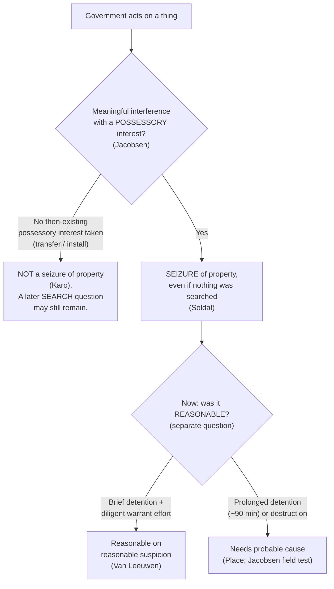

# S9 R1 panel-review — Opus model-diversity lane (prompt pack)

You are the **Claude/Opus** leg of the S9 three-lane adversarial panel (1 Claude + 2 Codex, R1). The two Codex lanes carry the A (support/quote-fidelity) and B (currency/treatment) attack lenses; **you carry model diversity and MUST vote on every paneled assertion across BOTH lenses' concerns.** You are refute-framed: try hard to break each assertion; **default to REFUTED on uncertainty**; never fabricate a cite, quote, or holding; use ONLY the evidence inlined below (no search, no outside knowledge). You are a SIGHTED reviewer — the FULL lake record (judgment fields included) is inlined.

You are a WRITER lane, not an adjudicator: you FIND and VOTE. You do not tally, adjudicate, or close any row — the orchestrator does.

For EACH group below, return one JSON object with the exact `reviewed[]` shape from the output contract (identical framing to the Codex lenses). Emit a finding object ONLY for a real defect (verdict refuted / stands-modified); a group you find wholly clean returns all-`stands` verdicts (the harness records a clean attestation). Concatenate the per-group JSON objects into a top-level `{"packs": [ ... ]}` array, one entry per group, each carrying its `group_id`.


OUTPUT CONTRACT — return ONE JSON object, nothing else:
{
  "lens": "A" | "B",
  "group_id": "<echo the group id>",
  "reviewed": [
    {
      "assertion_id": "<from group_inventory.jsonl>",
      "dimension": "existence|support|quote_fidelity|pincite|treatment|black_letter",
      "verdict": "stands" | "refuted" | "stands-modified",
      "verifiable_from_disclosed": true | false,
      "defect": null,   // null when verdict=="stands"; else an object:
      //  {"problem": "...", "severity": "high|medium|low", "proposed_fix": "...", "evidence_quote": "verbatim from disclosed evidence or null", "needs_cl": true|false, "locator_note": "..."}
      "reasons": ["short evidence-grounded reason", "..."],
      "breaks_true_positives": true | false,
      "residual_risks": ["..."],
      "suggested_tightening": "... or null"
    }
  ],
  "notes": ""
}
Rules: verdict=='stands' <=> defect==null (assertion survives your attack). verdict=='refuted' <=> a real defect (the assertion as framed is wrong). verdict=='stands-modified' <=> survives but needs a stated modification (a minor defect). Review EVERY assertion_id in group_inventory.jsonl exactly once. Output ONLY the JSON object.
---

## GROUP: content/seizures/Seizure of Property.md  (`doctrine`, 6 assertions)

### content_page

```
---
weight: 20
title: "Seizure of Property"
aliases:
  - "seizure-of-property"
topic: "Seizure of property: meaningful interference with a possessory interest"
type: doctrine
amendment: "U.S. Const. amend. IV"
jurisdiction: "Federal (U.S. Const. amend. IV); SCOTUS baseline"
status: draft
related:
  - "[[When a Seizure Occurs]]"
  - "[[Two Definitions of Search]]"
  - "[[Terry Stops and Reasonable Suspicion]]"
  - "[[Private and Foreign Searches]]"
  - "[[The Exclusionary Rule]]"
---

# Seizure of Property

*When does the government "seize" a thing rather than search it? This page fixes the threshold for a seizure of property. Whether that seizure was reasonable is the separate question that follows.*

> [!rule] Black-letter rule
> **A seizure of property is a meaningful interference with a possessory interest, and it is a Fourth Amendment event even when nothing private is exposed.** A "seizure" of property occurs when "there is some meaningful interference with an individual's possessory interests in that property." *[[United States v. Jacobsen|Jacobsen]]*, 466 U.S. 109, [113](https://www.courtlistener.com/opinion/111143/united-states-v-jacobsen/) (1984). This possessory interest is protected **independently** of privacy or liberty, so an act that invades no privacy and detains no person can still be a seizure. *[[Soldal v. Cook County|Soldal]]*, 506 U.S. 56 (1992). A search and a seizure are distinct events: a single act may be one, both, or neither.
> ^rule-property

## The Brief

**The possessory-interest definition (*[[United States v. Jacobsen|Jacobsen]]*).** The Fourth Amendment text protects "two types of expectations, one involving 'searches,' the other 'seizures.'" A search reaches privacy; a seizure reaches possession. In *[[United States v. Jacobsen|Jacobsen]]* the Court stated the controlling formula: a "'seizure' of property occurs when there is some meaningful interference with an individual's possessory interests in that property." 466 U.S. at 113. The interference is measured against the owner's possessory interest, not his privacy, so the two threshold questions are asked separately.

**Property is protected independently of privacy and liberty (*[[Soldal v. Cook County|Soldal]]*).** *[[Soldal v. Cook County|Soldal]]* reaffirmed the *[[United States v. Jacobsen|Jacobsen]]* definition and rejected the narrower view that the Fourth Amendment guards only privacy and liberty interests. Sheriff's deputies stood by while a trailer-park owner tore the Soldals' mobile home from its foundation and towed it away in an eviction. No one was searched and no privacy was invaded, yet the physical carting-off of the home was a "seizure" of property under the Fourth Amendment. *[[Soldal v. Cook County|Soldal]]*, 506 U.S. 56 (1992). The lesson is that "no search" is never the end of the analysis: the possessory question stands on its own.

**A seizure can precede or accompany a search, and destruction is the heavier intrusion.** In *[[United States v. Jacobsen|Jacobsen]]* itself the agents' "assertion of dominion and control over the package and its contents did constitute a 'seizure,'" though a reasonable one given what the private carrier had already revealed. *[[United States v. Jacobsen|Jacobsen]]*, 466 U.S. at [121](https://www.courtlistener.com/opinion/111143/united-states-v-jacobsen/). The later field test, which consumed a trace of the powder, "did affect respondents' possessory interests ... since by destroying a quantity of the powder it converted what had been only a temporary deprivation of possessory interests into a permanent one." *[[United States v. Jacobsen|Id.]]* at 125. Permanent deprivation or destruction is a greater intrusion on possession than a brief detention, and it demands more to justify it.

**Detaining property is itself a seizure, and its duration is measured against the *[[Terry v. Ohio|Terry]]* limits.** Holding an object away from its owner interferes with possession, so a detention on less than probable cause is judged like an investigative stop of the person. A brief detention of mailed packages on reasonable suspicion, "while the investigation continued," is reasonable so long as officers act with diligence in pursuing a warrant; the detention invades no privacy interest, which is implicated only when the package is opened under a warrant. *[[United States v. Van Leeuwen|Van Leeuwen]]*, 397 U.S. 249 (1970). But duration has a ceiling. In *[[United States v. Place|Place]]* a 90-minute investigative detention of a traveler's luggage on reasonable suspicion "exceeded the permissible limits of a *Terry*-type investigative stop," and "[t]he length of the detention ... alone" precluded treating the seizure as reasonable without probable cause. *[[United States v. Place|Place]]*, 462 U.S. 696, [709](https://www.courtlistener.com/opinion/110979/united-states-v-place/) (1983).

**No then-existing possessory interest, no seizure (*[[United States v. Karo|Karo]]*).** Because a seizure requires meaningful interference with a *possessory interest*, government conduct that takes no such interest is not a seizure at all. In *[[United States v. Karo|Karo]]* the placement of a beeper inside a can of ether that was then transferred to the buyer conveyed no possessory interest the buyer already held and interfered with no one's possession, so it was not a seizure; the Fourth Amendment problem in that case lay in the later *monitoring* of the beeper inside a private residence, which was a search. *[[United States v. Karo|Karo]]*, 468 U.S. 705 (1984). The point is to keep the two questions apart: an act can leave possession untouched (no seizure) and still raise a search question down the line.

**Burden, standard of review, and remedy.** Because a warrantless seizure of property is presumptively unreasonable, the **government** bears the burden of justifying it once the defendant shows his possessory interest was meaningfully interfered with. Whether a seizure occurred is a **mixed question**: historical facts are reviewed for [[Common Legal Terms#clear-error|clear error]], the ultimate Fourth Amendment determination [[Common Legal Terms#de-novo|de novo]]. The **remedy** for an unreasonable seizure of property is suppression of the item and its fruits (see [[The Exclusionary Rule]]).

**Apply it.**
1. **Name the possessory interest and the interference.** Identify whose possession the government disturbed and how. Meaningful interference with that interest is the seizure. *[[United States v. Jacobsen|Jacobsen]]*.
2. **Ask the seizure question independently of any search.** "No privacy invaded" does not answer it; possession is a separate Fourth Amendment interest. *[[Soldal v. Cook County|Soldal]]*.
3. **Time any detention against the *[[Terry v. Ohio|Terry]]* ceiling.** A brief detention on reasonable suspicion can be reasonable if officers diligently pursue a warrant; a prolonged one (roughly the 90 minutes in *[[United States v. Place|Place]]*) needs probable cause. *[[United States v. Van Leeuwen|Van Leeuwen]]*; *[[United States v. Place|Place]]*.
4. **Weigh destruction and permanent deprivation more heavily.** Consuming or permanently taking property is a greater intrusion than a brief hold and demands more justification. *[[United States v. Jacobsen|Jacobsen]]*.
5. **Separate a non-seizure from a later search.** If the government took no then-existing possessory interest, there may be no seizure at all, even though a monitoring or inspection down the line can still be a search. *[[United States v. Karo|Karo]]*.

**Common pitfalls.**
- **Thinking "no search" ends the analysis.** Property is protected independently of privacy; a police-assisted towing or eviction can be a seizure though nothing was searched. *[[Soldal v. Cook County|Soldal]]*.
- **Treating a brief property detention as costless.** Length alone can make a warrantless detention unreasonable; the 90-minute luggage hold in *[[United States v. Place|Place]]* failed for that reason.
- **Forgetting the diligence condition.** A detention of mail or a package on reasonable suspicion is reasonable only while officers move promptly toward a warrant. *[[United States v. Van Leeuwen|Van Leeuwen]]*.
- **Conflating the seizure with a later search.** Installing or transferring a device may take no possessory interest (no seizure) even though later monitoring is a search. *[[United States v. Karo|Karo]]*.

## Key cases

| Case | Holding | Opinion |
|---|---|---|
| *[[Soldal v. Cook County]]*, 506 U.S. 56 (1992) | **Anchor.** A seizure of property is a meaningful interference with possessory interests and is a Fourth Amendment event independent of any search, privacy, or liberty interest; towing a mobile home in a police-assisted eviction was a seizure. | [opinion](https://www.courtlistener.com/opinion/112795/soldal-v-cook-county/) |
| *[[United States v. Van Leeuwen]]*, 397 U.S. 249 (1970) | Detaining mailed packages on reasonable suspicion, while officers diligently pursue a warrant, is a reasonable seizure; the detention invades no privacy interest, which arises only when the package is opened under a warrant. | [opinion](https://www.courtlistener.com/opinion/108099/united-states-v-van-leeuwen/) |

## Related cases across doctrines

These are treated in full on their own pages but bear directly on the threshold for a seizure of property.

| Case | Relevance here | Primary home | Opinion |
|---|---|---|---|
| *[[United States v. Jacobsen]]*, 466 U.S. 109 (1984) | ***Definition.*** Source of the controlling formula, a seizure of property is meaningful interference with an individual's possessory interests; a field test that destroyed powder made a temporary deprivation permanent. | [[Private and Foreign Searches]] | [opinion](https://www.courtlistener.com/opinion/111143/united-states-v-jacobsen/) |
| *[[United States v. Place]]*, 462 U.S. 696 (1983) | ***Duration.*** A 90-minute investigative detention of luggage on less than probable cause exceeded the permissible limits of a *[[Terry v. Ohio\|Terry]]* stop; length alone defeated reasonableness. | [[Terry Stops and Reasonable Suspicion]] | [opinion](https://www.courtlistener.com/opinion/110979/united-states-v-place/) |
| *[[United States v. Karo]]*, 468 U.S. 705 (1984) | ***No interference, no seizure.*** Transfer of a beeper-laden can conveyed no then-existing possessory interest and was not a seizure; the later monitoring inside a home was the search. | [[Real-Time Tracking]] | [opinion](https://www.courtlistener.com/opinion/111257/united-states-v-karo/) |

## Visual



## Sources

- [*United States v. Van Leeuwen*, 397 U.S. 249 (1970)](https://www.courtlistener.com/opinion/108099/united-states-v-van-leeuwen/) (mail detention on reasonable suspicion pending a diligently sought warrant)
- [*United States v. Place*, 462 U.S. 696 (1983)](https://www.courtlistener.com/opinion/110979/united-states-v-place/) (pinpoint: 709; home = [[Terry Stops and Reasonable Suspicion]])
- [*United States v. Jacobsen*, 466 U.S. 109 (1984)](https://www.courtlistener.com/opinion/111143/united-states-v-jacobsen/) (pinpoints: 113, 121, 124–125; home = [[Private and Foreign Searches]])
- [*United States v. Karo*, 468 U.S. 705 (1984)](https://www.courtlistener.com/opinion/111257/united-states-v-karo/) (transfer conveyed no possessory interest; home = [[Real-Time Tracking]])
- [*Soldal v. Cook County*, 506 U.S. 56 (1992)](https://www.courtlistener.com/opinion/112795/soldal-v-cook-county/) (possessory interests protected independently of privacy and liberty)

```

### group_inventory (assertions under review)

```jsonl
{"assertion_id": "06e1b6ce0326c13c", "dimension": "existence", "kind": "case_cite", "locator": {"case": "United States v. Karo", "table_line": 52}, "payload": {"case": "United States v. Karo", "cells": ["*[[United States v. Karo]]*, 468 U.S. 705 (1984)", "***No interference, no seizure.*** Transfer of a beeper-laden can conveyed no then-existing possessory interest and was not a seizure; the later monitoring inside a home was the search.", "[[Real-Time Tracking]]", "[opinion](https://www.courtlistener.com/opinion/111257/united-states-v-karo/)"], "header": ["Case", "Relevance here", "Primary home", "Opinion"]}}
{"assertion_id": "0fd497d686d2f895", "dimension": "existence", "kind": "case_cite", "locator": {"case": "United States v. Jacobsen", "table_line": 50}, "payload": {"case": "United States v. Jacobsen", "cells": ["*[[United States v. Jacobsen]]*, 466 U.S. 109 (1984)", "***Definition.*** Source of the controlling formula, a seizure of property is meaningful interference with an individual's possessory interests; a field test that destroyed powder made a temporary deprivation permanent.", "[[Private and Foreign Searches]]", "[opinion](https://www.courtlistener.com/opinion/111143/united-states-v-jacobsen/)"], "header": ["Case", "Relevance here", "Primary home", "Opinion"]}}
{"assertion_id": "12e257815c9d874a", "dimension": "existence", "kind": "case_cite", "locator": {"case": "United States v. Van Leeuwen", "table_line": 42}, "payload": {"case": "United States v. Van Leeuwen", "cells": ["*[[United States v. Van Leeuwen]]*, 397 U.S. 249 (1970)", "Detaining mailed packages on reasonable suspicion, while officers diligently pursue a warrant, is a reasonable seizure; the detention invades no privacy interest, which arises only when the package is opened under a warrant.", "[opinion](https://www.courtlistener.com/opinion/108099/united-states-v-van-leeuwen/)"], "header": ["Case", "Holding", "Opinion"]}}
{"assertion_id": "616d0a292285b40d", "dimension": "existence", "kind": "case_cite", "locator": {"case": "Soldal v. Cook County", "table_line": 41}, "payload": {"case": "Soldal v. Cook County", "cells": ["*[[Soldal v. Cook County]]*, 506 U.S. 56 (1992)", "**Anchor.** A seizure of property is a meaningful interference with possessory interests and is a Fourth Amendment event independent of any search, privacy, or liberty interest; towing a mobile home in a police-assisted eviction was a seizure.", "[opinion](https://www.courtlistener.com/opinion/112795/soldal-v-cook-county/)"], "header": ["Case", "Holding", "Opinion"]}}
{"assertion_id": "f14c93e896090a9b", "dimension": "existence", "kind": "case_cite", "locator": {"case": "United States v. Place", "table_line": 51}, "payload": {"case": "United States v. Place", "cells": ["*[[United States v. Place]]*, 462 U.S. 696 (1983)", "***Duration.*** A 90-minute investigative detention of luggage on less than probable cause exceeded the permissible limits of a *[[Terry v. Ohio\\|Terry]]* stop; length alone defeated reasonableness.", "[[Terry Stops and Reasonable Suspicion]]", "[opinion](https://www.courtlistener.com/opinion/110979/united-states-v-place/)"], "header": ["Case", "Relevance here", "Primary home", "Opinion"]}}
{"assertion_id": "af2c49af42a2adbf", "dimension": "support", "kind": "proposition", "locator": {"callout": "^rule-property"}, "payload": {"anchor": "^rule-property", "statement": "[!rule] Black-letter rule\n**A seizure of property is a meaningful interference with a possessory interest, and it is a Fourth Amendment event even when nothing private is exposed.** A \"seizure\" of property occurs when \"there is some meaningful interference with an individual's possessory interests in that property.\" *[[United States v. Jacobsen|Jacobsen]]*, 466 U.S. 109, [113](https://www.courtlistener.com/opinion/111143/united-states-v-jacobsen/) (1984). This possessory interest is protected **independently** of privacy or liberty, so an act that invades no privacy and detains no person can still be a seizure. *[[Soldal v. Cook County|Soldal]]*, 506 U.S. 56 (1992). A search and a seizure are distinct events: a single act may be one, both, or neither."}}
```

### lake record — Soldal v. Cook County

```json
{
  "schema_version": "s2.v1",
  "record_id": "Soldal v. Cook County",
  "stub": false,
  "status": "verified",
  "identity": {
    "case_name": "Soldal v. Cook County",
    "case_name_short": "Soldal",
    "case_name_full": "SOLDAL Et Ux. v. COOK COUNTY, ILLINOIS, Et Al.",
    "input_case_name": "Soldal v. Cook County",
    "court": "U.S. Supreme Court",
    "court_id": "scotus",
    "court_level": "scotus",
    "circuit": null,
    "state": null,
    "date_decided": "1992-12-08",
    "year": 1992,
    "docket": null,
    "cluster_id": 112795,
    "lead_opinion_id": 112795,
    "sibling_ids": [
      112795
    ],
    "absolute_url": "/opinion/112795/soldal-v-cook-county/",
    "identity_method": "citation+party-text",
    "expected_citation_found": true,
    "party_name_in_text": true,
    "canonical_name_match": true,
    "alternates": [],
    "reason_code": null
  },
  "citations": {
    "official": null,
    "parallel": [
      {
        "cite": "506 U.S. 56",
        "volume": "506",
        "reporter": "U.S.",
        "page": "56",
        "type": 1,
        "selected_official": false,
        "source": "cluster.citations[]"
      },
      {
        "cite": "113 S. Ct. 538",
        "volume": "113",
        "reporter": "S. Ct.",
        "page": "538",
        "type": 1,
        "selected_official": false,
        "source": "cluster.citations[]"
      },
      {
        "cite": "121 L. Ed. 2d 450",
        "volume": "121",
        "reporter": "L. Ed. 2d",
        "page": "450",
        "type": 1,
        "selected_official": false,
        "source": "cluster.citations[]"
      },
      {
        "cite": "92 Daily Journal DAR 16378",
        "volume": "92",
        "reporter": "Daily Journal DAR",
        "page": "16378",
        "type": 2,
        "selected_official": false,
        "source": "cluster.citations[]"
      },
      {
        "cite": "61 U.S.L.W. 4019",
        "volume": "61",
        "reporter": "U.S.L.W.",
        "page": "4019",
        "type": 4,
        "selected_official": false,
        "source": "cluster.citations[]"
      },
      {
        "cite": "6 Fla. L. Weekly Fed. S 769",
        "volume": "6",
        "reporter": "Fla. L. Weekly Fed. S",
        "page": "769",
        "type": 1,
        "selected_official": false,
        "source": "cluster.citations[]"
      }
    ],
    "vendor_neutral": [
      {
        "cite": "1992 U.S. LEXIS 7835",
        "volume": "1992",
        "reporter": "U.S. LEXIS",
        "page": "7835",
        "type": 6,
        "selected_official": false,
        "source": "cluster.citations[]"
      },
      {
        "cite": "92 Cal. Daily Op. Serv. 9794",
        "volume": "92",
        "reporter": "Cal. Daily Op. Serv.",
        "page": "9794",
        "type": 6,
        "selected_official": false,
        "source": "cluster.citations[]"
      }
    ],
    "all": [
      {
        "cite": "506 U.S. 56",
        "volume": "506",
        "reporter": "U.S.",
        "page": "56",
        "type": 1,
        "selected_official": false,
        "source": "cluster.citations[]"
      },
      {
        "cite": "113 S. Ct. 538",
        "volume": "113",
        "reporter": "S. Ct.",
        "page": "538",
        "type": 1,
        "selected_official": false,
        "source": "cluster.citations[]"
      },
      {
        "cite": "121 L. Ed. 2d 450",
        "volume": "121",
        "reporter": "L. Ed. 2d",
        "page": "450",
        "type": 1,
        "selected_official": false,
        "source": "cluster.citations[]"
      },
      {
        "cite": "1992 U.S. LEXIS 7835",
        "volume": "1992",
        "reporter": "U.S. LEXIS",
        "page": "7835",
        "type": 6,
        "selected_official": false,
        "source": "cluster.citations[]"
      },
      {
        "cite": "92 Daily Journal DAR 16378",
        "volume": "92",
        "reporter": "Daily Journal DAR",
        "page": "16378",
        "type": 2,
        "selected_official": false,
        "source": "cluster.citations[]"
      },
      {
        "cite": "61 U.S.L.W. 4019",
        "volume": "61",
        "reporter": "U.S.L.W.",
        "page": "4019",
        "type": 4,
        "selected_official": false,
        "source": "cluster.citations[]"
      },
      {
        "cite": "6 Fla. L. Weekly Fed. S 769",
        "volume": "6",
        "reporter": "Fla. L. Weekly Fed. S",
        "page": "769",
        "type": 1,
        "selected_official": false,
        "source": "cluster.citations[]"
      },
      {
        "cite": "92 Cal. Daily Op. Serv. 9794",
        "volume": "92",
        "reporter": "Cal. Daily Op. Serv.",
        "page": "9794",
        "type": 6,
        "selected_official": false,
        "source": "cluster.citations[]"
      }
    ],
    "display": null,
    "official_selection": {
      "court_class": "scotus",
      "selected": null,
      "reason": "unlisted_reporter:Fla. L. Weekly Fed. S"
    }
  },
  "pinpoints": [
    {
      "id": "pin-61",
      "page": null,
      "quote": "under the Fourth Amendment even though no privacy or liberty interest was invaded. ## Rule Yes.",
      "star_marker": null,
      "quote_fidelity": "mismatch",
      "pinpoint_status": "slip-only",
      "position": null
    },
    {
      "id": "pin-62",
      "page": null,
      "quote": "our cases unmistakably hold that the Amendment protects property as well as privacy.",
      "star_marker": "62",
      "quote_fidelity": "matched",
      "pinpoint_status": "star-verified",
      "position": 10477,
      "fragment": "#:~:text=our%20cases%20unmistakably%20hold%20that",
      "fragment_validated_at": "2026-07-09T15:40:45Z"
    }
  ],
  "treatment": {
    "field_i_validity": "good_law",
    "as_of_content": "1992-12-08",
    "as_of_treatment": "2026-06-30",
    "composite_basis": "migration-seed",
    "composite_basis_ref": "Soldal v. Cook County",
    "varies_by_point": false,
    "scope_note": "Good law; the holding that the Fourth Amendment protects possessory interests independent of privacy and liberty remains controlling.",
    "point_overrides": [],
    "edges": [
      {
        "citing_case": {
          "name": "Martin v. State",
          "cluster_id": 10740496,
          "cite": null,
          "field_ii": "questioned"
        },
        "field_ii": "questioned",
        "field_iii": "mentioned",
        "point": null,
        "proposed": true,
        "journal_ref": "Soldal v. Cook County:lane1_negative"
      },
      {
        "citing_case": {
          "name": "State v. Garrett",
          "cluster_id": 4552162,
          "cite": [
            "2018 Ohio 4530",
            "123 N.E.3d 327"
          ],
          "field_ii": "overruled"
        },
        "field_ii": "overruled",
        "field_iii": "mentioned",
        "point": null,
        "proposed": true,
        "journal_ref": "Soldal v. Cook County:lane1_negative"
      },
      {
        "citing_case": {
          "name": "United States v. Edward Sullivan",
          "cluster_id": 2821420,
          "cite": [
            "797 F.3d 623",
            "2015 U.S. App. LEXIS 13702",
            "2015 WL 4547498"
          ],
          "field_ii": "overruled"
        },
        "field_ii": "overruled",
        "field_iii": "mentioned",
        "point": null,
        "proposed": true,
        "journal_ref": "Soldal v. Cook County:lane1_negative"
      },
      {
        "citing_case": {
          "name": "Tony Lavan v. City of Los Angeles",
          "cluster_id": 807915,
          "cite": [
            "693 F.3d 1022",
            "2012 WL 3834659",
            "2012 U.S. App. LEXIS 18639"
          ],
          "field_ii": "questioned"
        },
        "field_ii": "questioned",
        "field_iii": "mentioned",
        "point": null,
        "proposed": true,
        "journal_ref": "Soldal v. Cook County:lane1_negative"
      },
      {
        "citing_case": {
          "name": "Poteet v. Sullivan",
          "cluster_id": 2332316,
          "cite": [
            "218 S.W.3d 780",
            "2007 WL 289871"
          ],
          "field_ii": "overruled"
        },
        "field_ii": "overruled",
        "field_iii": "mentioned",
        "point": null,
        "proposed": true,
        "journal_ref": "Soldal v. Cook County:lane1_negative"
      },
      {
        "citing_case": {
          "name": "Albright v. Oliver",
          "cluster_id": 112924,
          "cite": [
            "127 L. Ed. 2d 114",
            "114 S. Ct. 807",
            "510 U.S. 266",
            "1994 U.S. LEXIS 1319"
          ],
          "field_ii": "overruled"
        },
        "field_ii": "overruled",
        "field_iii": "mentioned",
        "point": null,
        "proposed": true,
        "journal_ref": "Soldal v. Cook County:lane2_top_cited"
      },
      {
        "citing_case": {
          "name": "Minnesota v. Dickerson",
          "cluster_id": 112873,
          "cite": [
            "124 L. Ed. 2d 334",
            "113 S. Ct. 2130",
            "508 U.S. 366",
            "1993 U.S. LEXIS 4018"
          ],
          "field_ii": "questioned"
        },
        "field_ii": "questioned",
        "field_iii": "mentioned",
        "point": null,
        "proposed": true,
        "journal_ref": "Soldal v. Cook County:lane2_top_cited"
      },
      {
        "citing_case": {
          "name": "Florida v. Jardines",
          "cluster_id": 856347,
          "cite": [
            "185 L. Ed. 2d 495",
            "133 S. Ct. 1409",
            "569 U.S. 1",
            "2013 U.S. LEXIS 2542",
            "24 Fla. L. Weekly Fed. S 117",
            "81 U.S.L.W. 4209",
            "2013 WL 1196577"
          ],
          "field_ii": "questioned"
        },
        "field_ii": "questioned",
        "field_iii": "mentioned",
        "point": null,
        "proposed": true,
        "journal_ref": "Soldal v. Cook County:lane2_top_cited"
      },
      {
        "citing_case": {
          "name": "Carpenter v. United States",
          "cluster_id": 4510032,
          "cite": [
            "585 U.S. 296",
            "138 S. Ct. 2206",
            "201 L. Ed. 2d 507",
            "2018 U.S. LEXIS 3844"
          ],
          "field_ii": "overruled"
        },
        "field_ii": "overruled",
        "field_iii": "mentioned",
        "point": null,
        "proposed": true,
        "journal_ref": "Soldal v. Cook County:lane2_top_cited"
      },
      {
        "citing_case": {
          "name": "United States v. James Daniel Good Real Property",
          "cluster_id": 112914,
          "cite": [
            "126 L. Ed. 2d 490",
            "114 S. Ct. 492",
            "510 U.S. 43",
            "1993 U.S. LEXIS 7941",
            "7 Fla. L. Weekly Fed. S 665",
            "93 Daily Journal DAR 15706",
            "93 Cal. Daily Op. Serv. 9143",
            "62 U.S.L.W. 4013",
            "1993 WL 505539"
          ],
          "field_ii": "superseded_by_statute"
        },
        "field_ii": "superseded_by_statute",
        "field_iii": "mentioned",
        "point": null,
        "proposed": true,
        "journal_ref": "Soldal v. Cook County:lane2_top_cited"
      },
      {
        "citing_case": {
          "name": "United States v. Jones",
          "cluster_id": 622304,
          "cite": [
            "181 L. Ed. 2d 911",
            "132 S. Ct. 945",
            "565 U.S. 400",
            "2012 U.S. LEXIS 1063"
          ],
          "field_ii": "overruled"
        },
        "field_ii": "overruled",
        "field_iii": "mentioned",
        "point": null,
        "proposed": true,
        "journal_ref": "Soldal v. Cook County:lane2_top_cited"
      },
      {
        "citing_case": {
          "name": "Shirley Presley v. City of Charlottesville Rivanna Trails Foundation",
          "cluster_id": 795822,
          "cite": [
            "464 F.3d 480",
            "2006 U.S. App. LEXIS 24048",
            "2006 WL 2709208"
          ],
          "field_ii": "questioned"
        },
        "field_ii": "questioned",
        "field_iii": "mentioned",
        "point": null,
        "proposed": true,
        "journal_ref": "Soldal v. Cook County:lane2_top_cited"
      },
      {
        "citing_case": {
          "name": "James Edward Hoefling, Jr. v. City of Miami",
          "cluster_id": 3171918,
          "cite": [
            "811 F.3d 1271",
            "93 Fed. R. Serv. 3d 1022",
            "2016 U.S. App. LEXIS 1177",
            "2016 WL 285358"
          ],
          "field_ii": "overruled"
        },
        "field_ii": "overruled",
        "field_iii": "mentioned",
        "point": null,
        "proposed": true,
        "journal_ref": "Soldal v. Cook County:lane2_top_cited"
      },
      {
        "citing_case": {
          "name": "Johnson v. Outboard Marine Corp.",
          "cluster_id": 762789,
          "cite": [
            "172 F.3d 531",
            "1999 U.S. App. LEXIS 5444",
            "1999 WL 164061"
          ],
          "field_ii": "questioned"
        },
        "field_ii": "questioned",
        "field_iii": "mentioned",
        "point": null,
        "proposed": true,
        "journal_ref": "Soldal v. Cook County:lane2_top_cited"
      },
      {
        "citing_case": {
          "name": "Byron Halsey v. Frank Pfeiffer",
          "cluster_id": 2671183,
          "cite": [
            "750 F.3d 273",
            "2014 WL 1622769",
            "2014 U.S. App. LEXIS 7696"
          ],
          "field_ii": "questioned"
        },
        "field_ii": "questioned",
        "field_iii": "mentioned",
        "point": null,
        "proposed": true,
        "journal_ref": "Soldal v. Cook County:lane2_top_cited"
      },
      {
        "citing_case": {
          "name": "Geoffrey M. Radvansky v. City of Olmsted Falls",
          "cluster_id": 788941,
          "cite": [
            "395 F.3d 291",
            "2005 U.S. App. LEXIS 739",
            "2005 WL 77154"
          ],
          "field_ii": "overruled"
        },
        "field_ii": "overruled",
        "field_iii": "mentioned",
        "point": null,
        "proposed": true,
        "journal_ref": "Soldal v. Cook County:lane2_top_cited"
      },
      {
        "citing_case": {
          "name": "Commonwealth v. Kimball",
          "cluster_id": 1906975,
          "cite": [
            "724 A.2d 326",
            "555 Pa. 299",
            "1999 Pa. LEXIS 134"
          ],
          "field_ii": "criticized"
        },
        "field_ii": "criticized",
        "field_iii": "mentioned",
        "point": null,
        "proposed": true,
        "journal_ref": "Soldal v. Cook County:lane2_top_cited"
      },
      {
        "citing_case": {
          "name": "Brian Sheppard v. Leon Beerman, as an Individual and in His Official Capacity as Justice of the Supreme Court of the State of New York",
          "cluster_id": 664638,
          "cite": [
            "18 F.3d 147",
            "1994 U.S. App. LEXIS 3985"
          ],
          "field_ii": "questioned"
        },
        "field_ii": "questioned",
        "field_iii": "mentioned",
        "point": null,
        "proposed": true,
        "journal_ref": "Soldal v. Cook County:lane2_top_cited"
      },
      {
        "citing_case": {
          "name": "Mark A. Lee v. City of Chicago",
          "cluster_id": 782110,
          "cite": [
            "330 F.3d 456",
            "2003 U.S. App. LEXIS 10254",
            "2003 WL 21196550"
          ],
          "field_ii": "questioned"
        },
        "field_ii": "questioned",
        "field_iii": "mentioned",
        "point": null,
        "proposed": true,
        "journal_ref": "Soldal v. Cook County:lane2_top_cited"
      },
      {
        "citing_case": {
          "name": "Muriel D. Black v. Michael P. Lane, Michael Neal, P.A. Severs, Captain",
          "cluster_id": 669084,
          "cite": [
            "22 F.3d 1395"
          ],
          "field_ii": "questioned"
        },
        "field_ii": "questioned",
        "field_iii": "mentioned",
        "point": null,
        "proposed": true,
        "journal_ref": "Soldal v. Cook County:lane2_top_cited"
      },
      {
        "citing_case": {
          "name": "Collins v. Virginia",
          "cluster_id": 4501697,
          "cite": [
            "584 U.S. 586",
            "138 S. Ct. 1663",
            "201 L. Ed. 2d 9",
            "2018 U.S. LEXIS 3210"
          ],
          "field_ii": "overruled"
        },
        "field_ii": "overruled",
        "field_iii": "mentioned",
        "point": null,
        "proposed": true,
        "journal_ref": "Soldal v. Cook County:lane2_top_cited"
      },
      {
        "citing_case": {
          "name": "State v. Young",
          "cluster_id": 1196592,
          "cite": [
            "867 P.2d 593",
            "123 Wash. 2d 173",
            "1994 Wash. LEXIS 122"
          ],
          "field_ii": "questioned"
        },
        "field_ii": "questioned",
        "field_iii": "mentioned",
        "point": null,
        "proposed": true,
        "journal_ref": "Soldal v. Cook County:lane2_top_cited"
      },
      {
        "citing_case": {
          "name": "Jordan v. Gardner",
          "cluster_id": 601474,
          "cite": [
            "986 F.2d 1521",
            "93 Cal. Daily Op. Serv. 1354",
            "1993 U.S. App. LEXIS 3065",
            "1993 WL 46630"
          ],
          "field_ii": "overruled"
        },
        "field_ii": "overruled",
        "field_iii": "mentioned",
        "point": null,
        "proposed": true,
        "journal_ref": "Soldal v. Cook County:lane2_top_cited"
      },
      {
        "citing_case": {
          "name": "Freeman v. City of Santa Ana",
          "cluster_id": 7034204,
          "cite": [
            "68 F.3d 1180",
            "96 Cal. Daily Op. Serv. 25",
            "96 Daily Journal DAR 29",
            "1995 U.S. App. LEXIS 37134",
            "1995 WL 611554"
          ],
          "field_ii": "questioned"
        },
        "field_ii": "questioned",
        "field_iii": "mentioned",
        "point": null,
        "proposed": true,
        "journal_ref": "Soldal v. Cook County:lane2_top_cited"
      },
      {
        "citing_case": {
          "name": "Peggy Poe v. John Leonard, Defendant-Third Party-Plaintiff-Appellant, Douglas Pearl, State of Connecticut, Third-Party-Defendant",
          "cluster_id": 776746,
          "cite": [
            "282 F.3d 123",
            "2002 WL 237411"
          ],
          "field_ii": "overruled"
        },
        "field_ii": "overruled",
        "field_iii": "mentioned",
        "point": null,
        "proposed": true,
        "journal_ref": "Soldal v. Cook County:lane2_top_cited"
      },
      {
        "citing_case": {
          "name": "Armendariz v. Penman",
          "cluster_id": 7035099,
          "cite": [
            "75 F.3d 1311",
            "96 Cal. Daily Op. Serv. 839",
            "1996 U.S. App. LEXIS 1613"
          ],
          "field_ii": "overruled"
        },
        "field_ii": "overruled",
        "field_iii": "mentioned",
        "point": null,
        "proposed": true,
        "journal_ref": "Soldal v. Cook County:lane2_top_cited"
      },
      {
        "citing_case": {
          "name": "Delores Henry v. Melody Hulett",
          "cluster_id": 4774392,
          "cite": [
            "969 F.3d 769"
          ],
          "field_ii": "overruled"
        },
        "field_ii": "overruled",
        "field_iii": "mentioned",
        "point": null,
        "proposed": true,
        "journal_ref": "Soldal v. Cook County:lane2_top_cited"
      },
      {
        "citing_case": {
          "name": "People v. McKnight",
          "cluster_id": 4621444,
          "cite": [
            "2019 CO 36",
            "446 P.3d 397"
          ],
          "field_ii": "overruled"
        },
        "field_ii": "overruled",
        "field_iii": "mentioned",
        "point": null,
        "proposed": true,
        "journal_ref": "Soldal v. Cook County:lane2_top_cited"
      },
      {
        "citing_case": {
          "name": "Sheila Hensley v. Ronald Gassman",
          "cluster_id": 808240,
          "cite": [
            "693 F.3d 681",
            "2012 WL 3932043",
            "2012 U.S. App. LEXIS 19025"
          ],
          "field_ii": "questioned"
        },
        "field_ii": "questioned",
        "field_iii": "mentioned",
        "point": null,
        "proposed": true,
        "journal_ref": "Soldal v. Cook County:lane2_top_cited"
      }
    ],
    "derivation": {
      "lane1_negative": {
        "query": "cites:(112795) AND (overrul* OR abrogat* OR supersed* OR \"recede from\" OR \"no longer good law\" OR vacat* OR reversed) ",
        "reviewed": 200,
        "cap": 200,
        "cap_hit": true,
        "final_cursor": "https://www.courtlistener.com/api/rest/v4/search/?cursor=cz0xMTQ5NTUyMDAwMDAwJnM9MjQyODA5MSZ0PW8mZD0yMDI2LTA3LTA1JnA9MTE%3D&fields=absolute_url%2CcaseName%2CcaseNameFull%2Ccitation%2CciteCount%2Ccluster_id%2Ccourt%2Ccourt_citation_string%2Ccourt_id%2CdateFiled%2Copinions%2Csibling_ids%2Cstatus%2Csyllabus&order_by=dateFiled+desc&page_size=100&q=cites%3A%28112795%29+AND+%28overrul%2A+OR+abrogat%2A+OR+supersed%2A+OR+%22recede+from%22+OR+%22no+longer+good+law%22+OR+vacat%2A+OR+reversed%29+&stat_Published=on&type=o",
        "audit_needed": true,
        "proposed_negative_events": 5,
        "audit_marker": "R15 treatment audit required",
        "triage_mode": "snippet-first",
        "snippet_field": "results[].opinions[].snippet",
        "triage_journaled": 200,
        "triage_read": 5,
        "triage_snippet_classified": 195
      },
      "lane2_top_cited": {
        "query": "cites:(112795)",
        "reviewed": 25,
        "cap": 25,
        "cap_hit": true,
        "final_cursor": "https://www.courtlistener.com/api/rest/v4/search/?cursor=cz0xNTkmcz04MTk4NjEmdD1vJmQ9MjAyNi0wNy0wNSZwPTM%3D&order_by=citeCount+desc&page_size=25&q=cites%3A%28112795%29&type=o",
        "audit_needed": true,
        "proposed_negative_events": 24,
        "audit_marker": "R15 treatment audit required"
      },
      "lane3_recency": {
        "query": "cites:(112795)",
        "reviewed": 40,
        "cap": 200,
        "cap_hit": false,
        "final_cursor": null,
        "audit_needed": false,
        "proposed_negative_events": 1,
        "audit_marker": null,
        "triage_mode": "snippet-first",
        "snippet_field": "results[].opinions[].snippet",
        "triage_journaled": 40,
        "triage_read": 1,
        "triage_snippet_classified": 39
      }
    }
  },
  "progeny": {
    "complete_query": "cites:(112795)",
    "indexed_citing_opinions": 560,
    "count_source": "search",
    "per_sibling": [
      {
        "opinion_id": 112795,
        "count": 560,
        "count_source": "search"
      }
    ],
    "citation_count": 1158,
    "cache_path": "/Users/johngalt/cssi-lake/cache/progeny/soldal-v-cook-county.jsonl",
    "enumeration": "bounded",
    "cursor": "https://www.courtlistener.com/api/rest/v4/search/?cursor=cz0xLjg2Njg3MjEmcz05NDc1MjIwJnQ9byZkPTIwMjYtMDctMDUmcD0y&order_by=score+desc&page_size=100&q=cites%3A%28112795%29&type=o",
    "rows_cached": 20,
    "outbound_opinion_edges": [
      {
        "source_opinion_id": 112795,
        "cited_id": 87010,
        "source": "search.opinions[].cites[]"
      },
      {
        "source_opinion_id": 112795,
        "cited_id": 106022,
        "source": "search.opinions[].cites[]"
      },
      {
        "source_opinion_id": 112795,
        "cited_id": 106170,
        "source": "search.opinions[].cites[]"
      },
      {
        "source_opinion_id": 112795,
        "cited_id": 106187,
        "source": "search.opinions[].cites[]"
      },
      {
        "source_opinion_id": 112795,
        "cited_id": 106641,
        "source": "search.opinions[].cites[]"
      },
      {
        "source_opinion_id": 112795,
        "cited_id": 107465,
        "source": "search.opinions[].cites[]"
      },
      {
        "source_opinion_id": 112795,
        "cited_id": 107473,
        "source": "search.opinions[].cites[]"
      },
      {
        "source_opinion_id": 112795,
        "cited_id": 107564,
        "source": "search.opinions[].cites[]"
      },
      {
        "source_opinion_id": 112795,
        "cited_id": 108153,
        "source": "search.opinions[].cites[]"
      },
      {
        "source_opinion_id": 112795,
        "cited_id": 108223,
        "source": "search.opinions[].cites[]"
      },
      {
        "source_opinion_id": 112795,
        "cited_id": 108377,
        "source": "search.opinions[].cites[]"
      },
      {
        "source_opinion_id": 112795,
        "cited_id": 108568,
        "source": "search.opinions[].cites[]"
      },
      {
        "source_opinion_id": 112795,
        "cited_id": 109069,
        "source": "search.opinions[].cites[]"
      },
      {
        "source_opinion_id": 112795,
        "cited_id": 109579,
        "source": "search.opinions[].cites[]"
      },
      {
        "source_opinion_id": 112795,
        "cited_id": 109635,
        "source": "search.opinions[].cites[]"
      },
      {
        "source_opinion_id": 112795,
        "cited_id": 109866,
        "source": "search.opinions[].cites[]"
      },
      {
        "source_opinion_id": 112795,
        "cited_id": 109874,
        "source": "search.opinions[].cites[]"
      },
      {
        "source_opinion_id": 112795,
        "cited_id": 110235,
        "source": "search.opinions[].cites[]"
      },
      {
        "source_opinion_id": 112795,
        "cited_id": 110325,
        "source": "search.opinions[].cites[]"
      },
      {
        "source_opinion_id": 112795,
        "cited_id": 110478,
        "source": "search.opinions[].cites[]"
      },
      {
        "source_opinion_id": 112795,
        "cited_id": 110901,
        "source": "search.opinions[].cites[]"
      },
      {
        "source_opinion_id": 112795,
        "cited_id": 110979,
        "source": "search.opinions[].cites[]"
      },
      {
        "source_opinion_id": 112795,
        "cited_id": 111143,
        "source": "search.opinions[].cites[]"
      },
      {
        "source_opinion_id": 112795,
        "cited_id": 111146,
        "source": "search.opinions[].cites[]"
      },
      {
        "source_opinion_id": 112795,
        "cited_id": 111252,
        "source": "search.opinions[].cites[]"
      },
      {
        "source_opinion_id": 112795,
        "cited_id": 111301,
        "source": "search.opinions[].cites[]"
      },
      {
        "source_opinion_id": 112795,
        "cited_id": 111477,
        "source": "search.opinions[].cites[]"
      },
      {
        "source_opinion_id": 112795,
        "cited_id": 111834,
        "source": "search.opinions[].cites[]"
      },
      {
        "source_opinion_id": 112795,
        "cited_id": 111851,
        "source": "search.opinions[].cites[]"
      },
      {
        "source_opinion_id": 112795,
        "cited_id": 112257,
        "source": "search.opinions[].cites[]"
      },
      {
        "source_opinion_id": 112795,
        "cited_id": 112448,
        "source": "search.opinions[].cites[]"
      },
      {
        "source_opinion_id": 112795,
        "cited_id": 509655,
        "source": "search.opinions[].cites[]"
      },
      {
        "source_opinion_id": 112795,
        "cited_id": 567219,
        "source": "search.opinions[].cites[]"
      },
      {
        "source_opinion_id": 112795,
        "cited_id": 2159763,
        "source": "search.opinions[].cites[]"
      }
    ]
  },
  "off_cl_links": [],
  "provenance": {
    "cl_source": "LRU",
    "cl_api": "https://www.courtlistener.com/api/rest/v4",
    "built_by": "S2-BUILDER-AUTHORING",
    "build_run": "s2-build-96d841cbb12e",
    "date_created": "2026-07-05T20:02:17Z",
    "date_modified": "2026-07-09T15:47:29Z",
    "warnings": [
      "official cite selection failed closed: unlisted_reporter:Fla. L. Weekly Fed. S",
      "legacy treatment migrated: good -> good_law"
    ],
    "field_provenance": {
      "identity": {
        "src": "CourtListener search + clusters + lead opinion text",
        "at": "2026-07-05T20:02:33Z",
        "verifier": "S2-BUILDER-AUTHORING"
      },
      "treatment.field_i_validity": {
        "src": "_treatment-migration.json + page frontmatter",
        "at": "2026-07-05T20:02:33Z",
        "verifier": "S2-BUILDER-AUTHORING"
      },
      "point_overrides": {
        "src": "S2 treatment derivation proposed only",
        "at": "2026-07-05T20:05:23Z",
        "verifier": "S2-BUILDER-AUTHORING"
      },
      "pinpoints": {
        "src": "content page quote harvest + lead opinion text",
        "at": "2026-07-05T20:02:33Z",
        "verifier": "S2-BUILDER-AUTHORING"
      }
    }
  }
}

```

### lake record — United States v. Jacobsen

```json
{
  "schema_version": "s2.v1",
  "record_id": "United States v. Jacobsen",
  "stub": false,
  "status": "verified",
  "identity": {
    "case_name": "United States v. Jacobsen",
    "case_name_short": "Jacobsen",
    "case_name_full": "UNITED STATES v. JACOBSEN Et Al.",
    "input_case_name": "United States v. Jacobsen",
    "court": "U.S. Supreme Court",
    "court_id": "scotus",
    "court_level": "scotus",
    "circuit": null,
    "state": null,
    "date_decided": "1984-04-02",
    "year": 1984,
    "docket": "82-1167",
    "cluster_id": 111143,
    "lead_opinion_id": 111143,
    "sibling_ids": [
      111143,
      9429558,
      9429559,
      9429560
    ],
    "absolute_url": "/opinion/111143/united-states-v-jacobsen/",
    "identity_method": "citation+party-text",
    "expected_citation_found": true,
    "party_name_in_text": true,
    "canonical_name_match": true,
    "alternates": [],
    "reason_code": null
  },
  "citations": {
    "official": {
      "cite": "466 U.S. 109",
      "volume": "466",
      "reporter": "U.S.",
      "page": "109",
      "type": 1,
      "selected_official": true,
      "source": "cluster.citations[]"
    },
    "parallel": [
      {
        "cite": "104 S. Ct. 1652",
        "volume": "104",
        "reporter": "S. Ct.",
        "page": "1652",
        "type": 1,
        "selected_official": false,
        "source": "cluster.citations[]"
      },
      {
        "cite": "80 L. Ed. 2d 85",
        "volume": "80",
        "reporter": "L. Ed. 2d",
        "page": "85",
        "type": 1,
        "selected_official": false,
        "source": "cluster.citations[]"
      },
      {
        "cite": "52 U.S.L.W. 4414",
        "volume": "52",
        "reporter": "U.S.L.W.",
        "page": "4414",
        "type": 4,
        "selected_official": false,
        "source": "cluster.citations[]"
      }
    ],
    "vendor_neutral": [
      {
        "cite": "1984 U.S. LEXIS 53",
        "volume": "1984",
        "reporter": "U.S. LEXIS",
        "page": "53",
        "type": 6,
        "selected_official": false,
        "source": "cluster.citations[]"
      }
    ],
    "all": [
      {
        "cite": "466 U.S. 109",
        "volume": "466",
        "reporter": "U.S.",
        "page": "109",
        "type": 1,
        "selected_official": false,
        "source": "cluster.citations[]"
      },
      {
        "cite": "104 S. Ct. 1652",
        "volume": "104",
        "reporter": "S. Ct.",
        "page": "1652",
        "type": 1,
        "selected_official": false,
        "source": "cluster.citations[]"
      },
      {
        "cite": "80 L. Ed. 2d 85",
        "volume": "80",
        "reporter": "L. Ed. 2d",
        "page": "85",
        "type": 1,
        "selected_official": false,
        "source": "cluster.citations[]"
      },
      {
        "cite": "1984 U.S. LEXIS 53",
        "volume": "1984",
        "reporter": "U.S. LEXIS",
        "page": "53",
        "type": 6,
        "selected_official": false,
        "source": "cluster.citations[]"
      },
      {
        "cite": "52 U.S.L.W. 4414",
        "volume": "52",
        "reporter": "U.S.L.W.",
        "page": "4414",
        "type": 4,
        "selected_official": false,
        "source": "cluster.citations[]"
      }
    ],
    "display": "466 U.S. 109",
    "official_selection": {
      "court_class": "scotus",
      "selected": "466 U.S. 109",
      "reason": "selected_rank_1"
    }
  },
  "pinpoints": [
    {
      "id": "pin-113",
      "page": null,
      "quote": "within the meaning of the Fourth Amendment. ## Rule The Fourth Amendment",
      "star_marker": null,
      "quote_fidelity": "mismatch",
      "pinpoint_status": "slip-only",
      "position": null
    },
    {
      "id": "pin-113a",
      "page": null,
      "quote": "wholly inapplicable 'to a search or seizure, even an unreasonable one, effected by a private individual not acting as an agent of the Government.'",
      "star_marker": null,
      "quote_fidelity": "mismatch",
      "pinpoint_status": "slip-only",
      "position": null
    },
    {
      "id": "pin-115",
      "page": null,
      "quote": "The additional invasions of respondents' privacy by the Government agent must be tested by the degree to which they exceeded the scope of the private search.",
      "star_marker": "115",
      "quote_fidelity": "matched",
      "pinpoint_status": "star-verified",
      "position": 8004,
      "fragment": "#:~:text=The%20additional%20invasions%20of%20respondents%27",
      "fragment_validated_at": "2026-07-09T15:40:45Z"
    },
    {
      "id": "pin-123",
      "page": null,
      "quote": "A chemical test that merely discloses whether or not a particular substance is cocaine does not compromise any legitimate interest in privacy.",
      "star_marker": "123",
      "quote_fidelity": "matched",
      "pinpoint_status": "star-verified",
      "position": 19669,
      "fragment": "#:~:text=A%20chemical%20test%20that%20merely",
      "fragment_validated_at": "2026-07-09T15:40:45Z"
    }
  ],
  "treatment": {
    "field_i_validity": "good_law",
    "as_of_content": "1984-04-02",
    "as_of_treatment": "2026-06-30",
    "composite_basis": "migration-seed",
    "composite_basis_ref": "United States v. Jacobsen",
    "varies_by_point": false,
    "scope_note": "Old as_of seeds as_of_treatment; S2 derivation re-derives and may downgrade.",
    "point_overrides": [],
    "edges": [
      {
        "citing_case": {
          "name": "Martin v. State",
          "cluster_id": 10740496,
          "cite": null,
          "field_ii": "questioned"
        },
        "field_ii": "questioned",
        "field_iii": "mentioned",
        "point": null,
        "proposed": true,
        "journal_ref": "United States v. Jacobsen:lane1_negative"
      },
      {
        "citing_case": {
          "name": "Marlon Juan Lall v. the State of Texas",
          "cluster_id": 10046849,
          "cite": null,
          "field_ii": "overruled"
        },
        "field_ii": "overruled",
        "field_iii": "mentioned",
        "point": null,
        "proposed": true,
        "journal_ref": "United States v. Jacobsen:lane1_negative"
      },
      {
        "citing_case": {
          "name": "Hudson v. Palmer",
          "cluster_id": 111252,
          "cite": [
            "82 L. Ed. 2d 393",
            "104 S. Ct. 3194",
            "468 U.S. 517",
            "1984 U.S. LEXIS 143",
            "52 U.S.L.W. 5052"
          ],
          "field_ii": "questioned"
        },
        "field_ii": "questioned",
        "field_iii": "mentioned",
        "point": null,
        "proposed": true,
        "journal_ref": "United States v. Jacobsen:lane2_top_cited"
      },
      {
        "citing_case": {
          "name": "California v. Hodari D.",
          "cluster_id": 112579,
          "cite": [
            "113 L. Ed. 2d 690",
            "111 S. Ct. 1547",
            "499 U.S. 621",
            "1991 U.S. LEXIS 2397",
            "91 Cal. Daily Op. Serv. 2893",
            "59 U.S.L.W. 4335",
            "91 Daily Journal DAR 4665"
          ],
          "field_ii": "criticized"
        },
        "field_ii": "criticized",
        "field_iii": "mentioned",
        "point": null,
        "proposed": true,
        "journal_ref": "United States v. Jacobsen:lane2_top_cited"
      },
      {
        "citing_case": {
          "name": "Horton v. California",
          "cluster_id": 112448,
          "cite": [
            "110 L. Ed. 2d 112",
            "110 S. Ct. 2301",
            "496 U.S. 128",
            "1990 U.S. LEXIS 2937"
          ],
          "field_ii": "questioned"
        },
        "field_ii": "questioned",
        "field_iii": "mentioned",
        "point": null,
        "proposed": true,
        "journal_ref": "United States v. Jacobsen:lane2_top_cited"
      },
      {
        "citing_case": {
          "name": "Minnesota v. Dickerson",
          "cluster_id": 112873,
          "cite": [
            "124 L. Ed. 2d 334",
            "113 S. Ct. 2130",
            "508 U.S. 366",
            "1993 U.S. LEXIS 4018"
          ],
          "field_ii": "questioned"
        },
        "field_ii": "questioned",
        "field_iii": "mentioned",
        "point": null,
        "proposed": true,
        "journal_ref": "United States v. Jacobsen:lane2_top_cited"
      },
      {
        "citing_case": {
          "name": "Skinner v. Railway Labor Executives' Assn.",
          "cluster_id": 112219,
          "cite": [
            "103 L. Ed. 2d 639",
            "109 S. Ct. 1402",
            "489 U.S. 602",
            "1989 U.S. LEXIS 1568",
            "4 I.E.R. Cas. (BNA) 224",
            "1989 CCH OSHD 28,476",
            "57 U.S.L.W. 4324",
            "13 OSHC (BNA) 2065",
            "130 L.R.R.M. (BNA) 2857",
            "49 Empl. Prac. Dec. (CCH) 38,791"
          ],
          "field_ii": "abrogated"
        },
        "field_ii": "abrogated",
        "field_iii": "mentioned",
        "point": null,
        "proposed": true,
        "journal_ref": "United States v. Jacobsen:lane2_top_cited"
      },
      {
        "citing_case": {
          "name": "New Jersey v. T. L. O.",
          "cluster_id": 111301,
          "cite": [
            "83 L. Ed. 2d 720",
            "105 S. Ct. 733",
            "469 U.S. 325",
            "1985 U.S. LEXIS 41",
            "53 U.S.L.W. 4083"
          ],
          "field_ii": "questioned"
        },
        "field_ii": "questioned",
        "field_iii": "mentioned",
        "point": null,
        "proposed": true,
        "journal_ref": "United States v. Jacobsen:lane2_top_cited"
      },
      {
        "citing_case": {
          "name": "Illinois v. Caballes",
          "cluster_id": 137742,
          "cite": [
            "160 L. Ed. 2d 842",
            "125 S. Ct. 834",
            "543 U.S. 405",
            "2005 U.S. LEXIS 769"
          ],
          "field_ii": "questioned"
        },
        "field_ii": "questioned",
        "field_iii": "mentioned",
        "point": null,
        "proposed": true,
        "journal_ref": "United States v. Jacobsen:lane2_top_cited"
      },
      {
        "citing_case": {
          "name": "Kyllo v. United States",
          "cluster_id": 118443,
          "cite": [
            "150 L. Ed. 2d 94",
            "121 S. Ct. 2038",
            "533 U.S. 27",
            "2001 U.S. LEXIS 4487"
          ],
          "field_ii": "criticized"
        },
        "field_ii": "criticized",
        "field_iii": "mentioned",
        "point": null,
        "proposed": true,
        "journal_ref": "United States v. Jacobsen:lane2_top_cited"
      },
      {
        "citing_case": {
          "name": "Florida v. Jardines",
          "cluster_id": 856347,
          "cite": [
            "185 L. Ed. 2d 495",
            "133 S. Ct. 1409",
            "569 U.S. 1",
            "2013 U.S. LEXIS 2542",
            "24 Fla. L. Weekly Fed. S 117",
            "81 U.S.L.W. 4209",
            "2013 WL 1196577"
          ],
          "field_ii": "questioned"
        },
        "field_ii": "questioned",
        "field_iii": "mentioned",
        "point": null,
        "proposed": true,
        "journal_ref": "United States v. Jacobsen:lane2_top_cited"
      },
      {
        "citing_case": {
          "name": "Segura v. United States",
          "cluster_id": 111259,
          "cite": [
            "82 L. Ed. 2d 599",
            "104 S. Ct. 3380",
            "468 U.S. 796",
            "1984 U.S. LEXIS 150",
            "52 U.S.L.W. 5128"
          ],
          "field_ii": "superseded_by_statute"
        },
        "field_ii": "superseded_by_statute",
        "field_iii": "mentioned",
        "point": null,
        "proposed": true,
        "journal_ref": "United States v. Jacobsen:lane2_top_cited"
      },
      {
        "citing_case": {
          "name": "California v. Acevedo",
          "cluster_id": 112608,
          "cite": [
            "114 L. Ed. 2d 619",
            "111 S. Ct. 1982",
            "500 U.S. 565",
            "1991 U.S. LEXIS 3016"
          ],
          "field_ii": "overruled"
        },
        "field_ii": "overruled",
        "field_iii": "mentioned",
        "point": null,
        "proposed": true,
        "journal_ref": "United States v. Jacobsen:lane2_top_cited"
      },
      {
        "citing_case": {
          "name": "Georgia v. Randolph",
          "cluster_id": 145669,
          "cite": [
            "164 L. Ed. 2d 208",
            "126 S. Ct. 1515",
            "547 U.S. 103",
            "2006 U.S. LEXIS 2498"
          ],
          "field_ii": "questioned"
        },
        "field_ii": "questioned",
        "field_iii": "mentioned",
        "point": null,
        "proposed": true,
        "journal_ref": "United States v. Jacobsen:lane2_top_cited"
      },
      {
        "citing_case": {
          "name": "Soldal v. Cook County",
          "cluster_id": 112795,
          "cite": [
            "121 L. Ed. 2d 450",
            "113 S. Ct. 538",
            "506 U.S. 56",
            "1992 U.S. LEXIS 7835",
            "92 Daily Journal DAR 16378",
            "61 U.S.L.W. 4019",
            "6 Fla. L. Weekly Fed. S 769",
            "92 Cal. Daily Op. Serv. 9794"
          ],
          "field_ii": "questioned"
        },
        "field_ii": "questioned",
        "field_iii": "mentioned",
        "point": null,
        "proposed": true,
        "journal_ref": "United States v. Jacobsen:lane2_top_cited"
      },
      {
        "citing_case": {
          "name": "United States v. Jones",
          "cluster_id": 622304,
          "cite": [
            "181 L. Ed. 2d 911",
            "132 S. Ct. 945",
            "565 U.S. 400",
            "2012 U.S. LEXIS 1063"
          ],
          "field_ii": "overruled"
        },
        "field_ii": "overruled",
        "field_iii": "mentioned",
        "point": null,
        "proposed": true,
        "journal_ref": "United States v. Jacobsen:lane2_top_cited"
      },
      {
        "citing_case": {
          "name": "Maryland v. Garrison",
          "cluster_id": 111823,
          "cite": [
            "94 L. Ed. 2d 72",
            "107 S. Ct. 1013",
            "480 U.S. 79",
            "1987 U.S. LEXIS 559",
            "55 U.S.L.W. 4190"
          ],
          "field_ii": "questioned"
        },
        "field_ii": "questioned",
        "field_iii": "mentioned",
        "point": null,
        "proposed": true,
        "journal_ref": "United States v. Jacobsen:lane2_top_cited"
      },
      {
        "citing_case": {
          "name": "O'CONNOR v. Ortega",
          "cluster_id": 111851,
          "cite": [
            "94 L. Ed. 2d 714",
            "107 S. Ct. 1492",
            "480 U.S. 709",
            "1987 U.S. LEXIS 1507",
            "1 I.E.R. Cas. (BNA) 1617",
            "55 U.S.L.W. 4405",
            "42 Empl. Prac. Dec. (CCH) 36,891"
          ],
          "field_ii": "abrogated"
        },
        "field_ii": "abrogated",
        "field_iii": "mentioned",
        "point": null,
        "proposed": true,
        "journal_ref": "United States v. Jacobsen:lane2_top_cited"
      },
      {
        "citing_case": {
          "name": "California v. Greenwood",
          "cluster_id": 112067,
          "cite": [
            "100 L. Ed. 2d 30",
            "108 S. Ct. 1625",
            "486 U.S. 35",
            "1988 U.S. LEXIS 2279",
            "56 U.S.L.W. 4409"
          ],
          "field_ii": "overruled"
        },
        "field_ii": "overruled",
        "field_iii": "mentioned",
        "point": null,
        "proposed": true,
        "journal_ref": "United States v. Jacobsen:lane2_top_cited"
      },
      {
        "citing_case": {
          "name": "Shirley Presley v. City of Charlottesville Rivanna Trails Foundation",
          "cluster_id": 795822,
          "cite": [
            "464 F.3d 480",
            "2006 U.S. App. LEXIS 24048",
            "2006 WL 2709208"
          ],
          "field_ii": "questioned"
        },
        "field_ii": "questioned",
        "field_iii": "mentioned",
        "point": null,
        "proposed": true,
        "journal_ref": "United States v. Jacobsen:lane2_top_cited"
      },
      {
        "citing_case": {
          "name": "United States v. Karo",
          "cluster_id": 111257,
          "cite": [
            "82 L. Ed. 2d 530",
            "104 S. Ct. 3296",
            "468 U.S. 705",
            "1984 U.S. LEXIS 148"
          ],
          "field_ii": "questioned"
        },
        "field_ii": "questioned",
        "field_iii": "mentioned",
        "point": null,
        "proposed": true,
        "journal_ref": "United States v. Jacobsen:lane2_top_cited"
      },
      {
        "citing_case": {
          "name": "Messerschmidt v. Millender",
          "cluster_id": 623242,
          "cite": [
            "182 L. Ed. 2d 47",
            "132 S. Ct. 1235",
            "565 U.S. 535",
            "2012 U.S. LEXIS 1687"
          ],
          "field_ii": "questioned"
        },
        "field_ii": "questioned",
        "field_iii": "mentioned",
        "point": null,
        "proposed": true,
        "journal_ref": "United States v. Jacobsen:lane2_top_cited"
      },
      {
        "citing_case": {
          "name": "Oles v. State",
          "cluster_id": 1762668,
          "cite": [
            "993 S.W.2d 103",
            "1999 Tex. Crim. App. LEXIS 53",
            "1999 WL 330266"
          ],
          "field_ii": "questioned"
        },
        "field_ii": "questioned",
        "field_iii": "mentioned",
        "point": null,
        "proposed": true,
        "journal_ref": "United States v. Jacobsen:lane2_top_cited"
      },
      {
        "citing_case": {
          "name": "Maryland v. MacOn",
          "cluster_id": 111477,
          "cite": [
            "86 L. Ed. 2d 370",
            "105 S. Ct. 2778",
            "472 U.S. 463",
            "1985 U.S. LEXIS 110",
            "53 U.S.L.W. 4783"
          ],
          "field_ii": "questioned"
        },
        "field_ii": "questioned",
        "field_iii": "mentioned",
        "point": null,
        "proposed": true,
        "journal_ref": "United States v. Jacobsen:lane2_top_cited"
      },
      {
        "citing_case": {
          "name": "Amores v. State",
          "cluster_id": 1670855,
          "cite": [
            "816 S.W.2d 407",
            "1991 Tex. Crim. App. LEXIS 183",
            "1991 WL 183121"
          ],
          "field_ii": "overruled"
        },
        "field_ii": "overruled",
        "field_iii": "mentioned",
        "point": null,
        "proposed": true,
        "journal_ref": "United States v. Jacobsen:lane2_top_cited"
      },
      {
        "citing_case": {
          "name": "Chandler v. Miller",
          "cluster_id": 118100,
          "cite": [
            "137 L. Ed. 2d 513",
            "117 S. Ct. 1295",
            "520 U.S. 305",
            "1997 U.S. LEXIS 2505"
          ],
          "field_ii": "questioned"
        },
        "field_ii": "questioned",
        "field_iii": "mentioned",
        "point": null,
        "proposed": true,
        "journal_ref": "United States v. Jacobsen:lane2_top_cited"
      }
    ],
    "derivation": {
      "lane1_negative": {
        "query": "cites:(111143 OR 9429558 OR 9429559 OR 9429560) AND (overrul* OR abrogat* OR supersed* OR \"recede from\" OR \"no longer good law\" OR vacat* OR reversed) ",
        "reviewed": 200,
        "cap": 200,
        "cap_hit": true,
        "final_cursor": "https://www.courtlistener.com/api/rest/v4/search/?cursor=cz0xNTI5MDIwODAwMDAwJnM9NDUwNzU5MyZ0PW8mZD0yMDI2LTA3LTA1JnA9MTE%3D&fields=absolute_url%2CcaseName%2CcaseNameFull%2Ccitation%2CciteCount%2Ccluster_id%2Ccourt%2Ccourt_citation_string%2Ccourt_id%2CdateFiled%2Copinions%2Csibling_ids%2Cstatus%2Csyllabus&order_by=dateFiled+desc&page_size=100&q=cites%3A%28111143+OR+9429558+OR+9429559+OR+9429560%29+AND+%28overrul%2A+OR+abrogat%2A+OR+supersed%2A+OR+%22recede+from%22+OR+%22no+longer+good+law%22+OR+vacat%2A+OR+reversed%29+&stat_Published=on&type=o",
        "audit_needed": true,
        "proposed_negative_events": 2,
        "audit_marker": "R15 treatment audit required",
        "triage_mode": "snippet-first",
        "snippet_field": "results[].opinions[].snippet",
        "triage_journaled": 200,
        "triage_read": 3,
        "triage_snippet_classified": 197
      },
      "lane2_top_cited": {
        "query": "cites:(111143 OR 9429558 OR 9429559 OR 9429560)",
        "reviewed": 25,
        "cap": 25,
        "cap_hit": true,
        "final_cursor": "https://www.courtlistener.com/api/rest/v4/search/?cursor=cz0yOTkmcz0xMDYwNTkzJnQ9byZkPTIwMjYtMDctMDUmcD0z&order_by=citeCount+desc&page_size=25&q=cites%3A%28111143+OR+9429558+OR+9429559+OR+9429560%29&type=o",
        "audit_needed": true,
        "proposed_negative_events": 24,
        "audit_marker": "R15 treatment audit required"
      },
      "lane3_recency": {
        "query": "cites:(111143 OR 9429558 OR 9429559 OR 9429560)",
        "reviewed": 80,
        "cap": 200,
        "cap_hit": false,
        "final_cursor": null,
        "audit_needed": false,
        "proposed_negative_events": 2,
        "audit_marker": null,
        "triage_mode": "snippet-first",
        "snippet_field": "results[].opinions[].snippet",
        "triage_journaled": 80,
        "triage_read": 2,
        "triage_snippet_classified": 78
      }
    }
  },
  "progeny": {
    "complete_query": "cites:(111143 OR 9429558 OR 9429559 OR 9429560)",
    "indexed_citing_opinions": 1716,
    "count_source": "search",
    "per_sibling": [
      {
        "opinion_id": 111143,
        "count": 1456,
        "count_source": "search"
      },
      {
        "opinion_id": 9429558,
        "count": 288,
        "count_source": "search"
      },
      {
        "opinion_id": 9429559,
        "count": 0,
        "count_source": "search"
      },
      {
        "opinion_id": 9429560,
        "count": 0,
        "count_source": "search"
      }
    ],
    "citation_count": 3226,
    "cache_path": "/Users/johngalt/cssi-lake/cache/progeny/united-states-v-jacobsen.jsonl",
    "enumeration": "bounded",
    "cursor": "https://www.courtlistener.com/api/rest/v4/search/?cursor=cz0xLjkzODAyNjMmcz0xMDU5NzM3MSZ0PW8mZD0yMDI2LTA3LTA1JnA9Mg%3D%3D&order_by=score+desc&page_size=100&q=cites%3A%28111143+OR+9429558+OR+9429559+OR+9429560%29&type=o",
    "rows_cached": 20,
    "outbound_opinion_edges": [
      {
        "source_opinion_id": 111143,
        "cited_id": 89759,
        "source": "search.opinions[].cites[]"
      },
      {
        "source_opinion_id": 111143,
        "cited_id": 96424,
        "source": "search.opinions[].cites[]"
      },
      {
        "source_opinion_id": 111143,
        "cited_id": 99820,
        "source": "search.opinions[].cites[]"
      },
      {
        "source_opinion_id": 111143,
        "cited_id": 100980,
        "source": "search.opinions[].cites[]"
      },
      {
        "source_opinion_id": 111143,
        "cited_id": 104490,
        "source": "search.opinions[].cites[]"
      },
      {
        "source_opinion_id": 111143,
        "cited_id": 105021,
        "source": "search.opinions[].cites[]"
      },
      {
        "source_opinion_id": 111143,
        "cited_id": 105731,
        "source": "search.opinions[].cites[]"
      },
      {
        "source_opinion_id": 111143,
        "cited_id": 105963,
        "source": "search.opinions[].cites[]"
      },
      {
        "source_opinion_id": 111143,
        "cited_id": 106022,
        "source": "search.opinions[].cites[]"
      },
      {
        "source_opinion_id": 111143,
        "cited_id": 106108,
        "source": "search.opinions[].cites[]"
      },
      {
        "source_opinion_id": 111143,
        "cited_id": 106187,
        "source": "search.opinions[].cites[]"
      },
      {
        "source_opinion_id": 111143,
        "cited_id": 106515,
        "source": "search.opinions[].cites[]"
      },
      {
        "source_opinion_id": 111143,
        "cited_id": 106622,
        "source": "search.opinions[].cites[]"
      },
      {
        "source_opinion_id": 111143,
        "cited_id": 106865,
        "source": "search.opinions[].cites[]"
      },
      {
        "source_opinion_id": 111143,
        "cited_id": 107318,
        "source": "search.opinions[].cites[]"
      },
      {
        "source_opinion_id": 111143,
        "cited_id": 107473,
        "source": "search.opinions[].cites[]"
      },
      {
        "source_opinion_id": 111143,
        "cited_id": 107483,
        "source": "search.opinions[].cites[]"
      },
      {
        "source_opinion_id": 111143,
        "cited_id": 107564,
        "source": "search.opinions[].cites[]"
      },
      {
        "source_opinion_id": 111143,
        "cited_id": 107625,
        "source": "search.opinions[].cites[]"
      },
      {
        "source_opinion_id": 111143,
        "cited_id": 107729,
        "source": "search.opinions[].cites[]"
      },
      {
        "source_opinion_id": 111143,
        "cited_id": 107831,
        "source": "search.opinions[].cites[]"
      },
      {
        "source_opinion_id": 111143,
        "cited_id": 107898,
        "source": "search.opinions[].cites[]"
      },
      {
        "source_opinion_id": 111143,
        "cited_id": 107912,
        "source": "search.opinions[].cites[]"
      },
      {
        "source_opinion_id": 111143,
        "cited_id": 108099,
        "source": "search.opinions[].cites[]"
      },
      {
        "source_opinion_id": 111143,
        "cited_id": 108297,
        "source": "search.opinions[].cites[]"
      },
      {
        "source_opinion_id": 111143,
        "cited_id": 108304,
        "source": "search.opinions[].cites[]"
      },
      {
        "source_opinion_id": 111143,
        "cited_id": 108377,
        "source": "search.opinions[].cites[]"
      },
      {
        "source_opinion_id": 111143,
        "cited_id": 108801,
        "source": "search.opinions[].cites[]"
      },
      {
        "source_opinion_id": 111143,
        "cited_id": 109069,
        "source": "search.opinions[].cites[]"
      },
      {
        "source_opinion_id": 111143,
        "cited_id": 109311,
        "source": "search.opinions[].cites[]"
      },
      {
        "source_opinion_id": 111143,
        "cited_id": 109433,
        "source": "search.opinions[].cites[]"
      },
      {
        "source_opinion_id": 111143,
        "cited_id": 109539,
        "source": "search.opinions[].cites[]"
      },
      {
        "source_opinion_id": 111143,
        "cited_id": 109579,
        "source": "search.opinions[].cites[]"
      },
      {
        "source_opinion_id": 111143,
        "cited_id": 109714,
        "source": "search.opinions[].cites[]"
      },
      {
        "source_opinion_id": 111143,
        "cited_id": 110045,
        "source": "search.opinions[].cites[]"
      },
      {
        "source_opinion_id": 111143,
        "cited_id": 110049,
        "source": "search.opinions[].cites[]"
      },
      {
        "source_opinion_id": 111143,
        "cited_id": 110096,
        "source": "search.opinions[].cites[]"
      },
      {
        "source_opinion_id": 111143,
        "cited_id": 110118,
        "source": "search.opinions[].cites[]"
      },
      {
        "source_opinion_id": 111143,
        "cited_id": 110119,
        "source": "search.opinions[].cites[]"
      },
      {
        "source_opinion_id": 111143,
        "cited_id": 110128,
        "source": "search.opinions[].cites[]"
      },
      {
        "source_opinion_id": 111143,
        "cited_id": 110235,
        "source": "search.opinions[].cites[]"
      },
      {
        "source_opinion_id": 111143,
        "cited_id": 110264,
        "source": "search.opinions[].cites[]"
      },
      {
        "source_opinion_id": 111143,
        "cited_id": 110300,
        "source": "search.opinions[].cites[]"
      },
      {
        "source_opinion_id": 111143,
        "cited_id": 110314,
        "source": "search.opinions[].cites[]"
      },
      {
        "source_opinion_id": 111143,
        "cited_id": 110336,
        "source": "search.opinions[].cites[]"
      },
      {
        "source_opinion_id": 111143,
        "cited_id": 110464,
        "source": "search.opinions[].cites[]"
      },
      {
        "source_opinion_id": 111143,
        "cited_id": 110534,
        "source": "search.opinions[].cites[]"
      },
      {
        "source_opinion_id": 111143,
        "cited_id": 110558,
        "source": "search.opinions[].cites[]"
      },
      {
        "source_opinion_id": 111143,
        "cited_id": 110719,
        "source": "search.opinions[].cites[]"
      },
      {
        "source_opinion_id": 111143,
        "cited_id": 110882,
        "source": "search.opinions[].cites[]"
      },
      {
        "source_opinion_id": 111143,
        "cited_id": 110901,
        "source": "search.opinions[].cites[]"
      },
      {
        "source_opinion_id": 111143,
        "cited_id": 110959,
        "source": "search.opinions[].cites[]"
      },
      {
        "source_opinion_id": 111143,
        "cited_id": 110979,
        "source": "search.opinions[].cites[]"
      },
      {
        "source_opinion_id": 111143,
        "cited_id": 111013,
        "source": "search.opinions[].cites[]"
      },
      {
        "source_opinion_id": 111143,
        "cited_id": 111020,
        "source": "search.opinions[].cites[]"
      },
      {
        "source_opinion_id": 111143,
        "cited_id": 376747,
        "source": "search.opinions[].cites[]"
      },
      {
        "source_opinion_id": 111143,
        "cited_id": 401057,
        "source": "search.opinions[].cites[]"
      },
      {
        "source_opinion_id": 111143,
        "cited_id": 406270,
        "source": "search.opinions[].cites[]"
      },
      {
        "source_opinion_id": 111143,
        "cited_id": 2114544,
        "source": "search.opinions[].cites[]"
      },
      {
        "source_opinion_id": 111143,
        "cited_id": 2443377,
        "source": "search.opinions[].cites[]"
      }
    ]
  },
  "off_cl_links": [],
  "provenance": {
    "cl_source": "LRU",
    "cl_api": "https://www.courtlistener.com/api/rest/v4",
    "built_by": "S2-BUILDER-AUTHORING",
    "build_run": "s2-build-96d841cbb12e",
    "date_created": "2026-07-06T00:44:30Z",
    "date_modified": "2026-07-09T15:47:29Z",
    "warnings": [
      "legacy treatment migrated: good -> good_law"
    ],
    "field_provenance": {
      "identity": {
        "src": "CourtListener search + clusters + lead opinion text",
        "at": "2026-07-06T00:44:48Z",
        "verifier": "S2-BUILDER-AUTHORING"
      },
      "treatment.field_i_validity": {
        "src": "_treatment-migration.json + page frontmatter",
        "at": "2026-07-06T00:44:48Z",
        "verifier": "S2-BUILDER-AUTHORING"
      },
      "point_overrides": {
        "src": "S2 treatment derivation proposed only",
        "at": "2026-07-06T00:47:24Z",
        "verifier": "S2-BUILDER-AUTHORING"
      },
      "pinpoints": {
        "src": "content page quote harvest + lead opinion text",
        "at": "2026-07-06T00:44:48Z",
        "verifier": "S2-BUILDER-AUTHORING"
      }
    }
  }
}

```

### lake record — United States v. Karo

```json
{
  "schema_version": "s2.v1",
  "record_id": "United States v. Karo",
  "stub": false,
  "status": "verified",
  "identity": {
    "case_name": "United States v. Karo",
    "case_name_short": "Karo",
    "case_name_full": "UNITED STATES v. KARO Et Al.",
    "input_case_name": "United States v. Karo",
    "court": "U.S. Supreme Court",
    "court_id": "scotus",
    "court_level": "scotus",
    "circuit": null,
    "state": null,
    "date_decided": "1984-09-18",
    "year": 1984,
    "docket": null,
    "cluster_id": 111257,
    "lead_opinion_id": 9429751,
    "sibling_ids": [
      111257,
      9429751,
      9429752,
      9429753
    ],
    "absolute_url": "/opinion/111257/united-states-v-karo/",
    "identity_method": "citation+party-text",
    "expected_citation_found": true,
    "party_name_in_text": true,
    "canonical_name_match": true,
    "alternates": [],
    "reason_code": null
  },
  "citations": {
    "official": {
      "cite": "468 U.S. 705",
      "volume": "468",
      "reporter": "U.S.",
      "page": "705",
      "type": 1,
      "selected_official": true,
      "source": "cluster.citations[]"
    },
    "parallel": [
      {
        "cite": "104 S. Ct. 3296",
        "volume": "104",
        "reporter": "S. Ct.",
        "page": "3296",
        "type": 1,
        "selected_official": false,
        "source": "cluster.citations[]"
      },
      {
        "cite": "82 L. Ed. 2d 530",
        "volume": "82",
        "reporter": "L. Ed. 2d",
        "page": "530",
        "type": 1,
        "selected_official": false,
        "source": "cluster.citations[]"
      }
    ],
    "vendor_neutral": [
      {
        "cite": "1984 U.S. LEXIS 148",
        "volume": "1984",
        "reporter": "U.S. LEXIS",
        "page": "148",
        "type": 6,
        "selected_official": false,
        "source": "cluster.citations[]"
      }
    ],
    "all": [
      {
        "cite": "468 U.S. 705",
        "volume": "468",
        "reporter": "U.S.",
        "page": "705",
        "type": 1,
        "selected_official": false,
        "source": "cluster.citations[]"
      },
      {
        "cite": "104 S. Ct. 3296",
        "volume": "104",
        "reporter": "S. Ct.",
        "page": "3296",
        "type": 1,
        "selected_official": false,
        "source": "cluster.citations[]"
      },
      {
        "cite": "82 L. Ed. 2d 530",
        "volume": "82",
        "reporter": "L. Ed. 2d",
        "page": "530",
        "type": 1,
        "selected_official": false,
        "source": "cluster.citations[]"
      },
      {
        "cite": "1984 U.S. LEXIS 148",
        "volume": "1984",
        "reporter": "U.S. LEXIS",
        "page": "148",
        "type": 6,
        "selected_official": false,
        "source": "cluster.citations[]"
      }
    ],
    "display": "468 U.S. 705",
    "official_selection": {
      "court_class": "scotus",
      "selected": "468 U.S. 705",
      "reason": "selected_rank_1"
    }
  },
  "pinpoints": [
    {
      "id": "pin-714",
      "page": null,
      "quote": "--- # United States v. Karo *468 U.S. 705 (1984)* \u00b7 U.S. Supreme Court \u00b7 **Binding \u2014 SCOTUS** \u00b7 Treatment: **good** *(as of 2026-06-30)* <!-- header line; TreatmentBadge + weight render here, degrading to the text above --> ## Background With the informant-seller's consent, agents placed a beeper in a can of ether that Karo and others bought to extract cocaine. Agents monitored the beeper as the ether moved among vehicles and houses, including while it was inside a private residence, and used the in-house signal to confirm the ether's location and obtain a search warrant. Karo challenged the warrantless monitoring of the beeper while it was inside the home. ## Issue Whether the warrantless monitoring of a beeper inside a private residence \u2014 a location not open to visual surveillance \u2014 violates the Fourth Amendment rights of those with a justifiable privacy interest in the residence. ## Rule Yes.",
      "star_marker": null,
      "quote_fidelity": "mismatch",
      "pinpoint_status": "slip-only",
      "position": null
    },
    {
      "id": "pin-715",
      "page": null,
      "quote": "does reveal a critical fact about the interior of the premises that the Government is extremely interested in knowing and that it could not have otherwise obtained without a warrant. The case is thus not like *Knotts*, for there the beeper told the authorities nothing about the interior of Knotts' cabin.",
      "star_marker": null,
      "quote_fidelity": "mismatch",
      "pinpoint_status": "slip-only",
      "position": null
    }
  ],
  "treatment": {
    "field_i_validity": "good_law",
    "as_of_content": null,
    "as_of_treatment": "2026-06-30",
    "composite_basis": "migration-seed",
    "composite_basis_ref": "United States v. Karo",
    "varies_by_point": false,
    "scope_note": "Good law; the rule that monitoring a tracking device inside a private residence is a search requiring a warrant remains controlling and was reinforced by the trespass/aggregation analyses of United States v. Jones and Carpenter.",
    "point_overrides": [],
    "edges": [
      {
        "citing_case": {
          "name": "Commonwealth v. McCarthy",
          "cluster_id": 4746120,
          "cite": null,
          "field_ii": "superseded_by_statute"
        },
        "field_ii": "superseded_by_statute",
        "field_iii": "mentioned",
        "point": null,
        "proposed": true,
        "journal_ref": "United States v. Karo:lane1_negative"
      },
      {
        "citing_case": {
          "name": "State v. Grady",
          "cluster_id": 4649078,
          "cite": [
            "831 S.E.2d 542",
            "372 N.C. 509"
          ],
          "field_ii": "questioned"
        },
        "field_ii": "questioned",
        "field_iii": "mentioned",
        "point": null,
        "proposed": true,
        "journal_ref": "United States v. Karo:lane1_negative"
      },
      {
        "citing_case": {
          "name": "Commonwealth v. Johnson",
          "cluster_id": 4603999,
          "cite": [
            "119 N.E.3d 669",
            "481 Mass. 710"
          ],
          "field_ii": "abrogated"
        },
        "field_ii": "abrogated",
        "field_iii": "mentioned",
        "point": null,
        "proposed": true,
        "journal_ref": "United States v. Karo:lane1_negative"
      },
      {
        "citing_case": {
          "name": "Rivas, Gerardo Tomas",
          "cluster_id": 4288590,
          "cite": null,
          "field_ii": "overruled"
        },
        "field_ii": "overruled",
        "field_iii": "mentioned",
        "point": null,
        "proposed": true,
        "journal_ref": "United States v. Karo:lane1_negative"
      },
      {
        "citing_case": {
          "name": "Rivas, Gerardo Tomas",
          "cluster_id": 4287047,
          "cite": null,
          "field_ii": "overruled"
        },
        "field_ii": "overruled",
        "field_iii": "mentioned",
        "point": null,
        "proposed": true,
        "journal_ref": "United States v. Karo:lane1_negative"
      },
      {
        "citing_case": {
          "name": "Rivas, Gerardo Tomas",
          "cluster_id": 4286131,
          "cite": null,
          "field_ii": "overruled"
        },
        "field_ii": "overruled",
        "field_iii": "mentioned",
        "point": null,
        "proposed": true,
        "journal_ref": "United States v. Karo:lane1_negative"
      },
      {
        "citing_case": {
          "name": "United States v. Robert Hill",
          "cluster_id": 2769569,
          "cite": [
            "776 F.3d 243"
          ],
          "field_ii": "overruled"
        },
        "field_ii": "overruled",
        "field_iii": "mentioned",
        "point": null,
        "proposed": true,
        "journal_ref": "United States v. Karo:lane1_negative"
      },
      {
        "citing_case": {
          "name": "Commonwealth v. Augustine",
          "cluster_id": 6580805,
          "cite": [
            "467 Mass. 230",
            "4 N.E.3d 846",
            "2014 WL 901649",
            "2014 Mass. LEXIS 30"
          ],
          "field_ii": "questioned"
        },
        "field_ii": "questioned",
        "field_iii": "mentioned",
        "point": null,
        "proposed": true,
        "journal_ref": "United States v. Karo:lane1_negative"
      },
      {
        "citing_case": {
          "name": "New Jersey v. T. L. O.",
          "cluster_id": 111301,
          "cite": [
            "83 L. Ed. 2d 720",
            "105 S. Ct. 733",
            "469 U.S. 325",
            "1985 U.S. LEXIS 41",
            "53 U.S.L.W. 4083"
          ],
          "field_ii": "questioned"
        },
        "field_ii": "questioned",
        "field_iii": "mentioned",
        "point": null,
        "proposed": true,
        "journal_ref": "United States v. Karo:lane2_top_cited"
      },
      {
        "citing_case": {
          "name": "Griffin v. Wisconsin",
          "cluster_id": 111959,
          "cite": [
            "97 L. Ed. 2d 709",
            "107 S. Ct. 3164",
            "483 U.S. 868",
            "1987 U.S. LEXIS 2897",
            "55 U.S.L.W. 5156"
          ],
          "field_ii": "questioned"
        },
        "field_ii": "questioned",
        "field_iii": "mentioned",
        "point": null,
        "proposed": true,
        "journal_ref": "United States v. Karo:lane2_top_cited"
      },
      {
        "citing_case": {
          "name": "Illinois v. Caballes",
          "cluster_id": 137742,
          "cite": [
            "160 L. Ed. 2d 842",
            "125 S. Ct. 834",
            "543 U.S. 405",
            "2005 U.S. LEXIS 769"
          ],
          "field_ii": "questioned"
        },
        "field_ii": "questioned",
        "field_iii": "mentioned",
        "point": null,
        "proposed": true,
        "journal_ref": "United States v. Karo:lane2_top_cited"
      },
      {
        "citing_case": {
          "name": "Kyllo v. United States",
          "cluster_id": 118443,
          "cite": [
            "150 L. Ed. 2d 94",
            "121 S. Ct. 2038",
            "533 U.S. 27",
            "2001 U.S. LEXIS 4487"
          ],
          "field_ii": "criticized"
        },
        "field_ii": "criticized",
        "field_iii": "mentioned",
        "point": null,
        "proposed": true,
        "journal_ref": "United States v. Karo:lane2_top_cited"
      },
      {
        "citing_case": {
          "name": "California v. Acevedo",
          "cluster_id": 112608,
          "cite": [
            "114 L. Ed. 2d 619",
            "111 S. Ct. 1982",
            "500 U.S. 565",
            "1991 U.S. LEXIS 3016"
          ],
          "field_ii": "overruled"
        },
        "field_ii": "overruled",
        "field_iii": "mentioned",
        "point": null,
        "proposed": true,
        "journal_ref": "United States v. Karo:lane2_top_cited"
      },
      {
        "citing_case": {
          "name": "California v. Carney",
          "cluster_id": 111423,
          "cite": [
            "85 L. Ed. 2d 406",
            "105 S. Ct. 2066",
            "471 U.S. 386",
            "1985 U.S. LEXIS 8",
            "53 U.S.L.W. 4521"
          ],
          "field_ii": "questioned"
        },
        "field_ii": "questioned",
        "field_iii": "mentioned",
        "point": null,
        "proposed": true,
        "journal_ref": "United States v. Karo:lane2_top_cited"
      },
      {
        "citing_case": {
          "name": "California v. Ciraolo",
          "cluster_id": 111666,
          "cite": [
            "90 L. Ed. 2d 210",
            "106 S. Ct. 1809",
            "476 U.S. 207",
            "1986 U.S. LEXIS 154"
          ],
          "field_ii": "questioned"
        },
        "field_ii": "questioned",
        "field_iii": "mentioned",
        "point": null,
        "proposed": true,
        "journal_ref": "United States v. Karo:lane2_top_cited"
      },
      {
        "citing_case": {
          "name": "Minnesota v. Carter",
          "cluster_id": 118249,
          "cite": [
            "142 L. Ed. 2d 373",
            "119 S. Ct. 469",
            "525 U.S. 83",
            "1998 U.S. LEXIS 7844"
          ],
          "field_ii": "overruled"
        },
        "field_ii": "overruled",
        "field_iii": "mentioned",
        "point": null,
        "proposed": true,
        "journal_ref": "United States v. Karo:lane2_top_cited"
      },
      {
        "citing_case": {
          "name": "Georgia v. Randolph",
          "cluster_id": 145669,
          "cite": [
            "164 L. Ed. 2d 208",
            "126 S. Ct. 1515",
            "547 U.S. 103",
            "2006 U.S. LEXIS 2498"
          ],
          "field_ii": "questioned"
        },
        "field_ii": "questioned",
        "field_iii": "mentioned",
        "point": null,
        "proposed": true,
        "journal_ref": "United States v. Karo:lane2_top_cited"
      },
      {
        "citing_case": {
          "name": "National Treasury Employees Union v. Von Raab",
          "cluster_id": 112220,
          "cite": [
            "103 L. Ed. 2d 685",
            "109 S. Ct. 1384",
            "489 U.S. 656",
            "1989 U.S. LEXIS 6033",
            "1989 CCH OSHD 28,589",
            "4 I.E.R. Cas. (BNA) 246",
            "57 U.S.L.W. 4338",
            "49 Empl. Prac. Dec. (CCH) 38,792"
          ],
          "field_ii": "questioned"
        },
        "field_ii": "questioned",
        "field_iii": "mentioned",
        "point": null,
        "proposed": true,
        "journal_ref": "United States v. Karo:lane2_top_cited"
      },
      {
        "citing_case": {
          "name": "United States v. James Daniel Good Real Property",
          "cluster_id": 112914,
          "cite": [
            "126 L. Ed. 2d 490",
            "114 S. Ct. 492",
            "510 U.S. 43",
            "1993 U.S. LEXIS 7941",
            "7 Fla. L. Weekly Fed. S 665",
            "93 Daily Journal DAR 15706",
            "93 Cal. Daily Op. Serv. 9143",
            "62 U.S.L.W. 4013",
            "1993 WL 505539"
          ],
          "field_ii": "superseded_by_statute"
        },
        "field_ii": "superseded_by_statute",
        "field_iii": "mentioned",
        "point": null,
        "proposed": true,
        "journal_ref": "United States v. Karo:lane2_top_cited"
      },
      {
        "citing_case": {
          "name": "United States v. Jones",
          "cluster_id": 622304,
          "cite": [
            "181 L. Ed. 2d 911",
            "132 S. Ct. 945",
            "565 U.S. 400",
            "2012 U.S. LEXIS 1063"
          ],
          "field_ii": "overruled"
        },
        "field_ii": "overruled",
        "field_iii": "mentioned",
        "point": null,
        "proposed": true,
        "journal_ref": "United States v. Karo:lane2_top_cited"
      },
      {
        "citing_case": {
          "name": "Maryland v. Garrison",
          "cluster_id": 111823,
          "cite": [
            "94 L. Ed. 2d 72",
            "107 S. Ct. 1013",
            "480 U.S. 79",
            "1987 U.S. LEXIS 559",
            "55 U.S.L.W. 4190"
          ],
          "field_ii": "questioned"
        },
        "field_ii": "questioned",
        "field_iii": "mentioned",
        "point": null,
        "proposed": true,
        "journal_ref": "United States v. Karo:lane2_top_cited"
      },
      {
        "citing_case": {
          "name": "Bowers v. Hardwick",
          "cluster_id": 111738,
          "cite": [
            "92 L. Ed. 2d 140",
            "106 S. Ct. 2841",
            "478 U.S. 186",
            "1986 U.S. LEXIS 123"
          ],
          "field_ii": "questioned"
        },
        "field_ii": "questioned",
        "field_iii": "mentioned",
        "point": null,
        "proposed": true,
        "journal_ref": "United States v. Karo:lane2_top_cited"
      },
      {
        "citing_case": {
          "name": "People v. Jenkins",
          "cluster_id": 1195356,
          "cite": [
            "997 P.2d 1044",
            "95 Cal. Rptr. 2d 377",
            "22 Cal. 4th 900"
          ],
          "field_ii": "overruled"
        },
        "field_ii": "overruled",
        "field_iii": "mentioned",
        "point": null,
        "proposed": true,
        "journal_ref": "United States v. Karo:lane2_top_cited"
      },
      {
        "citing_case": {
          "name": "New York v. Class",
          "cluster_id": 111600,
          "cite": [
            "89 L. Ed. 2d 81",
            "106 S. Ct. 960",
            "475 U.S. 106",
            "1986 U.S. LEXIS 5",
            "54 U.S.L.W. 4178"
          ],
          "field_ii": "questioned"
        },
        "field_ii": "questioned",
        "field_iii": "mentioned",
        "point": null,
        "proposed": true,
        "journal_ref": "United States v. Karo:lane2_top_cited"
      },
      {
        "citing_case": {
          "name": "Tenenbaum v. Williams",
          "cluster_id": 7079141,
          "cite": [
            "193 F.3d 581",
            "1999 WL 822538"
          ],
          "field_ii": "questioned"
        },
        "field_ii": "questioned",
        "field_iii": "mentioned",
        "point": null,
        "proposed": true,
        "journal_ref": "United States v. Karo:lane2_top_cited"
      },
      {
        "citing_case": {
          "name": "People v. Bull",
          "cluster_id": 1998703,
          "cite": [
            "705 N.E.2d 824",
            "185 Ill. 2d 179",
            "235 Ill. Dec. 641",
            "1998 Ill. LEXIS 1578"
          ],
          "field_ii": "criticized"
        },
        "field_ii": "criticized",
        "field_iii": "mentioned",
        "point": null,
        "proposed": true,
        "journal_ref": "United States v. Karo:lane2_top_cited"
      },
      {
        "citing_case": {
          "name": "Dow Chemical Co. v. United States Ex Rel. Administrator",
          "cluster_id": 111667,
          "cite": [
            "90 L. Ed. 2d 226",
            "106 S. Ct. 1819",
            "476 U.S. 227",
            "1986 U.S. LEXIS 155",
            "16 Envtl. L. Rep. (Envtl. Law Inst.) 20679",
            "54 U.S.L.W. 4464",
            "24 ERC (BNA) 1385"
          ],
          "field_ii": "questioned"
        },
        "field_ii": "questioned",
        "field_iii": "mentioned",
        "point": null,
        "proposed": true,
        "journal_ref": "United States v. Karo:lane2_top_cited"
      },
      {
        "citing_case": {
          "name": "Hector Vega-Rodriguez v. Puerto Rico Telephone Company",
          "cluster_id": 739069,
          "cite": [
            "110 F.3d 174",
            "12 I.E.R. Cas. (BNA) 1253",
            "1997 U.S. App. LEXIS 6517",
            "1997 WL 154362"
          ],
          "field_ii": "questioned"
        },
        "field_ii": "questioned",
        "field_iii": "mentioned",
        "point": null,
        "proposed": true,
        "journal_ref": "United States v. Karo:lane2_top_cited"
      },
      {
        "citing_case": {
          "name": "State v. Young",
          "cluster_id": 1196592,
          "cite": [
            "867 P.2d 593",
            "123 Wash. 2d 173",
            "1994 Wash. LEXIS 122"
          ],
          "field_ii": "questioned"
        },
        "field_ii": "questioned",
        "field_iii": "mentioned",
        "point": null,
        "proposed": true,
        "journal_ref": "United States v. Karo:lane2_top_cited"
      },
      {
        "citing_case": {
          "name": "United States v. 4492 South Livonia Road",
          "cluster_id": 8983256,
          "cite": [
            "889 F.2d 1258",
            "1989 U.S. App. LEXIS 17524"
          ],
          "field_ii": "questioned"
        },
        "field_ii": "questioned",
        "field_iii": "mentioned",
        "point": null,
        "proposed": true,
        "journal_ref": "United States v. Karo:lane2_top_cited"
      },
      {
        "citing_case": {
          "name": "United States v. John Henry Morgan",
          "cluster_id": 441786,
          "cite": [
            "743 F.2d 1158",
            "1984 U.S. App. LEXIS 18632"
          ],
          "field_ii": "questioned"
        },
        "field_ii": "questioned",
        "field_iii": "mentioned",
        "point": null,
        "proposed": true,
        "journal_ref": "United States v. Karo:lane2_top_cited"
      },
      {
        "citing_case": {
          "name": "United States v. Jimmy Dewitt Webster, Sr., Candido Daniel Santiago, Barry Weinreich, Joe Buhajla, Arthur Byron Murphy, and Clarence Royalston",
          "cluster_id": 445460,
          "cite": [
            "750 F.2d 307"
          ],
          "field_ii": "overruled"
        },
        "field_ii": "overruled",
        "field_iii": "mentioned",
        "point": null,
        "proposed": true,
        "journal_ref": "United States v. Karo:lane2_top_cited"
      },
      {
        "citing_case": {
          "name": "People v. McKnight",
          "cluster_id": 4621444,
          "cite": [
            "2019 CO 36",
            "446 P.3d 397"
          ],
          "field_ii": "overruled"
        },
        "field_ii": "overruled",
        "field_iii": "mentioned",
        "point": null,
        "proposed": true,
        "journal_ref": "United States v. Karo:lane2_top_cited"
      }
    ],
    "derivation": {
      "lane1_negative": {
        "query": "cites:(111257 OR 9429751 OR 9429752 OR 9429753) AND (overrul* OR abrogat* OR supersed* OR \"recede from\" OR \"no longer good law\" OR vacat* OR reversed) ",
        "reviewed": 200,
        "cap": 200,
        "cap_hit": true,
        "final_cursor": "https://www.courtlistener.com/api/rest/v4/search/?cursor=cz0xMjEwODA5NjAwMDAwJnM9MjkyNTU3MCZ0PW8mZD0yMDI2LTA3LTA1JnA9MTE%3D&fields=absolute_url%2CcaseName%2CcaseNameFull%2Ccitation%2CciteCount%2Ccluster_id%2Ccourt%2Ccourt_citation_string%2Ccourt_id%2CdateFiled%2Copinions%2Csibling_ids%2Cstatus%2Csyllabus&order_by=dateFiled+desc&page_size=100&q=cites%3A%28111257+OR+9429751+OR+9429752+OR+9429753%29+AND+%28overrul%2A+OR+abrogat%2A+OR+supersed%2A+OR+%22recede+from%22+OR+%22no+longer+good+law%22+OR+vacat%2A+OR+reversed%29+&stat_Published=on&type=o",
        "audit_needed": true,
        "proposed_negative_events": 8,
        "audit_marker": "R15 treatment audit required",
        "triage_mode": "snippet-first",
        "snippet_field": "results[].opinions[].snippet",
        "triage_journaled": 200,
        "triage_read": 9,
        "triage_snippet_classified": 191
      },
      "lane2_top_cited": {
        "query": "cites:(111257 OR 9429751 OR 9429752 OR 9429753)",
        "reviewed": 25,
        "cap": 25,
        "cap_hit": true,
        "final_cursor": "https://www.courtlistener.com/api/rest/v4/search/?cursor=cz0xNDEmcz01ODAwMjgmdD1vJmQ9MjAyNi0wNy0wNSZwPTM%3D&order_by=citeCount+desc&page_size=25&q=cites%3A%28111257+OR+9429751+OR+9429752+OR+9429753%29&type=o",
        "audit_needed": true,
        "proposed_negative_events": 25,
        "audit_marker": "R15 treatment audit required"
      },
      "lane3_recency": {
        "query": "cites:(111257 OR 9429751 OR 9429752 OR 9429753)",
        "reviewed": 20,
        "cap": 200,
        "cap_hit": false,
        "final_cursor": null,
        "audit_needed": false,
        "proposed_negative_events": 0,
        "audit_marker": null,
        "triage_mode": "snippet-first",
        "snippet_field": "results[].opinions[].snippet",
        "triage_journaled": 20,
        "triage_read": 0,
        "triage_snippet_classified": 20
      }
    }
  },
  "progeny": {
    "complete_query": "cites:(111257 OR 9429751 OR 9429752 OR 9429753)",
    "indexed_citing_opinions": 567,
    "count_source": "search",
    "per_sibling": [
      {
        "opinion_id": 111257,
        "count": 497,
        "count_source": "search"
      },
      {
        "opinion_id": 9429751,
        "count": 82,
        "count_source": "search"
      },
      {
        "opinion_id": 9429752,
        "count": 0,
        "count_source": "search"
      },
      {
        "opinion_id": 9429753,
        "count": 0,
        "count_source": "search"
      }
    ],
    "citation_count": 895,
    "cache_path": "/Users/johngalt/cssi-lake/cache/progeny/united-states-v-karo.jsonl",
    "enumeration": "bounded",
    "cursor": "https://www.courtlistener.com/api/rest/v4/search/?cursor=cz0xLjg1ODM2Nzkmcz0xMDYzMTUxNCZ0PW8mZD0yMDI2LTA3LTA1JnA9Mg%3D%3D&order_by=score+desc&page_size=100&q=cites%3A%28111257+OR+9429751+OR+9429752+OR+9429753%29&type=o",
    "rows_cached": 20,
    "outbound_opinion_edges": [
      {
        "source_opinion_id": 111257,
        "cited_id": 104504,
        "source": "search.opinions[].cites[]"
      },
      {
        "source_opinion_id": 111257,
        "cited_id": 106187,
        "source": "search.opinions[].cites[]"
      },
      {
        "source_opinion_id": 111257,
        "cited_id": 106622,
        "source": "search.opinions[].cites[]"
      },
      {
        "source_opinion_id": 111257,
        "cited_id": 107465,
        "source": "search.opinions[].cites[]"
      },
      {
        "source_opinion_id": 111257,
        "cited_id": 107564,
        "source": "search.opinions[].cites[]"
      },
      {
        "source_opinion_id": 111257,
        "cited_id": 107872,
        "source": "search.opinions[].cites[]"
      },
      {
        "source_opinion_id": 111257,
        "cited_id": 107913,
        "source": "search.opinions[].cites[]"
      },
      {
        "source_opinion_id": 111257,
        "cited_id": 108304,
        "source": "search.opinions[].cites[]"
      },
      {
        "source_opinion_id": 111257,
        "cited_id": 108709,
        "source": "search.opinions[].cites[]"
      },
      {
        "source_opinion_id": 111257,
        "cited_id": 108800,
        "source": "search.opinions[].cites[]"
      },
      {
        "source_opinion_id": 111257,
        "cited_id": 108967,
        "source": "search.opinions[].cites[]"
      },
      {
        "source_opinion_id": 111257,
        "cited_id": 109433,
        "source": "search.opinions[].cites[]"
      },
      {
        "source_opinion_id": 111257,
        "cited_id": 109714,
        "source": "search.opinions[].cites[]"
      },
      {
        "source_opinion_id": 111257,
        "cited_id": 109925,
        "source": "search.opinions[].cites[]"
      },
      {
        "source_opinion_id": 111257,
        "cited_id": 110118,
        "source": "search.opinions[].cites[]"
      },
      {
        "source_opinion_id": 111257,
        "cited_id": 110119,
        "source": "search.opinions[].cites[]"
      },
      {
        "source_opinion_id": 111257,
        "cited_id": 110235,
        "source": "search.opinions[].cites[]"
      },
      {
        "source_opinion_id": 111257,
        "cited_id": 110325,
        "source": "search.opinions[].cites[]"
      },
      {
        "source_opinion_id": 111257,
        "cited_id": 110326,
        "source": "search.opinions[].cites[]"
      },
      {
        "source_opinion_id": 111257,
        "cited_id": 110464,
        "source": "search.opinions[].cites[]"
      },
      {
        "source_opinion_id": 111257,
        "cited_id": 110558,
        "source": "search.opinions[].cites[]"
      },
      {
        "source_opinion_id": 111257,
        "cited_id": 110719,
        "source": "search.opinions[].cites[]"
      },
      {
        "source_opinion_id": 111257,
        "cited_id": 110882,
        "source": "search.opinions[].cites[]"
      },
      {
        "source_opinion_id": 111257,
        "cited_id": 111013,
        "source": "search.opinions[].cites[]"
      },
      {
        "source_opinion_id": 111257,
        "cited_id": 111143,
        "source": "search.opinions[].cites[]"
      },
      {
        "source_opinion_id": 111257,
        "cited_id": 111146,
        "source": "search.opinions[].cites[]"
      },
      {
        "source_opinion_id": 111257,
        "cited_id": 111173,
        "source": "search.opinions[].cites[]"
      },
      {
        "source_opinion_id": 111257,
        "cited_id": 420988,
        "source": "search.opinions[].cites[]"
      }
    ]
  },
  "off_cl_links": [],
  "provenance": {
    "cl_source": "LRU",
    "cl_api": "https://www.courtlistener.com/api/rest/v4",
    "built_by": "S2-BUILDER-AUTHORING",
    "build_run": "s2-build-96d841cbb12e",
    "date_created": "2026-07-06T01:01:16Z",
    "date_modified": "2026-07-06T10:25:12Z",
    "warnings": [
      "legacy treatment migrated: good -> good_law"
    ],
    "field_provenance": {
      "identity": {
        "src": "CourtListener search + clusters + lead opinion text",
        "at": "2026-07-06T01:01:51Z",
        "verifier": "S2-BUILDER-AUTHORING"
      },
      "treatment.field_i_validity": {
        "src": "_treatment-migration.json + page frontmatter",
        "at": "2026-07-06T01:01:51Z",
        "verifier": "S2-BUILDER-AUTHORING"
      },
      "point_overrides": {
        "src": "S2 treatment derivation proposed only",
        "at": "2026-07-06T01:06:02Z",
        "verifier": "S2-BUILDER-AUTHORING"
      },
      "pinpoints": {
        "src": "content page quote harvest + lead opinion text",
        "at": "2026-07-06T01:01:51Z",
        "verifier": "S2-BUILDER-AUTHORING"
      }
    }
  }
}

```

### lake record — United States v. Place

```json
{
  "schema_version": "s2.v1",
  "record_id": "United States v. Place",
  "stub": false,
  "status": "verified",
  "identity": {
    "case_name": "United States v. Place",
    "case_name_short": "Place",
    "case_name_full": "United States v. Place",
    "input_case_name": "United States v. Place",
    "court": "U.S. Supreme Court",
    "court_id": "scotus",
    "court_level": "scotus",
    "circuit": null,
    "state": null,
    "date_decided": "1983-06-20",
    "year": 1983,
    "docket": null,
    "cluster_id": 110979,
    "lead_opinion_id": 9429264,
    "sibling_ids": [
      110979,
      9429264,
      9429265,
      9429266
    ],
    "absolute_url": "/opinion/110979/united-states-v-place/",
    "identity_method": "citation+party-text",
    "expected_citation_found": true,
    "party_name_in_text": true,
    "canonical_name_match": true,
    "alternates": [],
    "reason_code": null
  },
  "citations": {
    "official": {
      "cite": "462 U.S. 696",
      "volume": "462",
      "reporter": "U.S.",
      "page": "696",
      "type": 1,
      "selected_official": true,
      "source": "cluster.citations[]"
    },
    "parallel": [
      {
        "cite": "103 S. Ct. 2637",
        "volume": "103",
        "reporter": "S. Ct.",
        "page": "2637",
        "type": 1,
        "selected_official": false,
        "source": "cluster.citations[]"
      },
      {
        "cite": "77 L. Ed. 2d 110",
        "volume": "77",
        "reporter": "L. Ed. 2d",
        "page": "110",
        "type": 1,
        "selected_official": false,
        "source": "cluster.citations[]"
      },
      {
        "cite": "51 U.S.L.W. 4844",
        "volume": "51",
        "reporter": "U.S.L.W.",
        "page": "4844",
        "type": 4,
        "selected_official": false,
        "source": "cluster.citations[]"
      }
    ],
    "vendor_neutral": [
      {
        "cite": "1983 U.S. LEXIS 74",
        "volume": "1983",
        "reporter": "U.S. LEXIS",
        "page": "74",
        "type": 6,
        "selected_official": false,
        "source": "cluster.citations[]"
      }
    ],
    "all": [
      {
        "cite": "462 U.S. 696",
        "volume": "462",
        "reporter": "U.S.",
        "page": "696",
        "type": 1,
        "selected_official": false,
        "source": "cluster.citations[]"
      },
      {
        "cite": "103 S. Ct. 2637",
        "volume": "103",
        "reporter": "S. Ct.",
        "page": "2637",
        "type": 1,
        "selected_official": false,
        "source": "cluster.citations[]"
      },
      {
        "cite": "77 L. Ed. 2d 110",
        "volume": "77",
        "reporter": "L. Ed. 2d",
        "page": "110",
        "type": 1,
        "selected_official": false,
        "source": "cluster.citations[]"
      },
      {
        "cite": "1983 U.S. LEXIS 74",
        "volume": "1983",
        "reporter": "U.S. LEXIS",
        "page": "74",
        "type": 6,
        "selected_official": false,
        "source": "cluster.citations[]"
      },
      {
        "cite": "51 U.S.L.W. 4844",
        "volume": "51",
        "reporter": "U.S.L.W.",
        "page": "4844",
        "type": 4,
        "selected_official": false,
        "source": "cluster.citations[]"
      }
    ],
    "display": "462 U.S. 696",
    "official_selection": {
      "court_class": "scotus",
      "selected": "462 U.S. 696",
      "reason": "selected_rank_1"
    }
  },
  "pinpoints": [
    {
      "id": "pin-707",
      "page": null,
      "quote": "(2) Whether the 90-minute seizure of the luggage on reasonable suspicion was a permissible *Terry*-type investigative detention. ## Rule **Dog sniff.** A canine sniff of luggage is unique and not a search:",
      "star_marker": null,
      "quote_fidelity": "mismatch",
      "pinpoint_status": "slip-only",
      "position": null
    },
    {
      "id": "pin-709",
      "page": null,
      "quote": "Under this standard, it is clear that the police conduct here exceeded the permissible limits of a *Terry*-type investigative stop. The length of the detention of respondent's luggage alone precludes the conclusion that the seizure was reasonable in the absence of probable cause.",
      "star_marker": null,
      "quote_fidelity": "mismatch",
      "pinpoint_status": "slip-only",
      "position": null
    }
  ],
  "treatment": {
    "field_i_validity": "good_law",
    "as_of_content": "1983-06-20",
    "as_of_treatment": "2026-06-30",
    "composite_basis": "migration-seed",
    "composite_basis_ref": "United States v. Place",
    "varies_by_point": false,
    "scope_note": "Good law. The luggage dog-sniff-is-not-a-search holding was applied in Illinois v. Caballes (2005); Florida v. Jardines (2013) held a dog sniff at a home's curtilage IS a search (trespass), a boundary on context, not an overruling. The duration holding is developed by United States v. Sharpe (no rigid time limit) and Rodriguez v. United States (no prolongation).",
    "point_overrides": [],
    "edges": [
      {
        "citing_case": {
          "name": "Marlon Juan Lall v. the State of Texas",
          "cluster_id": 10046849,
          "cite": null,
          "field_ii": "overruled"
        },
        "field_ii": "overruled",
        "field_iii": "mentioned",
        "point": null,
        "proposed": true,
        "journal_ref": "United States v. Place:lane1_negative"
      },
      {
        "citing_case": {
          "name": "Jerel Chinedu Igboji v. State",
          "cluster_id": 4789820,
          "cite": null,
          "field_ii": "questioned"
        },
        "field_ii": "questioned",
        "field_iii": "mentioned",
        "point": null,
        "proposed": true,
        "journal_ref": "United States v. Place:lane1_negative"
      },
      {
        "citing_case": {
          "name": "State v. Grady",
          "cluster_id": 4649078,
          "cite": [
            "831 S.E.2d 542",
            "372 N.C. 509"
          ],
          "field_ii": "questioned"
        },
        "field_ii": "questioned",
        "field_iii": "mentioned",
        "point": null,
        "proposed": true,
        "journal_ref": "United States v. Place:lane1_negative"
      },
      {
        "citing_case": {
          "name": "United States v. Darrell Mark Babcock",
          "cluster_id": 4623035,
          "cite": [
            "924 F.3d 1180"
          ],
          "field_ii": "questioned"
        },
        "field_ii": "questioned",
        "field_iii": "mentioned",
        "point": null,
        "proposed": true,
        "journal_ref": "United States v. Place:lane1_negative"
      },
      {
        "citing_case": {
          "name": "Graham v. Connor",
          "cluster_id": 112257,
          "cite": [
            "104 L. Ed. 2d 443",
            "109 S. Ct. 1865",
            "490 U.S. 386",
            "1989 U.S. LEXIS 2467",
            "57 U.S.L.W. 4513"
          ],
          "field_ii": "questioned"
        },
        "field_ii": "questioned",
        "field_iii": "mentioned",
        "point": null,
        "proposed": true,
        "journal_ref": "United States v. Place:lane2_top_cited"
      },
      {
        "citing_case": {
          "name": "Scott v. Harris",
          "cluster_id": 145738,
          "cite": [
            "167 L. Ed. 2d 686",
            "127 S. Ct. 1769",
            "550 U.S. 372",
            "2007 U.S. LEXIS 4748"
          ],
          "field_ii": "overruled"
        },
        "field_ii": "overruled",
        "field_iii": "mentioned",
        "point": null,
        "proposed": true,
        "journal_ref": "United States v. Place:lane2_top_cited"
      },
      {
        "citing_case": {
          "name": "Hudson v. Palmer",
          "cluster_id": 111252,
          "cite": [
            "82 L. Ed. 2d 393",
            "104 S. Ct. 3194",
            "468 U.S. 517",
            "1984 U.S. LEXIS 143",
            "52 U.S.L.W. 5052"
          ],
          "field_ii": "questioned"
        },
        "field_ii": "questioned",
        "field_iii": "mentioned",
        "point": null,
        "proposed": true,
        "journal_ref": "United States v. Place:lane2_top_cited"
      },
      {
        "citing_case": {
          "name": "Tennessee v. Garner",
          "cluster_id": 111397,
          "cite": [
            "85 L. Ed. 2d 1",
            "105 S. Ct. 1694",
            "471 U.S. 1",
            "1985 U.S. LEXIS 195",
            "53 U.S.L.W. 4410"
          ],
          "field_ii": "questioned"
        },
        "field_ii": "questioned",
        "field_iii": "mentioned",
        "point": null,
        "proposed": true,
        "journal_ref": "United States v. Place:lane2_top_cited"
      },
      {
        "citing_case": {
          "name": "Michigan v. Long",
          "cluster_id": 111020,
          "cite": [
            "77 L. Ed. 2d 1201",
            "103 S. Ct. 3469",
            "463 U.S. 1032",
            "1983 U.S. LEXIS 7",
            "51 U.S.L.W. 5231"
          ],
          "field_ii": "questioned"
        },
        "field_ii": "questioned",
        "field_iii": "mentioned",
        "point": null,
        "proposed": true,
        "journal_ref": "United States v. Place:lane2_top_cited"
      },
      {
        "citing_case": {
          "name": "California v. Hodari D.",
          "cluster_id": 112579,
          "cite": [
            "113 L. Ed. 2d 690",
            "111 S. Ct. 1547",
            "499 U.S. 621",
            "1991 U.S. LEXIS 2397",
            "91 Cal. Daily Op. Serv. 2893",
            "59 U.S.L.W. 4335",
            "91 Daily Journal DAR 4665"
          ],
          "field_ii": "criticized"
        },
        "field_ii": "criticized",
        "field_iii": "mentioned",
        "point": null,
        "proposed": true,
        "journal_ref": "United States v. Place:lane2_top_cited"
      },
      {
        "citing_case": {
          "name": "Mullenix v. Luna",
          "cluster_id": 3153112,
          "cite": [
            "577 U.S. 7",
            "136 S. Ct. 305",
            "193 L. Ed. 2d 255",
            "2015 U.S. LEXIS 7160",
            "84 U.S.L.W. 4003",
            "25 Fla. L. Weekly Fed. S 555"
          ],
          "field_ii": "questioned"
        },
        "field_ii": "questioned",
        "field_iii": "mentioned",
        "point": null,
        "proposed": true,
        "journal_ref": "United States v. Place:lane2_top_cited"
      },
      {
        "citing_case": {
          "name": "United States v. Jacobsen",
          "cluster_id": 111143,
          "cite": [
            "80 L. Ed. 2d 85",
            "104 S. Ct. 1652",
            "466 U.S. 109",
            "1984 U.S. LEXIS 53",
            "52 U.S.L.W. 4414"
          ],
          "field_ii": "overruled"
        },
        "field_ii": "overruled",
        "field_iii": "mentioned",
        "point": null,
        "proposed": true,
        "journal_ref": "United States v. Place:lane2_top_cited"
      },
      {
        "citing_case": {
          "name": "United States v. Sharpe",
          "cluster_id": 111378,
          "cite": [
            "84 L. Ed. 2d 605",
            "105 S. Ct. 1568",
            "470 U.S. 675",
            "1985 U.S. LEXIS 74",
            "53 U.S.L.W. 4346"
          ],
          "field_ii": "overruled"
        },
        "field_ii": "overruled",
        "field_iii": "mentioned",
        "point": null,
        "proposed": true,
        "journal_ref": "United States v. Place:lane2_top_cited"
      },
      {
        "citing_case": {
          "name": "Horton v. California",
          "cluster_id": 112448,
          "cite": [
            "110 L. Ed. 2d 112",
            "110 S. Ct. 2301",
            "496 U.S. 128",
            "1990 U.S. LEXIS 2937"
          ],
          "field_ii": "questioned"
        },
        "field_ii": "questioned",
        "field_iii": "mentioned",
        "point": null,
        "proposed": true,
        "journal_ref": "United States v. Place:lane2_top_cited"
      },
      {
        "citing_case": {
          "name": "Minnesota v. Dickerson",
          "cluster_id": 112873,
          "cite": [
            "124 L. Ed. 2d 334",
            "113 S. Ct. 2130",
            "508 U.S. 366",
            "1993 U.S. LEXIS 4018"
          ],
          "field_ii": "questioned"
        },
        "field_ii": "questioned",
        "field_iii": "mentioned",
        "point": null,
        "proposed": true,
        "journal_ref": "United States v. Place:lane2_top_cited"
      },
      {
        "citing_case": {
          "name": "Skinner v. Railway Labor Executives' Assn.",
          "cluster_id": 112219,
          "cite": [
            "103 L. Ed. 2d 639",
            "109 S. Ct. 1402",
            "489 U.S. 602",
            "1989 U.S. LEXIS 1568",
            "4 I.E.R. Cas. (BNA) 224",
            "1989 CCH OSHD 28,476",
            "57 U.S.L.W. 4324",
            "13 OSHC (BNA) 2065",
            "130 L.R.R.M. (BNA) 2857",
            "49 Empl. Prac. Dec. (CCH) 38,791"
          ],
          "field_ii": "abrogated"
        },
        "field_ii": "abrogated",
        "field_iii": "mentioned",
        "point": null,
        "proposed": true,
        "journal_ref": "United States v. Place:lane2_top_cited"
      },
      {
        "citing_case": {
          "name": "New Jersey v. T. L. O.",
          "cluster_id": 111301,
          "cite": [
            "83 L. Ed. 2d 720",
            "105 S. Ct. 733",
            "469 U.S. 325",
            "1985 U.S. LEXIS 41",
            "53 U.S.L.W. 4083"
          ],
          "field_ii": "questioned"
        },
        "field_ii": "questioned",
        "field_iii": "mentioned",
        "point": null,
        "proposed": true,
        "journal_ref": "United States v. Place:lane2_top_cited"
      },
      {
        "citing_case": {
          "name": "United States v. Hensley",
          "cluster_id": 111294,
          "cite": [
            "83 L. Ed. 2d 604",
            "105 S. Ct. 675",
            "469 U.S. 221",
            "1985 U.S. LEXIS 34",
            "53 U.S.L.W. 4053"
          ],
          "field_ii": "questioned"
        },
        "field_ii": "questioned",
        "field_iii": "mentioned",
        "point": null,
        "proposed": true,
        "journal_ref": "United States v. Place:lane2_top_cited"
      },
      {
        "citing_case": {
          "name": "Maryland v. Buie",
          "cluster_id": 112384,
          "cite": [
            "108 L. Ed. 2d 276",
            "110 S. Ct. 1093",
            "494 U.S. 325",
            "1990 U.S. LEXIS 1176"
          ],
          "field_ii": "questioned"
        },
        "field_ii": "questioned",
        "field_iii": "mentioned",
        "point": null,
        "proposed": true,
        "journal_ref": "United States v. Place:lane2_top_cited"
      },
      {
        "citing_case": {
          "name": "Illinois v. Caballes",
          "cluster_id": 137742,
          "cite": [
            "160 L. Ed. 2d 842",
            "125 S. Ct. 834",
            "543 U.S. 405",
            "2005 U.S. LEXIS 769"
          ],
          "field_ii": "questioned"
        },
        "field_ii": "questioned",
        "field_iii": "mentioned",
        "point": null,
        "proposed": true,
        "journal_ref": "United States v. Place:lane2_top_cited"
      },
      {
        "citing_case": {
          "name": "Oliver v. United States",
          "cluster_id": 111146,
          "cite": [
            "80 L. Ed. 2d 214",
            "104 S. Ct. 1735",
            "466 U.S. 170",
            "1984 U.S. LEXIS 55",
            "52 U.S.L.W. 4425"
          ],
          "field_ii": "overruled"
        },
        "field_ii": "overruled",
        "field_iii": "mentioned",
        "point": null,
        "proposed": true,
        "journal_ref": "United States v. Place:lane2_top_cited"
      },
      {
        "citing_case": {
          "name": "Kyllo v. United States",
          "cluster_id": 118443,
          "cite": [
            "150 L. Ed. 2d 94",
            "121 S. Ct. 2038",
            "533 U.S. 27",
            "2001 U.S. LEXIS 4487"
          ],
          "field_ii": "criticized"
        },
        "field_ii": "criticized",
        "field_iii": "mentioned",
        "point": null,
        "proposed": true,
        "journal_ref": "United States v. Place:lane2_top_cited"
      },
      {
        "citing_case": {
          "name": "Florida v. Jardines",
          "cluster_id": 856347,
          "cite": [
            "185 L. Ed. 2d 495",
            "133 S. Ct. 1409",
            "569 U.S. 1",
            "2013 U.S. LEXIS 2542",
            "24 Fla. L. Weekly Fed. S 117",
            "81 U.S.L.W. 4209",
            "2013 WL 1196577"
          ],
          "field_ii": "questioned"
        },
        "field_ii": "questioned",
        "field_iii": "mentioned",
        "point": null,
        "proposed": true,
        "journal_ref": "United States v. Place:lane2_top_cited"
      },
      {
        "citing_case": {
          "name": "Segura v. United States",
          "cluster_id": 111259,
          "cite": [
            "82 L. Ed. 2d 599",
            "104 S. Ct. 3380",
            "468 U.S. 796",
            "1984 U.S. LEXIS 150",
            "52 U.S.L.W. 5128"
          ],
          "field_ii": "superseded_by_statute"
        },
        "field_ii": "superseded_by_statute",
        "field_iii": "mentioned",
        "point": null,
        "proposed": true,
        "journal_ref": "United States v. Place:lane2_top_cited"
      },
      {
        "citing_case": {
          "name": "Arizona v. Hicks",
          "cluster_id": 111834,
          "cite": [
            "94 L. Ed. 2d 347",
            "107 S. Ct. 1149",
            "480 U.S. 321",
            "1987 U.S. LEXIS 1056",
            "55 U.S.L.W. 4258"
          ],
          "field_ii": "overruled"
        },
        "field_ii": "overruled",
        "field_iii": "mentioned",
        "point": null,
        "proposed": true,
        "journal_ref": "United States v. Place:lane2_top_cited"
      },
      {
        "citing_case": {
          "name": "California v. Acevedo",
          "cluster_id": 112608,
          "cite": [
            "114 L. Ed. 2d 619",
            "111 S. Ct. 1982",
            "500 U.S. 565",
            "1991 U.S. LEXIS 3016"
          ],
          "field_ii": "overruled"
        },
        "field_ii": "overruled",
        "field_iii": "mentioned",
        "point": null,
        "proposed": true,
        "journal_ref": "United States v. Place:lane2_top_cited"
      },
      {
        "citing_case": {
          "name": "Davis v. State",
          "cluster_id": 2419717,
          "cite": [
            "947 S.W.2d 240",
            "1997 Tex. Crim. App. LEXIS 43",
            "1997 WL 292676"
          ],
          "field_ii": "overruled"
        },
        "field_ii": "overruled",
        "field_iii": "mentioned",
        "point": null,
        "proposed": true,
        "journal_ref": "United States v. Place:lane2_top_cited"
      },
      {
        "citing_case": {
          "name": "City of Indianapolis v. Edmond",
          "cluster_id": 118391,
          "cite": [
            "148 L. Ed. 2d 333",
            "121 S. Ct. 447",
            "531 U.S. 32",
            "2000 U.S. LEXIS 8084",
            "69 U.S.L.W. 4009",
            "14 Fla. L. Weekly Fed. S 9",
            "2000 Colo. J. C.A.R. 6401",
            "2000 Cal. Daily Op. Serv. 9549"
          ],
          "field_ii": "overruled"
        },
        "field_ii": "overruled",
        "field_iii": "mentioned",
        "point": null,
        "proposed": true,
        "journal_ref": "United States v. Place:lane2_top_cited"
      },
      {
        "citing_case": {
          "name": "Soldal v. Cook County",
          "cluster_id": 112795,
          "cite": [
            "121 L. Ed. 2d 450",
            "113 S. Ct. 538",
            "506 U.S. 56",
            "1992 U.S. LEXIS 7835",
            "92 Daily Journal DAR 16378",
            "61 U.S.L.W. 4019",
            "6 Fla. L. Weekly Fed. S 769",
            "92 Cal. Daily Op. Serv. 9794"
          ],
          "field_ii": "questioned"
        },
        "field_ii": "questioned",
        "field_iii": "mentioned",
        "point": null,
        "proposed": true,
        "journal_ref": "United States v. Place:lane2_top_cited"
      }
    ],
    "derivation": {
      "lane1_negative": {
        "query": "cites:(110979 OR 9429264 OR 9429265 OR 9429266) AND (overrul* OR abrogat* OR supersed* OR \"recede from\" OR \"no longer good law\" OR vacat* OR reversed) ",
        "reviewed": 200,
        "cap": 200,
        "cap_hit": true,
        "final_cursor": "https://www.courtlistener.com/api/rest/v4/search/?cursor=cz0xNTI2NTE1MjAwMDAwJnM9NDQ5OTAxOSZ0PW8mZD0yMDI2LTA3LTA1JnA9MTE%3D&fields=absolute_url%2CcaseName%2CcaseNameFull%2Ccitation%2CciteCount%2Ccluster_id%2Ccourt%2Ccourt_citation_string%2Ccourt_id%2CdateFiled%2Copinions%2Csibling_ids%2Cstatus%2Csyllabus&order_by=dateFiled+desc&page_size=100&q=cites%3A%28110979+OR+9429264+OR+9429265+OR+9429266%29+AND+%28overrul%2A+OR+abrogat%2A+OR+supersed%2A+OR+%22recede+from%22+OR+%22no+longer+good+law%22+OR+vacat%2A+OR+reversed%29+&stat_Published=on&type=o",
        "audit_needed": true,
        "proposed_negative_events": 4,
        "audit_marker": "R15 treatment audit required",
        "triage_mode": "snippet-first",
        "snippet_field": "results[].opinions[].snippet",
        "triage_journaled": 200,
        "triage_read": 4,
        "triage_snippet_classified": 196
      },
      "lane2_top_cited": {
        "query": "cites:(110979 OR 9429264 OR 9429265 OR 9429266)",
        "reviewed": 25,
        "cap": 25,
        "cap_hit": true,
        "final_cursor": "https://www.courtlistener.com/api/rest/v4/search/?cursor=cz00NDUmcz0yMzE2NjU4JnQ9byZkPTIwMjYtMDctMDUmcD0z&order_by=citeCount+desc&page_size=25&q=cites%3A%28110979+OR+9429264+OR+9429265+OR+9429266%29&type=o",
        "audit_needed": true,
        "proposed_negative_events": 25,
        "audit_marker": "R15 treatment audit required"
      },
      "lane3_recency": {
        "query": "cites:(110979 OR 9429264 OR 9429265 OR 9429266)",
        "reviewed": 74,
        "cap": 200,
        "cap_hit": false,
        "final_cursor": null,
        "audit_needed": false,
        "proposed_negative_events": 1,
        "audit_marker": null,
        "triage_mode": "snippet-first",
        "snippet_field": "results[].opinions[].snippet",
        "triage_journaled": 74,
        "triage_read": 1,
        "triage_snippet_classified": 73
      }
    }
  },
  "progeny": {
    "complete_query": "cites:(110979 OR 9429264 OR 9429265 OR 9429266)",
    "indexed_citing_opinions": 2066,
    "count_source": "search",
    "per_sibling": [
      {
        "opinion_id": 110979,
        "count": 1822,
        "count_source": "search"
      },
      {
        "opinion_id": 9429264,
        "count": 275,
        "count_source": "search"
      },
      {
        "opinion_id": 9429265,
        "count": 0,
        "count_source": "search"
      },
      {
        "opinion_id": 9429266,
        "count": 0,
        "count_source": "search"
      }
    ],
    "citation_count": 3379,
    "cache_path": "/Users/johngalt/cssi-lake/cache/progeny/united-states-v-place.jsonl",
    "enumeration": "bounded",
    "cursor": "https://www.courtlistener.com/api/rest/v4/search/?cursor=cz0xLjkyNDI4NjImcz0xMDM1MDM5NyZ0PW8mZD0yMDI2LTA3LTA1JnA9Mg%3D%3D&order_by=score+desc&page_size=100&q=cites%3A%28110979+OR+9429264+OR+9429265+OR+9429266%29&type=o",
    "rows_cached": 20,
    "outbound_opinion_edges": [
      {
        "source_opinion_id": 110979,
        "cited_id": 101164,
        "source": "search.opinions[].cites[]"
      },
      {
        "source_opinion_id": 110979,
        "cited_id": 104504,
        "source": "search.opinions[].cites[]"
      },
      {
        "source_opinion_id": 110979,
        "cited_id": 104769,
        "source": "search.opinions[].cites[]"
      },
      {
        "source_opinion_id": 110979,
        "cited_id": 107465,
        "source": "search.opinions[].cites[]"
      },
      {
        "source_opinion_id": 110979,
        "cited_id": 107473,
        "source": "search.opinions[].cites[]"
      },
      {
        "source_opinion_id": 110979,
        "cited_id": 107564,
        "source": "search.opinions[].cites[]"
      },
      {
        "source_opinion_id": 110979,
        "cited_id": 107729,
        "source": "search.opinions[].cites[]"
      },
      {
        "source_opinion_id": 110979,
        "cited_id": 107900,
        "source": "search.opinions[].cites[]"
      },
      {
        "source_opinion_id": 110979,
        "cited_id": 108099,
        "source": "search.opinions[].cites[]"
      },
      {
        "source_opinion_id": 110979,
        "cited_id": 108184,
        "source": "search.opinions[].cites[]"
      },
      {
        "source_opinion_id": 110979,
        "cited_id": 108377,
        "source": "search.opinions[].cites[]"
      },
      {
        "source_opinion_id": 110979,
        "cited_id": 108571,
        "source": "search.opinions[].cites[]"
      },
      {
        "source_opinion_id": 110979,
        "cited_id": 109311,
        "source": "search.opinions[].cites[]"
      },
      {
        "source_opinion_id": 110979,
        "cited_id": 109579,
        "source": "search.opinions[].cites[]"
      },
      {
        "source_opinion_id": 110979,
        "cited_id": 109714,
        "source": "search.opinions[].cites[]"
      },
      {
        "source_opinion_id": 110979,
        "cited_id": 109751,
        "source": "search.opinions[].cites[]"
      },
      {
        "source_opinion_id": 110979,
        "cited_id": 110096,
        "source": "search.opinions[].cites[]"
      },
      {
        "source_opinion_id": 110979,
        "cited_id": 110119,
        "source": "search.opinions[].cites[]"
      },
      {
        "source_opinion_id": 110979,
        "cited_id": 110235,
        "source": "search.opinions[].cites[]"
      },
      {
        "source_opinion_id": 110979,
        "cited_id": 110264,
        "source": "search.opinions[].cites[]"
      },
      {
        "source_opinion_id": 110979,
        "cited_id": 110351,
        "source": "search.opinions[].cites[]"
      },
      {
        "source_opinion_id": 110979,
        "cited_id": 110377,
        "source": "search.opinions[].cites[]"
      },
      {
        "source_opinion_id": 110979,
        "cited_id": 110501,
        "source": "search.opinions[].cites[]"
      },
      {
        "source_opinion_id": 110979,
        "cited_id": 110534,
        "source": "search.opinions[].cites[]"
      },
      {
        "source_opinion_id": 110979,
        "cited_id": 110719,
        "source": "search.opinions[].cites[]"
      },
      {
        "source_opinion_id": 110979,
        "cited_id": 110882,
        "source": "search.opinions[].cites[]"
      },
      {
        "source_opinion_id": 110979,
        "cited_id": 110890,
        "source": "search.opinions[].cites[]"
      },
      {
        "source_opinion_id": 110979,
        "cited_id": 110901,
        "source": "search.opinions[].cites[]"
      },
      {
        "source_opinion_id": 110979,
        "cited_id": 110926,
        "source": "search.opinions[].cites[]"
      },
      {
        "source_opinion_id": 110979,
        "cited_id": 394856,
        "source": "search.opinions[].cites[]"
      },
      {
        "source_opinion_id": 110979,
        "cited_id": 1652001,
        "source": "search.opinions[].cites[]"
      }
    ]
  },
  "off_cl_links": [],
  "provenance": {
    "cl_source": "LRU",
    "cl_api": "https://www.courtlistener.com/api/rest/v4",
    "built_by": "S2-BUILDER-AUTHORING",
    "build_run": "s2-build-96d841cbb12e",
    "date_created": "2026-07-06T02:17:45Z",
    "date_modified": "2026-07-06T10:25:12Z",
    "warnings": [
      "legacy treatment migrated: good -> good_law"
    ],
    "field_provenance": {
      "identity": {
        "src": "CourtListener search + clusters + lead opinion text",
        "at": "2026-07-06T02:18:00Z",
        "verifier": "S2-BUILDER-AUTHORING"
      },
      "treatment.field_i_validity": {
        "src": "_treatment-migration.json + page frontmatter",
        "at": "2026-07-06T02:18:00Z",
        "verifier": "S2-BUILDER-AUTHORING"
      },
      "point_overrides": {
        "src": "S2 treatment derivation proposed only",
        "at": "2026-07-06T02:21:26Z",
        "verifier": "S2-BUILDER-AUTHORING"
      },
      "pinpoints": {
        "src": "content page quote harvest + lead opinion text",
        "at": "2026-07-06T02:18:00Z",
        "verifier": "S2-BUILDER-AUTHORING"
      }
    }
  }
}

```

### lake record — United States v. Van Leeuwen

```json
{
  "schema_version": "s2.v1",
  "record_id": "United States v. Van Leeuwen",
  "stub": false,
  "status": "verified",
  "identity": {
    "case_name": "United States v. Van Leeuwen",
    "case_name_short": "",
    "case_name_full": "United States v. Van Leeuwen",
    "input_case_name": "United States v. Van Leeuwen",
    "court": "U.S. Supreme Court",
    "court_id": "scotus",
    "court_level": "scotus",
    "circuit": null,
    "state": null,
    "date_decided": "1970-04-27",
    "year": 1970,
    "docket": "403",
    "cluster_id": 108099,
    "lead_opinion_id": 108099,
    "sibling_ids": [
      108099
    ],
    "absolute_url": "/opinion/108099/united-states-v-van-leeuwen/",
    "identity_method": "citation+party-text",
    "expected_citation_found": true,
    "party_name_in_text": true,
    "canonical_name_match": true,
    "alternates": [],
    "reason_code": null
  },
  "citations": {
    "official": {
      "cite": "397 U.S. 249",
      "volume": "397",
      "reporter": "U.S.",
      "page": "249",
      "type": 1,
      "selected_official": true,
      "source": "cluster.citations[]"
    },
    "parallel": [
      {
        "cite": "90 S. Ct. 1029",
        "volume": "90",
        "reporter": "S. Ct.",
        "page": "1029",
        "type": 1,
        "selected_official": false,
        "source": "cluster.citations[]"
      },
      {
        "cite": "25 L. Ed. 2d 282",
        "volume": "25",
        "reporter": "L. Ed. 2d",
        "page": "282",
        "type": 1,
        "selected_official": false,
        "source": "cluster.citations[]"
      }
    ],
    "vendor_neutral": [
      {
        "cite": "1970 U.S. LEXIS 57",
        "volume": "1970",
        "reporter": "U.S. LEXIS",
        "page": "57",
        "type": 6,
        "selected_official": false,
        "source": "cluster.citations[]"
      }
    ],
    "all": [
      {
        "cite": "397 U.S. 249",
        "volume": "397",
        "reporter": "U.S.",
        "page": "249",
        "type": 1,
        "selected_official": false,
        "source": "cluster.citations[]"
      },
      {
        "cite": "90 S. Ct. 1029",
        "volume": "90",
        "reporter": "S. Ct.",
        "page": "1029",
        "type": 1,
        "selected_official": false,
        "source": "cluster.citations[]"
      },
      {
        "cite": "25 L. Ed. 2d 282",
        "volume": "25",
        "reporter": "L. Ed. 2d",
        "page": "282",
        "type": 1,
        "selected_official": false,
        "source": "cluster.citations[]"
      },
      {
        "cite": "1970 U.S. LEXIS 57",
        "volume": "1970",
        "reporter": "U.S. LEXIS",
        "page": "57",
        "type": 6,
        "selected_official": false,
        "source": "cluster.citations[]"
      }
    ],
    "display": "397 U.S. 249",
    "official_selection": {
      "court_class": "scotus",
      "selected": "397 U.S. 249",
      "reason": "selected_rank_1"
    }
  },
  "pinpoints": [
    {
      "id": "pin-252",
      "page": null,
      "quote": "--- # United States v. Van Leeuwen *397 U.S. 249 (1970)* \u00b7 U.S. Supreme Court \u00b7 **Binding \u2014 SCOTUS** \u00b7 Treatment: **good** *(as of 2026-06-30)* <!-- header line; TreatmentBadge + weight render here, degrading to the text above --> ## Background Van Leeuwen mailed two 12-pound insured first-class packages \u2014 declared to contain coins \u2014 at a Washington post office near the Canadian border, addressed to post-office boxes in California and Tennessee. A suspicious postal clerk alerted an officer, who noticed the return address was a vacant area of a nearby junior college and that Van Leeuwen's car bore British Columbia plates. Investigation revealed that both addressees were under investigation for trafficking in illegal coins. The packages were detained while a warrant was sought; because of a time difference in reaching Tennessee, the warrant did not issue and reach the post office until about 29 hours after mailing. The packages were then opened (revealing illegally imported gold coins), resealed, and promptly sent on. The Ninth Circuit reversed Van Leeuwen's conviction for want of a timely warrant. ## Issue Did the warrantless detention of first-class mail packages \u2014 on reasonable suspicion, while officers diligently pursued a search warrant \u2014 violate the Fourth Amendment? ## Rule No. While first-class mail may be opened only under a warrant, the suspicious circumstances",
      "star_marker": null,
      "quote_fidelity": "mismatch",
      "pinpoint_status": "slip-only",
      "position": null
    },
    {
      "id": "pin-253",
      "page": null,
      "quote": "No interest protected by the Fourth Amendment was invaded by forwarding the packages the following day rather than the day when they were deposited. The significant Fourth Amendment interest was in the privacy of this first-class mail; and that privacy was not disturbed or invaded until the approval of the magistrate was obtained.",
      "star_marker": "253",
      "quote_fidelity": "matched",
      "pinpoint_status": "star-verified",
      "position": 8102,
      "fragment": "#:~:text=No%20interest%20protected%20by%20the",
      "fragment_validated_at": "2026-07-09T15:40:45Z"
    },
    {
      "id": "pin-253b",
      "page": null,
      "quote": "is not that first-class mail can be detained 29 hours . . . to obtain the search warrant",
      "star_marker": null,
      "quote_fidelity": "mismatch",
      "pinpoint_status": "slip-only",
      "position": null
    }
  ],
  "treatment": {
    "field_i_validity": "good_law",
    "as_of_content": "1970-04-27",
    "as_of_treatment": "2026-06-30",
    "composite_basis": "migration-seed",
    "composite_basis_ref": "United States v. Van Leeuwen",
    "varies_by_point": false,
    "scope_note": "Controlling: a brief detention of mailed packages on reasonable suspicion, while a warrant is diligently sought, is reasonable; mere detention invades no privacy interest until the package is opened under a warrant. A precursor to the property-detention analysis of United States v. Place.",
    "point_overrides": [],
    "edges": [
      {
        "citing_case": {
          "name": "United States v. Edward Sullivan",
          "cluster_id": 2821420,
          "cite": [
            "797 F.3d 623",
            "2015 U.S. App. LEXIS 13702",
            "2015 WL 4547498"
          ],
          "field_ii": "overruled"
        },
        "field_ii": "overruled",
        "field_iii": "mentioned",
        "point": null,
        "proposed": true,
        "journal_ref": "United States v. Van Leeuwen:lane1_negative"
      },
      {
        "citing_case": {
          "name": "State of Minnesota v. Corey Joel Eichers",
          "cluster_id": 2731770,
          "cite": [
            "853 N.W.2d 114",
            "2014 Minn. LEXIS 456"
          ],
          "field_ii": "overruled"
        },
        "field_ii": "overruled",
        "field_iii": "mentioned",
        "point": null,
        "proposed": true,
        "journal_ref": "United States v. Van Leeuwen:lane1_negative"
      },
      {
        "citing_case": {
          "name": "United States v. Noel Lee Decker, Barbara K. Decker",
          "cluster_id": 577733,
          "cite": [
            "956 F.2d 773",
            "1992 U.S. App. LEXIS 1519",
            "1992 WL 19476"
          ],
          "field_ii": "questioned"
        },
        "field_ii": "questioned",
        "field_iii": "mentioned",
        "point": null,
        "proposed": true,
        "journal_ref": "United States v. Van Leeuwen:lane1_negative"
      },
      {
        "citing_case": {
          "name": "California v. Acevedo",
          "cluster_id": 112608,
          "cite": [
            "114 L. Ed. 2d 619",
            "111 S. Ct. 1982",
            "500 U.S. 565",
            "1991 U.S. LEXIS 3016"
          ],
          "field_ii": "overruled"
        },
        "field_ii": "overruled",
        "field_iii": "mentioned",
        "point": null,
        "proposed": true,
        "journal_ref": "United States v. Van Leeuwen:lane1_negative"
      },
      {
        "citing_case": {
          "name": "United States v. Neem Shiva Dass and Ma Surina Dasi, Marvin Neer, Gerald Terpak",
          "cluster_id": 507432,
          "cite": [
            "849 F.2d 414",
            "1988 U.S. App. LEXIS 8007"
          ],
          "field_ii": "questioned"
        },
        "field_ii": "questioned",
        "field_iii": "mentioned",
        "point": null,
        "proposed": true,
        "journal_ref": "United States v. Van Leeuwen:lane1_negative"
      },
      {
        "citing_case": {
          "name": "United States v. John Christopher Beale",
          "cluster_id": 437319,
          "cite": [
            "736 F.2d 1289"
          ],
          "field_ii": "criticized"
        },
        "field_ii": "criticized",
        "field_iii": "mentioned",
        "point": null,
        "proposed": true,
        "journal_ref": "United States v. Van Leeuwen:lane1_negative"
      },
      {
        "citing_case": {
          "name": "United States v. Reedo Eric Corbitt",
          "cluster_id": 402364,
          "cite": [
            "675 F.2d 626",
            "1982 U.S. App. LEXIS 20065"
          ],
          "field_ii": "superseded_by_statute"
        },
        "field_ii": "superseded_by_statute",
        "field_iii": "mentioned",
        "point": null,
        "proposed": true,
        "journal_ref": "United States v. Van Leeuwen:lane1_negative"
      },
      {
        "citing_case": {
          "name": "United States v. Raymond J. Place",
          "cluster_id": 394856,
          "cite": [
            "660 F.2d 44"
          ],
          "field_ii": "questioned"
        },
        "field_ii": "questioned",
        "field_iii": "mentioned",
        "point": null,
        "proposed": true,
        "journal_ref": "United States v. Van Leeuwen:lane1_negative"
      },
      {
        "citing_case": {
          "name": "United States v. Vito Giacalone",
          "cluster_id": 361931,
          "cite": [
            "588 F.2d 1158",
            "1978 U.S. App. LEXIS 6938"
          ],
          "field_ii": "questioned"
        },
        "field_ii": "questioned",
        "field_iii": "mentioned",
        "point": null,
        "proposed": true,
        "journal_ref": "United States v. Van Leeuwen:lane1_negative"
      },
      {
        "citing_case": {
          "name": "United States v. Ross",
          "cluster_id": 110719,
          "cite": [
            "72 L. Ed. 2d 572",
            "102 S. Ct. 2157",
            "456 U.S. 798",
            "1982 U.S. LEXIS 18",
            "50 U.S.L.W. 4580"
          ],
          "field_ii": "overruled"
        },
        "field_ii": "overruled",
        "field_iii": "mentioned",
        "point": null,
        "proposed": true,
        "journal_ref": "United States v. Van Leeuwen:lane2_top_cited"
      },
      {
        "citing_case": {
          "name": "United States v. Place",
          "cluster_id": 110979,
          "cite": [
            "77 L. Ed. 2d 110",
            "103 S. Ct. 2637",
            "462 U.S. 696",
            "1983 U.S. LEXIS 74",
            "51 U.S.L.W. 4844"
          ],
          "field_ii": "questioned"
        },
        "field_ii": "questioned",
        "field_iii": "mentioned",
        "point": null,
        "proposed": true,
        "journal_ref": "United States v. Van Leeuwen:lane2_top_cited"
      },
      {
        "citing_case": {
          "name": "United States v. Jacobsen",
          "cluster_id": 111143,
          "cite": [
            "80 L. Ed. 2d 85",
            "104 S. Ct. 1652",
            "466 U.S. 109",
            "1984 U.S. LEXIS 53",
            "52 U.S.L.W. 4414"
          ],
          "field_ii": "overruled"
        },
        "field_ii": "overruled",
        "field_iii": "mentioned",
        "point": null,
        "proposed": true,
        "journal_ref": "United States v. Van Leeuwen:lane2_top_cited"
      },
      {
        "citing_case": {
          "name": "Horton v. California",
          "cluster_id": 112448,
          "cite": [
            "110 L. Ed. 2d 112",
            "110 S. Ct. 2301",
            "496 U.S. 128",
            "1990 U.S. LEXIS 2937"
          ],
          "field_ii": "questioned"
        },
        "field_ii": "questioned",
        "field_iii": "mentioned",
        "point": null,
        "proposed": true,
        "journal_ref": "United States v. Van Leeuwen:lane2_top_cited"
      },
      {
        "citing_case": {
          "name": "United States v. Chadwick",
          "cluster_id": 109714,
          "cite": [
            "53 L. Ed. 2d 538",
            "97 S. Ct. 2476",
            "433 U.S. 1",
            "1977 U.S. LEXIS 133"
          ],
          "field_ii": "questioned"
        },
        "field_ii": "questioned",
        "field_iii": "mentioned",
        "point": null,
        "proposed": true,
        "journal_ref": "United States v. Van Leeuwen:lane2_top_cited"
      },
      {
        "citing_case": {
          "name": "Segura v. United States",
          "cluster_id": 111259,
          "cite": [
            "82 L. Ed. 2d 599",
            "104 S. Ct. 3380",
            "468 U.S. 796",
            "1984 U.S. LEXIS 150",
            "52 U.S.L.W. 5128"
          ],
          "field_ii": "superseded_by_statute"
        },
        "field_ii": "superseded_by_statute",
        "field_iii": "mentioned",
        "point": null,
        "proposed": true,
        "journal_ref": "United States v. Van Leeuwen:lane2_top_cited"
      },
      {
        "citing_case": {
          "name": "Doe v. Bolton",
          "cluster_id": 108714,
          "cite": [
            "35 L. Ed. 2d 201",
            "93 S. Ct. 739",
            "410 U.S. 179",
            "1973 U.S. LEXIS 112"
          ],
          "field_ii": "questioned"
        },
        "field_ii": "questioned",
        "field_iii": "mentioned",
        "point": null,
        "proposed": true,
        "journal_ref": "United States v. Van Leeuwen:lane2_top_cited"
      },
      {
        "citing_case": {
          "name": "California v. Greenwood",
          "cluster_id": 112067,
          "cite": [
            "100 L. Ed. 2d 30",
            "108 S. Ct. 1625",
            "486 U.S. 35",
            "1988 U.S. LEXIS 2279",
            "56 U.S.L.W. 4409"
          ],
          "field_ii": "overruled"
        },
        "field_ii": "overruled",
        "field_iii": "mentioned",
        "point": null,
        "proposed": true,
        "journal_ref": "United States v. Van Leeuwen:lane2_top_cited"
      },
      {
        "citing_case": {
          "name": "Robbins v. California",
          "cluster_id": 110558,
          "cite": [
            "69 L. Ed. 2d 744",
            "101 S. Ct. 2841",
            "453 U.S. 420",
            "1981 U.S. LEXIS 132"
          ],
          "field_ii": "overruled"
        },
        "field_ii": "overruled",
        "field_iii": "mentioned",
        "point": null,
        "proposed": true,
        "journal_ref": "United States v. Van Leeuwen:lane2_top_cited"
      },
      {
        "citing_case": {
          "name": "State v. Marshall",
          "cluster_id": 2316658,
          "cite": [
            "586 A.2d 85",
            "123 N.J. 1",
            "1991 N.J. LEXIS 17"
          ],
          "field_ii": "overruled"
        },
        "field_ii": "overruled",
        "field_iii": "mentioned",
        "point": null,
        "proposed": true,
        "journal_ref": "United States v. Van Leeuwen:lane2_top_cited"
      },
      {
        "citing_case": {
          "name": "State v. Hempele",
          "cluster_id": 1435469,
          "cite": [
            "576 A.2d 793",
            "120 N.J. 182",
            "1990 N.J. LEXIS 92"
          ],
          "field_ii": "overruled"
        },
        "field_ii": "overruled",
        "field_iii": "mentioned",
        "point": null,
        "proposed": true,
        "journal_ref": "United States v. Van Leeuwen:lane2_top_cited"
      },
      {
        "citing_case": {
          "name": "State v. Athan",
          "cluster_id": 2622136,
          "cite": [
            "158 P.3d 27"
          ],
          "field_ii": "overruled"
        },
        "field_ii": "overruled",
        "field_iii": "mentioned",
        "point": null,
        "proposed": true,
        "journal_ref": "United States v. Van Leeuwen:lane2_top_cited"
      },
      {
        "citing_case": {
          "name": "State v. Mooney",
          "cluster_id": 7894385,
          "cite": [
            "218 Conn. 85",
            "588 A.2d 145",
            "1991 Conn. LEXIS 80"
          ],
          "field_ii": "questioned"
        },
        "field_ii": "questioned",
        "field_iii": "mentioned",
        "point": null,
        "proposed": true,
        "journal_ref": "United States v. Van Leeuwen:lane2_top_cited"
      },
      {
        "citing_case": {
          "name": "United States v. Michael Francis Lafrance",
          "cluster_id": 526045,
          "cite": [
            "879 F.2d 1",
            "1989 U.S. App. LEXIS 10185",
            "1989 WL 77159"
          ],
          "field_ii": "questioned"
        },
        "field_ii": "questioned",
        "field_iii": "mentioned",
        "point": null,
        "proposed": true,
        "journal_ref": "United States v. Van Leeuwen:lane2_top_cited"
      },
      {
        "citing_case": {
          "name": "Wabun-Inini, AKA Vernon Bellecourt v. William Sessions, Director, Federal Bureau of Investigation, Washington, D.C. Jeffrey J. Jamar, Agent-In-Charge, Minneapolis Office of the Fbi, Minneapolis, Minnesota Peter Cunningham, Special Agent, Minneapolis Office of the Fbi, Minneapolis, Minnesota William Clifford, Special Agent, Minneapolis Office of the Fbi, Minneapolis, Minnesota John Doe Jane Doe, and Other Presently Unknown Officials of the United States Government, Wabun-Inini, AKA Vernon Bellecourt v. William Sessions, Director, Federal Bureau of Investigation, Washington, D.C. Jeffrey J. Jamar, Agent-In-Charge, Minneapolis Office of the Fbi, Minneapolis, Minnesota Peter Cunningham, Special Agent, Minneapolis Office of the Fbi, Minneapolis, Minnesota William Clifford, Special Agent, Minneapolis Office of the Fbi, Minneapolis, Minnesota John Doe Jane Doe, and Other Presently Unknown Officials of the United States Government",
          "cluster_id": 539907,
          "cite": [
            "900 F.2d 1234"
          ],
          "field_ii": "questioned"
        },
        "field_ii": "questioned",
        "field_iii": "mentioned",
        "point": null,
        "proposed": true,
        "journal_ref": "United States v. Van Leeuwen:lane2_top_cited"
      },
      {
        "citing_case": {
          "name": "People v. McKinnon",
          "cluster_id": 2616887,
          "cite": [
            "500 P.2d 1097",
            "7 Cal. 3d 899",
            "103 Cal. Rptr. 897",
            "1972 Cal. LEXIS 233"
          ],
          "field_ii": "overruled"
        },
        "field_ii": "overruled",
        "field_iii": "mentioned",
        "point": null,
        "proposed": true,
        "journal_ref": "United States v. Van Leeuwen:lane2_top_cited"
      },
      {
        "citing_case": {
          "name": "State v. Jackson",
          "cluster_id": 1192493,
          "cite": [
            "918 P.2d 945",
            "82 Wash. App. 594"
          ],
          "field_ii": "overruled"
        },
        "field_ii": "overruled",
        "field_iii": "mentioned",
        "point": null,
        "proposed": true,
        "journal_ref": "United States v. Van Leeuwen:lane2_top_cited"
      },
      {
        "citing_case": {
          "name": "United States v. Thomas J. Licata",
          "cluster_id": 451773,
          "cite": [
            "761 F.2d 537"
          ],
          "field_ii": "questioned"
        },
        "field_ii": "questioned",
        "field_iii": "mentioned",
        "point": null,
        "proposed": true,
        "journal_ref": "United States v. Van Leeuwen:lane2_top_cited"
      },
      {
        "citing_case": {
          "name": "United States v. John Irving Hillison, United States of America v. Murray David Jacobson, United States of America v. Jeffrey Ketchum Mansfield",
          "cluster_id": 435104,
          "cite": [
            "733 F.2d 692"
          ],
          "field_ii": "questioned"
        },
        "field_ii": "questioned",
        "field_iii": "mentioned",
        "point": null,
        "proposed": true,
        "journal_ref": "United States v. Van Leeuwen:lane2_top_cited"
      },
      {
        "citing_case": {
          "name": "United States v. Raymond Richards",
          "cluster_id": 386047,
          "cite": [
            "638 F.2d 765"
          ],
          "field_ii": "criticized"
        },
        "field_ii": "criticized",
        "field_iii": "mentioned",
        "point": null,
        "proposed": true,
        "journal_ref": "United States v. Van Leeuwen:lane2_top_cited"
      },
      {
        "citing_case": {
          "name": "United States v. Darrell Jay Glover, United States of America v. Susan Noreen Kozak",
          "cluster_id": 733387,
          "cite": [
            "104 F.3d 1570",
            "1997 U.S. App. LEXIS 1060",
            "1997 WL 25529"
          ],
          "field_ii": "questioned"
        },
        "field_ii": "questioned",
        "field_iii": "mentioned",
        "point": null,
        "proposed": true,
        "journal_ref": "United States v. Van Leeuwen:lane2_top_cited"
      }
    ],
    "derivation": {
      "lane1_negative": {
        "query": "cites:(108099) AND (overrul* OR abrogat* OR supersed* OR \"recede from\" OR \"no longer good law\" OR vacat* OR reversed) ",
        "reviewed": 172,
        "cap": 200,
        "cap_hit": false,
        "final_cursor": null,
        "audit_needed": false,
        "proposed_negative_events": 9,
        "audit_marker": null,
        "triage_mode": "snippet-first",
        "snippet_field": "results[].opinions[].snippet",
        "triage_journaled": 172,
        "triage_read": 11,
        "triage_snippet_classified": 161
      },
      "lane2_top_cited": {
        "query": "cites:(108099)",
        "reviewed": 25,
        "cap": 25,
        "cap_hit": true,
        "final_cursor": "https://www.courtlistener.com/api/rest/v4/search/?cursor=cz02NSZzPTU5NzE1NiZ0PW8mZD0yMDI2LTA3LTA1JnA9Mw%3D%3D&order_by=citeCount+desc&page_size=25&q=cites%3A%28108099%29&type=o",
        "audit_needed": true,
        "proposed_negative_events": 23,
        "audit_marker": "R15 treatment audit required"
      },
      "lane3_recency": {
        "query": "cites:(108099)",
        "reviewed": 2,
        "cap": 200,
        "cap_hit": false,
        "final_cursor": null,
        "audit_needed": false,
        "proposed_negative_events": 0,
        "audit_marker": null,
        "triage_mode": "snippet-first",
        "snippet_field": "results[].opinions[].snippet",
        "triage_journaled": 2,
        "triage_read": 0,
        "triage_snippet_classified": 2
      }
    }
  },
  "progeny": {
    "complete_query": "cites:(108099)",
    "indexed_citing_opinions": 259,
    "count_source": "search",
    "per_sibling": [
      {
        "opinion_id": 108099,
        "count": 259,
        "count_source": "search"
      }
    ],
    "citation_count": 399,
    "cache_path": "/Users/johngalt/cssi-lake/cache/progeny/united-states-v-van-leeuwen.jsonl",
    "enumeration": "bounded",
    "cursor": "https://www.courtlistener.com/api/rest/v4/search/?cursor=cz0xLjUyMjA1ODImcz00MzM3MzA4JnQ9byZkPTIwMjYtMDctMDUmcD0y&order_by=score+desc&page_size=100&q=cites%3A%28108099%29&type=o",
    "rows_cached": 20,
    "outbound_opinion_edges": [
      {
        "source_opinion_id": 108099,
        "cited_id": 89759,
        "source": "search.opinions[].cites[]"
      },
      {
        "source_opinion_id": 108099,
        "cited_id": 99756,
        "source": "search.opinions[].cites[]"
      },
      {
        "source_opinion_id": 108099,
        "cited_id": 104235,
        "source": "search.opinions[].cites[]"
      },
      {
        "source_opinion_id": 108099,
        "cited_id": 107064,
        "source": "search.opinions[].cites[]"
      },
      {
        "source_opinion_id": 108099,
        "cited_id": 107729,
        "source": "search.opinions[].cites[]"
      },
      {
        "source_opinion_id": 108099,
        "cited_id": 286052,
        "source": "search.opinions[].cites[]"
      }
    ]
  },
  "off_cl_links": [],
  "provenance": {
    "cl_source": "LRU",
    "cl_api": "https://www.courtlistener.com/api/rest/v4",
    "built_by": "S2-BUILDER-AUTHORING",
    "build_run": "s2-build-96d841cbb12e",
    "date_created": "2026-07-06T03:15:56Z",
    "date_modified": "2026-07-09T15:47:29Z",
    "warnings": [
      "legacy treatment migrated: good -> good_law"
    ],
    "field_provenance": {
      "identity": {
        "src": "CourtListener search + clusters + lead opinion text",
        "at": "2026-07-06T03:16:11Z",
        "verifier": "S2-BUILDER-AUTHORING"
      },
      "treatment.field_i_validity": {
        "src": "_treatment-migration.json + page frontmatter",
        "at": "2026-07-06T03:16:11Z",
        "verifier": "S2-BUILDER-AUTHORING"
      },
      "point_overrides": {
        "src": "S2 treatment derivation proposed only",
        "at": "2026-07-06T03:19:51Z",
        "verifier": "S2-BUILDER-AUTHORING"
      },
      "pinpoints": {
        "src": "content page quote harvest + lead opinion text",
        "at": "2026-07-06T03:16:11Z",
        "verifier": "S2-BUILDER-AUTHORING"
      }
    }
  }
}

```

---
