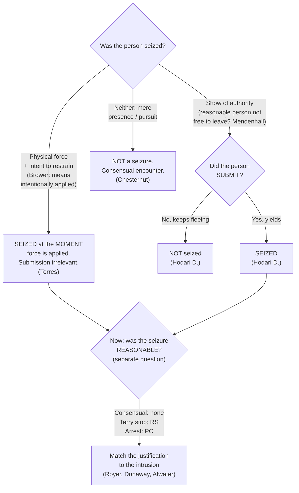

# S9 R1 panel-review — Opus model-diversity lane (prompt pack)

You are the **Claude/Opus** leg of the S9 three-lane adversarial panel (1 Claude + 2 Codex, R1). The two Codex lanes carry the A (support/quote-fidelity) and B (currency/treatment) attack lenses; **you carry model diversity and MUST vote on every paneled assertion across BOTH lenses' concerns.** You are refute-framed: try hard to break each assertion; **default to REFUTED on uncertainty**; never fabricate a cite, quote, or holding; use ONLY the evidence inlined below (no search, no outside knowledge). You are a SIGHTED reviewer — the FULL lake record (judgment fields included) is inlined.

You are a WRITER lane, not an adjudicator: you FIND and VOTE. You do not tally, adjudicate, or close any row — the orchestrator does.

For EACH group below, return one JSON object with the exact `reviewed[]` shape from the output contract (identical framing to the Codex lenses). Emit a finding object ONLY for a real defect (verdict refuted / stands-modified); a group you find wholly clean returns all-`stands` verdicts (the harness records a clean attestation). Concatenate the per-group JSON objects into a top-level `{"packs": [ ... ]}` array, one entry per group, each carrying its `group_id`.


OUTPUT CONTRACT — return ONE JSON object, nothing else:
{
  "lens": "A" | "B",
  "group_id": "<echo the group id>",
  "reviewed": [
    {
      "assertion_id": "<from group_inventory.jsonl>",
      "dimension": "existence|support|quote_fidelity|pincite|treatment|black_letter",
      "verdict": "stands" | "refuted" | "stands-modified",
      "verifiable_from_disclosed": true | false,
      "defect": null,   // null when verdict=="stands"; else an object:
      //  {"problem": "...", "severity": "high|medium|low", "proposed_fix": "...", "evidence_quote": "verbatim from disclosed evidence or null", "needs_cl": true|false, "locator_note": "..."}
      "reasons": ["short evidence-grounded reason", "..."],
      "breaks_true_positives": true | false,
      "residual_risks": ["..."],
      "suggested_tightening": "... or null"
    }
  ],
  "notes": ""
}
Rules: verdict=='stands' <=> defect==null (assertion survives your attack). verdict=='refuted' <=> a real defect (the assertion as framed is wrong). verdict=='stands-modified' <=> survives but needs a stated modification (a minor defect). Review EVERY assertion_id in group_inventory.jsonl exactly once. Output ONLY the JSON object.
---

## GROUP: content/seizures/Seizure of the Person.md  (`doctrine`, 28 assertions)

### content_page

```
---
weight: 10
title: "When a Seizure Occurs"
aliases:
  - "When a Seizure Occurs"
  - "seizing people"
  - "Seizure of the Person"
  - "seizure-of-the-person"
  - "4-what-is-a-seizure/Seizure-of-the-Person"
topic: "Seizure of the person: when a Fourth Amendment seizure occurs"
type: doctrine
amendment: "U.S. Const. amend. IV"
jurisdiction: "Federal (U.S. Const. amend. IV); SCOTUS baseline"
status: draft
related:
  - "[[Fourth Amendment Framework]]"
  - "[[Fourth Amendment Analysis Checklist]]"
  - "[[Terry Stops and Reasonable Suspicion]]"
  - "[[Traffic Stops]]"
  - "[[Seizure of Property]]"
  - "[[Use of Force]]"
  - "[[The Exclusionary Rule]]"
---

# When a Seizure Occurs

*Has this encounter become a Fourth Amendment seizure of the person, and if so, at what moment? This page fixes only when a seizure has occurred. Whether that seizure was reasonable (a hunch, reasonable suspicion, probable cause, or a recognized justification) is a separate question taken up on the pages that follow.*

> [!rule] Black-letter rule
> **A person is "seized" in one of two ways, and the two roads are analyzed apart.** A Fourth Amendment seizure of the person occurs on either **(1) the application of physical force to the body with intent to restrain**, or **(2) a show of authority to which the person submits**. *[[California v. Hodari D.#^pin-626|Hodari D.]]*, 499 U.S. 621, [626](https://www.courtlistener.com/opinion/112579/california-v-hodari-d/) (1991) ("An arrest requires *either* physical force ... *or*, where that is absent, submission to the assertion of authority"); *[[Torres v. Madrid|Torres]]*, 592 U.S. 306 (2021). The **force** branch is complete the instant force is applied and needs no submission; the **show-of-authority** branch is not complete until the person yields. Do not import the submission requirement into a force case, or the force requirement into a show-of-authority case.
> ^rule-when-seized

## The Brief

**Two roads, kept apart.** The threshold question splits at the outset into two independent tests, and the cardinal error on this page is running one road's requirement into the other. On the **force** road, application of physical force to the body with intent to restrain is a seizure the instant it lands, whether or not the person yields. On the **show-of-authority** road, a display of official authority becomes a seizure only when the person actually submits to it. A single encounter can travel one road or the other, and the analysis differs at each step.

**Road one, the show of authority: the *[[United States v. Mendenhall|Mendenhall]]* "free to leave" threshold.** A show-of-authority seizure can occur only where, "in view of all of the circumstances surrounding the incident, a reasonable person would have believed that he was not free to leave." *[[United States v. Mendenhall#^pin-554|Mendenhall]]*, 446 U.S. 544, [554](https://www.courtlistener.com/opinion/110264/united-states-v-mendenhall/) (1980). The inquiry is **objective and totality-based**, measured by how a reasonable person in the suspect's position would read the scene, not by the officer's private intent. The Court gave examples of circumstances that "might indicate a seizure, even where the person did not attempt to leave": "the threatening presence of several officers, the display of a weapon by an officer, some physical touching of the person of the citizen, or the use of language or tone of voice indicating that compliance with the officer's request might be compelled." *[[United States v. Mendenhall#^pin-554|Id.]]* at 554.

**"Free to leave" is necessary but not sufficient: the suspect must submit (*Hodari D.*).** For the show-of-authority road, the threshold is only half the test. The "narrow question ... whether, with respect to a show of authority ... a seizure occurs even though the subject does not yield. We hold that it does not." *[[California v. Hodari D.#^pin-626|Hodari D.]]*, 499 U.S. at [626](https://www.courtlistener.com/opinion/112579/california-v-hodari-d/). A command to a fleeing suspect ("Stop, in the name of the law!") is no seizure until he submits. The practical payoff runs to abandonment: contraband a suspect tosses **while still fleeing**, before any submission, was not discarded during a seizure, so it is not the suppressible fruit of one (see [[Abandonment]]).

**Road two, physical force: seized at the instant of application (*[[Torres v. Madrid|Torres]]*).** Where officers apply physical force to the body to restrain, the seizure is complete at the moment the force lands, even if it fails to subdue and the person gets away. So the Court held in *[[Torres v. Madrid|Torres]]*, 592 U.S. 306 (2021): applying physical force to the body with intent to restrain is a seizure even though the person does not submit and is not subdued. Torres was seized the moment the officers' bullets struck her, though she then drove off. Two corollaries follow. First, a force seizure that meets no submission **lasts only as long as the force is applied**; the Fourth Amendment recognizes no continuing arrest during a suspect's later flight. Second, the force must be applied **to restrain**, not by accident or for some unrelated purpose, and the test is objective: the question is whether the challenged conduct manifests an intent to restrain, not what the officer secretly meant. A mere touch can suffice, but a tap on the shoulder to get someone's attention rarely shows that intent.

**What governmental conduct counts: the *[[Brower v. County of Inyo|Brower]]* "means intentionally applied" rule.** A seizure occurs "only when there is a governmental termination of freedom of movement *through means intentionally applied*," not through "the accidental effects of otherwise lawful government conduct." *[[Brower v. County of Inyo#^pin-599|Brower]]*, 489 U.S. 593, [596–597](https://www.courtlistener.com/opinion/112218/brower-ex-rel-estate-of-caldwell-v-county-of-inyo/#:~:text=enough%20for%20a%20seizure%20that) (1989). It is "enough for a seizure that a person be stopped by the very instrumentality set in motion or put in place in order to achieve that result." *[[Brower v. County of Inyo#^pin-599|Id.]]* at 599. A fleeing driver who crashes into a roadblock the police positioned to stop him is seized; a driver who happens to crash for reasons the police did not engineer is not.

**The continuum: consensual encounter, investigative detention, arrest.** Seizure of the person is not all-or-nothing. The level of intrusion sets the justification the Fourth Amendment demands.

- **Consensual encounter (no seizure, no justification needed).** A bare hunch justifies no seizure of any kind; the lawful tool is a consensual encounter, in which the person stays free to leave. Police pursuit, standing alone, is not a seizure: driving alongside a fleeing pedestrian without siren, command, weapon, or aggressive blocking "does not, standing alone, constitute a seizure." *[[Michigan v. Chesternut#^pin-575b|Chesternut]]*, 486 U.S. 567, [575–576](https://www.courtlistener.com/opinion/112095/michigan-v-chesternut/#:~:text=While%20the%20very%20presence%20of) (1988). And without reasonable suspicion, officers may not even stop a person to demand identification. *[[Brown v. Texas|Brown v. Texas]]*, 443 U.S. 47 (1979).
- **Investigative detention (reasonable suspicion, least intrusive means).** A brief *[[Terry Stops and Reasonable Suspicion|Terry]]* stop requires reasonable, articulable suspicion and "must be temporary and last no longer than is necessary ... . [T]he investigative methods employed should be the least intrusive means reasonably available." *[[Florida v. Royer#^pin-500|Royer]]*, 460 U.S. 491, [500](https://www.courtlistener.com/opinion/110890/florida-v-royer/) (1983) (plurality). Holding a suspect's ticket and identification, confining him, and never telling him he is free to go can escalate a stop into a [[Common Legal Terms#de-facto|de facto]] arrest: "[a]s a practical matter, [he is] under arrest," and that step needs probable cause. *[[Florida v. Royer#^pin-503|Id.]]* at 503.
- **Arrest or [[Common Legal Terms#de-facto|de facto]] arrest (probable cause).** A station-house detention for interrogation "regardless of its label" is a seizure that requires probable cause and cannot rest on *[[Terry v. Ohio|Terry]]*-type balancing. *[[Dunaway v. New York#^pin-216|Dunaway]]*, 442 U.S. 200, [216](https://www.courtlistener.com/opinion/110096/dunaway-v-new-york/) (1979). Awakening a suspect at 3 a.m. and transporting him, handcuffed, to the station is an arrest, and a sleepy "Okay" is "mere submission to a claim of lawful authority," not consent. *[[Kaupp v. Texas|Kaupp v. Texas]]*, 538 U.S. 626 (2003). Investigatory detentions, including for **fingerprinting**, are full Fourth Amendment seizures: "Detentions for the sole purpose of obtaining fingerprints are no less subject to the constraints of the Fourth Amendment." *[[Davis v. Mississippi#^pin-727|Davis]]*, 394 U.S. 721, [727](https://www.courtlistener.com/opinion/107912/davis-v-mississippi/#:~:text=Detentions%20for%20the%20sole%20purpose) (1969). The line "is crossed when the police, without probable cause or a warrant, forcibly remove a person from his home ... and transport him to the police station," even briefly. *[[Hayes v. Florida#^pin-816|Hayes]]*, 470 U.S. 811, [816](https://www.courtlistener.com/opinion/111382/hayes-v-florida/) (1985) (reserving whether brief *field* fingerprinting on reasonable suspicion, done with dispatch, might be permissible).

**The arrest end of the spectrum is governed by probable cause, not interest-balancing.** A warrantless custodial arrest for even a **fine-only misdemeanor** committed in the officer's presence is reasonable if supported by probable cause; the Fourth Amendment demands no case-by-case weighing. *[[Atwater v. City of Lago Vista|Atwater]]*, 532 U.S. 318 (2001). An arrest on probable cause is reasonable **even if state law forbade it** (for example, required a summons instead). *[[Virginia v. Moore|Virginia v. Moore]]*, 553 U.S. 164 (2008). And the officer's **subjective motive is irrelevant** to the reasonableness of an arrest made on a valid basis. *[[Ashcroft v. al-Kidd|Ashcroft v. al-Kidd]]*, 563 U.S. 731 (2011). The arrest standard itself is treated in full at [[Arrest and Arrest Warrants]].

**The back end of an arrest: the prompt probable-cause check.** A person arrested without a warrant is entitled to a **prompt judicial determination of probable cause** before extended pretrial detention, though no adversary hearing is required. *[[Gerstein v. Pugh|Gerstein v. Pugh]]*, 420 U.S. 103 (1975). A determination within **48 hours** is presumptively prompt; beyond that, the government must show a bona fide emergency, and intervening weekends do not qualify. *[[County of Riverside v. McLaughlin|County of Riverside v. McLaughlin]]*, 500 U.S. 44 (1991). The full back-end rule is at [[Prompt Probable-Cause Determination]].

**A seizure can reach more than the target.** When a vehicle is stopped, the **passenger is seized just as the driver is**, because no reasonable passenger would believe himself free to leave; the passenger may therefore challenge the stop (full treatment is at [[Traffic Stops]]). *[[Brendlin v. California|Brendlin v. California]]*, 551 U.S. 249 (2007). Seizure of the *person* is also distinct from seizure of *property*: a seizure of property turns on meaningful interference with a possessory interest, independent of any liberty interest (see [[Seizure of Property]]). *[[Soldal v. Cook County|Soldal v. Cook County]]*, 506 U.S. 56 (1992).

**Force, then reasonableness: the seizure is the trigger.** The same touching that effects a force seizure also opens the **use-of-force** inquiry. Once a seizure by force has occurred, its *reasonableness* is judged under the objective standard of *[[Graham v. Connor|Graham v. Connor]]*, 490 U.S. 386 (1989), from the on-scene perspective of a reasonable officer. That reasonableness inquiry, the Court recently confirmed, looks to the [[Common Legal Terms#totality-of-the-circumstances|totality of the circumstances]] and "has no time limit," rejecting any rule that isolates the single moment of threat. *[[Barnes v. Felix|Barnes v. Felix]]*, 605 U.S. 73 (2025). Seizure (this page) is the trigger; reasonableness is the next question, and it belongs to [[Use of Force]].

**Burden, standard of review, and remedy.** Because a warrantless seizure of the person is presumptively unreasonable, the **government** bears the burden of justifying it once the defendant shows a seizure occurred. Whether a seizure occurred is a **mixed question**: the trial court's historical findings are reviewed for [[Common Legal Terms#clear-error|clear error]], and the ultimate Fourth Amendment determination [[Common Legal Terms#de-novo|de novo]]. The **remedy** is suppression: statements and evidence that are the fruit of an illegal seizure are excluded unless the taint is attenuated. *[[Miranda v. Arizona|Miranda]]* warnings, a few hours' passage, and a later warrant did **not** purge the taint of an arrest made without probable cause. *[[Taylor v. Alabama|Taylor v. Alabama]]*, 457 U.S. 687 (1982); see [[The Exclusionary Rule]].

**Apply it.**
1. **Am I applying physical force to restrain?** If yes, the person is seized **now**. Submission is irrelevant, the seizure lasts only as long as the force, and reasonableness (not seizure) is the next question.
2. **If not, am I making a show of authority, and has the person submitted?** Ask whether a reasonable person would feel free to leave; if not, the show of authority is a seizure **only once the person actually yields**. A suspect who keeps fleeing is not yet seized, and what he discards mid-flight is not the fruit of a seizure.
3. **Match the justification to the intrusion.** A consensual encounter needs nothing; a *[[Terry v. Ohio|Terry]]* detention needs reasonable suspicion and the least intrusive means; an arrest (station-house transport, prolonged confinement, handcuffs and interrogation) needs probable cause.
4. **Do not treat a hunch as authority.** Without articulable suspicion there is no power to seize; keep the encounter consensual and build the articulation first.
5. **Remember the reach and the back end.** A stop seizes the passengers too, and a warrantless arrest needs a prompt judicial probable-cause determination within roughly 48 hours.

**Common pitfalls.**
- **Treating a fleeing suspect as already seized the moment an officer yells "stop."** Until the suspect submits (or is touched with intent to restrain) there is no show-of-authority seizure, and anything discarded mid-flight is fair game. *[[California v. Hodari D.|Hodari D.]]*
- **Assuming any missed or failed use of force is no seizure.** A shot that *hits* but does not stop the suspect **is** a seizure at that instant, because force was applied to the body. *[[Torres v. Madrid|Torres]]*. A shot that *misses* applies no force to the body, so it is no *force* seizure; but if it accompanies a command to halt and the suspect **submits**, a *show-of-authority* seizure can still occur. *[[California v. Hodari D.|Hodari D.]]*; *[[United States v. Mendenhall|Mendenhall]]*. What defeats the seizure is the suspect's continued flight, not the mere fact that the shot missed.
- **Collapsing "free to leave" into the whole test.** For a show of authority, *[[United States v. Mendenhall|Mendenhall]]* is the threshold but **submission** is still required; for force, *[[United States v. Mendenhall|Mendenhall]]* is beside the point, because application of force controls.
- **Confusing "seized" with "lawfully seized."** Establishing that a seizure occurred does not make it reasonable; whether reasonable suspicion, probable cause, or a recognized justification supported it is a separate analysis.
- **Reading "intent to restrain" as the officer's secret motive.** It is an **objective** inquiry into what the conduct manifests, not a search for the officer's subjective state of mind. *[[Torres v. Madrid|Torres]]*.
- **Treating a hunch as if it authorizes a detention or frisk.** Without articulable suspicion there is no authority to seize. *[[Brown v. Texas|Brown v. Texas]]*.

## Lower-court developments

The two-roads framework is stable, but the lower courts are actively working out three questions: the *[[Torres v. Madrid|Torres]]* force-seizure rule [[Reading and Citing Cases#on-remand|on remand]], what counts as **submission** under *Hodari D.*, and whether the objective *[[United States v. Mendenhall|Mendenhall]]* inquiry may account for a suspect's race. (Supreme Court holdings home to the Key cases above, regardless of date.)

- ***[[Torres v. Madrid|Torres v. Madrid]]* (10th Cir. 2023, [[Reading and Citing Cases#on-remand|on remand]])** — *refinement.* [[Reading and Citing Cases#on-remand|On remand]] from the Supreme Court, the Tenth Circuit reversed summary judgment for the officers: because Torres was seized the instant the bullets struck her (even though she drove off), *[[Heck v. Humphrey]]* did not bar her excessive-force claim and [[Qualified Immunity|qualified immunity]] did not attach merely because she eluded capture; the officers' knowledge at the moment of firing controls. The most concrete circuit-level working-out of the *[[Torres v. Madrid|Torres]]* physical-force-seizure rule. **Binding in-circuit — 10th Cir.** [opinion](https://www.courtlistener.com/opinion/9376547/torres-v-madrid/)
- ***[[United States v. Amos|United States v. Amos]]* (3d Cir. 2023)** — *refinement.* Applies the *Hodari D.* submission requirement to the modern "momentary pause" problem: a suspect's one-to-two-second pause and a halfway raise of the hands in response to a command is **not** submission, so no seizure occurred until handcuffing, and his intervening flight supplied the reasonable suspicion. Submission "would seem to require something more than a momentary pause," 88 F.4th 446, 455. **Binding in-circuit — 3d Cir.** [opinion](https://www.courtlistener.com/opinion/9452158/united-states-v-shiheem-amos/)
- ***[[Carter v. United States|Carter v. United States]]* (D.C. 2025)** — *first-impression.* The District of Columbia Court of Appeals (the local high court, not the D.C. Circuit) [[Reading and Citing Cases#vacated|vacated]] on a seizure theory, holding under its *Dozier* precedent that courts must consider whether an objective reasonable person sharing the defendant's racial status and lived experiences would have felt free to terminate the encounter, and finding a Black man here was seized. A developing frontier on the show-of-authority branch; a cert petition (No. 25-885) now presses whether race may be weighed in the *[[United States v. Mendenhall|Mendenhall]]* "free to leave" inquiry. There is **no Supreme Court holding yet**. **Persuasive — state, illustrative** (D.C. Court of Appeals). [opinion](https://www.courtlistener.com/opinion/10662535/carter-v-united-states/)

## Key cases

| Case | Holding | Opinion |
|---|---|---|
| *[[United States v. Mendenhall]]*, 446 U.S. 544 (1980) | **Anchor.** The "free to leave" benchmark: a person is seized only if, under all the circumstances, a reasonable person would not have believed himself free to leave (objective, totality-based). | [opinion](https://www.courtlistener.com/opinion/110264/united-states-v-mendenhall/) |
| *[[California v. Hodari D.]]*, 499 U.S. 621 (1991) | **Anchor.** A show-of-authority seizure is not complete until the suspect submits; contraband discarded while still fleeing is not the fruit of a seizure. | [opinion](https://www.courtlistener.com/opinion/112579/california-v-hodari-d/) |
| *[[Torres v. Madrid]]*, 592 U.S. 306 (2021) | **Anchor.** Physical force applied to the body with intent to restrain is a seizure at the moment of application, even if the person does not submit and is not subdued. | [opinion](https://www.courtlistener.com/opinion/4867542/torres-v-madrid/) |
| *[[Brower v. County of Inyo]]*, 489 U.S. 593 (1989) | A seizure occurs only on a termination of movement through means intentionally applied; a driver stopped by the very instrumentality the police put in place, such as a roadblock, is seized. | [opinion](https://www.courtlistener.com/opinion/112218/brower-ex-rel-estate-of-caldwell-v-county-of-inyo/) |
| *[[Michigan v. Chesternut]]*, 486 U.S. 567 (1988) | Police pursuit, standing alone, is not a seizure; the *[[United States v. Mendenhall\|Mendenhall]]* objective test governs whether pursuit has become one. | [opinion](https://www.courtlistener.com/opinion/112095/michigan-v-chesternut/) |
| *[[Florida v. Royer]]*, 460 U.S. 491 (1983) | A *[[Terry v. Ohio\|Terry]]* detention must use the least intrusive means; holding a suspect's ID and ticket and confining him escalated a consensual encounter into a [[Common Legal Terms#de-facto\|de facto]] arrest requiring probable cause. | [opinion](https://www.courtlistener.com/opinion/110890/florida-v-royer/) |
| *[[Dunaway v. New York]]*, 442 U.S. 200 (1979) | A station-house detention for interrogation, "regardless of its label," is a seizure requiring probable cause; it cannot rest on *[[Terry v. Ohio\|Terry]]* balancing. | [opinion](https://www.courtlistener.com/opinion/110096/dunaway-v-new-york/) |
| *[[Kaupp v. Texas]]*, 538 U.S. 626 (2003) | A 3 a.m. handcuffed transport to the station for interrogation without probable cause is an arrest; an "Okay" is mere submission to authority, not consent. | [opinion](https://www.courtlistener.com/opinion/127919/kaupp-v-texas/) |
| *[[Davis v. Mississippi]]*, 394 U.S. 721 (1969) | Investigatory detentions, including dragnet detention for fingerprinting, are full Fourth Amendment seizures requiring justification. | [opinion](https://www.courtlistener.com/opinion/107912/davis-v-mississippi/) |
| *[[Hayes v. Florida]]*, 470 U.S. 811 (1985) | Forcibly transporting a suspect to the station for fingerprinting without probable cause is an arrest; brief *field* fingerprinting on reasonable suspicion is left open. | [opinion](https://www.courtlistener.com/opinion/111382/hayes-v-florida/) |

## Related cases across doctrines

These cases are treated in full on other pages but bear directly on *when*, *whether*, and *how far* a seizure of the person occurs, framed here for this doctrine.

| Case | Relevance here | Primary home | Opinion |
|---|---|---|---|
| *[[Brendlin v. California]]*, 551 U.S. 249 (2007) | ***Reach.*** When a car is stopped the passenger is seized too, because no reasonable passenger would feel free to leave. | [[Traffic Stops]] | [opinion](https://www.courtlistener.com/opinion/145712/brendlin-v-california/) |
| *[[Florida v. Bostick]]*, 501 U.S. 429 (1991) | ***Confined setting.*** Where the person is already confined (a bus seat), the test is reframed: a seizure occurs only if a reasonable person would not feel free to decline the officers' requests or otherwise terminate the encounter. | [[Knock and Talk]] | [opinion](https://www.courtlistener.com/opinion/112631/florida-v-bostick/) |
| *[[United States v. Drayton]]*, 536 U.S. 194 (2002) | ***Bus sweep.*** No seizure where officers do not block exits, brandish weapons, or use a commanding tone; failure to advise of the right to refuse does not convert a consensual encounter into a seizure. | [[Knock and Talk]] | [opinion](https://www.courtlistener.com/opinion/121153/united-states-v-drayton/) |
| *[[Michigan v. Summers]]*, 452 U.S. 692 (1981) | ***Categorical detention.*** A warrant to search premises for contraband carries authority to detain the occupants for the search, without individualized suspicion. | [[Securing the Scene]] | [opinion](https://www.courtlistener.com/opinion/110534/michigan-v-summers/) |
| *[[Bailey v. United States]]*, 568 U.S. 186 (2013) | ***Spatial limit.*** *[[Michigan v. Summers\|Summers]]* detention authority reaches only the immediate vicinity of the premises; once the occupant has left, detention needs ordinary *[[Terry v. Ohio\|Terry]]* or probable-cause grounds. | [[Securing the Scene]] | [opinion](https://www.courtlistener.com/opinion/820749/bailey-v-united-states/) |
| *[[Muehler v. Mena]]*, 544 U.S. 93 (2005) | ***Manner.*** A *[[Michigan v. Summers\|Summers]]* detention may include handcuffing occupants for a search of dangerous premises; unrelated questioning during a lawful detention is not a separate Fourth Amendment event. | [[Securing the Scene]] | [opinion](https://www.courtlistener.com/opinion/142878/muehler-v-mena/) |
| *[[Illinois v. McArthur]]*, 531 U.S. 326 (2001) | ***Limited seizure.*** Barring a resident from re-entering his home while police get a warrant is a limited seizure of the person, reasonable on probable cause plus [[Exigent Circumstances and Hot Pursuit\|exigency]]. | [[Securing the Scene]] | [opinion](https://www.courtlistener.com/opinion/118405/illinois-v-mcarthur/) |
| *[[Brown v. Texas]]*, 443 U.S. 47 (1979) | ***No suspicion, no stop.*** Police may not stop a person and demand identification without reasonable suspicion; suspicionless seizures are judged by balancing the public concern, the advancement of the public interest, and the intrusion on liberty. | [[Terry Stops and Reasonable Suspicion]] | [opinion](https://www.courtlistener.com/opinion/110128/brown-v-texas/) |
| *[[Soldal v. Cook County]]*, 506 U.S. 56 (1992) | ***Property analogue.*** A seizure of property occurs on any meaningful interference with possessory interests, the property counterpart to seizure of the person and independent of privacy or liberty. | [[Seizure of Property]] | [opinion](https://www.courtlistener.com/opinion/112795/soldal-v-cook-county/) |
| *[[Ashcroft v. al-Kidd]]*, 563 U.S. 731 (2011) | ***Motive irrelevant.*** An objectively reasonable arrest on a valid basis cannot be challenged on the officer's subjective motive. | [[Section 1983 Liability and Qualified Immunity]] | [opinion](https://www.courtlistener.com/opinion/217703/ashcroft-v-al-kidd/) |
| *[[Taylor v. Alabama]]*, 457 U.S. 687 (1982) | ***Fruit.*** A confession after a warrantless arrest made without probable cause is the suppressible fruit of the illegal seizure where no significant intervening event broke the chain. | [[The Exclusionary Rule]] | [opinion](https://www.courtlistener.com/opinion/110760/taylor-v-alabama/) |
| *[[Graham v. Connor]]*, 490 U.S. 386 (1989) | ***Next step.*** Once a seizure by force has occurred, its reasonableness is judged under the Fourth Amendment's objective-reasonableness standard from the officer's on-scene perspective. | [[Use of Force]] | [opinion](https://www.courtlistener.com/opinion/112257/graham-v-connor/) |
| *[[Barnes v. Felix]]*, 605 U.S. 73 (2025) | ***Next step.*** The reasonableness of force is judged on the [[Common Legal Terms#totality-of-the-circumstances\|totality of the circumstances]], an inquiry that "has no time limit"; the "moment of threat" rule is rejected. | [[Use of Force]] | [opinion](https://www.courtlistener.com/opinion/10584846/barnes-v-felix/) |
| *[[Atwater v. City of Lago Vista]]*, 532 U.S. 318 (2001) | ***Arrest standard.*** A warrantless custodial arrest for a fine-only misdemeanor on probable cause does not violate the Fourth Amendment; no case-by-case balancing. | [[Arrest and Arrest Warrants]] | [opinion](https://www.courtlistener.com/opinion/2620702/atwater-v-city-of-lago-vista/) |
| *[[Virginia v. Moore]]*, 553 U.S. 164 (2008) | ***Arrest standard.*** An arrest on probable cause is reasonable even if state law forbade it; a state-law-only violation triggers no exclusion. | [[Arrest and Arrest Warrants]] | [opinion](https://www.courtlistener.com/opinion/145814/virginia-v-moore/) |
| *[[Gerstein v. Pugh]]*, 420 U.S. 103 (1975) | ***Back-end check.*** A warrantless arrestee is entitled to a prompt judicial probable-cause determination before extended pretrial detention. | [[Prompt Probable-Cause Determination]] | [opinion](https://www.courtlistener.com/opinion/109186/gerstein-v-pugh/) |
| *[[County of Riverside v. McLaughlin]]*, 500 U.S. 44 (1991) | ***Back-end check.*** A probable-cause determination within 48 hours of a warrantless arrest is presumptively prompt; past that, the government must show a bona fide emergency. | [[Prompt Probable-Cause Determination]] | [opinion](https://www.courtlistener.com/opinion/112585/county-of-riverside-v-mclaughlin/) |

## Visual



## Sources

- [*United States v. Mendenhall*, 446 U.S. 544 (1980)](https://www.courtlistener.com/opinion/110264/united-states-v-mendenhall/) (pinpoint: 554)
- [*California v. Hodari D.*, 499 U.S. 621 (1991)](https://www.courtlistener.com/opinion/112579/california-v-hodari-d/) (pinpoints: 625, 626)
- [*Torres v. Madrid*, 592 U.S. 306 (2021)](https://www.courtlistener.com/opinion/4867542/torres-v-madrid/) (quotations paraphrased; CourtListener carries only the slip opinion, no CAP star pagination)
- [*Brower v. County of Inyo*, 489 U.S. 593 (1989)](https://www.courtlistener.com/opinion/112218/brower-ex-rel-estate-of-caldwell-v-county-of-inyo/) (pinpoints: 596–597, 599)
- [*Michigan v. Chesternut*, 486 U.S. 567 (1988)](https://www.courtlistener.com/opinion/112095/michigan-v-chesternut/) (pinpoints: 574, 575–576)
- [*Florida v. Royer*, 460 U.S. 491 (1983) (plurality)](https://www.courtlistener.com/opinion/110890/florida-v-royer/) (pinpoints: 500, 503)
- [*Dunaway v. New York*, 442 U.S. 200 (1979)](https://www.courtlistener.com/opinion/110096/dunaway-v-new-york/) (pinpoints: 216, 217–218)
- [*Kaupp v. Texas*, 538 U.S. 626 (2003)](https://www.courtlistener.com/opinion/127919/kaupp-v-texas/)
- [*Davis v. Mississippi*, 394 U.S. 721 (1969)](https://www.courtlistener.com/opinion/107912/davis-v-mississippi/) (pinpoint: 727)
- [*Hayes v. Florida*, 470 U.S. 811 (1985)](https://www.courtlistener.com/opinion/111382/hayes-v-florida/) (pinpoints: 816, 817)
- [*Atwater v. City of Lago Vista*, 532 U.S. 318 (2001)](https://www.courtlistener.com/opinion/2620702/atwater-v-city-of-lago-vista/)
- [*Virginia v. Moore*, 553 U.S. 164 (2008)](https://www.courtlistener.com/opinion/145814/virginia-v-moore/)
- [*Gerstein v. Pugh*, 420 U.S. 103 (1975)](https://www.courtlistener.com/opinion/109186/gerstein-v-pugh/)
- [*County of Riverside v. McLaughlin*, 500 U.S. 44 (1991)](https://www.courtlistener.com/opinion/112585/county-of-riverside-v-mclaughlin/)
- [*Brendlin v. California*, 551 U.S. 249 (2007)](https://www.courtlistener.com/opinion/145712/brendlin-v-california/) (home = [[Traffic Stops]])
- [*Florida v. Bostick*, 501 U.S. 429 (1991)](https://www.courtlistener.com/opinion/112631/florida-v-bostick/) (home = [[Knock and Talk]])
- [*United States v. Drayton*, 536 U.S. 194 (2002)](https://www.courtlistener.com/opinion/121153/united-states-v-drayton/) (home = [[Knock and Talk]])
- [*Michigan v. Summers*, 452 U.S. 692 (1981)](https://www.courtlistener.com/opinion/110534/michigan-v-summers/) (home = [[Securing the Scene]])
- [*Bailey v. United States*, 568 U.S. 186 (2013)](https://www.courtlistener.com/opinion/820749/bailey-v-united-states/) (home = [[Securing the Scene]])
- [*Muehler v. Mena*, 544 U.S. 93 (2005)](https://www.courtlistener.com/opinion/142878/muehler-v-mena/) (home = [[Securing the Scene]])
- [*Illinois v. McArthur*, 531 U.S. 326 (2001)](https://www.courtlistener.com/opinion/118405/illinois-v-mcarthur/) (home = [[Securing the Scene]])
- [*Brown v. Texas*, 443 U.S. 47 (1979)](https://www.courtlistener.com/opinion/110128/brown-v-texas/) (home = [[Terry Stops and Reasonable Suspicion]])
- [*Soldal v. Cook County*, 506 U.S. 56 (1992)](https://www.courtlistener.com/opinion/112795/soldal-v-cook-county/) (home = [[Seizure of Property]])
- [*Ashcroft v. al-Kidd*, 563 U.S. 731 (2011)](https://www.courtlistener.com/opinion/217703/ashcroft-v-al-kidd/) (home = [[Section 1983 Liability and Qualified Immunity]])
- [*Taylor v. Alabama*, 457 U.S. 687 (1982)](https://www.courtlistener.com/opinion/110760/taylor-v-alabama/) (pinpoints: 217–218; home = [[The Exclusionary Rule]])
- [*Graham v. Connor*, 490 U.S. 386 (1989)](https://www.courtlistener.com/opinion/112257/graham-v-connor/) (reasonableness step; home = [[Use of Force]])
- [*Barnes v. Felix*, 605 U.S. 73 (2025)](https://www.courtlistener.com/opinion/10584846/barnes-v-felix/) (reasonableness step; home = [[Use of Force]])
- [*Terry v. Ohio*, 392 U.S. 1 (1968)](https://www.courtlistener.com/opinion/107729/terry-v-ohio/) (reasonable-suspicion predicate; see [[Terry Stops and Reasonable Suspicion]])

```

### group_inventory (assertions under review)

```jsonl
{"assertion_id": "0e55977091da9156", "dimension": "existence", "kind": "case_cite", "locator": {"case": "Hayes v. Florida", "table_line": 74}, "payload": {"case": "Hayes v. Florida", "cells": ["*[[Hayes v. Florida]]*, 470 U.S. 811 (1985)", "Forcibly transporting a suspect to the station for fingerprinting without probable cause is an arrest; brief *field* fingerprinting on reasonable suspicion is left open.", "[opinion](https://www.courtlistener.com/opinion/111382/hayes-v-florida/)"], "header": ["Case", "Holding", "Opinion"]}}
{"assertion_id": "11c998a5aa84ef31", "dimension": "existence", "kind": "case_cite", "locator": {"case": "Davis v. Mississippi", "table_line": 73}, "payload": {"case": "Davis v. Mississippi", "cells": ["*[[Davis v. Mississippi]]*, 394 U.S. 721 (1969)", "Investigatory detentions, including dragnet detention for fingerprinting, are full Fourth Amendment seizures requiring justification.", "[opinion](https://www.courtlistener.com/opinion/107912/davis-v-mississippi/)"], "header": ["Case", "Holding", "Opinion"]}}
{"assertion_id": "1ce6ef789d773e66", "dimension": "existence", "kind": "case_cite", "locator": {"case": "Graham v. Connor", "table_line": 93}, "payload": {"case": "Graham v. Connor", "cells": ["*[[Graham v. Connor]]*, 490 U.S. 386 (1989)", "***Next step.*** Once a seizure by force has occurred, its reasonableness is judged under the Fourth Amendment's objective-reasonableness standard from the officer's on-scene perspective.", "[[Use of Force]]", "[opinion](https://www.courtlistener.com/opinion/112257/graham-v-connor/)"], "header": ["Case", "Relevance here", "Primary home", "Opinion"]}}
{"assertion_id": "248e531ac1b6b847", "dimension": "existence", "kind": "case_cite", "locator": {"case": "Brown v. Texas", "table_line": 89}, "payload": {"case": "Brown v. Texas", "cells": ["*[[Brown v. Texas]]*, 443 U.S. 47 (1979)", "***No suspicion, no stop.*** Police may not stop a person and demand identification without reasonable suspicion; suspicionless seizures are judged by balancing the public concern, the advancement of the public interest, and the intrusion on liberty.", "[[Terry Stops and Reasonable Suspicion]]", "[opinion](https://www.courtlistener.com/opinion/110128/brown-v-texas/)"], "header": ["Case", "Relevance here", "Primary home", "Opinion"]}}
{"assertion_id": "31f5e45abcde2e46", "dimension": "existence", "kind": "case_cite", "locator": {"case": "Kaupp v. Texas", "table_line": 72}, "payload": {"case": "Kaupp v. Texas", "cells": ["*[[Kaupp v. Texas]]*, 538 U.S. 626 (2003)", "A 3 a.m. handcuffed transport to the station for interrogation without probable cause is an arrest; an \"Okay\" is mere submission to authority, not consent.", "[opinion](https://www.courtlistener.com/opinion/127919/kaupp-v-texas/)"], "header": ["Case", "Holding", "Opinion"]}}
{"assertion_id": "36a850cad8389746", "dimension": "existence", "kind": "case_cite", "locator": {"case": "Ashcroft v. al-Kidd", "table_line": 91}, "payload": {"case": "Ashcroft v. al-Kidd", "cells": ["*[[Ashcroft v. al-Kidd]]*, 563 U.S. 731 (2011)", "***Motive irrelevant.*** An objectively reasonable arrest on a valid basis cannot be challenged on the officer's subjective motive.", "[[Section 1983 Liability and Qualified Immunity]]", "[opinion](https://www.courtlistener.com/opinion/217703/ashcroft-v-al-kidd/)"], "header": ["Case", "Relevance here", "Primary home", "Opinion"]}}
{"assertion_id": "376aacfa7b3cdecb", "dimension": "existence", "kind": "case_cite", "locator": {"case": "United States v. Mendenhall", "table_line": 65}, "payload": {"case": "United States v. Mendenhall", "cells": ["*[[United States v. Mendenhall]]*, 446 U.S. 544 (1980)", "**Anchor.** The \"free to leave\" benchmark: a person is seized only if, under all the circumstances, a reasonable person would not have believed himself free to leave (objective, totality-based).", "[opinion](https://www.courtlistener.com/opinion/110264/united-states-v-mendenhall/)"], "header": ["Case", "Holding", "Opinion"]}}
{"assertion_id": "3c00ef95d74eba5e", "dimension": "existence", "kind": "case_cite", "locator": {"case": "Michigan v. Chesternut", "table_line": 69}, "payload": {"case": "Michigan v. Chesternut", "cells": ["*[[Michigan v. Chesternut]]*, 486 U.S. 567 (1988)", "Police pursuit, standing alone, is not a seizure; the *[[United States v. Mendenhall\\|Mendenhall]]* objective test governs whether pursuit has become one.", "[opinion](https://www.courtlistener.com/opinion/112095/michigan-v-chesternut/)"], "header": ["Case", "Holding", "Opinion"]}}
{"assertion_id": "56719409823f8a3d", "dimension": "existence", "kind": "case_cite", "locator": {"case": "Dunaway v. New York", "table_line": 71}, "payload": {"case": "Dunaway v. New York", "cells": ["*[[Dunaway v. New York]]*, 442 U.S. 200 (1979)", "A station-house detention for interrogation, \"regardless of its label,\" is a seizure requiring probable cause; it cannot rest on *[[Terry v. Ohio\\|Terry]]* balancing.", "[opinion](https://www.courtlistener.com/opinion/110096/dunaway-v-new-york/)"], "header": ["Case", "Holding", "Opinion"]}}
{"assertion_id": "6470b070ae142828", "dimension": "existence", "kind": "case_cite", "locator": {"case": "Atwater v. City of Lago Vista", "table_line": 95}, "payload": {"case": "Atwater v. City of Lago Vista", "cells": ["*[[Atwater v. City of Lago Vista]]*, 532 U.S. 318 (2001)", "***Arrest standard.*** A warrantless custodial arrest for a fine-only misdemeanor on probable cause does not violate the Fourth Amendment; no case-by-case balancing.", "[[Arrest and Arrest Warrants]]", "[opinion](https://www.courtlistener.com/opinion/2620702/atwater-v-city-of-lago-vista/)"], "header": ["Case", "Relevance here", "Primary home", "Opinion"]}}
{"assertion_id": "6771f03ace14a2cd", "dimension": "existence", "kind": "case_cite", "locator": {"case": "Torres v. Madrid", "table_line": 67}, "payload": {"case": "Torres v. Madrid", "cells": ["*[[Torres v. Madrid]]*, 592 U.S. 306 (2021)", "**Anchor.** Physical force applied to the body with intent to restrain is a seizure at the moment of application, even if the person does not submit and is not subdued.", "[opinion](https://www.courtlistener.com/opinion/4867542/torres-v-madrid/)"], "header": ["Case", "Holding", "Opinion"]}}
{"assertion_id": "6f1e86e97d618d4e", "dimension": "existence", "kind": "case_cite", "locator": {"case": "Soldal v. Cook County", "table_line": 90}, "payload": {"case": "Soldal v. Cook County", "cells": ["*[[Soldal v. Cook County]]*, 506 U.S. 56 (1992)", "***Property analogue.*** A seizure of property occurs on any meaningful interference with possessory interests, the property counterpart to seizure of the person and independent of privacy or liberty.", "[[Seizure of Property]]", "[opinion](https://www.courtlistener.com/opinion/112795/soldal-v-cook-county/)"], "header": ["Case", "Relevance here", "Primary home", "Opinion"]}}
{"assertion_id": "7470222a491124f0", "dimension": "existence", "kind": "case_cite", "locator": {"case": "California v. Hodari D.", "table_line": 66}, "payload": {"case": "California v. Hodari D.", "cells": ["*[[California v. Hodari D.]]*, 499 U.S. 621 (1991)", "**Anchor.** A show-of-authority seizure is not complete until the suspect submits; contraband discarded while still fleeing is not the fruit of a seizure.", "[opinion](https://www.courtlistener.com/opinion/112579/california-v-hodari-d/)"], "header": ["Case", "Holding", "Opinion"]}}
{"assertion_id": "7d8f3da8f22a3211", "dimension": "existence", "kind": "case_cite", "locator": {"case": "Muehler v. Mena", "table_line": 87}, "payload": {"case": "Muehler v. Mena", "cells": ["*[[Muehler v. Mena]]*, 544 U.S. 93 (2005)", "***Manner.*** A *[[Michigan v. Summers\\|Summers]]* detention may include handcuffing occupants for a search of dangerous premises; unrelated questioning during a lawful detention is not a separate Fourth Amendment event.", "[[Securing the Scene]]", "[opinion](https://www.courtlistener.com/opinion/142878/muehler-v-mena/)"], "header": ["Case", "Relevance here", "Primary home", "Opinion"]}}
{"assertion_id": "80c89251b43623a5", "dimension": "existence", "kind": "case_cite", "locator": {"case": "Virginia v. Moore", "table_line": 96}, "payload": {"case": "Virginia v. Moore", "cells": ["*[[Virginia v. Moore]]*, 553 U.S. 164 (2008)", "***Arrest standard.*** An arrest on probable cause is reasonable even if state law forbade it; a state-law-only violation triggers no exclusion.", "[[Arrest and Arrest Warrants]]", "[opinion](https://www.courtlistener.com/opinion/145814/virginia-v-moore/)"], "header": ["Case", "Relevance here", "Primary home", "Opinion"]}}
{"assertion_id": "8daed3aa62cfd1b0", "dimension": "existence", "kind": "case_cite", "locator": {"case": "Brower v. County of Inyo", "table_line": 68}, "payload": {"case": "Brower v. County of Inyo", "cells": ["*[[Brower v. County of Inyo]]*, 489 U.S. 593 (1989)", "A seizure occurs only on a termination of movement through means intentionally applied; a driver stopped by the very instrumentality the police put in place, such as a roadblock, is seized.", "[opinion](https://www.courtlistener.com/opinion/112218/brower-ex-rel-estate-of-caldwell-v-county-of-inyo/)"], "header": ["Case", "Holding", "Opinion"]}}
{"assertion_id": "93e9b5cb49977ecd", "dimension": "existence", "kind": "case_cite", "locator": {"case": "Brendlin v. California", "table_line": 82}, "payload": {"case": "Brendlin v. California", "cells": ["*[[Brendlin v. California]]*, 551 U.S. 249 (2007)", "***Reach.*** When a car is stopped the passenger is seized too, because no reasonable passenger would feel free to leave.", "[[Traffic Stops]]", "[opinion](https://www.courtlistener.com/opinion/145712/brendlin-v-california/)"], "header": ["Case", "Relevance here", "Primary home", "Opinion"]}}
{"assertion_id": "973253df538031c5", "dimension": "existence", "kind": "case_cite", "locator": {"case": "County of Riverside v. McLaughlin", "table_line": 98}, "payload": {"case": "County of Riverside v. McLaughlin", "cells": ["*[[County of Riverside v. McLaughlin]]*, 500 U.S. 44 (1991)", "***Back-end check.*** A probable-cause determination within 48 hours of a warrantless arrest is presumptively prompt; past that, the government must show a bona fide emergency.", "[[Prompt Probable-Cause Determination]]", "[opinion](https://www.courtlistener.com/opinion/112585/county-of-riverside-v-mclaughlin/)"], "header": ["Case", "Relevance here", "Primary home", "Opinion"]}}
{"assertion_id": "9953534de3577627", "dimension": "existence", "kind": "case_cite", "locator": {"case": "Bailey v. United States", "table_line": 86}, "payload": {"case": "Bailey v. United States", "cells": ["*[[Bailey v. United States]]*, 568 U.S. 186 (2013)", "***Spatial limit.*** *[[Michigan v. Summers\\|Summers]]* detention authority reaches only the immediate vicinity of the premises; once the occupant has left, detention needs ordinary *[[Terry v. Ohio\\|Terry]]* or probable-cause grounds.", "[[Securing the Scene]]", "[opinion](https://www.courtlistener.com/opinion/820749/bailey-v-united-states/)"], "header": ["Case", "Relevance here", "Primary home", "Opinion"]}}
{"assertion_id": "9dd0102f4140e83b", "dimension": "existence", "kind": "case_cite", "locator": {"case": "United States v. Drayton", "table_line": 84}, "payload": {"case": "United States v. Drayton", "cells": ["*[[United States v. Drayton]]*, 536 U.S. 194 (2002)", "***Bus sweep.*** No seizure where officers do not block exits, brandish weapons, or use a commanding tone; failure to advise of the right to refuse does not convert a consensual encounter into a seizure.", "[[Knock and Talk]]", "[opinion](https://www.courtlistener.com/opinion/121153/united-states-v-drayton/)"], "header": ["Case", "Relevance here", "Primary home", "Opinion"]}}
{"assertion_id": "9fc5fefa026a3092", "dimension": "existence", "kind": "case_cite", "locator": {"case": "Barnes v. Felix", "table_line": 94}, "payload": {"case": "Barnes v. Felix", "cells": ["*[[Barnes v. Felix]]*, 605 U.S. 73 (2025)", "***Next step.*** The reasonableness of force is judged on the [[Common Legal Terms#totality-of-the-circumstances\\|totality of the circumstances]], an inquiry that \"has no time limit\"; the \"moment of threat\" rule is rejected.", "[[Use of Force]]", "[opinion](https://www.courtlistener.com/opinion/10584846/barnes-v-felix/)"], "header": ["Case", "Relevance here", "Primary home", "Opinion"]}}
{"assertion_id": "a7f733d3dce79d3b", "dimension": "existence", "kind": "case_cite", "locator": {"case": "Florida v. Bostick", "table_line": 83}, "payload": {"case": "Florida v. Bostick", "cells": ["*[[Florida v. Bostick]]*, 501 U.S. 429 (1991)", "***Confined setting.*** Where the person is already confined (a bus seat), the test is reframed: a seizure occurs only if a reasonable person would not feel free to decline the officers' requests or otherwise terminate the encounter.", "[[Knock and Talk]]", "[opinion](https://www.courtlistener.com/opinion/112631/florida-v-bostick/)"], "header": ["Case", "Relevance here", "Primary home", "Opinion"]}}
{"assertion_id": "b75900d4bcbd6954", "dimension": "existence", "kind": "case_cite", "locator": {"case": "Illinois v. McArthur", "table_line": 88}, "payload": {"case": "Illinois v. McArthur", "cells": ["*[[Illinois v. McArthur]]*, 531 U.S. 326 (2001)", "***Limited seizure.*** Barring a resident from re-entering his home while police get a warrant is a limited seizure of the person, reasonable on probable cause plus [[Exigent Circumstances and Hot Pursuit\\|exigency]].", "[[Securing the Scene]]", "[opinion](https://www.courtlistener.com/opinion/118405/illinois-v-mcarthur/)"], "header": ["Case", "Relevance here", "Primary home", "Opinion"]}}
{"assertion_id": "ba0da35118b940e4", "dimension": "existence", "kind": "case_cite", "locator": {"case": "Gerstein v. Pugh", "table_line": 97}, "payload": {"case": "Gerstein v. Pugh", "cells": ["*[[Gerstein v. Pugh]]*, 420 U.S. 103 (1975)", "***Back-end check.*** A warrantless arrestee is entitled to a prompt judicial probable-cause determination before extended pretrial detention.", "[[Prompt Probable-Cause Determination]]", "[opinion](https://www.courtlistener.com/opinion/109186/gerstein-v-pugh/)"], "header": ["Case", "Relevance here", "Primary home", "Opinion"]}}
{"assertion_id": "ca12cee76b6e274b", "dimension": "existence", "kind": "case_cite", "locator": {"case": "Michigan v. Summers", "table_line": 85}, "payload": {"case": "Michigan v. Summers", "cells": ["*[[Michigan v. Summers]]*, 452 U.S. 692 (1981)", "***Categorical detention.*** A warrant to search premises for contraband carries authority to detain the occupants for the search, without individualized suspicion.", "[[Securing the Scene]]", "[opinion](https://www.courtlistener.com/opinion/110534/michigan-v-summers/)"], "header": ["Case", "Relevance here", "Primary home", "Opinion"]}}
{"assertion_id": "d3495f0b471a266e", "dimension": "existence", "kind": "case_cite", "locator": {"case": "Taylor v. Alabama", "table_line": 92}, "payload": {"case": "Taylor v. Alabama", "cells": ["*[[Taylor v. Alabama]]*, 457 U.S. 687 (1982)", "***Fruit.*** A confession after a warrantless arrest made without probable cause is the suppressible fruit of the illegal seizure where no significant intervening event broke the chain.", "[[The Exclusionary Rule]]", "[opinion](https://www.courtlistener.com/opinion/110760/taylor-v-alabama/)"], "header": ["Case", "Relevance here", "Primary home", "Opinion"]}}
{"assertion_id": "f2dfb02e579ad5c4", "dimension": "existence", "kind": "case_cite", "locator": {"case": "Florida v. Royer", "table_line": 70}, "payload": {"case": "Florida v. Royer", "cells": ["*[[Florida v. Royer]]*, 460 U.S. 491 (1983)", "A *[[Terry v. Ohio\\|Terry]]* detention must use the least intrusive means; holding a suspect's ID and ticket and confining him escalated a consensual encounter into a [[Common Legal Terms#de-facto\\|de facto]] arrest requiring probable cause.", "[opinion](https://www.courtlistener.com/opinion/110890/florida-v-royer/)"], "header": ["Case", "Holding", "Opinion"]}}
{"assertion_id": "c2cefe9f82795aac", "dimension": "support", "kind": "proposition", "locator": {"callout": "^rule-when-seized"}, "payload": {"anchor": "^rule-when-seized", "statement": "[!rule] Black-letter rule\n**A person is \"seized\" in one of two ways, and the two roads are analyzed apart.** A Fourth Amendment seizure of the person occurs on either **(1) the application of physical force to the body with intent to restrain**, or **(2) a show of authority to which the person submits**. *[[California v. Hodari D.#^pin-626|Hodari D.]]*, 499 U.S. 621, [626](https://www.courtlistener.com/opinion/112579/california-v-hodari-d/) (1991) (\"An arrest requires *either* physical force ... *or*, where that is absent, submission to the assertion of authority\"); *[[Torres v. Madrid|Torres]]*, 592 U.S. 306 (2021). The **force** branch is complete the instant force is applied and needs no submission; the **show-of-authority** branch is not complete until the person yields. Do not import the submission requirement into a force case, or the force requirement into a show-of-authority case."}}
```

### lake record — Ashcroft v. al-Kidd

```json
{
  "schema_version": "s2.v1",
  "record_id": "Ashcroft v. al-Kidd",
  "stub": false,
  "status": "verified",
  "identity": {
    "case_name": "Ashcroft v. al-Kidd",
    "case_name_short": "al-Kidd",
    "case_name_full": "JOHN D. ASHCROFT v. ABDULLAH al-KIDD",
    "input_case_name": "Ashcroft v. al-Kidd",
    "court": "U.S. Supreme Court",
    "court_id": "scotus",
    "court_level": "scotus",
    "circuit": null,
    "state": null,
    "date_decided": "2011-05-31",
    "year": 2011,
    "docket": "10-98",
    "cluster_id": 7344719,
    "lead_opinion_id": 7262676,
    "sibling_ids": [
      7262676,
      7262677,
      7262678,
      7262679
    ],
    "absolute_url": "/opinion/7344719/ashcroft-v-al-kidd/",
    "identity_method": "citation+party-text",
    "expected_citation_found": true,
    "party_name_in_text": true,
    "canonical_name_match": true,
    "alternates": [
      {
        "cluster_id": 217703,
        "score": 110,
        "case_name": "Ashcroft v. al-Kidd"
      }
    ],
    "reason_code": null
  },
  "citations": {
    "official": null,
    "parallel": [
      {
        "cite": "179 L. Ed. 2d 1149",
        "volume": "179",
        "reporter": "L. Ed. 2d",
        "page": "1149",
        "type": 1,
        "selected_official": false,
        "source": "cluster.citations[]"
      },
      {
        "cite": "131 S. Ct. 2074",
        "volume": "131",
        "reporter": "S. Ct.",
        "page": "2074",
        "type": 1,
        "selected_official": false,
        "source": "cluster.citations[]"
      },
      {
        "cite": "563 U.S. 731",
        "volume": "563",
        "reporter": "U.S.",
        "page": "731",
        "type": 1,
        "selected_official": false,
        "source": "cluster.citations[]"
      },
      {
        "cite": "79 U.S.L.W. 4393",
        "volume": "79",
        "reporter": "U.S.L.W.",
        "page": "4393",
        "type": 4,
        "selected_official": false,
        "source": "cluster.citations[]"
      },
      {
        "cite": "22 Fla. L. Weekly Fed. S 1057",
        "volume": "22",
        "reporter": "Fla. L. Weekly Fed. S",
        "page": "1057",
        "type": 1,
        "selected_official": false,
        "source": "cluster.citations[]"
      }
    ],
    "vendor_neutral": [
      {
        "cite": "2011 U.S. LEXIS 4021",
        "volume": "2011",
        "reporter": "U.S. LEXIS",
        "page": "4021",
        "type": 6,
        "selected_official": false,
        "source": "cluster.citations[]"
      }
    ],
    "all": [
      {
        "cite": "179 L. Ed. 2d 1149",
        "volume": "179",
        "reporter": "L. Ed. 2d",
        "page": "1149",
        "type": 1,
        "selected_official": false,
        "source": "cluster.citations[]"
      },
      {
        "cite": "2011 U.S. LEXIS 4021",
        "volume": "2011",
        "reporter": "U.S. LEXIS",
        "page": "4021",
        "type": 6,
        "selected_official": false,
        "source": "cluster.citations[]"
      },
      {
        "cite": "131 S. Ct. 2074",
        "volume": "131",
        "reporter": "S. Ct.",
        "page": "2074",
        "type": 1,
        "selected_official": false,
        "source": "cluster.citations[]"
      },
      {
        "cite": "563 U.S. 731",
        "volume": "563",
        "reporter": "U.S.",
        "page": "731",
        "type": 1,
        "selected_official": false,
        "source": "cluster.citations[]"
      },
      {
        "cite": "79 U.S.L.W. 4393",
        "volume": "79",
        "reporter": "U.S.L.W.",
        "page": "4393",
        "type": 4,
        "selected_official": false,
        "source": "cluster.citations[]"
      },
      {
        "cite": "22 Fla. L. Weekly Fed. S 1057",
        "volume": "22",
        "reporter": "Fla. L. Weekly Fed. S",
        "page": "1057",
        "type": 1,
        "selected_official": false,
        "source": "cluster.citations[]"
      }
    ],
    "display": null,
    "official_selection": {
      "court_class": "scotus",
      "selected": null,
      "reason": "unlisted_reporter:Fla. L. Weekly Fed. S"
    }
  },
  "pinpoints": [
    {
      "id": "pin-736",
      "page": null,
      "quote": "--- # Ashcroft v. al-Kidd *563 U.S. 731 (2011)* \u00b7 U.S. Supreme Court \u00b7 **Binding \u2014 SCOTUS** \u00b7 Treatment: **good** *(as of 2026-06-30)* <!-- header line; TreatmentBadge + weight render here, degrading to the text above --> ## Background Abdullah al-Kidd, a U.S. citizen, was arrested in 2003 on a federal material-witness warrant \u2014 ostensibly to secure his testimony in a terrorism prosecution \u2014 but was never called to testify. He sued former Attorney General John Ashcroft under *Bivens*, alleging that Ashcroft had adopted a policy of using the material-witness statute as a **pretext** to detain terrorism suspects whom the government lacked probable cause to charge, in violation of the Fourth Amendment. Ashcroft asserted qualified immunity. ## Issue Whether an arrest made on a valid material-witness warrant can be challenged as unconstitutional based on the officer's alleged improper subjective motive \u2014 and, if the theory is doubtful, whether Ashcroft violated clearly established law. ## Rule Fourth Amendment reasonableness is judged objectively, so subjective motive does not invalidate an otherwise-valid arrest.",
      "star_marker": null,
      "quote_fidelity": "mismatch",
      "pinpoint_status": "slip-only",
      "position": null
    },
    {
      "id": "pin-743",
      "page": null,
      "quote": "We hold that an objectively reasonable arrest and detention of a material witness pursuant to a validly obtained warrant cannot be challenged as unconstitutional on the basis of allegations that the arresting authority had an improper motive.",
      "star_marker": "1161",
      "quote_fidelity": "matched",
      "pinpoint_status": "star-verified",
      "position": 52473,
      "fragment": "#:~:text=We%20hold%20that%20an%20objectively",
      "fragment_validated_at": "2026-07-09T15:40:45Z"
    }
  ],
  "treatment": {
    "field_i_validity": "good_law",
    "as_of_content": "2011-05-31",
    "as_of_treatment": "2026-06-30",
    "composite_basis": "migration-seed",
    "composite_basis_ref": "Ashcroft v. al-Kidd",
    "varies_by_point": false,
    "scope_note": "Good law: subjective intent is irrelevant to Fourth Amendment objective reasonableness; leading 'clearly established' qualified-immunity statement.",
    "point_overrides": [],
    "edges": [
      {
        "citing_case": {
          "name": "Morrow v. Meachum",
          "cluster_id": 8443910,
          "cite": [
            "917 F.3d 870"
          ],
          "field_ii": "questioned"
        },
        "field_ii": "questioned",
        "field_iii": "mentioned",
        "point": null,
        "proposed": true,
        "journal_ref": "Ashcroft v. al-Kidd:lane1_negative"
      },
      {
        "citing_case": {
          "name": "George Trammell v. Kevin Fruge",
          "cluster_id": 4419631,
          "cite": [
            "868 F.3d 332",
            "2017 WL 3528437",
            "2017 U.S. App. LEXIS 15529"
          ],
          "field_ii": "questioned"
        },
        "field_ii": "questioned",
        "field_iii": "mentioned",
        "point": null,
        "proposed": true,
        "journal_ref": "Ashcroft v. al-Kidd:lane1_negative"
      },
      {
        "citing_case": {
          "name": "Phillip Turner v. Driver",
          "cluster_id": 4349754,
          "cite": [
            "848 F.3d 678",
            "2017 WL 650186",
            "2017 U.S. App. LEXIS 2769"
          ],
          "field_ii": "questioned"
        },
        "field_ii": "questioned",
        "field_iii": "mentioned",
        "point": null,
        "proposed": true,
        "journal_ref": "Ashcroft v. al-Kidd:lane1_negative"
      },
      {
        "citing_case": {
          "name": "Carlos Gonzalez v. Able Huerta",
          "cluster_id": 3216824,
          "cite": [
            "826 F.3d 854",
            "2016 U.S. App. LEXIS 11530",
            "2016 WL 3457258"
          ],
          "field_ii": "questioned"
        },
        "field_ii": "questioned",
        "field_iii": "mentioned",
        "point": null,
        "proposed": true,
        "journal_ref": "Ashcroft v. al-Kidd:lane1_negative"
      },
      {
        "citing_case": {
          "name": "Ramona Hinojosa v. Brad Livingston",
          "cluster_id": 3155936,
          "cite": [
            "807 F.3d 657",
            "2015 U.S. App. LEXIS 20016",
            "2015 WL 7422990"
          ],
          "field_ii": "overruled"
        },
        "field_ii": "overruled",
        "field_iii": "mentioned",
        "point": null,
        "proposed": true,
        "journal_ref": "Ashcroft v. al-Kidd:lane1_negative"
      },
      {
        "citing_case": {
          "name": "MacDonald v. Town of Eastham",
          "cluster_id": 2656464,
          "cite": [
            "745 F.3d 8",
            "2014 WL 944707",
            "2014 U.S. App. LEXIS 4618"
          ],
          "field_ii": "questioned"
        },
        "field_ii": "questioned",
        "field_iii": "mentioned",
        "point": null,
        "proposed": true,
        "journal_ref": "Ashcroft v. al-Kidd:lane1_negative"
      },
      {
        "citing_case": {
          "name": "Prall v. City of Boston",
          "cluster_id": 8729956,
          "cite": [
            "985 F. Supp. 2d 115",
            "2013 WL 6076462",
            "2013 U.S. Dist. LEXIS 166128"
          ],
          "field_ii": "overruled"
        },
        "field_ii": "overruled",
        "field_iii": "mentioned",
        "point": null,
        "proposed": true,
        "journal_ref": "Ashcroft v. al-Kidd:lane1_negative"
      },
      {
        "citing_case": {
          "name": "Morgan v. Swanson",
          "cluster_id": 8441074,
          "cite": [
            "659 F.3d 359",
            "2011 U.S. App. LEXIS 19656",
            "2011 WL 4470233"
          ],
          "field_ii": "overruled"
        },
        "field_ii": "overruled",
        "field_iii": "mentioned",
        "point": null,
        "proposed": true,
        "journal_ref": "Ashcroft v. al-Kidd:lane1_negative"
      },
      {
        "citing_case": {
          "name": "Egbert v. Boule",
          "cluster_id": 6475794,
          "cite": [
            "596 U.S. 482",
            "142 S. Ct. 1793"
          ],
          "field_ii": "overruled"
        },
        "field_ii": "overruled",
        "field_iii": "mentioned",
        "point": null,
        "proposed": true,
        "journal_ref": "Ashcroft v. al-Kidd:lane2_top_cited"
      },
      {
        "citing_case": {
          "name": "Natasha Whitley v. John Hanna",
          "cluster_id": 1036944,
          "cite": [
            "726 F.3d 631",
            "2013 WL 4029134",
            "2013 U.S. App. LEXIS 16485"
          ],
          "field_ii": "criticized"
        },
        "field_ii": "criticized",
        "field_iii": "mentioned",
        "point": null,
        "proposed": true,
        "journal_ref": "Ashcroft v. al-Kidd:lane2_top_cited"
      },
      {
        "citing_case": {
          "name": "Roger Poole v. City of Shreveport",
          "cluster_id": 806839,
          "cite": [
            "691 F.3d 624",
            "2012 WL 3517357",
            "2012 U.S. App. LEXIS 17243"
          ],
          "field_ii": "criticized"
        },
        "field_ii": "criticized",
        "field_iii": "mentioned",
        "point": null,
        "proposed": true,
        "journal_ref": "Ashcroft v. al-Kidd:lane2_top_cited"
      },
      {
        "citing_case": {
          "name": "DiStiso ex rel. DiStiso v. Cook",
          "cluster_id": 807074,
          "cite": [
            "691 F.3d 226",
            "2012 WL 3570755"
          ],
          "field_ii": "overruled"
        },
        "field_ii": "overruled",
        "field_iii": "mentioned",
        "point": null,
        "proposed": true,
        "journal_ref": "Ashcroft v. al-Kidd:lane2_top_cited"
      },
      {
        "citing_case": {
          "name": "Derrick Newman v. James Guedry",
          "cluster_id": 3071815,
          "cite": [
            "703 F.3d 757",
            "2012 U.S. App. LEXIS 26205",
            "2012 WL 6634975"
          ],
          "field_ii": "abrogated"
        },
        "field_ii": "abrogated",
        "field_iii": "mentioned",
        "point": null,
        "proposed": true,
        "journal_ref": "Ashcroft v. al-Kidd:lane2_top_cited"
      },
      {
        "citing_case": {
          "name": "Michael-Ryan Kruger v. State of Nebraska",
          "cluster_id": 3192229,
          "cite": [
            "820 F.3d 295",
            "2016 U.S. App. LEXIS 6326",
            "2016 WL 1376343"
          ],
          "field_ii": "questioned"
        },
        "field_ii": "questioned",
        "field_iii": "mentioned",
        "point": null,
        "proposed": true,
        "journal_ref": "Ashcroft v. al-Kidd:lane2_top_cited"
      },
      {
        "citing_case": {
          "name": "Glik v. Cunniffe",
          "cluster_id": 612667,
          "cite": [
            "655 F.3d 78",
            "84 A.L.R. 6th 647",
            "39 Media L. Rep. (BNA) 2257",
            "2011 U.S. App. LEXIS 17841",
            "2011 WL 3769092"
          ],
          "field_ii": "overruled"
        },
        "field_ii": "overruled",
        "field_iii": "mentioned",
        "point": null,
        "proposed": true,
        "journal_ref": "Ashcroft v. al-Kidd:lane2_top_cited"
      },
      {
        "citing_case": {
          "name": "Gray v. Cummings",
          "cluster_id": 4593291,
          "cite": [
            "917 F.3d 1"
          ],
          "field_ii": "overruled"
        },
        "field_ii": "overruled",
        "field_iii": "mentioned",
        "point": null,
        "proposed": true,
        "journal_ref": "Ashcroft v. al-Kidd:lane2_top_cited"
      },
      {
        "citing_case": {
          "name": "Corey Hughes v. Michael Rodriguez",
          "cluster_id": 6461702,
          "cite": [
            "31 F.4th 1211"
          ],
          "field_ii": "questioned"
        },
        "field_ii": "questioned",
        "field_iii": "mentioned",
        "point": null,
        "proposed": true,
        "journal_ref": "Ashcroft v. al-Kidd:lane2_top_cited"
      },
      {
        "citing_case": {
          "name": "Pratt Ex Rel. Estate of Pratt v. Harris County",
          "cluster_id": 3200293,
          "cite": [
            "822 F.3d 174",
            "2016 U.S. App. LEXIS 8049",
            "2016 WL 2343032"
          ],
          "field_ii": "questioned"
        },
        "field_ii": "questioned",
        "field_iii": "mentioned",
        "point": null,
        "proposed": true,
        "journal_ref": "Ashcroft v. al-Kidd:lane2_top_cited"
      },
      {
        "citing_case": {
          "name": "Barbara Wyatt v. Rhonda Fletcher",
          "cluster_id": 873536,
          "cite": [
            "718 F.3d 496",
            "2013 WL 2371280",
            "2013 U.S. App. LEXIS 11045"
          ],
          "field_ii": "criticized"
        },
        "field_ii": "criticized",
        "field_iii": "mentioned",
        "point": null,
        "proposed": true,
        "journal_ref": "Ashcroft v. al-Kidd:lane2_top_cited"
      },
      {
        "citing_case": {
          "name": "Lamont Shepard v. T. Quillen",
          "cluster_id": 4315689,
          "cite": [
            "840 F.3d 686",
            "2016 U.S. App. LEXIS 19352",
            "2016 WL 6246873"
          ],
          "field_ii": "abrogated"
        },
        "field_ii": "abrogated",
        "field_iii": "mentioned",
        "point": null,
        "proposed": true,
        "journal_ref": "Ashcroft v. al-Kidd:lane2_top_cited"
      },
      {
        "citing_case": {
          "name": "Irish v. Fowler",
          "cluster_id": 4803838,
          "cite": [
            "979 F.3d 65"
          ],
          "field_ii": "questioned"
        },
        "field_ii": "questioned",
        "field_iii": "mentioned",
        "point": null,
        "proposed": true,
        "journal_ref": "Ashcroft v. al-Kidd:lane2_top_cited"
      },
      {
        "citing_case": {
          "name": "Tucker v. City of Shreveport",
          "cluster_id": 4884106,
          "cite": [
            "998 F.3d 165"
          ],
          "field_ii": "questioned"
        },
        "field_ii": "questioned",
        "field_iii": "mentioned",
        "point": null,
        "proposed": true,
        "journal_ref": "Ashcroft v. al-Kidd:lane2_top_cited"
      },
      {
        "citing_case": {
          "name": "Susan Doxtator v. Erik O'Brien",
          "cluster_id": 6623081,
          "cite": [
            "39 F.4th 852"
          ],
          "field_ii": "questioned"
        },
        "field_ii": "questioned",
        "field_iii": "mentioned",
        "point": null,
        "proposed": true,
        "journal_ref": "Ashcroft v. al-Kidd:lane2_top_cited"
      },
      {
        "citing_case": {
          "name": "Stamps Ex Rel. Estate of Stamps v. Town of Framingham",
          "cluster_id": 3175226,
          "cite": [
            "813 F.3d 27",
            "2016 U.S. App. LEXIS 2026",
            "2016 WL 457153"
          ],
          "field_ii": "overruled"
        },
        "field_ii": "overruled",
        "field_iii": "mentioned",
        "point": null,
        "proposed": true,
        "journal_ref": "Ashcroft v. al-Kidd:lane2_top_cited"
      },
      {
        "citing_case": {
          "name": "Matalon v. Hynnes",
          "cluster_id": 3155905,
          "cite": [
            "806 F.3d 627",
            "2015 U.S. App. LEXIS 20008",
            "2015 WL 7280627"
          ],
          "field_ii": "questioned"
        },
        "field_ii": "questioned",
        "field_iii": "mentioned",
        "point": null,
        "proposed": true,
        "journal_ref": "Ashcroft v. al-Kidd:lane2_top_cited"
      },
      {
        "citing_case": {
          "name": "Jacob Pfaller v. Mark Amonette",
          "cluster_id": 9344950,
          "cite": [
            "55 F.4th 436"
          ],
          "field_ii": "superseded_by_statute"
        },
        "field_ii": "superseded_by_statute",
        "field_iii": "mentioned",
        "point": null,
        "proposed": true,
        "journal_ref": "Ashcroft v. al-Kidd:lane2_top_cited"
      },
      {
        "citing_case": {
          "name": "Drumgold v. Callahan",
          "cluster_id": 816494,
          "cite": [
            "707 F.3d 28",
            "2013 U.S. App. LEXIS 2301",
            "2013 WL 376747"
          ],
          "field_ii": "questioned"
        },
        "field_ii": "questioned",
        "field_iii": "mentioned",
        "point": null,
        "proposed": true,
        "journal_ref": "Ashcroft v. al-Kidd:lane2_top_cited"
      }
    ],
    "derivation": {
      "lane1_negative": {
        "query": "cites:(7262676 OR 7262677 OR 7262678 OR 7262679) AND (overrul* OR abrogat* OR supersed* OR \"recede from\" OR \"no longer good law\" OR vacat* OR reversed) ",
        "reviewed": 106,
        "cap": 200,
        "cap_hit": false,
        "final_cursor": null,
        "audit_needed": false,
        "proposed_negative_events": 8,
        "audit_marker": null,
        "triage_mode": "snippet-first",
        "snippet_field": "results[].opinions[].snippet",
        "triage_journaled": 106,
        "triage_read": 8,
        "triage_snippet_classified": 98
      },
      "lane2_top_cited": {
        "query": "cites:(7262676 OR 7262677 OR 7262678 OR 7262679)",
        "reviewed": 25,
        "cap": 25,
        "cap_hit": true,
        "final_cursor": "https://www.courtlistener.com/api/rest/v4/search/?cursor=cz00MiZzPTk0MjE3NjMmdD1vJmQ9MjAyNi0wNy0wNCZwPTM%3D&order_by=citeCount+desc&page_size=25&q=cites%3A%287262676+OR+7262677+OR+7262678+OR+7262679%29&type=o",
        "audit_needed": true,
        "proposed_negative_events": 25,
        "audit_marker": "R15 treatment audit required"
      },
      "lane3_recency": {
        "query": "cites:(7262676 OR 7262677 OR 7262678 OR 7262679)",
        "reviewed": 24,
        "cap": 200,
        "cap_hit": false,
        "final_cursor": null,
        "audit_needed": false,
        "proposed_negative_events": 0,
        "audit_marker": null,
        "triage_mode": "snippet-first",
        "snippet_field": "results[].opinions[].snippet",
        "triage_journaled": 24,
        "triage_read": 0,
        "triage_snippet_classified": 24
      }
    }
  },
  "progeny": {
    "complete_query": "cites:(7262676 OR 7262677 OR 7262678 OR 7262679)",
    "indexed_citing_opinions": 168,
    "count_source": "search",
    "per_sibling": [
      {
        "opinion_id": 7262676,
        "count": 168,
        "count_source": "search"
      },
      {
        "opinion_id": 7262677,
        "count": 0,
        "count_source": "search"
      },
      {
        "opinion_id": 7262678,
        "count": 0,
        "count_source": "search"
      },
      {
        "opinion_id": 7262679,
        "count": 0,
        "count_source": "search"
      }
    ],
    "citation_count": 1746,
    "cache_path": "/Users/johngalt/cssi-lake/cache/progeny/ashcroft-v-al-kidd.jsonl",
    "enumeration": "bounded",
    "cursor": "https://www.courtlistener.com/api/rest/v4/search/?cursor=cz0xLjgzNDU1NTcmcz05NDEyMTU0JnQ9byZkPTIwMjYtMDctMDQmcD0y&order_by=score+desc&page_size=100&q=cites%3A%287262676+OR+7262677+OR+7262678+OR+7262679%29&type=o",
    "rows_cached": 20,
    "outbound_opinion_edges": []
  },
  "off_cl_links": [],
  "provenance": {
    "cl_source": "U",
    "cl_api": "https://www.courtlistener.com/api/rest/v4",
    "built_by": "S2-BUILDER-AUTHORING",
    "build_run": "s2-build-96d841cbb12e",
    "date_created": "2026-07-04T19:06:31Z",
    "date_modified": "2026-07-09T15:47:29Z",
    "warnings": [
      "official cite selection failed closed: unlisted_reporter:Fla. L. Weekly Fed. S",
      "legacy treatment migrated: good -> good_law"
    ],
    "field_provenance": {
      "identity": {
        "src": "CourtListener search + clusters + lead opinion text",
        "at": "2026-07-04T19:06:52Z",
        "verifier": "S2-BUILDER-AUTHORING"
      },
      "treatment.field_i_validity": {
        "src": "_treatment-migration.json + page frontmatter",
        "at": "2026-07-04T19:06:52Z",
        "verifier": "S2-BUILDER-AUTHORING"
      },
      "point_overrides": {
        "src": "S2 treatment derivation proposed only",
        "at": "2026-07-04T19:10:49Z",
        "verifier": "S2-BUILDER-AUTHORING"
      },
      "pinpoints": {
        "src": "content page quote harvest + lead opinion text",
        "at": "2026-07-04T19:06:52Z",
        "verifier": "S2-BUILDER-AUTHORING"
      }
    }
  }
}

```

### lake record — Atwater v. City of Lago Vista

```json
{
  "schema_version": "s2.v1",
  "record_id": "Atwater v. City of Lago Vista",
  "stub": false,
  "status": "verified",
  "identity": {
    "case_name": "Atwater v. City of Lago Vista",
    "case_name_short": "Atwater",
    "case_name_full": "ATWATER Et Al. v. CITY OF LAGO VISTA Et Al.",
    "input_case_name": "Atwater v. City of Lago Vista",
    "court": "U.S. Supreme Court",
    "court_id": "scotus",
    "court_level": "scotus",
    "circuit": null,
    "state": null,
    "date_decided": "2001-04-24",
    "year": 2001,
    "docket": null,
    "cluster_id": 2620702,
    "lead_opinion_id": 2620702,
    "sibling_ids": [
      2620702,
      9795084,
      9795085
    ],
    "absolute_url": "/opinion/2620702/atwater-v-city-of-lago-vista/",
    "identity_method": "citation+party-text",
    "expected_citation_found": true,
    "party_name_in_text": true,
    "canonical_name_match": true,
    "alternates": [
      {
        "cluster_id": 9199445,
        "score": 10,
        "case_name": "Atwater v. City of Lago Vista"
      },
      {
        "cluster_id": 9199444,
        "score": 10,
        "case_name": "Atwater v. City of Lago Vista"
      }
    ],
    "reason_code": null
  },
  "citations": {
    "official": null,
    "parallel": [
      {
        "cite": "532 U.S. 318",
        "volume": "532",
        "reporter": "U.S.",
        "page": "318",
        "type": 1,
        "selected_official": false,
        "source": "cluster.citations[]"
      },
      {
        "cite": "121 S. Ct. 1536",
        "volume": "121",
        "reporter": "S. Ct.",
        "page": "1536",
        "type": 1,
        "selected_official": false,
        "source": "cluster.citations[]"
      },
      {
        "cite": "149 L. Ed. 2d 549",
        "volume": "149",
        "reporter": "L. Ed. 2d",
        "page": "549",
        "type": 1,
        "selected_official": false,
        "source": "cluster.citations[]"
      },
      {
        "cite": "2001 Daily Journal DAR 3953",
        "volume": "2001",
        "reporter": "Daily Journal DAR",
        "page": "3953",
        "type": 2,
        "selected_official": false,
        "source": "cluster.citations[]"
      },
      {
        "cite": "2001 Colo. J. C.A.R. 2069",
        "volume": "2001",
        "reporter": "Colo. J. C.A.R.",
        "page": "2069",
        "type": 2,
        "selected_official": false,
        "source": "cluster.citations[]"
      },
      {
        "cite": "14 Fla. L. Weekly Fed. S 193",
        "volume": "14",
        "reporter": "Fla. L. Weekly Fed. S",
        "page": "193",
        "type": 1,
        "selected_official": false,
        "source": "cluster.citations[]"
      },
      {
        "cite": "69 U.S.L.W. 4262",
        "volume": "69",
        "reporter": "U.S.L.W.",
        "page": "4262",
        "type": 4,
        "selected_official": false,
        "source": "cluster.citations[]"
      }
    ],
    "vendor_neutral": [
      {
        "cite": "2001 U.S. LEXIS 3366",
        "volume": "2001",
        "reporter": "U.S. LEXIS",
        "page": "3366",
        "type": 6,
        "selected_official": false,
        "source": "cluster.citations[]"
      },
      {
        "cite": "2001 Cal. Daily Op. Serv. 3203",
        "volume": "2001",
        "reporter": "Cal. Daily Op. Serv.",
        "page": "3203",
        "type": 6,
        "selected_official": false,
        "source": "cluster.citations[]"
      }
    ],
    "all": [
      {
        "cite": "532 U.S. 318",
        "volume": "532",
        "reporter": "U.S.",
        "page": "318",
        "type": 1,
        "selected_official": false,
        "source": "cluster.citations[]"
      },
      {
        "cite": "121 S. Ct. 1536",
        "volume": "121",
        "reporter": "S. Ct.",
        "page": "1536",
        "type": 1,
        "selected_official": false,
        "source": "cluster.citations[]"
      },
      {
        "cite": "149 L. Ed. 2d 549",
        "volume": "149",
        "reporter": "L. Ed. 2d",
        "page": "549",
        "type": 1,
        "selected_official": false,
        "source": "cluster.citations[]"
      },
      {
        "cite": "2001 U.S. LEXIS 3366",
        "volume": "2001",
        "reporter": "U.S. LEXIS",
        "page": "3366",
        "type": 6,
        "selected_official": false,
        "source": "cluster.citations[]"
      },
      {
        "cite": "2001 Daily Journal DAR 3953",
        "volume": "2001",
        "reporter": "Daily Journal DAR",
        "page": "3953",
        "type": 2,
        "selected_official": false,
        "source": "cluster.citations[]"
      },
      {
        "cite": "2001 Colo. J. C.A.R. 2069",
        "volume": "2001",
        "reporter": "Colo. J. C.A.R.",
        "page": "2069",
        "type": 2,
        "selected_official": false,
        "source": "cluster.citations[]"
      },
      {
        "cite": "14 Fla. L. Weekly Fed. S 193",
        "volume": "14",
        "reporter": "Fla. L. Weekly Fed. S",
        "page": "193",
        "type": 1,
        "selected_official": false,
        "source": "cluster.citations[]"
      },
      {
        "cite": "69 U.S.L.W. 4262",
        "volume": "69",
        "reporter": "U.S.L.W.",
        "page": "4262",
        "type": 4,
        "selected_official": false,
        "source": "cluster.citations[]"
      },
      {
        "cite": "2001 Cal. Daily Op. Serv. 3203",
        "volume": "2001",
        "reporter": "Cal. Daily Op. Serv.",
        "page": "3203",
        "type": 6,
        "selected_official": false,
        "source": "cluster.citations[]"
      }
    ],
    "display": null,
    "official_selection": {
      "court_class": "scotus",
      "selected": null,
      "reason": "unlisted_reporter:Fla. L. Weekly Fed. S"
    }
  },
  "pinpoints": [
    {
      "id": "pin-354",
      "page": null,
      "quote": "--- # Atwater v. City of Lago Vista *532 U.S. 318 (2001)* \u00b7 U.S. Supreme Court \u00b7 **Binding \u2014 SCOTUS** \u00b7 Treatment: **good** *(as of 2026-06-30)* <!-- header line; TreatmentBadge + weight render here, degrading to the text above --> ## Background Gail Atwater was driving her pickup in Lago Vista, Texas, with her two young children; none of them was wearing a seatbelt, a misdemeanor punishable under Texas law only by a fine. Officer Turek stopped her, and rather than issue a citation, he handcuffed her, placed her in his squad car, and took her to the police station, where she was booked \u2014 required to remove her shoes, jewelry, and glasses, photographed, and held in a cell for about an hour before being taken to a magistrate and released on bond. She ultimately pleaded no contest and paid a $50 fine, then sued the City, the police chief, and Officer Turek under 42 U.S.C. \u00a7 1983, contending the custodial arrest was an unreasonable seizure. ## Issue Whether the Fourth Amendment forbids a warrantless custodial arrest, supported by probable cause, for a minor criminal offense \u2014 such as a misdemeanor seatbelt violation punishable only by a fine \u2014 committed in the officer's presence. ## Rule No. Probable cause governs all arrests, without case-by-case balancing: the Court",
      "star_marker": null,
      "quote_fidelity": "mismatch",
      "pinpoint_status": "slip-only",
      "position": null
    },
    {
      "id": "pin-355",
      "page": null,
      "quote": "(quoting *Whren v. United States*). ## Application There was no dispute that Officer Turek had probable cause: Atwater admitted that neither she nor her children were belted, a crime committed in his presence, so he was",
      "star_marker": null,
      "quote_fidelity": "mismatch",
      "pinpoint_status": "slip-only",
      "position": null
    }
  ],
  "treatment": {
    "field_i_validity": "good_law",
    "as_of_content": "2001-04-24",
    "as_of_treatment": "2026-06-30",
    "composite_basis": "migration-seed",
    "composite_basis_ref": "Atwater v. City of Lago Vista",
    "varies_by_point": false,
    "scope_note": "Good law. If an officer has probable cause to believe a person has committed even a very minor criminal offense (including a fine-only misdemeanor) in his presence, a warrantless custodial arrest does not violate the Fourth Amendment; no case-by-case balancing is required. Extended by Virginia v. Moore (2008).",
    "point_overrides": [],
    "edges": [
      {
        "citing_case": {
          "name": "Commonwealth v. Buckley",
          "cluster_id": 4468007,
          "cite": [
            "90 N.E.3d 767",
            "478 Mass. 861"
          ],
          "field_ii": "superseded_by_statute"
        },
        "field_ii": "superseded_by_statute",
        "field_iii": "mentioned",
        "point": null,
        "proposed": true,
        "journal_ref": "Atwater v. City of Lago Vista:lane1_negative"
      },
      {
        "citing_case": {
          "name": "Paul Stephens v. Nick Degiovanni, individually",
          "cluster_id": 4379656,
          "cite": [
            "852 F.3d 1298",
            "2017 U.S. App. LEXIS 5548",
            "2017 WL 1174381"
          ],
          "field_ii": "questioned"
        },
        "field_ii": "questioned",
        "field_iii": "mentioned",
        "point": null,
        "proposed": true,
        "journal_ref": "Atwater v. City of Lago Vista:lane1_negative"
      },
      {
        "citing_case": {
          "name": "Phyllis J. May v. City of Nahunta, Georgia",
          "cluster_id": 4339893,
          "cite": [
            "846 F.3d 1320",
            "2017 WL 218838",
            "2017 U.S. App. LEXIS 985"
          ],
          "field_ii": "questioned"
        },
        "field_ii": "questioned",
        "field_iii": "mentioned",
        "point": null,
        "proposed": true,
        "journal_ref": "Atwater v. City of Lago Vista:lane1_negative"
      },
      {
        "citing_case": {
          "name": "Brandon Pegg v. Grant Herrnberger",
          "cluster_id": 4335908,
          "cite": [
            "845 F.3d 112",
            "2017 WL 35722",
            "2017 U.S. App. LEXIS 109"
          ],
          "field_ii": "questioned"
        },
        "field_ii": "questioned",
        "field_iii": "mentioned",
        "point": null,
        "proposed": true,
        "journal_ref": "Atwater v. City of Lago Vista:lane1_negative"
      },
      {
        "citing_case": {
          "name": "United States v. Ted Phillips",
          "cluster_id": 4250252,
          "cite": [
            "834 F.3d 1176",
            "2016 WL 4435613"
          ],
          "field_ii": "overruled"
        },
        "field_ii": "overruled",
        "field_iii": "mentioned",
        "point": null,
        "proposed": true,
        "journal_ref": "Atwater v. City of Lago Vista:lane1_negative"
      },
      {
        "citing_case": {
          "name": "People v. Campuzano",
          "cluster_id": 7428164,
          "cite": [
            "237 Cal. App. Supp. 4th 14",
            "188 Cal. Rptr. 3d 587",
            "2015 Cal. App. LEXIS 489"
          ],
          "field_ii": "questioned"
        },
        "field_ii": "questioned",
        "field_iii": "mentioned",
        "point": null,
        "proposed": true,
        "journal_ref": "Atwater v. City of Lago Vista:lane1_negative"
      },
      {
        "citing_case": {
          "name": "Arizona v. Gant",
          "cluster_id": 145887,
          "cite": [
            "173 L. Ed. 2d 485",
            "129 S. Ct. 1710",
            "556 U.S. 332",
            "2009 U.S. LEXIS 3120"
          ],
          "field_ii": "overruled"
        },
        "field_ii": "overruled",
        "field_iii": "mentioned",
        "point": null,
        "proposed": true,
        "journal_ref": "Atwater v. City of Lago Vista:lane2_top_cited"
      },
      {
        "citing_case": {
          "name": "District of Columbia v. Wesby",
          "cluster_id": 4460854,
          "cite": [
            "583 U.S. 48",
            "138 S. Ct. 577",
            "199 L. Ed. 2d 453",
            "2018 U.S. LEXIS 760"
          ],
          "field_ii": "criticized"
        },
        "field_ii": "criticized",
        "field_iii": "mentioned",
        "point": null,
        "proposed": true,
        "journal_ref": "Atwater v. City of Lago Vista:lane2_top_cited"
      },
      {
        "citing_case": {
          "name": "Rodriguez v. United States",
          "cluster_id": 2795278,
          "cite": [
            "575 U.S. 348",
            "135 S. Ct. 1609",
            "191 L. Ed. 2d 492",
            "2015 U.S. LEXIS 2807",
            "83 U.S.L.W. 4241",
            "25 Fla. L. Weekly Fed. S 191"
          ],
          "field_ii": "abrogated"
        },
        "field_ii": "abrogated",
        "field_iii": "mentioned",
        "point": null,
        "proposed": true,
        "journal_ref": "Atwater v. City of Lago Vista:lane2_top_cited"
      },
      {
        "citing_case": {
          "name": "Maryland v. Pringle",
          "cluster_id": 131150,
          "cite": [
            "157 L. Ed. 2d 769",
            "124 S. Ct. 795",
            "540 U.S. 366",
            "2003 U.S. LEXIS 9198"
          ],
          "field_ii": "questioned"
        },
        "field_ii": "questioned",
        "field_iii": "mentioned",
        "point": null,
        "proposed": true,
        "journal_ref": "Atwater v. City of Lago Vista:lane2_top_cited"
      },
      {
        "citing_case": {
          "name": "Missouri v. McNeely",
          "cluster_id": 858288,
          "cite": [
            "185 L. Ed. 2d 696",
            "133 S. Ct. 1552",
            "569 U.S. 141",
            "2013 U.S. LEXIS 3160",
            "81 U.S.L.W. 4250",
            "24 Fla. L. Weekly Fed. S 150",
            "2013 WL 1628934"
          ],
          "field_ii": "questioned"
        },
        "field_ii": "questioned",
        "field_iii": "mentioned",
        "point": null,
        "proposed": true,
        "journal_ref": "Atwater v. City of Lago Vista:lane2_top_cited"
      },
      {
        "citing_case": {
          "name": "Brendlin v. California",
          "cluster_id": 145712,
          "cite": [
            "168 L. Ed. 2d 132",
            "127 S. Ct. 2400",
            "551 U.S. 249",
            "2007 U.S. LEXIS 7897"
          ],
          "field_ii": "questioned"
        },
        "field_ii": "questioned",
        "field_iii": "mentioned",
        "point": null,
        "proposed": true,
        "journal_ref": "Atwater v. City of Lago Vista:lane2_top_cited"
      },
      {
        "citing_case": {
          "name": "Kim D. Lee v. Luis Ferraro",
          "cluster_id": 75789,
          "cite": [
            "284 F.3d 1188",
            "2002 U.S. App. LEXIS 3438",
            "2002 WL 340670"
          ],
          "field_ii": "questioned"
        },
        "field_ii": "questioned",
        "field_iii": "mentioned",
        "point": null,
        "proposed": true,
        "journal_ref": "Atwater v. City of Lago Vista:lane2_top_cited"
      },
      {
        "citing_case": {
          "name": "Laurie Tsao v. Desert Palace, Inc.",
          "cluster_id": 810771,
          "cite": [
            "698 F.3d 1128",
            "2012 WL 5200336"
          ],
          "field_ii": "overruled"
        },
        "field_ii": "overruled",
        "field_iii": "mentioned",
        "point": null,
        "proposed": true,
        "journal_ref": "Atwater v. City of Lago Vista:lane2_top_cited"
      },
      {
        "citing_case": {
          "name": "Gary Blankenhorn v. City of Orange Andy Romero Dung Nguyen Garrett Ross Tamara South Gray, Sergeant Montano, Officer Kayano, Officer Roman, Officer",
          "cluster_id": 797658,
          "cite": [
            "485 F.3d 463",
            "2007 U.S. App. LEXIS 10856",
            "2007 D.A.R. 6484"
          ],
          "field_ii": "questioned"
        },
        "field_ii": "questioned",
        "field_iii": "mentioned",
        "point": null,
        "proposed": true,
        "journal_ref": "Atwater v. City of Lago Vista:lane2_top_cited"
      },
      {
        "citing_case": {
          "name": "Florence v. Board of Chosen Freeholders of County of Burlington",
          "cluster_id": 626454,
          "cite": [
            "182 L. Ed. 2d 566",
            "132 S. Ct. 1510",
            "566 U.S. 318",
            "2012 U.S. LEXIS 2712"
          ],
          "field_ii": "questioned"
        },
        "field_ii": "questioned",
        "field_iii": "mentioned",
        "point": null,
        "proposed": true,
        "journal_ref": "Atwater v. City of Lago Vista:lane2_top_cited"
      },
      {
        "citing_case": {
          "name": "District of Columbia v. Wesby",
          "cluster_id": 4460811,
          "cite": [
            "583 U.S. 48"
          ],
          "field_ii": "criticized"
        },
        "field_ii": "criticized",
        "field_iii": "mentioned",
        "point": null,
        "proposed": true,
        "journal_ref": "Atwater v. City of Lago Vista:lane2_top_cited"
      },
      {
        "citing_case": {
          "name": "People v. Campbell",
          "cluster_id": 4463634,
          "cite": [
            "2018 COA 5",
            "425 P.3d 1163"
          ],
          "field_ii": "questioned"
        },
        "field_ii": "questioned",
        "field_iii": "mentioned",
        "point": null,
        "proposed": true,
        "journal_ref": "Atwater v. City of Lago Vista:lane2_top_cited"
      },
      {
        "citing_case": {
          "name": "Thornton v. United States",
          "cluster_id": 134746,
          "cite": [
            "158 L. Ed. 2d 905",
            "124 S. Ct. 2127",
            "541 U.S. 615",
            "2004 U.S. LEXIS 3681"
          ],
          "field_ii": "overruled"
        },
        "field_ii": "overruled",
        "field_iii": "mentioned",
        "point": null,
        "proposed": true,
        "journal_ref": "Atwater v. City of Lago Vista:lane2_top_cited"
      },
      {
        "citing_case": {
          "name": "Deville v. Marcantel",
          "cluster_id": 65780,
          "cite": [
            "567 F.3d 156",
            "2009 U.S. App. LEXIS 9403",
            "2009 WL 1162586"
          ],
          "field_ii": "questioned"
        },
        "field_ii": "questioned",
        "field_iii": "mentioned",
        "point": null,
        "proposed": true,
        "journal_ref": "Atwater v. City of Lago Vista:lane2_top_cited"
      },
      {
        "citing_case": {
          "name": "Cortez v. McCauley",
          "cluster_id": 167088,
          "cite": [
            "478 F.3d 1108",
            "2007 WL 503819"
          ],
          "field_ii": "abrogated"
        },
        "field_ii": "abrogated",
        "field_iii": "mentioned",
        "point": null,
        "proposed": true,
        "journal_ref": "Atwater v. City of Lago Vista:lane2_top_cited"
      },
      {
        "citing_case": {
          "name": "Maxine Veatch v. Bartels Lutheran Home",
          "cluster_id": 181829,
          "cite": [
            "627 F.3d 1254",
            "2010 U.S. App. LEXIS 26270",
            "2010 WL 5293814"
          ],
          "field_ii": "questioned"
        },
        "field_ii": "questioned",
        "field_iii": "mentioned",
        "point": null,
        "proposed": true,
        "journal_ref": "Atwater v. City of Lago Vista:lane2_top_cited"
      },
      {
        "citing_case": {
          "name": "Koch v. City of Del City",
          "cluster_id": 616534,
          "cite": [
            "660 F.3d 1228",
            "2011 U.S. App. LEXIS 22095",
            "2011 WL 5176164"
          ],
          "field_ii": "questioned"
        },
        "field_ii": "questioned",
        "field_iii": "mentioned",
        "point": null,
        "proposed": true,
        "journal_ref": "Atwater v. City of Lago Vista:lane2_top_cited"
      },
      {
        "citing_case": {
          "name": "Torres v. Madrid",
          "cluster_id": 4867542,
          "cite": [
            "592 U.S. 306",
            "141 S. Ct. 989",
            "209 L. Ed. 2d 190"
          ],
          "field_ii": "criticized"
        },
        "field_ii": "criticized",
        "field_iii": "mentioned",
        "point": null,
        "proposed": true,
        "journal_ref": "Atwater v. City of Lago Vista:lane2_top_cited"
      },
      {
        "citing_case": {
          "name": "Melvin Alan Wood v. Michael Kesler, individually and in his capacity as an Alabama State Trooper, Brian Jones",
          "cluster_id": 76122,
          "cite": [
            "323 F.3d 872",
            "2003 U.S. App. LEXIS 3857",
            "2003 WL 722756"
          ],
          "field_ii": "overruled"
        },
        "field_ii": "overruled",
        "field_iii": "mentioned",
        "point": null,
        "proposed": true,
        "journal_ref": "Atwater v. City of Lago Vista:lane2_top_cited"
      },
      {
        "citing_case": {
          "name": "Safford Unified School District 1 v. Redding",
          "cluster_id": 145852,
          "cite": [
            "174 L. Ed. 2d 354",
            "129 S. Ct. 2633",
            "557 U.S. 364",
            "2009 U.S. LEXIS 4735",
            "21 Fla. L. Weekly Fed. S 1011",
            "77 U.S.L.W. 4591"
          ],
          "field_ii": "questioned"
        },
        "field_ii": "questioned",
        "field_iii": "mentioned",
        "point": null,
        "proposed": true,
        "journal_ref": "Atwater v. City of Lago Vista:lane2_top_cited"
      },
      {
        "citing_case": {
          "name": "Utah v. Strieff",
          "cluster_id": 3214882,
          "cite": [
            "579 U.S. 232",
            "195 L. Ed. 2d 400",
            "2016 U.S. LEXIS 3926"
          ],
          "field_ii": "questioned"
        },
        "field_ii": "questioned",
        "field_iii": "mentioned",
        "point": null,
        "proposed": true,
        "journal_ref": "Atwater v. City of Lago Vista:lane2_top_cited"
      },
      {
        "citing_case": {
          "name": "State v. Woodard",
          "cluster_id": 2540788,
          "cite": [
            "341 S.W.3d 404",
            "2011 Tex. Crim. App. LEXIS 447",
            "2011 WL 1261320"
          ],
          "field_ii": "criticized"
        },
        "field_ii": "criticized",
        "field_iii": "mentioned",
        "point": null,
        "proposed": true,
        "journal_ref": "Atwater v. City of Lago Vista:lane2_top_cited"
      },
      {
        "citing_case": {
          "name": "Tracy Williams v. Brandon Brooks",
          "cluster_id": 3167211,
          "cite": [
            "809 F.3d 936",
            "2016 U.S. App. LEXIS 68",
            "2016 WL 51409"
          ],
          "field_ii": "questioned"
        },
        "field_ii": "questioned",
        "field_iii": "mentioned",
        "point": null,
        "proposed": true,
        "journal_ref": "Atwater v. City of Lago Vista:lane2_top_cited"
      },
      {
        "citing_case": {
          "name": "People v. Aguilar",
          "cluster_id": 2650810,
          "cite": [
            "2013 IL 112116"
          ],
          "field_ii": "abrogated"
        },
        "field_ii": "abrogated",
        "field_iii": "mentioned",
        "point": null,
        "proposed": true,
        "journal_ref": "Atwater v. City of Lago Vista:lane2_top_cited"
      }
    ],
    "derivation": {
      "lane1_negative": {
        "query": "cites:(2620702 OR 9795084 OR 9795085) AND (overrul* OR abrogat* OR supersed* OR \"recede from\" OR \"no longer good law\" OR vacat* OR reversed) ",
        "reviewed": 200,
        "cap": 200,
        "cap_hit": true,
        "final_cursor": "https://www.courtlistener.com/api/rest/v4/search/?cursor=cz0xMzU1ODc1MjAwMDAwJnM9ODcyMTU0MSZ0PW8mZD0yMDI2LTA3LTA0JnA9MTE%3D&fields=absolute_url%2CcaseName%2CcaseNameFull%2Ccitation%2CciteCount%2Ccluster_id%2Ccourt%2Ccourt_citation_string%2Ccourt_id%2CdateFiled%2Copinions%2Csibling_ids%2Cstatus%2Csyllabus&order_by=dateFiled+desc&page_size=100&q=cites%3A%282620702+OR+9795084+OR+9795085%29+AND+%28overrul%2A+OR+abrogat%2A+OR+supersed%2A+OR+%22recede+from%22+OR+%22no+longer+good+law%22+OR+vacat%2A+OR+reversed%29+&stat_Published=on&type=o",
        "audit_needed": true,
        "proposed_negative_events": 6,
        "audit_marker": "R15 treatment audit required",
        "triage_mode": "snippet-first",
        "snippet_field": "results[].opinions[].snippet",
        "triage_journaled": 200,
        "triage_read": 6,
        "triage_snippet_classified": 194
      },
      "lane2_top_cited": {
        "query": "cites:(2620702 OR 9795084 OR 9795085)",
        "reviewed": 25,
        "cap": 25,
        "cap_hit": true,
        "final_cursor": "https://www.courtlistener.com/api/rest/v4/search/?cursor=cz0yMTMmcz03OTI1MDUmdD1vJmQ9MjAyNi0wNy0wNCZwPTM%3D&order_by=citeCount+desc&page_size=25&q=cites%3A%282620702+OR+9795084+OR+9795085%29&type=o",
        "audit_needed": true,
        "proposed_negative_events": 24,
        "audit_marker": "R15 treatment audit required"
      },
      "lane3_recency": {
        "query": "cites:(2620702 OR 9795084 OR 9795085)",
        "reviewed": 35,
        "cap": 200,
        "cap_hit": false,
        "final_cursor": null,
        "audit_needed": false,
        "proposed_negative_events": 0,
        "audit_marker": null,
        "triage_mode": "snippet-first",
        "snippet_field": "results[].opinions[].snippet",
        "triage_journaled": 35,
        "triage_read": 0,
        "triage_snippet_classified": 35
      }
    }
  },
  "progeny": {
    "complete_query": "cites:(2620702 OR 9795084 OR 9795085)",
    "indexed_citing_opinions": 701,
    "count_source": "search",
    "per_sibling": [
      {
        "opinion_id": 2620702,
        "count": 612,
        "count_source": "search"
      },
      {
        "opinion_id": 9795084,
        "count": 101,
        "count_source": "search"
      },
      {
        "opinion_id": 9795085,
        "count": 0,
        "count_source": "search"
      }
    ],
    "citation_count": 1392,
    "cache_path": "/Users/johngalt/cssi-lake/cache/progeny/atwater-v-city-of-lago-vista.jsonl",
    "enumeration": "bounded",
    "cursor": "https://www.courtlistener.com/api/rest/v4/search/?cursor=cz0xLjg1NjkwNiZzPTk0NTA1NDUmdD1vJmQ9MjAyNi0wNy0wNCZwPTI%3D&order_by=score+desc&page_size=100&q=cites%3A%282620702+OR+9795084+OR+9795085%29&type=o",
    "rows_cached": 20,
    "outbound_opinion_edges": [
      {
        "source_opinion_id": 2620702,
        "cited_id": 85827,
        "source": "search.opinions[].cites[]"
      },
      {
        "source_opinion_id": 2620702,
        "cited_id": 91470,
        "source": "search.opinions[].cites[]"
      },
      {
        "source_opinion_id": 2620702,
        "cited_id": 95265,
        "source": "search.opinions[].cites[]"
      },
      {
        "source_opinion_id": 2620702,
        "cited_id": 96744,
        "source": "search.opinions[].cites[]"
      },
      {
        "source_opinion_id": 2620702,
        "cited_id": 100567,
        "source": "search.opinions[].cites[]"
      },
      {
        "source_opinion_id": 2620702,
        "cited_id": 101643,
        "source": "search.opinions[].cites[]"
      },
      {
        "source_opinion_id": 2620702,
        "cited_id": 106515,
        "source": "search.opinions[].cites[]"
      },
      {
        "source_opinion_id": 2620702,
        "cited_id": 107252,
        "source": "search.opinions[].cites[]"
      },
      {
        "source_opinion_id": 2620702,
        "cited_id": 107729,
        "source": "search.opinions[].cites[]"
      },
      {
        "source_opinion_id": 2620702,
        "cited_id": 108893,
        "source": "search.opinions[].cites[]"
      },
      {
        "source_opinion_id": 2620702,
        "cited_id": 108894,
        "source": "search.opinions[].cites[]"
      },
      {
        "source_opinion_id": 2620702,
        "cited_id": 109402,
        "source": "search.opinions[].cites[]"
      },
      {
        "source_opinion_id": 2620702,
        "cited_id": 109541,
        "source": "search.opinions[].cites[]"
      },
      {
        "source_opinion_id": 2620702,
        "cited_id": 109714,
        "source": "search.opinions[].cites[]"
      },
      {
        "source_opinion_id": 2620702,
        "cited_id": 109751,
        "source": "search.opinions[].cites[]"
      },
      {
        "source_opinion_id": 2620702,
        "cited_id": 109932,
        "source": "search.opinions[].cites[]"
      },
      {
        "source_opinion_id": 2620702,
        "cited_id": 110045,
        "source": "search.opinions[].cites[]"
      },
      {
        "source_opinion_id": 2620702,
        "cited_id": 110096,
        "source": "search.opinions[].cites[]"
      },
      {
        "source_opinion_id": 2620702,
        "cited_id": 110235,
        "source": "search.opinions[].cites[]"
      },
      {
        "source_opinion_id": 2620702,
        "cited_id": 110559,
        "source": "search.opinions[].cites[]"
      },
      {
        "source_opinion_id": 2620702,
        "cited_id": 110763,
        "source": "search.opinions[].cites[]"
      },
      {
        "source_opinion_id": 2620702,
        "cited_id": 111173,
        "source": "search.opinions[].cites[]"
      },
      {
        "source_opinion_id": 2620702,
        "cited_id": 111249,
        "source": "search.opinions[].cites[]"
      },
      {
        "source_opinion_id": 2620702,
        "cited_id": 111380,
        "source": "search.opinions[].cites[]"
      },
      {
        "source_opinion_id": 2620702,
        "cited_id": 111397,
        "source": "search.opinions[].cites[]"
      },
      {
        "source_opinion_id": 2620702,
        "cited_id": 111788,
        "source": "search.opinions[].cites[]"
      },
      {
        "source_opinion_id": 2620702,
        "cited_id": 111953,
        "source": "search.opinions[].cites[]"
      },
      {
        "source_opinion_id": 2620702,
        "cited_id": 112219,
        "source": "search.opinions[].cites[]"
      },
      {
        "source_opinion_id": 2620702,
        "cited_id": 112257,
        "source": "search.opinions[].cites[]"
      },
      {
        "source_opinion_id": 2620702,
        "cited_id": 112412,
        "source": "search.opinions[].cites[]"
      },
      {
        "source_opinion_id": 2620702,
        "cited_id": 112585,
        "source": "search.opinions[].cites[]"
      },
      {
        "source_opinion_id": 2620702,
        "cited_id": 112595,
        "source": "search.opinions[].cites[]"
      },
      {
        "source_opinion_id": 2620702,
        "cited_id": 117936,
        "source": "search.opinions[].cites[]"
      },
      {
        "source_opinion_id": 2620702,
        "cited_id": 117964,
        "source": "search.opinions[].cites[]"
      },
      {
        "source_opinion_id": 2620702,
        "cited_id": 118036,
        "source": "search.opinions[].cites[]"
      },
      {
        "source_opinion_id": 2620702,
        "cited_id": 118066,
        "source": "search.opinions[].cites[]"
      },
      {
        "source_opinion_id": 2620702,
        "cited_id": 118086,
        "source": "search.opinions[].cites[]"
      },
      {
        "source_opinion_id": 2620702,
        "cited_id": 118180,
        "source": "search.opinions[].cites[]"
      },
      {
        "source_opinion_id": 2620702,
        "cited_id": 118277,
        "source": "search.opinions[].cites[]"
      },
      {
        "source_opinion_id": 2620702,
        "cited_id": 546349,
        "source": "search.opinions[].cites[]"
      },
      {
        "source_opinion_id": 2620702,
        "cited_id": 3585438,
        "source": "search.opinions[].cites[]"
      }
    ]
  },
  "off_cl_links": [],
  "provenance": {
    "cl_source": "LU",
    "cl_api": "https://www.courtlistener.com/api/rest/v4",
    "built_by": "S2-BUILDER-AUTHORING",
    "build_run": "s2-build-96d841cbb12e",
    "date_created": "2026-07-04T19:10:49Z",
    "date_modified": "2026-07-06T10:25:11Z",
    "warnings": [
      "official cite selection failed closed: unlisted_reporter:Fla. L. Weekly Fed. S",
      "legacy treatment migrated: good -> good_law"
    ],
    "field_provenance": {
      "identity": {
        "src": "CourtListener search + clusters + lead opinion text",
        "at": "2026-07-04T19:11:18Z",
        "verifier": "S2-BUILDER-AUTHORING"
      },
      "treatment.field_i_validity": {
        "src": "_treatment-migration.json + page frontmatter",
        "at": "2026-07-04T19:11:18Z",
        "verifier": "S2-BUILDER-AUTHORING"
      },
      "point_overrides": {
        "src": "S2 treatment derivation proposed only",
        "at": "2026-07-04T19:16:10Z",
        "verifier": "S2-BUILDER-AUTHORING"
      },
      "pinpoints": {
        "src": "content page quote harvest + lead opinion text",
        "at": "2026-07-04T19:11:18Z",
        "verifier": "S2-BUILDER-AUTHORING"
      }
    }
  }
}

```

### lake record — Bailey v. United States

```json
{
  "schema_version": "s2.v1",
  "record_id": "Bailey v. United States",
  "stub": false,
  "status": "verified",
  "identity": {
    "case_name": "Bailey v. United States",
    "case_name_short": "Bailey",
    "case_name_full": "Bailey v. United States",
    "input_case_name": "Bailey v. United States",
    "court": "U.S. Supreme Court",
    "court_id": "scotus",
    "court_level": "scotus",
    "circuit": null,
    "state": null,
    "date_decided": "2013-02-19",
    "year": 2013,
    "docket": null,
    "cluster_id": 820749,
    "lead_opinion_id": 9502775,
    "sibling_ids": [
      820749,
      9502775,
      9502776,
      9502777
    ],
    "absolute_url": "/opinion/820749/bailey-v-united-states/",
    "identity_method": "citation+party-text",
    "expected_citation_found": true,
    "party_name_in_text": true,
    "canonical_name_match": true,
    "alternates": [
      {
        "cluster_id": 8412656,
        "score": 10,
        "case_name": "Bailey v. United States"
      }
    ],
    "reason_code": null
  },
  "citations": {
    "official": {
      "cite": "568 U.S. 186",
      "volume": "568",
      "reporter": "U.S.",
      "page": "186",
      "type": 1,
      "selected_official": true,
      "source": "cluster.citations[]"
    },
    "parallel": [
      {
        "cite": "133 S. Ct. 1031",
        "volume": "133",
        "reporter": "S. Ct.",
        "page": "1031",
        "type": 1,
        "selected_official": false,
        "source": "cluster.citations[]"
      },
      {
        "cite": "185 L. Ed. 2d 19",
        "volume": "185",
        "reporter": "L. Ed. 2d",
        "page": "19",
        "type": 1,
        "selected_official": false,
        "source": "cluster.citations[]"
      }
    ],
    "vendor_neutral": [
      {
        "cite": "2013 U.S. LEXIS 1075",
        "volume": "2013",
        "reporter": "U.S. LEXIS",
        "page": "1075",
        "type": 6,
        "selected_official": false,
        "source": "cluster.citations[]"
      }
    ],
    "all": [
      {
        "cite": "133 S. Ct. 1031",
        "volume": "133",
        "reporter": "S. Ct.",
        "page": "1031",
        "type": 1,
        "selected_official": false,
        "source": "cluster.citations[]"
      },
      {
        "cite": "185 L. Ed. 2d 19",
        "volume": "185",
        "reporter": "L. Ed. 2d",
        "page": "19",
        "type": 1,
        "selected_official": false,
        "source": "cluster.citations[]"
      },
      {
        "cite": "2013 U.S. LEXIS 1075",
        "volume": "2013",
        "reporter": "U.S. LEXIS",
        "page": "1075",
        "type": 6,
        "selected_official": false,
        "source": "cluster.citations[]"
      },
      {
        "cite": "568 U.S. 186",
        "volume": "568",
        "reporter": "U.S.",
        "page": "186",
        "type": 1,
        "selected_official": false,
        "source": "cluster.citations[]"
      }
    ],
    "display": "568 U.S. 186",
    "official_selection": {
      "court_class": "scotus",
      "selected": "568 U.S. 186",
      "reason": "selected_rank_1"
    }
  },
  "pinpoints": [
    {
      "id": "pin-201",
      "page": null,
      "quote": "--- # Bailey v. United States *568 U.S. 186 (2013)* \u00b7 U.S. Supreme Court \u00b7 **Binding \u2014 SCOTUS** \u00b7 Treatment: **good** *(as of 2026-06-30)* <!-- header line; TreatmentBadge + weight render here, degrading to the text above --> ## Background Officers had a warrant to search a basement apartment for a handgun. Before executing it, surveillance officers saw Bailey and another man leave the apartment by car. Officers followed and stopped them roughly a mile away, detained Bailey, patted him down, and drove him back to the apartment. The search turned up a gun and drugs, and a key in Bailey's possession opened the apartment door. The detention was justified below under [[Michigan v. Summers]], which allows detaining occupants while a search warrant is executed. ## Issue Whether the *Summers* authority to detain occupants incident to the execution of a search warrant extends to a former occupant who has already left and is stopped away from the immediate vicinity of the premises. ## Rule No \u2014 the *Summers* detention authority is spatially limited.",
      "star_marker": null,
      "quote_fidelity": "mismatch",
      "pinpoint_status": "slip-only",
      "position": null
    },
    {
      "id": "pin-199",
      "page": null,
      "quote": "does not independently justify detention of an occupant beyond the immediate vicinity of the premises to be searched.",
      "star_marker": "199",
      "quote_fidelity": "matched",
      "pinpoint_status": "star-verified",
      "position": 29407,
      "fragment": "#:~:text=does%20not%20independently%20justify%20detention",
      "fragment_validated_at": "2026-07-09T15:40:45Z"
    }
  ],
  "treatment": {
    "field_i_validity": "good_law",
    "as_of_content": "2013-02-19",
    "as_of_treatment": "2026-06-30",
    "composite_basis": "migration-seed",
    "composite_basis_ref": "Bailey v. United States",
    "varies_by_point": false,
    "scope_note": "Old as_of seeds as_of_treatment; S2 derivation re-derives and may downgrade.",
    "point_overrides": [],
    "edges": [
      {
        "citing_case": {
          "name": "State v. Tripp",
          "cluster_id": 9352593,
          "cite": null,
          "field_ii": "abrogated"
        },
        "field_ii": "abrogated",
        "field_iii": "mentioned",
        "point": null,
        "proposed": true,
        "journal_ref": "Bailey v. United States:lane1_negative"
      },
      {
        "citing_case": {
          "name": "State v. Tripp",
          "cluster_id": 6620965,
          "cite": null,
          "field_ii": "abrogated"
        },
        "field_ii": "abrogated",
        "field_iii": "mentioned",
        "point": null,
        "proposed": true,
        "journal_ref": "Bailey v. United States:lane1_negative"
      },
      {
        "citing_case": {
          "name": "State v. Tripp",
          "cluster_id": 6478743,
          "cite": null,
          "field_ii": "abrogated"
        },
        "field_ii": "abrogated",
        "field_iii": "mentioned",
        "point": null,
        "proposed": true,
        "journal_ref": "Bailey v. United States:lane1_negative"
      },
      {
        "citing_case": {
          "name": "State v. Muldrow",
          "cluster_id": 4448772,
          "cite": [
            "2017 Ohio 8839",
            "100 N.E.3d 1093"
          ],
          "field_ii": "overruled"
        },
        "field_ii": "overruled",
        "field_iii": "mentioned",
        "point": null,
        "proposed": true,
        "journal_ref": "Bailey v. United States:lane1_negative"
      },
      {
        "citing_case": {
          "name": "State of Iowa v. Connor William Clar Steffens",
          "cluster_id": 4332280,
          "cite": [
            "889 N.W.2d 691",
            "2016 Iowa App. LEXIS 1316",
            "2016 WL 7393893"
          ],
          "field_ii": "questioned"
        },
        "field_ii": "questioned",
        "field_iii": "mentioned",
        "point": null,
        "proposed": true,
        "journal_ref": "Bailey v. United States:lane1_negative"
      },
      {
        "citing_case": {
          "name": "United States v. Faux",
          "cluster_id": 7312636,
          "cite": [
            "94 F. Supp. 3d 258",
            "2015 U.S. Dist. LEXIS 37051",
            "2015 WL 1347041"
          ],
          "field_ii": "superseded_by_statute"
        },
        "field_ii": "superseded_by_statute",
        "field_iii": "mentioned",
        "point": null,
        "proposed": true,
        "journal_ref": "Bailey v. United States:lane1_negative"
      },
      {
        "citing_case": {
          "name": "Jonathan Albert Leal v. State",
          "cluster_id": 2751234,
          "cite": null,
          "field_ii": "overruled"
        },
        "field_ii": "overruled",
        "field_iii": "mentioned",
        "point": null,
        "proposed": true,
        "journal_ref": "Bailey v. United States:lane1_negative"
      },
      {
        "citing_case": {
          "name": "Prall v. City of Boston",
          "cluster_id": 8729956,
          "cite": [
            "985 F. Supp. 2d 115",
            "2013 WL 6076462",
            "2013 U.S. Dist. LEXIS 166128"
          ],
          "field_ii": "overruled"
        },
        "field_ii": "overruled",
        "field_iii": "mentioned",
        "point": null,
        "proposed": true,
        "journal_ref": "Bailey v. United States:lane1_negative"
      },
      {
        "citing_case": {
          "name": "Byron Halsey v. Frank Pfeiffer",
          "cluster_id": 2671183,
          "cite": [
            "750 F.3d 273",
            "2014 WL 1622769",
            "2014 U.S. App. LEXIS 7696"
          ],
          "field_ii": "questioned"
        },
        "field_ii": "questioned",
        "field_iii": "mentioned",
        "point": null,
        "proposed": true,
        "journal_ref": "Bailey v. United States:lane2_top_cited"
      },
      {
        "citing_case": {
          "name": "Maurice Lewis v. City of Chicago",
          "cluster_id": 4583974,
          "cite": [
            "914 F.3d 472"
          ],
          "field_ii": "overruled"
        },
        "field_ii": "overruled",
        "field_iii": "mentioned",
        "point": null,
        "proposed": true,
        "journal_ref": "Bailey v. United States:lane2_top_cited"
      },
      {
        "citing_case": {
          "name": "Shaun J. Matz v. Rodney Klotka",
          "cluster_id": 2739950,
          "cite": [
            "769 F.3d 517",
            "2014 U.S. App. LEXIS 19074",
            "2014 WL 4960311"
          ],
          "field_ii": "questioned"
        },
        "field_ii": "questioned",
        "field_iii": "mentioned",
        "point": null,
        "proposed": true,
        "journal_ref": "Bailey v. United States:lane2_top_cited"
      },
      {
        "citing_case": {
          "name": "Merritt Sharp, III v. County of Orange",
          "cluster_id": 4427211,
          "cite": [
            "871 F.3d 901",
            "2017 WL 4126947",
            "2017 U.S. App. LEXIS 18148"
          ],
          "field_ii": "questioned"
        },
        "field_ii": "questioned",
        "field_iii": "mentioned",
        "point": null,
        "proposed": true,
        "journal_ref": "Bailey v. United States:lane2_top_cited"
      },
      {
        "citing_case": {
          "name": "Americans for Prosperity Foundation v. Bonta",
          "cluster_id": 4896549,
          "cite": [
            "594 U.S. 595",
            "210 L. Ed. 2d 716",
            "141 S. Ct. 2373"
          ],
          "field_ii": "criticized"
        },
        "field_ii": "criticized",
        "field_iii": "mentioned",
        "point": null,
        "proposed": true,
        "journal_ref": "Bailey v. United States:lane2_top_cited"
      },
      {
        "citing_case": {
          "name": "State v. Antoine D. Watts(074556)",
          "cluster_id": 3159265,
          "cite": [
            "223 N.J. 503",
            "126 A.3d 1216",
            "2015 N.J. LEXIS 1239"
          ],
          "field_ii": "questioned"
        },
        "field_ii": "questioned",
        "field_iii": "mentioned",
        "point": null,
        "proposed": true,
        "journal_ref": "Bailey v. United States:lane2_top_cited"
      },
      {
        "citing_case": {
          "name": "C. B. v. City of Sonora",
          "cluster_id": 2743611,
          "cite": [
            "769 F.3d 1005",
            "89 Fed. R. Serv. 3d 1624",
            "2014 U.S. App. LEXIS 19757",
            "2014 WL 5151632"
          ],
          "field_ii": "abrogated"
        },
        "field_ii": "abrogated",
        "field_iii": "mentioned",
        "point": null,
        "proposed": true,
        "journal_ref": "Bailey v. United States:lane2_top_cited"
      },
      {
        "citing_case": {
          "name": "United States v. Bailey",
          "cluster_id": 2654019,
          "cite": [
            "743 F.3d 322",
            "2014 WL 657932"
          ],
          "field_ii": "overruled"
        },
        "field_ii": "overruled",
        "field_iii": "mentioned",
        "point": null,
        "proposed": true,
        "journal_ref": "Bailey v. United States:lane2_top_cited"
      },
      {
        "citing_case": {
          "name": "United States v. Eric Brodie",
          "cluster_id": 2653533,
          "cite": [
            "408 U.S. App. D.C. 326",
            "742 F.3d 1058",
            "2014 WL 593264",
            "2014 U.S. App. LEXIS 2874"
          ],
          "field_ii": "questioned"
        },
        "field_ii": "questioned",
        "field_iii": "mentioned",
        "point": null,
        "proposed": true,
        "journal_ref": "Bailey v. United States:lane2_top_cited"
      },
      {
        "citing_case": {
          "name": "United States v. Dwayne Sheckles",
          "cluster_id": 4879211,
          "cite": [
            "996 F.3d 330"
          ],
          "field_ii": "abrogated"
        },
        "field_ii": "abrogated",
        "field_iii": "mentioned",
        "point": null,
        "proposed": true,
        "journal_ref": "Bailey v. United States:lane2_top_cited"
      },
      {
        "citing_case": {
          "name": "United States v. Davis",
          "cluster_id": 4759018,
          "cite": [
            "961 F.3d 181"
          ],
          "field_ii": "questioned"
        },
        "field_ii": "questioned",
        "field_iii": "mentioned",
        "point": null,
        "proposed": true,
        "journal_ref": "Bailey v. United States:lane2_top_cited"
      },
      {
        "citing_case": {
          "name": "State v. Hackney",
          "cluster_id": 3218181,
          "cite": [
            "2016 Ohio 4609"
          ],
          "field_ii": "overruled"
        },
        "field_ii": "overruled",
        "field_iii": "mentioned",
        "point": null,
        "proposed": true,
        "journal_ref": "Bailey v. United States:lane2_top_cited"
      },
      {
        "citing_case": {
          "name": "Donald Delade v. John Cargan",
          "cluster_id": 4778175,
          "cite": [
            "972 F.3d 207"
          ],
          "field_ii": "questioned"
        },
        "field_ii": "questioned",
        "field_iii": "mentioned",
        "point": null,
        "proposed": true,
        "journal_ref": "Bailey v. United States:lane2_top_cited"
      },
      {
        "citing_case": {
          "name": "United States v. Jack Bruce Folk",
          "cluster_id": 2678192,
          "cite": [
            "754 F.3d 905",
            "2014 WL 2611272",
            "2014 U.S. App. LEXIS 10929"
          ],
          "field_ii": "questioned"
        },
        "field_ii": "questioned",
        "field_iii": "mentioned",
        "point": null,
        "proposed": true,
        "journal_ref": "Bailey v. United States:lane2_top_cited"
      },
      {
        "citing_case": {
          "name": "Gregorio Perez Cruz v. William Barr",
          "cluster_id": 4629270,
          "cite": [
            "926 F.3d 1128"
          ],
          "field_ii": "abrogated"
        },
        "field_ii": "abrogated",
        "field_iii": "mentioned",
        "point": null,
        "proposed": true,
        "journal_ref": "Bailey v. United States:lane2_top_cited"
      },
      {
        "citing_case": {
          "name": "United States v. Joseph Isaiah Woodson, Jr.",
          "cluster_id": 6459262,
          "cite": [
            "30 F.4th 1295"
          ],
          "field_ii": "superseded_by_statute"
        },
        "field_ii": "superseded_by_statute",
        "field_iii": "mentioned",
        "point": null,
        "proposed": true,
        "journal_ref": "Bailey v. United States:lane2_top_cited"
      },
      {
        "citing_case": {
          "name": "Ryan Moderson v. City of Neenah",
          "cluster_id": 10581758,
          "cite": [
            "137 F.4th 611"
          ],
          "field_ii": "questioned"
        },
        "field_ii": "questioned",
        "field_iii": "mentioned",
        "point": null,
        "proposed": true,
        "journal_ref": "Bailey v. United States:lane2_top_cited"
      },
      {
        "citing_case": {
          "name": "Dwayne Furlow v. Jon Belmar",
          "cluster_id": 8436813,
          "cite": [
            "52 F.4th 393"
          ],
          "field_ii": "questioned"
        },
        "field_ii": "questioned",
        "field_iii": "mentioned",
        "point": null,
        "proposed": true,
        "journal_ref": "Bailey v. United States:lane2_top_cited"
      },
      {
        "citing_case": {
          "name": "Karamanoglu v. Town of Yarmouth",
          "cluster_id": 5178962,
          "cite": [
            "15 F.4th 82"
          ],
          "field_ii": "questioned"
        },
        "field_ii": "questioned",
        "field_iii": "mentioned",
        "point": null,
        "proposed": true,
        "journal_ref": "Bailey v. United States:lane2_top_cited"
      },
      {
        "citing_case": {
          "name": "Thomas Moorer v. City of Chicago",
          "cluster_id": 9473951,
          "cite": [
            "92 F.4th 715"
          ],
          "field_ii": "questioned"
        },
        "field_ii": "questioned",
        "field_iii": "mentioned",
        "point": null,
        "proposed": true,
        "journal_ref": "Bailey v. United States:lane2_top_cited"
      },
      {
        "citing_case": {
          "name": "United States v. Joseph Lewis",
          "cluster_id": 4412774,
          "cite": [
            "864 F.3d 937",
            "2017 WL 3186308",
            "2017 U.S. App. LEXIS 13583"
          ],
          "field_ii": "questioned"
        },
        "field_ii": "questioned",
        "field_iii": "mentioned",
        "point": null,
        "proposed": true,
        "journal_ref": "Bailey v. United States:lane2_top_cited"
      },
      {
        "citing_case": {
          "name": "Chacker v. JPMorgan Chase Bank, N.A.",
          "cluster_id": 6239907,
          "cite": [
            "237 Cal. Rptr. 3d 921",
            "27 Cal. App. 5th 351"
          ],
          "field_ii": "questioned"
        },
        "field_ii": "questioned",
        "field_iii": "mentioned",
        "point": null,
        "proposed": true,
        "journal_ref": "Bailey v. United States:lane2_top_cited"
      },
      {
        "citing_case": {
          "name": "State v. Mason",
          "cluster_id": 4299107,
          "cite": [
            "2016 Ohio 7081"
          ],
          "field_ii": "overruled"
        },
        "field_ii": "overruled",
        "field_iii": "mentioned",
        "point": null,
        "proposed": true,
        "journal_ref": "Bailey v. United States:lane2_top_cited"
      },
      {
        "citing_case": {
          "name": "State v. Wilson",
          "cluster_id": 4576198,
          "cite": [
            "821 S.E.2d 811",
            "371 N.C. 920"
          ],
          "field_ii": "abrogated"
        },
        "field_ii": "abrogated",
        "field_iii": "mentioned",
        "point": null,
        "proposed": true,
        "journal_ref": "Bailey v. United States:lane2_top_cited"
      },
      {
        "citing_case": {
          "name": "State v. Kaul",
          "cluster_id": 4374844,
          "cite": [
            "2017 ND 56",
            "891 N.W.2d 352",
            "2017 N.D. LEXIS 56",
            "2017 WL 968845"
          ],
          "field_ii": "questioned"
        },
        "field_ii": "questioned",
        "field_iii": "mentioned",
        "point": null,
        "proposed": true,
        "journal_ref": "Bailey v. United States:lane2_top_cited"
      }
    ],
    "derivation": {
      "lane1_negative": {
        "query": "cites:(820749 OR 9502775 OR 9502776 OR 9502777) AND (overrul* OR abrogat* OR supersed* OR \"recede from\" OR \"no longer good law\" OR vacat* OR reversed) ",
        "reviewed": 95,
        "cap": 200,
        "cap_hit": false,
        "final_cursor": null,
        "audit_needed": false,
        "proposed_negative_events": 8,
        "audit_marker": null,
        "triage_mode": "snippet-first",
        "snippet_field": "results[].opinions[].snippet",
        "triage_journaled": 95,
        "triage_read": 8,
        "triage_snippet_classified": 87
      },
      "lane2_top_cited": {
        "query": "cites:(820749 OR 9502775 OR 9502776 OR 9502777)",
        "reviewed": 25,
        "cap": 25,
        "cap_hit": true,
        "final_cursor": "https://www.courtlistener.com/api/rest/v4/search/?cursor=cz0zJnM9NDMzMjI4MCZ0PW8mZD0yMDI2LTA3LTA0JnA9Mw%3D%3D&order_by=citeCount+desc&page_size=25&q=cites%3A%28820749+OR+9502775+OR+9502776+OR+9502777%29&type=o",
        "audit_needed": true,
        "proposed_negative_events": 25,
        "audit_marker": "R15 treatment audit required"
      },
      "lane3_recency": {
        "query": "cites:(820749 OR 9502775 OR 9502776 OR 9502777)",
        "reviewed": 16,
        "cap": 200,
        "cap_hit": false,
        "final_cursor": null,
        "audit_needed": false,
        "proposed_negative_events": 0,
        "audit_marker": null,
        "triage_mode": "snippet-first",
        "snippet_field": "results[].opinions[].snippet",
        "triage_journaled": 16,
        "triage_read": 0,
        "triage_snippet_classified": 16
      }
    }
  },
  "progeny": {
    "complete_query": "cites:(820749 OR 9502775 OR 9502776 OR 9502777)",
    "indexed_citing_opinions": 122,
    "count_source": "search",
    "per_sibling": [
      {
        "opinion_id": 820749,
        "count": 76,
        "count_source": "search"
      },
      {
        "opinion_id": 9502775,
        "count": 46,
        "count_source": "search"
      },
      {
        "opinion_id": 9502776,
        "count": 0,
        "count_source": "search"
      },
      {
        "opinion_id": 9502777,
        "count": 0,
        "count_source": "search"
      }
    ],
    "citation_count": 392,
    "cache_path": "/Users/johngalt/cssi-lake/cache/progeny/bailey-v-united-states.jsonl",
    "enumeration": "bounded",
    "cursor": "https://www.courtlistener.com/api/rest/v4/search/?cursor=cz0xLjc3MDk1OSZzPTY0NTkyNjImdD1vJmQ9MjAyNi0wNy0wNCZwPTI%3D&order_by=score+desc&page_size=100&q=cites%3A%28820749+OR+9502775+OR+9502776+OR+9502777%29&type=o",
    "rows_cached": 20,
    "outbound_opinion_edges": [
      {
        "source_opinion_id": 820749,
        "cited_id": 27226,
        "source": "search.opinions[].cites[]"
      },
      {
        "source_opinion_id": 820749,
        "cited_id": 96405,
        "source": "search.opinions[].cites[]"
      },
      {
        "source_opinion_id": 820749,
        "cited_id": 105963,
        "source": "search.opinions[].cites[]"
      },
      {
        "source_opinion_id": 820749,
        "cited_id": 107729,
        "source": "search.opinions[].cites[]"
      },
      {
        "source_opinion_id": 820749,
        "cited_id": 109751,
        "source": "search.opinions[].cites[]"
      },
      {
        "source_opinion_id": 820749,
        "cited_id": 109905,
        "source": "search.opinions[].cites[]"
      },
      {
        "source_opinion_id": 820749,
        "cited_id": 110096,
        "source": "search.opinions[].cites[]"
      },
      {
        "source_opinion_id": 820749,
        "cited_id": 110534,
        "source": "search.opinions[].cites[]"
      },
      {
        "source_opinion_id": 820749,
        "cited_id": 110890,
        "source": "search.opinions[].cites[]"
      },
      {
        "source_opinion_id": 820749,
        "cited_id": 111600,
        "source": "search.opinions[].cites[]"
      },
      {
        "source_opinion_id": 820749,
        "cited_id": 112384,
        "source": "search.opinions[].cites[]"
      },
      {
        "source_opinion_id": 820749,
        "cited_id": 134746,
        "source": "search.opinions[].cites[]"
      },
      {
        "source_opinion_id": 820749,
        "cited_id": 142878,
        "source": "search.opinions[].cites[]"
      },
      {
        "source_opinion_id": 820749,
        "cited_id": 145728,
        "source": "search.opinions[].cites[]"
      },
      {
        "source_opinion_id": 820749,
        "cited_id": 145887,
        "source": "search.opinions[].cites[]"
      },
      {
        "source_opinion_id": 820749,
        "cited_id": 183973,
        "source": "search.opinions[].cites[]"
      },
      {
        "source_opinion_id": 820749,
        "cited_id": 220356,
        "source": "search.opinions[].cites[]"
      },
      {
        "source_opinion_id": 820749,
        "cited_id": 565019,
        "source": "search.opinions[].cites[]"
      },
      {
        "source_opinion_id": 820749,
        "cited_id": 618288,
        "source": "search.opinions[].cites[]"
      },
      {
        "source_opinion_id": 820749,
        "cited_id": 2531019,
        "source": "search.opinions[].cites[]"
      }
    ]
  },
  "off_cl_links": [],
  "provenance": {
    "cl_source": "CU",
    "cl_api": "https://www.courtlistener.com/api/rest/v4",
    "built_by": "S2-BUILDER-AUTHORING",
    "build_run": "s2-build-96d841cbb12e",
    "date_created": "2026-07-04T19:16:10Z",
    "date_modified": "2026-07-09T15:47:29Z",
    "warnings": [
      "legacy treatment migrated: good -> good_law"
    ],
    "field_provenance": {
      "identity": {
        "src": "CourtListener search + clusters + lead opinion text",
        "at": "2026-07-04T19:16:25Z",
        "verifier": "S2-BUILDER-AUTHORING"
      },
      "treatment.field_i_validity": {
        "src": "_treatment-migration.json + page frontmatter",
        "at": "2026-07-04T19:16:25Z",
        "verifier": "S2-BUILDER-AUTHORING"
      },
      "point_overrides": {
        "src": "S2 treatment derivation proposed only",
        "at": "2026-07-04T19:20:23Z",
        "verifier": "S2-BUILDER-AUTHORING"
      },
      "pinpoints": {
        "src": "content page quote harvest + lead opinion text",
        "at": "2026-07-04T19:16:25Z",
        "verifier": "S2-BUILDER-AUTHORING"
      }
    }
  }
}

```

### lake record — Barnes v. Felix

```json
{
  "schema_version": "s2.v1",
  "record_id": "Barnes v. Felix",
  "stub": false,
  "status": "verified",
  "identity": {
    "case_name": "Barnes v. Felix",
    "case_name_short": "Barnes",
    "case_name_full": "",
    "input_case_name": "Barnes v. Felix",
    "court": "U.S. Supreme Court",
    "court_id": "scotus",
    "court_level": "scotus",
    "circuit": null,
    "state": null,
    "date_decided": "2025-05-15",
    "year": 2025,
    "docket": "23-1239",
    "cluster_id": 10776852,
    "lead_opinion_id": 11243439,
    "sibling_ids": [
      11243439
    ],
    "absolute_url": "/opinion/10776852/barnes-v-felix/",
    "identity_method": "citation+party-text",
    "expected_citation_found": true,
    "party_name_in_text": true,
    "canonical_name_match": true,
    "alternates": [
      {
        "cluster_id": 10584846,
        "score": 110,
        "case_name": "Barnes v. Felix"
      }
    ],
    "reason_code": null
  },
  "citations": {
    "official": {
      "cite": "605 U.S. 73",
      "volume": "605",
      "reporter": "U.S.",
      "page": "73",
      "type": 1,
      "selected_official": true,
      "source": "cluster.citations[]"
    },
    "parallel": [],
    "vendor_neutral": [],
    "all": [
      {
        "cite": "605 U.S. 73",
        "volume": "605",
        "reporter": "U.S.",
        "page": "73",
        "type": 1,
        "selected_official": false,
        "source": "cluster.citations[]"
      }
    ],
    "display": "605 U.S. 73",
    "official_selection": {
      "court_class": "scotus",
      "selected": "605 U.S. 73",
      "reason": "selected_rank_1"
    }
  },
  "pinpoints": [
    {
      "id": "pin-73",
      "page": null,
      "quote": "rule that confines the inquiry to the circumstances at the precise instant force was used, ignoring the events leading up to it. ## Rule No \u2014 the inquiry is the totality of the circumstances, with no time limit.",
      "star_marker": null,
      "quote_fidelity": "mismatch",
      "pinpoint_status": "slip-only",
      "position": null
    },
    {
      "id": "pin-73b",
      "page": null,
      "quote": "A court deciding a use-of-force case cannot review the totality of the circumstances if it has put on chronological blinders.",
      "star_marker": null,
      "quote_fidelity": "mismatch",
      "pinpoint_status": "slip-only",
      "position": null
    }
  ],
  "treatment": {
    "field_i_validity": "good_law",
    "as_of_content": "2025-05-15",
    "as_of_treatment": "2026-06-30",
    "composite_basis": "migration-seed",
    "composite_basis_ref": "Barnes v. Felix",
    "varies_by_point": false,
    "scope_note": "Good law (2025, unanimous): excessive-force reasonableness is judged on the totality of the circumstances with no 'moment of threat' time limit. Slip opinion subject to formal revision.",
    "point_overrides": [],
    "edges": [],
    "derivation": {
      "lane1_negative": {
        "query": "cites:(11243439) AND (overrul* OR abrogat* OR supersed* OR \"recede from\" OR \"no longer good law\" OR vacat* OR reversed) ",
        "reviewed": 0,
        "cap": 200,
        "cap_hit": false,
        "final_cursor": null,
        "audit_needed": false,
        "proposed_negative_events": 0,
        "audit_marker": null,
        "triage_mode": "snippet-first",
        "snippet_field": "results[].opinions[].snippet",
        "triage_journaled": 0,
        "triage_read": 0,
        "triage_snippet_classified": 0
      },
      "lane2_top_cited": {
        "query": "cites:(11243439)",
        "reviewed": 0,
        "cap": 25,
        "cap_hit": false,
        "final_cursor": null,
        "audit_needed": false,
        "proposed_negative_events": 0,
        "audit_marker": null
      },
      "lane3_recency": {
        "query": "cites:(11243439)",
        "reviewed": 0,
        "cap": 200,
        "cap_hit": false,
        "final_cursor": null,
        "audit_needed": false,
        "proposed_negative_events": 0,
        "audit_marker": null,
        "triage_mode": "snippet-first",
        "snippet_field": "results[].opinions[].snippet",
        "triage_journaled": 0,
        "triage_read": 0,
        "triage_snippet_classified": 0
      }
    }
  },
  "progeny": {
    "complete_query": "cites:(11243439)",
    "indexed_citing_opinions": 0,
    "count_source": "search",
    "per_sibling": [
      {
        "opinion_id": 11243439,
        "count": 0,
        "count_source": "search"
      }
    ],
    "citation_count": 0,
    "cache_path": "/Users/johngalt/cssi-lake/cache/progeny/barnes-v-felix.jsonl",
    "enumeration": "bounded",
    "cursor": null,
    "rows_cached": 0,
    "outbound_opinion_edges": [
      {
        "source_opinion_id": 11243439,
        "cited_id": 508475,
        "source": "search.opinions[].cites[]"
      },
      {
        "source_opinion_id": 11243439,
        "cited_id": 2656509,
        "source": "search.opinions[].cites[]"
      },
      {
        "source_opinion_id": 11243439,
        "cited_id": 2675750,
        "source": "search.opinions[].cites[]"
      },
      {
        "source_opinion_id": 11243439,
        "cited_id": 4172499,
        "source": "search.opinions[].cites[]"
      },
      {
        "source_opinion_id": 11243439,
        "cited_id": 4697833,
        "source": "search.opinions[].cites[]"
      },
      {
        "source_opinion_id": 11243439,
        "cited_id": 9425474,
        "source": "search.opinions[].cites[]"
      },
      {
        "source_opinion_id": 11243439,
        "cited_id": 9427002,
        "source": "search.opinions[].cites[]"
      },
      {
        "source_opinion_id": 11243439,
        "cited_id": 9429990,
        "source": "search.opinions[].cites[]"
      },
      {
        "source_opinion_id": 11243439,
        "cited_id": 9431666,
        "source": "search.opinions[].cites[]"
      },
      {
        "source_opinion_id": 11243439,
        "cited_id": 9434949,
        "source": "search.opinions[].cites[]"
      },
      {
        "source_opinion_id": 11243439,
        "cited_id": 9435077,
        "source": "search.opinions[].cites[]"
      },
      {
        "source_opinion_id": 11243439,
        "cited_id": 9485101,
        "source": "search.opinions[].cites[]"
      },
      {
        "source_opinion_id": 11243439,
        "cited_id": 9485643,
        "source": "search.opinions[].cites[]"
      },
      {
        "source_opinion_id": 11243439,
        "cited_id": 9808641,
        "source": "search.opinions[].cites[]"
      },
      {
        "source_opinion_id": 11243439,
        "cited_id": 9842054,
        "source": "search.opinions[].cites[]"
      },
      {
        "source_opinion_id": 11243439,
        "cited_id": 9926212,
        "source": "search.opinions[].cites[]"
      },
      {
        "source_opinion_id": 11243439,
        "cited_id": 11051434,
        "source": "search.opinions[].cites[]"
      }
    ]
  },
  "off_cl_links": [],
  "provenance": {
    "cl_source": "C",
    "cl_api": "https://www.courtlistener.com/api/rest/v4",
    "built_by": "S2-BUILDER-AUTHORING",
    "build_run": "s2-build-96d841cbb12e",
    "date_created": "2026-07-04T19:26:45Z",
    "date_modified": "2026-07-06T10:25:11Z",
    "warnings": [
      "legacy treatment migrated: good -> good_law"
    ],
    "field_provenance": {
      "identity": {
        "src": "CourtListener search + clusters + lead opinion text",
        "at": "2026-07-04T19:27:05Z",
        "verifier": "S2-BUILDER-AUTHORING"
      },
      "treatment.field_i_validity": {
        "src": "_treatment-migration.json + page frontmatter",
        "at": "2026-07-04T19:27:05Z",
        "verifier": "S2-BUILDER-AUTHORING"
      },
      "point_overrides": {
        "src": "S2 treatment derivation proposed only",
        "at": "2026-07-04T19:27:30Z",
        "verifier": "S2-BUILDER-AUTHORING"
      },
      "pinpoints": {
        "src": "content page quote harvest + lead opinion text",
        "at": "2026-07-04T19:27:05Z",
        "verifier": "S2-BUILDER-AUTHORING"
      }
    }
  }
}

```

### lake record — Brendlin v. California

```json
{
  "schema_version": "s2.v1",
  "record_id": "Brendlin v. California",
  "stub": false,
  "status": "verified",
  "identity": {
    "case_name": "Brendlin v. California",
    "case_name_short": "Brendlin",
    "case_name_full": "Brendlin v. California",
    "input_case_name": "Brendlin v. California",
    "court": "U.S. Supreme Court",
    "court_id": "scotus",
    "court_level": "scotus",
    "circuit": null,
    "state": null,
    "date_decided": "2007-06-18",
    "year": 2007,
    "docket": "06-8120",
    "cluster_id": 145712,
    "lead_opinion_id": 145712,
    "sibling_ids": [
      145712
    ],
    "absolute_url": "/opinion/145712/brendlin-v-california/",
    "identity_method": "citation+party-text",
    "expected_citation_found": true,
    "party_name_in_text": true,
    "canonical_name_match": true,
    "alternates": [],
    "reason_code": null
  },
  "citations": {
    "official": {
      "cite": "551 U.S. 249",
      "volume": "551",
      "reporter": "U.S.",
      "page": "249",
      "type": 1,
      "selected_official": true,
      "source": "cluster.citations[]"
    },
    "parallel": [
      {
        "cite": "127 S. Ct. 2400",
        "volume": "127",
        "reporter": "S. Ct.",
        "page": "2400",
        "type": 1,
        "selected_official": false,
        "source": "cluster.citations[]"
      },
      {
        "cite": "168 L. Ed. 2d 132",
        "volume": "168",
        "reporter": "L. Ed. 2d",
        "page": "132",
        "type": 1,
        "selected_official": false,
        "source": "cluster.citations[]"
      }
    ],
    "vendor_neutral": [
      {
        "cite": "2007 U.S. LEXIS 7897",
        "volume": "2007",
        "reporter": "U.S. LEXIS",
        "page": "7897",
        "type": 6,
        "selected_official": false,
        "source": "cluster.citations[]"
      }
    ],
    "all": [
      {
        "cite": "551 U.S. 249",
        "volume": "551",
        "reporter": "U.S.",
        "page": "249",
        "type": 1,
        "selected_official": false,
        "source": "cluster.citations[]"
      },
      {
        "cite": "127 S. Ct. 2400",
        "volume": "127",
        "reporter": "S. Ct.",
        "page": "2400",
        "type": 1,
        "selected_official": false,
        "source": "cluster.citations[]"
      },
      {
        "cite": "168 L. Ed. 2d 132",
        "volume": "168",
        "reporter": "L. Ed. 2d",
        "page": "132",
        "type": 1,
        "selected_official": false,
        "source": "cluster.citations[]"
      },
      {
        "cite": "2007 U.S. LEXIS 7897",
        "volume": "2007",
        "reporter": "U.S. LEXIS",
        "page": "7897",
        "type": 6,
        "selected_official": false,
        "source": "cluster.citations[]"
      }
    ],
    "display": "551 U.S. 249",
    "official_selection": {
      "court_class": "scotus",
      "selected": "551 U.S. 249",
      "reason": "selected_rank_1"
    }
  },
  "pinpoints": [
    {
      "id": "pin-251",
      "page": null,
      "quote": "by a traffic stop, so that he has standing to challenge the constitutionality of the stop. ## Rule",
      "star_marker": null,
      "quote_fidelity": "mismatch",
      "pinpoint_status": "slip-only",
      "position": null
    },
    {
      "id": "pin-251b",
      "page": null,
      "quote": "We hold that a passenger is seized as well and so may challenge the constitutionality of the stop.",
      "star_marker": null,
      "quote_fidelity": "matched",
      "pinpoint_status": "slip-only",
      "position": 7394,
      "fragment": "#:~:text=We%20hold%20that%20a%20passenger",
      "fragment_validated_at": "2026-07-09T15:40:45Z"
    }
  ],
  "treatment": {
    "field_i_validity": "good_law",
    "as_of_content": "2007-06-18",
    "as_of_treatment": "2026-06-30",
    "composite_basis": "migration-seed",
    "composite_basis_ref": "Brendlin v. California",
    "varies_by_point": false,
    "scope_note": "Old as_of seeds as_of_treatment; S2 derivation re-derives and may downgrade.",
    "point_overrides": [],
    "edges": [
      {
        "citing_case": {
          "name": "Commonwealth v. Matta",
          "cluster_id": 4671437,
          "cite": null,
          "field_ii": "superseded_by_statute"
        },
        "field_ii": "superseded_by_statute",
        "field_iii": "mentioned",
        "point": null,
        "proposed": true,
        "journal_ref": "Brendlin v. California:lane1_negative"
      },
      {
        "citing_case": {
          "name": "Zachariah J. Marshall v. State of Indiana",
          "cluster_id": 4594526,
          "cite": [
            "117 N.E.3d 1254"
          ],
          "field_ii": "questioned"
        },
        "field_ii": "questioned",
        "field_iii": "mentioned",
        "point": null,
        "proposed": true,
        "journal_ref": "Brendlin v. California:lane1_negative"
      },
      {
        "citing_case": {
          "name": "Commonwealth v. Buckley",
          "cluster_id": 4468007,
          "cite": [
            "90 N.E.3d 767",
            "478 Mass. 861"
          ],
          "field_ii": "superseded_by_statute"
        },
        "field_ii": "superseded_by_statute",
        "field_iii": "mentioned",
        "point": null,
        "proposed": true,
        "journal_ref": "Brendlin v. California:lane1_negative"
      },
      {
        "citing_case": {
          "name": "Arizona v. Johnson",
          "cluster_id": 145912,
          "cite": [
            "172 L. Ed. 2d 694",
            "129 S. Ct. 781",
            "555 U.S. 323",
            "2009 U.S. LEXIS 868"
          ],
          "field_ii": "questioned"
        },
        "field_ii": "questioned",
        "field_iii": "mentioned",
        "point": null,
        "proposed": true,
        "journal_ref": "Brendlin v. California:lane2_top_cited"
      },
      {
        "citing_case": {
          "name": "People v. Zamudio",
          "cluster_id": 2634388,
          "cite": [
            "181 P.3d 105",
            "75 Cal. Rptr. 3d 289",
            "43 Cal. 4th 327",
            "2008 Cal. LEXIS 4431"
          ],
          "field_ii": "overruled"
        },
        "field_ii": "overruled",
        "field_iii": "mentioned",
        "point": null,
        "proposed": true,
        "journal_ref": "Brendlin v. California:lane2_top_cited"
      },
      {
        "citing_case": {
          "name": "Manuel v. City of Joliet",
          "cluster_id": 4376986,
          "cite": [
            "580 U.S. 357",
            "137 S. Ct. 911",
            "197 L. Ed. 2d 312",
            "2017 U.S. LEXIS 2021",
            "26 Fla. L. Weekly Fed. S 476",
            "85 U.S.L.W. 4130"
          ],
          "field_ii": "overruled"
        },
        "field_ii": "overruled",
        "field_iii": "mentioned",
        "point": null,
        "proposed": true,
        "journal_ref": "Brendlin v. California:lane2_top_cited"
      },
      {
        "citing_case": {
          "name": "Heien v. North Carolina",
          "cluster_id": 2760668,
          "cite": [
            "190 L. Ed. 2d 475",
            "135 S. Ct. 530",
            "2014 U.S. LEXIS 8306",
            "83 U.S.L.W. 4021",
            "25 Fla. L. Weekly Fed. S 20"
          ],
          "field_ii": "questioned"
        },
        "field_ii": "questioned",
        "field_iii": "mentioned",
        "point": null,
        "proposed": true,
        "journal_ref": "Brendlin v. California:lane2_top_cited"
      },
      {
        "citing_case": {
          "name": "Cindy Abbott v. Sangamon County",
          "cluster_id": 816250,
          "cite": [
            "705 F.3d 706",
            "2013 WL 322920",
            "2013 U.S. App. LEXIS 1963"
          ],
          "field_ii": "abrogated"
        },
        "field_ii": "abrogated",
        "field_iii": "mentioned",
        "point": null,
        "proposed": true,
        "journal_ref": "Brendlin v. California:lane2_top_cited"
      },
      {
        "citing_case": {
          "name": "People v. Letner and Tobin",
          "cluster_id": 2630926,
          "cite": [
            "235 P.3d 62",
            "50 Cal. 4th 99",
            "112 Cal. Rptr. 3d 746",
            "2010 Cal. LEXIS 7290"
          ],
          "field_ii": "overruled"
        },
        "field_ii": "overruled",
        "field_iii": "mentioned",
        "point": null,
        "proposed": true,
        "journal_ref": "Brendlin v. California:lane2_top_cited"
      },
      {
        "citing_case": {
          "name": "Torres v. Madrid",
          "cluster_id": 4867542,
          "cite": [
            "592 U.S. 306",
            "141 S. Ct. 989",
            "209 L. Ed. 2d 190"
          ],
          "field_ii": "criticized"
        },
        "field_ii": "criticized",
        "field_iii": "mentioned",
        "point": null,
        "proposed": true,
        "journal_ref": "Brendlin v. California:lane2_top_cited"
      },
      {
        "citing_case": {
          "name": "Mark Atkinson v. City of Mountain View",
          "cluster_id": 819982,
          "cite": [
            "709 F.3d 1201",
            "2013 WL 462381",
            "2013 U.S. App. LEXIS 2703"
          ],
          "field_ii": "questioned"
        },
        "field_ii": "questioned",
        "field_iii": "mentioned",
        "point": null,
        "proposed": true,
        "journal_ref": "Brendlin v. California:lane2_top_cited"
      },
      {
        "citing_case": {
          "name": "State v. Woodard",
          "cluster_id": 2540788,
          "cite": [
            "341 S.W.3d 404",
            "2011 Tex. Crim. App. LEXIS 447",
            "2011 WL 1261320"
          ],
          "field_ii": "criticized"
        },
        "field_ii": "criticized",
        "field_iii": "mentioned",
        "point": null,
        "proposed": true,
        "journal_ref": "Brendlin v. California:lane2_top_cited"
      },
      {
        "citing_case": {
          "name": "Gonzalez Ex Rel. Gonzalez v. City of Anaheim",
          "cluster_id": 2658912,
          "cite": [
            "747 F.3d 789",
            "2014 WL 1274551",
            "2014 U.S. App. LEXIS 5895"
          ],
          "field_ii": "questioned"
        },
        "field_ii": "questioned",
        "field_iii": "mentioned",
        "point": null,
        "proposed": true,
        "journal_ref": "Brendlin v. California:lane2_top_cited"
      },
      {
        "citing_case": {
          "name": "People v. Henderson",
          "cluster_id": 1057155,
          "cite": [
            "2013 IL 114040"
          ],
          "field_ii": "overruled"
        },
        "field_ii": "overruled",
        "field_iii": "mentioned",
        "point": null,
        "proposed": true,
        "journal_ref": "Brendlin v. California:lane2_top_cited"
      },
      {
        "citing_case": {
          "name": "v. Harmon",
          "cluster_id": 4670342,
          "cite": [
            "2019 COA 156"
          ],
          "field_ii": "overruled"
        },
        "field_ii": "overruled",
        "field_iii": "mentioned",
        "point": null,
        "proposed": true,
        "journal_ref": "Brendlin v. California:lane2_top_cited"
      },
      {
        "citing_case": {
          "name": "Maurice Lewis v. City of Chicago",
          "cluster_id": 4583974,
          "cite": [
            "914 F.3d 472"
          ],
          "field_ii": "overruled"
        },
        "field_ii": "overruled",
        "field_iii": "mentioned",
        "point": null,
        "proposed": true,
        "journal_ref": "Brendlin v. California:lane2_top_cited"
      },
      {
        "citing_case": {
          "name": "Wade, Christopher James",
          "cluster_id": 2947716,
          "cite": [
            "422 S.W.3d 661",
            "2013 WL 4820299",
            "2013 Tex. Crim. App. LEXIS 1314"
          ],
          "field_ii": "questioned"
        },
        "field_ii": "questioned",
        "field_iii": "mentioned",
        "point": null,
        "proposed": true,
        "journal_ref": "Brendlin v. California:lane2_top_cited"
      },
      {
        "citing_case": {
          "name": "Gutierrez v. Luna County",
          "cluster_id": 4321034,
          "cite": [
            "841 F.3d 895",
            "96 Fed. R. Serv. 3d 126",
            "2016 U.S. App. LEXIS 20466",
            "2016 WL 6694533"
          ],
          "field_ii": "overruled"
        },
        "field_ii": "overruled",
        "field_iii": "mentioned",
        "point": null,
        "proposed": true,
        "journal_ref": "Brendlin v. California:lane2_top_cited"
      },
      {
        "citing_case": {
          "name": "Brooks v. Gaenzle",
          "cluster_id": 152652,
          "cite": [
            "614 F.3d 1213",
            "2010 U.S. App. LEXIS 16488",
            "2010 WL 3122800"
          ],
          "field_ii": "overruled"
        },
        "field_ii": "overruled",
        "field_iii": "mentioned",
        "point": null,
        "proposed": true,
        "journal_ref": "Brendlin v. California:lane2_top_cited"
      },
      {
        "citing_case": {
          "name": "United States v. Pack",
          "cluster_id": 150729,
          "cite": [
            "612 F.3d 341",
            "2010 U.S. App. LEXIS 14562",
            "2010 WL 2777061"
          ],
          "field_ii": "overruled"
        },
        "field_ii": "overruled",
        "field_iii": "mentioned",
        "point": null,
        "proposed": true,
        "journal_ref": "Brendlin v. California:lane2_top_cited"
      },
      {
        "citing_case": {
          "name": "Shaun J. Matz v. Rodney Klotka",
          "cluster_id": 2739950,
          "cite": [
            "769 F.3d 517",
            "2014 U.S. App. LEXIS 19074",
            "2014 WL 4960311"
          ],
          "field_ii": "questioned"
        },
        "field_ii": "questioned",
        "field_iii": "mentioned",
        "point": null,
        "proposed": true,
        "journal_ref": "Brendlin v. California:lane2_top_cited"
      },
      {
        "citing_case": {
          "name": "State v. Castleberry",
          "cluster_id": 2282066,
          "cite": [
            "332 S.W.3d 460",
            "2011 Tex. Crim. App. LEXIS 283",
            "2011 WL 709697"
          ],
          "field_ii": "questioned"
        },
        "field_ii": "questioned",
        "field_iii": "mentioned",
        "point": null,
        "proposed": true,
        "journal_ref": "Brendlin v. California:lane2_top_cited"
      },
      {
        "citing_case": {
          "name": "Morris v. Noe",
          "cluster_id": 623700,
          "cite": [
            "672 F.3d 1185",
            "2012 WL 604170",
            "2012 U.S. App. LEXIS 3927"
          ],
          "field_ii": "overruled"
        },
        "field_ii": "overruled",
        "field_iii": "mentioned",
        "point": null,
        "proposed": true,
        "journal_ref": "Brendlin v. California:lane2_top_cited"
      },
      {
        "citing_case": {
          "name": "Charles Waters v. B. Madson",
          "cluster_id": 4609057,
          "cite": [
            "921 F.3d 725"
          ],
          "field_ii": "questioned"
        },
        "field_ii": "questioned",
        "field_iii": "mentioned",
        "point": null,
        "proposed": true,
        "journal_ref": "Brendlin v. California:lane2_top_cited"
      },
      {
        "citing_case": {
          "name": "People v. Cosby",
          "cluster_id": 2105166,
          "cite": [
            "898 N.E.2d 603",
            "231 Ill. 2d 262",
            "325 Ill. Dec. 556",
            "2008 Ill. LEXIS 890"
          ],
          "field_ii": "overruled"
        },
        "field_ii": "overruled",
        "field_iii": "mentioned",
        "point": null,
        "proposed": true,
        "journal_ref": "Brendlin v. California:lane2_top_cited"
      },
      {
        "citing_case": {
          "name": "State v. Thompson",
          "cluster_id": 2623710,
          "cite": [
            "166 P.3d 1015",
            "284 Kan. 763",
            "2007 Kan. LEXIS 487"
          ],
          "field_ii": "criticized"
        },
        "field_ii": "criticized",
        "field_iii": "mentioned",
        "point": null,
        "proposed": true,
        "journal_ref": "Brendlin v. California:lane2_top_cited"
      },
      {
        "citing_case": {
          "name": "People v. Johnson",
          "cluster_id": 2012814,
          "cite": [
            "927 N.E.2d 1179",
            "237 Ill. 2d 81",
            "340 Ill. Dec. 168",
            "2010 Ill. LEXIS 657"
          ],
          "field_ii": "overruled"
        },
        "field_ii": "overruled",
        "field_iii": "mentioned",
        "point": null,
        "proposed": true,
        "journal_ref": "Brendlin v. California:lane2_top_cited"
      },
      {
        "citing_case": {
          "name": "United States v. Campbell",
          "cluster_id": 1353842,
          "cite": [
            "549 F.3d 364",
            "2008 U.S. App. LEXIS 24313",
            "2008 WL 5060374"
          ],
          "field_ii": "superseded_by_statute"
        },
        "field_ii": "superseded_by_statute",
        "field_iii": "mentioned",
        "point": null,
        "proposed": true,
        "journal_ref": "Brendlin v. California:lane2_top_cited"
      }
    ],
    "derivation": {
      "lane1_negative": {
        "query": "cites:(145712) AND (overrul* OR abrogat* OR supersed* OR \"recede from\" OR \"no longer good law\" OR vacat* OR reversed) ",
        "reviewed": 200,
        "cap": 200,
        "cap_hit": true,
        "final_cursor": "https://www.courtlistener.com/api/rest/v4/search/?cursor=cz0xNTAwOTQwODAwMDAwJnM9NDQxMTk3NiZ0PW8mZD0yMDI2LTA3LTA0JnA9MTE%3D&fields=absolute_url%2CcaseName%2CcaseNameFull%2Ccitation%2CciteCount%2Ccluster_id%2Ccourt%2Ccourt_citation_string%2Ccourt_id%2CdateFiled%2Copinions%2Csibling_ids%2Cstatus%2Csyllabus&order_by=dateFiled+desc&page_size=100&q=cites%3A%28145712%29+AND+%28overrul%2A+OR+abrogat%2A+OR+supersed%2A+OR+%22recede+from%22+OR+%22no+longer+good+law%22+OR+vacat%2A+OR+reversed%29+&stat_Published=on&type=o",
        "audit_needed": true,
        "proposed_negative_events": 3,
        "audit_marker": "R15 treatment audit required",
        "triage_mode": "snippet-first",
        "snippet_field": "results[].opinions[].snippet",
        "triage_journaled": 200,
        "triage_read": 3,
        "triage_snippet_classified": 197
      },
      "lane2_top_cited": {
        "query": "cites:(145712)",
        "reviewed": 25,
        "cap": 25,
        "cap_hit": true,
        "final_cursor": "https://www.courtlistener.com/api/rest/v4/search/?cursor=cz0xNDImcz0yNDc5NTE5JnQ9byZkPTIwMjYtMDctMDQmcD0z&order_by=citeCount+desc&page_size=25&q=cites%3A%28145712%29&type=o",
        "audit_needed": true,
        "proposed_negative_events": 25,
        "audit_marker": "R15 treatment audit required"
      },
      "lane3_recency": {
        "query": "cites:(145712)",
        "reviewed": 69,
        "cap": 200,
        "cap_hit": false,
        "final_cursor": null,
        "audit_needed": false,
        "proposed_negative_events": 0,
        "audit_marker": null,
        "triage_mode": "snippet-first",
        "snippet_field": "results[].opinions[].snippet",
        "triage_journaled": 69,
        "triage_read": 0,
        "triage_snippet_classified": 69
      }
    }
  },
  "progeny": {
    "complete_query": "cites:(145712)",
    "indexed_citing_opinions": 780,
    "count_source": "search",
    "per_sibling": [
      {
        "opinion_id": 145712,
        "count": 780,
        "count_source": "search"
      }
    ],
    "citation_count": 1525,
    "cache_path": "/Users/johngalt/cssi-lake/cache/progeny/brendlin-v-california.jsonl",
    "enumeration": "bounded",
    "cursor": "https://www.courtlistener.com/api/rest/v4/search/?cursor=cz0xLjkxMzUyMzYmcz0xMDMwMzI4MiZ0PW8mZD0yMDI2LTA3LTA0JnA9Mg%3D%3D&order_by=score+desc&page_size=100&q=cites%3A%28145712%29&type=o",
    "rows_cached": 20,
    "outbound_opinion_edges": [
      {
        "source_opinion_id": 145712,
        "cited_id": 32811,
        "source": "search.opinions[].cites[]"
      },
      {
        "source_opinion_id": 145712,
        "cited_id": 107729,
        "source": "search.opinions[].cites[]"
      },
      {
        "source_opinion_id": 145712,
        "cited_id": 108845,
        "source": "search.opinions[].cites[]"
      },
      {
        "source_opinion_id": 145712,
        "cited_id": 109311,
        "source": "search.opinions[].cites[]"
      },
      {
        "source_opinion_id": 145712,
        "cited_id": 109541,
        "source": "search.opinions[].cites[]"
      },
      {
        "source_opinion_id": 145712,
        "cited_id": 109751,
        "source": "search.opinions[].cites[]"
      },
      {
        "source_opinion_id": 145712,
        "cited_id": 109953,
        "source": "search.opinions[].cites[]"
      },
      {
        "source_opinion_id": 145712,
        "cited_id": 110045,
        "source": "search.opinions[].cites[]"
      },
      {
        "source_opinion_id": 145712,
        "cited_id": 110264,
        "source": "search.opinions[].cites[]"
      },
      {
        "source_opinion_id": 145712,
        "cited_id": 110351,
        "source": "search.opinions[].cites[]"
      },
      {
        "source_opinion_id": 145712,
        "cited_id": 110534,
        "source": "search.opinions[].cites[]"
      },
      {
        "source_opinion_id": 145712,
        "cited_id": 111148,
        "source": "search.opinions[].cites[]"
      },
      {
        "source_opinion_id": 145712,
        "cited_id": 111249,
        "source": "search.opinions[].cites[]"
      },
      {
        "source_opinion_id": 145712,
        "cited_id": 111294,
        "source": "search.opinions[].cites[]"
      },
      {
        "source_opinion_id": 145712,
        "cited_id": 112095,
        "source": "search.opinions[].cites[]"
      },
      {
        "source_opinion_id": 145712,
        "cited_id": 112218,
        "source": "search.opinions[].cites[]"
      },
      {
        "source_opinion_id": 145712,
        "cited_id": 112579,
        "source": "search.opinions[].cites[]"
      },
      {
        "source_opinion_id": 145712,
        "cited_id": 112631,
        "source": "search.opinions[].cites[]"
      },
      {
        "source_opinion_id": 145712,
        "cited_id": 118036,
        "source": "search.opinions[].cites[]"
      },
      {
        "source_opinion_id": 145712,
        "cited_id": 118086,
        "source": "search.opinions[].cites[]"
      },
      {
        "source_opinion_id": 145712,
        "cited_id": 118214,
        "source": "search.opinions[].cites[]"
      },
      {
        "source_opinion_id": 145712,
        "cited_id": 121153,
        "source": "search.opinions[].cites[]"
      },
      {
        "source_opinion_id": 145712,
        "cited_id": 195379,
        "source": "search.opinions[].cites[]"
      },
      {
        "source_opinion_id": 145712,
        "cited_id": 558629,
        "source": "search.opinions[].cites[]"
      },
      {
        "source_opinion_id": 145712,
        "cited_id": 584528,
        "source": "search.opinions[].cites[]"
      },
      {
        "source_opinion_id": 145712,
        "cited_id": 708240,
        "source": "search.opinions[].cites[]"
      },
      {
        "source_opinion_id": 145712,
        "cited_id": 769930,
        "source": "search.opinions[].cites[]"
      },
      {
        "source_opinion_id": 145712,
        "cited_id": 781879,
        "source": "search.opinions[].cites[]"
      },
      {
        "source_opinion_id": 145712,
        "cited_id": 793575,
        "source": "search.opinions[].cites[]"
      },
      {
        "source_opinion_id": 145712,
        "cited_id": 794964,
        "source": "search.opinions[].cites[]"
      },
      {
        "source_opinion_id": 145712,
        "cited_id": 1254533,
        "source": "search.opinions[].cites[]"
      },
      {
        "source_opinion_id": 145712,
        "cited_id": 1314003,
        "source": "search.opinions[].cites[]"
      },
      {
        "source_opinion_id": 145712,
        "cited_id": 1344951,
        "source": "search.opinions[].cites[]"
      },
      {
        "source_opinion_id": 145712,
        "cited_id": 2150438,
        "source": "search.opinions[].cites[]"
      },
      {
        "source_opinion_id": 145712,
        "cited_id": 2177108,
        "source": "search.opinions[].cites[]"
      },
      {
        "source_opinion_id": 145712,
        "cited_id": 2226476,
        "source": "search.opinions[].cites[]"
      },
      {
        "source_opinion_id": 145712,
        "cited_id": 2388757,
        "source": "search.opinions[].cites[]"
      },
      {
        "source_opinion_id": 145712,
        "cited_id": 2460636,
        "source": "search.opinions[].cites[]"
      },
      {
        "source_opinion_id": 145712,
        "cited_id": 2575734,
        "source": "search.opinions[].cites[]"
      },
      {
        "source_opinion_id": 145712,
        "cited_id": 2581401,
        "source": "search.opinions[].cites[]"
      },
      {
        "source_opinion_id": 145712,
        "cited_id": 2620702,
        "source": "search.opinions[].cites[]"
      },
      {
        "source_opinion_id": 145712,
        "cited_id": 2639027,
        "source": "search.opinions[].cites[]"
      }
    ]
  },
  "off_cl_links": [],
  "provenance": {
    "cl_source": "LCU",
    "cl_api": "https://www.courtlistener.com/api/rest/v4",
    "built_by": "S2-BUILDER-AUTHORING",
    "build_run": "s2-build-96d841cbb12e",
    "date_created": "2026-07-04T20:22:58Z",
    "date_modified": "2026-07-09T15:47:29Z",
    "warnings": [
      "legacy treatment migrated: good -> good_law"
    ],
    "field_provenance": {
      "identity": {
        "src": "CourtListener search + clusters + lead opinion text",
        "at": "2026-07-04T20:23:14Z",
        "verifier": "S2-BUILDER-AUTHORING"
      },
      "treatment.field_i_validity": {
        "src": "_treatment-migration.json + page frontmatter",
        "at": "2026-07-04T20:23:14Z",
        "verifier": "S2-BUILDER-AUTHORING"
      },
      "point_overrides": {
        "src": "S2 treatment derivation proposed only",
        "at": "2026-07-04T20:26:27Z",
        "verifier": "S2-BUILDER-AUTHORING"
      },
      "pinpoints": {
        "src": "content page quote harvest + lead opinion text",
        "at": "2026-07-04T20:23:14Z",
        "verifier": "S2-BUILDER-AUTHORING"
      }
    }
  }
}

```

### lake record — Brower v. County of Inyo

```json
{
  "schema_version": "s2.v1",
  "record_id": "Brower v. County of Inyo",
  "stub": false,
  "status": "verified",
  "identity": {
    "case_name": "Brower Ex Rel. Estate of Caldwell v. County of Inyo",
    "case_name_short": "Brower",
    "case_name_full": "BROWER, Individually and as Administrator of the ESTATE OF CALDWELL (BROWER), Et Al. v. COUNTY OF INYO Et Al.",
    "input_case_name": "Brower v. County of Inyo",
    "court": "U.S. Supreme Court",
    "court_id": "scotus",
    "court_level": "scotus",
    "circuit": null,
    "state": null,
    "date_decided": "1989-03-21",
    "year": 1989,
    "docket": null,
    "cluster_id": 112218,
    "lead_opinion_id": 112218,
    "sibling_ids": [
      112218,
      9431604,
      9431605
    ],
    "absolute_url": "/opinion/112218/brower-ex-rel-estate-of-caldwell-v-county-of-inyo/",
    "identity_method": "citation+party-text",
    "expected_citation_found": true,
    "party_name_in_text": true,
    "canonical_name_match": true,
    "alternates": [],
    "reason_code": null
  },
  "citations": {
    "official": {
      "cite": "489 U.S. 593",
      "volume": "489",
      "reporter": "U.S.",
      "page": "593",
      "type": 1,
      "selected_official": true,
      "source": "cluster.citations[]"
    },
    "parallel": [
      {
        "cite": "109 S. Ct. 1378",
        "volume": "109",
        "reporter": "S. Ct.",
        "page": "1378",
        "type": 1,
        "selected_official": false,
        "source": "cluster.citations[]"
      },
      {
        "cite": "103 L. Ed. 2d 628",
        "volume": "103",
        "reporter": "L. Ed. 2d",
        "page": "628",
        "type": 1,
        "selected_official": false,
        "source": "cluster.citations[]"
      },
      {
        "cite": "57 U.S.L.W. 4321",
        "volume": "57",
        "reporter": "U.S.L.W.",
        "page": "4321",
        "type": 4,
        "selected_official": false,
        "source": "cluster.citations[]"
      }
    ],
    "vendor_neutral": [
      {
        "cite": "1989 U.S. LEXIS 1569",
        "volume": "1989",
        "reporter": "U.S. LEXIS",
        "page": "1569",
        "type": 6,
        "selected_official": false,
        "source": "cluster.citations[]"
      }
    ],
    "all": [
      {
        "cite": "489 U.S. 593",
        "volume": "489",
        "reporter": "U.S.",
        "page": "593",
        "type": 1,
        "selected_official": false,
        "source": "cluster.citations[]"
      },
      {
        "cite": "109 S. Ct. 1378",
        "volume": "109",
        "reporter": "S. Ct.",
        "page": "1378",
        "type": 1,
        "selected_official": false,
        "source": "cluster.citations[]"
      },
      {
        "cite": "103 L. Ed. 2d 628",
        "volume": "103",
        "reporter": "L. Ed. 2d",
        "page": "628",
        "type": 1,
        "selected_official": false,
        "source": "cluster.citations[]"
      },
      {
        "cite": "1989 U.S. LEXIS 1569",
        "volume": "1989",
        "reporter": "U.S. LEXIS",
        "page": "1569",
        "type": 6,
        "selected_official": false,
        "source": "cluster.citations[]"
      },
      {
        "cite": "57 U.S.L.W. 4321",
        "volume": "57",
        "reporter": "U.S.L.W.",
        "page": "4321",
        "type": 4,
        "selected_official": false,
        "source": "cluster.citations[]"
      }
    ],
    "display": "489 U.S. 593",
    "official_selection": {
      "court_class": "scotus",
      "selected": "489 U.S. 593",
      "reason": "selected_rank_1"
    }
  },
  "pinpoints": [
    {
      "id": "pin-596",
      "page": null,
      "quote": "occurs when police stop a fleeing motorist by means of a roadblock into which he crashes \u2014 i.e., what governmental conduct counts as a seizure of the person. ## Rule A seizure requires that the government stop the person by the means it intended.",
      "star_marker": null,
      "quote_fidelity": "mismatch",
      "pinpoint_status": "slip-only",
      "position": null
    },
    {
      "id": "pin-596b",
      "page": null,
      "quote": "addresses 'misuse of power,' . . . not the accidental effects of otherwise lawful government conduct.",
      "star_marker": null,
      "quote_fidelity": "mismatch",
      "pinpoint_status": "slip-only",
      "position": null
    },
    {
      "id": "pin-599",
      "page": null,
      "quote": "enough for a seizure that a person be stopped by the very instrumentality set in motion or put in place in order to achieve that result.",
      "star_marker": "599",
      "quote_fidelity": "matched",
      "pinpoint_status": "star-verified",
      "position": 15618,
      "fragment": "#:~:text=enough%20for%20a%20seizure%20that",
      "fragment_validated_at": "2026-07-09T15:40:45Z"
    }
  ],
  "treatment": {
    "field_i_validity": "good_law",
    "as_of_content": "1989-03-21",
    "as_of_treatment": "2026-06-30",
    "composite_basis": "migration-seed",
    "composite_basis_ref": "Brower v. County of Inyo",
    "varies_by_point": false,
    "scope_note": "Good law. A Fourth Amendment seizure occurs only when the government terminates a person's freedom of movement through means intentionally applied; a stop produced by the very instrumentality the police put in place is a seizure. Canonical caption is Brower v. County of Inyo; the ingest queue refers to it as Brower v. Inyo County (aliased).",
    "point_overrides": [],
    "edges": [
      {
        "citing_case": {
          "name": "Morrow v. Meachum",
          "cluster_id": 8443910,
          "cite": [
            "917 F.3d 870"
          ],
          "field_ii": "questioned"
        },
        "field_ii": "questioned",
        "field_iii": "mentioned",
        "point": null,
        "proposed": true,
        "journal_ref": "Brower v. County of Inyo:lane1_negative"
      },
      {
        "citing_case": {
          "name": "United States v. Tanguay",
          "cluster_id": 4598184,
          "cite": [
            "918 F.3d 1"
          ],
          "field_ii": "criticized"
        },
        "field_ii": "criticized",
        "field_iii": "mentioned",
        "point": null,
        "proposed": true,
        "journal_ref": "Brower v. County of Inyo:lane1_negative"
      },
      {
        "citing_case": {
          "name": "Claudia Harbourt v. PPE Casino Resorts Maryland",
          "cluster_id": 3197571,
          "cite": [
            "820 F.3d 655",
            "26 Wage & Hour Cas.2d (BNA) 625",
            "2016 U.S. App. LEXIS 7415",
            "2016 WL 1621908"
          ],
          "field_ii": "superseded_by_statute"
        },
        "field_ii": "superseded_by_statute",
        "field_iii": "mentioned",
        "point": null,
        "proposed": true,
        "journal_ref": "Brower v. County of Inyo:lane1_negative"
      },
      {
        "citing_case": {
          "name": "Johnson v. State",
          "cluster_id": 2546477,
          "cite": [
            "359 S.W.3d 725",
            "2011 WL 6176184"
          ],
          "field_ii": "overruled"
        },
        "field_ii": "overruled",
        "field_iii": "mentioned",
        "point": null,
        "proposed": true,
        "journal_ref": "Brower v. County of Inyo:lane1_negative"
      },
      {
        "citing_case": {
          "name": "Hernandez v. City of Pomona",
          "cluster_id": 1801687,
          "cite": [
            "46 Cal. 4th 501",
            "207 P.3d 506",
            "94 Cal. Rptr. 3d 1",
            "2009 Cal. LEXIS 4630"
          ],
          "field_ii": "overruled"
        },
        "field_ii": "overruled",
        "field_iii": "mentioned",
        "point": null,
        "proposed": true,
        "journal_ref": "Brower v. County of Inyo:lane1_negative"
      },
      {
        "citing_case": {
          "name": "Bell Atlantic Corp. v. Twombly",
          "cluster_id": 145730,
          "cite": [
            "167 L. Ed. 2d 929",
            "127 S. Ct. 1955",
            "550 U.S. 544",
            "2007 U.S. LEXIS 5901",
            "41 Communications Reg. (P&F) 567",
            "20 Fla. L. Weekly Fed. S 267",
            "68 Fed. R. Serv. 3d 661",
            "75 U.S.L.W. 4337"
          ],
          "field_ii": "criticized"
        },
        "field_ii": "criticized",
        "field_iii": "mentioned",
        "point": null,
        "proposed": true,
        "journal_ref": "Brower v. County of Inyo:lane2_top_cited"
      },
      {
        "citing_case": {
          "name": "Neitzke v. Williams",
          "cluster_id": 112254,
          "cite": [
            "104 L. Ed. 2d 338",
            "109 S. Ct. 1827",
            "490 U.S. 319",
            "1989 U.S. LEXIS 2231",
            "57 U.S.L.W. 4493"
          ],
          "field_ii": "questioned"
        },
        "field_ii": "questioned",
        "field_iii": "mentioned",
        "point": null,
        "proposed": true,
        "journal_ref": "Brower v. County of Inyo:lane2_top_cited"
      },
      {
        "citing_case": {
          "name": "Graham v. Connor",
          "cluster_id": 112257,
          "cite": [
            "104 L. Ed. 2d 443",
            "109 S. Ct. 1865",
            "490 U.S. 386",
            "1989 U.S. LEXIS 2467",
            "57 U.S.L.W. 4513"
          ],
          "field_ii": "questioned"
        },
        "field_ii": "questioned",
        "field_iii": "mentioned",
        "point": null,
        "proposed": true,
        "journal_ref": "Brower v. County of Inyo:lane2_top_cited"
      },
      {
        "citing_case": {
          "name": "Scott v. Harris",
          "cluster_id": 145738,
          "cite": [
            "167 L. Ed. 2d 686",
            "127 S. Ct. 1769",
            "550 U.S. 372",
            "2007 U.S. LEXIS 4748"
          ],
          "field_ii": "overruled"
        },
        "field_ii": "overruled",
        "field_iii": "mentioned",
        "point": null,
        "proposed": true,
        "journal_ref": "Brower v. County of Inyo:lane2_top_cited"
      },
      {
        "citing_case": {
          "name": "Albright v. Oliver",
          "cluster_id": 112924,
          "cite": [
            "127 L. Ed. 2d 114",
            "114 S. Ct. 807",
            "510 U.S. 266",
            "1994 U.S. LEXIS 1319"
          ],
          "field_ii": "overruled"
        },
        "field_ii": "overruled",
        "field_iii": "mentioned",
        "point": null,
        "proposed": true,
        "journal_ref": "Brower v. County of Inyo:lane2_top_cited"
      },
      {
        "citing_case": {
          "name": "County of Sacramento v. Lewis",
          "cluster_id": 118214,
          "cite": [
            "140 L. Ed. 2d 1043",
            "118 S. Ct. 1708",
            "523 U.S. 833",
            "1998 U.S. LEXIS 3404"
          ],
          "field_ii": "overruled"
        },
        "field_ii": "overruled",
        "field_iii": "mentioned",
        "point": null,
        "proposed": true,
        "journal_ref": "Brower v. County of Inyo:lane2_top_cited"
      },
      {
        "citing_case": {
          "name": "California v. Hodari D.",
          "cluster_id": 112579,
          "cite": [
            "113 L. Ed. 2d 690",
            "111 S. Ct. 1547",
            "499 U.S. 621",
            "1991 U.S. LEXIS 2397",
            "91 Cal. Daily Op. Serv. 2893",
            "59 U.S.L.W. 4335",
            "91 Daily Journal DAR 4665"
          ],
          "field_ii": "criticized"
        },
        "field_ii": "criticized",
        "field_iii": "mentioned",
        "point": null,
        "proposed": true,
        "journal_ref": "Brower v. County of Inyo:lane2_top_cited"
      },
      {
        "citing_case": {
          "name": "Brendlin v. California",
          "cluster_id": 145712,
          "cite": [
            "168 L. Ed. 2d 132",
            "127 S. Ct. 2400",
            "551 U.S. 249",
            "2007 U.S. LEXIS 7897"
          ],
          "field_ii": "questioned"
        },
        "field_ii": "questioned",
        "field_iii": "mentioned",
        "point": null,
        "proposed": true,
        "journal_ref": "Brower v. County of Inyo:lane2_top_cited"
      },
      {
        "citing_case": {
          "name": "Michigan Department of State Police v. Sitz",
          "cluster_id": 112459,
          "cite": [
            "110 L. Ed. 2d 412",
            "110 S. Ct. 2481",
            "496 U.S. 444",
            "1990 U.S. LEXIS 3144",
            "58 U.S.L.W. 4781"
          ],
          "field_ii": "questioned"
        },
        "field_ii": "questioned",
        "field_iii": "mentioned",
        "point": null,
        "proposed": true,
        "journal_ref": "Brower v. County of Inyo:lane2_top_cited"
      },
      {
        "citing_case": {
          "name": "United States v. Jones",
          "cluster_id": 622304,
          "cite": [
            "181 L. Ed. 2d 911",
            "132 S. Ct. 945",
            "565 U.S. 400",
            "2012 U.S. LEXIS 1063"
          ],
          "field_ii": "overruled"
        },
        "field_ii": "overruled",
        "field_iii": "mentioned",
        "point": null,
        "proposed": true,
        "journal_ref": "Brower v. County of Inyo:lane2_top_cited"
      },
      {
        "citing_case": {
          "name": "Shirley Presley v. City of Charlottesville Rivanna Trails Foundation",
          "cluster_id": 795822,
          "cite": [
            "464 F.3d 480",
            "2006 U.S. App. LEXIS 24048",
            "2006 WL 2709208"
          ],
          "field_ii": "questioned"
        },
        "field_ii": "questioned",
        "field_iii": "mentioned",
        "point": null,
        "proposed": true,
        "journal_ref": "Brower v. County of Inyo:lane2_top_cited"
      },
      {
        "citing_case": {
          "name": "Michael Hayes v. Idaho Correctional Center",
          "cluster_id": 4372888,
          "cite": [
            "849 F.3d 1204",
            "2017 WL 836072",
            "2017 U.S. App. LEXIS 3851"
          ],
          "field_ii": "overruled"
        },
        "field_ii": "overruled",
        "field_iii": "mentioned",
        "point": null,
        "proposed": true,
        "journal_ref": "Brower v. County of Inyo:lane2_top_cited"
      },
      {
        "citing_case": {
          "name": "State v. Garcia-Cantu",
          "cluster_id": 1769810,
          "cite": [
            "253 S.W.3d 236",
            "2008 Tex. Crim. App. LEXIS 581",
            "2008 WL 1958956"
          ],
          "field_ii": "questioned"
        },
        "field_ii": "questioned",
        "field_iii": "mentioned",
        "point": null,
        "proposed": true,
        "journal_ref": "Brower v. County of Inyo:lane2_top_cited"
      },
      {
        "citing_case": {
          "name": "Henry v. Purnell",
          "cluster_id": 220962,
          "cite": [
            "652 F.3d 524",
            "2011 U.S. App. LEXIS 14391",
            "2011 WL 2725816"
          ],
          "field_ii": "overruled"
        },
        "field_ii": "overruled",
        "field_iii": "mentioned",
        "point": null,
        "proposed": true,
        "journal_ref": "Brower v. County of Inyo:lane2_top_cited"
      },
      {
        "citing_case": {
          "name": "Cindy Abbott v. Sangamon County",
          "cluster_id": 816250,
          "cite": [
            "705 F.3d 706",
            "2013 WL 322920",
            "2013 U.S. App. LEXIS 1963"
          ],
          "field_ii": "abrogated"
        },
        "field_ii": "abrogated",
        "field_iii": "mentioned",
        "point": null,
        "proposed": true,
        "journal_ref": "Brower v. County of Inyo:lane2_top_cited"
      },
      {
        "citing_case": {
          "name": "Lamont v. New Jersey",
          "cluster_id": 205997,
          "cite": [
            "637 F.3d 177",
            "2011 U.S. App. LEXIS 4104",
            "2011 WL 753856"
          ],
          "field_ii": "superseded_by_statute"
        },
        "field_ii": "superseded_by_statute",
        "field_iii": "mentioned",
        "point": null,
        "proposed": true,
        "journal_ref": "Brower v. County of Inyo:lane2_top_cited"
      },
      {
        "citing_case": {
          "name": "Johnson v. State",
          "cluster_id": 1676406,
          "cite": [
            "912 S.W.2d 227",
            "1995 Tex. Crim. App. LEXIS 115",
            "1995 WL 675559"
          ],
          "field_ii": "overruled"
        },
        "field_ii": "overruled",
        "field_iii": "mentioned",
        "point": null,
        "proposed": true,
        "journal_ref": "Brower v. County of Inyo:lane2_top_cited"
      },
      {
        "citing_case": {
          "name": "Outdoor Media Dimensions Inc. v. State",
          "cluster_id": 836243,
          "cite": [
            "20 P.3d 180",
            "331 Or. 634",
            "2001 Ore. LEXIS 135"
          ],
          "field_ii": "questioned"
        },
        "field_ii": "questioned",
        "field_iii": "mentioned",
        "point": null,
        "proposed": true,
        "journal_ref": "Brower v. County of Inyo:lane2_top_cited"
      },
      {
        "citing_case": {
          "name": "Henry Szabla v. City Of Brooklyn Park",
          "cluster_id": 797743,
          "cite": [
            "486 F.3d 385",
            "2007 U.S. App. LEXIS 11602"
          ],
          "field_ii": "overruled"
        },
        "field_ii": "overruled",
        "field_iii": "mentioned",
        "point": null,
        "proposed": true,
        "journal_ref": "Brower v. County of Inyo:lane2_top_cited"
      },
      {
        "citing_case": {
          "name": "Murphy v. Lynn",
          "cluster_id": 7048090,
          "cite": [
            "118 F.3d 938",
            "1997 WL 371091"
          ],
          "field_ii": "questioned"
        },
        "field_ii": "questioned",
        "field_iii": "mentioned",
        "point": null,
        "proposed": true,
        "journal_ref": "Brower v. County of Inyo:lane2_top_cited"
      },
      {
        "citing_case": {
          "name": "Kyle Ciminillo v. Thomas Streicher Daniel Hills Richard Janke, Gerald Knight City of Cincinnati",
          "cluster_id": 792929,
          "cite": [
            "434 F.3d 461",
            "2006 U.S. App. LEXIS 1020",
            "2006 WL 89157"
          ],
          "field_ii": "questioned"
        },
        "field_ii": "questioned",
        "field_iii": "mentioned",
        "point": null,
        "proposed": true,
        "journal_ref": "Brower v. County of Inyo:lane2_top_cited"
      },
      {
        "citing_case": {
          "name": "Emil Ewolski v. City of Brunswick",
          "cluster_id": 777338,
          "cite": [
            "287 F.3d 492",
            "2002 U.S. App. LEXIS 7129",
            "2002 WL 571329"
          ],
          "field_ii": "questioned"
        },
        "field_ii": "questioned",
        "field_iii": "mentioned",
        "point": null,
        "proposed": true,
        "journal_ref": "Brower v. County of Inyo:lane2_top_cited"
      },
      {
        "citing_case": {
          "name": "Torres v. Madrid",
          "cluster_id": 4867542,
          "cite": [
            "592 U.S. 306",
            "141 S. Ct. 989",
            "209 L. Ed. 2d 190"
          ],
          "field_ii": "criticized"
        },
        "field_ii": "criticized",
        "field_iii": "mentioned",
        "point": null,
        "proposed": true,
        "journal_ref": "Brower v. County of Inyo:lane2_top_cited"
      },
      {
        "citing_case": {
          "name": "Mark Atkinson v. City of Mountain View",
          "cluster_id": 819982,
          "cite": [
            "709 F.3d 1201",
            "2013 WL 462381",
            "2013 U.S. App. LEXIS 2703"
          ],
          "field_ii": "questioned"
        },
        "field_ii": "questioned",
        "field_iii": "mentioned",
        "point": null,
        "proposed": true,
        "journal_ref": "Brower v. County of Inyo:lane2_top_cited"
      },
      {
        "citing_case": {
          "name": "Flores v. City of Palacios",
          "cluster_id": 36003,
          "cite": [
            "381 F.3d 391",
            "2004 U.S. App. LEXIS 16477",
            "2004 WL 1775948"
          ],
          "field_ii": "overruled"
        },
        "field_ii": "overruled",
        "field_iii": "mentioned",
        "point": null,
        "proposed": true,
        "journal_ref": "Brower v. County of Inyo:lane2_top_cited"
      }
    ],
    "derivation": {
      "lane1_negative": {
        "query": "cites:(112218 OR 9431604 OR 9431605) AND (overrul* OR abrogat* OR supersed* OR \"recede from\" OR \"no longer good law\" OR vacat* OR reversed) ",
        "reviewed": 200,
        "cap": 200,
        "cap_hit": true,
        "final_cursor": "https://www.courtlistener.com/api/rest/v4/search/?cursor=cz0xMTc3ODkxMjAwMDAwJnM9MTQ1NzM4JnQ9byZkPTIwMjYtMDctMDQmcD0xMQ%3D%3D&fields=absolute_url%2CcaseName%2CcaseNameFull%2Ccitation%2CciteCount%2Ccluster_id%2Ccourt%2Ccourt_citation_string%2Ccourt_id%2CdateFiled%2Copinions%2Csibling_ids%2Cstatus%2Csyllabus&order_by=dateFiled+desc&page_size=100&q=cites%3A%28112218+OR+9431604+OR+9431605%29+AND+%28overrul%2A+OR+abrogat%2A+OR+supersed%2A+OR+%22recede+from%22+OR+%22no+longer+good+law%22+OR+vacat%2A+OR+reversed%29+&stat_Published=on&type=o",
        "audit_needed": true,
        "proposed_negative_events": 5,
        "audit_marker": "R15 treatment audit required",
        "triage_mode": "snippet-first",
        "snippet_field": "results[].opinions[].snippet",
        "triage_journaled": 200,
        "triage_read": 5,
        "triage_snippet_classified": 195
      },
      "lane2_top_cited": {
        "query": "cites:(112218 OR 9431604 OR 9431605)",
        "reviewed": 25,
        "cap": 25,
        "cap_hit": true,
        "final_cursor": "https://www.courtlistener.com/api/rest/v4/search/?cursor=cz0yNTkmcz0xNTI2NTImdD1vJmQ9MjAyNi0wNy0wNCZwPTM%3D&order_by=citeCount+desc&page_size=25&q=cites%3A%28112218+OR+9431604+OR+9431605%29&type=o",
        "audit_needed": true,
        "proposed_negative_events": 25,
        "audit_marker": "R15 treatment audit required"
      },
      "lane3_recency": {
        "query": "cites:(112218 OR 9431604 OR 9431605)",
        "reviewed": 26,
        "cap": 200,
        "cap_hit": false,
        "final_cursor": null,
        "audit_needed": false,
        "proposed_negative_events": 0,
        "audit_marker": null,
        "triage_mode": "snippet-first",
        "snippet_field": "results[].opinions[].snippet",
        "triage_journaled": 26,
        "triage_read": 0,
        "triage_snippet_classified": 26
      }
    }
  },
  "progeny": {
    "complete_query": "cites:(112218 OR 9431604 OR 9431605)",
    "indexed_citing_opinions": 705,
    "count_source": "search",
    "per_sibling": [
      {
        "opinion_id": 112218,
        "count": 604,
        "count_source": "search"
      },
      {
        "opinion_id": 9431604,
        "count": 112,
        "count_source": "search"
      },
      {
        "opinion_id": 9431605,
        "count": 0,
        "count_source": "search"
      }
    ],
    "citation_count": 1485,
    "cache_path": "/Users/johngalt/cssi-lake/cache/progeny/brower-v-county-of-inyo.jsonl",
    "enumeration": "bounded",
    "cursor": "https://www.courtlistener.com/api/rest/v4/search/?cursor=cz0xLjgxMDUxNzImcz05MzY5NTk3JnQ9byZkPTIwMjYtMDctMDQmcD0y&order_by=score+desc&page_size=100&q=cites%3A%28112218+OR+9431604+OR+9431605%29&type=o",
    "rows_cached": 20,
    "outbound_opinion_edges": [
      {
        "source_opinion_id": 112218,
        "cited_id": 91573,
        "source": "search.opinions[].cites[]"
      },
      {
        "source_opinion_id": 112218,
        "cited_id": 100413,
        "source": "search.opinions[].cites[]"
      },
      {
        "source_opinion_id": 112218,
        "cited_id": 100980,
        "source": "search.opinions[].cites[]"
      },
      {
        "source_opinion_id": 112218,
        "cited_id": 105573,
        "source": "search.opinions[].cites[]"
      },
      {
        "source_opinion_id": 112218,
        "cited_id": 108305,
        "source": "search.opinions[].cites[]"
      },
      {
        "source_opinion_id": 112218,
        "cited_id": 109009,
        "source": "search.opinions[].cites[]"
      },
      {
        "source_opinion_id": 112218,
        "cited_id": 110169,
        "source": "search.opinions[].cites[]"
      },
      {
        "source_opinion_id": 112218,
        "cited_id": 110264,
        "source": "search.opinions[].cites[]"
      },
      {
        "source_opinion_id": 112218,
        "cited_id": 110763,
        "source": "search.opinions[].cites[]"
      },
      {
        "source_opinion_id": 112218,
        "cited_id": 111148,
        "source": "search.opinions[].cites[]"
      },
      {
        "source_opinion_id": 112218,
        "cited_id": 111262,
        "source": "search.opinions[].cites[]"
      },
      {
        "source_opinion_id": 112218,
        "cited_id": 111397,
        "source": "search.opinions[].cites[]"
      },
      {
        "source_opinion_id": 112218,
        "cited_id": 111823,
        "source": "search.opinions[].cites[]"
      },
      {
        "source_opinion_id": 112218,
        "cited_id": 111831,
        "source": "search.opinions[].cites[]"
      },
      {
        "source_opinion_id": 112218,
        "cited_id": 111953,
        "source": "search.opinions[].cites[]"
      },
      {
        "source_opinion_id": 112218,
        "cited_id": 458562,
        "source": "search.opinions[].cites[]"
      },
      {
        "source_opinion_id": 112218,
        "cited_id": 461210,
        "source": "search.opinions[].cites[]"
      },
      {
        "source_opinion_id": 112218,
        "cited_id": 476350,
        "source": "search.opinions[].cites[]"
      },
      {
        "source_opinion_id": 112218,
        "cited_id": 484686,
        "source": "search.opinions[].cites[]"
      },
      {
        "source_opinion_id": 112218,
        "cited_id": 487470,
        "source": "search.opinions[].cites[]"
      }
    ]
  },
  "off_cl_links": [],
  "provenance": {
    "cl_source": "LRU",
    "cl_api": "https://www.courtlistener.com/api/rest/v4",
    "built_by": "S2-BUILDER-AUTHORING",
    "build_run": "s2-build-96d841cbb12e",
    "date_created": "2026-07-04T22:57:48Z",
    "date_modified": "2026-07-09T15:47:29Z",
    "warnings": [
      "legacy treatment migrated: good -> good_law"
    ],
    "field_provenance": {
      "identity": {
        "src": "CourtListener search + clusters + lead opinion text",
        "at": "2026-07-04T23:12:53Z",
        "verifier": "S2-BUILDER-AUTHORING"
      },
      "treatment.field_i_validity": {
        "src": "_treatment-migration.json + page frontmatter",
        "at": "2026-07-04T23:12:53Z",
        "verifier": "S2-BUILDER-AUTHORING"
      },
      "point_overrides": {
        "src": "S2 treatment derivation proposed only",
        "at": "2026-07-04T23:16:50Z",
        "verifier": "S2-BUILDER-AUTHORING"
      },
      "pinpoints": {
        "src": "content page quote harvest + lead opinion text",
        "at": "2026-07-04T23:12:53Z",
        "verifier": "S2-BUILDER-AUTHORING"
      }
    }
  }
}

```

### lake record — Brown v. Texas

```json
{
  "schema_version": "s2.v1",
  "record_id": "Brown v. Texas",
  "stub": false,
  "status": "under_review",
  "identity": {
    "case_name": "Brown v. Texas",
    "case_name_short": "Brown",
    "case_name_full": "Brown v. Texas",
    "input_case_name": "Brown v. Texas",
    "court": "U.S. Supreme Court",
    "court_id": "scotus",
    "court_level": "scotus",
    "circuit": null,
    "state": null,
    "date_decided": "1979-06-25",
    "year": 1979,
    "docket": null,
    "cluster_id": 110128,
    "lead_opinion_id": 110128,
    "sibling_ids": [
      110128
    ],
    "absolute_url": "/opinion/110128/brown-v-texas/",
    "identity_method": "pending",
    "expected_citation_found": true,
    "party_name_in_text": false,
    "canonical_name_match": true,
    "alternates": [
      {
        "cluster_id": 9021114,
        "score": 10,
        "case_name": "Brown v. Texas"
      },
      {
        "cluster_id": 9020748,
        "score": 10,
        "case_name": "Brown v. Texas"
      }
    ],
    "reason_code": "two_key_not_satisfied"
  },
  "citations": {
    "official": {
      "cite": "443 U.S. 47",
      "volume": "443",
      "reporter": "U.S.",
      "page": "47",
      "type": 1,
      "selected_official": true,
      "source": "cluster.citations[]"
    },
    "parallel": [
      {
        "cite": "99 S. Ct. 2637",
        "volume": "99",
        "reporter": "S. Ct.",
        "page": "2637",
        "type": 1,
        "selected_official": false,
        "source": "cluster.citations[]"
      },
      {
        "cite": "61 L. Ed. 2d 357",
        "volume": "61",
        "reporter": "L. Ed. 2d",
        "page": "357",
        "type": 1,
        "selected_official": false,
        "source": "cluster.citations[]"
      }
    ],
    "vendor_neutral": [
      {
        "cite": "1979 U.S. LEXIS 136",
        "volume": "1979",
        "reporter": "U.S. LEXIS",
        "page": "136",
        "type": 6,
        "selected_official": false,
        "source": "cluster.citations[]"
      }
    ],
    "all": [
      {
        "cite": "443 U.S. 47",
        "volume": "443",
        "reporter": "U.S.",
        "page": "47",
        "type": 1,
        "selected_official": false,
        "source": "cluster.citations[]"
      },
      {
        "cite": "99 S. Ct. 2637",
        "volume": "99",
        "reporter": "S. Ct.",
        "page": "2637",
        "type": 1,
        "selected_official": false,
        "source": "cluster.citations[]"
      },
      {
        "cite": "61 L. Ed. 2d 357",
        "volume": "61",
        "reporter": "L. Ed. 2d",
        "page": "357",
        "type": 1,
        "selected_official": false,
        "source": "cluster.citations[]"
      },
      {
        "cite": "1979 U.S. LEXIS 136",
        "volume": "1979",
        "reporter": "U.S. LEXIS",
        "page": "136",
        "type": 6,
        "selected_official": false,
        "source": "cluster.citations[]"
      }
    ],
    "display": "443 U.S. 47",
    "official_selection": {
      "court_class": "scotus",
      "selected": "443 U.S. 47",
      "reason": "selected_rank_1"
    }
  },
  "pinpoints": [
    {
      "id": "pin-51",
      "page": null,
      "quote": "but could point to no specific facts; he acknowledged the only reason for the stop was to ascertain Brown's identity. Brown refused to identify himself and was arrested and convicted under a Texas statute (\u00a7 38.02) making it a crime to refuse to give one's name to an officer who has lawfully stopped him. ## Issue Whether officers may detain an individual and require him to identify himself, on penalty of criminal punishment for refusing, when they lack reasonable suspicion that he is engaged in criminal activity. ## Rule No. The constitutionality of a seizure short of arrest is judged by a balancing test:",
      "star_marker": null,
      "quote_fidelity": "mismatch",
      "pinpoint_status": "slip-only",
      "position": null
    },
    {
      "id": "pin-51b",
      "page": null,
      "quote": "the Fourth Amendment requires that a seizure must be based on specific, objective facts indicating that society's legitimate interests require the seizure of the particular individual, or that the seizure must be carried out pursuant to a plan embodying explicit, neutral limitations on the conduct of individual officers.",
      "star_marker": null,
      "quote_fidelity": "mismatch",
      "pinpoint_status": "slip-only",
      "position": null
    },
    {
      "id": "pin-53",
      "page": null,
      "quote": "## Application The officers had no such basis. One could say only that the alley",
      "star_marker": null,
      "quote_fidelity": "mismatch",
      "pinpoint_status": "slip-only",
      "position": null
    }
  ],
  "treatment": {
    "field_i_validity": "good_law",
    "as_of_content": "1979-06-25",
    "as_of_treatment": "2026-06-30",
    "composite_basis": "migration-seed",
    "composite_basis_ref": "Brown v. Texas",
    "varies_by_point": false,
    "scope_note": "Good law. Police may not detain a person and demand identification without reasonable suspicion; the case supplies the three-factor balancing test for suspicionless seizures. Hiibel v. Sixth Judicial Dist. Court (2004) later upheld an identify-yourself demand during a lawful Terry stop \u2014 the question Brown expressly reserved \u2014 and does not disturb Brown.",
    "point_overrides": [],
    "edges": [
      {
        "citing_case": {
          "name": "Commonwealth v. Arias",
          "cluster_id": 10843215,
          "cite": null,
          "field_ii": "superseded_by_statute"
        },
        "field_ii": "superseded_by_statute",
        "field_iii": "mentioned",
        "point": null,
        "proposed": true,
        "journal_ref": "Brown v. Texas:lane1_negative"
      },
      {
        "citing_case": {
          "name": "State v. Cobb",
          "cluster_id": 9352626,
          "cite": null,
          "field_ii": "questioned"
        },
        "field_ii": "questioned",
        "field_iii": "mentioned",
        "point": null,
        "proposed": true,
        "journal_ref": "Brown v. Texas:lane1_negative"
      },
      {
        "citing_case": {
          "name": "State v. Cobb",
          "cluster_id": 6466320,
          "cite": null,
          "field_ii": "questioned"
        },
        "field_ii": "questioned",
        "field_iii": "mentioned",
        "point": null,
        "proposed": true,
        "journal_ref": "Brown v. Texas:lane1_negative"
      },
      {
        "citing_case": {
          "name": "State v. Sievers - supplemental opinion",
          "cluster_id": 4571040,
          "cite": [
            "301 Neb. 806",
            "920 N.W.2d 443"
          ],
          "field_ii": "overruled"
        },
        "field_ii": "overruled",
        "field_iii": "mentioned",
        "point": null,
        "proposed": true,
        "journal_ref": "Brown v. Texas:lane1_negative"
      },
      {
        "citing_case": {
          "name": "State v. Baskins",
          "cluster_id": 4524209,
          "cite": [
            "818 S.E.2d 381",
            "260 N.C. App. 589"
          ],
          "field_ii": "overruled"
        },
        "field_ii": "overruled",
        "field_iii": "mentioned",
        "point": null,
        "proposed": true,
        "journal_ref": "Brown v. Texas:lane1_negative"
      },
      {
        "citing_case": {
          "name": "State v. Christian",
          "cluster_id": 4477521,
          "cite": [
            "2018 Ohio 957",
            "109 N.E.3d 183"
          ],
          "field_ii": "questioned"
        },
        "field_ii": "questioned",
        "field_iii": "mentioned",
        "point": null,
        "proposed": true,
        "journal_ref": "Brown v. Texas:lane1_negative"
      },
      {
        "citing_case": {
          "name": "State v. Hairston",
          "cluster_id": 4426228,
          "cite": [
            "2017 Ohio 7612",
            "97 N.E.3d 784"
          ],
          "field_ii": "overruled"
        },
        "field_ii": "overruled",
        "field_iii": "mentioned",
        "point": null,
        "proposed": true,
        "journal_ref": "Brown v. Texas:lane1_negative"
      },
      {
        "citing_case": {
          "name": "Elvis Elvis Ramirez-Tamayo v. State",
          "cluster_id": 4311099,
          "cite": [
            "501 S.W.3d 788",
            "2016 Tex. App. LEXIS 10905",
            "2016 WL 5874327"
          ],
          "field_ii": "questioned"
        },
        "field_ii": "questioned",
        "field_iii": "mentioned",
        "point": null,
        "proposed": true,
        "journal_ref": "Brown v. Texas:lane1_negative"
      },
      {
        "citing_case": {
          "name": "State v. Ashworth",
          "cluster_id": 4243394,
          "cite": [
            "790 S.E.2d 173",
            "248 N.C. App. 649",
            "2016 N.C. App. LEXIS 816"
          ],
          "field_ii": "questioned"
        },
        "field_ii": "questioned",
        "field_iii": "mentioned",
        "point": null,
        "proposed": true,
        "journal_ref": "Brown v. Texas:lane1_negative"
      },
      {
        "citing_case": {
          "name": "Carlos Gonzalez v. Able Huerta",
          "cluster_id": 3216824,
          "cite": [
            "826 F.3d 854",
            "2016 U.S. App. LEXIS 11530",
            "2016 WL 3457258"
          ],
          "field_ii": "questioned"
        },
        "field_ii": "questioned",
        "field_iii": "mentioned",
        "point": null,
        "proposed": true,
        "journal_ref": "Brown v. Texas:lane1_negative"
      },
      {
        "citing_case": {
          "name": "Leming v. State",
          "cluster_id": 5447022,
          "cite": [
            "493 S.W.3d 552",
            "2016 WL 1458242",
            "2016 Tex. Crim. App. LEXIS 73"
          ],
          "field_ii": "questioned"
        },
        "field_ii": "questioned",
        "field_iii": "mentioned",
        "point": null,
        "proposed": true,
        "journal_ref": "Brown v. Texas:lane1_negative"
      },
      {
        "citing_case": {
          "name": "Mocek v. City of Albuquerque",
          "cluster_id": 3164764,
          "cite": [
            "813 F.3d 912",
            "2015 U.S. App. LEXIS 22435",
            "2015 WL 9298662"
          ],
          "field_ii": "abrogated"
        },
        "field_ii": "abrogated",
        "field_iii": "mentioned",
        "point": null,
        "proposed": true,
        "journal_ref": "Brown v. Texas:lane1_negative"
      },
      {
        "citing_case": {
          "name": "United States v. Mercedes-De la Cruz",
          "cluster_id": 2803337,
          "cite": [
            "787 F.3d 61",
            "2015 U.S. App. LEXIS 8624",
            "2015 WL 3378255"
          ],
          "field_ii": "questioned"
        },
        "field_ii": "questioned",
        "field_iii": "mentioned",
        "point": null,
        "proposed": true,
        "journal_ref": "Brown v. Texas:lane1_negative"
      },
      {
        "citing_case": {
          "name": "Illinois v. Gates",
          "cluster_id": 110959,
          "cite": [
            "76 L. Ed. 2d 527",
            "103 S. Ct. 2317",
            "462 U.S. 213",
            "1983 U.S. LEXIS 54",
            "51 U.S.L.W. 4709"
          ],
          "field_ii": "overruled"
        },
        "field_ii": "overruled",
        "field_iii": "mentioned",
        "point": null,
        "proposed": true,
        "journal_ref": "Brown v. Texas:lane2_top_cited"
      },
      {
        "citing_case": {
          "name": "Florida v. Royer",
          "cluster_id": 110890,
          "cite": [
            "75 L. Ed. 2d 229",
            "103 S. Ct. 1319",
            "460 U.S. 491",
            "1983 U.S. LEXIS 151",
            "51 U.S.L.W. 4293"
          ],
          "field_ii": "questioned"
        },
        "field_ii": "questioned",
        "field_iii": "mentioned",
        "point": null,
        "proposed": true,
        "journal_ref": "Brown v. Texas:lane2_top_cited"
      },
      {
        "citing_case": {
          "name": "United States v. Mendenhall",
          "cluster_id": 110264,
          "cite": [
            "64 L. Ed. 2d 497",
            "100 S. Ct. 1870",
            "446 U.S. 544",
            "1980 U.S. LEXIS 102"
          ],
          "field_ii": "questioned"
        },
        "field_ii": "questioned",
        "field_iii": "mentioned",
        "point": null,
        "proposed": true,
        "journal_ref": "Brown v. Texas:lane2_top_cited"
      },
      {
        "citing_case": {
          "name": "United States v. Cortez",
          "cluster_id": 110377,
          "cite": [
            "66 L. Ed. 2d 621",
            "101 S. Ct. 690",
            "449 U.S. 411",
            "1981 U.S. LEXIS 58",
            "49 U.S.L.W. 4099"
          ],
          "field_ii": "questioned"
        },
        "field_ii": "questioned",
        "field_iii": "mentioned",
        "point": null,
        "proposed": true,
        "journal_ref": "Brown v. Texas:lane2_top_cited"
      },
      {
        "citing_case": {
          "name": "United States v. Sokolow",
          "cluster_id": 112239,
          "cite": [
            "104 L. Ed. 2d 1",
            "109 S. Ct. 1581",
            "490 U.S. 1",
            "1989 U.S. LEXIS 1694",
            "57 U.S.L.W. 4401"
          ],
          "field_ii": "questioned"
        },
        "field_ii": "questioned",
        "field_iii": "mentioned",
        "point": null,
        "proposed": true,
        "journal_ref": "Brown v. Texas:lane2_top_cited"
      },
      {
        "citing_case": {
          "name": "Florida v. Bostick",
          "cluster_id": 112631,
          "cite": [
            "115 L. Ed. 2d 389",
            "111 S. Ct. 2382",
            "501 U.S. 429",
            "1991 U.S. LEXIS 3625",
            "59 U.S.L.W. 4708",
            "91 Daily Journal DAR 7328",
            "91 Cal. Daily Op. Serv. 4671",
            "1991 WL 105224"
          ],
          "field_ii": "overruled"
        },
        "field_ii": "overruled",
        "field_iii": "mentioned",
        "point": null,
        "proposed": true,
        "journal_ref": "Brown v. Texas:lane2_top_cited"
      },
      {
        "citing_case": {
          "name": "Illinois v. Wardlow",
          "cluster_id": 118326,
          "cite": [
            "145 L. Ed. 2d 570",
            "120 S. Ct. 673",
            "528 U.S. 119",
            "2000 U.S. LEXIS 504"
          ],
          "field_ii": "questioned"
        },
        "field_ii": "questioned",
        "field_iii": "mentioned",
        "point": null,
        "proposed": true,
        "journal_ref": "Brown v. Texas:lane2_top_cited"
      },
      {
        "citing_case": {
          "name": "California v. Hodari D.",
          "cluster_id": 112579,
          "cite": [
            "113 L. Ed. 2d 690",
            "111 S. Ct. 1547",
            "499 U.S. 621",
            "1991 U.S. LEXIS 2397",
            "91 Cal. Daily Op. Serv. 2893",
            "59 U.S.L.W. 4335",
            "91 Daily Journal DAR 4665"
          ],
          "field_ii": "criticized"
        },
        "field_ii": "criticized",
        "field_iii": "mentioned",
        "point": null,
        "proposed": true,
        "journal_ref": "Brown v. Texas:lane2_top_cited"
      },
      {
        "citing_case": {
          "name": "Kolender v. Lawson",
          "cluster_id": 110926,
          "cite": [
            "75 L. Ed. 2d 903",
            "103 S. Ct. 1855",
            "461 U.S. 352",
            "1983 U.S. LEXIS 159",
            "51 U.S.L.W. 4532"
          ],
          "field_ii": "questioned"
        },
        "field_ii": "questioned",
        "field_iii": "mentioned",
        "point": null,
        "proposed": true,
        "journal_ref": "Brown v. Texas:lane2_top_cited"
      },
      {
        "citing_case": {
          "name": "United States v. Jacobsen",
          "cluster_id": 111143,
          "cite": [
            "80 L. Ed. 2d 85",
            "104 S. Ct. 1652",
            "466 U.S. 109",
            "1984 U.S. LEXIS 53",
            "52 U.S.L.W. 4414"
          ],
          "field_ii": "overruled"
        },
        "field_ii": "overruled",
        "field_iii": "mentioned",
        "point": null,
        "proposed": true,
        "journal_ref": "Brown v. Texas:lane2_top_cited"
      },
      {
        "citing_case": {
          "name": "Rawlings v. Kentucky",
          "cluster_id": 110326,
          "cite": [
            "65 L. Ed. 2d 633",
            "100 S. Ct. 2556",
            "448 U.S. 98",
            "1980 U.S. LEXIS 142"
          ],
          "field_ii": "overruled"
        },
        "field_ii": "overruled",
        "field_iii": "mentioned",
        "point": null,
        "proposed": true,
        "journal_ref": "Brown v. Texas:lane2_top_cited"
      },
      {
        "citing_case": {
          "name": "United States v. Hensley",
          "cluster_id": 111294,
          "cite": [
            "83 L. Ed. 2d 604",
            "105 S. Ct. 675",
            "469 U.S. 221",
            "1985 U.S. LEXIS 34",
            "53 U.S.L.W. 4053"
          ],
          "field_ii": "questioned"
        },
        "field_ii": "questioned",
        "field_iii": "mentioned",
        "point": null,
        "proposed": true,
        "journal_ref": "Brown v. Texas:lane2_top_cited"
      },
      {
        "citing_case": {
          "name": "Michigan v. Summers",
          "cluster_id": 110534,
          "cite": [
            "69 L. Ed. 2d 340",
            "101 S. Ct. 2587",
            "452 U.S. 692",
            "1981 U.S. LEXIS 118",
            "49 U.S.L.W. 4776"
          ],
          "field_ii": "questioned"
        },
        "field_ii": "questioned",
        "field_iii": "mentioned",
        "point": null,
        "proposed": true,
        "journal_ref": "Brown v. Texas:lane2_top_cited"
      },
      {
        "citing_case": {
          "name": "Immigration & Naturalization Service v. Delgado",
          "cluster_id": 111148,
          "cite": [
            "80 L. Ed. 2d 247",
            "104 S. Ct. 1758",
            "466 U.S. 210",
            "1984 U.S. LEXIS 57",
            "52 U.S.L.W. 4436"
          ],
          "field_ii": "questioned"
        },
        "field_ii": "questioned",
        "field_iii": "mentioned",
        "point": null,
        "proposed": true,
        "journal_ref": "Brown v. Texas:lane2_top_cited"
      },
      {
        "citing_case": {
          "name": "Ford v. State",
          "cluster_id": 1355298,
          "cite": [
            "158 S.W.3d 488",
            "2005 Tex. Crim. App. LEXIS 399",
            "2005 WL 544796"
          ],
          "field_ii": "overruled"
        },
        "field_ii": "overruled",
        "field_iii": "mentioned",
        "point": null,
        "proposed": true,
        "journal_ref": "Brown v. Texas:lane2_top_cited"
      },
      {
        "citing_case": {
          "name": "State v. Smith",
          "cluster_id": 1828048,
          "cite": [
            "433 So. 2d 688"
          ],
          "field_ii": "questioned"
        },
        "field_ii": "questioned",
        "field_iii": "mentioned",
        "point": null,
        "proposed": true,
        "journal_ref": "Brown v. Texas:lane2_top_cited"
      },
      {
        "citing_case": {
          "name": "Michigan Department of State Police v. Sitz",
          "cluster_id": 112459,
          "cite": [
            "110 L. Ed. 2d 412",
            "110 S. Ct. 2481",
            "496 U.S. 444",
            "1990 U.S. LEXIS 3144",
            "58 U.S.L.W. 4781"
          ],
          "field_ii": "questioned"
        },
        "field_ii": "questioned",
        "field_iii": "mentioned",
        "point": null,
        "proposed": true,
        "journal_ref": "Brown v. Texas:lane2_top_cited"
      },
      {
        "citing_case": {
          "name": "Davis v. State",
          "cluster_id": 2419717,
          "cite": [
            "947 S.W.2d 240",
            "1997 Tex. Crim. App. LEXIS 43",
            "1997 WL 292676"
          ],
          "field_ii": "overruled"
        },
        "field_ii": "overruled",
        "field_iii": "mentioned",
        "point": null,
        "proposed": true,
        "journal_ref": "Brown v. Texas:lane2_top_cited"
      },
      {
        "citing_case": {
          "name": "City of Indianapolis v. Edmond",
          "cluster_id": 118391,
          "cite": [
            "148 L. Ed. 2d 333",
            "121 S. Ct. 447",
            "531 U.S. 32",
            "2000 U.S. LEXIS 8084",
            "69 U.S.L.W. 4009",
            "14 Fla. L. Weekly Fed. S 9",
            "2000 Colo. J. C.A.R. 6401",
            "2000 Cal. Daily Op. Serv. 9549"
          ],
          "field_ii": "overruled"
        },
        "field_ii": "overruled",
        "field_iii": "mentioned",
        "point": null,
        "proposed": true,
        "journal_ref": "Brown v. Texas:lane2_top_cited"
      },
      {
        "citing_case": {
          "name": "Reid v. Georgia",
          "cluster_id": 110336,
          "cite": [
            "65 L. Ed. 2d 890",
            "100 S. Ct. 2752",
            "448 U.S. 438",
            "1980 U.S. LEXIS 148"
          ],
          "field_ii": "questioned"
        },
        "field_ii": "questioned",
        "field_iii": "mentioned",
        "point": null,
        "proposed": true,
        "journal_ref": "Brown v. Texas:lane2_top_cited"
      },
      {
        "citing_case": {
          "name": "Wyoming v. Houghton",
          "cluster_id": 118277,
          "cite": [
            "143 L. Ed. 2d 408",
            "119 S. Ct. 1297",
            "526 U.S. 295",
            "1999 U.S. LEXIS 2347"
          ],
          "field_ii": "questioned"
        },
        "field_ii": "questioned",
        "field_iii": "mentioned",
        "point": null,
        "proposed": true,
        "journal_ref": "Brown v. Texas:lane2_top_cited"
      },
      {
        "citing_case": {
          "name": "Hiibel v. Sixth Judicial Dist. Court of Nev., Humboldt Cty.",
          "cluster_id": 136990,
          "cite": [
            "159 L. Ed. 2d 292",
            "124 S. Ct. 2451",
            "542 U.S. 177",
            "2004 U.S. LEXIS 4385",
            "17 Fla. L. Weekly Fed. S 406",
            "72 U.S.L.W. 4509"
          ],
          "field_ii": "questioned"
        },
        "field_ii": "questioned",
        "field_iii": "mentioned",
        "point": null,
        "proposed": true,
        "journal_ref": "Brown v. Texas:lane2_top_cited"
      },
      {
        "citing_case": {
          "name": "Schall v. Martin",
          "cluster_id": 111198,
          "cite": [
            "81 L. Ed. 2d 207",
            "104 S. Ct. 2403",
            "467 U.S. 253",
            "1984 U.S. LEXIS 96",
            "52 U.S.L.W. 4681"
          ],
          "field_ii": "questioned"
        },
        "field_ii": "questioned",
        "field_iii": "mentioned",
        "point": null,
        "proposed": true,
        "journal_ref": "Brown v. Texas:lane2_top_cited"
      },
      {
        "citing_case": {
          "name": "State v. Yeargan",
          "cluster_id": 1060948,
          "cite": [
            "958 S.W.2d 626",
            "1997 Tenn. LEXIS 574",
            "1997 WL 724993"
          ],
          "field_ii": "questioned"
        },
        "field_ii": "questioned",
        "field_iii": "mentioned",
        "point": null,
        "proposed": true,
        "journal_ref": "Brown v. Texas:lane2_top_cited"
      },
      {
        "citing_case": {
          "name": "People v. Howard",
          "cluster_id": 5684310,
          "cite": [
            "50 N.Y.2d 583",
            "408 N.E.2d 908",
            "430 N.Y.S.2d 578",
            "1980 N.Y. LEXIS 2454"
          ],
          "field_ii": "questioned"
        },
        "field_ii": "questioned",
        "field_iii": "mentioned",
        "point": null,
        "proposed": true,
        "journal_ref": "Brown v. Texas:lane2_top_cited"
      }
    ],
    "derivation": {
      "lane1_negative": {
        "query": "cites:(110128) AND (overrul* OR abrogat* OR supersed* OR \"recede from\" OR \"no longer good law\" OR vacat* OR reversed) ",
        "reviewed": 200,
        "cap": 200,
        "cap_hit": true,
        "final_cursor": "https://www.courtlistener.com/api/rest/v4/search/?cursor=cz0xMzkyNzY4MDAwMDAwJnM9MjY3OTQ2MSZ0PW8mZD0yMDI2LTA3LTA0JnA9MTE%3D&fields=absolute_url%2CcaseName%2CcaseNameFull%2Ccitation%2CciteCount%2Ccluster_id%2Ccourt%2Ccourt_citation_string%2Ccourt_id%2CdateFiled%2Copinions%2Csibling_ids%2Cstatus%2Csyllabus&order_by=dateFiled+desc&page_size=100&q=cites%3A%28110128%29+AND+%28overrul%2A+OR+abrogat%2A+OR+supersed%2A+OR+%22recede+from%22+OR+%22no+longer+good+law%22+OR+vacat%2A+OR+reversed%29+&stat_Published=on&type=o",
        "audit_needed": true,
        "proposed_negative_events": 13,
        "audit_marker": "R15 treatment audit required",
        "triage_mode": "snippet-first",
        "snippet_field": "results[].opinions[].snippet",
        "triage_journaled": 200,
        "triage_read": 13,
        "triage_snippet_classified": 187
      },
      "lane2_top_cited": {
        "query": "cites:(110128)",
        "reviewed": 25,
        "cap": 25,
        "cap_hit": true,
        "final_cursor": "https://www.courtlistener.com/api/rest/v4/search/?cursor=cz0yNzEmcz0yOTQ3NzE2JnQ9byZkPTIwMjYtMDctMDQmcD0z&order_by=citeCount+desc&page_size=25&q=cites%3A%28110128%29&type=o",
        "audit_needed": true,
        "proposed_negative_events": 25,
        "audit_marker": "R15 treatment audit required"
      },
      "lane3_recency": {
        "query": "cites:(110128)",
        "reviewed": 32,
        "cap": 200,
        "cap_hit": false,
        "final_cursor": null,
        "audit_needed": false,
        "proposed_negative_events": 1,
        "audit_marker": null,
        "triage_mode": "snippet-first",
        "snippet_field": "results[].opinions[].snippet",
        "triage_journaled": 32,
        "triage_read": 1,
        "triage_snippet_classified": 31
      }
    }
  },
  "progeny": {
    "complete_query": "cites:(110128)",
    "indexed_citing_opinions": 1635,
    "count_source": "search",
    "per_sibling": [
      {
        "opinion_id": 110128,
        "count": 1635,
        "count_source": "search"
      }
    ],
    "citation_count": 2680,
    "cache_path": "/Users/johngalt/cssi-lake/cache/progeny/brown-v-texas.jsonl",
    "enumeration": "bounded",
    "cursor": "https://www.courtlistener.com/api/rest/v4/search/?cursor=cz0xLjg1MjY3NCZzPTk0Mzg0MTMmdD1vJmQ9MjAyNi0wNy0wNCZwPTI%3D&order_by=score+desc&page_size=100&q=cites%3A%28110128%29&type=o",
    "rows_cached": 20,
    "outbound_opinion_edges": [
      {
        "source_opinion_id": 110128,
        "cited_id": 103170,
        "source": "search.opinions[].cites[]"
      },
      {
        "source_opinion_id": 110128,
        "cited_id": 107729,
        "source": "search.opinions[].cites[]"
      },
      {
        "source_opinion_id": 110128,
        "cited_id": 107912,
        "source": "search.opinions[].cites[]"
      },
      {
        "source_opinion_id": 110128,
        "cited_id": 109311,
        "source": "search.opinions[].cites[]"
      },
      {
        "source_opinion_id": 110128,
        "cited_id": 109541,
        "source": "search.opinions[].cites[]"
      },
      {
        "source_opinion_id": 110128,
        "cited_id": 109751,
        "source": "search.opinions[].cites[]"
      },
      {
        "source_opinion_id": 110128,
        "cited_id": 110045,
        "source": "search.opinions[].cites[]"
      },
      {
        "source_opinion_id": 110128,
        "cited_id": 110096,
        "source": "search.opinions[].cites[]"
      },
      {
        "source_opinion_id": 110128,
        "cited_id": 246074,
        "source": "search.opinions[].cites[]"
      }
    ]
  },
  "off_cl_links": [],
  "provenance": {
    "cl_source": "LRU",
    "cl_api": "https://www.courtlistener.com/api/rest/v4",
    "built_by": "S2-BUILDER-AUTHORING",
    "build_run": "s2-build-96d841cbb12e",
    "date_created": "2026-07-04T20:53:09Z",
    "date_modified": "2026-07-06T07:26:24Z",
    "warnings": [
      "two-key identity check did not fully satisfy citation plus party text",
      "legacy treatment migrated: good -> good_law"
    ],
    "field_provenance": {
      "identity": {
        "src": "CourtListener search + clusters + lead opinion text",
        "at": "2026-07-04T20:53:33Z",
        "verifier": "S2-BUILDER-AUTHORING"
      },
      "treatment.field_i_validity": {
        "src": "_treatment-migration.json + page frontmatter",
        "at": "2026-07-04T20:53:33Z",
        "verifier": "S2-BUILDER-AUTHORING"
      },
      "point_overrides": {
        "src": "S2 treatment derivation proposed only",
        "at": "2026-07-04T20:56:59Z",
        "verifier": "S2-BUILDER-AUTHORING"
      },
      "pinpoints": {
        "src": "content page quote harvest + lead opinion text",
        "at": "2026-07-04T20:53:33Z",
        "verifier": "S2-BUILDER-AUTHORING"
      }
    }
  }
}

```

### lake record — California v. Hodari D.

```json
{
  "schema_version": "s2.v1",
  "record_id": "California v. Hodari D.",
  "stub": false,
  "status": "verified",
  "identity": {
    "case_name": "California v. Hodari D.",
    "case_name_short": "",
    "case_name_full": "California v. Hodari D.",
    "input_case_name": "California v. Hodari D.",
    "court": "U.S. Supreme Court",
    "court_id": "scotus",
    "court_level": "scotus",
    "circuit": null,
    "state": null,
    "date_decided": "1991-04-23",
    "year": 1991,
    "docket": "89-1632",
    "cluster_id": 112579,
    "lead_opinion_id": 112579,
    "sibling_ids": [
      112579,
      9432255,
      9432256
    ],
    "absolute_url": "/opinion/112579/california-v-hodari-d/",
    "identity_method": "citation+party-text",
    "expected_citation_found": true,
    "party_name_in_text": true,
    "canonical_name_match": true,
    "alternates": [],
    "reason_code": null
  },
  "citations": {
    "official": {
      "cite": "499 U.S. 621",
      "volume": "499",
      "reporter": "U.S.",
      "page": "621",
      "type": 1,
      "selected_official": true,
      "source": "cluster.citations[]"
    },
    "parallel": [
      {
        "cite": "111 S. Ct. 1547",
        "volume": "111",
        "reporter": "S. Ct.",
        "page": "1547",
        "type": 1,
        "selected_official": false,
        "source": "cluster.citations[]"
      },
      {
        "cite": "113 L. Ed. 2d 690",
        "volume": "113",
        "reporter": "L. Ed. 2d",
        "page": "690",
        "type": 1,
        "selected_official": false,
        "source": "cluster.citations[]"
      },
      {
        "cite": "59 U.S.L.W. 4335",
        "volume": "59",
        "reporter": "U.S.L.W.",
        "page": "4335",
        "type": 4,
        "selected_official": false,
        "source": "cluster.citations[]"
      },
      {
        "cite": "91 Daily Journal DAR 4665",
        "volume": "91",
        "reporter": "Daily Journal DAR",
        "page": "4665",
        "type": 2,
        "selected_official": false,
        "source": "cluster.citations[]"
      }
    ],
    "vendor_neutral": [
      {
        "cite": "1991 U.S. LEXIS 2397",
        "volume": "1991",
        "reporter": "U.S. LEXIS",
        "page": "2397",
        "type": 6,
        "selected_official": false,
        "source": "cluster.citations[]"
      },
      {
        "cite": "91 Cal. Daily Op. Serv. 2893",
        "volume": "91",
        "reporter": "Cal. Daily Op. Serv.",
        "page": "2893",
        "type": 6,
        "selected_official": false,
        "source": "cluster.citations[]"
      }
    ],
    "all": [
      {
        "cite": "499 U.S. 621",
        "volume": "499",
        "reporter": "U.S.",
        "page": "621",
        "type": 1,
        "selected_official": false,
        "source": "cluster.citations[]"
      },
      {
        "cite": "111 S. Ct. 1547",
        "volume": "111",
        "reporter": "S. Ct.",
        "page": "1547",
        "type": 1,
        "selected_official": false,
        "source": "cluster.citations[]"
      },
      {
        "cite": "113 L. Ed. 2d 690",
        "volume": "113",
        "reporter": "L. Ed. 2d",
        "page": "690",
        "type": 1,
        "selected_official": false,
        "source": "cluster.citations[]"
      },
      {
        "cite": "1991 U.S. LEXIS 2397",
        "volume": "1991",
        "reporter": "U.S. LEXIS",
        "page": "2397",
        "type": 6,
        "selected_official": false,
        "source": "cluster.citations[]"
      },
      {
        "cite": "91 Cal. Daily Op. Serv. 2893",
        "volume": "91",
        "reporter": "Cal. Daily Op. Serv.",
        "page": "2893",
        "type": 6,
        "selected_official": false,
        "source": "cluster.citations[]"
      },
      {
        "cite": "59 U.S.L.W. 4335",
        "volume": "59",
        "reporter": "U.S.L.W.",
        "page": "4335",
        "type": 4,
        "selected_official": false,
        "source": "cluster.citations[]"
      },
      {
        "cite": "91 Daily Journal DAR 4665",
        "volume": "91",
        "reporter": "Daily Journal DAR",
        "page": "4665",
        "type": 2,
        "selected_official": false,
        "source": "cluster.citations[]"
      }
    ],
    "display": "499 U.S. 621",
    "official_selection": {
      "court_class": "scotus",
      "selected": "499 U.S. 621",
      "reason": "selected_rank_1"
    }
  },
  "pinpoints": [
    {
      "id": "pin-626",
      "page": null,
      "quote": "under the Fourth Amendment before any physical force is applied. ## Rule",
      "star_marker": null,
      "quote_fidelity": "mismatch",
      "pinpoint_status": "slip-only",
      "position": null
    },
    {
      "id": "pin-626b",
      "page": null,
      "quote": "An arrest requires either physical force (as described above) or, where that is absent, submission to the assertion of authority.",
      "star_marker": null,
      "quote_fidelity": "mismatch",
      "pinpoint_status": "slip-only",
      "position": null
    }
  ],
  "treatment": {
    "field_i_validity": "good_law",
    "as_of_content": "1991-04-23",
    "as_of_treatment": "2026-06-30",
    "composite_basis": "migration-seed",
    "composite_basis_ref": "California v. Hodari D.",
    "varies_by_point": false,
    "scope_note": "Old as_of seeds as_of_treatment; S2 derivation re-derives and may downgrade.",
    "point_overrides": [],
    "edges": [
      {
        "citing_case": {
          "name": "State v. Dorado",
          "cluster_id": 10133856,
          "cite": [
            "307 Or. App. 641",
            "477 P.3d 1209"
          ],
          "field_ii": "questioned"
        },
        "field_ii": "questioned",
        "field_iii": "mentioned",
        "point": null,
        "proposed": true,
        "journal_ref": "California v. Hodari D.:lane1_negative"
      },
      {
        "citing_case": {
          "name": "Commonwealth v. Evelyn",
          "cluster_id": 4786331,
          "cite": null,
          "field_ii": "superseded_by_statute"
        },
        "field_ii": "superseded_by_statute",
        "field_iii": "mentioned",
        "point": null,
        "proposed": true,
        "journal_ref": "California v. Hodari D.:lane1_negative"
      },
      {
        "citing_case": {
          "name": "Commonwealth v. Matta",
          "cluster_id": 4671437,
          "cite": null,
          "field_ii": "superseded_by_statute"
        },
        "field_ii": "superseded_by_statute",
        "field_iii": "mentioned",
        "point": null,
        "proposed": true,
        "journal_ref": "California v. Hodari D.:lane1_negative"
      },
      {
        "citing_case": {
          "name": "Commonwealth v. Fredericq",
          "cluster_id": 4613398,
          "cite": [
            "121 N.E.3d 166",
            "482 Mass. 70"
          ],
          "field_ii": "superseded_by_statute"
        },
        "field_ii": "superseded_by_statute",
        "field_iii": "mentioned",
        "point": null,
        "proposed": true,
        "journal_ref": "California v. Hodari D.:lane1_negative"
      },
      {
        "citing_case": {
          "name": "Albright v. Oliver",
          "cluster_id": 112924,
          "cite": [
            "127 L. Ed. 2d 114",
            "114 S. Ct. 807",
            "510 U.S. 266",
            "1994 U.S. LEXIS 1319"
          ],
          "field_ii": "overruled"
        },
        "field_ii": "overruled",
        "field_iii": "mentioned",
        "point": null,
        "proposed": true,
        "journal_ref": "California v. Hodari D.:lane2_top_cited"
      },
      {
        "citing_case": {
          "name": "County of Sacramento v. Lewis",
          "cluster_id": 118214,
          "cite": [
            "140 L. Ed. 2d 1043",
            "118 S. Ct. 1708",
            "523 U.S. 833",
            "1998 U.S. LEXIS 3404"
          ],
          "field_ii": "overruled"
        },
        "field_ii": "overruled",
        "field_iii": "mentioned",
        "point": null,
        "proposed": true,
        "journal_ref": "California v. Hodari D.:lane2_top_cited"
      },
      {
        "citing_case": {
          "name": "Florida v. Bostick",
          "cluster_id": 112631,
          "cite": [
            "115 L. Ed. 2d 389",
            "111 S. Ct. 2382",
            "501 U.S. 429",
            "1991 U.S. LEXIS 3625",
            "59 U.S.L.W. 4708",
            "91 Daily Journal DAR 7328",
            "91 Cal. Daily Op. Serv. 4671",
            "1991 WL 105224"
          ],
          "field_ii": "overruled"
        },
        "field_ii": "overruled",
        "field_iii": "mentioned",
        "point": null,
        "proposed": true,
        "journal_ref": "California v. Hodari D.:lane2_top_cited"
      },
      {
        "citing_case": {
          "name": "Illinois v. Wardlow",
          "cluster_id": 118326,
          "cite": [
            "145 L. Ed. 2d 570",
            "120 S. Ct. 673",
            "528 U.S. 119",
            "2000 U.S. LEXIS 504"
          ],
          "field_ii": "questioned"
        },
        "field_ii": "questioned",
        "field_iii": "mentioned",
        "point": null,
        "proposed": true,
        "journal_ref": "California v. Hodari D.:lane2_top_cited"
      },
      {
        "citing_case": {
          "name": "Brendlin v. California",
          "cluster_id": 145712,
          "cite": [
            "168 L. Ed. 2d 132",
            "127 S. Ct. 2400",
            "551 U.S. 249",
            "2007 U.S. LEXIS 7897"
          ],
          "field_ii": "questioned"
        },
        "field_ii": "questioned",
        "field_iii": "mentioned",
        "point": null,
        "proposed": true,
        "journal_ref": "California v. Hodari D.:lane2_top_cited"
      },
      {
        "citing_case": {
          "name": "California v. Acevedo",
          "cluster_id": 112608,
          "cite": [
            "114 L. Ed. 2d 619",
            "111 S. Ct. 1982",
            "500 U.S. 565",
            "1991 U.S. LEXIS 3016"
          ],
          "field_ii": "overruled"
        },
        "field_ii": "overruled",
        "field_iii": "mentioned",
        "point": null,
        "proposed": true,
        "journal_ref": "California v. Hodari D.:lane2_top_cited"
      },
      {
        "citing_case": {
          "name": "United States v. Drayton",
          "cluster_id": 121153,
          "cite": [
            "153 L. Ed. 2d 242",
            "122 S. Ct. 2105",
            "536 U.S. 194",
            "2002 U.S. LEXIS 4420"
          ],
          "field_ii": "superseded_by_statute"
        },
        "field_ii": "superseded_by_statute",
        "field_iii": "mentioned",
        "point": null,
        "proposed": true,
        "journal_ref": "California v. Hodari D.:lane2_top_cited"
      },
      {
        "citing_case": {
          "name": "Manuel v. City of Joliet",
          "cluster_id": 4376986,
          "cite": [
            "580 U.S. 357",
            "137 S. Ct. 911",
            "197 L. Ed. 2d 312",
            "2017 U.S. LEXIS 2021",
            "26 Fla. L. Weekly Fed. S 476",
            "85 U.S.L.W. 4130"
          ],
          "field_ii": "overruled"
        },
        "field_ii": "overruled",
        "field_iii": "mentioned",
        "point": null,
        "proposed": true,
        "journal_ref": "California v. Hodari D.:lane2_top_cited"
      },
      {
        "citing_case": {
          "name": "Wyoming v. Houghton",
          "cluster_id": 118277,
          "cite": [
            "143 L. Ed. 2d 408",
            "119 S. Ct. 1297",
            "526 U.S. 295",
            "1999 U.S. LEXIS 2347"
          ],
          "field_ii": "questioned"
        },
        "field_ii": "questioned",
        "field_iii": "mentioned",
        "point": null,
        "proposed": true,
        "journal_ref": "California v. Hodari D.:lane2_top_cited"
      },
      {
        "citing_case": {
          "name": "Wilson v. Arkansas",
          "cluster_id": 117936,
          "cite": [
            "131 L. Ed. 2d 976",
            "115 S. Ct. 1914",
            "514 U.S. 927",
            "1995 U.S. LEXIS 3464"
          ],
          "field_ii": "questioned"
        },
        "field_ii": "questioned",
        "field_iii": "mentioned",
        "point": null,
        "proposed": true,
        "journal_ref": "California v. Hodari D.:lane2_top_cited"
      },
      {
        "citing_case": {
          "name": "McGee v. Commonwealth",
          "cluster_id": 1067400,
          "cite": [
            "487 S.E.2d 259",
            "25 Va. App. 193",
            "1997 Va. App. LEXIS 444"
          ],
          "field_ii": "questioned"
        },
        "field_ii": "questioned",
        "field_iii": "mentioned",
        "point": null,
        "proposed": true,
        "journal_ref": "California v. Hodari D.:lane2_top_cited"
      },
      {
        "citing_case": {
          "name": "State v. Garcia-Cantu",
          "cluster_id": 1769810,
          "cite": [
            "253 S.W.3d 236",
            "2008 Tex. Crim. App. LEXIS 581",
            "2008 WL 1958956"
          ],
          "field_ii": "questioned"
        },
        "field_ii": "questioned",
        "field_iii": "mentioned",
        "point": null,
        "proposed": true,
        "journal_ref": "California v. Hodari D.:lane2_top_cited"
      },
      {
        "citing_case": {
          "name": "People v. Hollman",
          "cluster_id": 5690698,
          "cite": [
            "79 N.Y.2d 181"
          ],
          "field_ii": "overruled"
        },
        "field_ii": "overruled",
        "field_iii": "mentioned",
        "point": null,
        "proposed": true,
        "journal_ref": "California v. Hodari D.:lane2_top_cited"
      },
      {
        "citing_case": {
          "name": "Laura Skop v. City of Atlanta, Georgia",
          "cluster_id": 77695,
          "cite": [
            "485 F.3d 1130",
            "2007 U.S. App. LEXIS 10341",
            "2007 WL 1288012"
          ],
          "field_ii": "overruled"
        },
        "field_ii": "overruled",
        "field_iii": "mentioned",
        "point": null,
        "proposed": true,
        "journal_ref": "California v. Hodari D.:lane2_top_cited"
      },
      {
        "citing_case": {
          "name": "Crain v. State",
          "cluster_id": 2353970,
          "cite": [
            "315 S.W.3d 43",
            "2010 Tex. Crim. App. LEXIS 794",
            "2010 WL 2595077"
          ],
          "field_ii": "overruled"
        },
        "field_ii": "overruled",
        "field_iii": "mentioned",
        "point": null,
        "proposed": true,
        "journal_ref": "California v. Hodari D.:lane2_top_cited"
      },
      {
        "citing_case": {
          "name": "State v. Ehly",
          "cluster_id": 1448102,
          "cite": [
            "854 P.2d 421",
            "317 Or. 66",
            "1993 Ore. LEXIS 91"
          ],
          "field_ii": "questioned"
        },
        "field_ii": "questioned",
        "field_iii": "mentioned",
        "point": null,
        "proposed": true,
        "journal_ref": "California v. Hodari D.:lane2_top_cited"
      },
      {
        "citing_case": {
          "name": "State v. Retherford",
          "cluster_id": 4001886,
          "cite": [
            "639 N.E.2d 498",
            "93 Ohio App. 3d 586",
            "1994 Ohio App. LEXIS 1066"
          ],
          "field_ii": "overruled"
        },
        "field_ii": "overruled",
        "field_iii": "mentioned",
        "point": null,
        "proposed": true,
        "journal_ref": "California v. Hodari D.:lane2_top_cited"
      },
      {
        "citing_case": {
          "name": "People v. Bora",
          "cluster_id": 2243377,
          "cite": [
            "634 N.E.2d 168",
            "83 N.Y.2d 531",
            "611 N.Y.S.2d 796",
            "1994 N.Y. LEXIS 703"
          ],
          "field_ii": "questioned"
        },
        "field_ii": "questioned",
        "field_iii": "mentioned",
        "point": null,
        "proposed": true,
        "journal_ref": "California v. Hodari D.:lane2_top_cited"
      },
      {
        "citing_case": {
          "name": "Cheryl James v. Wilkes Barre City",
          "cluster_id": 812864,
          "cite": [
            "700 F.3d 675",
            "2012 U.S. App. LEXIS 24592",
            "2012 WL 5954632"
          ],
          "field_ii": "questioned"
        },
        "field_ii": "questioned",
        "field_iii": "mentioned",
        "point": null,
        "proposed": true,
        "journal_ref": "California v. Hodari D.:lane2_top_cited"
      },
      {
        "citing_case": {
          "name": "Cindy Abbott v. Sangamon County",
          "cluster_id": 816250,
          "cite": [
            "705 F.3d 706",
            "2013 WL 322920",
            "2013 U.S. App. LEXIS 1963"
          ],
          "field_ii": "abrogated"
        },
        "field_ii": "abrogated",
        "field_iii": "mentioned",
        "point": null,
        "proposed": true,
        "journal_ref": "California v. Hodari D.:lane2_top_cited"
      },
      {
        "citing_case": {
          "name": "Gene Autrey Adams v. Paul Metiva",
          "cluster_id": 675736,
          "cite": [
            "31 F.3d 375",
            "1994 U.S. App. LEXIS 19686",
            "1994 WL 394087"
          ],
          "field_ii": "superseded_by_statute"
        },
        "field_ii": "superseded_by_statute",
        "field_iii": "mentioned",
        "point": null,
        "proposed": true,
        "journal_ref": "California v. Hodari D.:lane2_top_cited"
      },
      {
        "citing_case": {
          "name": "Johnson v. State",
          "cluster_id": 1676406,
          "cite": [
            "912 S.W.2d 227",
            "1995 Tex. Crim. App. LEXIS 115",
            "1995 WL 675559"
          ],
          "field_ii": "overruled"
        },
        "field_ii": "overruled",
        "field_iii": "mentioned",
        "point": null,
        "proposed": true,
        "journal_ref": "California v. Hodari D.:lane2_top_cited"
      },
      {
        "citing_case": {
          "name": "Katherine Gardenhire and Walter Gardenhire v. Donald Schubert, in His Individual and Official Capacity as Chief of Police",
          "cluster_id": 767858,
          "cite": [
            "205 F.3d 303",
            "2000 U.S. App. LEXIS 3126",
            "2000 WL 232311"
          ],
          "field_ii": "questioned"
        },
        "field_ii": "questioned",
        "field_iii": "mentioned",
        "point": null,
        "proposed": true,
        "journal_ref": "California v. Hodari D.:lane2_top_cited"
      },
      {
        "citing_case": {
          "name": "Sanchez-Llamas v. Oregon",
          "cluster_id": 145628,
          "cite": [
            "165 L. Ed. 2d 557",
            "126 S. Ct. 2669",
            "548 U.S. 331",
            "2006 U.S. LEXIS 5177"
          ],
          "field_ii": "overruled"
        },
        "field_ii": "overruled",
        "field_iii": "mentioned",
        "point": null,
        "proposed": true,
        "journal_ref": "California v. Hodari D.:lane2_top_cited"
      },
      {
        "citing_case": {
          "name": "Kaupp v. Texas",
          "cluster_id": 127919,
          "cite": [
            "155 L. Ed. 2d 814",
            "123 S. Ct. 1843",
            "538 U.S. 626",
            "2003 U.S. LEXIS 3670"
          ],
          "field_ii": "questioned"
        },
        "field_ii": "questioned",
        "field_iii": "mentioned",
        "point": null,
        "proposed": true,
        "journal_ref": "California v. Hodari D.:lane2_top_cited"
      }
    ],
    "derivation": {
      "lane1_negative": {
        "query": "cites:(112579 OR 9432255 OR 9432256) AND (overrul* OR abrogat* OR supersed* OR \"recede from\" OR \"no longer good law\" OR vacat* OR reversed) ",
        "reviewed": 200,
        "cap": 200,
        "cap_hit": true,
        "final_cursor": "https://www.courtlistener.com/api/rest/v4/search/?cursor=cz0xNTA3MTYxNjAwMDAwJnM9NDQzMjY0MyZ0PW8mZD0yMDI2LTA3LTA0JnA9MTE%3D&fields=absolute_url%2CcaseName%2CcaseNameFull%2Ccitation%2CciteCount%2Ccluster_id%2Ccourt%2Ccourt_citation_string%2Ccourt_id%2CdateFiled%2Copinions%2Csibling_ids%2Cstatus%2Csyllabus&order_by=dateFiled+desc&page_size=100&q=cites%3A%28112579+OR+9432255+OR+9432256%29+AND+%28overrul%2A+OR+abrogat%2A+OR+supersed%2A+OR+%22recede+from%22+OR+%22no+longer+good+law%22+OR+vacat%2A+OR+reversed%29+&stat_Published=on&type=o",
        "audit_needed": true,
        "proposed_negative_events": 4,
        "audit_marker": "R15 treatment audit required",
        "triage_mode": "snippet-first",
        "snippet_field": "results[].opinions[].snippet",
        "triage_journaled": 200,
        "triage_read": 4,
        "triage_snippet_classified": 196
      },
      "lane2_top_cited": {
        "query": "cites:(112579 OR 9432255 OR 9432256)",
        "reviewed": 25,
        "cap": 25,
        "cap_hit": true,
        "final_cursor": "https://www.courtlistener.com/api/rest/v4/search/?cursor=cz0zMzAmcz0xMDU3MTU1JnQ9byZkPTIwMjYtMDctMDQmcD0z&order_by=citeCount+desc&page_size=25&q=cites%3A%28112579+OR+9432255+OR+9432256%29&type=o",
        "audit_needed": true,
        "proposed_negative_events": 25,
        "audit_marker": "R15 treatment audit required"
      },
      "lane3_recency": {
        "query": "cites:(112579 OR 9432255 OR 9432256)",
        "reviewed": 82,
        "cap": 200,
        "cap_hit": false,
        "final_cursor": null,
        "audit_needed": false,
        "proposed_negative_events": 0,
        "audit_marker": null,
        "triage_mode": "snippet-first",
        "snippet_field": "results[].opinions[].snippet",
        "triage_journaled": 82,
        "triage_read": 0,
        "triage_snippet_classified": 82
      }
    }
  },
  "progeny": {
    "complete_query": "cites:(112579 OR 9432255 OR 9432256)",
    "indexed_citing_opinions": 2003,
    "count_source": "search",
    "per_sibling": [
      {
        "opinion_id": 112579,
        "count": 1741,
        "count_source": "search"
      },
      {
        "opinion_id": 9432255,
        "count": 286,
        "count_source": "search"
      },
      {
        "opinion_id": 9432256,
        "count": 0,
        "count_source": "search"
      }
    ],
    "citation_count": 3675,
    "cache_path": "/Users/johngalt/cssi-lake/cache/progeny/california-v-hodari-d.jsonl",
    "enumeration": "bounded",
    "cursor": "https://www.courtlistener.com/api/rest/v4/search/?cursor=cz0xLjkyNzMzMDEmcz0xMDM2MjU3NiZ0PW8mZD0yMDI2LTA3LTA0JnA9Mg%3D%3D&order_by=score+desc&page_size=100&q=cites%3A%28112579+OR+9432255+OR+9432256%29&type=o",
    "rows_cached": 20,
    "outbound_opinion_edges": [
      {
        "source_opinion_id": 112579,
        "cited_id": 85464,
        "source": "search.opinions[].cites[]"
      },
      {
        "source_opinion_id": 112579,
        "cited_id": 88142,
        "source": "search.opinions[].cites[]"
      },
      {
        "source_opinion_id": 112579,
        "cited_id": 88824,
        "source": "search.opinions[].cites[]"
      },
      {
        "source_opinion_id": 112579,
        "cited_id": 94447,
        "source": "search.opinions[].cites[]"
      },
      {
        "source_opinion_id": 112579,
        "cited_id": 96424,
        "source": "search.opinions[].cites[]"
      },
      {
        "source_opinion_id": 112579,
        "cited_id": 100413,
        "source": "search.opinions[].cites[]"
      },
      {
        "source_opinion_id": 112579,
        "cited_id": 104716,
        "source": "search.opinions[].cites[]"
      },
      {
        "source_opinion_id": 112579,
        "cited_id": 105963,
        "source": "search.opinions[].cites[]"
      },
      {
        "source_opinion_id": 112579,
        "cited_id": 106107,
        "source": "search.opinions[].cites[]"
      },
      {
        "source_opinion_id": 112579,
        "cited_id": 106108,
        "source": "search.opinions[].cites[]"
      },
      {
        "source_opinion_id": 112579,
        "cited_id": 106187,
        "source": "search.opinions[].cites[]"
      },
      {
        "source_opinion_id": 112579,
        "cited_id": 107564,
        "source": "search.opinions[].cites[]"
      },
      {
        "source_opinion_id": 112579,
        "cited_id": 107729,
        "source": "search.opinions[].cites[]"
      },
      {
        "source_opinion_id": 112579,
        "cited_id": 107912,
        "source": "search.opinions[].cites[]"
      },
      {
        "source_opinion_id": 112579,
        "cited_id": 108801,
        "source": "search.opinions[].cites[]"
      },
      {
        "source_opinion_id": 112579,
        "cited_id": 109311,
        "source": "search.opinions[].cites[]"
      },
      {
        "source_opinion_id": 112579,
        "cited_id": 109541,
        "source": "search.opinions[].cites[]"
      },
      {
        "source_opinion_id": 112579,
        "cited_id": 109714,
        "source": "search.opinions[].cites[]"
      },
      {
        "source_opinion_id": 112579,
        "cited_id": 110045,
        "source": "search.opinions[].cites[]"
      },
      {
        "source_opinion_id": 112579,
        "cited_id": 110096,
        "source": "search.opinions[].cites[]"
      },
      {
        "source_opinion_id": 112579,
        "cited_id": 110128,
        "source": "search.opinions[].cites[]"
      },
      {
        "source_opinion_id": 112579,
        "cited_id": 110264,
        "source": "search.opinions[].cites[]"
      },
      {
        "source_opinion_id": 112579,
        "cited_id": 110336,
        "source": "search.opinions[].cites[]"
      },
      {
        "source_opinion_id": 112579,
        "cited_id": 110534,
        "source": "search.opinions[].cites[]"
      },
      {
        "source_opinion_id": 112579,
        "cited_id": 110890,
        "source": "search.opinions[].cites[]"
      },
      {
        "source_opinion_id": 112579,
        "cited_id": 110901,
        "source": "search.opinions[].cites[]"
      },
      {
        "source_opinion_id": 112579,
        "cited_id": 110979,
        "source": "search.opinions[].cites[]"
      },
      {
        "source_opinion_id": 112579,
        "cited_id": 111143,
        "source": "search.opinions[].cites[]"
      },
      {
        "source_opinion_id": 112579,
        "cited_id": 111148,
        "source": "search.opinions[].cites[]"
      },
      {
        "source_opinion_id": 112579,
        "cited_id": 111397,
        "source": "search.opinions[].cites[]"
      },
      {
        "source_opinion_id": 112579,
        "cited_id": 112095,
        "source": "search.opinions[].cites[]"
      },
      {
        "source_opinion_id": 112579,
        "cited_id": 112218,
        "source": "search.opinions[].cites[]"
      }
    ]
  },
  "off_cl_links": [],
  "provenance": {
    "cl_source": "LRU",
    "cl_api": "https://www.courtlistener.com/api/rest/v4",
    "built_by": "S2-BUILDER-AUTHORING",
    "build_run": "s2-build-96d841cbb12e",
    "date_created": "2026-07-04T23:18:53Z",
    "date_modified": "2026-07-06T10:25:11Z",
    "warnings": [
      "legacy treatment migrated: good -> good_law"
    ],
    "field_provenance": {
      "identity": {
        "src": "CourtListener search + clusters + lead opinion text",
        "at": "2026-07-04T23:19:03Z",
        "verifier": "S2-BUILDER-AUTHORING"
      },
      "treatment.field_i_validity": {
        "src": "_treatment-migration.json + page frontmatter",
        "at": "2026-07-04T23:19:03Z",
        "verifier": "S2-BUILDER-AUTHORING"
      },
      "point_overrides": {
        "src": "S2 treatment derivation proposed only",
        "at": "2026-07-04T23:22:08Z",
        "verifier": "S2-BUILDER-AUTHORING"
      },
      "pinpoints": {
        "src": "content page quote harvest + lead opinion text",
        "at": "2026-07-04T23:19:03Z",
        "verifier": "S2-BUILDER-AUTHORING"
      }
    }
  }
}

```

### lake record — County of Riverside v. McLaughlin

```json
{
  "schema_version": "s2.v1",
  "record_id": "County of Riverside v. McLaughlin",
  "stub": false,
  "status": "verified",
  "identity": {
    "case_name": "County of Riverside v. McLaughlin",
    "case_name_short": "McLaughlin",
    "case_name_full": "COUNTY OF RIVERSIDE Et Al. v. McLAUGHLIN Et Al.",
    "input_case_name": "County of Riverside v. McLaughlin",
    "court": "U.S. Supreme Court",
    "court_id": "scotus",
    "court_level": "scotus",
    "circuit": null,
    "state": null,
    "date_decided": "1991-05-20",
    "year": 1991,
    "docket": null,
    "cluster_id": 112585,
    "lead_opinion_id": 112585,
    "sibling_ids": [
      112585,
      9432264,
      9432265,
      9432266
    ],
    "absolute_url": "/opinion/112585/county-of-riverside-v-mclaughlin/",
    "identity_method": "citation+party-text",
    "expected_citation_found": true,
    "party_name_in_text": true,
    "canonical_name_match": true,
    "alternates": [
      {
        "cluster_id": 9104127,
        "score": 20,
        "case_name": "County of Riverside v. McLaughlin"
      },
      {
        "cluster_id": 9104126,
        "score": 20,
        "case_name": "County of Riverside v. McLaughlin"
      }
    ],
    "reason_code": null
  },
  "citations": {
    "official": {
      "cite": "500 U.S. 44",
      "volume": "500",
      "reporter": "U.S.",
      "page": "44",
      "type": 1,
      "selected_official": true,
      "source": "cluster.citations[]"
    },
    "parallel": [
      {
        "cite": "111 S. Ct. 1661",
        "volume": "111",
        "reporter": "S. Ct.",
        "page": "1661",
        "type": 1,
        "selected_official": false,
        "source": "cluster.citations[]"
      },
      {
        "cite": "114 L. Ed. 2d 49",
        "volume": "114",
        "reporter": "L. Ed. 2d",
        "page": "49",
        "type": 1,
        "selected_official": false,
        "source": "cluster.citations[]"
      }
    ],
    "vendor_neutral": [
      {
        "cite": "1991 U.S. LEXIS 2528",
        "volume": "1991",
        "reporter": "U.S. LEXIS",
        "page": "2528",
        "type": 6,
        "selected_official": false,
        "source": "cluster.citations[]"
      }
    ],
    "all": [
      {
        "cite": "500 U.S. 44",
        "volume": "500",
        "reporter": "U.S.",
        "page": "44",
        "type": 1,
        "selected_official": false,
        "source": "cluster.citations[]"
      },
      {
        "cite": "111 S. Ct. 1661",
        "volume": "111",
        "reporter": "S. Ct.",
        "page": "1661",
        "type": 1,
        "selected_official": false,
        "source": "cluster.citations[]"
      },
      {
        "cite": "114 L. Ed. 2d 49",
        "volume": "114",
        "reporter": "L. Ed. 2d",
        "page": "49",
        "type": 1,
        "selected_official": false,
        "source": "cluster.citations[]"
      },
      {
        "cite": "1991 U.S. LEXIS 2528",
        "volume": "1991",
        "reporter": "U.S. LEXIS",
        "page": "2528",
        "type": 6,
        "selected_official": false,
        "source": "cluster.citations[]"
      }
    ],
    "display": "500 U.S. 44",
    "official_selection": {
      "court_class": "scotus",
      "selected": "500 U.S. 44",
      "reason": "selected_rank_1"
    }
  },
  "pinpoints": [
    {
      "id": "pin-56",
      "page": null,
      "quote": "judicial determination of probable cause \u2014 and whether Riverside County's weekend- and holiday-excluding schedule met it. ## Rule A 48-hour window is presumptively prompt.",
      "star_marker": null,
      "quote_fidelity": "mismatch",
      "pinpoint_status": "slip-only",
      "position": null
    },
    {
      "id": "pin-56b",
      "page": null,
      "quote": "This is not to say that the probable cause determination in a particular case passes constitutional muster simply because it is provided within 48 hours. Such a hearing may nonetheless violate *Gerstein* if the arrested individual can prove that his or her probable cause determination was delayed unreasonably.",
      "star_marker": null,
      "quote_fidelity": "mismatch",
      "pinpoint_status": "slip-only",
      "position": null
    },
    {
      "id": "pin-57",
      "page": null,
      "quote": "Where an arrested individual does not receive a probable cause determination within 48 hours, the calculus changes. . . . [T]he burden shifts to the government to demonstrate the existence of a bona fide emergency or other extraordinary circumstance. . . . Nor, for that matter, do intervening weekends [qualify as such a circumstance].",
      "star_marker": null,
      "quote_fidelity": "mismatch",
      "pinpoint_status": "slip-only",
      "position": null
    }
  ],
  "treatment": {
    "field_i_validity": "good_law",
    "as_of_content": null,
    "as_of_treatment": "2026-06-30",
    "composite_basis": "migration-seed",
    "composite_basis_ref": "County of Riverside v. McLaughlin",
    "varies_by_point": false,
    "scope_note": "Good law. Implements Gerstein v. Pugh: a judicial probable-cause determination within 48 hours of a warrantless arrest is presumptively prompt; beyond 48 hours the burden shifts to the government to show a bona fide emergency or other extraordinary circumstance, and intervening weekends/holidays do not excuse delay. (date_decided omitted \u2014 CL dateFiled 1991-05-20 differs from the announced May 13, 1991; year certain.)",
    "point_overrides": [],
    "edges": [
      {
        "citing_case": {
          "name": "Foster v. Commissioner of Correction (No. 1)",
          "cluster_id": 4758096,
          "cite": null,
          "field_ii": "superseded_by_statute"
        },
        "field_ii": "superseded_by_statute",
        "field_iii": "mentioned",
        "point": null,
        "proposed": true,
        "journal_ref": "County of Riverside v. McLaughlin:lane1_negative"
      },
      {
        "citing_case": {
          "name": "Morehouse v. Jackson",
          "cluster_id": 8694856,
          "cite": [
            "614 F. App'x 159"
          ],
          "field_ii": "questioned"
        },
        "field_ii": "questioned",
        "field_iii": "mentioned",
        "point": null,
        "proposed": true,
        "journal_ref": "County of Riverside v. McLaughlin:lane1_negative"
      },
      {
        "citing_case": {
          "name": "Jeffrey M. Stein D.D.S. M.S.D. P.A. v. Buccaneers Limited Partnership",
          "cluster_id": 2756228,
          "cite": [
            "772 F.3d 698",
            "2014 WL 6734819"
          ],
          "field_ii": "overruled"
        },
        "field_ii": "overruled",
        "field_iii": "mentioned",
        "point": null,
        "proposed": true,
        "journal_ref": "County of Riverside v. McLaughlin:lane1_negative"
      },
      {
        "citing_case": {
          "name": "Hernandez v. County of Monterey",
          "cluster_id": 7310798,
          "cite": [
            "70 F. Supp. 3d 963",
            "2014 U.S. Dist. LEXIS 138247",
            "2014 WL 4843945"
          ],
          "field_ii": "overruled"
        },
        "field_ii": "overruled",
        "field_iii": "mentioned",
        "point": null,
        "proposed": true,
        "journal_ref": "County of Riverside v. McLaughlin:lane1_negative"
      },
      {
        "citing_case": {
          "name": "State of Tennessee v. Courtney Bishop",
          "cluster_id": 2655823,
          "cite": [
            "431 S.W.3d 22",
            "2014 WL 888198",
            "2014 Tenn. LEXIS 189"
          ],
          "field_ii": "overruled"
        },
        "field_ii": "overruled",
        "field_iii": "mentioned",
        "point": null,
        "proposed": true,
        "journal_ref": "County of Riverside v. McLaughlin:lane1_negative"
      },
      {
        "citing_case": {
          "name": "Wilson v. Montano",
          "cluster_id": 866546,
          "cite": [
            "715 F.3d 847",
            "2013 U.S. App. LEXIS 9055",
            "2013 WL 1848138"
          ],
          "field_ii": "abrogated"
        },
        "field_ii": "abrogated",
        "field_iii": "mentioned",
        "point": null,
        "proposed": true,
        "journal_ref": "County of Riverside v. McLaughlin:lane1_negative"
      },
      {
        "citing_case": {
          "name": "Albright v. Oliver",
          "cluster_id": 112924,
          "cite": [
            "127 L. Ed. 2d 114",
            "114 S. Ct. 807",
            "510 U.S. 266",
            "1994 U.S. LEXIS 1319"
          ],
          "field_ii": "overruled"
        },
        "field_ii": "overruled",
        "field_iii": "mentioned",
        "point": null,
        "proposed": true,
        "journal_ref": "County of Riverside v. McLaughlin:lane2_top_cited"
      },
      {
        "citing_case": {
          "name": "Zadvydas v. Davis",
          "cluster_id": 1269289,
          "cite": [
            "150 L. Ed. 2d 653",
            "121 S. Ct. 2491",
            "533 U.S. 678",
            "2001 U.S. LEXIS 4912"
          ],
          "field_ii": "overruled"
        },
        "field_ii": "overruled",
        "field_iii": "mentioned",
        "point": null,
        "proposed": true,
        "journal_ref": "County of Riverside v. McLaughlin:lane2_top_cited"
      },
      {
        "citing_case": {
          "name": "Devenpeck v. Alford",
          "cluster_id": 137733,
          "cite": [
            "160 L. Ed. 2d 537",
            "125 S. Ct. 588",
            "543 U.S. 146",
            "2004 U.S. LEXIS 8272"
          ],
          "field_ii": "questioned"
        },
        "field_ii": "questioned",
        "field_iii": "mentioned",
        "point": null,
        "proposed": true,
        "journal_ref": "County of Riverside v. McLaughlin:lane2_top_cited"
      },
      {
        "citing_case": {
          "name": "Hamdi v. Rumsfeld",
          "cluster_id": 137001,
          "cite": [
            "159 L. Ed. 2d 578",
            "124 S. Ct. 2633",
            "542 U.S. 507",
            "2004 U.S. LEXIS 4761"
          ],
          "field_ii": "overruled"
        },
        "field_ii": "overruled",
        "field_iii": "mentioned",
        "point": null,
        "proposed": true,
        "journal_ref": "County of Riverside v. McLaughlin:lane2_top_cited"
      },
      {
        "citing_case": {
          "name": "Atwater v. City of Lago Vista",
          "cluster_id": 2620702,
          "cite": [
            "149 L. Ed. 2d 549",
            "121 S. Ct. 1536",
            "532 U.S. 318",
            "2001 U.S. LEXIS 3366",
            "2001 Daily Journal DAR 3953",
            "2001 Colo. J. C.A.R. 2069",
            "14 Fla. L. Weekly Fed. S 193",
            "69 U.S.L.W. 4262",
            "2001 Cal. Daily Op. Serv. 3203"
          ],
          "field_ii": "overruled"
        },
        "field_ii": "overruled",
        "field_iii": "mentioned",
        "point": null,
        "proposed": true,
        "journal_ref": "County of Riverside v. McLaughlin:lane2_top_cited"
      },
      {
        "citing_case": {
          "name": "Genesis HealthCare Corp. v. Symczyk",
          "cluster_id": 858086,
          "cite": [
            "185 L. Ed. 2d 636",
            "133 S. Ct. 1523",
            "569 U.S. 66",
            "2013 U.S. LEXIS 3157",
            "24 Fla. L. Weekly Fed. S 133",
            "81 U.S.L.W. 4229",
            "20 Wage & Hour Cas.2d (BNA) 801",
            "2013 WL 1567370"
          ],
          "field_ii": "questioned"
        },
        "field_ii": "questioned",
        "field_iii": "mentioned",
        "point": null,
        "proposed": true,
        "journal_ref": "County of Riverside v. McLaughlin:lane2_top_cited"
      },
      {
        "citing_case": {
          "name": "Lloyd D. Alkire v. Judge Jane Irving",
          "cluster_id": 782133,
          "cite": [
            "330 F.3d 802",
            "55 Fed. R. Serv. 3d 1023",
            "2003 U.S. App. LEXIS 10834",
            "2003 WL 21251540"
          ],
          "field_ii": "questioned"
        },
        "field_ii": "questioned",
        "field_iii": "mentioned",
        "point": null,
        "proposed": true,
        "journal_ref": "County of Riverside v. McLaughlin:lane2_top_cited"
      },
      {
        "citing_case": {
          "name": "Kerry Heckman, on Behalf of Themselves and All Other Persons Similarly Situated v. Williamson County",
          "cluster_id": 895412,
          "cite": [
            "369 S.W.3d 137",
            "55 Tex. Sup. Ct. J. 803",
            "2012 WL 2052813",
            "2012 Tex. LEXIS 462"
          ],
          "field_ii": "abrogated"
        },
        "field_ii": "abrogated",
        "field_iii": "mentioned",
        "point": null,
        "proposed": true,
        "journal_ref": "County of Riverside v. McLaughlin:lane2_top_cited"
      },
      {
        "citing_case": {
          "name": "Manuel v. City of Joliet",
          "cluster_id": 4376986,
          "cite": [
            "580 U.S. 357",
            "137 S. Ct. 911",
            "197 L. Ed. 2d 312",
            "2017 U.S. LEXIS 2021",
            "26 Fla. L. Weekly Fed. S 476",
            "85 U.S.L.W. 4130"
          ],
          "field_ii": "overruled"
        },
        "field_ii": "overruled",
        "field_iii": "mentioned",
        "point": null,
        "proposed": true,
        "journal_ref": "County of Riverside v. McLaughlin:lane2_top_cited"
      },
      {
        "citing_case": {
          "name": "Corley v. United States",
          "cluster_id": 145888,
          "cite": [
            "173 L. Ed. 2d 443",
            "129 S. Ct. 1558",
            "556 U.S. 303",
            "2009 U.S. LEXIS 2512"
          ],
          "field_ii": "overruled"
        },
        "field_ii": "overruled",
        "field_iii": "mentioned",
        "point": null,
        "proposed": true,
        "journal_ref": "County of Riverside v. McLaughlin:lane2_top_cited"
      },
      {
        "citing_case": {
          "name": "Cantu v. State",
          "cluster_id": 2431347,
          "cite": [
            "842 S.W.2d 667",
            "1992 Tex. Crim. App. LEXIS 138",
            "1992 WL 116290"
          ],
          "field_ii": "overruled"
        },
        "field_ii": "overruled",
        "field_iii": "mentioned",
        "point": null,
        "proposed": true,
        "journal_ref": "County of Riverside v. McLaughlin:lane2_top_cited"
      },
      {
        "citing_case": {
          "name": "Florence v. Board of Chosen Freeholders of County of Burlington",
          "cluster_id": 626454,
          "cite": [
            "182 L. Ed. 2d 566",
            "132 S. Ct. 1510",
            "566 U.S. 318",
            "2012 U.S. LEXIS 2712"
          ],
          "field_ii": "questioned"
        },
        "field_ii": "questioned",
        "field_iii": "mentioned",
        "point": null,
        "proposed": true,
        "journal_ref": "County of Riverside v. McLaughlin:lane2_top_cited"
      },
      {
        "citing_case": {
          "name": "People v. Hughes",
          "cluster_id": 2581420,
          "cite": [
            "39 P.3d 432",
            "116 Cal. Rptr. 2d 401",
            "27 Cal. 4th 287"
          ],
          "field_ii": "overruled"
        },
        "field_ii": "overruled",
        "field_iii": "mentioned",
        "point": null,
        "proposed": true,
        "journal_ref": "County of Riverside v. McLaughlin:lane2_top_cited"
      },
      {
        "citing_case": {
          "name": "Maryland v. King",
          "cluster_id": 873669,
          "cite": [
            "186 L. Ed. 2d 1",
            "133 S. Ct. 1958",
            "2013 U.S. LEXIS 4165",
            "569 U.S. 435",
            "24 Fla. L. Weekly Fed. S 234",
            "81 U.S.L.W. 4343",
            "2013 WL 2371466"
          ],
          "field_ii": "questioned"
        },
        "field_ii": "questioned",
        "field_iii": "mentioned",
        "point": null,
        "proposed": true,
        "journal_ref": "County of Riverside v. McLaughlin:lane2_top_cited"
      },
      {
        "citing_case": {
          "name": "Maryland v. Shatzer",
          "cluster_id": 1734,
          "cite": [
            "175 L. Ed. 2d 1045",
            "130 S. Ct. 1213",
            "559 U.S. 98",
            "2010 U.S. LEXIS 1899"
          ],
          "field_ii": "criticized"
        },
        "field_ii": "criticized",
        "field_iii": "mentioned",
        "point": null,
        "proposed": true,
        "journal_ref": "County of Riverside v. McLaughlin:lane2_top_cited"
      },
      {
        "citing_case": {
          "name": "People v. Williams",
          "cluster_id": 1801669,
          "cite": [
            "49 Cal. 4th 405",
            "2010 D.A.R. 10",
            "111 Cal. Rptr. 3d 589",
            "233 P.3d 1000",
            "2010 Cal. LEXIS 5970"
          ],
          "field_ii": "overruled"
        },
        "field_ii": "overruled",
        "field_iii": "mentioned",
        "point": null,
        "proposed": true,
        "journal_ref": "County of Riverside v. McLaughlin:lane2_top_cited"
      },
      {
        "citing_case": {
          "name": "Hansen v. State",
          "cluster_id": 1829968,
          "cite": [
            "592 So. 2d 114",
            "1991 WL 280025"
          ],
          "field_ii": "overruled"
        },
        "field_ii": "overruled",
        "field_iii": "mentioned",
        "point": null,
        "proposed": true,
        "journal_ref": "County of Riverside v. McLaughlin:lane2_top_cited"
      },
      {
        "citing_case": {
          "name": "Nielsen v. Preap",
          "cluster_id": 4601079,
          "cite": [
            "586 U.S. 392",
            "139 S. Ct. 954",
            "203 L. Ed. 2d 333",
            "2019 U.S. LEXIS 2088"
          ],
          "field_ii": "abrogated"
        },
        "field_ii": "abrogated",
        "field_iii": "mentioned",
        "point": null,
        "proposed": true,
        "journal_ref": "County of Riverside v. McLaughlin:lane2_top_cited"
      },
      {
        "citing_case": {
          "name": "Johnson v. Rodriguez",
          "cluster_id": 11663,
          "cite": [
            "110 F.3d 299",
            "1997 WL 163525"
          ],
          "field_ii": "overruled"
        },
        "field_ii": "overruled",
        "field_iii": "mentioned",
        "point": null,
        "proposed": true,
        "journal_ref": "County of Riverside v. McLaughlin:lane2_top_cited"
      },
      {
        "citing_case": {
          "name": "United States v. Abu Ali",
          "cluster_id": 1025840,
          "cite": [
            "528 F.3d 210",
            "2008 U.S. App. LEXIS 12122",
            "2008 WL 2315664"
          ],
          "field_ii": "overruled"
        },
        "field_ii": "overruled",
        "field_iii": "mentioned",
        "point": null,
        "proposed": true,
        "journal_ref": "County of Riverside v. McLaughlin:lane2_top_cited"
      },
      {
        "citing_case": {
          "name": "Robidoux v. Celani",
          "cluster_id": 9014146,
          "cite": [
            "987 F.2d 931",
            "25 Fed. R. Serv. 3d 86",
            "1993 U.S. App. LEXIS 4332",
            "1993 WL 64467"
          ],
          "field_ii": "questioned"
        },
        "field_ii": "questioned",
        "field_iii": "mentioned",
        "point": null,
        "proposed": true,
        "journal_ref": "County of Riverside v. McLaughlin:lane2_top_cited"
      },
      {
        "citing_case": {
          "name": "Shane Holloway v. Delaware County S",
          "cluster_id": 812189,
          "cite": [
            "700 F.3d 1063",
            "2012 U.S. App. LEXIS 23823",
            "2012 WL 5846289"
          ],
          "field_ii": "questioned"
        },
        "field_ii": "questioned",
        "field_iii": "mentioned",
        "point": null,
        "proposed": true,
        "journal_ref": "County of Riverside v. McLaughlin:lane2_top_cited"
      },
      {
        "citing_case": {
          "name": "Robidoux v. Celani",
          "cluster_id": 601791,
          "cite": [
            "987 F.2d 931"
          ],
          "field_ii": "questioned"
        },
        "field_ii": "questioned",
        "field_iii": "mentioned",
        "point": null,
        "proposed": true,
        "journal_ref": "County of Riverside v. McLaughlin:lane2_top_cited"
      },
      {
        "citing_case": {
          "name": "People v. Turner",
          "cluster_id": 1188941,
          "cite": [
            "878 P.2d 521",
            "8 Cal. 4th 137",
            "32 Cal. Rptr. 2d 762",
            "94 Daily Journal DAR 11425",
            "94 Cal. Daily Op. Serv. 6238",
            "1994 Cal. LEXIS 4151"
          ],
          "field_ii": "criticized"
        },
        "field_ii": "criticized",
        "field_iii": "mentioned",
        "point": null,
        "proposed": true,
        "journal_ref": "County of Riverside v. McLaughlin:lane2_top_cited"
      },
      {
        "citing_case": {
          "name": "Case v. Eslinger",
          "cluster_id": 78223,
          "cite": [
            "555 F.3d 1317",
            "2009 U.S. App. LEXIS 2141",
            "2009 WL 196842"
          ],
          "field_ii": "questioned"
        },
        "field_ii": "questioned",
        "field_iii": "mentioned",
        "point": null,
        "proposed": true,
        "journal_ref": "County of Riverside v. McLaughlin:lane2_top_cited"
      }
    ],
    "derivation": {
      "lane1_negative": {
        "query": "cites:(112585 OR 9432264 OR 9432265 OR 9432266) AND (overrul* OR abrogat* OR supersed* OR \"recede from\" OR \"no longer good law\" OR vacat* OR reversed) ",
        "reviewed": 200,
        "cap": 200,
        "cap_hit": true,
        "final_cursor": "https://www.courtlistener.com/api/rest/v4/search/?cursor=cz0xMzY2MDcwNDAwMDAwJnM9ODU4MDg2JnQ9byZkPTIwMjYtMDctMDQmcD0xMQ%3D%3D&fields=absolute_url%2CcaseName%2CcaseNameFull%2Ccitation%2CciteCount%2Ccluster_id%2Ccourt%2Ccourt_citation_string%2Ccourt_id%2CdateFiled%2Copinions%2Csibling_ids%2Cstatus%2Csyllabus&order_by=dateFiled+desc&page_size=100&q=cites%3A%28112585+OR+9432264+OR+9432265+OR+9432266%29+AND+%28overrul%2A+OR+abrogat%2A+OR+supersed%2A+OR+%22recede+from%22+OR+%22no+longer+good+law%22+OR+vacat%2A+OR+reversed%29+&stat_Published=on&type=o",
        "audit_needed": true,
        "proposed_negative_events": 6,
        "audit_marker": "R15 treatment audit required",
        "triage_mode": "snippet-first",
        "snippet_field": "results[].opinions[].snippet",
        "triage_journaled": 200,
        "triage_read": 6,
        "triage_snippet_classified": 194
      },
      "lane2_top_cited": {
        "query": "cites:(112585 OR 9432264 OR 9432265 OR 9432266)",
        "reviewed": 25,
        "cap": 25,
        "cap_hit": true,
        "final_cursor": "https://www.courtlistener.com/api/rest/v4/search/?cursor=cz0yMzMmcz0xNTU4OTE0JnQ9byZkPTIwMjYtMDctMDQmcD0z&order_by=citeCount+desc&page_size=25&q=cites%3A%28112585+OR+9432264+OR+9432265+OR+9432266%29&type=o",
        "audit_needed": true,
        "proposed_negative_events": 25,
        "audit_marker": "R15 treatment audit required"
      },
      "lane3_recency": {
        "query": "cites:(112585 OR 9432264 OR 9432265 OR 9432266)",
        "reviewed": 42,
        "cap": 200,
        "cap_hit": false,
        "final_cursor": null,
        "audit_needed": false,
        "proposed_negative_events": 0,
        "audit_marker": null,
        "triage_mode": "snippet-first",
        "snippet_field": "results[].opinions[].snippet",
        "triage_journaled": 42,
        "triage_read": 0,
        "triage_snippet_classified": 42
      }
    }
  },
  "progeny": {
    "complete_query": "cites:(112585 OR 9432264 OR 9432265 OR 9432266)",
    "indexed_citing_opinions": 862,
    "count_source": "search",
    "per_sibling": [
      {
        "opinion_id": 112585,
        "count": 740,
        "count_source": "search"
      },
      {
        "opinion_id": 9432264,
        "count": 136,
        "count_source": "search"
      },
      {
        "opinion_id": 9432265,
        "count": 0,
        "count_source": "search"
      },
      {
        "opinion_id": 9432266,
        "count": 0,
        "count_source": "search"
      }
    ],
    "citation_count": 1552,
    "cache_path": "/Users/johngalt/cssi-lake/cache/progeny/county-of-riverside-v-mclaughlin.jsonl",
    "enumeration": "bounded",
    "cursor": "https://www.courtlistener.com/api/rest/v4/search/?cursor=cz0xLjg4NjUzOCZzPTEwNjAwMDU2JnQ9byZkPTIwMjYtMDctMDQmcD0y&order_by=score+desc&page_size=100&q=cites%3A%28112585+OR+9432264+OR+9432265+OR+9432266%29&type=o",
    "rows_cached": 20,
    "outbound_opinion_edges": [
      {
        "source_opinion_id": 112585,
        "cited_id": 105545,
        "source": "search.opinions[].cites[]"
      },
      {
        "source_opinion_id": 112585,
        "cited_id": 108713,
        "source": "search.opinions[].cites[]"
      },
      {
        "source_opinion_id": 112585,
        "cited_id": 109128,
        "source": "search.opinions[].cites[]"
      },
      {
        "source_opinion_id": 112585,
        "cited_id": 109186,
        "source": "search.opinions[].cites[]"
      },
      {
        "source_opinion_id": 112585,
        "cited_id": 109928,
        "source": "search.opinions[].cites[]"
      },
      {
        "source_opinion_id": 112585,
        "cited_id": 110228,
        "source": "search.opinions[].cites[]"
      },
      {
        "source_opinion_id": 112585,
        "cited_id": 110599,
        "source": "search.opinions[].cites[]"
      },
      {
        "source_opinion_id": 112585,
        "cited_id": 110916,
        "source": "search.opinions[].cites[]"
      },
      {
        "source_opinion_id": 112585,
        "cited_id": 111198,
        "source": "search.opinions[].cites[]"
      },
      {
        "source_opinion_id": 112585,
        "cited_id": 111258,
        "source": "search.opinions[].cites[]"
      },
      {
        "source_opinion_id": 112585,
        "cited_id": 112188,
        "source": "search.opinions[].cites[]"
      },
      {
        "source_opinion_id": 112585,
        "cited_id": 112489,
        "source": "search.opinions[].cites[]"
      },
      {
        "source_opinion_id": 112585,
        "cited_id": 334165,
        "source": "search.opinions[].cites[]"
      },
      {
        "source_opinion_id": 112585,
        "cited_id": 392118,
        "source": "search.opinions[].cites[]"
      },
      {
        "source_opinion_id": 112585,
        "cited_id": 409611,
        "source": "search.opinions[].cites[]"
      },
      {
        "source_opinion_id": 112585,
        "cited_id": 414211,
        "source": "search.opinions[].cites[]"
      },
      {
        "source_opinion_id": 112585,
        "cited_id": 453324,
        "source": "search.opinions[].cites[]"
      },
      {
        "source_opinion_id": 112585,
        "cited_id": 474259,
        "source": "search.opinions[].cites[]"
      },
      {
        "source_opinion_id": 112585,
        "cited_id": 504865,
        "source": "search.opinions[].cites[]"
      },
      {
        "source_opinion_id": 112585,
        "cited_id": 531392,
        "source": "search.opinions[].cites[]"
      },
      {
        "source_opinion_id": 112585,
        "cited_id": 1398635,
        "source": "search.opinions[].cites[]"
      },
      {
        "source_opinion_id": 112585,
        "cited_id": 1460908,
        "source": "search.opinions[].cites[]"
      },
      {
        "source_opinion_id": 112585,
        "cited_id": 1897137,
        "source": "search.opinions[].cites[]"
      }
    ]
  },
  "off_cl_links": [],
  "provenance": {
    "cl_source": "LRU",
    "cl_api": "https://www.courtlistener.com/api/rest/v4",
    "built_by": "S2-BUILDER-AUTHORING",
    "build_run": "s2-build-96d841cbb12e",
    "date_created": "2026-07-05T01:27:02Z",
    "date_modified": "2026-07-06T10:25:11Z",
    "warnings": [
      "legacy treatment migrated: good -> good_law"
    ],
    "field_provenance": {
      "identity": {
        "src": "CourtListener search + clusters + lead opinion text",
        "at": "2026-07-05T01:27:42Z",
        "verifier": "S2-BUILDER-AUTHORING"
      },
      "treatment.field_i_validity": {
        "src": "_treatment-migration.json + page frontmatter",
        "at": "2026-07-05T01:27:42Z",
        "verifier": "S2-BUILDER-AUTHORING"
      },
      "point_overrides": {
        "src": "S2 treatment derivation proposed only",
        "at": "2026-07-05T01:46:12Z",
        "verifier": "S2-BUILDER-AUTHORING"
      },
      "pinpoints": {
        "src": "content page quote harvest + lead opinion text",
        "at": "2026-07-05T01:27:42Z",
        "verifier": "S2-BUILDER-AUTHORING"
      }
    }
  }
}

```

### lake record — Davis v. Mississippi

```json
{
  "schema_version": "s2.v1",
  "record_id": "Davis v. Mississippi",
  "stub": false,
  "status": "verified",
  "identity": {
    "case_name": "Davis v. Mississippi",
    "case_name_short": "Davis",
    "case_name_full": "Davis v. Mississippi",
    "input_case_name": "Davis v. Mississippi",
    "court": "U.S. Supreme Court",
    "court_id": "scotus",
    "court_level": "scotus",
    "circuit": null,
    "state": null,
    "date_decided": "1969-04-23",
    "year": 1969,
    "docket": null,
    "cluster_id": 107912,
    "lead_opinion_id": 107912,
    "sibling_ids": [
      107912,
      9424010,
      9424011,
      9424012,
      9424013
    ],
    "absolute_url": "/opinion/107912/davis-v-mississippi/",
    "identity_method": "citation+party-text",
    "expected_citation_found": true,
    "party_name_in_text": true,
    "canonical_name_match": true,
    "alternates": [
      {
        "cluster_id": 8975607,
        "score": 20,
        "case_name": "Davis v. Mississippi"
      }
    ],
    "reason_code": null
  },
  "citations": {
    "official": {
      "cite": "394 U.S. 721",
      "volume": "394",
      "reporter": "U.S.",
      "page": "721",
      "type": 1,
      "selected_official": true,
      "source": "cluster.citations[]"
    },
    "parallel": [
      {
        "cite": "89 S. Ct. 1394",
        "volume": "89",
        "reporter": "S. Ct.",
        "page": "1394",
        "type": 1,
        "selected_official": false,
        "source": "cluster.citations[]"
      },
      {
        "cite": "22 L. Ed. 2d 676",
        "volume": "22",
        "reporter": "L. Ed. 2d",
        "page": "676",
        "type": 1,
        "selected_official": false,
        "source": "cluster.citations[]"
      }
    ],
    "vendor_neutral": [
      {
        "cite": "1969 U.S. LEXIS 1869",
        "volume": "1969",
        "reporter": "U.S. LEXIS",
        "page": "1869",
        "type": 6,
        "selected_official": false,
        "source": "cluster.citations[]"
      }
    ],
    "all": [
      {
        "cite": "394 U.S. 721",
        "volume": "394",
        "reporter": "U.S.",
        "page": "721",
        "type": 1,
        "selected_official": false,
        "source": "cluster.citations[]"
      },
      {
        "cite": "89 S. Ct. 1394",
        "volume": "89",
        "reporter": "S. Ct.",
        "page": "1394",
        "type": 1,
        "selected_official": false,
        "source": "cluster.citations[]"
      },
      {
        "cite": "22 L. Ed. 2d 676",
        "volume": "22",
        "reporter": "L. Ed. 2d",
        "page": "676",
        "type": 1,
        "selected_official": false,
        "source": "cluster.citations[]"
      },
      {
        "cite": "1969 U.S. LEXIS 1869",
        "volume": "1969",
        "reporter": "U.S. LEXIS",
        "page": "1869",
        "type": 6,
        "selected_official": false,
        "source": "cluster.citations[]"
      }
    ],
    "display": "394 U.S. 721",
    "official_selection": {
      "court_class": "scotus",
      "selected": "394 U.S. 721",
      "reason": "selected_rank_1"
    }
  },
  "pinpoints": [
    {
      "id": "pin-726",
      "page": null,
      "quote": "--- # Davis v. Mississippi *394 U.S. 721 (1969)* \u00b7 U.S. Supreme Court \u00b7 **Binding \u2014 SCOTUS** \u00b7 Treatment: **good** *(as of 2026-06-30)* <!-- header line; TreatmentBadge + weight render here, degrading to the text above --> ## Background Investigating a rape in which the only leads were the victim's general description and a set of fingerprints, police rounded up and questioned at least two dozen young Black men, taking many to headquarters for fingerprinting without warrants or probable cause. Davis was among those detained; his prints, taken during a station-house detention, matched those at the scene and were used to convict him. He moved to suppress the fingerprint evidence as the fruit of an unlawful detention. ## Issue Whether fingerprints obtained during an investigative detention undertaken without probable cause or judicial authorization must be excluded as the product of an unreasonable Fourth Amendment seizure. ## Rule Investigative seizures are subject to the Fourth Amendment regardless of the label:",
      "star_marker": null,
      "quote_fidelity": "mismatch",
      "pinpoint_status": "slip-only",
      "position": null
    },
    {
      "id": "pin-727",
      "page": null,
      "quote": "Detentions for the sole purpose of obtaining fingerprints are no less subject to the constraints of the Fourth Amendment.",
      "star_marker": "727",
      "quote_fidelity": "matched",
      "pinpoint_status": "star-verified",
      "position": 10565,
      "fragment": "#:~:text=Detentions%20for%20the%20sole%20purpose",
      "fragment_validated_at": "2026-07-09T15:40:45Z"
    }
  ],
  "treatment": {
    "field_i_validity": "good_law",
    "as_of_content": "1969-04-23",
    "as_of_treatment": "2026-06-30",
    "composite_basis": "migration-seed",
    "composite_basis_ref": "Davis v. Mississippi",
    "varies_by_point": false,
    "scope_note": "Good law; dragnet station-house detention for fingerprinting without probable cause or judicial authorization is unreasonable. The Court reserved whether a narrowly circumscribed fingerprinting procedure on less than probable cause might be permissible \u2014 a question revisited in Hayes v. Florida.",
    "point_overrides": [],
    "edges": [
      {
        "citing_case": {
          "name": "Southerland v. City of New York",
          "cluster_id": 8441115,
          "cite": [
            "667 F.3d 87",
            "2012 WL 310836",
            "2011 U.S. App. LEXIS 26144"
          ],
          "field_ii": "questioned"
        },
        "field_ii": "questioned",
        "field_iii": "mentioned",
        "point": null,
        "proposed": true,
        "journal_ref": "Davis v. Mississippi:lane1_negative"
      },
      {
        "citing_case": {
          "name": "Opinion Number",
          "cluster_id": 3463196,
          "cite": null,
          "field_ii": "overruled"
        },
        "field_ii": "overruled",
        "field_iii": "mentioned",
        "point": null,
        "proposed": true,
        "journal_ref": "Davis v. Mississippi:lane1_negative"
      },
      {
        "citing_case": {
          "name": "Cerrone v. Brown",
          "cluster_id": 7090171,
          "cite": [
            "246 F.3d 194",
            "2001 WL 356717"
          ],
          "field_ii": "questioned"
        },
        "field_ii": "questioned",
        "field_iii": "mentioned",
        "point": null,
        "proposed": true,
        "journal_ref": "Davis v. Mississippi:lane1_negative"
      },
      {
        "citing_case": {
          "name": "Guardiola v. State",
          "cluster_id": 1383318,
          "cite": [
            "20 S.W.3d 216",
            "2000 WL 552189"
          ],
          "field_ii": "overruled"
        },
        "field_ii": "overruled",
        "field_iii": "mentioned",
        "point": null,
        "proposed": true,
        "journal_ref": "Davis v. Mississippi:lane1_negative"
      },
      {
        "citing_case": {
          "name": "State v. Firth",
          "cluster_id": 1997671,
          "cite": [
            "708 A.2d 526",
            "1998 R.I. LEXIS 53",
            "1998 WL 97794"
          ],
          "field_ii": "questioned"
        },
        "field_ii": "questioned",
        "field_iii": "mentioned",
        "point": null,
        "proposed": true,
        "journal_ref": "Davis v. Mississippi:lane1_negative"
      },
      {
        "citing_case": {
          "name": "Donald Johnson v. Bart Ross, Superintendent, Arthur Kill Correctional Facility",
          "cluster_id": 577020,
          "cite": [
            "955 F.2d 178",
            "1992 U.S. App. LEXIS 1068"
          ],
          "field_ii": "questioned"
        },
        "field_ii": "questioned",
        "field_iii": "mentioned",
        "point": null,
        "proposed": true,
        "journal_ref": "Davis v. Mississippi:lane1_negative"
      },
      {
        "citing_case": {
          "name": "Boyle v. State",
          "cluster_id": 1522051,
          "cite": [
            "820 S.W.2d 122",
            "1989 WL 114545"
          ],
          "field_ii": "overruled"
        },
        "field_ii": "overruled",
        "field_iii": "mentioned",
        "point": null,
        "proposed": true,
        "journal_ref": "Davis v. Mississippi:lane1_negative"
      },
      {
        "citing_case": {
          "name": "Coolidge v. New Hampshire",
          "cluster_id": 108377,
          "cite": [
            "29 L. Ed. 2d 564",
            "91 S. Ct. 2022",
            "403 U.S. 443",
            "1971 U.S. LEXIS 25"
          ],
          "field_ii": "overruled"
        },
        "field_ii": "overruled",
        "field_iii": "mentioned",
        "point": null,
        "proposed": true,
        "journal_ref": "Davis v. Mississippi:lane2_top_cited"
      },
      {
        "citing_case": {
          "name": "Florida v. Royer",
          "cluster_id": 110890,
          "cite": [
            "75 L. Ed. 2d 229",
            "103 S. Ct. 1319",
            "460 U.S. 491",
            "1983 U.S. LEXIS 151",
            "51 U.S.L.W. 4293"
          ],
          "field_ii": "questioned"
        },
        "field_ii": "questioned",
        "field_iii": "mentioned",
        "point": null,
        "proposed": true,
        "journal_ref": "Davis v. Mississippi:lane2_top_cited"
      },
      {
        "citing_case": {
          "name": "Chimel v. California",
          "cluster_id": 107979,
          "cite": [
            "23 L. Ed. 2d 685",
            "89 S. Ct. 2034",
            "395 U.S. 752",
            "1969 U.S. LEXIS 1166"
          ],
          "field_ii": "questioned"
        },
        "field_ii": "questioned",
        "field_iii": "mentioned",
        "point": null,
        "proposed": true,
        "journal_ref": "Davis v. Mississippi:lane2_top_cited"
      },
      {
        "citing_case": {
          "name": "United States v. Mendenhall",
          "cluster_id": 110264,
          "cite": [
            "64 L. Ed. 2d 497",
            "100 S. Ct. 1870",
            "446 U.S. 544",
            "1980 U.S. LEXIS 102"
          ],
          "field_ii": "questioned"
        },
        "field_ii": "questioned",
        "field_iii": "mentioned",
        "point": null,
        "proposed": true,
        "journal_ref": "Davis v. Mississippi:lane2_top_cited"
      },
      {
        "citing_case": {
          "name": "United States v. Cortez",
          "cluster_id": 110377,
          "cite": [
            "66 L. Ed. 2d 621",
            "101 S. Ct. 690",
            "449 U.S. 411",
            "1981 U.S. LEXIS 58",
            "49 U.S.L.W. 4099"
          ],
          "field_ii": "questioned"
        },
        "field_ii": "questioned",
        "field_iii": "mentioned",
        "point": null,
        "proposed": true,
        "journal_ref": "Davis v. Mississippi:lane2_top_cited"
      },
      {
        "citing_case": {
          "name": "Brown v. Illinois",
          "cluster_id": 109304,
          "cite": [
            "45 L. Ed. 2d 416",
            "95 S. Ct. 2254",
            "422 U.S. 590",
            "1975 U.S. LEXIS 82"
          ],
          "field_ii": "overruled"
        },
        "field_ii": "overruled",
        "field_iii": "mentioned",
        "point": null,
        "proposed": true,
        "journal_ref": "Davis v. Mississippi:lane2_top_cited"
      },
      {
        "citing_case": {
          "name": "Tennessee v. Garner",
          "cluster_id": 111397,
          "cite": [
            "85 L. Ed. 2d 1",
            "105 S. Ct. 1694",
            "471 U.S. 1",
            "1985 U.S. LEXIS 195",
            "53 U.S.L.W. 4410"
          ],
          "field_ii": "questioned"
        },
        "field_ii": "questioned",
        "field_iii": "mentioned",
        "point": null,
        "proposed": true,
        "journal_ref": "Davis v. Mississippi:lane2_top_cited"
      },
      {
        "citing_case": {
          "name": "United States v. Brignoni-Ponce",
          "cluster_id": 109311,
          "cite": [
            "45 L. Ed. 2d 607",
            "95 S. Ct. 2574",
            "422 U.S. 873",
            "1975 U.S. LEXIS 10"
          ],
          "field_ii": "questioned"
        },
        "field_ii": "questioned",
        "field_iii": "mentioned",
        "point": null,
        "proposed": true,
        "journal_ref": "Davis v. Mississippi:lane2_top_cited"
      },
      {
        "citing_case": {
          "name": "California v. Hodari D.",
          "cluster_id": 112579,
          "cite": [
            "113 L. Ed. 2d 690",
            "111 S. Ct. 1547",
            "499 U.S. 621",
            "1991 U.S. LEXIS 2397",
            "91 Cal. Daily Op. Serv. 2893",
            "59 U.S.L.W. 4335",
            "91 Daily Journal DAR 4665"
          ],
          "field_ii": "criticized"
        },
        "field_ii": "criticized",
        "field_iii": "mentioned",
        "point": null,
        "proposed": true,
        "journal_ref": "Davis v. Mississippi:lane2_top_cited"
      },
      {
        "citing_case": {
          "name": "Dunaway v. New York",
          "cluster_id": 110096,
          "cite": [
            "60 L. Ed. 2d 824",
            "99 S. Ct. 2248",
            "442 U.S. 200",
            "1979 U.S. LEXIS 126"
          ],
          "field_ii": "questioned"
        },
        "field_ii": "questioned",
        "field_iii": "mentioned",
        "point": null,
        "proposed": true,
        "journal_ref": "Davis v. Mississippi:lane2_top_cited"
      },
      {
        "citing_case": {
          "name": "Browder v. Director, Dept. of Corrections of Ill.",
          "cluster_id": 109761,
          "cite": [
            "54 L. Ed. 2d 521",
            "98 S. Ct. 556",
            "434 U.S. 257",
            "1978 U.S. LEXIS 53"
          ],
          "field_ii": "questioned"
        },
        "field_ii": "questioned",
        "field_iii": "mentioned",
        "point": null,
        "proposed": true,
        "journal_ref": "Davis v. Mississippi:lane2_top_cited"
      },
      {
        "citing_case": {
          "name": "Kolender v. Lawson",
          "cluster_id": 110926,
          "cite": [
            "75 L. Ed. 2d 903",
            "103 S. Ct. 1855",
            "461 U.S. 352",
            "1983 U.S. LEXIS 159",
            "51 U.S.L.W. 4532"
          ],
          "field_ii": "questioned"
        },
        "field_ii": "questioned",
        "field_iii": "mentioned",
        "point": null,
        "proposed": true,
        "journal_ref": "Davis v. Mississippi:lane2_top_cited"
      },
      {
        "citing_case": {
          "name": "United States v. Jacobsen",
          "cluster_id": 111143,
          "cite": [
            "80 L. Ed. 2d 85",
            "104 S. Ct. 1652",
            "466 U.S. 109",
            "1984 U.S. LEXIS 53",
            "52 U.S.L.W. 4414"
          ],
          "field_ii": "overruled"
        },
        "field_ii": "overruled",
        "field_iii": "mentioned",
        "point": null,
        "proposed": true,
        "journal_ref": "Davis v. Mississippi:lane2_top_cited"
      },
      {
        "citing_case": {
          "name": "United States v. Sharpe",
          "cluster_id": 111378,
          "cite": [
            "84 L. Ed. 2d 605",
            "105 S. Ct. 1568",
            "470 U.S. 675",
            "1985 U.S. LEXIS 74",
            "53 U.S.L.W. 4346"
          ],
          "field_ii": "overruled"
        },
        "field_ii": "overruled",
        "field_iii": "mentioned",
        "point": null,
        "proposed": true,
        "journal_ref": "Davis v. Mississippi:lane2_top_cited"
      },
      {
        "citing_case": {
          "name": "Brown v. Texas",
          "cluster_id": 110128,
          "cite": [
            "61 L. Ed. 2d 357",
            "99 S. Ct. 2637",
            "443 U.S. 47",
            "1979 U.S. LEXIS 136"
          ],
          "field_ii": "questioned"
        },
        "field_ii": "questioned",
        "field_iii": "mentioned",
        "point": null,
        "proposed": true,
        "journal_ref": "Davis v. Mississippi:lane2_top_cited"
      },
      {
        "citing_case": {
          "name": "Skinner v. Railway Labor Executives' Assn.",
          "cluster_id": 112219,
          "cite": [
            "103 L. Ed. 2d 639",
            "109 S. Ct. 1402",
            "489 U.S. 602",
            "1989 U.S. LEXIS 1568",
            "4 I.E.R. Cas. (BNA) 224",
            "1989 CCH OSHD 28,476",
            "57 U.S.L.W. 4324",
            "13 OSHC (BNA) 2065",
            "130 L.R.R.M. (BNA) 2857",
            "49 Empl. Prac. Dec. (CCH) 38,791"
          ],
          "field_ii": "abrogated"
        },
        "field_ii": "abrogated",
        "field_iii": "mentioned",
        "point": null,
        "proposed": true,
        "journal_ref": "Davis v. Mississippi:lane2_top_cited"
      },
      {
        "citing_case": {
          "name": "United States v. Watson",
          "cluster_id": 109352,
          "cite": [
            "46 L. Ed. 2d 598",
            "96 S. Ct. 820",
            "423 U.S. 411",
            "1976 U.S. LEXIS 121"
          ],
          "field_ii": "overruled"
        },
        "field_ii": "overruled",
        "field_iii": "mentioned",
        "point": null,
        "proposed": true,
        "journal_ref": "Davis v. Mississippi:lane2_top_cited"
      },
      {
        "citing_case": {
          "name": "Michigan v. Summers",
          "cluster_id": 110534,
          "cite": [
            "69 L. Ed. 2d 340",
            "101 S. Ct. 2587",
            "452 U.S. 692",
            "1981 U.S. LEXIS 118",
            "49 U.S.L.W. 4776"
          ],
          "field_ii": "questioned"
        },
        "field_ii": "questioned",
        "field_iii": "mentioned",
        "point": null,
        "proposed": true,
        "journal_ref": "Davis v. Mississippi:lane2_top_cited"
      },
      {
        "citing_case": {
          "name": "Immigration & Naturalization Service v. Delgado",
          "cluster_id": 111148,
          "cite": [
            "80 L. Ed. 2d 247",
            "104 S. Ct. 1758",
            "466 U.S. 210",
            "1984 U.S. LEXIS 57",
            "52 U.S.L.W. 4436"
          ],
          "field_ii": "questioned"
        },
        "field_ii": "questioned",
        "field_iii": "mentioned",
        "point": null,
        "proposed": true,
        "journal_ref": "Davis v. Mississippi:lane2_top_cited"
      },
      {
        "citing_case": {
          "name": "Michigan v. DeFillippo",
          "cluster_id": 110127,
          "cite": [
            "61 L. Ed. 2d 343",
            "99 S. Ct. 2627",
            "443 U.S. 31",
            "1979 U.S. LEXIS 135"
          ],
          "field_ii": "questioned"
        },
        "field_ii": "questioned",
        "field_iii": "mentioned",
        "point": null,
        "proposed": true,
        "journal_ref": "Davis v. Mississippi:lane2_top_cited"
      },
      {
        "citing_case": {
          "name": "Maryland v. Wilson",
          "cluster_id": 118086,
          "cite": [
            "137 L. Ed. 2d 41",
            "117 S. Ct. 882",
            "519 U.S. 408",
            "1997 U.S. LEXIS 1271"
          ],
          "field_ii": "criticized"
        },
        "field_ii": "criticized",
        "field_iii": "mentioned",
        "point": null,
        "proposed": true,
        "journal_ref": "Davis v. Mississippi:lane2_top_cited"
      },
      {
        "citing_case": {
          "name": "United States v. Dionisio",
          "cluster_id": 108709,
          "cite": [
            "35 L. Ed. 2d 67",
            "93 S. Ct. 764",
            "410 U.S. 1",
            "1973 U.S. LEXIS 110"
          ],
          "field_ii": "questioned"
        },
        "field_ii": "questioned",
        "field_iii": "mentioned",
        "point": null,
        "proposed": true,
        "journal_ref": "Davis v. Mississippi:lane2_top_cited"
      },
      {
        "citing_case": {
          "name": "People v. Cantor",
          "cluster_id": 5681132,
          "cite": [
            "36 N.Y.2d 106",
            "324 N.E.2d 872",
            "365 N.Y.S.2d 509",
            "1975 N.Y. LEXIS 3100"
          ],
          "field_ii": "questioned"
        },
        "field_ii": "questioned",
        "field_iii": "mentioned",
        "point": null,
        "proposed": true,
        "journal_ref": "Davis v. Mississippi:lane2_top_cited"
      },
      {
        "citing_case": {
          "name": "United States v. White",
          "cluster_id": 108304,
          "cite": [
            "28 L. Ed. 2d 453",
            "91 S. Ct. 1122",
            "401 U.S. 745",
            "1971 U.S. LEXIS 132"
          ],
          "field_ii": "overruled"
        },
        "field_ii": "overruled",
        "field_iii": "mentioned",
        "point": null,
        "proposed": true,
        "journal_ref": "Davis v. Mississippi:lane2_top_cited"
      },
      {
        "citing_case": {
          "name": "United States v. Crews",
          "cluster_id": 110230,
          "cite": [
            "63 L. Ed. 2d 537",
            "100 S. Ct. 1244",
            "445 U.S. 463",
            "1980 U.S. LEXIS 1293"
          ],
          "field_ii": "questioned"
        },
        "field_ii": "questioned",
        "field_iii": "mentioned",
        "point": null,
        "proposed": true,
        "journal_ref": "Davis v. Mississippi:lane2_top_cited"
      }
    ],
    "derivation": {
      "lane1_negative": {
        "query": "cites:(107912 OR 9424010 OR 9424011 OR 9424012 OR 9424013) AND (overrul* OR abrogat* OR supersed* OR \"recede from\" OR \"no longer good law\" OR vacat* OR reversed) ",
        "reviewed": 200,
        "cap": 200,
        "cap_hit": true,
        "final_cursor": "https://www.courtlistener.com/api/rest/v4/search/?cursor=cz02NTM4NzUyMDAwMDAmcz0xNzY3NTQ4JnQ9byZkPTIwMjYtMDctMDQmcD0xMQ%3D%3D&fields=absolute_url%2CcaseName%2CcaseNameFull%2Ccitation%2CciteCount%2Ccluster_id%2Ccourt%2Ccourt_citation_string%2Ccourt_id%2CdateFiled%2Copinions%2Csibling_ids%2Cstatus%2Csyllabus&order_by=dateFiled+desc&page_size=100&q=cites%3A%28107912+OR+9424010+OR+9424011+OR+9424012+OR+9424013%29+AND+%28overrul%2A+OR+abrogat%2A+OR+supersed%2A+OR+%22recede+from%22+OR+%22no+longer+good+law%22+OR+vacat%2A+OR+reversed%29+&stat_Published=on&type=o",
        "audit_needed": true,
        "proposed_negative_events": 7,
        "audit_marker": "R15 treatment audit required",
        "triage_mode": "snippet-first",
        "snippet_field": "results[].opinions[].snippet",
        "triage_journaled": 200,
        "triage_read": 7,
        "triage_snippet_classified": 193
      },
      "lane2_top_cited": {
        "query": "cites:(107912 OR 9424010 OR 9424011 OR 9424012 OR 9424013)",
        "reviewed": 25,
        "cap": 25,
        "cap_hit": true,
        "final_cursor": "https://www.courtlistener.com/api/rest/v4/search/?cursor=cz0zNDImcz0zOTkzMDkmdD1vJmQ9MjAyNi0wNy0wNCZwPTM%3D&order_by=citeCount+desc&page_size=25&q=cites%3A%28107912+OR+9424010+OR+9424011+OR+9424012+OR+9424013%29&type=o",
        "audit_needed": true,
        "proposed_negative_events": 25,
        "audit_marker": "R15 treatment audit required"
      },
      "lane3_recency": {
        "query": "cites:(107912 OR 9424010 OR 9424011 OR 9424012 OR 9424013)",
        "reviewed": 6,
        "cap": 200,
        "cap_hit": false,
        "final_cursor": null,
        "audit_needed": false,
        "proposed_negative_events": 0,
        "audit_marker": null,
        "triage_mode": "snippet-first",
        "snippet_field": "results[].opinions[].snippet",
        "triage_journaled": 6,
        "triage_read": 0,
        "triage_snippet_classified": 6
      }
    }
  },
  "progeny": {
    "complete_query": "cites:(107912 OR 9424010 OR 9424011 OR 9424012 OR 9424013)",
    "indexed_citing_opinions": 898,
    "count_source": "search",
    "per_sibling": [
      {
        "opinion_id": 107912,
        "count": 852,
        "count_source": "search"
      },
      {
        "opinion_id": 9424010,
        "count": 69,
        "count_source": "search"
      },
      {
        "opinion_id": 9424011,
        "count": 0,
        "count_source": "search"
      },
      {
        "opinion_id": 9424012,
        "count": 0,
        "count_source": "search"
      },
      {
        "opinion_id": 9424013,
        "count": 0,
        "count_source": "search"
      }
    ],
    "citation_count": 1385,
    "cache_path": "/Users/johngalt/cssi-lake/cache/progeny/davis-v-mississippi.jsonl",
    "enumeration": "bounded",
    "cursor": "https://www.courtlistener.com/api/rest/v4/search/?cursor=cz0xLjU3OTcwOTUmcz00NDgyOTUzJnQ9byZkPTIwMjYtMDctMDQmcD0y&order_by=score+desc&page_size=100&q=cites%3A%28107912+OR+9424010+OR+9424011+OR+9424012+OR+9424013%29&type=o",
    "rows_cached": 20,
    "outbound_opinion_edges": [
      {
        "source_opinion_id": 107912,
        "cited_id": 106284,
        "source": "search.opinions[].cites[]"
      },
      {
        "source_opinion_id": 107912,
        "cited_id": 106285,
        "source": "search.opinions[].cites[]"
      },
      {
        "source_opinion_id": 107912,
        "cited_id": 106865,
        "source": "search.opinions[].cites[]"
      },
      {
        "source_opinion_id": 107912,
        "cited_id": 107082,
        "source": "search.opinions[].cites[]"
      },
      {
        "source_opinion_id": 107912,
        "cited_id": 107252,
        "source": "search.opinions[].cites[]"
      },
      {
        "source_opinion_id": 107912,
        "cited_id": 107473,
        "source": "search.opinions[].cites[]"
      },
      {
        "source_opinion_id": 107912,
        "cited_id": 107716,
        "source": "search.opinions[].cites[]"
      },
      {
        "source_opinion_id": 107912,
        "cited_id": 107729,
        "source": "search.opinions[].cites[]"
      },
      {
        "source_opinion_id": 107912,
        "cited_id": 107800,
        "source": "search.opinions[].cites[]"
      },
      {
        "source_opinion_id": 107912,
        "cited_id": 107831,
        "source": "search.opinions[].cites[]"
      },
      {
        "source_opinion_id": 107912,
        "cited_id": 107848,
        "source": "search.opinions[].cites[]"
      },
      {
        "source_opinion_id": 107912,
        "cited_id": 246966,
        "source": "search.opinions[].cites[]"
      },
      {
        "source_opinion_id": 107912,
        "cited_id": 250068,
        "source": "search.opinions[].cites[]"
      },
      {
        "source_opinion_id": 107912,
        "cited_id": 1722004,
        "source": "search.opinions[].cites[]"
      }
    ]
  },
  "off_cl_links": [],
  "provenance": {
    "cl_source": "LRU",
    "cl_api": "https://www.courtlistener.com/api/rest/v4",
    "built_by": "S2-BUILDER-AUTHORING",
    "build_run": "s2-build-96d841cbb12e",
    "date_created": "2026-07-05T02:04:14Z",
    "date_modified": "2026-07-09T15:47:29Z",
    "warnings": [
      "legacy treatment migrated: good -> good_law"
    ],
    "field_provenance": {
      "identity": {
        "src": "CourtListener search + clusters + lead opinion text",
        "at": "2026-07-05T02:05:40Z",
        "verifier": "S2-BUILDER-AUTHORING"
      },
      "treatment.field_i_validity": {
        "src": "_treatment-migration.json + page frontmatter",
        "at": "2026-07-05T02:05:40Z",
        "verifier": "S2-BUILDER-AUTHORING"
      },
      "point_overrides": {
        "src": "S2 treatment derivation proposed only",
        "at": "2026-07-05T02:15:41Z",
        "verifier": "S2-BUILDER-AUTHORING"
      },
      "pinpoints": {
        "src": "content page quote harvest + lead opinion text",
        "at": "2026-07-05T02:05:40Z",
        "verifier": "S2-BUILDER-AUTHORING"
      }
    }
  }
}

```

### lake record — Dunaway v. New York

```json
{
  "schema_version": "s2.v1",
  "record_id": "Dunaway v. New York",
  "stub": false,
  "status": "verified",
  "identity": {
    "case_name": "Dunaway v. New York",
    "case_name_short": "Dunaway",
    "case_name_full": "Dunaway v. New York",
    "input_case_name": "Dunaway v. New York",
    "court": "U.S. Supreme Court",
    "court_id": "scotus",
    "court_level": "scotus",
    "circuit": null,
    "state": null,
    "date_decided": "1979-06-05",
    "year": 1979,
    "docket": "78-5066",
    "cluster_id": 110096,
    "lead_opinion_id": 110096,
    "sibling_ids": [
      110096,
      9427599,
      9427600,
      9427601,
      9427602
    ],
    "absolute_url": "/opinion/110096/dunaway-v-new-york/",
    "identity_method": "citation+party-text",
    "expected_citation_found": true,
    "party_name_in_text": true,
    "canonical_name_match": true,
    "alternates": [],
    "reason_code": null
  },
  "citations": {
    "official": {
      "cite": "442 U.S. 200",
      "volume": "442",
      "reporter": "U.S.",
      "page": "200",
      "type": 1,
      "selected_official": true,
      "source": "cluster.citations[]"
    },
    "parallel": [
      {
        "cite": "99 S. Ct. 2248",
        "volume": "99",
        "reporter": "S. Ct.",
        "page": "2248",
        "type": 1,
        "selected_official": false,
        "source": "cluster.citations[]"
      },
      {
        "cite": "60 L. Ed. 2d 824",
        "volume": "60",
        "reporter": "L. Ed. 2d",
        "page": "824",
        "type": 1,
        "selected_official": false,
        "source": "cluster.citations[]"
      }
    ],
    "vendor_neutral": [
      {
        "cite": "1979 U.S. LEXIS 126",
        "volume": "1979",
        "reporter": "U.S. LEXIS",
        "page": "126",
        "type": 6,
        "selected_official": false,
        "source": "cluster.citations[]"
      }
    ],
    "all": [
      {
        "cite": "442 U.S. 200",
        "volume": "442",
        "reporter": "U.S.",
        "page": "200",
        "type": 1,
        "selected_official": false,
        "source": "cluster.citations[]"
      },
      {
        "cite": "99 S. Ct. 2248",
        "volume": "99",
        "reporter": "S. Ct.",
        "page": "2248",
        "type": 1,
        "selected_official": false,
        "source": "cluster.citations[]"
      },
      {
        "cite": "60 L. Ed. 2d 824",
        "volume": "60",
        "reporter": "L. Ed. 2d",
        "page": "824",
        "type": 1,
        "selected_official": false,
        "source": "cluster.citations[]"
      },
      {
        "cite": "1979 U.S. LEXIS 126",
        "volume": "1979",
        "reporter": "U.S. LEXIS",
        "page": "126",
        "type": 6,
        "selected_official": false,
        "source": "cluster.citations[]"
      }
    ],
    "display": "442 U.S. 200",
    "official_selection": {
      "court_class": "scotus",
      "selected": "442 U.S. 200",
      "reason": "selected_rank_1"
    }
  },
  "pinpoints": [
    {
      "id": "pin-216",
      "page": null,
      "quote": "--- # Dunaway v. New York *442 U.S. 200 (1979)* \u00b7 U.S. Supreme Court \u00b7 **Binding \u2014 SCOTUS** \u00b7 Treatment: **good** *(as of 2026-06-30)* <!-- header line; TreatmentBadge + weight render here, degrading to the text above --> ## Background Investigating a killing during an attempted robbery, Rochester police picked up Dunaway, drove him to the station, and questioned him after Miranda warnings; he made incriminating statements and drew sketches implicating himself. He was never told he was under arrest, but he was not free to leave and would have been physically restrained had he tried. The State conceded the police lacked probable cause to arrest him. He moved to suppress the statements and sketches. ## Issue Whether police may seize a suspect on less than probable cause, transport him to the station, and detain him for custodial interrogation consistent with the Fourth Amendment \u2014 and, if not, whether the resulting confession must be suppressed. ## Rule No. A station-house detention for interrogation is a seizure that requires probable cause; it cannot be justified by a *Terry*-type balancing of interests.",
      "star_marker": null,
      "quote_fidelity": "mismatch",
      "pinpoint_status": "slip-only",
      "position": null
    },
    {
      "id": "pin-217",
      "page": null,
      "quote": "*Miranda* warnings, and the exclusion of a confession made without them, do not alone sufficiently deter a Fourth Amendment violation.",
      "star_marker": null,
      "quote_fidelity": "mismatch",
      "pinpoint_status": "slip-only",
      "position": null
    },
    {
      "id": "pin-218",
      "page": null,
      "quote": "threshold requirement",
      "star_marker": "217",
      "quote_fidelity": "matched",
      "pinpoint_status": "star-verified",
      "position": 36446,
      "fragment": "#:~:text=%22-,threshold%20requirement",
      "fragment_validated_at": "2026-07-09T15:40:45Z"
    },
    {
      "id": "pin-218b",
      "page": null,
      "quote": "virtually a replica",
      "star_marker": "218",
      "quote_fidelity": "matched",
      "pinpoint_status": "star-verified",
      "position": 38800,
      "fragment": "#:~:text=virtually%20a%20replica",
      "fragment_validated_at": "2026-07-09T15:40:45Z"
    }
  ],
  "treatment": {
    "field_i_validity": "good_law",
    "as_of_content": "1979-06-05",
    "as_of_treatment": "2026-06-30",
    "composite_basis": "migration-seed",
    "composite_basis_ref": "Dunaway v. New York",
    "varies_by_point": false,
    "scope_note": "Foundational: a station-house detention for interrogation requires probable cause, and Miranda warnings alone do not attenuate the taint of an illegal arrest. Good law.",
    "point_overrides": [],
    "edges": [
      {
        "citing_case": {
          "name": "Commonwealth v. Evelyn",
          "cluster_id": 4786331,
          "cite": null,
          "field_ii": "superseded_by_statute"
        },
        "field_ii": "superseded_by_statute",
        "field_iii": "mentioned",
        "point": null,
        "proposed": true,
        "journal_ref": "Dunaway v. New York:lane1_negative"
      },
      {
        "citing_case": {
          "name": "Michele Hall v. District of Columbia",
          "cluster_id": 4418006,
          "cite": [
            "867 F.3d 138",
            "2017 WL 3443060",
            "2017 U.S. App. LEXIS 14888"
          ],
          "field_ii": "questioned"
        },
        "field_ii": "questioned",
        "field_iii": "mentioned",
        "point": null,
        "proposed": true,
        "journal_ref": "Dunaway v. New York:lane1_negative"
      },
      {
        "citing_case": {
          "name": "People v. Cruz",
          "cluster_id": 2834741,
          "cite": [
            "131 A.D.3d 970",
            "16 N.Y.S.3d 584",
            "2015 WL 5124984"
          ],
          "field_ii": "questioned"
        },
        "field_ii": "questioned",
        "field_iii": "mentioned",
        "point": null,
        "proposed": true,
        "journal_ref": "Dunaway v. New York:lane1_negative"
      },
      {
        "citing_case": {
          "name": "Pyon v. State",
          "cluster_id": 2791489,
          "cite": [
            "222 Md. App. 412",
            "112 A.3d 1130",
            "2015 Md. App. LEXIS 50"
          ],
          "field_ii": "overruled"
        },
        "field_ii": "overruled",
        "field_iii": "mentioned",
        "point": null,
        "proposed": true,
        "journal_ref": "Dunaway v. New York:lane1_negative"
      },
      {
        "citing_case": {
          "name": "Riley v. Cal. United States",
          "cluster_id": 2680439,
          "cite": [
            "189 L. Ed. 2d 430",
            "134 S. Ct. 2473",
            "2014 U.S. LEXIS 4497",
            "82 U.S.L.W. 4558"
          ],
          "field_ii": "overruled"
        },
        "field_ii": "overruled",
        "field_iii": "mentioned",
        "point": null,
        "proposed": true,
        "journal_ref": "Dunaway v. New York:lane1_negative"
      },
      {
        "citing_case": {
          "name": "State of Tennessee v. Courtney Bishop",
          "cluster_id": 2655823,
          "cite": [
            "431 S.W.3d 22",
            "2014 WL 888198",
            "2014 Tenn. LEXIS 189"
          ],
          "field_ii": "overruled"
        },
        "field_ii": "overruled",
        "field_iii": "mentioned",
        "point": null,
        "proposed": true,
        "journal_ref": "Dunaway v. New York:lane1_negative"
      },
      {
        "citing_case": {
          "name": "Danielle Kelly v. State of Indiana",
          "cluster_id": 2644345,
          "cite": [
            "997 N.E.2d 1045",
            "2013 WL 6122278",
            "2013 Ind. LEXIS 904"
          ],
          "field_ii": "questioned"
        },
        "field_ii": "questioned",
        "field_iii": "mentioned",
        "point": null,
        "proposed": true,
        "journal_ref": "Dunaway v. New York:lane1_negative"
      },
      {
        "citing_case": {
          "name": "Illinois v. Gates",
          "cluster_id": 110959,
          "cite": [
            "76 L. Ed. 2d 527",
            "103 S. Ct. 2317",
            "462 U.S. 213",
            "1983 U.S. LEXIS 54",
            "51 U.S.L.W. 4709"
          ],
          "field_ii": "overruled"
        },
        "field_ii": "overruled",
        "field_iii": "mentioned",
        "point": null,
        "proposed": true,
        "journal_ref": "Dunaway v. New York:lane2_top_cited"
      },
      {
        "citing_case": {
          "name": "United States v. Leon",
          "cluster_id": 111262,
          "cite": [
            "82 L. Ed. 2d 677",
            "104 S. Ct. 3405",
            "468 U.S. 897",
            "1984 U.S. LEXIS 153"
          ],
          "field_ii": "overruled"
        },
        "field_ii": "overruled",
        "field_iii": "mentioned",
        "point": null,
        "proposed": true,
        "journal_ref": "Dunaway v. New York:lane2_top_cited"
      },
      {
        "citing_case": {
          "name": "Florida v. Royer",
          "cluster_id": 110890,
          "cite": [
            "75 L. Ed. 2d 229",
            "103 S. Ct. 1319",
            "460 U.S. 491",
            "1983 U.S. LEXIS 151",
            "51 U.S.L.W. 4293"
          ],
          "field_ii": "questioned"
        },
        "field_ii": "questioned",
        "field_iii": "mentioned",
        "point": null,
        "proposed": true,
        "journal_ref": "Dunaway v. New York:lane2_top_cited"
      },
      {
        "citing_case": {
          "name": "United States v. Mendenhall",
          "cluster_id": 110264,
          "cite": [
            "64 L. Ed. 2d 497",
            "100 S. Ct. 1870",
            "446 U.S. 544",
            "1980 U.S. LEXIS 102"
          ],
          "field_ii": "questioned"
        },
        "field_ii": "questioned",
        "field_iii": "mentioned",
        "point": null,
        "proposed": true,
        "journal_ref": "Dunaway v. New York:lane2_top_cited"
      },
      {
        "citing_case": {
          "name": "Baker v. McCollan",
          "cluster_id": 110132,
          "cite": [
            "61 L. Ed. 2d 433",
            "99 S. Ct. 2689",
            "443 U.S. 137",
            "1979 U.S. LEXIS 141"
          ],
          "field_ii": "questioned"
        },
        "field_ii": "questioned",
        "field_iii": "mentioned",
        "point": null,
        "proposed": true,
        "journal_ref": "Dunaway v. New York:lane2_top_cited"
      },
      {
        "citing_case": {
          "name": "Michigan v. Long",
          "cluster_id": 111020,
          "cite": [
            "77 L. Ed. 2d 1201",
            "103 S. Ct. 3469",
            "463 U.S. 1032",
            "1983 U.S. LEXIS 7",
            "51 U.S.L.W. 5231"
          ],
          "field_ii": "questioned"
        },
        "field_ii": "questioned",
        "field_iii": "mentioned",
        "point": null,
        "proposed": true,
        "journal_ref": "Dunaway v. New York:lane2_top_cited"
      },
      {
        "citing_case": {
          "name": "California v. Hodari D.",
          "cluster_id": 112579,
          "cite": [
            "113 L. Ed. 2d 690",
            "111 S. Ct. 1547",
            "499 U.S. 621",
            "1991 U.S. LEXIS 2397",
            "91 Cal. Daily Op. Serv. 2893",
            "59 U.S.L.W. 4335",
            "91 Daily Journal DAR 4665"
          ],
          "field_ii": "criticized"
        },
        "field_ii": "criticized",
        "field_iii": "mentioned",
        "point": null,
        "proposed": true,
        "journal_ref": "Dunaway v. New York:lane2_top_cited"
      },
      {
        "citing_case": {
          "name": "New York v. Belton",
          "cluster_id": 110559,
          "cite": [
            "69 L. Ed. 2d 768",
            "101 S. Ct. 2860",
            "453 U.S. 454",
            "1981 U.S. LEXIS 13"
          ],
          "field_ii": "overruled"
        },
        "field_ii": "overruled",
        "field_iii": "mentioned",
        "point": null,
        "proposed": true,
        "journal_ref": "Dunaway v. New York:lane2_top_cited"
      },
      {
        "citing_case": {
          "name": "United States v. Place",
          "cluster_id": 110979,
          "cite": [
            "77 L. Ed. 2d 110",
            "103 S. Ct. 2637",
            "462 U.S. 696",
            "1983 U.S. LEXIS 74",
            "51 U.S.L.W. 4844"
          ],
          "field_ii": "questioned"
        },
        "field_ii": "questioned",
        "field_iii": "mentioned",
        "point": null,
        "proposed": true,
        "journal_ref": "Dunaway v. New York:lane2_top_cited"
      },
      {
        "citing_case": {
          "name": "Moran v. Burbine",
          "cluster_id": 111614,
          "cite": [
            "89 L. Ed. 2d 410",
            "106 S. Ct. 1135",
            "475 U.S. 412",
            "1986 U.S. LEXIS 32",
            "54 U.S.L.W. 4265"
          ],
          "field_ii": "questioned"
        },
        "field_ii": "questioned",
        "field_iii": "mentioned",
        "point": null,
        "proposed": true,
        "journal_ref": "Dunaway v. New York:lane2_top_cited"
      },
      {
        "citing_case": {
          "name": "Kolender v. Lawson",
          "cluster_id": 110926,
          "cite": [
            "75 L. Ed. 2d 903",
            "103 S. Ct. 1855",
            "461 U.S. 352",
            "1983 U.S. LEXIS 159",
            "51 U.S.L.W. 4532"
          ],
          "field_ii": "questioned"
        },
        "field_ii": "questioned",
        "field_iii": "mentioned",
        "point": null,
        "proposed": true,
        "journal_ref": "Dunaway v. New York:lane2_top_cited"
      },
      {
        "citing_case": {
          "name": "United States v. Jacobsen",
          "cluster_id": 111143,
          "cite": [
            "80 L. Ed. 2d 85",
            "104 S. Ct. 1652",
            "466 U.S. 109",
            "1984 U.S. LEXIS 53",
            "52 U.S.L.W. 4414"
          ],
          "field_ii": "overruled"
        },
        "field_ii": "overruled",
        "field_iii": "mentioned",
        "point": null,
        "proposed": true,
        "journal_ref": "Dunaway v. New York:lane2_top_cited"
      },
      {
        "citing_case": {
          "name": "United States v. Sharpe",
          "cluster_id": 111378,
          "cite": [
            "84 L. Ed. 2d 605",
            "105 S. Ct. 1568",
            "470 U.S. 675",
            "1985 U.S. LEXIS 74",
            "53 U.S.L.W. 4346"
          ],
          "field_ii": "overruled"
        },
        "field_ii": "overruled",
        "field_iii": "mentioned",
        "point": null,
        "proposed": true,
        "journal_ref": "Dunaway v. New York:lane2_top_cited"
      },
      {
        "citing_case": {
          "name": "Oregon v. Elstad",
          "cluster_id": 111364,
          "cite": [
            "84 L. Ed. 2d 222",
            "105 S. Ct. 1285",
            "470 U.S. 298",
            "1985 U.S. LEXIS 60",
            "53 U.S.L.W. 4244"
          ],
          "field_ii": "criticized"
        },
        "field_ii": "criticized",
        "field_iii": "mentioned",
        "point": null,
        "proposed": true,
        "journal_ref": "Dunaway v. New York:lane2_top_cited"
      },
      {
        "citing_case": {
          "name": "Arizona v. Gant",
          "cluster_id": 145887,
          "cite": [
            "173 L. Ed. 2d 485",
            "129 S. Ct. 1710",
            "556 U.S. 332",
            "2009 U.S. LEXIS 3120"
          ],
          "field_ii": "overruled"
        },
        "field_ii": "overruled",
        "field_iii": "mentioned",
        "point": null,
        "proposed": true,
        "journal_ref": "Dunaway v. New York:lane2_top_cited"
      },
      {
        "citing_case": {
          "name": "Ashcroft v. al-Kidd",
          "cluster_id": 217703,
          "cite": [
            "179 L. Ed. 2d 1149",
            "131 S. Ct. 2074",
            "563 U.S. 731",
            "2011 U.S. LEXIS 4021"
          ],
          "field_ii": "questioned"
        },
        "field_ii": "questioned",
        "field_iii": "mentioned",
        "point": null,
        "proposed": true,
        "journal_ref": "Dunaway v. New York:lane2_top_cited"
      },
      {
        "citing_case": {
          "name": "Brown v. Texas",
          "cluster_id": 110128,
          "cite": [
            "61 L. Ed. 2d 357",
            "99 S. Ct. 2637",
            "443 U.S. 47",
            "1979 U.S. LEXIS 136"
          ],
          "field_ii": "questioned"
        },
        "field_ii": "questioned",
        "field_iii": "mentioned",
        "point": null,
        "proposed": true,
        "journal_ref": "Dunaway v. New York:lane2_top_cited"
      },
      {
        "citing_case": {
          "name": "Skinner v. Railway Labor Executives' Assn.",
          "cluster_id": 112219,
          "cite": [
            "103 L. Ed. 2d 639",
            "109 S. Ct. 1402",
            "489 U.S. 602",
            "1989 U.S. LEXIS 1568",
            "4 I.E.R. Cas. (BNA) 224",
            "1989 CCH OSHD 28,476",
            "57 U.S.L.W. 4324",
            "13 OSHC (BNA) 2065",
            "130 L.R.R.M. (BNA) 2857",
            "49 Empl. Prac. Dec. (CCH) 38,791"
          ],
          "field_ii": "abrogated"
        },
        "field_ii": "abrogated",
        "field_iii": "mentioned",
        "point": null,
        "proposed": true,
        "journal_ref": "Dunaway v. New York:lane2_top_cited"
      },
      {
        "citing_case": {
          "name": "Rawlings v. Kentucky",
          "cluster_id": 110326,
          "cite": [
            "65 L. Ed. 2d 633",
            "100 S. Ct. 2556",
            "448 U.S. 98",
            "1980 U.S. LEXIS 142"
          ],
          "field_ii": "overruled"
        },
        "field_ii": "overruled",
        "field_iii": "mentioned",
        "point": null,
        "proposed": true,
        "journal_ref": "Dunaway v. New York:lane2_top_cited"
      },
      {
        "citing_case": {
          "name": "New Jersey v. T. L. O.",
          "cluster_id": 111301,
          "cite": [
            "83 L. Ed. 2d 720",
            "105 S. Ct. 733",
            "469 U.S. 325",
            "1985 U.S. LEXIS 41",
            "53 U.S.L.W. 4083"
          ],
          "field_ii": "questioned"
        },
        "field_ii": "questioned",
        "field_iii": "mentioned",
        "point": null,
        "proposed": true,
        "journal_ref": "Dunaway v. New York:lane2_top_cited"
      },
      {
        "citing_case": {
          "name": "United States v. Hensley",
          "cluster_id": 111294,
          "cite": [
            "83 L. Ed. 2d 604",
            "105 S. Ct. 675",
            "469 U.S. 221",
            "1985 U.S. LEXIS 34",
            "53 U.S.L.W. 4053"
          ],
          "field_ii": "questioned"
        },
        "field_ii": "questioned",
        "field_iii": "mentioned",
        "point": null,
        "proposed": true,
        "journal_ref": "Dunaway v. New York:lane2_top_cited"
      },
      {
        "citing_case": {
          "name": "Rodriguez v. United States",
          "cluster_id": 2795278,
          "cite": [
            "575 U.S. 348",
            "135 S. Ct. 1609",
            "191 L. Ed. 2d 492",
            "2015 U.S. LEXIS 2807",
            "83 U.S.L.W. 4241",
            "25 Fla. L. Weekly Fed. S 191"
          ],
          "field_ii": "abrogated"
        },
        "field_ii": "abrogated",
        "field_iii": "mentioned",
        "point": null,
        "proposed": true,
        "journal_ref": "Dunaway v. New York:lane2_top_cited"
      },
      {
        "citing_case": {
          "name": "Ybarra v. Illinois",
          "cluster_id": 110158,
          "cite": [
            "62 L. Ed. 2d 238",
            "100 S. Ct. 338",
            "444 U.S. 85",
            "1979 U.S. LEXIS 151"
          ],
          "field_ii": "questioned"
        },
        "field_ii": "questioned",
        "field_iii": "mentioned",
        "point": null,
        "proposed": true,
        "journal_ref": "Dunaway v. New York:lane2_top_cited"
      },
      {
        "citing_case": {
          "name": "Michigan v. Summers",
          "cluster_id": 110534,
          "cite": [
            "69 L. Ed. 2d 340",
            "101 S. Ct. 2587",
            "452 U.S. 692",
            "1981 U.S. LEXIS 118",
            "49 U.S.L.W. 4776"
          ],
          "field_ii": "questioned"
        },
        "field_ii": "questioned",
        "field_iii": "mentioned",
        "point": null,
        "proposed": true,
        "journal_ref": "Dunaway v. New York:lane2_top_cited"
      },
      {
        "citing_case": {
          "name": "Ohio v. Robinette",
          "cluster_id": 118066,
          "cite": [
            "136 L. Ed. 2d 347",
            "117 S. Ct. 417",
            "519 U.S. 33",
            "1996 U.S. LEXIS 6971"
          ],
          "field_ii": "criticized"
        },
        "field_ii": "criticized",
        "field_iii": "mentioned",
        "point": null,
        "proposed": true,
        "journal_ref": "Dunaway v. New York:lane2_top_cited"
      }
    ],
    "derivation": {
      "lane1_negative": {
        "query": "cites:(110096 OR 9427599 OR 9427600 OR 9427601 OR 9427602) AND (overrul* OR abrogat* OR supersed* OR \"recede from\" OR \"no longer good law\" OR vacat* OR reversed) ",
        "reviewed": 200,
        "cap": 200,
        "cap_hit": true,
        "final_cursor": "https://www.courtlistener.com/api/rest/v4/search/?cursor=cz0xMjgyMDAzMjAwMDAwJnM9MTczNDU2JnQ9byZkPTIwMjYtMDctMDQmcD0xMQ%3D%3D&fields=absolute_url%2CcaseName%2CcaseNameFull%2Ccitation%2CciteCount%2Ccluster_id%2Ccourt%2Ccourt_citation_string%2Ccourt_id%2CdateFiled%2Copinions%2Csibling_ids%2Cstatus%2Csyllabus&order_by=dateFiled+desc&page_size=100&q=cites%3A%28110096+OR+9427599+OR+9427600+OR+9427601+OR+9427602%29+AND+%28overrul%2A+OR+abrogat%2A+OR+supersed%2A+OR+%22recede+from%22+OR+%22no+longer+good+law%22+OR+vacat%2A+OR+reversed%29+&stat_Published=on&type=o",
        "audit_needed": true,
        "proposed_negative_events": 7,
        "audit_marker": "R15 treatment audit required",
        "triage_mode": "snippet-first",
        "snippet_field": "results[].opinions[].snippet",
        "triage_journaled": 200,
        "triage_read": 7,
        "triage_snippet_classified": 193
      },
      "lane2_top_cited": {
        "query": "cites:(110096 OR 9427599 OR 9427600 OR 9427601 OR 9427602)",
        "reviewed": 25,
        "cap": 25,
        "cap_hit": true,
        "final_cursor": "https://www.courtlistener.com/api/rest/v4/search/?cursor=cz0xMDM3JnM9MTEwNzU0JnQ9byZkPTIwMjYtMDctMDQmcD0z&order_by=citeCount+desc&page_size=25&q=cites%3A%28110096+OR+9427599+OR+9427600+OR+9427601+OR+9427602%29&type=o",
        "audit_needed": true,
        "proposed_negative_events": 25,
        "audit_marker": "R15 treatment audit required"
      },
      "lane3_recency": {
        "query": "cites:(110096 OR 9427599 OR 9427600 OR 9427601 OR 9427602)",
        "reviewed": 24,
        "cap": 200,
        "cap_hit": false,
        "final_cursor": null,
        "audit_needed": false,
        "proposed_negative_events": 0,
        "audit_marker": null,
        "triage_mode": "snippet-first",
        "snippet_field": "results[].opinions[].snippet",
        "triage_journaled": 24,
        "triage_read": 0,
        "triage_snippet_classified": 24
      }
    }
  },
  "progeny": {
    "complete_query": "cites:(110096 OR 9427599 OR 9427600 OR 9427601 OR 9427602)",
    "indexed_citing_opinions": 2331,
    "count_source": "search",
    "per_sibling": [
      {
        "opinion_id": 110096,
        "count": 2149,
        "count_source": "search"
      },
      {
        "opinion_id": 9427599,
        "count": 234,
        "count_source": "search"
      },
      {
        "opinion_id": 9427600,
        "count": 0,
        "count_source": "search"
      },
      {
        "opinion_id": 9427601,
        "count": 1,
        "count_source": "search"
      },
      {
        "opinion_id": 9427602,
        "count": 0,
        "count_source": "search"
      }
    ],
    "citation_count": 3635,
    "cache_path": "/Users/johngalt/cssi-lake/cache/progeny/dunaway-v-new-york.jsonl",
    "enumeration": "bounded",
    "cursor": "https://www.courtlistener.com/api/rest/v4/search/?cursor=cz0xLjg0NjU2Mzkmcz05NDI5NzY4JnQ9byZkPTIwMjYtMDctMDQmcD0y&order_by=score+desc&page_size=100&q=cites%3A%28110096+OR+9427599+OR+9427600+OR+9427601+OR+9427602%29&type=o",
    "rows_cached": 20,
    "outbound_opinion_edges": [
      {
        "source_opinion_id": 110096,
        "cited_id": 99506,
        "source": "search.opinions[].cites[]"
      },
      {
        "source_opinion_id": 110096,
        "cited_id": 100567,
        "source": "search.opinions[].cites[]"
      },
      {
        "source_opinion_id": 110096,
        "cited_id": 103259,
        "source": "search.opinions[].cites[]"
      },
      {
        "source_opinion_id": 110096,
        "cited_id": 104504,
        "source": "search.opinions[].cites[]"
      },
      {
        "source_opinion_id": 110096,
        "cited_id": 104716,
        "source": "search.opinions[].cites[]"
      },
      {
        "source_opinion_id": 110096,
        "cited_id": 105963,
        "source": "search.opinions[].cites[]"
      },
      {
        "source_opinion_id": 110096,
        "cited_id": 106285,
        "source": "search.opinions[].cites[]"
      },
      {
        "source_opinion_id": 110096,
        "cited_id": 106515,
        "source": "search.opinions[].cites[]"
      },
      {
        "source_opinion_id": 110096,
        "cited_id": 106641,
        "source": "search.opinions[].cites[]"
      },
      {
        "source_opinion_id": 110096,
        "cited_id": 106865,
        "source": "search.opinions[].cites[]"
      },
      {
        "source_opinion_id": 110096,
        "cited_id": 107252,
        "source": "search.opinions[].cites[]"
      },
      {
        "source_opinion_id": 110096,
        "cited_id": 107465,
        "source": "search.opinions[].cites[]"
      },
      {
        "source_opinion_id": 110096,
        "cited_id": 107473,
        "source": "search.opinions[].cites[]"
      },
      {
        "source_opinion_id": 110096,
        "cited_id": 107729,
        "source": "search.opinions[].cites[]"
      },
      {
        "source_opinion_id": 110096,
        "cited_id": 107730,
        "source": "search.opinions[].cites[]"
      },
      {
        "source_opinion_id": 110096,
        "cited_id": 107831,
        "source": "search.opinions[].cites[]"
      },
      {
        "source_opinion_id": 110096,
        "cited_id": 107912,
        "source": "search.opinions[].cites[]"
      },
      {
        "source_opinion_id": 110096,
        "cited_id": 108571,
        "source": "search.opinions[].cites[]"
      },
      {
        "source_opinion_id": 110096,
        "cited_id": 108801,
        "source": "search.opinions[].cites[]"
      },
      {
        "source_opinion_id": 110096,
        "cited_id": 109186,
        "source": "search.opinions[].cites[]"
      },
      {
        "source_opinion_id": 110096,
        "cited_id": 109302,
        "source": "search.opinions[].cites[]"
      },
      {
        "source_opinion_id": 110096,
        "cited_id": 109304,
        "source": "search.opinions[].cites[]"
      },
      {
        "source_opinion_id": 110096,
        "cited_id": 109311,
        "source": "search.opinions[].cites[]"
      },
      {
        "source_opinion_id": 110096,
        "cited_id": 109541,
        "source": "search.opinions[].cites[]"
      },
      {
        "source_opinion_id": 110096,
        "cited_id": 109587,
        "source": "search.opinions[].cites[]"
      },
      {
        "source_opinion_id": 110096,
        "cited_id": 109751,
        "source": "search.opinions[].cites[]"
      },
      {
        "source_opinion_id": 110096,
        "cited_id": 109866,
        "source": "search.opinions[].cites[]"
      },
      {
        "source_opinion_id": 110096,
        "cited_id": 109874,
        "source": "search.opinions[].cites[]"
      },
      {
        "source_opinion_id": 110096,
        "cited_id": 109876,
        "source": "search.opinions[].cites[]"
      },
      {
        "source_opinion_id": 110096,
        "cited_id": 109905,
        "source": "search.opinions[].cites[]"
      },
      {
        "source_opinion_id": 110096,
        "cited_id": 110045,
        "source": "search.opinions[].cites[]"
      },
      {
        "source_opinion_id": 110096,
        "cited_id": 2589474,
        "source": "search.opinions[].cites[]"
      }
    ]
  },
  "off_cl_links": [],
  "provenance": {
    "cl_source": "LRU",
    "cl_api": "https://www.courtlistener.com/api/rest/v4",
    "built_by": "S2-BUILDER-AUTHORING",
    "build_run": "s2-build-96d841cbb12e",
    "date_created": "2026-07-05T03:00:34Z",
    "date_modified": "2026-07-09T15:47:29Z",
    "warnings": [
      "legacy treatment migrated: good -> good_law"
    ],
    "field_provenance": {
      "identity": {
        "src": "CourtListener search + clusters + lead opinion text",
        "at": "2026-07-05T03:00:44Z",
        "verifier": "S2-BUILDER-AUTHORING"
      },
      "treatment.field_i_validity": {
        "src": "_treatment-migration.json + page frontmatter",
        "at": "2026-07-05T03:00:44Z",
        "verifier": "S2-BUILDER-AUTHORING"
      },
      "point_overrides": {
        "src": "S2 treatment derivation proposed only",
        "at": "2026-07-05T03:04:34Z",
        "verifier": "S2-BUILDER-AUTHORING"
      },
      "pinpoints": {
        "src": "content page quote harvest + lead opinion text",
        "at": "2026-07-05T03:00:44Z",
        "verifier": "S2-BUILDER-AUTHORING"
      }
    }
  }
}

```

### lake record — Florida v. Bostick

```json
{
  "schema_version": "s2.v1",
  "record_id": "Florida v. Bostick",
  "stub": false,
  "status": "verified",
  "identity": {
    "case_name": "Florida v. Bostick",
    "case_name_short": "Bostick",
    "case_name_full": "Florida v. Bostick",
    "input_case_name": "Florida v. Bostick",
    "court": "U.S. Supreme Court",
    "court_id": "scotus",
    "court_level": "scotus",
    "circuit": null,
    "state": null,
    "date_decided": "1991-06-20",
    "year": 1991,
    "docket": null,
    "cluster_id": 112631,
    "lead_opinion_id": 112631,
    "sibling_ids": [
      112631,
      9842116,
      9842117
    ],
    "absolute_url": "/opinion/112631/florida-v-bostick/",
    "identity_method": "citation+party-text",
    "expected_citation_found": true,
    "party_name_in_text": true,
    "canonical_name_match": true,
    "alternates": [
      {
        "cluster_id": 9104125,
        "score": 20,
        "case_name": "Florida v. Bostick"
      },
      {
        "cluster_id": 9104124,
        "score": 20,
        "case_name": "Florida v. Bostick"
      }
    ],
    "reason_code": null
  },
  "citations": {
    "official": {
      "cite": "501 U.S. 429",
      "volume": "501",
      "reporter": "U.S.",
      "page": "429",
      "type": 1,
      "selected_official": true,
      "source": "cluster.citations[]"
    },
    "parallel": [
      {
        "cite": "111 S. Ct. 2382",
        "volume": "111",
        "reporter": "S. Ct.",
        "page": "2382",
        "type": 1,
        "selected_official": false,
        "source": "cluster.citations[]"
      },
      {
        "cite": "115 L. Ed. 2d 389",
        "volume": "115",
        "reporter": "L. Ed. 2d",
        "page": "389",
        "type": 1,
        "selected_official": false,
        "source": "cluster.citations[]"
      },
      {
        "cite": "59 U.S.L.W. 4708",
        "volume": "59",
        "reporter": "U.S.L.W.",
        "page": "4708",
        "type": 4,
        "selected_official": false,
        "source": "cluster.citations[]"
      },
      {
        "cite": "91 Daily Journal DAR 7328",
        "volume": "91",
        "reporter": "Daily Journal DAR",
        "page": "7328",
        "type": 2,
        "selected_official": false,
        "source": "cluster.citations[]"
      }
    ],
    "vendor_neutral": [
      {
        "cite": "1991 U.S. LEXIS 3625",
        "volume": "1991",
        "reporter": "U.S. LEXIS",
        "page": "3625",
        "type": 6,
        "selected_official": false,
        "source": "cluster.citations[]"
      },
      {
        "cite": "91 Cal. Daily Op. Serv. 4671",
        "volume": "91",
        "reporter": "Cal. Daily Op. Serv.",
        "page": "4671",
        "type": 6,
        "selected_official": false,
        "source": "cluster.citations[]"
      },
      {
        "cite": "1991 WL 105224",
        "volume": "1991",
        "reporter": "WL",
        "page": "105224",
        "type": 7,
        "selected_official": false,
        "source": "cluster.citations[]"
      }
    ],
    "all": [
      {
        "cite": "501 U.S. 429",
        "volume": "501",
        "reporter": "U.S.",
        "page": "429",
        "type": 1,
        "selected_official": false,
        "source": "cluster.citations[]"
      },
      {
        "cite": "111 S. Ct. 2382",
        "volume": "111",
        "reporter": "S. Ct.",
        "page": "2382",
        "type": 1,
        "selected_official": false,
        "source": "cluster.citations[]"
      },
      {
        "cite": "115 L. Ed. 2d 389",
        "volume": "115",
        "reporter": "L. Ed. 2d",
        "page": "389",
        "type": 1,
        "selected_official": false,
        "source": "cluster.citations[]"
      },
      {
        "cite": "1991 U.S. LEXIS 3625",
        "volume": "1991",
        "reporter": "U.S. LEXIS",
        "page": "3625",
        "type": 6,
        "selected_official": false,
        "source": "cluster.citations[]"
      },
      {
        "cite": "59 U.S.L.W. 4708",
        "volume": "59",
        "reporter": "U.S.L.W.",
        "page": "4708",
        "type": 4,
        "selected_official": false,
        "source": "cluster.citations[]"
      },
      {
        "cite": "91 Daily Journal DAR 7328",
        "volume": "91",
        "reporter": "Daily Journal DAR",
        "page": "7328",
        "type": 2,
        "selected_official": false,
        "source": "cluster.citations[]"
      },
      {
        "cite": "91 Cal. Daily Op. Serv. 4671",
        "volume": "91",
        "reporter": "Cal. Daily Op. Serv.",
        "page": "4671",
        "type": 6,
        "selected_official": false,
        "source": "cluster.citations[]"
      },
      {
        "cite": "1991 WL 105224",
        "volume": "1991",
        "reporter": "WL",
        "page": "105224",
        "type": 7,
        "selected_official": false,
        "source": "cluster.citations[]"
      }
    ],
    "display": "501 U.S. 429",
    "official_selection": {
      "court_class": "scotus",
      "selected": "501 U.S. 429",
      "reason": "selected_rank_1"
    }
  },
  "pinpoints": [
    {
      "id": "pin-436",
      "page": null,
      "quote": "test does not fit. ## Rule When a person's movement is constrained by something other than the police, the seizure question is not whether he was free to leave but whether he was free to end the encounter:",
      "star_marker": null,
      "quote_fidelity": "mismatch",
      "pinpoint_status": "slip-only",
      "position": null
    },
    {
      "id": "pin-439",
      "page": null,
      "quote": "in order to determine whether a particular encounter constitutes a seizure, a court must consider all the circumstances surrounding the encounter to determine whether the police conduct would have communicated to a reasonable person that the person was not free to decline the officers' requests or otherwise terminate the encounter.",
      "star_marker": "439",
      "quote_fidelity": "matched",
      "pinpoint_status": "star-verified",
      "position": 24942,
      "fragment": "#:~:text=in%20order%20to%20determine%20whether",
      "fragment_validated_at": "2026-07-09T15:40:45Z"
    }
  ],
  "treatment": {
    "field_i_validity": "good_law",
    "as_of_content": "1991-06-20",
    "as_of_treatment": "2026-06-30",
    "composite_basis": "migration-seed",
    "composite_basis_ref": "Florida v. Bostick",
    "varies_by_point": false,
    "scope_note": "Old as_of seeds as_of_treatment; S2 derivation re-derives and may downgrade.",
    "point_overrides": [],
    "edges": [
      {
        "citing_case": {
          "name": "State of Louisiana v. K.B.",
          "cluster_id": 10581696,
          "cite": null,
          "field_ii": "questioned"
        },
        "field_ii": "questioned",
        "field_iii": "mentioned",
        "point": null,
        "proposed": true,
        "journal_ref": "Florida v. Bostick:lane1_negative"
      },
      {
        "citing_case": {
          "name": "Poulson v. Commonwealth",
          "cluster_id": 10375911,
          "cite": null,
          "field_ii": "questioned"
        },
        "field_ii": "questioned",
        "field_iii": "mentioned",
        "point": null,
        "proposed": true,
        "journal_ref": "Florida v. Bostick:lane1_negative"
      },
      {
        "citing_case": {
          "name": "Illinois v. Wardlow",
          "cluster_id": 118326,
          "cite": [
            "145 L. Ed. 2d 570",
            "120 S. Ct. 673",
            "528 U.S. 119",
            "2000 U.S. LEXIS 504"
          ],
          "field_ii": "questioned"
        },
        "field_ii": "questioned",
        "field_iii": "mentioned",
        "point": null,
        "proposed": true,
        "journal_ref": "Florida v. Bostick:lane2_top_cited"
      },
      {
        "citing_case": {
          "name": "Ohio v. Robinette",
          "cluster_id": 118066,
          "cite": [
            "136 L. Ed. 2d 347",
            "117 S. Ct. 417",
            "519 U.S. 33",
            "1996 U.S. LEXIS 6971"
          ],
          "field_ii": "criticized"
        },
        "field_ii": "criticized",
        "field_iii": "mentioned",
        "point": null,
        "proposed": true,
        "journal_ref": "Florida v. Bostick:lane2_top_cited"
      },
      {
        "citing_case": {
          "name": "Illinois v. Caballes",
          "cluster_id": 137742,
          "cite": [
            "160 L. Ed. 2d 842",
            "125 S. Ct. 834",
            "543 U.S. 405",
            "2005 U.S. LEXIS 769"
          ],
          "field_ii": "questioned"
        },
        "field_ii": "questioned",
        "field_iii": "mentioned",
        "point": null,
        "proposed": true,
        "journal_ref": "Florida v. Bostick:lane2_top_cited"
      },
      {
        "citing_case": {
          "name": "Adrian King, Jr. v. Jim Rubenstein",
          "cluster_id": 3210222,
          "cite": [
            "825 F.3d 206",
            "2016 U.S. App. LEXIS 10276",
            "2016 WL 3165598"
          ],
          "field_ii": "abrogated"
        },
        "field_ii": "abrogated",
        "field_iii": "mentioned",
        "point": null,
        "proposed": true,
        "journal_ref": "Florida v. Bostick:lane2_top_cited"
      },
      {
        "citing_case": {
          "name": "Arizona v. Johnson",
          "cluster_id": 145912,
          "cite": [
            "172 L. Ed. 2d 694",
            "129 S. Ct. 781",
            "555 U.S. 323",
            "2009 U.S. LEXIS 868"
          ],
          "field_ii": "questioned"
        },
        "field_ii": "questioned",
        "field_iii": "mentioned",
        "point": null,
        "proposed": true,
        "journal_ref": "Florida v. Bostick:lane2_top_cited"
      },
      {
        "citing_case": {
          "name": "Brendlin v. California",
          "cluster_id": 145712,
          "cite": [
            "168 L. Ed. 2d 132",
            "127 S. Ct. 2400",
            "551 U.S. 249",
            "2007 U.S. LEXIS 7897"
          ],
          "field_ii": "questioned"
        },
        "field_ii": "questioned",
        "field_iii": "mentioned",
        "point": null,
        "proposed": true,
        "journal_ref": "Florida v. Bostick:lane2_top_cited"
      },
      {
        "citing_case": {
          "name": "Dowthitt v. State",
          "cluster_id": 1777832,
          "cite": [
            "931 S.W.2d 244",
            "1996 Tex. Crim. App. LEXIS 93",
            "1996 WL 347772"
          ],
          "field_ii": "overruled"
        },
        "field_ii": "overruled",
        "field_iii": "mentioned",
        "point": null,
        "proposed": true,
        "journal_ref": "Florida v. Bostick:lane2_top_cited"
      },
      {
        "citing_case": {
          "name": "People v. Zamudio",
          "cluster_id": 2634388,
          "cite": [
            "181 P.3d 105",
            "75 Cal. Rptr. 3d 289",
            "43 Cal. 4th 327",
            "2008 Cal. LEXIS 4431"
          ],
          "field_ii": "overruled"
        },
        "field_ii": "overruled",
        "field_iii": "mentioned",
        "point": null,
        "proposed": true,
        "journal_ref": "Florida v. Bostick:lane2_top_cited"
      },
      {
        "citing_case": {
          "name": "Georgia v. Randolph",
          "cluster_id": 145669,
          "cite": [
            "164 L. Ed. 2d 208",
            "126 S. Ct. 1515",
            "547 U.S. 103",
            "2006 U.S. LEXIS 2498"
          ],
          "field_ii": "questioned"
        },
        "field_ii": "questioned",
        "field_iii": "mentioned",
        "point": null,
        "proposed": true,
        "journal_ref": "Florida v. Bostick:lane2_top_cited"
      },
      {
        "citing_case": {
          "name": "United States v. Drayton",
          "cluster_id": 121153,
          "cite": [
            "153 L. Ed. 2d 242",
            "122 S. Ct. 2105",
            "536 U.S. 194",
            "2002 U.S. LEXIS 4420"
          ],
          "field_ii": "superseded_by_statute"
        },
        "field_ii": "superseded_by_statute",
        "field_iii": "mentioned",
        "point": null,
        "proposed": true,
        "journal_ref": "Florida v. Bostick:lane2_top_cited"
      },
      {
        "citing_case": {
          "name": "Muehler v. Mena",
          "cluster_id": 142878,
          "cite": [
            "161 L. Ed. 2d 299",
            "125 S. Ct. 1465",
            "544 U.S. 93",
            "2005 U.S. LEXIS 2755"
          ],
          "field_ii": "questioned"
        },
        "field_ii": "questioned",
        "field_iii": "mentioned",
        "point": null,
        "proposed": true,
        "journal_ref": "Florida v. Bostick:lane2_top_cited"
      },
      {
        "citing_case": {
          "name": "McGee v. Commonwealth",
          "cluster_id": 1067400,
          "cite": [
            "487 S.E.2d 259",
            "25 Va. App. 193",
            "1997 Va. App. LEXIS 444"
          ],
          "field_ii": "questioned"
        },
        "field_ii": "questioned",
        "field_iii": "mentioned",
        "point": null,
        "proposed": true,
        "journal_ref": "Florida v. Bostick:lane2_top_cited"
      },
      {
        "citing_case": {
          "name": "State v. Garcia-Cantu",
          "cluster_id": 1769810,
          "cite": [
            "253 S.W.3d 236",
            "2008 Tex. Crim. App. LEXIS 581",
            "2008 WL 1958956"
          ],
          "field_ii": "questioned"
        },
        "field_ii": "questioned",
        "field_iii": "mentioned",
        "point": null,
        "proposed": true,
        "journal_ref": "Florida v. Bostick:lane2_top_cited"
      },
      {
        "citing_case": {
          "name": "United States v. David Lee Rusher, United States of America v. Sarah Jean Shoemaker Rusher, A/K/A Sarah Anne Rusher, United States of America v. James Joseph Flannery, A/K/A James Joseph Fleming, A/K/A Richard J. Mutschler",
          "cluster_id": 584528,
          "cite": [
            "966 F.2d 868",
            "1992 U.S. App. LEXIS 12338"
          ],
          "field_ii": "questioned"
        },
        "field_ii": "questioned",
        "field_iii": "mentioned",
        "point": null,
        "proposed": true,
        "journal_ref": "Florida v. Bostick:lane2_top_cited"
      },
      {
        "citing_case": {
          "name": "People v. Hollman",
          "cluster_id": 5690698,
          "cite": [
            "79 N.Y.2d 181"
          ],
          "field_ii": "overruled"
        },
        "field_ii": "overruled",
        "field_iii": "mentioned",
        "point": null,
        "proposed": true,
        "journal_ref": "Florida v. Bostick:lane2_top_cited"
      },
      {
        "citing_case": {
          "name": "Crain v. State",
          "cluster_id": 2353970,
          "cite": [
            "315 S.W.3d 43",
            "2010 Tex. Crim. App. LEXIS 794",
            "2010 WL 2595077"
          ],
          "field_ii": "overruled"
        },
        "field_ii": "overruled",
        "field_iii": "mentioned",
        "point": null,
        "proposed": true,
        "journal_ref": "Florida v. Bostick:lane2_top_cited"
      },
      {
        "citing_case": {
          "name": "State v. Ehly",
          "cluster_id": 1448102,
          "cite": [
            "854 P.2d 421",
            "317 Or. 66",
            "1993 Ore. LEXIS 91"
          ],
          "field_ii": "questioned"
        },
        "field_ii": "questioned",
        "field_iii": "mentioned",
        "point": null,
        "proposed": true,
        "journal_ref": "Florida v. Bostick:lane2_top_cited"
      },
      {
        "citing_case": {
          "name": "State v. Retherford",
          "cluster_id": 4001886,
          "cite": [
            "639 N.E.2d 498",
            "93 Ohio App. 3d 586",
            "1994 Ohio App. LEXIS 1066"
          ],
          "field_ii": "overruled"
        },
        "field_ii": "overruled",
        "field_iii": "mentioned",
        "point": null,
        "proposed": true,
        "journal_ref": "Florida v. Bostick:lane2_top_cited"
      },
      {
        "citing_case": {
          "name": "Cheryl James v. Wilkes Barre City",
          "cluster_id": 812864,
          "cite": [
            "700 F.3d 675",
            "2012 U.S. App. LEXIS 24592",
            "2012 WL 5954632"
          ],
          "field_ii": "questioned"
        },
        "field_ii": "questioned",
        "field_iii": "mentioned",
        "point": null,
        "proposed": true,
        "journal_ref": "Florida v. Bostick:lane2_top_cited"
      },
      {
        "citing_case": {
          "name": "Cindy Abbott v. Sangamon County",
          "cluster_id": 816250,
          "cite": [
            "705 F.3d 706",
            "2013 WL 322920",
            "2013 U.S. App. LEXIS 1963"
          ],
          "field_ii": "abrogated"
        },
        "field_ii": "abrogated",
        "field_iii": "mentioned",
        "point": null,
        "proposed": true,
        "journal_ref": "Florida v. Bostick:lane2_top_cited"
      },
      {
        "citing_case": {
          "name": "People v. Luedemann",
          "cluster_id": 2008176,
          "cite": [
            "857 N.E.2d 187",
            "222 Ill. 2d 530",
            "306 Ill. Dec. 94",
            "2006 Ill. LEXIS 1641"
          ],
          "field_ii": "overruled"
        },
        "field_ii": "overruled",
        "field_iii": "mentioned",
        "point": null,
        "proposed": true,
        "journal_ref": "Florida v. Bostick:lane2_top_cited"
      },
      {
        "citing_case": {
          "name": "Johnson v. State",
          "cluster_id": 1676406,
          "cite": [
            "912 S.W.2d 227",
            "1995 Tex. Crim. App. LEXIS 115",
            "1995 WL 675559"
          ],
          "field_ii": "overruled"
        },
        "field_ii": "overruled",
        "field_iii": "mentioned",
        "point": null,
        "proposed": true,
        "journal_ref": "Florida v. Bostick:lane2_top_cited"
      },
      {
        "citing_case": {
          "name": "St. George v. State",
          "cluster_id": 1450469,
          "cite": [
            "237 S.W.3d 720",
            "2007 Tex. Crim. App. LEXIS 1476",
            "2007 WL 3171746"
          ],
          "field_ii": "overruled"
        },
        "field_ii": "overruled",
        "field_iii": "mentioned",
        "point": null,
        "proposed": true,
        "journal_ref": "Florida v. Bostick:lane2_top_cited"
      },
      {
        "citing_case": {
          "name": "United States v. Mateen Yusuf Shabazz, A/K/A Edward L. Eberhart, A/K/A Edward Wallace, and Keith Lamar Parker",
          "cluster_id": 606689,
          "cite": [
            "993 F.2d 431",
            "1993 U.S. App. LEXIS 13132",
            "1993 WL 187994"
          ],
          "field_ii": "questioned"
        },
        "field_ii": "questioned",
        "field_iii": "mentioned",
        "point": null,
        "proposed": true,
        "journal_ref": "Florida v. Bostick:lane2_top_cited"
      },
      {
        "citing_case": {
          "name": "Nenno v. State",
          "cluster_id": 1491957,
          "cite": [
            "970 S.W.2d 549",
            "1998 Tex. Crim. App. LEXIS 81",
            "1998 WL 331283"
          ],
          "field_ii": "overruled"
        },
        "field_ii": "overruled",
        "field_iii": "mentioned",
        "point": null,
        "proposed": true,
        "journal_ref": "Florida v. Bostick:lane2_top_cited"
      }
    ],
    "derivation": {
      "lane1_negative": {
        "query": "cites:(112631 OR 9842116 OR 9842117) AND (overrul* OR abrogat* OR supersed* OR \"recede from\" OR \"no longer good law\" OR vacat* OR reversed) ",
        "reviewed": 200,
        "cap": 200,
        "cap_hit": true,
        "final_cursor": "https://www.courtlistener.com/api/rest/v4/search/?cursor=cz0xNTc5NTY0ODAwMDAwJnM9NDcxMzkxNSZ0PW8mZD0yMDI2LTA3LTA0JnA9MTE%3D&fields=absolute_url%2CcaseName%2CcaseNameFull%2Ccitation%2CciteCount%2Ccluster_id%2Ccourt%2Ccourt_citation_string%2Ccourt_id%2CdateFiled%2Copinions%2Csibling_ids%2Cstatus%2Csyllabus&order_by=dateFiled+desc&page_size=100&q=cites%3A%28112631+OR+9842116+OR+9842117%29+AND+%28overrul%2A+OR+abrogat%2A+OR+supersed%2A+OR+%22recede+from%22+OR+%22no+longer+good+law%22+OR+vacat%2A+OR+reversed%29+&stat_Published=on&type=o",
        "audit_needed": true,
        "proposed_negative_events": 2,
        "audit_marker": "R15 treatment audit required",
        "triage_mode": "snippet-first",
        "snippet_field": "results[].opinions[].snippet",
        "triage_journaled": 200,
        "triage_read": 2,
        "triage_snippet_classified": 198
      },
      "lane2_top_cited": {
        "query": "cites:(112631 OR 9842116 OR 9842117)",
        "reviewed": 25,
        "cap": 25,
        "cap_hit": true,
        "final_cursor": "https://www.courtlistener.com/api/rest/v4/search/?cursor=cz0yOTAmcz02MDI4MjQmdD1vJmQ9MjAyNi0wNy0wNCZwPTM%3D&order_by=citeCount+desc&page_size=25&q=cites%3A%28112631+OR+9842116+OR+9842117%29&type=o",
        "audit_needed": true,
        "proposed_negative_events": 25,
        "audit_marker": "R15 treatment audit required"
      },
      "lane3_recency": {
        "query": "cites:(112631 OR 9842116 OR 9842117)",
        "reviewed": 90,
        "cap": 200,
        "cap_hit": false,
        "final_cursor": null,
        "audit_needed": false,
        "proposed_negative_events": 2,
        "audit_marker": null,
        "triage_mode": "snippet-first",
        "snippet_field": "results[].opinions[].snippet",
        "triage_journaled": 90,
        "triage_read": 2,
        "triage_snippet_classified": 88
      }
    }
  },
  "progeny": {
    "complete_query": "cites:(112631 OR 9842116 OR 9842117)",
    "indexed_citing_opinions": 2663,
    "count_source": "search",
    "per_sibling": [
      {
        "opinion_id": 112631,
        "count": 2402,
        "count_source": "search"
      },
      {
        "opinion_id": 9842116,
        "count": 299,
        "count_source": "search"
      },
      {
        "opinion_id": 9842117,
        "count": 0,
        "count_source": "search"
      }
    ],
    "citation_count": 4438,
    "cache_path": "/Users/johngalt/cssi-lake/cache/progeny/florida-v-bostick.jsonl",
    "enumeration": "bounded",
    "cursor": "https://www.courtlistener.com/api/rest/v4/search/?cursor=cz0xLjkzNjM0MSZzPTEwNTg5MjIzJnQ9byZkPTIwMjYtMDctMDQmcD0y&order_by=score+desc&page_size=100&q=cites%3A%28112631+OR+9842116+OR+9842117%29&type=o",
    "rows_cached": 20,
    "outbound_opinion_edges": [
      {
        "source_opinion_id": 112631,
        "cited_id": 91573,
        "source": "search.opinions[].cites[]"
      },
      {
        "source_opinion_id": 112631,
        "cited_id": 104422,
        "source": "search.opinions[].cites[]"
      },
      {
        "source_opinion_id": 112631,
        "cited_id": 106515,
        "source": "search.opinions[].cites[]"
      },
      {
        "source_opinion_id": 112631,
        "cited_id": 107729,
        "source": "search.opinions[].cites[]"
      },
      {
        "source_opinion_id": 112631,
        "cited_id": 108800,
        "source": "search.opinions[].cites[]"
      },
      {
        "source_opinion_id": 112631,
        "cited_id": 110128,
        "source": "search.opinions[].cites[]"
      },
      {
        "source_opinion_id": 112631,
        "cited_id": 110264,
        "source": "search.opinions[].cites[]"
      },
      {
        "source_opinion_id": 112631,
        "cited_id": 110890,
        "source": "search.opinions[].cites[]"
      },
      {
        "source_opinion_id": 112631,
        "cited_id": 111148,
        "source": "search.opinions[].cites[]"
      },
      {
        "source_opinion_id": 112631,
        "cited_id": 111280,
        "source": "search.opinions[].cites[]"
      },
      {
        "source_opinion_id": 112631,
        "cited_id": 112095,
        "source": "search.opinions[].cites[]"
      },
      {
        "source_opinion_id": 112631,
        "cited_id": 112579,
        "source": "search.opinions[].cites[]"
      },
      {
        "source_opinion_id": 112631,
        "cited_id": 535568,
        "source": "search.opinions[].cites[]"
      },
      {
        "source_opinion_id": 112631,
        "cited_id": 545303,
        "source": "search.opinions[].cites[]"
      },
      {
        "source_opinion_id": 112631,
        "cited_id": 547221,
        "source": "search.opinions[].cites[]"
      },
      {
        "source_opinion_id": 112631,
        "cited_id": 553310,
        "source": "search.opinions[].cites[]"
      },
      {
        "source_opinion_id": 112631,
        "cited_id": 563232,
        "source": "search.opinions[].cites[]"
      },
      {
        "source_opinion_id": 112631,
        "cited_id": 1111734,
        "source": "search.opinions[].cites[]"
      },
      {
        "source_opinion_id": 112631,
        "cited_id": 1427842,
        "source": "search.opinions[].cites[]"
      },
      {
        "source_opinion_id": 112631,
        "cited_id": 1492587,
        "source": "search.opinions[].cites[]"
      },
      {
        "source_opinion_id": 112631,
        "cited_id": 1689153,
        "source": "search.opinions[].cites[]"
      },
      {
        "source_opinion_id": 112631,
        "cited_id": 1689253,
        "source": "search.opinions[].cites[]"
      },
      {
        "source_opinion_id": 112631,
        "cited_id": 1721587,
        "source": "search.opinions[].cites[]"
      },
      {
        "source_opinion_id": 112631,
        "cited_id": 1721782,
        "source": "search.opinions[].cites[]"
      },
      {
        "source_opinion_id": 112631,
        "cited_id": 1721924,
        "source": "search.opinions[].cites[]"
      },
      {
        "source_opinion_id": 112631,
        "cited_id": 1797492,
        "source": "search.opinions[].cites[]"
      },
      {
        "source_opinion_id": 112631,
        "cited_id": 1797787,
        "source": "search.opinions[].cites[]"
      },
      {
        "source_opinion_id": 112631,
        "cited_id": 1816927,
        "source": "search.opinions[].cites[]"
      },
      {
        "source_opinion_id": 112631,
        "cited_id": 1817273,
        "source": "search.opinions[].cites[]"
      },
      {
        "source_opinion_id": 112631,
        "cited_id": 1817337,
        "source": "search.opinions[].cites[]"
      },
      {
        "source_opinion_id": 112631,
        "cited_id": 1874170,
        "source": "search.opinions[].cites[]"
      },
      {
        "source_opinion_id": 112631,
        "cited_id": 1905980,
        "source": "search.opinions[].cites[]"
      },
      {
        "source_opinion_id": 112631,
        "cited_id": 1915148,
        "source": "search.opinions[].cites[]"
      },
      {
        "source_opinion_id": 112631,
        "cited_id": 2253144,
        "source": "search.opinions[].cites[]"
      },
      {
        "source_opinion_id": 112631,
        "cited_id": 2596785,
        "source": "search.opinions[].cites[]"
      },
      {
        "source_opinion_id": 112631,
        "cited_id": 2618916,
        "source": "search.opinions[].cites[]"
      }
    ]
  },
  "off_cl_links": [],
  "provenance": {
    "cl_source": "LRU",
    "cl_api": "https://www.courtlistener.com/api/rest/v4",
    "built_by": "S2-BUILDER-AUTHORING",
    "build_run": "s2-build-96d841cbb12e",
    "date_created": "2026-07-05T03:45:45Z",
    "date_modified": "2026-07-09T15:47:29Z",
    "warnings": [
      "legacy treatment migrated: good -> good_law"
    ],
    "field_provenance": {
      "identity": {
        "src": "CourtListener search + clusters + lead opinion text",
        "at": "2026-07-05T03:46:05Z",
        "verifier": "S2-BUILDER-AUTHORING"
      },
      "treatment.field_i_validity": {
        "src": "_treatment-migration.json + page frontmatter",
        "at": "2026-07-05T03:46:05Z",
        "verifier": "S2-BUILDER-AUTHORING"
      },
      "point_overrides": {
        "src": "S2 treatment derivation proposed only",
        "at": "2026-07-05T03:48:49Z",
        "verifier": "S2-BUILDER-AUTHORING"
      },
      "pinpoints": {
        "src": "content page quote harvest + lead opinion text",
        "at": "2026-07-05T03:46:05Z",
        "verifier": "S2-BUILDER-AUTHORING"
      }
    }
  }
}

```

### lake record — Florida v. Royer

```json
{
  "schema_version": "s2.v1",
  "record_id": "Florida v. Royer",
  "stub": false,
  "status": "verified",
  "identity": {
    "case_name": "Florida v. Royer",
    "case_name_short": "Royer",
    "case_name_full": "Florida v. Royer",
    "input_case_name": "Florida v. Royer",
    "court": "U.S. Supreme Court",
    "court_id": "scotus",
    "court_level": "scotus",
    "circuit": null,
    "state": null,
    "date_decided": "1983-03-23",
    "year": 1983,
    "docket": null,
    "cluster_id": 110890,
    "lead_opinion_id": 9429117,
    "sibling_ids": [
      110890,
      9429117,
      9429118,
      9429119,
      9429120,
      9429121
    ],
    "absolute_url": "/opinion/110890/florida-v-royer/",
    "identity_method": "citation+party-text",
    "expected_citation_found": true,
    "party_name_in_text": true,
    "canonical_name_match": true,
    "alternates": [],
    "reason_code": null
  },
  "citations": {
    "official": {
      "cite": "460 U.S. 491",
      "volume": "460",
      "reporter": "U.S.",
      "page": "491",
      "type": 1,
      "selected_official": true,
      "source": "cluster.citations[]"
    },
    "parallel": [
      {
        "cite": "103 S. Ct. 1319",
        "volume": "103",
        "reporter": "S. Ct.",
        "page": "1319",
        "type": 1,
        "selected_official": false,
        "source": "cluster.citations[]"
      },
      {
        "cite": "75 L. Ed. 2d 229",
        "volume": "75",
        "reporter": "L. Ed. 2d",
        "page": "229",
        "type": 1,
        "selected_official": false,
        "source": "cluster.citations[]"
      },
      {
        "cite": "51 U.S.L.W. 4293",
        "volume": "51",
        "reporter": "U.S.L.W.",
        "page": "4293",
        "type": 4,
        "selected_official": false,
        "source": "cluster.citations[]"
      }
    ],
    "vendor_neutral": [
      {
        "cite": "1983 U.S. LEXIS 151",
        "volume": "1983",
        "reporter": "U.S. LEXIS",
        "page": "151",
        "type": 6,
        "selected_official": false,
        "source": "cluster.citations[]"
      }
    ],
    "all": [
      {
        "cite": "460 U.S. 491",
        "volume": "460",
        "reporter": "U.S.",
        "page": "491",
        "type": 1,
        "selected_official": false,
        "source": "cluster.citations[]"
      },
      {
        "cite": "103 S. Ct. 1319",
        "volume": "103",
        "reporter": "S. Ct.",
        "page": "1319",
        "type": 1,
        "selected_official": false,
        "source": "cluster.citations[]"
      },
      {
        "cite": "75 L. Ed. 2d 229",
        "volume": "75",
        "reporter": "L. Ed. 2d",
        "page": "229",
        "type": 1,
        "selected_official": false,
        "source": "cluster.citations[]"
      },
      {
        "cite": "1983 U.S. LEXIS 151",
        "volume": "1983",
        "reporter": "U.S. LEXIS",
        "page": "151",
        "type": 6,
        "selected_official": false,
        "source": "cluster.citations[]"
      },
      {
        "cite": "51 U.S.L.W. 4293",
        "volume": "51",
        "reporter": "U.S.L.W.",
        "page": "4293",
        "type": 4,
        "selected_official": false,
        "source": "cluster.citations[]"
      }
    ],
    "display": "460 U.S. 491",
    "official_selection": {
      "court_class": "scotus",
      "selected": "460 U.S. 491",
      "reason": "selected_rank_1"
    }
  },
  "pinpoints": [
    {
      "id": "pin-500",
      "page": null,
      "quote": "approached him, asked for and kept his airline ticket and driver's license, told him he was suspected of transporting drugs, and asked him to accompany them to a small room. Without his consent they retrieved his checked luggage. Royer then produced a key and the agents found marijuana. He moved to suppress, arguing his consent was the product of an illegal detention. ## Issue Whether a consensual airport encounter and permissible *Terry* stop escalated into a detention tantamount to arrest \u2014 requiring probable cause \u2014 such that Royer's later consent to search his luggage was tainted. ## Rule Investigative detentions must be limited and minimally intrusive:",
      "star_marker": null,
      "quote_fidelity": "mismatch",
      "pinpoint_status": "slip-only",
      "position": null
    },
    {
      "id": "pin-503",
      "page": null,
      "quote": "What had begun as a consensual inquiry in a public place had escalated into an investigatory procedure in a police interrogation room . . . . As a practical matter, Royer was under arrest.",
      "star_marker": null,
      "quote_fidelity": "mismatch",
      "pinpoint_status": "slip-only",
      "position": null
    }
  ],
  "treatment": {
    "field_i_validity": "good_law",
    "as_of_content": "1983-03-23",
    "as_of_treatment": "2026-06-30",
    "composite_basis": "migration-seed",
    "composite_basis_ref": "Florida v. Royer",
    "varies_by_point": false,
    "scope_note": "Controlling plurality (White, J.); Brennan, J., concurred in the result and Powell, J., concurred. Good law; the least-intrusive-means and de-facto-arrest principles for investigative detentions remain well established.",
    "point_overrides": [],
    "edges": [
      {
        "citing_case": {
          "name": "State v. Wright",
          "cluster_id": 10658752,
          "cite": null,
          "field_ii": "questioned"
        },
        "field_ii": "questioned",
        "field_iii": "mentioned",
        "point": null,
        "proposed": true,
        "journal_ref": "Florida v. Royer:lane1_negative"
      },
      {
        "citing_case": {
          "name": "State of Louisiana v. K.B.",
          "cluster_id": 10581696,
          "cite": null,
          "field_ii": "questioned"
        },
        "field_ii": "questioned",
        "field_iii": "mentioned",
        "point": null,
        "proposed": true,
        "journal_ref": "Florida v. Royer:lane1_negative"
      },
      {
        "citing_case": {
          "name": "Illinois v. Gates",
          "cluster_id": 110959,
          "cite": [
            "76 L. Ed. 2d 527",
            "103 S. Ct. 2317",
            "462 U.S. 213",
            "1983 U.S. LEXIS 54",
            "51 U.S.L.W. 4709"
          ],
          "field_ii": "overruled"
        },
        "field_ii": "overruled",
        "field_iii": "mentioned",
        "point": null,
        "proposed": true,
        "journal_ref": "Florida v. Royer:lane2_top_cited"
      },
      {
        "citing_case": {
          "name": "Ornelas v. United States",
          "cluster_id": 118030,
          "cite": [
            "134 L. Ed. 2d 911",
            "116 S. Ct. 1657",
            "517 U.S. 690",
            "1996 U.S. LEXIS 3391"
          ],
          "field_ii": "questioned"
        },
        "field_ii": "questioned",
        "field_iii": "mentioned",
        "point": null,
        "proposed": true,
        "journal_ref": "Florida v. Royer:lane2_top_cited"
      },
      {
        "citing_case": {
          "name": "United States v. Sokolow",
          "cluster_id": 112239,
          "cite": [
            "104 L. Ed. 2d 1",
            "109 S. Ct. 1581",
            "490 U.S. 1",
            "1989 U.S. LEXIS 1694",
            "57 U.S.L.W. 4401"
          ],
          "field_ii": "questioned"
        },
        "field_ii": "questioned",
        "field_iii": "mentioned",
        "point": null,
        "proposed": true,
        "journal_ref": "Florida v. Royer:lane2_top_cited"
      },
      {
        "citing_case": {
          "name": "Harmelin v. Michigan",
          "cluster_id": 112646,
          "cite": [
            "115 L. Ed. 2d 836",
            "111 S. Ct. 2680",
            "501 U.S. 957",
            "1991 U.S. LEXIS 3816"
          ],
          "field_ii": "overruled"
        },
        "field_ii": "overruled",
        "field_iii": "mentioned",
        "point": null,
        "proposed": true,
        "journal_ref": "Florida v. Royer:lane2_top_cited"
      },
      {
        "citing_case": {
          "name": "Florida v. Bostick",
          "cluster_id": 112631,
          "cite": [
            "115 L. Ed. 2d 389",
            "111 S. Ct. 2382",
            "501 U.S. 429",
            "1991 U.S. LEXIS 3625",
            "59 U.S.L.W. 4708",
            "91 Daily Journal DAR 7328",
            "91 Cal. Daily Op. Serv. 4671",
            "1991 WL 105224"
          ],
          "field_ii": "overruled"
        },
        "field_ii": "overruled",
        "field_iii": "mentioned",
        "point": null,
        "proposed": true,
        "journal_ref": "Florida v. Royer:lane2_top_cited"
      },
      {
        "citing_case": {
          "name": "Tennessee v. Garner",
          "cluster_id": 111397,
          "cite": [
            "85 L. Ed. 2d 1",
            "105 S. Ct. 1694",
            "471 U.S. 1",
            "1985 U.S. LEXIS 195",
            "53 U.S.L.W. 4410"
          ],
          "field_ii": "questioned"
        },
        "field_ii": "questioned",
        "field_iii": "mentioned",
        "point": null,
        "proposed": true,
        "journal_ref": "Florida v. Royer:lane2_top_cited"
      },
      {
        "citing_case": {
          "name": "Illinois v. Wardlow",
          "cluster_id": 118326,
          "cite": [
            "145 L. Ed. 2d 570",
            "120 S. Ct. 673",
            "528 U.S. 119",
            "2000 U.S. LEXIS 504"
          ],
          "field_ii": "questioned"
        },
        "field_ii": "questioned",
        "field_iii": "mentioned",
        "point": null,
        "proposed": true,
        "journal_ref": "Florida v. Royer:lane2_top_cited"
      },
      {
        "citing_case": {
          "name": "Michigan v. Long",
          "cluster_id": 111020,
          "cite": [
            "77 L. Ed. 2d 1201",
            "103 S. Ct. 3469",
            "463 U.S. 1032",
            "1983 U.S. LEXIS 7",
            "51 U.S.L.W. 5231"
          ],
          "field_ii": "questioned"
        },
        "field_ii": "questioned",
        "field_iii": "mentioned",
        "point": null,
        "proposed": true,
        "journal_ref": "Florida v. Royer:lane2_top_cited"
      },
      {
        "citing_case": {
          "name": "California v. Hodari D.",
          "cluster_id": 112579,
          "cite": [
            "113 L. Ed. 2d 690",
            "111 S. Ct. 1547",
            "499 U.S. 621",
            "1991 U.S. LEXIS 2397",
            "91 Cal. Daily Op. Serv. 2893",
            "59 U.S.L.W. 4335",
            "91 Daily Journal DAR 4665"
          ],
          "field_ii": "criticized"
        },
        "field_ii": "criticized",
        "field_iii": "mentioned",
        "point": null,
        "proposed": true,
        "journal_ref": "Florida v. Royer:lane2_top_cited"
      },
      {
        "citing_case": {
          "name": "United States v. Place",
          "cluster_id": 110979,
          "cite": [
            "77 L. Ed. 2d 110",
            "103 S. Ct. 2637",
            "462 U.S. 696",
            "1983 U.S. LEXIS 74",
            "51 U.S.L.W. 4844"
          ],
          "field_ii": "questioned"
        },
        "field_ii": "questioned",
        "field_iii": "mentioned",
        "point": null,
        "proposed": true,
        "journal_ref": "Florida v. Royer:lane2_top_cited"
      },
      {
        "citing_case": {
          "name": "Kolender v. Lawson",
          "cluster_id": 110926,
          "cite": [
            "75 L. Ed. 2d 903",
            "103 S. Ct. 1855",
            "461 U.S. 352",
            "1983 U.S. LEXIS 159",
            "51 U.S.L.W. 4532"
          ],
          "field_ii": "questioned"
        },
        "field_ii": "questioned",
        "field_iii": "mentioned",
        "point": null,
        "proposed": true,
        "journal_ref": "Florida v. Royer:lane2_top_cited"
      },
      {
        "citing_case": {
          "name": "United States v. Sharpe",
          "cluster_id": 111378,
          "cite": [
            "84 L. Ed. 2d 605",
            "105 S. Ct. 1568",
            "470 U.S. 675",
            "1985 U.S. LEXIS 74",
            "53 U.S.L.W. 4346"
          ],
          "field_ii": "overruled"
        },
        "field_ii": "overruled",
        "field_iii": "mentioned",
        "point": null,
        "proposed": true,
        "journal_ref": "Florida v. Royer:lane2_top_cited"
      },
      {
        "citing_case": {
          "name": "New Jersey v. T. L. O.",
          "cluster_id": 111301,
          "cite": [
            "83 L. Ed. 2d 720",
            "105 S. Ct. 733",
            "469 U.S. 325",
            "1985 U.S. LEXIS 41",
            "53 U.S.L.W. 4083"
          ],
          "field_ii": "questioned"
        },
        "field_ii": "questioned",
        "field_iii": "mentioned",
        "point": null,
        "proposed": true,
        "journal_ref": "Florida v. Royer:lane2_top_cited"
      },
      {
        "citing_case": {
          "name": "United States v. Hensley",
          "cluster_id": 111294,
          "cite": [
            "83 L. Ed. 2d 604",
            "105 S. Ct. 675",
            "469 U.S. 221",
            "1985 U.S. LEXIS 34",
            "53 U.S.L.W. 4053"
          ],
          "field_ii": "questioned"
        },
        "field_ii": "questioned",
        "field_iii": "mentioned",
        "point": null,
        "proposed": true,
        "journal_ref": "Florida v. Royer:lane2_top_cited"
      },
      {
        "citing_case": {
          "name": "Florida v. Jimeno",
          "cluster_id": 112595,
          "cite": [
            "114 L. Ed. 2d 297",
            "111 S. Ct. 1801",
            "500 U.S. 248",
            "1991 U.S. LEXIS 2910"
          ],
          "field_ii": "questioned"
        },
        "field_ii": "questioned",
        "field_iii": "mentioned",
        "point": null,
        "proposed": true,
        "journal_ref": "Florida v. Royer:lane2_top_cited"
      },
      {
        "citing_case": {
          "name": "Rodriguez v. United States",
          "cluster_id": 2795278,
          "cite": [
            "575 U.S. 348",
            "135 S. Ct. 1609",
            "191 L. Ed. 2d 492",
            "2015 U.S. LEXIS 2807",
            "83 U.S.L.W. 4241",
            "25 Fla. L. Weekly Fed. S 191"
          ],
          "field_ii": "abrogated"
        },
        "field_ii": "abrogated",
        "field_iii": "mentioned",
        "point": null,
        "proposed": true,
        "journal_ref": "Florida v. Royer:lane2_top_cited"
      },
      {
        "citing_case": {
          "name": "Ohio v. Robinette",
          "cluster_id": 118066,
          "cite": [
            "136 L. Ed. 2d 347",
            "117 S. Ct. 417",
            "519 U.S. 33",
            "1996 U.S. LEXIS 6971"
          ],
          "field_ii": "criticized"
        },
        "field_ii": "criticized",
        "field_iii": "mentioned",
        "point": null,
        "proposed": true,
        "journal_ref": "Florida v. Royer:lane2_top_cited"
      },
      {
        "citing_case": {
          "name": "Illinois v. Caballes",
          "cluster_id": 137742,
          "cite": [
            "160 L. Ed. 2d 842",
            "125 S. Ct. 834",
            "543 U.S. 405",
            "2005 U.S. LEXIS 769"
          ],
          "field_ii": "questioned"
        },
        "field_ii": "questioned",
        "field_iii": "mentioned",
        "point": null,
        "proposed": true,
        "journal_ref": "Florida v. Royer:lane2_top_cited"
      },
      {
        "citing_case": {
          "name": "Immigration & Naturalization Service v. Delgado",
          "cluster_id": 111148,
          "cite": [
            "80 L. Ed. 2d 247",
            "104 S. Ct. 1758",
            "466 U.S. 210",
            "1984 U.S. LEXIS 57",
            "52 U.S.L.W. 4436"
          ],
          "field_ii": "questioned"
        },
        "field_ii": "questioned",
        "field_iii": "mentioned",
        "point": null,
        "proposed": true,
        "journal_ref": "Florida v. Royer:lane2_top_cited"
      },
      {
        "citing_case": {
          "name": "Michigan v. Chesternut",
          "cluster_id": 112095,
          "cite": [
            "100 L. Ed. 2d 565",
            "108 S. Ct. 1975",
            "486 U.S. 567",
            "1988 U.S. LEXIS 2582",
            "56 U.S.L.W. 4558"
          ],
          "field_ii": "questioned"
        },
        "field_ii": "questioned",
        "field_iii": "mentioned",
        "point": null,
        "proposed": true,
        "journal_ref": "Florida v. Royer:lane2_top_cited"
      },
      {
        "citing_case": {
          "name": "Kentucky v. King",
          "cluster_id": 216733,
          "cite": [
            "179 L. Ed. 2d 865",
            "131 S. Ct. 1849",
            "563 U.S. 452",
            "2011 U.S. LEXIS 3541"
          ],
          "field_ii": "questioned"
        },
        "field_ii": "questioned",
        "field_iii": "mentioned",
        "point": null,
        "proposed": true,
        "journal_ref": "Florida v. Royer:lane2_top_cited"
      },
      {
        "citing_case": {
          "name": "California v. Acevedo",
          "cluster_id": 112608,
          "cite": [
            "114 L. Ed. 2d 619",
            "111 S. Ct. 1982",
            "500 U.S. 565",
            "1991 U.S. LEXIS 3016"
          ],
          "field_ii": "overruled"
        },
        "field_ii": "overruled",
        "field_iii": "mentioned",
        "point": null,
        "proposed": true,
        "journal_ref": "Florida v. Royer:lane2_top_cited"
      },
      {
        "citing_case": {
          "name": "Davis v. State",
          "cluster_id": 2419717,
          "cite": [
            "947 S.W.2d 240",
            "1997 Tex. Crim. App. LEXIS 43",
            "1997 WL 292676"
          ],
          "field_ii": "overruled"
        },
        "field_ii": "overruled",
        "field_iii": "mentioned",
        "point": null,
        "proposed": true,
        "journal_ref": "Florida v. Royer:lane2_top_cited"
      },
      {
        "citing_case": {
          "name": "People v. Zamudio",
          "cluster_id": 2634388,
          "cite": [
            "181 P.3d 105",
            "75 Cal. Rptr. 3d 289",
            "43 Cal. 4th 327",
            "2008 Cal. LEXIS 4431"
          ],
          "field_ii": "overruled"
        },
        "field_ii": "overruled",
        "field_iii": "mentioned",
        "point": null,
        "proposed": true,
        "journal_ref": "Florida v. Royer:lane2_top_cited"
      },
      {
        "citing_case": {
          "name": "Georgia v. Randolph",
          "cluster_id": 145669,
          "cite": [
            "164 L. Ed. 2d 208",
            "126 S. Ct. 1515",
            "547 U.S. 103",
            "2006 U.S. LEXIS 2498"
          ],
          "field_ii": "questioned"
        },
        "field_ii": "questioned",
        "field_iii": "mentioned",
        "point": null,
        "proposed": true,
        "journal_ref": "Florida v. Royer:lane2_top_cited"
      }
    ],
    "derivation": {
      "lane1_negative": {
        "query": "cites:(110890 OR 9429117 OR 9429118 OR 9429119 OR 9429120 OR 9429121) AND (overrul* OR abrogat* OR supersed* OR \"recede from\" OR \"no longer good law\" OR vacat* OR reversed) ",
        "reviewed": 200,
        "cap": 200,
        "cap_hit": true,
        "final_cursor": "https://www.courtlistener.com/api/rest/v4/search/?cursor=cz0xNjExMDE0NDAwMDAwJnM9NDg0ODk0MCZ0PW8mZD0yMDI2LTA3LTA0JnA9MTE%3D&fields=absolute_url%2CcaseName%2CcaseNameFull%2Ccitation%2CciteCount%2Ccluster_id%2Ccourt%2Ccourt_citation_string%2Ccourt_id%2CdateFiled%2Copinions%2Csibling_ids%2Cstatus%2Csyllabus&order_by=dateFiled+desc&page_size=100&q=cites%3A%28110890+OR+9429117+OR+9429118+OR+9429119+OR+9429120+OR+9429121%29+AND+%28overrul%2A+OR+abrogat%2A+OR+supersed%2A+OR+%22recede+from%22+OR+%22no+longer+good+law%22+OR+vacat%2A+OR+reversed%29+&stat_Published=on&type=o",
        "audit_needed": true,
        "proposed_negative_events": 2,
        "audit_marker": "R15 treatment audit required",
        "triage_mode": "snippet-first",
        "snippet_field": "results[].opinions[].snippet",
        "triage_journaled": 200,
        "triage_read": 2,
        "triage_snippet_classified": 198
      },
      "lane2_top_cited": {
        "query": "cites:(110890 OR 9429117 OR 9429118 OR 9429119 OR 9429120 OR 9429121)",
        "reviewed": 25,
        "cap": 25,
        "cap_hit": true,
        "final_cursor": "https://www.courtlistener.com/api/rest/v4/search/?cursor=cz02MDQmcz0xMTEzODImdD1vJmQ9MjAyNi0wNy0wNCZwPTM%3D&order_by=citeCount+desc&page_size=25&q=cites%3A%28110890+OR+9429117+OR+9429118+OR+9429119+OR+9429120+OR+9429121%29&type=o",
        "audit_needed": true,
        "proposed_negative_events": 25,
        "audit_marker": "R15 treatment audit required"
      },
      "lane3_recency": {
        "query": "cites:(110890 OR 9429117 OR 9429118 OR 9429119 OR 9429120 OR 9429121)",
        "reviewed": 111,
        "cap": 200,
        "cap_hit": false,
        "final_cursor": null,
        "audit_needed": false,
        "proposed_negative_events": 2,
        "audit_marker": null,
        "triage_mode": "snippet-first",
        "snippet_field": "results[].opinions[].snippet",
        "triage_journaled": 111,
        "triage_read": 2,
        "triage_snippet_classified": 109
      }
    }
  },
  "progeny": {
    "complete_query": "cites:(110890 OR 9429117 OR 9429118 OR 9429119 OR 9429120 OR 9429121)",
    "indexed_citing_opinions": 4172,
    "count_source": "search",
    "per_sibling": [
      {
        "opinion_id": 110890,
        "count": 3750,
        "count_source": "search"
      },
      {
        "opinion_id": 9429117,
        "count": 484,
        "count_source": "search"
      },
      {
        "opinion_id": 9429118,
        "count": 0,
        "count_source": "search"
      },
      {
        "opinion_id": 9429119,
        "count": 0,
        "count_source": "search"
      },
      {
        "opinion_id": 9429120,
        "count": 1,
        "count_source": "search"
      },
      {
        "opinion_id": 9429121,
        "count": 0,
        "count_source": "search"
      }
    ],
    "citation_count": 6730,
    "cache_path": "/Users/johngalt/cssi-lake/cache/progeny/florida-v-royer.jsonl",
    "enumeration": "bounded",
    "cursor": "https://www.courtlistener.com/api/rest/v4/search/?cursor=cz0xLjkyODg1NDEmcz0xMDM3NDUxNCZ0PW8mZD0yMDI2LTA3LTA0JnA9Mg%3D%3D&order_by=score+desc&page_size=100&q=cites%3A%28110890+OR+9429117+OR+9429118+OR+9429119+OR+9429120+OR+9429121%29&type=o",
    "rows_cached": 20,
    "outbound_opinion_edges": [
      {
        "source_opinion_id": 110890,
        "cited_id": 99746,
        "source": "search.opinions[].cites[]"
      },
      {
        "source_opinion_id": 110890,
        "cited_id": 101098,
        "source": "search.opinions[].cites[]"
      },
      {
        "source_opinion_id": 110890,
        "cited_id": 104504,
        "source": "search.opinions[].cites[]"
      },
      {
        "source_opinion_id": 110890,
        "cited_id": 104716,
        "source": "search.opinions[].cites[]"
      },
      {
        "source_opinion_id": 110890,
        "cited_id": 105149,
        "source": "search.opinions[].cites[]"
      },
      {
        "source_opinion_id": 110890,
        "cited_id": 106515,
        "source": "search.opinions[].cites[]"
      },
      {
        "source_opinion_id": 110890,
        "cited_id": 106625,
        "source": "search.opinions[].cites[]"
      },
      {
        "source_opinion_id": 110890,
        "cited_id": 107465,
        "source": "search.opinions[].cites[]"
      },
      {
        "source_opinion_id": 110890,
        "cited_id": 107716,
        "source": "search.opinions[].cites[]"
      },
      {
        "source_opinion_id": 110890,
        "cited_id": 107729,
        "source": "search.opinions[].cites[]"
      },
      {
        "source_opinion_id": 110890,
        "cited_id": 107730,
        "source": "search.opinions[].cites[]"
      },
      {
        "source_opinion_id": 110890,
        "cited_id": 107912,
        "source": "search.opinions[].cites[]"
      },
      {
        "source_opinion_id": 110890,
        "cited_id": 107979,
        "source": "search.opinions[].cites[]"
      },
      {
        "source_opinion_id": 110890,
        "cited_id": 108377,
        "source": "search.opinions[].cites[]"
      },
      {
        "source_opinion_id": 110890,
        "cited_id": 108571,
        "source": "search.opinions[].cites[]"
      },
      {
        "source_opinion_id": 110890,
        "cited_id": 108800,
        "source": "search.opinions[].cites[]"
      },
      {
        "source_opinion_id": 110890,
        "cited_id": 109304,
        "source": "search.opinions[].cites[]"
      },
      {
        "source_opinion_id": 110890,
        "cited_id": 109311,
        "source": "search.opinions[].cites[]"
      },
      {
        "source_opinion_id": 110890,
        "cited_id": 109541,
        "source": "search.opinions[].cites[]"
      },
      {
        "source_opinion_id": 110890,
        "cited_id": 109751,
        "source": "search.opinions[].cites[]"
      },
      {
        "source_opinion_id": 110890,
        "cited_id": 110096,
        "source": "search.opinions[].cites[]"
      },
      {
        "source_opinion_id": 110890,
        "cited_id": 110100,
        "source": "search.opinions[].cites[]"
      },
      {
        "source_opinion_id": 110890,
        "cited_id": 110128,
        "source": "search.opinions[].cites[]"
      },
      {
        "source_opinion_id": 110890,
        "cited_id": 110264,
        "source": "search.opinions[].cites[]"
      },
      {
        "source_opinion_id": 110890,
        "cited_id": 110336,
        "source": "search.opinions[].cites[]"
      },
      {
        "source_opinion_id": 110890,
        "cited_id": 110377,
        "source": "search.opinions[].cites[]"
      },
      {
        "source_opinion_id": 110890,
        "cited_id": 110534,
        "source": "search.opinions[].cites[]"
      },
      {
        "source_opinion_id": 110890,
        "cited_id": 321920,
        "source": "search.opinions[].cites[]"
      },
      {
        "source_opinion_id": 110890,
        "cited_id": 345757,
        "source": "search.opinions[].cites[]"
      },
      {
        "source_opinion_id": 110890,
        "cited_id": 354343,
        "source": "search.opinions[].cites[]"
      },
      {
        "source_opinion_id": 110890,
        "cited_id": 355301,
        "source": "search.opinions[].cites[]"
      },
      {
        "source_opinion_id": 110890,
        "cited_id": 364902,
        "source": "search.opinions[].cites[]"
      },
      {
        "source_opinion_id": 110890,
        "cited_id": 366054,
        "source": "search.opinions[].cites[]"
      },
      {
        "source_opinion_id": 110890,
        "cited_id": 366535,
        "source": "search.opinions[].cites[]"
      },
      {
        "source_opinion_id": 110890,
        "cited_id": 373660,
        "source": "search.opinions[].cites[]"
      },
      {
        "source_opinion_id": 110890,
        "cited_id": 379013,
        "source": "search.opinions[].cites[]"
      },
      {
        "source_opinion_id": 110890,
        "cited_id": 379320,
        "source": "search.opinions[].cites[]"
      },
      {
        "source_opinion_id": 110890,
        "cited_id": 380029,
        "source": "search.opinions[].cites[]"
      },
      {
        "source_opinion_id": 110890,
        "cited_id": 380433,
        "source": "search.opinions[].cites[]"
      },
      {
        "source_opinion_id": 110890,
        "cited_id": 380469,
        "source": "search.opinions[].cites[]"
      },
      {
        "source_opinion_id": 110890,
        "cited_id": 381325,
        "source": "search.opinions[].cites[]"
      },
      {
        "source_opinion_id": 110890,
        "cited_id": 384403,
        "source": "search.opinions[].cites[]"
      },
      {
        "source_opinion_id": 110890,
        "cited_id": 384586,
        "source": "search.opinions[].cites[]"
      },
      {
        "source_opinion_id": 110890,
        "cited_id": 387382,
        "source": "search.opinions[].cites[]"
      },
      {
        "source_opinion_id": 110890,
        "cited_id": 388379,
        "source": "search.opinions[].cites[]"
      },
      {
        "source_opinion_id": 110890,
        "cited_id": 396175,
        "source": "search.opinions[].cites[]"
      },
      {
        "source_opinion_id": 110890,
        "cited_id": 1693550,
        "source": "search.opinions[].cites[]"
      },
      {
        "source_opinion_id": 110890,
        "cited_id": 2302762,
        "source": "search.opinions[].cites[]"
      },
      {
        "source_opinion_id": 110890,
        "cited_id": 2364698,
        "source": "search.opinions[].cites[]"
      }
    ]
  },
  "off_cl_links": [],
  "provenance": {
    "cl_source": "LRU",
    "cl_api": "https://www.courtlistener.com/api/rest/v4",
    "built_by": "S2-BUILDER-AUTHORING",
    "build_run": "s2-build-96d841cbb12e",
    "date_created": "2026-07-05T04:25:44Z",
    "date_modified": "2026-07-06T10:25:11Z",
    "warnings": [
      "legacy treatment migrated: good -> good_law"
    ],
    "field_provenance": {
      "identity": {
        "src": "CourtListener search + clusters + lead opinion text",
        "at": "2026-07-05T04:26:00Z",
        "verifier": "S2-BUILDER-AUTHORING"
      },
      "treatment.field_i_validity": {
        "src": "_treatment-migration.json + page frontmatter",
        "at": "2026-07-05T04:26:00Z",
        "verifier": "S2-BUILDER-AUTHORING"
      },
      "point_overrides": {
        "src": "S2 treatment derivation proposed only",
        "at": "2026-07-05T04:29:18Z",
        "verifier": "S2-BUILDER-AUTHORING"
      },
      "pinpoints": {
        "src": "content page quote harvest + lead opinion text",
        "at": "2026-07-05T04:26:00Z",
        "verifier": "S2-BUILDER-AUTHORING"
      }
    }
  }
}

```

### lake record — Gerstein v. Pugh

```json
{
  "schema_version": "s2.v1",
  "record_id": "Gerstein v. Pugh",
  "stub": false,
  "status": "verified",
  "identity": {
    "case_name": "Gerstein v. Pugh",
    "case_name_short": "Gerstein",
    "case_name_full": "GERSTEIN v. PUGH Et Al.",
    "input_case_name": "Gerstein v. Pugh",
    "court": "U.S. Supreme Court",
    "court_id": "scotus",
    "court_level": "scotus",
    "circuit": null,
    "state": null,
    "date_decided": "1975-02-18",
    "year": 1975,
    "docket": null,
    "cluster_id": 109186,
    "lead_opinion_id": 9425988,
    "sibling_ids": [
      109186,
      9425988,
      9425989
    ],
    "absolute_url": "/opinion/109186/gerstein-v-pugh/",
    "identity_method": "citation+party-text",
    "expected_citation_found": true,
    "party_name_in_text": true,
    "canonical_name_match": true,
    "alternates": [],
    "reason_code": null
  },
  "citations": {
    "official": {
      "cite": "420 U.S. 103",
      "volume": "420",
      "reporter": "U.S.",
      "page": "103",
      "type": 1,
      "selected_official": true,
      "source": "cluster.citations[]"
    },
    "parallel": [
      {
        "cite": "95 S. Ct. 854",
        "volume": "95",
        "reporter": "S. Ct.",
        "page": "854",
        "type": 1,
        "selected_official": false,
        "source": "cluster.citations[]"
      },
      {
        "cite": "43 L. Ed. 2d 54",
        "volume": "43",
        "reporter": "L. Ed. 2d",
        "page": "54",
        "type": 1,
        "selected_official": false,
        "source": "cluster.citations[]"
      },
      {
        "cite": "19 Fed. R. Serv. 2d 1499",
        "volume": "19",
        "reporter": "Fed. R. Serv. 2d",
        "page": "1499",
        "type": 4,
        "selected_official": false,
        "source": "cluster.citations[]"
      }
    ],
    "vendor_neutral": [
      {
        "cite": "1975 U.S. LEXIS 29",
        "volume": "1975",
        "reporter": "U.S. LEXIS",
        "page": "29",
        "type": 6,
        "selected_official": false,
        "source": "cluster.citations[]"
      }
    ],
    "all": [
      {
        "cite": "420 U.S. 103",
        "volume": "420",
        "reporter": "U.S.",
        "page": "103",
        "type": 1,
        "selected_official": false,
        "source": "cluster.citations[]"
      },
      {
        "cite": "95 S. Ct. 854",
        "volume": "95",
        "reporter": "S. Ct.",
        "page": "854",
        "type": 1,
        "selected_official": false,
        "source": "cluster.citations[]"
      },
      {
        "cite": "43 L. Ed. 2d 54",
        "volume": "43",
        "reporter": "L. Ed. 2d",
        "page": "54",
        "type": 1,
        "selected_official": false,
        "source": "cluster.citations[]"
      },
      {
        "cite": "1975 U.S. LEXIS 29",
        "volume": "1975",
        "reporter": "U.S. LEXIS",
        "page": "29",
        "type": 6,
        "selected_official": false,
        "source": "cluster.citations[]"
      },
      {
        "cite": "19 Fed. R. Serv. 2d 1499",
        "volume": "19",
        "reporter": "Fed. R. Serv. 2d",
        "page": "1499",
        "type": 4,
        "selected_official": false,
        "source": "cluster.citations[]"
      }
    ],
    "display": "420 U.S. 103",
    "official_selection": {
      "court_class": "scotus",
      "selected": "420 U.S. 103",
      "reason": "selected_rank_1"
    }
  },
  "pinpoints": [
    {
      "id": "pin-113",
      "page": null,
      "quote": "--- # Gerstein v. Pugh *420 U.S. 103 (1975)* \u00b7 U.S. Supreme Court \u00b7 **Binding \u2014 SCOTUS** \u00b7 Treatment: **good** *(as of 2026-06-30)* <!-- header line; TreatmentBadge + weight render here, degrading to the text above --> ## Background Under Florida procedure, a person arrested without a warrant and charged by a prosecutor's information could be jailed or otherwise restrained pending trial without any judicial determination of probable cause. Pugh and other detainees, held on informations without any such hearing, brought a class action challenging the practice. The State defended on the ground that the prosecutor's decision to file an information was itself a sufficient determination of probable cause to justify detention. ## Issue Whether the Fourth Amendment requires a judicial determination of probable cause before a person arrested without a warrant may be subjected to extended pretrial detention, and if so, whether that determination must take the form of an adversary hearing. ## Rule A prompt judicial probable-cause determination is required. An officer's on-scene probable cause justifies the arrest and a brief booking detention, but not prolonged custody:",
      "star_marker": null,
      "quote_fidelity": "mismatch",
      "pinpoint_status": "slip-only",
      "position": null
    },
    {
      "id": "pin-114",
      "page": null,
      "quote": "Accordingly, we hold that the Fourth Amendment requires a judicial determination of probable cause as a prerequisite to extended restraint of liberty following arrest.",
      "star_marker": "114",
      "quote_fidelity": "matched",
      "pinpoint_status": "star-verified",
      "position": 17194,
      "fragment": "#:~:text=Accordingly%2C%20we%20hold%20that%20the",
      "fragment_validated_at": "2026-07-09T15:40:45Z"
    },
    {
      "id": "pin-125",
      "page": null,
      "quote": "it must provide a fair and reliable determination of probable cause as a condition for any significant pretrial restraint of liberty, and this determination must be made by a judicial officer either before or promptly after arrest.",
      "star_marker": null,
      "quote_fidelity": "mismatch",
      "pinpoint_status": "slip-only",
      "position": null
    }
  ],
  "treatment": {
    "field_i_validity": "good_law",
    "as_of_content": "1975-02-18",
    "as_of_treatment": "2026-06-30",
    "composite_basis": "migration-seed",
    "composite_basis_ref": "Gerstein v. Pugh",
    "varies_by_point": false,
    "scope_note": "Good law. The Fourth Amendment requires a prompt judicial determination of probable cause as a prerequisite to extended pretrial detention of a person arrested without a warrant; the determination need not be adversarial. Implemented by County of Riverside v. McLaughlin (48-hour presumption).",
    "point_overrides": [],
    "edges": [
      {
        "citing_case": {
          "name": "State v. Winegarner",
          "cluster_id": 9372588,
          "cite": [
            "208 N.E.3d 88",
            "2023 Ohio 319"
          ],
          "field_ii": "overruled"
        },
        "field_ii": "overruled",
        "field_iii": "mentioned",
        "point": null,
        "proposed": true,
        "journal_ref": "Gerstein v. Pugh:lane1_negative"
      },
      {
        "citing_case": {
          "name": "Commonwealth v. Preston P., a juvenile",
          "cluster_id": 4692950,
          "cite": null,
          "field_ii": "superseded_by_statute"
        },
        "field_ii": "superseded_by_statute",
        "field_iii": "mentioned",
        "point": null,
        "proposed": true,
        "journal_ref": "Gerstein v. Pugh:lane1_negative"
      },
      {
        "citing_case": {
          "name": "Bell v. Wolfish",
          "cluster_id": 110075,
          "cite": [
            "60 L. Ed. 2d 447",
            "99 S. Ct. 1861",
            "441 U.S. 520",
            "1979 U.S. LEXIS 100"
          ],
          "field_ii": "questioned"
        },
        "field_ii": "questioned",
        "field_iii": "mentioned",
        "point": null,
        "proposed": true,
        "journal_ref": "Gerstein v. Pugh:lane2_top_cited"
      },
      {
        "citing_case": {
          "name": "Payton v. New York",
          "cluster_id": 110235,
          "cite": [
            "63 L. Ed. 2d 639",
            "100 S. Ct. 1371",
            "445 U.S. 573",
            "1980 U.S. LEXIS 13"
          ],
          "field_ii": "questioned"
        },
        "field_ii": "questioned",
        "field_iii": "mentioned",
        "point": null,
        "proposed": true,
        "journal_ref": "Gerstein v. Pugh:lane2_top_cited"
      },
      {
        "citing_case": {
          "name": "Albright v. Oliver",
          "cluster_id": 112924,
          "cite": [
            "127 L. Ed. 2d 114",
            "114 S. Ct. 807",
            "510 U.S. 266",
            "1994 U.S. LEXIS 1319"
          ],
          "field_ii": "overruled"
        },
        "field_ii": "overruled",
        "field_iii": "mentioned",
        "point": null,
        "proposed": true,
        "journal_ref": "Gerstein v. Pugh:lane2_top_cited"
      },
      {
        "citing_case": {
          "name": "Baker v. McCollan",
          "cluster_id": 110132,
          "cite": [
            "61 L. Ed. 2d 433",
            "99 S. Ct. 2689",
            "443 U.S. 137",
            "1979 U.S. LEXIS 141"
          ],
          "field_ii": "questioned"
        },
        "field_ii": "questioned",
        "field_iii": "mentioned",
        "point": null,
        "proposed": true,
        "journal_ref": "Gerstein v. Pugh:lane2_top_cited"
      },
      {
        "citing_case": {
          "name": "Delaware v. Prouse",
          "cluster_id": 110045,
          "cite": [
            "59 L. Ed. 2d 660",
            "99 S. Ct. 1391",
            "440 U.S. 648",
            "1979 U.S. LEXIS 80"
          ],
          "field_ii": "questioned"
        },
        "field_ii": "questioned",
        "field_iii": "mentioned",
        "point": null,
        "proposed": true,
        "journal_ref": "Gerstein v. Pugh:lane2_top_cited"
      },
      {
        "citing_case": {
          "name": "United States v. Salerno",
          "cluster_id": 111891,
          "cite": [
            "95 L. Ed. 2d 697",
            "107 S. Ct. 2095",
            "481 U.S. 739",
            "1987 U.S. LEXIS 2259",
            "55 U.S.L.W. 4663"
          ],
          "field_ii": "questioned"
        },
        "field_ii": "questioned",
        "field_iii": "mentioned",
        "point": null,
        "proposed": true,
        "journal_ref": "Gerstein v. Pugh:lane2_top_cited"
      },
      {
        "citing_case": {
          "name": "Brown v. Illinois",
          "cluster_id": 109304,
          "cite": [
            "45 L. Ed. 2d 416",
            "95 S. Ct. 2254",
            "422 U.S. 590",
            "1975 U.S. LEXIS 82"
          ],
          "field_ii": "overruled"
        },
        "field_ii": "overruled",
        "field_iii": "mentioned",
        "point": null,
        "proposed": true,
        "journal_ref": "Gerstein v. Pugh:lane2_top_cited"
      },
      {
        "citing_case": {
          "name": "Stone v. Powell",
          "cluster_id": 109540,
          "cite": [
            "49 L. Ed. 2d 1067",
            "96 S. Ct. 3037",
            "428 U.S. 465",
            "1976 U.S. LEXIS 86"
          ],
          "field_ii": "overruled"
        },
        "field_ii": "overruled",
        "field_iii": "mentioned",
        "point": null,
        "proposed": true,
        "journal_ref": "Gerstein v. Pugh:lane2_top_cited"
      },
      {
        "citing_case": {
          "name": "Tennessee v. Garner",
          "cluster_id": 111397,
          "cite": [
            "85 L. Ed. 2d 1",
            "105 S. Ct. 1694",
            "471 U.S. 1",
            "1985 U.S. LEXIS 195",
            "53 U.S.L.W. 4410"
          ],
          "field_ii": "questioned"
        },
        "field_ii": "questioned",
        "field_iii": "mentioned",
        "point": null,
        "proposed": true,
        "journal_ref": "Gerstein v. Pugh:lane2_top_cited"
      },
      {
        "citing_case": {
          "name": "Hewitt v. Helms",
          "cluster_id": 110829,
          "cite": [
            "74 L. Ed. 2d 675",
            "103 S. Ct. 864",
            "459 U.S. 460",
            "1983 U.S. LEXIS 3",
            "51 U.S.L.W. 4124"
          ],
          "field_ii": "questioned"
        },
        "field_ii": "questioned",
        "field_iii": "mentioned",
        "point": null,
        "proposed": true,
        "journal_ref": "Gerstein v. Pugh:lane2_top_cited"
      },
      {
        "citing_case": {
          "name": "Dunaway v. New York",
          "cluster_id": 110096,
          "cite": [
            "60 L. Ed. 2d 824",
            "99 S. Ct. 2248",
            "442 U.S. 200",
            "1979 U.S. LEXIS 126"
          ],
          "field_ii": "questioned"
        },
        "field_ii": "questioned",
        "field_iii": "mentioned",
        "point": null,
        "proposed": true,
        "journal_ref": "Gerstein v. Pugh:lane2_top_cited"
      },
      {
        "citing_case": {
          "name": "Middlesex County Ethics Committee v. Garden State Bar Ass'n",
          "cluster_id": 110750,
          "cite": [
            "73 L. Ed. 2d 116",
            "102 S. Ct. 2515",
            "457 U.S. 423",
            "1982 U.S. LEXIS 2638",
            "50 U.S.L.W. 4712"
          ],
          "field_ii": "questioned"
        },
        "field_ii": "questioned",
        "field_iii": "mentioned",
        "point": null,
        "proposed": true,
        "journal_ref": "Gerstein v. Pugh:lane2_top_cited"
      },
      {
        "citing_case": {
          "name": "Ingraham v. Wright",
          "cluster_id": 109635,
          "cite": [
            "51 L. Ed. 2d 711",
            "97 S. Ct. 1401",
            "430 U.S. 651",
            "1977 U.S. LEXIS 74"
          ],
          "field_ii": "criticized"
        },
        "field_ii": "criticized",
        "field_iii": "mentioned",
        "point": null,
        "proposed": true,
        "journal_ref": "Gerstein v. Pugh:lane2_top_cited"
      },
      {
        "citing_case": {
          "name": "Michigan v. Mosley",
          "cluster_id": 109336,
          "cite": [
            "46 L. Ed. 2d 313",
            "96 S. Ct. 321",
            "423 U.S. 96",
            "1975 U.S. LEXIS 100"
          ],
          "field_ii": "overruled"
        },
        "field_ii": "overruled",
        "field_iii": "mentioned",
        "point": null,
        "proposed": true,
        "journal_ref": "Gerstein v. Pugh:lane2_top_cited"
      },
      {
        "citing_case": {
          "name": "Wilkinson v. Austin",
          "cluster_id": 799975,
          "cite": [
            "162 L. Ed. 2d 174",
            "125 S. Ct. 2384",
            "545 U.S. 209",
            "2005 U.S. LEXIS 4839"
          ],
          "field_ii": "abrogated"
        },
        "field_ii": "abrogated",
        "field_iii": "mentioned",
        "point": null,
        "proposed": true,
        "journal_ref": "Gerstein v. Pugh:lane2_top_cited"
      },
      {
        "citing_case": {
          "name": "United States v. Watson",
          "cluster_id": 109352,
          "cite": [
            "46 L. Ed. 2d 598",
            "96 S. Ct. 820",
            "423 U.S. 411",
            "1976 U.S. LEXIS 121"
          ],
          "field_ii": "overruled"
        },
        "field_ii": "overruled",
        "field_iii": "mentioned",
        "point": null,
        "proposed": true,
        "journal_ref": "Gerstein v. Pugh:lane2_top_cited"
      },
      {
        "citing_case": {
          "name": "Reno v. Flores",
          "cluster_id": 112833,
          "cite": [
            "123 L. Ed. 2d 1",
            "113 S. Ct. 1439",
            "507 U.S. 292",
            "1993 U.S. LEXIS 2399"
          ],
          "field_ii": "criticized"
        },
        "field_ii": "criticized",
        "field_iii": "mentioned",
        "point": null,
        "proposed": true,
        "journal_ref": "Gerstein v. Pugh:lane2_top_cited"
      },
      {
        "citing_case": {
          "name": "United States Parole Commission v. Geraghty",
          "cluster_id": 110228,
          "cite": [
            "63 L. Ed. 2d 479",
            "100 S. Ct. 1202",
            "445 U.S. 388",
            "1980 U.S. LEXIS 12",
            "29 Fed. R. Serv. 2d 20"
          ],
          "field_ii": "questioned"
        },
        "field_ii": "questioned",
        "field_iii": "mentioned",
        "point": null,
        "proposed": true,
        "journal_ref": "Gerstein v. Pugh:lane2_top_cited"
      },
      {
        "citing_case": {
          "name": "Murphy v. Hunt",
          "cluster_id": 110660,
          "cite": [
            "71 L. Ed. 2d 353",
            "102 S. Ct. 1181",
            "455 U.S. 478",
            "1982 U.S. LEXIS 77"
          ],
          "field_ii": "superseded_by_statute"
        },
        "field_ii": "superseded_by_statute",
        "field_iii": "mentioned",
        "point": null,
        "proposed": true,
        "journal_ref": "Gerstein v. Pugh:lane2_top_cited"
      },
      {
        "citing_case": {
          "name": "Michigan v. DeFillippo",
          "cluster_id": 110127,
          "cite": [
            "61 L. Ed. 2d 343",
            "99 S. Ct. 2627",
            "443 U.S. 31",
            "1979 U.S. LEXIS 135"
          ],
          "field_ii": "questioned"
        },
        "field_ii": "questioned",
        "field_iii": "mentioned",
        "point": null,
        "proposed": true,
        "journal_ref": "Gerstein v. Pugh:lane2_top_cited"
      },
      {
        "citing_case": {
          "name": "Vasquez v. Hillery",
          "cluster_id": 111552,
          "cite": [
            "88 L. Ed. 2d 598",
            "106 S. Ct. 617",
            "474 U.S. 254",
            "1986 U.S. LEXIS 40",
            "54 U.S.L.W. 4068"
          ],
          "field_ii": "overruled"
        },
        "field_ii": "overruled",
        "field_iii": "mentioned",
        "point": null,
        "proposed": true,
        "journal_ref": "Gerstein v. Pugh:lane2_top_cited"
      },
      {
        "citing_case": {
          "name": "County of Riverside v. McLaughlin",
          "cluster_id": 112585,
          "cite": [
            "114 L. Ed. 2d 49",
            "111 S. Ct. 1661",
            "500 U.S. 44",
            "1991 U.S. LEXIS 2528"
          ],
          "field_ii": "questioned"
        },
        "field_ii": "questioned",
        "field_iii": "mentioned",
        "point": null,
        "proposed": true,
        "journal_ref": "Gerstein v. Pugh:lane2_top_cited"
      },
      {
        "citing_case": {
          "name": "Castaneda v. Partida",
          "cluster_id": 109627,
          "cite": [
            "51 L. Ed. 2d 498",
            "97 S. Ct. 1272",
            "430 U.S. 482",
            "1977 U.S. LEXIS 67"
          ],
          "field_ii": "questioned"
        },
        "field_ii": "questioned",
        "field_iii": "mentioned",
        "point": null,
        "proposed": true,
        "journal_ref": "Gerstein v. Pugh:lane2_top_cited"
      },
      {
        "citing_case": {
          "name": "United States v. Santana",
          "cluster_id": 109504,
          "cite": [
            "49 L. Ed. 2d 300",
            "96 S. Ct. 2406",
            "427 U.S. 38",
            "1976 U.S. LEXIS 71"
          ],
          "field_ii": "questioned"
        },
        "field_ii": "questioned",
        "field_iii": "mentioned",
        "point": null,
        "proposed": true,
        "journal_ref": "Gerstein v. Pugh:lane2_top_cited"
      },
      {
        "citing_case": {
          "name": "Moore v. Sims",
          "cluster_id": 110105,
          "cite": [
            "60 L. Ed. 2d 994",
            "99 S. Ct. 2371",
            "442 U.S. 415",
            "1979 U.S. LEXIS 110"
          ],
          "field_ii": "questioned"
        },
        "field_ii": "questioned",
        "field_iii": "mentioned",
        "point": null,
        "proposed": true,
        "journal_ref": "Gerstein v. Pugh:lane2_top_cited"
      }
    ],
    "derivation": {
      "lane1_negative": {
        "query": "cites:(109186 OR 9425988 OR 9425989) AND (overrul* OR abrogat* OR supersed* OR \"recede from\" OR \"no longer good law\" OR vacat* OR reversed) ",
        "reviewed": 200,
        "cap": 200,
        "cap_hit": true,
        "final_cursor": "https://www.courtlistener.com/api/rest/v4/search/?cursor=cz0xNTI3NTUyMDAwMDAwJnM9NDUwMjIxMCZ0PW8mZD0yMDI2LTA3LTA0JnA9MTE%3D&fields=absolute_url%2CcaseName%2CcaseNameFull%2Ccitation%2CciteCount%2Ccluster_id%2Ccourt%2Ccourt_citation_string%2Ccourt_id%2CdateFiled%2Copinions%2Csibling_ids%2Cstatus%2Csyllabus&order_by=dateFiled+desc&page_size=100&q=cites%3A%28109186+OR+9425988+OR+9425989%29+AND+%28overrul%2A+OR+abrogat%2A+OR+supersed%2A+OR+%22recede+from%22+OR+%22no+longer+good+law%22+OR+vacat%2A+OR+reversed%29+&stat_Published=on&type=o",
        "audit_needed": true,
        "proposed_negative_events": 2,
        "audit_marker": "R15 treatment audit required",
        "triage_mode": "snippet-first",
        "snippet_field": "results[].opinions[].snippet",
        "triage_journaled": 200,
        "triage_read": 2,
        "triage_snippet_classified": 198
      },
      "lane2_top_cited": {
        "query": "cites:(109186 OR 9425988 OR 9425989)",
        "reviewed": 25,
        "cap": 25,
        "cap_hit": true,
        "final_cursor": "https://www.courtlistener.com/api/rest/v4/search/?cursor=cz05ODcmcz0xMTE1OTgmdD1vJmQ9MjAyNi0wNy0wNCZwPTM%3D&order_by=citeCount+desc&page_size=25&q=cites%3A%28109186+OR+9425988+OR+9425989%29&type=o",
        "audit_needed": true,
        "proposed_negative_events": 25,
        "audit_marker": "R15 treatment audit required"
      },
      "lane3_recency": {
        "query": "cites:(109186 OR 9425988 OR 9425989)",
        "reviewed": 83,
        "cap": 200,
        "cap_hit": false,
        "final_cursor": null,
        "audit_needed": false,
        "proposed_negative_events": 0,
        "audit_marker": null,
        "triage_mode": "snippet-first",
        "snippet_field": "results[].opinions[].snippet",
        "triage_journaled": 83,
        "triage_read": 0,
        "triage_snippet_classified": 83
      }
    }
  },
  "progeny": {
    "complete_query": "cites:(109186 OR 9425988 OR 9425989)",
    "indexed_citing_opinions": 2518,
    "count_source": "search",
    "per_sibling": [
      {
        "opinion_id": 109186,
        "count": 2222,
        "count_source": "search"
      },
      {
        "opinion_id": 9425988,
        "count": 333,
        "count_source": "search"
      },
      {
        "opinion_id": 9425989,
        "count": 0,
        "count_source": "search"
      }
    ],
    "citation_count": 4362,
    "cache_path": "/Users/johngalt/cssi-lake/cache/progeny/gerstein-v-pugh.jsonl",
    "enumeration": "bounded",
    "cursor": "https://www.courtlistener.com/api/rest/v4/search/?cursor=cz0xLjkxNzAwMjcmcz0xMDMxNDQ2MCZ0PW8mZD0yMDI2LTA3LTA0JnA9Mg%3D%3D&order_by=score+desc&page_size=100&q=cites%3A%28109186+OR+9425988+OR+9425989%29&type=o",
    "rows_cached": 20,
    "outbound_opinion_edges": [
      {
        "source_opinion_id": 109186,
        "cited_id": 91470,
        "source": "search.opinions[].cites[]"
      },
      {
        "source_opinion_id": 109186,
        "cited_id": 91573,
        "source": "search.opinions[].cites[]"
      },
      {
        "source_opinion_id": 109186,
        "cited_id": 91772,
        "source": "search.opinions[].cites[]"
      },
      {
        "source_opinion_id": 109186,
        "cited_id": 97944,
        "source": "search.opinions[].cites[]"
      },
      {
        "source_opinion_id": 109186,
        "cited_id": 98209,
        "source": "search.opinions[].cites[]"
      },
      {
        "source_opinion_id": 109186,
        "cited_id": 100567,
        "source": "search.opinions[].cites[]"
      },
      {
        "source_opinion_id": 109186,
        "cited_id": 100977,
        "source": "search.opinions[].cites[]"
      },
      {
        "source_opinion_id": 109186,
        "cited_id": 101974,
        "source": "search.opinions[].cites[]"
      },
      {
        "source_opinion_id": 109186,
        "cited_id": 103791,
        "source": "search.opinions[].cites[]"
      },
      {
        "source_opinion_id": 109186,
        "cited_id": 104504,
        "source": "search.opinions[].cites[]"
      },
      {
        "source_opinion_id": 109186,
        "cited_id": 104576,
        "source": "search.opinions[].cites[]"
      },
      {
        "source_opinion_id": 109186,
        "cited_id": 104716,
        "source": "search.opinions[].cites[]"
      },
      {
        "source_opinion_id": 109186,
        "cited_id": 104769,
        "source": "search.opinions[].cites[]"
      },
      {
        "source_opinion_id": 109186,
        "cited_id": 104937,
        "source": "search.opinions[].cites[]"
      },
      {
        "source_opinion_id": 109186,
        "cited_id": 104977,
        "source": "search.opinions[].cites[]"
      },
      {
        "source_opinion_id": 109186,
        "cited_id": 105545,
        "source": "search.opinions[].cites[]"
      },
      {
        "source_opinion_id": 109186,
        "cited_id": 105594,
        "source": "search.opinions[].cites[]"
      },
      {
        "source_opinion_id": 109186,
        "cited_id": 105748,
        "source": "search.opinions[].cites[]"
      },
      {
        "source_opinion_id": 109186,
        "cited_id": 105749,
        "source": "search.opinions[].cites[]"
      },
      {
        "source_opinion_id": 109186,
        "cited_id": 105820,
        "source": "search.opinions[].cites[]"
      },
      {
        "source_opinion_id": 109186,
        "cited_id": 105963,
        "source": "search.opinions[].cites[]"
      },
      {
        "source_opinion_id": 109186,
        "cited_id": 106087,
        "source": "search.opinions[].cites[]"
      },
      {
        "source_opinion_id": 109186,
        "cited_id": 106391,
        "source": "search.opinions[].cites[]"
      },
      {
        "source_opinion_id": 109186,
        "cited_id": 106515,
        "source": "search.opinions[].cites[]"
      },
      {
        "source_opinion_id": 109186,
        "cited_id": 106534,
        "source": "search.opinions[].cites[]"
      },
      {
        "source_opinion_id": 109186,
        "cited_id": 106641,
        "source": "search.opinions[].cites[]"
      },
      {
        "source_opinion_id": 109186,
        "cited_id": 106936,
        "source": "search.opinions[].cites[]"
      },
      {
        "source_opinion_id": 109186,
        "cited_id": 107058,
        "source": "search.opinions[].cites[]"
      },
      {
        "source_opinion_id": 109186,
        "cited_id": 107394,
        "source": "search.opinions[].cites[]"
      },
      {
        "source_opinion_id": 109186,
        "cited_id": 107486,
        "source": "search.opinions[].cites[]"
      },
      {
        "source_opinion_id": 109186,
        "cited_id": 107729,
        "source": "search.opinions[].cites[]"
      },
      {
        "source_opinion_id": 109186,
        "cited_id": 107979,
        "source": "search.opinions[].cites[]"
      },
      {
        "source_opinion_id": 109186,
        "cited_id": 108182,
        "source": "search.opinions[].cites[]"
      },
      {
        "source_opinion_id": 109186,
        "cited_id": 108263,
        "source": "search.opinions[].cites[]"
      },
      {
        "source_opinion_id": 109186,
        "cited_id": 108266,
        "source": "search.opinions[].cites[]"
      },
      {
        "source_opinion_id": 109186,
        "cited_id": 108341,
        "source": "search.opinions[].cites[]"
      },
      {
        "source_opinion_id": 109186,
        "cited_id": 108377,
        "source": "search.opinions[].cites[]"
      },
      {
        "source_opinion_id": 109186,
        "cited_id": 108581,
        "source": "search.opinions[].cites[]"
      },
      {
        "source_opinion_id": 109186,
        "cited_id": 108582,
        "source": "search.opinions[].cites[]"
      },
      {
        "source_opinion_id": 109186,
        "cited_id": 108606,
        "source": "search.opinions[].cites[]"
      },
      {
        "source_opinion_id": 109186,
        "cited_id": 108772,
        "source": "search.opinions[].cites[]"
      },
      {
        "source_opinion_id": 109186,
        "cited_id": 108785,
        "source": "search.opinions[].cites[]"
      },
      {
        "source_opinion_id": 109186,
        "cited_id": 108801,
        "source": "search.opinions[].cites[]"
      },
      {
        "source_opinion_id": 109186,
        "cited_id": 108898,
        "source": "search.opinions[].cites[]"
      },
      {
        "source_opinion_id": 109186,
        "cited_id": 109023,
        "source": "search.opinions[].cites[]"
      },
      {
        "source_opinion_id": 109186,
        "cited_id": 109097,
        "source": "search.opinions[].cites[]"
      },
      {
        "source_opinion_id": 109186,
        "cited_id": 109128,
        "source": "search.opinions[].cites[]"
      },
      {
        "source_opinion_id": 109186,
        "cited_id": 109136,
        "source": "search.opinions[].cites[]"
      },
      {
        "source_opinion_id": 109186,
        "cited_id": 109137,
        "source": "search.opinions[].cites[]"
      },
      {
        "source_opinion_id": 109186,
        "cited_id": 279699,
        "source": "search.opinions[].cites[]"
      },
      {
        "source_opinion_id": 109186,
        "cited_id": 286155,
        "source": "search.opinions[].cites[]"
      },
      {
        "source_opinion_id": 109186,
        "cited_id": 296631,
        "source": "search.opinions[].cites[]"
      },
      {
        "source_opinion_id": 109186,
        "cited_id": 306786,
        "source": "search.opinions[].cites[]"
      },
      {
        "source_opinion_id": 109186,
        "cited_id": 313021,
        "source": "search.opinions[].cites[]"
      },
      {
        "source_opinion_id": 109186,
        "cited_id": 1447830,
        "source": "search.opinions[].cites[]"
      },
      {
        "source_opinion_id": 109186,
        "cited_id": 1624670,
        "source": "search.opinions[].cites[]"
      },
      {
        "source_opinion_id": 109186,
        "cited_id": 1628605,
        "source": "search.opinions[].cites[]"
      },
      {
        "source_opinion_id": 109186,
        "cited_id": 1720793,
        "source": "search.opinions[].cites[]"
      },
      {
        "source_opinion_id": 109186,
        "cited_id": 1724472,
        "source": "search.opinions[].cites[]"
      },
      {
        "source_opinion_id": 109186,
        "cited_id": 1725389,
        "source": "search.opinions[].cites[]"
      },
      {
        "source_opinion_id": 109186,
        "cited_id": 1764878,
        "source": "search.opinions[].cites[]"
      },
      {
        "source_opinion_id": 109186,
        "cited_id": 1795762,
        "source": "search.opinions[].cites[]"
      },
      {
        "source_opinion_id": 109186,
        "cited_id": 1807359,
        "source": "search.opinions[].cites[]"
      },
      {
        "source_opinion_id": 109186,
        "cited_id": 1843924,
        "source": "search.opinions[].cites[]"
      }
    ]
  },
  "off_cl_links": [],
  "provenance": {
    "cl_source": "LRU",
    "cl_api": "https://www.courtlistener.com/api/rest/v4",
    "built_by": "S2-BUILDER-AUTHORING",
    "build_run": "s2-build-96d841cbb12e",
    "date_created": "2026-07-05T05:22:22Z",
    "date_modified": "2026-07-09T15:47:29Z",
    "warnings": [
      "legacy treatment migrated: good -> good_law"
    ],
    "field_provenance": {
      "identity": {
        "src": "CourtListener search + clusters + lead opinion text",
        "at": "2026-07-05T05:22:37Z",
        "verifier": "S2-BUILDER-AUTHORING"
      },
      "treatment.field_i_validity": {
        "src": "_treatment-migration.json + page frontmatter",
        "at": "2026-07-05T05:22:37Z",
        "verifier": "S2-BUILDER-AUTHORING"
      },
      "point_overrides": {
        "src": "S2 treatment derivation proposed only",
        "at": "2026-07-05T05:27:48Z",
        "verifier": "S2-BUILDER-AUTHORING"
      },
      "pinpoints": {
        "src": "content page quote harvest + lead opinion text",
        "at": "2026-07-05T05:22:37Z",
        "verifier": "S2-BUILDER-AUTHORING"
      }
    }
  }
}

```

### lake record — Graham v. Connor

```json
{
  "schema_version": "s2.v1",
  "record_id": "Graham v. Connor",
  "stub": false,
  "status": "verified",
  "identity": {
    "case_name": "Graham v. Connor",
    "case_name_short": "Graham",
    "case_name_full": "GRAHAM v. CONNOR Et Al.",
    "input_case_name": "Graham v. Connor",
    "court": "U.S. Supreme Court",
    "court_id": "scotus",
    "court_level": "scotus",
    "circuit": null,
    "state": null,
    "date_decided": "1989-05-15",
    "year": 1989,
    "docket": null,
    "cluster_id": 112257,
    "lead_opinion_id": 112257,
    "sibling_ids": [
      112257,
      9431666,
      9431667
    ],
    "absolute_url": "/opinion/112257/graham-v-connor/",
    "identity_method": "citation+party-text",
    "expected_citation_found": true,
    "party_name_in_text": true,
    "canonical_name_match": true,
    "alternates": [
      {
        "cluster_id": 9083940,
        "score": 20,
        "case_name": "Graham v. Connor"
      },
      {
        "cluster_id": 9083939,
        "score": 20,
        "case_name": "Graham v. Connor"
      },
      {
        "cluster_id": 9083419,
        "score": 20,
        "case_name": "Graham v. Connor"
      },
      {
        "cluster_id": 9083418,
        "score": 20,
        "case_name": "Graham v. Connor"
      }
    ],
    "reason_code": null
  },
  "citations": {
    "official": {
      "cite": "490 U.S. 386",
      "volume": "490",
      "reporter": "U.S.",
      "page": "386",
      "type": 1,
      "selected_official": true,
      "source": "cluster.citations[]"
    },
    "parallel": [
      {
        "cite": "109 S. Ct. 1865",
        "volume": "109",
        "reporter": "S. Ct.",
        "page": "1865",
        "type": 1,
        "selected_official": false,
        "source": "cluster.citations[]"
      },
      {
        "cite": "104 L. Ed. 2d 443",
        "volume": "104",
        "reporter": "L. Ed. 2d",
        "page": "443",
        "type": 1,
        "selected_official": false,
        "source": "cluster.citations[]"
      },
      {
        "cite": "57 U.S.L.W. 4513",
        "volume": "57",
        "reporter": "U.S.L.W.",
        "page": "4513",
        "type": 4,
        "selected_official": false,
        "source": "cluster.citations[]"
      }
    ],
    "vendor_neutral": [
      {
        "cite": "1989 U.S. LEXIS 2467",
        "volume": "1989",
        "reporter": "U.S. LEXIS",
        "page": "2467",
        "type": 6,
        "selected_official": false,
        "source": "cluster.citations[]"
      }
    ],
    "all": [
      {
        "cite": "490 U.S. 386",
        "volume": "490",
        "reporter": "U.S.",
        "page": "386",
        "type": 1,
        "selected_official": false,
        "source": "cluster.citations[]"
      },
      {
        "cite": "109 S. Ct. 1865",
        "volume": "109",
        "reporter": "S. Ct.",
        "page": "1865",
        "type": 1,
        "selected_official": false,
        "source": "cluster.citations[]"
      },
      {
        "cite": "104 L. Ed. 2d 443",
        "volume": "104",
        "reporter": "L. Ed. 2d",
        "page": "443",
        "type": 1,
        "selected_official": false,
        "source": "cluster.citations[]"
      },
      {
        "cite": "1989 U.S. LEXIS 2467",
        "volume": "1989",
        "reporter": "U.S. LEXIS",
        "page": "2467",
        "type": 6,
        "selected_official": false,
        "source": "cluster.citations[]"
      },
      {
        "cite": "57 U.S.L.W. 4513",
        "volume": "57",
        "reporter": "U.S.L.W.",
        "page": "4513",
        "type": 4,
        "selected_official": false,
        "source": "cluster.citations[]"
      }
    ],
    "display": "490 U.S. 386",
    "official_selection": {
      "court_class": "scotus",
      "selected": "490 U.S. 386",
      "reason": "selected_rank_1"
    }
  },
  "pinpoints": [
    {
      "id": "pin-395",
      "page": null,
      "quote": "test drawn from *Johnson v. Glick*. ## Issue What constitutional standard governs a \u00a7 1983 claim that law enforcement officers used excessive force in the course of an arrest, investigatory stop, or other seizure. ## Rule Such claims are governed by the Fourth Amendment's objective-reasonableness standard, not substantive due process.",
      "star_marker": null,
      "quote_fidelity": "mismatch",
      "pinpoint_status": "slip-only",
      "position": null
    },
    {
      "id": "pin-396",
      "page": null,
      "quote": "The 'reasonableness' of a particular use of force must be judged from the perspective of a reasonable officer on the scene, rather than with the 20/20 vision of hindsight.",
      "star_marker": null,
      "quote_fidelity": "mismatch",
      "pinpoint_status": "slip-only",
      "position": null
    },
    {
      "id": "pin-396a",
      "page": null,
      "quote": "including the severity of the crime at issue, whether the suspect poses an immediate threat to the safety of the officers or others, and whether he is actively resisting arrest or attempting to evade arrest by flight.",
      "star_marker": "396",
      "quote_fidelity": "matched",
      "pinpoint_status": "star-verified",
      "position": 19548,
      "fragment": "#:~:text=including%20the%20severity%20of%20the",
      "fragment_validated_at": "2026-07-09T15:40:45Z"
    }
  ],
  "treatment": {
    "field_i_validity": "good_law",
    "as_of_content": "1989-05-15",
    "as_of_treatment": "2026-06-30",
    "composite_basis": "migration-seed",
    "composite_basis_ref": "Graham v. Connor",
    "varies_by_point": false,
    "scope_note": "Old as_of seeds as_of_treatment; S2 derivation re-derives and may downgrade.",
    "point_overrides": [],
    "edges": [
      {
        "citing_case": {
          "name": "Scott v. Harris",
          "cluster_id": 145738,
          "cite": [
            "167 L. Ed. 2d 686",
            "127 S. Ct. 1769",
            "550 U.S. 372",
            "2007 U.S. LEXIS 4748"
          ],
          "field_ii": "overruled"
        },
        "field_ii": "overruled",
        "field_iii": "mentioned",
        "point": null,
        "proposed": true,
        "journal_ref": "Graham v. Connor:lane2_top_cited"
      },
      {
        "citing_case": {
          "name": "Albright v. Oliver",
          "cluster_id": 112924,
          "cite": [
            "127 L. Ed. 2d 114",
            "114 S. Ct. 807",
            "510 U.S. 266",
            "1994 U.S. LEXIS 1319"
          ],
          "field_ii": "overruled"
        },
        "field_ii": "overruled",
        "field_iii": "mentioned",
        "point": null,
        "proposed": true,
        "journal_ref": "Graham v. Connor:lane2_top_cited"
      },
      {
        "citing_case": {
          "name": "Wilson v. Seiter",
          "cluster_id": 112626,
          "cite": [
            "115 L. Ed. 2d 271",
            "111 S. Ct. 2321",
            "501 U.S. 294",
            "1991 U.S. LEXIS 3490"
          ],
          "field_ii": "questioned"
        },
        "field_ii": "questioned",
        "field_iii": "mentioned",
        "point": null,
        "proposed": true,
        "journal_ref": "Graham v. Connor:lane2_top_cited"
      },
      {
        "citing_case": {
          "name": "County of Sacramento v. Lewis",
          "cluster_id": 118214,
          "cite": [
            "140 L. Ed. 2d 1043",
            "118 S. Ct. 1708",
            "523 U.S. 833",
            "1998 U.S. LEXIS 3404"
          ],
          "field_ii": "overruled"
        },
        "field_ii": "overruled",
        "field_iii": "mentioned",
        "point": null,
        "proposed": true,
        "journal_ref": "Graham v. Connor:lane2_top_cited"
      },
      {
        "citing_case": {
          "name": "Michael Lacey v. Joseph Arpaio",
          "cluster_id": 807646,
          "cite": [
            "693 F.3d 896"
          ],
          "field_ii": "overruled"
        },
        "field_ii": "overruled",
        "field_iii": "mentioned",
        "point": null,
        "proposed": true,
        "journal_ref": "Graham v. Connor:lane2_top_cited"
      },
      {
        "citing_case": {
          "name": "Tolan v. Cotton",
          "cluster_id": 2672535,
          "cite": [
            "188 L. Ed. 2d 895",
            "134 S. Ct. 1861",
            "2014 U.S. LEXIS 3112",
            "82 U.S.L.W. 4358",
            "572 U.S. 650",
            "88 Fed. R. Serv. 3d 765",
            "24 Fla. L. Weekly Fed. S 731",
            "2014 WL 1757856"
          ],
          "field_ii": "questioned"
        },
        "field_ii": "questioned",
        "field_iii": "mentioned",
        "point": null,
        "proposed": true,
        "journal_ref": "Graham v. Connor:lane2_top_cited"
      },
      {
        "citing_case": {
          "name": "Kingsley v. Hendrickson",
          "cluster_id": 2811847,
          "cite": [
            "576 U.S. 389",
            "135 S. Ct. 2466",
            "192 L. Ed. 2d 416",
            "2015 U.S. LEXIS 4073",
            "25 Fla. L. Weekly Fed. S 401",
            "83 U.S.L.W. 4515"
          ],
          "field_ii": "questioned"
        },
        "field_ii": "questioned",
        "field_iii": "mentioned",
        "point": null,
        "proposed": true,
        "journal_ref": "Graham v. Connor:lane2_top_cited"
      },
      {
        "citing_case": {
          "name": "Koon v. United States",
          "cluster_id": 118044,
          "cite": [
            "135 L. Ed. 2d 392",
            "116 S. Ct. 2035",
            "518 U.S. 81",
            "1996 U.S. LEXIS 3877"
          ],
          "field_ii": "questioned"
        },
        "field_ii": "questioned",
        "field_iii": "mentioned",
        "point": null,
        "proposed": true,
        "journal_ref": "Graham v. Connor:lane2_top_cited"
      },
      {
        "citing_case": {
          "name": "Mullenix v. Luna",
          "cluster_id": 3153112,
          "cite": [
            "577 U.S. 7",
            "136 S. Ct. 305",
            "193 L. Ed. 2d 255",
            "2015 U.S. LEXIS 7160",
            "84 U.S.L.W. 4003",
            "25 Fla. L. Weekly Fed. S 555"
          ],
          "field_ii": "questioned"
        },
        "field_ii": "questioned",
        "field_iii": "mentioned",
        "point": null,
        "proposed": true,
        "journal_ref": "Graham v. Connor:lane2_top_cited"
      },
      {
        "citing_case": {
          "name": "Lee v. City of Los Angeles",
          "cluster_id": 7092482,
          "cite": [
            "250 F.3d 668",
            "2001 WL 468408"
          ],
          "field_ii": "overruled"
        },
        "field_ii": "overruled",
        "field_iii": "mentioned",
        "point": null,
        "proposed": true,
        "journal_ref": "Graham v. Connor:lane2_top_cited"
      },
      {
        "citing_case": {
          "name": "Brosseau v. Haugen",
          "cluster_id": 137736,
          "cite": [
            "160 L. Ed. 2d 583",
            "125 S. Ct. 596",
            "543 U.S. 194",
            "2004 U.S. LEXIS 8275"
          ],
          "field_ii": "questioned"
        },
        "field_ii": "questioned",
        "field_iii": "mentioned",
        "point": null,
        "proposed": true,
        "journal_ref": "Graham v. Connor:lane2_top_cited"
      },
      {
        "citing_case": {
          "name": "Wilson v. Layne",
          "cluster_id": 118289,
          "cite": [
            "143 L. Ed. 2d 818",
            "119 S. Ct. 1692",
            "526 U.S. 603",
            "1999 U.S. LEXIS 3633"
          ],
          "field_ii": "superseded_by_statute"
        },
        "field_ii": "superseded_by_statute",
        "field_iii": "mentioned",
        "point": null,
        "proposed": true,
        "journal_ref": "Graham v. Connor:lane2_top_cited"
      },
      {
        "citing_case": {
          "name": "Thaddeus-X and Earnest Bell, Jr. v. Blatter",
          "cluster_id": 763587,
          "cite": [
            "175 F.3d 378",
            "1999 U.S. App. LEXIS 3497",
            "1999 WL 114379"
          ],
          "field_ii": "criticized"
        },
        "field_ii": "criticized",
        "field_iii": "mentioned",
        "point": null,
        "proposed": true,
        "journal_ref": "Graham v. Connor:lane2_top_cited"
      },
      {
        "citing_case": {
          "name": "White v. Pauly",
          "cluster_id": 4374579,
          "cite": [
            "580 U.S. 73",
            "196 L. Ed. 2d 463",
            "2017 U.S. LEXIS 5",
            "137 S. Ct. 548",
            "26 Fla. L. Weekly Fed. S 409",
            "85 U.S.L.W. 4027",
            "2017 WL 69170"
          ],
          "field_ii": "questioned"
        },
        "field_ii": "questioned",
        "field_iii": "mentioned",
        "point": null,
        "proposed": true,
        "journal_ref": "Graham v. Connor:lane2_top_cited"
      },
      {
        "citing_case": {
          "name": "Lee v. City Of Los Angeles",
          "cluster_id": 773312,
          "cite": [
            "250 F.3d 668",
            "2001 Cal. Daily Op. Serv. 3507",
            "2001 Daily Journal DAR 4351",
            "56 Fed. R. Serv. 698",
            "2001 U.S. App. LEXIS 8150"
          ],
          "field_ii": "overruled"
        },
        "field_ii": "overruled",
        "field_iii": "mentioned",
        "point": null,
        "proposed": true,
        "journal_ref": "Graham v. Connor:lane2_top_cited"
      },
      {
        "citing_case": {
          "name": "Christopher J. Weiland v. Palm Beach County Sheriff's Office",
          "cluster_id": 2815299,
          "cite": [
            "792 F.3d 1313",
            "92 Fed. R. Serv. 3d 378",
            "2015 U.S. App. LEXIS 11750",
            "2015 WL 4098270"
          ],
          "field_ii": "abrogated"
        },
        "field_ii": "abrogated",
        "field_iii": "mentioned",
        "point": null,
        "proposed": true,
        "journal_ref": "Graham v. Connor:lane2_top_cited"
      },
      {
        "citing_case": {
          "name": "Brigham City v. Stuart",
          "cluster_id": 145654,
          "cite": [
            "164 L. Ed. 2d 650",
            "126 S. Ct. 1943",
            "547 U.S. 398",
            "2006 U.S. LEXIS 4155"
          ],
          "field_ii": "questioned"
        },
        "field_ii": "questioned",
        "field_iii": "mentioned",
        "point": null,
        "proposed": true,
        "journal_ref": "Graham v. Connor:lane2_top_cited"
      },
      {
        "citing_case": {
          "name": "Jonathon Castro v. County of Los Angeles",
          "cluster_id": 4247081,
          "cite": [
            "833 F.3d 1060",
            "2016 U.S. App. LEXIS 14950",
            "2016 WL 4268955"
          ],
          "field_ii": "overruled"
        },
        "field_ii": "overruled",
        "field_iii": "mentioned",
        "point": null,
        "proposed": true,
        "journal_ref": "Graham v. Connor:lane2_top_cited"
      },
      {
        "citing_case": {
          "name": "United States v. Lanier",
          "cluster_id": 118098,
          "cite": [
            "137 L. Ed. 2d 432",
            "117 S. Ct. 1219",
            "520 U.S. 259",
            "1997 U.S. LEXIS 2079"
          ],
          "field_ii": "questioned"
        },
        "field_ii": "questioned",
        "field_iii": "mentioned",
        "point": null,
        "proposed": true,
        "journal_ref": "Graham v. Connor:lane2_top_cited"
      },
      {
        "citing_case": {
          "name": "Allen King v. Eric Taylor",
          "cluster_id": 808337,
          "cite": [
            "694 F.3d 650",
            "2012 WL 3968371",
            "2012 U.S. App. LEXIS 19109"
          ],
          "field_ii": "overruled"
        },
        "field_ii": "overruled",
        "field_iii": "mentioned",
        "point": null,
        "proposed": true,
        "journal_ref": "Graham v. Connor:lane2_top_cited"
      },
      {
        "citing_case": {
          "name": "Tracy v. Freshwater",
          "cluster_id": 177179,
          "cite": [
            "623 F.3d 90",
            "2010 U.S. App. LEXIS 21238",
            "2010 WL 4008747"
          ],
          "field_ii": "questioned"
        },
        "field_ii": "questioned",
        "field_iii": "mentioned",
        "point": null,
        "proposed": true,
        "journal_ref": "Graham v. Connor:lane2_top_cited"
      },
      {
        "citing_case": {
          "name": "Kisela v. Hughes",
          "cluster_id": 4482892,
          "cite": [
            "584 U.S. 100",
            "138 S. Ct. 1148",
            "200 L. Ed. 2d 449",
            "2018 U.S. LEXIS 2066"
          ],
          "field_ii": "questioned"
        },
        "field_ii": "questioned",
        "field_iii": "mentioned",
        "point": null,
        "proposed": true,
        "journal_ref": "Graham v. Connor:lane2_top_cited"
      },
      {
        "citing_case": {
          "name": "Plumhoff v. Rickard",
          "cluster_id": 2675750,
          "cite": [
            "188 L. Ed. 2d 1056",
            "134 S. Ct. 2012",
            "2014 U.S. LEXIS 3816",
            "82 U.S.L.W. 4394",
            "572 U.S. 765",
            "24 Fla. L. Weekly Fed. S 790",
            "2014 WL 2178335"
          ],
          "field_ii": "questioned"
        },
        "field_ii": "questioned",
        "field_iii": "mentioned",
        "point": null,
        "proposed": true,
        "journal_ref": "Graham v. Connor:lane2_top_cited"
      },
      {
        "citing_case": {
          "name": "Kentucky v. King",
          "cluster_id": 216733,
          "cite": [
            "179 L. Ed. 2d 865",
            "131 S. Ct. 1849",
            "563 U.S. 452",
            "2011 U.S. LEXIS 3541"
          ],
          "field_ii": "questioned"
        },
        "field_ii": "questioned",
        "field_iii": "mentioned",
        "point": null,
        "proposed": true,
        "journal_ref": "Graham v. Connor:lane2_top_cited"
      },
      {
        "citing_case": {
          "name": "Atwater v. City of Lago Vista",
          "cluster_id": 2620702,
          "cite": [
            "149 L. Ed. 2d 549",
            "121 S. Ct. 1536",
            "532 U.S. 318",
            "2001 U.S. LEXIS 3366",
            "2001 Daily Journal DAR 3953",
            "2001 Colo. J. C.A.R. 2069",
            "14 Fla. L. Weekly Fed. S 193",
            "69 U.S.L.W. 4262",
            "2001 Cal. Daily Op. Serv. 3203"
          ],
          "field_ii": "overruled"
        },
        "field_ii": "overruled",
        "field_iii": "mentioned",
        "point": null,
        "proposed": true,
        "journal_ref": "Graham v. Connor:lane2_top_cited"
      }
    ],
    "derivation": {
      "lane1_negative": {
        "query": "cites:(112257 OR 9431666 OR 9431667) AND (overrul* OR abrogat* OR supersed* OR \"recede from\" OR \"no longer good law\" OR vacat* OR reversed) ",
        "reviewed": 200,
        "cap": 200,
        "cap_hit": true,
        "final_cursor": "https://www.courtlistener.com/api/rest/v4/search/?cursor=cz0xNzA2ODMyMDAwMDAwJnM9OTQ3MTU4NyZ0PW8mZD0yMDI2LTA3LTA0JnA9MTE%3D&fields=absolute_url%2CcaseName%2CcaseNameFull%2Ccitation%2CciteCount%2Ccluster_id%2Ccourt%2Ccourt_citation_string%2Ccourt_id%2CdateFiled%2Copinions%2Csibling_ids%2Cstatus%2Csyllabus&order_by=dateFiled+desc&page_size=100&q=cites%3A%28112257+OR+9431666+OR+9431667%29+AND+%28overrul%2A+OR+abrogat%2A+OR+supersed%2A+OR+%22recede+from%22+OR+%22no+longer+good+law%22+OR+vacat%2A+OR+reversed%29+&stat_Published=on&type=o",
        "audit_needed": true,
        "proposed_negative_events": 0,
        "audit_marker": "R15 treatment audit required",
        "triage_mode": "snippet-first",
        "snippet_field": "results[].opinions[].snippet",
        "triage_journaled": 200,
        "triage_read": 0,
        "triage_snippet_classified": 200
      },
      "lane2_top_cited": {
        "query": "cites:(112257 OR 9431666 OR 9431667)",
        "reviewed": 25,
        "cap": 25,
        "cap_hit": true,
        "final_cursor": "https://www.courtlistener.com/api/rest/v4/search/?cursor=cz0xMDI4JnM9MjgwMTQzNSZ0PW8mZD0yMDI2LTA3LTA0JnA9Mw%3D%3D&order_by=citeCount+desc&page_size=25&q=cites%3A%28112257+OR+9431666+OR+9431667%29&type=o",
        "audit_needed": true,
        "proposed_negative_events": 25,
        "audit_marker": "R15 treatment audit required"
      },
      "lane3_recency": {
        "query": "cites:(112257 OR 9431666 OR 9431667)",
        "reviewed": 200,
        "cap": 200,
        "cap_hit": true,
        "final_cursor": "https://www.courtlistener.com/api/rest/v4/search/?cursor=cz0xNzI4MzQ1NjAwMDAwJnM9MTAxMzE3NjMmdD1vJmQ9MjAyNi0wNy0wNiZwPTEx&fields=absolute_url%2CcaseName%2CcaseNameFull%2Ccitation%2CciteCount%2Ccluster_id%2Ccourt%2Ccourt_citation_string%2Ccourt_id%2CdateFiled%2Copinions%2Csibling_ids%2Cstatus%2Csyllabus&filed_after=2023-07-06&order_by=dateFiled+desc&page_size=100&q=cites%3A%28112257+OR+9431666+OR+9431667%29&type=o",
        "audit_needed": true,
        "proposed_negative_events": 0,
        "audit_marker": "R15 treatment audit required",
        "triage_mode": "snippet-first",
        "snippet_field": "results[].opinions[].snippet",
        "triage_journaled": 200,
        "triage_read": 0,
        "triage_snippet_classified": 200
      }
    }
  },
  "progeny": {
    "complete_query": "cites:(112257 OR 9431666 OR 9431667)",
    "indexed_citing_opinions": 5378,
    "count_source": "search",
    "per_sibling": [
      {
        "opinion_id": 112257,
        "count": 4465,
        "count_source": "search"
      },
      {
        "opinion_id": 9431666,
        "count": 1007,
        "count_source": "search"
      },
      {
        "opinion_id": 9431667,
        "count": 0,
        "count_source": "search"
      }
    ],
    "citation_count": 16638,
    "cache_path": "/Users/johngalt/cssi-lake/cache/progeny/graham-v-connor.jsonl",
    "enumeration": "bounded",
    "cursor": "https://www.courtlistener.com/api/rest/v4/search/?cursor=cz0yLjY2MDU5MSZzPTg3MTI4MzImdD1vJmQ9MjAyNi0wNy0wNCZwPTI%3D&order_by=score+desc&page_size=100&q=cites%3A%28112257+OR+9431666+OR+9431667%29&type=o",
    "rows_cached": 20,
    "outbound_opinion_edges": [
      {
        "source_opinion_id": 112257,
        "cited_id": 104943,
        "source": "search.opinions[].cites[]"
      },
      {
        "source_opinion_id": 112257,
        "cited_id": 107729,
        "source": "search.opinions[].cites[]"
      },
      {
        "source_opinion_id": 112257,
        "cited_id": 108305,
        "source": "search.opinions[].cites[]"
      },
      {
        "source_opinion_id": 112257,
        "cited_id": 108375,
        "source": "search.opinions[].cites[]"
      },
      {
        "source_opinion_id": 112257,
        "cited_id": 108893,
        "source": "search.opinions[].cites[]"
      },
      {
        "source_opinion_id": 112257,
        "cited_id": 109561,
        "source": "search.opinions[].cites[]"
      },
      {
        "source_opinion_id": 112257,
        "cited_id": 109635,
        "source": "search.opinions[].cites[]"
      },
      {
        "source_opinion_id": 112257,
        "cited_id": 109860,
        "source": "search.opinions[].cites[]"
      },
      {
        "source_opinion_id": 112257,
        "cited_id": 110075,
        "source": "search.opinions[].cites[]"
      },
      {
        "source_opinion_id": 112257,
        "cited_id": 110132,
        "source": "search.opinions[].cites[]"
      },
      {
        "source_opinion_id": 112257,
        "cited_id": 110979,
        "source": "search.opinions[].cites[]"
      },
      {
        "source_opinion_id": 112257,
        "cited_id": 111397,
        "source": "search.opinions[].cites[]"
      },
      {
        "source_opinion_id": 112257,
        "cited_id": 111610,
        "source": "search.opinions[].cites[]"
      },
      {
        "source_opinion_id": 112257,
        "cited_id": 111823,
        "source": "search.opinions[].cites[]"
      },
      {
        "source_opinion_id": 112257,
        "cited_id": 111953,
        "source": "search.opinions[].cites[]"
      },
      {
        "source_opinion_id": 112257,
        "cited_id": 112218,
        "source": "search.opinions[].cites[]"
      },
      {
        "source_opinion_id": 112257,
        "cited_id": 312370,
        "source": "search.opinions[].cites[]"
      },
      {
        "source_opinion_id": 112257,
        "cited_id": 459830,
        "source": "search.opinions[].cites[]"
      },
      {
        "source_opinion_id": 112257,
        "cited_id": 493625,
        "source": "search.opinions[].cites[]"
      },
      {
        "source_opinion_id": 112257,
        "cited_id": 498147,
        "source": "search.opinions[].cites[]"
      },
      {
        "source_opinion_id": 112257,
        "cited_id": 1558828,
        "source": "search.opinions[].cites[]"
      }
    ]
  },
  "off_cl_links": [],
  "provenance": {
    "cl_source": "LRU",
    "cl_api": "https://www.courtlistener.com/api/rest/v4",
    "built_by": "S2-BUILDER-AUTHORING",
    "build_run": "s2-build-96d841cbb12e",
    "date_created": "2026-07-05T05:51:56Z",
    "date_modified": "2026-07-09T15:47:29Z",
    "warnings": [
      "legacy treatment migrated: good -> good_law"
    ],
    "field_provenance": {
      "identity": {
        "src": "CourtListener search + clusters + lead opinion text",
        "at": "2026-07-05T05:52:27Z",
        "verifier": "S2-BUILDER-AUTHORING"
      },
      "treatment.field_i_validity": {
        "src": "_treatment-migration.json + page frontmatter",
        "at": "2026-07-05T05:52:27Z",
        "verifier": "S2-BUILDER-AUTHORING"
      },
      "point_overrides": {
        "src": "S2 treatment derivation proposed only",
        "at": "2026-07-05T05:55:14Z",
        "verifier": "S2-BUILDER-AUTHORING"
      },
      "pinpoints": {
        "src": "content page quote harvest + lead opinion text",
        "at": "2026-07-05T05:52:27Z",
        "verifier": "S2-BUILDER-AUTHORING"
      }
    }
  }
}

```

### lake record — Hayes v. Florida

```json
{
  "schema_version": "s2.v1",
  "record_id": "Hayes v. Florida",
  "stub": false,
  "status": "verified",
  "identity": {
    "case_name": "Hayes v. Florida",
    "case_name_short": "Hayes",
    "case_name_full": "Hayes v. Florida",
    "input_case_name": "Hayes v. Florida",
    "court": "U.S. Supreme Court",
    "court_id": "scotus",
    "court_level": "scotus",
    "circuit": null,
    "state": null,
    "date_decided": "1985-03-20",
    "year": 1985,
    "docket": null,
    "cluster_id": 111382,
    "lead_opinion_id": 9429967,
    "sibling_ids": [
      111382,
      9429967,
      9429968
    ],
    "absolute_url": "/opinion/111382/hayes-v-florida/",
    "identity_method": "citation+party-text",
    "expected_citation_found": true,
    "party_name_in_text": true,
    "canonical_name_match": true,
    "alternates": [],
    "reason_code": null
  },
  "citations": {
    "official": {
      "cite": "470 U.S. 811",
      "volume": "470",
      "reporter": "U.S.",
      "page": "811",
      "type": 1,
      "selected_official": true,
      "source": "cluster.citations[]"
    },
    "parallel": [
      {
        "cite": "105 S. Ct. 1643",
        "volume": "105",
        "reporter": "S. Ct.",
        "page": "1643",
        "type": 1,
        "selected_official": false,
        "source": "cluster.citations[]"
      },
      {
        "cite": "84 L. Ed. 2d 705",
        "volume": "84",
        "reporter": "L. Ed. 2d",
        "page": "705",
        "type": 1,
        "selected_official": false,
        "source": "cluster.citations[]"
      },
      {
        "cite": "53 U.S.L.W. 4382",
        "volume": "53",
        "reporter": "U.S.L.W.",
        "page": "4382",
        "type": 4,
        "selected_official": false,
        "source": "cluster.citations[]"
      }
    ],
    "vendor_neutral": [
      {
        "cite": "1985 U.S. LEXIS 1523",
        "volume": "1985",
        "reporter": "U.S. LEXIS",
        "page": "1523",
        "type": 6,
        "selected_official": false,
        "source": "cluster.citations[]"
      }
    ],
    "all": [
      {
        "cite": "470 U.S. 811",
        "volume": "470",
        "reporter": "U.S.",
        "page": "811",
        "type": 1,
        "selected_official": false,
        "source": "cluster.citations[]"
      },
      {
        "cite": "105 S. Ct. 1643",
        "volume": "105",
        "reporter": "S. Ct.",
        "page": "1643",
        "type": 1,
        "selected_official": false,
        "source": "cluster.citations[]"
      },
      {
        "cite": "84 L. Ed. 2d 705",
        "volume": "84",
        "reporter": "L. Ed. 2d",
        "page": "705",
        "type": 1,
        "selected_official": false,
        "source": "cluster.citations[]"
      },
      {
        "cite": "1985 U.S. LEXIS 1523",
        "volume": "1985",
        "reporter": "U.S. LEXIS",
        "page": "1523",
        "type": 6,
        "selected_official": false,
        "source": "cluster.citations[]"
      },
      {
        "cite": "53 U.S.L.W. 4382",
        "volume": "53",
        "reporter": "U.S.L.W.",
        "page": "4382",
        "type": 4,
        "selected_official": false,
        "source": "cluster.citations[]"
      }
    ],
    "display": "470 U.S. 811",
    "official_selection": {
      "court_class": "scotus",
      "selected": "470 U.S. 811",
      "reason": "selected_rank_1"
    }
  },
  "pinpoints": [
    {
      "id": "pin-816",
      "page": null,
      "quote": "--- # Hayes v. Florida *470 U.S. 811 (1985)* \u00b7 U.S. Supreme Court \u00b7 **Binding \u2014 SCOTUS** \u00b7 Treatment: **good** *(as of 2026-06-30)* <!-- header line; TreatmentBadge + weight render here, degrading to the text above --> ## Background Investigating a series of burglary-rapes, officers without probable cause or a warrant went to Hayes's home, and \u2014 when he balked \u2014 effectively told him he would be arrested if he did not accompany them. They transported him to the station and fingerprinted him; the prints matched those at a crime scene and were used to convict him. Hayes moved to suppress, relying on *Davis v. Mississippi*. ## Issue Whether the Fourth Amendment permits police, without probable cause or judicial authorization, to transport a suspect from his home to the station and detain him there for fingerprinting. ## Rule No \u2014 such a station-house detention is an arrest requiring probable cause:",
      "star_marker": null,
      "quote_fidelity": "mismatch",
      "pinpoint_status": "slip-only",
      "position": null
    },
    {
      "id": "pin-817",
      "page": null,
      "quote": "There is thus support in our cases for the view that the Fourth Amendment would permit seizures for the purpose of fingerprinting, if there is reasonable suspicion that the suspect has committed a criminal act, if there is a reasonable basis for believing that fingerprinting will establish or negate the suspect's connection with that crime, and if the procedure is carried out with dispatch.",
      "star_marker": null,
      "quote_fidelity": "mismatch",
      "pinpoint_status": "slip-only",
      "position": null
    }
  ],
  "treatment": {
    "field_i_validity": "good_law",
    "as_of_content": "1985-03-20",
    "as_of_treatment": "2026-06-30",
    "composite_basis": "migration-seed",
    "composite_basis_ref": "Hayes v. Florida",
    "varies_by_point": false,
    "scope_note": "Good law; transporting a suspect to the station for fingerprinting without consent, a warrant, or probable cause is a seizure tantamount to arrest. The Court left open (dicta) that brief field fingerprinting on reasonable suspicion, carried out with dispatch, might be permissible.",
    "point_overrides": [],
    "edges": [
      {
        "citing_case": {
          "name": "People v. Financial Casualty & Surety, Inc.",
          "cluster_id": 4380249,
          "cite": [
            "10 Cal. App. 5th 369",
            "216 Cal. Rptr. 3d 173",
            "2017 Cal. App. LEXIS 294"
          ],
          "field_ii": "questioned"
        },
        "field_ii": "questioned",
        "field_iii": "mentioned",
        "point": null,
        "proposed": true,
        "journal_ref": "Hayes v. Florida:lane1_negative"
      },
      {
        "citing_case": {
          "name": "Paul Allen Decker v. State of Indiana",
          "cluster_id": 2745993,
          "cite": [
            "19 N.E.3d 368",
            "2014 Ind. App. LEXIS 515",
            "2014 WL 5461790"
          ],
          "field_ii": "questioned"
        },
        "field_ii": "questioned",
        "field_iii": "mentioned",
        "point": null,
        "proposed": true,
        "journal_ref": "Hayes v. Florida:lane1_negative"
      },
      {
        "citing_case": {
          "name": "United States v. Cabral",
          "cluster_id": 8727521,
          "cite": [
            "965 F. Supp. 2d 161",
            "2013 WL 1684162",
            "2013 U.S. Dist. LEXIS 53890"
          ],
          "field_ii": "superseded_by_statute"
        },
        "field_ii": "superseded_by_statute",
        "field_iii": "mentioned",
        "point": null,
        "proposed": true,
        "journal_ref": "Hayes v. Florida:lane1_negative"
      },
      {
        "citing_case": {
          "name": "Branham v. Commonwealth",
          "cluster_id": 1057965,
          "cite": null,
          "field_ii": "questioned"
        },
        "field_ii": "questioned",
        "field_iii": "mentioned",
        "point": null,
        "proposed": true,
        "journal_ref": "Hayes v. Florida:lane1_negative"
      },
      {
        "citing_case": {
          "name": "Porter v. State",
          "cluster_id": 1759540,
          "cite": [
            "255 S.W.3d 234",
            "2008 WL 553648"
          ],
          "field_ii": "overruled"
        },
        "field_ii": "overruled",
        "field_iii": "mentioned",
        "point": null,
        "proposed": true,
        "journal_ref": "Hayes v. Florida:lane1_negative"
      },
      {
        "citing_case": {
          "name": "Corbin v. State",
          "cluster_id": 1636551,
          "cite": [
            "91 S.W.3d 383",
            "2002 Tex. App. LEXIS 7528",
            "2002 WL 31374687"
          ],
          "field_ii": "overruled"
        },
        "field_ii": "overruled",
        "field_iii": "mentioned",
        "point": null,
        "proposed": true,
        "journal_ref": "Hayes v. Florida:lane1_negative"
      },
      {
        "citing_case": {
          "name": "Elmer Pace and Linda Pace v. City of Des Moines, Iowa, and Brian Danner",
          "cluster_id": 767420,
          "cite": [
            "201 F.3d 1050",
            "2000 U.S. App. LEXIS 388",
            "2000 WL 31713"
          ],
          "field_ii": "criticized"
        },
        "field_ii": "criticized",
        "field_iii": "mentioned",
        "point": null,
        "proposed": true,
        "journal_ref": "Hayes v. Florida:lane1_negative"
      },
      {
        "citing_case": {
          "name": "United States v. Shareef",
          "cluster_id": 154170,
          "cite": [
            "100 F.3d 1491",
            "1996 U.S. App. LEXIS 29483",
            "1996 WL 657885"
          ],
          "field_ii": "overruled"
        },
        "field_ii": "overruled",
        "field_iii": "mentioned",
        "point": null,
        "proposed": true,
        "journal_ref": "Hayes v. Florida:lane1_negative"
      },
      {
        "citing_case": {
          "name": "Tennessee v. Garner",
          "cluster_id": 111397,
          "cite": [
            "85 L. Ed. 2d 1",
            "105 S. Ct. 1694",
            "471 U.S. 1",
            "1985 U.S. LEXIS 195",
            "53 U.S.L.W. 4410"
          ],
          "field_ii": "questioned"
        },
        "field_ii": "questioned",
        "field_iii": "mentioned",
        "point": null,
        "proposed": true,
        "journal_ref": "Hayes v. Florida:lane2_top_cited"
      },
      {
        "citing_case": {
          "name": "Arizona v. United States",
          "cluster_id": 803270,
          "cite": [
            "183 L. Ed. 2d 351",
            "132 S. Ct. 2492",
            "567 U.S. 387",
            "2012 U.S. LEXIS 4872",
            "80 U.S.L.W. 4539",
            "23 Fla. L. Weekly Fed. S 437",
            "2012 WL 2368661",
            "95 Empl. Prac. Dec. (CCH) 44,539",
            "115 Fair Empl. Prac. Cas. (BNA) 353"
          ],
          "field_ii": "overruled"
        },
        "field_ii": "overruled",
        "field_iii": "mentioned",
        "point": null,
        "proposed": true,
        "journal_ref": "Hayes v. Florida:lane2_top_cited"
      },
      {
        "citing_case": {
          "name": "United States v. Montoya De Hernandez",
          "cluster_id": 111509,
          "cite": [
            "87 L. Ed. 2d 381",
            "105 S. Ct. 3304",
            "473 U.S. 531",
            "1985 U.S. LEXIS 120",
            "53 U.S.L.W. 5048"
          ],
          "field_ii": "questioned"
        },
        "field_ii": "questioned",
        "field_iii": "mentioned",
        "point": null,
        "proposed": true,
        "journal_ref": "Hayes v. Florida:lane2_top_cited"
      },
      {
        "citing_case": {
          "name": "Hiibel v. Sixth Judicial Dist. Court of Nev., Humboldt Cty.",
          "cluster_id": 136990,
          "cite": [
            "159 L. Ed. 2d 292",
            "124 S. Ct. 2451",
            "542 U.S. 177",
            "2004 U.S. LEXIS 4385",
            "17 Fla. L. Weekly Fed. S 406",
            "72 U.S.L.W. 4509"
          ],
          "field_ii": "questioned"
        },
        "field_ii": "questioned",
        "field_iii": "mentioned",
        "point": null,
        "proposed": true,
        "journal_ref": "Hayes v. Florida:lane2_top_cited"
      },
      {
        "citing_case": {
          "name": "Cheryl James v. Wilkes Barre City",
          "cluster_id": 812864,
          "cite": [
            "700 F.3d 675",
            "2012 U.S. App. LEXIS 24592",
            "2012 WL 5954632"
          ],
          "field_ii": "questioned"
        },
        "field_ii": "questioned",
        "field_iii": "mentioned",
        "point": null,
        "proposed": true,
        "journal_ref": "Hayes v. Florida:lane2_top_cited"
      },
      {
        "citing_case": {
          "name": "Cindy Abbott v. Sangamon County",
          "cluster_id": 816250,
          "cite": [
            "705 F.3d 706",
            "2013 WL 322920",
            "2013 U.S. App. LEXIS 1963"
          ],
          "field_ii": "abrogated"
        },
        "field_ii": "abrogated",
        "field_iii": "mentioned",
        "point": null,
        "proposed": true,
        "journal_ref": "Hayes v. Florida:lane2_top_cited"
      },
      {
        "citing_case": {
          "name": "Cortez v. McCauley",
          "cluster_id": 167088,
          "cite": [
            "478 F.3d 1108",
            "2007 WL 503819"
          ],
          "field_ii": "abrogated"
        },
        "field_ii": "abrogated",
        "field_iii": "mentioned",
        "point": null,
        "proposed": true,
        "journal_ref": "Hayes v. Florida:lane2_top_cited"
      },
      {
        "citing_case": {
          "name": "Katherine Gardenhire and Walter Gardenhire v. Donald Schubert, in His Individual and Official Capacity as Chief of Police",
          "cluster_id": 767858,
          "cite": [
            "205 F.3d 303",
            "2000 U.S. App. LEXIS 3126",
            "2000 WL 232311"
          ],
          "field_ii": "questioned"
        },
        "field_ii": "questioned",
        "field_iii": "mentioned",
        "point": null,
        "proposed": true,
        "journal_ref": "Hayes v. Florida:lane2_top_cited"
      },
      {
        "citing_case": {
          "name": "David Evans v. Patrick Baker",
          "cluster_id": 813710,
          "cite": [
            "703 F.3d 636"
          ],
          "field_ii": "overruled"
        },
        "field_ii": "overruled",
        "field_iii": "mentioned",
        "point": null,
        "proposed": true,
        "journal_ref": "Hayes v. Florida:lane2_top_cited"
      },
      {
        "citing_case": {
          "name": "Kaupp v. Texas",
          "cluster_id": 127919,
          "cite": [
            "155 L. Ed. 2d 814",
            "123 S. Ct. 1843",
            "538 U.S. 626",
            "2003 U.S. LEXIS 3670"
          ],
          "field_ii": "questioned"
        },
        "field_ii": "questioned",
        "field_iii": "mentioned",
        "point": null,
        "proposed": true,
        "journal_ref": "Hayes v. Florida:lane2_top_cited"
      },
      {
        "citing_case": {
          "name": "State v. Huddleston",
          "cluster_id": 2435833,
          "cite": [
            "924 S.W.2d 666",
            "1996 Tenn. LEXIS 387",
            "1996 WL 328642"
          ],
          "field_ii": "questioned"
        },
        "field_ii": "questioned",
        "field_iii": "mentioned",
        "point": null,
        "proposed": true,
        "journal_ref": "Hayes v. Florida:lane2_top_cited"
      },
      {
        "citing_case": {
          "name": "United States v. Jaime Soto, Also Known as Leonel Guerra",
          "cluster_id": 602824,
          "cite": [
            "988 F.2d 1548",
            "1993 U.S. App. LEXIS 5415",
            "1993 WL 77475"
          ],
          "field_ii": "questioned"
        },
        "field_ii": "questioned",
        "field_iii": "mentioned",
        "point": null,
        "proposed": true,
        "journal_ref": "Hayes v. Florida:lane2_top_cited"
      },
      {
        "citing_case": {
          "name": "United States v. James Thomas Cherry",
          "cluster_id": 450747,
          "cite": [
            "759 F.2d 1196",
            "81 A.L.R. Fed. 303",
            "1985 U.S. App. LEXIS 29511"
          ],
          "field_ii": "questioned"
        },
        "field_ii": "questioned",
        "field_iii": "mentioned",
        "point": null,
        "proposed": true,
        "journal_ref": "Hayes v. Florida:lane2_top_cited"
      },
      {
        "citing_case": {
          "name": "State v. Villarreal, David",
          "cluster_id": 2948963,
          "cite": [
            "475 S.W.3d 784",
            "2014 Tex. Crim. App. LEXIS 1898",
            "2014 WL 6734178"
          ],
          "field_ii": "overruled"
        },
        "field_ii": "overruled",
        "field_iii": "mentioned",
        "point": null,
        "proposed": true,
        "journal_ref": "Hayes v. Florida:lane2_top_cited"
      },
      {
        "citing_case": {
          "name": "United States v. Luis Lopez-Medina",
          "cluster_id": 795541,
          "cite": [
            "461 F.3d 724",
            "71 Fed. R. Serv. 50",
            "2006 U.S. App. LEXIS 21682",
            "2006 WL 2454962"
          ],
          "field_ii": "overruled"
        },
        "field_ii": "overruled",
        "field_iii": "mentioned",
        "point": null,
        "proposed": true,
        "journal_ref": "Hayes v. Florida:lane2_top_cited"
      },
      {
        "citing_case": {
          "name": "Turner v. City of Taylor",
          "cluster_id": 2972481,
          "cite": [
            "412 F.3d 629",
            "2005 WL 1398522"
          ],
          "field_ii": "questioned"
        },
        "field_ii": "questioned",
        "field_iii": "mentioned",
        "point": null,
        "proposed": true,
        "journal_ref": "Hayes v. Florida:lane2_top_cited"
      },
      {
        "citing_case": {
          "name": "Johnny L. Marshall v. Secretary, Florida Department of Corrections",
          "cluster_id": 4237860,
          "cite": [
            "828 F.3d 1277",
            "2016 U.S. App. LEXIS 12812",
            "2016 WL 3742164"
          ],
          "field_ii": "questioned"
        },
        "field_ii": "questioned",
        "field_iii": "mentioned",
        "point": null,
        "proposed": true,
        "journal_ref": "Hayes v. Florida:lane2_top_cited"
      },
      {
        "citing_case": {
          "name": "Williams v. Commonwealth",
          "cluster_id": 1206381,
          "cite": [
            "354 S.E.2d 79",
            "4 Va. App. 53",
            "3 Va. Law Rep. 2081",
            "1987 Va. App. LEXIS 165"
          ],
          "field_ii": "overruled"
        },
        "field_ii": "overruled",
        "field_iii": "mentioned",
        "point": null,
        "proposed": true,
        "journal_ref": "Hayes v. Florida:lane2_top_cited"
      },
      {
        "citing_case": {
          "name": "Juarez v. State",
          "cluster_id": 1562920,
          "cite": [
            "758 S.W.2d 772",
            "1988 Tex. Crim. App. LEXIS 172",
            "1988 WL 98938"
          ],
          "field_ii": "overruled"
        },
        "field_ii": "overruled",
        "field_iii": "mentioned",
        "point": null,
        "proposed": true,
        "journal_ref": "Hayes v. Florida:lane2_top_cited"
      },
      {
        "citing_case": {
          "name": "Cynthia Kernats v. Thomas O'Sullivan",
          "cluster_id": 678542,
          "cite": [
            "35 F.3d 1171",
            "1994 U.S. App. LEXIS 25789",
            "1994 WL 503404"
          ],
          "field_ii": "overruled"
        },
        "field_ii": "overruled",
        "field_iii": "mentioned",
        "point": null,
        "proposed": true,
        "journal_ref": "Hayes v. Florida:lane2_top_cited"
      },
      {
        "citing_case": {
          "name": "United States v. Henry Espinosa",
          "cluster_id": 463815,
          "cite": [
            "782 F.2d 888",
            "1986 U.S. App. LEXIS 21494"
          ],
          "field_ii": "questioned"
        },
        "field_ii": "questioned",
        "field_iii": "mentioned",
        "point": null,
        "proposed": true,
        "journal_ref": "Hayes v. Florida:lane2_top_cited"
      },
      {
        "citing_case": {
          "name": "Sornberger v. City Of Knoxville",
          "cluster_id": 792982,
          "cite": [
            "434 F.3d 1006",
            "2006 U.S. App. LEXIS 1394"
          ],
          "field_ii": "questioned"
        },
        "field_ii": "questioned",
        "field_iii": "mentioned",
        "point": null,
        "proposed": true,
        "journal_ref": "Hayes v. Florida:lane2_top_cited"
      },
      {
        "citing_case": {
          "name": "United States v. Arthur Maez",
          "cluster_id": 521939,
          "cite": [
            "872 F.2d 1444",
            "1989 U.S. App. LEXIS 5092",
            "1989 WL 36532"
          ],
          "field_ii": "questioned"
        },
        "field_ii": "questioned",
        "field_iii": "mentioned",
        "point": null,
        "proposed": true,
        "journal_ref": "Hayes v. Florida:lane2_top_cited"
      }
    ],
    "derivation": {
      "lane1_negative": {
        "query": "cites:(111382 OR 9429967 OR 9429968) AND (overrul* OR abrogat* OR supersed* OR \"recede from\" OR \"no longer good law\" OR vacat* OR reversed) ",
        "reviewed": 200,
        "cap": 200,
        "cap_hit": true,
        "final_cursor": "https://www.courtlistener.com/api/rest/v4/search/?cursor=cz03MTcwMzM2MDAwMDAmcz01OTEyMDAmdD1vJmQ9MjAyNi0wNy0wNCZwPTEx&fields=absolute_url%2CcaseName%2CcaseNameFull%2Ccitation%2CciteCount%2Ccluster_id%2Ccourt%2Ccourt_citation_string%2Ccourt_id%2CdateFiled%2Copinions%2Csibling_ids%2Cstatus%2Csyllabus&order_by=dateFiled+desc&page_size=100&q=cites%3A%28111382+OR+9429967+OR+9429968%29+AND+%28overrul%2A+OR+abrogat%2A+OR+supersed%2A+OR+%22recede+from%22+OR+%22no+longer+good+law%22+OR+vacat%2A+OR+reversed%29+&stat_Published=on&type=o",
        "audit_needed": true,
        "proposed_negative_events": 8,
        "audit_marker": "R15 treatment audit required",
        "triage_mode": "snippet-first",
        "snippet_field": "results[].opinions[].snippet",
        "triage_journaled": 200,
        "triage_read": 8,
        "triage_snippet_classified": 192
      },
      "lane2_top_cited": {
        "query": "cites:(111382 OR 9429967 OR 9429968)",
        "reviewed": 25,
        "cap": 25,
        "cap_hit": true,
        "final_cursor": "https://www.courtlistener.com/api/rest/v4/search/?cursor=cz0xMTkmcz0xODkxNTA0JnQ9byZkPTIwMjYtMDctMDQmcD0z&order_by=citeCount+desc&page_size=25&q=cites%3A%28111382+OR+9429967+OR+9429968%29&type=o",
        "audit_needed": true,
        "proposed_negative_events": 25,
        "audit_marker": "R15 treatment audit required"
      },
      "lane3_recency": {
        "query": "cites:(111382 OR 9429967 OR 9429968)",
        "reviewed": 9,
        "cap": 200,
        "cap_hit": false,
        "final_cursor": null,
        "audit_needed": false,
        "proposed_negative_events": 0,
        "audit_marker": null,
        "triage_mode": "snippet-first",
        "snippet_field": "results[].opinions[].snippet",
        "triage_journaled": 9,
        "triage_read": 0,
        "triage_snippet_classified": 9
      }
    }
  },
  "progeny": {
    "complete_query": "cites:(111382 OR 9429967 OR 9429968)",
    "indexed_citing_opinions": 357,
    "count_source": "search",
    "per_sibling": [
      {
        "opinion_id": 111382,
        "count": 319,
        "count_source": "search"
      },
      {
        "opinion_id": 9429967,
        "count": 44,
        "count_source": "search"
      },
      {
        "opinion_id": 9429968,
        "count": 0,
        "count_source": "search"
      }
    ],
    "citation_count": 604,
    "cache_path": "/Users/johngalt/cssi-lake/cache/progeny/hayes-v-florida.jsonl",
    "enumeration": "bounded",
    "cursor": "https://www.courtlistener.com/api/rest/v4/search/?cursor=cz0xLjY3MTMyMzQmcz05NTA0MjM2JnQ9byZkPTIwMjYtMDctMDQmcD0y&order_by=score+desc&page_size=100&q=cites%3A%28111382+OR+9429967+OR+9429968%29&type=o",
    "rows_cached": 20,
    "outbound_opinion_edges": [
      {
        "source_opinion_id": 111382,
        "cited_id": 107252,
        "source": "search.opinions[].cites[]"
      },
      {
        "source_opinion_id": 111382,
        "cited_id": 107729,
        "source": "search.opinions[].cites[]"
      },
      {
        "source_opinion_id": 111382,
        "cited_id": 107912,
        "source": "search.opinions[].cites[]"
      },
      {
        "source_opinion_id": 111382,
        "cited_id": 108571,
        "source": "search.opinions[].cites[]"
      },
      {
        "source_opinion_id": 111382,
        "cited_id": 109311,
        "source": "search.opinions[].cites[]"
      },
      {
        "source_opinion_id": 111382,
        "cited_id": 109541,
        "source": "search.opinions[].cites[]"
      },
      {
        "source_opinion_id": 111382,
        "cited_id": 110096,
        "source": "search.opinions[].cites[]"
      },
      {
        "source_opinion_id": 111382,
        "cited_id": 110235,
        "source": "search.opinions[].cites[]"
      },
      {
        "source_opinion_id": 111382,
        "cited_id": 110890,
        "source": "search.opinions[].cites[]"
      },
      {
        "source_opinion_id": 111382,
        "cited_id": 110979,
        "source": "search.opinions[].cites[]"
      },
      {
        "source_opinion_id": 111382,
        "cited_id": 111204,
        "source": "search.opinions[].cites[]"
      },
      {
        "source_opinion_id": 111382,
        "cited_id": 111294,
        "source": "search.opinions[].cites[]"
      },
      {
        "source_opinion_id": 111382,
        "cited_id": 1226554,
        "source": "search.opinions[].cites[]"
      },
      {
        "source_opinion_id": 111382,
        "cited_id": 1677682,
        "source": "search.opinions[].cites[]"
      },
      {
        "source_opinion_id": 111382,
        "cited_id": 2223532,
        "source": "search.opinions[].cites[]"
      }
    ]
  },
  "off_cl_links": [],
  "provenance": {
    "cl_source": "LRU",
    "cl_api": "https://www.courtlistener.com/api/rest/v4",
    "built_by": "S2-BUILDER-AUTHORING",
    "build_run": "s2-build-96d841cbb12e",
    "date_created": "2026-07-05T06:34:43Z",
    "date_modified": "2026-07-06T10:25:11Z",
    "warnings": [
      "legacy treatment migrated: good -> good_law"
    ],
    "field_provenance": {
      "identity": {
        "src": "CourtListener search + clusters + lead opinion text",
        "at": "2026-07-05T06:34:57Z",
        "verifier": "S2-BUILDER-AUTHORING"
      },
      "treatment.field_i_validity": {
        "src": "_treatment-migration.json + page frontmatter",
        "at": "2026-07-05T06:34:57Z",
        "verifier": "S2-BUILDER-AUTHORING"
      },
      "point_overrides": {
        "src": "S2 treatment derivation proposed only",
        "at": "2026-07-05T06:38:39Z",
        "verifier": "S2-BUILDER-AUTHORING"
      },
      "pinpoints": {
        "src": "content page quote harvest + lead opinion text",
        "at": "2026-07-05T06:34:57Z",
        "verifier": "S2-BUILDER-AUTHORING"
      }
    }
  }
}

```

### lake record — Illinois v. McArthur

```json
{
  "schema_version": "s2.v1",
  "record_id": "Illinois v. McArthur",
  "stub": false,
  "status": "verified",
  "identity": {
    "case_name": "Illinois v. McArthur",
    "case_name_short": "McArthur",
    "case_name_full": "ILLINOIS v. McARTHUR",
    "input_case_name": "Illinois v. McArthur",
    "court": "U.S. Supreme Court",
    "court_id": "scotus",
    "court_level": "scotus",
    "circuit": null,
    "state": null,
    "date_decided": "2001-02-20",
    "year": 2001,
    "docket": null,
    "cluster_id": 118405,
    "lead_opinion_id": 118405,
    "sibling_ids": [
      118405,
      9434039,
      9434040,
      9434041
    ],
    "absolute_url": "/opinion/118405/illinois-v-mcarthur/",
    "identity_method": "citation+party-text",
    "expected_citation_found": true,
    "party_name_in_text": true,
    "canonical_name_match": true,
    "alternates": [],
    "reason_code": null
  },
  "citations": {
    "official": {
      "cite": "531 U.S. 326",
      "volume": "531",
      "reporter": "U.S.",
      "page": "326",
      "type": 1,
      "selected_official": true,
      "source": "cluster.citations[]"
    },
    "parallel": [
      {
        "cite": "121 S. Ct. 946",
        "volume": "121",
        "reporter": "S. Ct.",
        "page": "946",
        "type": 1,
        "selected_official": false,
        "source": "cluster.citations[]"
      },
      {
        "cite": "148 L. Ed. 2d 838",
        "volume": "148",
        "reporter": "L. Ed. 2d",
        "page": "838",
        "type": 1,
        "selected_official": false,
        "source": "cluster.citations[]"
      }
    ],
    "vendor_neutral": [
      {
        "cite": "2001 U.S. LEXIS 962",
        "volume": "2001",
        "reporter": "U.S. LEXIS",
        "page": "962",
        "type": 6,
        "selected_official": false,
        "source": "cluster.citations[]"
      },
      {
        "cite": "1 Cal. Daily Op. Serv. 1442",
        "volume": "1",
        "reporter": "Cal. Daily Op. Serv.",
        "page": "1442",
        "type": 6,
        "selected_official": false,
        "source": "cluster.citations[]"
      }
    ],
    "all": [
      {
        "cite": "531 U.S. 326",
        "volume": "531",
        "reporter": "U.S.",
        "page": "326",
        "type": 1,
        "selected_official": false,
        "source": "cluster.citations[]"
      },
      {
        "cite": "121 S. Ct. 946",
        "volume": "121",
        "reporter": "S. Ct.",
        "page": "946",
        "type": 1,
        "selected_official": false,
        "source": "cluster.citations[]"
      },
      {
        "cite": "148 L. Ed. 2d 838",
        "volume": "148",
        "reporter": "L. Ed. 2d",
        "page": "838",
        "type": 1,
        "selected_official": false,
        "source": "cluster.citations[]"
      },
      {
        "cite": "2001 U.S. LEXIS 962",
        "volume": "2001",
        "reporter": "U.S. LEXIS",
        "page": "962",
        "type": 6,
        "selected_official": false,
        "source": "cluster.citations[]"
      },
      {
        "cite": "1 Cal. Daily Op. Serv. 1442",
        "volume": "1",
        "reporter": "Cal. Daily Op. Serv.",
        "page": "1442",
        "type": 6,
        "selected_official": false,
        "source": "cluster.citations[]"
      }
    ],
    "display": "531 U.S. 326",
    "official_selection": {
      "court_class": "scotus",
      "selected": "531 U.S. 326",
      "reason": "selected_rank_1"
    }
  },
  "pinpoints": [
    {
      "id": "pin-331",
      "page": null,
      "quote": "--- # Illinois v. McArthur *531 U.S. 326 (2001)* \u00b7 U.S. Supreme Court \u00b7 **Binding \u2014 SCOTUS** \u00b7 Treatment: **good** *(as of 2026-06-30)* <!-- header line; TreatmentBadge + weight render here, degrading to the text above --> ## Background While police helped Tera McArthur remove her belongings from the trailer she shared with her husband, she told officers he had marijuana inside. When Charles McArthur refused consent to a search, an officer prevented him from re-entering the trailer unaccompanied while another officer left to obtain a warrant; for about two hours McArthur was allowed inside only with an officer observing. A warrant issued, the search found marijuana and a pipe, and McArthur moved to suppress the temporary restraint as unreasonable. ## Issue Whether police with probable cause may temporarily prevent a resident from entering his home unaccompanied, to avoid the destruction of evidence, while they diligently obtain a search warrant. ## Rule Yes, on these combined circumstances.",
      "star_marker": null,
      "quote_fidelity": "mismatch",
      "pinpoint_status": "slip-only",
      "position": null
    },
    {
      "id": "pin-334",
      "page": null,
      "quote": "We have found no case in which this Court has held unlawful a temporary seizure that was supported by probable cause and was designed to prevent the loss of evidence while the police diligently obtained a warrant in a reasonable period of time.",
      "star_marker": "334",
      "quote_fidelity": "matched",
      "pinpoint_status": "star-verified",
      "position": 19295,
      "fragment": "#:~:text=We%20have%20found%20no%20case",
      "fragment_validated_at": "2026-07-09T15:40:45Z"
    }
  ],
  "treatment": {
    "field_i_validity": "good_law",
    "as_of_content": "2001-02-20",
    "as_of_treatment": "2026-06-30",
    "composite_basis": "migration-seed",
    "composite_basis_ref": "Illinois v. McArthur",
    "varies_by_point": false,
    "scope_note": "Old as_of seeds as_of_treatment; S2 derivation re-derives and may downgrade.",
    "point_overrides": [],
    "edges": [
      {
        "citing_case": {
          "name": "Jerel Chinedu Igboji v. State",
          "cluster_id": 4789821,
          "cite": null,
          "field_ii": "questioned"
        },
        "field_ii": "questioned",
        "field_iii": "mentioned",
        "point": null,
        "proposed": true,
        "journal_ref": "Illinois v. McArthur:lane1_negative"
      },
      {
        "citing_case": {
          "name": "State v. Grady",
          "cluster_id": 4649078,
          "cite": [
            "831 S.E.2d 542",
            "372 N.C. 509"
          ],
          "field_ii": "questioned"
        },
        "field_ii": "questioned",
        "field_iii": "mentioned",
        "point": null,
        "proposed": true,
        "journal_ref": "Illinois v. McArthur:lane1_negative"
      },
      {
        "citing_case": {
          "name": "Commonwealth v. Tremblay",
          "cluster_id": 4428704,
          "cite": null,
          "field_ii": "superseded_by_statute"
        },
        "field_ii": "superseded_by_statute",
        "field_iii": "mentioned",
        "point": null,
        "proposed": true,
        "journal_ref": "Illinois v. McArthur:lane1_negative"
      },
      {
        "citing_case": {
          "name": "State of Minnesota v. Matthew Vaughn Diamond",
          "cluster_id": 4338873,
          "cite": [
            "890 N.W.2d 143",
            "2017 Minn. App. LEXIS 9",
            "2017 WL 163710"
          ],
          "field_ii": "questioned"
        },
        "field_ii": "questioned",
        "field_iii": "mentioned",
        "point": null,
        "proposed": true,
        "journal_ref": "Illinois v. McArthur:lane1_negative"
      },
      {
        "citing_case": {
          "name": "State of Florida v. Stacey Renee McRae",
          "cluster_id": 3218840,
          "cite": [
            "194 So. 3d 524",
            "2016 Fla. App. LEXIS 9500",
            "2016 WL 3402450"
          ],
          "field_ii": "abrogated"
        },
        "field_ii": "abrogated",
        "field_iii": "mentioned",
        "point": null,
        "proposed": true,
        "journal_ref": "Illinois v. McArthur:lane1_negative"
      },
      {
        "citing_case": {
          "name": "Olushola Akinmboni v. United States",
          "cluster_id": 3155941,
          "cite": [
            "126 A.3d 694",
            "2015 D.C. App. LEXIS 530",
            "2015 WL 7289524"
          ],
          "field_ii": "questioned"
        },
        "field_ii": "questioned",
        "field_iii": "mentioned",
        "point": null,
        "proposed": true,
        "journal_ref": "Illinois v. McArthur:lane1_negative"
      },
      {
        "citing_case": {
          "name": "State v. Yee",
          "cluster_id": 3062319,
          "cite": [
            "177 So. 3d 72",
            "2015 Fla. App. LEXIS 15198",
            "2015 WL 5965213"
          ],
          "field_ii": "criticized"
        },
        "field_ii": "criticized",
        "field_iii": "mentioned",
        "point": null,
        "proposed": true,
        "journal_ref": "Illinois v. McArthur:lane1_negative"
      },
      {
        "citing_case": {
          "name": "State v. Grice",
          "cluster_id": 2792904,
          "cite": null,
          "field_ii": "overruled"
        },
        "field_ii": "overruled",
        "field_iii": "mentioned",
        "point": null,
        "proposed": true,
        "journal_ref": "Illinois v. McArthur:lane1_negative"
      },
      {
        "citing_case": {
          "name": "State v. Grice",
          "cluster_id": 2772730,
          "cite": [
            "367 N.C. 753",
            "767 S.E.2d 312",
            "2015 N.C. LEXIS 69"
          ],
          "field_ii": "overruled"
        },
        "field_ii": "overruled",
        "field_iii": "mentioned",
        "point": null,
        "proposed": true,
        "journal_ref": "Illinois v. McArthur:lane1_negative"
      },
      {
        "citing_case": {
          "name": "Dave McNeil v. State",
          "cluster_id": 3094175,
          "cite": [
            "443 S.W.3d 295",
            "2014 WL 3843757",
            "2014 Tex. App. LEXIS 8519"
          ],
          "field_ii": "questioned"
        },
        "field_ii": "questioned",
        "field_iii": "mentioned",
        "point": null,
        "proposed": true,
        "journal_ref": "Illinois v. McArthur:lane1_negative"
      },
      {
        "citing_case": {
          "name": "Riley v. Cal. United States",
          "cluster_id": 2680439,
          "cite": [
            "189 L. Ed. 2d 430",
            "134 S. Ct. 2473",
            "2014 U.S. LEXIS 4497",
            "82 U.S.L.W. 4558"
          ],
          "field_ii": "overruled"
        },
        "field_ii": "overruled",
        "field_iii": "mentioned",
        "point": null,
        "proposed": true,
        "journal_ref": "Illinois v. McArthur:lane1_negative"
      },
      {
        "citing_case": {
          "name": "State of Iowa v. Christine Ann Kern",
          "cluster_id": 4472227,
          "cite": [
            "831 N.W.2d 149",
            "2013 WL 2278018",
            "2013 Iowa Sup. LEXIS 61"
          ],
          "field_ii": "overruled"
        },
        "field_ii": "overruled",
        "field_iii": "mentioned",
        "point": null,
        "proposed": true,
        "journal_ref": "Illinois v. McArthur:lane1_negative"
      },
      {
        "citing_case": {
          "name": "Missouri v. McNeely",
          "cluster_id": 858288,
          "cite": [
            "185 L. Ed. 2d 696",
            "133 S. Ct. 1552",
            "569 U.S. 141",
            "2013 U.S. LEXIS 3160",
            "81 U.S.L.W. 4250",
            "24 Fla. L. Weekly Fed. S 150",
            "2013 WL 1628934"
          ],
          "field_ii": "questioned"
        },
        "field_ii": "questioned",
        "field_iii": "mentioned",
        "point": null,
        "proposed": true,
        "journal_ref": "Illinois v. McArthur:lane2_top_cited"
      },
      {
        "citing_case": {
          "name": "United States v. Knights",
          "cluster_id": 118468,
          "cite": [
            "151 L. Ed. 2d 497",
            "122 S. Ct. 587",
            "534 U.S. 112",
            "2001 U.S. LEXIS 10950"
          ],
          "field_ii": "questioned"
        },
        "field_ii": "questioned",
        "field_iii": "mentioned",
        "point": null,
        "proposed": true,
        "journal_ref": "Illinois v. McArthur:lane2_top_cited"
      },
      {
        "citing_case": {
          "name": "Georgia v. Randolph",
          "cluster_id": 145669,
          "cite": [
            "164 L. Ed. 2d 208",
            "126 S. Ct. 1515",
            "547 U.S. 103",
            "2006 U.S. LEXIS 2498"
          ],
          "field_ii": "questioned"
        },
        "field_ii": "questioned",
        "field_iii": "mentioned",
        "point": null,
        "proposed": true,
        "journal_ref": "Illinois v. McArthur:lane2_top_cited"
      },
      {
        "citing_case": {
          "name": "Maryland v. King",
          "cluster_id": 873669,
          "cite": [
            "186 L. Ed. 2d 1",
            "133 S. Ct. 1958",
            "2013 U.S. LEXIS 4165",
            "569 U.S. 435",
            "24 Fla. L. Weekly Fed. S 234",
            "81 U.S.L.W. 4343",
            "2013 WL 2371466"
          ],
          "field_ii": "questioned"
        },
        "field_ii": "questioned",
        "field_iii": "mentioned",
        "point": null,
        "proposed": true,
        "journal_ref": "Illinois v. McArthur:lane2_top_cited"
      },
      {
        "citing_case": {
          "name": "Cortez v. McCauley",
          "cluster_id": 167088,
          "cite": [
            "478 F.3d 1108",
            "2007 WL 503819"
          ],
          "field_ii": "abrogated"
        },
        "field_ii": "abrogated",
        "field_iii": "mentioned",
        "point": null,
        "proposed": true,
        "journal_ref": "Illinois v. McArthur:lane2_top_cited"
      },
      {
        "citing_case": {
          "name": "Gutierrez v. State",
          "cluster_id": 1508583,
          "cite": [
            "221 S.W.3d 680",
            "2007 Tex. Crim. App. LEXIS 500",
            "2007 WL 1217343"
          ],
          "field_ii": "questioned"
        },
        "field_ii": "questioned",
        "field_iii": "mentioned",
        "point": null,
        "proposed": true,
        "journal_ref": "Illinois v. McArthur:lane2_top_cited"
      },
      {
        "citing_case": {
          "name": "Menotti v. City of Seattle",
          "cluster_id": 3032002,
          "cite": [
            "409 F.3d 1113",
            "2005 WL 1300994"
          ],
          "field_ii": "overruled"
        },
        "field_ii": "overruled",
        "field_iii": "mentioned",
        "point": null,
        "proposed": true,
        "journal_ref": "Illinois v. McArthur:lane2_top_cited"
      },
      {
        "citing_case": {
          "name": "United States v. Dennis Dayton Holt",
          "cluster_id": 774866,
          "cite": [
            "264 F.3d 1215",
            "2001 Colo. J. C.A.R. 4452",
            "2001 U.S. App. LEXIS 19759",
            "2001 WL 1013251"
          ],
          "field_ii": "overruled"
        },
        "field_ii": "overruled",
        "field_iii": "mentioned",
        "point": null,
        "proposed": true,
        "journal_ref": "Illinois v. McArthur:lane2_top_cited"
      },
      {
        "citing_case": {
          "name": "People v. Jones",
          "cluster_id": 2058953,
          "cite": [
            "830 N.E.2d 541",
            "215 Ill. 2d 261",
            "294 Ill. Dec. 129",
            "2005 Ill. LEXIS 632"
          ],
          "field_ii": "overruled"
        },
        "field_ii": "overruled",
        "field_iii": "mentioned",
        "point": null,
        "proposed": true,
        "journal_ref": "Illinois v. McArthur:lane2_top_cited"
      },
      {
        "citing_case": {
          "name": "State v. Villarreal, David",
          "cluster_id": 2948963,
          "cite": [
            "475 S.W.3d 784",
            "2014 Tex. Crim. App. LEXIS 1898",
            "2014 WL 6734178"
          ],
          "field_ii": "overruled"
        },
        "field_ii": "overruled",
        "field_iii": "mentioned",
        "point": null,
        "proposed": true,
        "journal_ref": "Illinois v. McArthur:lane2_top_cited"
      },
      {
        "citing_case": {
          "name": "City of L. A. v. Patel",
          "cluster_id": 2811846,
          "cite": [
            "576 U.S. 409",
            "135 S. Ct. 2443",
            "192 L. Ed. 2d 435",
            "2015 U.S. LEXIS 4065",
            "83 U.S.L.W. 4520",
            "25 Fla. L. Weekly Fed. S 412"
          ],
          "field_ii": "overruled"
        },
        "field_ii": "overruled",
        "field_iii": "mentioned",
        "point": null,
        "proposed": true,
        "journal_ref": "Illinois v. McArthur:lane2_top_cited"
      },
      {
        "citing_case": {
          "name": "State v. Schriner",
          "cluster_id": 4635000,
          "cite": [
            "303 Neb. 476",
            "929 N.W.2d 514"
          ],
          "field_ii": "overruled"
        },
        "field_ii": "overruled",
        "field_iii": "mentioned",
        "point": null,
        "proposed": true,
        "journal_ref": "Illinois v. McArthur:lane2_top_cited"
      },
      {
        "citing_case": {
          "name": "Douglas McClish v. Richard B. Nugent",
          "cluster_id": 77659,
          "cite": [
            "483 F.3d 1231",
            "2007 U.S. App. LEXIS 8294",
            "2007 WL 1063337"
          ],
          "field_ii": "overruled"
        },
        "field_ii": "overruled",
        "field_iii": "mentioned",
        "point": null,
        "proposed": true,
        "journal_ref": "Illinois v. McArthur:lane2_top_cited"
      },
      {
        "citing_case": {
          "name": "People v. Swietlicki",
          "cluster_id": 3157591,
          "cite": [
            "2015 CO 67",
            "361 P.3d 411",
            "2015 WL 7423463"
          ],
          "field_ii": "questioned"
        },
        "field_ii": "questioned",
        "field_iii": "mentioned",
        "point": null,
        "proposed": true,
        "journal_ref": "Illinois v. McArthur:lane2_top_cited"
      },
      {
        "citing_case": {
          "name": "Loria v. Gorman",
          "cluster_id": 7108550,
          "cite": [
            "306 F.3d 1271"
          ],
          "field_ii": "questioned"
        },
        "field_ii": "questioned",
        "field_iii": "mentioned",
        "point": null,
        "proposed": true,
        "journal_ref": "Illinois v. McArthur:lane2_top_cited"
      },
      {
        "citing_case": {
          "name": "United States v. Marco Burton",
          "cluster_id": 777431,
          "cite": [
            "288 F.3d 91",
            "2002 U.S. App. LEXIS 7851",
            "2002 WL 753492"
          ],
          "field_ii": "questioned"
        },
        "field_ii": "questioned",
        "field_iii": "mentioned",
        "point": null,
        "proposed": true,
        "journal_ref": "Illinois v. McArthur:lane2_top_cited"
      },
      {
        "citing_case": {
          "name": "People v. Tierney",
          "cluster_id": 1972558,
          "cite": [
            "703 N.W.2d 204",
            "266 Mich. App. 687"
          ],
          "field_ii": "overruled"
        },
        "field_ii": "overruled",
        "field_iii": "mentioned",
        "point": null,
        "proposed": true,
        "journal_ref": "Illinois v. McArthur:lane2_top_cited"
      },
      {
        "citing_case": {
          "name": "People v. Gonzalez",
          "cluster_id": 2200827,
          "cite": [
            "789 N.E.2d 260",
            "204 Ill. 2d 220",
            "273 Ill. Dec. 360",
            "2003 Ill. LEXIS 765"
          ],
          "field_ii": "questioned"
        },
        "field_ii": "questioned",
        "field_iii": "mentioned",
        "point": null,
        "proposed": true,
        "journal_ref": "Illinois v. McArthur:lane2_top_cited"
      },
      {
        "citing_case": {
          "name": "Fredrick K. Koch v. Town of Brattleboro, Vermont, Sherwood D. Lake, Jr., and John Doe, Unidentified Brattleboro Police Officer",
          "cluster_id": 777318,
          "cite": [
            "287 F.3d 162",
            "2002 U.S. App. LEXIS 5301"
          ],
          "field_ii": "questioned"
        },
        "field_ii": "questioned",
        "field_iii": "mentioned",
        "point": null,
        "proposed": true,
        "journal_ref": "Illinois v. McArthur:lane2_top_cited"
      },
      {
        "citing_case": {
          "name": "Estate of Bennett v. Wainwright",
          "cluster_id": 203573,
          "cite": [
            "548 F.3d 155",
            "2008 U.S. App. LEXIS 24217",
            "2008 WL 5005534"
          ],
          "field_ii": "criticized"
        },
        "field_ii": "criticized",
        "field_iii": "mentioned",
        "point": null,
        "proposed": true,
        "journal_ref": "Illinois v. McArthur:lane2_top_cited"
      },
      {
        "citing_case": {
          "name": "People v. McDonough",
          "cluster_id": 2483242,
          "cite": [
            "940 N.E.2d 1100",
            "239 Ill. 2d 260",
            "346 Ill. Dec. 496",
            "2010 Ill. LEXIS 1557"
          ],
          "field_ii": "questioned"
        },
        "field_ii": "questioned",
        "field_iii": "mentioned",
        "point": null,
        "proposed": true,
        "journal_ref": "Illinois v. McArthur:lane2_top_cited"
      },
      {
        "citing_case": {
          "name": "United States v. William Colon",
          "cluster_id": 773257,
          "cite": [
            "250 F.3d 130",
            "2001 U.S. App. LEXIS 9205"
          ],
          "field_ii": "questioned"
        },
        "field_ii": "questioned",
        "field_iii": "mentioned",
        "point": null,
        "proposed": true,
        "journal_ref": "Illinois v. McArthur:lane2_top_cited"
      },
      {
        "citing_case": {
          "name": "Williams v. Commonwealth",
          "cluster_id": 1063086,
          "cite": [
            "642 S.E.2d 295",
            "49 Va. App. 439",
            "2007 Va. App. LEXIS 113"
          ],
          "field_ii": "overruled"
        },
        "field_ii": "overruled",
        "field_iii": "mentioned",
        "point": null,
        "proposed": true,
        "journal_ref": "Illinois v. McArthur:lane2_top_cited"
      },
      {
        "citing_case": {
          "name": "People v. Lampitok",
          "cluster_id": 2148470,
          "cite": [
            "798 N.E.2d 91",
            "207 Ill. 2d 231",
            "278 Ill. Dec. 244"
          ],
          "field_ii": "questioned"
        },
        "field_ii": "questioned",
        "field_iii": "mentioned",
        "point": null,
        "proposed": true,
        "journal_ref": "Illinois v. McArthur:lane2_top_cited"
      }
    ],
    "derivation": {
      "lane1_negative": {
        "query": "cites:(118405 OR 9434039 OR 9434040 OR 9434041) AND (overrul* OR abrogat* OR supersed* OR \"recede from\" OR \"no longer good law\" OR vacat* OR reversed) ",
        "reviewed": 200,
        "cap": 200,
        "cap_hit": true,
        "final_cursor": "https://www.courtlistener.com/api/rest/v4/search/?cursor=cz0xMjI3NjU3NjAwMDAwJnM9MjAzNTczJnQ9byZkPTIwMjYtMDctMDUmcD0xMQ%3D%3D&fields=absolute_url%2CcaseName%2CcaseNameFull%2Ccitation%2CciteCount%2Ccluster_id%2Ccourt%2Ccourt_citation_string%2Ccourt_id%2CdateFiled%2Copinions%2Csibling_ids%2Cstatus%2Csyllabus&order_by=dateFiled+desc&page_size=100&q=cites%3A%28118405+OR+9434039+OR+9434040+OR+9434041%29+AND+%28overrul%2A+OR+abrogat%2A+OR+supersed%2A+OR+%22recede+from%22+OR+%22no+longer+good+law%22+OR+vacat%2A+OR+reversed%29+&stat_Published=on&type=o",
        "audit_needed": true,
        "proposed_negative_events": 12,
        "audit_marker": "R15 treatment audit required",
        "triage_mode": "snippet-first",
        "snippet_field": "results[].opinions[].snippet",
        "triage_journaled": 200,
        "triage_read": 12,
        "triage_snippet_classified": 188
      },
      "lane2_top_cited": {
        "query": "cites:(118405 OR 9434039 OR 9434040 OR 9434041)",
        "reviewed": 25,
        "cap": 25,
        "cap_hit": true,
        "final_cursor": "https://www.courtlistener.com/api/rest/v4/search/?cursor=cz05OSZzPTgxMjk1MCZ0PW8mZD0yMDI2LTA3LTA1JnA9Mw%3D%3D&order_by=citeCount+desc&page_size=25&q=cites%3A%28118405+OR+9434039+OR+9434040+OR+9434041%29&type=o",
        "audit_needed": true,
        "proposed_negative_events": 25,
        "audit_marker": "R15 treatment audit required"
      },
      "lane3_recency": {
        "query": "cites:(118405 OR 9434039 OR 9434040 OR 9434041)",
        "reviewed": 25,
        "cap": 200,
        "cap_hit": false,
        "final_cursor": null,
        "audit_needed": false,
        "proposed_negative_events": 0,
        "audit_marker": null,
        "triage_mode": "snippet-first",
        "snippet_field": "results[].opinions[].snippet",
        "triage_journaled": 25,
        "triage_read": 0,
        "triage_snippet_classified": 25
      }
    }
  },
  "progeny": {
    "complete_query": "cites:(118405 OR 9434039 OR 9434040 OR 9434041)",
    "indexed_citing_opinions": 421,
    "count_source": "search",
    "per_sibling": [
      {
        "opinion_id": 118405,
        "count": 350,
        "count_source": "search"
      },
      {
        "opinion_id": 9434039,
        "count": 73,
        "count_source": "search"
      },
      {
        "opinion_id": 9434040,
        "count": 0,
        "count_source": "search"
      },
      {
        "opinion_id": 9434041,
        "count": 0,
        "count_source": "search"
      }
    ],
    "citation_count": 737,
    "cache_path": "/Users/johngalt/cssi-lake/cache/progeny/illinois-v-mcarthur.jsonl",
    "enumeration": "bounded",
    "cursor": "https://www.courtlistener.com/api/rest/v4/search/?cursor=cz0xLjgzNDQxMTYmcz05NDEyMTYxJnQ9byZkPTIwMjYtMDctMDUmcD0y&order_by=score+desc&page_size=100&q=cites%3A%28118405+OR+9434039+OR+9434040+OR+9434041%29&type=o",
    "rows_cached": 20,
    "outbound_opinion_edges": [
      {
        "source_opinion_id": 118405,
        "cited_id": 99506,
        "source": "search.opinions[].cites[]"
      },
      {
        "source_opinion_id": 118405,
        "cited_id": 100567,
        "source": "search.opinions[].cites[]"
      },
      {
        "source_opinion_id": 118405,
        "cited_id": 104932,
        "source": "search.opinions[].cites[]"
      },
      {
        "source_opinion_id": 118405,
        "cited_id": 106990,
        "source": "search.opinions[].cites[]"
      },
      {
        "source_opinion_id": 118405,
        "cited_id": 107262,
        "source": "search.opinions[].cites[]"
      },
      {
        "source_opinion_id": 118405,
        "cited_id": 107465,
        "source": "search.opinions[].cites[]"
      },
      {
        "source_opinion_id": 118405,
        "cited_id": 107729,
        "source": "search.opinions[].cites[]"
      },
      {
        "source_opinion_id": 118405,
        "cited_id": 108099,
        "source": "search.opinions[].cites[]"
      },
      {
        "source_opinion_id": 118405,
        "cited_id": 108581,
        "source": "search.opinions[].cites[]"
      },
      {
        "source_opinion_id": 118405,
        "cited_id": 109311,
        "source": "search.opinions[].cites[]"
      },
      {
        "source_opinion_id": 118405,
        "cited_id": 109504,
        "source": "search.opinions[].cites[]"
      },
      {
        "source_opinion_id": 118405,
        "cited_id": 109905,
        "source": "search.opinions[].cites[]"
      },
      {
        "source_opinion_id": 118405,
        "cited_id": 110045,
        "source": "search.opinions[].cites[]"
      },
      {
        "source_opinion_id": 118405,
        "cited_id": 110235,
        "source": "search.opinions[].cites[]"
      },
      {
        "source_opinion_id": 118405,
        "cited_id": 110534,
        "source": "search.opinions[].cites[]"
      },
      {
        "source_opinion_id": 118405,
        "cited_id": 110901,
        "source": "search.opinions[].cites[]"
      },
      {
        "source_opinion_id": 118405,
        "cited_id": 110979,
        "source": "search.opinions[].cites[]"
      },
      {
        "source_opinion_id": 118405,
        "cited_id": 111172,
        "source": "search.opinions[].cites[]"
      },
      {
        "source_opinion_id": 118405,
        "cited_id": 111173,
        "source": "search.opinions[].cites[]"
      },
      {
        "source_opinion_id": 118405,
        "cited_id": 111259,
        "source": "search.opinions[].cites[]"
      },
      {
        "source_opinion_id": 118405,
        "cited_id": 112459,
        "source": "search.opinions[].cites[]"
      },
      {
        "source_opinion_id": 118405,
        "cited_id": 118063,
        "source": "search.opinions[].cites[]"
      },
      {
        "source_opinion_id": 118405,
        "cited_id": 118103,
        "source": "search.opinions[].cites[]"
      },
      {
        "source_opinion_id": 118405,
        "cited_id": 118289,
        "source": "search.opinions[].cites[]"
      },
      {
        "source_opinion_id": 118405,
        "cited_id": 2106379,
        "source": "search.opinions[].cites[]"
      }
    ]
  },
  "off_cl_links": [],
  "provenance": {
    "cl_source": "LRU",
    "cl_api": "https://www.courtlistener.com/api/rest/v4",
    "built_by": "S2-BUILDER-AUTHORING",
    "build_run": "s2-build-96d841cbb12e",
    "date_created": "2026-07-05T08:14:17Z",
    "date_modified": "2026-07-09T15:47:29Z",
    "warnings": [
      "legacy treatment migrated: good -> good_law"
    ],
    "field_provenance": {
      "identity": {
        "src": "CourtListener search + clusters + lead opinion text",
        "at": "2026-07-05T08:14:38Z",
        "verifier": "S2-BUILDER-AUTHORING"
      },
      "treatment.field_i_validity": {
        "src": "_treatment-migration.json + page frontmatter",
        "at": "2026-07-05T08:14:38Z",
        "verifier": "S2-BUILDER-AUTHORING"
      },
      "point_overrides": {
        "src": "S2 treatment derivation proposed only",
        "at": "2026-07-05T08:20:08Z",
        "verifier": "S2-BUILDER-AUTHORING"
      },
      "pinpoints": {
        "src": "content page quote harvest + lead opinion text",
        "at": "2026-07-05T08:14:38Z",
        "verifier": "S2-BUILDER-AUTHORING"
      }
    }
  }
}

```

### lake record — Kaupp v. Texas

```json
{
  "schema_version": "s2.v1",
  "record_id": "Kaupp v. Texas",
  "stub": false,
  "status": "verified",
  "identity": {
    "case_name": "Kaupp v. Texas",
    "case_name_short": "Kaupp",
    "case_name_full": "Kaupp v. Texas",
    "input_case_name": "Kaupp v. Texas",
    "court": "U.S. Supreme Court",
    "court_id": "scotus",
    "court_level": "scotus",
    "circuit": null,
    "state": null,
    "date_decided": "2003-05-05",
    "year": 2003,
    "docket": "02-5636",
    "cluster_id": 127919,
    "lead_opinion_id": 127919,
    "sibling_ids": [
      127919
    ],
    "absolute_url": "/opinion/127919/kaupp-v-texas/",
    "identity_method": "citation+party-text",
    "expected_citation_found": true,
    "party_name_in_text": true,
    "canonical_name_match": true,
    "alternates": [
      {
        "cluster_id": 127896,
        "score": 20,
        "case_name": "Robert Kaupp v. Texas"
      }
    ],
    "reason_code": null
  },
  "citations": {
    "official": {
      "cite": "538 U.S. 626",
      "volume": "538",
      "reporter": "U.S.",
      "page": "626",
      "type": 1,
      "selected_official": true,
      "source": "cluster.citations[]"
    },
    "parallel": [
      {
        "cite": "123 S. Ct. 1843",
        "volume": "123",
        "reporter": "S. Ct.",
        "page": "1843",
        "type": 1,
        "selected_official": false,
        "source": "cluster.citations[]"
      },
      {
        "cite": "155 L. Ed. 2d 814",
        "volume": "155",
        "reporter": "L. Ed. 2d",
        "page": "814",
        "type": 1,
        "selected_official": false,
        "source": "cluster.citations[]"
      }
    ],
    "vendor_neutral": [
      {
        "cite": "2003 U.S. LEXIS 3670",
        "volume": "2003",
        "reporter": "U.S. LEXIS",
        "page": "3670",
        "type": 6,
        "selected_official": false,
        "source": "cluster.citations[]"
      }
    ],
    "all": [
      {
        "cite": "538 U.S. 626",
        "volume": "538",
        "reporter": "U.S.",
        "page": "626",
        "type": 1,
        "selected_official": false,
        "source": "cluster.citations[]"
      },
      {
        "cite": "123 S. Ct. 1843",
        "volume": "123",
        "reporter": "S. Ct.",
        "page": "1843",
        "type": 1,
        "selected_official": false,
        "source": "cluster.citations[]"
      },
      {
        "cite": "155 L. Ed. 2d 814",
        "volume": "155",
        "reporter": "L. Ed. 2d",
        "page": "814",
        "type": 1,
        "selected_official": false,
        "source": "cluster.citations[]"
      },
      {
        "cite": "2003 U.S. LEXIS 3670",
        "volume": "2003",
        "reporter": "U.S. LEXIS",
        "page": "3670",
        "type": 6,
        "selected_official": false,
        "source": "cluster.citations[]"
      }
    ],
    "display": "538 U.S. 626",
    "official_selection": {
      "court_class": "scotus",
      "selected": "538 U.S. 626",
      "reason": "selected_rank_1"
    }
  },
  "pinpoints": [
    {
      "id": "pin-630",
      "page": null,
      "quote": "handcuffed him, and took him \u2014 shoeless and in his underwear in January \u2014 to a patrol car, then to the crime scene and the sheriff's office. After Miranda warnings and confrontation with a co-suspect's statement, he admitted some involvement. The Texas courts treated the encounter as consensual and admitted the confession. ## Issue Whether removing a suspect from his home and transporting him to the station for interrogation, without probable cause, was an arrest requiring probable cause \u2014 and, if so, whether his confession must be suppressed as the fruit of that illegal arrest. ## Rule Yes; an involuntary station-house transport for questioning is an arrest.",
      "star_marker": null,
      "quote_fidelity": "mismatch",
      "pinpoint_status": "slip-only",
      "position": null
    },
    {
      "id": "pin-632",
      "page": null,
      "quote": "well-established precedent requires suppression of the confession unless that confession was 'an act of free will [sufficient] to purge the primary taint of the unlawful invasion,'",
      "star_marker": null,
      "quote_fidelity": "mismatch",
      "pinpoint_status": "slip-only",
      "position": null
    },
    {
      "id": "pin-631",
      "page": null,
      "quote": "even more starkly than the facts in *Dunaway*.",
      "star_marker": null,
      "quote_fidelity": "mismatch",
      "pinpoint_status": "slip-only",
      "position": null
    }
  ],
  "treatment": {
    "field_i_validity": "good_law",
    "as_of_content": "2003-05-05",
    "as_of_treatment": "2026-06-30",
    "composite_basis": "migration-seed",
    "composite_basis_ref": "Kaupp v. Texas",
    "varies_by_point": false,
    "scope_note": "Per curiam application of Dunaway/Brown: a 3 a.m. station-house removal without probable cause is an arrest; the confession is its fruit absent attenuation. Good law.",
    "point_overrides": [],
    "edges": [
      {
        "citing_case": {
          "name": "Commonwealth v. Jenkins",
          "cluster_id": 9998064,
          "cite": null,
          "field_ii": "overruled"
        },
        "field_ii": "overruled",
        "field_iii": "mentioned",
        "point": null,
        "proposed": true,
        "journal_ref": "Kaupp v. Texas:lane1_negative"
      },
      {
        "citing_case": {
          "name": "Commonwealth v. Fredericq",
          "cluster_id": 4613398,
          "cite": [
            "121 N.E.3d 166",
            "482 Mass. 70"
          ],
          "field_ii": "superseded_by_statute"
        },
        "field_ii": "superseded_by_statute",
        "field_iii": "mentioned",
        "point": null,
        "proposed": true,
        "journal_ref": "Kaupp v. Texas:lane1_negative"
      },
      {
        "citing_case": {
          "name": "State v. Abbott",
          "cluster_id": 10366844,
          "cite": [
            "303 Ga. 297"
          ],
          "field_ii": "overruled"
        },
        "field_ii": "overruled",
        "field_iii": "mentioned",
        "point": null,
        "proposed": true,
        "journal_ref": "Kaupp v. Texas:lane1_negative"
      },
      {
        "citing_case": {
          "name": "State v. Matthew Elliot Cohagan",
          "cluster_id": 4421478,
          "cite": [
            "162 Idaho 717",
            "404 P.3d 659"
          ],
          "field_ii": "questioned"
        },
        "field_ii": "questioned",
        "field_iii": "mentioned",
        "point": null,
        "proposed": true,
        "journal_ref": "Kaupp v. Texas:lane1_negative"
      },
      {
        "citing_case": {
          "name": "United States v. Mercedes-De la Cruz",
          "cluster_id": 2803337,
          "cite": [
            "787 F.3d 61",
            "2015 U.S. App. LEXIS 8624",
            "2015 WL 3378255"
          ],
          "field_ii": "questioned"
        },
        "field_ii": "questioned",
        "field_iii": "mentioned",
        "point": null,
        "proposed": true,
        "journal_ref": "Kaupp v. Texas:lane1_negative"
      },
      {
        "citing_case": {
          "name": "Baldwin v. State",
          "cluster_id": 1427878,
          "cite": [
            "278 S.W.3d 367",
            "2009 Tex. Crim. App. LEXIS 318",
            "2009 WL 605368"
          ],
          "field_ii": "questioned"
        },
        "field_ii": "questioned",
        "field_iii": "mentioned",
        "point": null,
        "proposed": true,
        "journal_ref": "Kaupp v. Texas:lane1_negative"
      },
      {
        "citing_case": {
          "name": "United States v. St. Germain",
          "cluster_id": 8455684,
          "cite": [
            "107 F. App'x 91"
          ],
          "field_ii": "questioned"
        },
        "field_ii": "questioned",
        "field_iii": "mentioned",
        "point": null,
        "proposed": true,
        "journal_ref": "Kaupp v. Texas:lane1_negative"
      },
      {
        "citing_case": {
          "name": "Kaupp, Robert Justin v. State",
          "cluster_id": 2930629,
          "cite": null,
          "field_ii": "overruled"
        },
        "field_ii": "overruled",
        "field_iii": "mentioned",
        "point": null,
        "proposed": true,
        "journal_ref": "Kaupp v. Texas:lane1_negative"
      },
      {
        "citing_case": {
          "name": "Yarborough v. Alvarado",
          "cluster_id": 134748,
          "cite": [
            "158 L. Ed. 2d 938",
            "124 S. Ct. 2140",
            "541 U.S. 652",
            "2004 U.S. LEXIS 3843"
          ],
          "field_ii": "questioned"
        },
        "field_ii": "questioned",
        "field_iii": "mentioned",
        "point": null,
        "proposed": true,
        "journal_ref": "Kaupp v. Texas:lane2_top_cited"
      },
      {
        "citing_case": {
          "name": "Hudson v. Michigan",
          "cluster_id": 145646,
          "cite": [
            "165 L. Ed. 2d 56",
            "126 S. Ct. 2159",
            "547 U.S. 586",
            "2006 U.S. LEXIS 4677"
          ],
          "field_ii": "overruled"
        },
        "field_ii": "overruled",
        "field_iii": "mentioned",
        "point": null,
        "proposed": true,
        "journal_ref": "Kaupp v. Texas:lane2_top_cited"
      },
      {
        "citing_case": {
          "name": "State v. Garcia-Cantu",
          "cluster_id": 1769810,
          "cite": [
            "253 S.W.3d 236",
            "2008 Tex. Crim. App. LEXIS 581",
            "2008 WL 1958956"
          ],
          "field_ii": "questioned"
        },
        "field_ii": "questioned",
        "field_iii": "mentioned",
        "point": null,
        "proposed": true,
        "journal_ref": "Kaupp v. Texas:lane2_top_cited"
      },
      {
        "citing_case": {
          "name": "Crain v. State",
          "cluster_id": 2353970,
          "cite": [
            "315 S.W.3d 43",
            "2010 Tex. Crim. App. LEXIS 794",
            "2010 WL 2595077"
          ],
          "field_ii": "overruled"
        },
        "field_ii": "overruled",
        "field_iii": "mentioned",
        "point": null,
        "proposed": true,
        "journal_ref": "Kaupp v. Texas:lane2_top_cited"
      },
      {
        "citing_case": {
          "name": "Cortez v. McCauley",
          "cluster_id": 167088,
          "cite": [
            "478 F.3d 1108",
            "2007 WL 503819"
          ],
          "field_ii": "abrogated"
        },
        "field_ii": "abrogated",
        "field_iii": "mentioned",
        "point": null,
        "proposed": true,
        "journal_ref": "Kaupp v. Texas:lane2_top_cited"
      },
      {
        "citing_case": {
          "name": "Utah v. Strieff",
          "cluster_id": 3214882,
          "cite": [
            "579 U.S. 232",
            "195 L. Ed. 2d 400",
            "2016 U.S. LEXIS 3926"
          ],
          "field_ii": "questioned"
        },
        "field_ii": "questioned",
        "field_iii": "mentioned",
        "point": null,
        "proposed": true,
        "journal_ref": "Kaupp v. Texas:lane2_top_cited"
      },
      {
        "citing_case": {
          "name": "State v. Rogers",
          "cluster_id": 1654613,
          "cite": [
            "760 N.W.2d 35",
            "277 Neb. 37"
          ],
          "field_ii": "overruled"
        },
        "field_ii": "overruled",
        "field_iii": "mentioned",
        "point": null,
        "proposed": true,
        "journal_ref": "Kaupp v. Texas:lane2_top_cited"
      },
      {
        "citing_case": {
          "name": "State v. Ball",
          "cluster_id": 1742701,
          "cite": [
            "710 N.W.2d 592",
            "271 Neb. 140",
            "2006 Neb. LEXIS 37"
          ],
          "field_ii": "overruled"
        },
        "field_ii": "overruled",
        "field_iii": "mentioned",
        "point": null,
        "proposed": true,
        "journal_ref": "Kaupp v. Texas:lane2_top_cited"
      },
      {
        "citing_case": {
          "name": "United States v. Vernon Snype, Marisa Hicks",
          "cluster_id": 793658,
          "cite": [
            "441 F.3d 119",
            "69 Fed. R. Serv. 817",
            "2006 U.S. App. LEXIS 6909"
          ],
          "field_ii": "criticized"
        },
        "field_ii": "criticized",
        "field_iii": "mentioned",
        "point": null,
        "proposed": true,
        "journal_ref": "Kaupp v. Texas:lane2_top_cited"
      },
      {
        "citing_case": {
          "name": "Johnny L. Marshall v. Secretary, Florida Department of Corrections",
          "cluster_id": 4237860,
          "cite": [
            "828 F.3d 1277",
            "2016 U.S. App. LEXIS 12812",
            "2016 WL 3742164"
          ],
          "field_ii": "questioned"
        },
        "field_ii": "questioned",
        "field_iii": "mentioned",
        "point": null,
        "proposed": true,
        "journal_ref": "Kaupp v. Texas:lane2_top_cited"
      },
      {
        "citing_case": {
          "name": "Matthew Livers v. Tim Dunning",
          "cluster_id": 811594,
          "cite": [
            "700 F.3d 340"
          ],
          "field_ii": "overruled"
        },
        "field_ii": "overruled",
        "field_iii": "mentioned",
        "point": null,
        "proposed": true,
        "journal_ref": "Kaupp v. Texas:lane2_top_cited"
      },
      {
        "citing_case": {
          "name": "Sornberger v. City Of Knoxville",
          "cluster_id": 792982,
          "cite": [
            "434 F.3d 1006",
            "2006 U.S. App. LEXIS 1394"
          ],
          "field_ii": "questioned"
        },
        "field_ii": "questioned",
        "field_iii": "mentioned",
        "point": null,
        "proposed": true,
        "journal_ref": "Kaupp v. Texas:lane2_top_cited"
      },
      {
        "citing_case": {
          "name": "People v. Celis",
          "cluster_id": 2581042,
          "cite": [
            "93 P.3d 1027",
            "16 Cal. Rptr. 3d 85",
            "33 Cal. 4th 667",
            "2004 Cal. Daily Op. Serv. 6680",
            "2004 Daily Journal DAR 9051",
            "2004 Cal. LEXIS 6771"
          ],
          "field_ii": "questioned"
        },
        "field_ii": "questioned",
        "field_iii": "mentioned",
        "point": null,
        "proposed": true,
        "journal_ref": "Kaupp v. Texas:lane2_top_cited"
      },
      {
        "citing_case": {
          "name": "Thompson, Ex Parte Ronald",
          "cluster_id": 2949202,
          "cite": [
            "442 S.W.3d 325",
            "2014 Tex. Crim. App. LEXIS 969",
            "2014 WL 4627231"
          ],
          "field_ii": "questioned"
        },
        "field_ii": "questioned",
        "field_iii": "mentioned",
        "point": null,
        "proposed": true,
        "journal_ref": "Kaupp v. Texas:lane2_top_cited"
      },
      {
        "citing_case": {
          "name": "United States v. Beauchamp",
          "cluster_id": 615987,
          "cite": [
            "659 F.3d 560",
            "2011 U.S. App. LEXIS 21498",
            "2011 WL 5041918"
          ],
          "field_ii": "overruled"
        },
        "field_ii": "overruled",
        "field_iii": "mentioned",
        "point": null,
        "proposed": true,
        "journal_ref": "Kaupp v. Texas:lane2_top_cited"
      },
      {
        "citing_case": {
          "name": "State v. Young",
          "cluster_id": 1867862,
          "cite": [
            "2006 WI 98",
            "717 N.W.2d 729",
            "294 Wis. 2d 1",
            "2006 Wisc. LEXIS 393",
            "2006 WL 1900137"
          ],
          "field_ii": "overruled"
        },
        "field_ii": "overruled",
        "field_iii": "mentioned",
        "point": null,
        "proposed": true,
        "journal_ref": "Kaupp v. Texas:lane2_top_cited"
      },
      {
        "citing_case": {
          "name": "United States v. White",
          "cluster_id": 172784,
          "cite": [
            "584 F.3d 935",
            "2009 U.S. App. LEXIS 23296",
            "2009 WL 3381528"
          ],
          "field_ii": "superseded_by_statute"
        },
        "field_ii": "superseded_by_statute",
        "field_iii": "mentioned",
        "point": null,
        "proposed": true,
        "journal_ref": "Kaupp v. Texas:lane2_top_cited"
      },
      {
        "citing_case": {
          "name": "Turner v. State",
          "cluster_id": 1384700,
          "cite": [
            "252 S.W.3d 571",
            "2008 Tex. App. LEXIS 2009",
            "2008 WL 731598"
          ],
          "field_ii": "overruled"
        },
        "field_ii": "overruled",
        "field_iii": "mentioned",
        "point": null,
        "proposed": true,
        "journal_ref": "Kaupp v. Texas:lane2_top_cited"
      },
      {
        "citing_case": {
          "name": "State v. Glass",
          "cluster_id": 1878755,
          "cite": [
            "136 S.W.3d 496",
            "2004 WL 1244459"
          ],
          "field_ii": "overruled"
        },
        "field_ii": "overruled",
        "field_iii": "mentioned",
        "point": null,
        "proposed": true,
        "journal_ref": "Kaupp v. Texas:lane2_top_cited"
      },
      {
        "citing_case": {
          "name": "United States v. Bailey",
          "cluster_id": 2654019,
          "cite": [
            "743 F.3d 322",
            "2014 WL 657932"
          ],
          "field_ii": "overruled"
        },
        "field_ii": "overruled",
        "field_iii": "mentioned",
        "point": null,
        "proposed": true,
        "journal_ref": "Kaupp v. Texas:lane2_top_cited"
      },
      {
        "citing_case": {
          "name": "United States v. De Jesus-Batres",
          "cluster_id": 38073,
          "cite": [
            "410 F.3d 154",
            "2005 U.S. App. LEXIS 8702",
            "2005 WL 1155677"
          ],
          "field_ii": "questioned"
        },
        "field_ii": "questioned",
        "field_iii": "mentioned",
        "point": null,
        "proposed": true,
        "journal_ref": "Kaupp v. Texas:lane2_top_cited"
      },
      {
        "citing_case": {
          "name": "United States v. Dunn",
          "cluster_id": 76311,
          "cite": [
            "345 F.3d 1285",
            "2003 U.S. App. LEXIS 19457",
            "2003 WL 22158086"
          ],
          "field_ii": "questioned"
        },
        "field_ii": "questioned",
        "field_iii": "mentioned",
        "point": null,
        "proposed": true,
        "journal_ref": "Kaupp v. Texas:lane2_top_cited"
      },
      {
        "citing_case": {
          "name": "Aguilera v. Baca",
          "cluster_id": 1390016,
          "cite": [
            "510 F.3d 1161",
            "27 I.E.R. Cas. (BNA) 31",
            "2007 U.S. App. LEXIS 29804",
            "2007 WL 4531990"
          ],
          "field_ii": "questioned"
        },
        "field_ii": "questioned",
        "field_iii": "mentioned",
        "point": null,
        "proposed": true,
        "journal_ref": "Kaupp v. Texas:lane2_top_cited"
      }
    ],
    "derivation": {
      "lane1_negative": {
        "query": "cites:(127919) AND (overrul* OR abrogat* OR supersed* OR \"recede from\" OR \"no longer good law\" OR vacat* OR reversed) ",
        "reviewed": 195,
        "cap": 200,
        "cap_hit": false,
        "final_cursor": null,
        "audit_needed": false,
        "proposed_negative_events": 8,
        "audit_marker": null,
        "triage_mode": "snippet-first",
        "snippet_field": "results[].opinions[].snippet",
        "triage_journaled": 195,
        "triage_read": 10,
        "triage_snippet_classified": 185
      },
      "lane2_top_cited": {
        "query": "cites:(127919)",
        "reviewed": 25,
        "cap": 25,
        "cap_hit": true,
        "final_cursor": "https://www.courtlistener.com/api/rest/v4/search/?cursor=cz01NiZzPTc5NTY2NyZ0PW8mZD0yMDI2LTA3LTA1JnA9Mw%3D%3D&order_by=citeCount+desc&page_size=25&q=cites%3A%28127919%29&type=o",
        "audit_needed": true,
        "proposed_negative_events": 24,
        "audit_marker": "R15 treatment audit required"
      },
      "lane3_recency": {
        "query": "cites:(127919)",
        "reviewed": 8,
        "cap": 200,
        "cap_hit": false,
        "final_cursor": null,
        "audit_needed": false,
        "proposed_negative_events": 1,
        "audit_marker": null,
        "triage_mode": "snippet-first",
        "snippet_field": "results[].opinions[].snippet",
        "triage_journaled": 8,
        "triage_read": 1,
        "triage_snippet_classified": 7
      }
    }
  },
  "progeny": {
    "complete_query": "cites:(127919)",
    "indexed_citing_opinions": 246,
    "count_source": "search",
    "per_sibling": [
      {
        "opinion_id": 127919,
        "count": 246,
        "count_source": "search"
      }
    ],
    "citation_count": 414,
    "cache_path": "/Users/johngalt/cssi-lake/cache/progeny/kaupp-v-texas.jsonl",
    "enumeration": "bounded",
    "cursor": "https://www.courtlistener.com/api/rest/v4/search/?cursor=cz0xLjYzOTI0JnM9NDY0MzMwOCZ0PW8mZD0yMDI2LTA3LTA1JnA9Mg%3D%3D&order_by=score+desc&page_size=100&q=cites%3A%28127919%29&type=o",
    "rows_cached": 20,
    "outbound_opinion_edges": [
      {
        "source_opinion_id": 127919,
        "cited_id": 106515,
        "source": "search.opinions[].cites[]"
      },
      {
        "source_opinion_id": 127919,
        "cited_id": 107252,
        "source": "search.opinions[].cites[]"
      },
      {
        "source_opinion_id": 127919,
        "cited_id": 107729,
        "source": "search.opinions[].cites[]"
      },
      {
        "source_opinion_id": 127919,
        "cited_id": 108800,
        "source": "search.opinions[].cites[]"
      },
      {
        "source_opinion_id": 127919,
        "cited_id": 109304,
        "source": "search.opinions[].cites[]"
      },
      {
        "source_opinion_id": 127919,
        "cited_id": 110096,
        "source": "search.opinions[].cites[]"
      },
      {
        "source_opinion_id": 127919,
        "cited_id": 110235,
        "source": "search.opinions[].cites[]"
      },
      {
        "source_opinion_id": 127919,
        "cited_id": 110264,
        "source": "search.opinions[].cites[]"
      },
      {
        "source_opinion_id": 127919,
        "cited_id": 110760,
        "source": "search.opinions[].cites[]"
      },
      {
        "source_opinion_id": 127919,
        "cited_id": 110890,
        "source": "search.opinions[].cites[]"
      },
      {
        "source_opinion_id": 127919,
        "cited_id": 111148,
        "source": "search.opinions[].cites[]"
      },
      {
        "source_opinion_id": 127919,
        "cited_id": 111382,
        "source": "search.opinions[].cites[]"
      },
      {
        "source_opinion_id": 127919,
        "cited_id": 112095,
        "source": "search.opinions[].cites[]"
      },
      {
        "source_opinion_id": 127919,
        "cited_id": 112239,
        "source": "search.opinions[].cites[]"
      },
      {
        "source_opinion_id": 127919,
        "cited_id": 112579,
        "source": "search.opinions[].cites[]"
      },
      {
        "source_opinion_id": 127919,
        "cited_id": 112631,
        "source": "search.opinions[].cites[]"
      }
    ]
  },
  "off_cl_links": [],
  "provenance": {
    "cl_source": "RU",
    "cl_api": "https://www.courtlistener.com/api/rest/v4",
    "built_by": "S2-BUILDER-AUTHORING",
    "build_run": "s2-build-96d841cbb12e",
    "date_created": "2026-07-05T09:12:05Z",
    "date_modified": "2026-07-06T10:25:11Z",
    "warnings": [
      "legacy treatment migrated: good -> good_law"
    ],
    "field_provenance": {
      "identity": {
        "src": "CourtListener search + clusters + lead opinion text",
        "at": "2026-07-05T09:12:24Z",
        "verifier": "S2-BUILDER-AUTHORING"
      },
      "treatment.field_i_validity": {
        "src": "_treatment-migration.json + page frontmatter",
        "at": "2026-07-05T09:12:24Z",
        "verifier": "S2-BUILDER-AUTHORING"
      },
      "point_overrides": {
        "src": "S2 treatment derivation proposed only",
        "at": "2026-07-05T09:15:59Z",
        "verifier": "S2-BUILDER-AUTHORING"
      },
      "pinpoints": {
        "src": "content page quote harvest + lead opinion text",
        "at": "2026-07-05T09:12:24Z",
        "verifier": "S2-BUILDER-AUTHORING"
      }
    }
  }
}

```

### lake record — Michigan v. Chesternut

```json
{
  "schema_version": "s2.v1",
  "record_id": "Michigan v. Chesternut",
  "stub": false,
  "status": "verified",
  "identity": {
    "case_name": "Michigan v. Chesternut",
    "case_name_short": "Chesternut",
    "case_name_full": "Michigan v. Chesternut",
    "input_case_name": "Michigan v. Chesternut",
    "court": "U.S. Supreme Court",
    "court_id": "scotus",
    "court_level": "scotus",
    "circuit": null,
    "state": null,
    "date_decided": "1988-06-13",
    "year": 1988,
    "docket": null,
    "cluster_id": 112095,
    "lead_opinion_id": 9431339,
    "sibling_ids": [
      112095,
      9431339,
      9431340
    ],
    "absolute_url": "/opinion/112095/michigan-v-chesternut/",
    "identity_method": "citation+party-text",
    "expected_citation_found": true,
    "party_name_in_text": true,
    "canonical_name_match": true,
    "alternates": [],
    "reason_code": null
  },
  "citations": {
    "official": {
      "cite": "486 U.S. 567",
      "volume": "486",
      "reporter": "U.S.",
      "page": "567",
      "type": 1,
      "selected_official": true,
      "source": "cluster.citations[]"
    },
    "parallel": [
      {
        "cite": "108 S. Ct. 1975",
        "volume": "108",
        "reporter": "S. Ct.",
        "page": "1975",
        "type": 1,
        "selected_official": false,
        "source": "cluster.citations[]"
      },
      {
        "cite": "100 L. Ed. 2d 565",
        "volume": "100",
        "reporter": "L. Ed. 2d",
        "page": "565",
        "type": 1,
        "selected_official": false,
        "source": "cluster.citations[]"
      },
      {
        "cite": "56 U.S.L.W. 4558",
        "volume": "56",
        "reporter": "U.S.L.W.",
        "page": "4558",
        "type": 4,
        "selected_official": false,
        "source": "cluster.citations[]"
      }
    ],
    "vendor_neutral": [
      {
        "cite": "1988 U.S. LEXIS 2582",
        "volume": "1988",
        "reporter": "U.S. LEXIS",
        "page": "2582",
        "type": 6,
        "selected_official": false,
        "source": "cluster.citations[]"
      }
    ],
    "all": [
      {
        "cite": "486 U.S. 567",
        "volume": "486",
        "reporter": "U.S.",
        "page": "567",
        "type": 1,
        "selected_official": false,
        "source": "cluster.citations[]"
      },
      {
        "cite": "108 S. Ct. 1975",
        "volume": "108",
        "reporter": "S. Ct.",
        "page": "1975",
        "type": 1,
        "selected_official": false,
        "source": "cluster.citations[]"
      },
      {
        "cite": "100 L. Ed. 2d 565",
        "volume": "100",
        "reporter": "L. Ed. 2d",
        "page": "565",
        "type": 1,
        "selected_official": false,
        "source": "cluster.citations[]"
      },
      {
        "cite": "1988 U.S. LEXIS 2582",
        "volume": "1988",
        "reporter": "U.S. LEXIS",
        "page": "2582",
        "type": 6,
        "selected_official": false,
        "source": "cluster.citations[]"
      },
      {
        "cite": "56 U.S.L.W. 4558",
        "volume": "56",
        "reporter": "U.S.L.W.",
        "page": "4558",
        "type": 4,
        "selected_official": false,
        "source": "cluster.citations[]"
      }
    ],
    "display": "486 U.S. 567",
    "official_selection": {
      "court_class": "scotus",
      "selected": "486 U.S. 567",
      "reason": "selected_rank_1"
    }
  },
  "pinpoints": [
    {
      "id": "pin-573",
      "page": null,
      "quote": "such that the packets Chesternut discarded during the pursuit were the fruit of that seizure. ## Rule Whether police conduct is a seizure is governed by the objective Mendenhall test:",
      "star_marker": null,
      "quote_fidelity": "mismatch",
      "pinpoint_status": "slip-only",
      "position": null
    },
    {
      "id": "pin-573b",
      "page": null,
      "quote": "The test is necessarily imprecise, because it is designed to assess the coercive effect of police conduct, taken as a whole, rather than to focus on particular details of that conduct in isolation.",
      "star_marker": "573",
      "quote_fidelity": "matched",
      "pinpoint_status": "star-verified",
      "position": 11700,
      "fragment": "#:~:text=The%20test%20is%20necessarily%20imprecise%2C",
      "fragment_validated_at": "2026-07-09T15:40:45Z"
    },
    {
      "id": "pin-574",
      "page": null,
      "quote": "we conclude that respondent was not seized by the police before he discarded the packets containing the controlled substance.",
      "star_marker": "574",
      "quote_fidelity": "matched",
      "pinpoint_status": "star-verified",
      "position": 13830,
      "fragment": "#:~:text=we%20conclude%20that%20respondent%20was",
      "fragment_validated_at": "2026-07-09T15:40:45Z"
    },
    {
      "id": "pin-575",
      "page": null,
      "quote": "that label did not make it a seizure:",
      "star_marker": null,
      "quote_fidelity": "mismatch",
      "pinpoint_status": "slip-only",
      "position": null
    },
    {
      "id": "pin-575b",
      "page": null,
      "quote": "While the very presence of a police car driving parallel to a running pedestrian could be somewhat intimidating, this kind of police presence does not, standing alone, constitute a seizure.",
      "star_marker": "575",
      "quote_fidelity": "matched",
      "pinpoint_status": "star-verified",
      "position": 14988,
      "fragment": "#:~:text=While%20the%20very%20presence%20of",
      "fragment_validated_at": "2026-07-09T15:40:45Z"
    }
  ],
  "treatment": {
    "field_i_validity": "good_law",
    "as_of_content": "1988-06-13",
    "as_of_treatment": "2026-06-30",
    "composite_basis": "migration-seed",
    "composite_basis_ref": "Michigan v. Chesternut",
    "varies_by_point": false,
    "scope_note": "Good law. Police pursuit, without more, is not a seizure; whether a seizure occurred is judged by the Mendenhall objective test (would a reasonable person have believed he was not free to leave). California v. Hodari D. (1991) later refined the show-of-authority branch to require submission.",
    "point_overrides": [],
    "edges": [
      {
        "citing_case": {
          "name": "State v. Wright",
          "cluster_id": 10658752,
          "cite": null,
          "field_ii": "questioned"
        },
        "field_ii": "questioned",
        "field_iii": "mentioned",
        "point": null,
        "proposed": true,
        "journal_ref": "Michigan v. Chesternut:lane1_negative"
      },
      {
        "citing_case": {
          "name": "Commonwealth v. Evelyn",
          "cluster_id": 4786331,
          "cite": null,
          "field_ii": "superseded_by_statute"
        },
        "field_ii": "superseded_by_statute",
        "field_iii": "mentioned",
        "point": null,
        "proposed": true,
        "journal_ref": "Michigan v. Chesternut:lane1_negative"
      },
      {
        "citing_case": {
          "name": "State v. Reed",
          "cluster_id": 10018647,
          "cite": null,
          "field_ii": "superseded_by_statute"
        },
        "field_ii": "superseded_by_statute",
        "field_iii": "mentioned",
        "point": null,
        "proposed": true,
        "journal_ref": "Michigan v. Chesternut:lane1_negative"
      },
      {
        "citing_case": {
          "name": "State v. Reed",
          "cluster_id": 4731165,
          "cite": null,
          "field_ii": "superseded_by_statute"
        },
        "field_ii": "superseded_by_statute",
        "field_iii": "mentioned",
        "point": null,
        "proposed": true,
        "journal_ref": "Michigan v. Chesternut:lane1_negative"
      },
      {
        "citing_case": {
          "name": "Commonwealth v. Shane S., a juvenile",
          "cluster_id": 4429246,
          "cite": null,
          "field_ii": "superseded_by_statute"
        },
        "field_ii": "superseded_by_statute",
        "field_iii": "mentioned",
        "point": null,
        "proposed": true,
        "journal_ref": "Michigan v. Chesternut:lane1_negative"
      },
      {
        "citing_case": {
          "name": "United States v. Fields",
          "cluster_id": 3203547,
          "cite": [
            "823 F.3d 20",
            "2016 U.S. App. LEXIS 8834",
            "2016 WL 2821485"
          ],
          "field_ii": "questioned"
        },
        "field_ii": "questioned",
        "field_iii": "mentioned",
        "point": null,
        "proposed": true,
        "journal_ref": "Michigan v. Chesternut:lane1_negative"
      },
      {
        "citing_case": {
          "name": "Pyon v. State",
          "cluster_id": 2791489,
          "cite": [
            "222 Md. App. 412",
            "112 A.3d 1130",
            "2015 Md. App. LEXIS 50"
          ],
          "field_ii": "overruled"
        },
        "field_ii": "overruled",
        "field_iii": "mentioned",
        "point": null,
        "proposed": true,
        "journal_ref": "Michigan v. Chesternut:lane1_negative"
      },
      {
        "citing_case": {
          "name": "State v. Amy Lyons",
          "cluster_id": 3069968,
          "cite": null,
          "field_ii": "questioned"
        },
        "field_ii": "questioned",
        "field_iii": "mentioned",
        "point": null,
        "proposed": true,
        "journal_ref": "Michigan v. Chesternut:lane1_negative"
      },
      {
        "citing_case": {
          "name": "Florida v. Bostick",
          "cluster_id": 112631,
          "cite": [
            "115 L. Ed. 2d 389",
            "111 S. Ct. 2382",
            "501 U.S. 429",
            "1991 U.S. LEXIS 3625",
            "59 U.S.L.W. 4708",
            "91 Daily Journal DAR 7328",
            "91 Cal. Daily Op. Serv. 4671",
            "1991 WL 105224"
          ],
          "field_ii": "overruled"
        },
        "field_ii": "overruled",
        "field_iii": "mentioned",
        "point": null,
        "proposed": true,
        "journal_ref": "Michigan v. Chesternut:lane2_top_cited"
      },
      {
        "citing_case": {
          "name": "California v. Hodari D.",
          "cluster_id": 112579,
          "cite": [
            "113 L. Ed. 2d 690",
            "111 S. Ct. 1547",
            "499 U.S. 621",
            "1991 U.S. LEXIS 2397",
            "91 Cal. Daily Op. Serv. 2893",
            "59 U.S.L.W. 4335",
            "91 Daily Journal DAR 4665"
          ],
          "field_ii": "criticized"
        },
        "field_ii": "criticized",
        "field_iii": "mentioned",
        "point": null,
        "proposed": true,
        "journal_ref": "Michigan v. Chesternut:lane2_top_cited"
      },
      {
        "citing_case": {
          "name": "Harris v. Reed",
          "cluster_id": 112205,
          "cite": [
            "103 L. Ed. 2d 308",
            "109 S. Ct. 1038",
            "489 U.S. 255",
            "1989 U.S. LEXIS 1044",
            "57 U.S.L.W. 4224"
          ],
          "field_ii": "overruled"
        },
        "field_ii": "overruled",
        "field_iii": "mentioned",
        "point": null,
        "proposed": true,
        "journal_ref": "Michigan v. Chesternut:lane2_top_cited"
      },
      {
        "citing_case": {
          "name": "Stansbury v. California",
          "cluster_id": 117843,
          "cite": [
            "128 L. Ed. 2d 293",
            "114 S. Ct. 1526",
            "511 U.S. 318",
            "1994 U.S. LEXIS 3293"
          ],
          "field_ii": "questioned"
        },
        "field_ii": "questioned",
        "field_iii": "mentioned",
        "point": null,
        "proposed": true,
        "journal_ref": "Michigan v. Chesternut:lane2_top_cited"
      },
      {
        "citing_case": {
          "name": "Ohio v. Robinette",
          "cluster_id": 118066,
          "cite": [
            "136 L. Ed. 2d 347",
            "117 S. Ct. 417",
            "519 U.S. 33",
            "1996 U.S. LEXIS 6971"
          ],
          "field_ii": "criticized"
        },
        "field_ii": "criticized",
        "field_iii": "mentioned",
        "point": null,
        "proposed": true,
        "journal_ref": "Michigan v. Chesternut:lane2_top_cited"
      },
      {
        "citing_case": {
          "name": "Brendlin v. California",
          "cluster_id": 145712,
          "cite": [
            "168 L. Ed. 2d 132",
            "127 S. Ct. 2400",
            "551 U.S. 249",
            "2007 U.S. LEXIS 7897"
          ],
          "field_ii": "questioned"
        },
        "field_ii": "questioned",
        "field_iii": "mentioned",
        "point": null,
        "proposed": true,
        "journal_ref": "Michigan v. Chesternut:lane2_top_cited"
      },
      {
        "citing_case": {
          "name": "California v. Acevedo",
          "cluster_id": 112608,
          "cite": [
            "114 L. Ed. 2d 619",
            "111 S. Ct. 1982",
            "500 U.S. 565",
            "1991 U.S. LEXIS 3016"
          ],
          "field_ii": "overruled"
        },
        "field_ii": "overruled",
        "field_iii": "mentioned",
        "point": null,
        "proposed": true,
        "journal_ref": "Michigan v. Chesternut:lane2_top_cited"
      },
      {
        "citing_case": {
          "name": "Georgia v. Randolph",
          "cluster_id": 145669,
          "cite": [
            "164 L. Ed. 2d 208",
            "126 S. Ct. 1515",
            "547 U.S. 103",
            "2006 U.S. LEXIS 2498"
          ],
          "field_ii": "questioned"
        },
        "field_ii": "questioned",
        "field_iii": "mentioned",
        "point": null,
        "proposed": true,
        "journal_ref": "Michigan v. Chesternut:lane2_top_cited"
      },
      {
        "citing_case": {
          "name": "United States v. Drayton",
          "cluster_id": 121153,
          "cite": [
            "153 L. Ed. 2d 242",
            "122 S. Ct. 2105",
            "536 U.S. 194",
            "2002 U.S. LEXIS 4420"
          ],
          "field_ii": "superseded_by_statute"
        },
        "field_ii": "superseded_by_statute",
        "field_iii": "mentioned",
        "point": null,
        "proposed": true,
        "journal_ref": "Michigan v. Chesternut:lane2_top_cited"
      },
      {
        "citing_case": {
          "name": "State v. Garcia-Cantu",
          "cluster_id": 1769810,
          "cite": [
            "253 S.W.3d 236",
            "2008 Tex. Crim. App. LEXIS 581",
            "2008 WL 1958956"
          ],
          "field_ii": "questioned"
        },
        "field_ii": "questioned",
        "field_iii": "mentioned",
        "point": null,
        "proposed": true,
        "journal_ref": "Michigan v. Chesternut:lane2_top_cited"
      },
      {
        "citing_case": {
          "name": "Lanman v. Hinson",
          "cluster_id": 1455879,
          "cite": [
            "529 F.3d 673",
            "2008 U.S. App. LEXIS 12682",
            "2008 WL 2415926"
          ],
          "field_ii": "questioned"
        },
        "field_ii": "questioned",
        "field_iii": "mentioned",
        "point": null,
        "proposed": true,
        "journal_ref": "Michigan v. Chesternut:lane2_top_cited"
      },
      {
        "citing_case": {
          "name": "People v. Hollman",
          "cluster_id": 5690698,
          "cite": [
            "79 N.Y.2d 181"
          ],
          "field_ii": "overruled"
        },
        "field_ii": "overruled",
        "field_iii": "mentioned",
        "point": null,
        "proposed": true,
        "journal_ref": "Michigan v. Chesternut:lane2_top_cited"
      },
      {
        "citing_case": {
          "name": "Crain v. State",
          "cluster_id": 2353970,
          "cite": [
            "315 S.W.3d 43",
            "2010 Tex. Crim. App. LEXIS 794",
            "2010 WL 2595077"
          ],
          "field_ii": "overruled"
        },
        "field_ii": "overruled",
        "field_iii": "mentioned",
        "point": null,
        "proposed": true,
        "journal_ref": "Michigan v. Chesternut:lane2_top_cited"
      },
      {
        "citing_case": {
          "name": "Pennsylvania v. Labron",
          "cluster_id": 118063,
          "cite": [
            "135 L. Ed. 2d 1031",
            "116 S. Ct. 2485",
            "518 U.S. 938",
            "1996 U.S. LEXIS 4268"
          ],
          "field_ii": "questioned"
        },
        "field_ii": "questioned",
        "field_iii": "mentioned",
        "point": null,
        "proposed": true,
        "journal_ref": "Michigan v. Chesternut:lane2_top_cited"
      },
      {
        "citing_case": {
          "name": "State v. Ehly",
          "cluster_id": 1448102,
          "cite": [
            "854 P.2d 421",
            "317 Or. 66",
            "1993 Ore. LEXIS 91"
          ],
          "field_ii": "questioned"
        },
        "field_ii": "questioned",
        "field_iii": "mentioned",
        "point": null,
        "proposed": true,
        "journal_ref": "Michigan v. Chesternut:lane2_top_cited"
      },
      {
        "citing_case": {
          "name": "State v. Retherford",
          "cluster_id": 4001886,
          "cite": [
            "639 N.E.2d 498",
            "93 Ohio App. 3d 586",
            "1994 Ohio App. LEXIS 1066"
          ],
          "field_ii": "overruled"
        },
        "field_ii": "overruled",
        "field_iii": "mentioned",
        "point": null,
        "proposed": true,
        "journal_ref": "Michigan v. Chesternut:lane2_top_cited"
      },
      {
        "citing_case": {
          "name": "Cindy Abbott v. Sangamon County",
          "cluster_id": 816250,
          "cite": [
            "705 F.3d 706",
            "2013 WL 322920",
            "2013 U.S. App. LEXIS 1963"
          ],
          "field_ii": "abrogated"
        },
        "field_ii": "abrogated",
        "field_iii": "mentioned",
        "point": null,
        "proposed": true,
        "journal_ref": "Michigan v. Chesternut:lane2_top_cited"
      },
      {
        "citing_case": {
          "name": "People v. Luedemann",
          "cluster_id": 2008176,
          "cite": [
            "857 N.E.2d 187",
            "222 Ill. 2d 530",
            "306 Ill. Dec. 94",
            "2006 Ill. LEXIS 1641"
          ],
          "field_ii": "overruled"
        },
        "field_ii": "overruled",
        "field_iii": "mentioned",
        "point": null,
        "proposed": true,
        "journal_ref": "Michigan v. Chesternut:lane2_top_cited"
      },
      {
        "citing_case": {
          "name": "Johnson v. State",
          "cluster_id": 1676406,
          "cite": [
            "912 S.W.2d 227",
            "1995 Tex. Crim. App. LEXIS 115",
            "1995 WL 675559"
          ],
          "field_ii": "overruled"
        },
        "field_ii": "overruled",
        "field_iii": "mentioned",
        "point": null,
        "proposed": true,
        "journal_ref": "Michigan v. Chesternut:lane2_top_cited"
      },
      {
        "citing_case": {
          "name": "Kaupp v. Texas",
          "cluster_id": 127919,
          "cite": [
            "155 L. Ed. 2d 814",
            "123 S. Ct. 1843",
            "538 U.S. 626",
            "2003 U.S. LEXIS 3670"
          ],
          "field_ii": "questioned"
        },
        "field_ii": "questioned",
        "field_iii": "mentioned",
        "point": null,
        "proposed": true,
        "journal_ref": "Michigan v. Chesternut:lane2_top_cited"
      },
      {
        "citing_case": {
          "name": "Commonwealth v. Strickler",
          "cluster_id": 2156861,
          "cite": [
            "757 A.2d 884",
            "563 Pa. 47",
            "2000 Pa. LEXIS 2114"
          ],
          "field_ii": "overruled"
        },
        "field_ii": "overruled",
        "field_iii": "mentioned",
        "point": null,
        "proposed": true,
        "journal_ref": "Michigan v. Chesternut:lane2_top_cited"
      },
      {
        "citing_case": {
          "name": "State v. Daniel",
          "cluster_id": 1060655,
          "cite": [
            "12 S.W.3d 420",
            "2000 Tenn. LEXIS 52",
            "2000 WL 100069"
          ],
          "field_ii": "questioned"
        },
        "field_ii": "questioned",
        "field_iii": "mentioned",
        "point": null,
        "proposed": true,
        "journal_ref": "Michigan v. Chesternut:lane2_top_cited"
      },
      {
        "citing_case": {
          "name": "Emil Ewolski v. City of Brunswick",
          "cluster_id": 777338,
          "cite": [
            "287 F.3d 492",
            "2002 U.S. App. LEXIS 7129",
            "2002 WL 571329"
          ],
          "field_ii": "questioned"
        },
        "field_ii": "questioned",
        "field_iii": "mentioned",
        "point": null,
        "proposed": true,
        "journal_ref": "Michigan v. Chesternut:lane2_top_cited"
      },
      {
        "citing_case": {
          "name": "Torres v. Madrid",
          "cluster_id": 4867542,
          "cite": [
            "592 U.S. 306",
            "141 S. Ct. 989",
            "209 L. Ed. 2d 190"
          ],
          "field_ii": "criticized"
        },
        "field_ii": "criticized",
        "field_iii": "mentioned",
        "point": null,
        "proposed": true,
        "journal_ref": "Michigan v. Chesternut:lane2_top_cited"
      },
      {
        "citing_case": {
          "name": "United States v. Sewn Newton",
          "cluster_id": 786350,
          "cite": [
            "369 F.3d 659",
            "2004 U.S. App. LEXIS 10343",
            "2004 WL 1161747"
          ],
          "field_ii": "questioned"
        },
        "field_ii": "questioned",
        "field_iii": "mentioned",
        "point": null,
        "proposed": true,
        "journal_ref": "Michigan v. Chesternut:lane2_top_cited"
      }
    ],
    "derivation": {
      "lane1_negative": {
        "query": "cites:(112095 OR 9431339 OR 9431340) AND (overrul* OR abrogat* OR supersed* OR \"recede from\" OR \"no longer good law\" OR vacat* OR reversed) ",
        "reviewed": 200,
        "cap": 200,
        "cap_hit": true,
        "final_cursor": "https://www.courtlistener.com/api/rest/v4/search/?cursor=cz0xMjYzNDI3MjAwMDAwJnM9MjI3MDg3NCZ0PW8mZD0yMDI2LTA3LTA1JnA9MTE%3D&fields=absolute_url%2CcaseName%2CcaseNameFull%2Ccitation%2CciteCount%2Ccluster_id%2Ccourt%2Ccourt_citation_string%2Ccourt_id%2CdateFiled%2Copinions%2Csibling_ids%2Cstatus%2Csyllabus&order_by=dateFiled+desc&page_size=100&q=cites%3A%28112095+OR+9431339+OR+9431340%29+AND+%28overrul%2A+OR+abrogat%2A+OR+supersed%2A+OR+%22recede+from%22+OR+%22no+longer+good+law%22+OR+vacat%2A+OR+reversed%29+&stat_Published=on&type=o",
        "audit_needed": true,
        "proposed_negative_events": 8,
        "audit_marker": "R15 treatment audit required",
        "triage_mode": "snippet-first",
        "snippet_field": "results[].opinions[].snippet",
        "triage_journaled": 200,
        "triage_read": 8,
        "triage_snippet_classified": 192
      },
      "lane2_top_cited": {
        "query": "cites:(112095 OR 9431339 OR 9431340)",
        "reviewed": 25,
        "cap": 25,
        "cap_hit": true,
        "final_cursor": "https://www.courtlistener.com/api/rest/v4/search/?cursor=cz0yMjkmcz03MDIyOTcmdD1vJmQ9MjAyNi0wNy0wNSZwPTM%3D&order_by=citeCount+desc&page_size=25&q=cites%3A%28112095+OR+9431339+OR+9431340%29&type=o",
        "audit_needed": true,
        "proposed_negative_events": 25,
        "audit_marker": "R15 treatment audit required"
      },
      "lane3_recency": {
        "query": "cites:(112095 OR 9431339 OR 9431340)",
        "reviewed": 23,
        "cap": 200,
        "cap_hit": false,
        "final_cursor": null,
        "audit_needed": false,
        "proposed_negative_events": 1,
        "audit_marker": null,
        "triage_mode": "snippet-first",
        "snippet_field": "results[].opinions[].snippet",
        "triage_journaled": 23,
        "triage_read": 1,
        "triage_snippet_classified": 22
      }
    }
  },
  "progeny": {
    "complete_query": "cites:(112095 OR 9431339 OR 9431340)",
    "indexed_citing_opinions": 919,
    "count_source": "search",
    "per_sibling": [
      {
        "opinion_id": 112095,
        "count": 826,
        "count_source": "search"
      },
      {
        "opinion_id": 9431339,
        "count": 107,
        "count_source": "search"
      },
      {
        "opinion_id": 9431340,
        "count": 0,
        "count_source": "search"
      }
    ],
    "citation_count": 1501,
    "cache_path": "/Users/johngalt/cssi-lake/cache/progeny/michigan-v-chesternut.jsonl",
    "enumeration": "bounded",
    "cursor": "https://www.courtlistener.com/api/rest/v4/search/?cursor=cz0xLjgwNjEyMDQmcz05MzU0MDA2JnQ9byZkPTIwMjYtMDctMDUmcD0y&order_by=score+desc&page_size=100&q=cites%3A%28112095+OR+9431339+OR+9431340%29&type=o",
    "rows_cached": 20,
    "outbound_opinion_edges": [
      {
        "source_opinion_id": 112095,
        "cited_id": 107729,
        "source": "search.opinions[].cites[]"
      },
      {
        "source_opinion_id": 112095,
        "cited_id": 110264,
        "source": "search.opinions[].cites[]"
      },
      {
        "source_opinion_id": 112095,
        "cited_id": 110377,
        "source": "search.opinions[].cites[]"
      },
      {
        "source_opinion_id": 112095,
        "cited_id": 110882,
        "source": "search.opinions[].cites[]"
      },
      {
        "source_opinion_id": 112095,
        "cited_id": 110890,
        "source": "search.opinions[].cites[]"
      },
      {
        "source_opinion_id": 112095,
        "cited_id": 111020,
        "source": "search.opinions[].cites[]"
      },
      {
        "source_opinion_id": 112095,
        "cited_id": 111148,
        "source": "search.opinions[].cites[]"
      },
      {
        "source_opinion_id": 112095,
        "cited_id": 1243152,
        "source": "search.opinions[].cites[]"
      },
      {
        "source_opinion_id": 112095,
        "cited_id": 1853429,
        "source": "search.opinions[].cites[]"
      },
      {
        "source_opinion_id": 112095,
        "cited_id": 2189647,
        "source": "search.opinions[].cites[]"
      }
    ]
  },
  "off_cl_links": [],
  "provenance": {
    "cl_source": "LRU",
    "cl_api": "https://www.courtlistener.com/api/rest/v4",
    "built_by": "S2-BUILDER-AUTHORING",
    "build_run": "s2-build-96d841cbb12e",
    "date_created": "2026-07-05T13:12:47Z",
    "date_modified": "2026-07-09T15:47:29Z",
    "warnings": [
      "legacy treatment migrated: good -> good_law"
    ],
    "field_provenance": {
      "identity": {
        "src": "CourtListener search + clusters + lead opinion text",
        "at": "2026-07-05T13:13:26Z",
        "verifier": "S2-BUILDER-AUTHORING"
      },
      "treatment.field_i_validity": {
        "src": "_treatment-migration.json + page frontmatter",
        "at": "2026-07-05T13:13:26Z",
        "verifier": "S2-BUILDER-AUTHORING"
      },
      "point_overrides": {
        "src": "S2 treatment derivation proposed only",
        "at": "2026-07-05T13:17:01Z",
        "verifier": "S2-BUILDER-AUTHORING"
      },
      "pinpoints": {
        "src": "content page quote harvest + lead opinion text",
        "at": "2026-07-05T13:13:26Z",
        "verifier": "S2-BUILDER-AUTHORING"
      }
    }
  }
}

```

### lake record — Michigan v. Summers

```json
{
  "schema_version": "s2.v1",
  "record_id": "Michigan v. Summers",
  "stub": false,
  "status": "verified",
  "identity": {
    "case_name": "Michigan v. Summers",
    "case_name_short": "Summers",
    "case_name_full": "Michigan v. Summers",
    "input_case_name": "Michigan v. Summers",
    "court": "U.S. Supreme Court",
    "court_id": "scotus",
    "court_level": "scotus",
    "circuit": null,
    "state": null,
    "date_decided": "1981-06-22",
    "year": 1981,
    "docket": null,
    "cluster_id": 110534,
    "lead_opinion_id": 9428436,
    "sibling_ids": [
      110534,
      9428436,
      9428437
    ],
    "absolute_url": "/opinion/110534/michigan-v-summers/",
    "identity_method": "citation+party-text",
    "expected_citation_found": true,
    "party_name_in_text": true,
    "canonical_name_match": true,
    "alternates": [
      {
        "cluster_id": 9030936,
        "score": 20,
        "case_name": "Michigan v. Summers"
      },
      {
        "cluster_id": 9030154,
        "score": 20,
        "case_name": "Michigan v. Summers"
      }
    ],
    "reason_code": null
  },
  "citations": {
    "official": {
      "cite": "452 U.S. 692",
      "volume": "452",
      "reporter": "U.S.",
      "page": "692",
      "type": 1,
      "selected_official": true,
      "source": "cluster.citations[]"
    },
    "parallel": [
      {
        "cite": "101 S. Ct. 2587",
        "volume": "101",
        "reporter": "S. Ct.",
        "page": "2587",
        "type": 1,
        "selected_official": false,
        "source": "cluster.citations[]"
      },
      {
        "cite": "69 L. Ed. 2d 340",
        "volume": "69",
        "reporter": "L. Ed. 2d",
        "page": "340",
        "type": 1,
        "selected_official": false,
        "source": "cluster.citations[]"
      },
      {
        "cite": "49 U.S.L.W. 4776",
        "volume": "49",
        "reporter": "U.S.L.W.",
        "page": "4776",
        "type": 4,
        "selected_official": false,
        "source": "cluster.citations[]"
      }
    ],
    "vendor_neutral": [
      {
        "cite": "1981 U.S. LEXIS 118",
        "volume": "1981",
        "reporter": "U.S. LEXIS",
        "page": "118",
        "type": 6,
        "selected_official": false,
        "source": "cluster.citations[]"
      }
    ],
    "all": [
      {
        "cite": "452 U.S. 692",
        "volume": "452",
        "reporter": "U.S.",
        "page": "692",
        "type": 1,
        "selected_official": false,
        "source": "cluster.citations[]"
      },
      {
        "cite": "101 S. Ct. 2587",
        "volume": "101",
        "reporter": "S. Ct.",
        "page": "2587",
        "type": 1,
        "selected_official": false,
        "source": "cluster.citations[]"
      },
      {
        "cite": "69 L. Ed. 2d 340",
        "volume": "69",
        "reporter": "L. Ed. 2d",
        "page": "340",
        "type": 1,
        "selected_official": false,
        "source": "cluster.citations[]"
      },
      {
        "cite": "1981 U.S. LEXIS 118",
        "volume": "1981",
        "reporter": "U.S. LEXIS",
        "page": "118",
        "type": 6,
        "selected_official": false,
        "source": "cluster.citations[]"
      },
      {
        "cite": "49 U.S.L.W. 4776",
        "volume": "49",
        "reporter": "U.S.L.W.",
        "page": "4776",
        "type": 4,
        "selected_official": false,
        "source": "cluster.citations[]"
      }
    ],
    "display": "452 U.S. 692",
    "official_selection": {
      "court_class": "scotus",
      "selected": "452 U.S. 692",
      "reason": "selected_rank_1"
    }
  },
  "pinpoints": [
    {
      "id": "pin-705",
      "page": null,
      "quote": "--- # Michigan v. Summers *452 U.S. 692 (1981)* \u00b7 U.S. Supreme Court \u00b7 **Binding \u2014 SCOTUS** \u00b7 Treatment: **good** *(as of 2026-06-30)* <!-- header line; TreatmentBadge + weight render here, degrading to the text above --> ## Background As officers arrived to execute a warrant to search Summers's house for narcotics, they encountered him descending the front steps. They detained him while they conducted the search, found narcotics in the house, arrested him, and in a search incident to the arrest found drugs on his person. ## Issue Whether officers executing a warrant to search premises for contraband may detain the occupants of the premises during the search. ## Rule Yes.",
      "star_marker": null,
      "quote_fidelity": "mismatch",
      "pinpoint_status": "slip-only",
      "position": null
    }
  ],
  "treatment": {
    "field_i_validity": "good_law",
    "as_of_content": "1981-06-22",
    "as_of_treatment": "2026-06-30",
    "composite_basis": "migration-seed",
    "composite_basis_ref": "Michigan v. Summers",
    "varies_by_point": false,
    "scope_note": "Spatial limit set by Bailey v. United States (immediate vicinity of the premises).",
    "point_overrides": [],
    "edges": [
      {
        "citing_case": {
          "name": "State v. Tripp",
          "cluster_id": 9352593,
          "cite": null,
          "field_ii": "abrogated"
        },
        "field_ii": "abrogated",
        "field_iii": "mentioned",
        "point": null,
        "proposed": true,
        "journal_ref": "Michigan v. Summers:lane1_negative"
      },
      {
        "citing_case": {
          "name": "State v. Tripp",
          "cluster_id": 6620965,
          "cite": null,
          "field_ii": "abrogated"
        },
        "field_ii": "abrogated",
        "field_iii": "mentioned",
        "point": null,
        "proposed": true,
        "journal_ref": "Michigan v. Summers:lane1_negative"
      },
      {
        "citing_case": {
          "name": "State v. Tripp",
          "cluster_id": 6478743,
          "cite": null,
          "field_ii": "abrogated"
        },
        "field_ii": "abrogated",
        "field_iii": "mentioned",
        "point": null,
        "proposed": true,
        "journal_ref": "Michigan v. Summers:lane1_negative"
      },
      {
        "citing_case": {
          "name": "Halley v. Huckaby",
          "cluster_id": 4530346,
          "cite": [
            "902 F.3d 1136"
          ],
          "field_ii": "questioned"
        },
        "field_ii": "questioned",
        "field_iii": "mentioned",
        "point": null,
        "proposed": true,
        "journal_ref": "Michigan v. Summers:lane1_negative"
      },
      {
        "citing_case": {
          "name": "Daniel J. Glasgow v. State of Indiana",
          "cluster_id": 4482193,
          "cite": [
            "99 N.E.3d 251"
          ],
          "field_ii": "questioned"
        },
        "field_ii": "questioned",
        "field_iii": "mentioned",
        "point": null,
        "proposed": true,
        "journal_ref": "Michigan v. Summers:lane1_negative"
      },
      {
        "citing_case": {
          "name": "State v. Muldrow",
          "cluster_id": 4448772,
          "cite": [
            "2017 Ohio 8839",
            "100 N.E.3d 1093"
          ],
          "field_ii": "overruled"
        },
        "field_ii": "overruled",
        "field_iii": "mentioned",
        "point": null,
        "proposed": true,
        "journal_ref": "Michigan v. Summers:lane1_negative"
      },
      {
        "citing_case": {
          "name": "Harte v. Board Comm'rs Cnty of Johnson",
          "cluster_id": 4411980,
          "cite": [
            "864 F.3d 1154",
            "2017 WL 3138494"
          ],
          "field_ii": "overruled"
        },
        "field_ii": "overruled",
        "field_iii": "mentioned",
        "point": null,
        "proposed": true,
        "journal_ref": "Michigan v. Summers:lane1_negative"
      },
      {
        "citing_case": {
          "name": "Paul Stephens v. Nick Degiovanni, individually",
          "cluster_id": 4379656,
          "cite": [
            "852 F.3d 1298",
            "2017 U.S. App. LEXIS 5548",
            "2017 WL 1174381"
          ],
          "field_ii": "questioned"
        },
        "field_ii": "questioned",
        "field_iii": "mentioned",
        "point": null,
        "proposed": true,
        "journal_ref": "Michigan v. Summers:lane1_negative"
      },
      {
        "citing_case": {
          "name": "United States v. Faux",
          "cluster_id": 7312636,
          "cite": [
            "94 F. Supp. 3d 258",
            "2015 U.S. Dist. LEXIS 37051",
            "2015 WL 1347041"
          ],
          "field_ii": "superseded_by_statute"
        },
        "field_ii": "superseded_by_statute",
        "field_iii": "mentioned",
        "point": null,
        "proposed": true,
        "journal_ref": "Michigan v. Summers:lane1_negative"
      },
      {
        "citing_case": {
          "name": "State v. Chase Duncan",
          "cluster_id": 3073098,
          "cite": null,
          "field_ii": "questioned"
        },
        "field_ii": "questioned",
        "field_iii": "mentioned",
        "point": null,
        "proposed": true,
        "journal_ref": "Michigan v. Summers:lane1_negative"
      },
      {
        "citing_case": {
          "name": "Riley v. Cal. United States",
          "cluster_id": 2680439,
          "cite": [
            "189 L. Ed. 2d 430",
            "134 S. Ct. 2473",
            "2014 U.S. LEXIS 4497",
            "82 U.S.L.W. 4558"
          ],
          "field_ii": "overruled"
        },
        "field_ii": "overruled",
        "field_iii": "mentioned",
        "point": null,
        "proposed": true,
        "journal_ref": "Michigan v. Summers:lane1_negative"
      },
      {
        "citing_case": {
          "name": "United States v. Daniel Bohman",
          "cluster_id": 803265,
          "cite": [
            "683 F.3d 861",
            "2012 WL 2432595",
            "2012 U.S. App. LEXIS 13195"
          ],
          "field_ii": "questioned"
        },
        "field_ii": "questioned",
        "field_iii": "mentioned",
        "point": null,
        "proposed": true,
        "journal_ref": "Michigan v. Summers:lane1_negative"
      },
      {
        "citing_case": {
          "name": "United States v. Werra",
          "cluster_id": 212993,
          "cite": [
            "638 F.3d 326",
            "2011 U.S. App. LEXIS 5741",
            "2011 WL 982384"
          ],
          "field_ii": "questioned"
        },
        "field_ii": "questioned",
        "field_iii": "mentioned",
        "point": null,
        "proposed": true,
        "journal_ref": "Michigan v. Summers:lane1_negative"
      },
      {
        "citing_case": {
          "name": "Florida v. Royer",
          "cluster_id": 110890,
          "cite": [
            "75 L. Ed. 2d 229",
            "103 S. Ct. 1319",
            "460 U.S. 491",
            "1983 U.S. LEXIS 151",
            "51 U.S.L.W. 4293"
          ],
          "field_ii": "questioned"
        },
        "field_ii": "questioned",
        "field_iii": "mentioned",
        "point": null,
        "proposed": true,
        "journal_ref": "Michigan v. Summers:lane2_top_cited"
      },
      {
        "citing_case": {
          "name": "Tennessee v. Garner",
          "cluster_id": 111397,
          "cite": [
            "85 L. Ed. 2d 1",
            "105 S. Ct. 1694",
            "471 U.S. 1",
            "1985 U.S. LEXIS 195",
            "53 U.S.L.W. 4410"
          ],
          "field_ii": "questioned"
        },
        "field_ii": "questioned",
        "field_iii": "mentioned",
        "point": null,
        "proposed": true,
        "journal_ref": "Michigan v. Summers:lane2_top_cited"
      },
      {
        "citing_case": {
          "name": "Michigan v. Long",
          "cluster_id": 111020,
          "cite": [
            "77 L. Ed. 2d 1201",
            "103 S. Ct. 3469",
            "463 U.S. 1032",
            "1983 U.S. LEXIS 7",
            "51 U.S.L.W. 5231"
          ],
          "field_ii": "questioned"
        },
        "field_ii": "questioned",
        "field_iii": "mentioned",
        "point": null,
        "proposed": true,
        "journal_ref": "Michigan v. Summers:lane2_top_cited"
      },
      {
        "citing_case": {
          "name": "California v. Hodari D.",
          "cluster_id": 112579,
          "cite": [
            "113 L. Ed. 2d 690",
            "111 S. Ct. 1547",
            "499 U.S. 621",
            "1991 U.S. LEXIS 2397",
            "91 Cal. Daily Op. Serv. 2893",
            "59 U.S.L.W. 4335",
            "91 Daily Journal DAR 4665"
          ],
          "field_ii": "criticized"
        },
        "field_ii": "criticized",
        "field_iii": "mentioned",
        "point": null,
        "proposed": true,
        "journal_ref": "Michigan v. Summers:lane2_top_cited"
      },
      {
        "citing_case": {
          "name": "United States v. Place",
          "cluster_id": 110979,
          "cite": [
            "77 L. Ed. 2d 110",
            "103 S. Ct. 2637",
            "462 U.S. 696",
            "1983 U.S. LEXIS 74",
            "51 U.S.L.W. 4844"
          ],
          "field_ii": "questioned"
        },
        "field_ii": "questioned",
        "field_iii": "mentioned",
        "point": null,
        "proposed": true,
        "journal_ref": "Michigan v. Summers:lane2_top_cited"
      },
      {
        "citing_case": {
          "name": "Kolender v. Lawson",
          "cluster_id": 110926,
          "cite": [
            "75 L. Ed. 2d 903",
            "103 S. Ct. 1855",
            "461 U.S. 352",
            "1983 U.S. LEXIS 159",
            "51 U.S.L.W. 4532"
          ],
          "field_ii": "questioned"
        },
        "field_ii": "questioned",
        "field_iii": "mentioned",
        "point": null,
        "proposed": true,
        "journal_ref": "Michigan v. Summers:lane2_top_cited"
      },
      {
        "citing_case": {
          "name": "United States v. Jacobsen",
          "cluster_id": 111143,
          "cite": [
            "80 L. Ed. 2d 85",
            "104 S. Ct. 1652",
            "466 U.S. 109",
            "1984 U.S. LEXIS 53",
            "52 U.S.L.W. 4414"
          ],
          "field_ii": "overruled"
        },
        "field_ii": "overruled",
        "field_iii": "mentioned",
        "point": null,
        "proposed": true,
        "journal_ref": "Michigan v. Summers:lane2_top_cited"
      },
      {
        "citing_case": {
          "name": "United States v. Sharpe",
          "cluster_id": 111378,
          "cite": [
            "84 L. Ed. 2d 605",
            "105 S. Ct. 1568",
            "470 U.S. 675",
            "1985 U.S. LEXIS 74",
            "53 U.S.L.W. 4346"
          ],
          "field_ii": "overruled"
        },
        "field_ii": "overruled",
        "field_iii": "mentioned",
        "point": null,
        "proposed": true,
        "journal_ref": "Michigan v. Summers:lane2_top_cited"
      },
      {
        "citing_case": {
          "name": "Ashcroft v. al-Kidd",
          "cluster_id": 217703,
          "cite": [
            "179 L. Ed. 2d 1149",
            "131 S. Ct. 2074",
            "563 U.S. 731",
            "2011 U.S. LEXIS 4021"
          ],
          "field_ii": "questioned"
        },
        "field_ii": "questioned",
        "field_iii": "mentioned",
        "point": null,
        "proposed": true,
        "journal_ref": "Michigan v. Summers:lane2_top_cited"
      },
      {
        "citing_case": {
          "name": "Wilson v. Layne",
          "cluster_id": 118289,
          "cite": [
            "143 L. Ed. 2d 818",
            "119 S. Ct. 1692",
            "526 U.S. 603",
            "1999 U.S. LEXIS 3633"
          ],
          "field_ii": "superseded_by_statute"
        },
        "field_ii": "superseded_by_statute",
        "field_iii": "mentioned",
        "point": null,
        "proposed": true,
        "journal_ref": "Michigan v. Summers:lane2_top_cited"
      },
      {
        "citing_case": {
          "name": "United States v. Hensley",
          "cluster_id": 111294,
          "cite": [
            "83 L. Ed. 2d 604",
            "105 S. Ct. 675",
            "469 U.S. 221",
            "1985 U.S. LEXIS 34",
            "53 U.S.L.W. 4053"
          ],
          "field_ii": "questioned"
        },
        "field_ii": "questioned",
        "field_iii": "mentioned",
        "point": null,
        "proposed": true,
        "journal_ref": "Michigan v. Summers:lane2_top_cited"
      },
      {
        "citing_case": {
          "name": "Maryland v. Buie",
          "cluster_id": 112384,
          "cite": [
            "108 L. Ed. 2d 276",
            "110 S. Ct. 1093",
            "494 U.S. 325",
            "1990 U.S. LEXIS 1176"
          ],
          "field_ii": "questioned"
        },
        "field_ii": "questioned",
        "field_iii": "mentioned",
        "point": null,
        "proposed": true,
        "journal_ref": "Michigan v. Summers:lane2_top_cited"
      },
      {
        "citing_case": {
          "name": "Rodriguez v. United States",
          "cluster_id": 2795278,
          "cite": [
            "575 U.S. 348",
            "135 S. Ct. 1609",
            "191 L. Ed. 2d 492",
            "2015 U.S. LEXIS 2807",
            "83 U.S.L.W. 4241",
            "25 Fla. L. Weekly Fed. S 191"
          ],
          "field_ii": "abrogated"
        },
        "field_ii": "abrogated",
        "field_iii": "mentioned",
        "point": null,
        "proposed": true,
        "journal_ref": "Michigan v. Summers:lane2_top_cited"
      },
      {
        "citing_case": {
          "name": "Immigration & Naturalization Service v. Delgado",
          "cluster_id": 111148,
          "cite": [
            "80 L. Ed. 2d 247",
            "104 S. Ct. 1758",
            "466 U.S. 210",
            "1984 U.S. LEXIS 57",
            "52 U.S.L.W. 4436"
          ],
          "field_ii": "questioned"
        },
        "field_ii": "questioned",
        "field_iii": "mentioned",
        "point": null,
        "proposed": true,
        "journal_ref": "Michigan v. Summers:lane2_top_cited"
      },
      {
        "citing_case": {
          "name": "Arizona v. Johnson",
          "cluster_id": 145912,
          "cite": [
            "172 L. Ed. 2d 694",
            "129 S. Ct. 781",
            "555 U.S. 323",
            "2009 U.S. LEXIS 868"
          ],
          "field_ii": "questioned"
        },
        "field_ii": "questioned",
        "field_iii": "mentioned",
        "point": null,
        "proposed": true,
        "journal_ref": "Michigan v. Summers:lane2_top_cited"
      },
      {
        "citing_case": {
          "name": "Maryland v. Wilson",
          "cluster_id": 118086,
          "cite": [
            "137 L. Ed. 2d 41",
            "117 S. Ct. 882",
            "519 U.S. 408",
            "1997 U.S. LEXIS 1271"
          ],
          "field_ii": "criticized"
        },
        "field_ii": "criticized",
        "field_iii": "mentioned",
        "point": null,
        "proposed": true,
        "journal_ref": "Michigan v. Summers:lane2_top_cited"
      },
      {
        "citing_case": {
          "name": "Brendlin v. California",
          "cluster_id": 145712,
          "cite": [
            "168 L. Ed. 2d 132",
            "127 S. Ct. 2400",
            "551 U.S. 249",
            "2007 U.S. LEXIS 7897"
          ],
          "field_ii": "questioned"
        },
        "field_ii": "questioned",
        "field_iii": "mentioned",
        "point": null,
        "proposed": true,
        "journal_ref": "Michigan v. Summers:lane2_top_cited"
      },
      {
        "citing_case": {
          "name": "Maryland v. Garrison",
          "cluster_id": 111823,
          "cite": [
            "94 L. Ed. 2d 72",
            "107 S. Ct. 1013",
            "480 U.S. 79",
            "1987 U.S. LEXIS 559",
            "55 U.S.L.W. 4190"
          ],
          "field_ii": "questioned"
        },
        "field_ii": "questioned",
        "field_iii": "mentioned",
        "point": null,
        "proposed": true,
        "journal_ref": "Michigan v. Summers:lane2_top_cited"
      },
      {
        "citing_case": {
          "name": "Richards v. Wisconsin",
          "cluster_id": 118103,
          "cite": [
            "137 L. Ed. 2d 615",
            "117 S. Ct. 1416",
            "520 U.S. 385",
            "1997 U.S. LEXIS 2794"
          ],
          "field_ii": "abrogated"
        },
        "field_ii": "abrogated",
        "field_iii": "mentioned",
        "point": null,
        "proposed": true,
        "journal_ref": "Michigan v. Summers:lane2_top_cited"
      },
      {
        "citing_case": {
          "name": "Muehler v. Mena",
          "cluster_id": 142878,
          "cite": [
            "161 L. Ed. 2d 299",
            "125 S. Ct. 1465",
            "544 U.S. 93",
            "2005 U.S. LEXIS 2755"
          ],
          "field_ii": "questioned"
        },
        "field_ii": "questioned",
        "field_iii": "mentioned",
        "point": null,
        "proposed": true,
        "journal_ref": "Michigan v. Summers:lane2_top_cited"
      },
      {
        "citing_case": {
          "name": "New York v. Class",
          "cluster_id": 111600,
          "cite": [
            "89 L. Ed. 2d 81",
            "106 S. Ct. 960",
            "475 U.S. 106",
            "1986 U.S. LEXIS 5",
            "54 U.S.L.W. 4178"
          ],
          "field_ii": "questioned"
        },
        "field_ii": "questioned",
        "field_iii": "mentioned",
        "point": null,
        "proposed": true,
        "journal_ref": "Michigan v. Summers:lane2_top_cited"
      },
      {
        "citing_case": {
          "name": "State v. Kennedy",
          "cluster_id": 1142841,
          "cite": [
            "666 P.2d 1316",
            "295 Or. 260",
            "1983 Ore. LEXIS 1311"
          ],
          "field_ii": "questioned"
        },
        "field_ii": "questioned",
        "field_iii": "mentioned",
        "point": null,
        "proposed": true,
        "journal_ref": "Michigan v. Summers:lane2_top_cited"
      },
      {
        "citing_case": {
          "name": "People v. Hicks",
          "cluster_id": 5688381,
          "cite": [
            "68 N.Y.2d 234",
            "508 N.Y.S.2d 163",
            "500 N.E.2d 861",
            "1986 N.Y. LEXIS 21211"
          ],
          "field_ii": "questioned"
        },
        "field_ii": "questioned",
        "field_iii": "mentioned",
        "point": null,
        "proposed": true,
        "journal_ref": "Michigan v. Summers:lane2_top_cited"
      }
    ],
    "derivation": {
      "lane1_negative": {
        "query": "cites:(110534 OR 9428436 OR 9428437) AND (overrul* OR abrogat* OR supersed* OR \"recede from\" OR \"no longer good law\" OR vacat* OR reversed) ",
        "reviewed": 200,
        "cap": 200,
        "cap_hit": true,
        "final_cursor": "https://www.courtlistener.com/api/rest/v4/search/?cursor=cz0xMjY5OTkzNjAwMDAwJnM9MjI5MTM0OSZ0PW8mZD0yMDI2LTA3LTA1JnA9MTE%3D&fields=absolute_url%2CcaseName%2CcaseNameFull%2Ccitation%2CciteCount%2Ccluster_id%2Ccourt%2Ccourt_citation_string%2Ccourt_id%2CdateFiled%2Copinions%2Csibling_ids%2Cstatus%2Csyllabus&order_by=dateFiled+desc&page_size=100&q=cites%3A%28110534+OR+9428436+OR+9428437%29+AND+%28overrul%2A+OR+abrogat%2A+OR+supersed%2A+OR+%22recede+from%22+OR+%22no+longer+good+law%22+OR+vacat%2A+OR+reversed%29+&stat_Published=on&type=o",
        "audit_needed": true,
        "proposed_negative_events": 13,
        "audit_marker": "R15 treatment audit required",
        "triage_mode": "snippet-first",
        "snippet_field": "results[].opinions[].snippet",
        "triage_journaled": 200,
        "triage_read": 13,
        "triage_snippet_classified": 187
      },
      "lane2_top_cited": {
        "query": "cites:(110534 OR 9428436 OR 9428437)",
        "reviewed": 25,
        "cap": 25,
        "cap_hit": true,
        "final_cursor": "https://www.courtlistener.com/api/rest/v4/search/?cursor=cz0yOTEmcz02OTIyODMmdD1vJmQ9MjAyNi0wNy0wNSZwPTM%3D&order_by=citeCount+desc&page_size=25&q=cites%3A%28110534+OR+9428436+OR+9428437%29&type=o",
        "audit_needed": true,
        "proposed_negative_events": 24,
        "audit_marker": "R15 treatment audit required"
      },
      "lane3_recency": {
        "query": "cites:(110534 OR 9428436 OR 9428437)",
        "reviewed": 20,
        "cap": 200,
        "cap_hit": false,
        "final_cursor": null,
        "audit_needed": false,
        "proposed_negative_events": 0,
        "audit_marker": null,
        "triage_mode": "snippet-first",
        "snippet_field": "results[].opinions[].snippet",
        "triage_journaled": 20,
        "triage_read": 0,
        "triage_snippet_classified": 20
      }
    }
  },
  "progeny": {
    "complete_query": "cites:(110534 OR 9428436 OR 9428437)",
    "indexed_citing_opinions": 1173,
    "count_source": "search",
    "per_sibling": [
      {
        "opinion_id": 110534,
        "count": 1053,
        "count_source": "search"
      },
      {
        "opinion_id": 9428436,
        "count": 131,
        "count_source": "search"
      },
      {
        "opinion_id": 9428437,
        "count": 0,
        "count_source": "search"
      }
    ],
    "citation_count": 2038,
    "cache_path": "/Users/johngalt/cssi-lake/cache/progeny/michigan-v-summers.jsonl",
    "enumeration": "bounded",
    "cursor": "https://www.courtlistener.com/api/rest/v4/search/?cursor=cz0xLjg1NDI3OCZzPTk0NDMzMzgmdD1vJmQ9MjAyNi0wNy0wNSZwPTI%3D&order_by=score+desc&page_size=100&q=cites%3A%28110534+OR+9428436+OR+9428437%29&type=o",
    "rows_cached": 20,
    "outbound_opinion_edges": [
      {
        "source_opinion_id": 110534,
        "cited_id": 100567,
        "source": "search.opinions[].cites[]"
      },
      {
        "source_opinion_id": 110534,
        "cited_id": 104422,
        "source": "search.opinions[].cites[]"
      },
      {
        "source_opinion_id": 110534,
        "cited_id": 104504,
        "source": "search.opinions[].cites[]"
      },
      {
        "source_opinion_id": 110534,
        "cited_id": 104716,
        "source": "search.opinions[].cites[]"
      },
      {
        "source_opinion_id": 110534,
        "cited_id": 105963,
        "source": "search.opinions[].cites[]"
      },
      {
        "source_opinion_id": 110534,
        "cited_id": 106865,
        "source": "search.opinions[].cites[]"
      },
      {
        "source_opinion_id": 110534,
        "cited_id": 106936,
        "source": "search.opinions[].cites[]"
      },
      {
        "source_opinion_id": 110534,
        "cited_id": 106964,
        "source": "search.opinions[].cites[]"
      },
      {
        "source_opinion_id": 110534,
        "cited_id": 107729,
        "source": "search.opinions[].cites[]"
      },
      {
        "source_opinion_id": 110534,
        "cited_id": 107831,
        "source": "search.opinions[].cites[]"
      },
      {
        "source_opinion_id": 110534,
        "cited_id": 107912,
        "source": "search.opinions[].cites[]"
      },
      {
        "source_opinion_id": 110534,
        "cited_id": 108571,
        "source": "search.opinions[].cites[]"
      },
      {
        "source_opinion_id": 110534,
        "cited_id": 108581,
        "source": "search.opinions[].cites[]"
      },
      {
        "source_opinion_id": 110534,
        "cited_id": 108845,
        "source": "search.opinions[].cites[]"
      },
      {
        "source_opinion_id": 110534,
        "cited_id": 109311,
        "source": "search.opinions[].cites[]"
      },
      {
        "source_opinion_id": 110534,
        "cited_id": 109541,
        "source": "search.opinions[].cites[]"
      },
      {
        "source_opinion_id": 110534,
        "cited_id": 109751,
        "source": "search.opinions[].cites[]"
      },
      {
        "source_opinion_id": 110534,
        "cited_id": 109876,
        "source": "search.opinions[].cites[]"
      },
      {
        "source_opinion_id": 110534,
        "cited_id": 110045,
        "source": "search.opinions[].cites[]"
      },
      {
        "source_opinion_id": 110534,
        "cited_id": 110096,
        "source": "search.opinions[].cites[]"
      },
      {
        "source_opinion_id": 110534,
        "cited_id": 110128,
        "source": "search.opinions[].cites[]"
      },
      {
        "source_opinion_id": 110534,
        "cited_id": 110158,
        "source": "search.opinions[].cites[]"
      },
      {
        "source_opinion_id": 110534,
        "cited_id": 110235,
        "source": "search.opinions[].cites[]"
      },
      {
        "source_opinion_id": 110534,
        "cited_id": 110377,
        "source": "search.opinions[].cites[]"
      },
      {
        "source_opinion_id": 110534,
        "cited_id": 1311155,
        "source": "search.opinions[].cites[]"
      },
      {
        "source_opinion_id": 110534,
        "cited_id": 1650768,
        "source": "search.opinions[].cites[]"
      },
      {
        "source_opinion_id": 110534,
        "cited_id": 2018459,
        "source": "search.opinions[].cites[]"
      }
    ]
  },
  "off_cl_links": [],
  "provenance": {
    "cl_source": "LRU",
    "cl_api": "https://www.courtlistener.com/api/rest/v4",
    "built_by": "S2-BUILDER-AUTHORING",
    "build_run": "s2-build-96d841cbb12e",
    "date_created": "2026-07-05T13:38:36Z",
    "date_modified": "2026-07-06T10:25:12Z",
    "warnings": [
      "legacy treatment migrated: good -> good_law"
    ],
    "field_provenance": {
      "identity": {
        "src": "CourtListener search + clusters + lead opinion text",
        "at": "2026-07-05T13:39:12Z",
        "verifier": "S2-BUILDER-AUTHORING"
      },
      "treatment.field_i_validity": {
        "src": "_treatment-migration.json + page frontmatter",
        "at": "2026-07-05T13:39:12Z",
        "verifier": "S2-BUILDER-AUTHORING"
      },
      "point_overrides": {
        "src": "S2 treatment derivation proposed only",
        "at": "2026-07-05T13:41:39Z",
        "verifier": "S2-BUILDER-AUTHORING"
      },
      "pinpoints": {
        "src": "content page quote harvest + lead opinion text",
        "at": "2026-07-05T13:39:12Z",
        "verifier": "S2-BUILDER-AUTHORING"
      }
    }
  }
}

```

### lake record — Muehler v. Mena

```json
{
  "schema_version": "s2.v1",
  "record_id": "Muehler v. Mena",
  "stub": false,
  "status": "verified",
  "identity": {
    "case_name": "Muehler v. Mena",
    "case_name_short": "Muehler",
    "case_name_full": "MUEHLER Et Al. v. MENA",
    "input_case_name": "Muehler v. Mena",
    "court": "U.S. Supreme Court",
    "court_id": "scotus",
    "court_level": "scotus",
    "circuit": null,
    "state": null,
    "date_decided": "2005-03-22",
    "year": 2005,
    "docket": null,
    "cluster_id": 142878,
    "lead_opinion_id": 142878,
    "sibling_ids": [
      142878,
      9434759,
      9434760,
      9434761
    ],
    "absolute_url": "/opinion/142878/muehler-v-mena/",
    "identity_method": "citation+party-text",
    "expected_citation_found": true,
    "party_name_in_text": true,
    "canonical_name_match": true,
    "alternates": [],
    "reason_code": null
  },
  "citations": {
    "official": {
      "cite": "544 U.S. 93",
      "volume": "544",
      "reporter": "U.S.",
      "page": "93",
      "type": 1,
      "selected_official": true,
      "source": "cluster.citations[]"
    },
    "parallel": [
      {
        "cite": "125 S. Ct. 1465",
        "volume": "125",
        "reporter": "S. Ct.",
        "page": "1465",
        "type": 1,
        "selected_official": false,
        "source": "cluster.citations[]"
      },
      {
        "cite": "161 L. Ed. 2d 299",
        "volume": "161",
        "reporter": "L. Ed. 2d",
        "page": "299",
        "type": 1,
        "selected_official": false,
        "source": "cluster.citations[]"
      }
    ],
    "vendor_neutral": [
      {
        "cite": "2005 U.S. LEXIS 2755",
        "volume": "2005",
        "reporter": "U.S. LEXIS",
        "page": "2755",
        "type": 6,
        "selected_official": false,
        "source": "cluster.citations[]"
      }
    ],
    "all": [
      {
        "cite": "544 U.S. 93",
        "volume": "544",
        "reporter": "U.S.",
        "page": "93",
        "type": 1,
        "selected_official": false,
        "source": "cluster.citations[]"
      },
      {
        "cite": "125 S. Ct. 1465",
        "volume": "125",
        "reporter": "S. Ct.",
        "page": "1465",
        "type": 1,
        "selected_official": false,
        "source": "cluster.citations[]"
      },
      {
        "cite": "161 L. Ed. 2d 299",
        "volume": "161",
        "reporter": "L. Ed. 2d",
        "page": "299",
        "type": 1,
        "selected_official": false,
        "source": "cluster.citations[]"
      },
      {
        "cite": "2005 U.S. LEXIS 2755",
        "volume": "2005",
        "reporter": "U.S. LEXIS",
        "page": "2755",
        "type": 6,
        "selected_official": false,
        "source": "cluster.citations[]"
      }
    ],
    "display": "544 U.S. 93",
    "official_selection": {
      "court_class": "scotus",
      "selected": "544 U.S. 93",
      "reason": "selected_rank_1"
    }
  },
  "pinpoints": [
    {
      "id": "pin-98",
      "page": null,
      "quote": "--- # Muehler v. Mena *544 U.S. 93 (2005)* \u00b7 U.S. Supreme Court \u00b7 **Binding \u2014 SCOTUS** \u00b7 Treatment: **good** *(as of 2026-06-30)* <!-- header line; TreatmentBadge + weight render here, degrading to the text above --> ## Background Officers executing a search warrant for weapons and evidence of gang membership at a suspected gang house detained Mena and other occupants in handcuffs in a garage for the two-to-three-hour duration of the search, guarded by officers. During the detention, and with an INS agent present, officers questioned Mena about her immigration status. She sued the officers under \u00a7 1983. ## Issue Whether handcuffing and detaining an occupant for the entire duration of a search-warrant execution was reasonable, and whether officers needed independent reasonable suspicion to ask the detainee about her immigration status. ## Rule The detention authority is categorical, and incidental questioning needs no separate justification.",
      "star_marker": null,
      "quote_fidelity": "mismatch",
      "pinpoint_status": "slip-only",
      "position": null
    },
    {
      "id": "pin-101",
      "page": null,
      "quote": "the officers did not need reasonable suspicion to ask Mena for her name, date and place of birth, or immigration status.",
      "star_marker": "101",
      "quote_fidelity": "matched",
      "pinpoint_status": "star-verified",
      "position": 17404,
      "fragment": "#:~:text=the%20officers%20did%20not%20need",
      "fragment_validated_at": "2026-07-09T15:40:45Z"
    }
  ],
  "treatment": {
    "field_i_validity": "good_law",
    "as_of_content": "2005-03-22",
    "as_of_treatment": "2026-06-30",
    "composite_basis": "migration-seed",
    "composite_basis_ref": "Muehler v. Mena",
    "varies_by_point": false,
    "scope_note": "Applies Michigan v. Summers detention authority; good law.",
    "point_overrides": [],
    "edges": [
      {
        "citing_case": {
          "name": "State v. Tripp",
          "cluster_id": 9352593,
          "cite": null,
          "field_ii": "abrogated"
        },
        "field_ii": "abrogated",
        "field_iii": "mentioned",
        "point": null,
        "proposed": true,
        "journal_ref": "Muehler v. Mena:lane1_negative"
      },
      {
        "citing_case": {
          "name": "State v. Tripp",
          "cluster_id": 6620965,
          "cite": null,
          "field_ii": "abrogated"
        },
        "field_ii": "abrogated",
        "field_iii": "mentioned",
        "point": null,
        "proposed": true,
        "journal_ref": "Muehler v. Mena:lane1_negative"
      },
      {
        "citing_case": {
          "name": "State v. Tripp",
          "cluster_id": 6478743,
          "cite": null,
          "field_ii": "abrogated"
        },
        "field_ii": "abrogated",
        "field_iii": "mentioned",
        "point": null,
        "proposed": true,
        "journal_ref": "Muehler v. Mena:lane1_negative"
      },
      {
        "citing_case": {
          "name": "Harte v. Board Comm'rs Cnty of Johnson",
          "cluster_id": 4411980,
          "cite": [
            "864 F.3d 1154",
            "2017 WL 3138494"
          ],
          "field_ii": "overruled"
        },
        "field_ii": "overruled",
        "field_iii": "mentioned",
        "point": null,
        "proposed": true,
        "journal_ref": "Muehler v. Mena:lane1_negative"
      },
      {
        "citing_case": {
          "name": "Phyllis J. May v. City of Nahunta, Georgia",
          "cluster_id": 4339893,
          "cite": [
            "846 F.3d 1320",
            "2017 WL 218838",
            "2017 U.S. App. LEXIS 985"
          ],
          "field_ii": "questioned"
        },
        "field_ii": "questioned",
        "field_iii": "mentioned",
        "point": null,
        "proposed": true,
        "journal_ref": "Muehler v. Mena:lane1_negative"
      },
      {
        "citing_case": {
          "name": "Bernard West v. United States",
          "cluster_id": 2735560,
          "cite": [
            "100 A.3d 1076",
            "2014 D.C. App. LEXIS 382",
            "2014 WL 4636023"
          ],
          "field_ii": "overruled"
        },
        "field_ii": "overruled",
        "field_iii": "mentioned",
        "point": null,
        "proposed": true,
        "journal_ref": "Muehler v. Mena:lane1_negative"
      },
      {
        "citing_case": {
          "name": "United States v. Jonathan Thomas",
          "cluster_id": 1036878,
          "cite": [
            "726 F.3d 1086",
            "2013 U.S. App. LEXIS 16413",
            "2013 WL 4017239"
          ],
          "field_ii": "overruled"
        },
        "field_ii": "overruled",
        "field_iii": "mentioned",
        "point": null,
        "proposed": true,
        "journal_ref": "Muehler v. Mena:lane1_negative"
      },
      {
        "citing_case": {
          "name": "United States v. Kareen Rasul Griffin",
          "cluster_id": 809546,
          "cite": [
            "696 F.3d 1354",
            "2012 WL 4496817",
            "2012 U.S. App. LEXIS 20543"
          ],
          "field_ii": "overruled"
        },
        "field_ii": "overruled",
        "field_iii": "mentioned",
        "point": null,
        "proposed": true,
        "journal_ref": "Muehler v. Mena:lane1_negative"
      },
      {
        "citing_case": {
          "name": "State v. Jenkins",
          "cluster_id": 2444991,
          "cite": [
            "3 A.3d 806",
            "298 Conn. 209",
            "2010 Conn. LEXIS 304"
          ],
          "field_ii": "overruled"
        },
        "field_ii": "overruled",
        "field_iii": "mentioned",
        "point": null,
        "proposed": true,
        "journal_ref": "Muehler v. Mena:lane1_negative"
      },
      {
        "citing_case": {
          "name": "Rodriguez v. United States",
          "cluster_id": 2795278,
          "cite": [
            "575 U.S. 348",
            "135 S. Ct. 1609",
            "191 L. Ed. 2d 492",
            "2015 U.S. LEXIS 2807",
            "83 U.S.L.W. 4241",
            "25 Fla. L. Weekly Fed. S 191"
          ],
          "field_ii": "abrogated"
        },
        "field_ii": "abrogated",
        "field_iii": "mentioned",
        "point": null,
        "proposed": true,
        "journal_ref": "Muehler v. Mena:lane2_top_cited"
      },
      {
        "citing_case": {
          "name": "Arizona v. Johnson",
          "cluster_id": 145912,
          "cite": [
            "172 L. Ed. 2d 694",
            "129 S. Ct. 781",
            "555 U.S. 323",
            "2009 U.S. LEXIS 868"
          ],
          "field_ii": "questioned"
        },
        "field_ii": "questioned",
        "field_iii": "mentioned",
        "point": null,
        "proposed": true,
        "journal_ref": "Muehler v. Mena:lane2_top_cited"
      },
      {
        "citing_case": {
          "name": "Arizona v. United States",
          "cluster_id": 803270,
          "cite": [
            "183 L. Ed. 2d 351",
            "132 S. Ct. 2492",
            "567 U.S. 387",
            "2012 U.S. LEXIS 4872",
            "80 U.S.L.W. 4539",
            "23 Fla. L. Weekly Fed. S 437",
            "2012 WL 2368661",
            "95 Empl. Prac. Dec. (CCH) 44,539",
            "115 Fair Empl. Prac. Cas. (BNA) 353"
          ],
          "field_ii": "overruled"
        },
        "field_ii": "overruled",
        "field_iii": "mentioned",
        "point": null,
        "proposed": true,
        "journal_ref": "Muehler v. Mena:lane2_top_cited"
      },
      {
        "citing_case": {
          "name": "Crain v. State",
          "cluster_id": 2353970,
          "cite": [
            "315 S.W.3d 43",
            "2010 Tex. Crim. App. LEXIS 794",
            "2010 WL 2595077"
          ],
          "field_ii": "overruled"
        },
        "field_ii": "overruled",
        "field_iii": "mentioned",
        "point": null,
        "proposed": true,
        "journal_ref": "Muehler v. Mena:lane2_top_cited"
      },
      {
        "citing_case": {
          "name": "Cortez v. McCauley",
          "cluster_id": 167088,
          "cite": [
            "478 F.3d 1108",
            "2007 WL 503819"
          ],
          "field_ii": "abrogated"
        },
        "field_ii": "abrogated",
        "field_iii": "mentioned",
        "point": null,
        "proposed": true,
        "journal_ref": "Muehler v. Mena:lane2_top_cited"
      },
      {
        "citing_case": {
          "name": "People v. Chavez-Barragan",
          "cluster_id": 4260741,
          "cite": [
            "2016 CO 66",
            "379 P.3d 330",
            "2016 WL 5375502"
          ],
          "field_ii": "questioned"
        },
        "field_ii": "questioned",
        "field_iii": "mentioned",
        "point": null,
        "proposed": true,
        "journal_ref": "Muehler v. Mena:lane2_top_cited"
      },
      {
        "citing_case": {
          "name": "United States v. Erickson Meko Campbell",
          "cluster_id": 6357475,
          "cite": [
            "26 F.4th 860"
          ],
          "field_ii": "overruled"
        },
        "field_ii": "overruled",
        "field_iii": "mentioned",
        "point": null,
        "proposed": true,
        "journal_ref": "Muehler v. Mena:lane2_top_cited"
      },
      {
        "citing_case": {
          "name": "Donald Bennett v. City of Eastpointe",
          "cluster_id": 790530,
          "cite": [
            "410 F.3d 810",
            "2005 U.S. App. LEXIS 10587",
            "2005 WL 1384366"
          ],
          "field_ii": "questioned"
        },
        "field_ii": "questioned",
        "field_iii": "mentioned",
        "point": null,
        "proposed": true,
        "journal_ref": "Muehler v. Mena:lane2_top_cited"
      },
      {
        "citing_case": {
          "name": "Bailey v. United States",
          "cluster_id": 820749,
          "cite": [
            "185 L. Ed. 2d 19",
            "133 S. Ct. 1031",
            "568 U.S. 186",
            "2013 U.S. LEXIS 1075"
          ],
          "field_ii": "questioned"
        },
        "field_ii": "questioned",
        "field_iii": "mentioned",
        "point": null,
        "proposed": true,
        "journal_ref": "Muehler v. Mena:lane2_top_cited"
      },
      {
        "citing_case": {
          "name": "Binay v. Bettendorf",
          "cluster_id": 2092,
          "cite": [
            "601 F.3d 640",
            "2010 U.S. App. LEXIS 8084",
            "2010 WL 1541295"
          ],
          "field_ii": "questioned"
        },
        "field_ii": "questioned",
        "field_iii": "mentioned",
        "point": null,
        "proposed": true,
        "journal_ref": "Muehler v. Mena:lane2_top_cited"
      },
      {
        "citing_case": {
          "name": "Amy Corbitt v. Michael Vickers",
          "cluster_id": 4638184,
          "cite": [
            "929 F.3d 1304"
          ],
          "field_ii": "questioned"
        },
        "field_ii": "questioned",
        "field_iii": "mentioned",
        "point": null,
        "proposed": true,
        "journal_ref": "Muehler v. Mena:lane2_top_cited"
      },
      {
        "citing_case": {
          "name": "A.M. Ex Rel. F.M. v. Holmes",
          "cluster_id": 4241340,
          "cite": [
            "830 F.3d 1123"
          ],
          "field_ii": "overruled"
        },
        "field_ii": "overruled",
        "field_iii": "mentioned",
        "point": null,
        "proposed": true,
        "journal_ref": "Muehler v. Mena:lane2_top_cited"
      },
      {
        "citing_case": {
          "name": "Russell Marcilis, II v. Township of Redford",
          "cluster_id": 807964,
          "cite": [
            "693 F.3d 589",
            "2012 WL 3854793",
            "2012 U.S. App. LEXIS 18707"
          ],
          "field_ii": "questioned"
        },
        "field_ii": "questioned",
        "field_iii": "mentioned",
        "point": null,
        "proposed": true,
        "journal_ref": "Muehler v. Mena:lane2_top_cited"
      },
      {
        "citing_case": {
          "name": "State of Iowa v. Randall Lee Pals",
          "cluster_id": 4472392,
          "cite": [
            "805 N.W.2d 767",
            "2011 Iowa Sup. LEXIS 87"
          ],
          "field_ii": "overruled"
        },
        "field_ii": "overruled",
        "field_iii": "mentioned",
        "point": null,
        "proposed": true,
        "journal_ref": "Muehler v. Mena:lane2_top_cited"
      },
      {
        "citing_case": {
          "name": "E.W. v. Rosemary Dolgos",
          "cluster_id": 4467174,
          "cite": [
            "884 F.3d 172"
          ],
          "field_ii": "criticized"
        },
        "field_ii": "criticized",
        "field_iii": "mentioned",
        "point": null,
        "proposed": true,
        "journal_ref": "Muehler v. Mena:lane2_top_cited"
      },
      {
        "citing_case": {
          "name": "Los Angeles County, California v. Rettele",
          "cluster_id": 145728,
          "cite": [
            "167 L. Ed. 2d 974",
            "127 S. Ct. 1989",
            "550 U.S. 609",
            "2007 U.S. LEXIS 5900",
            "75 U.S.L.W. 3619",
            "20 Fla. L. Weekly Fed. S 281"
          ],
          "field_ii": "questioned"
        },
        "field_ii": "questioned",
        "field_iii": "mentioned",
        "point": null,
        "proposed": true,
        "journal_ref": "Muehler v. Mena:lane2_top_cited"
      },
      {
        "citing_case": {
          "name": "People v. Bew",
          "cluster_id": 2231907,
          "cite": [
            "886 N.E.2d 1002",
            "228 Ill. 2d 122",
            "319 Ill. Dec. 878",
            "2008 Ill. LEXIS 291"
          ],
          "field_ii": "overruled"
        },
        "field_ii": "overruled",
        "field_iii": "mentioned",
        "point": null,
        "proposed": true,
        "journal_ref": "Muehler v. Mena:lane2_top_cited"
      },
      {
        "citing_case": {
          "name": "Merritt Sharp, III v. County of Orange",
          "cluster_id": 4427211,
          "cite": [
            "871 F.3d 901",
            "2017 WL 4126947",
            "2017 U.S. App. LEXIS 18148"
          ],
          "field_ii": "questioned"
        },
        "field_ii": "questioned",
        "field_iii": "mentioned",
        "point": null,
        "proposed": true,
        "journal_ref": "Muehler v. Mena:lane2_top_cited"
      },
      {
        "citing_case": {
          "name": "People v. Cosby",
          "cluster_id": 2105166,
          "cite": [
            "898 N.E.2d 603",
            "231 Ill. 2d 262",
            "325 Ill. Dec. 556",
            "2008 Ill. LEXIS 890"
          ],
          "field_ii": "overruled"
        },
        "field_ii": "overruled",
        "field_iii": "mentioned",
        "point": null,
        "proposed": true,
        "journal_ref": "Muehler v. Mena:lane2_top_cited"
      },
      {
        "citing_case": {
          "name": "State v. Leyva",
          "cluster_id": 891705,
          "cite": [
            "2011 NMSC 9",
            "250 P.3d 861",
            "149 N.M. 435",
            "2011 NMSC 009"
          ],
          "field_ii": "overruled"
        },
        "field_ii": "overruled",
        "field_iii": "mentioned",
        "point": null,
        "proposed": true,
        "journal_ref": "Muehler v. Mena:lane2_top_cited"
      },
      {
        "citing_case": {
          "name": "Bletz v. Gribble",
          "cluster_id": 217605,
          "cite": [
            "641 F.3d 743",
            "2011 U.S. App. LEXIS 10683",
            "2011 WL 2080332"
          ],
          "field_ii": "overruled"
        },
        "field_ii": "overruled",
        "field_iii": "mentioned",
        "point": null,
        "proposed": true,
        "journal_ref": "Muehler v. Mena:lane2_top_cited"
      },
      {
        "citing_case": {
          "name": "United States v. Santos",
          "cluster_id": 165698,
          "cite": [
            "403 F.3d 1120",
            "2005 U.S. App. LEXIS 5444",
            "2005 WL 768771"
          ],
          "field_ii": "questioned"
        },
        "field_ii": "questioned",
        "field_iii": "mentioned",
        "point": null,
        "proposed": true,
        "journal_ref": "Muehler v. Mena:lane2_top_cited"
      },
      {
        "citing_case": {
          "name": "United States v. Reyes Fabian Olivera-Mendez",
          "cluster_id": 797553,
          "cite": [
            "484 F.3d 505",
            "2007 U.S. App. LEXIS 10492",
            "2007 WL 1296781"
          ],
          "field_ii": "questioned"
        },
        "field_ii": "questioned",
        "field_iii": "mentioned",
        "point": null,
        "proposed": true,
        "journal_ref": "Muehler v. Mena:lane2_top_cited"
      },
      {
        "citing_case": {
          "name": "United States v. Basher",
          "cluster_id": 183144,
          "cite": [
            "629 F.3d 1161",
            "2011 U.S. App. LEXIS 1064",
            "2011 WL 167045"
          ],
          "field_ii": "questioned"
        },
        "field_ii": "questioned",
        "field_iii": "mentioned",
        "point": null,
        "proposed": true,
        "journal_ref": "Muehler v. Mena:lane2_top_cited"
      },
      {
        "citing_case": {
          "name": "United States v. Alcaraz-Arellano",
          "cluster_id": 167269,
          "cite": [
            "441 F.3d 1252",
            "2006 U.S. App. LEXIS 7797",
            "2006 WL 805323"
          ],
          "field_ii": "questioned"
        },
        "field_ii": "questioned",
        "field_iii": "mentioned",
        "point": null,
        "proposed": true,
        "journal_ref": "Muehler v. Mena:lane2_top_cited"
      }
    ],
    "derivation": {
      "lane1_negative": {
        "query": "cites:(142878 OR 9434759 OR 9434760 OR 9434761) AND (overrul* OR abrogat* OR supersed* OR \"recede from\" OR \"no longer good law\" OR vacat* OR reversed) ",
        "reviewed": 200,
        "cap": 200,
        "cap_hit": true,
        "final_cursor": "https://www.courtlistener.com/api/rest/v4/search/?cursor=cz0xMjgzODE3NjAwMDAwJnM9MjQ0NDk5MSZ0PW8mZD0yMDI2LTA3LTA1JnA9MTE%3D&fields=absolute_url%2CcaseName%2CcaseNameFull%2Ccitation%2CciteCount%2Ccluster_id%2Ccourt%2Ccourt_citation_string%2Ccourt_id%2CdateFiled%2Copinions%2Csibling_ids%2Cstatus%2Csyllabus&order_by=dateFiled+desc&page_size=100&q=cites%3A%28142878+OR+9434759+OR+9434760+OR+9434761%29+AND+%28overrul%2A+OR+abrogat%2A+OR+supersed%2A+OR+%22recede+from%22+OR+%22no+longer+good+law%22+OR+vacat%2A+OR+reversed%29+&stat_Published=on&type=o",
        "audit_needed": true,
        "proposed_negative_events": 9,
        "audit_marker": "R15 treatment audit required",
        "triage_mode": "snippet-first",
        "snippet_field": "results[].opinions[].snippet",
        "triage_journaled": 200,
        "triage_read": 9,
        "triage_snippet_classified": 191
      },
      "lane2_top_cited": {
        "query": "cites:(142878 OR 9434759 OR 9434760 OR 9434761)",
        "reviewed": 25,
        "cap": 25,
        "cap_hit": true,
        "final_cursor": "https://www.courtlistener.com/api/rest/v4/search/?cursor=cz0xMDEmcz0xMzcyNzcxJnQ9byZkPTIwMjYtMDctMDUmcD0z&order_by=citeCount+desc&page_size=25&q=cites%3A%28142878+OR+9434759+OR+9434760+OR+9434761%29&type=o",
        "audit_needed": true,
        "proposed_negative_events": 25,
        "audit_marker": "R15 treatment audit required"
      },
      "lane3_recency": {
        "query": "cites:(142878 OR 9434759 OR 9434760 OR 9434761)",
        "reviewed": 18,
        "cap": 200,
        "cap_hit": false,
        "final_cursor": null,
        "audit_needed": false,
        "proposed_negative_events": 0,
        "audit_marker": null,
        "triage_mode": "snippet-first",
        "snippet_field": "results[].opinions[].snippet",
        "triage_journaled": 18,
        "triage_read": 0,
        "triage_snippet_classified": 18
      }
    }
  },
  "progeny": {
    "complete_query": "cites:(142878 OR 9434759 OR 9434760 OR 9434761)",
    "indexed_citing_opinions": 519,
    "count_source": "search",
    "per_sibling": [
      {
        "opinion_id": 142878,
        "count": 458,
        "count_source": "search"
      },
      {
        "opinion_id": 9434759,
        "count": 69,
        "count_source": "search"
      },
      {
        "opinion_id": 9434760,
        "count": 0,
        "count_source": "search"
      },
      {
        "opinion_id": 9434761,
        "count": 0,
        "count_source": "search"
      }
    ],
    "citation_count": 938,
    "cache_path": "/Users/johngalt/cssi-lake/cache/progeny/muehler-v-mena.jsonl",
    "enumeration": "bounded",
    "cursor": "https://www.courtlistener.com/api/rest/v4/search/?cursor=cz0xLjc5NjM3Njgmcz05MzY3NzA0JnQ9byZkPTIwMjYtMDctMDUmcD0y&order_by=score+desc&page_size=100&q=cites%3A%28142878+OR+9434759+OR+9434760+OR+9434761%29&type=o",
    "rows_cached": 20,
    "outbound_opinion_edges": [
      {
        "source_opinion_id": 142878,
        "cited_id": 109311,
        "source": "search.opinions[].cites[]"
      },
      {
        "source_opinion_id": 142878,
        "cited_id": 109541,
        "source": "search.opinions[].cites[]"
      },
      {
        "source_opinion_id": 142878,
        "cited_id": 110534,
        "source": "search.opinions[].cites[]"
      },
      {
        "source_opinion_id": 142878,
        "cited_id": 111148,
        "source": "search.opinions[].cites[]"
      },
      {
        "source_opinion_id": 142878,
        "cited_id": 112257,
        "source": "search.opinions[].cites[]"
      },
      {
        "source_opinion_id": 142878,
        "cited_id": 112631,
        "source": "search.opinions[].cites[]"
      },
      {
        "source_opinion_id": 142878,
        "cited_id": 112725,
        "source": "search.opinions[].cites[]"
      },
      {
        "source_opinion_id": 142878,
        "cited_id": 118030,
        "source": "search.opinions[].cites[]"
      },
      {
        "source_opinion_id": 142878,
        "cited_id": 118086,
        "source": "search.opinions[].cites[]"
      },
      {
        "source_opinion_id": 142878,
        "cited_id": 118263,
        "source": "search.opinions[].cites[]"
      },
      {
        "source_opinion_id": 142878,
        "cited_id": 122252,
        "source": "search.opinions[].cites[]"
      },
      {
        "source_opinion_id": 142878,
        "cited_id": 137742,
        "source": "search.opinions[].cites[]"
      },
      {
        "source_opinion_id": 142878,
        "cited_id": 770457,
        "source": "search.opinions[].cites[]"
      },
      {
        "source_opinion_id": 142878,
        "cited_id": 782383,
        "source": "search.opinions[].cites[]"
      },
      {
        "source_opinion_id": 142878,
        "cited_id": 2018459,
        "source": "search.opinions[].cites[]"
      }
    ]
  },
  "off_cl_links": [],
  "provenance": {
    "cl_source": "LRU",
    "cl_api": "https://www.courtlistener.com/api/rest/v4",
    "built_by": "S2-BUILDER-AUTHORING",
    "build_run": "s2-build-96d841cbb12e",
    "date_created": "2026-07-05T14:43:30Z",
    "date_modified": "2026-07-09T15:47:29Z",
    "warnings": [
      "legacy treatment migrated: good -> good_law"
    ],
    "field_provenance": {
      "identity": {
        "src": "CourtListener search + clusters + lead opinion text",
        "at": "2026-07-05T14:43:40Z",
        "verifier": "S2-BUILDER-AUTHORING"
      },
      "treatment.field_i_validity": {
        "src": "_treatment-migration.json + page frontmatter",
        "at": "2026-07-05T14:43:40Z",
        "verifier": "S2-BUILDER-AUTHORING"
      },
      "point_overrides": {
        "src": "S2 treatment derivation proposed only",
        "at": "2026-07-05T14:46:44Z",
        "verifier": "S2-BUILDER-AUTHORING"
      },
      "pinpoints": {
        "src": "content page quote harvest + lead opinion text",
        "at": "2026-07-05T14:43:40Z",
        "verifier": "S2-BUILDER-AUTHORING"
      }
    }
  }
}

```

### lake record — Soldal v. Cook County

```json
{
  "schema_version": "s2.v1",
  "record_id": "Soldal v. Cook County",
  "stub": false,
  "status": "verified",
  "identity": {
    "case_name": "Soldal v. Cook County",
    "case_name_short": "Soldal",
    "case_name_full": "SOLDAL Et Ux. v. COOK COUNTY, ILLINOIS, Et Al.",
    "input_case_name": "Soldal v. Cook County",
    "court": "U.S. Supreme Court",
    "court_id": "scotus",
    "court_level": "scotus",
    "circuit": null,
    "state": null,
    "date_decided": "1992-12-08",
    "year": 1992,
    "docket": null,
    "cluster_id": 112795,
    "lead_opinion_id": 112795,
    "sibling_ids": [
      112795
    ],
    "absolute_url": "/opinion/112795/soldal-v-cook-county/",
    "identity_method": "citation+party-text",
    "expected_citation_found": true,
    "party_name_in_text": true,
    "canonical_name_match": true,
    "alternates": [],
    "reason_code": null
  },
  "citations": {
    "official": null,
    "parallel": [
      {
        "cite": "506 U.S. 56",
        "volume": "506",
        "reporter": "U.S.",
        "page": "56",
        "type": 1,
        "selected_official": false,
        "source": "cluster.citations[]"
      },
      {
        "cite": "113 S. Ct. 538",
        "volume": "113",
        "reporter": "S. Ct.",
        "page": "538",
        "type": 1,
        "selected_official": false,
        "source": "cluster.citations[]"
      },
      {
        "cite": "121 L. Ed. 2d 450",
        "volume": "121",
        "reporter": "L. Ed. 2d",
        "page": "450",
        "type": 1,
        "selected_official": false,
        "source": "cluster.citations[]"
      },
      {
        "cite": "92 Daily Journal DAR 16378",
        "volume": "92",
        "reporter": "Daily Journal DAR",
        "page": "16378",
        "type": 2,
        "selected_official": false,
        "source": "cluster.citations[]"
      },
      {
        "cite": "61 U.S.L.W. 4019",
        "volume": "61",
        "reporter": "U.S.L.W.",
        "page": "4019",
        "type": 4,
        "selected_official": false,
        "source": "cluster.citations[]"
      },
      {
        "cite": "6 Fla. L. Weekly Fed. S 769",
        "volume": "6",
        "reporter": "Fla. L. Weekly Fed. S",
        "page": "769",
        "type": 1,
        "selected_official": false,
        "source": "cluster.citations[]"
      }
    ],
    "vendor_neutral": [
      {
        "cite": "1992 U.S. LEXIS 7835",
        "volume": "1992",
        "reporter": "U.S. LEXIS",
        "page": "7835",
        "type": 6,
        "selected_official": false,
        "source": "cluster.citations[]"
      },
      {
        "cite": "92 Cal. Daily Op. Serv. 9794",
        "volume": "92",
        "reporter": "Cal. Daily Op. Serv.",
        "page": "9794",
        "type": 6,
        "selected_official": false,
        "source": "cluster.citations[]"
      }
    ],
    "all": [
      {
        "cite": "506 U.S. 56",
        "volume": "506",
        "reporter": "U.S.",
        "page": "56",
        "type": 1,
        "selected_official": false,
        "source": "cluster.citations[]"
      },
      {
        "cite": "113 S. Ct. 538",
        "volume": "113",
        "reporter": "S. Ct.",
        "page": "538",
        "type": 1,
        "selected_official": false,
        "source": "cluster.citations[]"
      },
      {
        "cite": "121 L. Ed. 2d 450",
        "volume": "121",
        "reporter": "L. Ed. 2d",
        "page": "450",
        "type": 1,
        "selected_official": false,
        "source": "cluster.citations[]"
      },
      {
        "cite": "1992 U.S. LEXIS 7835",
        "volume": "1992",
        "reporter": "U.S. LEXIS",
        "page": "7835",
        "type": 6,
        "selected_official": false,
        "source": "cluster.citations[]"
      },
      {
        "cite": "92 Daily Journal DAR 16378",
        "volume": "92",
        "reporter": "Daily Journal DAR",
        "page": "16378",
        "type": 2,
        "selected_official": false,
        "source": "cluster.citations[]"
      },
      {
        "cite": "61 U.S.L.W. 4019",
        "volume": "61",
        "reporter": "U.S.L.W.",
        "page": "4019",
        "type": 4,
        "selected_official": false,
        "source": "cluster.citations[]"
      },
      {
        "cite": "6 Fla. L. Weekly Fed. S 769",
        "volume": "6",
        "reporter": "Fla. L. Weekly Fed. S",
        "page": "769",
        "type": 1,
        "selected_official": false,
        "source": "cluster.citations[]"
      },
      {
        "cite": "92 Cal. Daily Op. Serv. 9794",
        "volume": "92",
        "reporter": "Cal. Daily Op. Serv.",
        "page": "9794",
        "type": 6,
        "selected_official": false,
        "source": "cluster.citations[]"
      }
    ],
    "display": null,
    "official_selection": {
      "court_class": "scotus",
      "selected": null,
      "reason": "unlisted_reporter:Fla. L. Weekly Fed. S"
    }
  },
  "pinpoints": [
    {
      "id": "pin-61",
      "page": null,
      "quote": "under the Fourth Amendment even though no privacy or liberty interest was invaded. ## Rule Yes.",
      "star_marker": null,
      "quote_fidelity": "mismatch",
      "pinpoint_status": "slip-only",
      "position": null
    },
    {
      "id": "pin-62",
      "page": null,
      "quote": "our cases unmistakably hold that the Amendment protects property as well as privacy.",
      "star_marker": "62",
      "quote_fidelity": "matched",
      "pinpoint_status": "star-verified",
      "position": 10477,
      "fragment": "#:~:text=our%20cases%20unmistakably%20hold%20that",
      "fragment_validated_at": "2026-07-09T15:40:45Z"
    }
  ],
  "treatment": {
    "field_i_validity": "good_law",
    "as_of_content": "1992-12-08",
    "as_of_treatment": "2026-06-30",
    "composite_basis": "migration-seed",
    "composite_basis_ref": "Soldal v. Cook County",
    "varies_by_point": false,
    "scope_note": "Good law; the holding that the Fourth Amendment protects possessory interests independent of privacy and liberty remains controlling.",
    "point_overrides": [],
    "edges": [
      {
        "citing_case": {
          "name": "Martin v. State",
          "cluster_id": 10740496,
          "cite": null,
          "field_ii": "questioned"
        },
        "field_ii": "questioned",
        "field_iii": "mentioned",
        "point": null,
        "proposed": true,
        "journal_ref": "Soldal v. Cook County:lane1_negative"
      },
      {
        "citing_case": {
          "name": "State v. Garrett",
          "cluster_id": 4552162,
          "cite": [
            "2018 Ohio 4530",
            "123 N.E.3d 327"
          ],
          "field_ii": "overruled"
        },
        "field_ii": "overruled",
        "field_iii": "mentioned",
        "point": null,
        "proposed": true,
        "journal_ref": "Soldal v. Cook County:lane1_negative"
      },
      {
        "citing_case": {
          "name": "United States v. Edward Sullivan",
          "cluster_id": 2821420,
          "cite": [
            "797 F.3d 623",
            "2015 U.S. App. LEXIS 13702",
            "2015 WL 4547498"
          ],
          "field_ii": "overruled"
        },
        "field_ii": "overruled",
        "field_iii": "mentioned",
        "point": null,
        "proposed": true,
        "journal_ref": "Soldal v. Cook County:lane1_negative"
      },
      {
        "citing_case": {
          "name": "Tony Lavan v. City of Los Angeles",
          "cluster_id": 807915,
          "cite": [
            "693 F.3d 1022",
            "2012 WL 3834659",
            "2012 U.S. App. LEXIS 18639"
          ],
          "field_ii": "questioned"
        },
        "field_ii": "questioned",
        "field_iii": "mentioned",
        "point": null,
        "proposed": true,
        "journal_ref": "Soldal v. Cook County:lane1_negative"
      },
      {
        "citing_case": {
          "name": "Poteet v. Sullivan",
          "cluster_id": 2332316,
          "cite": [
            "218 S.W.3d 780",
            "2007 WL 289871"
          ],
          "field_ii": "overruled"
        },
        "field_ii": "overruled",
        "field_iii": "mentioned",
        "point": null,
        "proposed": true,
        "journal_ref": "Soldal v. Cook County:lane1_negative"
      },
      {
        "citing_case": {
          "name": "Albright v. Oliver",
          "cluster_id": 112924,
          "cite": [
            "127 L. Ed. 2d 114",
            "114 S. Ct. 807",
            "510 U.S. 266",
            "1994 U.S. LEXIS 1319"
          ],
          "field_ii": "overruled"
        },
        "field_ii": "overruled",
        "field_iii": "mentioned",
        "point": null,
        "proposed": true,
        "journal_ref": "Soldal v. Cook County:lane2_top_cited"
      },
      {
        "citing_case": {
          "name": "Minnesota v. Dickerson",
          "cluster_id": 112873,
          "cite": [
            "124 L. Ed. 2d 334",
            "113 S. Ct. 2130",
            "508 U.S. 366",
            "1993 U.S. LEXIS 4018"
          ],
          "field_ii": "questioned"
        },
        "field_ii": "questioned",
        "field_iii": "mentioned",
        "point": null,
        "proposed": true,
        "journal_ref": "Soldal v. Cook County:lane2_top_cited"
      },
      {
        "citing_case": {
          "name": "Florida v. Jardines",
          "cluster_id": 856347,
          "cite": [
            "185 L. Ed. 2d 495",
            "133 S. Ct. 1409",
            "569 U.S. 1",
            "2013 U.S. LEXIS 2542",
            "24 Fla. L. Weekly Fed. S 117",
            "81 U.S.L.W. 4209",
            "2013 WL 1196577"
          ],
          "field_ii": "questioned"
        },
        "field_ii": "questioned",
        "field_iii": "mentioned",
        "point": null,
        "proposed": true,
        "journal_ref": "Soldal v. Cook County:lane2_top_cited"
      },
      {
        "citing_case": {
          "name": "Carpenter v. United States",
          "cluster_id": 4510032,
          "cite": [
            "585 U.S. 296",
            "138 S. Ct. 2206",
            "201 L. Ed. 2d 507",
            "2018 U.S. LEXIS 3844"
          ],
          "field_ii": "overruled"
        },
        "field_ii": "overruled",
        "field_iii": "mentioned",
        "point": null,
        "proposed": true,
        "journal_ref": "Soldal v. Cook County:lane2_top_cited"
      },
      {
        "citing_case": {
          "name": "United States v. James Daniel Good Real Property",
          "cluster_id": 112914,
          "cite": [
            "126 L. Ed. 2d 490",
            "114 S. Ct. 492",
            "510 U.S. 43",
            "1993 U.S. LEXIS 7941",
            "7 Fla. L. Weekly Fed. S 665",
            "93 Daily Journal DAR 15706",
            "93 Cal. Daily Op. Serv. 9143",
            "62 U.S.L.W. 4013",
            "1993 WL 505539"
          ],
          "field_ii": "superseded_by_statute"
        },
        "field_ii": "superseded_by_statute",
        "field_iii": "mentioned",
        "point": null,
        "proposed": true,
        "journal_ref": "Soldal v. Cook County:lane2_top_cited"
      },
      {
        "citing_case": {
          "name": "United States v. Jones",
          "cluster_id": 622304,
          "cite": [
            "181 L. Ed. 2d 911",
            "132 S. Ct. 945",
            "565 U.S. 400",
            "2012 U.S. LEXIS 1063"
          ],
          "field_ii": "overruled"
        },
        "field_ii": "overruled",
        "field_iii": "mentioned",
        "point": null,
        "proposed": true,
        "journal_ref": "Soldal v. Cook County:lane2_top_cited"
      },
      {
        "citing_case": {
          "name": "Shirley Presley v. City of Charlottesville Rivanna Trails Foundation",
          "cluster_id": 795822,
          "cite": [
            "464 F.3d 480",
            "2006 U.S. App. LEXIS 24048",
            "2006 WL 2709208"
          ],
          "field_ii": "questioned"
        },
        "field_ii": "questioned",
        "field_iii": "mentioned",
        "point": null,
        "proposed": true,
        "journal_ref": "Soldal v. Cook County:lane2_top_cited"
      },
      {
        "citing_case": {
          "name": "James Edward Hoefling, Jr. v. City of Miami",
          "cluster_id": 3171918,
          "cite": [
            "811 F.3d 1271",
            "93 Fed. R. Serv. 3d 1022",
            "2016 U.S. App. LEXIS 1177",
            "2016 WL 285358"
          ],
          "field_ii": "overruled"
        },
        "field_ii": "overruled",
        "field_iii": "mentioned",
        "point": null,
        "proposed": true,
        "journal_ref": "Soldal v. Cook County:lane2_top_cited"
      },
      {
        "citing_case": {
          "name": "Johnson v. Outboard Marine Corp.",
          "cluster_id": 762789,
          "cite": [
            "172 F.3d 531",
            "1999 U.S. App. LEXIS 5444",
            "1999 WL 164061"
          ],
          "field_ii": "questioned"
        },
        "field_ii": "questioned",
        "field_iii": "mentioned",
        "point": null,
        "proposed": true,
        "journal_ref": "Soldal v. Cook County:lane2_top_cited"
      },
      {
        "citing_case": {
          "name": "Byron Halsey v. Frank Pfeiffer",
          "cluster_id": 2671183,
          "cite": [
            "750 F.3d 273",
            "2014 WL 1622769",
            "2014 U.S. App. LEXIS 7696"
          ],
          "field_ii": "questioned"
        },
        "field_ii": "questioned",
        "field_iii": "mentioned",
        "point": null,
        "proposed": true,
        "journal_ref": "Soldal v. Cook County:lane2_top_cited"
      },
      {
        "citing_case": {
          "name": "Geoffrey M. Radvansky v. City of Olmsted Falls",
          "cluster_id": 788941,
          "cite": [
            "395 F.3d 291",
            "2005 U.S. App. LEXIS 739",
            "2005 WL 77154"
          ],
          "field_ii": "overruled"
        },
        "field_ii": "overruled",
        "field_iii": "mentioned",
        "point": null,
        "proposed": true,
        "journal_ref": "Soldal v. Cook County:lane2_top_cited"
      },
      {
        "citing_case": {
          "name": "Commonwealth v. Kimball",
          "cluster_id": 1906975,
          "cite": [
            "724 A.2d 326",
            "555 Pa. 299",
            "1999 Pa. LEXIS 134"
          ],
          "field_ii": "criticized"
        },
        "field_ii": "criticized",
        "field_iii": "mentioned",
        "point": null,
        "proposed": true,
        "journal_ref": "Soldal v. Cook County:lane2_top_cited"
      },
      {
        "citing_case": {
          "name": "Brian Sheppard v. Leon Beerman, as an Individual and in His Official Capacity as Justice of the Supreme Court of the State of New York",
          "cluster_id": 664638,
          "cite": [
            "18 F.3d 147",
            "1994 U.S. App. LEXIS 3985"
          ],
          "field_ii": "questioned"
        },
        "field_ii": "questioned",
        "field_iii": "mentioned",
        "point": null,
        "proposed": true,
        "journal_ref": "Soldal v. Cook County:lane2_top_cited"
      },
      {
        "citing_case": {
          "name": "Mark A. Lee v. City of Chicago",
          "cluster_id": 782110,
          "cite": [
            "330 F.3d 456",
            "2003 U.S. App. LEXIS 10254",
            "2003 WL 21196550"
          ],
          "field_ii": "questioned"
        },
        "field_ii": "questioned",
        "field_iii": "mentioned",
        "point": null,
        "proposed": true,
        "journal_ref": "Soldal v. Cook County:lane2_top_cited"
      },
      {
        "citing_case": {
          "name": "Muriel D. Black v. Michael P. Lane, Michael Neal, P.A. Severs, Captain",
          "cluster_id": 669084,
          "cite": [
            "22 F.3d 1395"
          ],
          "field_ii": "questioned"
        },
        "field_ii": "questioned",
        "field_iii": "mentioned",
        "point": null,
        "proposed": true,
        "journal_ref": "Soldal v. Cook County:lane2_top_cited"
      },
      {
        "citing_case": {
          "name": "Collins v. Virginia",
          "cluster_id": 4501697,
          "cite": [
            "584 U.S. 586",
            "138 S. Ct. 1663",
            "201 L. Ed. 2d 9",
            "2018 U.S. LEXIS 3210"
          ],
          "field_ii": "overruled"
        },
        "field_ii": "overruled",
        "field_iii": "mentioned",
        "point": null,
        "proposed": true,
        "journal_ref": "Soldal v. Cook County:lane2_top_cited"
      },
      {
        "citing_case": {
          "name": "State v. Young",
          "cluster_id": 1196592,
          "cite": [
            "867 P.2d 593",
            "123 Wash. 2d 173",
            "1994 Wash. LEXIS 122"
          ],
          "field_ii": "questioned"
        },
        "field_ii": "questioned",
        "field_iii": "mentioned",
        "point": null,
        "proposed": true,
        "journal_ref": "Soldal v. Cook County:lane2_top_cited"
      },
      {
        "citing_case": {
          "name": "Jordan v. Gardner",
          "cluster_id": 601474,
          "cite": [
            "986 F.2d 1521",
            "93 Cal. Daily Op. Serv. 1354",
            "1993 U.S. App. LEXIS 3065",
            "1993 WL 46630"
          ],
          "field_ii": "overruled"
        },
        "field_ii": "overruled",
        "field_iii": "mentioned",
        "point": null,
        "proposed": true,
        "journal_ref": "Soldal v. Cook County:lane2_top_cited"
      },
      {
        "citing_case": {
          "name": "Freeman v. City of Santa Ana",
          "cluster_id": 7034204,
          "cite": [
            "68 F.3d 1180",
            "96 Cal. Daily Op. Serv. 25",
            "96 Daily Journal DAR 29",
            "1995 U.S. App. LEXIS 37134",
            "1995 WL 611554"
          ],
          "field_ii": "questioned"
        },
        "field_ii": "questioned",
        "field_iii": "mentioned",
        "point": null,
        "proposed": true,
        "journal_ref": "Soldal v. Cook County:lane2_top_cited"
      },
      {
        "citing_case": {
          "name": "Peggy Poe v. John Leonard, Defendant-Third Party-Plaintiff-Appellant, Douglas Pearl, State of Connecticut, Third-Party-Defendant",
          "cluster_id": 776746,
          "cite": [
            "282 F.3d 123",
            "2002 WL 237411"
          ],
          "field_ii": "overruled"
        },
        "field_ii": "overruled",
        "field_iii": "mentioned",
        "point": null,
        "proposed": true,
        "journal_ref": "Soldal v. Cook County:lane2_top_cited"
      },
      {
        "citing_case": {
          "name": "Armendariz v. Penman",
          "cluster_id": 7035099,
          "cite": [
            "75 F.3d 1311",
            "96 Cal. Daily Op. Serv. 839",
            "1996 U.S. App. LEXIS 1613"
          ],
          "field_ii": "overruled"
        },
        "field_ii": "overruled",
        "field_iii": "mentioned",
        "point": null,
        "proposed": true,
        "journal_ref": "Soldal v. Cook County:lane2_top_cited"
      },
      {
        "citing_case": {
          "name": "Delores Henry v. Melody Hulett",
          "cluster_id": 4774392,
          "cite": [
            "969 F.3d 769"
          ],
          "field_ii": "overruled"
        },
        "field_ii": "overruled",
        "field_iii": "mentioned",
        "point": null,
        "proposed": true,
        "journal_ref": "Soldal v. Cook County:lane2_top_cited"
      },
      {
        "citing_case": {
          "name": "People v. McKnight",
          "cluster_id": 4621444,
          "cite": [
            "2019 CO 36",
            "446 P.3d 397"
          ],
          "field_ii": "overruled"
        },
        "field_ii": "overruled",
        "field_iii": "mentioned",
        "point": null,
        "proposed": true,
        "journal_ref": "Soldal v. Cook County:lane2_top_cited"
      },
      {
        "citing_case": {
          "name": "Sheila Hensley v. Ronald Gassman",
          "cluster_id": 808240,
          "cite": [
            "693 F.3d 681",
            "2012 WL 3932043",
            "2012 U.S. App. LEXIS 19025"
          ],
          "field_ii": "questioned"
        },
        "field_ii": "questioned",
        "field_iii": "mentioned",
        "point": null,
        "proposed": true,
        "journal_ref": "Soldal v. Cook County:lane2_top_cited"
      }
    ],
    "derivation": {
      "lane1_negative": {
        "query": "cites:(112795) AND (overrul* OR abrogat* OR supersed* OR \"recede from\" OR \"no longer good law\" OR vacat* OR reversed) ",
        "reviewed": 200,
        "cap": 200,
        "cap_hit": true,
        "final_cursor": "https://www.courtlistener.com/api/rest/v4/search/?cursor=cz0xMTQ5NTUyMDAwMDAwJnM9MjQyODA5MSZ0PW8mZD0yMDI2LTA3LTA1JnA9MTE%3D&fields=absolute_url%2CcaseName%2CcaseNameFull%2Ccitation%2CciteCount%2Ccluster_id%2Ccourt%2Ccourt_citation_string%2Ccourt_id%2CdateFiled%2Copinions%2Csibling_ids%2Cstatus%2Csyllabus&order_by=dateFiled+desc&page_size=100&q=cites%3A%28112795%29+AND+%28overrul%2A+OR+abrogat%2A+OR+supersed%2A+OR+%22recede+from%22+OR+%22no+longer+good+law%22+OR+vacat%2A+OR+reversed%29+&stat_Published=on&type=o",
        "audit_needed": true,
        "proposed_negative_events": 5,
        "audit_marker": "R15 treatment audit required",
        "triage_mode": "snippet-first",
        "snippet_field": "results[].opinions[].snippet",
        "triage_journaled": 200,
        "triage_read": 5,
        "triage_snippet_classified": 195
      },
      "lane2_top_cited": {
        "query": "cites:(112795)",
        "reviewed": 25,
        "cap": 25,
        "cap_hit": true,
        "final_cursor": "https://www.courtlistener.com/api/rest/v4/search/?cursor=cz0xNTkmcz04MTk4NjEmdD1vJmQ9MjAyNi0wNy0wNSZwPTM%3D&order_by=citeCount+desc&page_size=25&q=cites%3A%28112795%29&type=o",
        "audit_needed": true,
        "proposed_negative_events": 24,
        "audit_marker": "R15 treatment audit required"
      },
      "lane3_recency": {
        "query": "cites:(112795)",
        "reviewed": 40,
        "cap": 200,
        "cap_hit": false,
        "final_cursor": null,
        "audit_needed": false,
        "proposed_negative_events": 1,
        "audit_marker": null,
        "triage_mode": "snippet-first",
        "snippet_field": "results[].opinions[].snippet",
        "triage_journaled": 40,
        "triage_read": 1,
        "triage_snippet_classified": 39
      }
    }
  },
  "progeny": {
    "complete_query": "cites:(112795)",
    "indexed_citing_opinions": 560,
    "count_source": "search",
    "per_sibling": [
      {
        "opinion_id": 112795,
        "count": 560,
        "count_source": "search"
      }
    ],
    "citation_count": 1158,
    "cache_path": "/Users/johngalt/cssi-lake/cache/progeny/soldal-v-cook-county.jsonl",
    "enumeration": "bounded",
    "cursor": "https://www.courtlistener.com/api/rest/v4/search/?cursor=cz0xLjg2Njg3MjEmcz05NDc1MjIwJnQ9byZkPTIwMjYtMDctMDUmcD0y&order_by=score+desc&page_size=100&q=cites%3A%28112795%29&type=o",
    "rows_cached": 20,
    "outbound_opinion_edges": [
      {
        "source_opinion_id": 112795,
        "cited_id": 87010,
        "source": "search.opinions[].cites[]"
      },
      {
        "source_opinion_id": 112795,
        "cited_id": 106022,
        "source": "search.opinions[].cites[]"
      },
      {
        "source_opinion_id": 112795,
        "cited_id": 106170,
        "source": "search.opinions[].cites[]"
      },
      {
        "source_opinion_id": 112795,
        "cited_id": 106187,
        "source": "search.opinions[].cites[]"
      },
      {
        "source_opinion_id": 112795,
        "cited_id": 106641,
        "source": "search.opinions[].cites[]"
      },
      {
        "source_opinion_id": 112795,
        "cited_id": 107465,
        "source": "search.opinions[].cites[]"
      },
      {
        "source_opinion_id": 112795,
        "cited_id": 107473,
        "source": "search.opinions[].cites[]"
      },
      {
        "source_opinion_id": 112795,
        "cited_id": 107564,
        "source": "search.opinions[].cites[]"
      },
      {
        "source_opinion_id": 112795,
        "cited_id": 108153,
        "source": "search.opinions[].cites[]"
      },
      {
        "source_opinion_id": 112795,
        "cited_id": 108223,
        "source": "search.opinions[].cites[]"
      },
      {
        "source_opinion_id": 112795,
        "cited_id": 108377,
        "source": "search.opinions[].cites[]"
      },
      {
        "source_opinion_id": 112795,
        "cited_id": 108568,
        "source": "search.opinions[].cites[]"
      },
      {
        "source_opinion_id": 112795,
        "cited_id": 109069,
        "source": "search.opinions[].cites[]"
      },
      {
        "source_opinion_id": 112795,
        "cited_id": 109579,
        "source": "search.opinions[].cites[]"
      },
      {
        "source_opinion_id": 112795,
        "cited_id": 109635,
        "source": "search.opinions[].cites[]"
      },
      {
        "source_opinion_id": 112795,
        "cited_id": 109866,
        "source": "search.opinions[].cites[]"
      },
      {
        "source_opinion_id": 112795,
        "cited_id": 109874,
        "source": "search.opinions[].cites[]"
      },
      {
        "source_opinion_id": 112795,
        "cited_id": 110235,
        "source": "search.opinions[].cites[]"
      },
      {
        "source_opinion_id": 112795,
        "cited_id": 110325,
        "source": "search.opinions[].cites[]"
      },
      {
        "source_opinion_id": 112795,
        "cited_id": 110478,
        "source": "search.opinions[].cites[]"
      },
      {
        "source_opinion_id": 112795,
        "cited_id": 110901,
        "source": "search.opinions[].cites[]"
      },
      {
        "source_opinion_id": 112795,
        "cited_id": 110979,
        "source": "search.opinions[].cites[]"
      },
      {
        "source_opinion_id": 112795,
        "cited_id": 111143,
        "source": "search.opinions[].cites[]"
      },
      {
        "source_opinion_id": 112795,
        "cited_id": 111146,
        "source": "search.opinions[].cites[]"
      },
      {
        "source_opinion_id": 112795,
        "cited_id": 111252,
        "source": "search.opinions[].cites[]"
      },
      {
        "source_opinion_id": 112795,
        "cited_id": 111301,
        "source": "search.opinions[].cites[]"
      },
      {
        "source_opinion_id": 112795,
        "cited_id": 111477,
        "source": "search.opinions[].cites[]"
      },
      {
        "source_opinion_id": 112795,
        "cited_id": 111834,
        "source": "search.opinions[].cites[]"
      },
      {
        "source_opinion_id": 112795,
        "cited_id": 111851,
        "source": "search.opinions[].cites[]"
      },
      {
        "source_opinion_id": 112795,
        "cited_id": 112257,
        "source": "search.opinions[].cites[]"
      },
      {
        "source_opinion_id": 112795,
        "cited_id": 112448,
        "source": "search.opinions[].cites[]"
      },
      {
        "source_opinion_id": 112795,
        "cited_id": 509655,
        "source": "search.opinions[].cites[]"
      },
      {
        "source_opinion_id": 112795,
        "cited_id": 567219,
        "source": "search.opinions[].cites[]"
      },
      {
        "source_opinion_id": 112795,
        "cited_id": 2159763,
        "source": "search.opinions[].cites[]"
      }
    ]
  },
  "off_cl_links": [],
  "provenance": {
    "cl_source": "LRU",
    "cl_api": "https://www.courtlistener.com/api/rest/v4",
    "built_by": "S2-BUILDER-AUTHORING",
    "build_run": "s2-build-96d841cbb12e",
    "date_created": "2026-07-05T20:02:17Z",
    "date_modified": "2026-07-09T15:47:29Z",
    "warnings": [
      "official cite selection failed closed: unlisted_reporter:Fla. L. Weekly Fed. S",
      "legacy treatment migrated: good -> good_law"
    ],
    "field_provenance": {
      "identity": {
        "src": "CourtListener search + clusters + lead opinion text",
        "at": "2026-07-05T20:02:33Z",
        "verifier": "S2-BUILDER-AUTHORING"
      },
      "treatment.field_i_validity": {
        "src": "_treatment-migration.json + page frontmatter",
        "at": "2026-07-05T20:02:33Z",
        "verifier": "S2-BUILDER-AUTHORING"
      },
      "point_overrides": {
        "src": "S2 treatment derivation proposed only",
        "at": "2026-07-05T20:05:23Z",
        "verifier": "S2-BUILDER-AUTHORING"
      },
      "pinpoints": {
        "src": "content page quote harvest + lead opinion text",
        "at": "2026-07-05T20:02:33Z",
        "verifier": "S2-BUILDER-AUTHORING"
      }
    }
  }
}

```

### lake record — Taylor v. Alabama

```json
{
  "schema_version": "s2.v1",
  "record_id": "Taylor v. Alabama",
  "stub": false,
  "status": "verified",
  "identity": {
    "case_name": "Taylor v. Alabama",
    "case_name_short": "Taylor",
    "case_name_full": "Taylor v. Alabama",
    "input_case_name": "Taylor v. Alabama",
    "court": "U.S. Supreme Court",
    "court_id": "scotus",
    "court_level": "scotus",
    "circuit": null,
    "state": null,
    "date_decided": "1982-06-23",
    "year": 1982,
    "docket": "81-5152",
    "cluster_id": 110760,
    "lead_opinion_id": 110760,
    "sibling_ids": [
      110760,
      9428855,
      9428856
    ],
    "absolute_url": "/opinion/110760/taylor-v-alabama/",
    "identity_method": "citation+party-text",
    "expected_citation_found": true,
    "party_name_in_text": true,
    "canonical_name_match": true,
    "alternates": [],
    "reason_code": null
  },
  "citations": {
    "official": {
      "cite": "457 U.S. 687",
      "volume": "457",
      "reporter": "U.S.",
      "page": "687",
      "type": 1,
      "selected_official": true,
      "source": "cluster.citations[]"
    },
    "parallel": [
      {
        "cite": "102 S. Ct. 2664",
        "volume": "102",
        "reporter": "S. Ct.",
        "page": "2664",
        "type": 1,
        "selected_official": false,
        "source": "cluster.citations[]"
      },
      {
        "cite": "73 L. Ed. 2d 314",
        "volume": "73",
        "reporter": "L. Ed. 2d",
        "page": "314",
        "type": 1,
        "selected_official": false,
        "source": "cluster.citations[]"
      }
    ],
    "vendor_neutral": [
      {
        "cite": "1982 U.S. LEXIS 138",
        "volume": "1982",
        "reporter": "U.S. LEXIS",
        "page": "138",
        "type": 6,
        "selected_official": false,
        "source": "cluster.citations[]"
      }
    ],
    "all": [
      {
        "cite": "457 U.S. 687",
        "volume": "457",
        "reporter": "U.S.",
        "page": "687",
        "type": 1,
        "selected_official": false,
        "source": "cluster.citations[]"
      },
      {
        "cite": "102 S. Ct. 2664",
        "volume": "102",
        "reporter": "S. Ct.",
        "page": "2664",
        "type": 1,
        "selected_official": false,
        "source": "cluster.citations[]"
      },
      {
        "cite": "73 L. Ed. 2d 314",
        "volume": "73",
        "reporter": "L. Ed. 2d",
        "page": "314",
        "type": 1,
        "selected_official": false,
        "source": "cluster.citations[]"
      },
      {
        "cite": "1982 U.S. LEXIS 138",
        "volume": "1982",
        "reporter": "U.S. LEXIS",
        "page": "138",
        "type": 6,
        "selected_official": false,
        "source": "cluster.citations[]"
      }
    ],
    "display": "457 U.S. 687",
    "official_selection": {
      "court_class": "scotus",
      "selected": "457 U.S. 687",
      "reason": "selected_rank_1"
    }
  },
  "pinpoints": [
    {
      "id": "pin-690",
      "page": null,
      "quote": "for Fifth Amendment purposes. ## Issue Whether a confession obtained after an arrest made without probable cause must be suppressed as a fruit of the illegal arrest, or whether Miranda warnings, the lapse of several hours, a visitor, and a later-filed warrant sufficiently attenuated the taint. ## Rule The confession must be suppressed unless the taint is purged.",
      "star_marker": null,
      "quote_fidelity": "mismatch",
      "pinpoint_status": "slip-only",
      "position": null
    },
    {
      "id": "pin-690b",
      "page": null,
      "quote": "merely a threshold requirement for Fourth Amendment analysis",
      "star_marker": "690",
      "quote_fidelity": "matched",
      "pinpoint_status": "star-verified",
      "position": 9078,
      "fragment": "#:~:text=merely%20a%20threshold%20requirement%20for",
      "fragment_validated_at": "2026-07-09T15:40:45Z"
    },
    {
      "id": "pin-691",
      "page": null,
      "quote": "a virtual replica of both *Brown* and *Dunaway*.",
      "star_marker": null,
      "quote_fidelity": "mismatch",
      "pinpoint_status": "slip-only",
      "position": null
    }
  ],
  "treatment": {
    "field_i_validity": "good_law",
    "as_of_content": "1982-06-23",
    "as_of_treatment": "2026-06-30",
    "composite_basis": "migration-seed",
    "composite_basis_ref": "Taylor v. Alabama",
    "varies_by_point": false,
    "scope_note": "Applies the Brown v. Illinois attenuation factors; the confession was conceded voluntary for Fifth Amendment purposes yet still suppressed as a Fourth Amendment fruit. Good law.",
    "point_overrides": [],
    "edges": [
      {
        "citing_case": {
          "name": "People v. Rong He",
          "cluster_id": 4455505,
          "cite": [
            "2017 NY Slip Op 9172",
            "156 A.D.3d 907",
            "68 N.Y.S.3d 130"
          ],
          "field_ii": "questioned"
        },
        "field_ii": "questioned",
        "field_iii": "mentioned",
        "point": null,
        "proposed": true,
        "journal_ref": "Taylor v. Alabama:lane1_negative"
      },
      {
        "citing_case": {
          "name": "State v. Matthew Elliot Cohagan",
          "cluster_id": 4421478,
          "cite": [
            "162 Idaho 717",
            "404 P.3d 659"
          ],
          "field_ii": "questioned"
        },
        "field_ii": "questioned",
        "field_iii": "mentioned",
        "point": null,
        "proposed": true,
        "journal_ref": "Taylor v. Alabama:lane1_negative"
      },
      {
        "citing_case": {
          "name": "United States v. Rickey Beene",
          "cluster_id": 3183556,
          "cite": [
            "818 F.3d 157",
            "2016 U.S. App. LEXIS 4331",
            "2016 WL 890127"
          ],
          "field_ii": "abrogated"
        },
        "field_ii": "abrogated",
        "field_iii": "mentioned",
        "point": null,
        "proposed": true,
        "journal_ref": "Taylor v. Alabama:lane1_negative"
      },
      {
        "citing_case": {
          "name": "Weems v. State",
          "cluster_id": 1629131,
          "cite": [
            "167 S.W.3d 350",
            "2005 WL 486548"
          ],
          "field_ii": "overruled"
        },
        "field_ii": "overruled",
        "field_iii": "mentioned",
        "point": null,
        "proposed": true,
        "journal_ref": "Taylor v. Alabama:lane1_negative"
      },
      {
        "citing_case": {
          "name": "United States v. Swazine Swindle",
          "cluster_id": 790194,
          "cite": [
            "407 F.3d 562",
            "2005 U.S. App. LEXIS 8245",
            "2005 WL 1110925"
          ],
          "field_ii": "questioned"
        },
        "field_ii": "questioned",
        "field_iii": "mentioned",
        "point": null,
        "proposed": true,
        "journal_ref": "Taylor v. Alabama:lane1_negative"
      },
      {
        "citing_case": {
          "name": "Corbin v. State",
          "cluster_id": 1636551,
          "cite": [
            "91 S.W.3d 383",
            "2002 Tex. App. LEXIS 7528",
            "2002 WL 31374687"
          ],
          "field_ii": "overruled"
        },
        "field_ii": "overruled",
        "field_iii": "mentioned",
        "point": null,
        "proposed": true,
        "journal_ref": "Taylor v. Alabama:lane1_negative"
      },
      {
        "citing_case": {
          "name": "United States v. Cantu",
          "cluster_id": 22035,
          "cite": [
            "230 F.3d 148",
            "2000 WL 1481157"
          ],
          "field_ii": "overruled"
        },
        "field_ii": "overruled",
        "field_iii": "mentioned",
        "point": null,
        "proposed": true,
        "journal_ref": "Taylor v. Alabama:lane1_negative"
      },
      {
        "citing_case": {
          "name": "State v. Johnson",
          "cluster_id": 2364279,
          "cite": [
            "843 S.W.2d 252",
            "1992 Tex. App. LEXIS 3034",
            "1992 WL 357865"
          ],
          "field_ii": "overruled"
        },
        "field_ii": "overruled",
        "field_iii": "mentioned",
        "point": null,
        "proposed": true,
        "journal_ref": "Taylor v. Alabama:lane1_negative"
      },
      {
        "citing_case": {
          "name": "Oregon v. Elstad",
          "cluster_id": 111364,
          "cite": [
            "84 L. Ed. 2d 222",
            "105 S. Ct. 1285",
            "470 U.S. 298",
            "1985 U.S. LEXIS 60",
            "53 U.S.L.W. 4244"
          ],
          "field_ii": "criticized"
        },
        "field_ii": "criticized",
        "field_iii": "mentioned",
        "point": null,
        "proposed": true,
        "journal_ref": "Taylor v. Alabama:lane2_top_cited"
      },
      {
        "citing_case": {
          "name": "Segura v. United States",
          "cluster_id": 111259,
          "cite": [
            "82 L. Ed. 2d 599",
            "104 S. Ct. 3380",
            "468 U.S. 796",
            "1984 U.S. LEXIS 150",
            "52 U.S.L.W. 5128"
          ],
          "field_ii": "superseded_by_statute"
        },
        "field_ii": "superseded_by_statute",
        "field_iii": "mentioned",
        "point": null,
        "proposed": true,
        "journal_ref": "Taylor v. Alabama:lane2_top_cited"
      },
      {
        "citing_case": {
          "name": "Missouri v. Seibert",
          "cluster_id": 137002,
          "cite": [
            "159 L. Ed. 2d 643",
            "124 S. Ct. 2601",
            "542 U.S. 600",
            "2004 U.S. LEXIS 4578"
          ],
          "field_ii": "overruled"
        },
        "field_ii": "overruled",
        "field_iii": "mentioned",
        "point": null,
        "proposed": true,
        "journal_ref": "Taylor v. Alabama:lane2_top_cited"
      },
      {
        "citing_case": {
          "name": "New York v. Harris",
          "cluster_id": 112413,
          "cite": [
            "109 L. Ed. 2d 13",
            "110 S. Ct. 1640",
            "495 U.S. 14",
            "1990 U.S. LEXIS 2037",
            "58 U.S.L.W. 4457"
          ],
          "field_ii": "questioned"
        },
        "field_ii": "questioned",
        "field_iii": "mentioned",
        "point": null,
        "proposed": true,
        "journal_ref": "Taylor v. Alabama:lane2_top_cited"
      },
      {
        "citing_case": {
          "name": "Fuller v. State",
          "cluster_id": 1575568,
          "cite": [
            "829 S.W.2d 191",
            "1992 Tex. Crim. App. LEXIS 62",
            "1992 WL 55274"
          ],
          "field_ii": "overruled"
        },
        "field_ii": "overruled",
        "field_iii": "mentioned",
        "point": null,
        "proposed": true,
        "journal_ref": "Taylor v. Alabama:lane2_top_cited"
      },
      {
        "citing_case": {
          "name": "Sanchez-Llamas v. Oregon",
          "cluster_id": 145628,
          "cite": [
            "165 L. Ed. 2d 557",
            "126 S. Ct. 2669",
            "548 U.S. 331",
            "2006 U.S. LEXIS 5177"
          ],
          "field_ii": "overruled"
        },
        "field_ii": "overruled",
        "field_iii": "mentioned",
        "point": null,
        "proposed": true,
        "journal_ref": "Taylor v. Alabama:lane2_top_cited"
      },
      {
        "citing_case": {
          "name": "Wicker v. State",
          "cluster_id": 1733045,
          "cite": [
            "667 S.W.2d 137",
            "1984 Tex. Crim. App. LEXIS 610"
          ],
          "field_ii": "overruled"
        },
        "field_ii": "overruled",
        "field_iii": "mentioned",
        "point": null,
        "proposed": true,
        "journal_ref": "Taylor v. Alabama:lane2_top_cited"
      },
      {
        "citing_case": {
          "name": "Kaupp v. Texas",
          "cluster_id": 127919,
          "cite": [
            "155 L. Ed. 2d 814",
            "123 S. Ct. 1843",
            "538 U.S. 626",
            "2003 U.S. LEXIS 3670"
          ],
          "field_ii": "questioned"
        },
        "field_ii": "questioned",
        "field_iii": "mentioned",
        "point": null,
        "proposed": true,
        "journal_ref": "Taylor v. Alabama:lane2_top_cited"
      },
      {
        "citing_case": {
          "name": "Bell v. State",
          "cluster_id": 2434027,
          "cite": [
            "724 S.W.2d 780",
            "1986 Tex. Crim. App. LEXIS 1216"
          ],
          "field_ii": "overruled"
        },
        "field_ii": "overruled",
        "field_iii": "mentioned",
        "point": null,
        "proposed": true,
        "journal_ref": "Taylor v. Alabama:lane2_top_cited"
      },
      {
        "citing_case": {
          "name": "Utah v. Strieff",
          "cluster_id": 3214882,
          "cite": [
            "579 U.S. 232",
            "195 L. Ed. 2d 400",
            "2016 U.S. LEXIS 3926"
          ],
          "field_ii": "questioned"
        },
        "field_ii": "questioned",
        "field_iii": "mentioned",
        "point": null,
        "proposed": true,
        "journal_ref": "Taylor v. Alabama:lane2_top_cited"
      },
      {
        "citing_case": {
          "name": "United States v. Harry Seidman",
          "cluster_id": 758049,
          "cite": [
            "156 F.3d 542",
            "159 L.R.R.M. (BNA) 2211",
            "1998 U.S. App. LEXIS 21924",
            "1998 WL 574761"
          ],
          "field_ii": "overruled"
        },
        "field_ii": "overruled",
        "field_iii": "mentioned",
        "point": null,
        "proposed": true,
        "journal_ref": "Taylor v. Alabama:lane2_top_cited"
      },
      {
        "citing_case": {
          "name": "People v. Johnson",
          "cluster_id": 5687957,
          "cite": [
            "66 N.Y.2d 398",
            "488 N.E.2d 439",
            "497 N.Y.S.2d 618",
            "1985 N.Y. LEXIS 17918"
          ],
          "field_ii": "questioned"
        },
        "field_ii": "questioned",
        "field_iii": "mentioned",
        "point": null,
        "proposed": true,
        "journal_ref": "Taylor v. Alabama:lane2_top_cited"
      },
      {
        "citing_case": {
          "name": "Abram v. State",
          "cluster_id": 1096122,
          "cite": [
            "606 So. 2d 1015",
            "1992 WL 223914"
          ],
          "field_ii": "overruled"
        },
        "field_ii": "overruled",
        "field_iii": "mentioned",
        "point": null,
        "proposed": true,
        "journal_ref": "Taylor v. Alabama:lane2_top_cited"
      },
      {
        "citing_case": {
          "name": "United States v. James Thomas Cherry",
          "cluster_id": 450747,
          "cite": [
            "759 F.2d 1196",
            "81 A.L.R. Fed. 303",
            "1985 U.S. App. LEXIS 29511"
          ],
          "field_ii": "questioned"
        },
        "field_ii": "questioned",
        "field_iii": "mentioned",
        "point": null,
        "proposed": true,
        "journal_ref": "Taylor v. Alabama:lane2_top_cited"
      },
      {
        "citing_case": {
          "name": "State v. Armenta",
          "cluster_id": 1125086,
          "cite": [
            "948 P.2d 1280"
          ],
          "field_ii": "abrogated"
        },
        "field_ii": "abrogated",
        "field_iii": "mentioned",
        "point": null,
        "proposed": true,
        "journal_ref": "Taylor v. Alabama:lane2_top_cited"
      },
      {
        "citing_case": {
          "name": "United States v. Jimmy Dewitt Webster, Sr., Candido Daniel Santiago, Barry Weinreich, Joe Buhajla, Arthur Byron Murphy, and Clarence Royalston",
          "cluster_id": 445460,
          "cite": [
            "750 F.2d 307"
          ],
          "field_ii": "overruled"
        },
        "field_ii": "overruled",
        "field_iii": "mentioned",
        "point": null,
        "proposed": true,
        "journal_ref": "Taylor v. Alabama:lane2_top_cited"
      },
      {
        "citing_case": {
          "name": "United States of America, State of California, Intervenor v. Raphyal Crawford, AKA Aarmyl Crawford",
          "cluster_id": 786677,
          "cite": [
            "372 F.3d 1048",
            "2004 U.S. App. LEXIS 12116",
            "2004 WL 1375521"
          ],
          "field_ii": "overruled"
        },
        "field_ii": "overruled",
        "field_iii": "mentioned",
        "point": null,
        "proposed": true,
        "journal_ref": "Taylor v. Alabama:lane2_top_cited"
      },
      {
        "citing_case": {
          "name": "Lanier v. State",
          "cluster_id": 1832223,
          "cite": [
            "450 So. 2d 69"
          ],
          "field_ii": "overruled"
        },
        "field_ii": "overruled",
        "field_iii": "mentioned",
        "point": null,
        "proposed": true,
        "journal_ref": "Taylor v. Alabama:lane2_top_cited"
      },
      {
        "citing_case": {
          "name": "United States v. David Lee Green",
          "cluster_id": 739711,
          "cite": [
            "111 F.3d 515",
            "1997 WL 175484"
          ],
          "field_ii": "questioned"
        },
        "field_ii": "questioned",
        "field_iii": "mentioned",
        "point": null,
        "proposed": true,
        "journal_ref": "Taylor v. Alabama:lane2_top_cited"
      },
      {
        "citing_case": {
          "name": "People v. Cipriano",
          "cluster_id": 1844552,
          "cite": [
            "429 N.W.2d 781",
            "431 Mich. 315"
          ],
          "field_ii": "overruled"
        },
        "field_ii": "overruled",
        "field_iii": "mentioned",
        "point": null,
        "proposed": true,
        "journal_ref": "Taylor v. Alabama:lane2_top_cited"
      },
      {
        "citing_case": {
          "name": "United States v. Lenin M. Jerez and Carlos M. Solis",
          "cluster_id": 737426,
          "cite": [
            "108 F.3d 684"
          ],
          "field_ii": "overruled"
        },
        "field_ii": "overruled",
        "field_iii": "mentioned",
        "point": null,
        "proposed": true,
        "journal_ref": "Taylor v. Alabama:lane2_top_cited"
      },
      {
        "citing_case": {
          "name": "United States v. Thomas Manbeck, United States of America v. Kenneth Herring, United States of America v. Mark Huiet Sale, United States of America v. Lorenz Josephus Proden, United States of America v. Kermit Theodore Brogden, United States of America v. John Wesley Flannel, United States of America v. Gary Gallopo, United States of America v. John Benjamin Barton, Jr., Jessie Lee Mallory, and Arthur Duncan, United States of America v. John O'hare, Eddie Brantley, Thomas Earnest Folske, Thomas Sams Hightower, Timothy Allen Laxton, Harrell Lewis, Jr., and John Isidore Stevens, United States of America v. Aaron Douglas Staetter, John Michael Iyoob, James Anthony Hastings, and Gregory Michael Scott, United States of America v. David Martin Summerville",
          "cluster_id": 441989,
          "cite": [
            "744 F.2d 360",
            "1984 U.S. App. LEXIS 18698"
          ],
          "field_ii": "overruled"
        },
        "field_ii": "overruled",
        "field_iii": "mentioned",
        "point": null,
        "proposed": true,
        "journal_ref": "Taylor v. Alabama:lane2_top_cited"
      },
      {
        "citing_case": {
          "name": "Little v. State",
          "cluster_id": 1562842,
          "cite": [
            "758 S.W.2d 551",
            "1988 Tex. Crim. App. LEXIS 50",
            "1988 WL 23631"
          ],
          "field_ii": "overruled"
        },
        "field_ii": "overruled",
        "field_iii": "mentioned",
        "point": null,
        "proposed": true,
        "journal_ref": "Taylor v. Alabama:lane2_top_cited"
      },
      {
        "citing_case": {
          "name": "State v. Iduarte",
          "cluster_id": 1487736,
          "cite": [
            "268 S.W.3d 544",
            "2008 Tex. Crim. App. LEXIS 1626",
            "2008 WL 4724143"
          ],
          "field_ii": "questioned"
        },
        "field_ii": "questioned",
        "field_iii": "mentioned",
        "point": null,
        "proposed": true,
        "journal_ref": "Taylor v. Alabama:lane2_top_cited"
      },
      {
        "citing_case": {
          "name": "Juarez v. State",
          "cluster_id": 1562920,
          "cite": [
            "758 S.W.2d 772",
            "1988 Tex. Crim. App. LEXIS 172",
            "1988 WL 98938"
          ],
          "field_ii": "overruled"
        },
        "field_ii": "overruled",
        "field_iii": "mentioned",
        "point": null,
        "proposed": true,
        "journal_ref": "Taylor v. Alabama:lane2_top_cited"
      }
    ],
    "derivation": {
      "lane1_negative": {
        "query": "cites:(110760 OR 9428855 OR 9428856) AND (overrul* OR abrogat* OR supersed* OR \"recede from\" OR \"no longer good law\" OR vacat* OR reversed) ",
        "reviewed": 200,
        "cap": 200,
        "cap_hit": true,
        "final_cursor": "https://www.courtlistener.com/api/rest/v4/search/?cursor=cz02NzY3NzEyMDAwMDAmcz0xMTIwOTI0JnQ9byZkPTIwMjYtMDctMDUmcD0xMQ%3D%3D&fields=absolute_url%2CcaseName%2CcaseNameFull%2Ccitation%2CciteCount%2Ccluster_id%2Ccourt%2Ccourt_citation_string%2Ccourt_id%2CdateFiled%2Copinions%2Csibling_ids%2Cstatus%2Csyllabus&order_by=dateFiled+desc&page_size=100&q=cites%3A%28110760+OR+9428855+OR+9428856%29+AND+%28overrul%2A+OR+abrogat%2A+OR+supersed%2A+OR+%22recede+from%22+OR+%22no+longer+good+law%22+OR+vacat%2A+OR+reversed%29+&stat_Published=on&type=o",
        "audit_needed": true,
        "proposed_negative_events": 8,
        "audit_marker": "R15 treatment audit required",
        "triage_mode": "snippet-first",
        "snippet_field": "results[].opinions[].snippet",
        "triage_journaled": 200,
        "triage_read": 8,
        "triage_snippet_classified": 192
      },
      "lane2_top_cited": {
        "query": "cites:(110760 OR 9428855 OR 9428856)",
        "reviewed": 25,
        "cap": 25,
        "cap_hit": true,
        "final_cursor": "https://www.courtlistener.com/api/rest/v4/search/?cursor=cz0xMzImcz0xMDI1NzM1JnQ9byZkPTIwMjYtMDctMDUmcD0z&order_by=citeCount+desc&page_size=25&q=cites%3A%28110760+OR+9428855+OR+9428856%29&type=o",
        "audit_needed": true,
        "proposed_negative_events": 25,
        "audit_marker": "R15 treatment audit required"
      },
      "lane3_recency": {
        "query": "cites:(110760 OR 9428855 OR 9428856)",
        "reviewed": 2,
        "cap": 200,
        "cap_hit": false,
        "final_cursor": null,
        "audit_needed": false,
        "proposed_negative_events": 0,
        "audit_marker": null,
        "triage_mode": "snippet-first",
        "snippet_field": "results[].opinions[].snippet",
        "triage_journaled": 2,
        "triage_read": 0,
        "triage_snippet_classified": 2
      }
    }
  },
  "progeny": {
    "complete_query": "cites:(110760 OR 9428855 OR 9428856)",
    "indexed_citing_opinions": 413,
    "count_source": "search",
    "per_sibling": [
      {
        "opinion_id": 110760,
        "count": 373,
        "count_source": "search"
      },
      {
        "opinion_id": 9428855,
        "count": 59,
        "count_source": "search"
      },
      {
        "opinion_id": 9428856,
        "count": 0,
        "count_source": "search"
      }
    ],
    "citation_count": 633,
    "cache_path": "/Users/johngalt/cssi-lake/cache/progeny/taylor-v-alabama.jsonl",
    "enumeration": "bounded",
    "cursor": "https://www.courtlistener.com/api/rest/v4/search/?cursor=cz0xLjU1Mjk2MDUmcz00NDIxNDc4JnQ9byZkPTIwMjYtMDctMDUmcD0y&order_by=score+desc&page_size=100&q=cites%3A%28110760+OR+9428855+OR+9428856%29&type=o",
    "rows_cached": 20,
    "outbound_opinion_edges": [
      {
        "source_opinion_id": 110760,
        "cited_id": 106285,
        "source": "search.opinions[].cites[]"
      },
      {
        "source_opinion_id": 110760,
        "cited_id": 106515,
        "source": "search.opinions[].cites[]"
      },
      {
        "source_opinion_id": 110760,
        "cited_id": 107252,
        "source": "search.opinions[].cites[]"
      },
      {
        "source_opinion_id": 110760,
        "cited_id": 107912,
        "source": "search.opinions[].cites[]"
      },
      {
        "source_opinion_id": 110760,
        "cited_id": 108538,
        "source": "search.opinions[].cites[]"
      },
      {
        "source_opinion_id": 110760,
        "cited_id": 109304,
        "source": "search.opinions[].cites[]"
      },
      {
        "source_opinion_id": 110760,
        "cited_id": 110096,
        "source": "search.opinions[].cites[]"
      },
      {
        "source_opinion_id": 110760,
        "cited_id": 372011,
        "source": "search.opinions[].cites[]"
      },
      {
        "source_opinion_id": 110760,
        "cited_id": 374894,
        "source": "search.opinions[].cites[]"
      },
      {
        "source_opinion_id": 110760,
        "cited_id": 1596133,
        "source": "search.opinions[].cites[]"
      },
      {
        "source_opinion_id": 110760,
        "cited_id": 1596287,
        "source": "search.opinions[].cites[]"
      }
    ]
  },
  "off_cl_links": [],
  "provenance": {
    "cl_source": "LRU",
    "cl_api": "https://www.courtlistener.com/api/rest/v4",
    "built_by": "S2-BUILDER-AUTHORING",
    "build_run": "s2-build-96d841cbb12e",
    "date_created": "2026-07-05T21:12:45Z",
    "date_modified": "2026-07-09T15:47:29Z",
    "warnings": [
      "legacy treatment migrated: good -> good_law"
    ],
    "field_provenance": {
      "identity": {
        "src": "CourtListener search + clusters + lead opinion text",
        "at": "2026-07-05T21:13:01Z",
        "verifier": "S2-BUILDER-AUTHORING"
      },
      "treatment.field_i_validity": {
        "src": "_treatment-migration.json + page frontmatter",
        "at": "2026-07-05T21:13:01Z",
        "verifier": "S2-BUILDER-AUTHORING"
      },
      "point_overrides": {
        "src": "S2 treatment derivation proposed only",
        "at": "2026-07-05T21:18:03Z",
        "verifier": "S2-BUILDER-AUTHORING"
      },
      "pinpoints": {
        "src": "content page quote harvest + lead opinion text",
        "at": "2026-07-05T21:13:01Z",
        "verifier": "S2-BUILDER-AUTHORING"
      }
    }
  }
}

```

### lake record — Torres v. Madrid

```json
{
  "schema_version": "s2.v1",
  "record_id": "Torres v. Madrid",
  "stub": false,
  "status": "verified",
  "identity": {
    "case_name": "Torres v. Madrid",
    "case_name_short": "Torres",
    "case_name_full": "",
    "input_case_name": "Torres v. Madrid",
    "court": "U.S. Supreme Court",
    "court_id": "scotus",
    "court_level": "scotus",
    "circuit": null,
    "state": null,
    "date_decided": "2021-03-25",
    "year": 2021,
    "docket": null,
    "cluster_id": 4867542,
    "lead_opinion_id": 4671321,
    "sibling_ids": [
      4671321
    ],
    "absolute_url": "/opinion/4867542/torres-v-madrid/",
    "identity_method": "citation+party-text",
    "expected_citation_found": true,
    "party_name_in_text": true,
    "canonical_name_match": true,
    "alternates": [],
    "reason_code": null
  },
  "citations": {
    "official": {
      "cite": "592 U.S. 306",
      "volume": "592",
      "reporter": "U.S.",
      "page": "306",
      "type": 1,
      "selected_official": true,
      "source": "cluster.citations[]"
    },
    "parallel": [
      {
        "cite": "141 S. Ct. 989",
        "volume": "141",
        "reporter": "S. Ct.",
        "page": "989",
        "type": 1,
        "selected_official": false,
        "source": "cluster.citations[]"
      },
      {
        "cite": "209 L. Ed. 2d 190",
        "volume": "209",
        "reporter": "L. Ed. 2d",
        "page": "190",
        "type": 1,
        "selected_official": false,
        "source": "cluster.citations[]"
      }
    ],
    "vendor_neutral": [],
    "all": [
      {
        "cite": "592 U.S. 306",
        "volume": "592",
        "reporter": "U.S.",
        "page": "306",
        "type": 1,
        "selected_official": false,
        "source": "cluster.citations[]"
      },
      {
        "cite": "141 S. Ct. 989",
        "volume": "141",
        "reporter": "S. Ct.",
        "page": "989",
        "type": 1,
        "selected_official": false,
        "source": "cluster.citations[]"
      },
      {
        "cite": "209 L. Ed. 2d 190",
        "volume": "209",
        "reporter": "L. Ed. 2d",
        "page": "190",
        "type": 1,
        "selected_official": false,
        "source": "cluster.citations[]"
      }
    ],
    "display": "592 U.S. 306",
    "official_selection": {
      "court_class": "scotus",
      "selected": "592 U.S. 306",
      "reason": "selected_rank_1"
    }
  },
  "pinpoints": [
    {
      "id": "pin-op1",
      "page": null,
      "quote": "--- # Torres v. Madrid *592 U.S. 306 (2021)* \u00b7 U.S. Supreme Court \u00b7 **Binding \u2014 SCOTUS** \u00b7 Treatment: **good** *(as of 2026-06-30)* <!-- header line; TreatmentBadge + weight render here, degrading to the text above --> ## Background New Mexico State Police officers approached Torres in an apartment-complex parking lot to execute an arrest warrant for someone else. Torres, who was experiencing methamphetamine withdrawal, got into her car; the officers, believing she was reaching for a weapon, fired thirteen shots, striking her twice in the back. She nonetheless drove away, eluding capture that day, and later sued under \u00a7 1983, claiming the shooting was an unreasonable seizure. ## Issue Whether the application of physical force to a person with intent to restrain is a Fourth Amendment seizure when the force does not succeed in subduing the person and she temporarily eludes capture. ## Rule Yes. Adopting the common-law rule that the slightest application of force to effect an arrest is an arrest, the Court held:",
      "star_marker": null,
      "quote_fidelity": "mismatch",
      "pinpoint_status": "slip-only",
      "position": null
    }
  ],
  "treatment": {
    "field_i_validity": "good_law",
    "as_of_content": "2021-03-25",
    "as_of_treatment": "2026-06-30",
    "composite_basis": "migration-seed",
    "composite_basis_ref": "Torres v. Madrid",
    "varies_by_point": false,
    "scope_note": "Recent SCOTUS holding; good law.",
    "point_overrides": [],
    "edges": [
      {
        "citing_case": {
          "name": "Andrew Lennette, Individually and on behalf of C.L., O.L. and S.L., Minor Children v. State of Iowa, Melody Siver, Amy Howell, and Valerie Lovaglia",
          "cluster_id": 6476611,
          "cite": null,
          "field_ii": "overruled"
        },
        "field_ii": "overruled",
        "field_iii": "mentioned",
        "point": null,
        "proposed": true,
        "journal_ref": "Torres v. Madrid:lane1_negative"
      },
      {
        "citing_case": {
          "name": "Jerry Smith, Jr. v. Melvin Finkley",
          "cluster_id": 4970388,
          "cite": [
            "10 F.4th 725"
          ],
          "field_ii": "questioned"
        },
        "field_ii": "questioned",
        "field_iii": "mentioned",
        "point": null,
        "proposed": true,
        "journal_ref": "Torres v. Madrid:lane2_top_cited"
      },
      {
        "citing_case": {
          "name": "Zailey Hess v. Jamie Garcia",
          "cluster_id": 9415232,
          "cite": [
            "72 F.4th 753"
          ],
          "field_ii": "abrogated"
        },
        "field_ii": "abrogated",
        "field_iii": "mentioned",
        "point": null,
        "proposed": true,
        "journal_ref": "Torres v. Madrid:lane2_top_cited"
      },
      {
        "citing_case": {
          "name": "Gloria Taylor v. City of Milford",
          "cluster_id": 4982498,
          "cite": [
            "10 F.4th 800"
          ],
          "field_ii": "questioned"
        },
        "field_ii": "questioned",
        "field_iii": "mentioned",
        "point": null,
        "proposed": true,
        "journal_ref": "Torres v. Madrid:lane2_top_cited"
      },
      {
        "citing_case": {
          "name": "Devin Jefferson v. George Lias",
          "cluster_id": 5307076,
          "cite": [
            "21 F.4th 74"
          ],
          "field_ii": "questioned"
        },
        "field_ii": "questioned",
        "field_iii": "mentioned",
        "point": null,
        "proposed": true,
        "journal_ref": "Torres v. Madrid:lane2_top_cited"
      },
      {
        "citing_case": {
          "name": "Kamel Chaney-Snell v. Andrew Young",
          "cluster_id": 9493618,
          "cite": [
            "98 F.4th 699"
          ],
          "field_ii": "overruled"
        },
        "field_ii": "overruled",
        "field_iii": "mentioned",
        "point": null,
        "proposed": true,
        "journal_ref": "Torres v. Madrid:lane2_top_cited"
      },
      {
        "citing_case": {
          "name": "Mark Campbell v. Cheatham County Sheriff's Dep't",
          "cluster_id": 7860703,
          "cite": [
            "47 F.4th 468"
          ],
          "field_ii": "questioned"
        },
        "field_ii": "questioned",
        "field_iii": "mentioned",
        "point": null,
        "proposed": true,
        "journal_ref": "Torres v. Madrid:lane2_top_cited"
      },
      {
        "citing_case": {
          "name": "Brittany J. Buckley v. Hennepin County",
          "cluster_id": 4957820,
          "cite": [
            "9 F.4th 757"
          ],
          "field_ii": "questioned"
        },
        "field_ii": "questioned",
        "field_iii": "mentioned",
        "point": null,
        "proposed": true,
        "journal_ref": "Torres v. Madrid:lane2_top_cited"
      },
      {
        "citing_case": {
          "name": "Torres v. Madrid",
          "cluster_id": 9376547,
          "cite": [
            "60 F.4th 596"
          ],
          "field_ii": "questioned"
        },
        "field_ii": "questioned",
        "field_iii": "mentioned",
        "point": null,
        "proposed": true,
        "journal_ref": "Torres v. Madrid:lane2_top_cited"
      },
      {
        "citing_case": {
          "name": "United States v. Larry Jones, Jr.",
          "cluster_id": 5428746,
          "cite": [
            "22 F.4th 667"
          ],
          "field_ii": "questioned"
        },
        "field_ii": "questioned",
        "field_iii": "mentioned",
        "point": null,
        "proposed": true,
        "journal_ref": "Torres v. Madrid:lane2_top_cited"
      },
      {
        "citing_case": {
          "name": "Keith Smith v. City of Chicago",
          "cluster_id": 4895377,
          "cite": [
            "3 F.4th 332"
          ],
          "field_ii": "overruled"
        },
        "field_ii": "overruled",
        "field_iii": "mentioned",
        "point": null,
        "proposed": true,
        "journal_ref": "Torres v. Madrid:lane2_top_cited"
      },
      {
        "citing_case": {
          "name": "Rosa Cuevas v. City of Tulare",
          "cluster_id": 9999054,
          "cite": [
            "107 F.4th 894"
          ],
          "field_ii": "questioned"
        },
        "field_ii": "questioned",
        "field_iii": "mentioned",
        "point": null,
        "proposed": true,
        "journal_ref": "Torres v. Madrid:lane2_top_cited"
      },
      {
        "citing_case": {
          "name": "April Sabbe v. Washington Cnty Bd of Comm'rs",
          "cluster_id": 9433444,
          "cite": [
            "84 F.4th 807"
          ],
          "field_ii": "overruled"
        },
        "field_ii": "overruled",
        "field_iii": "mentioned",
        "point": null,
        "proposed": true,
        "journal_ref": "Torres v. Madrid:lane2_top_cited"
      },
      {
        "citing_case": {
          "name": "Preston Seidner v. Jonathan De Vries",
          "cluster_id": 6620483,
          "cite": [
            "39 F.4th 591"
          ],
          "field_ii": "abrogated"
        },
        "field_ii": "abrogated",
        "field_iii": "mentioned",
        "point": null,
        "proposed": true,
        "journal_ref": "Torres v. Madrid:lane2_top_cited"
      },
      {
        "citing_case": {
          "name": "United States v. Weaver",
          "cluster_id": 4957807,
          "cite": [
            "9 F.4th 129"
          ],
          "field_ii": "overruled"
        },
        "field_ii": "overruled",
        "field_iii": "mentioned",
        "point": null,
        "proposed": true,
        "journal_ref": "Torres v. Madrid:lane2_top_cited"
      },
      {
        "citing_case": {
          "name": "Mark Nieters v. Brandon Holtan",
          "cluster_id": 9431950,
          "cite": [
            "83 F.4th 1099"
          ],
          "field_ii": "abrogated"
        },
        "field_ii": "abrogated",
        "field_iii": "mentioned",
        "point": null,
        "proposed": true,
        "journal_ref": "Torres v. Madrid:lane2_top_cited"
      },
      {
        "citing_case": {
          "name": "Vardeman v. City of Houston",
          "cluster_id": 9354006,
          "cite": [
            "55 F.4th 1045"
          ],
          "field_ii": "overruled"
        },
        "field_ii": "overruled",
        "field_iii": "mentioned",
        "point": null,
        "proposed": true,
        "journal_ref": "Torres v. Madrid:lane2_top_cited"
      },
      {
        "citing_case": {
          "name": "Huff v. Reeves",
          "cluster_id": 4881659,
          "cite": [
            "996 F.3d 1082"
          ],
          "field_ii": "questioned"
        },
        "field_ii": "questioned",
        "field_iii": "mentioned",
        "point": null,
        "proposed": true,
        "journal_ref": "Torres v. Madrid:lane2_top_cited"
      },
      {
        "citing_case": {
          "name": "Vanessa Dundon v. Kyle Kirchmeier",
          "cluster_id": 9437055,
          "cite": [
            "85 F.4th 1250"
          ],
          "field_ii": "questioned"
        },
        "field_ii": "questioned",
        "field_iii": "mentioned",
        "point": null,
        "proposed": true,
        "journal_ref": "Torres v. Madrid:lane2_top_cited"
      },
      {
        "citing_case": {
          "name": "State v. Jackson",
          "cluster_id": 9328456,
          "cite": [
            "218 N.E.3d 790",
            "171 Ohio St. 3d 412",
            "2022 Ohio 4365"
          ],
          "field_ii": "overruled"
        },
        "field_ii": "overruled",
        "field_iii": "mentioned",
        "point": null,
        "proposed": true,
        "journal_ref": "Torres v. Madrid:lane2_top_cited"
      },
      {
        "citing_case": {
          "name": "Dwayne Furlow v. Jon Belmar",
          "cluster_id": 8436813,
          "cite": [
            "52 F.4th 393"
          ],
          "field_ii": "questioned"
        },
        "field_ii": "questioned",
        "field_iii": "mentioned",
        "point": null,
        "proposed": true,
        "journal_ref": "Torres v. Madrid:lane2_top_cited"
      },
      {
        "citing_case": {
          "name": "United States v. Wright",
          "cluster_id": 9368876,
          "cite": [
            "57 F.4th 524"
          ],
          "field_ii": "questioned"
        },
        "field_ii": "questioned",
        "field_iii": "mentioned",
        "point": null,
        "proposed": true,
        "journal_ref": "Torres v. Madrid:lane2_top_cited"
      },
      {
        "citing_case": {
          "name": "Derrick Sanderlin v. Jason Dwyer",
          "cluster_id": 10104398,
          "cite": [
            "116 F.4th 905"
          ],
          "field_ii": "abrogated"
        },
        "field_ii": "abrogated",
        "field_iii": "mentioned",
        "point": null,
        "proposed": true,
        "journal_ref": "Torres v. Madrid:lane2_top_cited"
      },
      {
        "citing_case": {
          "name": "United States v. Timothy Cloud",
          "cluster_id": 4872727,
          "cite": [
            "994 F.3d 233"
          ],
          "field_ii": "superseded_by_statute"
        },
        "field_ii": "superseded_by_statute",
        "field_iii": "mentioned",
        "point": null,
        "proposed": true,
        "journal_ref": "Torres v. Madrid:lane2_top_cited"
      },
      {
        "citing_case": {
          "name": "Stephen Hopkins v. Anthony Nichols",
          "cluster_id": 6478429,
          "cite": [
            "37 F.4th 1110"
          ],
          "field_ii": "questioned"
        },
        "field_ii": "questioned",
        "field_iii": "mentioned",
        "point": null,
        "proposed": true,
        "journal_ref": "Torres v. Madrid:lane2_top_cited"
      }
    ],
    "derivation": {
      "lane1_negative": {
        "query": "cites:(4671321) AND (overrul* OR abrogat* OR supersed* OR \"recede from\" OR \"no longer good law\" OR vacat* OR reversed) ",
        "reviewed": 73,
        "cap": 200,
        "cap_hit": false,
        "final_cursor": null,
        "audit_needed": false,
        "proposed_negative_events": 1,
        "audit_marker": null,
        "triage_mode": "snippet-first",
        "snippet_field": "results[].opinions[].snippet",
        "triage_journaled": 73,
        "triage_read": 1,
        "triage_snippet_classified": 72
      },
      "lane2_top_cited": {
        "query": "cites:(4671321)",
        "reviewed": 25,
        "cap": 25,
        "cap_hit": true,
        "final_cursor": "https://www.courtlistener.com/api/rest/v4/search/?cursor=cz01JnM9MTAwMDY2NDUmdD1vJmQ9MjAyNi0wNy0wNSZwPTM%3D&order_by=citeCount+desc&page_size=25&q=cites%3A%284671321%29&type=o",
        "audit_needed": true,
        "proposed_negative_events": 24,
        "audit_marker": "R15 treatment audit required"
      },
      "lane3_recency": {
        "query": "cites:(4671321)",
        "reviewed": 52,
        "cap": 200,
        "cap_hit": false,
        "final_cursor": null,
        "audit_needed": false,
        "proposed_negative_events": 0,
        "audit_marker": null,
        "triage_mode": "snippet-first",
        "snippet_field": "results[].opinions[].snippet",
        "triage_journaled": 52,
        "triage_read": 0,
        "triage_snippet_classified": 52
      }
    }
  },
  "progeny": {
    "complete_query": "cites:(4671321)",
    "indexed_citing_opinions": 104,
    "count_source": "search",
    "per_sibling": [
      {
        "opinion_id": 4671321,
        "count": 104,
        "count_source": "search"
      }
    ],
    "citation_count": 380,
    "cache_path": "/Users/johngalt/cssi-lake/cache/progeny/torres-v-madrid.jsonl",
    "enumeration": "bounded",
    "cursor": "https://www.courtlistener.com/api/rest/v4/search/?cursor=cz0xLjg3NTcxNTQmcz05NDkzNjE4JnQ9byZkPTIwMjYtMDctMDUmcD0y&order_by=score+desc&page_size=100&q=cites%3A%284671321%29&type=o",
    "rows_cached": 20,
    "outbound_opinion_edges": [
      {
        "source_opinion_id": 4671321,
        "cited_id": 85330,
        "source": "search.opinions[].cites[]"
      },
      {
        "source_opinion_id": 4671321,
        "cited_id": 85464,
        "source": "search.opinions[].cites[]"
      },
      {
        "source_opinion_id": 4671321,
        "cited_id": 88142,
        "source": "search.opinions[].cites[]"
      },
      {
        "source_opinion_id": 4671321,
        "cited_id": 88824,
        "source": "search.opinions[].cites[]"
      },
      {
        "source_opinion_id": 4671321,
        "cited_id": 91573,
        "source": "search.opinions[].cites[]"
      },
      {
        "source_opinion_id": 4671321,
        "cited_id": 96405,
        "source": "search.opinions[].cites[]"
      },
      {
        "source_opinion_id": 4671321,
        "cited_id": 100567,
        "source": "search.opinions[].cites[]"
      },
      {
        "source_opinion_id": 4671321,
        "cited_id": 102310,
        "source": "search.opinions[].cites[]"
      },
      {
        "source_opinion_id": 4671321,
        "cited_id": 105731,
        "source": "search.opinions[].cites[]"
      },
      {
        "source_opinion_id": 4671321,
        "cited_id": 107473,
        "source": "search.opinions[].cites[]"
      },
      {
        "source_opinion_id": 4671321,
        "cited_id": 107729,
        "source": "search.opinions[].cites[]"
      },
      {
        "source_opinion_id": 4671321,
        "cited_id": 110235,
        "source": "search.opinions[].cites[]"
      },
      {
        "source_opinion_id": 4671321,
        "cited_id": 111143,
        "source": "search.opinions[].cites[]"
      },
      {
        "source_opinion_id": 4671321,
        "cited_id": 111148,
        "source": "search.opinions[].cites[]"
      },
      {
        "source_opinion_id": 4671321,
        "cited_id": 111397,
        "source": "search.opinions[].cites[]"
      },
      {
        "source_opinion_id": 4671321,
        "cited_id": 112095,
        "source": "search.opinions[].cites[]"
      },
      {
        "source_opinion_id": 4671321,
        "cited_id": 112218,
        "source": "search.opinions[].cites[]"
      },
      {
        "source_opinion_id": 4671321,
        "cited_id": 112579,
        "source": "search.opinions[].cites[]"
      },
      {
        "source_opinion_id": 4671321,
        "cited_id": 112919,
        "source": "search.opinions[].cites[]"
      },
      {
        "source_opinion_id": 4671321,
        "cited_id": 117936,
        "source": "search.opinions[].cites[]"
      },
      {
        "source_opinion_id": 4671321,
        "cited_id": 118214,
        "source": "search.opinions[].cites[]"
      },
      {
        "source_opinion_id": 4671321,
        "cited_id": 118334,
        "source": "search.opinions[].cites[]"
      },
      {
        "source_opinion_id": 4671321,
        "cited_id": 118443,
        "source": "search.opinions[].cites[]"
      },
      {
        "source_opinion_id": 4671321,
        "cited_id": 145688,
        "source": "search.opinions[].cites[]"
      },
      {
        "source_opinion_id": 4671321,
        "cited_id": 145712,
        "source": "search.opinions[].cites[]"
      },
      {
        "source_opinion_id": 4671321,
        "cited_id": 145738,
        "source": "search.opinions[].cites[]"
      },
      {
        "source_opinion_id": 4671321,
        "cited_id": 145777,
        "source": "search.opinions[].cites[]"
      },
      {
        "source_opinion_id": 4671321,
        "cited_id": 152652,
        "source": "search.opinions[].cites[]"
      },
      {
        "source_opinion_id": 4671321,
        "cited_id": 622304,
        "source": "search.opinions[].cites[]"
      },
      {
        "source_opinion_id": 4671321,
        "cited_id": 2620702,
        "source": "search.opinions[].cites[]"
      },
      {
        "source_opinion_id": 4671321,
        "cited_id": 3819289,
        "source": "search.opinions[].cites[]"
      }
    ]
  },
  "off_cl_links": [],
  "provenance": {
    "cl_source": "C",
    "cl_api": "https://www.courtlistener.com/api/rest/v4",
    "built_by": "S2-BUILDER-AUTHORING",
    "build_run": "s2-build-96d841cbb12e",
    "date_created": "2026-07-05T21:47:23Z",
    "date_modified": "2026-07-06T10:25:12Z",
    "warnings": [
      "legacy treatment migrated: good -> good_law"
    ],
    "field_provenance": {
      "identity": {
        "src": "CourtListener search + clusters + lead opinion text",
        "at": "2026-07-05T21:48:46Z",
        "verifier": "S2-BUILDER-AUTHORING"
      },
      "treatment.field_i_validity": {
        "src": "_treatment-migration.json + page frontmatter",
        "at": "2026-07-05T21:48:46Z",
        "verifier": "S2-BUILDER-AUTHORING"
      },
      "point_overrides": {
        "src": "S2 treatment derivation proposed only",
        "at": "2026-07-05T21:52:00Z",
        "verifier": "S2-BUILDER-AUTHORING"
      },
      "pinpoints": {
        "src": "content page quote harvest + lead opinion text",
        "at": "2026-07-05T21:48:46Z",
        "verifier": "S2-BUILDER-AUTHORING"
      }
    }
  }
}

```

### lake record — United States v. Drayton

```json
{
  "schema_version": "s2.v1",
  "record_id": "United States v. Drayton",
  "stub": false,
  "status": "verified",
  "identity": {
    "case_name": "United States v. Drayton",
    "case_name_short": "Drayton",
    "case_name_full": "UNITED STATES v. DRAYTON Et Al.",
    "input_case_name": "United States v. Drayton",
    "court": "U.S. Supreme Court",
    "court_id": "scotus",
    "court_level": "scotus",
    "circuit": null,
    "state": null,
    "date_decided": "2002-06-17",
    "year": 2002,
    "docket": null,
    "cluster_id": 121153,
    "lead_opinion_id": 121153,
    "sibling_ids": [
      121153,
      9434276,
      9434277
    ],
    "absolute_url": "/opinion/121153/united-states-v-drayton/",
    "identity_method": "citation+party-text",
    "expected_citation_found": true,
    "party_name_in_text": true,
    "canonical_name_match": true,
    "alternates": [],
    "reason_code": null
  },
  "citations": {
    "official": {
      "cite": "536 U.S. 194",
      "volume": "536",
      "reporter": "U.S.",
      "page": "194",
      "type": 1,
      "selected_official": true,
      "source": "cluster.citations[]"
    },
    "parallel": [
      {
        "cite": "122 S. Ct. 2105",
        "volume": "122",
        "reporter": "S. Ct.",
        "page": "2105",
        "type": 1,
        "selected_official": false,
        "source": "cluster.citations[]"
      },
      {
        "cite": "153 L. Ed. 2d 242",
        "volume": "153",
        "reporter": "L. Ed. 2d",
        "page": "242",
        "type": 1,
        "selected_official": false,
        "source": "cluster.citations[]"
      }
    ],
    "vendor_neutral": [
      {
        "cite": "2002 U.S. LEXIS 4420",
        "volume": "2002",
        "reporter": "U.S. LEXIS",
        "page": "4420",
        "type": 6,
        "selected_official": false,
        "source": "cluster.citations[]"
      }
    ],
    "all": [
      {
        "cite": "536 U.S. 194",
        "volume": "536",
        "reporter": "U.S.",
        "page": "194",
        "type": 1,
        "selected_official": false,
        "source": "cluster.citations[]"
      },
      {
        "cite": "122 S. Ct. 2105",
        "volume": "122",
        "reporter": "S. Ct.",
        "page": "2105",
        "type": 1,
        "selected_official": false,
        "source": "cluster.citations[]"
      },
      {
        "cite": "153 L. Ed. 2d 242",
        "volume": "153",
        "reporter": "L. Ed. 2d",
        "page": "242",
        "type": 1,
        "selected_official": false,
        "source": "cluster.citations[]"
      },
      {
        "cite": "2002 U.S. LEXIS 4420",
        "volume": "2002",
        "reporter": "U.S. LEXIS",
        "page": "4420",
        "type": 6,
        "selected_official": false,
        "source": "cluster.citations[]"
      }
    ],
    "display": "536 U.S. 194",
    "official_selection": {
      "court_class": "scotus",
      "selected": "536 U.S. 194",
      "reason": "selected_rank_1"
    }
  },
  "pinpoints": [
    {
      "id": "pin-203",
      "page": null,
      "quote": "--- # United States v. Drayton *536 U.S. 194 (2002)* \u00b7 U.S. Supreme Court \u00b7 **Binding \u2014 SCOTUS** \u00b7 Treatment: **good** *(as of 2026-06-30)* <!-- header line; TreatmentBadge + weight render here, degrading to the text above --> ## Background Three officers boarded a stopped interstate bus as part of a drug interdiction sweep. One stationed himself at the front, another at the rear, and a third worked his way down the aisle, leaning toward passengers and asking about their travel and luggage. He asked Drayton and Brown for permission to search their persons; both consented, and officers found drugs taped to their legs. The officer did not tell passengers they were free to refuse to cooperate. ## Issue Whether the bus passengers were seized when officers questioned them and requested consent to search, and whether their consent was involuntary because officers did not advise them of their right to refuse. ## Rule Bus-sweep questioning is not a per se seizure; the test is objective:",
      "star_marker": null,
      "quote_fidelity": "mismatch",
      "pinpoint_status": "slip-only",
      "position": null
    },
    {
      "id": "pin-202",
      "page": null,
      "quote": "whether a reasonable person would feel free to decline the officers' requests or otherwise terminate the encounter.",
      "star_marker": "202",
      "quote_fidelity": "matched",
      "pinpoint_status": "star-verified",
      "position": 13873,
      "fragment": "#:~:text=whether%20a%20reasonable%20person%20would",
      "fragment_validated_at": "2026-07-09T15:40:45Z"
    },
    {
      "id": "pin-206",
      "page": null,
      "quote": "The Court has rejected in specific terms the suggestion that police officers must always inform citizens of their right to refuse when seeking permission to conduct a warrantless consent search.",
      "star_marker": "206",
      "quote_fidelity": "matched",
      "pinpoint_status": "star-verified",
      "position": 28368,
      "fragment": "#:~:text=The%20Court%20has%20rejected%20in",
      "fragment_validated_at": "2026-07-09T15:40:45Z"
    }
  ],
  "treatment": {
    "field_i_validity": "good_law",
    "as_of_content": "2002-06-17",
    "as_of_treatment": "2026-06-30",
    "composite_basis": "migration-seed",
    "composite_basis_ref": "United States v. Drayton",
    "varies_by_point": false,
    "scope_note": "Good law; bus-sweep questioning and consent requests are not a per se seizure, and officers need not advise of the right to refuse.",
    "point_overrides": [],
    "edges": [
      {
        "citing_case": {
          "name": "People v. Gutierrez",
          "cluster_id": 6240355,
          "cite": [
            "245 Cal. Rptr. 3d 143",
            "33 Cal. App. Supp. 5th 11"
          ],
          "field_ii": "questioned"
        },
        "field_ii": "questioned",
        "field_iii": "mentioned",
        "point": null,
        "proposed": true,
        "journal_ref": "United States v. Drayton:lane1_negative"
      },
      {
        "citing_case": {
          "name": "United States v. Morris Wise",
          "cluster_id": 4448990,
          "cite": [
            "877 F.3d 209"
          ],
          "field_ii": "questioned"
        },
        "field_ii": "questioned",
        "field_iii": "mentioned",
        "point": null,
        "proposed": true,
        "journal_ref": "United States v. Drayton:lane1_negative"
      },
      {
        "citing_case": {
          "name": "State v. Parker",
          "cluster_id": 4440893,
          "cite": [
            "807 S.E.2d 617",
            "256 N.C. App. 319"
          ],
          "field_ii": "questioned"
        },
        "field_ii": "questioned",
        "field_iii": "mentioned",
        "point": null,
        "proposed": true,
        "journal_ref": "United States v. Drayton:lane1_negative"
      },
      {
        "citing_case": {
          "name": "State of Iowa v. Patrick Daniel White",
          "cluster_id": 4322612,
          "cite": [
            "887 N.W.2d 172",
            "2016 Iowa Sup. LEXIS 105"
          ],
          "field_ii": "questioned"
        },
        "field_ii": "questioned",
        "field_iii": "mentioned",
        "point": null,
        "proposed": true,
        "journal_ref": "United States v. Drayton:lane1_negative"
      },
      {
        "citing_case": {
          "name": "United States v. Fields",
          "cluster_id": 3203547,
          "cite": [
            "823 F.3d 20",
            "2016 U.S. App. LEXIS 8834",
            "2016 WL 2821485"
          ],
          "field_ii": "questioned"
        },
        "field_ii": "questioned",
        "field_iii": "mentioned",
        "point": null,
        "proposed": true,
        "journal_ref": "United States v. Drayton:lane1_negative"
      },
      {
        "citing_case": {
          "name": "Moises Donjuan v. State",
          "cluster_id": 2980860,
          "cite": [
            "461 S.W.3d 611",
            "2015 Tex. App. LEXIS 1618",
            "2015 WL 732640"
          ],
          "field_ii": "overruled"
        },
        "field_ii": "overruled",
        "field_iii": "mentioned",
        "point": null,
        "proposed": true,
        "journal_ref": "United States v. Drayton:lane1_negative"
      },
      {
        "citing_case": {
          "name": "State v. Camp",
          "cluster_id": 2774669,
          "cite": [
            "2015 Ohio 329"
          ],
          "field_ii": "abrogated"
        },
        "field_ii": "abrogated",
        "field_iii": "mentioned",
        "point": null,
        "proposed": true,
        "journal_ref": "United States v. Drayton:lane1_negative"
      },
      {
        "citing_case": {
          "name": "Branham v. Commonwealth",
          "cluster_id": 1057965,
          "cite": null,
          "field_ii": "questioned"
        },
        "field_ii": "questioned",
        "field_iii": "mentioned",
        "point": null,
        "proposed": true,
        "journal_ref": "United States v. Drayton:lane1_negative"
      },
      {
        "citing_case": {
          "name": "Brendlin v. California",
          "cluster_id": 145712,
          "cite": [
            "168 L. Ed. 2d 132",
            "127 S. Ct. 2400",
            "551 U.S. 249",
            "2007 U.S. LEXIS 7897"
          ],
          "field_ii": "questioned"
        },
        "field_ii": "questioned",
        "field_iii": "mentioned",
        "point": null,
        "proposed": true,
        "journal_ref": "United States v. Drayton:lane2_top_cited"
      },
      {
        "citing_case": {
          "name": "Kentucky v. King",
          "cluster_id": 216733,
          "cite": [
            "179 L. Ed. 2d 865",
            "131 S. Ct. 1849",
            "563 U.S. 452",
            "2011 U.S. LEXIS 3541"
          ],
          "field_ii": "questioned"
        },
        "field_ii": "questioned",
        "field_iii": "mentioned",
        "point": null,
        "proposed": true,
        "journal_ref": "United States v. Drayton:lane2_top_cited"
      },
      {
        "citing_case": {
          "name": "People v. Zamudio",
          "cluster_id": 2634388,
          "cite": [
            "181 P.3d 105",
            "75 Cal. Rptr. 3d 289",
            "43 Cal. 4th 327",
            "2008 Cal. LEXIS 4431"
          ],
          "field_ii": "overruled"
        },
        "field_ii": "overruled",
        "field_iii": "mentioned",
        "point": null,
        "proposed": true,
        "journal_ref": "United States v. Drayton:lane2_top_cited"
      },
      {
        "citing_case": {
          "name": "Crain v. State",
          "cluster_id": 2353970,
          "cite": [
            "315 S.W.3d 43",
            "2010 Tex. Crim. App. LEXIS 794",
            "2010 WL 2595077"
          ],
          "field_ii": "overruled"
        },
        "field_ii": "overruled",
        "field_iii": "mentioned",
        "point": null,
        "proposed": true,
        "journal_ref": "United States v. Drayton:lane2_top_cited"
      },
      {
        "citing_case": {
          "name": "Cheryl James v. Wilkes Barre City",
          "cluster_id": 812864,
          "cite": [
            "700 F.3d 675",
            "2012 U.S. App. LEXIS 24592",
            "2012 WL 5954632"
          ],
          "field_ii": "questioned"
        },
        "field_ii": "questioned",
        "field_iii": "mentioned",
        "point": null,
        "proposed": true,
        "journal_ref": "United States v. Drayton:lane2_top_cited"
      },
      {
        "citing_case": {
          "name": "People v. Tully",
          "cluster_id": 844166,
          "cite": [
            "54 Cal. 4th 952",
            "282 P.3d 173",
            "145 Cal. Rptr. 3d 146",
            "2012 WL 3064338",
            "2012 Cal. LEXIS 7247"
          ],
          "field_ii": "overruled"
        },
        "field_ii": "overruled",
        "field_iii": "mentioned",
        "point": null,
        "proposed": true,
        "journal_ref": "United States v. Drayton:lane2_top_cited"
      },
      {
        "citing_case": {
          "name": "Cindy Abbott v. Sangamon County",
          "cluster_id": 816250,
          "cite": [
            "705 F.3d 706",
            "2013 WL 322920",
            "2013 U.S. App. LEXIS 1963"
          ],
          "field_ii": "abrogated"
        },
        "field_ii": "abrogated",
        "field_iii": "mentioned",
        "point": null,
        "proposed": true,
        "journal_ref": "United States v. Drayton:lane2_top_cited"
      },
      {
        "citing_case": {
          "name": "People v. Luedemann",
          "cluster_id": 2008176,
          "cite": [
            "857 N.E.2d 187",
            "222 Ill. 2d 530",
            "306 Ill. Dec. 94",
            "2006 Ill. LEXIS 1641"
          ],
          "field_ii": "overruled"
        },
        "field_ii": "overruled",
        "field_iii": "mentioned",
        "point": null,
        "proposed": true,
        "journal_ref": "United States v. Drayton:lane2_top_cited"
      },
      {
        "citing_case": {
          "name": "People v. Gherna",
          "cluster_id": 2252587,
          "cite": [
            "784 N.E.2d 799",
            "203 Ill. 2d 165",
            "271 Ill. Dec. 245",
            "2003 Ill. LEXIS 2"
          ],
          "field_ii": "questioned"
        },
        "field_ii": "questioned",
        "field_iii": "mentioned",
        "point": null,
        "proposed": true,
        "journal_ref": "United States v. Drayton:lane2_top_cited"
      },
      {
        "citing_case": {
          "name": "A.M. Ex Rel. F.M. v. Holmes",
          "cluster_id": 4241340,
          "cite": [
            "830 F.3d 1123"
          ],
          "field_ii": "overruled"
        },
        "field_ii": "overruled",
        "field_iii": "mentioned",
        "point": null,
        "proposed": true,
        "journal_ref": "United States v. Drayton:lane2_top_cited"
      },
      {
        "citing_case": {
          "name": "State v. Villarreal, David",
          "cluster_id": 2948963,
          "cite": [
            "475 S.W.3d 784",
            "2014 Tex. Crim. App. LEXIS 1898",
            "2014 WL 6734178"
          ],
          "field_ii": "overruled"
        },
        "field_ii": "overruled",
        "field_iii": "mentioned",
        "point": null,
        "proposed": true,
        "journal_ref": "United States v. Drayton:lane2_top_cited"
      },
      {
        "citing_case": {
          "name": "State of Iowa v. Randall Lee Pals",
          "cluster_id": 4472392,
          "cite": [
            "805 N.W.2d 767",
            "2011 Iowa Sup. LEXIS 87"
          ],
          "field_ii": "overruled"
        },
        "field_ii": "overruled",
        "field_iii": "mentioned",
        "point": null,
        "proposed": true,
        "journal_ref": "United States v. Drayton:lane2_top_cited"
      },
      {
        "citing_case": {
          "name": "E.W. v. Rosemary Dolgos",
          "cluster_id": 4467174,
          "cite": [
            "884 F.3d 172"
          ],
          "field_ii": "criticized"
        },
        "field_ii": "criticized",
        "field_iii": "mentioned",
        "point": null,
        "proposed": true,
        "journal_ref": "United States v. Drayton:lane2_top_cited"
      },
      {
        "citing_case": {
          "name": "State v. Castleberry",
          "cluster_id": 2282066,
          "cite": [
            "332 S.W.3d 460",
            "2011 Tex. Crim. App. LEXIS 283",
            "2011 WL 709697"
          ],
          "field_ii": "questioned"
        },
        "field_ii": "questioned",
        "field_iii": "mentioned",
        "point": null,
        "proposed": true,
        "journal_ref": "United States v. Drayton:lane2_top_cited"
      },
      {
        "citing_case": {
          "name": "United States v. Caraballo",
          "cluster_id": 78534,
          "cite": [
            "595 F.3d 1214",
            "2010 WL 297146"
          ],
          "field_ii": "abrogated"
        },
        "field_ii": "abrogated",
        "field_iii": "mentioned",
        "point": null,
        "proposed": true,
        "journal_ref": "United States v. Drayton:lane2_top_cited"
      },
      {
        "citing_case": {
          "name": "State v. Thompson",
          "cluster_id": 2623710,
          "cite": [
            "166 P.3d 1015",
            "284 Kan. 763",
            "2007 Kan. LEXIS 487"
          ],
          "field_ii": "criticized"
        },
        "field_ii": "criticized",
        "field_iii": "mentioned",
        "point": null,
        "proposed": true,
        "journal_ref": "United States v. Drayton:lane2_top_cited"
      },
      {
        "citing_case": {
          "name": "People v. Monterroso",
          "cluster_id": 2507854,
          "cite": [
            "101 P.3d 956",
            "22 Cal. Rptr. 3d 1",
            "34 Cal. 4th 743",
            "2004 Daily Journal DAR 14707",
            "2004 Cal. Daily Op. Serv. 10899",
            "2004 Cal. LEXIS 11763"
          ],
          "field_ii": "overruled"
        },
        "field_ii": "overruled",
        "field_iii": "mentioned",
        "point": null,
        "proposed": true,
        "journal_ref": "United States v. Drayton:lane2_top_cited"
      },
      {
        "citing_case": {
          "name": "Commonwealth v. Hicks, M., Aplt.",
          "cluster_id": 4625130,
          "cite": [
            "208 A.3d 916"
          ],
          "field_ii": "overruled"
        },
        "field_ii": "overruled",
        "field_iii": "mentioned",
        "point": null,
        "proposed": true,
        "journal_ref": "United States v. Drayton:lane2_top_cited"
      },
      {
        "citing_case": {
          "name": "Brittany Harris v. Kimberly Klare",
          "cluster_id": 4532638,
          "cite": [
            "902 F.3d 630"
          ],
          "field_ii": "questioned"
        },
        "field_ii": "questioned",
        "field_iii": "mentioned",
        "point": null,
        "proposed": true,
        "journal_ref": "United States v. Drayton:lane2_top_cited"
      },
      {
        "citing_case": {
          "name": "Jennings v. Jones",
          "cluster_id": 8440132,
          "cite": [
            "499 F.3d 2",
            "2007 U.S. App. LEXIS 19583",
            "2007 WL 2339195"
          ],
          "field_ii": "overruled"
        },
        "field_ii": "overruled",
        "field_iii": "mentioned",
        "point": null,
        "proposed": true,
        "journal_ref": "United States v. Drayton:lane2_top_cited"
      },
      {
        "citing_case": {
          "name": "United States v. Jordan",
          "cluster_id": 212479,
          "cite": [
            "635 F.3d 1181",
            "2011 U.S. App. LEXIS 5235",
            "2011 WL 891075"
          ],
          "field_ii": "overruled"
        },
        "field_ii": "overruled",
        "field_iii": "mentioned",
        "point": null,
        "proposed": true,
        "journal_ref": "United States v. Drayton:lane2_top_cited"
      },
      {
        "citing_case": {
          "name": "Trafton v. City of Woodbury",
          "cluster_id": 2150404,
          "cite": [
            "799 F. Supp. 2d 417",
            "2011 U.S. Dist. LEXIS 70682",
            "2011 WL 2610747"
          ],
          "field_ii": "questioned"
        },
        "field_ii": "questioned",
        "field_iii": "mentioned",
        "point": null,
        "proposed": true,
        "journal_ref": "United States v. Drayton:lane2_top_cited"
      },
      {
        "citing_case": {
          "name": "State v. Cox",
          "cluster_id": 1058221,
          "cite": [
            "171 S.W.3d 174",
            "2005 Tenn. LEXIS 683",
            "2005 WL 2051278"
          ],
          "field_ii": "overruled"
        },
        "field_ii": "overruled",
        "field_iii": "mentioned",
        "point": null,
        "proposed": true,
        "journal_ref": "United States v. Drayton:lane2_top_cited"
      },
      {
        "citing_case": {
          "name": "People v. Gonzalez",
          "cluster_id": 2200827,
          "cite": [
            "789 N.E.2d 260",
            "204 Ill. 2d 220",
            "273 Ill. Dec. 360",
            "2003 Ill. LEXIS 765"
          ],
          "field_ii": "questioned"
        },
        "field_ii": "questioned",
        "field_iii": "mentioned",
        "point": null,
        "proposed": true,
        "journal_ref": "United States v. Drayton:lane2_top_cited"
      },
      {
        "citing_case": {
          "name": "United States v. Romain",
          "cluster_id": 201394,
          "cite": [
            "393 F.3d 63",
            "2004 WL 2997954"
          ],
          "field_ii": "questioned"
        },
        "field_ii": "questioned",
        "field_iii": "mentioned",
        "point": null,
        "proposed": true,
        "journal_ref": "United States v. Drayton:lane2_top_cited"
      }
    ],
    "derivation": {
      "lane1_negative": {
        "query": "cites:(121153 OR 9434276 OR 9434277) AND (overrul* OR abrogat* OR supersed* OR \"recede from\" OR \"no longer good law\" OR vacat* OR reversed) ",
        "reviewed": 200,
        "cap": 200,
        "cap_hit": true,
        "final_cursor": "https://www.courtlistener.com/api/rest/v4/search/?cursor=cz0xMzEyNDE2MDAwMDAwJnM9MzEyMjU1NyZ0PW8mZD0yMDI2LTA3LTA1JnA9MTE%3D&fields=absolute_url%2CcaseName%2CcaseNameFull%2Ccitation%2CciteCount%2Ccluster_id%2Ccourt%2Ccourt_citation_string%2Ccourt_id%2CdateFiled%2Copinions%2Csibling_ids%2Cstatus%2Csyllabus&order_by=dateFiled+desc&page_size=100&q=cites%3A%28121153+OR+9434276+OR+9434277%29+AND+%28overrul%2A+OR+abrogat%2A+OR+supersed%2A+OR+%22recede+from%22+OR+%22no+longer+good+law%22+OR+vacat%2A+OR+reversed%29+&stat_Published=on&type=o",
        "audit_needed": true,
        "proposed_negative_events": 8,
        "audit_marker": "R15 treatment audit required",
        "triage_mode": "snippet-first",
        "snippet_field": "results[].opinions[].snippet",
        "triage_journaled": 200,
        "triage_read": 8,
        "triage_snippet_classified": 192
      },
      "lane2_top_cited": {
        "query": "cites:(121153 OR 9434276 OR 9434277)",
        "reviewed": 25,
        "cap": 25,
        "cap_hit": true,
        "final_cursor": "https://www.courtlistener.com/api/rest/v4/search/?cursor=cz05OSZzPTc3OTI3MSZ0PW8mZD0yMDI2LTA3LTA1JnA9Mw%3D%3D&order_by=citeCount+desc&page_size=25&q=cites%3A%28121153+OR+9434276+OR+9434277%29&type=o",
        "audit_needed": true,
        "proposed_negative_events": 25,
        "audit_marker": "R15 treatment audit required"
      },
      "lane3_recency": {
        "query": "cites:(121153 OR 9434276 OR 9434277)",
        "reviewed": 25,
        "cap": 200,
        "cap_hit": false,
        "final_cursor": null,
        "audit_needed": false,
        "proposed_negative_events": 0,
        "audit_marker": null,
        "triage_mode": "snippet-first",
        "snippet_field": "results[].opinions[].snippet",
        "triage_journaled": 25,
        "triage_read": 0,
        "triage_snippet_classified": 25
      }
    }
  },
  "progeny": {
    "complete_query": "cites:(121153 OR 9434276 OR 9434277)",
    "indexed_citing_opinions": 594,
    "count_source": "search",
    "per_sibling": [
      {
        "opinion_id": 121153,
        "count": 502,
        "count_source": "search"
      },
      {
        "opinion_id": 9434276,
        "count": 101,
        "count_source": "search"
      },
      {
        "opinion_id": 9434277,
        "count": 0,
        "count_source": "search"
      }
    ],
    "citation_count": 1085,
    "cache_path": "/Users/johngalt/cssi-lake/cache/progeny/united-states-v-drayton.jsonl",
    "enumeration": "bounded",
    "cursor": "https://www.courtlistener.com/api/rest/v4/search/?cursor=cz0xLjg0NDA5NzMmcz05NDI1NzQ5JnQ9byZkPTIwMjYtMDctMDUmcD0y&order_by=score+desc&page_size=100&q=cites%3A%28121153+OR+9434276+OR+9434277%29&type=o",
    "rows_cached": 20,
    "outbound_opinion_edges": [
      {
        "source_opinion_id": 121153,
        "cited_id": 72919,
        "source": "search.opinions[].cites[]"
      },
      {
        "source_opinion_id": 121153,
        "cited_id": 73082,
        "source": "search.opinions[].cites[]"
      },
      {
        "source_opinion_id": 121153,
        "cited_id": 107729,
        "source": "search.opinions[].cites[]"
      },
      {
        "source_opinion_id": 121153,
        "cited_id": 108800,
        "source": "search.opinions[].cites[]"
      },
      {
        "source_opinion_id": 121153,
        "cited_id": 110264,
        "source": "search.opinions[].cites[]"
      },
      {
        "source_opinion_id": 121153,
        "cited_id": 110890,
        "source": "search.opinions[].cites[]"
      },
      {
        "source_opinion_id": 121153,
        "cited_id": 111148,
        "source": "search.opinions[].cites[]"
      },
      {
        "source_opinion_id": 121153,
        "cited_id": 111280,
        "source": "search.opinions[].cites[]"
      },
      {
        "source_opinion_id": 121153,
        "cited_id": 112095,
        "source": "search.opinions[].cites[]"
      },
      {
        "source_opinion_id": 121153,
        "cited_id": 112579,
        "source": "search.opinions[].cites[]"
      },
      {
        "source_opinion_id": 121153,
        "cited_id": 112631,
        "source": "search.opinions[].cites[]"
      },
      {
        "source_opinion_id": 121153,
        "cited_id": 118066,
        "source": "search.opinions[].cites[]"
      },
      {
        "source_opinion_id": 121153,
        "cited_id": 771014,
        "source": "search.opinions[].cites[]"
      }
    ]
  },
  "off_cl_links": [],
  "provenance": {
    "cl_source": "LRU",
    "cl_api": "https://www.courtlistener.com/api/rest/v4",
    "built_by": "S2-BUILDER-AUTHORING",
    "build_run": "s2-build-96d841cbb12e",
    "date_created": "2026-07-05T23:36:24Z",
    "date_modified": "2026-07-09T15:47:29Z",
    "warnings": [
      "legacy treatment migrated: good -> good_law"
    ],
    "field_provenance": {
      "identity": {
        "src": "CourtListener search + clusters + lead opinion text",
        "at": "2026-07-05T23:36:37Z",
        "verifier": "S2-BUILDER-AUTHORING"
      },
      "treatment.field_i_validity": {
        "src": "_treatment-migration.json + page frontmatter",
        "at": "2026-07-05T23:36:37Z",
        "verifier": "S2-BUILDER-AUTHORING"
      },
      "point_overrides": {
        "src": "S2 treatment derivation proposed only",
        "at": "2026-07-05T23:42:59Z",
        "verifier": "S2-BUILDER-AUTHORING"
      },
      "pinpoints": {
        "src": "content page quote harvest + lead opinion text",
        "at": "2026-07-05T23:36:37Z",
        "verifier": "S2-BUILDER-AUTHORING"
      }
    }
  }
}

```

### lake record — United States v. Mendenhall

```json
{
  "schema_version": "s2.v1",
  "record_id": "United States v. Mendenhall",
  "stub": false,
  "status": "verified",
  "identity": {
    "case_name": "United States v. Mendenhall",
    "case_name_short": "Mendenhall",
    "case_name_full": "United States v. Mendenhall",
    "input_case_name": "United States v. Mendenhall",
    "court": "U.S. Supreme Court",
    "court_id": "scotus",
    "court_level": "scotus",
    "circuit": null,
    "state": null,
    "date_decided": "1980-06-30",
    "year": 1980,
    "docket": "78-1821",
    "cluster_id": 110264,
    "lead_opinion_id": 9427929,
    "sibling_ids": [
      110264,
      9427929,
      9427930,
      9427931
    ],
    "absolute_url": "/opinion/110264/united-states-v-mendenhall/",
    "identity_method": "citation+party-text",
    "expected_citation_found": true,
    "party_name_in_text": true,
    "canonical_name_match": true,
    "alternates": [],
    "reason_code": null
  },
  "citations": {
    "official": {
      "cite": "446 U.S. 544",
      "volume": "446",
      "reporter": "U.S.",
      "page": "544",
      "type": 1,
      "selected_official": true,
      "source": "cluster.citations[]"
    },
    "parallel": [
      {
        "cite": "100 S. Ct. 1870",
        "volume": "100",
        "reporter": "S. Ct.",
        "page": "1870",
        "type": 1,
        "selected_official": false,
        "source": "cluster.citations[]"
      },
      {
        "cite": "64 L. Ed. 2d 497",
        "volume": "64",
        "reporter": "L. Ed. 2d",
        "page": "497",
        "type": 1,
        "selected_official": false,
        "source": "cluster.citations[]"
      }
    ],
    "vendor_neutral": [
      {
        "cite": "1980 U.S. LEXIS 102",
        "volume": "1980",
        "reporter": "U.S. LEXIS",
        "page": "102",
        "type": 6,
        "selected_official": false,
        "source": "cluster.citations[]"
      }
    ],
    "all": [
      {
        "cite": "446 U.S. 544",
        "volume": "446",
        "reporter": "U.S.",
        "page": "544",
        "type": 1,
        "selected_official": false,
        "source": "cluster.citations[]"
      },
      {
        "cite": "100 S. Ct. 1870",
        "volume": "100",
        "reporter": "S. Ct.",
        "page": "1870",
        "type": 1,
        "selected_official": false,
        "source": "cluster.citations[]"
      },
      {
        "cite": "64 L. Ed. 2d 497",
        "volume": "64",
        "reporter": "L. Ed. 2d",
        "page": "497",
        "type": 1,
        "selected_official": false,
        "source": "cluster.citations[]"
      },
      {
        "cite": "1980 U.S. LEXIS 102",
        "volume": "1980",
        "reporter": "U.S. LEXIS",
        "page": "102",
        "type": 6,
        "selected_official": false,
        "source": "cluster.citations[]"
      }
    ],
    "display": "446 U.S. 544",
    "official_selection": {
      "court_class": "scotus",
      "selected": "446 U.S. 544",
      "reason": "selected_rank_1"
    }
  },
  "pinpoints": [
    {
      "id": "pin-554",
      "page": null,
      "quote": "? ## Rule A person is seized only when a reasonable person would not feel free to leave.",
      "star_marker": null,
      "quote_fidelity": "mismatch",
      "pinpoint_status": "slip-only",
      "position": null
    },
    {
      "id": "pin-554a",
      "page": null,
      "quote": "Examples of circumstances that might indicate a seizure, even where the person did not attempt to leave, would be the threatening presence of several officers, the display of a weapon by an officer, some physical touching of the person of the citizen, or the use of language or tone of voice indicating that compliance with the officer's request might be compelled.",
      "star_marker": null,
      "quote_fidelity": "mismatch",
      "pinpoint_status": "slip-only",
      "position": null
    }
  ],
  "treatment": {
    "field_i_validity": "good_law",
    "as_of_content": "1980-05-27",
    "as_of_treatment": "2026-06-30",
    "composite_basis": "migration-seed",
    "composite_basis_ref": "United States v. Mendenhall",
    "varies_by_point": false,
    "scope_note": "The 'free to leave' test was announced in Justice Stewart's opinion (joined on the seizure point only by Justice Rehnquist) but was later adopted by the full Court and is the governing standard.",
    "point_overrides": [],
    "edges": [
      {
        "citing_case": {
          "name": "State v. Wright",
          "cluster_id": 10658752,
          "cite": null,
          "field_ii": "questioned"
        },
        "field_ii": "questioned",
        "field_iii": "mentioned",
        "point": null,
        "proposed": true,
        "journal_ref": "United States v. Mendenhall:lane1_negative"
      },
      {
        "citing_case": {
          "name": "State of Louisiana v. K.B.",
          "cluster_id": 10581696,
          "cite": null,
          "field_ii": "questioned"
        },
        "field_ii": "questioned",
        "field_iii": "mentioned",
        "point": null,
        "proposed": true,
        "journal_ref": "United States v. Mendenhall:lane1_negative"
      },
      {
        "citing_case": {
          "name": "Poulson v. Commonwealth",
          "cluster_id": 10375911,
          "cite": null,
          "field_ii": "questioned"
        },
        "field_ii": "questioned",
        "field_iii": "mentioned",
        "point": null,
        "proposed": true,
        "journal_ref": "United States v. Mendenhall:lane1_negative"
      },
      {
        "citing_case": {
          "name": "Commonwealth v. Sorenson",
          "cluster_id": 4806437,
          "cite": null,
          "field_ii": "abrogated"
        },
        "field_ii": "abrogated",
        "field_iii": "mentioned",
        "point": null,
        "proposed": true,
        "journal_ref": "United States v. Mendenhall:lane1_negative"
      },
      {
        "citing_case": {
          "name": "Commonwealth v. Evelyn",
          "cluster_id": 4786331,
          "cite": null,
          "field_ii": "superseded_by_statute"
        },
        "field_ii": "superseded_by_statute",
        "field_iii": "mentioned",
        "point": null,
        "proposed": true,
        "journal_ref": "United States v. Mendenhall:lane1_negative"
      },
      {
        "citing_case": {
          "name": "Illinois v. Gates",
          "cluster_id": 110959,
          "cite": [
            "76 L. Ed. 2d 527",
            "103 S. Ct. 2317",
            "462 U.S. 213",
            "1983 U.S. LEXIS 54",
            "51 U.S.L.W. 4709"
          ],
          "field_ii": "overruled"
        },
        "field_ii": "overruled",
        "field_iii": "mentioned",
        "point": null,
        "proposed": true,
        "journal_ref": "United States v. Mendenhall:lane2_top_cited"
      },
      {
        "citing_case": {
          "name": "Ornelas v. United States",
          "cluster_id": 118030,
          "cite": [
            "134 L. Ed. 2d 911",
            "116 S. Ct. 1657",
            "517 U.S. 690",
            "1996 U.S. LEXIS 3391"
          ],
          "field_ii": "questioned"
        },
        "field_ii": "questioned",
        "field_iii": "mentioned",
        "point": null,
        "proposed": true,
        "journal_ref": "United States v. Mendenhall:lane2_top_cited"
      },
      {
        "citing_case": {
          "name": "Florida v. Royer",
          "cluster_id": 110890,
          "cite": [
            "75 L. Ed. 2d 229",
            "103 S. Ct. 1319",
            "460 U.S. 491",
            "1983 U.S. LEXIS 151",
            "51 U.S.L.W. 4293"
          ],
          "field_ii": "questioned"
        },
        "field_ii": "questioned",
        "field_iii": "mentioned",
        "point": null,
        "proposed": true,
        "journal_ref": "United States v. Mendenhall:lane2_top_cited"
      },
      {
        "citing_case": {
          "name": "United States v. Sokolow",
          "cluster_id": 112239,
          "cite": [
            "104 L. Ed. 2d 1",
            "109 S. Ct. 1581",
            "490 U.S. 1",
            "1989 U.S. LEXIS 1694",
            "57 U.S.L.W. 4401"
          ],
          "field_ii": "questioned"
        },
        "field_ii": "questioned",
        "field_iii": "mentioned",
        "point": null,
        "proposed": true,
        "journal_ref": "United States v. Mendenhall:lane2_top_cited"
      },
      {
        "citing_case": {
          "name": "Harmelin v. Michigan",
          "cluster_id": 112646,
          "cite": [
            "115 L. Ed. 2d 836",
            "111 S. Ct. 2680",
            "501 U.S. 957",
            "1991 U.S. LEXIS 3816"
          ],
          "field_ii": "overruled"
        },
        "field_ii": "overruled",
        "field_iii": "mentioned",
        "point": null,
        "proposed": true,
        "journal_ref": "United States v. Mendenhall:lane2_top_cited"
      },
      {
        "citing_case": {
          "name": "Florida v. Bostick",
          "cluster_id": 112631,
          "cite": [
            "115 L. Ed. 2d 389",
            "111 S. Ct. 2382",
            "501 U.S. 429",
            "1991 U.S. LEXIS 3625",
            "59 U.S.L.W. 4708",
            "91 Daily Journal DAR 7328",
            "91 Cal. Daily Op. Serv. 4671",
            "1991 WL 105224"
          ],
          "field_ii": "overruled"
        },
        "field_ii": "overruled",
        "field_iii": "mentioned",
        "point": null,
        "proposed": true,
        "journal_ref": "United States v. Mendenhall:lane2_top_cited"
      },
      {
        "citing_case": {
          "name": "Tennessee v. Garner",
          "cluster_id": 111397,
          "cite": [
            "85 L. Ed. 2d 1",
            "105 S. Ct. 1694",
            "471 U.S. 1",
            "1985 U.S. LEXIS 195",
            "53 U.S.L.W. 4410"
          ],
          "field_ii": "questioned"
        },
        "field_ii": "questioned",
        "field_iii": "mentioned",
        "point": null,
        "proposed": true,
        "journal_ref": "United States v. Mendenhall:lane2_top_cited"
      },
      {
        "citing_case": {
          "name": "California v. Hodari D.",
          "cluster_id": 112579,
          "cite": [
            "113 L. Ed. 2d 690",
            "111 S. Ct. 1547",
            "499 U.S. 621",
            "1991 U.S. LEXIS 2397",
            "91 Cal. Daily Op. Serv. 2893",
            "59 U.S.L.W. 4335",
            "91 Daily Journal DAR 4665"
          ],
          "field_ii": "criticized"
        },
        "field_ii": "criticized",
        "field_iii": "mentioned",
        "point": null,
        "proposed": true,
        "journal_ref": "United States v. Mendenhall:lane2_top_cited"
      },
      {
        "citing_case": {
          "name": "United States v. Place",
          "cluster_id": 110979,
          "cite": [
            "77 L. Ed. 2d 110",
            "103 S. Ct. 2637",
            "462 U.S. 696",
            "1983 U.S. LEXIS 74",
            "51 U.S.L.W. 4844"
          ],
          "field_ii": "questioned"
        },
        "field_ii": "questioned",
        "field_iii": "mentioned",
        "point": null,
        "proposed": true,
        "journal_ref": "United States v. Mendenhall:lane2_top_cited"
      },
      {
        "citing_case": {
          "name": "Kolender v. Lawson",
          "cluster_id": 110926,
          "cite": [
            "75 L. Ed. 2d 903",
            "103 S. Ct. 1855",
            "461 U.S. 352",
            "1983 U.S. LEXIS 159",
            "51 U.S.L.W. 4532"
          ],
          "field_ii": "questioned"
        },
        "field_ii": "questioned",
        "field_iii": "mentioned",
        "point": null,
        "proposed": true,
        "journal_ref": "United States v. Mendenhall:lane2_top_cited"
      },
      {
        "citing_case": {
          "name": "United States v. Jacobsen",
          "cluster_id": 111143,
          "cite": [
            "80 L. Ed. 2d 85",
            "104 S. Ct. 1652",
            "466 U.S. 109",
            "1984 U.S. LEXIS 53",
            "52 U.S.L.W. 4414"
          ],
          "field_ii": "overruled"
        },
        "field_ii": "overruled",
        "field_iii": "mentioned",
        "point": null,
        "proposed": true,
        "journal_ref": "United States v. Mendenhall:lane2_top_cited"
      },
      {
        "citing_case": {
          "name": "United States v. Sharpe",
          "cluster_id": 111378,
          "cite": [
            "84 L. Ed. 2d 605",
            "105 S. Ct. 1568",
            "470 U.S. 675",
            "1985 U.S. LEXIS 74",
            "53 U.S.L.W. 4346"
          ],
          "field_ii": "overruled"
        },
        "field_ii": "overruled",
        "field_iii": "mentioned",
        "point": null,
        "proposed": true,
        "journal_ref": "United States v. Mendenhall:lane2_top_cited"
      },
      {
        "citing_case": {
          "name": "Stansbury v. California",
          "cluster_id": 117843,
          "cite": [
            "128 L. Ed. 2d 293",
            "114 S. Ct. 1526",
            "511 U.S. 318",
            "1994 U.S. LEXIS 3293"
          ],
          "field_ii": "questioned"
        },
        "field_ii": "questioned",
        "field_iii": "mentioned",
        "point": null,
        "proposed": true,
        "journal_ref": "United States v. Mendenhall:lane2_top_cited"
      },
      {
        "citing_case": {
          "name": "Ohio v. Robinette",
          "cluster_id": 118066,
          "cite": [
            "136 L. Ed. 2d 347",
            "117 S. Ct. 417",
            "519 U.S. 33",
            "1996 U.S. LEXIS 6971"
          ],
          "field_ii": "criticized"
        },
        "field_ii": "criticized",
        "field_iii": "mentioned",
        "point": null,
        "proposed": true,
        "journal_ref": "United States v. Mendenhall:lane2_top_cited"
      },
      {
        "citing_case": {
          "name": "Immigration & Naturalization Service v. Delgado",
          "cluster_id": 111148,
          "cite": [
            "80 L. Ed. 2d 247",
            "104 S. Ct. 1758",
            "466 U.S. 210",
            "1984 U.S. LEXIS 57",
            "52 U.S.L.W. 4436"
          ],
          "field_ii": "questioned"
        },
        "field_ii": "questioned",
        "field_iii": "mentioned",
        "point": null,
        "proposed": true,
        "journal_ref": "United States v. Mendenhall:lane2_top_cited"
      },
      {
        "citing_case": {
          "name": "Brendlin v. California",
          "cluster_id": 145712,
          "cite": [
            "168 L. Ed. 2d 132",
            "127 S. Ct. 2400",
            "551 U.S. 249",
            "2007 U.S. LEXIS 7897"
          ],
          "field_ii": "questioned"
        },
        "field_ii": "questioned",
        "field_iii": "mentioned",
        "point": null,
        "proposed": true,
        "journal_ref": "United States v. Mendenhall:lane2_top_cited"
      },
      {
        "citing_case": {
          "name": "Michigan v. Chesternut",
          "cluster_id": 112095,
          "cite": [
            "100 L. Ed. 2d 565",
            "108 S. Ct. 1975",
            "486 U.S. 567",
            "1988 U.S. LEXIS 2582",
            "56 U.S.L.W. 4558"
          ],
          "field_ii": "questioned"
        },
        "field_ii": "questioned",
        "field_iii": "mentioned",
        "point": null,
        "proposed": true,
        "journal_ref": "United States v. Mendenhall:lane2_top_cited"
      },
      {
        "citing_case": {
          "name": "Brower Ex Rel. Estate of Caldwell v. County of Inyo",
          "cluster_id": 112218,
          "cite": [
            "103 L. Ed. 2d 628",
            "109 S. Ct. 1378",
            "489 U.S. 593",
            "1989 U.S. LEXIS 1569",
            "57 U.S.L.W. 4321"
          ],
          "field_ii": "questioned"
        },
        "field_ii": "questioned",
        "field_iii": "mentioned",
        "point": null,
        "proposed": true,
        "journal_ref": "United States v. Mendenhall:lane2_top_cited"
      },
      {
        "citing_case": {
          "name": "New York v. Quarles",
          "cluster_id": 111214,
          "cite": [
            "81 L. Ed. 2d 550",
            "104 S. Ct. 2626",
            "467 U.S. 649",
            "1984 U.S. LEXIS 111",
            "52 U.S.L.W. 4790"
          ],
          "field_ii": "questioned"
        },
        "field_ii": "questioned",
        "field_iii": "mentioned",
        "point": null,
        "proposed": true,
        "journal_ref": "United States v. Mendenhall:lane2_top_cited"
      },
      {
        "citing_case": {
          "name": "Dowthitt v. State",
          "cluster_id": 1777832,
          "cite": [
            "931 S.W.2d 244",
            "1996 Tex. Crim. App. LEXIS 93",
            "1996 WL 347772"
          ],
          "field_ii": "overruled"
        },
        "field_ii": "overruled",
        "field_iii": "mentioned",
        "point": null,
        "proposed": true,
        "journal_ref": "United States v. Mendenhall:lane2_top_cited"
      },
      {
        "citing_case": {
          "name": "National Treasury Employees Union v. Von Raab",
          "cluster_id": 112220,
          "cite": [
            "103 L. Ed. 2d 685",
            "109 S. Ct. 1384",
            "489 U.S. 656",
            "1989 U.S. LEXIS 6033",
            "1989 CCH OSHD 28,589",
            "4 I.E.R. Cas. (BNA) 246",
            "57 U.S.L.W. 4338",
            "49 Empl. Prac. Dec. (CCH) 38,792"
          ],
          "field_ii": "questioned"
        },
        "field_ii": "questioned",
        "field_iii": "mentioned",
        "point": null,
        "proposed": true,
        "journal_ref": "United States v. Mendenhall:lane2_top_cited"
      },
      {
        "citing_case": {
          "name": "Reid v. Georgia",
          "cluster_id": 110336,
          "cite": [
            "65 L. Ed. 2d 890",
            "100 S. Ct. 2752",
            "448 U.S. 438",
            "1980 U.S. LEXIS 148"
          ],
          "field_ii": "questioned"
        },
        "field_ii": "questioned",
        "field_iii": "mentioned",
        "point": null,
        "proposed": true,
        "journal_ref": "United States v. Mendenhall:lane2_top_cited"
      },
      {
        "citing_case": {
          "name": "United States v. Drayton",
          "cluster_id": 121153,
          "cite": [
            "153 L. Ed. 2d 242",
            "122 S. Ct. 2105",
            "536 U.S. 194",
            "2002 U.S. LEXIS 4420"
          ],
          "field_ii": "superseded_by_statute"
        },
        "field_ii": "superseded_by_statute",
        "field_iii": "mentioned",
        "point": null,
        "proposed": true,
        "journal_ref": "United States v. Mendenhall:lane2_top_cited"
      },
      {
        "citing_case": {
          "name": "United States v. Montoya De Hernandez",
          "cluster_id": 111509,
          "cite": [
            "87 L. Ed. 2d 381",
            "105 S. Ct. 3304",
            "473 U.S. 531",
            "1985 U.S. LEXIS 120",
            "53 U.S.L.W. 5048"
          ],
          "field_ii": "questioned"
        },
        "field_ii": "questioned",
        "field_iii": "mentioned",
        "point": null,
        "proposed": true,
        "journal_ref": "United States v. Mendenhall:lane2_top_cited"
      },
      {
        "citing_case": {
          "name": "McGee v. Commonwealth",
          "cluster_id": 1067400,
          "cite": [
            "487 S.E.2d 259",
            "25 Va. App. 193",
            "1997 Va. App. LEXIS 444"
          ],
          "field_ii": "questioned"
        },
        "field_ii": "questioned",
        "field_iii": "mentioned",
        "point": null,
        "proposed": true,
        "journal_ref": "United States v. Mendenhall:lane2_top_cited"
      }
    ],
    "derivation": {
      "lane1_negative": {
        "query": "cites:(110264 OR 9427929 OR 9427930 OR 9427931) AND (overrul* OR abrogat* OR supersed* OR \"recede from\" OR \"no longer good law\" OR vacat* OR reversed) ",
        "reviewed": 200,
        "cap": 200,
        "cap_hit": true,
        "final_cursor": "https://www.courtlistener.com/api/rest/v4/search/?cursor=cz0xNTg3MDgxNjAwMDAwJnM9NDc0NjIxMCZ0PW8mZD0yMDI2LTA3LTA1JnA9MTE%3D&fields=absolute_url%2CcaseName%2CcaseNameFull%2Ccitation%2CciteCount%2Ccluster_id%2Ccourt%2Ccourt_citation_string%2Ccourt_id%2CdateFiled%2Copinions%2Csibling_ids%2Cstatus%2Csyllabus&order_by=dateFiled+desc&page_size=100&q=cites%3A%28110264+OR+9427929+OR+9427930+OR+9427931%29+AND+%28overrul%2A+OR+abrogat%2A+OR+supersed%2A+OR+%22recede+from%22+OR+%22no+longer+good+law%22+OR+vacat%2A+OR+reversed%29+&stat_Published=on&type=o",
        "audit_needed": true,
        "proposed_negative_events": 5,
        "audit_marker": "R15 treatment audit required",
        "triage_mode": "snippet-first",
        "snippet_field": "results[].opinions[].snippet",
        "triage_journaled": 200,
        "triage_read": 5,
        "triage_snippet_classified": 195
      },
      "lane2_top_cited": {
        "query": "cites:(110264 OR 9427929 OR 9427930 OR 9427931)",
        "reviewed": 25,
        "cap": 25,
        "cap_hit": true,
        "final_cursor": "https://www.courtlistener.com/api/rest/v4/search/?cursor=cz01Mjkmcz0xNjcwODU1JnQ9byZkPTIwMjYtMDctMDUmcD0z&order_by=citeCount+desc&page_size=25&q=cites%3A%28110264+OR+9427929+OR+9427930+OR+9427931%29&type=o",
        "audit_needed": true,
        "proposed_negative_events": 25,
        "audit_marker": "R15 treatment audit required"
      },
      "lane3_recency": {
        "query": "cites:(110264 OR 9427929 OR 9427930 OR 9427931)",
        "reviewed": 98,
        "cap": 200,
        "cap_hit": false,
        "final_cursor": null,
        "audit_needed": false,
        "proposed_negative_events": 3,
        "audit_marker": null,
        "triage_mode": "snippet-first",
        "snippet_field": "results[].opinions[].snippet",
        "triage_journaled": 98,
        "triage_read": 3,
        "triage_snippet_classified": 95
      }
    }
  },
  "progeny": {
    "complete_query": "cites:(110264 OR 9427929 OR 9427930 OR 9427931)",
    "indexed_citing_opinions": 3716,
    "count_source": "search",
    "per_sibling": [
      {
        "opinion_id": 110264,
        "count": 3292,
        "count_source": "search"
      },
      {
        "opinion_id": 9427929,
        "count": 497,
        "count_source": "search"
      },
      {
        "opinion_id": 9427930,
        "count": 0,
        "count_source": "search"
      },
      {
        "opinion_id": 9427931,
        "count": 0,
        "count_source": "search"
      }
    ],
    "citation_count": 6316,
    "cache_path": "/Users/johngalt/cssi-lake/cache/progeny/united-states-v-mendenhall.jsonl",
    "enumeration": "bounded",
    "cursor": "https://www.courtlistener.com/api/rest/v4/search/?cursor=cz0xLjkzNjk1Mzcmcz0xMDU5MzEzNyZ0PW8mZD0yMDI2LTA3LTA1JnA9Mg%3D%3D&order_by=score+desc&page_size=100&q=cites%3A%28110264+OR+9427929+OR+9427930+OR+9427931%29&type=o",
    "rows_cached": 20,
    "outbound_opinion_edges": [
      {
        "source_opinion_id": 110264,
        "cited_id": 99746,
        "source": "search.opinions[].cites[]"
      },
      {
        "source_opinion_id": 110264,
        "cited_id": 101075,
        "source": "search.opinions[].cites[]"
      },
      {
        "source_opinion_id": 110264,
        "cited_id": 104504,
        "source": "search.opinions[].cites[]"
      },
      {
        "source_opinion_id": 110264,
        "cited_id": 106108,
        "source": "search.opinions[].cites[]"
      },
      {
        "source_opinion_id": 110264,
        "cited_id": 106625,
        "source": "search.opinions[].cites[]"
      },
      {
        "source_opinion_id": 110264,
        "cited_id": 107564,
        "source": "search.opinions[].cites[]"
      },
      {
        "source_opinion_id": 110264,
        "cited_id": 107716,
        "source": "search.opinions[].cites[]"
      },
      {
        "source_opinion_id": 110264,
        "cited_id": 107729,
        "source": "search.opinions[].cites[]"
      },
      {
        "source_opinion_id": 110264,
        "cited_id": 107730,
        "source": "search.opinions[].cites[]"
      },
      {
        "source_opinion_id": 110264,
        "cited_id": 107912,
        "source": "search.opinions[].cites[]"
      },
      {
        "source_opinion_id": 110264,
        "cited_id": 108153,
        "source": "search.opinions[].cites[]"
      },
      {
        "source_opinion_id": 110264,
        "cited_id": 108330,
        "source": "search.opinions[].cites[]"
      },
      {
        "source_opinion_id": 110264,
        "cited_id": 108800,
        "source": "search.opinions[].cites[]"
      },
      {
        "source_opinion_id": 110264,
        "cited_id": 109311,
        "source": "search.opinions[].cites[]"
      },
      {
        "source_opinion_id": 110264,
        "cited_id": 109312,
        "source": "search.opinions[].cites[]"
      },
      {
        "source_opinion_id": 110264,
        "cited_id": 109422,
        "source": "search.opinions[].cites[]"
      },
      {
        "source_opinion_id": 110264,
        "cited_id": 109541,
        "source": "search.opinions[].cites[]"
      },
      {
        "source_opinion_id": 110264,
        "cited_id": 109776,
        "source": "search.opinions[].cites[]"
      },
      {
        "source_opinion_id": 110264,
        "cited_id": 110045,
        "source": "search.opinions[].cites[]"
      },
      {
        "source_opinion_id": 110264,
        "cited_id": 110096,
        "source": "search.opinions[].cites[]"
      },
      {
        "source_opinion_id": 110264,
        "cited_id": 110128,
        "source": "search.opinions[].cites[]"
      },
      {
        "source_opinion_id": 110264,
        "cited_id": 269987,
        "source": "search.opinions[].cites[]"
      },
      {
        "source_opinion_id": 110264,
        "cited_id": 344429,
        "source": "search.opinions[].cites[]"
      },
      {
        "source_opinion_id": 110264,
        "cited_id": 345757,
        "source": "search.opinions[].cites[]"
      },
      {
        "source_opinion_id": 110264,
        "cited_id": 365570,
        "source": "search.opinions[].cites[]"
      },
      {
        "source_opinion_id": 110264,
        "cited_id": 2364698,
        "source": "search.opinions[].cites[]"
      }
    ]
  },
  "off_cl_links": [],
  "provenance": {
    "cl_source": "LRU",
    "cl_api": "https://www.courtlistener.com/api/rest/v4",
    "built_by": "S2-BUILDER-AUTHORING",
    "build_run": "s2-build-96d841cbb12e",
    "date_created": "2026-07-06T01:37:11Z",
    "date_modified": "2026-07-06T10:25:12Z",
    "warnings": [
      "legacy treatment migrated: good -> good_law"
    ],
    "field_provenance": {
      "identity": {
        "src": "CourtListener search + clusters + lead opinion text",
        "at": "2026-07-06T01:37:26Z",
        "verifier": "S2-BUILDER-AUTHORING"
      },
      "treatment.field_i_validity": {
        "src": "_treatment-migration.json + page frontmatter",
        "at": "2026-07-06T01:37:26Z",
        "verifier": "S2-BUILDER-AUTHORING"
      },
      "point_overrides": {
        "src": "S2 treatment derivation proposed only",
        "at": "2026-07-06T01:42:55Z",
        "verifier": "S2-BUILDER-AUTHORING"
      },
      "pinpoints": {
        "src": "content page quote harvest + lead opinion text",
        "at": "2026-07-06T01:37:26Z",
        "verifier": "S2-BUILDER-AUTHORING"
      }
    }
  }
}

```

### lake record — Virginia v. Moore

```json
{
  "schema_version": "s2.v1",
  "record_id": "Virginia v. Moore",
  "stub": false,
  "status": "verified",
  "identity": {
    "case_name": "Virginia v. Moore",
    "case_name_short": "Moore",
    "case_name_full": "Virginia v. Moore",
    "input_case_name": "Virginia v. Moore",
    "court": "U.S. Supreme Court",
    "court_id": "scotus",
    "court_level": "scotus",
    "circuit": null,
    "state": null,
    "date_decided": "2008-04-23",
    "year": 2008,
    "docket": "06-1082",
    "cluster_id": 145814,
    "lead_opinion_id": 145814,
    "sibling_ids": [
      145814,
      9435233,
      9435234
    ],
    "absolute_url": "/opinion/145814/virginia-v-moore/",
    "identity_method": "citation+party-text",
    "expected_citation_found": true,
    "party_name_in_text": true,
    "canonical_name_match": true,
    "alternates": [],
    "reason_code": null
  },
  "citations": {
    "official": {
      "cite": "553 U.S. 164",
      "volume": "553",
      "reporter": "U.S.",
      "page": "164",
      "type": 1,
      "selected_official": true,
      "source": "cluster.citations[]"
    },
    "parallel": [
      {
        "cite": "128 S. Ct. 1598",
        "volume": "128",
        "reporter": "S. Ct.",
        "page": "1598",
        "type": 1,
        "selected_official": false,
        "source": "cluster.citations[]"
      },
      {
        "cite": "170 L. Ed. 2d 559",
        "volume": "170",
        "reporter": "L. Ed. 2d",
        "page": "559",
        "type": 1,
        "selected_official": false,
        "source": "cluster.citations[]"
      }
    ],
    "vendor_neutral": [
      {
        "cite": "2008 U.S. LEXIS 3674",
        "volume": "2008",
        "reporter": "U.S. LEXIS",
        "page": "3674",
        "type": 6,
        "selected_official": false,
        "source": "cluster.citations[]"
      }
    ],
    "all": [
      {
        "cite": "553 U.S. 164",
        "volume": "553",
        "reporter": "U.S.",
        "page": "164",
        "type": 1,
        "selected_official": false,
        "source": "cluster.citations[]"
      },
      {
        "cite": "128 S. Ct. 1598",
        "volume": "128",
        "reporter": "S. Ct.",
        "page": "1598",
        "type": 1,
        "selected_official": false,
        "source": "cluster.citations[]"
      },
      {
        "cite": "170 L. Ed. 2d 559",
        "volume": "170",
        "reporter": "L. Ed. 2d",
        "page": "559",
        "type": 1,
        "selected_official": false,
        "source": "cluster.citations[]"
      },
      {
        "cite": "2008 U.S. LEXIS 3674",
        "volume": "2008",
        "reporter": "U.S. LEXIS",
        "page": "3674",
        "type": 6,
        "selected_official": false,
        "source": "cluster.citations[]"
      }
    ],
    "display": "553 U.S. 164",
    "official_selection": {
      "court_class": "scotus",
      "selected": "553 U.S. 164",
      "reason": "selected_rank_1"
    }
  },
  "pinpoints": [
    {
      "id": "pin-1607",
      "page": null,
      "quote": "--- # Virginia v. Moore *553 U.S. 164 (2008)* \u00b7 U.S. Supreme Court \u00b7 **Binding \u2014 SCOTUS** \u00b7 Treatment: **good** *(as of 2026-06-30)* <!-- header line; TreatmentBadge + weight render here, degrading to the text above --> ## Background Officers stopped Moore and determined he was driving on a suspended license \u2014 a misdemeanor for which Virginia law directed officers to issue a summons rather than make a custodial arrest. The officers arrested Moore anyway, searched him incident to the arrest, and found crack cocaine. Moore moved to suppress, arguing the arrest violated state law and the search was therefore invalid. ## Issue Does the Fourth Amendment require suppression of evidence found in a search incident to an arrest that was based on probable cause but prohibited by state law, where state law required a citation instead of a custodial arrest? ## Rule No.",
      "star_marker": null,
      "quote_fidelity": "mismatch",
      "pinpoint_status": "slip-only",
      "position": null
    },
    {
      "id": "pin-1608",
      "page": null,
      "quote": "officers may perform searches incident to constitutionally permissible arrests in order to ensure their safety and safeguard evidence",
      "star_marker": null,
      "quote_fidelity": "mismatch",
      "pinpoint_status": "slip-only",
      "position": null
    }
  ],
  "treatment": {
    "field_i_validity": "good_law",
    "as_of_content": "2008-04-23",
    "as_of_treatment": "2026-06-30",
    "composite_basis": "migration-seed",
    "composite_basis_ref": "Virginia v. Moore",
    "varies_by_point": false,
    "scope_note": "Controlling: an arrest on probable cause is reasonable under the Fourth Amendment even if it violates state arrest law; the search incident follows and no suppression results from the state-law violation.",
    "point_overrides": [],
    "edges": [
      {
        "citing_case": {
          "name": "Commonwealth v. Bohigian",
          "cluster_id": 4806187,
          "cite": null,
          "field_ii": "superseded_by_statute"
        },
        "field_ii": "superseded_by_statute",
        "field_iii": "mentioned",
        "point": null,
        "proposed": true,
        "journal_ref": "Virginia v. Moore:lane1_negative"
      },
      {
        "citing_case": {
          "name": "Ragbir v. Homan",
          "cluster_id": 8443991,
          "cite": [
            "923 F.3d 53"
          ],
          "field_ii": "criticized"
        },
        "field_ii": "criticized",
        "field_iii": "mentioned",
        "point": null,
        "proposed": true,
        "journal_ref": "Virginia v. Moore:lane1_negative"
      },
      {
        "citing_case": {
          "name": "State v. Islas",
          "cluster_id": 4597157,
          "cite": [
            "443 P.3d 274",
            "165 Idaho 260"
          ],
          "field_ii": "questioned"
        },
        "field_ii": "questioned",
        "field_iii": "mentioned",
        "point": null,
        "proposed": true,
        "journal_ref": "Virginia v. Moore:lane1_negative"
      },
      {
        "citing_case": {
          "name": "United States v. Ted Phillips",
          "cluster_id": 4250252,
          "cite": [
            "834 F.3d 1176",
            "2016 WL 4435613"
          ],
          "field_ii": "overruled"
        },
        "field_ii": "overruled",
        "field_iii": "mentioned",
        "point": null,
        "proposed": true,
        "journal_ref": "Virginia v. Moore:lane1_negative"
      },
      {
        "citing_case": {
          "name": "State v. Leotis B. Branigh, III",
          "cluster_id": 1034108,
          "cite": [
            "155 Idaho 404",
            "313 P.3d 732",
            "2013 WL 3718751",
            "2013 Ida. App. LEXIS 63"
          ],
          "field_ii": "overruled"
        },
        "field_ii": "overruled",
        "field_iii": "mentioned",
        "point": null,
        "proposed": true,
        "journal_ref": "Virginia v. Moore:lane1_negative"
      },
      {
        "citing_case": {
          "name": "State v. Kelm",
          "cluster_id": 890265,
          "cite": [
            "2013 MT 115",
            "370 Mont. 61",
            "300 P.3d 687",
            "2013 WL 1804265",
            "2013 Mont. LEXIS 142"
          ],
          "field_ii": "overruled"
        },
        "field_ii": "overruled",
        "field_iii": "mentioned",
        "point": null,
        "proposed": true,
        "journal_ref": "Virginia v. Moore:lane1_negative"
      },
      {
        "citing_case": {
          "name": "State of Iowa v. Isaac Andrew Baldon III",
          "cluster_id": 4472245,
          "cite": [
            "829 N.W.2d 785",
            "2013 WL 1694553",
            "2013 Iowa Sup. LEXIS 42"
          ],
          "field_ii": "superseded_by_statute"
        },
        "field_ii": "superseded_by_statute",
        "field_iii": "mentioned",
        "point": null,
        "proposed": true,
        "journal_ref": "Virginia v. Moore:lane1_negative"
      },
      {
        "citing_case": {
          "name": "State v. Green",
          "cluster_id": 2487584,
          "cite": [
            "79 So. 3d 1013",
            "2012 La. LEXIS 268",
            "2012 WL 415483"
          ],
          "field_ii": "questioned"
        },
        "field_ii": "questioned",
        "field_iii": "mentioned",
        "point": null,
        "proposed": true,
        "journal_ref": "Virginia v. Moore:lane1_negative"
      },
      {
        "citing_case": {
          "name": "Mattos v. Agarano",
          "cluster_id": 615433,
          "cite": [
            "661 F.3d 433",
            "2011 WL 4908374"
          ],
          "field_ii": "questioned"
        },
        "field_ii": "questioned",
        "field_iii": "mentioned",
        "point": null,
        "proposed": true,
        "journal_ref": "Virginia v. Moore:lane1_negative"
      },
      {
        "citing_case": {
          "name": "Arizona v. Gant",
          "cluster_id": 145887,
          "cite": [
            "173 L. Ed. 2d 485",
            "129 S. Ct. 1710",
            "556 U.S. 332",
            "2009 U.S. LEXIS 3120"
          ],
          "field_ii": "overruled"
        },
        "field_ii": "overruled",
        "field_iii": "mentioned",
        "point": null,
        "proposed": true,
        "journal_ref": "Virginia v. Moore:lane2_top_cited"
      },
      {
        "citing_case": {
          "name": "New York State Rifle & Pistol Assn., Inc. v. Bruen",
          "cluster_id": 6480696,
          "cite": [
            "597 U.S. 1",
            "142 S. Ct. 2111",
            "213 L. Ed. 2d 387"
          ],
          "field_ii": "abrogated"
        },
        "field_ii": "abrogated",
        "field_iii": "mentioned",
        "point": null,
        "proposed": true,
        "journal_ref": "Virginia v. Moore:lane2_top_cited"
      },
      {
        "citing_case": {
          "name": "Rodriguez v. United States",
          "cluster_id": 2795278,
          "cite": [
            "575 U.S. 348",
            "135 S. Ct. 1609",
            "191 L. Ed. 2d 492",
            "2015 U.S. LEXIS 2807",
            "83 U.S.L.W. 4241",
            "25 Fla. L. Weekly Fed. S 191"
          ],
          "field_ii": "abrogated"
        },
        "field_ii": "abrogated",
        "field_iii": "mentioned",
        "point": null,
        "proposed": true,
        "journal_ref": "Virginia v. Moore:lane2_top_cited"
      },
      {
        "citing_case": {
          "name": "Missouri v. McNeely",
          "cluster_id": 858288,
          "cite": [
            "185 L. Ed. 2d 696",
            "133 S. Ct. 1552",
            "569 U.S. 141",
            "2013 U.S. LEXIS 3160",
            "81 U.S.L.W. 4250",
            "24 Fla. L. Weekly Fed. S 150",
            "2013 WL 1628934"
          ],
          "field_ii": "questioned"
        },
        "field_ii": "questioned",
        "field_iii": "mentioned",
        "point": null,
        "proposed": true,
        "journal_ref": "Virginia v. Moore:lane2_top_cited"
      },
      {
        "citing_case": {
          "name": "Birchfield v. N. Dakota. William Robert Bernard",
          "cluster_id": 3216497,
          "cite": [
            "579 U.S. 438",
            "195 L. Ed. 2d 560",
            "2016 U.S. LEXIS 4058",
            "136 S. Ct. 2160"
          ],
          "field_ii": "abrogated"
        },
        "field_ii": "abrogated",
        "field_iii": "mentioned",
        "point": null,
        "proposed": true,
        "journal_ref": "Virginia v. Moore:lane2_top_cited"
      },
      {
        "citing_case": {
          "name": "Safford Unified School District 1 v. Redding",
          "cluster_id": 145852,
          "cite": [
            "174 L. Ed. 2d 354",
            "129 S. Ct. 2633",
            "557 U.S. 364",
            "2009 U.S. LEXIS 4735",
            "21 Fla. L. Weekly Fed. S 1011",
            "77 U.S.L.W. 4591"
          ],
          "field_ii": "questioned"
        },
        "field_ii": "questioned",
        "field_iii": "mentioned",
        "point": null,
        "proposed": true,
        "journal_ref": "Virginia v. Moore:lane2_top_cited"
      },
      {
        "citing_case": {
          "name": "People v. Redd",
          "cluster_id": 2387024,
          "cite": [
            "48 Cal. 4th 691",
            "229 P.3d 101",
            "108 Cal. Rptr. 3d 192",
            "2010 Cal. LEXIS 3749"
          ],
          "field_ii": "overruled"
        },
        "field_ii": "overruled",
        "field_iii": "mentioned",
        "point": null,
        "proposed": true,
        "journal_ref": "Virginia v. Moore:lane2_top_cited"
      },
      {
        "citing_case": {
          "name": "Bull v. City and County of San Francisco",
          "cluster_id": 1313115,
          "cite": [
            "595 F.3d 964",
            "2010 WL 431790"
          ],
          "field_ii": "overruled"
        },
        "field_ii": "overruled",
        "field_iii": "mentioned",
        "point": null,
        "proposed": true,
        "journal_ref": "Virginia v. Moore:lane2_top_cited"
      },
      {
        "citing_case": {
          "name": "Torres v. City of Los Angeles",
          "cluster_id": 3053953,
          "cite": [
            "548 F.3d 1197",
            "2008 WL 4878904"
          ],
          "field_ii": "overruled"
        },
        "field_ii": "overruled",
        "field_iii": "mentioned",
        "point": null,
        "proposed": true,
        "journal_ref": "Virginia v. Moore:lane2_top_cited"
      },
      {
        "citing_case": {
          "name": "Quinn v. Young",
          "cluster_id": 2786042,
          "cite": [
            "780 F.3d 998",
            "2015 U.S. App. LEXIS 3959",
            "2015 WL 1089573"
          ],
          "field_ii": "questioned"
        },
        "field_ii": "questioned",
        "field_iii": "mentioned",
        "point": null,
        "proposed": true,
        "journal_ref": "Virginia v. Moore:lane2_top_cited"
      },
      {
        "citing_case": {
          "name": "Elliott v. State",
          "cluster_id": 7479349,
          "cite": [
            "824 S.E.2d 265",
            "305 Ga. 179"
          ],
          "field_ii": "overruled"
        },
        "field_ii": "overruled",
        "field_iii": "mentioned",
        "point": null,
        "proposed": true,
        "journal_ref": "Virginia v. Moore:lane2_top_cited"
      },
      {
        "citing_case": {
          "name": "City of Ontario v. Quon",
          "cluster_id": 148797,
          "cite": [
            "177 L. Ed. 2d 216",
            "130 S. Ct. 2619",
            "560 U.S. 746",
            "2010 U.S. LEXIS 4972"
          ],
          "field_ii": "overruled"
        },
        "field_ii": "overruled",
        "field_iii": "mentioned",
        "point": null,
        "proposed": true,
        "journal_ref": "Virginia v. Moore:lane2_top_cited"
      },
      {
        "citing_case": {
          "name": "Edgerly v. City and County of San Francisco",
          "cluster_id": 409,
          "cite": [
            "599 F.3d 946",
            "2010 U.S. App. LEXIS 5697",
            "2010 WL 986764"
          ],
          "field_ii": "overruled"
        },
        "field_ii": "overruled",
        "field_iii": "mentioned",
        "point": null,
        "proposed": true,
        "journal_ref": "Virginia v. Moore:lane2_top_cited"
      },
      {
        "citing_case": {
          "name": "State v. Victor Garcia-Rodriguez",
          "cluster_id": 4400153,
          "cite": [
            "162 Idaho 271",
            "396 P.3d 700",
            "2017 WL 2569786",
            "2017 Ida. LEXIS 171"
          ],
          "field_ii": "superseded_by_statute"
        },
        "field_ii": "superseded_by_statute",
        "field_iii": "mentioned",
        "point": null,
        "proposed": true,
        "journal_ref": "Virginia v. Moore:lane2_top_cited"
      },
      {
        "citing_case": {
          "name": "State v. Bishop",
          "cluster_id": 2640962,
          "cite": [
            "203 P.3d 1203",
            "146 Idaho 804",
            "2009 Ida. LEXIS 19"
          ],
          "field_ii": "abrogated"
        },
        "field_ii": "abrogated",
        "field_iii": "mentioned",
        "point": null,
        "proposed": true,
        "journal_ref": "Virginia v. Moore:lane2_top_cited"
      },
      {
        "citing_case": {
          "name": "Buck v. City of Albuquerque",
          "cluster_id": 171480,
          "cite": [
            "549 F.3d 1269",
            "2008 U.S. App. LEXIS 25450",
            "2008 WL 5147474"
          ],
          "field_ii": "overruled"
        },
        "field_ii": "overruled",
        "field_iii": "mentioned",
        "point": null,
        "proposed": true,
        "journal_ref": "Virginia v. Moore:lane2_top_cited"
      },
      {
        "citing_case": {
          "name": "State of Iowa v. Scottize Danyelle Brown",
          "cluster_id": 4635121,
          "cite": [
            "930 N.W.2d 840"
          ],
          "field_ii": "overruled"
        },
        "field_ii": "overruled",
        "field_iii": "mentioned",
        "point": null,
        "proposed": true,
        "journal_ref": "Virginia v. Moore:lane2_top_cited"
      },
      {
        "citing_case": {
          "name": "United States v. Stephen G. House",
          "cluster_id": 802697,
          "cite": [
            "684 F.3d 1173",
            "2012 U.S. App. LEXIS 12596",
            "2012 WL 2343665"
          ],
          "field_ii": "superseded_by_statute"
        },
        "field_ii": "superseded_by_statute",
        "field_iii": "mentioned",
        "point": null,
        "proposed": true,
        "journal_ref": "Virginia v. Moore:lane2_top_cited"
      },
      {
        "citing_case": {
          "name": "Liberal v. Estrada",
          "cluster_id": 183026,
          "cite": [
            "632 F.3d 1064",
            "2011 U.S. App. LEXIS 957",
            "2011 WL 149348"
          ],
          "field_ii": "overruled"
        },
        "field_ii": "overruled",
        "field_iii": "mentioned",
        "point": null,
        "proposed": true,
        "journal_ref": "Virginia v. Moore:lane2_top_cited"
      },
      {
        "citing_case": {
          "name": "People v. Robinson",
          "cluster_id": 2637645,
          "cite": [
            "224 P.3d 55",
            "47 Cal. 4th 1104",
            "104 Cal. Rptr. 3d 727",
            "2010 Cal. LEXIS 114"
          ],
          "field_ii": "questioned"
        },
        "field_ii": "questioned",
        "field_iii": "mentioned",
        "point": null,
        "proposed": true,
        "journal_ref": "Virginia v. Moore:lane2_top_cited"
      },
      {
        "citing_case": {
          "name": "Amobi v. District of Columbia Department of Corrections",
          "cluster_id": 2680783,
          "cite": [
            "410 U.S. App. D.C. 338",
            "755 F.3d 980",
            "38 I.E.R. Cas. (BNA) 1116",
            "2014 WL 2895933",
            "2014 U.S. App. LEXIS 12117"
          ],
          "field_ii": "questioned"
        },
        "field_ii": "questioned",
        "field_iii": "mentioned",
        "point": null,
        "proposed": true,
        "journal_ref": "Virginia v. Moore:lane2_top_cited"
      },
      {
        "citing_case": {
          "name": "Antoine Jones v. Steve Kirchner",
          "cluster_id": 4251490,
          "cite": [
            "835 F.3d 74",
            "2016 U.S. App. LEXIS 15759"
          ],
          "field_ii": "overruled"
        },
        "field_ii": "overruled",
        "field_iii": "mentioned",
        "point": null,
        "proposed": true,
        "journal_ref": "Virginia v. Moore:lane2_top_cited"
      },
      {
        "citing_case": {
          "name": "Walker v. Prince George's County, Md.",
          "cluster_id": 1029542,
          "cite": [
            "575 F.3d 426",
            "2009 U.S. App. LEXIS 16872",
            "2009 WL 2343614"
          ],
          "field_ii": "overruled"
        },
        "field_ii": "overruled",
        "field_iii": "mentioned",
        "point": null,
        "proposed": true,
        "journal_ref": "Virginia v. Moore:lane2_top_cited"
      },
      {
        "citing_case": {
          "name": "Miguel Gutierrez v. Michael Kermon",
          "cluster_id": 2709559,
          "cite": [
            "722 F.3d 1003",
            "2013 WL 3481359",
            "2013 U.S. App. LEXIS 14101"
          ],
          "field_ii": "superseded_by_statute"
        },
        "field_ii": "superseded_by_statute",
        "field_iii": "mentioned",
        "point": null,
        "proposed": true,
        "journal_ref": "Virginia v. Moore:lane2_top_cited"
      }
    ],
    "derivation": {
      "lane1_negative": {
        "query": "cites:(145814 OR 9435233 OR 9435234) AND (overrul* OR abrogat* OR supersed* OR \"recede from\" OR \"no longer good law\" OR vacat* OR reversed) ",
        "reviewed": 200,
        "cap": 200,
        "cap_hit": true,
        "final_cursor": "https://www.courtlistener.com/api/rest/v4/search/?cursor=cz0xMjk3MzgyNDAwMDAwJnM9MjQ2NzYwOCZ0PW8mZD0yMDI2LTA3LTA1JnA9MTE%3D&fields=absolute_url%2CcaseName%2CcaseNameFull%2Ccitation%2CciteCount%2Ccluster_id%2Ccourt%2Ccourt_citation_string%2Ccourt_id%2CdateFiled%2Copinions%2Csibling_ids%2Cstatus%2Csyllabus&order_by=dateFiled+desc&page_size=100&q=cites%3A%28145814+OR+9435233+OR+9435234%29+AND+%28overrul%2A+OR+abrogat%2A+OR+supersed%2A+OR+%22recede+from%22+OR+%22no+longer+good+law%22+OR+vacat%2A+OR+reversed%29+&stat_Published=on&type=o",
        "audit_needed": true,
        "proposed_negative_events": 9,
        "audit_marker": "R15 treatment audit required",
        "triage_mode": "snippet-first",
        "snippet_field": "results[].opinions[].snippet",
        "triage_journaled": 200,
        "triage_read": 9,
        "triage_snippet_classified": 191
      },
      "lane2_top_cited": {
        "query": "cites:(145814 OR 9435233 OR 9435234)",
        "reviewed": 25,
        "cap": 25,
        "cap_hit": true,
        "final_cursor": "https://www.courtlistener.com/api/rest/v4/search/?cursor=cz03MiZzPTE4MDMzMCZ0PW8mZD0yMDI2LTA3LTA1JnA9Mw%3D%3D&order_by=citeCount+desc&page_size=25&q=cites%3A%28145814+OR+9435233+OR+9435234%29&type=o",
        "audit_needed": true,
        "proposed_negative_events": 25,
        "audit_marker": "R15 treatment audit required"
      },
      "lane3_recency": {
        "query": "cites:(145814 OR 9435233 OR 9435234)",
        "reviewed": 40,
        "cap": 200,
        "cap_hit": false,
        "final_cursor": null,
        "audit_needed": false,
        "proposed_negative_events": 0,
        "audit_marker": null,
        "triage_mode": "snippet-first",
        "snippet_field": "results[].opinions[].snippet",
        "triage_journaled": 40,
        "triage_read": 0,
        "triage_snippet_classified": 40
      }
    }
  },
  "progeny": {
    "complete_query": "cites:(145814 OR 9435233 OR 9435234)",
    "indexed_citing_opinions": 401,
    "count_source": "search",
    "per_sibling": [
      {
        "opinion_id": 145814,
        "count": 306,
        "count_source": "search"
      },
      {
        "opinion_id": 9435233,
        "count": 96,
        "count_source": "search"
      },
      {
        "opinion_id": 9435234,
        "count": 0,
        "count_source": "search"
      }
    ],
    "citation_count": 795,
    "cache_path": "/Users/johngalt/cssi-lake/cache/progeny/virginia-v-moore.jsonl",
    "enumeration": "bounded",
    "cursor": "https://www.courtlistener.com/api/rest/v4/search/?cursor=cz0xLjkxOTI3NTUmcz0xMDMyNTMyNiZ0PW8mZD0yMDI2LTA3LTA1JnA9Mg%3D%3D&order_by=score+desc&page_size=100&q=cites%3A%28145814+OR+9435233+OR+9435234%29&type=o",
    "rows_cached": 20,
    "outbound_opinion_edges": [
      {
        "source_opinion_id": 145814,
        "cited_id": 85827,
        "source": "search.opinions[].cites[]"
      },
      {
        "source_opinion_id": 145814,
        "cited_id": 91573,
        "source": "search.opinions[].cites[]"
      },
      {
        "source_opinion_id": 145814,
        "cited_id": 104490,
        "source": "search.opinions[].cites[]"
      },
      {
        "source_opinion_id": 145814,
        "cited_id": 104504,
        "source": "search.opinions[].cites[]"
      },
      {
        "source_opinion_id": 145814,
        "cited_id": 104716,
        "source": "search.opinions[].cites[]"
      },
      {
        "source_opinion_id": 145814,
        "cited_id": 106107,
        "source": "search.opinions[].cites[]"
      },
      {
        "source_opinion_id": 145814,
        "cited_id": 106515,
        "source": "search.opinions[].cites[]"
      },
      {
        "source_opinion_id": 145814,
        "cited_id": 107360,
        "source": "search.opinions[].cites[]"
      },
      {
        "source_opinion_id": 145814,
        "cited_id": 108893,
        "source": "search.opinions[].cites[]"
      },
      {
        "source_opinion_id": 145814,
        "cited_id": 109186,
        "source": "search.opinions[].cites[]"
      },
      {
        "source_opinion_id": 145814,
        "cited_id": 110127,
        "source": "search.opinions[].cites[]"
      },
      {
        "source_opinion_id": 145814,
        "cited_id": 110235,
        "source": "search.opinions[].cites[]"
      },
      {
        "source_opinion_id": 145814,
        "cited_id": 112067,
        "source": "search.opinions[].cites[]"
      },
      {
        "source_opinion_id": 145814,
        "cited_id": 117936,
        "source": "search.opinions[].cites[]"
      },
      {
        "source_opinion_id": 145814,
        "cited_id": 118036,
        "source": "search.opinions[].cites[]"
      },
      {
        "source_opinion_id": 145814,
        "cited_id": 118250,
        "source": "search.opinions[].cites[]"
      },
      {
        "source_opinion_id": 145814,
        "cited_id": 118277,
        "source": "search.opinions[].cites[]"
      },
      {
        "source_opinion_id": 145814,
        "cited_id": 137733,
        "source": "search.opinions[].cites[]"
      },
      {
        "source_opinion_id": 145814,
        "cited_id": 1063368,
        "source": "search.opinions[].cites[]"
      },
      {
        "source_opinion_id": 145814,
        "cited_id": 1322589,
        "source": "search.opinions[].cites[]"
      },
      {
        "source_opinion_id": 145814,
        "cited_id": 1344610,
        "source": "search.opinions[].cites[]"
      },
      {
        "source_opinion_id": 145814,
        "cited_id": 2620702,
        "source": "search.opinions[].cites[]"
      },
      {
        "source_opinion_id": 145814,
        "cited_id": 3579530,
        "source": "search.opinions[].cites[]"
      },
      {
        "source_opinion_id": 145814,
        "cited_id": 3580565,
        "source": "search.opinions[].cites[]"
      }
    ]
  },
  "off_cl_links": [],
  "provenance": {
    "cl_source": "LCU",
    "cl_api": "https://www.courtlistener.com/api/rest/v4",
    "built_by": "S2-BUILDER-AUTHORING",
    "build_run": "s2-build-96d841cbb12e",
    "date_created": "2026-07-06T03:53:16Z",
    "date_modified": "2026-07-06T10:25:12Z",
    "warnings": [
      "legacy treatment migrated: good -> good_law"
    ],
    "field_provenance": {
      "identity": {
        "src": "CourtListener search + clusters + lead opinion text",
        "at": "2026-07-06T03:53:28Z",
        "verifier": "S2-BUILDER-AUTHORING"
      },
      "treatment.field_i_validity": {
        "src": "_treatment-migration.json + page frontmatter",
        "at": "2026-07-06T03:53:28Z",
        "verifier": "S2-BUILDER-AUTHORING"
      },
      "point_overrides": {
        "src": "S2 treatment derivation proposed only",
        "at": "2026-07-06T03:56:50Z",
        "verifier": "S2-BUILDER-AUTHORING"
      },
      "pinpoints": {
        "src": "content page quote harvest + lead opinion text",
        "at": "2026-07-06T03:53:28Z",
        "verifier": "S2-BUILDER-AUTHORING"
      }
    }
  }
}

```

---
